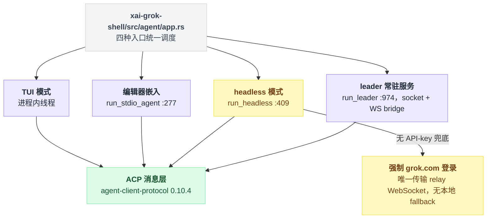
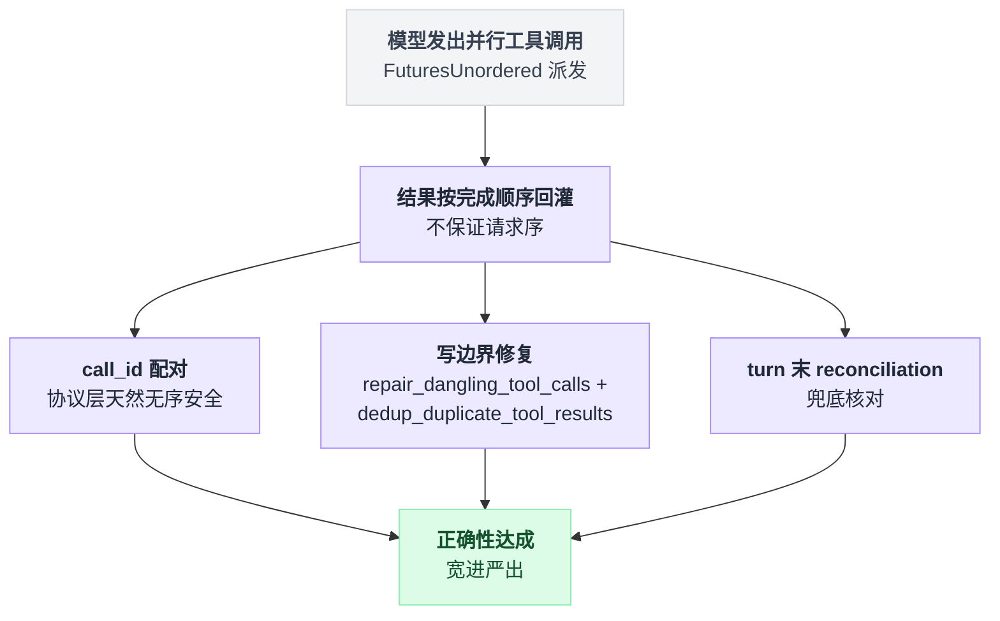
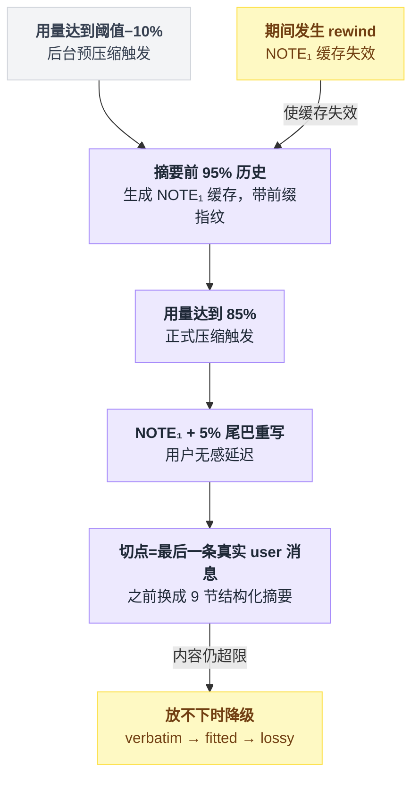
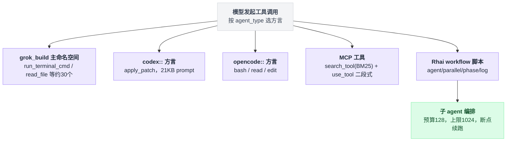
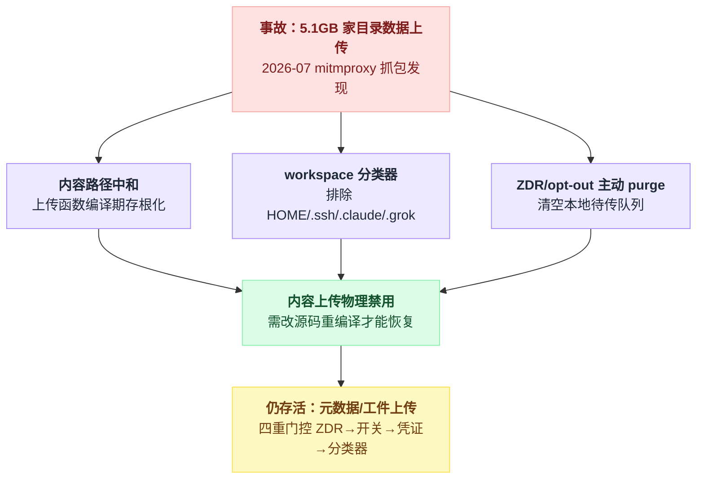

# 17 · 番外：Grok Build 全项目速览——第四个样本

> **一句话导读**：xAI 在一次"把用户家目录传上云"的数据事故后两天内开源了自家 coding agent「Grok Build」——155 万行 Rust、81 个 crate，架构上处处能看到本系列前 16 章讨论过的决策点被第四次回答：状态用 actor 无锁、并行工具用完成序回灌、压缩切在语义锚点、hook 走外部进程、扩展生态整个**寄生在 Claude Code 的文件约定上**。但它同时也是"开源 ≠ 开放"的标本：不收外部 PR、system prompt 在二进制里 XOR 混淆、遥测端点全部构建期注入——源码全给你看，控制权一点不给。
>
> 调研时间：**2026-08-06**。仓库 `xai-org/grok-build`，读的是当日 HEAD（commit `a5589e9`，2026-08-05 从内部 monorepo 同步，`SOURCE_REV = 4d6d1137…`）。调研方式：五路并行读源码 + 对关键结论抽样复核，文中所有 file:line 为当日实测。事故经过部分来自媒体报道，**属第三方来源**，已在文中标注。
>
> **本章定位**：番外，也是 Grok Build 的总入口。第 01–15 章各在章末有「第四个样本：Grok Build」小节承接本章、按各自维度展开，16 章总表已扩入 Grok 列；本章负责全项目的整体视图、事故背景与总判断。三个主样本的既有结论不受影响。

---

## 0. 背景：它为什么开源

先交代这个仓库的来历。它不是花边新闻，它直接解释了后面好几处代码形态。

**时间线**（综合 DevOps.com、The Decoder 报道，第三方来源、未经官方逐条确认）：

| 日期 | 发生了什么 |
|---|---|
| 2026-07 上旬 | 研究员抓包发现超量上传 |
| 2026-07-13 | xAI 关闭上传服务器，没发安全公告 |
| 2026-07-14 | GitHub 上创建 `xai-org/grok-build` 仓库 |
| 2026-07-15 | 正式开源，Apache-2.0 |

第一条值得展开。研究员用 mitmproxy 抓包，看的是 Grok Build 在一个 12GB 测试仓库上执行任务时的出网流量：

| 项 | 数值 |
|---|---|
| 任务实际需要的数据 | 约 192KB |
| 实际向 xAI 的 Google Cloud 上传 | **5.1GB**（73 个数据块） |
| 倍数 | 约为必需量的 27,800 倍 |

在家目录运行的用户报告，SSH 密钥、密码管理器数据库、个人文档和照片被上传；**隐私开关不影响上传行为**。

后面两条也有细节：建仓时间不是转述，是 GitHub API 实测的 `created_at: 2026-07-14T20:04:23Z`。开源当天 Musk 称已上传数据将被 "completely and utterly deleted"，但受影响用户数未披露，也未提供数据已删除的验证途径。

**开源的性质得说清楚：这是源码透明化，不是社区项目。** `CONTRIBUTING.md:3-4` 的原话是 "This repository does **not** accept external pull requests or unsolicited patches."，并且明确不提供 CLA。仓库本身是内部 monorepo 的周期性只读镜像（README.md:31-35），与 Codex 同款模式。截至调研日 24k+ star。

这个背景给读代码带来两个视角：一，代码里能找到**事故整改的直接痕迹**（第 6 节）；二，整个开源姿态是"你可以审计我，但别想改我"——这条张力贯穿全篇。

---

## 1. 规模与架构：TUI 比引擎还大

### 1.1 规模盘点

| 指标 | 数值 | 口径 |
|---|---|---|
| workspace member | 81 个 crate | 根 Cargo.toml members 数组 |
| .rs 总行数 | 1,547,925 行（2,513 个文件） | 含测试（仅 tests/ 目录就有 14.6 万行） |
| 最大 crate | `xai-grok-pager`（TUI）48.6 万行 | **TUI 比 agent core（xai-grok-shell，37.6 万行）还大** |
| 最大单文件 | `xai-grok-shell/src/agent/config.rs` 12,717 行 | — |

这里有个命名陷阱，第一眼很容易读错：`crates/codegen/` 下的 64 个 crate **全是手写代码**，占仓库 95% 行数。目录名为什么叫 codegen，仓内没有任何解释，推测是 monorepo 路径残留。真正入库的生成物只有 14 行的加密 prompt 文件（见第 4 节）。

横向对照一下体量：Pi 11 个 npm 包、Codex 130 个 crate、Grok Build 81 个 crate——规模上是 Codex 的直接同类。

### 1.2 分层：介于 Pi 和 Codex 之间的第三种形态

第 01 章讲过 Codex 的铁律：TUI 对 core 的引用数为 0，只认协议。Grok Build 不一样：

```
   Pi                Grok Build                    Codex
 TUI 直接调用      TUI 直接链接 core，但          TUI 零 core 依赖，
 Agent 对象        通信走进程内 ACP channel       只依赖协议 crate
    │                    │                            │
 无协议边界        协议形状的边界 + 直接链接        编译期可验证的边界
```

证据是这样几条。TUI 那侧直接依赖 `xai-grok-shell`，但 agent 跑在同进程的独立线程上，两边经 `xai-acp-lib` 的内存 channel 收发 ACP 消息，源码注释自陈 "Simplified to only support GrokShell (in-process) mode. Subprocess and remote modes can be added later"。协议本体不是自研，**外采 Zed 的 `agent-client-protocol` 0.10.4**，并且内外统一：进程内 TUI、`grok agent stdio` 的 IDE 嵌入、headless 全走同一套 ACP 消息。

对应 `xai-grok-pager/Cargo.toml:99`（依赖 shell）、`pager/src/acp/spawn.rs:1-4`（那句注释）、根 `Cargo.toml:97`（ACP 版本）。

ACP 在这里已经从"编辑器协议"膨胀成整个产品的内部 RPC 面——`xai-grok-shell/src/extensions/` 下有 150+ 个 `x.ai/*` 扩展方法。

**一个引擎，四种形态**，入口全部在 `xai-grok-shell/src/agent/app.rs`：

| 形态 | 入口 | 说明 |
|---|---|---|
| TUI | 进程内线程 | 默认交互模式 |
| 编辑器嵌入 | `run_stdio_agent`（:277） | IDE 那侧接 stdio |
| headless | `run_headless`（:409） | CI 场景 |
| 常驻 leader 服务 | `run_leader`（:974） | socket + WebSocket bridge 多客户端接入 |

四条里有一条反直觉，值得单独停一下：**headless 强制要求 grok.com 登录会话，唯一传输是 relay WebSocket，没有本地 fallback**，API-key 用户被直接指去 stdio 模式（app.rs:421-424）。也就是说，最像"跑在无人服务器上"的 CI 场景，反而是四种形态里绑云最深的那个。

四种形态怎么从同一个入口分岔、又怎么收敛回同一套协议，画出来更直观：



还有一处姿态：入口二进制启用了 obfstr/cryptify 做**编译期字符串 + 控制流混淆**，Cargo.toml 里那段依赖的分组注释就写着 "Binary hardening"（xai-grok-pager-bin/Cargo.toml:66-68）。开源项目给自己的发行二进制上混淆，全系列仅此一家。

---

## 2. 逐维度速览：Grok Build 在三家坐标系里的位置

先给全景表，后面几节展开最有信息量的维度。

| 维度（对应章） | Grok Build 的答案 | 最接近谁 |
|---|---|---|
| 循环形状 [02] | 三层嵌套手写 loop + `tokio::select!` 命令 actor | Codex |
| 状态同步 [14] | **actor + mpsc channel，无锁**；读者拿深拷贝 | 谁都不像（第四种） |
| 并行工具回灌 [05/14] | **FuturesUnordered 完成序** + call_id 配对 + 写边界修复 | 与 Codex 相反 |
| 上下文策略 [03] | system prompt 仅 4.6KB，重量下放 user 前缀和工具描述 | Pi（更极端） |
| 项目约定文件 [03] | **没有 GROK.md**，原生认 CLAUDE.md/AGENTS.md/.cursor | 寄生策略（独有） |
| 压缩 [04] | 客户端 full-replace，切点=最后一条真实 user 消息 + prefire 预压缩 | 第四种切点哲学 |
| 记忆 [09] | markdown + SQLite 混合检索 + "dream" 睡眠整理，默认关 | Codex（但遗忘机制不同） |
| 持久化与分支 [10] | 双 JSONL（可替换投影 + 只追加事件日志），fork=目录复制 | Pi 与 Codex 的混合 |
| 钩子 [06] | 外部进程 + HTTP webhook，**配置格式兼容 Claude Code hooks.json** | Codex 同族 |
| 插件/skills [07] | git 仓库市场、无签名；skills 是 Claude Code 格式超集 | 寄生策略 |
| MCP [08] | rmcp 官方 SDK，stdio/HTTP/SSE + OAuth；自身不当 MCP server | Codex |
| 子 agent [13] | `task` 工具 + ACP 子会话，默认后台，worktree 隔离，深度 1 | Codex |
| Code Mode [05] | 没有；位置被 **Rhai 脚本编排子 agent** 占了 | 独有 |
| 模型抽象 [12] | fork async-openai，单 client 三协议方言（含 Anthropic /v1/messages） | 谁都不像 |
| 沙箱 [11] | Landlock/Seatbelt 两套（Windows 无内核沙箱）+ 规则引擎审批 | Codex（少一套） |
| 遥测 [15] | 默认关 + 端点构建期注入，但 remote settings 可远程打开 | 与 Codex 互为镜像 |

---

## 3. 循环与状态：第四种状态架构

第 14 章的根问题是"允不允许两处代码同时改状态"。Grok Build 的答案仍然是"不允许"，但实现路径和 Pi（单线程 throw）、Codex（Mutex）都不同：**把状态关进一个 actor，用消息队列天然串行化**。

```
  SessionActor (tokio::select! 命令循环)          ChatStateActor（独立 task）
  ┌──────────────────────────────┐   mpsc 命令   ┌────────────────────────────┐
  │ prompt 队列 / 运行任务槽(单个) │ ────────────► │ state: ChatState           │
  │ 插话 buffer / 定时器          │               │   conversation: Vec<Item>  │
  └──────────────────────────────┘   mpsc 事件   │ persistence: Box<dyn ..>   │
                                   ◄──────────── │ ── 独占所有权，&mut self ── │
                                                 │    "no locks needed"       │
                                                 └─────────────┬──────────────┘
                                                               │ write-behind
                                                               ▼
                        ~/.grok/sessions/<cwd>/<sid>/
                        ├── chat_history.jsonl   ← 可整体替换的模型侧投影
                        └── updates.jsonl        ← 只追加的 UI 事件日志
                            （rewind 不删日志，追加 RewindMarker）
```

**无锁在这里是写进注释的设计宣言。** `xai-chat-state/src/lib.rs:12` 的 ASCII 架构图里直接标着 "State (no locks needed)"，persistence trait 用 `&mut self`，注释明言 "no locks, no atomics, no shared state"。

代价落在读者视图上：`GetConversation` 是**全量深拷贝**，代码里还打了一行 "cloning full conversation" 的 debug log 自认成本（actor/mod.rs:305-311）。它没有 Codex 的 Arc COW，比 Pi 的 `.slice()` 浅拷贝更贵，上界靠对话 pruning 压着。

**并行工具的回灌顺序，和 Codex 恰好相反。** Grok 用 `FuturesUnordered`（tool_calls.rs:611），结果**按完成顺序**进历史，不保证请求序。正确性不靠序，靠三件套：call_id 配对（协议层天然无序安全）、写边界修复不变量（`repair_dangling_tool_calls` + `dedup_duplicate_tool_results`，只在三个写边界跑）、turn 末 reconciliation。

第 14 章说 Codex 的 `FuturesOrdered` 是"正确性藏在类型名里"。Grok 直接放弃了顺序保证，把不变量做成显式修复函数。**两种哲学：一个防患于未然，一个宽进严出。**

"宽进严出"具体靠哪几层兜底，拆开看：



**竞态防护的粒度细到文件路径级。** 同一批并行调用里怎么裁决，写成伪代码是这样：

```
for 调用 in 本批并行工具调用:
    if 调用是只读操作:
        直接并发跑
    else:
        锁 = per_path_mutex[调用的 file_path 参数]   // 同一路径共用一把
        排队等锁 → 按模型发出的顺序依次执行
```

也就是只有"非只读 + 撞同一个 `file_path`"这一种组合会被串行化，其余全并发。用的是 `tokio::sync::Mutex`，实现在 tool_dispatch.rs:50-59。

**插话是双范式并存。** 默认走 Pi 式排队，`InterjectionBuffer` 的注释写着 "An interjection never cancels the turn"，而且它在同 turn 的循环边界就把队列排干，比 Pi 更激进；另外还留了 `send_now` 这条 Codex 式 cancel-and-send 硬中断。第 02 章那场"排队 vs 打断"之争，Grok 的答案是"都要，让队列策略函数裁决"。对应 interjection.rs:332 与 commands.rs:233。

**崩溃语义处在中间档。** 内存里的 actor 是运行时真相，落盘默认是 Buffered、不 fsync（`AppendDurability`，jsonl/mod.rs:22-25）——比 Pi 的同步 append 弱、比纯内存强。

JSONL 还带 torn-tail 自愈：append 前先查最后一个字节，不是 `\n` 就先把那行残行封死。这段代码的注释里写着，这个 bug 曾经 "bricked session resume"（storage/jsonl/mod.rs:257-330）。

**防模型傻转圈是显式机制，不是靠 prompt 求它别转。** 逻辑很短：

```
签名 = (tool, args)
if 连续相同签名 == 8 次:    注入 nudge          // 提醒它换个做法
if 连续相同签名 == 16 次:   硬停
if `run true` 式空转 == 4 次: 直接停
```

硬停返回的是专用的 `TurnOutcome::StationarityEnded`，注释里明确说要"与 Completed 区分，防止恢复逻辑重开循环"。8 和 16 这两个常量之间还挂了编译期断言。四家里，只有它把"模型转圈"当成一等失败模式处理。出处：turn.rs:2724-2728。

**时间旅行有三套机制并存**，各管各的场景：

| 机制 | 做法 | 与另两家的差别 |
|---|---|---|
| 会话内 rewind | 每个 prompt 都是 checkpoint，含文件快照回滚 | — |
| fork | **目录复制**型分支 | 非 Pi 的消息树，也非 Codex 的字节区间引用 |
| 跨压缩 rewind | 重放 `updates.jsonl` 事件日志重建 | 只有这种场景才动用 Pi 式重放 |

平时走投影快路径，只在跨压缩时才付重放的代价。

---

## 4. 上下文、压缩与记忆：最小 prompt 和"做梦"

**System prompt 只有 4.6KB**——templates/prompt.md，实测 4,638 字节、45 行。比 Pi 的 2.3KB 大一倍，比 Codex 的 11–21KB 小一个量级。

省下来的重量去哪了？环境信息（git 状态、项目布局）全部下放到**首条 user 消息前缀**，用户请求包在 `<user_query>` 标签里；工具列表也不进 system prompt。

per-model 的分化只有两档：换个身份名（`system_prompt_label`，五级解析，默认 "Grok"），或者整个换成 **concise 两句话版**——切换模型时就地改写会话里的 System item（model_switch.rs:83-95）。

**但这个 prompt 在二进制里是 XOR 混淆的。** 明文模板就摆在仓库里，运行时用的却是 `prompt_encrypted.rs` 的加密字节，文件头注释写着 "XOR-encrypted prompt templates (key = position-dependent seed)"，解密到 `Zeroizing<String>`、用完清零。防的是对发行二进制 `strings` 提取，不防读源码。一个开源仓库加密自己已经公开的 prompt，姿态耐人寻味。

**没有 GROK.md。** 项目约定文件的识别名单是 `Agents.md / Claude.md / CLAUDE.md / CLAUDE.local.md / AGENT.md / AGENTS.md`，外加 `.claude/CLAUDE.md`——**自家品牌反而没有专属文件名**（compat.rs:401-415）。rules 目录认 `.grok/rules` + `.claude/rules` + `.cursor/rules`。

注入方式是全文 verbatim、无截断；而且压缩之后 AGENTS.md 是**原文重注入**，不依赖摘要模型转述（assemble.rs:73-79）。

**压缩是第四种切点哲学。** 第 04 章记录了三家：Pi 白名单切点向新挪、LangChain 向旧回溯、Codex 服务端。Grok Build 走客户端 full-replace，切点钉死在语义锚点上：

```
切点 = 最后一条真实 user 消息
切点之后的消息:  原样保留
切点之前的全部:  换成 9 节结构化摘要
if 还是放不下:   verbatim → fitted → lossy 逐级降级
```

切点那一步实现在 compaction_utils.rs:581-582。

这套里有两个亮点，外加一条边角料。

**prefire 两段式预压缩**：用量到阈值−10% 就在后台把前 95% 历史先摘要成 NOTE₁ 缓存（带前缀指纹，rewind 即失效），真到 85% 触发时只需"NOTE₁ + 5% 尾巴"重写——把用户可感知的压缩延迟藏进后台（two_pass.rs:1-13）。四家里唯一对压缩延迟做工程优化的。

摘要 prompt 里还有一段独有的防御，防的是摘要模型自己跑去读压缩残档：

> "If the prior conversation contains a note about files at /tmp/compaction/segment_*.md … those files are an out-of-band memory channel for a FUTURE work agent, not for you."

边角料：压缩摘要 prompt 模板里出现了 `grok-4.20` 这个未发布的型号名，位置是 chat 侧专用压缩模型配置（intra_compaction/config.rs:208）。

prefire 预压缩和正式压缩的两段式衔接，画出来是这样：



**记忆这块叫 "dream"，默认关**，由 `--experimental-memory` 门控。布局和 Claude Code 的 auto-memory 神似——连 `MEMORY.md` 的文件名都一样，按 workspace 用 blake3(cwd) 分目录。

写入有三条路：

| 触发点 | 做法 | 成本 |
|---|---|---|
| 会话结束 | 元数据摘要 | 零成本，不调 LLM |
| 压缩前 | LLM flush turn | 写入前做 embedding 余弦去重，阈值 0.92 |
| 睡眠整理 | 把会话日志合并进 MEMORY.md | 见下 |

第三条的触发条件是有门槛的：

```
if 距上次整理 >= 4 小时 and 新增会话日志 >= 3 个:
    把这些日志合并进 MEMORY.md
    没东西可记 → 回 NO_REPLY
```

DREAM_SYSTEM_PROMPT 里两条原话值得抄下来："Resolve contradictions — if a recent session disproves an older fact, keep only the current truth"、"Convert relative dates to absolute dates"。

**遗忘不用 Codex 的引用计数**，用的是"整理即遗忘"的组合拳：dream 消化后删源日志 + 30 天 GC + 检索时间衰减 + 写入去重。

读取是双路：首轮自动以用户 query 做 FTS5 + 向量混合检索，注入 top-6；同时提供 `memory_search`/`memory_get` 工具让模型主动查——正好是第 09 章"分层召回"的完整实现。

---

## 5. 工具与扩展：寄生在 Claude Code 生态上

**工具系统最坦率的一点写在 README 里**（:135-139）：tool 实现是从 **openai/codex 和 sst/opencode 移植**的，原词叫 "in-tree source ports"。

不止移植——它内置了**三套方言工具集**，换个 agent_type 就能让模型说 Codex 方言或 OpenCode 方言：

| 命名空间 | 内容 | 备注 |
|---|---|---|
| `grok_build`（主） | run_terminal_cmd / read_file / search_replace 等约 30 个 | — |
| `codex::` | apply_patch 等 | 配 21KB 的 apply_patch prompt，加密常量名就叫 `CODEX_PROMPT_ENC` |
| `opencode::` | bash / read / edit 等 | — |

另有一套实验性的 hashline 工具集：用 `行号:hash→内容` 做锚点编辑，锚点过期就返回新锚点让模型重试，批量原子生效。

MCP 工具走 **`search_tool`（BM25 检索）+ `use_tool`（转发）二段式**延迟加载——与 Claude Code 的 ToolSearch 同构。

**没有 Code Mode，它的位置被 Rhai workflow 占了。** 模型可以提交 Rhai 脚本，但 host 函数只有 `agent()` / `parallel()` / `phase()` / `log()` 四个——脚本编排的是**子 agent**，不是工具（预算默认 128 个 agent、上限 1024，支持断点续跑）。

对照 Codex 的 Code Mode（模型写 TS 直接调工具、省 round trip），Grok 押的是"可编程的多智能体编排"，工具调用仍然由每个子 agent 用传统方式发出。

三套方言工具集、MCP 延迟加载、Rhai 子 agent 编排，都挂在同一次工具调用入口上：



**钩子是外部进程范式**，在第 06 章的三分法里与 Codex 同族。两种 handler：Command（JSON 进 stdin，exit code 2 = deny）和 HTTP webhook；15 个事件变体（其中 14 个是规范事件）；失败一律 fail-open。

能力天花板也和 Codex 一档：

| 钩子点 | 能做什么 | 不能做什么 |
|---|---|---|
| `PreToolUse` | allow / deny | **不能改写 tool input** |
| `UserPromptSubmit` | — | 连注入上下文都不行 |
| 模型调用 | — | 没有任何包裹点 |
| `Stop` | `decision:"block"` + reason 可强迫模型继续干活 | — |

第 06 章"只有洋葱范式能重试/替换模型调用"的结论，在这里第四次成立。四个钩子点里最强的是 `Stop` 门，语义与 Claude Code 的 stop-hook 同款。

**兼容矩阵是战略级的。** hooks.json 结构、事件名（连 Cursor 风格的 `beforeShellExecution` 别名都收）、`.claude/skills/`、`.cursor/skills/`、`~/.claude/agents/`、`.claude-plugin/plugin.json`、`.mcp.json`、仓库级 CLAUDE.md 全家桶——全部原生识别，pager 里还有个 `/import-claude` 命令扫 `~/.claude.json` 一键搬家。skills frontmatter 是 Claude Code 的超集，多了 `when-to-use` / `compatibility` 等字段。

第 07 章讲过生态分发的冷启动难题。Grok Build 的答案是**不冷启动，直接寄生**：Claude Code 用户的所有配置资产零成本迁移。

插件市场就是 git 仓库（官方源 `xai-org/plugin-marketplace`），**无签名无审核**，唯一的供应链加固是默认关闭的 commit-sha 钉扎。执行面的信任靠目录级授信兜底：项目级插件默认只列元数据，hooks/MCP/脚本被阻止，直到你给它授信。

**子 agent** 走 `task` 工具 + ACP 子会话。内置 general-purpose / explore / plan 三型，用户自定义 agent 是 `.md` + frontmatter（也认 `~/.claude/agents/`），嵌套深度默认 1，`isolation: worktree` 可选。有一处和另外三家都不同：**默认后台运行**（`run_in_background` 默认 true）。

上下文引导有三种模式：

| 模式 | 子 agent 拿到什么 |
|---|---|
| 全新会话（默认） | 干净起步 |
| Forked | 父会话史规范化成一条 `<background_context>`，最多 3 个完整 turn 逐字，更早的只留统计 |
| Resumed | 继承已完成 peer 的 transcript |

**agent 之间不能互发消息**——父模型对运行中的子 agent 只有 poll / wait / kill 三个动作。

---

## 6. 沙箱与数据边界：事故在代码里留下的疤

### 6.1 沙箱：两套内核沙箱 + 细到病态的审批分类器

隔离用的是第三方 crate `nono`，即 Linux Landlock + macOS Seatbelt 两套（`xai-grok-sandbox/src/lib.rs:14-17`）。**Windows 没有内核沙箱**，feature 直接门控在 `unix` 上——对照 Codex 的三套，少的正是 Windows 那套。

网络这块是分层的：进程级网络开放（agent 自己要调 LLM API），子进程网络仅在 Linux 上经 seccomp 封锁。五个内置 profile，默认的 `workspace` 是全盘可读、workspace 可写、不限网。

审批层约 2.6 万行（`xai-grok-workspace/src/permission/`）。bash 命令的判定逻辑写成伪代码是这样：

```
把命令按分号 / 管道拆成若干段
for 段 in 各段:
    if 这一段解析不出来:            转人工审批      // fail-closed，不是放行
    if 命中写 dotfile / ssh 的模式:  拦
    if 环境注入前缀是 DYLD_ / GIT_CONFIG: 拦
全部段都通过 → 这条命令才算通过
```

auto 模式的分类器细到什么程度？`cat x >> ~/.bashrc`、`git diff --output=~/.bashrc`、`go build -o ~/.bashrc` 这类花式写 dotfile/ssh 的组合都能拦下来，而且有测试锁定（auto_mode/mod.rs:2077-2137）。

最有意思的防提权是 **hook 源文件的内核级 write-deny**：

```
沙箱启动前:
    对每个 Grok 全局 hook 文件:
        加内核级只读保护
        复核 symlink / hardlink / dev+ino 身份
        if 发现它可以被重定向:
            拒绝启动沙箱          // fail-closed
```

这和 Codex 用 WritableRoot 防 `.git/hooks` 是同题异构，而且更硬——Codex 那套是不让你写，这套是"只要看着可疑，整个沙箱就不启动"。实现在 hook_write_deny.rs:36-47。

### 6.2 数据边界：残留代码找到了，禁用方式是"掏空函数体"

媒体说"上传功能残留代码仍存在但已禁用"。实测下来，残留形态比报道更具体——**内容上传函数全部被编译期存根化**，不是注释掉、不是 flag、不是服务端开关：

```rust
// upload/trace.rs:948-959 —— 上传对话消息:函数还在,只剩 skip
upload_turn_messages(...) → skip_artifact(..., "turn_messages.json",
                                          "chat_content_upload_disabled")
// upload/trace.rs:990-993 —— 打包聊天历史:无论传入多少消息,产出空文件
let jsonl = { let _ = messages; Vec::new() };
// upload/trace.rs:439-445 —— 上传完整 prompt 文本:同样只剩 skip
skip_artifact(..., "full_prompt.txt", "prompt_content_upload_disabled")
```

要恢复这些路径，必须改源码重新编译。在"禁用可信度"的光谱上，这比一个配置开关硬得多。

整改三件套齐全：

1. **内容路径中和**（上面那段代码）；仓库变更序列化模块整个被掏空，只剩类型 re-export。
2. **新增 workspace 分类器**（`xai-file-utils/src/workspace_classifier.rs`）：`$HOME` 本身、`~/Library`、Desktop/Downloads/Documents、`.ssh`/`.claude`/`.grok` 目录明确排除出上传范围，只有 git 仓库或"项目目录"才可归类上传——直接对应"把家目录整个传了"的事故。
3. **ZDR/opt-out 时主动 purge 本地待传队列**（auth/model.rs:184-189）。

三件整改怎么对应到事故本身，画成一张图：



**仍然活着的**是元数据/工件上传（trace upload），门控有四重：ZDR → feature 开关 → 凭证 → 目录分类器。它传的东西包括 `metadata.json`（含 `repo_root` 路径和 strip 掉凭证的 `remote_url`）、工具定义、权限决策、用户 prompt 里的图片等。

### 6.3 遥测：与 Codex 互为镜像的两种治理

对照第 15 章的 Codex 六套机制，Grok Build 的形态几乎处处相反：

| | Codex | Grok Build |
|---|---|---|
| 默认 | metrics **默认开**，无需登录 | 全部**默认关**（`TelemetryMode::Disabled`） |
| 端点 | **硬编码在源码**（ab.chatgpt.com + client key） | **构建期 `option_env!` 注入**，OSS 仓库里查不到实际端点（`internal_defaults()` 全 None）；明文的只有 Mixpanel host 和默认 proxy `cli-chat-proxy.grok.com` |
| 仓库信息外泄面 | 模型请求 header 带 cwd 绝对路径 + remote URL，**关不掉** | header 只带 id 类字段;仓库路径/remote URL 在 GCS trace metadata 里，**默认关** |
| 设备标识 | `x-codex-installation-id`（随机持久 UUID） | `x-grok-agent-id` = **硬件派生设备指纹**（macOS 硬件序列号 / Linux machine-id 派生 UUIDv5） |
| 文档披露 | 仓库内 0 命中 | 用户指南专章披露配置项、env、ZDR（docs/user-guide/05, 24） |
| 治理暗门 | 用户配置可覆盖企业设置 | **`remote_settings` 可服务端远程打开遥测和 trace 上传**（config.rs:2340-2367），用户本地不改配置也会被打开（仍受 ZDR/凭证门） |

两边各有一个"最该被挑战的点"。Codex 是"默认开 + 零披露"；Grok 是"默认关，但服务端握着远程开关"——一家刚出过数据事故的公司，在代码里保留的是 remote kill-switch 的**反向开关**。这个设计值得每个企业买家在采购评审里问一句。

出站脱敏倒是做成了正面样本：集中在 `xai-grok-secrets` 库里，Sentry/Mixpanel 发送前统一调 `redact_secrets`。第 15 章说"脱敏标准必须集中而不是散装"，这里就是标准答案。

---

## 7. 三条总判断

### 1. 生态策略：不建生态，寄生生态

CLAUDE.md、.claude/skills、~/.claude/agents、hooks.json、.mcp.json、.claude-plugin——Claude Code 用户的全部配置资产在 Grok Build 里开箱即用，还有 `/import-claude` 一键搬家；工具实现直接移植 codex/opencode 并保留方言工具集。

第 07 章的分发冷启动难题，它的答案是把竞品的文件约定当成事实标准来实现。这是后发者的理性策略，也意味着 **Claude Code 的配置格式正在成为 coding agent 领域的 POSIX**——四个样本里已有两个（Grok 全面兼容、Codex 部分概念同构）向它收敛。

### 2. "开源"和"开放"是两件事，这个仓库是最好的教材

透明度那边是真的：源码 100% 可读可自建、内容上传被编译期物理禁用、遥测默认关。

保留那边同样是真的：不收 PR、prompt XOR 混淆、发行二进制加控制流混淆、遥测端点构建期注入（你自己 build 的版本发不出遥测，也**验证不了官方二进制发了什么**）、headless 模式强制绑 grok.com、服务端 remote settings 可远程改行为。

它开源的是"审计权"，保留的是全部"控制权"。评估任何"开源 agent"时，这份清单可以直接当 checklist。

### 3. 事故是最好的架构文档

workspace 分类器排除 `$HOME`/`.ssh`、内容上传函数存根化、ZDR purge、出站统一脱敏库、hook 文件内核级 write-deny——这些代码几乎每一行都能对应到事故报道里的一个具体伤口。

第 15 章说"数据边界的审计必须按内容做，而不是按代码模块做"。Grok Build 用 5.1GB 的教训把这句话变成了 `workspace_classifier.rs`。

反过来看 Codex：还没出过事故，所以 `x-codex-turn-metadata` 里的仓库路径至今随每次请求外发，关不掉。**边界设计的成熟度往往不是远见的函数，是事故的函数。**

---

## 8. 未确认与边界说明

- **事故经过全部来自媒体报道**（DevOps.com、The Decoder、SQ Magazine），未经 xAI 官方逐条确认；仓库是整改后快照、无 git 历史，**无法从源码验证历史版本的上传行为范围**。
- `option_env!` 注入的遥测端点/token/DSN 在官方发行二进制里的实际值，仓库内不可知；官方二进制实际外发行为需抓包验证，本次未做。
- `network_policy.rs` 的网站级出网策略是**未接线的类型建模**，当前不生效（源码注释自认）。
- lsp 工具是否存在降级到 codebase-graph 的远端配置路径、子 agent 并发数硬上限、SSE 配置是否独立传输，三处未逐行确认。
- 五路调查覆盖了主要 crate，但 81 个 member 未逐一排查（如 xai-grok-announcements、xai-gix-status 等外围 crate 未读）。
- 报道称代码规模 "north of a million lines"、另一报道称 844,530 行——与实测 1,547,925 行（含测试）均有出入，口径差异未考证。

**参考来源**（事故报道，第三方）：
[DevOps.com](https://devops.com/xai-open-sources-grok-build-coding-agent-after-cloud-upload-exposes-ssh-keys-repos/) ·
[The Decoder](https://the-decoder.com/xai-open-sources-grok-build-on-github-after-massive-data-breach/) ·
[SQ Magazine](https://sqmagazine.co.uk/xai-open-sources-grok-build/)
