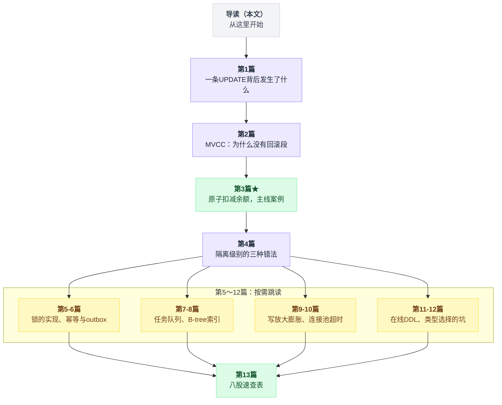
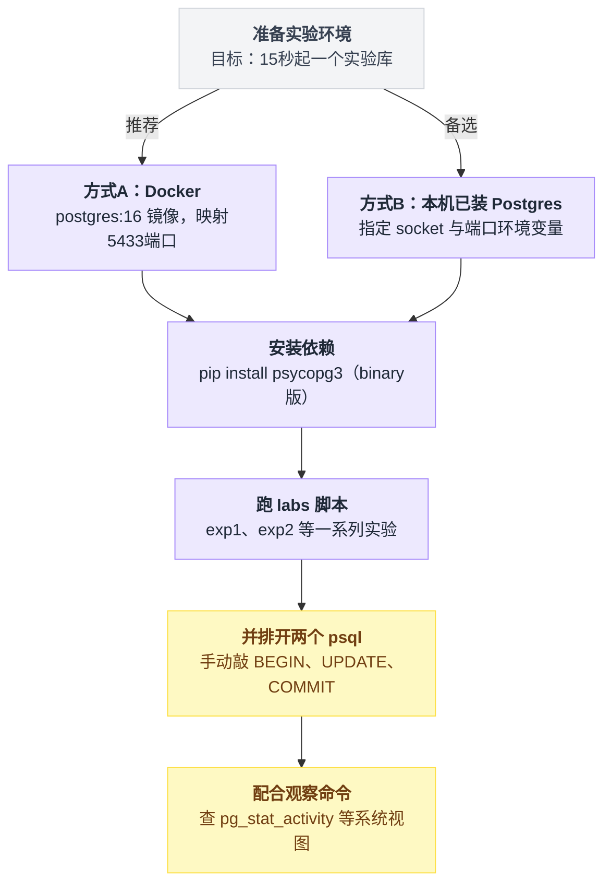

# 从真实项目学 PostgreSQL：导读

这套文档不是"PostgreSQL 官方手册的中文缩写版"。

它的写法是：

> **先看 GitHub 上正在生产环境跑的高星项目怎么写 SQL → 追问"凭什么这么写就是对的" → 一路挖到 Postgres 的实现机制 → 最后在本地跑实验，把"不这么写会怎样"用实测数据打出来。**

所有实验都在 **PostgreSQL 16.13** 上真实跑过。文中出现的每一个数字——耗时、余额、表大小、执行计划——都是实测输出，不是编的。脚本全部放在 `labs/` 目录，你可以自己复现。

---

## 一、被拆解的项目

| 项目 | Star | 语言 / 栈 | 最近活跃 | 本文用它讲什么 |
|---|---|---|---|---|
| [Wei-Shaw/sub2api](https://github.com/Wei-Shaw/sub2api) | 34.4k | Go 1.25 + Gin + Ent + **PostgreSQL 15+** + Redis | 2026-08-04（当天还在合 PR） | 主线案例。余额原子扣减、幂等计费、outbox、239 个迁移脚本的写法 |
| [riverqueue/river](https://github.com/riverqueue/river) | 5.2k | Go + **纯 Postgres 做任务队列** | 2026-08-03 | `FOR UPDATE SKIP LOCKED` 的教科书实现 |
| [pgvector/pgvector](https://github.com/pgvector/pgvector) | 22.4k | C 扩展 | 活跃 | 索引扩展机制（选读） |

`sub2api` 是这套文档的主角，理由很实在：

- 它是**一个真的在收钱的系统**——AI API 网关，按 token 计费，用户有余额。钱算错就是事故，所以它的并发控制是被真实流量捶打过的。
- 它的 `backend/migrations/` 里有 **239 个 SQL 迁移文件**，能看到一个系统的 schema 是怎么长大的，以及在线 DDL 该怎么写。
- 代码里的注释是中文的，作者把"为什么这么写"直接写在了 SQL 旁边，非常适合拿来当教材。

先感受一下它扣钱的那行 SQL（`backend/internal/repository/usage_billing_repo.go`）：

```sql
UPDATE users
SET balance = balance - $1,
    updated_at = NOW()
WHERE id = $2 AND deleted_at IS NULL AND balance >= $1
RETURNING balance
```

一行 SQL，没有 `SELECT`，没有 `FOR UPDATE`，没有显式事务，没有分布式锁，没有 Redis。

**这行 SQL 在几千 QPS 的并发下不会算错钱。**

为什么？这就是第 3 篇要回答的问题，也是整套文档的主线。

---

## 二、阅读顺序

| 篇 | 主题 | 说明 |
|---|---|---|
| 第 1 篇 | 一条 UPDATE 背后发生了什么 | 建立物理直觉 |
| 第 2 篇 | MVCC：Postgres 为什么没有回滚段 | 全套文档的地基，务必吃透 |
| 第 3 篇 ★ | 原子扣减余额 | 主线案例，sub2api 那行 SQL 的完整解释 |
| 第 4 篇 | 隔离级别：三种"看起来对但会错"的写法 | |
| 第 5 篇 | 锁：从"Postgres 到底怎么实现锁"开始 | 行锁不在锁表里，这一条解释后面全部现象 |
| 第 6 篇 | 幂等与 outbox：重试不该扣两次钱 | |
| 第 7 篇 | 任务队列：SKIP LOCKED 与租约 | |
| 第 8 篇 | 索引：B-tree 的形状决定你的 WHERE 怎么写 | |
| 第 9 篇 | 写放大与膨胀：VACUUM 是怎么被你拖住的 | |
| 第 10 篇 | 连接、连接池、超时三件套 | |
| 第 11 篇 | 在线 DDL：迁移脚本怎么写才不炸库 | |
| 第 12 篇 | 类型选择：钱、时间、以及不起眼的坑 | |
| 第 13 篇 | 八股速查表 | 面试 / 复习用 |

把这份顺序按"地基"和"按需跳读"分组，路径就更清楚：



前 4 篇是必读的地基，第 5～12 篇可以按需跳读。

每一篇的结构是固定的：

| 小节 | 内容 |
|---|---|
| **场景** | 真实项目里的一段代码 |
| **机制** | Postgres 内部到底怎么做的 |
| **❓ 问答** | 一个具体问题 |
| **❌ 不这么做会怎样** | 附实测数据的翻车现场 |
| **📌 一句话结论** | |

---

## 三、环境准备（15 秒起一个实验库）

从起库到跑通实验，两条路径最终汇合到同一套操作：



### 方式 A：Docker（推荐）

```bash
docker run -d --name pglab -e POSTGRES_PASSWORD=pg -p 5433:5432 postgres:16
export PGHOST=localhost PGPORT=5433 PGUSER=postgres PGPASSWORD=pg PGDATABASE=postgres
psql -c "select version()"
```

### 方式 B：本机已装 Postgres

```bash
export PGHOST=/tmp/pgsock PGPORT=5433 PGUSER=postgres PGDATABASE=postgres
```

### 跑实验

Python 脚本需要 psycopg3：

```bash
pip install "psycopg[binary]"
```

脚本里的连接串写死在开头，改成你自己的：

```python
DSN = "host=/tmp/pgsock port=5433 user=postgres dbname=postgres"
```

然后：

```bash
python3 labs/exp1_lost_update.py      # 丢失更新
python3 labs/exp2_epq.py              # EvalPlanQual（第 3 篇的核心）
psql -f labs/exp3_mvcc.sql            # 看 xmin/xmax/ctid
python3 labs/exp5b.py                 # SKIP LOCKED
python3 labs/exp7_writeskew.py        # 写偏斜
...
```

### 一个强烈建议

开两个 `psql` 窗口并排放着，一边读文档一边手动敲：

```
窗口 A                          窗口 B
BEGIN
UPDATE ...                      BEGIN
                                UPDATE ...   ← 这里卡住不动了
COMMIT
                                             ← A 一提交，B 立刻被放行
```

**并发行为是必须用眼睛看一遍的东西，光读文字记不住。**

配合这几个观察命令：

```sql
-- 谁在等锁，等谁的锁
SELECT pid, state, wait_event_type, wait_event, left(query,60) AS q
FROM pg_stat_activity WHERE state <> 'idle';

-- 阻塞关系（PG 9.6+）
SELECT pid, pg_blocking_pids(pid), left(query,60) FROM pg_stat_activity
WHERE cardinality(pg_blocking_pids(pid)) > 0;

-- 表的死元组和膨胀
SELECT relname, n_live_tup, n_dead_tup, last_autovacuum
FROM pg_stat_user_tables ORDER BY n_dead_tup DESC LIMIT 10;
```

---

## 四、给赶时间的人：整套文档最重要的 6 句话

1. **Postgres 的 UPDATE 不改原地，它写一个新行版本，把旧版本标记为"从事务 X 起不可见"。** 几乎所有奇怪现象（膨胀、VACUUM、count(\*) 慢、索引变大）都是这句话的推论。

2. **`UPDATE t SET c = c - $1 WHERE id = $2 AND c >= $1` 是原子的**，因为读和写在同一条语句里、由同一把行锁保护，Postgres 在锁等待结束后会用 **EvalPlanQual** 拿最新版本重新验一遍 `WHERE`。

   两个并发请求打到同一行，Postgres 内部大致是这样走的：

   ```
   扫到 id = $2 这一行
   if 这行正被别的事务锁着:
       等锁                       // 一直等到对方提交或回滚
       取该行的最新版本            // 不是我进来时看到的那个版本
       重新跑一遍 WHERE 里的条件    // ← 这一步就叫 EvalPlanQual
       if 条件不再成立（余额已经不够了）:
           跳过这行，一分钱都不扣
   扣钱，写新版本
   ```

   关键在"重新验一遍"：条件是拿**最新版本**判的，所以两个人不会同时看到同一个旧余额都觉得够扣。

3. **只要条件写在 WHERE 里，READ COMMITTED 就够用**；条件一旦搬到应用代码里判断，READ COMMITTED 立刻不够用。

4. **数据库约束（唯一索引、CHECK）是唯一可靠的兜底**，应用层的"先查再插"在并发下必然漏。

5. **长事务是 Postgres 的头号杀手**——它不让 VACUUM 回收空间，表和索引会一直膨胀，最后拖垮整个库。

6. **锁的顺序必须全局一致**，否则死锁；DDL 要用 `lock_timeout` 保护，否则一次 `ALTER TABLE` 能让整张表读写全停。

---

**下一篇** → [01 一条 UPDATE 背后发生了什么](./01-一条UPDATE背后发生了什么.md)
