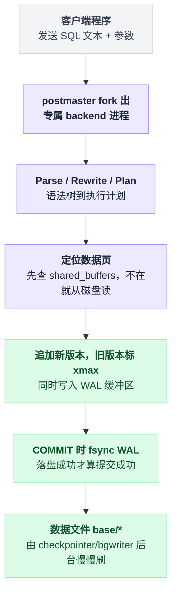
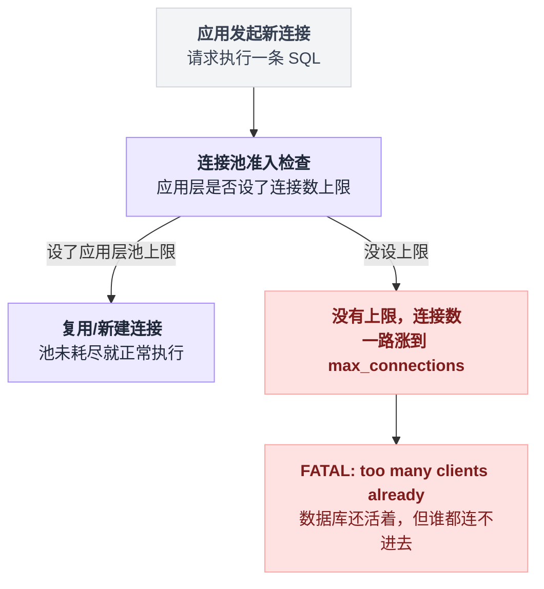
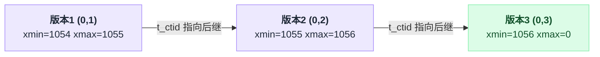
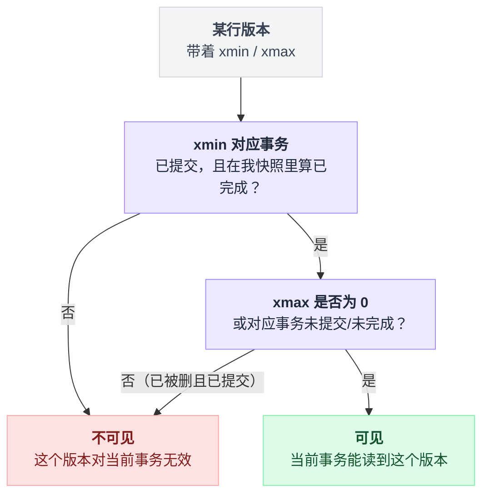
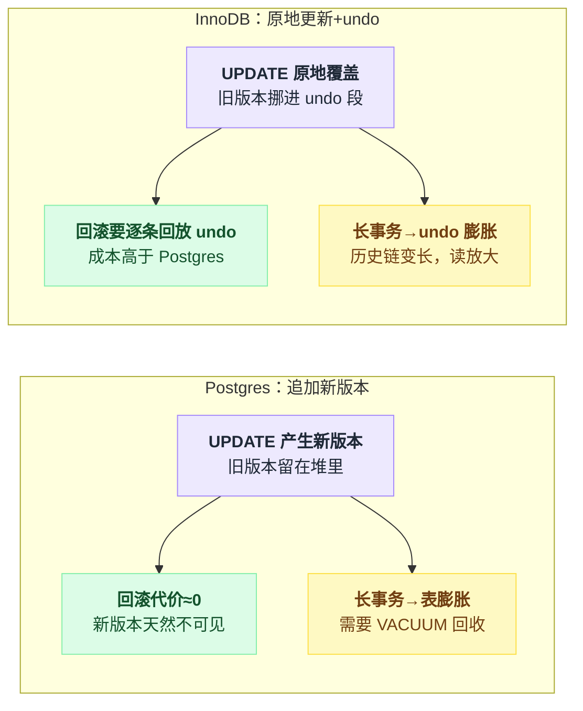
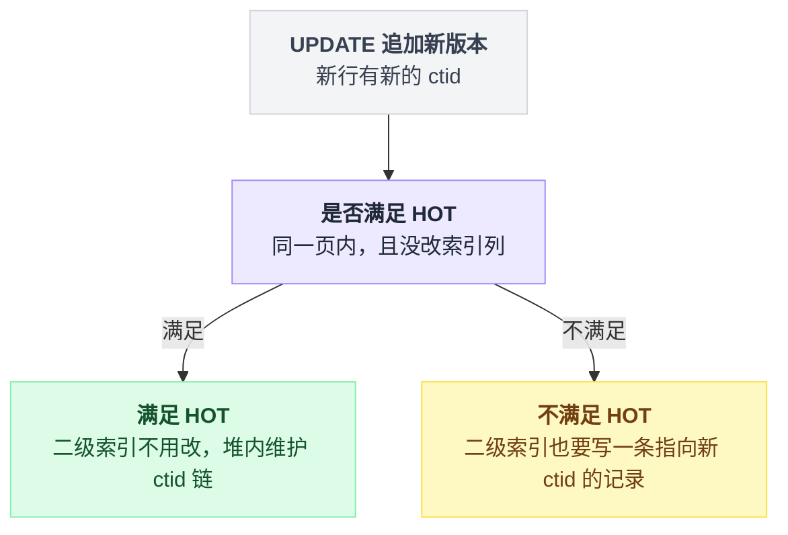

# 第 1 篇 · 一条 UPDATE 背后发生了什么

> 目标：建立"一行 SQL 在磁盘和内存里究竟动了什么"的物理直觉。后面所有的并发、膨胀、性能问题都是从这里推出来的。实测脚本出处收在文末脚注。

---

## 一、从 sub2api 的一次计费说起

用户调了一次 Claude API，网关算出这次花了 0.0032 美元，于是执行下面这条 UPDATE[^1]：

```sql
UPDATE users
SET balance = balance - $1, updated_at = NOW()
WHERE id = $2 AND deleted_at IS NULL AND balance >= $1
RETURNING balance
```

这条语句从你的 Go 程序发出，到 `RETURNING` 的结果回来，中间经过了 8 个阶段。

---

## 二、8 个阶段

一句话地图：发 SQL → fork 出专属进程 → Parse / Rewrite / Plan → **在数据页上追加新版本、顺手写 WAL** → COMMIT 时 fsync WAL → 返回结果，数据文件另有人在后台慢慢刷。

八步里只有第 ⑥⑦ 步值得停下来看，其余都是模板。

```
你的程序
   │  ① 通过连接发送 SQL 文本 + 参数（简单查询协议 / 扩展查询协议）
   ▼
[postmaster] ──fork──> [你的专属 backend 进程]
   │  ② Parse    : SQL 文本 → 语法树
   │  ③ Rewrite  : 展开视图、规则
   │  ④ Plan     : 优化器基于 pg_statistic 里的统计信息挑执行计划
   │  ⑤ Execute  ↓
   ▼
[shared_buffers 共享内存]
   │  ⑥ 从 buffer 里找到目标数据页；不在就从磁盘读进来
   │  ⑦ 在页上"追加一个新的行版本"，旧版本打上 xmax 标记
   │     同时把这次改动写进 WAL 缓冲区
   ▼
[WAL] ──COMMIT 时 fsync 落盘──> pg_wal/*
   │  ⑧ WAL 落盘成功 → 事务算提交成功 → 结果返回给你
   ▼
[数据文件 base/*] ← 由 checkpointer / bgwriter 慢慢在后台刷，跟你的 COMMIT 不同步
```

这 8 步里第 ⑥⑦ 步是全文的关键——不是原地改，而是追加新版本、标记旧版本、同时写 WAL，压成一张图看：



有 4 件事值得单独拎出来说，因为它们直接决定了后面所有章节的内容。

---

## 三、关键点 1：一个连接 = 一个操作系统进程

MySQL 是"一个连接一个线程"，Postgres 是 **"一个连接一个进程"**（fork 出来的 backend）。

实测结果如下[^2]：

```
  max_connections = 100
  开 50 个连接后 pg_stat_activity 行数: 56  (基线 6)
  后端进程数: 51
```

进程比线程贵得多。每个 backend 有自己的私有内存（`work_mem`、catalog cache、plan cache），大概几 MB 起步；进程切换成本也更高。

于是有两条直接后果。

第一，**Postgres 的连接数上限比你想象的低。** 一般经验值是 `CPU 核数 × 2 ~ 4`，而不是几千。

第二，**必须用连接池**（应用层的 `SetMaxOpenConns`，或者 PgBouncer）。sub2api 就老老实实做了这件事[^3]：

```go
db.SetMaxOpenConns(settings.MaxOpenConns)
db.SetMaxIdleConns(settings.MaxIdleConns)
db.SetConnMaxLifetime(settings.ConnMaxLifetime)
db.SetConnMaxIdleTime(settings.ConnMaxIdleTime)
```

### ❓ 问题：不限制连接数会怎样？

**✅ 做法**：应用侧连接池上限 × 应用实例数 < `max_connections` × 0.8，留出运维口子。

**❌ 不这么做会怎样**（实测）：

```
  开到第 100 个连接时: FATAL:  sorry, too many clients already
  → 此时新的业务请求、监控、甚至运维想连上去救火，全都连不上
```

池上限设与不设，是两条完全不同的路：



这是生产事故里最难受的一种：**数据库还活着，但你连不进去看它为什么活得不好。**

几个数字放一起，方便照着算预算：

| 项 | 值 |
|---|---|
| 应用侧池上限 × 应用实例数 | 要 < `max_connections` × 0.8 |
| 连接数经验上限 | `CPU 核数 × 2 ~ 4` |
| `superuser_reserved_connections` | 默认给超级用户留 3 个位置 |
| `reserved_connections`（PG 16 起） | 给带特定角色的普通用户留位置 |

别把预留位当护身符——留 3 个连接，配合一个 `psql` 就没了。

---

## 四、关键点 2：UPDATE 不是"原地改"

这是 Postgres 与 MySQL/InnoDB 最本质的分歧，也是整套文档的地基。

实测如下[^4]：

```sql
CREATE TABLE acct(id bigint primary key, balance numeric, note text);
INSERT INTO acct VALUES (1, 100, 'x');
SELECT ctid, xmin, xmax, balance FROM acct;
```

```
 ctid  | xmin | xmax | balance
-------+------+------+---------
 (0,1) | 1054 |    0 |     100
```

`ctid` 是这一行的物理地址：`(页号, 页内槽位号)`。现在执行两次 UPDATE：

```sql
UPDATE acct SET balance = balance - 1 WHERE id = 1;   -- ctid 变成 (0,2), xmin=1055
UPDATE acct SET balance = balance - 1 WHERE id = 1;   -- ctid 变成 (0,3), xmin=1056
```

每一次 UPDATE 在页上做的事，示意成伪代码是这样：

```
执行一次 UPDATE:
    定位到目标行当前的那个版本
    在同一页上追加一个新版本          // 拿到一个新的 ctid
    旧版本写上 xmax = 本事务号        // 旧版本并不删掉，还占着位置
    旧版本的 t_ctid 指向新版本        // 于是版本被串成一条链
    把上面这些改动写进 WAL 缓冲区
```

从 SQL 层面看，表里始终只有 1 行。但用 `pageinspect` 扩展绕过可见性判断，直接看物理页：

```sql
CREATE EXTENSION pageinspect;
SELECT lp, t_ctid, t_xmin, t_xmax FROM heap_page_items(get_raw_page('acct',0));
```

```
 lp | t_ctid | t_xmin | t_xmax
----+--------+--------+--------
  1 | (0,2)  |   1054 |   1055     ← 最老的版本，被 1055 号事务"删"了，t_ctid 指向后继
  2 | (0,3)  |   1055 |   1056     ← 中间版本
  3 | (0,3)  |   1056 |      0     ← 当前有效版本，t_xmax=0 表示还没被谁改过
```

**物理上有 3 行，逻辑上只有 1 行。**

三个版本靠 `t_ctid` 串成一条链，只有最后一个对当前事务可见：



每一行（heap tuple）头部都带着这几个字段：

| 字段 | 含义 |
|---|---|
| `xmin` | 插入这个版本的事务号。"从这个事务提交起，这个版本才存在" |
| `xmax` | 删除/更新这个版本的事务号。0 表示还没被删。"从这个事务提交起，这个版本不再存在" |
| `ctid` | 自己的物理位置；在旧版本上，`t_ctid` 指向新版本，形成版本链 |
| `infomask` | 一堆标志位，缓存"xmin 对应的事务是否已提交"等信息，避免反复查 clog |

那么一个版本对当前事务到底可不可见？简化后的判断是：

```
对每个版本 v:
    if not (v.xmin 已提交 and v.xmin 在我的快照里算"已完成"):
        不可见                                  // 造它的事务还没算数
    elif v.xmax == 0 or v.xmax 未提交 or v.xmax 在我快照里算"未完成":
        可见                                    // 没人删它，或删它的人还没算数
    else:
        不可见                                  // 已经被删掉且删除已生效
```

一句话版本，也就是原来那条判据：

> `xmin` 对应的事务已提交 **且** 在我的快照里算"已完成" **且** （`xmax` 为 0 或 `xmax` 对应事务未提交/在我快照里算"未完成"）

拆开这句判断，是一棵两层的决策树：



这套东西叫 **MVCC（多版本并发控制）**，下一篇专讲。这里先记住一个推论链：

```
UPDATE 产生新版本
  → 旧版本变成"死元组"(dead tuple)，占着空间
  → 需要 VACUUM 来回收
  → VACUUM 只能回收"确定没有任何事务还需要看到"的版本
  → 只要有一个老事务开着，VACUUM 就不敢回收
  → 表和索引持续膨胀
```

**Postgres 90% 的运维问题都在这条链上。**（第 9 篇细讲）

### ❓ 问题：那 MySQL 呢？

InnoDB 是**原地更新 + undo log**。旧版本被挪到 undo 段里，主表页面上永远只有最新版本。

| | Postgres | InnoDB |
|---|---|---|
| 旧版本放哪 | 就在表里（堆） | 单独的 undo 段 |
| 回滚成本 | 几乎为零（只要不提交，新版本天然不可见） | 需要用 undo 逐条回放 |
| 长事务代价 | 表膨胀 | undo 膨胀，历史链变长导致读放大 |
| 需要 VACUUM | **是** | purge 线程做，但不会撑大主表 |
| 二级索引 | 存 ctid，行一挪索引就得改（除非 HOT） | 存主键，行挪了索引不用动 |

两边都没有免费午餐，只是把痛苦挪到了不同地方。理解这一点比记住"谁更好"有用得多。

两条路线并排放在一起看更直观：



表格里"除非 HOT"这四个字，拆开看是这样一个分岔：



---

## 五、关键点 3：COMMIT 的耐久性来自 WAL，不是数据文件

你 `COMMIT` 的那一刻，被修改的数据页**可能还在内存里没落盘**。真正保证"断电也不丢"的是 **WAL（Write-Ahead Log，预写日志）**。

顺序是固定的：

```
改一个数据页:
    先把"我要怎么改"写进 WAL 缓冲区    // 永远在改页之前
    再改内存里的数据页

COMMIT:
    fsync(WAL 缓冲区 → 磁盘)
    fsync 成功 → 才告诉客户端"提交成功"
    // 数据页此刻可能还没落盘，由 checkpointer/bgwriter 在后台慢慢刷

崩溃重启:
    从上一个 checkpoint 开始重放 WAL，把数据文件追平
```

这就是 **WAL 的核心规则：日志先于数据落盘（Write-Ahead）**。

由此推出几件事。

**每个 COMMIT 至少一次 fsync。** 所以在机械盘/慢盘上，逐条 `COMMIT` 的循环插入慢得离谱，而把 1000 条包进一个事务快几十倍。

**`synchronous_commit = off`** 可以让 COMMIT 不等 fsync 直接返回，吞吐立刻上一大截，代价是崩溃时可能丢最近几百毫秒的已提交事务（**注意：不会损坏数据，只会丢事务**）。计费、订单不能开；埋点日志可以考虑。

**流复制、时间点恢复（PITR）、逻辑复制、`pg_basebackup`** 全都建立在 WAL 之上。WAL 不只是崩溃恢复的日志，它是 Postgres 整个高可用体系的地基。

### ❓ 问题：为什么"批量插入要包在一个事务里"？

**✅ 做法**：

```sql
BEGIN;
INSERT ... ;  -- ×1000
COMMIT;
```
或者干脆用 `COPY`。

**❌ 不这么做会怎样**：1000 条各自 autocommit = 1000 次 fsync。在一块 fsync 耗时 1ms 的盘上，光等 fsync 就 1 秒，而实际写数据的时间可能只有几十毫秒。慢一个数量级以上。

---

## 六、关键点 4：优化器靠统计信息猜，猜错了计划就崩

第 ④ 步 Plan 阶段，Postgres 要决定：走顺序扫描还是索引扫描？两表 JOIN 用 Nested Loop / Hash Join / Merge Join？

它依据的是 `pg_statistic` 里的统计信息——列的 distinct 值个数、最常见值（MCV）、直方图、null 比例等，这些由 `ANALYZE`（以及 autovacuum 顺手做的 analyze）收集。

猜得准不准，差距不是百分之几。实测同一条查询，只因为索引不同，执行时间差了 1000 倍，测试表 100 万行[^5]：

```
无索引，走 Parallel Seq Scan     Execution Time: 77.805 ms   读了 9352 个 buffer
建了合适的索引，走 Index Only Scan Execution Time:  0.078 ms   读了    4 个 buffer
```

**看执行计划的唯一正确姿势**：

```sql
EXPLAIN (ANALYZE, BUFFERS) SELECT ...;
```

不加 `ANALYZE` 只是"优化器打算怎么干"，加了才是"实际怎么干的、花了多久"。

`BUFFERS` 告诉你到底读了多少个 8KB 页——**这个数字比时间更稳定、更可比**，因为时间受缓存冷热影响很大。

重点看 **估算行数（rows=）和实际行数（actual rows=）差多少**。差几十倍以上，通常就是统计信息过期或者相关性假设失效，计划大概率是错的。

### ❓ 问题：大批量导入数据后为什么要立刻 ANALYZE？

**✅ 做法**：`COPY`/批量 `INSERT` 之后马上 `ANALYZE 表名;`

**❌ 不这么做会怎样**：优化器还以为这张表只有几百行（autovacuum 的 analyze 有阈值和延迟，不会立刻触发），于是对一张 1000 万行的表选了 Nested Loop 全表扫描。查询从 10ms 变成 10 分钟，连接被占满，然后整个应用雪崩。

> 这是"新上线的功能，压测好好的，一放量就挂"的经典原因之一。

---

## 七、本篇小结

| 记住的事 | 推论 |
|---|---|
| 一个连接 = 一个进程 | 必须用连接池，连接数上限很低 |
| UPDATE 写新版本，不改原地 | 死元组、VACUUM、膨胀、HOT、索引写放大 |
| COMMIT 的耐久性来自 WAL fsync | 批量要包事务；WAL 是复制和 PITR 的地基 |
| 优化器靠统计信息猜 | 导入后要 ANALYZE；用 `EXPLAIN (ANALYZE, BUFFERS)` 而不是 `EXPLAIN` |

📌 **一句话**：Postgres 里的"改一行"，物理上是"追加一个新版本 + 写一条 WAL"，其余所有特性和坑都由这句话派生。

---

## 出处

[^1]: 扣费 UPDATE 语句所在文件：`backend/internal/repository/usage_billing_repo.go`。
[^2]: 连接数实测脚本：`labs/exp12_conn.py`。
[^3]: 连接池配置所在文件：`internal/repository/db_pool.go`。
[^4]: MVCC 版本链实测脚本：`labs/exp3_mvcc.sql`。
[^5]: 索引效果对比实测脚本：`labs/exp9_index.sql`。

---

**下一篇** → [02 MVCC：Postgres 为什么没有回滚段](./02-MVCC与快照.md)
