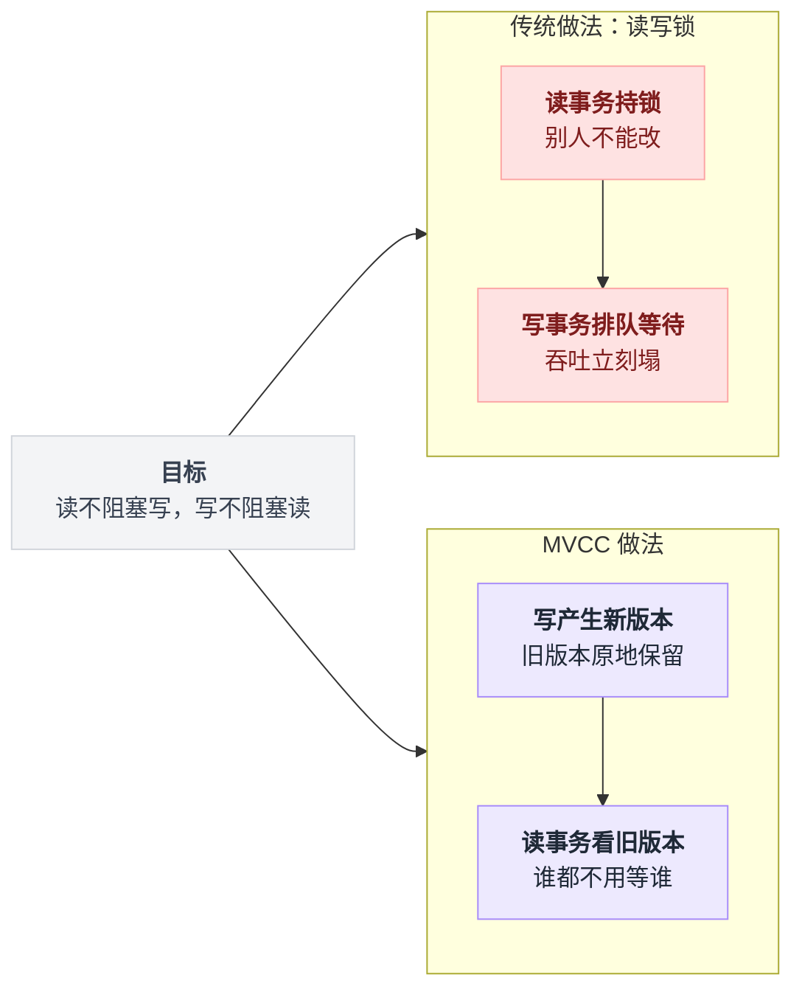
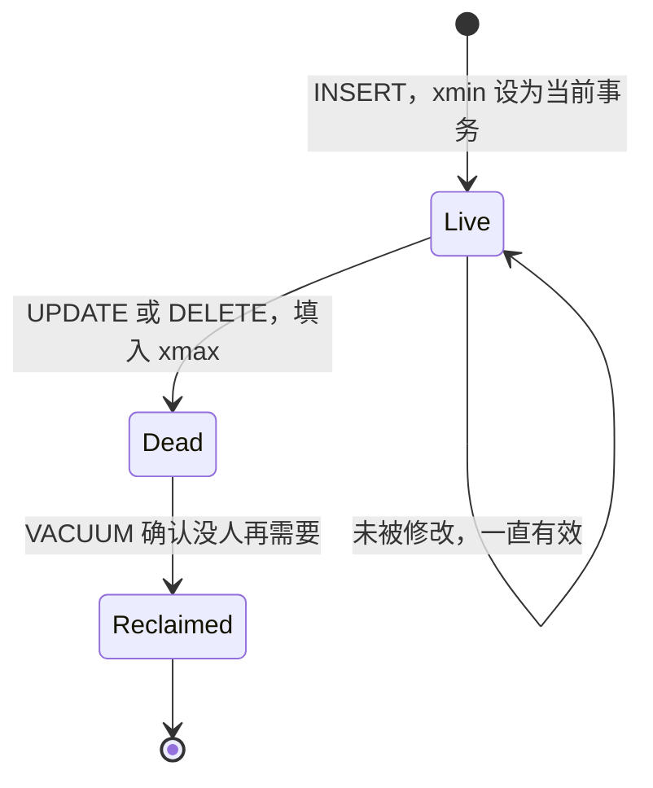
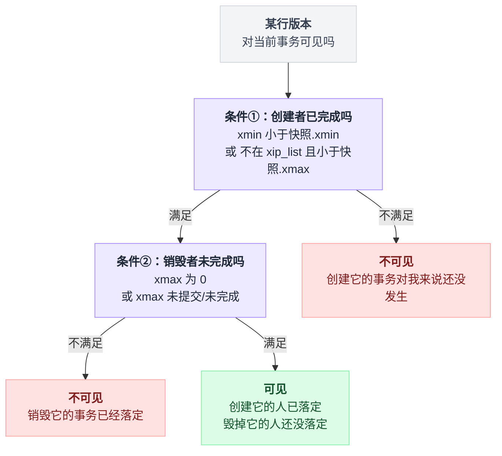
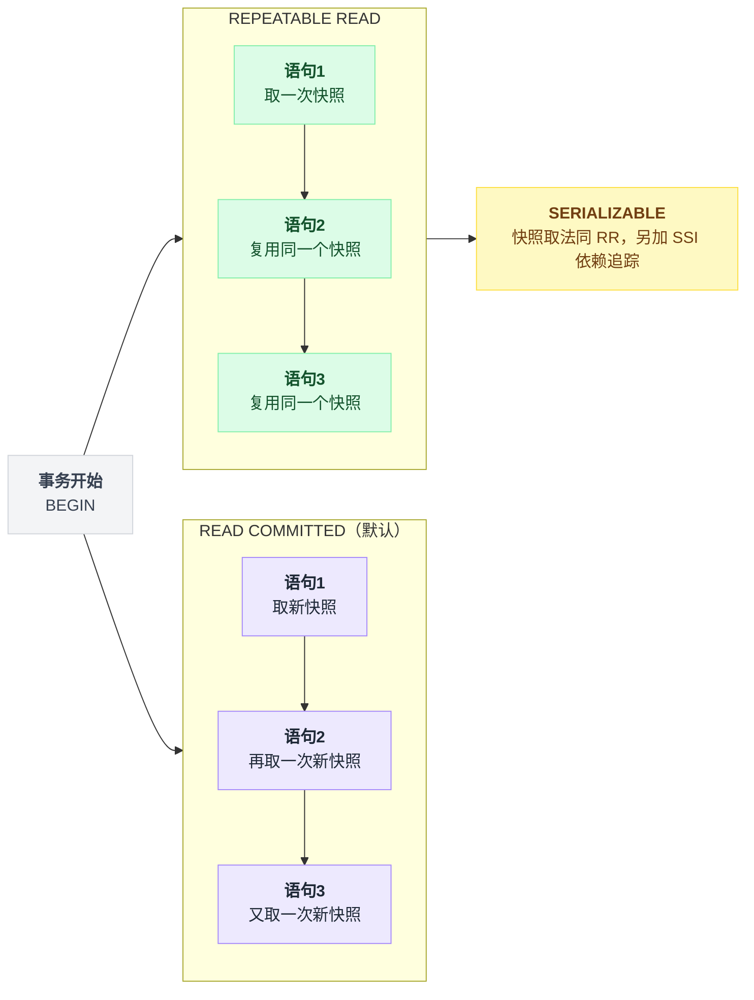
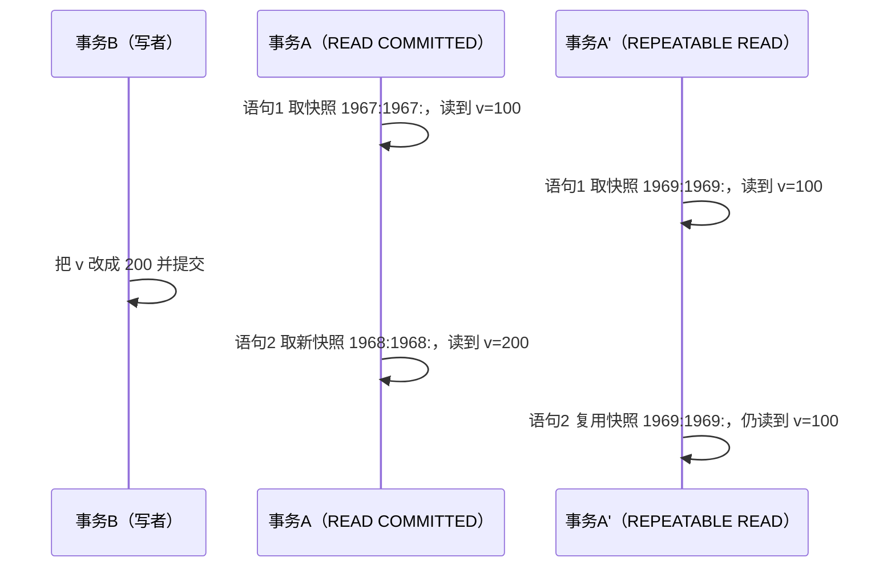
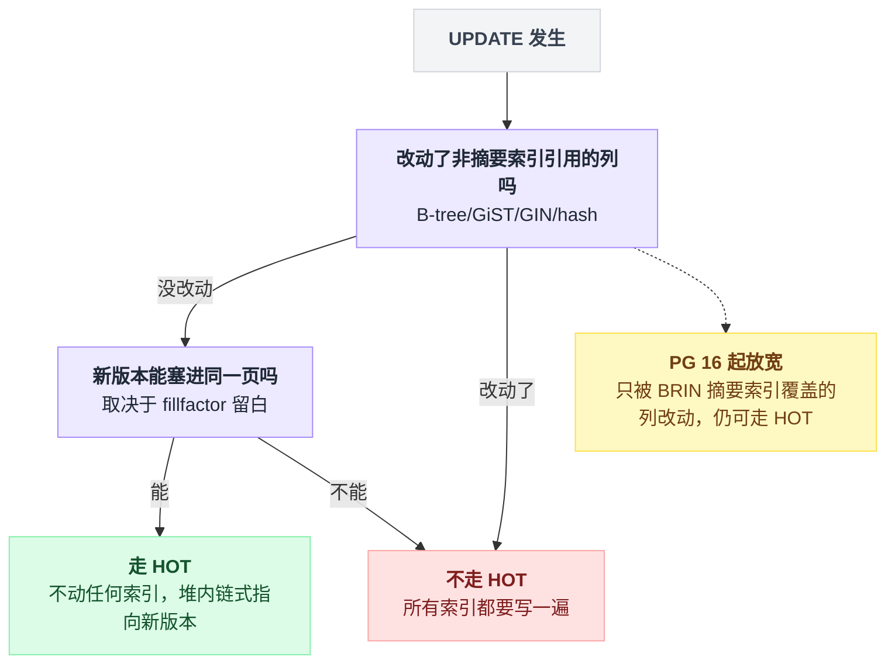
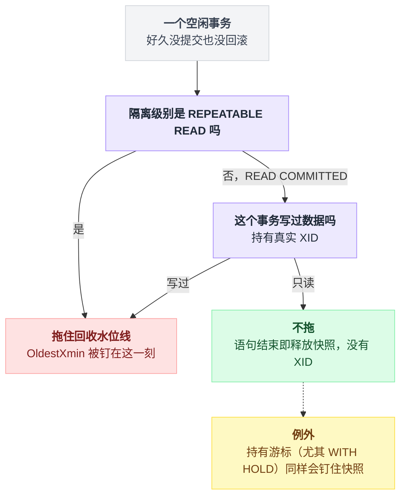

# 第 2 篇 · MVCC：Postgres 为什么没有回滚段

> 这是整套文档的地基。第 3 篇那行"神奇的原子 UPDATE"、第 4 篇的隔离级别、第 9 篇的膨胀问题，全部是本篇的推论。**如果只读一篇，读这篇。**

---

## 一、MVCC 要解决的问题

只有一个：**让读不阻塞写，写不阻塞读。**

传统做法是加读写锁——你在读的时候别人不能改。但线上系统里"读"占绝大多数，锁一上，吞吐立刻塌。

MVCC 的思路是：**别人改的时候产生一个新版本，我这个读事务继续看我该看的那个旧版本。** 谁都不用等谁。

代价是：**旧版本要留在系统里，直到确认没人需要它。**

这一句话就是 Postgres 全部运维痛苦的来源。本篇后面五节讲的其实都是它的账单。

两条路子摆在一起看更直观：



---

## 二、三个核心概念

三个概念是一条链：**XID 给事务编号 → xmin/xmax 把编号刻在行版本上 → 快照决定这些编号里哪些算"已完成"。** 前两个是记录，第三个才是判断。

### 1. 事务号 XID

每个**修改数据**的事务会被分配一个 32 位的事务号，单调递增。

注意"修改数据"这个限定——**只读事务默认不分配 XID**（这是个重要的优化，第 9 篇会用到）：

```sql
SELECT pg_current_xact_id_if_assigned();   -- 只读事务里返回 NULL
SELECT pg_current_xact_id();               -- 强制分配一个（调试用，别在生产乱调）
```

### 2. 行版本头上的 xmin / xmax

上一篇已经看过：

```
 lp | t_ctid | t_xmin | t_xmax
----+--------+--------+--------
  1 | (0,2)  |   1054 |   1055     ← 1054 号事务创建，1055 号事务把它改掉了
  2 | (0,3)  |   1055 |   1056
  3 | (0,3)  |   1056 |      0     ← 当前有效版本
```

- `xmin`：谁创建了这个版本
- `xmax`：谁让这个版本失效了（0 = 还有效）

**注意：`DELETE` 在 Postgres 里也不是真删。** 它只是给行版本填上 `xmax`。数据还在页里，等 VACUUM 来收。

所以"删了一半数据，表怎么没变小"是常见困惑，答案在第 9 篇。

一行数据从出生到被回收，走的是这样一条路：



### 3. 快照（Snapshot）

快照回答一个问题：**在我眼里，哪些事务算"已经完成"？**

```sql
SELECT pg_current_snapshot();
```

实测输出：

```
1974:1976:1974
 │    │    └── xip_list：xmin~xmax 之间、此刻仍在运行的事务号
 │    └── xmax：这个号及以后的事务，对我一律不可见
 └── xmin：小于这个号的事务，全部已经结束
```

**可见性判断规则**（简化版，去掉了子事务和 combo cid 的复杂情况）：

一个行版本对我可见，当且仅当：

```
① xmin 对应的事务已提交，且在我的快照里算"已完成"
     （xmin < 快照.xmin，或者 xmin 不在 xip_list 里且 < 快照.xmax）
   AND
② xmax 为 0，或者 xmax 对应的事务未提交/在我的快照里算"未完成"
```

同一套规则写成代码是这样，两个条件各占一半：

```
def 算已完成(xid, 快照):
    if xid <  快照.xmin:   return True      # 出发前就结束了
    if xid >= 快照.xmax:   return False     # 我出发时它还没开始
    return xid not in 快照.xip_list         # 在区间里，看它当时是不是还活着

def 可见吗(行版本, 快照):
    if not (已提交(行版本.xmin) and 算已完成(行版本.xmin, 快照)):
        return False                        # 条件① 不满足：创建者对我还没发生
    if 行版本.xmax == 0:
        return True                         # 根本没人毁它
    if 已提交(行版本.xmax) and 算已完成(行版本.xmax, 快照):
        return False                        # 条件② 不满足：毁它的人已落定
    return True
```

翻译成人话：**"创建它的人在我出发之前就已经落定了，而毁掉它的人还没落定（或者根本没人毁它）。"**

两个条件缺一不可，画成判定路径是这样：



上面那个 `已提交()` 要去哪查？`clog`（`pg_xact` 目录）记录每个 XID 的最终状态（提交/回滚/进行中）。

为了避免每次判断都去查 clog，Postgres 把结论缓存在行头的 `infomask` 标志位里——这叫 **hint bit**。

这解释了一个诡异现象：

> **第一次 `SELECT` 一张刚导入的大表，会产生大量写 I/O。** 因为它在顺手回填 hint bit，把干净页变成了脏页。

---

## 三、READ COMMITTED vs REPEATABLE READ：快照的取法不同

这是两个隔离级别的**全部区别**（在 Postgres 的实现里）：

| 隔离级别 | 快照什么时候取 |
|---|---|
| READ COMMITTED（默认） | **每条语句**开始时取一个新快照 |
| REPEATABLE READ | **事务里第一条语句**时取一次，整个事务共用 |
| SERIALIZABLE | 同 RR，另外加一层 SSI 依赖追踪（第 4 篇） |

拍照时机的差异摆出来看更清楚：



实测（`labs/exp16_snapshot.py`）：

```
=== READ COMMITTED ===
  A 第一次读: 100  快照: 1967:1967:
  (另一个事务把 v 改成 200 并提交)
  A 第二次读: 200  快照: 1968:1968:   ← 快照变了，同一事务里读到了不同的值

=== REPEATABLE READ ===
  A 第一次读: 100  快照: 1969:1969:
  (另一个事务把 v 改成 200 并提交)
  A 第二次读: 100  快照: 1969:1969:   ← 快照没变，值也没变
```

同一笔写入，两个并发读事务看到的结果分道扬镳：



### ❓ 问题：报表统计该用哪个隔离级别？

**场景**：一个对账任务要跑 5 条 SQL，分别统计总充值、总消费、总退款、总冻结、当前总余额，最后校验 `充值 - 消费 + 退款 = 余额 + 冻结`。

**✅ 做法**：

```sql
BEGIN ISOLATION LEVEL REPEATABLE READ;
SELECT sum(...) FROM recharges;
SELECT sum(...) FROM usages;
...
COMMIT;
```

**❌ 用默认的 READ COMMITTED 会怎样**：5 条 SQL 各取一个快照，中间用户还在充值和消费。

你统计"总消费"时算进了一笔单，统计"当前余额"时那笔单又已经扣完了——**账永远对不平，而且每次跑出来的差额都不一样，你会以为是代码有 bug，查三天查不出来**。

> 这类 bug 的特征是"偶发、不可复现、差额随机"，本质上是快照不一致。凡是"多条 SQL 必须看到同一个世界"的场景，就要 REPEATABLE READ。

---

## 四、HOT：一个救命的优化

上一篇留了个问题：既然 UPDATE 会让行换位置（ctid 变了），而**二级索引里存的正是 ctid**，那每次 UPDATE 是不是所有索引都得改一遍？

如果真是这样，Postgres 的写性能会难看到不能用。所以有了 **HOT（Heap-Only Tuple）**：

> **如果这次 UPDATE 没有改动任何被索引的列，并且新版本能塞进同一个数据页**，那就不动任何索引。新版本只存在于堆里，通过旧版本的 `t_ctid` 指针串起来。索引仍然指向旧位置，读的时候顺着链往下走一步就找到新版本。

> ⚠️ PG 16 起放宽了一点：**只被 BRIN 这类"摘要索引"覆盖的列被修改时，仍然可以走 HOT**（BRIN 只记录页范围的最值，行在页内挪动不影响它）。所以准确的说法是"没有改动任何被**非摘要索引**（B-tree/GiST/GIN/hash）引用的列"。

两道关卡串起来就是：

```
def 这次UPDATE走不走HOT(旧版本, 新版本):
    if 本次改动的列 ∩ 非摘要索引引用的列 != 空:
        return 不走            # 非摘要索引 = B-tree / GiST / GIN / hash
                               # PG 16 起，只被 BRIN 覆盖的列不算进这个交集
    if 新版本 塞不进 旧版本所在的那一页:
        return 不走            # 塞不塞得下，取决于 fillfactor 留了多少白
    旧版本.t_ctid = 新版本在页内的位置   # 堆内链一挂，索引一个字都不用改
    return 走
```

一次 UPDATE 能不能走 HOT，判定路径是这样：



实测（`labs/exp4_hot.sql`，同一张表 UPDATE 5000 次）：

| | `n_tup_upd` | `n_tup_hot_upd` | HOT 比例 | 主键索引大小 |
|---|---|---|---|---|
| **A：`balance` 上没有索引** | 5000 | 4973 | **99.5%** | **16 kB** |
| **B：`balance` 上建了索引** | 5000 | 0 | **0%** | **56 kB** |

B 里还额外多了一个 128 kB 的 `balance` 索引。

也就是说，**给一个高频更新的列建索引，会同时付出三笔代价**：

| # | 代价 |
|---|---|
| 1 | HOT 直接归零，每次 UPDATE 都要写全部索引 |
| 2 | 索引自身也在膨胀（旧的索引项也要等 VACUUM 回收） |
| 3 | 主键索引跟着一起膨胀（16 kB → 56 kB，3.5 倍） |

第三笔最容易被漏掉：你新建的是 `balance` 索引，代价却记到了**主键**头上。

### ❓ 问题：该不该给 `users.balance` 建索引？

**场景**：产品说"运营后台要能按余额排序，找出余额最高的大客户"。

**✅ 做法**：**不要在主表的高频更新列上直接建索引。** 可选方案：

- 后台查询容忍慢一点，直接扫（几万到几十万用户，加个 `LIMIT` 排序其实还好）；
- 或者做一张低频同步的运营视图/物化视图，索引建在那上面；
- 或者用部分索引缩小范围：`CREATE INDEX ON users(balance) WHERE balance > 1000`（只有大客户进索引，且余额跌破 1000 的行会自动从索引里移出）。

**❌ 直接建索引会怎样**（按上面实测数据外推）：假设 100 万用户、每秒 2000 次计费扣款：

- HOT 从 ~99% 掉到 0，每次扣款额外产生 N 个索引项（N = 索引个数）；
- WAL 量显著上升（索引改动也要写 WAL），主从延迟跟着涨；
- 索引膨胀速度远快于堆，autovacuum 追不上，几天后 `balance` 索引比表还大；
- 最后表现为"写入越来越慢，磁盘越用越多"，而所有人都在查慢 SQL，没人想到是那个"给运营后台加的排序索引"。

📌 **判断标准**：**这个列每秒被 UPDATE 多少次？** 高频更新的列，索引要非常克制。

> 顺带：`fillfactor` 参数控制页面留多少空闲空间给 HOT 用。默认 100（堆表），对于更新频繁的表可以调到 85~90，让新版本更容易塞进同一页，提高 HOT 命中率。代价是表占用空间变大。

---

## 五、死元组、VACUUM 与"回收不了"

一句话：**旧版本变成死元组 → VACUUM 来收 → 但它只敢收水位线之下的 → 谁钉住水位线，谁就制造膨胀。** 这一节真正要记住的只有最后半句。

VACUUM 做三件事：

| # | 做什么 | 别误会的地方 |
|---|---|---|
| 1 | 把确定没人需要的死元组占用的空间标记为可复用 | 是"可复用"，**不是"还给操作系统"** |
| 2 | 清理指向死元组的索引项 | |
| 3 | **freeze**：把足够老的行版本的 xmin 标记为"永远可见" | 防止事务号回卷，见第六节 |

关键在于第 1 件事里的"确定没人需要"怎么判断：它计算一个 **回收水位线（OldestXmin）**——所有正在运行的事务里最老的那个快照。**比这个水位线更新的死元组，一律不敢碰。**

水位线是这么算出来的：

```
OldestXmin = min(每个活跃 backend 报出来的 xmin)

def 这个backend报什么(b):
    if b.隔离级别 == REPEATABLE READ:
        return b.事务开头取的那个快照.xmin   # 整个事务钉着它，哪怕全程只读
    if b.写过数据:
        return b.自己的 XID                  # 未完成的 XID，水位线被钉住
    if b.持有游标:
        return 那个游标的快照.xmin           # 尤其 WITH HOLD
    return +∞                                # 不参与，不拖任何人

# VACUUM 扫到一个死元组：xmax >= OldestXmin → 可能还有人要看 → 不敢碰
```

实测（`labs/exp15.py`）：

```
=== 什么样的空闲事务会拖住 VACUUM ===
  READ COMMITTED   有写入=False: VACUUM 后残留死元组 0      → 没有拖住
  READ COMMITTED   有写入=True:  VACUUM 后残留死元组 20000  → 拖住了回收
  REPEATABLE READ  有写入=False: VACUUM 后残留死元组 20000  → 拖住了回收
```

这个结果非常有信息量：

| 空闲事务的类型 | 拖住 VACUUM？ | 为什么 |
|---|---|---|
| READ COMMITTED + 只读 | ❌ 不拖 | 语句结束就释放了快照，也没有 XID |
| READ COMMITTED + 写过数据 | ✅ **拖** | 它持有一个未完成的 XID，水位线被钉住 |
| REPEATABLE READ（哪怕全程只读） | ✅ **拖** | 它必须持有整个事务期间的快照 |

第三行是最反直觉的一条：**只读也能把回收拖死**，只要隔离级别是 RR。

这张表翻译成判定路径就是：



两点补充：

- **XID 是惰性分配的**——只在第一次写入时才分配，纯读的事务用的是 virtual XID，不占真实事务号。
- READ COMMITTED 的空闲事务"不拖"有前提：它**没有写过数据、也没有持有游标**（尤其是 `WITH HOLD` 游标）。持有游标同样会钉住快照。

配套的观察实验（`labs/exp8_vacuum.py`）：

```
初始大小: 1776 kB
全表 UPDATE 一次后: 3544 kB
再 UPDATE 3 轮 + 每轮 VACUUM: 3544 kB       ← 空间被复用，表不再长大
同样 3 轮，但有一个开着的长事务: 7088 kB     ← 翻倍膨胀
   此时死元组数: 150000
长事务结束后再 VACUUM: 7088 kB              ← 空间可复用了，但不会还给操作系统
```

最后一行值得盯一会儿：长事务结束了，死元组也终于能收了，**但 7088 kB 这个数字再也降不回去**。膨胀是不可逆的。

### ❓ 问题：`BEGIN` 之后忘了 `COMMIT` 会怎样？

这是**生产环境最常见的自伤方式**，通常长这样：

```go
tx, _ := db.Begin()
rows, _ := tx.Query("SELECT ...")
if err != nil {
    return err          // ← 忘了 tx.Rollback()，连接回到池里还开着事务
}
```

或者更隐蔽的：**在事务里调用外部 HTTP 接口**。

```go
tx, _ := db.Begin()
tx.Exec("UPDATE orders SET state='paying' WHERE id=$1", id)
resp, _ := http.Post(paymentGateway, ...)     // ← 对方超时 30 秒
tx.Exec("UPDATE orders SET state='paid' WHERE id=$1", id)
tx.Commit()
```

第二种更该警惕：代码看起来完全正常，没有任何"忘了写"的痕迹，全库的回收水位线却被对方的超时时间决定。

**✅ 做法**：

1. `defer tx.Rollback()`（已提交的事务再 Rollback 是无害的 no-op）；
2. **事务里绝不做网络 I/O**——外部调用放到事务外，用 outbox 模式（第 6 篇）保证最终一致；
3. 服务端兜底，直接在数据库上设：

```sql
ALTER DATABASE mydb SET idle_in_transaction_session_timeout = '60s';
ALTER DATABASE mydb SET statement_timeout = '30s';
```

**❌ 不这么做会怎样**（真实事故链条）：

```
一个 backend 卡在 idle in transaction
  → 回收水位线被钉死在那一刻
  → 全库所有表的死元组都回收不了（水位线是全局的，不是每表的）
  → autovacuum 疯狂跑但什么都收不掉，只是白白烧 I/O
  → 表和索引持续膨胀，缓存命中率下降，查询变慢
  → 查询变慢导致连接堆积，连接数打满
  → 新请求连不上，也连不进去排查
  → 如果这个事务持续到 XID 消耗接近 20 亿，数据库进入"强制只读"保护模式
```

链条里最要命的是第三步的括号：**水位线是全局的，不是每表的。** 一个跟业务毫不相干的连接卡住，能把整个库的回收一起停掉。

监控这两个数字，超过阈值就报警：

```sql
-- 最长的事务跑了多久
SELECT pid, now()-xact_start AS xact_age, state, left(query,80)
FROM pg_stat_activity
WHERE xact_start IS NOT NULL ORDER BY xact_start LIMIT 5;

-- 回收水位线被钉住多远（单位：事务数）
SELECT max(age(backend_xmin)) FROM pg_stat_activity WHERE backend_xmin IS NOT NULL;
```

---

## 六、事务号回卷（XID Wraparound）

XID 是 **32 位**，约 42.9 亿。Postgres 用"环形比较"来判断新旧：任何 XID 的可见范围是前后各 **2³¹ ≈ 21.47 亿**。

环形比较的意思是这样：

```
def 谁更新(a, b):                    # 32 位环上比大小，没有绝对的"大"
    diff = (a - b) mod 2^32
    if diff < 2^31:  return "a 在 b 之后"    # 落在我身后 21.47 亿以内 → 过去
    else:            return "a 在 b 之前"    # 超出去了 → 被判定成未来
```

于是，如果一个行版本的 xmin 老到超过 21 亿个事务没被处理，它会突然从"很老所以可见"翻转成"来自未来所以不可见"——**数据凭空消失**。

Postgres 用 **freeze** 防止这件事：VACUUM 会把足够老的行版本标记为"冻结"（`FrozenTransactionId`，永久可见），从而把该表的 `relfrozenxid` 往前推。

默认参数：

```
vacuum_freeze_min_age     = 50,000,000       -- 超过 5000 万代就顺手冻结
vacuum_freeze_table_age   = 150,000,000      -- 超过 1.5 亿代就强制全表扫描
autovacuum_freeze_max_age = 200,000,000      -- 超过 2 亿代，强行触发 autovacuum（哪怕你关了 autovacuum）
```

监控：

```sql
SELECT datname, age(datfrozenxid) FROM pg_database ORDER BY 2 DESC;
SELECT relname, age(relfrozenxid) FROM pg_class WHERE relkind='r' ORDER BY 2 DESC LIMIT 10;
```

### ❓ 问题：`age(datfrozenxid)` 涨到 15 亿了怎么办？

**✅ 平时该做的**：

- **别关 autovacuum。** 见过太多"为了性能把 autovacuum 关了"的操作，这是在给自己埋雷。
- 别让长事务和长的复制槽（replication slot）阻塞回收。**未消费的复制槽和逻辑订阅同样会钉住水位线**，且经常被遗忘。
- 大表的 autovacuum 参数单独调，别用全局默认（默认 `autovacuum_vacuum_scale_factor = 0.2` 意味着一张 10 亿行的表要死掉 2 亿行才触发，太晚了）：

```sql
ALTER TABLE usage_logs SET (autovacuum_vacuum_scale_factor = 0.01,
                            autovacuum_vacuum_threshold = 10000,
                            autovacuum_vacuum_cost_delay = 0);
```

**❌ 放着不管会怎样**：年龄涨上去的过程中有四道关卡，一道比一道疼。

| 年龄 / 距回卷点 | 触发的东西 | 发生什么 |
|---|---|---|
| **2 亿代** | `autovacuum_freeze_max_age` | autovacuum 强制启动做全表 freeze，正常业务时段被大量 I/O 拖慢 |
| **16 亿代** | `vacuum_failsafe_age`（PG 14+） | 进入紧急模式，跳过索引清理、不再限速，一切让路给 freeze |
| **还剩 4000 万个事务**（年龄约 21.07 亿） | — | 日志开始刷 `WARNING: database "x" must be vacuumed within N transactions` |
| **还剩 300 万个事务** | — | **数据库拒绝分配新的事务号**（`database is not accepting commands to avoid wraparound data loss`） |

走到最后一格就没有软着陆了：唯一的出路是停服、单用户模式 `VACUUM FREEZE`，大表可能要跑几小时。

> 这是 Postgres 少数几个"会让整个数据库停摆"的失效模式。也是 Sentry、Mailchimp 等公司公开写过事故复盘的经典问题。

---

## 七、本篇小结

```
                      ┌──────────────────────────────┐
   UPDATE / DELETE ──▶│ 产生新版本，旧版本变成死元组 │
                      └───────────┬──────────────────┘
                                  ▼
                      ┌──────────────────────────────┐
                      │ VACUUM 回收（只回收水位线之下）│
                      └───────────┬──────────────────┘
                                  ▼
              被以下东西钉住 → 回收不了 → 膨胀 → 变慢 → 事故
              ├─ 长事务 / idle in transaction
              ├─ REPEATABLE READ 的只读长事务
              ├─ 未消费的复制槽 / 逻辑订阅
              └─ prepared transaction（两阶段提交没收尾）
```

| 概念 | 一句话 |
|---|---|
| xmin / xmax | 行版本的"生"与"死"分别由哪个事务负责 |
| 快照 | `xmin:xmax:活跃列表`，定义"在我眼里谁算完成了" |
| READ COMMITTED | 每条语句一个新快照 |
| REPEATABLE READ | 整个事务一个快照 |
| HOT | 不动索引的 UPDATE；一给热更新列建索引就失效 |
| 死元组 | DELETE/UPDATE 的残骸，等 VACUUM 收 |
| 回收水位线 | 全局的，被最老的活跃事务钉住 |
| freeze / 回卷 | 32 位 XID 的宿命，autovacuum 必须保持健康 |

📌 **一句话**：MVCC 用"多留几份旧数据"换来了"读写不互相阻塞"，而**长事务会让这笔交易变成单方面亏损**。

---

**下一篇** → [03 ★ 原子扣减余额：sub2api 那行 SQL 凭什么是对的](./03-原子扣减余额.md)
