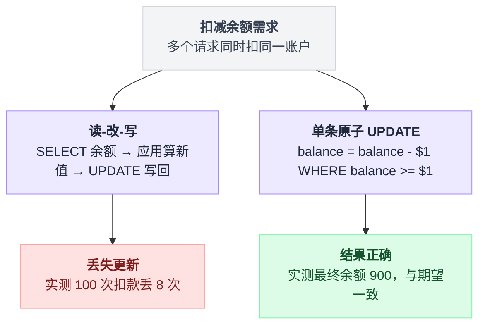
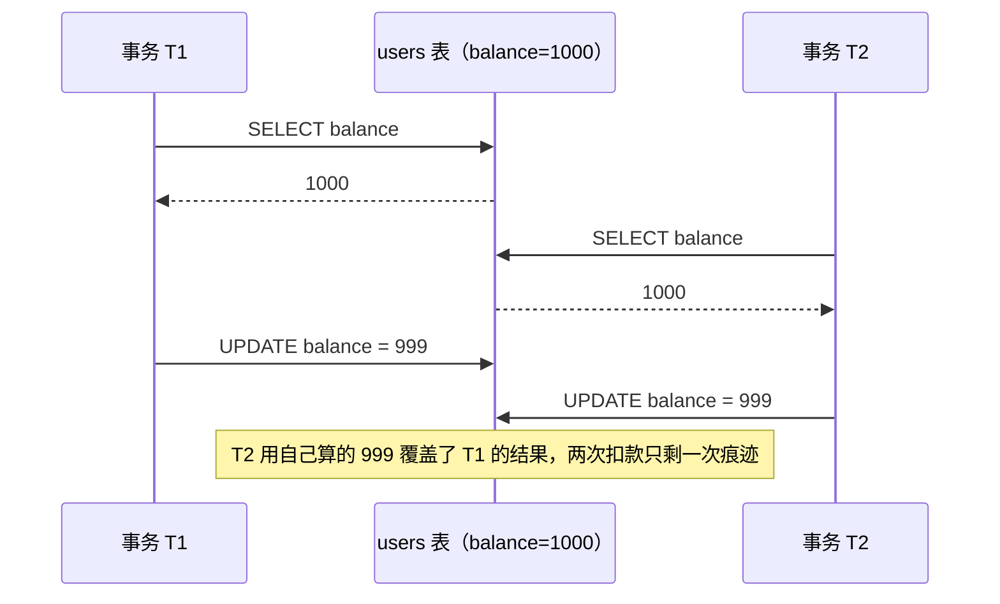
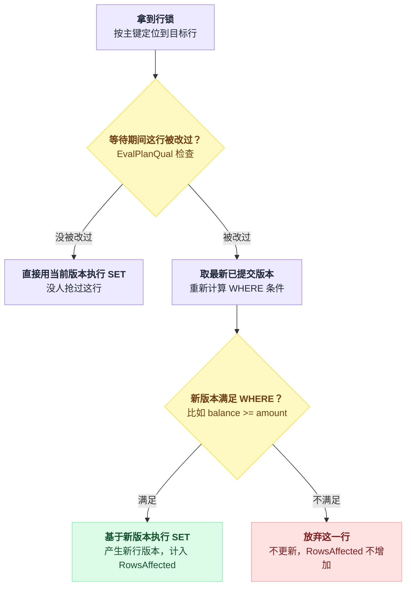
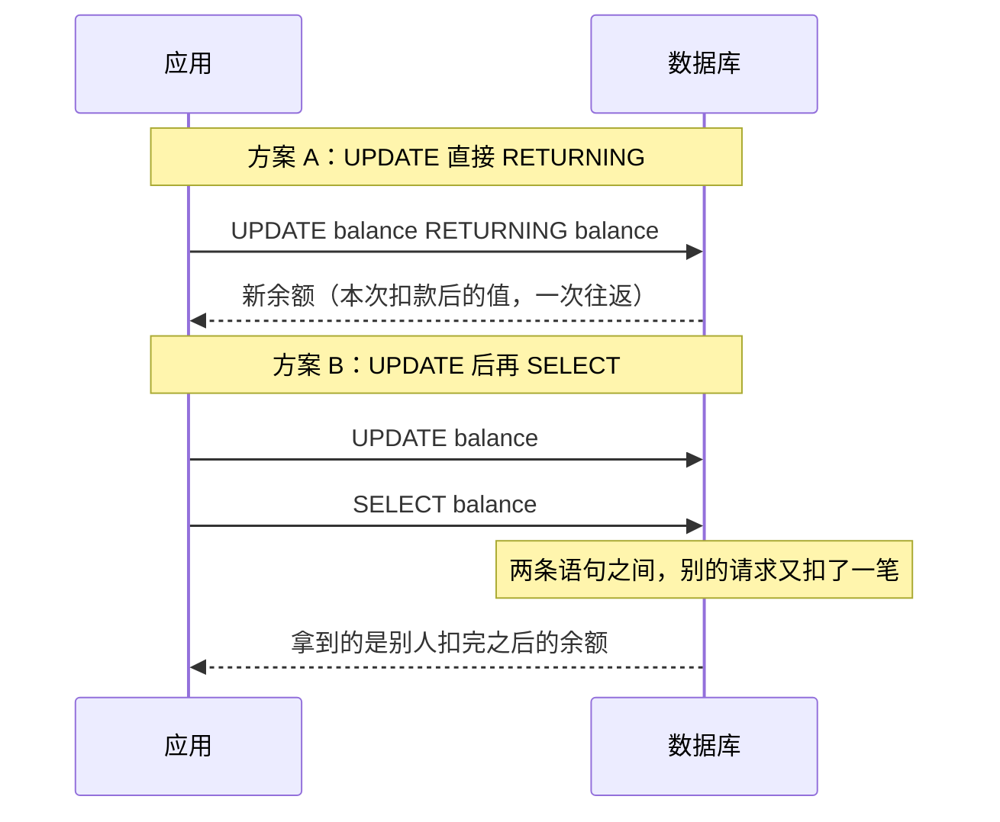
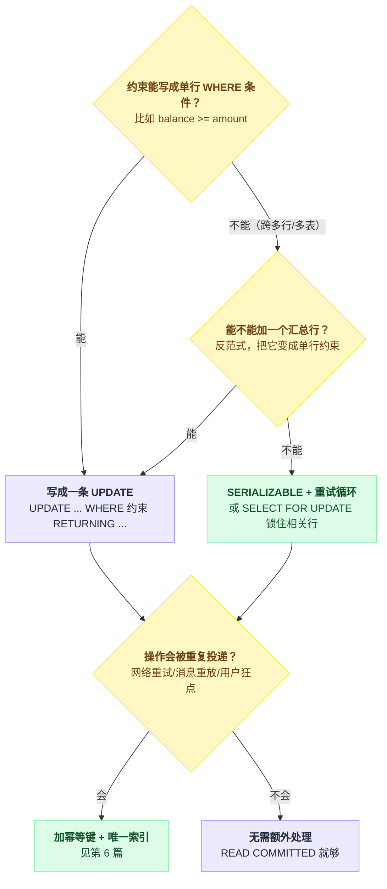

# 第 3 篇 ★ 原子扣减余额：sub2api 那行 SQL 凭什么是对的

> 整套文档的主线章节。看完这篇，你应该能对着任何一条"条件更新"SQL 说清楚它在并发下是安全的还是不安全的，以及为什么。

---

## 一、案发现场

[sub2api](https://github.com/Wei-Shaw/sub2api)（34.4k★，Go + PostgreSQL 15+，AI API 网关，按 token 真金白银计费）在 `backend/internal/repository/usage_billing_repo.go` 里这样扣用户余额：

```go
func deductUsageBillingBalance(ctx context.Context, tx *sql.Tx, userID int64, amount float64) (float64, bool, error) {
	var newBalance float64
	err := tx.QueryRowContext(ctx, `
		UPDATE users
		SET balance = balance - $1,
			updated_at = NOW()
		WHERE id = $2 AND deleted_at IS NULL AND balance >= $1
		RETURNING balance
	`, amount, userID).Scan(&newBalance)
	if err == nil {
		return newBalance, true, nil     // 扣款成功，余额充足
	}
	if !errors.Is(err, sql.ErrNoRows) {
		return 0, false, err
	}
	// 走到这里说明余额不足 —— 允许透支，保证本次请求能完成
	err = tx.QueryRowContext(ctx, `
		UPDATE users
		SET balance = balance - $1, updated_at = NOW()
		WHERE id = $2 AND deleted_at IS NULL
		RETURNING balance
	`, amount, userID).Scan(&newBalance)
	...
}
```

同一个 repo 的 `user_repo.go` 里，作者把理由直接写在注释里了：

```go
// AdjustBalance 原子地把 delta 累加到余额上，结果为负时整条语句不生效。
// 相比"读余额 → 算新值 → 整行写回"，这里把读与写压进同一条 UPDATE，
// 并发的计费扣款不会被旧快照覆盖。
const updateSQL = `
	UPDATE users
	SET balance = balance + $1, updated_at = NOW()
	WHERE id = $2 AND deleted_at IS NULL AND balance + $1 >= 0
	RETURNING balance - $1, balance
`
```

**没有 `SELECT`，没有 `FOR UPDATE`，没有 Redis 分布式锁，没有乐观锁版本号。** 一条 UPDATE 搞定。

---

## 二、先看错误示范：为什么"读-改-写"必翻车

两种写法在并发下会走向完全不同的结局，先看分岔口在哪：



绝大多数人的第一反应是这样写：

```go
// ❌ 错误示范
bal := db.QueryRow("SELECT balance FROM users WHERE id=$1", uid)  // 读
if bal < amount { return ErrInsufficient }                        // 判断
db.Exec("UPDATE users SET balance=$1 WHERE id=$2", bal-amount, uid) // 写
```

实测（`labs/exp1_lost_update.py`，初始余额 1000，20 个线程共扣 100 次，每次扣 1）：

```
期望值: 1000 - 100 = 900

A) 读-改-写 (SELECT then UPDATE, 无锁)      最终余额 = 992   ❌ 丢了 8 次扣款
B) SELECT ... FOR UPDATE 后再写            最终余额 = 900   ✅
C) UPDATE ... SET balance = balance - 1    最终余额 = 900   ✅
```

**丢了 8 次扣款 = 白送了用户 8 块钱。** 而且这只是 100 次操作的低并发实验；线上几千 QPS 打在同一个大客户账号上，丢失比例只会更高。

这个现象叫 **丢失更新（Lost Update）**：

```
时刻   事务 T1                     事务 T2
 t1    SELECT balance → 1000
 t2                                SELECT balance → 1000
 t3    UPDATE SET balance = 999
 t4                                UPDATE SET balance = 999    ← T1 的扣款被覆盖了
 结果   余额 999，但实际扣了两次
```

换成时序图看，两边各自"看到"的世界是脱节的：



**根因**：`SELECT` 和 `UPDATE` 之间有一个"时间缝"，缝里发生的事情，你的应用代码一无所知。`bal-amount` 这个值是在应用内存里算的，它携带的是一个**已经过期的世界观**。

---

## 三、那条原子 UPDATE 到底做了什么

```sql
UPDATE users
SET balance = balance - $1
WHERE id = $2 AND balance >= $1
```

区别在于：**`balance - $1` 里的 `balance` 是数据库在执行的那一刻从行版本上读出来的，不是应用传进来的。** 读和写在同一条语句、同一把行锁的保护下完成，中间没有缝。

具体执行过程（READ COMMITTED 下）：

```
① 取一个快照
② 按 id 走主键索引定位到行
③ 对这一行加行锁（tuple lock，排他）
   ├── 如果没人占着 → 直接往下
   └── 如果有别的事务正在改它 → 阻塞，等对方 COMMIT/ROLLBACK
④ 【关键】拿到锁之后，如果这一行在等待期间被别人改过：
      不是用我最初快照里的旧版本，而是取【最新已提交版本】，
      把 WHERE 条件重新算一遍  ← 这一步叫 EvalPlanQual (EPQ)
      ├── 新版本仍然满足 WHERE → 基于新版本执行 SET，产生新行版本
      └── 新版本不满足 WHERE   → 放弃这一行，不更新（RowsAffected 少 1）
⑤ RETURNING 返回更新后的新值
```

拆成判断分支看会更清楚④这一步在做什么：



第 ④ 步是整件事的核心，Postgres 源码里叫 **EvalPlanQual**（`src/backend/executor/execMain.c`）。它是 READ COMMITTED 下"写操作看得见最新数据"的实现机制。

> **为什么需要 EPQ？** READ COMMITTED 的语义是"每条语句看一个新快照"。但一条 UPDATE 可能执行好几秒，期间别的事务提交了。如果坚持用语句开始时的快照，就会基于陈旧数据做写入。EPQ 的作用是：**对于要写的那些行，强行"往前看"到最新版本，重新验一遍条件。**

### 实测验证

`labs/exp2_epq.py`：初始余额 100，T1 并发把它改成 50，T2 想扣 80。

```
[1] READ COMMITTED + 条件写在 WHERE 里
      UPDATE users SET balance=balance-80 WHERE id=1 AND balance>=80
    T2 结果: 0 行          最终余额: 50     ✅ 正确拒绝
```

T2 被 T1 的行锁挡住 → T1 提交（余额变成 50）→ T2 拿到锁 → **EPQ 用新版本重算 `balance >= 80`，`50 >= 80` 不成立 → 这一行被放弃 → 更新 0 行**。

应用代码只要检查 `RowsAffected() == 0` 就知道余额不足，**完全不需要自己去锁、去比较、去重试**。

---

## 四、⚠️ 条件必须写在 WHERE 里 —— 这是全篇最重要的一句话

同一个实验的第二组：

```
[2] READ COMMITTED + 条件不在 WHERE 里（应用层已经查过余额=100，以为够）
      UPDATE users SET balance=balance-80 WHERE id=1
    T2 结果: 1 行          最终余额: -30    ❌ 透支了
```

同样是 EPQ 重算，条件写在哪一步决定了结局：


只是把 `AND balance >= 80` 删掉，结果就从"正确拒绝"变成了"余额变成 -30"。

**为什么？** 因为 EPQ 重新计算的是 **`WHERE` 子句**。`WHERE id=1` 在新版本上依然成立，所以更新照常执行，`balance - 80` 用的是新的 50，算出 -30。

**你在应用代码里做的那个"余额够不够"的判断，数据库根本不知道，也就无从帮你重新验证。**

### ❓ 问题：`SELECT ... FOR UPDATE` 是不是也行？

行，但要写对：

```go
// ✅ 正确
tx.Query("SELECT balance FROM users WHERE id=$1 FOR UPDATE")  // 加锁读
// 此时锁已在手，读到的一定是最新值（FOR UPDATE 同样触发 EPQ）
if bal < amount { rollback }
tx.Exec("UPDATE users SET balance=$1 WHERE id=$2", bal-amount, uid)
tx.Commit()
```

`FOR UPDATE` 之所以安全，用的是**同一套 EPQ 机制**：加锁读在等待结束后也会取最新版本。上面实测 B 组结果 900，正确。

但它有三个实打实的劣势：

**1. 慢一倍。** 实测（`labs/exp17_perf.py`，16 并发全打在同一行，共 1600 次扣款）：

```
[A] 单条原子 UPDATE          0.77s  (2084 次/秒)  ✅
[B] SELECT FOR UPDATE + UPDATE 1.49s  (1076 次/秒)  ✅
[C] SERIALIZABLE + 失败重试   5.71s  ( 280 次/秒)  ✅
```

三种写法结果都对，但吞吐差 7.4 倍。原因很直接：A 只有一次网络往返、行锁只在语句执行期间持有；B 有两次往返 + 一次显式 BEGIN/COMMIT，**行锁从 SELECT 一直持有到 COMMIT**，锁持有时间被网络延迟放大。

**2. 锁持有期间你可能干蠢事。** `FOR UPDATE` 和 `COMMIT` 之间的代码是你写的，很容易不小心插进去一个日志上报、一个 Redis 调用、一次 RPC。那把行锁就一直挂着，所有扣这个用户钱的请求全排队。

**3. 忘了写 `FOR UPDATE` 不会报错，只会悄悄算错账。** 这是最危险的：代码 review 时很难发现，测试环境低并发跑不出来，线上放量才开始丢钱。

📌 **结论**：**能用一条 UPDATE 表达的逻辑，就不要拆成 SELECT + UPDATE。**

---

## 五、REPEATABLE READ 下会怎样？（一个反直觉的结果）

```
[3] REPEATABLE READ + 条件写在 WHERE 里
    T2 结果: ERROR: could not serialize access due to concurrent update
    最终余额: 50
```

**RR 下没有 EPQ。** RR 的承诺是"整个事务看同一个快照"，如果允许 EPQ 去看最新版本，就破坏了这个承诺。所以 Postgres 的选择是：**直接报错，让你重试。**

这带来一个重要的工程结论：

| 隔离级别 | 并发更新同一行 | 应用需要做什么 |
|---|---|---|
| READ COMMITTED | EPQ 重算条件，可能返回 0 行 | 检查 `RowsAffected` |
| REPEATABLE READ | 抛 `40001` 序列化失败 | **必须实现重试循环** |
| SERIALIZABLE | 抛 `40001`（范围更广） | **必须实现重试循环** |

### ❓ 问题：把隔离级别调高就更安全，对吗？

**不完全对，而且很容易弄巧成拙。**

**✅ 正确的做法**：如果你要用 RR/SERIALIZABLE，**必须**配套写重试：

```go
func withRetry(db *sql.DB, fn func(*sql.Tx) error) error {
	for attempt := 0; attempt < 5; attempt++ {
		tx, err := db.BeginTx(ctx, &sql.TxOptions{Isolation: sql.LevelSerializable})
		if err != nil { return err }
		if err = fn(tx); err == nil {
			if err = tx.Commit(); err == nil { return nil }
		}
		tx.Rollback()
		var pgErr *pgconn.PgError
		if errors.As(err, &pgErr) && (pgErr.Code == "40001" || pgErr.Code == "40P01") {
			time.Sleep(backoff(attempt))   // 指数退避 + 抖动
			continue
		}
		return err
	}
	return ErrTooManyRetries
}
```

**注意 `40001` 可能在 `Commit()` 时才抛出**（SSI 的冲突检测发生在提交阶段），所以重试逻辑必须把 `Commit` 也包进去。这是最常见的实现漏洞。

**❌ 只改隔离级别、不写重试会怎样**：

- 用户看到的不再是"余额不足"，而是**莫名其妙的 500 错误**，且并发越高越频繁；
- 你的错误监控被 `could not serialize access` 刷屏，但因为是"数据库报错"，团队第一反应是去查数据库有没有问题，而不是去写重试；
- 更糟的情况：某些 ORM 会把这个错误吞掉当作"更新了 0 行"，于是变成静默的数据丢失。

📌 **原则**：**先想清楚能不能用一条原子语句表达。** 只有当"约束跨越多行/多表"、单条 SQL 表达不了时，才升到 SERIALIZABLE + 重试（详见第 4 篇的写偏斜）。

---

## 六、RETURNING：省掉一次往返，还顺便解决了并发问题

sub2api 的写法值得单独说：

```sql
UPDATE users SET balance = balance + $1
WHERE id = $2 AND balance + $1 >= 0
RETURNING balance - $1, balance      -- 同时拿到旧值和新值
```

实测：

```sql
-- 表里 balance = 70，执行 delta = -20
UPDATE u SET balance = balance + (-20) WHERE id=1 AND balance + (-20) >= 0
RETURNING balance - (-20) AS old_balance, balance AS new_balance;

 old_balance | new_balance
-------------+-------------
   70.000000 |   50.000000
```

`RETURNING` 里的列取的是**更新后的新值**，用 `balance - delta` 反推就得到旧值。一条语句拿齐"扣了多少、扣之前多少、扣之后多少"。

> PostgreSQL **18** 起原生支持 `RETURNING OLD.balance, NEW.balance`，不用再玩这个算术把戏。16/17 上还是得用上面的写法。

### ❓ 问题：为什么不"更新完再 SELECT 一次拿新余额"？

**❌ 不这么做会怎样**：

```go
db.Exec("UPDATE users SET balance = balance - $1 WHERE ...")
newBal := db.QueryRow("SELECT balance FROM users WHERE id=$1")  // ← 危险
```

两条语句之间那道缝，就是别人插队的窗口：



1. **拿到的可能不是你这次扣完的值。** 两条语句之间，别的请求又扣了一笔，你返回给前端的余额是别人扣完的结果。用户看到"我明明只花了 1 块，怎么少了 5 块"。
2. 多一次网络往返，在高 QPS 下就是白扔的延迟。
3. 如果为了保险把两条包进一个显式事务，锁持有时间又被拉长了，回到了 `FOR UPDATE` 的老问题。

📌 **`RETURNING` 不只是语法糖，它是保证"我读到的就是我刚写的"的正确性工具。**

---

## 七、深挖：sub2api 的"透支兜底"是什么心态

回头看那段代码的第二步：第一条带 `balance >= $1` 的 UPDATE 返回 0 行后，它执行了一条**不带余额条件**的 UPDATE，允许余额变成负数。

```go
// 透支策略：允许余额变为负数，确保当前请求能够完成
// 中间件会阻止余额 <= 0 的用户发起后续请求
```

这是一个**深思熟虑过的业务权衡**，不是 bug：

- 计费发生在请求**完成之后**（要等上游 API 返回才知道消耗了多少 token）。这时候钱已经花出去了，拒绝入账只会让平台自己承担成本；
- 所以策略是"**先记账，再拦人**"：这一笔照扣，扣成负数也认；下一次请求进来时中间件看到 `balance <= 0` 直接拒掉；
- 单笔透支金额的上限 = 单次请求的最大消耗，是可控的。

### ❓ 问题：这里有没有并发风险？

有一个细微的：两条 UPDATE 之间存在缝隙。第一条返回 0 行之后、第二条执行之前，另一笔充值可能到账，于是本来"应该走透支路径"的请求，实际上是在余额充足的情况下扣的。

**但这不影响正确性**——第二条 UPDATE 依然是原子的 `balance = balance - $1`，无论此刻余额是多少，扣的金额都对。**变的只是"这笔算不算透支"这个分类，不是钱的数目。** 而且这两条语句在同一个 `tx` 里，外层事务保证了它们和写流水、写幂等键是一起提交的。

📌 这就是本篇想训练的判断力：**看到多条语句就问"缝里能发生什么"，然后问"这件事会不会让钱算错"。** 会 → 必须合并成一条或加锁；不会 → 可以接受。

---

## 八、常见变体速查

sub2api 里还有几个值得抄的写法：

**① 扣款不能加深欠款（退款场景）** —— 扣 `min(amount, max(balance,0))`：

```sql
WITH target AS (
    SELECT id, balance FROM users WHERE id = $2 AND deleted_at IS NULL FOR UPDATE
), updated AS (
    UPDATE users AS u
    SET balance = target.balance - LEAST($1, GREATEST(target.balance, 0)), updated_at = NOW()
    FROM target WHERE u.id = target.id AND u.deleted_at IS NULL
    RETURNING target.balance - u.balance AS deducted
)
SELECT deducted FROM updated
```

这里必须用 CTE + `FOR UPDATE`，因为要"**扣多少**"这个结果本身依赖于当前余额，且要把它返回给调用方。CTE 里的 `FOR UPDATE` 保证了 `target` 读到的就是加锁后的最新值。

**② 冻结/预扣（先 hold 再结算）** —— 图片批量生成这类"先估价、后结算"的场景：

```sql
-- 预留
UPDATE users SET balance = balance - $1,
                 frozen_balance = COALESCE(frozen_balance,0) + $1
WHERE id = $2 AND deleted_at IS NULL AND balance >= $1
RETURNING balance, frozen_balance

-- 结算：多退少不补（实际金额不允许超过预留）
UPDATE users
SET balance = balance
        + CASE WHEN $1 > $2 THEN $1 - $2 ELSE 0 END      -- 预留 > 实际，退差价
        - CASE WHEN $2 > $1 THEN $2 - $1 ELSE 0 END,
    frozen_balance = COALESCE(frozen_balance,0) - $1
WHERE id = $3 AND deleted_at IS NULL AND COALESCE(frozen_balance,0) >= $1
RETURNING balance, frozen_balance
```

注意结算语句的 `WHERE` 里带了 `frozen_balance >= $1` —— **同样是"把校验交给数据库"的思路**，防止重复释放同一笔冻结。

**③ 下限保护**：

```sql
UPDATE users SET balance = GREATEST(balance + $1, 0) WHERE id = $2   -- 永不为负
UPDATE users SET concurrency = GREATEST(concurrency + $1, 0) WHERE id = $2
```

⚠️ 但要分清 `GREATEST(balance + $1, 0)` 和 `WHERE balance + $1 >= 0` 的区别：

- `GREATEST` = **钳位**：余额不足时扣到 0 为止，语句成功，你**不知道**少扣了多少；
- `WHERE ... >= 0` = **拒绝**：余额不足时 0 行，语句"失败"，你知道扣不动。

**计费场景一律用后者。** 前者只适合"兑换码调整余额"这种运营操作——你不希望一个手滑的运营把用户余额调成负数，同时也不需要精确知道差了多少。

---

## 九、把判断流程固化下来

拿到任何一个"条件更新"需求，按这个顺序问：

```
① 这个约束能不能写成单行的 WHERE 条件？
   ├── 能  →  写成一条 UPDATE ... WHERE <约束> RETURNING ...
   │          检查 RowsAffected == 0 判断"约束不满足"
   │          【完事，READ COMMITTED 就够，不需要显式事务】
   │
   └── 不能（约束跨多行/多表，比如"这个用户所有卡的余额之和 >= 0"）
       ├── 能不能加一个"汇总行"把它变成单行约束？（反范式，但常常是对的）
       │    → 能 → 回到上面
       └── 不能 → SERIALIZABLE + 重试循环（第 4 篇）
                  或者 SELECT ... FOR UPDATE 把相关行全锁住（注意加锁顺序，第 5 篇）

② 这个操作会不会被重复投递？（网络重试、消息重放、用户狂点）
   → 会 → 加幂等键 + 唯一索引（第 6 篇）
```

拆成判定树看，两层问题合在一起走的是这几条路径：



---

## 十、本篇小结

| 写法 | 并发安全 | 实测吞吐 | 备注 |
|---|---|---|---|
| `SELECT` → 应用算 → `UPDATE SET c = 新值` | ❌ | — | 丢失更新，实测 100 次丢 8 次 |
| `UPDATE SET c = c - $1 WHERE id=$2` | ⚠️ 金额对，但会透支 | 快 | 缺了约束条件 |
| `UPDATE SET c = c - $1 WHERE id=$2 AND c >= $1` | ✅ | **2084/s** | **推荐** |
| `SELECT FOR UPDATE` → `UPDATE` | ✅ | 1076/s | 慢一倍，锁持有时间长 |
| SERIALIZABLE + 重试 | ✅ | 280/s | 只在单条语句表达不了时用 |

📌 **一句话**：`UPDATE ... SET c = c - $1 WHERE ... AND c >= $1` 是原子的，因为 Postgres 在 READ COMMITTED 下用 **EvalPlanQual** 在拿到行锁之后**重新验证 WHERE 子句**——所以**你的业务约束必须写在 WHERE 里，写在应用代码里的判断数据库帮不了你**。

---

**下一篇** → [04 隔离级别：三种"看起来对但会错"的写法](./04-隔离级别与三种错误写法.md)
