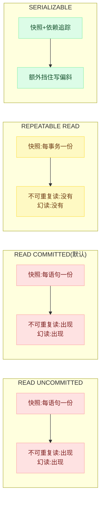
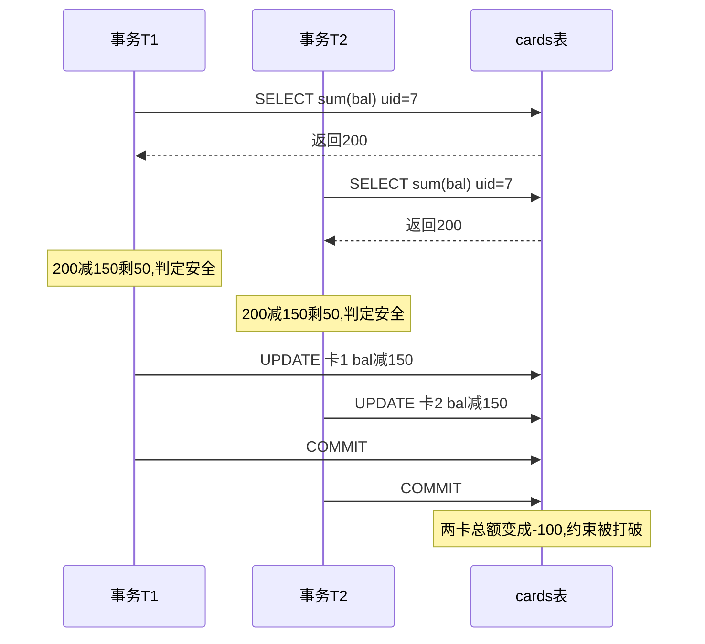
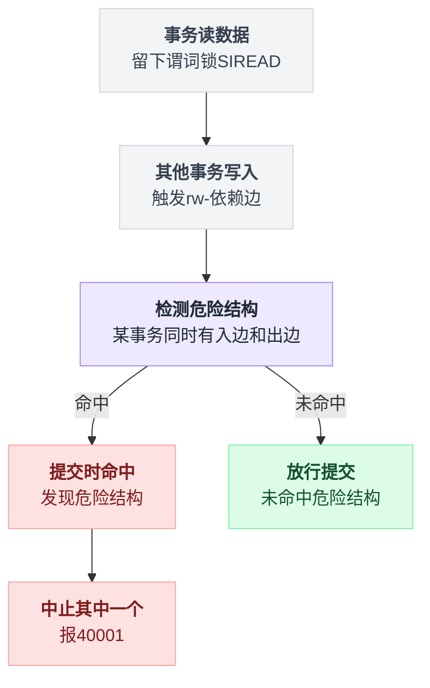
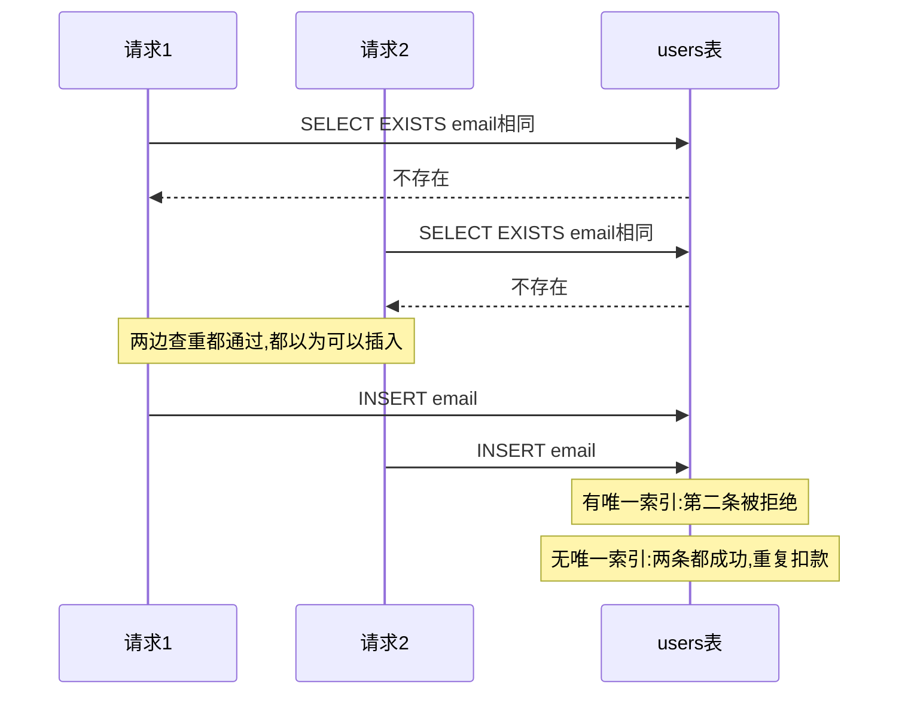
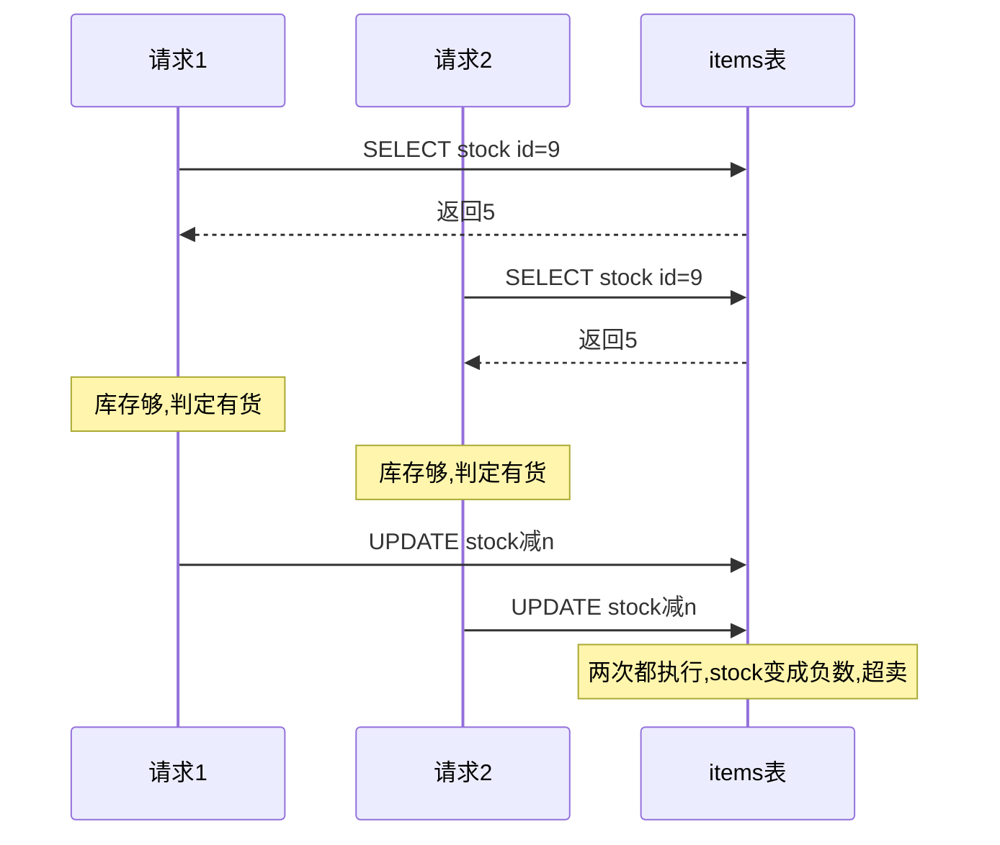
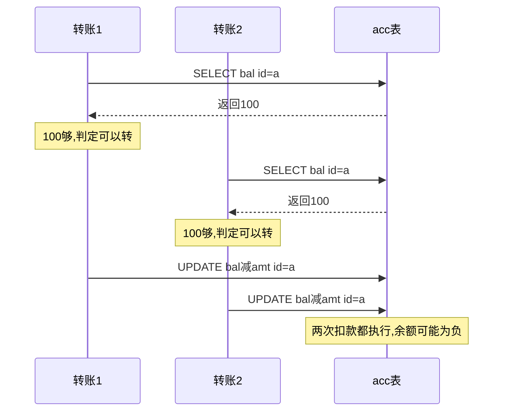
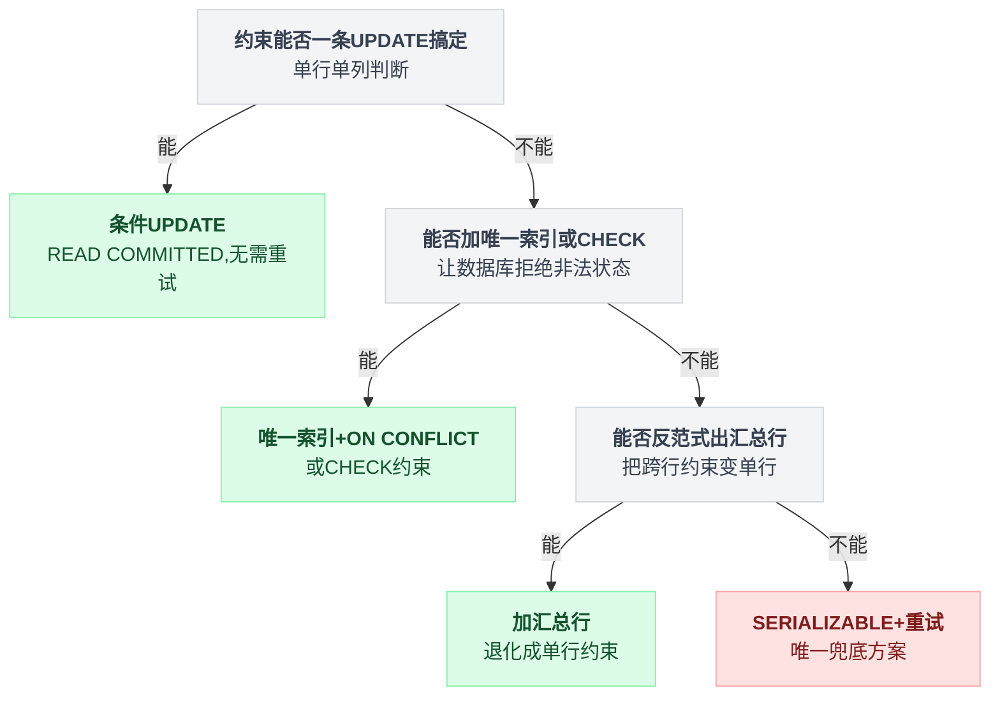

# 第 4 篇 · 隔离级别：三种"看起来对但会错"的写法

> 上一篇解决了"单行余额"的问题。这一篇处理更麻烦的情况：**约束跨越多行、多表，单条 SQL 表达不了。**

---

## 一、Postgres 只有三个隔离级别（不是四个）

SQL 标准定义了四个，但 Postgres 实际只实现了三个：

| 标准级别 | Postgres 实际行为 | 快照策略 |
|---|---|---|
| READ UNCOMMITTED | **等同于 READ COMMITTED** | 每语句一快照 |
| READ COMMITTED（默认） | READ COMMITTED | 每语句一快照 |
| REPEATABLE READ | REPEATABLE READ（**顺便消灭了幻读**） | 每事务一快照 |
| SERIALIZABLE | SERIALIZABLE（SSI） | 每事务一快照 + 依赖追踪 |

这四行拆开摆成并排的样子看，差别就集中在两处：快照什么时候拍、拍完之后要不要跟踪依赖。

第一处差别写成代码只有两行的位置区别：

```
# READ UNCOMMITTED / READ COMMITTED
for stmt in tx:
    snap = 拍快照()        // 每条语句都重拍一次
    run(stmt, snap)

# REPEATABLE READ / SERIALIZABLE
snap = 拍快照()            // 整个事务只拍这一次
for stmt in tx:
    run(stmt, snap)
    // SERIALIZABLE 在这里额外记一笔：这条语句读过什么、写过什么
```

快照拍的位置从循环里挪到循环外，不可重复读和幻读就一起没了。



**Postgres 里根本不存在脏读。**

因为 MVCC 的可见性判断天然要求"xmin 对应的事务已提交"，未提交的行版本对谁都不可见，想脏读都读不到。所以 `READ UNCOMMITTED` 只能被降级处理。

实测（`labs/exp18_anomaly.py`）：

```
  READ UNCOMMITTED 不可重复读: 出现(10→999)   幻读: 出现(2→3)
  READ COMMITTED   不可重复读: 出现(10→999)   幻读: 出现(2→3)
  REPEATABLE READ  不可重复读: 没有(10→10)    幻读: 没有(2→2)
  SERIALIZABLE     不可重复读: 没有(10→10)    幻读: 没有(2→2)
```

⚠️ 注意第三行：**Postgres 的 REPEATABLE READ 顺便把幻读也解决了**，这比 SQL 标准要求的更强。

原因很朴素——RR 用的是快照，快照里就没有那个新插入的行，谈不上"幻"。

（MySQL InnoDB 的 RR 靠间隙锁解决幻读，是另一条技术路线，代价是锁的粒度更粗、更容易死锁。）

---

## 二、那 REPEATABLE READ 还漏了什么？

漏了 **写偏斜（Write Skew）** —— 这是本篇的重点。

### 场景

一个用户有两张卡，业务规则是"**两张卡的余额之和不能为负**"。初始各 100。

两个请求并发进来，各要扣 150：

```python
total = SELECT sum(bal) FROM cards WHERE uid=7     # 两边都读到 200
if total - 150 >= 0:                                # 两边都认为"扣完还剩 50，安全"
    UPDATE cards SET bal = bal-150 WHERE id = <各自的卡>
```

实测（`labs/exp7_writeskew.py`）：

```
READ COMMITTED   -> {T1: commit, T2: commit}   两卡总额: -100   ❌ 约束被打破
REPEATABLE READ  -> {T1: commit, T2: commit}   两卡总额: -100   ❌ 约束被打破
SERIALIZABLE     -> {T1: 'could not serialize access due to
                        read/write dependencies among transactions',
                     T2: commit}               两卡总额:   50   ✅ 约束保住
```

把两个事务的执行时刻摊开看，问题出在两次 UPDATE 之间根本没有交集，谁都拦不住谁：



**REPEATABLE READ 完全挡不住。** 因为两个事务**读的是同一批行，写的是不同的行**——它们之间不存在"更新同一行"的冲突，RR 的快照机制根本没有介入的机会。

这就是写偏斜的定义：

> 两个事务各自读了一批数据、基于读到的内容做了决策、然后写了**不相交**的数据。单独看每个事务都是对的，合起来违反了一个跨行的不变量。

写成代码，凡是长这个形状的都算：

```
rows = SELECT 一批行            // 两个事务读到的是同一批
ok   = 算个聚合 / 存在性(rows)
if ok:
    UPDATE 另外的行             // 两个事务写的行不相交 ← 谁都跟谁不冲突
```

### 现实中的写偏斜长什么样

| 场景 | 不变量 | 翻车方式 |
|---|---|---|
| 医院排班 | 任何时刻至少 1 人值班 | 两个医生同时看到"还有 2 人"，同时请假 |
| 会议室预订 | 同一时段不能重叠 | 两人同时查"这个时段没人订"，同时下单 |
| 抢购限购 | 同一用户最多买 2 件 | 用户开两个页面同时下单 |
| 主账号/子账号额度 | 子账号额度之和 ≤ 主账号额度 | 两个子账号同时提额 |
| 唯一用户名 | 用户名不重复 | 两个注册请求同时查重通过 |

**只要你的判断逻辑是"SELECT 一批 → 算个聚合/存在性 → 写另外的行"，就有写偏斜的风险。**

---

## 三、SERIALIZABLE 是怎么挡住的：SSI

Postgres 的 SERIALIZABLE 用的是 **SSI（Serializable Snapshot Isolation，可串行化快照隔离）**，不是靠加锁串行执行。

思路：**照常用快照跑（所以读不阻塞），但记录每个事务"读过什么"和"写过什么"，在提交时检查有没有形成"危险结构"。**

具体机制：

1. 每个 SERIALIZABLE 事务的读操作会留下 **谓词锁（predicate lock / SIREAD lock）**——不阻塞任何人，只是做个标记："我读过这一行 / 这个索引页 / 这张表"。
2. 当出现 `rw-依赖`（T1 读了某数据，T2 随后改了它）时记一条边。
3. 如果某个事务同时有"入边"和"出边"（形成所谓的 **dangerous structure**），说明可能没有等价的串行执行顺序 → 中止其中一个，报 `40001`。

同样的三步，写成代码是这样：

```
# 事务运行期间
读一行 / 一个索引页 / 一张表   ->  留下 SIREAD 标记      // 不阻塞任何人
别人改了我读过的东西          ->  记一条 rw-依赖边

# COMMIT 时
if 某事务同时有入边和出边:                // 这就是 dangerous structure
    中止其中一个，报 40001
else:
    放行提交
```

注意判定发生在 COMMIT，不是在 UPDATE——所以事务跑完全程都可能白跑。

这套追踪机制落到实处是一条判定链：



**代价**：这是"乐观并发控制"，冲突时才失败，所以并发一高冲突率就飙升。

实测（`labs/exp18_anomaly.py`，多个事务读同一个聚合再写不同行）：

```
   2 并发: 成功 40   重试 34    重试率 46%   耗时 0.05s
   4 并发: 成功 80   重试 146   重试率 65%   耗时 0.11s
   8 并发: 成功 160  重试 480   重试率 75%   耗时 0.37s
  16 并发: 成功 320  重试 2643  重试率 89%   耗时 1.19s
```

**16 并发时 89% 的事务要重试。**

这个数字是场景相关的（这里故意做成人人都读全表 sum，冲突最激烈），但趋势是普遍的：**SSI 的冲突率随并发度超线性增长。**

### ❓ 问题：那到底该不该用 SERIALIZABLE？

| | 场景 | 补充条件 |
|---|---|---|
| ✅ | 约束是**跨行/跨表的聚合或存在性判断** | 且无法用单条 SQL + 单行约束表达 |
| ✅ | 并发不高 | 比如后台审批、财务结算、每天几百次的操作 |
| ✅ | 你已经写好了重试循环 | 并且做了指数退避 |
| ❌ | 高并发的热点路径（每秒几千次扣款） | 重试风暴会让情况更糟 |
| ❌ | 团队没有统一的重试封装 | 一定会有人漏写，然后线上随机 500 |

**✅ 更常见的正解：把跨行约束改造成单行约束。**

回到"两张卡余额之和不能为负"这个例子：

```sql
-- 加一张汇总表（或者在 users 表上加一列）
CREATE TABLE user_wallet (uid int primary key, total numeric NOT NULL CHECK (total >= 0));

-- 扣款时同时改明细和汇总，汇总的约束是单行的
BEGIN;
  UPDATE user_wallet SET total = total - 150 WHERE uid = 7 AND total >= 150;
  -- 0 行 → 直接 ROLLBACK，余额不足
  UPDATE cards SET bal = bal - 150 WHERE id = 1;
COMMIT;
```

现在两个并发事务都要改 `user_wallet` 的**同一行**，退化成了第 3 篇讲的行锁 + EPQ 场景，**READ COMMITTED 就够了**。

📌 **这是解决写偏斜最实用的招：反范式加一个汇总行，把"跨行不变量"变成"单行不变量"。** 代价是要维护汇总的一致性（放在同一个事务里就行），换来的是不需要 SERIALIZABLE、不需要重试、吞吐高一个数量级。

sub2api 就是这么干的：用户余额是 `users.balance` 一个单独的列，而不是"把所有流水加起来"。流水表 `usage_logs` 只是账本，**余额是被冗余出来的单行状态**。

---

## 四、三种"看起来对但会错"的写法

三种写法的病根是同一个：**读和写之间有个时间差，而判断是在读的那一刻做的。**

### 写法一：先查后插（Check-Then-Insert）

```go
// ❌
var exists bool
db.QueryRow("SELECT EXISTS(SELECT 1 FROM users WHERE email=$1)", email).Scan(&exists)
if exists { return ErrEmailTaken }
db.Exec("INSERT INTO users(email, ...) VALUES ($1, ...)", email)
```

两个并发请求的执行时刻摊开是这样，查重那一步两边都通过了：



实测（`labs/exp10c.py`，8 个并发请求同时提交，用 Barrier 保证它们确实在同一时刻完成了"查重"这一步）：

```
[B1] dedup 表上有唯一索引
   余额 990（应为 990）  幂等表行数 1  被数据库挡下的事务 7 个
   {'duplicate key value violates unique constraint'}          ✅ 只扣了一次

[B2] dedup 表上没有唯一索引，只靠应用代码里的 SELECT 判断
   余额 920（应为 990）  幂等表行数 8  被数据库挡下的事务 0 个   ❌ 重复扣款 8 次
```

**注意 B1 的信息量：唯一索引挡下了 7 个事务。**

也就是说，应用代码里的那个 `SELECT EXISTS` **一次都没起作用**——8 个请求全都通过了查重，真正拦住的是数据库约束。

**✅ 做法**：

1. **一定要有唯一索引。** 应用层的查重只是"提前给用户一个友好提示"，绝不是正确性保障。
2. 用 `ON CONFLICT` 代替"先查后插"：

```sql
INSERT INTO users(email, ...) VALUES ($1, ...)
ON CONFLICT (email) DO NOTHING
RETURNING id
```
返回 0 行就是已存在。一条语句，无并发问题。

**❌ 只靠应用层判断会怎样**：低并发下测不出来（两个请求刚好错开），线上放量后开始出现重复用户、重复订单、重复扣款。

而且**这类 bug 的复现概率跟流量正相关**——你越成功，它越频繁。

> 顺带说一个坑：**唯一索引不认 NULL。** `CREATE UNIQUE INDEX ON t(a, b)` 里如果 `b` 可能是 NULL，那么 `(1, NULL)` 可以插无数次（因为 `NULL != NULL`）。软删除表尤其容易踩：`UNIQUE(email, deleted_at)` 完全挡不住重复。正确写法是部分唯一索引：
> ```sql
> CREATE UNIQUE INDEX ON users(email) WHERE deleted_at IS NULL;
> ```
> sub2api 里到处都是这个模式，比如 `scheduler_outbox`：
> ```sql
> CREATE UNIQUE INDEX CONCURRENTLY idx_scheduler_outbox_pending_dedup_key
>     ON scheduler_outbox (dedup_key) WHERE dedup_key IS NOT NULL;
> ```
> （PG 15+ 也可以用 `UNIQUE NULLS NOT DISTINCT`，让 NULL 之间互相冲突。）

---

### 写法二：先查后更（Check-Then-Update）

第 3 篇已经详细讲过了，这里只补一个变体——**"检查库存再扣"**：

```go
// ❌
stock := db.QueryRow("SELECT stock FROM items WHERE id=$1")
if stock < n { return ErrSoldOut }
db.Exec("UPDATE items SET stock = stock - $1 WHERE id=$2", n, id)
```

两个扣库存请求交错执行时，问题出在这个时间差——两边都拿着同一个"库存够"的判断去写：



这里有个容易看漏的细节：UPDATE 本身用的是 `stock - $1`（原子），所以**总数不会算错**，但**会超卖成负数**。

**✅ 做法**：

```sql
UPDATE items SET stock = stock - $1 WHERE id = $2 AND stock >= $1
```
外加一条兜底：
```sql
ALTER TABLE items ADD CONSTRAINT stock_nonneg CHECK (stock >= 0);
```

**❌ 不加 CHECK 会怎样**：某天有人写了另一条忘记加 `AND stock >= $1` 的 UPDATE（补偿脚本、运营后台、数据修复），库存直接变负数。

**CHECK 约束是让这种错误在写入时就炸掉，而不是几个月后在对账时才被发现。**

📌 **原则：能让数据库拒绝的非法状态，就不要指望所有写入路径都记得检查。**

---

### 写法三：读的时候不加锁，写的时候才发现晚了

```go
// ❌ 转账
tx.Begin()
from := tx.QueryRow("SELECT bal FROM acc WHERE id=$1", a)   // 没有 FOR UPDATE
if from < amt { rollback }
tx.Exec("UPDATE acc SET bal = bal - $1 WHERE id = $2", amt, a)
tx.Exec("UPDATE acc SET bal = bal + $1 WHERE id = $2", amt, b)
tx.Commit()
```

转账的两条并发路径交错执行时，冲突点就在两条 UPDATE 之间——都是拿着过时的余额判断在写：



在 READ COMMITTED 下，第一条 SELECT 读到的是当时的快照。等到执行 UPDATE 时，余额可能已经被别的转账扣光了。

**✅ 做法（三选一）**：

```sql
-- 方案 1：把条件写进 UPDATE（最优）
UPDATE acc SET bal = bal - $1 WHERE id = $2 AND bal >= $1;   -- 0 行 → 余额不足，回滚

-- 方案 2：加锁读
SELECT bal FROM acc WHERE id = $1 FOR UPDATE;

-- 方案 3：CHECK 兜底
ALTER TABLE acc ADD CONSTRAINT bal_nonneg CHECK (bal >= 0);  -- 违反时整个事务回滚
```

方案 1 和 3 建议同时上。

---

## 五、40001 / 40P01：必须处理的两个错误码

```
40001  serialization_failure   序列化失败（RR/SERIALIZABLE 下的并发冲突）
40P01  deadlock_detected       死锁（Postgres 自动中止了其中一个事务）
```

**这两个错误的共同点：它们是"重试就能好"的错误，不是"代码有 bug"的错误。**

处理它们的骨架只有一个循环：

```
for i in 0..maxAttempts:
    开事务(iso)
    err = 业务逻辑()
    if err == nil:  err = COMMIT()      // 40001 常常是到这一步才抛出来
    if err == nil:              return 成功
    if err 不是 40001/40P01:    return err    // 真 bug，重试也没用
    sleep(2^i * 10ms + 抖动)                  // 不退避 = 大家一起再撞一次
return ErrTooManyRetries
```

**✅ 标准处理模板**（Go）：

```go
func retryable(err error) bool {
	var pgErr *pgconn.PgError
	if errors.As(err, &pgErr) {
		return pgErr.Code == "40001" || pgErr.Code == "40P01"
	}
	return false
}

func WithTx(ctx context.Context, db *sql.DB, iso sql.IsolationLevel, fn func(*sql.Tx) error) error {
	const maxAttempts = 5
	for i := 0; i < maxAttempts; i++ {
		err := func() error {
			tx, err := db.BeginTx(ctx, &sql.TxOptions{Isolation: iso})
			if err != nil { return err }
			defer tx.Rollback()               // 已提交后再 Rollback 是无害的
			if err := fn(tx); err != nil { return err }
			return tx.Commit()                // ⚠️ Commit 也可能返回 40001
		}()
		if err == nil { return nil }
		if !retryable(err) { return err }
		// 指数退避 + 抖动，避免所有失败事务同时重来
		time.Sleep(time.Duration(1<<i)*10*time.Millisecond + jitter())
	}
	return ErrTooManyRetries
}
```

三个容易漏的点：

| 漏点 | 后果 |
|---|---|
| **`Commit()` 才是 SSI 冲突真正抛错的地方** | 重试逻辑必须把 Commit 包进去 |
| **必须有退避和抖动** | 否则 N 个失败事务同时重来，冲突率不降反升（上面那个 89% 的重试率就是这么来的） |
| **重试次数要有上限** | 否则一个真正的活锁会把连接池耗干 |

**❌ 不处理会怎样**：

- 用户端随机 500，且**并发越高越频繁**——正好在你最不希望出问题的时候出问题；
- 死锁尤其阴险：它平时不出现，只在特定的两条代码路径同时执行时出现，测试环境几乎必然测不出来。

---

## 六、怎么选：一张决策表

| 你的约束长什么样 | 推荐方案 | 隔离级别 | 需要重试吗 |
|---|---|---|---|
| 单行、单列（余额 ≥ 0） | `UPDATE ... WHERE ... AND col >= x` | READ COMMITTED | 否 |
| 唯一性（邮箱、订单号、幂等键） | 唯一索引 + `ON CONFLICT` | READ COMMITTED | 否 |
| 单行、多列联动（余额+冻结） | 一条 UPDATE 里同时改，条件都写 WHERE | READ COMMITTED | 否 |
| 跨行聚合（多卡余额之和 ≥ 0） | **反范式出一个汇总行**，退化成单行约束 | READ COMMITTED | 否 |
| 跨行聚合，且实在无法反范式 | SERIALIZABLE | SERIALIZABLE | **是** |
| 多条 SQL 必须看到同一个世界（对账、报表） | REPEATABLE READ | REPEATABLE READ | 是（可能 40001） |
| 需要锁住一批行慢慢处理（任务队列） | `FOR UPDATE SKIP LOCKED` | READ COMMITTED | 否（第 7 篇） |

把这张表翻译成一条判断链，选择顺序其实是固定的：



---

## 七、把这一章串起来

回头看开头那张四行表：**Postgres 没有脏读，是因为 MVCC 的可见性判断天生只认已提交的行版本**——READ UNCOMMITTED 想脏读都读不到，只能被悄悄降级成 READ COMMITTED（一）。**不可重复读和幻读在 REPEATABLE READ 下一起消失，是因为快照拍摄的位置从"每条语句"挪到了"整个事务"**——快照里压根没有那行新插入的数据，谈不上"幻"（一）。

但 RR 挡不住写偏斜。原因就是二里那两笔各扣 150 的转账：**两个事务读的是同一批行，写的是不同的行**，RR 的快照机制只关心"你要写的行是不是被人抢先动过"，这两笔转账谁都碰不到谁，于是两卡总额悄悄变成了 -100（二）。

SERIALIZABLE 挡得住，是因为它换了一套判定方式：不再看"写的是不是同一行"，而是在提交时检查有没有 rw-依赖串成的**危险结构**（三）。代价也写在那组重试率数字里——**16 并发时 89% 的事务要重试**，SSI 是拿吞吐换正确性。

写法一二三是同一个病根在三种业务代码里的三张脸：先查后插（唯一索引挡下 7 个，应用层挡下 0 个）、先查后更（库存变负而不是总数算错）、转账时判断用的是过期余额——**读和写之间有个时间差，判断却是在读的那一刻做的**（四）。

所以决策顺序永远是：

1. 能不能一条 UPDATE 搞定？（第 3 篇）
2. 能不能加个唯一索引 / CHECK 让数据库拒绝非法状态？
3. 能不能反范式出一个汇总行，把跨行约束变成单行约束——像 sub2api 把余额冗余成 `users.balance` 单独一列那样（二）？
4. 实在不行 → SERIALIZABLE + 重试，并且把 Commit() 也包进重试循环，因为 SSI 的冲突常常是到那一步才抛出来（五）

前三条覆盖了 95% 的场景，且都不需要重试逻辑；只有第 4 条要接住 40001 / 40P01，还必须带退避和抖动——不然失败的事务会同时再撞一次，这正是上面 89% 那个数字的来源。

---

**下一篇** → [05 锁：行锁、表锁、死锁、advisory lock](./05-锁.md)
