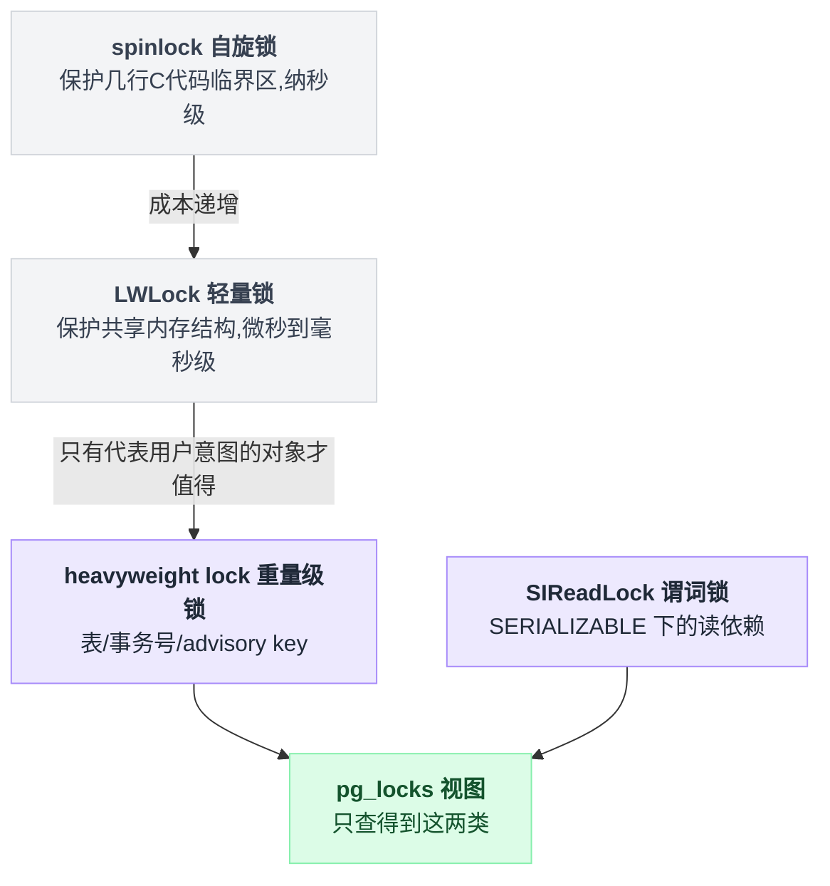
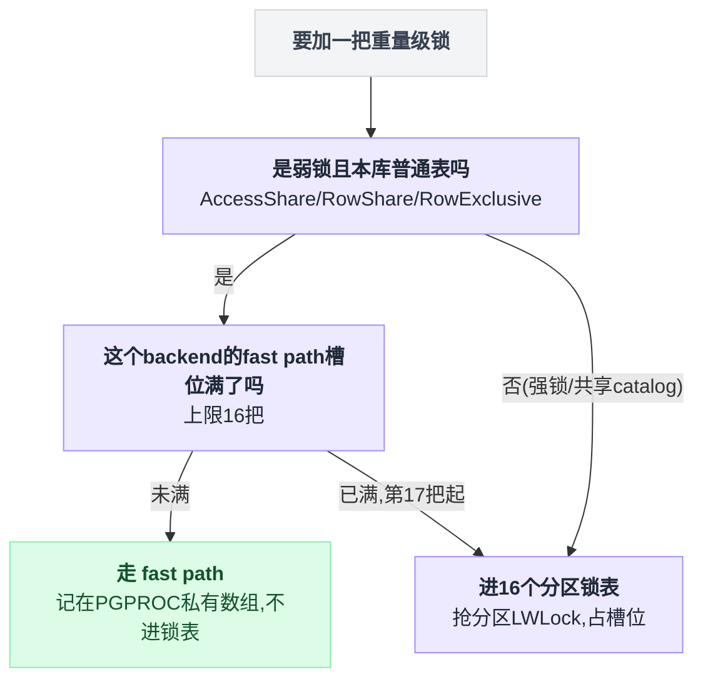
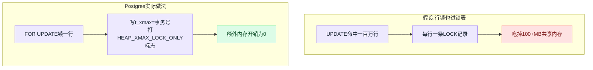
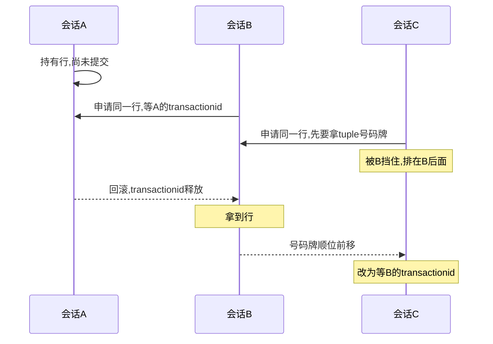
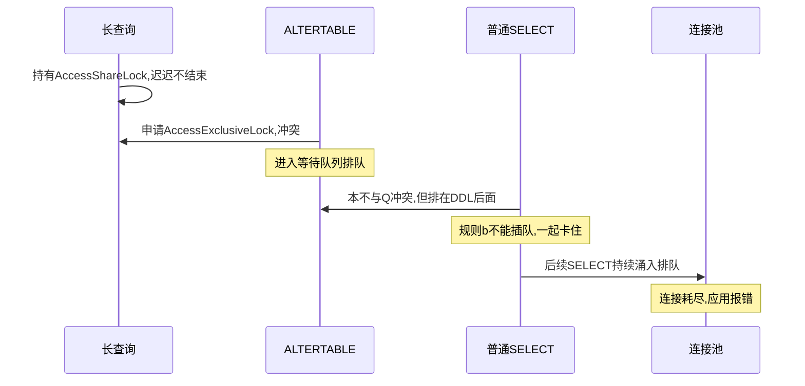
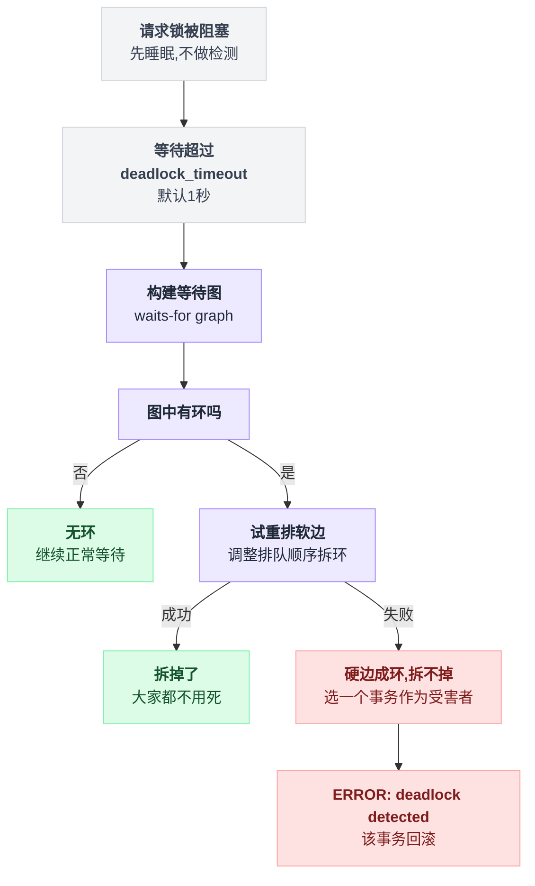
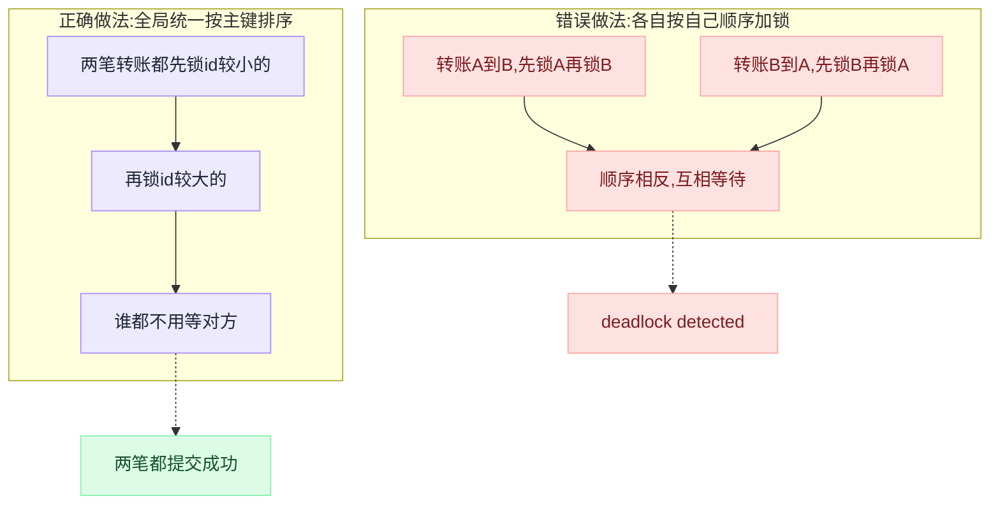
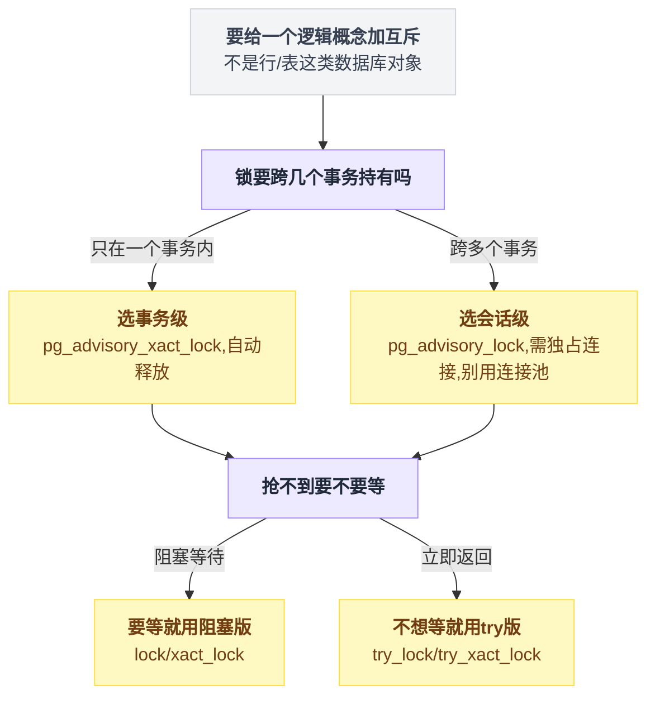
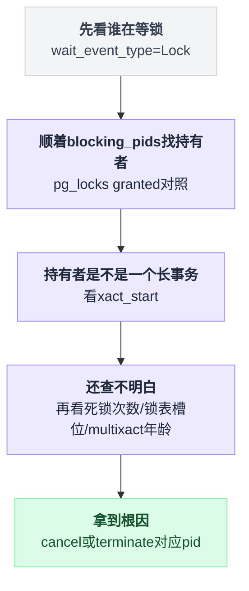

# 第 5 篇 · 锁：从"Postgres 到底怎么实现锁"开始

> **一句话结论**：Postgres 里根本没有"一种锁"。表锁住在共享内存的一张定长哈希表里，**行锁压根不在那张表里**——它被写在数据行自己的头部（`t_xmax` + `t_infomask`）。这一个设计决定，直接解释了后面所有让人困惑的现象：为什么锁一百万行不费内存、为什么 Postgres 没有"锁升级"、为什么 `pg_locks` 里永远查不到行锁、为什么等锁的人显示在等一个叫 `transactionid` 的东西、以及为什么 `ALTER TABLE` 能让整张表停摆。

**这一篇的写法**：先讲机制（锁在内存里长什么样），再讲为什么这么设计（它在躲什么问题），最后才是 SQL 和实测。如果你只想抄用法，跳到第七、八节；但那样你会在半夜排障时看不懂 `pg_locks`。

> **实验环境说明**：本篇新增的实验（30、31、32）于 **2026-08-05** 在本机 **PostgreSQL 16.6 (Homebrew)** 上实跑，输出为原样粘贴。本系列其余篇章的实验跑在 PostgreSQL 16.13 上——两者在本篇涉及的机制上没有差异，但数字（xid、耗时）自然不同。源码引用均来自 `REL_16_STABLE` 分支。

---

## 目录

- [零、先破一个误解：数据库里不止一种锁](#零先破一个误解数据库里不止一种锁)
- [一、重量级锁：你在 pg_locks 里看到的那一种](#一重量级锁你在-pg_locks-里看到的那一种)
- [二、行锁：它根本不在锁表里](#二行锁它根本不在锁表里)
- [三、四种行锁模式，以及外键为什么曾经拖垮父表](#三四种行锁模式以及外键为什么曾经拖垮父表)
- [四、表锁与锁队列：一次 ALTER TABLE 让整张表停摆](#四表锁与锁队列一次-alter-table-让整张表停摆)
- [五、死锁：为什么 Postgres 选择"检测"而不是"预防"](#五死锁为什么-postgres-选择检测而不是预防)
- [六、Advisory Lock：把锁管理器借给业务用](#六advisory-lock把锁管理器借给业务用)
- [七、NOWAIT 与 SKIP LOCKED](#七nowait-与-skip-locked)
- [八、排查清单](#八排查清单)
- [九、本篇小结](#九本篇小结)

---

## 零、先破一个误解：数据库里不止一种锁

新手最容易踩的坑，是把"锁"当成一个东西。于是会问出这样的问题：

> "我这条 SQL 加了什么锁？为什么 `pg_locks` 里查不到？"

问题本身就错了。Postgres 内部有**四类互不相干的锁机制**，它们的实现、成本、用途完全不同，只是中文里都叫"锁"。源码 `src/backend/storage/lmgr/README` 开头就在讲这件事。

| 名字 | 保护什么 | 持续多久 | 有死锁检测吗 | 能在 SQL 里看到吗 |
|---|---|---|---|---|
| **spinlock**（自旋锁） | 几行 C 代码里的临界区 | 纳秒~微秒 | ❌ 没有 | ❌ 看不到 |
| **LWLock**（轻量锁） | 共享内存里的数据结构（buffer 池、锁表本身） | 微秒~毫秒 | ❌ 没有 | 只能在 `pg_stat_activity.wait_event` 里看到 |
| **heavyweight lock**（重量级锁 / 常规锁） | 表、事务号、advisory key……**用户语义上的对象** | 通常到事务结束 | ✅ 有 | ✅ `pg_locks` |
| **SIReadLock**（谓词锁） | SERIALIZABLE 下"我读过哪些数据" | 到事务结束（可能更久） | 不适用（靠冲突检测） | ✅ `pg_locks`，仅 SERIALIZABLE |

**为什么要分这么多层？** 因为锁的功能和成本成正比，而数据库内部 99.99% 的加锁场景根本不需要那些贵功能：

- 想加死锁检测，就得维护"谁在等谁"的等待图 → 需要共享内存里的数据结构 → 而维护那个结构本身又需要加锁。
- 所以最底层必须有一种"不需要任何登记、纯靠 CPU 原子指令"的锁 —— 这就是 spinlock。
- 往上一层，保护 buffer 池这种"竞争激烈但持有时间极短"的结构，用 LWLock：有共享/排他两种模式、按到达顺序授予、不做死锁检测（因为内部代码的加锁顺序是人工保证的）。
- 只有最上层、真正代表用户意图的对象（"我锁住了 users 表"），才值得付出登记 + 等待图 + 死锁检测的全套成本。

源码 README 里那句话说得很清楚：spinlock 和 LWLock **会把 query cancel 和 die 中断挂起**，直到锁释放——所以它们绝对不能长时间持有，否则你 `Ctrl+C` 都停不下来。

📌 **记住这条分界线**：`pg_locks` 里只有重量级锁和谓词锁。你在里面**永远看不到行锁**，也看不到 LWLock。这不是 bug，是设计。

四层的成本和可见性摆在一起看更直观：



---

## 一、重量级锁：你在 pg_locks 里看到的那一种

### 1.1 它就是共享内存里的一张哈希表

启动时 Postgres 在共享内存里开好一张哈希表，之后所有"我锁了 users 表"这类登记，都是往这张表里插一条记录。三个结构：

```
共享内存（所有 backend 都能看到）
┌──────────────────────────────────────────────────────────┐
│  LOCK  —— 一个被锁的对象一条                                │
│    tag        = (数据库 oid, 表 oid, ...)  ← 哈希键        │
│    grantMask  = 已经授出去哪些模式                          │
│    waitMask   = 有人在等哪些模式                            │
│    procLocks  = 谁持有我（链表 → PROCLOCK）                 │
│    waitProcs  = 谁在排队等我（等待队列）                     │
│                                                           │
│  PROCLOCK —— 「某个对象 × 某个 backend」一条                 │
│    tag       = (指向 LOCK, 指向 PGPROC)                    │
│    holdMask  = 这个 backend 在这个对象上持有哪些模式         │
└──────────────────────────────────────────────────────────┘

每个 backend 自己的私有内存
┌──────────────────────────────────────────────────────────┐
│  LOCALLOCK —— 本地计数器                                    │
│    同一把锁在一个事务里可能被申请/释放很多次，              │
│    本地记个数，避免每次都去动共享内存                        │
└──────────────────────────────────────────────────────────┘
```

**为什么要拆成 LOCK 和 PROCLOCK 两个结构？** 因为"这个对象被锁了"和"是谁锁的"是两件事。10 个 backend 同时读 `users` 表，只有 1 条 LOCK，但有 10 条 PROCLOCK。

**为什么还要 LOCALLOCK？** 一条 `SELECT` 在执行过程中可能对同一张表反复申请同一把 `AccessShareLock`。如果每次都去抢共享内存的哈希表，那开销比查询本身还大。LOCALLOCK 就是一个本地引用计数——第二次申请只是把本地计数 +1，完全不碰共享内存。

### 1.2 这张表是定长的，所以它会满

这是生产环境最常见的一个报错：

```
ERROR:  out of shared memory
HINT:  You might need to increase max_locks_per_transaction.
```

很多人第一反应是"我的事务锁太多行了"。**不是**。行锁根本不进这张表（第二节会证明）。这张表的容量是：

```
锁表槽位数 = max_locks_per_transaction × (max_connections + max_prepared_transactions)
```

⚠️ 这个参数名极具误导性：它**不是**"每个事务最多加几把锁"，而是**算总容量用的乘数**，全实例共用一个池子。一个事务完全可以占用远超 `max_locks_per_transaction` 把锁，只要别人没在用。

来看实测（`labs/exp31_locktable_capacity.sh`，起一个用完即扔的小集群，把乘数调到最小）：

```
=== 1) 起一个 max_locks_per_transaction=10, max_connections=10 的小集群 ===
按公式算出来的锁表槽位 = 100

=== 2) 建 3000 张空表（等一下） ===
  建好了 3000 张

=== 3) 一个事务里一张一张摸过去，看第几张表上炸 ===
NOTICE:  摸到第 743 张表时失败
NOTICE:  错误: out of shared memory
```

### ❓ 问题：公式算出来 100，为什么撑到 743 才炸？

这是个值得记住的**反直觉结论**：公式算的是**预估值，不是硬上限**。

源码 `src/backend/storage/ipc/shmem.c` 里 `ShmemInitHash` 的注释写得很直白：

> `max_size` is the estimated maximum number of hashtable entries. **This is not a hard limit**, but the access efficiency will degrade if it is exceeded substantially.

也就是说，锁表可以超出预估容量继续长，只要共享内存里还有剩余空间。而 Postgres 在算共享内存总量时，会额外留一块零头 —— `src/backend/storage/ipc/ipci.c`：

```c
size = 100000;   /* 100K for the stuff that's too small to bother with estimating */
size = add_size(size, PGSemaphoreShmemSize(numSemas));
...
```

**100KB 的零头，就是那 643 张额外的表的来源。** 反过来推算：100000 ÷ (743−100) ≈ 每把 relation 锁在共享内存里占 150 字节出头（LOCK + PROCLOCK + 哈希开销）。〔此为按实测反推的量级估算，非源码给出的确切值〕

**这件事的实践意义**：

1. 别指望"我算好了公式就不会炸"——它可能在你以为安全的地方炸，也可能在你以为会炸的地方撑住。留足余量。
2. 报这个错时，真正该查的是**"谁在一个事务里摸了几百上千个对象"**。头号嫌疑人：
   - **分区表**。一张 1000 分区的表，一条不带分区裁剪条件的查询就要锁 1000+ 个对象（分区 + 每个分区的索引）。
   - **一次性 `pg_dump`** 或者遍历全库的运维脚本。
   - **大量临时表**。

```sql
-- 排查：谁手里锁的对象最多
SELECT pid, count(*) AS 锁对象数, min(left(query, 60)) AS query
FROM pg_locks l JOIN pg_stat_activity a USING (pid)
GROUP BY pid ORDER BY 2 DESC LIMIT 10;
```

### 1.3 为什么锁表要切成 16 份

早期 Postgres 用一把全局的 `LockMgrLock` 保护整张锁表。核数一多，这把锁就成了瓶颈——每条 SQL 开头都要加表锁，等于所有 CPU 在抢同一把 LWLock。

现在的做法是**按 LOCKTAG 的哈希值把锁表切成 16 个分区，每个分区一把独立的 LWLock**：

```c
/* src/include/storage/lwlock.h（REL_16_STABLE） */
#define LOG2_NUM_LOCK_PARTITIONS  4
#define NUM_LOCK_PARTITIONS  (1 << LOG2_NUM_LOCK_PARTITIONS)   /* = 16 */
```

锁 `users` 表和锁 `orders` 表大概率落在不同分区，互不干扰。**这就是"用分片消解热点"这个通用套路在数据库内核里的一次应用**——和你在应用层给热点账户做拆分是同一招。

### 1.4 fast path：弱锁的快车道

分区之后还是不够快。因为绝大多数 SQL 加的都是**互相不冲突的弱锁**（`SELECT` 加 `AccessShareLock`，`UPDATE` 加 `RowExclusiveLock`），这些锁彼此从不冲突，却还要去抢分区 LWLock、写共享内存——纯属浪费。

PG 9.2 加了 fast path：**符合条件的弱锁不进锁表，直接记在 backend 自己的 PGPROC 结构里的一个小数组里**。

条件（`src/backend/storage/lmgr/README`）：

- 用 DEFAULT lockmethod；
- 锁的是**本库的普通表**（不能是共享 catalog）；
- 是**弱锁**：`AccessShareLock` / `RowShareLock` / `RowExclusiveLock`。

三个条件同时满足才能走快车道，画成判定路径是这样：



槽位数量是写死的：

```c
/* src/include/storage/proc.h（REL_16_STABLE） */
#define FP_LOCK_SLOTS_PER_BACKEND 16
```

**一个 backend 最多 16 把锁能走快车道，第 17 把开始老老实实进锁表。** 实测（`labs/exp31` 第 4 段，同一个事务里 `SELECT` 25 张表）：

```
=== 4) 前 16 把弱锁走 fast path，根本不进锁表 ===
  fastpath=false 的 relation 锁: 10
  fastpath=true 的 relation 锁: 16
```

> 16 + 10 = 26：25 张表，外加查询 `pg_locks` 视图自己加的那一把。前 16 把进了 backend 的私有数组（`fastpath=true`），第 17 把开始落到共享锁表里。

**那强锁怎么办？** 如果有人要加强锁（`ShareLock` 及以上），它必须能看到那些藏在各个 backend 私有数组里的弱锁。Postgres 的办法是一个叫 `FastPathStrongRelationLocks` 的计数器数组（1024 个计数器，按分区归类）：谁要加强锁，先把对应计数器 +1；此后其他 backend 发现计数器非零，就知道"这个分区有强锁存在，我不能走快车道了"，老实进锁表。

📌 **实践含义**：一个事务如果要摸很多张表（分区表是典型），前 16 个便宜，之后每一个都要抢分区 LWLock + 占锁表槽位。**分区数量失控的表，代价是双份的：既慢又容易撑爆锁表。**

> **版本提示**：`FP_LOCK_SLOTS_PER_BACKEND = 16` 这个硬编码值在 PG 16 上如此。后续版本社区在讨论把它做成可伸缩的，若你用的是更新的大版本，以自己 `pg_locks.fastpath` 的实测为准。

### 1.5 表级锁：8 种模式

重量级锁在表这一层有 8 种模式。不用背，只要理解一条主线：**模式越强，能和它并存的东西越少**。

| 模式 | 谁会加 | 和谁冲突（简记） |
|---|---|---|
| `ACCESS SHARE` | `SELECT` | 只和 `ACCESS EXCLUSIVE` 冲突 |
| `ROW SHARE` | `SELECT FOR UPDATE/SHARE` | 和 `EXCLUSIVE` 及以上冲突 |
| `ROW EXCLUSIVE` | `INSERT` / `UPDATE` / `DELETE` | 和 `SHARE` 及以上冲突 |
| `SHARE UPDATE EXCLUSIVE` | `VACUUM`（非 FULL）、`ANALYZE`、`CREATE INDEX CONCURRENTLY` | 和自己冲突（所以两个 VACUUM 不会同时跑同一张表） |
| `SHARE` | `CREATE INDEX`（非 CONCURRENTLY） | 挡所有写，允许读 |
| `SHARE ROW EXCLUSIVE` | `CREATE TRIGGER`、部分 `ALTER TABLE` | 挡写、挡自己 |
| `EXCLUSIVE` | `REFRESH MATERIALIZED VIEW CONCURRENTLY` | 只允许 `ACCESS SHARE` |
| `ACCESS EXCLUSIVE` | 多数 `ALTER TABLE`、`DROP`、`TRUNCATE`、`VACUUM FULL` | **挡一切，连 `SELECT` 都进不来** |

实测常见操作各拿哪种（`labs/exp19_locks.py`）：

```
  SELECT * FROM parent                  → AccessShareLock       （最弱，只挡 DDL）
  UPDATE parent SET cnt=1 WHERE id=1    → RowExclusiveLock      （挡 DDL 和 VACUUM FULL）
  CREATE INDEX ON parent(name)          → ShareLock             （挡所有写，允许读）
  ALTER TABLE parent ADD COLUMN z int   → AccessExclusiveLock   （挡一切，包括 SELECT）
```

**为什么需要这么多档？** 因为如果只有"读锁/写锁"两档，`VACUUM` 就没法和 `UPDATE` 并存（它俩其实可以），`CREATE INDEX CONCURRENTLY` 也不可能存在。**每多一档，就是把一类"其实不冲突"的操作从队列里解放出来。** 第三节讲的 `FOR KEY SHARE` 是同一个故事在行级别的重演。

---

## 二、行锁：它根本不在锁表里

### 2.1 先做一道数学题

假设 Postgres 也把行锁登记在共享内存的锁表里。一条这样的语句：

```sql
UPDATE orders SET status = 'archived' WHERE created_at < '2025-01-01';
```

命中一百万行。按上一节反推的量级，每把锁一百多字节 → **一次归档要吃掉一百多 MB 共享内存**，而共享内存是启动时定死的。

商业数据库怎么解决？**锁升级（lock escalation）**：SQL Server 发现某个事务在一张表上的行锁超过阈值（约 5000 把）时，自动把它们合并成一把表锁。省了内存，但代价极其难受——**你的事务突然就把整张表锁住了**，并发瞬间归零，而且这件事发生得毫无征兆、难以复现。

### 2.2 Postgres 的答案：把锁写在行自己身上

Postgres 选了另一条路：**行锁根本不进共享内存，它被写进数据行的头部**。

每个元组（tuple）头里有 `t_xmax` 和 `t_infomask`。第 1、2 篇讲 MVCC 时说过 `t_xmax` 是"删除这行的事务号"——现在补上另一半：**当一行只是被锁住（而不是被删改）时，`t_xmax` 存的是锁它的那个事务号，同时 `t_infomask` 上打一个 `HEAP_XMAX_LOCK_ONLY` 标志，表示"这行只是被锁了，没被删"。**

把"假设进锁表"和"实际写在行头"这两条路摆在一起，差别一目了然：



眼见为实（`labs/exp30_rowlock_storage.py`，用 `pageinspect` 直接读页面）：

```
--- ① 刚插入：xmax 为空，没有任何人锁它 ---
  lp  xmin     xmax       ctid     xmax 上的标志位
  1   1171     0          (0,1)    HEAP_XMAX_INVALID
  2   1171     0          (0,2)    HEAP_XMAX_INVALID

--- ② 会话 A（xid=1172）执行 SELECT ... FOR UPDATE ---
  lp  xmin     xmax       ctid     xmax 上的标志位
  1   1171     1172       (0,1)    HEAP_XMAX_EXCL_LOCK | HEAP_XMAX_LOCK_ONLY | HEAP_KEYS_UPDATED
  2   1171     0          (0,2)    HEAP_XMAX_INVALID
   注意：xmax 就是 A 的 xid，LOCK_ONLY 表示这行只是被锁住、没被删改
   此刻 pg_locks 里 locktype='tuple' 的条目数: 0
```

**这就是全部真相**：一把 `FOR UPDATE` 行锁 = 把 `xmax` 写成自己的事务号 + 打几个 bit。它占用的额外内存是 **0**，因为这些字段本来就在那儿。

代价是：**加行锁会弄脏数据页**（页面被修改 → 要写 WAL → 要刷盘）。所以"只是读一下加个锁"在 Postgres 里并不免费，它是一次真实的写操作。这也是为什么 `SELECT FOR UPDATE` 在只读备库上不能用。

### 2.3 四种行锁模式，其实就是 infomask 上的几个 bit

```c
/* src/include/access/htup_details.h（REL_16_STABLE） */
#define HEAP_XMAX_KEYSHR_LOCK   0x0010  /* xmax is a key-shared locker */
#define HEAP_XMAX_EXCL_LOCK     0x0040  /* xmax is exclusive locker */
#define HEAP_XMAX_LOCK_ONLY     0x0080  /* xmax, if valid, is only a locker */
#define HEAP_XMAX_IS_MULTI      0x1000  /* t_xmax is a MultiXactId */
#define HEAP_KEYS_UPDATED       0x2000  /* tuple was updated and key cols modified */
```

四种模式（`FOR UPDATE` / `FOR NO KEY UPDATE` / `FOR SHARE` / `FOR KEY SHARE`）就是这几个 bit 的组合。上面实验②里 `FOR UPDATE` 打出的正是 `EXCL_LOCK | LOCK_ONLY | KEYS_UPDATED`。

### 2.4 那多个事务同时锁一行呢？——MultiXactId

问题来了：`t_xmax` 只有一个 32 位字段，**装不下两个事务号**。而 `FOR KEY SHARE` 是共享锁，两个事务完全可以同时持有。

Postgres 的解法是 **MultiXactId（多事务号）**：当一行被多个事务同时锁住时，`t_xmax` 里存的不再是事务号，而是一个"事务号组"的编号，同时打上 `HEAP_XMAX_IS_MULTI`。真正的成员列表存在磁盘上的 `pg_multixact/` 目录里。

实测（同一个脚本，③）：

```
--- ③ 会话 B(xid=1173) 和 C(xid=1174) 同时 FOR KEY SHARE ---
  lp  xmin     xmax       ctid     xmax 上的标志位
  1   1171     2          (0,1)    HEAP_XMAX_KEYSHR_LOCK | HEAP_XMAX_LOCK_ONLY | HEAP_XMAX_IS_MULTI
  2   1171     0          (0,2)    HEAP_XMAX_INVALID
   xmax=2 已经不是 xid，而是 MultiXactId。它的成员：
     xid=1173  mode=keysh
     xid=1174  mode=keysh
```

`xmax` 变成了 `2`——这不是事务号 2，是 **2 号 MultiXact**。用 `pg_get_multixact_members()` 一查，两个成员和各自的锁模式明明白白。

**MultiXact 不是免费的**，它是 Postgres 少数几个"能把生产库拖垮"的隐藏成本：

1. **它要写磁盘**（`pg_multixact/offsets` 和 `pg_multixact/members` 两个 SLRU），高频产生 MultiXact 的负载会看到明显的 SLRU 争用。
2. **members 空间会被用尽**，报这个错（`src/backend/access/transam/multixact.c:1260`）：
   ```
   ERROR:  multixact "members" limit exceeded
   ```
3. **它需要被冻结**，和事务号回卷一样有 wraparound 风险，靠 `autovacuum_multixact_freeze_max_age` 兜底。

📌 **什么场景会大量产生 MultiXact？** 最典型的就是**外键**：子表每插一行，就要给父表那行加一次 `FOR KEY SHARE`。一个热门父行（比如某个大客户的 `users` 记录）被几千条子记录同时引用，它的 `xmax` 上就会挂一个成员很多的 MultiXact。

监控它：

```sql
-- 距离 multixact 回卷还剩多少
SELECT datname, mxid_age(datminmxid) AS multixact_age
FROM pg_database ORDER BY 2 DESC;
```

### 2.5 行锁不在锁表里，那"等锁"怎么等？

如果行锁只是行头上的几个 bit，那 B 想锁一行、发现 A 已经锁了，B 要**等什么**？总不能自旋着轮询那个 bit。

Postgres 的答案很巧妙：**去等重量级锁**，具体是两把：

- **`transactionid` 锁**：每个事务开始时都会给自己的事务号加一把 `ExclusiveLock`，一直持有到事务结束。所以 B 只要对 A 的事务号申请 `ShareLock`，就会被挡住；**A 一提交/回滚，这把锁自动释放，B 立刻被唤醒**。等的不是"行"，是"那个人的事务"。
- **`tuple` 锁**：如果同时有 B、C、D 三个人在等同一行，怎么保证先来先得？Postgres 用一把针对这一行的 `tuple` 锁当"号码牌"——谁拿到号码牌，谁才有资格去等 `transactionid`。

实测（`labs/exp32_wait_events.py`）：

```
--- ② B、C 排队抢同一行 ---
  会话       状态                     等待事件                       被谁挡着
  sessA    idle in transaction    Client:ClientRead          []
  sessB    active                 Lock:transactionid         [37693]
  sessC    active                 Lock:tuple                 [37694]

  locktype       mode               已授予      持有/等待者
  transactionid  ExclusiveLock      True     sessA
  transactionid  ShareLock          False    sessB
  tuple          AccessExclusiveLock True     sessB
  tuple          AccessExclusiveLock False    sessC
```

读法：

- A 持有自己 `transactionid` 上的 `ExclusiveLock`（每个事务都有，这是常态）。
- B 在等 A 的 `transactionid`，`granted=False`。
- C 手里连号码牌都没拿到，它在等 `tuple` 锁，**被 B 挡着**（`pg_blocking_pids` 指向 B 而不是 A）。

A 一回滚：

```
--- ③ A 回滚之后 ---
  sessB    idle in transaction    Client:ClientRead          []
  sessC    active                 Lock:transactionid         [37694]
```

B 拿到行了，C 顺位往前挪一格，改成等 B 的事务。**整个过程里，`pg_locks` 从头到尾没出现过一条"行锁"记录。**

把这段排队过程按时间线摊开：



📌 **这解释了一个高频困惑**：为什么 `pg_stat_activity` 显示一堆会话在 `Lock:transactionid` 上等待，但你在 `pg_locks` 里找不到它们锁了哪一行？**因为那个信息不在数据库的内存里，它在数据页上。** 想知道具体哪一行，只能从 `pg_locks` 里 `locktype='tuple'` 那条记录的 `page`/`tuple` 字段反查，或者直接看阻塞者在跑什么 SQL。

### 2.6 所以：Postgres 没有锁升级，一行都不会有

```
--- ⑤ 一个事务锁住 1000000 行之后，整个实例的 pg_locks ---
  relation     RowShareLock           2
  virtualxid   ExclusiveLock          2
  relation     AccessShareLock        1
  transactionid ExclusiveLock          1
  一百万把行锁，锁表里一条都没有 —— 因为它们全写在各自的行头上了
```

一百万把行锁，`pg_locks` 总共 6 行。

**这是一个纯粹的收益吗？不是。** 完整的账要这么算：

| | 锁写在行上（Postgres） | 锁登记在内存锁表（SQL Server 等） |
|---|---|---|
| 锁一百万行的内存开销 | 0 | 上百 MB |
| 会不会锁升级 | **不会**，并发行为可预测 | 会，超阈值突然变表锁 |
| 加锁的代价 | **写操作**：弄脏页、写 WAL | 纯内存操作，不碰数据页 |
| 只读备库能加行锁吗 | **不能** | 视实现而定 |
| 谁锁了哪一行，查得到吗 | 查不到（要翻数据页） | 查得到 |
| 多人锁同一行 | 需要 MultiXact，有额外磁盘与冻结成本 | 锁表里多几条记录而已 |

**这就是这套设计的完整取舍**：用"加锁变成写操作"和"可观测性变差"，换来了"锁多少行都不占内存"和"永远不会锁升级"。对 OLTP 系统来说这笔买卖非常划算——因为**并发行为可预测，比省那点写开销重要得多**。

> 顺带解开另一个谜：为什么 `SELECT ... FOR UPDATE` 之后，`VACUUM` 也清理不掉那些行？因为行上的 `xmax` 指向一个还没结束的事务，Postgres 无从判断这行能不能回收。这是第 9 篇"长事务是万恶之源"的又一个入口。

---

## 三、四种行锁模式，以及外键为什么曾经拖垮父表

有了机制打底，这张表就好懂了——它本质上是"哪几个 bit 能同时打在一行上"。

| 模式 | 谁会加 | 阻止什么 |
|---|---|---|
| `FOR UPDATE` | `UPDATE`（改了键列）、`DELETE`、显式 `SELECT FOR UPDATE` | 一切 |
| `FOR NO KEY UPDATE` | 普通 `UPDATE`（没改唯一键/主键） | 除 `FOR KEY SHARE` 外的一切 |
| `FOR SHARE` | 显式 `SELECT FOR SHARE` | 所有写锁 |
| `FOR KEY SHARE` | **外键检查**（子表插入/更新时给父表行加） | 只阻止改键、删行 |

四种模式按强度排成一条链，比表格更容易记住谁比谁强：


实测冲突矩阵（`labs/exp19_locks.py`，横向是后来者，纵向是持有者）：

```
持有者\等待者          FOR UPDATE   FOR NO KEY UPDATE  FOR SHARE  FOR KEY SHARE
FOR UPDATE               阻塞           阻塞            阻塞         阻塞
FOR NO KEY UPDATE        阻塞           阻塞            阻塞         通过
FOR SHARE                阻塞           阻塞            通过         通过
FOR KEY SHARE            阻塞           通过            通过         通过
```

重点看最后一行：**`FOR KEY SHARE` 不阻止 `FOR NO KEY UPDATE`**。这个设计不是学术洁癖，它解决了一个非常现实的性能问题。

### ❓ 问题：外键为什么会拖慢父表的更新？

**场景**：`usage_logs` 表有 `user_id REFERENCES users(id)`。每秒插入几千条日志，同时用户余额也在被高频更新。

Postgres 8.x 时代只有两种行锁强度：共享和排他。插入子表要确认"父行还在"，于是给父行加共享锁（当时叫 `FOR SHARE`）；而更新父表要排他锁——两者冲突。结果是**每插一条日志，就把那个用户的余额更新挡一下**。热门用户的账号直接锁成一条串行队列。

PG 9.3 把两档拆成四档，就是为了解决这个：**外键检查真正关心的只是"父行的键还在不在"，它根本不在乎那行的余额改没改。** 于是给它一个最弱的 `FOR KEY SHARE`，只和"改键 / 删行"冲突。

对应到机制层：`FOR KEY SHARE` 打的是 `HEAP_XMAX_KEYSHR_LOCK`，而普通 `UPDATE` 打的是 `HEAP_XMAX_EXCL_LOCK` 但**不打** `HEAP_KEYS_UPDATED`——两者在冲突判定时被认定为不冲突。

实测：

```
=== 给子表插一行，会锁住父表那一行 ===
  改父表的普通列 cnt   → 通过（FK 只加 FOR KEY SHARE，不挡非键列的修改）
  改父表的主键 id      → 被阻塞
  删父表这一行         → 被阻塞
```

**✅ 结论**：现代 Postgres（9.3+）上，外键**不会**阻塞父行普通列的更新。可以放心用外键。

**❌ 但仍要注意**：

1. **外键列一定要建索引。** Postgres 会自动为主键/唯一约束建索引，但**不会**为外键列建。删除父行时要检查"有没有子行引用我"，没索引就是全表扫。
   ```sql
   -- 找出所有没有索引的外键
   SELECT c.conrelid::regclass AS 表, a.attname AS 外键列
   FROM pg_constraint c
   JOIN unnest(c.conkey) WITH ORDINALITY AS k(attnum, ord) ON true
   JOIN pg_attribute a ON a.attrelid = c.conrelid AND a.attnum = k.attnum
   WHERE c.contype = 'f'
     AND NOT EXISTS (
       SELECT 1 FROM pg_index i
       WHERE i.indrelid = c.conrelid AND i.indkey[0] = k.attnum
     );
   ```
2. **改主键值或删父行仍会被子表的插入挡住。** 所以"归档旧用户"这类批量删除，要挑低峰期。
3. **热点父行会攒出很大的 MultiXact**（2.4 节）。几千个并发子表插入指向同一个父行时，那行的 MultiXact 成员数会很可观，带来 SLRU 与冻结压力。这是外键在超高并发下唯一真正需要警惕的成本。

---

## 四、表锁与锁队列：一次 ALTER TABLE 让整张表停摆

表锁的模式表在 1.5 节。真正制造事故的不是模式，是**队列**。

### 4.1 等待队列的规则（源码级的准确表述）

一个请求拿不到锁时会进 `ProcSleep`，规则是（`src/backend/storage/lmgr/README`）：

- **默认排到队尾**（FIFO）。
- **例外一**：如果这个进程**已经持有该对象上的锁**，且它持有的锁与队列中某些等待者冲突，它会被插到**第一个这样的等待者前面**——否则会自己把自己饿死。
- **例外二**：如果它的请求既不与已授予的锁冲突，也不与它插入位置之前的任何等待请求冲突，**直接授予，不用等**。

唤醒时（`ProcLockWakeup`）从队头开始扫，条件是"(a) 不与已授予的锁冲突，且 (b) 不与前面那些还唤不醒的等待者冲突"——**(b) 这一条就是队头阻塞的根源**。

### 4.2 队头阻塞：生产事故的标准形态

实测（`labs/exp14.py`）：

```
场景：一个开着不提交的长查询占着表 → ALTER TABLE 来了 → 一条普通 SELECT 也来了

  此刻正在等锁的会话数: 2
  等锁明细: [('ALTER TABLE q ADD COLUMN newcol int', 'Lock'),
             ('SELECT v FROM q WHERE id=1',          'Lock')]

  长查询一提交，ALTER 才拿到锁：
  ALTER 等了 2.2s，一条本该 1ms 的普通 SELECT 被连坐了 1.5s
```

发生了什么：

```
时刻 t0: 长查询 Q 持有 AccessShareLock，跑了很久还没结束
时刻 t1: ALTER TABLE 请求 AccessExclusiveLock → 与 Q 冲突 → 进入等待队列
时刻 t2: 一条普通 SELECT 来了 → 它和 Q 本来不冲突，可以直接跑
         但它和队列里的 ALTER 冲突 → 按规则 (b) 不能越过 → 也被卡住
时刻 t3: 又来 100 条 SELECT → 全部排队
时刻 t4: 连接池耗尽 → 应用报"too many connections" → 全站不可用
```

按参与方拆开看，堵塞是怎么一步步传染给无关请求的：



**一条本来只需要 1 毫秒的 `ALTER TABLE`，因为排在一个 5 分钟的查询后面，让整张表停摆 5 分钟。**

这个事故最阴险的地方在于：**事后看数据库监控，CPU 不高、IO 不高、慢查询也没有**——因为大家都在等锁，什么资源都没消耗。不看 `pg_locks` 根本查不出来。

### ❓ 问题：怎么安全地执行 DDL？

**✅ 做法：给 DDL 加 `lock_timeout`，抢不到就退出重来。**

sub2api 的迁移脚本里到处是这两行（`backend/migrations/033_ops_monitoring_vnext.sql` 等）：

```sql
SET LOCAL lock_timeout = '5s';
SET LOCAL statement_timeout = '10min';
```

意思是：**"5 秒内拿不到锁就放弃（而不是排在队里堵住所有人），拿到锁之后最多干 10 分钟。"**

完整的安全 DDL 模板：

```sql
BEGIN;
  SET LOCAL lock_timeout = '3s';         -- 抢锁最多等 3 秒
  SET LOCAL statement_timeout = '30min'; -- 拿到锁后执行上限
  ALTER TABLE big_table ADD COLUMN c int;
COMMIT;
-- 失败了？等一会儿重试。宁可重试 20 次，也不要堵住整张表 3 分钟。
```

为什么这招有效：**`lock_timeout` 让 DDL 在超时后退出队列**，队列一空，后面积压的 `SELECT` 立刻放行。它把"停摆 5 分钟"换成了"抖动 3 秒 + DDL 失败重试"。

**排查命令**（这个要背下来）：

```sql
-- 谁堵住了谁
SELECT
  a.pid, a.state, now()-a.xact_start AS 事务已运行,
  a.wait_event_type, pg_blocking_pids(a.pid) AS 被这些进程阻塞,
  left(a.query, 80) AS query
FROM pg_stat_activity a
WHERE a.state <> 'idle' OR a.state = 'idle in transaction'
ORDER BY a.xact_start;

-- 找到源头后
SELECT pg_cancel_backend(12345);      -- 温和：取消当前语句
SELECT pg_terminate_backend(12345);   -- 强硬：断开连接（会回滚事务）
```

第 11 篇专门讲各种 DDL 该怎么写。

---

## 五、死锁：为什么 Postgres 选择"检测"而不是"预防"

### 5.1 两条路，Postgres 选了后者

处理死锁只有两种思路：

- **预防**：加锁前先判断"这么加会不会成环"。问题是**每次加锁都要付出检测成本**，而 99.999% 的加锁根本不会死锁——为极小概率事件让所有人买单。
- **检测**：先加，卡住了再说。等超过一段时间还没拿到，才去查有没有成环。**成本只由真正卡住的那些请求承担。**

Postgres 选了检测。源码 README 写得很直白：

> if a process cannot acquire the lock it wants immediately, it goes to sleep **without any deadlock check**. But it also sets a delay timer, with a delay of `DeadlockTimeout` milliseconds (typically set to one second).

这就是 `deadlock_timeout`（默认 1 秒）的真实含义：**不是"死锁 1 秒后才报"，而是"等锁超过 1 秒才值得去查一下是不是死锁"。**

📌 所以 `deadlock_timeout` 不要调太小：调到 10ms，意味着每个稍微等久一点的正常请求都要跑一次全局等待图检测，纯属自残。

### 5.2 检测算法：等待图 + 硬边 / 软边

超时后进入 `DeadLockCheck`，构建 **waits-for graph（等待图）**，找环。这里有一个很多资料不讲的精妙之处——边分两种：

- **硬边（hard edge）**：A 等的锁已经被 B **实际持有**了。这条依赖改不掉。
- **软边（soft edge）**：A 和 B 都在排队，A 排在 B 后面且两者请求冲突。A 之所以要等 B，**只是因为队列顺序**——而队列顺序是可以调整的。

于是 Postgres 会做一件很聪明的事：**发现环之后，先试试能不能通过重排等待队列把环拆掉**（只能动软边）。找得到一个不产生新环的排列，就重排，**谁都不用死**。实在拆不掉，才选一个事务干掉。

整个判定过程画成流程：



### 5.3 死锁长什么样

实测（`labs/exp11_deadlock.py`）：

```
[A] T1 按 1→2 加锁，T2 按 2→1 加锁（加锁顺序不一致）
   {'T1': 'deadlock detected', 'T2': 'commit'}

[B] 两边都按 id 升序加锁
   {'T1': 'commit', 'T2': 'commit'}
```

服务端日志里的完整信息：

```
ERROR:  deadlock detected
DETAIL:  Process 13390 waits for ShareLock on transaction 1704; blocked by process 13391.
         Process 13391 waits for ShareLock on transaction 1703; blocked by process 13390.
         Process 13390: UPDATE acc SET bal=bal+1 WHERE id=$1
         Process 13391: UPDATE acc SET bal=bal+1 WHERE id=$1
CONTEXT:  while updating tuple (0,2) in relation "acc"
```

**现在你能完整读懂这段日志了**：等的是 `ShareLock on transaction`——正是 2.5 节讲的、行锁等待借用的那把 `transactionid` 锁。`while updating tuple (0,2)` 告诉你卡在哪一行（第 0 页第 2 个元组）。

### ❓ 问题：转账代码怎么写才不死锁？

**❌ 最自然的写法就是错的**：

```go
// A 转给 B
tx.Exec("UPDATE acc SET bal = bal - $1 WHERE id = $2", amt, from)
tx.Exec("UPDATE acc SET bal = bal + $1 WHERE id = $2", amt, to)
```

用户 1 转给用户 2 的同时，用户 2 转给用户 1 → 加锁顺序相反 → 死锁。

**✅ 正确写法：永远按同一个全局顺序加锁**（通常用主键排序）：

```go
first, second := from, to
if first > second { first, second = second, first }

tx.Exec("SELECT 1 FROM acc WHERE id = $1 FOR UPDATE", first)
tx.Exec("SELECT 1 FROM acc WHERE id = $1 FOR UPDATE", second)
// 然后随便怎么改
tx.Exec("UPDATE acc SET bal = bal - $1 WHERE id = $2", amt, from)
tx.Exec("UPDATE acc SET bal = bal + $1 WHERE id = $2", amt, to)
```

两种写法的分岔点就在"加锁顺序是不是全局统一"：



⚠️ 有人会写成一条 `SELECT ... WHERE id = ANY($1) ORDER BY id FOR UPDATE`。**`ORDER BY` 不保证加锁顺序**——优化器完全可能先扫描（此时就加锁了）再排序。要顺序，就分两条语句显式地按顺序锁。

**批量更新同样要注意**：

```sql
-- ❌ 两个批量任务处理的 id 集合有交集，但顺序不同 → 死锁
UPDATE users SET x = 1 WHERE id = ANY($1);

-- ✅ 先按序取行锁，再更新
UPDATE users SET x = 1 WHERE id IN (
    SELECT id FROM users WHERE id = ANY($1) ORDER BY id FOR UPDATE
);
```

**❌ 不统一加锁顺序会怎样**：死锁在测试环境几乎测不出来（需要两条路径在毫秒级窗口内同时执行），线上流量一大就开始零星出现。因为频率低，容易被当成"偶发抖动"忽略，直到某天流量翻倍——按并发控制领域的经典估算，**死锁率大致随并发数的平方增长**〔Gray 等人的分析结论，本篇未实测验证〕，于是一夜之间从"偶尔一条"变成"满屏报错"。

**兜底措施**：

```sql
SET deadlock_timeout = '1s';       -- 检测间隔，不建议调太小（检测本身有开销）
SET lock_timeout = '3s';           -- 等锁超过 3 秒就放弃，避免无限等
```

配合 `40P01` 的重试逻辑（第 4 篇的模板），死锁就从"事故"降级成"日志里的一条 warning"。

---

## 六、Advisory Lock：把锁管理器借给业务用

### 6.1 它是什么

前面说重量级锁管理器管的是"表、事务号"这些数据库自己的对象。Advisory lock（咨询锁）是 Postgres 开的一个后门：**你给它一个 64 位整数，它就把这个数字当成一个对象放进锁表，语义完全由你定义。**

它就是普通的重量级锁，`pg_locks` 里查得到：

```
 locktype |     mode      | granted | classid | objid | objsubid
----------+---------------+---------+---------+-------+----------
 advisory | ExclusiveLock | t       |       0 |    42 |        1
```

**所以它有全部重量级锁的性质**：进锁表、占 `max_locks_per_transaction` 的槽位、参与死锁检测。

典型用途是锁一个"逻辑概念"而不是一行数据：

- "清理任务同一时刻只能有一个实例在跑"
- "同一个用户的注册流程不能并发进入"
- "数据库迁移只能有一个进程执行"

sub2api 里三处典型用法：

```go
// ① 迁移执行器：保证多个实例同时启动时，只有一个跑迁移
//    backend/internal/repository/migrations_runner.go
db.QueryRowContext(ctx, "SELECT pg_try_advisory_lock($1)", migrationsAdvisoryLockID).Scan(&locked)

// ② 定时清理任务：多副本部署时只跑一份
//    backend/internal/repository/scheduler_outbox_repo.go
conn.QueryRowContext(ctx, "SELECT pg_try_advisory_lock(hashtext('scheduler_outbox_cleanup'))").Scan(&acquired)

// ③ 事务级：同一个 key 的身份合并流程串行化
//    backend/internal/repository/user_profile_identity_repo.go
exec.QueryContext(ctx, "SELECT pg_advisory_xact_lock($1)", advisoryLockHash(key))
```

实测（`labs/exp15.py`）：

```
  实例A 抢锁: True
  实例B 抢锁: False   <- 直接返回 false，不阻塞
  A 释放后 B 再抢: True
```

### 6.2 四个变体，别用错

| 函数 | 阻塞？ | 什么时候释放 |
|---|---|---|
| `pg_advisory_lock(key)` | 阻塞等待 | **会话结束**或显式 `pg_advisory_unlock` |
| `pg_try_advisory_lock(key)` | 立即返回 true/false | 同上 |
| `pg_advisory_xact_lock(key)` | 阻塞等待 | **事务结束时自动释放** |
| `pg_try_advisory_xact_lock(key)` | 立即返回 true/false | 同上 |

四个变体怎么选，两个问题就能定下来：



### ❓ 问题：会话级 advisory lock 有什么陷阱？

**陷阱 1：连接池会把锁"传染"给下一个人。**

```go
// ❌ 危险
conn := pool.Get()                                   // 从池里拿一个连接
conn.Exec("SELECT pg_advisory_lock(123)")
doWork()
// 忘了 unlock，或者 doWork panic 了
pool.Put(conn)                                       // 连接还回池里，锁还在它身上！
// → 下一个用这个连接的人"莫名其妙"持有着 123 号锁
// → 而真正想拿这把锁的人永远拿不到
```

根因就是机制本身：**会话级 advisory lock 绑定的是"连接"，而连接池的整个前提是"连接会被复用"**——两者天然打架。

**✅ 做法（三选一）**：

1. **优先用事务级** `pg_advisory_xact_lock`——事务一结束自动释放，连接还回池里是干净的。sub2api 里 `user_profile_identity_repo.go` 和 `prompt_config_store.go` 用的都是这个。
2. 如果必须用会话级（比如锁要跨多个事务持有），就**独占一个专用连接**，不要从池里拿。sub2api 的 outbox 清理和迁移执行器都是这么做的——`scheduler_outbox_repo.go` 里明确用 `conn`（单独取出的 `*sql.Conn`），并且 `defer` 里执行 unlock。
3. 一定要 `defer` 里 unlock，且 unlock 用独立的 context（避免主 context 已取消导致 unlock 也失败）：
   ```go
   defer func() {
       unlockCtx, cancel := context.WithTimeout(context.Background(), 5*time.Second)
       defer cancel()
       _, _ = conn.ExecContext(unlockCtx, "SELECT pg_advisory_unlock($1)", lockID)
   }()
   ```

**陷阱 2：`hashtext()` 会碰撞。**

`hashtext('scheduler_outbox_cleanup')` 把字符串映射到 32 位整数。不同字符串**可能**映射到同一个值，导致两个毫不相干的任务互相排斥。

概率很低（32 位空间），但如果你有几十上百个锁名，值得建一个常量表统一管理 key，而不是到处 `hashtext(随手写的字符串)`。sub2api 就同时用了两种方式——迁移锁用的是硬编码常量 `migrationsAdvisoryLockID`，清理任务用的是 `hashtext`。

**陷阱 3：主备切换后锁就没了。**

Advisory lock 活在锁表里，而锁表在共享内存里——**它不写 WAL、不复制到备库**。所以它不是"分布式锁"，它是"单实例内的互斥"。发生 failover，所有 advisory lock 消失。

📌 **能接受的场景**：定时任务防重复、迁移互斥这类"多跑一次也不致命"的事情。**不能接受的场景**：靠它保证"钱只扣一次"——那个要靠唯一索引（第 6 篇）。

**陷阱 4：它占锁表槽位。** 如果你用 advisory lock 给每个用户做细粒度互斥（`pg_advisory_lock(user_id)`），高并发下会往锁表里塞大量条目，可能撞上 1.2 节的 `out of shared memory`。**advisory lock 适合"少量、粗粒度"的互斥，不适合当成"每个实体一把锁"来用。**

---

## 七、NOWAIT 与 SKIP LOCKED

`SELECT ... FOR UPDATE` 后面可以跟两个修饰词，它们改变的是**拿不到锁时的行为**：

```sql
SELECT ... FOR UPDATE NOWAIT;       -- 抢不到锁立刻报错 55P03 lock_not_available
SELECT ... FOR UPDATE SKIP LOCKED;  -- 抢不到锁就跳过这一行，继续找下一行
```

回到 2.5 节的机制：默认行为是"排队等 `transactionid`"。`NOWAIT` 是"不排队，直接报错"，`SKIP LOCKED` 是"不排队，换一行试"。

`SKIP LOCKED` 是构建任务队列的核心武器，第 7 篇专讲。这里先给个直观感受（`labs/exp5_queue_skiplocked.py`，8 个 worker 抢 64 个任务，每个任务在事务里处理 50ms）：

```
[A] FOR UPDATE SKIP LOCKED   墙钟耗时 0.44s   重复执行 0 次
[B] FOR UPDATE（抢不到就排队等） 墙钟耗时 3.31s   重复执行 0 次
[C] 不加行锁                  墙钟耗时 3.48s   重复执行 161 次   ❌
```

**7.5 倍的吞吐差距**，因为 B 里 8 个 worker 全部在抢同一行、串行执行；而 A 里每个 worker 抢到不同的行，真正并行。

C 更惨：不但慢，还**把 64 个任务执行了 225 次**。如果任务是"发短信"，用户收到 4 条重复短信；如果是"扣款"，那就是事故。

---

## 八、排查清单

```sql
-- 1. 现在有谁在等锁？
SELECT pid, wait_event_type, wait_event, pg_blocking_pids(pid), left(query,60)
FROM pg_stat_activity WHERE wait_event_type = 'Lock';

-- 2. 锁的完整视图（谁持有什么锁）
SELECT l.pid, l.locktype, l.mode, l.granted, l.fastpath,
       COALESCE(l.relation::regclass::text, l.objid::text) AS 对象,
       left(a.query, 60)
FROM pg_locks l LEFT JOIN pg_stat_activity a USING (pid)
ORDER BY l.granted, l.pid;

-- 3. 最长的事务（长事务是万恶之源）
SELECT pid, now()-xact_start AS age, state, left(query,80)
FROM pg_stat_activity WHERE xact_start IS NOT NULL
ORDER BY xact_start LIMIT 10;

-- 4. 死锁次数（应该长期为 0，一涨就要查）
SELECT datname, deadlocks, xact_commit, xact_rollback FROM pg_stat_database;

-- 5. 锁表用了多少（接近容量就要警惕 out of shared memory）
SELECT count(*) AS 已用槽位,
       current_setting('max_locks_per_transaction')::int *
       (current_setting('max_connections')::int +
        current_setting('max_prepared_transactions')::int) AS 预估容量
FROM pg_locks WHERE NOT fastpath;

-- 6. multixact 年龄（外键 + 热点父行的隐藏杀手）
SELECT datname, mxid_age(datminmxid) AS multixact_age
FROM pg_database ORDER BY 2 DESC;
```

六条 SQL 不是随便排的顺序，按这个次序查下去最快能定位根因：



建议在数据库上设的全局兜底：

```sql
ALTER DATABASE mydb SET lock_timeout = '10s';
ALTER DATABASE mydb SET statement_timeout = '60s';
ALTER DATABASE mydb SET idle_in_transaction_session_timeout = '60s';
```

**这三个参数默认全是 0（无限制）**，这是 Postgres 少数几个"默认值不适合生产"的地方。

---

## 九、本篇小结

**机制层，四句话**：

1. Postgres 有四类锁（spinlock / LWLock / 重量级锁 / 谓词锁），`pg_locks` 里只有后两类。
2. 重量级锁 = 共享内存里一张**定长**哈希表，容量 = `max_locks_per_transaction × (max_connections + max_prepared_transactions)`，但这是**预估值不是硬上限**（实测：算出来 100，撑到 743）；弱锁前 16 把走 fast path 不进表。
3. **行锁不在这张表里**，它是数据行头上的 `t_xmax` + `t_infomask`；多人锁同一行时升级为 MultiXactId。
4. 因此 Postgres **没有锁升级**；而"等行锁"实际是在等两把重量级锁：`transactionid`（等持有者结束）和 `tuple`（排队号码牌）。

**实践层，一张表**：

| 问题 | 根因 | 解法 |
|---|---|---|
| 更新互相阻塞 | 行锁冲突 | 缩短锁持有时间；用单条原子 UPDATE（第 3 篇） |
| 死锁 | 加锁顺序不一致 | 全局统一按主键升序加锁 + 重试 `40P01` |
| 整张表停摆 | DDL 排队 + 队头阻塞 | `SET LOCAL lock_timeout`，抢不到就重来 |
| `out of shared memory` | 一个事务摸了太多对象 | 查分区表 / 全库脚本；调 `max_locks_per_transaction` |
| 外键拖慢父表 | 老版本用 `FOR SHARE` | PG 9.3+ 已解决；但外键列必须建索引 |
| multixact 年龄涨得快 | 热点父行 + 大量外键引用 | 监控 `mxid_age`，必要时去掉超热点上的外键 |
| 定时任务多副本重复跑 | 没有互斥 | `pg_try_advisory_lock`（注意连接池陷阱） |
| 任务队列 worker 互相堵 | 都抢同一行 | `FOR UPDATE SKIP LOCKED`（第 7 篇） |

📌 **如果只能记住一句**：**行锁写在行上，表锁写在内存里，等锁等的是事务。** 这一句能推出本篇几乎所有结论。

---

## 附：本篇实验清单

| 脚本 | 证明什么 |
|---|---|
| `labs/exp30_rowlock_storage.py` | 行锁写在 `t_xmax`/`t_infomask` 上；MultiXact 的成员；锁 100 万行 `pg_locks` 纹丝不动 |
| `labs/exp31_locktable_capacity.sh` | 锁表容量公式、`out of shared memory` 的真实触发点、fast path 的 16 个槽 |
| `labs/exp32_wait_events.py` | 等行锁 = 等 `Lock:transactionid` + `Lock:tuple`，以及队列顺位 |
| `labs/exp19_locks.py` | 四种行锁模式的冲突矩阵、常见语句各拿哪种表锁 |
| `labs/exp14.py` | DDL 队头阻塞把普通 `SELECT` 连坐 |
| `labs/exp11_deadlock.py` | 加锁顺序不一致 → 死锁；统一顺序 → 不死锁 |
| `labs/exp15.py` | advisory lock 的抢占与释放 |
| `labs/exp5_queue_skiplocked.py` | `SKIP LOCKED` vs `FOR UPDATE` vs 不加锁 |

---

**下一篇** → [06 幂等与 outbox：重试不该扣两次钱](./06-幂等与outbox.md)
