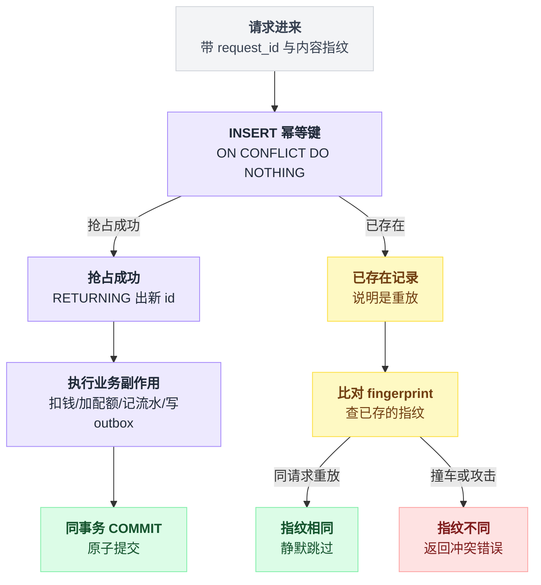
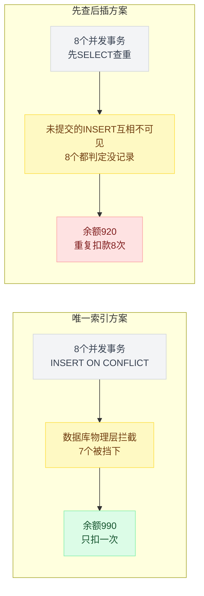
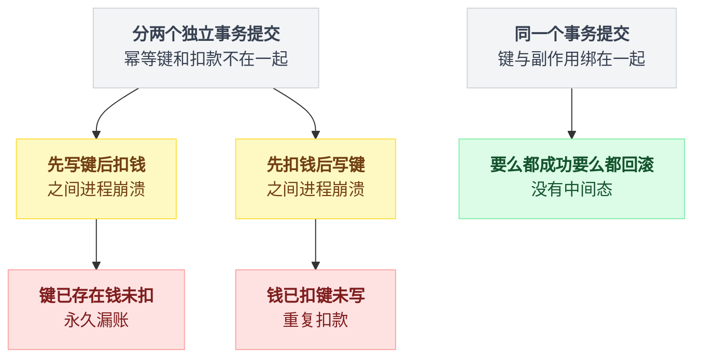
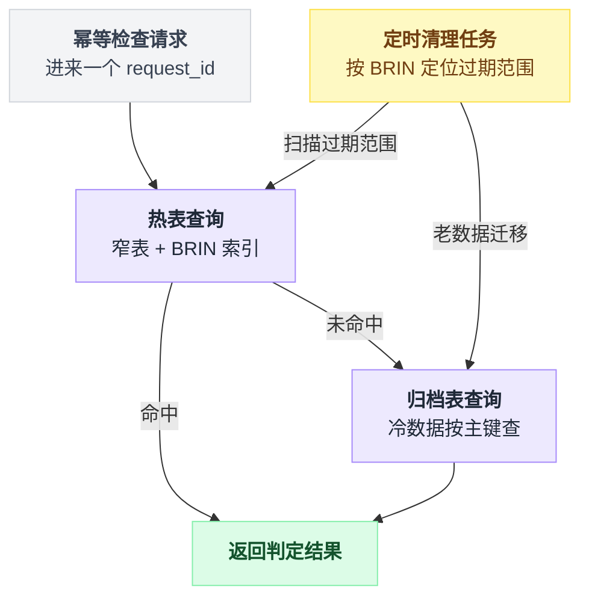
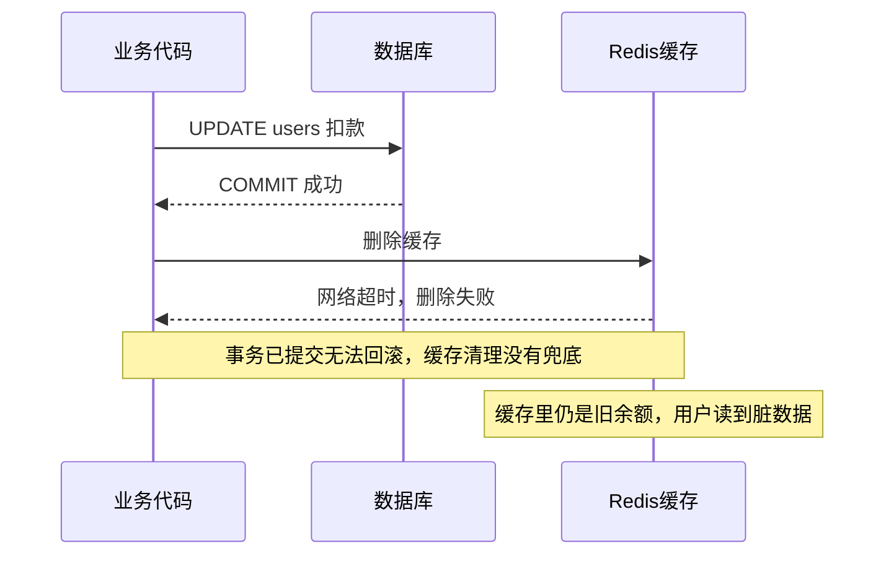
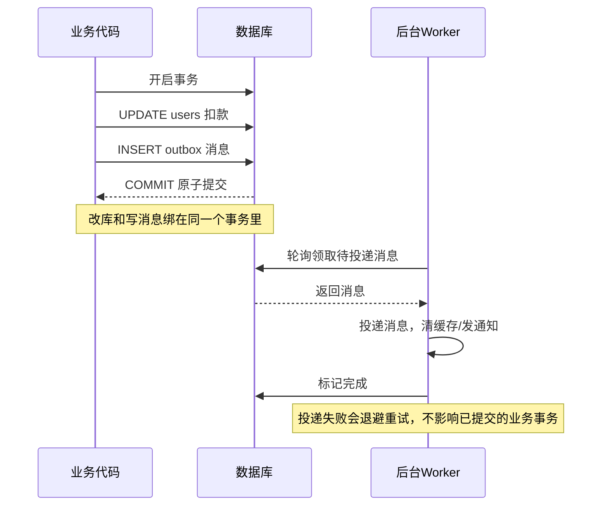
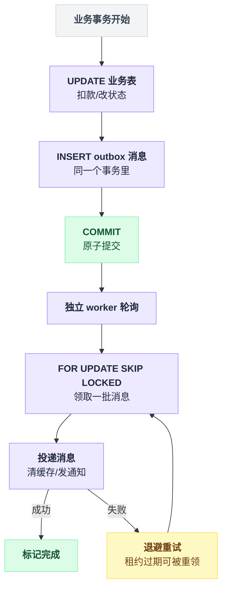
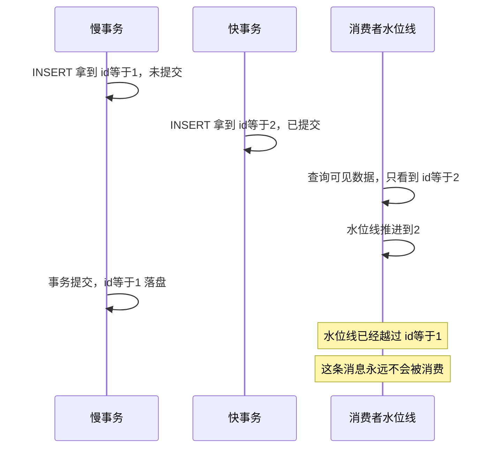

# 第 6 篇 · 幂等与 outbox：重试不该扣两次钱

> 前面解决的是"并发下算得对"。这一篇解决"**同一个操作被投递多次时，只生效一次**"，以及"**改数据库和发消息怎么保持一致**"。

---

## 一、重复投递是必然，不是意外

一个 API 网关的计费链路上，同一次调用可能被重复处理的原因有一大把：

- 客户端 SDK 自动重试（超时、5xx、连接重置）
- 你的网关有重试逻辑
- 消息队列的 at-least-once 语义
- 上游返回慢，你的 HTTP 客户端超时了但请求其实成功了
- 用户狂点提交按钮
- 发布时的滚动重启，处理到一半的请求被重新分配

这六条里没有一条是可以靠"写得更小心"消灭的。

**你无法消灭重复投递，只能让重复投递无害。** 这就是幂等。

---

## 二、sub2api 的幂等实现

整篇的骨架先摆出来：一张只管"这次请求算没算过账"的窄表，一个唯一索引，抢到键才干活，键和所有副作用在同一个事务里提交。

先看表结构：

```sql
-- 窄表账务幂等键：将"是否已扣费"从 usage_logs 解耦出来
CREATE TABLE IF NOT EXISTS usage_billing_dedup (
    id                  BIGSERIAL PRIMARY KEY,
    request_id          VARCHAR(255) NOT NULL,
    api_key_id          BIGINT NOT NULL,
    request_fingerprint VARCHAR(64) NOT NULL,
    created_at          TIMESTAMPTZ NOT NULL DEFAULT NOW()
);

CREATE UNIQUE INDEX IF NOT EXISTS idx_usage_billing_dedup_request_api_key
    ON usage_billing_dedup (request_id, api_key_id);
```

出处：`backend/migrations/071_add_usage_billing_dedup.sql`。

再看用法：

```go
func (r *usageBillingRepository) Apply(ctx context.Context, cmd *service.UsageBillingCommand) (...) {
	tx, err := r.db.BeginTx(ctx, nil)
	defer func() { if tx != nil { _ = tx.Rollback() } }()

	// ① 先抢占幂等键。抢不到 → 说明这次请求已经算过账了，直接返回
	applied, err := r.claimUsageBillingKey(ctx, tx, cmd)
	if !applied {
		return &service.UsageBillingApplyResult{Applied: false}, nil
	}

	// ② 抢到了，才真正执行所有计费副作用
	//    扣余额、累加订阅用量、累加 API Key 配额、累加限流计数……
	if err := r.applyUsageBillingEffects(ctx, tx, cmd, result); err != nil {
		return nil, err
	}

	// ③ 幂等键和所有副作用【在同一个事务里】提交
	if err := tx.Commit(); err != nil { return nil, err }
	tx = nil
	return result, nil
}
```

抢占逻辑：

```go
err := tx.QueryRowContext(ctx, `
	INSERT INTO usage_billing_dedup (request_id, api_key_id, request_fingerprint)
	VALUES ($1, $2, $3)
	ON CONFLICT (request_id, api_key_id) DO NOTHING
	RETURNING id
`, requestID, apiKeyID, requestFingerprint).Scan(&id)

if errors.Is(err, sql.ErrNoRows) {
	// 已经存在 → 这次是重放
	// 但还要检查：是不是【同一个请求】的重放，还是 request_id 撞车了？
	var existingFingerprint string
	tx.QueryRowContext(ctx, `SELECT request_fingerprint FROM usage_billing_dedup
	                         WHERE request_id=$1 AND api_key_id=$2`,
	                   requestID, apiKeyID).Scan(&existingFingerprint)
	if existingFingerprint != requestFingerprint {
		return false, service.ErrUsageBillingRequestConflict   // 同 ID 不同内容 → 报冲突
	}
	return false, nil                                          // 正常重放 → 静默跳过
}
```

两段代码合起来只有三条出口，写成伪代码是这样：

```
在一个事务里:
    抢键 = INSERT 幂等键 ON CONFLICT DO NOTHING RETURNING id

    if 抢到了:
        执行全部副作用（扣钱、加配额、记流水、写 outbox）
        COMMIT                                  → 出口一：真的算了一次账
    else:
        旧指纹 = SELECT request_fingerprint ...
        if 旧指纹 != 本次指纹:
            报 ErrUsageBillingRequestConflict    → 出口二：同 ID 不同内容
        else:
            静默返回 Applied=false               → 出口三：正常重放
```

一句话：**抢到键的人才有资格花钱，抢不到的人只需要判断"你和之前那位是不是同一个人"。** 实现在 `backend/internal/repository/usage_billing_repo.go`。

把抢占键、比对指纹、执行副作用这几步画成一张图：



这段代码有 **4 个设计决策**值得逐一拆解。

---

### 决策 1：用唯一索引，不用"先查后插"

**这是唯一可靠的做法。** 第 4 篇已经用实测证明过（`labs/exp10c.py`）：

```
[B1] dedup 表上有唯一索引
   余额 990（应为 990）  被数据库挡下的事务 7 个   ✅ 只扣了一次

[B2] 没有唯一索引，只靠应用代码里的 SELECT 判断
   余额 920（应为 990）  幂等表行数 8              ❌ 重复扣款 8 次
```

画成对比图，一眼就能看出两条路径的分野：



**❓ 为什么"先 SELECT 查重再 INSERT"必然漏？**

因为在 READ COMMITTED 下，一个还未提交的 INSERT 对别的事务**不可见**。8 个并发事务的 SELECT 全都看到"没有记录"，于是 8 个全都往下走。

**只有唯一索引能拦住它** —— 因为唯一索引的检查不走快照，它检查的是"物理上有没有一个未被判定为死的索引项"，包括其他事务未提交的插入（此时会阻塞等待对方结束，再决定报错还是放行）。

> **✅ `ON CONFLICT DO NOTHING` vs 捕获 duplicate key 异常**
>
> 两者都对，但 `ON CONFLICT` 更好：捕获异常会让**整个事务进入 aborted 状态**，后续语句全部报 `current transaction is aborted`，你必须用 SAVEPOINT 才能继续。而 `ON CONFLICT` 不会中止事务。
>
> 在 sub2api 这种"幂等键和扣款在同一个事务里"的设计下，这个区别是决定性的。

---

### 决策 2：幂等键和副作用必须在同一个事务里

```go
tx.Begin()
  INSERT INTO usage_billing_dedup ... ON CONFLICT DO NOTHING RETURNING id   -- 抢锁
  UPDATE users SET balance = balance - cost ...                             -- 扣钱
  UPDATE api_keys SET quota_used = quota_used + cost ...                    -- 加配额
  INSERT INTO usage_logs ...                                                -- 记流水
tx.Commit()
```

**❓ 问题：如果把幂等键单独提交会怎样？**

```go
// ❌ 危险
db.Exec("INSERT INTO dedup ... ON CONFLICT DO NOTHING")   // 事务 1，独立提交
if 插入成功 {
    db.Exec("UPDATE users SET balance = balance - $1")     // 事务 2
}
```

拆开成两个事务，无论哪个在前，崩溃点都落在中间那道缝里：

| 拆分顺序 | 崩溃在中间时 | 后果 |
|---|---|---|
| 先写键、后扣钱 | 幂等键留下了，钱没扣 | 重试被幂等键挡住 → **永久漏账** |
| 先扣钱、后写键 | 钱扣了，键没写 | 重试再走一遍 → **重复扣款** |

把两种崩溃时机画出来，对比就很直观：



只有放在**同一个事务**里，才有"要么全成功、要么全回滚"的保证。这也是 outbox 模式的核心思想（下面会讲）。

---

### 决策 3：加 fingerprint 防"同 ID 不同内容"

`request_id` 是客户端给的，客户端可能：

- 用了一个碰撞的 UUID 生成器；
- 复用了 request_id（比如把它当成会话 ID）；
- 恶意重放：拿一次 $0.001 的请求 ID，去顶掉一次 $10 的计费。

所以 sub2api 额外存了一个 `request_fingerprint`（请求内容的哈希）。

| 情况 | 判定 | 行为 |
|---|---|---|
| 同 ID 同指纹 | 正常重放 | 静默跳过 |
| 同 ID 不同指纹 | 撞车或攻击 | 返回 `ErrUsageBillingRequestConflict`，让上层决定怎么处理 |

**❌ 不做指纹校验会怎样**：攻击者可以用一个已经计过费的 request_id 发起无限次高消耗请求，全部被"幂等"掉，平台白白承担上游成本。

这是一个**真实可利用的漏洞**，不是理论风险。

---

### 决策 4：窄表 + BRIN + 归档，控制幂等表的膨胀

幂等表是纯追加写的，每个请求一行。一天几千万请求就是几千万行。

换句话说，这张"辅助表"很容易长成库里最大的那张。sub2api 用三层处理压住它。

**① 窄表**：迁移文件的注释写得很清楚——"将*是否已扣费*从 `usage_logs` 解耦出来"。幂等表只有 5 个列，行小、索引小、写入快。如果把幂等标记塞在宽大的 `usage_logs` 上，每次幂等检查都要触碰一张宽表。

**② BRIN 索引做时间范围清理**：

```sql
-- usage_billing_dedup 是按时间追加写入的幂等窄表。
-- 使用 BRIN 支撑按 created_at 的批量保留期清理，尽量降低写放大。
-- 使用 CONCURRENTLY 避免在热表上长时间阻塞写入。
CREATE INDEX CONCURRENTLY IF NOT EXISTS idx_usage_billing_dedup_created_at_brin
    ON usage_billing_dedup USING BRIN (created_at);
```

出处：`072_add_usage_billing_dedup_created_at_brin_notx.sql`。

**BRIN（Block Range INdex）**只记录"每 128 个数据页里 `created_at` 的最小值和最大值"。对于**物理顺序和列值顺序天然一致**的追加表（时间戳列就是典型），它极其高效。

实测索引大小对比（100 万行，`labs/exp9_index.sql`）：

```
  i_brin           24 kB      ← BRIN
  i_full           30 MB      ← 普通 B-tree
  usage_logs_pkey  21 MB
```

**24 KB vs 30 MB，小了 1000 倍以上。** 代价是它只能做粗粒度的范围过滤（"这批页里可能有符合条件的行"），不能做精确定位——但清理任务恰好只需要范围过滤。

**③ 归档表**：

```sql
-- 冷归档旧账务幂等键，缩小热表索引与清理范围，同时不丢失长期去重能力。
CREATE TABLE IF NOT EXISTS usage_billing_dedup_archive (
    request_id VARCHAR(255) NOT NULL,
    api_key_id BIGINT NOT NULL,
    request_fingerprint VARCHAR(64) NOT NULL,
    created_at TIMESTAMPTZ NOT NULL,
    archived_at TIMESTAMPTZ NOT NULL DEFAULT NOW(),
    PRIMARY KEY (request_id, api_key_id)
);
```

出处：`073_add_usage_billing_dedup_archive.sql`。

热表只留最近 N 天，老的挪到归档表。检查幂等时先查热表、再查归档表——**慢一点，但不丢历史去重能力**。

查询路径和清理路径画成一张图：



**❓ 问题：幂等键能不能设个 TTL 直接删掉？**

**✅ 可以，但 TTL 必须显著大于"重试可能发生的最长时间"。**

**❌ TTL 设太短会怎样**：一条消息在死信队列里躺了 3 天后被人工重投，而幂等键 24 小时就删了 → 重复扣款。

而且这类事故极难排查，因为它发生在"运维手工操作"之后，日志上下文早就断了。

---

## 三、Outbox 模式：数据库改了，消息也得发出去

### 问题

计费成功后要做几件事：清缓存、通知调度器、给用户发欠费提醒。

```go
// ❌ 经典错误
tx.Begin()
  UPDATE users SET balance = ...
tx.Commit()
redis.Del(cacheKey)        // 如果这里失败了呢？
mq.Publish(event)          // 如果这里失败了呢？
```

- Commit 成功但 `redis.Del` 失败 → **缓存里是旧余额，用户拿着过期的额度继续用**；
- 更糟：**把 `redis.Del` 放进事务里** → 事务持有行锁的时间被网络 I/O 拉长，热点行被锁成串行（回到第 2 篇讲的长事务问题）。

**这是分布式系统里的"双写问题"：两个存储系统，没有共同的事务。**

先看没有 outbox 时会发生什么：



再看加上 outbox 之后的样子：



### 解法：把"要发的消息"也写进数据库

sub2api 的 `auth_cache_invalidation_outbox`：

```sql
CREATE TABLE auth_cache_invalidation_outbox (
    id             BIGSERIAL PRIMARY KEY,
    cache_key      CHAR(64) NOT NULL CHECK (cache_key ~ '^[0-9a-f]{64}$'),
    created_at     TIMESTAMPTZ NOT NULL DEFAULT NOW(),
    available_at   TIMESTAMPTZ NOT NULL DEFAULT NOW(),   -- 延迟投递 / 退避重试
    delivery_stage SMALLINT NOT NULL DEFAULT 0 CHECK (delivery_stage IN (0,1)),
    attempts       INTEGER NOT NULL DEFAULT 0 CHECK (attempts >= 0),
    last_error     TEXT,
    claimed_at     TIMESTAMPTZ,                          -- 租约：什么时候被领走的
    claimed_by     TEXT                                  -- 租约：被谁领走的
);

-- 只给"待领取"的行建索引 —— 部分索引，已处理的行不占索引空间
CREATE INDEX idx_auth_cache_invalidation_outbox_available
    ON auth_cache_invalidation_outbox (available_at, id) WHERE claimed_at IS NULL;
CREATE INDEX idx_auth_cache_invalidation_outbox_lease
    ON auth_cache_invalidation_outbox (claimed_at) WHERE claimed_at IS NOT NULL;
```

出处：`migrations/184_auth_cache_invalidation_outbox.sql`。

写入侧甚至做到了**触发器自动入队**——业务代码根本不用记得写 outbox：

```sql
CREATE OR REPLACE FUNCTION enqueue_auth_cache_invalidation(raw_key TEXT)
RETURNS VOID LANGUAGE plpgsql AS $$
BEGIN
    IF raw_key IS NULL OR raw_key = '' THEN RETURN; END IF;
    INSERT INTO auth_cache_invalidation_outbox (cache_key)
    VALUES (encode(sha256(convert_to(raw_key, 'UTF8')), 'hex'));
END; $$;
```

（注意：只存 key 的 SHA-256，**明文凭证不出 `api_keys` 表**。安全设计顺手做进了 schema。）

于是流程变成：

```go
tx.Begin()
  UPDATE users SET balance = ...
  INSERT INTO auth_cache_invalidation_outbox(cache_key) VALUES (...)  -- 同一个事务
tx.Commit()                          // ← 原子的：要么都成功，要么都没发生

// 另一个后台 worker 独立地把 outbox 里的消息投递出去，失败就重试
```

画成一张流程图更直观：



消费侧就是这段 SQL：

```sql
WITH candidates AS (
    SELECT id FROM auth_cache_invalidation_outbox
    WHERE available_at <= NOW()
      AND (claimed_at IS NULL OR claimed_at < NOW() - ($3 * INTERVAL '1 second'))  -- 租约过期可重领
    ORDER BY id ASC
    LIMIT $2
    FOR UPDATE SKIP LOCKED
)
UPDATE auth_cache_invalidation_outbox AS o
SET claimed_at = NOW(), claimed_by = $1
FROM candidates AS c
WHERE o.id = c.id
RETURNING o.id, o.cache_key, o.attempts, o.delivery_stage, o.created_at
```

出处：`backend/internal/repository/auth_cache_invalidation_outbox_repo.go`。

这条 SQL 里有 4 个设计点，第 7 篇会逐个拆解：`FOR UPDATE SKIP LOCKED`、租约超时重领、`ORDER BY id` 保序、CTE + UPDATE 一次往返完成"领取 + 标记"。

### ❓ 问题：outbox 保证的是什么？

**保证 at-least-once（至少一次），不保证 exactly-once。**

- 消息一定会被投递（数据库事务保证它被记下来了，worker 会一直重试）；
- 但可能被投递多次（worker 投递成功后、标记完成前崩溃）。

**所以消费端必须幂等。** 这就回到了本篇的前半部分——**幂等 + at-least-once = 事实上的 exactly-once**。这两个东西是一对，缺一个都不成立。

---

## 四、⚠️ 一个非常隐蔽的坑：序列号是非事务的

sub2api 的 outbox 清理代码里有一段注释，值得单独拎出来讲：

```go
// created_at < NOW() - INTERVAL '10 seconds' 防御 PG 序列号在事务内提前分配但
// 提交延迟的竞争：若某 Tx 在 watermark 推进前持有 id=N（未提交），watermark
// 跨过 N 后该 Tx 才提交，此时 row N 已经"低于 watermark"但从未被 poll；10s
// 宽限期让此类慢事务有机会提交后被消费，再被 cleanup 删除。
```

出处：`scheduler_outbox_repo.go`。

这段话在说一个**真实存在、极难复现、后果是永久丢消息**的 bug。

先把它写成伪代码看清楚——问题出在消费者用一个单调递增的 id 水位线记进度：

```
watermark = 0                       # 消费者的进度，只增不减

每轮轮询:
    rows = SELECT * FROM outbox WHERE id > watermark   # 只看得见已提交的行
    处理(rows)
    watermark = max(rows.id)        # ← 致命的一步：假设"小 id 一定先可见"
```

那个假设是错的。实测（`labs/exp20_seqgap.py`）：

```
=== 序列号是非事务的：id 先分配，事务后提交 ===
  慢事务已经拿到 id=1，但还没提交
  快事务拿到 id=2，并且已经提交
  此刻消费者看到: [(2, '快事务的消息')]
  ❌ 消费者把水位线推进到 2，认为 <= 2 的都处理过了
  慢事务提交后表里: [(1, '慢事务的消息'), (2, '快事务的消息')]
  → id=1 这条消息【永远不会被消费】，因为水位线已经越过它了
```

把这个时间线画出来会更清楚：



**根因**：`bigserial` 背后是一个 sequence，而 **sequence 的取值不受事务控制**（它必须如此，否则并发插入就要互相排队）。所以：

- id 是**在 INSERT 执行时**分配的，不是在 COMMIT 时；
- 一个慢事务可能持有一个**小 id**，却在很多**大 id** 之后才提交；
- 任何"按 id 单调推进水位线"的消费者，都会跳过这条记录。

**✅ 三种解法**：

| 解法 | 做法 | 取舍 |
|---|---|---|
| 加宽限期（sub2api 的做法） | 只清理 `created_at < NOW() - 10 秒` 的行，给慢事务留出提交窗口 | 简单有效，代价是清理有延迟 |
| 不用水位线，用状态字段 | `WHERE processed_at IS NULL`（配合部分索引），消息不会因为 id 顺序被跳过 | 多数场景推荐这个 |
| 用 `pg_current_snapshot()` 判断可见性边界 | Debezium 之类的 CDC 工具用的思路 | 复杂但精确 |

**❌ 不处理会怎样**：几万条消息里丢那么一两条。

因为量极小，监控发现不了；因为是"慢事务 + 高并发"的巧合，测试环境复现不出来；等到有人发现"这个用户的缓存怎么一直是旧的"，已经是几个月后了。

### 附带的一个常识：序列不回滚

```
=== 序列不回滚：ROLLBACK 也会消耗序列号 ===
  回滚前序列 last_value=2，回滚后=3  → 序列号被消耗掉了，id 出现空洞
```

**推论**：

- `bigserial` 主键**一定有空洞**，不能当"订单总数"用；
- **不能拿它当需要连续的业务编号**（发票号、合同号），那些要单独用一张带行锁的计数表，或者接受空洞并在业务上说明；
- `MAX(id)` 不等于行数，`COUNT(*)` 才是。

---

## 五、幂等实现的选型

| 方案 | 适用 | 注意 |
|---|---|---|
| **唯一索引 + `ON CONFLICT DO NOTHING`** | 通用首选 | 幂等键必须和副作用同事务 |
| **唯一索引 + `ON CONFLICT DO UPDATE`（upsert）** | "重放要更新为最新状态" | 注意并发 upsert 仍可能死锁，要按序处理 |
| **业务状态机**（`WHERE state='pending'`） | 有明确状态流转的实体 | `UPDATE ... WHERE id=$1 AND state='pending'`，0 行 = 已处理 |
| **版本号 / 乐观锁**（`WHERE version=$1`） | 覆盖式更新 | 0 行 = 有人先改了，要重读重试 |
| **Redis SETNX** | 只做"防抖"，降低数据库压力 | **绝不能当唯一保障**——Redis 会丢数据、会 failover |

📌 **最后一条要特别强调**：见过太多"用 Redis 分布式锁保证不重复扣款"的设计。

Redis 主从切换时未同步的写会丢，锁就失效了。**钱的幂等必须落在数据库的唯一约束上**，Redis 只能做前置的性能优化。

---

## 六、本篇小结

```
      ┌───────────────────────────────────────────────┐
      │  一个事务里同时完成：                          │
      │   ① INSERT 幂等键 ON CONFLICT DO NOTHING       │  ← 抢不到就是重放，直接返回
      │   ② 所有业务副作用（扣钱、加配额、记流水）      │
      │   ③ INSERT outbox（要发的消息）                │
      │  COMMIT                                        │  ← 原子
      └───────────────────────┬───────────────────────┘
                              ▼
      ┌───────────────────────────────────────────────┐
      │  独立 worker 轮询 outbox：                     │
      │   FOR UPDATE SKIP LOCKED 领取 → 投递 → 标记完成│  ← at-least-once
      │   失败则退避重试，租约过期可被别人重领          │
      └───────────────────────────────────────────────┘
                              ▼
              消费端必须幂等  →  事实上的 exactly-once
```

| 要点 | 为什么 |
|---|---|
| 唯一索引，不是应用层查重 | 并发下 SELECT 查重必然漏 |
| `ON CONFLICT DO NOTHING` 优于捕获异常 | 不会让事务进入 aborted 状态 |
| 幂等键 + 副作用同事务 | 否则崩溃时会漏账或重复扣 |
| 幂等键带内容指纹 | 防同 ID 不同内容的重放攻击 |
| 幂等表要窄、要归档、用 BRIN | 否则它自己会变成最大的表 |
| outbox 让"改库"和"发消息"原子化 | 消灭双写问题 |
| 别用 `id` 做水位线 | 序列非事务，慢事务会造成永久丢消息 |

📌 **一句话**：**幂等的正确性只能建立在数据库的唯一约束上**，其余一切（Redis 锁、应用层查重、消息去重）都只是性能优化。

---

**下一篇** → [07 任务队列：SKIP LOCKED 与租约](./07-任务队列.md)
