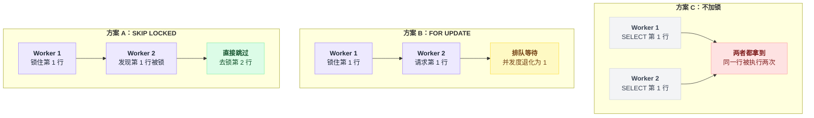
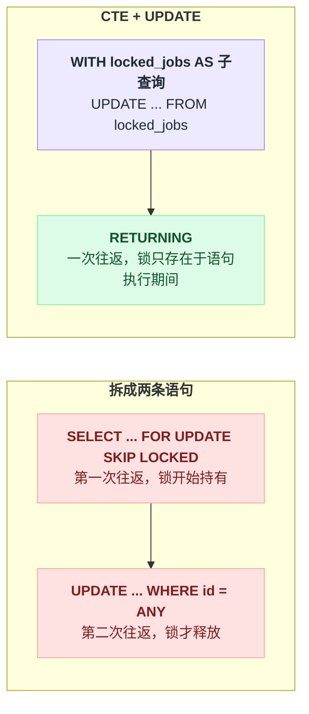
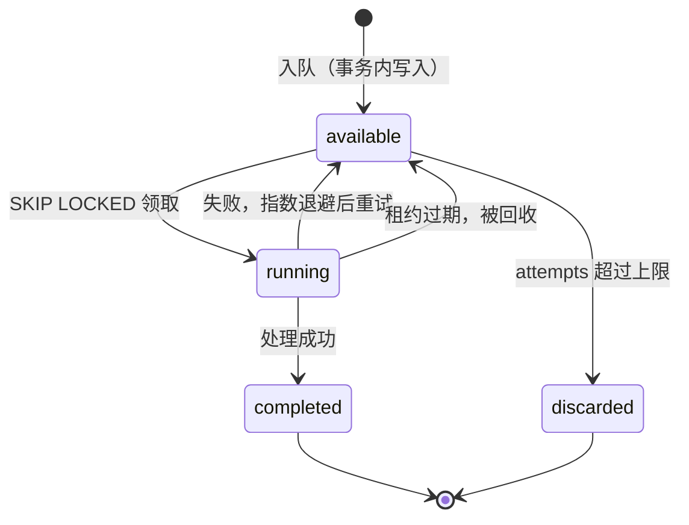
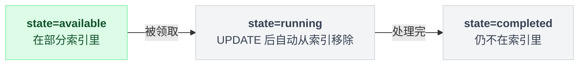
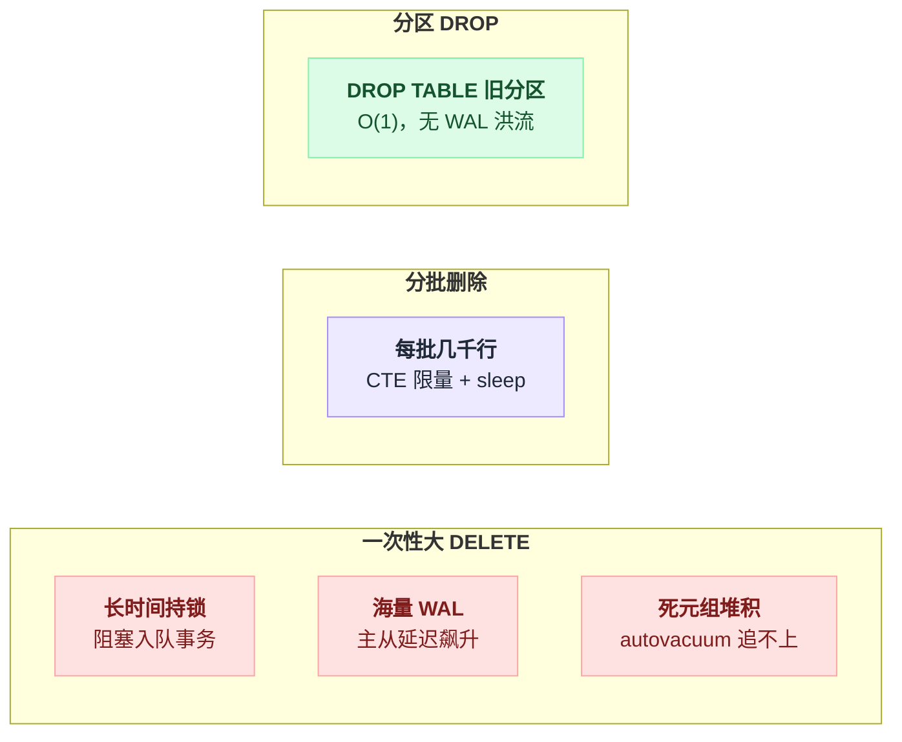
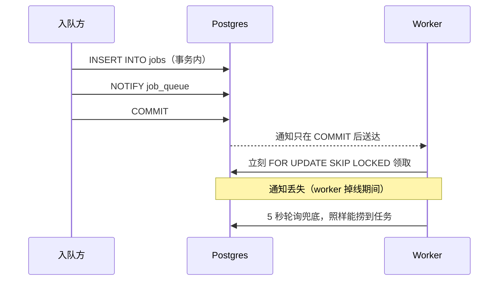
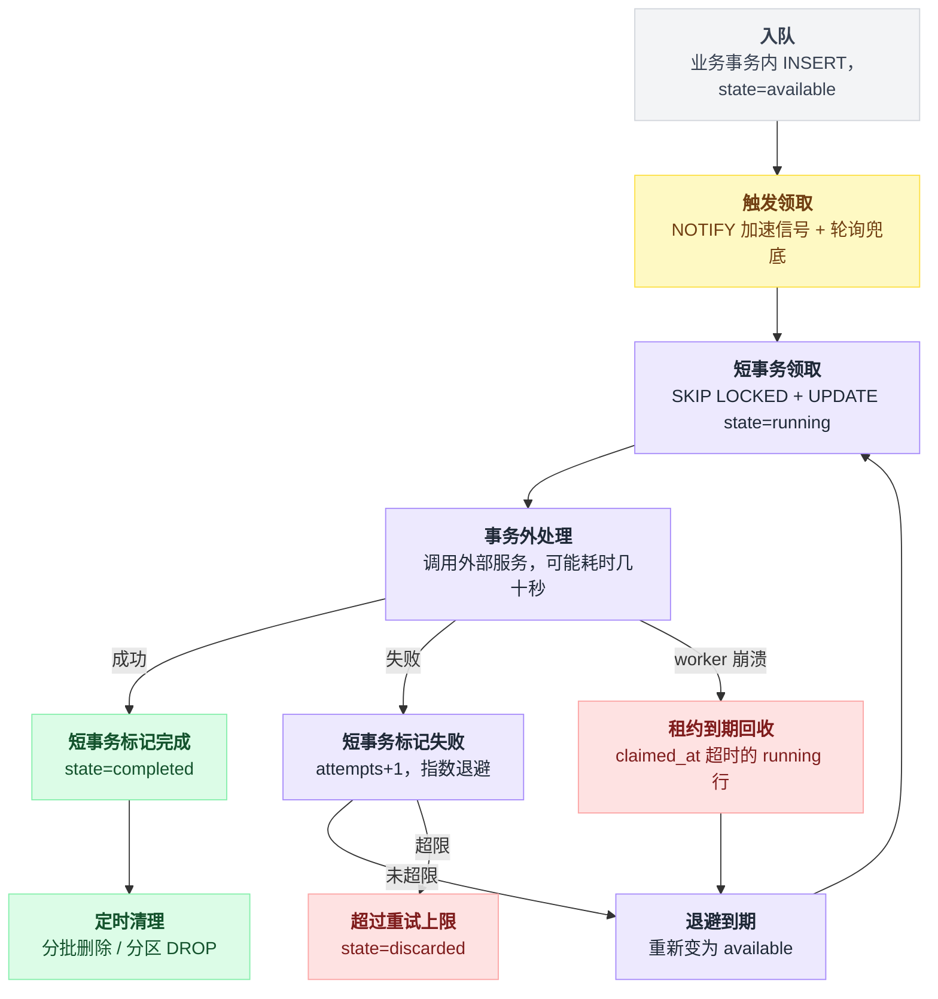

# 第 7 篇 · 任务队列：SKIP LOCKED 与租约

> "用 Postgres 当消息队列"曾经是个笑话，现在是主流做法之一。[river](https://github.com/riverqueue/river)（5.2k★，Go）、[graphile-worker](https://github.com/graphile/worker)、Rails 的 Solid Queue、pgmq 都建立在同一个东西上：**`FOR UPDATE SKIP LOCKED`**。

---

## 一、为什么不直接用 Kafka / RabbitMQ？

因为**事务边界**。

```go
// 用外部 MQ
tx.Begin()
  INSERT INTO orders ...
tx.Commit()
mq.Publish(orderCreated)     // ← 这里失败了，订单创建了但下游永远收不到
```

而用 Postgres 做队列：

```go
tx.Begin()
  INSERT INTO orders ...
  INSERT INTO jobs(kind, args) VALUES ('send_email', ...)   // 同一个事务
tx.Commit()                                                  // ← 原子
```

**订单和任务要么一起存在，要么一起不存在。** 这就是 river 的 README 里说的 "transactional job enqueueing alongside application data"。

代价是吞吐上限比专业 MQ 低（毕竟每条消息都是一次事务性的行写入），但对绝大多数业务系统（每秒几千到几万任务）完全够用，而且**少维护一套中间件**。

---

## 二、核心：`FOR UPDATE SKIP LOCKED`

### 没有它会怎样

实测（`labs/exp5b.py`，8 个 worker 抢 64 个任务，每个任务在事务里处理 50ms）：

```
[A] FOR UPDATE SKIP LOCKED —— 抢不到就跳过下一行
   墙钟耗时 0.44s   任务被领取次数合计 64（表里只有 64 个任务）   重复执行 0 次

[B] FOR UPDATE —— 抢不到就排队等
   墙钟耗时 3.31s   任务被领取次数合计 64                        重复执行 0 次

[C] 不加行锁
   墙钟耗时 3.48s   任务被领取次数合计 225                       重复执行 161 次   ❌
```

三种写法的失败方式完全不同：

**C（不加锁）**：8 个 worker 同时 `SELECT ... WHERE state='ready' LIMIT 1`，全都拿到同一行，全都执行。**64 个任务被执行了 225 次。** 如果任务是"发短信"，用户收到 4 条重复；如果是"扣款"，那是事故。

**B（普通 FOR UPDATE）**：正确，但 8 个 worker 全在排队等同一行的锁。**并发度实际上是 1**，8 个进程的吞吐等于 1 个进程。耗时 3.31s。

**A（SKIP LOCKED）**：worker 1 锁住第 1 行，worker 2 发现第 1 行被锁了**直接跳过**，去拿第 2 行……真正并行。**耗时 0.44s，7.5 倍。**

三种写法在两个 worker 抢同一批行时分别长这样：



### 语义

```sql
SELECT id FROM jobs WHERE state='available'
ORDER BY id LIMIT 5
FOR UPDATE SKIP LOCKED;
```

> "给我 5 行，**跳过所有当前被别人加了锁的行**。"

⚠️ 注意 `LIMIT` 和 `SKIP LOCKED` 的交互：Postgres 会**先按顺序扫描、跳过被锁的行、直到凑够 LIMIT 行**。所以 8 个 worker 各要 5 行时，它们会各自拿到不重叠的 5 行。这正是我们要的。

---

## 三、生产级的完整实现

看 river 的 `JobGetAvailable`（`riverdriver/riverpgxv5/internal/dbsqlc/river_job.sql`）：

```sql
WITH locked_jobs AS (
    SELECT *
    FROM river_job
    WHERE state = 'available'
      AND queue = @queue::text
      AND scheduled_at <= coalesce(@now::timestamptz, now())
    ORDER BY priority ASC, scheduled_at ASC, id ASC
    LIMIT @max_to_lock::integer
    FOR UPDATE
    SKIP LOCKED
)
UPDATE river_job
SET state = 'running',
    attempt = river_job.attempt + 1,
    attempted_at = coalesce(@now::timestamptz, now()),
    attempted_by = array_append(..., @attempted_by::text)
FROM locked_jobs
WHERE river_job.id = locked_jobs.id
RETURNING river_job.*;
```

和 sub2api 的 outbox 消费（`auth_cache_invalidation_outbox_repo.go`）：

```sql
WITH candidates AS (
    SELECT id FROM auth_cache_invalidation_outbox
    WHERE available_at <= NOW()
      AND (claimed_at IS NULL OR claimed_at < NOW() - ($3 * INTERVAL '1 second'))
    ORDER BY id ASC
    LIMIT $2
    FOR UPDATE SKIP LOCKED
)
UPDATE auth_cache_invalidation_outbox AS o
SET claimed_at = NOW(), claimed_by = $1
FROM candidates AS c
WHERE o.id = c.id
RETURNING o.id, o.cache_key, o.attempts, o.delivery_stage, o.created_at
```

**两个独立项目、不同语言、不同场景，写出了几乎一样的 SQL。** 这个模式已经是事实标准了。拆开看它的 5 个要素：

### ① CTE + UPDATE：一次往返完成"选中 + 标记"

如果拆成两条语句：

```go
// ❌
ids := tx.Query("SELECT id ... FOR UPDATE SKIP LOCKED")   // 一次往返
tx.Exec("UPDATE jobs SET state='running' WHERE id = ANY($1)", ids)  // 又一次往返
```

- 多一次网络往返；
- **行锁从第一条语句一直持有到 COMMIT**，锁持有时间被网络延迟放大；
- 必须开显式事务，多两次往返（BEGIN / COMMIT）。

写成一条 CTE 语句：**一次往返、自动提交、锁只在语句执行期间存在。**

拆两条语句和一条 CTE 语句，锁的持有时长差在这里：



### ② `ORDER BY` 决定公平性和优先级

- river：`ORDER BY priority ASC, scheduled_at ASC, id ASC` —— 优先级 → 计划时间 → 插入顺序
- sub2api outbox：`ORDER BY id ASC` —— 严格 FIFO

⚠️ **`SKIP LOCKED` 会破坏严格的顺序保证。** 如果 job 1 被 worker A 锁着，worker B 会去拿 job 2 并可能先完成它。**队列里没有"严格按顺序执行"这回事**，除非你只用一个 worker。

需要保序的场景（比如"同一个用户的操作必须按序"），做法是**按 key 分区**：

```sql
-- 每个 partition_key 同一时刻只允许一个任务在跑
WHERE state='available'
  AND partition_key NOT IN (SELECT partition_key FROM jobs WHERE state='running')
```

### ③ 租约（lease）：worker 崩了怎么办

sub2api 的条件里有这么一句：

```sql
AND (claimed_at IS NULL OR claimed_at < NOW() - ($3 * INTERVAL '1 second'))
```

翻译：**"没人领过的，或者领了超过 N 秒还没干完的（认定 worker 挂了），都可以领。"**

**❓ 为什么不能靠行锁本身来做这件事？**

因为行锁在 COMMIT 时就释放了。而任务处理可能要几十秒——你不可能让事务开着几十秒（第 2 篇：长事务是万恶之源）。

所以正确的模式是：

```
① 短事务：SKIP LOCKED 选中 + 打上 claimed_at/claimed_by 标记 → 立即 COMMIT（行锁释放）
② 事务外：慢慢处理任务（调 HTTP、发邮件、跑计算）
③ 短事务：标记完成 / 记录失败 + 安排重试
```

**`claimed_at` 是一个"应用层的锁"，它的有效期由时间控制，而不是由事务控制。** 这样即使 worker 进程被 kill -9，任务也会在租约过期后被别人捡起来。

**❌ 不做租约会怎样**：worker 在处理任务时 OOM 了 → 任务永远停留在 `running` 状态 → **没有任何机制会重新处理它**。这类"任务卡住"的问题在生产上极其常见，而且往往是几天后用户投诉才发现。

**❌ 租约设得太短会怎样**：任务还在正常处理，租约就过期了，另一个 worker 把它捡起来重跑 → **重复执行**。所以：

- 租约时长要 > 任务的 P99 处理时间，通常留 2~3 倍余量；
- 长任务要有**心跳续租**（处理过程中定期 `UPDATE ... SET claimed_at = NOW()`）；
- **无论如何，任务本身必须幂等**（第 6 篇）——租约只降低重复概率，不能消灭。

### ④ 重试与退避

```sql
available_at   TIMESTAMPTZ NOT NULL DEFAULT NOW(),   -- 什么时候可以被领取
attempts       INTEGER NOT NULL DEFAULT 0,
last_error     TEXT,
```

失败时：

```sql
UPDATE outbox
SET attempts = attempts + 1,
    last_error = $2,
    claimed_at = NULL, claimed_by = NULL,
    available_at = NOW() + (LEAST(POWER(2, attempts), 3600) || ' seconds')::interval  -- 指数退避，封顶 1 小时
WHERE id = $1
```

`available_at` 这一个字段同时实现了三件事：**延迟任务**、**定时任务**、**失败退避重试**。

⚠️ 别忘了**死信**：`attempts` 超过上限就挪到 `state='discarded'`，别让一个永远失败的任务无限重试烧 CPU。river 的 schema 里就有 `discarded` 状态。

把上面几条状态转移规则拼起来，就是一个任务从生到死走过的全部状态：



### ⑤ 交出去的时候用 `RETURNING`

一条语句同时完成"领取"和"拿到任务内容"。别再 `SELECT` 一次——第 3 篇讲过，那会读到别人的结果。

---

## 四、索引：这是队列表的生死线

队列表有个特殊的形态：**99.99% 的行是已完成的历史，你每次只关心那 0.01% 待处理的行。**

实测（`labs/exp21_queue_index.sql`，100 万条已完成 + 500 条待处理）：

| 方案 | 执行时间 | 读取 buffer | 索引大小 |
|---|---|---|---|
| **无索引**（Seq Scan） | 115.754 ms | 8348 | — |
| **river 式全量索引** `(state, queue, priority, scheduled_at, id)` | 0.344 ms | 14 | **56 MB** |
| **部分索引** `(queue, priority, scheduled_at, id) WHERE state='available'` | **0.167 ms** | 13 | **48 kB** |

**56 MB vs 48 kB —— 小了 1200 倍，还更快。**

原因很直白：部分索引里**只有 500 个索引项**（那 100 万条已完成的行根本不进索引）。而且当一个任务从 `available` 变成 `running` 时，**它会自动从索引里消失**——索引始终只有队列的实际长度那么大。

行在状态之间迁移，索引成员关系也跟着变：



```sql
CREATE INDEX CONCURRENTLY jobs_pending
    ON jobs (queue, priority, scheduled_at, id)
    WHERE state = 'available';
```

### ❓ 问题：既然部分索引这么好，为什么 river 不用？

因为 river 是个通用库，它的查询要支持任意 `state` 的过滤（管理界面要能查 running / completed / discarded），部分索引只服务一种查询。**通用库为灵活性买单，你的业务系统不需要。**

📌 **给自己的队列表建索引时，一律先考虑部分索引。**

### ❌ 不加索引会怎样

上面的 115ms 只是 100 万行时的数字。真实场景更糟：

- 每个 worker 每秒轮询几次，每次全表扫描；
- 10 个 worker × 每秒 5 次 = 每秒 50 次全表扫描；
- 表增长到 1 亿行时，单次扫描要几秒 → **worker 全部卡在轮询上，一个任务都处理不了**；
- 同时把 shared_buffers 冲刷干净，**拖慢整个数据库的所有其他查询**。

这是"队列表把整个库搞垮"的标准剧本。

---

## 五、别忘了清理：队列表会变成最大的表

任务表是纯追加的。不清理的话，一年后它比业务表大 10 倍。

**❌ 最容易犯的错**：

```sql
DELETE FROM jobs WHERE state='completed' AND finished_at < NOW() - INTERVAL '7 days';
```

一次删几百万行，会：
- 长时间持有大量行锁，阻塞正在入队的事务；
- 产生海量 WAL，主从延迟飙升；
- 产生海量死元组，autovacuum 追不上；
- 如果超时被中断，**整个 DELETE 回滚，白干**，而且留下更多死元组。

三种清理方式代价完全不在一个量级：



**✅ 正确做法 1：分批删除**（sub2api 的 `DeleteConsumedUpTo` 就是这个模式）

```sql
WITH doomed AS (
    SELECT id FROM scheduler_outbox
    WHERE id <= $1 AND created_at < NOW() - INTERVAL '10 seconds'
    ORDER BY id ASC
    LIMIT $2                          -- 每批限量
)
DELETE FROM scheduler_outbox o USING doomed d WHERE o.id = d.id
```

循环调用，每批几千行，中间 sleep 一下。**注意那个 `created_at < NOW() - INTERVAL '10 seconds'`——第 6 篇讲过，那是防序列号空洞的。**

**✅ 正确做法 2：按时间分区，直接 DROP 分区**

```sql
CREATE TABLE jobs (…) PARTITION BY RANGE (created_at);
CREATE TABLE jobs_2026_08 PARTITION OF jobs FOR VALUES FROM ('2026-08-01') TO ('2026-09-01');
…
DROP TABLE jobs_2026_05;    -- 瞬间完成，不产生死元组，不产生 WAL 洪流
```

**`DROP TABLE` 是 O(1) 的，`DELETE` 是 O(n) 的还带 VACUUM 的后续代价。** 数据量大的日志/任务/流水表，分区几乎总是对的。

（`ALTER TABLE ... DETACH PARTITION CONCURRENTLY` 可以在不阻塞的情况下摘下分区，PG 14+。）

**✅ 正确做法 3：清理任务要加互斥**

多个应用实例都在跑清理定时任务的话，用 advisory lock（第 5 篇）：

```go
conn.QueryRowContext(ctx, "SELECT pg_try_advisory_lock(hashtext('scheduler_outbox_cleanup'))").Scan(&acquired)
if !acquired { return }   // 别人在清了，我跳过这一轮
defer unlock()
```

---

## 六、降低轮询开销：LISTEN / NOTIFY

轮询有个固有矛盾：**间隔短则空转烧 CPU，间隔长则延迟高。**

Postgres 自带的发布订阅可以解决：

```sql
-- 入队方（在事务里）
NOTIFY job_queue, 'default';
-- 或者动态频道名：SELECT pg_notify('job_queue', queue_name);

-- worker
LISTEN job_queue;
-- 阻塞等待通知，收到就立刻去拉一批任务
```

**关键性质：`NOTIFY` 是事务性的。** 通知只在 COMMIT 后才真正发出，所以不会出现"收到通知但任务还没提交"的竞态。

**⚠️ 但它不可靠**，必须注意：

- **不持久化。** worker 掉线期间的通知**永久丢失**。
- **有去重。** 同一事务里对同一频道发送相同 payload 的多次 NOTIFY 会被合并成一条。
- **payload 上限 8000 字节**，只适合传"有新任务了"这种信号，不适合传任务内容。
- 队列满（默认 8GB，`max_notify_queue_pages`）时会报错。
- **走连接，不走复制。** 备库上 LISTEN 收不到主库的 NOTIFY。

📌 **正确用法：NOTIFY 做"加速信号"，轮询做"兜底保障"。**

```go
for {
    select {
    case <-notifyCh:              // 有通知，立刻干活
    case <-time.After(5*time.Second):  // 没通知也每 5 秒兜底轮询一次
    }
    fetchAndProcessJobs()
}
```

NOTIFY 在事务提交后才送达、轮询兜底不依赖它，两条路径谁先到都行：



**❌ 只用 NOTIFY 不做轮询会怎样**：worker 重连的那 200 毫秒里入队的任务，**永远不会被处理**，直到下一个任务进来才顺带触发。表现为"某些任务莫名其妙卡了几小时"。

---

## 七、什么时候不该用 Postgres 当队列

诚实地说清楚边界：

| 场景 | 建议 |
|---|---|
| 每秒 < 1 万任务，需要事务性入队 | ✅ **Postgres 很合适** |
| 需要和业务数据强一致（outbox） | ✅ **Postgres 是唯一简单解** |
| 每秒 10 万+ 消息 | ❌ 用 Kafka/Pulsar，Postgres 的行锁和 WAL 扛不住 |
| 需要长期保留、多消费组重放 | ❌ Kafka 的 log 语义更合适 |
| 消息体很大（MB 级） | ❌ 放对象存储，数据库里只存引用 |
| 扇出到成千上万个订阅者 | ❌ 用专门的 pub/sub |

**一个务实的判断**：如果你已经有 Postgres，且任务量在每秒几千以内，**先用 Postgres**。等真的撞到瓶颈了再换——大多数系统永远撞不到。

前面几节讲的入队、领取、租约、重试、清理，串起来就是一个任务从落库到销毁走过的完整路径：



---

## 八、一张可以直接抄的表结构

```sql
CREATE TABLE jobs (
    id            BIGSERIAL PRIMARY KEY,
    queue         TEXT        NOT NULL DEFAULT 'default',
    kind          TEXT        NOT NULL,
    args          JSONB       NOT NULL DEFAULT '{}',
    state         TEXT        NOT NULL DEFAULT 'available'
                  CHECK (state IN ('available','running','completed','discarded')),
    priority      SMALLINT    NOT NULL DEFAULT 1,
    attempts      INT         NOT NULL DEFAULT 0 CHECK (attempts >= 0),
    max_attempts  INT         NOT NULL DEFAULT 10,
    scheduled_at  TIMESTAMPTZ NOT NULL DEFAULT NOW(),   -- 什么时候可以跑（延迟/退避）
    claimed_at    TIMESTAMPTZ,                          -- 租约起始
    claimed_by    TEXT,                                 -- 哪个 worker 领的
    last_error    TEXT,
    unique_key    TEXT,                                 -- 幂等键（可选）
    created_at    TIMESTAMPTZ NOT NULL DEFAULT NOW(),
    finished_at   TIMESTAMPTZ
);

-- 领取用的部分索引：只有待处理的行进索引，索引大小 = 队列实际长度
CREATE INDEX CONCURRENTLY jobs_fetch
    ON jobs (queue, priority, scheduled_at, id) WHERE state = 'available';

-- 租约回收用的部分索引
CREATE INDEX CONCURRENTLY jobs_stale
    ON jobs (claimed_at) WHERE state = 'running';

-- 清理用（BRIN 极省空间，见第 6 篇）
CREATE INDEX CONCURRENTLY jobs_finished_brin
    ON jobs USING BRIN (finished_at);

-- 幂等：同一个 unique_key 不允许有两个未完成的任务
CREATE UNIQUE INDEX CONCURRENTLY jobs_unique
    ON jobs (unique_key) WHERE unique_key IS NOT NULL AND state IN ('available','running');
```

领取：

```sql
WITH c AS (
    SELECT id FROM jobs
    WHERE state = 'available' AND queue = $1 AND scheduled_at <= NOW()
    ORDER BY priority, scheduled_at, id
    LIMIT $2
    FOR UPDATE SKIP LOCKED
)
UPDATE jobs j
SET state = 'running', claimed_at = NOW(), claimed_by = $3, attempts = j.attempts + 1
FROM c WHERE j.id = c.id
RETURNING j.id, j.kind, j.args, j.attempts;
```

租约回收（定时跑）：

```sql
UPDATE jobs
SET state = 'available', claimed_at = NULL, claimed_by = NULL,
    last_error = COALESCE(last_error,'') || ' [lease expired]'
WHERE state = 'running' AND claimed_at < NOW() - INTERVAL '5 minutes';
```

---

## 九、本篇小结

| 要素 | 作用 | 不做的后果 |
|---|---|---|
| `FOR UPDATE SKIP LOCKED` | worker 之间不互相阻塞 | 不加锁 → 重复执行；普通 FOR UPDATE → 并发度退化为 1 |
| CTE + UPDATE + RETURNING | 一次往返完成领取 | 多次往返，锁持有时间被网络延迟放大 |
| `claimed_at` 租约 | worker 崩溃后任务能被重领 | 任务永久卡在 running |
| `available_at` + 指数退避 | 延迟/定时/重试三合一 | 失败任务疯狂重试烧 CPU |
| **部分索引** `WHERE state='available'` | 索引大小 = 队列实际长度 | 索引 56 MB vs 48 kB，且随历史无限增长 |
| 分批删除 / 分区 DROP | 清理不影响线上 | 一次大 DELETE 让主从延迟飙升 |
| LISTEN/NOTIFY + 轮询兜底 | 低延迟 + 不丢 | 只用 NOTIFY → 重连期间的任务永久卡住 |
| **任务本身幂等** | 兜住所有 at-least-once 场景 | 租约过期 / 重投递 → 重复执行 |

📌 **一句话**：`FOR UPDATE SKIP LOCKED` 让多个 worker 真正并行地从同一张表取任务；而**租约、退避、部分索引、分批清理**才是让它在生产上活下来的东西。

---

**下一篇** → [08 索引：B-tree 的形状决定你的 WHERE 怎么写](./08-索引.md)
