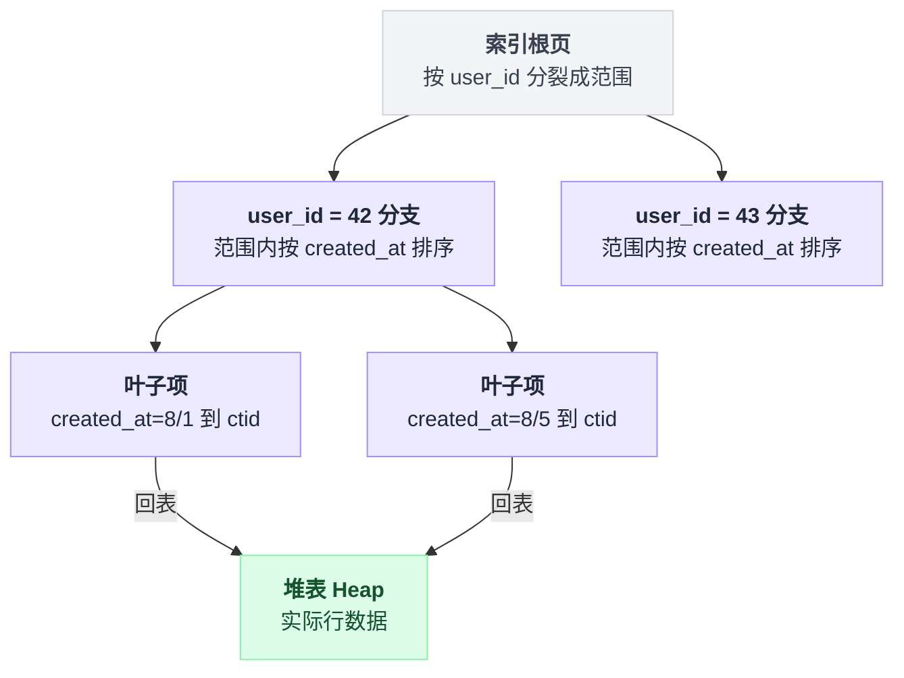
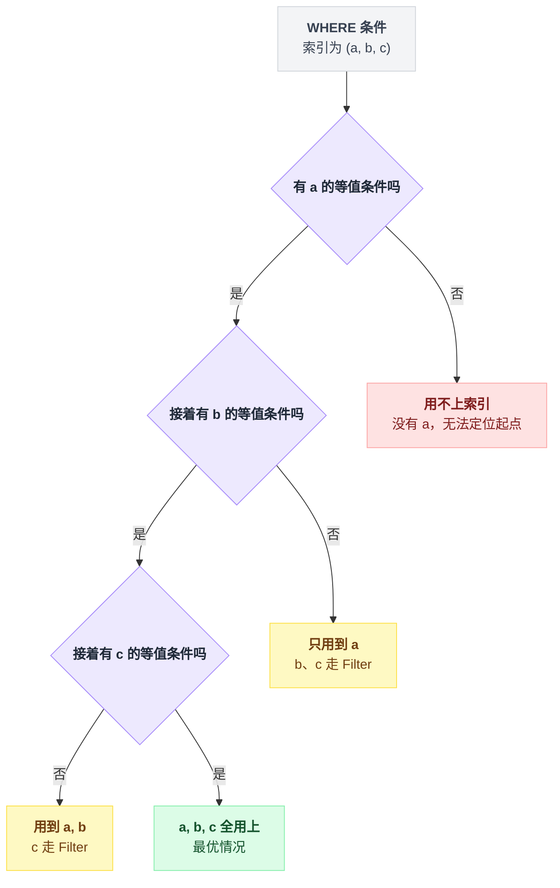
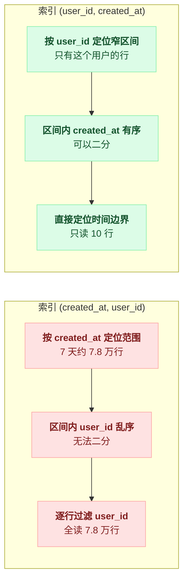
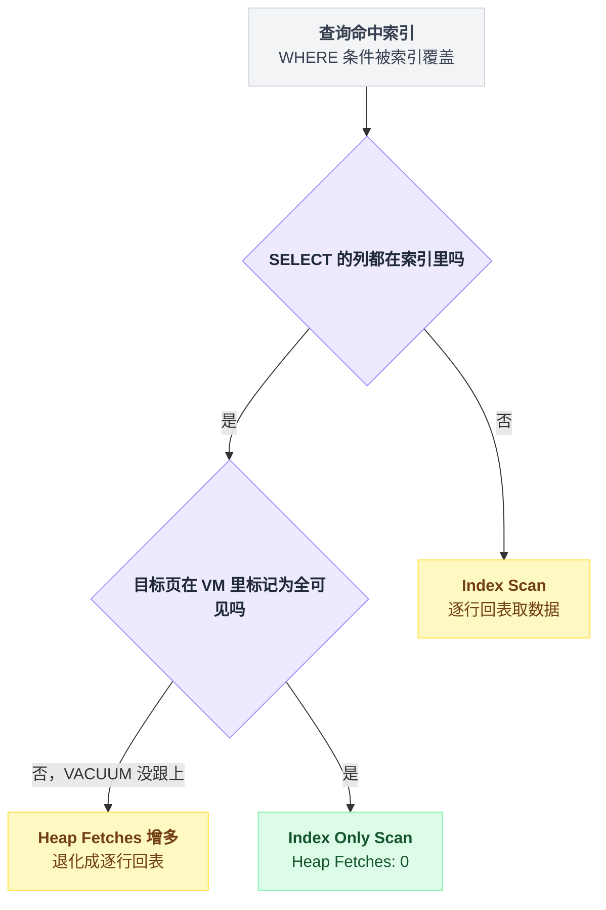
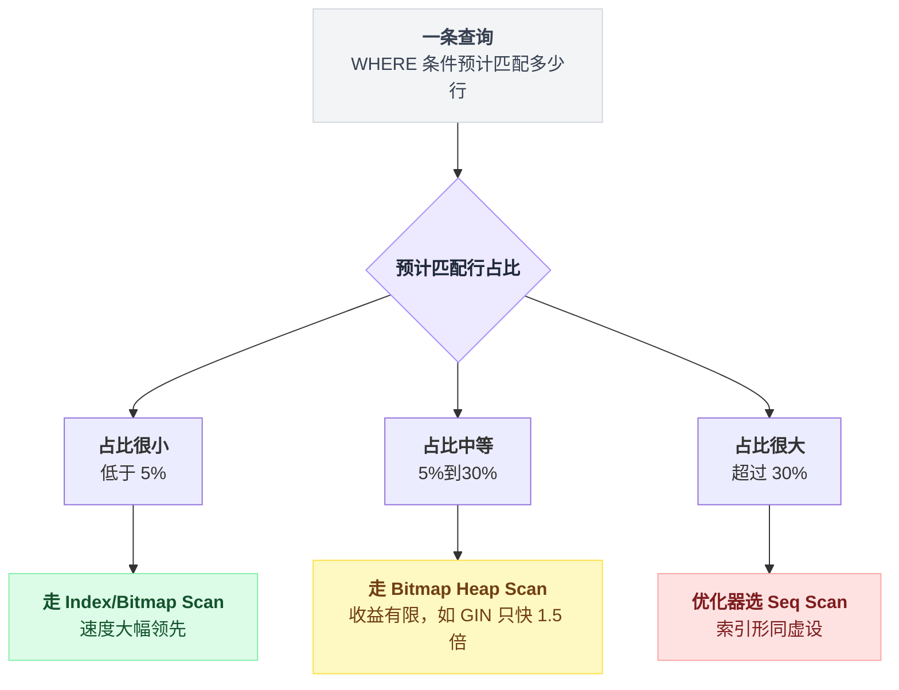
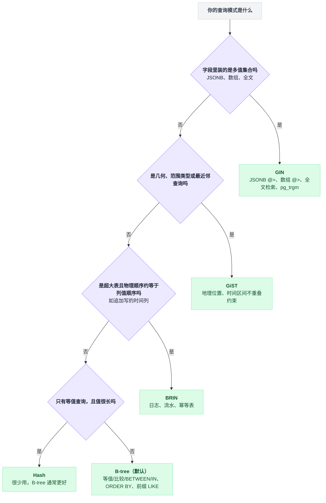
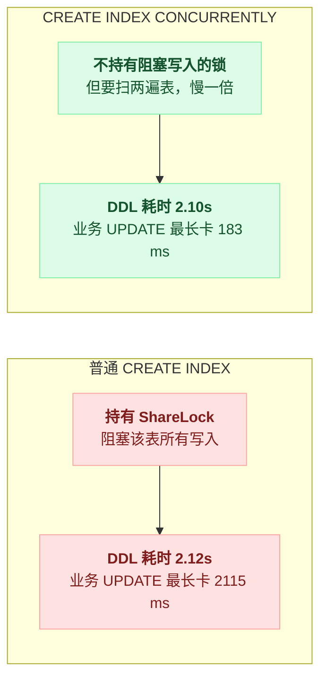

# 第 8 篇 · 索引：B-tree 的形状决定你的 WHERE 怎么写

> 索引不是"加了就快"。它是一个**有序数据结构**，能不能用上、用得好不好，完全取决于你的查询形状和它的形状是否匹配。

---

## 一、先看效果：同一条查询，四种索引，1000 倍差距

同一条 SQL，什么都不改，只换索引。实测环境是 `labs/exp9_index.sql`，`usage_logs` 100 万行，查"某用户最近 7 天的用量总和"：

```sql
SELECT sum(cost) FROM usage_logs
WHERE user_id = 42 AND created_at > now() - interval '7 days' AND deleted_at IS NULL;
```

| 索引 | 执行时间 | 读取 buffer | 计划 |
|---|---|---|---|
| 无索引 | **77.805 ms** | 9352 | Parallel Seq Scan |
| `(user_id)` | 0.370 ms | 204 | Bitmap Heap Scan，回表 197 页 |
| `(user_id, created_at) WHERE deleted_at IS NULL` | 0.126 ms | 13 | Bitmap Heap Scan，回表 10 页 |
| `(user_id, created_at) INCLUDE (cost) WHERE deleted_at IS NULL` | **0.078 ms** | **4** | **Index Only Scan，Heap Fetches: 0** |
| **`(created_at, user_id)`（列顺序反了）** | 4.101 ms | 313 | Index Scan，但扫了大量无关行 |

**77.805 ms → 0.078 ms，快了 1000 倍。**

但这张表里最该盯的不是那个 1000 倍，是**列顺序搞反的那一行：4.101 ms**。

索引建了，计划也走了 Index Scan，从执行计划的第一行看一切正常——可它比正确的索引慢 50 倍。**"走了索引"不等于"索引用对了"。** 这篇后面大半篇幅都在解释这句话。

---

## 二、B-tree 的形状：为什么列顺序决定一切

把复合索引 `(a, b, c)` 想象成一本按 `a` 排序、`a` 相同时按 `b` 排序、`b` 相同时按 `c` 排序的电话簿。索引树的分裂顺序就是这本电话簿的翻页顺序：



电话簿只能从姓氏开始翻——于是有了**最左前缀原则**：

| WHERE 条件 | 能用上索引吗 |
|---|---|
| `a = 1` | ✅ 用到 a |
| `a = 1 AND b = 2` | ✅ 用到 a, b |
| `a = 1 AND b = 2 AND c = 3` | ✅ 全用上 |
| `b = 2` | ❌ 用不上（没有 a，无法定位起点） |
| `a = 1 AND c = 3` | ⚠️ 只能用 a 定位，c 只能当 Filter |
| `a > 1 AND b = 2` | ⚠️ **a 是范围，b 用不上**（见下） |

这张表其实是一段从左往右走、遇到两种情况就停下的循环：

```
可用列 = []
for 列 in 索引列顺序 (a, b, c):
    if WHERE 里没有这一列的条件:  break     // 链断了，后面的列一律用不上
    可用列.append(列)
    if 这一列是范围条件 (> < BETWEEN):  break   // 范围列自己能用，它后面的列全失效
// 循环没走到的列，只能当 Filter 逐行过滤
```

把这张表拆成判定树，逐列往后问一句"还是等值条件吗"：



### ⚠️ 最重要的一条规则：范围条件之后的列全部失效

这就是上面 `(created_at, user_id)` 慢 50 倍的原因。

```sql
WHERE user_id = 42 AND created_at > now() - interval '7 days'
```

**索引 `(created_at, user_id)`**：先按 `created_at > X` 定位到一个范围。这个范围里 `user_id` 是乱序的——每一个不同的 created_at 下都有自己的 user_id 排序——所以只能把范围内所有行都读出来，再逐行过滤 user_id。7 天的数据大约 7.8 万行，全读了。

**索引 `(user_id, created_at)`**：先按 `user_id = 42` 定位到一个窄区间，**这个区间内部 `created_at` 是有序的**，直接二分找到时间边界。只读 10 行。

两条索引的查找路径拆开对比：



📌 **口诀：等值列在前，范围列在后。**

展开成具体的排序规则，按优先级从前往后排：

| 优先级 | 这一列的用途 | 放哪 |
|---|---|---|
| 1 | 等值条件（`=`、`IN`） | 放最前面 |
| 2 | 范围条件（`>` `<` `BETWEEN`） | 放后面 |
| 3 | 只用于 `ORDER BY` | 再后面（顺序和方向要匹配） |
| 4 | 只用于 SELECT 输出 | 用 `INCLUDE` 挂在最后（不参与排序，只带数据） |

多个等值列之间的顺序，一般把**选择性高的**（distinct 值多的）放前面，但差别通常不大。

**真正致命的是把范围列放到了等值列前面。**

---

## 三、Index Only Scan：连表都不用回

回头看第一节那个 `Heap Fetches: 0`：

```
Index Only Scan using i3 on usage_logs (actual rows=10 loops=1)
  Index Cond: ((user_id = 42) AND (created_at > (now() - '7 days'::interval)))
  Heap Fetches: 0
  Buffers: shared hit=1 read=3
```

只读了 4 个 buffer 就算完了 sum。因为 `cost` 这个列**已经在索引里**（通过 `INCLUDE (cost)`），根本不需要回表。

```sql
CREATE INDEX ON usage_logs (user_id, created_at) INCLUDE (cost) WHERE deleted_at IS NULL;
```

### `INCLUDE` vs 直接把列加进索引键

```sql
CREATE INDEX ON t (a, b, c);            -- c 参与排序，索引更大，但能用于 ORDER BY c
CREATE INDEX ON t (a, b) INCLUDE (c);   -- c 只是"搭车"，不参与排序，索引更小
```

| 写法 | c 参与排序 | 索引体积 | c 能用于 `ORDER BY c` |
|---|---|---|---|
| `(a, b, c)` | 是 | 更大 | 能 |
| `(a, b) INCLUDE (c)` | 否，只是"搭车"带数据 | 更小 | —— |

**如果 `c` 只是要被 SELECT 出来、不参与 WHERE/ORDER BY，就用 `INCLUDE`。**

### ⚠️ Index Only Scan 的隐藏依赖：可见性映射表（Visibility Map）

**索引项里没有 xmin/xmax。** 所以光看索引，Postgres 不知道这一行对当前事务是否可见。

它靠的是 **VM（Visibility Map）**：一个位图，标记"这个数据页里的所有行对所有事务都可见"。如果目标行所在的页在 VM 里被标记为全可见，就可以跳过回表。

**而 VM 是 VACUUM 维护的。**

所以"能不能只读索引出结果"，实际是这么判的：

```
for 索引项 in 命中的索引区间:
    if SELECT 要的列不全在索引里:      回表取数据          // 这就是普通 Index Scan
    elif 该行所在页在 VM 里标记全可见:  直接用索引里的值      // Heap Fetches 不增加
    else:                            回表确认可见性        // Heap Fetches += 1
```

推论（非常重要）：

- 上面那个实验里，我在 `CREATE INDEX` 之后特意跑了一次 `VACUUM ANALYZE`，才拿到 `Heap Fetches: 0`；
- **一张更新频繁但 VACUUM 跟不上的表，Index Only Scan 会退化成大量 `Heap Fetches`**，性能和普通 Index Scan 没区别；
- 看到执行计划里 `Index Only Scan` 但 `Heap Fetches` 很大，就是在告诉你：**这张表该 VACUUM 了。**

这条依赖链画出来是这样：



---

## 四、部分索引：本套文档最推荐的一招

```sql
CREATE INDEX ... WHERE <条件>
```

只把满足条件的行放进索引。这一招在前面已经出现过三次，效果一次比一次夸张：

| # | 场景 | 部分索引条件 | 效果 |
|---|---|---|---|
| ① | 队列表 | `WHERE state='available'` | 56 MB → 48 kB，0.344 ms → 0.167 ms |
| ② | 幂等表的 BRIN（第 6 篇） | —— | 30 MB → 24 kB |
| ③ | 软删除表 | `WHERE deleted_at IS NULL` | sub2api 里几乎每个索引都带这一句 |

① 的实测出处是 `labs/exp21_queue_index.sql`，100 万已完成 + 500 待处理：

```
river 式全量索引 (state, queue, priority, scheduled_at, id)   56 MB    0.344 ms
部分索引 (queue, priority, scheduled_at, id) WHERE state='available'
                                                              48 kB    0.167 ms
```

**1200 倍的空间差距。**

③ 在 sub2api 的迁移里长这样：

```sql
CREATE INDEX IF NOT EXISTS idx_accounts_temp_unschedulable_until
    ON accounts(temp_unschedulable_until) WHERE deleted_at IS NULL;
CREATE INDEX IF NOT EXISTS idx_api_keys_quota_quota_used
    ON api_keys(quota, quota_used) WHERE deleted_at IS NULL;
CREATE INDEX IF NOT EXISTS idx_users_totp_enabled
    ON users(totp_enabled) WHERE deleted_at IS NULL AND totp_enabled = true;
```

### ❓ 问题：部分索引什么时候**没用**？

诚实地说：**当被过滤掉的行只占很小比例时，部分索引几乎没有收益。**

实测（`labs/exp9_index.sql`，98% 的行 `deleted_at IS NULL`）：

```
i_full  (user_id, created_at)                        30 MB
i_part  (user_id, created_at) WHERE deleted_at IS NULL  30 MB   ← 一样大
```

因为它排除的只有 2%。

📌 **判断标准：部分索引的收益 ≈ 被排除的行的比例。**

- 队列表：排除 99.99% → 收益巨大
- 软删除（删除率 2%）→ 收益微小，但**仍然值得加**——它的价值不在省空间，而在于**保证查询计划稳定**（优化器知道这个索引只服务"未删除"的查询，估算更准），以及**配合部分唯一索引**：

```sql
-- 这个才是软删除场景下部分索引真正不可替代的用法
CREATE UNIQUE INDEX ON users(email) WHERE deleted_at IS NULL;
```

（普通的 `UNIQUE(email, deleted_at)` 挡不住重复，因为 `NULL != NULL`，见第 4 篇。）

---

## 五、五种让索引失效的写法

先给张地图，五种写法各自的破解方式：

| # | 失效写法 | 出路 |
|---|---|---|
| ① | 列上套函数 | 建表达式索引 |
| ② | 隐式类型转换转在列上 | 看 EXPLAIN 的 `Index Cond`，别让 `::` 落在列上 |
| ③ | LIKE 前缀匹配 + 非 C collation | `text_pattern_ops` |
| ④ | 中间模糊匹配 `%xx%` | `pg_trgm` + GIN（只快 2.6 倍） |
| ⑤ | 选择性太差，优化器主动放弃 | 索引救不了，改需求或改数据模型 |

前四种是你写错了，第五种是索引本身就不该上场。

### ① 列上套函数

实测（`labs/exp22_index2.sql`，50 万行）：

```sql
SELECT id FROM users2 WHERE lower(email) = 'user.42@example.com';
```

```
有 (email) 索引，但走 Parallel Seq Scan       124.698 ms   读 7682 buffer
```

**✅ 解法：建表达式索引**

```sql
CREATE INDEX ON users2 (lower(email));
```

```
Index Scan using users2_lower_idx             0.048 ms     读 4 buffer
```

**2600 倍。**

sub2api 里有一个很讲究的表达式索引（`migrations/190_add_users_email_alias_dedup_index_notx.sql`）——它要防"Gmail 点号别名"注册绕过（`a.b@gmail.com` 和 `ab@gmail.com` 是同一个邮箱）：

```sql
-- Registration alias dedup ... probes users by the dot-stripped email form.
-- Index that exact expression so the probes stay index lookups instead of a
-- sequential scan. text_pattern_ops serves both the equality probe and the
-- "local+%@domain" prefix probe regardless of database collation.
CREATE INDEX CONCURRENTLY idx_users_email_dot_stripped
    ON users ((REPLACE(LOWER(TRIM(email)), '.', '')) text_pattern_ops)
    WHERE deleted_at IS NULL;
```

一个索引里同时用上了：**表达式索引 + `text_pattern_ops` + 部分索引 + `CONCURRENTLY`**。四个知识点。

⚠️ 表达式索引的前提是**表达式必须是 IMMUTABLE 的**。`lower(email)` 可以，`now() - created_at` 不行（`now()` 不是 immutable）。

### ② 隐式类型转换

```sql
-- id 是 bigint，传进来的参数是 text
WHERE id = '123'        -- ✅ 常量会被转成 bigint，能用索引
WHERE id::text = '123'  -- ❌ 列被转换了，索引失效
```

在 ORM 里这个坑很常见：把 `varchar` 列和数字比较，或者把 `timestamptz` 和 `date` 比较。

**看 EXPLAIN 里 Index Cond 有没有出现 `::` 转换，转在列上就完了。**

### ③ LIKE 前缀匹配 + 非 C collation

```sql
SELECT id FROM users2 WHERE email LIKE 'User.42%';
```

```
有 (email) 普通索引，仍然 Seq Scan         40.855 ms    读 7682 buffer
```

**为什么？** 因为数据库的 collation（比如 `en_US.UTF-8`）定义的字符串排序规则和字节序不一致，B-tree 的排序按 collation 走，无法直接支撑字节级的前缀匹配。

**✅ 解法：`text_pattern_ops`**

```sql
CREATE INDEX ON users2 (email text_pattern_ops);
```

```
Bitmap Index Scan                            3.174 ms
Index Cond: ((email ~>=~ 'User.42') AND (email ~<~ 'User.43'))
```

看 `Index Cond`——它把 `LIKE 'User.42%'` 改写成了一个**范围查询**。

这就是前缀匹配能用索引的原理，也解释了为什么 `LIKE '%xxx'`（后缀匹配）永远用不上 B-tree：**没有起点。**

> 如果数据库 collation 就是 `C`，普通索引也能支持前缀匹配。但大多数环境不是。

### ④ 中间模糊匹配 `%xx%`

```sql
WHERE email LIKE '%42@exam%'
```

B-tree 完全无能为力（47.894 ms Seq Scan）。**✅ 解法：`pg_trgm` + GIN**

```sql
CREATE EXTENSION pg_trgm;
CREATE INDEX ON users2 USING gin (email gin_trgm_ops);
```

```
Bitmap Heap Scan                             18.061 ms
  Rows Removed by Index Recheck: 5000
```

从 48ms 到 18ms，**只快了 2.6 倍**——注意那个 `Rows Removed by Index Recheck: 5000`。三元组索引给出的是"可能匹配"的候选集，还要逐行 recheck。

📌 **诚实的结论：pg_trgm 能救急，但它不是搜索引擎。** 数据量大、搜索是核心功能时，该上 `tsvector` 全文检索或者 Elasticsearch。

sub2api 两种都用了，按用途分开：

```sql
-- 运维后台的模糊搜索用 trgm
CREATE INDEX ... ON users USING gin (email gin_trgm_ops);
CREATE INDEX ... ON ops_error_logs USING gin (error_message gin_trgm_ops);
-- 系统日志的关键词搜索用全文检索
CREATE INDEX ... ON ops_system_logs USING GIN (to_tsvector('simple', COALESCE(message, '')));
```

### ⑤ 选择性太差，优化器主动放弃

```sql
SELECT count(*) FROM users2 WHERE extra @> '{"plan":"max"}';    -- 匹配 25% 的行
```

| | 时间 |
|---|---|
| 无 GIN 索引，Seq Scan | 86.438 ms |
| 有 GIN 索引，Bitmap Heap Scan | 58.511 ms |

**只快了 1.5 倍。** 因为要读的行占 25%，回表的随机 I/O 比顺序全表扫描便宜不了多少。

📌 **索引的价值来自"排除大部分行"。** 一个匹配 30% 以上数据的查询，索引基本帮不上忙，**这时候不该怪索引，该改需求或者改数据模型**（比如按 plan 分区）。

把前面几节的实测数字串起来，就是优化器选 Seq Scan 还是走索引的判定逻辑：



---

## 六、索引类型选型

| 类型 | 适用 | 典型场景 |
|---|---|---|
| **B-tree**（默认） | `= < > BETWEEN IN`、`ORDER BY`、前缀 LIKE | 99% 的场景 |
| **GIN** | 一个字段里有多个值需要被检索 | JSONB `@>`、数组 `@>`、全文检索、pg_trgm |
| **BRIN** | 物理顺序与列值顺序天然一致的超大表 | 追加写的时间列（日志、流水、幂等表） |
| **GiST** | 几何、范围类型、最近邻 | 地理位置、时间区间不重叠约束 |
| **Hash** | 只有等值查询，且值很长 | 很少用（B-tree 通常够好且更通用） |

这张表拆成判定树，按查询模式一路问下去：



选型之外还有个体积问题。实测索引大小对比（同一张 50 万行的表）：

```
users2_email_idx    19 MB     B-tree on email
users2_lower_idx    19 MB     B-tree on lower(email)
users2_email_idx1   19 MB     B-tree on email text_pattern_ops
users2_email_idx2   18 MB     GIN trgm on email
users2_pkey         11 MB     B-tree on id
users2_extra_idx  1320 kB     GIN jsonb_path_ops on extra
```

顺带一个数据：

```
表大小 60 MB    索引总大小 88 MB
```

**索引比表还大。**

这就是过度索引的代价——写入时每个索引都要维护，HOT 全部失效（第 2 篇），VACUUM 更慢，缓存被索引挤占。

> `jsonb_path_ops` 比默认的 `jsonb_ops` 索引小很多（只索引"路径+值"的哈希，不索引单独的 key）。它支持 `@>`、`@?`、`@@`，**不支持"键存在"类操作符 `?` / `?|` / `?&`**。如果你的查询只用 containment 和 jsonpath，一律选 `jsonb_path_ops`。

---

## 七、找出该删的索引和该建的索引

四把梯子：没被用过的索引、被别的索引覆盖的索引、缺索引的慢查询、顺序扫描太多的表。

### 从来没被用过的索引

```sql
SELECT
  s.relname AS 表, s.indexrelname AS 索引,
  pg_size_pretty(pg_relation_size(s.indexrelid)) AS 大小,
  s.idx_scan AS 被扫描次数
FROM pg_stat_user_indexes s
JOIN pg_index i ON i.indexrelid = s.indexrelid
WHERE s.idx_scan = 0
  AND NOT i.indisunique          -- 唯一索引即使没被查询用过也要保留（它在做约束）
  AND NOT i.indisprimary
ORDER BY pg_relation_size(s.indexrelid) DESC;
```

这条 SQL 背后的判断是：

```
if 索引.被扫描次数 == 0:
    if 索引是唯一索引 or 主键:  保留        // 它在保证数据正确性，不是在服务查询
    else:                     列为候选     // 前提：统计周期够长
```

⚠️ 两个注意：

1. **统计是从上次 `pg_stat_reset()` 开始累计的**，看之前先确认统计周期够长（至少覆盖一个完整的业务周期，包括月末报表这类低频操作）。
2. **别删唯一索引**——它可能"从没被查询用过"，但它在保证数据正确性。

### 重复/冗余的索引

```sql
-- 索引 (a) 被 (a,b) 完全覆盖，可以删掉
SELECT a.indexrelid::regclass AS 冗余索引, b.indexrelid::regclass AS 被谁覆盖
FROM pg_index a JOIN pg_index b
  ON a.indrelid = b.indrelid AND a.indexrelid <> b.indexrelid
 AND array_to_string(b.indkey,' ') LIKE array_to_string(a.indkey,' ') || '%'
WHERE NOT a.indisprimary AND NOT a.indisunique;
```

### 需要索引的慢查询

```sql
CREATE EXTENSION pg_stat_statements;   -- 强烈建议生产环境常驻

SELECT
  round(total_exec_time::numeric, 1) AS 总耗时ms,
  calls AS 调用次数,
  round(mean_exec_time::numeric, 2) AS 平均ms,
  round((100 * total_exec_time / sum(total_exec_time) OVER ())::numeric, 1) AS 占比,
  left(query, 100)
FROM pg_stat_statements
ORDER BY total_exec_time DESC LIMIT 20;
```

📌 **按"总耗时"排序，不是按"平均耗时"。** 一个 5ms 但每秒调用 1000 次的查询，比一个 2 秒但一天跑一次的查询重要得多。

### 顺序扫描太多的表

```sql
SELECT relname, seq_scan, seq_tup_read, idx_scan,
       seq_tup_read / NULLIF(seq_scan,0) AS 每次顺扫读行数
FROM pg_stat_user_tables
WHERE seq_scan > 0 ORDER BY seq_tup_read DESC LIMIT 10;
```

小表全表扫是正常且高效的，**关注"每次顺扫读行数"很大的表**。

---

## 八、建索引本身也要小心

第 11 篇会细讲，这里先给结论：

```sql
-- ❌ 会持有 ShareLock，阻塞该表所有写入，直到索引建完
CREATE INDEX idx ON big_table(col);

-- ✅ 不阻塞写入（代价：慢一倍，要扫两遍表；且不能在事务块里执行）
CREATE INDEX CONCURRENTLY idx ON big_table(col);
```

两条路径对业务写入的影响拆开看：



实测（`labs/exp13_ddl.py`，200 万行的表，同时有业务在写）：

```
[A] CREATE INDEX（普通）
   DDL 自身耗时 2.12s   期间业务 UPDATE 最长被卡 2115 ms（正常约 1.0 ms）

[B] CREATE INDEX CONCURRENTLY
   DDL 自身耗时 2.10s   期间业务 UPDATE 最长被卡 183 ms（正常约 1.6 ms）
```

**2115 ms vs 183 ms。** 注意两者 DDL 自身耗时几乎一样，差的全是业务被卡的时间。

表越大差距越夸张——一张几亿行的表建索引可能要几十分钟，普通 `CREATE INDEX` 就是几十分钟的写入停摆。

sub2api 的迁移目录里，所有在大表上建索引的迁移文件名都带 `_notx` 后缀（表示"不能放在事务里"，因为 `CONCURRENTLY` 不允许在事务块中执行）：

```
062_add_scheduler_and_usage_composite_indexes_notx.sql
072_add_usage_billing_dedup_created_at_brin_notx.sql
120_enforce_payment_orders_out_trade_no_unique_notx.sql
150_account_group_scheduler_indexes_notx.sql
153_scheduler_outbox_pending_dedup_key_index_notx.sql
190_add_users_email_alias_dedup_index_notx.sql
```

**把"这个迁移不能包在事务里"这件事编码进文件名**，让迁移执行器能自动区分处理——这是个很值得抄的工程约定。

⚠️ `CREATE INDEX CONCURRENTLY` **可能失败**，失败后会留下一个 `invalid` 状态的索引。这个索引**不会被查询使用，但仍然会被每次 DML 维护**——纯粹的写放大。必须检查并清理：

```sql
SELECT indexrelid::regclass FROM pg_index WHERE NOT indisvalid;
-- 找到了就 DROP INDEX CONCURRENTLY <name>; 然后重建
```

---

## 九、本篇小结

| 规则 | 实测依据 |
|---|---|
| **等值列在前，范围列在后** | 列顺序反了慢 50 倍（0.078ms → 4.1ms） |
| **部分索引优先考虑** | 队列表 48 kB vs 56 MB |
| `INCLUDE` 做覆盖索引 → Index Only Scan | 0.126ms → 0.078ms，buffer 13 → 4 |
| Index Only Scan 依赖 VACUUM 维护的 VM | `Heap Fetches` 大 = 该 VACUUM 了 |
| 列上套函数 → 建表达式索引 | 124.7ms → 0.048ms |
| 前缀 LIKE → `text_pattern_ops` | 40.9ms → 3.2ms |
| 模糊 LIKE → `pg_trgm` GIN（但只快 2.6 倍） | 47.9ms → 18.1ms |
| 选择性 > 30% 时索引基本没用 | GIN 只快 1.5 倍 |
| 大表建索引一律 `CONCURRENTLY` | 阻塞 2115ms vs 183ms |
| 索引不是越多越好 | 实验表里索引 88MB > 表 60MB |

📌 **一句话**：索引是一个**有序结构**——"等值列在前、范围列在后、能覆盖就 INCLUDE、能部分就 WHERE"这四句话，覆盖了 90% 的索引设计。

---

**下一篇** → [09 写放大与膨胀：VACUUM 是怎么被你拖住的](./09-膨胀与VACUUM.md)
</content>
</invoke>
