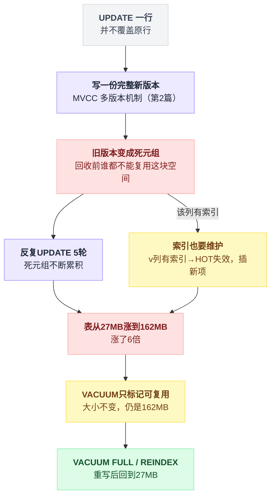
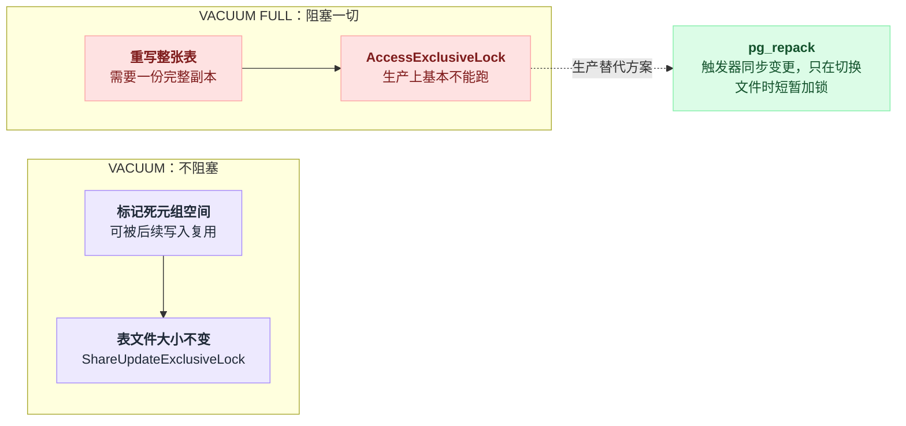
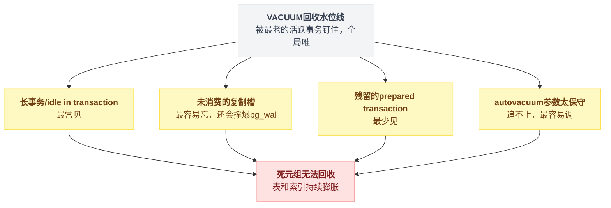
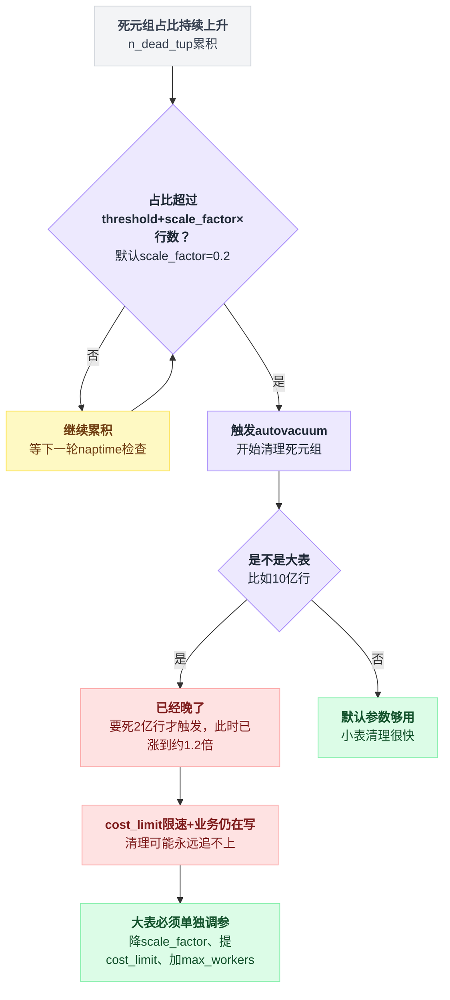
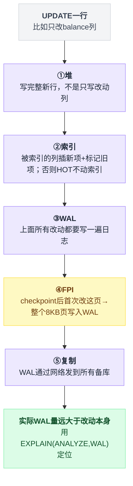
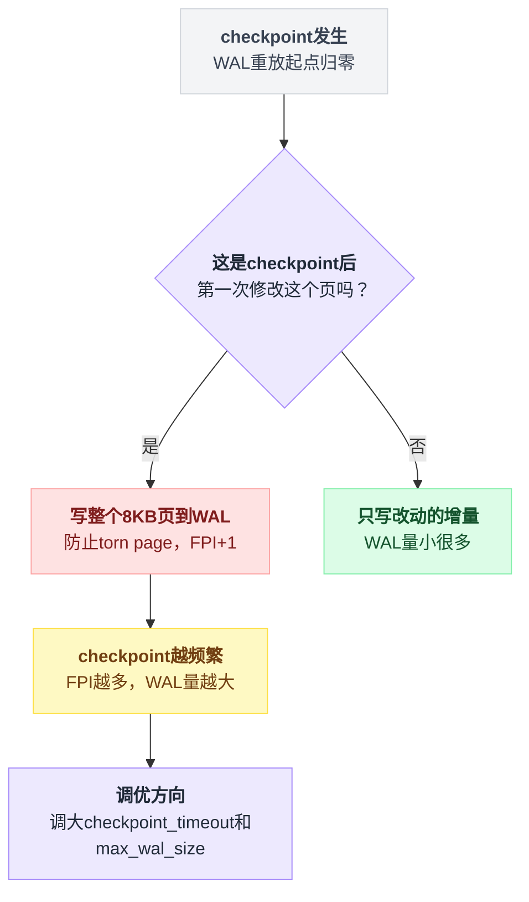
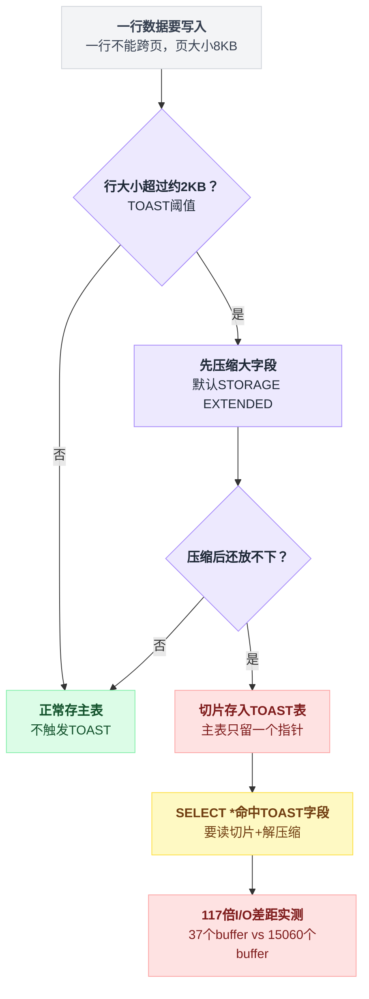

# 第 9 篇 · 写放大与膨胀：VACUUM 是怎么被你拖住的

> 这是 Postgres 运维事故的最大来源。第 2 篇讲了原理，这一篇讲怎么量化、怎么诊断、怎么修。

---

## 一、膨胀有多快：一次实测

先看数字，比任何解释都直观。

`labs/exp23_bloat.sql`：20 万行的表，`v` 列上有索引（所以 HOT 失效），关掉 autovacuum，全表 UPDATE 5 轮。

```
                     表        主键      v索引
初始状态             27 MB    4408 kB   1368 kB
UPDATE 5 轮后       162 MB    17 MB     7688 kB      ← 表涨 6 倍，索引涨 4~5.6 倍
VACUUM 之后         162 MB    17 MB     7688 kB      ← 大小没变！
REINDEX 之后          —      4408 kB   1368 kB      ← 索引回到初始
VACUUM FULL 之后     27 MB    4408 kB   1368 kB      ← 全部回到初始
```

三个关键事实：

1. **5 次 UPDATE 让表变成 6 倍大。** 每次 UPDATE 都产生一份完整的新行版本。

2. **`VACUUM` 不缩小文件。** 它只是把死元组的空间标记为"可以被后续写入复用"。

3. **只有 `VACUUM FULL` / `REINDEX` / `pg_repack` 能真正把空间还给操作系统**，而它们都要重写数据。

第二条是最容易读错的地方——很多人第一次看这张表会以为 `VACUUM` 跑失败了。没有，它干的活跟"释放磁盘"从来就是两回事。

把这三条事实串起来看，膨胀的根子还是第 2 篇讲过的 MVCC：UPDATE 不覆盖旧行，而是新开一份版本。



---

## 二、`VACUUM` 到底做了什么、没做什么

一句话：两者的名字只差一个词，代价差着一个数量级。

| | `VACUUM` | `VACUUM FULL` |
|---|---|---|
| 死元组空间 | 标记为可复用 | 真正释放 |
| 表文件大小 | **不变**（尾部有例外，见下） | 缩小到实际大小 |
| 锁 | `ShareUpdateExclusiveLock`（**不阻塞读写**） | `AccessExclusiveLock`（**阻塞一切**） |
| 额外磁盘 | 不需要 | **需要一份完整副本** |
| 索引 | 清理索引项 | 全部重建 |
| 能否在线跑 | ✅ 可以 | ❌ 生产上基本不能 |

表里那个"不变"有一个例外：**尾部整页都空的时候 `VACUUM` 会截断文件**，而**这一步需要短暂的 `AccessExclusiveLock`**。不想要这个锁，可以用 `VACUUM (TRUNCATE off)` 关掉。

两条路径的锁和代价差得这么远，落到生产上就是两条完全不同的操作路线：



**`VACUUM FULL` 在生产环境几乎不可用**：一张 500 GB 的表，它需要额外 500 GB 磁盘、锁表几十分钟到几小时。

**✅ 生产上的正确工具是 [pg_repack](https://github.com/reorg/pg_repack)**：它用触发器把重写期间的变更同步到新表，只在最后切换文件时短暂持有排他锁。

```bash
pg_repack -d mydb -t usage_logs --no-superuser-check
```

（PG 也有 `REINDEX ... CONCURRENTLY`，PG 12+，专门解决索引膨胀，不需要外部工具。）

---

## 三、什么在拖住 VACUUM：四个嫌疑人

这一节是全篇的重点。先给结论：**VACUUM 的回收水位线是全局的，被最老的活跃事务钉住。** 四个嫌疑人各有各的来路，钉的却是同一根线。

回收判定大致是这样一个循环：

```
水位线 = 最老的那个活跃事务       // 全局唯一一根线，不是每张表一根

for 死元组 in 表:
    if 死元组比水位线还老:  标记为可复用        // 确定没人看得见它了
    else:                   原样留着，一个字节都动不了
```

所以只要有任何一个东西把"最老的活跃事务"钉在原地，**整个库**的死元组都跟着回收不掉，跟那个事务碰没碰过这张表无关。

实测（`labs/exp15.py`）：

```
  READ COMMITTED   有写入=False: VACUUM 后残留死元组 0      → 没有拖住
  READ COMMITTED   有写入=True:  VACUUM 后残留死元组 20000  → 拖住了回收
  REPEATABLE READ  有写入=False: VACUUM 后残留死元组 20000  → 拖住了回收
```

四个嫌疑人：

| 嫌疑人 | 特点 | 附带伤害 |
|---|---|---|
| ① 长事务 / idle in transaction | 最常见 | — |
| ② 未消费的复制槽 | 最容易忘 | 还会撑爆 `pg_wal` |
| ③ 残留的 prepared transaction | 最少见 | — |
| ④ autovacuum 参数太保守 | 最容易调 | 追不上 |



### 嫌疑人 1：长事务 / idle in transaction

第 2 篇讲过，最常见。实测的膨胀效果（`labs/exp8_vacuum.py`）：

```
初始大小: 1776 kB
UPDATE 3 轮 + 每轮 VACUUM（无长事务）:  3544 kB   ← 稳住了
UPDATE 3 轮 + 每轮 VACUUM（有长事务）:  7088 kB   ← 翻倍
```

同样的写入量、同样的 VACUUM 次数，只因为旁边挂着一个长事务，最终大小就翻了一倍。

**排查**：

```sql
SELECT pid, usename, application_name, state,
       now() - xact_start AS 事务已运行, now() - state_change AS 当前状态持续,
       left(query, 100)
FROM pg_stat_activity
WHERE xact_start IS NOT NULL
ORDER BY xact_start
LIMIT 10;
```

**兜底**：

```sql
ALTER DATABASE mydb SET idle_in_transaction_session_timeout = '60s';
```

⚠️ 注意这个参数**只杀"事务开着但没在执行语句"的连接**。一个真的跑了 2 小时的大查询它不管——那要用 `statement_timeout`。

### 嫌疑人 2：未消费的复制槽

这个最容易被遗忘，也最致命。

```sql
SELECT slot_name, active, restart_lsn,
       pg_size_pretty(pg_wal_lsn_diff(pg_current_wal_lsn(), restart_lsn)) AS 积压的WAL,
       xmin, catalog_xmin
FROM pg_replication_slots;
```

一个 `active = false` 的复制槽（备库下线了、逻辑订阅端挂了、CDC 工具停了但槽没删）会：

1. **无限累积 WAL** → `pg_wal` 目录撑爆磁盘 → 数据库直接停止服务；
2. 如果槽带 `xmin`，**同时钉住用户表的回收水位线**。

⚠️ 上面查询里的最后两列不是一回事，别看混：

| 槽的类型 | 设的字段 | 钉住的是 |
|---|---|---|
| 逻辑复制槽 | 通常只设 `catalog_xmin` | **系统目录**的清理 |
| 物理复制槽 + `hot_standby_feedback = on` | `xmin` | **用户表** |

被钉住系统目录的表现是 `pg_attribute`、`pg_class` 膨胀，DDL 变慢。逻辑复制槽只有在**创建时导出快照**或**存在活跃 `xmin`** 时，才会钉住普通用户表。PG 14 起这两个 horizon 是分开计算的。

**❌ 不管会怎样**：见过太多"测试环境搭了个逻辑订阅，测完把订阅端删了，槽忘了删"，两周后生产库磁盘满了。

**✅ 做法**：
- 监控 `pg_replication_slots` 里 `active=false` 的槽，超过阈值就告警；
- 设 `max_slot_wal_keep_size`（PG 13+），超过就让槽被标记为 `lost` 而不是撑爆磁盘——**牺牲那个备库/订阅，保住主库**（槽一旦失效，对应的复制就必须重建，这是个明确的取舍）。

### 嫌疑人 3：残留的 prepared transaction

两阶段提交（`PREPARE TRANSACTION`）如果没有后续的 `COMMIT PREPARED`，会永久挂着。

```sql
SELECT gid, prepared, owner, database, age(transaction) FROM pg_prepared_xacts;
```

正常业务不该有这东西（除非用了 XA 分布式事务）。有就查清楚，然后 `ROLLBACK PREPARED '<gid>'`。

### 嫌疑人 4：autovacuum 追不上

即使没人拖住水位线，autovacuum 本身可能太慢：

```sql
SELECT relname, n_live_tup, n_dead_tup,
       round(100.0*n_dead_tup/NULLIF(n_live_tup+n_dead_tup,0), 1) AS 死元组占比,
       last_vacuum, last_autovacuum, autovacuum_count
FROM pg_stat_user_tables
WHERE n_dead_tup > 10000
ORDER BY n_dead_tup DESC LIMIT 20;
```

默认触发阈值：

```
autovacuum_vacuum_threshold     = 50
autovacuum_vacuum_scale_factor  = 0.2      ← 死元组超过表行数的 20% 才触发
autovacuum_naptime              = 60s
autovacuum_max_workers          = 3
autovacuum_vacuum_cost_limit    = 200      ← 限速：干一点就歇一会儿，避免影响业务
```

这五个参数拼起来就是一个巡逻循环：

```
每隔 naptime（60s）巡一遍所有表:
    触发线 = threshold + scale_factor × 表行数
           = 50        + 0.2          × 表行数

    if n_dead_tup > 触发线:
        交给一个 worker 去清理          // 最多 3 个 worker 同时干活
        清理过程按 cost_limit = 200 限速：干一点就歇一会儿
```

注意触发线里有个 `× 表行数`——表越大，这条线抬得越高。下面这一节讲的就是它。

### ❓ 问题：为什么默认参数对大表不合适？

`scale_factor = 0.2` 意味着：**一张 10 亿行的表，要死掉 2 亿行才触发一次 autovacuum。**

那时候：

- 表已经膨胀到接近 1.2 倍；
- 这次 VACUUM 要处理 2 亿个死元组，跑几个小时；
- 而 `cost_limit = 200` 的限速让它更慢；
- 期间业务还在继续产生死元组，可能**永远追不上**。

把触发条件和大表这条链路画成判定树，问题出在哪一步一目了然：



**✅ 大表和高频更新表必须单独调参**：

```sql
-- 高频更新的热表：让它更早、更快地被清理
ALTER TABLE users SET (
    autovacuum_vacuum_scale_factor = 0.02,     -- 2% 就触发
    autovacuum_vacuum_threshold    = 1000,
    autovacuum_vacuum_cost_delay   = 0,        -- 不限速（SSD 上通常没问题）
    autovacuum_analyze_scale_factor = 0.02
);

-- 纯追加的日志表：主要问题是 insert-only 也需要 vacuum 来建 VM 和 freeze
ALTER TABLE usage_logs SET (
    autovacuum_vacuum_insert_scale_factor = 0.05,   -- PG 13+
    autovacuum_vacuum_insert_threshold    = 10000
);
```

> `autovacuum_vacuum_insert_*` 是 PG 13 新增的。在此之前，**纯 INSERT 的表几乎不会被常规 autovacuum 处理**（因为死元组阈值永远达不到）——autoanalyze 和防回卷 autovacuum 仍然会跑，但那来得太晚。后果是：VM 长期不更新 → Index Only Scan 用不上；freeze 长期不推进 → 某天突然触发一次全表 freeze，把 I/O 打满。

全局层面（SSD 环境的常见调整）：

```
autovacuum_max_workers = 6           # 默认 3，大库不够用
autovacuum_naptime = 15s             # 默认 60s
autovacuum_vacuum_cost_delay = 2ms   # 默认 2ms（PG12+），机械盘可以调大
autovacuum_vacuum_cost_limit = 1000  # 默认 200，SSD 上可以大幅提高
maintenance_work_mem = 1GB           # VACUUM 收集死元组 tid 的内存，越大扫描轮数越少
```

---

## 四、怎么量化膨胀

两条路：糙的一条零成本、随时能跑；准的一条要装扩展、还要挑时间跑。

### 简单版：跟自己比

```sql
SELECT
  schemaname||'.'||relname AS 表,
  pg_size_pretty(pg_total_relation_size(relid)) AS 总大小,
  n_live_tup AS 活行, n_dead_tup AS 死行,
  round(100.0*n_dead_tup/NULLIF(n_live_tup+n_dead_tup,0),1) AS 死元组占比,
  last_autovacuum
FROM pg_stat_user_tables
ORDER BY pg_total_relation_size(relid) DESC LIMIT 20;
```

### 精确版：pgstattuple

```sql
CREATE EXTENSION pgstattuple;

SELECT * FROM pgstattuple('usage_logs');
--  table_len | tuple_count | tuple_len | tuple_percent | dead_tuple_count |
--  dead_tuple_len | dead_tuple_percent | free_space | free_percent

SELECT * FROM pgstatindex('usage_logs_pkey');
--  ... avg_leaf_density（理想 ~90%，低于 60% 说明索引该 REINDEX 了）
```

⚠️ `pgstattuple` 会**全表扫描**，大表上别在业务高峰跑。用 `pgstattuple_approx()` 做快速估算。

### 判断标准

| 死元组占比 | 处理 |
|---|---|
| < 10% | 正常 |
| 10~30% | 检查 autovacuum 参数和长事务 |
| > 30% | 有东西在拖住回收，必须查清楚 |
| > 50% | 考虑 `pg_repack` 收缩，同时修根因 |

**索引密度**（`avg_leaf_density`）低于 60%，用 `REINDEX INDEX CONCURRENTLY` 重建。

---

## 五、写放大：一次 UPDATE 到底写了多少

你以为改了 8 个字节，实际可能写了 8 KB 还多。

一次改动 `balance` 列的 UPDATE，实际发生的写入：

```
① 堆：写一个完整的新行版本（不是只写改动的列！整行都要复制）
② 索引：如果改动的列被索引了 → 每个索引都要插新项 + 标记旧项
        如果没被索引且同页放得下 → HOT，索引不动
③ WAL：上面所有改动都要写一遍日志
④ FPI（Full Page Image）：checkpoint 之后第一次修改某个页，
        WAL 里要写【整个 8KB 页】，而不是只写改动
⑤ 复制：WAL 通过网络发到所有备库
```

五步串起来，一次看似"只改一个字段"的 UPDATE 实际走了多远：



### 第 ④ 点值得展开：Full Page Write

为了防止"页写到一半断电"（torn page），Postgres 在每次 checkpoint 之后**第一次**修改某个页时，会把整个 8KB 页写进 WAL。

判定只有一行：

```
写一个页时:
    if 这一页在本轮 checkpoint 之后还没被改过:
        WAL += 整个 8KB 页        // FPI，防 torn page
    else:
        WAL += 只写改动的增量     // 小得多
```

推论：

- **checkpoint 越频繁，FPI 越多，WAL 量越大。** 所以 `checkpoint_timeout` 调小（比如 5 分钟）反而会显著增加 WAL 写入。

这一条是反直觉的：调小 checkpoint 间隔听起来像"更勤快、更安全"，实际是让每个页在更多轮里各挨一次全页写。

- 常见的调优方向是**增大** `max_wal_size` 和 `checkpoint_timeout`（比如 15~30 分钟），让 checkpoint 更稀疏：

```
checkpoint_timeout = 15min
max_wal_size = 8GB           # 默认 1GB，几乎总是太小
checkpoint_completion_target = 0.9
```

代价是崩溃恢复时间变长（要重放更多 WAL）。

判定逻辑就是"这一页在这轮 checkpoint 里有没有被写过"：



### 实测写放大的方法

```sql
-- 跑业务前后各取一次，算差值
SELECT pg_current_wal_lsn();
-- 或者更直接
SELECT wal_records, wal_bytes, wal_fpi FROM pg_stat_wal;

-- 单条语句的 WAL 量（PG 13+）
EXPLAIN (ANALYZE, BUFFERS, WAL) UPDATE users SET balance = balance - 1 WHERE id = 1;
--  WAL: records=3 fpi=1 bytes=8543     ← fpi=1 说明写了一整页
```

📌 **`EXPLAIN (ANALYZE, WAL)` 是定位写放大的利器**，可惜很多人不知道它存在。

---

## 六、TOAST：大字段的另一套存储

一行数据不能跨页（8 KB）。所以当一行超过约 2 KB 时，Postgres 会把大字段**压缩**，还放不下就**切片存到一张影子表（TOAST 表）里**，主表只留一个指针。

写入时的分岔就三步：

```
if 行大小 <= 约 2KB:
    正常存主表                      // 不触发 TOAST
else:
    压缩大字段                      // 默认 STORAGE EXTENDED
    if 压缩后放得下:  存主表
    else:             切片存进 TOAST 表，主表只留一个指针
```

这条路径走下来，`SELECT *` 为什么贵、贵在哪一步，看图就清楚了：



实测（`labs/exp23_bloat.sql`，5000 行，每行一个 640 KB 的随机字符串）：

```
   主表      TOAST表    总计
  296 kB     39 MB     40 MB
```

**主表只有 296 kB，数据全在 TOAST 表里。**

读取代价对比：

```
SELECT count(small) FROM tt   → Buffers: shared hit=37       Execution Time: 0.876 ms
SELECT sum(length(big)) FROM tt → Buffers: shared hit=15060  Execution Time: 102.839 ms
```

**37 个 buffer vs 15060 个 buffer，117 倍。**

### ❓ 问题：为什么"不要写 `SELECT *`"？

大家都知道这条规矩，但通常给的理由是"多传了几个字段浪费带宽"。**真正的理由在 TOAST**：

- 只要 `SELECT` 列表里出现了 TOAST 字段，就要去 TOAST 表把切片全读回来 + 解压缩；
- 上面的实测是 **117 倍的 I/O 差距**，不是"多几个字段"的量级；
- 更糟的是 ORM——`db.Find(&users)` 默认 `SELECT *`，你以为只是取个用户名，实际把每个用户的 `settings jsonb`、`avatar bytea` 全拉了一遍。

**✅ 做法**：

1. 明确列出需要的列，尤其是列表页/搜索接口；
2. **大字段单独建表**：`user_profiles(user_id, big_json)` 和 `users(id, email, balance)` 分开。这样"查用户基本信息"永远不会碰到大字段；
3. 需要时调整存储策略：

```sql
ALTER TABLE t ALTER COLUMN big SET STORAGE EXTERNAL;   -- 不压缩，直接外部存储（读快，占空间）
ALTER TABLE t ALTER COLUMN big SET STORAGE EXTENDED;   -- 默认：先压缩，再外部存储
ALTER TABLE t ALTER COLUMN big SET COMPRESSION lz4;    -- PG 14+，lz4 比默认 pglz 快得多
```

### TOAST 的另一个坑

**TOAST 表也会膨胀，而且它不出现在 `pg_relation_size` 里。**

```sql
-- ❌ 只看到主表
SELECT pg_size_pretty(pg_relation_size('t'));

-- ✅ 包含 TOAST 和索引
SELECT pg_size_pretty(pg_total_relation_size('t'));

-- 单独看 TOAST
SELECT pg_size_pretty(pg_relation_size(reltoastrelid)) FROM pg_class WHERE relname='t';
```

一张"只有 300 MB"的表，加上 TOAST 可能是 300 GB。**排查磁盘占用时一律用 `pg_total_relation_size`。**

---

## 七、`count(*)` 为什么慢

实测（`labs/exp15.py`，300 万行）：

```
  精确 count(*)（VACUUM 前）    3000000   0.16s
  精确 count(*)（VACUUM 后）    3000000   0.09s
  pg_class.reltuples 估算值     3000000   0.0008s
```

**根因是 MVCC**：不同事务看到的行数可能不同（有些行对你可见、对我不可见），所以**不存在一个"全局行数"可以维护**。

换句话说，`count(*)` 只能老老实实这么干：

```
n = 0
for 行 in 表:
    if 这一行对当前这个事务可见:  n += 1     // 逐行做可见性判断，没有捷径
return n
```

`count(*)` 必须逐行做可见性判断。

VACUUM 之后快了一倍，因为 VM 让它可以走 Index Only Scan，跳过整页全可见的数据。

**✅ 三种解法**：

```sql
-- 1. 估算值（分页总数、"约 XX 条结果"完全够用）
SELECT reltuples::bigint FROM pg_class WHERE relname = 'usage_logs';

-- 2. 更准的估算（考虑 WHERE 条件，从执行计划里抠）
EXPLAIN (FORMAT JSON) SELECT * FROM usage_logs WHERE user_id = 42;
-- 取 Plan.Plan Rows

-- 3. 需要精确值 → 维护一个计数表（触发器或应用层），注意它会成为热点行
```

**✅ 分页的正确做法：别用 `OFFSET`。**

```sql
-- ❌ OFFSET 100000 要先扫描并丢弃 10 万行
SELECT * FROM logs ORDER BY id LIMIT 20 OFFSET 100000;

-- ✅ 游标分页（keyset pagination）
SELECT * FROM logs WHERE id < $last_seen_id ORDER BY id DESC LIMIT 20;
```

`OFFSET` 的代价随页数线性增长，第 5000 页会慢到超时。游标分页的代价恒定。

---

## 八、一份可以直接用的健康检查脚本

八段查询，从"谁钉住了水位线"一路查到"缓存还剩多少命中率"。

```sql
\echo '=== 1. 长事务（> 5 分钟）==='
SELECT pid, usename, now()-xact_start AS age, state, left(query,80)
FROM pg_stat_activity
WHERE xact_start < now() - interval '5 min' ORDER BY xact_start;

\echo '=== 2. 回收水位线被钉住多远 ==='
SELECT max(age(backend_xmin)) AS 最老快照年龄 FROM pg_stat_activity WHERE backend_xmin IS NOT NULL;

\echo '=== 3. 复制槽积压 ==='
SELECT slot_name, active,
       pg_size_pretty(pg_wal_lsn_diff(pg_current_wal_lsn(), restart_lsn)) AS wal积压
FROM pg_replication_slots;

\echo '=== 4. 残留的两阶段事务 ==='
SELECT gid, prepared, age(transaction) FROM pg_prepared_xacts;

\echo '=== 5. 事务号年龄（接近 2 亿要注意，接近 15 亿要紧急处理）==='
SELECT datname, age(datfrozenxid) FROM pg_database ORDER BY 2 DESC LIMIT 5;

\echo '=== 6. 死元组最多的表 ==='
SELECT relname, n_live_tup, n_dead_tup,
       round(100.0*n_dead_tup/NULLIF(n_live_tup+n_dead_tup,0),1) AS 死元组占比,
       last_autovacuum
FROM pg_stat_user_tables WHERE n_dead_tup > 1000
ORDER BY n_dead_tup DESC LIMIT 10;

\echo '=== 7. 最大的表（含 TOAST 和索引）==='
SELECT relname, pg_size_pretty(pg_total_relation_size(relid)) AS 总大小,
       pg_size_pretty(pg_relation_size(relid)) AS 主表,
       pg_size_pretty(pg_indexes_size(relid)) AS 索引
FROM pg_stat_user_tables ORDER BY pg_total_relation_size(relid) DESC LIMIT 10;

\echo '=== 8. 缓存命中率（长期应 > 99%）==='
SELECT datname, round(100.0*blks_hit/NULLIF(blks_hit+blks_read,0),2) AS 命中率
FROM pg_stat_database WHERE datname = current_database();
```

**建议做成定时任务，每天跑一次存档。** 膨胀是个渐进过程，只有对比历史数据才看得出趋势。

---

## 九、本篇小结

```
      写入 ──▶ 死元组 ──▶ VACUUM 回收
                              │
                    被这些东西拖住 ↓
      ┌───────────────────────────────────────┐
      │ ① 长事务 / idle in transaction         │  ← 最常见
      │ ② 未消费的复制槽（还会撑爆 pg_wal）    │  ← 最容易忘
      │ ③ 残留的 prepared transaction          │  ← 最少见
      │ ④ autovacuum 参数太保守，追不上         │  ← 最容易调
      └───────────────────────────────────────┘
                              ▼
              膨胀 → 缓存命中率下降 → 查询变慢
                   → 连接堆积 → 连接打满 → 不可用
```

| 症状 | 工具 |
|---|---|
| 表变大但行数没涨 | `pg_stat_user_tables.n_dead_tup`、`pgstattuple` |
| 索引膨胀 | `pgstatindex.avg_leaf_density` → `REINDEX CONCURRENTLY` |
| 表膨胀且已修复根因 | `pg_repack`（不要用 `VACUUM FULL`） |
| WAL 量大 | `EXPLAIN (ANALYZE, WAL)`、`pg_stat_wal.wal_fpi` |
| 磁盘占用查不出来 | 用 `pg_total_relation_size`，TOAST 藏在里面 |
| `count(*)` 慢 | 用 `reltuples` 估算；分页用游标不用 OFFSET |

📌 **一句话**：**膨胀不是 VACUUM 的锅，是有东西在拖住 VACUUM。** 看到膨胀先查长事务和复制槽，再谈调参和 repack。

---

**下一篇** → [10 连接、连接池、超时三件套](./10-连接与超时.md)
