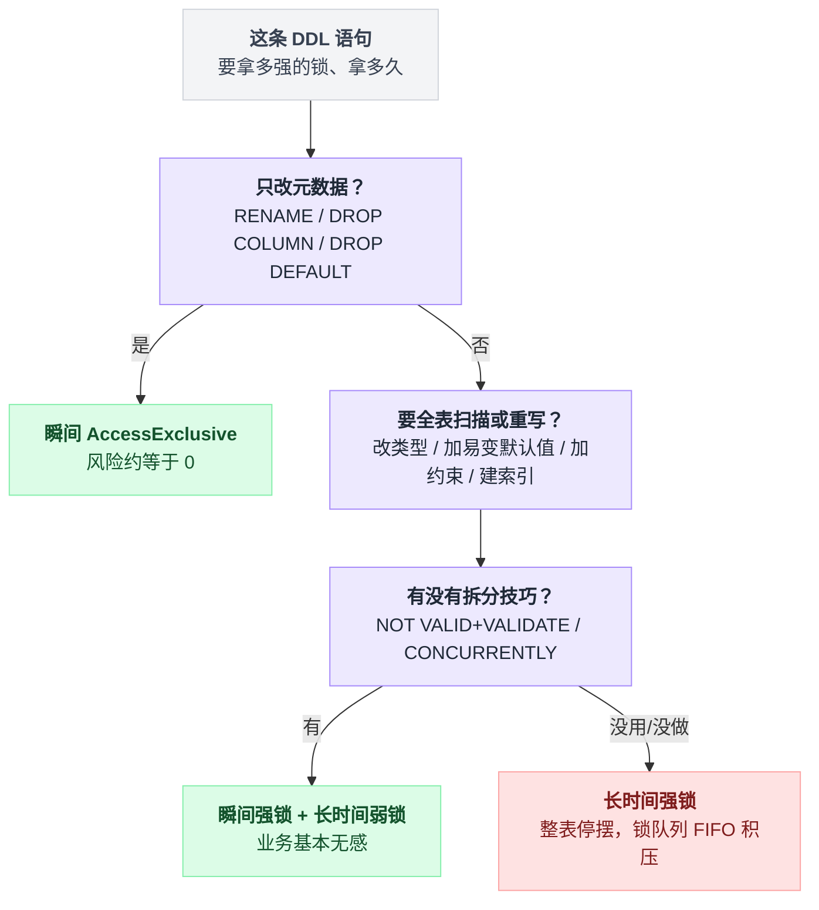
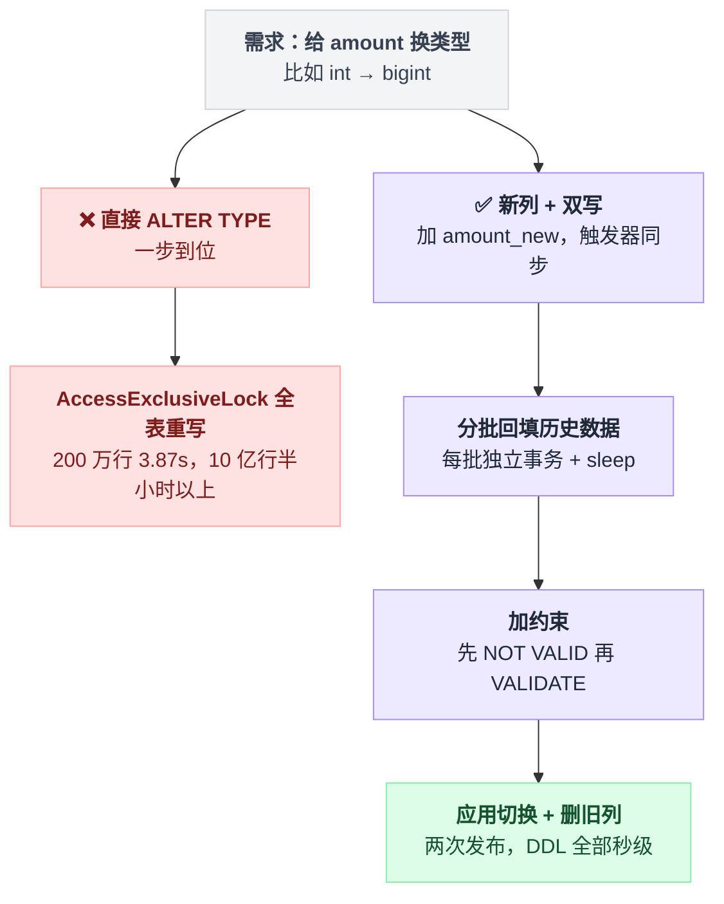
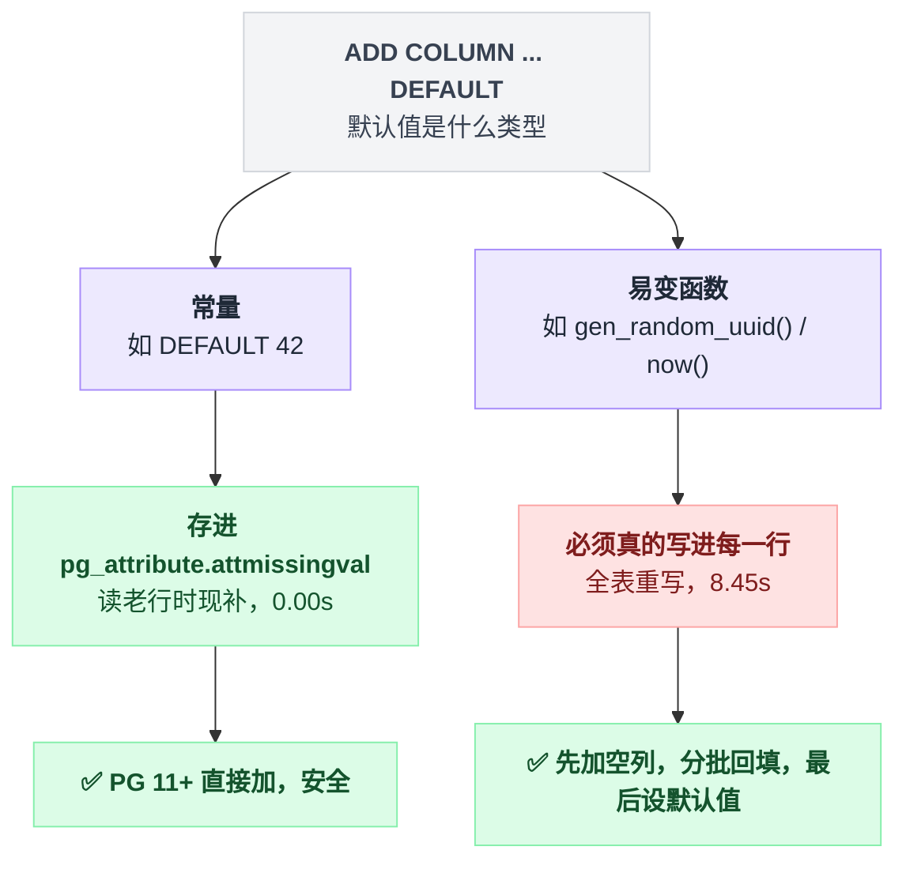
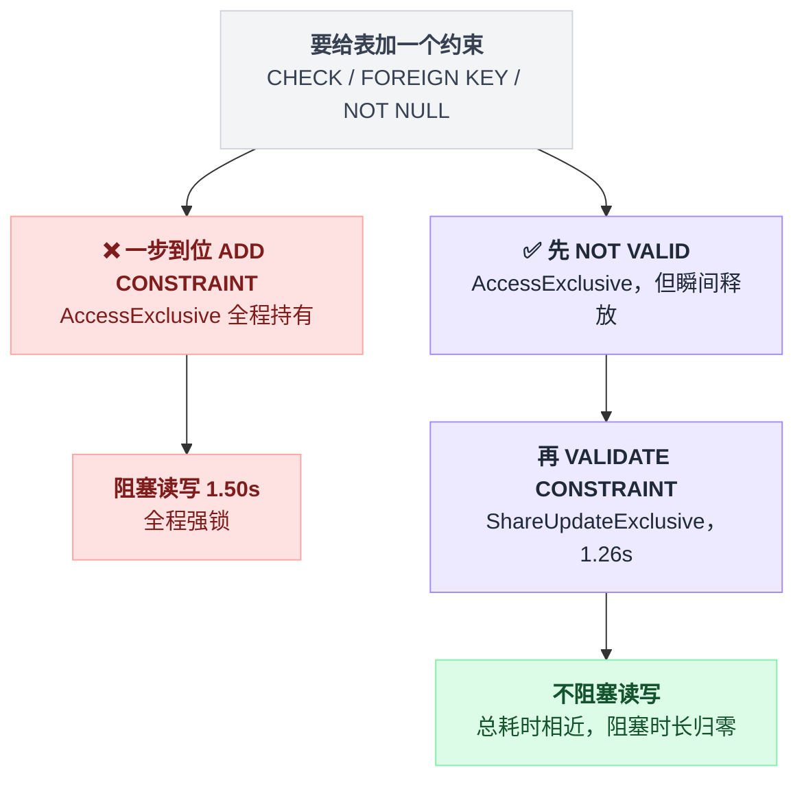
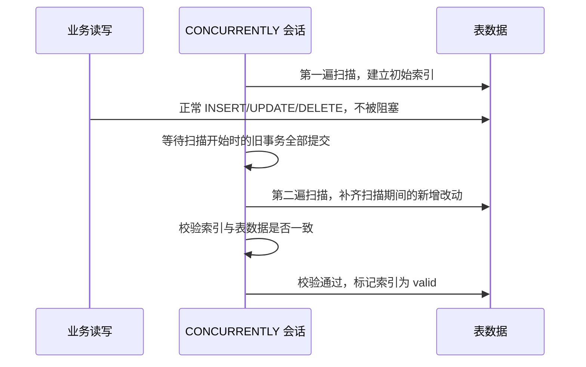
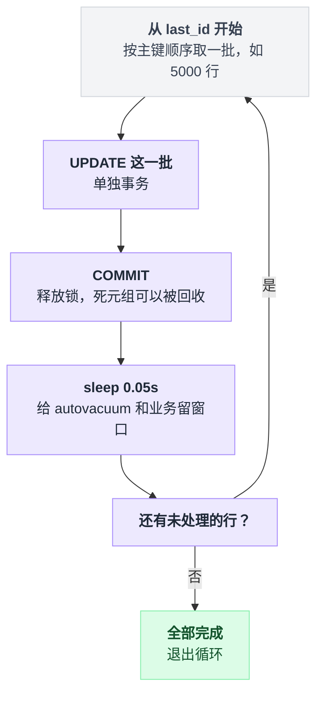

# 第 11 篇 · 在线 DDL：迁移脚本怎么写才不炸库

> sub2api 有 **239 个迁移文件**。这一篇把它踩过的坑和形成的约定整理出来。

---

## 一、先记住两个数字

一句话地图：**锁级别**决定挡住谁，**持有时长**决定挡多久，两者相乘才是风险。下面两张表就是这两个维度的实测结果。

**数字一：DDL 拿的锁级别**（实测 `labs/exp25_ddl2.py`）：

| DDL | 锁级别 | 影响 |
|---|---|---|
| `ALTER TABLE d ADD COLUMN z int` | AccessExclusiveLock | 挡一切，包括 SELECT |
| `ALTER TABLE d ADD CONSTRAINT ck CHECK (...) NOT VALID` | AccessExclusiveLock | 也是！只是持有时间极短 |
| `ALTER TABLE d VALIDATE CONSTRAINT ck` | ShareUpdateExclusiveLock | 不挡读写 ✅ |
| `CREATE INDEX i ON d(v)` | ShareLock | 挡写，允许读 |
| `CREATE INDEX CONCURRENTLY i ON d(s)` | —— | 不挡读写 ✅ |

**数字二：DDL 持有锁的时长**（实测，200 万行）：

| DDL | 耗时 | 结论 |
|---|---|---|
| ADD COLUMN（无默认值） | 0.00s | ✅ |
| ADD COLUMN DEFAULT 42（常量，PG11+） | 0.00s | ✅ |
| ADD COLUMN DEFAULT gen_random_uuid()（易变函数） | 8.45s | ❌ 全表重写 |
| ALTER COLUMN v TYPE bigint | 3.87s | ❌ 全表重写 |
| RENAME COLUMN | 0.00s | ✅ 只改元数据 |
| DROP COLUMN | 0.00s | ✅ 只改元数据 |

**核心公式**：

> **风险 = 锁级别 × 持有时长**

`AccessExclusiveLock` 持有 0.001 秒没关系。

持有 8 秒就完全是另一回事：加上第 5 篇讲的**锁队列 FIFO** 效应，那是整张表停摆 8 秒 + 后面积压的所有请求。

判断一条 DDL 危不危险，沿着这条判定树走一遍就有数：



---

## 二、危险操作与它们的安全替代

### ① `ALTER COLUMN ... TYPE`（全表重写）

```
ALTER TABLE d ALTER COLUMN v TYPE bigint    3.87s（200 万行）
```

200 万行 3.87 秒，一张 10 亿行的表就是**半小时以上的全表锁**。

**注意：`int → bigint` 也要重写**，因为存储宽度变了。这个我第一遍是想当然的——总觉得"变宽而已，老数据又不用改"，实际上行内存储宽度变了，每一行都得重新写一遍。

两条路线走出来的结果差别很大：



**✅ 安全做法：新列 + 双写 + 回填 + 切换**

```sql
-- 步骤 1：加新列（秒级）
ALTER TABLE orders ADD COLUMN amount_new numeric(20,6);

-- 步骤 2：应用代码同时写新旧两列（发一个版本上线）
--         或者用触发器自动同步：
CREATE FUNCTION sync_amount() RETURNS trigger AS $$
BEGIN NEW.amount_new := NEW.amount; RETURN NEW; END $$ LANGUAGE plpgsql;
CREATE TRIGGER trg_sync BEFORE INSERT OR UPDATE ON orders
    FOR EACH ROW EXECUTE FUNCTION sync_amount();

-- 步骤 3：分批回填历史数据（不要一条 UPDATE 全表！）
DO $$ DECLARE last_id bigint := 0; n int;
BEGIN
  LOOP
    WITH batch AS (
      SELECT id FROM orders WHERE id > last_id AND amount_new IS NULL
      ORDER BY id LIMIT 5000
    )
    UPDATE orders o SET amount_new = o.amount FROM batch b WHERE o.id = b.id;
    GET DIAGNOSTICS n = ROW_COUNT;
    EXIT WHEN n = 0;
    SELECT max(id) INTO last_id FROM (SELECT id FROM orders WHERE id > last_id ORDER BY id LIMIT 5000) x;
    COMMIT;                  -- 每批一个事务！（PG 11+ 的存储过程里可以 COMMIT）
    PERFORM pg_sleep(0.05);  -- 给 autovacuum 和业务喘息的机会
  END LOOP;
END $$;

-- 步骤 4：加约束（先 NOT VALID，再在线 VALIDATE）
ALTER TABLE orders ADD CONSTRAINT amount_new_nn CHECK (amount_new IS NOT NULL) NOT VALID;
ALTER TABLE orders VALIDATE CONSTRAINT amount_new_nn;

-- 步骤 5：应用切换到只读新列 → 再发一个版本
-- 步骤 6：删旧列（秒级）
ALTER TABLE orders DROP COLUMN amount;
ALTER TABLE orders RENAME COLUMN amount_new TO amount;
```

麻烦，但这是**唯一能在大表上安全改类型的办法**。

### ② `ADD COLUMN ... DEFAULT`（看默认值是不是常量）

同一条语法，差别全在默认值那半句：

| 语句 | 耗时 | 结论 |
|---|---|---|
| `ADD COLUMN c2 int DEFAULT 42` | 0.00s | ✅ PG 11+ 免重写 |
| `ADD COLUMN c3 uuid DEFAULT gen_random_uuid()` | 8.45s | ❌ 必须重写 |

**PG 11 起，常量默认值不再重写表**——它把默认值存进 `pg_attribute.attmissingval`，读到老行时"补"出来。

但**易变函数（`gen_random_uuid()`、`now()`、`random()`）不行**，因为每行的值都不同，必须真的写进去。

分岔点就在默认值是不是常量：



**✅ 做法**：先加空列，再分批回填，最后设默认值。

### ③ `SET NOT NULL`（需要全表校验）

**✅ PG 12+ 的技巧**：先加一个等价的 `CHECK ... NOT VALID`，验证通过后再 `SET NOT NULL`，此时 Postgres 会**复用 CHECK 的验证结果，跳过全表扫描**：

```sql
ALTER TABLE t ADD CONSTRAINT t_col_nn CHECK (col IS NOT NULL) NOT VALID;  -- 秒级（但短暂持排他锁）
ALTER TABLE t VALIDATE CONSTRAINT t_col_nn;                               -- 慢，但【不阻塞读写】
ALTER TABLE t ALTER COLUMN col SET NOT NULL;                              -- 秒级（复用上面的验证）
ALTER TABLE t DROP CONSTRAINT t_col_nn;                                   -- 可选，清理
```

四条语句里真正花时间的只有第二条，而它恰好是不阻塞读写的那条——这就是全部收益所在。

### ④ `ADD CONSTRAINT CHECK` / `ADD FOREIGN KEY`

实测（521 MB，500 万行）：

| 操作 | 耗时 | 结论 |
|---|---|---|
| ADD CHECK（AccessExclusiveLock 全程持有） | 1.50s | ❌ |
| ADD CHECK ... NOT VALID | 0.00s | ✅ |
| VALIDATE CONSTRAINT（ShareUpdateExclusiveLock） | 1.26s | ✅ 不阻塞读写 |

**总耗时几乎一样（1.50s vs 1.26s），但阻塞时长从 1.5 秒变成 0 秒。**

这就是 `NOT VALID` 的全部意义：**把"长时间的强锁"拆成"瞬间的强锁 + 长时间的弱锁"。**



外键也是同一套写法：

```sql
-- ✅ 两步法，外键同理
ALTER TABLE child ADD CONSTRAINT fk FOREIGN KEY (pid) REFERENCES parent(id) NOT VALID;
ALTER TABLE child VALIDATE CONSTRAINT fk;
```

`NOT VALID` 期间：**新写入的数据会被约束检查，只是历史数据没验证。** 对大多数场景这已经足够安全。

⚠️ 两点限定：

- `VALIDATE CONSTRAINT` 拿的 `ShareUpdateExclusiveLock` **与自身冲突**——它不阻塞普通读写，但会阻塞 VACUUM/ANALYZE 和其他 DDL。
- **验证外键时，还会在被引用表上加 `ROW SHARE` 锁**。

### ⑤ `CREATE INDEX`

实测（`labs/exp13_ddl.py`，200 万行，同时有业务在写）：

| 方式 | DDL 耗时 | 业务 UPDATE 最长被卡 |
|---|---|---|
| [A] CREATE INDEX（普通） | 2.12s | 2115 ms |
| [B] CREATE INDEX CONCURRENTLY | 2.10s | 183 ms |

DDL 自己的耗时几乎没区别，被卡的业务写入却差了一个数量级。

`CONCURRENTLY` 之所以不阻塞读写，是因为它把一遍扫描拆成了两遍，中间让业务事务先走完：



**一律用 `CONCURRENTLY`。** 代价：

- 要扫两遍表，实际更慢（大表上大约是 2 倍）；
- **不能在事务块里执行**；
- **可能失败**，失败后留下 `invalid` 索引，必须清理：

```sql
SELECT indexrelid::regclass FROM pg_index WHERE NOT indisvalid;
DROP INDEX CONCURRENTLY <name>;
```

### ⑥ `DROP COLUMN`（秒级，但有后遗症）

```
DROP COLUMN c1    0.00s   ✅
```

它只是在 `pg_attribute` 里把列标记为 `attisdropped`。**数据还在每一行里占着空间**，只有等所有行被重写（UPDATE 或 `pg_repack`）才真正释放。

📌 顺带一个 schema 设计提醒：**Postgres 有 1600 列的硬上限，而被 DROP 的列永久占用列槽位——`VACUUM FULL` 和表重写都不回收它，只能重建表。** 一张被反复加列删列的表（比如用"加列"做 A/B 实验的）真的可能撞到这个限制。

---

## 三、迁移文件的工程约定（从 sub2api 抄）

四条约定分别防四件事：非事务迁移被塞进事务、重跑失败、历史文件被偷改、迁移把库锁死。

### 约定 1：`_notx.sql` 后缀标记非事务迁移

sub2api 的迁移执行器（`internal/repository/migrations_runner.go`）：

```go
const nonTransactionalMigrationSuffix = "_notx.sql"
// *_notx.sql：用于 CREATE/DROP INDEX CONCURRENTLY 场景，必须非事务执行。
// 逐条语句执行，避免将多条 CONCURRENTLY 语句放入同一个隐式事务块。
```

而且它做了**静态校验**，写错了直接拒绝执行。校验器的判断顺序大致是这样：

```
对每个迁移文件：
    if 文件名不是 *_notx.sql 且 内容含 "CONCURRENTLY":
        拒绝 → "CONCURRENTLY 必须放进 *_notx.sql"
    if 是 *_notx.sql:
        if 含 BEGIN/COMMIT/ROLLBACK:            拒绝 → 非事务文件里不许有事务控制
        对每条语句:
            if CREATE INDEX CONCURRENTLY 缺 IF NOT EXISTS:  拒绝 → 幂等性要求
            if DROP  INDEX CONCURRENTLY 缺 IF EXISTS:       拒绝 → 幂等性要求
            if 不是 CONCURRENTLY 语句:                       拒绝 → 不许混
```

对应的真实代码：

```go
if strings.Contains(upperContent, "CONCURRENTLY") {
    return false, errors.New("CONCURRENTLY statements must be placed in *_notx.sql migrations")
}
if ... {
    return false, errors.New("*_notx.sql must not contain transaction control statements (BEGIN/COMMIT/ROLLBACK)")
}
if !strings.Contains(normalizedStmt, "IF NOT EXISTS") {
    return false, errors.New("CREATE INDEX CONCURRENTLY in *_notx.sql must include IF NOT EXISTS for idempotency")
}
if !strings.Contains(normalizedStmt, "IF EXISTS") {
    return false, errors.New("DROP INDEX CONCURRENTLY in *_notx.sql must include IF EXISTS for idempotency")
}
return false, errors.New("*_notx.sql must not mix non-CONCURRENTLY SQL statements")
```

📌 **把"这个迁移不能包在事务里"编码进文件名，并用代码强制校验。** 这比在 wiki 上写一条"请大家注意"有效一万倍。

### 约定 2：所有迁移必须幂等

sub2api 的迁移文件里到处是：

```sql
CREATE TABLE IF NOT EXISTS ...
CREATE INDEX IF NOT EXISTS ...
ALTER TABLE ... ADD COLUMN IF NOT EXISTS ...
```

**❓ 为什么？**

迁移可能因为超时、锁冲突、部署中断而**执行到一半失败**。如果不幂等，重跑就会因为"对象已存在"再次失败，你只能手工去数据库里改。

**在 K8s 滚动发布场景下更要命**：多个 Pod 同时启动，同时跑迁移。所以 sub2api 还加了 advisory lock：

```go
db.QueryRowContext(ctx, "SELECT pg_try_advisory_lock($1)", migrationsAdvisoryLockID).Scan(&locked)
```

**先抢锁，抢不到就等（或者跳过），保证同一时刻只有一个实例在跑迁移。**

⚠️ `ALTER TABLE ... ADD COLUMN IF NOT EXISTS` 是 PG 9.6+ 才有的。有些 DDL 没有 `IF NOT EXISTS`（比如 `ADD CONSTRAINT`），要自己包一层：

```sql
DO $$
BEGIN
  IF NOT EXISTS (SELECT 1 FROM pg_constraint WHERE conname = 'my_check') THEN
    ALTER TABLE t ADD CONSTRAINT my_check CHECK (x > 0) NOT VALID;
  END IF;
END $$;
```

### 约定 3：checksum 校验，防止历史迁移被偷偷改

```go
// - checksum: 文件内容的 SHA256 哈希值，用于检测迁移文件是否被篡改
CREATE TABLE IF NOT EXISTS schema_migrations (
    filename   TEXT PRIMARY KEY,
    checksum   TEXT NOT NULL,
    ...
);
// - 如果迁移文件内容被修改（checksum 不匹配），会返回错误
```

**❌ 不做 checksum 校验会怎样**：有人改了一个已经在生产跑过的迁移文件（比如"修一个笔误"），本地和测试环境重新建库时跑的是新版本，生产上跑的是旧版本。

**两边的 schema 从此永久分叉**，而且没有任何人知道。

sub2api 甚至为"历史上误改过的迁移"专门做了一套兼容规则：

```go
// migrationChecksumCompatibilityRules 仅用于兼容历史上误修改过的迁移文件 checksum。
// 规则必须同时匹配「迁移名 + 数据库 checksum + 当前文件 checksum」且两者都落在该迁移的已知版本集合内才会放行
```

放行条件是三个条件同时成立，缺一不可：

```
放行 = 迁移名匹配规则
     且 数据库里记的 checksum ∈ 该迁移的已知版本集合
     且 当前文件的 checksum   ∈ 该迁移的已知版本集合
```

**这是被现实教育过的痕迹。**

### 约定 4：迁移里带超时保护

```sql
SET LOCAL lock_timeout = '5s';
SET LOCAL statement_timeout = '10min';
```

第 5 篇和第 10 篇讲过原理。`SET LOCAL` 保证只影响当前事务，不污染连接池。

---

## 四、迁移安全性速查表

| 操作 | 锁 | 耗时 | 安全性 | 备注 |
|---|---|---|---|---|
| `ADD COLUMN`（无默认值/常量默认值） | AccessExcl | 瞬间 | ✅ | PG 11+ |
| `ADD COLUMN DEFAULT <易变函数>` | AccessExcl | **全表** | ❌ | 拆成加列 + 回填 |
| `DROP COLUMN` | AccessExcl | 瞬间 | ✅ | 空间不回收 |
| `RENAME COLUMN` / `RENAME TABLE` | AccessExcl | 瞬间 | ⚠️ | **应用代码得先兼容两个名字** |
| `ALTER COLUMN TYPE` | AccessExcl | **全表重写** | ❌ | 新列 + 双写 + 回填 |
| `ALTER COLUMN TYPE varchar(50)→varchar(100)` | AccessExcl | 瞬间 | ✅ | **只有放宽/去掉**长度限制免重写；缩小仍要全表扫 |
| `SET NOT NULL` | AccessExcl | 全表扫 | ⚠️ | 用 CHECK NOT VALID 技巧 |
| `DROP NOT NULL` | AccessExcl | 瞬间 | ✅ | |
| `ADD CHECK` | AccessExcl | 全表扫 | ❌ | 用 `NOT VALID` + `VALIDATE` |
| `ADD FOREIGN KEY` | AccessExcl（两张表） | 全表扫 | ❌ | 同上 |
| `VALIDATE CONSTRAINT` | ShareUpdateExcl | 全表扫 | ✅ | **不阻塞读写** |
| `CREATE INDEX` | Share | 全表扫 | ❌ | 用 `CONCURRENTLY` |
| `CREATE INDEX CONCURRENTLY` | ShareUpdateExcl | 两遍扫 | ✅ | 不能在事务里 |
| `DROP INDEX` | AccessExcl | 瞬间 | ⚠️ | 用 `CONCURRENTLY` |
| `ADD DEFAULT` / `DROP DEFAULT` | AccessExcl | 瞬间 | ✅ | |
| `CREATE TABLE` | — | 瞬间 | ✅ | |
| `TRUNCATE` | AccessExcl | 瞬间 | ⚠️ | 快，但要等所有读者退出 |

---

## 五、应用与 schema 的兼容性：扩展-收缩模式

DDL 安全只是一半，另一半是**应用代码和 schema 的版本必须能共存**——滚动发布期间，新旧两个版本的代码会同时连着同一个数据库。

**❌ 最经典的翻车**：

```
1. 发布迁移：RENAME COLUMN old_name TO new_name
2. 滚动发布应用
3. 在 2 完成之前，还没更新的旧 Pod 全部报错：column "old_name" does not exist
```

注意这条迁移在速查表里是"瞬间、✅"级别的——锁的账算得再干净，也拦不住这种翻车。

**✅ 扩展-收缩（expand-contract）模式**：任何破坏性变更都拆成 **3 次发布**：


```
发布 1（扩展）: 加新结构，代码同时读写新旧两处
                （此时数据库同时支持新旧两种代码）
发布 2（迁移）: 回填历史数据；代码切换到只用新结构
发布 3（收缩）: 删掉旧结构
```

对照表：

| 变更 | 扩展 | 迁移 | 收缩 |
|---|---|---|---|
| 改列名 | 加新列 + 触发器同步 | 代码切到新列 | 删旧列 |
| 改类型 | 加新类型的列 + 双写 | 回填 + 代码切换 | 删旧列 |
| 删列 | 代码停止使用 | —— | 删列 |
| 加必填列 | 加可空列 | 回填 + 代码保证写入 | `SET NOT NULL` |
| 拆表 | 建新表 + 双写 | 回填 + 读切换 | 停止双写 + 删旧表 |

**每一步之间要等**，等到所有旧版本 Pod 都下线了才能进下一步。

📌 **一个实用的判断标准**：**"如果这次迁移跑完，但应用回滚到上一个版本，还能正常工作吗？"** 不能 → 这个迁移不安全，需要拆。

---

## 六、批量数据迁移的正确姿势

**❌ 千万别这么写**：

```sql
UPDATE big_table SET new_col = old_col;      -- 1 亿行
```

后果（第 9 篇讲过）：

- 单个事务持有 1 亿行的锁，几十分钟；
- 产生 1 亿个死元组，表膨胀一倍；
- WAL 洪流，主从延迟飙到几十分钟；
- 整个过程钉住 VACUUM 水位线（**它自己就是那个长事务**）；
- 中途超时被杀 → **全部回滚，白干，还留下满地死元组**。

**✅ 分批 + 每批独立事务 + 限速**，整个过程是一个不断缩小战场的循环：



循环本身只有五行：

```
last_id = 0
loop:
    这批 = 取 id > last_id 且 new_col IS NULL 的行，按 id 排序，最多 5000 条
    更新这批，记下实际影响行数 n
    if n == 0: 退出          // 没有可做的了
    last_id = 这批里最大的 id  // 游标只前进，不回头
    COMMIT                   // 一批一个事务，锁立刻释放
    sleep 0.05s              // 把窗口让给 autovacuum 和业务
```

对应的可执行版本：

```sql
DO $$
DECLARE
  last_id bigint := 0;
  batch   int    := 5000;
  n       int;
BEGIN
  LOOP
    WITH b AS (
      SELECT id FROM big_table
      WHERE id > last_id AND new_col IS NULL
      ORDER BY id LIMIT batch
    )
    UPDATE big_table t SET new_col = t.old_col
    FROM b WHERE t.id = b.id;

    GET DIAGNOSTICS n = ROW_COUNT;
    EXIT WHEN n = 0;

    SELECT max(id) INTO last_id FROM (
      SELECT id FROM big_table WHERE id > last_id ORDER BY id LIMIT batch
    ) x;

    COMMIT;                    -- ← 关键：每批一个事务
    PERFORM pg_sleep(0.05);    -- ← 关键：给 autovacuum 和业务留出窗口
  END LOOP;
END $$;
```

三个要点：

1. **每批一个事务**（`DO` 块里的 `COMMIT` 需要 PG 11+；更早的版本用外部脚本循环）；
2. **按主键顺序推进**，用 `last_id` 做游标，不要用 `OFFSET`（第 9 篇讲过 OFFSET 的代价）；
3. **每批之间 sleep**，让 autovacuum 有机会回收上一批产生的死元组——否则你会一边迁移一边把表撑大一倍。

**如果数据量特别大（10 亿行以上）**，考虑用 `CREATE TABLE AS` + `RENAME` 的方式整表重建，或者上 `pg_repack`。

---

## 七、上线前的迁移 checklist

```
□ 这个迁移拿的是什么锁？持有多久？（对着上面的速查表核对）
□ 大表操作是不是都加了 CONCURRENTLY / NOT VALID？
□ 有没有 SET LOCAL lock_timeout？
□ 迁移是不是幂等的？（IF NOT EXISTS / IF EXISTS / DO 块判断）
□ 迁移执行是不是有互斥？（advisory lock，防多副本同时跑）
□ 应用回滚到上个版本后，这个 schema 还能用吗？（扩展-收缩）
□ 批量数据变更是不是分批 + 每批独立事务 + sleep？
□ 在【生产规模的数据量】上测过吗？（1 万行和 1 亿行是两回事）
□ 出问题怎么回滚？回滚脚本写了吗？测了吗？
□ 迁移期间的监控看板准备好了吗？（锁等待、复制延迟、慢查询）
```

**最后一条特别重要**：迁移时开着这个查询，看到锁等待堆积立刻中止：

```sql
SELECT pid, now()-query_start AS 已运行, wait_event_type, pg_blocking_pids(pid), left(query,60)
FROM pg_stat_activity
WHERE state <> 'idle' ORDER BY query_start;
```

---

## 八、本篇小结

📌 **一句话**：**风险 = 锁级别 × 持有时长**。在线 DDL 的全部技巧就是把"长时间的强锁"拆成"瞬间的强锁 + 长时间的弱锁"——`CONCURRENTLY` 和 `NOT VALID` 是这个思路的两个具体实现。

| 三条铁律 | |
|---|---|
| **大表建索引一律 `CONCURRENTLY`** | 实测阻塞 2115ms → 183ms |
| **加约束一律 `NOT VALID` + `VALIDATE`** | 实测阻塞 1.5s → 0s |
| **改列类型/加必填列一律走扩展-收缩三步走** | 否则全表重写 + 应用不兼容 |

工程约定同样重要：

- `_notx.sql` 后缀 + 代码强制校验
- 所有迁移幂等（`IF NOT EXISTS`）
- checksum 防篡改
- advisory lock 防多副本并发执行
- `SET LOCAL lock_timeout` 兜底

---

**下一篇** → [12 类型选择：钱、时间，以及不起眼的坑](./12-类型选择.md)
