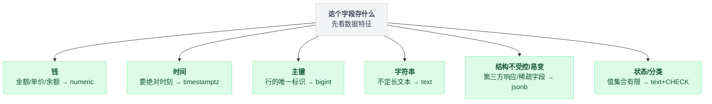
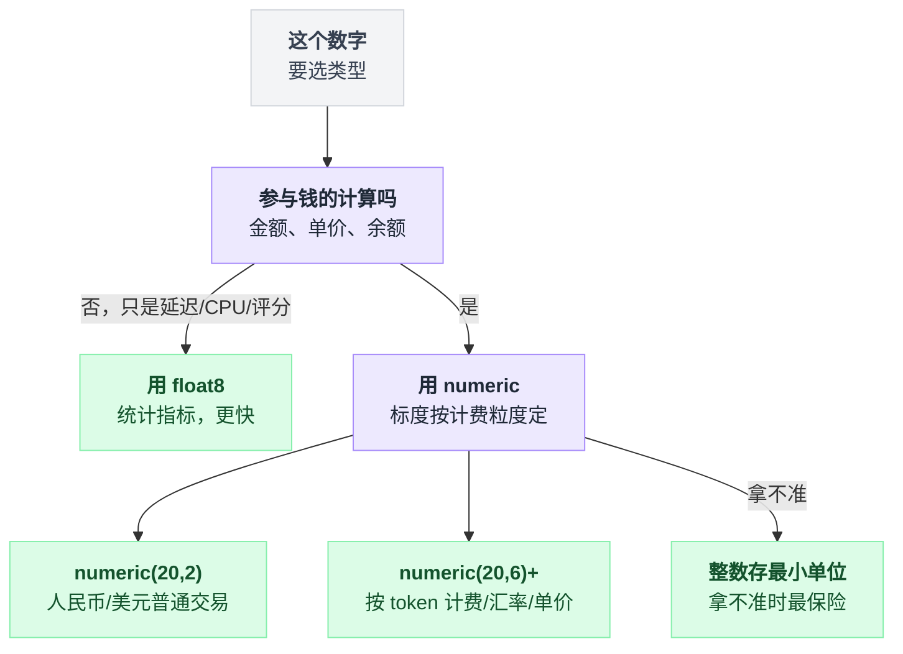
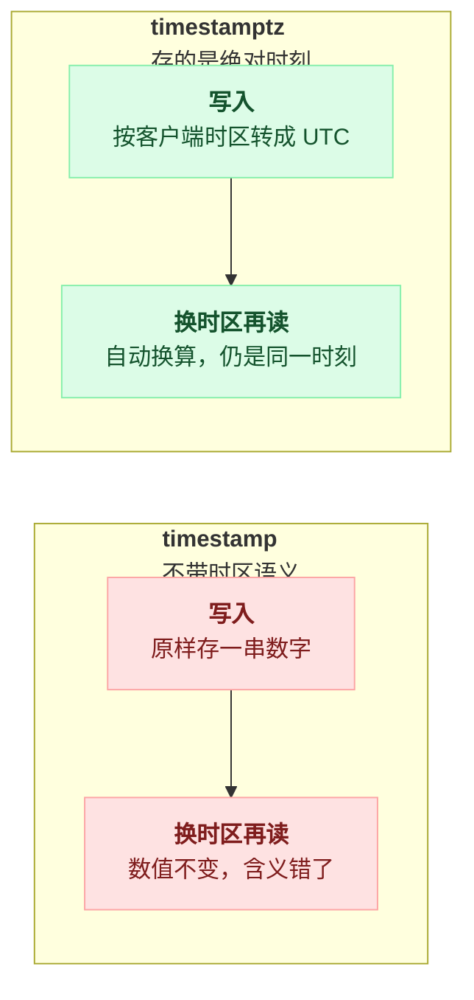
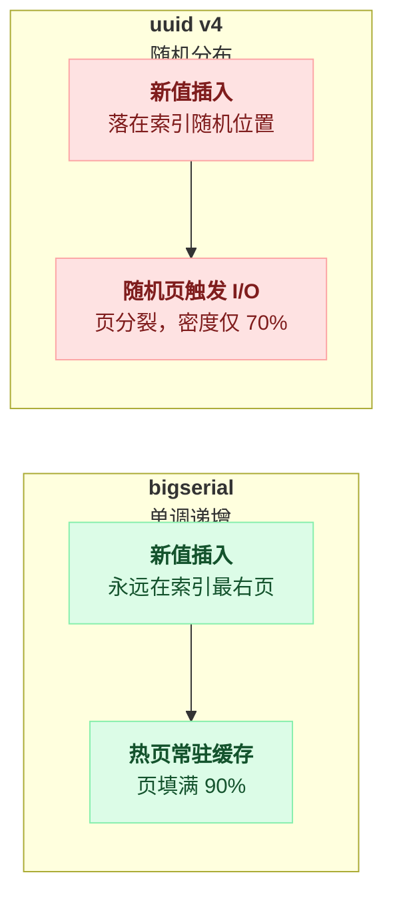
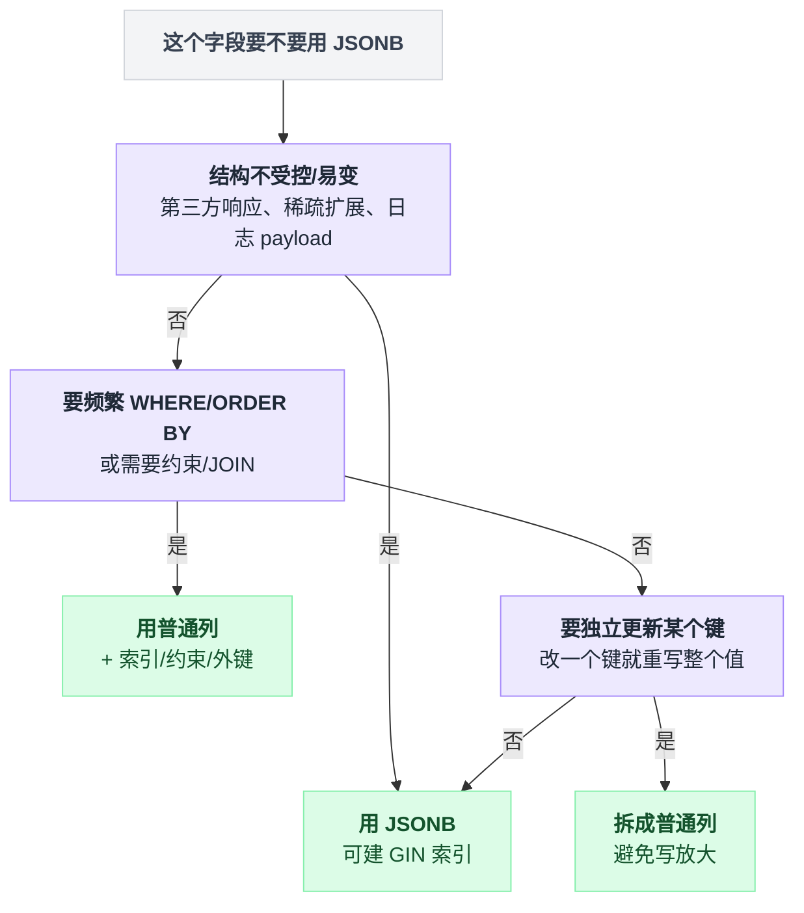
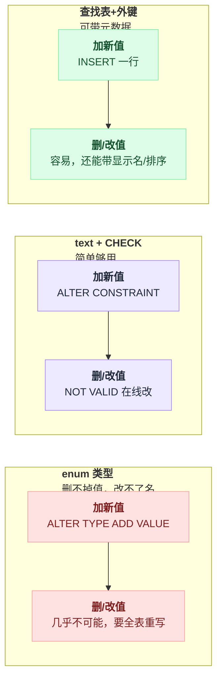
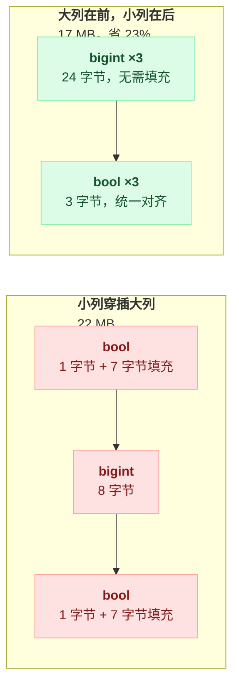

# 第 12 篇 · 类型选择：钱、时间，以及不起眼的坑

> 类型选错了，问题不会立刻爆发，而是在三个月后以"账对不上""时间差 8 小时""索引怎么这么大"的形式出现。

---

选类型时先按数据特征分个岔，下面每一节都是在展开其中一支的坑：



## 一、钱：绝对不能用浮点数

实测（`labs/exp6.sql`）：

```
=== 用 float8 存钱 ===
  0.1 + 0.2 = 0.30000000000000004     等于 0.3 吗: f
  从 100 开始扣 1000 次 0.01 → 89.99999999999488   等于 90 吗: f

=== 用 numeric 存钱 ===
  从 100 开始扣 1000 次 0.01 → 90.000000            等于 90 吗: t
```

**只扣了 1000 次，误差就出现在小数点后第 11 位。** 一天几千万次计费之后，这个误差会累积到肉眼可见。

更糟的是它的**表现形式**：

- 用户余额显示 `89.99999999999488`；
- `WHERE balance = 0` 永远匹配不到（余额是 `0.0000000000001`）；
- 对账脚本算出的差额每次都不一样；
- 你去查代码，每一行看起来都是对的。

最后一条才是真正折磨人的地方：没有任何一处代码有 bug，bug 在类型里。

**✅ 一律用 `numeric`。** sub2api 的 `users.balance` 就是 `numeric`。

### ⚠️ numeric 也有坑：精度不够会静默四舍五入

```
numeric(20,2) 扣 0.004  →  计算结果 99.996  →  存回列里变成 100.00   ← 这次扣费凭空消失了
numeric(20,6) 扣 0.000004 →  99.999996                              ← OK
```

注意"静默"两个字：没有报错，没有警告，扣费就是没了。

**AI API 的计费单价常常是 `$0.000003/token` 这个量级**，`numeric(20,2)` 会把整笔扣费四舍五入成 0。

**✅ 定标度的选择**：

| 场景 | 建议 |
|---|---|
| 人民币/美元的普通交易 | `numeric(20,2)` 够 |
| API 按 token 计费、汇率、单价 | `numeric(20,6)` 或更高 |
| 加密货币 | `numeric(38,18)` |
| 拿不准 | **用整数存最小单位**（分、微美元），业务层做换算 |

最后一种（整数存分）是最保险的——**没有精度问题，没有四舍五入，比较和求和都精确**。缺点是每个读写点都要记得换算，容易漏。

### numeric 的代价

```
pg_column_size:  int4=4   int8=8   float8=8   numeric(20,6)=10
```

numeric 是变长的十进制存储，**运算比 float 慢一个数量级**（是软件实现的，不走 CPU 浮点单元）。

📌 **判断标准**：**这个数字参与"钱"的计算吗？** 是 → `numeric`。只是统计指标（延迟、CPU 使用率、评分）→ `float8` 完全没问题，还更快。

把"是不是钱"和"标度定多少"这两步判断连起来看：



---

## 二、时间：一律用 `timestamptz`

实测：

```
SET TIME ZONE 'Asia/Shanghai';
INSERT INTO ts VALUES (now(), now());     -- a 是 timestamp, b 是 timestamptz
SELECT a, b FROM ts;
  a: 2026-08-04 16:17:47.054026
  b: 2026-08-04 16:17:47.054026+08

SET TIME ZONE 'UTC';                       -- 换个时区再查【同一行】
SELECT a, b FROM ts;
  a: 2026-08-04 16:17:47.054026            ← 没变，但现在它的含义是"UTC 时间 16:17"，错了 8 小时
  b: 2026-08-04 08:17:47.054026+00         ← 自动换算，仍然是同一个时刻 ✅

pg_column_size: timestamp=8   timestamptz=8    ← 存储大小完全一样
```

### 关键理解：`timestamptz` 不存时区

名字有误导性——看到 `tz` 后缀，第一反应是"这个类型会把时区一起存下来"，其实不会。实际情况是：

| | 存的是什么 | 换个时区再读 | 大小 |
|---|---|---|---|
| `timestamptz` | **绝对时刻**（UTC 的微秒数），写入时按客户端的 `TimeZone` 转成 UTC，读出时再转回客户端时区 | 自动换算，仍是同一时刻 | **8 字节** |
| `timestamp` | **一串数字**，不带任何时区含义。"2026-08-04 16:17" 到底是北京时间还是伦敦时间？**数据库不知道，也不关心** | 数值不变，含义已经错了 | 8 字节 |

**同样的 8 字节，`timestamptz` 白送你一个正确的时区语义。没有任何理由用 `timestamp`。**

两者的区别不在存储大小，而在换时区之后发生了什么：



sub2api 的所有时间列都是 `TIMESTAMPTZ`：

```sql
created_at    TIMESTAMPTZ NOT NULL DEFAULT NOW(),
available_at  TIMESTAMPTZ NOT NULL DEFAULT NOW(),
claimed_at    TIMESTAMPTZ,
```

### ❌ 用 `timestamp` 会怎样

真实的事故链条，越往后越难救：

1. 服务器在美国（UTC），本地开发在中国（UTC+8）；
2. 用 `timestamp` 存 `created_at`；
3. **本地跑测试全对，线上数据全部差 8 小时**；
4. 更隐蔽的：夏令时切换那一天，同一个"本地时间"出现两次或者不存在，**基于 timestamp 的排序和范围查询直接乱掉**；
5. 最隐蔽的：不同的应用实例配了不同的 `TZ` 环境变量，**同一张表里的时间戳来自不同时区，无法区分也无法修复**。

第 5 条是终点站——数据本身已经不含判断依据了，你连"这一行是哪个时区写的"都查不出来。

### 相关的坑

**① 时区名要用地区名，不要用偏移量**

```sql
SET TIME ZONE 'Asia/Shanghai';   -- ✅ 自动处理夏令时
SET TIME ZONE '+08';             -- ⚠️ 固定偏移，不处理夏令时
```

**② `now()` vs `clock_timestamp()`**

```sql
SELECT now(), now();               -- 两个值完全相同（事务开始的时间）
SELECT clock_timestamp(), clock_timestamp();  -- 两个值不同（真实的墙钟）
```

`now()`（等价于 `CURRENT_TIMESTAMP` 和 `transaction_timestamp()`）返回的是**事务开始时刻**，在整个事务里不变。

这通常正是你想要的（同一个事务里的所有记录时间一致），但如果你在测量"这一步花了多久"，要用 `clock_timestamp()`。

**③ 区间查询用半开区间**

```sql
-- ❌ 会漏掉 23:59:59.5 这样的数据
WHERE created_at BETWEEN '2026-08-01' AND '2026-08-31 23:59:59'
-- ✅ 半开区间，不会漏也不会重
WHERE created_at >= '2026-08-01' AND created_at < '2026-09-01'
```

**④ 别对索引列套时间函数**

```sql
-- ❌ 索引失效（第 8 篇）
WHERE date_trunc('day', created_at) = '2026-08-01'
-- ✅
WHERE created_at >= '2026-08-01' AND created_at < '2026-08-02'
```

---

## 三、主键：bigserial vs UUID

实测（各插入 100 万行）：

| 主键类型 | 插入耗时 | 表大小 | 主键索引 | 索引叶页密度 |
|---|---|---|---|---|
| `bigserial` | **3.17 s** | 42 MB | **21 MB** | **90.06%** |
| `uuid`（v4 随机） | **7.91 s** | 50 MB | **39 MB** | **69.92%** |

**插入慢 2.5 倍，索引大 86%，页密度从 90% 掉到 70%。**

### 为什么随机 UUID 这么伤

B-tree 索引是**按键值排序**的，所以键的分布决定了新行落在哪一页。同样是插入一行，两种主键在索引里发生的事完全不一样：

```
# bigserial：单调递增
每插入一行:
    key = 下一个自增值            // 永远比上一个大
    页  = 索引最右边那一页        // 永远是同一页，一直待在缓存里
    页.放入(key)                  // 填到 fillfactor 90 才换下一页
```

```
# uuid v4：完全随机
每插入一行:
    key = 随机 UUID
    页  = key 按序该去的那一页    // 随机位置，可能要从磁盘读进来
    if 页.满了:
        页.分裂成两页             // 分裂后两个页各占一半
    页.放入(key)                  // → 平均密度只有 70%
```

一句话点破：**递增键只有一个"热页"，随机键把整棵索引都变成热页。**

叶页密度 70% 意味着**索引里 30% 是空气**，而且这些空气也要被缓存、被 VACUUM 扫描。



### ✅ 怎么选

| 需求 | 方案 |
|---|---|
| 内部主键，不暴露给外部 | **`bigserial` / `bigint identity`** |
| 需要在客户端生成 ID（离线、多写入端） | **UUID v7**（时间有序，兼具随机性和局部性）|
| 需要防遍历/防猜测 | 内部用 `bigserial`，**外部暴露一个单独的 `public_id`（UUID 或短码）** |
| 已经用了 UUID v4 且量大 | 考虑迁移到 v7；至少别在其他表上继续用 |

**UUID v7** 的前 48 位是毫秒时间戳，所以生成的 UUID 天然按时间有序——**既有 UUID 的分布式生成能力，又有 bigserial 的索引局部性**。

```sql
-- PostgreSQL 18 起内置
SELECT uuidv7();

-- PG 18 之前：用扩展 pg_uuidv7，或者在应用侧生成
-- Go:     github.com/google/uuid (v1.6+ 的 uuid.NewV7)
-- Java:   com.github.f4b6a3:uuid-creator
-- Python: uuid6 包
```

📌 **最后一行的方案（内部 bigint + 外部 public_id）通常是最优解**：内部关联全部走高效的 bigint，只在 API 边界上用一个带唯一索引的 UUID/短码。多一个列的成本，换来索引效率和安全性兼得。

---

## 四、字符串：`text` 就够了

```
pg_column_size:  'hello'::text = 9    'hello'::varchar(50) = 9    'hello'::char(50) = 54
```

三个类型，只有一个是真的不一样：

| 类型 | 存储 | 结论 |
|---|---|---|
| `text` | 变长，1~4 字节头 + 内容 | 默认选它 |
| `varchar(n)` | **和 `text` 完全一样** | 只是多了一个长度检查 |
| `char(n)` | **补空格到固定长度** | 几乎在任何场景下都是错误选择 |

### ❓ 问题：那还要不要写 `varchar(255)`？

**不需要，而且它有实际的坏处**：

**❌ 用 `varchar(n)` 的代价**：某天产品说"用户名要支持 100 个字符"，你得执行 `ALTER TABLE ... ALTER COLUMN TYPE varchar(100)`。

好消息是**放宽长度限制不会重写表**（PG 9.2+）；坏消息是**它仍然要 `AccessExclusiveLock`**，仍然会排队堵住整张表（第 11 篇）。

也就是说，省下的是重写，省不下的是那把锁。

**✅ 做法**：用 `text`，需要长度限制就加 CHECK：

```sql
username text CHECK (char_length(username) BETWEEN 3 AND 32)
```

CHECK 可以用 `NOT VALID` + `VALIDATE` 在线修改（第 11 篇），比改类型友好得多。

> 有些团队坚持 `varchar(n)` 是为了"让 schema 自文档化"或者满足 ORM/工具链的要求。这是合理的取舍，只要知道代价是什么。

---

## 五、JSONB：用对了很香，用滥了是灾难

```
pg_column_size('{"a":1}'::jsonb) = 28     -- 相比 int 的 4 字节
```

一个 `{"a":1}` 就要 28 字节，而同样的信息放 int 列只要 4 字节——JSONB 的灵活是有价签的。

### ✅ 适合放 JSONB 的 / ❌ 不适合的

| 判断 | 场景 | 该用什么 |
|---|---|---|
| ✅ | 第三方 API 的原始响应（结构你控制不了，且经常变） | JSONB |
| ✅ | 稀疏的扩展字段（100 种账号类型，每种有自己的几个特有配置） | JSONB |
| ✅ | 审计/事件日志的 payload（写进去就不改，偶尔查） | JSONB |
| ❌ | 需要频繁 WHERE / ORDER BY 的字段 | 普通列 + B-tree 索引 |
| ❌ | 需要 NOT NULL / UNIQUE / CHECK 约束的字段 | 普通列，JSONB 里没有列级约束 |
| ❌ | 需要参与 JOIN 的外键 | 普通列 |
| ❌ | 需要独立更新的字段 | 普通列。改 JSONB 里的一个键，整个 JSONB 值都要重写（回到第 9 篇的写放大） |

sub2api 的用法很典型：

```sql
-- 账号的扩展属性
CREATE INDEX ... ON accounts USING GIN (extra);
-- outbox 事件的 payload
payload JSONB NULL,
```

适合和不适合的边界，连起来看是一条判断链：



### JSONB 的性能实测

（`labs/exp22_index2.sql`，50 万行，`extra->>'plan' = 'max'` 匹配 25% 的行）

```
无 GIN 索引，Seq Scan            86.438 ms
有 GIN 索引，Bitmap Heap Scan    58.511 ms      ← 只快 1.5 倍
```

**选择性差的时候，GIN 索引救不了你**（第 8 篇讲过）。25% 的行都要回表，索引省不下多少活。

索引大小：

```
users2_extra_idx (GIN jsonb_path_ops)   1320 kB
```

比 B-tree 小很多。代价在操作符支持上：它支持 `@>`、`@?`、`@@`，但**不支持"键存在"类操作符 `?` / `?|` / `?&`**。

如果要支持 `->>` 加等值/范围，得用默认的 `jsonb_ops`（大很多），或者对具体路径建表达式索引（通常是最优解）：

```sql
-- 只索引一个具体的键，比整个 JSONB 建 GIN 高效得多
CREATE INDEX ON accounts ((extra->>'plan'));
```

### JSONB vs JSON

| | `json` | `jsonb` |
|---|---|---|
| 存储 | 原始文本 | 解析后的二进制 |
| 写入 | 快（不解析） | 慢（要解析） |
| 读取/查询 | 慢（每次要解析） | 快 |
| 索引 | ❌ 不支持 GIN | ✅ 支持 |
| 保留键顺序/空格/重复键 | ✅ | ❌（去重、重排） |

**除非你需要一字不差地保留原始文本，否则一律用 `jsonb`。**

---

## 六、枚举：`enum` vs `text + CHECK` vs 查找表

| 方案 | 加新值 | 删值/改名 | 存储 | 约束 |
|---|---|---|---|---|
| `CREATE TYPE ... AS ENUM` | `ALTER TYPE ADD VALUE`（PG 12+ 可在事务外执行） | ❌ **几乎不可能** | 4 字节 | 强 |
| `text + CHECK` | `ALTER CONSTRAINT`（可用 NOT VALID） | ✅ 容易 | 变长 | 强 |
| 查找表 + 外键 | INSERT 一行 | ✅ 容易 | 4 字节 | 强 + 可带元数据 |

三种方案摆在一起，加值容易不容易、删值改不改得掉，一眼就分出来：



**❌ `enum` 的致命问题：删不掉值，改不了名。**

一旦有人往 `status` 枚举里加了个拼错的 `'proccessing'`，你只能：

1. 建一个新枚举类型；
2. `ALTER TABLE ... ALTER COLUMN TYPE new_enum USING ...` → **全表重写 + AccessExclusiveLock**（第 11 篇）；
3. 删旧类型。

为一个拼写错误停机重写全表，这就是 enum 的账单。

**✅ 推荐**：

- 值很少且几乎不会变（`'male'/'female'/'other'`）→ `text + CHECK`，简单够用；
- 值需要带元数据（显示名、排序、是否启用）→ **查找表 + 外键**；
- sub2api 的做法就是 `text + CHECK`：

```sql
delivery_stage SMALLINT NOT NULL DEFAULT 0 CHECK (delivery_stage IN (0, 1)),
state          TEXT NOT NULL CHECK (state IN ('available','running','completed','discarded'))
```

---

## 七、一个几乎没人注意的细节：列顺序影响表大小

实测：

```sql
CREATE TABLE pad1(a bool, b bigint, c bool, d bigint, e bool, f bigint);  -- 小列穿插大列
CREATE TABLE pad2(b bigint, d bigint, f bigint, a bool, c bool, e bool);  -- 大列在前，小列在后
-- 各插入 30 万行
```

```
  小列穿插大列: 22 MB
  大列在前小列在后: 17 MB      ← 省了 23%
```

列定义完全一样，行数完全一样，差别只在顺序。

**原因是内存对齐**：`bigint` 需要 8 字节对齐。`bool`（1 字节）后面跟 `bigint` 时，要填充 7 个字节的空气。

把一行的字节布局摊开就看得很清楚：

```
pad1 一行（小列穿插大列）:
    a bool     [1 字节][填充 7 字节]   // 下一列是 bigint，必须对齐到 8
    b bigint   [8 字节]
    c bool     [1 字节][填充 7 字节]
    d bigint   [8 字节]
    e bool     [1 字节][填充 7 字节]
    f bigint   [8 字节]

pad2 一行（大列在前，小列在后）:
    b/d/f bigint  [8][8][8]           // 彼此天然对齐，不需要填充
    a/c/e bool    [1][1][1]           // 全挤在尾巴上
```



**✅ 规则：按对齐宽度从大到小排列列。**

```
8 字节: bigint, double precision, timestamp, timestamptz
4 字节: int, real, date, oid, 所有 enum
2 字节: smallint
1 字节: bool, char
变长:   text, varchar, numeric, jsonb, bytea, uuid(16字节但按1对齐)
```

📌 **对小表无所谓，对上亿行的大表，23% 就是几百 GB 的磁盘和缓存。**

自检脚本：

```sql
SELECT a.attname, t.typname, t.typalign, t.typlen
FROM pg_attribute a JOIN pg_type t ON a.atttypid = t.oid
WHERE a.attrelid = 'your_table'::regclass AND a.attnum > 0 AND NOT a.attisdropped
ORDER BY a.attnum;
```

（`typalign`：`d`=8字节, `i`=4字节, `s`=2字节, `c`=1字节）

---

## 八、软删除：`deleted_at` 的正确用法

sub2api 全表都用软删除，而且**每个索引都带 `WHERE deleted_at IS NULL`**：

```sql
WHERE id = $2 AND deleted_at IS NULL AND balance >= $1
CREATE INDEX ... ON api_keys(quota, quota_used) WHERE deleted_at IS NULL;
CREATE UNIQUE INDEX ... ON users(email) WHERE deleted_at IS NULL;
```

三个必须做对的地方：

**① 唯一约束必须是部分索引**（第 4 篇讲过）

```sql
-- ❌ NULL != NULL，完全挡不住重复
CREATE UNIQUE INDEX ON users(email, deleted_at);
-- ✅
CREATE UNIQUE INDEX ON users(email) WHERE deleted_at IS NULL;
```

**② 所有查询都要带 `deleted_at IS NULL`**

这是软删除最大的风险——**漏一个地方，删掉的数据就会重新出现在某个页面上**。

而"所有查询"是一个随着代码库增长永远做不完的承诺，所以别靠自觉，靠机制：

**✅ 缓解办法**：

```sql
-- 建一个视图，业务代码只读视图
CREATE VIEW active_users AS SELECT * FROM users WHERE deleted_at IS NULL;

-- 或者用行级安全（RLS），从数据库层强制
ALTER TABLE users ENABLE ROW LEVEL SECURITY;
CREATE POLICY hide_deleted ON users USING (deleted_at IS NULL);
```

**③ 软删除的数据要有清理策略**

软删除不减少数据量。三年后你的 `users` 表里 40% 是删掉的用户，**每个索引都在为它们买单**（除非用了部分索引）。定期硬删除或归档。

---

## 九、类型选择速查

| 场景 | ✅ 用 | ❌ 别用 | 理由 |
|---|---|---|---|
| 金额 | `numeric(20,6)` 或整数存分 | `float`/`double` | 实测 1000 次运算就有误差 |
| 时间 | `timestamptz` | `timestamp` | 同样 8 字节，白送时区语义 |
| 日期（生日、结算日） | `date` | `timestamptz` | 没有时刻概念的东西别带时区 |
| 时长 | `interval` 或 `bigint`（毫秒） | `text` | |
| 主键 | `bigint identity` | `uuid v4` | 实测插入慢 2.5x，索引大 86% |
| 分布式生成的 ID | `uuid v7` | `uuid v4` | 时间有序，索引局部性好 |
| 字符串 | `text` | `char(n)` | char 补空格；varchar 改长度要锁表 |
| 布尔 | `boolean` | `int`/`char(1)` | |
| 枚举 | `text + CHECK` 或查找表 | `enum` 类型 | enum 删不掉值，改要重写全表 |
| 半结构化数据 | `jsonb` | `json`/`text` | jsonb 可索引 |
| IP 地址 | `inet` / `cidr` | `text` | 自带校验和网段运算 |
| 数组 | `int[]` / `text[]` | 逗号分隔的 text | 可以建 GIN 索引 |
| 大文件 | 对象存储 + `text` 存 URL | `bytea` | 见第 9 篇 TOAST |
| 金额+币种 | 两列 | 一个 `text` "100 USD" | |

---

## 十、本篇小结

📌 **一句话**：类型选择的坑有一个共同特征——**上线时毫无感觉，三个月后无法挽回**。

三条最重要的：

1. **钱用 `numeric`，标度要够**（AI 计费至少 6 位小数）；
2. **时间一律 `timestamptz`**，同样 8 字节，没有任何理由用 `timestamp`；
3. **主键优先 `bigint`**，需要 UUID 就用 v7 不用 v4（实测插入慢 2.5 倍、索引大 86%）。

---

**下一篇** → [13 八股速查表](./13-八股速查表.md)
