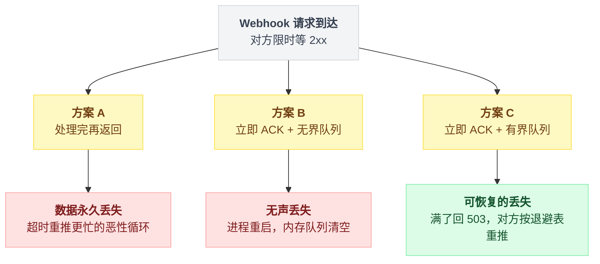
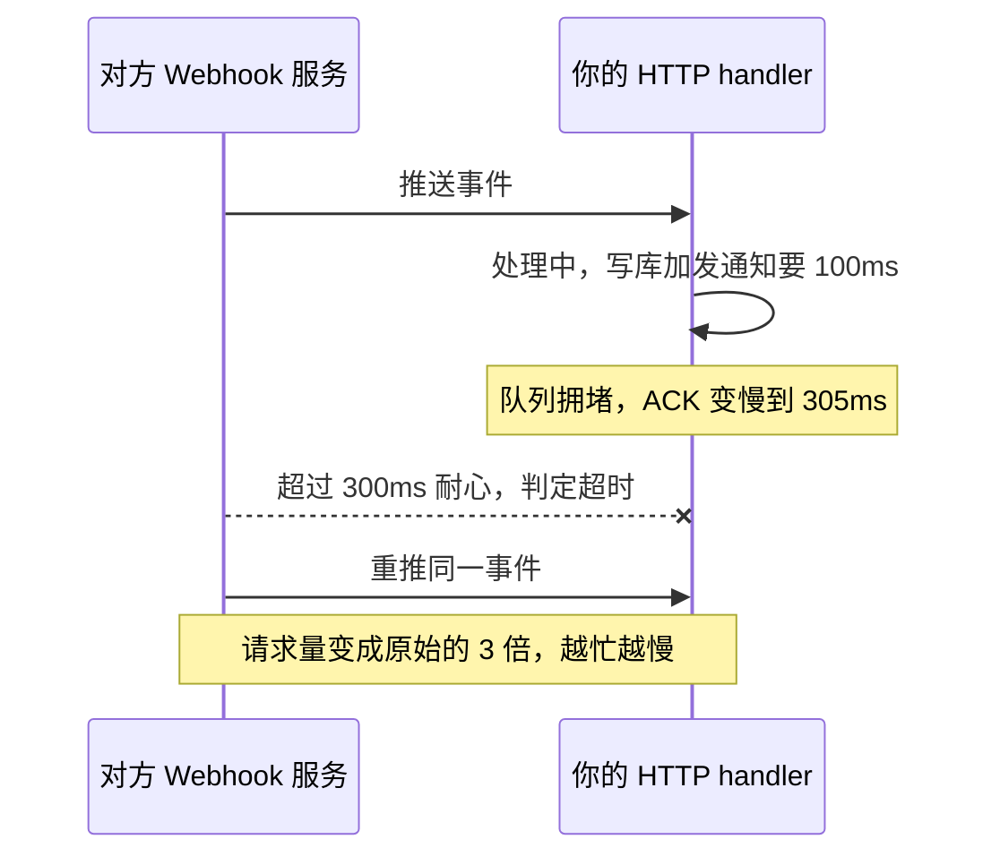
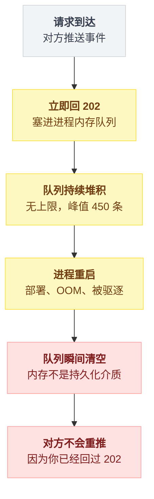
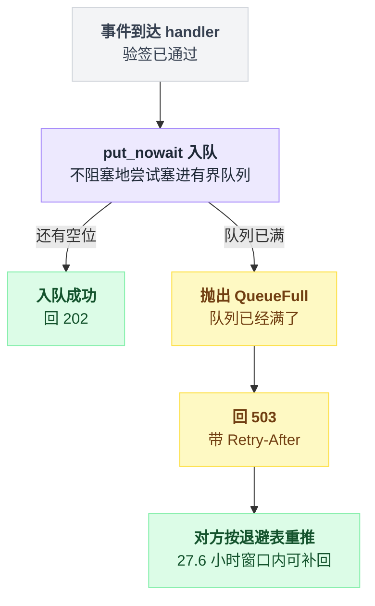
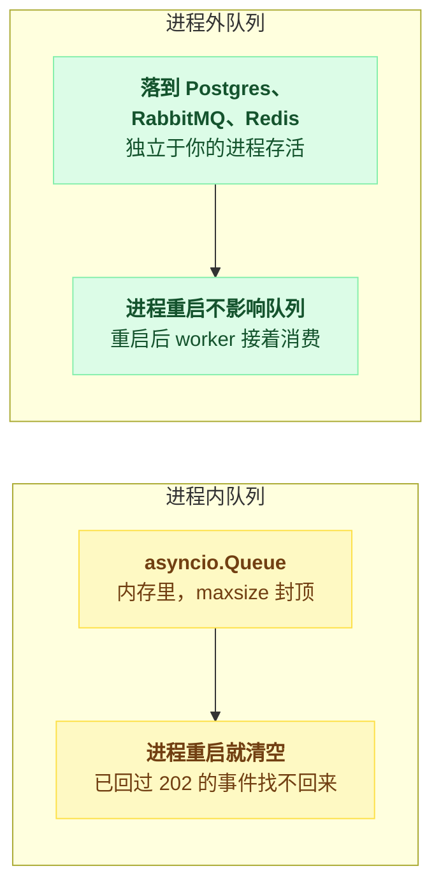
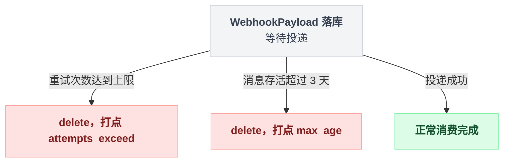
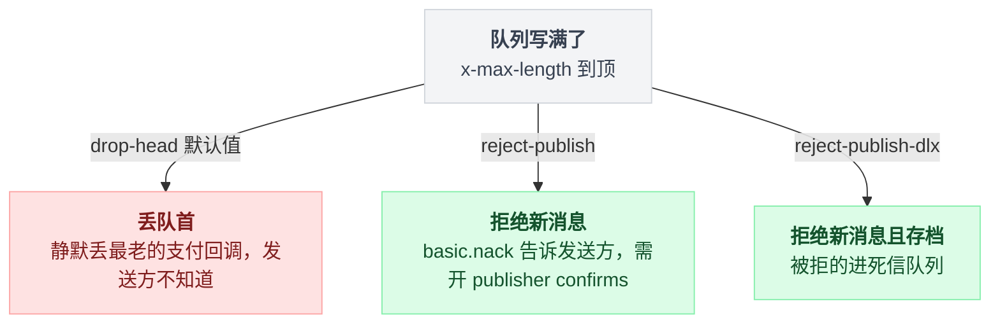

# 02 · 第三方 webhook 回调：立即 ACK + 有界队列

> 适用场景：**你阻塞它，它就当你挂了，然后重推。**
> 核心判断：**HTTP handler 里只能做一件事 —— 把消息存到别处，然后立刻回 2xx。**

---

## 先看别人的规矩

这不是最佳实践建议，这是人家白纸黑字的硬性要求。

**GitHub**（[Best practices for using webhooks](https://docs.github.com/en/webhooks/using-webhooks/best-practices-for-using-webhooks)）：

> 你的服务器应该在收到 webhook 投递后的 **10 秒内**返回 2XX 响应。如果超过这个时间，GitHub 会断开连接并认为本次投递失败。
>
> 为了及时响应，你可能需要设置一个队列来异步处理 webhook 载荷。

**Stripe**（[Webhooks](https://docs.stripe.com/webhooks)）：

> 你的端点必须**在任何可能导致超时的复杂逻辑之前**快速返回成功状态码（2xx）。举个例子，你必须在把客户发票标记为已付款之前就返回 200 响应。
>
> ……如果你选择同步处理事件，会遇到扩展性问题。webhook 投递的任何大尖峰（比如月初所有订阅同时续费），都可能压垮你的端点主机。

**Svix**（[Retries](https://docs.svix.com/retries)，3.2k stars 的 webhook 基础设施）：

> 在合理时间内（Svix 是 15 秒）返回 2xx 响应。

注意 GitHub 的官方示例代码返回的是 **202 Accepted**，不是 200。这个语义更准确：「收到了，稍后处理」。

Svix 的重推退避表是这样的：**立刻 → 5 秒 → 5 分钟 → 30 分钟 → 2 小时 → 5 小时 → 10 小时 → 再 10 小时**。加起来单条消息的可补救窗口大约 **27.6 小时**。（另外还有个「某个端点连续失败 5 天就禁用」的规则，别把这两个 5 天/27 小时搞混。）

**记住这张表。** 后面会用到 —— 你回 503 的代价，比你想的小得多。

---

## 跑一下，看三种接法的下场

场景：

- 你的处理逻辑（写库 + 发通知）要 **100ms**
- 你有 **5 个 worker** → 处理能力 **50 条/秒**
- 对方峰值推 **200 条/秒**，是你的 4 倍
- 对方超时 300ms（真实是 10~15 秒，这里等比缩小），失败重推 3 次

三条路径从这里分岔开：



```bash
python3 demos/demo02_webhook.py
```

```
【A. 收到就处理完再返回】对方共推了 600 条
  ACK 的 P99 耗时 :    305 ms   (对方的耐心是 300ms)
  对方判定超时     :   1755
  你主动回 503     :      0
  触发重推         :   1170   ← 这些是被你逼出来的额外流量
  对方彻底放弃     :    585   ← 数据永久丢失
  队列峰值长度     :      0
  停止推送后清空积压耗时 : 0.0s

【B. 立即 ACK + 无界队列】对方共推了 600 条
  ACK 的 P99 耗时 :      0 ms
  对方判定超时     :      0
  你主动回 503     :      0
  触发重推         :      0
  对方彻底放弃     :      0
  队列峰值长度     :    450
  停止推送后清空积压耗时 : 9.1s

【C. 立即 ACK + 有界队列(上限 200)】对方共推了 600 条
  ACK 的 P99 耗时 :      0 ms
  对方判定超时     :      0
  你主动回 503     :    715
  触发重推         :    495
  对方彻底放弃     :    220
  队列峰值长度     :    200
  停止推送后清空积压耗时 : 4.1s
```

> 这个 demo 跑的是真实并发调度，每次运行数字会有小幅波动（几个百分点），但趋势和量级是稳定的。

一行一行看。

---

### A 的下场：600 条推送，585 条永久丢失

**97.5% 的数据没了。**

而且看那个数字：对方一共推了 600 条，却产生了 **1755 次超时 + 1170 次重推**。你收到的请求量是原始量的 3 倍。

这是一个教科书式的正反馈：

```
你处理慢 → ACK 超时 → 对方判定失败 → 重推
        → 你收到的请求变多 → 你更慢 → 更多超时 → 更多重推
```

画成时序图看得更清楚，谁在等谁、谁在重复推：



而且注意 A 的「队列峰值长度」是 0 —— 你没有任何队列。**你的队列就是对方的重推缓冲区**，只不过你完全控制不了它。

这就是第 00 篇说的：**你越慢，它推得越多，你更慢。**

---

### B 的下场：一条不丢，但延迟涨到不可用

ACK 很快（0ms），对方完全不重推。听起来完美。

看最后一行：**推送停止之后，还要 9.1 秒才能把积压处理完。**

demo 里只跑了 3 秒。真实场景下对方可能推 10 分钟。那时候队列会涨到几万条，一条回调从「收到」到「真正处理」要等**几十分钟**。

用户付完款，二十分钟后才收到货 —— 这跟丢了有什么区别？

**但 B 真正的问题不在延迟，在这里：**

队列在你的**进程内存**里。进程一重启（部署、OOM、被 K8s 驱逐），队列里所有东西**瞬间消失**。

可你已经对每一条都回过 202 了。对方不会再推。

**这是最阴险的一种数据丢失** —— 无声、不可恢复、监控上看不出来，而且发生在你以为最安全的方案里。

这条丢失路径画出来是这样：



FastAPI 的 `BackgroundTasks` 就是这个模式。官方文档自己承认了：

> 如果你需要执行繁重的后台计算，而且不一定需要由同一个进程运行……你可能会从 Celery 这类更大的工具中受益。

三条硬伤，前两条文档承认了，第三条是实现事实：

1. **同进程** —— 跟请求处理抢 CPU；同步函数走 `run_in_threadpool`，线程池打满会连带阻塞正常请求
2. **无持久化** —— 进程死了任务就没了，而你已经回过 200
3. **无上限** —— `BackgroundTasks.tasks` 就是一个普通 `list`，没有 maxsize、没有拒绝路径、没有丢弃计数

Netflix 的 [Dispatch](https://github.com/Netflix/dispatch)（6.5k stars，2025-09 已归档）就是这么接 Slack 事件的：

```python
@router.post("/slack/event")
async def slack_events(request: Request, organization: str, body: bytes = Depends(get_body)):
    ...
    # otherwise, handle it asynchronously
    task = BackgroundTask(handler.handle, req=request, body=body)
    return JSONResponse(background=task, content=HTTPStatus.OK.phrase, status_code=HTTPStatus.OK)
```

**这是反面教材。别抄这段。**

---

### C 的做法：队列封顶，压力还给上游

```python
try:
    self.q.put_nowait(event)       # 不阻塞地塞进队列
except asyncio.QueueFull:
    return 503                     # 明确告诉对方「我满了，等会再推」
return 202
```

核心就是 `put_nowait` + 捕获 `QueueFull`。

两条分支画成判定树：



注意 C 的表里也有 220 条「彻底放弃」。别被这个数字吓到 —— 那是因为 demo 里对方只重试 3 次、退避 0.2/0.4 秒。

**真实世界的退避窗口是二十多个小时**（回去看 Svix 那张表）。只要尖峰在这个窗口内过去，这些回调都能补回来。

所以 C 的丢失是**暂时的、可见的、可恢复的**；B 的丢失是**永久的、无声的**。

---

## Python 标准库就够了

先把关键 API 的语义搞清楚（[官方文档](https://docs.python.org/3/library/asyncio-queue.html)）：

> 如果 *maxsize* 小于等于零，队列大小是无限的。如果是大于 0 的整数，那么当队列达到 *maxsize* 时，`await put()` 会阻塞，直到有元素被 `get()` 取走。
>
> `put_nowait(item)`：不阻塞地放入一个元素。如果没有空位，抛出 `QueueFull`。

三个要点：

1. `asyncio.Queue()` **默认无界**（`maxsize=0`）
2. `await put()` 是「满则等待」—— 这是背压，但会拖慢你的 HTTP 响应（→ 变成方案 A）
3. `put_nowait()` 是「满则立刻抛异常」—— 这才是你要的

一个能直接用的 FastAPI 接收端：

```python
import asyncio, hmac, hashlib
from contextlib import asynccontextmanager
from fastapi import FastAPI, Request, Response

QUEUE_MAX = 2000
WORKERS = 8
queue: asyncio.Queue = asyncio.Queue(maxsize=QUEUE_MAX)

async def worker(n: int):
    while True:
        payload = await queue.get()
        try:
            await handle_event(payload)          # 真正的业务逻辑
        except Exception:
            log.exception("处理失败")            # 千万别让异常杀掉 worker
        finally:
            queue.task_done()

@asynccontextmanager
async def lifespan(app: FastAPI):
    tasks = [asyncio.create_task(worker(i)) for i in range(WORKERS)]
    yield
    for t in tasks:
        t.cancel()

app = FastAPI(lifespan=lifespan)

@app.post("/webhook")
async def receive(request: Request):
    raw = await request.body()

    # ① 验签一定要在入队之前 —— 别让伪造的请求占你的队列
    if not verify(raw, request.headers.get("X-Signature", "")):
        return Response(status_code=401)

    try:
        queue.put_nowait(raw)                    # ② 不阻塞
    except asyncio.QueueFull:
        metrics.webhook_rejected.inc()           # ③ 这个指标一定要有
        return Response(status_code=503, headers={"Retry-After": "10"})

    return Response(status_code=202)             # ④ 立刻返回，什么业务逻辑都不做

def verify(raw: bytes, sig: str) -> bool:
    expected = hmac.new(SECRET, raw, hashlib.sha256).hexdigest()
    return hmac.compare_digest(expected, sig)
```

四个标注的地方，每个都是踩过坑才加上的：

① **验签在入队之前**。否则任何人都能往你队列里灌垃圾。

② **`put_nowait` 不是 `await put`**。用后者你就退化成方案 A 了。

③ **拒绝要有指标**。没有这个指标，你永远不知道自己在丢东西。名字随便，但一定要有。

④ **handler 里除了验签和入队，什么都别做**。别查库确认是否重复、别写日志到远程、别调用其他服务。这些全部放到 worker 里。

---

## 但内存队列还是会丢

上面这段解决了「延迟」和「内存」，没解决「进程重启」。

要彻底解决，队列必须在进程外。看看真实项目怎么做的。

进程内和进程外两种队列的差别就在这里：



### Sentry：写进 Postgres，回 202

**[getsentry/sentry](https://github.com/getsentry/sentry)** · 44.1k stars · Python

Sentry 收到集成方的 webhook 后**完全不处理**，直接落库成一条 `WebhookPayload`，然后回 202：

```python
def get_response_from_webhookpayload(self, cells, identifier=None, integration_id=None):
    """
    Used to create webhookpayloads for provided cells to handle the webhooks asynchronously.
    Responds to the webhook provider with a 202 Accepted status.
    """
    if len(cells) < 1:
        return HttpResponse(status=status.HTTP_202_ACCEPTED)
    ...
    payloads = [WebhookPayload.create_from_request(...) for cell in cells]
    if payloads:
        maybe_trigger_drain(payloads[0].mailbox_name)
    return HttpResponse(status=status.HTTP_202_ACCEPTED)
```

它的**每一层都有上限**，这点特别值得学（`hybridcloud/models/webhookpayload.py` 和 `tasks/deliver_webhooks.py`）：

```python
MAX_ATTEMPTS = 10
BACKOFF_INTERVAL = 3
BACKOFF_RATE = 1.4

def schedule_next_attempt(self) -> None:
    attempts = self.attempts + 1
    backoff = BACKOFF_INTERVAL * BACKOFF_RATE**attempts
```

```python
MAX_MAILBOX_DRAIN = 300
BATCH_SIZE = 1000
MAX_DELIVERY_AGE = 3 days      # 超过 3 天直接 delete()，打点 outcome="max_age"
# attempts >= MAX_ATTEMPTS 时也 delete()，打点 outcome="attempts_exceed"
```

**尝试次数有上限、消息年龄有上限、单次处理量有上限，而且每种丢弃都有对应的打点。** 这就是「有界」的完整含义。

三层上限对应的丢弃路径：



### sentry-python SDK：有界队列 + 满则丢的教科书实现

**[getsentry/sentry-python](https://github.com/getsentry/sentry-python)** · 2.2k stars

这个更简洁，几乎可以直接抄（`sentry_sdk/worker.py`）：

```python
DEFAULT_QUEUE_SIZE = 100      # consts.py

def submit(self, callback):
    self._ensure_thread()
    try:
        self._queue.put_nowait(callback)
        return True
    except FullError:
        return False           # 满了就说满了，不阻塞调用方
```

调用方的处理（`transport.py`）：

```python
if not self._worker.submit(send_envelope_wrapper):
    self.on_dropped_event("full_queue")
    for item in envelope.items:
        self.record_lost_event("queue_overflow", item=item)
```

**丢弃有明确的原因分类**（`full_queue` / `queue_overflow`）。而且队列满还会让 `is_healthy()` 返回 False —— 队列满 = 传输不健康，这个信号会一路传上去。

---

## 用消息队列的话，别忘了给队列设上限

「我用 RabbitMQ / Redis / Celery，总不会有问题了吧」—— 会有，而且默认配置几乎肯定有。

### RabbitMQ：`x-max-length` + `x-overflow`

[官方文档](https://www.rabbitmq.com/docs/maxlength)。声明队列时的 argument：

| argument | 含义 |
|---|---|
| `x-max-length` | 最大消息条数 |
| `x-max-length-bytes` | 最大字节数 |
| `x-overflow` | 溢出行为 |

`x-overflow` 有三个合法值，**默认值是最危险的那个**：

- **`drop-head`（默认）** —— 丢**队首**，也就是最老的消息。对 webhook 来说这意味着「静默丢弃最早的支付回调」，而且发送方完全不知道。
- **`reject-publish`** —— 丢**新来的**，并通过 `basic.nack` **告诉发送方**。这才是真背压。
  ⚠️ 前提是**开了 publisher confirms**。官方原文是 "if publisher confirms are enabled, the publisher will be informed of the reject via a `basic.nack` message"。没开 confirms 你照样是静默丢弃，只是丢的是新的而已。
- **`reject-publish-dlx`** —— 同上，但被拒的消息还会进死信队列存档。

三个值的判定分支画出来：



**webhook 场景请显式设成 `reject-publish`。** 宁可让对方按退避表重推，也不要静默丢新事件。

（注意 quorum queue 上 `reject-publish-dlx` 不支持，而且 `reject-publish` 不严格 —— 因为通知期间有 in-flight 消息，可能超出上限至少 1 条。）

### Redis Stream：`MAXLEN ~`

```
XADD webhooks MAXLEN ~ 10000 * payload "..."
```

`~` 是近似裁剪：只在整个 macro node 都可淘汰时才删，所以实际长度可能略大于 10000，但性能是 O(1) 摊销的，比精确裁剪快得多。

redis-py 里有个坑（`redis/commands/core.py`）：

```python
def xadd(self, name, fields, id="*", maxlen=None, approximate=True, ...)
```

**`approximate` 默认就是 True**。所以 `r.xadd("webhooks", {...}, maxlen=10000)` 已经等价于 `MAXLEN ~ 10000`。要精确必须显式写 `approximate=False`。另外 `maxlen` 和 `minid` 不能同时给。

### Celery：默认配置就是无界的

**[celery/celery](https://github.com/celery/celery)** · 28.5k stars。它有几个默认行为会让队列悄悄长到 OOM：

**1. `task_create_missing_queues` 默认是开的。** 你路由到一个不存在的队列，Celery 会运行时自动声明一个**没有任何 argument 的无界队列**。这是「悄悄长到 OOM」的头号原因。

**2. 生产者侧完全没有背压。** `apply_async()` 只是一次 publish，broker 不满即成功，永不阻塞、永不 reject。

**3. `task_time_limit` / `task_soft_time_limit` 默认无限制。** 卡住的任务不会自愈。

**4. `worker_prefetch_multiplier` 默认 4。** 每个进程预扣 4 条消息在内存里，别的 worker 抢不到。[官方文档](https://docs.celeryq.dev/en/stable/userguide/optimizing.html)原话：

> 如果你有很多长耗时任务，你会希望把这个乘数设成 **1**。

设成 0 更糟 —— 那是「让 worker 想消费多少就消费多少」。

想设上限，得显式声明带 argument 的队列：

```python
from kombu import Exchange, Queue

app.conf.task_create_missing_queues = False     # ← 必须关掉
app.conf.task_queues = [
    Queue('webhooks', Exchange('webhooks'), routing_key='webhooks',
          queue_arguments={'x-max-length': 10000, 'x-overflow': 'reject-publish'}),
]
app.conf.task_time_limit = 300
app.conf.task_soft_time_limit = 240
app.conf.worker_prefetch_multiplier = 1
```

**两个真实的坑：**

- [celery#3440](https://github.com/celery/celery/issues/3440)：如果队列已经被别的客户端用不同的 argument 声明过，Celery 再声明会直接报 `PRECONDITION_FAILED - inequivalent arg 'x-max-length' for queue`（406 错误）。改上限时必须先删队列。
- [kombu#799](https://github.com/celery/kombu/issues/799)：队列的 `max_length` 属性**只有 librabbitmq / pyamqp 传输支持**。redis 和 memory 这两个 virtual transport **不支持**，至今是 feature request。

  **翻译过来：用 Redis 当 Celery broker 时，你在 Celery/kombu 这一层拿不到任何队列长度上限。** 想要有界队列，得用 RabbitMQ，或者自己在入队前查 `llen`。

### 其他选择的默认值对比

| 项目 | Stars | 有界能力 | 默认重试/超时 |
|---|---|---|---|
| [celery](https://github.com/celery/celery) | 28.5k | ❌ 生产者侧无上限 | 时间限制默认**无限** |
| [rq](https://github.com/rq/rq) | 10.7k | ❌ 无 max-size | `ttl` 默认 `None`（无限排队） |
| [dramatiq](https://github.com/Bogdanp/dramatiq) | 5.3k | ❌ 无长度上限 | `max_retries=20`，`time_limit=10分钟`，死信保留 7 天 |
| [arq](https://github.com/python-arq/arq) | 3.0k | ⚠️ 消费者侧有界 | `max_jobs=10`，`job_timeout=300s`，`max_tries=5` |
| [procrastinate](https://github.com/procrastinate-org/procrastinate) | 1.3k | ⚠️ `concurrency` | 基于 Postgres |

（arq 首页挂着 "in maintenance only mode"，新项目慎选。）

**非 Python 生态里，[sidekiq](https://github.com/sidekiq/sidekiq)（13.5k, Ruby）是唯一一个给死信集合也设了上限的**：默认重试 25 次约 20 天，退避 `(n**4) + 15 + rand(10)*(n+1)` 秒，耗尽后进 Dead set，而 **Dead set 上限 10,000 条 / 保留 6 个月**，超了照样丢。

Go 那边 [riverqueue/river](https://github.com/riverqueue/river)（5.2k）主打「事务内入队」—— 业务写库和任务入队在同一个 Postgres 事务里提交，杜绝「库回滚了任务还在」。这个设计对 webhook 很有价值。

---

## 各语言的等价写法

**Go**（`chan` 天生有界）：

```go
var q = make(chan []byte, 2000)

func receive(w http.ResponseWriter, r *http.Request) {
    raw, _ := io.ReadAll(r.Body)
    if !verify(raw, r.Header.Get("X-Signature")) {
        w.WriteHeader(http.StatusUnauthorized); return
    }
    select {
    case q <- raw:
        w.WriteHeader(http.StatusAccepted)          // 202
    default:                                         // ← 满了，不阻塞
        rejected.Inc()
        w.Header().Set("Retry-After", "10")
        w.WriteHeader(http.StatusServiceUnavailable) // 503
    }
}
```

`select` + `default` 就是 Go 版的 `put_nowait`。**没有 `default` 分支的话，`q <- raw` 会阻塞** —— 那就退化成方案 A 了。

**TypeScript**（Node 没有内置有界队列，自己数）：

```ts
const QUEUE_MAX = 2000;
const queue: Buffer[] = [];

app.post('/webhook', express.raw({type: '*/*'}), (req, res) => {
  if (!verify(req.body, req.get('X-Signature'))) return res.sendStatus(401);
  if (queue.length >= QUEUE_MAX) {
    metrics.rejected.inc();
    return res.set('Retry-After', '10').sendStatus(503);
  }
  queue.push(req.body);
  res.sendStatus(202);
});
```

---

## 几条容易踩的

**1. `await put()` 和 `put_nowait()` 差一个字，行为差一个数量级**

前者是排队（背压），后者是丢弃。webhook 场景要后者。这是本篇最重要的一个字。

**2. 队列长度要有监控，而且要看的是「峰值」不是「当前值」**

采样周期是 30 秒的话，你看到的「当前长度 0」可能只是刚好错过了尖峰。用 max over time。

**3. 幂等性是必须的，不是可选的**

对方会重推。你的 worker 也可能因为进程被杀而重跑。所以处理逻辑必须幂等 —— 通常是拿 webhook 的事件 ID 去重。

这一点在方案 C 下尤其重要，因为你**主动**制造了重推。

**4. worker 里的异常必须捕获**

```python
async def worker(n):
    while True:
        payload = await queue.get()
        try:
            await handle_event(payload)
        except Exception:
            log.exception("处理失败")     # ← 少了这个 try，一个异常就杀掉一个 worker
        finally:
            queue.task_done()
```

一个未捕获异常杀掉一个 worker，你的处理能力就少了 1/8。跑几天就全没了，而且没有任何告警 —— 队列还在收，只是没人处理了。

**5. 别在 handler 里做「只要 1ms」的事**

「查一下数据库确认不是重复事件，才 1ms 而已」—— 这 1ms 在数据库慢的时候会变成 5 秒。**handler 里除了验签和入队，什么都别做。**

**6. 优雅退出**

进程收到 SIGTERM 时，要先停止接收新请求，把队列里的东西处理完（或者持久化），再退出。K8s 默认给 30 秒。这就是为什么方案 B 在滚动发布时特别容易丢数据。

---

## 一句话记住

> 你的 HTTP handler 是前台，不是后厨。
> 前台的唯一工作是把订单条子贴到出单口，然后立刻对客人说「收到了」。
> 而出单口的钉子必须是有限的 —— 满了就说满了，让对方按它自己的退避表再来。

---

## 参考

- GitHub, *Best practices for using webhooks* — https://docs.github.com/en/webhooks/using-webhooks/best-practices-for-using-webhooks
- Stripe, *Webhooks* — https://docs.stripe.com/webhooks
- Svix, *Retry Schedule* — https://docs.svix.com/retries · https://github.com/svix/svix-webhooks
- getsentry/sentry — https://github.com/getsentry/sentry · [parser.py](https://github.com/getsentry/sentry/blob/master/src/sentry/integrations/middleware/hybrid_cloud/parser.py)
- getsentry/sentry-python — https://github.com/getsentry/sentry-python
- RabbitMQ, *Queue Length Limit* — https://www.rabbitmq.com/docs/maxlength
- Redis, *XADD* — https://redis.io/docs/latest/commands/xadd/
- Python, *asyncio Queues* — https://docs.python.org/3/library/asyncio-queue.html
- FastAPI, *Background Tasks* — https://fastapi.tiangolo.com/tutorial/background-tasks/
- Celery configuration / optimizing — https://docs.celeryq.dev/en/stable/userguide/optimizing.html
- celery#3440 — https://github.com/celery/celery/issues/3440 · kombu#799 — https://github.com/celery/kombu/issues/799
- sidekiq Error Handling — https://github.com/sidekiq/sidekiq/wiki/Error-Handling
- riverqueue/river — https://github.com/riverqueue/river
