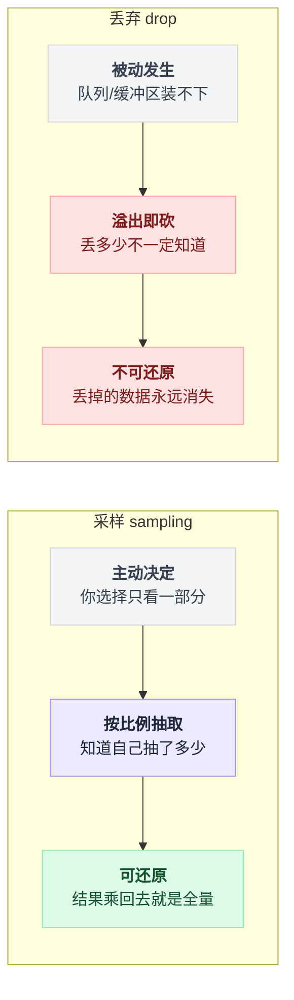
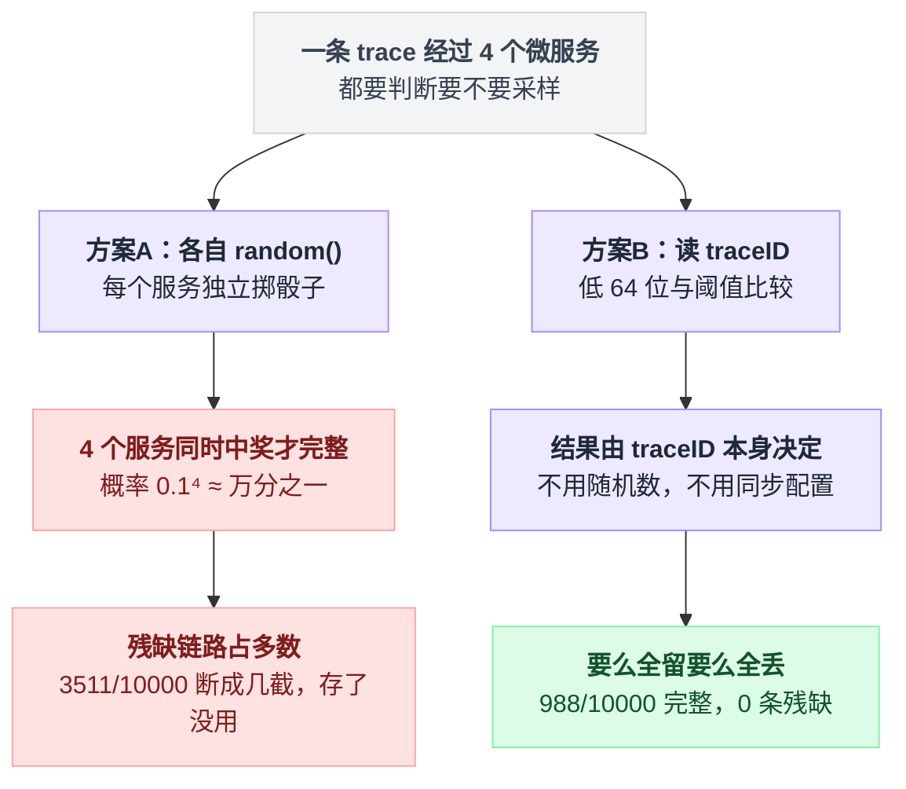
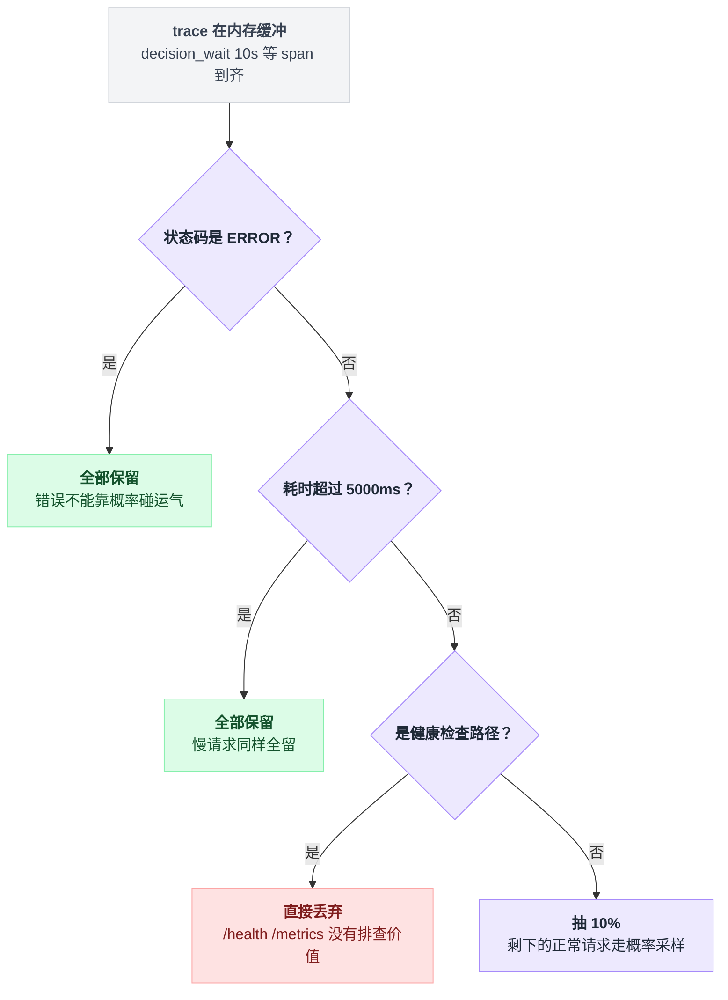
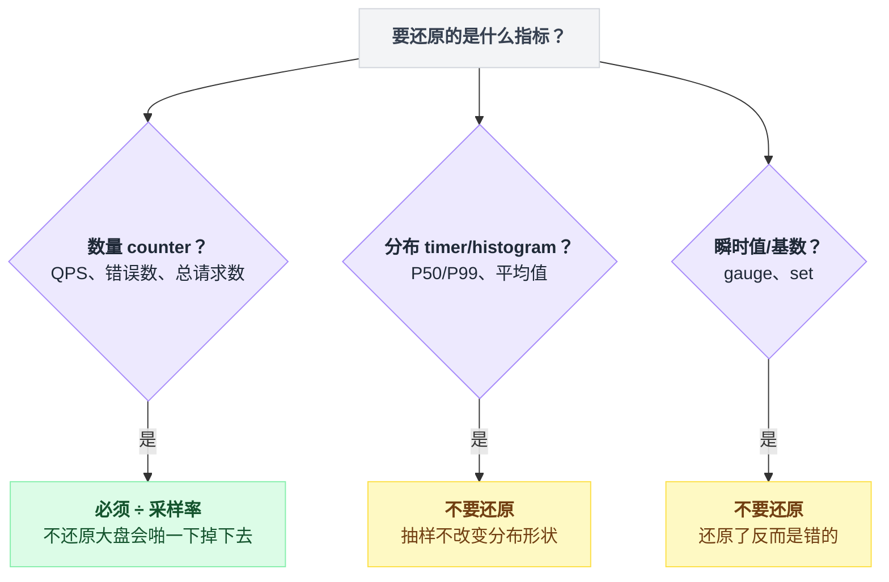
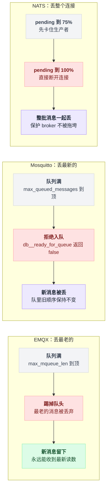
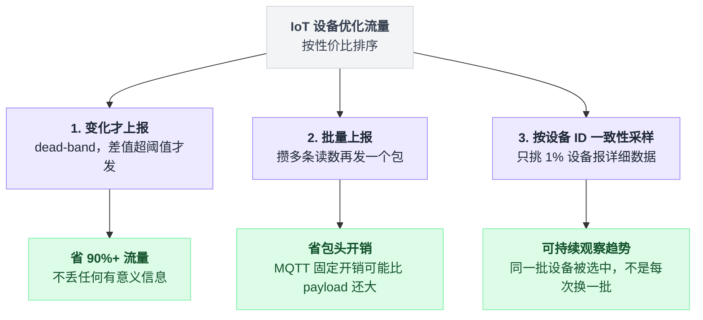

# 03 · IoT 设备上报、行情推送：丢弃 + 采样

> 适用场景：**设备根本不看你脸色。**
> 核心判断：**你控制不了发送方，就只能控制自己收多少。**

---

## 先分清两个词

采样和丢弃经常混着用，但完全不是一回事。

**采样（sampling）= 民意调查。** 全国 14 亿人不可能挨个问，随机抽 1000 个人，然后把结果乘回去，估算全国。你**主动**决定只看一部分，而且**知道自己看了多少比例**，所以能还原。

**丢弃（drop）= 水槽满了溢出去。** 你不是主动选的，是实在装不下了。溢出去多少你可能都不知道，还原不了。

| | 采样 sampling | 丢弃 drop |
|---|---|---|
| 怎么发生的 | 主动决定，你选择只看一部分 | 被动发生，队列/缓冲区装不下 |
| 知不知道量 | 按比例抽取，知道自己抽了多少 | 溢出即砍，丢多少不一定知道 |
| 能不能还原 | 可还原，结果乘回去就是全量 | 不可还原，丢掉的数据永远消失 |

**能采样就别丢弃。** 采样是有控制的、可还原的、可预算的；丢弃是被动的、不可还原的。

两者的差别画成图是这样：



但两个都得会，因为你不可能预知所有尖峰。

---

## 先说采样里最容易写错的那一行

假设你在做链路追踪。一条用户请求经过 4 个微服务，你想采 10%。

大部分人第一反应会在每个服务里写：

```python
if random.random() < 0.1:
    record_span()
```

**这行代码是错的。**

错在哪里，两段伪代码摆一起就看出来了 —— 区别只在「骰子从哪来」：

```
# 方案 A：每个服务自己掷骰子
for 服务 in [A, B, C, D]:
    if random() < 0.1:  记下这一段       # 四次独立的随机，互不相干

# 方案 B：读同一个 traceID
for 服务 in [A, B, C, D]:
    if traceID 低 64 位 < 阈值:  记下这一段   # 四次算的是同一个输入，答案必然相同
```

方案 A 的四次判断彼此独立，一条链路要 4 个服务**同时中奖**才完整，概率是 `0.1⁴ = 万分之一`；方案 B 的判断根本没有随机数，输入相同、结果就相同，所以要么四段全留、要么四段全丢。

跑一下就知道差多少：

```bash
python3 demos/demo03_sampling.py
```

```
【每个服务自己掷骰子】共 10000 条链路
  完整保留（4 段全在）:      2  ← 只有这些能拿来排查问题
  残缺（断成几截）    :   3511  ← 存了但没用，还占存储
  完全丢弃            :   6487
  实际存下来的 span 数:   4109

【按 traceID 一致性判定】共 10000 条链路
  完整保留（4 段全在）:    988  ← 只有这些能拿来排查问题
  残缺（断成几截）    :      0  ← 存了但没用，还占存储
  完全丢弃            :   9012
  实际存下来的 span 数:   3952
```

**存储成本几乎一样（4109 vs 3952），但有用的链路差了几百倍。**

（traceID 是真随机的，所以每次跑具体数字会变，但这个量级差是稳定的。）

掷骰子方案剩下的那 3511 条是断成几截的残片 —— 存了，占空间，但排查问题时啥也看不出来。

两种判定方式画成树是这样：



---

## 正确做法：让 traceID 自己当骰子

关键洞察：**traceID 本身就是一个 128 位的随机数。** 不需要再掷骰子。

```python
def consistent_sample(trace_id: bytes, rate: float) -> bool:
    low64 = int.from_bytes(trace_id[8:], "big")   # 取后 8 字节
    return low64 < int(rate * (1 << 64))
```

这就是 OpenTelemetry Python SDK 的官方实现（`opentelemetry-sdk/.../trace/sampling.py`）：

```python
class TraceIdRatioBased(Sampler):
    TRACE_ID_LIMIT = (1 << 64) - 1

    @classmethod
    def get_bound_for_rate(cls, rate: float) -> int:
        return round(rate * (cls.TRACE_ID_LIMIT + 1))

    def should_sample(self, parent_context, trace_id, name, ...):
        decision = Decision.DROP
        if trace_id & self.TRACE_ID_LIMIT < self.bound:
            decision = Decision.RECORD_AND_SAMPLE
        ...
```

一行 `trace_id & TRACE_ID_LIMIT < bound`，没有随机数，没有配置同步，**每个服务算出来必然一样**。

### 这就像按车牌尾号限行

北京限行按尾号：尾号 1 和 6 周一不能上路。

这个规则的妙处在于 —— **全城每个路口的交警，不用互相打电话商量，看一眼车牌就能做出完全相同的判断**。

trace 采样就是这个思路。一条 trace 经过 5 个微服务、3 层 collector，**每一处都独立算，但算出来的答案必然一致**。

要么全留（拼成完整链路），要么全丢。绝不会出现「留了一半、链路断成两截」这种最糟糕的情况。

---

## Collector 那一层：OpenTelemetry 的两套算法

**[open-telemetry/opentelemetry-collector-contrib](https://github.com/open-telemetry/opentelemetry-collector-contrib)** · 4.7k stars · Go

### probabilistic_sampler：三种模式，选错会翻车

配置很简单：

```yaml
processors:
  probabilistic_sampler:
    sampling_percentage: 15
```

但底下有两套完全不同的算法。

**`hash_seed` 模式**（`fnvhasher.go`）—— 对 traceID 做 FNV-1a 32 位哈希：

```go
func computeHash(b []byte, seed uint32) uint32 {
	hash := fnv.New32a()
	_, _ = hash.Write(i32tob(seed))
	_, _ = hash.Write(b)
	return hash.Sum32()
}
```

⚠️ **同一层级的所有 collector 必须配同一个 `hash_seed`**，否则一致性就破了。就好比全城交警必须用同一套限行表 —— 一个路口按尾号 1、隔壁路口按尾号 2，那就乱套了。

而且这个模式的实际精度只有 1/16384（14 bit）。README 里的说法是："This mode uses 14 bits of information in its sampling decision."

**`proportional` / `equalizing` 模式**（`pkg/sampling/randomness.go`）—— 直接从 traceID 取位，无哈希：

```go
const leastHalfTraceIDThresholdMask = MaxAdjustedCount - 1   // 2^56 - 1

func TraceIDToRandomness(id pcommon.TraceID) Randomness {
	leastHalf := binary.BigEndian.Uint64(id[8:])       // 取后 8 字节
	return Randomness{
		unsigned: leastHalf & leastHalfTraceIDThresholdMask,   // 抹掉最高 8 bit，留 56 位
	}
}
```

两套算法并排看：

| | `hash_seed` | `proportional` / `equalizing` |
|---|---|---|
| 实现文件 | `fnvhasher.go` | `pkg/sampling/randomness.go` |
| 怎么算 | 对 traceID 做 FNV-1a 32 位哈希 | 直接从 traceID 取后 8 字节，无哈希 |
| 取多少位 | 精度 1/16384（14 bit） | 抹掉最高 8 bit，留 56 位 |
| 要不要配 seed | 同层级所有 collector 必须配同一个 `hash_seed` | 不需要，天然全网一致 |

**新项目直接用 `proportional` / `equalizing`。**

决策结果会写回 W3C `tracestate` 的 `ot` section（`th=` 是 threshold，`rv=` 是 randomness）。下游任何 collector 读到 `th` 就知道上游用了多少采样率，可以算出 adjusted count 做无偏还原 —— 这个设计非常漂亮，把「我采了多少」这个信息随数据一起传下去了。

### tail_sampling：先看完再决定留谁

head sampling 的致命问题：**你在门口掷骰子的时候，还不知道这条请求会不会报错**。

tail_sampling 反过来 —— 把整条 trace 在内存里缓冲一段时间，等 span 到齐后再用一组策略投票。机制是这样：

```
收到 span:
    trace[traceID].append(span)          # 先攒着，谁也不判

等 decision_wait 秒（等 span 到齐）:
    if 有 span 状态码是 ERROR:   全部保留     # 错误不靠概率碰运气
    elif 有 span 耗时 > 阈值:    全部保留     # 慢请求同理
    elif 路径是 /health /metrics: 全部丢弃
    else:                        抽 10%
```

注意所有判断都作用在**整条 trace** 上，不是单条 span —— 这才是它能保证「错误一条不漏」的原因。对应配置：

```yaml
processors:
  tail_sampling:
    decision_wait: 10s
    num_traces: 100
    expected_new_traces_per_sec: 10
    decision_cache:
      sampled_cache_size: 100_000
      non_sampled_cache_size: 100_000
    policies:
      - name: 错误全留
        type: status_code
        status_code: {status_codes: [ERROR]}
      - name: 慢的全留
        type: latency
        latency: {threshold_ms: 5000}
      - name: 剩下的抽 10%
        type: probabilistic
        probabilistic: {sampling_percentage: 10}
      - name: 健康检查全扔
        type: drop
        drop:
          drop_sub_policy:
            - name: 健康检查路径
              type: string_attribute
              string_attribute:
                {key: url.path, values: [\/health, \/metrics], enabled_regex_matching: true}
```

这组策略画成判定链是这样：



上面配置里只用了 4 种 policy，可选的一共 17 种：`always_sample`、`latency`、`numeric_attribute`、`probabilistic`、`status_code`、`string_attribute`、`trace_state`、`trace_flags`、`rate_limiting`、`bytes_limiting`、`span_count`、`boolean_attribute`、`ottl_condition`、`and`、`not`、`drop`、`composite`。

关键默认值：`decision_wait: 30s`、`num_traces: 50000`。示例里两个值都被调小了。

**部署上有个大坑**：tail sampling 要求「同一条 trace 的所有 span 必须到同一个 collector 实例」。

所以前面必须有个按 traceID 做负载均衡的 `loadbalancing` exporter。否则一条 trace 的 span 散落在不同实例上，谁也看不到全貌，决策全错。

### 一句话选型

| | head sampling | tail sampling |
|---|---|---|
| 决策时机 | 进门就掷骰子 | 等 30 秒看完再决定 |
| 省钱程度 | 后面全流程省 90% | 只省存储，采集和传输不省 |
| 能不能抓住所有错误 | ❌ 错误也是 10% 概率被采到 | ✅ 可以「错误全留」 |
| 部署复杂度 | 无 | 必须按 traceID 做 LB + 大内存 |

**实践里通常是组合用**：SDK 侧 head sampling 采 50%（先砍一半带宽），collector 侧 tail sampling 精筛（错误和慢请求全留，正常的再抽 5%）。

### Jaeger 的自适应采样

**[jaegertracing/jaeger](https://github.com/jaegertracing/jaeger)** · 22.9k stars 走的是另一条路：**采样率由后端算好，下发给 SDK**。

后端用类 PID 控制器，根据实测吞吐反算概率，让每个 endpoint 的采样量收敛到 `target_samples_per_second`。

默认值（`adaptive/options.go`）：

```go
TargetSamplesPerSecond:       1,
DeltaTolerance:               0.3,
CalculationInterval:          time.Minute,
InitialSamplingProbability:   0.001,
MinSamplingProbability:       1e-5,     // 十万分之一
```

它的概率调整算法有个很值得学的设计 —— **涨得慢、跌得快**。先看示意：

```
factor = 目标QPS / 当前QPS
新概率 = 旧概率 * factor

if factor > 1:                       # 采少了，想往上调
    涨幅最多只允许 +50%              # 慢慢加，防止过采样
else:                                # 采多了
    直接跳到新值                     # 不设上限，立刻止血
```

真实实现：

```go
const defaultPercentageIncreaseCap = 0.5

func (c PercentageIncreaseCappedCalculator) Calculate(targetQPS, curQPS, prevProbability float64) float64 {
	factor := targetQPS / curQPS
	newProbability := prevProbability * factor
	// 当前 QPS 低于目标时，慢慢往上加，防止过采样
	// 当前 QPS 高于目标时，直接跳到新值，立刻止血
	if factor > 1.0 {
		percentIncrease := (newProbability - prevProbability) / prevProbability
		if percentIncrease > c.percentageIncreaseCap {
			newProbability = prevProbability + (prevProbability * c.percentageIncreaseCap)
		}
	}
	return newProbability
}
```

**降容量要果断，升容量要保守。** 这个不对称设计在所有自适应系统里都通用（第 01 篇 Netflix 的 gradient 下限锁 0.5 也是同一个道理）。

---

## 采样之后：数字要不要乘回去

跑 demo 的第二部分：

```
真实发生的事件数        : 1,000,000
客户端实际上报的条数    : 10,173   ← 网络流量省了 99%
服务端直接汇报（错误）  : 10,173   ← 监控大盘上 QPS 直接掉到 1/100
服务端 ÷ 采样率（正确）  : 1,017,300   ← 误差 1.73%

真实 P99 耗时           : 204.6 ms
采样后算出的 P99        : 189.1 ms   ← 不用还原，直接就是对的
```

还原不是「一律乘回去」，而是**按指标类型分叉**：

```
if 指标是数量 counter:            值 = 值 / 采样率     # QPS、错误数、总请求数
elif 指标是分布 timer/histogram:  值 = 值             # P50/P99、平均值，原样
elif 指标是瞬时值 gauge:          值 = 值             # 还原了反而是错的
elif 指标是基数 set:              值 = 值             # 同上，而且会低估
```

判定规则画成树是这样：



**规则很简单，但特别容易搞混：**

| 指标类型 | 例子 | 要不要 ÷ 采样率 |
|---|---|---|
| **数量**（counter） | QPS、错误数、总请求数 | ✅ **必须** |
| **分布**（timer/histogram） | P50/P99 延迟、平均值 | ❌ 不要 |
| **瞬时值**（gauge） | 当前 CPU 87%、内存占用 | ❌ 不要 |
| **基数**（set） | 独立用户数 | ❌ 不要（而且会低估） |

为什么？

- **数量**：你数客流，「每 10 个人只数 1 个」，数到 500，真实是 5000。不乘回去，监控大盘上 QPS 啪一下掉到十分之一，值班同学以为出故障了，连夜起来排查。
- **分布**：抽 500 个人量身高算出的平均身高，跟量 5000 个人算出来的差不多 —— **抽样不改变分布的形状，只改变样本数量**。给 P99 乘 100 就荒唐了。
- **瞬时值**：CPU 87% 乘 10 变成 870%，你自己看着办。

statsd 的实现（`stats.js`）就是这个逻辑：

```js
if (fields[2]) {
    sampleRate = Number(fields[2].match(/^@([\d\.]+)/)[1]);
}

const metric_type = fields[1].trim();
if (metric_type === "ms") {
    timers[key].push(Number(fields[0] || 0));
    timer_counters[key] += (1 / sampleRate);      // 只还原「次数」，不还原耗时本身
} else if (metric_type === "g") {
    // gauge：不还原
} else if (metric_type === "s") {
    sets[key].insert(fields[0] || '0');           // set：不还原
} else {
    counters[key] += Number(fields[0] || 1) * (1 / sampleRate);   // counter：还原
}
```

对应的线格式是 `gorets:1|c|@0.1` —— 那个 `@0.1` 就是采样率。

DataDog 的 dogstatsd 一样（`pkg/metrics/counter.go`）：

```go
func (c *Counter) addSample(sample *MetricSample, _ float64) {
	c.value += sample.Value * (1 / sample.SampleRate)
}
```

而且它文档明说 `@<SAMPLE_RATE>` **只对 COUNT / HISTOGRAM / DISTRIBUTION / TIMER 生效，GAUGE 和 SET 不支持**。

OpenTelemetry 里这个 `1/p` 有个专门的名字叫 **adjusted count**（`Threshold.AdjustedCount()`），概念完全一样。

---

## IoT / MQTT：Broker 满了会怎么处理

**这一段是给做 IoT 和直播的人看的。** 三个主流 broker 的策略完全不同，选错会踩坑：EMQX 丢最老的，Mosquitto 丢最新的，NATS 干脆丢整个连接。

### EMQX：丢最老的

**[emqx/emqx](https://github.com/emqx/emqx)** · 16.4k stars · Erlang

两级缓冲：**Inflight Window**（已发未确认的 QoS1/2）满了之后进 **Message Queue**（mqueue）。

```hocon
mqtt {
  max_inflight = 32          # 同时在飞的 QoS1/2 消息数，取值 1~65535（注意没有 0=不限）
  max_mqueue_len = 1000      # 队列长度上限，0=不限
  mqueue_store_qos0 = true   # 离线时是否也存 QoS 0
  max_awaiting_rel = 100     # 等待 PUBREL 的 QoS 2 消息数，超了拒绝新的
}
```

[官方文档](https://docs.emqx.com/en/emqx/latest/design/inflight-window-and-message-queue.html)原话：

> 如果 Message Queue 也达到了长度限制，后续消息仍然会被缓存到 Message Queue，但 **Message Queue 中最老的消息会被丢弃**。

**drop-oldest**。新消息永远进队，队头最老的被踢出去。

这对行情推送、设备状态上报是**正确**的策略 —— 五分钟前的温度读数没有意义。

### Mosquitto：丢最新的

**[eclipse-mosquitto/mosquitto](https://github.com/eclipse-mosquitto/mosquitto)** · 11.1k stars · C

```conf
#max_queued_messages 1000    # 默认 1000，0 = 无上限（不推荐）
#max_queued_bytes 0          # 默认 0 = 无上限
#queue_qos0_messages false   # 默认 false
```

源码（`src/database.c`）：

```c
/**
 * For a given client context, are more messages allowed to be queued?
 * @return true if queuing is allowed, false if should be dropped
 */
bool db__ready_for_queue(...)
```

返回 false 就是**丢掉这条新消息**。跟 EMQX 正好相反。

### NATS：直接把慢消费者踢掉

**[nats-io/nats-server](https://github.com/nats-io/nats-server)** · 20.0k stars · Go

NATS 不丢单条消息，**它丢整个连接**：

```go
// server/const.go
MAX_PENDING_SIZE = (64 * 1024 * 1024)          // max_pending，默认 64MB
DEFAULT_FLUSH_DEADLINE = 10 * time.Second      // write_deadline，默认 10s
```

```go
// server/client.go
if c.kind == CLIENT && c.out.pb > c.out.mp {
    ...
    c.Noticef("Slow Consumer Detected: MaxPending of %d Exceeded", c.out.mp)
    c.markConnAsClosed(SlowConsumerPendingBytes)
    return
}

// 到 75% 水位时先创建一个 stall gate 给生产者背压
if c.out.pb > c.out.mp/4*3 && c.out.stc == nil {
    c.out.stc = make(chan struct{})
}
```

**注意那个 75% 的 stall gate。** 把两个水位抽出来是这样：

```
每次要往连接里写数据时:
    if pending > 上限:            断连接，标记 SlowConsumer   # 100% 水位
    if pending > 上限 * 3/4:      开一道闸门卡住生产者         # 75% 水位，背压
```

- pending 到 **75%** → 先卡住**生产者**，给消费者喘息机会（背压）
- pending 到 **100%** → 才断连接（丢弃）

**先背压、后丢弃，两段式。** 这是我在所有 broker 里见过最成熟的设计，比一刀切优雅得多，值得在自己的系统里抄。

三家的丢弃逻辑画成图是这样：



### 三者对比

| Broker | 参数 | 默认 | 满了丢谁 | 适合什么 |
|---|---|---|---|---|
| EMQX | `max_mqueue_len` | 1000 | **最老的** | 行情、状态上报（只关心最新） |
| Mosquitto | `max_queued_messages` | 1000 | **最新的** | 顺序敏感的指令下发 |
| NATS | `max_pending` | 64 MB | **整个连接** | 保护 broker 不被单个慢消费者拖垮 |

NATS 客户端侧还能自己设：

```go
sub.SetPendingLimits(1024*500, 1024*5000)   // 默认 500,000 条 / 64MB
```

超了客户端本地丢消息，报 `nats: slow consumer, messages dropped`。

---

## 设备侧才是最该做采样的地方

上面讲的都是「服务端收到之后怎么办」。但对 IoT 来说，**最划算的优化永远在设备侧**。

三个手段，按性价比排序：变化才上报、批量上报、按设备 ID 一致性采样。



**1. 变化才上报（dead-band）**

温度传感器每秒读一次，但只在变化超过 0.5 度时才发。省 90%+ 流量，而且不丢任何有意义的信息。

```python
last_sent = None
def maybe_report(value, threshold=0.5, max_silence=60):
    global last_sent
    now = time.time()
    if (last_sent is None
            or abs(value - last_sent[1]) >= threshold
            or now - last_sent[0] >= max_silence):     # ← 心跳兜底，别让服务端以为设备死了
        send(value)
        last_sent = (now, value)
```

那个 `max_silence` 很重要 —— 没有它的话，一个读数稳定的设备会永远沉默，服务端分不清「稳定」和「掉线」。

**2. 批量上报**

10 条读数攒一个包发。省的是包头和握手开销 —— MQTT 每条消息的固定开销可能比 payload 还大。

**3. 按设备 ID 一致性采样**

只有 1% 的设备上报详细数据，其余只报心跳。跟 traceID 采样是同一个思路：

```python
def is_detailed_device(device_id: str, rate: float = 0.01) -> bool:
    h = hashlib.sha256(device_id.encode()).digest()
    return int.from_bytes(h[:8], "big") < rate * (1 << 64)
```

**同一批设备永远是被选中的那批**，所以你能观察它们的时间序列趋势，而不是每分钟换一批设备看到一堆无法对比的散点。

---

## 几条容易踩的

**1. 用 `random.random()` 做分布式采样，永远是错的**

不管你采什么（trace、日志、指标），只要多个节点要对「同一个东西」做决策，就必须用一致性哈希。

**2. 采样率变了要告诉下游**

不然大盘上会出现一个莫名其妙的台阶。OTel 的做法是把 threshold 写进 `tracestate` 随数据传下去。你自己的系统里至少要在事件里带一个 `sample_rate` 字段。

**3. 别对错误采样**

错误本来就少，采 1% 之后你可能一整天看不到一个。**错误和慢请求应该 100% 保留**，正常请求才采样。这正是 tail sampling 存在的意义。

**4. 采样不改变分布，但会改变尾部的分辨率**

P50 采样前后几乎一样。P99.99 就不行了 —— 你采 1% 之后，P99.99 对应的样本可能只有几个，噪声极大。**高分位数需要更高的采样率，或者干脆全量。**

**5. `MAXLEN ~` 的 `~` 不是可有可无的**

Redis Stream 精确裁剪（`MAXLEN 10000`）在高写入下会成为瓶颈。近似裁剪（`MAXLEN ~ 10000`）是 O(1) 摊销。redis-py 默认已经是 `~` 了，但别的语言的客户端不一定。

---

## 一句话记住

> 你控制不了设备发多少，只能控制自己收多少。
> 能采样就别丢弃 —— 采样是有预算、可还原、可解释的；丢弃只是溢出。
> 而采样的第一原则是：**同一个东西，在任何地方都要得出同一个答案。**

---

## 参考

- OpenTelemetry probabilistic_sampler — https://github.com/open-telemetry/opentelemetry-collector-contrib/blob/main/processor/probabilisticsamplerprocessor/README.md
- OpenTelemetry tail_sampling — https://github.com/open-telemetry/opentelemetry-collector-contrib/blob/main/processor/tailsamplingprocessor/README.md
- opentelemetry-python sampling.py — https://github.com/open-telemetry/opentelemetry-python
- jaegertracing/jaeger — https://github.com/jaegertracing/jaeger · [Sampling docs](https://www.jaegertracing.io/docs/latest/sampling/)
- EMQX, *Inflight Window and Message Queue* — https://docs.emqx.com/en/emqx/latest/design/inflight-window-and-message-queue.html
- EMQX MQTT 配置 — https://docs.emqx.com/en/emqx/latest/configuration/mqtt.html
- NATS, *Slow Consumers* — https://docs.nats.io/running-a-nats-service/nats_admin/slow_consumers
- eclipse-mosquitto/mosquitto — https://github.com/eclipse-mosquitto/mosquitto
- statsd/statsd metric types — https://github.com/statsd/statsd/blob/master/docs/metric_types.md
- DogStatsD datagram format — https://docs.datadoghq.com/developers/dogstatsd/datagram_shell/
