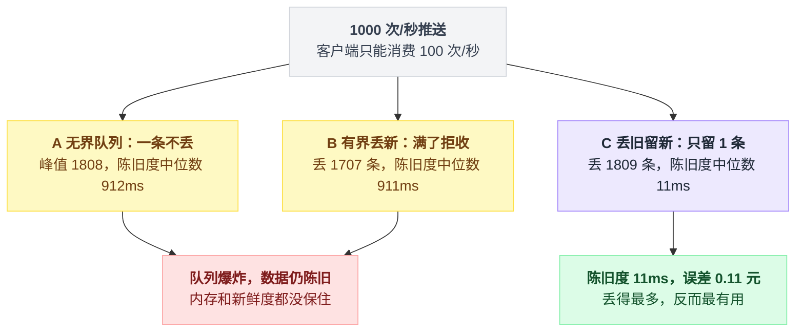
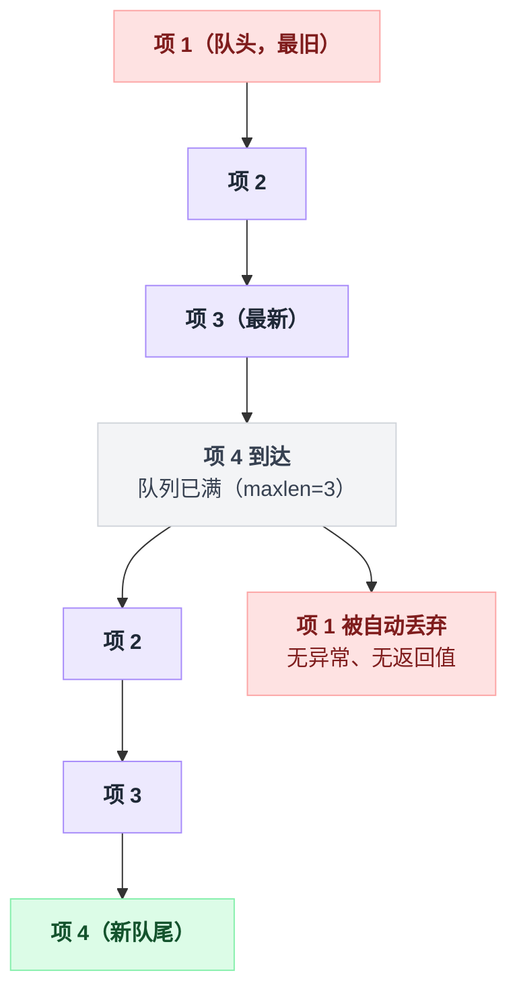
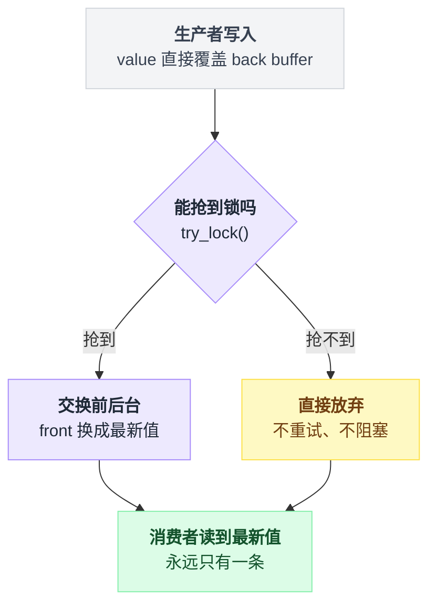
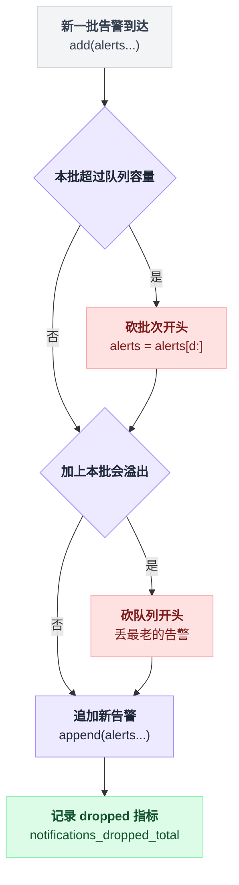
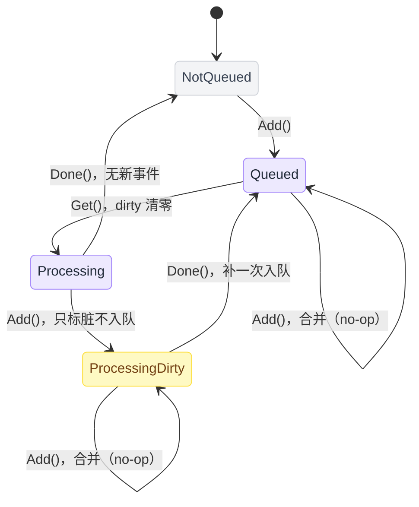
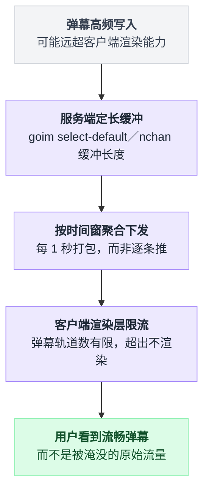
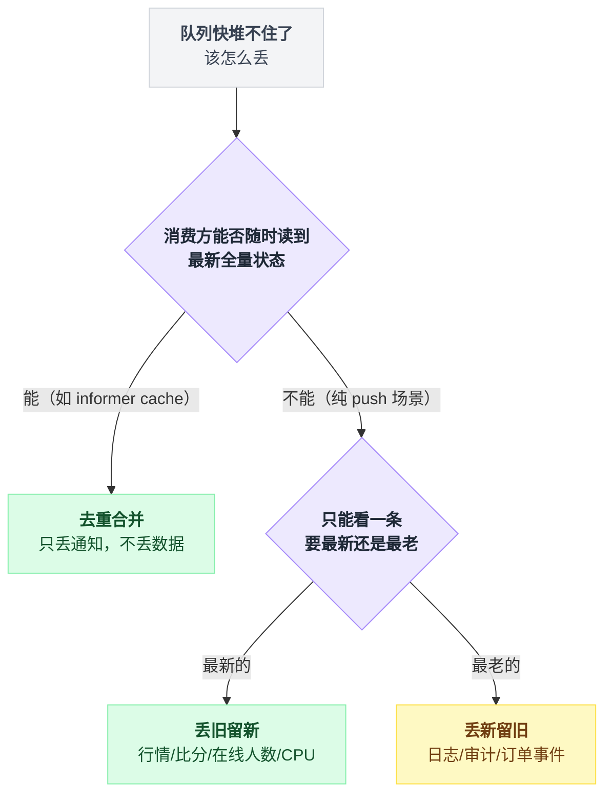

# 04 · 监控指标、埋点、弹幕：丢旧留新

> 适用场景：**数据本身廉价，实时性 >> 完整性。**
> 核心判断：**队列不该是「攒着慢慢发的缓冲区」，而该是「只框住现在的取景框」。**

---

## 先跑一下，这次的数字最直观

场景很简单：服务端每 1ms 推一次最新股价（1000 次/秒），客户端渲染一次要 10ms（只能消费 100 次/秒）。

**生产比消费快了 10 倍。**

```bash
python3 demos/demo04_conflate.py
```

```
【A. 无界队列（一条不丢）】
  客户端渲染了      : 193 帧
  丢弃的行情条数    : 0
  队列峰值长度      : 1808
  数据陈旧度 中位数 :     912 ms
  数据陈旧度 最差   :    1818 ms
  显示价格的平均误差:    9.13 元

【B. 有界队列，满了丢新的（上限 100）】
  客户端渲染了      : 193 帧
  丢弃的行情条数    : 1707
  队列峰值长度      : 100
  数据陈旧度 中位数 :     911 ms
  数据陈旧度 最差   :    1053 ms
  显示价格的平均误差:    7.48 元

【C. 只留最新一条（丢旧留新）】
  客户端渲染了      : 190 帧
  丢弃的行情条数    : 1809
  队列峰值长度      : 1
  数据陈旧度 中位数 :      11 ms
  数据陈旧度 最差   :      21 ms
  显示价格的平均误差:    0.11 元
```

> 这个 demo 跑的是真实并发调度，每次运行数字会有小幅波动（几个百分点），但趋势和量级是稳定的。

把三段输出并排看：

| | A 无界队列 | B 有界丢新（上限 100） | C 只留最新一条 |
|---|---|---|---|
| 渲染帧数 | 193 | 193 | 190 |
| 丢弃条数 | 0 | 1707 | 1809 |
| 队列峰值 | 1808 | 100 | **1** |
| 陈旧度中位数 | 912 ms | 911 ms | **11 ms** |
| 陈旧度最差 | 1818 ms | 1053 ms | **21 ms** |
| 平均价格误差 | 9.13 元 | 7.48 元 | **0.11 元** |

**陈旧度从 912ms 掉到 11ms，价格误差从 9.13 元掉到 0.11 元。**

而且注意 C 的队列峰值是 **1**。内存几乎不占。

---

## 逐个说这三种做法

三种策略的差别只在「满了那一刻做什么」这一行：

```
A 无界：  q.append(item)                          // 从不拒绝，队列随便涨
B 丢新：  if len(q) >= cap: return; q.append(item) // 满了不收新的，老的继续排队
C 丢旧：  q.append(item)                          // 满了自动把队头顶出去
```

三个结果放在一起看更直观：A 和 B 都没能把陈旧度压下来，只有 C 做到了。



### A：「一条都不丢」听起来最负责，实际最没用

队列涨到 1808，客户端渲染的是**1 秒前、2 秒前的价格**。

对于行情、弹幕、大盘这类东西，**显示一个 2 秒前的价格，比什么都不显示更危险** —— 用户会照着这个价格做决定。

而且队列还在无限吃内存。这就是第 00 篇讲的那个坑，只不过换了个场景。

### B：这是很多人下意识会写的那种，而且是三个里最糟的

```python
if len(q) >= cap:
    return          # 满了，新的不要了
q.append(item)
```

结果是队列里**永远塞着一堆老数据**，客户端一直在啃旧的。

看数字：陈旧度 911ms，跟 A 几乎一样差 —— 你丢了 1707 条数据，什么都没换来。

**既丢了数据，又没换来新鲜度。** 这是最亏的一种。

不过丢新本身不是罪。有个反例：Docker 的日志 ring buffer 用的就是丢新策略，那里是对的 —— 因为日志要按顺序看，丢中间一段比丢结尾更难受。

**丢弃方向由业务语义决定**，不由「哪种写起来顺手」决定。

### C：只留最新一条

```python
from collections import deque
q = deque(maxlen=1)      # 就这一行
q.append(item)           # 自动踢掉旧的
```

Python 标准库[官方文档](https://docs.python.org/3/library/collections.html#collections.deque)的原话：

> 一旦有界长度的 deque 满了，当新元素被加入时，**相应数量的元素会从另一端被丢弃**。

这句话说的就是环形覆盖：新数据从一端挤进来，旧数据自动从另一端被顶出去。



**没有异常，没有返回值，就这么静静地掉了。** 这既是它的优点（简单），也是它的坑（无声）。

---

## 真实项目怎么写的

### ZeroMQ 的 `ZMQ_CONFLATE`：最纯粹的一个

**[zeromq/libzmq](https://github.com/zeromq/libzmq)** · 10.9k stars · C++

[官方文档](https://github.com/zeromq/libzmq/blob/master/doc/zmq_setsockopt.adoc)：

> **ZMQ_CONFLATE: Keep only last message**
>
> 如果设置，socket 的收/发队列中只保留一条消息，即最后收到 / 最后要发的那条。忽略 `ZMQ_RCVHWM` 和 `ZMQ_SNDHWM` 选项。**不支持多帧消息** —— 只有其中一帧会被保留在 socket 内部队列里。

实现（`src/dbuffer.hpp`）值得看，因为它体现了 conflation 的哲学：

```cpp
//  dbuffer is a single-producer single-consumer double-buffer implementation.
//  The producer writes to a back buffer and then tries to swap
//  pointers between the back and front buffers. If it fails,
//  due to the consumer reading from the front buffer, it just
//  gives up, which is ok since writes are many and redundant.
void write (const msg_t &value_)
{
    *_back = value_;                 // 直接覆盖，不判断，不加锁
    if (_sync.try_lock ()) {
        _front->move (*_back);       // 抢到锁就换到前台
        _has_msg = true;
        _sync.unlock ();
    }
    // 抢不到锁？直接放弃。反正下一条马上就来
}
```

这段 `write()` 的逻辑画出来就是一条无锁快路径：



注意那句注释：**"writes are many and redundant"（写操作很多且冗余）**。这是所有 conflation 场景的共同前提 —— 数据便宜，丢一条无所谓，下一条马上来。

用之前有三个限制必须先记住，踩中任何一条它都是「静静地不生效」：

| 限制 | 具体含义 |
|---|---|
| 不支持多帧消息 | SUB socket 用 CONFLATE 时不能用非空 topic 前缀（topic + payload 是两帧），官方文档原话如此 |
| 必须在 `bind` / `connect` 之前设置 | `zmq_setsockopt` 的 Caution 段落列了可以后设的选项白名单，`ZMQ_CONFLATE` 不在里面 |
| 只对 PULL / PUSH / SUB / PUB / DEALER 生效 | 其余 socket 类型设了不起作用，判断逻辑在 `src/options.hpp` 的 `get_effective_conflate_option` 里 |

pyzmq 用法：

```python
import zmq

ctx = zmq.Context.instance()
sock = ctx.socket(zmq.SUB)
sock.setsockopt(zmq.CONFLATE, 1)      # ← 必须在 connect 之前
sock.setsockopt(zmq.SUBSCRIBE, b"")
sock.connect("tcp://127.0.0.1:5556")

while True:
    tick = sock.recv()                # 永远拿到最新一条，中间的全被丢掉
```

（`sock.conflate = 1` 是等价写法，pyzmq 的 `AttributeSetter` 会转成 `setsockopt`。）

### Prometheus 的告警队列：砍队头

**[prometheus/prometheus](https://github.com/prometheus/prometheus)** · 64.1k stars · Go

这是我见过最教科书的 drop-oldest 实现（`notifier/sendloop.go`）：

```go
func (s *sendLoop) add(alerts ...*Alert) {
	...
	var dropped int
	// Queue capacity should be significantly larger than a single alert batch could be.
	if d := len(alerts) - s.opts.QueueCapacity; d > 0 {
		s.logger.Warn("Alert batch larger than queue capacity, dropping alerts", "count", d)
		dropped += d
		alerts = alerts[d:]
	}

	// If the queue is full, remove the oldest alerts in favor of newer ones.
	if d := (len(s.queue) + len(alerts)) - s.opts.QueueCapacity; d > 0 {
		s.logger.Warn("Alert notification queue full, dropping alerts", "count", d)
		dropped += d
		s.queue = s.queue[d:]          // ← 丢旧留新，就这一行
	}

	s.queue = append(s.queue, alerts...)
	...
	if dropped > 0 {
		s.metrics.dropped.WithLabelValues(s.alertmanagerURL).Add(float64(dropped))
	}
}
```

拆成判定流程看更清楚，两次判断都是「超了就砍开头」：



逻辑很朴素：**如果 10 条告警都没处理完，最老那条要么早就自愈了，要么已经烧成灰了，看新的更要紧。**

⭐ 注意最后那几行 —— **丢弃有指标**（`prometheus_notifications_dropped_total`），还有 `queue_length` 和 `queue_capacity`。

这是 conflation 最容易漏的一环：**它默默丢数据，所以必须有计数器**。

### Telegraf：真·环形数组

**[influxdata/telegraf](https://github.com/influxdata/telegraf)** · 16.9k stars · Go

配置项是 `metric_buffer_limit`。实现（`models/buffer_mem.go`）：

```go
func (b *MemoryBuffer) addMetric(m telegraf.Metric) int {
	dropped := 0
	if b.size == b.cap {
		b.metricDropped(b.buf[b.last])     // 被覆盖的旧 metric 记为 dropped
		dropped++
		...
	}
	b.buf[b.last] = m                      // 直接覆写
	b.last = b.next(b.last)
	if b.size == b.cap {
		b.first = b.next(b.first)          // 读指针也往前推
	}
	...
}
```

它没有 append、没有搬移，只有两个指针在一个定长数组上绕圈：

```
写入一条 m：
    如果 满了:  把 buf[last] 这条老数据记成 dropped
    buf[last] = m          // 覆写，位置不变
    last = last + 1        // 写指针前进（绕回 0）
    如果 满了:  first = first + 1   // 读指针也跟着前进，否则会读到刚被覆盖的槽
```

关键是最后那句：**满了之后读指针必须跟着写指针一起走**，不然读到的就是刚被盖掉的位置。

### Redis：不丢消息，丢客户端

**[redis/redis](https://github.com/redis/redis)** · 74.9k stars

Redis 对慢订阅者的处理是另一个思路 —— **不丢消息，直接断开连接**。

`redis.conf` 原文：

```conf
# client-output-buffer-limit <class> <hard limit> <soft limit> <soft seconds>
#
# A client is immediately disconnected once the hard limit is reached, or if
# the soft limit is reached and remains reached for the specified number of
# seconds (continuously).

client-output-buffer-limit normal 0 0 0
client-output-buffer-limit replica 256mb 64mb 60
client-output-buffer-limit pubsub 32mb 8mb 60
```

三个数字的准确语义（以 pubsub 那行为例）：

| 参数 | pubsub 取值 | 达到之后 |
|---|---|---|
| hard limit | 32mb | **立刻**断开，不给宽限 |
| soft limit + soft seconds | 8mb / 60s | 只是**开始计时**，连续 60 秒都没掉下来才断开；中途一旦低于 8mb，计时器清零 |

源码（`src/networking.c`）里那个「第一次不算数」的细节很有意思：

```c
if (soft) {
    if (c->obuf_soft_limit_reached_time == 0) {
        c->obuf_soft_limit_reached_time = server.unixtime;
        soft = 0; /* First time we see the soft limit reached */
    } else {
        time_t elapsed = server.unixtime - c->obuf_soft_limit_reached_time;
        if (elapsed <= server.client_obuf_limits[class].soft_limit_seconds) {
            soft = 0;
        }
    }
} else {
    c->obuf_soft_limit_reached_time = 0;
}
```

这段判定写成人话是三条分支：

```
每次检查缓冲区：
    如果 当前超过 soft limit:
        如果 是第一次超过:      记下时间戳，本次不算触发
        否则:
            如果 超过的时长 <= soft_limit_seconds:   本次不算触发（还在宽限期内）
            否则:                                    触发，断开
    否则（掉回 soft limit 以下）:
        时间戳清零              // 下次再超，重新从「第一次」算起
```

所以「连续 60 秒」是真的连续 —— 中间只要掉下去一次，之前攒的时间全部作废。

为什么 `normal` 是 `0 0 0`（不限）？

因为普通客户端是「请求-响应」式的，你不问它就不推。而**订阅者和从库是 push 式的** —— 厨房不停往外端菜，客人不端走就堆着。所以必须限。

排障时可以直接 grep 这条日志：

```
Client %s closed for overcoming of output buffer limits.
```

### client-go workqueue：不丢数据，只丢通知

**[kubernetes/client-go](https://github.com/kubernetes/client-go)** · 9.8k stars

这是最优雅的一种，因为它**一条数据都不丢，但也不会堆积**。

包文档（`util/workqueue/doc.go`）自己起的名字叫 **Stingy**（小气）：

> - **Stingy**：同一个元素不会被并发处理多次；如果一个元素在被处理之前被多次加入，它只会被处理一次。

实现靠两个集合（`util/workqueue/queue.go`）：

```go
type Typed[t comparable] struct {
	queue Queue[t]           // 处理顺序
	dirty sets.Set[t]        // 所有需要被处理的
	processing sets.Set[t]   // 正在被处理的
	...
}

func (q *Typed[T]) Add(item T) {
	...
	if q.dirty.Has(item) {
		if !q.processing.Has(item) {
			q.queue.Touch(item)
		}
		return                       // ← 已经脏了，直接返回：这就是「合并」
	}
	q.dirty.Insert(item)
	if q.processing.Has(item) {
		return                       // ← 正在处理，只标脏不入队，避免并发处理同一个 key
	}
	q.queue.Push(item)
	q.cond.Signal()
}

func (q *Typed[T]) Done(item T) {
	...
	q.processing.Delete(item)
	if q.dirty.Has(item) {
		q.queue.Push(item)           // ← 处理期间来过新事件，补一次（且只补一次）
		q.cond.Signal()
	}
	...
}
```

把两个方法的分支抽干净，就是四行判断：

```
Add(item):
    如果 item 已在 dirty:
        如果 不在 processing:  queue.Touch(item)   // 已排队，什么都不加
        返回                                       // 合并发生在这里
    dirty 加入 item
    如果 item 在 processing:  返回                 // 只标脏，不入队
    queue 推入 item，唤醒消费者

Done(item):
    processing 移除 item
    如果 item 还在 dirty:     queue 推入 item，唤醒消费者   // 补一次，且只补一次
```

四种状态组合：

| dirty | processing | 含义 | 新 `Add` 的效果 |
|---|---|---|---|
| ✗ | ✗ | 不在队列里 | 入 dirty + 入 queue |
| ✓ | ✗ | 排队等处理 | **合并（no-op）** |
| ✓ | ✓ | 处理中，期间又被改过 | **合并（no-op）** |
| ✗ | ✓ | 处理中，期间无新事件 | 只标脏，等 `Done` 时补 |

四种组合本质是一台状态机：



它凭什么敢「合并」？**关键在于：workqueue 里存的是 key（通常是 `namespace/name`），不是数据本身。**

处理时再去 informer cache 拿**当前最新对象**。所以合并的是「通知」，读取的是「最新状态」，天然幂等。

**这就是「不丢数据只丢通知」的秘诀：消费方能随时读到最新全量状态。** 满足这个前提的场景，一定要用这种做法 —— 它是三种里唯一不损失信息的。

### 弹幕 / 直播场景

坏消息：**没有高星开源项目把「弹幕降采样」做成一等公民特性**。

好消息：能抄的零件都在。

**[Terry-Mao/goim](https://github.com/Terry-Mao/goim)** · 7.4k stars（作者毛剑是 B 站基础架构负责人，goim 是 B 站长连接推送体系的公开原型）：

```go
// internal/comet/channel.go
func NewChannel(cli, svr int) *Channel {
	c := new(Channel)
	c.CliProto.Init(cli)
	c.signal = make(chan *protocol.Proto, svr)   // 定长
	...
}

// Push server push message.
func (c *Channel) Push(p *protocol.Proto) (err error) {
	select {
	case c.signal <- p:
	default:
		err = errors.ErrSignalFullMsgDropped     // ← 满了就丢，有明确错误码
	}
	return
}
```

**[centrifugal/centrifugo](https://github.com/centrifugal/centrifugo)** · 10.3k stars 有个正对口的特性 —— channel namespace 上的 `force_recovery_mode`（配合 `force_recovery: true`）：

| 取值 | 行为 | 适合 |
|---|---|---|
| `"stream"`（默认） | 重连后补播所有错过的消息 | 聊天 |
| `"cache"` | **只投递最新一条**，把 channel 变成一个实时 KV | 行情、比分、在线人数 |

[官方文档](https://centrifugal.dev/docs/server/history_and_recovery)说 cache 模式「可以完全省掉『拉取初始状态』这一步」。行情、比分、在线人数这类场景直接用它。

它还有个 delta 压缩（Fossil 算法），只传相邻两条消息的差异，宣称流量降到 1/10。

**[slact/nchan](https://github.com/slact/nchan)** · 3.1k stars（Nginx 模块）：

```nginx
location /pub {
    nchan_publisher;
    nchan_channel_id $arg_id;
    nchan_message_buffer_length 10;   # 只留最近 10 条，默认就是 10
    nchan_message_timeout 30s;        # 30 秒前的弹幕对新观众没意义
}
```

**弹幕的实际做法是三段组合**，每段都能在上面找到原型：

1. **服务端定长缓冲 + 丢弃**（goim 的 `select-default`、nchan 的 buffer length）
2. **按时间窗聚合下发**（每 1 秒打一个包，而不是每条推一次）
3. **客户端渲染层限流**（弹幕轨道数有限，超出的直接不渲染）

三段串起来是一条流水线，前一段兜不住的量交给后一段继续砍：



---

## 各语言的写法

**Python：**

```python
from collections import deque

# 只留最新一条 —— 相当于 ZMQ_CONFLATE
latest = deque(maxlen=1)
latest.append(tick)

# 留最近 N 条 —— 相当于 nchan_message_buffer_length
recent = deque(maxlen=100)
recent.append(danmaku)
```

asyncio 场景下的「丢旧留新」队列（`asyncio.Queue` 没有这个模式，得自己写）：

```python
class ConflatingQueue:
    """满了就丢最老的，push 永不阻塞"""
    def __init__(self, maxsize=1):
        self._buf = deque(maxlen=maxsize)
        self._event = asyncio.Event()
        self.dropped = 0                      # ← 这个计数器一定要有

    def push(self, item):
        if len(self._buf) == self._buf.maxlen:
            self.dropped += 1
        self._buf.append(item)                # deque 自动踢掉队头
        self._event.set()

    async def pop(self):
        while not self._buf:
            self._event.clear()
            await self._event.wait()
        return self._buf.popleft()
```

**Go：**

```go
// 单槽 conflation：始终只保留最新值，写入永不阻塞
func conflatePush[T any](ch chan T, v T) {
	for {
		select {
		case ch <- v:
			return
		default:
			select {
			case <-ch:   // 丢掉旧值
			default:     // 被消费者抢先取走了，重试即可
			}
		}
	}
}
```

这个双层 select 看着绕，逻辑其实就三句：

```
循环:
    能塞进去吗？        能  → 塞完就走
                       不能 → 说明槽里有旧值
        试着把旧值取走： 取到了 → 下一轮重塞
                       没取到 → 消费者刚好抢先取走了，下一轮照样重塞
```

⚠️ 内层那个 `default` 不能省。裸写 `<-ch` 会在消费者刚好取走时死锁。外层的 `for` 是因为丢完旧值后仍可能被别的生产者抢占。

Go 里更常见的是「信号合并」写法 —— buffer=1 的 channel + 非阻塞发送，N 次通知压成 1 次。Prometheus 的 `notifier` 和 `discovery/manager` 都是这么写的：

```go
hasWork: make(chan struct{}, 1),

func (s *sendLoop) notifyWork() {
	select {
	case s.hasWork <- struct{}{}:
	default:                          // ← 已有未消费的信号，本次丢弃即可
	}
}
```

`discovery/manager.go` 里还有更完整的版本 —— 发不出去就重新打标记，绝不堆积：

```go
select {
case m.syncCh <- m.allGroups():        // 一次性读最新全量
    lastSent = time.Now()
default:
    m.metrics.DelayedUpdates.Inc()
    // Ensure we don't miss this update.
    select {
    case m.triggerSend <- struct{}{}:
    default:
    }
}
```

**这是「状态合并型 conflation」**：无论 100 次更新还是 1 次，下游只被叫醒一次，然后一次性读最新全量。

比逐条排队正确得多，跟 client-go workqueue 是同一个思路。

**TypeScript：**

```ts
class Conflated<T> {
  private latest: T | null = null;
  dropped = 0;
  push(v: T) {
    if (this.latest !== null) this.dropped++;
    this.latest = v;
  }
  take(): T | null {
    const v = this.latest;
    this.latest = null;
    return v;
  }
}

// 渲染循环里用 requestAnimationFrame 拉，而不是每条消息都触发渲染
function loop() {
  const tick = buf.take();
  if (tick) render(tick);
  requestAnimationFrame(loop);
}
```

前端场景里这个模式尤其重要 —— WebSocket 每秒推 1000 条，你不可能渲染 1000 次。

**用 rAF 拉最新值，而不是让消息推动渲染。**

---

## 一张速查表：满了丢谁

| 项目 | 满了怎么办 | 丢弃方向 | 有没有指标 |
|---|---|---|---|
| ZMQ_CONFLATE | 覆盖 | **丢旧留新** | ❌ 静默 |
| `deque(maxlen=N)` | 从另一端弹出 | **丢旧留新** | ❌ 静默 |
| Prometheus notifier | 砍队头 | **丢旧留新** | ✅ `notifications_dropped_total` |
| telegraf MemoryBuffer | 环形覆盖 | **丢旧留新** | ✅ `metrics_dropped` |
| EMQX mqueue | 踢队头 | **丢旧留新** | ✅ |
| centrifugo `cache` 模式 | 覆盖 | **丢旧留新** | ✅ history offset |
| nchan | 淘汰最旧 | **丢旧留新** | — |
| moby ringLogger | 拒收 | **丢新留旧** | ❌ 静默 |
| goim `Channel.Push` | 拒收 | **丢新留旧** | ✅ `ErrSignalFullMsgDropped` |
| Mosquitto | 拒收 | **丢新留旧** | ✅ |
| Redis pubsub | 断开客户端 | 丢客户端本身 | ✅ 日志 + 计数 |
| client-go workqueue | 不会满（去重） | **合并，不丢数据** | ✅ `workqueue_*` |

---

## 几条容易踩的

**1. 丢弃必须有计数器**

`deque(maxlen=N)` 最大的坑就是它**完全静默**。你的数据在丢，监控上一片祥和。

自己包一层，加个 counter。Prometheus 和 telegraf 都这么做。

**2. 想清楚丢哪边**

问自己一个问题：**「如果只能看一条，我要最老的还是最新的？」**

- 行情、比分、在线人数、CPU 使用率 → 最新的（drop-oldest）
- 日志、审计、订单事件 → 最老的（drop-newest，或者根本不该丢）

选错了比不丢还糟 —— demo 里的方案 B 就是活例子。

**3. 「不丢数据只丢通知」是有前提的**

client-go 那套之所以成立，是因为**消费方能随时从 informer cache 读到最新全量状态**。

如果你的消费方只能看到你推给它的东西（比如一个纯 push 的 WebSocket 客户端），这招就不成立。

把「丢哪边」和「能不能只丢通知」这两条判断连起来，就是一棵决策树：



**4. conflation 会掩盖「跳变」**

只留最新价的话，中间那次瞬间暴跌你就看不到了。

如果业务关心跳变（比如风控），你需要的是「保留最值 + 最新值」的组合，而不是纯 conflate。

**5. `ZMQ_CONFLATE` 必须在 connect 之前设**

这个坑我见人踩过。设晚了完全没效果，而且不报错。

---

## 一句话记住

> 数据便宜、实时性 >> 完整性的时候，
> 队列不该是「攒着慢慢发的缓冲区」，而该是「只框住现在的取景框」。
>
> 取景框有三种做法：**覆盖**（ZMQ_CONFLATE、deque）、**砍队头**（Prometheus notifier）、
> **去重合并**（client-go workqueue）。前两种丢数据，第三种只丢通知 —— 能用第三种就用第三种。

---

## 参考

- zeromq/libzmq, *zmq_setsockopt* — https://github.com/zeromq/libzmq/blob/master/doc/zmq_setsockopt.adoc
- redis/redis, redis.conf & networking.c — https://github.com/redis/redis/blob/unstable/src/networking.c · [Clients reference](https://redis.io/docs/latest/develop/reference/clients/)
- prometheus/prometheus, notifier/sendloop.go — https://github.com/prometheus/prometheus/blob/main/notifier/sendloop.go
- prometheus/prometheus, discovery/manager.go — https://github.com/prometheus/prometheus/blob/main/discovery/manager.go
- influxdata/telegraf, models/buffer_mem.go — https://github.com/influxdata/telegraf/blob/master/models/buffer_mem.go
- kubernetes/client-go, util/workqueue — https://github.com/kubernetes/client-go/blob/master/util/workqueue/queue.go
- Python, collections.deque — https://docs.python.org/3/library/collections.html#collections.deque
- centrifugal/centrifugo, *History and recovery* — https://centrifugal.dev/docs/server/history_and_recovery
- Terry-Mao/goim — https://github.com/Terry-Mao/goim
- slact/nchan — https://nchan.io/
- LMAX-Exchange/disruptor — https://lmax-exchange.github.io/disruptor/（注意：它的 ring buffer 满了是**背压等待**，不是覆盖）
