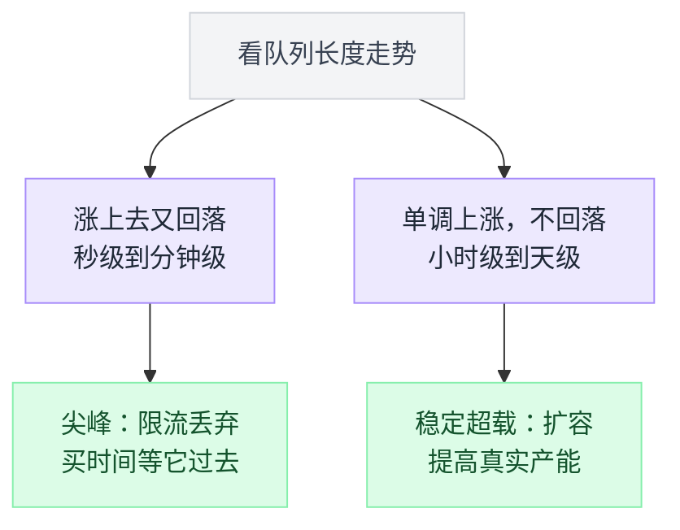
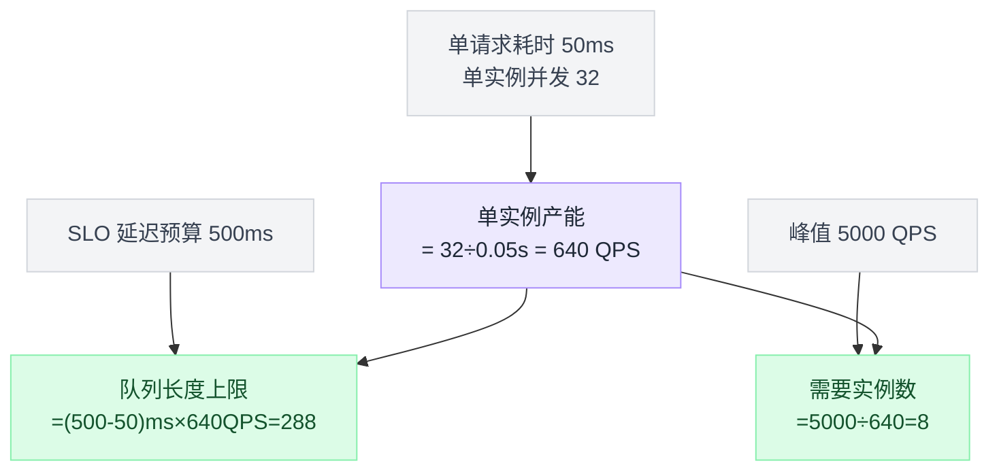
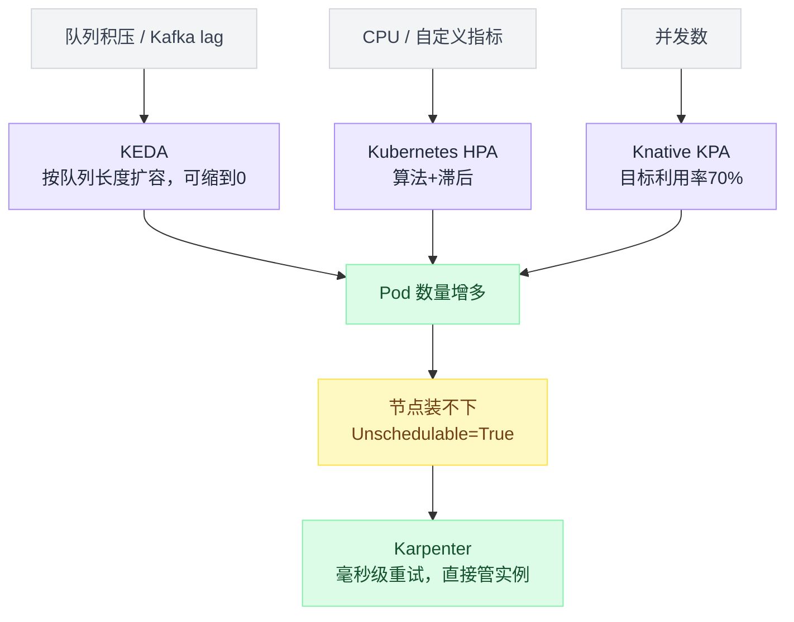
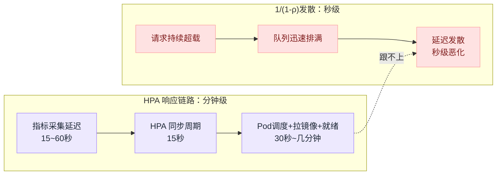
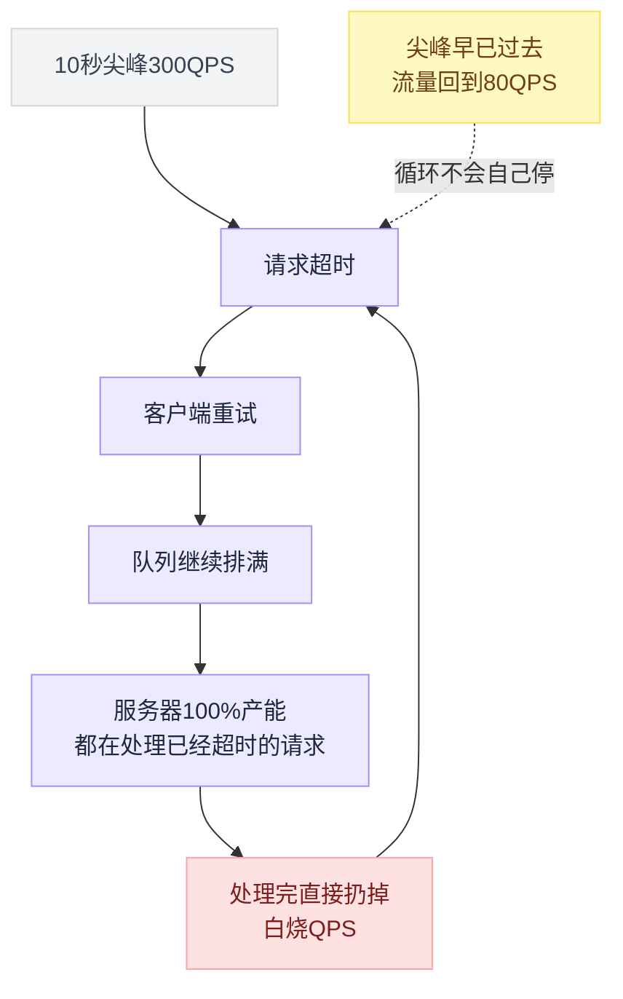
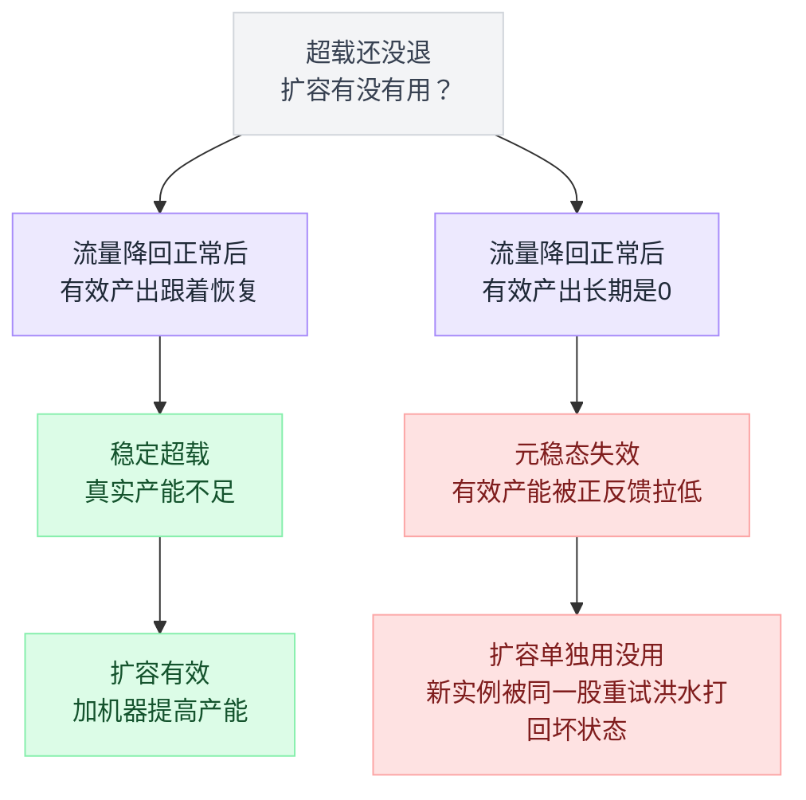
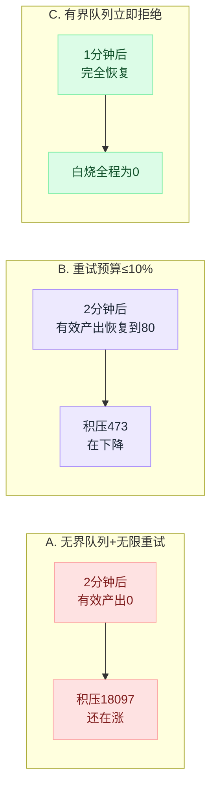
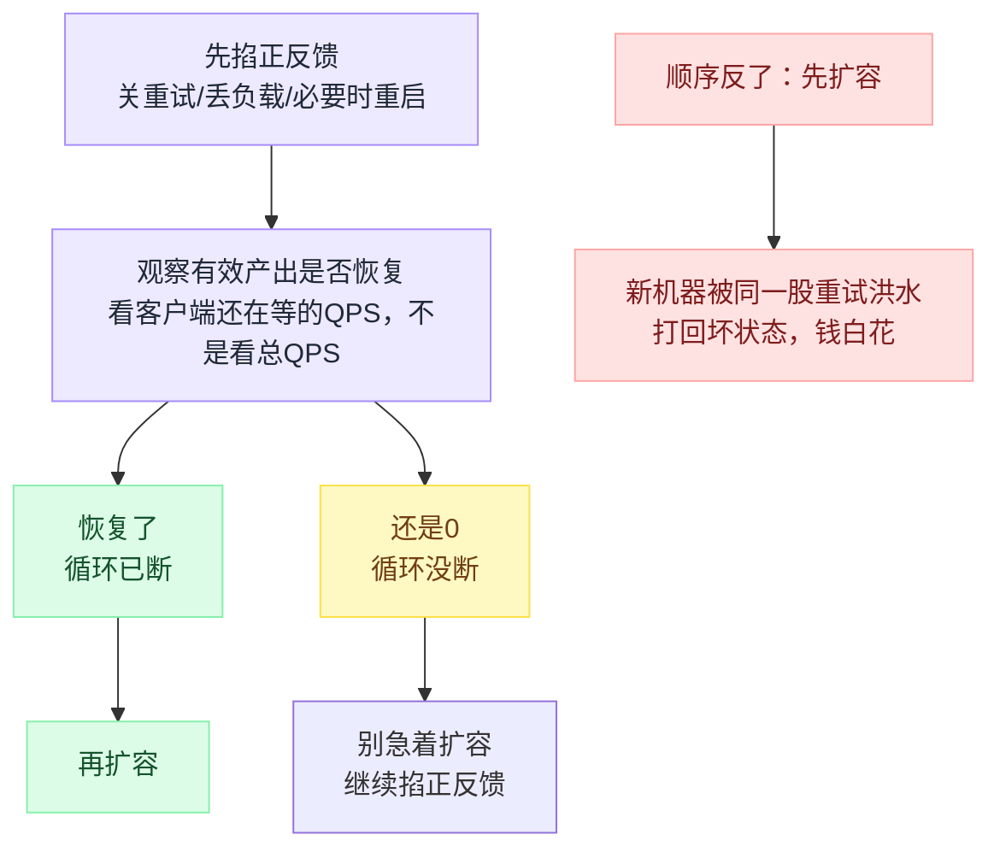

# 05 · 稳定超载的系统：扩容，以及它救不了的情况

> 适用场景：**流量不是尖峰，是真的涨上来了。**
> 核心判断：**扩容是唯一能提高产能的手段 —— 但你得先把烧起来的正反馈掐掉。**

---

## 先分清「尖峰」和「稳定超载」

前面四篇讲的招式，全部是在**买时间**：

- 快速失败：牺牲一部分请求，保住剩下的
- 有界队列：把压力还给上游
- 采样、丢旧留新：少干点活

这些招式有一个共同前提：**过载是暂时的**。

如果你的日常流量已经稳定超过产能了，上面所有招式加起来的效果就是「优雅地持续失败」。这时候只有一件事有用 —— **加机器**。

怎么区分？看这个：

| | 尖峰 | 稳定超载 |
|---|---|---|
| 队列长度 | 涨上去又回落 | 单调上涨，不回落 |
| 拒绝率 | 有波峰 | 持续在某个水平 |
| 时间尺度 | 秒级、分钟级 | 小时级、天级 |
| 该做什么 | 限流丢弃 | 扩容 |

这个判断落到具体流程上是一条岔路：



**混淆这两者是最常见的错误。** 一边是「明明该扩容却在调限流参数」，一边是「明明是十秒的尖峰却触发了自动扩容，等机器起来尖峰早过去了」。

---

## 要几台机器？别拍脑袋，算

跑一下：

```bash
python3 demos/demo05_metastable.py
```

```
  单请求耗时 50ms，单实例并发 32，SLO 500ms，峰值 5000 QPS
  → 单实例产能 = 32 ÷ 0.05s = 640 QPS
  → 队列上限   = (500-50)ms × 640 QPS = 288 个
  → 需要实例数 = 5000 ÷ 640 = 8 个
```

三个公式，全部来自利特尔法则 `L = λW`：

```
单实例产能   = 并发数 ÷ 单请求耗时
队列长度上限 = (SLO 延迟预算 − 单请求耗时) × 产能
需要的实例数 = 峰值 QPS ÷ 单实例产能
```

三个公式串起来，就是从「测出来的两个数」推到「要开几台机器」的一条链路：



**队列上限是 288，不是 10000。** 设成 10000 的话，排满时一个请求要等 `10000 ÷ 640 ≈ 15.6 秒` —— 早就没人在等了，你只是在给幽灵服务。

Google SRE 书的建议更严格：

> 对于流量比较平稳的系统，队列长度通常应该**小于线程池大小的 50%**。

顺便验算它书里那个例子：「队列长度是线程数的 10 倍，单请求 100ms，排满时一个请求要 1.1 秒」——
设线程数 T：产能 = T/0.1 = 10T QPS，队列 = 10T 个 → 排队 `10T ÷ 10T = 1.0s`，加干活 0.1s = **1.1s**。对上了。

---

## 自动扩容：三个层次

这四样东西各管一层、各看一种信号，先把关系摆清楚：



前三个（KEDA、HPA、Knative）都在 Pod 层伸缩；Pod 多到节点装不下时，才轮到 Karpenter 出手扩节点。

### 1. KEDA —— 按队列长度扩容，还能缩到 0

**[kedacore/keda](https://github.com/kedacore/keda)** · 10.3k stars · CNCF 毕业项目

对本系列最有价值的地方：**它能直接按「队列里积压了多少」扩容**，而不是按 CPU。

按 RabbitMQ 队列长度：

```yaml
apiVersion: keda.sh/v1alpha1
kind: ScaledObject
metadata:
  name: rabbitmq-scaledobject
spec:
  scaleTargetRef:
    name: rabbitmq-deployment
  triggers:
  - type: rabbitmq
    metadata:
      protocol: http
      queueName: testqueue
      mode: QueueLength
      value: "20"          # 每个 Pod 目标持有 20 条消息
    authenticationRef:
      name: keda-trigger-auth-rabbitmq-conn
```

按 Kafka consumer lag：

```yaml
  triggers:
  - type: kafka
    metadata:
      bootstrapServers: localhost:9092
      consumerGroup: my-group
      topic: test-topic
      lagThreshold: "50"        # 默认 10
      offsetResetPolicy: latest
```

关键默认值：

| 字段 | 默认 |
|---|---|
| `pollingInterval` | 30 秒 |
| `cooldownPeriod` | 300 秒 |
| `minReplicaCount` | 0 |
| `maxReplicaCount` | 100 |

**scale-to-zero 是怎么做到的**：原生 HPA 没法从 0 起步（没有 Pod 就没有指标）。KEDA 在副本为 0 时由自己的 controller 直接轮询外部源（队列深度），检测到有活就 0 → 1；之后交还给原生 HPA。

⭐ **KEDA 有两个 mode 是直接把排队论写进去的**，很多人不知道：

```go
// pkg/scalers/rabbitmq_scaler.go
rabbitModePublishedToDeliveredRatio    = "PublishedToDeliveredRatio"
rabbitModeExpectedQueueConsumptionTime = "ExpectedQueueConsumptionTime"

// ExpectedQueueConsumptionTime
eta = ((publishRate - deliverGetRate) / deliverGetRate) +
      (float64(messages) / deliverGetRate)
```

- **`ExpectedQueueConsumptionTime`** 的第二项 `messages / deliverGetRate` **就是 W = L / λ** —— 积压条数 ÷ 消费速率 = 清空需要多久。你可以直接写「目标：积压能在 30 秒内清空」：

  ```yaml
      mode: ExpectedQueueConsumptionTime
      value: "30"
  ```

- **`PublishedToDeliveredRatio`** 就是 **ρ = λ/μ**：

  ```go
  ratio = float64(publishRate / deliverGetRate)
  ```

  文档说 ratio = 1.0 表示「消费者容量刚好够」。超过阈值（比如 1.1）就扩容。

**这是把利用率 ρ 直接当扩容信号 —— 最贴近第 00 篇那套理论的工程实现。**

（注意 `ExpectedQueueConsumptionTime` 文档明确要求 `pollingInterval` 设成 1 秒。）

### 2. Kubernetes HPA —— 算法和它的滞后

[官方算法](https://kubernetes.io/docs/tasks/run-application/horizontal-pod-autoscale/)：

```
desiredReplicas = ceil[ currentReplicas × ( currentMetricValue / desiredMetricValue ) ]
```

容差默认 **0.1（10%）** —— 比值在 1.0 附近 10% 以内不动作。

默认的扩缩容行为：

```yaml
behavior:
  scaleDown:
    stabilizationWindowSeconds: 300     # ⭐ 缩容稳定窗口默认 300 秒
    policies:
    - type: Percent
      value: 100
      periodSeconds: 15
  scaleUp:
    stabilizationWindowSeconds: 0       # ⭐ 扩容稳定窗口默认 0
    policies:
    - type: Percent
      value: 100
      periodSeconds: 15
    - type: Pods
      value: 4
      periodSeconds: 15
    selectPolicy: Max
```

**扩容窗口 0，缩容窗口 300 秒** —— 这个不对称是故意的：扩容要快（宁可多花钱），缩容要慢（防止抖动）。跟第 03 篇 Jaeger 的采样率调整是同一个哲学。

⚠️ **但你必须知道 HPA 有多慢：**

```
指标采集延迟（15~60s）
+ HPA 同步周期（15s）
+ Pod 调度 + 拉镜像 + 启动 + 就绪探针（30s ~ 几分钟）
= 分钟级
```

两条链路谁快谁慢，摆在一起看很直接：



而 `1/(1−ρ)` 的发散是**秒级**的。

**这就是为什么「只靠 HPA」永远不够。** HPA 是给你争取时间的，真正接住尖峰的必须是限流和丢弃。

### 3. Karpenter —— 节点不够了怎么办

**[aws/karpenter-provider-aws](https://github.com/aws/karpenter-provider-aws)** · 7.7k stars
**[kubernetes-sigs/karpenter](https://github.com/kubernetes-sigs/karpenter)** · 1.9k stars（云厂商无关的核心）

HPA 扩的是 Pod。Pod 多到节点装不下时，需要节点级扩容。

Karpenter 的触发条件很直接：

> Karpenter 只会尝试调度带有 `Unschedulable=True` 状态条件的 Pod。

它相对 Cluster Autoscaler 的核心优势（[官方文档](https://karpenter.sh/docs/concepts/)原话）：

> 直接管理每个实例，不需要 node group 这类额外的编排机制。这让它在容量不足时能以**毫秒级而不是分钟级**重试。

### 4. Knative KPA —— 直接用并发数当指标

**[knative/serving](https://github.com/knative/serving)** · 6.1k stars

Knative 的自动扩缩容不看 CPU，**看并发数**：

```go
// pkg/autoscaler/scaling/autoscaler.go
dspc := math.Ceil(observedStableValue / spec.TargetValue)   // stable window 期望副本
dppc := math.Ceil(observedPanicValue / spec.TargetValue)    // panic window 期望副本
```

关键默认值（`config/core/configmaps/autoscaler.yaml`）：

| key | 默认 | 含义 |
|---|---|---|
| `container-concurrency-target-default` | 100 | 每个 Pod 目标并发 |
| `container-concurrency-target-percentage` | 70 | 目标利用率 70% |
| `stable-window` | 60s | 常规决策窗口 |
| `panic-window-percentage` | 10.0 | panic 窗口 = 60s × 10% = **6s** |
| `panic-threshold-percentage` | 200.0 | 并发到目标的 200% 就进入 panic 模式 |
| `scale-to-zero-grace-period` | 30s | |

panic 模式的语义（源码注释）：

> We do not scale down while in panic mode. Only increases will be applied.

⭐ **用「并发数」当指标，等价于同时对 λ 和 W 建模**（因为 L = λW）。

后端变慢了（W↑），并发自然上升，副本数自动上调 —— 而 CPU 指标在这种情况下可能纹丝不动（线程都在等 IO）。**这是比 CPU 更贴近排队论的做法**，如果你的服务是 IO 密集型，强烈建议换成并发数或队列长度当扩容指标。

注意那个 70% 的目标利用率：**不是 100%**。回去看第 00 篇那张表 —— ρ=0.7 时排队放大 3.3 倍，ρ=0.95 时放大 20 倍。**留 30% 余量不是浪费，是买延迟。**

---

## 现在说最重要的部分：扩容救不了的情况

跑 demo 的第二部分。场景：

- 产能 **100 QPS**，日常流量 **80 QPS**（利用率 80%，很健康）
- 第 20~30 秒来了个 **300 QPS** 的尖峰，**只持续 10 秒**
- 之后流量立刻回到 80 QPS

```
【A. 无界队列 + 无限重试（大多数系统的默认状态）】
  时间段                       打到服务的QPS      有效产出QPS     白烧QPS      积压
  尖峰前   0-20s                     80           80         0       0
  尖峰中  20-30s                    658           29        71    2126
  尖峰后  30-40s                    372            0       100    7394
  1分钟后 60-80s                    239            0       100   12496
  2分钟后100-120s                   240            0       100   18097
```

**尖峰过去 90 秒了，有效产出是 0，积压 18097 还在涨。**

盯着「白烧 QPS」那一列：服务器 **100% 的产能**都花在处理「客户端早就走掉的请求」上。它每处理完一个，结果都直接扔掉。

于是所有人继续超时 → 继续重试 → 队列继续排满 → 继续白烧。

**这个循环自己养活自己。**

画出来是这样一个自己喂自己的圈，触发因素早就不在了，圈还在转：



### 这有个正式名字：元稳定失效

HotOS '21 的[论文](https://sigops.org/s/conferences/hotos/2021/papers/hotos21-s11-bronson.pdf)给的定义：

> 元稳定失效发生在负载源不受控的开放系统中：一个**触发因素**让系统进入坏状态，而这个坏状态**在触发因素被移除之后依然持续存在**。

论文特意划了边界：

> 触发因素移除后能自行恢复的失效（比如 DoS 攻击、limplock、livelock）**不是**元稳定失效。

离开这个状态需要什么？论文原话：

> 需要一个**强力的纠正推动**，比如重启系统，或者大幅削减负载。

Google SRE 书里的说法早了 5 年，但说的是同一件事：

> 如果一个服务在 10000 QPS 时是健康的，但在 11000 QPS 时开始雪崩式失败，那么把负载降到 9000 QPS 几乎肯定**止不住**这场雪崩。

### 真实世界里这有多常见

OSDI '22 的[《Metastable Failures in the Wild》](https://www.usenix.org/system/files/osdi22-huang-lexiang.pdf)从公开事故报告里筛出了 **22 起元稳定失效，来自 11 家组织** —— AWS 4 起、Google Cloud 4 起、Azure 4 起，还有 IBM、Spotify、Elasticsearch、Cassandra、Wikipedia、CircleCI、Facebook。

两个数字：

- **超过 50%** 的事故，维持它的因素是**重试**
- **超过 55%** 的事故，最终靠**丢负载**（限流、拒绝请求、改工作负载参数）解决，**不是靠扩容**

论文对「自动扩容能不能躲过去」的表态很克制：

> 自动扩容对大型系统和大放大系数来说代价极高……当前的自动扩容技术能否快得过元稳定失效的形成，**还需要进一步研究**。

**为什么扩容会失效？** 因为在元稳定状态下，有效产能已经被正反馈拉低到远小于标称容量。你扩的是标称容量，但**新实例一上线就被同样的重试洪水打进同一个坏状态**（冷缓存 + 满队列 + 重试放大）。

两种超载看着都是「服务扛不住了」，但扩容管不管用，取决于走的是哪条根因：



---

## 怎么切断正反馈

demo 里对比了两种做法。

### 做法 B：重试预算

```
【B. 加重试预算（重试量 ≤ 成功量的 10%）】
  时间段                       打到服务的QPS      有效产出QPS     白烧QPS      积压
  尖峰前   0-20s                     80           80         0       0
  尖峰中  20-30s                    308           29        71    1062
  尖峰后  30-40s                     80            0       100    1975
  1分钟后 60-80s                     80            0       100    1274
  2分钟后100-120s                    80            0       100     473
```

流量立刻回到 80，积压从 1975 → 1274 → 473 一路在掉。**系统在自己爬出来了** —— 只是很慢，两分钟还没爬完。

Google SRE 书给了三道具体的防线。前两道出自 [Handling Overload](https://sre.google/sre-book/handling-overload/)：

1. **每请求重试预算：最多 3 次尝试**
   > Implement a per-request retry budget of up to three attempts.
2. **每客户端重试比例上限：10%**
   > A request will only be retried as long as this ratio is below 10%.

第三道出自 [Addressing Cascading Failures](https://sre.google/sre-book/addressing-cascading-failures/)：

3. **进程级重试预算：每分钟 60 次**
   > only allow 60 retries per minute in a process, and if the retry budget is exceeded, don't retry; just fail the request.

同一章里还有一条同样重要的原则：**只在最靠近失败的一层重试，上层不再重试**。因为多层重试是**相乘**的：

> 最高层的一个请求可能产生的尝试次数，等于各层尝试次数的乘积……一次用户操作可能在数据库上产生 **64 次尝试（4³）**。

### gRPC 的实现可以直接抄

[gRFC A6](https://github.com/grpc/proposal/blob/master/A6-client-retries.md) 的 service config：

```json
{
  "methodConfig": [{
    "name": [{"service": "grpc.examples.echo.Echo"}],
    "retryPolicy": {
      "maxAttempts": 4,
      "initialBackoff": "0.1s",
      "maxBackoff": "1s",
      "backoffMultiplier": 2,
      "retryableStatusCodes": ["UNAVAILABLE"]
    }
  }],
  "retryThrottling": {
    "maxTokens": 10,
    "tokenRatio": 0.1
  }
}
```

`retryThrottling` 是一个 token bucket，规则（规范原文）：

- `token_count` 初始 = `maxTokens`
- **每次失败的 RPC 扣 1 个 token**
- **每次成功的 RPC 加 `tokenRatio` 个 token**
- **`token_count ≤ maxTokens/2` 时，停止重试**

`tokenRatio = 0.1` 意味着：稳态成功率必须 > 90%，桶才能回填快过消耗。**一旦故障率超过约 10%，桶必然见底，重试被全局关闭。**

这正是设计意图 —— **故障期间自动退化为不重试**。

（顺带：`maxAttempts` 大于 5 会被当成 5 处理，不报错。）

Python 里没有等价的标准实现，自己写一个也就二十行：

```python
class RetryBudget:
    """gRPC retryThrottling 的 Python 版"""
    def __init__(self, max_tokens=10.0, token_ratio=0.1):
        self.max_tokens = max_tokens
        self.token_ratio = token_ratio
        self.tokens = max_tokens

    def on_success(self):
        self.tokens = min(self.max_tokens, self.tokens + self.token_ratio)

    def on_failure(self):
        self.tokens = max(0.0, self.tokens - 1.0)

    def can_retry(self) -> bool:
        return self.tokens > self.max_tokens / 2


budget = RetryBudget()

async def call_with_retry(fn, max_attempts=3):
    delay = 0.1
    for attempt in range(max_attempts):
        try:
            r = await fn()
            budget.on_success()
            return r
        except TransientError:
            budget.on_failure()
            if attempt == max_attempts - 1 or not budget.can_retry():
                raise                                  # ← 预算不够，直接放弃，不重试
            await asyncio.sleep(delay * (0.5 + random.random()))   # ← 抖动，很重要
            delay *= 2
```

那个 `0.5 + random.random()` 的抖动不是可有可无的。没有抖动的话，一批客户端会**同步**重试，形成周期性的脉冲流量 —— 你会看到一个漂亮的锯齿波，每个波峰都把服务打死一次。

### 做法 C：有界队列，从根上不产生白烧

```
【C. 加有界队列，满了立刻拒绝（队列上限 100）】
  时间段                       打到服务的QPS      有效产出QPS     白烧QPS      积压
  尖峰前   0-20s                     80           80         0       0
  尖峰中  20-30s                    300          100         0      88
  尖峰后  30-40s                     80           89         0      20
  1分钟后 60-80s                     80           80         0       0
  2分钟后100-120s                    80           80         0       0
```

**白烧全程是 0，一分钟后完全恢复。**

三种做法两分钟后的结局并排放一起，差距一目了然：



原理很简单：

```
队列有上限 ⟹ 排队时延有上限 ⟹ 排到的人一定还在等 ⟹ 不会白烧
```

**这就是前面四篇在这里收口的地方。** 有界队列不只是「省内存」，它是防止元稳定失效的根本手段。

---

## 出事时的行动顺序

这个顺序不能颠倒：

**1. 先掐正反馈**

- 关掉客户端重试（或临时把重试预算调到 0）
- 主动丢负载 —— 把限流阈值调低，宁可拒绝 50%
- 必要时**重启服务**，把队列里那堆过期请求清空

  重启听起来很粗暴，但看看论文那句话 —— "a strong corrective push"。当队列里全是过期请求时，重启是最快的清空方式。

**2. 观察有效产出是否恢复**

不是看 QPS，是看**成功且客户端还在等**的 QPS。如果这个数还是 0，说明循环没断，别急着扩容。

**3. 再扩容**

顺序反了的话，新扩的机器一上线就被同一股重试洪水打回坏状态，钱白花。三步的先后关系和「反了会怎样」画成一张图：



---

## 一个更根本的问题：为什么不能跑到 100% 利用率

很多人觉得「服务器 CPU 才 60%，浪费了」。

回去看第 00 篇那张表：

| 利用率 ρ | 延迟放大倍数 `1/(1-ρ)` |
|---|---|
| 0.5 | 2× |
| 0.7 | 3.3× |
| 0.9 | 10× |
| 0.95 | 20× |
| 0.99 | 100× |

**利用率不是效率指标，是风险指标。**

Marc Brooker 在 [Latency Sneaks Up On You](https://brooker.co.za/blog/2021/08/05/utilization.html) 里说得很好：你优化了处理速度，延迟短暂变好了，然后业务增长会把利用率顶回原来的水平，延迟原样恶化。**除非你同时提高了容量余量，否则优化性能不会改善延迟。**

Knative 默认目标利用率 **70%** 不是随便定的 —— 那是延迟放大 3.3 倍的点，还能接受；再往上就陡了。

---

## 一句话记住

> 队列不会创造产能，它只借时间。
> 背压不会消灭排队，它只换地方。
> 重试不会提高成功率，它只放大流量。
> 只有扩容能提高产能 —— 但前提是，你得先把烧起来的正反馈掐掉。
>
> **顺序是：先掐回路，再丢负载，最后扩容。**

---

## 全系列回顾

| 篇 | 场景 | 招式 | 本质 |
|---|---|---|---|
| [00](00-接口超时把队列调大反而OOM-队列不会创造产能.md) | — | 排队论 | 想清楚为什么 |
| [01](01-秒杀抢票热点查询-快速失败与丢弃.md) | 秒杀、抢票 | 快速失败 + 丢弃 | 降低 λ |
| [02](02-第三方webhook回调-立即ACK与有界队列.md) | webhook 回调 | 立即 ACK + 有界队列 | 切断正反馈 + 压力还上游 |
| [03](03-IoT设备上报行情推送-丢弃与采样.md) | IoT、行情 | 丢弃 + 采样 | 降低 λ |
| [04](04-监控指标埋点弹幕-丢旧留新.md) | 监控、弹幕 | 丢旧留新 | 降低 λ，优先保新鲜度 |
| [05](05-稳定超载的系统-扩容以及它救不了的情况.md) | 稳定超载 | 扩容 | 提高 μ |
| [06](06-1000万订单超时未付自动关单-时间轮与延迟消息.md) | 超时关单 | 时间轮 + 延迟消息 | 让到期任务自己走过来 |
| [07](07-告警响了先扩容还是先限流-全系列总结与决策清单.md) | 出事那一刻 | 总结与决策清单 | 收拢全系列 |

前四篇是「花不起钱之前，怎么优雅地少干点活」。第五篇是「什么时候必须花钱，以及花了钱为什么可能还是不管用」。

---

## 参考

- kedacore/keda — https://github.com/kedacore/keda · [RabbitMQ scaler](https://keda.sh/docs/latest/scalers/rabbitmq-queue/) · [Kafka scaler](https://keda.sh/docs/latest/scalers/apache-kafka/) · [ScaledObject spec](https://keda.sh/docs/latest/reference/scaledobject-spec/)
- Kubernetes HPA — https://kubernetes.io/docs/tasks/run-application/horizontal-pod-autoscale/
- knative/serving — https://github.com/knative/serving · [Concurrency docs](https://knative.dev/docs/serving/autoscaling/concurrency/)
- aws/karpenter-provider-aws — https://github.com/aws/karpenter-provider-aws · [Karpenter Concepts](https://karpenter.sh/docs/concepts/)
- Bronson et al., *Metastable Failures in Distributed Systems*, HotOS '21 — https://sigops.org/s/conferences/hotos/2021/papers/hotos21-s11-bronson.pdf
- Huang et al., *Metastable Failures in the Wild*, OSDI '22 — https://www.usenix.org/system/files/osdi22-huang-lexiang.pdf
- Google SRE Book, *Handling Overload* — https://sre.google/sre-book/handling-overload/
- Google SRE Book, *Addressing Cascading Failures* — https://sre.google/sre-book/addressing-cascading-failures/
- gRPC gRFC A6: Client Retries — https://github.com/grpc/proposal/blob/master/A6-client-retries.md
- Marc Brooker, *Latency Sneaks Up On You* — https://brooker.co.za/blog/2021/08/05/utilization.html
- Marc Brooker, *Fixing retries with token buckets and circuit breakers* — https://brooker.co.za/blog/2022/02/28/retries.html
- Netflix/concurrency-limits — https://github.com/Netflix/concurrency-limits
