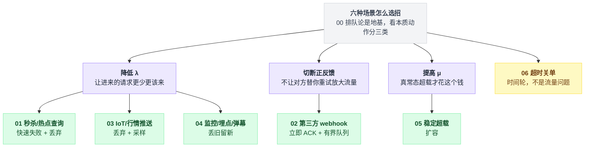
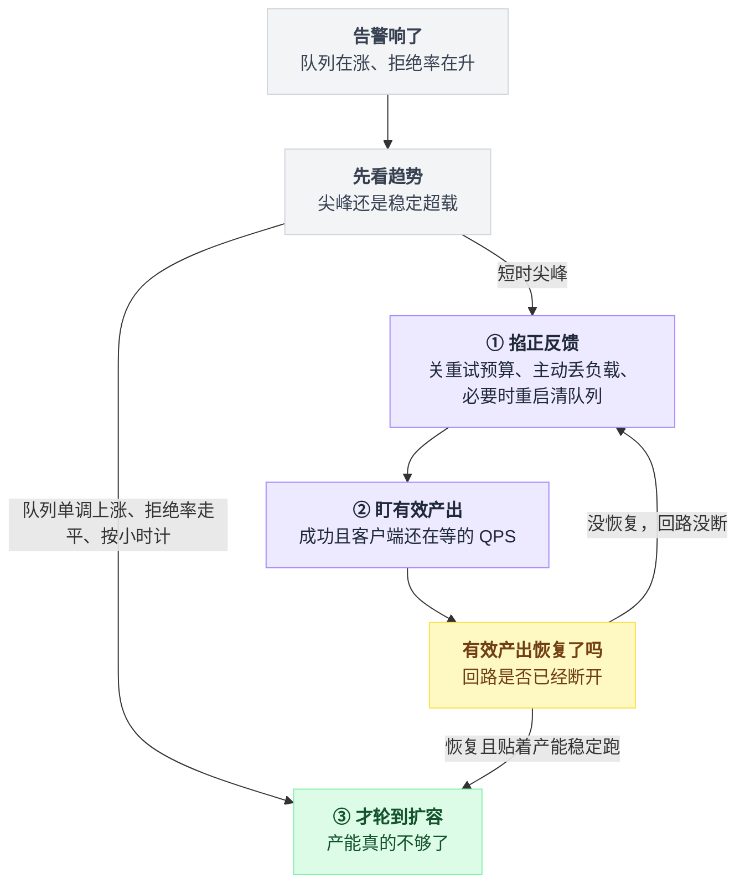
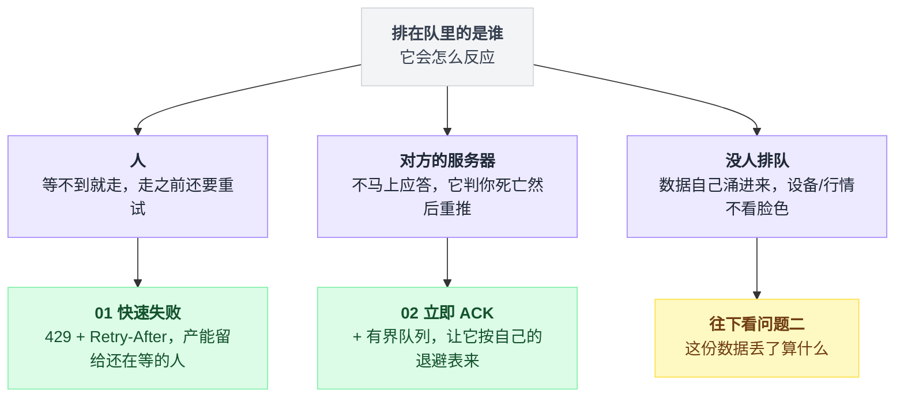
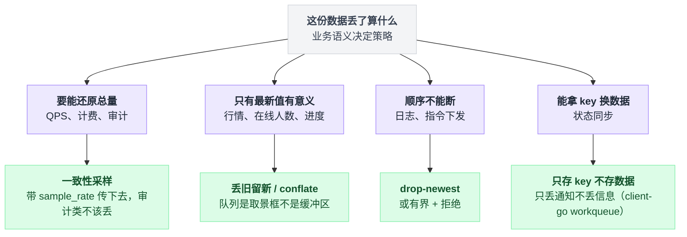

# 07 · 告警响了，先扩容还是先限流：全系列总结与决策清单

> 这是全系列最后一篇，不讲新招式。前面七篇（00~06）每篇解决一个场景，这一篇把它们收拢成三样东西：**一个贯穿全系列的公式、一张出事时照着做的决策表、一份检验自己学没学会的清单。**
>
> 标题那个问题先给答案：**都不是。第一步是掐断正反馈（关重试、丢负载），第二步看"有效产出"是否恢复，最后才轮到扩容。** 为什么是这个顺序，见第 2 节。

---

## 0. 七篇脉络，一张表

| 篇 | 场景 | 招式 | 本质 | demo 里最硬的一个数字 |
|---|---|---|---|---|
| [00](00-接口超时把队列调大反而OOM-队列不会创造产能.md) | — | 排队论 | 想清楚为什么 | 客流涨 10%，等待涨 8 倍 |
| [01](01-秒杀抢票热点查询-快速失败与丢弃.md) | 秒杀、抢票、热点查询 | 快速失败 + 丢弃 | 降低 λ | 拒了 2414 人，成功数反而翻倍（16% → 33%） |
| [02](02-第三方webhook回调-立即ACK与有界队列.md) | 第三方 webhook 回调 | 立即 ACK + 有界队列 | 切断正反馈 | 同步处理：600 条推送 585 条永久丢失 |
| [03](03-IoT设备上报行情推送-丢弃与采样.md) | IoT 上报、行情推送 | 丢弃 + 采样 | 降低 λ | 同样的存储成本，完整链路 2 条 vs 988 条 |
| [04](04-监控指标埋点弹幕-丢旧留新.md) | 监控指标、埋点、弹幕 | 丢旧留新 | 降低 λ，保新鲜度 | 陈旧度 912ms → 11ms，价格误差 9.13 → 0.11 元 |
| [05](05-稳定超载的系统-扩容以及它救不了的情况.md) | 稳定超载 | 扩容 | 提高 μ | 10 秒尖峰过去 90 秒后，有效产出仍是 0 |
| [06](06-1000万订单超时未付自动关单-时间轮与延迟消息.md) | 超时关单 | 时间轮 + 延迟消息 | 让到期任务自己走过来 | 找 100 个到期订单，翻 1000 万行 |

一句话记全系列：**队列不创造产能只借时间，背压不消灭排队只换地方，重试不提高成功率只放大流量；只有扩容能提高产能——但顺序必须是先掐回路，再丢负载，最后扩容。**

六个场景表面看是六招，摆脱招式名字，看它们各自在干哪件本质的事，就能归成三类：



---

## 1. 一个公式统摄全系列：L = λW

利特尔法则在第 00 篇出场时像个数学玩具，但读完全系列回头看，它在五个完全不同的地方以五种面目反复出现——这不是巧合，是这个领域只有这一条物理定律：

| 化身 | 在哪 | 具体形态 |
|---|---|---|
| 算队列该多长 | 00 篇容量公式 | 队列上限 = (SLO − 单请求耗时) × 产能，算出来是 288，不是 10000 |
| 算系统能扛多少并发 | Sentinel `checkBbr()` | `maxSuccessQps × minRt / 1000`，就是 L = λW 现场实测 |
| 同上，Go 版 | aegis `maxInFlight()` | `maxPASS × minRT × bucketPerSecond / 1000` |
| 算积压多久能清完 | KEDA RabbitMQ scaler | `messages / deliverGetRate`，就是 W = L/λ，可以直接写"积压 30 秒内清空"当扩容阈值 |
| 拿并发数当扩容指标 | Knative KPA | 并发数 = λ × W，同时对流量和耗时敏感——后端变慢时 CPU 纹丝不动，并发数已经报警 |

所以这个系列真正教的不是六个招式，而是一种换算能力：**拿到任何一个系统，你都能用"并发 ÷ 耗时"算出它的产能，用"(延迟预算 − 耗时) × 产能"算出队列该多长，用"积压 ÷ 消费速率"算出多久能爬出来。** 三个数字算出来，大部分容量争论就结束了。

---

## 2. 出事那一刻的顺序：为什么不能先扩容

第 05 篇那个 demo 值得反复回看：产能 100 QPS、日常 80 QPS，一个**只持续 10 秒**的 300 QPS 尖峰，能让系统在尖峰过去 90 秒后有效产出仍然是 0、积压 18097 还在涨。流量早就回到 80 了，系统没回来——这就是元稳定失效：触发因素消失，坏状态靠重试自我维持。

这时候扩容为什么没用？因为坏状态下的有效产能已经被正反馈拉到远低于标称容量，你扩的是标称容量——**新实例一上线，迎接它的是同一股重试洪水、同样的冷缓存和满队列，它会立刻被打进同一个坏状态**。钱花了，曲线不动。

OSDI '22 那篇论文统计了 11 家公司的 22 起真实事故：**超过一半由重试维持，超过 55% 最终靠丢负载（限流/拒绝）解决，而不是靠扩容。** 所以固定顺序是：

```
① 掐正反馈：关客户端重试（或把重试预算调成 0）、主动丢负载（宁可拒 50%）、
   必要时重启服务清空全是幽灵请求的队列——论文管这叫 strong corrective push
② 盯一个指标：有效产出（成功、且客户端还在等的 QPS）
   它不恢复，说明回路没断，回到 ①；这时候扩容是白扩
③ 有效产出回来了、但稳定贴着产能跑 → 这才是扩容的时机
```

反过来判断也成立：**队列单调上涨、拒绝率持续水平、以小时计**——这不是尖峰，是稳定超载，别再调限流参数了，该花钱了（05 篇的判别表）。

把入口判断和三步顺序接在一起，就是告警响起来那一刻该走的完整流程：



---

## 3. 平时选招：三个问题的决策表

出事是照第 2 节做，架构评审时选招则问三个问题：

**问题一：排在队里的是谁，它会怎么反应？**

| 排队的是 | 它的行为 | 用哪招 |
|---|---|---|
| 人 | 等不到就走，走之前还要重试 | 01：快速失败，429 + Retry-After，把产能留给还在等的人 |
| 对方的服务器 | 你不马上应答，它就判你死亡然后重推 | 02：立即 ACK + 有界队列，让它按自己的退避表来（Svix 给了 27.6 小时窗口） |
| 没人排队，数据自己涌进来 | 设备/行情不看你脸色 | 03 / 04，往下看问题二 |

排队的角色不同，能用的招也完全不同，这一条先分岔：



**问题二（数据流专用）：这份数据，丢了算什么？**

| 业务语义 | 做法 | 篇 |
|---|---|---|
| 要能还原总量（QPS、计费、审计） | 一致性采样，带着 sample_rate 传下去；审计类根本不该丢 | 03 |
| 只有最新值有意义（行情、在线人数、进度） | 丢旧留新 / conflate，队列是取景框不是缓冲区 | 04 |
| 顺序不能断（日志、指令下发） | drop-newest，或有界 + 拒绝 | 03/04 的速查表 |
| 能拿 key 换数据（状态同步） | 学 client-go workqueue：队列里存 key 不存数据，只丢通知不丢信息 | 04 |

四种业务语义对应四种丢法，选错一步就从"运营问题"变成"事故"：



**问题三：这压力是一阵，还是常态？**

尖峰 → 上面那些招够了，它们买的时间足以覆盖尖峰。常态 → 05：扩容，并且把扩容指标从 CPU 换成并发数或队列积压（IO 密集型服务 CPU 是个假指标）。另外记住 HPA 是分钟级、`1/(1-ρ)` 发散是秒级——**自动扩容只负责"接下来"，接住"这一下"的永远是限流和丢弃**。

至于 06（时间轮）：它根本不在这张表里，因为它不是流量问题——"每件事各约了一个闹钟"是另一类问题，放在本系列只是因为受害者相同（都是那张被扫爆的订单表）。

---

## 4. 六条军规：所有篇目都在重复的事

**① 一切有界，且"有界"是三件套。** 上限 + 拒绝路径 + 丢弃打点，缺一不可。Sentry 是完整范本：次数上限（10 次）、年龄上限（3 天）、批量上限，每种丢弃都有 outcome 打点。只设 maxsize 不算有界，`deque(maxlen=N)` 静默丢弃、监控一片祥和才是最吓人的。

**② 默认值几乎全是危险的。** 这个系列 grep 出来的黑名单：`asyncio.Queue()` 默认无界；RabbitMQ `x-overflow` 默认 drop-head 静默丢最老；Celery 默认自动创建无界队列、生产侧零背压、任务无时限；Mosquitto `max_queued_bytes` 默认无上限；redis-py `XADD` 默认近似裁剪。**新接一个组件，第一件事是把它"满了会怎样"的默认值查清楚。**

**③ 丢弃必须可见。** 全系列的价值判断轴就一条：无声丢失 vs 可见丢失。02 篇的方案 B（无界队列 + 进程重启全丢，而你已经回了 202）是最阴险的无声丢失；503 + Retry-After、reject-publish、丢弃计数器、随数据下传的 sample_rate，都是把丢失变可见。**可见的丢失是运营问题，无声的丢失是事故。**

**④ 调节要不对称：收紧果断，放松保守。** 四个互不相识的项目做了同一件事：HPA 扩容 0 秒稳定窗、缩容 300 秒；Jaeger 采样率下调直接跳、上调每轮最多 50%；Netflix gradient 下限锁 0.5 防雪崩收缩；aegis 有 1 秒丢弃粘滞期防反复横跳。方向都一样——**往安全侧动作快，往危险侧动作慢。**

**⑤ 拒绝路径必须便宜。** 快速失败的重点在"快速"：Sentinel 预分配无堆栈异常（过载时每秒拒 10 万次，生成堆栈本身能压垮服务）、Netflix 返回 Optional.empty() 不抛异常、Envoy 无锁 CAS。你自己写的版本里，拒绝分支别打日志、别做埋点重活，最多加个计数器。

**⑥ 重试是放大器，必须给它上预算。** 多层重试相乘，4³ = 64 次数据库尝试；无抖动的重试是同步脉冲锯齿波。解法都是现成的：gRPC 的 token bucket（失败扣 1、成功加 0.1，桶见底自动全局停止重试——故障率超 10% 时它设计上就该失灵）、SRE 的 10% 重试比例上限、只在最靠近失败的一层重试、退避必须带抖动。

---

## 5. 自查清单：你学会了吗

- [ ] 给你并发数和单请求耗时，30 秒内算出产能、合理队列长度、需要的实例数（00/05 的三个公式）
- [ ] 解释为什么利用率从 0.9 到 0.99 会让等待时间涨一个数量级，以及为什么利用率是风险指标不是效率指标
- [ ] 说清"拒了 2414 人成功数反而翻倍"的原因——白干的活占着坑位（01）
- [ ] 写 webhook handler 时，说出为什么是 `put_nowait` 而不是 `await put`，差在哪一个字（02）
- [ ] 解释为什么"立即 ACK + 无界队列"比"有界队列 + 503"更危险（02 的方案 B）
- [ ] 说出 `if random.random() < 0.1` 做分布式采样为什么永远是错的，正确写法是哪一行（03）
- [ ] 背出采样还原规则：计数要除以采样率，分位数不用，gauge 不用，基数不能（03）
- [ ] 说清 drop-oldest / drop-newest / conflate / 只丢通知四种策略各适合什么业务语义，以及"有界队列丢新"为什么可能是最糟的选择（04）
- [ ] 复述元稳定失效：为什么 10 秒尖峰能让系统坏 90 秒以上，为什么这时候扩容没用，正确的三步顺序是什么（05）
- [ ] 面对一个新需求，用第 3 节的三个问题走一遍，落到具体某一招，并说出该抄哪个项目的哪段实现

十条全过，这个系列就真的读完了。半夜告警响起来的时候，你脑子里应该不是六个招式名，而是三个问题和一个顺序。

---

**回到开头 👉 [`00-接口超时把队列调大反而OOM-队列不会创造产能.md`](00-接口超时把队列调大反而OOM-队列不会创造产能.md)**
