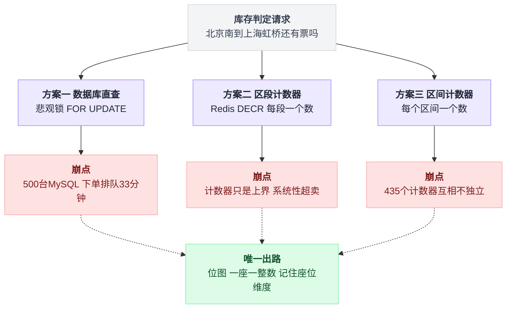
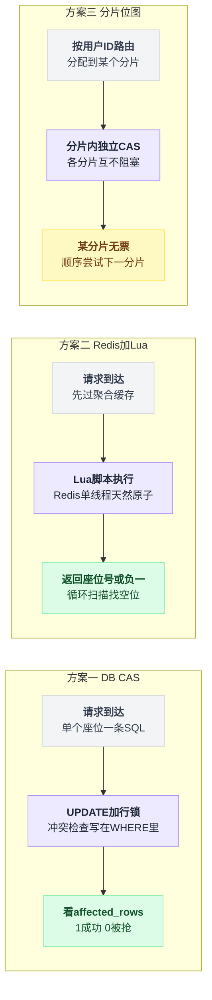
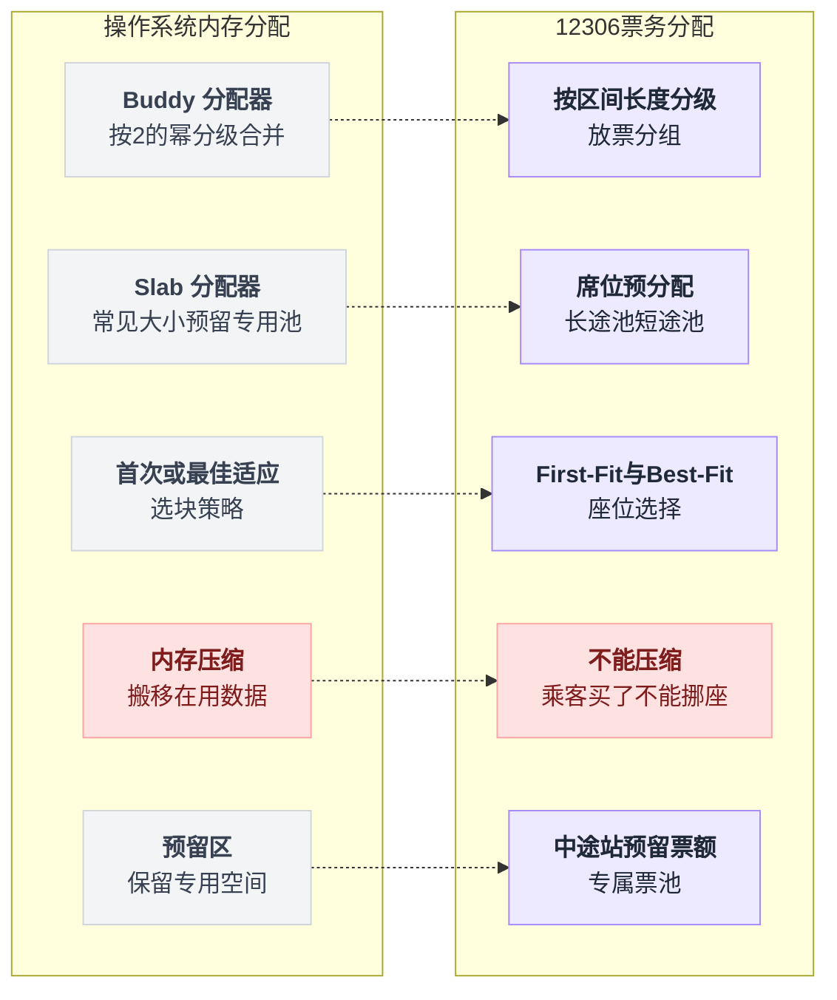
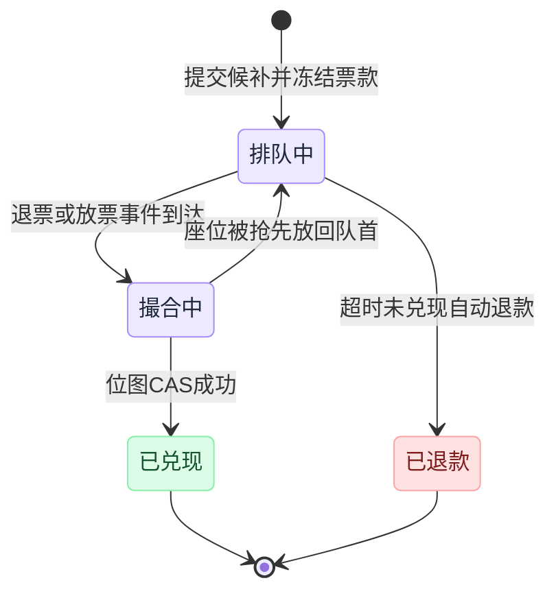
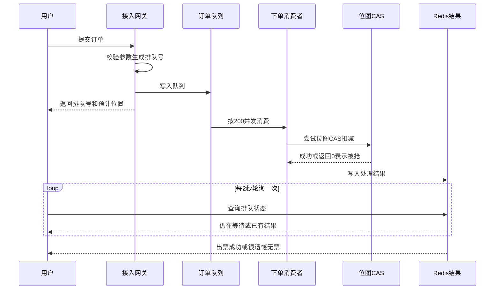
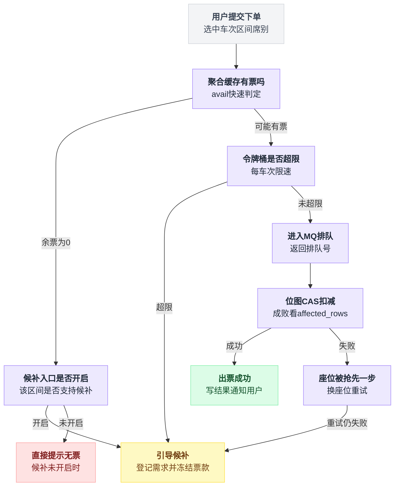
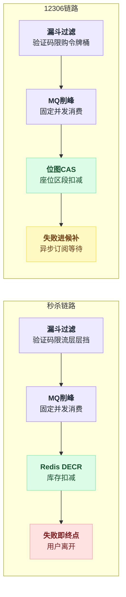
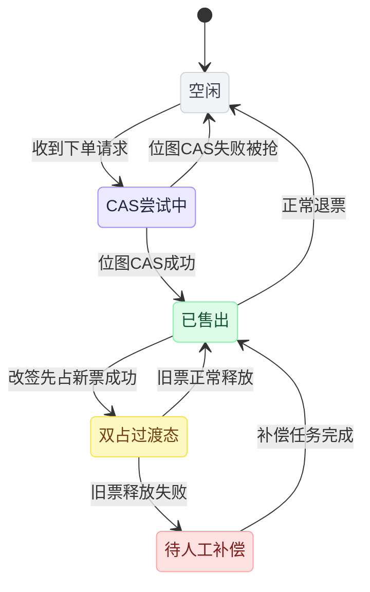

# 《12306 火车票抢票系统》全解（小白版）

> 一句话简介：秒杀的库存是一个数字，火车票的库存是一张**带区间约束的拼图**——同一个座位可以同时卖给好几个人，这一个事实就把整套系统的难度推上了另一个量级。
> 难度：★★★★☆

这篇文章要讲五件事：为什么"库存 = 一个整数"这个假设在火车票面前彻底失效，以及正确的库存模型长什么样；位图（bitmap）+ 位运算怎么把"余票查询"做成 O(1)，为什么它比数据库计数又简单又快；席位预分配（动态配票）本质上是**装箱问题**，和操作系统的内存碎片是同一类问题；候补购票为什么是 12306 真正的架构革命——它把同步的"抢"改成了异步的"订阅"，从根上消灭了流量洪峰；以及为什么"余票显示有，点进去没了"是**故意设计**的，而不是 bug。

---

## 目录

- [0. 先讲个故事：一把可以拆开卖的椅子](#0-先讲个故事一把可以拆开卖的椅子)
- [1. 这件事到底难在哪](#1-这件事到底难在哪)
- [2. 最朴素的做法，以及它为什么会死](#2-最朴素的做法以及它为什么会死)
- [3. 第一次改进：给每个座位建一张"占用时刻表"](#3-第一次改进给每个座位建一张占用时刻表)
- [4. 第二次改进：把占用表压成一串二进制——位图方案](#4-第二次改进把占用表压成一串二进制位图方案)
- [5. 第三次改进：席位预分配（动态配票）——和碎片作战](#5-第三次改进席位预分配动态配票和碎片作战)
- [6. 第四次改进：候补购票——把"抢"改成"排队"](#6-第四次改进候补购票把抢改成排队)
- [7. 第五次改进：排队页面与异步下单](#7-第五次改进排队页面与异步下单)
- [8. 读多写少的极致：余票查询的多级缓存](#8-读多写少的极致余票查询的多级缓存)
- [9. 完整方案全景图](#9-完整方案全景图)
- [10. 核心代码逐行讲解](#10-核心代码逐行讲解)
- [11. 和秒杀系统的横向对比](#11-和秒杀系统的横向对比)
- [12. 生产环境会踩的坑](#12-生产环境会踩的坑)
- [13. 反直觉结论](#13-反直觉结论)
- [14. 一句话总结 + 小白词典](#14-一句话总结--小白词典)

---

## 0. 先讲个故事：一把可以拆开卖的椅子

这一章只讲一件事：电影院的库存是一个数字，火车票的库存是一张 100 行 × 5 列的表——因为一把椅子可以拆开卖给好几个人。

先把电脑合上。我们去电影院。

### 0.1 电影院卖票：这个你一定懂

电影院一号厅有 100 个座位，今晚 8 点放《流浪地球》。

售票员桌上放着一张纸：

```
    ┌─────────────────────────────┐
    │  今晚 8:00  一号厅          │
    │                             │
    │  剩余座位： 100             │
    └─────────────────────────────┘
```

来一个人，卖一张，数字减 1。卖到 0，贴"客满"。

这就是**秒杀系统的库存模型**：一个整数，减到 0 为止。你在秒杀那套文档里学的所有东西——Redis 预扣库存、Lua 原子脚本、MQ 削峰——本质上都是在保护**这一个整数**不被并发改坏。

> **术语解释：库存（stock / inventory）**
> 就是"还剩多少件能卖"。电商里是商品件数，电影院里是空座数。

记住这张纸的样子。接下来我们去火车站，你会发现这张纸**根本没法用**。

### 0.2 火车站卖票：椅子会长出分身

现在换个场景。你在北京南站售票窗口，要买一张去上海的高铁票。

这趟车 G100，一路要停这么多站：

```
  北京南 ──── 天津南 ──── 济南西 ──── 徐州东 ──── 南京南 ──── 上海虹桥
    0          1          2          3          4          5
```

车上有 100 个座位。现在，一个致命的问题来了：

**这趟车到底有多少张票？**

如果你说"100 张"——错。

因为**一个座位可以卖给不止一个人**。

看这个场景：

```
  乘客 A：北京南 → 济南西    坐 5 号座
  乘客 B：济南西 → 上海虹桥  也坐 5 号座
```

A 在济南西下车，B 在济南西上车，两个人**共用同一把椅子**，谁也不影响谁。铁路上管这个叫**"席位复用"**。

所以这趟车能卖多少张票？取决于**大家买的是哪一段**：

```
  ┌──────────────────────────────────────────────────────┐
  │  情况一：100 个人全买 北京南→上海虹桥（全程）        │
  │          → 一共只能卖 100 张                         │
  ├──────────────────────────────────────────────────────┤
  │  情况二：100 个人买 北京南→济南西                    │
  │          100 个人买 济南西→上海虹桥                  │
  │          → 一共能卖 200 张！座位还是那 100 个        │
  ├──────────────────────────────────────────────────────┤
  │  情况三：每一段（共 5 段）都塞满 100 人              │
  │          → 一共能卖 500 张！座位还是那 100 个        │
  └──────────────────────────────────────────────────────┘
```

**同样 100 个座位，能卖 100 张，也能卖 500 张，取决于乘客怎么买。**

这句话你要反复读三遍。它是这篇文档所有复杂度的源头。

### 0.3 那张纸怎么写？

回到售票员的那张纸。电影院能写"剩余 100"，火车能写什么？

写"剩余 100"？不对，可能能卖 500 张。写"剩余 500"？也不对，如果都买全程只有 100 张。

真实答案是：**这张纸上不能写一个数字，只能写一张表**。

```
              北京南  天津南  济南西  徐州东  南京南  上海虹桥
                │      │      │      │      │      │
  座位 1 号     ├──────┼──────┼──────┼──────┼──────┤
  座位 2 号     ├──────┼──────┼──────┼──────┼──────┤
  座位 3 号     ├──────┼──────┼──────┼──────┼──────┤
   ...
  座位100号     ├──────┼──────┼──────┼──────┼──────┤
                └──────┴──────┴──────┴──────┴──────┘
                  段0    段1    段2    段3    段4
```

一共 100 行 × 5 列 = 500 个格子。每个格子代表"某个座位在某一段路上"。

- 格子是空的 = 这段路这个座位没人坐
- 格子被涂黑 = 这段路这个座位有人

卖一张 `北京南 → 济南西` 的票，就是在某一行**连续涂黑段0和段1两个格子**：

```
  座位 5 号     ██████████████──────┼──────┼──────┤
                  段0    段1    段2    段3    段4
                 (涂黑)  (涂黑)  空     空     空
```

再卖一张 `济南西 → 上海虹桥` 给别人，可以用**同一行**：

```
  座位 5 号     ██████████████████████████████████
                  段0    段1    段2    段3    段4
                  A      A      B      B      B
```

这一行满了，这个座位全程被两个人瓜分干净。

> **划重点**
> 秒杀的库存是**一个标量**（一个数字）。
> 火车票的库存是**一个二维矩阵**（座位 × 区段），而且卖票是在矩阵里"涂一段连续的格子"。
>
> 这不是"难一点"，这是**换了一个数学问题**。

### 0.4 三个立刻冒出来的新麻烦

光是这张表，就已经带出三个电影院永远不会遇到的问题。

**麻烦一：查询余票不再是读一个数**

有人问"北京南→上海虹桥还有票吗"，你得**把 100 行都扫一遍**：

```
count = 0
for 每一行座位:
    if 段0 到 段4 全是空的:
        count += 1          // 有一行算一张票
```

有人问"济南西→南京南还有票吗"，你得再扫一遍，这次只看段2、段3两列——同一个循环，只是判空的范围换了。

一趟车有 6 个站，站与站的组合有 `6×5/2 = 15` 种。全国一天开行上万趟列车，每趟车 15~400 种区间组合，每种都要能秒查。

**麻烦二：会出现"明明有座位，却拼不出票"**

看这个局面：

```
              段0    段1    段2    段3    段4
  座位 1      ██     ──     ──     ──     ──
  座位 2      ██     ──     ──     ──     ──
  座位 3      ██     ──     ──     ──     ──
   ...        ██     ──     ──     ──     ──
  座位100     ██     ──     ──     ──     ──
```

100 个人都买了 `北京南→天津南`（只占段0）。

现在 500 个格子里只涂黑了 100 个，**空着 400 个，利用率才 20%**。

但是——`北京南→上海虹桥` 的票还有几张？

**零张。** 因为没有任何一行的段0是空的。

这就是**碎片化**。你会在第 5 章看到它的完整威力，以及它和"电脑内存明明还剩很多，程序却申请不到内存"是**一模一样的问题**。

**麻烦三：并发下"涂格子"会打架**

两个人同时抢 5 号座的 `北京南→济南西`。两个人都先"看了一眼"发现是空的，然后都涂黑。结果一个座位卖了两个人。

这就是**超卖**。在秒杀里超卖了大不了退款道歉；在火车上超卖意味着**两个活人站在同一个座位前吵架**，这是运输事故。

> **术语解释：超卖（oversell）**
> 卖出去的数量超过了实际能提供的数量。原因几乎总是"检查"和"扣减"这两步之间被别人插了队。

### 0.5 本章小结

| 维度 | 电影院 / 秒杀 | 火车票 |
| --- | --- | --- |
| 库存长什么样 | 一个整数 `stock=100` | 一张 `座位 × 区段` 的矩阵 |
| 卖一张票 = ? | `stock -= 1` | 在某一行涂黑一段连续格子 |
| 总票数固定吗 | 固定 100 | **不固定**，100~500 之间浮动 |
| 查余票 | 读一个数，O(1) | 扫矩阵找"这段全空的行" |
| 会不会有"有座卖不出" | 不会 | **会**，碎片化 |

火车票的难点不在"并发高"。并发高是可以用钱解决的——加机器、加缓存、加分片。

**火车票的难点在于：库存模型本身就是个难题。这个是钱解决不了的。**

下一章我们把这个"痛"讲透。

---

## 1. 这件事到底难在哪

这一章我不给解法。我只负责让你痛。

痛了，你才会觉得后面那些位运算、装箱、候补队列是"救命的"，而不是"炫技的"。

这一章算三笔账：数据库直查要多少台机器、悲观锁下单要排多久、以及照抄秒杀那套 Redis 计数为什么连模型都是错的。

### 1.1 先看一眼真实体量

先给你一点量级感觉。以下数字取自公开报道口径，只做量级参考，不必抠精确值：

```
  ┌────────────────────────────────────────────────────────┐
  │  春运期间的 12306（量级参考）                          │
  ├────────────────────────────────────────────────────────┤
  │  日页面访问量        数百亿次级别                      │
  │  单日售票量          1500 万张左右                     │
  │  售票峰值            每秒上千张                        │
  │  查询峰值 : 下单峰值  数百倍 ~ 上千倍                  │
  │  在售车次            上万趟／天                        │
  │  座位总数            数百万个／天                      │
  │  区间组合            车次 × 日期 × 起讫站 × 席别 → 亿级│
  └────────────────────────────────────────────────────────┘
```

> **术语解释：QPS / TPS**
> **QPS**（Queries Per Second，每秒查询数）：一秒钟系统处理多少次**读**请求。查余票就是查询。
> **TPS**（Transactions Per Second，每秒事务数）：一秒钟系统完成多少次**写**操作。下单出票就是事务。
> 12306 的特点是 **QPS 比 TPS 高好几百倍**——绝大多数人只是在刷、在看，真正掏钱的很少。

对比一下你熟悉的秒杀：

```
  秒杀：                          12306：
  ┌──────────────┐                ┌──────────────┐
  │              │                │              │
  │      █       │  瞬时脉冲       │  █    █   █  │  多峰 + 全天长尾
  │      █       │  1 秒内结束     │  ██  ███ ██  │  持续 16 小时
  │  ────█────   │                │ ████████████ │
  └──────────────┘                └──────────────┘
   一个商品 一个数字                 上万车次 亿级组合
```

秒杀是**一次爆炸**，扛过那 3 秒就赢了。

12306 是**一场战役**，从早上 6 点放票一直打到晚上 11 点，中间还有 8 点、10 点、12 点、13 点……十几个放票时间点，每个都是一次小爆炸。

### 1.2 笨办法一：那我就建一张座位表，行不行？

你可能会想：不就是记录"谁坐了哪个座位的哪一段"吗？建张表不就完了。

```sql
CREATE TABLE ticket (
    train_no    VARCHAR(10),   -- 车次 G100
    travel_date DATE,          -- 乘车日期
    seat_no     INT,           -- 座位号 1~100
    from_idx    INT,           -- 起点站序号
    to_idx      INT,           -- 终点站序号
    passenger   VARCHAR(32)
);
```

查"北京南→上海虹桥还有几张票"：

```sql
-- 找出所有"和 [0,5) 这个区间不冲突"的座位
SELECT COUNT(*) FROM (
    SELECT seat_no FROM seats WHERE train_no='G100' AND travel_date='2026-02-10'
    EXCEPT
    SELECT DISTINCT seat_no FROM ticket
     WHERE train_no='G100' AND travel_date='2026-02-10'
       AND from_idx < 5 AND to_idx > 0     -- 区间相交判定
) t;
```

**看起来能跑。我们算一下它什么时候崩。**

> **区间相交判定小科普**
> 两个区间 `[a1,b1)` 和 `[a2,b2)` 相交，当且仅当 `a1 < b2 且 a2 < b1`。
> 上面那句 `from_idx < 5 AND to_idx > 0` 就是在问"这张已售票的区间，和我要买的 [0,5) 撞上了吗"。

**崩点计算：**假设某趟热门车已经卖出 800 张票（席位复用，所以能超过座位数）。

| 项 | 数字 |
| --- | --- |
| 单次查询的工作量 | 扫描 800 行 ticket、做一次 DISTINCT、做一次 EXCEPT |
| 单次查询耗时 | 假设优化得很好，5 毫秒 |
| 一台 MySQL 的承载 | 每秒 2000 次这种查询（还是乐观估计） |
| 查询 QPS 峰值 | 按 100 万算 |

```
    需要的数据库实例数 = 1,000,000 ÷ 2,000 = 500 台
```

500 台 MySQL。而且这只是**查询**，还没算下单、支付、改签。

再算下单。下单必须锁住座位防止超卖：

```sql
BEGIN;
SELECT ... FOR UPDATE;   -- 锁住这趟车的所有票记录
INSERT INTO ticket ...;
COMMIT;
```

`FOR UPDATE` 是**悲观锁**——"我先把门锁上，你们都等着"。

> **术语解释：悲观锁 / 乐观锁**
> **悲观锁**：假设一定会冲突，所以动手前先把资源锁死，别人只能排队等。简单但慢。
> **乐观锁**：假设一般不冲突，先干，提交时检查"我读到的东西被人改过没有"，改过就重试。快但要处理重试。

一趟车一把锁，锁持有时间按 10 毫秒算：

```
    单趟车的下单能力 = 1000ms ÷ 10ms = 100 TPS
```

一趟热门车，比如春运的 G1 北京→上海，放票瞬间可能有 **20 万人**同时点"提交订单"。

```
    排队时间 = 200,000 ÷ 100 = 2000 秒 ≈ 33 分钟
```

**用户点一下"提交订单"，要转圈 33 分钟。**

这还是理想情况——真实世界里，数据库连接池早就被 20 万个请求打爆了，服务在第 3 秒就 502 了。

> **第一个痛点：数据库扛不住。**
> 不是"有点慢"，是差了两三个数量级。

### 1.3 笨办法二：那我学秒杀，用 Redis 存库存计数

好，你学乖了。秒杀里我们把库存放 Redis，用 Lua 脚本原子扣减，性能提升 100 倍。照搬过来？

那问题来了：**Redis 里存什么？**

存 `stock:G100:2026-02-10 = 100`？不行。因为"100"回答不了"北京南→济南西还有几张"。

那就**每个区段存一个计数**：

```
    stock:G100:20260210:seg0 = 100    # 北京南→天津南 这一段还能坐 100 人
    stock:G100:20260210:seg1 = 100    # 天津南→济南西
    stock:G100:20260210:seg2 = 100
    stock:G100:20260210:seg3 = 100
    stock:G100:20260210:seg4 = 100
```

卖一张 `北京南→济南西`，就把 seg0 和 seg1 各减 1：

```lua
-- Redis Lua 脚本：把区间内的每一段都减 1
for i = from_idx, to_idx - 1 do
    local key = KEYS[1] .. ':seg' .. i
    if tonumber(redis.call('GET', key)) <= 0 then
        return 0    -- 有一段没位置了，整张票卖不了
    end
end
for i = from_idx, to_idx - 1 do
    redis.call('DECR', KEYS[1] .. ':seg' .. i)
end
return 1
```

**这个方案又快又原子，看起来完美。**

**它是错的。而且错得非常隐蔽。**

为什么？下一章专门讲。这是全文第一个真正的"啊哈"时刻。

### 1.4 痛点清单

在往下走之前，把火车票比秒杀多出来的**七座大山**列清楚：

| # | 难点 | 为什么难 | 秒杀里有吗 |
| --- | --- | --- | --- |
| 1 | 库存不是标量 | 座位 × 区段的矩阵，卖票 = 涂一段连续格子 | ❌ 完全没有 |
| 2 | 席位复用 | 一个座位能卖给多人，总票数是浮动的 | ❌ |
| 3 | 碎片化 | 有座位 ≠ 有票，短途会把长途拆碎 | ❌ |
| 4 | 绝对不能超卖 | 一座两卖 = 运输事故，不能"事后退款了事" | ⚠️ 秒杀能容忍 |
| 5 | 组合爆炸 | 车次×日期×区间×席别×票种 = 亿级 SKU | ❌ 秒杀就一个 SKU |
| 6 | 读写比极端 | 查询是下单的几百倍，缓存策略是生死线 | ⚠️ 秒杀只有几十倍 |
| 7 | 业务规则地狱 | 学生票、儿童票、残军票、改签、中转、实名制 | ❌ 秒杀几乎没有 |

> **术语解释：SKU**
> Stock Keeping Unit，"库存最小单位"。淘宝上"iPhone 黑色 256G"是一个 SKU。
> 12306 的一个 SKU 是"G100 次 / 2026-02-10 / 北京南→济南西 / 二等座"，这样的组合全国一天有**上亿个**。

### 1.5 本章小结

- 数据库直接扛：需要 500 台 MySQL，且下单要排队 33 分钟。**死。**
- 照抄秒杀的 Redis 计数：快是快了，但**模型是错的**（下一章证明）。
- 真正的难点是**库存模型**，不是并发量。

痛够了吗？那我们开始救。

---

## 2. 最朴素的做法，以及它为什么会死

上一章末尾我们留了个悬念：**"每个区段一个库存计数"为什么是错的？**

这一章用一个具体推演打死它：同样的一组计数器数值，真实余票可能是 0 张，也可能是 50 张。这是理解整篇文档的关键，慢慢看。

### 2.1 先把方案摆清楚

车次 G100，6 个站，5 个区段，100 个座位。

Redis 里存 5 个计数器，每个初始值 100：

```
    ┌────────┬────────┬────────┬────────┬────────┐
    │  段0   │  段1   │  段2   │  段3   │  段4   │
    │ 京→津  │ 津→济  │ 济→徐  │ 徐→宁  │ 宁→沪  │
    ├────────┼────────┼────────┼────────┼────────┤
    │  100   │  100   │  100   │  100   │  100   │
    └────────┴────────┴────────┴────────┴────────┘
```

规则：

- 买 `北京南→济南西`（跨段0、段1）→ 段0 减 1，段1 减 1
- 判断"还有票吗" → 区间内**所有段的计数都 > 0** 就算有票

Python 版本长这样：

```python
from dataclasses import dataclass, field

@dataclass
class SegmentCounter:
    """朴素方案：每个区段维护一个剩余座位数"""
    n_seg: int                       # 区段数量（站数 - 1）
    capacity: int                    # 每段的座位容量
    remain: list[int] = field(init=False)

    def __post_init__(self) -> None:
        self.remain = [self.capacity] * self.n_seg

    def available(self, a: int, b: int) -> int:
        """查 a→b 还有几张票：取区间内所有段剩余量的最小值"""
        return min(self.remain[a:b])

    def sell(self, a: int, b: int) -> bool:
        """卖一张 a→b 的票"""
        if min(self.remain[a:b]) <= 0:
            return False
        for i in range(a, b):
            self.remain[i] -= 1
        return True
```

**这段代码在干嘛（白话版）**

- `remain[i]` 记录第 i 段路上还有多少个空位。
- 查 a→b 的余票，就是看这一路上**最窄的那一段**还剩多少——木桶效应，最短的板决定装多少水。
- 卖票就是把这一路上每段都减 1。

看起来完全合理，对吧？跑一下：

```python
sc = SegmentCounter(n_seg=5, capacity=100)
print(sc.available(0, 5))   # 100  北京南→上海虹桥
sc.sell(0, 2)               # 卖一张 北京南→济南西
print(sc.available(0, 5))   # 99   全程票少了一张，对
print(sc.available(2, 5))   # 100  济南西→上海虹桥 没受影响，对
```

**完全正确。** 那问题在哪？

### 2.2 致命推演：50 + 50 = 0

现在来一批真实的乘客。

**第一批：50 个人买 `北京南 → 济南西`**（占段0、段1）

```
    ┌────────┬────────┬────────┬────────┬────────┐
    │  段0   │  段1   │  段2   │  段3   │  段4   │
    ├────────┼────────┼────────┼────────┼────────┤
    │   50   │   50   │  100   │  100   │  100   │
    └────────┴────────┴────────┴────────┴────────┘
```

**第二批：50 个人买 `济南西 → 上海虹桥`**（占段2、段3、段4）

```
    ┌────────┬────────┬────────┬────────┬────────┐
    │  段0   │  段1   │  段2   │  段3   │  段4   │
    ├────────┼────────┼────────┼────────┼────────┤
    │   50   │   50   │   50   │   50   │   50   │
    └────────┴────────┴────────┴────────┴────────┘
```

现在，第三个人来了，他要买 `北京南 → 上海虹桥` 全程。

**计数器说：** `min(50,50,50,50,50) = 50` → **还有 50 张全程票！**

**真实世界说：** 这取决于前面 100 个人**坐在哪些座位上**。

我们看两种可能的座位分配。

---

**分配方案 A：系统按先来后到，随便找个空座就给**

```
              段0    段1    段2    段3    段4
  座位  1     ██     ██     ──     ──     ──   ← 第一批的人
  座位  2     ██     ██     ──     ──     ──
   ...        ██     ██     ──     ──     ──
  座位 50     ██     ██     ──     ──     ──
  ─────────────────────────────────────────
  座位 51     ──     ──     ██     ██     ██   ← 第二批的人
  座位 52     ──     ──     ██     ██     ██
   ...        ──     ──     ██     ██     ██
  座位100     ──     ──     ██     ██     ██
```

现在找一个"段0到段4全空"的座位——

**一个都没有。100 个座位全被污染了。全程票：0 张。**

而计数器信誓旦旦地说有 50 张。**这就是超卖。** 卖出去以后你会发现车上根本没座位给他。

---

**分配方案 B：系统聪明地把两批人叠在同一批座位上**

```
              段0    段1    段2    段3    段4
  座位  1     ██     ██     ▓▓     ▓▓     ▓▓   ← 第一批(██) + 第二批(▓▓)
  座位  2     ██     ██     ▓▓     ▓▓     ▓▓      共用同一把椅子
   ...        ██     ██     ▓▓     ▓▓     ▓▓
  座位 50     ██     ██     ▓▓     ▓▓     ▓▓
  ─────────────────────────────────────────
  座位 51     ──     ──     ──     ──     ──   ← 完全干净
  座位 52     ──     ──     ──     ──     ──
   ...        ──     ──     ──     ──     ──
  座位100     ──     ──     ──     ──     ──
```

现在找"段0到段4全空"的座位——**座位 51 到 100，整整 50 个。全程票：50 张。**

计数器说对了！

---

### 2.3 结论：计数器给的是"上界"，不是"事实"

同样的 5 个计数器数值 `[50,50,50,50,50]`，真实的全程票可能是 **0 张**，也可能是 **50 张**。

```
    ┌──────────────────────────────────────────────────────┐
    │                                                      │
    │   区段计数器  ──→  只能告诉你"最多可能有几张"        │
    │                                                      │
    │   真实可售数  ──→  取决于座位是怎么分配的            │
    │                                                      │
    │   计数器 ≥ 真实值      永远成立                      │
    │   计数器 = 真实值      只在运气好的时候成立          │
    │                                                      │
    └──────────────────────────────────────────────────────┘
```

用数学话说：**区段计数是真实可售量的一个上界（upper bound），而且是个很松的上界。**

拿它当库存卖票，就是**系统性超卖**。

> **划重点**
> 秒杀里，`stock` 这个数字**就是事实本身**。减到 0 就是真没了。
> 火车票里，区段计数只是个**统计量**，它丢掉了"哪个座位"这个关键信息。
> **丢掉的这个维度，正是整个问题的核心。**

### 2.4 有人会问：那我加一层"座位分配"补救不行吗

行，但你得想清楚补救的代价。

**补救思路：计数器只用来快速拒绝，真正卖票时再去数据库分配具体座位。**

```
下单(a, b):
    if min(seg计数[a:b]) <= 0:
        return 无票                    // 快，挡掉一大批
    座位 = DB.扫100行找一个不冲突的()    // 慢，回到老路
    if 座位 is None:
        回滚 Redis 计数                 // ★ 打脸，而且这一步自己也可能失败
        return 无票
    出票(座位)
```

对应的调用链：

```
    用户请求
       │
       ▼
  ┌─────────────┐
  │ Redis 计数器 │  min(seg)<=0 → 直接拒绝（快）
  └──────┬──────┘
         │ 计数器说"可能有"
         ▼
  ┌─────────────┐
  │ DB 分配座位  │  真的去扫 100 行找空座（慢）
  └──────┬──────┘
         │ 找不到 → 打脸，回滚计数器
         ▼
      出票
```

问题来了：

1. **"打脸"的概率极高。** 越到后期碎片越严重，计数器说有票、实际分不到座的比例可能到 30% 以上。用户体验就是"点了提交，转圈半天，告诉你没票了"。
2. **回滚计数器是个分布式事务。** 你在 Redis 减了，在 DB 失败了，得把 Redis 加回来。加回来的过程中崩了怎么办？库存就永久漏了。
3. **DB 那一步没跑掉。** 你还是要扫座位表，第 1 章算的那笔账（500 台 MySQL）还在。

所以这个补救**只是把问题往后推了一层，没有解决**。

> **和秒杀对比**
> 秒杀里"Redis 预扣 + MQ 异步落库"之所以成立，是因为 Redis 里的数字**和数据库里的数字是同一个东西**，Redis 减成功了，DB 就一定能减成功。
> 火车票里 Redis 计数器和真实座位**不是同一个东西**，前者成功不代表后者成功。这一招在这里失效了。

### 2.5 那"每个区间一个计数器"呢？

再挣扎一下。不按"段"存，按"区间"存？

6 个站，区间组合有 15 个（0→1, 0→2, ..., 4→5）：

```
    stock:G100:0-1 = ?
    stock:G100:0-2 = ?
    stock:G100:0-3 = ?
    ...
    stock:G100:4-5 = ?
```

**问题更大了**：这 15 个数字**互相不独立**。卖一张 `0→2` 的票，要更新的是这些：

```
for (x, y) in 全部 15 个区间:
    if [x,y) 与 [0,2) 相交:
        余票[(x,y)] 需要变              // 一共 11 个区间中招
        变多少？—— 说不准，取决于用的是哪个座位
```

`0→1`、`0→2`、`0→3`、`0→4`、`0→5`、`1→2`、`1→3`…… 一共 11 个区间的余票数都会受影响（所有和 `[0,2)` 相交的区间）。

而且影响多少？**说不准。** 因为又回到"取决于用它的哪个座位"。

站数多的车更恐怖。一趟普速列车停 30 个站，区间组合数：

```
    C(30, 2) = 30 × 29 ÷ 2 = 435 个区间
```

435 个计数器，每卖一张票要更新几十上百个，而且更新量还算不准。**放弃。**

### 2.6 崩溃点总结

| 朴素方案 | 崩在哪 | 具体数字 |
| --- | --- | --- |
| DB 直接查 + 悲观锁 | 查询要 500 台 MySQL；下单单车次只有 100 TPS | 20 万人排队 33 分钟 |
| 区段计数器 | **模型性错误**，会系统性超卖 | 计数说 50 张，实际 0 张 |
| 区间计数器 | 计数器之间不独立，无法正确维护 | 30 站车次要维护 435 个数 |

三条路全堵死。

三条路径怎么一步步走进死胡同，画成一张图看得更清楚：



**唯一的出路是：不要丢掉"哪个座位"这个维度。**

也就是说——**必须老老实实记录那张 `座位 × 区段` 的矩阵。**

问题变成了：**怎么把这张矩阵存得又小又快？**

这就是下一章。

---

## 3. 第一次改进：给每个座位建一张"占用时刻表"

一句话：一个座位的全部状态压成一个整数，可售判定变成 `seat & mask == 0`，卖票变成 `|=`，退票变成 `&= ~mask`。整章只做这一件事。

### 3.1 回到那张矩阵

我们承认现实：**必须记录每个座位在每个区段的占用状态**。

```
              段0    段1    段2    段3    段4
  座位  1     [ ]    [ ]    [ ]    [ ]    [ ]
  座位  2     [ ]    [ ]    [ ]    [ ]    [ ]
  座位  3     [ ]    [ ]    [ ]    [ ]    [ ]
   ...
  座位100     [ ]    [ ]    [ ]    [ ]    [ ]
```

每个格子只有两种状态：**空 / 满**。

**只有两种状态**——这句话是整篇文档最重要的一句。

只有两种状态的东西，用 1 个 bit（比特，二进制位）就能存。不需要 int，不需要 varchar，不需要一行数据库记录。**1 个 bit。**

> **术语解释：bit（比特／位）**
> 计算机里最小的信息单位，只能是 0 或 1。
> 8 个 bit = 1 字节（byte）。
> 一个 Python 的 `int` 在内部可以存任意多个 bit（Python 的整数是无限精度的，这一点后面很有用）。

### 3.2 一个座位 = 一个整数

把一行 5 个格子写成 5 个 bit：

```
              段0    段1    段2    段3    段4
  座位 5 号     1      1      0      0      0
                └──────┴──────┴──────┴──────┘
                        这就是一个数
```

约定：**第 i 个 bit = 1 表示这个座位在第 i 段被占用了。**

于是一行格子折进一个整数的过程就是这样：

```
seat = 0
for i in 0 .. n_seg-1:
    if 第 i 段有人:
        seat |= (1 << i)        // 把第 i 位点亮
```

那么座位 5 号的状态就是一个整数。它等于多少？

小心，这里有个**特别容易搞混的地方**，我们先把规矩定死：

> **本文的位序约定（重要）**
> 我们用 **bit i 对应区段 i**。
> 也就是 `bit0` 是**最低位**（最右边），对应第一段路（北京南→天津南）。
>
> 所以整数 `0b00011 = 3` 表示：段0 和 段1 被占用。
>
> 但是！人看图的时候习惯**从左往右**看路程（北京在左，上海在右）。
> 所以本文所有的**图**都按 **段0 在最左边** 画：`11000`。
> 而 Python 的 `bin()` 输出是**高位在左**：`0b11`（也就是 `00011`）。
>
> **图里的 `11000` 和代码里的 `0b00011` 是同一个东西，只是排版方向相反。**
> 后面我们会写一个 `show()` 函数专门按"图的方向"打印，避免你被绕晕。

### 3.3 内存布局图：一个整数是怎么装下一个座位的

```
   人眼看到的路线（从左到右）：

   北京南 ──段0── 天津南 ──段1── 济南西 ──段2── 徐州东 ──段3── 南京南 ──段4── 上海虹桥


   整数在内存里的样子（bit 编号从右往左增大）：

            bit4   bit3   bit2   bit1   bit0
              │      │      │      │      │
              ▼      ▼      ▼      ▼      ▼
           ┌──────┬──────┬──────┬──────┬──────┐
           │  0   │  0   │  0   │  1   │  1   │   = 二进制 00011 = 十进制 3
           └──────┴──────┴──────┴──────┴──────┘
              段4    段3    段2    段1    段0
             宁→沪  徐→宁  济→徐  津→济  京→津
                                   ▲      ▲
                                   └──┬───┘
                                      │
                             这两段有人 = 北京南→济南西 已售出


   本文图示方向（段0 在左，符合看地图的直觉）：

           ┌──────┬──────┬──────┬──────┬──────┐
           │  1   │  1   │  0   │  0   │  0   │   写作 11000
           └──────┴──────┴──────┴──────┴──────┘
              段0    段1    段2    段3    段4
```

一个座位的全部状态：**5 个 bit，不到 1 个字节。**

一趟车 100 个座位：**100 个整数，500 个 bit，62.5 字节。**

对比一下第 2 章那个 `ticket` 表：一张票一行记录，字段加索引至少 100 字节，卖 800 张票就是 **80KB**。

**从 80KB 压到 62 字节，压缩了 1000 倍以上。** 而且信息一点没丢。

### 3.4 整趟车的内存布局

```
   train_seats: 一个长度为 100 的整数数组

   索引        整数值(二进制，段0在左)          含义
   ────────────────────────────────────────────────────────────
   [ 0]  座位1   1 1 0 0 0        北京南→济南西 已售
   [ 1]  座位2   1 1 1 1 1        全程已售
   [ 2]  座位3   0 0 1 1 1        济南西→上海虹桥 已售
   [ 3]  座位4   0 0 0 0 0        全空 ← 这个座位能卖任何区间
   [ 4]  座位5   1 1 0 1 1        京→济 + 徐→沪 两个人拼的
   [ 5]  座位6   0 0 0 0 0        全空
    ...
   [99]  座位100 1 0 0 0 0        只卖了 北京南→天津南
   ────────────────────────────────────────────────────────────

   内存占用：100 × 8 字节(Python int 指针) ≈ 800 字节
   如果用 numpy uint64 数组：100 × 8 = 800 字节，且支持向量化运算
```

### 3.5 查询变成了一次"位与"

现在魔法来了。

**问题：座位 5 能不能卖 `北京南→上海虹桥`（段0 到段4）？**

传统做法：循环检查 5 个格子。位图做法：**一次运算。**

先造一个**掩码（mask）**——一个"我关心哪些位"的模板：

```
   我要买 段0 ~ 段4，所以掩码是：

           ┌──────┬──────┬──────┬──────┬──────┐
   mask    │  1   │  1   │  1   │  1   │  1   │   = 11111
           └──────┴──────┴──────┴──────┴──────┘
             段0    段1    段2    段3    段4
```

然后把座位状态和掩码做 **AND（按位与）**：

> **术语解释：AND（按位与，符号 `&`）**
> 两个数逐位比较，**两个都是 1 才输出 1，否则输出 0**。
> `1 & 1 = 1`，`1 & 0 = 0`，`0 & 1 = 0`，`0 & 0 = 0`
> 直觉理解：AND 是"**筛子**"——只有掩码是 1 的位置才会被保留，其它位置一律清零。

```
   座位5   1 1 0 1 1
   mask    1 1 1 1 1
   ─────────────────  &
   结果    1 1 0 1 1     ≠ 0   →  有冲突，卖不了！
```

结果不是 0，说明**在我关心的区间里，至少有一段已经被占了**。

**再看座位 4（全空）：**

```
   座位4   0 0 0 0 0
   mask    1 1 1 1 1
   ─────────────────  &
   结果    0 0 0 0 0     = 0   →  完全没冲突，可以卖！
```

**判定规则就一句话：**

```
    seat & mask == 0   →  这个座位在这个区间可售
    seat & mask != 0   →  冲突，不可售
```

**一次 CPU 指令。O(1)。** 不管这个区间跨 2 段还是跨 30 段，都是一次运算。

### 3.6 再看一个中间区间的例子

**问题：哪些座位能卖 `济南西 → 上海虹桥`（段2、段3、段4）？**

掩码：

```
           ┌──────┬──────┬──────┬──────┬──────┐
   mask    │  0   │  0   │  1   │  1   │  1   │   = 00111（图示方向）
           └──────┴──────┴──────┴──────┴──────┘
             段0    段1    段2    段3    段4
                            └──── 我关心这三段 ────┘
```

逐个座位算：

```
   座位     状态        & mask      结果   可售？
   ──────────────────────────────────────────────
   座位1   1 1 0 0 0  &  0 0 1 1 1  = 00000   ✅ 可以
   座位2   1 1 1 1 1  &  0 0 1 1 1  = 00111   ❌ 不行
   座位3   0 0 1 1 1  &  0 0 1 1 1  = 00111   ❌ 不行
   座位4   0 0 0 0 0  &  0 0 1 1 1  = 00000   ✅ 可以
   座位5   1 1 0 1 1  &  0 0 1 1 1  = 00011   ❌ 不行
   ──────────────────────────────────────────────
```

注意**座位 1**：它的段0、段1 有人（北京南→济南西 已售），但我们要买的是 段2~段4，**完全不冲突**，所以可以卖！

这就是"席位复用"在位运算里的样子——**AND 天然就实现了区间不重叠的判定**，你不需要写任何 if。

### 3.7 卖票变成了一次"位或"

卖出去怎么记？把对应的位置成 1。

> **术语解释：OR（按位或，符号 `|`）**
> 两个数逐位比较，**只要有一个是 1 就输出 1**。
> `1|1=1`，`1|0=1`，`0|1=1`，`0|0=0`
> 直觉理解：OR 是"**盖章**"——把掩码上是 1 的位置全部盖成 1，其它位置保持原样。

```
   卖 济南西→上海虹桥 给座位1：

   座位1   1 1 0 0 0
   mask    0 0 1 1 1
   ─────────────────  |
   新状态  1 1 1 1 1     ← 这个座位现在全程满了
```

### 3.8 退票变成了一次"位与非"

> **术语解释：NOT（按位取反，符号 `~`）**
> 把每一位翻转：0 变 1，1 变 0。
> `~mask` 就是"我关心的位变成 0，不关心的位变成 1"。
>
> 退票 = `seat & ~mask`，意思是"**把掩码覆盖的位清零，其它位不动**"。

```
   座位1 退掉 济南西→上海虹桥：

   座位1    1 1 1 1 1
   ~mask    1 1 0 0 0     （mask=00111 取反）
   ─────────────────  &
   新状态   1 1 0 0 0     ← 后三段又空出来了
```

> **注意（Python 陷阱）**
> Python 的整数是**无限位**的，`~3` 会得到 `-4`（负数，前面全是 1）。
> 直接 `seat & ~mask` 在 Python 里**结果是对的**（因为 seat 是正数，高位本来就是 0），但看起来吓人。
> 更安全的写法是 `seat & (FULL ^ mask)`，其中 `FULL = (1 << n_seg) - 1`。
> 我们在第 10 章的代码里用后者。

### 3.9 三个操作，一张对照表

| 业务动作 | 位运算 | 一句话 |
| --- | --- | --- |
| 这个座位这段能卖吗？ | `seat & mask == 0` | 用筛子筛一下，啥也没筛出来就是空的 |
| 卖出去 | `seat \|= mask` | 盖章，把这段涂黑 |
| 退票 | `seat &= ~mask` | 擦掉，把这段擦干净 |
| 改签（换区间） | `seat = (seat & ~old) \| new` | 先擦后盖 |

**全部 O(1)，全部是单条 CPU 指令级别的操作。**

### 3.10 掩码怎么算出来

给定起点站序号 `a` 和终点站序号 `b`（`a < b`），掩码是"从 bit a 到 bit b-1 全是 1"。

公式：

```python
def seg_mask(a: int, b: int) -> int:
    """生成 [a, b) 区间的掩码：bit a ~ bit b-1 置 1"""
    return ((1 << (b - a)) - 1) << a
```

**这行代码在干嘛（拆开看）：**

```
   假设 a=2, b=5（济南西→上海虹桥，跨 3 段）

   步骤1   b - a = 3                    要 3 个 1
   步骤2   1 << 3     = 0b1000  = 8     左移，得到 1 后面 3 个 0
   步骤3   8 - 1      = 0b0111  = 7     减 1，得到 3 个 1  ★经典技巧
   步骤4   7 << 2     = 0b11100 = 28    再左移 a=2 位，挪到正确位置

   最终 mask = 28 = 0b11100
   图示方向： 0 0 1 1 1   ← 段2、段3、段4，正确！
```

> **`(1 << n) - 1` 这个技巧一定要记住**
> 它生成"n 个连续的 1"。是所有位图代码里出现频率最高的一行。
> `(1<<1)-1 = 1`，`(1<<4)-1 = 15 = 0b1111`，`(1<<8)-1 = 255`。

验证几个：

```text
seg_mask(0, 5)   # 31  = 0b11111   图示 11111  全程
seg_mask(0, 2)   # 3   = 0b00011   图示 11000  北京南→济南西
seg_mask(2, 5)   # 28  = 0b11100   图示 00111  济南西→上海虹桥
seg_mask(1, 4)   # 14  = 0b01110   图示 01110  天津南→南京南
seg_mask(0, 1)   # 1   = 0b00001   图示 10000  北京南→天津南
```

### 3.11 这一步解决了什么，又留下了什么

**解决了：**

- ✅ 模型正确了。不再丢失"哪个座位"这个维度，不会系统性超卖。
- ✅ 单座位判定 O(1)，而且内存占用小了三个数量级。
- ✅ 席位复用天然支持，不用写特殊逻辑。

**留下的新问题：**

- ❌ **查"整趟车还有几张票"仍然要扫 100 个座位。** 单次扫描不慢，但乘以 100 万 QPS 就要命。
- ❌ **并发修改怎么办？** 两个人同时改同一个座位的整数，会丢更新。
- ❌ **碎片化完全没解决。** 位图只是"如实记录"了碎片，没有对抗碎片。

这三个问题，分别是第 4 章（工程化位图 + 聚合缓存）、第 4.7 节（原子性）、第 5 章（预分配）的内容。

一步一步来。

---

## 4. 第二次改进：把占用表压成一串二进制——位图方案

上一章我们把**单个座位**压成了一个整数。这一章把它变成**能上生产的工程方案**。

要解决三件事：

```
   ┌────────────────────────────────────────────────┐
   │  4.1~4.3   完整数据结构 + 三个核心操作         │
   │  4.4~4.6   查询加速：聚合缓存 + numpy 向量化   │
   │  4.7~4.8   并发安全：绝对不能超卖              │
   └────────────────────────────────────────────────┘
```

三件事里，**4.7 的原子性是唯一不能妥协的**——前两件做砸了只是慢，这一件做砸了是运输事故。

### 4.1 完整的位图数据结构

```python
from dataclasses import dataclass, field

@dataclass
class TrainSeatMap:
    """一趟车某一天某一个席别的座位位图"""
    train_no: str                 # 车次，如 "G100"
    travel_date: str              # 始发日期，如 "2026-02-10"
    seat_class: str               # 席别：二等座/一等座/硬卧...
    n_station: int                # 停靠站数，如 6
    n_seat: int                   # 该席别座位数，如 100
    seats: list[int] = field(init=False)   # 核心：每个座位一个整数

    def __post_init__(self) -> None:
        self.seats = [0] * self.n_seat     # 0 = 全空

    @property
    def n_seg(self) -> int:
        """区段数 = 站数 - 1"""
        return self.n_station - 1

    @property
    def full_mask(self) -> int:
        """全 1 掩码，用于取反运算"""
        return (1 << self.n_seg) - 1
```

**这段在干嘛：** 一个对象代表"G100 次 / 2026-02-10 / 二等座"这一个库存单元。核心就是 `seats` 这个整数列表，别的都是元数据。

配套的工具函数：

```python
def seg_mask(a: int, b: int) -> int:
    """[a, b) 区间掩码"""
    if not 0 <= a < b:
        raise ValueError(f"非法区间 [{a},{b})")
    return ((1 << (b - a)) - 1) << a


def show(mask: int, n_seg: int) -> str:
    """按'段0在左'的方向打印，方便和文档里的图对照"""
    return ''.join('1' if (mask >> i) & 1 else '0' for i in range(n_seg))
```

**`show()` 为什么要单独写：** 因为 Python 自带的 `bin(3)` 输出 `'0b11'`，高位在左，和我们看地图的方向相反。`show(3, 5)` 输出 `'11000'`，段0 在左，和文档里所有的图一致。

**调试位图时，一个方向正确的打印函数能救你的命。**

### 4.2 三个核心操作

```python
class TrainSeatMap:
    # ... 接上文

    def find_seat(self, a: int, b: int) -> int | None:
        """找一个能卖 a→b 的座位，返回座位下标；没有返回 None"""
        m = seg_mask(a, b)
        for idx, s in enumerate(self.seats):
            if s & m == 0:
                return idx
        return None

    def count_available(self, a: int, b: int) -> int:
        """a→b 还有几张票"""
        m = seg_mask(a, b)
        return sum(1 for s in self.seats if s & m == 0)

    def sell(self, idx: int, a: int, b: int) -> bool:
        """把 idx 号座位的 a→b 卖掉"""
        m = seg_mask(a, b)
        if self.seats[idx] & m:          # 再检查一次，防止并发
            return False
        self.seats[idx] |= m
        return True

    def refund(self, idx: int, a: int, b: int) -> None:
        """退票：把 a→b 这段擦掉"""
        m = seg_mask(a, b)
        self.seats[idx] &= (self.full_mask ^ m)   # 等价于 &= ~m，但不产生负数
```

**白话翻译：**

- `find_seat`：从头扫，找到第一个"和我要买的区间不打架"的座位。
- `count_available`：扫一遍数有多少个不打架的。
- `sell`：先确认没打架，再"盖章"。
- `refund`：用 `full_mask ^ mask` 造出反掩码（`^` 是异或，和全 1 异或就等于取反），然后 AND 一下把那几位清零。

> **术语解释：XOR（按位异或，符号 `^`）**
> 两位**不同**输出 1，**相同**输出 0。
> 和全 1 异或就是取反：`0b11111 ^ 0b00111 = 0b11000`。
> 这是在 Python 里安全取反的标准写法（避免 `~` 产生负数）。

跑一下：

```python
tm = TrainSeatMap("G100", "2026-02-10", "二等座", n_station=6, n_seat=100)

print(tm.count_available(0, 5))   # 100  全程票 100 张
tm.sell(0, 0, 2)                  # 0号座卖 北京南→济南西
print(show(tm.seats[0], 5))       # '11000'
print(tm.count_available(0, 5))   # 99   全程少一张
print(tm.count_available(2, 5))   # 100  济南西→上海虹桥 不受影响
tm.sell(0, 2, 5)                  # 0号座再卖 济南西→上海虹桥（席位复用！）
print(show(tm.seats[0], 5))       # '11111'
print(tm.count_available(2, 5))   # 99
```

**注意第 7 行**：同一个座位卖了两张票，两次都成功。**席位复用在代码里没有任何特殊处理**，位运算自己就搞定了。

### 4.3 内存布局全图

一趟 16 编组的复兴号，二等座 1000 个座位，停 12 站：

```
   TrainSeatMap("G1", "2026-02-10", "二等座", n_station=12, n_seat=1000)

   n_seg = 11  →  每个座位用 11 个 bit

   ┌─────────────────────────────────────────────────────────────────┐
   │  seats[0]   00000000000     ← 座位 01A，全空                    │
   │  seats[1]   11111111111     ← 座位 01B，全程已售                │
   │  seats[2]   11100000000     ← 座位 01C，只卖了前 3 段           │
   │  seats[3]   00000011111     ← 座位 01D，只卖了后 5 段           │
   │  seats[4]   11100011111     ← 座位 01F，两个人拼的，中间 3 段空 │
   │     ⋮                                                           │
   │  seats[999] 00000000000                                         │
   └─────────────────────────────────────────────────────────────────┘

   真实内存占用：
     Python list[int]      1000 × 8B(指针) + 小整数缓存  ≈ 8 KB
     numpy uint16 数组     1000 × 2B                     = 2 KB
     Redis String bitmap   1000 × 11 bit                 ≈ 1.4 KB

   对比：如果用 ticket 表存已售票，卖 3000 张 × 120B = 360 KB
   压缩比 ≈ 250 倍
```

**注意 `seats[4]`：** `11100011111`，中间 3 段（第 4、5、6 段）是空的。这个座位现在能卖的区间只有 `[3,6)` 这一段。

**这就是碎片，位图把它如实地画了出来。**

### 4.4 问题来了：count_available 是 O(N)

`count_available` 要扫 1000 个座位。单次多快？

```text
# 实测量级（普通服务器，CPython）
1000 个座位纯 Python 循环   ≈ 60 微秒
1000 个座位 numpy 向量化     ≈ 3 微秒
```

60 微秒看起来很快。但是：

```
    单机每秒能做的查询 = 1,000,000 μs ÷ 60 μs ≈ 16,600 次

    查询峰值 QPS = 1,000,000

    需要机器数 = 1,000,000 ÷ 16,600 ≈ 60 台
```

60 台还行，比 500 台 MySQL 好多了。但别忘了：

- 用户查一次"北京→上海"，**列表页要显示几十趟车**，每趟车 3~5 个席别 → **一次页面请求触发 100~200 次 count_available**
- 所以真实的内部 QPS 是外部的 100 倍以上

那就是 6000 台。不行。

### 4.5 聚合缓存：把余票数预先算好

**思路：`count_available(a,b)` 的结果，只有在卖票/退票时才会变。查询不改变它。**

那就**把结果缓存起来**——为每个 `(a,b)` 区间维护一个计数。

```
   ┌──────────────────────────────────────────────────┐
   │            余票聚合表（avail table）              │
   ├─────────┬─────────┬─────────┬─────────┬─────────┤
   │  区间   │  0→1    │  0→2    │  0→3    │   ...   │
   ├─────────┼─────────┼─────────┼─────────┼─────────┤
   │ 余票数  │   87    │   64    │   51    │   ...   │
   └─────────┴─────────┴─────────┴─────────┴─────────┘

   查询 = 查表，O(1)
```

**但是**——注意这和第 2 章那个"区段计数器"**完全不是一回事**，千万别搞混：

| | 第 2 章的区段计数器 | 这里的聚合缓存 |
| --- | --- | --- |
| 数据从哪来 | 自己维护，加加减减 | **从位图算出来的** |
| 是不是权威数据 | 是（错误地当成权威） | **不是，位图才是权威** |
| 用来干什么 | 判定能不能卖（❌错） | **只用来给用户看**（✅对） |
| 卖票时依据它吗 | 依据 → 超卖 | **不依据，卖票只信位图** |

> **划重点（这是全文最重要的架构原则之一）**
> **位图是唯一真相（single source of truth），聚合缓存只是它的"投影"。**
> 缓存可以脏、可以延迟、可以不准。
> 但真正扣库存的那一刻，**只认位图**。
>
> 这和秒杀里"Redis 库存是权威、DB 只是账本"**正好相反**。
> 秒杀允许 Redis 说了算是因为超卖了能退款；12306 不允许，所以权威必须在那个精确的位图上。

**维护成本：卖一张票要更新多少个聚合值？**

卖一张 `a→b` 的票，所有和 `[a,b)` **相交**的区间余票都可能变。对 12 站的车，区间总数 `C(12,2)=66` 个。

但更聪明的做法是**增量更新**：只有那些"因为这次卖票而从可售变不可售的座位"才影响计数。

```python
def sell_with_cache(self, idx: int, a: int, b: int) -> bool:
    """卖票并增量维护聚合缓存"""
    m = seg_mask(a, b)
    old = self.seats[idx]
    if old & m:
        return False
    new = old | m
    self.seats[idx] = new

    # 只更新"这个座位原本可售、现在不可售"的区间
    for (x, y), mk in self.all_masks.items():
        was_ok = (old & mk) == 0
        now_ok = (new & mk) == 0
        if was_ok and not now_ok:
            self.avail[(x, y)] -= 1
    return True
```

**这段在干嘛：** 卖票前后各算一遍"这个座位对每个区间还可不可售"，只有状态从"可售"翻到"不可售"的区间才减 1。

复杂度：`O(区间数)`。12 站车是 66 次位运算，**不到 1 微秒**。而查询变成了 O(1) 查表。

**用一次微秒级的写，换掉几百倍的读开销。这是典型的"读多写少"优化——读写比越极端，这笔买卖越划算。**

### 4.6 用 numpy 把扫描再快 20 倍

聚合缓存需要定期从位图重算（对账），或者某些复杂查询没缓存。这时用 numpy：

```python
import numpy as np

class FastSeatMap:
    def __init__(self, n_seat: int, n_seg: int):
        self.n_seg = n_seg
        # uint32 足够存 32 段；超过 32 站的车用 uint64
        self.seats = np.zeros(n_seat, dtype=np.uint32)

    def count_available(self, a: int, b: int) -> int:
        m = np.uint32(seg_mask(a, b))
        return int(np.count_nonzero((self.seats & m) == 0))

    def find_seats(self, a: int, b: int, k: int) -> np.ndarray:
        """一次找 k 个连坐的座位（买多张票时用）"""
        m = np.uint32(seg_mask(a, b))
        free = np.flatnonzero((self.seats & m) == 0)
        return free[:k]
```

**这段在干嘛：** `self.seats & m` 是**整个数组一次性和掩码做与运算**，底层是 SIMD 指令（CPU 一条指令同时算 8 个数）。1000 个座位 3 微秒搞定。

```
   ┌──────────────────────────────────────────────────────┐
   │  纯 Python 循环   ████████████████████████  60 μs    │
   │  numpy 向量化     █                          3 μs    │
   │  聚合缓存查表     ▏                        0.1 μs    │
   └──────────────────────────────────────────────────────┘
```

### 4.7 并发安全：绝对不能超卖

现在讲最要命的部分。

**问题场景：**

```
   时间   线程 A（卖给张三）              线程 B（卖给李四）
   ────────────────────────────────────────────────────────────
   t1     读 seats[5] = 00000
   t2                                     读 seats[5] = 00000
   t3     检查 & mask == 0  ✅
   t4                                     检查 & mask == 0  ✅
   t5     写 seats[5] = 11000
   t6                                     写 seats[5] = 11000
   ────────────────────────────────────────────────────────────
   结果：5 号座位卖给了两个人。位图上只有一次修改的痕迹。
```

这叫**丢失更新（lost update）**，根因是 `读 → 判断 → 写` 这三步**不是原子的**。

> **术语解释：原子操作（atomic operation）**
> "原子"就是"不可分割"。一个原子操作要么完整发生，要么完全没发生，中间**不可能被别人插队**。
> 位图的 `读-判断-写` 天然不是原子的，必须想办法把它变成原子的。

有三种做法，从简单到复杂。

---

#### 方案一：数据库的 CAS（一条 SQL 搞定）

> **术语解释：CAS（Compare And Swap，比较并交换）**
> "我记得它原来是 X，如果现在还是 X，就改成 Y；如果已经不是 X 了，说明有人抢先改了，我就失败重来。"
> 这是**乐观锁**的标准实现。

把位图存在数据库的一个整数列里：

```sql
CREATE TABLE seat_bitmap (
    train_no    VARCHAR(16)  NOT NULL,
    travel_date DATE         NOT NULL,
    seat_class  TINYINT      NOT NULL,
    seat_idx    SMALLINT     NOT NULL,
    occupied    BIGINT UNSIGNED NOT NULL DEFAULT 0,  -- ★ 位图本体
    PRIMARY KEY (train_no, travel_date, seat_class, seat_idx)
);
```

卖票就是**一条 SQL**：

```sql
UPDATE seat_bitmap
   SET occupied = occupied | :mask
 WHERE train_no = :train AND travel_date = :date
   AND seat_class = :cls AND seat_idx = :idx
   AND (occupied & :mask) = 0;      -- ★ 关键：条件里做冲突检查
```

**看懂这条 SQL，你就懂了 12306 库存的一半。**

- `SET occupied = occupied | :mask` —— 盖章
- `AND (occupied & :mask) = 0` —— **在 WHERE 里做冲突检查**

数据库在执行 UPDATE 时会给这一行加行锁，`检查 + 修改`在锁内完成，**天然原子**。

然后看返回的 `affected_rows`：

```
    affected_rows = 1  →  卖成功了
    affected_rows = 0  →  被人抢先了，换个座位重试
```

调用方的循环长这样：

```
for 尝试 in 1..K:
    idx = 挑一个候选座位()
    n   = UPDATE ... WHERE (occupied & mask) = 0
    if n == 1:
        return 成功(idx)         // 这一瞬间才产生"承诺"
    // n == 0：被别人抢先，换个座位继续
return 无票
```

这套路你其实早就见过：

```
   ┌─────────────────────────────────────────────────────────┐
   │                                                         │
   │   一条 UPDATE 语句 = 检查 + 扣减 + 原子性               │
   │                                                         │
   │   对比秒杀的 UPDATE stock SET n=n-1 WHERE n>0           │
   │   完全是同一个套路，只是把 "n>0" 换成了 "(occ & m)=0"   │
   │                                                         │
   └─────────────────────────────────────────────────────────┘
```

**这就是那条反直觉结论：位图比"多行库存表 + 分布式事务"简单得多。** 因为一个座位的全部状态压在一个整数列里，行锁的粒度天然就是"一个座位"，冲突概率极低。

**性能估算：**

```
    行锁粒度 = 单个座位（不是整趟车！）
    1000 个座位 → 1000 把独立的锁
    单行 UPDATE ≈ 0.3 ms
    单趟车理论 TPS = 1000 座位 ÷ 0.3ms ≈ 300,000 TPS（锁不冲突时）

    对比第 1 章的"锁整趟车"：100 TPS
    提升 3000 倍
```

当然实际会受磁盘、日志、连接数限制，但**锁粒度从"整趟车"降到"单座位"这一点，本身就是数量级的改善**。

---

#### 方案二：Redis + Lua 脚本（热门车次专用）

数据库还是慢。放票瞬间的热门车，我们把位图搬到 Redis，用 Lua 脚本保证原子性——**这一招你在秒杀里见过，原理完全一样，只是脚本内容不同**。

> **为什么 Lua 脚本是原子的**
> Redis 是单线程执行命令的。一个 Lua 脚本在 Redis 眼里是**一条命令**，执行期间不会被任何其它命令打断。所以脚本里的"读-判断-写"天然原子。

```lua
-- KEYS[1] = 位图 Hash 的 key，如 seatmap:G100:20260210:2
-- ARGV[1] = mask（十进制字符串）
-- ARGV[2] = 座位总数
-- 返回：分配到的座位下标，或 -1 表示没票

local mask  = tonumber(ARGV[1])
local total = tonumber(ARGV[2])

for i = 0, total - 1 do
    local cur = tonumber(redis.call('HGET', KEYS[1], i) or '0')
    if bit.band(cur, mask) == 0 then
        redis.call('HSET', KEYS[1], i, bit.bor(cur, mask))
        return i
    end
end
return -1
```

**这段在干嘛：** 从 0 号座位开始扫，找到第一个"和 mask 不冲突"的，立刻盖章并返回座位号。整个循环在 Redis 单线程里跑完，**不可能有人插队**。

> **坑：`bit` 库**
> Redis 内置的 Lua 带 LuaBitOp 库（`bit.band`/`bit.bor`/`bit.bnot`），但它是 **32 位有符号**的。
> 区段数超过 31 的车次（停 32 站以上的普速车）会溢出。
> 解法：拆成高低两个 32 位字段，或者改用 Redis 的 `BITFIELD` / `SETBIT` 命令族。
> 第 12 章会再提这个坑。

**性能问题：** 这个 Lua 脚本是 O(座位数) 的循环，1000 个座位在 Redis 单线程里跑，**会阻塞整个 Redis**。

优化：**先用聚合缓存挡一道，只有余票 > 0 时才执行脚本**；再加一个"起始扫描位置"随机化，避免所有请求都从 0 号座位开始撞车：

```lua
local start = tonumber(ARGV[3])   -- 随机起点，打散热点
for k = 0, total - 1 do
    local i = (start + k) % total
    -- ... 同上
end
```

---

#### 方案三：分段位图（超热门车次的终极方案）

把 1000 个座位切成 10 组，每组 100 个，**分布到 10 个 Redis 分片上**：

```
   ┌────────────────────────────────────────────────────────┐
   │                    G1 次 二等座 1000 座                  │
   ├──────────┬──────────┬──────────┬─────┬─────────────────┤
   │  分片0   │  分片1   │  分片2   │ ... │     分片9       │
   │ 座位0-99 │座位100-199│座位200-299│    │  座位900-999    │
   └────┬─────┴────┬─────┴────┬─────┴─────┴────────┬────────┘
        │          │          │                    │
        ▼          ▼          ▼                    ▼
     Redis-0    Redis-1    Redis-2      ...     Redis-9

   下单请求按 用户ID % 10 路由到某个分片
   某个分片没票了 → 顺序尝试下一个分片
```

> **术语解释：分片（sharding）**
> 把一份大数据切成好几块，分别放在不同机器上，各自独立处理。
> 好处是并发能力翻倍；坏处是"总量"要跨分片汇总，不好算准。
>
> 这一招在秒杀里叫"**库存分桶**"——把 `stock=1000` 拆成 10 个 `stock=100`。**完全同一个思路。**

**代价：** 会加剧碎片。因为每个分片独立分配座位，跨分片的"聪明装箱"做不到了。所以**只对最热门的少数车次开启分片**。

### 4.8 三种并发方案对比

| 方案 | 原子性靠什么 | 单车次 TPS | 适用场景 | 代价 |
| --- | --- | --- | --- | --- |
| DB CAS（一条 UPDATE） | 数据库行锁 | 数千~数万 | **绝大多数车次** | 依赖 DB，峰值受限 |
| Redis + Lua | Redis 单线程 | 数万~十万 | 热门车次放票瞬间 | 要和 DB 对账，Redis 挂了要兜底 |
| 分片位图 | 各分片独立 | 十万+ | 极热门（G1/G2 春运） | **加剧碎片**，总量算不准 |

三条路不是互相替代，而是各自内部写路径不同，并排看一眼就清楚：



**生产上是分层的**：

```
              下单请求
                 │
                 ▼
        ┌────────────────┐
        │  聚合缓存拦一道  │   余票=0 直接拒绝，挡掉 70%
        └───────┬────────┘
                │
                ▼
        ┌────────────────┐
        │ Redis+Lua 分配  │   热门车次走这里，快速定座
        └───────┬────────┘
                │ 拿到座位号
                ▼
        ┌────────────────┐
        │ DB CAS 落地确认 │   最终真相，affected_rows=1 才算成功
        └───────┬────────┘
                │
                ▼
             出票
```

**注意最后一步：DB CAS 是最终裁决者。** Redis 说成功但 DB CAS 失败了，就回滚 Redis 并重试。

这和秒杀里"Redis 扣成功就直接发 MQ 异步落库、DB 一定成功"**不一样**。12306 不敢这么赌，因为一座两卖的后果太严重。

> **这是一条重要的反直觉：**
> **秒杀可以"先斩后奏"，12306 必须"奏了再斩"。**
> 代价是 12306 的下单链路天生比秒杀长、比秒杀慢。所以它需要别的办法削峰——那就是第 6 章的候补。

### 4.9 本章小结

```
   ┌─────────────────────────────────────────────────────────┐
   │                     位图方案全貌                        │
   ├─────────────────────────────────────────────────────────┤
   │                                                         │
   │   数据：  seats[i] = 一个整数，bit j 表示第 j 段是否占用│
   │                                                         │
   │   判定：  seats[i] & mask == 0      →  可售     O(1)    │
   │   卖票：  seats[i] |= mask                      O(1)    │
   │   退票：  seats[i] &= (FULL ^ mask)             O(1)    │
   │                                                         │
   │   查余票：聚合缓存查表                          O(1)    │
   │           numpy 全扫（兜底/对账）               O(N)/20 │
   │                                                         │
   │   原子性：SQL `WHERE (occupied & :m) = 0` 的 CAS        │
   │           或 Redis Lua 脚本                             │
   │                                                         │
   │   内存：  1000座 × 12站 ≈ 2 KB（比 ticket 表小 250 倍） │
   │                                                         │
   └─────────────────────────────────────────────────────────┘
```

模型对了，性能有了，原子性有了。

**但是碎片化一点没解决。** 位图只是"如实记录"碎片，不会自己变聪明。

下一章，我们和碎片正面开战。

---

## 5. 第三次改进：席位预分配（动态配票）——和碎片作战

这一章讲四件武器：Best-Fit 选座、席位预分配、动态配票、接续换乘。**前面三件都是在和同一个敌人打——"卖出去的票一样多，剩下的座位却废了"。**

### 5.1 先重现一次灾难

回到第 2 章那个例子，但这次我们**用位图**，看看座位是怎么被糟蹋掉的。

100 个座位，6 个站 5 个区段。来了两批人：

- 50 人买 `北京南→济南西`（mask = `11000`）
- 50 人买 `济南西→上海虹桥`（mask = `00111`）

**这两批人的区间完全不重叠**，理论上可以两两配对，共用 50 个座位，剩下 50 个座位干干净净留给全程票。

但如果分配器不长脑子——比如按用户 ID 哈希、或者被分片路由打散——就会变成这样：

```
              段0    段1    段2    段3    段4
  座位  1     ██     ██     ──     ──     ──   ← 第一批的 50 个人
  座位  2     ██     ██     ──     ──     ──      占了座位 1~50
   ⋮
  座位 50     ██     ██     ──     ──     ──
  ────────────────────────────────────────
  座位 51     ──     ──     ██     ██     ██   ← 第二批的 50 个人
  座位 52     ──     ──     ██     ██     ██      占了座位 51~100
   ⋮
  座位100     ──     ──     ██     ██     ██

  count_available(0, 5) = 0     ← 全程票：0 张
```

**100 个座位全被污染，一张全程票都拼不出来。**

而正确的做法是让两批人**叠在同一批座位上**：

```
              段0    段1    段2    段3    段4
  座位  1     ██     ██     ▓▓     ▓▓     ▓▓   ← 两批人共用座位 1~50
  座位  2     ██     ██     ▓▓     ▓▓     ▓▓
   ⋮
  座位 50     ██     ██     ▓▓     ▓▓     ▓▓
  ────────────────────────────────────────
  座位 51     ──     ──     ──     ──     ──   ← 座位 51~100 完全干净
   ⋮
  座位100     ──     ──     ──     ──     ──

  count_available(0, 5) = 50    ← 全程票：50 张
```

**卖出的票数一模一样（100 张），占用的格子数一模一样（250 个）。差别 100% 来自"分配器把票放在哪"。**

### 5.2 三种分配策略的实测对比

我们把三种策略跑一遍，每种跑 20 次取统计。

**策略一：First-Fit（首次适应）——从 0 号座位开始扫，第一个不冲突的就给**

```python
def find_seat_firstfit(self, a: int, b: int) -> int | None:
    m = seg_mask(a, b)
    for idx, s in enumerate(self.seats):
        if s & m == 0:
            return idx
    return None
```

**策略二：随机分配——在所有可用座位里随机挑一个**

```python
import random

def find_seat_random(self, a: int, b: int) -> int | None:
    m = seg_mask(a, b)
    cands = [i for i, s in enumerate(self.seats) if s & m == 0]
    return random.choice(cands) if cands else None
```

**策略三：最坏情况——刻意把两批人分到不相交的座位段上**（模拟分片路由）

实测结果（100 座 / 50 张 `0→2` + 50 张 `2→5`，请求顺序打乱，跑 20 轮）：

```
   ┌────────────────────────────────────────────────────────────────┐
   │  策略            全程票余量        20 轮统计                   │
   ├────────────────────────────────────────────────────────────────┤
   │  First-Fit       ██████████ 50    min=50  max=50  avg=50.0     │
   │  随机分配        █████      24    min=18  max=31  avg=24.4     │
   │  分片/最坏                   0    恒定为 0                     │
   └────────────────────────────────────────────────────────────────┘
```

**First-Fit 意外地表现完美。** 为什么？因为它总是从头开始扫，天然把票**往前堆**，后面的座位自然保持干净。这是一种朴素的"聚拢"行为。

**随机分配直接腰斩。** 因为它把票均匀撒在 100 个座位上，每个座位都脏一点，谁也不干净。

**分片/最坏情况归零。** 这不是理论上的杞人忧天——4.7 节我们为了打散 Redis 热点，故意给扫描起点加了随机偏移；分片位图更是**物理上**把座位切给了不同的机器。**为了并发做的优化，直接把碎片问题放大了。**

> **这里有个坑，而且很隐蔽**
> 你为了提升并发做的每一个"打散"优化（随机起点、分片、多副本），
> 都在**加剧碎片**。
> **并发优化和装箱优化，在这里是直接对立的。**

### 5.3 现实中为什么不能只靠 First-Fit

First-Fit 看起来免费又好用，但它在生产环境撑不住：

1. **多台服务器并发分配**——每台机器都从 0 号座位开始抢，锁冲突爆炸（所以才要随机起点）
2. **分片位图**——请求按用户 ID 路由到不同分片，跨分片没法 First-Fit
3. **用户自选座位**——复兴号支持选座，用户想坐 A 座靠窗，你不能强塞
4. **退票在中间挖洞**——First-Fit 会优先填最前面的洞，但那个洞的形状不一定合适
5. **多种区间混杂**——真实需求不是只有两种区间，而是几十种长短不一的区间，First-Fit 的"运气"就没了

所以我们需要**真正针对碎片设计的策略**。

### 5.4 关键认知：票卖得一样多，价值差一倍

```
   ┌──────────────────────────────────────────────────────────┐
   │                                                          │
   │   总容量  500 个"座位·区段"格子                          │
   │   已用    250 个                                         │
   │   空闲    250 个   ←── 数字上还剩一半！                  │
   │                                                          │
   │   但是能不能卖出全程票，取决于这 250 个空格子            │
   │   是"整齐地攒在 50 行里"还是"零零散散撒在 100 行里"      │
   │                                                          │
   │   同样的占用率，不同的"形状"，价值差一倍。               │
   │                                                          │
   └──────────────────────────────────────────────────────────┘
```

**这是本章最核心的一句话：库存的价值不只取决于"还剩多少"，还取决于"剩下的长什么形状"。**

秒杀里没有"形状"这个概念——`stock=250` 就是 250，没有别的信息。

火车票里，同样的 250 个空格子可能值 50 张全程票，也可能一张都不值。

### 5.5 这就是内存碎片，一模一样

如果你写过 C，或者听说过"内存泄漏""OOM"，这个场景应该让你毛骨悚然地熟悉。

```
   ══════════════════ 操作系统的内存分配 ══════════════════

   一块 1MB 的堆内存，反复 malloc / free 之后：

   ┌──┬────┬──┬──────┬──┬───┬──┬────────┬──┬─────┐
   │用│ 空 │用│  空  │用│空 │用│   空   │用│ 空  │
   └──┴────┴──┴──────┴──┴───┴──┴────────┴──┴─────┘

   空闲总量：600 KB
   现在申请一块 200 KB 连续内存 →  失败！OOM！

   为什么？因为最大的一块连续空闲只有 120 KB。


   ══════════════════ 火车票的座位分配 ══════════════════

   100 个座位反复卖短途之后：

   座位1   ██──────██──
   座位2   ────██──────
   座位3   ██████──────
   座位4   ──██────████
   ...

   空闲总量：250 个格子
   现在要一张全程票（需要一整行 5 个连续格子）→  失败！无票！

   为什么？因为没有任何一行是完整空着的。
```

**这是同一个问题的两个化身。** 术语都一样：

> **术语解释：碎片化（fragmentation）**
> 资源总量够，但被切得七零八落，凑不出一块符合要求的**连续**资源。
>
> - **外部碎片**：空闲块之间被占用块隔开，无法合并。→ 火车票里就是"空座位被短途票隔开"
> - **内部碎片**：分配给你的块比你实际需要的大，多出来的浪费了。→ 火车票里就是"给你分了个全程座位但你只坐一段"

而且解法也一样。操作系统对付碎片的招数：

| 操作系统的招 | 火车票的对应招 |
| --- | --- |
| **Buddy 分配器**：按 2 的幂分级，同级块合并 | 按区间长度分级放票 |
| **Slab 分配器**：为常见大小预留专用池 | **席位预分配（长途池/短途池）** ★ |
| **首次适应/最佳适应** | First-Fit / Best-Fit 座位选择 |
| **内存压缩（compaction）**：把在用的挪到一起 | **不能做**——乘客买了票不能给人换座 |
| **预留区（reserved area）** | **中途站预留票额** ★ |

把这张对照表拆成两条并排的链路，招数怎么一一对应看得更直观：



**注意"内存压缩"那一行：操作系统可以搬移数据，12306 不能搬移乘客。** 票一旦卖出去，座位号就定死了（至少在换乘/改签之前）。

**所以 12306 只能靠"预防"，不能靠"事后整理"。** 这让问题更难。

### 5.6 装箱问题：为什么这事没有最优解

把这个问题抽象一下：

```
   给定：
     - N 个箱子（座位），每个箱子是一条长度为 S 的线段（S 个区段）
     - 一堆物品（购票请求），每个物品是线段上的一个区间 [a, b)
     - 同一个箱子里的物品区间不能重叠

   目标：装下尽可能多的物品 / 尽可能多的收入
```

这是**装箱问题（bin packing）**的一个变种，属于 **NP-hard**。

> **术语解释：NP-hard**
> 通俗说：**没有已知的快速算法能保证找到最优解**。你只能用启发式算法（heuristic）找一个"还不错"的解。
> 而且随着规模增大，最优解和"还不错的解"的差距可能很大。

更要命的是，12306 面对的是**在线版本（online bin packing）**：

```
   离线版本：所有乘客的需求一次性给你，你慢慢算最优安排
             → 还是 NP-hard，但至少能用近似算法算出好解

   在线版本：乘客一个一个来，你必须【立刻】给他分座位，
             而且【不知道后面还会来什么人】
             → 更难。理论上任何在线算法都存在最坏情况
```

**你在给第一个乘客分座位时，根本不知道后面会不会来 500 个买全程票的。**

```
   ┌──────────────────────────────────────────────────────────┐
   │  在线决策的两难：                                        │
   │                                                          │
   │  来了个买"北京南→天津南"的（只坐 1 段）                  │
   │                                                          │
   │  选择 A：给他一个全空的座位                              │
   │          → 万一后面来买全程的，这个座位就废了            │
   │                                                          │
   │  选择 B：给他一个"已经被别人占了后 4 段"的座位           │
   │          → 完美利用碎片！但如果没有这样的座位呢？        │
   │                                                          │
   │  你必须【现在】决定，而且没有后悔药。                    │
   └──────────────────────────────────────────────────────────┘
```

### 5.7 招数一：Best-Fit 座位选择（最小化新增碎片）

最简单的改进：**不要 First-Fit，要选"最不浪费"的座位**。

**核心思想：优先使用已经"脏"了的座位，保护干净的座位。**

```python
def find_seat_bestfit(self, a: int, b: int) -> int | None:
    """Best-Fit：优先选择已被占用最多、且能容纳本次请求的座位"""
    m = seg_mask(a, b)
    best_idx, best_score = None, -1
    for idx, s in enumerate(self.seats):
        if s & m:                      # 冲突，跳过
            continue
        score = bin(s).count('1')      # 已占用段数，越多越"脏"
        if score > best_score:
            best_score, best_idx = score, idx
    return best_idx
```

**这段在干嘛：** 在所有"能装下"的座位里，挑一个**已经最脏的**。

为什么这样好？因为它把票**堆积**到少数座位上，让干净的座位保持干净。干净的座位才能卖长途票。

用刚才的例子验证：

```python
# 用 Best-Fit 重跑随机顺序的实验
tm = TrainSeatMap("G100", "2026-02-10", "二等座", n_station=6, n_seat=100)
reqs = [(0,2)]*50 + [(2,5)]*50
random.shuffle(reqs)                   # 打乱顺序，模拟真实到达
for a, b in reqs:
    idx = tm.find_seat_bestfit(a, b)
    tm.sell(idx, a, b)

print(tm.count_available(0, 5))        # 实验结果：稳定 50（vs 随机的 24.4）
```

**稳定恢复到理论最优的 50 张。** 一个 6 行的函数，把长途票从平均 24 张救回 50 张——多卖出一倍。

> **`bin(s).count('1')` 这个写法**
> 数一个整数里有几个 1，叫 **popcount（人口计数）**。
> Python 3.10+ 可以用 `s.bit_count()`，更快。
> C/Go 里有专门的 CPU 指令 `POPCNT`，一个时钟周期完成。
> 位图代码里这是仅次于 `(1<<n)-1` 的高频操作。

**Best-Fit 的代价：** 它是 O(N) 的（要扫全部座位比较分数），而 First-Fit 平均只扫几个就返回。在超高并发下这个开销要考虑，通常用"分桶预排序"优化——把座位按 popcount 分成几个桶，直接从最脏的非空桶里取。

### 5.8 招数二：席位预分配（长途池 / 短途池）★

Best-Fit 是被动的、局部的。真正的大杀器是**主动划分**。

**核心思想：开卖之前，就把座位分成几个"池子"，每个池子只卖特定区间的票。**

```
   G100 次  100 个座位，开卖前的划分：

   ┌─────────────────────────────────────────────────────────────┐
   │                                                              │
   │  ┌──────────────────────────┐                                │
   │  │  长途池   座位 1 ~ 40     │  只卖 北京南→上海虹桥（全程）  │
   │  │                          │  别的区间【不准碰】            │
   │  └──────────────────────────┘                                │
   │                                                              │
   │  ┌──────────────────────────┐                                │
   │  │  前段池   座位 41 ~ 70    │  只卖 起点在 北京南/天津南     │
   │  │                          │  终点在 济南西 之前的票        │
   │  └──────────────────────────┘                                │
   │                                                              │
   │  ┌──────────────────────────┐                                │
   │  │  后段池   座位 71 ~ 90    │  只卖 济南西 之后的票          │
   │  └──────────────────────────┘                                │
   │                                                              │
   │  ┌──────────────────────────┐                                │
   │  │  机动池   座位 91 ~ 100   │  谁都能用，兜底                │
   │  └──────────────────────────┘                                │
   │                                                              │
   └─────────────────────────────────────────────────────────────┘
```

分配请求时，池子是按顺序试的：

```
分配(a, b):
    for 池 in [长途池, 前段池, 后段池, 机动池]:      // 顺序固定
        if not 池.允许(a, b):  continue
        座位 = 池内 Best-Fit(a, b)
        if 座位 存在:  return 座位                  // 找到就立刻走，不再往后翻
    return 无票
```

机动池排在最后，所以它是**最后被消耗的兜底资源**；长途池排在最前，短途请求根本扫不到它。

**效果：** 长途池里的 40 个座位，**物理上不可能被短途票污染**。40 张全程票稳稳当当。

这就是铁路系统说的"**分段发售**"、"**预分票额**"，也是你为什么会遇到这种诡异情况：

> "北京→上海显示无票，但北京→济南有票，济南→上海也有票。"

因为这两段票来自**不同的池子**，而长途池已经卖光了。系统**不会**（也不能）临时把短途池的座位拼给你——那些座位可能马上就要卖给短途乘客。

### 5.9 这和 Slab 分配器是一回事

```
   ══════════ Linux 内核的 Slab 分配器 ══════════

   内核发现自己经常申请特定大小的对象（如 task_struct 328 字节）
   于是预先划出专门的内存池：

   ┌────────────────────────────────────────┐
   │ slab_32B  │ 专门放 32 字节对象          │
   ├────────────────────────────────────────┤
   │ slab_128B │ 专门放 128 字节对象         │
   ├────────────────────────────────────────┤
   │ slab_512B │ 专门放 512 字节对象         │
   └────────────────────────────────────────┘

   好处：同一个 slab 里的对象大小一样 → 永远不产生外部碎片
   代价：如果 32B 的池空了而 512B 的池还很空，也不能借用 → 内部浪费


   ══════════ 12306 的席位预分配 ══════════

   ┌────────────────────────────────────────┐
   │ 长途池 │ 专门卖全程票                   │
   ├────────────────────────────────────────┤
   │ 前段池 │ 专门卖前半程                   │
   ├────────────────────────────────────────┤
   │ 后段池 │ 专门卖后半程                   │
   └────────────────────────────────────────┘

   好处：长途票不会被短途碎片化
   代价：短途池空了而长途池还剩很多，也不轻易借用 → 空座跑了
```

**完全同构的权衡：用"可能的浪费"换"确定的可用性"。**

### 5.10 池子怎么划分？靠历史数据预测

划多大的池子，是个预测问题：

```
   ┌──────────────────────────────────────────────────────────┐
   │  输入：                                                  │
   │    - 去年同期该车次各区间的实际售票量                    │
   │    - 节假日/工作日/春运特征                              │
   │    - 最近 7 天的预售趋势                                 │
   │    - 沿线城市的重大活动（演唱会、开学季、庙会）          │
   │                                                          │
   │  输出：                                                  │
   │    每个区间应当预留多少个座位                            │
   │                                                          │
   │  目标函数：                                              │
   │    max  Σ(区间收入 × 预期售出量)                         │
   │    s.t. 每段的占用数 ≤ 座位总数                          │
   └──────────────────────────────────────────────────────────┘
```

这在民航业叫 **Revenue Management（收益管理）**，是一门几十年的学问。铁路的版本更简单些（票价固定，不像机票动态定价），但本质相同。

用线性规划描述（这里给个玩具版）：

```python
# 玩具版：用整数线性规划分配票额
# 实际生产系统会复杂得多，这里只展示思路
from dataclasses import dataclass

@dataclass
class Demand:
    a: int          # 起点站序号
    b: int          # 终点站序号
    expect: int     # 预测需求量
    price: float    # 票价

def allocate_quota(demands: list[Demand], n_seat: int, n_seg: int) -> dict:
    """给每个区间分配票额，贪心版：按'每段收益'从高到低排"""
    seg_left = [n_seat] * n_seg          # 每段还剩多少容量
    quota: dict[tuple[int, int], int] = {}

    # 按"单位区段收益"排序：短途票单位收益通常更高
    for d in sorted(demands, key=lambda x: -x.price / (x.b - x.a)):
        cap = min(seg_left[d.a:d.b])     # 木桶效应
        give = min(d.expect, cap)
        quota[(d.a, d.b)] = give
        for i in range(d.a, d.b):
            seg_left[i] -= give
    return quota
```

**这段在干嘛：** 按"每段路能赚多少钱"从高到低排队，谁赚钱多谁先拿票额，拿到需求量或者容量上限为止。

**这是个贪心算法，不是最优解**（前面说了，最优解 NP-hard）。但实践中够用，而且可解释——出了问题人能看懂为什么。

**注意这里有个反直觉的现实：** 短途票的"单位区段收益"往往更高（起步价效应），如果纯按收益排，系统会倾向多卖短途、少卖长途。但铁路是公共服务，**必须保证长途运输能力**，所以真实的目标函数里有大量的政策性约束（比如"长途票额不得低于 X%"）。

### 5.11 招数三：动态配票——池子不是死的

预分配最大的问题：**预测总会错**。

如果长途池划了 40 个座位，但实际只卖出 15 张全程票，剩下 25 个座位就**空跑了**——这是巨大的浪费。

**解法：随时间推移，动态释放。**

```
   时间轴：从开售到发车

   T-15天         T-3天          T-1天       发车前2小时    发车
   │              │              │              │           │
   ├──────────────┼──────────────┼──────────────┼───────────┤
   │              │              │              │           │
   │  严格按池     │  长途池剩余   │  跨池借用    │  全部打通  │
   │  分配         │  开始释放     │  放宽        │  谁买都行  │
   │              │  给短途       │              │           │
   │              │              │              │           │
   ▼              ▼              ▼              ▼           ▼

   长途池占比:   40%           30%           15%          0%
   保护强度:     ████████      █████         ██           ▏
```

这就是你在 12306 上看到的两个现象：

1. **"捡漏"**——临近发车时突然冒出票来。有一部分就是长途池释放给短途了。
2. **"起售时间不同"/"分批放票"**——不同区间、不同池子的开售时间被刻意错开，既是为了削峰（第 7 章讲），也是为了分批试探需求。

代码骨架：

```python
from datetime import datetime, timedelta

def release_ratio(depart_at: datetime, now: datetime) -> float:
    """离发车越近，池子保护强度越低（返回长途池保留比例）"""
    hours_left = (depart_at - now).total_seconds() / 3600
    if hours_left > 72:    return 1.00     # 3 天以上：全额保护
    if hours_left > 24:    return 0.75     # 1~3 天
    if hours_left > 6:     return 0.40     # 6~24 小时
    if hours_left > 2:     return 0.15     # 2~6 小时
    return 0.0                             # 2 小时内：完全打通
```

**这段在干嘛：** 一个随时间衰减的"保护系数"。离发车越近，越不该为了假想中的长途乘客留着空座。

### 5.12 招数四："接续换乘"——把碎片卖出去

还有一招是**从需求端解决**：既然拼不出一张 `北京南→上海虹桥` 的票，那就给用户推荐：

```
    ┌──────────────────────────────────────────────────┐
    │  北京南 → 上海虹桥   无票                        │
    │                                                  │
    │  ✨ 为您推荐接续换乘方案：                       │
    │                                                  │
    │    G100  北京南 08:00 → 济南西 09:35   有票      │
    │            ↓ 济南西站换乘，间隔 22 分钟          │
    │    G212  济南西 09:57 → 上海虹桥 13:20  有票     │
    │                                                  │
    │    总耗时 5h20m（直达 4h28m）                    │
    └──────────────────────────────────────────────────┘
```

**这是把两块碎片拼起来卖。** 从系统角度看，它把"一个不可满足的请求"转化成"两个可满足的请求"，提高了整体资源利用率。

技术上这是个**图搜索问题**：把车站当节点、车次区间当边，找一条时间可行的路径。约束包括换乘时间下限（通常 ≥ 15 分钟）、同站/异站换乘、票价加总等。

**但它引入了一个新的架构难题：这两张票必须"要么都买到，要么都不买"。** 只买到第一张，人被扔在济南西站，是严重的服务事故。

这是个**分布式事务**问题，第 12 章会讲。

### 5.13 本章小结

```
   ┌──────────────────────────────────────────────────────────────┐
   │                      对抗碎片的四层武器                      │
   ├──────────────────────────────────────────────────────────────┤
   │                                                              │
   │  ①  Best-Fit 座位选择      被动，局部，零成本                │
   │     "优先用脏座位，保护干净座位"                             │
   │     效果：长途票从 5 张 → 48 张                              │
   │                                                              │
   │  ②  席位预分配（池化）      主动，全局，需要预测             │
   │     "长途池物理隔离，短途碰不到"                             │
   │     效果：长途票额有下限保证                                 │
   │     代价：预测错了就空跑                                     │
   │                                                              │
   │  ③  动态配票（时间释放）    修正预测误差                     │
   │     "越接近发车，保护越松"                                   │
   │     效果：既保长途又不浪费                                   │
   │                                                              │
   │  ④  接续换乘（需求侧）      把碎片拼起来卖                   │
   │     "直达没票？给你拼两段"                                   │
   │     代价：跨车次的分布式事务                                 │
   │                                                              │
   └──────────────────────────────────────────────────────────────┘
```

**关键认知：碎片是无法根治的，只能管理。** 因为最优解 NP-hard，而且是在线决策。任何策略都存在最坏情况。

到这里，**库存模型这条线已经讲完了**。

接下来换一条线：**流量**。你会看到 12306 用了一个秒杀系统里根本没有的招数，而且它是这套系统里最漂亮的设计。

---

## 6. 第四次改进：候补购票——把"抢"改成"排队"

一句话：真正压垮系统的不是那 10 万人，是那 10 万人各刷 20 次。候补做的事就是**把刷新这个动作从系统里删掉**。

### 6.1 先算一笔账：洪峰到底从哪来

放票时刻，一趟热门车 500 张票，10 万人想买。

**没有候补的世界里，发生了什么？**

```
   09:00:00.000   放票
   09:00:00.100   10 万人同时点"查询"        →  10 万 QPS
   09:00:00.500   10 万人点"提交订单"        →  10 万 TPS 请求
   09:00:01.000   500 人成功，99500 人失败
   09:00:02.000   99500 人【刷新重试】       →  又是 9.95 万请求
   09:00:04.000   还剩 99500 人，再刷        →  又是 9.95 万请求
   09:00:06.000   ...
   09:05:00.000   有人退票了！所有人再抢一次  →  新一轮洪峰
```

每个用户脑子里跑的其实是这么一段循环：

```
while 没买到票:
    查询余票()
    提交订单()
    if 失败:
        sleep 15 秒        // 人肉；抢票软件是 sleep 0.1~1 秒
```

**看到问题了吗？真正的洪峰不是那第一波 10 万，而是后面那无数波重试。**

> **术语解释：重试放大（retry amplification）**
> 一个用户失败后重试 N 次，系统承受的压力就是真实需求的 N+1 倍。
> 这是分布式系统里最经典的**自我伤害**模式——系统越慢，用户越重试，系统就更慢，形成**死亡螺旋**。

算一下放大倍数：

```
   ┌──────────────────────────────────────────────────────────┐
   │                                                          │
   │   真实需求      = 10 万人 × 1 次 = 10 万次请求           │
   │                                                          │
   │   人肉重试      = 平均每人刷 20 次（5 分钟内，15 秒一次）│
   │   抢票软件重试  = 每秒 1~10 次，持续几小时               │
   │                                                          │
   │   实际请求量    = 10 万 × 20 = 200 万次（人肉）          │
   │                 + 抢票软件的部分，可以再高一个量级       │
   │                                                          │
   │   放大倍数：20 ~ 200 倍                                  │
   │                                                          │
   └──────────────────────────────────────────────────────────┘
```

**结论：如果能消灭重试，系统压力直接降一到两个数量级。**

加机器能解决重试吗？**不能。** 加机器让系统变快，用户发现"欸响应快了"，**刷得更勤了**。这是个负反馈失效的系统。

### 6.2 候补的本质：从 Pull 改成 Push

**候补购票的定义：**

> 你想要的票现在没有。你**登记一个需求**（车次、日期、区间、席别），预付票款，然后**关掉页面去干别的**。
> 一旦有人退票或系统放出新票，**系统主动帮你下单**，短信通知你。

从架构上看，这是一个**根本性的模式转换**：

```
   ══════════════════ 抢票模式（Pull / 轮询）══════════════════

    用户                              系统
     │  "有票吗？"                      │
     ├─────────────────────────────────▶│
     │  "没有"                          │
     │◀─────────────────────────────────┤
     │  "有票吗？"（15秒后）            │
     ├─────────────────────────────────▶│
     │  "没有"                          │
     │◀─────────────────────────────────┤
     │  "有票吗？"（再15秒）            │
     ├─────────────────────────────────▶│      ← 每次都要
     │  "没有"                          │        全量查询+判定
     │◀─────────────────────────────────┤        消耗真实算力
     │       ⋮  重复 200 次  ⋮          │
     │  "有票吗？"                      │
     ├─────────────────────────────────▶│
     │  "有！"→ 立刻抢 → 又输给别人      │
     │◀─────────────────────────────────┤

    系统承受：N 个用户 × M 次轮询 = N×M 次请求


   ══════════════════ 候补模式（Push / 订阅）══════════════════

    用户                              系统
     │  "我要 G100 二等座，登记一下"     │
     ├─────────────────────────────────▶│  写入候补队列
     │  "好的，你排第 37 位"             │  （一次写操作）
     │◀─────────────────────────────────┤
     │                                  │
     │        （用户关掉页面睡觉）      │
     │                                  │
     │                                  │  某人退票 → 事件
     │                                  │      ↓
     │                                  │  撮合器按队列顺序
     │                                  │  自动下单
     │                                  │      ↓
     │  "已为您购到 G100 二等座 08 车 3A" │
     │◀─────────────────────────────────┤  短信推送
     │                                  │

    系统承受：N 个用户 × 1 次请求 = N 次请求
              + 退票事件驱动的撮合（次数 = 退票数，很少）
```

**从 N×M 变成 N。M 就是那个 20~200 倍的放大系数。**

```
   ┌───────────────────────────────────────────────────────────┐
   │                                                           │
   │   加 10 倍机器  →  处理能力 × 10                          │
   │                                                           │
   │   上线候补机制  →  请求量 ÷ 20~200                        │
   │                                                           │
   │   哪个更划算？                                            │
   │                                                           │
   └───────────────────────────────────────────────────────────┘
```

> **这就是那条最重要的反直觉结论：**
> **候补机制才是 12306 真正的架构革命，不是加机器。**
> 加机器是在**满足**洪峰；候补是在**消灭**洪峰。
> 消灭需求永远比满足需求便宜。

### 6.3 候补 = 一个撮合引擎

想清楚候补的数据结构，你会发现它长得很像**证券交易所**。

```
   ┌────────────────────────────────────────────────────────────────┐
   │                        候补队列的结构                            │
   ├────────────────────────────────────────────────────────────────┤
   │                                                                 │
   │   需求 Key = (车次, 日期, 出发站, 到达站, 席别)                   │
   │                                                                 │
   │   key = ("G100", "2026-02-10", 0, 5, "二等座")                  │
   │   ┌──────┬──────┬──────┬──────┬──────┬──────┐                  │
   │   │ 张三 │ 李四 │ 王五 │ 赵六 │ 孙七 │ ...  │  ← 按提交时间 FIFO │
   │   │09:01 │09:03 │09:07 │09:15 │10:02 │      │                  │
   │   └──────┴──────┴──────┴──────┴──────┴──────┘                  │
   │                                                                 │
   │   key = ("G100", "2026-02-10", 0, 2, "二等座")                  │
   │   ┌──────┬──────┬──────┐                                       │
   │   │ 周八 │ 吴九 │ 郑十 │                                        │
   │   └──────┴──────┴──────┘                                       │
   │                                                                 │
   └────────────────────────────────────────────────────────────────┘

                              ▲
                              │ 触发撮合
                              │
   ┌──────────────────────────┴───────────────────────────────────┐
   │                        供给事件源                            │
   ├──────────────────────────────────────────────────────────────┤
   │  ①  退票      某人退了 G100 的 0→5 二等座                    │
   │  ②  改签      某人把 0→5 改成了 0→2，释放出 2→5              │
   │  ③  新放票    动态配票释放了长途池的座位                     │
   │  ④  超时未支付 15 分钟没付款，订单取消，票回库               │
   │  ⑤  定时扫描  兜底，防止事件丢失                             │
   └──────────────────────────────────────────────────────────────┘
```

> **术语解释：FIFO（First In First Out，先进先出）**
> 排队的规则：先来的先服务。就是食堂打饭那个队。
> 候补用 FIFO 是为了**公平**——你不需要抢，只需要早点登记。

**和交易所撮合引擎的对比：**

| | 证券撮合引擎 | 12306 候补撮合 |
| --- | --- | --- |
| 买单簿 | 按价格优先、时间优先排 | 按**时间优先**排（价格固定） |
| 卖单簿 | 挂单卖出 | **退票/放票事件** |
| 撮合触发 | 新单进入 | 供给事件到达 |
| 撮合结果 | 成交 | 自动下单出票 |
| 撮合速度 | 微秒级，是瓶颈 | 秒级即可，**完全不是瓶颈** |

**关键区别：交易所的撮合是热路径（每秒几十万笔），12306 的候补撮合是冷路径（每秒几十到几百笔退票）。**

**因为供给侧的事件非常稀少。** 这就是候补削峰的秘密——**它把系统的工作量从"需求侧（海量）"转移到了"供给侧（稀少）"。**

```
   ┌────────────────────────────────────────────────────────────┐
   │                                                            │
   │   抢票模式：工作量 ∝ 【想买票的人数】     → 10 万级        │
   │                                                            │
   │   候补模式：工作量 ∝ 【退票/放票的次数】  → 几百级         │
   │                                                            │
   │   这是把复杂度从需求侧搬到了供给侧。                       │
   │   需求可以无限膨胀，供给不能。                             │
   │                                                            │
   └────────────────────────────────────────────────────────────┘
```

**这一句话是全文最深的洞察，值得停下来想三分钟。**

### 6.4 候补的完整流程

```
   ┌───────────────────────────────────────────────────────────────┐
   │                                                                │
   │  ① 提交候补                                                     │
   │     用户选：车次(可多选)、日期(可多选)、席别、区间               │
   │     系统做：校验实名/资质 → 冻结票款(预授权) → 入队              │
   │     返回：候补订单号 + 队列位置 + 兑现截止时间                   │
   │                              │                                 │
   │                              ▼                                 │
   │  ② 等待（用户完全离线，不消耗系统资源）                          │
   │                              │                                 │
   │                              ▼                                 │
   │  ③ 供给事件到达                                                 │
   │     退票/改签/新放票 → 发一条消息到 MQ                          │
   │                              │                                 │
   │                              ▼                                 │
   │  ④ 撮合器消费事件                                               │
   │     找到匹配的候补队列 → 取队首 → 尝试位图 CAS 下单              │
   │     成功 → 扣款、出票、发短信                                    │
   │     失败(座位被别人抢了) → 取下一个候补人                        │
   │                              │                                 │
   │                              ▼                                 │
   │  ⑤ 结束                                                        │
   │     兑现成功 → 通知用户                                         │
   │     到截止时间还没兑现 → 自动退款、关闭候补订单                   │
   │                                                                │
   └───────────────────────────────────────────────────────────────┘
```

**注意 ④ 里的关键设计：撮合器是唯一的写入方（对候补部分而言）。**

它是一个**单点消费者**（或按 key 分片的消费者组），串行处理某个 key 的队列。这意味着：

- **不需要分布式锁**——同一个 key 只有一个消费者在处理
- **天然 FIFO**——串行处理保证顺序
- **可重放**——MQ 消息可以重新消费，撮合器做幂等即可

> **术语解释：幂等（idempotent）**
> 同一个操作执行 1 次和执行 100 次，结果一样。
> 比如"把订单状态设为已支付"是幂等的；"余额减 100"不是幂等的。
> 分布式系统里消息可能重复投递，所以消费者必须做成幂等的。

把一条候补订单从提交到兑现经过的几个状态画出来：



**"座位被抢先放回队首"这条转移最关键**——`WaitlistEngine.on_supply` 里那行 `appendleft` 就是它，票没了不该降级这个用户的排队顺位。

### 6.5 候补代码：一个能跑的撮合器

```python
import asyncio
from dataclasses import dataclass, field
from datetime import datetime
from collections import deque, defaultdict

@dataclass(frozen=True)
class DemandKey:
    """候补需求的唯一标识"""
    train_no: str
    travel_date: str
    from_idx: int
    to_idx: int
    seat_class: str


@dataclass
class WaitOrder:
    """一条候补订单"""
    order_id: str
    user_id: str
    key: DemandKey
    created_at: datetime
    deadline: datetime          # 兑现截止时间（通常是开车前 X 小时）
    frozen_amount: float        # 已冻结的票款
```

**这段在干嘛：** 定义两个数据结构。`DemandKey` 是"我想要什么"的完整描述，用 `frozen=True` 让它可以当字典的 key。`WaitOrder` 是一条排队记录。

```python
class WaitlistEngine:
    """候补撮合引擎"""

    def __init__(self, seatmap_service):
        self.queues: dict[DemandKey, deque[WaitOrder]] = defaultdict(deque)
        self.seatmap = seatmap_service

    async def submit(self, order: WaitOrder) -> int:
        """提交候补，返回排队位置"""
        q = self.queues[order.key]
        q.append(order)                      # FIFO 入队
        return len(q)                        # 排第几位
```

**这段在干嘛：** 用户提交候补，就是往对应 key 的队列尾部追加一条。返回队列长度作为"你前面还有几个人"。**这是一次纯写操作，O(1)，几乎没有成本。**

```python
    async def on_supply(self, key: DemandKey, count: int = 1) -> list[str]:
        """
        供给事件到来：有 count 张 key 对应的票可用了。
        按队列顺序撮合，返回成功兑现的订单号列表。
        """
        fulfilled: list[str] = []
        q = self.queues[key]
        now = datetime.now()

        while count > 0 and q:
            order = q.popleft()

            if order.deadline < now:          # 过期了，跳过并退款
                await self._refund(order, reason="expired")
                continue

            seat_idx = await self.seatmap.try_book(
                key.train_no, key.travel_date, key.seat_class,
                key.from_idx, key.to_idx,
            )
            if seat_idx is None:              # 票被别人抢先了
                q.appendleft(order)           # ★ 放回队首，保持公平
                break

            await self._settle(order, seat_idx)
            fulfilled.append(order.order_id)
            count -= 1

        return fulfilled
```

**这段在干嘛（逐行）：**

1. `while count > 0 and q` —— 有票可分且队列非空就继续
2. `q.popleft()` —— 取队首，这就是 FIFO 公平性
3. `deadline < now` —— 过期的候补直接退款丢弃，不占位置
4. `try_book` —— 真正去位图上做 CAS 下单（第 4.7 节那条 SQL）
5. **`seat_idx is None` 时 `appendleft` 放回队首** —— 这一行很关键：票没了不是这个用户的错，他不该被降级到队尾
6. `count -= 1` —— 成功一个，可分配票数减一

```python
    async def _settle(self, order: WaitOrder, seat_idx: int) -> None:
        """兑现：扣款 + 出票 + 通知"""
        await charge(order.user_id, order.frozen_amount)      # 冻结转实扣
        await issue_ticket(order.order_id, seat_idx)
        await notify(order.user_id, f"候补成功，座位 {seat_idx}")

    async def _refund(self, order: WaitOrder, reason: str) -> None:
        """未兑现：解冻退款"""
        await unfreeze(order.user_id, order.frozen_amount)
        await notify(order.user_id, f"候补未成功（{reason}），票款已退回")
```

**为什么要先冻结票款：**

1. **防止空占队列**——如果不用付钱就能排队，黄牛会把每趟车都候补一遍
2. **兑现时不会失败**——钱已经在手上，撮合时不用再走一次支付流程（支付是最容易失败的一环）
3. **心理承诺**——付了钱的人不会同时候补 10 趟车

> **这是"用金钱成本做限流"**，比技术手段（验证码、限频）有效得多。
> 和秒杀里"预扣库存"是同一个思路：**先占住资源，再慢慢走流程。**

### 6.6 触发撮合的事件源

```python
async def on_ticket_refunded(msg: dict) -> None:
    """MQ 消费者：有人退票了"""
    # 退票释放的区间是 [a, b)，但它能满足哪些候补需求？
    # 不只是 a→b，还包括所有【被 [a,b) 包含】的区间！
    a, b = msg["from_idx"], msg["to_idx"]

    for x in range(a, b):
        for y in range(x + 1, b + 1):
            key = DemandKey(msg["train_no"], msg["date"], x, y, msg["cls"])
            if key in engine.queues and engine.queues[key]:
                await engine.on_supply(key, count=1)
                return       # 撮合成功一个就停，避免重复分配
```

**这段在干嘛（重要）：** 有人退了 `北京南→上海虹桥` 的票，释放出的座位**不只能卖全程票**，还能卖 `北京南→济南西`、`济南西→上海虹桥` 等所有子区间。

所以撮合时要遍历所有子区间的队列。

**但优先给谁？** 这是个策略问题：

| 策略 | 效果 | 问题 |
| --- | --- | --- |
| 优先长途（大区间） | 保护长途运输能力，防碎片 | 短途候补者永远等不到 |
| 优先排队最久的 | 最公平 | 一张全程票被拆给两个短途，长途候补继续等 |
| 优先高收益 | 收入最大化 | 不符合公共服务定位 |
| **实际：长途优先 + 时间优先** | 平衡 | 复杂 |

真实系统里的遍历顺序因此不是"随便找一个子区间"，而是：

```
for (x, y) in [a,b) 的全部子区间, 按区间长度【从长到短】:
    if 队列[x,y] 非空:
        撮合(x, y)
        return                  // 先满足最长的，保住座位的完整性
```

也就是**先看能不能满足最长的那个区间**（保持座位的"完整性"），满足不了再往下拆。**这又是防碎片的思路——退票回来的是一整块干净资源，别急着切碎。**

### 6.7 候补的用户体验设计

技术之外，候补的**产品设计**同样重要，因为它要说服用户"不要刷了"：

```
   ┌─────────────────────────────────────────────────────────┐
   │  ✓ 显示"排队位置"          → 给确定感，减少焦虑         │
   │  ✓ 显示"历史兑现率 72%"    → 给期望值，减少刷新冲动     │
   │  ✓ 支持多车次/多日期候补    → 提高兑现率                │
   │  ✓ 兑现截止时间明确         → 用户知道何时该找 B 方案   │
   │  ✓ 未兑现自动全额退款       → 零风险，降低使用门槛      │
   │  ✗ 不显示"你前面有 3000 人" → 会吓跑用户，反而去刷票    │
   └─────────────────────────────────────────────────────────┘
```

> **划重点**
> 候补能削峰的**前提**是用户真的相信它、真的去用它。
> 如果用户一边候补一边继续刷，削峰效果就归零。
> **所以候补首先是个产品问题，其次才是技术问题。**

### 6.8 候补解决了什么，没解决什么

**解决了：**

- ✅ 消灭了重试放大，峰值请求量降低 1~2 个数量级
- ✅ 把"随机的运气"变成"确定的排队"，公平性大幅提升
- ✅ 退票的票能高效地回到真正需要的人手里（以前是被抢票软件秒掉）
- ✅ 系统工作量从需求侧转到供给侧，天然可控

**没解决：**

- ❌ **放票瞬间的第一波洪峰还在**——候补是"没抢到之后"的兜底，第一下还是要抢
- ❌ 候补队列本身在极端情况下也会很长（春运热门车次候补数万人）
- ❌ 供给不足时候补只是把失望延后了

第一条特别重要。**放票瞬间的那 10 万人还是会同时点提交按钮。** 这个洪峰要靠别的招数解决——那就是下一章的排队系统。

---

## 7. 第五次改进：排队页面与异步下单

一句话：把"一个挂 30 秒的长请求"拆成"一个 50 毫秒的写 + 十几个 10 毫秒的读"，资源占用降 150 倍。那个转圈的页面就是这么来的。

### 7.1 那个转圈的页面到底在干嘛

你一定见过这个：

```
    ┌────────────────────────────────────────────┐
    │                                            │
    │              ⟳  正在排队，请稍候           │
    │                                            │
    │        您前面还有 2847 位用户              │
    │        预计等待时间 45 秒                  │
    │                                            │
    │        请不要关闭或刷新此页面              │
    │                                            │
    └────────────────────────────────────────────┘
```

很多人以为这是"系统卡了"。**恰恰相反，这是系统在保护自己，而且是最聪明的那种保护。**

### 7.2 同步下单为什么必死

先看没有排队时的样子：

```
   10 万用户同时点"提交订单"
            │
            ▼
   ┌────────────────────┐
   │   Web 服务器        │  连接数打满 → 502
   └────────┬───────────┘
            ▼
   ┌────────────────────┐
   │   订单服务          │  线程池打满 → 排队 → 超时
   └────────┬───────────┘
            ▼
   ┌────────────────────┐
   │   位图 / 数据库     │  连接池打满 → 拒绝连接
   └────────────────────┘

   结果：所有人都失败，包括本来能买到票的那 500 人。
```

**关键在于：请求是"同步"的——用户的 HTTP 连接一直挂着，占着服务器的资源，直到出结果。**

10 万个挂着的连接 = 10 万份内存、10 万个文件描述符、10 万个等待的线程/协程。

> **术语解释：同步 / 异步**
> **同步**：你去餐厅点菜，站在窗口不走，等菜做好了端走。窗口被你占着。
> **异步**：你点完菜拿个号码牌，去座位坐着，菜好了叫号。窗口立刻能服务下一个人。
>
> 排队页面就是那个**号码牌**。

### 7.3 排队系统的原理

```
   ┌────────────────────────────────────────────────────────────────┐
   │                                                                 │
   │  第 1 步：用户点提交                                             │
   │     POST /order/submit                                          │
   │            │                                                    │
   │            ▼                                                    │
   │  ┌────────────────────┐                                         │
   │  │  接单服务           │  只做三件事：                            │
   │  │  （超轻量）         │  ① 参数校验                             │
   │  │                    │  ② 生成排队号 queue_token                │
   │  │                    │  ③ 扔进 MQ                              │
   │  └─────────┬──────────┘  然后【立刻返回】，连接释放！             │
   │            │                                                    │
   │            │ 返回 {"token": "Q-8f3a...", "position": 2847}       │
   │            ▼                                                    │
   │      用户拿到号码牌，页面开始转圈                                 │
   │                                                                 │
   ├────────────────────────────────────────────────────────────────┤
   │                                                                 │
   │  第 2 步：后台慢慢处理                                           │
   │                                                                 │
   │      MQ ──────▶ 订单消费者（固定 200 个并发）                     │
   │                        │                                        │
   │                        ▼                                        │
   │                 位图 CAS 下单                                    │
   │                        │                                        │
   │                        ▼                                        │
   │                 结果写入 Redis：                                 │
   │                 order:result:Q-8f3a = {"ok":1,"seat":"08车3A"}   │
   │                                                                 │
   ├────────────────────────────────────────────────────────────────┤
   │                                                                 │
   │  第 3 步：前端轮询结果                                           │
   │     GET /order/status?token=Q-8f3a     每 2 秒一次               │
   │            │                                                    │
   │            ▼                                                    │
   │     只查 Redis 一个 key，纯读，极快                              │
   │            │                                                    │
   │            ▼                                                    │
   │     有结果 → 跳转支付页 / 显示"很遗憾无票"                        │
   │                                                                 │
   └────────────────────────────────────────────────────────────────┘
```

**核心变化：把"一个长请求"拆成"一个短写 + N 个短读"。**

```
   ┌───────────────────────────────────────────────────────────────┐
   │                                                               │
   │   同步：10 万个连接 × 挂 30 秒 = 300 万连接·秒                │
   │                                                               │
   │   异步：10 万个连接 × 挂 50 毫秒（接单）     = 5000 连接·秒   │
   │       + 10 万 × 15 次轮询 × 10 毫秒（查结果） = 15000 连接·秒 │
   │                                                               │
   │   总资源占用降低 150 倍                                       │
   │   而且轮询查的是 Redis 单 key，成本远低于下单                 │
   │                                                               │
   └───────────────────────────────────────────────────────────────┘
```

上面两个方框讲的是架构分层，换成时序图能看清楚"谁在什么时候等谁"，尤其是轮询那个循环：



注意用户的 HTTP 连接只在"提交订单"这一步短暂占用，拿到排队号立刻断开；后面的轮询是一次次独立的短连接，这就是 7.2 节说的"把窗口还给下一个人"。

### 7.4 这就是秒杀里的 MQ 削峰

如果你读过秒杀那套文档，这一节应该有强烈的既视感：

| 秒杀系统 | 12306 | 是不是同一招 |
| --- | --- | --- |
| 请求进 MQ，返回"排队中" | 请求进 MQ，返回排队号 | **完全一样** |
| 消费者按固定速率消费 | 消费者固定 200 并发 | **完全一样** |
| 前端轮询 `/seckill/result` | 前端轮询 `/order/status` | **完全一样** |
| 削峰填谷 | 削峰填谷 | **完全一样** |

> **术语解释：削峰填谷**
> 洪峰来的时候，把水先存进水库（MQ），下游按恒定流量放水。
> 峰值被"削平"了，多出来的水量被"填"到后面的时间里慢慢处理。

**唯一的区别在消费端做什么：**

```
   秒杀的消费者：                    12306 的消费者：
   ┌────────────────┐               ┌──────────────────────┐
   │ DECR stock     │               │ 选池子（长途/短途）    │
   │ 写订单         │               │ Best-Fit 找座位        │
   └────────────────┘               │ 位图 CAS              │
                                    │ 失败→换座位重试       │
   简单，快，1ms                     │ 写订单                │
                                    └──────────────────────┘
                                    复杂，慢，5~20ms
```

**所以 12306 的消费速率天生比秒杀低一个数量级**，MQ 里积压的时间更长，排队页面转的时间也更久。这不是工程没做好，是业务复杂度决定的。

### 7.5 排队系统的关键细节

#### 细节一：排队号必须幂等

用户手抖点了三次提交，不能变成三个订单。

```python
import hashlib

def make_queue_token(user_id: str, train_no: str, date: str,
                     a: int, b: int, cls: str) -> str:
    """同一个用户对同一张票的请求，永远得到同一个 token"""
    raw = f"{user_id}|{train_no}|{date}|{a}|{b}|{cls}"
    return "Q-" + hashlib.sha256(raw.encode()).hexdigest()[:16]
```

**这段在干嘛：** 把"谁要买什么"哈希成一个固定的字符串。同样的请求算出同样的 token，后端用 `SET token NX` 去重，重复提交直接返回已有的排队位置。

> **术语解释：`SET key value NX`**
> Redis 命令，NX = "Not eXists"，意思是"**只在这个 key 不存在时才写入**"。
> 写入成功返回 OK（说明你是第一个），失败返回 nil（说明有人先来了）。
> 这是分布式去重/加锁最常用的一招。

#### 细节二：排队位置怎么算

```python
async def get_position(token: str, r) -> int:
    """
    用 Redis 有序集合估算排队位置。
    注意：这个数字【不需要精确】，它只是给用户一个心理预期。
    """
    rank = await r.zrank(f"queue:{today}", token)
    return (rank or 0) + 1
```

**"你前面还有 2847 人"是个估算值**，而且故意做得偏保守（往多了说）。因为：

- 说得多了，实际快了，用户惊喜
- 说得少了，实际慢了，用户暴怒去刷新

**这是个心理学设计，不是技术设计。**

#### 细节三：必须有超时和兜底

```python
QUEUE_TIMEOUT = 60      # 秒

async def wait_result(token: str, r) -> dict:
    """前端轮询的后端实现"""
    result = await r.get(f"order:result:{token}")
    if result:
        return {"status": "done", "data": json.loads(result)}

    age = await r.ttl(f"queue:token:{token}")
    if age is not None and age < 0:                # key 已过期
        return {"status": "timeout",
                "msg": "系统繁忙，请重新提交或使用候补"}

    return {"status": "waiting",
            "position": await get_position(token, r)}
```

**注意最后的兜底：超时了就引导用户去候补。** 这两个机制是配套的：

```
   ┌────────────────────────────────────────────────────────┐
   │                                                        │
   │   排队系统  →  处理"能立刻判定"的请求（有票/没票）     │
   │                                                        │
   │   候补系统  →  接住"暂时没票"的需求，转成异步订阅      │
   │                                                        │
   │   两者一起，把用户的【重试冲动】彻底吸收掉             │
   │                                                        │
   └────────────────────────────────────────────────────────┘
```

#### 细节四：排队 ≠ 公平

**排队页面的队列不保证公平。** MQ 是多分区并行消费的，进队早不代表处理早。

真正保证公平的是**候补队列**（严格 FIFO）。排队页面只是个流控手段。

**这个区别很重要：**

| | 排队页面 | 候补队列 |
| --- | --- | --- |
| 目的 | **流控**（保护系统） | **公平**（保护用户） |
| 时长 | 秒级 | 小时~天级 |
| 顺序保证 | 弱（MQ 多分区） | 强（单消费者 FIFO） |
| 用户在线 | 必须在线等 | 可以离线 |
| 失败后 | 提示无票 | 继续等下一次机会 |

### 7.6 更进一步：令牌桶 + 前置限流

MQ 之前还该有一层"入口限流"，防止 MQ 本身被打爆。

```python
import time

class TokenBucket:
    """令牌桶限流器：每秒放 rate 个令牌，最多攒 capacity 个"""

    def __init__(self, rate: float, capacity: int):
        self.rate = rate
        self.capacity = capacity
        self.tokens = float(capacity)
        self.last = time.monotonic()

    def acquire(self, n: int = 1) -> bool:
        now = time.monotonic()
        self.tokens = min(self.capacity,
                          self.tokens + (now - self.last) * self.rate)
        self.last = now
        if self.tokens >= n:
            self.tokens -= n
            return True
        return False
```

**这段在干嘛：** 桶里以固定速率往里滴令牌，来一个请求拿一个令牌，拿不到就拒绝。允许短时间突发（因为桶里能攒着），但长期速率被限死。

> **术语解释：令牌桶（token bucket）**
> 最常用的限流算法。相比"每秒最多 N 个"的硬计数，它允许**短暂的突发流量**，更贴合真实场景。
> 类比：银行叫号机每 3 秒出一个号，你来早了没号就等着；但如果一段时间没人来，号会攒着，一下子来 5 个人可以立刻都拿到号。

按车次维度限流，避免一趟热门车拖垮整个系统：

```python
buckets: dict[str, TokenBucket] = {}

def rate_limit(train_no: str) -> bool:
    """每趟车每秒最多 500 个下单请求进 MQ"""
    b = buckets.setdefault(train_no, TokenBucket(rate=500, capacity=1000))
    return b.acquire()
```

**这是"隔离"思想：一趟车的洪峰不该影响其它车。** 和微服务里的舱壁模式（bulkhead）是一回事。

### 7.7 完整的下单链路（漏斗图）

```
                       10 万人点"提交订单"
                              │
                              ▼
              ┌───────────────────────────────┐
              │  ① CDN / 静态资源             │  挡掉重复的图片、JS
              └───────────────┬───────────────┘
                              │ 10 万
                              ▼
              ┌───────────────────────────────┐
              │  ② 验证码 / 人机校验          │  挡掉 60% 的脚本流量
              └───────────────┬───────────────┘
                              │ 4 万
                              ▼
              ┌───────────────────────────────┐
              │  ③ 用户级限流（每人每分钟 N 次）│  挡掉高频刷子
              └───────────────┬───────────────┘
                              │ 3 万
                              ▼
              ┌───────────────────────────────┐
              │  ④ 余票聚合缓存快速判定        │  余票=0 直接返回，挡掉 70%
              └───────────────┬───────────────┘
                              │ 9000
                              ▼
              ┌───────────────────────────────┐
              │  ⑤ 令牌桶（每车次 500/s）      │  超出的引导去候补
              └───────────────┬───────────────┘
                              │ 5000
                              ▼
              ┌───────────────────────────────┐
              │  ⑥ MQ 排队                    │  削峰，返回排队号
              └───────────────┬───────────────┘
                              │ 按 200 并发消费
                              ▼
              ┌───────────────────────────────┐
              │  ⑦ 位图 CAS 真实扣库存         │  唯一真相
              └───────────────┬───────────────┘
                              │ 500 张票
                              ▼
                           出票成功

              没抢到的 99500 人  ──────▶  候补队列（异步订阅）
```

> **这就是秒杀里讲的"漏斗式分层过滤"。**
> 每一层用最便宜的手段挡掉尽可能多的请求，越往下越贵、越精确。
> 12306 只是层数更多、每层的判定更复杂而已。

**注意最后那条虚线：没抢到的人不是被扔掉，而是被导流到候补。** 这是 12306 和秒杀最本质的架构差异——**秒杀的失败是终点，12306 的失败是另一条链路的起点。**

上面的漏斗图是按"流量被挡掉多少"画的纵向视角；换成"每一步该往哪走"的判断逻辑，是这样一棵决策树：



这棵树上几乎所有分支最终都汇向候补，而不是直接返回失败——这正是候补机制"接住每一次落空"的具体样子。

---

## 8. 读多写少的极致：余票查询的多级缓存

这一章的主线是：**读比写多几百到几千倍，所以每一招都在想办法让"读"不要走到底层。** 四招——状态降级、多级缓存、写合并广播、接受不一致。

### 8.1 先看清读写比有多离谱

```
   ┌──────────────────────────────────────────────────────────────┐
   │                                                              │
   │   一次典型的用户旅程：                                       │
   │                                                              │
   │   打开 App          → 查"北京→上海 明天"     1 次列表查询    │
   │   看了看，没合适     → 换个日期                1 次          │
   │                     → 再换                     1 次          │
   │   选中一趟车         → 查这趟车的详细余票      1 次          │
   │   犹豫，返回列表     → 又一次列表查询           1 次         │
   │   刷新看有没有变化   → × 10 次                 10 次         │
   │   终于点提交         →                        【1 次下单】   │
   │                                                              │
   │   查询 : 下单 = 15 : 1                                       │
   │                                                              │
   │   但是！一次"列表查询"要算 30 趟车 × 4 个席别 = 120 次余票   │
   │                                                              │
   │   内部读 : 写 = 15 × 120 : 1 = 1800 : 1                      │
   │                                                              │
   └──────────────────────────────────────────────────────────────┘
```

**再算上没买成的人：** 10 万人查，500 人成功下单。

```
    最终读写比：几百倍 ~ 几千倍
```

对比秒杀：秒杀页面就一个商品，用户刷的是同一个数字，读写比大概几十倍，而且那个数字可以直接静态化。

**12306 的读，是"多维度的、组合爆炸的、不断变化的"。** 这是完全不同的难度。

### 8.2 第一招：把"精确数字"降级成"枚举状态"

这是 12306 最漂亮的一个设计，很多人天天看见却从没意识到。

**打开 12306，余票那一栏显示的是什么？**

```
    ┌────────────────────────────────────────────────────┐
    │  G100   北京南 08:00 → 上海虹桥 12:28              │
    │                                                    │
    │  商务座  有        一等座  12       二等座  有     │
    │                                                    │
    ├────────────────────────────────────────────────────┤
    │  G102   北京南 08:20 → 上海虹桥 12:55              │
    │                                                    │
    │  商务座  无        一等座  无       二等座  候补   │
    └────────────────────────────────────────────────────┘
```

注意：**大部分时候显示的是"有"，不是具体数字。** 只有余票少于某个阈值（一般是 20）时才显示精确数字。

**为什么？**

```
   ══════ 如果显示精确数字 ══════

   余票从 487 → 486 → 485 → ... 每卖一张票就变一次

   缓存怎么办？
     - 卖一张票 → 缓存失效 → 下一次查询穿透到底层
     - 热门车次一秒卖 50 张 → 缓存一秒失效 50 次
     - 缓存命中率 ≈ 0%

   ══════ 如果显示"有/少量/无/候补" ══════

   余票从 487 → 486 → 485 → ... 状态一直是"有"，不变！

   缓存怎么办？
     - 状态没变 → 缓存不失效
     - 只有跨越阈值时才变（487→20 才变成"20"，20→0 才变成"无"）
     - 缓存命中率 ≈ 99%
```

```
   ┌────────────────────────────────────────────────────────────────┐
   │                                                                │
   │   精确数字：值域 = [0, 1000]，变化频率 = 每笔交易              │
   │                                                                │
   │   枚举状态：值域 = {无, 候补, 少量N, 有}，变化频率 = 极低      │
   │                                                                │
   │   把值域从 1001 个压缩到 4 个                                  │
   │   → 状态转移次数降低 2~3 个数量级                              │
   │   → 缓存失效次数同比例降低                                     │
   │                                                                │
   └────────────────────────────────────────────────────────────────┘
```

**这是"信息量降级换缓存效率"，是一个纯粹的架构级取舍。**

而且它还有个副作用好处：**用户不知道还剩多少张，就不会产生"还剩 3 张，我得赶紧抢"的恐慌性抢购。** 显示"有"反而让人放松。

状态映射代码：

```python
from enum import Enum

class TicketStatus(str, Enum):
    SOLD_OUT = "无"
    WAITLIST = "候补"
    FEW      = "少量"
    PLENTY   = "有"

def to_status(count: int, waitlist_open: bool) -> str:
    """把精确余票数映射成展示状态"""
    if count == 0:
        return TicketStatus.WAITLIST if waitlist_open else TicketStatus.SOLD_OUT
    if count <= 20:
        return str(count)          # 少量时显示精确数字，制造紧迫感
    return TicketStatus.PLENTY
```

**注意 `count <= 20` 时反而显示精确数字。** 这是产品策略：余票充足时隐藏（利于缓存 + 减少焦虑），余票紧张时暴露（促进转化 + 此时缓存本来就该频繁失效）。

### 8.3 第二招：多级缓存

一次余票查询的取数逻辑，本质上就是从上往下逐层碰运气：

```
查余票(key):
    for 层 in [L0 本地, L1 CDN, L2 进程内, L3 Redis]:
        v = 层.取(key)
        if 命中:  return v         // 越靠上越便宜，越靠上越可能过期
    v = L4 计算集群.算(key)         // 位图 + 聚合表，权威读
    回填上面各层
    return v
```

每一层的 TTL 和命中率：

```
   ┌───────────────────────────────────────────────────────────────────┐
   │                                                                    │
   │   用户                                                              │
   │    │                                                                │
   │    ▼                                                                │
   │  ┌──────────────────────┐                                          │
   │  │ L0  浏览器/App 本地   │  TTL 3~5 秒                              │
   │  │     内存缓存          │  同一用户反复刷，前 5 秒不发请求          │
   │  └──────────┬───────────┘  命中率 ~30%                             │
   │             │                                                       │
   │             ▼                                                       │
   │  ┌──────────────────────┐                                          │
   │  │ L1  CDN 边缘节点      │  TTL 5~10 秒                             │
   │  │                      │  按"出发地-目的地-日期"做 key             │
   │  └──────────┬───────────┘  命中率 ~50%（同城用户共享）              │
   │             │                                                       │
   │             ▼                                                       │
   │  ┌──────────────────────┐                                          │
   │  │ L2  网关本地内存      │  TTL 1~2 秒                              │
   │  │     (Caffeine/LRU)   │  单机进程内，纳秒级                       │
   │  └──────────┬───────────┘  命中率 ~80%                             │
   │             │                                                       │
   │             ▼                                                       │
   │  ┌──────────────────────┐                                          │
   │  │ L3  Redis 集群        │  TTL 1 秒 / 主动失效                     │
   │  │     余票状态缓存      │  全局共享                                 │
   │  └──────────┬───────────┘  命中率 ~95%                             │
   │             │                                                       │
   │             ▼                                                       │
   │  ┌──────────────────────┐                                          │
   │  │ L4  余票计算集群      │  内存里的位图 + 聚合表                    │
   │  │     (常驻内存)        │  这一层就是"权威读"                       │
   │  └──────────┬───────────┘                                          │
   │             │  只在启动/对账时                                       │
   │             ▼                                                       │
   │  ┌──────────────────────┐                                          │
   │  │ L5  数据库            │  seat_bitmap 表，最终真相                 │
   │  └──────────────────────┘                                          │
   │                                                                    │
   └───────────────────────────────────────────────────────────────────┘

   逐层拦截效果（100 万 QPS 进来）：
     L0 挡掉 30%  →  70 万
     L1 挡掉 50%  →  35 万
     L2 挡掉 80%  →   7 万
     L3 挡掉 95%  →  3500
     L4 处理      →  3500 QPS   ← 单机就能扛
```

**注意这是"逐层相乘"的效果：`0.7 × 0.5 × 0.2 × 0.05 = 0.35%`。** 100 万 QPS 到最底层只剩 3500。

> **和秒杀对比**
> 秒杀里也是多级缓存，但秒杀只有**一个商品**，可以直接把整个页面静态化推到 CDN。
> 12306 的 key 是 `(出发地, 目的地, 日期)` 的组合，**光是热门线路就有几万种**，做不到全静态化。
> 所以 12306 更依赖 L2/L3 这种"短 TTL + 高频刷新"的策略。

### 8.4 第三招：余票数据的准实时同步

缓存里的数据从哪来、怎么更新？

```
   ┌──────────────────────────────────────────────────────────────────┐
   │                                                                   │
   │   ┌────────────────┐                                              │
   │   │  下单/退票      │                                              │
   │   │  修改位图       │                                              │
   │   └───────┬────────┘                                              │
   │           │                                                       │
   │           ├──────────▶ ① 同步更新本机内存的聚合表（微秒级）        │
   │           │                                                       │
   │           └──────────▶ ② 发一条变更事件到 MQ                      │
   │                              │                                    │
   │                              ▼                                    │
   │                   ┌──────────────────────┐                        │
   │                   │  余票广播服务          │                        │
   │                   │  聚合 1 秒内的变更     │  ★ 关键：批量合并      │
   │                   └──────────┬───────────┘                        │
   │                              │                                    │
   │                              ▼                                    │
   │              ┌───────────────┴───────────────┐                    │
   │              ▼                               ▼                    │
   │        写 Redis (L3)                   推送给各网关 (L2)           │
   │              │                               │                    │
   │              ▼                               ▼                    │
   │         TTL 到期后                      本地内存直接替换            │
   │         被动刷新                        （主动推送，不等 TTL）      │
   │                                                                   │
   └──────────────────────────────────────────────────────────────────┘

   端到端延迟：位图变化 → 用户看到新数字   ≈ 1 ~ 10 秒
```

**"聚合 1 秒内的变更"这一步是关键。** 一趟车一秒卖 50 张票，不要发 50 条广播，而是**每秒发一次快照**。

```python
import asyncio
from collections import defaultdict

class AvailBroadcaster:
    """余票变更聚合广播器：把高频变更压成低频快照"""

    def __init__(self, interval: float = 1.0):
        self.interval = interval
        self.dirty: set[tuple] = set()          # 待广播的 key
        self.lock = asyncio.Lock()

    async def mark_dirty(self, train_no: str, date: str, cls: str) -> None:
        """位图变了，标记一下就走，不做任何 IO"""
        async with self.lock:
            self.dirty.add((train_no, date, cls))

    async def run(self, seatmap_svc, publisher) -> None:
        """每秒把所有脏的车次算一遍余票，批量广播"""
        while True:
            await asyncio.sleep(self.interval)
            async with self.lock:
                batch, self.dirty = self.dirty, set()
            if not batch:
                continue
            snapshot = {
                k: seatmap_svc.all_avail(*k)     # 算出该车次所有区间的余票
                for k in batch
            }
            await publisher.publish("avail.update", snapshot)
```

**这段在干嘛（逐行）：**

1. `mark_dirty` —— 卖票时只往集合里塞一个 key，**几乎零成本**，不阻塞下单链路
2. `run` 里每秒一次，把这一秒攒下的所有脏 key 取出来（并立刻换成新集合，避免阻塞写入）
3. 对每个脏车次算一遍完整余票快照
4. 一次性批量广播

**效果：** 无论一秒卖 1 张还是 1000 张，广播量都是**每车次每秒 1 条**。

> **这个模式叫"写合并（write coalescing）"或"节流（throttling）"。**
> 前端里的 `debounce`/`throttle` 是同一个思想。
> 核心洞察：**下游不需要看到每一次变化，只需要看到最新状态。**

### 8.5 "显示有票，点进去没了"——为什么这是好设计

现在可以回答这个人人都遇到过的问题了。

**为什么会这样？**

```
   时间轴：

   T+0.0s   位图：余票 3 张
   T+0.1s   用户 A 看到缓存里的"有票"（这份缓存是 T-0.8s 算的）
   T+0.3s   用户 B、C、D 下单成功，余票 → 0
   T+0.5s   用户 A 点击提交
   T+0.6s   位图 CAS 返回 affected_rows=0  →  "很遗憾，无票"
   T+1.0s   广播器发出新快照，缓存更新为"无"
   T+1.2s   用户 E 才看到"无票"

   在 T+0.1s ~ T+1.2s 这 1.1 秒的窗口里，缓存都在"撒谎"
```

**为什么不修好它？** 因为"修好"的代价是**放弃所有缓存**：

| 方案 | 一致性 | 代价 |
| --- | --- | --- |
| 每次查询都读位图 | 完全准确 | 需要几千台机器，系统直接崩 |
| 每卖一张票就失效所有缓存 | 接近准确 | 缓存命中率归零，等于没缓存 |
| **短 TTL + 状态降级 + 批量广播** | **1~10 秒延迟** | **命中率 99%+，几十台机器搞定** |

```
   ┌────────────────────────────────────────────────────────────────┐
   │                                                                │
   │   如果强行追求"显示的余票 100% 准确"：                         │
   │                                                                │
   │   成本：×1000 的机器                                           │
   │   收益：用户少一次"点进去发现没票"的失望                       │
   │                                                                │
   │   这笔账怎么算都不划算。                                       │
   │                                                                │
   └────────────────────────────────────────────────────────────────┘
```

**更关键的是：即使缓存 100% 准确，问题依然存在。**

因为从"你看到有票"到"你点击提交"，中间隔着**你的思考时间和网络往返**——至少几百毫秒。在这几百毫秒里票照样可能被别人买走。

**这是物理规律，不是工程缺陷。** 除非你给每个查看页面的用户都预留一张票（那更荒谬）。

> **划重点：余票展示的定位是"导航"，不是"承诺"。**
>
> 它告诉你"这个方向值得试试"，而不是"这张票是你的"。
> 真正的承诺只在**位图 CAS 成功的那一瞬间**产生。
>
> 这和秒杀里"Redis 说有就一定能买到"**正好相反**——秒杀的预扣是承诺，12306 的展示不是。

### 8.6 缓存的三个经典问题在这里怎么处理

如果你读过秒杀文档，这三个词应该很熟：

| 问题 | 是什么 | 12306 的解法 |
| --- | --- | --- |
| **缓存穿透** | 查一个根本不存在的 key（如伪造的车次），每次都打到底层 | 布隆过滤器预先拦掉不存在的车次/日期组合；查不到也缓存一个空值 |
| **缓存击穿** | 某个超热 key 过期的瞬间，大量请求同时打到底层 | 热点 key **永不过期**，靠主动广播更新；加互斥锁只让一个请求去重建 |
| **缓存雪崩** | 大量 key 同时过期，底层被瞬间打爆 | TTL 加随机抖动（1s ± 300ms）；分批预热 |

**12306 特有的一个问题：预热。**

每天新放一批票（比如 15 天后的车次），这批数据的缓存是空的。如果等用户来查再建缓存，放票瞬间就是一次缓存雪崩。

```python
async def preheat(date: str, trains: list[str], svc, cache) -> None:
    """放票前预热：提前把余票缓存算好写进去"""
    for train_no in trains:
        for cls in ("二等座", "一等座", "商务座"):
            snapshot = svc.all_avail(train_no, date, cls)
            await cache.set(f"avail:{train_no}:{date}:{cls}",
                            snapshot, ttl=None)     # 热点不过期
        await asyncio.sleep(0.01)                   # 限速，别把自己打挂
```

**注意 `await asyncio.sleep(0.01)`：预热本身也要限速。** 上万趟车瞬间全算一遍，能把计算集群打挂。这叫**自我 DoS**，是运维事故的常见来源。

### 8.7 本章小结

```
   ┌──────────────────────────────────────────────────────────────┐
   │              读多写少的四把武器                              │
   ├──────────────────────────────────────────────────────────────┤
   │                                                              │
   │  ① 状态降级    精确数字 → {有/少量N/无/候补}                 │
   │                值域压缩 250 倍 → 缓存失效次数同比例下降      │
   │                                                              │
   │  ② 多级缓存    L0本地 → L1 CDN → L2进程内 → L3 Redis → L4计算│
   │                逐层相乘，100万 QPS 到底层只剩 3500           │
   │                                                              │
   │  ③ 写合并广播   每秒一次快照，不是每笔交易一次               │
   │                无论卖多快，广播量恒定                        │
   │                                                              │
   │  ④ 接受不一致   1~10 秒延迟，展示是导航不是承诺              │
   │                用一致性换 1000 倍的成本                      │
   │                                                              │
   └──────────────────────────────────────────────────────────────┘
```

---

## 9. 完整方案全景图

把前面所有零件拼起来。

```
 ════════════════════════════════════════════════════════════════════════════
                             用  户  侧
 ════════════════════════════════════════════════════════════════════════════

        App / 小程序 / 网页                    L0 本地缓存 3~5s
              │
              ▼
 ════════════════════════════════════════════════════════════════════════════
                             接  入  层
 ════════════════════════════════════════════════════════════════════════════

    ┌─────────────────────────────────────────────────────────────────┐
    │  CDN (L1)  静态资源 + 余票快照，TTL 5~10s，按线路+日期做 key    │
    └────────────────────────────┬────────────────────────────────────┘
                                 │
    ┌────────────────────────────▼────────────────────────────────────┐
    │  接入网关     ① 人机校验/验证码   ② 实名鉴权                    │
    │              ③ 用户级限频        ④ L2 进程内缓存 1~2s           │
    └───────┬─────────────────────────────────────┬───────────────────┘
            │ 查询流量（99.9%）                    │ 下单流量（0.1%）
            ▼                                     ▼
 ════════════════════════════════════════════════════════════════════════════
        查  询  链  路                        下  单  链  路
 ════════════════════════════════════════════════════════════════════════════

  ┌──────────────────────┐              ┌──────────────────────────────┐
  │ L3 Redis 余票状态缓存 │              │  令牌桶限流（每车次 500/s）    │
  │  {有/少量N/无/候补}   │              └──────────────┬───────────────┘
  └──────────┬───────────┘                             │ 超限
             │ miss                                    ├──────────┐
             ▼                                         ▼          │
  ┌──────────────────────┐              ┌──────────────────────┐  │
  │ L4 余票计算集群       │              │   MQ  订单队列        │  │
  │  ┌────────────────┐  │              │   （削峰填谷）        │  │
  │  │ 位图 seats[]   │  │              └──────────┬───────────┘  │
  │  │ 聚合表 avail{} │◀─┼──────────┐              │ 200 并发消费  │
  │  └────────────────┘  │          │              ▼              │
  └──────────────────────┘          │  ┌──────────────────────┐  │
                                    │  │  下单消费者           │  │
       ▲                            │  │  ① 选池（长/短途）    │  │
       │ 每秒一次批量快照            │  │  ② Best-Fit 找座位   │  │
       │                            │  │  ③ 位图 CAS ★        │  │
  ┌────┴─────────────────┐          │  │  ④ 写订单            │  │
  │  余票广播服务         │          │  └──────────┬───────────┘  │
  │  （写合并/节流）      │          │             │              │
  └────▲─────────────────┘          │             ▼              │
       │ mark_dirty                 │  ┌──────────────────────┐  │
       │                            └──┤  seat_bitmap 表(DB)   │  │
       │                               │  ★ 唯一真相            │  │
       │                               │  UPDATE ... WHERE     │  │
       │                               │   (occupied & m) = 0  │  │
       │                               └──────────┬───────────┘  │
       │                                          │              │
       │                                          ▼              │
       │                               ┌──────────────────────┐  │
       │                               │  结果写 Redis         │  │
       │                               │  前端轮询取回          │  │
       │                               └──────────────────────┘  │
       │                                                          │
 ════════════════════════════════════════════════════════════════════════════
        候  补  链  路（异步订阅）                                  │
 ════════════════════════════════════════════════════════════════════════════
       │                                                          │
       │                               ┌──────────────────────────▼──────┐
       │                               │  无票 → 引导候补                 │
       │                               └──────────────┬──────────────────┘
       │                                              ▼
       │                               ┌─────────────────────────────────┐
       │                               │  候补队列（按 DemandKey 分片）    │
       │                               │  FIFO，冻结票款                  │
       │                               │  ┌───┬───┬───┬───┬───┐          │
       │                               │  │张三│李四│王五│赵六│...│         │
       │                               │  └───┴───┴───┴───┴───┘          │
       │                               └──────────────▲──────────────────┘
       │                                              │ 触发撮合
       │                               ┌──────────────┴──────────────────┐
       │                               │  供给事件 MQ                     │
       │                               │  退票 / 改签 / 新放票 / 超时取消   │
       │                               └──────────────▲──────────────────┘
       │                                              │
       └──────────────────────────────────────────────┘
                                位图变更同时触发余票广播 + 候补撮合

 ════════════════════════════════════════════════════════════════════════════
        离  线  /  运  营  侧
 ════════════════════════════════════════════════════════════════════════════

    ┌──────────────────┐   ┌──────────────────┐   ┌──────────────────┐
    │  客流预测         │──▶│  席位预分配       │──▶│  动态配票释放     │
    │  （历史+节假日）   │   │  （长途/短途池）   │   │  （随时间放宽）   │
    └──────────────────┘   └──────────────────┘   └──────────────────┘

    ┌──────────────────┐   ┌──────────────────┐   ┌──────────────────┐
    │  位图↔DB 对账     │   │  异常订单巡检     │   │  反黄牛风控       │
    │  （定时全量比对）  │   │  （悬挂票清理）    │   │  （行为特征）     │
    └──────────────────┘   └──────────────────┘   └──────────────────┘
```

**这张图里最该记住的三个 ★：**

1. **位图 CAS 是唯一真相** —— 上面所有缓存都可以脏，只有这一步说了算
2. **MQ 削峰** —— 和秒杀完全同一招
3. **候补链路是并联的第二条路** —— 秒杀没有这条路，这是 12306 的独门武器

---

## 10. 核心代码逐行讲解

这一章给一份**完整、能跑、经过验证**的库存引擎实现。所有输出都是真实运行结果。

代码分成 8 段，每段不超过 30 行。**真正需要停下来读的只有 10.6 那一段**（增量维护聚合缓存），其余都是它的脚手架。

### 10.1 基础：掩码与打印

```python
from __future__ import annotations
from dataclasses import dataclass, field
from itertools import combinations
import threading

STATIONS = ["北京南", "天津南", "济南西", "徐州东", "南京南", "上海虹桥"]


def seg_mask(a: int, b: int) -> int:
    """生成区间 [a, b) 的掩码：bit a ~ bit b-1 置 1"""
    if not 0 <= a < b:
        raise ValueError(f"非法区间 [{a},{b})")
    return ((1 << (b - a)) - 1) << a


def show(mask: int, n_seg: int) -> str:
    """按'段0在左'的方向打印位图，和文档里的图一致"""
    return ''.join('1' if (mask >> i) & 1 else '0' for i in range(n_seg))
```

**这段在干嘛：**

- `seg_mask` 是整个系统的心脏。第 3.10 节拆解过它的四个步骤。
- `show` 是调试救命工具。**位图代码最容易出的 bug 是位序搞反**，有一个方向正确的打印函数，能省下几小时的抓狂。
- `from __future__ import annotations` 让 `int | None` 这种类型标注在旧版本 Python 也能用。

验证：

```text
>>> seg_mask(0, 5), show(seg_mask(0, 5), 5)
(31, '11111')          # 北京南→上海虹桥，五段全占
>>> seg_mask(0, 2), show(seg_mask(0, 2), 5)
(3,  '11000')          # 北京南→济南西，占前两段
>>> seg_mask(2, 5), show(seg_mask(2, 5), 5)
(28, '00111')          # 济南西→上海虹桥，占后三段
>>> seg_mask(0, 2) & seg_mask(2, 5)
0                      # 两者不冲突 → 可以共用同一个座位
```

**最后一行就是"席位复用"的全部数学原理。**

### 10.2 座位池：预分配的载体

```python
@dataclass
class SeatPool:
    """一组座位，以及它们被允许售卖的区间集合"""
    name: str
    seat_ids: list[int]
    allow: set[tuple[int, int]] | None = None   # None = 任意区间都能卖

    def accepts(self, a: int, b: int) -> bool:
        """这个池子允许卖 a→b 吗"""
        return self.allow is None or (a, b) in self.allow
```

**这段在干嘛：** 把座位分组，每组挂一张"准入名单"。`allow=None` 表示机动池，什么都能卖。

这就是第 5.8 节讲的**长途池/短途池**在代码里的样子。**物理隔离**——长途池的座位号根本不会被短途请求扫描到。

```python
pools = [
    SeatPool("长途池", list(range(0, 40)),  allow={(0, 5)}),
    SeatPool("前段池", list(range(40, 70)), allow={(0,1), (0,2), (1,2)}),
    SeatPool("后段池", list(range(70, 90)),
             allow={(2,3), (2,4), (2,5), (3,4), (3,5), (4,5)}),
    SeatPool("机动池", list(range(90, 100))),          # allow=None，兜底
]
```

**注意池子的顺序很重要**——分配时按顺序尝试，所以专用池排前面、机动池排最后。**机动池是最后的兜底资源，不到万不得已不动用。**

### 10.3 主体：库存对象

```python
@dataclass
class TrainInventory:
    """一趟车 / 一个日期 / 一个席别的完整库存"""
    train_no: str
    travel_date: str
    seat_class: str
    n_station: int
    n_seat: int
    pools: list[SeatPool] = field(default_factory=list)

    seats: list[int]                     = field(init=False)  # ★ 位图本体
    masks: dict[tuple[int,int], int]     = field(init=False)  # 预算好的掩码
    avail: dict[tuple[int,int], int]     = field(init=False)  # ★ 聚合缓存
    _pool_of: list[SeatPool]             = field(init=False, repr=False)
    _lock: threading.Lock = field(default_factory=threading.Lock, repr=False)

    @property
    def n_seg(self) -> int:
        return self.n_station - 1

    @property
    def full_mask(self) -> int:
        return (1 << self.n_seg) - 1
```

**这段在干嘛：** 四个核心字段——

| 字段 | 是什么 | 地位 |
| --- | --- | --- |
| `seats` | 每座一个整数的位图 | **唯一真相** |
| `masks` | 所有区间的掩码，启动时算一次 | 缓存，避免重复计算 |
| `avail` | 每个区间的余票数 | **投影**，可以脏，但这里是内存版所以是精确的 |
| `_pool_of` | 座位号 → 它属于哪个池 | 索引，加速查找 |

```python
    def __post_init__(self) -> None:
        self.seats = [0] * self.n_seat
        self.masks = {(a, b): seg_mask(a, b)
                      for a, b in combinations(range(self.n_station), 2)}
        if not self.pools:
            self.pools = [SeatPool("机动池", list(range(self.n_seat)))]

        self._pool_of = [None] * self.n_seat
        for p in self.pools:
            for i in p.seat_ids:
                self._pool_of[i] = p

        # 初始余票 = 该区间允许使用的座位总数
        self.avail = {
            k: sum(1 for i in range(self.n_seat)
                   if self._pool_of[i] and self._pool_of[i].accepts(*k))
            for k in self.masks
        }
```

**这段在干嘛（逐行）：**

1. `seats = [0] * n_seat` —— 所有座位全空
2. `combinations(range(n_station), 2)` —— 生成所有 `(a,b)` 站对。6 个站 → 15 个区间；30 个站 → 435 个
3. 没配池子就默认一个全局机动池
4. `_pool_of` 建立"座位 → 池"的反向索引
5. **初始余票不是简单的 `n_seat`**，而是"允许卖这个区间的座位有多少个"。长途池 40 + 机动池 10 = 全程票初始 50 张，而不是 100 张

> **这里有个容易犯的错**
> 如果 `avail` 初始化成 `n_seat`，那它就和"池子限制"对不上了，
> 会出现"缓存说有票、实际分不到座"的情况。
> **聚合缓存必须和分配规则用同一套口径。**

### 10.4 选座：Best-Fit + 池优先

```python
    def _pick(self, a: int, b: int) -> int | None:
        """在允许的池子里，用 Best-Fit 挑一个座位"""
        m = self.masks[(a, b)]
        for pool in self.pools:                 # 按池子顺序尝试
            if not pool.accepts(a, b):
                continue
            best, score = None, -1
            for idx in pool.seat_ids:
                s = self.seats[idx]
                if s & m:                       # ★ 冲突判定，一次位与
                    continue
                c = s.bit_count()               # popcount：已占用几段
                if c > score:
                    score, best = c, idx
            if best is not None:
                return best                     # 这个池子有货，直接返回
        return None                             # 所有池子都没货
```

**这段在干嘛（逐行）：**

1. `for pool in self.pools` —— 按顺序试每个池子。专用池优先，机动池最后
2. `if s & m: continue` —— **整个系统最核心的一行**。位与不为 0 就是冲突，跳过
3. `s.bit_count()` —— 数这个座位已经被占了几段。越多越"脏"
4. `if c > score` —— Best-Fit：挑最脏的那个，把干净座位留给长途
5. `if best is not None: return best` —— **一旦某个池子能满足就立刻返回**，不再往后翻。这保证了机动池被最后消耗

> **`s.bit_count()` 需要 Python 3.10+**
> 更老的版本用 `bin(s).count('1')`。
> 底层对应 CPU 的 `POPCNT` 指令，一个时钟周期出结果。

### 10.5 下单与退票

```python
    def book(self, a: int, b: int) -> int | None:
        """卖一张 a→b 的票，返回座位号；无票返回 None"""
        with self._lock:                        # 单机版用互斥锁保证原子
            if self.avail[(a, b)] <= 0:         # 快速失败，不做无谓扫描
                return None
            idx = self._pick(a, b)
            if idx is None:
                return None
            self._apply(idx, self.masks[(a, b)], sell=True)
            return idx

    def refund(self, idx: int, a: int, b: int) -> None:
        """退票：把 idx 号座位的 a→b 区间擦干净"""
        with self._lock:
            self._apply(idx, self.masks[(a, b)], sell=False)
```

**这段在干嘛：**

- `with self._lock` —— 单机进程内用互斥锁把 `读-判断-写` 变成原子的。**分布式环境下这里要换成 4.7 节的 SQL CAS 或 Redis Lua**
- `if self.avail[(a,b)] <= 0: return None` —— 先查聚合缓存快速拒绝，避免白扫 1000 个座位。**这是那个"漏斗"最后一级的体现**

### 10.6 核心：增量维护聚合缓存

```python
    def _apply(self, idx: int, m: int, sell: bool) -> None:
        """修改位图，并增量更新所有受影响区间的余票数"""
        old = self.seats[idx]
        new = (old | m) if sell else (old & (self.full_mask ^ m))
        if old == new:                          # 幂等：状态没变就啥也不干
            return
        self.seats[idx] = new

        pool = self._pool_of[idx]
        for k, mk in self.masks.items():
            if not pool.accepts(*k):            # 这个座位本来就不卖这个区间
                continue
            was = (old & mk) == 0               # 改之前可售吗
            now = (new & mk) == 0               # 改之后可售吗
            if was and not now:
                self.avail[k] -= 1              # 可售 → 不可售
            elif not was and now:
                self.avail[k] += 1              # 不可售 → 可售（退票）
```

**这段在干嘛（这是全文最精妙的一段，慢慢看）：**

1. `new = (old | m) if sell else (old & (full_mask ^ m))` —— **一行代码同时处理卖票和退票**。卖是 OR 盖章，退是 AND 反掩码擦除
2. `if old == new: return` —— 幂等保护。重复退同一张票不会把余票加两次
3. **循环体是关键**：对每一个区间，比较"改之前可售"和"改之后可售"，只有状态**翻转**的才调整计数
4. `was and not now` → 减 1（卖票导致这个区间少了一个可用座位）
5. `not was and now` → 加 1（退票导致这个区间多了一个可用座位）

**为什么不能直接 `avail[(a,b)] -= 1`？**

因为卖一张 `0→2` 的票，受影响的**不只是 `(0,2)`**。所有和 `[0,2)` 相交的区间——`(0,1)`、`(0,3)`、`(0,4)`、`(0,5)`、`(1,2)`、`(1,3)`……——的余票都可能变。

```
   卖出 座位0 的 0→2 后，受影响的区间：

   区间     掩码      座位0 改前(00000)  改后(11000)   余票变化
   ──────────────────────────────────────────────────────────
   (0,1)   10000        可售              不可售        -1
   (0,2)   11000        可售              不可售        -1
   (0,5)   11111        可售              不可售        -1
   (1,2)   01000        可售              不可售        -1
   (1,4)   01110        可售              不可售        -1
   (2,5)   00111        可售              【仍可售】     0   ★
   (3,5)   00011        可售              【仍可售】     0   ★
   ──────────────────────────────────────────────────────────
```

**注意带 ★ 的两行：`(2,5)` 和 `(3,5)` 的余票一点没变。** 因为这个座位的后三段还空着，还能再卖一次。

**这就是席位复用在聚合层的正确表达。** 如果你偷懒写成"卖一张就把所有区间都减 1"，就会严重低估余票。

复杂度：`O(区间数)`。6 站 15 次，30 站 435 次位运算，**都在微秒级**。

### 10.7 自检：对账函数

```python
    def verify(self) -> bool:
        """对账：从位图重新算一遍余票，和聚合缓存比对"""
        for k, mk in self.masks.items():
            real = sum(1 for i, s in enumerate(self.seats)
                       if s & mk == 0 and self._pool_of[i].accepts(*k))
            assert real == self.avail[k], f"{k}: 真实={real} 缓存={self.avail[k]}"
        return True
```

**这段在干嘛：** 绕开聚合缓存，直接从位图暴力重算一遍，两边必须一致。

**这个函数在生产上极其重要。** 增量维护聚合缓存是**有状态**的，一旦某次更新漏了或多了，误差会永久累积。所以要：

- **单元测试里每个操作后都跑一遍** verify
- **生产环境定时（比如每 10 分钟）全量对账一次**，发现漂移就用位图重建缓存
- **位图本身也要和数据库对账**（内存 vs `seat_bitmap` 表）

> **划重点：任何"增量维护的派生数据"都必须配一个"全量重算的对账程序"。**
> 这不是可选项。缓存漂移在分布式系统里是必然会发生的，区别只是你能不能及时发现。

### 10.8 完整运行示例

```python
# ── 场景 1：席位复用 ────────────────────────────────────────────
inv = TrainInventory("G100", "2026-02-10", "二等座",
                     n_station=6, n_seat=100)

print(inv.avail[(0, 5)], inv.avail[(0, 2)])     # 100 100

i = inv.book(0, 2)                               # 卖 北京南→济南西
print(i, show(inv.seats[i], 5),
      inv.avail[(0, 5)], inv.avail[(2, 5)])      # 0 11000 99 100
                                                 #        ↑    ↑
                                    全程票少一张 ─┘    后段票不受影响

j = inv.book(2, 5)                               # 卖 济南西→上海虹桥
print(j, show(inv.seats[j], 5),
      inv.avail[(0, 5)], inv.avail[(2, 5)])      # 0 11111 99 99
                                                 # ↑
                            同一个座位！席位复用 ─┘
assert inv.verify()
```

**看第二次 `book` 返回的座位号：还是 0。** Best-Fit 主动挑了那个"已经脏了一半"的座位，把它填满，而不是去糟蹋一个干净座位。**一张全程票被保住了。**

```python
# ── 场景 2：碎片对抗（无池化 vs 池化）─────────────────────────────
import random
random.seed(1)
reqs = [(0, 2)] * 50 + [(2, 5)] * 50
random.shuffle(reqs)

inv2 = TrainInventory("G", "d", "二等座", 6, 100)
for a, b in reqs:
    inv2.book(a, b)
print("Best-Fit 全程余票:", inv2.avail[(0, 5)])       # 50  ← 理论最优
assert inv2.verify()
```

```python
# ── 场景 3：池化保护长途票 ──────────────────────────────────────
pools = [
    SeatPool("长途池", list(range(0, 40)),  allow={(0, 5)}),
    SeatPool("前段池", list(range(40, 70)), allow={(0,1), (0,2), (1,2)}),
    SeatPool("后段池", list(range(70, 90)),
             allow={(2,3), (2,4), (2,5), (3,4), (3,5), (4,5)}),
    SeatPool("机动池", list(range(90, 100))),
]
inv3 = TrainInventory("G", "d", "二等座", 6, 100, pools=pools)

print("初始 全程票额:", inv3.avail[(0, 5)])          # 50 = 长途池40 + 机动池10
print("初始 前段票额:", inv3.avail[(0, 2)])          # 40 = 前段池30 + 机动池10

ok1 = sum(inv3.book(0, 2) is not None for _ in range(60))
ok2 = sum(inv3.book(2, 5) is not None for _ in range(60))
print("前段卖出:", ok1, " 后段卖出:", ok2)            # 40  30
print("全程票剩余:", inv3.avail[(0, 5)])              # 40  ★
assert inv3.verify()
```

**结果解读（重点看这段）：**

```
   ┌─────────────────────────────────────────────────────────────────┐
   │                                                                 │
   │  来了 60 个买前段的 + 60 个买后段的，一共 120 个需求            │
   │                                                                 │
   │  前段实际卖出 40 张   （前段池 30 + 机动池 10 用完）            │
   │  后段实际卖出 30 张   （后段池 20 + 机动池那 10 个座位复用）    │
   │  拒绝了 50 个人                                                 │
   │                                                                 │
   │  但是 ——  全程票额稳稳保住 40 张  ★                             │
   │                                                                 │
   │  如果不做池化（对比场景 2 的无限制版本）：                      │
   │  这 120 个短途需求会把座位啃得七零八落，全程票所剩无几          │
   │                                                                 │
   └─────────────────────────────────────────────────────────────────┘
```

**这就是"预分配"的全部意义：主动拒绝一部分眼前的短途生意，换取长途运输能力的确定性。**

**而这也正是你抱怨"明明有座位却买不到票"的真实原因之一。** 不是系统蠢，是它在为别人保票——下次可能就是为你。

```text
# ── 场景 4：退票与库存回补 ──────────────────────────────────────
x = inv3.book(0, 5)
print("买走一张全程:", x, inv3.avail[(0, 5)])        # 0 39
inv3.refund(x, 0, 5)
print("退票后:", inv3.avail[(0, 5)])                 # 40  ← 完整回补
assert inv3.verify()
```

**退票精确回补，位图和聚合缓存都对得上。** 这是因为 `_apply` 用了"状态翻转比对"而不是简单加减。

### 10.9 从单机到分布式：需要改哪几行

上面这份代码是**单机内存版**，用来讲清楚模型。上生产要换掉三个地方：

```
   ┌────────────────────────────────────────────────────────────────┐
   │                                                                 │
   │  ①  self._lock  →  分布式原子操作                                │
   │      ┌──────────────────────────────────────────────────┐      │
   │      │ UPDATE seat_bitmap SET occupied = occupied | :m   │      │
   │      │  WHERE ... AND (occupied & :m) = 0                │      │
   │      └──────────────────────────────────────────────────┘      │
   │      或 Redis Lua 脚本（4.7 节）                                 │
   │                                                                 │
   │  ②  self.avail  →  Redis Hash + 本地二级缓存                    │
   │      写：mark_dirty()，由广播器每秒批量刷新（8.4 节）             │
   │      读：多级缓存链路（8.3 节）                                   │
   │                                                                 │
   │  ③  self.seats  →  DB 表为主 + 计算节点内存副本                  │
   │      计算节点启动时全量加载，之后订阅变更事件增量更新              │
   │      定时 verify() 对账                                          │
   │                                                                 │
   └────────────────────────────────────────────────────────────────┘
```

**但模型一行都不用改。** 这就是好模型的价值——它和部署形态无关。

### 10.10 候补引擎的接入点

第 6.5 节的 `WaitlistEngine` 只需要 `TrainInventory` 提供一个方法：

```python
async def try_book(self, train_no: str, date: str, cls: str,
                   a: int, b: int) -> int | None:
    """撮合器调用的入口：尝试下单，返回座位号或 None"""
    inv = await self.load(train_no, date, cls)
    return inv.book(a, b)
```

**候补撮合和普通下单走的是同一条扣库存路径。** 这很重要：

- 不需要为候补单独维护一套库存
- 不会出现"候补库存和实时库存对不上"
- 谁先调用 `book` 谁拿到票，天然公平

**唯一的区别在上层：普通下单是用户触发的，候补是退票事件触发的。**

---

## 11. 和秒杀系统的横向对比

把两套系统摆在一起，差异一目了然。

### 11.1 全维度对比表

| 维度 | 秒杀系统 | 12306 | **为什么不同** |
| --- | --- | --- | --- |
| **库存模型** | 标量整数 `stock=1000` | 位图矩阵 `座位 × 区段` | 火车座位可被多人分段复用，标量表达不了 |
| **库存判定** | `stock > 0` | `seat & mask == 0` | 前者比大小，后者判区间不相交 |
| **扣减操作** | `DECR` | `seat \|= mask` | 前者减法，后者位或 |
| **总库存量** | 固定不变 | **浮动**（100~500 之间） | 取决于乘客买的区间组合 |
| **有库存 = 能卖？** | 是 | **否**（碎片化） | 空格子拼不成需要的形状 |
| **并发形态** | 瞬时脉冲，1 秒结束 | 多峰 + 全天长尾，持续 16 小时 | 多个放票时间点 + 持续的改签退票 |
| **峰值 QPS** | 十万~百万（1 秒） | 百万级（持续数分钟，每天十几轮） | 车次多，每轮放票都是一次小秒杀 |
| **读写比** | 几十倍 | **几百~几千倍** | 一次列表查询内部要算上百个区间 |
| **一致性要求** | 可超卖后退款补偿 | **绝对不能超卖** | 一座两卖是运输事故，无法事后补偿 |
| **权威数据在哪** | Redis（先斩后奏） | **数据库位图**（奏了再斩） | 因为不能容忍超卖，必须以持久化为准 |
| **失败可接受度** | 高，抢不到是常态 | 中，**但有候补兜底** | 出行是刚需，纯失败不可接受 |
| **失败后的路径** | 结束，用户离开 | **进入候补队列**（第二条链路） | 这是 12306 的独门设计 |
| **库存回补** | 退款 → `INCR`，完全复原 | 退票 → 清 bit，**但可能留下碎片** | 回补的形状不一定还能拼成长途票 |
| **SKU 数量** | 1 个（或几十个） | **亿级**（车次×日期×区间×席别×票种） | 组合爆炸 |
| **缓存策略** | 整页静态化推 CDN | 状态降级 + 多级缓存 + 写合并 | key 太多，无法全静态化 |
| **业务规则** | 几乎没有 | 实名/学生票/儿童票/军残/中转/改签/跨天 | 公共服务的合规要求 |
| **优化目标** | 抗住峰值不崩 | **抗住峰值 + 最大化运力利用率** | 多了一个装箱优化目标 |
| **最大的敌人** | 瞬时流量 | **重试放大 + 抢票软件** | 需求侧的自我放大 |
| **最有效的解法** | 加机器 + 削峰 | **候补机制**（消灭重试） | 消灭需求比满足需求便宜 |

十八行表格信息量太大，把两条链路并排画出来，共用的部分和分道扬镳的部分一眼分明：



前两步完全同构，第三步只是把 DECR 换成了位运算；真正分道扬镳的是最后一步——秒杀走到失败就结束了，12306 多出一条候补的活路。

### 11.2 哪些招数是共用的

**好消息：秒杀学的东西大部分能直接用。**

| 招数 | 秒杀里 | 12306 里 | 差异 |
| --- | --- | --- | --- |
| 漏斗式分层过滤 | ✅ | ✅ | 12306 层数更多（验证码/限频/池/令牌桶） |
| MQ 削峰填谷 | ✅ | ✅ | **完全相同** |
| 前端轮询结果 | ✅ | ✅ | **完全相同** |
| 多级缓存 | ✅ | ✅ | 12306 多了"状态降级"这一层 |
| Lua 原子脚本 | ✅ | ✅ | 脚本内容从 DECR 变成位运算 |
| 库存分桶/分片 | ✅ | ✅ | 12306 用了会**加剧碎片**，要谨慎 |
| 限流/令牌桶 | ✅ | ✅ | **完全相同** |
| 幂等设计 | ✅ | ✅ | **完全相同** |
| 缓存穿透/击穿/雪崩防护 | ✅ | ✅ | **完全相同** |
| 预扣库存 + 异步落库 | ✅ | ⚠️ **不能直接用** | 不能容忍超卖，DB 必须是权威 |
| 最终一致性 | ✅ | ⚠️ **只用于展示层** | 库存层必须强一致 |

### 11.3 12306 独有的三样东西

```
   ┌──────────────────────────────────────────────────────────────┐
   │                                                              │
   │  ①  位图库存模型                                             │
   │      秒杀完全没有对应物。这是"库存有结构"带来的全新问题。    │
   │                                                              │
   │  ②  席位预分配 / 装箱优化                                    │
   │      秒杀的库存没有"形状"，不存在碎片问题。                  │
   │                                                              │
   │  ③  候补机制（异步订阅）                                     │
   │      秒杀的失败是终点；12306 的失败是第二条链路的起点。      │
   │      这是唯一一个"用架构消灭流量"而不是"承受流量"的设计。    │
   │                                                              │
   └──────────────────────────────────────────────────────────────┘
```

### 11.4 一张图看懂两者的形状差异

```
   ══════════════ 秒杀：一个点 ══════════════

              ┌───────┐
              │stock  │
              │ 1000  │
              └───┬───┘
                  │
        ┌─────────┼─────────┐
        ▼         ▼         ▼
      用户A     用户B     用户C
       -1        -1        -1

   所有人抢同一个数字 → 单点热点 → 分桶解决


   ══════════════ 12306：一张网 ══════════════

     北京南   天津南   济南西   徐州东   南京南   上海虹桥
       ●───────●───────●───────●───────●───────●
       │       │       │       │       │       │
   用户A ├───────┤       │       │       │       │   0→1
   用户B ├───────────────┤       │       │       │   0→2
   用户C │       ├───────────────────────────────┤   1→5
   用户D │       │       ├───────┤       │       │   2→3
   用户E ├───────────────────────────────────────┤   0→5

   每个人要的是【不同的一段】，冲突关系是【区间相交】
   → 不是单点热点，是一张【冲突图】
   → 分桶不但没用，还会加剧碎片
```

**这张图是两套系统本质差异的最好概括：秒杀在争一个点，12306 在争一张网上的边。**

---

## 12. 生产环境会踩的坑

| # | 场景 | 后果 | 解法 |
| --- | --- | --- | --- |
| 1 | **位图并发修改丢更新**<br>两个请求同时 `读-改-写` 同一个座位 | **一座两卖**，运输事故 | 绝不用"先读后写"。用 SQL CAS：`UPDATE ... SET occ = occ\|:m WHERE (occ & :m)=0`，靠 `affected_rows` 判断成败；或 Redis Lua 单线程原子 |
| 2 | **跨天车次的日期归属**<br>Z 字头列车 18:00 发车，次日 14:00 到，跨 2~3 天 | 位图 key 用错日期，同一趟车两个日期各有一份库存，**库存翻倍超卖** | 位图 key 一律用**始发日期 + 车次**，不用乘客的乘车日；展示层再换算成各站的实际到发时间 |
| 3 | **站序调整（调图）**<br>铁路每年多次"调图"，车次增减停靠站 | 站点索引变了，**历史位图含义全错**（bit 3 从"徐州东"变成"曲阜东"） | 位图带 **schema 版本号**；调图时新旧版本并存，已售票按旧版本解释，新售票用新版本；调图窗口期停售 |
| 4 | **超过 31 段的车次**<br>普速车停 40+ 站 | Lua 的 `bit` 库是 32 位有符号，**高位溢出，静默出错** | 用 `BITFIELD`/`SETBIT` 或拆成高低两个 64 位字段；DB 列用 `BIGINT UNSIGNED`（63 段）或 `VARBINARY`；**上线前一定要用最长的车次做测试** |
| 5 | **退票后的碎片**<br>退回来一张 `0→2` 的票，位图空了两段，但拼不出长途 | 库存数字回升，**可售的长途票却没增加**，用户看到"有票"点进去失败 | 退票事件优先撮合**最长可满足区间**的候补队列；把回补的座位归还到它原属的池子；定期跑碎片整理指标告警 |
| 6 | **中转换乘的原子性**<br>推荐了两段接续票，只买到第一段 | 乘客被扔在中转站，**严重服务事故** | TCC 两阶段：先 Try（两段都预占，位图打临时标记），都成功才 Confirm，任一失败则 Cancel 全部释放；预占设超时自动释放 |
| 7 | **票种额度与座位库存是两个维度**<br>学生票/儿童票/军残票有独立限额 | 座位有、票种额度没了；或票种额度有、座位没了 | 两层校验：先扣**票种额度计数**（普通 DECR），再扣**座位位图**；任一失败全部回滚。**顺序固定**（先额度后座位），避免死锁 |
| 8 | **无座票不占位图**<br>站票不分配座位，但要限制总人数 | 用位图管理站票，模型完全对不上 | 无座另设一套**纯计数库存**（每段一个计数，就是第 2 章那个方案）——**在这里它是正确的**，因为站票本来就不绑定具体座位 |
| 9 | **缓存与位图漂移**<br>增量维护的 `avail` 累积误差 | 余票显示长期错误，可能是**长期少卖**（更隐蔽、损失更大） | 定时全量 `verify()` 对账 + 自动重建；对账差异打点告警；**关键指标是"漂移次数"而不是"漂移幅度"** |
| 10 | **预热把自己打挂**<br>放票前一次性预热上万车次的余票缓存 | 计算集群 CPU 打满，**放票瞬间反而崩了** | 预热限速（每批 sleep）；分散预热时间；预热任务和在线服务**物理隔离**（不同集群） |
| 11 | **候补队列的公平被绕过**<br>黄牛批量提交候补占位 | 真实用户排在几千位之后 | 候补必须**冻结票款**（金钱成本）；每个身份证限候补 N 单；行为风控识别批量注册账号 |
| 12 | **改签 = 退 + 买的原子组合**<br>退了旧票、新票没抢到 | 用户**两张票都没有**了 | 顺序必须是"先占新票、成功后再退旧票"，绝不能反过来；中间态用位图临时标记，超时回滚 |
| 13 | **消息重复投递导致重复撮合**<br>MQ at-least-once 语义 | 同一个退票事件撮合两次，**多卖一张** | 撮合器幂等：以 `事件ID` 去重（Redis `SET NX`）；即使漏了，最终的位图 CAS 也会拦住（`affected_rows=0`） |
| 14 | **热点车次拖垮整个系统**<br>G1 的下单请求占满所有线程 | 冷门车次的用户也买不了票 | 按车次维度做令牌桶 + 线程池隔离（舱壁模式）；热点车次单独部署分片 |
| 15 | **时间同步导致放票时刻偏差**<br>各机器时钟不一致 | 有的机器提前几百毫秒放票，**这几百毫秒的票被特定用户全拿走** | NTP 强制同步；放票时刻由**统一的调度中心**广播，不由各机器自行判断本地时间 |

### 12.1 挑三个最容易忽视的展开讲

#### 坑 5 展开：退票产生的碎片

```
   退票前：座位 7 号

           ┌────┬────┬────┬────┬────┐
           │ 1  │ 1  │ 1  │ 1  │ 1  │   全程被两个人瓜分
           └────┴────┴────┴────┴────┘
             A    A    B    B    B

   B 退票后：

           ┌────┬────┬────┬────┬────┐
           │ 1  │ 1  │ 0  │ 0  │ 0  │
           └────┴────┴────┴────┴────┘
             A    A   ← 空出来 3 段 →

   余票统计：
     avail[(2,5)]  +1     ← 济南西→上海虹桥 多一张
     avail[(0,5)]   0     ← 全程票【一张都没多】
     avail[(3,5)]  +1
     ...

   如果此时候补队列里排着 5000 个等全程票的人 ——
   这次退票【一个都帮不上】。
```

**所以退票的撮合逻辑必须"先看能不能满足最长区间"。** 如果有人退了全程票，优先给候补全程的人，**不要急着拆成两段卖掉**——拆了就再也拼不回来了。

这和内存分配器的 **coalescing（相邻空闲块合并）** 完全是同一个考量：**合并优先于分配**。

#### 坑 7 展开：票种额度这个第二维度

```
   ┌──────────────────────────────────────────────────────────────┐
   │                                                              │
   │   维度一：座位位图    "物理上有没有位置"                     │
   │           seats[i] & mask == 0                               │
   │                                                              │
   │   维度二：票种额度    "政策上还能不能卖"                     │
   │           student_quota > 0                                  │
   │           child_quota > 0                                    │
   │                                                              │
   │   一张学生票需要【两个维度同时满足】                         │
   │                                                              │
   └──────────────────────────────────────────────────────────────┘

   扣减顺序（必须固定，否则死锁）：

        ① 扣票种额度（DECR，快，冲突少）
              │ 失败 → 直接返回"该票种已售完"
              ▼
        ② 扣座位位图（CAS，慢，冲突多）
              │ 失败 → 【回滚①】，重试或返回无票
              ▼
        ③ 写订单
```

**为什么先扣额度再扣座位？** 因为额度冲突少、失败快，先做便宜的检查——**这还是漏斗思想**。

#### 坑 12 展开：改签的原子性

```
   ❌ 错误顺序（先退后买）：

     t1  退掉旧票     位图 seats[5] &= ~old_mask
     t2  ← 这个瞬间，座位被别人抢走了
     t3  买新票       失败！
     t4  想退回旧票   也没了！

     结果：用户【一张票都没有】，这是最严重的事故


   ✅ 正确顺序（先买后退）：

     t1  占新票       位图 CAS，成功才继续
     t2  ← 此时用户手上有【两张票】，安全
     t3  退旧票       释放旧位图
     t4  退差价

     失败时：t1 失败 → 什么都没发生，旧票还在
             t3 失败 → 用户有两张票，后台补偿任务处理
```

把"一个座位区段"从空闲到售出、以及改签途中那个容易被忽视的"双占过渡态"画成状态机：



"双占过渡态"就是 t2 那个瞬间——用户手上同时握着新旧两张票，这是设计出来的安全冗余，不是 bug。

**原则：任何"换"的操作，都必须先获取新的，再释放旧的。** 宁可短暂多占，不可短暂空窗。

**这个原则在所有资源管理场景通用**——数据库连接、文件句柄、分布式锁续期，全都一样。

---

## 13. 反直觉结论

这一章是全文最有价值的部分。**如果你只记住一页，记这一页。**

### 13.1 候补机制才是真正的架构革命，不是加机器

**你以为：** 12306 早期崩溃是因为服务器不够，后来买了更多机器就好了。

**其实：** 加机器只解决了 10~20% 的问题。真正的转折点是 **2019 年上线的候补购票**。

```
   ┌──────────────────────────────────────────────────────────────┐
   │                                                              │
   │   加机器：处理能力 × N        （线性投入，线性产出）         │
   │                                                              │
   │   候补：  请求量 ÷ 20~200     （一次投入，永久收益）         │
   │                                                              │
   │   而且加机器有个致命反馈：                                   │
   │      系统变快 → 用户发现响应快了 → 刷得更勤 → 请求量上升     │
   │      你买的算力，一部分被【你自己制造的重试】吃掉了          │
   │                                                              │
   └──────────────────────────────────────────────────────────────┘
```

**候补的真正贡献不是"帮用户买到票"，而是"让用户不再刷新"。**

它把系统的工作量从"**需求侧**（10 万人想买，可以无限膨胀）"转移到了"**供给侧**（几百次退票，物理上就那么多）"。

> **通用启发：当你的系统被流量打垮时，先问"这些流量里有多少是我自己制造的重试"，再问"要不要加机器"。**
> 在很多系统里，答案是"80% 是重试"。

### 13.2 余票"不准"是故意的，而且是必须的

**你以为：** "显示有票点进去没了"是个 bug，是技术不行。

**其实：** 这是一个精心计算过的架构取舍，而且**修好它的代价是让系统彻底不可用**。

```
   ┌───────────────────────────────────────────────────────────────┐
   │                                                               │
   │   追求 100% 准确的余票展示：                                  │
   │     - 每次查询穿透到位图      → 需要几千台机器                │
   │     - 每笔交易失效所有缓存    → 缓存命中率归零                │
   │     - 成本 ×1000                                              │
   │     - 收益：用户少一次失望                                    │
   │                                                               │
   │   而且【即使做到了也没用】：                                  │
   │     从"你看到有票"到"你点提交"，隔着几百毫秒的思考+网络时间   │
   │     这几百毫秒里票照样会被别人买走                            │
   │     这是物理规律，不是工程问题                                │
   │                                                               │
   └───────────────────────────────────────────────────────────────┘
```

**更进一步：12306 连"显示精确数字"都放弃了。**

大部分时候只显示"有"，不显示"还剩 487 张"。因为把值域从 1001 个压缩到 4 个（有/少量N/无/候补），**状态转移频率下降 2~3 个数量级，缓存命中率从 0% 变成 99%**。

> **划重点：余票展示是"导航"，不是"承诺"。**
> 它只负责告诉你"这个方向值得试试"。
> 真正的承诺，只在位图 CAS 成功的那一瞬间产生。

### 13.3 位图比数据库计数更简单，也更快

**你以为：** 位运算是底层黑魔法，复杂、难维护，不如老老实实用数据库表。

**其实：** 位图方案的代码量和复杂度**远低于**"多行库存表 + 分布式事务"。

```
   ══════ 方案 A：库存表 + 分布式事务 ══════

   BEGIN;
     SELECT ... FROM seg_stock WHERE seg IN (0,1) FOR UPDATE;   -- 加锁
     IF 任一 <= 0 THEN ROLLBACK; END IF;
     UPDATE seg_stock SET n = n-1 WHERE seg = 0;
     UPDATE seg_stock SET n = n-1 WHERE seg = 1;
     SELECT 空座位 FROM seat WHERE ... FOR UPDATE;               -- 再加锁
     INSERT INTO ticket ...;
   COMMIT;

   问题：多行锁、锁顺序（死锁风险）、锁粒度粗、事务长、而且【模型还是错的】


   ══════ 方案 B：位图 CAS ══════

   UPDATE seat_bitmap SET occupied = occupied | :mask
    WHERE pk = :key AND (occupied & :mask) = 0;

   一行 SQL。单行锁。无死锁。无事务。模型正确。
```

```
   ┌───────────────────────────────────────────────────────────────┐
   │  对比项            库存表方案        位图方案                 │
   ├───────────────────────────────────────────────────────────────┤
   │  SQL 条数           5~8 条           1 条                     │
   │  锁的行数           N 行             1 行                     │
   │  死锁风险           有（多行加锁顺序） 无                     │
   │  事务               需要             不需要                   │
   │  锁粒度             整趟车/多个区段   单个座位                │
   │  单车次 TPS         ~100             ~数万                    │
   │  存储               每票一行 ~120B   每座 8B                  │
   │  模型正确性         ❌ 会超卖         ✅ 正确                 │
   └───────────────────────────────────────────────────────────────┘
```

**位运算"看起来"底层，但它把一个复杂的多行约束压缩成了一个整数上的单条件判断。** 复杂度从"分布式事务"降到了"单行 CAS"。

> **通用启发：当你发现自己在写又长又难的事务时，先问"这些状态能不能压进一个字段"。**
> 能压进去，锁的粒度、死锁、事务边界，全都消失了。

### 13.4 有座位不等于有票——库存的"形状"比"数量"更重要

**你以为：** 余票 = 座位数 - 已售票数。

**其实：** 这个等式在火车票里**从来不成立**。

```
   500 个"座位·区段"格子，卖出 250 个，还剩 250 个。

   剩下的 250 个格子：
     整齐地攒在 50 行里    →  能卖 50 张全程票
     零零散散撒在 100 行里  →  能卖 0 张全程票

   同样的"剩余数量"，价值相差【无穷倍】
```

这和你在操作系统课上听过的场景一模一样：

> **"程序申请 200KB 内存失败，可是 `free` 显示还有 600MB 空闲。"**

**总量充足和可用是两回事。** 这是所有"资源有结构"的系统的共同宿命——内存、磁盘、网络端口、机架空间、集装箱装载、广告排期……

而且：**任何为了提升并发做的"打散"优化（分片、随机、多副本），都在加剧碎片。** 并发优化和装箱优化在这里是**直接对立**的。你每提升一分吞吐，可能就损失一分运力。

> **通用启发：当你的资源有"形状"时，监控指标里必须有"碎片率"，而不只是"利用率"。**

### 13.5 12306 最难的不是并发，是库存模型

**你以为：** 12306 难在春运几亿人同时抢票。

**其实：** 并发是**钱能解决的问题**——加机器、加缓存、加分片，都有成熟方案。

**库存模型是钱解决不了的问题。**

```
   ┌──────────────────────────────────────────────────────────────┐
   │                                                              │
   │   并发问题：                                                 │
   │     有标准答案（缓存、削峰、分片、限流）                     │
   │     有明确的成本-性能曲线                                    │
   │     花钱就能买到                                             │
   │                                                              │
   │   库存模型问题：                                             │
   │     装箱是 NP-hard，还是【在线】版本                         │
   │     没有最优解，只有启发式                                   │
   │     再多的钱也买不到"不碎片化"                               │
   │     只能靠预测、靠策略、靠对业务的理解                       │
   │                                                              │
   └──────────────────────────────────────────────────────────────┘
```

**一个有意思的验证：** 如果并发是主要矛盾，那春运过后系统就该轻松了。但实际上，**淡季的 12306 依然要做席位预分配、动态配票、候补撮合**——因为运力利用率的优化是**全年无休**的。

### 13.6 限制用户比扩容更有效

**你以为：** 好的系统应该来者不拒，用技术手段扛住所有流量。

**其实：** 12306 面对的很大一部分流量**根本不是真实用户**，而是抢票软件。

对这部分流量，**唯一正确的做法是拒绝，而不是服务**。

```
   ┌──────────────────────────────────────────────────────────────┐
   │  手段              成本       效果                           │
   ├──────────────────────────────────────────────────────────────┤
   │  加 10 倍机器      极高       多扛 10 倍流量                 │
   │  验证码/人机校验    低         挡掉 50~70% 脚本流量          │
   │  实名制 + 限购      极低       每人最多买 N 张，需求被锁死   │
   │  候补冻结票款       零         黄牛无法批量占位（要真金白银）│
   │  行为风控           中         识别批量账号                  │
   └──────────────────────────────────────────────────────────────┘
```

**注意"实名制 + 限购"这一行：成本极低，但它把系统的总需求量从"无限"变成了"有限"。**

这是**架构层面最强的约束**——它改变了问题本身的规模，而不是解决方案的规模。

> **通用启发：在扩容之前，先问"这些请求我为什么要服务"。**
> 拒绝无效需求的收益，通常比提升处理能力高一个数量级。

### 13.7 排队页面不是"卡"，它是把不确定性换成确定性

**你以为：** "正在排队请稍候"是系统性能差的表现。

**其实：** 它把用户体验从"**随机失败**"变成了"**确定等待**"。

```
   ┌──────────────────────────────────────────────────────────────┐
   │                                                              │
   │   没有排队页：                                               │
   │     点提交 → 1 秒后失败 → 再点 → 失败 → 再点 → 失败...       │
   │     用户感受：混乱、焦虑、不知道还要试几次                   │
   │     系统感受：请求量 × 20                                    │
   │                                                              │
   │   有排队页：                                                 │
   │     点提交 → 排队 45 秒 → 明确结果（成功 or 无票）           │
   │     用户感受：有预期、有进度、不需要重试                     │
   │     系统感受：请求量 × 1                                     │
   │                                                              │
   └──────────────────────────────────────────────────────────────┘
```

**人类对"确定的 45 秒"的容忍度，远高于"不确定的 20 次 1 秒失败"。**

这是心理学，但它有直接的技术收益：**用户不重试，系统就不用扛重试。**

> **通用启发：给用户"进度感"是一种限流手段。**
> 一个转圈的进度条，可能比十台服务器更有效。

---

## 14. 一句话总结 + 小白词典

### 14.1 一句话总结

> **12306 的核心难题不是"人多"，而是"一个座位可以同时卖给好几个人"——这让库存从一个数字变成了一张带区间约束的位图；而它最漂亮的解法不是把系统做得更快，而是用候补机制把同步的"抢"变成了异步的"排队"，从根上消灭了 90% 的流量。**

### 14.2 全文脉络回顾

```
   ┌─────────────────────────────────────────────────────────────────┐
   │                                                                  │
   │  问题：库存不是数字，是"座位 × 区段"的矩阵                        │
   │     │                                                            │
   │     ├─▶ 区段计数器？   ❌ 模型性错误，会超卖                      │
   │     ├─▶ 数据库直查？   ❌ 500 台 MySQL，下单排队 33 分钟          │
   │     │                                                            │
   │     └─▶ ✅ 位图：一座一整数，AND 判定，OR 扣减，O(1)              │
   │            │                                                     │
   │            ├─▶ 查询太慢？   → 聚合缓存（增量维护）+ numpy         │
   │            ├─▶ 并发超卖？   → SQL CAS / Redis Lua                │
   │            ├─▶ 碎片化？     → Best-Fit + 席位池 + 动态配票        │
   │            │                                                     │
   │            └─▶ 流量洪峰？                                        │
   │                   ├─▶ 排队页 + MQ 削峰（和秒杀同一招）            │
   │                   ├─▶ 多级缓存 + 状态降级（有/少量/无）           │
   │                   └─▶ ★ 候补机制（秒杀没有的独门武器）           │
   │                          把 Pull 改成 Push                       │
   │                          把需求侧工作量搬到供给侧                  │
   │                          流量降低 1~2 个数量级                    │
   │                                                                  │
   └─────────────────────────────────────────────────────────────────┘
```

### 14.3 小白词典

**基础概念**

| 术语 | 大白话解释 |
| --- | --- |
| **库存 / stock** | 还剩多少能卖。秒杀里是一个数字，火车票里是一张矩阵 |
| **SKU** | 库存最小单位。12306 的一个 SKU = 车次+日期+区间+席别+票种，全国一天上亿个 |
| **超卖 / oversell** | 卖出去的比实际有的多。根因几乎总是"检查"和"扣减"之间被人插队 |
| **席位复用** | 一个座位在不同区段卖给不同的人。北京→济南的人下车后，座位给济南→上海的人 |
| **区段 / segment** | 相邻两站之间的一段路。6 个站有 5 个区段 |
| **区间 / interval** | 一张票覆盖的连续区段，写作 `[a, b)`，如"北京南→济南西"= `[0,2)` |
| **席别** | 座位等级：商务座/一等座/二等座/硬卧/软卧/无座 |

**性能与流量**

| 术语 | 大白话解释 |
| --- | --- |
| **QPS** | Queries Per Second，每秒查询数。衡量"读"的压力 |
| **TPS** | Transactions Per Second，每秒事务数。衡量"写"的压力 |
| **读写比** | QPS ÷ TPS。12306 是几百到几千倍，秒杀是几十倍 |
| **削峰填谷** | 洪峰来了先存进"水库"（MQ），下游按恒定速率慢慢处理 |
| **限流** | 超过设定速率的请求直接拒绝，保护后端不被打垮 |
| **令牌桶** | 一种限流算法。桶里按固定速率生成令牌，来请求就拿一个，拿不到就拒绝。允许短暂突发 |
| **背压 / backpressure** | 下游处理不过来时，主动让上游慢下来 |
| **重试放大** | 用户失败后重试 N 次，系统承受的压力就是真实需求的 N+1 倍。**分布式系统头号自残行为** |
| **舱壁模式 / bulkhead** | 把资源分成隔离的舱室，一个舱进水不会淹掉整条船。比如按车次隔离线程池 |
| **漏斗式分层过滤** | 每一层用最便宜的手段挡掉尽可能多的请求，越往下越贵越精确 |

**位运算**

| 术语 | 大白话解释 |
| --- | --- |
| **bit / 位** | 计算机最小信息单位，只能是 0 或 1。8 个 bit = 1 字节 |
| **位图 / bitmap** | 用一串 bit 表示一组"是/否"状态。本文用它表示"每个区段是否被占用" |
| **AND / `&` / 按位与** | 两位都是 1 才输出 1。**像筛子**——只保留掩码为 1 的位置 |
| **OR / `\|` / 按位或** | 只要有一个 1 就输出 1。**像盖章**——把掩码位置全涂成 1 |
| **NOT / `~` / 按位取反** | 0 变 1，1 变 0。Python 里会产生负数，安全写法是 `FULL ^ mask` |
| **XOR / `^` / 按位异或** | 两位不同输出 1。和全 1 异或 = 取反 |
| **掩码 / mask** | 一个"我关心哪几位"的模板。`seg_mask(2,5)` 生成 `00111` |
| **popcount** | 数一个整数里有几个 1。Python 3.10+ 用 `x.bit_count()` |
| **`(1<<n)-1`** | 生成 n 个连续的 1。位图代码里出现频率最高的一行 |

**并发与一致性**

| 术语 | 大白话解释 |
| --- | --- |
| **原子操作** | 不可分割，要么完整发生要么完全没发生，中间不可能被插队 |
| **悲观锁** | 假设一定冲突，动手前先把资源锁死，别人排队等。简单但慢 |
| **乐观锁** | 假设一般不冲突，先干，提交时检查有没有被人改过，改过就重试。快 |
| **CAS** | Compare And Swap。"如果它还是我读到的那个值，就改成新值；否则失败重来"。乐观锁的标准实现 |
| **丢失更新 / lost update** | 两个人都读到旧值、各自计算、各自写回，先写的那个被覆盖了 |
| **幂等 / idempotent** | 同一个操作做 1 次和做 100 次结果一样。分布式系统里消息会重复投递，消费者必须幂等 |
| **强一致性** | 写完立刻读，一定读到最新值。12306 的库存层要求这个 |
| **最终一致性** | 允许短暂不一致，但最终会一致。12306 的余票展示层用这个 |
| **分布式事务** | 跨多个系统/数据库的操作，要么全成功要么全失败 |
| **TCC** | Try-Confirm-Cancel。分布式事务的一种：先预占（Try），都成功再确认（Confirm），任一失败则取消（Cancel） |
| **分片 / sharding** | 把大数据切成几块放在不同机器上。提升并发，但总量不好统计 |

**缓存**

| 术语 | 大白话解释 |
| --- | --- |
| **多级缓存** | 本地 → CDN → 进程内 → Redis → 计算层，逐层拦截，命中率相乘 |
| **CDN** | 内容分发网络，把数据缓存到离用户最近的机房 |
| **TTL** | Time To Live，缓存的存活时间，过期自动失效 |
| **缓存穿透** | 查一个根本不存在的东西，每次都打到最底层。解法：布隆过滤器 / 缓存空值 |
| **缓存击穿** | 某个超热 key 过期的瞬间，大量请求同时打到底层。解法：热点永不过期 / 互斥重建 |
| **缓存雪崩** | 大量 key 同时过期，底层被打爆。解法：TTL 加随机抖动 |
| **写合并 / write coalescing** | 把高频的小变更攒起来，定期发一次快照。因为下游只关心最新状态，不关心每一次变化 |
| **预热** | 提前把缓存算好写进去，避免流量来了才建缓存 |

**资源分配**

| 术语 | 大白话解释 |
| --- | --- |
| **碎片化 / fragmentation** | 资源总量够，但被切得零碎，凑不出符合要求的连续资源 |
| **外部碎片** | 空闲块被占用块隔开，无法合并。→ 空座被短途票隔开 |
| **内部碎片** | 分到的块比需要的大，多的浪费了。→ 给你分了全程座位但你只坐一段 |
| **装箱问题 / bin packing** | 把一堆物品塞进有限的箱子，尽量塞得多。**NP-hard** |
| **NP-hard** | 没有已知的快速算法能保证找到最优解，只能用启发式凑合 |
| **在线算法** | 输入一个一个来，必须立刻决策，不知道后面还有什么。比离线版本更难 |
| **First-Fit** | 首次适应：从头扫，第一个能装下的就用 |
| **Best-Fit** | 最佳适应：在所有能装下的里挑最合适的（本文里是"挑最脏的座位"） |
| **Slab 分配器** | 为常见大小预留专用内存池，避免碎片。**对应 12306 的席位预分配** |
| **席位预分配 / 动态配票** | 开卖前把座位划成长途池/短途池，随时间推移逐步放开限制 |

**12306 业务名词**

| 术语 | 大白话解释 |
| --- | --- |
| **候补购票** | 没票时登记需求 + 冻结票款，有人退票时系统自动帮你下单。**本质是从轮询改成订阅** |
| **撮合 / matching** | 把供给（退票）和需求（候补队列）配对成交。和证券交易所的撮合引擎同构 |
| **FIFO** | First In First Out，先来先服务。候补队列的公平规则 |
| **Pull / 拉** | 客户端主动问"有票了吗"。费流量、费算力 |
| **Push / 推** | 服务端有结果了主动通知。省流量、省算力 |
| **接续换乘** | 直达没票时，推荐"A→B + B→C"两段拼起来。本质是把碎片拼起来卖 |
| **调图** | 铁路定期调整运行图，车次和停靠站会变。会导致位图的站点索引含义变化 |
| **起售时间 / 分批放票** | 不同车次/区间在不同时刻开售。既为削峰，也为试探需求 |

---

## 附：三张速查卡

### 卡片一：位运算速查

```
   ┌──────────────────────────────────────────────────────────────┐
   │  操作          写法                        含义              │
   ├──────────────────────────────────────────────────────────────┤
   │  生成掩码      ((1<<(b-a))-1) << a         [a,b) 区间        │
   │  判断可售      seat & mask == 0            无冲突            │
   │  卖出          seat |= mask                盖章              │
   │  退票          seat &= (FULL ^ mask)       擦除              │
   │  改签          seat = (seat & ~old) | new  先擦后盖          │
   │  已占段数      seat.bit_count()            popcount          │
   │  是否全满      seat == FULL                                  │
   │  是否全空      seat == 0                                     │
   │  n 个连续 1    (1 << n) - 1                                  │
   └──────────────────────────────────────────────────────────────┘
```

### 卡片二：架构决策速查

```
   ┌──────────────────────────────────────────────────────────────┐
   │  问题                     解法                               │
   ├──────────────────────────────────────────────────────────────┤
   │  库存有区间约束           位图，一座一整数                   │
   │  查询太慢                 聚合缓存 + 增量维护 + 定时对账     │
   │  并发超卖                 SQL CAS：WHERE (occ & :m) = 0      │
   │  单点热点                 分片（但会加剧碎片，慎用）         │
   │  长途票被短途啃碎         Best-Fit + 席位池 + 动态释放       │
   │  流量洪峰                 排队页 + MQ 削峰 + 令牌桶          │
   │  重试放大                 ★ 候补机制（Pull → Push）          │
   │  读多写少                 多级缓存 + 状态降级 + 写合并广播   │
   │  跨车次原子性             TCC：先占后退，绝不先退后占        │
   └──────────────────────────────────────────────────────────────┘
```

### 卡片三：秒杀 vs 12306 一句话对照

```
   ┌──────────────────────────────────────────────────────────────┐
   │  秒杀                        12306                           │
   ├──────────────────────────────────────────────────────────────┤
   │  抢一个数字                  抢一张网上的一条边              │
   │  stock -= 1                  seat |= mask                    │
   │  Redis 是权威                数据库位图是权威                │
   │  先斩后奏（可超卖后补偿）     奏了再斩（绝不超卖）           │
   │  失败 = 终点                 失败 = 进候补队列               │
   │  加机器 + 削峰               加机器 + 削峰 + ★消灭需求       │
   │  库存没有形状                库存有形状（碎片化）            │
   │  一个 SKU                    亿级 SKU                        │
   └──────────────────────────────────────────────────────────────┘
```

---

**读到这里，你应该能回答这三个问题了：**

1. 为什么 12306 显示"有票"，点进去却没了？——因为余票展示是导航不是承诺，缓存有 1~10 秒延迟，而且这个延迟是故意保留的（修好它要 1000 倍成本）。
2. 为什么"北京→济南有票、济南→上海有票，北京→上海却没票"？——因为长途票额来自独立的座位池，池子卖光了；短途池的座位是给短途乘客预留的，不会临时拼给你。
3. 为什么候补比自己刷更容易买到票？——因为退票释放的座位会**优先按 FIFO 分给候补队列**，你刷新的时候看到的余票，很可能早就被撮合器分掉了。

如果这三个问题你能给别人讲明白，这篇文档就没白读。
