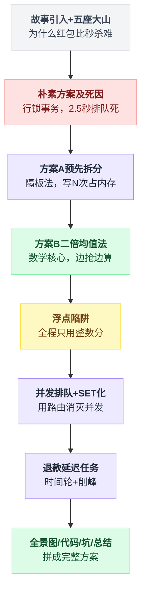
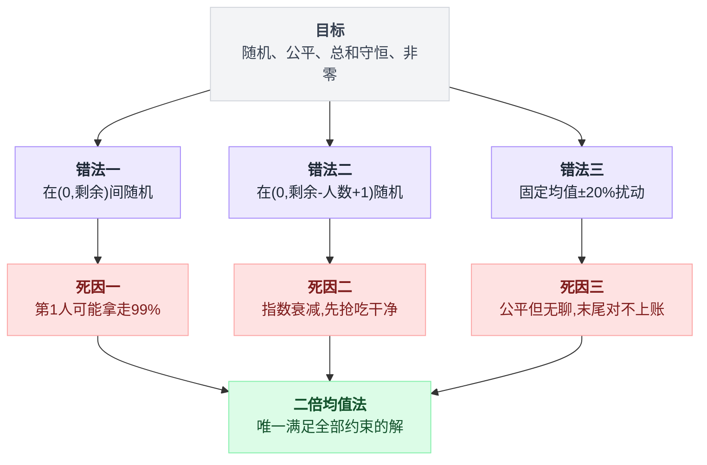
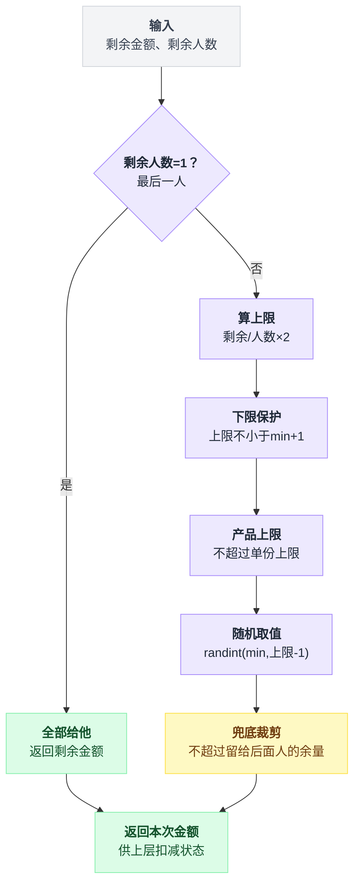
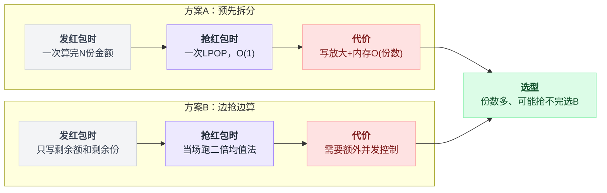
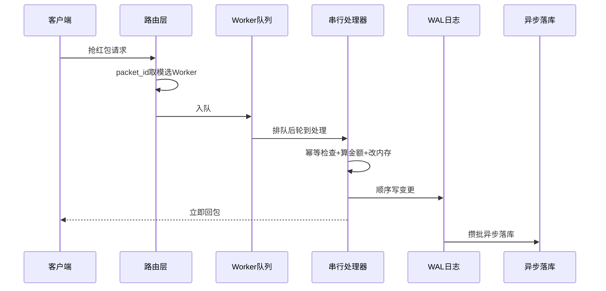
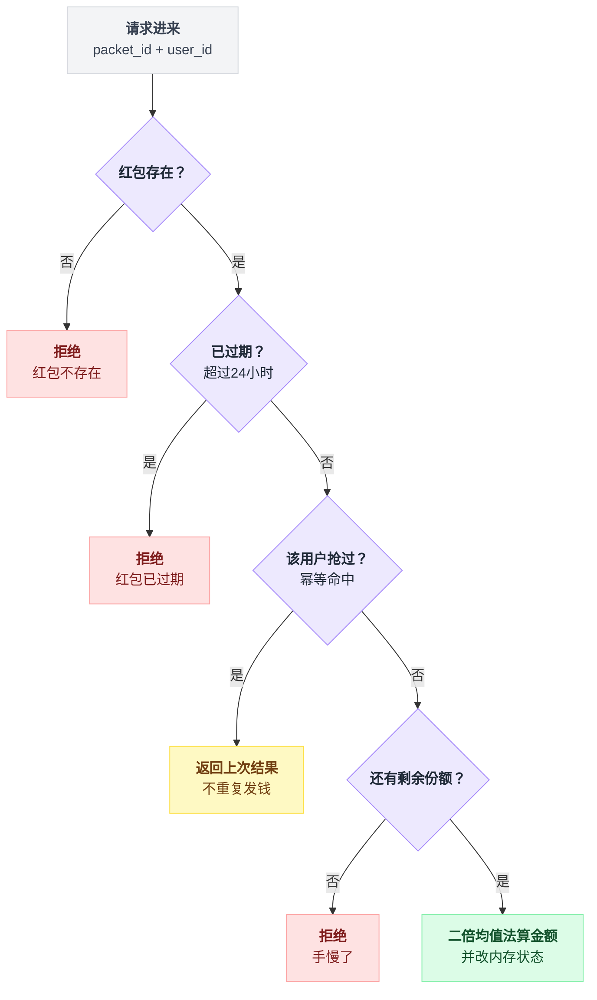
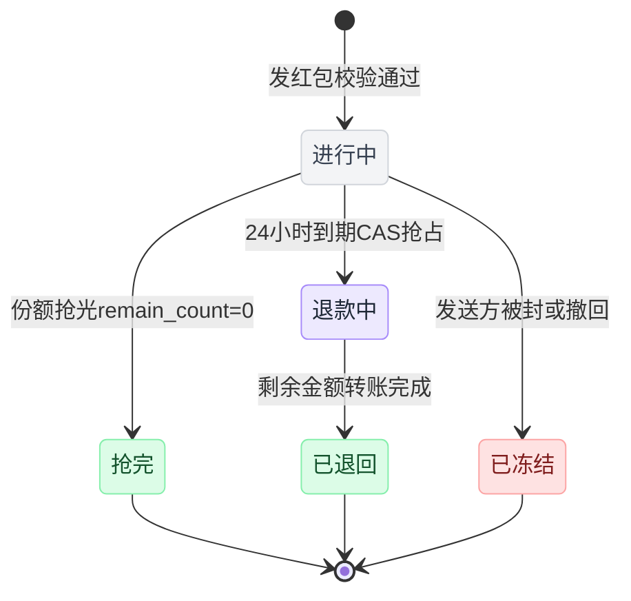
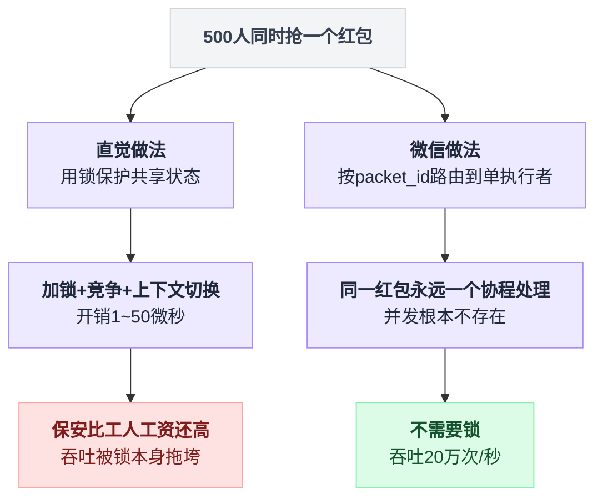
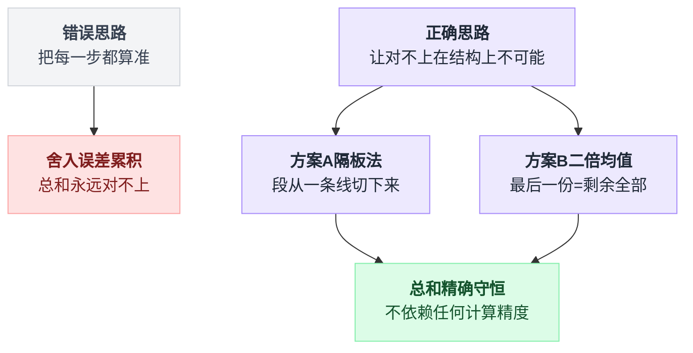

# 《微信红包》用数学消解并发问题全解（小白版）

> 一句话简介：一个 100 元的红包要拆成 10 份随机金额，总和必须一分不差，还要扛住几万人同时抢 —— 微信没有靠更快的锁解决它，而是靠一条数学公式和一条排队的队伍。
> 难度：★★★☆☆
> 读完你会懂：
> 1. 为什么"随机金额"反而比"固定金额"更容易做对，以及二倍均值法为什么恰好是"二倍"（有完整推导，不跳步）
> 2. 为什么微信的红包不用分布式锁、不用 Redis Lua，而是把请求排成一条队串行处理，而且这样反而更快
> 3. 什么是 SET 化架构，它和你听过的"分库分表"到底差在哪
> 4. 为什么金融系统里绝对不能出现 `float`，以及 `0.1 + 0.2 != 0.3` 会怎么把你的账搞爆

---

## 目录

- [0. 先讲个故事：过年发红包](#0-先讲个故事过年发红包)
- [1. 这件事到底难在哪](#1-这件事到底难在哪)
- [2. 最朴素的做法，以及它为什么会死](#2-最朴素的做法以及它为什么会死)
- [3. 第一次改进：方案 A —— 提前拆好，存成一排格子](#3-第一次改进方案-a--提前拆好存成一排格子)
- [4. 第二次改进：方案 B —— 边抢边算，二倍均值法](#4-第二次改进方案-b--边抢边算二倍均值法)
- [5. 第三次改进：把浮点数扔进垃圾桶](#5-第三次改进把浮点数扔进垃圾桶)
- [6. 第四次改进：并发控制 —— 把并发问题变成排队问题](#6-第四次改进并发控制--把并发问题变成排队问题)
- [7. 第五次改进：SET 化架构](#7-第五次改进set-化架构)
- [8. 收尾问题：24 小时没领完，钱怎么回去](#8-收尾问题24-小时没领完钱怎么回去)
- [9. 完整方案全景图](#9-完整方案全景图)
- [10. 核心代码逐行讲解](#10-核心代码逐行讲解)
- [11. 生产环境会踩的坑](#11-生产环境会踩的坑)
- [12. 反直觉结论](#12-反直觉结论)
- [13. 一句话总结 + 小白词典](#13-一句话总结--小白词典)

---

全文按台阶式展开，从一个具体的故事一路推到工程落地，先看一张导航图：



## 0. 先讲个故事：过年发红包

先把电脑关掉。我们讲一件你一定经历过的事。

大年三十晚上，一家人围着桌子。你二舅心情好，掏出 100 块钱，说："我发个红包，你们十个人分。"

如果二舅是个程序员，他可能会说："每人 10 块，来，排队领。"

——但没人会这么发红包。因为这一点意思都没有。

二舅真正干的事是这样的：他把 100 块换成一堆零钱，塞进十个信封，每个信封塞得不一样多。有的塞了 3 块，有的塞了 25 块。然后往桌上一撒，说："自己抢！"

于是全家人扑上去。抢完之后开始比较：

```
        二舅的红包（100 元 / 10 份）

   ┌──────┬──────┬──────┬──────┬──────┐
   │ 3.20 │25.10 │ 7.80 │12.40 │ 1.05 │
   └──────┴──────┴──────┴──────┴──────┘
   ┌──────┬──────┬──────┬──────┬──────┐
   │18.90 │ 6.35 │ 9.70 │ 4.15 │11.35 │
   └──────┴──────┴──────┴──────┴──────┘

   加起来 = 100.00 元   ← 一分不多，一分不少
   最少的 = 1.05 元     ← 但也不是 0
```

**注意这里有两条铁律，二舅是靠"手工点钱"保证的：**

1. **十个信封加起来必须正好 100 元。** 少一分，二舅亏；多一分，二舅的钱包对不上账。
2. **不能有空信封。** 你表妹抢到一个信封打开是空的，那她会哭一整个春节。

这两条听起来废话，但正是这两条，让"微信红包"这个功能比你想象的难十倍。

### 0.1 把这件事搬到线上，会发生什么

现在把场景换到微信群。

- 二舅在群里发了一个 100 元、10 个份额的红包
- 群里有 **500 个人**
- 消息一弹出，500 个人在**同一秒内**点了那个红包

服务器这一瞬间收到 500 个请求，它必须做到：

```
   500 个请求同时冲进来
   │ │ │ │ │ │ │ │ │ │ │ │ │ │ │ │ ...
   ▼ ▼ ▼ ▼ ▼ ▼ ▼ ▼ ▼ ▼ ▼ ▼ ▼ ▼ ▼ ▼
  ┌──────────────────────────────────────┐
  │            服务器                    │
  │                                      │
  │  必须做到：                          │
  │   ① 只有 10 个人抢到                 │
  │   ② 这 10 个金额加起来 = 100.00      │
  │   ③ 没有人抢到 0.00                  │
  │   ④ 没有人抢到两次                   │
  │   ⑤ 剩下 490 个人得到"手慢了"        │
  │   ⑥ 全部在 200 毫秒内完成            │
  └──────────────────────────────────────┘
```

六个条件，缺一个都是事故。而且第 ①②③ 条是**互相纠缠**的 —— 你不能先决定"谁抢到"，再决定"抢到多少"，因为金额本身也受总额约束。

### 0.2 这个量级有多夸张

给你几个真实数字感受一下（微信公开过的数据）：

| 时间点 | 数据 | 换算成人话 |
|---|---|---|
| 2015 年除夕 | 收发红包 10.1 亿次 | 平均每个中国人发了 0.7 个 |
| 2016 年除夕 | 收发红包 80.8 亿次 | 一天涨了 8 倍 |
| 2017 年除夕 | 峰值 76 万次/秒 | 每秒 76 万笔**带钱的**交易 |
| 2021 年除夕 | 收发红包 175 亿次 | —— |

**76 万次/秒是什么概念？**

> 你去银行柜台办一笔转账，柜员操作大概要 60 秒。
> 76 万次/秒 = 相当于全国同时开着 **4560 万个**银行柜台，每个柜台不停手地办业务。
> 而且每一笔都不能错账。

QPS 这个词你可能见过 —— **QPS = Queries Per Second，每秒查询数**，就是"服务器一秒钟要处理多少个请求"。76 万 QPS 就是每秒 76 万个请求。作为对比，一个普通公司的网站，QPS 上到 1000 就要开庆功会了。

### 0.3 和秒杀比，红包难在哪

你已经读过秒杀系统那套文档了，所以我直接对比：

```
  ┌────────────────┬─────────────────────┬────────────────────┐
  │                │   秒杀（抢 iPhone） │   微信红包         │
  ├────────────────┼─────────────────────┼────────────────────┤
  │ 要守住的东西   │ 库存数量：100 台    │ 数量：10 份        │
  │                │                     │ + 金额：100.00 元  │
  ├────────────────┼─────────────────────┼────────────────────┤
  │ 每个人拿到的   │ 都一样（1 台）      │ 每人不一样（随机） │
  ├────────────────┼─────────────────────┼────────────────────┤
  │ 卖超了怎么办   │ 道歉 + 退款         │ 平账事故，钱真没了 │
  ├────────────────┼─────────────────────┼────────────────────┤
  │ 热点集中在哪   │ 一个商品            │ 几千万个红包同时   │
  │                │ （单点极热）        │ （分散但总量巨大） │
  ├────────────────┼─────────────────────┼────────────────────┤
  │ 允许最终一致吗 │ 可以，慢慢发货      │ 不行，钱要立刻到账 │
  └────────────────┴─────────────────────┴────────────────────┘
```

划重点：**秒杀是"守住一个数"，红包是"守住一个数 + 一笔账"。**

秒杀里，库存 100 减到 0，减多减少你还能事后补。红包里，10 个人抢完发现总额是 100.03 元，那多出来的 3 分钱是从微信自己的账上出的 —— 一天几十亿笔，每笔多 3 分，一天就是上亿的窟窿。

**小结：** 红包 = 秒杀（数量约束）+ 一个额外的金额守恒约束。多这一条约束，整个解法就完全不一样了。

---

## 1. 这件事到底难在哪

现在你自己想一想：这有什么难的？我随便写写不就好了？

我们把你可能想到的每个"简单办法"拿出来，一条一条打破。

### 1.1 难点一：随机 + 求和固定，这两个要求天生打架

"随机"意味着每个数是自由的。"总和 = 100"意味着这些数被绑在一起。

你可能会说：那我就随机 10 个数，然后按比例缩放一下不就行了？

```python
import random

def naive_split(total: float, n: int) -> list[float]:
    """先随机 n 个数，再按比例缩放到总和 = total"""
    raw = [random.random() for _ in range(n)]   # 10 个 0~1 的随机数
    s = sum(raw)
    return [round(total * r / s, 2) for r in raw]

print(naive_split(100.0, 10))
```

看起来天衣无缝。但你跑一下：

```
[9.85, 15.22, 3.41, 12.08, 6.77, 14.93, 8.02, 11.56, 10.34, 7.81]
求和 = 99.99      ← 少了 1 分钱！
```

**为什么会少 1 分？** 因为 `round(x, 2)` 每次都会丢掉一点小数。10 次舍入，误差会攒起来。有时候少 1 分，有时候多 2 分，完全看运气。

你说那我把最后一个改成"总额减去前面九个"？行，这确实能补上。但这只是**第一个坑**，后面还有一串。

### 1.2 难点二：金额不能是 0，但"随机"天然会产生 0

`random.random()` 是可以返回接近 0 的数的。上面那个缩放法，如果某个 `raw` 特别小，缩放后就是 `0.00`。

抢到 0 元红包在产品上是**灾难级**的：

```
   微信群里：

   张三：@二舅 你这红包是不是假的
   张三：[截图] 恭喜发财，大吉大利  ¥0.00
   二舅：？？？
   群里 200 个人：哈哈哈哈哈哈
```

所以必须有个**下限**：每份至少 0.01 元（1 分）。这就变成了一个**带约束的随机划分问题**。

### 1.3 难点三：除不尽

100 元分 10 份，好分。那 **0.05 元分 10 份**呢？

```
   总额 5 分，要分给 10 个人
   ┌───┬───┬───┬───┬───┬───┬───┬───┬───┬───┐
   │ 1 │ 1 │ 1 │ 1 │ 1 │ ? │ ? │ ? │ ? │ ? │  单位：分
   └───┴───┴───┴───┴───┴───┴───┴───┴───┴───┘
                     ↑
              前 5 个人各拿 1 分，
              后 5 个人拿什么？0 分？
```

**分不了。** 所以微信的规则是：**红包总额（分） >= 红包个数**，也就是每人至少 1 分。发一个 0.05 元 10 人的红包，客户端直接就不让你发。

这不是技术妥协，这是**用产品规则把不可能的输入挡在门外**。记住这个思路，后面还会用到：能在入口挡掉的，就不要放进系统里让它变复杂。

### 1.4 难点四：并发下"读-改-写"必然出错

这是最经典的坑。假设你这么写：

```python
# 危险代码，不要抄
def grab(packet_id: str, user_id: str):
    packet = db.get(packet_id)          # ① 读出来：还剩 1 份
    if packet.remain_count <= 0:
        return "手慢了"
    amount = calc_amount(packet)        # ② 算金额
    packet.remain_count -= 1            # ③ 改
    db.save(packet)                     # ④ 写回去
    return amount
```

两个人同时抢最后一份，时间轴是这样的：

```
  时间 ──────────────────────────────────────────────▶

  张三：  ①读(剩1)          ②算       ③改(剩0)   ④写
            │                 │          │        │
            ▼                 ▼          ▼        ▼
  ─────────────────────────────────────────────────────
            │                 │          │        │
            ▼                 ▼          ▼        ▼
  李四：       ①读(剩1)        ②算      ③改(剩0)  ④写

  结果：两个人都读到"剩 1"，两个人都抢到了
        数据库里最后是"剩 0"，但实际发出去了 11 份
        多发的那一份，钱从微信账上出
```

这个东西有个正式名字叫 **竞态条件（Race Condition）** —— 字面意思"赛跑条件"，指多个操作赛跑，谁先谁后会导致结果不同。

你在秒杀那篇里见过它，解法是 Redis 的 Lua 脚本做原子扣减。红包这里**不能照抄**，原因我们放到第 6 章讲。

### 1.5 难点五：金额分布不能太难看

假设你用了某种随机算法，跑出来的结果是这样：

```
   第 1 个人：¥98.55  ██████████████████████████████████████████
   第 2 个人：¥ 0.51  █
   第 3 个人：¥ 0.23  █
   第 4 个人：¥ 0.14  █
   第 5 个人：¥ 0.11  █
   ...
```

技术上完全正确：总和 100，没有 0。但用户体验是**灾难** —— 因为大家会觉得"这红包被第一个人吃干净了，我抢它干嘛"。

所以还有一条**隐性需求**：

> 随机要"看起来随机"，但整体上每个人的**期望收益要一样**，不能因为你抢得早或晚而系统性吃亏。

这条是全文的数学核心。记住这个词：**期望（Expectation）** —— 就是"平均来说能拿到多少"。如果一个红包 100 元分 10 份，那每个位置的期望都应该是 10 元。

### 1.6 五个难点汇总

```
        ┌──────────────────────────────────────────┐
        │        微信红包的五座大山                │
        └──────────────────────────────────────────┘

   ① 求和守恒   ── 10 份加起来必须精确 = 100.00
        │
   ② 金额下限   ── 每份 >= 0.01，绝不能是 0
        │
   ③ 除不尽     ── 5 分钱分 10 人怎么办
        │
   ④ 并发安全   ── 500 人同时抢，只能有 10 人成功
        │
   ⑤ 分布公平   ── 每个位置的期望收益必须相同
        │
        ▼
   ①②③⑤ 是【数学问题】  ④ 是【工程问题】
   而微信最漂亮的一手是：用数学把工程问题也一起解决了
```

**小结：** 难的不是任何一条单独的要求，难的是它们必须**同时**成立，而且是在每秒几十万笔的压力下同时成立。

---

## 2. 最朴素的做法，以及它为什么会死

我们先写一个"能跑"的版本，然后亲手把它推到崩溃，你才会真正理解后面那些花招为什么必要。

### 2.1 朴素版本：数据库 + 事务 + 行锁

最直觉的做法：把红包存数据库，抢的时候开个事务，锁住这一行。

```sql
-- 红包主表
CREATE TABLE red_packet (
    id            BIGINT PRIMARY KEY,
    sender_id     BIGINT      NOT NULL,   -- 谁发的
    total_amount  INT         NOT NULL,   -- 总额，单位：分
    total_count   INT         NOT NULL,   -- 总份数
    remain_amount INT         NOT NULL,   -- 剩余金额，单位：分
    remain_count  INT         NOT NULL,   -- 剩余份数
    status        TINYINT     NOT NULL,   -- 0=进行中 1=抢完 2=已退回
    created_at    DATETIME    NOT NULL
);

-- 领取记录表
CREATE TABLE red_packet_record (
    id          BIGINT PRIMARY KEY,
    packet_id   BIGINT   NOT NULL,
    user_id     BIGINT   NOT NULL,
    amount      INT      NOT NULL,        -- 抢到多少分
    grabbed_at  DATETIME NOT NULL,
    UNIQUE KEY uk_packet_user (packet_id, user_id)   -- 防重复领取
);
```

先说两个你可能不熟的词：

- **事务（Transaction）**：一组操作要么全成功、要么全失败，中间不会出现"做了一半"的状态。像 ATM 取钱：吐钞和扣账必须同生共死。
- **行锁（Row Lock）**：数据库允许你把某一行"锁住"，锁住期间别人碰不了这行，只能排队等。`SELECT ... FOR UPDATE` 就是干这个的。

抢红包的逻辑：

```python
import asyncio
from dataclasses import dataclass

@dataclass
class GrabResult:
    ok: bool
    amount_fen: int = 0          # 抢到的金额，单位：分
    reason: str = ""

async def grab_naive(conn, packet_id: int, user_id: int) -> GrabResult:
    """最朴素的抢红包：数据库行锁 + 事务"""
    async with conn.transaction():                        # 开启事务
        row = await conn.fetchrow(
            "SELECT remain_amount, remain_count FROM red_packet "
            "WHERE id = $1 FOR UPDATE",                   # ← 锁住这一行
            packet_id,
        )
        if row["remain_count"] <= 0:
            return GrabResult(False, reason="手慢了，红包派完了")

        amount = pick_amount(row["remain_amount"], row["remain_count"])

        await conn.execute(
            "UPDATE red_packet SET remain_amount = remain_amount - $1, "
            "remain_count = remain_count - 1 WHERE id = $2",
            amount, packet_id,
        )
        await conn.execute(
            "INSERT INTO red_packet_record (packet_id, user_id, amount, grabbed_at) "
            "VALUES ($1, $2, $3, NOW())",
            packet_id, user_id, amount,
        )
        return GrabResult(True, amount_fen=amount)
```

**这段代码在干嘛（白话版）：**

1. 开一个事务，相当于说"接下来这几步是一个整体"
2. `FOR UPDATE` 把这个红包在数据库里的那一行**锁住** —— 别人来了只能站门口等
3. 检查还有没有份额，没有就直接告诉他"手慢了"
4. 算出这次给多少钱
5. 扣掉剩余金额和剩余份数
6. 插一条领取记录（`UNIQUE KEY` 保证同一个人不能领两次）
7. 事务提交，锁释放，下一个人进来

**逻辑上，这段代码是完全正确的。** 它确实不会超发，确实不会算错账。

问题只有一个：它太慢了。慢到什么程度？我们来算。

### 2.2 亲手推算它在什么数量级下崩掉

关键在于：**同一个红包的所有请求，被那把行锁串成了一条队。**

```
   500 个人抢同一个红包

        请求 1 ──┐
        请求 2 ──┤
        请求 3 ──┤
          ...    ├──▶ ┌──────────────┐
        请求 499─┤    │  行锁：一次  │
        请求 500─┘    │  只放一个进  │
                      └───────┬──────┘
                              │ 一个一个来
                              ▼
                    ┌───────────────────┐
                    │  事务：读→算→写   │
                    │  耗时 T           │
                    └───────────────────┘
```

那么一个事务耗时 T 是多少？拆开看：

| 步骤 | 耗时 | 说明 |
|---|---|---|
| 应用到数据库的网络往返 | 0.3 ms | 同机房内网 |
| `SELECT ... FOR UPDATE` | 0.5 ms | 走主键索引，但要加锁 |
| `UPDATE` | 0.5 ms | 改一行 |
| `INSERT` 领取记录 | 0.5 ms | 写一行 + 唯一索引检查 |
| 事务提交（刷盘 + 主从同步） | **2~5 ms** | ← 大头，钱的事必须落盘 |
| **合计 T** | **约 4~7 ms** | 取 5 ms |

**注意那个"事务提交"。** 数据库为了保证"提交了就绝不丢"，必须把日志真的写到磁盘上，而且金融级还要等从库确认收到。这一步是物理限制，快不了。

现在算吞吐：

```
   一个红包的处理能力 = 1 秒 / 5 毫秒 = 200 次/秒

   500 个人抢 → 只需要前 10 个成功，但 500 个请求都得排队走一遍
   处理完 500 个请求 = 500 × 5ms = 2500 毫秒 = 2.5 秒
```

**2.5 秒。** 排在第 500 位的那个人，要等 2.5 秒才知道自己"手慢了"。

而这还只是**一个**红包。除夕夜的真实情况是：

```
   峰值 76 万次/秒的请求
   假设平均每个红包被 100 个人抢
   → 同时活跃的红包数 = 760,000 / 100 = 7,600 个/秒 新红包

   每个红包占用一条数据库连接 5ms × 100 次 = 0.5 秒
   → 同时被占用的连接数 ≈ 7,600 × 0.5 = 3,800 条

   一台 MySQL 的健康连接数上限 ≈ 500~1000 条
   → 需要 4~8 台数据库【只跑抢红包这一个操作】
```

听起来还行？别急，我们再看**排队恶化**。

### 2.3 真正的杀手：排队长度会滚雪球

上面算的是"平均情况"。真实情况是流量不均匀 —— 消息推送到群里的一瞬间，请求是**尖峰**。

```
   请求到达速率（每秒）
   │
 500├─                    ╭──╮
   │                     │  │
 400├─                   │  │
   │                    │    │
 300├─                  │    │
   │                   │      │
 200├─ ─ ─ ─ ─ ─ ─ ─ ─╱─ ─ ─ ─╲─ ─ ─ ─  ← 系统处理能力 200/秒
   │                 ╱          ╲
 100├─             ╱              ╲___
   │          ___╱                     ────
   0└────┬────┬────┬────┬────┬────┬────┬────▶ 时间(秒)
        0    1    2    3    4    5    6    7

        ↑                        ↑
     消息推送                  尖峰持续约 2 秒
                            这 2 秒里进来 800 个请求
                            但只能处理 400 个
                            → 400 个堆在队列里
```

堆积的后果是**连锁反应**：

```
   队列堆积
      │
      ▼
   请求等待时间变长（从 5ms 涨到 2000ms）
      │
      ▼
   客户端超时（一般设 3 秒）
      │
      ▼
   用户看到转圈 → 【手动重试】
      │
      ▼
   请求量翻倍 ← ← ← ← ← ← ← ← ← ← ┐
      │                            │
      ▼                            │
   队列堆积更严重 ──────────────────┘

        这就是【雪崩】
```

**雪崩（Avalanche）** 这个词你在秒杀的缓存那章见过 —— 缓存雪崩是"缓存集体失效导致数据库被打穿"。这里是**同一个道理的另一种形态**：系统处理不过来 → 用户重试 → 更处理不过来。

### 2.4 朴素方案的死因清单

| 死因 | 具体表现 | 根本原因 |
|---|---|---|
| 单红包吞吐只有 200/秒 | 500 人抢要 2.5 秒 | 行锁把请求串行化，且每次都要走磁盘 |
| 数据库连接被长时间占用 | 几千条连接不够用 | 锁持有时间 = 整个事务时间 |
| 尖峰打满后队列堆积 | 等待时间从 5ms 涨到 2s | 到达速率 > 处理速率 |
| 超时重试导致雪崩 | 流量自我放大 2~3 倍 | 没有削峰、没有快速失败 |
| 热点行导致主库 CPU 飙升 | 同一行被反复加锁解锁 | 锁竞争本身消耗 CPU |

**小结：** 朴素方案不是"逻辑错"，是"物理慢"。它每处理一个人就要跟磁盘打一次交道，而磁盘的速度是几毫秒级的。要提速，就必须让"跟磁盘打交道"这件事不出现在抢红包的关键路径上。

接下来我们分两条线改进：**先解决金额怎么算（第 3、4、5 章），再解决并发怎么扛（第 6、7 章）。**

---

## 3. 第一次改进：方案 A —— 提前拆好，存成一排格子

回到二舅。二舅是怎么做的？

**他是在发之前，先把钱塞进十个信封的。** 等大家来抢的时候，信封已经是现成的，抢的人只要拿走一个就行。

这就是**方案 A：预先拆分（Pre-split）**。

### 3.1 核心思路

```
   【发红包的时刻】—— 用户点"塞钱进红包"的那一秒

        100 元 / 10 份
             │
             ▼
      ┌─────────────┐
      │  拆分算法   │  ← 一次性算出 10 个金额
      └──────┬──────┘
             │
             ▼
   ┌─────┬─────┬─────┬─────┬─────┬─────┬─────┬─────┬─────┬─────┐
   │ 320 │2510 │ 780 │1240 │ 105 │1890 │ 635 │ 970 │ 415 │1135 │  单位：分
   └─────┴─────┴─────┴─────┴─────┴─────┴─────┴─────┴─────┴─────┘
     0    1    2    3    4    5    6    7    8    9    ← 格子下标

             存进 Redis 的一个 List


   【抢红包的时刻】—— 500 个人冲进来

      每个请求做的事只有一件：
          从这排格子里【弹走一个】
          弹到了 → 你抢到了这个金额
          弹空了 → 手慢了
```

先解释 **Redis** 这个词：Redis 是一个**把数据放在内存里的数据库**。内存的读写速度是磁盘的 **10 万倍**左右 —— 磁盘一次操作要几毫秒，内存一次操作要几十纳秒。所以 Redis 单机能扛到 10 万 QPS 以上，而 MySQL 只有几千。

Redis 里有个数据结构叫 **List（列表）**，可以理解成一排格子，支持从两头塞、从两头取。关键是：**它的 `LPOP`（从左边弹出一个）操作是原子的** —— 意思是这个动作不可分割，两个人同时来 `LPOP`，Redis 保证他们拿到的是不同的元素，绝不会拿到同一个。

### 3.2 拆分算法：怎么把 100 拆成 10 个随机数

方案 A 的拆分算法可以用最简单的"打隔板法"（也叫**隔板法 / Stars and Bars**）。

想象 100 元是一条 10000 分长的绳子，你要在上面剪 9 刀，剪成 10 段：

```
   0                                                    10000（分）
   ├────────────────────────────────────────────────────┤
   │                                                    │
   │    ✂    ✂       ✂   ✂        ✂  ✂    ✂     ✂  ✂    │
   │    │    │       │   │        │  │    │     │  │    │
   ├────┴────┴───────┴───┴────────┴──┴────┴─────┴──┴────┤
     段1  段2   段3    段4   段5     段6 段7   段8  段9 段10

   随机选 9 个切点 → 自动得到 10 段
   这 10 段加起来【天然等于 10000】，因为它们本来就是一条绳子
```

代码：

```python
import random

def split_by_cuts(total_fen: int, n: int) -> list[int]:
    """隔板法：在 [1, total_fen-1] 里随机选 n-1 个不重复的切点。

    保证：每份 >= 1 分，总和精确 = total_fen
    """
    if total_fen < n:
        raise ValueError(f"总额 {total_fen} 分不够分给 {n} 个人，每人至少 1 分")

    # random.sample 保证选出的切点【互不相同】，
    # 这正是"每段 >= 1 分"的关键
    cuts = sorted(random.sample(range(1, total_fen), n - 1))

    result = []
    prev = 0
    for c in cuts:
        result.append(c - prev)
        prev = c
    result.append(total_fen - prev)     # 最后一段
    return result
```

**这段在干嘛：**

1. `random.sample(range(1, total_fen), n-1)` —— 从 1 到 9999 里随机挑 9 个**不重复**的数当切点。不重复这一点非常关键：如果两个切点重合，中间那段就是 0 分了。
2. `sorted(...)` —— 把切点从小到大排好，这样才能按顺序切。
3. 循环里 `c - prev` 就是每一段的长度。
4. 最后一段用总长减去最后一个切点。

**为什么总和一定精确等于 total_fen？** 因为这些段本来就是把一条线段切开得到的，所有段拼回去就是原来的线段。这不是"算出来正好"，是**结构上就不可能不等**。这是个非常好的性质 —— 正确性由数据结构保证，而不是靠代码小心翼翼。

跑一下：

```text
>>> split_by_cuts(10000, 10)
[891, 1523, 402, 1876, 55, 1204, 738, 1667, 933, 711]
>>> sum(_)
10000        # ← 一分不差
>>> min(_)
55           # ← 没有 0
```

### 3.3 完整的方案 A 实现

发红包（写入 Redis）：

```python
import json
import redis.asyncio as aioredis

async def create_packet_a(r: aioredis.Redis, packet_id: int,
                          total_fen: int, count: int) -> None:
    """方案 A：发红包时把所有金额一次性拆好，塞进 Redis List"""
    amounts = split_by_cuts(total_fen, count)

    key = f"rp:list:{packet_id}"
    pipe = r.pipeline()
    pipe.delete(key)                       # 防止重复发导致残留
    pipe.rpush(key, *[str(a) for a in amounts])   # 一次性全塞进去
    pipe.expire(key, 24 * 3600 + 600)      # 24 小时 + 10 分钟兜底过期
    await pipe.execute()
```

抢红包（从 Redis 弹出）：

```python
async def grab_a(r: aioredis.Redis, packet_id: int, user_id: int) -> GrabResult:
    """方案 A 的抢：一次 LPOP 搞定"""
    key = f"rp:list:{packet_id}"
    raw = await r.lpop(key)                # ← 原子操作，天然并发安全
    if raw is None:
        return GrabResult(False, reason="手慢了，红包派完了")
    return GrabResult(True, amount_fen=int(raw))
```

**看清楚这段代码有多短。** 抢红包的核心逻辑就是**一行 `LPOP`**。

- 不需要锁：`LPOP` 本身是原子的
- 不需要事务：只有一个操作，没有中间状态
- 不需要判断"还剩几份"：弹空了自然返回 `None`
- 不需要算金额：金额早就算好了

耗时从 5 毫秒降到 **0.1 毫秒**，吞吐从 200/秒 升到 **10 万/秒**。**提升了 500 倍。**

```
   方案 A 的关键洞察：

   把【拆分】这个复杂计算，从"抢的时候"挪到了"发的时候"

   ┌──────────────────┐            ┌────────────────────┐
   │   发红包（1 次）  │            │  抢红包（500 次） │
   │                  │            │                    │
   │  复杂计算 ✔      │  ────▶     │  只做 LPOP ✔       │
   │  慢一点没关系     │            │  必须极快         │
   └──────────────────┘            └────────────────────┘

   这叫【把开销挪到低频路径】
   和秒杀里"提前把库存预热进 Redis"是【同一招】
```

### 3.4 但是方案 A 有三个真实的问题

方案 A 看起来完美，微信早期版本也确实用过类似思路。但它有代价。

#### 问题一：写放大 —— 发一个红包要写 N 条数据

```
   发一个 10 人红包 → 写 10 个元素
   发一个 100 人红包 → 写 100 个元素
   发一个 500 人红包（群上限）→ 写 500 个元素

   除夕峰值：假设每秒 7,600 个新红包
   平均每个 20 份

   → Redis 每秒要承受 7,600 × 20 = 152,000 次写入
     【而这些红包里，很多根本没人抢】
```

**写放大（Write Amplification）** 这个词的意思是：你逻辑上只做了 1 件事（发 1 个红包），但底层实际写了 N 次。N 越大，浪费越大。

更扎心的是：**发出去的红包里有相当一部分永远抢不完，甚至一个人都没抢。** 你为它算好的 500 个金额，全白算了。

#### 问题二：大红包的内存浪费

```
   Redis List 存 500 个元素的内存开销：

   ┌──────────────────────────────────────────────┐
   │  quicklist 头部        ≈  48 字节            │
   │  500 个元素 × 约 20 字节  ≈ 10,000 字节      │
   │  key 本身 + 元数据      ≈  80 字节           │
   ├──────────────────────────────────────────────┤
   │  合计                  ≈ 10 KB / 个红包      │
   └──────────────────────────────────────────────┘

   除夕当天活跃红包（24 小时未过期的）假设 5 亿个
   平均 10 份 → 每个约 300 字节

   5 亿 × 300 字节 = 150 GB

   → 光存"拆好的金额"就要 150 GB 内存
     还没算领取记录、用户信息、防重表……
```

150 GB 不是不能买，但这是**纯浪费**的 150 GB —— 因为这些数字完全可以在需要的时候现算出来。

#### 问题三：拆分算法必须在"发"的那一刻跑完

用户点"塞钱进红包"，然后按发送。这中间的等待时间必须极短（< 200ms）。

对 10 份、100 份的红包，`random.sample` 跑得飞快。但注意 `random.sample(range(1, 10000), 499)` 这种调用，在极端情况（比如份数接近总分数）下会退化：

```text
# 极端场景：500 元发 500 份，每份平均 1 元
# random.sample 要从 50000 个位置里选 499 个不重复的
# 还好，这个规模没问题

# 真正的极端：5 元发 500 份（总额 500 分，500 份）
# → 每份必须【正好 1 分】，随机性完全消失
# → random.sample(range(1, 500), 499) 要选完几乎所有位置
#   Python 内部会切换到"洗牌整个池子"的策略，开销陡增
```

这个问题在实际中可以规避（加规则限制），但它说明了一件事：**方案 A 把复杂度堆在了一个"用户正在等待"的时刻**，而那个时刻恰恰是延迟最敏感的。

### 3.5 方案 A 小结

| 维度 | 评价 |
|---|---|
| 抢的速度 | 极快，一次 `LPOP`，0.1 ms |
| 并发安全 | 天然安全，`LPOP` 原子 |
| 总额守恒 | 结构保证，绝不出错 |
| 发的开销 | 差，写 N 次，N = 份数 |
| 内存 | 差，O(份数) |
| 灵活性 | 差，发出去就固定了，改不了 |

**方案 A 适合的场景：** 份数小（< 50）、红包大概率会被抢完、对"抢"的延迟要求极致。比如**活动红包、平台发的营销红包**。

**方案 A 不适合的场景：** 份数大、红包很可能抢不完、红包总量极大。也就是……**微信群红包本身**。

所以我们需要方案 B。

**小结：** 方案 A 的思路是"空间换时间、预计算换实时计算"。它把问题解决得很干净，但代价是在低频路径上做了大量可能白费的工作。当红包总量达到日均几十亿的量级，这个代价就受不了了。

---

## 4. 第二次改进：方案 B —— 边抢边算，二倍均值法

方案 B 的思路正好相反：**发红包的时候什么都不算，只记两个数：还剩多少钱、还剩多少份。谁来抢，就当场给他算一个金额。**

```
   Redis 里只存两个数字：

   ┌─────────────────────────┐
   │  rp:1001                │
   │  ├─ remain_amount: 10000│  剩余金额（分）
   │  └─ remain_count:     10│  剩余份数
   └─────────────────────────┘

   内存开销：约 100 字节（不管红包是 10 份还是 500 份）
   写开销：发红包时写 1 次

   对比方案 A 的 300 字节 ~ 10 KB，写 N 次
```

问题来了：**当场怎么算这个金额？**

### 4.1 先看几个错误的算法

#### 错法一：在 (0, 剩余金额) 之间随机

```text
# 错误示范
amount = random.randint(1, remain_amount)
```

第一个人就可能抢到 99.99 元，后面 9 个人分 1 分钱 —— 分不了。**炸。**

#### 错法二：在 (0, 剩余金额 - 剩余人数 + 1) 之间随机

```text
# 还是有问题
amount = random.randint(1, remain_amount - (remain_count - 1))
```

这个至少保证了后面每人还能有 1 分钱。但期望是多少？

```
   第 1 个人：在 (1, 10000-9) 随机 → 期望 ≈ 5000 分 = 50 元
   第 2 个人：剩下约 5000 分给 9 个人 → 期望 ≈ 2500 分 = 25 元
   第 3 个人：期望 ≈ 1250 分 = 12.5 元
   ...
   第 10 个人：期望 ≈ 几分钱

   ┌────────────────────────────────────────────────┐
   │  50.0 ██████████████████████████████████████   │
   │  25.0 ███████████████████                      │
   │  12.5 █████████                                │
   │   6.2 ████                                     │
   │   3.1 ██                                       │
   │   1.5 █                                        │
   │   0.8 ▏                                        │
   │   ... 
   └────────────────────────────────────────────────┘

   典型的【指数衰减】—— 先抢的人吃干净，后面喝汤
```

这就是第 1.5 节说的"分布难看"。**不公平。**

#### 错法三：固定平均值 + 小扰动

```text
avg = remain_amount // remain_count
amount = avg + random.randint(-avg // 5, avg // 5)   # ±20% 扰动
```

公平是公平了，但**太无聊**：100 元 10 份，每个人拿到的都在 8~12 元之间。红包的乐趣（"手气最佳"）没了。而且到最后几个人的时候，累积的扰动会让剩余金额对不上，还得特殊处理。

三条错路各栽在哪个坑，画一张图看清楚：



### 4.2 二倍均值法登场

正确答案只有一行：

```
   ┌─────────────────────────────────────────────────────────┐
   │                                                         │
   │   每次的随机范围 =  ( 0.01 元 ,  剩余金额 × 2  )        │
   │                                    ───────────          │
   │                                     剩余人数            │
   │                                                         │
   │   最后一个人：直接拿走全部剩余                          │
   │                                                         │
   └─────────────────────────────────────────────────────────┘
```

换成"分"为单位、写成代码的样子：

```
   max_amount = remain_fen // remain_count * 2
   amount = random.randint(1, max_amount - 1)
```

举个例子走一遍。100 元（10000 分）10 份：

```
  轮次  剩余金额   剩余人数   平均      上限(平均×2)   随机结果    新剩余
  ────  ────────  ────────  ───────  ────────────  ─────────  ────────
   1     10000       10      1000       2000          320        9680
   2      9680        9      1075       2150         1795        7885
   3      7885        8       985       1970          640        7245
   4      7245        7      1035       2070         1250        5995
   5      5995        6       999       1998          105        5890
   6      5890        5      1178       2356         1890        4000
   7      4000        4      1000       2000          635        3365
   8      3365        3      1121       2242          970        2395
   9      2395        2      1197       2394          415        1980
  10      1980        1        —       （全拿）       1980           0
  ────  ────────  ────────  ───────  ────────────  ─────────  ────────
                                          合计 =  10000 ✔
```

看第 10 行：**最后一个人直接把剩下的 1980 分（19.80 元）全拿走。** 这就是"总和精确"的保证 —— 和方案 A 的隔板法一样，**正确性来自结构，而不是来自运气**。

### 4.3 数学证明：为什么每个人的期望都是一样的

这是全文最重要的一段。我会**一步一步**推，不跳任何一步。

先约定符号（别怕，就三个）：

- `M` = 红包总金额（比如 10000 分）
- `n` = 红包总份数（比如 10）
- `X_i` = 第 i 个人抢到的金额（这是个随机数）

我们要证明的是：

```
   E[X_1] = E[X_2] = ... = E[X_n] = M / n
```

`E[X]` 读作"X 的期望"，意思就是**"如果重复无数次，平均下来 X 是多少"**。

#### 第一步：先搞懂"均匀随机数的期望"

如果一个数在 0 到 20 之间**均匀随机**（每个值出现的机会一样），那它的平均值是多少？

```
   0 ────────────────────────── 20
   │                            │
   └──────────── ▲ ─────────────┘
                10

   直觉：既然左右对称，平均就在正中间 = 10
```

**规则：均匀分布在 (0, a) 上的随机数，期望 = a / 2。**

这条你必须记住，整个证明就靠它。

#### 第二步：算第一个人的期望

第一个人抢的时候，剩余金额是 `M`，剩余人数是 `n`。

```
   随机范围 = (0, M/n × 2)

   套用第一步的规则：期望 = 范围上限 / 2

   E[X_1] = (M/n × 2) / 2
          = M/n × 2 / 2
          = M/n              ✔
```

**成了。** 第一个人的期望正好是"人均份额" `M/n`。

**这就是"二倍"的全部秘密：因为均匀分布的期望是上限的一半，所以你想让期望等于 `M/n`，上限就必须是 `M/n` 的两倍。**

```
   ┌────────────────────────────────────────────────┐
   │                                                │
   │    0 ──────────── M/n ──────────── 2M/n        │
   │    │               ▲                 │         │
   │    └───────────────┼─────────────────┘         │
   │                    │                           │
   │              期望落在正中间                    │
   │              正好 = 人均份额                   │
   │                                                │
   └────────────────────────────────────────────────┘
```

#### 第三步：算第二个人的期望（这一步是关键）

第二个人抢的时候，情况变了：剩余金额不再是固定的 `M`，而是 `M - X_1` —— 一个**随机数**。

设剩余金额为 `R_1 = M - X_1`，剩余人数是 `n - 1`。

按照公式，第二个人的随机范围是 `(0, R_1/(n-1) × 2)`。

**但这里有个陷阱：`R_1` 本身是随机的，怎么算期望？**

我们用一个叫**"条件期望"**的工具，但我用大白话讲：

> 分两步走。**先假装我们已经知道 `R_1` 是多少了**，算出这种情况下的平均值；**再把所有可能的 `R_1` 情况平均一遍**。

第一步（假装已知 `R_1`）：

```
   已知 R_1 的情况下：
   E[X_2 | R_1] = (R_1/(n-1) × 2) / 2 = R_1 / (n-1)
```

竖线 `|` 读作"在……条件下"。这行的意思是："如果剩余金额确定是 R_1，那第二个人平均拿 R_1/(n-1)"。

第二步（把 `R_1` 的所有可能平均一遍）：

```
   E[X_2] = E[ R_1 / (n-1) ]
          = E[R_1] / (n-1)          ← 除以常数可以提到外面
```

那 `E[R_1]` 是多少？

```
   E[R_1] = E[M - X_1]
          = M - E[X_1]              ← 期望可以拆开
          = M - M/n                 ← 第二步已经证明 E[X_1] = M/n
          = M(1 - 1/n)
          = M(n-1)/n
```

代回去：

```
   E[X_2] = E[R_1] / (n-1)
          = [ M(n-1)/n ] / (n-1)
          = M(n-1) / [ n(n-1) ]
          = M / n                   ✔✔✔
```

**第二个人的期望也是 `M/n`！**

#### 第四步：推广到第 k 个人（数学归纳法）

现在你已经看到规律了。我们用**归纳法** —— 意思就是"多米诺骨牌"：证明第一块能倒，再证明"只要第 k 块倒了第 k+1 块就一定倒"，那所有牌都会倒。

**已知（第 k 块倒了）：** 前 k 个人每人期望都是 `M/n`。

那么抢完 k 个人之后，剩余金额的期望是：

```
   E[R_k] = M - E[X_1] - E[X_2] - ... - E[X_k]
          = M - k × (M/n)
          = M(1 - k/n)
          = M(n-k)/n
```

剩余人数是 `n - k`。第 k+1 个人的期望：

```
   E[X_{k+1}] = E[R_k] / (n-k)              ← 和第三步同样的推导
              = [ M(n-k)/n ] / (n-k)
              = M(n-k) / [ n(n-k) ]
              = M / n                        ✔
```

**第 k+1 块也倒了。** 所以对所有 i，`E[X_i] = M/n`。**证毕。**

#### 第五步：用一句话总结这个证明

```
   ┌────────────────────────────────────────────────────────┐
   │                                                        │
   │   剩余金额的期望，永远正好等于                         │
   │   "剩余人数 × 人均份额"                                │
   │                                                        │
   │   E[剩余金额] = 剩余人数 × (M/n)                       │
   │                                                        │
   │   所以每个人"取走剩余的平均值"时，                     │
   │   取走的就正好是 M/n。                                 │
   │                                                        │
   │   这个性质【自我维持】：每取走一份，                   │
   │   剩下的仍然满足这条等式。                             │
   │                                                        │
   └────────────────────────────────────────────────────────┘
```

用一个更形象的说法：**这个算法是"自平衡"的。** 前面的人多拿了，剩余金额少了，但剩余人数也少了 —— 而且少得刚刚好，让"剩余的人均份额"的**期望**保持不变。

```
   假设 M=10000, n=10, 人均 = 1000

   第 1 个人手气爆棚，拿了 1900（接近上限 2000）
        剩余 8100，剩 9 人 → 人均 900  ← 变少了！
        但这只是【这一次】

   第 1 个人手气很差，拿了 100
        剩余 9900，剩 9 人 → 人均 1100 ← 变多了！

   把这两种情况（和所有其他情况）平均：
        E[剩余人均] = E[R_1]/9 = (10000 - 1000)/9 = 1000  ✔
        回到 1000！
```

### 4.4 为什么必须是"二倍"，不能是 1.5 倍或 3 倍

前面的证明已经告诉你答案了：因为**均匀分布的期望是上限的一半**，`2 × (1/2) = 1`，正好抵消。

但光讲道理不够，我实际跑了模拟给你看。每种倍数跑 5 万次，看各个位次的平均金额（100 元 / 10 份，单位：元）：

```
  倍数 k    第1位  第2位  第3位  第4位  第5位  第6位  第7位  第8位  第9位  第10位
  ──────   ─────  ─────  ─────  ─────  ─────  ─────  ─────  ─────  ─────  ──────
  k = 1.0    5.0    5.3    5.6    6.0    6.5    7.2    8.1    9.4   11.7   35.2
  k = 1.5    7.5    7.7    8.0    8.2    8.6    9.0    9.6   10.4   11.6   19.5
  k = 2.0   10.0   10.0   10.0   10.0   10.0   10.0   10.0   10.0   10.0   10.0
  k = 3.0   15.0   14.2   13.3   12.3   11.3   10.2    8.9    7.5    4.9    2.5
```

把它画成图，一眼就看明白了：

```
   k = 1.0（太小）：前面的人吃亏，钱都堆到最后一个人
   元
 35├─                                                    ╭●
   │                                                    ╱
 25├─                                                  ╱
   │                                                  ╱
 15├─                                              ╭─╯
   │  ●──●──●──●──●──●──●──●──╯
  5├─
   └──┬──┬──┬──┬──┬──┬──┬──┬──┬──┬──▶ 位次
      1  2  3  4  5  6  7  8  9  10


   k = 2.0（刚好）：一条完美的水平线
   元
 15├─
   │
 10├─ ●──●──●──●──●──●──●──●──●──●     ← 全部 10.00
   │
  5├─
   └──┬──┬──┬──┬──┬──┬──┬──┬──┬──┬──▶ 位次
      1  2  3  4  5  6  7  8  9  10


   k = 3.0（太大）：前面的人占便宜，最后一个人只剩渣
   元
 15├─ ●╮
   │   ╰●╮
 10├─     ╰●─●╮
   │           ╰●╮
  5├─             ╰●─╮
   │                  ╰●──●
   └──┬──┬──┬──┬──┬──┬──┬──┬──┬──┬──▶ 位次
      1  2  3  4  5  6  7  8  9  10
```

**k=2 是唯一能让这条线水平的值。** 不是调参调出来的，是数学上唯一解。

```
   通用推导：设倍数为 k

   E[X_1] = (M/n × k) / 2 = M/n × (k/2)

   要让 E[X_1] = M/n，必须有：

        k / 2 = 1
        k = 2                ← 唯一解
```

**记住这个感觉：** 一个好的算法，它的参数往往不是"试出来的经验值"，而是"数学上只能是这个值"。看到一个魔法数字，先问问它是不是有推导 —— 有推导的数字可以放心，没推导的数字迟早出事。

### 4.5 完整的 Python 实现

现在写真正能用的代码。**注意：全程用"分"作为整数单位，一个浮点数都不出现。** 为什么必须这样，第 5 章会详细讲。

```python
import random
from dataclasses import dataclass

@dataclass(frozen=True)
class SplitConfig:
    """拆分参数。全部单位为【分】"""
    min_fen: int = 1            # 每份最少 1 分
    max_fen: int = 20_000_00    # 单份上限 20000 元（微信实际是 200 元/份）


def next_amount(remain_fen: int, remain_count: int,
                cfg: SplitConfig = SplitConfig()) -> int:
    """二倍均值法：算出【下一个人】该拿多少分。

    Args:
        remain_fen:   当前剩余金额（分）
        remain_count: 当前剩余份数（含这一份）
    Returns:
        本次应发金额（分），保证 >= 1 且留够后面每人 1 分
    """
    if remain_count <= 0:
        raise ValueError("没有剩余份数了")

    # 【关键分支】最后一份：直接全给，这是总额守恒的保证
    if remain_count == 1:
        return remain_fen

    # 二倍均值：上限 = 剩余金额 / 剩余人数 * 2
    # 注意先整除再乘 2，避免中间结果溢出（在有大整数的 Python 里
    # 其实无所谓，但换成 Go/Rust 这个顺序很重要，养成习惯）
    upper = remain_fen // remain_count * 2

    # 边界一：剩余金额刚好等于剩余人数（每人只能 1 分）
    # 此时 upper = 1*2 = 2，randint(1, 1) 只能返回 1，正确
    upper = max(upper, cfg.min_fen + 1)

    # 边界二：单份上限（产品规则，比如每份不超过 200 元）
    upper = min(upper, cfg.max_fen + 1)

    amount = random.randint(cfg.min_fen, upper - 1)

    # 边界三：必须给后面的人留够，每人至少 1 分
    # 这一步在数学上【几乎不会触发】，但必须写 —— 见下面的解释
    max_allowed = remain_fen - (remain_count - 1) * cfg.min_fen
    return min(amount, max_allowed)
```

**逐段翻译成人话：**

**第一段（`if remain_count == 1`）** —— 最后一个人不玩随机，剩多少给多少。这一行是整个"总额精确守恒"的唯一保证。**去掉这一行，账立刻就错。**

**第二段（`upper = remain_fen // remain_count * 2`）** —— 二倍均值的核心。`//` 是整除（丢掉小数），因为我们在分的世界里没有小数。

**第三段（`max(upper, cfg.min_fen + 1)`）** —— 防止 `upper` 变成 0 或 1 导致 `randint(1, 0)` 报错。什么时候会发生？当 `remain_fen // remain_count == 0` 时，也就是剩余金额比剩余人数还少。理论上被入口校验挡掉了，但**防御性代码就是要防那些"理论上不会发生"的事**。

**第四段（`min(upper, cfg.max_fen + 1)`）** —— 产品规则。微信规定单个红包每份不超过 200 元，这里就是执行这条规则的地方。注意加了这条之后，**数学上的完美均匀会被轻微破坏**（上限被削平了），但因为触发概率极低，实践中可以接受。

**第五段（`max_allowed`）** —— 兜底。算出来的金额不能多到让后面的人拿不到 1 分。数学上，因为 `upper = 剩余/人数*2 <= 剩余 - (人数-1)` 在人数 >= 2 且剩余 >= 人数 时通常成立，所以基本不会触发。但"基本不会"不等于"不会"。

> **这里有个坑：** 很多网上的实现漏掉了第五段。在 `remain_fen` 接近 `remain_count`（比如剩 3 分给 2 个人）的极端情况下，`upper = 3//2*2 = 2`，`randint(1,1) = 1`，剩 2 分给 1 人，没问题。但如果你把 `min_fen` 改成 10 分（有些业务要求最低 0.1 元），边界就会变，第五段就会真的触发。**参数一变，边界就变 —— 所以兜底必须写。**

把 `next_amount` 里五段判断串成一张流程图：



拆完整个红包：

```python
def split_all(total_fen: int, count: int) -> list[int]:
    """把一个红包完整拆开（主要用于测试和离线校验）"""
    if total_fen < count:
        raise ValueError(f"{total_fen} 分不够分给 {count} 人")

    result: list[int] = []
    remain_fen, remain_count = total_fen, count
    for _ in range(count):
        amt = next_amount(remain_fen, remain_count)
        result.append(amt)
        remain_fen -= amt
        remain_count -= 1

    assert sum(result) == total_fen, "总额不守恒，这是致命 bug"
    assert min(result) >= 1, "出现了 0 元红包"
    return result
```

那两个 `assert` 不是装饰。**在处理钱的代码里，不变量（invariant）必须显式断言。** 它们在测试环境会帮你抓到 bug，在生产环境可以换成告警。

### 4.6 眼见为实：跑 20 万次的分布直方图

我实际跑了 20 万次拆分（100 元 / 10 份 = 200 万个金额样本），统计所有金额的分布：

```
   所有抢到金额的分布（200 万样本，桶宽 2 元）

    0- 2元 |███████████████████████                          | 10.65%
    2- 4元 |███████████████████████                          | 10.72%
    4- 6元 |███████████████████████                          | 10.67%
    6- 8元 |███████████████████████                          | 10.55%
    8-10元 |██████████████████████                           | 10.33%
   10-12元 |█████████████████████                            |  9.96%
   12-14元 |████████████████████                             |  9.39%
   14-16元 |██████████████████                               |  8.63%
   16-18元 |████████████████                                 |  7.49%
   18-20元 |████████████                                     |  5.61%
   20-22元 |█████                                            |  2.65%
   22-24元 |██                                               |  1.35%
   24-26元 |█                                                |  0.75%
   26-28元 |▏                                                |  0.44%
   28-30元 |▏                                                |  0.28%
   30-32元 |▏                                                |  0.18%
   32-34元 |▏                                                |  0.12%
   34-36元 |▏                                                |  0.08%
   36-38元 |▏                                                |  0.05%
   38-40元 |▏                                                |  0.10%
                                                    ─────────
                                                  合计 100%
```

**读这张图：**

1. **0 到 20 元这一段基本是平的**（10.65% → 5.61%，缓慢下降）。这说明大部分金额均匀散布在 0 到 2 倍均值之间 —— 这正是二倍均值法的直接效果。
2. **20 元之后陡降**。为什么 20 元是个坎？因为**第一个人的金额上限恰好是 2 × 10 = 20 元**，只有后面的人（剩余人均变大时）才可能突破 20 元。
3. **长尾一直拖到 40 元以上**。所以"手气最佳抢到 40 元"是可能的，只是概率只有千分之几。这正是红包好玩的地方 —— 有小概率的惊喜。
4. **整体平均值 = 10.00 元**，一分不差。

### 4.7 一个反直觉的发现：先抢的人方差【更小】，不是更大

这一节我要纠正一个流传极广的错误说法。

网上很多文章说："二倍均值法下，**先抢的人方差大**（可能很多也可能很少），后抢的人趋于平均。"

**这是反的。** 我们直接看数据。20 万次模拟，每个位次的统计：

```
  位次    平均值(元)   标准差(元)   最大值(元)   最小值(元)
  ────   ──────────  ──────────  ──────────  ──────────
  第 1     10.00        5.77        19.99       0.01
  第 2     10.00        5.82        22.17       0.01
  第 3     10.00        5.88        24.72       0.01
  第 4     10.00        5.94        27.94       0.01
  第 5     10.00        6.06        31.76       0.01
  第 6     10.00        6.21        34.66       0.01
  第 7     10.00        6.45        40.45       0.01
  第 8     10.00        6.83        49.57       0.01
  第 9     10.00        7.68        71.34       0.01
  第10     10.00        7.66        66.79       0.01
```

先解释 **标准差（Standard Deviation）**：它衡量"数据有多分散"。标准差小 = 大家都差不多；标准差大 = 忽高忽低。

看这一列：**5.77 → 5.82 → 5.88 → ... → 7.68，单调递增。**

**结论：越晚抢，波动越大。第一个人的金额是最稳定的。**

再看"最大值"那一列，更震撼：

```
   各位次能抢到的【最大金额】

   第 1 位  ████████████████████                    19.99 元  ← 硬上限
   第 2 位  ██████████████████████                  22.17 元
   第 3 位  █████████████████████████               24.72 元
   第 4 位  ████████████████████████████            27.94 元
   第 5 位  ████████████████████████████████        31.76 元
   第 6 位  ███████████████████████████████████     34.66 元
   第 7 位  █████████████████████████████████████████ 40.45 元
   第 8 位  ██████████████████████████████████████████████████ 49.57 元
   第 9 位  ████████████████████████████████████████████████████████████████████ 71.34 元
   第10 位  ███████████████████████████████████████████████████████████ 66.79 元
```

**第 1 个人这辈子最多抢到 19.99 元，一分都不可能更多。** 而第 9 个人有机会抢到 71 元 —— 是总额的 71%！

#### 为什么会这样？

**第 1 个人的上限是【确定的】：** 剩余金额一定是 10000 分，剩余人数一定是 10 人。所以范围就是死死的 `(0, 2000)`，均匀分布，标准差 = `2000/√12 = 577 分 = 5.77 元`。

（`范围宽度/√12` 是均匀分布标准差的公式，你不用记，知道"范围固定 = 波动固定"就行。）

**第 2 个人的上限是【随机的】：** 剩余金额是 `10000 - X_1`，本身就带着随机性。所以第 2 个人的波动 = **他自己的随机 + 继承自第 1 个人的随机**。两层随机叠加，当然更大。

```
   随机性是【累积】的：

   第1人   ┌──────────┐
           │  随机 ①  │                        标准差 5.77
           └──────────┘

   第2人   ┌──────────┬──────────┐
           │ 继承 ①   │  随机 ②  │             标准差 5.82
           └──────────┴──────────┘

   第3人   ┌──────────┬──────────┬──────────┐
           │ 继承 ①   │ 继承 ②   │  随机 ③  │  标准差 5.88
           └──────────┴──────────┴──────────┘

           ......

   第9人   ┌───┬───┬───┬───┬───┬───┬───┬───┬───┐
           │ ① │ ② │ ③ │ ④ │ ⑤ │ ⑥ │ ⑦ │ ⑧ │ ⑨ │  标准差 7.68
           └───┴───┴───┴───┴───┴───┴───┴───┴───┘

   前面每个人的随机性，都会【传递】给后面的人
```

用直方图对比第 1 位和第 9 位，差别一目了然：

```
   金额区间     第 1 个人的分布                    第 9 个人的分布
   ─────────   ────────────────────────────      ────────────────────────────
    0.0- 2.5   ████████████████ 12.43%           ██████████████████ 14.95%
    2.5- 5.0   ████████████████ 12.41%           ███████████████████ 15.19%
    5.0- 7.5   ████████████████ 12.54%           ██████████████████ 14.63%
    7.5-10.0   ████████████████ 12.54%           ████████████████ 13.32%
   10.0-12.5   ████████████████ 12.48%           █████████████ 11.16%
   12.5-15.0   ████████████████ 12.59%           ██████████  8.67%
   15.0-17.5   ████████████████ 12.49%           ███████  6.47%
   17.5-20.0   ████████████████ 12.52%           █████  4.77%
   20.0-22.5   （不可能） 0.00%                   ████  3.45%
   22.5-25.0   （不可能） 0.00%                   ██  2.45%
   25.0-27.5   （不可能） 0.00%                   ██  1.68%
   27.5-30.0   （不可能） 0.00%                   █  1.13%
   30.0-32.5   （不可能） 0.00%                   ▏ 0.77%
   32.5-35.0   （不可能） 0.00%                   ▏ 0.50%
   35.0-37.5   （不可能） 0.00%                   ▏ 0.31%
   37.5 以上    （不可能） 0.00%                   ▏ 0.55%

   第 1 个人：完美的【矩形】—— 0 到 20 元每一段概率都一样
   第 9 个人：【右偏长尾】—— 小额更常见，但有机会中大奖
```

第 1 个人的分布是**教科书级别的均匀分布**（每个桶都是 12.5%，因为 20/2.5 = 8 个桶，100%/8 = 12.5%）。这不是巧合 —— 就是 `randint(1, 1999)`。

#### "手气最佳"落在谁头上？

模拟 20 万次，统计"红包里金额最大的那个人"是第几位：

```
   位次    成为"手气最佳"的概率     成为"手气最差"的概率
   ────   ──────────────────    ──────────────────
   第 1     ██████████  9.99%     ████████  8.75%
   第 2     ██████████  9.53%     ████████  8.74%
   第 3     █████████   9.09%     █████████  8.96%
   第 4     █████████   8.77%     █████████  9.05%
   第 5     █████████   8.88%     █████████  9.20%
   第 6     █████████   9.12%     █████████  9.55%
   第 7     ██████████  9.71%     ██████████  9.75%
   第 8     ███████████ 10.61%    ███████████ 10.58%
   第 9     █████████████ 12.16%  █████████████ 12.66%
   第10     █████████████ 12.14%  █████████████ 12.75%
```

**看出门道了吗？** 后面的人**又更容易拿手气最佳，又更容易拿手气最差**。这完全符合"方差更大"的结论 —— 波动大意味着两头都更容易占。

而第 4、5 位的人最"平庸"：既不容易最好，也不容易最差。

**所以下次群里有人说"我总是最后抢，都是渣"，你可以告诉他：从统计上讲，最后抢的人拿手气最佳的概率反而是最高的（12%，比第一个人的 10% 还高）。他只是选择性记住了那些倒霉的时候。**

### 4.8 方案 A vs 方案 B：什么场景选哪个

```
  ┌──────────────┬────────────────────┬───────────────────┐
  │              │  方案 A 预先拆分   │  方案 B 边抢边算  │
  ├──────────────┼────────────────────┼───────────────────┤
  │ 发红包耗时   │ O(份数)            │ O(1)              │
  │              │ 500 份要算 500 次  │ 只写 2 个数字     │
  ├──────────────┼────────────────────┼───────────────────┤
  │ 抢红包耗时   │ O(1) 一次 LPOP     │ O(1) 一次原子脚本 │
  │              │ 约 0.05 ms         │ 约 0.10 ms        │
  ├──────────────┼────────────────────┼───────────────────┤
  │ 内存占用     │ O(份数)            │ O(1)              │
  │              │ 500 份约 10 KB     │ 恒定约 100 字节   │
  ├──────────────┼────────────────────┼───────────────────┤
  │ 并发安全     │ LPOP 天然原子      │ 要写 Lua 或用队列 │
  ├──────────────┼────────────────────┼───────────────────┤
  │ 总额守恒     │ 结构保证（切绳子） │ 最后一份兜底      │
  ├──────────────┼────────────────────┼───────────────────┤
  │ 未抢完的浪费 │ 大（白算白存）     │ 无（没抢就没算）  │
  ├──────────────┼────────────────────┼───────────────────┤
  │ 能否中途改额 │ 不能（已固化）     │ 能（改两个数字）  │
  ├──────────────┼────────────────────┼───────────────────┤
  │ 结果可预测性 │ 高（能提前对账）   │ 低（要事后聚合）  │
  ├──────────────┼────────────────────┼───────────────────┤
  │ 实现复杂度   │ 低                 │ 中                │
  └──────────────┴────────────────────┴───────────────────┘
```

**选型口诀：**

```
   份数少 + 大概率抢完 + 要提前对账   ──▶  方案 A
        （平台营销红包、抽奖、拼团返现）

   份数多 + 可能抢不完 + 量级巨大     ──▶  方案 B
        （微信群红包、企业发薪红包）

   两者都行的时候，选 B ——
   因为 B 的成本随红包份数【不增长】，
   而线上系统最怕的就是"成本随业务规模线性增长"
```

**微信的选择是 B。** 因为微信的红包量级是"日均几十亿"，任何 O(份数) 的开销乘上这个量级都是灾难。

**小结：** 二倍均值法用一条 `randint(1, 剩余/人数*2 - 1)` 解决了"随机、公平、守恒、非零"四个要求。它的美在于：不是靠事后修正把总和凑对，而是靠**结构**（最后一份全给）保证守恒；不是靠调参把分布调平，而是靠**数学**（均匀分布期望 = 上限一半）保证公平。

把上面的对比压缩成一张并排图，两条路径最终都要回答"选 A 还是选 B"：



---

## 5. 第三次改进：把浮点数扔进垃圾桶

前面所有代码我都在用"分"作为整数单位，一次浮点数都没用。这一章讲为什么。

### 5.1 先看这个让无数人震惊的例子

打开 Python，输入这两行：

```text
>>> 0.1 + 0.2
0.30000000000000004

>>> 0.1 + 0.2 == 0.3
False
```

**不是 Python 的 bug。** 你在 JavaScript、Java、C、Go、Rust 里试，结果一模一样。这是**所有使用 IEEE 754 浮点数的语言的共同行为**。

### 5.2 为什么会这样：计算机不会数小数

计算机只有 0 和 1。它表示小数的方式，是用**二进制小数**：

```
   十进制的 0.5   = 2^-1                       → 二进制 0.1     ✔ 精确
   十进制的 0.25  = 2^-2                       → 二进制 0.01    ✔ 精确
   十进制的 0.75  = 2^-1 + 2^-2                → 二进制 0.11    ✔ 精确

   十进制的 0.1   = ？
```

试着用 2 的负次方去凑 0.1：

```
   0.1 = 0.0625 + 0.03125 + 0.00390625 + ...
       = 2^-4  + 2^-5    + 2^-8       + ...

   二进制： 0.0001100110011001100110011001100110011...
                 └────┘└────┘└────┘└────┘
                  1100 无限循环，永远凑不完
```

就像十进制里 `1/3 = 0.33333...` 永远写不完一样，**二进制里 0.1 是无限循环小数**。

计算机只有 64 位可用（`double` 类型），只能截断：

```
   ┌────────────────────────────────────────────────────────┐
   │  64 位 double 的内存布局                               │
   ├───┬──────────────┬─────────────────────────────────────┤
   │符号│   指数 11位   │        尾数 52 位                 │
   │ 1 │              │                                     │
   └───┴──────────────┴─────────────────────────────────────┘
                                    ↑
                        只能存 52 位二进制小数
                        0.1 的无限循环在这里被【剪断】

   实际存进去的 0.1 = 0.1000000000000000055511151231257827...
   实际存进去的 0.2 = 0.2000000000000000111022302462515654...
   ────────────────────────────────────────────────────
   两个都偏大一点点，加起来 = 0.3000000000000000444089209850062616
                            ↑
                        显示成 0.30000000000000004
```

### 5.3 这个误差怎么把红包账搞爆

我实际跑了一个**用浮点数实现的二倍均值法**：

```python
import random
random.seed(1)

total = 100.0
n = 10
out, remain = [], total
for i in range(n):
    left = n - i
    if left == 1:
        out.append(remain)
        break
    a = round(random.uniform(0.01, remain / left * 2), 2)
    out.append(a)
    remain -= a

print(out)
print("求和 =", sum(out))
print("等于 100 吗？", sum(out) == 100.0)
```

输出：

```
[2.7, 18.32, 15.08, 4.66, 9.79, 8.9, 13.21, 14.38, 1.23, 11.729999999999995]
求和 = 99.99999999999999
等于 100 吗？ False
```

**看最后一个数：`11.729999999999995`。**

这个数会：

1. 存进数据库的 `DECIMAL(10,2)` 字段时被截断成 `11.72` —— **丢了 1 分钱**
2. 或者被四舍五入成 `11.73` —— **多了 1 分钱**
3. 显示给用户时可能变成 `11.729999999999995 元` —— **用户截图发微博**

而 `sum(out) == 100.0` 返回 `False`，意味着你所有的对账脚本、所有的 `assert`、所有的校验逻辑**全部会误报**。

### 5.4 放大到微信的量级

```
   假设每笔红包平均有 0.5 分的浮点误差（保守估计）

   微信 2021 除夕：175 亿次红包收发

   175 亿 × 0.005 元 = 8,750 万元

   ┌────────────────────────────────────────────────┐
   │                                                │
   │   一个 float，一天就是 8750 万的账目黑洞       │
   │                                                │
   │   而且是【无法追查】的黑洞 ——                  │
   │   你不知道钱去哪了，因为每一笔单独看都"对"     │
   │                                                │
   └────────────────────────────────────────────────┘
```

金融系统对账的标准是**一分不差**。差 1 分钱和差 1 亿，在会计上是同一个级别的事故：**账平不了**。

### 5.5 正确做法：全世界只用"分"

```
   ┌───────────────────────────────────────────────────────────┐
   │                                                           │
   │   规则：从数据库到 API 到内存，一切金额都是【整数分】     │
   │                                                           │
   │   只有在【最后一步渲染给人看】的时候，才除以 100          │
   │                                                           │
   └───────────────────────────────────────────────────────────┘


   ┌──────────┐   int    ┌──────────┐   int    ┌──────────┐
   │ 数据库   │─────────▶│  服务端  │─────────▶│ 客户端   │
   │ BIGINT   │   分     │  int     │   分     │  展示层  │
   │ 存 1050  │          │  1050    │          │  1050    │
   └──────────┘          └──────────┘          └─────┬────┘
                                                     │
                                              只在这里除 100
                                                     ▼
                                              "10.50 元"
```

代码上的规矩：

```python
# ✔ 正确：内部一律整数分
@dataclass(frozen=True)
class Money:
    """金额，单位：分。故意不提供 float 构造，堵死误用"""
    fen: int

    def __post_init__(self) -> None:
        if not isinstance(self.fen, int):
            raise TypeError(f"金额必须是整数分，收到 {type(self.fen)}")

    @classmethod
    def from_yuan_str(cls, s: str) -> "Money":
        """从用户输入的字符串解析，比如 '10.50' → Money(1050)

        注意用的是 Decimal 不是 float —— Decimal 是【十进制】小数，
        不会有二进制截断问题
        """
        from decimal import Decimal
        d = (Decimal(s) * 100).to_integral_value()
        return cls(int(d))

    def to_display(self) -> str:
        """只在展示时转换。整除 + 取余，全程不碰浮点"""
        return f"{self.fen // 100}.{self.fen % 100:02d}"
```

用一下：

```python
>>> m = Money.from_yuan_str("10.50")
>>> m
Money(fen=1050)
>>> m.to_display()
'10.50'
>>> Money(1050.0)      # 有人手滑传了 float
TypeError: 金额必须是整数分，收到 <class 'float'>
```

**注意 `__post_init__` 里那个类型检查。** 它看起来很啰嗦，但它是一道**闸门** —— 只要有人不小心把浮点数塞进来，程序立刻炸在开发环境，而不是安静地在生产环境错三个月。

**在金钱系统里，让错误的代码跑不起来，比让它跑起来再修好一万倍。**

### 5.6 数据库怎么存

| 类型 | 能用吗 | 为什么 |
|---|---|---|
| `FLOAT` / `DOUBLE` | ✘ 绝对不行 | 二进制浮点，同样有截断误差 |
| `DECIMAL(18,2)` | 可以 | 十进制定点数，精确。但计算比整数慢 |
| `BIGINT`（存分） | **推荐** | 最快、最省、天然精确，运算就是整数加减 |

`BIGINT` 是 64 位整数，能表示到 922 亿亿。用它存"分"，能表示到 92 亿亿元 —— 全球 GDP 加起来也塞得下。

**小结：** 浮点数不是"精度不够"，是**结构上就表示不了十进制小数**。这不是换个更精确的 float 能解决的问题，唯一的解法是根本不用它。这条规则在所有涉及钱的系统里都成立，没有例外。

---

## 6. 第四次改进：并发控制 —— 把并发问题变成排队问题

金额算法解决了。现在回到第 2 章那个问题：**500 个人同时抢，怎么保证不超发？**

### 6.1 先复习一下秒杀是怎么解的

秒杀那篇里，你学的是 **Redis + Lua 原子脚本**：

```lua
-- 秒杀的经典 Lua 脚本
local stock = tonumber(redis.call('GET', KEYS[1]))
if stock == nil or stock <= 0 then
    return -1                      -- 库存不足
end
redis.call('DECR', KEYS[1])
return stock - 1
```

先解释 **Lua 脚本为什么原子**：Redis 是**单线程**执行命令的，一个 Lua 脚本在执行期间，Redis 不会去处理别的命令。所以脚本里的"读-判断-写"三步是不可分割的一个整体，天然没有竞态条件。

红包也能这么干：

```lua
-- 红包版：一次搞定"扣份数 + 扣金额 + 算随机数"
local remain_fen   = tonumber(redis.call('HGET', KEYS[1], 'fen'))
local remain_count = tonumber(redis.call('HGET', KEYS[1], 'cnt'))

if remain_count == nil or remain_count <= 0 then
    return -1                                     -- 抢完了
end

local amount
if remain_count == 1 then
    amount = remain_fen                           -- 最后一份，全给
else
    local upper = math.floor(remain_fen / remain_count) * 2
    if upper < 2 then upper = 2 end
    -- ARGV[1] 是调用方传进来的随机种子（Lua 脚本内不能用不确定函数）
    math.randomseed(tonumber(ARGV[1]))
    amount = math.random(1, upper - 1)
    local max_allowed = remain_fen - (remain_count - 1)
    if amount > max_allowed then amount = max_allowed end
end

redis.call('HINCRBY', KEYS[1], 'fen', -amount)
redis.call('HINCRBY', KEYS[1], 'cnt', -1)
return amount
```

这个方案**完全可用**，很多公司的红包就是这么做的。单个 Redis 实例能扛 5~8 万 QPS，够绝大部分场景。

**但微信没这么做。** 为什么？

### 6.2 微信的选择：串行化排队

微信的方案是：**把同一个红包的所有请求，路由到同一台机器上，用一个队列一个一个处理。**

```
   500 个抢红包请求（红包 ID = 1001）
   │  │  │  │  │  │  │  │  │  │  │  │
   ▼  ▼  ▼  ▼  ▼  ▼  ▼  ▼  ▼  ▼  ▼  ▼
  ┌─────────────────────────────────────────────┐
  │            接入层 / 路由层                  │
  │                                             │
  │   按 packet_id 哈希 → 决定发给哪台机器      │
  │   hash(1001) % 机器数 = 3 号机              │
  └──────────────────┬──────────────────────────┘
                     │ 【同一个红包的请求，
                     │   永远落到同一台机器】
                     ▼
  ┌─────────────────────────────────────────────┐
  │              3 号业务机                     │
  │                                             │
  │   ┌──────────────────────────────────┐      │
  │   │  红包 1001 的队列                 │     │
  │   │  [req1][req2][req3]...[req500]   │      │
  │   └───────────────┬──────────────────┘      │
  │                   │ 一个一个取              │
  │                   ▼                         │
  │   ┌──────────────────────────────────┐      │
  │   │  单个协程串行处理                  │    │
  │   │  内存里读 → 算金额 → 内存里写       │   │
  │   │  【不需要任何锁】                  │    │
  │   └───────────────┬──────────────────┘      │
  └───────────────────┼─────────────────────────┘
                      │ 批量落库
                      ▼
              ┌────────────────┐
              │   DB / 存储    │
              └────────────────┘
```

**核心洞察：** 如果同一个红包的操作**从头到尾只有一个执行者**，那"并发"这个问题**根本不存在**，自然也不需要锁。

这句话值得再读一遍。**不是"用更好的锁解决并发"，而是"消灭并发本身"。**

### 6.3 为什么串行反而更快：算笔账

大部分人的直觉是"串行 = 慢，并行 = 快"。在这个场景里，**直觉是错的**。

我们把三种方案的单次操作耗时拆开算：

#### 方案一：数据库行锁（第 2 章那个）

```
   ┌───────────────────────────────┬─────────┐
   │ 网络往返（应用 ↔ DB）         │  0.3 ms │
   │ SELECT ... FOR UPDATE（加锁） │  0.5 ms │
   │ UPDATE                        │  0.5 ms │
   │ INSERT 记录                   │  0.5 ms │
   │ 事务提交（刷盘 + 主从同步）   │  3.0 ms │ ◀ 大头
   ├───────────────────────────────┼─────────┤
   │ 合计                          │  4.8 ms │
   └───────────────────────────────┴─────────┘
   单红包吞吐 = 1000 / 4.8 ≈ 208 次/秒
```

#### 方案二：Redis + Lua

```
   ┌─────────────────────────────────────┬──────────┐
   │ 网络往返（应用 ↔ Redis）            │  0.20 ms │ ◀ 大头
   │ Redis 执行 Lua（单线程排队 + 执行） │  0.05 ms │
   │ 应用侧序列化/反序列化               │  0.02 ms │
   ├─────────────────────────────────────┼──────────┤
   │ 合计                                │  0.27 ms │
   └─────────────────────────────────────┴──────────┘
   单红包吞吐 = 1000 / 0.27 ≈ 3700 次/秒

   比行锁快 18 倍。但注意：【网络往返占了 74%】
```

#### 方案三：本机内存队列（微信的做法）

```
   ┌───────────────────────────────────┬──────────┐
   │ 入队（本机内存，无网络）          │ 0.001 ms │
   │ 处理（读内存 → randint → 写内存） │ 0.003 ms │
   │ 出队 + 回包                       │ 0.001 ms │
   ├───────────────────────────────────┼──────────┤
   │ 合计                              │ 0.005 ms │
   └───────────────────────────────────┴──────────┘
   单红包吞吐 = 1000 / 0.005 ≈ 200,000 次/秒

   比 Redis 快 54 倍，比行锁快 960 倍
```

画成对数刻度的柱状图（每格 10 倍）：

```
   单个红包的处理吞吐（次/秒，对数刻度）

   100     1K      10K     100K    1M
   │       │       │       │       │
   ├───────┼───────┼───────┼───────┤
   │                               │
   ██ 行锁 208
   │                               │
   ├───────┼───────┼───────┼───────┤
   ████████████ Redis+Lua 3,700
   │                               │
   ├───────┼───────┼───────┼───────┤
   ████████████████████████████ 内存队列 200,000
   │                               │
   ├───────┼───────┼───────┼───────┤
```

**为什么串行队列这么快？**

```
   ┌───────────────────────────────────────────────────────┐
   │  串行方案省掉的东西：                                 │
   │                                                       │
   │  ✘ 网络往返         省 0.2 ms  ← 数据就在本机内存     │
   │  ✘ 锁的申请/释放     省 CPU     ← 根本没有锁          │
   │  ✘ 锁竞争时的自旋等待 省 CPU     ← 没有竞争           │
   │  ✘ 线程上下文切换    省 CPU     ← 单个协程跑到底      │
   │  ✘ CPU 缓存失效     省时间      ← 数据一直在一个核上  │
   │  ✘ 事务/回滚日志     省 IO      ← 内存里没有事务      │
   └───────────────────────────────────────────────────────┘
```

最后两条尤其重要，展开讲：

**CPU 缓存局部性。** 现代 CPU 访问自己的 L1 缓存要 1 纳秒，访问内存要 100 纳秒 —— **差 100 倍**。如果红包 1001 的数据一直在 3 号机的同一个 CPU 核心上被处理，那这份数据会一直待在那个核心的 L1/L2 缓存里，读写快到飞起。如果换成多线程抢锁，数据会在不同核心之间来回搬（叫 **cache line bouncing，缓存行弹跳**），性能反而暴跌。

**锁竞争的成本是超线性的。** 你可能以为 10 个线程抢锁比 2 个线程慢 5 倍，实际上可能慢 20 倍 —— 因为竞争越激烈，失败重试、自旋、内核态切换就越多。**锁的开销随并发度增长得比线性还快。**

```
   吞吐量随线程数的变化（抢同一把锁）

   吞吐
    │
    │      ╭──╮
    │     ╱    ╲
    │    ╱      ╲___
    │   ╱           ╲______
    │  ╱                   ╲________
    │ ╱                             ╲____
    └─┬────┬────┬────┬────┬────┬────┬────▶ 并发线程数
      1    2    4    8    16   32   64

      ↑         ↑                      ↑
    单线程    最优点              加线程反而更慢
              （约 2~4 线程）        这叫【并发崩溃】

    串行队列就是主动待在最左边那个点上
```

**划重点：** 对于"极短临界区 + 极高竞争"的场景（抢红包完美符合），串行永远比加锁并发快。加锁的开销比临界区本身还大。

### 6.4 那为什么秒杀用 Redis Lua，红包用串行队列？

这是个好问题，答案在于**热点的形态不一样**。

```
  ┌─────────────────┬─────────────────────┬────────────────────────┐
  │                 │  秒杀               │  红包                  │
  ├─────────────────┼─────────────────────┼────────────────────────┤
  │ 热点数量        │ 1 个（那个 iPhone） │ 几百万个（每个红包）   │
  ├─────────────────┼─────────────────────┼────────────────────────┤
  │ 单热点压力      │ 极高（百万 QPS 全打 │ 中等（一个红包         │
  │                 │ 在一个 key 上）     │ 也就几百次请求）       │
  ├─────────────────┼─────────────────────┼────────────────────────┤
  │ 能否按 key 分散 │ 不能（就一个商品）  │ 能（红包 ID 天然分散） │
  ├─────────────────┼─────────────────────┼────────────────────────┤
  │ 状态大小        │ 小（一个库存数）    │ 中（每个红包一份状态） │
  ├─────────────────┼─────────────────────┼────────────────────────┤
  │ 状态放哪        │ 必须集中（Redis）   │ 可以分散到各机器内存   │
  ├─────────────────┼─────────────────────┼────────────────────────┤
  │ 结论            │ 集中式原子操作      │ 分散式串行队列         │
  └─────────────────┴─────────────────────┴────────────────────────┘
```

用图表达这个差别：

```
   秒杀：一个超级热点，无法拆分
                                    所有请求
   ██████████████████████████████████████████████
                        │
                        ▼ 必须收敛到一个点
                  ┌──────────┐
                  │ 一个 key  │  ← 只能靠这一个点扛住全部
                  │ stock=100│     所以要用最快的集中式原子操作
                  └──────────┘


   红包：几百万个中等热点，天然可拆
   ███  ███  ███  ███  ███  ███  ███  ███  ███  ███
    │    │    │    │    │    │    │    │    │    │
    ▼    ▼    ▼    ▼    ▼    ▼    ▼    ▼    ▼    ▼
   ┌──┐ ┌──┐ ┌──┐ ┌──┐ ┌──┐ ┌──┐ ┌──┐ ┌──┐ ┌──┐ ┌──┐
   │包│ │包│ │包│ │包│ │包│ │包│ │包│ │包│ │包│ │包│
   └──┘ └──┘ └──┘ └──┘ └──┘ └──┘ └──┘ └──┘ └──┘ └──┘
    ↑
   互不相干，可以分到不同机器上各管各的
   → 每台机器只需要在【自己负责的那些红包】上串行
```

**一句话：秒杀的热点无法拆分，所以要集中；红包的热点天然可拆，所以要分散。而一旦分散到"每个红包一个队列"，串行就成了最优解。**

再补一条：**Redis 方案有个隐藏风险 —— 单点。** 所有红包都打到一个 Redis 集群，Redis 挂了全站红包不可用。而串行队列方案里，状态分散在几千台业务机上，挂一台只影响一小部分红包。这也是第 7 章 SET 化的思想来源。

### 6.5 用 asyncio 实现串行队列

Python 的 `asyncio` 天然适合做这个 —— 它是**单线程 + 协程**模型，本身就没有多线程竞争。

先解释两个词：

- **协程（Coroutine）**：一种"能主动暂停、之后再继续"的函数。和线程的区别是：线程由操作系统切换（成本高、时机不可控），协程由程序自己切换（成本极低、时机明确）。
- **`asyncio`**：Python 的协程调度框架。它用一个**事件循环（Event Loop）** 在单线程里轮流跑成千上万个协程。因为是单线程，同一时刻只有一个协程在跑 —— **这恰恰给了我们免费的串行保证**。

先定义数据结构：

```python
import asyncio
import random
from dataclasses import dataclass, field

@dataclass
class PacketState:
    """一个红包在内存里的全部状态"""
    packet_id: int
    remain_fen: int                                   # 剩余金额（分）
    remain_count: int                                 # 剩余份数
    grabbed: dict[int, int] = field(default_factory=dict)  # user_id -> 金额

@dataclass
class GrabRequest:
    """一个抢红包请求，附带一个 Future 用来把结果送回去"""
    packet_id: int
    user_id: int
    future: asyncio.Future
```

**`asyncio.Future` 是什么？** 你可以理解成一张**取货单**：请求方拿着这张单子去等，处理方处理完把结果"放"到单子上，请求方就被唤醒了。这是协程之间传结果的标准方式。

核心的 Worker：

```python
class PacketWorker:
    """一个 Worker 负责【一批】红包，每个红包串行处理"""

    def __init__(self, worker_id: int, queue_size: int = 10_000) -> None:
        self.worker_id = worker_id
        self.queue: asyncio.Queue[GrabRequest] = asyncio.Queue(maxsize=queue_size)
        self.packets: dict[int, PacketState] = {}     # 本机负责的红包状态
        self._task: asyncio.Task | None = None

    def start(self) -> None:
        self._task = asyncio.create_task(self._run())

    async def _run(self) -> None:
        """主循环：永远从队列取一个、处理一个、回一个"""
        while True:
            req = await self.queue.get()
            try:
                result = self._handle(req)            # ← 注意：同步函数，不 await
                if not req.future.done():
                    req.future.set_result(result)
            except Exception as e:
                if not req.future.done():
                    req.future.set_exception(e)
            finally:
                self.queue.task_done()
```

**这段的关键在 `self._handle(req)` 前面没有 `await`。**

在 `asyncio` 里，`await` 是协程的"让出点" —— 一旦 `await`，当前协程就可能被暂停，事件循环去跑别的协程。**如果 `_handle` 里有 `await`，串行性就被打破了**：处理红包 A 到一半让出去，另一个请求可能进来改同一份状态。

所以规矩是：

```
   ┌────────────────────────────────────────────────────────┐
   │                                                        │
   │   临界区（读状态 → 算 → 写状态）内部                   │
   │   绝对不能有 await                                     │
   │                                                        │
   │   有 await = 有让出点 = 串行保证失效                   │
   │                                                        │
   └────────────────────────────────────────────────────────┘
```

这是 asyncio 里最容易踩的坑之一，而且**编译器不会警告你**。要靠代码审查和纪律。

真正处理的部分：

```python
    def _handle(self, req: GrabRequest) -> GrabResult:
        """纯同步、无 IO 的临界区。这里绝对不能有 await"""
        st = self.packets.get(req.packet_id)
        if st is None:
            return GrabResult(False, reason="红包不存在或已过期")

        # 幂等：同一个人重复抢，返回上次的结果
        if req.user_id in st.grabbed:
            return GrabResult(True, amount_fen=st.grabbed[req.user_id])

        if st.remain_count <= 0:
            return GrabResult(False, reason="手慢了，红包派完了")

        amount = next_amount(st.remain_fen, st.remain_count)

        st.remain_fen -= amount
        st.remain_count -= 1
        st.grabbed[req.user_id] = amount
        return GrabResult(True, amount_fen=amount)
```

**这段在干嘛：**

1. 找出这个红包的内存状态，没有就说明过期了
2. **幂等检查** —— 如果这个人已经抢过，直接返回上次的金额。这一步至关重要，第 11 章会详细讲
3. 检查还有没有份额
4. 用第 4 章的二倍均值法算金额
5. 改内存里的三个字段
6. 返回

**注意：这里面没有一行是 IO 操作。** 没有网络、没有磁盘、没有锁。全是内存里的加减法，所以只要几微秒。

对外的入口：

```python
    async def submit(self, packet_id: int, user_id: int,
                     timeout: float = 1.0) -> GrabResult:
        """外部调用入口：把请求塞进队列，然后等结果"""
        loop = asyncio.get_running_loop()
        fut: asyncio.Future = loop.create_future()
        req = GrabRequest(packet_id, user_id, fut)

        try:
            # 队列满了立刻失败，不要等 —— 这就是【快速失败】
            self.queue.put_nowait(req)
        except asyncio.QueueFull:
            return GrabResult(False, reason="系统繁忙，请稍后再试")

        try:
            return await asyncio.wait_for(fut, timeout=timeout)
        except asyncio.TimeoutError:
            return GrabResult(False, reason="超时，请重试")
```

**`put_nowait` + `QueueFull` 这一段是精髓。**

队列满了怎么办？两个选择：

```
   ┌───────────────────────────────────────────────────────┐
   │  选择 A：等（await queue.put）                        │
   │                                                       │
   │  → 请求堆在内存里 → 内存涨 → 等待时间涨               │
   │  → 客户端超时 → 用户重试 → 更多请求 → 【雪崩】        │
   │                                                       │
   ├───────────────────────────────────────────────────────┤
   │  选择 B：立刻拒绝（put_nowait + QueueFull）           │
   │                                                       │
   │  → 用户 50 毫秒内看到"系统繁忙"                       │
   │  → 内存不涨、延迟不涨、系统始终健康                   │
   │  → 恢复后立刻能正常服务                               │
   └───────────────────────────────────────────────────────┘
```

**选 B。** 这就是秒杀那篇讲过的 **load shedding（主动丢弃 / 卸载）**。

> 划重点：**过载时，失败要快。** 让 10% 的用户在 50 毫秒内明确失败，远好过让 100% 的用户等 5 秒然后一起失败。

路由层，决定请求发给哪个 Worker：

```python
class WorkerPool:
    """按 packet_id 哈希路由，保证同一红包永远进同一个 Worker"""

    def __init__(self, n_workers: int = 8) -> None:
        self.workers = [PacketWorker(i) for i in range(n_workers)]
        self.n = n_workers

    def start_all(self) -> None:
        for w in self.workers:
            w.start()

    def route(self, packet_id: int) -> PacketWorker:
        """【这一行是整个方案的地基】"""
        return self.workers[packet_id % self.n]

    async def grab(self, packet_id: int, user_id: int) -> GrabResult:
        return await self.route(packet_id).submit(packet_id, user_id)
```

**`packet_id % self.n` 这一行是整个方案的地基。**

因为取模运算是**确定性**的：同一个 `packet_id` 永远算出同一个 Worker 编号。所以红包 1001 的所有请求，从第一个到第五百个，永远进 3 号 Worker 的队列，永远被同一个协程串行处理。

**并发问题就这样被"路由"消灭了。** 不是解决，是消灭 —— 那个问题从此不存在。

```
   传统思路：                       微信思路：

   并发访问同一份数据                 让同一份数据
        │                            只有一个访问者
        ▼                                 │
   会有竞态条件                            ▼
        │                            没有并发访问
        ▼                                 │
   需要锁                                  ▼
        │                            不需要锁
        ▼                                 │
   锁有开销、有死锁风险                     ▼
        │                            没有开销、没有死锁
        ▼
   需要优化锁（读写锁、分段锁、CAS...）

   ← 一条越走越复杂的路              ← 一条越走越简单的路
```

把路由到串行处理的完整链路画成时序图，看清楚谁先谁后：



### 6.6 但是……状态在内存里，机器挂了怎么办

好问题。这是串行队列方案最大的风险：**内存里的红包状态，机器一挂就没了。**

微信的做法是**双写 + 异步落库**：

```
   ┌──────────────────────────────────────────────────┐
   │              3 号业务机                          │
   │                                                  │
   │  队列 → 串行处理 → 改内存状态                    │
   │                       │                          │
   │                       ├──────▶ 立即返回用户      │
   │                       │        （用户体验优先）  │
   │                       ▼                          │
   │              ┌────────────────┐                  │
   │              │  异步落库缓冲  │                  │
   │              │  攒 10ms 或 50 │                  │
   │              │  条，批量写    │                  │
   │              └────────┬───────┘                  │
   └───────────────────────┼──────────────────────────┘
                           │
                           ▼
                  ┌───────────────────┐
                  │   持久化存储      │
                  │   （多副本）      │
                  └───────────────────┘
```

**批量落库是关键。** 单条写库要 3 毫秒，50 条批量写也就 5 毫秒 —— **摊到每条只有 0.1 毫秒**。这叫 **batching（批处理）**，是所有高吞吐系统的标配。

那"返回用户成功了，但还没落库，机器挂了"怎么办？

```
   ┌───────────────────────────────────────────────────────┐
   │  微信的取舍：                                         │
   │                                                       │
   │  这 10 毫秒窗口内的数据，机器挂了确实会丢             │
   │  丢了的后果：用户看到抢到了，但账上没有               │
   │                                                       │
   │  兜底手段：                                           │
   │   ① 状态变更先写本机 WAL 日志（顺序写，极快）         │
   │      机器重启后重放 WAL 恢复                          │
   │   ② 红包状态在同一 SET 内做主备复制                   │
   │   ③ 事后对账：定时扫描"用户记录 vs 红包总额"          │
   │      发现不平的自动补单                               │
   │   ④ 金额小（几十元），出问题人工补偿成本可控          │
   └───────────────────────────────────────────────────────┘
```

**WAL（Write-Ahead Log，预写日志）**：先把"我要做什么"顺序追加写到一个日志文件，再改内存。顺序写磁盘比随机写快 100 倍（不用寻道），所以这一步很便宜。机器崩了重启后，把日志重放一遍就恢复了。数据库、Redis 的 AOF、Kafka 全都用这招。

**小结：** 微信没有把"并发"当成一个要用更强工具去征服的敌人，而是通过**路由 + 单执行者**把它变成了"排队"。排队没有竞态条件、没有锁、没有死锁，还顺带获得了 CPU 缓存局部性的红利。代价是状态在内存、需要额外的容灾设计 —— 这个代价，第 7 章的 SET 化架构来兜底。

---

## 7. 第五次改进：SET 化架构

第 6 章留了个尾巴：状态在内存里，机器挂了怎么办？更要命的是 —— **一台机器挂了，会不会连累别人？**

微信的答案是 **SET 化**。这是腾讯内部的叫法，是他们扛住除夕流量的独门武器。

### 7.1 先讲个食堂的故事

想象一个能坐 1 万人的巨型食堂。

**做法一：一个大厨房，一个超长打饭窗口。**

```
   10000 个学生
   ████████████████████████████████████████████
                      │
                      ▼
            ┌────────────────────┐
            │    唯一的厨房      │
            │   唯一的窗口       │
            └────────────────────┘

   问题：厨房失火 → 【1 万人今天都没饭吃】
```

**做法二：拆成 20 个独立小食堂，每个管 500 人。**

```
   学号 0000-0499  学号 0500-0999  ...  学号 9500-9999
        │               │                    │
        ▼               ▼                    ▼
   ┌─────────┐    ┌─────────┐          ┌────────────┐
   │ 食堂 1  │    │ 食堂 2  │   ...    │ 食堂 20    │
   │ 独立厨房 │    │ 独立厨房 │          │ 独立厨房 │
   │ 独立仓库 │    │ 独立仓库 │          │ 独立仓库 │
   │ 独立收银 │    │ 独立收银 │          │ 独立收银 │
   └─────────┘    └─────────┘          └────────────┘

   厨房 3 失火 → 只有 500 人没饭吃，其余 9500 人照常
   而且可以把这 500 人临时导流到旁边的食堂
```

**每个小食堂，就是一个 SET。**

SET 的定义：**一个自给自足的、完整的业务单元。它有自己的接入层、逻辑层、存储层，不依赖其他 SET 就能独立完成全部业务。**

### 7.2 SET 化的架构图

```
                        用户请求（全国）
                              │
                              ▼
                  ┌───────────────────────┐
                  │      全局接入层       │
                  │  按 uid / packet_id   │
                  │  计算该去哪个 SET     │
                  └───────────┬───────────┘
          ┌───────────────────┼───────────────────┐
          │                   │                   │
          ▼                   ▼                   ▼
  ┌────────────────┐  ┌────────────────┐  ┌────────────────┐
  │    SET-01      │  │    SET-02      │  │    SET-64      │
  │  uid % 64 = 0  │  │  uid % 64 = 1  │  │  uid % 64 = 63 │
  ├────────────────┤  ├────────────────┤  ├────────────────┤
  │ ┌────────────┐ │  │ ┌────────────┐ │  │ ┌────────────┐ │
  │ │   接入层   │ │  │ │   接入层   │ │  │ │   接入层   │ │
  │ └─────┬──────┘ │  │ └─────┬──────┘ │  │ └─────┬──────┘ │
  │ ┌─────▼──────┐ │  │ ┌─────▼──────┐ │  │ ┌─────▼──────┐ │
  │ │ 红包逻辑层 │ │  │ │ 红包逻辑层 │ │  │ │ 红包逻辑层 │ │
  │ │ 串行队列   │ │  │ │ 串行队列   │ │  │ │ 串行队列   │ │
  │ └─────┬──────┘ │  │ └─────┬──────┘ │  │ └─────┬──────┘ │
  │ ┌─────▼──────┐ │  │ ┌─────▼──────┐ │  │ ┌─────▼──────┐ │
  │ │   存储层   │ │  │ │   存储层   │ │  │ │   存储层   │ │
  │ │   主 + 备  │ │  │ │   主 + 备  │ │  │ │   主 + 备  │ │
  │ └────────────┘ │  │ └────────────┘ │  │ └────────────┘ │
  │                │  │                │  │                │
  │  完全自给自足  │  │  完全自给自足  │  │  完全自给自足  │
  └────────────────┘  └────────────────┘  └────────────────┘
       ✔ 健康              ✘ 故障              ✔ 健康
                            │
                            └──▶ 只影响 1/64 的用户（约 1.5%）
                                 其余 63 个 SET 完全不受影响
```

**关键性质：SET 之间【零通信】。** SET-01 处理请求时，绝对不会去调 SET-02 的任何服务。这叫 **share-nothing（无共享）架构**。

为什么零通信这么重要？因为**任何跨 SET 的调用，都会让故障传染**。A 调 B，B 挂了 A 就会被拖慢（等超时），然后 A 也挂 —— 这叫**故障级联（Cascading Failure）**。SET 化从结构上杜绝了这条传染路径。

### 7.3 SET 化 vs 分库分表：到底差在哪

这是最容易搞混的一点。很多人以为 SET 化就是分库分表换了个名字。**不是的。**

**分库分表：只切数据库。**

```
   ┌──────────────────────────────────────────────┐
   │              统一的接入层                    │
   └─────────────────────┬────────────────────────┘
                         ▼
   ┌────────────────────────────────────────────────┐
   │              统一的业务逻辑层                  │
   │            （所有机器都能处理所有请求）        │
   └──┬──────────┬──────────┬──────────┬────────────┘
      ▼          ▼          ▼          ▼
   ┌─────┐   ┌─────┐   ┌─────┐   ┌─────┐
   │ DB0 │   │ DB1 │   │ DB2 │   │ DB3 │   ← 只有这一层被切开
   └─────┘   └─────┘   └─────┘   └─────┘

   DB2 挂了会怎样？
   → 业务逻辑层的【所有机器】在访问 DB2 时都会卡住
   → 连接池被 DB2 的慢查询占满
   → 访问 DB0/DB1/DB3 的请求也拿不到连接
   → 【全站雪崩】
```

**SET 化：整条业务栈一起切。**

```
   ┌────────────────────────────────────────────────┐
   │           路由层（只做转发，极轻）             │
   └──┬──────────┬──────────┬──────────┬────────────┘
      ▼          ▼          ▼          ▼
   ┌─────┐   ┌─────┐   ┌─────┐   ┌─────┐
   │接入 │   │接入 │   │接入 │   │接入 │
   │逻辑 │   │逻辑 │   │逻辑 │   │逻辑 │   ← 整条栈都切开
   │缓存 │   │缓存 │   │缓存 │   │缓存 │
   │存储 │   │存储 │   │存储 │   │存储 │
   └─────┘   └─────┘   └─────┘   └─────┘
    SET0      SET1      SET2      SET3

   SET2 挂了会怎样？
   → SET2 负责的用户受影响
   → SET0/1/3 【完全不知道 SET2 挂了】，因为它们从不跟 SET2 说话
   → 影响面精确锁定在 25%
```

对比表：

| 维度 | 分库分表 | SET 化 | 为什么这个差别重要 |
|---|---|---|---|
| 切分对象 | 只有数据库 | 接入+逻辑+缓存+存储全栈 | 只切 DB，上层仍是共享的，故障会通过共享层传染 |
| 故障隔离 | 弱 | 强 | 分库分表下一个 DB 慢，会耗尽全局连接池 |
| 跨分片查询 | 常见，需要聚合 | 禁止 | 有跨分片调用就有故障传染路径 |
| 扩容方式 | 加库 + 迁数据 | 加一整套 SET | SET 扩容不影响存量 SET |
| 灰度发布 | 难（全量一起发） | 天然支持（先发 1 个 SET） | 新版本先在 1 个 SET 跑，出事只影响 1/64 |
| 就近部署 | 不支持 | 支持（SET 可放不同机房） | 华南用户走华南 SET，延迟降低 |
| 复杂度 | 中 | 高（要建整套） | SET 化的成本是真实的，量级不够别上 |

### 7.4 SET 化带来的额外好处

**好处一：灰度发布变简单。**

```
   发布新版本红包逻辑

   第 1 天：只在 SET-01 发（影响 1.5% 用户）
            观察 24 小时，有问题立刻回滚
   第 2 天：扩到 SET-01 ~ SET-08（12.5%）
   第 3 天：全量

   ┌───┬───┬───┬───┬───┬───┬───┬───┬───┬───┬───┬───┬───┬───┬───┬───┐
   │新 │旧 │旧 │旧 │旧 │旧 │旧 │旧 │旧 │旧 │旧 │旧 │旧 │旧 │旧 │旧 │  第1天
   └───┴───┴───┴───┴───┴───┴───┴───┴───┴───┴───┴───┴───┴───┴───┴───┘
   ┌───┬───┬───┬───┬───┬───┬───┬───┬───┬───┬───┬───┬───┬───┬───┬───┐
   │新 │新 │新 │新 │新 │新 │新 │新 │旧 │旧 │旧 │旧 │旧 │旧 │旧 │旧 │  第2天
   └───┴───┴───┴───┴───┴───┴───┴───┴───┴───┴───┴───┴───┴───┴───┴───┘
```

**好处二：容量规划变成"数格子"。**

不用再做复杂的容量模型。测出"1 个 SET 能扛 X QPS"，需要 10X 就部 10 个 SET。**线性扩容，没有惊喜。**

**好处三：就近接入。**

```
   ┌──────────┐       ┌──────────┐       ┌─────────────┐
   │ 上海机房  │       │ 深圳机房  │       │ 天津机房  │
   │ SET 1-20 │       │ SET 21-42│       │ SET 43-64   │
   └──────────┘       └──────────┘       └─────────────┘
        ▲                  ▲                  ▲
        │                  │                  │
     华东用户            华南用户            华北用户
     延迟 5ms           延迟 5ms            延迟 5ms

   如果不 SET 化，全国用户都访问一个中心机房，
   最远的用户延迟要 40ms —— 抢红包差 35ms 就是差一个身位
```

### 7.5 SET 路由的代码

```python
import hashlib
from dataclasses import dataclass

@dataclass(frozen=True)
class SetInfo:
    set_id: int
    endpoints: list[str]        # 这个 SET 的接入地址
    healthy: bool = True

class SetRouter:
    """SET 路由：决定一个请求该去哪个 SET"""

    def __init__(self, sets: list[SetInfo]) -> None:
        self.sets = {s.set_id: s for s in sets}
        self.total = len(sets)

    def route_by_packet(self, packet_id: int) -> SetInfo:
        """红包相关操作，按红包 ID 路由。

        用 packet_id 而不是 user_id —— 因为抢红包时，
        必须让【同一个红包】的所有请求进同一个 SET，
        否则第 6 章的串行队列就失效了
        """
        return self.sets[packet_id % self.total]

    def route_by_user(self, user_id: int) -> SetInfo:
        """用户相关操作（查余额、查零钱明细），按用户 ID 路由"""
        h = int(hashlib.md5(str(user_id).encode()).hexdigest()[:8], 16)
        return self.sets[h % self.total]
```

**注意 `route_by_packet` 和 `route_by_user` 用了不同的 key。** 这是个真实的设计难题：

```
   ┌─────────────────────────────────────────────────────────┐
   │  抢红包这个操作，同时涉及两个实体：                     │
   │                                                         │
   │   红包（要扣份数和金额）  →  想按 packet_id 路由        │
   │   用户（要加零钱余额）    →  想按 user_id 路由          │
   │                                                         │
   │   但它们哈希到的 SET 大概率不一样！                     │
   └─────────────────────────────────────────────────────────┘

   微信的解法：把这一件事拆成两步

   ┌────────────────────┐         ┌──────────────────────┐
   │  SET-A（按红包路由）│         │  SET-B（按用户路由）│
   │                    │  异步   │                      │
   │  ① 扣份数           │ ──消息─▶│  ② 加用户零钱       │
   │  ② 定金额           │         │  ③ 写账单           │
   │  ③ 记领取记录        │         │                    │
   │  ④ 【立即回包用户】  │         │                    │
   └────────────────────┘         └──────────────────────┘

   用户在 50ms 内看到"抢到 8.88 元"（来自 SET-A）
   钱在 200ms 内真正到账（SET-B 完成）

   这就是【最终一致性】—— 和秒杀里"MQ 异步下单"是同一招
```

**最终一致性（Eventual Consistency）**：不保证每时每刻数据都一致，但保证"最终"会一致。用户短暂看到"抢到了但零钱还没变"是可以接受的，因为几百毫秒后就对上了。

如果这个异步消息丢了怎么办？靠**对账 + 补单**：定时任务扫描"领取记录表"和"零钱流水表"，找出有领取记录但没有入账流水的，自动补一笔。

**小结：** SET 化的本质是**用冗余换隔离**。你要多花钱建 64 套完整的系统，换来的是"任何一套挂了都只影响 1/64"。它和分库分表的根本区别是：分库分表切的是**数据**，SET 化切的是**故障域**。

---

## 8. 收尾问题：24 小时没领完，钱怎么回去

微信的规则：**红包发出 24 小时后，未被领取的部分原路退回给发送者。**

### 8.1 为什么这是个难题

```
   除夕当天发出 100 亿个红包
   假设 5% 没抢完 → 5 亿个红包需要在 24 小时后退款

   如果用最笨的办法：每分钟扫一次数据库

   SELECT * FROM red_packet
   WHERE status = 0 AND created_at < NOW() - INTERVAL 24 HOUR
   LIMIT 1000;

   问题：
   ① 表里有 100 亿行，即使有索引，扫描也极慢
   ② 每分钟扫一次 = 每天扫 1440 次
   ③ 退款高峰会精确复现 24 小时前的发红包高峰
      → 第二天除夕夜同一时刻，退款洪峰 + 新红包洪峰【叠加】
```

最后一条是致命的：

```
   QPS
    │
    │        除夕高峰               次日同一时刻
    │           ╭╮                      ╭╮  ← 新流量
 76万├─         ││                      ││
    │          ││                      ││╭╮ ← 24h前的退款洪峰
    │         ╱  ╲                    ╱  ╲│ ╲   两者叠加！
    └────────┴────┴────────────────┴─────┴──┴──▶ 时间
             T                    T+24h

   如果不做削峰，退款洪峰会和第二天的流量高峰重合
```

### 8.2 这是一个"延迟任务"问题

**延迟任务（Delayed Task）**：现在提交一个任务，但希望它在未来某个时刻才执行。

红包退款就是标准的延迟任务：`发红包时 → 提交一个 "24 小时后检查并退款" 的任务`。

几种常见实现：

| 方案 | 原理 | 优点 | 缺点 |
|---|---|---|---|
| 定时扫表 | 每分钟 `SELECT` 一次 | 简单 | 数据量大时扫不动，精度差 |
| Redis ZSET | 用到期时间戳当分数排序 | 中等规模够用 | 单 key 太大会阻塞 Redis |
| MQ 延迟消息 | RocketMQ/RabbitMQ 延迟投递 | 现成能用 | 延迟档位有限，超长延迟支持差 |
| **时间轮** | 像钟表一样按格子转 | O(1) 增删，海量任务 | 实现复杂，要处理长延迟 |

**时间轮（Timing Wheel）** 是这类问题的终极答案。简单说，它把时间切成格子排成一个环，任务挂在对应的格子上，一根指针一格一格走，走到哪格就执行哪格的任务：

```
                    ┌─────┐
              ┌─────┤  0  ├─────┐
         ┌────┤ 59  └─────┘  1  ├────┐
         │    └───┐       ┌───┘      │
      ┌──┤ 58     │  指针  │      2   ├──┐
      │  └──┐     │   ▼   │     ┌──┘  │
      │     │     └───────┘     │     │
      │ 57  │                   │  3  │
      │     │    每格 = 1 秒     │     │
      │  ┌──┘                   └──┐  │
      └──┤ 56                   4  ├──┘
         └────┐               ┌────┘
              └───┬───────┬───┘
                  │  ...  │
                  └───────┘

   加任务：算出该挂在哪一格 → O(1)
   删任务：从链表摘掉      → O(1)
   触发：  指针走到该格     → O(该格任务数)

   对比"定时扫表"的 O(全表)，这是质变
```

> **本文不展开时间轮的细节，因为它值得单独一篇。** 后面会有专门的《时间轮》文档，讲清楚多层时间轮怎么支持"24 小时后执行"这种超长延迟（提示：像钟表的时针、分针、秒针一样分层）。

### 8.3 退款的三个必须

不管用什么方案实现延迟，退款本身有三条铁律：

```python
async def refund_expired(conn, packet_id: int) -> None:
    """红包过期退款。三条铁律都体现在这段代码里"""

    # 铁律一：幂等 —— 退款任务可能被触发多次，绝不能重复退
    # 用一个【条件更新】把状态从"进行中"改成"退款中"，
    # 只有改成功的那一次才继续往下走
    updated = await conn.execute(
        "UPDATE red_packet SET status = 3 "         # 3 = 退款中
        "WHERE id = $1 AND status = 0",             # 只有"进行中"才能改
        packet_id,
    )
    if updated == 0:
        return                       # 已经在退款或已退完，直接返回

    row = await conn.fetchrow(
        "SELECT sender_id, remain_amount FROM red_packet WHERE id = $1",
        packet_id,
    )
    if row["remain_amount"] <= 0:
        await conn.execute("UPDATE red_packet SET status = 2 WHERE id = $1",
                           packet_id)
        return

    # 铁律二：原路退回 —— 退给 sender，退到他当初扣款的那个账户
    # 铁律三：退款流水必须有唯一业务单号，供对账
    await transfer(
        to_user=row["sender_id"],
        amount_fen=row["remain_amount"],
        biz_no=f"refund:{packet_id}",     # ← 唯一单号，下游据此去重
    )

    await conn.execute(
        "UPDATE red_packet SET status = 2, remain_amount = 0 WHERE id = $1",
        packet_id,
    )
```

**`UPDATE ... WHERE status = 0` 这一句是精髓。**

它利用数据库的**原子性**实现了一个"只有一个人能成功"的抢占：一百个并发的退款任务同时执行这句，只有一个会返回 `updated = 1`，其余全是 0。这个模式叫 **CAS（Compare-And-Swap，比较并交换）** —— "如果当前值是我期待的那个，就改成新值；否则什么都不做"。

CAS 是无锁编程的基石，你在秒杀的乐观锁里已经见过它（`UPDATE stock SET n = n-1 WHERE n = 旧值`）。**同一招，换个场景。**

### 8.4 退款也要削峰

```
   延迟任务触发时，不要立刻执行退款，而是：

   时间轮触发 ──▶ 投递到 MQ ──▶ 消费者按固定速率消费
                              （比如限速 5000 笔/秒）

   ┌────────────────────────────────────────────────┐
   │  触发时的洪峰                                  │
   │  ████████████████████                          │
   │           │                                    │
   │           ▼  投进 MQ 缓冲                      │
   │  ┌────────────────────────┐                    │
   │  │  MQ（削峰填谷的水库）    │                  │
   │  └───────────┬────────────┘                    │
   │              │ 匀速流出                        │
   │              ▼                                 │
   │  ▄▄▄▄▄▄▄▄▄▄▄▄▄▄▄▄▄▄▄▄▄▄▄▄▄▄▄▄▄▄▄▄▄▄▄▄          │
   │  平缓的退款流量，把洪峰摊到几小时              │
   └────────────────────────────────────────────────┘
```

退款不是实时业务，用户不会盯着秒表等退款。**晚 2 小时到账完全可以接受。** 所以这里可以放心地牺牲时效性换稳定性 —— 这就是秒杀里讲的**削峰填谷**，一模一样的思路。

**小结：** 红包退款是个"低时效、超大量、必须准确"的任务。低时效给了你削峰的自由，超大量要求你用时间轮而不是扫表，必须准确要求你用 CAS 保证幂等。

---

## 9. 完整方案全景图

把前面所有零件拼起来：

```
 ┌──────────────────────────────────────────────────────────────────────────┐
 │                            客户端（微信 App）                            │
 │   发红包：填金额 + 份数 ──┐          抢红包：点一下 ──┐                  │
 └───────────────────────────┼─────────────────────────┼────────────────────┘
                             │                         │
                             ▼                         ▼
 ┌──────────────────────────────────────────────────────────────────────────┐
 │                           全局接入层 / 路由层                            │
 │                                                                          │
 │   ① 鉴权、防刷（同一用户 1 秒内最多 5 次）                               │
 │   ② 参数校验：总额(分) >= 份数，份数 <= 100                              │
 │   ③ 按 packet_id % SET数 计算目标 SET                                    │
 └────────────────────────────────────┬─────────────────────────────────────┘
                                      │
         ┌────────────────────────────┼────────────────────────────┐
         ▼                            ▼                            ▼
  ┌─────────────┐              ┌─────────────┐              ┌─────────────┐
  │   SET-01    │              │   SET-02    │              │   SET-64    │
  └─────────────┘              └──────┬──────┘              └─────────────┘
                                      │  展开看一个 SET 内部
                                      ▼
 ┌──────────────────────────────────────────────────────────────────────────┐
 │                               SET-02 内部                                │
 │                                                                          │
 │  ┌──────────────────────────────────────────────────────────────┐        │
 │  │  接入层：长连接接入、协议解码                                │        │
 │  └─────────────────────────────┬────────────────────────────────┘        │
 │                                │ 按 packet_id % Worker数 二次路由        │
 │         ┌──────────────────────┼──────────────────────┐                  │
 │         ▼                      ▼                      ▼                  │
 │  ┌────────────┐         ┌────────────┐         ┌────────────┐            │
 │  │ Worker-0   │         │ Worker-1   │         │ Worker-7   │            │
 │  │┌──────────┐│         │┌──────────┐│         │┌──────────┐│            │
 │  ││ 队列     ││         ││ 队列     ││         ││ 队列     ││            │
 │  ││[r][r][r] ││         ││[r][r]    ││         ││[r]       ││            │
 │  │└────┬─────┘│         │└────┬─────┘│         │└────┬─────┘│            │
 │  │     ▼      │         │     ▼      │         │     ▼      │            │
 │  │┌──────────┐│         │┌──────────┐│         │┌──────────┐│            │
 │  ││串行处理器││         ││串行处理器││         ││串行处理器││            │
 │  ││ 幂等检查 ││         ││  ...     ││         ││  ...     ││            │
 │  ││ 二倍均值 ││         ││          ││         ││          ││            │
 │  ││ 改内存   ││         ││          ││         ││          ││            │
 │  │└────┬─────┘│         │└──────────┘│         │└──────────┘│            │
 │  │     │      │         └────────────┘         └────────────┘            │
 │  │     ├────────▶ 立即回包（50ms 内告诉用户抢到多少）                    │
 │  │     │      │                                                          │
 │  │     ▼      │                                                          │
 │  │┌──────────┐│                                                          │
 │  ││ WAL 日志 ││ ← 顺序写本地磁盘，崩溃可恢复                             │
 │  │└────┬─────┘│                                                          │
 │  └─────┼──────┘                                                          │
 │        │ 攒批（50 条 或 10ms）                                           │
 │        ▼                                                                 │
 │  ┌──────────────────────────────────────────────────────────────┐        │
 │  │  存储层：红包状态（主 + 备）、领取记录、领取顺序             │        │
 │  └─────────────────────────────┬────────────────────────────────┘        │
 └───────────────────────────────┼──────────────────────────────────────────┘
                                 │ 异步消息（跨 SET）
                                 ▼
 ┌──────────────────────────────────────────────────────────────────────────┐
 │                    支付 / 零钱系统（按 user_id 路由）                    │
 │   ① 给抢到的人加零钱   ② 写资金流水   ③ 幂等键 = packet_id+user_id       │
 └──────────────────────────────────────────────────────────────────────────┘

 ┌──────────────────────────────────────────────────────────────────────────┐
 │                           旁路：时间轮延迟任务                           │
 │   发红包时挂一个"24 小时后"的任务 ──▶ 到期投 MQ ──▶ 限速消费 ──▶ 退款    │
 └──────────────────────────────────────────────────────────────────────────┘

 ┌──────────────────────────────────────────────────────────────────────────┐
 │                         旁路：对账系统（每小时）                         │
 │   校验：Σ(领取记录金额) + 剩余金额 + 已退金额 == 红包总额                │
 │   不平 → 告警 + 自动补单                                                 │
 └──────────────────────────────────────────────────────────────────────────┘
```
一次抢红包的完整时间轴：

```
  0ms          客户端点击
   │
   ├─ 5ms      到达接入层，鉴权 + 防刷通过
   │
   ├─ 6ms      按 packet_id 算出 SET-02，转发
   │
   ├─ 12ms     到达 SET-02，按 packet_id 算出 Worker-1，入队
   │
   ├─ 12.1ms   排队中（队列里前面有 30 个请求）
   │
   ├─ 12.3ms   轮到自己：幂等检查 → 二倍均值算金额 → 改内存
   │           【这一步只花了 0.005 ms】
   │
   ├─ 12.5ms   写 WAL 日志（顺序写，异步刷盘）
   │
   ├─ 18ms     回包：客户端弹出"恭喜发财 ¥8.88"  ◀── 用户感知到这里就结束了
   │
   ├─ 60ms     批量落库（这一批 50 条一起写）
   │
   ├─ 150ms    跨 SET 消息到达支付系统
   │
   └─ 220ms    零钱余额真正 +8.88，写资金流水  ◀── 最终一致完成

   用户体验的延迟 = 18ms
   系统真正完成的时间 = 220ms
   这 200ms 的差距，就是【最终一致性】买来的用户体验
```

---

## 10. 核心代码逐行讲解

前面每一章都给了片段。这一章把它们拼成一个能跑的完整服务，并且讲清楚每一处"为什么必须这么写"。

### 10.1 完整的红包服务

```python
import asyncio
import random
import time
from dataclasses import dataclass, field

MIN_FEN = 1                 # 每份最少 1 分
MAX_COUNT = 100             # 单个红包最多 100 份（微信群红包上限）
EXPIRE_SECONDS = 24 * 3600  # 24 小时过期


@dataclass
class PacketState:
    packet_id: int
    sender_id: int
    total_fen: int
    total_count: int
    remain_fen: int
    remain_count: int
    created_at: float
    grabbed: dict[int, int] = field(default_factory=dict)   # uid -> 金额
    order: list[int] = field(default_factory=list)          # 领取顺序

    def invariant_ok(self) -> bool:
        """不变量：任何时刻都必须成立的等式。违反 = 有 bug"""
        return (sum(self.grabbed.values()) + self.remain_fen == self.total_fen
                and len(self.grabbed) + self.remain_count == self.total_count)
```

**`invariant_ok` 这个方法是我强烈建议你抄走的习惯。**

它写死了两条"永远成立"的等式：

```
   ① 已领走的钱  +  剩余的钱  ==  红包总额
   ② 已领的份数  +  剩余份数  ==  红包总份数
```

在开发/压测环境，每次操作后跑一遍；在生产环境，抽样跑（比如 1% 请求）并在失败时告警。**账目类系统必须有显式的不变量检查** —— 因为账错了不会崩溃，只会安静地错下去，等你发现已经过去三个月了。

### 10.2 抢红包的核心处理函数

```python
class RedPacketWorker:
    def __init__(self, worker_id: int, queue_size: int = 20_000) -> None:
        self.worker_id = worker_id
        self.queue: asyncio.Queue[GrabRequest] = asyncio.Queue(maxsize=queue_size)
        self.packets: dict[int, PacketState] = {}
        self.wal: list[tuple] = []              # 待落库的变更缓冲

    def _handle(self, req: GrabRequest) -> GrabResult:
        """临界区。同步函数，无 await，无 IO。"""
        st = self.packets.get(req.packet_id)

        # ── 检查 1：红包存在吗
        if st is None:
            return GrabResult(False, reason="红包不存在")

        # ── 检查 2：过期了吗
        if time.time() - st.created_at > EXPIRE_SECONDS:
            return GrabResult(False, reason="红包已过期")

        # ── 检查 3：幂等（必须在"抢完"判断之【前】）
        if req.user_id in st.grabbed:
            return GrabResult(True, amount_fen=st.grabbed[req.user_id])

        # ── 检查 4：还有份额吗
        if st.remain_count <= 0:
            return GrabResult(False, reason="手慢了，红包派完了")

        # ── 核心：二倍均值法
        amount = next_amount(st.remain_fen, st.remain_count)

        # ── 状态变更（这三行必须一起完成，中间不能有 await）
        st.remain_fen -= amount
        st.remain_count -= 1
        st.grabbed[req.user_id] = amount
        st.order.append(req.user_id)

        assert st.invariant_ok(), f"红包 {st.packet_id} 账目不平！"
        self.wal.append((st.packet_id, req.user_id, amount, time.time()))
        return GrabResult(True, amount_fen=amount)
```

**逐个检查讲：**

**检查 3 的位置极其重要。** 幂等检查必须放在"红包抢完了吗"的**前面**。

```
   错误顺序：先判断抢完 → 再判断幂等

   场景：张三抢到了 8.88 元，但网络抖动没收到响应，他重试了
        此时红包已经被别人抢完（remain_count = 0）

   → 走到"检查 4"直接返回"手慢了"
   → 张三看到"手慢了"，但他的钱其实已经到账了
   → 用户懵了，客服炸了


   正确顺序：先判断幂等 → 再判断抢完

   → 走到"检查 3"命中，返回"你抢到了 8.88 元"
   → 和第一次的结果完全一致  ✔
```

把四个检查的顺序画成决策树，一眼看出为什么幂等必须排在份额检查前面：



**幂等（Idempotent）** 这个词的意思是："同一个操作做一次和做一百次，结果一样。" 在网络不可靠的世界里，客户端重试是常态，所以**所有写操作都必须幂等**。

**那三行状态变更为什么必须挨在一起？** 因为它们组成一个原子单元。如果中间被打断（比如你手滑加了个 `await`），就可能出现"扣了金额但没扣份数"的中间状态，被另一个请求看到，账就乱了。

**`self.wal.append(...)` 而不是直接写库。** 变更先攒在内存缓冲里，由另一个协程批量落库。这样临界区里一次 IO 都没有，快到极致。

### 10.3 批量落库协程

```python
    async def _flush_loop(self, db, batch: int = 50, interval: float = 0.01):
        """独立协程：定期把 WAL 缓冲批量写入数据库"""
        while True:
            if not self.wal:
                await asyncio.sleep(interval)
                continue

            # 一把切走，立刻释放缓冲（这个动作是原子的，因为单线程）
            pending, self.wal = self.wal[:batch], self.wal[batch:]

            try:
                await db.executemany(
                    "INSERT INTO red_packet_record "
                    "(packet_id, user_id, amount, grabbed_at) "
                    "VALUES ($1, $2, $3, to_timestamp($4)) "
                    "ON CONFLICT (packet_id, user_id) DO NOTHING",   # 幂等
                    pending,
                )
            except Exception:
                # 写失败：放回队头重试，绝不能丢
                self.wal = pending + self.wal
                await asyncio.sleep(0.1)
```

**`pending, self.wal = self.wal[:batch], self.wal[batch:]` 这一行为什么安全？**

因为 asyncio 是单线程的，这一整行赋值中间没有 `await`，所以不可能被其他协程插进来。**在 asyncio 里，"两个 await 之间的所有代码"天然是一个临界区** —— 这是协程模型送给你的免费礼物。

**`ON CONFLICT ... DO NOTHING` 是数据库层的幂等兜底。** 就算这批数据因为重试被写了两次，唯一索引 `(packet_id, user_id)` 会让第二次静默跳过。

**失败时 `self.wal = pending + self.wal` 放回队头。** 注意是队**头**不是队尾 —— 保持顺序。而且这里绝对不能 `pass` 掉异常，丢一条就是丢一笔钱。

### 10.4 入口与限流

```python
    async def submit(self, packet_id: int, user_id: int,
                     timeout: float = 0.8) -> GrabResult:
        loop = asyncio.get_running_loop()
        fut: asyncio.Future = loop.create_future()

        try:
            self.queue.put_nowait(GrabRequest(packet_id, user_id, fut))
        except asyncio.QueueFull:
            # 快速失败，不排队、不等待
            return GrabResult(False, reason="系统繁忙，请稍后重试")

        try:
            return await asyncio.wait_for(fut, timeout=timeout)
        except asyncio.TimeoutError:
            fut.cancel()
            return GrabResult(False, reason="请求超时")
```

**`timeout=0.8` 这个值怎么定的？**

```
   客户端超时设置：3 秒
   服务端超时设置：0.8 秒

   为什么服务端要【明显小于】客户端？

   ┌─────────────────────────────────────────────────────┐
   │  如果服务端超时 > 客户端超时：                      │
   │                                                     │
   │  客户端 3 秒放弃 ──▶ 用户点重试 ──▶ 新请求进来      │
   │  但旧请求还在服务端队列里【继续占资源】             │
   │  → 队列里堆满了"没人要的僵尸请求"                   │
   │  → 有效吞吐暴跌                                     │
   └─────────────────────────────────────────────────────┘

   规则：服务端超时 < 客户端超时，且留出网络往返的余量
```

### 10.5 发红包

```python
async def create_packet(pool: "WorkerPool", db, sender_id: int,
                        total_fen: int, count: int) -> int:
    """发红包。所有校验都在这里做完，不合法的输入不许进入系统"""

    # ── 校验 1：份数上限
    if not 1 <= count <= MAX_COUNT:
        raise ValueError(f"份数必须在 1~{MAX_COUNT} 之间")

    # ── 校验 2：每人至少 1 分（第 1.3 节那个"除不尽"问题）
    if total_fen < count * MIN_FEN:
        raise ValueError(f"金额太小：{total_fen} 分不够分给 {count} 人")

    # ── 校验 3：单份上限（防止洗钱和误操作）
    if total_fen > 200_00 * count:
        raise ValueError("单份金额超过 200 元上限")

    packet_id = await next_id()          # 全局唯一 ID（雪花算法等）

    # ── 先扣发送者的钱，再创建红包。顺序不能反！
    await deduct_balance(sender_id, total_fen, biz_no=f"send:{packet_id}")

    await db.execute(
        "INSERT INTO red_packet (id, sender_id, total_amount, total_count, "
        "remain_amount, remain_count, status, created_at) "
        "VALUES ($1,$2,$3,$4,$3,$4,0,NOW())",
        packet_id, sender_id, total_fen, count,
    )

    # ── 装载进内存
    worker = pool.route(packet_id)
    worker.packets[packet_id] = PacketState(
        packet_id=packet_id, sender_id=sender_id,
        total_fen=total_fen, total_count=count,
        remain_fen=total_fen, remain_count=count,
        created_at=time.time(),
    )

    # ── 挂一个 24 小时后的退款任务
    await timing_wheel.add(delay=EXPIRE_SECONDS, task=("refund", packet_id))
    return packet_id
```

**"先扣钱再建红包"的顺序，是金融系统的铁律。**

```
   顺序 A（先扣钱，后建红包）：
     扣钱成功 → 建红包失败 → 用户钱扣了但红包没发
     → 后果：可以【自动补偿】（检测到孤儿扣款，退回）  ✔

   顺序 B（先建红包，后扣钱）：
     建红包成功 → 扣钱失败（余额不足）→ 红包已经在群里了！
     → 已经有人抢走了钱 → 【钱从平台账上出】  ✘✘✘

   规则：先做"能回滚的"，后做"不能回滚的"
        或者说：先扣自己的，后给别人的
```

三条校验也全都不是摆设：

| 校验 | 挡掉什么 | 不做的后果 |
|---|---|---|
| 份数 1~100 | 有人发 100 万份的红包 | 内存和队列被单个红包打爆 |
| `total_fen >= count` | 5 分钱分 10 人 | 算法内部必然崩溃或产生 0 元 |
| 单份 <= 200 元 | 大额资金异动 | 洗钱风险 + 误操作（多打两个 0） |

**再次强调第 1.3 节那个思路：能在入口挡掉的非法输入，绝不要让它进入系统。** 入口校验是一行 `if`，进了系统之后就是十个分支的边界处理。

---

## 11. 生产环境会踩的坑

先把红包会经过的状态串成一张状态机，后面的坑基本都是这张图上某条边出问题：



| # | 场景 | 后果 | 解法 |
|---|---|---|---|
| 1 | **重复领取**：网络抖动，客户端重试，同一人抢到两次 | 一个人拿两份，红包多发 | 领取记录表加 `UNIQUE(packet_id, user_id)`；内存里先查 `grabbed` 字典；**幂等检查必须在"抢完"判断之前** |
| 2 | **金额精度**：用 `float` 存金额 | `sum != total`，对账天天不平，日均误差可达千万级 | 全链路整数"分"；数据库 `BIGINT`；`Money` 类型在构造时拒绝 `float` |
| 3 | **超时未领的退款丢了**：延迟任务节点挂了 | 用户的钱永久卡在红包里 | 时间轮任务持久化；每日兜底扫描 `status=0 AND created_at < 25h前`；退款用 CAS 保证幂等 |
| 4 | **红包撤回/发送方被封**：钱要立刻冻结 | 已抢的钱追不回，未抢的还在被抢 | 状态机加 `status=4 已冻结`；处理器每次检查状态；已发出的部分走风控追回流程，不在红包系统里做 |
| 5 | **群人数超上限**：500 人群抢 100 份红包 | 400 个请求全是无效的"手慢了"，白白消耗资源 | 抢完后立刻在 Redis/本地缓存打"已抢完"标记，后续请求在接入层就返回，不进队列 |
| 6 | **除不尽的分**：0.03 元发 5 份 | 算法产生 0 元或死循环 | 入口硬校验 `总额(分) >= 份数`；客户端也校验一遍（少一次无效请求） |
| 7 | **热点红包**：某明星群 5000 人抢一个红包 | 单个 Worker 队列被打满，同 Worker 的其他红包被拖累 | 队列按红包分桶（每个红包独立小队列）；接入层对超热红包做随机丢弃；抢完标记要快 |
| 8 | **机器宕机丢内存状态** | 已回包给用户但没落库的记录消失，账不平 | WAL 顺序写 + 重启重放；SET 内主备复制；每小时对账自动补单 |
| 9 | **时钟回拨**：NTP 校时把机器时间调回去了 | 过期判断出错，红包提前/延后过期；雪花 ID 重复 | 用单调时钟 `time.monotonic()` 算流逝；ID 生成器检测回拨则等待或换 workerId |
| 10 | **发红包扣款成功但红包创建失败** | 用户钱扣了红包没发 | 扣款单号 `send:{packet_id}` 唯一；定时扫描"有扣款无红包"的孤儿单，自动退回 |
| 11 | **消息乱序**：跨 SET 的加钱消息比扣份数消息先到 | 用户零钱先加后减，中间状态诡异 | 消息带版本号/序号；下游按 `(packet_id,user_id)` 幂等；只认最终态 |
| 12 | **队列积压后的雪崩** | 延迟从 10ms 涨到 5s，用户疯狂重试放大流量 | `put_nowait` + `QueueFull` 快速失败；服务端超时 < 客户端超时；接入层限流 |

**第 5 条和第 7 条值得再画一下**，因为它们是红包特有的：

```
   问题：500 人群，10 份红包
   → 10 个人成功，490 个人是【纯浪费】

   优化前：490 个无效请求全部进队列
   ┌──────────────────────────────────────────┐
   │ 队列: [✔][✔]...[✔][✘][✘][✘]...[✘]        │
   │        └─10个─┘  └────490个────┘         │
   │       有效        全是"手慢了"           │
   └──────────────────────────────────────────┘
   有效吞吐率 = 2%

   优化后：抢完的瞬间打标记，后续在接入层就挡住
   ┌─────────────────────────────────────────┐
   │  接入层                                 │
   │  ┌──────────────────────────────────┐   │
   │  │ 本地缓存: packet:1001 = "SOLD_OUT"│  │
   │  └──────────────────────────────────┘   │
   │      │                                  │
   │      ├─ 命中 → 直接回"手慢了"（0.1ms）  │
   │      └─ 未命中 → 进队列                 │
   └─────────────────────────────────────────┘
   队列里几乎全是有效请求，有效吞吐率 > 90%
```

**这和秒杀里的"库存售罄标记"是同一招。** 秒杀那边叫"卖完就在 Redis 打个 flag，后续请求直接拒绝"，这里一模一样。**漏斗式分层过滤的核心思想：越早挡掉，越便宜。**

---

## 12. 反直觉结论

### 结论一：串行比并发更快

这是全文最颠覆的一条。

```
   直觉：并发处理 = 同时干活 = 更快
   现实：在极短临界区 + 极高竞争下，串行完胜

   为什么？因为"协调并发"的成本，比"干活"本身还大：

   ┌──────────────────────────────────────────────────────┐
   │  抢红包的实际计算量：                                │
   │    一次除法、一次乘法、一次 randint、三次赋值        │
   │    ≈ 5 微秒                                          │
   │                                                      │
   │  用互斥锁保护它的成本：                              │
   │    加锁 + 可能的阻塞唤醒 + 上下文切换                │
   │    ≈ 1~50 微秒（竞争激烈时更高）                     │
   │                                                      │
   │  → 保安的工资比干活的工人还高                        │
   └──────────────────────────────────────────────────────┘
```

微信没有去找"更快的锁"，而是**把并发消灭掉**。路由保证同一红包只有一个执行者，于是锁这个东西根本不需要存在。

**推论：当你在优化锁的时候，先问一句 —— 这个并发是必须的吗？**

把"加锁"和"路由消灭并发"这两条路画成对比图：



### 结论二：随机金额比固定金额更好实现

```
   你以为：固定金额（每人 10 元）简单，随机金额复杂
   实际上：随机金额的实现【更简单、更快】

   固定金额 100 元 / 3 份：
     每人 33.33 元 → 3 × 33.33 = 99.99 ≠ 100
     → 必须处理"多出来的 1 分给谁"
     → 给第一个人？不公平。轮流给？要记状态。
     → 每加一个约束，就多一堆边界代码

   随机金额 100 元 / 3 份：
     前两个随机，最后一个拿走剩余
     → 总和天然精确，一行代码解决
     → 【"除不尽"这个问题根本不存在】
```

**随机性在这里不是"额外的功能"，而是"化解约束的工具"。** 因为最后一份可以是任意值，你就有了一个自由变量去吸收所有累积误差。

### 结论三：先抢的人金额【更稳定】，后抢的人才是赌徒

网上流传的说法（"先抢方差大"）是反的。真实数据：

```
   位次    标准差    最大可能金额
   ────   ───────  ────────────
   第 1     5.77 元    19.99 元  ← 硬上限，永远突破不了
   第 5     6.06 元    31.76 元
   第 9     7.68 元    71.34 元  ← 有机会拿走 71% 的总额
```

**原因：随机性是累积的。** 第 1 个人面对的是一个完全确定的局面（10000 分、10 人），他的范围死死锁在 (0, 2000)。第 9 个人面对的剩余金额，已经被前 8 个人的随机性揉了 8 遍。

**推论：如果你想稳，第一个抢；如果你想赌，最后抢。** 但期望是完全一样的 —— 这才是这个算法最优雅的地方：**它让"公平"和"刺激"同时成立**。

### 结论四：约束越多，算法反而越简单

```
   如果需求是"随机拆 10 份"（无约束）
   → 什么算法都行，随便写

   如果需求是"随机拆 10 份 + 总和精确 + 每份 >= 1 分 + 期望相等"
   → 反而收敛到【唯一的一个优雅解】：二倍均值法
   → 而且那个"二倍"是数学上算出来的，不是调参调出来的
```

约束把解空间压缩了。压缩到一定程度，正确的解就自己浮出来了。

**推论：需求模糊的时候先别写代码，先把约束列全。** 约束列全之后，方案往往只剩一个。

### 结论五：金额守恒不能靠"算准"，要靠"结构"

```
   ✘ 错误思路：把每一步都算得很准，最后总和自然对
     → 舍入误差会累积，永远对不上

   ✔ 正确思路：让"对不上"这件事在结构上不可能发生

     方案 A（隔板法）：段是从一条线上切下来的，
                      拼回去必然是原来的线
     方案 B（二倍均值）：最后一份 = 剩余的全部，
                      不管前面怎么随机，总和必然守恒
```

这两个方案的正确性都**不依赖于任何计算的精度**。这是一种极高级的设计品味：**不要试图让计算变准，要让错误无处可生。**



**推论：** 任何"最后校验一下总和对不对"的方案都是可疑的 —— 说明你的结构本身不保证正确性，只是在事后打补丁。

### 结论六：SET 化的价值不是性能，是"确定的爆炸半径"

```
   你以为：SET 化是为了提高性能（分散负载）
   实际上：单纯提高性能，加机器 + 分库分表就够了

   SET 化真正买到的是一句话：

   ┌────────────────────────────────────────────────┐
   │                                                │
   │   "任何故障的影响面，都精确等于 1/N"           │
   │                                                │
   └────────────────────────────────────────────────┘

   这个确定性极其值钱：
     · 灰度发布：先发 1 个 SET，风险已知
     · 故障演练：直接干掉一个 SET，看会不会扩散
     · 容量规划：测一个 SET，乘 N
     · 事故汇报：能立刻说出"影响 1.5% 用户"
```

**在超大规模系统里，"知道最坏能坏到什么程度"比"跑得更快"重要得多。**

---

## 13. 一句话总结 + 小白词典

### 一句话总结

> **微信红包用一条数学公式（二倍均值法）把"随机+守恒+公平"三个矛盾的要求同时满足，又用一条队列（串行化排队）把并发问题变成排队问题，最后用 SET 化把故障关进 1/64 的笼子里 —— 全程没有用一把锁。**

再压缩成三句：

```
   ┌────────────────────────────────────────────────────────┐
   │                                                        │
   │  ① 金额问题 → 用数学解决                               │
   │     二倍均值法 + 最后一份兜底 = 随机、公平、精确守恒   │
   │                                                        │
   │  ② 并发问题 → 用路由解决                               │
   │     同红包同队列同协程 = 没有并发，自然不需要锁        │
   │                                                        │
   │  ③ 故障问题 → 用切分解决                               │
   │     SET 化 = 爆炸半径永远是 1/N                        │
   │                                                        │
   └────────────────────────────────────────────────────────┘
```

### 小白词典

| 术语 | 大白话解释 |
|---|---|
| **QPS** | Queries Per Second，每秒请求数。微信红包峰值 76 万 QPS |
| **竞态条件（Race Condition）** | 多个操作赛跑，谁先谁后会导致不同结果。比如两人同时读到"剩 1 份"，结果都抢到了 |
| **原子操作（Atomic）** | 不可分割的操作。要么全做完，要么没开始，中间状态别人看不到 |
| **事务（Transaction）** | 一组操作要么全成功要么全失败。像 ATM 取钱：吐钞和扣账必须同生共死 |
| **行锁（Row Lock）** | 把数据库某一行锁住，锁住期间别人只能排队等 |
| **CAS** | Compare-And-Swap，比较并交换。"如果现在是 A 就改成 B，否则什么都不做"。无锁编程的基石 |
| **幂等（Idempotent）** | 同一操作做一次和做一百次结果一样。网络会重试，所以写操作必须幂等 |
| **二倍均值法** | 每次在 `(0, 剩余金额/剩余人数 × 2)` 之间随机。因为均匀分布的期望是上限的一半，所以期望恰好是人均份额 |
| **期望（Expectation）** | 重复无数次后的平均值。红包 100 元 10 份，每个位置的期望都是 10 元 |
| **标准差（Std Dev）** | 数据有多分散。小 = 大家差不多，大 = 忽高忽低 |
| **均匀分布** | 范围内每个值出现机会一样。`(0,a)` 上的期望 = `a/2` |
| **协程（Coroutine）** | 能主动暂停、之后继续的函数。切换成本比线程低几个数量级 |
| **asyncio** | Python 的协程框架。单线程事件循环，同一时刻只有一个协程在跑 |
| **Future** | 一张"取货单"。请求方拿着它等，处理方处理完把结果放上去 |
| **Redis** | 把数据放内存里的数据库，比磁盘快 10 万倍。单机可扛 10 万 QPS |
| **Lua 脚本** | 在 Redis 里执行的小程序。因为 Redis 单线程，脚本执行期间不被打断，所以天然原子 |
| **WAL** | Write-Ahead Log，预写日志。先顺序写日志再改内存，崩溃后重放日志恢复。顺序写比随机写快 100 倍 |
| **批处理（Batching）** | 攒一批一起做。写 1 条要 3ms，写 50 条要 5ms，摊到每条 0.1ms |
| **SET 化** | 把整条业务栈（接入+逻辑+缓存+存储）切成 N 份，每份自给自足、互不通信。故障影响面精确等于 1/N |
| **share-nothing** | 无共享架构。单元之间零通信，从结构上杜绝故障传染 |
| **分库分表** | 只把数据库切开，上层逻辑仍是共享的。和 SET 化的区别：切数据 vs 切故障域 |
| **故障级联（Cascading Failure）** | A 调 B，B 挂了拖慢 A，A 也挂了。SET 化就是为了断掉这条链 |
| **最终一致性** | 不保证时时刻刻一致，但保证最终会一致。用户先看到"抢到 8.88"，200ms 后零钱才真加上 |
| **快速失败（Fail Fast）** | 过载时立刻拒绝而不是排队。让 10% 用户 50ms 内失败，好过 100% 用户等 5 秒一起失败 |
| **load shedding** | 主动丢弃。超过处理能力就扔掉一部分请求，保住剩下的 |
| **雪崩** | 系统慢 → 用户重试 → 更慢 → 更多重试。流量自我放大直到崩溃 |
| **削峰填谷** | 把瞬时洪峰用队列缓冲起来，匀速消费。牺牲时效换稳定 |
| **时间轮（Timing Wheel）** | 把时间切成格子排成环，任务挂在格子上，指针转到哪格执行哪格。增删都是 O(1) |
| **延迟任务** | 现在提交，未来某时刻执行。红包 24 小时退款就是典型 |
| **写放大** | 逻辑上做 1 件事，底层实际写了 N 次。方案 A 发一个 500 份红包要写 500 次 |
| **IEEE 754** | 计算机浮点数标准。它表示不了十进制的 0.1，所以 `0.1+0.2 != 0.3` |
| **不变量（Invariant）** | 任何时刻都必须成立的等式。比如"已领 + 剩余 == 总额"。账目系统必须显式检查 |
| **缓存行弹跳** | 同一份数据在多个 CPU 核心间反复搬运，导致缓存失效、性能暴跌。串行处理能避免 |

### 延伸阅读

- **《秒杀系统》** —— 本文多次对比。核心差异：秒杀热点无法拆分（集中式 Redis Lua），红包热点天然可拆（分散式串行队列）
- **《时间轮》** —— 第 8 章的红包 24 小时退款，展开讲多层时间轮怎么支持超长延迟
- **《分布式 ID》** —— 第 10 章的 `next_id()`，雪花算法怎么在时钟回拨时不出错
- **《对账系统》** —— 第 11 章的坑 8、10，怎么用不变量自动发现并修复账目不平

---

> **最后留个思考题：**
>
> 二倍均值法保证了每个位次的**期望**相同。但第 1 个人的金额上限是 19.99 元，第 9 个人可以抢到 71 元。
>
> 如果产品经理要求"每个人抢到 20 元以上的概率必须完全一样"，你会怎么改算法？改完之后，还能保证总和精确守恒吗？
>
> （提示：先想想"期望相同"和"分布相同"是不是一回事。）
