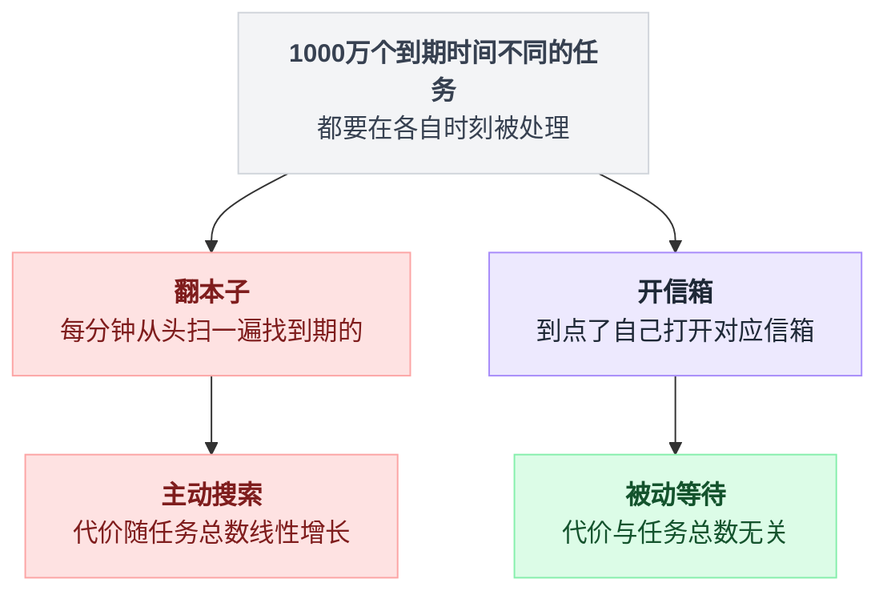
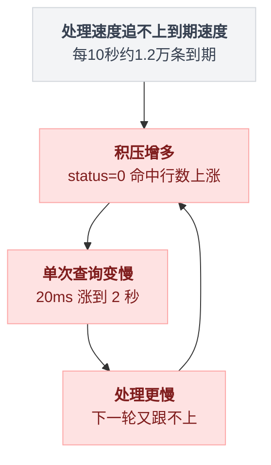
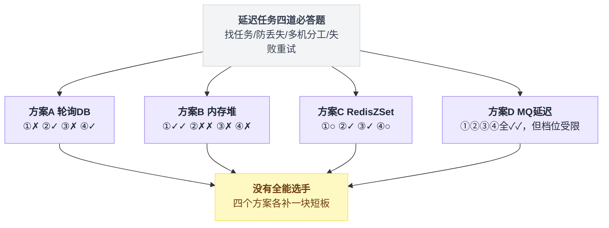
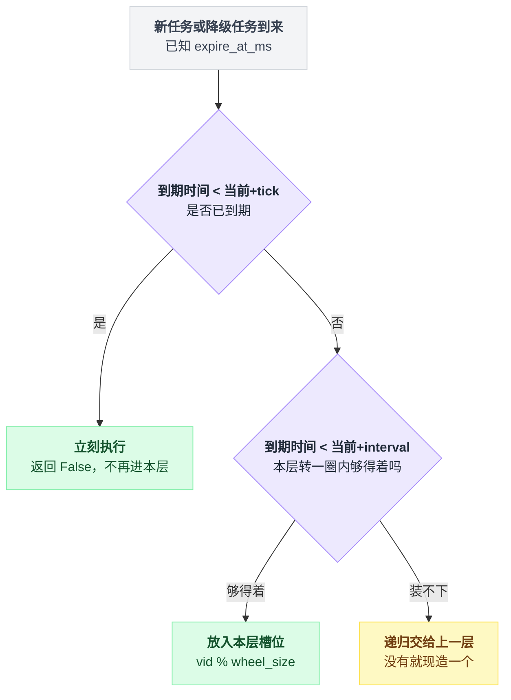
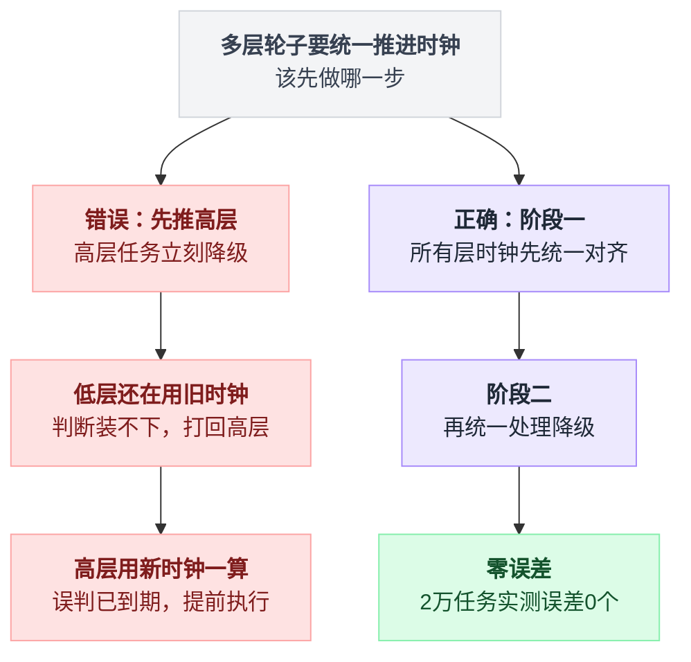
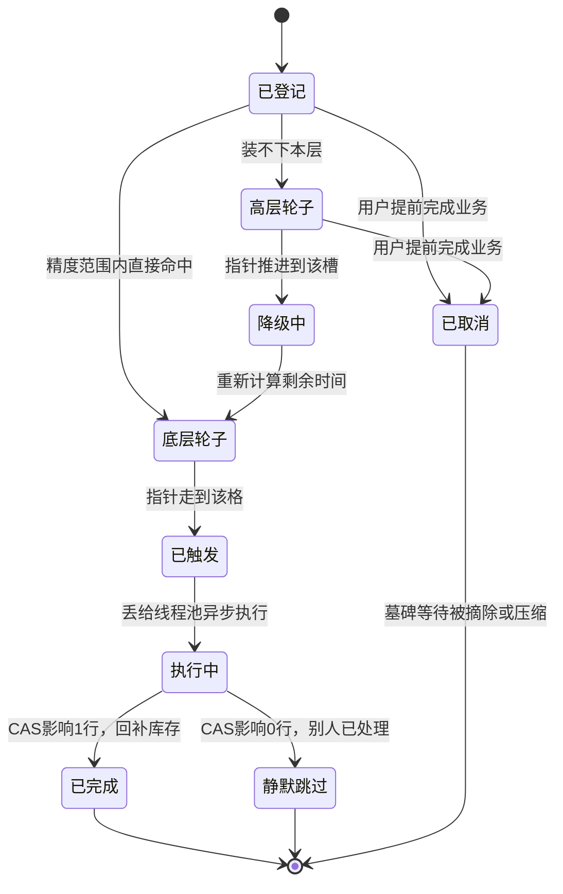
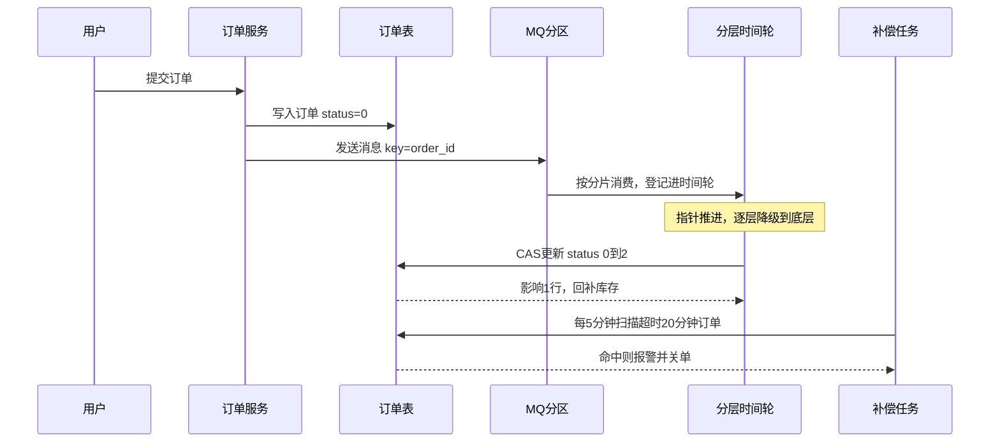
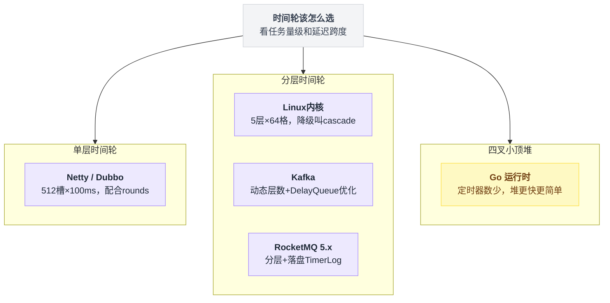

# 《订单超时关闭》一千万个闹钟怎么管 —— 延迟任务与时间轮全解（小白版）

> 一句话简介：每天 1000 万笔订单，每笔都要在"下单后 15 分钟"准时关闭并把库存还回去。这一千万个闹钟，怎么才能不把服务器烧了。
> 难度：★★★☆☆
> 读完你会懂：
> 1. 为什么"定时扫数据库"这个人人都会写的方案，在量大之后一定会死，死在哪个具体环节
> 2. Redis ZSet、MQ 延迟消息各自能撑到哪一步，RabbitMQ 死信队列那个著名的"队头阻塞"坑长什么样
> 3. 时间轮到底是什么——为什么它能把"查找到期任务"这个动作**彻底删掉**
> 4. 分层时间轮的"降级"过程，能自己在纸上手推一遍
> 5. 时间轮怎么落库、怎么多机分片、怎么保证一个订单不会被关两次

---

## 目录

- [0. 先讲个故事：宿舍楼里的一千个闹钟](#0-先讲个故事宿舍楼里的一千个闹钟)
- [1. 这件事到底难在哪](#1-这件事到底难在哪)
- [2. 方案 A：定时轮询数据库，以及它为什么会死](#2-方案-a定时轮询数据库以及它为什么会死)
- [3. 第一次改进：内存延迟队列（方案 B）](#3-第一次改进内存延迟队列方案-b)
- [4. 第二次改进：Redis ZSet（方案 C）](#4-第二次改进redis-zset方案-c)
- [5. 第三次改进：MQ 延迟消息（方案 D）](#5-第三次改进mq-延迟消息方案-d)
- [6. 终极方案：时间轮 —— 从一块机械表说起](#6-终极方案时间轮--从一块机械表说起)
- [7. 单层时间轮：一个数组 + 一根指针](#7-单层时间轮一个数组--一根指针)
- [8. 分层时间轮：秒针、分针、时针](#8-分层时间轮秒针分针时针)
- [9. 核心代码逐行讲解](#9-核心代码逐行讲解)
- [10. 持久化与分布式](#10-持久化与分布式)
- [11. 完整方案全景图](#11-完整方案全景图)
- [12. 谁在用时间轮](#12-谁在用时间轮)
- [13. 生产环境会踩的坑](#13-生产环境会踩的坑)
- [14. 反直觉结论](#14-反直觉结论)
- [15. 决策表：什么场景用哪个方案](#15-决策表什么场景用哪个方案)
- [16. 一句话总结 + 小白词典](#16-一句话总结--小白词典)

---

## 0. 先讲个故事：宿舍楼里的一千个闹钟

### 0.1 一个闹钟

你晚上睡觉前，在手机上定了个闹钟：明早 7 点 30。

第二天 7 点 30，它响了。

这件事简单到你从来没想过它是怎么实现的。手机里有一个小东西在替你数着时间，到点了就叫你。你不用管。

### 0.2 一百个闹钟

现在换个身份。你是宿舍楼的宿管阿姨，楼里住了 100 个学生，手机都被没收了（假设一下）。每个人睡前来找你登记：

```
张三  7:00 叫我
李四  6:45 叫我
王五  7:30 叫我
赵六  6:45 叫我
...
```

你怎么办？

**最直接的办法**：拿个本子记下来，然后从 6 点开始，每过一分钟，你就把整个本子从头翻到尾，看看有没有人是"现在"该叫的。

100 行的本子，翻一遍要 10 秒。每分钟翻一遍，你一晚上翻 60 遍，累是累了点，但能干。

### 0.3 一千万个闹钟

现在把 100 换成 1000 万。

你的本子有 1000 万行。你每分钟要从头翻到尾一次。哪怕你一秒钟能扫 100 万行，翻一遍也要 10 秒。而且你翻完 1000 万行，可能只找出 20 个人是现在该叫的——**剩下 999 万 9980 行全是白看的**。

你翻完刚喘口气，一分钟又到了，又得从头翻。

这就是"定时扫数据库"方案的全部真相。它没有错，它只是**做了大量无用功**，而且无用功的量随着人数线性增长。

### 0.4 宿管阿姨的聪明办法

真实的宿管阿姨不会这么干。她会这样：

在墙上钉 60 个小信箱，标上 `00` 到 `59`，代表"分钟"。

```
    墙上的 60 个信箱（按分钟编号）

    ┌────┬────┬────┬────┬────┬────┬────┐
    │ 00 │ 01 │ 02 │ 03 │ 04 │ 05 │ .. │
    └────┴────┴────┴────┴────┴────┴────┘
                      │
                      │  张三说"7:03 叫我"
                      │  → 纸条丢进 03 号信箱
                      ▼
                  ┌───────┐
                  │ 张三  │
                  │ 陈七  │  ← 03 号信箱里已经有别人了
                  │ 孙八  │     那就摞在一起
                  └───────┘
```

然后她只做一件事：**看着墙上的钟，秒针走到哪一分，就打开哪个信箱。**

- 7 点 03 分到了 → 打开 03 号信箱 → 里面有 3 张纸条 → 叫这 3 个人
- 7 点 04 分到了 → 打开 04 号信箱 → 空的 → 关上，继续

注意发生了什么变化：

| | 翻本子 | 开信箱 |
|---|---|---|
| 每分钟的工作量 | 看 1000 万行 | 只看 1 个信箱里的几张纸条 |
| 工作量随人数增长吗 | 线性增长，人越多越慢 | **不增长**，永远只看一个信箱 |
| 登记一个人要多久 | 写一行，很快 | 丢进对应信箱，也很快 |

**这就是时间轮。** 整篇文章剩下的部分，都是在把这个"墙上的信箱"做大、做结实、做到能扛住 1000 万人、做到断电重来也不丢纸条。

划重点，这里有一句话你要记一辈子：

> **翻本子是"我去找谁到期了"，开信箱是"到期的人自己走到我面前"。**
>
> 前者是主动搜索，后者是被动等待。后者不需要搜索，所以它的代价与总人数无关。

两条路径的分岔画出来是这样：



---

## 1. 这件事到底难在哪

先把业务需求说清楚，别一上来就抽象。

### 1.1 需求长什么样

电商下单流程：

```
用户点"提交订单"
      │
      ▼
┌──────────────────────┐
│ 1. 创建订单          │  status = 0 (待支付)
│ 2. 扣减库存（预扣）  │  商品 A 库存 100 → 99
└──────────┬───────────┘
           │
           ▼
     用户去付钱……
           │
    ┌──────┴───────┐
    │              │
  付了            没付
    │              │
    ▼              ▼
status = 1     15 分钟后
(已支付)       必须做两件事：
库存真扣       1) status → 2 (已关闭)
               2) 库存 99 → 100 （还回去！）
```

那个"15 分钟后"，就是本文的全部内容。

**为什么必须关？** 因为下单时已经把库存锁住了。用户不付钱，商品就一直卖不出去。10 万件库存被 10 万个不付钱的订单锁死，商家一件都卖不掉——这不是技术问题，这是直接的钱的问题。

**为什么必须准？** 不是说要精确到毫秒。业务能接受 15 分 0 秒到 15 分 30 秒之间关单。但如果变成 15 分钟的任务拖到 40 分钟才执行，库存被多锁了 25 分钟，大促期间这就是实打实的销售额损失。

### 1.2 先算清楚数量级

不算数字的架构讨论都是耍流氓。设定一组贯穿全文的数字：

| 指标 | 数值 | 怎么来的 |
|---|---|---|
| 日订单量 | 1000 万笔 | 题目给的 |
| 平均下单速率 | 116 笔/秒 | 1000万 ÷ 86400 秒 |
| 峰值下单速率 | **1200 笔/秒** | 按 10 倍峰谷比估（晚 8 点是白天凌晨的十几倍） |
| 延迟时长 | 15 分钟 = 900 秒 | 题目给的 |
| **峰值在途任务数** | **1200 × 900 = 108 万** | 关键数字！ |
| 峰值到期速率 | 1200 个/秒 | 15 分钟前进来多少，现在就到期多少 |

**"在途任务"这个词要解释一下**：指那些已经登记、但还没到执行时间的任务。因为延迟是 15 分钟，所以任何时刻，系统里都压着"最近 15 分钟内下的所有订单"。峰值期这个数字是 **108 万**。

记住这个 108 万，后面每个方案都要拿它去撞一撞。

再补一个更狠的场景，后面会用到：

> 如果需求不是"15 分钟关单"，而是"**发货后 7 天自动确认收货**"呢？
>
> 在途任务 = 7 天的订单量 = **7000 万个**。
>
> 同一套架构，只是把 900 秒换成 604800 秒，很多方案就直接爆了。这个变化会像照妖镜一样，照出每个方案的真实上限。

### 1.3 你能想到的笨办法，为什么都不行

读者到这里一定会想"这有什么难的"。来，我们把所有直觉方案列出来，一条条打破。

**直觉 1：下单的时候起个线程，`sleep(900)` 然后关单。**

```python
import threading, time

def create_order(order_id: str) -> None:
    save_to_db(order_id)
    # 起个线程等 15 分钟
    threading.Thread(target=lambda: (time.sleep(900), close_order(order_id))).start()
```

看着挺美。问题：

- 峰值 108 万个在途任务 = **108 万个线程**。一个 Python 线程默认栈 8MB（可调小，但即使 512KB），108 万个线程要 500GB 内存。操作系统能创建的线程数通常也就几万个，早就崩了。
- 进程一重启，108 万个 `sleep` 全部消失。这 108 万笔订单**永远不会被关闭**，库存永远锁着。
- 换成协程（`asyncio.sleep`）能省内存，108 万个协程大概几百 MB，勉强能撑。但**重启丢失**这条要命的问题一点没解决。

> **小结**：`sleep` 方案的致命伤不是性能，是"任务只活在内存里"。这是所有后续方案都要正面回答的问题。

**直觉 2：用 Linux 的 `cron` 定时任务。**

`cron` 最小粒度是 1 分钟，而且它只能做"每分钟跑一次脚本"，脚本里还是得自己去找哪些订单到期了——绕回轮询。`cron` 只是个"闹钟触发器"，它不解决"怎么找到期任务"的问题。

**直觉 3：用户下次访问订单页面时，顺手判断一下是不是超时了。**

这叫"惰性关单"（lazy expiration）。它有一个真实的应用价值，但**不能单独用**：

- 用户不来看订单，库存就永远不还。而库存是给**别的用户**用的，不能等这个用户回来才释放。
- Redis 的 key 过期机制就是"惰性删除 + 定期抽样删除"的组合，Redis 自己都不敢只用惰性。

> **小结**：惰性关单是好的**兜底**手段，不是主方案。记住这个词，第 10 章还会请它回来。

### 1.4 提炼：这件事的四个真正难点

把上面的痛感提炼一下，一个合格的延迟任务系统必须同时回答四个问题：

```
┌──────────────────────────────────────────────────┐
│  延迟任务系统的四道必答题                        │
├──────────────────────────────────────────────────┤
│                                                  │
│  ① 怎么"找到"到期的任务？                        │
│     不能每次都翻 108 万行的本子                  │
│                                                  │
│  ② 任务存哪？重启了怎么办？                      │
│     内存快但会丢，磁盘不丢但慢                   │
│                                                  │
│  ③ 多台机器怎么分工？                            │
│     不能让 5 台机器把同一个订单关 5 次           │
│                                                  │
│  ④ 到期了没执行成功怎么办？                      │
│     下游服务挂了、网络超时，任务不能就这么没了   │
│                                                  │
└──────────────────────────────────────────────────┘
```

接下来的五个方案（A→E），你就按这四道题去打分。你会发现前四个方案总是能答对一两道，答错另外两道。只有最后的组合方案能四道全对。

---

## 2. 方案 A：定时轮询数据库，以及它为什么会死

这是 100% 的团队都会先写出来的方案。不丢人，但你得知道它的天花板在哪。

### 2.1 代码长这样

```python
import time
from datetime import datetime, timedelta

TIMEOUT_MINUTES = 15

def scan_and_close_loop() -> None:
    """每 10 秒扫一次数据库，找出超时未支付的订单并关闭"""
    while True:
        deadline = datetime.now() - timedelta(minutes=TIMEOUT_MINUTES)
        rows = db.query(
            "SELECT id, user_id, sku_id, quantity FROM orders "
            "WHERE status = 0 AND create_time < %s "
            "LIMIT 1000",
            (deadline,)
        )
        for row in rows:
            close_order_and_restore_stock(row)
        time.sleep(10)
```

**这段在干嘛**：死循环，每一轮算出"15 分钟前的那个时刻"，然后从订单表里捞出所有"还没付钱、而且下单时间早于那个时刻"的订单，一条条关掉，然后睡 10 秒再来一轮。

对应的建表和索引：

```sql
CREATE TABLE orders (
    id          BIGINT      PRIMARY KEY,
    user_id     BIGINT      NOT NULL,
    sku_id      BIGINT      NOT NULL,
    quantity    INT         NOT NULL,
    status      TINYINT     NOT NULL,   -- 0待支付 1已支付 2已关闭
    create_time DATETIME    NOT NULL,
    KEY idx_status_ctime (status, create_time)
) ENGINE=InnoDB;
```

看起来很讲究：加了 `(status, create_time)` 联合索引，查询能走索引范围扫描，不是全表扫描。很多人到这一步就觉得稳了。

**它确实能跑。日订单 10 万的公司这么干，跑三年都没事。**

问题是我们的题目是 1000 万。

### 2.2 死法一：99.9% 的扫描是空转

先算一笔账。

扫描间隔 10 秒，一天扫 8640 次。每次扫描，数据库要做什么？

走索引 `idx_status_ctime`，先定位到 `status = 0` 的区间，再在这个区间里按 `create_time` 二分找到 `< deadline` 的部分。这一段**索引是有效的**，MySQL 不会扫全表。

但是：

```
     索引 (status, create_time) 里 status=0 的这一段

     ├────────────────── 108 万条待支付订单 ─────────────────┤
     │                                                       │
  create_time 早 ←──────────────────────────────→ create_time 晚
     │                                                       │
     ├─ 已超时 ─┤├──────────── 还没到 15 分钟 ───────────────┤
     │  ~1.2万  ││              ~106.8 万条                  │
     ▼          ▼▼
   要处理的   不用管的
```

每 10 秒到期约 1.2 万条（1200/秒 × 10 秒），索引确实能只定位这 1.2 万条。听起来还行？

**但这是在"系统一切正常"的前提下。** 真实情况是：

- 每次扫描 `LIMIT 1000`，1.2 万条要扫 12 轮才能处理完，而你 10 秒后又要来一次
- 每一轮 `SELECT` 都要重新定位索引起点、重新回表
- 如果处理速度跟不上到期速度，积压会**滚雪球**

一旦积压，`status = 0 AND create_time < deadline` 命中的行数从 1.2 万涨到 10 万、50 万，单次查询从 20ms 涨到 2 秒，处理更慢，积压更多——**正反馈死亡螺旋**。

这个螺旋画出来是个闭环，一旦进去就出不来：



这就是这类系统最恶心的地方：**平时看不出问题，一出问题就是断崖式的**。

### 2.3 死法二：索引也救不了的三件事

很多人以为"加个索引就完事了"。真正杀死这个方案的，是索引管不着的三件事。

**（1）`status` 是个会被疯狂 UPDATE 的列，它当索引前缀是灾难**

用户付款了，`status` 从 0 变成 1。在 B+ 树索引里，这**不是原地修改**，而是：

```
   索引 idx_status_ctime 的物理结构

   ┌───────────────────────────────────────────┐
   │ status=0 区  │ status=1 区  │ status=2 区 │
   │  (待支付)    │  (已支付)    │  (已关闭)   │
   │   108 万条   │   千万级     │   千万级    │
   └───────────────────────────────────────────┘
         │                ▲
         │  用户付款了     │
         └────────────────┘
       从 status=0 区删掉一条
       在 status=1 区插入一条
       两次 B+ 树操作，可能触发页分裂
```

峰值 1200 笔/秒下单、假设 800 笔/秒付款，就是每秒 800 次"删除+插入"的索引维护，全部集中在同一棵树的两个热点区。页分裂、页合并、锁竞争全来了。

**你为了读，付出了巨大的写代价。** 这笔账很多人不算。

**（2）`LIMIT 1000 OFFSET N` 深分页**

如果你想"一次多捞点"，写成分页：

```sql
SELECT ... WHERE status=0 AND create_time < ? LIMIT 1000 OFFSET 10000;
```

MySQL 的 `OFFSET 10000` 是**真的把前 10000 行读出来再丢掉**。翻到第 100 页，等于读了 10 万行只为拿 1000 行。这是个经典陷阱，翻页越深越慢。

（正确写法是用"上次的最大 id"做游标：`WHERE id > last_id ORDER BY id LIMIT 1000`。但这只是缓解，没有改变"每轮都要重新扫"的本质。）

**（3）Buffer Pool 被冲刷**

"Buffer Pool" 一句话解释：MySQL 在内存里开的一块缓存，把最近用到的数据页放进去，下次读就不用碰磁盘了。它是 MySQL 性能的命根子。

你的扫描任务每 10 秒就要读一大片"冷"数据（15 分钟前的订单，正常业务早就不碰了），这些冷页会把用户正在访问的"热"页从缓存里挤出去。

结果：**你的关单任务把整个数据库的缓存命中率拉低了，所有其他业务的查询都变慢。**

这是最阴险的一条：你的监控只会显示"下单接口变慢了"，你查半天都想不到是那个每 10 秒跑一次的定时任务干的。

### 2.4 死法三：扫描频率和精度的死结

这是方案 A 无法调和的内在矛盾。

设扫描间隔为 `T`，那么一个任务的**最坏延迟误差就是 T**。

```
   时间轴 ──────────────────────────────────────────────►

   扫描      扫描                              扫描
    ▼         ▼                                 ▼
   ─┼─────────┼─────────────────────────────────┼──
    │         │                                 │
    │         └── 任务在这一刻到期 ✗ 刚错过     │
    │                                           │
    │              这个任务白等了 T 秒 ─────────┘
    └────────────── 间隔 T ─────────────────────┘
```

于是你面对一个二选一：

| 扫描间隔 T | 精度 | 数据库压力 | 一天扫描次数 |
|---|---|---|---|
| 60 秒 | 最坏晚 1 分钟 | 低 | 1440 次 |
| 10 秒 | 最坏晚 10 秒 | 中 | 8640 次 |
| 1 秒 | 最坏晚 1 秒 | **高** | 86400 次 |
| 100 毫秒 | 最坏晚 0.1 秒 | **数据库直接躺平** | 86.4 万次 |

**要精度就得高频扫，要低压力就得低频扫，没有中间地带。**

更荒谬的是：高频扫描的绝大部分收益是零。每秒扫一次，86400 次扫描里，可能有 80000 次返回的是"和上一次差不多的结果"，你只是在反复确认同一批数据。

> **这一条是整篇文章的思想转折点**：轮询的本质缺陷不是"慢"，是**它把"时间的流逝"和"数据的检索"绑在了一起**。时间自己会走，你不需要每一秒都去数据库确认一次"现在几点了"。

### 2.5 死法四：多机部署直接翻车

单机跑得好好的，一上线要部署 5 个实例保证高可用。然后：

```
    实例1        实例2        实例3        实例4        实例5
      │            │            │            │            │
      └────────────┴────────────┴────────────┴────────────┘
                          │
                          ▼
              5 个实例同时执行同一条 SQL
              捞到完全一样的 1000 条订单
                          │
                          ▼
              同一笔订单被关闭 5 次
              库存被还回去 5 次！！！
                          │
                          ▼
              超卖 / 库存凭空变多 → 资损
```

**"资损"一句话解释**：真金白银的损失。库存本来 100 件，被错误地加回 5 次，变成 104 件，多卖出去的 4 件你没货发，要赔钱。

常规解法是加分布式锁（比如用 Redis 的 `SETNX`，谁抢到谁执行）：

```python
def scan_with_lock() -> None:
    while True:
        if redis.set("lock:close_order", "1", nx=True, ex=30):
            try:
                do_scan_and_close()
            finally:
                redis.delete("lock:close_order")
        time.sleep(10)
```

**这段在干嘛**：抢一把锁，抢到的那台机器才干活，干完释放。`nx=True` 的意思是"只有 key 不存在时才设置成功"，天然实现了互斥。

但你看出问题了吗：

> 你部署了 5 台机器，**结果永远只有 1 台在干活**，另外 4 台在旁边看着。
>
> 你花了 5 倍的钱，买到的是 1 倍的处理能力 + 一点点故障切换能力。

处理能力的天花板锁死在单机。到期速率一旦超过单机处理能力（1200 个/秒，每个要调库存服务、写日志、发消息），立刻积压。

### 2.6 方案 A 的四道题得分

| 必答题 | 方案 A 的表现 | 得分 |
|---|---|---|
| ① 怎么找到期任务 | 全靠扫，空转严重，积压时雪崩 | ✗ |
| ② 重启会丢吗 | **不会丢**，数据全在 MySQL 里 | ✓ |
| ③ 多机怎么分工 | 靠锁串行化，等于只有一台在干活 | ✗ |
| ④ 执行失败怎么办 | **天然重试**，下次扫还会扫到 | ✓ |

有意思吧？方案 A 在②④上是满分——**它的可靠性其实是所有方案里最好的**。它只是"找"得太笨、"扩"不出去。

**记住这一点。** 第 10 章我们会把方案 A 请回来，让它当整个系统的最后一道保险丝。这是本文最重要的伏笔。

> **小结**：轮询数据库不是错误方案，是**不可扩展**方案。它的死因是把"时间流逝"翻译成了"反复检索"，而检索的代价随数据量增长。

---

## 3. 第一次改进：内存延迟队列（方案 B）

方案 A 的病根是"每次都要去找"。那能不能**让任务自己排好队**，队头永远是最早到期的那个？

能。这个数据结构叫**小顶堆**（min-heap）。

### 3.1 先讲什么是堆

如果你没听过堆，看这张图就够了：

```
        小顶堆：一棵"父亲总比儿子小"的完全二叉树

                    ┌─────┐
                    │ 100 │  ← 堆顶，永远是最小的
                    └──┬──┘
              ┌────────┴────────┐
           ┌──┴──┐           ┌──┴──┐
           │ 105 │           │ 103 │
           └──┬──┘           └──┬──┘
         ┌────┴────┐       ┌────┴────┐
      ┌──┴──┐   ┌──┴──┐ ┌──┴──┐   ┌──┴──┐
      │ 120 │   │ 110 │ │ 108 │   │ 130 │
      └─────┘   └─────┘ └─────┘   └─────┘

      数字代表"到期时间戳"，越小越早到期
```

它的规矩只有一条：**每个节点都比它的两个儿子小**。注意 105 比 103 大，但它们不是父子关系，所以不冲突——堆**不是**全局有序的，它只保证堆顶最小。

正因为要求松，操作才快：

| 操作 | 复杂度 | 直觉解释 |
|---|---|---|
| 看堆顶（最早到期的） | **O(1)** | 就是数组第 0 个元素，直接读 |
| 弹出堆顶 | O(log n) | 把最后一个元素挪到顶上，然后一路"下沉"到该待的位置 |
| 插入新元素 | O(log n) | 放在最后，然后一路"上浮" |

"O(log n)" 一句话解释：n 是元素总数，log n 是"n 要除以 2 多少次才能变成 1"。100 万个元素，log₂(100万) ≈ 20。也就是说堆里有 100 万个任务，插一个只要比较 20 次。**很快。**

Python 标准库直接自带：`import heapq`。

### 3.2 代码

```python
import heapq
import threading
import time
from dataclasses import dataclass, field

@dataclass(order=True)
class DelayTask:
    execute_at: float               # 到期时间戳，堆按这个排序
    order_id: str = field(compare=False)   # 业务数据不参与比较
    cancelled: bool = field(default=False, compare=False)
```

**这段在干嘛**：定义一个"延迟任务"。`order=True` 让 dataclass 自动生成比较方法，`compare=False` 表示这个字段不参与比较——所以两个任务比大小时，只看 `execute_at`。这样丢进 heapq 就会按到期时间排序。

```python
class DelayQueue:
    def __init__(self) -> None:
        self._heap: list[DelayTask] = []
        self._cond = threading.Condition()   # 条件变量：能等、能被叫醒

    def add(self, order_id: str, delay_seconds: float) -> DelayTask:
        task = DelayTask(execute_at=time.monotonic() + delay_seconds,
                         order_id=order_id)
        with self._cond:
            heapq.heappush(self._heap, task)
            self._cond.notify()   # 叫醒消费线程：可能来了个更早到期的
        return task
```

**这段在干嘛**：把任务塞进堆。关键是最后那个 `notify()`——消费线程可能正在睡"等堆顶到期"，现在来了个更早的任务，必须把它叫醒重算。`time.monotonic()` 是单调时钟，后面第 13 章会专门讲为什么不能用 `time.time()`。

```python
    def take(self) -> DelayTask:
        """阻塞直到有任务到期，返回它"""
        with self._cond:
            while True:
                if not self._heap:
                    self._cond.wait()          # 堆空，一直睡到有人 add
                    continue
                head = self._heap[0]
                now = time.monotonic()
                if head.execute_at <= now:
                    return heapq.heappop(self._heap)   # 到期了，弹出
                self._cond.wait(head.execute_at - now) # 没到期，精确睡到它到期
```

**这段在干嘛**：这是整个方案的灵魂。它**不轮询**——它看一眼堆顶，算出"还差多少秒到期"，然后就精确地睡那么久。没有任何空转。中途如果有人插入了更早的任务，`notify()` 会把它提前叫醒，重新算一遍。

对比方案 A：方案 A 是"每 10 秒醒一次问问看"，方案 B 是"算好了到点再醒"。**方案 B 的 CPU 消耗接近 0。**

```python
def worker(queue: DelayQueue) -> None:
    while True:
        task = queue.take()
        if task.cancelled:
            continue           # 用户已付款，跳过
        close_order_and_restore_stock(task.order_id)
```

**这段在干嘛**：消费线程，不停地取到期任务并执行。`cancelled` 那一行是"懒删除"——下一节讲。

### 3.3 它解决了什么

| | 方案 A（轮询 DB） | 方案 B（内存堆） |
|---|---|---|
| 精度 | 最坏差 T 秒 | **毫秒级**，想多准有多准 |
| 空转 | 每 10 秒一次数据库查询 | **零空转**，睡到点才醒 |
| 数据库压力 | 持续的扫描 | **零**，数据库完全不参与 |
| 找到期任务 | O(扫描量) | O(1) 看堆顶 |

一夜之间，那个最难受的"精度 vs 压力"死结解开了。这是一次真正的进步。

### 3.4 崩溃分析：三个致命伤

**（1）重启就全没了 —— 最致命**

```
   T0          进程运行中，堆里压着 108 万个任务
               ┌──────────────────────────────┐
               │  ● ● ● ● ● ● ● ● ● ● ● ●    │  108 万个闹钟
               └──────────────────────────────┘

   T1          运维发版，进程重启
                        │
                        ▼
               ┌──────────────────────────────┐
               │                              │  ← 空的
               └──────────────────────────────┘

   T2          这 108 万笔订单永远不会被关闭
               108 万份库存永远锁死
               客服电话被打爆
```

这不是"可能出问题"，这是**每次发版必然发生**。而一个正常公司一周要发好几次版。

你可能想"那我优雅停机，退出前把堆里的任务持久化到数据库"。可以，但：进程被 `kill -9` 呢？机器断电呢？OOM 被内核干掉呢？**优雅停机只能覆盖"优雅"的那部分场景**，剩下的场景才是要命的。

**（2）内存爆炸**

算一下 108 万个 `DelayTask` 对象占多少内存：

```python
# 实测思路
import sys
t = DelayTask(execute_at=1.0, order_id="20260804123456789012")
# 一个 dataclass 实例（含 __dict__）约 150~200 字节
# 加上 str 对象本身（20 字符）约 69 字节
# 加上 heapq 那个 list 里的指针 8 字节
# 保守估计：单个任务 ~280 字节
```

- 15 分钟场景：108 万 × 280B ≈ **300 MB**。能忍。
- **7 天确认收货场景**：7000 万 × 280B ≈ **19.6 GB**。单机内存直接爆掉。

而且 Python 的 GC 要在这 7000 万个对象上来回走，GC 停顿会让整个进程卡住几秒。

**（3）只能单机，且无法水平扩展**

堆在进程的内存里。你起第二个进程，它有它自己的一个空堆。两个堆互相不认识。

- 任务怎么分配给两个进程？得在上游做路由。
- 一个进程挂了，它堆里的任务怎么转移给另一个？**转移不了，因为已经没了。**

### 3.5 一个容易忽略的坑：任务取消

用户在第 3 分钟付款了，这个"15 分钟关单"的任务必须取消。

但 `heapq` **不支持删除任意元素**。堆是个数组，你要删中间某个元素，得先找到它（O(n) 遍历），再重排（O(log n)）。100 万个任务里找一个，慢得没法用。

标准解法叫**惰性删除 / 打墓碑**（tombstone）：

```python
def cancel(task: DelayTask) -> None:
    task.cancelled = True      # 不删，只打个标记
```

任务还在堆里占着位置，只是等它到期弹出来的时候，消费者看一眼标记，直接跳过。

代价：**堆里会积累大量"僵尸任务"**。如果 90% 的订单都正常付款了，你的堆里 90% 是已取消的墓碑，内存全被浪费。工业界的做法是定期"压缩"——把堆整个重建一遍，滤掉墓碑，代价 O(n)。

> **记住这个"惰性删除"**，时间轮里也要用同一招，而且用得更自然。

### 3.6 方案 B 的四道题得分

| 必答题 | 方案 B 的表现 | 得分 |
|---|---|---|
| ① 怎么找到期任务 | **O(1) 看堆顶，零空转** | ✓✓ |
| ② 重启会丢吗 | **全丢**，纯内存 | ✗✗ |
| ③ 多机怎么分工 | 完全没法分 | ✗ |
| ④ 执行失败怎么办 | 任务已弹出，丢了就没了 | ✗ |

和方案 A 正好**互补**：A 可靠但笨，B 聪明但脆。

> **小结**：方案 B 教会我们最重要的一件事——**不要去"找"到期任务，要让数据结构告诉你"下一个什么时候到期"，然后精确地睡过去**。这个思想在时间轮里会被推到极致。

---

## 4. 第二次改进：Redis ZSet（方案 C）

方案 B 的堆在**进程内存**里，所以会丢、没法共享。那把这个堆挪到**进程外面**呢？

挪到哪？挪到 Redis。

### 4.1 什么是 ZSet

"Redis" 一句话解释：一个独立跑着的内存数据库，你的程序通过网络访问它。它自己会把数据往磁盘上存一份，所以重启不会全丢。

"ZSet"（Sorted Set，有序集合）一句话解释：**一个每个成员都带着一个分数的集合，Redis 会自动帮你按分数排好序**。

```
    Redis ZSet:  delay:close_order

    ┌──────────────────┬──────────────────────┐
    │  score（分数）   │  member（成员）      │
    ├──────────────────┼──────────────────────┤
    │  1754300100      │  order:1001          │  ← 最早到期，排最前
    │  1754300103      │  order:1002          │
    │  1754300103      │  order:1003          │
    │  1754300147      │  order:1004          │
    │  1754300890      │  order:1005          │
    │      ...         │      ...             │
    │  1754301000      │  order:1088          │  ← 最晚到期
    └──────────────────┴──────────────────────┘
              ▲
              │
      我们把 score 设成"到期时间戳"
      于是这个集合天然就是按到期时间排好序的
```

关键洞察：**score = 到期时间戳**。这样一来，"找出所有已到期的任务" = "找出所有 score 小于当前时间戳的成员"，Redis 有现成命令直接干这事，而且是 O(log n)。

底层实现是"跳表"（skiplist），你可以先理解成"一个能快速按分数范围查找的有序链表"，效率跟平衡树差不多。

### 4.2 基础代码

```python
import time
import redis

r = redis.Redis(decode_responses=True)
DELAY_KEY = "delay:close_order"

def add_task(order_id: str, delay_seconds: int) -> None:
    """登记一个延迟任务"""
    execute_at = int(time.time()) + delay_seconds
    r.zadd(DELAY_KEY, {f"order:{order_id}": execute_at})

def cancel_task(order_id: str) -> None:
    """用户付款了，取消关单任务"""
    r.zrem(DELAY_KEY, f"order:{order_id}")
```

**这段在干嘛**：`zadd` 把 `(成员, 分数)` 塞进有序集合。`zrem` 直接按成员名删除——**注意这里，取消任务是 O(log n) 的精确删除，比方案 B 的"打墓碑"干净得多**。这是 ZSet 相对内存堆的一个实打实的优势。

```python
def poll_expired() -> list[str]:
    """捞出所有已到期的任务"""
    now = int(time.time())
    members = r.zrangebyscore(DELAY_KEY, 0, now, start=0, num=100)
    result = []
    for m in members:
        if r.zrem(DELAY_KEY, m):      # 删成功 = 我抢到了这个任务
            result.append(m)
    return result
```

**这段在干嘛**：`zrangebyscore(key, 0, now)` 意思是"给我所有分数在 0 到 now 之间的成员"，也就是所有已到期的。`num=100` 限制一次只拿 100 个。然后逐个 `zrem` 删掉。

`zrem` 返回值是"实际删掉的个数"，这一点很妙：如果有 5 台机器同时捞到了同一个任务，**只有一台的 `zrem` 会返回 1**，其余返回 0。所以 `if r.zrem(...)` 天然就是一把分布式锁。

### 4.3 用 Lua 保证原子性

上面的代码有个隐患：`zrangebyscore` 和 `zrem` 是两次独立的网络请求，中间可能被别的客户端插队。虽然靠 `zrem` 的返回值能兜住，但要发 100 次网络请求，太慢了。

**Lua 脚本**一句话解释：你可以把一段小程序发给 Redis，让 Redis 一口气跑完。Redis 是单线程的，脚本执行期间没有任何别的命令能插进来，所以天然原子。

```lua
-- 文件：fetch_expired.lua
-- KEYS[1] = ZSet 的 key
-- ARGV[1] = 当前时间戳
-- ARGV[2] = 最多取几个

local expired = redis.call('ZRANGEBYSCORE', KEYS[1], 0, ARGV[1],
                           'LIMIT', 0, ARGV[2])
if #expired > 0 then
    redis.call('ZREM', KEYS[1], unpack(expired))
end
return expired
```

**这段在干嘛**：一次性做完"查到期的"和"删掉它们"两件事，中间不可能被打断。返回值就是这一批到期任务。这跟秒杀系统里"Redis 预扣库存"用 Lua 保证"判断库存 + 扣减"原子，是**一模一样的招式**。

```python
FETCH_SCRIPT = r.register_script(open("fetch_expired.lua").read())

def poll_expired_atomic(batch: int = 200) -> list[str]:
    return FETCH_SCRIPT(keys=[DELAY_KEY], args=[int(time.time()), batch])
```

**这段在干嘛**：把 Lua 脚本注册给 Redis（Redis 会缓存它，之后只传一个 SHA 值，省带宽），然后一次调用就拿到一批到期任务。原来的 101 次网络请求变成 1 次。

### 4.4 它解决了什么

| | 方案 B（内存堆） | 方案 C（Redis ZSet） |
|---|---|---|
| 重启丢失 | **全丢** | Redis 有 RDB/AOF 持久化，基本不丢 |
| 多机共享 | 不行 | **可以**，所有机器连同一个 Redis |
| 任务取消 | 打墓碑，脏 | **`ZREM` 精确删除，干净** |
| 抢占防重 | 无 | **`ZREM` 返回值天然互斥** |

四道必答题里，②③一下子都过了。这是个能上生产的方案，**中小规模场景（日订单几十万）用这套完全够了**。

### 4.5 崩溃分析：它只是把压力换了个地方

**（1）轮询根本没消失，只是换了个对象**

回头看 `poll_expired_atomic`，你还是得在一个循环里反复调它：

```python
while True:
    tasks = poll_expired_atomic()
    if not tasks:
        time.sleep(0.5)      # 没任务，歇一下
        continue
    for t in tasks:
        handle(t)
```

**这跟方案 A 的死循环长得一模一样。** 你只是把 `SELECT ... FROM orders` 换成了 `ZRANGEBYSCORE`。

- 空转还在。每秒 2 次轮询，一天 17 万次，大部分是空跑。
- "精度 vs 压力"的死结还在。要 100ms 精度，就得每 100ms 轮一次。
- 只不过 Redis 比 MySQL 快 100 倍，所以你能承受得起更高的轮询频率。**是量变，不是质变。**

方案 B 的那个漂亮的"精确睡到堆顶到期"，在这里丢掉了——因为 ZSet 在另一台机器上，它不会主动叫醒你。

**（2）大 Key 问题 —— 这个能把整个 Redis 搞挂**

108 万个成员塞在**一个** key 里。这在 Redis 里叫"大 Key"，是运维最怕的东西之一。

```
   Redis 内存里的这一个 key

   ┌────────────────────────────────────────────────┐
   │  delay:close_order                             │
   │  ┌──────────────────────────────────────────┐  │
   │  │ 108 万个成员                             │  │
   │  │ 每个：member 字符串 ~30B                 │  │
   │  │     + skiplist 节点开销 ~50B             │  │
   │  │     + dict 哈希表条目 ~40B               │  │
   │  │  ≈ 120 B/个                              │  │
   │  │                                          │  │
   │  │  总计 ≈ 130 MB   ← 全在一个 key 里       │  │
   │  └──────────────────────────────────────────┘  │
   └────────────────────────────────────────────────┘
```

大 Key 的三个后果：

- **删除会阻塞**：`DEL` 一个 108 万成员的 ZSet 是 O(n)，主线程要卡住几百毫秒。Redis 是**单线程**的，它卡住 = 全公司所有用 Redis 的业务全卡住。（Redis 4.0 之后有 `UNLINK` 异步删除，缓解了，但迁移、备份、`BGSAVE` fork 时的内存拷贝依然痛苦。）
- **集群模式下无法分片**：Redis Cluster 按 key 做分片。一个 key 再大也只能待在一个节点上。你有 6 台 Redis，这 130MB + 所有相关的读写请求全压在其中 1 台上，**另外 5 台闲着**。这跟方案 A 的分布式锁困境是同一个病。
- **7 天场景直接死**：7000 万成员 × 120B ≈ **8.4 GB 单 key**。不用试了。

**（3）Lua 脚本执行期间 Redis 完全阻塞**

你为了原子性用了 Lua，但 Lua 里的 `ZRANGEBYSCORE ... LIMIT 0 1000` 加 `ZREM` 1000 个成员，是实打实的计算量。Redis 单线程，这段时间内**所有其他命令排队等待**。

批次开太大，Redis 延迟毛刺；批次开太小，轮询次数上去了。又是一个权衡。

**（4）Redis 不是完全不丢**

- RDB 是定期快照，两次快照之间宕机会丢数据。
- AOF 默认 `everysec`（每秒刷盘），最坏丢 1 秒的数据。
- 主从切换时，异步复制可能丢失还没同步过去的写入。

对"关单"这种能靠兜底补偿的业务，丢一点点还能接受。但你心里要清楚它**不是数据库级别的可靠**。

### 4.6 一个重要的救场思路：把大 Key 拆成 N 个

大 Key 的标准解法是分片：

```python
SHARD_COUNT = 16

def shard_key(order_id: str) -> str:
    return f"delay:close_order:{hash(order_id) % SHARD_COUNT}"

def add_task_sharded(order_id: str, delay_seconds: int) -> None:
    execute_at = int(time.time()) + delay_seconds
    r.zadd(shard_key(order_id), {f"order:{order_id}": execute_at})
```

**这段在干嘛**：按订单 ID 取模，把任务散到 16 个 ZSet 里。每个 key 只有 6.75 万成员，大 Key 问题缓解了，16 个 key 也能分散到集群的不同节点上。消费端起 16 个 worker，各管一个分片，**终于能水平扩展了**。

```
     一个大 Key                    →        16 个小 Key

  ┌──────────────────┐              ┌────┬────┬────┬────┐
  │                  │              │ #0 │ #1 │ #2 │ #3 │
  │   108 万成员     │              ├────┼────┼────┼────┤
  │    130 MB        │              │ #4 │ #5 │ #6 │ #7 │
  │                  │              ├────┼────┼────┼────┤
  │  全在 1 个节点   │              │ #8 │ #9 │#10 │#11 │
  │                  │              ├────┼────┼────┼────┤
  │                  │              │#12 │#13 │#14 │#15 │
  └──────────────────┘              └────┴────┴────┴────┘
                                    每个 6.75 万成员，8 MB
                                    散布在集群各节点
```

**注意！** 这里出现了一个重要的味道：

> 我们开始**按某种规则把任务分到不同的桶里，然后每个桶单独处理**。
>
> 时间轮干的就是这件事——只不过它分桶的依据不是"订单 ID 取模"，而是"**到期时间取模**"。而正是这个依据的改变，让"找到期任务"这个动作彻底消失了。

### 4.7 方案 C 的四道题得分

| 必答题 | 方案 C 的表现 | 得分 |
|---|---|---|
| ① 怎么找到期任务 | 还是轮询，只是对象换成了更快的 Redis | ○ 及格 |
| ② 重启会丢吗 | 基本不丢（AOF 最坏丢 1 秒） | ✓ |
| ③ 多机怎么分工 | 分片后可以，但要自己实现 | ✓ |
| ④ 执行失败怎么办 | `ZREM` 之后就没了，需要额外的重试机制 | ○ 及格 |

> **小结**：Redis ZSet 是**性价比最高的通用方案**，中小规模直接上它，别想太多。但它没有解决轮询的本质问题，只是把压力从 MySQL 挪到了 Redis。

---

## 5. 第三次改进：MQ 延迟消息（方案 D）

前三个方案都要自己写"扫描-执行"的循环。有没有现成的组件，我把消息一发，它保证 15 分钟后送到我手上？

有。消息队列的"延迟消息"功能。

"消息队列（MQ）"一句话解释：一个中间人。你把消息扔给它，它负责存好、然后投递给消费者。好处是发消息的人和处理消息的人可以完全解耦。

### 5.1 理想中的样子

```python
# 下单时
mq.send_delayed(topic="order_timeout", body=order_id, delay_seconds=900)

# 消费端
@mq.subscribe("order_timeout")
def on_timeout(order_id: str) -> None:
    close_order_and_restore_stock(order_id)
```

**这段在干嘛**：发一条 15 分钟后才投递的消息，消费端到时候自然会收到。就这么两行，业务代码干干净净。

美不美？美。但每种 MQ 的实现方式差别巨大，坑也各不相同。

### 5.2 RocketMQ：只有 18 个固定档位

RocketMQ 4.x 的延迟消息不支持任意时长，只支持 **18 个预设等级**：

```
  等级:   1    2    3    4    5    6    7    8    9
  时长:  1s   5s  10s  30s   1m   2m   3m   4m   5m

  等级:  10   11   12   13   14   15   16   17   18
  时长:  6m   7m   8m   9m  10m  20m  30m   1h   2h
```

看出问题了吗？

> **没有 15 分钟这一档。**

10 分钟（等级 14）和 20 分钟（等级 15）之间是断的。你的选择：

| 办法 | 做法 | 问题 |
|---|---|---|
| 用 20 分钟档 | 直接改业务，超时时间改成 20 分钟 | 库存多锁 5 分钟。产品经理不同意 |
| 两跳 | 先发 10 分钟的，收到后再发 5 分钟的 | 两倍消息量，中间那一跳失败了任务就丢了 |
| 用 1 分钟档循环 15 次 | 每次收到就重发一条 1 分钟的，计数到 15 | 15 倍消息量，链路太长，任何一环断了就丢 |

**为什么 RocketMQ 要搞成固定等级？** 因为它的实现是：给每个等级建一个内部队列（`SCHEDULE_TOPIC_XXXX` 的 18 个 queue）。同一个队列里的消息延迟时长完全一样，所以**天然按到期时间有序**，投递时只需要检查队头一条。这是个非常聪明的降维——**用"限制自由度"换"实现极简"**。

（RocketMQ 5.x 支持了任意时刻的定时消息。它的实现用的正是——**时间轮**。文件名叫 `TimerWheel`。绕了一圈，答案还是本文的主角。）

### 5.3 RabbitMQ 死信队列：那个著名的队头阻塞大坑

RabbitMQ 原生没有延迟消息，社区发明了一个巧妙的组合玩法：**TTL + 死信队列**。

先解释两个词：

- **TTL**（Time To Live，存活时间）：给消息设个保质期，过期了就作废。
- **死信队列**（DLX，Dead Letter Exchange）：消息作废时，不是扔掉，而是转发到另一个指定的队列去。

把这两个一拼：

```
        1. 发消息，TTL = 15 分钟
                  │
                  ▼
        ┌─────────────────────────┐
        │   等待队列（延迟队列）   │  ← 故意不给它挂消费者！
        │   queue.delay.15min      │     消息只能待在里面等死
        │                          │
        │   声明时指定：           │
        │   x-message-ttl = 900000 │
        │   x-dead-letter-exchange │
        │        = dlx.order       │
        └────────────┬─────────────┘
                     │ 15 分钟后消息"死"了
                     │ 被自动转发到死信交换机
                     ▼
        ┌─────────────────────────┐
        │   死信队列               │  ← 这里挂真正的消费者
        │   queue.order.timeout    │
        └────────────┬─────────────┘
                     │
                     ▼
                关闭订单、回补库存
```

**思路很妙**：把"延迟 15 分钟"翻译成"在一个没人消费的队列里躺 15 分钟"。

**然后就是那个巨坑。**

RabbitMQ 的队列是严格的 **FIFO（先进先出）**。它检查消息是否过期时，**只看队头那一条**。

```
   队列（左边是队头，先进来的在左边）

   ┌──────────┬──────────┬──────────┬──────────┐
   │  消息 A  │  消息 B  │  消息 C  │  消息 D  │
   │ TTL=30分 │ TTL=1分  │ TTL=1分  │ TTL=1分  │
   │ 剩29分   │ 已过期！ │ 已过期！ │ 已过期！ │
   └──────────┴──────────┴──────────┴──────────┘
        ▲           ▲          ▲          ▲
        │           └──────────┴──────────┘
        │                      │
   RabbitMQ 只看它        这三条早就该出去了
   "还没过期"             但它们出不来！
        │                      │
        └── 堵住了整条队列 ────┘

   结果：B、C、D 要等 A 的 30 分钟到了、A 出队之后，
        才能被检查、才能被投递。

   B 本该 1 分钟后执行，实际 30 分钟后才执行 —— 晚了 29 分钟
```

**这就是队头阻塞（Head-of-Line Blocking）。** 一条延迟时间长的消息，会把它后面所有延迟时间短的消息全部堵死。

在订单超时这个场景，如果所有订单都是固定 15 分钟，队列里的消息天然按到期时间有序，**不会触发这个坑**。但只要你有任何一点变化，比如：

- VIP 用户给 30 分钟支付时间，普通用户 15 分钟 → 一条 VIP 消息堵死后面所有普通消息
- 有的活动商品是 5 分钟超时 → 混在一起就完蛋
- 补发了一条延迟 2 小时的消息 → 后面 2 小时的消息全堵住

**标准规避方案**：**每一种 TTL 建一个独立队列**。

```
    ┌────────────────────────┐
    │ queue.delay.5min       │──┐
    │ TTL 固定 5 分钟        │  │
    └────────────────────────┘  │
    ┌────────────────────────┐  │
    │ queue.delay.15min      │──┼──► dlx.order ──► 消费者
    │ TTL 固定 15 分钟       │  │
    └────────────────────────┘  │
    ┌────────────────────────┐  │
    │ queue.delay.30min      │──┘
    │ TTL 固定 30 分钟       │
    └────────────────────────┘

    同一队列内 TTL 相同 → 天然有序 → 不会队头阻塞
```

看出来了吗？**这跟 RocketMQ 的 18 个固定等级是完全一样的思路**——用"只支持有限几种延迟时长"换"队内有序"。

代价：延迟时长必须是**有限的、预先定义好的**。想支持任意时长？你得建无数个队列。

（还有个 `rabbitmq_delayed_message_exchange` 插件，支持任意延迟。但它把消息存在 Erlang 的 Mnesia 数据库里、用 Erlang timer 驱动，官方明确说**不适合大量消息**，几十万条就开始不稳定。1000 万？想都别想。）

### 5.4 MQ 方案共同的三个问题

**（1）任务取消不了**

消息一旦发出去，就在 broker 里躺着，**你没法撤回**。用户第 3 分钟付款了，那条 15 分钟后的消息照样会投递过来。

只能在消费端判断：

```python
def on_timeout(order_id: str) -> None:
    order = db.get_order(order_id)
    if order.status != 0:
        return           # 已经付款/已关闭了，直接忽略
    close_order_and_restore_stock(order_id)
```

**这段在干嘛**：消费时先查一下订单当前状态，不是"待支付"就直接丢弃。这叫"消费端过滤"。

代价：**假设 90% 的订单最终都付款了，那 90% 的延迟消息都是白发的**。1000 万条消息里 900 万条是纯浪费——浪费 broker 存储、浪费网络、浪费一次数据库查询。

**（2）在途消息全堆在 broker 上**

108 万条消息在 broker 里压着 15 分钟。如果单条消息 500 字节，就是 540MB 的堆积。RocketMQ 靠磁盘顺序写扛得住，RabbitMQ（内存队列为主）就比较难受，容易触发流控。

**（3）多了一个强依赖**

MQ 挂了，你的订单全部超时不了。而 MQ 是个重组件，运维成本不低。

### 5.5 方案 D 的四道题得分

| 必答题 | 方案 D 的表现 | 得分 |
|---|---|---|
| ① 怎么找到期任务 | **不用自己找**，MQ 负责投递 | ✓✓ |
| ② 重启会丢吗 | 不丢，broker 持久化 | ✓✓ |
| ③ 多机怎么分工 | **天然支持**，消费组自动负载均衡 | ✓✓ |
| ④ 执行失败怎么办 | **天然重试**，不 ack 就会重投 | ✓✓ |

四道题全过？那本文可以结束了？

不能。因为 MQ 方案有一个前提没说：**它自己内部也得实现延迟机制**。RocketMQ 用固定等级 + 队列，RabbitMQ 用 TTL + FIFO，RocketMQ 5.x 用时间轮。

也就是说：

> **MQ 延迟消息不是一个"新方案"，它是"别人已经帮你实现好的方案"。**
>
> 你用它，代价是接受它的限制（固定档位、队头阻塞、无法取消）。
>
> 而如果你想理解它、或者要做一个不受这些限制的系统，你就必须懂**时间轮**。

### 5.6 四个方案横向对比

```
   演进路线：每一步只解决一个问题

   方案A 轮询DB          方案B 内存堆          方案C RedisZSet       方案D MQ延迟
   ┌──────────┐          ┌──────────┐          ┌──────────┐          ┌──────────┐
   │ 反复扫描 │  精度差  │ 精确睡眠 │  会丢    │ 外部存储 │ 还在轮询 │ 组件托管 │
   │ 数据库   │ ───────► │ 零空转   │ ───────► │ 可分片   │ ───────► │ 有限制   │
   └──────────┘  压力大  └──────────┘  单机    └──────────┘  大Key   └──────────┘
        │                     │                     │                     │
     可靠但笨              聪明但脆            通用但没根治          省事但不自由
                              │
                              │  ★ 方案B 的思想是对的：
                              │    "让数据结构告诉你下一个什么时候到期"
                              │    但堆的插入是 O(log n)，且无法分桶
                              ▼
                        ┌────────────────────────────────────┐
                        │  方案 E：时间轮                    │
                        │  把"找"这个动作彻底删掉，插入 O(1) │
                        └────────────────────────────────────┘
```

| | A 轮询DB | B 内存堆 | C RedisZSet | D MQ延迟 |
|---|---|---|---|---|
| 插入一个任务 | O(log n) 写索引 | O(log n) | O(log n) | O(1) 发消息 |
| 找到期任务 | O(扫描量)，反复扫 | O(1) 看堆顶 | O(log n)，反复查 | 不用找 |
| 空转 | 严重 | **无** | 有 | 无 |
| 重启丢失 | 不丢 | **全丢** | 基本不丢 | 不丢 |
| 分布式 | 靠锁串行 | 不支持 | 手动分片 | **原生支持** |
| 任务取消 | 改状态即可 | 打墓碑 | **ZREM 干净** | **不支持** |
| 任意延迟时长 | 支持 | 支持 | 支持 | **受限** |
| 支撑量级 | 十万级 | 百万级（内存限） | 百万级 | 千万级 |

> **小结**：四个方案里没有输家，只有适用场景。但它们都没有回答那个最根本的问题——**能不能让"找到期任务"这个动作的成本变成 0？**
>
> 下一章开始讲那个能回答"能"的方案。

四个方案在四道必答题上各自的得分，并排摆在一起看得更清楚：



---

## 6. 终极方案：时间轮 —— 从一块机械表说起

### 6.1 先看一块表

抬头看墙上的机械钟表。它有三根针：

```
                 12
            11        1
                                    秒针：60 格，走一圈 = 60 秒
        10      ╲  │      2         分针：60 格，走一圈 = 60 分
                 ╲ │                时针：12 格，走一圈 = 12 小时
        9    ────  ●       3
                  ╱ ╲
        8       ╱     ╲    4        表盘一共 60+60+12 = 132 个刻度
                              
            7           5           却能表示 12×60×60 = 43200 个不同的秒
                  6

              132 个刻度 → 43200 种时刻
              压缩比 327 倍
```

**这块表最了不起的地方在哪？**

不是它能报时。是它用 **132 个刻度**，表示了 **43200 个不同的时刻**。

它怎么做到的？靠**进位**：秒针走满一圈，分针走一格；分针走满一圈，时针走一格。三根针组合起来，信息量是相乘的（60 × 60 × 12），而刻度数量是相加的（60 + 60 + 12）。

**乘法 vs 加法。这就是分层时间轮全部的魔法。** 先记住这句话，第 8 章会把它彻底讲明白。

### 6.2 更了不起的一点：表不"搜索"时间

现在想一个问题：**表是怎么知道"现在是 3 点 25 分 10 秒"的？**

它不知道。它从来没有"知道"过。

它只是**在那儿匀速地转**。你看它的时候，针恰好指在那个位置。**时间自己走到了针的下面，表什么都没做。**

对比一下我们前面的所有方案：

| | 谁在动 | 代价 |
|---|---|---|
| 方案 A 轮询 DB | **你**每 10 秒去问一遍数据库 | 每次都要检索 |
| 方案 C Redis ZSet | **你**每 0.5 秒去问一遍 Redis | 每次都要检索 |
| **时间轮** | **时间**自己在走，任务自己走到指针下 | **零检索** |

这就是那个关键洞察，我要单独拎出来加粗：

> ### 🔑 时间轮的核心思想
>
> **不是"我去扫描找出哪些任务到期了"，**
>
> **而是"到期的任务自己会走到指针底下"。**
>
> 因为不需要"找"，所以找的代价是 **0**，与任务总数**完全无关**。

回到第 0 章那个宿管阿姨的信箱——现在你应该完全懂了：她不翻本子，她只开当前这一分钟对应的那一个信箱。到点的人的纸条，自己就在那个信箱里等着她。

### 6.3 把表改造成任务调度器

我们要做的事很简单：**在钟表的每一个刻度上，挂一个挂钩，用来挂任务纸条。**

```
      普通钟表                     时间轮

     ┌───┐                      ┌───┐
     │ 5 │  刻度 5              │ 5 │─→ [任务A] → [任务B] → [任务C]
     └───┘                      └───┘     ↑
                                          │
                                    挂在这一格的任务，
                                    会在指针走到 5 的时候
                                    被一次性全部执行
```

于是整个系统只需要两个动作：

**动作一：登记任务（下单时）**

> "这个订单 15 分钟后到期" → 算出 15 分钟后指针会在哪一格 → 把它挂到那一格

**动作二：指针推进（每秒一次）**

> 指针前进一格 → 把这一格挂着的任务全部摘下来 → 执行

就这两个动作，没有第三个。**没有任何一步涉及"搜索"、"排序"、"比较"。**

### 6.4 先算一笔账：它到底能省多少

拿我们的 108 万在途任务算：

| 动作 | 方案 A 轮询 | 方案 C Redis | 时间轮 |
|---|---|---|---|
| 登记 1 个任务 | 写一行 + 维护索引 O(log n) | ZADD，O(log n) ≈ 20 次比较 | **算一次取模，挂链表头，O(1)** |
| 每秒的工作量 | 扫描 + 回表上千行 | ZRANGEBYSCORE 一次网络 IO | **摸 1 个数组下标** |
| 工作量随任务数增长？ | **是**，线性 | **是**，log 级 | **否，恒定** |
| 108 万任务时 | 数据库喘不过气 | Redis 单 key 130MB | 数组还是那 60 个格子 |

最后一行是重点：**时间轮的数组永远是那么大**，挂 100 个任务和挂 100 万个任务，数组本身一点变化都没有，指针推进的代价一模一样。

任务数增长只影响链表长度，而链表是**内存里的指针跳转**，摘下一整条链表是 O(1)（把头指针一拿，整条就归你了）。

好，理论讲完了。下面开始动手做。

---

## 7. 单层时间轮：一个数组 + 一根指针

### 7.1 三个参数定义一个时间轮

```
  ┌──────────────────────────────────────────────────────┐
  │  tick_ms       一格代表多长时间（比如 1000 毫秒）    │
  │  wheel_size    一共几格（比如 60 格）                │
  │  interval      = tick_ms × wheel_size                │
  │                = 转一整圈需要多久（60 秒）           │
  └──────────────────────────────────────────────────────┘
```

再加一个运行时状态：

```
  current_index   指针当前指在第几格（0 ~ 59），每 tick 加 1，满 60 归零
```

**"tick" 一句话解释**：时间轮的最小时间单位，也是指针每次前进的步长。它同时决定了这个时间轮的**精度**——tick = 1 秒，就意味着所有任务的执行时间误差在 1 秒以内。

### 7.2 数据结构长这样

这是本文最重要的一张图，慢慢看：

```
                        指针 current = 2
                             │
                             ▼
   ┌────┬────┬────┬────┬────┬────┬────┬────┐
   │ 0  │ 1  │ 2  │ 3  │ 4  │ 5  │ 6  │ 7  │  ← slots 数组（这里画 8 格）
   └─┬──┴─┬──┴─┬──┴─┬──┴────┴─┬──┴────┴─┬──┘
     │    │    │    │         │         │
     ▼    ▼    ▼    ▼         ▼         ▼
   ┌────┐┌────┐┌────┐┌────┐ ┌────┐    ┌────┐
   │任务││任务││任务││任务│ │任务│    │任务│    ← 每格挂一条链表
   │ T1 ││ T3 ││ T5 ││ T7 │ │ T9 │    │ Ta │
   └─┬──┘└────┘└─┬──┘└────┘ └─┬──┘    └────┘
     │           │            │
     ▼           ▼            ▼
   ┌────┐      ┌────┐       ┌────┐
   │任务│      │任务│       │任务│
   │ T2 │      │ T6 │       │ Tb │
   └────┘      └─┬──┘       └────┘
                 │
                 ▼
               ┌────┐
               │任务│
               │ Tc │
               └────┘

   指针每过 1 个 tick 前进一格：2 → 3 → 4 ... → 7 → 0 → 1 → 2 ...
   走到哪一格，就把那一格整条链表摘下来，全部执行
```

用 Python 表达就是一行：

```python
slots: list[list[Task]] = [[] for _ in range(wheel_size)]
```

**这段在干嘛**：建一个长度为 `wheel_size` 的数组，每个位置放一个空列表（就是那条"链表"）。Python 的 list 当链表用完全够，追加是 O(1)。

### 7.3 任务该挂到哪一格？

这是唯一需要动脑子的公式。

假设：`tick = 1 秒`，`wheel_size = 8`，当前指针 `current = 2`，来了个"5 秒后执行"的任务。

```
   现在指针在 2，任务要 5 秒后执行
   → 5 秒后指针会走到 2 + 5 = 7
   → 挂到第 7 格

   ┌────┬────┬────┬────┬────┬────┬────┬────┐
   │ 0  │ 1  │ 2  │ 3  │ 4  │ 5  │ 6  │ 7  │
   └────┴────┴─▲──┴────┴────┴────┴────┴─▲──┘
               │                         │
             现在                    5 秒后到这
```

再来个"11 秒后执行"的任务：

```
   2 + 11 = 13，但只有 8 格！13 超出去了
   → 取模：13 % 8 = 5  → 挂到第 5 格
   → 圈数：13 // 8 = 1 → 需要转 1 整圈才轮到它

   ┌────┬────┬────┬────┬────┬────┬────┬────┐
   │ 0  │ 1  │ 2  │ 3  │ 4  │ 5  │ 6  │ 7  │
   └────┴────┴─▲──┴────┴────┴─┬──┴────┴────┘
               │              │
             现在        挂这里，但标记 round=1
                        指针第一次走到 5 时，round 减 1 变成 0，不执行
                        指针第二次走到 5 时，round == 0，执行！
```

完整公式：

```python
ticks = delay_ms // tick_ms            # 这个任务要等多少个 tick
index = (current_index + ticks) % wheel_size   # 挂到哪一格
rounds = ticks // wheel_size           # 还要转几圈
```

**这段在干嘛**：三行搞定。第一行把"延迟多久"换算成"多少个 tick"；第二行用取模算出落在哪一格（**这就是把时间"折叠"到有限个格子里**）；第三行算出需要绕几圈。

指针推进时的逻辑：

```python
def advance(self) -> None:
    self.current_index = (self.current_index + 1) % self.wheel_size
    bucket = self.slots[self.current_index]
    remaining = []
    for task in bucket:
        if task.rounds == 0:
            self.executor.submit(task.run)   # 到期！丢给线程池执行
        else:
            task.rounds -= 1                 # 还没到，圈数减 1
            remaining.append(task)
    self.slots[self.current_index] = remaining
```

**这段在干嘛**：指针前进一格，取出这一格的所有任务。`rounds == 0` 的说明真到期了，执行；`rounds > 0` 的说明还要再等几圈，把圈数减 1 放回去。

注意 `self.executor.submit(task.run)` 那一行——**任务是丢给线程池异步执行的，不是在这里同步执行的**。原因见第 13 章第一坑，那是这个方案最容易出人命的地方。

### 7.4 这就是 Netty 的做法

这个"单层 + 圈数"的设计，正是 Netty 的 `HashedWheelTimer`（哈希轮定时器）用的方案，Dubbo 也直接抄了它。

名字里的 "Hashed" 就是指那个取模操作——**把无限的时间"哈希"到有限的槽位里**。跟 HashMap 用 `hash % 桶数` 把无限的 key 映射到有限的桶，是一模一样的思路。

Netty 的默认参数：`tick = 100ms`，`wheel_size = 512`，转一圈 51.2 秒。

### 7.5 崩溃分析：单层时间轮的两个死法

**死法一：圈数（rounds）会让指针推进退化成 O(n)**

回头看 `advance()` 那个 for 循环。它遍历了整格链表，**哪怕这些任务一个都没到期**，也要挨个把 `rounds` 减 1。

拿我们的真实场景算：

```
   tick = 1 秒，wheel_size = 60（转一圈 60 秒）
   任务延迟 = 900 秒（15 分钟）
   → ticks = 900，rounds = 900 // 60 = 15

   峰值在途任务 108 万个，均匀散在 60 个格子里
   → 每格挂 108万 / 60 = 1.8 万个任务

   指针每秒走一格，要遍历 1.8 万个任务
   但其中真正到期的只有 1200 个（每秒到期速率）

   ┌──────────────────────────────────────────────┐
   │  每秒遍历 18000 个任务                       │
   │  其中 1200 个执行（有用功  6.7%）            │
   │  其中 16800 个只是 rounds -= 1（纯浪费 93%） │
   └──────────────────────────────────────────────┘
```

**这跟方案 A 的"扫描 1000 万行只找出 20 个"是同一个病！** 只是程度轻了很多（18000 vs 108万），但病根一样：**做了大量无用的遍历**。

而且延迟越长，rounds 越大，浪费越严重。7 天场景：`rounds = 604800 / 60 = 10080`，每个任务要被无谓地遍历 **10080 次**。

**死法二：想消灭 rounds，数组就会爆炸**

那把数组做大，大到一圈就能覆盖所有延迟，`rounds` 永远是 0，不就完了？

```
   要覆盖的最长延迟     tick = 1 秒时需要的格子数    数组内存（每格一个空 list）

   1 分钟                      60 格                    ~ 3 KB
   1 小时                    3600 格                  ~ 200 KB
   1 天                     86400 格                  ~ 4.7 MB
   7 天                    604800 格                   ~ 33 MB
   30 天                  2592000 格                  ~ 142 MB
   1 年                  31536000 格                 ~ 1.7 GB  ← 疯了
```

内存还只是一方面，**更荒谬的是绝大部分格子是空的**：

```
   7 天时间轮，604800 个格子，108 万个任务

   ┌─┬─┬─┬─┬─┬─┬─┬─┬─┬─┬─┬─┬─┬─┬─┬─┬─┬─┬─┬─┬─┬─┬─┬─┬─┬─┬─┐
   │*│ │ │ │*│ │ │ │ │ │ │*│ │ │ │ │ │ │ │*│ │ │ │ │ │ │ │
   └─┴─┴─┴─┴─┴─┴─┴─┴─┴─┴─┴─┴─┴─┴─┴─┴─┴─┴─┴─┴─┴─┴─┴─┴─┴─┴─┘
    ▲       ▲           ▲               ▲
    │       │           │               │
   有任务  有任务      有任务          有任务
   中间全是空格子，指针一格格走过去，什么都不做

   指针每秒走一格，一天走 86400 格
   如果任务都集中在某几天，指针要空走几十万格
```

**这就是单层时间轮的死结：**

```
    ┌───────────────────────────────────────────────────┐
    │                                                   │
    │   格子少  →  rounds 大  →  每格链表长  →  遍历慢  │
    │                                                   │
    │   格子多  →  rounds 小  →  数组巨大    →  内存爆  │
    │                          →  空格子多  →  空转     │
    │                                                   │
    │            两头堵，没有中间地带                   │
    └───────────────────────────────────────────────────┘
```

眼熟吗？这跟第 2.4 节方案 A 的"精度 vs 压力"死结长得一模一样。

**每次你遇到这种"两头堵"的死结，答案通常都是同一个：加一个维度。**

而钟表早在几百年前就给出了答案——**它有三根针**。

> **小结**：单层时间轮把"找到期任务"变成了 O(1)，这是巨大的进步。但它的容量和效率是矛盾的。破局的关键在于——不要用一个轮子表示所有时间尺度。

---

## 8. 分层时间轮：秒针、分针、时针

### 8.1 核心思路：三个轮子，各管各的尺度

回到那块表：**为什么表不用一根针？**

因为用一根针表示 12 小时，要么精度是小时（12 格，但没法看秒），要么精度是秒（43200 格，表盘要几米大）。

三根针的分工是：

```
  ┌──────────┬──────────┬────────────┬─────────────────────────┐
  │  轮子    │ 一格多久 │  几格      │  能表示的范围           │
  ├──────────┼──────────┼────────────┼─────────────────────────┤
  │ 秒轮     │  1 秒    │  60 格     │  0 ~ 59 秒              │
  │ 分轮     │  60 秒   │  60 格     │  1 分 ~ 59 分           │
  │ 时轮     │ 3600 秒  │  24 格     │  1 时 ~ 23 时           │
  └──────────┴──────────┴────────────┴─────────────────────────┘

   总格子数：60 + 60 + 24 = 144 格
   总覆盖范围：24 × 3600 = 86400 秒 = 1 天

   单层要覆盖 1 天需要 86400 格
   分层只要 144 格
   ★ 节省 600 倍 ★
```

再看 7 天的场景（对比第 7.5 节那个 604800 格的噩梦）：

```
   加一层"天轮"：7 格，每格 86400 秒

   60 + 60 + 24 + 7 = 151 格  →  覆盖 7 天
   单层需要 604800 格

   ★ 节省 4005 倍 ★
```

**加法 vs 乘法。** 格子数是各层**相加**，覆盖范围是各层**相乘**。这就是第 6.1 节说的那个魔法。

### 8.2 三层结构图

```
 ┌───────────────────────────────────────────────────────────────┐
 │  第 3 层：时轮   tick = 3600 秒（1 小时）   24 格             │
 │                                                               │
 │   ┌────┬────┬────┬────┬────┬─────┬────┐                       │
 │   │ 0  │ 1  │ 2  │ 3  │ .. │ 22  │ 23 │  指针每 1 小时走一格  │
 │   └────┴────┴─┬──┴────┴────┴─────┴────┘                       │
 │      ▲        │                                               │
 │      │        ▼  这一格挂着"2 小时后到期"的一堆任务           │
 │    指针     ┌─────┬─────┬─────┐                               │
 │             │ T77 │ T81 │ T93 │                               │
 │             └─────┴─────┴─────┘                               │
 └────────────────────────────┬──────────────────────────────────┘
                              │ 指针走到这一格时
                              │ 任务不执行，而是【降级】到下一层
                              ▼
 ┌───────────────────────────────────────────────────────────────┐
 │  第 2 层：分轮   tick = 60 秒（1 分钟）     60 格             │
 │                                                               │
 │   ┌────┬────┬────┬────┬────┬─────┬────┐                       │
 │   │ 0  │ 1  │ .. │ 35 │ .. │ 58  │ 59 │                       │
 │   └────┴────┴────┴─┬──┴────┴─────┴────┘                       │
 │      ▲              │                                         │
 │      │              ▼  "还剩 35 分钟"的任务落在这             │
 │    指针           ┌─────┬─────┐                               │
 │                   │ T77 │ T12 │                               │
 │                   └─────┴─────┘                               │
 └────────────────────────────┬──────────────────────────────────┘
                              │ 指针走到这一格时
                              │ 任务还是不执行，继续【降级】
                              ▼
 ┌───────────────────────────────────────────────────────────────┐
 │  第 1 层：秒轮   tick = 1 秒                60 格             │
 │                                                               │
 │   ┌────┬────┬────┬────┬────┬─────┬────┐                       │
 │   │ 0  │ .. │ 12 │ .. │ .. │ 58  │ 59 │                       │
 │   └────┴────┴─┬──┴────┴────┴─────┴────┘                       │
 │      ▲        │                                               │
 │      │        ▼  "还剩 12 秒"的任务落在这                     │
 │    指针     ┌─────┐                                           │
 │             │ T77 │                                           │
 │             └─────┘                                           │
 │                │                                              │
 │                └──►  ★ 指针走到这里，才是真正执行 ★           │
 └───────────────────────────────────────────────────────────────┘
```

**划重点：只有最底层（秒轮）的任务到期才真正执行。上面几层的任务到期，做的事情是"往下扔一层"。**

这个动作有个专门的名字：**降级**（Kafka 源码里叫 `reinsert` 重新插入，Linux 内核里叫 `cascade` 级联）。

### 8.3 进位：上层指针怎么走

三个轮子不是各转各的，它们像齿轮一样咬合：

```
    秒轮指针走满一圈（60 格 = 60 秒）
              │
              ▼
        分轮指针走 1 格
              │
              │  分轮走满一圈（60 格 = 3600 秒）
              ▼
        时轮指针走 1 格
              │
              │  时轮走满一圈（24 格 = 86400 秒）
              ▼
        天轮指针走 1 格
```

代码上就是递归的一句：

```python
def tick(self) -> None:
    self.current_index += 1
    if self.current_index == self.wheel_size:   # 走满一圈
        self.current_index = 0
        if self.parent:
            self.parent.tick()                  # 让上一层走一格（进位）
```

**这段在干嘛**：本层指针加 1，如果绕回了原点，就通知上一层前进一格。跟秒针转一圈带动分针，是完全一样的机械原理。

### 8.4 完整走一遍：一个"2 小时 35 分 12 秒后到期"的任务

这是本章最重要的部分，请跟着一步步走。用户要求的例子，我们把它彻底走完。

**准备工作：换算成秒**

```
   2 小时 35 分 12 秒
   = 2 × 3600 + 35 × 60 + 12
   = 7200 + 2100 + 12
   = 9312 秒
```

假设此刻所有指针都在 0（`秒轮=0, 分轮=0, 时轮=0`）。任务叫 T77。

---

**第 1 步：登记 —— 它该进哪一层？**

判断规则：**从最底层往上找，第一个"装得下"的轮子就是它的家。**

```
   ┌─────────────────────────────────────────────────────────┐
   │  秒轮能装的范围：  0 ~ 59 秒                            │
   │  9312 秒 > 59      → 装不下，往上找             ✗       │
   ├─────────────────────────────────────────────────────────┤
   │  分轮能装的范围：  60 ~ 3599 秒                         │
   │  9312 秒 > 3599    → 装不下，继续往上           ✗       │
   ├─────────────────────────────────────────────────────────┤
   │  时轮能装的范围：  3600 ~ 86399 秒                      │
   │  3600 ≤ 9312 < 86399  → 装得下！就是你了       ✓        │
   └─────────────────────────────────────────────────────────┘

   落在时轮第几格？
   slot = 9312 // 3600 = 2        （整除，丢掉余数）
   → 时轮的第 (0 + 2) = 2 格
```

```
   时轮（tick=3600s，24 格）

   ┌────┬────┬────┬────┬────┬─────┬────┐
   │ 0  │ 1  │ 2  │ 3  │ .. │ 22  │ 23 │
   └─▲──┴────┴─┬──┴────┴────┴─────┴────┘
     │         │
   指针在这   T77 挂这里
     │         └──► [T77]
     │
     └── 距离 2 格，指针要走 2 小时才到

   ★ 注意：9312 秒里的零头（9312 - 2×3600 = 2112 秒）暂时被"忽略"了
      时轮的精度就是 1 小时，它只管"2 小时后见"，零头以后再说
```

**这里有个特别关键的点，很多人第一次看会绕不过来：**

时轮的精度是 1 小时，那这个任务岂不是会在"2 小时整"的时候被执行，误差 35 分钟？

**不会。** 因为时轮到期时**不执行任务，只把它往下扔**。往下扔的时候会重新计算剩余时间，精度就恢复了。**上层轮子只负责"粗略地把任务保管到大概的时候"，精度由下层轮子提供。**

这就像你把一封"3 月 15 日下午 3 点 20 分寄出"的信，先放进"3 月"的抽屉。到 3 月了，从抽屉里拿出来，看一眼是 15 号，再放进"15 号"的格子。到 15 号了，再看一眼是 3 点 20，放进当天的日程表。**每一层只看自己那一位数字。**

---

**第 2 步：等待 —— 时轮指针走了 2 格（经过 2 小时）**

在这 7200 秒里发生了什么？

```
   秒轮转了 120 圈（120 × 60 = 7200 秒）
   分轮转了 2 圈  （2 × 3600 = 7200 秒）
   时轮走了 2 格  （2 × 3600 = 7200 秒）

   在这 7200 秒里，T77 被"碰"过几次？
   ★ 零次 ★

   它安安静静地躺在时轮第 2 格，
   秒轮和分轮转得天昏地暗，跟它一点关系都没有。
```

**对比一下**：如果用第 7 章的单层时间轮（60 格），这 7200 秒里指针会走过第 2 格 **120 次**，每次都要遍历链表给 T77 的 `rounds` 减 1。**120 次 vs 0 次。**

如果用方案 A 轮询数据库（每 10 秒扫一次），这 7200 秒里 T77 会被 SQL 扫到 **720 次**。

---

**第 3 步：第一次降级 —— 时轮 → 分轮**

时轮指针走到第 2 格，摘下 T77。现在重新算它还剩多久：

```
   原本要等：      9312 秒
   已经过去：      7200 秒（时轮走了 2 格）
   ─────────────────────────
   还剩：          2112 秒

   2112 秒该去哪一层？
   秒轮范围 0~59      → 2112 > 59      ✗
   分轮范围 60~3599   → 60 ≤ 2112 < 3600  ✓  就是它

   落在分轮第几格？
   slot = 2112 // 60 = 35
   → 分轮的第 (当前分轮指针 + 35) 格
```

```
        时轮                              分轮
   ┌────┬────┬────┐                 ┌────┬────┬────┬────┐
   │ 0  │ 1  │ 2  │                 │ 0  │ .. │ 35 │ .. │
   └────┴────┴─▲──┘                 └─▲──┴────┴─┬──┴────┘
               │                       │         │
             指针到了                指针在这   T77 搬到这
               │                       │         └──► [T77]
             [T77]                     │
               │                       │
               └───── 降级 ────────────┘
                 剩余 2112 秒 → 第 35 格

   ★ 这次搬运的成本：一次除法 + 一次链表插入 = O(1)
```

---

**第 4 步：第二次降级 —— 分轮 → 秒轮**

分轮指针走了 35 格（2100 秒 = 35 分钟），摘下 T77：

```
   原本要等：      9312 秒
   已经过去：      7200 + 2100 = 9300 秒
   ─────────────────────────
   还剩：          12 秒

   12 秒该去哪一层？
   秒轮范围 0~59  → 0 ≤ 12 < 60   ✓  终于到最底层了

   落在秒轮第几格？
   slot = 12 // 1 = 12
   → 秒轮的第 (当前秒轮指针 + 12) 格
```

```
        分轮                              秒轮
   ┌────┬────┬────┐                 ┌────┬────┬────┬────┐
   │ .. │ 35 │ .. │                 │ 0  │ .. │ 12 │ .. │
   └────┴─▲──┴────┘                 └─▲──┴────┴─┬──┴────┘
          │                            │         │
        指针到了                     指针在这   T77 搬到这
          │                            │         └──► [T77]
        [T77]                          │
          │                            │
          └───── 降级 ─────────────────┘
              剩余 12 秒 → 第 12 格
```

---

**第 5 步：执行！**

秒轮指针走 12 格（12 秒），摘下 T77。这次它在**最底层**了，剩余时间 0：

```
   ┌────────────────────────────────────────┐
   │  T77 在秒轮到期                        │
   │  秒轮是最底层 → 不再降级 → 【执行】    │
   │                                        │
   │  executor.submit(关闭订单 + 回补库存)  │
   └────────────────────────────────────────┘

   总耗时：7200 + 2100 + 12 = 9312 秒  ✓ 分毫不差
```

---

**全程复盘：T77 一共被"碰"了几次？**

```
   时间轴 ────────────────────────────────────────────────────►
    0s                   7200s         9300s        9312s
     │                     │             │            │
     ▼                     ▼             ▼            ▼
 ┌──────┐             ┌────────┐    ┌────────┐    ┌──────┐
 │ 登记 │  ← 沉默 →   │降级 #1 │ ←→ │降级 #2 │ →  │ 执行 │
 │到时轮│   2 小时    │到分轮  │35分│到秒轮  │12秒│      │
 └──────┘             └────────┘    └────────┘    └──────┘

   被触碰次数：登记 1 次 + 降级 2 次 + 执行 1 次 = 【4 次】

   对比：
   ┌────────────────────┬──────────────────────────────┐
   │  方案 A 轮询(10s)  │  被 SQL 扫到 931 次          │
   │  单层时间轮(60格)  │  被遍历 155 次（rounds 递减）│
   │  ★ 分层时间轮      │  ★ 被触碰 4 次 ★             │
   └────────────────────┴──────────────────────────────┘
```

**这就是分层时间轮的全部威力。** 一个 9312 秒的任务，只被搬运了 2 次。

### 8.5 溢出：超过最高层怎么办

如果最高层是时轮（覆盖 1 天），来了个"3 天后执行"的任务怎么办？

两种做法：

**做法一：动态加层（Kafka 的做法）**

发现装不下，就自动创建更上一层的轮子。层数理论上无限，能表示任意长的延迟。

```
   秒轮(60) → 分轮(60) → 时轮(24) → 天轮(30) → 月轮(12) → ...
                                       ↑
                              发现装不下时才创建
```

**做法二：溢出列表（Netty 早期 / 简单实现的做法）**

超出范围的任务先扔进一个普通列表（或者按到期时间排序的堆）里存着，等最高层指针转一圈快到它们的范围了，再塞进轮子。

```
   ┌─────────────────────┐
   │  溢出列表 overflow  │  ← 装不下的任务先放这
   │  [T101, T102, ...]  │
   └──────────┬──────────┘
              │ 每当最高层转一圈，检查一次
              │ 把已经进入范围的任务捞出来插进轮子
              ▼
      ┌───────────────────┐
      │  正常的分层轮子   │
      └───────────────────┘
```

**做法二有个隐患**：溢出列表本身可能很大，每次检查是 O(n)。7 天场景下 7000 万个任务全在溢出列表里，就退化回方案 B 了。所以**长延迟场景一定要用做法一（多加几层）**。

### 8.6 层数怎么定

一个实用的经验公式：

```
   总覆盖时长 = ∏(每层的格子数) × 最底层 tick

   例：秒轮60 × 分轮60 × 时轮24 = 86400 个 tick × 1 秒 = 1 天
```

常见配置：

| 场景 | 最长延迟 | 推荐配置 | 总格子数 |
|---|---|---|---|
| 订单超时（15分钟） | 30 分钟 | 秒轮 60 + 分轮 60 | **120** |
| 优惠券过期（1天） | 1 天 | 秒轮 60 + 分轮 60 + 时轮 24 | **144** |
| 自动确认收货（7天） | 7 天 | 秒轮 60 + 分轮 60 + 时轮 24 + 天轮 8 | **152** |
| 会员到期（1年） | 365 天 | 再加 月轮 12 + 年轮 N | **~170** |

看最后一列。**从 15 分钟扩展到 1 年，格子数只从 120 涨到 170。** 这就是分层结构的恐怖之处——覆盖范围指数增长，成本只是线性增长。

> **小结**：分层时间轮用"降级"这个动作，把"精度"和"容量"这对天生的矛盾拆开了——**精度由最底层保证，容量由层数保证**。它们互不干扰。这是整个方案最漂亮的地方。

---

## 9. 核心代码逐行讲解

本章的所有代码都是**实际跑过的**，不是伪代码。文末有验证结果。

### 9.1 版本一：单层时间轮（教学版）

先把最简单的版本写出来，建立手感。

```python
from __future__ import annotations
from dataclasses import dataclass
from typing import Callable

@dataclass
class WheelTask:
    task_id: str
    rounds: int                      # 还要转几圈
    callback: Callable[[], None]     # 到期要执行的函数
    cancelled: bool = False          # 取消标记（惰性删除）
```

**这段在干嘛**：定义任务。`rounds` 是第 7.3 节讲的"圈数"，`cancelled` 是第 3.5 节讲的"墓碑"。

```python
class SimpleTimeWheel:
    def __init__(self, tick_ms: int = 1000, wheel_size: int = 60) -> None:
        self.tick_ms = tick_ms
        self.wheel_size = wheel_size
        self.slots: list[list[WheelTask]] = [[] for _ in range(wheel_size)]
        self.current_index = 0
```

**这段在干嘛**：建一个 60 格的轮子，每格一个空列表。指针从 0 开始。整个数据结构就这么点东西。

```python
    def add(self, task_id: str, delay_ms: int, callback) -> WheelTask:
        ticks = max(delay_ms // self.tick_ms, 1)          # 换算成多少个 tick
        index = (self.current_index + ticks) % self.wheel_size  # 落在哪一格
        rounds = ticks // self.wheel_size                  # 要转几圈
        task = WheelTask(task_id, rounds, callback)
        self.slots[index].append(task)                     # 挂到那一格的链表尾
        return task
```

**这段在干嘛**：第 7.3 节那三行公式的直接翻译。注意 `max(..., 1)`：延迟小于一个 tick 的任务，至少也要等一个 tick，不能挂到指针当前所在的格子上（那一格马上就要被跳过了）。

整个 `add` 里没有任何循环、没有任何比较、没有任何排序。**这就是 O(1)。**

```python
    def advance(self) -> None:
        self.current_index = (self.current_index + 1) % self.wheel_size
        bucket = self.slots[self.current_index]
        if not bucket:
            return                                    # 空格子，直接走人
        keep: list[WheelTask] = []
        for task in bucket:
            if task.cancelled:
                continue                              # 已取消，直接丢弃
            if task.rounds <= 0:
                task.callback()                       # 到期，执行
            else:
                task.rounds -= 1                      # 还没到，圈数减一
                keep.append(task)
        self.slots[self.current_index] = keep
```

**这段在干嘛**：指针前进一格，处理这一格。三种情况：已取消的丢掉、圈数用完的执行、圈数没用完的减一留下。

**注意 `if not bucket: return` 这一行**——绝大多数格子是空的，这一行让空格子的处理成本几乎为 0。

驱动它转起来：

```python
import threading, time

def run_wheel(wheel: SimpleTimeWheel) -> None:
    next_tick = time.monotonic()
    while True:
        next_tick += wheel.tick_ms / 1000
        sleep_for = next_tick - time.monotonic()
        if sleep_for > 0:
            time.sleep(sleep_for)
        wheel.advance()
```

**这段在干嘛**：每隔 `tick_ms` 调一次 `advance()`。

**这里有个坑，请仔细看**：为什么是 `next_tick += tick` 而不是简单的 `time.sleep(1)`？

因为 `advance()` 本身要花时间，GC 也可能突然卡住 50ms。如果写成 `sleep(1)`，实际间隔会是 `1 秒 + 处理耗时`，误差会**不断累积**：跑一天下来，你的时间轮可能比真实时间慢了好几分钟。

用"下一次应该在哪个绝对时刻"来算睡多久，误差就不会累积——这一秒慢了，下一秒自动睡短一点补回来。**这是所有定时器代码的基本功。**

### 9.2 版本二：分层时间轮（生产版）

现在写真正能用的。设计上参考 Kafka 的 `TimingWheel`。

**先说一个和第 8 章图示的区别**：第 8 章为了对应钟表，画的是"秒轮 60 格 + 分轮 60 格 + 时轮 24 格"。实际实现里更常见的做法是**所有层用同样的格子数，层数按需自动增长**——这样代码简单得多，扩展性也更好。本节采用后者。

```python
from __future__ import annotations
import time
from dataclasses import dataclass
from typing import Callable, Optional

@dataclass
class TimerTask:
    task_id: str
    expire_at_ms: int                # ★ 绝对到期时间戳，不是相对延迟
    callback: Callable[[], None]
    cancelled: bool = False
```

**这段在干嘛**：注意 `expire_at_ms` 是**绝对时间戳**，不是"还剩多少秒"。

**这是分层时间轮的关键设计决策。** 如果存的是"还剩多少秒"，每次降级都得重新计算和更新，容易算错、容易累积误差。存绝对时间戳，降级时只要拿它跟当前时钟一比，剩余时间自然就出来了，**永远不会漂移**。

### 9.3 单层轮子：Wheel 类

```python
class Wheel:
    def __init__(self, tick_ms: int, wheel_size: int,
                 start_ms: int, timer: "HierarchicalTimer", level: int = 1) -> None:
        self.tick_ms = tick_ms
        self.wheel_size = wheel_size
        self.interval = tick_ms * wheel_size          # 本层能覆盖的时间跨度
        self.current_ms = start_ms - (start_ms % tick_ms)   # 对齐到 tick 边界
        self.buckets: list[list[TimerTask]] = [[] for _ in range(wheel_size)]
        self.timer = timer
        self.level = level
        self.overflow: Optional[Wheel] = None         # 上一层，按需创建
```

**这段在干嘛**：一层轮子。`current_ms` 要**对齐到 tick 边界**（比如分轮的时钟永远是整分钟），否则取模算槽位会错位。`overflow` 是指向上一层的指针，一开始是 `None`，装不下了才创建。

```python
    def add(self, task: TimerTask) -> bool:
        """返回 True = 已放入某层轮子；False = 已经到期，需要立刻执行"""
        if task.expire_at_ms < self.current_ms + self.tick_ms:
            return False                              # ① 已到期
        if task.expire_at_ms < self.current_ms + self.interval:
            vid = task.expire_at_ms // self.tick_ms   # ② 本层装得下
            self.buckets[vid % self.wheel_size].append(task)
            return True
        if self.overflow is None:                     # ③ 装不下，交给上一层
            self.overflow = Wheel(self.interval, self.wheel_size,
                                  self.current_ms, self.timer, self.level + 1)
        return self.overflow.add(task)
```

**这段在干嘛**：这是整个实现的核心，三个分支对应第 8.4 节第 1 步那张"该进哪一层"的判断表：

```
   ① expire < current + tick_ms
      → 到期时间在"当前这一格"以内 → 已经到期了，立刻执行

   ② expire < current + interval
      → 本层转一圈之内够得着 → 就放本层
      → 槽位 = (到期时间 ÷ 本层tick) % 格子数

   ③ 都不满足
      → 本层装不下 → 递归交给上一层（没有就现造一个）
```

**关于 `vid`（virtual tick id，虚拟刻度号）**：`expire_at_ms // tick_ms` 的意思是"到期时刻属于第几个 tick"。它是一个一直增长的绝对编号，取模之后才落到有限的槽位上。用 `vid % wheel_size` 而不是 `(current_index + offset) % wheel_size`，好处是**不依赖指针当前位置**，怎么算都不会错。

三个分支的判断顺序画成决策树是这样：



上一层的 `tick_ms` 是本层的 `interval`——这正是第 8.3 节讲的"进位"关系。60 格的轮子，上一层一格就等于下一层一整圈。

```python
    def sync_clock(self, now_ms: int) -> list[list[TimerTask]]:
        """把本层时钟推进到 now_ms，返回这期间到期的所有 bucket（不做任何执行）"""
        due: list[list[TimerTask]] = []
        while self.current_ms + self.tick_ms <= now_ms:
            self.current_ms += self.tick_ms
            idx = (self.current_ms // self.tick_ms) % self.wheel_size
            if self.buckets[idx]:
                due.append(self.buckets[idx])
                self.buckets[idx] = []                # 整条链表摘走，O(1)
        return due
```

**这段在干嘛**：推进本层时钟，把路过的、非空的格子整条摘下来收集起来，**但不执行、不降级**。

`self.buckets[idx] = []` 这一行是把整条链表一次性"摘走"——不是一个个删。这是 O(1) 操作，无论那一格挂了 1 个还是 10 万个任务。

**为什么这个方法只收集不处理？下一节讲，这是本文最容易写错的地方。**

### 9.4 ⚠️ 一个真实的坑：降级时下层时钟必须先同步

我第一版实现是这么写的（很多网上的教程也这么写）：

```python
    # ✗ 错误写法
    def advance(self, now_ms: int) -> None:
        if self.overflow:
            self.overflow.advance(now_ms)     # 先推高层
        while self.current_ms + self.tick_ms <= now_ms:
            self.current_ms += self.tick_ms
            idx = ...
            for task in self.buckets[idx]:
                self.timer.add_task(task)     # 立刻降级
            self.buckets[idx] = []
```

看起来很自然：先推高层，高层的任务降下来，再推低层。

**但它是错的。我实测有 3.8% 的任务会提前触发，最多提前将近 1 小时。**

问题出在哪？高层 flush 的时候，**低层的时钟还停在上一个 tick**（因为低层的 `while` 循环还没跑）。降级的任务顺着 `add()` 往下找家，低层用**过期的时钟**判断"我装不下"，于是又把它扔回了高层——而高层的时钟**已经推进了**，于是 `expire < current + tick_ms` 成立，任务被判定为"已到期"，立刻执行。

```
   错误时序（level3 tick=1小时，level2 tick=1分钟）

   真实时间 = 493200 秒
   ┌──────────────────────────────────────────────────────────┐
   │ L3 时钟：已推进到 493200s  ← 先推进了                    │
   │ L2 时钟：还停在 493140s    ← 还没推进，落后 1 分钟       │
   └──────────────────────────────────────────────────────────┘

   L3 flush 出一个任务，到期时间 = 496785s（还有 3585 秒才到）
                    │
                    ▼
   L2.add(): 496785 < 493140 + 3600 ?
             496785 < 496740 ?  → 否！L2 说"我装不下"
                    │
                    ▼  扔回 L3
   L3.add(): 496785 < 493200 + 3600 ?
             496785 < 496800 ?  → 是！L3 说"这已经到期了"
                    │
                    ▼
             ✗ 任务提前 3585 秒被执行 ✗
```

**修复方法：把"推进时钟"和"处理任务"拆成两个阶段。** 先把所有层的时钟一次性全部推到最新，再统一处理降级。这就是上一节 `sync_clock` 只收集不处理的原因。

> **这个坑值得单独记住**：凡是"多个组件各自维护时钟、又要互相传递数据"的系统，都要小心**时钟不一致导致的错乱**。解法几乎总是同一个：**先全局对齐时钟，再处理业务**。

错误顺序和正确顺序的分岔画出来是这样：



### 9.5 顶层调度器：HierarchicalTimer

```python
class HierarchicalTimer:
    def __init__(self, tick_ms: int = 1000, wheel_size: int = 60,
                 start_ms: int | None = None) -> None:
        self.start_ms = start_ms if start_ms is not None else int(time.time() * 1000)
        self.root = Wheel(tick_ms, wheel_size, self.start_ms, self, 1)
        self._expired: list[TimerTask] = []
```

**这段在干嘛**：只持有最底层那个轮子（root）。上面的层会在需要时自动长出来，不用预先声明有几层。

```python
    def _wheels(self) -> list[Wheel]:
        """从底层到高层收集所有轮子"""
        out, w = [], self.root
        while w:
            out.append(w)
            w = w.overflow
        return out

    def add_task(self, task: TimerTask) -> None:
        if task.cancelled:
            return
        if not self.root.add(task):      # 从最底层开始找家，找不到就往上递归
            self._expired.append(task)   # 已到期，进待执行队列
```

**这段在干嘛**：`add_task` 是唯一的入口。**登记新任务走这里，降级也走这里**——因为降级本质上就是"用新的剩余时间重新登记一次"。一个函数干两件事，代码量减半。

```python
    def schedule(self, task_id: str, delay_ms: int,
                 callback: Callable[[], None], now_ms: int) -> TimerTask:
        task = TimerTask(task_id, now_ms + delay_ms, callback)
        self.add_task(task)
        return task

    def cancel(self, task: TimerTask) -> None:
        task.cancelled = True            # 惰性删除，不从链表里摘
```

**这段在干嘛**：对外的两个 API。取消只打标记，不去链表里找——找一遍是 O(链表长度)，而打标记是 O(1)。反正到期时会检查。

```python
    def advance(self, now_ms: int) -> None:
        wheels = self._wheels()
        # 阶段 1：所有层的时钟一次性对齐（★ 见 9.4 节的坑）
        due = [w.sync_clock(now_ms) for w in wheels]
        # 阶段 2：从最高层往下降级
        for buckets in reversed(due):
            for bucket in buckets:
                for task in bucket:
                    self.add_task(task)
        # 阶段 3：执行真正到期的
        while self._expired:
            batch, self._expired = self._expired, []
            for task in batch:
                if not task.cancelled:
                    task.callback()
```

**这段在干嘛**：三阶段，一个都不能少。

- **阶段 1**：所有层时钟对齐，同时把路过的格子摘下来存着
- **阶段 2**：从最高层开始降级（高层的任务要先落到低层，低层才知道自己这一轮还有什么要干）
- **阶段 3**：执行到期任务。注意用了个 `while` 循环——因为降级过程中可能又产生新的到期任务，要处理干净

### 9.6 实测验证

拿第 8.4 节那个"2 小时 35 分 12 秒"的例子跑一遍：

```python
clock = [0]
fired = {}
timer = HierarchicalTimer(tick_ms=1000, wheel_size=60, start_ms=0)
delay = (2 * 3600 + 35 * 60 + 12) * 1000     # 9312000 毫秒

task = timer.schedule("T77", delay,
                      lambda: fired.__setitem__("T77", clock[0]),
                      now_ms=0)

for sec in range(1, 9400):                   # 模拟时钟走 9400 秒
    clock[0] = sec * 1000
    timer.advance(clock[0])

print(fired["T77"])       # 9312000
```

实际输出：

```
期望: 9312000  实际: 9312000   入轮次数: 3（登记 1 次 + 降级 2 次）  层数: 3
```

**降级 2 次，和第 8.4 节手推的结果完全一致。**

再做个大规模的：2 万个任务，延迟随机分布在 1 秒到 7 天之间，模拟 604800 秒（7 天）：

```
任务数: 20000   全部触发: True   精度误差数: 0   自动长出层数: 4
```

**零误差。** 7 天的跨度，一个任务都没错过，一个都没提前。

性能实测（CPython 3，单核）：

| 测试项 | 结果 |
|---|---|
| 插入 100 万个任务（延迟 0~15 分钟随机） | 3.70 秒（**27 万/秒**） |
| 推进 900 个 tick 并执行完这 100 万个任务 | **1.10 秒** |
| 对照：`heapq` 插入同样 100 万个任务 | 1.04 秒（96 万/秒） |

**注意最后一行——`heapq` 居然比时间轮快 3.5 倍！**

别慌，这个结果很重要，第 14 章的反直觉结论会专门解释它。剧透一句：`heapq` 是 C 写的，我们的时间轮是纯 Python 写的，这是**语言实现**的差距，不是**算法**的差距。而且时间轮真正的优势也根本不在这里。

### 9.7 把它接到业务上

```python
import concurrent.futures

executor = concurrent.futures.ThreadPoolExecutor(max_workers=32)
timer = HierarchicalTimer(tick_ms=1000, wheel_size=60)
_tasks: dict[str, TimerTask] = {}          # order_id → task，用于取消

def on_order_created(order_id: str) -> None:
    """下单成功后调用：登记 15 分钟后的关单任务"""
    now = int(time.time() * 1000)
    task = timer.schedule(
        task_id=order_id,
        delay_ms=15 * 60 * 1000,
        callback=lambda: executor.submit(close_order, order_id),  # ★ 异步
        now_ms=now,
    )
    _tasks[order_id] = task
```

**这段在干嘛**：下单时挂一个 15 分钟后的任务。

**看那个 `executor.submit`**——回调函数**没有直接调 `close_order`，而是把它丢给线程池**。这一行是生死攸关的，第 13 章第一坑会详细讲：如果在这里同步执行业务逻辑，一个慢查询就能把整个时间轮的指针卡住，所有任务集体延迟。

```python
def on_order_paid(order_id: str) -> None:
    """用户付款后调用：取消关单任务"""
    task = _tasks.pop(order_id, None)
    if task:
        timer.cancel(task)

def close_order(order_id: str) -> None:
    """真正的关单逻辑 —— 必须是幂等的"""
    affected = db.execute(
        "UPDATE orders SET status = 2, close_time = NOW() "
        "WHERE id = %s AND status = 0",           # ★ 关键：AND status = 0
        (order_id,)
    )
    if affected == 0:
        return          # 别人已经处理过了（或用户已付款），直接返回
    restore_stock(order_id)
```

**这段在干嘛**：这是全文最重要的 5 行业务代码。

`WHERE id = %s AND status = 0` 这个写法叫 **CAS**（Compare And Swap，比较并交换）：一句话解释就是"**只有当它还是我期望的那个状态时，我才改它**"。

数据库会告诉你实际改了几行：

- 改了 1 行 → 这个订单确实是我关的，可以放心去回补库存
- 改了 0 行 → 说明 `status` 已经不是 0 了（用户付款了，或者别的机器抢先关了），**立刻返回，绝对不能回补库存**

这一行 `AND status = 0` 挡住了所有的重复执行：多机重复触发、时间轮重启后重复登记、消息重复投递——**全部在这里被拦下**。这跟秒杀系统里用 `UPDATE stock SET count = count - 1 WHERE count > 0` 防超卖，是完全一样的招式。

> **划重点**：分布式延迟任务系统最难的从来不是"怎么准时触发"，而是**"触发了两次怎么办"**。而答案永远是同一个：**让业务操作本身幂等**。

把本章讲的几个设计决策串起来，一个任务从登记到收尾会经过这些状态：



> **小结**：核心代码不到 100 行。难的不是写出来，是想明白"绝对时间戳 + 两阶段推进 + 异步执行 + CAS 幂等"这四个设计决策，每一个背后都对应一个能让你半夜起来处理故障的坑。

---

## 10. 持久化与分布式

时间轮跑在内存里。第 3 章那个要命的问题又回来了：**进程一重启，108 万个闹钟全没了。**

### 10.1 好消息：订单表本身就是任务表

很多人第一反应是"那我再建一张 `delay_task` 表，双写"。

**先别急，这个场景根本不需要。** 回头看关单任务需要哪些信息：

```
   一个关单任务需要知道什么？          订单表里有吗？
   ┌──────────────────────────┐       ┌────────────┐
   │ 哪个订单            ──────┼──────►│ id         │ ✓
   │ 什么时候到期        ──────┼──────►│ create_time│ ✓（+15分钟）
   │ 是不是已经处理过了  ──────┼──────►│ status     │ ✓
   └──────────────────────────┘       └────────────┘

   ★ 订单表天然就是一张完整的任务表，一个字段都不用加
```

所以持久化根本不用双写，**下单时写订单表这一个动作，同时完成了"业务落库"和"任务落库"**。零额外成本。

（如果是通用的延迟任务平台，那确实要建 `delay_task` 表，字段类似 `id / biz_type / biz_id / execute_at / status / retry_count`，思路完全一样。）

### 10.2 重启恢复：用方案 A 重建时间轮

进程启动时，做一次**全量扫描**，把还没处理的任务重新塞进时间轮：

```python
def rebuild_wheel_on_startup(timer: HierarchicalTimer) -> int:
    """启动时从数据库重建时间轮，返回恢复的任务数"""
    now_ms = int(time.time() * 1000)
    count, last_id = 0, 0
    while True:
        rows = db.query(
            "SELECT id, create_time FROM orders "
            "WHERE status = 0 AND id > %s ORDER BY id LIMIT 2000",
            (last_id,)
        )
        if not rows:
            break
        for r in rows:
            expire_ms = int(r.create_time.timestamp() * 1000) + 15 * 60 * 1000
            if expire_ms <= now_ms:
                executor.submit(close_order, r.id)      # 已经超时了，立刻补处理
            else:
                timer.schedule(r.id, expire_ms - now_ms,
                               lambda oid=r.id: executor.submit(close_order, oid),
                               now_ms)
            count += 1
        last_id = rows[-1].id
    return count
```

**这段在干嘛**：分批把所有"待支付"的订单捞出来（用 `id > last_id` 做游标，避开第 2.3 节讲的深分页陷阱），算出各自的绝对到期时间。已经过期的立刻补处理，没过期的塞进时间轮。

**注意这里发生了什么**：我们刚刚把第 2 章那个被批判得体无完肤的"全表扫描"请回来了。

区别在于：

| | 方案 A | 重建时的扫描 |
|---|---|---|
| 频率 | 每 10 秒一次，一天 8640 次 | **进程生命周期内 1 次** |
| 代价 | 持续压垮数据库 | 一次几秒，完全可接受 |

> **划重点**：这是架构设计里非常常见的一个模式——**把一个"高频做会死"的操作，改成"低频做"，它就变成了最可靠的工具。** 轮询本身没有错，错的是频率。

### 10.3 兜底补偿：把轮询请回来当保险丝

哪怕有了重建，还有一堆漏网之鱼：

- 进程 `kill -9`，还没来得及记录哪些任务执行到一半
- 任务执行时调库存服务超时，异常被吞了
- 时间轮所在机器网络分区，恢复后任务已经过期很久
- 代码 bug 导致某批任务没入轮

解法：一个**低频的全量补偿任务**，专门捞那些"早该关但还没关"的订单。

```python
def compensation_scan() -> None:
    """每 5 分钟跑一次：捞出超时很久还没关闭的订单"""
    # 注意是 20 分钟，不是 15 分钟 —— 留 5 分钟给时间轮正常工作
    deadline = datetime.now() - timedelta(minutes=20)
    rows = db.query(
        "SELECT id FROM orders WHERE status = 0 AND create_time < %s LIMIT 500",
        (deadline,)
    )
    for r in rows:
        metrics.incr("order.close.compensated")    # ★ 一定要打点报警！
        close_order(r.id)
```

**这段在干嘛**：每 5 分钟扫一次，只捞超时**超过 20 分钟**的订单。为什么是 20 不是 15？因为 15~20 分钟这个区间是留给时间轮正常处理的，补偿任务不应该跟它抢。

`metrics.incr` 那一行很关键：**补偿任务捞到的每一条，都意味着主链路漏了一个**。正常情况下这个计数应该是 0。一旦它开始上涨，说明时间轮那边出问题了，报警要立刻响。

这条补偿链路的负载极低（正常情况下每次查询返回 0 行，走索引，1ms 出结果），但它是整个系统**最后的安全网**。

```
    ┌────────────────────────────────────────────────────────┐
    │              三层保险，缺一不可                        │
    ├────────────────────────────────────────────────────────┤
    │                                                        │
    │  第一层：时间轮        99.9% 的任务由它准时触发        │
    │            │           快、准、扛量                    │
    │            ▼                                           │
    │  第二层：启动重建      进程重启后把内存状态捞回来      │
    │            │           解决"内存易失"                  │
    │            ▼                                           │
    │  第三层：补偿扫描      低频兜底，捞所有漏网之鱼        │
    │                        解决"什么都可能出错"            │
    └────────────────────────────────────────────────────────┘
```

> **这是本文最重要的工程结论之一**：不要指望任何单一机制 100% 可靠。**用一个快而不完全可靠的主链路 + 一个慢而绝对可靠的兜底链路**，比死磕单条链路的可靠性划算一百倍。这跟秒杀里"Redis 预扣库存（快）+ 数据库最终扣减对账（准）"是完全相同的思路。

### 10.4 多机部署：按订单 ID 分片

单机时间轮的处理能力有上限。5 台机器怎么分工，才能既不重复又不遗漏？

**答案：分片（sharding）。给每台机器分一段"号码"，各管各的。**

```
   订单 ID 取模分片（4 个分片，4 台机器）

                   order_id = 1000000237
                          │
                          ▼
                  hash(order_id) % 4
                          │
        ┌────────┬────────┴────────┬────────┐
        ▼        ▼                 ▼        ▼
      = 0      = 1               = 2      = 3
   ┌───────┐┌───────┐         ┌───────┐┌───────┐
   │ 节点A ││ 节点B │         │ 节点C ││ 节点D │
   │       ││       │         │       ││       │
   │ 时间轮││ 时间轮│         │ 时间轮││ 时间轮│
   │ 27万个││ 27万个│         │ 27万个││ 27万个│
   │ 任务  ││ 任务  │         │ 任务  ││ 任务  │
   └───────┘└───────┘         └───────┘└───────┘
        │        │                 │        │
        └────────┴────────┬────────┴────────┘
                          ▼
                 ┌───────────────────┐
                 │   订单数据库      │
                 │  （共享，靠 CAS   │
                 │    保证幂等）     │
                 └───────────────────┘

   ★ 每个订单只属于一个分片 → 只有一台机器会处理它 → 天然不重复
```

分片逻辑写成代码只有几行：

```python
SHARD_TOTAL = 4
MY_SHARD = int(os.environ["SHARD_ID"])      # 部署时通过环境变量注入 0~3

def belongs_to_me(order_id: str) -> bool:
    return (hash(order_id) & 0x7FFFFFFF) % SHARD_TOTAL == MY_SHARD
```

**这段在干嘛**：算一下这个订单归不归我管。`& 0x7FFFFFFF` 是把符号位抹掉，避免 Python 的 `hash()` 返回负数导致取模结果为负。

启动重建时，加一行过滤：

```python
    for r in rows:
        if not belongs_to_me(r.id):
            continue                        # 不是我的，跳过
        ...
```

**对比第 2.5 节的分布式锁方案**：

| | 分布式锁 | 分片 |
|---|---|---|
| 5 台机器有几台在干活 | **1 台** | **5 台** |
| 处理能力 | 锁死在单机 | **随机器数线性增长** |
| 一台挂了 | 另一台抢到锁接管 | 那 1/5 的任务没人管（需要额外处理） |

分片把 5 倍的钱真正变成了 5 倍的能力。代价是要处理"节点挂了怎么办"。

### 10.5 节点挂了：分片的再分配

分片的软肋是**节点数变化**。

- 节点 C 挂了 → 分片 2 的 27 万个任务没人管 → 只能靠补偿扫描兜底（**这就是补偿链路存在的第二个理由**）
- 扩容到 8 台 → 取模的除数从 4 变成 8 → **所有订单的归属全变了**

生产上的两种做法：

**做法一：固定槽位（推荐，Redis Cluster 和 Kafka 都这么干）**

```
   把订单空间预先切成 1024 个槽（远多于机器数）
   槽 → 节点的映射关系存在配置中心（etcd / Nacos）

   4 台机器时：              扩容到 8 台时：
   ┌──────┬──────────┐       ┌──────┬──────────┐
   │ 节点A│ 槽 0-255 │       │ 节点A│ 槽 0-127 │
   │ 节点B│ 槽256-511│       │ 节点B│ 槽128-255│
   │ 节点C│ 槽512-767│  ──►  │ 节点E│ 槽256-383│  ← 只搬走一部分槽
   │ 节点D│ 槽768-1023       │ ...  │ ...      │
   └──────┴──────────┘       └──────┴──────────┘

   ★ 订单 → 槽 的映射永远不变（hash % 1024）
     变的只是 槽 → 节点 的映射，改配置即可
```

**做法二：直接复用 MQ 的分区**

不自己做分片，改成：下单时往 MQ 发一条消息，`key = order_id`（保证同一订单进同一分区），消费者从自己负责的分区拉消息、塞进本地时间轮。

**MQ 的消费组会自动帮你做分片和故障转移**，一台挂了它自动把分区分给别人。这是工程上最省事的做法——**用别人已经解决好的问题，解决自己的问题**。

### 10.6 分布式时间轮完整架构

```
 ┌──────────────────────────────────────────────────────────────────┐
 │                        下单流程                                  │
 │   用户下单 ──► 订单服务 ──► 写订单表(status=0) ──► 发MQ消息      │
 │                                                    key=order_id  │
 └──────────────────────────────────┬───────────────────────────────┘
                                    │
                                    ▼
              ┌──────────────────────────────────────┐
              │      MQ  Topic: order_created        │
              │  ┌────────┬────────┬────────┬──────┐ │
              │  │分区 0  │分区 1  │分区 2  │分区3 │ │  ← 按 order_id
              │  └───┬────┴───┬────┴───┬────┴──┬───┘ │     自动分片
              └──────┼────────┼────────┼───────┼─────┘
                     │        │        │       │
          ┌──────────┘        │        │       └──────────┐
          ▼                   ▼        ▼                  ▼
   ┌─────────────┐    ┌─────────────┐         ┌─────────────┐
   │  关单节点A  │    │  关单节点B  │   ...   │  关单节点D  │
   │ ┌─────────┐ │    │ ┌─────────┐ │         │ ┌─────────┐ │
   │ │ 分层    │ │    │ │ 分层    │ │         │ │ 分层    │ │
   │ │ 时间轮  │ │    │ │ 时间轮  │ │         │ │ 时间轮  │ │
   │ │ 27 万   │ │    │ │ 27 万   │ │         │ │ 27 万   │ │
   │ │ 个任务  │ │    │ │ 个任务  │ │         │ │ 个任务  │ │
   │ └────┬────┘ │    │ └────┬────┘ │         │ └────┬────┘ │
   │      │      │    │      │      │         │      │      │
   │ ┌────▼────┐ │    │ ┌────▼────┐ │         │ ┌────▼────┐ │
   │ │ 线程池  │ │    │ │ 线程池  │ │         │ │ 线程池  │ │
   │ │ 32 线程 │ │    │ │ 32 线程 │ │         │ │ 32 线程 │ │
   │ └────┬────┘ │    │ └────┬────┘ │         │ └────┬────┘ │
   └──────┼──────┘    └──────┼──────┘         └──────┼──────┘
          │                  │                       │
          └──────────────────┼───────────────────────┘
                             ▼
            ┌────────────────────────────────────┐
            │  UPDATE orders SET status=2        │
            │  WHERE id=? AND status=0   ← CAS   │  ★ 幂等在这里
            │           │                         │
            │  affected=1 ──► 回补库存            │
            │  affected=0 ──► 直接返回（别人干过）│
            └─────────────────────────────────────┘
                             ▲
                             │
            ┌────────────────┴────────────────────┐
            │   兜底补偿任务（每 5 分钟一次）     │
            │   SELECT ... WHERE status=0         │
            │     AND create_time < now()-20min   │
            │   捞到就报警 + 关单                 │
            └─────────────────────────────────────┘
```

> **小结**：时间轮解决"快"，落库解决"不丢"，分片解决"扩展"，CAS 解决"不重复"，补偿扫描解决"万一"。**五个机制各管一件事，一个都不能少。**

---

## 11. 完整方案全景图

先按时间顺序看一个订单完整走一遍，谁先调谁、谁等谁的响应：



把所有部件按数据流拼在一起，看一眼就知道每个环节在干嘛：

```
 时间轴 ──────────────────────────────────────────────────────────►
 T+0                    T+900s                          T+1200s
  │                        │                                │
  ▼                        ▼                                ▼
┌────────┐          ┌────────────┐                   ┌────────────┐
│ 下单   │          │ 时间轮触发 │                   │ 补偿兜底   │
└───┬────┘          └──────┬─────┘                   └──────┬─────┘
    │                      │                                │
    │ ①写库 status=0       │ ⑤指针走到该槽                  │ ⑦捞漏网的
    │ ②发MQ                │ ⑥丢线程池执行                  │
    ▼                      ▼                                ▼
┌──────────────────────────────────────────────────────────────────┐
│                                                                  │
│  ┌────────────┐   ③消费    ┌───────────────────────────────┐     │
│  │  MQ 分区   │──────────► │      分层时间轮（内存）       │     │
│  │  按 ID 分片│            │                               │     │
│  └────────────┘            │  ┌────────────────────────┐   │     │
│                            │  │ L3 时轮  tick=1h       │   │     │
│  ┌────────────┐  ④启动重建 │  └───────────┬────────────┘   │     │
│  │  订单表    │──────────► │        降级  ▼                │     │
│  │  status=0  │            │  ┌────────────────────────┐   │     │
│  │  的全部行  │            │  │ L2 分轮  tick=1m       │   │     │
│  └─────▲──────┘            │  └───────────┬────────────┘   │     │
│        │                   │        降级  ▼                │     │
│        │                   │  ┌────────────────────────┐   │     │
│        │                   │  │ L1 秒轮  tick=1s ★执行 │   │     │
│        │                   │  └───────────┬────────────┘   │     │
│        │                   └──────────────┼────────────────┘     │
│        │                                  │                      │
│        │                                  ▼                      │
│        │                        ┌──────────────────┐             │
│        │                        │  业务线程池      │             │
│        │                        │  (指针不被阻塞)  │             │
│        │                        └────────┬─────────┘             │
│        │                                 │                       │
│        │        ┌────────────────────────▼──────────────────┐    │
│        └────────┤ UPDATE orders SET status=2                │    │
│      CAS 幂等   │ WHERE id=? AND status=0                   │    │
│                 │      ├─ 影响 1 行 ─► 回补库存 ─► 完成     │    │
│                 │      └─ 影响 0 行 ─► 静默返回（已付款）   │    │
│                 └───────────────────────────────────────────┘    │
└──────────────────────────────────────────────────────────────────┘

  各环节职责：
  ① ② 下单同时完成"业务落库"和"任务投递"
  ③   MQ 分区 = 天然分片 + 自动故障转移
  ④   进程重启时把内存状态从数据库捞回来（低频全量扫描）
  ⑤   O(1) 触发，与任务总数无关
  ⑥   异步执行，绝不阻塞指针
  ⑦   最后的安全网，捞到就报警
```

---

## 12. 谁在用时间轮

时间轮不是什么新奇玩意，它 1987 年就被论文提出了（*Hashed and Hierarchical Timing Wheels*），现在你电脑上跑的每一个软件几乎都有它的影子。

| 系统 | 用在哪 | 变体 | 有什么特别的 |
|---|---|---|---|
| **Linux 内核** | 进程调度、网络超时、`setitimer` | 分层，5 层 × 64 槽 | 覆盖 64⁵ ≈ 10 亿个 tick。降级叫 `cascade`。高精度场景另有 `hrtimer`（红黑树） |
| **Kafka** | 延迟拉取、延迟生产、事务超时 | 分层，动态层数 | ★ 见下文，它有个绝妙的优化 |
| **Netty** | 连接超时、心跳检测、重连 | **单层** + rounds | `HashedWheelTimer`，默认 512 槽 × 100ms。单层够用是因为网络超时都很短 |
| **Dubbo** | RPC 调用超时、失败重试 | 直接抄 Netty | 连类名都一样 |
| **RocketMQ 5.x** | 任意时刻定时消息 | 分层 + 文件存储 | `TimerWheel` + `TimerLog`，把轮子刷到磁盘上，支持海量长延迟 |
| **Skynet / 各类游戏服** | Buff 到期、技能 CD | 分层，5 层（256/64/64/64/64） | 游戏里满屏都是定时器，这是刚需 |
| **Go 语言运行时** | `time.After`、`time.Timer` | ★ **四叉小顶堆，不是时间轮** | 见下文的反例 |

这些系统按实现思路分成三派，并排摆出来看得更清楚：



### 12.1 Kafka 的绝妙优化：不让指针空转

前面所有实现都有一个共同的浪费：**指针必须一格一格地走，哪怕连续 1000 个格子都是空的。**

拿我们的 7 天场景说，凌晨 3 点没什么订单，可能连续几百个 tick 一个任务都没有，但线程还是得每秒醒来一次、检查、发现是空的、再睡。

**Kafka 的解法非常漂亮：给每个非空的桶（bucket）设一个到期时间，把这些桶本身丢进一个 `DelayQueue`（就是第 3 章那个基于堆的延迟队列）。**

```
   ┌──────────────────────────────────────────────────────────────┐
   │  时间轮：负责"任务归类"（插入 O(1)）                         │
   │                                                              │
   │  ┌──┬──┬──┬──┬──┬──┬──┬──┬──┬──┬──┬──┬──┬──┬──┐              │
   │  │  │**│  │  │  │**│  │  │  │  │  │**│  │  │  │              │
   │  └──┴─┬┴──┴──┴──┴─┬┴──┴──┴──┴──┴──┴─┬┴──┴──┴──┘              │
   │       │           │                 │                        │
   └───────┼───────────┼─────────────────┼────────────────────────┘
           │           │                 │   只有非空的桶才注册进去
           ▼           ▼                 ▼
   ┌──────────────────────────────────────────────────────────────┐
   │  DelayQueue（小顶堆）：负责"什么时候醒"                      │
   │  堆顶 = 最早到期的那个桶                                     │
   │  线程精确 sleep 到堆顶到期，中间一次都不醒                   │
   └──────────────────────────────────────────────────────────────┘

   ★ 堆里的元素是"桶"，不是"任务"
     100 万个任务可能只对应 60 个桶
     堆的规模从 100 万降到 60，O(log n) 里的 n 小得可以忽略
```

**这是一个教科书级别的组合**：

| | 单用时间轮 | 单用堆（方案 B） | Kafka：时间轮 + 堆 |
|---|---|---|---|
| 插入任务 | O(1) ✓ | O(log n)，n = 任务数 | **O(1)** ✓ |
| 空闲时 CPU | 指针空转 ✗ | 精确睡眠 ✓ | **精确睡眠** ✓ |
| 堆的规模 | — | 100 万 | **60（桶数）** |

**它把两个方案各自的优点都拿走了，缺点互相抵消。** 时间轮负责"分类"，堆负责"闹钟"，各干各最擅长的事。

> 回头看第 3.6 节我说方案 B 的"精确睡到堆顶到期"是个漂亮思想、方案 C 把它弄丢了——**Kafka 在这里把它捡了回来。**

### 12.2 一个反例：Go 为什么不用时间轮

Go 的 `time.Timer` 早期版本用过时间轮，后来**换成了四叉小顶堆**（每个 P 一个堆）。

为什么"退化"了？

- Go 的定时器大多是**短延迟、高频创建销毁**（网络超时、`context.WithTimeout`），单个 P 上活跃的定时器往往只有几十上百个
- n 很小的时候，`O(log n)` 和 `O(1)` 的差距完全可以忽略（log₂(100) ≈ 7 次比较）
- 堆是**连续内存数组**，CPU 缓存友好；时间轮的链表到处跳指针，缓存命中率低
- 堆的实现简单得多，没有降级、没有多层、bug 少

> **这是本文很重要的一课**：**时间轮不是万能药。** 它赢在"任务数量巨大 + 延迟跨度大"的场景。任务数只有几百个的时候，一个堆又快又简单。**选型看的是量级和形态，不是算法的理论优越性。**

---

## 13. 生产环境会踩的坑

### 13.1 坑之首：任务执行阻塞指针推进

这个坑能一次性搞死整个系统，单独拿出来讲。

```python
# ✗ 会出人命的写法
def advance(self):
    for task in bucket:
        close_order(task.order_id)     # 同步执行！调数据库、调库存服务
```

一个 tick 是 1 秒。这一格里挂了 1200 个任务，每个 `close_order` 要 50ms（数据库 + RPC）。

```
   ┌──────────────────────────────────────────────────────────┐
   │  处理这一格需要：1200 × 50ms = 60 秒                     │
   │  而下一个 tick 1 秒后就该到了                            │
   │                                                          │
   │  真实时间  ─────────────────────────────────────────►    │
   │            0s        1s        2s   ...        60s       │
   │            │         │         │                │        │
   │  指针位置  ●─────────────────────────────────────●       │
   │            └── 卡在这里 60 秒 ──────────────────┘        │
   │                                                          │
   │  ★ 后面 59 个 tick 全部延后                              │
   │  ★ 期间新到期的 7 万个任务全部堆积                       │
   │  ★ 下一格更堵 → 越来越慢 → 雪崩                          │
   └──────────────────────────────────────────────────────────┘
```

**如果下游库存服务偶发抖动，某次调用卡了 30 秒，你的整个延迟任务系统就停摆 30 秒。**

正确写法（第 9.7 节已经用了）：

```python
executor = ThreadPoolExecutor(max_workers=32)

def advance(self):
    for task in bucket:
        executor.submit(task.callback)     # ✓ 丢出去，立刻返回
```

**推进指针的线程只做一件事：搬运。所有业务逻辑都在别的线程里跑。**

**注意线程池的队列要设上限 + 拒绝策略**，否则下游一直慢，任务无限堆积在队列里，最后 OOM：

```python
executor = ThreadPoolExecutor(max_workers=32)
# 生产上建议用带有界队列的实现，队列满时的策略二选一：
#   丢弃 + 报警  → 靠补偿扫描兜底（推荐，这就是 load shedding）
#   阻塞提交     → 会反压到指针线程，等于没解决问题（不推荐）
```

这跟秒杀里的"背压 vs 丢弃"是同一个选择题。这里答案很明确：**丢弃 + 报警**，因为我们有第 10.3 节那个补偿链路兜底，丢了也丢不掉。

### 13.2 坑之二：时钟回拨

服务器的时间会被 NTP 服务校正。如果本机时钟走快了 3 秒，NTP 会把它**往回拨**。

```python
# ✗ 危险
now = time.time()          # 墙上时钟，会被 NTP 回拨

# ✓ 正确
now = time.monotonic()     # 单调时钟，只会往前走，永不回拨
```

**"单调时钟"一句话解释**：从系统启动开始计数的一个只增不减的数。它不代表"现在几点"，只能用来算"过了多久"——而定时器要的正好就是这个。

时钟回拨对时间轮的杀伤力：

- 回拨 5 秒 → `while current + tick <= now` 循环不成立 → 指针**停止推进 5 秒** → 所有任务集体延迟
- 回拨到很久以前（运维手抖 `date -s`）→ 指针可能**几小时不动** → 系统等于挂了

但要小心：**任务的到期时间必须用墙上时钟计算**（因为业务需求是"下单后 15 分钟"，下单时间存在数据库里是墙上时钟）。所以实际实现是**混用**：

```python
# 任务到期时间：用墙上时钟（要和数据库里的 create_time 对齐）
expire_at_ms = int(order.create_time.timestamp() * 1000) + 15 * 60 * 1000
# 指针推进节奏：用单调时钟（保证匀速、不受回拨影响）
next_tick_mono += tick_ms / 1000
```

### 13.3 坑之三：惊群 —— 大量任务撞在同一秒

整点大促，20 万人在 20:00:00 这一秒同时下单。15 分钟后，**20 万个关单任务全挂在同一个格子里**。

```
   ┌────┬────┬────┬────┬────┬────┐
   │    │    │████│    │    │    │  ← 这一格挂了 20 万个任务
   └────┴────┴─┬──┴────┴────┴────┘     其他格子零零星星
               │
               ▼  指针一到，20 万个任务同时提交给线程池
        ┌──────────────┐
        │  线程池爆炸  │ → 数据库连接池打满 → 下游服务被打挂
        └──────────────┘
```

**解法：加随机抖动（jitter）。**

```python
import random

def schedule_with_jitter(order_id: str, base_delay_ms: int) -> None:
    jitter = random.randint(0, 30_000)          # 0~30 秒随机
    timer.schedule(order_id, base_delay_ms + jitter, ..., now_ms)
```

**这段在干嘛**：给每个任务的延迟时间加一个 0~30 秒的随机数，把原本挤在一格的 20 万个任务**摊平到 30 个格子里**，每格 6600 个。峰值削掉 30 倍。

代价是超时时间变成"15 分 0 秒 ~ 15 分 30 秒"。**业务完全无感，但系统活下来了。** 这就是削峰填谷在定时器上的应用，跟缓存雪崩时给过期时间加随机数是完全一样的招式。

### 13.4 坑之四：取消的任务不清理，内存泄漏

第 9.5 节的 `cancel` 只打标记不删除。如果 90% 的订单都正常付款，那么时间轮里 90% 是"墓碑"。

15 分钟场景下问题不大（墓碑最多活 15 分钟就被清掉了）。**但 7 天场景下，一个墓碑要在内存里躺 7 天。**

```
   7 天确认收货场景：
   7000 万个任务，其中 95% 会被提前取消（用户主动确认收货）
   → 6650 万个墓碑在内存里躺着
   → 白白占用 18 GB 内存
```

解法：

| 做法 | 说明 |
|---|---|
| **双向链表 + 反向索引** | `task_id → 链表节点`，取消时 O(1) 直接摘除。Netty 和 Kafka 都这么做 |
| **定期压缩** | 后台线程遍历所有桶，清掉墓碑。简单但有 O(n) 停顿 |
| **flush 时统计** | 每次摘桶时统计墓碑比例，超阈值就报警 |

### 13.5 坑之五：精度与内存的权衡

`tick_ms` 这一个参数，同时决定了三件事：

```
   tick 变小（精度变高）
        │
        ├─► 指针推进更频繁 → CPU 占用上升（哪怕全是空转）
        ├─► 覆盖同样时长需要更多格子 → 内存上升 / 层数增加
        └─► 每次 flush 的任务变少 → 批处理效率下降

   tick 变大（精度变低）
        │
        ├─► CPU 几乎不动
        ├─► 格子少、层数少
        └─► ★ 但业务方会问"为什么我 15 分钟的单 15 分 8 秒才关"
```

**经验值**：让 `tick` 等于"业务能容忍的最大误差"。订单超时容忍 1 秒？`tick = 1000ms`。网络超时容忍 100ms？`tick = 100ms`（Netty 的选择）。

**不要为了"看起来更准"把 tick 调小**，那是纯粹的浪费。

### 13.6 完整避坑表

| # | 场景 | 后果 | 解法 | 为什么 |
|---|---|---|---|---|
| 1 | 在指针线程里同步执行业务 | 一个慢请求卡死整个时间轮，雪崩 | 丢线程池异步执行，队列有界 + 满了就丢 | 推进线程必须"永远很快"，它是全局唯一的心跳 |
| 2 | 用 `time.time()` 算 tick 间隔 | NTP 回拨导致指针停摆 | 推进节奏用 `time.monotonic()`，到期时间用墙上时钟 | 单调时钟只增不减，专门用来测"过了多久" |
| 3 | `sleep(1)` 驱动指针 | 误差累积，一天慢好几分钟 | 用"下次绝对时刻"算 sleep 时长 | 每次 sleep 都自动补偿上次的超时 |
| 4 | 大促整点，海量任务同秒到期 | 线程池 / 数据库 / 下游被瞬间打爆 | 延迟时间加 0~30 秒随机抖动 | 把尖峰摊平，业务无感 |
| 5 | 同一订单被关两次 | 库存重复回补 → 超卖 → 资损 | `UPDATE ... WHERE status = 0` 做 CAS | 让业务操作本身幂等，比防重复触发靠谱 |
| 6 | 进程重启 | 内存里的任务全丢，订单永不关闭 | 启动时全量扫库重建时间轮 | 高频轮询会死，低频只做一次完全没事 |
| 7 | 取消的任务只打标记不删 | 长延迟场景内存泄漏，GB 级浪费 | 反向索引 + 双向链表 O(1) 摘除 | 墓碑的存活时间等于原任务的延迟时间 |
| 8 | 单机时间轮扛不住量 | 处理能力封顶 | 按订单 ID 分片，多机各管一段 | 分片能真正水平扩展，分布式锁不能 |
| 9 | 节点宕机，那一片任务无人处理 | 部分订单永不关闭 | 低频补偿扫描 + 捞到就报警 | 任何主链路都会失败，必须有兜底 |
| 10 | `tick` 设得过小 | CPU 空转，格子数暴涨 | `tick` = 业务能容忍的最大误差 | 精度是要花钱买的，别买用不上的 |
| 11 | 最高层装不下超长延迟 | 任务丢失或立即执行 | 动态创建更高层（不要用溢出列表） | 溢出列表会退化成 O(n) 扫描 |
| 12 | 降级时下层时钟未同步 | **任务提前触发**（实测 3.8%） | 先全局对齐所有层时钟，再统一降级 | 见第 9.4 节，这个坑非常隐蔽 |

---

## 14. 反直觉结论

### 结论一：时间轮的"精度差"不是缺点，是它的定价策略

你的直觉是：定时器当然越准越好。

**真相是：精度是要花钱买的，而绝大多数业务根本不需要那么准。**

```
   要 1 秒精度  →  tick=1s   →  1 天覆盖需要 3 层轮子，144 个格子
   要 1 毫秒精度 → tick=1ms   →  1 天覆盖需要 4~5 层，指针每秒推进 1000 次
                                  CPU 占用涨 1000 倍

   而业务的实际要求是："15 分钟左右关掉就行"
```

时间轮的设计哲学是：**先问业务能接受多大误差，再用这个误差换资源**。它主动放弃了精度，换来了数量级的资源节省。

第 5.2 节的 RocketMQ 更极端——它连"任意延迟时长"都放弃了，只给你 18 个档位，换来了极简的实现。

> **一个通用的架构直觉**：当你被"两头堵"卡住时，先问一句——**这个约束是业务真的需要，还是我自己加的？** 主动放弃一个用不上的自由度，往往能让问题瞬间变简单。

### 结论二：性能问题最好的解法，是让那个操作根本不存在

回头看方案 A → B → C 的演进，它们都在优化同一件事：**怎么更快地找到到期任务。**

- 方案 A：加索引，让扫描快一点
- 方案 B：用堆，让"最早到期的"O(1) 拿到
- 方案 C：换 Redis，让每次查询快 100 倍

**时间轮的做法是：不找了。**

任务在**登记的那一刻**就已经被放到了"它该在的位置"，时间流逝会自动把它送到指针底下。**"查找"这个动作被彻底删除了。**

```
   方案 A/B/C：把 O(n) 优化成 O(log n) 优化成 O(1) 查找
   时间轮：    查找次数 = 0
```

> 数据结构选对了，性能问题不是被"优化"掉的，是**根本就没出现过**。
>
> 这也是为什么资深工程师看到一个性能问题，第一反应往往不是"怎么让它更快"，而是"**这一步能不能不做**"。

### 结论三：分层时间轮的"降级"看起来在做无用功，实际是最优解

第一次看分层时间轮的人几乎都会问：

> "一个任务要被搬运好几次，每次都要重新算、重新插入，这不是浪费吗？直接放到最终位置不好吗？"

**"直接放到最终位置"就是单层时间轮，第 7.5 节已经证明它会内存爆炸。**

来算一笔账，一个 7 天后到期的任务：

| 方案 | 这个任务被"碰"多少次 |
|---|---|
| 方案 A 轮询（每 10 秒） | 被 SQL 扫到 **60480 次** |
| 单层时间轮（60 格 + rounds） | 被遍历 **10080 次**（每圈减一次 rounds） |
| 单层时间轮（604800 格，无 rounds） | 1 次，但**数组要 33MB，99.98% 的格子是空的** |
| **分层时间轮（4 层）** | **登记 1 次 + 降级 3 次 = 4 次** |

**用 3 次 O(1) 的搬运，换掉了 60480 次比较。**

降级不是浪费，它是**用极少量的搬运成本，换取巨大的空间节省**——经典的时空权衡，而且是权衡得最漂亮的那一类：**两边都赢了**（时间上比轮询快几万倍，空间上比大数组省几千倍）。

### 结论四：时间轮在小规模下比堆还慢，它不是"更快的算法"

第 9.6 节的实测数据：

```
   插入 100 万个任务：
   分层时间轮（纯 Python）    3.70 秒
   heapq        （C 实现）    1.04 秒   ← 快 3.5 倍
```

而 Go 的运行时干脆把时间轮**换成了**堆（第 12.2 节）。

为什么？

- **常数因子**：`O(log n)` 里的 n = 100 万，log₂ 才 20 次比较。而时间轮的 O(1) 是"一次除法 + 一次取模 + 一次链表 append + 可能的递归"，常数也不小
- **缓存友好度**：堆是连续数组，CPU 一次能预取一大片；时间轮的链表到处跳指针，缓存频繁失效
- **代码复杂度**：堆 20 行，分层时间轮 100 行 + 一堆边界情况（第 9.4 节那个 bug 就是证明）

**那时间轮凭什么赢？** 凭三件堆做不到的事：

1. **批量到期**：一个格子摘下来就是一整批，`self.buckets[idx] = []` 是 O(1)。堆要弹 1200 次，每次 O(log n)
2. **延迟跨度大时不退化**：堆的 n 是任务总数，7000 万任务时 log n = 26 且内存爆炸；时间轮加一层就完事
3. **天然可分桶**：桶是独立的，可以落盘（RocketMQ）、可以分片、可以配合 DelayQueue（Kafka）。堆是一个整体，切不开

> **别把"复杂度更低"等同于"跑得更快"。** 复杂度描述的是**增长趋势**，不是**具体速度**。选型要看你的 n 在哪个量级、以及你需要什么形态的操作。

### 结论五：你费尽心思干掉的轮询，最后还得把它请回来

第 2 章我们花了整整一章批判轮询数据库：全表扫、雪崩、精度死结、多机打架。

结果第 10.2 节和 10.3 节，我们又老老实实地把它写回去了——**启动重建**是全量扫描，**兜底补偿**是定时轮询。

矛盾吗？不矛盾。**同一个技术，在不同的频率下是完全不同的东西**：

```
   每 10 秒扫一次 → 一天 8640 次 → 持续压垮数据库    ✗ 主链路不能用
   每 5 分钟扫一次 → 一天 288 次 → 每次返回 0 行     ✓ 完美的保险丝
   进程生命周期扫 1 次 → 一次几秒                    ✓ 完美的恢复手段
```

而且轮询有一个所有精巧方案都不具备的品质：**它是无状态的、自愈的**。不管前面发生了什么灾难——进程崩了、时间轮的 bug、分片丢了、网络分区——只要数据库里那行 `status = 0` 还在，下一次扫描就一定能捞到它。

> **架构设计的一个成熟标志**：知道什么时候该用聪明的方案，也知道**永远要在最后留一个笨到不可能出错的兜底**。
>
> 系统的可靠性，往往不是由最精巧的那个组件决定的，而是由最笨的那个决定的。

### 结论六：延迟任务系统最难的不是"延迟"，是"幂等"

你读到这里，可能觉得本文的技术核心是时间轮。

**但如果让一个做过 3 年电商的工程师来说，最容易出事故的地方是第 9.7 节那 5 行 SQL：**

```sql
UPDATE orders SET status = 2 WHERE id = ? AND status = 0
```

去掉 `AND status = 0`，系统在 99.9% 的时间里都正常工作。然后某天：

- 一次网络抖动导致 MQ 重投 → 订单被关两次 → 库存多加一份
- 一次分片配置错误导致两台机器都认领了同一片 → 全片订单库存翻倍
- 运维为了修数据手动重跑了一遍补偿脚本 → 已支付的订单被关闭，用户付了钱没货

**幂等不是"优化项"，它是这类系统的地基。** 时间轮再精巧，触发得再准时，只要执行不幂等，一次重复就是资损。

> 把这句话背下来：**在分布式系统里，"恰好一次"（exactly-once）是做不到的。你能做到的是"至少一次"（at-least-once）投递 + 幂等的执行 = 效果上的恰好一次。**

---

## 15. 决策表：什么场景用哪个方案

先看这张选型流程图：

```
              你有延迟任务要做
                      │
                      ▼
         ┌─────────────────────────┐
         │ 在途任务量有多少？      │
         └────────────┬────────────┘
                      │
      ┌───────────────┼───────────────────┐
      ▼               ▼                   ▼
   < 1 万          1 万 ~ 100 万       > 100 万
      │               │                   │
      ▼               ▼                   ▼
 ┌─────────┐   ┌──────────────┐    ┌──────────────┐
 │能接受   │   │ 团队有 MQ 吗 │    │ 延迟跨度大吗 │
 │分钟级   │   └──────┬───────┘    │（>1小时）    │
 │误差吗？ │          │            └──────┬───────┘
 └────┬────┘     ┌───┴────┐              │
   ┌──┴──┐       ▼        ▼          ┌───┴────┐
   ▼     ▼     有       没有         ▼        ▼
  能    不能    │         │         是       否
   │     │      ▼         ▼          │        │
   ▼     ▼   ┌──────┐ ┌────────┐    ▼        ▼
 轮询   内存 │ MQ   │ │ Redis  │ ┌────────┐┌──────────┐
 数据库  堆  │延迟  │ │ ZSet   │ │ 分层   ││ 单层     │
             │消息  │ │ 分片   │ │ 时间轮 ││ 时间轮   │
             └──────┘ └────────┘ │+分片   ││+分片     │
                                 │+落库   ││+落库     │
                                 └────────┘└──────────┘
```

详细对照表：

| 方案 | 适合的任务量 | 精度 | 持久化 | 分布式 | 支持取消 | 任意延迟时长 | 实现成本 | 典型场景 |
|---|---|---|---|---|---|---|---|---|
| **A 轮询 DB** | < 1 万 | 分钟级 | ✓ 天然 | ✗ 靠锁串行 | ✓ 改状态 | ✓ | ★ 极低 | 内部管理后台、日结批处理、**任何系统的兜底链路** |
| **B 内存堆** | < 100 万 | 毫秒级 | ✗ 全丢 | ✗ | △ 打墓碑 | ✓ | ★ 低 | 单机进程内定时器、本地缓存过期、测试工具 |
| **C Redis ZSet** | < 100 万 | 秒级 | △ 最坏丢 1 秒 | ✓ 需手动分片 | ✓ ZREM 干净 | ✓ | ★★ 中 | **中小规模的最优解**，日订单几十万以内闭眼选 |
| **D MQ 延迟消息** | 千万级 | 秒级 | ✓ | ✓ 原生 | ✗ 消费端过滤 | △ 受限 | ★ 低（如果已有 MQ） | 团队已有 RocketMQ/Kafka，且延迟档位够用 |
| **E 分层时间轮** | **亿级** | 可调 | ✗ 需自建 | ✗ 需自建 | ✓ | ✓ | ★★★★ 高 | 超大规模、超长延迟、要自研延迟任务平台 |
| **E+ 时间轮全家桶** | **亿级** | 可调 | ✓ 落库+重建 | ✓ 分片 | ✓ | ✓ | ★★★★★ 最高 | 本文的最终方案 |

### 15.1 给不同规模团队的直白建议

| 你的情况 | 直接这么做 | 别做什么 |
|---|---|---|
| 日订单 < 10 万，2 个后端 | **轮询数据库**，每 30 秒一次，加索引 | 别上时间轮，你会花三周写 bug |
| 日订单 10 万 ~ 100 万 | **Redis ZSet**，16 个分片，Lua 原子取任务 | 别自研时间轮 |
| 已经有 RocketMQ / Kafka | **直接用延迟消息**，消费端做幂等过滤 | 别重复造轮子 |
| 日订单 > 1000 万，或延迟跨度 > 1 天 | **分层时间轮 + MQ 分片 + 落库 + 补偿** | 别只做时间轮不做兜底 |
| 你要做的是**通用延迟任务平台** | 分层时间轮 + 落盘（参考 RocketMQ 5.x TimerLog） | 别用纯内存方案 |

**无论选哪个，这两条永远要做：**

1. **执行逻辑必须幂等**（CAS 更新）
2. **必须有低频全量补偿扫描 + 报警**

> 前四个方案的适用范围加起来覆盖了 95% 的公司。**时间轮是为剩下那 5% 准备的**——但理解它能让你看懂前面四个方案的本质。

---

## 16. 一句话总结 + 小白词典

### 16.1 一句话总结

> **别再去"找"哪些任务到期了——把任务按到期时间丢进对应的格子，让时间自己把它们送到你面前。**
>
> 格子不够用？像钟表那样加一层，秒针满一圈拨动分针。
>
> 内存会丢？数据库里本来就有一份，重启时捞回来。
>
> 机器不够？按 ID 分片，各管各的。
>
> 万一还是错了？留一个每 5 分钟跑一次的笨扫描当保险丝，捞到就报警。

### 16.2 全文脉络回顾

```
  第 0 章  宿管阿姨的信箱      ─┐
                                ├─► 建立直觉：不翻本子，只开信箱
  第 6 章  机械钟表            ─┘

  第 1 章  108 万在途任务      ─┐
  第 2 章  轮询 DB 为什么死    │
  第 3 章  内存堆为什么脆      ├─► 建立痛感：每个方案都缺一块
  第 4 章  Redis ZSet 大 Key   │
  第 5 章  MQ 队头阻塞         ─┘

  第 7 章  单层时间轮 O(1)     ─┐
  第 8 章  分层 + 降级         ├─► 核心技术：把"查找"删掉
  第 9 章  100 行 Python       ─┘

  第 10 章 落库 + 分片 + 补偿  ─┐
  第 11 章 全景图              ├─► 工程落地：五个机制各管一件事
  第 12 章 Kafka/Netty/Linux   ─┘

  第 13 章 12 个坑             ─┐
  第 14 章 6 条反直觉          ├─► 认知升级：知道边界在哪
  第 15 章 决策表              ─┘
```

### 16.3 小白词典

| 术语 | 大白话解释 |
|---|---|
| **延迟任务** | "过 X 分钟之后帮我做件事"。订单超时关闭、7 天自动确认收货都是 |
| **在途任务** | 已经登记了但还没到执行时间的任务。本文场景峰值 108 万个 |
| **时间轮** | 一个数组 + 一根指针。数组每格挂一串任务，指针每秒走一格，走到哪就执行哪一格的任务 |
| **tick** | 时间轮的最小时间单位，指针每次前进的步长。它同时决定了这个定时器的精度 |
| **槽 / bucket / slot** | 时间轮数组里的一个格子，挂着一串到期时间相同的任务 |
| **rounds（圈数）** | 单层时间轮里，任务还要等指针转几整圈才轮到它 |
| **分层时间轮** | 多个时间轮叠在一起，像钟表的时分秒针。低层管精度，高层管容量 |
| **降级 / cascade** | 高层轮子的任务到期时不执行，而是重新算剩余时间、放进低一层的轮子 |
| **溢出轮（overflow wheel）** | 当前层装不下的任务往上一层放，那一层就叫溢出轮 |
| **O(1) / O(log n) / O(n)** | 描述"工作量随数据量怎么增长"。O(1) = 完全不增长；O(log n) = 数据翻倍只多干一点；O(n) = 数据翻倍工作量翻倍 |
| **小顶堆 / heap** | 一棵"父亲永远比儿子小"的树，堆顶永远是最小的那个。Python 的 `heapq` |
| **ZSet（有序集合）** | Redis 的一种数据结构，每个成员带一个分数，Redis 自动按分数排序 |
| **大 Key** | Redis 里某个 key 存了特别多数据（几十万成员 / 上百 MB）。删除、迁移它会阻塞整个 Redis |
| **Lua 脚本** | 发给 Redis 执行的一小段程序。Redis 单线程跑完它期间不接别的命令，所以天然原子 |
| **原子操作** | 要么全做完，要么一点没做，中间状态别人看不到 |
| **MQ（消息队列）** | 一个中间人。你把消息扔给它，它负责存好再投递给消费者，让收发双方解耦 |
| **broker** | MQ 的服务端进程，消息实际存在它这里 |
| **TTL** | Time To Live，存活时间。给消息或缓存设个保质期，过期就作废 |
| **死信队列（DLX）** | 消息过期或被拒绝时，不丢掉，而是转发到另一个指定队列 |
| **队头阻塞** | 队列只检查最前面那一条。前面那条不出去，后面已经该出去的也出不去 |
| **CAS** | Compare And Swap，比较并交换。"只有当它还是我期望的那个值时，我才改它"。SQL 里就是 `UPDATE ... WHERE 字段 = 旧值` |
| **幂等** | 同一个操作做 1 次和做 100 次，结果完全一样。防重复执行的根本手段 |
| **分片 / sharding** | 把数据按规则切成 N 份，每台机器只负责其中一份，互不重叠 |
| **一致性哈希 / 固定槽位** | 让"扩容缩容时尽量少搬数据"的分片方案。Redis Cluster 用 16384 个固定槽 |
| **分布式锁** | 多台机器抢同一把锁，抢到的才能干活。能防重复，但会把并发变成串行 |
| **单调时钟（monotonic）** | 只增不减、不受 NTP 校正影响的计时器。用来算"过了多久"，不能用来看"现在几点" |
| **时钟回拨** | NTP 把系统时间往回调。会让基于墙上时钟的定时器停摆 |
| **抖动 / jitter** | 给时间加一个小随机数，把扎堆的请求摊平。防惊群、防缓存雪崩都用它 |
| **惊群** | 大量任务/请求在同一瞬间涌向同一个资源，把它打垮 |
| **背压 / 丢弃（load shedding）** | 下游处理不过来时的两种策略：让上游慢下来（背压），或者直接丢掉超出的部分（丢弃） |
| **buffer pool** | MySQL 在内存里的数据页缓存。它的命中率直接决定数据库快慢 |
| **深分页** | `LIMIT N OFFSET M`，M 很大时数据库要真的读出前 M 行再丢掉，越翻越慢 |
| **墓碑 / 惰性删除** | 删除时不真删，只打个"已删除"标记，等下次路过时再清理 |
| **资损** | 真金白银的损失。库存算错、钱算错，都是资损 |
| **补偿 / 对账** | 用一条低频但绝对可靠的链路，去捞主链路漏掉的数据 |

---

### 参考实现

本文第 9 章的完整代码经过实测：

- **精度验证**：2 万个任务，延迟随机分布在 1 秒 ~ 7 天，模拟 604800 个 tick，**精度误差 0 个**
- **降级验证**：`2 小时 35 分 12 秒` 的任务，实际降级 **2 次**，与第 8.4 节手推结果一致
- **性能验证**：CPython 单核，插入 100 万任务 3.70 秒，推进 900 个 tick 并执行完 100 万任务 1.10 秒

原始论文：*Hashed and Hierarchical Timing Wheels: Data Structures for the Efficient Implementation of a Timer Facility*（Varghese & Lauck, 1987）。三十多年了，Kafka、Netty、Linux 内核用的还是这套东西。

**好的数据结构不会过时。**


