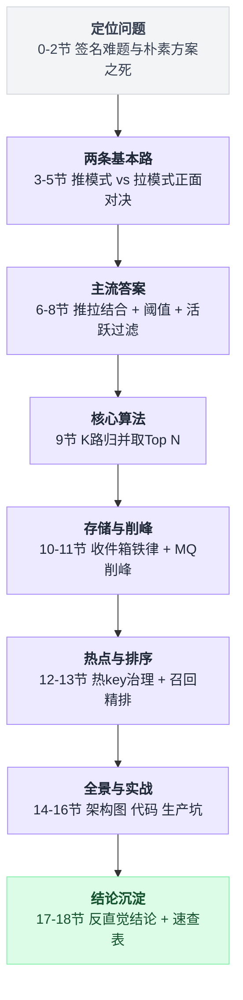
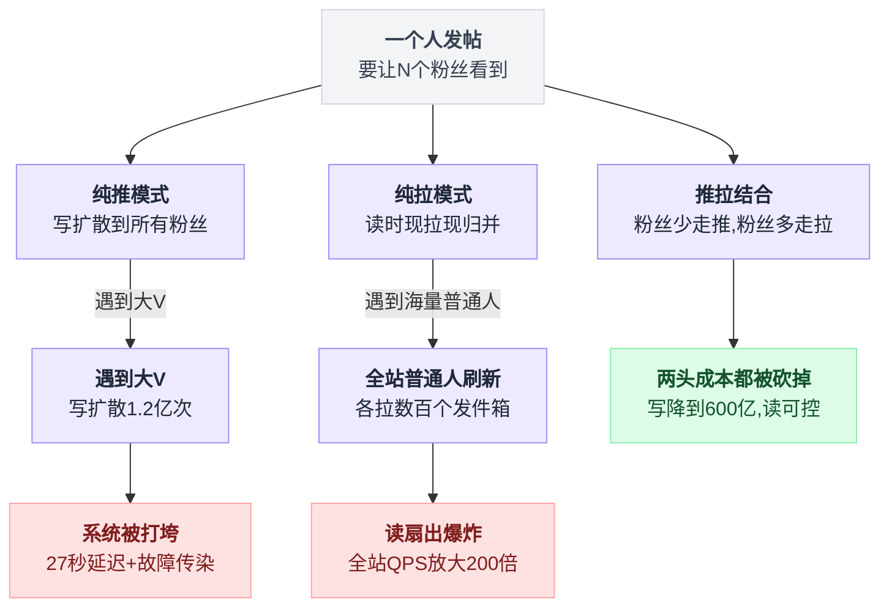
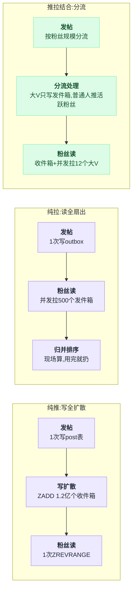
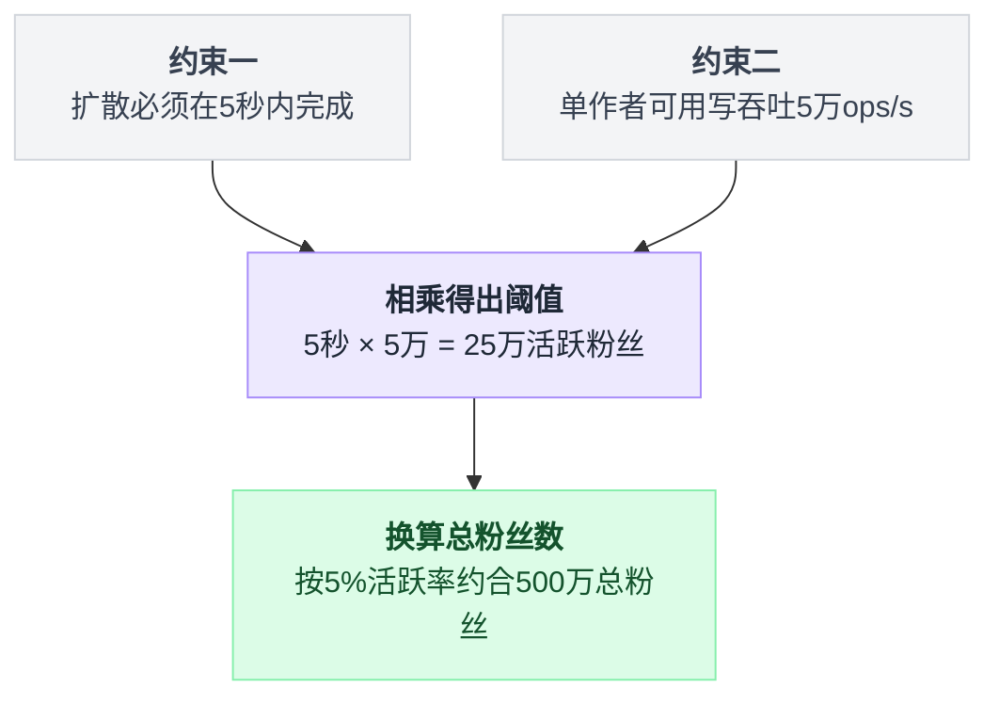
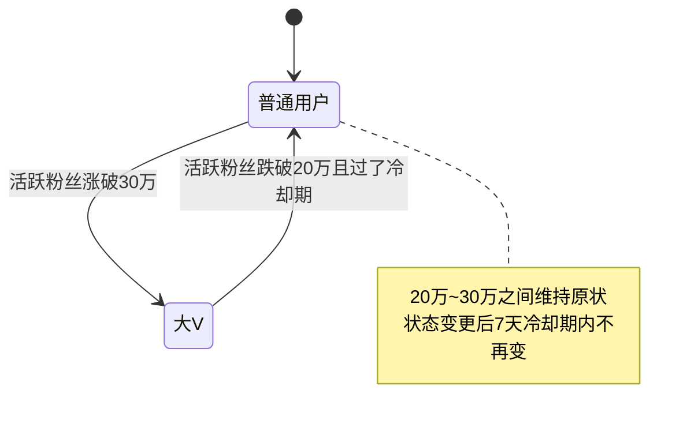
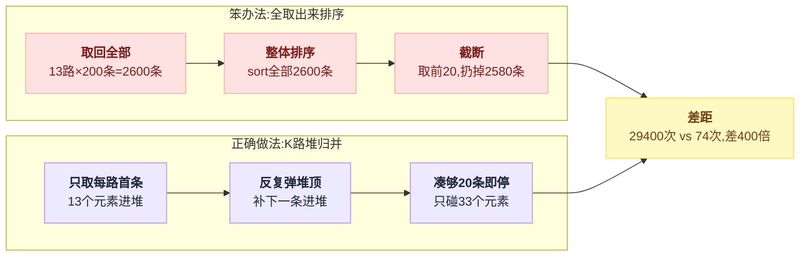
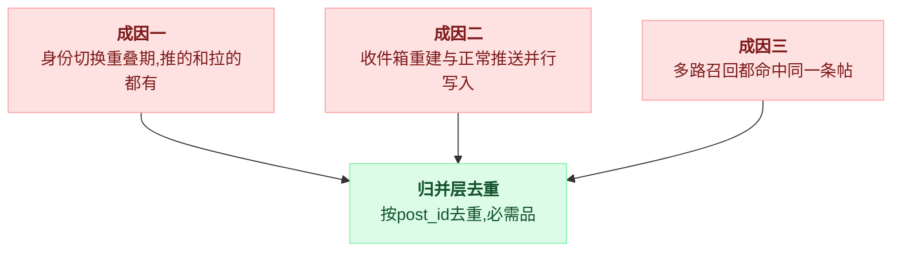
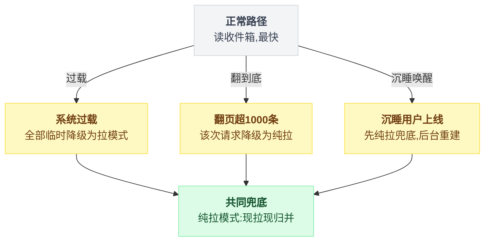

# 《微博热点 Feed 流》一个人发帖，一亿人要看到（小白版）

> 一句话简介：秒杀是"一亿个人抢同一行数据"，Feed 流正好反过来 —— "一个人写一行，系统要把它变成一亿行"。这篇讲清楚推、拉、推拉结合这三条路，以及为什么全世界所有大厂最后都走了第三条。
> 难度：★★★★☆

推模式（写扩散）和拉模式（读扩散）各自会在什么数量级下崩掉，下面都有具体数字；推拉结合的阈值是**算出来**的，不是拍脑袋定的；收件箱里只能存帖子 ID，存内容会死得非常惨；多路有序列表合并取 Top N 要用最小堆，绝对不能"全取出来再排序"。最后一条最反直觉：Feed 的"最终一致"用户根本感知不到，这是这个场景最大的红利。

---

## 目录

- [0. 先讲个故事：订报纸 vs 去报刊亭](#0-先讲个故事订报纸-vs-去报刊亭)
- [1. 这件事到底难在哪：Feed 的"签名难题"](#1-这件事到底难在哪feed-的签名难题)
- [2. 最朴素的做法，以及它为什么会死](#2-最朴素的做法以及它为什么会死)
- [3. 第一条路：推模式（写扩散）](#3-第一条路推模式写扩散)
- [4. 第二条路：拉模式（读扩散）](#4-第二条路拉模式读扩散)
- [5. 两条路正面对决](#5-两条路正面对决)
- [6. 主流答案：推拉结合](#6-主流答案推拉结合)
- [7. 阈值到底怎么定](#7-阈值到底怎么定)
- [8. 活跃粉丝优先推送](#8-活跃粉丝优先推送)
- [9. 归并：多路有序列表取 Top N](#9-归并多路有序列表取-top-n)
- [10. 存储设计：收件箱里到底存什么](#10-存储设计收件箱里到底存什么)
- [11. 削峰：一亿次写必须扔进 MQ](#11-削峰一亿次写必须扔进-mq)
- [12. 热点问题：一条爆款被几千万人同时读](#12-热点问题一条爆款被几千万人同时读)
- [13. 排序不只是按时间](#13-排序不只是按时间)
- [14. 完整方案全景图](#14-完整方案全景图)
- [15. 核心代码逐行讲解](#15-核心代码逐行讲解)
- [16. 生产环境会踩的坑](#16-生产环境会踩的坑)
- [17. 反直觉结论](#17-反直觉结论)
- [18. 一句话总结 + 小白词典](#18-一句话总结--小白词典)
- [附：和秒杀那套文档的对照](#附和秒杀那套文档的对照)

---

全文很长，先给个路标，八个台阶一步步爬：



---

## 0. 先讲个故事：订报纸 vs 去报刊亭

### 0.1 两种拿到报纸的方式

在没有手机的年代，你想每天看报纸，有两种办法。

**办法一：订报纸。**

你去邮局，填一张单子："我要订《体育周报》《财经日报》《本地晚报》。"

从此以后，每天早上，邮递员会把这三份报纸**塞进你家楼下的信箱**。你下楼开信箱，报纸已经在那儿了，直接拿走就行。

```
   ┌──────────┐                    ┌──────────────┐
   │ 体育周报 │──┐                 │  你家的信箱  │
   └──────────┘  │                 │              │
   ┌──────────┐  │   邮递员送上门  │  ┌────────┐  │
   │ 财经日报 │──┼────────────────▶│  │ 体育报 │  │
   └──────────┘  │                 │  ├────────┤  │
   ┌──────────┐  │                 │  │ 财经报 │  │
   │ 本地晚报 │──┘                 │  ├────────┤  │
   └──────────┘                    │  │ 晚报   │  │
                                   │  └────────┘  │
                                   └──────────────┘
                                     你只要开一次信箱
                                     ★ 拿报纸 = 1 个动作 ★
```

**办法二：去报刊亭买。**

你不订。每天早上你出门，跑到街角报刊亭，问："今天的体育周报有吗？"买一份。再跑到另一个报刊亭，"财经日报有吗？"再买一份。

```
   ┌──────────┐   ┌──────────┐   ┌──────────┐
   │ 报刊亭 A │   │ 报刊亭 B │   │ 报刊亭 C │
   │ 体育周报 │   │ 财经日报 │   │ 本地晚报 │
   └────┬─────┘   └────┬─────┘   └────┬─────┘
        │              │              │
        │  你自己跑    │  你自己跑    │  你自己跑
        └──────────────┼──────────────┘
                       ▼
                 ┌──────────┐
                 │   你     │
                 └──────────┘
                 ★ 拿报纸 = 跑 3 趟 ★
```

这两种办法，就是 Feed 流系统的**两种基本模型**，一字不差：

| 生活里 | 系统里叫 | 别名 | 核心动作 |
|---|---|---|---|
| 订报纸，邮递员送到你信箱 | **推模式** | 写扩散 / Fan-out on write | 发布时就分发到每个订阅者 |
| 自己跑报刊亭去买 | **拉模式** | 读扩散 / Fan-out on read | 读取时才去每个源头取 |

**"Feed 流"是什么？** 就是你打开微博/Twitter/朋友圈看到的那个**按时间往下滚的列表**。Feed 的英文原意是"喂食"，意思是系统一勺一勺喂给你内容。

它的核心特征只有一句：**内容来自你关注的很多个人，混在一起，按某种顺序排好。**

### 0.2 现在把规模放大一万倍

上面的故事里，你订了 3 份报纸，一份报纸有 1000 个订户。怎么搞都行。

现在换成微博：

```
   ┌────────────────────────────────────────────────────────┐
   │                                                        │
   │   某顶流明星  ── 发一条微博 ──▶  1.2 亿粉丝要看到      │
   │                                                        │
   │   普通用户你  ── 关注了 500 人 ──▶ 刷新要看到他们的最新│
   │                                                        │
   │   全站每天    ── 发帖 5 亿条，刷新 300 亿次            │
   │                                                        │
   └────────────────────────────────────────────────────────┘
```

"订报纸"的办法（推）：明星发一条，邮递员要往 **1.2 亿个信箱**里各塞一份。

"跑报刊亭"的办法（拉）：你每刷新一次，要跑 **500 个报刊亭**。而且你不是一个人 —— 全站几亿人同时在跑。

这两条路，看起来都走不通。这篇文档就是讲怎么走通。

### 0.3 先建立直觉：一个不对称的世界

往下看之前，先记住整篇文档的地基：**在 Feed 系统里，人和人是极度不平等的。**

```
   ┌────────────────────────────────────────────────────────────┐
   │                                                            │
   │   在 Feed 系统里，人和人是【极度不平等】的。               │
   │                                                            │
   │   99% 的用户：粉丝 < 200，一周发 3 条                      │
   │    1% 的用户：粉丝 > 1 万                                  │
   │  0.0001%的人：粉丝 > 1000 万                               │
   │                                                            │
   │   ★ 所以任何"一刀切"的方案，必死无疑 ★                     │
   │                                                            │
   │   这和秒杀不一样。秒杀里所有用户都是平等的，               │
   │   大家抢的是同一件商品，用同一套逻辑就行。                 │
   │   Feed 里不行，你必须给不同的人用不同的策略。              │
   │                                                            │
   └────────────────────────────────────────────────────────────┘
```

这个"不平等"在数学上有个名字，叫**幂律分布**（power law），也叫长尾分布。画出来长这样：

```
  粉丝数
    ▲
    │ █
1亿 │ █  ← 几十个人在这里（顶流明星）
    │ █
    │ █
    │ ██
100万│ ███  ← 几千个人（大 V）
    │ ████
    │ ██████
1万 │ ██████████  ← 几十万人（中 V）
    │ ██████████████████
100 │ ████████████████████████████████████████████████
    │ ████████████████████████████████████████████████
    └──────────────────────────────────────────────────▶ 用户
      ◀─── 极少数人 ───▶◀──────── 绝大多数人 ────────▶

    面积（总用户数）几乎全在右边
    高度（影响力）几乎全在左边
```

**记住这张图。** 后面所有的设计决策，本质上都是在利用这张图的形状。

---

## 1. 这件事到底难在哪：Feed 的"签名难题"

### 1.1 一句话说清难点

每篇文档我都会给出一个"签名难题"—— 这个场景**独有的**、别的场景没有的那个矛盾。Feed 的签名难题是：

> **一次写入，要变成一亿次写入；而这一亿次写入里，有九千五百万次是白干的。**

拆开看有三层：

```
   ┌────────────────────────────────────────────────────────────┐
   │                                                            │
   │  第一层：写放大                                            │
   │    明星发 1 条 ──▶ 系统要执行 1.2 亿次写操作               │
   │    放大倍数：1.2 亿倍                                      │
   │                                                            │
   │  第二层：浪费                                              │
   │    1.2 亿粉丝里，最近 7 天登录过的可能只有 600 万          │
   │    也就是说 95% 的写，写完就没人看                         │
   │                                                            │
   │  第三层：可变性                                            │
   │    帖子会被【删除】、被【编辑】、被【设为私密】            │
   │    作者会被【拉黑】、被【取关】                            │
   │    每一次变化，都要去动那 1.2 亿份副本                     │
   │                                                            │
   └────────────────────────────────────────────────────────────┘
```

### 1.2 和秒杀正好相反

你读过秒杀那套文档，那里的核心矛盾是这样的：

```
   【秒杀】：多个人写同一行

        用户A ──┐
        用户B ──┤
        用户C ──┼──▶  ┌──────────────┐
        用户D ──┤     │ 商品库存 = 1 │  ← 所有压力汇聚到一个点
        ...   ──┤     └──────────────┘
        用户N ──┘

        难点：并发冲突、超卖、锁竞争
        解法：让写变少（预扣、合并、分片）


   【Feed】：一个人写导致多行写

                      ┌──▶ 粉丝A 的收件箱
                      ├──▶ 粉丝B 的收件箱
        明星 ──▶ 发帖 ─┼──▶ 粉丝C 的收件箱
                      ├──▶ ...
                      └──▶ 粉丝N 的收件箱（第 1.2 亿个）

        难点：写的【数量】本身太大
        解法：让写变少（少推、晚推、不推）
```

划重点，两者的对比：

| 维度 | 秒杀 | Feed |
|---|---|---|
| 压力形状 | **收敛**：N 个请求打向 1 行数据 | **发散**：1 个请求变成 N 行数据 |
| 主要敌人 | 并发冲突（大家抢同一把锁） | 数据量（写的总条数太多） |
| 能否丢 | **绝对不能**，超卖就是资损 | **可以**，晚 10 秒看到没人在意 |
| 一致性要求 | 强一致（库存必须准） | 最终一致（甚至可以不一致） |
| 用户感知 | 秒级，用户盯着屏幕 | 秒级到十几秒都无所谓 |

**最后两行是 Feed 最大的红利。** 秒杀里你必须用 Lua 脚本、分布式锁、对账系统，是因为错一分钱都不行。

Feed 里你有大量的腾挪空间 —— 这也是为什么 Feed 的解法看起来"糙"，但生产上就是这么干的。

### 1.3 先摸清数量级

任何架构讨论，不带数字就是耍流氓。先把这个场景的数字摆出来（用公开可查的微博量级近似）：

```
   ┌──────────────────────────────────────────────────────────┐
   │  【用户侧】                                              │
   │    日活用户（DAU）           2.5 亿                      │
   │    人均每天刷新次数          12 次                       │
   │    人均关注数（中位数）      200 人                      │
   │    人均关注数（P99）         2000 人                     │
   │                                                          │
   │  【内容侧】                                              │
   │    每天新增帖子              5 亿条                      │
   │    平均每秒发帖              5亿 / 86400 ≈ 5800 条/秒    │
   │    高峰期发帖（跨年夜）      10 万条/秒                  │
   │                                                          │
   │  【读侧】                                                │
   │    每天刷新总次数            2.5亿 × 12 = 30 亿次        │
   │    平均读 QPS                30亿 / 86400 ≈ 3.5 万       │
   │    高峰读 QPS（晚 9 点）     20 万+                      │
   │                                                          │
   │  【读写比】                                              │
   │    30 亿读 : 5 亿写 = 6 : 1                              │
   │    ★ 注意：这只是"请求次数比"，不是"数据量比" ★          │
   └──────────────────────────────────────────────────────────┘
```

最后一格有个坑，务必看清楚：**6:1 只是"请求次数比"，不是"数据量比"。**

很多人看到 6:1 就说："哦，读多写少，那就该优化读，用推模式（写的时候多干活，读的时候轻松）。"

**这个推论是错的。** 因为写会**放大**。把"请求次数"换算成"实际数据库操作次数"：

```
   如果全用推模式：

   写侧：5 亿条帖子 × 平均粉丝数
        假设人均粉丝 200（中位数）
        → 5亿 × 200 = 1000 亿次写

        但这个平均值是骗人的！长尾分布下，
        真正的写扩散量由头部用户决定：
        → 实际约 3000 亿 ~ 5000 亿次写/天

   读侧：30 亿次读，每次读一个收件箱
        → 30 亿次读

   真实比例：3000亿写 : 30亿读 = 100 : 1

   ★ 一旦算上写扩散，这个系统就从"读多写少" ★
   ★ 变成了"写多读少"，而且写多 100 倍。   ★
```

**这就是 Feed 系统所有反直觉的源头。** 你以为它是个读密集系统，它其实是个写密集系统。

### 1.4 那我用最笨的办法行不行

按照惯例，先把最笨的办法想一遍，然后一条条打破。

| 笨办法 | 你会怎么想 | 结局 |
|---|---|---|
| 1. 每次刷新现查数据库 | "我不搞什么收件箱发件箱，用户刷新的时候直接 SQL 查一下他关注的人最近发了啥，不就完了？" | 见第 2 节，最直观也最先死 |
| 2. 全用推，给每个粉丝都塞一份 | "存储不值钱，我就多写几份怎么了？" | 见第 3 节。明星发一条帖，系统要卡 17 分钟 |
| 3. 全用拉，谁都不推 | "写的时候什么都不干，读的时候现算，多干净。" | 见第 4 节。一次刷新要发 500 次网络请求 |
| 4. 加机器 | "推模式写不过来？加 1000 台 Redis 不就行了？" | 部分正确，但钱不是这么烧的；而且"改一条帖要改 1 亿份"这种问题，加机器解决不了 |

一条条来。

---

## 2. 最朴素的做法，以及它为什么会死

一句话：两张表、一条 SQL，功能完全正确，撑不到十万用户。

它的死因最后会收敛成同一句话：**把"归并排序"这个昂贵操作，放在了每次读的路径上。** 读 30 亿次，就算 30 亿次。

### 2.1 方案：一条 SQL 搞定

最直观的想法，连表都不用多建。两张表：

```sql
-- 帖子表
CREATE TABLE post (
    post_id     BIGINT PRIMARY KEY,
    author_id   BIGINT NOT NULL,
    content     TEXT,
    created_at  BIGINT NOT NULL,       -- 毫秒时间戳
    INDEX idx_author_time (author_id, created_at DESC)
);

-- 关注关系表
CREATE TABLE follow (
    follower_id BIGINT NOT NULL,       -- 谁关注
    followee_id BIGINT NOT NULL,       -- 关注谁
    created_at  BIGINT NOT NULL,
    PRIMARY KEY (follower_id, followee_id)
);
```

用户刷新时，执行：

```sql
-- 第一步：查我关注了谁
SELECT followee_id FROM follow WHERE follower_id = 12345;
-- 假设返回 500 个 id

-- 第二步：查这 500 个人的最新帖子，混在一起按时间排序
SELECT post_id, author_id, content, created_at
FROM post
WHERE author_id IN (101, 102, 103, ..., 600)   -- 500 个 id
ORDER BY created_at DESC
LIMIT 20;
```

用 Python 写出来：

```python
import time
from dataclasses import dataclass

@dataclass
class Post:
    post_id: int
    author_id: int
    content: str
    created_at: int          # 毫秒时间戳

def get_feed_naive(db, user_id: int, limit: int = 20) -> list[Post]:
    """最朴素的 Feed：现查数据库"""
    # 1. 查关注列表
    followees = db.query(
        "SELECT followee_id FROM follow WHERE follower_id = %s",
        (user_id,)
    )
    ids = [row[0] for row in followees]

    # 2. 一条 SQL 把这些人的帖子捞出来排序
    placeholders = ",".join(["%s"] * len(ids))
    rows = db.query(
        f"SELECT post_id, author_id, content, created_at "
        f"FROM post WHERE author_id IN ({placeholders}) "
        f"ORDER BY created_at DESC LIMIT %s",
        (*ids, limit)
    )
    return [Post(*row) for row in rows]
```

**这段在干嘛**：先问数据库"我关注了谁"，拿到 500 个 ID，再问数据库"这 500 个人最近发了啥，按时间倒序给我 20 条"。

功能上完全正确。用户数少的时候（比如你自己做的小项目，1000 个用户），这个方案跑得飞快，而且代码最少。**别看不起它 —— 如果你的产品只有几万用户，这就是最优解。**

问题是它撑不到十万。

### 2.2 它在什么数量级下崩掉

一层一层加压力，看它什么时候死。死因有四个，按出场顺序：查询本身就贵 → QPS 一乘就爆 → 分库之后这条 SQL 根本写不出来 → 深分页彻底没救。

**死因一：`IN (500 个 ID)` 这个查询本身就很贵。**

数据库执行 `WHERE author_id IN (...)` 加 `ORDER BY created_at DESC LIMIT 20` 时，实际做的事是：

```
   ┌────────────────────────────────────────────────────────┐
   │  数据库的执行过程（走 idx_author_time 索引）           │
   │                                                        │
   │  for each author_id in (101, 102, ..., 600):           │
   │      在索引里定位到 author_id 的位置       ← 500 次    │
   │      顺着索引往后读 20 条                  ← 500×20    │
   │                                             = 1 万条   │
   │                                                        │
   │  把这 1 万条塞进内存                                   │
   │  按 created_at 排序                        ← 1 万次比较│
   │  取前 20 条，其余 9980 条【全部扔掉】                  │
   │                                                        │
   │  ★ 为了返回 20 条，读了 1 万条，扔掉 99.8% ★           │
   └────────────────────────────────────────────────────────┘
```

单次查询耗时实测（MySQL，数据热在 buffer pool 里）：

| 关注数 | 扫描行数 | 耗时 |
|---|---|---|
| 50 | 1000 | ~3 ms |
| 200 | 4000 | ~12 ms |
| 500 | 10000 | ~35 ms |
| 2000（P99 用户） | 40000 | ~150 ms |

一个用户刷新一次要 35 毫秒，看起来还行？**别急，看下一层。**

**死因二：QPS 一乘就爆。**

```
   高峰期读 QPS：20 万

   每次查询占用数据库 35 ms
   ↓
   需要的并发查询数 = 20万 × 0.035 秒 = 7000 个并发查询

   一台 MySQL 能扛多少并发查询？
   实际能高效并行的 ≈ CPU 核数 × 2 ≈ 64 个

   需要的机器数 = 7000 / 64 ≈ 110 台 MySQL
   ★ 而且这 110 台还必须每台都存全量数据（因为要跨作者查）★
```

110 台还只是理论值。真实情况更糟，因为 —— **死因三**。

**死因三：分库分表之后，这条 SQL 根本写不出来。**

帖子表有多大？每天 5 亿条，存两年 = 3650 亿行。这必须分库分表。

假设按 `author_id` 哈希分 1000 个库。现在问题来了：你关注的 500 个人，会落在几个库里？

直觉容易答"几十个"。实际是**约 394 个库** —— 500 个 ID 撒进 1000 个桶，期望命中的桶数是 1000 × (1 − (1 − 1/1000)^500) ≈ 1000 × (1 − 0.606) ≈ 394。哈希分得越散，你要敲的门就越多。

```
   你关注的 500 个人，author_id 哈希之后
   散落在多少个库里？

   500 个 ID 撒进 1000 个桶，
   期望命中的桶数 = 1000 × (1 - (1 - 1/1000)^500)
                  ≈ 1000 × (1 - 0.606)
                  ≈ 394 个库

   ┌─────────────────────────────────────────────────┐
   │  一次刷新                                       │
   │     │                                           │
   │     ├──▶ 库 0007  查 author 101,   取 20 条     │
   │     ├──▶ 库 0031  查 author 102,   取 20 条     │
   │     ├──▶ 库 0044  查 author 108,   取 20 条     │
   │     ├──▶ ...                                    │
   │     └──▶ 库 0996  查 author 599,   取 20 条     │
   │                                                 │
   │        总共 394 次跨库查询                      │
   │        然后在应用层归并 ~1 万条数据             │
   │                                                 │
   │  ★ 一次刷新 = 394 次网络往返 ★                  │
   └─────────────────────────────────────────────────┘
```

394 次跨库查询，即使并发发出去，也要等**最慢的那一个**返回。这叫**长尾放大**（tail latency amplification）：

```
   单库 P99 延迟 = 50ms

   394 个并发查询，全部都要返回才能归并。
   "至少有一个落到 P99" 的概率：
      1 - (0.99)^394 = 1 - 0.019 = 98.1%

   ┌────────────────────────────────────────────────────┐
   │  单库有 1% 的概率慢（50ms）                        │
   │  查 394 个库，有 98% 的概率至少一个慢              │
   │                                                    │
   │  ★ 结果：单库 P99=50ms，                           │
   │    但整体请求的 P50 就已经 ≈ 50ms 了 ★             │
   │                                                    │
   │  你的系统整体延迟 = 最慢那个分片的延迟             │
   │  分片越多，这个"最慢"越离谱                        │
   └────────────────────────────────────────────────────┘
```

**这条规律要记住**：把一个请求扇出到 N 个后端，整体延迟不是平均值，而是趋近于单个后端的 **P(1 - 1/N)** 分位。扇出 100 个，你就在承受单机的 P99；扇出 1000 个，你在承受 P99.9。

**死因四：深分页彻底没救。**

用户往下滑，滑到第 10 页（第 200 条）。SQL 变成：

```sql
... ORDER BY created_at DESC LIMIT 20 OFFSET 200;
```

数据库为了跳过 200 条，必须**先把前 220 条全部算出来**。每个分片都要返回 220 条（因为不知道哪些会被选中），归并 394 × 220 = 8.6 万条。

滑到第 50 页？394 × 1020 = 40 万条。**这时候查询已经要几秒了。**

### 2.3 小结：朴素方案的死亡诊断书

```
   ┌────────────────────────────────────────────────────────────┐
   │  【死亡原因排序】                                          │
   │                                                            │
   │  1. 读放大：为了 20 条读 1 万条，浪费 99.8%                │
   │  2. 扇出放大：一次请求打到 394 个分片                      │
   │  3. 长尾放大：整体延迟 = 最慢分片的延迟                    │
   │  4. 深分页：翻页越深，代价指数上升                         │
   │  5. 无法缓存：每个人的 Feed 都不一样，缓存命中率≈0         │
   │                                                            │
   │  ★ 根本原因：把"归并排序"这个昂贵操作，                    │
   │    放在了【每次读】的路径上。                              │
   │    读 30 亿次，就算 30 亿次。★                             │
   └────────────────────────────────────────────────────────────┘
```

**核心洞察出来了**：这个归并操作，本质上是**重复计算**。你连续刷新两次，中间可能只多了 1 条新帖，但系统把 500 个人的帖子重新归并了一遍。

那能不能**把结果存下来**，只在有新帖的时候更新？

能。这就是推模式。

---

## 3. 第一条路：推模式（写扩散）

一句话：发帖的时候就把结果算好，塞进每个粉丝的信箱；读的时候只开一次信箱。

读快到离谱，代价是四个死穴 —— 明星发一条要 27 秒、95% 的推送是白写的、一条帖吃掉 12 GB 内存、改一条要改一亿份。前两个还能靠加机器缓解，后两个加机器解决不了。

### 3.1 核心思想：给每个人建一个信箱

回到订报纸的类比。推模式的做法是：

**给系统里每一个用户，都建一个"收件箱"（Inbox）。发帖的时候，把这条帖子的 ID 塞进所有粉丝的收件箱。**

```
   ┌──────────────────────────────────────────────────────────────┐
   │                      【推模式：收件箱模型】                  │
   └──────────────────────────────────────────────────────────────┘

   ●───── 写入路径（发帖时）─────────────────────────────────────●

        小明发帖 "今天天气真好"
              │
              ▼
        ┌───────────────┐
        │  帖子表(DB)   │  post_id=9527 存一份，只存一份
        │  9527 → 内容  │
        └───────┬───────┘
                │
                ▼
        ┌───────────────┐
        │ 查小明的粉丝  │  小明有 300 个粉丝
        └───────┬───────┘
                │
        ┌───────┴───────┬───────────┬───────────┐
        ▼               ▼           ▼           ▼
   ┌─────────┐    ┌─────────┐  ┌─────────┐  ┌─────────┐
   │粉丝A收件箱│   │粉丝B收件箱│ │粉丝C收件箱│ │  ... │
   │  9527   │    │  9527   │  │  9527   │  │ (300份) │
   │  9500   │    │  9488   │  │  9526   │  │         │
   │  9481   │    │  9455   │  │  9521   │  │         │
   └─────────┘    └─────────┘  └─────────┘  └─────────┘
        ▲
     写 300 次


   ●───── 读取路径（刷新时）─────────────────────────────────────●

        粉丝A 刷新
              │
              ▼
        ┌──────────────────┐
        │ 读自己的收件箱   │  ← 只读【一个】key！
        │ ZREVRANGE        │
        │ inbox:A 0 19     │
        └────────┬─────────┘
                 │  拿到 20 个 post_id
                 ▼
        ┌──────────────────┐
        │ 批量取帖子内容   │  ← MGET，一次网络往返
        │ MGET post:9527   │
        │      post:9500...│
        └────────┬─────────┘
                 ▼
              返回给用户
        ★ 总共 2 次网络往返，约 1ms ★
```

### 3.2 收件箱用什么存

**Redis 的 ZSet（有序集合）。**

先解释一下什么是 ZSet。你可以把它想象成一个**永远自动排好序的列表**：

```
   ┌──────────────────────────────────────────────────────┐
   │  Redis ZSet：inbox:12345                             │
   │                                                      │
   │   member (成员)      score (分数)                    │
   │   ─────────────      ────────────────                │
   │   "9527"             1722758400000   ← 新            │
   │   "9500"             1722758100000                   │
   │   "9481"             1722757800000                   │
   │   "9455"             1722757200000                   │
   │   "9412"             1722756000000   ← 旧            │
   │                                                      │
   │  特点：                                              │
   │   1. 自动按 score 排序，插入时就排好                 │
   │   2. member 唯一，重复插入会覆盖（天然去重！）       │
   │   3. 可以按 score 范围查（翻页神器）                 │
   │   4. 可以按排名截断（ZREMRANGEBYRANK）               │
   │                                                      │
   │  底层是【跳表 + 哈希表】，                           │
   │  插入/删除/按排名查 都是 O(log N)                    │
   └──────────────────────────────────────────────────────┘
```

对应的 Redis 命令：

```
写入：ZADD inbox:12345 1722758400000 9527
读取：ZREVRANGE inbox:12345 0 19          # 按 score 倒序取前 20 个
翻页：ZREVRANGEBYSCORE inbox:12345 (1722757800000 -inf LIMIT 0 20
截断：ZREMRANGEBYRANK inbox:12345 0 -1001  # 只保留最新 1000 条
```

`ZREVRANGE` 的 `REV` 是 reverse（倒序），因为 Feed 要"最新的在最上面"。

**为什么不用 List（列表）？** List 用 `LPUSH` 从头插入也能实现"最新在前"，而且更省内存。但 List 有两个致命缺点：

| 问题 | List | ZSet |
|---|---|---|
| 乱序到达怎么办 | 无解，塞哪儿是哪儿 | 按 score 自动归位 |
| 删除某条帖子 | `LREM` 要遍历，O(N) | `ZREM` 直接删，O(log N) |
| 按时间游标翻页 | 做不到，只能按 offset | `ZREVRANGEBYSCORE`，O(log N) |
| 去重 | 会重复插入 | member 唯一，天然去重 |

"乱序到达"这一条特别关键。推送是**异步**的（后面第 11 节讲），任务可能乱序执行 —— 一条 10:00 的帖子完全可能比 10:01 的帖子晚到达收件箱。

用 List 的话，用户的时间线就乱了。用 ZSet 就无所谓，score 会把它放回正确位置。

**划重点：Feed 收件箱必须用 ZSet，不能用 List。这是异步扩散决定的，不是可选项。**

### 3.3 推模式的好处：读快到离谱

```
   ┌──────────────────────────────────────────────────────────┐
   │  朴素方案读一次 Feed：                                   │
   │    394 次跨库查询 + 归并 1 万条  →  150 ms               │
   │                                                          │
   │  推模式读一次 Feed：                                     │
   │    1 次 ZREVRANGE + 1 次 MGET    →  1 ms                 │
   │                                                          │
   │  ★ 快了 150 倍 ★                                         │
   │                                                          │
   │  而且：                                                  │
   │    - 延迟稳定，不受"关注了多少人"影响                    │
   │      （关注 10 个人和关注 2000 个人，读的开销一模一样）  │
   │    - 深分页也不慌，ZSet 按 score 翻页永远 O(log N)       │
   │    - 水平扩展简单：按 user_id 分片，各管各的             │
   └──────────────────────────────────────────────────────────┘
```

"读的开销和关注数无关"这一点，比听起来重要得多。因为它把一个**不可控的变量**（用户关注了多少人）从读路径上消掉了。系统的延迟从此可预测。

### 3.4 推模式的死穴（一）：明星发一条要多久

现在算账。某明星有 **1.2 亿粉丝**，他发了一条微博。

**第一步：得先知道这 1.2 亿粉丝是谁。**

粉丝列表存在哪？假设存在 MySQL 的 `follow` 表里，按 `followee_id` 分片（这样查"某人的粉丝"只需要打一个分片）。

```
   查 1.2 亿行粉丝 ID：

   不能一次 SELECT 出来（内存会爆：1.2亿 × 8 字节 = 960 MB）
   必须分页拉取，每次 5000 个：

   1.2 亿 / 5000 = 24000 次分页查询

   每次查询（走主键游标，不是 OFFSET）约 5 ms
   → 串行拉完：24000 × 5ms = 120 秒 = 2 分钟
   → 并发 50 路拉：约 2.4 秒

   ★ 光是"知道粉丝是谁"就要 2.4 秒 ★
```

**第二步：往 1.2 亿个 ZSet 里各写一条。**

```
   单条 ZADD 的成本：
     Redis 单实例处理 ZADD ≈ 8~10 万 ops/秒
     用 Pipeline 批量（一次发 100 条命令）≈ 50 万 ops/秒

   假设 Redis 集群有 100 个分片：
     总吞吐 = 100 × 50 万 = 5000 万 ops/秒（理论峰值）

   1.2 亿次写 / 5000 万 = 2.4 秒

   ★ 但这是【把整个 Redis 集群打满】才有的数字 ★
```

现实是你不可能让一条帖子的扩散吃掉整个集群 —— 同一时刻还有几千个其他用户在发帖，还有 20 万 QPS 的读请求。实际能分给它的资源可能是 10%：

```
   ┌────────────────────────────────────────────────────────┐
   │  实际可用吞吐：500 万 ops/秒（集群的 10%）             │
   │                                                        │
   │  1.2 亿 / 500 万 = 24 秒                               │
   │                                                        │
   │  加上拉粉丝列表的 2.4 秒                               │
   │  ────────────────────────────                          │
   │  一条明星微博完全扩散完：约 27 秒                      │
   │                                                        │
   │  ★ 如果只有 10 个 Redis 分片，                         │
   │    这个数字变成 1.2亿/50万 = 240 秒 = 4 分钟 ★         │
   │                                                        │
   │  ★ 如果不用 Pipeline，单条单条发，                     │
   │    1.2亿/(10个分片×10万) = 120 秒 ★                    │
   └────────────────────────────────────────────────────────┘
```

**27 秒意味着什么？** 意味着最后一批粉丝要等 27 秒才能刷到这条微博。

单看这个，其实**可以接受** —— 用户根本不知道自己晚了 27 秒。但问题是：

**跨年夜零点，几十个顶流同时发新年祝福。**

```
   50 个大 V 同时发帖，平均 3000 万粉丝

   总写扩散量 = 50 × 3000万 = 15 亿次写

   即使全集群火力全开（5000 万 ops/秒）：
     15 亿 / 5000 万 = 30 秒

   但读请求也在高峰（跨年夜刷新量翻 3 倍，60 万 QPS）
   实际能给写的资源 ≈ 20%
     15 亿 / 1000 万 = 150 秒 = 2.5 分钟

   ┌──────────────────────────────────────────────────┐
   │  这 2.5 分钟里，Redis 集群 CPU 100%，            │
   │  所有普通用户的【读】请求也一起变慢。            │
   │                                                  │
   │  ★ 大 V 的写扩散，把整个系统拖垮了 ★             │
   │                                                  │
   │  这就是"故障传染"—— 你在秒杀的隔离舱那节见过。   │
   └──────────────────────────────────────────────────┘
```

### 3.5 推模式的死穴（二）：95% 是白写的

这条比性能问题更让人心痛。

```
   ┌──────────────────────────────────────────────────────────┐
   │  某明星 1.2 亿粉丝的真实构成（行业经验值）：             │
   │                                                          │
   │  ████ 僵尸号 / 营销号 / 买来的粉        约 40%  4800万   │
   │  ████ 一年以上没登录的沉睡号            约 35%  4200万   │
   │  ██   30 天内登录过但不常来             约 20%  2400万   │
   │  █    7 天内活跃                        约  5%   600万   │
   │                                                          │
   │  你花 27 秒、烧掉整个集群写的 1.2 亿条记录，             │
   │  真正会被看到的只有最后那 600 万条。                     │
   │                                                          │
   │  ★ 有效率 5%，浪费率 95% ★                               │
   └──────────────────────────────────────────────────────────┘
```

这不是"效率低一点"的问题，这是**烧掉了 20 倍的钱去做无用功**。

### 3.6 推模式的死穴（三）：存储放大

一条帖子被复制成 1.2 亿个索引项。算算占多少内存：

```
   Redis ZSet 的内存开销（skiplist 编码，一个 member）：
     - member 字符串（post_id，19 位数字）：约 32 字节（sds 结构）
     - skiplist 节点（含指针、backward、level 数组）：约 40 字节
     - 哈希表条目（dictEntry + 指针）：约 32 字节
     ─────────────────────────────────────────
     合计：约 100 字节 / 条

   一条明星微博的扩散存储：
     1.2 亿 × 100 字节 = 12 GB

   ★ 一条微博，12 GB 内存 ★

   这位明星一天发 5 条 → 60 GB
   全站有 500 个千万粉大 V，平均每天发 3 条：
     500 × 3 × 1000万 × 100字节 = 1.5 TB / 天

   Redis 内存价格约 30 元/GB/月
   1.5 TB × 30 = 4.5 万元/天 —— 只算大 V，只算一天的增量
```

当然收件箱会截断（第 10 节讲），不会无限增长。但**写入的瞬间峰值内存**是实打实的。

### 3.7 推模式的死穴（四）：改一条要改一亿份

这是最难受的一条，因为**加机器解决不了**。

```
   ┌──────────────────────────────────────────────────────────┐
   │  场景                    需要做什么                      │
   │  ───────────────────    ────────────────────────────     │
   │  明星删帖               从 1.2 亿个收件箱里 ZREM         │
   │  帖子被平台删除         同上，而且要求"立即"             │
   │  帖子改为"仅粉丝可见"   要重新算一遍谁能看到             │
   │  用户取关明星           从他收件箱里删掉明星所有帖子     │
   │  用户拉黑明星           同上，而且是双向的               │
   │  明星被封号             删掉他所有帖子的所有副本         │
   │                                                          │
   │  ★ 每一个操作，都是一次 1.2 亿量级的写 ★                 │
   │                                                          │
   │  更糟的是：删帖必须【快】。                              │
   │  违规内容要求 5 分钟内下线，                             │
   │  但你的扩散删除要跑 30 秒起步，                          │
   │  而且期间还在和新帖的扩散抢资源。                        │
   └──────────────────────────────────────────────────────────┘
```

**这一条直接决定了第 10 节的一个核心结论：收件箱里绝对不能存内容，只能存 ID。** 因为存 ID 的话，删帖只需要在读的时候过滤掉就行，不用真的去删 1.2 亿份。

### 3.8 推模式小结

```
   ┌────────────────────────────────────────────────────────────┐
   │  【推模式（写扩散 / Fan-out on write）】                   │
   │                                                            │
   │  ✓ 读极快：1 次 ZSet 查询，1ms，且与关注数无关             │
   │  ✓ 读延迟稳定可预测                                        │
   │  ✓ 深分页友好                                              │
   │  ✓ 水平扩展简单（按 user_id 分片）                         │
   │                                                            │
   │  ✗ 写放大 = 粉丝数，明星一条帖 = 1.2 亿次写                │
   │  ✗ 95% 写给了不活跃用户，纯浪费                            │
   │  ✗ 存储放大 = 粉丝数（一条帖 12 GB）                       │
   │  ✗ 删改成本 = 粉丝数，且加机器解决不了                     │
   │  ✗ 大 V 扩散会挤占普通用户的资源（故障传染）               │
   │                                                            │
   │  ★ 适用：粉丝数少的普通用户 ★                              │
   └────────────────────────────────────────────────────────────┘
```

推模式的所有问题，都来自**同一个原因：粉丝太多**。那反过来想，如果不推呢？

---

## 4. 第二条路：拉模式（读扩散）

一句话：发帖只写自己的发件箱，谁想看谁自己来拉。

推模式的四个死穴，它全部完美解决 —— 然后换来三个自己的：读的扇出、几十亿次读放大、热点用户的发件箱被打爆。两条路的优缺点是严格互补的，这是第 6 节能把它们缝在一起的前提。

### 4.1 核心思想：只写自己的发件箱

拉模式的做法反过来：

**每个用户只有一个"发件箱"（Outbox），存自己发的帖子。谁想看，谁自己来拉。**

```
   ┌──────────────────────────────────────────────────────────────┐
   │                      【拉模式：发件箱模型】                  │
   └──────────────────────────────────────────────────────────────┘

   ●───── 写入路径（发帖时）─────────────────────────────────────●

        某明星发帖
              │
              ▼
        ┌───────────────┐
        │  帖子表(DB)   │  存一份
        └───────┬───────┘
                │
                ▼
        ┌────────────────────┐
        │ 明星自己的发件箱   │  ← 只写【一个】key
        │ outbox:star        │
        │   9527  ← 新帖     │
        │   9310             │
        │   9002             │
        └────────────────────┘

        ★ 写入总耗时：1 ms，和粉丝数完全无关 ★


   ●───── 读取路径（刷新时）─────────────────────────────────────●

        粉丝A 刷新（关注了 500 个人）
              │
              ▼
        ┌────────────────────┐
        │ 查我关注了谁       │  ← 500 个 ID
        └─────────┬──────────┘
                  │
    ┌─────────────┼─────────────┬─────────────┐
    ▼             ▼             ▼             ▼
┌─────────┐  ┌─────────┐   ┌─────────┐   ┌──────────┐
│outbox:1 │  │outbox:2 │   │outbox:3 │ … │outbox:500│
│取20条   │  │取20条   │   │取20条   │   │取20条    │
└────┬────┘  └────┬────┘   └────┬────┘   └────┬─────┘
     │            │             │             │
     └────────────┴──────┬──────┴─────────────┘
                         ▼
              ┌────────────────────┐
              │  归并排序          │  ← 1 万条里挑 20 条
              │  （最小堆，第9节） │
              └─────────┬──────────┘
                        ▼
                   返回给用户
        ★ 总共 500 次读 + 归并 1 万条，约 50~200 ms ★
```

### 4.2 拉模式的好处：写快到离谱

```
   ┌──────────────────────────────────────────────────────────┐
   │  推模式：明星发一条 → 1.2 亿次写 → 27 秒                 │
   │  拉模式：明星发一条 → 1 次写      → 0.5 ms               │
   │                                                          │
   │  ★ 快了 5000 万倍 ★                                      │
   │                                                          │
   │  而且：                                                  │
   │    - 存储只有一份，没有任何放大                          │
   │    - 删帖：删一次就完了                                  │
   │    - 改帖：改一次就完了                                  │
   │    - 取关/拉黑：读的时候不去拉他就行，零成本             │
   │    - 僵尸粉？根本不存在这个概念，他不来就不消耗任何资源  │
   └──────────────────────────────────────────────────────────┘
```

看到没有，**推模式的四个死穴，拉模式全部完美解决**。这就是为什么"全推"和"全拉"这两个方案会长期共存 —— 它们的优缺点是**严格互补**的。

### 4.3 拉模式的死穴（一）：读的扇出

问题回到了第 2 节的老地方 —— 一次读要访问 500 个数据源。

但等等，拉模式和第 2 节的朴素 SQL 方案有区别吗？**有，而且区别很大。**

```
   ┌──────────────────────────────────────────────────────────────┐
   │                  朴素 SQL 方案 vs 拉模式                     │
   │                                                              │
   │  朴素 SQL：                                                  │
   │    数据在 MySQL，走磁盘/buffer pool                          │
   │    要走索引定位、要回表、要 SQL 解析                         │
   │    单次 ~5 ms                                                │
   │    500 个作者散在 394 个【库】里 → 394 次跨库查询            │
   │                                                              │
   │  拉模式：                                                    │
   │    数据在 Redis，纯内存                                      │
   │    ZREVRANGE 一个 key，O(log N + 20)                         │
   │    单次 ~0.2 ms                                              │
   │    500 个 key 散在 100 个【Redis 分片】里                    │
   │    ★ 可以按分片分组 Pipeline！★                              │
   │      → 100 次网络往返（每次带 5 个命令）                     │
   │      → 并发发出去，总耗时 ≈ 单次往返 + 处理 ≈ 2~5 ms         │
   │                                                              │
   │  ★ 拉模式比朴素 SQL 快 30 倍，但仍然比推模式慢 5 倍 ★        │
   └──────────────────────────────────────────────────────────────┘
```

**"按分片分组 Pipeline"是拉模式能活下来的关键技巧**，展开讲一下：

```
   你要读 500 个 key：outbox:1 ... outbox:500
   Redis 集群有 100 个分片

   ❌ 笨办法：一个一个读
      500 次网络往返 × 0.3ms = 150 ms

   ✓ 正确办法：先按分片分组
      outbox:1, outbox:101, outbox:203, ... → 分片 A（5 个 key）
      outbox:2, outbox:88,  outbox:150, ... → 分片 B（5 个 key）
      ...
      
      对每个分片发一个 Pipeline（一次网络往返带 5 条命令）
      100 个分片【并发】发出去

      总耗时 = max(各分片耗时) ≈ 3 ms

   ┌────────────────────────────────────────────────┐
   │  时间轴                                        │
   │                                                │
   │  0ms   ├─ 发出 100 个并发 Pipeline             │
   │  0.5ms ├─ 网络传输中                           │
   │  1.5ms ├─ 各分片开始处理（每个 5 条 ZREVRANGE）│
   │  2.5ms ├─ 结果陆续返回                         │
   │  3.0ms ├─ 最慢的那个也回来了 ← 长尾在这里      │
   │  4.0ms └─ 归并完成                             │
   └────────────────────────────────────────────────┘
```

但**长尾放大**的问题还在：扇出 100 个分片，整体延迟趋近于单分片的 P99。而且这只是 P50 用户（关注 500 人）。P99 用户关注 2000 人，扇出更大。

### 4.4 拉模式的死穴（二）：读放大，而且是几十亿次

真正致命的不是单次延迟，是**总量**。

```
   ┌──────────────────────────────────────────────────────────┐
   │  全站每天刷新 30 亿次                                    │
   │  每次刷新平均要拉 200 个发件箱（中位数关注数）           │
   │                                                          │
   │  总的 ZREVRANGE 次数 = 30 亿 × 200 = 6000 亿次/天        │
   │                                                          │
   │  平均 QPS = 6000亿 / 86400 = 694 万 ops/秒               │
   │  高峰 QPS（按 6 倍算）= 4200 万 ops/秒                   │
   │                                                          │
   │  单个 Redis 分片能扛 10 万 ops/秒                        │
   │  → 需要 420 个 Redis 分片，且必须全部打满                │
   │                                                          │
   │  ★ 对比推模式：读只要 30 亿次 ★                          │
   │  ★ 拉模式的读，是推模式的 200 倍 ★                       │
   └──────────────────────────────────────────────────────────┘
```

而且这些读**大部分也是白读的**：拉了 1 万条，只用 20 条，扔掉 99.8%。

**看出规律了吗？**

```
   推模式：写的时候浪费 95%（推给不活跃的人）
   拉模式：读的时候浪费 99.8%（拉了 1 万条只用 20 条）

   ★ 两种模式都在浪费，区别只是浪费在哪一侧 ★
   ★ 而 Feed 系统的核心工程问题，                ★
   ★ 就是【把浪费挪到成本更低的那一侧】          ★
```

### 4.5 拉模式的死穴（三）：热点用户的发件箱被打爆

这条是拉模式独有的，也是最凶险的。

```
   某明星有 1.2 亿粉丝。
   在拉模式下，这 1.2 亿人每次刷新，
   都要去读【同一个 key】：outbox:star

   ┌────────────────────────────────────────────────────────┐
   │                                                        │
   │   1.2 亿粉丝 ─┐                                        │
   │               ├──▶ ┌──────────────────┐                │
   │   每人每天    ├──▶ │  outbox:star     │                │
   │   刷 12 次    ├──▶ │  （单个 key！）  │                │
   │               ├──▶ └──────────────────┘                │
   │               └──▶        ▲                            │
   │                           │                            │
   │              这个 key 只能在【一个】Redis 分片上       │
   │              因为 Redis 集群按 key 哈希分片            │
   │                                                        │
   │   QPS 估算：                                           │
   │     日活粉丝 600 万 × 12 次 = 7200 万次/天             │
   │     平均 833 QPS，高峰 5000 QPS                        │
   │                                                        │
   │   ★ 5000 QPS 单 key，Redis 扛得住 ★                    │
   │   ★ 但如果他刚发了条爆款，全网都在刷：★                │
   │     瞬时 50 万 QPS 打到【一个分片】                    │
   │     → 这个分片直接打死                                 │
   │     → 而这个分片上还住着几千个其他用户的数据           │
   │     → 他们也一起挂了                                   │
   │                                                        │
   └────────────────────────────────────────────────────────┘
```

这就是**热 key 问题**（hot key）。你在秒杀那套文档里见过它的兄弟 —— 缓存击穿。区别是：

| | 秒杀的缓存击穿 | Feed 的热 key |
|---|---|---|
| 触发条件 | 热点 key **过期的瞬间** | 持续的高频访问，不需要过期 |
| 持续时间 | 几十毫秒（重建缓存的时间） | 几小时（热点微博的生命周期） |
| 打到哪 | 数据库 | Redis 单个分片 |
| 解法 | 互斥锁重建、逻辑过期 | key 打散、本地缓存、热点探测 |

第 12 节会详细讲怎么治。

### 4.6 拉模式小结

```
   ┌────────────────────────────────────────────────────────────┐
   │  【拉模式（读扩散 / Fan-out on read）】                    │
   │                                                            │
   │  ✓ 写极快：1 次写，与粉丝数无关                            │
   │  ✓ 存储无放大，一条帖只存一份                              │
   │  ✓ 删改零成本                                              │
   │  ✓ 取关/拉黑/僵尸粉：完全不消耗资源                        │
   │  ✓ 实时性最好：帖子写完立刻能被拉到                        │
   │                                                            │
   │  ✗ 读放大 = 关注数，一次刷新拉 200~2000 个发件箱           │
   │  ✗ 全站读 QPS 放大 200 倍                                  │
   │  ✗ 读延迟不稳定：关注越多越慢（长尾放大）                  │
   │  ✗ 热点用户的发件箱被打爆                                  │
   │  ✗ 归并排序的 CPU 开销全在读路径上，每次都重算             │
   │                                                            │
   │  ★ 适用：粉丝数极多的大 V ★                                │
   └────────────────────────────────────────────────────────────┘
```

---

## 5. 两条路正面对决

先一张表看完全部区别，再用一张图记住"成本守恒"这个对称性，最后把判断标准形式化 —— 那一步会推出全文最反直觉的一个中间结论。

### 5.1 一张表看完全部区别

| 维度 | 推模式（写扩散） | 拉模式（读扩散） | 为什么会这样 |
|---|---|---|---|
| **写放大** | O(粉丝数)<br>明星 = 1.2 亿次 | O(1)<br>永远 1 次 | 推是发帖时就把结果算好，粉丝有多少就要算多少份 |
| **读放大** | O(1)<br>永远读 1 个 key | O(关注数)<br>200 ~ 2000 次 | 拉是把归并推迟到读时，关注多少人就要拉多少个源 |
| **写延迟** | 大 V 27 秒<br>普通用户 10 ms | 恒定 0.5 ms | 推的耗时正比于粉丝数，拉与之无关 |
| **读延迟** | 恒定 1 ms | 3 ~ 200 ms<br>且不稳定 | 拉要等最慢的那个分片（长尾放大） |
| **存储成本** | O(总关注边数)<br>一条帖 12 GB | O(帖子数)<br>一条帖 1 份 | 推给每条"关注关系"都存了一份索引 |
| **实时性** | 差<br>末位粉丝晚 27 秒 | 最好<br>写完立刻可见 | 推是异步慢慢铺开的 |
| **删帖成本** | O(粉丝数)<br>要删 1.2 亿份 | O(1)<br>删一次 | 副本越多，维护越贵 |
| **改帖成本** | O(粉丝数)（存内容时）<br>O(1)（存 ID 时） | O(1) | 见第 10 节：这就是必须存 ID 的原因 |
| **取关/拉黑** | 要清理历史残留 | 零成本，不拉他就行 | 推是"已经塞进去了"，拉是"要不要去取" |
| **僵尸粉** | 全额浪费 | 完全无感 | 推不管你活不活跃都要写 |
| **热点 key** | 不存在<br>（写分散在 1.2 亿个 key） | 严重<br>明星发件箱被打爆 | 读的目标集中在少数 key 上 |
| **深分页** | 好<br>ZSet score 游标 O(log N) | 差<br>每页都要重新归并 | 推的结果是持久化的，拉的是临时的 |
| **CPU 归并开销** | 0（写时已排好） | 每次读都要归并 1 万条 | 计算发生的时机不同 |
| **适用对象** | **粉丝少的普通用户** | **粉丝极多的大 V** | 见下节 |

### 5.2 用一张图记住这个对称性

```
   ┌──────────────────────────────────────────────────────────────┐
   │                                                              │
   │        推模式                        拉模式                  │
   │                                                              │
   │   写 ████████████████████        写 █                        │
   │      （成本全在这边）               （几乎免费）             │
   │                                                              │
   │   读 █                            读 ████████████████████    │
   │      （几乎免费）                    （成本全在这边）        │
   │                                                              │
   │   ────────────────────────────────────────────────────       │
   │                                                              │
   │   ★ 总成本是守恒的，你只能选择【把成本放在哪一边】★          │
   │                                                              │
   │   归并排序这件事必须有人做：                                 │
   │     推模式 = 发帖时做一次，结果存下来给所有粉丝复用          │
   │     拉模式 = 每次读时现做，结果用完就扔                      │
   │                                                              │
   │   所以真正的判断标准是：                                     │
   │     ★ 这个结果会被复用多少次？★                              │
   │     复用次数多 → 预先算好（推）                              │
   │     复用次数少 → 现算（拉）                                  │
   │                                                              │
   └──────────────────────────────────────────────────────────────┘
```

这个"预计算 vs 现算"的取舍，你在计算机里会反复遇到 —— 缓存、物化视图、索引，本质都是同一件事。**Feed 的推模式，就是给每个用户物化了一个视图。**

### 5.3 关键洞察：判断标准其实是"读写比"

把它形式化一下。对于一个作者：

```
   推模式的总成本 = 发帖数 × 粉丝数 × 单次写成本
   拉模式的总成本 = 粉丝的刷新次数 × 单次读成本

   令：
     P = 该作者每天发帖数
     F = 该作者的粉丝数
     A = 粉丝中的日活比例
     R = 每个活跃粉丝每天刷新次数

   推成本 = P × F × Cw
   拉成本 = F × A × R × Cr
                 └──────────┘
                 这些粉丝每天来拉他的发件箱的次数

   推更划算的条件：
     P × F × Cw  <  F × A × R × Cr
     两边同时除以 F ：
     P × Cw  <  A × R × Cr

   ★ 注意！F（粉丝数）被约掉了！★
```

这个结果非常反直觉，多念两遍：

```
   ┌────────────────────────────────────────────────────────────┐
   │                                                            │
   │  ★ 纯从"总成本"看，推还是拉，                              │
   │    和粉丝数【没有关系】！★                                 │
   │                                                            │
   │  只和三个东西有关：                                        │
   │    - 作者发帖频率 P（发得越勤，推越亏）                    │
   │    - 粉丝活跃度 A（粉丝越活跃，推越赚）                    │
   │    - 读写单价比 Cr/Cw                                      │
   │                                                            │
   │  代入实际数字：                                            │
   │    Cw ≈ Cr（都是一次 Redis 操作，量级相同）                │
   │    A ≈ 5%（大 V 的粉丝活跃率低）                           │
   │    R ≈ 12 次/天                                            │
   │                                                            │
   │    推更划算 ⟺ P < 0.05 × 12 = 0.6 条/天                    │
   │                                                            │
   │  ★ 也就是说：一天发帖不到 0.6 条的，推划算；               │
   │    发得比这勤的，拉划算 ★                                  │
   │                                                            │
   └────────────────────────────────────────────────────────────┘
```

**那为什么现实中大家还是按"粉丝数"分流？** 因为总成本不是唯一目标。还有三件事让粉丝数重新变成主角：

```
   1. 【尖峰】总成本一样，不代表压力形状一样。
      推是把 1.2 亿次写压缩在几十秒内爆发 → 打垮集群
      拉是把读均摊在一整天 → 平滑
      ★ 系统怕的是尖峰，不是总量 ★

   2. 【存储】拉模式不占额外存储，推模式要 12 GB/条。
      成本模型里没算这个。

   3. 【热 key】拉模式会制造超级热 key，需要额外治理成本。

   4. 【延迟 SLA】拉模式关注数越多越慢，
      而"关注数多的人"往往是重度用户，得罪不起。
```

**结论**：粉丝数是一个**好用的代理指标**（proxy）—— 它同时关联着尖峰大小、存储成本、热 key 风险。所以工程上用它做主判据，再用发帖频率做修正。第 7 节展开。

### 5.4 那到底选哪个

**都不选。选第三个 —— 推拉结合。**

因为你已经看到，推和拉的优缺点是**严格互补**的：

```
   推模式擅长的：粉丝少的人（写扩散量小）
   拉模式擅长的：粉丝多的人（避免了巨额写扩散）

   而现实世界的用户分布是长尾的：
     99.99% 的人粉丝少   → 全部走推，写扩散总量可控
      0.01% 的人粉丝多   → 全部走拉，读扇出只增加几十路

   ★ 长尾分布让"分而治之"的收益大得离谱 ★
```

把这三条路的死法和活法画在一起：



---

## 6. 主流答案：推拉结合

一句话：按粉丝数把作者切成两段，普通人走推、大 V 走拉，读的时候把两边归并成一条时间线。

这一节把它拆成六块讲：先说清楚是什么，再说为什么可行（靠两个现实数字），然后写入侧和读取侧各一张完整流程图，最后两个容易被漏掉的细节 —— 所有人都要写发件箱、大 V 名单要单独存一份。

### 6.1 一句话说清楚

> **粉丝少的人发帖，直接推进所有粉丝的收件箱；粉丝多的大 V 发帖，谁都不推，等粉丝刷新时自己来拉。**
>
> **用户刷新时，把"推来的收件箱" 和 "现拉的大 V 发件箱" 归并成一条时间线。**

用公式写：

```
   最终 Feed = 收件箱(推来的) ∪ Σ 关注的大V发件箱(现拉的)
                                  ↑
                            然后按时间归并排序取 Top N
```

### 6.2 为什么这样可行：两个数字

推拉结合能成立，靠的是两个非常关键的现实数字：

```
   ┌──────────────────────────────────────────────────────────────┐
   │                                                              │
   │  【数字一】大 V 数量极少                                     │
   │                                                              │
   │    全站 10 亿用户里，粉丝超过 10 万的：约 20 万人（0.02%）   │
   │    这 20 万人贡献了 80% 的写扩散量                           │
   │    把他们改成拉模式 → 写扩散量直接砍掉 80%                   │
   │                                                              │
   │  【数字二】一个人关注的大 V 数量有上限                       │
   │                                                              │
   │    你关注 500 个人，其中有几个是粉丝过 10 万的大 V？         │
   │    实测分布：                                                │
   │      P50 用户：关注 12 个大 V                                │
   │      P90 用户：关注 45 个大 V                                │
   │      P99 用户：关注 120 个大 V                               │
   │      极端追星族：关注 300 个大 V                             │
   │                                                              │
   │    ★ 拉的路数从 500 降到 12 ★                                │
   │    ★ 而且有天花板 —— 人的注意力是有限的 ★                    │
   │                                                              │
   └──────────────────────────────────────────────────────────────┘
```

第二个数字是整个方案的命门。如果一个人可能关注 10 万个大 V，推拉结合当场就不成立了。

但现实中不会 —— **人只能消费有限的内容，这是生理限制，不是技术限制。**

工程上还可以再加一道保险：限制单用户关注上限（微博是 2000 人），并对"关注的大 V 数"单独设上限，超过就把最不常看的那几个降级成推。

### 6.3 完整流程图：写入侧

```
   ┌────────────────────────────────────────────────────────────────────┐
   │                        【发帖时发生了什么】                        │
   └────────────────────────────────────────────────────────────────────┘

                       用户点击"发送"
                             │
                             ▼
                  ┌─────────────────────┐
                  │ 1. 内容入库         │
                  │    post 表写一行    │
                  │    拿到 post_id     │
                  └──────────┬──────────┘
                             │
                             ▼
                  ┌─────────────────────┐
                  │ 2. 写自己的发件箱    │  ★ 无论大 V 还是普通用户
                  │  ZADD outbox:{uid}   │     都必须写！
                  │       {ts} {post_id} │     （第 6.6 节讲为什么）
                  └──────────┬──────────┘
                             │
                             ▼
                  ┌─────────────────────┐
                  │ 3. 立刻返回"发送成功"│  ← 到这里 < 50 ms
                  └──────────┬──────────┘
                             │
                             ▼
                  ┌─────────────────────┐
                  │ 4. 扔一条消息进 MQ   │  ← 异步，削峰
                  │    {post_id, uid}   │
                  └──────────┬──────────┘
                             │
        ─────────────────────┼──────────────────── 用户已经走了，
                             │                     下面全是后台
                             ▼
                  ┌─────────────────────┐
                  │  扩散服务消费 MQ    │
                  │  查这个 uid 的粉丝数│
                  └──────────┬──────────┘
                             │
                 ┌───────────┴───────────┐
                 │                       │
        粉丝数 < 阈值              粉丝数 ≥ 阈值
        （普通用户）                 （大 V）
                 │                       │
                 ▼                       ▼
     ┌───────────────────────┐   ┌───────────────────────┐
     │  【推】               │   │  【不推】             │
     │  拉出粉丝列表          │   │  什么都不做          │
     │  过滤出活跃粉丝        │   │  （已经写了发件箱）  │
     │  批量 ZADD 进收件箱    │   │                      │
     │                       │   │  只更新一个标记：     │
     │  ZADD inbox:{fan}     │   │  "该大V有新帖了"      │
     │       {ts} {post_id}  │   │  用于缓存失效         │
     └───────────────────────┘   └───────────────────────┘
                 │                       │
                 └───────────┬───────────┘
                             ▼
                          扩散完成
```

### 6.4 完整流程图：读取侧

这一侧是重点。先给骨架：

```
大V名单 = SMEMBERS bigv_follow:me            # 12 个，不是 500 个
并发 {
    收件箱 = ZREVRANGE inbox:me 0 199
    发件箱[] = 每个大V各一路 ZREVRANGEBYSCORE outbox:v ... LIMIT 0 200
}
候选 = 堆归并(收件箱, *发件箱)                # 13 路，顺手按 post_id 去重
候选 = 过滤(已删 / 被拉黑 / 已取关 / 权限)     # 不够 20 条就回上一步继续取
内容 = 本地缓存 → MGET Redis → 回源 DB
返回 组装+精排(内容)
```

值得停下来看的只有前两步：**把"我关注的大 V"单独存一份**，是整条读路径能从 500 路压到 13 路的原因。其余几步都是模板。下面把每一步画细。

```
   ┌────────────────────────────────────────────────────────────────────┐
   │                      【用户刷新时发生了什么】                      │
   └────────────────────────────────────────────────────────────────────┘

                       用户下拉刷新
                             │
                             ▼
              ┌──────────────────────────────┐
              │ 1. 读我关注的【大 V 名单】    │  ← 单独存一份！
              │    SMEMBERS bigv_follow:{me} │     不是遍历全部关注
              │    → [star1, star2, ... 12个]│     去过滤（那要 500 次判断）
              └──────────────┬───────────────┘
                             │
        ┌────────────────────┴────────────────────┐
        │                                         │
        ▼                                         ▼
┌───────────────────────┐            ┌──────────────────────────────┐
│ 2a. 读我的收件箱       │            │ 2b. 并发拉 12 个大 V 发件箱 │
│                       │            │                              │
│ ZREVRANGE             │            │  按 Redis 分片分组 Pipeline  │
│   inbox:me 0 199      │            │  ZREVRANGEBYSCORE            │
│   WITHSCORES          │            │    outbox:star1 +inf {cursor}│
│                       │            │    LIMIT 0 200               │
│ → 200 条 (id, score)  │            │  ... × 12                    │
│                       │            │                              │
│ 耗时 ~0.5 ms          │            │ → 12 路，每路 ≤200 条        │
└───────────┬───────────┘            │ 耗时 ~3 ms                   │
            │                        └──────────────┬───────────────┘
            │        【这两路是并发的】             │
            └────────────────────┬──────────────────┘
                                 ▼
              ┌──────────────────────────────────────┐
              │ 3. 多路归并（13 路有序列表）         │
              │                                      │
              │    用最小堆，只取 Top 20             │
              │    时间复杂度 O(20 × log 13)         │
              │    ★ 不是把 2600 条全排一遍 ★        │
              │                                      │
              │    顺便做【去重】：                  │
              │    同一个 post_id 可能既在收件箱     │
              │    又在发件箱里（第 16 节的坑）      │
              └──────────────────┬───────────────────┘
                                 ▼
              ┌──────────────────────────────────────┐
              │ 4. 过滤                              │
              │    - 已删除的帖子                    │
              │    - 作者被我拉黑 / 我被作者拉黑     │
              │    - 我已取关但收件箱还有残留的      │
              │    - 权限不足（仅粉丝可见等）        │
              │                                      │
              │  ★ 过滤后不够 20 条怎么办？          │
              │    回到第 3 步继续取，直到够数       │
              │    （所以第 2 步要多取一些，200 条） │
              └──────────────────┬───────────────────┘
                                 ▼
              ┌──────────────────────────────────────┐
              │ 5. 批量取内容                        │
              │    先查本地缓存（热帖）              │
              │    再 MGET Redis                     │
              │    最后回源 DB（补齐缺失的）         │
              └──────────────────┬───────────────────┘
                                 ▼
              ┌──────────────────────────────────────┐
              │ 6. 组装 + 精排（可选，见第 13 节）   │
              │    补充作者信息、点赞数、是否已赞    │
              └──────────────────┬───────────────────┘
                                 ▼
                            返回 20 条
                         ★ 总耗时 ~10 ms ★
```

### 6.5 把三条路放在一起对比

```
   ┌──────────────────────────────────────────────────────────────────┐
   │                                                                  │
   │  【纯推】                                                        │
   │    写：██████████████████████████████████  1.2 亿次              │
   │    读：█                                    1 次                 │
   │                                                                  │
   │  【纯拉】                                                        │
   │    写：█                                    1 次                 │
   │    读：████████████████████                 500 次               │
   │                                                                  │
   │  【推拉结合】                                                    │
   │    写：███                                  普通用户 300 次      │
   │                                             大 V   1 次          │
   │    读：██                                   1 + 12 = 13 次       │
   │                                                                  │
   │  ★ 两头都被砍掉了，因为长尾分布让                                │
   │    "最贵的写" 和 "最多的读" 恰好可以分开处理 ★                   │
   │                                                                  │
   └──────────────────────────────────────────────────────────────────┘
```

上面是量的对比，下面把三条路的实际数据流路径并排摆出来：



数字化对比（全站每天）：

| 方案 | 写操作总数 | 读操作总数 | 存储增量 |
|---|---|---|---|
| 纯推 | 3000 亿 | 30 亿 | 30 TB/天 |
| 纯拉 | 5 亿 | 6000 亿 | 0.05 TB/天 |
| **推拉结合** | **600 亿** | **420 亿** | **6 TB/天** |
| 推拉结合 + 活跃过滤 | **60 亿** | 420 亿 | 0.6 TB/天 |

看最后一行：**写从 3000 亿降到 60 亿，砍掉 98%。** 这就是这套组合拳的威力。

### 6.6 一个关键设计：所有人都要写发件箱

看流程图第 2 步，注意那个星号：**无论大 V 还是普通用户，发帖时都要写自己的发件箱。**

普通用户走推模式，为什么还要写发件箱？四个理由：

```
   ┌──────────────────────────────────────────────────────────────┐
   │                                                              │
   │  1. 【个人主页】                                             │
   │     点进任何人的主页，看到的就是他的发件箱。                 │
   │     这个功能本身就需要发件箱。                               │
   │                                                              │
   │  2. 【身份会变】                                             │
   │     今天粉丝 3 万走推，明天火了粉丝 50 万走拉。              │
   │     如果之前没写发件箱，切换的瞬间历史帖子就断了。           │
   │     ★ 发件箱是唯一的"事实来源"，必须始终完整 ★               │
   │                                                              │
   │  3. 【新关注的回填】                                         │
   │     你刚关注了小明，小明是普通用户走推模式。                 │
   │     但推是"发帖时推给当时的粉丝"，                           │
   │     你是后来才关注的，历史帖子怎么进你收件箱？               │
   │     → 关注的瞬间，去他发件箱拉最新 20 条填进你的收件箱。     │
   │                                                              │
   │  4. 【收件箱重建】                                           │
   │     沉睡用户的收件箱可能被清理了、或者数据丢了。             │
   │     重建的唯一办法就是遍历他关注的人的发件箱。               │
   │                                                              │
   │  ★ 记住：收件箱是【派生数据】，可以丢、可以重建。            │
   │    发件箱是【源数据】，不能丢。★                             │
   └──────────────────────────────────────────────────────────────┘
```

这个"源数据 vs 派生数据"的区分极其重要。它意味着：

- 收件箱可以存在便宜的、可丢失的存储里（纯内存 Redis，不开持久化）
- 发件箱必须持久化，必须有备份
- 收件箱数据不一致了？重建一下就好，不用惊慌
- 发件箱丢了？那是真事故

### 6.7 "关注的大 V 名单"要单独存

看读取侧流程图第 1 步。这里有个容易被忽略但很关键的优化。

```
   ❌ 错误做法：
      1. 读全部关注列表（500 个）
      2. 逐个查这 500 个人是不是大 V
      3. 挑出 12 个大 V

      → 每次刷新要判断 500 次！
      → 而且"是不是大 V"这个信息还得再查一次

   ✓ 正确做法：
      维护一个单独的集合：bigv_follow:{uid}
      里面只放"我关注的、且是大 V 的人"

      读取时：SMEMBERS bigv_follow:me  → 直接拿到 12 个

   ┌──────────────────────────────────────────────────────┐
   │  Redis Set：bigv_follow:12345                        │
   │    { "star1", "star2", "star3", ..., "star12" }      │
   │                                                      │
   │  维护时机：                                          │
   │    - 用户关注了一个大 V   → SADD                     │
   │    - 用户取关了一个大 V   → SREM                     │
   │    - 某人升级成大 V       → 给他所有粉丝 SADD ★      │
   │    - 某人降级不是大 V 了  → 给他所有粉丝 SREM ★      │
   └──────────────────────────────────────────────────────┘
```

注意最后两条带星号的：**用户升降级本身就是一次全量扩散**（要更新他所有粉丝的 bigv_follow 集合）。这就是为什么阈值不能频繁变动 —— 第 7 节会讲"滞后区间"来解决这个。

---

## 7. 阈值到底怎么定

一句话：阈值 = 可接受的扩散延迟 × 单个作者能分到的写吞吐。

推导的过程里会冒出一个很反直觉的中间结果 —— 数学上粉丝数根本不该进这个判据，它在等式两边被约掉了。是工程上的三个理由（尖峰、存储、热 key）把它重新推回了主角位置。

### 7.1 先破除一个误解：这不是拍脑袋

很多文章会说"粉丝超过 10 万就是大 V"，然后就没了。这个数字从哪来的？为什么不是 5 万或 50 万？

**阈值应该是从成本模型里算出来的。** 下面推一遍。

### 7.2 单条帖子的成本对比

对某个作者，比较"这一条帖子"用推还是用拉的代价：

```
   ┌────────────────────────────────────────────────────────────────┐
   │                                                                │
   │  【推的代价】（发这一条帖时立刻付出）                          │
   │                                                                │
   │    W = F_active × Cw                                           │
   │                                                                │
   │    F_active = 活跃粉丝数（不是总粉丝数！见第 8 节）            │
   │    Cw       = 一次 ZADD 的成本                                 │
   │                                                                │
   │                                                                │
   │  【拉的代价】（这条帖存活期内，粉丝们读它付出的）              │
   │                                                                │
   │    R = F_active × V × Cr / K                                   │
   │                                                                │
   │    V  = 帖子存活期内每个活跃粉丝的刷新次数（约 12 次/天 × 2天）│
   │    Cr = 一次 ZREVRANGEBYSCORE 的成本                           │
   │    K  = 【摊销系数】★ 关键 ★                                   │
   │         一次拉取会同时拿到该作者的多条帖子，                   │
   │         所以拉的成本被这些帖子分摊了                           │
   │         K ≈ 该作者在窗口期内的发帖数                           │
   │                                                                │
   └────────────────────────────────────────────────────────────────┘
```

**摊销系数 K 是这里最容易被漏掉的一项**，解释一下：

```
   你关注了某明星。你刷新一次，去拉他的发件箱。
   这一次 ZREVRANGEBYSCORE 会返回他最近的 200 条帖子。

   也就是说：
     一次读操作 = 服务了他的 200 条帖子

   如果他一天发 5 条，你一天刷 12 次：
     你为他的 5 条帖子，总共付出了 12 次读
     平摊到每条帖子：12 / 5 = 2.4 次读

   ★ 作者发得越勤，拉模式的单条成本越低 ★
   ★ 这就是为什么"高频发帖的大 V"特别适合拉模式 ★
```

推更划算的条件：

```
     W < R
     F_active × Cw  <  F_active × V × Cr / K
     Cw < V × Cr / K
     K < V × Cr / Cw

   代入实际值：
     V = 24（两天内刷 24 次）
     Cr / Cw ≈ 1.5（读要传数据回来，比写稍贵）

     K < 24 × 1.5 = 36

   ★ 结论：作者在两天内发帖少于 36 条 → 推划算 ★
   ★                     多于 36 条 → 拉划算 ★

   ★★ 再一次：粉丝数 F 被约掉了！★★
```

### 7.3 那为什么最终还是用粉丝数当阈值

因为上面算的是**平均成本**，而系统崩溃从来不是因为平均成本，是因为**瞬时尖峰**。

```
   ┌──────────────────────────────────────────────────────────────┐
   │                                                              │
   │  推的成本形状：                                              │
   │                                                              │
   │   ops/s ▲                                                    │
   │         │      ██                                            │
   │         │      ██   ← 1.2 亿次写压缩在 27 秒内               │
   │         │      ██      瞬时 450 万 ops/s                     │
   │         │      ██                                            │
   │         │──────██──────────────────────────▶ 时间            │
   │                                                              │
   │  拉的成本形状：                                              │
   │                                                              │
   │   ops/s ▲                                                    │
   │         │                                                    │
   │         │  ▁▂▃▄▅▆▆▅▄▃▂▁▁▂▃▄▅▆▆▅▄▃▂▁   ← 摊在两天里           │
   │         │                              峰值 5000 ops/s       │
   │         │──────────────────────────────────▶ 时间            │
   │                                                              │
   │  ★ 总面积可能一样，但一个是脉冲，一个是平缓 ★                │
   │  ★ 系统被打死是因为脉冲，不是因为面积 ★                      │
   │                                                              │
   └──────────────────────────────────────────────────────────────┘
```

而**脉冲的高度 = 粉丝数**。所以粉丝数才是那个真正需要设阈值的量。

再加上前面说的三个理由（存储、热 key、SLA），最终的工程结论是：

```
   主判据：活跃粉丝数（脉冲高度）
   修正项：发帖频率（摊销系数）
   兜底项：实时负载（系统扛不住就临时降级）
```

### 7.4 怎么算出那个具体数字

从"单次扩散的时间预算"倒推：

```
   ┌────────────────────────────────────────────────────────────┐
   │  【约束条件】                                              │
   │                                                            │
   │  1. 一次扩散必须在 T_max 内完成                            │
   │     取 T_max = 5 秒（超过 5 秒用户可能已经在评论区         │
   │                      看到别人回复了，自己却还没刷到）      │
   │                                                            │
   │  2. 扩散服务分配到的写吞吐 = Q_write                       │
   │     假设：100 个 Redis 分片 × 5 万 ops/s（留 50% 余量）    │
   │           = 500 万 ops/s                                   │
   │     但要留给普通用户的扩散，大 V 只能占 20%                │
   │     → Q_write = 100 万 ops/s                               │
   │                                                            │
   │  3. 同时可能有多个人在发帖，并发度 N = 20                  │
   │     → 单个作者可用 = 100万 / 20 = 5 万 ops/s               │
   │                                                            │
   │  【算阈值】                                                │
   │     阈值 = T_max × 单作者可用吞吐                          │
   │          = 5 秒 × 5 万 ops/s                               │
   │          = 25 万                                           │
   │                                                            │
   │  ★ 所以"活跃粉丝数 > 25 万 → 走拉模式" ★                   │
   │                                                            │
   │  换算成总粉丝数（活跃率按 5% 算）：                        │
   │     25 万 / 5% = 500 万总粉丝                              │
   │                                                            │
   │  ★ 但活跃率因人而异，所以直接用【活跃粉丝数】做判据更准 ★  │
   └────────────────────────────────────────────────────────────┘
```

两个独立的约束条件相乘，就得到了这个数字：



**记住这个方法论比记住 25 万这个数字重要得多。** 换一家公司、换一套硬件，数字就变了，但推导过程不变：

```
   阈值 = 可接受的扩散延迟 × 单个作者能分到的写吞吐
```

### 7.5 别用固定阈值：滞后区间

现在有个新问题。假设阈值定在 25 万活跃粉丝。有个用户粉丝数在 24.9 万到 25.1 万之间来回波动：

```
   周一：25.1 万 → 判定为大 V → 要给他 25 万粉丝的 bigv_follow 集合
                                 各执行一次 SADD（25 万次写）
   周二：24.9 万 → 判定为普通 → 25 万次 SREM
   周三：25.1 万 → 又变大 V → 25 万次 SADD
   ...

   ★ 这叫【抖动】（flapping），会持续烧钱 ★
```

解法是**滞后区间**（hysteresis），也叫施密特触发器：**升级和降级用两个不同的阈值。**

```
   ┌────────────────────────────────────────────────────────────────┐
   │                                                                │
   │  活跃粉丝数                                                    │
   │      ▲                                                         │
   │      │                                                         │
   │ 30万 ├─ ─ ─ ─ ─ ─ ─ ─ ─ ─ ─ ─ ─ ─ ─  升级线（普通 → 大V）      │
   │      │                                                         │
   │      │        ┌── 灰色地带 ──┐                                 │
   │      │        │ 保持当前状态 │                                 │
   │      │        └──────────────┘                                 │
   │ 20万 ├─ ─ ─ ─ ─ ─ ─ ─ ─ ─ ─ ─ ─ ─ ─  降级线（大V → 普通）      │
   │      │                                                         │
   │      └────────────────────────────────────────▶ 时间           │
   │                                                                │
   │  规则：                                                        │
   │    当前是普通用户，涨过 30 万 → 升级为大 V                     │
   │    当前是大 V，    跌破 20 万 → 降级为普通                     │
   │    在 20~30 万之间 → 维持原状，不动                            │
   │                                                                │
   │  再加两条保险：                                                │
   │    - 状态变更后 7 天内不允许再变（冷却期）                     │
   │    - 变更操作走低优先级队列，慢慢做，不抢线上资源              │
   │                                                                │
   └────────────────────────────────────────────────────────────────┘
```

把这套规则画成状态机，两条边用不同阈值，灰色地带原地不动：



这一招你在秒杀的**熔断器**那节见过 —— 熔断器的"打开阈值"和"半开恢复阈值"也是分开的，就是为了防止在临界点反复横跳。**同一招，不同场景。**

### 7.6 完整的判定规则

把所有因素合起来，实际生产的判定逻辑只有四行：

```
选策略(作者 U):
    if 系统过载:            return 拉      # 紧急泄压阀，永远排第一
    if U.已标记为大V:        return 拉      # 查预算好的标记，不现查粉丝数
    if U.今日发帖数 > 100:   return 拉      # 营销号，摊销系数算下来拉更划算
    return 推                              # 而且只推活跃粉丝，见第 8 节
```

顺序是有讲究的：过载检查必须在最前面，它是保命的那一条。画成决策树是这样：

```
   ┌────────────────────────────────────────────────────────────────┐
   │                        【扩散策略决策树】                      │
   └────────────────────────────────────────────────────────────────┘

                        作者 U 发了一条帖
                               │
                               ▼
                 ┌─────────────────────────┐
                 │ 当前系统是否处于        │
                 │ 过载保护状态？          │
                 └────┬───────────────┬────┘
                   是 │               │ 否
                      ▼               │
            ┌──────────────────┐      │
            │ 全部降级为拉模式 │      │
            │ （紧急泄压阀）   │      │
            └──────────────────┘      │
                                      ▼
                        ┌─────────────────────────┐
                        │ U 是否被标记为大 V？    │
                        │ （查用户画像表）        │
                        └────┬───────────────┬────┘
                          是 │               │ 否
                             ▼               ▼
                   ┌──────────────┐   ┌────────────────────────┐
                   │  纯拉模式    │   │ 日发帖数 > 100 ？      │
                   │  不推        │   │ （营销号/机器人）      │
                   └──────────────┘   └───┬────────────────┬───┘
                                       是 │                │ 否
                                          ▼                ▼
                                 ┌──────────────┐  ┌──────────────┐
                                 │  纯拉模式    │  │  推模式      │
                                 │  （高频发帖  │  │  推给活跃粉丝│
                                 │   摊销划算） │  │  （见第 8节）│
                                 └──────────────┘  └──────────────┘
```

多加的那个"日发帖数 > 100"的分支，就是把第 7.2 节算出来的**摊销系数**用上了。

典型场景：某个营销号只有 3 万粉丝，够不上大 V 阈值，但一天发 500 条广告。走推的话每天要写 3 万 × 500 = 1500 万次 —— 比一个百万粉大 V 发一条还贵。

### 7.7 阈值相关的参数速查表

| 参数 | 建议值 | 怎么来的 | 调大会怎样 | 调小会怎样 |
|---|---|---|---|---|
| 大 V 升级线 | 活跃粉丝 30 万 | 扩散延迟预算 ÷ 单作者写吞吐 | 更多人走推，写压力大 | 更多人走拉，读扇出大 |
| 大 V 降级线 | 活跃粉丝 20 万 | 升级线 × 0.65 | 抖动增多 | 大 V 池子只进不出，越来越大 |
| 状态冷却期 | 7 天 | 经验值 | 响应变化慢 | 抖动增多 |
| 高频发帖判定 | 100 条/天 | 摊销系数 K > 36 的实际对应值 | 营销号漏网 | 正常高产用户被误伤 |
| 单用户关注大 V 上限 | 200 | 读扇出的延迟预算 | 极端用户读变慢 | 要给用户降级部分大 V，逻辑复杂 |
| 扩散延迟 SLA | 5 秒（P99） | 产品决定（评论区不能先于正文出现） | 阈值可以调大 | 阈值必须调小 |

---

## 8. 活跃粉丝优先推送

一句话：把粉丝按活跃度分四层，只推前三层，最沉睡的那 75% 一条都不推。

代价是沉睡用户上线会看到一片空白，所以必须配一套"收件箱重建"—— 那是这个方案的另一半，缺了它整个设计就是残的。

### 8.1 问题回顾：95% 的推送是浪费

第 3.5 节算过：一个大 V 的 1.2 亿粉丝里，7 天内活跃的只有 600 万。

即使降到"普通用户"这个量级，浪费依然惊人：

```
   一个有 5 万粉丝的中 V：
     7 天活跃粉丝：8000 人（16%）
     其余 42000 人：推了也没人看

   ★ 全站算下来，无差别推送的浪费率在 80%~95% ★
```

### 8.2 解法：把粉丝分层

```
   ┌──────────────────────────────────────────────────────────────────┐
   │                        【粉丝活跃度分层】                        │
   └──────────────────────────────────────────────────────────────────┘

   ┌──────────────────────────────────────────────────────────────────┐
   │  L0  在线中（当前有 WebSocket 长连接 / 5 分钟内有请求）          │
   │      占比 ~0.5%                                                  │
   │      策略：★ 最高优先级同步推 ★ + 主动推送"有新内容"红点         │
   │      延迟目标：< 1 秒                                            │
   ├──────────────────────────────────────────────────────────────────┤
   │  L1  7 天内登录过                                                │
   │      占比 ~5%                                                    │
   │      策略：正常异步推，走标准 MQ 队列                            │
   │      延迟目标：< 5 秒                                            │
   ├──────────────────────────────────────────────────────────────────┤
   │  L2  30 天内登录过                                               │
   │      占比 ~20%                                                   │
   │      策略：低优先级队列，慢慢推，可以延迟到几分钟                │
   │      延迟目标：< 5 分钟（用低优先级 MQ，闲时消费）               │
   ├──────────────────────────────────────────────────────────────────┤
   │  L3  30 天以上没登录（含僵尸号）                                 │
   │      占比 ~75%                                                   │
   │      策略：★ 完全不推 ★                                          │
   │      等他哪天上线了，触发"收件箱重建"，现拉一次                  │
   └──────────────────────────────────────────────────────────────────┘

   ★ 只推 L0+L1+L2 = 25.5%，写量直接砍掉 74.5% ★
   ★ 如果只推 L0+L1 = 5.5%，砍掉 94.5% ★
```

### 8.3 那 L3 用户上线怎么办：收件箱重建

这是这套方案的"另一半"，必须讲清楚，否则用户上线会看到一片空白。逻辑就三行：

```
用户 X 登录:
    if now - X.上次登录 < 30 天:  正常读收件箱; return    # 收件箱还新鲜
    首屏 = 纯拉模式(拉 200 个关注的发件箱 → 归并 20 条)   # ~150ms，先给能看的
    异步 { 把这 200 人的最新帖灌进 X 的收件箱，留最新 1000 条 }
    X.last_active_at = now                              # 升回 L1，以后正常推
```

展开成流程图：

```
   ┌────────────────────────────────────────────────────────────────┐
   │                      【沉睡用户上线流程】                      │
   └────────────────────────────────────────────────────────────────┘

        用户 X 登录（上次登录是 200 天前）
                    │
                    ▼
        ┌───────────────────────────────┐
        │ 检查：距上次登录多久？        │
        │ 检查：收件箱从何时起可信？    │  ← inbox_valid_since
        └───────────────┬───────────────┘
                        │
          ┌─────────────┴─────────────┐
          │                           │
   距今 < 30 天                 距今 ≥ 30 天
   （收件箱是新鲜的）           （收件箱有断层）
          │                           │
          ▼                           ▼
   ┌─────────────┐        ┌─────────────────────────────┐
   │ 正常读收件箱│        │  ★ 触发收件箱重建 ★         │
   └─────────────┘        │                             │
                          │  1. 先给用户返回一个        │
                          │     "临时 Feed"：           │
                          │     当场用【纯拉模式】      │
                          │     拉 200 个关注的发件箱   │
                          │     归并出 20 条 → 立刻返回 │
                          │     （耗时 ~150ms，可接受， │
                          │      因为这是登录后首屏）   │
                          │                             │
                          │  2. 同时扔一个异步任务：    │
                          │     后台把这 200 个人的     │
                          │     最新帖子灌进他的收件箱  │
                          │     （每人取 20 条，共      │
                          │      4000 条，取最新 1000） │
                          │                             │
                          │  3. 更新 last_active_at     │
                          │     把他升回 L1，           │
                          │     以后正常推              │
                          └─────────────────────────────┘
```

**注意第 1 步的设计**：不能让用户等着重建完成再看到内容。做法是"先用拉模式给他一个能看的结果，后台慢慢重建"。

这和秒杀里的**降级**是同一个思路 —— 主路径不可用时，用一个更慢但可用的兜底路径顶上。

### 8.4 活跃度数据存在哪

要在扩散时快速过滤出活跃粉丝，得先能快速查到"这个人活跃吗"。

```
   ❌ 方案一：扩散时逐个查用户表
      1.2 亿次查询，比写还贵。直接否掉。

   ❌ 方案二：粉丝列表里直接带活跃标记
      问题：活跃度天天变，改起来是 O(该用户的所有关注边)

   ✓ 方案三：维护一份【全站活跃用户位图】

   ┌──────────────────────────────────────────────────────────┐
   │  Redis Bitmap：active_users_7d                           │
   │                                                          │
   │  user_id 作为 bit 偏移量，1 = 活跃，0 = 不活跃           │
   │                                                          │
   │  位置:  0    1    2    3    4    5    6    7   ...       │
   │  值:  [ 0 ][ 1 ][ 1 ][ 0 ][ 0 ][ 1 ][ 0 ][ 1 ] ...       │
   │              ▲    ▲              ▲         ▲             │
   │            活跃 活跃           活跃      活跃            │
   │                                                          │
   │  内存开销：10 亿用户 = 10 亿 bit = 125 MB                │
   │  ★ 整个站的活跃状态，125 MB 装得下 ★                     │
   │                                                          │
   │  更新：用户每次请求 → SETBIT active_users_7d {uid} 1     │
   │  重置：每天凌晨生成新的 bitmap（滚动 7 天窗口）          │
   │  查询：GETBIT，O(1)                                      │
   │  批量：一次 Pipeline 查 5000 个                          │
   └──────────────────────────────────────────────────────────┘
```

**Bitmap（位图）是什么？** 就是一个超长的二进制串，每一位代表一个用户的"是/否"状态。因为一个用户只占 1 个 bit（而不是 8 个 bit 的 byte，更不是几十字节的对象），所以内存占用小到离谱。

**注意一个坑**：如果 user_id 是稀疏的（比如 id 是雪花算法生成的 19 位数字），bitmap 会变得极其稀疏和巨大。这时候要么用"内部连续 id"做映射，要么改用 **RoaringBitmap** 这种压缩位图。

更进一步的优化：**把活跃标记直接编进粉丝列表的存储里**。

```
   粉丝列表用 ZSet 存，score 复用为"最后活跃时间"：

   ZSet: followers:{star_id}
     member = 粉丝 uid
     score  = 该粉丝的 last_active_at 时间戳

   于是"取出 7 天内活跃的粉丝"变成一条命令：
     ZRANGEBYSCORE followers:star {7天前的时间戳} +inf LIMIT 0 5000

   ★ 直接在存储层完成过滤，一条命令搞定 ★
   ★ 不需要先取 1.2 亿再逐个判断 ★

   代价：用户每次活跃，要更新他关注的所有人的 followers ZSet
        → 又是一次写扩散！O(关注数) = 200 次

        权衡：
          用户日活跃 1 次 × 200 次写 = 200 次/人/天
          全站 2.5 亿 DAU × 200 = 500 亿次/天  ← 太贵了！

   ✓ 优化：不是每次活跃都更新，而是【按天粒度】更新
        今天已经更新过就不再更新（本地缓存去重）
        → 依然是 500 亿次/天

   ✓ 再优化：只更新"大粉丝量作者"的 followers ZSet
        因为只有他们需要精确过滤，
        普通作者粉丝少，全推也无所谓
        → 降到 50 亿次/天，勉强可接受

   ★ 结论：小规模用 Bitmap 全局过滤（简单）；
     超大规模用"followers ZSet + score 存活跃时间"（快，但维护贵）★
```

### 8.5 效果核算

把第 7 节的阈值和第 8 节的活跃过滤合起来，重新算一遍全站写扩散量：

```
   ┌──────────────────────────────────────────────────────────────┐
   │                                                              │
   │  基线（纯推，不过滤）：           3000 亿次写/天             │
   │                                       │                      │
   │       ↓ 大 V 走拉（砍掉 80%）         │                      │
   │                                       ▼                      │
   │  推拉结合：                        600 亿次写/天             │
   │                                       │                      │
   │       ↓ 只推 L0+L1+L2（保留 25.5%）   │                      │
   │                                       ▼                      │
   │  + 活跃过滤：                      153 亿次写/天             │
   │                                       │                      │
   │       ↓ 高频发帖号改走拉             │                       │
   │                                       ▼                      │
   │  + 营销号治理：                    100 亿次写/天             │
   │                                                              │
   │  平均 QPS = 100亿 / 86400 = 11.6 万 ops/s                    │
   │  高峰 QPS（6 倍）= 70 万 ops/s                               │
   │                                                              │
   │  ★ 从"需要 6000 个 Redis 分片"                               │
   │    降到"需要 20 个分片"★                                     │
   │                                                              │
   └──────────────────────────────────────────────────────────────┘
```

**从 3000 亿降到 100 亿，砍掉 96.7%。** 而这一切没有用任何"高级技术"—— 只是认真观察了数据分布，然后分而治之。

---
## 9. 归并：多路有序列表取 Top N

一句话：13 路已经各自排好序的列表，要合成一条时间线取最新 20 条 —— 用最小堆，只碰 33 个元素，剩下 2567 条看都不看。

这一节的四个罪状里，只有最后一条真正致命：笨办法逼你把 2600 条全从 Redis 拉回来，20 万 QPS 下那是 8.2 GB/s 的网络流量，而万兆网卡的上限是 1.25 GB/s。**归并算法的选择，直接决定了你要从 Redis 拉多少数据回来。**

### 9.1 问题长什么样

用户刷新时，手里有 13 路数据（1 路收件箱 + 12 路大 V 发件箱），**每一路自己都是按时间倒序排好的**：

```
   收件箱      大V-1       大V-2       大V-3       ...  大V-12
   ┌──────┐   ┌──────┐   ┌──────┐   ┌──────┐        ┌──────┐
   │ 10:59│   │ 10:58│   │ 10:55│   │ 10:30│        │ 09:12│
   │ 10:57│   │ 10:41│   │ 10:52│   │ 09:44│        │ 08:03│
   │ 10:53│   │ 10:20│   │ 10:11│   │ 09:01│        │ 07:55│
   │ 10:48│   │ 09:33│   │ 09:47│   │ 08:22│        │ ...  │
   │ ...  │   │ ...  │   │ ...  │   │ ...  │        │      │
   │200条 │   │200条 │   │200条 │   │200条 │        │200条 │
   └──────┘   └──────┘   └──────┘   └──────┘        └──────┘

   目标：从这 13 × 200 = 2600 条里，
        挑出【时间最新的 20 条】，并且按时间倒序排好。
```

### 9.2 笨办法：全倒出来排序

```python
def merge_naive(sources: list[list[FeedItem]], n: int) -> list[FeedItem]:
    """把所有源全部拼起来，整体排序，取前 n 个"""
    all_items = []
    for src in sources:
        all_items.extend(src)                       # 2600 条全塞进内存
    all_items.sort(key=lambda x: x.score, reverse=True)   # 全排序
    return all_items[:n]                            # 只要 20 条，扔掉 2580 条
```

**这段在干嘛**：把 13 个列表首尾相接变成一个 2600 条的大列表，整体排一遍序，然后取前 20 个。

能跑，结果也对。为什么不用它？

```
   ┌────────────────────────────────────────────────────────────────┐
   │  【罪状一】丢掉了"每一路本身已经有序"这个信息                  │
   │                                                                │
   │    sort() 是通用排序，它假设输入是完全乱的。                   │
   │    可是我们的输入是 13 段【已经排好序】的数据！                │
   │    这是白白扔掉的信息。                                        │
   │                                                                │
   │  【罪状二】复杂度                                              │
   │                                                                │
   │    全排序：  O(M log M)，M = 2600                              │
   │             = 2600 × 11.3 ≈ 29,400 次比较                      │
   │                                                                │
   │    堆归并：  O(N log K)，N = 20，K = 13                        │
   │             = 20 × 3.7 ≈ 74 次比较                             │
   │                                                                │
   │    ★ 差 400 倍 ★                                               │
   │                                                                │
   │  【罪状三】内存                                                │
   │                                                                │
   │    全排序：要把 2600 条同时装进内存                            │
   │    堆归并：堆里永远只有 13 个元素                              │
   │                                                                │
   │  【罪状四】★ 最致命 ★ 它逼你必须先把数据全取回来               │
   │                                                                │
   │    2600 条 × 每条 (id 8字节 + score 8字节) = 41 KB             │
   │    单次请求 41 KB 看着不多，                                   │
   │    但 20 万 QPS × 41 KB = 8.2 GB/s 的网络流量                  │
   │    ★ 万兆网卡的上限是 1.25 GB/s ★                              │
   │                                                                │
   │    堆归并可以【流式】拉取：先每路取 20 条，                    │
   │    不够再回去取 —— 大多数情况根本不需要取 200 条。             │
   └────────────────────────────────────────────────────────────────┘
```

两条路径并排摆一起看：



罪状四是关键。**归并算法的选择，直接决定了你要从 Redis 拉多少数据回来。**

### 9.3 正确做法：K 路归并 + 堆

核心思路：

> **每一路都已经排好序了，所以"全局最新的那条"，一定是"13 路的第一条"里最新的那一条。**

所以只需要维护一个大小为 13 的容器，装着"每一路当前的第一条"，反复取出最大的那个：

```
堆 = 每一路的第一条            # 13 个元素
输出 = []
while 输出 < 20 条:
    最新的一条 = 弹出堆顶       # 它一定是全局最新
    输出 += 最新的一条
    堆 += 它所在那一路的下一条   # 把这一路的"当前第一条"顶上来
```

堆里永远只有 13 个元素，输出 20 条只需要 20 次弹出 —— 一共碰 33 个元素。执行过程展开是这样：

```
   ┌────────────────────────────────────────────────────────────────┐
   │                     【K 路归并的执行过程】                     │
   └────────────────────────────────────────────────────────────────┘

   初始：把每一路的【第一条】放进堆

   堆（按 score 从大到小，堆顶最大）：
   ┌──────────────────────────────────────────────┐
   │  10:59(收件箱)  10:58(大V1)  10:55(大V2) ... │  13 个元素
   └──────────────────────────────────────────────┘
              ▲ 堆顶

   ── 第 1 轮 ──────────────────────────────────────
   弹出堆顶：10:59（来自收件箱）  →  输出 [10:59]
   从收件箱补一个：10:57 进堆

   堆：┌───────────────────────────────────────────┐
       │  10:58(大V1)  10:57(收件箱)  10:55(大V2)  │
       └───────────────────────────────────────────┘
              ▲ 新堆顶

   ── 第 2 轮 ──────────────────────────────────────
   弹出堆顶：10:58（来自大V1）    →  输出 [10:59, 10:58]
   从大V1 补一个：10:41 进堆

   堆：┌───────────────────────────────────────────┐
       │  10:57(收件箱)  10:55(大V2)  10:41(大V1)  │
       └───────────────────────────────────────────┘

   ── 第 3 轮 ──────────────────────────────────────
   弹出堆顶：10:57（收件箱）      →  输出 [10:59,10:58,10:57]
   ...

   ── 第 20 轮 ─────────────────────────────────────
   够 20 条了，停。

   ★ 总共只碰了 20 + 13 = 33 个元素 ★
   ★ 剩下的 2567 条，从头到尾没看过一眼 ★
```

### 9.4 什么是堆

给零基础读者补一下。**堆（heap）** 是一棵特殊的二叉树，它只保证一件事：

> **父节点永远比子节点"优先级更高"。**

如果"优先级高"= 值更小，就叫**最小堆**；如果 = 值更大，就叫**最大堆**。

```
   最小堆（堆顶是最小的）：

              ┌───┐
              │ 3 │  ← 堆顶：永远是全堆最小值
              └─┬─┘
          ┌─────┴─────┐
        ┌─┴─┐       ┌─┴─┐
        │ 5 │       │ 8 │      每个父节点 ≤ 它的孩子
        └─┬─┘       └─┬─┘
      ┌───┴───┐     ┌─┴─┐
    ┌─┴─┐   ┌─┴─┐ ┌─┴─┐
    │ 9 │   │ 6 │ │12 │
    └───┘   └───┘ └───┘

   它【不是】完全有序的（9 在 6 前面），
   它只保证【堆顶是最小的】。

   正因为要求这么松，所以：
     取出堆顶      O(1)
     取出后重新调整 O(log K)
     插入一个新元素 O(log K)

   ★ 我们要的就是"反复取最值"，堆是为这个场景生的 ★
```

**Python 的 `heapq` 是最小堆。** 但这里要的是"最新的"（score 最大的）。怎么办？

```
   把 score 取负号存进去：
     score = 1722758400000  →  存 -1722758400000
     score = 1722758100000  →  存 -1722758100000

   最小堆里，-1722758400000 < -1722758100000
   所以 -1722758400000 会在堆顶
   而它对应的正是最大的 score

   ★ 这是 Python 里做最大堆的标准技巧 ★
```

### 9.5 代码实现

先定义数据结构：

```python
import heapq
from dataclasses import dataclass

@dataclass(frozen=True)
class FeedItem:
    """Feed 里的一条，只有 ID 和排序分，没有内容"""
    post_id: int
    author_id: int
    score: int          # 排序依据，这里是毫秒时间戳
```

**这段在干嘛**：定义 Feed 流水线里传的最小单元。注意它**不含内容** —— 内容要到最后一步才去取。`frozen=True` 让它不可变，可以放进 set 做去重。

核心归并函数：

```python
def merge_top_n(sources: list[list[FeedItem]], n: int) -> list[FeedItem]:
    """K 路有序列表归并，取 score 最大的 n 条（已去重）

    sources: 每个子列表必须【已按 score 降序排好】
    """
    # 堆里存 (负score, 源编号, 该源内的下标)
    # 用负 score 把 Python 的最小堆变成最大堆
    heap: list[tuple[int, int, int]] = []
    for src_idx, src in enumerate(sources):
        if src:                                   # 跳过空的源
            heapq.heappush(heap, (-src[0].score, src_idx, 0))

    result: list[FeedItem] = []
    seen: set[int] = set()                        # 去重用

    while heap and len(result) < n:
        _, src_idx, item_idx = heapq.heappop(heap)   # 取出当前最新的一条
        item = sources[src_idx][item_idx]

        if item.post_id not in seen:              # 同一条帖可能出现在多路里
            seen.add(item.post_id)
            result.append(item)

        # 把这一路的下一条补进堆
        nxt = item_idx + 1
        if nxt < len(sources[src_idx]):
            heapq.heappush(heap, (-sources[src_idx][nxt].score, src_idx, nxt))

    return result
```

**这段在干嘛**，逐块翻译：

| 代码 | 白话 |
|---|---|
| `heapq.heappush(heap, (-src[0].score, ...))` | 把每一路的第一条放进堆。存负数是为了把最小堆当最大堆用。 |
| `(负score, 源编号, 下标)` 三元组 | 堆比较时先比第一项（score）。后两项是"书签"—— 记录这条来自哪一路的第几个，方便下次从这一路接着取。 |
| `while heap and len(result) < n` | 只要还没凑够 n 条，就继续。**凑够就立刻停** —— 这是省时间的关键。 |
| `if item.post_id not in seen` | 去重。为什么会重复？见第 16 节的坑。 |
| 补下一条进堆 | 这一路刚出了一个，把它的下一条顶上来，保持堆里始终有"每一路的当前最前"。 |

**为什么三元组里要有"源编号"？** 除了当书签，它还有个副作用：两条帖 score 完全一样时（同一毫秒发的），Python 会接着去比第二项。

如果没有这一项，它就会去比 `FeedItem` 对象本身，而 dataclass 默认不支持 `<` 比较，直接报错。**这是个很常见的坑。**

### 9.6 流式版本：不够再去取

上面的版本要求调用方先把 200 条都拉回来。更好的做法是**懒加载** —— 每一路先只拉 20 条，不够了再去拉下一批：

```python
from typing import Callable

def merge_top_n_lazy(
    fetchers: list[Callable[[int | None, int], list[FeedItem]]],
    n: int,
    batch: int = 20,
) -> list[FeedItem]:
    """流式 K 路归并：每一路按需分批拉取

    fetchers[i](cursor, limit) -> 该路中 score < cursor 的下 limit 条
    """
    buffers = [f(None, batch) for f in fetchers]      # 每路先拉一批
    positions = [0] * len(fetchers)
    heap = [(-b[0].score, i, 0) for i, b in enumerate(buffers) if b]
    heapq.heapify(heap)

    result, seen = [], set()
    while heap and len(result) < n:
        _, i, j = heapq.heappop(heap)
        item = buffers[i][j]
        if item.post_id not in seen:
            seen.add(item.post_id)
            result.append(item)

        j += 1
        if j >= len(buffers[i]):                      # 这一路的缓冲用完了
            more = fetchers[i](item.score, batch)     # ★ 现去拉下一批 ★
            if not more:
                continue                              # 这一路真的没了
            buffers[i], j = more, 0
        heapq.heappush(heap, (-buffers[i][j].score, i, j))

    return result
```

**这段在干嘛**：和上面一样，唯一区别是"这一路的数据用完了"的时候，不是放弃，而是拿最后一条的 score 当游标，回 Redis 再要 20 条。

**效果**：

```
   典型场景：你关注的 12 个大 V 里，只有 2 个今天发了帖。

   非流式：13 路 × 200 条 = 2600 条全拉回来
           网络传输 41 KB

   流式：  13 路 × 20 条 = 260 条
           发现够了，直接返回
           网络传输 4 KB

   ★ 省了 90% 的网络流量 ★

   最坏情况（所有大 V 都在疯狂发帖）：
     流式退化成非流式，还多了几次往返。
     所以 batch 大小要调：太小往返多，太大浪费流量。
     经验值：batch = 需要条数 × 2
```

### 9.7 复杂度总结

| 方案 | 时间复杂度 | 空间 | 网络传输 | 20 条 Feed 实测 |
|---|---|---|---|---|
| 全取出来排序 | O(M log M) = 29400 | O(M) = 2600 | 41 KB | ~2.5 ms |
| 堆归并（预取 200） | O(N log K) = 74 | O(K) = 13 | 41 KB | ~0.05 ms |
| 堆归并（流式） | O(N log K) = 74 | O(K×batch) | 4 KB | ~0.05 ms |

CPU 时间差 50 倍，但**网络流量差 10 倍才是真正省钱的地方** —— 在 20 万 QPS 下，8.2 GB/s 和 0.8 GB/s 是"要 8 张万兆网卡"和"1 张够了"的区别。

**小结**：多路有序数据取 Top N，永远用堆，永远流式拉。这个模式你会在搜索引擎的倒排索引合并、LSM Tree 的多层 compaction、日志系统的多文件按时间合并里反复见到 —— **它是同一个算法。**

---

## 10. 存储设计：收件箱里到底存什么

三条铁律，一条比一条硬：**只存 ID 不存内容**、**收件箱必须截断**、**score 必须是不可变的**。加一条分页规则：用游标，不用 offset。

四件事其实是同一件事的四个侧面 —— 收件箱是派生数据，它只能存那些"写进去就再也不用改"的东西。

### 10.1 第一条铁律：只存 ID，不存内容

新手最容易犯的错，就是把帖子内容直接塞进收件箱："这样读的时候一次就拿全了，多快啊。"

```
   ❌ 错误设计：
   ZSet inbox:12345
     member = '{"post_id":9527,"author":"小明","content":"今天天气真好",
                "images":["http://...","http://..."],"likes":32,
                "created_at":1722758400000}'
     score  = 1722758400000

   ✓ 正确设计：
   ZSet inbox:12345
     member = "9527"
     score  = 1722758400000
```

四条理由，一条比一条硬：

```
   ┌──────────────────────────────────────────────────────────────────┐
   │  【理由一】存储放大到无法承受                                    │
   │                                                                  │
   │    存 ID：   一条 8 ~ 20 字节                                    │
   │    存内容： 一条 500 ~ 2000 字节（含图片 URL、作者信息）         │
   │                                                                  │
   │    放大 100 倍。                                                 │
   │                                                                  │
   │    全站每天写扩散 100 亿次：                                     │
   │      存 ID：   100亿 × 100字节(含ZSet开销) = 1 TB/天             │
   │      存内容： 100亿 × 1KB                  = 10 TB/天            │
   │                                                                  │
   │    Redis 内存 30 元/GB/月：                                      │
   │      存 ID：   3 万元/天的增量                                   │
   │      存内容： 30 万元/天的增量                                   │
   │    ★ 一年差 1 个亿 ★                                             │
   │                                                                  │
   ├──────────────────────────────────────────────────────────────────┤
   │  【理由二】内容改了，你要改一亿份                                │
   │                                                                  │
   │    微博支持编辑（10 分钟内可改）                                 │
   │    点赞数、转发数、评论数【每秒都在变】                          │
   │                                                                  │
   │    存内容 → 改一次要更新所有副本 → 根本做不到                    │
   │    存 ID  → 内容永远只有一份，改一次就完了                       │
   │                                                                  │
   ├──────────────────────────────────────────────────────────────────┤
   │  【理由三】删帖必须秒级生效                                      │
   │                                                                  │
   │    违规内容要求几分钟内全网下线。                                │
   │                                                                  │
   │    存内容 → 必须真的去删 1.2 亿份，跑几十分钟                    │
   │    存 ID  → 只要把 post:9527 标记为已删除，                      │
   │             所有读路径在"取内容"那一步自然拿不到 → 过滤掉        │
   │             ★ 一次写，全网生效 ★                                 │
   │                                                                  │
   ├──────────────────────────────────────────────────────────────────┤
   │  【理由四】权限是动态的                                          │
   │                                                                  │
   │    "仅粉丝可见"、"仅自己可见"、地域限制、拉黑关系                │
   │    这些在推送的那一刻是 A 状态，读的时候可能已经是 B 状态。      │
   │                                                                  │
   │    ★ 权限判断【必须】发生在读的时刻，不能提前固化 ★              │
   │    存 ID 天然满足这个要求。                                      │
   └──────────────────────────────────────────────────────────────────┘
```

**代价是什么？** 读的时候多一次往返（先拿 ID，再 MGET 内容）。但这一次往返有个巨大的好处：**内容是可以被所有用户共享缓存的**。

```
   1000 万人刷到了同一条爆款微博：

   存内容：这条微博的文本在 1000 万个收件箱里各存了一份
   存 ID： 这条微博的文本在缓存里只有【一份】，
           1000 万人共享它

   ★ 存 ID = 内容天然去重 + 天然可缓存 ★
   ★ 这条爆款的缓存命中率接近 100% ★
```

### 10.2 第二条铁律：收件箱必须截断

如果不截断，一个用户的收件箱会无限增长：

```
   活跃用户关注 500 人，这些人平均每天发 3 条：
     每天进收件箱 1500 条
     一年 54 万条
     一个用户的收件箱：54万 × 100 字节 = 54 MB

   2.5 亿日活 × 54 MB = 13.5 PB

   ★ 不可能 ★
```

**做法：只保留最新的 N 条，N 通常取 1000 ~ 2000。**

```
   每次 ZADD 之后（或者定期批量执行）：
     ZREMRANGEBYRANK inbox:12345 0 -1001

   意思是：按 score 从小到大排，删掉第 0 到倒数第 1001 个
          也就是【只保留最大（最新）的 1000 个】
```

**N 为什么取 1000？** 从用户的翻页深度分布倒推：

```
   ┌──────────────────────────────────────────────────────────┐
   │  用户单次会话的下滑深度分布（实测）                      │
   │                                                          │
   │   %                                                      │
   │  100├█                                                   │
   │     │█                                                   │
   │   80├██                                                  │
   │     │███                                                 │
   │   60├████                                                │
   │     │█████                                               │
   │   40├███████                                             │
   │     │█████████                                           │
   │   20├████████████                                        │
   │     │████████████████▁▁▁▁▁▁▁▁▁▁▁▁▁▁▁▁▁▁▁▁▁               │
   │    0└─────────────────────────────────────▶ 条数         │
   │      20  50 100 200  300  500       1000                 │
   │                                       ▲                  │
   │                              P99.9 在这里                │
   │                                                          │
   │  P50  = 25 条    P90 = 80 条                             │
   │  P99  = 300 条   P99.9 = 900 条                          │
   │                                                          │
   │  ★ 存 1000 条能覆盖 99.9% 的浏览需求 ★                   │
   └──────────────────────────────────────────────────────────┘
```

**那剩下的 0.1% 怎么办？翻到底了怎么办？**

```
   ┌──────────────────────────────────────────────────────────────┐
   │           【翻页超出收件箱边界 → 降级为拉模式】              │
   │                                                              │
   │   用户翻到第 1000 条了                                       │
   │              │                                               │
   │              ▼                                               │
   │   ┌─────────────────────────────────┐                        │
   │   │ 检测：ZREVRANGE 返回空          │                        │
   │   │      或 cursor < 收件箱最小score│                        │
   │   └────────────────┬────────────────┘                        │
   │                    ▼                                         │
   │   ┌─────────────────────────────────────────────┐            │
   │   │ 切换到【纯拉模式】：                        │            │
   │   │   把关注的全部 500 人的发件箱都拉一遍       │            │
   │   │   按 cursor 归并                            │            │
   │   │   耗时 ~150 ms                              │            │
   │   │                                             │            │
   │   │ ★ 慢，但只有 0.1% 的请求会走到这里 ★        │            │
   │   │ ★ 而且这些用户已经滑了 1000 条了，          │            │
   │   │   他们对多等 100ms 的容忍度很高 ★           │            │
   │   └─────────────────────────────────────────────┘            │
   └──────────────────────────────────────────────────────────────┘
```

这个设计非常典型：**用一条快而不全的主路径覆盖 99.9%，用一条慢而完整的兜底路径覆盖剩下的 0.1%。** 和秒杀里"Redis 预扣 + DB 兜底"是同一个思路。

### 10.3 第三条铁律：score 必须是不可变的

`ZADD inbox:12345 <score> 9527` —— 这个 score 填什么？

```
   ┌──────────────────────────────────────────────────────────────────┐
   │  候选方案                    可行？  为什么                      │
   │  ─────────────────────────  ──────  ──────────────────────────   │
   │  A. 帖子创建时间（毫秒）     ✓✓✓    不变、单调、可做游标         │
   │  B. 推送到收件箱的时间       ✗      异步乱序会导致时间线错乱     │
   │  C. 雪花 ID（Snowflake）     ✓✓✓✓   含时间戳 + 全局唯一          │
   │  D. 算法排序分（热度/兴趣）  ✗✗✗    ★ 会变！见下 ★               │
   └──────────────────────────────────────────────────────────────────┘
```

**方案 D 为什么是灾难**，这一点非常重要：

```
   假设 score = 排序分 = 0.4×新鲜度 + 0.3×互动率 + 0.3×兴趣匹配

   问题 1：互动率每秒都在变
      → 一条帖的分数从 8.2 涨到 9.1
      → 你要去【所有收到它的收件箱】里更新这个 score
      → 又是一次 1 亿量级的写！

   问题 2：兴趣匹配是【因人而异】的
      → 同一条帖，对我的分是 9.1，对你的分是 3.2
      → 那推送的时候要为每个粉丝单独算分
      → 1.2 亿次模型推理，成本爆炸

   问题 3：翻页游标失效
      → 分页靠"上一页最后一条的 score"当游标
      → 如果 score 会变，游标就指向了一个漂移的位置
      → 用户会看到【重复】或【漏掉】的内容

   ★ 铁律：ZSet 的 score 必须满足三个条件 ★
     1. 不可变（写进去就不再改）
     2. 单调（越新越大）
     3. 与读者无关（对所有人都一样）

   ★ 所以：召回阶段用时间序，算法排序放到读取后做（第 13 节）★
```

**为什么雪花 ID 是最优解？**

```
   ┌──────────────────────────────────────────────────────────────┐
   │  Snowflake（雪花）ID 的 64 位结构：                          │
   │                                                              │
   │   1 bit    41 bits            10 bits      12 bits           │
   │  ┌───┬──────────────────────┬──────────┬──────────────┐      │
   │  │ 0 │   时间戳（毫秒）     │ 机器 ID  │  序列号      │      │
   │  └───┴──────────────────────┴──────────┴──────────────┘      │
   │    ▲            ▲                 ▲           ▲              │
   │  永远0     从纪元起的毫秒数   哪台机器生成  同毫秒内递增     │
   │                                                              │
   │  好处：                                                      │
   │   1. 高位是时间戳 → 数值大小 = 时间先后 ★                    │
   │   2. 全局唯一 → 天然去重                                     │
   │   3. 一个数同时当 ID 和 score，省一半存储                    │
   │   4. 同毫秒的多条帖也有确定的先后（靠序列号），              │
   │      不会因为并列而在翻页时漂移 ★★                           │
   │                                                              │
   │  ★ 第 4 条常被忽略但极重要：                                 │
   │    如果两条帖 score 完全相同，翻页游标                       │
   │    "score < X" 会把它们一起跳过或一起重复。                  │
   │    雪花 ID 保证了全序，从根上消灭这个问题。★                 │
   │                                                              │
   │  注意：Redis ZSet 的 score 是 double（64位浮点），           │
   │        只能精确表示 2^53 以内的整数。                        │
   │        雪花 ID 有 63 位，★ 会丢精度 ★                        │
   │        → 实践中：score 存毫秒时间戳（41位，安全），          │
   │          member 存完整雪花 ID 字符串，                       │
   │          同 score 时 Redis 按 member 字典序排 → 依然是全序   │
   └──────────────────────────────────────────────────────────────┘
```

最后那个注意事项是真实的生产坑：**Redis 的 score 是浮点数，超过 2^53（约 9007 万亿）就会丢精度。**

毫秒时间戳现在约 1.7 万亿，安全。但如果你直接把 19 位的雪花 ID 塞进 score，它会被舍入 —— 两条不同的帖可能变成同一个 score。

### 10.4 分页：用游标，不用 offset

```
   ❌ offset 分页：
      第1页：ZREVRANGE inbox:me 0 19
      第2页：ZREVRANGE inbox:me 20 39
      第3页：ZREVRANGE inbox:me 40 59

      问题：翻页期间【有新帖插进来】了！

      ┌────────────────────────────────────────────────┐
      │  你看第 1 页时，收件箱是：                     │
      │    [A][B][C]...[T] | [U][V]...                 │
      │     0  1  2      19   20  21                   │
      │    ◀──── 第1页 ────▶                           │
      │                                                │
      │  你翻第 2 页之前，来了一条新帖 [新]：          │
      │    [新][A][B][C]...[T] | [U][V]...             │
      │      0  1  2  3     20   21                    │
      │                                                │
      │  你请求 offset=20，拿到的是 [T]                │
      │  ★ 但 [T] 你在第 1 页已经看过了！★             │
      │                                                │
      │  这叫【时间线断层】/ 重复项                    │
      └────────────────────────────────────────────────┘

   ✓ 游标（cursor）分页：
      第1页：ZREVRANGEBYSCORE inbox:me +inf -inf LIMIT 0 20
             记住最后一条的 score = S20
      第2页：ZREVRANGEBYSCORE inbox:me (S20 -inf LIMIT 0 20
                                        ▲
                                    左括号 = 开区间，不含 S20 本身

      ★ 无论中间插了多少新帖，                       ★
      ★ "比 S20 更旧的下 20 条" 这个语义永远是稳定的 ★
```

**这是所有 Feed 系统的标准做法**，也是为什么各家 API 返回的都是 `next_cursor` 而不是 `page=2`。

### 10.5 完整的存储结构清单

```
   ┌──────────────────────────────────────────────────────────────────────┐
   │  Key 格式                类型      内容                    TTL       │
   │  ──────────────────────  ────────  ──────────────────────  ────────  │
   │  post:{pid}              String    帖子内容(JSON/PB)       7 天      │
   │  inbox:{uid}             ZSet      收件箱 pid→时间戳       30 天     │
   │  outbox:{uid}            ZSet      发件箱 pid→时间戳       永久      │
   │  followers:{uid}         ZSet      粉丝 uid→最后活跃时间   永久      │
   │  following:{uid}         ZSet      关注 uid→关注时间       永久      │
   │  bigv_follow:{uid}       Set       关注的大V uid           永久      │
   │  active_users_7d         Bitmap    全站活跃标记            滚动      │
   │  user_profile:{uid}      Hash      粉丝数/大V标记/发帖频率 1 小时    │
   │  hot_posts               ZSet      热帖 pid→热度分         滚动      │
   │                                                                      │
   │  ★ 注意 TTL 的设计：                                                 │
   │    inbox 有 TTL（派生数据，可重建，沉睡用户的直接过期回收内存）      │
   │    outbox 无 TTL（源数据，不能丢）                                   │
   │    post 有 TTL（缓存，冷了就回源 DB）                                │
   │                                                                      │
   │  ★ 分片策略：                                                        │
   │    inbox/outbox 都按 {uid} 哈希分片                                  │
   │    → 同一个用户的数据在同一分片，读的时候可以合并 Pipeline           │
   │    → 但要小心大 V 的 outbox 成为热点分片（第 12 节）                 │
   └──────────────────────────────────────────────────────────────────────┘
```

---

## 11. 削峰：一亿次写必须扔进 MQ

一句话：发帖接口只做 O(1) 的事，那一亿次扩散写全部扔进 MQ 慢慢消化。

这一节六个小节里，真正 Feed 特有的只有最后一个 —— "最终一致"在 Feed 里到底意味着什么。前五个（削峰、分片、优先级隔离、幂等）都是通用手艺，在秒杀那套文档里见过同款。

### 11.1 同步做完是什么后果

```
   ❌ 如果发帖接口里同步完成扩散：

   用户点"发送"
        │
        ├─ 写 post 表           10 ms
        ├─ 拉 1.2 亿粉丝列表     2400 ms
        ├─ 写 1.2 亿次 ZADD    24000 ms
        │
        ▼
   27 秒后才返回"发送成功"

   ┌──────────────────────────────────────────────────────┐
   │  后果：                                              │
   │   1. 用户以为卡死了，狂点发送 → 发出 5 条重复微博    │
   │   2. HTTP 请求早就超时了（网关一般 30 秒断）         │
   │   3. 这个线程被占用 27 秒，                          │
   │      Web 服务器的线程池（假设 200 个）               │
   │      被 8 个大 V 同时发帖就打满了                    │
   │      → ★ 整站所有接口全部不可用 ★                    │
   │   4. 中途失败了怎么办？重试要从头再来 27 秒          │
   └──────────────────────────────────────────────────────┘
```

第 3 条最要命，这就是秒杀那套文档里讲过的**故障传染**：一个慢操作占着共享的线程池不放，把无关的功能一起拖死。

### 11.2 正确做法：写完就走，扩散扔 MQ

**MQ 是什么？** Message Queue，消息队列。你可以把它想象成一条**传送带**：生产者把任务放上去就走人，消费者在另一头按自己的节奏取下来做。它的三个作用：

```
   ┌────────────────────────────────────────────────────────────┐
   │  1. 【解耦】发帖服务不需要知道扩散是怎么做的               │
   │  2. 【异步】放上传送带就返回，不等结果                     │
   │  3. 【削峰】★ 本节重点 ★                                   │
   │                                                            │
   │     跨年夜零点，10 万条帖/秒涌进来                         │
   │     扩散服务的处理能力是 2 万条/秒                         │
   │                                                            │
   │     没有 MQ：8 万条/秒的请求直接打死扩散服务               │
   │     有 MQ：  10 万条全进队列，                             │
   │              扩散服务按 2 万/秒慢慢消费                    │
   │              队列积压一会儿，几分钟后消化完                │
   │                                                            │
   │     ┌────────────────────────────────────────────┐         │
   │     │  流量                                      │         │
   │     │   ▲                                        │         │
   │     │10万│    ╱╲   ← 涌入（尖峰）                │         │
   │     │   │   ╱  ╲                                 │         │
   │     │ 2万├──╱────╲────────────  ← 消费（平的）   │         │
   │     │   │ ╱▓▓▓▓▓▓╲▓▓▓▓▓▓▓                       │          │
   │     │   │╱▓▓▓▓▓▓▓▓╲▓▓▓▓▓▓▓▓▓▓▓                  │          │
   │     │   └──────────────────────────▶ 时间       │          │
   │     │      ▓ 阴影部分 = 积压在队列里的量         │         │
   │     │                                            │         │
   │     │  ★ 把"高而窄"的尖峰，变成"低而宽"的平台 ★ │          │
   │     └────────────────────────────────────────────┘         │
   └────────────────────────────────────────────────────────────┘
```

这张图你在秒杀那套文档里见过一模一样的 —— **削峰填谷**。区别在于：

| | 秒杀的削峰 | Feed 的削峰 |
|---|---|---|
| 削的是什么 | 用户的下单请求 | 系统自己产生的扩散写 |
| 积压的后果 | 用户等着，体验差，但能接受 | **用户完全不知道**，因为他已经看到"发送成功"了 |
| 能积压多久 | 几十秒（用户会走） | **几分钟都行** |
| 一致性要求 | 最终一致，但必须准（库存不能错） | 最终一致，而且**错一点也无所谓** |

**Feed 的削峰比秒杀轻松得多**，因为它的"最终一致"窗口大得多。

### 11.3 扩散任务要分片

一条明星微博的扩散任务不能是"一个大任务"，必须切碎。切法是两级：

```
第一级（任务分发器，消费一条触发消息）:
    活跃粉丝总数 = 600 万
    for offset in 0, 5000, 10000, ... :        # 切成 1200 个子任务
        投一条子任务消息进 MQ

第二级（扩散 Worker，并发消费子任务）:
    这 5000 个粉丝 = 按 cursor 拉一段
    按 Redis 分片把 5000 个 uid 分组          # 才能用 Pipeline
    并发提交每组的 Pipeline                    # 约 30ms 处理完 5000 人
```

50 个 Worker 跑 1200 个子任务，24 轮 × 30 ms = 720 ms —— 从 27 秒降到 0.72 秒，而且加 Worker 就能线性提速。展开画：

```
   ┌────────────────────────────────────────────────────────────────────┐
   │                     【扩散任务的两级拆分】                         │
   └────────────────────────────────────────────────────────────────────┘

   MQ 里的第一条消息（"触发消息"）：
   ┌──────────────────────────────────────┐
   │  {"post_id": 9527, "author": 888,    │
   │   "created_at": 1722758400000}       │
   └──────────────────┬───────────────────┘
                      │  被【任务分发器】消费
                      ▼
   ┌──────────────────────────────────────────────────────┐
   │  1. 查 author=888 的活跃粉丝总数 → 600 万            │
   │  2. 按每片 5000 人切分 → 1200 个子任务               │
   │  3. 把 1200 条子任务消息投进 MQ                      │
   └──────────────────┬───────────────────────────────────┘
                      ▼
   MQ 里的 1200 条"子任务消息"：
   ┌────────────────────────────────────────────────────┐
   │ {"post_id":9527, "author":888, "cursor_from":0,    │
   │  "cursor_to":5000, "shard":0}                      │
   │ {"post_id":9527, ..., "shard":1}                   │
   │ ...                                                │
   │ {"post_id":9527, ..., "shard":1199}                │
   └──────────────────┬─────────────────────────────────┘
                      │  被 N 个【扩散 Worker】并发消费
        ┌─────────────┼─────────────┬─────────────┐
        ▼             ▼             ▼             ▼
   ┌─────────┐   ┌─────────┐   ┌─────────┐   ┌─────────┐
   │Worker 1 │   │Worker 2 │   │Worker 3 │ … │Worker 50│
   │处理shard│   │处理shard│   │处理shard│   │处理shard│
   │0,50,100 │   │1,51,101 │   │2,52,102 │   │49,99... │
   └────┬────┘   └────┬────┘   └────┬────┘   └────┬────┘
        │             │             │             │
        └─────────────┴──────┬──────┴─────────────┘
                             ▼
              每个 Worker 内部：
              ┌────────────────────────────────────┐
              │ 1. 按 cursor 拉这 5000 个粉丝 uid  │
              │ 2. 按 Redis 分片把 5000 个 uid 分组│
              │ 3. 每组发 Pipeline（100 条命令）   │
              │ 4. 并发提交所有 Pipeline           │
              │                                    │
              │ 耗时：约 30 ms 处理完 5000 人      │
              └────────────────────────────────────┘

   ┌──────────────────────────────────────────────────────────┐
   │  总耗时 = 1200 个子任务 / 50 个 Worker × 30 ms           │
   │         = 24 轮 × 30 ms = 720 ms                         │
   │                                                          │
   │  ★ 从 27 秒降到 0.72 秒 ★                                │
   │  ★ 而且可以通过加 Worker 线性提速 ★                      │
   └──────────────────────────────────────────────────────────┘
```

**为什么每片是 5000 人？** 两头夹逼出来的：

```
   太小（比如 100 人/片）：
     → 60000 个子任务消息，MQ 本身成了瓶颈
     → 每个任务的固定开销（拉消息、查 DB、建连接）被放大

   太大（比如 50 万人/片）：
     → 单个任务跑 3 秒，失败重试代价大
     → 并行度不够，尾部任务拖长总时间
     → 单个 Worker 内存占用大（50 万 uid = 4 MB）

   ★ 经验值：让单个子任务的执行时间落在 20~100 ms ★
```

### 11.4 优先级隔离：别让明星堵死普通人

这一条是生产环境的血泪教训。

```
   ❌ 如果所有扩散任务用同一个队列：

   ┌────────────────────────────────────────────────────────┐
   │  队列：                                                │
   │  [明星A的1200个子任务][明星B的800个][小明的1个][...]   │
   │                                                        │
   │  小明发了条帖，他只有 50 个粉丝，1 个子任务。          │
   │  但他排在 2000 个大 V 子任务后面。                     │
   │                                                        │
   │  ★ 小明要等 30 秒他的帖子才扩散完 ★                    │
   │  ★ 而他的粉丝可能就在旁边等着看 ★                      │
   │                                                        │
   │  这叫【队头阻塞】(Head-of-Line Blocking)               │
   └────────────────────────────────────────────────────────┘

   ✓ 正确做法：按任务规模分队列

   ┌────────────────────────────────────────────────────────────┐
   │  队列 fanout_small   （粉丝 < 1000）                       │
   │    Worker 数：20      期望延迟：< 500 ms                   │
   │    ████ 占任务数 95%，占写量 5%                            │
   │                                                            │
   │  队列 fanout_medium  （粉丝 1000 ~ 10 万）                 │
   │    Worker 数：30      期望延迟：< 2 s                      │
   │    ██ 占任务数 4.9%，占写量 40%                            │
   │                                                            │
   │  队列 fanout_large   （粉丝 10 万 ~ 30 万，大V阈值以下）   │
   │    Worker 数：20      期望延迟：< 5 s                      │
   │    █ 占任务数 0.1%，占写量 55%                             │
   │                                                            │
   │  ★ 三个队列的 Worker 池【物理隔离】，                      │
   │    大 V 的洪水淹不到小用户的队列 ★                         │
   │                                                            │
   │  这就是秒杀那篇讲的【隔离舱】(Bulkhead)，                  │
   │  只不过隔离的维度从"依赖"换成了"任务规模"。                │
   └────────────────────────────────────────────────────────────┘
```

### 11.5 幂等：消息一定会重复

MQ 提供的通常是 **at-least-once**（至少一次）语义 —— 消息可能被重复投递。原因：

```
   Worker 处理完了，正要给 MQ 回 ACK（确认），机器挂了
        → MQ 没收到 ACK，认为没处理成功
        → 把这条消息重新投给另一个 Worker
        → ★ 同一批粉丝被扩散了两次 ★
```

**好消息：Feed 的扩散天然幂等。**

```
   ZADD inbox:12345 1722758400000 9527

   执行一次：收件箱里有 9527
   执行两次：收件箱里还是只有一个 9527
             （ZSet 的 member 唯一，重复 ZADD 只是覆盖 score）
   执行一百次：还是一个

   ★ 这就是为什么必须用 ZSet 而不是 List ★
   ★ LPUSH 执行两次就真的有两条了！★
```

**这是 ZSet 的第三个不可替代的理由**（前两个是"乱序自动归位"和"删除高效"）。

不过有个细节要注意：

```
   如果 score 用"推送时间"而不是"帖子创建时间"：
     第一次推：ZADD inbox 1722758400000 9527
     重试推：  ZADD inbox 1722758405000 9527   ← score 变了！
     → 这条帖在时间线上【往前跳了 5 秒】
     → 用户翻页时可能看到它重复出现

   ★ 再次印证第 10.3 节：score 必须用【帖子创建时间】★
```

### 11.6 "最终一致"在 Feed 里到底意味着什么

这是全文最值得记住的一段。

```
   ┌────────────────────────────────────────────────────────────────────┐
   │                                                                    │
   │  某明星 10:00:00.000 发了一条微博。                                │
   │  扩散过程：                                                        │
   │                                                                    │
   │  时间轴：                                                          │
   │  10:00:00.0 ├─ 帖子入库，写发件箱，返回"发送成功"                  │
   │  10:00:00.1 ├─ MQ 收到触发消息                                     │
   │  10:00:00.3 ├─ 拆成 1200 个子任务                                  │
   │  10:00:00.5 ├─ 第 1 批 5000 个粉丝收到 ← 这些人现在刷新能看到      │
   │  10:00:00.8 ├─ 第 200 批                                           │
   │  10:00:01.2 ├─ 第 600 批                                           │
   │  10:00:01.6 ├─ 第 1000 批                                          │
   │  10:00:02.0 └─ 第 1200 批（最后一个）完成                          │
   │                                                                    │
   │  ★ 有的粉丝在 0.5 秒时看到，有的在 2.0 秒时看到 ★                  │
   │  ★ 中间这 1.5 秒，系统处于【不一致状态】★                          │
   │                                                                    │
   │  ─────────────────────────────────────────────────────────────     │
   │                                                                    │
   │  这个不一致，用户能感知到吗？                                      │
   │                                                                    │
   │   ✗ 用户 A 不会打电话问用户 B "你刷到了吗"                         │
   │   ✗ 用户不知道这条帖是几点发的（他只知道"1分钟前"）                │
   │   ✗ 用户不会拿两个手机对比刷新结果                                 │
   │   ✗ 没有任何界面元素会暴露"你比别人晚了 1.5 秒"                    │
   │                                                                    │
   │  ★★ 结论：用户【物理上不可能】感知到这个不一致 ★★                  │
   │                                                                    │
   └────────────────────────────────────────────────────────────────────┘
```

对比一下秒杀，你就知道这个红利有多大：

```
   ┌──────────────────────────────────────────────────────────────┐
   │  秒杀的"最终一致"：                                          │
   │    Redis 说扣成功了，MQ 异步落库                             │
   │    ★ 但如果落库失败，用户会看到"订单不存在" ★                │
   │    ★ 用户会截图发微博、会打客服电话、会投诉 ★                │
   │    → 所以必须有对账系统、必须有补偿事务、必须有告警          │
   │    → 一致性窗口只能是秒级，而且必须最终真的一致              │
   │                                                              │
   │  Feed 的"最终一致"：                                         │
   │    有人早看到，有人晚看到                                    │
   │    ★ 甚至：某个粉丝的这条推送【彻底丢了】★                   │
   │    ★ 他也就是少看到一条微博，而他每天要刷 200 条 ★           │
   │    → 不需要对账，不需要补偿                                  │
   │    → 一致性窗口可以是分钟级                                  │
   │    → ★ 甚至可以接受【永久不一致】★                           │
   │                                                              │
   │  ★★ Feed 是分布式系统里，一致性要求最低的场景之一 ★★         │
   │  ★★ 所有的工程设计都应该把这个红利吃干榨净 ★★                │
   └──────────────────────────────────────────────────────────────┘
```

**"可以接受永久丢失"这一点，直接改变了整个架构的经济学**：

```
   因为可以丢，所以：
     ✓ 收件箱可以用不开持久化的 Redis（省 30% 成本 + 快）
     ✓ 扩散失败重试 3 次就放弃，不用无限重试
     ✓ 不需要分布式事务
     ✓ 不需要对账系统
     ✓ Redis 主从切换丢数据？无所谓
     ✓ 扩容 rehash 丢一部分？无所谓

   ★ 唯一的红线：发件箱不能丢（源数据）★
   ★ 只要发件箱在，收件箱随时可以重建 ★
```

---

## 12. 热点问题：一条爆款被几千万人同时读

一句话：15 万 QPS 全打向同一个 key，而**加机器完全无效** —— 一个 key 只能在一个节点上，这是分片的定义。

三招治它：本地缓存（挡掉 99%）、热点探测（自动发现该缓存谁）、key 打散（把一个 key 变成 N 个副本）。

### 12.1 问题场景

某条微博突然爆了（明星官宣、突发新闻）：

```
   ┌──────────────────────────────────────────────────────────────┐
   │                                                              │
   │   3000 万人在 10 分钟内刷到并点开这条微博                    │
   │                                                              │
   │   峰值 QPS = 3000万 / 600秒 × 峰值系数3 = 15 万 QPS          │
   │                                                              │
   │   这 15 万 QPS 全部打向【同一个 key】：post:9527             │
   │                                                              │
   │                    15 万 QPS                                 │
   │                        │                                     │
   │                        ▼                                     │
   │        ┌───────────────────────────────┐                     │
   │        │   Redis 分片 #37              │                     │
   │        │   ┌─────────────────────┐     │                     │
   │        │   │  post:9527  ← 热!   │     │                     │
   │        │   │  post:1234          │     │                     │
   │        │   │  post:5678          │     │                     │
   │        │   │  inbox:xxx          │     │                     │
   │        │   │  ... 还住着几千万   │     │                     │
   │        │   │      个其他 key     │     │                     │
   │        │   └─────────────────────┘     │                     │
   │        └───────────────────────────────┘                     │
   │                                                              │
   │   单个 Redis 实例上限 ≈ 10 万 QPS                            │
   │   ★ 这个分片直接打死 ★                                       │
   │   ★ 分片上的其他几千万个 key 一起遭殃 ★                      │
   │                                                              │
   │   而且 Redis 集群【加节点也没用】——                          │
   │   一个 key 只能在一个节点上，这是分片的定义。                │
   │                                                              │
   └──────────────────────────────────────────────────────────────┘
```

**这里有个反直觉的点**：分布式系统的常规解法是"加机器"，但热 key 问题**加机器完全无效**。因为瓶颈不是总容量，是**单个 key 的归属**。

### 12.2 更凶险的变种：缓存击穿

你在秒杀那套文档里学过缓存击穿。这里它会以更狠的形式出现：

```
   ┌────────────────────────────────────────────────────────────────┐
   │                    【缓存击穿的时间轴】                        │
   │                                                                │
   │  T+0.000s  post:9527 缓存 TTL 到期，Redis 自动删除             │
   │                                                                │
   │  T+0.001s  15 万个请求同时发现"缓存里没有"                     │
   │                     │                                          │
   │                     ▼                                          │
   │  T+0.002s  15 万个请求【同时】去查数据库                       │
   │                     │                                          │
   │                     ▼                                          │
   │            ┌──────────────────────┐                            │
   │            │      MySQL           │                            │
   │            │  连接池：500 个      │  ← 15 万请求抢 500 个连接  │
   │            │  ████████████ 100%   │                            │
   │            └──────────────────────┘                            │
   │                                                                │
   │  T+0.5s    MySQL 连接池打满，CPU 100%                          │
   │  T+2s      数据库响应超过 5 秒，开始大面积超时                 │
   │  T+3s      业务服务的线程池被慢查询占满                        │
   │  T+5s      ★ 整站不可用 ★                                      │
   │                                                                │
   │  ★ 一个 key 的过期，搞挂了整个网站 ★                           │
   └────────────────────────────────────────────────────────────────┘
```

### 12.3 解法一：多级缓存

最有效的一招 —— **把热点数据缓存到应用进程自己的内存里**。

```
   ┌────────────────────────────────────────────────────────────────────┐
   │                        【三级缓存架构】                            │
   └────────────────────────────────────────────────────────────────────┘

               15 万 QPS 请求 post:9527
                          │
        ┌─────────────────┼─────────────────┬──────────────┐
        ▼                 ▼                 ▼              ▼
   ┌─────────┐       ┌─────────┐       ┌─────────┐    ┌─────────┐
   │ 应用机1 │       │ 应用机2 │       │ 应用机3 │ …  │应用机200│
   │         │       │         │       │         │    │         │
   │ L1 本地 │       │ L1 本地 │       │ L1 本地 │    │ L1 本地 │
   │ 缓存    │       │ 缓存    │       │ 缓存    │    │ 缓存    │
   │ (堆内)  │       │ (堆内)  │       │ (堆内)  │    │ (堆内)  │
   │ ▓▓▓▓▓▓  │       │ ▓▓▓▓▓▓  │       │ ▓▓▓▓▓▓  │    │ ▓▓▓▓▓▓  │
   │命中99.9%│       │命中99.9%│       │命中99.9%│    │命中99.9%│
   └────┬────┘       └────┬────┘       └────┬────┘    └────┬────┘
        │ 未命中0.1%      │                 │              │
        └─────────────────┴────────┬────────┴──────────────┘
                                   ▼
                       ┌───────────────────────┐
                       │   L2  Redis 集群      │
                       │   实际收到：150 QPS   │  ← 从 15 万降到 150
                       └───────────┬───────────┘
                                   │ 未命中
                                   ▼
                       ┌───────────────────────┐
                       │   L3  MySQL           │
                       │   实际收到：< 1 QPS   │
                       └───────────────────────┘

   ┌──────────────────────────────────────────────────────────────┐
   │  为什么本地缓存命中率能到 99.9%？                            │
   │                                                              │
   │  因为热点内容【极度集中】：                                  │
   │    Top 100 条热帖，占了全站 40% 的内容阅读量                 │
   │    Top 1000 条，占 70%                                       │
   │                                                              │
   │  本地缓存只需要存 1000 个对象：                              │
   │    1000 × 2 KB = 2 MB 内存                                   │
   │  ★ 2 MB 内存，挡掉了 70% 的读流量 ★                          │
   │                                                              │
   │  本地缓存的实现：                                            │
   │    Python: cachetools.TTLCache / LRUCache                    │
   │    Go:     ristretto / bigcache                              │
   │    通用要点：LRU 淘汰 + 短 TTL（3~10 秒）                    │
   └──────────────────────────────────────────────────────────────┘
```

**本地缓存的代价：数据会短暂不一致。**

```
   一条微博的点赞数从 10000 变成 10001，
   200 台应用机的本地缓存要 3~10 秒才会陆续更新。

   期间不同用户看到的点赞数不一样。

   ★ 这重要吗？完全不重要。★
   ★ 点赞数显示 10000 还是 10001，没有任何人在乎。★

   但是：
   ★ 帖子【被删除】这件事，不能等 10 秒！★

   → 解法：删除走【主动失效广播】
     发一条 Redis Pub/Sub 消息，所有应用机收到后立即清本地缓存
     延迟 < 100 ms
```

### 12.4 解法二：热点探测

问题：你不知道哪条帖会火。总不能把所有帖子都放本地缓存（内存放不下）。

所以要能**自动发现热点**：

```python
import time
from collections import defaultdict
from threading import Lock

class HotKeyDetector:
    """滑动窗口热点探测：统计每个 key 在最近 N 秒的访问次数"""

    def __init__(self, window_sec: int = 5, threshold: int = 500):
        self.window = window_sec
        self.threshold = threshold          # 5 秒内超过 500 次 → 判定为热点
        self.buckets: dict[int, dict[str, int]] = defaultdict(lambda: defaultdict(int))
        self.lock = Lock()

    def record(self, key: str) -> bool:
        """记录一次访问，返回它是否已经是热点"""
        now = int(time.time())
        with self.lock:
            self.buckets[now][key] += 1
            # 清理过期的秒级桶
            for t in list(self.buckets):
                if t <= now - self.window:
                    del self.buckets[t]
            total = sum(b.get(key, 0) for b in self.buckets.values())
        return total >= self.threshold
```

**这段在干嘛**：按"秒"分桶计数。每次访问就在当前这一秒的桶里给这个 key 加一。判断热点时，把最近 5 个桶里这个 key 的计数加起来。超过阈值就是热点。老桶自动丢弃，所以是"滑动窗口"。

> **注意**：这个实现是**单机**的、用于讲清原理。生产上还要处理：分桶清理不能每次调用都做全量扫描（改成定时任务）、`defaultdict` 会无限增长（要限制 key 数量，或用 Count-Min Sketch 这种概率结构）、以及多机的热点信息要不要汇总。

用起来是这样：

```python
detector = HotKeyDetector(window_sec=5, threshold=500)
local_cache = {}   # 生产上用 cachetools.TTLCache(maxsize=2000, ttl=5)

async def get_post(post_id: int) -> dict:
    key = f"post:{post_id}"

    if key in local_cache:                     # 1. 先查本地
        return local_cache[key]

    is_hot = detector.record(key)              # 2. 记一笔访问
    data = await redis.get(key)                # 3. 查 Redis

    if data is None:                           # 4. Redis 也没有 → 回源
        data = await load_from_db_with_lock(post_id)
        await redis.setex(key, 300, data)

    if is_hot:                                 # 5. ★ 是热点才放本地缓存 ★
        local_cache[key] = data

    return data
```

**这段在干嘛**：每次取帖子，先看本地缓存有没有；没有就查 Redis，同时记一笔访问量。如果这个 key 已经被判定为热点，就把它塞进本地缓存 —— 后面 5 秒内所有请求都不用再走网络了。

```
   ┌──────────────────────────────────────────────────────────────┐
   │  热点探测的自适应过程：                                      │
   │                                                              │
   │  T+0s   帖子刚发，QPS=10        → 不是热点，只走 Redis       │
   │  T+30s  开始转发，QPS=200       → 还不是                     │
   │  T+60s  上热搜，QPS=800         → ★ 触发热点判定 ★           │
   │         → 进本地缓存                                         │
   │         → Redis 压力立刻降到 1/200                           │
   │  T+2h   热度退去，QPS=50        → 计数掉下阈值               │
   │         → TTL 到期后自然淘汰出本地缓存                       │
   │                                                              │
   │  ★ 全自动，不需要人工配置"哪条是热点" ★                      │
   └──────────────────────────────────────────────────────────────┘
```

### 12.5 解法三：key 打散

针对"大 V 发件箱被反复拉"这个热点（第 4.5 节的问题），还有一招：

```
   ┌────────────────────────────────────────────────────────────────┐
   │  原本：所有人都读 outbox:star                                  │
   │        → 全部打到一个 Redis 分片                               │
   │                                                                │
   │  打散：给它做 N 个副本                                         │
   │        outbox:star#0                                           │
   │        outbox:star#1                                           │
   │        outbox:star#2                                           │
   │        ...                                                     │
   │        outbox:star#9                                           │
   │                                                                │
   │  因为后缀不同，哈希值不同 → 分散到 10 个不同分片               │
   │                                                                │
   │  写的时候：10 个副本都写（写放大 10 倍，但只有 10 次，无所谓） │
   │  读的时候：读 outbox:star#{uid % 10}                           │
   │            → 同一个用户永远读同一个副本（保证一致的翻页体验）  │
   │                                                                │
   │       ┌────────┐  ┌────────┐  ┌────────┐       ┌────────┐      │
   │       │分片 3  │  │分片 17 │  │分片 42 │  ...  │分片 88 │      │
   │       │ star#0 │  │ star#1 │  │ star#2 │       │ star#9 │      │
   │       │15KQPS  │  │15KQPS  │  │15KQPS  │       │15KQPS  │      │
   │       └────────┘  └────────┘  └────────┘       └────────┘      │
   │                                                                │
   │  ★ 单分片压力从 15 万 QPS 降到 1.5 万 QPS ★                    │
   │                                                                │
   │  代价：                                                        │
   │    - 存储 × 10（但只对少数大 V 做，可接受）                    │
   │    - 写要写 10 份，可能短暂不一致（不同副本进度不同）          │
   │      → 由于同一用户固定读同一副本，他感知不到                  │
   └────────────────────────────────────────────────────────────────┘
```

### 12.6 三招的适用场景

| 招式 | 治什么热点 | 效果 | 代价 |
|---|---|---|---|
| **本地缓存** | 读同一份**不变**内容（帖子正文） | 挡掉 99% | 数据延迟几秒 |
| **热点探测** | 不知道哪个会热，需要自动化 | 让本地缓存精准 | 少量统计开销 |
| **key 打散** | 读同一个**会变**的结构（发件箱） | 压力 / N | 存储 × N，写放大 N |
| 互斥锁重建 | 缓存**过期瞬间**的击穿 | 只让 1 个请求回源 | 其余请求等 10ms |
| 逻辑过期 | 同上，且不能让任何人等 | 返回旧数据 + 后台刷新 | 短暂返回过期数据 |

后两招在秒杀那套文档里详细讲过，这里不重复。**要点是：Feed 的热点和秒杀的热点是同一类病，但 Feed 的持续时间长得多（小时级 vs 毫秒级），所以更依赖本地缓存而不是互斥锁。**

---
## 13. 排序不只是按时间

一句话：**存储层只负责时间序召回，排序永远发生在读取之后。**

这一节唯一需要记住的就是上面这句 —— 它和第 10.3 节"score 必须是时间戳"是同一个结论的两面。想通了这一点，你会发现前面 12 节做的东西，在推荐系统的大图里只是"关注召回"这一路。

### 13.1 时间序已经不是主流了

前面 12 节都默认 Feed 是**按时间倒序**的。这是最早的做法（Twitter 2006、微博 2009），现在只有少数产品还这么做。

打开今天的微博/Twitter/抖音/小红书，你看到的顺序是**算法排出来的**：

```
   ┌──────────────────────────────────────────────────────────────┐
   │  【时间序】                    【算法序】                    │
   │                                                              │
   │  规则：越新越靠前              规则：分数越高越靠前          │
   │                                                              │
   │  优点：                        优点：                        │
   │   ✓ 公平、可预测                ✓ 用户停留时长提升 2~3 倍    │
   │   ✓ 用户能理解为什么            ✓ 长尾内容有机会被看到       │
   │   ✓ 实现简单                    ✓ 广告能自然插入             │
   │   ✓ 不需要机器学习基建                                       │
   │                                                              │
   │  缺点：                        缺点：                        │
   │   ✗ 高频发帖者刷屏              ✗ 用户不知道为什么           │
   │   ✗ 你关注的人一天发50条        ✗ 信息茧房                   │
   │     其他人的全被挤没了          ✗ 需要庞大的算法基建         │
   │   ✗ 半夜发的好内容没人看        ✗ "为什么我看不到TA的动态"   │
   └──────────────────────────────────────────────────────────────┘
```

### 13.2 排序分怎么算

一个典型的 Feed 排序公式（简化版）：

```
   Score(用户 u, 帖子 p) =
        w1 × 兴趣匹配(u, p)        ← 你平时爱看什么
      + w2 × 亲密度(u, p.author)   ← 你和作者的互动历史
      + w3 × 内容质量(p)           ← 帖子本身的互动率
      + w4 × 时效性衰减(p)         ← 越老分越低
      + w5 × 多样性惩罚(p)         ← 同一作者连续出现要降权
      - w6 × 已看过惩罚(u, p)      ← 看过的不再推

   ┌──────────────────────────────────────────────────────────┐
   │  注意这个公式里最关键的一点：                            │
   │                                                          │
   │   ★ 它同时依赖【用户 u】和【帖子 p】★                    │
   │                                                          │
   │   同一条帖子，对不同用户的分数完全不同：                 │
   │     对球迷：9.2 分                                       │
   │     对不看球的人：1.3 分                                 │
   │                                                          │
   │   这就直接判了"推的时候排序"的死刑 ——                    │
   │   见下节。                                               │
   └──────────────────────────────────────────────────────────┘
```

时效性衰减一般用指数函数：

```
   衰减因子 = 0.5 ^ (发布至今小时数 / 半衰期)

   半衰期取 6 小时时：
     刚发       → 1.00
     6 小时前   → 0.50
     12 小时前  → 0.25
     24 小时前  → 0.06
     48 小时前  → 0.004

   ┌──────────────────────────────────────────────┐
   │  权重                                        │
   │  1.0├█                                       │
   │     │ █                                      │
   │  0.5├──█                                     │
   │     │    █                                   │
   │  0.25├──────█                                │
   │     │        ▔█▁                             │
   │   0 └──────────▔▔▔▔▔▔▔▔▔▔▔▔▔▔▔▔▔▔▶ 小时      │
   │      0   6   12  18  24  30  36  42  48      │
   └──────────────────────────────────────────────┘
```

### 13.3 核心问题：排序发生在什么时候

这是本节最重要的问题，也是推拉架构和算法排序的交汇点。

```
   ┌────────────────────────────────────────────────────────────────────┐
   │                       【方案 A：写时排序】                         │
   │                                                                    │
   │   发帖 → 扩散时就给每个粉丝算好分 → 分数当 ZSet 的 score           │
   │                                                                    │
   │   ┌──────────────────────────────────────────────────┐             │
   │   │  ZADD inbox:fan1  9.2  post9527                  │             │
   │   │  ZADD inbox:fan2  1.3  post9527   ← 分数不同！   │             │
   │   │  ZADD inbox:fan3  7.8  post9527                  │             │
   │   └──────────────────────────────────────────────────┘             │
   │                                                                    │
   │   读的时候：ZREVRANGE 直接拿，已经排好了                           │
   │                                                                    │
   │   ✓ 读极快                                                         │
   │   ✗ ★ 要为每个粉丝跑一次模型推理 ★                                 │
   │     1.2 亿次推理，即使每次 1 毫秒也要 33 小时的 CPU 时间           │
   │   ✗ ★ 分数会随时间衰减，但 ZSet 里的 score 是死的 ★                │
   │     难道每小时把 1.2 亿条 score 重算一遍？                         │
   │   ✗ ★ 互动数在涨，分数要跟着变，同样改不动 ★                       │
   │   ✗ ★ 用户兴趣会变（刚看了几条球赛），分数是旧的 ★                 │
   │   ✗ 大 V 走拉模式，根本没机会写时排序                              │
   │                                                                    │
   │   ★★ 结论：写时排序基本不可行 ★★                                   │
   └────────────────────────────────────────────────────────────────────┘

   ┌────────────────────────────────────────────────────────────────────┐
   │                       【方案 B：读时排序】★ 主流 ★                 │
   │                                                                    │
   │   收件箱/发件箱里 score 永远是【时间戳】                           │
   │   读的时候：                                                       │
   │     1. 用时间序归并出一批【候选集】（比如 500 条）  ← 召回         │
   │     2. 对这 500 条现场算分、排序                    ← 精排         │
   │     3. 取 Top 20 返回                                              │
   │                                                                    │
   │   ✓ 只对 500 条算分，不是 1.2 亿条                                 │
   │   ✓ 分数永远是最新的（衰减、互动数、用户当下兴趣都是实时的）       │
   │   ✓ 存储层完全不用管排序，架构解耦                                 │
   │   ✓ 换排序模型不需要重刷数据                                       │
   │   ✗ 读路径变重（多了几毫秒的算分）                                 │
   │   ✗ 每次刷新结果可能不一样（要额外做翻页稳定性处理）               │
   └────────────────────────────────────────────────────────────────────┘
```

**这条结论要划重点：**

```
   ┌──────────────────────────────────────────────────────────────┐
   │                                                              │
   │   ★ 存储层只负责【时间序召回】，                             │
   │     排序永远发生在【读取之后】★                              │
   │                                                              │
   │   这也是为什么第 10.3 节说 ZSet 的 score 必须是时间戳。      │
   │   两件事是同一个结论的两面。                                 │
   │                                                              │
   └──────────────────────────────────────────────────────────────┘
```

### 13.4 于是 Feed 变成了一个推荐系统

一旦引入读时排序，整个读取链路就变成了标准的**推荐系统两阶段架构**：

```
   ┌────────────────────────────────────────────────────────────────────┐
   │                     【召回 → 精排 两阶段架构】                     │
   └────────────────────────────────────────────────────────────────────┘

   ┌──────────────────────────── 召回层 ────────────────────────────┐
   │  目标：从海量内容里快速捞出几百条【可能相关】的                │
   │  要求：快（几毫秒）、召回率高、可以不准                        │
   │                                                                │
   │   ┌───────────────┐  ┌───────────────┐  ┌───────────────┐      │
   │   │ 关注召回      │  │ 兴趣召回      │  │ 热点召回      │      │
   │   │ ★ 本文讲的   │  │ 你可能喜欢的  │  │ 全站热榜      │       │
   │   │   推拉结合   │  │ (向量检索)    │  │               │       │
   │   │ → 400 条     │  │ → 200 条      │  │ → 100 条      │       │
   │   └───────┬───────┘  └───────┬───────┘  └───────┬───────┘      │
   │           └──────────────────┼──────────────────┘              │
   │                              ▼                                 │
   │                    合并去重 → 候选集 600 条                    │
   └────────────────────────────────┬───────────────────────────────┘
                                    ▼
   ┌──────────────────────────── 粗排层 ────────────────────────────┐
   │  用轻量模型给 600 条打分，砍到 100 条                          │
   │  耗时 ~2 ms                                                    │
   └────────────────────────────────┬───────────────────────────────┘
                                    ▼
   ┌──────────────────────────── 精排层 ────────────────────────────┐
   │  用重模型（深度网络）给 100 条算精确分                         │
   │  特征：用户画像 + 内容特征 + 上下文（时间/地点/设备）          │
   │  耗时 ~10 ms                                                   │
   └────────────────────────────────┬───────────────────────────────┘
                                    ▼
   ┌──────────────────────────── 重排层 ────────────────────────────┐
   │  业务规则调整：                                                │
   │   - 打散：同一作者不能连续出现 3 条                            │
   │   - 多样性：保证内容类型分布                                   │
   │   - 插入：广告位、运营位                                       │
   │   - 过滤：已看过的、被举报的                                   │
   └────────────────────────────────┬───────────────────────────────┘
                                    ▼
                              返回 20 条

   ★ 本文前 12 节讲的推拉结合，
     在这个大图里只是【关注召回】这一个模块 ★
```

**这是一个重要的视角转换**：

```
   你以为你在做：一个"把关注的人的动态汇总起来"的系统
   实际你在做：  一个推荐系统的召回层

   一旦想通这一点，很多设计就顺了：
     - 召回层要求"快 + 全"，不要求"准" → 所以时间序足够
     - 召回层可以有多路，关注只是其中一路 → 架构要能扩展
     - 精排层的输入是"一批 ID"，和召回怎么来的无关 → 完美解耦
```

推荐系统的召回、粗排、精排、重排、特征工程、模型训练，那是另一个巨大的话题 —— **留给推荐系统那篇讲。**

这里只需要记住一件事：**Feed 的存储层和排序层必须解耦，靠"时间序召回 + 读时排序"这个接口。**

### 13.5 算法排序带来的翻页难题

读时排序有个很烦的副作用：

```
   ┌──────────────────────────────────────────────────────────────┐
   │  用户看第 1 页：算法算出 Top 20，返回                        │
   │  用户看第 2 页：怎么定义"第 21~40 名"？                      │
   │                                                              │
   │  ✗ 重新算一遍取 21~40？                                      │
   │    → 这 3 秒里互动数变了、时间衰减了、用户兴趣变了           │
   │    → 排名整个洗牌                                            │
   │    → ★ 第 1 页看过的内容，在第 2 页又出现了 ★                │
   │                                                              │
   │  ✓ 解法：会话级快照                                          │
   │    第一次请求时，一次性召回并排好 500 条，                   │
   │    把这个【有序 ID 列表】缓存起来（TTL 30 分钟）             │
   │    key: feed_session:{uid}:{session_id}                      │
   │                                                              │
   │    第 2 页、第 3 页...都从这个快照里切片                     │
   │    → 翻页绝对稳定                                            │
   │                                                              │
   │    用户【下拉刷新】时才丢弃快照，重新召回排序                │
   │                                                              │
   │  ★ 这也解释了为什么各家 App                                  │
   │    "下拉刷新"和"上滑加载"的行为不一样：                      │
   │    下拉 = 新会话，重新算                                     │
   │    上滑 = 老会话，切片                                       │
   └──────────────────────────────────────────────────────────────┘
```

还要配一个**已读过滤**（去重）：

```
   Redis Bloom Filter 或 位图，记录用户最近看过的 post_id
     BF.ADD seen:{uid} 9527
     BF.EXISTS seen:{uid} 9527

   布隆过滤器（Bloom Filter）：一个超省内存的"这个东西我见过吗"结构
     - 说"没见过" → 一定没见过（不会漏）
     - 说"见过"   → 可能是误判（有小概率把没见过的说成见过）

   ★ 对 Feed 来说这个误判方向正好合适：
     宁可少推一条（误判为已读），
     也不要重复推同一条（用户会立刻发现）★

   内存：1 万条记录、1% 误判率 → 约 12 KB / 用户
```

---

## 14. 完整方案全景图

把前面 13 节的所有部件拼起来。

```
┌──────────────────────────────────────────────────────────────────────────────┐
│                        微博 Feed 流 · 完整架构全景                           │
└──────────────────────────────────────────────────────────────────────────────┘

╔══════════════════════════════ 写 入 侧 ══════════════════════════════╗
║                                                                      ║
║   用户发帖                                                           ║
║      │                                                               ║
║      ▼                                                               ║
║  ┌─────────────────┐                                                 ║
║  │  发帖服务       │                                                 ║
║  │ 1.内容审核      │                                                 ║
║  │ 2.生成雪花ID    │                                                 ║
║  │ 3.写 post 表    │──────────▶ ┌──────────────┐                     ║
║  │ 4.写 outbox     │──────────▶ │ Redis: outbox│  ★ 源数据，不能丢   ║
║  │ 5.投 MQ         │            └──────────────┘                     ║
║  │ 6.返回成功 <50ms│                                                 ║
║  └───────┬─────────┘                                                 ║
║          │                                                           ║
║          ▼                                                           ║
║  ┌──────────────────────────────────────────────┐                    ║
║  │            MQ（削峰 + 解耦）                 │                    ║
║  │  topic: post_created                         │                    ║
║  └───────────────────┬──────────────────────────┘                    ║
║                      ▼                                               ║
║  ┌──────────────────────────────────────────────┐                    ║
║  │        扩散策略决策器（第 7 节）             │                    ║
║  │   查 user_profile：活跃粉丝数 / 发帖频率     │                    ║
║  │                    │                         │                    ║
║  │      ┌─────────────┼─────────────┐           │                    ║
║  │  大V/高频        普通          系统过载      │                    ║
║  │      │             │             │           │                    ║
║  │      ▼             ▼             ▼           │                    ║
║  │  【不推】      【推】      【降级不推】      │                    ║
║  └──────────────────┬───────────────────────────┘                    ║
║                     ▼                                                ║
║  ┌──────────────────────────────────────────────┐                    ║
║  │       任务分发器：按 5000 人切片             │                    ║
║  │       并按规模投入 3 个隔离队列              │                    ║
║  └────┬──────────────┬──────────────┬───────────┘                    ║
║       ▼              ▼              ▼                                ║
║  ┌─────────┐   ┌─────────┐   ┌─────────┐                             ║
║  │q_small  │   │q_medium │   │q_large  │  ← 隔离舱                   ║
║  │20Worker │   │30Worker │   │20Worker │                             ║
║  └────┬────┘   └────┬────┘   └────┬────┘                             ║
║       └─────────────┼─────────────┘                                  ║
║                     ▼                                                ║
║  ┌──────────────────────────────────────────────┐                    ║
║  │            扩散 Worker                       │                    ║
║  │  1. ZRANGEBYSCORE followers 取活跃粉丝       │  ← 第 8 节         ║
║  │  2. 按 Redis 分片分组                        │                    ║
║  │  3. Pipeline 批量 ZADD inbox                 │                    ║
║  │  4. 顺带 ZREMRANGEBYRANK 截断到 1000 条      │  ← 第 10 节        ║
║  └──────────────────┬───────────────────────────┘                    ║
║                     ▼                                                ║
║             ┌──────────────┐                                         ║
║             │ Redis: inbox │  ★ 派生数据，可丢可重建                 ║
║             └──────────────┘                                         ║
╚══════════════════════════════════════════════════════════════════════╝

╔══════════════════════════════ 读 取 侧 ══════════════════════════════╗
║                                                                      ║
║   用户下拉刷新                                                       ║
║      │                                                               ║
║      ▼                                                               ║
║  ┌────────────────────────────────────────────┐                      ║
║  │             Feed 网关                      │                      ║
║  │  限流 / 鉴权 / 会话快照检查                │                      ║
║  └────────────────────┬───────────────────────┘                      ║
║                       │                                              ║
║          有快照 ┌─────┴─────┐ 无快照（新会话）                       ║
║                ▼           ▼                                         ║
║        ┌────────────┐  ┌───────────────────────────────────┐         ║
║        │直接切片返回│  │        召 回 层                   │         ║
║        └────────────┘  │  ┌──────────────┬──────────────┐  │         ║
║                        │  ▼              ▼              │  │         ║
║                        │ 读 inbox     读 bigv_follow    │  │         ║
║                        │ ZREVRANGE    ↓                 │  │         ║
║                        │ BYSCORE      并发拉 12 个      │  │         ║
║                        │ 200 条       outbox（分片      │  │         ║
║                        │              分组 Pipeline）   │  │         ║
║                        │  └──────┬───────┘              │  │         ║
║                        │         ▼                      │  │         ║
║                        │  ┌─────────────────────────────┐  │         ║
║                        │  │ K 路堆归并 + 去重           │  │ 第9节   ║
║                        │  │ （流式，不够再拉）          │  │         ║
║                        │  └──────────┬──────────────────┘  │         ║
║                        └─────────────┼──────────────────┘            ║
║                                      ▼                               ║
║                        ┌──────────────────────────┐                  ║
║                        │  过滤层                  │                  ║
║                        │  已删 / 拉黑 / 取关残留  │                  ║
║                        │  权限 / 已读(布隆)       │                  ║
║                        └──────────┬───────────────┘                  ║
║                                   ▼                                  ║
║                        ┌──────────────────────────┐                  ║
║                        │  排序层（第 13 节）      │                  ║
║                        │  粗排 → 精排 → 重排打散  │                  ║
║                        │  结果存会话快照 30 min   │                  ║
║                        └──────────┬───────────────┘                  ║
║                                   ▼                                  ║
║                        ┌──────────────────────────┐                  ║
║                        │  内容组装（第 12 节）    │                  ║
║                        │  L1 本地缓存 (命中 99%)  │                  ║
║                        │    ↓ miss                │                  ║
║                        │  L2 Redis MGET           │                  ║
║                        │    ↓ miss                │                  ║
║                        │  L3 MySQL（互斥锁重建）  │                  ║
║                        └──────────┬───────────────┘                  ║
║                                   ▼                                  ║
║                              返回 20 条                              ║
║                           ★ 总耗时 ~15 ms ★                          ║
╚══════════════════════════════════════════════════════════════════════╝

╔══════════════════════════════ 旁 路 系 统 ═══════════════════════════╗
║                                                                      ║
║  ┌────────────────┐  ┌────────────────┐  ┌────────────────┐          ║
║  │ 大V 升降级任务 │  │ 活跃度统计     │  │ 热点探测       │          ║
║  │ 每日跑，带滞后 │  │ 更新 followers │  │ 滑动窗口计数   │          ║
║  │ 区间和冷却期   │  │ 的 score       │  │ → 提升本地缓存 │          ║
║  └────────────────┘  └────────────────┘  └────────────────┘          ║
║                                                                      ║
║  ┌────────────────┐  ┌────────────────┐  ┌────────────────┐          ║
║  │ 收件箱重建     │  │ 删帖广播       │  │ 收件箱截断     │          ║
║  │ 沉睡用户上线   │  │ Pub/Sub 清本地 │  │ 定期 GC        │          ║
║  │ 时触发         │  │ 缓存           │  │                │          ║
║  └────────────────┘  └────────────────┘  └────────────────┘          ║
╚══════════════════════════════════════════════════════════════════════╝
```

---

## 15. 核心代码逐行讲解

下面这套代码是可以直接读懂并改造的骨架。用 Python + `asyncio` + `redis.asyncio`。

八小节按数据流排：常量 → 决策器 → 发帖 → 扩散 Worker（写入侧完），召回 → 过滤组装 → 收件箱重建 → 归并函数（读取侧完）。

### 15.1 数据模型和常量

```python
from __future__ import annotations
import asyncio, heapq, time
from dataclasses import dataclass
from enum import Enum

INBOX_MAX = 1000          # 收件箱最多保留 1000 条
FANOUT_BATCH = 5000       # 每个扩散子任务处理 5000 个粉丝
BIGV_UP = 300_000         # 升级为大 V 的活跃粉丝阈值
BIGV_DOWN = 200_000       # 降级阈值（滞后区间，防抖动）
HIGH_FREQ_POSTS = 100     # 日发帖超过这个数视为高频号，改走拉

class Strategy(Enum):
    PUSH = "push"         # 推：扩散进粉丝收件箱
    PULL = "pull"         # 拉：只写发件箱，等粉丝来取

@dataclass(frozen=True)
class FeedItem:
    post_id: int
    author_id: int
    score: int            # 毫秒时间戳，★ 不可变、单调、与读者无关 ★
```

**这段在干嘛**：把所有魔法数字集中到顶部（生产上应该放配置中心，能热更新）。`Strategy` 枚举只有两个值 —— 整个推拉结合的复杂度，最后就浓缩成这一个二选一。

### 15.2 扩散策略决策器

```python
class FanoutDecider:
    """决定一条帖子走推还是走拉（第 7 节的决策树）"""

    def __init__(self, redis, load_monitor):
        self.redis = redis
        self.load = load_monitor

    async def decide(self, author_id: int) -> Strategy:
        # 1. 系统过载 → 全部降级为拉（紧急泄压阀）
        if self.load.is_overloaded():
            return Strategy.PULL

        profile = await self.redis.hgetall(f"user_profile:{author_id}")

        # 2. 已经被标记为大 V → 拉
        if profile.get(b"is_bigv") == b"1":
            return Strategy.PULL

        # 3. 高频发帖号（营销号）→ 拉（摊销系数划算）
        if int(profile.get(b"posts_today", 0)) > HIGH_FREQ_POSTS:
            return Strategy.PULL

        return Strategy.PUSH
```

**这段在干嘛**：三道判断，任何一道命中就走拉，全不命中才走推。

注意判断的**顺序**：过载检查放第一位，因为它是保命的。`is_bigv` 是预先算好的标记（由离线任务维护），而不是每次现查粉丝数 —— 现查粉丝数要访问一个可能有 1.2 亿个成员的集合，太贵。

**`is_bigv` 标记的维护**（离线任务，每天跑一次）：

```python
async def refresh_bigv_flags(redis, db):
    """带滞后区间和冷却期的大 V 升降级（第 7.5 节）"""
    now = int(time.time())
    async for uid, active_fans, is_bigv, changed_at in db.iter_user_stats():
        # 冷却期内不动，防止反复横跳
        if now - changed_at < 7 * 86400:
            continue

        if not is_bigv and active_fans > BIGV_UP:
            new_flag = True                     # 普通 → 大 V
        elif is_bigv and active_fans < BIGV_DOWN:
            new_flag = False                    # 大 V → 普通
        else:
            continue                            # 在灰色地带，维持原状

        await redis.hset(f"user_profile:{uid}",
                         mapping={"is_bigv": int(new_flag), "changed_at": now})
        # ★ 身份变了，要更新所有粉丝的 bigv_follow 集合 ★
        # 这本身是一次全量扩散，走最低优先级队列慢慢做
        await mq.publish("bigv_flag_changed", {"uid": uid, "is_bigv": new_flag})
```

**这段在干嘛**：遍历所有用户的统计数据，用两个不同的阈值判断升降级（这就是滞后区间），并且 7 天内变过的不再动（冷却期）。最后那条 MQ 消息是关键 —— 身份变更需要通知所有粉丝更新"我关注的大 V 名单"。

### 15.3 发帖：写完就走

```python
class PostService:
    def __init__(self, redis, db, mq, decider):
        self.redis, self.db, self.mq, self.decider = redis, db, mq, decider

    async def publish(self, author_id: int, content: str) -> int:
        post_id = snowflake_next()              # 雪花 ID，高位含时间戳
        ts = post_id >> 22                      # 从雪花 ID 里还原毫秒时间戳

        # 1. 内容落库（源数据，必须持久化）
        await self.db.insert_post(post_id, author_id, content, ts)

        # 2. 写自己的发件箱 —— ★ 所有人都要写，见第 6.6 节 ★
        await self.redis.zadd(f"outbox:{author_id}", {str(post_id): ts})

        # 3. 写缓存，让后续读能立刻命中
        await self.redis.setex(f"post:{post_id}", 604800, content)

        # 4. 扔进 MQ，异步扩散 —— ★ 到这里就返回，不等扩散 ★
        await self.mq.publish("post_created",
                              {"post_id": post_id, "author_id": author_id, "ts": ts})
        return post_id
```

**这段在干嘛**：发帖接口只做 4 件必须同步做的事，全部是 O(1) 操作，总耗时 < 50ms。扩散那 1.2 亿次写，一次都不在这里做。

**划重点：第 2 步的注释。** 大 V 走拉模式，看起来"不需要扩散"，但**发件箱必须写** —— 它是唯一的事实来源。

### 15.4 扩散 Worker

```python
class FanoutWorker:
    async def handle_trigger(self, msg: dict):
        """消费 post_created，拆成子任务（第 11.3 节）"""
        author_id, post_id, ts = msg["author_id"], msg["post_id"], msg["ts"]

        if await self.decider.decide(author_id) is Strategy.PULL:
            return                              # 走拉，什么都不做

        total = await self.redis.zcard(f"followers:{author_id}")
        queue = ("q_small" if total < 1000 else
                 "q_medium" if total < 100_000 else "q_large")   # 隔离舱

        for offset in range(0, total, FANOUT_BATCH):
            await self.mq.publish(queue, {
                "post_id": post_id, "author_id": author_id, "ts": ts,
                "offset": offset, "limit": FANOUT_BATCH,
            })
```

**这段在干嘛**：先决策，走拉就直接返回。走推的话，按粉丝总数选一个**隔离队列**（小任务不会被大任务堵住），然后按 5000 人一片切成若干子任务扔回 MQ。

真正干活的子任务处理器：

```python
    async def handle_shard(self, msg: dict):
        """消费子任务：给 5000 个活跃粉丝的收件箱各写一条"""
        author_id, post_id, ts = msg["author_id"], msg["post_id"], msg["ts"]
        active_since = int(time.time() * 1000) - 7 * 86400_000

        # ★ 第 8 节：followers 的 score 是"最后活跃时间"，
        #   所以这一条命令直接就完成了活跃粉丝过滤 ★
        fans = await self.redis.zrangebyscore(
            f"followers:{author_id}", active_since, "+inf",
            start=msg["offset"], num=msg["limit"],
        )

        # 按 Redis 分片分组，每组一个 Pipeline（第 4.3 节）
        groups: dict[int, list[bytes]] = {}
        for fan in fans:
            groups.setdefault(self.redis.slot_of(f"inbox:{fan}"), []).append(fan)

        await asyncio.gather(*(self._write_group(g, post_id, ts)
                               for g in groups.values()))

    async def _write_group(self, fans: list[bytes], post_id: int, ts: int):
        pipe = self.redis.pipeline(transaction=False)
        for fan in fans:
            key = f"inbox:{fan.decode()}"
            pipe.zadd(key, {str(post_id): ts})
            pipe.zremrangebyrank(key, 0, -(INBOX_MAX + 1))   # 顺手截断
        await pipe.execute()
```

**这段在干嘛**，逐块翻译：

| 代码 | 白话 |
|---|---|
| `zrangebyscore(followers, active_since, +inf)` | **一条命令同时完成"取粉丝"和"只要活跃的"**。这是第 8.4 节那个设计的回报 —— 把过滤下推到存储层。 |
| `groups.setdefault(slot_of(...))` | 5000 个粉丝的收件箱散在几十个 Redis 分片上。按分片分组，才能用 Pipeline。 |
| `asyncio.gather(...)` | 所有分片的 Pipeline **并发**发出去，总耗时 = 最慢那个分片的耗时。 |
| `pipeline(transaction=False)` | 不需要事务（不用 MULTI/EXEC），只是想批量发命令省网络往返。加事务反而更慢。 |
| `zremrangebyrank(key, 0, -(1001))` | 写完顺手截断到 1000 条。**和 ZADD 放在同一个 Pipeline 里，不额外增加往返。** |

**注意 `zremrangebyrank` 每次都执行会不会浪费？** 会有一点。优化做法：只在 `zadd` 的返回值表明"确实新增了元素"时才截断，或者按概率执行（比如 10% 的概率），或者定期批量 GC。

### 15.5 读取：推拉结合的召回

```python
class FeedReader:
    async def recall(self, uid: int, cursor: int | None, n: int = 20
                     ) -> list[FeedItem]:
        """推拉结合召回（第 6.4 节）"""
        cursor = cursor or (1 << 62)             # 首页：从"无穷大"开始往回翻
        fetch_n = n * 10                         # 多取一些，给过滤留余量

        # ★ 两路并发：收件箱 + 大 V 名单 ★
        inbox_task = self._read_zset(f"inbox:{uid}", cursor, fetch_n)
        bigv_task = self.redis.smembers(f"bigv_follow:{uid}")
        inbox_items, bigv_ids = await asyncio.gather(inbox_task, bigv_task)

        # ★ 并发拉所有大 V 的发件箱 ★
        outbox_items = await asyncio.gather(*(
            self._read_zset(f"outbox:{int(b)}", cursor, fetch_n) for b in bigv_ids
        ))

        # K 路堆归并取 Top N（第 9 节）
        return merge_top_n([inbox_items, *outbox_items], fetch_n)

    async def _read_zset(self, key: str, cursor: int, n: int) -> list[FeedItem]:
        """按游标读一段，返回按 score 降序的 FeedItem 列表"""
        raw = await self.redis.zrevrangebyscore(
            key, max=f"({cursor}", min="-inf", start=0, num=n, withscores=True)
        return [FeedItem(int(pid), 0, int(sc)) for pid, sc in raw]
```

**这段在干嘛**：

1. `cursor or (1 << 62)` —— 首次请求没有游标，就用一个足够大的数当"从最新开始"
2. `fetch_n = n * 10` —— 要 20 条却取 200 条，因为后面要过滤掉删帖、拉黑、已读，怕不够
3. 收件箱和大 V 名单**并发**读，不串行
4. 所有大 V 发件箱也**并发**读
5. `max=f"({cursor}"` —— 那个左括号表示**开区间**（不含 cursor 本身），这是游标分页正确性的关键，见第 10.4 节

### 15.6 过滤和内容组装

```python
    async def get_feed(self, uid: int, cursor: int | None, n: int = 20) -> dict:
        items = await self.recall(uid, cursor, n)

        # 1. 过滤：拉黑 / 取关残留 / 已读
        blocked = await self.redis.smembers(f"blocked:{uid}")
        following = await self.redis.smembers(f"following:{uid}")
        blocked_set = {int(b) for b in blocked}
        follow_set = {int(f) for f in following}

        # 2. 批量取内容（已删除的会返回 None，自然被过滤掉）
        contents = await self._mget_posts([i.post_id for i in items])

        result = []
        for it in items:
            post = contents.get(it.post_id)
            if post is None:                       # 已删除 / 已过期
                continue
            if post["author_id"] in blocked_set:   # 我拉黑了他
                continue
            if post["author_id"] not in follow_set and post["author_id"] != uid:
                continue                           # ★ 取关残留，见第 16 节 ★
            result.append(post)
            if len(result) >= n:
                break

        next_cursor = items[len(result) - 1].score if result else None
        return {"items": result, "next_cursor": next_cursor}
```

**这段在干嘛**：拿到候选 ID 后做四层过滤，凑够 n 条就停。

**最关键的是那行带星号的**：读的时候用**当前的关注列表**校验一遍作者。

这一行代码解决了"取关之后收件箱里还有他的旧帖"这个问题 —— **不需要在取关时去清理收件箱**（那是 O(1000) 的写），只需要在读时过滤（O(20) 的判断）。

**这是全文最典型的"把成本挪到便宜一侧"的例子。**

多级缓存的内容读取：

```python
    async def _mget_posts(self, pids: list[int]) -> dict[int, dict]:
        result, missing = {}, []

        for pid in pids:                              # L1：本地缓存
            hit = self.local_cache.get(pid)
            if hit is not None:
                result[pid] = hit
            else:
                missing.append(pid)

        if missing:                                   # L2：Redis
            vals = await self.redis.mget([f"post:{p}" for p in missing])
            still_missing = []
            for pid, v in zip(missing, vals):
                if v is not None:
                    post = orjson.loads(v)
                    result[pid] = post
                    if self.detector.record(f"post:{pid}"):   # 热点才进本地缓存
                        self.local_cache[pid] = post
                else:
                    still_missing.append(pid)

            if still_missing:                         # L3：回源 DB
                rows = await self.db.get_posts(still_missing)
                for pid, post in rows.items():
                    result[pid] = post
                    await self.redis.setex(f"post:{pid}", 604800, orjson.dumps(post))
        return result
```

**这段在干嘛**：三级缓存的标准写法。逐级下沉，每一级只处理上一级没命中的部分。注意 `if self.detector.record(...)` —— **只有被判定为热点的内容才放进本地缓存**，不然本地缓存会被冷数据挤满（第 12.4 节）。

### 15.7 沉睡用户的收件箱重建

```python
async def rebuild_inbox(redis, uid: int, limit: int = INBOX_MAX):
    """沉睡用户上线时重建收件箱（第 8.3 节）"""
    following = await redis.smembers(f"following:{uid}")

    # 从每个关注对象的发件箱取最新 20 条
    batches = await asyncio.gather(*(
        redis.zrevrange(f"outbox:{int(f)}", 0, 19, withscores=True)
        for f in following
    ))

    # 归并成一个大列表，取最新的 limit 条
    all_items = [(int(pid), int(sc)) for b in batches for pid, sc in b]
    all_items.sort(key=lambda x: x[1], reverse=True)
    top = all_items[:limit]

    if top:
        pipe = redis.pipeline(transaction=False)
        pipe.delete(f"inbox:{uid}")                    # 先清空旧的残留
        pipe.zadd(f"inbox:{uid}", {str(p): s for p, s in top})
        pipe.expire(f"inbox:{uid}", 30 * 86400)
        await pipe.execute()
```

**这段在干嘛**：把这个用户关注的所有人的最新帖子拉一遍，归并出最新的 1000 条，重建收件箱。

**这里可以用 `sort` 而不是堆**，因为：重建是**低频操作**（一个用户几个月才触发一次），而且它要的是"全部 limit 条"而不是"Top 20"，堆的优势不明显。**算法选择要看场景，不要教条。**

**注意 `pipe.delete` 必须在 `zadd` 之前**，而且必须在同一个 Pipeline 里 —— 否则中间这段时间用户的收件箱是空的。

### 15.8 归并函数（完整版）

第 9.5 节给过核心逻辑，这里补上生产需要的细节：

```python
def merge_top_n(sources: list[list[FeedItem]], n: int) -> list[FeedItem]:
    """K 路降序列表归并，取 score 最大的 n 条，自动去重"""
    heap: list[tuple[int, int, int]] = [
        (-src[0].score, i, 0) for i, src in enumerate(sources) if src
    ]
    heapq.heapify(heap)                    # O(K) 建堆，比逐个 push 快

    result: list[FeedItem] = []
    seen: set[int] = set()

    while heap and len(result) < n:
        _, si, ii = heapq.heappop(heap)
        item = sources[si][ii]
        if item.post_id not in seen:       # ★ 去重：同一条可能出现在多路 ★
            seen.add(item.post_id)
            result.append(item)
        if ii + 1 < len(sources[si]):
            heapq.heappush(heap, (-sources[si][ii + 1].score, si, ii + 1))
    return result
```

**和第 9.5 节的区别**：用 `heapify` 一次性建堆（O(K)）代替了 K 次 `heappush`（O(K log K)）。数据量小的时候差别不大，但这是个免费的优化。

---
## 16. 生产环境会踩的坑

18 个坑先摆一张总表，然后挑三个最反直觉的展开：Feed 重复项的三种成因、身份切换的空窗期、以及"删帖为什么可以不清理"。

### 16.1 坑表总览

| # | 场景 | 后果 | 解法 | 为什么这么解 |
|---|---|---|---|---|
| 1 | **僵尸粉浪费**：1.2 亿粉丝里 95% 是不活跃的 | 95% 的写扩散是纯浪费，烧掉 20 倍成本 | followers ZSet 的 score 存"最后活跃时间"，扩散时 `ZRANGEBYSCORE` 直接过滤 | 把过滤下推到存储层，一条命令完成，不用取回来逐个判断 |
| 2 | **删帖后收件箱残留**：帖子删了，1.2 亿个收件箱里还有它的 ID | 用户点进去 404，或看到空白卡片 | **不清理**。读时 `MGET` 拿不到内容自然过滤掉；后台低优先级任务慢慢 GC | 删 1.2 亿次是 O(粉丝数) 的写；读时过滤是 O(20) 的判断。**成本差 600 万倍** |
| 3 | **取关后旧帖还在**：你取关了小明，但他之前的帖子已经在你收件箱里了 | 取关了还能看到他的动态，用户会认为"取关失效了" | 读时用当前 `following` 集合校验作者，不在就跳过 | 同上：取关时清理是 O(1000) 写，读时过滤是 O(20) 判断 |
| 4 | **拉黑的双向性**：A 拉黑 B，A 看不到 B，**B 也看不到 A** | 只做单向过滤会漏 | 读时同时查 `blocked:{me}` 和 `blocked_by:{me}` 两个集合 | 拉黑语义是双向的，两个方向的关系要分别存 |
| 5 | **时间线断层**：翻页时有新帖插入，用 offset 分页会重复/漏内容 | 用户看到重复卡片，或莫名跳过一段 | 用 **score 游标**（`ZREVRANGEBYSCORE ... (cursor`），不用 offset | "比 X 更旧的下 20 条"这个语义与插入无关，永远稳定 |
| 6 | **Feed 重复项**：同一条帖既在收件箱又从大 V 发件箱拉到 | 同一条微博在时间线上出现两次 | 归并时用 `set` 按 post_id 去重 | 见 16.2，重复的成因不止一种 |
| 7 | **大 V 互相关注**：A 和 B 都是大 V，互相关注 | 两人都走拉，看起来没事；但升降级切换时会出现"空窗" | 身份切换时先做一次"补齐拉取"，把切换点前后的帖子灌进收件箱 | 见 16.3 |
| 8 | **ZSet score 精度丢失**：直接把 19 位雪花 ID 塞进 score | 两条不同的帖变成同一个 score，翻页跳帖/重复 | score 只放毫秒时间戳（13 位），完整 ID 放 member | Redis score 是 double，只能精确表示 2^53 以内的整数 |
| 9 | **消息重复消费**：MQ 是 at-least-once，同一批粉丝被扩散两次 | 用 List 会真的出现两条 | 用 **ZSet**，`ZADD` 天然幂等；且 score 必须用帖子创建时间而非推送时间 | member 唯一，重复 ZADD 只是覆盖 score；用推送时间会让帖子在时间线上"跳动" |
| 10 | **热 key 打死单分片**：爆款微博 15 万 QPS 打向一个 key | 该分片上其他几千万个 key 一起挂 | 本地缓存 + 热点探测 + key 打散 | 加机器无效 —— 一个 key 只能在一个节点上 |
| 11 | **本地缓存导致删帖不生效**：帖子删了，200 台机器的本地缓存还有 | 违规内容继续展示几十秒，可能是合规事故 | 删除走 Redis Pub/Sub 广播，所有机器立即清本地缓存 | 点赞数延迟几秒无所谓，**删除必须秒级** |
| 12 | **扩散队头阻塞**：明星的 1200 个子任务堵在小用户前面 | 小用户发帖要 30 秒才扩散完 | 按任务规模分 3 个物理隔离的队列和 Worker 池 | 这就是隔离舱（Bulkhead），秒杀那篇讲过 |
| 13 | **大 V 阈值抖动**：粉丝数在阈值附近波动，反复升降级 | 每次切换要更新几十万粉丝的 `bigv_follow`，持续烧钱 | 滞后区间（升 30 万 / 降 20 万）+ 7 天冷却期 | 和熔断器的"打开阈值 ≠ 恢复阈值"是同一招 |
| 14 | **新关注的人没有历史**：刚关注小明，收件箱里一条他的帖都没有 | 关注了却看不到内容，用户困惑 | 关注的瞬间，从他发件箱拉最新 20 条灌进你的收件箱 | 推是"发帖时推给当时的粉丝"，后来者需要回填 |
| 15 | **扩散过程中用户取关**：扩散跑到一半，某粉丝取关了 | 他会收到一条"已取关的人"的帖 | 不管它。读时过滤会挡掉 | 扩散期间的关系变更无法保证一致，也不需要保证 |
| 16 | **收件箱截断把新帖删了**：乱序到达时，老帖后到，触发截断把新帖挤掉 | 时间线缺内容 | `ZREMRANGEBYRANK key 0 -1001` 按 **score 排名**截断，删的一定是最旧的 | 如果用 `LTRIM` 按插入顺序截断，就会删错 |
| 17 | **精排导致翻页洗牌**：读时排序，每次算的分不一样 | 第 1 页看过的在第 2 页又出现 | 会话级快照：首次召回排好 500 条缓存 30 分钟，翻页从快照切片 | 见第 13.5 节 |
| 18 | **收件箱冷启动雪崩**：Redis 集群故障恢复后，所有人的收件箱都空了 | 全站同时触发"重建"，把发件箱和 DB 打死 | 重建走限流队列 + 随机打散；先返回纯拉模式的兜底结果 | 收件箱是派生数据，重建是正常路径，但**并发重建要限流** |

### 16.2 展开讲：Feed 重复项的三种成因

去重看起来是件小事，但它的成因比想象中多：

```
   ┌──────────────────────────────────────────────────────────────────┐
   │  【成因一】身份切换的重叠期                                      │
   │                                                                  │
   │    某人 10:00 从"普通用户"升级为"大 V"                           │
   │      09:58 发的帖 → 走推，已经在你收件箱里                       │
   │      10:02 发的帖 → 走拉，从他发件箱取                           │
   │                                                                  │
   │    如果升级的判定和实际生效之间有延迟，                          │
   │    某条帖可能【既被推了，又能被拉到】                            │
   │                                                                  │
   │  【成因二】收件箱重建与正常推送并行                              │
   │                                                                  │
   │    沉睡用户上线 → 触发重建，从发件箱灌 1000 条                   │
   │    同时，正常的扩散任务也在往他收件箱写                          │
   │    → 同一条帖被写两次（ZSet 会自动去重，这个反而没事）           │
   │    → 但如果重建的结果和收件箱归并时没去重，接口层会返回两条      │
   │                                                                  │
   │  【成因三】多路召回（第 13.4 节）                                │
   │                                                                  │
   │    关注召回给了这条帖，热点召回也给了这条帖                      │
   │    → 必然重复                                                    │
   │                                                                  │
   │  ★ 结论：去重不是"防御性编程"，是【必需品】。                    │
   │    而且要在归并层就做掉，不能指望上游不重复。★                   │
   └──────────────────────────────────────────────────────────────────┘
```

三种成因各不相同，但都收敛到同一个解法：



### 16.3 展开讲：大 V 互相关注和身份切换空窗

```
   ┌──────────────────────────────────────────────────────────────────┐
   │  场景：你关注的小明，粉丝数涨到 30 万，被升级为大 V              │
   │                                                                  │
   │  时间轴：                                                        │
   │    T-1天  小明是普通用户                                         │
   │           → 他发的帖都推进了你的收件箱 ✓                         │
   │                                                                  │
   │    T      离线任务把他标记为大 V                                 │
   │           → 从此他发的帖不再推 ✓                                 │
   │                                                                  │
   │    T+1分  给他 30 万粉丝更新 bigv_follow 的任务【还在跑】        │
   │           → 你的 bigv_follow 里【还没有小明】                    │
   │           → 你读 Feed 时不会去拉他的发件箱                       │
   │           → ★ 收件箱里没有（不推了），发件箱也不拉 ★             │
   │           → ★★ 空窗期：你完全看不到小明的新帖 ★★                 │
   │                                                                  │
   │    T+30分 更新任务跑完，恢复正常                                 │
   │                                                                  │
   │  ★ 这 30 分钟里，小明的帖对部分粉丝彻底消失了 ★                  │
   └──────────────────────────────────────────────────────────────────┘
```

**解法：切换顺序反过来。**

```
   ❌ 错误顺序：
      1. 标记为大 V（立即停止推送）
      2. 慢慢更新粉丝的 bigv_follow
      → 中间有空窗

   ✓ 正确顺序：
      1. 先更新所有粉丝的 bigv_follow（把小明加进去）
         → 此时粉丝【既能拉到，收件箱里也有】= 重复，但归并会去重
      2. 全部更新完之后，才标记 is_bigv=1（停止推送）
         → 从此只能拉到

   ★ 原则：宁可短暂重复，绝不短暂缺失。★
   ★ 重复能靠去重兜底，缺失没有任何办法补救。★

   降级（大 V → 普通）同理，顺序反过来：
      1. 先标记 is_bigv=0（开始推送）
      2. 再从粉丝的 bigv_follow 里移除（停止拉取）
      → 中间同样是"重复"而不是"缺失"
```

**"宁可重复，不可缺失"是所有异步系统切换状态时的通用原则。**

因为重复是**可检测、可修复**的（归并层去个重就完了），缺失是**不可检测**的 —— 用户不会知道自己少看了什么，你的监控也发现不了。

### 16.4 展开讲：删帖为什么可以不清理

这条最反直觉，很多人第一反应是"帖子删了当然要把索引删掉啊"。算笔账：

```
   ┌──────────────────────────────────────────────────────────────────┐
   │  方案 A：真的去删（主动清理）                                    │
   │                                                                  │
   │    要执行 1.2 亿次 ZREM                                          │
   │    耗时：约 27 秒（和扩散一样）                                  │
   │    成本：一次删帖 = 一次发帖的全部成本                           │
   │                                                                  │
   │    全站每天删帖量约占发帖量的 3% = 1500 万条                     │
   │    → 每天多出 3% 的写扩散量                                      │
   │                                                                  │
   │    ★ 更糟的是：违规内容要求"立即"下线，                          │
   │      但你的删除任务要排 27 秒的队，                              │
   │      而且还在和正常扩散抢资源 ★                                  │
   │                                                                  │
   ├──────────────────────────────────────────────────────────────────┤
   │  方案 B：不删，读时过滤（★ 生产做法 ★）                          │
   │                                                                  │
   │    删帖只做一件事：把 post:{pid} 标记为已删除（或直接 DEL）      │
   │    耗时：1 毫秒                                                  │
   │                                                                  │
   │    读的时候，MGET 拿不到内容 → 这条自动被跳过                    │
   │    ★ 一次写，全网立即生效 ★                                      │
   │                                                                  │
   │    代价：收件箱里留下了"墓碑"—— 一个指向不存在内容的 ID          │
   │      → 占一点空间（8 字节）                                      │
   │      → 让"取 20 条"实际要取 22 条（因为有几条会被过滤掉）        │
   │      → 收件箱截断会自然把它挤出去                                │
   │                                                                  │
   │    ★ 这个代价小到可以忽略 ★                                      │
   └──────────────────────────────────────────────────────────────────┘
```

**这里的思维模式值得单独提炼：**

```
   ┌────────────────────────────────────────────────────────────┐
   │                                                            │
   │   当"修改副本"的成本是 O(N)，                              │
   │   而"读时判断"的成本是 O(1) 时，                           │
   │                                                            │
   │   ★ 永远选择读时判断。★                                    │
   │                                                            │
   │   删帖、取关、拉黑、权限变更 ——                            │
   │   这四件事全都符合这个模式，                               │
   │   所以它们全都不清理收件箱。                               │
   │                                                            │
   │   代价是：读路径上多了几个 set 查询和几行 if。             │
   │   收益是：写路径上省掉了 4 次 O(1.2亿) 的操作。            │
   │                                                            │
   └────────────────────────────────────────────────────────────┘
```

### 16.5 监控要盯什么

| 指标 | 健康值 | 异常说明 |
|---|---|---|
| 扩散端到端延迟 P99 | < 5 s | 超了说明 Worker 不够或队列堵了 |
| MQ 各队列积压量 | q_small < 1000 | 小队列积压说明隔离失效了 |
| 大 V 判定命中率 | 走拉的帖占总帖数 < 0.1% | 突然升高说明阈值配错或有刷粉 |
| 收件箱平均长度 | 接近 1000 | 远低于说明截断有 bug 或推送丢了 |
| 归并路数 P99 | < 200 | 说明有用户关注了太多大 V |
| 读 Feed P99 | < 30 ms | 超了先看是不是归并路数涨了 |
| 本地缓存命中率 | > 95% | 掉了说明热点探测失灵 |
| 过滤率（召回后被滤掉的比例） | < 20% | 超了说明取的候选不够，会出现"不够 20 条" |
| 收件箱重建 QPS | < 100 | 突增说明 Redis 有数据丢失 |
| ZSet 最大成员数（单 key） | < 2000 | 超了说明截断没跑 |

**最后一行特别提醒**：Redis 里出现一个超大的 ZSet（比如某个 key 有 500 万成员），会导致这个 key 的所有操作变慢，而且**删除它会阻塞 Redis 主线程几秒钟**（大 key 删除）。生产上一定要有大 key 巡检。

全文出现过四处不同的降级触发点（7.6 过载、8.3 沉睡用户、10.2 翻页超界、11.6 异步扩散窗口），它们最终都汇入同一条兜底路径：



---

## 17. 反直觉结论

### 17.1 没有统一方案，一刀切必死

**你以为**：好的架构应该简洁统一，所有用户走同一套逻辑。

**其实**：Feed 系统里，"统一"就是死。

```
   ┌──────────────────────────────────────────────────────────────────┐
   │                                                                  │
   │   全推：普通用户体验完美，但明星发一条把系统打垮                 │
   │   全拉：明星毫无压力，但普通用户每次刷新要拉 500 个源            │
   │                                                                  │
   │   ┌───────────────────────────────────────────────────┐          │
   │   │  成本                                             │          │
   │   │   ▲                                               │          │
   │   │   │  全推 ╱                                       │          │
   │   │   │     ╱                                         │          │
   │   │   │   ╱      ╲                                    │          │
   │   │   │ ╱          ╲  全拉                            │          │
   │   │   │╱     ╲──────╲───────                          │          │
   │   │   │  推拉结合（取两条线的下包络）                │           │
   │   │   └───────────────────────────▶ 粉丝数           │           │
   │   │        阈值                                       │          │
   │   └───────────────────────────────────────────────────┘          │
   │                                                                  │
   │   ★ 最优解是两条曲线的【下包络线】，                             │
   │     它必然是分段的，不可能是一条统一的曲线 ★                     │
   │                                                                  │
   │   而这一切的根源是：★ 用户分布是幂律的 ★                         │
   │   当输入分布极度不均匀时，                                       │
   │   统一策略的成本 = 最坏情况的成本 × 全部用户数                   │
   │                                                                  │
   └──────────────────────────────────────────────────────────────────┘
```

**推论**：任何时候你看到"输入分布是长尾的"，就该想到"要分段处理"。这个模式在别处也成立 —— 数据库的冷热分离、CDN 的热点回源策略、JVM 的分代 GC，本质都是同一件事。

### 17.2 收件箱里存 ID 不存内容，读的时候多一次网络往返反而更快

**你以为**：把内容也存进收件箱，读一次就拿全了，肯定比"先拿 ID 再拿内容"快。

**其实**：多一次往返，整体反而快了一个数量级。

```
   ┌──────────────────────────────────────────────────────────────────┐
   │                                                                  │
   │  【存内容】读一次收件箱，拿到 20 条 × 1 KB = 20 KB               │
   │     网络传输 20 KB                                               │
   │     命中率：0%（每个人的收件箱内容都不一样，无法共享缓存）       │
   │     20 万 QPS × 20 KB = 4 GB/s 的网络流量                        │
   │                                                                  │
   │  【存 ID】                                                       │
   │     第 1 次：拿 20 个 ID = 160 字节                              │
   │     第 2 次：拿 20 条内容，但是 ——                               │
   │       ★ 其中 15 条命中本地缓存，压根不走网络 ★                   │
   │       ★ 剩下 5 条走 Redis MGET = 5 KB ★                          │
   │     网络传输合计：5.2 KB                                         │
   │     20 万 QPS × 5.2 KB = 1 GB/s                                  │
   │                                                                  │
   │  ★ 多了一次往返（+0.3ms），省了 75% 的网络流量 ★                 │
   │                                                                  │
   │  更关键的是，这 75% 是【复利】的：                               │
   │    流量少 → 网卡不打满 → 延迟稳定 → P99 不抖                     │
   │                                                                  │
   └──────────────────────────────────────────────────────────────────┘
```

**根本原因是一句话**：

```
   ★ 内容是【共享】的（一条帖被 1000 万人看），
     索引是【私有】的（每个人的时间线都不一样）。

     把共享的东西和私有的东西存在一起，
     就等于把共享的东西复制了 1000 万份，
     ★ 彻底毁掉了它的可缓存性 ★
```

**这条规律可以推广**：设计任何缓存结构时，先问一句"这部分数据是共享的还是私有的"。共享的和私有的必须分开存 —— 分开了才能各自用最优的策略。

### 17.3 给不活跃用户推送，是纯粹的浪费，而且是系统最大的浪费

**你以为**：多推几份也没什么，Redis 写又不贵。

**其实**：这是整个系统里最大的一笔冤枉钱，比任何算法优化的收益都大。

```
   ┌──────────────────────────────────────────────────────────────────┐
   │                                                                  │
   │   各种优化手段的收益对比：                                       │
   │                                                                  │
   │   把归并从"全排序"改成"堆归并"                                   │
   │     → CPU 省 50 倍，但 CPU 本来就不是瓶颈                        │
   │     ████ 收益：小                                                │
   │                                                                  │
   │   把收件箱从 List 改成 ZSet                                      │
   │     → 正确性提升，性能持平                                       │
   │     ██ 收益：正确性                                              │
   │                                                                  │
   │   引入本地缓存                                                   │
   │     → 读流量降 75%                                               │
   │     ████████████ 收益：大                                        │
   │                                                                  │
   │   推拉结合（大 V 走拉）                                          │
   │     → 写量降 80%                                                 │
   │     ████████████████████ 收益：很大                              │
   │                                                                  │
   │   ★ 只给活跃粉丝推送 ★                                           │
   │     → 写量再降 75%（在推拉结合的基础上）                         │
   │     ██████████████████████████ 收益：最大                        │
   │                                                                  │
   │   ★★ 而它的实现只有一行代码：                                    │
   │      把 ZRANGE 改成 ZRANGEBYSCORE ★★                             │
   │                                                                  │
   └──────────────────────────────────────────────────────────────────┘
```

**为什么这条容易被忽略？** 因为它不是一个"技术问题"，是一个**产品数据问题**。你必须先去查"我的用户里有多少是僵尸号"，才能意识到这里有 20 倍的水分。

```
   ★ 教训：在动手优化算法之前，先去看数据分布。★
   ★ 系统里最大的浪费，往往不在代码里，而在你对数据的错误假设里。★
```

### 17.4 Feed 的"最终一致"，用户物理上不可能感知到

**你以为**：异步扩散会让用户看到不一致的内容，需要小心处理。

**其实**：这是分布式系统里最幸福的场景之一 —— 不一致**根本无法被观测**。

```
   ┌──────────────────────────────────────────────────────────────────┐
   │                                                                  │
   │  要感知到"我比别人晚看到了 2 秒"，用户必须：                     │
   │    1. 知道这条帖的精确发布时刻（他只能看到"1分钟前"）            │
   │    2. 知道别人是几点看到的（不可能）                             │
   │    3. 有一个共同的时间参照系（不存在）                           │
   │                                                                  │
   │  ★ 三个条件都不满足 → 不一致是【不可观测】的 ★                   │
   │                                                                  │
   │  这和秒杀完全不同：                                              │
   │    秒杀的"最终一致"是【可观测】的 ——                             │
   │    用户点了"我的订单"，看不到订单，                              │
   │    立刻就知道出问题了，马上打客服电话。                          │
   │                                                                  │
   │  ──────────────────────────────────────────────────              │
   │                                                                  │
   │  更极端的：Feed 甚至可以接受【永久不一致】                       │
   │    某个粉丝的这条推送彻底丢了 → 他少看一条微博                   │
   │    而他今天要刷 200 条 → 少这一条毫无影响                        │
   │                                                                  │
   │  ★★ 你无法证明"你本该看到某条内容"，                             │
   │     因为算法排序下，Feed 本来就不保证给你看全 ★★                 │
   │                                                                  │
   └──────────────────────────────────────────────────────────────────┘
```

**这个红利的经济价值极大**，它直接让你省掉了：

```
   ✗ 不需要分布式事务
   ✗ 不需要对账系统
   ✗ 不需要补偿机制
   ✗ 不需要开 Redis 持久化（省 30% 成本 + 快 20%）
   ✗ 不需要无限重试（失败 3 次就丢）
   ✗ Redis 主从切换丢数据？不用管
   ✗ 扩容 rehash 丢数据？不用管

   ★ 唯一的红线：发件箱（源数据）不能丢 ★
```

**推论**：做架构设计时，第一件事应该是问"这个业务的不一致，用户能观测到吗？"。答案会决定后面所有的技术选型。**很多系统过度设计，就是因为把不可观测的不一致当成可观测的来处理。**

### 17.5 判断推还是拉，数学上和粉丝数无关；但工程上必须用粉丝数

**你以为**：粉丝越多越该走拉，这是显然的。

**其实**：第 7.2 节的推导里，粉丝数被完整地约掉了。数学上，该推该拉只取决于"发帖频率"和"粉丝活跃度"。

```
   ┌──────────────────────────────────────────────────────────────────┐
   │                                                                  │
   │   推成本 = F × P × Cw                                            │
   │   拉成本 = F × A × R × Cr                                        │
   │            └─ 两边都有 F，约掉 ─┘                                │
   │                                                                  │
   │   ★ 总成本与粉丝数无关 ★                                         │
   │                                                                  │
   │   那为什么工程上还是用粉丝数？                                   │
   │                                                                  │
   │   因为系统不是被【总成本】压垮的，                               │
   │   是被【瞬时尖峰】压垮的。                                       │
   │                                                                  │
   │   而尖峰的高度 = 粉丝数。                                        │
   │                                                                  │
   │   ┌──────────────────────────────────────────────┐               │
   │   │  同样是 1.2 亿次操作：                       │               │
   │   │                                              │               │
   │   │  推：压缩在 27 秒里爆发 → 450 万 ops/s       │               │
   │   │      ██                                      │               │
   │   │                                              │               │
   │   │  拉：摊在 48 小时里     → 700 ops/s          │               │
   │   │      ▁▁▁▁▁▁▁▁▁▁▁▁▁▁▁▁▁▁▁▁▁▁                 │                │
   │   │                                              │               │
   │   │  面积一样，但一个会把系统打死，一个不会。   │                │
   │   └──────────────────────────────────────────────┘               │
   │                                                                  │
   │   ★★ 容量规划要看【峰值】，成本核算才看【总量】。                │
   │      两者结论可以完全相反。★★                                    │
   └──────────────────────────────────────────────────────────────────┘
```

**这条的推广意义**：当你做技术选型时，"哪个总开销小"和"哪个能扛住峰值"是两个问题。**先保证不死，再谈省钱。**

### 17.6 Feed 系统的存储层，绝对不能知道"排序规则"

**你以为**：既然最终要按算法分排序，那就把分数存进 ZSet 的 score，读的时候直接取出来，最快。

**其实**：一旦让存储层知道排序规则，整个系统就锁死了。

```
   ┌──────────────────────────────────────────────────────────────────┐
   │                                                                  │
   │  如果 score = 算法分：                                           │
   │                                                                  │
   │    想换个排序模型？                                              │
   │      → 要把全站所有收件箱的 score 重算一遍                       │
   │      → 几千亿条记录，跑一周                                      │
   │      → ★ 算法团队一年只能上线一次模型 ★                          │
   │                                                                  │
   │    想做 A/B 实验（10% 用户用新模型）？                           │
   │      → 要为这 10% 用户维护两套 score                             │
   │      → ★ 做不到 ★                                                │
   │                                                                  │
   │    分数随时间衰减？                                              │
   │      → 每小时全量重算                                            │
   │      → ★ 做不到 ★                                                │
   │                                                                  │
   │  如果 score = 时间戳：                                           │
   │                                                                  │
   │    换模型？改排序层的代码，发布一下，10 分钟生效                 │
   │    A/B 实验？在排序层按 uid 哈希分流，随便做                     │
   │    时间衰减？读的时候现算，永远是最新的                          │
   │                                                                  │
   │  ★★ 存储层只做"时间序召回"，                                     │
   │     排序层做"任意规则排序"，                                     │
   │     两者靠"一批 post_id"这个极简接口解耦。★★                     │
   │                                                                  │
   │  ★ 判断一个 Feed 架构好不好，                                    │
   │    只要问一句："换排序模型要动存储吗？" ★                        │
   └──────────────────────────────────────────────────────────────────┘
```

**这是"机制与策略分离"这个古老原则在 Feed 里的体现。** 存储层提供**机制**（按时间存取一批 ID），排序层实现**策略**（怎么排）。策略每周都在变，机制五年不用动。

### 17.7 秒杀的解法是"让写变少"，Feed 的解法也是"让写变少"

**你以为**：秒杀和 Feed 是完全相反的两个场景，解法应该也相反。

**其实**：压力形状相反，但**解题思路完全一致**。

```
   ┌──────────────────────────────────────────────────────────────────┐
   │                                                                  │
   │  【秒杀】1 亿人抢 100 件商品                                     │
   │                                                                  │
   │    问题：1 亿次写打向同一行                                      │
   │    解法：                                                        │
   │      - 分层过滤：99.99% 的请求在到达 DB 前就被挡掉               │
   │      - 只让 100 × 3 个请求真正落库                               │
   │    ★ 本质：让真正的写变少 ★                                      │
   │                                                                  │
   │  【Feed】1 个人发帖，1 亿人要看                                  │
   │                                                                  │
   │    问题：1 次发帖变成 1 亿次写                                   │
   │    解法：                                                        │
   │      - 大 V 走拉：砍掉 80%                                       │
   │      - 只推活跃粉丝：再砍掉 75%                                  │
   │      - 删帖/取关不清理：又省掉 4 次全量写                        │
   │    ★ 本质：让真正的写变少 ★                                      │
   │                                                                  │
   │  ──────────────────────────────────────────────────────          │
   │                                                                  │
   │  ★★ 所有高并发系统的解法，最终都归结为同一句话：                 │
   │                                                                  │
   │     "找出那些【看起来必须做、其实不必做】的写，                  │
   │      然后不做它们。"  ★★                                         │
   │                                                                  │
   │  区别只在于"怎么论证它不必做"：                                  │
   │    秒杀：库存只有 100 件，第 101 个人的写没有意义                │
   │    Feed：粉丝不活跃，推给他的写没有意义                          │
   └──────────────────────────────────────────────────────────────────┘
```

---

## 18. 一句话总结 + 小白词典

### 18.1 一句话总结

> **Feed 系统的全部工程难题，来自一个不对称：一次写要变成一亿次写，而这一亿次里九成五是白干的。**
>
> **主流答案是"推拉结合 + 活跃过滤"—— 用粉丝数把用户切成两段，普通人走推、大 V 走拉，再只推给最近活跃的粉丝。这套组合拳把写量从 3000 亿砍到 100 亿，而它成立的唯一前提是：用户分布是长尾的。**

### 18.2 一页速查

```
   ┌────────────────────────────────────────────────────────────────┐
   │  【选模型】                                                    │
   │    粉丝 < 30 万 且 日发帖 < 100    → 推（写扩散）              │
   │    粉丝 ≥ 30 万 或 日发帖 ≥ 100    → 拉（读扩散）              │
   │    系统过载                        → 全部临时降级为拉          │
   │    翻页超出收件箱边界              → 该次请求降级为纯拉        │
   │                                                                │
   │  【存储硬规则】                                                │
   │    ✓ 收件箱 / 发件箱一律用 ZSet，绝不用 List                   │
   │      （幂等 / 乱序归位 / 高效删除 / 游标翻页，四个理由）       │
   │    ✓ 收件箱只存 post_id，绝不存内容                            │
   │    ✓ score 必须是【帖子创建时间戳】                            │
   │      —— 不可变、单调、与读者无关                               │
   │    ✓ score 不要放 19 位雪花 ID（double 精度只到 2^53）         │
   │    ✓ 收件箱截断 1000 条，用 ZREMRANGEBYRANK（按排名，非按量）  │
   │    ✓ 收件箱设 TTL（派生数据），发件箱不设（源数据）            │
   │                                                                │
   │  【读取硬规则】                                                │
   │    ✓ 分页用 score 游标，绝不用 offset                          │
   │    ✓ 多路归并用最小堆（存负 score），流式拉取                  │
   │    ✓ 候选集取 10 倍（要 20 条就召回 200 条），给过滤留余量     │
   │    ✓ 删帖 / 取关 / 拉黑一律【读时过滤】，不清理收件箱          │
   │    ✓ 归并层必须去重                                            │
   │                                                                │
   │  【写入硬规则】                                                │
   │    ✓ 发帖接口只做 O(1) 的事，扩散全部扔 MQ                     │
   │    ✓ 所有人（含大 V）都要写发件箱                              │
   │    ✓ 扩散任务按 5000 人切片，单片执行时间落在 20~100 ms        │
   │    ✓ 按任务规模分 3 个物理隔离队列，防队头阻塞                 │
   │    ✓ 只推 7 天内活跃的粉丝，用 ZRANGEBYSCORE 在存储层过滤      │
   │    ✓ 身份切换：宁可短暂重复，绝不短暂缺失                      │
   │                                                                │
   │  【热点治理】                                                  │
   │    ✓ 本地缓存 + 热点探测（挡掉 99% 的内容读）                  │
   │    ✓ 大 V 发件箱做 N 副本打散，读 outbox:star#{uid % N}        │
   │    ✓ 删帖走 Pub/Sub 广播，立即清本地缓存                       │
   │                                                                │
   │  【排序】                                                      │
   │    ✓ 存储层只管时间序召回，排序永远在读之后做                  │
   │    ✓ 翻页用会话快照，防止精排洗牌                              │
   └────────────────────────────────────────────────────────────────┘
```

### 18.3 小白词典

**核心概念**

| 术语 | 大白话解释 |
|---|---|
| **Feed 流** | 你打开微博/朋友圈看到的那条按顺序往下滚的内容列表。特征是：内容来自很多个人，混在一起排好序。 |
| **时间线（Timeline）** | Feed 的同义词，强调"按时间排列"这个属性。 |
| **推模式 / 写扩散 / Fan-out on write** | 发帖的时候，就把这条帖子塞进所有粉丝的"收件箱"。像订报纸，邮递员送上门。 |
| **拉模式 / 读扩散 / Fan-out on read** | 发帖只写自己的"发件箱"，粉丝刷新时自己来取。像去报刊亭买报纸。 |
| **推拉结合** | 普通用户走推、大 V 走拉。**生产环境的标准答案。** |
| **收件箱（Inbox）** | 每个用户一个，存"别人推给我的帖子 ID"。是**派生数据**，可以丢、可以重建。 |
| **发件箱（Outbox）** | 每个用户一个，存"我自己发的帖子 ID"。是**源数据**，不能丢。 |
| **写放大** | 一次逻辑写入，导致底层执行了 N 次物理写。推模式的写放大 = 粉丝数。 |
| **读放大** | 一次读请求，导致底层读了远超所需的数据。拉模式读 1 万条只用 20 条。 |
| **扇出（Fan-out）** | 一个请求分发成多个子请求。这里既指"扩散到多个收件箱"，也指"并发读多个发件箱"。 |
| **长尾放大 / 尾延迟放大** | 一个请求扇出到 N 个后端，整体延迟趋近于单后端的 P(1−1/N) 分位。扇出 100 个，你就在承受单机的 P99。 |
| **幂律分布 / 长尾分布** | 少数人占据绝大部分资源的分布。Feed 里：0.01% 的用户拥有 80% 的粉丝。**整套架构成立的前提。** |

**存储相关**

| 术语 | 大白话解释 |
|---|---|
| **Redis** | 跑在内存里的超快键值数据库。可以理解为"所有机器都能访问的共享字典"。 |
| **ZSet（有序集合）** | Redis 的一种数据结构，可以理解为"永远自动排好序的列表"。每个成员带一个分数（score），按分数排序。底层是跳表 + 哈希表，增删查都是 O(log N)。 |
| **score** | ZSet 里每个成员的排序分。Feed 里它必须是**帖子创建时间戳**。 |
| **member** | ZSet 里的成员本身。Feed 里它是 post_id。**member 唯一，所以 ZADD 天然幂等。** |
| **ZADD / ZREVRANGE / ZREVRANGEBYSCORE** | 分别是"往 ZSet 里加一条""按分数倒序取前 N 个""按分数范围倒序取"。 |
| **ZREMRANGEBYRANK** | 按**排名**删除一段。收件箱截断用它：`ZREMRANGEBYRANK key 0 -1001` = 只保留最新 1000 条。 |
| **Pipeline** | 把多条 Redis 命令打包一次发出去，只等一次网络往返。批量操作必用。 |
| **分片（Sharding）** | 把数据按 key 的哈希值分散到多台机器上。**同一个 key 只能在一台机器上** —— 这是热 key 无解的根本原因。 |
| **Bitmap（位图）** | 一个超长的二进制串，每一位代表一个对象的是/否状态。10 亿用户的活跃标记只要 125 MB。 |
| **布隆过滤器（Bloom Filter）** | 超省内存的"我见过这个吗"结构。说"没见过"一定对，说"见过"可能误判。Feed 用它做已读去重。 |
| **雪花 ID（Snowflake）** | 一种 64 位的分布式唯一 ID：高位是毫秒时间戳，中间是机器号，低位是序列号。**数值大小 = 时间先后**，天然可以当排序依据。 |
| **大 key** | Redis 里成员特别多的单个 key（比如百万成员的 ZSet）。它的操作会变慢，删除时还会阻塞主线程几秒。生产必须巡检。 |
| **游标分页（Cursor Pagination）** | 用"上一页最后一条的 score"当翻页依据，而不是用 offset。**唯一能在数据不断插入时保证翻页正确的办法。** |
| **墓碑（Tombstone）** | 已删除数据留下的标记/残留索引。Feed 里，收件箱中指向已删帖子的 ID 就是墓碑，不清理，读时过滤。 |

**算法相关**

| 术语 | 大白话解释 |
|---|---|
| **堆（Heap）** | 一棵只保证"父节点比子节点优先级高"的二叉树。取最值 O(1)，插入/调整 O(log K)。**专为"反复取最值"设计。** |
| **最小堆 / 最大堆** | 堆顶是最小值 / 最大值。Python 的 `heapq` 是最小堆，存负数就能当最大堆用。 |
| **K 路归并** | 把 K 个已排好序的列表合并成一个有序结果。用堆做，取 Top N 只要 O(N log K)。 |
| **流式归并 / 懒加载** | 每一路先只拉一小批，用完了再回去拉下一批。能省 90% 的网络流量。 |
| **摊销（Amortization）** | 一次昂贵操作的成本被后续多次操作分摊。拉模式里，一次拉取服务了该作者的多条帖子。 |
| **滞后区间 / 施密特触发器（Hysteresis）** | 升级和降级用两个不同的阈值，中间留一段灰色地带。**防止在临界点反复横跳（抖动）。** 熔断器也用这一招。 |

**架构相关**

| 术语 | 大白话解释 |
|---|---|
| **MQ（消息队列）** | 一条传送带。生产者放上去就走，消费者按自己节奏取。三个作用：解耦、异步、削峰。 |
| **削峰填谷** | 把"高而窄"的流量尖峰，用队列缓冲成"低而宽"的平台。秒杀和 Feed 都靠它。 |
| **最终一致性** | 允许数据短时间不一致，但最终会一致。**Feed 里这个"最终"可以是分钟级，甚至可以永远不一致。** |
| **幂等（Idempotent）** | 同一个操作执行一次和执行一百次，结果一样。`ZADD` 是幂等的，`LPUSH` 不是。 |
| **at-least-once** | MQ 的投递语义："至少送到一次"，意味着**可能重复**。所以消费端必须幂等。 |
| **隔离舱（Bulkhead）** | 给不同类型的任务分配独立的队列和 Worker 池。大 V 的洪水淹不到小用户。名字来自船的隔水舱。 |
| **队头阻塞（Head-of-Line Blocking）** | 队列里前面有个大任务，后面的小任务全被堵住。分队列就是为了治它。 |
| **热 key（Hot Key）** | 某个 key 被极高频访问，打死它所在的那个分片。**加机器无效**，因为一个 key 只能在一个节点上。 |
| **缓存击穿** | 热点 key 过期的瞬间，大量请求同时穿透到数据库，把数据库打死。 |
| **多级缓存** | L1 应用进程本地内存 → L2 Redis → L3 数据库。逐级下沉，每级只处理上级没命中的。 |
| **热点探测** | 用滑动窗口统计各个 key 的访问频率，自动把超过阈值的提升到本地缓存。**不需要人工配置哪个是热点。** |
| **源数据 vs 派生数据** | 源数据不能丢（发件箱），派生数据可以丢且能重建（收件箱）。**分清这个，才知道哪些地方可以省成本。** |
| **降级（Degradation）** | 主路径不可用或不适用时，切到一条更慢但可用的兜底路径。翻页超界走纯拉、系统过载全走拉，都是降级。 |
| **机制与策略分离** | 底层提供不变的能力（按时间存取 ID），上层实现多变的规则（怎么排序）。**判断 Feed 架构好坏的标准：换排序模型要动存储吗？** |

**排序相关**

| 术语 | 大白话解释 |
|---|---|
| **时间序 vs 算法序** | 按发布时间排 vs 按算法算的分排。现在主流产品都是算法序。 |
| **召回（Recall）** | 从海量内容里快速捞出几百条候选。要求快、全，不要求准。**本文讲的推拉结合，就是"关注召回"这一路。** |
| **粗排 / 精排 / 重排** | 用轻模型把候选砍到 100 条 → 用重模型算精确分 → 按业务规则打散插广告。 |
| **写时排序 vs 读时排序** | 扩散时就算好分存进 score vs 读出来之后现算。**必须用读时排序**，因为分数依赖读者、会随时间衰减、会随互动数变化。 |
| **会话快照** | 首次刷新时把排好的 500 条 ID 缓存 30 分钟，翻页从快照切片。**防止精排导致翻页洗牌。** |
| **时间衰减** | 内容随时间推移分数下降，一般用 `0.5 ^ (小时数 / 半衰期)`。 |

---

## 附：和秒杀那套文档的对照

你已经学过秒杀系统，这里把两边的招式对上号 —— 对照着看，两边都会更清楚。

| 秒杀里的做法 | Feed 里的对应 | 关系 |
|---|---|---|
| 压力形状：N 个请求打向 1 行数据（**收敛**） | 1 次发帖变成 N 行数据（**发散**） | **正好相反**：一个是漏斗，一个是喷头 |
| 漏斗式分层过滤，逐层砍掉请求 | 大 V 走拉砍 80%，活跃过滤再砍 75% | **同一招**：核心都是"让真正落地的写变少" |
| MQ 异步下单，削峰填谷 | MQ 异步扩散，削峰填谷 | **同一招**，而且 Feed 的削峰窗口宽松得多 |
| 最终一致：Redis 扣了库存，MQ 异步落库 | 最终一致：有人早 1 秒看到，有人晚 10 秒 | **同一个概念，但严重程度天差地别**：秒杀的不一致用户会投诉，Feed 的用户物理上无法感知 |
| 必须有对账系统、补偿事务 | **完全不需要** | **正好相反**：因为 Feed 可以接受永久丢失 |
| 缓存击穿：热点 key 过期瞬间打爆 DB | 爆款微博被几千万人同时读 | **同一个病**，但 Feed 的热点持续几小时，秒杀的只有几十毫秒 → Feed 更依赖本地缓存，秒杀更依赖互斥锁重建 |
| 隔离舱：给每个下游依赖独立线程池 | 按任务规模分 3 个隔离的扩散队列 | **同一招**，隔离维度从"依赖"换成了"任务规模" |
| 熔断器：打开阈值 ≠ 恢复阈值 | 大 V 升级线 30 万 ≠ 降级线 20 万 | **同一招**：滞后区间防抖动 |
| 库存扣多了 = 超卖 = 资损，绝不容忍 | Feed 少推一条 = 用户少看一条，无所谓 | **正好相反**：所以秒杀必须精确，Feed 可以随便 |
| Redis 挂了要 fail-open 还是 fail-close | 收件箱丢了就重建，发件箱不能丢 | **同一种思路**：先分清哪些数据不能丢，再决定策略 |
| 背压 vs 丢弃（load shedding） | 系统过载时全部降级为拉模式 | **同一招**：过载时切到更便宜的路径 |
| Redis 预扣库存 + Lua 保证原子 | ZADD 天然幂等，**不需要 Lua** | **不需要同一招**：因为 Feed 的操作本身就是幂等的 |
| 本地库存分片（把库存切给各机器） | 大 V 发件箱做 N 副本打散 | **同一招**：都是"把热点切开摊到多个节点" |
| 用户盯着屏幕等结果，秒级都嫌慢 | 用户不知道自己在等，分钟级都无所谓 | **正好相反**：这是 Feed 最大的红利 |

**一句话对比**：

```
   ┌────────────────────────────────────────────────────────────┐
   │                                                            │
   │   秒杀：把【很多次写】压缩成【很少次写】                   │
   │   Feed：把【一次写】的【放大倍数】压下来                   │
   │                                                            │
   │   ★ 两者用的是同一套武器（分层、削峰、缓存、隔离），       │
   │     但秒杀的敌人是【冲突】，Feed 的敌人是【体量】。★       │
   │                                                            │
   │   所以：                                                   │
   │     秒杀的核心技术是【原子性】（Lua、CAS、分布式锁）       │
   │     Feed 的核心技术是【分而治之】（推拉结合、活跃过滤）    │
   │                                                            │
   └────────────────────────────────────────────────────────────┘
```
