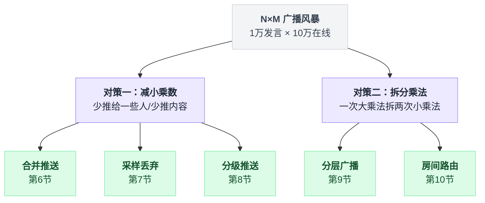
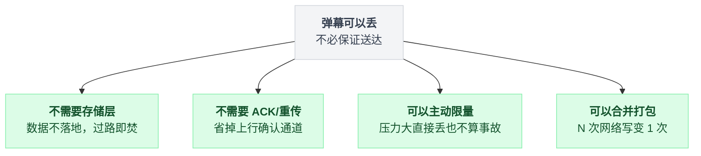
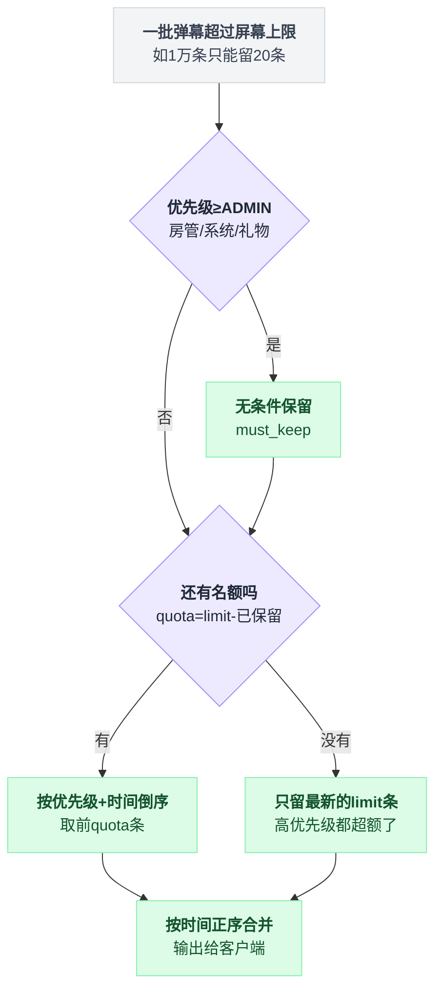
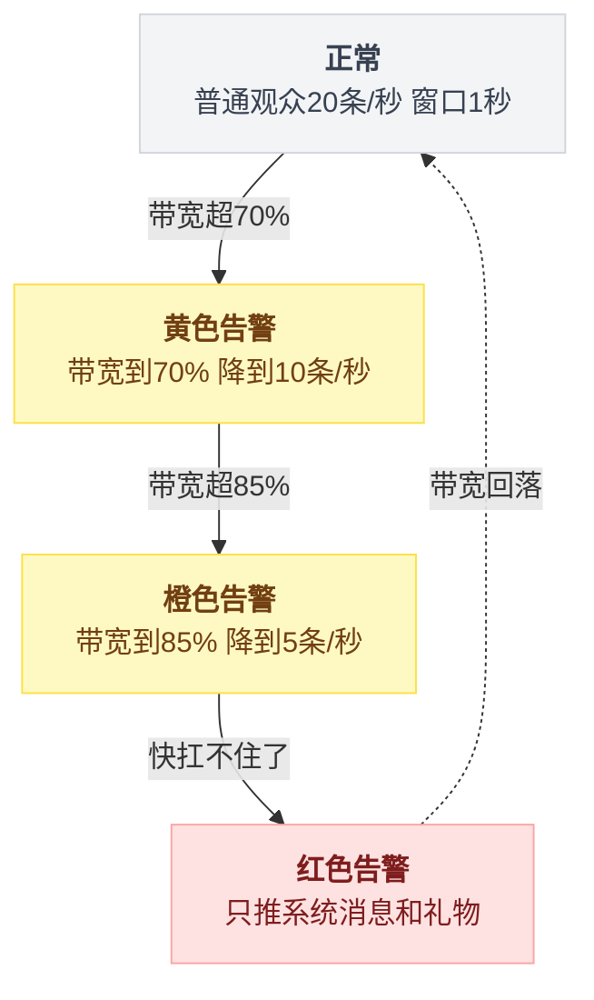
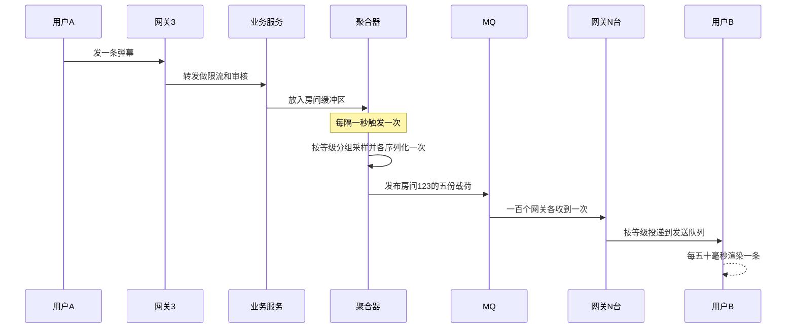
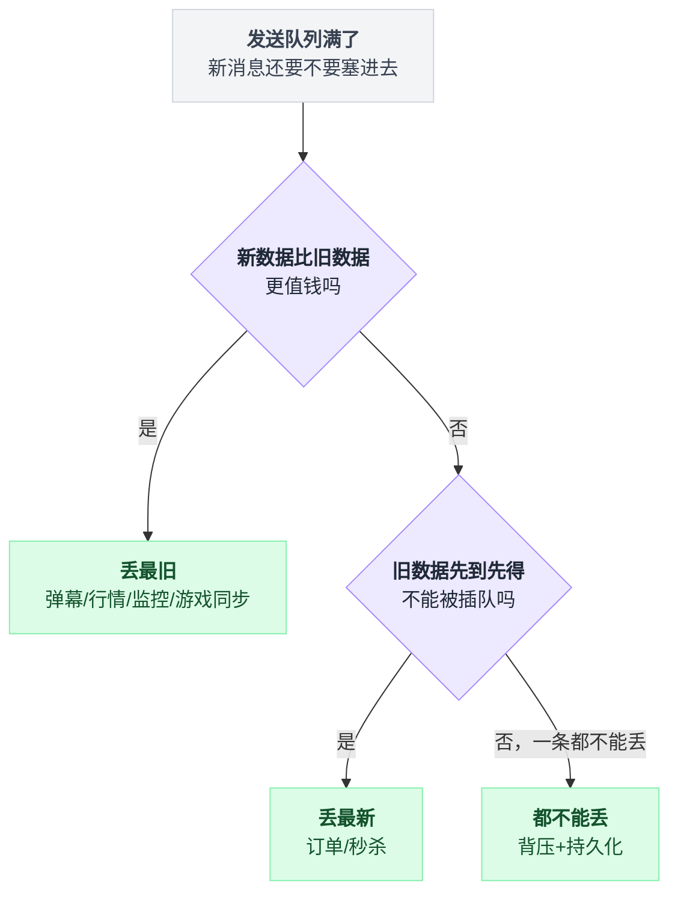
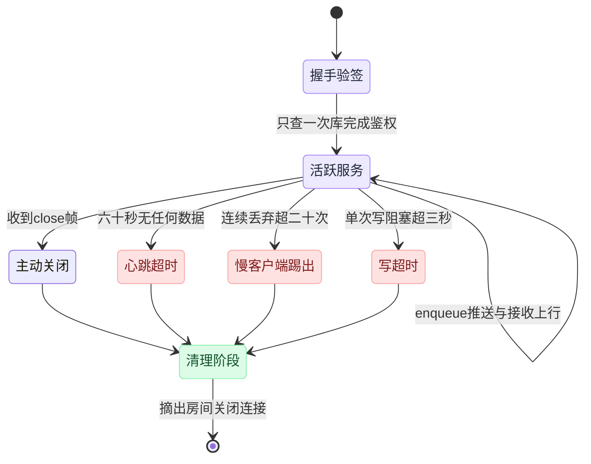
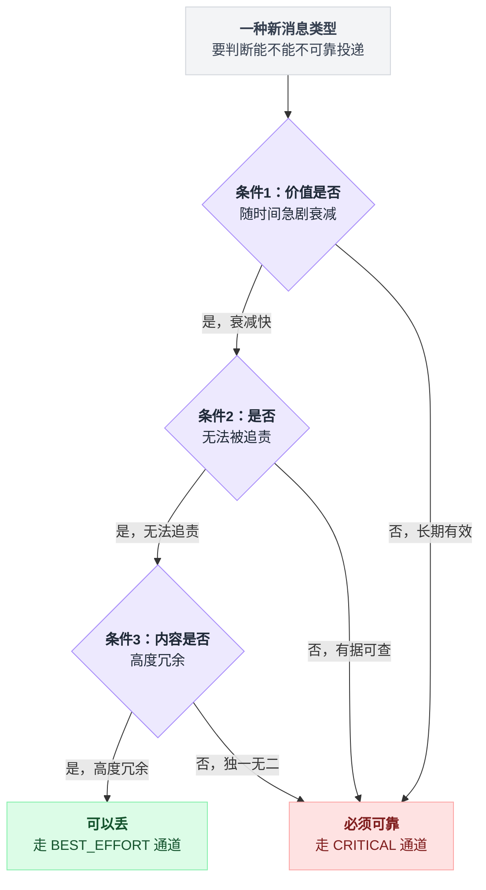
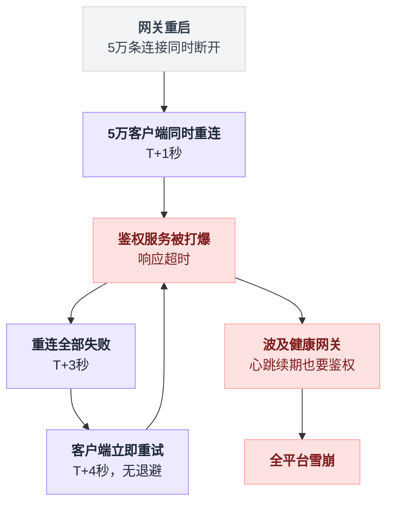

# 《直播弹幕与广播》十万人的房间，每句话都要传给所有人（小白版）

> 一句话简介：一个人说一句话，十万人要在 200 毫秒内看见 —— 弹幕系统的全部工程难题，都来自"一次输入、N 次输出"这个乘法，而它的解法在所有分布式系统里都算异类：**主动丢**、**不保证送到**、**不留底**。
> 难度：★★★☆☆

全文的路线是一条直线：先把那个 10 亿次/秒的乘法算清楚（第 1 节），补完"服务端怎么主动推"和"一台机器能挂多少连接"的课（第 2、3 节），看最朴素的写法是怎么死的（第 4 节），然后用四招把它一路救回来（第 6~9 节），最后处理三件脏活 —— 队列满了丢谁、慢客户端、礼物不能丢（第 11、12、14 节）。

中间的第 5 节是个岔路口，值得慢读：弹幕和 Feed 流的数据流形状几乎一样，价值观却完全相反，后面所有解法的合法性都建立在那一节上。

---

## 目录

- [0. 先讲个故事：教室里传纸条，和老师拿喇叭喊](#0-先讲个故事教室里传纸条和老师拿喇叭喊)
- [1. 这件事到底难在哪：乘法带来的灾难](#1-这件事到底难在哪乘法带来的灾难)
- [2. 先补课：浏览器怎么才能"被动收到"消息](#2-先补课浏览器怎么才能被动收到消息)
- [3. 一台机器能挂多少条长连接：C10K 和 C100K](#3-一台机器能挂多少条长连接c10k-和-c100k)
- [4. 最朴素的做法，以及它为什么会死](#4-最朴素的做法以及它为什么会死)
- [5. 弹幕 vs Feed 流：两套完全相反的价值观](#5-弹幕-vs-feed-流两套完全相反的价值观)
- [6. 第一次改进：合并推送（全文最重要的一招）](#6-第一次改进合并推送全文最重要的一招)
- [7. 第二次改进：采样丢弃（屏幕只装得下 20 条）](#7-第二次改进采样丢弃屏幕只装得下-20-条)
- [8. 第三次改进：分级推送（VIP 全量，路人采样）](#8-第三次改进分级推送vip-全量路人采样)
- [9. 第四次改进：分层广播，把扇出下沉到网关](#9-第四次改进分层广播把扇出下沉到网关)
- [10. 房间路由：让同一个房间的人挤在同一台机器上](#10-房间路由让同一个房间的人挤在同一台机器上)
- [11. 背压视角：弹幕为什么要"丢最旧的"](#11-背压视角弹幕为什么要丢最旧的)
- [12. 慢客户端：一个人的烂网络能拖垮十万人](#12-慢客户端一个人的烂网络能拖垮十万人)
- [13. 不做 ACK、不重传、不落库：省掉的复杂度有多大](#13-不做-ack不重传不落库省掉的复杂度有多大)
- [14. 礼物消息：同一个系统里的两条通道](#14-礼物消息同一个系统里的两条通道)
- [15. 完整方案全景图](#15-完整方案全景图)
- [16. 核心代码逐行讲解](#16-核心代码逐行讲解)
- [17. 生产环境会踩的坑](#17-生产环境会踩的坑)
- [18. 反直觉结论](#18-反直觉结论)
- [19. 一句话总结 + 小白词典](#19-一句话总结--小白词典)
- [附：和前面几篇的对照表](#附和前面几篇的对照表)

---

## 0. 先讲个故事：教室里传纸条，和老师拿喇叭喊

### 0.1 一个 50 人的班

你在教室里，班上 50 个人。你想告诉全班"今天下午体育课取消了"。

**办法一：传纸条。**

你写一张纸条，递给同桌，同桌看完递给后桌，后桌再递……

```
   你 ──▶ 同桌 ──▶ 后桌 ──▶ 第四个人 ──▶ ...... ──▶ 第 50 个人
   │                                                    │
   └────────────────  一共传了 49 次  ─────────────────┘
                      最后一个人 10 分钟后才知道
```

这个办法的特点：

| 特点 | 说明 |
|---|---|
| 传递次数 | 49 次（人数 - 1） |
| 最后一个人的延迟 | 很大，要等前面所有人 |
| 中间有人睡着了 | 后面所有人都收不到（链路断了） |
| 你能确认大家收到了吗 | 不能，除非每个人再传一张回执回来 |

**办法二：老师拿喇叭喊一嗓子。**

```
                    ┌──────────┐
                    │  喇叭    │
                    └────┬─────┘
                         │ 喊一次
        ┌────────┬───────┼───────┬────────┐
        ▼        ▼       ▼       ▼        ▼
      学生1    学生2   学生3   学生4  ...  学生50
                （所有人同时听到，延迟 0.1 秒）
```

| 特点 | 说明 |
|---|---|
| 传递次数 | **1 次** |
| 所有人的延迟 | 几乎相同，都很小 |
| 有人在打瞌睡 | 他自己错过了，不影响别人 |
| 你能确认大家收到了吗 | 不能，也**不需要** |

**直播弹幕，就是"老师拿喇叭喊"这个模式。** 一次输入，所有人同时听见，谁走神了谁自己认栽。

### 0.2 现在把教室换成体育馆

问题来了：如果不是 50 人的教室，而是**10 万人的体育馆**呢？

而且不是老师一个人喊，是**每个人都想喊**。

```
   ┌────────────────────────────────────────────────────────┐
   │                                                        │
   │            10 万人的体育馆                             │
   │                                                        │
   │     ☺ ☺ ☺ ☺ ☺ ☺ ☺ ☺ ☺ ☺ ☺ ☺ ☺ ☺ ☺ ☺ ☺ ☺ ☺              │
   │     ☺ ☺ ☺ ☺ ☺ ☺ ☺ ☺ ☺ ☺ ☺ ☺ ☺ ☺ ☺ ☺ ☺ ☺ ☺              │
   │     ☺ ☺ ☺ ☺ ☺ ☺ ☺ ☺ ☺ ☺ ☺ ☺ ☺ ☺ ☺ ☺ ☺ ☺ ☺              │
   │     ☺ ☺ ☺ ☺ ☺ ☺ ☺ ☺ ☺ ☺ ☺ ☺ ☺ ☺ ☺ ☺ ☺ ☺ ☺              │
   │                                                        │
   │     其中 1 万人正在同时说话                            │
   │     每个人说的话，都要让另外 10 万人听见               │
   │                                                        │
   └────────────────────────────────────────────────────────┘
```

现实中这会怎样？**变成一片嗡嗡声，谁也听不清谁在说什么。**

而这恰恰是弹幕系统最重要的一个物理直觉 —— 请你记住这个画面，后面第 7 节我们会用它推出一个反直觉的结论：**人多到一定程度，把 90% 的话扔掉，体验反而更好。**

### 0.3 弹幕到底是个什么东西

给完全没看过直播的人解释一下：

```
   ┌────────────────────────────────────────────────────────┐
   │                                                        │
   │   主播在打游戏 ...                                     │
   │                                                        │
   │      6666 啊 ──▶                                       │
   │              ◀── 这操作可以的                          │
   │   主播牛逼 ──▶            ◀── 前面的别刷了             │
   │                                                        │
   │            ◀── 【用户A 送出 火箭 x1】                  │
   │                                                        │
   │   [视频画面]                                           │
   │                                                        │
   └────────────────────────────────────────────────────────┘
         ↑
    这些从右往左飘过的字，就是"弹幕"
    （名字来自它密集时像游戏里的"弹幕射击"）
```

技术上看，弹幕就是一句话：

**一个房间里的任何一个人发一条消息，房间里的所有人都要尽快看到它。**

听起来简单得不像话。难就难在，这句话里的"所有人"可能是 10 万个，"任何一个人"可能同时有 1 万个。

### 0.4 三个数量级，三种完全不同的系统

先给你一张表，建立数量级的直觉。同样是"广播消息"，在不同规模下是**完全不同的三个系统**：

| 房间人数 | 典型场景 | 一秒发言数 | 需要的推送次数/秒 | 架构复杂度 |
|---|---|---|---|---|
| 10 人 | 微信群 | 1 条 | 10 次 | 一个 for 循环搞定 |
| 1000 人 | 小主播直播间 | 50 条 | 5 万次 | 单机 WebSocket 服务 |
| 10 万人 | 头部主播 / 演唱会 | 1 万条 | **10 亿次** | 本文全部内容 |
| 1000 万人 | 春晚 / 世界杯决赛 | 10 万条 | 1 万亿次 | 本文全部内容 + CDN 边缘下推 |

看第三行那个 **10 亿次**。这就是我们要解决的问题。

**小结**：弹幕的模型是"广播"—— 一次输入、N 次输出。人少的时候是个 for 循环，人多的时候是一场灾难。灾难的名字叫"乘法"。

---

## 1. 这件事到底难在哪：乘法带来的灾难

一句话：输入是加法，输出是乘法。这一节先把 10 亿次/秒和 800 Gbps 这两个数字算出来，再把新手最容易想到的四条路逐条打破。

### 1.1 签名难题：N × M

每个经典系统都有一个"签名难题"—— 那个只属于它、绕不过去的核心矛盾。

- 秒杀的签名难题是：**一份库存，一万个人抢**（写热点）
- 限流器的签名难题是：**它必须比它保护的系统快几个数量级**（自己不能成瓶颈）
- Feed 流的签名难题是：**推还是拉**（写扩散 vs 读扩散）
- 弹幕的签名难题是：**N 个人说话 × M 个人听 = N×M 次推送**

```
   ┌──────────────────────────────────────────────────────────┐
   │                                                          │
   │                    广播风暴（N × M）                     │
   │                                                          │
   │      N 个人发言             M 个人在线                   │
   │      （1 万）      ×        （10 万）                    │
   │          │                      │                        │
   │          └──────────┬───────────┘                        │
   │                     ▼                                    │
   │            10,000,000,000 次推送 / 秒                    │
   │                （100 亿 ÷ 10 = 10 亿）                   │
   │                                                          │
   │   ★ 输入是【加法】，输出是【乘法】★                      │
   │                                                          │
   └──────────────────────────────────────────────────────────┘
```

算清楚：1 万条消息 × 10 万个接收者 = **10 亿次推送，每秒**。

这个数字有多离谱？给你几个参照：

| 参照物 | 数量级 |
|---|---|
| 一台好机器每秒能做的网络写操作 | 约 50 万次（乐观） |
| 淘宝双十一的峰值订单 | 约 58 万笔/秒 |
| 我们要的推送次数 | **10 亿次/秒** |
| 需要多少台机器（不做任何优化） | 10 亿 ÷ 50 万 = **2000 台** |

**2000 台机器，只为了一个直播间的弹幕。** 这显然是不可接受的 —— 一个平台上同时有几千个直播间。

### 1.2 带宽也算不过来

不只是"次数"的问题，还有"字节"的问题。

假设一条弹幕的完整数据包（含用户名、内容、颜色、时间戳、协议头）是 **100 字节**。

```
   10 亿次推送 × 100 字节 = 100,000,000,000 字节/秒
                          = 100 GB/秒
                          = 800 Gbps
```

**800 Gbps。** 参照一下：

| 参照物 | 带宽 |
|---|---|
| 家用千兆宽带 | 1 Gbps |
| 一台服务器的万兆网卡 | 10 Gbps |
| 一个中型 IDC 机房的出口带宽 | 100 ~ 400 Gbps |
| 我们一个直播间需要的 | **800 Gbps** |

一个直播间的弹幕，要吃掉两个机房的全部出口带宽。

而且**带宽是要花钱的**。按国内公有云 BGP 带宽的量级估算，800 Gbps 大约是每月**上千万人民币**。一个直播间。

### 1.3 "那我用最笨的办法行不行"

现在请你自己想想，怎么解决。下面是新手最常想到的四条路，我们逐条打破。

---

**想法一：多加机器不就行了？**

```
   ┌──────────────────────────────────────────────────────┐
   │  加机器能解决"连接数"，解决不了"推送次数"。          │
   │                                                      │
   │  你把 10 万连接分到 100 台机器，每台 1000 条连接。   │
   │  但每台机器仍然要为每条弹幕，给自己的 1000 条连接    │
   │  各推一次。                                          │
   │                                                      │
   │  总推送次数 = 1万条 × 10万人 = 10 亿                 │
   │             （一次都没少，只是换了地方做）           │
   │                                                      │
   │  ★ 加机器只能【摊薄】乘法，不能【消除】乘法 ★        │
   └──────────────────────────────────────────────────────┘
```

而且加机器还引入了新问题：一条弹幕现在要先从"收到它的那台机器"转发给另外 99 台。这叫**跨机转发**，第 10 节专门讲。

---

**想法二：客户端定时来拉不就行了？**

也就是浏览器每秒问一次服务器"有新弹幕吗"。这叫**短轮询**（short polling）。

```
   10 万人 × 每秒 1 次 = 10 万 QPS 的请求量
   （QPS = Queries Per Second，每秒请求数）
```

看起来比 10 亿好多了？但是：

| 问题 | 说明 |
|---|---|
| 10 万 QPS 全是 HTTP 请求 | 每个请求要建连接、解析头、鉴权、查库，成本比"往已有连接写几个字节"高 100 倍 |
| 延迟至少 500ms | 平均要等半个轮询周期。弹幕晚 1 秒出现，就和视频对不上了 |
| 想更快就得更频繁 | 想做到 200ms 延迟就要每秒 5 次 = 50 万 QPS，直接爆炸 |
| 90% 的请求是空的 | 大部分时候没新弹幕，纯浪费 |

**但是** —— 请记住这个想法，它其实**离正确答案只差一步**。第 6 节的"合并推送"本质上就是"服务端主动的、每秒一次的批量投递"，它保留了轮询"每秒只交互一次"的优点，去掉了轮询"客户端傻等 + 请求开销大"的缺点。

---

**想法三：用消息队列（MQ）不就行了？**

MQ（Message Queue，消息队列，可以理解成一根"消息水管"，一端写、一端读）确实很擅长分发消息。但：

```
   ┌──────────────────────────────────────────────────────────┐
   │  MQ 的模型是【少量消费者】，弹幕是【海量消费者】。       │
   │                                                          │
   │  Kafka 一个 topic 有 10 个消费者组？很正常。             │
   │  Kafka 一个 topic 有 10 万个消费者？                     │
   │    → 光是维护每个消费者的 offset（读到哪了）             │
   │      就把 broker 撑爆了                                  │
   │                                                          │
   │  ★ MQ 用在【服务与服务之间】，不用在【服务与用户之间】★  │
   └──────────────────────────────────────────────────────────┘
```

MQ 在弹幕架构里**确实会用**，但用在第 9 节说的"业务层 → 网关层"这一跳上，消费者只有几十个网关。用户那 10 万条连接，是网关自己维护的，MQ 看不见。

---

**想法四：让弹幕走 CDN，跟着视频流一起下发？**

这条路**真的有人走**，而且在超大规模（春晚级别）下是标准做法之一 —— 把弹幕数据塞进视频流的 SEI 帧（一种可以夹带私货的视频元数据帧），或者做成一个个静态 JSON 分片文件推到 CDN 边缘节点。

优点：CDN 有几千个边缘节点，扇出天然分布式，带宽便宜。

缺点：

| 缺点 | 说明 |
|---|---|
| 延迟大 | CDN 分片通常 1~3 秒粒度，实时互动感差 |
| 无法个性化 | 所有人拿到同一份文件，做不了"屏蔽某人""VIP 全量" |
| 只能单向 | 用户发弹幕还是得走另一条上行链路 |

所以它是**大房间的补充手段**，不是主干方案。真正的主干还是长连接。

### 1.4 难点清单

把上面的分析收拢成一张表。这就是本文要逐个击破的东西：

| # | 难点 | 一句话描述 | 在哪节解决 |
|---|---|---|---|
| 1 | 广播风暴 | N×M 次推送，数字爆炸 | 第 6 节（合并）+ 第 7 节（采样） |
| 2 | 服务端主动推 | HTTP 是"客户端问、服务端答"，弹幕要反过来 | 第 2 节（WebSocket） |
| 3 | 海量长连接 | 10 万条连接放哪、内存够不够 | 第 3 节（C100K） |
| 4 | 扇出放在哪一层 | 业务层扇出会被打死 | 第 9 节（分层广播） |
| 5 | 跨机转发 | 同房间的人分散在 100 台机器上 | 第 10 节（房间路由） |
| 6 | 推不过来怎么办 | 队列满了丢谁 | 第 11 节（丢最旧） |
| 7 | 慢客户端 | 一个人的烂网络拖垮所有人 | 第 12 节（独立有界队列） |
| 8 | 可靠性 | 弹幕能丢，礼物不能丢 | 第 13、14 节（双通道） |

**小结**：弹幕的难点是"乘法"。而对付乘法的办法只有两种 —— **要么减小乘数（少推给一些人 / 少推一些内容），要么把一次乘法拆成两次小乘法（分层扇出）**。本文剩下的所有内容，都是这两句话的展开。

把这两句话摊开，就是后面九节要走的路线：



---

## 2. 先补课：浏览器怎么才能"被动收到"消息

一句话：短轮询 → 长轮询 → SSE → WebSocket，四代方案只在做同一件事 —— 把"每条消息的协议开销"从 800 字节砍到 6 字节。

这一节是给完全零基础的读者的。如果你已经很熟悉 WebSocket，可以跳到第 3 节 —— 但我建议你还是扫一眼那几张时序图，后面讲"合并推送"时会直接复用。

### 2.1 HTTP 的天生缺陷：它是"一问一答"

浏览器和服务器之间的标准通信协议是 HTTP。HTTP 的模型非常简单：

```
   浏览器                                 服务器
     │                                      │
     │  ── 请求：给我首页 ──────────────▶   │
     │                                      │ （干活）
     │  ◀────────────── 响应：这是首页 ──   │
     │                                      │
     │        连接关闭，双方互不相欠        │
     │                                      │
```

**关键点：服务器不能主动说话。** 它只能"回答"，不能"发起"。

这就像你去银行柜台办事 —— 你不问，柜员不会主动喊你。但弹幕需要的恰恰是"柜员主动喊你"。

为了绕过这个限制，工程界发明了一串越来越聪明的办法。我们按时间顺序看。

### 2.2 方案一：短轮询（Short Polling）

最笨的办法：**既然服务器不能主动说，那我就一直问。**

```
   浏览器                                      服务器
     │                                           │
     │ ──── 有新弹幕吗？ ───────────────────▶    │
     │ ◀──────────────────── 没有（空响应） ──   │
     │                                           │
     │  ...... 等 1 秒 ......                    │
     │                                           │
     │ ──── 有新弹幕吗？ ───────────────────▶    │
     │ ◀──────────────────── 没有（空响应） ──   │
     │                                           │
     │  ...... 等 1 秒 ......                    │
     │                                           │
     │ ──── 有新弹幕吗？ ───────────────────▶    │
     │ ◀──────────── 有！这是 3 条弹幕 ───────   │
     │                                           │
     ▼                                           ▼
   时间轴（每次都是一次完整的 HTTP 请求 + 响应）
```

代价：

| 项目 | 数值（10 万人在线） |
|---|---|
| 请求量 | 10 万 QPS |
| 平均延迟 | 500ms（要等下次轮询） |
| 空响应比例 | 通常 > 80% |
| 每次请求的额外开销 | HTTP 头约 500~800 字节（Cookie 一大堆） |
| 纯协议头浪费的带宽 | 10 万 × 700B = **70 MB/s** |

划重点：**短轮询浪费的不是"服务器算力"，主要是"HTTP 头"。** 一条弹幕内容 20 个字，但 HTTP 请求头带了 800 字节的 Cookie 和 User-Agent。信噪比低到离谱。

### 2.3 方案二：长轮询（Long Polling）

改进：**问了之后，服务器如果没消息，先不回答，挂着；等有消息了再回答。**

```
   浏览器                                      服务器
     │                                           │
     │ ──── 有新弹幕吗？ ───────────────────▶    │
     │                                           │ ┐
     │        （连接保持打开，双方都在等）       │ │ 挂起
     │                                           │ │ 30 秒
     │              [此时有人发了弹幕]           │ │
     │ ◀──────────── 有！这是 1 条弹幕 ───────   │ ┘
     │                                           │
     │  立刻再问一次 ↓                           │
     │ ──── 有新弹幕吗？ ───────────────────▶    │
     │                                           │ ┐ 挂起
     │        （没消息，一直挂到 30 秒超时）     │ │
     │ ◀──────────────────── 超时，空响应 ────   │ ┘
     │                                           │
     │  再问一次 ↓                               │
     │ ──── 有新弹幕吗？ ───────────────────▶    │
```

好处：**延迟接近 0**（有消息立刻返回），空响应大幅减少。

这个方案在 2010 年前后是主流（当年叫 Comet 技术），微信网页版早期就是这么干的。

坏处：

| 问题 | 说明 |
|---|---|
| 每条消息仍要一次完整 HTTP 往返 | 高频消息时和短轮询一样费 |
| 服务器要挂住 10 万个"未完成的请求" | 传统的"一请求一线程"模型直接爆炸 |
| 中间的代理/网关会超时 | Nginx 默认 60 秒断开，得专门配 |
| 单向 | 上行还得另开请求 |

**长轮询是"伪推送"** —— 它模拟出了推送的效果，但底层还是一问一答。

### 2.4 方案三：SSE（Server-Sent Events）

2011 年，HTML5 把"服务器单向推送"标准化了，叫 SSE（Server-Sent Events，服务端推送事件）。

思路：**一个 HTTP 响应，永远不结束。** 服务器往这个"没写完的响应体"里，一段一段地追加内容。

```
   浏览器                                      服务器
     │                                           │
     │ ── GET /danmaku  Accept: text/event-stream ▶
     │                                           │
     │ ◀── 200 OK  Content-Type: text/event-stream
     │     （响应头发完了，但响应体不结束）      │
     │                                           │
     │ ◀────── data: {"user":"A","text":"6666"}  │
     │                                           │
     │ ◀────── data: {"user":"B","text":"牛"}    │
     │                                           │
     │ ◀────── data: {"user":"C","text":"哈哈"}  │
     │                                           │
     │       （同一个连接，服务器想推就推）      │
     ▼                                           ▼
```

浏览器端的代码简单到不可思议：

```typescript
const es = new EventSource("/danmaku?room=123");
es.onmessage = (e) => renderDanmaku(JSON.parse(e.data));
// 断线了？浏览器会自动重连，还会带上 Last-Event-ID 告诉服务器"我看到哪了"
```

SSE 的优点很实在：

| 优点 | 说明 |
|---|---|
| 就是普通 HTTP | 所有代理、CDN、防火墙都认，不用改基础设施 |
| 浏览器自动重连 | 不用自己写重连逻辑（这一条比想象中值钱） |
| 文本协议，好调试 | `curl` 就能看 |
| 自带消息 ID 机制 | 重连时能续上 |

缺点也很致命：

| 缺点 | 说明 |
|---|---|
| **只能单向** | 服务器→浏览器。用户发弹幕得另开一个 POST 请求 |
| 只能传文本 | 二进制要 base64，膨胀 33% |
| HTTP/1.1 下有连接数限制 | 同一域名浏览器最多 6 个连接，SSE 占一个 |

**什么时候该用 SSE**：如果你的场景是**纯下行、低频、要快速上线**（比如 AI 聊天逐字输出、股票行情推送、任务进度条），SSE 是性价比最高的选择，不要无脑上 WebSocket。

### 2.5 方案四：WebSocket

2011 年同期标准化的另一个东西，也是弹幕的最终答案。

WebSocket 的做法是：**先用一次普通 HTTP 请求"打招呼"，然后把这条 TCP 连接从 HTTP 协议"升级"成一个全新的、双向的、二进制的协议。**

```
   浏览器                                      服务器
     │                                           │
     │ ── GET /ws                                │
     │    Upgrade: websocket          ───────▶   │  ┐
     │    Connection: Upgrade                    │  │ 握手
     │    Sec-WebSocket-Key: dGhlIH...           │  │ （一次
     │                                           │  │  普通
     │ ◀── 101 Switching Protocols ───────────   │  │  HTTP）
     │     Upgrade: websocket                    │  ┘
     │     Sec-WebSocket-Accept: s3pPLM...       │
     │                                           │
     ╞═══════ 从这里开始，不再是 HTTP ═══════════╡
     │                                           │
     │ ◀────────── 弹幕帧（服务器推） ────────   │
     │ ──────────  我发了一条弹幕（客户端推） ▶  │
     │ ◀────────── 弹幕帧 ───────────────────    │
     │ ◀────────── 弹幕帧 ───────────────────    │
     │ ──────────  ping ────────────────────▶    │
     │ ◀────────── pong ─────────────────────    │
     │                                           │
     │        双向、随时、任意一方都能先说话     │
     ▼                                           ▼
```

关键点：**握手之后，HTTP 就不存在了。** 之后传的每一条消息，只有 **2~14 字节**的帧头。

### 2.6 四种方案的正面对比

把前面四种方案摆在一起看：

```
 ┌────────────┬──────────┬──────────┬──────────┬──────────────┐
 │            │ 短轮询   │ 长轮询   │   SSE    │  WebSocket   │
 ├────────────┼──────────┼──────────┼──────────┼──────────────┤
 │ 方向       │  双向    │  双向    │  单向下  │  ★ 全双工    │
 │            │（各一条）│（各一条）│          │  （同一条）  │
 ├────────────┼──────────┼──────────┼──────────┼──────────────┤
 │ 延迟       │ 半个周期 │  接近 0  │  接近 0  │  ★ 接近 0    │
 │            │ (~500ms) │          │          │              │
 ├────────────┼──────────┼──────────┼──────────┼──────────────┤
 │ 每条消息   │ ~800 B   │ ~800 B   │  ~10 B   │  ★ 2~14 B    │
 │ 的协议开销 │(完整HTTP)│(完整HTTP)│ (data:\n)│  （帧头）    │
 ├────────────┼──────────┼──────────┼──────────┼──────────────┤
 │ 连接数     │ 频繁新建 │ 频繁新建 │ 1 条常驻 │  1 条常驻    │
 ├────────────┼──────────┼──────────┼──────────┼──────────────┤
 │ 二进制     │  可以    │  可以    │  ✗ 不行  │  ★ 原生支持  │
 ├────────────┼──────────┼──────────┼──────────┼──────────────┤
 │ 自动重连   │  天然    │  天然    │ ★ 浏览器 │  ✗ 自己写    │
 │            │          │          │   内置   │              │
 ├────────────┼──────────┼──────────┼──────────┼──────────────┤
 │ 基础设施   │  ★ 无    │  要调超时│  要关缓冲│  网关要支持  │
 │ 改造       │          │          │          │  Upgrade     │
 ├────────────┼──────────┼──────────┼──────────┼──────────────┤
 │ 适合弹幕吗 │  ✗       │  勉强    │  凑合    │  ★★★ 就是它  │
 └────────────┴──────────┴──────────┴──────────┴──────────────┘
```

### 2.7 为什么弹幕必须是 WebSocket

三个理由，按重要性排序：

**理由一：每条消息的协议开销差 50 倍。**

这是最硬的理由。回到我们的场景：

```
   假设优化后每秒要向 10 万人各推 1 次（第 6 节会做到这一点）：

   长轮询：10万 × 800 字节协议头 = 80 MB/s  ← 纯浪费
   WebSocket：10万 × 6 字节帧头 = 0.6 MB/s

   ★ 差 133 倍，而且这部分开销是【纯浪费】，一个字的弹幕内容都不含 ★
```

**理由二：上行下行共用一条连接。**

用户既要**看**弹幕（下行），又要**发**弹幕（上行）。SSE 得开两条通道，连接数翻倍，还要处理两条通道的状态不一致（下行还活着但上行的登录态过期了）。

**理由三：服务端主动推，这是唯一的硬需求。**

弹幕的本质是"别人的动作触发我的界面更新"。这件事只有服务端主动推能做到，轮询做不到（只能逼近）。

### 2.8 最小可用的 WebSocket 服务端（Python）

用 Python 的 `websockets` 库写一个能跑的最小弹幕服务器。**这段代码从这里开始，会一路演进到第 16 节。**

```python
# pip install websockets
import asyncio
import json
import websockets
from websockets.server import WebSocketServerProtocol

# 房间 -> 该房间所有连接的集合
# 这就是"教室里有哪些人"的花名册
rooms: dict[str, set[WebSocketServerProtocol]] = {}

async def handler(ws: WebSocketServerProtocol) -> None:
    """每来一个新连接，asyncio 就起一个这样的协程来伺候它。"""
    room_id = ws.request.path.strip("/") or "default"
    rooms.setdefault(room_id, set()).add(ws)          # 进房：登记
    try:
        async for raw in ws:                          # 一直读，直到对方断开
            msg = json.dumps({"text": raw})
            await broadcast(room_id, msg)             # 收到一条 -> 广播出去
    finally:
        rooms[room_id].discard(ws)                    # 退房：销名
        if not rooms[room_id]:
            del rooms[room_id]

async def broadcast(room_id: str, msg: str) -> None:
    """★ 这个函数就是全文的主角，它会被改写四次 ★"""
    for peer in list(rooms.get(room_id, ())):
        await peer.send(msg)                          # ← 这一行是万恶之源

async def main() -> None:
    async with websockets.serve(handler, "0.0.0.0", 8765):
        await asyncio.Future()                        # 永远不结束

asyncio.run(main())
```

**这段在干嘛（白话翻译）**：

1. `rooms` 是一本花名册：房间号 → 这个房间里所有人的连接对象。
2. 每来一个人（新连接），`handler` 协程就负责伺候他一辈子 —— 先在花名册上登记，然后 `async for raw in ws` 死循环读他发来的消息。
3. 读到一条消息，就调 `broadcast`，把它发给这个房间里的所有人。
4. 他断开了，`finally` 保证一定把他从花名册划掉（**这一步漏了就是内存泄漏**，第 17 节会讲）。
5. `asyncio` 是 Python 的异步框架 —— 一个线程可以同时伺候几万个连接，因为绝大多数时候大家都在"等网络"，不占 CPU。**这一点是能挂海量连接的前提**，下一节细说。

配套的客户端（浏览器）就三行：

```typescript
const ws = new WebSocket("wss://danmaku.example.com/room123");
ws.onmessage = (e) => renderDanmaku(JSON.parse(e.data));
ws.send(JSON.stringify({ text: "6666" }));
```

**注意那个 `broadcast` 里的 `for` 循环。** 它在 100 人的房间里工作得很好，在 10 万人的房间里会引发本文剩下所有内容。第 4 节我们就来看它怎么死。

**小结**：HTTP 是一问一答，弹幕需要服务端主动推。演进路线是 短轮询 → 长轮询 → SSE → WebSocket，核心指标是"每条消息的协议开销"，从 800 字节一路降到 6 字节。纯下行低频场景 SSE 够用，弹幕这种双向高频场景必须 WebSocket。

---

## 3. 一台机器能挂多少条长连接：C10K 和 C100K

一句话：挂连接是**内存**问题，早就解决了；推消息是**CPU 和网卡**问题，那才是弹幕的墙。这一节的结论只有一条 —— 这两个指标毫不相干，别混着谈。

### 3.1 一个历史故事：C10K 问题

1999 年，一个叫 Dan Kegel 的工程师写了一篇著名的文章，标题是 **《The C10K Problem》**（C10K = Concurrent 10,000 connections，一万条并发连接）。

当时的问题是：**一台服务器能不能同时伺候一万个客户端？**

在当时，答案是"很难"。因为主流的服务器模型是这样的：

```
   ┌─────────────────────────────────────────────────────────┐
   │           一连接一线程模型（thread per connection）     │
   │                                                         │
   │   连接1 ──▶ 线程1  ┐                                    │
   │   连接2 ──▶ 线程2  │                                    │
   │   连接3 ──▶ 线程3  ├─ 每个线程 8 MB 栈空间              │
   │    ...              │                                   │
   │   连接10000 ─▶ 线程10000 ┘                              │
   │                                                         │
   │   内存：10000 × 8 MB = 80 GB   ← 直接爆炸               │
   │   切换：操作系统在 10000 个线程间切来切去，             │
   │         光是上下文切换就把 CPU 吃光了                   │
   └─────────────────────────────────────────────────────────┘
```

**上下文切换**（context switch）：CPU 从执行 A 线程切到执行 B 线程，要保存 A 的全部寄存器状态、加载 B 的，大约几微秒。看着不多，但一秒切换 10 万次就是 0.3 秒的纯浪费。

### 3.2 解法：一个线程伺候一万个连接（I/O 多路复用）

关键洞察：**这一万个连接，99.9% 的时间都在发呆。**

用户不是每毫秒都在发弹幕。绝大多数连接在绝大多数时刻，既没数据要读也没数据要写。为它们各配一个线程，等于给一万个在打瞌睡的人各配一个保姆。

于是有了 **I/O 多路复用**（I/O multiplexing）—— 名字吓人，意思很简单：

```
   ┌─────────────────────────────────────────────────────────┐
   │              I/O 多路复用（epoll 模型）                 │
   │                                                         │
   │      连接1  连接2  连接3  ......  连接10000             │
   │        │      │      │              │                   │
   │        └──────┴──────┴──────────────┘                   │
   │                     │                                   │
   │                     ▼                                   │
   │        ┌─────────────────────────┐                      │
   │        │      epoll（内核）      │                      │
   │        │  "哪些连接有数据了？"   │                      │
   │        └────────────┬────────────┘                      │
   │                     │ 只返回有事的那几个                │
   │                     ▼                                   │
   │        ┌─────────────────────────┐                      │
   │        │   1 个线程处理这几个    │                      │
   │        └─────────────────────────┘                      │
   │                                                         │
   │   ★ 不问"你有数据吗"（轮询），                          │
   │      而是"有数据了叫我"（事件通知）★                    │
   └─────────────────────────────────────────────────────────┘
```

生活类比：**一个服务员管 50 张桌子。** 他不会挨桌问"要加水吗"，而是站在中间，谁举手他去谁那儿。举手的人（有事件的连接）永远只是少数。

在 Linux 上这个机制叫 `epoll`，在 macOS/BSD 上叫 `kqueue`。**Python 的 `asyncio`、Go 的 goroutine 调度器、Node.js 的事件循环、Nginx，底层全都是它。**

所以你写第 2.8 节那段 `asyncio` 代码时，其实已经在用 epoll 了 —— 只是被 `async/await` 语法糖藏起来了。

### 3.3 现在算内存：10 万条连接要多少 GB

C10K 早就不是问题了。现在的问题叫 **C100K**（十万连接）甚至 **C1M**（百万连接）。这时瓶颈从"线程数"变成了"内存"。

一条 WebSocket 连接的内存开销，分三层：

```
 ┌──────────────────────────────────────────────────────────────┐
 │                  一条连接的内存账本                          │
 ├──────────────────────────────────────────────────────────────┤
 │                                                              │
 │  【第 1 层：内核】                                           │
 │    struct sock + struct file + inode 等         约 2 ~ 3 KB  │
 │    接收缓冲区 rmem（默认 87 KB，可调到 4 KB）  ← 大头！      │
 │    发送缓冲区 wmem（默认 16 KB，可调到 4 KB）  ← 大头！      │
 │                                                              │
 │  【第 2 层：TLS（如果用 wss://，生产必须用）】               │
 │    OpenSSL 每连接两个 16 KB 缓冲区              约 32 KB     │
 │    （这一项经常被忘掉，它比内核还大）                        │
 │                                                              │
 │  【第 3 层：应用】                                           │
 │    Python 协程对象 + 连接对象 + 用户信息        约 3 ~ 8 KB  │
 │    每连接的发送队列（第 12 节会加）             约 2 KB      │
 │                                                              │
 └──────────────────────────────────────────────────────────────┘
```

两种配置下的实际数字：

| 配置 | 每连接 | 10 万连接 | 100 万连接 |
|---|---|---|---|
| **完全默认**（不调优、开 TLS） | ~150 KB | **15 GB** | 150 GB（做梦） |
| **调优后**（缓冲区调小、TLS 优化） | ~20 KB | **2 GB** | 20 GB（可行） |
| 理论下限（裸 TCP、C 语言） | ~4 KB | 0.4 GB | 4 GB |

**划重点：调优和不调优差 7 倍。** 这 7 倍不是靠改业务代码，是靠改几个内核参数：

```bash
# 单个进程能打开的文件描述符数（一条连接算一个 fd）
# 默认 1024，不改的话你连 1025 条连接都挂不上
ulimit -n 1000000

# TCP 接收/发送缓冲区：最小值 / 默认值 / 最大值（字节）
# 弹幕消息很小，默认的 87KB 接收缓冲区纯属浪费
sysctl -w net.ipv4.tcp_rmem="4096 16384 4194304"
sysctl -w net.ipv4.tcp_wmem="4096 16384 4194304"

# accept 队列长度：瞬间涌入的新连接先排在这里
# 默认 128，重连风暴时 128 个位置一秒就满，后面的连接直接被内核丢掉
sysctl -w net.core.somaxconn=65535

# 整个系统的最大文件描述符数
sysctl -w fs.file-max=2000000
```

**注意 `somaxconn` 那一条**，第 17 节讲"重连风暴"时它会要你的命。

### 3.4 但内存不是唯一的墙

即使内存够了，还有三堵墙。前两堵都是纸糊的，第三堵才是真的。

```
   ┌──────────────────────────────────────────────────────────┐
   │  墙 1：文件描述符（fd）                                  │
   │    Linux 里每条连接 = 一个 fd。默认上限 1024。           │
   │    → 改 ulimit -n，容易                                  │
   │                                                          │
   │  墙 2：端口号（只影响【客户端】方向，别搞混）            │
   │    一台机器做客户端主动连别人时，端口只有 6 万个。       │
   │    做服务端【监听】时没有这个限制 ——                     │
   │    连接由四元组区分：(源IP,源端口,目的IP,目的端口)       │
   │    所以一个 8765 端口挂 100 万条连接完全合法。           │
   │    → 常见误解，这里澄清一下                              │
   │                                                          │
   │  墙 3：★ 推送吞吐（真正的墙）★                           │
   │    挂着 10 万条不说话的连接：很轻松，几乎不耗 CPU。      │
   │    往 10 万条连接每秒各写一次：CPU 直接打满。            │
   │    → 这才是弹幕的真瓶颈，本文第 6 节开始全在解决它       │
   └──────────────────────────────────────────────────────────┘
```

**划重点，这是本节最重要的一句话：**

> **"能挂多少连接"和"能推多少消息"是两个完全无关的指标。**
> 挂连接考验的是**内存**，推消息考验的是**CPU 和网卡**。
> 弹幕系统的瓶颈 **99% 在后者**。

一台 32 核 128 GB 的机器，挂 50 万条空闲连接毫无压力；但让它每秒往 10 万条连接各写一次，它就已经在冒烟了。

### 3.5 一次 `send()` 到底有多贵

来算算那个"往连接里写一次"到底花多少钱。

```
   ┌──────────────────────────────────────────────────────────┐
   │        await ws.send(msg)  背后发生的事                  │
   │                                                          │
   │   1. Python 层：构造 WebSocket 帧（掩码、长度、opcode）  │
   │      → 几微秒，纯 CPU                                    │
   │                                                          │
   │   2. TLS 层：加密这一帧                                  │
   │      → 几微秒 + 一次内存拷贝                             │
   │                                                          │
   │   3. ★ 系统调用 write()：从用户态陷入内核态 ★            │
   │      → 约 1 ~ 2 微秒（这是硬成本，躲不掉）               │
   │                                                          │
   │   4. 内核：拷贝到 socket 缓冲区、封 TCP 包、走网卡       │
   │      → 几微秒                                            │
   │                                                          │
   │   ────────────────────────────────────────               │
   │   合计：约 5 ~ 20 微秒（乐观估计）                       │
   │                                                          │
   │   单核每秒最多做：1 秒 ÷ 10 微秒 = 10 万次               │
   │   32 核理想满打满算：320 万次/秒                         │
   │   （实际因为锁、GIL、调度，能到 50 万就不错了）          │
   └──────────────────────────────────────────────────────────┘
```

记住这个数字：**一台机器每秒最多做几十万次 socket 写**。

现在回头看我们要的 **10 亿次/秒**。

```
   10 亿 ÷ 50 万 = 2000 台机器
```

第 1 节那个 2000 台的数字，就是这么算出来的。

**而第 6 节的"合并推送"，会把这个数字从 2000 台干到 2 台。** 不是靠更快的机器，是靠不做那么多次 `send()`。

**小结**：一台机器挂 10 万条连接不难（调调参数、2 GB 内存），难的是往这 10 万条连接高频写数据。系统调用是硬成本，一次约 10 微秒，一台机器每秒几十万次封顶。**所以优化的方向不是"让每次 send 更快"，而是"少调用几次 send"。**

---

## 4. 最朴素的做法，以及它为什么会死

一句话：一个 `for` 循环，四种死法 —— 推送次数是人数的平方、尾部延迟到秒级、一个慢客户端卡住全场、积压到 OOM。四种死法还互相加剧。

### 4.1 naive 版本

回到第 2.8 节那段代码里的核心函数：

```python
async def broadcast(room_id: str, msg: str) -> None:
    """来一条推一条，给房间里每个人都 send 一次。"""
    for peer in list(rooms.get(room_id, ())):
        await peer.send(msg)
```

这就是最朴素的做法：**来一条，推一条，挨个推。**

它有个名字叫**扇出**（fan-out）—— 一个输入分发给多个输出，像扇子展开。

```
                   一条弹幕
                      │
        ┌────┬────┬───┼───┬────┬────┐
        ▼    ▼    ▼   ▼   ▼    ▼    ▼
       用户 用户 用户 用户 用户 用户 用户
        1    2    3   4   5    6   ... 100000
              （扇出比 1 : 100000）
```

### 4.2 具体推演它在什么数量级下崩掉

我们让房间人数从小到大，看它什么时候死。假设：

- 每条 `send` 耗时 **10 微秒**（0.00001 秒）
- 弹幕产生速率：房间人数的 **10%** 每秒发一条（这是真实直播间的经验值）

| 房间人数 | 每秒弹幕数 | 每秒 send 次数 | 需要的 CPU 时间 | 结果 |
|---|---|---|---|---|
| 100 | 10 | 1,000 | 0.01 秒 | 毫无压力 |
| 1,000 | 100 | 100,000 | **1 秒** | ★ 单核刚好打满 |
| 5,000 | 500 | 2,500,000 | 25 秒 | 一台 32 核勉强 |
| 10,000 | 1,000 | 10,000,000 | 100 秒 | 4 台机器 |
| 50,000 | 5,000 | 250,000,000 | 2,500 秒 | 80 台机器 |
| **100,000** | **10,000** | **1,000,000,000** | **10,000 秒** | **★ 320 台机器** |

看那条曲线：

```
   每秒 send 次数
      ▲
  10亿│                                          ●
      │                                         ╱
      │                                        ╱
      │                                      ╱
   1亿│                                    ╱
      │                                  ╱
      │                              ╱
 100万│                        ●╱
      │                   ╱
  10万│        ●────╱
      │   ●╱
      └──────┬──────┬──────┬──────┬──────┬──────▶ 房间人数
            100   1000   1万   5万   10万

   ★ 注意：人数涨 1000 倍（100 → 10万），
     推送次数涨 100 万倍。这是【平方】关系 ★
```

**为什么是平方？** 因为发言人数和在线人数是**同一批人**：

```
   推送次数 = 发言人数 × 在线人数
            = (在线人数 × 10%) × 在线人数
            = 0.1 × 在线人数²
                        ↑
                    平方项！
```

**划重点**：弹幕系统的成本是**人数的平方**。这就是为什么"人多一倍，机器多一倍"这个直觉在这里完全失效 —— **人多一倍，机器要多四倍。**

这和秒杀那套文档里的"漏斗"正好形成对照：秒杀是**层层收窄**，越往里量越小；弹幕是**层层放大**，越往外量越大。

```
   秒杀（漏斗）              弹幕（喇叭）
   ▔▔▔▔▔▔▔▔▔▔▔              ▔▔▔▔▔▔▔▔▔▔▔
   100万请求                    1 条弹幕
       ╲    ╱                     │
        ╲  ╱                     ╱ ╲
         ╲╱                     ╱   ╲
       1000 单                 ╱     ╲
                            10 万人接收

   越往里越小                 越往外越大
   优化 = 提前拦截            优化 = 减少扇出
```

### 4.3 第二种死法：单条弹幕的"广播耗时"

上面算的是"总量"，还有个更隐蔽的问题：**一条弹幕从发出到最后一个人收到，要多久？**

```
   for peer in 100000 个连接:
       await peer.send(msg)      # 每次 10 微秒

   第 1 个人收到：      10 微秒后
   第 1000 个人收到：   10 毫秒后
   第 50000 个人收到：  0.5 秒后
   第 100000 个人收到： ★ 1 秒后 ★
```

**同一条弹幕，第一个人和最后一个人看到的时间差了 1 秒。**

而这还是理想情况（假设 CPU 全给它）。实际上这个循环期间还有别的弹幕在产生、别的连接在进出，真实的尾部延迟能到好几秒。

后果：

| 现象 | 用户感受 |
|---|---|
| 弹幕和视频画面对不上 | "为什么大家在说的东西我这边还没发生" |
| 主播问"听得到吗"，回复错乱 | 互动感全无 |
| 抽奖类互动，有人永远抢不到 | 直接投诉 |

### 4.4 第三种死法：一个慢客户端卡住所有人

这是最阴险的一种。看这行代码：

```python
await peer.send(msg)   # ← await 意味着"等这个人收完了，我再发给下一个"
```

`await` 的意思是"**等**"。如果 `peer` 是一个在电梯里、信号只有一格的用户呢？

```
   ┌──────────────────────────────────────────────────────────┐
   │                                                          │
   │  广播循环：                                              │
   │                                                          │
   │    用户1  ✓ 10 微秒                                      │
   │    用户2  ✓ 10 微秒                                      │
   │    用户3  ✓ 10 微秒                                      │
   │    用户4  ✗ ████████████████████ 卡住 3 秒 ★             │
   │           （他的 TCP 发送缓冲区满了，                    │
   │             因为他的网络吐不出去）                       │
   │    用户5    ← 等着                                       │
   │    用户6    ← 等着                                       │
   │    ...                                                   │
   │    用户100000 ← 等着                                     │
   │                                                          │
   │  ★ 一个人的烂网络，让另外 99999 人卡了 3 秒 ★            │
   │                                                          │
   └──────────────────────────────────────────────────────────┘
```

这个问题叫**慢客户端问题**（slow consumer / slow client），是所有推送系统的头号杀手。第 12 节整节都在讲它。

先给一个直觉：**在一个广播循环里，整个房间的推送速度 = 最慢那个人的速度。** 这是典型的"木桶效应"，而且木桶里有 10 万块板，总有一块是烂的。

### 4.5 第四种死法：内存爆炸

在 Python 里，`await peer.send()` 卡住时，消息并不会消失 —— 它排在某个地方等着。

```
   ┌──────────────────────────────────────────────────────────┐
   │  慢客户端 A 的连接：                                     │
   │                                                          │
   │    应用层积压  ▓▓▓▓▓▓▓▓▓▓▓▓▓▓▓▓▓▓▓▓▓  越堆越多           │
   │    内核 wmem   ████████████ 满了                         │
   │    网络        ~ 龟速 ~                                  │
   │                                                          │
   │  弹幕以 1 万条/秒的速度产生，                            │
   │  他以 100 条/秒的速度消费。                              │
   │                                                          │
   │  1 分钟后积压：(10000-100) × 60 = 59 万条                │
   │  × 100 字节 = 59 MB    ← 一个用户！                      │
   │                                                          │
   │  房间里有 1000 个这样的用户 → 59 GB → ★ OOM ★            │
   └──────────────────────────────────────────────────────────┘
```

**OOM**（Out Of Memory，内存耗尽）：进程被操作系统强行杀掉。对于挂着 10 万条连接的网关来说，OOM = 10 万人同时掉线 = 紧接着 10 万人同时重连 = **重连风暴**（第 17 节）。

**一个慢客户端，能引发全服雪崩。**

### 4.6 naive 版本的死因总结

```
   ┌─────────────────────────────────────────────────────────┐
   │             for peer in room: await peer.send(msg)      │
   │                                                         │
   │   死因 1：推送次数 = 人数²        → 10 亿次/秒          │
   │   死因 2：串行广播，尾部延迟 1 秒 → 弹幕对不上画面      │
   │   死因 3：一个慢客户端卡住所有人  → 木桶效应            │
   │   死因 4：积压无上限              → OOM → 雪崩          │
   │                                                         │
   │   ★ 注意这四个死因是【互相加剧】的：                    │
   │     慢客户端 → 广播变慢 → 积压更多 → 内存更紧 →         │
   │     GC 更频繁 → 广播更慢 → ...                          │
   │     这叫【正反馈崩溃】，一旦启动就停不下来 ★            │
   └─────────────────────────────────────────────────────────┘
```

接下来的四节（6、7、8、9），每一节干掉一个死因。但在动手之前，先花一节把"弹幕到底是个什么脾气的系统"想清楚 —— 因为解法的合法性完全建立在它的脾气上。

**小结**：朴素的 `for` 循环广播有四个死因，且互相放大。成本是人数的**平方**，一条弹幕的尾部延迟能到秒级，一个慢客户端能拖垮整个房间并最终 OOM。

---

## 5. 弹幕 vs Feed 流：两套完全相反的价值观

你刚学完 Feed 流（朋友圈/微博时间线）。那篇的核心是"推模式（写扩散）vs 拉模式（读扩散）"。

现在你看到弹幕，第一反应可能是：**"这不就是推模式的 Feed 吗？一个人发，所有人收。"**

**这个直觉是对的，但结论是错的。** 两者的数据流形状确实很像，但**价值观完全相反**，相反到架构上几乎没有一行代码能复用。

一句话：Feed 是"可靠优先、可以慢"，弹幕是"实时优先、可以丢"。这一节唯一要做的事，是把"可以丢"这三个字推出四条推论 —— 后面所有优化的合法性，全靠这四条撑着。

### 5.1 一张表说清区别

| 维度 | Feed 流（朋友圈） | 弹幕（直播间） | 为什么会这样 |
|---|---|---|---|
| **实时性要求** | 秒级到分钟级都行 | **200ms 以内** | 弹幕要和视频画面对得上，晚 1 秒就"驴唇不对马嘴" |
| **必须送达吗** | **必须**。少一条动态是 bug | **可以丢**。丢一半没人发现 | Feed 是"我的信息资产"，弹幕是"当场的氛围" |
| **要持久化吗** | **必须存**。三年前的朋友圈还能翻 | **不用存**（回放另说） | 没人会问"半小时前第 3 条弹幕是啥" |
| **要 ACK 吗** | 要。要知道推没推到 | **不要**。发出去就忘 | ACK 的成本是消息本身的量级 |
| **有序吗** | 按时间排，要严格 | **不用严格**。差几十毫秒无所谓 | 屏幕上飘着的字，谁前谁后没人在意 |
| **接收者数量** | 好友 200 人（大 V 除外） | **10 万人** | 量级差 500 倍，这是最根本的差异 |
| **消息生命周期** | **永久** | **5 秒**（飘过屏幕就没了） | 决定了要不要落库 |
| **能异步吗** | **能**。慢慢推，几秒送到都行 | **不能**。慢了就等于丢了 | 一条晚到 5 秒的弹幕，比丢掉更糟 |
| **可以合并吗** | 不好合并（每条要独立展示、独立已读） | **可以，而且必须合并** | 这是弹幕最大的优化空间 |
| **热点问题** | 大 V 发博 → 千万粉丝写扩散 | 大主播开播 → 十万人同时在线 | 都有，但解法不同 |
| **核心解法** | 推拉结合（大 V 走拉，普通人走推） | **合并 + 采样 + 分层扇出** | 见下 |
| **存储** | Redis List / HBase 收件箱 | **没有存储**（内存里过一遍） | ★ 最直观的差别 ★ |

### 5.2 一句话抓住区别

```
   ┌──────────────────────────────────────────────────────────┐
   │                                                          │
   │   Feed 流：  "慢一点没关系，但一条都不能少"              │
   │                                                          │
   │              可靠 > 实时                                 │
   │              → 存储 + 重试 + 对账                        │
   │                                                          │
   │   ────────────────────────────────────────────────       │
   │                                                          │
   │   弹幕：    "丢一半没关系，但晚了就等于没有"             │
   │                                                          │
   │              实时 > 可靠                                 │
   │              → 合并 + 采样 + 丢弃                        │
   │                                                          │
   │   ★ 这两句话，推出了两套完全不同的架构 ★                 │
   │                                                          │
   └──────────────────────────────────────────────────────────┘
```

### 5.3 为什么这个差别会导致架构完全不同

一步一步推。

**推论 1：不用保证送达 → 不需要存储层。**

```
   Feed 流的路径：
     发布 ──▶ 写扩散服务 ──▶ 每个粉丝的收件箱（Redis/HBase）
                                    │
                                    ▼
                              用户上线时来拉
     ★ 数据落在存储里，用户什么时候来取都行 ★

   弹幕的路径：
     发布 ──▶ 网关 ──▶ 在线连接
                          │
                          ▼
                    用户当场看到，看不到就算了
     ★ 数据不落地，走过路过错过就没了 ★
```

少了存储层，意味着少了：数据库容量规划、冷热分离、过期清理、主从延迟、缓存一致性…… **一整个技术栈没了。**

**推论 2：不用保证送达 → 不需要 ACK 和重传。**

ACK（Acknowledgement，确认回执）就是"收到请回答"。如果弹幕要 ACK：

```
   下行：服务器 → 10 万用户，10 万条消息
   上行：10 万用户 → 服务器，10 万条 ACK   ← 量翻倍！

   而且服务器要为每条消息 × 每个用户维护一个"确认了没"的状态：
   10000 条 × 100000 人 = 10 亿个状态位，每秒更新一遍
```

**ACK 的成本，比消息本身还高。** 弹幕直接不做，第 13 节详谈。

**推论 3：可以丢 → 可以主动限量。**

这是最重要的一条。因为可以丢，我们获得了一个 Feed 流永远没有的自由：

> **当推送压力超过承受能力时，可以直接扔掉一部分，而不用背负任何"数据丢失"的心理负担。**

Feed 流做不到这一点 —— 它压力大时只能"变慢"（背压），不能"扔掉"（丢弃）。你在限流那篇学过这两个词的区别：

```
   背压（Backpressure）：让上游慢下来，请求不死只是变慢
   丢弃（Load Shedding）：直接扔掉，请求死了

   Feed 流 → 只能背压（数据不能丢）
   弹幕   → ★ 可以丢弃（这是它的超能力）★
```

**推论 4：可以合并 → 可以把 N 次网络写变成 1 次。**

Feed 流为什么不好合并？因为每条动态在客户端是独立卡片、独立已读状态、独立点赞计数，要单独处理。

弹幕呢？屏幕上飘过的一堆字，客户端拿到 1 条还是 20 条，处理逻辑完全一样 —— 塞进渲染队列，一条条飘出去。**打包对客户端零成本。**

这一条推出了第 6 节，也是全文最有价值的优化。

四条推论汇总起来，是一条从"可以丢"出发的推导链：



### 5.4 两套架构并排看

```
 ┌────────────────────────────┬────────────────────────────────┐
 │        Feed 流架构         │          弹幕架构              │
 ├────────────────────────────┼────────────────────────────────┤
 │                            │                                │
 │   用户发布                 │   用户发弹幕                   │
 │      │                     │      │                         │
 │      ▼                     │      ▼                         │
 │  ┌────────┐                │  ┌────────┐                    │
 │  │ 发布服务│               │  │ 发送服务│ 限流+审核         │
 │  └───┬────┘                │  └───┬────┘                    │
 │      │                     │      │                         │
 │      ▼                     │      ▼                         │
 │  ┌────────┐                │  ┌────────────┐                │
 │  │  MQ    │ 削峰           │  │ 房间内存队列│ ★ 不落库 ★    │
 │  └───┬────┘                │  └───┬────────┘                │
 │      │                     │      │                         │
 │      ▼                     │      ▼                         │
 │  ┌────────┐                │  ┌────────────┐                │
 │  │写扩散   │ 慢慢推        │  │ 1 秒聚合器  │ ★ 攒一批 ★    │
 │  │(异步)   │ 可以推几分钟  │  └───┬────────┘                │
 │  └───┬────┘                │      │                         │
 │      │                     │      ▼                         │
 │      ▼                     │  ┌────────────┐                │
 │  ┌────────┐                │  │ 采样丢弃    │ ★ 只留 20 条 ★│
 │  │ 收件箱  │ ★ 持久化 ★    │  └───┬────────┘                │
 │  │ Redis  │ 存三年         │      │                         │
 │  └───┬────┘                │      ▼                         │
 │      │                     │  ┌────────────┐                │
 │      ▼                     │  │ 网关扇出    │ 一次写一批    │
 │   用户上线来【拉】         │  └───┬────────┘                │
 │      │                     │      │                         │
 │      ▼                     │      ▼                         │
 │   看到全部动态             │   看到最近 20 条               │
 │   （一条不少）             │   （丢了 99% 也无所谓）        │
 │                            │                                │
 ├────────────────────────────┼────────────────────────────────┤
 │  关键词：                  │  关键词：                      │
 │  收件箱、写扩散、持久化、  │  聚合、采样、扇出、丢弃、      │
 │  推拉结合、最终一致        │  长连接、无状态                │
 └────────────────────────────┴────────────────────────────────┘
```

看这两张图 —— **除了"一个人发、多个人收"这个形状，没有任何一个部件是相同的。**

### 5.5 一个容易混淆的点：弹幕回放

"可是我看录播的时候，弹幕明明还在啊？"

对，但那是**另一个系统**。

```
   ┌──────────────────────────────────────────────────────────┐
   │                                                          │
   │   实时弹幕（本文主题）                                   │
   │     用户 ──▶ 网关 ──▶ 10 万在线用户                      │
   │              │                                           │
   │              └──▶ ★ 旁路：异步采样落库 ★                 │
   │                        │                                 │
   │                        ▼                                 │
   │                   ┌─────────┐                            │
   │                   │  存储   │  按视频时间戳存            │
   │                   └────┬────┘                            │
   │                        │                                 │
   │   回放弹幕（另一个系统）│                                │
   │     用户看录播 ──▶ 按"当前播放到第 N 秒"拉一批 ──▶ 渲染  │
   │                                                          │
   │   ★ 两条路完全独立：                                     │
   │     - 实时路径追求快，落库失败了无所谓                   │
   │     - 回放路径追求全，慢一点无所谓                       │
   │     - 回放本质上是【按时间分片的 Feed 拉模式】★          │
   │                                                          │
   └──────────────────────────────────────────────────────────┘
```

关键设计：**落库是旁路（side channel），不在主链路上。**

主链路（实时推送）绝不能因为"数据库写慢了"而阻塞。落库走一个独立的异步队列，写失败就写失败了，最多回放时少几条弹幕，没人会因此投诉。

而且落库时通常**只存采样后的**（比如每秒最多存 100 条），因为回放时屏幕能显示的量和直播时一样有限。

**小结**：Feed 是"可靠优先、可以慢"，弹幕是"实时优先、可以丢"。这一条价值观的差别，推出了四个架构差异：**不落库、不 ACK、可丢弃、可合并**。后面四节就是把"可丢弃"和"可合并"这两个超能力用到极致。

---

## 6. 第一次改进：合并推送（全文最重要的一招）

如果这篇文章你只记住一件事，请记住这一节。

一句话：把"每条消息推一次"换成"每个窗口推一次"，系统调用从 10 亿降到 10 万；代价是平均多等 500 毫秒 —— 而直播本身就有 3~10 秒延迟，这 500 毫秒藏在里面根本看不出来。

### 6.1 先看问题出在哪

朴素做法的形状是这样的：

```
   时间 ───────────────────────────────────────────▶

   弹幕1 ──▶ 给 10 万人各 send 一次   （10 万次系统调用）
   弹幕2 ──▶ 给 10 万人各 send 一次   （10 万次系统调用）
   弹幕3 ──▶ 给 10 万人各 send 一次   （10 万次系统调用）
   ...
   弹幕10000 ▶ 给 10 万人各 send 一次 （10 万次系统调用）

   一秒总计：10000 × 100000 = ★ 10 亿次系统调用 ★
```

**每条弹幕独立走一遍全场。** 一秒内，同一个用户的同一条连接，被 `send()` 了 1 万次。

### 6.2 换个形状

现在换个思路：**别来一条推一条，攒一秒钟，一次性打包推过去。**

两种形状并排写成伪代码，区别一眼就能看出来：

```
# 朴素：两层循环，内层每条弹幕都要跑一遍
for 弹幕 in 这一秒的 10000 条:
    for 人 in 房间里的 100000 人:
        send(人, 弹幕)              # 10000 × 100000 = 10 亿次系统调用

# 合并：把内层循环从"每条弹幕一次"降频到"每秒一次"
收到一条弹幕时:
    buffer.append(弹幕)             # 零系统调用，纳秒级

每隔 1 秒:
    batch, buffer = buffer, []      # 换手，细节见 6.6
    payload = 打包(batch)           # 一万条打成一个包，序列化只做一次
    for 人 in 房间里的 100000 人:
        send(人, payload)           # 100000 次系统调用
```

两段代码最终送到用户手上的内容一模一样，改的只是那层嵌套的频率。

```
   时间 ───────────────────────────────────────────▶

   ┌─── 第 0.0 ~ 1.0 秒：收集期 ───┐
   │  弹幕1 ▶ 扔进房间的缓冲区     │   ← 零系统调用
   │  弹幕2 ▶ 扔进房间的缓冲区     │
   │  ...                          │
   │  弹幕10000 ▶ 扔进缓冲区       │
   └───────────────────────────────┘
                  │
                  ▼  第 1.0 秒：定时器触发
   ┌───────────────────────────────────────────────┐
   │  把这 10000 条打包成【一个 JSON 数组】        │
   │  给 10 万人，每人 send 一次                   │
   │                                               │
   │  一秒总计：★ 10 万次系统调用 ★                │
   └───────────────────────────────────────────────┘
```

**10 亿 → 10 万。减少了 10000 倍。**

### 6.3 为什么这一招这么有效

因为它攻击的是成本结构中**最贵、最不该重复**的那一项。

一次推送的成本拆开来是这样的：

```
 ┌───────────────────────────────────────────────────────────┐
 │              一次推送的成本拆解                           │
 │                                                           │
 │   ┌──────────────────────┬─────────┬──────────────────┐   │
 │   │  成本项              │ 单次成本│ 和消息大小的关系 │   │
 │   ├──────────────────────┼─────────┼──────────────────┤   │
 │   │ 系统调用（陷入内核） │ ~2 微秒 │ ★ 完全无关 ★     │   │
 │   │ WebSocket 帧封装     │ ~1 微秒 │ 几乎无关         │   │
 │   │ TLS 加密（固定部分） │ ~2 微秒 │ 几乎无关         │   │
 │   │ 协程调度 / 事件循环  │ ~3 微秒 │ 完全无关         │   │
 │   │ ──────────────────── │ ──────  │                  │   │
 │   │ 小计（固定成本）     │ ~8 微秒 │ ★ 和内容无关 ★   │   │
 │   ├──────────────────────┼─────────┼──────────────────┤   │
 │   │ 内容序列化 + 加密    │ ~0.1微秒│ 线性相关         │   │
 │   │ 网卡传输             │ 很便宜  │ 线性相关         │   │
 │   └──────────────────────┴─────────┴──────────────────┘   │
 │                                                           │
 │   ★ 关键洞察：一次推送的成本，98% 是【固定开销】，        │
 │      只有 2% 和"推了多少内容"有关。★                      │
 │                                                           │
 │   推 1 条：8 + 0.1  = 8.1 微秒                            │
 │   推 100 条打包：8 + 10 = 18 微秒                         │
 │                                                           │
 │   → 内容多了 100 倍，成本只多了 2.2 倍                    │
 └───────────────────────────────────────────────────────────┘
```

**关键洞察：一次推送的成本，98% 是【固定开销】，只有 2% 和"推了多少内容"有关。**

生活类比：**快递。**

```
   ┌──────────────────────────────────────────────────────┐
   │  你网购了 20 件小东西，都是同一个卖家。              │
   │                                                      │
   │  【不合并】20 个包裹，20 次上门                      │
   │    快递员跑 20 趟，你签收 20 次                      │
   │    成本 = 20 × (路费 + 上楼 + 签收)                  │
   │                                                      │
   │  【合并】1 个大箱子，1 次上门                        │
   │    快递员跑 1 趟，你签收 1 次                        │
   │    成本 = 1 × (路费 + 上楼 + 签收) + 箱子稍微重点    │
   │                                                      │
   │  ★ "路费+上楼+签收"就是系统调用，                    │
   │     它和箱子里装了几件东西完全无关 ★                 │
   └──────────────────────────────────────────────────────┘
```

**这一招在计算机里到处都是**，你可能已经见过好几次了：

| 场景 | 合并前 | 合并后 |
|---|---|---|
| 数据库 | 1000 次 `INSERT` | 1 次 `INSERT ... VALUES (...),(...),(...)` |
| Redis | 1000 次 `GET` | 1 次 `MGET` / pipeline |
| 磁盘写 | 每条日志 fsync 一次 | 攒 100 条 fsync 一次（组提交，group commit） |
| Kafka 生产者 | 每条消息发一次 | `linger.ms` 攒一批发（**和弹幕一模一样**） |
| 网卡中断 | 每个包中断一次 CPU | NAPI 中断合并 |
| 弹幕 | 每条弹幕推一次 | **攒 1 秒推一批** |

**划重点：批量（batching）是计算机工程里性价比最高的优化，没有之一。** 它几乎总是能带来 1~4 个数量级的提升，代价只是"多等一点点"。

### 6.4 代价是什么：多等 0~1 秒

天下没有免费的午餐。合并的代价是**延迟**。

```
   一条弹幕在第 0.1 秒产生：
      └─▶ 等到第 1.0 秒才发出 ──▶ 延迟 0.9 秒

   一条弹幕在第 0.95 秒产生：
      └─▶ 等到第 1.0 秒才发出 ──▶ 延迟 0.05 秒

   平均额外延迟 = 批次窗口 ÷ 2 = 500 毫秒
```

**500 毫秒能接受吗？** 对弹幕来说，答案是：**完全能。**

理由：

1. **直播本身就有 3~10 秒延迟。** 主播的画面经过编码、推流、转码、CDN 分发、播放器缓冲，到你眼前至少 3 秒（HLS 协议下能到 20 秒）。弹幕多 0.5 秒，在这个背景下无关紧要。
2. **弹幕在屏幕上飘 5~8 秒。** 早出现半秒晚出现半秒，视觉上没区别。
3. **没有人能分辨"这条弹幕是别人 0.5 秒前发的还是 1 秒前发的"。**

**但要注意**：批次窗口不能无脑放大。

| 窗口 | 平均延迟 | 每秒推送次数（10万人） | 体验 |
|---|---|---|---|
| 不合并 | 0 | 10 亿 | 系统死了，体验为 0 |
| 100 ms | 50 ms | 100 万 | 极好，但成本高 10 倍 |
| **500 ms** | **250 ms** | **20 万** | ★ 高互动房间的推荐值 |
| **1000 ms** | **500 ms** | **10 万** | ★ 大房间的推荐值 |
| 3000 ms | 1500 ms | 3.3 万 | 明显滞后，主播问话你 3 秒后才看到回复 |

工程上的常见做法是**动态窗口**：房间人少时用 200ms（追求实时），人多时自动放大到 1000ms（追求存活）。第 16 节给代码。

### 6.5 算一笔账：这一招值多少台机器

```
 ┌──────────────────────────────────────────────────────────────┐
 │                                                              │
 │   场景：10 万人在线，1 万条弹幕/秒                           │
 │                                                              │
 │   【不合并】                                                 │
 │     系统调用次数 = 10000 × 100000 = 10 亿次/秒               │
 │     单机能力 50 万次/秒                                      │
 │     需要机器：10亿 ÷ 50万 = ★ 2000 台 ★                      │
 │                                                              │
 │   【合并（1 秒窗口）】                                       │
 │     系统调用次数 = 100000 次/秒（每人每秒 1 次）             │
 │     单机能力 50 万次/秒                                      │
 │     需要机器：10万 ÷ 50万 = ★ 0.2 台 ★                       │
 │                                                              │
 │   ────────────────────────────────────────────────           │
 │   2000 台 ──▶ 1 台（考虑内存挂连接，实际要几台）             │
 │                                                              │
 │   ★★ 一行代码的改动，省下 1999 台机器 ★★                     │
 │                                                              │
 └──────────────────────────────────────────────────────────────┘
```

顺便看看带宽：

```
   【不合并】
     10 亿次 × (100 字节内容 + 6 字节帧头 + TLS 开销)
     ≈ 100 GB/s

   【合并】
     10 万次 × (10000 条 × 100 字节 + 6 字节帧头)
     ≈ 100 GB/s        ← ★ 带宽没省！★
```

**注意这个陷阱：合并只省"次数"，不省"字节"。**

内容还是那么多内容，打包只是把它们塞进同一个信封。要省字节，得靠下一节的**采样丢弃** —— 那才是真正减少内容量的手段。

**这两招是配套的，缺一不可：**

```
   合并推送  → 解决【系统调用次数】问题（CPU 瓶颈）
   采样丢弃  → 解决【字节数】问题（带宽瓶颈）

   ★ 只做合并：CPU 得救了，带宽还是 100 GB/s，一样死 ★
   ★ 只做采样：带宽得救了，还是 10 亿次调用，一样死 ★
```

### 6.6 实现：定时聚合器

上代码。这是本文的第一个核心组件。

```python
import asyncio
import json
import time
from dataclasses import dataclass, field

@dataclass
class Danmaku:
    """一条弹幕。用 dataclass 而不是 dict，是为了少占内存、字段有类型。"""
    uid: int
    name: str
    text: str
    color: int = 0xFFFFFF
    priority: int = 1         # 优先级，第 7 节做优先级丢弃时要用
    ts: float = field(default_factory=time.time)

class RoomAggregator:
    """一个房间一个聚合器：负责'攒一批、推一次'。"""

    def __init__(self, room_id: str, window: float = 1.0) -> None:
        self.room_id = room_id
        self.window = window                    # 批次窗口，单位秒
        self.buffer: list[Danmaku] = []         # 这一秒攒下的弹幕
        self.conns: set = set()                 # 房间里的所有连接
        self._task: asyncio.Task | None = None

    def push(self, d: Danmaku) -> None:
        """收到一条弹幕：★ 只 append，不做任何网络操作 ★
        这个函数必须快到没有边际成本，因为它每秒被调用 1 万次。"""
        self.buffer.append(d)

    async def run(self) -> None:
        """后台常驻协程：每隔 window 秒，把攒下的一批推出去。"""
        while True:
            await asyncio.sleep(self.window)
            batch, self.buffer = self.buffer, []   # ★ 原子换手，避免边推边收 ★
            if not batch:
                continue                            # 这一秒没人说话，白赚
            await self._flush(batch)
```

**这段在干嘛**：

- `push()` 是"热路径"（hot path，被调用最频繁的代码）—— 它只做一件事：往列表尾部塞一个对象。Python 的 `list.append` 是 O(1)，纳秒级。**热路径上绝不能有任何 I/O。**
- `run()` 是后台的定时器协程，睡 1 秒醒一次。
- `batch, self.buffer = self.buffer, []` 这一行很关键：**用一个新的空列表换走旧的**。这样在推送 `batch` 期间，新来的弹幕会进新列表，互不干扰。这个技巧叫**双缓冲**（double buffering）—— 和显卡渲染画面用的是同一招。
- `if not batch: continue` —— 空批次直接跳过，这是白送的优化。冷门房间一秒可能一条弹幕都没有。

接着是真正推送的部分：

```python
    async def _flush(self, batch: list[Danmaku]) -> None:
        """把一批弹幕打成一个包，推给所有人。"""
        # ★ 序列化只做一次！不是每人一次 ★
        payload = json.dumps({
            "type": "danmaku_batch",
            "room": self.room_id,
            "list": [
                {"u": d.uid, "n": d.name, "t": d.text, "c": d.color}
                for d in batch
            ],
        }, ensure_ascii=False, separators=(",", ":"))

        # 并发推给所有人，不要串行 await（第 4.4 节的死因 3）
        results = await asyncio.gather(
            *(self._send_one(c, payload) for c in list(self.conns)),
            return_exceptions=True,          # 某个人推失败不影响别人
        )
        # 失败的连接直接摘掉
        for conn, r in zip(list(self.conns), results):
            if isinstance(r, Exception):
                self.conns.discard(conn)
```

**这段在干嘛**：

1. **`json.dumps` 只调用一次**。这是个大到经常被忽略的优化 —— 序列化（把对象变成字符串）是纯 CPU 活，1 万条弹幕序列化一次要几毫秒。如果每个用户序列化一次，就是 10 万 × 几毫秒 = **几百秒**，直接把 CPU 焊死。序列化一次、复用同一个字符串，是**广播系统的基本功**。
2. `separators=(",", ":")` —— 去掉 JSON 里默认的空格，包体积小 10%。10 万人 × 10% 就是实打实的带宽。
3. `asyncio.gather` 并发推送，不是串行 `for` 循环。10 万个协程并发跑，慢的那个不会挡住快的。
4. `return_exceptions=True` —— 有人的连接已经断了，`send` 会抛异常。这个参数保证一个人的异常不会打断整个 `gather`。
5. 推失败的连接从花名册里摘掉，防止内存泄漏。

**但是！这段代码还有个大坑。** `asyncio.gather` 同时起 10 万个协程，会瞬间创建 10 万个 Task 对象（每个约 1KB，共 100MB），而且慢客户端的协程会一直挂着不结束。第 12 节会用"每连接独立发送队列"来彻底解决它。这里先留个记号。

### 6.7 客户端怎么消费这一批

服务端一次推 100 条，客户端不能一次全糊到屏幕上 —— 那样屏幕会闪一下然后全部飘走。客户端要**匀速播放**：

```typescript
// 收到一批，不是立刻全渲染，而是摊到接下来 1 秒里匀速吐出
let queue: Danmaku[] = [];

ws.onmessage = (e) => {
  const batch = JSON.parse(e.data);
  queue.push(...batch.list);
};

// 每 50ms 吐一条，1 秒吐 20 条，正好铺满屏幕
setInterval(() => {
  const d = queue.shift();
  if (d) renderDanmaku(d);
  // ★ 队列积压太多说明服务端推太快了，直接丢掉旧的 ★
  if (queue.length > 60) queue = queue.slice(-20);
}, 50);
```

**这段在干嘛**：客户端也做了一次"丢弃"。如果队列里积压了 60 条以上，说明它已经赶不上了，直接扔掉前面的、只留最新 20 条。

**注意这个模式**：服务端丢一次，客户端还要再丢一次。**在链路的每一层都做丢弃**，是所有实时系统的通用设计 —— 因为你永远不知道哪一层会先撑不住。

**小结**：合并推送把"每条消息推一次"变成"每个窗口推一次"，系统调用从 10 亿次降到 10 万次，**10000 倍**。代价是平均多 500ms 延迟，在直播场景下完全可以接受。核心实现要点：**双缓冲换手**、**序列化只做一次**、**并发而非串行推送**。但它只省次数不省带宽 —— 带宽要靠下一节。

---

## 7. 第二次改进：采样丢弃（屏幕只装得下 20 条）

一句话：屏幕最多同时显示 20 条，你推 1 万条，其中 9980 条是专门传过去让客户端删掉的。既然客户端反正要丢，就在服务端先丢掉 —— 这一招把成本从人数的**平方**拉回**线性**。

### 7.1 一个物理事实

打开任何一个直播间，数一数屏幕上同时有多少条弹幕在飘。

```
   ┌───────────────────────────────────────────────────────┐
   │  哈哈哈哈 ──▶                                         │
   │            主播牛逼 ──▶                               │
   │  ──▶ 6666                                             │
   │           ──▶ 这波操作可以                            │
   │   前面别刷了 ──▶                                      │
   │                    ──▶ 我也想学                       │
   │  ──▶ 求个回放                                         │
   │              新人求关注 ──▶                           │
   │   [视频画面]                                          │
   │                                                       │
   │       手机屏幕：约 8 ~ 12 条                          │
   │       PC 全屏：约 20 ~ 30 条                          │
   └───────────────────────────────────────────────────────┘
```

**上限是物理决定的**，和你的服务器多强完全无关：

```
   屏幕高度 1080 像素
   一条弹幕占 40 像素（含行距）
   最多能排 1080 ÷ 40 = 27 行

   一条弹幕从右飘到左需要 8 秒
   → 屏幕上同时最多存在 27 条

   一秒钟能"新出现"的弹幕 = 27 ÷ 8 ≈ ★ 3.4 条 ★
```

**注意这个数字：每秒 3.4 条。**

而我们的服务端正在往每个人推 **1 万条/秒**。

```
 ┌──────────────────────────────────────────────────────────────┐
 │                                                              │
 │   服务端推送：10000 条/秒                                    │
 │                    │                                         │
 │                    ▼                                         │
 │   ┌──────────────────────────────────────────┐               │
 │   │  客户端渲染能力：~20 条/秒（宽松估计）   │               │
 │   └──────────────────────────────────────────┘               │
 │                    │                                         │
 │                    ▼                                         │
 │   实际显示：20 条         丢掉：9980 条                      │
 │                                                              │
 │   ★★ 99.8% 的推送，在客户端被直接扔进垃圾桶 ★★               │
 │                                                              │
 │   你花了 100 GB/s 的带宽，                                   │
 │   把 9980 条数据传到用户手机上，                             │
 │   就为了让手机把它们 delete 掉。                             │
 │                                                              │
 └──────────────────────────────────────────────────────────────┘
```

**这是全文最重要的一个洞察。**

既然客户端反正要丢，**为什么不在服务端就丢掉？**

- 服务端丢：省带宽、省 CPU、省用户流量、省用户电量
- 客户端丢：什么都不省，纯浪费

而且用户**完全感知不到区别** —— 因为无论如何他屏幕上只能看到 20 条。他不知道被丢掉的是哪 9980 条，他也不可能知道。

### 7.2 这一招的名字：采样 + load shedding

你在限流那篇学过 **load shedding**（负载卸载 / 主动丢弃）：处理不过来时直接扔掉请求，而不是排队。

弹幕的采样丢弃就是 load shedding 的一种，但有个重要区别：

```
 ┌────────────────────────────────────────────────────────────┐
 │                                                            │
 │  限流器的 load shedding：                                  │
 │    丢弃 = 用户【感知得到】的失败                           │
 │    用户看到 429，知道自己被拒了，要重试                    │
 │    → 所以要尽量少丢，还要给 Retry-After                    │
 │                                                            │
 │  弹幕的采样丢弃：                                          │
 │    丢弃 = 用户【完全感知不到】                             │
 │    没有任何错误码，没有任何提示                            │
 │    → 所以可以大胆丢，丢 99% 都行                           │
 │                                                            │
 │  ★ 这是一种奢侈的自由，绝大多数系统没有 ★                  │
 │                                                            │
 └────────────────────────────────────────────────────────────┘
```

### 7.3 丢哪些？三种策略

假设这一秒攒了 10000 条弹幕，只能留 20 条。丢哪 9980 条？

```
 ┌──────────────────────────────────────────────────────────────┐
 │                                                              │
 │  【策略 A：随机采样】                                        │
 │    random.sample(batch, 20)                                  │
 │    公平，实现最简单，每条弹幕被选中的概率相同                │
 │    问题：所有人看到的弹幕不一样（其实这不是问题，见 7.6）    │
 │                                                              │
 │  【策略 B：留最新的】★ 弹幕的默认选择 ★                      │
 │    batch[-20:]                                               │
 │    因为弹幕是"当下的氛围"，5 秒前的"6666"已经没意义了        │
 │    这就是第 11 节要讲的【丢旧留新】                          │
 │                                                              │
 │  【策略 C：优先级 + 随机】★ 生产实际用的 ★                   │
 │    先无条件保留高优先级（礼物、房管、大 V、被 @ 的）         │
 │    剩下的名额在普通弹幕里随机采样                            │
 │                                                              │
 └──────────────────────────────────────────────────────────────┘
```

生产环境用的是 C。因为不是所有弹幕的价值都一样：

| 弹幕类型 | 优先级 | 为什么 |
|---|---|---|
| 系统公告（"直播即将结束"） | **必留** | 功能性消息，丢了会出事 |
| 礼物/打赏特效 | **必留** | 用户花了钱，丢了要退款投诉（详见第 14 节） |
| 房管/主播发言 | **必留** | 管理指令，"再刷屏就禁言了" |
| 大额充值用户（贵族/舰长） | 高 | 花钱买的就是"我的话大家都能看到" |
| 被主播 @ 的用户 | 高 | 互动的核心 |
| 高等级活跃用户 | 中 | 社区骨干 |
| 普通用户 | 低 | 随机采样 |
| 新注册小号 | **最低** | 大概率是机器人/广告 |

**划重点：这里藏着直播平台最核心的商业逻辑。**

"我花钱充值了会员，我发的弹幕一定能被所有人看到" —— 这不是技术特性，这是**付费权益**。技术上它就是采样时的一个优先级字段。

### 7.4 采样率怎么定：按人数动态调整

不能写死"永远只留 20 条"。100 人的房间只留 20 条就太浪费了 —— 那 100 个人的弹幕本来就不多，全推也没问题。

采样率应该跟着**房间实际压力**走：

```
 ┌──────────────────────────────────────────────────────────────┐
 │                    动态采样率                                │
 │                                                              │
 │   房间人数     每秒弹幕   保留条数   丢弃率   推送带宽       │
 │   ─────────────────────────────────────────────────────      │
 │   100          10        10（全留）   0%      0.1 MB/s       │
 │   1,000        100       50           50%     5 MB/s         │
 │   10,000       1,000     30           97%     30 MB/s        │
 │   100,000      10,000    20           99.8%   ★ 200 MB/s ★   │
 │   1,000,000    100,000   15           99.985% 1.5 GB/s       │
 │                                                              │
 │   ★ 注意最右边这一列：                                       │
 │     人数涨了 10000 倍，带宽只涨了 15000 倍…… 等等，          │
 │     这还是线性的！                                           │
 │                                                              │
 │     但比不采样好太多了：                                     │
 │     不采样时 10 万人要 100 GB/s，采样后 200 MB/s             │
 │     ★ 500 倍 ★                                               │
 │                                                              │
 │     而且这是【线性】的（人数 × 固定条数），                  │
 │     不再是第 4 节那个要命的【平方】。                        │
 │                                                              │
 └──────────────────────────────────────────────────────────────┘
```

**这才是采样的真正价值：把成本从平方关系拉回线性关系。**

```
   不采样：成本 = 人数 × 弹幕数 = 人数 × (人数 × 10%) = 0.1 × 人数²
   采样后：成本 = 人数 × 20（固定）= 20 × 人数

   ┌──────────────────────────────────────────────────┐
   │  人数     不采样成本      采样后成本    比值     │
   │  ────────────────────────────────────────────    │
   │  1000     10 万           2 万          5x       │
   │  1 万     1000 万         20 万         50x      │
   │  10 万    10 亿           200 万        500x     │
   │  100 万   1000 亿         2000 万       5000x    │
   │                                                  │
   │  ★ 房间越大，这一招越值钱 ★                      │
   └──────────────────────────────────────────────────┘
```

### 7.5 实现：带优先级的采样器

```python
import random
from enum import IntEnum

class Priority(IntEnum):
    """数字越大越重要。用 IntEnum 是为了能直接比大小和排序。"""
    BOT      = 0    # 疑似机器人/新号
    NORMAL   = 1    # 普通用户
    ACTIVE   = 2    # 高等级活跃用户
    VIP      = 3    # 付费用户
    ADMIN    = 4    # 房管/主播
    SYSTEM   = 5    # 系统公告、礼物特效 —— 永不丢弃

def sample(batch: list[Danmaku], limit: int) -> list[Danmaku]:
    """从一批弹幕里挑出最多 limit 条。核心策略：高优先级必留，
    剩下的名额留给【最新的】普通弹幕。"""
    if len(batch) <= limit:
        return batch                                # 没超，全留

    # 1. 无条件保留的部分
    must_keep = [d for d in batch if d.priority >= Priority.ADMIN]

    # 2. 剩下多少名额
    quota = limit - len(must_keep)
    if quota <= 0:
        return must_keep[-limit:]                   # 高优先级都超额了，留最新的

    # 3. 候选池：按优先级降序、时间降序排，取前 quota 条
    #    ★ 时间降序 = 丢旧留新，这是弹幕的核心策略 ★
    others = [d for d in batch if d.priority < Priority.ADMIN]
    others.sort(key=lambda d: (d.priority, d.ts), reverse=True)
    picked = others[:quota]

    # 4. 合并后按时间正序，保证客户端看到的顺序是自然的
    result = must_keep + picked
    result.sort(key=lambda d: d.ts)
    return result
```

**这段在干嘛**：

1. `len(batch) <= limit` 快速返回 —— 小房间根本不进后面的逻辑，零开销。
2. `must_keep` 是"VIP 通道"：房管、系统消息、礼物，一条都不丢。
3. `others.sort(key=(priority, ts), reverse=True)` —— 这一行同时实现了两个策略：**优先级高的优先**、同优先级下**时间新的优先**。
4. 最后再按时间正排一次，因为客户端渲染时按顺序飘更自然。

把这四步整理成决策树，一眼就能看出谁会被留下：



**性能提醒**：`sort` 是 O(n log n)，n = 1 万时约 13 万次比较，几毫秒。每秒做一次完全没问题。但如果你的窗口是 100ms（一秒 10 次），或者房间有 10 万条/秒，就该换成 `heapq.nlargest`（O(n log k)，k 是 20，快得多）：

```python
import heapq

def sample_fast(batch: list[Danmaku], limit: int) -> list[Danmaku]:
    """大批量时用堆，只维护 top-k，不做全排序。"""
    must_keep = [d for d in batch if d.priority >= Priority.ADMIN]
    quota = limit - len(must_keep)
    if quota <= 0:
        return must_keep[-limit:]
    others = (d for d in batch if d.priority < Priority.ADMIN)   # 生成器，不建中间列表
    picked = heapq.nlargest(quota, others, key=lambda d: (d.priority, d.ts))
    return sorted(must_keep + picked, key=lambda d: d.ts)
```

**为什么这么改**：`nlargest` 只在内存里维护一个大小为 20 的小顶堆，扫一遍数据就出结果。10 万条数据下，比全排序快 5~10 倍，而且内存占用是常数。

### 7.6 "每个人看到的弹幕不一样"，这是问题吗

随机采样有个直接后果：**A 用户和 B 用户在同一秒看到的弹幕，可能完全不同。**

第一反应会觉得这是 bug。仔细想想，它其实是 feature：

```
 ┌──────────────────────────────────────────────────────────────┐
 │                                                              │
 │  【为什么不是问题】                                          │
 │                                                              │
 │   1. 用户根本无从对比。你不会跑去问隔壁老王                  │
 │      "刚才第 3873 条弹幕你看到没"。                          │
 │                                                              │
 │   2. 弹幕的价值是【氛围】不是【内容】。                      │
 │      用户要的是"哇好多人在看，好热闹"，                      │
 │      不是"我要读完每一条"。                                  │
 │                                                              │
 │   3. ★ 不同的人看到不同的弹幕，反而增加了多样性 ★            │
 │      如果所有人都看同样 20 条，                              │
 │      那 9980 个发弹幕的人里，                                │
 │      有 9960 个人的话【永远不会被任何人看到】。              │
 │      随机采样保证了"你的话总有一部分人能看到"。              │
 │                                                              │
 │   4. 有个例外必须处理：                                      │
 │      ★ 自己发的弹幕，自己必须能看到 ★                        │
 │      否则用户会以为"我被禁言了"。                            │
 │      → 单独给发送者回一条确认，不参与采样                    │
 │                                                              │
 └──────────────────────────────────────────────────────────────┘
```

第 4 条是个真实的产品坑：**用户对"我自己发的话"极度敏感，对"别人的话"完全不敏感。** 所以实现上要单独处理：发送者的这条弹幕，走一条独立的确认消息回给他本人，绕过所有采样逻辑。

这个技巧叫**本地回显**（local echo）—— 微信、QQ 发消息时你的消息立刻出现在自己屏幕上，也是同一招。

### 7.7 采样之后，账再算一遍

```
 ┌──────────────────────────────────────────────────────────────┐
 │                                                              │
 │   起点（naive）：                                            │
 │     推送次数 10 亿/秒，带宽 100 GB/s，需要 2000 台           │
 │                                                              │
 │   + 合并推送（1 秒窗口）：                                   │
 │     推送次数 ★ 10 万/秒 ★（÷10000），带宽 100 GB/s（不变）   │
 │                                                              │
 │   + 采样丢弃（每批留 20 条）：                               │
 │     推送次数 10 万/秒（不变）                                │
 │     带宽 = 10万 × 20条 × 100字节 = ★ 200 MB/s ★（÷500）      │
 │                                                              │
 │   ────────────────────────────────────────────────           │
 │   最终：                                                     │
 │     推送次数：10 亿 → 10 万        （减少 10000 倍）         │
 │     带宽：100 GB/s → 200 MB/s      （减少 500 倍）           │
 │     机器：2000 台 → ★ 几台 ★                                 │
 │                                                              │
 │   而用户体验：★ 完全没有变化 ★                               │
 │                                                              │
 └──────────────────────────────────────────────────────────────┘
```

**小结**：屏幕最多显示 20 条，推 1 万条纯属浪费。服务端主动采样，把成本从**人数的平方**拉回**人数的线性**，带宽降 500 倍，用户完全感知不到。丢弃时按优先级：系统消息和礼物必留、付费用户优先、普通用户随机 + 丢旧留新。别忘了让用户看到自己发的那条。

---

## 8. 第三次改进：分级推送（VIP 全量，路人采样）

第 7 节的采样是"对所有人一视同仁"。但真实的直播间里，用户和用户是不一样的。

一句话：把采样率变成"每个人不一样"，房管全量、路人狠采、后台挂机的干脆不推。这套配置顺手还成了全文最好用的降级开关。

### 8.1 观察：不同用户对弹幕的需求完全不同

先看直播间里这几种人分别要什么：

```
 ┌──────────────────────────────────────────────────────────────┐
 │                                                              │
 │  【主播本人】                                                │
 │    需要看到【全部】弹幕 —— 尤其是提问和礼物                  │
 │    人数：1 人                                                │
 │                                                              │
 │  【房管 / 运营】                                             │
 │    需要看到全部 —— 他们要发现违规内容并禁言                  │
 │    人数：5 ~ 20 人                                           │
 │                                                              │
 │  【付费用户（贵族/舰长/年费会员）】                          │
 │    需要更高的采样率 —— 这是他们的付费权益之一                │
 │    人数：几百到几千                                          │
 │                                                              │
 │  【普通观众】                                                │
 │    只需要"看起来很热闹"                                      │
 │    人数：★ 9 万 9 千多 ★                                     │
 │                                                              │
 │  【挂机 / 后台播放的用户】                                   │
 │    ★ 根本不需要弹幕 ★（他们在听声音，屏幕都没亮）            │
 │    人数：占比可能高达 20~30%                                 │
 │                                                              │
 └──────────────────────────────────────────────────────────────┘
```

**最后一条特别值钱。** 有相当比例的观众是"把直播当广播听"—— 手机锁屏了、切到后台了、或者只是把窗口最小化。给这些人推弹幕是 100% 的浪费。

### 8.2 分级方案

按这几种人各配一档：

```
 ┌─────────────────────────────────────────────────────────────┐
 │                       分级推送表                            │
 │                                                             │
 │  ┌────────────┬────────┬──────────┬─────────┬─────────────┐ │
 │  │   等级     │  人数  │ 每秒条数 │ 批次窗口│  总带宽     │ │
 │  ├────────────┼────────┼──────────┼─────────┼─────────────┤ │
 │  │ 主播/房管  │   20   │ 全量1万  │  200ms  │   20 MB/s   │ │
 │  │ 顶级付费   │  100   │   100    │  500ms  │    1 MB/s   │ │
 │  │ 普通付费   │ 5,000  │    40    │  1 s    │   20 MB/s   │ │
 │  │ 普通观众   │ 90,000 │    20    │  1 s    │  180 MB/s   │ │
 │  │ 后台/挂机  │ 5,000  │  ★ 0 ★   │   —     │    0 MB/s   │ │
 │  ├────────────┼────────┼──────────┼─────────┼─────────────┤ │
 │  │  合计      │ 100,120│          │         │  221 MB/s   │ │
 │  └────────────┴────────┴──────────┴─────────┴─────────────┘ │
 │                                                             │
 │  ★ 注意第一行：20 个人吃掉了 9% 的带宽，                    │
 │    但这 20 个人的体验决定了直播间的运营质量 ★               │
 │                                                             │
 └─────────────────────────────────────────────────────────────┘
```

这张表体现了一个重要思想：**把资源花在刀刃上**。

- 20 个管理者用 9% 的带宽拿到全量数据 → 内容安全和互动质量有保障
- 9 万普通观众用 81% 的带宽拿到 0.2% 的数据 → 他们感受到了热闹
- 5000 个挂机用户用 0% 的带宽 → 白省

### 8.3 实现：按等级分组扇出

关键实现技巧：**同一等级的用户共享同一个序列化结果。**

```python
from collections import defaultdict

# 每个等级对应 (保留条数, 批次窗口秒数)
TIER_CONFIG: dict[int, tuple[int, float]] = {
    4: (99999, 0.2),   # 房管：全量，200ms
    3: (100,   0.5),   # 顶级付费
    2: (40,    1.0),   # 普通付费
    1: (20,    1.0),   # 普通观众
    0: (0,     1.0),   # 后台挂机：不推
}

async def flush_tiered(self, batch: list[Danmaku]) -> None:
    """按等级分组，每组只序列化一次。"""
    # 1. 把连接按等级分桶
    buckets: dict[int, list] = defaultdict(list)
    for conn in self.conns:
        buckets[conn.tier].append(conn)

    # 2. 每个桶算一份自己的载荷
    for tier, conns in buckets.items():
        limit, _ = TIER_CONFIG[tier]
        if limit == 0:
            continue                                 # 挂机用户，直接跳过
        picked = sample(batch, limit)
        payload = encode(picked)                     # ★ 每个桶只序列化 1 次 ★
        for c in conns:
            c.enqueue(payload)                       # 只是入队，不是真发（第 12 节）
```

**这段在干嘛**：

- 先按 `tier` 把 10 万条连接分成 5 桶。
- 每桶做一次采样 + 一次序列化。**总共只做 5 次序列化，不是 10 万次。**
- 然后把同一个字符串对象的引用塞给桶里每个连接。Python 里传的是引用，不复制内存 —— 10 万个连接共享同一份字符串，内存占用只有一份。

**这个"分组共享载荷"的模式，是所有广播系统的标准写法。** 记住这条规则：

> **序列化的次数 = 不同内容的种类数，而不是接收者的数量。**

### 8.4 怎么知道用户在后台

这是个客户端配合的活：

```typescript
// 浏览器：页面切到后台时，主动告诉服务端"我不看了"
document.addEventListener("visibilitychange", () => {
  ws.send(JSON.stringify({
    type: "presence",
    visible: document.visibilityState === "visible",
  }));
});
```

App 端同理，监听 `onPause` / `applicationDidEnterBackground` 之类的生命周期回调。

**这个小改动的收益大得惊人**：如果有 25% 的用户在后台，直接省 25% 的带宽。**一行客户端代码，省掉四分之一的服务器账单。**

而且它还有个附带好处：**省用户的流量和电量**。用户不看的时候不给他推数据，是对用户友好的设计。

### 8.5 分级的另一面：降级开关

分级配置最好是**动态可调的**（放在配置中心里，改了立刻生效）。因为它是最好用的**降级开关**。

出事时的降级预案，一键切换：

```
 ┌──────────────────────────────────────────────────────────────┐
 │              出事时的降级预案（一键切换）                    │
 │                                                              │
 │   【正常】                                                   │
 │     普通观众 20 条/秒，窗口 1 秒                             │
 │                                                              │
 │   【黄色告警：带宽到 70%】                                   │
 │     普通观众 → 10 条/秒，窗口 1.5 秒                         │
 │     带宽立降 ★ 66% ★                                         │
 │                                                              │
 │   【橙色告警：带宽到 85%】                                   │
 │     普通观众 → 5 条/秒，窗口 2 秒                            │
 │     付费用户 → 20 条/秒                                      │
 │     带宽立降 ★ 85% ★                                         │
 │                                                              │
 │   【红色告警：快挂了】                                       │
 │     普通观众 → ★ 只推系统消息和礼物 ★                        │
 │     房管/主播 → 保持全量（保证还能管理）                     │
 │     带宽立降 ★ 98% ★                                         │
 │                                                              │
 │   ★★ 这就是弹幕系统的"泄压阀"：                              │
 │      它可以在 5 秒内把负载降到 2%，而直播照常进行 ★★         │
 │                                                              │
 └──────────────────────────────────────────────────────────────┘
```

**这就是弹幕系统的"泄压阀"：它可以在 5 秒内把负载降到 2%，而直播照常进行。**

四级预案连起来看，是一条可以来回走的阶梯：



对比一下别的系统有多惨：

| 系统 | 快挂了的时候能怎么降级 |
|---|---|
| 支付系统 | 几乎不能降。钱的事，少一分都不行 |
| 订单系统 | 只能限流拒绝（用户看到"系统繁忙"，直接骂人） |
| Feed 流 | 只能延迟推送（用户刷不出新内容，也会骂） |
| **弹幕** | **可以无声无息降到 2%，用户完全不知道发生了什么** |

**这是弹幕系统最舒服的一点：它有一个别的系统都没有的、平滑到用户感知不到的降级空间。**

**小结**：不是所有用户都需要同样的弹幕。房管要全量（人少，成本可控），普通观众要热闹（人多，狠狠采样），后台挂机的直接不推（白省）。实现上按等级分桶、每桶只序列化一次。分级配置动态可调，就是最好用的降级开关 —— 5 秒内把负载降到 2%，用户毫无感知。

---

## 9. 第四次改进：分层广播，把扇出下沉到网关

前面三招都是"减少要推的量"。这一招不减量，而是**换个地方推**。

一句话：业务层只推 1 次给 MQ，100 个网关各自扇出给自己的 1000 条连接。总推送次数一次没少，但每一层的压力都降到千级 —— 而且真正值钱的收益不在数字上，在解耦。

### 9.1 问题：扇出放在业务层，业务层就死了

先看一个很自然但很错误的架构：

```
 ┌──────────────────────────────────────────────────────────────┐
 │                 ✗ 错误架构：业务层扇出                       │
 │                                                              │
 │                    用户发弹幕                                │
 │                        │                                     │
 │                        ▼                                     │
 │              ┌──────────────────┐                            │
 │              │   弹幕业务服务   │                            │
 │              │  （审核、限流）  │                            │
 │              └────────┬─────────┘                            │
 │                       │                                      │
 │        ┌──────┬───────┼───────┬──────┐                       │
 │        ▼      ▼       ▼       ▼      ▼                       │
 │      用户1  用户2   用户3   用户4  ... 用户100000            │
 │                                                              │
 │   ★ 业务服务要直接持有 10 万条连接，                         │
 │     并且亲自做 10 万次 send ★                                │
 │                                                              │
 │   问题：                                                     │
 │   1. 业务服务变【有状态】了 —— 不能随便重启，                │
 │      重启一次 10 万人掉线                                    │
 │   2. 业务逻辑（审核、限流、计数）和 I/O 争抢 CPU             │
 │   3. 想扩容业务逻辑？连接会跟着漂移，用户被迫重连            │
 │   4. 业务代码用 Python/Java 写的，扛不住 I/O 密集            │
 │                                                              │
 └──────────────────────────────────────────────────────────────┘
```

**核心矛盾：业务逻辑要频繁迭代发布，长连接要长期稳定不断。这两件事必须分开。**

### 9.2 正确架构：把扇出下沉到网关层

```
 ┌────────────────────────────────────────────────────────────────┐
 │                    ✓ 正确架构：分层广播                        │
 │                                                                │
 │                       用户发弹幕                               │
 │                            │                                   │
 │                            ▼                                   │
 │                 ┌────────────────────┐                         │
 │                 │   弹幕业务服务      │  ← 无状态，随便重启    │
 │                 │  审核/限流/计数     │                        │
 │                 │  聚合/采样/分级     │                        │
 │                 └─────────┬──────────┘                         │
 │                           │                                    │
 │              ★ 只推 1 次（给 MQ 的一个 topic）★                │
 │                           │                                    │
 │                           ▼                                    │
 │            ┌───────────────────────────────┐                   │
 │            │   MQ / 组播（房间号做 topic） │                   │
 │            └───┬─────┬──────┬──────┬──────┘                    │
 │               │      │      │      │                           │
 │        ┌──────┘  ┌───┘  ┌───┘  └───┐   （100 个网关订阅）      │
 │        ▼         ▼      ▼          ▼                           │
 │   ┌────────┐┌────────┐┌────────┐┌────────┐                     │
 │   │ 网关 1 ││ 网关 2 ││ 网关 3 ││ 网关100│ ← 有状态，长期不重启│
 │   │        ││        ││        ││        │                     │
 │   │ 1000条 ││ 1000条 ││ 1000条 ││ 1000条 │                     │
 │   │  连接  ││  连接  ││  连接  ││  连接  │                     │
 │   └───┬────┘└───┬────┘└───┬────┘└───┬────┘                     │
 │       │         │         │         │                          │
 │   各自扇出   各自扇出  各自扇出  各自扇出                      │
 │    1000次     1000次    1000次    1000次                       │
 │       ▼         ▼         ▼         ▼                          │
 │     用户群     用户群    用户群    用户群                      │
 │                                                                │
 └────────────────────────────────────────────────────────────────┘
```

**关键变化：业务服务的扇出比从 1:100000 降到了 1:1（推给 MQ）。**

```
   ┌──────────────────────────────────────────────────────────┐
   │              扇出比的分解                                │
   │                                                          │
   │   业务层：    1 : 1        （只写一次 MQ）               │
   │   MQ 层：     1 : 100      （分发给 100 个网关）         │
   │   网关层：    1 : 1000     （每个网关扇出给自己的连接）  │
   │                                                          │
   │   总扇出：1 × 100 × 1000 = 100000  ✓ 一个都没少          │
   │                                                          │
   │   ★ 但每一层的压力都只有 1000 量级 ★                     │
   │                                                          │
   │   这叫【树形扇出】—— 就像公司的组织架构：                │
   │   CEO 不会挨个通知 10 万员工，                           │
   │   他通知 10 个 VP，VP 通知总监，总监通知员工。           │
   └──────────────────────────────────────────────────────────┘
```

### 9.3 为什么这一招值钱：解耦

数字上，总的推送次数其实**一次都没少**（还是 10 万次/秒）。那这一招的价值在哪？

**在于把两种完全不同的负载分开了。**

```
 ┌──────────────────────────────────────────────────────────────┐
 │                                                              │
 │  ┌───────────────────────┬────────────────────────────────┐  │
 │  │     业务服务          │        网关服务                │  │
 │  ├───────────────────────┼────────────────────────────────┤  │
 │  │ 负载类型：CPU 密集    │ 负载类型：★ I/O 密集 ★         │  │
 │  │  （审核、正则、计数） │  （几万条连接的读写）          │  │
 │  ├───────────────────────┼────────────────────────────────┤  │
 │  │ 状态：无状态          │ 状态：★ 有状态（持有连接）★    │  │
 │  ├───────────────────────┼────────────────────────────────┤  │
 │  │ 发布频率：每天几次    │ 发布频率：★ 一个月一次 ★       │  │
 │  ├───────────────────────┼────────────────────────────────┤  │
 │  │ 扩容依据：弹幕条数    │ 扩容依据：★ 在线人数 ★         │  │
 │  ├───────────────────────┼────────────────────────────────┤  │
 │  │ 语言：Python/Java 都行│ 语言：★ Go/Rust/C++ ★          │  │
 │  ├───────────────────────┼────────────────────────────────┤  │
 │  │ 内存：几 GB           │ 内存：★ 几十 GB（连接吃内存）★ │  │
 │  ├───────────────────────┼────────────────────────────────┤  │
 │  │ 机器规格：高主频      │ 机器规格：★ 大内存 + 大网卡 ★  │  │
 │  └───────────────────────┴────────────────────────────────┘  │
 │                                                              │
 │  ★ 这是两种完全不同的机器、不同的语言、不同的运维节奏。      │
 │    硬塞在一个进程里，两边都别扭。★                           │
 │                                                              │
 └──────────────────────────────────────────────────────────────┘
```

**最重要的一条是"发布频率"。**

业务逻辑每天要改（今天加个敏感词，明天改个等级规则）。如果业务和连接在一个进程里，每次发版 = **10 万人掉线 + 10 万人同时重连**（第 17 节的重连风暴）。

拆开之后，业务服务想发几次发几次，网关纹丝不动，用户完全无感。

**这条经验可以推广到所有长连接系统：**

> **持有长连接的进程，必须是你整个系统里最稳定、最少改动、最简单的那一个。**
> 它只干一件事：把消息从 MQ 搬到 socket。任何业务逻辑都不应该放进去。

### 9.4 网关到底该多"薄"

网关应该知道什么、不应该知道什么，是个经典的划线问题：

```
 ┌──────────────────────────────────────────────────────────────┐
 │                                                              │
 │  ✓ 网关应该做的：                                            │
 │    - 维护 TCP/WebSocket 连接，收发字节                       │
 │    - 心跳保活、检测死连接                                    │
 │    - 记录"哪条连接在哪个房间"（路由表）                      │
 │    - 每连接的有界发送队列 + 慢客户端剔除（第 12 节）         │
 │    - 从 MQ 订阅本机需要的房间，扇出                          │
 │    - ★ 就这些 ★                                              │
 │                                                              │
 │  ✗ 网关不应该做的：                                          │
 │    - 敏感词过滤（业务逻辑，会变）                            │
 │    - 用户等级判断（要查库）                                  │
 │    - 弹幕计数、埋点上报（会拖慢热路径）                      │
 │    - 礼物结算（要事务）                                      │
 │    - 任何需要查数据库的事                                    │
 │                                                              │
 │  ★ 判断标准：                                                │
 │    "这段逻辑改了要不要重新发布网关？"                        │
 │    要 → 就不该放在网关里 ★                                   │
 │                                                              │
 └──────────────────────────────────────────────────────────────┘
```

判断标准只有一句话：**"这段逻辑改了要不要重新发布网关？"要 → 就不该放在网关里。**

**那用户等级怎么办（第 8 节的分级推送要用）？**

答案：**建连时算好，写在连接对象上。**

```python
# 用户建立 WebSocket 连接时，做一次鉴权
async def on_connect(ws) -> Conn:
    token = ws.request.headers.get("Authorization", "")
    # ★ 只在建连时查一次 —— 之后这条连接的整个生命周期都不再查库 ★
    user = await auth_service.verify(token)
    conn = Conn(ws=ws, uid=user.uid, tier=user.tier, room=user.room)
    return conn
```

一个用户在线 1 小时，只查一次库。而不是每推一条弹幕查一次。

**这是长连接相对于 HTTP 的最大优势之一：鉴权、限流状态、用户画像，都可以在建连时算一次，之后挂在连接上重复用。** HTTP 每个请求都得重来一遍。

### 9.5 网关用什么写

**这是本文唯一推荐 Go 的地方**，理由充分：

| 语言 | 单机连接数 | 说明 |
|---|---|---|
| Python + asyncio | 5 ~ 10 万 | 够用，但 GIL 限制了多核利用，推送吞吐一般 |
| Node.js | 5 ~ 10 万 | 单线程事件循环，同上 |
| **Go** | **50 ~ 100 万** | ★ 主流选择。goroutine 轻量，天然多核，GC 可控 |
| Rust / C++ | 100 万+ | 极致性能，但开发成本高 |

给一段 Go 的网关核心循环，让你感受一下它为什么合适：

```go
// 每条连接两个 goroutine：一个读、一个写。互不阻塞。
type Conn struct {
    ws   *websocket.Conn
    out  chan []byte      // ★ 有界队列，容量 64 —— 第 11、12 节的核心 ★
    tier int
}

// 写协程：只干一件事，从队列取出来写到 socket
func (c *Conn) writeLoop() {
    for msg := range c.out {
        c.ws.SetWriteDeadline(time.Now().Add(3 * time.Second))
        if err := c.ws.WriteMessage(websocket.TextMessage, msg); err != nil {
            return                    // 写失败，直接结束，连接会被清理
        }
    }
}

// 扇出：非阻塞投递，投不进去就丢（★ 关键 ★）
func (c *Conn) Enqueue(msg []byte) {
    select {
    case c.out <- msg:               // 队列有空位，投进去
    default:                          // 队列满了 —— 说明这人是慢客户端
        atomic.AddInt64(&c.dropped, 1)
        // 丢掉这条，绝不阻塞广播循环
    }
}
```

**这段在干嘛**：

- 每条连接一个**有界 channel**（`out`），容量 64。channel 是 Go 里的队列。
- `writeLoop` 是个独立的 goroutine，专职把队列里的东西写到网络。它卡住只影响自己。
- `Enqueue` 用 `select + default` 实现**非阻塞投递**：能塞就塞，塞不进去就直接丢。

**这三行 `select/default` 是整个弹幕网关最重要的三行代码。** 它保证了：**广播循环永远不会因为某个慢客户端而卡住。** 第 11、12 节会用 Python 把这个模式再讲透一遍。

### 9.6 MQ 那一跳用什么

业务层 → 网关层这一跳，有几个选择：

| 方案 | 延迟 | 适用规模 | 说明 |
|---|---|---|---|
| **Redis Pub/Sub** | ~1ms | 中小 | ★ 最简单。但消息不持久，Redis 是单点瓶颈 |
| **Kafka** | 5~20ms | 大 | 吞吐高，但延迟偏大、topic 太多时性能下降 |
| **NATS** | <1ms | 大 | ★ 为这种场景而生，支持通配符订阅、超轻量 |
| **自研 gRPC 推送** | <1ms | 超大 | 业务层直接 gRPC stream 推给网关，最可控 |
| **UDP 组播** | 极低 | 同机房 | 一次发送，交换机复制给所有网关。极省，但会丢、跨机房不行 |

**中小规模直接上 Redis Pub/Sub**，一天就能做完。给个最小实现：

```python
import redis.asyncio as redis

# 业务服务：把聚合好的一批弹幕发布出去（★ 一次发布 ★）
async def publish_batch(r: redis.Redis, room_id: str, payload: str) -> None:
    await r.publish(f"room:{room_id}", payload)

# 网关：订阅本机有连接的那些房间
async def gateway_subscribe(r: redis.Redis, gw) -> None:
    pubsub = r.pubsub()
    # ★ 只订阅本机真正有人的房间，不要订全部 ★
    await pubsub.subscribe(*[f"room:{rid}" for rid in gw.local_rooms])
    async for msg in pubsub.listen():
        if msg["type"] != "message":
            continue
        room_id = msg["channel"].decode().split(":", 1)[1]
        gw.fanout_local(room_id, msg["data"])   # 扇出给本机这个房间的连接
```

**注意那句"只订阅本机真正有人的房间"**。如果网关订阅所有房间，那么平台上 5000 个直播间的弹幕都会打到每台网关上，每台网关的入口带宽 = 全平台弹幕总量。这是个常见的低级错误，能把网关的**入口**带宽打满（大家通常只盯着出口）。

### 9.7 完整的数据流

```
 ┌────────────────────────────────────────────────────────────────┐
 │                                                                │
 │  ① 用户 A 发弹幕                                               │
 │       │  WebSocket 上行（走的是他自己那条连接）                │
 │       ▼                                                        │
 │  ② 网关 3 收到 ──▶ 转发给业务服务（gRPC/HTTP）                 │
 │       │                                                        │
 │       ▼                                                        │
 │  ③ 业务服务：                                                  │
 │       ├─ 限流（这个用户 1 秒最多发 1 条）← 令牌桶，限流那篇    │
 │       ├─ 敏感词过滤                                            │
 │       ├─ 扔进房间的聚合缓冲区                                  │
 │       └─ 旁路：异步写回放存储（失败也无所谓）                  │
 │       │                                                        │
 │       ▼  ★ 每 1 秒触发一次 ★                                   │
 │  ④ 聚合器：取出这一秒的 1 万条                                 │
 │       ├─ 按 tier 分 5 组，各自采样（20 / 40 / 100 / 全量）     │
 │       ├─ 各自序列化（★ 只做 5 次 ★）                           │
 │       └─ PUBLISH room:123  {5 份载荷}                          │
 │       │                                                        │
 │       ▼                                                        │
 │  ⑤ 100 个网关各自收到（★ 每个网关只收 1 次 ★）                 │
 │       │                                                        │
 │       ▼                                                        │
 │  ⑥ 每个网关：查本地路由表，找出本机 room:123 的 1000 条连接    │
 │       └─ 按每条连接的 tier，把对应载荷 Enqueue 进去            │
 │       │     ★ 非阻塞：队列满了直接丢 ★                         │
 │       ▼                                                        │
 │  ⑦ 每条连接自己的 writeLoop 把它写出去                         │
 │       │                                                        │
 │       ▼                                                        │
 │  ⑧ 用户 B 的浏览器收到，扔进渲染队列，每 50ms 吐一条           │
 │                                                                │
 └────────────────────────────────────────────────────────────────┘
```

换成时序图，能看清各角色谁等谁、谁并发：



**小结**：把扇出从业务层下沉到网关层。业务服务只推 1 次给 MQ，100 个网关各自扇出给自己的 1000 条连接。总推送次数没变，但**每一层的压力都降到了千级**，而且把"频繁发布的无状态业务"和"长期稳定的有状态连接"彻底解耦。网关要薄到"只搬字节"，鉴权和等级在建连时算好挂在连接上。

---

## 10. 房间路由：让同一个房间的人挤在同一台机器上

一句话：让同房间的人落在同一台网关，网关就只需要订阅自己承载的那几个房间 —— 这是在省**入口**带宽，一个大家通常想不到会满的地方。

### 10.1 问题：同房间的人被打散了

第 9 节的架构里有个隐含假设：用户是随机分配到网关的。这会产生一个后果：

```
 ┌──────────────────────────────────────────────────────────────┐
 │             ✗ 随机分配（负载均衡的默认行为）                 │
 │                                                              │
 │   房间 A（10 万人）  房间 B（50 人）  房间 C（30 人）        │
 │          │                    │               │              │
 │          └────────────────┴───────────────┘                  │
 │                     全部打散                                 │
 │                        │                                     │
 │      ┌───────┬─────────┬───┴──┬──────┬───────┐               │
 │      ▼       ▼       ▼       ▼       ▼       ▼               │
 │   ┌──────┐┌─────┐┌─────┐┌─────┐┌─────┐┌─────┐                │
 │   │网关1││网关2││网关3││网关4││网关5││网关N│                 │
 │   │A×10 ││A×10 ││A×10 ││A×10 ││A×10 ││A×10 │                 │
 │   │B×1  ││B×1  ││B×1  ││B×1  ││B×1  ││B×1  │ ← ★ 问题在这 ★  │
 │   │C×1  ││C×1  ││C×1  ││C×1  ││C×1  ││C×1  │                 │
 │   └──────┘└─────┘└─────┘└─────┘└─────┘└─────┘                │
 │                                                              │
 │   房间 B 只有 50 个人，却散落在 50 台网关上。                │
 │   → B 的每一条弹幕，都要发给【全部 50 台】网关               │
 │   → 每台网关只为了给【1 个人】推送，白白收了一份数据         │
 │                                                              │
 │   平台上有 5000 个小房间 → 每台网关都要订阅 5000 个 topic    │
 │   → 网关的【入口带宽】= 全平台弹幕总量  ★ 爆炸 ★             │
 │                                                              │
 └──────────────────────────────────────────────────────────────┘
```

**核心浪费：为了给 1 个人推送，网关要承担一整个房间的入口流量。**

### 10.2 解法：按房间路由

让同一个房间的用户，**尽量落在同一台（或少数几台）网关上**。

```
 ┌─────────────────────────────────────────────────────────────┐
 │                  ✓ 按房间号路由                             │
 │                                                             │
 │   房间 B（50 人）── hash("B") ──▶ 全部落到网关 7            │
 │   房间 C（30 人）── hash("C") ──▶ 全部落到网关 2            │
 │   房间 D（80 人）── hash("D") ──▶ 全部落到网关 7            │
 │                                                             │
 │   ┌───────┐  ┌───────┐  ┌───────┐  ┌───────┐                │
 │   │ 网关1 │  │ 网关2 │  │  ...  │  │ 网关7 │                │
 │   │       │  │ C×30  │  │       │  │ B×50  │                │
 │   │       │  │       │  │       │  │ D×80  │                │
 │   └───────┘  └───────┘  └───────┘  └───────┘                │
 │                                                             │
 │   收益：                                                    │
 │   ★ 房间 B 的弹幕只发给【1 台】网关，不是 50 台             │
 │   ★ 网关只订阅自己承载的房间，入口带宽降 50 倍              │
 │   ★ 房间内的状态（在线人数、连麦列表）可以放本地内存        │
 │                                                             │
 └─────────────────────────────────────────────────────────────┘
```

怎么实现？在用户建连之前，多加一步"问路"：

```
   ┌──────────────────────────────────────────────────────────┐
   │                                                          │
   │  ① 用户点进直播间                                        │
   │       │                                                  │
   │       ▼  HTTP 请求（普通短连接）                         │
   │  ┌──────────────────┐                                    │
   │  │  接入调度服务    │  "我要进房间 123，去哪台网关？"    │
   │  │  （dispatcher）  │                                    │
   │  └────────┬─────────┘                                    │
   │           │                                              │
   │           │ 查：房间 123 分配在哪些网关？                │
   │           │ 查：那些网关现在负载如何？                   │
   │           │ 查：用户在哪个地区（就近接入）？             │
   │           ▼                                              │
   │      返回：wss://gw-07.example.com/ws?token=xxx          │
   │           │                                              │
   │           ▼                                              │
   │  ② 用户直接连 gw-07，建立 WebSocket                      │
   │                                                          │
   │  ★ 这一步叫【接入调度】，是所有长连接系统的标配 ★        │
   └──────────────────────────────────────────────────────────┘
```

**注意：调度服务返回的是"域名/IP + token"，不是"随便连一台"。** 这一步还顺手解决了另外三件事：

| 顺带解决的事 | 说明 |
|---|---|
| 就近接入 | 根据用户 IP 返回同城/同运营商的网关，延迟降一半 |
| 负载均衡 | 调度服务知道每台网关的实时连接数，避开热点机器 |
| 灰度和摘流 | 要下线某台网关？调度服务不再返回它，等存量连接自然消失 |
| 鉴权前置 | token 在这一步就签发好了，网关只需验签，不用查库 |

### 10.3 大房间怎么办：一台机器放不下 10 万人

上面的方案对小房间完美，对超大房间不成立：

```
   房间 A 有 10 万人 ──▶ 全落到网关 7？

   ┌──────────────────────────────────────────────────────┐
   │  网关 7 需要：                                       │
   │    内存：10 万 × 20 KB = 2 GB           （还行）     │
   │    出口带宽：10 万 × 20 条 × 100B = 200 MB/s         │
   │              = 1.6 Gbps                 （还行）     │
   │    推送次数：10 万次/秒                （★ 到极限 ★）│
   │                                                      │
   │  更要命的是：★ 这台机器一挂，10 万人同时掉线 ★       │
   └──────────────────────────────────────────────────────┘
```

所以大房间必须**分片**（sharding）—— 把一个逻辑房间拆成多个物理分片：

```
 ┌────────────────────────────────────────────────────────────────┐
 │                     大房间分片                                 │
 │                                                                │
 │              逻辑房间 123（10 万人）                           │
 │                     │                                          │
 │       ┌───────┬─────┼────────┬───────┬───────┐                 │
 │       ▼       ▼       ▼       ▼       ▼       ▼                │
 │   ┌───────┐┌───────┐┌───────┐┌───────┐   ...  ┌───────┐        │
 │   │123#0  ││123#1  ││123#2  ││123#3  │        │123#19 │        │
 │   │网关 5 ││网关 8 ││网关12 ││网关15 │        │网关88 │        │
 │   │5000人 ││5000人 ││5000人 ││5000人 │        │5000人 │        │
 │   └───┬───┘└───┬───┘└───┬───┘└───┬───┘        └───┬───┘        │
 │       │        │        │        │                │            │
 │       └────────┴────────┴────┬───┴────────────────┘            │
 │                              │                                 │
 │                    订阅同一个 topic：room:123                  │
 │                              │                                 │
 │                              ▼                                 │
 │                  ┌────────────────────────┐                    │
 │                  │  MQ / 组播：room:123    │                   │
 │                  └───────────┬───────────┘                     │
 │                              │                                 │
 │                     ┌────────┴──────────┐                      │
 │                     │  弹幕业务服务       │                    │
 │                     │  （聚合 + 采样）    │                    │
 │                     └────────────────────┘                     │
 │                                                                │
 │  ★ 关键点：                                                    │
 │    - 分片只是【连接的分布】，不是【消息的分区】                │
 │    - 所有分片订阅同一个 topic，收到的内容完全一样              │
 │    - 一个分片挂了，只影响 5000 人，其他人无感 ★                │
 │                                                                │
 └────────────────────────────────────────────────────────────────┘
```

**这里有个很重要的区别，别搞混：**

```
   ┌──────────────────────────────────────────────────────────┐
   │                                                          │
   │  Kafka 的分区（partition）：                             │
   │    把【消息】按 key 分到不同分区，                       │
   │    每条消息只进一个分区。                                │
   │    目的：提高【写入】并行度                              │
   │                                                          │
   │  弹幕的房间分片（shard）：                               │
   │    把【连接】分到不同网关，                              │
   │    每条消息要发到【所有分片】。                          │
   │    目的：提高【扇出】并行度                              │
   │                                                          │
   │  ★ 一个是"分数据"，一个是"分接收者"。方向相反。★         │
   │                                                          │
   └──────────────────────────────────────────────────────────┘
```

### 10.4 分片数怎么定

```python
import bisect

# 每个分片承载的连接数上限（经验值：Go 网关 2~5 万，Python 网关 5000~1 万）
SHARD_CAPACITY = 5000

def shard_count(online: int) -> int:
    """房间人数 -> 需要几个分片。留 50% 余量应对突增。"""
    return max(1, -(-online * 3 // (SHARD_CAPACITY * 2)))   # 向上取整

def pick_shard(room_id: str, uid: int, online: int) -> str:
    """给一个用户分配分片。用 uid 取模，保证同一用户重连时落到同一片
    （这样房间内的私有状态，比如'他被禁言了'，能命中本地缓存）。"""
    n = shard_count(online)
    return f"{room_id}#{uid % n}"
```

**为什么用 `uid % n` 而不是随机**：让同一个用户重连时落回原来的分片。这样网关本地缓存的用户状态（禁言标记、已发弹幕计数）还能用上，不用重新查库。

**但这里有个大坑**：`n` 会随在线人数变化。人数从 9000 涨到 11000，分片数从 3 变成 4，`uid % 3` 和 `uid % 4` 的结果对**几乎所有人**都不一样 —— 全房间大迁移。

这就是**一致性哈希**要解决的问题（你在秒杀那篇见过它）：

```python
class ConsistentHash:
    """一致性哈希：扩缩容时只迁移一小部分，不是全部重排。"""

    def __init__(self, nodes: list[str], vnodes: int = 160) -> None:
        # 每个真实节点在环上放 160 个"虚拟节点"，让分布更均匀
        self.ring: dict[int, str] = {}
        for node in nodes:
            for i in range(vnodes):
                self.ring[self._hash(f"{node}#{i}")] = node
        self.keys = sorted(self.ring)

    @staticmethod
    def _hash(s: str) -> int:
        import hashlib
        return int(hashlib.md5(s.encode()).hexdigest()[:8], 16)

    def get(self, key: str) -> str:
        """顺时针找到环上第一个节点。"""
        h = self._hash(key)
        i = bisect.bisect(self.keys, h) % len(self.keys)
        return self.ring[self.keys[i]]
```

**这段在干嘛**：把所有分片摆在一个 0 ~ 2³² 的圆环上，用户也哈希到环上一个点，顺时针找到的第一个分片就是他的归属。加一个分片时，只有"新分片和它前一个分片之间"的用户需要迁移 —— 大约 1/n 的人，而不是全部。

`vnodes=160`（虚拟节点）是为了避免"某个分片正好占了环上一大段"导致分配不均。

**不过要说实话**：弹幕场景里，直接 `uid % n` 也常见 —— 因为**弹幕连接本来就是可以随便断的**，重连一次成本很低。一致性哈希更多用在"迁移成本高"的场景（有状态的会话、缓存分片）。**知道什么时候不需要用复杂方案，也是工程能力。**

### 10.5 分片间要不要同步

一个自然的问题：分片 0 的用户发的弹幕，怎么让分片 5 的用户看到？

**答案：不需要分片间同步。** 因为所有分片都订阅同一个 topic：

```
 ┌──────────────────────────────────────────────────────────────┐
 │                                                              │
 │   ✗ 错误理解：分片间要互相转发                               │
 │                                                              │
 │      分片0 ◀──▶ 分片1 ◀──▶ 分片2 ◀──▶ 分片3                  │
 │        ▲                                  │                  │
 │        └──────────────────────────────────┘                  │
 │      20 个分片两两互连 = 20×19 = 380 条链路  ★ 灾难 ★        │
 │                                                              │
 │   ────────────────────────────────────────────────────       │
 │                                                              │
 │   ✓ 正确做法：所有上行都汇聚到业务层，再统一广播下来         │
 │                                                              │
 │      分片0 ──┐                    ┌──▶ 分片0                 │
 │      分片1 ──┤                    ├──▶ 分片1                 │
 │      分片2 ──┼─▶ 业务服务 ─▶ MQ ──┼──▶ 分片2                 │
 │      分片3 ──┤   （聚合采样）     ├──▶ 分片3                 │
 │       ...  ──┘                    └──▶ ...                   │
 │                                                              │
 │      链路数 = 20 上行 + 20 下行 = ★ 40 条 ★                  │
 │                                                              │
 │   ★ 这就是"星形"胜过"网状"的经典理由：                       │
 │     网状是 O(n²) 条链路，星形是 O(n) 条 ★                    │
 │                                                              │
 └──────────────────────────────────────────────────────────────┘
```

**上行走星形汇聚，下行走树形扇出。** 这是所有广播系统的标准拓扑。

### 10.6 跨机房怎么办

用户分布在全国甚至全球，网关也要分布在多个机房。跨机房带宽又贵又慢（北京到深圳 RTT 约 30ms）。

**错误做法**：每个机房的网关都跨机房订阅主机房的 MQ。

```
   北京机房（主）                深圳机房
   ┌──────────┐                ┌──────────────────┐
   │  MQ      │◀───────────────│ 网关1 订阅       │
   │          │◀───────────────│ 网关2 订阅       │
   │          │◀───────────────│ 网关3 订阅       │
   │          │◀───────────────│ ... 50 台        │
   └──────────┘                └──────────────────┘
        ★ 跨机房专线上跑了 50 份一模一样的数据 ★
```

**正确做法：每个机房一个"中继"，跨机房只传一份。**

```
 ┌────────────────────────────────────────────────────────────────┐
 │                                                                │
 │   北京机房（主）                                               │
 │   ┌────────────────────────────────┐                           │
 │   │  业务服务 ──▶ MQ ──▶ 本地网关   │                          │
 │   └───────────┬────────────────────┘                           │
 │               │                                                │
 │        ★ 跨机房专线：每个房间只传【1 份】★                     │
 │               │                                                │
 │      ┌────────┼────────┐                                       │
 │      ▼        ▼        ▼                                       │
 │  ┌────────┐┌────────┐┌────────┐                                │
 │  │深圳中继││上海中继││新加坡中继│                              │
 │  └───┬────┘└───┬────┘└───┬────┘                                │
 │      │         │         │                                     │
 │      ▼         ▼         ▼                                     │
 │  ┌────────┐┌────────┐┌────────┐                                │
 │  │本地 MQ ││本地 MQ ││本地 MQ │                                │
 │  └───┬────┘└───┬────┘└───┬────┘                                │
 │      │         │         │                                     │
 │   50 台网关  50 台网关  50 台网关                              │
 │                                                                │
 │   跨机房带宽：3 份（不是 150 份）★ 省 50 倍 ★                  │
 │                                                                │
 └────────────────────────────────────────────────────────────────┘
```

这个模式叫**级联复制**（cascading replication）或者**区域中继**。MySQL 的跨机房主从、Kafka 的 MirrorMaker、CDN 的多级回源，用的都是同一个思路：

> **跨越昂贵链路时，只传一份；到了便宜的那一侧再扇出。**

顺便说，**上行也要就近**：深圳用户发的弹幕，先发到深圳的业务服务做限流和审核，只有通过的才跨机房送到北京汇聚。这样跨机房的上行流量也小得多（被过滤掉的垃圾弹幕根本不占专线）。

**小结**：同房间的人尽量挤在同一台网关，能把网关的入口带宽降几十倍。大房间放不下就分片，但注意**分片是分连接不是分消息** —— 所有分片订阅同一个 topic。分片间绝不互相转发（O(n²) 灾难），统一走"上行星形汇聚、下行树形扇出"。跨机房用中继，只传一份。

---

## 11. 背压视角：弹幕为什么要"丢最旧的"

你在限流那篇学过**背压**（backpressure）和**丢弃**（load shedding）的区别。这一节把它套到弹幕上，你会看到一个非常干净的结论。

### 11.1 场景：队列满了

回顾一下第 9.5 节那个"每连接一个有界队列"的设计：

```
 ┌──────────────────────────────────────────────────────────────┐
 │                                                              │
 │   聚合器每秒产出一批                                         │
 │              │                                               │
 │              ▼                                               │
 │   ┌──────────────────────────────┐                           │
 │   │  用户 X 的发送队列（容量 64）│                           │
 │   │  ▓▓▓▓▓▓▓▓▓▓▓▓▓▓▓▓▓▓▓▓▓▓▓▓▓▓  │  ← 满了！                 │
 │   └──────────────┬───────────────┘                           │
 │                  │                                           │
 │                  ▼                                           │
 │        用户 X 的网络（很慢，在电梯里）                       │
 │                                                              │
 │   ★ 现在新来了一批弹幕，怎么办？★                            │
 │                                                              │
 └──────────────────────────────────────────────────────────────┘
```

三个选项：

```
   ┌──────────────────────────────────────────────────────────┐
   │                                                          │
   │  【选项 A：阻塞等待】（真背压）                          │
   │    等队列腾出位置再放进去。                              │
   │    → 生产者（广播循环）被这个慢用户拖住                  │
   │                                                          │
   │  【选项 B：丢弃新的】（drop-newest / tail drop）         │
   │    新来的这批直接扔掉，队列里的旧数据保持不动。          │
   │    → 用户看到的是【旧弹幕】，而且会越来越旧              │
   │                                                          │
   │  【选项 C：丢弃最旧的】（drop-oldest / head drop）★      │
   │    把队头最老的挤出去，新的塞进队尾。                    │
   │    → 用户看到的永远是【最新弹幕】，只是不完整            │
   │                                                          │
   └──────────────────────────────────────────────────────────┘
```

三种策略的分歧只有一行：

```
# A 阻塞
put(msg):  while 队列满: 挂起等待          # 等的是【广播循环】
           队列.尾部塞入(msg)

# B 丢新
put(msg):  if 队列满: 丢掉 msg; return     # 牺牲【新数据】
           队列.尾部塞入(msg)

# C 丢旧 ★
put(msg):  if 队列满: 队列.弹出队头()      # 牺牲【最老那条】
           队列.尾部塞入(msg)
```

同样是"队列满了"，区别只在牺牲谁：生产者、新数据、还是旧数据。

### 11.2 三种策略的 Python 代码对比

```python
import asyncio
from collections import deque

# ────────────── 策略 A：阻塞背压 ──────────────
class BlockingQueue:
    """队列满了就等。这是 asyncio.Queue 的默认行为。"""
    def __init__(self, maxsize: int = 64) -> None:
        self.q: asyncio.Queue[bytes] = asyncio.Queue(maxsize)

    async def put(self, msg: bytes) -> None:
        await self.q.put(msg)      # ★ 满了就在这里挂起，直到有空位 ★
```

**这段在干嘛**：`await self.q.put()` 在队列满时会挂起当前协程。**谁在调用它？广播循环。** 所以一个慢客户端会让整个房间的广播卡住。

```python
# ────────────── 策略 B：丢弃新的 ──────────────
class DropNewestQueue:
    """队列满了，新消息直接扔掉。"""
    def __init__(self, maxsize: int = 64) -> None:
        self.q: asyncio.Queue[bytes] = asyncio.Queue(maxsize)
        self.dropped = 0

    def put(self, msg: bytes) -> None:     # ★ 注意：不是 async，永不阻塞 ★
        try:
            self.q.put_nowait(msg)
        except asyncio.QueueFull:
            self.dropped += 1              # 记个数，然后什么也不做
```

**这段在干嘛**：`put_nowait` 满了会抛 `QueueFull`，我们直接吞掉这个异常。**永不阻塞**，广播循环安全了。但用户会一直看到队列里那 64 条老弹幕。

```python
# ────────────── 策略 C：丢弃最旧的 ★ 弹幕的选择 ★ ──────────────
class DropOldestQueue:
    """队列满了，挤掉队头最老的那条。"""
    def __init__(self, maxsize: int = 64) -> None:
        self.dq: deque[bytes] = deque(maxlen=maxsize)   # ★ maxlen 是关键 ★
        self.ev = asyncio.Event()
        self.dropped = 0

    def put(self, msg: bytes) -> None:
        if len(self.dq) == self.dq.maxlen:
            self.dropped += 1              # 满了，即将挤掉一条旧的
        self.dq.append(msg)                # ★ deque 会自动从左边弹出最老的 ★
        self.ev.set()                      # 通知写协程"有货了"

    async def get(self) -> bytes:
        while not self.dq:
            self.ev.clear()
            await self.ev.wait()
        return self.dq.popleft()
```

**这段在干嘛**：

- `deque(maxlen=64)` 是 Python 的一个宝藏特性：**满了之后 `append` 会自动把最左边的元素弹出去**，一行代码实现"丢旧留新"的环形缓冲区。
- `asyncio.Event` 用来唤醒写协程 —— 队列空时写协程在 `ev.wait()` 上睡着，来数据了叫醒它。
- `put()` 是同步函数，**绝不阻塞**。这是它能被广播循环安全调用的前提。

### 11.3 为什么弹幕选 C

```
 ┌─────────────────────────────────────────────────────────────────┐
 │                                                                 │
 │  用户 X 网络卡了 10 秒。这 10 秒里产生了 200 批弹幕。           │
 │  他的队列容量 64。网络恢复了，他会看到什么？                    │
 │                                                                 │
 │  ┌────────────────────────────────────────────────────────────┐ │
 │  │  策略 A（阻塞）：                                          │ │
 │  │    他看到全部 200 批 —— 但代价是这 10 秒里                 │ │
 │  │    ★ 房间里另外 99999 人的弹幕也全部停了 ★                 │ │
 │  │    → 一个人的网络问题变成全房间事故。绝对不可接受。        │ │
 │  ├────────────────────────────────────────────────────────────┤ │
 │  │  策略 B（丢新）：                                          │ │
 │  │    他看到的是【10 秒前那 64 批】。                         │ │
 │  │    主播现在在唱歌，他的弹幕还停留在 10 秒前的"开始了吗"。  │ │
 │  │    ★ 而且他会永远落后 —— 队列永远是满的，                  │ │
 │  │      新的永远进不来，他被卡在过去了 ★                      │ │
 │  │    → 比丢掉更糟：他看到的是【错的】信息。                  │ │
 │  ├────────────────────────────────────────────────────────────┤ │
 │  │  策略 C（丢旧）：★                                         │ │
 │  │    他看到的是【最近 64 批】，也就是最新的。                │ │
 │  │    中间那 136 批永远消失了 —— 但那些本来也过期了。         │ │
 │  │    ★ 网络一恢复，他立刻和大家同步 ★                        │ │
 │  │    → 完美符合"要最新不要完整"。                            │ │
 │  └────────────────────────────────────────────────────────────┘ │
 │                                                                 │
 └─────────────────────────────────────────────────────────────────┘
```

**判断标准可以总结成一句话：**

> **问自己：一条旧数据和一条新数据，哪个更有价值？**
> - 新的更有价值 → **丢旧**（弹幕、行情、监控指标、游戏状态同步、视频帧）
> - 旧的更有价值（因为它排在前面，先到先得）→ **丢新**（订单、支付、任务队列）
> - 都不能丢 → **背压**（Feed 流、IM 消息、数据同步）

画成决策树就是这样一棵三叉树：



### 11.4 一张策略选择表

| 场景 | 数据特性 | 队列满了怎么办 | 为什么 |
|---|---|---|---|
| **弹幕** | 最新的最有价值 | **丢最旧** | 5 秒前的弹幕已经没意义 |
| 股票行情 | 最新价才是价 | **丢最旧** | 你要的是现价，不是 10 秒前的价 |
| 监控指标上报 | 最新状态最重要 | **丢最旧** | 报警看的是当前值 |
| 游戏位置同步 | 最新坐标才对 | **丢最旧** | 旧坐标会让角色"瞬移回去" |
| 视频流 | 最新帧 | **丢最旧**（丢帧） | 播放器宁可跳帧也不能滞后 |
| 订单请求 | 先来先服务 | **丢最新**（拒绝新请求） | 已排队的用户等了更久，不能让他白等 |
| 秒杀请求 | 公平性 | **丢最新** | 后来的直接返回"已售罄" |
| 日志采集 | 都想要，但不能拖垮业务 | **丢最新** + 采样 | 保住已经采到的 |
| **IM 消息** | **一条都不能丢** | **背压 + 持久化** | ★ 和弹幕正好相反 ★ |
| 支付回调 | 一条都不能丢 | **背压 + 重试 + 落库** | 涉及钱 |
| Feed 流写扩散 | 不能丢，可以慢 | **背压（MQ 堆积）** | 慢几分钟无所谓 |

**注意倒数第三行的 IM。** 同样是"一个人发消息给别人"，IM 和弹幕的策略**完全相反**：

```
 ┌──────────────────────────────────────────────────────────────┐
 │                                                              │
 │      弹幕                        IM（微信）                  │
 │  ─────────────────────      ─────────────────────            │
 │   队列满 → 丢最旧            队列满 → ★ 落库 + 背压 ★        │
 │   不 ACK                      每条都要 ACK                   │
 │   不重传                      要重传直到确认                 │
 │   不落库                      必须落库                       │
 │   离线消息？不存在            离线消息必须补齐               │
 │   接收者 10 万                接收者 1 ~ 500                 │
 │                                                              │
 │   ★ 为什么差这么多？                                         │
 │     因为"一条微信消息丢了"是 P0 事故，                       │
 │     "一条弹幕丢了"没人知道。★                                │
 │                                                              │
 │   （IM 那篇会详细讲这套可靠投递机制）                        │
 │                                                              │
 └──────────────────────────────────────────────────────────────┘
```

### 11.5 一个容易忽略的细节：丢弃要有观测

丢弃是正常操作，但**"丢了多少"必须能看见**。否则你永远不知道系统是"健康地丢一点"还是"快死了在疯狂丢"。

```python
from dataclasses import dataclass

@dataclass
class DropStats:
    """每个连接、每个房间、全局，都要有这套计数。"""
    sampled_out: int = 0      # 采样阶段主动丢的（正常，量很大）
    queue_full: int = 0       # ★ 队列满丢的（异常信号！）★
    conn_killed: int = 0      # 因为持续慢被踢掉的连接数
    sent: int = 0             # 成功发出的

    @property
    def queue_drop_rate(self) -> float:
        total = self.sent + self.queue_full
        return self.queue_full / total if total else 0.0
```

**关键区分**：

```
   ┌──────────────────────────────────────────────────────────┐
   │  采样丢弃（sampled_out）：                               │
   │    这是【设计】。丢 99.8% 是正常的。                     │
   │    看它是为了确认采样策略生效了。                        │
   │                                                          │
   │  队列满丢弃（queue_full）：★ 这才是告警指标 ★            │
   │    这是【事故】。说明网关推不动了。                      │
   │                                                          │
   │    < 0.1%   正常（总有几个人网络差）                     │
   │    1% ~ 5%  黄色告警：可能是网关过载，或者出口带宽满了   │
   │    > 10%    红色告警：赶紧降级（第 8.5 节那张表）        │
   │                                                          │
   │  ★ 把这两个数字混在一个指标里，是新手最常犯的错。        │
   │    因为采样丢的量太大，会把真正的异常完全淹没。★         │
   └──────────────────────────────────────────────────────────┘
```

**把这两个数字混在一个指标里，是新手最常犯的错**：采样丢的量太大，会把真正的异常完全淹没。

**小结**：弹幕是"要最新不要完整"的典型，队列满了应该**丢最旧的**。Python 里 `deque(maxlen=N)` 一行搞定。判断标准就一句话：新数据和旧数据谁更值钱。IM 和弹幕在这一点上完全相反 —— 它必须背压 + 落库。最后，采样丢弃和队列满丢弃必须分成两个监控指标，否则真正的异常会被淹没。

---

## 12. 慢客户端：一个人的烂网络能拖垮十万人

这一节把第 4.4 节埋的雷拆掉。

一句话：TCP 的流控会把一个人的慢，一路传导成整个广播循环的慢。解法是切断这条传导链 —— 每连接一个有界队列 + 一个独立写协程，广播循环从此碰不到网络。

### 12.1 慢客户端是怎么产生的

先看看这些人都是谁：

```
 ┌──────────────────────────────────────────────────────────────┐
 │              10 万个观众里，总有一些人是这样的：             │
 │                                                              │
 │   ・在地铁隧道里，信号断断续续                               │
 │   ・在电梯里，30 秒完全没网                                  │
 │   ・用的是 2G/3G，带宽只有 50 KB/s                           │
 │   ・手机在后台被系统冻结了（省电模式）                       │
 │   ・浏览器标签页被挂起了                                     │
 │   ・在国外，跨洋 RTT 300ms + 丢包 5%                         │
 │   ・是个爬虫，建了连接就不读了（★ 恶意 ★）                   │
 │                                                              │
 │   ★ 经验值：任何时刻都有 1% ~ 5% 的连接处于"慢"状态 ★        │
 │     10 万人 → 1000 ~ 5000 个慢客户端                         │
 │                                                              │
 └──────────────────────────────────────────────────────────────┘
```

**注意最后一条：恶意客户端。** 有人可以故意建立连接、完成 WebSocket 握手、然后**永远不读取数据**。TCP 的流控机制会让服务端的发送缓冲区慢慢填满，然后 `send()` 就开始阻塞。这是一种极其廉价的攻击 —— 攻击者只需要几百个连接，就能让服务端积压几个 GB 的内存。

这种攻击叫 **slowloris 的变种**，防御手段就是本节要讲的东西。

### 12.2 TCP 的流控：为什么 send 会卡住

理解慢客户端，得知道数据从服务端到客户端要过几道关：

```
 ┌────────────────────────────────────────────────────────────────┐
 │                                                                │
 │   服务端进程                                                   │
 │   ┌─────────────────────────────┐                              │
 │   │  应用层发送队列（我们的）    │  ← 我们能控制 ★             │
 │   └──────────────┬──────────────┘                              │
 │                  │ write() 系统调用                            │
 │                  ▼                                             │
 │   ┌─────────────────────────────┐                              │
 │   │  内核发送缓冲区 wmem（16KB） │  ← 满了 write 就阻塞        │
 │   └──────────────┬──────────────┘                              │
 │                  │                                             │
 │        ═════ 网络（这里可能很慢）═════                         │
 │                  │                                             │
 │                  ▼                                             │
 │   ┌─────────────────────────────┐                              │
 │   │  客户端内核接收缓冲区 rmem   │                             │
 │   └──────────────┬──────────────┘                              │
 │                  │ read()                                      │
 │                  ▼                                             │
 │   ┌─────────────────────────────┐                              │
 │   │  客户端应用（浏览器）        │  ← 它不读，上面就会满       │
 │   └─────────────────────────────┘                              │
 │                                                                │
 │   ★ TCP 的【滑动窗口】机制：                                   │
 │     客户端接收缓冲区满了 → 它告诉服务端"窗口=0" →              │
 │     服务端内核停止发送 → 服务端 wmem 填满 →                    │
 │     服务端 write() 阻塞 → ★ 我们的广播循环卡住 ★               │
 │                                                                │
 │     这个反压是【一路从客户端传导到服务端应用层】的。           │
 │     TCP 帮你做了背压 —— 但这里我们【不想要】背压！★            │
 └────────────────────────────────────────────────────────────────┘
```

**这是个很有意思的点**：TCP 自带的流控是一种"好意"—— 它防止快的发送方淹没慢的接收方。但在广播场景下，这份好意变成了灾难，因为它会把一个人的慢传染给所有人。

**所以我们要做的，是主动切断这条传导链。**

### 12.3 解法：每连接独立的有界队列 + 独立写协程

```
 ┌────────────────────────────────────────────────────────────────┐
 │                                                                │
 │              ✗ 之前（共享一个广播循环）                        │
 │                                                                │
 │      广播循环 ──▶ send(用户1) ──▶ send(用户2) ──▶ send(用户3)  │
 │                                        ▲                       │
 │                                    卡在这里                    │
 │                                    后面全等着                  │
 │                                                                │
 │  ──────────────────────────────────────────────────────────    │
 │                                                                │
 │              ✓ 现在（每人一个队列 + 一个写协程）               │
 │                                                                │
 │                     广播循环                                   │
 │                         │                                      │
 │        ┌────────────────┼────────────────┐                     │
 │        │ enqueue()      │ enqueue()      │ enqueue()           │
 │        │ ★ 永不阻塞 ★   │                │                     │
 │        ▼                ▼                ▼                     │
 │   ┌──────────┐      ┌─────────┐      ┌─────────┐               │
 │   │队列(64) │      │队列(64) │      │队列(64) │                │
 │   │▓▓░░░░░░ │      │▓▓▓▓▓▓▓▓ │满     │▓░░░░░░░ │               │
 │   └─────┬────┘      └────┬────┘      └────┬────┘               │
 │        │                │                │                     │
 │   ┌────▼────┐      ┌────▼────┐      ┌────▼────┐                │
 │   │写协程1  │      │写协程2  │      │写协程3  │                │
 │   │  正常   │      │ ★ 卡住 ★│      │  正常   │                │
 │   └─────┬────┘      └────┬────┘      └────┬────┘               │
 │        ▼                ▼                ▼                     │
 │      用户1            用户2            用户3                   │
 │                     （在电梯里）                               │
 │                                                                │
 │   ★ 用户2 卡住，只影响用户2 自己。                             │
 │     广播循环 0.1 微秒就走完了它的 enqueue。★                   │
 │                                                                │
 └────────────────────────────────────────────────────────────────┘
```

写成伪代码，分工只有两行：

```
# 广播循环：对每个人只做一件事，纳秒级，绝不 await
for 人 in 房间:
    人.队列.塞入(payload)          # 满了就挤掉他自己那条最旧的

# 每个人自己的写协程：卡住是他自己的事
loop:
    payload = 我的队列.取出()       # 空了就睡，不占 CPU
    带 3 秒超时地 send(payload)     # 超时 = 判死，退出并清理
```

关键在于**广播循环里再也没有网络操作**了 —— 网络只发生在每个人自己的协程里。

**这个模式的名字叫"隔离舱"（bulkhead）** —— 你在限流那篇见过它。船的隔水舱：一个舱进水，不会淹了整条船。

### 12.4 完整实现

```python
import asyncio
import time
from collections import deque

class Conn:
    """一条客户端连接。核心是那个有界队列 + 独立写协程。"""

    MAX_QUEUE = 64            # 队列容量（约等于 64 秒的批次，足够宽容了）
    WRITE_TIMEOUT = 3.0       # 单次写超时，超了认为这人废了
    MAX_DROP_STREAK = 20      # 连续丢这么多次，直接踢

    def __init__(self, ws, uid: int, tier: int) -> None:
        self.ws, self.uid, self.tier = ws, uid, tier
        self.q: deque[bytes] = deque(maxlen=self.MAX_QUEUE)   # 丢旧留新
        self.wake = asyncio.Event()
        self.drop_streak = 0                 # 连续丢弃计数
        self.alive = True

    def enqueue(self, payload: bytes) -> None:
        """★ 广播循环调用这个。同步、无锁、永不阻塞、纳秒级 ★"""
        if len(self.q) == self.MAX_QUEUE:
            self.drop_streak += 1
            if self.drop_streak > self.MAX_DROP_STREAK:
                self.alive = False           # 标记为死，让写协程自己退出
                self.wake.set()
                return
        else:
            self.drop_streak = 0             # 只要成功入队一次就清零
        self.q.append(payload)               # deque 自动挤掉最老的
        self.wake.set()
```

**这段在干嘛**：

1. `enqueue` 是**广播循环唯一会调用的方法**。它必须快到可以忽略不计 —— 就是一次 `len()` 判断和一次 `append`。
2. `drop_streak` 是"连续丢弃次数"：偶尔丢一次没关系（网络抖动），**连续丢 20 次说明这个人是真的废了**，标记为死。
3. 注意 `else: self.drop_streak = 0` —— 只要有一次成功入队就清零。这样"偶尔卡一下但能恢复"的用户不会被误杀。

接下来是写协程：

```python
    async def write_loop(self) -> None:
        """每条连接一个。它卡住只影响自己。"""
        try:
            while self.alive:
                while not self.q and self.alive:
                    self.wake.clear()
                    try:
                        await asyncio.wait_for(self.wake.wait(), timeout=30)
                    except asyncio.TimeoutError:
                        await self._ping()        # 30 秒没数据，发个心跳探活
                if not self.alive:
                    break
                payload = self.q.popleft()
                # ★ 关键：写操作必须带超时 ★
                await asyncio.wait_for(
                    self.ws.send(payload), timeout=self.WRITE_TIMEOUT
                )
        except (asyncio.TimeoutError, ConnectionError, OSError):
            pass                                   # 写超时/断开，正常结束
        finally:
            self.alive = False
            await self._close()
```

**这段在干嘛**：

1. 队列空时在 `wake.wait()` 上睡着，**不消耗 CPU**。10 万个这样的协程睡着，成本极低。
2. `asyncio.wait_for(..., timeout=30)` —— 30 秒没等到数据就醒来发个心跳，顺便检测连接死没死。
3. **`asyncio.wait_for(self.ws.send(...), timeout=3.0)` 这一行是重中之重。** 没有这个超时，一个 TCP 窗口为 0 的连接会让这个协程**永远挂着**，协程和它引用的所有内存永远不释放。

**划重点：任何可能阻塞的 I/O，都必须带超时。这不是"最佳实践"，这是"不加就一定会出事故"。**

### 12.5 什么时候该踢人

踢人（主动断开连接）要有明确的标准，不能太激进也不能太宽容：

```
 ┌──────────────────────────────────────────────────────────────┐
 │                     踢人的四个判据                           │
 │                                                              │
 │  ① 连续丢弃超过 20 次                                        │
 │     → 说明他的消费速度长期跟不上生产速度                     │
 │     → 宽容度：20 批 × 1 秒 = 落后 20 秒。够宽容了            │
 │                                                              │
 │  ② 单次写操作超时 3 秒                                       │
 │     → TCP 窗口为 0 持续 3 秒，基本可以判死                   │
 │                                                              │
 │  ③ 心跳超时（60 秒没收到任何 pong）                          │
 │     → 见下一节                                               │
 │                                                              │
 │  ④ 队列积压字节数超过 1 MB                                   │
 │     → 防御"大消息 + 慢客户端"的组合                          │
 │     → 注意：这个和"条数"是两个维度，都要有                   │
 │                                                              │
 │  ★ 踢人不是惩罚，是保护 ★                                    │
 │    - 保护服务端：释放内存和协程                              │
 │    - ★ 也保护用户：断开后客户端会重连，                      │
 │      重连后他会拿到【最新】的数据，                          │
 │      比继续挂着看 20 秒前的弹幕好得多 ★                      │
 │                                                              │
 └──────────────────────────────────────────────────────────────┘
```

**第二点很反直觉但很重要：踢掉慢客户端，对用户本人也是好事。**

因为弹幕系统没有断点续传的概念 —— 重连之后你就直接接上最新的流了。所以"断开重连"对用户来说反而是一次**快速追赶**。这和 IM 完全不同（IM 断线重连要补拉离线消息，是有成本的）。

### 12.6 心跳与假死连接

**假死连接**（half-open connection）：TCP 连接在服务端看来还活着，但客户端其实早就没了。

怎么产生的？

```
 ┌──────────────────────────────────────────────────────────────┐
 │                                                              │
 │   用户在地铁上，手机突然进隧道 —— 网络【瞬间消失】           │
 │                                                              │
 │   客户端：手机切换基站，旧连接的状态直接丢了                 │
 │   服务端：★ 完全不知道 ★                                     │
 │           因为 TCP 断开需要发 FIN 或 RST 包，                │
 │           而手机根本没机会发出来                             │
 │                                                              │
 │   结果：服务端这条连接会一直"活着"，直到：                   │
 │     - 服务端往它写数据，写不通（可能几分钟后）               │
 │     - 或者 TCP keepalive 探测到（★ 默认 7200 秒 = 2 小时 ★） │
 │                                                              │
 │   如果这个房间很冷清，几分钟没弹幕 →                         │
 │   服务端会挂着这条死连接【好几个小时】                       │
 │                                                              │
 │   ★ 10 万人的房间，一小时能积累几万条假死连接 ★              │
 │     内存泄漏、在线人数统计虚高、扩容判断失误                 │
 │                                                              │
 └──────────────────────────────────────────────────────────────┘
```

**解法：应用层心跳。** 不要指望 TCP keepalive（默认 2 小时，虽然可调但很多云环境改不了）。

WebSocket 协议自带 ping/pong 帧，直接用：

```python
class Conn:
    HEARTBEAT_INTERVAL = 25.0     # 每 25 秒 ping 一次
    HEARTBEAT_TIMEOUT  = 60.0     # 60 秒没收到任何消息就判死

    async def heartbeat_loop(self) -> None:
        """独立的心跳协程。"""
        while self.alive:
            await asyncio.sleep(self.HEARTBEAT_INTERVAL)
            # 60 秒内收到过任何东西（pong 或用户发的弹幕）都算活着
            if time.monotonic() - self.last_recv > self.HEARTBEAT_TIMEOUT:
                self.alive = False
                self.wake.set()
                break
            try:
                pong = await self.ws.ping()               # 发 ping 帧
                await asyncio.wait_for(pong, timeout=10)  # 等 pong
                self.last_recv = time.monotonic()
            except (asyncio.TimeoutError, ConnectionError):
                self.alive = False
                self.wake.set()
                break
```

**这段在干嘛**：

- 每 25 秒发一个 ping，等 10 秒内的 pong。
- `last_recv` 记录"最后一次收到任何数据的时间"—— 用户发弹幕也算，不用非得是 pong。
- **`time.monotonic()` 而不是 `time.time()`** —— 单调时钟，不受系统时间调整影响（限流那篇讲过，这是同一个坑）。

**心跳间隔怎么定？** 这里有个真实的约束你可能想不到：

```
 ┌──────────────────────────────────────────────────────────────┐
 │              为什么心跳通常是 25~30 秒                       │
 │                                                              │
 │   ・运营商 NAT 网关会回收"空闲"的连接映射                    │
 │     移动网络的 NAT 超时通常是 ★ 5 分钟 ★（有的运营商 1 分钟）│
 │     超过就悄悄断了，两边都不知道                             │
 │                                                              │
 │   ・云厂商的负载均衡器（SLB/ALB）默认空闲超时 ★ 60 秒 ★      │
 │     Nginx 的 proxy_read_timeout 默认 ★ 60 秒 ★               │
 │                                                              │
 │   ・所以心跳必须【小于所有中间设备的超时时间】               │
 │     取最小值 60 秒的一半 → ★ 25~30 秒 ★                      │
 │                                                              │
 │   ・但也不能太频繁：                                         │
 │     10 万连接 × 每 5 秒一次 = 2 万 QPS 的纯心跳流量          │
 │     而且手机端频繁唤醒射频模块 = ★ 耗电 ★（用户会卸载App）   │
 │                                                              │
 │   ★ 25~30 秒是"活得下去"和"不太费"之间的平衡点 ★             │
 └──────────────────────────────────────────────────────────────┘
```

**这个"中间设备超时"的坑，是长连接系统最典型的线上问题。** 症状是"用户莫名其妙掉线，日志里啥也没有"，排查半天发现是某个 LB 的默认配置。

### 12.7 把这一切拼起来：一条连接的完整生命周期

```
 ┌────────────────────────────────────────────────────────────────┐
 │                                                                │
 │   ① 用户请求接入调度服务 ──▶ 拿到 gw-07 + token                │
 │                    │                                           │
 │                    ▼                                           │
 │   ② WebSocket 握手 + 验签（★ 只查一次库 ★）                    │
 │                    │                                           │
 │                    ▼                                           │
 │   ③ 创建 Conn 对象，启动【三个协程】：                         │
 │      ┌──────────────┬──────────────┬──────────────┐            │
 │      │  read_loop   │  write_loop  │heartbeat_loop│            │
 │      │ 读用户上行   │ 写下行队列   │  保活探测    │            │
 │      └──────────────┴──────────────┴──────────────┘            │
 │                    │                                           │
 │                    ▼                                           │
 │   ④ 注册到本机路由表：rooms[room_id].add(conn)                 │
 │                    │                                           │
 │                    ▼                                           │
 │   ⑤ ......持续服务（可能几小时）......                         │
 │      广播循环不停地 conn.enqueue(payload)                      │
 │                    │                                           │
 │                    ▼                                           │
 │   ⑥ 结束（四种可能）：                                         │
 │      - 用户主动关闭页面（收到 close 帧）                       │
 │      - 心跳超时（假死）                                        │
 │      - 连续丢弃超限（慢客户端）                                │
 │      - 写超时                                                  │
 │                    │                                           │
 │                    ▼                                           │
 │   ⑦ ★ 清理（这一步漏了就是内存泄漏）★                          │
 │      rooms[room_id].discard(conn)                              │
 │      取消三个协程                                              │
 │      关闭 socket                                               │
 │      房间空了 → del rooms[room_id]（★ 也别忘了这个 ★）         │
 │                                                                │
 └────────────────────────────────────────────────────────────────┘
```

**第 ⑦ 步的最后一条特别容易漏**：房间空了要把房间本身也删掉。一个平台一天可能开几十万个直播间，如果 `rooms` 字典里的空房间不清理，几天就把内存吃光了。这类问题叫**逻辑内存泄漏** —— 没有 C 语言那种"忘了 free"，但字典永远在长。

四种结束方式在状态机上其实是四条并列的边，全部汇入同一个清理阶段：



**小结**：慢客户端是推送系统的头号杀手，因为 TCP 的流控会把一个人的慢传导到整个广播循环。解法是**隔离舱**：每连接一个有界队列 + 一个独立写协程，广播循环只做非阻塞 `enqueue`。所有 I/O 必须带超时。连续丢弃超限就踢人 —— 这对服务端和用户都是好事。心跳 25~30 秒，因为中间设备（NAT、LB、Nginx）的空闲超时通常是 60 秒。

---

## 13. 不做 ACK、不重传、不落库：省掉的复杂度有多大

前面反复提到"弹幕可以丢"。这一节把这个设计选择的**收益**算清楚 —— 你会发现它省掉的不是一点点，是**一整个系统**。

一句话：做可靠投递要建 8 个子系统，而客户端拿到消息后还是要把 99.8% 删掉。这一节的重点不是"怎么做"，是"为什么不做"，以及不做的三个前提条件。

### 13.1 如果要做可靠投递，需要做什么

假设产品经理说："弹幕一条都不能丢，必须保证每个人都收到。"

来看看这句话背后要建多少东西：

```
 ┌────────────────────────────────────────────────────────────────┐
 │                  可靠投递需要的全套装备                        │
 │                                                                │
 │  ① 消息 ID + 序列号                                            │
 │     每条消息要有全局唯一 ID，房间内要有递增序号                │
 │     → 引入：发号器（雪花算法/Redis INCR），本身就是个高可用系统│
 │                                                                │
 │  ② 持久化                                                      │
 │     消息发出前必须先落盘，否则服务重启就丢了                   │
 │     → 引入：存储集群、容量规划、冷热分离、过期清理             │
 │     → 成本：1 万条/秒 × 100 字节 = 1 MB/s 写入，一天 86 GB     │
 │                                                                │
 │  ③ 每用户的投递游标                                            │
 │     要知道"用户 X 收到第几号了"                                │
 │     → 10 万用户 × 每秒更新 = ★ 10 万 QPS 的状态写入 ★          │
 │                                                                │
 │  ④ ACK 上行通道                                                │
 │     10 万用户每秒回 1 个 ACK = 10 万 QPS 上行                  │
 │     → ★ 上行流量和下行一样大，服务器压力翻倍 ★                 │
 │                                                                │
 │  ⑤ 超时重传                                                    │
 │     没收到 ACK 的要重发                                        │
 │     → 引入：重传定时器（10 万个！）、退避策略、最大重试次数    │
 │     → ★ 网络一抖，重传流量把系统彻底打死（重传风暴）★          │
 │                                                                │
 │  ⑥ 去重                                                        │
 │     重传会导致收到两次，客户端要去重                           │
 │     → 引入：客户端消息 ID 缓存、幂等处理                       │
 │                                                                │
 │  ⑦ 离线消息补偿                                                │
 │     用户断线 30 秒，这 30 秒的消息要补给他                     │
 │     → ★ 一个人重连要补 30 万条弹幕（1万/秒 × 30 秒）★          │
 │     → 重连风暴时，10 万人同时补拉 = 300 亿条 = 系统直接爆炸    │
 │                                                                │
 │  ⑧ 顺序保证                                                    │
 │     补发的消息要插到正确的位置                                 │
 │     → 引入：客户端排序缓冲、乱序等待窗口                       │
 │                                                                │
 └────────────────────────────────────────────────────────────────┘
```

**八个子系统。每一个都能写一篇文档。**

而且它们互相纠缠：重传引出去重，去重引出消息 ID，消息 ID 引出发号器，发号器要高可用……

### 13.2 而且最讽刺的是：这些全都是白干的

```
 ┌──────────────────────────────────────────────────────────────┐
 │                                                              │
 │   费尽千辛万苦，保证了每一条弹幕都送到用户手机上。           │
 │                                                              │
 │   然后呢？                                                   │
 │                                                              │
 │   ┌────────────────────────────────────────────────┐         │
 │   │   客户端收到 10000 条                          │         │
 │   │           │                                    │         │
 │   │           ▼                                    │         │
 │   │   屏幕能显示 20 条                             │         │
 │   │           │                                    │         │
 │   │           ▼                                    │         │
 │   │   ★ 客户端把 9980 条直接 delete 了 ★           │         │
 │   └────────────────────────────────────────────────┘         │
 │                                                              │
 │   你建了 8 个子系统，                                        │
 │   烧了 500 倍的带宽，                                        │
 │   增加了 10 倍的故障点，                                     │
 │   就为了让客户端能顺利地把它们扔掉。                         │
 │                                                              │
 │   ★★ 这就是"过度工程"最生动的例子 ★★                         │
 │                                                              │
 └──────────────────────────────────────────────────────────────┘
```

### 13.3 不可靠投递省掉的东西，一张表

| 可靠投递需要的 | 弹幕的做法 | 省掉的复杂度 |
|---|---|---|
| 消息 ID 发号器 | 不需要（客户端不去重） | 一个高可用服务 |
| 持久化存储 | 不需要（回放走旁路） | 一个存储集群 + 容量规划 |
| 每用户投递游标 | 不需要 | 10 万 QPS 的状态写入 |
| ACK 上行 | 不需要 | 上行流量减半 |
| 重传定时器 | 不需要 | 10 万个定时器 + 重传风暴风险 |
| 客户端去重 | 不需要 | 客户端内存和逻辑 |
| 离线消息补偿 | 不需要（重连就接最新的） | ★ 重连风暴时的核弹级压力 ★ |
| 顺序保证 | 不需要（差几十毫秒无所谓） | 排序缓冲 + 乱序窗口 |
| 消息状态机 | 不需要 | 一大坨状态管理代码 |

**收益总结**：

```
   ┌──────────────────────────────────────────────────────────┐
   │                                                          │
   │   代码量：从几万行降到 ★ 几百行 ★                        │
   │   故障点：从十几个组件降到 ★ 网关 + MQ 两个 ★            │
   │   延迟：从"要等落盘"降到 ★ 纯内存转发 ★                  │
   │   成本：省掉存储集群 + 一半上行带宽                      │
   │   运维：网关无状态化，随便重启（除了会断连接）           │
   │                                                          │
   │   ★★ 一个正确的"不做"决策，                              │
   │      比十个正确的"怎么做"决策更值钱 ★★                   │
   │                                                          │
   └──────────────────────────────────────────────────────────┘
```

### 13.4 那"重启会丢消息"怎么办

不怎么办。**接受它。**

```
   网关重启（发版/扩容/机器故障）：
     ├─ 该机器上的 1000 条连接全部断开
     ├─ 这一瞬间正在推的消息丢了
     ├─ 客户端 1~3 秒后重连（带随机抖动，见第 17 节）
     └─ 重连成功，直接接上【最新】的弹幕流

   用户感受：★ 弹幕停了两秒，然后又有了 ★
   用户反应：★ 无 ★（他以为是自己网络卡了一下）
```

对比一下 IM 重启：断线期间的每条消息都要在服务端存好，重连后一条条补给用户，还要保证顺序、保证不重复。**这就是"可以丢"这三个字的价值。**

### 13.5 什么时候这个选择是错的

必须说清楚边界。"不可靠"只在满足这三个条件时才是对的：

```
 ┌──────────────────────────────────────────────────────────────┐
 │                                                              │
 │   ✓ 条件 1：消息的价值随时间【急剧衰减】                     │
 │     弹幕 5 秒后就没意义了 → 可以丢                           │
 │     微信消息 5 天后依然有意义 → 不能丢                       │
 │                                                              │
 │   ✓ 条件 2：单条消息【无法被追责】                           │
 │     没人能证明"我发的那条弹幕别人没看到" → 可以丢            │
 │     "我转你的钱你说没收到" → 一定会被追责，不能丢            │
 │                                                              │
 │   ✓ 条件 3：内容有【高度冗余】                               │
 │     1 万条弹幕里有 8000 条是"6666"和"哈哈哈"                 │
 │     丢掉 99% 之后，信息总量几乎没损失                        │
 │     → 而每条微信消息都是独一无二的                           │
 │                                                              │
 │   ★ 三个条件缺一个，就不能用不可靠投递 ★                     │
 │                                                              │
 └──────────────────────────────────────────────────────────────┘
```

**条件 3 特别值得玩味**：弹幕之所以能丢，本质上是因为**它的信息熵极低**。一个直播间里 1 万条弹幕携带的真实信息量，可能还不如一条微信消息。

而下一节要讲的礼物消息，三个条件**一个都不满足** —— 所以它必须走另一条路。

**小结**：不做 ACK、不重传、不落库，省掉的是 8 个子系统、几万行代码、一半的上行带宽和一个存储集群。这个"不做"的决策，比任何一个"怎么做"的优化都值钱。但它的成立依赖三个条件：**价值随时间急剧衰减、无法被追责、内容高度冗余**。

---

## 14. 礼物消息：同一个系统里的两条通道

一句话：可靠性是**消息**的属性，不是**系统**的属性。礼物只占总量的万分之一，所以给它单独铺一条不丢的通道，成本几乎为零。

### 14.1 问题：不是所有消息都能丢

同一个直播间里飘着两种东西：

```
 ┌───────────────────────────────────────────────────────────────┐
 │                                                               │
 │   ┌──────────────────────────────────────────────────────┐    │
 │   │  6666 ──▶      主播牛逼 ──▶     哈哈哈 ──▶           │    │
 │   │                                                      │    │
 │   │  ╔══════════════════════════════════════════════╗    │    │
 │   │  ║  土豪甲 送出 火箭 x1  （价值 500 元）        ║    │    │
 │   │  ╚══════════════════════════════════════════════╝    │    │
 │   │                                                      │    │
 │   │  ──▶ 前面别刷了        ──▶ 求关注                    │    │
 │   └──────────────────────────────────────────────────────┘    │
 │                                                               │
 │   普通弹幕："6666"          → 丢了没人知道                    │
 │   礼物消息："送出火箭"      → ★ 丢了要出事 ★                  │
 │                                                               │
 └───────────────────────────────────────────────────────────────┘
```

礼物消息丢了会怎样？

| 后果 | 严重程度 |
|---|---|
| 送礼的人花了 500 元，特效没放出来 | ★ 用户直接投诉退款 |
| 主播没看到，没有口头感谢 | ★ 送礼人体验极差，不会再送 |
| 其他观众没看到，没有"跟风送礼"的氛围 | ★ 平台直接损失收入 |
| 榜单数据和实际不一致 | ★ 数据事故 |

**礼物是直播平台的命根子** —— 一个头部主播的一场直播，礼物流水能到几百万。这条消息链路的可靠性等级，和支付系统是一样的。

### 14.2 用第 13.5 节的三个条件检验一下

把礼物拿去过一遍那三个条件：

```
 ┌──────────────────────────────────────────────────────────────┐
 │                                                              │
 │   条件 1：价值随时间急剧衰减？                               │
 │     ✗ 不满足。用户花了钱，一小时后你补上他也认。             │
 │                                                              │
 │   条件 2：无法被追责？                                       │
 │     ✗ 不满足。★ 有支付流水为证 ★，                           │
 │        用户可以拿着订单号来客服质问。                        │
 │                                                              │
 │   条件 3：内容高度冗余？                                     │
 │     ✗ 不满足。每一笔礼物都是独一无二的一笔交易。             │
 │                                                              │
 │   ★ 三条全部不满足 → 必须走可靠通道 ★                        │
 │                                                              │
 └──────────────────────────────────────────────────────────────┘
```

把这三个条件连成通用的判定树，任何新消息类型都能照着走一遍：



普通弹幕走到底全是"是"，落在可以丢；礼物在条件 2 就被拦下，落在必须可靠。

### 14.3 解法：同一个系统，两条通道

**关键设计思想：可靠性等级是【消息的属性】，不是【系统的属性】。**

不要建两套系统（那样成本翻倍、状态难同步），而是在同一套系统里，让不同的消息走不同的路径。分岔逻辑本身很短：

```
收到一条消息:
    if 消息.等级 == CRITICAL:            # 礼物、公告
        发序号 → 落库 → 立即单发，不聚合、不采样
        进【关键队列】(容量 256)
        队列满 → 直接断开连接，让客户端重连后补拉
    else:                                # 普通弹幕
        进房间缓冲区，等下一个 1 秒窗口
        采样后进【普通队列】(容量 64)
        队列满 → 挤掉最旧那条

写协程取数据时:
    先掏空关键队列，再轮到普通队列       # 严格优先级
```

两条队列、一条连接、一个等级判断 —— 可靠性的差别就实现完了。

```
 ┌───────────────────────────────────────────────────────────────┐
 │                    双通道架构                                 │
 │                                                               │
 │   ┌───────────────────┐          ┌───────────────────┐        │
 │   │   普通弹幕         │          │   礼物 / 系统公告 │       │
 │   │  （尽力而为）      │          │  （可靠投递）     │       │
 │   └─────────┬─────────┘          └─────────┬─────────┘        │
 │             │                              │                  │
 │             ▼                              ▼                  │
 │   ┌───────────────────┐          ┌───────────────────┐        │
 │   │  1 秒聚合          │          │ ★ 不聚合，立即发 ★│       │
 │   │  采样丢弃 99%      │          │ ★ 不采样，全量 ★  │       │
 │   │  队列满丢最旧      │          │ ★ 队列满：单独队列│       │
 │   │                   │          │    + 溢出走补拉   │        │
 │   └─────────┬─────────┘          └─────────┬─────────┘        │
 │             │                              │                  │
 │             │                              ├─ 落库（对账用）  │
 │             │                              ├─ 序列号递增      │
 │             │                              └─ 客户端可补拉    │
 │             │                              │                  │
 │             └──────────────┬───────────────┘                  │
 │                            ▼                                  │
 │                  ┌───────────────────┐                        │
 │                  │   同一条 WebSocket │  ← ★ 复用连接 ★       │
 │                  └───────────────────┘                        │
 │                            │                                  │
 │                            ▼                                  │
 │                         客户端                                │
 │                  （按 type 字段分别处理）                     │
 │                                                               │
 └───────────────────────────────────────────────────────────────┘
```

**注意最关键的一点：两条通道共用同一条 WebSocket 连接。**

为什么？因为再开一条连接意味着：连接数翻倍、内存翻倍、两条连接的状态可能不一致（一条断了一条没断）、客户端逻辑复杂化。**复用连接、在应用层区分优先级**，是正确做法。

### 14.4 三条通道的具体规格

实际生产中通常分三档，不是两档：

```
 ┌────────────────────────────────────────────────────────────────┐
 │                                                                │
 │  ┌──────────┬────────────┬────────────┬─────────────────────┐  │
 │  │          │  尽力而为  │   重要     │      关键           │  │
 │  │          │ best-effort│ important  │    critical         │  │
 │  ├──────────┼────────────┼────────────┼─────────────────────┤  │
 │  │ 消息类型 │ 普通弹幕   │ 进场提示   │ 礼物/公告/封禁      │  │
 │  │          │ 点赞       │ 关注提醒   │ 抽奖开始            │  │
 │  ├──────────┼────────────┼────────────┼─────────────────────┤  │
 │  │ 聚合     │ 1 秒批量   │ 200ms 批量 │ ★ 立即单发 ★        │  │
 │  ├──────────┼────────────┼────────────┼─────────────────────┤  │
 │  │ 采样     │ 丢 99%     │ 丢 50%     │ ★ 不丢 ★            │  │
 │  ├──────────┼────────────┼────────────┼─────────────────────┤  │
 │  │ 队列     │ 共享，容量 │ 共享，容量 │ ★ 独立队列，        │  │
 │  │          │ 64，丢最旧 │ 32，丢最旧 │   容量 256，不丢 ★  │  │
 │  ├──────────┼────────────┼────────────┼─────────────────────┤  │
 │  │ 序列号   │ 无         │ 无         │ ★ 房间内递增 ★      │  │
 │  ├──────────┼────────────┼────────────┼─────────────────────┤  │
 │  │ 落库     │ 旁路采样   │ 无         │ ★ 同步落库 ★        │  │
 │  ├──────────┼────────────┼────────────┼─────────────────────┤  │
 │  │ 客户端   │ 无         │ 无         │ ★ 发现序号断层      │  │
 │  │ 补偿     │            │            │   主动 HTTP 补拉 ★  │  │
 │  ├──────────┼────────────┼────────────┼─────────────────────┤  │
 │  │ 占总量   │ ★ 99.9% ★  │  0.09%     │   ★ 0.01% ★         │  │
 │  └──────────┴────────────┴────────────┴─────────────────────┘  │
 │                                                                │
 │  ★★ 看最后一行：关键消息只占万分之一的量。                     │
 │     所以为它做全套可靠机制，成本几乎为零。★★                   │
 │                                                                │
 └────────────────────────────────────────────────────────────────┘
```

**这张表最下面那一行是整个设计的灵魂。**

为什么可以"给礼物消息做全套可靠投递"？因为它的量只有弹幕的万分之一。第 13.1 节说的那 8 个子系统，如果用在 1 万条/秒的弹幕上是灾难，用在 1 条/秒的礼物上是**零成本**。

```
   ┌──────────────────────────────────────────────────────────┐
   │  礼物消息：1 条/秒                                       │
   │    → 落库：1 次写/秒     （随便一个 MySQL 都行）         │
   │    → 序列号：1 次 INCR/秒（Redis 眼都不眨）              │
   │    → 全量推送 10 万人：10 万次/秒（合并进弹幕批次里）    │
   │                                                          │
   │  ★ 可靠机制的成本，正比于【需要可靠的消息量】，          │
   │    而不是【总消息量】★                                   │
   └──────────────────────────────────────────────────────────┘
```

### 14.5 实现：按可靠性等级分流

```python
from enum import IntEnum

class Reliability(IntEnum):
    BEST_EFFORT = 0     # 普通弹幕：能丢
    IMPORTANT   = 1     # 进场/关注：尽量别丢
    CRITICAL    = 2     # 礼物/公告：不能丢

class Conn:
    def __init__(self, ws, uid: int, tier: int) -> None:
        self.ws, self.uid, self.tier = ws, uid, tier
        # ★ 两条队列：普通的会丢，关键的不丢 ★
        self.q_normal: deque[bytes] = deque(maxlen=64)     # 丢最旧
        self.q_critical: deque[bytes] = deque(maxlen=256)  # 容量大得多
        self.wake = asyncio.Event()

    def enqueue(self, payload: bytes, level: Reliability) -> None:
        if level >= Reliability.CRITICAL:
            if len(self.q_critical) >= 256:
                # ★ 关键队列都满了 = 这人真的废了，直接断开 ★
                # 断开比丢弃好：客户端重连后会主动补拉，数据不会真丢
                self.alive = False
            else:
                self.q_critical.append(payload)
        else:
            self.q_normal.append(payload)   # deque 自动挤掉最老的
        self.wake.set()

    def pop(self) -> bytes | None:
        """★ 关键队列绝对优先 ★"""
        if self.q_critical:
            return self.q_critical.popleft()
        if self.q_normal:
            return self.q_normal.popleft()
        return None
```

**这段在干嘛**：

1. 两条独立队列。普通队列用 `maxlen` 自动丢旧，关键队列容量给得很大（256）。
2. `pop()` 里**关键队列绝对优先** —— 只要有礼物消息，就先发礼物。这叫**严格优先级调度**（strict priority）。
3. 最妙的是关键队列满了的处理：**直接断开连接**。

为什么断开比丢弃好？

```
   ┌──────────────────────────────────────────────────────────┐
   │  丢弃关键消息 → 数据真的没了，用户永远看不到             │
   │                                                          │
   │  断开连接    → 客户端 1 秒后重连                         │
   │              → 重连时带上"我收到的最后一个序号"          │
   │              → 服务端把断层的关键消息补给他              │
   │              → ★ 数据一条不少 ★                          │
   │                                                          │
   │  ★ "断开重连+补拉"是比"努力不丢"更简单也更可靠的方案 ★   │
   └──────────────────────────────────────────────────────────┘
```

### 14.6 客户端的序号补拉

关键消息带房间内递增序号，客户端发现断层就主动补：

```typescript
let lastSeq = 0;

ws.onmessage = (e) => {
  const msg = JSON.parse(e.data);
  if (msg.type === "danmaku_batch") {
    renderBatch(msg.list);          // 普通弹幕：没有序号，收到就渲染
    return;
  }
  // 关键消息：检查序号连续性
  if (msg.seq > lastSeq + 1) {
    // ★ 断层了：中间漏了 (msg.seq - lastSeq - 1) 条 ★
    fetchMissing(lastSeq + 1, msg.seq - 1);   // 走 HTTP 补拉
  }
  lastSeq = Math.max(lastSeq, msg.seq);
  renderCritical(msg);
};

// 重连成功后也要补一次
ws.onopen = () => ws.send(JSON.stringify({ type: "resume", last_seq: lastSeq }));
```

**这段在干嘛**：客户端维护一个 `lastSeq`。收到 seq=5 但 `lastSeq` 是 2，说明 3、4 丢了，走一个普通 HTTP 接口把它们拉回来。

**注意这个设计的精妙之处**：可靠性不是靠"推送保证不丢"实现的，而是靠"**推送尽力而为 + 客户端发现漏洞后自己补**"。

```
 ┌──────────────────────────────────────────────────────────────┐
 │                                                              │
 │   传统思路：让推送 100% 可靠                                 │
 │     → 需要 ACK、重传、状态机、定时器  ★ 复杂 ★               │
 │                                                              │
 │   实际思路：推送尽力而为 + ★ 序号断层检测 + 补拉 ★           │
 │     → 推送侧零改动                                           │
 │     → 补拉是个普通 HTTP 接口，好写好测好扩容                 │
 │     → 客户端只需要维护一个整数                               │
 │                                                              │
 │   ★★ 把"可靠性"从推送链路移到客户端的对账逻辑里，            │
 │      是长连接系统最经典的架构技巧 ★★                         │
 │                                                              │
 │   （这和秒杀里的"先返回、后对账"是同一个思想：               │
 │     不追求过程完美，只保证结果最终正确）                     │
 │                                                              │
 └──────────────────────────────────────────────────────────────┘
```

### 14.7 礼物的另一半：钱的部分

要说清楚一件事：**上面讲的"礼物消息"只是特效展示，不是交易本身。**

```
 ┌────────────────────────────────────────────────────────────────┐
 │                  礼物的两条独立链路                            │
 │                                                                │
 │   用户点击"送火箭"                                             │
 │          │                                                     │
 │          ▼                                                     │
 │   ┌──────────────────────────────────────┐                     │
 │   │  ① 交易链路（HTTP，同步，强一致）    │                     │
 │   │     扣余额 → 写订单 → 分账 → 返回     │                    │
 │   │     ★ 数据库事务，失败就回滚 ★        │                    │
 │   │     ★ 和秒杀扣库存是同一套东西 ★      │                    │
 │   └──────────────┬───────────────────────┘                     │
 │                  │ 交易成功了，才走下一步                      │
 │                  ▼                                             │
 │   ┌──────────────────────────────────────┐                     │
 │   │  ② 展示链路（WebSocket，异步）       │                     │
 │   │     广播"XXX 送出火箭"给全房间        │                    │
 │   │     ★ 走 CRITICAL 通道 ★              │                    │
 │   └──────────────────────────────────────┘                     │
 │                                                                │
 │   ★ 关键：即使展示链路完全挂了，                               │
 │     钱也已经扣了、订单也已经记了、主播的收入也算上了。         │
 │     用户刷新一下页面，就能从 HTTP 接口看到自己的礼物记录。★    │
 │                                                                │
 │   → 展示链路的"可靠"，是【体验层面】的可靠，                   │
 │     不是【资金层面】的可靠。资金安全由数据库事务保证。         │
 │                                                                │
 └────────────────────────────────────────────────────────────────┘
```

**这个分层非常重要**：**永远不要把钱的正确性，寄托在一条 WebSocket 连接上。**

推送只是"通知"，真相在数据库里。任何时候客户端都可以通过一个普通 HTTP 接口查到真相。这条原则可以推广：

> **推送是优化，不是真相来源（source of truth）。**
> 任何通过推送传递的重要状态，都必须有一个可以主动查询的接口作为兜底。

**小结**：同一个系统里可以有多种可靠性等级 —— 因为**可靠性是消息的属性，不是系统的属性**。关键消息只占万分之一的量，为它做全套可靠机制的成本几乎为零。实现上：两条队列、严格优先级、关键队列满了就断开（让客户端重连补拉）。可靠性靠"序号断层检测 + HTTP 补拉"实现，而不是靠推送侧的 ACK 重传。最后，钱的正确性永远由数据库事务保证，推送只是通知。

---

## 15. 完整方案全景图

把前面所有部件拼起来。

```
 ┌───────────────────────────────────────────────────────────────────────┐
 │                                                                       │
 │ 【接入层】                                                            │
 │                                                                       │
 │   用户打开直播间                                                      │
 │        │                                                              │
 │        │ ① HTTP：我要进房间 123，去哪台网关？                         │
 │        ▼                                                              │
 │  ┌──────────────────┐   查：房间分片表 / 网关负载 / 用户地域          │
 │  │  接入调度服务    │──▶ 返回：wss://gw-07.x.com + token              │
 │  └──────────────────┘                                                 │
 │        │                                                              │
 │        │ ② WebSocket 握手（带 token，网关本地验签，★ 不查库 ★）       │
 │        ▼                                                              │
 │ ════════════════════════════════════════════════════════════════════  │
 │ 【网关层】  Go 写，有状态，一个月才发一次版                           │
 │ ════════════════════════════════════════════════════════════════════  │
 │                                                                       │
 │    gw-01      gw-02      gw-03     ......     gw-100                  │
 │   ┌──────┐   ┌──────┐   ┌──────┐             ┌──────┐                 │
 │   │ 5 万 │   │ 5 万 │   │ 5 万 │             │ 5 万 │                 │
 │   │ 连接 │   │ 连接 │   │ 连接 │             │ 连接 │                 │
 │   └──────┘   └──────┘   └──────┘             └──────┘                 │
 │                                                                       │
 │    每条连接持有：                                                     │
 │      ├─ uid / tier（建连时算好，之后不再查库）                        │
 │      ├─ q_normal   有界队列(64)   ★ 满了丢最旧 ★                      │
 │      ├─ q_critical 有界队列(256)  ★ 满了断开 ★                        │
 │      └─ 3 个协程：read_loop / write_loop / heartbeat_loop             │
 │                                                                       │
 │        ▲                                    │                         │
 │        │ ⑦ 下行：网关各自扇出               │ ③ 上行：转发弹幕        │
 │        │                                    ▼                         │
 │ ════════════════════════════════════════════════════════════════════  │
 │ 【MQ / 组播】 topic = room:123                        ◀── ⑥ PUBLISH   │
 │   ★ 业务层只 PUB 1 次，100 个网关各自 SUB ★              （5 份载荷） │
 │ ════════════════════════════════════════════════════════════════════  │
 │        ▲                                    │                         │
 │        │                                    ▼                         │
 │ ════════════════════════════════════════════════════════════════════  │
 │ 【业务层】  无状态，天天发版                                          │
 │ ════════════════════════════════════════════════════════════════════  │
 │                                                                       │
 │    ④ 发送侧处理                                                       │
 │       ├─ 用户限流（令牌桶，1 条/秒）  ← 限流那篇的老朋友              │
 │       ├─ 敏感词过滤（AC 自动机，微秒级）                              │
 │       ├─ 重复内容检测（刷屏）                                         │
 │       └─ 打上 priority 标签                                           │
 │                   │                                                   │
 │                   ▼                                                   │
 │    ⑤ 房间聚合器（每房间一个常驻协程）★ 全文主角 ★                     │
 │       ├─ buffer: list[Danmaku]                                        │
 │       ├─ 每 1 秒：双缓冲换手（batch, buf = buf, []）                  │
 │       ├─ 按 tier 分 5 组                                              │
 │       ├─ 各组采样（全量 / 100 / 40 / 20 / 不推）                      │
 │       └─ 各组序列化 ★ 只做 5 次，不是 10 万次 ★                       │
 │                   │                                                   │
 │                   ├──▶ 旁路：异步落库（回放用，失败无所谓）           │
 │                   └──▶ 回到 MQ ⑥                                      │
 │                                                                       │
 │ ════════════════════════════════════════════════════════════════════  │
 │ 【关键消息旁路】（礼物 / 公告，不聚合、不采样、不可丢）               │
 │                                                                       │
 │    送礼 ──▶ 交易服务（DB 事务扣钱，强一致）★ 钱的真相在这里 ★         │
 │              │ 事务成功后                                             │
 │              ├──▶ 序号发放（Redis INCR room:123:seq）                 │
 │              ├──▶ 落库（对账 + 补拉用）                               │
 │              └──▶ PUBLISH，走 CRITICAL 通道，立即单发                 │
 │                                                                       │
 │ 【客户端补偿】                                                        │
 │                                                                       │
 │    发现关键消息序号断层 ──▶ HTTP GET /gifts?from=3&to=7 补拉          │
 │    ★ 可靠性靠"客户端对账"实现，不靠"推送侧 ACK 重传" ★                │
 │                                                                       │
 └───────────────────────────────────────────────────────────────────────┘
```

### 15.1 数字在每一层的变化

跟着一条弹幕走一遍，看数量级怎么被一层层压下来：

```
 ┌───────────────────────────────────────────────────────────────────┐
 │                                                                   │
 │   起点：10 万人在线，1 万条弹幕/秒                                │
 │                                                                   │
 │   ┌────────────────────┬──────────────┬──────────────────────┐    │
 │   │  层                │  这一层的量  │   相对上一层         │    │
 │   ├────────────────────┼──────────────┼──────────────────────┤    │
 │   │ 用户上行           │  1 万条/秒   │   —                  │    │
 │   │ 用户限流后         │  8 千条/秒   │   × 0.8（挡掉刷屏）  │    │
 │   │ 聚合（1 秒窗口）   │  ★ 1 批/秒 ★ │   ★ ÷ 8000 ★         │    │
 │   │ 分级采样（5 组）   │  5 份载荷    │   —                  │    │
 │   │ 序列化             │  ★ 5 次 ★    │   ÷ 20000（vs 每人） │    │
 │   │ PUBLISH 到 MQ      │  ★ 1 次 ★    │   ★ ÷ 10万 ★         │    │
 │   │ MQ 分发给网关      │  100 次      │   × 100              │    │
 │   │ 网关本地扇出       │  10 万次     │   × 1000             │    │
 │   │ enqueue（内存）    │  10 万次     │   —                  │    │
 │   │ 实际 socket 写     │  ★ 10 万次 ★ │   —                  │    │
 │   └────────────────────┴──────────────┴──────────────────────┘    │
 │                                                                   │
 │   ★ 对比 naive 方案的 10 亿次 socket 写：                         │
 │     10 亿 → 10 万，减少 ★ 10000 倍 ★                              │
 │                                                                   │
 │   ★ 带宽：100 GB/s → 200 MB/s，减少 ★ 500 倍 ★                    │
 │                                                                   │
 │   ★ 机器：2000 台 → 网关 4 台（按 5 万连接/台）+ 业务 2 台        │
 │                                                                   │
 └───────────────────────────────────────────────────────────────────┘
```

### 15.2 每个优化的贡献度排名

如果只能做一个优化，做哪个？这张表回答这个问题：

| 排名 | 优化 | 贡献 | 实现难度 | 性价比 |
|---|---|---|---|---|
| **1** | **合并推送** | 系统调用 ÷ 10000 | ★ 很低（几十行） | ★★★★★ |
| **2** | **采样丢弃** | 带宽 ÷ 500 | 低（几十行） | ★★★★★ |
| 3 | 每连接有界队列 | 防雪崩（防的是"死"不是"慢"） | 中 | ★★★★★ |
| 4 | 序列化只做一次 | CPU ÷ 10000 | ★ 极低（改一行） | ★★★★★ |
| 5 | 分层扇出（网关） | 解耦，业务可随意发版 | 中高（要拆服务） | ★★★★ |
| 6 | 房间路由 | 网关入口带宽 ÷ 50 | 中（要建调度服务） | ★★★★ |
| 7 | 分级推送 | 带宽再 ÷ 2，且提供降级开关 | 低 | ★★★★ |
| 8 | 后台用户不推 | 带宽 ÷ 1.3 | ★ 极低（客户端一行） | ★★★★★ |
| 9 | 跨机房中继 | 专线带宽 ÷ 50 | 高 | ★★★（多机房才需要） |
| 10 | 一致性哈希分片 | 扩容时少迁移 | 中 | ★★（弹幕场景常常不需要） |

**看第 1、2、4、8 名：全都是"几十行代码"级别的改动，加起来能带来几千倍的收益。**

而第 9、10 名这种听起来最"高大上"的东西，反而排在最后。

**这是分布式系统里一个反复出现的规律：**

> **最大的收益来自最简单的改动。**
> 复杂的架构（分片、一致性哈希、多机房）解决的是"再往上一个数量级"的问题，
> 而绝大多数系统连"最简单的那几招"都还没做完。

**小结**：完整方案 = 接入调度 + 薄网关（有状态、少发版）+ MQ + 业务层聚合采样（无状态、常发版）+ 关键消息旁路。数字上从 10 亿次/秒压到 10 万次/秒，2000 台机器压到 6 台。**贡献最大的是合并推送和采样丢弃，两个加起来不到 100 行代码。**

---

## 16. 核心代码逐行讲解

这一节把前面散落的片段拼成一个能跑的最小完整系统。大约 200 行，包含了本文所有核心思想。

七个小节里真正值得停下来盯着看的只有两处：`enqueue`（16.2，它必须永不阻塞）和 `_flush`（16.5，每桶只序列化一次）。其余五处都是模板，扫一眼就行。

### 16.1 数据结构

```python
from __future__ import annotations
import asyncio, json, time, heapq
from collections import deque, defaultdict
from dataclasses import dataclass, field
from enum import IntEnum

class Tier(IntEnum):
    """用户等级。数字越大权限越高，收到的弹幕越全。"""
    BACKGROUND = 0    # 后台挂机：不推
    NORMAL     = 1    # 普通观众：每批 20 条
    PAID       = 2    # 付费用户：每批 40 条
    VIP        = 3    # 顶级付费：每批 100 条
    ADMIN      = 4    # 房管/主播：全量

# tier -> 每批最多推几条
TIER_LIMIT: dict[int, int] = {0: 0, 1: 20, 2: 40, 3: 100, 4: 10_000}

class Level(IntEnum):
    """消息可靠性等级。"""
    BEST_EFFORT = 0   # 普通弹幕，可丢
    CRITICAL    = 2   # 礼物/公告，不可丢

@dataclass(slots=True)          # slots=True 省内存，10 万对象能省几百 MB
class Danmaku:
    uid: int
    name: str
    text: str
    priority: int = 1           # 采样时的保留优先级
    level: Level = Level.BEST_EFFORT
    ts: float = field(default_factory=time.monotonic)
```

**这段在干嘛**：

- 两个枚举要分清楚：`Tier` 是**接收者**的等级（决定他能收到多少），`Level` 是**消息**的等级（决定它能不能被丢）。这两个维度是正交的。
- `@dataclass(slots=True)` —— Python 3.10+ 的特性。普通对象每个都带一个 `__dict__` 字典（约 100 字节），加了 `slots` 就没有了。1 万条弹幕对象能省 1 MB，看着不多，但对象创建速度也快 20%。

### 16.2 连接对象：隔离舱的核心

```python
class Conn:
    MAX_NORMAL   = 64          # 普通队列容量：约等于容忍落后 64 秒
    MAX_CRITICAL = 256         # 关键队列容量
    MAX_STREAK   = 20          # 连续丢弃上限，超了踢人
    WRITE_TIMEOUT = 3.0        # 单次写超时
    HB_INTERVAL   = 25.0       # 心跳间隔（< LB 的 60 秒空闲超时）
    HB_TIMEOUT    = 60.0       # 多久没动静判死

    def __init__(self, ws, uid: int, tier: Tier, room: str) -> None:
        self.ws, self.uid, self.tier, self.room = ws, uid, tier, room
        self.q_normal: deque[bytes] = deque(maxlen=self.MAX_NORMAL)
        self.q_crit:   deque[bytes] = deque(maxlen=self.MAX_CRITICAL)
        self.wake = asyncio.Event()
        self.alive = True
        self.drop_streak = 0
        self.last_recv = time.monotonic()
        self.stat_sent = self.stat_dropped = 0

    def enqueue(self, payload: bytes, level: Level = Level.BEST_EFFORT) -> None:
        """★ 全系统最热的函数 ★ 同步、无 I/O、纳秒级、永不抛异常。"""
        if level >= Level.CRITICAL:
            if len(self.q_crit) >= self.MAX_CRITICAL:
                self.alive = False            # 关键队列满 = 断开，靠重连补拉
            else:
                self.q_crit.append(payload)
        else:
            if len(self.q_normal) == self.MAX_NORMAL:
                self.stat_dropped += 1
                self.drop_streak += 1
                if self.drop_streak > self.MAX_STREAK:
                    self.alive = False        # 长期跟不上，踢
            else:
                self.drop_streak = 0
            self.q_normal.append(payload)     # deque 自动挤掉最老的
        self.wake.set()
```

**逐条讲解**：

| 代码 | 为什么这么写 |
|---|---|
| `deque(maxlen=64)` | **一行实现"丢最旧"**。满了 `append` 会自动 `popleft`，零成本的环形缓冲区 |
| `enqueue` 是同步函数 | 它被广播循环调用，**绝对不能是 `async`**。任何 `await` 都可能让广播循环挂起 |
| 两条队列分开 | 关键消息不受普通消息挤压，且能被优先发送 |
| 关键队列满 → `alive=False` | 断开比丢弃好，重连后客户端会按序号补拉 |
| `drop_streak` 而非总丢弃数 | 偶尔丢是正常的（网络抖动），**连续丢**才说明这人真的废了 |
| `else: drop_streak = 0` | 一次成功入队就清零，避免误杀"偶尔卡但能恢复"的用户 |
| `stat_*` 计数 | 丢弃必须可观测（第 11.5 节），否则你不知道系统是健康还是濒死 |

### 16.3 写协程与心跳

```python
    async def write_loop(self) -> None:
        """每条连接一个。它卡住只影响自己 —— 这就是隔离舱。"""
        try:
            while self.alive:
                payload = self._pop()
                if payload is None:                      # 队列空，睡等
                    self.wake.clear()
                    try:
                        await asyncio.wait_for(self.wake.wait(), timeout=5)
                    except asyncio.TimeoutError:
                        pass                             # 醒来复查 alive
                    continue
                # ★ 所有 I/O 必须带超时，不加就一定会出事故 ★
                await asyncio.wait_for(self.ws.send(payload),
                                       timeout=self.WRITE_TIMEOUT)
                self.stat_sent += 1
        except (asyncio.TimeoutError, ConnectionError, OSError):
            pass
        finally:
            self.alive = False
            await self._cleanup()

    def _pop(self) -> bytes | None:
        """★ 关键消息严格优先 ★"""
        if self.q_crit:
            return self.q_crit.popleft()
        if self.q_normal:
            return self.q_normal.popleft()
        return None
```

**这段在干嘛**：

1. 队列空时在 `wake.wait()` 上挂起，**不占 CPU**。10 万个这样的协程睡着，总开销可以忽略。
2. `timeout=5` 的作用是"定期醒来看看自己是不是该死了"—— 因为 `alive` 可能被别的协程改成 `False`。
3. `asyncio.wait_for(self.ws.send(...), timeout=3.0)` 是**整段最重要的一行**。没有它，一个 TCP 接收窗口为 0 的连接会让这个协程永远挂着，连带它引用的所有内存永不释放 —— 这是最经典的长连接内存泄漏。
4. `finally` 里的 `_cleanup()` 无论怎么退出都会执行，保证从路由表里摘掉自己。

```python
    async def heartbeat_loop(self) -> None:
        while self.alive:
            await asyncio.sleep(self.HB_INTERVAL)
            if time.monotonic() - self.last_recv > self.HB_TIMEOUT:
                self.alive = False; self.wake.set(); return    # 假死，判掉
            try:
                pong = await self.ws.ping()
                await asyncio.wait_for(pong, timeout=10)
                self.last_recv = time.monotonic()
            except Exception:
                self.alive = False; self.wake.set(); return
```

**这段在干嘛**：每 25 秒 ping 一次。`last_recv` 记录"最后一次收到任何东西"—— 用户发弹幕也算。用 `time.monotonic()` 而不是 `time.time()`，避免系统时间被 NTP 调整时算出负数（限流那篇踩过同一个坑）。

### 16.4 房间聚合器：全文的主角

```python
class Room:
    def __init__(self, room_id: str) -> None:
        self.room_id = room_id
        self.buffer: list[Danmaku] = []          # 本窗口攒下的弹幕
        self.conns: set[Conn] = set()
        self.window = 1.0                        # 批次窗口，会动态调整

    def submit(self, d: Danmaku) -> None:
        """★ 热路径：每秒被调 1 万次，只做 append ★"""
        if d.level >= Level.CRITICAL:
            self._flush_critical(d)              # 关键消息不聚合，立即发
        else:
            self.buffer.append(d)

    def _adjust_window(self) -> None:
        """人越多，窗口越大 —— 用延迟换存活。"""
        n = len(self.conns)
        self.window = 0.2 if n < 1_000 else (0.5 if n < 10_000 else 1.0)

    async def run(self) -> None:
        """后台常驻协程。整个弹幕系统的心跳。"""
        while True:
            await asyncio.sleep(self.window)
            self._adjust_window()
            batch, self.buffer = self.buffer, []   # ★ 双缓冲换手 ★
            if batch and self.conns:
                self._flush(batch)
```

**逐条讲解**：

| 代码 | 为什么 |
|---|---|
| `submit` 里关键消息走另一条路 | 礼物不能等 1 秒，用户点完立刻要看到特效 |
| `batch, self.buffer = self.buffer, []` | **双缓冲**：用新空列表换走旧列表，推送期间新弹幕进新列表，零锁竞争 |
| `_adjust_window` | 小房间 200ms（实时感好），大房间 1 秒（活得下去）。**这是延迟和成本的动态平衡** |
| `if batch and self.conns` | 空批次和空房间直接跳过，白赚的优化。冷门房间占绝大多数 |
| `_flush` 不是 `async` | 因为它只做 `enqueue`（内存操作），根本不需要 await |

### 16.5 采样 + 分组扇出

```python
    def _flush(self, batch: list[Danmaku]) -> None:
        """按 tier 分组，每组采样一次、序列化一次。"""
        # 1. 连接按 tier 分桶（10 万条连接 → 5 个桶）
        buckets: dict[int, list[Conn]] = defaultdict(list)
        for c in self.conns:
            if c.alive:
                buckets[c.tier].append(c)

        # 2. 每桶算一份载荷
        for tier, conns in buckets.items():
            limit = TIER_LIMIT[tier]
            if limit == 0:
                continue                              # 后台挂机，直接跳过
            picked = self._sample(batch, limit)
            payload = self._encode(picked)            # ★ 每桶只序列化 1 次 ★
            for c in conns:
                c.enqueue(payload)                    # 传引用，不复制内存

    @staticmethod
    def _sample(batch: list[Danmaku], limit: int) -> list[Danmaku]:
        """高优先级必留，剩余名额给最新的（丢旧留新）。"""
        if len(batch) <= limit:
            return batch
        must = [d for d in batch if d.priority >= 4]
        quota = limit - len(must)
        if quota <= 0:
            return must[-limit:]
        rest = (d for d in batch if d.priority < 4)    # 生成器，不建中间列表
        picked = heapq.nlargest(quota, rest, key=lambda d: (d.priority, d.ts))
        return sorted(must + picked, key=lambda d: d.ts)

    @staticmethod
    def _encode(items: list[Danmaku]) -> bytes:
        return json.dumps(
            {"type": "dm", "l": [{"u": d.uid, "n": d.name, "t": d.text} for d in items]},
            ensure_ascii=False, separators=(",", ":"),
        ).encode()
```

**这三个函数是全文的技术核心，逐点说明**：

1. **分桶**：10 万条连接分成 5 组。这一步是 O(n)，10 万次循环约 5 毫秒 —— 可以接受，但如果嫌慢，可以在连接进出房间时**增量维护**这 5 个集合，把这一步降到 O(1)。生产环境通常这么做。

2. **每桶只序列化一次**：这是最容易被忽略却收益最大的一行。
   ```
   ✗ 每人序列化：100000 次 × 0.5 毫秒 = 50 秒（CPU 直接焊死）
   ✓ 每桶序列化：5 次 × 0.5 毫秒 = 2.5 毫秒
   ★ 20000 倍 ★
   ```

3. **`c.enqueue(payload)` 传的是引用**：Python 的 `bytes` 是不可变对象，10 万个队列里放的是同一个对象的 10 万个引用，内存只占一份。**如果你在这里做了任何"给每个人定制一下"的操作（比如塞进他自己的用户名），内存就会 × 10 万。** 这是个真实的线上事故来源。

4. **`heapq.nlargest`**：只维护大小为 `quota`（20）的堆，扫一遍数据。1 万条数据下比全排序快 5~10 倍，且内存是常数。

5. **`separators=(",", ":")`**：去掉 JSON 默认的空格。省 10% 体积。10 万人 × 200 MB/s × 10% = 20 MB/s，一年的带宽费用够买几台服务器。

### 16.6 网关主循环

```python
import websockets

rooms: dict[str, Room] = {}

async def handler(ws) -> None:
    """每来一条连接，起一个这样的协程。"""
    # ① 鉴权：★ 整个连接生命周期只查这一次库 ★
    token = ws.request.headers.get("Authorization", "")
    uid, tier, room_id = await verify_token(token)

    room = rooms.setdefault(room_id, Room(room_id))
    if len(room.conns) == 0:
        asyncio.create_task(room.run())              # 首个用户，起聚合器

    conn = Conn(ws, uid, Tier(tier), room_id)
    room.conns.add(conn)                             # ② 登记

    # ③ 起写协程和心跳协程（读循环就在下面这个 async for 里）
    tasks = [asyncio.create_task(conn.write_loop()),
             asyncio.create_task(conn.heartbeat_loop())]
    try:
        async for raw in ws:                         # ④ 读用户上行
            conn.last_recv = time.monotonic()
            d = await handle_uplink(uid, tier, raw)  # 限流 + 审核
            if d:
                room.submit(d)
    finally:
        # ⑤ ★ 清理：漏一步就是内存泄漏 ★
        conn.alive = False
        room.conns.discard(conn)
        for t in tasks:
            t.cancel()
        if not room.conns:
            rooms.pop(room_id, None)                 # ★ 空房间也要删 ★
```

**逐条讲解**：

| 步骤 | 要点 |
|---|---|
| ① 鉴权 | 只在建连时查一次库。用户在线 1 小时 = 1 次查询，而不是每条弹幕一次 |
| ② 登记 | 加入房间的连接集合，广播时遍历它 |
| ③ 三协程 | read（就是下面的 `async for`）/ write / heartbeat 各自独立，互不阻塞 |
| ④ 上行处理 | 限流和审核在这里做（业务逻辑，生产中应该 RPC 给业务服务，不放网关） |
| ⑤ 清理 | `finally` 保证一定执行。**四件事一件都不能少**：标记死亡、摘出房间、取消协程、删空房间 |

**第 ⑤ 步的 `rooms.pop` 特别容易漏。** 一个平台一天开几十万个直播间，不删空房间的话，`rooms` 字典只增不减，几天就吃光内存。这类问题叫**逻辑内存泄漏**。

### 16.7 上行限流：复用限流那篇的令牌桶

```python
class UserLimiter:
    """每个用户 1 秒最多发 1 条弹幕，允许攒 3 条的突发。
    这就是限流那篇的令牌桶，惰性计算版本。"""
    __slots__ = ("tokens", "last", "rate", "cap")

    def __init__(self, rate: float = 1.0, cap: float = 3.0) -> None:
        self.tokens, self.last = cap, time.monotonic()
        self.rate, self.cap = rate, cap

    def allow(self) -> bool:
        now = time.monotonic()
        # ★ 惰性计算：不用定时器，用时间差现算补了多少令牌 ★
        self.tokens = min(self.cap, self.tokens + (now - self.last) * self.rate)
        self.last = now
        if self.tokens >= 1.0:
            self.tokens -= 1.0
            return True
        return False

limiters: dict[int, UserLimiter] = {}

async def handle_uplink(uid: int, tier: int, raw: str) -> Danmaku | None:
    lim = limiters.setdefault(uid, UserLimiter())
    if not lim.allow():
        return None                       # ★ 静默丢弃，不给用户报错 ★
    text = raw[:50]                       # 长度截断，防超长弹幕
    if contains_banned_word(text):
        return None                       # 敏感词，同样静默丢弃
    return Danmaku(uid=uid, name=f"u{uid}", text=text, priority=tier)
```

**这段在干嘛**：

1. 令牌桶（限流那篇讲透了）：匀速发令牌，发弹幕要消耗一个。`cap=3` 允许用户攒三条的突发（连打三条"666"是正常行为）。
2. **`__slots__`** —— 每个在线用户一个限流器对象，10 万个。加 `__slots__` 能省一半内存。
3. **`return None` 静默丢弃，不给用户报错。** 这是弹幕特有的做法：告诉用户"你被限流了"会引发他重试和不满，而**让他以为自己发出去了**，体验反而更好（他自己屏幕上能看到本地回显的那条）。

**这一点很值得单独说：** 限流那篇强调"必须返回 429 + Retry-After"，因为那是 API 场景，调用方需要知道该退避。而弹幕是 C 端场景，用户不是程序，**"善意的沉默"比"诚实的错误"体验更好**。同一个技术在不同场景下，正确的做法可能完全相反。

`limiters` 字典也要清理 —— 用户下线时 `limiters.pop(uid)`，否则又是一个逻辑内存泄漏。

**小结**：200 行代码覆盖了本文的全部核心 —— 有界队列（丢最旧）、独立写协程（隔离舱）、双缓冲聚合、分桶采样、单次序列化、令牌桶限流、心跳保活、完整清理。**注意每一处 `await` 都带超时，每一处资源都有对应的清理。**

---

## 17. 生产环境会踩的坑

15 个坑里只有一个需要单独展开 —— 第 4 个（重连风暴），因为它是唯一一个"失败会引发更多失败"的正反馈循环。其余 14 个看表就够。

| # | 场景 | 后果 | 解法 |
|---|---|---|---|
| 1 | **连接数打满**：`ulimit -n` 默认 1024，`somaxconn` 默认 128 | 新用户连不上，报 "Too many open files"；高峰期 accept 队列溢出，连接被内核静默丢弃 | 启动前设 `ulimit -n 1000000`、`net.core.somaxconn=65535`；**把当前连接数/上限做成监控指标**，到 70% 就告警扩容 |
| 2 | **假死连接堆积**：手机进隧道，TCP 没机会发 FIN | 服务端挂着几万条僵尸连接，内存泄漏、在线人数虚高、扩容决策错误 | 应用层心跳 25~30 秒（**必须小于 NAT/LB/Nginx 的空闲超时，通常 60 秒**）；60 秒无响应判死。**不要指望 TCP keepalive，默认 7200 秒** |
| 3 | **慢客户端拖垮广播**：串行 `await send()` 或无界队列 | 一个 2G 网络用户让全房间卡 3 秒；积压导致 OOM，网关被杀，10 万人掉线 | 每连接独立有界队列 + 独立写协程；`enqueue` 必须是非阻塞同步函数；所有 `send` 带 3 秒超时；连续丢弃 20 次踢人 |
| 4 | **★ 重连风暴 ★**：网关重启，5 万人在同一秒重连 | 鉴权服务被打爆 → 重连失败 → 客户端立即再试 → **正反馈死循环，服务永远起不来** | 客户端**指数退避 + 随机抖动**（见下方 17.1）；服务端对建连单独限流；**分批重启网关**（一次只重启 5%）；接入调度服务提前把流量摘走 |
| 5 | **序列化放在人循环里**：每个用户 `json.dumps` 一次 | CPU 100%，推送延迟从 10ms 涨到 30 秒 | 每种载荷只序列化一次，循环里只传引用。**代码 review 硬性检查项：广播循环里不许有 `dumps`/`encode`/字符串拼接** |
| 6 | **弹幕刷屏**：机器人 1 秒发 100 条广告 | 正常用户的弹幕被挤没；采样时全被垃圾占满 | 用户级令牌桶（1 条/秒）；**重复内容检测**（相同文本 10 秒内只算一条）；新号降权到最低优先级；设备指纹 + 行为风控 |
| 7 | **内容审核漏放**：违规内容广播给 10 万人 | ★ 平台被约谈、直播间被封、法律风险 ★ | **先审后发**（DFA/AC 自动机做敏感词，微秒级，别用正则）；高风险房间开人工审核队列；**已发出的要能"撤回"**（推一条 delete 指令，客户端擦掉） |
| 8 | **空房间不回收**：`rooms` 字典只增不减 | 一天开 30 万个直播间，内存持续上涨，几天后 OOM | 最后一个人退出时 `rooms.pop()`；同样要清理 `limiters`、房间统计对象；**定期扫描"零连接超过 5 分钟"的房间强制回收** |
| 9 | **网关入口带宽打满**：网关订阅了全部房间 | 网关的**入口**带宽 = 全平台弹幕总量（大家只盯出口，从没想过入口会满） | 网关只订阅本机真正有连接的房间；房间路由把同房间用户聚到少数网关；用支持通配符和动态订阅的 MQ（NATS） |
| 10 | **跨机房带宽爆炸**：每台异地网关都跨机房订阅 | 50 台网关 × 每份数据 = 专线跑 50 份重复数据，费用爆炸且延迟抖动 | 每机房一个中继，**跨机房只传 1 份**，本地再扇出；上行也就近处理（限流审核在本地做完再跨） |
| 11 | **业务和连接耦合**：业务代码和网关在一个进程 | 每次发版 10 万人掉线，随后重连风暴（坑 4） | 拆成"薄网关 + 无状态业务"；网关一个月发一次，业务随便发；网关代码里不允许有任何需要频繁改的逻辑 |
| 12 | **监控把两种丢弃混在一起** | 采样丢弃占 99.8%，把"队列满丢弃"的异常信号完全淹没，出事了看不出来 | `sampled_out` 和 `queue_full` 必须是两个独立指标；只对后者告警（>1% 黄、>10% 红） |
| 13 | **大对象没复用**：给每个用户拼一份带他名字的载荷 | 内存 × 10 万，GC 压力暴涨，推送延迟毛刺 | 载荷必须是所有人共享的不可变对象；个性化信息（"你被 @ 了"）走独立的单播消息，别塞进广播包 |
| 14 | **热点房间压垮单机**：明星突然开播，10 分钟涌入 50 万人 | 单台网关连接数、带宽、CPU 全部打满，雪崩 | 房间分片（第 10.3 节）+ **分片数动态扩**；接入调度服务实时感知网关负载并避让；预约类大型直播提前预热扩容 |
| 15 | **客户端渲染卡死**：一次收到 1000 条全部渲染 | 手机端掉帧、发烫、直接卡死；低端机直接崩溃 | 客户端也要有队列和丢弃逻辑（第 6.7 节）；按屏幕能力控制同屏条数；用 Canvas/GPU 渲染而不是 DOM |

### 17.1 重连风暴：单独展开讲

这是长连接系统的**头号事故**，值得专门画张图。

```
 ┌──────────────────────────────────────────────────────────────────┐
 │                                                                  │
 │   T=0    网关 gw-07 发版重启，5 万条连接同时断开                 │
 │            │                                                     │
 │   T=1秒   ★ 5 万个客户端同时发起重连 ★                           │
 │            │                                                     │
 │            ▼                                                     │
 │     ┌──────────────────┐                                         │
 │     │  接入调度服务    │  平时 QPS 500，现在瞬间 5 万            │
 │     │      ↓           │                                         │
 │     │  鉴权服务/DB     │  ★ 被打爆，响应超时 ★                   │
 │     └──────────────────┘                                         │
 │            │                                                     │
 │   T=3秒   重连全部失败                                           │
 │            │                                                     │
 │   T=4秒   ★ 5 万个客户端【同时】再试一次 ★                       │
 │            │                                                     │
 │            ▼                                                     │
 │     ★★ 正反馈死循环：失败 → 立即重试 → 更失败 → 更多重试 ★★      │
 │                                                                  │
 │     结果：不仅 gw-07 起不来，                                    │
 │           连带把鉴权服务打挂，                                   │
 │           ★ 其他 99 台健康网关上的用户也开始掉线 ★               │
 │           → 全平台雪崩                                           │
 │                                                                  │
 └──────────────────────────────────────────────────────────────────┘
```

画成图，能看清"失败→重试→更失败"这个圈是怎么转起来又怎么外溢的：



**为什么它比正常流量危险得多**：

| 对比项 | 正常高峰流量 | 重连风暴 |
|---|---|---|
| 到达形状 | 平滑上升（几分钟爬坡） | **瞬间尖峰（1 秒内全到）** |
| 请求成本 | 推送，走已有连接，很便宜 | **建连 + 鉴权 + 查库，贵 100 倍** |
| 失败后行为 | 用户等一会儿再刷 | **程序自动立即重试，越挫越勇** |
| 自愈能力 | 有（用户会放弃） | **无（程序不会放弃）** |
| 影响范围 | 本服务 | **传染给鉴权、DB 等公共依赖** |

**解法：客户端必须做指数退避 + 随机抖动。**

```typescript
let retry = 0;

function connect(): void {
  const ws = new WebSocket(url);

  ws.onopen = () => { retry = 0; };          // ★ 成功后必须清零 ★

  ws.onclose = () => {
    // 指数退避：1s, 2s, 4s, 8s ... 最多 30s
    const base = Math.min(1000 * 2 ** retry, 30_000);
    // ★★ 抖动：这一行是全文最便宜也最救命的代码 ★★
    // 没有它，所有客户端会在同一毫秒重连；有了它，均匀摊到 0~base 之间
    const delay = Math.random() * base;
    retry++;
    setTimeout(connect, delay);
  };
}
```

**这段在干嘛**：

1. **指数退避**：失败越多次，等得越久。给服务端喘息的时间。
2. **`Math.random() * base` 是精髓。** 如果只做指数退避不做抖动，5 万个客户端会在**同一秒**（1s、2s、4s……）一起重连，尖峰一点没削平，只是往后推迟了。加上随机抖动之后，这 5 万次重连会**均匀摊在 0~30 秒里**，峰值 QPS 从 5 万降到 **1700**。
3. **`retry = 0` 必须在连接成功后重置**，否则用户网络抖一下之后，之后每次重连都要等 30 秒。

```
 ┌──────────────────────────────────────────────────────────────┐
 │                抖动的效果（5 万客户端）                      │
 │                                                              │
 │   无抖动：                                                   │
 │   QPS ▲                                                      │
 │   5万 │  █           █                 █                     │
 │       │  █           █                 █                     │
 │     0 └──█───────────█─────────────────█──────────▶ 时间     │
 │         1s          2s                4s                     │
 │       ★ 尖峰完全没削平，只是变稀疏了 ★                       │
 │                                                              │
 │   有抖动（0 ~ 30 秒均匀分布）：                              │
 │   QPS ▲                                                      │
 │   5万 │                                                      │
 │       │                                                      │
 │  1700 │ ▁▁▁▁▁▁▁▁▁▁▁▁▁▁▁▁▁▁▁▁▁▁▁▁▁▁▁▁▁▁                       │
 │     0 └────────────────────────────────────────▶ 时间        │
 │         0s              15s             30s                  │
 │       ★ 峰值降到 1/30，服务端毫无压力 ★                      │
 │                                                              │
 └──────────────────────────────────────────────────────────────┘
```

**服务端配套的三件事**：

```
   ① 建连单独限流
      整个网关集群"每秒最多接受 2000 个新连接"，
      超出的直接拒绝并返回一个建议等待时间。
      → 这是限流那篇的 Retry-After 在长连接场景的翻版

   ② 分批重启（滚动发布）
      一次只重启 5% 的网关，等它们的连接恢复了再动下一批。
      100 台网关分 20 批，全程 10 分钟，任何时刻只有 5% 的人重连。
      → ★ 这是最有效的一招，成本还是零 ★

   ③ 优雅下线
      重启前先让接入调度服务不再往这台网关分配新连接，
      然后给存量连接推一条"请重连到 gw-08"的指令，
      让客户端【错峰】主动迁移，而不是被动断开。
      → 用户完全无感知
```

**划重点：③ 优雅下线是最理想的。** 它把"被动的、集中的、无序的断线重连"变成了"主动的、分散的、有序的迁移"。

**小结**：15 个坑里，**重连风暴是最危险的** —— 因为它是唯一一个"失败会导致更多失败"的正反馈循环，而且会传染给公共依赖。防御靠三层：客户端指数退避 + **随机抖动**、服务端建连限流、运维侧分批重启 + 优雅下线。

---

## 18. 反直觉结论

全文最有价值的部分。

### 18.1 主动丢弃 90% 的弹幕，用户完全感知不到

**你以为**：丢消息是不得已的妥协，能不丢就不丢，丢了用户会不满。

**其实**：在弹幕场景里，丢弃 99% 是**最优解**，而且用户感知为零。

```
 ┌──────────────────────────────────────────────────────────────┐
 │                                                              │
 │   物理事实：屏幕最多同时显示 20~27 条弹幕                    │
 │             一秒最多新出现 3~4 条                            │
 │                                                              │
 │   ┌─────────────────────────────────────────────────┐        │
 │   │  你推 10000 条  →  用户看到 20 条              │         │
 │   │  你推   100 条  →  用户看到 20 条              │         │
 │   │  你推    20 条  →  用户看到 20 条  ★ 一样 ★    │         │
 │   └─────────────────────────────────────────────────┘        │
 │                                                              │
 │   区别只在于：                                               │
 │     推 10000 条 → 你花 100 GB/s 带宽，                       │
 │                   让客户端把 9980 条 delete 掉               │
 │     推    20 条 → 你花 200 MB/s 带宽                         │
 │                                                              │
 │   ★★ 用户体验完全相同，成本差 500 倍 ★★                      │
 │                                                              │
 └──────────────────────────────────────────────────────────────┘
```

**更深一层**：用户根本无法"知道自己丢了什么"。

- 他不知道这一秒到底有多少人发了弹幕
- 他不可能和别人对比"你看到第 3873 条了吗"
- 他要的是"哇好热闹"这个**感觉**，不是"完整的信息"

**这条经验可以推广**：

> **当输出端有硬性上限时，超过上限的输入全是浪费。**
> 找到这个上限，在**离源头最近的地方**把多余的砍掉。

同样的思路在别处：日志采样（1% 抽样和 100% 全采的报警效果一样）、监控指标降采样（1 秒粒度和 1 毫秒粒度的曲线看起来没区别）、视频码率自适应（4K 屏和 1080p 屏推同样的流是浪费）。

### 18.2 不做可靠投递，才是正确的设计

**你以为**：可靠投递是"高级"的，尽力而为是"廉价"的、是能力不足的妥协。

**其实**：给弹幕做可靠投递是**过度工程**，是新手最容易犯的错。

```
 ┌──────────────────────────────────────────────────────────────┐
 │                                                              │
 │   为弹幕做可靠投递，你要建 8 个子系统                        │
 │   （发号器、存储、游标、ACK 通道、重传器、                   │
 │     去重、离线补偿、排序缓冲）                               │
 │                                                              │
 │   ── 然后呢？──                                              │
 │                                                              │
 │   客户端收到 10000 条 →  把 9980 条 delete 了                │
 │                                                              │
 │   ★ 你建了 8 个子系统、烧了 500 倍带宽、                     │
 │     增加了 10 倍故障点，                                     │
 │     就为了让客户端能顺利地把它们扔掉 ★                       │
 │                                                              │
 │   ────────────────────────────────────────────────           │
 │                                                              │
 │   ★★ 一个正确的"不做"决策，                                  │
 │      比十个正确的"怎么做"决策更值钱 ★★                       │
 │                                                              │
 └──────────────────────────────────────────────────────────────┘
```

而且有个隐藏的杀招：**离线消息补偿在弹幕场景是核弹级危险。**

```
   如果做了离线补偿：
     用户断线 30 秒 → 重连要补 30 万条（1 万/秒 × 30 秒）
     重连风暴时 5 万人同时重连 → ★ 补拉 150 亿条 ★
     → 系统直接原地爆炸

   不做离线补偿：
     用户断线 30 秒 → 重连后直接接最新的流
     → 重连成本 ≈ 0，重连风暴的破坏力小一个数量级
```

**"不做"不仅省了复杂度，还消除了一整类事故。**

**判断标准**（第 13.5 节的三个条件，值得背下来）：价值随时间急剧衰减 + 无法被追责 + 内容高度冗余。三条全中才能不可靠。三条全不中（比如礼物）就必须可靠。

### 18.3 合并推送比加机器有效 100 倍以上

**你以为**：性能不够就加机器，这是分布式系统的基本操作。

**其实**：在广播场景里，加机器的效果是**线性**的，合并的效果是**乘性**的。

```
 ┌──────────────────────────────────────────────────────────────┐
 │                                                              │
 │   起点：需要 10 亿次 send/秒，单机能力 50 万次/秒            │
 │                                                              │
 │   【方案 A：加机器】                                         │
 │     加到 100 台 → 能力 5000 万次/秒 → 还差 20 倍             │
 │     加到 2000 台 → 勉强够 → ★ 成本：2000 台的钱 ★            │
 │     提升倍数：★ 线性，加 N 台提升 N 倍 ★                     │
 │                                                              │
 │   【方案 B：合并推送（1 秒窗口）】                           │
 │     10 亿 → 10 万次/秒                                       │
 │     0.2 台机器就够（实际因为要挂连接，用 4 台）              │
 │     ★ 成本：改 30 行代码 ★                                   │
 │     提升倍数：★ 10000 倍 ★                                   │
 │                                                              │
 │   ────────────────────────────────────────────────           │
 │   ★★ 30 行代码 vs 2000 台机器 ★★                             │
 │                                                              │
 └──────────────────────────────────────────────────────────────┘
```

**为什么会有这么夸张的差距？** 因为加机器攻击的是"总算力"，而合并攻击的是"**每次操作的固定开销**"。

```
   ┌──────────────────────────────────────────────────────────┐
   │  一次 send 成本 = 固定开销(8微秒) + 内容成本(0.1微秒/条) │
   │                      ▲                                   │
   │                    占 98%                                │
   │                                                          │
   │  加机器：让更多 CPU 一起付这个 8 微秒                    │
   │  合并：  ★ 让 1 万条消息【共享】一个 8 微秒 ★            │
   │                                                          │
   │  ★ 消除成本，永远优于分摊成本 ★                          │
   └──────────────────────────────────────────────────────────┘
```

**推广**：任何时候你看到"每次操作有一个和数据量无关的固定开销"，就应该立刻想到批量。数据库的批量插入、Redis 的 pipeline、日志的组提交（group commit）、Kafka 的 `linger.ms`、网卡的中断合并 —— **全是同一招**。

**推论**：如果你的系统"加机器效果不明显"，八成不是机器不够，而是**你在重复付某个固定成本**。先找那个固定成本，别急着扩容。

### 18.4 重连风暴比正常流量危险 100 倍

**你以为**：系统能扛住 10 万在线用户，那 10 万人重连也没问题 —— 反正都是 10 万。

**其实**：这两件事的难度差 100 倍。

```
 ┌───────────────────────────────────────────────────────────────┐
 │                                                               │
 │  ┌────────────┬──────────────────┬──────────────────────────┐ │
 │  │            │   稳态 10 万在线 │  10 万人同时重连         │ │
 │  ├────────────┼──────────────────┼──────────────────────────┤ │
 │  │ 每秒操作数 │  10 万次推送     │  ★ 10 万次建连 ★         │ │
 │  │ 单次成本   │  10 微秒（内存+  │  ★ 1~10 毫秒（TCP 握手 + │ │
 │  │            │  一次 socket 写）│    TLS 握手 + 鉴权查库）★│ │
 │  │ 成本倍数   │      1x          │  ★ 100 ~ 1000x ★         │ │
 │  ├────────────┼──────────────────┼──────────────────────────┤ │
 │  │ 到达形状   │  平滑            │  ★ 1 秒内全部到达 ★      │ │
 │  │ 涉及依赖   │  只有网关内存    │  ★ 鉴权服务 + DB + 调度 ★│ │
 │  │ 失败后行为 │  用户等等再刷    │  ★ 程序立即重试，不放弃 ★│ │
 │  │ 自愈       │  能              │  ★ 不能（正反馈）★       │ │
 │  └────────────┴──────────────────┴──────────────────────────┘ │
 │                                                               │
 │  ★★ 稳态推送是内存操作，重连是【全链路操作】。                │
 │     它会把平时根本不在链路上的鉴权服务、数据库、              │
 │     配置中心，全部瞬间拉进战场 ★★                             │
 │                                                               │
 └───────────────────────────────────────────────────────────────┘
```

**最阴险的一点：重连风暴会传染。**

```
   gw-07 重启 → 5 万人重连 → 鉴权服务被打爆
                                    │
                                    ▼
              ★ 其他 99 台健康网关上的用户，
                在心跳续期时也需要鉴权 → 也失败 → 也断线 ★
                                    │
                                    ▼
                            10 万人重连 → 更爆
                                    │
                                    ▼
                             ★ 全平台雪崩 ★

   ★ 一台机器的重启，通过公共依赖，传染成全局故障 ★
```

**这解释了一个看似奇怪的运维规矩：长连接服务的发版，必须是"分批 + 慢"的。**

普通无状态 HTTP 服务，滚动发布 50% 都行，反正请求会被负载均衡到别的机器。长连接服务**一次只能动 5%，而且每批之间要等连接恢复**。100 台网关发一次版要 10 分钟 —— 这不是效率低，这是**必要的**。

**推广**：任何"客户端会自动重试"的系统，都要警惕这类正反馈。防御的核心永远是同一个词：**随机抖动**（jitter）。它是分布式系统里性价比最高的一行代码。

### 18.5 慢客户端不是"性能问题"，是"可用性问题"

**你以为**：有几个用户网络差，无非是他们体验差点，服务端最多慢一点。

**其实**：慢客户端是**单点故障源** —— 一个人能搞挂整个房间，甚至整台网关。

```
 ┌──────────────────────────────────────────────────────────────┐
 │                                                              │
 │   传导链条（每一步都是必然的）：                             │
 │                                                              │
 │   ① 用户 A 在电梯里，他的 TCP 接收窗口变成 0                 │
 │              ▼                                               │
 │   ② 服务端内核发送缓冲区填满                                 │
 │              ▼                                               │
 │   ③ await ws.send(A) 阻塞                                    │
 │              ▼                                               │
 │   ④ ★ 广播循环卡住 —— 后面 99999 人全部等待 ★                │
 │              ▼                                               │
 │   ⑤ 弹幕在服务端内存里积压                                   │
 │              ▼                                               │
 │   ⑥ 内存暴涨 → GC 频繁 → 处理更慢 → 积压更多                 │
 │              ▼                                               │
 │   ⑦ ★ OOM，进程被杀 ★                                        │
 │              ▼                                               │
 │   ⑧ 这台网关上 5 万人同时掉线                                │
 │              ▼                                               │
 │   ⑨ ★ 重连风暴（18.4 节）→ 全平台雪崩 ★                      │
 │                                                              │
 │   ★★ 起点：一个用户进了电梯。                                │
 │      终点：全平台故障。★★                                    │
 │                                                              │
 └──────────────────────────────────────────────────────────────┘
```

**这条链上，第 ④ 步是唯一该被切断的地方。** 只要广播循环永远不阻塞，后面全都不会发生。

**所以那三行代码值多少钱：**

```python
if len(self.q) == self.MAX:
    self.dropped += 1
self.q.append(payload)      # deque(maxlen=N) 自动丢最旧
```

**它防的不是"慢"，是"死"。**

**推广**：任何时候你写下 `for x in 一堆东西: await 某个IO(x)`，都要问自己：**如果其中一个 x 卡住 10 秒会怎样？** 如果答案是"后面全等着"，那就必须改成"每个 x 有自己的隔离舱"。

### 18.6 弹幕系统最贵的资源不是 CPU，也不是内存，是【出口带宽】

**你以为**：优化就是优化 CPU 和内存，带宽是网络组的事。

**其实**：优化到位之后，弹幕系统的账单里带宽占**绝大部分**。

```
 ┌──────────────────────────────────────────────────────────────┐
 │        一个 10 万人直播间的成本构成（优化后）                │
 │                                                              │
 │   ┌──────────────┬──────────────┬─────────────────────────┐  │
 │   │  资源        │   用量       │   相对成本             │   │
 │   ├──────────────┼──────────────┼─────────────────────────┤  │
 │   │ CPU          │  4 核左右    │   ▓ 很小               │   │
 │   │ 内存         │  2 GB        │   ▓ 很小               │   │
 │   │ 出口带宽     │  200 MB/s    │   ▓▓▓▓▓▓▓▓▓▓ ★ 占大头 ★│   │
 │   └──────────────┴──────────────┴─────────────────────────┘  │
 │                                                              │
 │   ★ 这解释了很多看起来"抠门"的设计：                         │
 │                                                              │
 │   ・JSON 字段名用 "u"/"n"/"t" 而不是                         │
 │     "uid"/"name"/"text"          → 省 30% 体积               │
 │   ・separators=(",",":") 去空格   → 省 10%                   │
 │   ・上 protobuf / MessagePack     → 再省 40%                 │
 │   ・开 WebSocket permessage-deflate 压缩 → 文本能省 70%      │
 │     （但费 CPU，要权衡；批量压缩比逐条压缩效果好得多）       │
 │   ・用户名不重复传，客户端本地缓存 uid→name 映射 → 省 40%    │
 │                                                              │
 │   ★★ 这些加起来能省 70%+ 的带宽 ——                           │
 │      对应到真金白银就是每月几百万 ★★                         │
 │                                                              │
 └──────────────────────────────────────────────────────────────┘
```

**"用户名不重复传"这一条特别值得说**：一个房间里活跃的发言者可能就几百人，但每条弹幕都带一遍用户名，重复度极高。让客户端缓存 `uid → name` 的映射，服务端只传 uid，能省掉近一半带宽。**这本质上是一次字典压缩。**

**推广**：**优化前先看账单，别凭直觉。** 你以为的瓶颈和真实的瓶颈经常不是一回事。CPU 优化 50% 可能省 1 万块，带宽优化 10% 可能省 100 万。

### 18.7 让用户以为自己发出去了，比诚实地告诉他失败，体验更好

**你以为**：被限流了应该告诉用户，这是诚实和透明。

**其实**：在 C 端弹幕场景，**静默丢弃 + 本地回显**是标准做法。

```
 ┌──────────────────────────────────────────────────────────────┐
 │                                                              │
 │   【方案 A：诚实报错】                                       │
 │     用户发弹幕 → 被限流 → 弹窗"发送太频繁，请稍后"           │
 │       ↓                                                      │
 │     用户不爽 → 立刻再点一次 → 又被拒 → ★ 更不爽 ★            │
 │     → 而且重试会让限流压力更大（重试风暴）                   │
 │                                                              │
 │   【方案 B：静默丢弃 + 本地回显】★                           │
 │     用户发弹幕 → 被限流丢弃                                  │
 │                → ★ 但他自己屏幕上立刻出现了这条 ★            │
 │       ↓                                                      │
 │     用户以为发成功了 → 满意 → 不重试                         │
 │     （反正他也无法验证别人有没有看到）                       │
 │                                                              │
 │   ★★ 弹幕的丢弃是【不可验证】的，                            │
 │      所以"善意的沉默"严格优于"诚实的错误" ★★                 │
 │                                                              │
 └──────────────────────────────────────────────────────────────┘
```

**注意这和限流那篇的结论正好相反。** 那篇强调"必须返回 429 + Retry-After"，因为：

| 场景 | 调用方 | 正确做法 | 为什么 |
|---|---|---|---|
| API 限流 | **程序** | 429 + Retry-After | 程序需要知道该退避多久，不告诉它会疯狂重试 |
| 弹幕限流 | **人** | 静默丢弃 + 本地回显 | 人告诉了会更不爽，还会手动重试 |

**同一个技术，面向机器和面向人，正确答案完全相反。**

**但有个边界**：如果是**因为违规被拦截**（敏感词、被禁言），一般也是静默丢弃 —— 因为明确告诉对方"这个词被屏蔽了"，等于给了他一个**测试屏蔽词库的工具**。让他以为自己发出去了，反而更好。

**推广**：**用户体验的最优解，未必是信息最透明的那个。** 在用户无法验证结果、且告知会引发负面行为的场景下，静默处理是更优的选择。（当然，涉及钱和权益的事必须诚实 —— 礼物送失败一定要明确报错并退款。）

---

## 19. 一句话总结 + 小白词典

### 19.1 一句话总结

> **弹幕的全部工程难题，来自"N 个人说话 × M 个人听"这个乘法；**
> **而它的全部解法，来自一个别的系统都没有的奢侈自由 —— 它可以【丢】。**
> **合并推送把 N×M 次系统调用压成 M 次，采样丢弃把成本从人数的平方拉回线性，**
> **两招加起来不到 100 行代码，抵得上 2000 台机器。**

### 19.2 一页速查

```
 ┌───────────────────────────────────────────────────────────────┐
 │  【选协议】                                                   │
 │    纯下行、低频、要快上线   → SSE（浏览器自带重连，真香）     │
 │    双向、高频、量大         → ★ WebSocket ★                   │
 │    不得已（老浏览器/中间设备不支持）→ 长轮询兜底              │
 │                                                               │
 │  【四大优化，按性价比排序】                                   │
 │    ① 合并推送（攒 1 秒一批）      → 系统调用 ÷ 10000  ★必做★  │
 │    ② 采样丢弃（每批留 20 条）     → 带宽 ÷ 500        ★必做★  │
 │    ③ 序列化只做一次（每桶一次）   → CPU ÷ 10000       ★必做★  │
 │    ④ 每连接有界队列 + 独立写协程  → 防雪崩            ★必做★  │
 │    ⑤ 分层扇出（网关扇出，业务只推1次）→ 解耦 + 可发版         │
 │    ⑥ 房间路由（同房间聚到同网关）→ 入口带宽 ÷ 50              │
 │    ⑦ 分级推送（VIP全量/路人采样/后台不推）→ 降级开关          │
 │                                                               │
 │  【队列满了丢谁】                                             │
 │    新数据更值钱 → ★ 丢最旧 ★（弹幕、行情、监控、游戏同步）    │
 │    旧数据更值钱 → 丢最新（订单、秒杀，先到先得）              │
 │    都不能丢     → 背压 + 落库（IM、支付、Feed）               │
 │    Python 一行实现丢最旧：deque(maxlen=N)                     │
 │                                                               │
 │  【必做项】                                                   │
 │    ✓ 每连接有界队列（64），enqueue 必须是同步非阻塞函数       │
 │    ✓ 每个 send 带 3 秒超时；连续丢 20 次踢人                  │
 │    ✓ 心跳 25~30 秒（必须 < NAT/LB 的 60 秒空闲超时）          │
 │    ✓ 客户端重连：指数退避 + ★ 随机抖动 ★（最救命的一行）      │
 │    ✓ 网关分批重启（一次 5%）+ 优雅下线                        │
 │    ✓ 监控把 sampled_out 和 queue_full 分成两个指标            │
 │    ✓ 清理四件套：摘出房间、取消协程、关 socket、删空房间      │
 │    ✓ 礼物走独立队列 + 序号 + 客户端断层补拉                   │
 │    ✓ 钱的正确性靠 DB 事务，推送只是通知                       │
 │                                                               │
 │  【绝对不要做】                                               │
 │    ✗ 广播循环里 json.dumps（每人一次 = CPU 焊死）             │
 │    ✗ 给每个人定制载荷（内存 × 10 万）                         │
 │    ✗ 串行 await send（一个慢客户端卡住全场）                  │
 │    ✗ 无界队列（OOM 保证）                                     │
 │    ✗ 给普通弹幕做 ACK / 重传 / 离线补偿（过度工程 + 核弹风险）│
 │    ✗ 业务逻辑放进网关（每次发版 10 万人掉线）                 │
 │    ✗ 客户端重连不加随机抖动（重连风暴保证）                   │
 └───────────────────────────────────────────────────────────────┘
```

### 19.3 小白词典

**连接与协议**

| 术语 | 大白话解释 |
|---|---|
| **长连接** | 建立一次，长期保持不断开的网络连接。相对于 HTTP 的"用完就关"。 |
| **短轮询（Short Polling）** | 客户端每隔一段时间问一次"有新消息吗"。最笨，浪费在 HTTP 头上。 |
| **长轮询（Long Polling）** | 客户端问了之后服务器先不答，有消息了再答。伪推送，底层还是一问一答。 |
| **SSE（Server-Sent Events）** | HTML5 标准的服务端单向推送。一个永不结束的 HTTP 响应体。浏览器自带重连，好用但只能下行。 |
| **WebSocket** | 先用 HTTP 握手，然后把连接"升级"成双向的二进制协议。每条消息只有 2~14 字节帧头。弹幕的标准答案。 |
| **全双工** | 双方可以同时说话，互不干扰。WebSocket 是全双工，SSE 不是。 |
| **Upgrade / 101 Switching Protocols** | WebSocket 握手用的 HTTP 头和状态码，意思是"这条连接改协议了"。 |
| **ping / pong 帧** | WebSocket 内置的心跳机制。一方发 ping，另一方自动回 pong。 |
| **心跳** | 定期发一个小包确认对方还活着。弹幕通常 25~30 秒一次。 |
| **假死连接（half-open）** | 服务端以为连接还在，客户端其实早没了。手机进隧道时的典型情况。靠心跳发现。 |
| **TCP keepalive** | 操作系统层面的保活机制，**默认 7200 秒（2 小时）**，太慢，别指望它。 |

**规模与性能**

| 术语 | 大白话解释 |
|---|---|
| **C10K / C100K / C1M** | 一台机器同时维持 1 万 / 10 万 / 100 万条连接的挑战。C10K 是 1999 年提出的经典问题。 |
| **I/O 多路复用** | 一个线程同时看管上万条连接，谁有数据了内核就通知谁。Linux 上叫 `epoll`。 |
| **epoll** | Linux 的事件通知机制。Python asyncio、Go、Node.js、Nginx 底层都用它。 |
| **文件描述符（fd）** | Linux 里每条连接算一个 fd。默认上限 1024，必须调大（`ulimit -n`）。 |
| **somaxconn** | 内核里"已完成握手但还没被应用 accept"的队列长度。默认 128，重连风暴时会溢出。 |
| **rmem / wmem** | 内核为每条连接分配的接收/发送缓冲区。默认几十 KB，10 万连接下是大头，要调小。 |
| **系统调用（syscall）** | 应用程序请求内核干活（比如 `write`），要从用户态切到内核态，约 1~2 微秒。**这是"少调用几次"的根本原因。** |
| **上下文切换** | CPU 从执行一个线程切到另一个，要保存/恢复寄存器，几微秒。线程多了纯浪费。 |
| **QPS** | Queries Per Second，每秒请求数。 |
| **RTT** | Round-Trip Time，网络往返时间。同城 1~5ms，跨国 200~300ms。 |
| **OOM** | Out Of Memory，内存耗尽，进程被系统杀掉。 |

**广播与扇出**

| 术语 | 大白话解释 |
|---|---|
| **扇出（fan-out）** | 一条输入分发给多个输出，像扇子展开。弹幕的扇出比是 1:100000。 |
| **N×M 问题 / 广播风暴** | N 个人发言 × M 个人在线 = N×M 次推送。弹幕的签名难题。 |
| **分层广播 / 树形扇出** | 业务层只推 1 次给 MQ，MQ 推给 100 个网关，每个网关扇出给自己的 1000 条连接。总数不变但每层压力都小。 |
| **合并推送 / 批量（batching）** | 不是来一条推一条，而是攒一个时间窗口打包推一次。**本文最重要的优化。** |
| **批次窗口 / linger** | 攒多久推一次。弹幕常用 200ms~1s。窗口越大越省，延迟越高。 |
| **双缓冲（double buffering）** | 用一个新空列表换走旧列表，边收边推互不干扰。显卡渲染画面用的是同一招。 |
| **采样丢弃** | 主动扔掉一部分消息。弹幕丢 99% 用户也感知不到，因为屏幕只显示 20 条。 |
| **分级推送** | 不同等级用户收到的量不同。房管全量、VIP 多点、路人采样、后台挂机不推。 |
| **序列化** | 把内存里的对象变成能传输的字节串（如 `json.dumps`）。**广播时必须只做一次，不能每人一次。** |
| **本地回显（local echo）** | 用户自己发的消息，客户端立刻显示在自己屏幕上，不等服务端确认。 |

**队列与背压**

| 术语 | 大白话解释 |
|---|---|
| **背压（Backpressure）** | 下游处理不过来时，反向让上游慢下来。消息不丢，只是变慢。Feed/IM 用它。 |
| **丢弃 / 卸载（Load Shedding）** | 处理不过来时直接扔掉。消息真的没了。弹幕用它。 |
| **有界队列** | 有容量上限的队列。**满了必须有明确策略**（丢新/丢旧/阻塞），不能无限长。 |
| **丢最旧（drop-oldest / head drop）** | 队列满时挤掉最老的一条。**弹幕、行情、监控指标的标准策略。** Python 里 `deque(maxlen=N)` 一行搞定。 |
| **丢最新（drop-newest / tail drop）** | 队列满时扔掉新来的。订单、秒杀这种"先到先得"的场景用。 |
| **慢客户端（slow consumer）** | 消费速度跟不上生产速度的连接。推送系统的头号杀手。 |
| **隔离舱（Bulkhead）** | 每个连接一个独立队列 + 独立写协程，一个卡住不影响别人。名字来自船的隔水舱。 |
| **TCP 滑动窗口 / 流控** | 接收方缓冲区满了会告诉发送方"别发了"。这个反压会一路传到服务端应用层，**在广播场景下必须主动切断**。 |
| **正反馈崩溃** | 故障导致更多故障的死循环。慢客户端 → 积压 → GC → 更慢 → 更多积压。重连风暴也是。 |

**可靠性**

| 术语 | 大白话解释 |
|---|---|
| **ACK（Acknowledgement）** | 确认回执，"我收到了"。弹幕不做 ACK，因为 ACK 的量和消息一样大。 |
| **尽力而为（best-effort）** | 尽量送到，丢了不管。弹幕的投递语义。 |
| **可靠投递** | 保证一定送到，需要 ACK + 重传 + 持久化 + 去重 + 补偿。礼物和 IM 需要。 |
| **离线消息补偿** | 用户断线期间的消息，重连后补给他。**弹幕绝对不能做**（重连风暴时会补拉几百亿条）。 |
| **序号断层检测** | 客户端发现收到的序号不连续，主动走 HTTP 补拉缺失的。**比 ACK 重传简单得多的可靠性实现。** |
| **旁路（side channel）** | 不在主链路上的支线。弹幕的落库走旁路，失败了也不影响推送。 |
| **source of truth（真相来源）** | 数据的权威出处。**推送不是真相来源，数据库才是**；任何重要状态都要有查询接口兜底。 |

**路由与部署**

| 术语 | 大白话解释 |
|---|---|
| **接入调度（dispatcher）** | 用户建连前先问"我该连哪台网关"的服务。顺带解决就近接入、负载均衡、灰度摘流。 |
| **房间路由** | 让同一房间的用户尽量落在同一台网关上，减少跨机转发和入口带宽。 |
| **房间分片（shard）** | 大房间放不下一台机器，拆成多个分片分布到多台网关。**注意：分片是分连接，不是分消息**，所有分片订阅同一个 topic。 |
| **一致性哈希** | 扩缩容时只迁移一小部分数据，而不是全部重排。加虚拟节点让分布更均匀。 |
| **级联复制 / 区域中继** | 跨机房只传一份数据，到了对端机房再本地扇出。省几十倍专线带宽。 |
| **优雅下线** | 重启前先让调度服务不再分配新连接，再通知存量连接错峰迁移。把"被动断线"变成"主动迁移"。 |
| **重连风暴** | 服务重启后大量客户端同时重连，打爆鉴权和数据库，且会传染给其他健康节点。**长连接系统头号事故。** |
| **指数退避（backoff）** | 重试失败越多次，等得越久：1s、2s、4s、8s…… |
| **随机抖动（jitter）** | 在退避时间上乘一个随机数，让重连时间点均匀散开。**分布式系统里性价比最高的一行代码。** |

---

## 附：和前面几篇的对照表

读者已经学过秒杀、限流、延迟任务、Feed 流，这里把招式对上号：

| 前面学过的 | 弹幕里的对应 | 关系 |
|---|---|---|
| 秒杀：漏斗式分层过滤（层层收窄） | 弹幕：树形扇出（层层放大） | **正好相反**。秒杀优化 = 提前拦截；弹幕优化 = 减少扇出 |
| 秒杀：削峰填谷（MQ 把尖峰摊平） | 1 秒聚合窗口把 1 万条摊成 1 批 | **同一招**：都是用时间窗口换吞吐 |
| 秒杀：本地库存分片（中心状态切到本地） | 房间分片 + 网关本地扇出 | **同一招**：把集中式压力切成本地压力 |
| 秒杀：先返回、后对账（最终一致） | 礼物：推送尽力而为 + 序号断层补拉 | **同一招**：不追求过程完美，保证结果最终正确 |
| 秒杀：库存绝不能超卖 | 弹幕：可以随便丢 | **正好相反**：一个要精确，一个要快 |
| 秒杀：Redis 预扣 + Lua 原子脚本 | 礼物交易：DB 事务扣余额 | **同类问题**：都是钱/库存的强一致场景 |
| 限流：令牌桶 | 用户发弹幕限流（1 条/秒，允许 3 条突发） | **同一招**，直接复用，连惰性计算的写法都一样 |
| 限流：load shedding（主动丢弃） | 采样丢弃 99% | **同一招，但弹幕用得更狠** —— 因为丢弃不可验证 |
| 限流：必须返回 429 + Retry-After | 弹幕：静默丢弃，不告诉用户 | **正好相反**：面向程序要诚实，面向人要善意 |
| 限流：背压 vs 丢弃的分界线 | 弹幕在每一层都选丢弃 | **同一条线**：分界点是"数据能不能丢" |
| 限流：熔断、降级、隔离舱 | 每连接有界队列 = 隔离舱；分级配置 = 降级开关 | **同一招**，隔离舱在这里是保命的核心 |
| 限流：预热、防重启风暴 | 网关分批重启 + 客户端抖动退避 | **同一招**，弹幕场景下危险度更高 |
| 限流：`time.monotonic()` 不用 `time.time()` | 心跳和令牌桶都用 monotonic | **同一个坑** |
| 延迟任务：时间轮、定时器 | 聚合器的 1 秒定时触发 | **同类**：都是"到点了干活"，但弹幕只需要一个固定间隔，不需要时间轮 |
| 延迟任务：惰性计算代替百万定时器 | 令牌桶用时间差现算 | **同一招** |
| Feed：写扩散（推模式） | 弹幕：也是推，但接收者多 500 倍 | **形状相同，价值观相反** |
| Feed：必须送达，可以慢 | 弹幕：必须快，可以丢 | **完全相反**，这一条推出了两套不同架构 |
| Feed：收件箱持久化 | 弹幕：不落库（回放走旁路） | **完全相反** |
| Feed：推拉结合（大 V 走拉） | 弹幕：分级推送（房管全量、路人采样） | **同一思想**：按对象的重要性区别对待 |
| Feed：大 V 热点 | 弹幕：热点大房间 | **同一个病**，解法都是分片 + 分级 |
| 缓存：热点 key 打爆分片 | 热点房间打爆单台网关 | **同一个病**，解法都是打散 |
| （预告）IM：ACK + 重传 + 离线消息 | 弹幕：全都不做 | **完全相反**。IM 那篇会讲"必须可靠"的那一套怎么建 |
