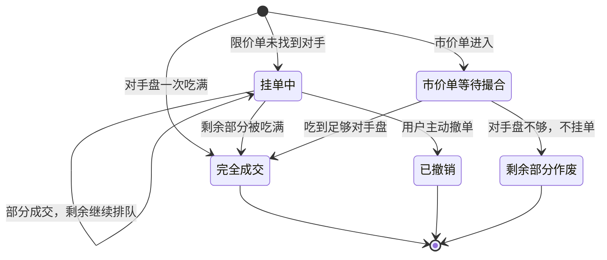
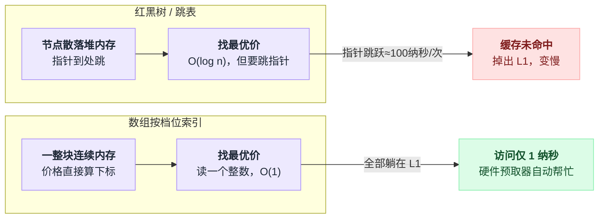
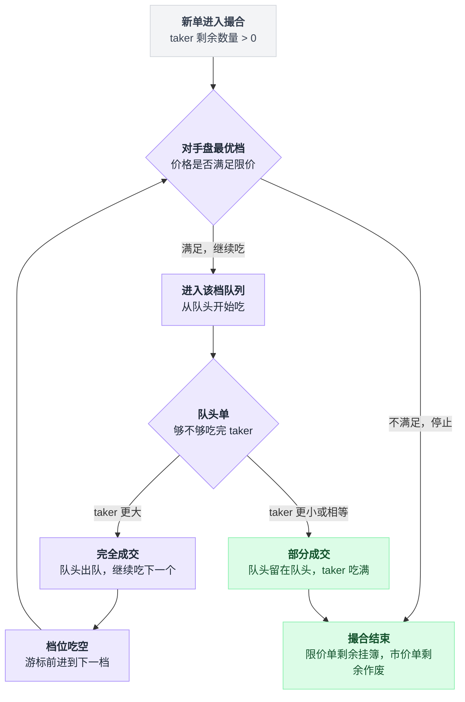
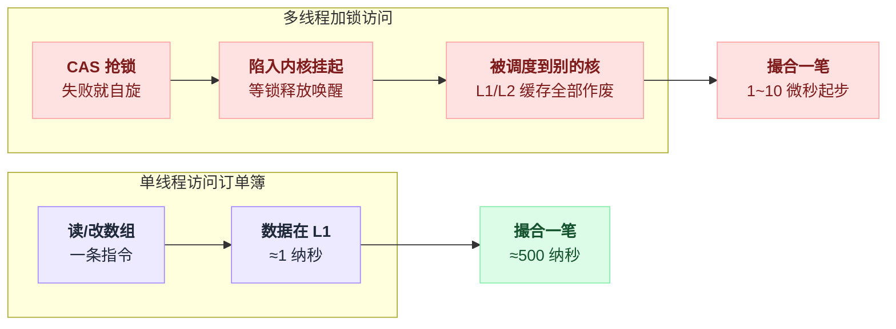
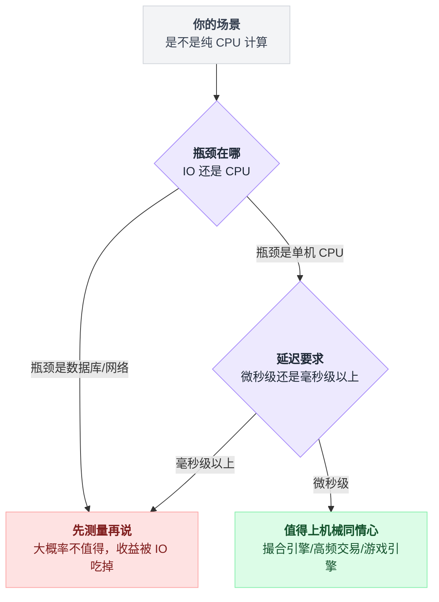
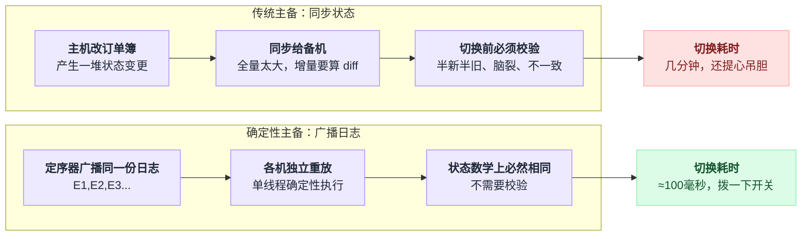
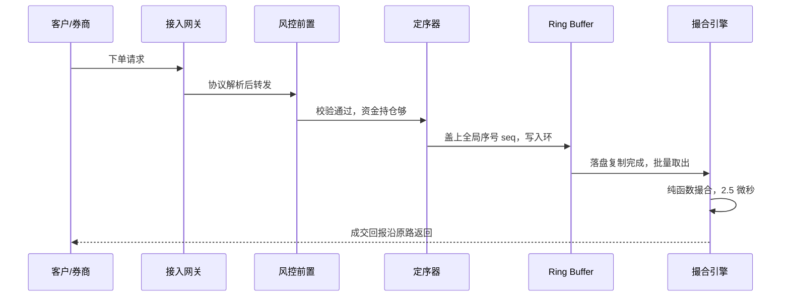
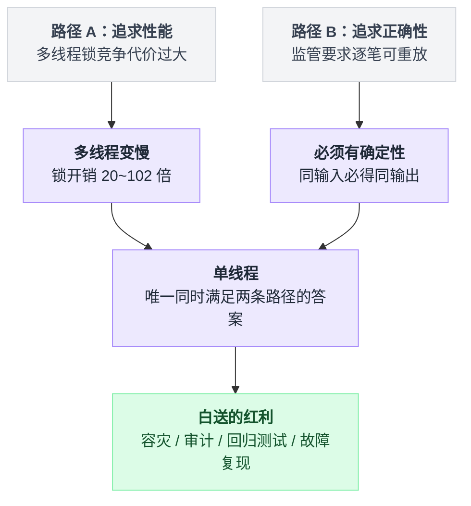
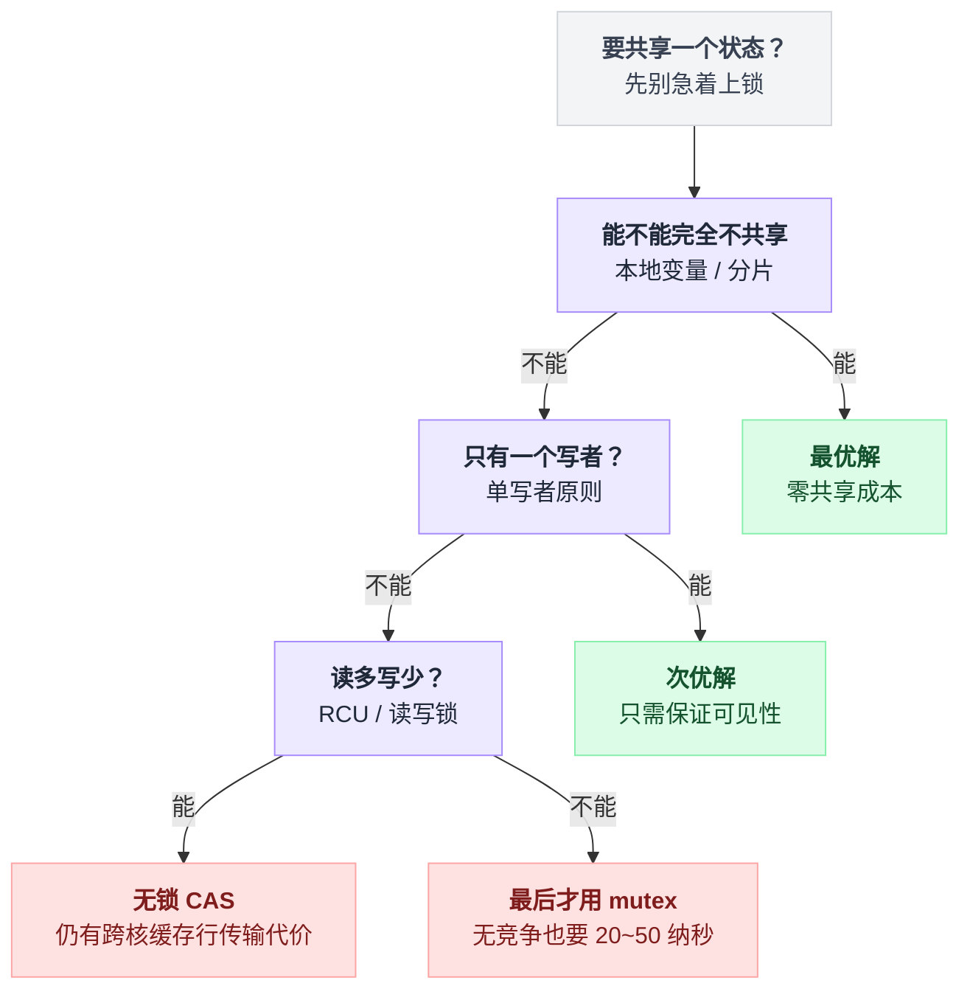

# 《股票撮合引擎》每秒几十万笔、一分钱都不能错 —— 为什么追求极致性能反而不用多线程（小白版）

> 一句话简介：交易所的核心是一段**跑在单个 CPU 核心上的、不用锁、不碰数据库**的代码。它每秒撮合几十万到几百万笔订单，延迟以微秒计，而且**一分钱都不能算错**。本文把这段代码从零讲到能跑。
> 难度：★★★★☆

本文要回答的六个问题：

1. 什么是订单簿、什么是"价格优先 / 时间优先"——看完能自己在纸上手推一遍撮合过程
2. 为什么订单簿要用**数组按价格档位索引**，而不是红黑树、跳表或者数据库
3. 为什么全世界最快的撮合引擎**全都是单线程**——锁竞争、CPU 缓存、确定性，三个原因逐个拆开
4. LMAX Disruptor 的环形队列到底怎么做到单线程每秒 600 万笔，以及"机械同情心"是什么意思
5. 为什么撮合引擎**不写数据库反而更可靠**，事件溯源 + 快照 + 重放怎么做
6. 单线程不能扩容怎么办——按股票代码分片，和秒杀的库存分片是同一招

---

## 目录

- [0. 先讲个故事：菜市场 vs 拍卖行](#0-先讲个故事菜市场-vs-拍卖行)
- [1. 先搞懂什么是撮合（零基础必读）](#1-先搞懂什么是撮合零基础必读)
- [2. 逐帧演示：一笔一笔看订单簿怎么变](#2-逐帧演示一笔一笔看订单簿怎么变)
- [3. 这件事到底难在哪](#3-这件事到底难在哪)
- [4. 最朴素的做法，以及它为什么会死](#4-最朴素的做法以及它为什么会死)
- [5. 第一次改进：换成有序数据结构（树 / 跳表）](#5-第一次改进换成有序数据结构树--跳表)
- [6. 第二次改进：两层结构 —— 价格档位 + FIFO 队列](#6-第二次改进两层结构--价格档位--fifo-队列)
- [7. 第三次改进：数组直接按价格索引（关键洞察）](#7-第三次改进数组直接按价格索引关键洞察)
- [8. 核心代码逐行讲解](#8-核心代码逐行讲解)
- [9. 单线程为什么最快（全文核心）](#9-单线程为什么最快全文核心)
- [10. LMAX Disruptor：单线程每秒 600 万笔](#10-lmax-disruptor单线程每秒-600-万笔)
- [11. 机械同情心（Mechanical Sympathy）](#11-机械同情心mechanical-sympathy)
- [12. 全内存 + 事件溯源：为什么不写数据库反而更可靠](#12-全内存--事件溯源为什么不写数据库反而更可靠)
- [13. 主备与容灾：确定性送的免费大礼](#13-主备与容灾确定性送的免费大礼)
- [14. 横向扩展：单线程怎么扩容](#14-横向扩展单线程怎么扩容)
- [15. 完整方案全景图](#15-完整方案全景图)
- [16. 生产环境会踩的坑](#16-生产环境会踩的坑)
- [17. 反直觉结论](#17-反直觉结论)
- [18. 一句话总结 + 小白词典](#18-一句话总结--小白词典)

---

## 0. 先讲个故事：菜市场 vs 拍卖行

### 0.1 菜市场：一对一讨价还价

你去菜市场买白菜。

摊主喊：「两块五一斤。」
你说：「两块行不行？」
摊主：「两块三，不能再少了。」
你：「行。」

成交，两块三。

这是人类最古老的交易方式：**一对一，面对面，讨价还价，各自成交各自的价**。

它有个特点你可能没注意到：**隔壁摊位同一时刻可能卖两块一**。你不知道，他也不知道。你俩成交的价格不一样，谁也不觉得有问题。

### 0.2 现在把规模放大 1000 倍

假设菜市场里有 1000 个买家、1000 个卖家，都在买卖**同一种**白菜。

如果还是一对一讨价还价，会发生什么？

```
   买家1 ──扯半天──► 卖家7    成交 2.30
   买家2 ──扯半天──► 卖家3    成交 2.05     ← 买家2 运气好
   买家3 ──扯半天──► 卖家9    成交 2.55     ← 买家3 运气差
   ...
   一共要发生 1000 次独立的谈判
```

三个问题立刻出现：

| 问题 | 具体表现 |
|---|---|
| **不公平** | 同一时刻同一样东西，有人 2.05 买到，有人 2.55 买到。买贵的那位会骂人 |
| **效率极低** | 你得挨个问 1000 个摊位才知道谁最便宜。1000 个买家都这么干 = 100 万次询问 |
| **没有"价格"** | 别人问你"白菜现在多少钱"，你答不上来——因为根本没有一个价 |

### 0.3 拍卖行的办法：把所有报价写到一块黑板上

拍卖行（或者说交易大厅）换了个玩法：**不许私下谈，所有人把自己的报价交给中间人，中间人写在一块大黑板上。**

黑板长这样（左边是想买的，右边是想卖的）：

```
        想 买 的 人                想 卖 的 人
    ┌───────────────────┐     ┌───────────────────┐
    │ 老王  2.30  100斤 │     │ 张摊  2.35  200斤 │
    │ 老李  2.30   50斤 │     │ 李摊  2.40  150斤 │
    │ 老赵  2.25  300斤 │     │ 王摊  2.50  400斤 │
    └───────────────────┘     └───────────────────┘
        最高愿出 2.30              最低愿收 2.35
                    ╲            ╱
                     ╲          ╱
                      差 5 分钱，谈不拢，都挂着
```

然后中间人只做一件事，而且这件事**简单到不需要动脑**：

```
while 最高的买价 >= 最低的卖价:
    让这两个人成交
    成交完从黑板上擦掉，接着看下一对
# 循环退出 = 谈不拢了，双方都挂在板上等
```

一句话：**只要黑板上"最高的买价" ≥ "最低的卖价"，就让这两个人成交。**

现在来了个新人老孙，喊「2.40 我要 100 斤」。中间人一看：最低卖价是张摊的 2.35，2.40 ≥ 2.35，成交！

```
    老孙 2.40 买 100 斤   ✓ 和张摊 2.35 成交 100 斤
                          （成交价按张摊的 2.35——他先挂的，他说了算）
```

这块黑板，就是**订单簿（Order Book）**。
这个中间人，就是**撮合引擎（Matching Engine）**。

### 0.4 黑板解决了什么

| | 菜市场（一对一） | 黑板（集中撮合） |
|---|---|---|
| 公平吗 | 不公平，看你会不会砍价 | 公平，规则写死：谁出价高谁先成交 |
| 效率 | 每笔都要谈判 | 挂上去就完事，中间人自动配对 |
| 有价格吗 | 没有统一价 | 有。"最高买价 / 最低卖价"就是当前行情 |
| 谁在做事 | 2000 个人各自忙 | **一个中间人**，所有人只跟他打交道 |

划重点，看最后一行：

> **集中撮合的本质，是把 N×N 的混乱谈判，收敛成"所有人排队找同一个中间人"。**
>
> 这带来了公平和效率，但也带来了本文剩下 2000 行要解决的问题：
> **这个中间人成了唯一的瓶颈，全世界的订单都要从他一个人手上过。**

### 0.5 这个和秒杀是什么关系

你读过秒杀那套文档，那里的核心矛盾是：**10 万人抢 100 件商品，怎么不超卖**。

撮合引擎的矛盾看起来像，其实完全不一样：

| | 秒杀 | 撮合引擎 |
|---|---|---|
| 能不能少卖 | **能**。100 件卖出 98 件，业务上完全可接受 | **绝对不能**。少成交一笔、多成交一笔都是事故 |
| 能不能拒绝 | **能**。"活动太火爆请稍后再试"，用户骂两句就完了 | **不能**。券商发来的单子必须处理，丢单要赔钱 |
| 顺序重要吗 | 不太重要。谁先抢到有点随机也认了 | **极度重要**。先来后到写在交易所规则里，错了要上新闻 |
| 结果要一致吗 | 最终一致就行，几秒钟后到账 | **立刻、精确、可审计**。事后要能重现每一笔 |
| 主要手段 | 削峰、限流、异步、丢弃 | **一个都不能用**。不能削峰（丢单），不能限流（拒单），不能异步（要立即定价） |

**秒杀的所有招数在这里几乎全都不能用。** 这就是为什么撮合引擎要走一条完全不同的路。

---

## 1. 先搞懂什么是撮合（零基础必读）

这一章没有任何技术内容，全是业务。**但你必须先看懂这一章，否则后面全是天书。**

### 1.1 买单和卖单

股票市场上只有两种意愿：

- **买单（Bid，读作"必德"）**：我想买。我会说明「最多出多少钱」和「要多少股」
- **卖单（Ask / Offer，读作"阿斯克"）**：我想卖。我会说明「最少收多少钱」和「卖多少股」

一张订单至少包含四个信息：

```
    ┌───────────────────────────────────────────┐
    │  订单 #10086                              │
    ├───────────────────────────────────────────┤
    │  方向    买（Bid）                        │
    │  股票    600519（贵州茅台）               │
    │  价格    10.03 元    ← 我最多出到这个价   │
    │  数量    300 股                           │
    └───────────────────────────────────────────┘
```

关于"买价"和"卖价"，先把方向记牢，后面全靠它：

```
    买家的心理：价格越低越好      →  买单价格是"我的上限"，愿意用 ≤ 这个价成交
    卖家的心理：价格越高越好      →  卖单价格是"我的下限"，愿意用 ≥ 这个价成交
```

所以，**一笔买单和一笔卖单能成交的唯一条件是：**

```
                买价  ≥  卖价
```

买家愿意出 10.05，卖家最少收 10.03 → 能成交（中间还有 2 分的空间）。
买家愿意出 10.01，卖家最少收 10.03 → 不能成交（差 2 分，谁也不让步）。

### 1.2 限价单 vs 市价单

| 类型 | 大白话 | 好处 | 风险 |
|---|---|---|---|
| **限价单（Limit）** | 「10.03 买 300 股，贵一分我都不要」 | 价格可控，绝不买贵 | 可能一直成交不了，挂着 |
| **市价单（Market）** | 「300 股，多少钱都买，立刻给我」 | 保证立刻成交 | **价格失控**。可能一路买上去 |

一个形象的说法：

```
   限价单 = 「我出 10.03，卖家来找我」   → 挂在黑板上等（做市 / maker）
   市价单 = 「黑板上有啥我买啥」         → 立刻把黑板上的单吃掉（吃单 / taker）
```

这里第一次出现两个必须记住的词：

> - **maker（挂单方 / 被动方）**：先挂在订单簿上等着的那一方。他在"提供流动性"
> - **taker（吃单方 / 主动方）**：后来的、主动去和挂单成交的那一方。他在"消耗流动性"

**成交价按 maker 的价格算。** 因为 maker 先来，他的报价先公示了，taker 是看着这个价来的，所以按他的算。这条规则后面会反复用到。

### 1.3 订单簿长什么样

把所有没成交的限价单按价格归类，堆起来，就是订单簿。这是它的经典样子（真实交易软件上的"五档盘口"）：

```
          买量  │  价格  │  卖量          说明
        ────────┼────────┼────────
                │  10.06 │   1200        卖五档
                │  10.05 │    800        卖四档
                │  10.04 │    300        卖三档
                │  10.03 │    500        卖二档
                │  10.02 │    200   ◀──  卖一档（最低卖价）
        ────────┼────────┼────────
                                         ↕ 中间这条缝叫「价差 spread」= 0.02
        ────────┼────────┼────────
           400  │  10.00 │          ◀──  买一档（最高买价）
           900  │   9.99 │               买二档
           600  │   9.98 │               买三档
          1500  │   9.97 │               买四档
           800  │   9.96 │               买五档
```

三个必须记住的概念：

| 名字 | 是什么 | 图上在哪 |
|---|---|---|
| **买一 / best bid** | 所有买单里价格**最高**的那一档 | 缝隙下面第一行，10.00 |
| **卖一 / best ask** | 所有卖单里价格**最低**的那一档 | 缝隙上面第一行，10.02 |
| **价差 / spread** | 卖一 − 买一 | 10.02 − 10.00 = 0.02 |

**为什么中间一定有条缝？**

因为如果没有缝——也就是买一 ≥ 卖一——那这两笔单**当场就成交了**，不会留在簿上。

> **订单簿里剩下的，全都是"暂时谈不拢"的单。**
> 一旦有新单让买一 ≥ 卖一，撮合立刻发生，缝隙重新出现。
>
> 这句话是理解撮合引擎的第一把钥匙：**订单簿永远处于"没有可成交对手"的稳态**，撮合引擎的工作就是把每一笔新单打进去，让它重新回到稳态。

### 1.4 撮合规则：价格优先，时间优先

现在，假设卖一档 10.02 上挂了三个人的单，一共 200 股。这时候来了个买家要买 200 股。这 200 股给谁？

规则只有两条，按顺序应用：

```
   ┌─────────────────────────────────────────────────┐
   │  规则一：价格优先                               │
   │  买单：出价高的先成交                           │
   │  卖单：要价低的先成交                           │
   ├─────────────────────────────────────────────────┤
   │  规则二：时间优先                               │
   │  价格一样时，先挂上来的先成交                   │
   └─────────────────────────────────────────────────┘
```

**价格优先**很好理解——谁给的条件好，谁先成交，这是市场经济。

**时间优先**就是排队。同一个价格档位上，先到的排前面：

```
      10.02 这个档位内部（先来后到排队）

      队头                                    队尾
      ┌─────────┐   ┌─────────┐   ┌─────────┐
      │ 张三    │──►│ 李四    │──►│ 王五    │
      │ 09:31:02│   │09:31:05 │   │09:31:09 │
      │  100 股 │   │  60 股  │   │  40 股  │
      └─────────┘   └─────────┘   └─────────┘
          ▲
          │
      新来的买单从这头开始吃：先吃张三，再吃李四，最后王五
```

**划重点：** 这个"先来后到的队列"就是数据结构里的 **FIFO 队列（先进先出）**。整个订单簿的数据结构设计，一半是为了"价格优先"，另一半就是为了这个"时间优先"。

### 1.5 成交的三种结局

一笔新单进来，只有三种可能：

```
    ┌─────────────────────────────────────────────────────┐
    │  新单进来                                           │
    └───────────────────────┬─────────────────────────────┘
                            │
              ┌─────────────┼─────────────┐
              ▼             ▼             ▼
        ┌──────────┐  ┌──────────┐  ┌──────────┐
        │ 完全成交 │  │ 部分成交 │  │ 完全不成 │
        └──────────┘  └──────────┘  └──────────┘
         对手盘够      对手盘不够     价格谈不拢
         全吃掉        吃完剩下的     整单挂上去
         订单消失      挂到簿上等     进入订单簿
```

写成流程就是一个循环加一次分诊：

```
新单进来:
    while 新单还有剩余 and 对手盘最优价能成交:
        和对手盘成交

    if 新单一股不剩:      完全成交，订单消失
    elif 成交了一部分:    部分成交，剩下的挂到簿上等
    else:                 完全不成交，整单挂到簿上
```

举例（当前卖一 = 10.02，挂了 200 股）：

| 新买单 | 结局 |
|---|---|
| 买 10.02 × 150 | **完全成交** 150 股 @ 10.02，订单结束 |
| 买 10.02 × 500 | **部分成交** 200 股 @ 10.02，剩 300 股挂到买盘 10.02 档 |
| 买 10.00 × 500 | **完全不成交**，500 股整个挂到买盘 10.00 档 |

好，业务讲完了。接下来是全文最重要的一节，**请一帧一帧慢慢看**。

---
## 2. 逐帧演示：一笔一笔看订单簿怎么变

**这是全文最重要的一节。** 后面所有的数据结构、单线程、Disruptor、事件溯源，都是为了把这一节的过程跑得又快又准。

我们模拟一只股票，昨收 10.00 元。一共来 9 个动作，你跟着一帧一帧看。

看图的方法：**中间一列是价格，左边是买量，右边是卖量**。左右两边永远不会在同一行同时有数字——因为那意味着买价 = 卖价，早就成交了。

### 2.0 开局：空的订单簿

```
      买量  │  价格  │  卖量  
    ────────┼────────┼────────
                （空）
```

一笔单都没有。这时候市场上没有"价格"这个东西。

---

### 2.1 T1：卖单 S1 —— 10.03 卖 200 股

第一个人来了，他要卖。

```
      买量  │  价格  │  卖量  
    ────────┼────────┼────────
            │  10.03 │    200      ◀── 卖一（S1，09:30:01.100）
```

**发生了什么：** 引擎先去买盘找对手——买盘是空的，没人买。所以 S1 **完全不成交**，整单挂到卖盘 10.03 档。

**成交记录：** 无。

---

### 2.2 T2：卖单 S2 —— 10.05 卖 500 股

又来一个卖家，要价更高。

```
      买量  │  价格  │  卖量  
    ────────┼────────┼────────
            │  10.05 │    500      ◀── 卖二（S2，09:30:01.250）
            │  10.03 │    200      ◀── 卖一（S1）
```

**发生了什么：** 买盘还是空的，S2 也挂上去。

**注意卖盘的排序方向：价格低的在下面（靠近中间的缝），价格高的在上面。** 因为对买家来说，**卖价越低越好**，所以最低的 10.03 排在"最优先"的位置（卖一）。

**成交记录：** 无。

---

### 2.3 T3：买单 B1 —— 10.00 买 800 股

第一个买家出现了，出价 10.00。

```
      买量  │  价格  │  卖量  
    ────────┼────────┼────────
            │  10.05 │    500
            │  10.03 │    200      ◀── 卖一 = 10.03
       800  │  10.00 │             ◀── 买一 = 10.00（B1）
```

**发生了什么：** 引擎去卖盘找对手：

```
    B1 的出价       10.00
    卖一的要价      10.03
    ────────────────────────
    10.00 ≥ 10.03 ？  否 → 不成交
```

买家出 10.00，最便宜的卖家要 10.03，**差 3 分钱，谈不拢**。B1 整单挂到买盘。

现在订单簿终于"活"了：**买一 10.00 / 卖一 10.03，价差 0.03**。别人问你"这股票现在多少钱"，你可以答：「买价 10.00，卖价 10.03」。

**成交记录：** 无。

---

### 2.4 T4：买单 B2 —— 10.01 买 400 股

又一个买家，出价比 B1 高 1 分。

```
      买量  │  价格  │  卖量  
    ────────┼────────┼────────
            │  10.05 │    500
            │  10.03 │    200      ◀── 卖一
       400  │  10.01 │             ◀── 买一 = 10.01（B2）  ← 新的买一！
       800  │  10.00 │             ◀── 买二（B1）
```

**发生了什么：** 10.01 < 10.03，还是不成交，挂上。

**但请注意：B2 插到了 B1 前面。** 这就是**价格优先**——B2 出价 10.01 比 B1 的 10.00 高，所以 B2 是新的买一。**它跟谁先来没关系，价格说了算。**

买盘的排序方向：**价格高的在下面（靠近中间的缝），价格低的往下排。** 对卖家来说买价越高越好，所以最高的 10.01 是"卖家最想找的那个人"。

**成交记录：** 无。

---

### 2.5 T5：买单 B3 —— 10.01 买 300 股（价格和 B2 一样！）

关键的一帧来了。B3 的出价和 B2 **完全一样**，都是 10.01。

```
      买量  │  价格  │  卖量  
    ────────┼────────┼────────
            │  10.05 │    500
            │  10.03 │    200
       700  │  10.01 │             ◀── 买一 = 10.01，总量 700 股
       800  │  10.00 │
```

盘口上只看到「10.01 档有 700 股」。**但这 700 股内部是有严格顺序的：**

```
        10.01 这个档位内部（FIFO 队列，先进先出）

        队头 ─────────────────────────────► 队尾
        ┌──────────────┐   ┌──────────────┐
        │  B2          │──►│  B3          │
        │  09:30:02.10 │   │  09:30:02.90 │
        │  400 股      │   │  300 股      │
        └──────────────┘   └──────────────┘
             ▲
             │
        有卖家来吃的时候，从这一头开始吃
```

**这就是时间优先。** B2 早到 0.8 秒，它就永远排在 B3 前面——除非 B3 出更高的价，重新排队。

划重点：

> **订单簿是"两层"的：外层按价格排序，同一价格的内层按时间排队。**
>
> 你在交易软件上看到的「10.01 买 700」，其实是内层队列里所有订单数量的**总和**。
> 这个"两层"的观察，直接决定了第 6 章的数据结构设计。

**成交记录：** 无。

---

### 2.6 T6：卖单 S3 —— 10.01 卖 500 股（撮合发生！）

来了个卖家，要价 10.01。他愿意用 10.01 或更高的价卖。

**引擎开始撮合：**

```
   第 1 步：看买盘最优档
            买一 = 10.01，S3 要价 10.01
            10.01（买价） ≥ 10.01（卖价） ？ 是！可以成交

   第 2 步：进入 10.01 档位的队列，从队头开始吃
            ┌──────────────┐   ┌──────────────┐
            │  B2  400 股  │──►│  B3  300 股  │
            └──────────────┘   └──────────────┘
                  ▲
            S3 有 500 股要卖

            吃 B2：min(500, 400) = 400 股成交 @ 10.01
                   B2 全部成交，从队列里删除
                   S3 还剩 500 - 400 = 100 股

   第 3 步：继续吃队列里的下一个
            ┌──────────────┐
            │  B3  300 股  │
            └──────────────┘
            吃 B3：min(100, 300) = 100 股成交 @ 10.01
                   B3 剩 300 - 100 = 200 股，继续留在队列里
                   S3 还剩 0 股 → 完全成交，结束
```

**成交价为什么都是 10.01？** 因为 B2、B3 是 **maker**（先挂在簿上的），S3 是 **taker**（主动来吃的）。按 maker 的价格成交。这里恰好都是 10.01，看起来不明显——下一帧就明显了。

撮合后：

```
      买量  │  价格  │  卖量  
    ────────┼────────┼────────
            │  10.05 │    500
            │  10.03 │    200
       200  │  10.01 │             ◀── 买一只剩 B3 的 200 股
       800  │  10.00 │
```

**成交记录（2 笔）：**

| 序号 | taker | maker | 价格 | 数量 |
|---|---|---|---|---|
| 1 | S3 | **B2** | 10.01 | 400 |
| 2 | S3 | **B3** | 10.01 | 100 |

注意：**一笔订单可以产生多笔成交。** S3 这一张单，成交回报是 2 条。这在真实系统里非常常见，一张大单可能产生几十条成交。

---

### 2.7 T7：买单 B4 —— 10.03 买 300 股（吃单 + 剩余挂单）

买家出价 10.03，正好等于卖一。

```
   第 1 步：卖一 = 10.03（S1，200 股）
            10.03（买价） ≥ 10.03（卖价） ？ 是！

   第 2 步：吃 S1
            min(300, 200) = 200 股成交 @ 10.03
            S1 全部成交，从簿上消失
            B4 还剩 300 - 200 = 100 股

   第 3 步：继续找下一档卖盘
            下一档卖二 = 10.05
            10.03（买价） ≥ 10.05（卖价） ？ 否 → 停止撮合

   第 4 步：B4 剩下的 100 股，按它自己的价格 10.03 挂到买盘
```

撮合后：

```
      买量  │  价格  │  卖量  
    ────────┼────────┼────────
            │  10.05 │    500      ◀── 卖一（现在只剩 S2 了）
       100  │  10.03 │             ◀── 买一（B4 的剩余 100 股）  ← 新档位！
       200  │  10.01 │
       800  │  10.00 │
```

这一帧有三个关键点：

1. **10.03 这个价格从"卖盘"变成了"买盘"。** 同一个价格档位，前一秒还是卖单挂着，这一秒变成买单挂着。数据结构必须能处理这种翻转。
2. **B4 既是 taker 又是 maker。** 前 200 股主动吃单（taker），后 100 股挂上去等（maker）。
3. **价差从 0.02 变成了 0.02**（10.03 买 / 10.05 卖）。

**成交记录（1 笔）：**

| 序号 | taker | maker | 价格 | 数量 |
|---|---|---|---|---|
| 3 | B4 | S1 | 10.03 | 200 |

---

### 2.8 T8：撤单 —— B1 撤销 10.00 的 800 股

B1 那位买家改主意了，把单撤了。

```
      买量  │  价格  │  卖量  
    ────────┼────────┼────────
            │  10.05 │    500
       100  │  10.03 │             ◀── 买一
       200  │  10.01 │             ◀── 买二
                                    ← 10.00 这一档整个消失了
```

**发生了什么：** 引擎根据订单号找到 B1，把它从 10.00 档的队列里摘掉。摘掉后这个队列空了，整个档位从簿上删除。

**撤单是撮合引擎里被严重低估的操作。** 真实市场里，**撤单量常常是成交量的 10 倍以上**（高频做市商不停地挂了撤、撤了挂）。

所以"根据订单号 O(1) 找到订单并摘掉"必须做得非常快——第 8 章会讲怎么做。

---

### 2.9 T9：市价买单 B5 —— 买 900 股，不限价（吃穿订单簿）

最后来个凶悍的：市价单，900 股，多少钱都要。

```
   第 1 步：卖一 = 10.05，S2 有 500 股
            市价单不看价格，直接吃
            min(900, 500) = 500 股成交 @ 10.05
            B5 还剩 900 - 500 = 400 股

   第 2 步：继续找下一档卖盘……
            没有了。卖盘空了。

   第 3 步：B5 还剩 400 股，怎么办？
            → 市价单不能挂在簿上（它没有价格，挂上去无法排序）
            → 只能【撤销剩余部分】
```

撮合后：

```
      买量  │  价格  │  卖量  
    ────────┼────────┼────────
       100  │  10.03 │             ◀── 买一
       200  │  10.01 │             ◀── 买二
                                    ← 卖盘全空！
```

**成交记录（1 笔）：**

| 序号 | taker | maker | 价格 | 数量 |
|---|---|---|---|---|
| 4 | B5 | S2 | 10.05 | 500 |

这一帧演示了一个真实的风险，叫「吃穿订单簿」：

```
   B5 想买 900 股，结果：
     - 只买到 500 股（缺 400 股）
     - 而且是用 10.05 买的（比他下单时看到的 10.03 贵了 2 分）

   如果卖盘挂着这样的单：
        10.05 │  500
        10.50 │  100      ← 有人挂了个离谱的高价
        18.00 │  300      ← 还有人挂了个更离谱的

   那 B5 的 900 股会一路买上去：500@10.05 + 100@10.50 + 300@18.00
   平均成本 = 12.30 元。他会当场心脏骤停。
```

这就是为什么**散户不应该随便用市价单**，也是为什么交易所要设**涨跌停**、**熔断**、**价格笼子**（第 16 章会讲）。

---

### 2.10 九帧回顾：完整时间轴

```
   时间   动作                    订单簿变化                       成交
   ────────────────────────────────────────────────────────────────────
   T1    卖 S1 10.03×200        卖盘: [10.03:200]                  —
   T2    卖 S2 10.05×500        卖盘: [10.03:200, 10.05:500]       —
   T3    买 B1 10.00×800        买盘: [10.00:800]                  —
   T4    买 B2 10.01×400        买盘: [10.01:400, 10.00:800]       —
   T5    买 B3 10.01×300        买盘: [10.01:700, 10.00:800]       —
                                       └─ 内部队列 B2→B3
   T6    卖 S3 10.01×500        买盘: [10.01:200, 10.00:800]    ✓ 400@10.01
                                                                ✓ 100@10.01
   T7    买 B4 10.03×300        买盘: [10.03:100, 10.01:200,    ✓ 200@10.03
                                       10.00:800]
                                卖盘: [10.05:500]
   T8    撤 B1                  买盘: [10.03:100, 10.01:200]       —
   T9    买 B5 市价×900          卖盘: []                        ✓ 500@10.05
   ────────────────────────────────────────────────────────────────────
                                 总成交 4 笔，共 1200 股
```

**现在你已经懂撮合了。** 停下来确认一下，下面这几句你都能不看图答出来：

- 买一是什么？（买盘里价格最高的一档）
- 为什么订单簿中间一定有价差？（能成交的已经成交了）
- 同价格的两笔单谁先成交？（先挂上来的）
- 成交价按谁的？（maker 的，也就是先挂着那个人的）
- 一笔单能产生几笔成交？（任意多笔）

能答出来，就可以往下走了。

九帧演示里"完全成交 / 部分成交 / 撤单"是散在不同帧里讲的，把它们收进一张状态机看全貌：



---

## 3. 这件事到底难在哪

规则看起来简单到不需要动脑：**买价 ≥ 卖价就成交，价格优先时间优先**。

那我用一个 `list` 存所有单，每次来单就排个序，从头找对手，不就完了？

这一章把五条要求一条一条摆出来。**看完你就知道为什么这是本系列里最难的一篇——它们会逐个干掉你熟悉的所有技术。**

### 3.1 要求一：吞吐量 —— 每秒几十万笔

先看真实数字：

| 交易所 / 系统 | 峰值订单处理能力 | 备注 |
|---|---|---|
| 上交所 | 约 **每秒 30 万笔**（订单+撤单，全市场） | 集中在开盘 9:30 那几秒 |
| 深交所 | 约 **每秒 30 万笔** | 同上 |
| 纳斯达克 INET | 约 **每秒 100 万笔** | 单标的可达数万 |
| LMAX（外汇） | **每秒 600 万笔**（单线程实测） | 本文第 10 章的主角 |
| 币安（加密货币） | 宣称 **每秒 140 万笔** | 单交易对可达十几万 |

"每秒 30 万笔"换算过来是每笔 3.33 微秒：

```
   1 秒 / 300,000 笔 = 3.33 微秒/笔
```

3.33 微秒是什么概念？把常见操作放进这个预算里比一比：

| 操作 | 耗时 | 放进 3.33 微秒的预算里 |
|---|---|---|
| 一次内存随机访问 | ≈ 0.1 微秒（100 纳秒） | 装得下 |
| 一次加锁/解锁（无竞争时） | ≈ 0.02 ~ 0.1 微秒 | 装得下 |
| 一次 Redis 网络往返 | ≈ 100 微秒 | **已经超了 30 倍** |
| 一次 MySQL 写入 | ≈ 1000 微秒 | **超了 300 倍** |

**看清楚了：你的预算是 3.33 微秒。这里面装不下任何一次网络请求，更装不下任何一次磁盘写。**

秒杀系统里我们靠 Redis 预扣库存扛住 10 万 QPS，那里一次 Redis 往返 100 微秒完全够用。**在撮合引擎里，这个方案连门都进不去。**

### 3.2 要求二：延迟 —— 不只是平均值，是最差值

吞吐量高不等于延迟低。撮合引擎对**尾延迟（tail latency）**的要求变态到什么程度：

```
   一个交易所的典型 SLA（服务承诺）：

     平均延迟          < 100 微秒
     P99   （99% 的单） < 200 微秒
     P99.9 （99.9%）    < 500 微秒
     P99.99             < 1 毫秒      ← 一万笔里最慢的那笔
     最大值             < 5 毫秒      ← 绝对不能超
```

**为什么最差值这么重要？** 因为高频交易机构的策略是按微秒算钱的。如果你的引擎偶尔卡 50 毫秒，他们的算法会以为市场出问题，全部撤单跑路，市场瞬间没有流动性。

这条要求直接干掉了一大票技术：

| 技术 | 为什么不行 |
|---|---|
| **垃圾回收（GC）** | Java 的 Full GC 一次几百毫秒，Go 的 STW 也有几十微秒抖动 |
| **加锁** | 一旦发生竞争，线程被操作系统挂起再唤醒 = 几十微秒起步 |
| **数据库** | 一次 fsync 落盘 = 几百微秒到几毫秒，还不算网络 |
| **动态内存分配** | malloc 偶尔要向操作系统要内存，这一下就是几十微秒 |
| **虚拟机 / 容器超卖** | 你的 CPU 时间片被别人抢走 = 毫秒级停顿 |

### 3.3 要求三：一分钱都不能错

这是本系列里**对正确性要求最高**的场景。有多高？

| 出错场景 | 后果 |
|---|---|
| 少成交一笔 | 客户投诉，交易所赔偿，监管问询 |
| 多成交一笔 | **凭空创造了股票**，账目对不上，全市场清算失败 |
| 成交价算错 1 分钱 | 单笔损失可能几千块，但当天有几百万笔 → **千万级资损** |
| 时间优先搞错顺序 | 后挂的先成交了 = **不公平交易**，这是可以罚到停业的 |
| 撤单成功了但订单还在簿上 | 用户以为撤了，结果成交了，**无限风险敞口** |

对比一下秒杀：

```
   秒杀：100 件商品卖出 98 件   → 运营挠挠头，可以接受
   撮合：1000 笔成交少了 1 笔    → 事故，写报告，上报监管
```

**而且撮合引擎是"不可撤销"的。** 秒杀超卖了可以退款道歉，撮合出错了，成交已经公示给全市场，几万个交易系统都收到了这条行情，改都改不回来。

### 3.4 要求四：确定性和可审计

监管随时可能问你：

> 「2026 年 3 月 12 日 09:30:01.234567，为什么客户 A 的订单在客户 B 之后成交？把当时的完整状态给我复现出来。」

你必须能**精确重放当天的每一笔**，得到**字节级完全一致**的结果。

这一条要求，几乎单枪匹马地决定了本文的最终架构。因为：

```
   多线程 + 加锁：
     线程调度顺序由操作系统决定，每次运行都不一样
     → 同样的输入，可能产生不同的成交顺序
     → 无法重放，无法审计   ✗ 直接出局

   单线程：
     一条指令一条指令按顺序执行
     → 同样的输入，必然得到同样的输出
     → 完美重放                ✓
```

### 3.5 要求五：突发流量的形状是"尖刺"

撮合引擎的流量不是平滑的：

```
   订单量
     ▲
     │      ██
     │      ██
     │      ██
     │      ██                                          ██
     │      ██                                          ██
     │  ▁▁▁▁██▆▆▄▄▂▂▂▂▂▂▂▂▂▂▂▂▂▂▂▂▂▂▂▂▂▂▂▂▂▂▂▂▂▂▂▂▄▄▆▆██▁▁
     └──┴───┴──────────────────────────────────────┴────┴──►
       9:15 9:30                                  14:57 15:00
       集合  开盘                                  尾盘  收盘
       竞价  瞬间                                        集合竞价

   开盘后 1 秒内的订单量，可能是全天平均值的 100 倍
```

**而且你不能削峰。** 秒杀可以把请求丢进 MQ 慢慢消费，撮合不行——每一笔订单的处理顺序就是它的时间优先级，**排队等于改变了它的成交顺序**，这是违规的。

### 3.6 把要求汇总成一张表

| 要求 | 具体数字 | 它干掉了什么技术 |
|---|---|---|
| 吞吐 | 每秒 30 万 ~ 600 万笔 | 数据库、网络中间件、任何 IO |
| 平均延迟 | < 100 微秒 | 磁盘同步写、跨机调用 |
| 尾延迟 | P99.99 < 1 毫秒 | GC、锁、动态内存分配 |
| 正确性 | 一分钱不能错 | 浮点数、最终一致性、异步补偿 |
| 确定性 | 必须能字节级重放 | **多线程并发** |
| 突发形状 | 开盘 1 秒内 100 倍峰值 | 削峰、限流、丢弃（load shedding） |

**看最后两行。** 秒杀系统里我们最依赖的两大法宝——**多线程并发**和**削峰填谷**——在这里全部被判出局。

> **这就是本文的核心张力：**
> 一个要求极致性能的系统，被正确性和公平性的要求，逼着放弃了所有常规的性能手段。
>
> 那它还能怎么快？答案是：**把剩下那一条路走到极致。**
> 那条路就是——**单线程、全内存、无锁、对 CPU 缓存友好**。

---
## 4. 最朴素的做法，以及它为什么会死

### 4.1 方案 A：一个大列表，每次来单排一次序

这是每个人的第一反应，诚实地写出来是这样：

```python
# 方案 A：最朴素的订单簿（能跑，但会死）
bids: list[tuple[int, int, int]] = []   # (价格, 订单号, 数量)
asks: list[tuple[int, int, int]] = []

def submit_naive(oid: int, side: str, price: int, qty: int) -> None:
    if side == 'B':
        bids.append((price, oid, qty))
        bids.sort(reverse=True)          # 买盘：价格从高到低
    else:
        asks.append((price, oid, qty))
        asks.sort()                      # 卖盘：价格从低到高
    # 只要买一 >= 卖一，就撮合
    while bids and asks and bids[0][0] >= asks[0][0]:
        bids.pop(0)
        asks.pop(0)
```

**这段在干嘛：** 两个列表分别装买单和卖单。每来一笔单就 append 进去，然后**整个列表重新排序**，保证 `bids[0]` 永远是买一、`asks[0]` 永远是卖一。然后看这两个能不能撮上，能就弹掉。

逻辑完全正确。**它唯一的问题是慢，而且是那种"量一上来就直接死透"的慢。**

### 4.2 它慢在哪：三个 O(n)

```
   ┌──────────────────────────────────────────────────────┐
   │  每来一笔订单，要做的事：                            │
   ├──────────────────────────────────────────────────────┤
   │  1. list.append()          O(1)     ← 这个不慢       │
   │  2. list.sort()            O(n log n)  ← 慢          │
   │  3. list.pop(0)            O(n)     ← 慢，而且很隐蔽 │
   └──────────────────────────────────────────────────────┘
```

第 3 条最容易被忽略：**Python 的 `list.pop(0)` 不是 O(1)。** 它要把后面所有元素整体往前挪一格。列表里有 10 万个订单，弹掉队头就要挪 10 万个元素。

所以处理 n 笔订单的总代价大约是 **O(n²)** 起步。

### 4.3 实测：它在什么量级崩掉

我在一台 Intel Xeon 2.8GHz（2 核）上真跑了一遍，随机生成买卖单，价格在 10.00 ± 0.40 之间：

| 订单笔数 | 方案 A（每次 sort） | 折算每秒处理 |
|---|---|---|
| 2,000 | 0.007 秒 | 28 万笔/秒 |
| 10,000 | **0.150 秒** | 6.7 万笔/秒 |
| 50,000 | **5.466 秒** | **0.9 万笔/秒** |

看这个增长的形状：

```
   订单量 ×5（1 万 → 5 万）
   耗时   ×36（0.150s → 5.466s）

   这就是 O(n²) 的脸：量翻一倍，时间翻四倍
```

往上推：

```
   要处理 30 万笔（交易所 1 秒的量）：
     50,000 → 300,000 是 6 倍
     O(n²) → 耗时是 36 倍
     5.466 秒 × 36 ≈ 197 秒

   结论：处理【1 秒的订单量】需要【197 秒】

   也就是说，开盘 1 秒后，你的引擎已经落后了 3 分 16 秒，
   而且每过 1 秒，它就再落后 3 分 16 秒。
   到中午 11:30 收盘，它大概处理到了 9 点 30 分 02 秒的订单。
```

**这不叫性能问题，这叫压根跑不起来。**

### 4.4 方案 A'：那我用数据库总行了吧

有人会说：排序这种事数据库最擅长了，建个索引不就完了？

```sql
-- 每来一笔卖单，找最优买单
SELECT order_id, price, qty
FROM   orders
WHERE  symbol = '600519' AND side = 'B' AND status = 'OPEN' AND price >= 10010
ORDER  BY price DESC, create_time ASC
LIMIT  1
FOR UPDATE;                      -- 加行锁，防止两个线程撮到同一笔
```

**这个方案比方案 A 死得更快、更难看。** 算一笔账，一笔订单的完整处理流程：

| 步骤 | 耗时 |
|---|---|
| 1. SELECT 找对手（走索引，含网络往返） | ≈ 200 微秒 |
| 2. UPDATE 减少对手方数量 | ≈ 300 微秒 |
| 3. INSERT 成交记录 | ≈ 300 微秒 |
| 4. UPDATE 本单状态 | ≈ 300 微秒 |
| 5. COMMIT（fsync 落盘） | ≈ 1000 微秒 |
| **合计** | **≈ 2100 微秒 = 2.1 毫秒** |

```
   每秒能处理：1 / 0.0021 ≈ 476 笔

   而你需要：300,000 笔/秒

   差距：630 倍
```

而且这还是**单笔顺利成交**的乐观估算。真实情况更糟：

| 问题 | 后果 |
|---|---|
| `FOR UPDATE` 行锁 | 热门股票的买一档就那么一行，所有请求排队抢它 → **锁等待** |
| 一笔单吃穿多档 | 要循环 SELECT-UPDATE 十几次，每次一个往返 |
| 事务回滚 | 死锁检测触发回滚，整笔重来，延迟直接飙到几十毫秒 |
| 主从延迟 | 从库还没同步，行情推送的数据是旧的 |

> **划重点：** 数据库不是"慢一点"，它是**慢了三个数量级**。
> 而三个数量级的差距，**不可能靠优化 SQL 补回来**。你必须换一条路。
>
> 这和秒杀里"不能让 MySQL 扣库存，要用 Redis"是同一个道理。区别在于：
> 秒杀里 Redis 够快了；**撮合引擎里，连 Redis 都太慢**（一次往返 100 微秒，只够做 1 万笔/秒）。

### 4.5 从失败中提炼需求

方案 A 和 A' 的失败告诉我们，一个能用的订单簿必须支持这些操作，而且**每个都得快**：

| 操作 | 多频繁 | 要求 |
|---|---|---|
| **找买一 / 卖一** | 每笔订单至少 1 次 | O(1) |
| **在某个价格档位插入订单** | 每笔挂单 1 次 | O(1) 或 O(log n) |
| **从队头取出订单** | 每笔成交 1 次 | **O(1)**（不能是 pop(0)） |
| **按订单号删除（撤单）** | 极频繁，可能是成交的 10 倍 | O(1) |
| **档位空了，找下一档** | 吃穿多档时 | 尽量 O(1) |
| **读取盘口十档（推行情）** | 每秒几百次 | O(档位数) 就够 |

拿着这张需求表，我们去挑数据结构。

---

## 5. 第一次改进：换成有序数据结构（树 / 跳表）

### 5.1 三个候选

| 结构 | 一句话 | 谁在用 |
|---|---|---|
| **红黑树 / 平衡二叉树** | 一棵自动保持平衡的排序树，插入/删除/查最小都是 O(log n) | C++ 的 `std::map`、Java 的 `TreeMap` |
| **跳表（Skip List）** | 用多层"快速通道"的链表，效果和树一样但实现简单得多 | Redis 的 ZSet、LevelDB |
| **堆（Heap）** | 只保证"堆顶最小"的树，插入 O(log n)，取最小 O(log n) | Python 的 `heapq` |

### 5.2 堆第一个出局

堆看起来很合适——我不就是要"取最优价"吗？

**但堆有两个致命缺陷：**

```
   缺陷一：堆只能高效地拿"最小的那个"，不能高效地删"中间某一个"

     撤单要删的是堆里随便某一个订单
     → 堆做不到 O(log n) 定位它，只能 O(n) 遍历找
     → 而撤单量是成交量的 10 倍

   缺陷二：堆没有顺序遍历能力

     推送十档行情要按价格从优到劣列出 10 个档位
     → 堆做不到，只能把整个堆复制出来排序 O(n log n)
     → 行情每秒推几百次
```

延迟任务那篇里堆是主角（`heapq` 管到期时间），**这里它连门都进不去**——因为那里只需要"取最小"，这里还需要"删中间"和"顺序遍历"。

> **同一个数据结构，在不同场景下的评价可以完全相反。选型永远要先列操作清单。**

### 5.3 树 / 跳表：能用，但没那么快

用一棵树（价格作 key）确实能满足需求：

```
                      ┌───────┐
                      │ 10.03 │
                      └───┬───┘
                 ┌────────┴────────┐
             ┌───▼───┐         ┌───▼───┐
             │ 10.01 │         │ 10.05 │
             └───┬───┘         └───────┘
          ┌──────┴──────┐
      ┌───▼───┐     ┌───▼───┐
      │ 10.00 │     │ 10.02 │
      └───────┘     └───────┘

   找最优价 = 一路往左走到底（买盘要往右）→ O(log n)
   插入新档位                            → O(log n)
   顺序遍历十档                          → 中序遍历，O(10)
```

我用 Python 的 `bisect`（维护一个有序列表，插入是 O(log n) 定位 + O(n) 内存搬移，性能特征介于树和数组之间）做了对照实验：

| 订单笔数 | 方案 A（每次 sort） | 方案 B（有序结构） | 提升 |
|---|---|---|---|
| 2,000 | 0.007 秒 | 0.001 秒 | 7x |
| 10,000 | 0.150 秒 | 0.007 秒 | 21x |
| 50,000 | 5.466 秒 | **0.328 秒** | **17x** |

**快了 17 倍。** 折算 15 万笔/秒。距离 30 万笔的目标只差 2 倍了，看起来有戏？

**没戏。** 因为这个对照组**偷懒了**——它没做部分成交、没做 FIFO 队列、没做撤单。把这些补上，性能还要掉一半以上。

而且真正的问题不在这里。

### 5.4 树的真正问题：它对 CPU 缓存极不友好

这是第 9 章的预告，但现在必须先说，否则你不明白为什么还要继续改：

```
    树的内存布局（节点是 malloc 出来的，散落在堆的各个角落）

    内存地址 ──────────────────────────────────────────►
    ┌──┐        ┌──┐              ┌──┐      ┌──┐
    │根│        │左│              │右│      │孙│
    └──┘        └──┘              └──┘      └──┘
     0x7f2a      0x7f91            0x8103    0x7e44
       │           │                 │         │
       └───跳─────►└──────跳────────►└──跳────►┘

    每跳一次 = 一次指针解引用 = 一次可能的【缓存未命中】
    一次缓存未命中 ≈ 100 纳秒（要去内存里捞）
    一棵有 1000 个节点的树，查一次要跳 10 层 = 最多 10 次未命中 = 1 微秒
```

对比数组：

```
    数组的内存布局（一整块连续内存）

    ┌──┬──┬──┬──┬──┬──┬──┬──┬──┬──┬──┬──┐
    │  │  │  │  │  │  │  │  │  │  │  │  │
    └──┴──┴──┴──┴──┴──┴──┴──┴──┴──┴──┴──┘
    0x7f2a00 ────── 全部挨在一起 ─────────►

    CPU 读第一个元素时，会顺手把旁边 64 字节一起拉进缓存（缓存行预取）
    → 后面几个元素的访问【零成本】
```

> **划重点：** 在微秒级的世界里，**"算法复杂度"经常不是主要矛盾，"内存访问模式"才是。**
> `O(log n)` 的树跳 10 次指针，可能比 `O(n)` 的数组扫 100 个连续元素还慢。

那我们能不能……直接用数组？

---

## 6. 第二次改进：两层结构 —— 价格档位 + FIFO 队列

在讨论数组之前，先把结构理顺。**这一步不涉及性能，只涉及"结构对不对"。**

### 6.1 为什么不能用"一个大的有序订单列表"

有人会想：我把所有订单按 `(价格, 时间)` 排成一个有序列表，不就同时满足价格优先和时间优先了吗？

```
    一个大列表（按价格降序，同价按时间升序）

    ┌─────────────────────────────────────────────┐
    │ B2  10.01  09:30:02.10  400 股              │
    │ B3  10.01  09:30:02.90  300 股              │
    │ B1  10.00  09:30:01.50  800 股              │
    │ B7  10.00  09:30:03.20  200 股              │
    │ B9  10.00  09:30:04.70  500 股              │
    │ ...                                         │
    └─────────────────────────────────────────────┘
```

排序确实对。**但有三件事变得非常难受：**

```
   难受一：推行情要算"某档位总量"
     盘口要显示「10.00 档共 1500 股」
     → 得从列表里一个个找出所有 10.00 的订单，加起来
     → 热门股一个档位可能挂着 5000 笔订单 → 每次都是 O(5000)
     → 行情每秒推 200 次 × 10 档 = 每秒 1000 万次加法，光这个就把 CPU 打满

   难受二：插入位置要二分查找
     新来的 10.00 档订单，要插到 B9 后面
     → 二分找到位置 O(log n)，然后【整体搬移】后面所有元素 O(n)

   难受三：档位的"消失"和"出现"没有明确边界
     10.00 档最后一笔被吃完了，你怎么知道？
     → 得看下一个元素的价格是不是变了
```

### 6.2 两层结构：外层价格，内层队列

回想第 2.5 节那张图——**订单簿本来就是两层的**，我们只要照着它建模：

```
      ┌────────────── 买   盘 ───────────────┐
      │                                      │
      │  价格档位（外层，按价格排序）        │
      │                                      │
      │  10.01 ──► ┌────┐   ┌────┐           │   总量 700
      │            │ B2 │──►│ B3 │           │
      │            │400 │   │300 │           │
      │            └────┘   └────┘           │
      │             队头     队尾            │
      │                                      │
      │  10.00 ──► ┌────┐   ┌────┐   ┌────┐  │   总量 1500
      │            │ B1 │──►│ B7 │──►│ B9 │  │
      │            │800 │   │200 │   │500 │  │
      │            └────┘   └────┘   └────┘  │
      │                                      │
      │   9.99 ──► ┌────┐                    │   总量 600
      │            │B11 │                    │
      │            │600 │                    │
      │            └────┘                    │
      └──────────────────────────────────────┘
             ▲                    ▲
             │                    │
        外层：价格优先        内层：时间优先
        谁在前面              先进先出（FIFO）
```

**这个结构一下子把三个难受全解决了：**

| 原来的难受 | 现在怎么解决 |
|---|---|
| 算档位总量 O(k) | 每个档位维护一个 `total` 字段，插入时 `+=`，成交时 `-=`，**读取 O(1)** |
| 插入要搬移 O(n) | 只往对应档位的队列尾部 append，**O(1)** |
| 档位边界不清 | 队列空了就是档位空了，**明确** |

而且还白送两个好处：

```
   好处一：撮合的循环变得非常自然

     while 新单还有剩余 and 最优档位价格可成交:
         while 新单还有剩余 and 这个档位的队列非空:
             和队头成交
         档位空了 → 移到下一档

   好处二：时间优先【免费】

     FIFO 队列天然就是时间顺序，不需要存时间戳、不需要比较
     只要"从队头取、往队尾插"，公平性自动成立
```

> **划重点：** 好的数据结构设计，是让**业务规则变成结构的自然属性**，而不是靠代码去检查。
>
> 时间优先不是"每次比较一下时间戳"实现的，而是"**用队列，所以它自动成立**"。
> 这和时间轮那篇里"不去找到期任务，让任务自己走到指针底下"是同一个思路。

### 6.3 但外层用什么装？

两层结构定了，内层队列也定了（双端队列 deque，两头操作都是 O(1)）。

**剩下最后一个问题：外层的"价格 → 队列"这个映射，用什么装？**

- 树 / 跳表？可以，O(log n)，但缓存不友好（5.4 节）
- 哈希表？查某个价格 O(1)，但**没有顺序**，找不到"最优价"和"下一档"
- **数组？** ……数组要按什么索引？

数组的索引必须是从 0 开始的连续整数。价格是 10.01、10.02 这种小数，怎么当下标？

**这个问题的答案，就是本章的关键洞察。**

---

## 7. 第三次改进：数组直接按价格索引（关键洞察）

### 7.1 洞察：股票的价格范围是有限的，而且很小

先问一个问题：**今天这只股票的价格，最低能到多少，最高能到多少？**

A 股有**涨跌停限制**：当天价格不能超过昨收价的 ±10%（ST 股 ±5%，科创板/创业板 ±20%）。

```
   昨天收盘价       10.00 元
   今天涨停价       11.00 元    ← 上限，一分都不能超
   今天跌停价        9.00 元    ← 下限
   最小价格变动     0.01 元     ← "一个 tick"，A 股就是 1 分钱

   那么今天所有可能的价格，一共有多少种？

       (11.00 - 9.00) / 0.01 + 1 = 201 种
```

**201 种。就这么点。**

这意味着：**订单簿的价格档位，最多只有 201 个。** 不管你今天来 3 亿笔订单，它们的价格只可能落在这 201 个值里面。

再看几个例子：

| 标的 | 昨收 | 涨跌停 | tick | 档位总数 |
|---|---|---|---|---|
| 普通 A 股 | 10.00 | ±10% | 0.01 | **201** |
| ST 股 | 5.00 | ±5% | 0.01 | **51** |
| 创业板 | 30.00 | ±20% | 0.01 | **1,201** |
| 贵州茅台 | 1700.00 | ±10% | 0.01 | **34,001** |
| 螺纹钢期货 | 3500 | ±7% | 1 元 | **491** |
| 沪深 300 股指期货 | 4000 | ±10% | 0.2 点 | **4,001** |

**最大的那个（茅台）也只有 3.4 万档。** 而 3.4 万个指针（8 字节）= 272 KB，**放得进 CPU 的 L2 缓存**。绝大多数股票只有几百档，两个方向加起来几 KB，**直接躺在 L1 缓存里**。

> **划重点：这是全文第一个关键洞察。**
>
> 涨跌停制度本来是个金融监管规则，跟技术八竿子打不着。
> 但它意外地给了我们一个**极其宝贵的技术前提：价格空间是有界的、离散的、而且很小**。
>
> 有界 + 离散 + 小 = **可以用数组直接索引**。

### 7.2 价格怎么变成数组下标

```
   下标 = (价格 - 最低价) / 最小变动单位

   例：价格 10.03，最低价 9.00，tick 0.01
       下标 = (10.03 - 9.00) / 0.01 = 103

   反过来：
   价格 = 最低价 + 下标 × 最小变动单位
       = 9.00 + 103 × 0.01 = 10.03
```

**注意：这里绝对不能用浮点数做除法**（第 16 章会详细讲为什么）。我们把所有价格用**整数**存，单位取「厘」（0.001 元）：

```
   最低价    9.00 元 →  9000 厘
   最高价   11.00 元 → 11000 厘
   tick     0.01 元 →    10 厘

   下标 = (10030 - 9000) // 10 = 103      ← 纯整数运算，一次减法一次除法
```

一次减法 + 一次除法（编译器还会把除以常数优化成乘法+移位）。**这就是 O(1)，而且是常数极小的 O(1)。**

### 7.3 内存布局图

```
    买盘数组 bids[201]                卖盘数组 asks[201]
    （下标 = 价格档位）                （下标 = 价格档位）

    下标  价格
    ┌─────┬────────┬──────────┐      ┌──────────┬────────┬─────┐
    │ 200 │ 11.00  │  null    │      │  null    │ 11.00  │ 200 │
    │ ... │  ...   │   ...    │      │   ...    │  ...   │ ... │
    │ 105 │ 10.05  │  null    │      │ ┌──────┐ │ 10.05  │ 105 │
    │     │        │          │      │ │ S2   │ │        │     │
    │     │        │          │      │ │ 500  │ │        │     │
    │     │        │          │      │ └──────┘ │        │     │
    │ 104 │ 10.04  │  null    │      │  null    │ 10.04  │ 104 │
    │ 103 │ 10.03  │  null    │      │ ┌──────┐ │ 10.03  │ 103 │ ◀── best_ask = 103
    │     │        │          │      │ │ S1   │ │        │     │
    │     │        │          │      │ │ 200  │ │        │     │
    │     │        │          │      │ └──────┘ │        │     │
    │ 102 │ 10.02  │  null    │      │  null    │ 10.02  │ 102 │
    │ 101 │ 10.01  │ ┌───┬───┐│◀─────┤  null    │ 10.01  │ 101 │ ◀── best_bid = 101
    │     │        │ │B2 │B3 ││      │          │        │     │
    │     │        │ │400│300││      │          │        │     │
    │     │        │ └───┴───┘│      │          │        │     │
    │ 100 │ 10.00  │ ┌───┐    │      │  null    │ 10.00  │ 100 │
    │     │        │ │B1 │    │      │          │        │     │
    │     │        │ │800│    │      │          │        │     │
    │     │        │ └───┘    │      │          │        │     │
    │ ... │  ...   │  ...     │      │   ...    │  ...   │ ... │
    │   0 │  9.00  │  null    │      │  null    │  9.00  │   0 │
    └─────┴────────┴──────────┘      └──────────┴────────┴─────┘

    两个游标（就是两个整数变量）：
      best_bid = 101   ← 买盘里【下标最大】的非空档位
      best_ask = 103   ← 卖盘里【下标最小】的非空档位

    价差 = (103 - 101) × 0.01 = 0.02 元
```

**看懂这张图，你就看懂了撮合引擎的核心数据结构。** 剩下的全是细节。

### 7.4 每个操作现在要花多久

| 操作 | 怎么做 | 复杂度 |
|---|---|---|
| **找买一** | 读 `best_bid` 这个整数 | **O(1)**，一次寄存器读 |
| **找卖一** | 读 `best_ask` | **O(1)** |
| **挂单到 10.03** | `idx = (10030-9000)//10`，`bids[idx].append(order)` | **O(1)** |
| **和队头成交** | `level.queue[0]`，成交完 `popleft()` | **O(1)** |
| **撤单** | 哈希表 `oid → order`，拿到 order 直接从队列里摘 | **O(1)**（用双向链表） |
| **档位空了找下一档** | `best_ask += 1` 往前扫，直到遇到非空 | **均摊 O(1)**，见下 |
| **推十档行情** | 从游标开始扫，收集 10 个非空档位 | **O(扫过的档位数)** |

### 7.5 那个"往前扫"会不会退化成 O(n)

会有人担心：如果卖盘只有 9.00 和 11.00 两档有单，`best_ask` 从 0 扫到 200，不就是 O(201) 了吗？

**三个理由说明这不是问题：**

```
   理由一：201 次整数比较有多快？
     现代 CPU 每秒能做几十亿次简单操作
     201 次连续数组读 ≈ 50 纳秒（而且全在 L1 缓存里，还能被 SIMD 向量化）
     对比一次树的指针跳跃 ≈ 100 纳秒
     → 扫完整个数组，还没有跳两次指针慢

   理由二：真实市场的订单是【挤在中间价附近】的
     买一卖一周围 5 档，通常占了全部挂单的 80% 以上
     扫描通常 1~3 步就停了

   理由三：它是【均摊 O(1)】的
     best_ask 只会单调往前走（有新的更优卖单才会退回来）
     整个交易日，游标总共移动的距离是有限的
```

**顺便说一句**，这 201 个连续的内存位置，CPU 的**硬件预取器**会自动帮你提前加载。这是"连续内存"的又一个白送好处，树永远享受不到。

### 7.6 三个候选结构的最终对比

| | 红黑树 / `std::map` | 跳表 | **数组按档位索引** |
|---|---|---|---|
| 找最优价 | O(log n) + 指针跳跃 | O(log n) | **O(1)，读一个整数** |
| 插入新档位 | O(log n) + **可能 malloc** | O(log n) + malloc | **O(1)，无分配** |
| 删除档位 | O(log n) + **可能 free** | O(log n) | **O(1)，置 null** |
| 找下一档 | 中序后继，O(log n) | O(1)（链表） | 均摊 O(1)，连续扫描 |
| 缓存友好度 | **差**，节点散落 | 差 | **极好**，一整块连续内存 |
| 内存分配 | 每个新档位一次 malloc | 同左 | **一次性预分配，运行期零分配** |
| GC 压力 | 有 | 有 | **无** |
| 延迟稳定性 | 有毛刺（malloc/rebalance） | 有毛刺 | **极稳** |
| 需要什么前提 | 无 | 无 | **价格范围有界且离散** ← 代价 |
| 内存占用 | 只存有单的档位，省 | 省 | 全档位都占坑（201 × 8B = 1.6KB，无所谓） |

树和数组的差别不只在复杂度，更在内存长什么样——并排看一眼：



**注意最后两行——数组方案是有代价的：**

```
   代价一：必须知道价格范围
     → 涨跌停制度白送了这个前提。没有涨跌停的市场（比如加密货币）
       就得用"以当前价为中心的滑动窗口数组"或者退回跳表

   代价二：空档位也占内存
     → 201 个指针 = 1.6 KB。这个"浪费"完全不值一提
     → 就算是茅台的 34001 档 × 8B × 2 = 544 KB，也就一个 L2 缓存的量
```

> **划重点：这是本文最实用的一条工程经验。**
>
> **当你的 key 空间是"有界的小整数"时，忘掉所有高级数据结构，直接用数组。**
>
> 这不是什么奇技淫巧，你早就见过它：
> - 计数排序 / 桶排序：值域有限就不用比较排序
> - 时间轮：时间是有界的，所以用数组当表盘（延迟任务那篇）
> - 位图（Bitmap）：用户 ID 有界，所以一个 bit 一个用户
> - 操作系统的进程调度：优先级 0~139，就是 140 个数组槽
>
> **同一个套路，第 N 次出现了。**

### 7.7 实测：数组方案到底多快

同一台机器，同样的 20 万笔随机订单，这次是**带完整撮合逻辑**（部分成交、FIFO 队列、成交回报）的实现：

| 方案 | 5 万笔耗时 | 折算吞吐 |
|---|---|---|
| 方案 A（每次 sort） | 5.466 秒 | 0.9 万笔/秒 |
| 方案 B（有序结构，且**功能不全**） | 0.328 秒 | 15 万笔/秒 |
| **方案 C（数组档位，功能完整）** | **0.131 秒** | **38 万笔/秒** |

再跑 20 万笔：

```
   20 万笔订单    0.507 秒    →  39.4 万笔/秒
   产生成交       142,608 笔
```

**注意，这是纯 CPython。** 一个用解释器跑的、每条字节码都要经过虚拟机的实现，**已经超过了上交所每秒 30 万笔的全市场峰值**。

```
   纯 CPython          39 万笔/秒     ← 我们刚测的
   PyPy / Cython       200 万笔/秒    ← 大致可期
   Go / Java           500 万笔/秒
   C++ / Rust          1000 万笔/秒+
```

**方案 A 和方案 C 的差距是 40 倍，而且方案 C 做的事情更多。**

好，数据结构定了。下面把它完整写出来。

---
## 8. 核心代码逐行讲解

这一章给出完整可运行的订单簿。**代码总共 160 行左右**，我们拆成 10 段讲。

> 说明：这是**教学版**，为了可读性做了一些简化（比如撤单用 `deque.remove`）。
> 每一处简化我都会明确指出生产版应该怎么写。

### 8.1 第一段：订单和成交（数据结构）

```python
from __future__ import annotations
from dataclasses import dataclass
from collections import deque
from typing import Optional

BUY, SELL = 'B', 'S'


@dataclass(slots=True)
class Order:
    oid: int             # 订单号，全局唯一
    side: str            # 'B' 买 / 'S' 卖
    price: int           # 价格，单位【厘】= 0.001 元。绝对不用 float
    qty: int             # 【剩余】未成交数量，成交时递减
    seq: int = 0         # 全局递增序号，时间优先的唯一依据
    level_idx: int = -1  # 挂在哪个档位下标，撤单时用它 O(1) 定位


@dataclass(slots=True)
class Trade:
    taker_oid: int       # 主动方（吃单的）
    maker_oid: int       # 被动方（挂单的）
    price: int           # 成交价 = maker 的价格
    qty: int             # 成交数量
```

**这段在干嘛：** 定义两个"数据袋子"。

三个关键设计决定，每一个都很重要：

| 决定 | 为什么 |
|---|---|
| `price: int` 而不是 `float` | **浮点数不能表示钱**。第 16 章有血淋淋的例子。单位取"厘"是为了给期货/债券的更细报价留余量 |
| `qty` 存的是**剩余量**不是原始量 | 撮合时直接 `-=`，不用每次算 `原始量 - 已成交量` |
| `slots=True` | 让 Python 用固定的槽位存字段，不建 `__dict__`。**内存少一半，属性访问快 20%** |

**关于 `seq`：** 时间优先靠的**不是时间戳**，而是这个引擎内部的全局递增序号。原因是：

```
   用系统时间戳的问题：
     1. 两笔单可能落在同一微秒 → 谁先？没法定
     2. NTP 时钟回拨 → 后来的单时间戳更小 → 顺序错乱
     3. 时间戳要 8 字节且要比较大小

   用递增序号的好处：
     1. 严格全序，绝不重复
     2. 序号 N 就是"第 N 个进入引擎的事件"，重放时天然一致
     3. 而且我们用 FIFO 队列，连比较都省了 —— 入队顺序就是序号顺序
```

> **划重点：撮合引擎里的"时间"，不是墙上的钟，是"进入引擎的先后"。**
> 这个定义让整个系统摆脱了对物理时钟的依赖——这也是后面能做确定性重放的前提之一。

### 8.2 第二段：价格档位（内层的 FIFO 队列）

```python
class PriceLevel:
    __slots__ = ('queue', 'total')

    def __init__(self) -> None:
        self.queue: deque[Order] = deque()   # FIFO：队尾进，队头出
        self.total: int = 0                  # 本档位挂单总量，推行情用

    def push(self, o: Order) -> None:
        self.queue.append(o)                 # 往队尾加 → 时间优先自动成立
        self.total += o.qty

    def __bool__(self) -> bool:
        return bool(self.queue)
```

**这段在干嘛：** 一个价格档位就是「一个队列 + 一个总量」。

- `deque` 是双端队列，**两头的 append 和 popleft 都是 O(1)**。这就是第 4.2 节说的、`list.pop(0)` 那个 O(n) 陷阱的解药
- `total` 是**增量维护**的：挂单时加、成交时减。推行情时直接读，不用遍历队列。这就是第 6.2 节说的"把 O(k) 变 O(1)"

### 8.3 第三段：订单簿的骨架

```python
class OrderBook:
    def __init__(self, price_min: int, price_max: int, tick: int) -> None:
        self.price_min = price_min          # 跌停价（厘）
        self.price_max = price_max          # 涨停价（厘）
        self.tick = tick                    # 最小变动单位（厘）
        self.n = (price_max - price_min) // tick + 1   # 档位总数

        # 两个数组，一次性预分配好，运行期【永不重新分配】
        self.bids: list[Optional[PriceLevel]] = [None] * self.n
        self.asks: list[Optional[PriceLevel]] = [None] * self.n

        self.best_bid = -1                  # 买盘游标，-1 = 买盘为空
        self.best_ask = self.n              # 卖盘游标，n = 卖盘为空

        self.orders: dict[int, Order] = {}  # 订单号 → 订单，撤单用
        self.seq = 0                        # 全局递增序号
        self.trades: list[Trade] = []       # 成交流水
```

**这段在干嘛：** 就是第 7.3 节那张内存布局图的代码版。

**注意两个游标的"空值"设计**，这是个小技巧：

```
   best_bid = -1    买盘空时设成 -1（比所有合法下标都小）
   best_ask = n     卖盘空时设成 n（比所有合法下标都大）

   好处：撮合循环的条件不用特判"是不是空"

     while taker.qty > 0 and self.best_ask <= limit_idx:
                              ↑
                    卖盘空时 best_ask = n > 任何 limit_idx，循环自然不进
```

**用"越界的哨兵值"代替"空判断"**，能省掉一个 if。在每秒执行几十万次的热路径上，这种省法是有意义的。

### 8.4 第四段：价格和下标的互转

```python
    def idx(self, price: int) -> int:
        """价格（厘）→ 数组下标"""
        return (price - self.price_min) // self.tick

    def price_of(self, i: int) -> int:
        """数组下标 → 价格（厘）"""
        return self.price_min + i * self.tick
```

**这段在干嘛：** 第 7.2 节那两个公式。整个方案的地基就这 2 行。

一次减法一次整除。编译型语言里，除以常数会被编译器优化成"乘法 + 右移"，**大约 1 个 CPU 周期，比一次 L1 缓存访问还快**。

### 8.5 第五段：下单入口

```python
    def submit(self, oid: int, side: str, price: int, qty: int,
               market: bool = False) -> list[Trade]:
        self.seq += 1
        o = Order(oid, side, price, qty, self.seq)

        if side == BUY:
            # 限价买：只能吃 <= 自己价格的卖单
            # 市价买：不限价，能吃到哪档吃到哪档
            limit = self.n - 1 if market else self.idx(price)
            out = self._match_buy(o, limit)
        else:
            # 限价卖：只能吃 >= 自己价格的买单
            limit = 0 if market else self.idx(price)
            out = self._match_sell(o, limit)

        # 还有剩余 & 是限价单 → 挂到簿上等
        # 市价单剩余部分直接作废（第 2.9 节讲过）
        if o.qty > 0 and not market:
            self._rest(o)
        return out
```

**这段在干嘛：** 一笔订单的完整生命周期，就这三步：

```
    ┌─────────────┐
    │  新订单进来 │
    └──────┬──────┘
           │
           ▼
    ┌────────────────────┐
    │ 1. 分配全局序号 seq│  ← 时间优先在这一刻就定了
    └──────┬─────────────┘
           │
           ▼
    ┌────────────────────┐
    │ 2. 尽力撮合        │  ← 能成交多少成交多少
    └──────┬─────────────┘
           │
      还有剩余？
           │
      ┌────┴────┐
      ▼         ▼
    限价单    市价单
      │         │
      ▼         ▼
   挂到簿上   丢弃剩余
```

**关键在 `limit` 这个变量的处理，非常巧妙：**

```
   限价买 10.03 → limit = idx(10030) = 103
                  含义："我只吃下标 <= 103 的卖单"

   市价买       → limit = n - 1 = 200
                  含义："我吃下标 <= 200 的卖单" = 全部

   → 市价单和限价单【走完全相同的代码路径】，只是 limit 值不同
   → 没有 if/else 分支，没有重复代码
```

**用参数值消除分支**，是热路径优化的常用手法。CPU 最讨厌的就是猜不准的分支。

### 8.6 第六段：挂单（并维护游标）

```python
    def _rest(self, o: Order) -> None:
        i = self.idx(o.price)
        book = self.bids if o.side == BUY else self.asks

        if book[i] is None:            # 这个档位第一次有单 → 建队列
            book[i] = PriceLevel()
        book[i].push(o)                # 进队尾（时间优先）

        o.level_idx = i                # 记住挂在哪，撤单时用
        self.orders[o.oid] = o         # 登记到订单号索引

        # 维护游标：只有变得更优时才需要更新
        if o.side == BUY:
            if i > self.best_bid:      # 买盘：下标越大价格越高越优
                self.best_bid = i
        else:
            if i < self.best_ask:      # 卖盘：下标越小价格越低越优
                self.best_ask = i
```

**这段在干嘛：** 把订单塞进对应的格子，顺便更新"最优价"游标。

这里有一个非常重要的性质，值得单独拎出来：

```
   什么时候需要更新 best_bid？
     只有【新单比当前买一还优】的时候。

   而这种情况【一定不会发生在撮合之后还有剩余的单上】吗？

     反例：第 2.7 节的 T7
       B4 买 10.03 × 300，吃掉了 10.03 的卖单，剩 100 股
       挂到买盘 10.03 档 → 下标 103 > 原来的 best_bid 101
       → best_bid 从 101 跳到 103   ✓ 确实需要更新

   所以这个判断是必要的。而且它只是一次整数比较，几乎免费。
```

### 8.7 第七段：一次成交

```python
    def _fill(self, taker: Order, maker: Order, price: int,
              level: PriceLevel, out: list[Trade]) -> None:
        traded = min(taker.qty, maker.qty)   # 能成交多少 = 两边剩余的较小值

        taker.qty -= traded
        maker.qty -= traded
        level.total -= traded                # 档位总量同步减少

        t = Trade(taker.oid, maker.oid, price, traded)
        out.append(t)
        self.trades.append(t)

        if maker.qty == 0:                   # maker 全部成交 → 出队、注销
            level.queue.popleft()            # O(1)
            self.orders.pop(maker.oid, None)
```

**这段在干嘛：** 撮合引擎最核心的 10 行。**一分钱不能错，全靠这里。**

逐句拆：

| 代码 | 为什么这么写 |
|---|---|
| `min(taker.qty, maker.qty)` | 谁少按谁来。这一行同时处理了"完全成交"和"部分成交"两种情况 |
| `price` 是**传进来**的 | 成交价不由这个函数决定，由调用方传 `maker` 所在档位的价格。**这是"按 maker 价成交"规则的落点** |
| 三个 `-=` 挨在一起 | 数量守恒。taker 减多少，maker 就减多少，档位总量也减一样多。**任何一个漏了都是资损** |
| 只有 `maker.qty == 0` 才 popleft | maker 没吃完就留在队头，下一笔继续吃它。**这是时间优先的关键**：队头不吃完，绝不轮到第二个 |

**注意 `taker` 为什么不出队：** 因为 taker 根本没进队。它是主动方，撮完了才决定是挂上去（`_rest`）还是丢弃。

### 8.8 第八段：撮合主循环（全文最核心的 15 行）

```python
    def _match_buy(self, taker: Order, limit_idx: int) -> list[Trade]:
        out: list[Trade] = []

        # 外层：一档一档往上吃，直到吃完 / 没得吃 / 超过限价
        while taker.qty > 0 and self.best_ask <= limit_idx:
            lv = self.asks[self.best_ask]
            if lv is None or not lv.queue:      # 空档位，跳过
                self._advance_ask()
                continue

            px = self.price_of(self.best_ask)   # 成交价 = 这一档的价格

            # 内层：在这一档里，从队头一个一个吃
            while taker.qty > 0 and lv.queue:
                self._fill(taker, lv.queue[0], px, lv, out)

            if not lv.queue:                    # 这一档吃空了
                self.asks[self.best_ask] = None
                self._advance_ask()             # 游标前进到下一个非空档

        return out
```

**这段在干嘛：** 双层循环，正好对应订单簿的双层结构。

```
    ┌───────────────────────────────────────────────────┐
    │  外层循环：遍历【价格档位】—— 价格优先            │
    │    条件：还有量要买 && 卖一价格 <= 我的限价       │
    │                                                   │
    │    ┌───────────────────────────────────────────┐  │
    │    │  内层循环：遍历【档位内的队列】—— 时间优先 │ │
    │    │    条件：还有量要买 && 队列非空            │ │
    │    │                                            │ │
    │    │    每次和【队头】成交                      │ │
    │    └───────────────────────────────────────────┘  │
    │                                                   │
    │    档位空了 → 游标前进一档，继续外层              │
    └───────────────────────────────────────────────────┘
```

把双层循环拆成决策路径，价格优先和时间优先各自在哪一步生效看得更清楚：



**用第 2.9 节的 T9 走一遍（市价买 900 股）：**

```
   进入外层：taker.qty=900, best_ask=105（10.05档）, limit_idx=200
             105 <= 200 ✓ 进入

     进入内层：队列 [S2:500]
               _fill → min(900,500)=500 成交 @ 10.05
                       taker.qty = 400, S2.qty = 0 → popleft
               队列空了 → 内层退出

     asks[105] = None，_advance_ask() → 往上扫到 201（越界=空）
     best_ask = 201

   回到外层：taker.qty=400 > 0 ✓，但 best_ask=201 > limit_idx=200 ✗
             → 外层退出

   返回 1 笔成交。剩余 400 股由 submit() 丢弃。
```

**`_match_sell` 是完全对称的**，只是方向反过来（`best_bid >= limit_idx`，`_advance_bid`）。

### 8.9 第九段：游标推进

```python
    def _advance_ask(self) -> None:
        """卖盘游标往【价格高】的方向找下一个非空档位"""
        i = self.best_ask + 1
        while i < self.n and self.asks[i] is None:
            i += 1
        self.best_ask = i           # 找不到就停在 n，表示卖盘空

    def _advance_bid(self) -> None:
        """买盘游标往【价格低】的方向找下一个非空档位"""
        i = self.best_bid - 1
        while i >= 0 and self.bids[i] is None:
            i -= 1
        self.best_bid = i           # 找不到就停在 -1，表示买盘空
```

**这段在干嘛：** 第 7.5 节讨论过的"连续扫描"。

它长得像 O(n)，但实际是**扫一小段连续内存**——CPU 一次缓存行加载就能覆盖 8 个指针，硬件预取器还会提前拉下一行。**扫 200 个格子大约 50 纳秒**，比一次树的指针跳跃还便宜。

**这就是"缓存友好"的实际含义**：不要用复杂度衡量它，要用"摸了多少条缓存行"衡量它。

### 8.10 第十段：撤单

```python
    def cancel(self, oid: int) -> bool:
        o = self.orders.pop(oid, None)
        if o is None:
            return False                # 已成交 / 不存在 / 重复撤单

        book = self.bids if o.side == BUY else self.asks
        lv = book[o.level_idx]          # O(1)：下单时记下的档位下标
        if lv is None:
            return False

        lv.queue.remove(o)              # ← 教学版：O(k)。生产版见下
        lv.total -= o.qty

        if not lv.queue:                # 档位空了，清理 + 可能要挪游标
            book[o.level_idx] = None
            if o.side == BUY and o.level_idx == self.best_bid:
                self._advance_bid()
            if o.side == SELL and o.level_idx == self.best_ask:
                self._advance_ask()
        return True
```

**这段在干嘛：** 通过订单号找到订单，从它所在的档位队列里摘掉。

这里有全文唯一一处"不够好"的实现，必须点出来：

```
   问题：deque.remove(o) 是 O(k)，k = 这个档位挂了多少笔订单
         热门股的买一档可能挂着 5000 笔 → 一次撤单要扫 5000 个元素
         而撤单量是成交量的 10 倍以上

   生产版怎么改：把 deque 换成【自己实现的双向链表】

        档位 10.01 的队列（双向链表）

        head                                    tail
         │                                       │
         ▼                                       ▼
       ┌────┐ ◀──prev── ┌────┐ ◀──prev── ┌────┐
       │ B2 │ ──next──► │ B3 │ ──next──► │ B7 │
       └────┘           └────┘           └────┘
                          ▲
                          │
              orders[oid] 直接指向这个节点

        撤单 = 拿到节点 → node.prev.next = node.next
                          node.next.prev = node.prev
             → 【O(1)】，跟队列多长完全无关
```

**代价是要自己管理节点内存**（第 16 章会讲对象池）。真实的撮合引擎全都这么做。

### 8.11 跑一遍：验证第 2 章的九帧

把第 2 章那九个动作输进去，程序打出来的盘口是这样的（**这是真实运行输出，不是我手画的**）：

```
==============================================
T6  卖 S3 10.01 x 500 -> [Trade(6, maker=4, 10010, 400),
                          Trade(6, maker=5, 10010, 100)]
      买量  │  价格  │  卖量  
    ────────┼────────┼────────
            │  10.05 │    500 
            │  10.03 │    200 
       200  │  10.01 │        
       800  │  10.00 │        
==============================================
T7  买 B4 10.03 x 300 -> [Trade(7, maker=1, 10030, 200)]
      买量  │  价格  │  卖量  
    ────────┼────────┼────────
            │  10.05 │    500 
       100  │  10.03 │        
       200  │  10.01 │        
       800  │  10.00 │        
==============================================
T9  买 B5 市价 x 900 -> [Trade(9, maker=2, 10050, 500)]
      买量  │  价格  │  卖量  
    ────────┼────────┼────────
       100  │  10.03 │        
       200  │  10.01 │        
==============================================
总成交 4 笔：
  400 @ 10.01   (S3 吃 B2)
  100 @ 10.01   (S3 吃 B3)
  200 @ 10.03   (B4 吃 S1)
  500 @ 10.05   (B5 吃 S2)
```

**和第 2 章手推的结果完全一致。** 时间优先（B2 先于 B3）、价格优先、部分成交、市价单吃穿，全部正确。

### 8.12 性能实测

```
   环境：Intel Xeon 2.8GHz，CPython 3.11，单核

   20 万笔随机订单（价格 10.00 ± 0.40，随机买卖）
     耗时      0.507 秒
     吞吐      394,673 笔/秒
     产生成交  142,608 笔
```

**一个纯 Python 实现，跑出了 39 万笔/秒。** 而上交所全市场峰值是 30 万笔/秒。

当然真实引擎还要加上风控校验、成交回报序列化、行情快照生成等等，会慢不少。但这个数字足以说明：

> **只要数据结构选对了，撮合本身根本不是瓶颈。**
> 瓶颈永远在你**额外加进去的东西**上——锁、GC、内存分配、日志、网络、数据库。
>
> 所以撮合引擎的优化哲学不是"让撮合更快"，而是"**把撮合以外的东西全部赶出去**"。
>
> 这句话就是接下来第 9 到第 12 章的全部内容。

---
## 9. 单线程为什么最快（全文核心）

### 9.1 先看一个让人不舒服的事实

```
   世界上对性能要求最高的一类软件 —— 交易所撮合引擎 —— 几乎全都是单线程的。

     纳斯达克 INET          核心撮合：单线程
     伦敦证券交易所 LSEG     核心撮合：单线程
     LMAX（外汇）           核心撮合：单线程，每秒 600 万笔
     币安 / OKX             每个交易对一个单线程引擎
     国内各家券商 / 交易所    同上
```

如果你是第一次听说这件事，你的反应大概是：

> 「我的服务器有 64 个核心，你告诉我只用 1 个？剩下 63 个干嘛？看戏？」

**是的。剩下 63 个核心不参与撮合。** 它们去做网络收发、风控前置、行情分发、落盘、监控——**唯独不碰订单簿**。

这一章要讲清楚三个原因。**每一个原因单独拿出来都足以说服你。**

### 9.2 先问：撮合这件事，能并行吗？

在讨论"该不该"之前，先问"能不能"。

假设两个线程同时处理两笔买单，都要去吃卖一档的 200 股：

```
    时刻  线程 A（处理买单 X，要 150 股）    线程 B（处理买单 Y，要 100 股）
    ────────────────────────────────────────────────────────────────────
    t1    读 卖一档剩余 = 200
    t2                                      读 卖一档剩余 = 200
    t3    成交 150 股，写回 200-150=50
    t4                                      成交 100 股，写回 200-100=100
    ────────────────────────────────────────────────────────────────────
    结果：卖一档剩余 = 100（线程 B 写的）
          实际成交了 150 + 100 = 250 股
          但那一档【只有 200 股】

          → 凭空多卖了 50 股！
```

这就是经典的**竞态条件（race condition）**，和秒杀里的超卖**一模一样**。

秒杀里我们怎么解决的？Redis 的 Lua 脚本、数据库的 `WHERE stock > 0`、分布式锁。**核心思想都是：把这一段变成串行的。**

那么问题来了：

```
   撮合的核心操作是【读订单簿 → 判断 → 改订单簿】
   这一整段必须原子

   而这一段【就是撮合的全部工作】

   → 你把 100% 的工作都加了锁
   → 那多线程还剩下什么可以并行的？

   答案：什么都没剩下。
```

> **划重点：撮合不是"难以并行"，是"本质上不可并行"。**
>
> 因为订单簿是一个**全局共享的、必须严格串行更新的状态**。
> 所有的订单最终都要落到同一个数据结构上，这里没有任何可以拆开的部分。
>
> 那些说"我用细粒度锁，每个价格档位一把锁"的方案，会在第 9.3 节被数据打脸——
> 而且它还会破坏时间优先（不同档位的锁获取顺序不确定 → 成交顺序不确定）。

既然只能串行，问题就变成了：

> **既然反正要串行，那我用"多线程 + 锁"串行，和用"单线程"串行，哪个更快？**

答案是：**单线程快一个数量级以上。** 下面用实测数据说话。

### 9.3 原因一：锁竞争的代价，比你想的大得多

#### 9.3.1 一次加锁到底花多少钱

```
    无竞争的加锁（没人跟你抢）
    ┌──────────────────────────────────────────────┐
    │  一条 CAS 原子指令（lock cmpxchg）           │
    │  ≈ 20 ~ 50 纳秒                              │
    │  代价来源：锁总线 / 独占缓存行 / 内存屏障    │
    └──────────────────────────────────────────────┘

    有竞争的加锁（有人跟你抢）
    ┌──────────────────────────────────────────────┐
    │  1. CAS 失败                                 │
    │  2. 自旋几次（烧 CPU）                       │
    │  3. 还抢不到 → 【陷入内核】把自己挂起        │
    │  4. 锁释放 → 内核唤醒你                      │
    │  5. 恢复上下文，可能被调度到另一个核心上     │
    │     → 之前的 L1/L2 缓存【全部作废】          │
    │                                              │
    │  ≈ 1,000 ~ 10,000 纳秒（1~10 微秒）          │
    └──────────────────────────────────────────────┘

    对比：撮合一笔订单本身只要 ≈ 500 纳秒

    → 一次锁竞争的代价 = 撮合 2 ~ 20 笔订单
```

#### 9.3.2 实测：越多线程越慢

我写了个 Go 程序，模拟"多个线程更新同一个订单簿"：2000 万次数组更新操作，分别用单线程无锁、和 1/2/4/8 个 goroutine 加互斥锁来做。

机器：Intel Xeon 2.8GHz，2 核。

| 方案 | 耗时 | 折算吞吐 | 相对单线程 |
|---|---|---|---|
| **单线程，无锁** | **13.5 毫秒** | **1.48 亿次/秒** | **1.0x（基准）** |
| 1 线程 + 互斥锁 | 270.8 毫秒 | 738 万次/秒 | **慢 20 倍** |
| 2 线程 + 互斥锁 | 370.8 毫秒 | 539 万次/秒 | **慢 27 倍** |
| 4 线程 + 互斥锁 | 1049.6 毫秒 | 190 万次/秒 | **慢 78 倍** |
| 8 线程 + 互斥锁 | 1383.2 毫秒 | 145 万次/秒 | **慢 102 倍** |

**把这张表看三遍。** 有三个地方特别值得盯：

```
   1. 【1 线程 + 锁】就已经比【单线程无锁】慢 20 倍了
      注意这里【根本没有竞争】——只有一个线程在跑
      这 20 倍纯粹是"加锁解锁指令本身"的开销

   2. 线程从 1 加到 8，不但没变快，反而【又慢了 5 倍】
      加的每一个线程，都在让所有线程变慢

   3. 8 线程的吞吐是单线程的 1/102
      你用了 8 倍的 CPU，换来了 1/102 的性能
      综合效率：1/816
```

画成图：

```
   吞吐量（万次/秒）
    ▲
14800├█
     │█
     │█
     │█
     │█
     │█
  800├█  █
     │█  █  █
     │█  █  █   █   █
    0└──┴──┴───┴───┴───────────────►
      单线  1线 2线  4线  8线
      程无  程+ 程+  程+  程+
      锁    锁  锁   锁   锁

   这不是"并行加速比不理想"，这是【负加速】。
   加线程 = 减性能。
```

#### 9.3.3 为什么加线程反而更慢

```
    ┌──────────────────────────────────────────────────────────┐
    │  8 个线程抢同一把锁时，实际发生了什么                    │
    ├──────────────────────────────────────────────────────────┤
    │                                                          │
    │   线程1  ██████ 干活                                     │
    │   线程2  ░░░░░░ 自旋等待 → 挂起 → 唤醒 → 缓存全冷        │
    │   线程3  ░░░░░░ 自旋等待 → 挂起 → 唤醒 → 缓存全冷        │
    │   线程4  ░░░░░░ ...                                      │
    │   线程5  ░░░░░░ ...                                      │
    │   线程6  ░░░░░░ ...                                      │
    │   线程7  ░░░░░░ ...                                      │
    │   线程8  ░░░░░░ ...                                      │
    │                                                          │
    │   任意时刻：1 个线程在干活，7 个在做【纯粹的浪费】       │
    │                                                          │
    │   而且锁一释放，8 个线程被同时唤醒去抢 → 【惊群】        │
    │   7 个白唤醒一次，又睡回去                               │
    └──────────────────────────────────────────────────────────┘
```

三笔额外的开销，每一笔都不小：

| 开销 | 大小 | 说明 |
|---|---|---|
| **上下文切换** | 1~5 微秒 | 保存/恢复寄存器，陷入/退出内核 |
| **缓存污染** | 几十微秒的"慢启动" | 线程被调度到别的核心，L1/L2 缓存全部作废，要重新预热 |
| **惊群** | N-1 次无效唤醒 | 锁一放，所有等待者一起醒，只有一个能拿到 |

> **划重点：** 在秒杀系统里，加机器加线程是有用的，因为**瓶颈是网络 IO 和数据库**——线程大部分时间在等 IO，多开线程能填满等待的空隙。
>
> **撮合引擎里，线程一秒钟都不等 IO**——它 100% 的时间都在做纯 CPU 计算。
> 这种情况下，**线程数超过核心数只有坏处，而线程共享同一个数据结构更是灾难。**
>
> 这是本文和秒杀那一套的第一个根本性分歧。

单线程访问和加锁访问，走的完全是两条不同长度的路：



### 9.4 原因二：CPU 缓存 —— 微秒级世界的物理定律

#### 9.4.1 先建立"距离感"

CPU 拿数据，不是"从内存里拿"这么简单。它有一整套层级：

```
                    ┌────────────────┐
                    │   CPU 核心     │
                    │   （寄存器）   │  ≈ 0.3 纳秒   几百字节
                    └───────┬────────┘
                            │
                    ┌───────▼────────┐
                    │   L1 缓存      │  ≈ 1 纳秒     32 KB   每核独占
                    │   （最贴身）   │
                    └───────┬────────┘
                            │
                    ┌───────▼────────┐
                    │   L2 缓存      │  ≈ 4 纳秒     1 MB    每核独占
                    └───────┬────────┘
                            │
                    ┌───────▼────────┐
                    │   L3 缓存      │  ≈ 30 纳秒    32 MB   【所有核共享】
                    └───────┬────────┘
                            │
                    ┌───────▼────────┐
                    │   主内存 DRAM  │  ≈ 100 纳秒   几百 GB
                    └───────┬────────┘
                            │
                    ┌───────▼────────┐
                    │   NVMe SSD     │  ≈ 100 微秒   几 TB
                    └───────┬────────┘
                            │
                    ┌───────▼────────┐
                    │   机械硬盘     │  ≈ 10 毫秒
                    └───────┬────────┘
                            │
                    ┌───────▼────────┐
                    │   同机房网络   │  ≈ 200 微秒   （一次往返）
                    │   跨城网络     │  ≈ 30 毫秒
                    └────────────────┘
```

数字太抽象？**把 L1 缓存的 1 纳秒放大成 1 秒**，其他的按比例缩放：

| 层级 | 真实延迟 | 放大后（L1 = 1 秒） | 类比 |
|---|---|---|---|
| L1 缓存 | 1 纳秒 | **1 秒** | 伸手拿桌上的笔 |
| L2 缓存 | 4 纳秒 | **4 秒** | 站起来从抽屉里拿 |
| L3 缓存 | 30 纳秒 | **30 秒** | 走到隔壁办公室拿 |
| 主内存 | 100 纳秒 | **1 分 40 秒** | 下楼到仓库拿 |
| SSD | 100 微秒 | **27 小时** | 快递次日达 |
| 同机房网络往返 | 200 微秒 | **2 天 7 小时** | 同城快递 |
| 机械硬盘 | 10 毫秒 | **116 天** | 海运 |
| 跨城网络 | 30 毫秒 | **347 天** | 等一年 |

**看清楚这张表，你就理解了撮合引擎所有设计决定的根源：**

```
   撮合一笔订单的预算 = 3.33 微秒 = 3330 纳秒

   如果全在 L1/L2 缓存里 → 每次访问 1~4 纳秒 → 能做几百次访问，绰绰有余
   如果掉到主内存        → 每次访问 100 纳秒 → 只能做 33 次访问，很紧张
   如果碰一次 SSD        → 100,000 纳秒     → 【预算直接爆炸 30 倍】
   如果发一次网络请求    → 200,000 纳秒     → 【爆炸 60 倍】
```

> **划重点：撮合引擎的性能设计，本质上就一句话——**
> **让所有热数据待在 L1/L2 缓存里，永远不要掉出去。**
>
> 这就是为什么第 7 章要用数组（连续内存，缓存友好）而不是树（指针乱跳）。
> 这也是为什么第 12 章要全内存不碰数据库。
> 这更是为什么**不能多线程**——看下一节。

#### 9.4.2 缓存行：CPU 搬数据的最小单位

CPU 从内存拿数据，**不是拿 1 个字节，而是一次拿 64 个字节**。这 64 字节叫一条**缓存行（cache line）**。

```
    内存（一整条缓存行 = 64 字节）
    ┌────┬────┬────┬────┬────┬────┬────┬────┐
    │ 8B │ 8B │ 8B │ 8B │ 8B │ 8B │ 8B │ 8B │
    └────┴────┴────┴────┴────┴────┴────┴────┘
    ◀───────────── 64 字节 ─────────────────▶

    你只想读第 1 个字节？
    → CPU 照样把整条 64 字节搬进 L1 缓存
    → 好消息：你接着读第 2~64 字节时，【零成本】
```

这解释了为什么**数组比链表快**：

```
    数组：8 个 int64 挤在一条缓存行里
          读第 1 个 → 后 7 个免费
          → 8 次访问，1 次内存加载

    链表：8 个节点散落在内存各处，各占一条缓存行
          读每一个都要一次内存加载
          → 8 次访问，8 次内存加载  ← 慢 8 倍
```

#### 9.4.3 伪共享（False Sharing）：多线程的隐形杀手

现在讲多线程为什么会毁掉缓存。

**规则：一条缓存行同一时刻只能被一个核心"独占写"。** 如果核心 A 写了这条缓存行，其他所有核心里这条行的副本**全部作废**，必须重新去内存（或通过缓存一致性协议）拿。

**关键的坑在于：作废是按"整条 64 字节"来的，不是按你改的那几个字节。**

```
    两个线程，各自更新自己的计数器 —— 逻辑上完全独立，互不相干

    但它们在内存里挨着：

    ┌───────────────── 同一条缓存行（64 字节）─────────────────┐
    │  counterA (8B)  │  counterB (8B)  │  ...未使用...        │
    └──────────────────────────────────────────────────────────┘
          ▲                   ▲
          │                   │
       核心 0 写            核心 1 写

    实际发生的事：
      核心 0 写 counterA → 整条行被核心 0 独占 → 核心 1 的副本作废
      核心 1 写 counterB → 整条行被核心 1 独占 → 核心 0 的副本作废
      核心 0 写 counterA → 又作废核心 1 ...

    → 这条缓存行在两个核心之间【疯狂来回弹跳（cache line ping-pong）】
    → 两个线程明明没有任何逻辑上的共享，性能却像在互相加锁

    这就叫【伪共享】：假的共享，真的代价。
```

**实测（同一台机器，8 个 goroutine 各自做 250 万次原子加法）：**

| 布局 | 耗时 | 相对 |
|---|---|---|
| 8 个计数器挤在**同一条**缓存行 | **310.5 毫秒** | 慢 4.7 倍 |
| 每个计数器**独占一条**缓存行（中间填 56 字节空白） | **65.5 毫秒** | 基准 |

```go
// 坏：8 个 int64 = 64 字节，正好挤在同一条缓存行里
type packed struct {
    c [8]int64
}

// 好：每个计数器后面塞 56 字节空白，把下一个挤到下一条缓存行
type padded struct {
    c int64
    _ [56]byte    // 8 + 56 = 64，正好一条缓存行
}
```

**这段在干嘛：** 故意"浪费"内存，让每个线程写的变量各自独占一条缓存行，避免它们互相作废。这个技巧叫**缓存行填充（cache line padding）**，第 10 章的 Disruptor 里到处都是它。

> **注意这个数字：什么代码都没改，只是把变量在内存里挪开一点，就快了 4.7 倍。**
>
> 这就是"机械同情心"要讲的东西——**你写的代码是给硅片跑的，硅片有它自己的脾气。**

#### 9.4.4 回到撮合引擎

现在把这些串起来：

```
    单线程撮合引擎的内存足迹：

      买盘数组     201 × 8 字节  = 1,608 字节
      卖盘数组     201 × 8 字节  = 1,608 字节
      热点档位对象 20 个 × 64 字节 = 1,280 字节
      游标、序号等                =    64 字节
      ────────────────────────────────────────
      合计                        ≈ 4.5 KB

      L1 数据缓存 = 32 KB

      → 【整个订单簿的热数据，全部躺在 L1 缓存里】
      → 每次访问 1 纳秒
      → 而且【只有一个核心在碰它，永远不会被作废】
```

一旦改成多线程：

```
      核心 0 改了 bids[101] → 核心 1、2、3... 的这条缓存行全作废
      核心 1 改了 asks[103] → 核心 0、2、3... 的这条缓存行全作废

      订单簿只有 4.5 KB，也就是 70 条缓存行
      8 个线程在这 70 条行上疯狂弹跳

      → 每次访问从 1 纳秒变成 30~100 纳秒（要走 L3 或内存）
      → 【慢 30~100 倍】

      这还没算锁的开销。
```

**这就是 9.3 节那张表里"8 线程慢 102 倍"的物理原因。** 不是 Go 的锁写得不好，是硅片的物理规律。

### 9.5 原因三：确定性 —— 金融系统的刚需

前两个原因是"快"，第三个原因是"对"。而在金融系统里，**第三个原因才是决定性的**。

#### 9.5.1 什么叫确定性

```
   确定性（deterministic）：
     同样的输入序列，无论跑多少次、在哪台机器上跑，
     都必然产生【逐字节完全相同】的输出。
```

**单线程天然确定：**

```
   输入日志：  E1 → E2 → E3 → E4 → E5 → ...

   单线程执行：E1 → E2 → E3 → E4 → E5 → ...
               永远是这个顺序，没有第二种可能

   → 今天跑、明天跑、在北京跑、在上海跑，结果一模一样
```

**多线程天然不确定：**

```
   输入：      E1, E2, E3, E4（同时到达）

   第一次运行（线程调度）：  E2 → E1 → E4 → E3
   第二次运行：              E1 → E3 → E2 → E4
   第三次运行：              E1 → E2 → E4 → E3

   → 每次的成交结果都可能不同
   → 因为"谁先抢到锁"取决于操作系统调度、CPU 温度、
     其他进程的负载、甚至内存的随机延迟
```

#### 9.5.2 确定性能换来什么

这是本文最重要的一张表：

| 能力 | 有确定性 | 没确定性（多线程） |
|---|---|---|
| **故障恢复** | 重放输入日志，状态必然一致 | **做不到**。重放结果和原来不一样 |
| **主备切换** | 备机跑同一份日志，状态天然同步，切换零丢失 | 要做复杂的状态复制，还可能不一致 |
| **监管审计** | "把 3 月 12 日重跑一遍" → 逐笔一致 | **答不上来**，这是合规事故 |
| **线上问题复现** | 拿生产日志在测试环境重放，100% 复现 | 靠猜，靠加日志，靠运气 |
| **回归测试** | 录制一天真实流量，改代码后重放对比，**逐笔比对** | 没法比对，每次结果都不同 |
| **纠纷仲裁** | 客户说"我的单该先成交"，重放给他看 | 说不清楚 |

第 4 行值得单独说一句。撮合引擎的线上 bug，往往是"某个特定的订单序列触发的"。

多线程系统里这种 bug 叫"海森堡 bug"——**你一加日志想观察它，调度时序变了，它就不出现了**。单线程系统里没有这种东西，任何 bug 都能靠重放日志稳定复现。

#### 9.5.3 一个真实的场景

```
   某天 10:23:45，客户投诉：
   「我 10:23:44.123456 挂的 10.05 买单，为什么比另一个人
     10:23:44.123789 挂的单晚成交？」

   有确定性的系统：
     运维取出当天输入日志 → 在测试环境重放到 10:23:45
     → 打印出订单簿的完整状态和每一笔成交
     → 发现：该客户的订单在 10:23:44.123400 被自己的
       风控系统拒绝过一次，重发时序号变大了
     → 3 分钟给出答复，附完整证据链

   没有确定性的系统：
     「呃，我们查一下日志……」
     （查了三天，日志里没记那一刻的订单簿状态）
     （重放了一遍，结果和当时不一样）
     （最后只能说"系统正常"，客户投诉到监管）
```

> **划重点：单线程不是一个性能选择，它首先是一个【正确性和合规性】选择。**
>
> 就算多线程能快 10 倍（它不能），撮合引擎也不会用它——
> **因为一个无法重放的交易系统，根本不能上线。**

### 9.6 那 63 个空闲的核心怎么办？

单线程 ≠ 单进程，更 ≠ 只用一个核心。**正确的用法是"分工"而不是"分担"。**

```
    ┌───────────────────────────────────────────────────────────────┐
    │                     一台 64 核的机器                          │
    ├───────────────────────────────────────────────────────────────┤
    │                                                               │
    │  核心 0-15   网络收包、协议解析（每个连接一个协程）           │
    │       │                                                       │
    │       ▼                                                       │
    │  核心 16-23  风控前置（余额够吗？持仓够吗？价格在笼子里吗？） │
    │       │      ← 这一层可以【完美并行】，因为每笔单独立         │
    │       ▼                                                       │
    │  核心 24     写输入日志（顺序追加 + fsync）                   │
    │       │                                                       │
    │       ▼                                                       │
    │  ┏━━━━━━━━━━━━━━━━━━━━━━━━━━━━━━━━━━━━━━━━━━━━━━┓             │
    │  ┃  核心 25   【撮合引擎】单线程，绑核，永不迁移  ┃           │
    │  ┃            整个订单簿躺在这个核心的 L1/L2 里   ┃           │
    │  ┗━━━━━━━━━━━━━━━━━━━━━━━━━━━━━━━━━━━━━━━━━━━━━━┛             │
    │       │                                                       │
    │       ▼                                                       │
    │  核心 26-31  成交回报序列化、清算数据生成                     │
    │  核心 32-47  行情快照生成 + 组播分发                          │
    │  核心 48-63  监控、落盘、快照、备份                           │
    │                                                               │
    └───────────────────────────────────────────────────────────────┘

    64 个核心全部用满。
    但【只有一个核心碰订单簿】。
```

**这个结构有个名字，叫「流水线并行（pipeline parallelism）」**，和秒杀里的"漏斗式分层过滤"是同一个形状，但目的完全相反：

| | 秒杀的漏斗 | 撮合的流水线 |
|---|---|---|
| 目的 | **减少**到达下游的请求量（挡掉 90%） | **不减少**，一笔都不能丢 |
| 手段 | 限流、去重、库存预扣、丢弃 | 只做"能并行的准备工作" |
| 下游 | 多台机器并行处理 | **一个核心串行处理** |
| 共同点 | 把重的工作提前做掉，让核心环节尽可能轻 | 同左 |

**还有一个必须做的操作叫「绑核（CPU affinity / pinning）」：**

```
   不绑核：操作系统可能随时把撮合线程从核心 25 挪到核心 40
           → 核心 25 上辛苦预热的 L1/L2 缓存【全部作废】
           → 接下来几万次访问全部走内存，延迟从 1ns 变 100ns
           → 表现为：延迟曲线上莫名其妙的尖刺

   绑核：taskset -c 25 ./matching-engine
        或者更彻底：isolcpus=25 把这个核心从内核调度器里【摘出去】
        → 这个核心上除了撮合线程，什么都不跑
        → 连时钟中断都可以关掉（nohz_full=25）
```

真实的交易所会做到这个地步：**关闭超线程、关闭 CPU 节能（避免降频）、关闭 NUMA 跨节点访问、关闭透明大页、把网卡中断也绑到专门的核心上。**

每一项都是为了同一件事——**让那一个核心，安安静静地、不受打扰地跑那一个循环。**

### 9.7 本章小结

```
   ┌──────────────────────────────────────────────────────────┐
   │  为什么撮合引擎用单线程                                  │
   ├──────────────────────────────────────────────────────────┤
   │                                                          │
   │  【能不能并行】                                          │
   │    订单簿是全局共享状态，100% 的工作都要串行             │
   │    → 本质上不可并行，加锁只是把串行换了个写法            │
   │                                                          │
   │  【原因一：锁】                                          │
   │    无竞争加锁就慢 20 倍，8 线程竞争慢 102 倍             │
   │    → 实测数据，不是理论                                  │
   │                                                          │
   │  【原因二：缓存】                                        │
   │    4.5 KB 的订单簿正好躺在 32 KB 的 L1 里，访问 1 纳秒   │
   │    多线程会让缓存行在核心间弹跳，慢 30~100 倍            │
   │    → 伪共享实测慢 4.7 倍，还没算锁                       │
   │                                                          │
   │  【原因三：确定性】                                      │
   │    单线程 = 可重放 = 可审计 = 可恢复 = 可主备            │
   │    多线程 = 每次结果都可能不同 = 不能上线                │
   │    → 这一条是【一票否决】的                              │
   │                                                          │
   └──────────────────────────────────────────────────────────┘
```

**但单线程有个前提条件：** 那个唯一的线程必须**永远有活干，一秒都不能等**。

如果它要停下来等网络、等锁、等内存分配、等 GC——那前面说的一切都白搭。

**怎么让一个线程永不停歇？** 这就是 LMAX Disruptor 要解决的问题。

---
## 10. LMAX Disruptor：单线程每秒 600 万笔

### 10.1 故事：一家英国交易所的赌气

2010 年前后，伦敦有家做外汇零售交易的公司叫 **LMAX Exchange**。他们要做一个新的交易平台，性能目标很激进。

他们先按业界标准做法搞了一版：**多线程 + 并发队列 + 数据库**。

结果：

```
   吞吐量   每秒 2 万笔
   延迟     平均 20 毫秒，尾延迟经常上百毫秒

   团队的反应：这也太慢了。
```

然后他们做了一件很多团队不会做的事：**没有去加机器、加线程、换更贵的数据库，而是坐下来问了一个问题——**

> 「一台普通服务器的 CPU 每秒能执行几十亿条指令。
>  我们撮合一笔订单撑死几百条指令。
>  **理论上应该是每秒几千万笔。那 2 万笔的差距，到底花在哪了？**」

他们花了很长时间，用性能剖析工具一层一层往下挖，最后的答案让人意外：

```
   ┌─────────────────────────────────────────────────────────┐
   │  时间都花在哪了                                         │
   ├─────────────────────────────────────────────────────────┤
   │  真正的业务逻辑（撮合）           ......    不到 5%     │
   │  队列的入队/出队（加锁、CAS）     ......    约 40%      │
   │  对象创建 + 垃圾回收               ......    约 25%     │
   │  缓存未命中（数据到处乱跳）        ......    约 20%     │
   │  数据库和序列化                    ......    约 10%     │
   └─────────────────────────────────────────────────────────┘

   结论：95% 的 CPU 花在了【搬运数据】上，只有 5% 在【处理数据】。
```

他们的解法就是本章的主角，叫 **Disruptor**（意思是"颠覆者"）。改造之后：

```
   吞吐量   每秒 600 万笔        （提升 300 倍）
   延迟     平均 < 1 微秒        （提升 20000 倍）
   而且是【单线程】跑出来的。
```

**注意，他们没有改撮合算法，一行都没改。他们只是改了"订单怎么送到撮合线程手上"。**

### 10.2 先看清楚：单线程的敌人是"等待"

第 9 章说了单线程为什么好。但单线程有个前提：

> **那唯一的线程必须永远有活干。它每停一微秒，你就损失一微秒的吞吐。**

那它什么时候会停？撮合线程停下来有六种情况：

| # | 停在哪 | 具体是什么 |
|---|---|---|
| 1 | 等新订单 | 队列空了，去取时被阻塞 |
| 2 | 等锁 | 队列内部要加锁 |
| 3 | 等内存分配 | new 一个对象，malloc 慢 |
| 4 | 等垃圾回收 | GC 一停就是几十毫秒 |
| 5 | 等缓存 | 数据不在 L1，去内存捞 |
| 6 | 等 IO | 写日志、发网络包 |

Disruptor 用**一个数据结构**同时干掉了前 5 个（第 6 个由第 12 章的架构解决）。

### 10.3 传统队列的四宗罪

先看看大家平时用的那种队列（比如 Java 的 `LinkedBlockingQueue`、或者一个加锁的链表队列）：

```
    传统链表队列

    head                                          tail
     │                                             │
     ▼                                             ▼
   ┌────┐      ┌────┐      ┌────┐      ┌────┐
   │节点│─────►│节点│─────►│节点│─────►│节点│
   │0x1a│      │0x93│      │0x4f│      │0x82│    ← 内存地址完全随机
   └────┘      └────┘      └────┘      └────┘
     ▲                                    ▲
     │                                    │
   消费者在这头拿                     生产者在这头放
   （要加锁）                          （要加锁）
```

**罪状一：head 和 tail 挤在同一条缓存行上**

```
   队列对象在内存里长这样：
   ┌──────────────────── 同一条缓存行 ───────────────────┐
   │  head 指针 (8B)  │  tail 指针 (8B)  │  count (8B)   │
   └─────────────────────────────────────────────────────┘
        ▲                    ▲                  ▲
     消费者狂改            生产者狂改        两边都改

   → 经典的伪共享！生产者和消费者明明操作队列的两头，
     互不相干，却在缓存行层面疯狂互相作废
```

**罪状二：每次入队都要 `new` 一个节点**

```
   put(order) → new Node(order) → 向内存分配器要 32 字节
                                → 分配器可能要向操作系统要内存（慢）
                                → 用完变成垃圾 → GC 要来回收

   每秒 600 万笔 = 每秒创建 600 万个节点 = 每秒制造 600 万个垃圾
   → GC 压力巨大 → Full GC 一来，几百毫秒的停顿
```

**罪状三：节点在内存里到处乱跳**

```
   消费者依次读 4 个节点：0x1a → 0x93 → 0x4f → 0x82
   每一跳都是一次【缓存未命中】≈ 100 纳秒
   4 个节点 = 400 纳秒，全花在等内存上
```

**罪状四：加锁**

```
   队列空的时候，消费者拿不到东西 → 被挂起 → 等生产者唤醒
   一次挂起+唤醒 = 1~10 微秒
   而撮合一笔订单只要 0.5 微秒
```

> **看明白了吗：一个"队列"这么基础的东西，居然把第 9 章讲的所有毛病占全了——**
> **伪共享、内存分配、GC、缓存未命中、锁。**
>
> 这就是 LMAX 那 95% 的开销的来源。

### 10.4 解法：环形队列（Ring Buffer）

Disruptor 的核心，是一个**预先分配好的、固定大小的、首尾相接的数组**。

```
             Ring Buffer（容量 8，实际生产用 65536 或更大）

        ┌────┬────┬────┬────┬────┬────┬────┬────┐
   ┌───►│ 0  │ 1  │ 2  │ 3  │ 4  │ 5  │ 6  │ 7  ├───┐
   │    └────┴────┴────┴────┴────┴────┴────┴────┘   │
   │                                                │
   └──────────────── 从 7 绕回 0 ◀──────────────────┘

   每个格子里【预先放好一个空的 Order 对象】（不是指针，是对象本身）
```

**它怎么"环"起来？靠取模。**

```
   写到第 100 个了 → 放进 slots[100 % 8] = slots[4]
   写到第 101 个了 → 放进 slots[101 % 8] = slots[5]
   ...
   写到第 104 个了 → 放进 slots[104 % 8] = slots[0]   ← 绕回来了

   而且如果容量是 2 的幂，取模可以变成位运算：
       100 % 8  ==  100 & 7      ← 一条 AND 指令，1 个 CPU 周期
```

**这就是为什么 Ring Buffer 的容量【必须是 2 的幂】。**

两个游标：

```
   序号（sequence）：一个只增不减的 int64，代表"这是第几个事件"

        已写入                        已消费
          │                             │
          ▼                             ▼
   ┌────┬────┬────┬────┬────┬────┬────┬────┐
   │ 96 │ 97 │ 98 │ 99 │100 │ .. │ .. │ .. │   序号
   ├────┼────┼────┼────┼────┼────┼────┼────┤
   │ 0  │ 1  │ 2  │ 3  │ 4  │ 5  │ 6  │ 7  │   数组下标（= 序号 & 7）
   └────┴────┴────┴────┴────┴────┴────┴────┘
     ▲              ▲
     │              │
  readAt=96     writeAt=100
  消费者读到这   生产者写到这

  规则一：消费者不能超过 writeAt（不能读还没写好的）
  规则二：生产者不能超过 readAt + 容量（不能覆盖还没读的）

  → 两个 int64 变量，就完成了全部的同步。【一把锁都不需要】
```

### 10.5 三板斧

#### 板斧一：预分配 —— 从此不再分配内存

```
    传统队列：           Ring Buffer：
    ┌───────────────┐    ┌──────────────────────────┐
    │ 来一笔订单    │    │ 来一笔订单               │
    │  ↓            │    │  ↓                       │
    │ new Node()    │    │ 找到 slots[seq & mask]   │
    │  ↓            │    │  ↓                       │
    │ 分配 32 字节  │    │ 【覆盖写】已有的对象     │
    │  ↓            │    │  ↓                       │
    │ 用完变垃圾    │    │ 完事。没有分配，没有垃圾 │
    │  ↓            │    │                          │
    │ 等 GC 回收    │    │                          │
    └───────────────┘    └──────────────────────────┘

    启动时一次性分配 65536 个 Order 对象，之后【运行期零分配】
    → 没有 malloc 抖动
    → 没有 GC（Java 里这叫"零垃圾"，Go 里同理）
    → 内存地址固定，缓存行为可预测
```

**这一招和第 7 章"数组预分配 201 个档位"是同一个思路：宁可提前浪费固定的内存，也不要在热路径上动态分配。**

#### 板斧二：无锁 —— 用序号代替锁

**为什么可以不加锁？** 因为这里有一个非常强的约束：

```
   writeAt 这个变量：【只有生产者写】，消费者只读
   readAt  这个变量：【只有消费者写】，生产者只读

   → 没有"两个人同时写同一个变量"的情况
   → 而单个 int64 的读写在 64 位 CPU 上【天然原子】
   → 只需要保证【可见性和顺序】（内存屏障），不需要互斥
```

**"单写者原则（Single Writer Principle）"是 Disruptor 最深刻的思想之一：**

> **不要让多个线程写同一个变量。**
> 如果每个变量都只有一个写者，你就永远不需要互斥锁——只需要保证写完之后别人能看见。
> 而"能看见"（内存屏障 / store-release）比"互斥"（mutex）便宜一个数量级。

#### 板斧三：缓存行填充 —— 让两个游标离得远远的

回想 10.3 节的罪状一：head 和 tail 挤在一条缓存行上。

```
    ┌──────────── 缓存行 A（64 字节）────────────┐
    │  writeAt (8B)  │  填充 56 字节的空白       │
    └────────────────────────────────────────────┘
    ┌──────────── 缓存行 B（64 字节）────────────┐
    │  readAt  (8B)  │  填充 56 字节的空白       │
    └────────────────────────────────────────────┘

    生产者狂改 writeAt → 只作废缓存行 A
    消费者狂改 readAt  → 只作废缓存行 B
    → 互不干扰
```

**代价是浪费 112 字节内存。收益是快几倍。** 这个交易做得非常划算。

### 10.6 Go 实现（第一段：结构定义）

这里用 Go 而不是 Python，因为**并发原语本身就是主题**——Python 有全局解释器锁，演示不了缓存行和内存屏障。

```go
package main

import (
	"runtime"
	"sync/atomic"
)

const (
	rSize = 1 << 16      // 65536，必须是 2 的幂
	rMask = rSize - 1    // 65535，用来代替取模：seq & rMask
)

// 一个订单事件。注意最后的填充，让每个 Order 独占一条缓存行
type Ord struct {
	ID, Price, Qty int64
	Side           uint8
	_              [39]byte   // 8*3 + 1 + 39 = 64 字节
}

// 游标：一个 int64 + 56 字节填充 = 独占一条缓存行
type Cur struct {
	v atomic.Int64
	_ [56]byte
}

type Ring struct {
	slots []Ord    // 预分配好的 65536 个 Order，运行期永不重新分配
	wrote Cur      // 已经写好的最大序号（只有生产者写）
	read  Cur      // 已经消费的最大序号（只有消费者写）
}
```

**这段在干嘛：** 定义环形队列。三个细节都是刻意的：

| 细节 | 为什么 |
|---|---|
| `rSize = 1 << 16` | 2 的幂，让取模变成位与 |
| `Ord` 里的 `[39]byte` | 凑够 64 字节，让每个订单独占一条缓存行 |
| `Cur` 里的 `[56]byte` | 让两个游标不在同一条缓存行上（板斧三） |
| `slots []Ord` 而不是 `[]*Ord` | **存对象本身，不存指针**。指针会让数据散落在堆上，破坏连续性 |

最后一条最关键：`[]Ord` 是 65536 个订单**紧挨着排在一块连续内存里**；`[]*Ord` 是 65536 个指针，指向堆上 65536 个到处乱放的对象。**前者缓存友好，后者是链表的变种。**

### 10.7 Go 实现（第二段：初始化和发布）

```go
func NewRing() *Ring {
	r := &Ring{slots: make([]Ord, rSize)}  // 一次性分配，之后再不分配
	r.wrote.v.Store(-1)                    // -1 表示"一条都还没写"
	r.read.v.Store(-1)
	return r
}
```

生产者的热路径（**这里有本章最重要的一个优化，先看代码**）：

```go
// 生产者：自己维护 seq 和 cached，热路径上只有一次 Store
func producer(r *Ring, total int) {
	var seq int64 = 0        // 本地变量：我要写的下一个序号
	var cached int64 = -1    // 本地缓存的 readAt，避免每次都去读共享变量

	for i := 0; i < total; i++ {
		// 检查环有没有满：seq 不能超过 消费者位置 + 容量
		for seq-cached >= rSize {
			cached = r.read.v.Load()      // 只有【可能满】时才去读共享变量
			if seq-cached >= rSize {
				runtime.Gosched()          // 真的满了，让出 CPU
			}
		}
		s := &r.slots[seq&rMask]           // 位与代替取模
		s.ID, s.Price, s.Qty = int64(i), 10030, 100   // 【覆盖写】，不分配
		r.wrote.v.Store(seq)               // 发布：告诉消费者"这一格好了"
		seq++
	}
}
```

**这段在干嘛：** 生产者把订单写进环形数组，然后更新"已写入"游标。

逐句拆解，每一句都有讲究：

| 代码 | 讲究 |
|---|---|
| `var seq int64 = 0` 是**本地变量** | 生产者是 `wrote` 的唯一写者，所以它自己记着写到哪了，**根本不需要去读 `wrote`**。少一次原子读 |
| `cached` 缓存 `readAt` | 环通常是空的（消费者跟得上），所以 `seq-cached >= rSize` 几乎永远不成立，**几乎从不读共享变量** |
| `seq & rMask` | 一条 AND 指令，1 个周期 |
| `s.ID, s.Price = ...` | **覆盖已存在的对象**，没有 `new`，没有分配 |
| `r.wrote.v.Store(seq)` 放在**最后** | 顺序至关重要：**先写数据，再发布序号**。反过来的话，消费者会读到还没写完的脏数据 |

**最后一条是内存屏障的经典用法，用图说明：**

```
   正确顺序：
     1. 写数据到 slots[4]
     2. ──── 内存屏障（store-release）────
     3. Store(wrote = 100)

     消费者看到 wrote = 100 时，能保证 slots[4] 的数据已经写完了

   错误顺序（如果 CPU 或编译器把 3 提到 1 前面）：
     1. Store(wrote = 100)
     2. 消费者立刻冲进来读 slots[4]  ← 读到上一轮的旧数据！
     3. 写数据到 slots[4]           ← 太晚了

   Go 的 atomic.Int64.Store 自带 release 语义，帮你挡住了这个坑。
```

### 10.8 Go 实现（第三段：批量消费）

```go
// 消费者：一次醒来，把所有【已发布】的事件一口气吃完
func consume(r *Ring, total int, handle func(*Ord)) {
	var seq int64 = 0

	for int(seq) < total {
		avail := r.wrote.v.Load()      // 看看生产者写到哪了
		if avail < seq {
			runtime.Gosched()           // 没有新的，让出 CPU
			continue
		}
		// 【批量】：从 seq 一直处理到 avail
		for ; seq <= avail; seq++ {
			handle(&r.slots[seq&rMask])
		}
		r.read.v.Store(seq - 1)         // 【一整批只回写一次游标】
	}
}
```

**这段在干嘛：** 消费者不是"一次拿一个"，而是**一次拿一批**。

"批量消费"是 Disruptor 一个被低估的大杀器：

```
   传统队列：             Ring Buffer 批量：
   ┌────────────────┐        ┌────────────────────────────┐
   │ 取 1 个        │        │ 看一眼：有 500 个可读      │
   │ 处理           │        │ 连续处理这 500 个          │
   │ 更新游标       │        │ 【只更新一次游标】         │
   │ 取 1 个        │        └────────────────────────────┘
   │ 处理           │
   │ 更新游标       │        原子操作次数：从 500 次 → 1 次
   │ ...×500        │        而且这 500 个在内存里【连续】
   └────────────────┘        → 硬件预取器全程帮忙
```

**而且这里有一个非常漂亮的性质：负载越高，效率越高。**

```
   系统闲的时候：每次醒来只有 1~2 个事件，批量没啥用，但反正也不忙
   系统忙的时候：每次醒来有几百上千个事件 → 批量效果拉满

   → 【压力越大，单位成本越低】
   → 这是一个天然的"抗雪崩"特性：流量尖刺时它反而更高效

   对比秒杀里的系统：压力越大，锁竞争越激烈，单位成本越高 → 雪崩
```

> **划重点：这是本文和秒杀那套最漂亮的一个对照。**
>
> **加锁的系统：负载 ↑ → 竞争 ↑ → 单笔成本 ↑ → 更堵 → 雪崩**（正反馈，越滚越坏）
> **Disruptor：负载 ↑ → 批量变大 → 单笔成本 ↓ → 消化更快**（负反馈，自动稳住）
>
> 一个系统在压力下的表现，取决于它的反馈是正的还是负的。

### 10.9 实测：以及一个诚实的教训

同一台机器（Intel Xeon 2.8GHz，**只有 2 核**），500 万条订单从生产者传到消费者：

| 方案 | 耗时 | 吞吐 |
|---|---|---|
| Go 原生 channel（缓冲 1024） | 334 ~ 465 毫秒 | 1075 ~ 1497 万条/秒 |
| **Ring Buffer（批量消费 + 本地缓存游标）** | **205 ~ 251 毫秒** | **1995 ~ 2441 万条/秒** |

**快了大约 1.6 ~ 2.3 倍。** 而且 Go 的 channel 已经是被高度优化过的（有直接交接、有调度器集成），能赢它 2 倍是很不容易的。

**但下面这段才是本章最有价值的内容——我第一版写的 Ring Buffer，比 channel 还慢：**

| 版本 | 吞吐 | 结果 |
|---|---|---|
| Ring Buffer 第一版（教科书写法） | 921 ~ 999 万条/秒 | **比 channel 慢 30%** ✗ |
| Ring Buffer 第二版（优化后） | 1995 ~ 2441 万条/秒 | 比 channel 快 2 倍 ✓ |

**两版的差别只有一处：**

```go
// 第一版：每次发布都去读共享变量 wrote
func (r *Ring) Publish(o *Ord) {
    next := r.wrote.v.Load() + 1        // ← 每笔都原子读一次共享变量
    for next-r.readAt.v.Load() >= rSize {   // ← 每笔都原子读另一个共享变量
        runtime.Gosched()
    }
    ...
}

// 第二版：生产者自己记着 seq，并缓存 readAt
    var seq, cached int64 = 0, -1
    ...
    for seq-cached >= rSize {           // ← 纯本地变量比较，几乎不读共享变量
        cached = r.read.v.Load()
    }
```

**就这一处改动，性能翻了 2.4 倍。**

为什么？因为 `r.wrote.v.Load()` 和 `r.read.v.Load()` 是**跨核心读共享变量**：

```
    生产者在核心 0，消费者在核心 1

    生产者读 readAt（消费者刚写过）：
      → 这条缓存行现在被核心 1 独占
      → 核心 0 要通过缓存一致性协议去核心 1 那"要"过来
      → 一次跨核心缓存行传输 ≈ 40 ~ 100 纳秒

    500 万笔 × 2 次跨核读 × 60 纳秒 = 0.6 秒
    ← 这就是那 30% 慢的来源，纯粹是"读了不该读的变量"
```

> **划重点，这是全文最实在的一课：**
>
> **"无锁"不等于"快"。** 无锁只是去掉了锁，但如果你还在热路径上频繁读写跨核心共享的变量，
> 你只是把"显式的锁"换成了"隐式的缓存一致性协议"，代价一样大。
>
> **真正的优化是：让热路径上的每一条指令，只碰这个核心自己的数据。**
>
> 这也是为什么照抄 Disruptor 的论文和代码往往跑不出论文里的数字——
> **性能不在结构里，在细节里。**

---

## 11. 机械同情心（Mechanical Sympathy）

### 11.1 这个词是怎么来的

Disruptor 的作者 Martin Thompson 有个博客，就叫 **Mechanical Sympathy**（机械同情心）。这个词他是从赛车手 Jackie Stewart 那儿借来的：

> 「你不需要成为一名工程师才能成为赛车手，
>  但你必须懂得**机械同情心**——
>  你要理解这台机器想要什么，它讨厌什么，
>  然后用它喜欢的方式去驾驶它。」
>
> —— Jackie Stewart，三届 F1 世界冠军

Thompson 把这句话搬到了软件上：

> **你的代码不是跑在"计算机"这个抽象概念上的，它跑在一块具体的硅片上。**
> **那块硅片有它自己的脾气：它喜欢什么，讨厌什么，你得知道。**

### 11.2 硅片喜欢什么，讨厌什么

| 硅片**喜欢** | 为什么 | 对应本文哪一节 |
|---|---|---|
| **连续的内存访问** | 缓存行预取器能提前把数据拉进来 | 7.3 数组档位、10.6 `[]Ord` |
| **可预测的分支** | 分支预测器猜对了就零成本，猜错要清空流水线（~15 个周期） | 8.5 用参数值消除 if |
| **数据待在缓存里** | L1 是内存的 100 倍快 | 9.4 订单簿只有 4.5KB |
| **一个变量只有一个写者** | 不需要互斥，缓存行不会被抢来抢去 | 10.5 单写者原则 |
| **固定的内存地址** | 地址稳定 → 缓存行为可预测 → 延迟稳定 | 10.5 预分配 |
| **批量处理** | 摊薄同步开销，充分利用预取 | 10.8 批量消费 |

| 硅片**讨厌** | 代价 | 对应本文哪一节 |
|---|---|---|
| **指针到处跳** | 每跳一次可能就是 100 纳秒 | 5.4 树的问题 |
| **多个核心写同一条缓存行** | 缓存行乒乓，慢几十倍 | 9.4.3 伪共享 |
| **锁** | 无竞争 20 倍，有竞争 100 倍 | 9.3.2 实测 |
| **动态内存分配** | 不可预测的停顿 | 10.3 罪状二 |
| **垃圾回收** | 几十到几百毫秒的 STW | 10.3 罪状二 |
| **线程在核心间迁移** | 缓存全部作废，要重新预热 | 9.6 绑核 |
| **虚假的抽象层** | 你以为是一次赋值，其实是三次内存访问 | 全文 |

### 11.3 机械同情心不是"写汇编"

一个常见的误解是：机械同情心 = 微观优化 = 抠指令。

**恰恰相反。** 看看本文做的这些决定：

```
   ┌─────────────────────────────────────────────────────────────┐
   │  这些是【架构级】的决定，不是微观优化                       │
   ├─────────────────────────────────────────────────────────────┤
   │  用数组不用树          ← 数据结构选型                       │
   │  用单线程不用多线程    ← 并发模型选型                       │
   │  全内存不用数据库      ← 存储架构选型                       │
   │  按股票分片            ← 系统拆分方式                       │
   │  事件溯源不用 CRUD     ← 一致性模型选型                     │
   └─────────────────────────────────────────────────────────────┘

   每一个决定都是【因为理解硬件】才做出来的。
   它们改变的不是几行代码，是整个系统的形状。
```

> **机械同情心的真正含义是：**
> **让"硬件的物理特性"参与你的架构决策，而不是等系统写完了再来调优。**
>
> 大部分性能问题不是"优化"出来的，是**架构选错了之后再也救不回来的**。
> 你没法通过优化，把一个"多线程抢一把大锁"的撮合引擎变快 100 倍——
> **那 100 倍在你选择多线程的那一刻就已经输掉了。**

### 11.4 一个反例：不要盲目模仿

必须泼一盆冷水：**机械同情心是有适用范围的。**

```
   ┌────────────────────────────────────────────────────────────┐
   │  什么时候【需要】机械同情心                                │
   ├────────────────────────────────────────────────────────────┤
   │  ✓ 纯 CPU 密集，没有 IO                                    │
   │  ✓ 单机吞吐是瓶颈（不是网络、不是数据库）                  │
   │  ✓ 延迟要求在微秒级                                        │
   │  ✓ 数据量小到能放进缓存                                    │
   │    典型：撮合引擎、高频交易、游戏引擎、数据库内核          │
   ├────────────────────────────────────────────────────────────┤
   │  什么时候【不需要】，硬上反而有害                          │
   ├────────────────────────────────────────────────────────────┤
   │  ✗ 大部分时间在等 IO（Web 后端、爬虫、报表）               │
   │  ✗ 瓶颈在数据库或网络（99% 的业务系统）                    │
   │  ✗ 延迟要求在毫秒级以上                                    │
   │    → 这些场景下，你把 CPU 优化 10 倍，                     │
   │      端到端延迟可能只降低了 0.1%                           │
   │      而代码可读性和可维护性掉了 10 倍                      │
   └────────────────────────────────────────────────────────────┘
```

把这张清单收成一条判断路径，遇到新场景时可以直接照着走：



**一个具体的例子：** 你的 Web 接口平均耗时 200 毫秒，其中：

```
   数据库查询    180 毫秒   （90%）
   网络传输       15 毫秒   （7.5%）
   业务逻辑        5 毫秒   （2.5%）

   你花两周把业务逻辑用 Disruptor 重写，优化到 0.5 毫秒
   → 接口从 200 毫秒变成 195.5 毫秒
   → 提升 2.25%，用户完全感知不到
   → 而你的代码从 200 行变成了 800 行，还引入了新 bug
```

而如果你给那个慢查询加个索引，可能 200 毫秒直接变 20 毫秒。

> **性能优化的第一原则永远是：先测量，找到真正的瓶颈，再动手。**
> **机械同情心是一把非常锋利的刀，但它只切一种肉。**

---
## 12. 全内存 + 事件溯源：为什么不写数据库反而更可靠

### 12.1 一个让人不安的设定

到目前为止，我们的撮合引擎有一个巨大的问题：

```
   订单簿完全在内存里。

   进程一崩 → 内存清空 → 【今天所有挂单全部消失】
   服务器一断电 → 同上

   这可是几百亿的挂单。
```

你的第一反应一定是：那把订单写数据库啊。

**第 4.4 节已经算过账了：写数据库 476 笔/秒，你需要 30 万笔/秒。差 630 倍，没得谈。**

所以我们需要一个既保证不丢、又不拖慢撮合的办法。这个办法叫**事件溯源（Event Sourcing）**。

### 12.2 换个角度：什么才是"真正需要保存"的东西

先问一个问题：

> 订单簿这个数据结构，是**原始数据**，还是**计算结果**？

答案很清楚：**它是计算结果。**

```
    输入（原始事实）              计算              输出（结果）
    ┌──────────────────┐                      ┌──────────────────┐
    │ T1 卖 10.03 ×200 │                      │                  │
    │ T2 卖 10.05 ×500 │      撮合引擎        │   当前订单簿     │
    │ T3 买 10.00 ×800 │  ──────────────►     │   + 成交流水     │
    │ T4 买 10.01 ×400 │    （纯函数）        │   + 持仓         │
    │ ...              │                      │                  │
    └──────────────────┘                      └──────────────────┘

    传统做法：拼命保存【右边】（订单簿的当前状态），每次变化都写库
    事件溯源：只保存【左边】（输入事件），右边随时可以算出来
```

**关键在于"随时可以算出来"这句话成不成立。**

它成立的唯一前提是：**撮合引擎必须是确定性的。** 而第 9.5 节已经论证了，**单线程天然确定性**。

> **划重点，这是全文第二个关键洞察：**
>
> **单线程带来的确定性，把"持久化"这个问题从"保存状态"降级成了"保存输入"。**
>
> 保存状态很贵（状态很大、变化很频繁、还要事务）。
> 保存输入很便宜（输入很小、只追加、不修改）。
>
> **这不是省了一点开销，这是换了一个数量级更简单的问题。**

### 12.3 核心流程：先写日志，再撮合

顺序只有一种，写成伪代码是这样：

```
收到一条输入事件 ev:
    写日志(ev)            # 必须先，且必须写成功
    等落盘/复制确认
    撮合(ev)              # 才允许动订单簿
    发出成交回报
```

```
   ┌────────────────────────────────────────────────────────────┐
   │  黄金铁律                                                  │
   ├────────────────────────────────────────────────────────────┤
   │                                                            │
   │      【先把输入写进日志，写成功了，才允许撮合】            │
   │                                                            │
   │  顺序不能反。反了就意味着：                                │
   │    撮合完了，日志还没写，这时候崩了                        │
   │    → 重启重放时，这笔单不存在                              │
   │    → 但它的成交回报可能已经发出去了                        │
   │    → 【状态分裂】：客户以为成交了，交易所说没这单          │
   └────────────────────────────────────────────────────────────┘
```

完整的数据流：

```
                          ┌──────────────┐
       券商/客户订单 ────► │  接入网关     │
                          │  协议解析     │
                          │  身份认证     │
                          └──────┬────────┘
                                 │
                                 ▼
                          ┌───────────────┐
                          │  风控前置     │  ← 这一层可以【多线程并行】
                          │  余额够吗？   │     因为每笔单独立，不共享状态
                          │  持仓够吗？   │
                          │  价格合法吗？ │
                          └──────┬────────┘
                                 │
                                 ▼
                     ┏━━━━━━━━━━━━━━━━━━━━━┓
                     ┃  定序器 Sequencer   ┃  ← 分配全局递增序号
                     ┃  给每笔输入盖上     ┃     从这一刻起，
                     ┃  【唯一且有序】的号 ┃     顺序就【冻结】了
                     ┗━━━━━━━━━┳━━━━━━━━━━━┛
                               │
              ┌────────────────┼────────────────┐
              │                │                │
              ▼                ▼                ▼
       ┌─────────────┐  ┌─────────────┐  ┌─────────────┐
       │ 落盘线程    │  │ 复制线程    │  │ 反序列化    │   ← 三件事
       │ 写输入日志  │  │ 发给备机    │  │ 准备对象    │      【并行做】
       │ （顺序追加）│  │             │  │             │
       └──────┬──────┘  └──────┬──────┘  └──────┬──────┘
              │                │                │
              └────────────────┼────────────────┘
                               │  三件都做完，才放行
                               ▼
                     ┏━━━━━━━━━━━━━━━━━━━━━┓
                     ┃   撮合引擎          ┃
                     ┃   【单线程】        ┃
                     ┃   【全内存】        ┃
                     ┃   【零 IO】         ┃  ← 它这辈子不碰磁盘、
                     ┗━━━━━━━━━┳━━━━━━━━━━━┛     不碰网络、不碰数据库
                               │
                               ▼
                     ┌──────────────────────┐
                     │   输出事件流         │
                     │   · 成交回报         │
                     │   · 订单状态变更     │
                     │   · 行情快照         │
                     └──────────┬───────────┘
                                │
                 ┌──────────────┼──────────────┐
                 ▼              ▼              ▼
          ┌────────────┐ ┌────────────┐ ┌────────────┐
          │ 回报网关   │ │ 行情组播   │ │ 清算/落库  │
          │ 推给券商   │ │ 推给全市场 │ │ 写数据库   │
          └────────────┘ └────────────┘ └────────────┘
```

这张图有三个地方要盯着看：

```
   1. 落盘和复制是【和撮合并行】的，不是串行等待
      → 撮合线程从来不等磁盘
      → 但它要等"落盘和复制的游标追上来"才处理这一条
      → 这个"等"通常是零成本的，因为磁盘写得比撮合快

   2. 撮合引擎的输入是【已经定好序、已经落盘】的事件
      → 它只需要做纯计算，不需要考虑任何持久化的事

   3. 数据库在【最右边】，而且是【异步的】
      → 数据库不再是"存储"，它降级成了"查询副本"和"对账依据"
      → 数据库慢一点、延迟一点，完全不影响撮合
```

> **对比一下秒杀：** 秒杀里我们把 MySQL 从主链路上挪走，用 Redis 预扣库存 + MQ 异步下单，MySQL 变成最终一致的下游。
> **这里是同一招，但走得更远——连 Redis 都不要了，因为内存就在本进程里，一次访问 1 纳秒。**

### 12.4 输入日志长什么样

```python
from dataclasses import dataclass

@dataclass(slots=True)
class InputEvent:
    seq: int          # 全局递增序号，定序器分配。【唯一的排序依据】
    kind: str         # 'NEW' 新订单 / 'CANCEL' 撤单 / 'TICK' 时钟推进
    oid: int          # 订单号（网关生成，不是引擎生成）
    symbol: str       # 股票代码
    side: str         # 'B' / 'S'
    price: int        # 厘
    qty: int
    ts_ns: int        # 网关打的时间戳，【只做记录，不参与撮合逻辑】
    user_id: int
```

**这个结构里藏着确定性重放的全部秘密，看第 8 和第 9 个字段。**

规则是：**一切【不确定的东西】必须在进引擎【之前】就定死，并且写进日志。**

| 不确定来源 | ✗ 错的做法 | ✓ 对的做法 |
|---|---|---|
| 时间 | 引擎内部调用 `time.now()` → 重放时时间不一样，结果不同 | 网关打好时间戳写进日志 → 重放时读日志里的值，一样 |
| 订单号 | 引擎内部生成（自增）→ 只要有一次分支不同就全错 | 网关生成订单号写进日志 → 一样 |
| 随机数 | 引擎内部用随机数 → **永远不要在引擎里用随机数** | —— |
| 配置 | 引擎内部读配置文件 → 配置变了，重放结果就变了 | 配置变更也做成一条输入事件 → 重放时在同一个位置生效 |
| 交易阶段 | 引擎内部依赖"当前是几点"（比如"14:57 进入集合竞价"） | 由外部发一条 `TICK` 事件 → 引擎只认事件，不认钟表 |

最后一条特别重要，值得展开：

```
   交易所有很多"到点就要做的事"：
     9:15 开始接受集合竞价
     9:25 集合竞价撮合，产生开盘价
     9:30 转入连续竞价
    11:30 午间休市
    14:57 尾盘集合竞价
    15:00 收盘

   错误做法：引擎里写 if now() >= "09:25": do_call_auction()
             → 重放时 now() 是重放当时的时间，逻辑全乱

   正确做法：由一个外部的"时钟服务"在 9:25 发一条事件
             InputEvent(seq=12345678, kind='PHASE', phase='CALL_AUCTION')
             → 这条事件在日志里的【位置】是固定的
             → 重放时，它永远在第 12345678 号事件的位置生效
             → 结果必然一致
```

> **划重点：确定性不是"单线程"一个条件就够的。**
> **单线程保证了"执行顺序确定"，你还必须自己保证"没有外部不确定输入"。**
>
> 一句话总结：**引擎必须是一个纯函数。**
> `新状态 = f(旧状态, 输入事件)`，除了这两个入参，不许碰任何东西。

### 12.5 落盘：顺序追加有多快

```
                 随机写                       顺序追加
   ┌───────────────────────────┐   ┌──────────────────────────┐
   │ UPDATE orders SET ...     │   │ 文件末尾 append 64 字节  │
   │ WHERE id = 8374621        │   │ append 64 字节           │
   │                           │   │ append 64 字节           │
   │ → 找到那一页              │   │ → 一直往后写             │
   │ → 可能要先从磁盘读进来    │   │ → 不用读                 │
   │ → 改完标脏                │   │ → 不用找                 │
   │ → 还要写 redo log         │   │ → 不用维护 B+ 树         │
   │ → 还要维护 B+ 树          │   │ → 不用索引               │
   │ → fsync                   │   │ → 批量 fsync             │
   └───────────────────────────┘   └──────────────────────────┘
        ≈ 2000 微秒/笔                  ≈ 0.2 微秒/笔（组提交后）
```

算一笔账：

```
   一条输入日志约 64 字节
   每秒 30 万笔 → 每秒写 19.2 MB

   NVMe SSD 顺序写带宽：2000 ~ 7000 MB/s
   → 用掉了 1% 的带宽

   而 fsync（强制刷到磁盘）用【组提交】：
     不是每笔 fsync 一次，而是每 100 微秒 fsync 一次
     100 微秒内攒了 30 笔 → 一次 fsync 搞定 30 笔
     一次 fsync ≈ 50 微秒，摊到每笔 = 1.7 微秒
```

还嫌慢？真实交易所的做法是不等磁盘。"持久化"有三个级别，从弱到强：

```
   ┌────────────────────────────────────────────────────────────┐
   │  级别 1：写进本机 page cache（操作系统内存）               │
   │          → 0.1 微秒。进程崩了不丢，机器断电才丢            │
   │                                                            │
   │  级别 2：【复制到另外 2 台机器的内存】，2 台确认即算成功   │
   │          → 20 ~ 50 微秒（同机架网络）                      │
   │          → 三台机器同时断电才丢，概率极低                  │
   │          → 【这是主流做法】，和 Raft/Paxos 是同一个思路    │
   │                                                            │
   │  级别 3：fsync 到本地磁盘 + 复制到备机                     │
   │          → 50 ~ 200 微秒。最强，但也最慢                   │
   └────────────────────────────────────────────────────────────┘
```

> **注意级别 2 这个思路：用"多份内存"代替"一份磁盘"。**
> 三台机器的内存同时丢失的概率，比一块磁盘坏掉的概率还低，而速度快 100 倍。
> 这和秒杀里"Redis 主从 + AOF everysec"权衡的是同一类问题，只是这里对速度的要求高 100 倍。

### 12.6 恢复：重放日志

```python
def recover(log_path: str, snapshot_path: str | None) -> tuple[OrderBook, int]:
    """从快照 + 日志恢复订单簿。返回 (订单簿, 已恢复到的序号)"""
    if snapshot_path:
        ob, last_seq = load_snapshot(snapshot_path)   # 加载快照
    else:
        ob, last_seq = OrderBook(9000, 11000, 10), 0  # 从头来

    for ev in read_log(log_path):
        if ev.seq <= last_seq:
            continue                                   # 快照已包含，跳过
        apply_event(ob, ev)                            # 重放
        last_seq = ev.seq
    return ob, last_seq


def apply_event(ob: OrderBook, ev: InputEvent) -> None:
    """把一条输入事件应用到订单簿上。这就是那个【纯函数】"""
    if ev.kind == 'NEW':
        ob.submit(ev.oid, ev.side, ev.price, ev.qty)
    elif ev.kind == 'CANCEL':
        ob.cancel(ev.oid)
    # 其他事件类型...
```

**这段在干嘛：** 从头（或从快照）把日志一条条喂给撮合引擎。

**注意 `apply_event` 这个函数：它就是正常运行时用的那个函数，一模一样。**

```
   正常运行：  网关 → 定序器 → 日志 → apply_event(ob, ev)
   故障恢复：           读日志文件 → apply_event(ob, ev)

   【同一段代码】。没有单独的"恢复逻辑"。

   → 恢复路径和主路径共用代码，意味着：
     - 主路径天天在跑，恢复逻辑天天被测试
     - 不会出现"恢复代码三年没跑过，一用就是 bug"的经典事故
```

**这是事件溯源一个被严重低估的好处。** 对比传统方案：

```
   传统方案的恢复：
     从数据库读出所有 status='OPEN' 的订单
     → 按什么顺序插回订单簿？（时间戳？可能有并列）
     → 部分成交的订单，剩余量对不对？
     → 崩溃瞬间那笔"写了一半"的事务怎么办？
     → 这套逻辑一年跑一次，每次跑都心惊胆战
```

### 12.7 快照：让恢复不用从早上 9 点开始

```
   问题：一天 3 亿笔订单，全部重放要多久？

     3 亿笔 ÷ 40 万笔/秒 = 750 秒 = 12.5 分钟

   开盘时段崩了要停 12 分钟？监管会找你喝茶。
```

**解法：定期给订单簿拍照。**

```
     9:30 ────────────────────────────────────────► 15:00
      │       │       │       │       │       │
      ▼       ▼       ▼       ▼       ▼       ▼
    ┌────┐  ┌────┐  ┌────┐  ┌────┐  ┌────┐  ┌────┐
    │日志│  │快照│  │快照│  │快照│  │快照│  │快照│
    └────┘  └────┘  └────┘  └────┘  └────┘  └────┘
           seq=   seq=   seq=   seq=   seq=
           1000万 2000万 3000万 4000万 5000万
                                  ▲
                                  │        崩溃点 seq=4230万
                                  │            │
                                  └────────────┘
                              只需要重放 230 万笔
                              230万 ÷ 40万/秒 = 5.75 秒  ✓
```

**快照怎么拍才不阻塞撮合？**

```
   ┌───────────────────────────────────────────────────────────┐
   │  做法一：另起一个进程（fork）                             │
   │    Linux 的 fork 是写时复制（COW），主进程几乎不停顿      │
   │    子进程慢慢把内存里的订单簿序列化到磁盘                 │
   │    → 和 Redis 的 BGSAVE 是同一招                          │
   │                                                           │
   │  做法二：让【备机】去拍                                   │
   │    备机反正也在重放同一份日志，状态和主机一样             │
   │    让它停下来拍照，主机完全不受影响                       │
   │    → 生产上更常用，因为完全零影响                         │
   └───────────────────────────────────────────────────────────┘
```

快照文件里必须记录**它对应到哪个序号**，否则你不知道该从日志的哪里接着重放：

```python
@dataclass
class Snapshot:
    seq: int                     # 【关键】这个快照包含了到 seq 为止的所有事件
    symbol: str
    price_min: int
    price_max: int
    tick: int
    orders: list[Order]          # 所有还挂在簿上的订单，按【队列顺序】排列
    next_order_seq: int          # 引擎内部的序号计数器也要存
```

**注意 `orders` 那一行的注释：必须按队列顺序存。** 如果你存成一个无序集合，恢复时插回去的顺序就变了，**时间优先就错了**。这是快照最容易踩的坑。

### 12.8 和"每笔写数据库"的正面对比

| | 传统：每笔写数据库 | 事件溯源 + 全内存 |
|---|---|---|
| **单笔撮合耗时** | ≈ 2100 微秒 | **≈ 2.5 微秒** |
| **吞吐** | ≈ 476 笔/秒 | **≈ 400,000 笔/秒** |
| **差距** | — | **840 倍** |
| **写放大** | 1 笔单 → 4 次随机写 + 索引维护 | 1 笔单 → 64 字节顺序追加 |
| **崩溃后状态** | 可能有写了一半的事务，要人工核查 | 日志到哪算哪，干净利落 |
| **恢复逻辑** | 单独一套代码，一年跑一次，没人敢信 | **和主路径同一套代码，天天在跑** |
| **能重放审计吗** | 不能。数据库只有"当前状态"，历史丢了 | **能，逐笔精确重放** |
| **主备一致性** | 靠数据库主从复制，有延迟，可能不一致 | **天然一致**（第 13 章） |
| **回归测试** | 没法做逐笔比对 | **录一天流量，改完代码重放对比** |
| **数据库挂了** | **交易停止** | **不影响撮合**，它只是个下游 |

**最后一行是最反直觉的：**

> **不用数据库，比用数据库更可靠。**
>
> 因为数据库在这个架构里被彻底移出了关键路径。
> 数据库挂了？撮合照跑，日志照写，等数据库起来了慢慢追。
>
> 而在传统架构里，数据库就是关键路径本身——**它一抖，全市场停摆。**

### 12.9 你早就见过事件溯源

这个思想一点都不新鲜，你天天在用：

| 系统 | 输入日志叫什么 | 状态是什么 |
|---|---|---|
| **MySQL** | redo log / binlog | 数据文件（.ibd） |
| **Redis** | AOF（Append Only File） | 内存里的数据 |
| **Git** | 一串 commit | 工作区的文件 |
| **Kafka** | 分区里的消息序列 | 消费者的状态 |
| **etcd / ZooKeeper** | Raft 日志 | 键值状态机 |
| **区块链** | 区块里的交易 | 账户余额 |
| **撮合引擎** | 输入事件日志 | 订单簿 |

**它们的共同结构：**

```
   ┌───────────────────────────────────────────────────────────┐
   │   append-only 的日志（真相的唯一来源）                    │
   │            +                                              │
   │   确定性的状态机（把日志算成状态）                        │
   │            =                                              │
   │   随时可重建、可复制、可审计的系统                        │
   └───────────────────────────────────────────────────────────┘
```

**Redis 的 AOF 和撮合引擎的输入日志，是同一个东西。** 而 Redis 也是单线程的——**这不是巧合。**

---

## 13. 主备与容灾：确定性送的免费大礼

### 13.1 传统主备有多难

先看看不确定性系统怎么做主备：

```
   ┌─────────────────────────────────────────────────────────────┐
   │  传统方案：主机把【状态】同步给备机                         │
   ├─────────────────────────────────────────────────────────────┤
   │                                                             │
   │   主机                              备机                    │
   │  ┌──────────┐                     ┌──────────┐              │
   │  │ 订单簿    │ ──同步状态变更──►   │ 订单簿    │            │
   │  │（在改）   │                     │（跟着改） │            │
   │  └──────────┘                     └──────────┘              │
   │                                                             │
   │  问题一：同步什么？全量太大（几 GB），增量要自己算 diff     │
   │  问题二：同步多频繁？太频繁拖慢主机，太稀疏丢数据           │
   │  问题三：同步到一半主机挂了 → 备机是【半新半旧】的状态      │
   │  问题四：怎么验证两边一致？要做全量比对，很贵               │
   │  问题五：切换时怎么保证不丢不重？                           │
   └─────────────────────────────────────────────────────────────┘
```

这五个问题，每一个都能让一个团队做半年。

### 13.2 确定性系统的主备：什么都不用做

```
   ┌─────────────────────────────────────────────────────────────┐
   │  确定性方案：主备【各自消费同一份输入日志】                 │
   ├─────────────────────────────────────────────────────────────┤
   │                                                             │
   │                  ┌──────────────────┐                       │
   │                  │  定序器           │                      │
   │                  │  （唯一真相来源） │                      │
   │                  └────────┬─────────┘                       │
   │                           │                                 │
   │        输入日志 E1,E2,E3,E4,E5,...                          │
   │                           │                                 │
   │           ┌───────────────┼───────────────┐                 │
   │           ▼               ▼               ▼                 │
   │     ┌──────────┐   ┌──────────┐   ┌──────────┐              │
   │     │  主机     │   │  备机 1   │   │  备机 2   │           │
   │     │ 单线程    │   │ 单线程    │   │ 单线程    │           │
   │     │ 撮合      │   │ 撮合      │   │ 撮合      │           │
   │     └────┬─────┘   └────┬─────┘   └────┬─────┘              │
   │          │              │              │                    │
   │       输出成交       输出成交       输出成交                │
   │       （对外发）     （丢弃）       （丢弃）                │
   │          │                                                  │
   │          ▼                                                  │
   │     券商 / 全市场                                           │
   │                                                             │
   └─────────────────────────────────────────────────────────────┘

   三台机器跑同样的代码、吃同样的输入、按同样的顺序
   → 【它们的内存状态必然逐字节相同】

   这不是"努力保持同步"，这是【数学上必然相同】。
```

两种主备哲学并排放一起，差别在"同步状态"还是"广播日志"：



**主备的差别只有一个：主机的输出发出去，备机的输出丢掉。** 就这一个开关。

### 13.3 切换有多简单

```
   ┌───────────────────────────────────────────────────────────────┐
   │  主机挂了                                                     │
   ├───────────────────────────────────────────────────────────────┤
   │                                                               │
   │  1. 监控发现主机心跳停了                    ≈ 100 毫秒        │
   │  2. 检查备机 1 消费到哪个序号了              ≈ 1 毫秒         │
   │     （如果落后，等它追上，通常几毫秒）                        │
   │  3. 把备机 1 的"输出开关"打开                ≈ 0 毫秒         │
   │  4. 完成。它就是新的主机了。                                  │
   │                                                               │
   │  总耗时：约 100 毫秒，绝大部分花在【发现故障】上              │
   │  数据丢失：【零】                                             │
   │  状态不一致：【不可能】                                       │
   └───────────────────────────────────────────────────────────────┘
```

对比传统方案的切换：要做状态校验、要处理"主机写了一半"的中间态、要处理脑裂、要人工确认……**动辄几分钟，而且切完还得提心吊胆。**

### 13.4 白送的第三个好处：在线校验

因为三台机器状态必然相同，你可以随时做一致性检查：

```python
def state_hash(ob: OrderBook) -> str:
    """把订单簿的完整状态算成一个哈希值"""
    import hashlib
    h = hashlib.sha256()
    for i in range(ob.n):                        # 按下标顺序遍历，保证确定
        for book_name, book in (('B', ob.bids), ('S', ob.asks)):
            lv = book[i]
            if lv is None:
                continue
            for o in lv.queue:                   # 队列顺序也参与哈希
                h.update(f"{book_name}{i}{o.oid}{o.qty}".encode())
    return h.hexdigest()
```

**这段在干嘛：** 把整个订单簿（包括每个档位里队列的**顺序**）算成一个 64 位十六进制字符串。

```
   每处理 100 万条事件，三台机器各自算一次 state_hash：

     主机   seq=5000000  hash=a3f9c1...
     备机1  seq=5000000  hash=a3f9c1...   ✓ 一致
     备机2  seq=5000000  hash=a3f9c1...   ✓ 一致

   如果哪台不一样 → 立刻报警，把它踢出去
   → 这台机器要么内存有问题（宇宙射线翻转了一个 bit，真的会发生）
     要么代码版本不对，要么有非确定性 bug
```

**注意哈希里包含了队列的顺序。** 只对比"每个档位总量"是不够的——总量一样但顺序不同，时间优先就错了，而这种错误极其隐蔽。

> **划重点：确定性让"验证正确性"这件事变得极其便宜。**
>
> 传统系统里，"两个副本一致吗"是个需要全量比对的昂贵操作。
> 确定性系统里，它是"对比两个 64 字节的字符串"。

### 13.5 灾备演练：随时可以做

```
   周末，把上周三的输入日志拿出来：

     在测试环境重放 → 得到订单簿状态 → 算哈希
     和当天生产环境记录的哈希对比

     一致 → 代码没有引入非确定性，恢复能力正常
     不一致 → 【立刻查】，有 bug

   这个演练可以做成每天自动跑的 CI。

   传统系统能做这个吗？做不了。
   因为它重放两次结果都不一样，你根本没有"期望值"可以对比。
```

> **这就是第 12 章那句话的完整含义：**
> **单线程的确定性，是一个免费送的容灾方案 + 免费送的测试框架 + 免费送的审计系统。**
>
> 你为了性能选了单线程，结果白拿了三个本来要花几百人月才能做出来的能力。
>
> **好的架构决策，收益往往出现在你没预料到的地方。**

---

## 14. 横向扩展：单线程怎么扩容

### 14.1 单线程的天花板

```
   单个撮合引擎的极限：
     纯 Python        ≈ 40 万笔/秒     （第 8.12 节实测）
     Go / Java        ≈ 300~600 万笔/秒
     C++ / Rust       ≈ 1000 万笔/秒

   而且这个数字【不能靠加机器提高】。
   一个订单簿就是一个单线程，加再多 CPU 也没用。
```

如果全市场的量超过了这个数字怎么办？

### 14.2 解法：按标的分片

**这一招你已经在秒杀那套文档里学过了，一模一样。**

```
   秒杀的库存分片：
     一个商品 1000 件库存，热点太集中
     → 拆成 10 份，每份 100 件
     → 用户请求按 hash 打到不同分片
     → 10 个分片各自独立扣减，互不加锁

   撮合的标的分片：
     全市场 5000 只股票，量太大
     → 每只股票一个独立的订单簿 + 独立的单线程引擎
     → 订单按【股票代码】路由到对应的引擎
     → 各引擎完全独立，互不通信
```

**图：**

```
                        ┌──────────────────┐
        全市场订单 ────► │   路由层          │
                        │  按 symbol 分发   │
                        └────────┬──────────┘
                                 │
        ┌────────────┬───────────┼───────────┬────────────┐
        ▼            ▼           ▼           ▼            ▼
   ┌──────────┐ ┌──────────┐ ┌──────────┐ ┌──────────┐ ┌──────────┐
   │ 引擎 #1  │ │ 引擎 #2  │ │ 引擎 #3  │ │ 引擎 #4  │ │ 引擎 #N  │
   │ 单线程   │ │ 单线程   │ │ 单线程   │ │ 单线程   │ │ 单线程   │
   ├──────────┤ ├──────────┤ ├──────────┤ ├──────────┤ ├──────────┤
   │ 600519   │ │ 000001   │ │ 601318   │ │ 300750   │ │ 其余     │
   │ 茅台     │ │ 平安银行 │ │ 中国平安 │ │ 宁德时代 │ │ 4000 只  │
   │          │ │          │ │          │ │          │ │ 冷门股   │
   │ 独占     │ │ 独占     │ │ 独占     │ │ 独占     │ │ 共享     │
   │ 1 个核心 │ │ 1 个核心 │ │ 1 个核心 │ │ 1 个核心 │ │ 1 个核心 │
   └──────────┘ └──────────┘ └──────────┘ └──────────┘ └──────────┘

   总吞吐 = 单引擎吞吐 × 引擎数量     ← 【线性扩展】
```

### 14.3 为什么这一招在这里特别好用

分片能不能用，取决于一个问题：**分片之间有没有共享状态？**

```
   ┌────────────────────────────────────────────────────────────┐
   │  茅台的订单簿，和平安银行的订单簿，有任何关系吗？          │
   │                                                            │
   │  · 茅台的买单能和平安的卖单成交吗？    → 不能              │
   │  · 茅台的价格影响平安的撮合规则吗？    → 不影响            │
   │  · 它们共享任何数据吗？                → 不共享            │
   │                                                            │
   │  → 【零共享】。这是分片能用的最理想情况。                  │
   └────────────────────────────────────────────────────────────┘
```

对比一下秒杀的库存分片：

| | 秒杀库存分片 | 撮合标的分片 |
|---|---|---|
| 分片依据 | 人为切分同一个商品的库存 | **业务本来就是分开的** |
| 分片间有关系吗 | **有**。总库存 = 各分片之和，要合并统计 | **没有**。完全独立 |
| 会不会出现"某分片卖完了但总库存还有" | **会**，这是个真实的坑，要做分片间借调 | **不会**，不存在这个概念 |
| 分片数量能动态改吗 | 难（要迁移库存） | 容易（一只股票整体搬走） |
| 难度 | 中等，有坑 | **几乎零成本** |

> **划重点：撮合引擎的分片，是分布式系统里最幸运的一种情况——**
> **业务本身就是天然可分的，你只是"顺着纹理切开"而已。**
>
> 大部分系统的分片之所以痛苦，是因为要**逆着业务的纹理硬切**（比如把一个用户的数据切到多个库）。

### 14.4 实际部署：热点标的独占，冷门标的共享

真实市场的成交量分布极度不均：

```
   成交量
     ▲
     │██
     │██
     │███
     │████
     │██████
     │█████████
     │██████████████
     │███████████████████████▁▁▁▁▁▁▁▁▁▁▁▁▁▁▁▁▁▁▁▁▁▁▁▁▁▁▁▁▁
     └──────────────────────────────────────────────────────►
       前 50 只                            后 4000 只
       占全市场 40% 的量                   加起来占 10%

   典型的长尾分布（和秒杀里的热点商品一模一样）
```

所以实际部署是这样：

| 标的类型 | 部署方式 | 理由 |
|---|---|---|
| 超热门（茅台、宁德等前 50 只） | **一只股票一个线程，独占一个核心，绑核** | 它自己就能吃满一个核 |
| 中等活跃（前 500 只） | 每个线程管 5~10 只 | 平摊后刚好 |
| 长尾（剩下 4000+ 只） | 一个线程管几百只 | 加起来也没多少量 |

**一个线程管多只股票时，代码是这样的：**

```python
class MultiSymbolEngine:
    """一个单线程管多只股票的引擎"""
    def __init__(self, symbols: list[str]) -> None:
        # 每只股票一个完全独立的订单簿
        self.books: dict[str, OrderBook] = {
            s: OrderBook(*price_limits(s)) for s in symbols
        }

    def on_event(self, ev: InputEvent) -> None:
        book = self.books[ev.symbol]      # 一次哈希查找，选出订单簿
        if ev.kind == 'NEW':
            book.submit(ev.oid, ev.side, ev.price, ev.qty)
        elif ev.kind == 'CANCEL':
            book.cancel(ev.oid)
```

**这段在干嘛：** 一个线程，一个事件循环，多个互不相干的订单簿。

**注意它仍然是单线程的**，所以第 9 章说的一切好处（无锁、缓存友好、确定性）**全部保留**。

唯一的代价是：**多个订单簿加起来可能塞不进 L1 缓存了。** 所以分组时要考虑：

```
   一个订单簿 ≈ 4.5 KB（第 9.4.4 节算过）
   L1 数据缓存 = 32 KB
   → 一个线程管 5~7 只股票，热数据还能全放 L1
   → 管 100 只，就得掉到 L2（1 MB，能放 200 个订单簿）

   所以：热门股票独占线程，不只是为了吞吐，也是为了【保住 L1 缓存】
```

### 14.5 分片的边界在哪

分片不是万能的。有些东西**跨标的**，就分不开：

| 场景 | 为什么跨标的 | 怎么办 |
|---|---|---|
| **组合保证金** | 你持有 A 股票多头 + B 股票空头，风险互相抵消，保证金要合并算 | 放在**风控层**做，不放在撮合层 |
| **ETF 申购赎回** | 一篮子股票整体换成 ETF 份额，涉及几十只股票 | 单独的一致性流程，通常走**日终批处理** |
| **期现套利 / 篮子交易** | 客户要求"要么全成交，要么全不成交" | 交易所一般**不支持**，由券商在上游做拆单 |
| **全市场熔断** | 沪深 300 跌 7% → 所有标的停止交易 | 给所有引擎广播一条 `HALT` 事件 |
| **客户总资金校验** | 一个客户在多只股票上下单，总资金是共享的 | 放在**风控前置**层，撮合层不管钱 |

> **划重点：分片的正确用法，是"把不能分的部分挪出去"，而不是"硬把它分开"。**
>
> 撮合引擎的做法非常干净：
> **它只管一件事——同一只股票的订单怎么配对。钱、风险、持仓，统统不归它管。**
>
> 这就是为什么它能分片：**因为它的职责被削得足够薄。**
>
> 反过来说：**一个系统难以分片，往往是因为它管的事情太多了。**

---
## 15. 完整方案全景图

把前面 14 章的所有部件拼起来：

```
 ╔═══════════════════════════════════════════════════════════════════════╗
 ║                          撮 合 系 统 全 景                            ║
 ╚═══════════════════════════════════════════════════════════════════════╝

  ┌──────────────────────────────────────────────────────────────────────┐
  │ 第 0 层  接入                            【可水平扩展，多线程】      │
  │                                                                      │
  │   券商 A ──┐                                                         │
  │   券商 B ──┼──► 接入网关集群 ──► 协议解析 / 认证 / 限速              │
  │   券商 C ──┘    （几十台）        每个连接一个协程                   │
  └────────────────────────────┬─────────────────────────────────────────┘
                               │
  ┌────────────────────────────▼─────────────────────────────────────────┐
  │ 第 1 层  风控前置                        【可水平扩展，多线程】      │
  │                                                                      │
  │   · 资金够吗    · 持仓够吗    · 价格在涨跌停内吗                     │
  │   · 在价格笼子里吗            · 是不是自成交                         │
  │   · 报撤单频率超限了吗（防高频刷单）                                 │
  │                                                                      │
  │   ← 这一层每笔单独立，完美并行。挡掉的单越多，后面越轻               │
  │     （和秒杀的"漏斗式分层过滤"是同一招）                             │
  └────────────────────────────┬─────────────────────────────────────────┘
                               │
  ┌────────────────────────────▼─────────────────────────────────────────┐
  │ 第 2 层  定序                            【单点，但极轻】            │
  │                                                                      │
  │        ┏━━━━━━━━━━━━━━━━━━━━━━━━━━━━━━━━━━━━━┓                       │
  │        ┃  Sequencer：盖上全局递增序号 seq    ┃                       │
  │        ┃  从这一刻起，全世界的顺序就【冻结】 ┃                       │
  │        ┗━━━━━━━━━━━━━━━━━━━━━━━━━━━━━━━━━━━━━┛                       │
  │                                                                      │
  │   同时把所有【不确定输入】固化进事件：时间戳、订单号、配置版本       │
  └────────────────────────────┬─────────────────────────────────────────┘
                               │
                    ┌──────────▼──────────┐
                    │   Ring Buffer       │  ← 第 10 章
                    │   预分配 65536 格   │     无锁、零分配、缓存行填充
                    │   缓存行填充的游标  │
                    └──────────┬──────────┘
                               │
            ┌──────────────────┼──────────────────┐
            ▼                  ▼                  ▼
     ┌─────────────┐    ┌─────────────┐    ┌─────────────┐
     │ 落盘线程    │    │ 复制线程    │    │ 反序列化    │  ← 三件事并行
     │ 顺序追加    │    │ 发给备机    │    │ 准备对象    │     撮合线程等
     │ 组提交fsync │    │ 2 台确认    │    │             │     它们的游标
     └──────┬──────┘    └──────┬──────┘    └──────┬──────┘
            └──────────────────┼──────────────────┘
                               │
  ┌────────────────────────────▼────────────────────────────────────────┐
  │ 第 3 层  撮合                    【单线程 · 全内存 · 零 IO · 绑核】 │
  │                                                                     │
  │   ┏━━━━━━━━━━━━━━━━━━━━━━━━━━━━━━━━━━━━━━━━━━━━━━━━━━━━━━━━━━━━━━┓  │
  │   ┃                                                              ┃  │
  │   ┃    while True:                                               ┃  │
  │   ┃        ev = ring.next()          # 从环形队列批量取          ┃  │
  │   ┃        book = books[ev.symbol]   # 选订单簿                  ┃  │
  │   ┃        trades = book.apply(ev)   # 纯函数，无副作用          ┃  │
  │   ┃        out.publish(trades)       # 结果丢进输出环            ┃  │
  │   ┃                                                              ┃  │
  │   ┃    订单簿结构（第 7 章）：                                   ┃  │
  │   ┃      bids[201] ──► PriceLevel ──► deque[Order]  (FIFO)       ┃  │
  │   ┃      asks[201] ──► PriceLevel ──► deque[Order]               ┃  │
  │   ┃      best_bid / best_ask 两个整数游标                        ┃  │
  │   ┃      热数据 ≈ 4.5 KB，全部躺在 L1 缓存（32 KB）里            ┃  │
  │   ┃                                                              ┃  │
  │   ┗━━━━━━━━━━━━━━━━━━━━━━━━━━━━━━━━━━━━━━━━━━━━━━━━━━━━━━━━━━━━━━┛  │
  │                                                                     │
  │   分片（第 14 章）：茅台独占一线程 / 冷门股 300 只共享一线程        │
  └───────────────────────────┬─────────────────────────────────────────┘
                              │
                   ┌──────────▼──────────┐
                   │  输出 Ring Buffer   │
                   └──────────┬──────────┘
                              │
       ┌──────────────┬───────┴───────┬──────────────┐
       ▼              ▼               ▼              ▼
  ┌──────────┐   ┌──────────┐   ┌──────────┐   ┌──────────┐
  │ 成交回报 │   │ 行情组播 │   │ 清算落库 │   │ 快照备份 │
  │ 推给券商 │   │ 推全市场 │   │ 异步写库 │   │ 每千万笔 │
  └──────────┘   └──────────┘   └──────────┘   └──────────┘
                                     │
                                     ▼
                              ┌────────────────────┐
                              │  数据库            │  ← 降级成【查询副本】
                              │  它挂了不影响撮合  │
                              └────────────────────┘

 ╔════════════════════════════════════════════════════════════════════════╗
 ║  容灾（第 13 章）                                                      ║
 ║                                                                        ║
 ║       输入日志 ──┬──► 主机（输出开关：开）──► 对外                     ║
 ║                  ├──► 备机1（输出开关：关）                            ║
 ║                  └──► 备机2（输出开关：关）                            ║
 ║                                                                        ║
 ║   三台跑同样代码 + 同样输入 + 同样顺序 = 状态【数学上必然相同】        ║
 ║   切换 = 拨一下输出开关，耗时 ≈ 100 毫秒，丢数据 = 0                   ║
 ╚════════════════════════════════════════════════════════════════════════╝
```

### 15.1 一笔订单的完整旅程（时间轴）

先看这笔订单经过了哪些角色、谁在跟谁说话，再看精确到微秒的时间轴：



```
   t=0 μs      客户在券商 App 点"买入"
      │
      │  ~5000 μs（互联网 + 券商内部系统）
      ▼
   t=5000 μs   订单到达交易所接入网关
      │
      │  ~30 μs   协议解析、认证
      ▼
   t=5030 μs   进入风控前置
      │
      │  ~20 μs   查资金、查持仓、查价格笼子（多线程并行）
      ▼
   t=5050 μs   定序器盖上 seq = 481,927,364
      │
      │  ~5 μs    进 Ring Buffer
      ▼
   t=5055 μs   落盘线程 + 复制线程并行处理
      │
      │  ~30 μs   （撮合线程等它们的游标）
      ▼
   t=5085 μs   ┏━━━━━━━━━━━━━━━━━━━━━━━━━━━━━━┓
               ┃  撮合引擎处理这一笔           ┃
               ┃  · 算下标 (10030-9000)/10=103 ┃    ~2.5 μs
               ┃  · 比较 best_ask=103 <= 103   ┃    ← 全文的核心
               ┃  · 吃掉队头 200 股            ┃       就这 2.5 微秒
               ┃  · 剩余 100 股挂到 bids[103]  ┃
               ┗━━━━━━━━━━━━━━━━━━━━━━━━━━━━━━━┛
      │
      ▼
   t=5087.5 μs 成交回报进入输出环
      │
      │  ~40 μs   序列化 + 网络发送
      ▼
   t=5128 μs   券商收到成交回报
      │
      │  ~5000 μs（券商内部 + 互联网）
      ▼
   t=10128 μs  客户看到"已成交"

   ────────────────────────────────────────────────────────
   端到端 ≈ 10 毫秒
   其中交易所内部 ≈ 128 微秒
   其中【真正撮合】 ≈ 2.5 微秒 —— 占端到端的 0.025%
   ────────────────────────────────────────────────────────
```

**看最后三行。** 我们花了 15 章优化的那个东西，只占端到端时间的万分之二点五。

**那这一切还有意义吗？** 有，而且意义重大：

```
   1. 那 2.5 微秒是【所有订单串行经过】的地方
      它慢 1 微秒，全市场每秒 30 万笔就要多花 0.3 秒的总时间
      → 队列开始堆积 → 延迟雪崩

   2. 前面那 5000 微秒是【并行】的，加机器就能扛
      中间这 2.5 微秒是【串行】的，加机器没用

   3. 这就是阿姆达尔定律：系统的上限由【不能并行的那部分】决定
```

> **划重点：优化要优化"串行瓶颈"，不是优化"耗时最长的那段"。**
>
> 耗时最长的那 5000 微秒是并行的，加机器就行。
> 这 2.5 微秒是串行的，**它决定了整个系统的天花板**。

---

## 16. 生产环境会踩的坑

| # | 场景 | 后果 | 解法 | 为什么 |
|---|---|---|---|---|
| 1 | **用 `float` 存价格** | 4.35×100 算出 434.99999999999994，成交金额差 1 分；累加 100 万笔误差累积到几毫 | **一律用整数**，单位取"厘"或"最小 tick 数"。展示时再除 | 浮点数是二进制小数，0.01 这种十进制小数**根本表示不了**，只能近似 |
| 2 | **`round()` 的银行家舍入** | Python 里 `round(2.675, 2) = 2.67`，少了 1 分钱 | 从头到尾不出现小数，只在最后展示层格式化 | 浮点数的 2.675 实际存的是 2.67499999...，四舍五入自然是 2.67 |
| 3 | **订单簿深度爆炸** | 高频做市商在 500 个档位各挂 1000 笔 → 50 万个对象 → 撤单 O(k) 卡死 | 档位内用**双向链表**（撤单 O(1)）；限制单账户最大挂单数；对超深档位做懒清理 | 交易所规则允许挂任意价格，恶意挂单是真实的攻击手段 |
| 4 | **撤单用 `list.remove` / `deque.remove`** | O(k)，热门档位挂 5000 笔时一次撤单扫 5000 次；而撤单量是成交量的 10 倍 | 双向链表 + `订单号 → 节点` 哈希表，摘除 O(1) | 见第 8.10 节 |
| 5 | **撤单和成交的竞态** | 用户撤单请求发出的同时订单成交了 → 撤单"成功"了但订单已经不在 → 双重扣款 | 撤单必须**走同一条定序器**，在引擎内部串行判断；已成交的返回"撤单失败" | 单线程就是为了消灭这类竞态。**千万别为了"快"给撤单开旁路** |
| 6 | **市价单吃穿订单簿** | 卖盘只有 500 股，客户市价买 10 万股，一路买到涨停 | ①"价格笼子"：市价单实际按"最新价 ±2%"转成限价单；②剩余部分撤销不挂单；③熔断 | 见第 2.9 节。A 股实际上**不提供纯市价单**，全是变相的限价单 |
| 7 | **集合竞价用连续竞价的逻辑** | 开盘价算错，全市场第一笔就是事故 | 集合竞价是**完全不同的算法**：不逐笔撮合，而是找一个"成交量最大"的价格一次性全部成交 | 详见 16.1 节 |
| 8 | **时间戳精度不够导致并列** | 两笔单时间戳都是 `09:30:00.123`，谁先？不确定 → 不公平 | **不要用时间戳排序**，用定序器的全局递增序号。时间戳只做记录 | 见第 8.1 节。序号严格全序，永不并列 |
| 9 | **引擎内部调用 `time.now()`** | 重放时结果和当天不一样 → 确定性被破坏 → 主备状态分裂 | 时间由外部作为 `TICK` 事件注入；引擎内**禁止**任何时钟调用（可以用静态检查工具扫） | 见第 12.4 节 |
| 10 | **快照里丢了队列顺序** | 恢复后档位总量对，但内部顺序变了 → **时间优先错乱** → 隐蔽的不公平 | 快照必须按队列顺序序列化，恢复时按顺序插回 | 这个 bug 不会报错，只会让某些客户莫名其妙总是后成交 |
| 11 | **日志写满磁盘 / IO 抖动** | 落盘线程阻塞 → Ring Buffer 满 → 撮合线程被迫等待 → 延迟尖刺 | 预分配日志文件（避免扩展元数据开销）；用 `O_DIRECT` 绕过 page cache；磁盘水位监控；日志盘和系统盘分离 | 撮合线程本身不碰 IO，但它会被"环满"间接饿死 |
| 12 | **GC / 内存分配抖动** | Java/Go 里一次 GC 停顿几十毫秒 → P99.99 延迟直接爆表 | ①对象池，运行期零分配；②Java 用堆外内存；③Go 调大 `GOGC` 或用 `debug.SetGCPercent(-1)` + 手动触发 | 见第 10.3 节。Ring Buffer 的预分配就是为了这个 |
| 13 | **CPU 降频 / 线程迁移** | 空闲时 CPU 降到 800MHz，突发流量来了要几毫秒才升上去；线程被迁核导致缓存全冷 | 关闭 C-state 和 P-state（性能模式）；`taskset` 绑核；`isolcpus` 隔离核心；关超线程 | 见第 9.6 节 |
| 14 | **除权除息 / 涨跌停价变更** | 昨收变了 → 价格数组的 `price_min/price_max` 全变了 → 老数组的下标全错 | 每天开盘前**重建订单簿数组**；隔夜单要按新价格重新计算下标插入 | 这是"数组按档位索引"方案唯一的运维负担 |
| 15 | **自成交（wash trade）** | 同一个客户的买单吃到自己的卖单 → 制造虚假成交量，是**违规行为** | 在风控前置层检查；或引擎里加"同 user_id 跳过"逻辑（但会破坏时间优先，要谨慎） | 监管明令禁止，罚款很重 |
| 16 | **序号溢出 / 日志文件切分** | `int64` 序号不会溢出，但日志文件按天切分后，重放要跨文件 | 序号全局连续不重置；日志文件名带起止序号；快照记录 `(文件名, 序号)` | 跨天恢复时最容易出错的地方 |
| 17 | **备机跑的代码版本不一样** | 主备状态悄悄分歧，切换时才发现，且无法察觉 | 每 100 万笔比对一次 `state_hash`；启动时校验二进制哈希 | 见第 13.4 节 |
| 18 | **上游打满 Ring Buffer（背压）** | 环满了，生产者阻塞 → 网关阻塞 → 券商连接超时 | 撮合层**不能丢单**，只能背压到网关层，由网关对客户返回"系统繁忙"并**明确拒绝**（而不是静默丢弃） | 和秒杀的 load shedding 正好相反：秒杀可以丢，这里必须明确拒绝并告知 |

### 16.1 集合竞价：一个完全不同的算法

第 7 条坑值得单独展开，因为它是**最容易被漏掉的业务规则**。

```
   连续竞价（9:30 ~ 11:30, 13:00 ~ 14:57）：
     订单来一笔，撮合一笔，立刻成交
     → 这就是本文前 15 章讲的全部内容

   集合竞价（9:15 ~ 9:25, 14:57 ~ 15:00）：
     订单来了【先不撮合】，全部堆在簿上
     到 9:25 那一刻，一次性算出【一个价格】，
     所有能成交的单【全部按这一个价格成交】
```

**这个价格怎么算？规则是"成交量最大"：**

```
best_price, best_vol = 无, 0
for 候选价 in 所有档位:
    愿买总量 = 所有 价格>=候选价 的买单数量之和
    愿卖总量 = 所有 价格<=候选价 的卖单数量之和
    成交量   = min(愿买总量, 愿卖总量)
    if 成交量 > best_vol:
        best_price, best_vol = 候选价, 成交量
# 没有任何候选价能撮出成交量 → 开盘价取昨收
```

拿具体数据走一遍：

```
   假设 9:25 时的订单簿：

      买量  │  价格  │  卖量
    ────────┼────────┼────────
            │  10.05 │   800
            │  10.04 │   500
            │  10.03 │   300
            │  10.02 │   200
       400  │  10.01 │
       600  │  10.00 │
       900  │  9.99  │

   试算每个价格能成交多少（买方累计 vs 卖方累计）：

    候选价   愿买的总量        愿卖的总量        成交量 = min
            (价格>=候选的买单) (价格<=候选的卖单)
   ─────────────────────────────────────────────────────────
    10.05        0                1800              0
    10.04        0                1000              0
    10.03        0                 500              0
    10.02        0                 200              0
    10.01      400                   0              0
    10.00     1000                   0              0
     9.99     1900                   0              0

   → 这个例子里没有交集，开盘价 = 昨收（无成交）

   换一组有交集的数据：

      买量  │  价格  │  卖量
    ────────┼────────┼────────
            │  10.05 │   800
            │  10.03 │   300
       500  │  10.03 │           ← 集合竞价期间买卖可以同价甚至交叉
       700  │  10.02 │
       400  │  10.00 │

    候选价   愿买累计   愿卖累计   成交量 = min
   ────────────────────────────────────────────
    10.05        0        1100          0
    10.03      500         300        300   ◀── 最大
    10.02     1200           0          0
    10.00     1600           0          0

   → 开盘价 = 10.03，成交 300 股，所有成交都按 10.03 这一个价格
```

**为什么要有集合竞价？** 因为开盘那一刻，如果直接连续竞价，第一笔单会以一个极端价格成交（前面没有对手盘），然后所有人跟着这个错误的价格交易。集合竞价用"一次性定价"消除了这种偶然性。

**对系统的要求完全不同：**

| | 连续竞价 | 集合竞价 |
|---|---|---|
| 撮合时机 | 每笔单立即撮合 | **只在结束时刻撮合一次** |
| 成交价 | 每笔可能不同（maker 价） | **全部相同**（唯一的开盘价） |
| 算法 | 逐笔配对 | **遍历所有候选价格，找成交量最大的** |
| 复杂度 | O(1) 每笔 | O(档位数) 一次，但只跑一次 |
| 撤单 | 随时可撤 | A 股 9:20~9:25 **不允许撤单** |

**代码上要怎么处理？** 用一个"阶段"状态：

```python
class Engine:
    def __init__(self) -> None:
        self.phase = 'PRE_OPEN'   # PRE_OPEN / CALL_AUCTION / CONTINUOUS / CLOSED
        self.book = OrderBook(9000, 11000, 10)

    def on_event(self, ev: InputEvent) -> None:
        if ev.kind == 'PHASE':                 # 外部时钟事件
            if ev.phase == 'CONTINUOUS':
                self.run_call_auction()        # 先把集合竞价撮了
            self.phase = ev.phase
            return

        if self.phase == 'CALL_AUCTION':
            self.book.rest_only(ev)            # 【只挂单，不撮合】
        elif self.phase == 'CONTINUOUS':
            self.book.submit(...)              # 正常撮合
```

**这段在干嘛：** 用一个 `phase` 变量切换两套完全不同的行为，而阶段切换由**外部事件**触发（第 12.4 节的规矩，绝不看时钟）。

---
## 17. 反直觉结论

这一章是全文最值钱的部分。**如果你只记住一章，记这一章。**

### 结论一：并发 ≠ 并行，并行 ≠ 快

这三个词天天被混用，但它们完全不是一回事：

```
   ┌─────────────────────────────────────────────────────────────┐
   │  并发（Concurrency）                                        │
   │    "同时【处理】多件事的能力" —— 这是一种【结构】           │
   │    一个厨师轮流照看 3 口锅，他是并发的                      │
   │                                                             │
   │  并行（Parallelism）                                        │
   │    "同时【执行】多件事" —— 这是一种【执行方式】             │
   │    3 个厨师各管一口锅，这是并行的                           │
   │                                                             │
   │  快（Performance）                                          │
   │    "单位时间完成的工作量" —— 这是【结果】                   │
   └─────────────────────────────────────────────────────────────┘
```

**三个断言，每一个都反直觉：**

**断言 A：并行不一定快。** 第 9.3.2 节的实测，8 线程比单线程慢 102 倍。因为并行的收益必须**大于**同步的成本，而当共享状态很热时，同步成本可以轻松吃掉全部收益还倒欠一大截。

**断言 B：不并行也可以很快。** LMAX 单线程 600 万笔/秒。它快，不是因为并行，是因为**它把单线程的每一个周期都用在了刀刃上**。

**断言 C：撮合引擎是并发的，但不是并行的。**

```
   撮合系统同时在处理几十万笔订单（并发 ✓）
   但订单簿的更新是严格串行的（不并行 ✓）

   → 并发体现在【架构】上（流水线、异步 IO、多阶段）
   → 串行体现在【核心状态】上
```

> **这是一个可以带走的思维框架：**
>
> 遇到性能问题时，先问：**"我的瓶颈是不是一块所有人都要碰的共享状态？"**
>
> - **是** → 加线程只会更慢。你要做的是：**减少碰它的次数**、**让碰它的过程更便宜**、或者**把它切开**（分片）
> - **否** → 那可以放心并行
>
> 而"减少碰它的次数 + 让过程更便宜"，就是本文第 7~11 章的全部内容。

### 结论二：数组比树快 —— 复杂度不是速度

教科书告诉你：`O(1)` < `O(log n)` < `O(n)`。

**但复杂度描述的是"增长趋势"，不是"具体速度"。它把常数因子完全丢掉了，而在微秒级的世界里，常数因子就是一切。**

```
   红黑树查找       O(log n)  ，n=200 时约 8 次比较
                              但每次比较要跳一次指针
                              8 次指针跳跃 × 100 纳秒 = 800 纳秒

   数组线性扫描     O(n)      ，n=200 时 200 次比较
                              但全在连续内存里，一条缓存行装 8 个
                              200 次比较 = 25 条缓存行 = 25 × 2 纳秒 = 50 纳秒

   → O(n) 的数组比 O(log n) 的树【快 16 倍】
```

**为什么？** 因为复杂度分析假设"所有操作代价相同"，而真实 CPU 上：

```
   访问 L1 缓存里的数据     1 纳秒
   访问主内存里的数据     100 纳秒
   ────────────────────────────────
   相差 100 倍

   → 一个"访问次数少但每次都掉内存"的算法
     可能比"访问次数多但全在缓存里"的算法慢得多
```

**这个结论有非常广的适用面：**

| 场景 | 教科书说 | 实际上 |
|---|---|---|
| 小规模排序（n < 32） | 快排 O(n log n) | **插入排序更快**（所有标准库都这么干） |
| 小 map | 哈希表 O(1) | **数组线性查找更快**（n < 20 时） |
| 链表 vs 数组（频繁插入） | 链表 O(1) 插入 | **数组更快**，直到 n 很大（内存搬移是连续的，极快） |
| 订单簿 | 树 O(log n) | **数组按档位索引**，本文 |

> **划重点：不要用复杂度选数据结构，用"它会摸多少条缓存行"选。**
>
> 更实用的版本：**先写最笨最直接的数组版本，测一下，往往它就是最快的。**

### 结论三：不用数据库，反而更可靠

**你的直觉：** 数据在数据库里 = 安全；数据在内存里 = 随时会丢。

**实际情况：**

| 维度 | 每笔写数据库 | 全内存 + 事件溯源 |
|---|---|---|
| 数据库挂了 | **交易全停** | 撮合照跑，DB 只是下游 |
| 崩溃瞬间的中间态 | 可能有写了一半的事务，要人工核查 | **不存在**。日志到哪算哪 |
| 恢复逻辑 | 单独一套，一年跑一次，没人敢信 | **和主路径同一套代码，天天在跑** |
| 能不能重放审计 | **不能**（只有当前状态，历史没了） | **能，逐笔精确** |
| 主备一致性 | 靠主从复制，有延迟，可能不一致 | **数学上必然一致** |
| 磁盘写入模式 | 随机写 + 索引维护 | 纯顺序追加 |

**核心的认知翻转在这里：**

```
   传统思维：数据库 = "存储" = 系统的地基

   事件溯源：日志   = "存储" = 系统的地基
             数据库 = "查询用的物化视图" = 可以随时重建的缓存

   → 数据库从"不能挂的核心"降级成了"挂了也没关系的下游"
   → 你的系统的可靠性，反而【提高】了
```

> **一个通用的架构直觉：**
> **把一个组件从关键路径上挪走，比把它做得更可靠，收益大得多。**
>
> 这和秒杀里"把 MySQL 从抢购链路上挪走，用 Redis + MQ"是同一个动作，只是这里走得更彻底——**连 Redis 都挪走了，因为内存就在本进程里。**

### 结论四：为了"快"而做的选择，最大的收益却出现在"对"上

这是本文最有意思的一条。

**回顾一下我们选单线程的动机：**

```
   动机：多线程有锁竞争、缓存失效，性能反而更差
   → 所以选单线程
   → 目的是【快】
```

**结果我们白拿了什么：**

```
   ┌───────────────────────────────────────────────────────────┐
   │  单线程 → 确定性 → 免费获得：                             │
   ├───────────────────────────────────────────────────────────┤
   │  1. 故障恢复方案      （重放日志，第 12 章）              │
   │  2. 主备容灾方案      （跑同一份日志，第 13 章）          │
   │  3. 一致性校验方案    （对比 state_hash，第 13.4 节）     │
   │  4. 监管审计能力      （逐笔重放）                        │
   │  5. 回归测试框架      （录一天流量重放对比）              │
   │  6. 线上 bug 复现能力 （100% 稳定复现）                   │
   │  7. 灾备演练能力      （每天自动跑）                      │
   └───────────────────────────────────────────────────────────┘

   这七样东西，在一个多线程系统里，每一样都要花几十到几百人月去做。
   而且做出来还不一定对。
```

**反过来看更有冲击力：** 如果你一开始就是冲着"要能审计、要能重放、要主备一致"去设计的，你**也会推导出单线程**这个答案。

```
   路径 A（追求性能）：   多线程慢 → 单线程 → 确定性 → 白送容灾
   路径 B（追求正确性）： 要能重放 → 要确定性 → 单线程 → 白送性能

   两条路，同一个答案。
```

两条推理链画在一张图上，汇聚点就是全文的答案：



> **划重点：当"性能最优解"和"正确性最优解"是同一个东西时，你八成找到了这个问题的本质结构。**
>
> 反过来说，如果你发现"要快就得牺牲正确性"，那多半是**你的架构还没找对**。

### 结论五："无锁"不等于"快"

第 10.9 节那个诚实的实验值得再看一遍：

```
   Ring Buffer 第一版（无锁，教科书写法）    999 万条/秒   ← 比 channel【慢】
   Go channel（内部是有锁的）              1497 万条/秒
   Ring Buffer 第二版（无锁 + 少读共享变量）2441 万条/秒   ← 才赢
```

**第一版和第二版都是"无锁"的，性能差 2.4 倍。**

```
   为什么？因为"锁"只是共享状态代价的【一种表现形式】。

   ┌───────────────────────────────────────────────────────────┐
   │  真正的代价来源：跨核心的缓存行传输                       │
   ├───────────────────────────────────────────────────────────┤
   │  用 mutex     → 显式的等待 + 缓存行传输                   │
   │  用 atomic    → 没有等待，但【缓存行传输一分不少】        │
   │  用普通变量   → 编译器/CPU 重排，直接错                   │
   └───────────────────────────────────────────────────────────┘

   去掉锁 ≠ 去掉共享。
   而代价来自【共享】，不来自【锁】。
```

**正确的思路顺序应该是：**

```
   1. 能不能【完全不共享】？           ← 最优（本地变量、分片）
   2. 不行的话，能不能【只有一个写者】？ ← 次优（单写者原则）
   3. 再不行，能不能【读多写少】？      ← 再次（RCU、读写锁）
   4. 都不行，才轮到无锁/CAS
   5. 最后才是 mutex
```

画成一条决策梯：能往上走就别往下走，每降一级代价都在跳档：



第 10.9 节那个优化做的就是第 1 步：**把生产者对 `wrote` 的读，换成了本地变量。** 一步就 2.4 倍。

> **划重点：优化并发代码的第一问不是"用什么锁"，而是"能不能不共享"。**

### 结论六：压力越大，单位成本越低（好系统的负反馈）

大多数系统在压力下会**加速恶化**：

```
   ┌─────────────────────────────────────────────────────────┐
   │  正反馈系统（会雪崩）                                   │
   ├─────────────────────────────────────────────────────────┤
   │                                                         │
   │    流量 ↑ → 锁竞争 ↑ → 单笔耗时 ↑ → 处理更慢            │
   │       ▲                                    │            │
   │       └────────────── 队列堆积 ◀───────────┘            │
   │                                                         │
   │    → 越忙越慢，越慢越忙 → 雪崩                          │
   └─────────────────────────────────────────────────────────┘
```

**而 Disruptor 的批量消费是负反馈：**

```
   ┌──────────────────────────────────────────────────────────┐
   │  负反馈系统（自动稳住）                                  │
   ├──────────────────────────────────────────────────────────┤
   │                                                          │
   │    流量 ↑ → 环里积压更多 → 批量更大 → 单笔成本 ↓         │
   │       ▲                                     │            │
   │       └──────────── 消化更快 ◀──────────────┘            │
   │                                                          │
   │    → 越忙效率越高 → 自动追上来                           │
   └──────────────────────────────────────────────────────────┘

   闲时：每次醒来处理 1 条，一次原子操作摊到 1 条上   —— 成本高但不忙
   忙时：每次醒来处理 800 条，一次原子操作摊到 800 条 —— 成本降 800 倍
```

**这个性质在秒杀那套系统里也有对应物：MQ 的批量消费、Redis 的 pipeline、数据库的组提交。**

> **划重点：设计系统时，要主动去找那些"负载越高、单位成本越低"的机制，并把它们放在关键路径上。**
>
> 它们是系统在压力下的**自动稳定器**，比任何限流降级都可靠——因为它不需要你判断"什么时候该降级"。

### 结论七：约束不是敌人，约束是礼物

**第 7 章那个关键洞察，值得重新审视一遍：**

```
   涨跌停制度：
     金融监管为了防止市场剧烈波动而设的规则
     和技术八竿子打不着

   但它给了我们：
     价格范围有界 → 档位数有限 → 【可以用数组直接索引】
     → 从 O(log n) + 缓存不友好，变成 O(1) + 全在 L1

   没有涨跌停的市场（比如加密货币），就享受不到这个红利，
   只能用滑动窗口数组或者退回跳表。
```

**这个模式在本文里出现了不止一次：**

| 约束 | 看起来是限制 | 实际给了什么 |
|---|---|---|
| **涨跌停** | 价格不能自由波动 | 数组索引成为可能（第 7 章） |
| **最小价格变动 tick** | 不能报任意价格 | 价格空间离散化，可以当整数下标 |
| **必须可审计** | 不能用多线程 | 逼出单线程 → 白送容灾（结论四） |
| **一分钱不能错** | 不能用浮点数 | 整数运算反而更快（整数加法 1 周期，浮点 3~5 周期） |
| **不能削峰** | 不能用 MQ 缓冲 | 逼出全内存 + Ring Buffer，延迟反而更低 |
| **单线程** | 不能用多核撮合 | 逼出按标的分片 → 线性扩展（第 14 章） |

> **划重点：一个通用的架构直觉——**
>
> **当你被一个约束卡住时，先别急着绕开它，问问它给了你什么。**
>
> 约束会缩小解空间。解空间小了，最优解反而更容易找到，而且往往更简单。
> 一个"什么都能做"的系统，通常什么都做不好。
>
> 这和时间轮那篇的结论一（"主动放弃精度，换来数量级的资源节省"）是同一个道理：
> **主动接受约束，是高手的做法。**

### 结论八：撮合引擎最难的不是撮合

读到这里你可能觉得，本文的技术核心是订单簿数据结构和单线程模型。

**但如果去问一个做了 10 年交易系统的工程师"最容易出事故的地方在哪"，他的答案大概率是这些：**

```
   ┌───────────────────────────────────────────────────────────┐
   │  真实事故排行榜（撮合逻辑本身很少出事）                   │
   ├───────────────────────────────────────────────────────────┤
   │  1. 浮点数进了价格计算            → 资损，且难以发现      │
   │  2. 引擎里混进了非确定性代码      → 主备分裂，重放对不上  │
   │  3. 快照序列化丢了队列顺序        → 时间优先错乱          │
   │  4. 集合竞价 / 停牌 / 熔断的边界   → 特殊日子必出事       │
   │  5. 除权除息后价格数组没重建      → 开盘就崩              │
   │  6. 撤单和成交的竞态              → 双重扣款              │
   │  7. GC / IO 抖动                  → 延迟毛刺，客户投诉    │
   └───────────────────────────────────────────────────────────┘

   而第 8 章那 160 行撮合代码，写对了就一直是对的。
```

**为什么？** 因为撮合逻辑是**纯函数**——输入确定，输出确定，可以用几万个测试用例覆盖到滴水不漏。

而上面那 7 条，全都是**纯函数以外的东西**：数值表示、时间、状态持久化、边界条件、资源竞争、运行环境。

> **划重点：把系统里"纯的部分"和"脏的部分"分开，是工程上最有价值的一件事。**
>
> 撮合引擎的架构之所以漂亮，正是因为它把这件事做到了极致：
>
> ```
>    脏的部分（网络、时钟、随机、配置、持久化）
>        ↓ 全部挡在【定序器】之前，固化成不可变的事件
>    纯的部分（撮合引擎）
>        ↓ 一个纯函数：新状态 = f(旧状态, 事件)
>    脏的部分（落盘、发网络、写数据库）
>        ↑ 全部推到输出之后
> ```
>
> **中间那一层越纯，整个系统就越好测、越好恢复、越好审计、越快。**
>
> 这个模式有个名字，叫「**函数式核心，命令式外壳**（Functional Core, Imperative Shell）」。
> 它不只适用于撮合引擎——**任何一个复杂系统都值得这么切一刀。**

---

## 18. 一句话总结 + 小白词典

### 18.1 一句话总结

> **把订单按价格丢进一个数组的格子里，同一格排成队；
> 用一个核心、一个循环、不加锁地把它们配对；
> 别存状态，只存输入；
> 撑不住了就按股票代码切开。**

展开一点：

```
   ┌───────────────────────────────────────────────────────────────┐
   │  怎么撮合    价格优先 + 时间优先。买价 >= 卖价就成交，        │
   │              成交价按先挂的那一方                             │
   ├───────────────────────────────────────────────────────────────┤
   │  用什么装    价格有涨跌停 → 档位有限 → 【数组直接按档位索引】 │
   │              每格挂一个 FIFO 队列 → 时间优先【免费】          │
   ├───────────────────────────────────────────────────────────────┤
   │  怎么快      单线程。锁慢 20~102 倍，缓存失效慢 30~100 倍，   │
   │              而且多线程【无法重放】= 不能上线                 │
   ├───────────────────────────────────────────────────────────────┤
   │  怎么喂      Ring Buffer：预分配 + 无锁 + 缓存行填充 +        │
   │              批量消费。让那唯一的线程永不停歇                 │
   ├───────────────────────────────────────────────────────────────┤
   │  怎么不丢    先写输入日志再撮合。不存状态，只存输入。         │
   │              定期快照加速恢复                                 │
   ├───────────────────────────────────────────────────────────────┤
   │  怎么容灾    主备跑同一份日志。确定性 → 状态数学上必然一致。  │
   │              切换 = 拨个开关                                  │
   ├───────────────────────────────────────────────────────────────┤
   │  怎么扩容    按股票代码分片。每只股票一个独立引擎，零共享     │
   ├───────────────────────────────────────────────────────────────┤
   │  怎么不错    价格用整数（厘），永不用 float。                 │
   │              引擎里禁止时钟、随机数、配置读取                 │
   └───────────────────────────────────────────────────────────────┘
```

### 18.2 全文脉络回顾

```
   第 0 章  菜市场 vs 拍卖行     ─┐
   第 1 章  订单簿是什么          ├─► 建立业务直觉：黑板 + 中间人
   第 2 章  九帧逐帧演示         ─┘    （★ 全文教学核心）

   第 3 章  3.33 微秒的预算      ─┐
   第 4 章  排序方案跑 197 秒     ├─► 建立痛感：常规手段全部出局
            数据库慢 630 倍      ─┘

   第 5 章  树为什么不够好       ─┐
   第 6 章  两层结构：价格+队列   ├─► 数据结构演进：最终落到数组
   第 7 章  涨跌停 → 数组索引    ─┘    （★ 关键洞察一）
   第 8 章  160 行 Python，39万/秒

   第 9 章  锁慢 102 倍          ─┐
            缓存慢 100 倍         ├─► 核心洞察：单线程最快
            确定性一票否决       ─┘    （★ 全文核心）
   第 10 章 Ring Buffer 三板斧
   第 11 章 机械同情心

   第 12 章 只存输入不存状态     ─┐
   第 13 章 主备天然一致          ├─► 工程落地：确定性的三重红利
   第 14 章 按标的分片           ─┘    （★ 关键洞察二）

   第 15 章 全景图 + 时间轴      ─┐
   第 16 章 18 个坑               ├─► 认知升级
   第 17 章 8 条反直觉           ─┘
```

### 18.3 关键数字速查

| 项目 | 数字 |
|---|---|
| 交易所峰值订单量 | 每秒 30 万笔（沪深），100 万笔（纳斯达克） |
| 单笔预算 | 3.33 微秒 |
| L1 / L2 / L3 / 内存延迟 | 1 / 4 / 30 / 100 纳秒 |
| SSD / 网络往返 / 机械盘 | 100 / 200 微秒 / 10 毫秒 |
| 缓存行大小 | 64 字节 |
| A 股价格档位数 | 201（±10%，tick 0.01） |
| 一个订单簿的热数据 | ≈ 4.5 KB（放得进 32KB 的 L1） |
| 方案 A（每次排序）5 万笔 | 5.466 秒 |
| 方案 C（数组档位）20 万笔 | 0.507 秒，39 万笔/秒（纯 CPython） |
| 单线程 vs 8 线程加锁 | 单线程快 **102 倍** |
| 伪共享 vs 缓存行填充 | 填充后快 **4.7 倍** |
| Ring Buffer vs Go channel | 快 **1.6 ~ 2.3 倍** |
| 数据库方案 vs 事件溯源 | 慢 **840 倍** |
| LMAX Disruptor 实测 | 单线程 600 万笔/秒 |

### 18.4 小白词典

**业务术语**

| 术语 | 大白话解释 |
|---|---|
| **撮合 / Matching** | 把想买的人和想卖的人配对成交。本文的主题 |
| **订单簿 / Order Book** | 一块"黑板"，上面挂着所有还没成交的买单和卖单，按价格分档 |
| **买单 / Bid** | 我想买。价格是"我最多出到这个数" |
| **卖单 / Ask / Offer** | 我想卖。价格是"我最少收这个数" |
| **限价单 / Limit** | 「10.03 买，贵一分都不要」。可能成交不了，会挂在簿上 |
| **市价单 / Market** | 「多少钱都买，立刻给我」。保证成交，但价格失控 |
| **买一 / best bid** | 买盘里价格最高的那一档。当前"有人愿意出的最高价" |
| **卖一 / best ask** | 卖盘里价格最低的那一档。当前"有人愿意收的最低价" |
| **价差 / spread** | 卖一 − 买一。这条"缝"里面没有挂单，因为能成交的都成交了 |
| **档位 / price level** | 订单簿上一个具体的价格。同一档位上可能挂着很多人的单 |
| **盘口 / 五档十档** | 订单簿最优的 5 个或 10 个档位，交易软件上给你看的那个 |
| **maker / 挂单方 / 被动方** | 先挂在簿上等着的那一方。**成交价按他的价格算** |
| **taker / 吃单方 / 主动方** | 后来的、主动去和挂单成交的那一方 |
| **价格优先** | 买单出价高的先成交，卖单要价低的先成交 |
| **时间优先** | 价格一样时，先挂上来的先成交 |
| **部分成交** | 一笔单只成交了一部分，剩下的继续挂着或撤销 |
| **吃穿订单簿** | 一笔大单把好几个档位全吃光，成交均价远高于（低于）预期 |
| **涨跌停** | 当天价格不能超过昨收 ±10% 的监管规则。**本文最重要的技术前提** |
| **tick / 最小变动单位** | 报价的最小间隔。A 股是 0.01 元 |
| **集合竞价** | 开盘前/收盘前，订单只挂不撮，到点一次性算出【一个】价格全部成交 |
| **连续竞价** | 正常交易时段，来一笔撮一笔 |
| **自成交 / wash trade** | 同一个人的买单吃到自己的卖单，制造虚假成交量，违规 |
| **价格笼子** | 交易所限制订单价格不能偏离最新价太多，防止乌龙指 |
| **资损** | 真金白银的损失。撮合系统的头号敌人 |

**数据结构与算法**

| 术语 | 大白话解释 |
|---|---|
| **FIFO / 先进先出** | 排队。先进来的先出去。撮合的"时间优先"就是它 |
| **deque / 双端队列** | 两头都能 O(1) 增删的队列。Python 的 `collections.deque` |
| **双向链表** | 每个节点记着前一个和后一个。可以 O(1) 摘掉中间任意一个节点 |
| **红黑树 / 平衡树** | 自动保持平衡的排序树，插入/删除/查找都是 O(log n) |
| **跳表 / Skip List** | 用多层"快速通道"的链表，效果同树但实现简单。Redis ZSet 用它 |
| **堆 / heap** | 只保证"堆顶最小"的树。适合"取最小"，**不适合"删中间"** |
| **O(1) / O(log n) / O(n)** | 描述"工作量随数据量怎么增长"。O(1)=不增长，O(n)=线性增长 |
| **均摊复杂度** | 单次可能慢，但平均下来很快。比如游标扫描 |
| **哈希表 / dict** | 用 key 直接算出位置，O(1) 查找。但**没有顺序** |

**并发与硬件**

| 术语 | 大白话解释 |
|---|---|
| **并发 concurrency** | 同时【处理】多件事的能力，是一种结构。一个厨师看 3 口锅 |
| **并行 parallelism** | 同时【执行】多件事，是一种执行方式。3 个厨师各看一口锅 |
| **竞态条件 race condition** | 两个线程同时改一个东西，结果取决于谁先谁后，可能出错 |
| **互斥锁 mutex** | 同一时刻只让一个线程进入某段代码。无竞争约 20~50 纳秒，有竞争 1~10 微秒 |
| **CAS** | Compare And Swap，"只有它还是我期望的值时我才改"。无锁编程的基础 |
| **原子操作** | 要么全做完要么没做，中间状态别人看不到 |
| **上下文切换** | 操作系统把 CPU 从一个线程换给另一个线程。约 1~5 微秒，还会毁掉缓存 |
| **惊群** | 一把锁释放，所有等待的线程被同时唤醒去抢，只有一个能成功 |
| **缓存行 / cache line** | CPU 搬数据的最小单位，64 字节。你读 1 字节，它搬 64 字节 |
| **L1 / L2 / L3 缓存** | CPU 里的三级高速内存。1 / 4 / 30 纳秒，越近越小越快 |
| **缓存未命中 cache miss** | 要的数据不在缓存里，得去内存捞。约 100 纳秒，是 L1 的 100 倍 |
| **伪共享 false sharing** | 两个线程写不同的变量，但这两个变量挤在同一条缓存行上，互相作废 |
| **缓存行填充 padding** | 故意在变量后面塞空白字节，让它独占一条缓存行。本文实测提速 4.7 倍 |
| **绑核 / CPU affinity** | 把线程钉死在某个 CPU 核心上，不让操作系统挪它，保住缓存 |
| **内存屏障 / memory barrier** | 告诉 CPU 和编译器"这里不许重排指令"。保证"先写数据后发布" |
| **单写者原则** | 每个变量只有一个线程写。这样就不需要互斥锁，只需要保证可见性 |
| **NUMA** | 多路 CPU 服务器上，访问"自己那块内存"比访问"别人那块"快得多 |
| **STW / Stop The World** | 垃圾回收时暂停所有业务线程。几十到几百毫秒，撮合引擎的天敌 |

**架构与工程**

| 术语 | 大白话解释 |
|---|---|
| **Disruptor** | LMAX 开源的高性能队列。核心是无锁环形数组 + 预分配 + 缓存行填充 |
| **Ring Buffer / 环形队列** | 一个固定大小的数组，写满了绕回开头。容量必须是 2 的幂 |
| **预分配** | 启动时一次性把内存要好，运行期再也不分配。消灭 malloc 抖动和 GC |
| **批量消费** | 一次醒来把所有可读的都吃掉，同步开销摊薄到很多条上 |
| **机械同情心** | 理解 CPU 的脾气（缓存、分支、内存布局），然后用它喜欢的方式写代码 |
| **事件溯源 / Event Sourcing** | 不存"当前状态"，只存"所有输入事件"。状态随时可以重算出来 |
| **WAL / 预写日志** | 先把要做的事写进日志，再真的去做。崩了可以照日志重来 |
| **确定性 / deterministic** | 同样的输入必然产生逐字节相同的输出。**本文的核心概念** |
| **重放 / replay** | 把日志从头喂一遍，重建出当时的状态 |
| **快照 / snapshot** | 给当前状态拍张照存起来，恢复时不用从头重放 |
| **状态机复制** | 多台机器跑同样的确定性程序 + 同样的输入 = 状态必然相同 |
| **定序器 / Sequencer** | 给所有输入盖上全局唯一递增序号的那个组件。顺序从此冻结 |
| **组提交 / group commit** | 攒一批再一次性 fsync，把磁盘同步的开销摊薄 |
| **分片 / sharding** | 把数据切成 N 份，每份独立处理，互不干扰。本文按股票代码切 |
| **零共享 / shared nothing** | 分片之间没有任何共享状态。分片能不能做得好，全看这一条 |
| **背压 / backpressure** | 下游处理不过来时，让上游慢下来（而不是丢数据） |
| **阿姆达尔定律** | 系统的加速上限，由"不能并行的那部分"决定 |
| **函数式核心 + 命令式外壳** | 把纯计算和脏 IO 分开：中间一层纯函数，脏活全推到两头 |
| **P99 / P99.99 / 尾延迟** | 99% / 99.99% 的请求快于这个值。撮合引擎最看重的指标 |

---

### 附：本文所有数据的来源

本文的性能数字全部在同一台机器上实测得到，不是引用他人结论：

```
   环境：Intel Xeon @ 2.80GHz（Cascade Lake），2 核，KVM 虚拟机
         L1d 32 KB/核，Python 3.11.15，Go 1.24.7

   1. 订单簿三方案对比（Python）
        方案A 每次排序      5 万笔 → 5.466 秒
        方案B 有序结构      5 万笔 → 0.328 秒
        方案C 数组档位      5 万笔 → 0.131 秒 / 20 万笔 → 0.507 秒
        方案C 撮合正确性：第 2 章九帧逐帧比对，全部一致

   2. 锁开销（Go，2000 万次操作）
        单线程无锁          13.5 毫秒
        1 线程 + mutex     270.8 毫秒   （慢 20 倍）
        8 线程 + mutex    1383.2 毫秒   （慢 102 倍）

   3. 伪共享（Go，8 goroutine × 250 万次原子加）
        挤在同一缓存行     310.5 毫秒
        各占一条缓存行      65.5 毫秒   （快 4.7 倍）

   4. Ring Buffer vs channel（Go，500 万条）
        channel(1024)      334 ~ 465 毫秒
        Ring 第一版        500 ~ 543 毫秒   （比 channel 慢）
        Ring 优化版        205 ~ 251 毫秒   （比 channel 快 2 倍）

   5. 浮点数
        4.35 * 100 = 434.99999999999994
        round(2.675, 2) = 2.67
        0.07 累加 100 万次 = 70000.00000019418（误差 1.9e-07）
        整数（厘）累加 100 万次 = 70000.000（零误差）
```

**外部参考：**

- Martin Thompson 等，*Disruptor: High performance alternative to bounded queues for exchanging data between concurrent threads*（LMAX 技术白皮书，2011）
- Martin Fowler，*The LMAX Architecture*（2011）
- Martin Fowler，*Event Sourcing*（2005）
- 上交所 / 深交所交易规则（集合竞价、涨跌停、价格笼子的规则依据）

**最后一句：**

> 撮合引擎是整个软件工程里少有的、**"最快的做法"和"最简单的做法"是同一个**的地方。
>
> 一个数组，一个循环，一个线程，一个日志文件。
>
> 没有分布式锁，没有消息队列，没有缓存一致性协议，没有数据库事务。
>
> **它快，正是因为它简单。**
