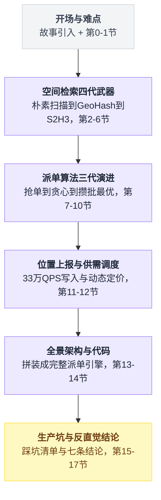
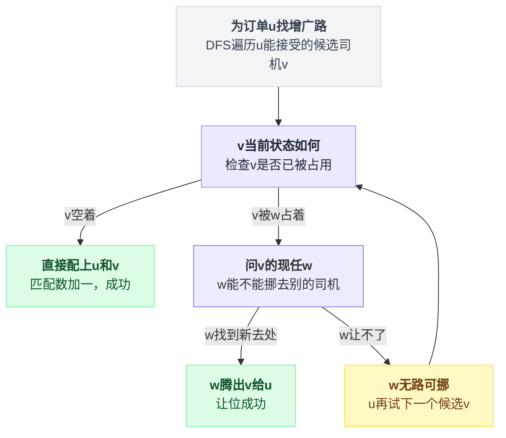
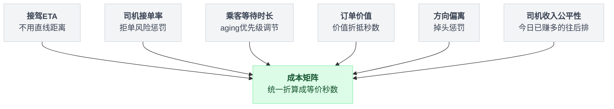
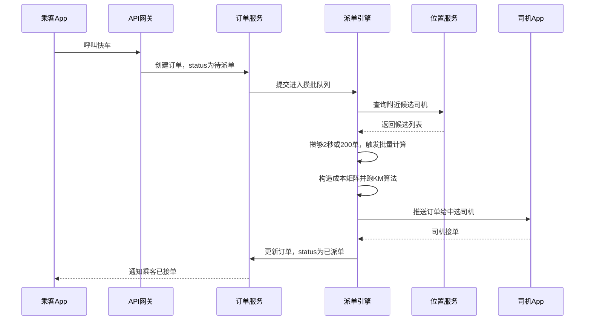
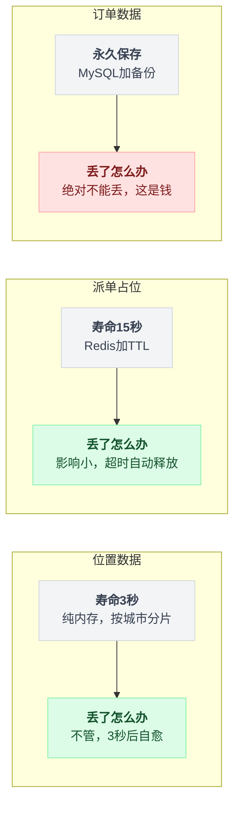
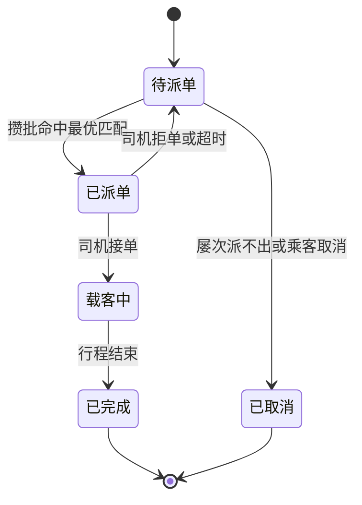
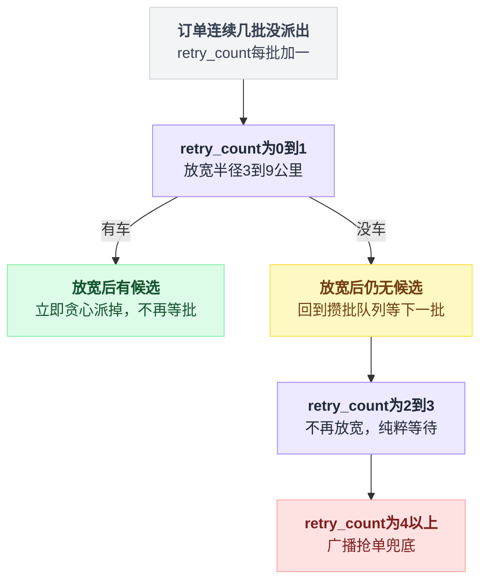

# 《网约车派单》从"找最近的车"到"全局最优"（小白版）

> 一句话简介：100 万在线司机，每秒几千个人在叫车。系统必须在两秒内决定"哪辆车去接哪个人"—— 这不是一道并发题，这是本系列第一道**优化题**。
> 难度：★★★★☆
> 读完你会懂：
> 1. 为什么"每个乘客都派最近的车"这条听起来天经地义的规则，会让整座城市的接单效率变差
> 2. GeoHash 到底怎么把二维经纬度压成一维字符串，读完你能自己在纸上手推出北京的 GeoHash
> 3. 派单三代方案：广播抢单 → 实时贪心 → 攒批全局最优匹配，每一代解决了什么、又留下了什么
> 4. 二分图最优匹配、匈牙利算法的直觉，以及为什么"故意等 2 秒再派"反而让乘客更快上车
> 5. 100 万司机每 3 秒上报一次位置（33 万 QPS 的写）该怎么扛，以及为什么这些数据根本不该进数据库

---

## 目录

- [0. 先讲个故事：路边招手 vs 调度台](#0-先讲个故事路边招手-vs-调度台)
- [1. 这件事到底难在哪](#1-这件事到底难在哪)
- [2. 最朴素的做法：把 100 万司机挨个量一遍](#2-最朴素的做法把-100-万司机挨个量一遍)
- [3. 为什么数据库的索引救不了你](#3-为什么数据库的索引救不了你)
- [4. 第一次改进：GeoHash —— 把二维拍扁成一维](#4-第一次改进geohash--把二维拍扁成一维)
- [5. Redis GEO：现成的轮子](#5-redis-geo现成的轮子)
- [6. GeoHash 的继任者：Google S2 与 Uber H3](#6-geohash-的继任者google-s2-与-uber-h3)
- [7. 派单方案 A：广播抢单](#7-派单方案-a广播抢单)
- [8. 派单方案 B：实时贪心 —— 局部最优陷阱](#8-派单方案-b实时贪心--局部最优陷阱)
- [9. 派单方案 C：攒批 + 全局最优匹配](#9-派单方案-c攒批--全局最优匹配)
- [10. 延迟换效率：为什么等 2 秒反而更快](#10-延迟换效率为什么等-2-秒反而更快)
- [11. 司机位置上报：33 万 QPS 的写怎么扛](#11-司机位置上报33-万-qps-的写怎么扛)
- [12. 供需调度与动态定价](#12-供需调度与动态定价)
- [13. 完整方案全景图](#13-完整方案全景图)
- [14. 核心代码逐行讲解](#14-核心代码逐行讲解)
- [15. 生产环境会踩的坑](#15-生产环境会踩的坑)
- [16. 反直觉结论](#16-反直觉结论)
- [17. 一句话总结 + 小白词典](#17-一句话总结--小白词典)
- [附：和前几篇的对照](#附和前几篇的对照)

---

全文顺着"先讲清楚问题→治空间检索→治全局匹配→接工程落地→收尾复盘"这条主线推进，先看一眼全貌再往下读。



## 0. 先讲个故事：路边招手 vs 调度台

### 0.1 路边招手

二十年前你要打车，做法只有一个：站在马路边，伸手。

一辆空车从远处开过来，看见你了，靠边停下，你上车。

这个系统有个特点：**它是纯本地的**。你只能看见你视野里那一百米，司机也只能看见他前挡风玻璃里那一百米。你俩谁都不知道，隔着两条街，有另一辆空车正在无聊地绕圈；也不知道，你身后 500 米有个人也在招手，而那辆车马上就要开到他面前了。

结果就是我们都熟悉的那个体验：

- 你在这条街等了 20 分钟，一辆空车都没有
- 而平行的那条街上，三辆空车排成一排，司机在抽烟

**信息不流通，资源就一定错配。** 记住这句话，这是整篇文章的主题。

### 0.2 出租车调度台

后来有了电话叫车。你打个电话给出租车公司，接线员说"稍等，我给您派一辆"。

接线员面前有一张大地图和一台对讲机。她的工作流程是这样的：

```
        乘客电话进来："我在人民广场，要一辆车"
                        │
                        ▼
              ┌───────────────────┐
              │  接线员看地图      │
              │  找人民广场附近    │
              │  有哪些空车        │
              └─────────┬─────────┘
                        │
                        ▼
              ┌───────────────────┐
              │  对讲机喊话：      │
              │ "人民广场有活儿，  │
              │   谁近谁来接"      │
              └─────────┬─────────┘
                        │
                        ▼
              第一个应答的司机接单
```

比路边招手强多了 —— **因为接线员手里有全局信息**。她能看到整张地图，而不是一百米的视野。

但这个系统有两个死穴：

**死穴一：接线员的眼睛不够快。** 地图上如果只有 20 辆车，她扫一眼就找到了。如果有 100 万辆呢？她一辈子也扫不完。

**死穴二：接线员是"来一单派一单"的。** 电话是一个一个进来的，她也只能一个一个派。她永远没机会说："等一下，我手上现在有 3 个电话、5 辆车，让我算一下怎么配对最划算。"

这两个死穴，正好就是本文要讲的两件事：

| 死穴 | 技术上叫什么 | 本文哪一节 |
|---|---|---|
| 眼睛不够快，扫不完 100 万辆车 | **空间检索**（地理位置索引） | 第 2~6 节 |
| 来一单派一单，没法通盘考虑 | **最优匹配**（组合优化） | 第 7~10 节 |

### 0.3 一个让人不舒服的小实验

在往下看之前，先请你回答一个问题。凭直觉就行。

现在是晚高峰，一条东西向的大街上有这么四个点（数字是这条街上的公里数）：

```
      西                                                东
      │                                                 │
  0km ●            3km ▲           5km ●            8km ▲
   乘客李四        司机乙          乘客张三         司机甲
   （在等车）      （空车）        （在等车）       （空车）
```

张三先叫的车，李四晚 1 秒钟叫的车。

**问题：系统应该怎么派？**

绝大多数人的第一反应是：张三先叫的，先满足张三 —— 张三离司机乙只有 2 公里，离司机甲有 3 公里，所以**乙去接张三**。然后李四只剩司机甲可选，司机甲从 8km 开到 0km，跑 8 公里。

总接驾距离 = 2 + 8 = **10 公里**。李四要等司机开 8 公里，晚高峰路况，起码 20 分钟。

现在换一种派法：**让稍远一点的司机甲去接张三（3 公里），让司机乙掉头去接李四（3 公里）。**

总接驾距离 = 3 + 3 = **6 公里**。而且没有任何一个乘客等超过 3 公里的车程。

```
   贪心派法（每单都要最近的车）        全局最优派法
   ────────────────────────────      ────────────────────────
   张三 ← 乙   2km                   张三 ← 甲   3km
   李四 ← 甲   8km   ← 惨            李四 ← 乙   3km
   ─────────────────                 ─────────────────
   总计       10km                   总计        6km
   最惨的人等 8km                    最惨的人等 3km
```

**总距离少了 40%，最惨的那个人的等待时间少了 62%。** 代价是：张三的车从 2 公里外变成了 3 公里外，多等了大概 1 分钟。

这就是本文的核心命题：

> **每个人都拿到"对自己最好"的结果，加起来不等于"对所有人最好"的结果。**
>
> 局部最优的叠加 ≠ 全局最优。

前面几篇（抢票、红包、限流）讲的都是**并发问题** —— 大家抢同一个东西，怎么别抢乱。这一篇不一样。这一篇里没人抢东西，**东西够分，问题是怎么分才最划算**。这是本系列第一道优化题。

---

## 1. 这件事到底难在哪

先把业务讲清楚，别一上来就抽象。

### 1.1 一次叫车，系统到底在干什么

```
    乘客点"呼叫快车"
           │
           ▼
    ┌──────────────────────────────────────┐
    │ ① 定位：乘客现在在哪（经纬度）        │
    └──────────────────┬───────────────────┘
                       ▼
    ┌──────────────────────────────────────┐
    │ ② 找车：附近 3 公里内有哪些空闲司机   │  ← 空间检索问题
    │    候选可能有 50~500 个               │
    └──────────────────┬───────────────────┘
                       ▼
    ┌──────────────────────────────────────┐
    │ ③ 派单：从候选里挑一个（或几个）      │  ← 最优匹配问题
    │    这一步决定了整个平台的效率         │     本文核心
    └──────────────────┬───────────────────┘
                       ▼
    ┌──────────────────────────────────────┐
    │ ④ 推送：把订单推给被选中的司机        │
    │    司机点"接单" → 成交                │
    │    司机拒单/超时 → 回到第 ③ 步重派    │
    └──────────────────────────────────────┘
```

第 ① 步和第 ④ 步没什么可讲的。**第 ② 步和第 ③ 步就是这篇文章的全部。**

### 1.2 先算清楚数量级

不算数字的架构讨论都是耍流氓。设定一组贯穿全文的数字（量级参考国内一线平台的公开数据）：

| 指标 | 数值 | 说明 |
|---|---|---|
| 全国在线司机峰值 | **100 万** | 同时开着 App 的 |
| 单城在线司机峰值 | **5 万**（北京/上海） | 分城之后单城的量 |
| 司机位置上报频率 | **每 3 秒一次** | 有些平台更快，1 秒一次 |
| 位置写入 QPS | **33 万/秒** | 100万 ÷ 3秒 |
| 晚高峰叫车请求 | **5000 单/秒** | 全国峰值 |
| 每单的候选司机数 | **50~500 个** | 3 公里半径内 |
| 派单要在多久内完成 | **< 2 秒** | 超过 5 秒乘客就开始烦躁 |

先把两个术语解释掉，后面会反复用：

- **QPS**：Queries Per Second，每秒请求数。33 万 QPS 的意思是这个系统每秒钟要接住 33 万次写入。做个对照：一台配置不错的 MySQL，写入能力大概是 5000~2 万 QPS。所以 33 万 QPS 意味着你需要 **20~60 台 MySQL 专门用来存位置**，而且这些数据 3 秒后就作废了。荒不荒谬？
- **ETA**：Estimated Time of Arrival，预计到达时间。派单里说的"距离"，真正该用的是 ETA，后面会专门讲为什么。

### 1.3 难点一：怎么在 100 万个点里找出"附近的"

你可能觉得这有什么难的，算个距离不就完了。

问题在于**"算距离"这个动作本身没法加速**。给你一个乘客坐标和一个司机坐标，你必须把两个数代进公式算一遍，才知道他们离多远。你不能"跳过"某些司机 —— 因为在你算之前，你不知道他远不远。

这就是空间检索的根本困难：

> 一维数据可以排序，排完序你可以二分查找，跳过 99.9% 的数据。
> **二维数据没法排序。**（先按经度排还是先按纬度排？两个点，一个经度大纬度小，另一个反过来，谁排前面？）

排不了序，就没法二分，就只能挨个看。这是第 2~6 节要解决的问题。

### 1.4 难点二：派给谁

假设第 ① 关过了，你现在手上有 200 个候选司机。派给谁？

**第一反应：派给最近的。**

这个答案错得非常隐蔽，因为它在**单个订单**的视角下完全正确。它错在：你不是只有一个订单。

来看这个场景：

```
       晚高峰的某个 2 秒钟内，某个区域

       订单：  ①    ②    ③        （3 个人同时叫车，位置很接近）
                \   |   /
                 \  |  /
                  \ | /
                   \|/
       司机：      [A]        [B]
                            (500米外，闲着)

       如果每个订单都"派最近的车"：
         订单① 算出来最近的是 A
         订单② 算出来最近的是 A
         订单③ 算出来最近的是 A
       → 三个订单抢一个司机 A
       → 两个订单必然要重派，重派又要几秒
       → 而 B 从头到尾在那儿闲着
```

这不是假想。**这是"每单独立决策"这个架构的必然产物** —— 因为订单 ① 在做决策的时候，根本不知道订单 ②③ 的存在。三个决策者，同一份信息，同一个规则，必然给出同一个答案。

再看得远一点。哪怕你加了锁，保证 A 只被派给一个订单，剩下两个订单重派给 B、C，结果也未必好：

| 派法 | 订单① | 订单② | 订单③ | 总接驾距离 |
|---|---|---|---|---|
| 抢到算谁的 | A（0.1km） | C（2.0km） | D（2.5km） | 4.6km |
| 通盘算一次 | B（0.5km） | A（0.6km） | C（0.8km） | **1.9km** |

差了 2.4 倍。这个差距，乘以一个平台一天的 3000 万单，就是天文数字的燃油、时间和司机收入。

### 1.5 难在"这是一道优化题"

到这儿要下一个结论，这个结论决定了后面所有的技术选型：

> 派单不是一个"正确/错误"的问题，是一个"好/更好"的问题。
>
> 抢票超卖了，那是 bug，是错误，绝对不能容忍。
> 派单派得不够优，不是 bug，系统照常运转，只是**效率低了 15%**，而且**没有任何报错日志会告诉你**。

这就是它最难的地方 —— **它悄无声息**。你的系统 P99 延迟很漂亮，错误率是 0，监控大盘一片绿，但你的接单率就是比对手低 10 个百分点，你不知道为什么。

小结一下这一节：

- 难点一是**空间检索**：二维数据没法排序，没法二分，朴素做法是 O(N) 扫描
- 难点二是**全局优化**：每单独立决策必然导致资源错配，而且这种错配不会报错
- 前者是"快不快"的问题，后者是"好不好"的问题

下面从最笨的办法开始。

---

## 2. 最朴素的做法：把 100 万司机挨个量一遍

### 2.1 代码长这样

先解释一个术语：**Haversine 公式**。地球是个球，所以两个经纬度点之间的直线距离不能用平面上的勾股定理算，得用球面三角学。Haversine 就是干这个的公式，你不用理解它的推导，知道它"输入两组经纬度、输出球面距离"就够了。

```python
import math
from dataclasses import dataclass

EARTH_RADIUS_M = 6371000.0  # 地球平均半径，单位米


@dataclass
class Driver:
    driver_id: str
    lat: float          # 纬度
    lon: float          # 经度
    is_free: bool       # 是否空闲


def haversine(lat1: float, lon1: float, lat2: float, lon2: float) -> float:
    """算两个经纬度点之间的球面距离，单位米。"""
    p1, p2 = math.radians(lat1), math.radians(lat2)
    dp = p2 - p1
    dl = math.radians(lon2 - lon1)
    a = math.sin(dp / 2) ** 2 + math.cos(p1) * math.cos(p2) * math.sin(dl / 2) ** 2
    return 2 * EARTH_RADIUS_M * math.asin(math.sqrt(a))
```

**这段在干嘛**：给两个点的经纬度，返回它们之间有多少米。里面那堆 `sin`/`cos`/`asin` 是球面几何的公式，照抄就行 —— 但请记住一件事：**这一行有 4 次三角函数调用和 1 次开方**，这是 CPU 上相当昂贵的操作，比一次整数加法慢几十上百倍。这个成本会在下一节要了你的命。

然后是朴素的找车逻辑：

```python
def find_nearby_naive(
    all_drivers: list[Driver],
    p_lat: float,
    p_lon: float,
    radius_m: float = 3000.0,
) -> list[tuple[Driver, float]]:
    """遍历全部司机，挑出半径内的空闲司机，按距离排序。"""
    result: list[tuple[Driver, float]] = []
    for d in all_drivers:                       # ← 罪魁祸首在这一行
        if not d.is_free:
            continue
        dist = haversine(p_lat, p_lon, d.lat, d.lon)
        if dist <= radius_m:
            result.append((d, dist))
    result.sort(key=lambda x: x[1])
    return result
```

**这段在干嘛**：从头到尾把每一个司机都拿出来，算一遍他离乘客多远，够近就留下，最后按距离从近到远排个序。

逻辑上完全正确。写单元测试能全绿。上线就死。

### 2.2 具体推演它死在哪

**第一层：单次请求的成本**

100 万司机，每个都要算一次 Haversine。

| 语言 | 单次 Haversine 耗时 | 100 万次 |
|---|---|---|
| Python（纯解释执行） | ~1 微秒 | **1 秒** |
| Go / Java | ~50 纳秒 | 50 毫秒 |
| C++（编译器向量化） | ~15 纳秒 | 15 毫秒 |

用 Python 写，**一个乘客点一次叫车，服务器要转 1 秒**。这还只是算距离，不含网络、序列化、排序。

**第二层：乘以 QPS**

高峰 5000 单/秒：

```
    5000 单/秒 × 100 万次距离计算/单 = 50 亿次距离计算/秒
```

按 C++ 的 15 纳秒算，一个 CPU 核每秒能做约 6600 万次。

```
    50 亿 ÷ 6600 万 ≈ 需要 757 个 CPU 核，一刻不停地算
```

**757 个核，只用来算距离。** 按一台 64 核的机器算，你需要 12 台服务器，7×24 小时满载，什么业务逻辑都不干，只是在算三角函数。而且这是峰值不留余量的算法，真上生产你得按 2 倍冗余配，24 台。

**第三层：司机还在动**

上面还是静态的。真实情况是所有司机每 3 秒钟位置就变了一次。你没法把结果缓存下来复用 —— 你缓存的"李师傅在西二旗"这条信息，3 秒后就是错的。

**第四层：内存带宽**

这一层最容易被忽略，但它才是真正的天花板。

100 万个司机对象，每个哪怕只存 `id + lat + lon + status`，也有 40 字节左右：

```
    100 万 × 40 字节 = 40 MB
```

每次请求你都要把这 40 MB 从内存里完整读一遍。5000 QPS：

```
    5000 × 40 MB = 200 GB/秒 的内存读带宽需求
```

一台服务器的内存带宽大概是 **50~100 GB/秒**。你需要的是它的 2~4 倍。

**注意，这一层是没法用"多加机器"解决的**，因为每台机器都要有全量司机数据才能算。除非你分片 —— 而分片本身就是下一节要讲的空间索引的雏形。

### 2.3 结论

```
    ┌───────────────────────────────────────────────────┐
    │  朴素遍历的死因，按严重程度排序：                  │
    │                                                   │
    │  1. 内存带宽打满     ← 最硬的墙，加机器都不管用    │
    │  2. CPU 烧在三角函数上  757 核只为算距离           │
    │  3. 结果无法缓存     司机 3 秒动一次               │
    │  4. 做的全是无用功   100 万次算完，只有 200 个有用 │
    │                      → 99.98% 的计算是白烧的       │
    └───────────────────────────────────────────────────┘
```

**最后一条是本质。** 你算了 100 万次，其中 999800 次的结论是"这人太远了，不要"。这跟上一篇《延迟任务》里"翻 1000 万行本子只找出 20 个到期任务"是**一模一样的病** —— 主动搜索的代价与总量成正比，而有用的结果只有一点点。

治法也是一样的：**别去搜索，让数据自己组织好，你直接去对应的格子里拿。**

---

## 3. 为什么数据库的索引救不了你

这一节很重要，因为几乎每个人的第二反应都是："我建个索引不就行了？"

### 3.1 你会写出这样的 SQL

```sql
-- 建表
CREATE TABLE driver_location (
    driver_id BIGINT PRIMARY KEY,
    lat       DOUBLE NOT NULL,
    lon       DOUBLE NOT NULL,
    is_free   TINYINT NOT NULL,
    INDEX idx_lat_lon (lat, lon)      -- 复合索引，先按纬度，再按经度
);

-- 查询：找天安门（39.9087, 116.3975）周围约 3 公里内的空闲司机
SELECT driver_id, lat, lon
FROM driver_location
WHERE lat BETWEEN 39.8817 AND 39.9357     -- ±0.027 度 ≈ ±3 公里
  AND lon BETWEEN 116.3624 AND 116.4326   -- ±0.035 度 ≈ ±3 公里
  AND is_free = 1;
```

看起来天衣无缝。索引建了，范围也框了。

**但这条 SQL 在 100 万行的表上会扫描大约 5 万行，而真正符合条件的只有 200 行。**

为什么？

### 3.2 B+ 树只能对一个维度有序

先解释 **B+ 树**：这是几乎所有关系型数据库索引的底层结构。你可以把它理解成一本**字典的目录**：所有的值从小到大排好序，串成一条链，你想找某个范围，就翻到起点，然后顺着链一路读到终点。

关键词是 **"排好序"**。排序需要一个明确的"谁大谁小"的规则。

一维数据天然有这个规则：`3 < 5 < 8`。

**二维数据没有。** 请回答：`(39.9, 116.4)` 和 `(40.1, 116.2)` 谁大？

没有答案。你只能人为规定一个规则，比如"先比纬度，纬度相同再比经度"—— 这就是复合索引 `(lat, lon)` 干的事。它的效果是这样的：

```
    复合索引 (lat, lon) 在磁盘上的实际排列
    （按 lat 排序，lat 相同的再按 lon 排序）

    lat        lon        含义
    ─────────────────────────────────────────────
    39.8901    -74.0060   美国纽约附近
    39.8903    -8.6100    葡萄牙
    39.8905    2.1734     西班牙巴塞罗那
    39.8907    28.9784    土耳其伊斯坦布尔
    39.8908    116.3901   ← 北京！我们要的
    39.8908    116.4102   ← 北京！我们要的
    39.8911    121.4737   上海附近
    39.8913    139.6917   日本东京
    39.8915    -118.2437  美国洛杉矶
    39.8917    -0.1276    英国附近
    ...
    ▲
    │
    └── 索引是按这一列有序的，所以 lat BETWEEN 能快速定位
        但定位到之后，lon 这一列在这个范围内是【完全乱的】
```

划重点：

> 复合索引 `(lat, lon)` 只保证 **lat 整体有序**。
> 只有在 **lat 完全相等** 的那些行之间，lon 才是有序的。
>
> 而经纬度是浮点数，`lat` 完全相等的行几乎不存在（每个司机的纬度都是 39.890812... 这种精确到小数点后 6 位的值）。
>
> **所以 lon 这一维，索引一点忙都帮不上。**

数据库的执行计划会是这样：

```
    ┌──────────────────────────────────────────────────┐
    │ 第 1 步：用索引定位 lat ∈ [39.8817, 39.9357]      │
    │          → 这一步很快，B+ 树二分定位                │
    │          → 扫出来 5 万行（全球这个纬度带上的所有车） │
    └──────────────────────┬───────────────────────────┘
                           ▼
    ┌──────────────────────────────────────────────────┐
    │ 第 2 步：把这 5 万行【一行一行】读出来             │
    │          逐行判断 lon 在不在范围内                 │
    │          → 这一步是全表扫描级别的开销              │
    │          → 5 万行里只有 200 行是北京的             │
    │          → 99.6% 的读取是白费的                    │
    └──────────────────────────────────────────────────┘
```

### 3.3 算一下这个"纬度带"有多大

北京在北纬 39.9 度。取 `lat ∈ [39.8817, 39.9357]` 这个带：

- **南北宽**：0.054 度 × 111 公里/度 ≈ **6 公里**
- **东西长**：这一圈绕地球一周 = 40075 × cos(39.9°) ≈ 40075 × 0.767 ≈ **30737 公里**

```
    我们想要的                 索引实际扫描的
    ┌─────────┐               ┌──────────────────────────────────┐
    │  6km    │               │                                  │  6 km 高
    │  ×      │               │        30737 km 长               │
    │  6km    │               │  （绕地球一整圈的一条细带）      │
    └─────────┘               └──────────────────────────────────┘
     36 km²                          184422 km²

              相差 5123 倍
```

这条 6 公里宽的带子横跨北京、蒙古、哈萨克斯坦、土耳其、西班牙马德里、大西洋、美国费城、旧金山、太平洋，然后绕回北京。**索引把这一整圈的车都读出来了，就为了在里头挑出北京的那 200 辆。**

### 3.4 那反过来建索引呢？

有人会说：那我建 `(lon, lat)`，先按经度。

一样的病，只是换了个方向 —— 变成扫一条南北向的细带，从北极扫到南极。

也有人会说：那我建两个单列索引 `INDEX(lat)` 和 `INDEX(lon)`，让数据库取交集。

MySQL 的 `index_merge intersect` 确实能做这事，但：

1. 它要把两个索引各自扫出来的主键 ID 排序后求交集，两边各 5 万行，开销比直接扫一边还大
2. 优化器经常判断"还不如全表扫"，直接放弃走索引
3. 就算走了，也解决不了写入的问题 —— 33 万 QPS 的位置更新，每次更新都要维护 2 个索引，B+ 树页分裂能把磁盘写爆

### 3.5 那 PostGIS / MySQL 空间索引呢？

数据库确实有专门的**空间索引**（`SPATIAL INDEX`，底层是 R 树），PostgreSQL 的 PostGIS 扩展更是工业级的。它们能正确解决"找附近"这个查询。

但对网约车来说还是不行，原因不在查询，**在写入**：

| 问题 | 说明 |
|---|---|
| 写入量 | 33 万 QPS 的 UPDATE，R 树要不断调整节点边界，写放大严重 |
| 数据寿命 | 司机位置 3 秒后就作废，写进磁盘再删掉，纯属浪费 |
| 事务开销 | 每次位置更新走一遍事务日志（WAL/redo log），完全没必要 |
| 延迟 | 磁盘 IO 毫秒级，而这个场景要的是微秒级 |

**结论**：

> **司机的实时位置，根本不该进数据库。**
>
> 它是一份"高频写、易失、有时效性"的数据 —— 这类数据的正确归宿是内存，不是磁盘。
> 数据库擅长的是"写一次读一万次的持久数据"，而位置数据是"写一万次读一次的瞬时数据"，正好反过来。

那内存里怎么组织？这就轮到 GeoHash 出场了。

---

## 4. 第一次改进：GeoHash —— 把二维拍扁成一维

### 4.1 核心思想：一句话

上一节我们发现的根本矛盾是：

> B+ 树、跳表、排序、二分查找 —— 所有高效的数据结构，都要求数据是**一维有序**的。
> 而经纬度是**二维**的。

有两条路可走：

- **路 A**：造一个天生支持二维的数据结构 → 这就是 R 树、四叉树、KD 树
- **路 B**：想办法把二维**变成**一维，然后继续用现成的一维工具 → **这就是 GeoHash**

路 B 赢了，因为它有个巨大的工程优势：**变成一维之后，你可以用任何现成的东西存它** —— Redis 的 ZSet、MySQL 的普通 B+ 树索引、一个 Python 字典、甚至一个文本文件。不需要任何特殊的数据库。

GeoHash 的核心思想：

> **把地球反复对半切。每切一刀，记录你在左半边还是右半边（一个 bit）。**
> **切的次数越多，你的位置就被框得越准。把这一串 bit 拼起来，就是这个位置的一维编号。**

### 4.2 手推一遍：北京天安门的 GeoHash

天安门的坐标是 **纬度 39.9087，经度 116.3975**。我们一刀一刀切。

**先切经度（范围 -180 到 180）：**

```
  第 1 刀：区间 [-180, 180]，中点 0
        -180                    0                    180
          ├─────────────────────┼─────────────────────┤
          │       左半 = 0      │       右半 = 1      │
          └─────────────────────┴──────────▲──────────┘
                                           │
                                    116.3975 在右半
                                       → bit = 1
                                    新区间 [0, 180]

  第 2 刀：区间 [0, 180]，中点 90
             0                    90                   180
             ├─────────────────────┼────────────────────┤
             │       左半 = 0      │      右半 = 1      │
             └─────────────────────┴──────▲─────────────┘
                                          │
                                   116.3975 在右半 → bit = 1
                                     新区间 [90, 180]

  第 3 刀：区间 [90, 180]，中点 135
            90                   135                  180
             ├─────────────────────┼────────────────────┤
             │      左半 = 0       │      右半 = 1      │
             └───────────▲─────────┴────────────────────┘
                         │
                  116.3975 在左半 → bit = 0
                    新区间 [90, 135]

  第 4 刀：区间 [90, 135]，中点 112.5
            90                  112.5                 135
             ├─────────────────────┼────────────────────┤
             │      左半 = 0       │      右半 = 1      │
             └─────────────────────┴──▲─────────────────┘
                                      │
                               116.3975 在右半 → bit = 1
                                 新区间 [112.5, 135]
```

看出规律了吗？**每切一刀，区间宽度减半，你对这个坐标的了解就精确一倍。**

继续切到第 12 刀，用表格记录：

| 第几刀 | 当前区间 | 中点 | 116.3975 在哪边 | bit | 新区间 |
|---|---|---|---|---|---|
| 1 | [-180, 180] | 0 | 右 | **1** | [0, 180] |
| 2 | [0, 180] | 90 | 右 | **1** | [90, 180] |
| 3 | [90, 180] | 135 | 左 | **0** | [90, 135] |
| 4 | [90, 135] | 112.5 | 右 | **1** | [112.5, 135] |
| 5 | [112.5, 135] | 123.75 | 左 | **0** | [112.5, 123.75] |
| 6 | [112.5, 123.75] | 118.125 | 左 | **0** | [112.5, 118.125] |
| 7 | [112.5, 118.125] | 115.3125 | 右 | **1** | [115.3125, 118.125] |
| 8 | [115.3125, 118.125] | 116.71875 | 左 | **0** | [115.3125, 116.71875] |
| 9 | [115.3125, 116.71875] | 116.015625 | 右 | **1** | [116.015625, 116.71875] |
| 10 | [116.015625, 116.71875] | 116.3671875 | 右 | **1** | [116.3671875, 116.71875] |
| 11 | [116.3671875, 116.71875] | 116.5429688 | 左 | **0** | [116.3671875, 116.5429688] |
| 12 | [116.3671875, 116.5429688] | 116.4550781 | 左 | **0** | [116.3671875, 116.4550781] |

**经度 12 位：`1 1 0 1 0 0 1 0 1 1 0 0`**

**再切纬度（范围 -90 到 90）**，规则完全一样，只是"左/右"换成"下/上"：

| 第几刀 | 当前区间 | 中点 | 39.9087 在哪边 | bit |
|---|---|---|---|---|
| 1 | [-90, 90] | 0 | 上 | **1** |
| 2 | [0, 90] | 45 | 下 | **0** |
| 3 | [0, 45] | 22.5 | 上 | **1** |
| 4 | [22.5, 45] | 33.75 | 上 | **1** |
| 5 | [33.75, 45] | 39.375 | 上 | **1** |
| 6 | [39.375, 45] | 42.1875 | 下 | **0** |
| 7 | [39.375, 42.1875] | 40.78125 | 下 | **0** |
| 8 | [39.375, 40.78125] | 40.078125 | 下 | **0** |
| 9 | [39.375, 40.078125] | 39.7265625 | 上 | **1** |
| 10 | [39.7265625, 40.078125] | 39.9023438 | 上 | **1** |
| 11 | [39.9023438, 40.078125] | 39.9902344 | 下 | **0** |
| 12 | [39.9023438, 39.9902344] | 39.9462891 | 下 | **0** |

**纬度 12 位：`1 0 1 1 1 0 0 0 1 1 0 0`**

### 4.3 交叉编织：把两串 bit 拧成一股

现在你有两串 bit，一串管东西，一串管南北。怎么合成一个数？

**答案：交替取，经度先出。** 这个"交替"是 GeoHash 的灵魂，后面会解释为什么必须交替。

```
    经度 bit：  1   1   0   1   0   0   1   0   1   1   0   0
                 ╲   ╲   ╲   ╲   ╲   ╲   ╲   ╲   ╲   ╲   ╲   ╲
    纬度 bit：     1   0   1   1   1   0   0   0   1   1   0   0
                   ↓
    交织结果： 1 1 1 0 0 1 1 1 0 1 0 0 1 0 0 0 1 1 1 1 0 0 0 0
               └┬┘ └┬┘ └┬┘ └┬┘ └┬┘ └┬┘ └┬┘ └┬┘ └┬┘ └┬┘ └┬┘ └┬┘
              经纬 经纬 经纬 经纬 经纬 经纬 经纬 经纬 经纬 经纬 经纬 经纬
              第1刀 第2刀 第3刀 ...
```

得到 24 个 bit：`111001110100100011110000`

**为什么必须交替？** 因为交替 = 经度切一刀、纬度切一刀，格子始终保持接近正方形。如果你先把经度切 12 刀再切纬度，中间状态就是一条又细又长的竖条，"前缀相同"就不代表"位置相近"了（一条从北极延伸到南极的细条，两端相距 2 万公里）。

**交替是为了让格子在两个方向上均匀收缩。** 记住这句，它是 GeoHash 能工作的前提。

### 4.4 变成字符串：Base32

24 个 bit 读起来太痛苦，所以 GeoHash 用 **Base32** 把它变成字符串：**每 5 个 bit 一组，查表变成 1 个字符**。

GeoHash 的 Base32 字母表（注意：**去掉了 a、i、l、o**，因为它们和 1/0 长得像，容易抄错）：

```
    值:  0  1  2  3  4  5  6  7  8  9 10 11 12 13 14 15
    字符: 0  1  2  3  4  5  6  7  8  9  b  c  d  e  f  g

    值: 16 17 18 19 20 21 22 23 24 25 26 27 28 29 30 31
    字符: h  j  k  m  n  p  q  r  s  t  u  v  w  x  y  z
```

切分我们的 24 个 bit：

```
    111001110100100011110000
    └─┬─┘└─┬─┘└─┬─┘└─┬─┘
    11100 11101 00100 01111 0000(不足5位，继续切更多刀补上)
      │     │     │     │
     =28   =29    =4   =15
      │     │     │     │
      ▼     ▼     ▼     ▼
      w     x     4     g
```

**天安门的 GeoHash = `wx4g...`**

再多切几刀，完整的 9 位结果是：

```
    天安门 (39.9087, 116.3975)  →  wx4g09nj4
```

这个 `wx4g` 就是北京市区的 GeoHash 前缀，你可以拿去搜，全世界的地理数据都在用它。

### 4.5 灵魂性质：前缀相同 = 位置相近

现在来看这套编码为什么牛。看几个真实计算出来的值：

| 地点 | 坐标 | GeoHash（9 位） | 和天安门共同前缀 |
|---|---|---|---|
| 北京天安门 | 39.9087, 116.3975 | `wx4g09nj4` | — |
| 北京王府井 | 39.9150, 116.4100 | `wx4g0fr1t` | **`wx4g0`**（5 位，约 5 公里内） |
| 北京国贸 | 39.9088, 116.4590 | `wx4g414ve` | **`wx4g`**（4 位，约 40 公里内） |
| 上海外滩 | 31.2397, 121.4900 | `wtw3sx426` | **`w`**（1 位，同一块大洲级区域） |

规律一目了然：

```
    ┌────────────────────────────────────────────────────────┐
    │                                                        │
    │   共同前缀越长  ⇔  两点距离越近                        │
    │                                                        │
    │   w        →  同在东亚这一大块（5000 公里级）          │
    │   wx       →  同在华北（1250 公里级）                  │
    │   wx4      →  同在北京-天津圈（156 公里级）            │
    │   wx4g     →  同在北京城区（39 公里级）                │
    │   wx4g0    →  同在东城区一带（4.9 公里级）             │
    │   wx4g09   →  同在天安门周边（1.2 公里级）             │
    │                                                        │
    └────────────────────────────────────────────────────────┘
```

**这一步，二维问题就被彻底变成了一维的字符串前缀匹配问题。**

而字符串前缀匹配，是 B+ 树、跳表、哈希表、字典树全都能高效处理的事情。你只要执行：

```sql
SELECT * FROM driver_location WHERE geohash LIKE 'wx4g09%';
```

B+ 树对这种"左前缀匹配"是可以走索引的（因为字符串有序，`wx4g09` 开头的所有值在索引里是**连续的一段**），一次定位 + 顺序读，扫多少行就命中多少行，**零浪费**。

对比一下上一节：

| 方案 | 扫描行数 | 命中行数 | 浪费率 |
|---|---|---|---|
| 复合索引 `(lat, lon)` | 5 万 | 200 | 99.6% |
| GeoHash 前缀 | 约 250 | 200 | 20% |

### 4.6 长度与精度对照表

这张表建议背下来，实际工作中天天用：

| GeoHash 长度 | 格子东西宽 | 格子南北高 | 大概相当于 | 典型用途 |
|---|---|---|---|---|
| 1 | 5009 km | 4992 km | 一块大洲 | 没什么用 |
| 2 | 1252 km | 624 km | 半个中国 | 没什么用 |
| 3 | 156 km | 156 km | 一个省的一角 | 省级聚合统计 |
| 4 | 39.1 km | 19.5 km | 一个大城市 | 城市级分片 |
| 5 | 4.9 km | 4.9 km | 一个区 | 热力图、区域统计 |
| **6** | **1.2 km** | **0.61 km** | **几个街区** | **网约车派单常用** |
| **7** | **153 m** | **152 m** | **一个小区** | **精确匹配、上车点** |
| 8 | 38.2 m | 19 m | 一栋楼 | 室内定位、POI |
| 9 | 4.8 m | 4.8 m | 一个车位 | 极精确场景 |
| 10 | 1.2 m | 0.6 m | 一个人站的地方 | 基本用不上 |
| 11 | 14.9 cm | 14.9 cm | 一只脚 | 测绘 |
| 12 | 3.7 cm | 1.9 cm | 一枚硬币 | 测绘 |

**几个必须注意的点：**

1. **奇数位的格子是扁的**（宽 ≈ 2 倍高），偶数位的格子接近正方形。原因就是交替编码：奇数个 bit 时，经度比纬度多切了一刀，所以东西方向更精细，格子横着扁。

2. **越靠近赤道格子越大，越靠近两极越小**（东西方向）。因为经度一度对应的实际距离是 `111km × cos(纬度)`。北京（39.9°）的格子东西向只有赤道的 76.7%。表里的数字都是赤道附近的值。**这是 GeoHash 的一个固有缺陷**，第 6 节讲的 H3 就是来治它的。

3. **网约车派单一般用 6 位**（约 1.2km × 0.61km）。为什么不用 7 位？因为 7 位格子只有 150 米，一个乘客周围要查几十上百个格子才够，Redis 往返次数太多。也不用 5 位，5 位格子 4.9 公里，一个格子里可能有几千个司机，捞出来还得自己过滤。**6 位是 Redis 往返次数和单格数据量之间的平衡点。**

### 4.7 致命的边界问题

现在讲 GeoHash 最大的坑。这个坑不解决，你的系统会出现"明明车就在马路对面，App 说附近无车"。

**问题**：GeoHash 保证"前缀相同 → 位置相近"，但**不保证"位置相近 → 前缀相同"**。

这两句话是不等价的。数学上讲，前者是充分条件，后者是必要条件，GeoHash 只给了前者。

看一组我实际算出来的数：

```
    A 点：纬度 39.9087，经度 116.4111  →  6 位 GeoHash = wx4g0c
    B 点：纬度 39.9087，经度 116.4112  →  6 位 GeoHash = wx4g11
                                ▲
                                └─ 经度只差 0.0001 度

    两点实际距离：约 8.5 米（隔着一条马路的宽度）
    两点的 GeoHash：连第 5 位都不一样！
```

**8.5 米，两个 GeoHash 只共享 4 位前缀（`wx4g`，40 公里级）。**

原因很简单 —— 它们正好踩在格子的分界线两边：

```
        格子 wx4g0c              格子 wx4g11
    ┌───────────────────┬───────────────────┐
    │                   │                   │
    │                   │                   │
    │                A ●│● B                │
    │                   │                   │
    │                   │                   │
    └───────────────────┴───────────────────┘
                        ▲
                        │
                  格子的分界线
             A 和 B 相距 8.5 米，
             但被这条看不见的线劈开了
```

这就像"你和邻居只隔一堵墙，但你俩一个是北京户口一个是河北户口"。**行政边界不等于物理距离。**

如果你的代码只查乘客所在的那一个格子：

```python
# 有严重 bug 的写法
def find_nearby_buggy(passenger_geohash: str) -> list[str]:
    return redis.smembers(f"geo:{passenger_geohash}")   # 只查一个格子
```

那么站在格子边缘的乘客，会看不到隔壁格子里 5 米外的车。**而格子边缘的乘客占比高得吓人** —— 6 位格子是 1200m × 610m，如果我们定义"距边界 200 米内算边缘"，那边缘区域的面积占比是：

```
    总面积       = 1200 × 610 = 732000 m²
    非边缘核心区 = 800 × 210  = 168000 m²
    边缘占比     = 1 - 168000/732000 = 77%
```

**77% 的乘客都在"边缘"。** 这不是边角情况，这是主流情况。

### 4.8 解法：连周围 8 个格子一起查

标准解法简单粗暴：**把自己这个格子，加上东南西北和四个斜角的邻居，一共 9 个格子，全查一遍。**

```
        以天安门所在的 wx4g09 为中心（这些值都是实际算出来的）

        ┌──────────┬──────────┬──────────┐
        │   西北   │    北    │   东北   │
        │  wx4g06  │  wx4g0d  │  wx4g0f  │
        ├──────────┼──────────┼──────────┤
        │    西    │  ★ 我 ★  │    东    │
        │  wx4g03  │  wx4g09  │  wx4g0c  │
        ├──────────┼──────────┼──────────┤
        │   西南   │    南    │   东南   │
        │  wx4g02  │  wx4g08  │  wx4g0b  │
        └──────────┴──────────┴──────────┘

        注意这些编号毫无规律可言 —— 中心是 09，东边是 0c，
        北边是 0d，东北角是 0f。这就是 Z 曲线的"跳跃"在作祟。
        所以求邻居千万别去猜编码规律，老老实实按坐标加减。

        查 9 个格子 → 覆盖 3600m × 1830m 的范围
        → 保证任何 600 米内的点都不会漏
```

**为什么 9 个格子就够？** 因为你最坏情况是站在自己格子的某个角上。此时距离你最近的"格子外区域"，也一定在这 9 格覆盖的范围内 —— 只要你的搜索半径小于格子的短边（这里是 610 米），9 格就足够。

**如果搜索半径大于格子短边怎么办？** 两个办法：

1. 降一位精度用 5 位格子（4.9km × 4.9km），9 格覆盖 14.7km 范围
2. 查 25 个格子（5×5）

生产上一般用办法 1，**根据搜索半径动态选 GeoHash 位数**：

```python
def pick_precision(radius_m: float) -> int:
    """根据搜索半径挑一个合适的 GeoHash 位数：让格子短边 >= 半径。"""
    # (位数, 格子短边米数)，取自精度表
    table = [(8, 19), (7, 152), (6, 610), (5, 4900), (4, 19500), (3, 156000)]
    for precision, cell_short_side in table:
        if cell_short_side >= radius_m:
            return precision
    return 2
```

**这段在干嘛**：你要搜 3 公里，它返回 5（5 位格子短边 4.9km ≥ 3km，9 格覆盖足够）；你要搜 500 米，它返回 6。核心原则是**格子短边不能小于搜索半径**，否则 9 格覆盖不住。

### 4.9 Python 实现：编码 + 求邻居

先是编码。前面手推的过程，直接翻译成代码：

```python
BASE32 = "0123456789bcdefghjkmnpqrstuvwxyz"


def geohash_encode(lat: float, lon: float, precision: int = 6) -> str:
    """把经纬度编码成 GeoHash 字符串。precision 是输出字符数。"""
    lat_lo, lat_hi = -90.0, 90.0
    lon_lo, lon_hi = -180.0, 180.0
    bits: list[int] = []
    is_lon_turn = True                       # 经度先切，之后交替

    while len(bits) < precision * 5:         # 每个字符 5 个 bit
        if is_lon_turn:
            mid = (lon_lo + lon_hi) / 2
            if lon > mid:
                bits.append(1)
                lon_lo = mid                 # 落在右半 → 区间变成右半
            else:
                bits.append(0)
                lon_hi = mid
        else:
            mid = (lat_lo + lat_hi) / 2
            if lat > mid:
                bits.append(1)
                lat_lo = mid
            else:
                bits.append(0)
                lat_hi = mid
        is_lon_turn = not is_lon_turn        # 换另一个维度切

    # 每 5 个 bit 一组，查 Base32 表
    return "".join(
        BASE32[int("".join(map(str, bits[i:i + 5])), 2)]
        for i in range(0, len(bits), 5)
    )
```

**这段在干嘛**：完全就是 4.2 那张表的代码化。`is_lon_turn` 这个开关实现"交替"，`lon_lo/lon_hi` 这对变量就是"当前区间"，每次比中点大就往右缩、记 1，比中点小就往左缩、记 0。最后 5 个 bit 一组查表。

**自测**：`geohash_encode(39.9087, 116.3975, 9)` 应该输出 `wx4g09nj4`。

反过来解码（把 GeoHash 还原成一个坐标范围）：

```python
def geohash_decode(gh: str) -> tuple[float, float, float, float]:
    """把 GeoHash 还原成它代表的矩形：(纬度下界, 纬度上界, 经度下界, 经度上界)。"""
    lat_lo, lat_hi = -90.0, 90.0
    lon_lo, lon_hi = -180.0, 180.0
    is_lon_turn = True

    for ch in gh:
        idx = BASE32.index(ch)
        for shift in (4, 3, 2, 1, 0):        # 从高位到低位取出 5 个 bit
            bit = (idx >> shift) & 1
            if is_lon_turn:
                mid = (lon_lo + lon_hi) / 2
                lon_lo, lon_hi = (mid, lon_hi) if bit else (lon_lo, mid)
            else:
                mid = (lat_lo + lat_hi) / 2
                lat_lo, lat_hi = (mid, lat_hi) if bit else (lat_lo, mid)
            is_lon_turn = not is_lon_turn

    return lat_lo, lat_hi, lon_lo, lon_hi
```

**这段在干嘛**：编码的逆操作。注意它返回的是一个**矩形**，不是一个点 —— 因为 GeoHash 本来就代表一个格子，不是一个精确坐标。这个矩形的中心点，就是你能还原出的最佳估计。

**划重点：GeoHash 是有损压缩。** 你把坐标编码成 6 位 GeoHash，就永久丢失了格子内部的精度信息。所以生产环境里，GeoHash 只用来做**索引**（快速圈定候选），真正算距离时必须用原始的经纬度。

最后是求 8 个邻居。这一步是所有 GeoHash 实现里最烦的部分，因为 Base32 的邻接关系不规则（是个 Z 字形曲线）。最稳妥的写法是**绕过 Base32，直接在坐标上加减一个格子的宽度**：

```python
def geohash_neighbors(lat: float, lon: float, precision: int = 6) -> list[str]:
    """返回包含自己在内的 9 个格子的 GeoHash（3×3 九宫格）。"""
    # 先解出自己这个格子的边界，从而得到格子的宽和高
    lat_lo, lat_hi, lon_lo, lon_hi = geohash_decode(
        geohash_encode(lat, lon, precision)
    )
    cell_h = lat_hi - lat_lo         # 格子的纬度跨度
    cell_w = lon_hi - lon_lo         # 格子的经度跨度

    cells: list[str] = []
    for dy in (-1, 0, 1):            # 南 / 中 / 北
        for dx in (-1, 0, 1):        # 西 / 中 / 东
            n_lat = lat + dy * cell_h
            n_lon = lon + dx * cell_w
            # 处理越界：纬度夹住，经度绕回（东经 180 接西经 180）
            n_lat = max(-90.0, min(90.0, n_lat))
            if n_lon > 180.0:
                n_lon -= 360.0
            elif n_lon < -180.0:
                n_lon += 360.0
            cells.append(geohash_encode(n_lat, n_lon, precision))

    return list(dict.fromkeys(cells))   # 去重（极地附近会有重复）
```

**这段在干嘛**：先问"我这个格子有多宽多高"，然后往八个方向各挪一个格子的距离，看挪过去落在哪个格子里。比起去研究 Base32 的 Z 曲线邻接表，这个办法笨但绝不会错。

**注意那两行越界处理**，这是两个真实的线上事故来源：

- **经度绕回**：太平洋上东经 180 度和西经 180 度是同一条线（国际日期变更线）。不处理的话，在这条线附近的用户会算出 `lon = 181`，编码结果完全错乱。国内业务碰不到，出海业务（比如 Uber 在斐济）会。
- **纬度夹住**：北极点再往北还是北极点。不夹住会算出 `lat = 91`，同样错乱。

### 4.10 用 GeoHash 重写"找附近的车"

```python
import redis

r = redis.Redis(decode_responses=True)
PRECISION = 6


def report_location(driver_id: str, lat: float, lon: float) -> None:
    """司机上报位置：把他放进对应的格子。"""
    gh = geohash_encode(lat, lon, PRECISION)
    old_gh = r.hget("driver:cell", driver_id)

    pipe = r.pipeline()
    if old_gh and old_gh != gh:
        pipe.srem(f"cell:{old_gh}", driver_id)      # 从旧格子里删掉
    pipe.sadd(f"cell:{gh}", driver_id)              # 加进新格子
    pipe.hset("driver:cell", driver_id, gh)         # 记住他在哪个格子
    pipe.hset("driver:pos", driver_id, f"{lat},{lon}")  # 存精确坐标
    pipe.execute()
```

**这段在干嘛**：把司机塞进他所在格子对应的 Redis 集合里。关键是那个 `old_gh != gh` 的判断 —— **司机大部分时候还在原格子里**（1.2 公里的格子，开车要一两分钟才能穿过去），这时候只需要更新坐标，不用动集合。这个小优化能砍掉 90% 以上的集合读写。

```python
def find_nearby(p_lat: float, p_lon: float, radius_m: float = 3000.0
               ) -> list[tuple[str, float]]:
    """找乘客附近的司机。两阶段：GeoHash 粗筛 → Haversine 精算。"""
    precision = pick_precision(radius_m)
    cells = geohash_neighbors(p_lat, p_lon, precision)

    # 阶段一：粗筛。一次性取出 9 个格子里的所有司机 ID
    pipe = r.pipeline()
    for c in cells:
        pipe.smembers(f"cell:{c}")
    candidate_ids = set().union(*pipe.execute())

    if not candidate_ids:
        return []

    # 阶段二：精算。只对这几百个候选算真实距离
    positions = r.hmget("driver:pos", list(candidate_ids))
    result: list[tuple[str, float]] = []
    for did, pos in zip(candidate_ids, positions):
        if not pos:
            continue
        d_lat, d_lon = map(float, pos.split(","))
        dist = haversine(p_lat, p_lon, d_lat, d_lon)
        if dist <= radius_m:
            result.append((did, dist))

    result.sort(key=lambda x: x[1])
    return result
```

**这段在干嘛**：分两步走，这是所有空间检索系统的通用套路：

```
    ┌───────────────────────────────────────────────────────┐
    │ 阶段一：粗筛（GeoHash）                                │
    │   100 万司机  →  9 个格子  →  约 300 个候选            │
    │   代价：9 次 Redis SMEMBERS（一次 pipeline 打包）      │
    │   特点：便宜，但不精确（格子是方的，搜索区域是圆的）   │
    └────────────────────────┬──────────────────────────────┘
                             ▼
    ┌───────────────────────────────────────────────────────┐
    │ 阶段二：精算（Haversine）                              │
    │   300 个候选  →  真实距离  →  约 200 个命中            │
    │   代价：300 次三角函数，约 0.3 毫秒                    │
    │   特点：昂贵，但精确                                   │
    └───────────────────────────────────────────────────────┘

    从 100 万次 Haversine 降到 300 次  →  3333 倍
```

**这个"粗筛 + 精算"的漏斗，和秒杀系统里"Redis 预扣库存挡掉 99% 请求，剩下 1% 才进数据库"是同一招** —— 外层用便宜但粗糙的手段砍掉绝大部分，内层用昂贵但精确的手段处理剩下的一点点。

小结这一节：

- GeoHash 把二维经纬度**通过反复二分 + 交替编码**压成一维字符串
- 核心性质：**前缀相同 = 位置相近**，前缀越长范围越小
- 致命坑：**位置相近不保证前缀相同**（跨格子），必须查九宫格
- 生产用法：**GeoHash 粗筛 + Haversine 精算**，两阶段漏斗

---

## 5. Redis GEO：现成的轮子

上一节我们手写了一套 GeoHash。实际工作中你多半不用手写 —— **Redis 从 3.2 版本开始内置了 GEO 命令**，底层实现就是 GeoHash + ZSet。

先解释 **ZSet**：Redis 的有序集合（Sorted Set）。它存的是"成员 + 分数"的对，并且**永远按分数从小到大排好序**。你可以 O(log N) 地按分数范围取出一段。可以理解成"一个自动排序的字典"。

### 5.1 Redis 是怎么把 GeoHash 塞进 ZSet 的

关键一步：**把 GeoHash 的 52 个 bit 当作一个整数，用它做 ZSet 的分数。**

```
    司机的经纬度 (39.9087, 116.3975)
              │
              ▼  交替二分 26 轮（经纬各 26 bit）
    52 个 bit: 1110011101001000111100001110...
              │
              ▼  当作一个二进制整数读
    整数: 4069885362564289
              │
              ▼  拿它当 ZSet 的 score
    ┌──────────────────────────────────────────────┐
    │ ZSet: drivers:beijing                        │
    │                                              │
    │  score(整数GeoHash)      member(司机ID)      │
    │  ────────────────────    ──────────────      │
    │  4069885362561021        driver_7781         │  ← 分数小
    │  4069885362564289        driver_1024         │     ↕
    │  4069885362564312        driver_3355         │   位置相近的
    │  4069885362598877        driver_9012         │   司机，分数
    │  4069885367710003        driver_4456         │   也相近，在
    │  ...                     ...                 │   ZSet 里挨着
    │                                              │  ← 分数大
    └──────────────────────────────────────────────┘
```

**为什么这样可行？** 因为"前缀相同"这个字符串性质，翻译成整数就是"**高位相同 → 数值接近**"。ZSet 按分数排序，等价于按 GeoHash 前缀分组排序。

于是"找附近的司机"就变成了"取出 ZSet 里分数在某个区间内的成员"—— 这正是 ZSet 最擅长的操作，`ZRANGEBYSCORE`，O(log N + M)。

**划重点：Redis 的 GEO 不是一个新数据结构，它就是 ZSet。** 你甚至可以用 `ZSCORE`、`ZRANGE`、`ZREM` 直接操作 GEO 的 key，完全兼容。这也意味着 GEO key 的所有 ZSet 特性（比如 `ZCARD` 数个数、`ZREM` 删成员）你都能用。

### 5.2 常用命令

```bash
# 1. 添加/更新位置：GEOADD key 经度 纬度 成员
#    注意顺序是【先经度后纬度】，和我们平时说"经纬度"一致，
#    但和 GPS 显示的"纬度,经度"相反 —— 这是最常见的 bug 来源
GEOADD drivers:beijing 116.3975 39.9087 driver_1024
GEOADD drivers:beijing 116.4100 39.9150 driver_2048
GEOADD drivers:beijing 116.4590 39.9088 driver_4096

# 2. 查附近（Redis 6.2+ 推荐用 GEOSEARCH）
#    以某个坐标为中心，半径 3 公里，按距离升序，最多返回 50 个
GEOSEARCH drivers:beijing
          FROMLONLAT 116.3975 39.9087
          BYRADIUS 3 km
          ASC
          COUNT 50
          WITHDIST WITHCOORD

# 3. 算两个司机之间的距离
GEODIST drivers:beijing driver_1024 driver_2048 m
# → "1276.4517"   （天安门到王府井，约 1.28 公里）

# 4. 取某个司机的坐标
GEOPOS drivers:beijing driver_1024

# 5. 取某个司机的 GeoHash 字符串（标准 11 位）
GEOHASH drivers:beijing driver_1024
# → "wx4g09nj42f"

# 6. 司机下线：直接用 ZSet 的删除命令
ZREM drivers:beijing driver_1024
```

`GEOSEARCH` 的几个关键参数：

| 参数 | 含义 | 建议 |
|---|---|---|
| `FROMLONLAT 经度 纬度` | 以指定坐标为中心 | 派单场景用这个 |
| `FROMMEMBER 成员` | 以集合里某个成员为中心 | 找"某司机附近的其他司机"时用 |
| `BYRADIUS 3 km` | 圆形范围 | 直线距离场景 |
| `BYBOX 4 3 km` | 矩形范围 | 想覆盖一个行政区时更省 |
| `ASC` / `DESC` | 按距离排序 | **必须写**，不写顺序是乱的 |
| `COUNT n` | 最多返回 n 个 | **必须写**，否则热点区域可能返回上万个 |
| `WITHDIST` | 同时返回距离 | 省得自己再算一遍 |
| `WITHCOORD` | 同时返回坐标 | 派单要用，建议加 |

**注意 `COUNT` 一定要加。** 晚高峰的国贸，3 公里内可能有 3000 个司机。不加 `COUNT`，Redis 会把 3000 条记录连同坐标一起序列化返回 —— 单次响应几百 KB，网卡先被打满。这跟秒杀里"别一次查全部库存明细"是同一个道理：**永远给返回集加上界**。

### 5.3 Python 里怎么用

```python
import redis

r = redis.Redis(decode_responses=True)
KEY = "drivers:beijing"


def report_location_geo(driver_id: str, lat: float, lon: float) -> None:
    """司机上报位置。注意 GEOADD 参数顺序是 (经度, 纬度, 成员)。"""
    r.geoadd(KEY, (lon, lat, driver_id))


def find_nearby_geo(lat: float, lon: float, radius_m: float = 3000.0,
                    limit: int = 50) -> list[tuple[str, float]]:
    """返回 [(司机ID, 距离米), ...]，已按距离升序。"""
    rows = r.geosearch(
        KEY,
        longitude=lon, latitude=lat,
        radius=radius_m, unit="m",
        sort="ASC", count=limit,
        withdist=True,
    )
    return [(name, float(dist)) for name, dist in rows]
```

**这段在干嘛**：把第 4 节我们手写的一百多行，压缩成了两个函数调用。Redis 内部干的事和我们写的一模一样 —— 也是九宫格粗筛 + 精确距离过滤，只是用 C 实现的，快得多。

### 5.4 Redis GEO 的三个坑

**坑一：经纬度参数顺序反了。**

这是最常见的 bug，没有之一。GPS 设备和地图 App 通常显示"纬度,经度"（`39.9087, 116.3975`），而 `GEOADD` 要的是"经度,纬度"。写反了不会报错 —— `GEOADD 39.9087 116.3975 driver` 里 116.3975 会被当成纬度，超出 [-85, 85] 才报错，而 116 > 85，**这次侥幸会报错**。但如果坐标是 `(39.9, 40.1)` 这种两个值都合法的，就静默存错了，你的司机被扔到大西洋去了。

**防御写法**：永远用带名字的参数，别用位置参数。

**坑二：不能删单个成员的"位置"，只能删成员。**

没有 `GEODEL` 命令。删司机用 `ZREM`。这不是坑，是很多人找不到命令。

**坑三：没有 TTL，成员不会自动过期。**

Redis 的过期是 key 级别的，不是成员级别的。司机 App 崩溃了，他的位置会永远留在 GEO 集合里，变成一个"幽灵司机"—— 派单派给他，他永远不接，订单超时重派，浪费 15 秒。

**解法**：单独维护一个心跳 ZSet，用时间戳做分数，定期清理。

```python
import time

HEARTBEAT_KEY = "drivers:beijing:heartbeat"
OFFLINE_SEC = 30


def report_with_heartbeat(driver_id: str, lat: float, lon: float) -> None:
    """上报位置的同时打一次心跳。"""
    now = time.time()
    pipe = r.pipeline()
    pipe.geoadd(KEY, (lon, lat, driver_id))
    pipe.zadd(HEARTBEAT_KEY, {driver_id: now})   # 分数 = 最后上报时间
    pipe.execute()


def sweep_offline_drivers() -> int:
    """后台任务，每 10 秒跑一次：把超过 30 秒没上报的司机踢掉。"""
    deadline = time.time() - OFFLINE_SEC
    stale = r.zrangebyscore(HEARTBEAT_KEY, "-inf", deadline)
    if not stale:
        return 0
    pipe = r.pipeline()
    pipe.zrem(KEY, *stale)              # 从位置集合里删（GEO 就是 ZSet）
    pipe.zrem(HEARTBEAT_KEY, *stale)    # 从心跳集合里删
    pipe.execute()
    return len(stale)
```

**这段在干嘛**：用一个额外的 ZSet 记"每个司机最后一次上报是什么时候"，分数就是时间戳。因为 ZSet 按分数有序，"找出所有 30 秒没上报的人"就是一次 `ZRANGEBYSCORE(-inf, 现在-30秒)`，O(log N + M)，非常便宜。

**这和上一篇《延迟任务》里的 Redis ZSet 延迟队列是同一个套路** —— 都是"拿时间戳当分数，按分数范围捞出到期的东西"。同一招，两个场景。

---

## 6. GeoHash 的继任者：Google S2 与 Uber H3

GeoHash 是 2008 年的东西，简单好用，但有三个改不掉的毛病。Google 和 Uber 各自造了轮子来治。这一节不用记细节，理解"它们治的是什么病"就够了。

### 6.1 GeoHash 的三个病

**病一：格子大小随纬度剧烈变化。**

```
    赤道附近（纬度 0°）        北京（纬度 40°）        莫斯科（纬度 56°）
    ┌─────────────────┐      ┌──────────┐          ┌──────┐
    │                 │      │          │          │      │
    │   1200m 宽      │      │  920m 宽 │          │ 670m │
    │                 │      │          │          │      │
    └─────────────────┘      └──────────┘          └──────┘

    同样是 6 位 GeoHash，格子的实际面积差了近 2 倍
```

后果：你在赤道城市调好的"一个格子平均 30 个司机"，搬到高纬度城市就变成了 55 个。**同一套阈值参数没法全球通用。**

**病二：邻居的距离不均匀（对角线问题）。**

方格有 8 个邻居，但这 8 个邻居到你的距离不一样：

```
        ┌───────┬───────┬───────┐
        │  ●    │   ●   │    ●  │
        │  对角 │  正边 │  对角 │      正边邻居中心距离 = 1 个格子边长
        ├───────┼───────┼───────┤      对角邻居中心距离 = 1.414 个格子边长
        │  ●    │  ★我  │    ●  │
        │  正边 │       │  正边 │      → 差了 41%！
        ├───────┼───────┼───────┤
        │  ●    │   ●   │    ●  │      "相邻"这个概念不一致
        │  对角 │  正边 │  对角 │
        └───────┴───────┴───────┘
```

后果：任何"以格子为单位做扩散/聚合"的算法都会失真。比如你想算"某个格子及其邻居的司机密度"，对角格子明明更远却被同等对待。做热力图、做供需预测的时候，这个误差会累积。

**病三：Z 曲线有大跳跃。**

GeoHash 的编码顺序在空间上画出来是个 Z 字形（专业名词叫 **Z-order 曲线** 或 **Morton 曲线**）：

```
      Z 曲线的走法（4 个格子一组）

      ┌────┬────┐        编码顺序：
      │ 0  │ 1  │          0 → 1 → 2 → 3
      ├────┼────┤
      │ 2  │ 3  │        注意从 1 跳到 2 时，
      └────┴────┘        实际位置是从【右上】跳到【左下】
                          —— 空间上跨越了整个格子的对角线

      放大到更大范围，这种跳跃会更夸张：
      编码 01111111 → 10000000（数值只差 1）
      但空间位置可能横跨半个格子边界
```

后果：数值相邻不一定空间相邻。这就是 4.7 节那个"8.5 米但前缀完全不同"的根源。

### 6.2 Google S2：把地球包进一个立方体

S2 的思路很妙：**先把地球投影到一个外接立方体的 6 个面上，然后在每个平面上做递归四分。**

```
              把球塞进立方体，从球心向外投影

                    ┌───────────┐
                   ╱│          ╱│
                  ╱ │  ●●●●●  ╱ │        6 个面，每个面
                 ┌───────────┐  │        独立做四叉树递归
                 │  │ ●   ● │  │        共 31 层，最小
                 │  │  ●●●  │  │        格子约 1 平方厘米
                 │  └───────│──┘
                 │ ╱        │ ╱
                 │╱         │╱
                 └───────────┘

    好处：投影后再切，格子面积的变化被控制在 2 倍以内
          （GeoHash 是随纬度无限变化的）
```

在每个面上，S2 用的是 **Hilbert 曲线**（希尔伯特曲线）而不是 Z 曲线。这是 S2 相对 GeoHash 最重要的改进：

```
      Z 曲线（GeoHash）              Hilbert 曲线（S2）

      ┌────┬────┐                  ┌────┬────┐
      │ 0──┼─▶1 │                  │ 0  │ 3  │
      ├─╱──┼────┤                  ├─│──┼──│─┤
      │╱2──┼─▶3 │                  │ 1──┼──2 │
      └────┴────┘                  └────┴────┘
       ▲                            ▲
       │ 从 1 到 2 有一次            │ 相邻编号永远
       │ 长距离对角跳跃              │ 空间相邻，
       │                            │ 没有跳跃

    Hilbert 曲线的核心性质：
    编号相邻的格子，一定在空间上共享一条边。
    → 数值区间 [a, b] 对应的空间区域，形状比 Z 曲线紧凑得多
```

**S2 最实用的能力**：它能把任意形状的区域（一个圆、一个多边形、一个行政区）近似成"若干个不同层级的格子的并集"，叫做 **Cell Union**。这比 GeoHash 那种"必须同一精度的九宫格"灵活太多了 —— 圆的中心用大格子填，边缘用小格子贴，既省又准。

用在什么地方：Google Maps、Foursquare、还有很多 LBS（Location Based Service，基于位置的服务）系统。

### 6.3 Uber H3：改用六边形

H3 是 Uber 2018 年开源的，它做了一个更激进的决定：**不用方格，用六边形。**

```
     方格（GeoHash / S2）              六边形（H3）

     ┌─────┬─────┬─────┐                  ╱‾‾‾╲   ╱‾‾‾╲
     │  ●  │  ●  │  ●  │              ╱‾‾‾╲___╱‾‾‾╲___╱
     ├─────┼─────┼─────┤              ╲___╱ ● ╲___╱ ● ╲
     │  ●  │ ★我 │  ●  │              ╱‾‾‾╲___╱‾‾‾╲___╱
     ├─────┼─────┼─────┤              ╲ ● ╱ ★我╲ ● ╱   ╲
     │  ●  │  ●  │  ●  │              ╱‾‾‾╲___╱‾‾‾╲___╱
     └─────┴─────┴─────┘              ╲___╱ ● ╲___╱ ● ╲
                                            ╲___╱
     8 个邻居                          6 个邻居
     4 个共边 + 4 个共角                【全部共边】
     距离 1 : 1.414（差 41%）           距离全部相等
```

**六边形的杀手锏：所有邻居都是等距的。**

这一条性质，让所有"扩散型"算法都变得干净：

| 场景 | 方格的麻烦 | 六边形 |
|---|---|---|
| 算某点周围 N 圈的区域 | 方形还是圆形？对角要不要算？ | 一圈就是 6 个，两圈 18 个，清清楚楚 |
| 供需热力图 | 对角格子权重要打折，公式难看 | 所有邻居权重相同 |
| 机器学习特征 | 邻居距离不一致，特征有偏 | 天然均匀，特征干净 |
| 流量流向分析 | 对角流向的定义含糊 | 6 个方向，定义明确 |

H3 有 16 个分辨率层级（0~15），网约车常用的是：

| 分辨率 | 平均边长 | 平均面积 | 用途 |
|---|---|---|---|
| 7 | 1.2 km | 5.16 km² | 城市区域级供需统计 |
| **8** | **461 m** | **0.74 km²** | **派单圈定、热力图（最常用）** |
| 9 | 174 m | 0.105 km² | 精细的上车点聚合 |
| 10 | 66 m | 0.015 km² | 路段级分析 |

Python 里用起来非常简单：

```python
# pip install h3
import h3

# 经纬度 → H3 索引（注意顺序是 纬度, 经度）
cell = h3.latlng_to_cell(39.9087, 116.3975, res=8)
# → '8830e1d8a5fffff'

# 取周围 k 圈的所有格子（k=1 就是自己 + 6 个邻居 = 7 个）
ring = h3.grid_disk(cell, k=1)
# → 7 个格子的集合

# k=2 → 1 + 6 + 12 = 19 个格子
ring2 = h3.grid_disk(cell, k=2)

# 两个格子之间隔了几圈（这就是"六边形距离"）
dist = h3.grid_distance(cell_a, cell_b)
```

**注意 `grid_disk` 这个函数。** 它就是"九宫格"的六边形版，但比九宫格好在：`k=1` 返回 7 个格子，覆盖的是一个**接近正圆**的区域；而方格的 `3×3` 覆盖的是正方形，四个角是浪费的。

**H3 的一个瑕疵**：六边形没法完美铺满球面。数学上，任何用六边形铺球面的方案，都必须插入正好 12 个五边形（这就是足球的形状 —— 12 个五边形 + 20 个六边形）。H3 把这 12 个五边形放在了海洋里，所以陆地上基本碰不到。但如果你的业务在那 12 个点附近（大部分在太平洋），要特殊处理。

### 6.4 三者怎么选

| 维度 | GeoHash | Google S2 | Uber H3 |
|---|---|---|---|
| 形状 | 矩形 | 矩形（立方体投影） | 六边形 |
| 曲线 | Z 曲线 | Hilbert 曲线 | Hilbert 变体 |
| 面积均匀性 | 差（随纬度变） | 好（2 倍以内） | 很好 |
| 邻居距离 | 不均匀（1 : 1.414） | 不均匀 | **完全均匀** |
| 层级数 | 12（每级 5 bit） | 31 | 16 |
| 生态成熟度 | 极高，到处都有 | 高，C++/Java/Go/Python | 高，官方多语言 |
| Redis 原生支持 | **有**（GEO 命令） | 无 | 无 |
| 上手难度 | 极低 | 中 | 低 |
| 谁在用 | 各种 LBS、Elasticsearch | Google Maps、Foursquare | Uber、滴滴部分模块 |

**实用建议**：

```
    ┌──────────────────────────────────────────────────────┐
    │  只是"找附近的车"，量不大                            │
    │      → Redis GEO（GeoHash），十分钟搞定，别折腾       │
    │                                                      │
    │  要做供需热力图、区域聚合、ML 特征                    │
    │      → H3，六边形的均匀性能省掉一堆脏活               │
    │                                                      │
    │  要做复杂区域运算（行政区覆盖、多边形围栏）           │
    │      → S2 的 Cell Union 是最强的                      │
    │                                                      │
    │  大厂真实做法：两套一起用                             │
    │      → 实时找车用 Redis GEO（快、简单、现成）          │
    │      → 离线分析和调度用 H3（准、均匀、好算）          │
    └──────────────────────────────────────────────────────┘
```

**小结**：第 2~6 节全部在解决"怎么快速找到附近的车"。到这里，我们已经能在几毫秒内从 100 万司机里捞出 200 个候选。

**但这只是热身。** 真正决定一个网约车平台生死的，是接下来这个问题：**这 200 个候选，派给谁？**

下面三代方案在同一个问题上给出了三种完全不同的答案，先看它们分别把决策权交给了谁、又分别死在哪。


---

## 7. 派单方案 A：广播抢单

### 7.1 最早的做法

2013 年前后，滴滴、快的、早期的 Uber，用的都是这个模式：

```
    乘客下单
        │
        ▼
    ┌────────────────────────────────────────┐
    │  找到附近 3 公里内的所有空闲司机        │
    │  （200 个）                            │
    └───────────────────┬────────────────────┘
                        │
        ┌───────┬───────┼───────┬───────┐
        ▼       ▼       ▼       ▼       ▼
      司机A   司机B   司机C   司机D  ... 司机Z
        │       │       │       │       │
      "叮！"  "叮！"  "叮！"  "叮！"  "叮！"
      同时收到同一个订单的语音播报
        │       │       │       │       │
        └───────┴───┬───┴───────┴───────┘
                    │
              谁先点"抢单"
              谁就拿到这一单
                    │
                    ▼
              其他 199 个人
              收到"手慢了"
```

从工程角度看，这个方案有一个巨大的优点：**它几乎不需要写代码**。

服务端只做两件事：广播、然后处理第一个到达的抢单请求（一个 Redis `SETNX` 就够了）。所有的"决策"都甩给了司机自己。这是典型的**把复杂度推给用户**。

```python
# 抢单的服务端逻辑，就这么简单
def grab_order(order_id: str, driver_id: str) -> bool:
    """司机抢单。返回 True 表示抢到了。"""
    # SET key value NX EX 60：只有 key 不存在时才设置成功
    # 这就是一把分布式锁，先到先得
    ok = r.set(f"order:owner:{order_id}", driver_id, nx=True, ex=60)
    return bool(ok)
```

**这段在干嘛**：`nx=True` 的意思是"只在这个 key 不存在的时候才写入"。200 个司机同时调这个函数，Redis 是单线程的，只有第一个能写成功，剩下 199 个返回 `None`。**这和秒杀里"用 Redis 原子操作抢库存"是完全一样的机制** —— 只不过秒杀抢的是商品，这里抢的是订单。

### 7.2 它为什么被淘汰了

**问题一：司机边开车边抢单，是要出人命的。**

这是最致命的。订单播报出来，司机需要在 2~3 秒内判断"这单去不去"，然后低头点屏幕。**每天几十次，每次都在开车过程中。**

各地交管部门为此专门约谈过平台。这不是技术问题，是安全问题，一票否决。

**问题二：抢单风暴。**

200 个司机收到推送，其中可能有 50 个会点抢单。这 50 个请求在 200 毫秒内全部到达服务器：

```
    单个订单：50 个并发抢单请求
    高峰 5000 单/秒 × 50 = 25 万 QPS 的抢单请求

    其中 5000 个成功（1 单 1 个），24.5 万个失败

    → 98% 的请求是纯浪费的
    → 但服务器必须全部接住、全部处理、全部回复
```

而且这 24.5 万次失败还有二次伤害：司机抢不到会**立刻刷新等下一单**，形成一个高频轮询的循环。**这跟秒杀里的"重试风暴"一模一样** —— 失败的请求不会消失，它会变本加厉地回来。

**问题三：结果根本不优。**

抢单模式选出来的不是"最近的司机"，也不是"最合适的司机"，而是：

```
    ┌───────────────────────────────────────────────┐
    │  抢单模式实际选出来的是：                     │
    │                                               │
    │    网络延迟最低                               │
    │    + 手机性能最好                             │
    │    + 手指最快                                 │
    │    + （用了外挂自动抢单脚本）                 │
    │                                               │
    │  的那个司机。                                 │
    │                                               │
    │  这几项跟"谁去接最合适"没有任何关系。         │
    └───────────────────────────────────────────────┘
```

极端情况：一个 5 公里外的司机因为用了 5G 且手机流畅，抢到了一个 300 米外司机应该接的单。乘客多等 12 分钟，300 米外那位继续空跑。

**问题四：外挂产业链。**

只要"手快"能带来收益，就一定有人写脚本。抢单外挂在 2015 年前后是个成熟产业，几百块钱一套。平台和外挂的对抗消耗了大量研发资源，而且**永远赢不了** —— 因为规则本身奖励的就是速度。

**问题五：老实司机的体验极差。**

不用外挂、开车专心的司机，抢单成功率极低。他们会流失。**平台留下的是最擅长抢单的司机，而不是最擅长开车的司机。** 这是激励机制的错配。

### 7.3 一张表总结

| 维度 | 广播抢单 | 说明 |
|---|---|---|
| 实现复杂度 | ★☆☆☆☆ 极低 | 一个 SETNX 搞定 |
| 服务端压力 | ★★★★★ 极高 | 98% 无效请求 |
| 安全性 | ✗ 不可接受 | 开车看手机 |
| 结果最优性 | ✗ 差 | 选的是"手快"不是"合适" |
| 抗作弊 | ✗ 差 | 外挂天然获益 |
| 司机体验 | ✗ 差 | 抢不到就焦虑 |
| 乘客体验 | △ 一般 | 快，但派的车未必近 |

**唯一还在用的场景**：出租车（巡游车）业务、跨城顺风车、以及"派单派不出去时的兜底广播"。因为这些场景要么司机可以停车操作，要么系统实在找不到人只能碰运气。

**演进的方向很清楚**：把决策权从司机手里收回到服务端。这就是方案 B。

---

## 8. 派单方案 B：实时贪心 —— 局部最优陷阱

### 8.1 思路

既然抢单不行，那服务端来决定。最自然的规则：

> **来一单，派一单。派给此刻最近的那个空闲司机。**

司机不用抢，App 直接弹出"您有新订单，是否接单"，8 秒倒计时。

```python
def dispatch_greedy(order_id: str, p_lat: float, p_lon: float) -> str | None:
    """贪心派单：找最近的空闲司机，直接派给他。"""
    candidates = find_nearby_geo(p_lat, p_lon, radius_m=3000, limit=50)
    for driver_id, dist in candidates:          # 已按距离升序
        # 用 SETNX 抢占这个司机，防止他同时被派两单
        if r.set(f"driver:busy:{driver_id}", order_id, nx=True, ex=15):
            push_to_driver(driver_id, order_id)
            return driver_id
    return None                                  # 附近没车
```

**这段在干嘛**：候选已经按距离排好序了，从最近的开始试，谁能被"占住"（`nx=True` 保证一个司机同时只被占一次）就派给谁。`ex=15` 是说这个占用 15 秒后自动释放 —— 万一司机不响应，别把他永久锁死。

这个方案立刻解决了抢单的所有问题：司机不用低头抢、服务端压力从 25 万 QPS 降到 5000 QPS、外挂失效、安全。

**这就是 2016~2018 年主流平台的做法。** 它已经很不错了。

但它有一个致命的、藏在水面下的缺陷。

### 8.2 局部最优陷阱：把 0.3 节那个例子推到底

把开头那条大街再画一遍，这次标上所有距离：

```
        西 ◀──────────────────────────────────────────────▶ 东

    0km            3km              5km              8km
     ●              ▲                ●                ▲
   李四           司机乙           张三             司机甲
  （等车）       （空车）        （等车）          （空车）

    距离矩阵（单位：公里）
    ┌──────────┬──────────┬──────────┐
    │          │  司机甲  │  司机乙  │
    ├──────────┼──────────┼──────────┤
    │  张三 ①  │    3     │    2     │
    ├──────────┼──────────┼──────────┤
    │  李四 ②  │    8     │    3     │
    └──────────┴──────────┴──────────┘
```

**贪心怎么派：**

```
    时刻 T+0.0s   张三下单
                  │
                  ▼
          ┌────────────────────────────────────┐
          │ 找最近的车：                       │
          │   司机乙  2 km  ← 最近！           │
          │   司机甲  3 km                     │
          │ → 派司机乙给张三                   │
          │ → 锁定司机乙                       │
          └────────────────────────────────────┘
                  │
                  │  这个决定做出的那一刻，
                  │  李四的订单还不存在。
                  │  系统【不可能】考虑到他。
                  ▼
    时刻 T+1.0s   李四下单
                  │
                  ▼
          ┌────────────────────────────────────┐
          │ 找最近的空闲车：                   │
          │   司机乙  3 km  ← 已被锁定，不可用 │
          │   司机甲  8 km  ← 只剩他了         │
          │ → 派司机甲给李四，跑 8 公里        │
          └────────────────────────────────────┘

    ────────────────────────────────────────────────
    结果：张三等 2km 的车，李四等 8km 的车
          总接驾距离 = 2 + 8 = 10 km
          最长等待   = 8 km（晚高峰约 20 分钟）
```

**最优解怎么派：**

```
    如果系统能【同时】看到两个订单：

          ┌────────────────────────────────────┐
          │ 枚举所有可能的配对方式：           │
          │                                    │
          │  方案 ①  张三←乙(2) + 李四←甲(8)   │
          │          总计 = 10 km              │
          │                                    │
          │  方案 ②  张三←甲(3) + 李四←乙(3)   │
          │          总计 =  6 km  ★ 最优      │
          │                                    │
          │ → 选方案 ②                         │
          └────────────────────────────────────┘

    ────────────────────────────────────────────────
    结果：张三等 3km 的车，李四等 3km 的车
          总接驾距离 = 3 + 3 = 6 km
          最长等待   = 3 km（约 8 分钟）
```

**对比图**：

```
    ┌────────────────────────────────────────────────────────────┐
    │                                                            │
    │   贪心派法                        全局最优派法             │
    │   ──────────────────────          ──────────────────────   │
    │                                                            │
    │   李四 ●━━━━━━━━━━━━━━━━━▲ 甲      李四 ●━━━━━▲ 乙          │
    │        ╲     8 km       ╱               3 km               │
    │         ╲              ╱                                   │
    │          ╲            ╱          张三 ●━━━━━▲ 甲           │
    │   张三 ●━━▲ 乙                        3 km                 │
    │      2 km                                                  │
    │                                                            │
    │   ┌───────────────┐              ┌───────────────┐         │
    │   │ 总距离  10 km │              │ 总距离   6 km │  -40%   │
    │   │ 最长等   8 km │              │ 最长等   3 km │  -62%   │
    │   │ 空驶率  高    │              │ 空驶率  低    │         │
    │   └───────────────┘              └───────────────┘         │
    │                                                            │
    │   代价：张三的车从 2km 变成 3km，多等约 1 分钟             │
    │                                                            │
    └────────────────────────────────────────────────────────────┘
```

**让一个人多等 1 分钟，换另一个人少等 12 分钟。** 这笔账怎么算都划算。

### 8.3 为什么贪心必然会错

看清楚贪心错在哪 —— 它不是"算错了"，它是**在做决定的那一刻，信息不足**。

```
    贪心算法的信息视野

    T+0.0s  ┌───────────────────────────────┐
            │ 系统看得见的：                 │
            │   订单：张三                   │
            │   司机：甲、乙                 │
            │                               │
            │ 系统看不见的：                 │
            │   李四（1 秒后才下单）    ← 关键│
            └───────────────────────────────┘
                        │
                        │ 基于不完整信息做出的决定
                        │ 【立刻不可撤销地生效】
                        ▼
            ┌───────────────────────────────┐
            │ 司机乙被锁定，无法回退         │
            └───────────────────────────────┘

    T+1.0s  ┌───────────────────────────────┐
            │ 现在信息完整了                 │
            │ 但已经晚了 —— 乙已经在路上     │
            └───────────────────────────────┘
```

这句话要划重点：

> **贪心的错误不在于"贪"，在于"急"。**
>
> 它在信息不完整的时候就把决定做死了，而且这个决定不可撤销。
> 一秒之后信息完整了，但机会已经过去。

用一句更通用的话说：

> **贪心算法在每一步都选当前最优，但"当前最优"的集合，未必构成"整体最优"。**

这在计算机科学里是个基本结论。贪心只在少数特殊结构（比如最小生成树、霍夫曼编码）上恰好等于最优解，绝大多数问题上它只是一个"还行的近似"。

### 8.4 贪心到底差多少：加大规模看

两个订单省 40%，那只是个精心构造的玩具例子。随机场景下、更大规模上，到底差多少？

我写了个模拟：在一个 10km × 10km 的方形区域内随机撒 N 个订单和 N 个司机，分别用贪心和最优算法匹配，比较总接驾距离。

```python
import random
import numpy as np
from scipy.optimize import linear_sum_assignment


def simulate(n: int, seed: int = 42) -> tuple[float, float]:
    """随机撒 n 个订单和 n 个司机，返回 (贪心总距离, 最优总距离)，单位公里。"""
    rng = random.Random(seed)
    orders  = [(rng.uniform(0, 10), rng.uniform(0, 10)) for _ in range(n)]
    drivers = [(rng.uniform(0, 10), rng.uniform(0, 10)) for _ in range(n)]

    # 代价矩阵：cost[i][j] = 订单 i 到司机 j 的直线距离
    cost = np.zeros((n, n))
    for i, (ox, oy) in enumerate(orders):
        for j, (dx, dy) in enumerate(drivers):
            cost[i][j] = ((ox - dx) ** 2 + (oy - dy) ** 2) ** 0.5

    # 贪心：按订单到达顺序，每单挑当前最近的空闲司机
    used = [False] * n
    greedy_total = 0.0
    for i in range(n):
        best_j, best_d = -1, float("inf")
        for j in range(n):
            if not used[j] and cost[i][j] < best_d:
                best_j, best_d = j, cost[i][j]
        used[best_j] = True
        greedy_total += best_d

    # 最优：匈牙利算法（下一节详解）
    rows, cols = linear_sum_assignment(cost)
    optimal_total = cost[rows, cols].sum()

    return greedy_total, optimal_total
```

**这段在干嘛**：造一个 N×N 的距离表，然后用两种方式配对。贪心那段就是三重逻辑：按订单顺序、扫一遍所有没被占的司机、挑最近的。最优那行调的是 SciPy 的匈牙利算法实现，下一节会讲它在干什么。

跑出来的结果（每档跑多次随机场景取平均）：

| 订单/司机数量 | 贪心总距离 | 最优总距离 | 平均每单差 | 贪心比最优差 |
|---|---|---|---|---|
| 2 | 9.1 km | 8.2 km | 4.54 → 4.08 km | +11% |
| 5 | 18.4 km | 16.6 km | 3.68 → 3.32 km | +11% |
| 10 | 30.6 km | 24.6 km | 3.06 → 2.46 km | +24% |
| 20 | 47.6 km | 38.6 km | 2.38 → 1.93 km | +23% |
| 50 | 94.8 km | 73.5 km | 1.90 → 1.47 km | +29% |
| 100 | 143.3 km | 103.3 km | 1.43 → 1.03 km | +39% |
| 200 | 217.6 km | 155.0 km | 1.09 → 0.78 km | **+40%** |
| 500 | 377.2 km | 259.1 km | 0.75 → 0.52 km | **+46%** |

```
    贪心相对最优的额外成本（%）

     50 ┤                                          ●
        │                                       ╱
     40 ┤                              ●────●╱
        │                          ╱
     30 ┤                    ●──╱
        │                 ╱
     20 ┤        ●──●──╱
        │      ╱
     10 ┤ ●──●
        │
      0 ┼───┬───┬────┬────┬────┬────┬────┬────▶
        2   5  10   20   50  100  200  500  订单数

    规模越大，贪心的损失越大。
    原因：贪心的错误会【累积】。
    早期的错误决策把好司机占掉，后来的订单只能吃剩下的，
    越到后面剩的越差 —— 曲线的尾巴还在往上翘。
```

**先别急着说"才 40% 而已"。** 这里有两个必须看清楚的点：

1. **40% 是"总接驾距离"的差距，不是最坏情况的差距。** 平均值掩盖了尾部：贪心方案里总有那么几个倒霉蛋被派了 8 公里外的车，而最优方案的最大接驾距离通常只有贪心的一半。**用户投诉来自尾部，不是来自平均值。**

2. **40% 的接驾空驶，直接等于 40% 的燃油和司机时间。** 一个日均 3000 万单的平台，每单平均接驾 1 公里，40% 就是每天多空跑 1200 万公里。这不是优化，这是钱。

**注意这条曲线的形状。** 它不是线性的，是加速上升的。这告诉你一件重要的事：

> **贪心在小平台上问题不大，在大平台上是灾难。**
>
> 你的城市每 2 秒只有 3 个订单，贪心和最优差 11%，忍了。
> 等你长到每 2 秒 500 个订单，差距变成 46%，而且尾部体验烂得多 ——
> 你会被对手按在地上摩擦，而你的监控大盘依然一片绿。

### 8.5 贪心还有几个附带问题

**问题一：订单顺序决定结果，不公平。**

同样一批订单和司机，你换个到达顺序，结果完全不同。这意味着**你的派单结果依赖于毫秒级的时序**，无法复现、无法测试、无法解释。乘客投诉"为什么给我派了 5 公里外的车"，你查不出原因。

**问题二：远处的孤立订单永远吃亏。**

郊区的订单周围本来车就少，贪心又会不断把边缘的车抽调走去接市区的单，导致郊区订单越来越难打到车。**贪心天然放大供需的不平衡。**

**问题三：无法表达"多目标"。**

真实派单要平衡的不只是距离，还有司机接单率、乘客等待时长、司机收入公平性……贪心的"选最近的"是个一维规则，**根本没有地方安放这些目标**。

小结：

```
    ┌──────────────────────────────────────────────────────┐
    │  贪心派单                                            │
    │                                                      │
    │  ✓ 相比抢单：安全、服务端压力小、无外挂              │
    │  ✓ 响应快：订单一到立刻派                            │
    │                                                      │
    │  ✗ 局部最优陷阱：规模越大损失越大（50 单时 +209%）   │
    │  ✗ 结果依赖到达顺序，不可复现                        │
    │  ✗ 放大供需不平衡                                    │
    │  ✗ 无法表达多目标                                    │
    │                                                      │
    │  根因：【在信息不完整的时候，把决定做死了】          │
    │  出路：【等一会儿，攒够信息再一起决定】              │
    └──────────────────────────────────────────────────────┘
```

---

## 9. 派单方案 C：攒批 + 全局最优匹配

### 9.1 一句话思路

> **别来一单派一单。攒 2 秒钟，把这 2 秒内所有的订单和所有的空闲司机凑一桌，一次性算出最佳配对方案。**

```
    贪心（方案 B）                     攒批（方案 C）
    ─────────────────────             ─────────────────────

    订单① 到 ──▶ 立即派               订单① 到 ──┐
                                                  │
    订单② 到 ──▶ 立即派               订单② 到 ──┤
                                                  ├──▶ 攒着
    订单③ 到 ──▶ 立即派               订单③ 到 ──┤
                                                  │
    订单④ 到 ──▶ 立即派               订单④ 到 ──┘
                                                  │
    每次决策只看 1 个订单                        │ 2 秒到了
                                                  ▼
                                      ┌───────────────────────┐
                                      │  4 个订单 × 6 个司机  │
                                      │  一次性算最优配对     │
                                      └───────────────────────┘
                                                  │
                                      ┌───────────┼───────────┐
                                      ▼           ▼           ▼
                                    ①←丙        ②←甲       ③←乙 ④←戊

                                      每次决策看全部订单
```

代价是最多多等 2 秒。收益是接单效率提升十几个百分点。**第 10 节专门讲这笔账为什么划算。**

现在先解决技术问题：**给定 M 个订单、N 个司机，怎么算出最佳配对？**

### 9.2 这是一个二分图最优匹配问题

先解释术语，不用怕，很简单。

**二分图（Bipartite Graph）**：一种特殊的图，点分成左右两堆，**边只能从左连到右，同一堆内部不能连线**。

派单天然就是二分图：左边是订单，右边是司机。订单和订单之间没有关系，司机和司机之间也没有关系，只有"订单-司机"之间才有"接驾成本"。

```
       订单（左）                          司机（右）

                    3.0
        ①  ●─────────────────────●  甲
             ╲                  ╱
          2.0 ╲                ╱  8.0
               ╲              ╱
                ╲            ╱
                 ╳──────────╳
                ╱            ╲
               ╱              ╲
          3.0 ╱                ╲ 2.0
             ╱                  ╲
        ②  ●─────────────────────●  乙
                    ...

       边上的数字 = 这个配对的"成本"（这里用公里数）
```

**匹配（Matching）**：从图里挑一些边出来，要求**每个点最多只碰到一条边**。翻译成人话：一个订单只能派给一个司机，一个司机同时只能接一单。

**最优匹配（Optimal Assignment）**：在所有合法的匹配里，挑总成本最小的那个。

这个问题在运筹学里有个专门的名字：**指派问题（Assignment Problem）**。它是被研究得最透的组合优化问题之一，1955 年就有了多项式时间的精确算法。

### 9.3 暴力枚举为什么不行

最直接的想法：把所有配对方式都试一遍，选最好的。

N 个订单配 N 个司机，有多少种配法？**N 的阶乘（N!）。**

| N | N! | 按每秒 10 亿次算，要多久 |
|---|---|---|
| 5 | 120 | 瞬间 |
| 10 | 362 万 | 3.6 毫秒 |
| 15 | 1.3 万亿 | 22 分钟 |
| 20 | 2.43 × 10¹⁸ | **77 年** |
| 50 | 3 × 10⁶⁴ | 比宇宙年龄长得多 |

**20 个订单就已经算不完了。** 而晚高峰一个城市 2 秒内可能有 200 个订单。暴力枚举彻底出局。

好消息是：**这个问题有多项式时间的精确解法。** 不是近似，是精确最优。这就是匈牙利算法。

### 9.4 匈牙利算法：用"让位"的直觉理解它

**匈牙利算法（Hungarian Algorithm）** 由 Kuhn 在 1955 年提出，名字来源于它用到了两位匈牙利数学家的定理。带权版本叫 **KM 算法**（Kuhn-Munkres）。

它的严格证明涉及线性规划对偶理论，我们不讲。**但它的核心直觉非常好懂，而且这个直觉本身就是本节最有价值的东西。**

先看无权版本（只关心"能配上就行"，不关心成本）：

**核心操作：增广路径（Augmenting Path）。翻译成人话就是"让位"。**

想象一个相亲现场：

```
    场景：已经配好了两对，现在来了第三个人

    已有配对：
        小张 ●───────● 小美
        小王 ●───────● 小丽

    新来的小李，他只喜欢小美（只有一条边）：
        小李 ●───────● 小美   ← 但小美已经和小张配了

    ┌──────────────────────────────────────────────────┐
    │  贪心的做法：小美已被占用 → 小李配不上 → 结束    │
    │  结果：配成 2 对                                 │
    └──────────────────────────────────────────────────┘

    ┌──────────────────────────────────────────────────┐
    │  匈牙利的做法：去问小张"你能不能换一个？"        │
    │                                                  │
    │  小李 → 小美 → （小美原配是小张）→ 小张          │
    │                                                  │
    │  小张说："我还喜欢小丽。"                        │
    │  → 但小丽和小王配了                              │
    │  → 再去问小王"你能不能换一个？"                  │
    │  → 小王说："我还喜欢小芳。"（小芳还空着！）      │
    │                                                  │
    │  于是发生连锁让位：                              │
    │      小王  从 小丽 → 换到 小芳                   │
    │      小张  从 小美 → 换到 小丽                   │
    │      小李  拿到      小美                        │
    │                                                  │
    │  结果：配成 3 对                                 │
    └──────────────────────────────────────────────────┘
```

画成图：

```
    找增广路径的过程（○=未匹配，●=已匹配，═=当前匹配边，─=候选边）

    小李 ○ ─────── ● 小美
                   ║
                   ║ （小美的现任）
                   ║
    小张 ● ════════╝
         │
         └─────── ● 小丽
                   ║
                   ║ （小丽的现任）
                   ║
    小王 ● ════════╝
         │
         └─────── ○ 小芳   ← 找到一个【没配对的】终点！

    这条从"未匹配点"出发、到"未匹配点"结束、
    沿路【候选边和匹配边交替】的路，就叫【增广路径】。

    把这条路上所有边的状态取反（匹配的变不匹配，不匹配的变匹配）：
    → 匹配数【正好增加 1】
```

**为什么取反之后匹配数就 +1？**

数一下：这条路上有 5 条边，其中 2 条是原来的匹配边，3 条是候选边。取反之后变成 3 条匹配边、2 条非匹配边。**3 - 2 = 1，净增 1 对。**

这个性质是普遍的：增广路径的长度一定是奇数，非匹配边永远比匹配边多一条。所以每找到一条增广路径，匹配数就 +1。

**算法的整体流程**：

```
    ┌───────────────────────────────────────────────────┐
    │  for 每个左边的点 u：                             │
    │      尝试从 u 出发找一条增广路径                  │
    │      找到了 → 沿路取反，匹配数 +1                 │
    │      没找到 → u 只能落单                          │
    │                                                   │
    │  找增广路径本身，就是一次深度优先搜索（DFS）：    │
    │      对 u 喜欢的每个右点 v：                      │
    │          如果 v 没被匹配 → 直接配上，成功         │
    │          如果 v 被 w 匹配了 → 递归问 w 能不能让位 │
    │              w 让位成功 → 把 v 给 u，成功         │
    │              w 让不了   → 试 u 的下一个 v         │
    └───────────────────────────────────────────────────┘
```

把这套"让位"逻辑拆成判断分支看会更清楚：



划重点，这就是贪心和匈牙利的本质区别：

> **贪心：位置被占了，我就放弃。**
> **匈牙利：位置被占了，我去问占着的人"你能不能挪一下"。**
>
> 贪心的决策是**不可撤销**的，匈牙利的决策是**可以回溯重排**的。
> 这就是它能达到全局最优的全部秘密。

### 9.5 带权版本：KM 算法

上面讲的是"能配上就行"。派单要的是"总成本最小"，这就是带权版本。

**KM 算法的直觉**（同样不讲证明）：

给每个订单和每个司机各贴一个"标号"（可以理解成"心理价位"）：

```
    订单① 的标号 = 3     （它愿意为接驾付出的最大代价）
    订单② 的标号 = 2
    司机甲 的标号 = 0     （他要求的最低补偿）
    司机乙 的标号 = 0

    规则：只有当  订单标号 + 司机标号 == 这条边的权重  时，
          这条边才"可用"（叫做【相等子图】）。

    ┌────────────────────────────────────────────────────┐
    │  1. 先把标号设得很宽松，让每个订单至少有一条可用边 │
    │  2. 在【只有可用边】的图上跑匈牙利算法             │
    │  3. 配不满？说明可用边太少                         │
    │     → 调整标号（订单降一点，司机升一点）           │
    │     → 让更多的边变成"可用"                         │
    │  4. 重复，直到全部配上                             │
    │                                                    │
    │  数学上能证明：这样收敛出来的匹配，就是最优的。    │
    └────────────────────────────────────────────────────┘
```

**类比**：就像拍卖。订单在竞价买司机的服务，司机在抬价。价格反复调整，最后达到一个"市场出清"的状态 —— 每个订单都买到了一个司机，且没有人愿意换。经济学上这叫**竞争均衡**，和最优匹配是等价的。

复杂度：**O(N³)**。

对比一下：

| N（一批的订单数） | 暴力 N! | KM 的 N³ | KM 实际耗时 |
|---|---|---|---|
| 10 | 362 万 | 1000 | < 1 毫秒 |
| 50 | 3 × 10⁶⁴ | 12.5 万 | < 1 毫秒 |
| 200 | 天文数字 | 800 万 | ~5 毫秒 |
| 500 | 天文数字 | 1.25 亿 | ~50 毫秒 |
| 1000 | 天文数字 | 10 亿 | ~400 毫秒 |

**N³ 在 500 以内非常舒服。** 超过 1000 就有点吃力了，第 9.8 节讲怎么处理。

### 9.6 实现：用 SciPy 三行搞定

生产上你不用手写 KM。SciPy 里有一个工业级实现，用的是 Jonker-Volgenant 算法（比经典 KM 更快的变体）。

```python
import numpy as np
from scipy.optimize import linear_sum_assignment


def optimal_dispatch(cost_matrix: np.ndarray) -> list[tuple[int, int]]:
    """
    输入：cost_matrix[i][j] = 把订单 i 派给司机 j 的成本
    输出：[(订单下标, 司机下标), ...] 的最优配对
    """
    row_idx, col_idx = linear_sum_assignment(cost_matrix)
    return list(zip(row_idx.tolist(), col_idx.tolist()))
```

**这段在干嘛**：`linear_sum_assignment` 就是匈牙利/KM 算法。传进去一个二维成本表，它返回两个数组：`row_idx` 是订单下标，`col_idx` 是对应的司机下标，一一对应就是最优方案。**这一行代码背后是 70 年的运筹学研究。**

拿我们的例子验证一下：

```python
# 行 = 订单（张三、李四），列 = 司机（甲、乙），值 = 接驾距离（公里）
cost = np.array([
    [3.0, 2.0],    # 张三 → 甲 3km，→ 乙 2km
    [8.0, 3.0],    # 李四 → 甲 8km，→ 乙 3km
])

pairs = optimal_dispatch(cost)
print(pairs)                          # [(0, 0), (1, 1)]
print(cost[[0, 1], [0, 1]].sum())     # 6.0
```

**输出 `[(0, 0), (1, 1)]`，就是"张三←甲，李四←乙"，总距离 6 公里。** 和我们手算的最优解一致。

注意它**没有**选那个看起来更诱人的 `(0,1)`（张三←乙，只要 2km）—— 因为算法知道，选了它之后李四就得付 8km。**算法在做全局账，不是局部账。**

### 9.7 手写一个简化版 KM，看清楚内部在干什么

调库很爽，但不理解就没法调优。下面手写一个能跑的版本，用的是最容易理解的实现方式：**基于 DFS 找增广路 + 顶标调整**。

先是主循环：

```python
INF = float("inf")


def km_match(cost: list[list[float]]) -> list[int]:
    """
    最小成本完美匹配。cost 是 n×n 方阵。
    返回 match[j] = i，表示司机 j 被派给订单 i（-1 表示没配上）。
    """
    n = len(cost)
    # 转成"最大化收益"问题：收益 = -成本。KM 经典形式求最大权匹配。
    w = [[-cost[i][j] for j in range(n)] for i in range(n)]

    lx = [max(w[i]) for i in range(n)]   # 订单的顶标：初始设为自己最好的那条边
    ly = [0.0] * n                       # 司机的顶标：初始全 0
    match = [-1] * n                     # match[j] = 配给司机 j 的订单

    for i in range(n):
        # 为订单 i 找一条增广路，找不到就调整顶标再找，直到找到为止
        while True:
            vis_x = [False] * n
            vis_y = [False] * n
            slack = [INF] * n            # slack[j] = 让司机 j 变"可用"还差多少
            if _dfs(i, w, lx, ly, match, vis_x, vis_y, slack):
                break
            _relabel(lx, ly, vis_x, vis_y, slack, n)

    return match
```

**这段在干嘛**：外层对每个订单，反复尝试"找增广路 → 找不到就调顶标"，直到这个订单配上为止。`lx` 和 `ly` 就是 9.5 节说的"心理价位"。`slack` 是个加速用的辅助数组，记录"每个司机离变成可用还差多少"，避免每次调标号都要扫全图。

然后是找增广路的 DFS：

```python
def _dfs(i, w, lx, ly, match, vis_x, vis_y, slack) -> bool:
    """从订单 i 出发找增广路。找到返回 True。"""
    vis_x[i] = True
    for j in range(len(w)):
        if vis_y[j]:
            continue
        gap = lx[i] + ly[j] - w[i][j]        # 这条边"差多少"才算可用
        if abs(gap) < 1e-9:                  # gap == 0，这条边可用
            vis_y[j] = True
            # 司机 j 空着，或者他的现任能让位 → 成功
            if match[j] == -1 or _dfs(match[j], w, lx, ly, match,
                                      vis_x, vis_y, slack):
                match[j] = i
                return True
        else:
            slack[j] = min(slack[j], gap)    # 记下"还差多少"，供调标号用
    return False
```

**这段在干嘛**：这就是 9.4 节那个"相亲让位"的代码版本。`if match[j] == -1` 是"这个司机空着，直接配上"；`or _dfs(match[j], ...)` 是"这个司机有主了，去问他现在的订单能不能换一个" —— 递归发生在这里，这一行就是"让位"。

注意 `gap` 那个判断：只有 `lx[i] + ly[j] == w[i][j]` 的边才允许走。这就是 9.5 节说的"相等子图"。

最后是调整顶标：

```python
def _relabel(lx, ly, vis_x, vis_y, slack, n) -> None:
    """找不到增广路时，调整顶标让更多边变成'可用'。"""
    d = min((slack[j] for j in range(n) if not vis_y[j]), default=INF)
    if d == INF:
        return
    for i in range(n):
        if vis_x[i]:
            lx[i] -= d          # 走过的订单：降低心理价位
    for j in range(n):
        if vis_y[j]:
            ly[j] += d          # 走过的司机：提高要价
        else:
            slack[j] -= d       # 没走到的司机：离可用又近了 d
```

**这段在干嘛**：DFS 走不下去了，说明"可用边"不够。于是把这次搜索碰到过的订单标号统一降 `d`，碰到过的司机标号统一升 `d`。`d` 取的是"最小的还差多少"，这样保证**至少有一条新边变成可用**，同时不会破坏已经可用的边。

**为什么降订单、升司机就能加边？** 因为可用条件是 `lx[i] + ly[j] == w[i][j]`。对于"订单走到过、司机没走到过"的边，`lx` 降了而 `ly` 没变，左边的和变小，就更容易等于 `w`。这类边正是我们想打开的。

验证一下：

```python
cost = [
    [3.0, 2.0],
    [8.0, 3.0],
]
match = km_match(cost)
print(match)     # [0, 1] → 司机甲配订单0(张三)，司机乙配订单1(李四)
total = sum(cost[match[j]][j] for j in range(2))
print(total)     # 6.0
```

**和 SciPy 结果一致。**

生产上请用 SciPy —— 手写版是为了让你知道盒子里装的是什么，出问题时能判断是算法问题还是成本函数问题。

---

### 9.8 现实问题一：订单数和司机数不相等

上面的算法要求矩阵是方阵（N 个订单配 N 个司机）。现实中永远不相等：

- 晚高峰：订单 500，司机 200 → **有 300 单要落空**
- 深夜：订单 20，司机 300 → **有 280 个司机闲着**

**解法：补虚拟节点（padding）。**

```
    订单 3 个，司机 5 个 → 补 2 个"虚拟订单"，凑成 5×5

         司机甲  司机乙  司机丙  司机丁  司机戊
    订单①  2.1    3.4    5.0    1.2    8.8
    订单②  4.0    1.1    2.2    6.5    3.3
    订单③  7.7    2.9    1.5    4.4    2.0
    虚拟④  BIG    BIG    BIG    BIG    BIG   ← 全部填一个大常数
    虚拟⑤  BIG    BIG    BIG    BIG    BIG

    算完后，配到"虚拟订单"上的司机 = 这一轮没活干，等下一批
```

`BIG` 填什么值有讲究：**必须比任何真实成本都大，但不能是无穷大**（无穷大会让算法数值溢出）。实践中填"最大真实成本 × 10"就行。

```python
def pad_to_square(cost: np.ndarray) -> tuple[np.ndarray, int, int]:
    """把 m×n 的成本矩阵补成方阵。返回 (方阵, 原行数, 原列数)。"""
    m, n = cost.shape
    size = max(m, n)
    big = (cost.max() if cost.size else 1.0) * 10 + 1.0
    padded = np.full((size, size), big, dtype=float)
    padded[:m, :n] = cost
    return padded, m, n


def dispatch_rect(cost: np.ndarray) -> list[tuple[int, int]]:
    """支持订单数 != 司机数的最优派单。"""
    padded, m, n = pad_to_square(cost)
    rows, cols = linear_sum_assignment(padded)
    # 过滤掉配到虚拟节点上的结果
    return [(int(i), int(j)) for i, j in zip(rows, cols) if i < m and j < n]
```

**这段在干嘛**：先把矩阵补成正方形，多出来的位置填一个"贵到没人会选"的数，算完之后把落在虚拟区的配对丢掉。剩下的就是真实有效的派单。

**注意**：SciPy 的 `linear_sum_assignment` 其实**原生支持非方阵**，会自动匹配 `min(m, n)` 对。所以生产上直接传原矩阵就行。上面这段是为了让你理解它内部干了什么 —— 以及如果你用别的语言的 KM 库（很多只支持方阵），你得自己补。

### 9.9 现实问题二：成本函数远不止距离

到这里为止我们一直在用"直线距离"做成本。**这是全文最需要纠正的简化。**

真实的成本函数长这样：

```
    cost(订单 i, 司机 j) =
          w₁ × 接驾 ETA
        + w₂ × (1 - 司机历史接单率)
        + w₃ × 乘客已等待时长的惩罚
        - w₄ × 订单价值
        + w₅ × 方向偏离惩罚
        + w₆ × 司机今日收入公平性调节
        + w₇ × 服务分/评级调节
        + ...
```

这几项加权求和之前，先看它们分别从哪个方向影响成本。



一项一项讲清楚：

**① 接驾 ETA，而不是直线距离。** 这是最重要的一项，也是最容易做错的。

```
    ┌─────────────────────────────────────────────────────────┐
    │                                                         │
    │        河                                               │
    │    ════════════════════════════════════                 │
    │        ║                                                │
    │   司机A●║      ●乘客          直线距离：200 米          │
    │        ║                      实际路程：3 公里          │
    │        ║                     （要绕到上游的桥）         │
    │        ║                      ETA：11 分钟              │
    │                                                         │
    │                                                         │
    │   司机B●          ●乘客       直线距离：1.5 公里        │
    │        └──────────┘           实际路程：1.6 公里        │
    │         一条直路               ETA：4 分钟              │
    │                                                         │
    │   → 按直线距离，派 A（200米）                           │
    │   → 按 ETA，派 B（4 分钟）  ★ 正确                      │
    │                                                         │
    └─────────────────────────────────────────────────────────┘
```

直线距离在这些场景下会严重误导：**河流、铁路、高架（在上面下不来）、单行道、封闭小区、正在堵的路段**。

真实系统会调路径规划服务算 ETA。但这有个性能问题：一批 200 单 × 200 司机 = 4 万次 ETA 查询，每次几毫秒的话就是几十秒 —— 超时了。

**实践中的两段式做法**：

```
    ┌──────────────────────────────────────────────────────┐
    │ 第一段：用直线距离 + 一个经验绕路系数（如 1.3）      │
    │         快速算出 200×200 的粗成本矩阵                │
    │         代价：4 万次乘法，微秒级                     │
    └────────────────────────┬─────────────────────────────┘
                             ▼
    ┌──────────────────────────────────────────────────────┐
    │ 第二段：只对"有希望"的组合（每个订单最近的 5 个司机）│
    │         调真实 ETA 服务修正                          │
    │         代价：200 × 5 = 1000 次查询，批量并发几十毫秒│
    │         其余格子保留粗估值（反正它们不会被选中）     │
    └──────────────────────────────────────────────────────┘
```

**这又是一个"粗筛 + 精算"的漏斗**，和第 4 节的 GeoHash 粗筛、和秒杀的分层过滤，是同一个思想模板。你会发现整个高并发领域翻来覆去就这几招。

**② 司机接单率。** 有些司机习惯性拒单（挑活儿）。派给他，大概率浪费 8 秒然后重派。所以要给低接单率的司机加成本惩罚。

```python
# 一个司机历史接单率 60%，等于说派给他有 40% 概率白费 8 秒
# 折算成"期望等待时间"加进成本
expected_extra_wait = (1 - accept_rate) * REDISPATCH_COST_SEC
```

**③ 乘客已等待时长。** 一个已经等了 90 秒的乘客，和一个刚下单的乘客，优先级不该一样。要给"老订单"降低成本（相当于加优先级），否则会出现某些订单一直被"更划算的新订单"挤掉，**永远派不出去 —— 这就是饿死（starvation）**。

```python
# 每多等 10 秒，成本打 5% 折扣，等得越久越容易被优先派
aging_factor = max(0.5, 1.0 - waited_sec / 200.0)
```

**注意这个 `max(0.5, ...)` 的下限。** 不设下限的话，等了 10 分钟的订单成本会变成负数或接近 0，算法会不惜代价满足它 —— 哪怕派一个 20 公里外的司机。**优先级调节必须有上限，否则会从"防饿死"变成"制造新的不公平"。**

**④ 订单价值。** 一个 80 元的机场单和一个 12 元的短途单，如果只能满足一个，平台倾向于前者（司机也是）。但这一项权重要小心 —— 权重太大会导致短途单彻底打不到车，最终毁掉用户心智。**很多平台后来主动降低了这一项的权重，甚至反向补贴短途单。**

**⑤ 方向偏离。** 司机正在往北开，订单在南边，掉头成本很高。而且很多司机设置了"顺路回家"模式，方向不对的单他大概率拒。

```python
import math

def direction_penalty(driver_heading_deg: float,
                      d_lat: float, d_lon: float,
                      p_lat: float, p_lon: float) -> float:
    """司机行进方向和"司机→乘客"方向的夹角惩罚，返回 0~1。"""
    # 目标方位角（简化：小范围内当平面算）
    target = math.degrees(math.atan2(p_lon - d_lon, p_lat - d_lat)) % 360
    diff = abs((target - driver_heading_deg + 180) % 360 - 180)  # 0~180
    return diff / 180.0          # 同向 0，垂直 0.5，完全反向 1
```

**这段在干嘛**：算"司机车头朝向"和"司机该往哪走"之间差了多少度，差 0 度不罚，差 180 度（要掉头）罚满。`(x + 180) % 360 - 180` 这个写法是把角度差归一到 [-180, 180]，是处理角度的标准技巧。

**⑥ 司机收入公平性。** 如果算法总是把好单派给同一批"优质司机"，其他司机赚不到钱就会流失。所以要给今天已经赚得多的司机加一点成本，让机会均摊一些。**这是一个平台长期健康度的问题，短期指标上完全看不出来。**

**⑦ 权重怎么定？** 靠 A/B 实验，不靠拍脑袋。真实平台会：

```
    ┌──────────────────────────────────────────────────────┐
    │  1. 离线用历史数据训练一个模型，预测每个                │
    │     "订单-司机"组合的【成交概率】和【预期收益】       │
    │  2. cost = -(成交概率 × 预期收益) + 各项惩罚          │
    │  3. 线上小流量 A/B 实验调权重                         │
    │  4. 看北极星指标：接单率、平均应答时长、               │
    │     完单率、司机日活、乘客留存                        │
    └──────────────────────────────────────────────────────┘
```

**划重点：匈牙利算法只负责"给定成本矩阵求最优"。** 成本矩阵定得对不对，是另一个完全独立的、而且难得多的问题。算法是死的，成本函数是活的。**大平台之间的差距，90% 在成本函数上，不在算法上。**

### 9.10 现实问题三：一批太大了怎么办

前面说 N³ 在 500 以内舒服，1000 就吃力。晚高峰北京一个 2 秒批次可能有 800 个订单、2000 个司机 —— 矩阵 800 × 2000。

**解法一：地理分片。**

```
              整个北京城
        ┌────────┬────────┬────────┐
        │  片 1  │  片 2  │  片 3  │    按 GeoHash 前缀或 H3 格子
        │ 120单  │ 200单  │  80单  │    切成若干个互不重叠的区域
        ├────────┼────────┼────────┤
        │  片 4  │  片 5  │  片 6  │    每片【独立】跑一次 KM
        │  60单  │ 180单  │ 100单  │
        └────────┴────────┴────────┘

    800³ = 5.12 亿次运算
       ↓
    分成 6 片后：120³+200³+80³+60³+180³+100³ ≈ 1600 万次
       ↓
    降低 32 倍，而且【 6 片可以并行 】
```

**代价**：跨片的最优配对会丢失。片 1 边缘的订单可能和片 2 边缘的司机是最佳组合，但它们不在同一个矩阵里。

**缓解**：让分片**重叠**（司机可以出现在多个片的候选里），或者用"两轮匹配"—— 第一轮片内匹配，没配上的订单和剩余司机进第二轮跨片匹配。

**解法二：稀疏化，砍掉不可能的边。**

一个订单不可能派给 20 公里外的司机。所以成本矩阵里绝大多数格子是"不可能"的：

```
    800 × 2000 = 160 万个格子
    但每个订单实际只有约 50 个可行司机（3 公里内）
    → 真正有意义的边只有 800 × 50 = 4 万条
    → 稀疏度 97.5%
```

稀疏图上有专门的算法（比如最小费用最大流的 SPFA/Dijkstra 变体），复杂度是 `O(边数 × 点数)` 而不是 `O(点数³)`。SciPy 的 `linear_sum_assignment` 是稠密算法，稀疏场景要用 `scipy.sparse.csgraph.min_weight_full_bipartite_matching`。

```python
from scipy.sparse import csr_matrix
from scipy.sparse.csgraph import min_weight_full_bipartite_matching

# 只把"3 公里内"的边放进稀疏矩阵，其余格子根本不存在
sparse_cost = csr_matrix((values, (row_ids, col_ids)), shape=(m, n))
rows, cols = min_weight_full_bipartite_matching(sparse_cost)
```

**注意一个坑**：稀疏版要求存在"完美匹配"（每个订单都能配上），否则会抛异常。所以要么保证每个订单至少有一条边（放宽半径直到有候选），要么捕获异常降级到贪心。

**解法三：接受近似解。**

99% 的最优 和 100% 的最优，差别微乎其微，但计算量可能差 10 倍。工程上完全可以用：

- **拍卖算法（Auction Algorithm）**：可以设一个 ε 参数控制精度，天然可并行
- **贪心 + 局部搜索**：先贪心出一个解，然后反复找"交换两对能变好"的组合去交换（这叫 2-opt）

```python
def two_opt_improve(cost: np.ndarray, assign: list[int],
                    rounds: int = 3) -> list[int]:
    """贪心结果的局部改进：反复尝试交换两个订单的司机。"""
    n = len(assign)
    for _ in range(rounds):
        improved = False
        for a in range(n):
            for b in range(a + 1, n):
                now = cost[a][assign[a]] + cost[b][assign[b]]
                swp = cost[a][assign[b]] + cost[b][assign[a]]
                if swp < now - 1e-9:                 # 换了更划算
                    assign[a], assign[b] = assign[b], assign[a]
                    improved = True
        if not improved:
            break
    return assign
```

**这段在干嘛**：拿着一个已有的配对方案，两两检查"把这两单的司机对调一下，总成本会不会降"。会就换。反复几轮直到没得改。

这个 30 行不到的东西，通常能把贪心的结果从"比最优差 40%"改进到"比最优差 5% 以内"，而复杂度只有 O(N²) 每轮。**性价比极高，是没时间上 KM 时的首选。**

小结这一节：

```
    ┌───────────────────────────────────────────────────────────┐
    │  攒批 + 全局最优匹配                                      │
    │                                                           │
    │  本质：把"派单"建模成【二分图最优匹配 / 指派问题】        │
    │  工具：匈牙利算法 / KM 算法，O(N³) 精确解                 │
    │  实现：scipy.optimize.linear_sum_assignment 一行搞定      │
    │                                                           │
    │  核心直觉：贪心遇到"位置被占"就放弃，                     │
    │            匈牙利会去问占着的人"能不能挪一下"（增广路径） │
    │                                                           │
    │  真正的难点不是算法，是【成本矩阵怎么算】：               │
    │      ETA 而非直线距离、接单率、等待时长、方向、公平性     │
    │                                                           │
    │  规模太大：地理分片 + 稀疏化 + 近似解（2-opt）            │
    └───────────────────────────────────────────────────────────┘
```

---

## 10. 延迟换效率：为什么等 2 秒反而更快

这一节没有代码，全是思想。但它可能是全文最值钱的一节。

### 10.1 那个让产品经理暴怒的提案

想象你是工程师，你去跟产品经理说：

> "我想在派单前**故意等 2 秒**。"

产品经理的第一反应一定是：**"你疯了？我们做了半年优化才把接口从 200ms 降到 80ms，你上来就给我加 2000ms？"**

这个反应完全合理。在几乎所有的技术场景里，**延迟是敌人**。缓存、CDN、预加载、连接池，我们做的一切都是为了减少延迟。

但派单场景是个例外，因为这里有一个反直觉的事实：

> **用户感受到的"打车快不快"，不是"点击到派单成功"的延迟，**
> **而是"点击到上车"的总时长。**

拆开看：

```
    用户真正在意的时间 = 派单耗时 + 司机接驾耗时

    ┌──────────────────────────────────────────────────────┐
    │                                                      │
    │  贪心（立即派）                                      │
    │  ├─ 派单耗时      0.1 秒                             │
    │  └─ 接驾耗时     10.0 分钟（因为派了个远的）         │
    │     总计        10.0017 分钟                         │
    │                                                      │
    │  攒批（等 2 秒）                                     │
    │  ├─ 派单耗时      2.0 秒                             │
    │  └─ 接驾耗时      6.5 分钟（派了个近的）             │
    │     总计         6.53 分钟   ★ 快了 3.5 分钟         │
    │                                                      │
    └──────────────────────────────────────────────────────┘

    多花 1.9 秒，省下 210 秒。
    投资回报率：110 倍。
```

**你优化的是那个 0.1 秒，而用户等的是那个 10 分钟。** 这就是典型的"优化了错误的指标"。

### 10.2 为什么等待会产生信息

这个 2 秒到底买来了什么？**买来了信息。**

```
    时间轴上的信息量

    T=0.0s   ┌─┐  订单① 到达
             │1│  可选司机：5 个    → 决策空间 5 种
             └─┘
    T=0.4s   ┌─┐  订单② 到达
             │2│  可选司机：7 个    → 决策空间 7×6 = 42 种
             └─┘
    T=0.9s   ┌─┐  订单③ 到达
             │3│  可选司机：9 个    → 决策空间 9×8×7 = 504 种
             └─┘
    T=1.5s   ┌─┐  订单④ 到达
             │4│  可选司机：12 个   → 决策空间 12×11×10×9 = 11880 种
             └─┘
    T=2.0s   ══════════ 批次截止，开始计算 ══════════
                        在 11880 种方案里挑最好的

    对比：贪心是做了 4 次"在 5~12 种里挑一个"的独立决策，
          而且每次决策都会缩小后面的选择空间。
```

**等待时间越长，可选方案的空间指数级增长，最优解的质量单调提升。**

这就是为什么这一招叫"延迟换效率"—— 你付出的是确定的、有界的时间成本，换来的是决策质量的提升。

### 10.3 但不能无限等：边际收益递减

那等 10 秒不是更好？等 60 秒岂不是全城最优？

不行，两个原因：

**原因一：收益递减。**

```
    匹配质量提升（相对立即派单）

    +18% ┤                        ●━━━━━━━━●━━━━━━●  几乎不涨了
         │                    ╱
    +15% ┤                 ╱
         │              ╱
    +12% ┤          ╱
         │       ╱
     +8% ┤    ╱
         │  ╱
     +4% ┤ ╱
         │╱
      0% ●────┬────┬────┬────┬────┬────┬────┬───▶
         0    1    2    3    4    5    8   10   攒批窗口（秒）

           ▲         ▲
           │         └── 5 秒之后基本是平的
           └── 0~2 秒是收益最陡的一段
```

为什么会饱和？因为一个批次里的订单和司机，在地理上是分散的。攒到一定数量后，**新增的订单和司机基本都在别的区域，跟当前这批凑不到一起**，对匹配质量没有帮助。

**原因二：用户会跑。**

```
    用户容忍度曲线（点了"呼叫"之后的转圈时间）

    0~2 秒     ── 无感知，用户以为是网络正常延迟
    2~5 秒     ── 开始注意到，但能接受
    5~8 秒     ── 焦虑，开始怀疑"是不是没车"
    8~15 秒    ── 部分用户取消，切换到竞品 App
    15 秒以上  ── 大量流失
```

**所以 2 秒是一个精心选择的数字**：它落在"收益陡峭区的末端"和"用户完全无感知的边界"上。这不是拍脑袋，是 A/B 实验测出来的。

不同场景的窗口大小也不一样：

| 场景 | 窗口 | 理由 |
|---|---|---|
| 实时快车 | 2 秒 | 用户在等，不能久 |
| 出租车 | 3~5 秒 | 用户预期本来就慢一点 |
| 预约单（1 小时后用车） | 分钟级 | 用户不在等，可以充分优化 |
| 顺风车 | 小时级 | 撮合窗口极长，能做全局最优 |
| 拼车 | 5~10 秒 | 要等到能拼的第二个人 |
| 深夜 / 郊区（订单稀疏） | 退化成立即派 | 攒不到批，等了也白等 |

**最后一行很重要。** 凌晨 3 点，一个县城 10 分钟才 1 个订单。这时候攒批毫无意义 —— 攒 2 秒还是那 1 个订单，KM 算出来的结果和贪心一模一样，纯粹白等 2 秒。

**所以生产系统要动态切换**：

```python
BATCH_WINDOW_MS = 2000
MIN_BATCH_SIZE = 3


def should_flush_now(pending_orders: int, elapsed_ms: float) -> bool:
    """决定这一批要不要现在就派出去。"""
    if elapsed_ms >= BATCH_WINDOW_MS:
        return True                        # 时间到了，必须发
    if pending_orders >= 200:
        return True                        # 攒太多了，怕算不完，提前发
    return False


def pick_strategy(pending_orders: int) -> str:
    """订单太少时攒批没意义，直接退化成贪心。"""
    return "greedy" if pending_orders < MIN_BATCH_SIZE else "batch_km"
```

**这段在干嘛**：两个"提前发车"的触发条件 —— 时间到了，或者人太多了（怕 N³ 算不完）。另外，如果一批里订单少于 3 个，攒批带不来任何好处，直接走贪心，省掉那 2 秒。

**这个"时间到 or 数量到，谁先满足就触发"的模式，和消息队列的批量发送、和数据库的 group commit、和 Nagle 算法，是完全同一个模板。** 你在任何攒批场景都会见到它。

### 10.4 和弹幕"合并推送"的对比

如果你读过弹幕系统那篇，会觉得"攒批"这招很眼熟。确实是同一招，但**目的完全不同**：

| | 弹幕合并推送 | 派单攒批 |
|---|---|---|
| 攒的是什么 | 一秒内的弹幕消息 | 一批订单和司机 |
| 窗口大小 | 100~500 毫秒 | 2 秒 |
| **为什么攒** | **省带宽、省 syscall** | **求最优解** |
| 攒完做什么 | 打包成一个大包发出去 | 跑一次全局匹配算法 |
| 攒批本身有计算吗 | 几乎没有，就是拼接 | 有，O(N³) 的算法 |
| 不攒会怎样 | 网卡打满、CPU 烧在系统调用上 | 匹配质量差，效率低 |
| 攒批的收益上限 | 由包大小和 MTU 决定 | 由订单密度决定 |
| 延迟的代价 | 弹幕晚 300ms 出现，用户无感 | 上车晚 2 秒，但总时长更短 |

```
    ┌────────────────────────────────────────────────────────┐
    │                                                        │
    │   攒批（batching）是一个【思想模板】，不是一个方案     │
    │                                                        │
    │   凡是满足"单次处理有固定开销"或"批量处理有额外        │
    │   信息优势"的场景，都可以攒批：                        │
    │                                                        │
    │     · 弹幕合并推送        → 省固定开销（syscall）      │
    │     · 数据库 group commit → 省固定开销（fsync）        │
    │     · 日志批量刷盘        → 省固定开销（磁盘 IO）      │
    │     · MQ 批量投递         → 省固定开销（网络往返）     │
    │     · GPU 推理 batching   → 省固定开销 + 并行度        │
    │     · 网约车派单          → 【买信息优势】★ 少见       │
    │     · 广告竞价 / 撮合交易 → 【买信息优势】             │
    │                                                        │
    │   前 5 个是"省钱"，后 2 个是"买信息"。                 │
    │   后者才是本文的重点，也是它区别于其他攒批的地方。     │
    │                                                        │
    └────────────────────────────────────────────────────────┘
```

### 10.5 和"背压"的关系

前面限流那篇讲过**背压（Backpressure）**：下游处理不过来时反向让上游慢下来。

攒批和背压有一层微妙的关系：**攒批天然带有背压属性**。

```
    订单洪峰来了

    贪心模式：                        攒批模式：
    ┌──────────────┐                 ┌──────────────┐
    │ 5000 单/秒   │                 │ 5000 单/秒   │
    └──────┬───────┘                 └──────┬───────┘
           │ 每单独立触发                   │
           │ 一次完整派单流程               ▼
           ▼                         ┌──────────────┐
    ┌──────────────┐                 │  缓冲 2 秒   │ ← 缓冲区
    │ 5000 次      │                 │  攒成 1 批   │
    │ 派单计算/秒  │                 │  1 万个订单  │
    │ 5000 次      │                 └──────┬───────┘
    │ Redis 查询/秒│                        │ 每 2 秒
    └──────────────┘                        ▼ 才触发一次
                                     ┌──────────────┐
    下游压力 = 上游 QPS              │ 0.5 次       │
                                     │ 派单计算/秒  │
                                     └──────────────┘

                                     下游压力 = 恒定，与上游 QPS 无关
```

**注意最后一行。** 攒批把"下游调用次数"从"跟着流量走"变成了"恒定值"。流量涨 10 倍，批次里的订单数变多（算法耗时从 N³ 涨），但**调用次数不变**。这是一种非常强的保护。

**这和秒杀里的"MQ 削峰填谷"是同一个效果** —— 都是在上下游之间插一个缓冲，把尖峰摊平。区别是 MQ 摊的是时间（慢慢消费），攒批摊的是次数（合并成一次）。

小结：

> **不是所有的延迟都是坏的。**
>
> 当延迟能买到信息，而信息能带来比延迟更大的收益时，**应该主动增加延迟**。
> 判断标准只有一条：**看用户真正在意的那个端到端指标，不看你的接口耗时。**

---

## 11. 司机位置上报：33 万 QPS 的写怎么扛

前面一直在讲怎么用位置数据。这一节讲这些数据是怎么进来的 —— 这是一个被严重低估的难点。

### 11.1 先看清楚这个流量长什么样

```
    100 万在线司机  ×  每 3 秒上报一次  =  33.3 万次写入/秒

    对照一下你熟悉的数字：
    ┌──────────────────────────────────────────────────┐
    │  单机 MySQL 写入           5000 ~ 20000 QPS      │
    │  单机 Redis（单线程）      8 万 ~ 12 万 QPS      │
    │  单机 Kafka 写入           50 万 ~ 100 万 QPS    │
    │  单机 Nginx 转发           5 万 ~ 10 万 QPS      │
    │                                                  │
    │  我们需要的                33 万 QPS             │
    └──────────────────────────────────────────────────┘
```

**注意这个流量的三个特点，它们共同决定了架构：**

| 特点 | 说明 | 推论 |
|---|---|---|
| **写多读少** | 写 33 万 QPS，读只有 5000 QPS（叫车时才读） | 读写比 **66:1**，和常规互联网业务（读多写少）正好相反 |
| **数据 3 秒作废** | 上一次上报的位置，下一次上报就覆盖了 | **不需要持久化**，丢了下一秒就补上了 |
| **只需要最新值** | 没人关心司机 10 分钟前在哪（实时派单不关心） | **不需要历史**，直接覆盖写 |

三个特点连起来，得出一个非常干脆的结论：

> **这份数据的正确归宿是内存里的一个哈希表。**
> **不是数据库，不是消息队列的持久化 topic，就是一个 `dict`。**

丢了怎么办？**丢了就丢了。** 3 秒后司机会再报一次。这是本系列里少见的"可以坦然接受数据丢失"的场景 —— 因为数据本身是**自我修复**的。

### 11.2 数据流图

```
    ┌──────────────────────────────────────────────────────────────┐
    │  100 万司机 App                                              │
    │  每 3 秒上报一次 {driver_id, lat, lon, heading, speed, ts}    │
    └────────────────────────┬─────────────────────────────────────┘
                             │  33 万 QPS
                             │  用【长连接】而不是 HTTP 短连接
                             ▼
    ┌──────────────────────────────────────────────────────────────┐
    │  接入层（长连接网关，Go / Netty，几十台）                    │
    │                                                              │
    │  · 维持 100 万条 TCP/WebSocket 长连接                        │
    │  · 二进制协议（Protobuf），一个包 ~40 字节                    │
    │  · 就地做校验：坐标合法性、时间戳、频率限制                  │
    │  · 【按城市 ID 路由到下游分片】                              │
    └────────────────────────┬─────────────────────────────────────┘
                             │
        ┌────────────────────┼────────────────────┐
        ▼                    ▼                    ▼
  ┌───────────┐        ┌───────────┐        ┌───────────┐
  │ 北京分片  │        │ 上海分片  │        │ 广州分片  │  ← 按城市分片
  │           │        │           │        │           │
  │ 内存哈希表│        │ 内存哈希表│        │ 内存哈希表│
  │ 5 万司机  │        │ 4 万司机  │        │ 3 万司机  │
  │           │        │           │        │           │
  │ GeoHash   │        │ GeoHash   │        │ GeoHash   │
  │ 格子索引  │        │ 格子索引  │        │ 格子索引  │
  └─────┬─────┘        └─────┬─────┘        └─────┬─────┘
        │                    │                    │
        │  ┌─────────────────┴────────────────┐   │
        │  │  以下两路都是【异步 + 采样】的    │   │
        ▼  ▼                                  ▼   ▼
  ┌──────────────┐                    ┌──────────────────┐
  │ Kafka        │                    │ 时序数据库/数仓  │
  │ 轨迹流       │──────────────────▶ │ 用于：           │
  │ （采样 1/10）│                    │  · 路况计算      │
  └──────────────┘                    │  · 订单轨迹回放  │
                                      │  · 供需分析      │
                                      │  · 司机行为风控  │
                                      └──────────────────┘
```

**划重点，这张图里有四个关键决策：**

**决策一：长连接，不是 HTTP。**

HTTP 短连接每次要三次握手 + TLS 握手 + HTTP 头。一次位置上报的**有效载荷只有 20 字节**，但 HTTP 请求头随便就 500 字节。

```
    HTTP 短连接：
      TCP 握手 3 个包 + TLS 握手 4 个包 + 请求 + 响应 ≈ 10 个包，1.5 KB
      ×33 万/秒 = 500 MB/秒 的带宽，还有巨大的握手 CPU 开销

    WebSocket 长连接：
      连接建立一次，之后每次上报 = 1 个包，约 40 字节（Protobuf）
      ×33 万/秒 = 13 MB/秒

    差 38 倍
```

**决策二：按城市分片。**

这是最自然的分片键，因为**派单从来不跨城**。北京的乘客不会打到上海的车。所以按城市切分之后，每个分片是完全独立的，**不需要任何跨分片通信**。

```
    分片键选择对比

    ┌────────────┬──────────────────────────────────────────┐
    │ 按 driver_id│ ✗ 同一个城市的司机被打散到所有分片，     │
    │ 哈希       │   查"附近的车"要问遍所有分片             │
    ├────────────┼──────────────────────────────────────────┤
    │ 按城市     │ ✓ 查询天然落在单个分片                   │
    │            │ △ 热点：北京分片比拉萨分片大 50 倍       │
    ├────────────┼──────────────────────────────────────────┤
    │ 按 GeoHash │ ✓ 更细的粒度，能解决热点                 │
    │ 前缀       │ ✗ 边界查询要跨分片（九宫格可能跨片）     │
    └────────────┴──────────────────────────────────────────┘

    实践：先按城市，超大城市（北京/上海）内部再按区域二次分片
```

**"按城市分片"这件事，和秒杀里的"库存分片"、和红包里的 SET 化架构，是同一个思想** —— 找到一个业务上天然隔离的维度去切，切完之后各片互不打扰。**关键在于选对切分维度：切错了就要跨片通信，切对了就是线性扩展。**

**决策三：内存哈希表，不落库。**

```python
from dataclasses import dataclass
import time


@dataclass
class DriverState:
    driver_id: str
    lat: float
    lon: float
    heading: float          # 车头朝向，0~360 度
    speed: float            # 米/秒
    updated_at: float       # 时间戳
    cell: str               # 当前所在的 GeoHash 格子
    status: int             # 0=空闲 1=已派单 2=载客中 3=离线


class CityShard:
    """一个城市的司机位置分片。全部在内存里。"""

    def __init__(self, city_id: int, precision: int = 6) -> None:
        self.city_id = city_id
        self.precision = precision
        self.drivers: dict[str, DriverState] = {}       # 司机 → 状态
        self.cells: dict[str, set[str]] = {}            # 格子 → 司机集合
```

**这段在干嘛**：两个字典。`drivers` 存每个司机的详细状态，`cells` 是倒排索引 —— 从格子反查里面有哪些司机。这两个结构就是整个位置服务的全部数据。

上报的处理逻辑：

```python
    def report(self, driver_id: str, lat: float, lon: float,
               heading: float = 0.0, speed: float = 0.0) -> None:
        """处理一次位置上报。这是 33 万 QPS 打在上面的函数。"""
        now = time.time()
        new_cell = geohash_encode(lat, lon, self.precision)
        old = self.drivers.get(driver_id)

        # 快路径：司机还在原格子里（90%+ 的情况）
        if old is not None and old.cell == new_cell:
            old.lat, old.lon = lat, lon
            old.heading, old.speed = heading, speed
            old.updated_at = now
            return                                  # 不动倒排索引，直接返回

        # 慢路径：换格子了，要维护倒排索引
        if old is not None:
            self.cells.get(old.cell, set()).discard(driver_id)
        self.cells.setdefault(new_cell, set()).add(driver_id)
        self.drivers[driver_id] = DriverState(
            driver_id, lat, lon, heading, speed, now, new_cell,
            old.status if old else 0,
        )
```

**这段在干嘛**：注意那条"快路径"。6 位 GeoHash 的格子是 1200m × 610m，司机以 40 km/h 开，穿过一个格子要 55~110 秒。而他每 3 秒上报一次 —— **也就是说，大约 95% 的上报，司机还在同一个格子里**。

这时候只需要改几个字段，**完全不用碰 `cells` 这个倒排索引**（集合的增删是相对昂贵的操作，涉及哈希计算和可能的扩容）。

```
    优化效果

    不做快路径判断：33 万次/秒 × (1 次 set.discard + 1 次 set.add)
    做了快路径判断：1.6 万次/秒 × (1 次 set.discard + 1 次 set.add)

    倒排索引的写入量降低 95%
```

**这个"检查有没有真的变化，没变就跳过"的技巧，在高频写场景里价值巨大。** 同样的思路你会在 React 的 diff、Git 的对象存储、数据库的 UPDATE 优化里反复见到。

查询这一侧就是第 4.10 节那个两阶段漏斗，只是数据从 Redis 换成了本地内存：

```python
    def find_nearby(self, p_lat: float, p_lon: float,
                    radius_m: float = 3000.0,
                    max_age_sec: float = 30.0) -> list[tuple[str, float]]:
        """找附近的空闲司机。返回 [(司机ID, 距离米), ...]，按距离升序。"""
        precision = pick_precision(radius_m)
        cells = geohash_neighbors(p_lat, p_lon, precision)
        deadline = time.time() - max_age_sec

        out: list[tuple[str, float]] = []
        for c in cells:                                  # 阶段一：九宫格粗筛
            for did in self.cells.get(c, ()):
                d = self.drivers.get(did)
                if d is None or d.status != 0:
                    continue                             # 不空闲，跳过
                if d.updated_at < deadline:
                    continue                             # 幽灵司机，跳过
                dist = haversine(p_lat, p_lon, d.lat, d.lon)   # 阶段二：精算
                if dist <= radius_m:
                    out.append((did, dist))

        out.sort(key=lambda x: x[1])
        return out
```

**这段在干嘛**：注意 `self.cells.get(c, ())` 用了 `precision` 而不是固定的 `self.precision` —— 如果搜索半径要求的精度和索引建立时的精度不一致，这里会取不到数据。生产上的做法是**索引固定用一个精度（比如 6 位），搜索半径超过格子短边时改为查 5×5 或 7×7 而不是换精度**。这个细节非常容易写错，写完一定要用一个跨格子的坐标测一遍。

另外两个 `continue`，分别对应两个真实的坑：`status != 0` 挡掉已经在载客的司机，`updated_at < deadline` 挡掉第 15 节表格里那个"幽灵司机"（App 崩了但记录还在）。**过滤要放在算距离之前**，因为 Haversine 是这个循环里最贵的操作。

**决策四：轨迹数据异步 + 采样进 Kafka。**

实时派单不需要历史轨迹，但别的业务需要（算路况、算里程计费、订单纠纷回放、风控）。这些需求的共同点是**不要求实时，也不要求完整**。

所以：**主链路（内存哈希表）和分析链路（Kafka）完全解耦**，Kafka 那一路即使全挂了，派单照常跑。而且可以采样 —— 每 10 次上报只发 1 次到 Kafka，数据量直接降到 3.3 万 QPS。

**注意：里程计费那条链路不能采样**，必须完整，否则算不准。所以真实系统会分两路：**载客中的司机全量上报轨迹（这部分司机只占 20%），空闲司机采样上报。**

### 11.3 内存够不够

算一下单城分片的内存：

```
    每个 DriverState 对象：
      driver_id  (16 字节字符串)      ~ 60 字节（Python 对象开销大）
      lat/lon/heading/speed/ts (5 个 float)  ~ 5 × 24 = 120 字节
      cell (6 字符)                   ~ 55 字节
      status (int)                    ~ 28 字节
      dataclass 对象本身开销          ~ 56 字节
      ────────────────────────────────────────
      Python 里合计                   ~ 320 字节

    北京 5 万司机 × 320 字节 = 16 MB
    全国 100 万司机 × 320 字节 = 320 MB
```

**才 320 MB。** 一台 16GB 的机器绰绰有余，实际上你可以把全国的司机位置放在一台机器的内存里。

用 Go / Rust / C++ 写的话，一个紧凑的 struct 只要 **48 字节**：

```
    100 万 × 48 字节 = 48 MB   ← 塞进 CPU 的 L3 缓存都快够了
```

**这就是"内存存储"最爽的地方**：这份数据小得可笑，而我们前面差点为它上了 60 台 MySQL。

**划重点：**

> 在做架构决策之前，**先算一下数据到底有多大**。
> 很多人一听"100 万司机、33 万 QPS"就下意识地上分布式数据库，
> 但实际数据只有 320 MB —— 这个量级根本不需要分布式，
> 一台机器的一个 `dict` 就够了，剩下的复杂度全是自己给自己找的。

### 11.4 高可用怎么做

内存数据不持久化，那机器挂了怎么办？

**答案：不做主从复制，不做持久化，靠"司机会重新上报"来自愈。**

```
    北京分片的机器挂了
            │
            ▼
    ┌────────────────────────────────────────────────┐
    │ 接入层检测到分片不可用（心跳超时 1 秒）        │
    │ → 把流量切到备用分片实例（空的）               │
    └────────────────────┬───────────────────────────┘
                         ▼
    ┌────────────────────────────────────────────────┐
    │ 备用实例是空的，此时"附近无车"                 │
    │ 但司机每 3 秒上报一次                          │
    │ → 3 秒后，恢复 100% 的司机数据                 │
    └────────────────────┬───────────────────────────┘
                         ▼
    ┌────────────────────────────────────────────────┐
    │ 总故障时长：约 4 秒（1 秒检测 + 3 秒重建）     │
    │ 影响：这 4 秒内的叫车请求走降级逻辑            │
    │       （放宽半径 + 广播抢单兜底）              │
    └────────────────────────────────────────────────┘
```

**4 秒自愈，不需要任何复制、任何快照、任何 WAL 日志。**

这是**数据的时效性带来的高可用红利** —— 因为数据本来就短命，所以"重建"的成本接近于零。

对比一下：如果这是订单数据，机器挂了你得从主从复制、binlog 恢复、数据校验一路搞下来，RTO（恢复时间目标）以分钟计。**位置数据只要 3 秒，因为它的"数据源"（司机 App）一直在那儿，随时能重新灌一遍。**

> **能自愈的数据，不需要高可用方案。**
> 判断标准：如果数据全丢了，有没有一个外部数据源能在可接受的时间内重新灌满？
> 有 → 什么都不用做。没有 → 老老实实做复制和持久化。

---

## 12. 供需调度与动态定价

前面讲的都是"来了订单怎么派"。这一节讲更高一层的事：**订单还没来的时候，怎么把车提前挪到该去的地方。**

这部分展开能单独写一篇，这里只讲思路。

### 12.1 问题：供需在时空上是错位的

```
    晚上 18:00，某城市的供需分布

    ┌────────────────────────────────────────────────────────┐
    │                                                        │
    │   CBD 写字楼区              住宅区              机场   │
    │  ┌──────────────┐      ┌──────────────┐   ┌─────────┐ │
    │  │ 需求 ████████│      │ 需求 ██      │   │需求 ███ │ │
    │  │ 供给 ██      │      │ 供给 ███████ │   │供给 █   │ │
    │  │              │      │              │   │         │ │
    │  │ 缺口 -300 辆 │      │ 富余 +250 辆 │   │缺口 -80 │ │
    │  └──────────────┘      └──────────────┘   └─────────┘ │
    │         ▲                      │                ▲     │
    │         │                      │                │     │
    │         └──────────────────────┘────────────────┘     │
    │              应该把车从这边引导到那边                  │
    │                                                        │
    └────────────────────────────────────────────────────────┘
```

问题在于：**等到订单来了再派，已经晚了。** 车从住宅区开到 CBD 要 20 分钟，而乘客只愿意等 5 分钟。

所以要**预测**。

### 12.2 预测：未来 15 分钟哪里会缺车

这是一个典型的时空预测问题：

```
    输入特征（按 H3 格子 × 15 分钟时间片 组织）
    ┌──────────────────────────────────────────────────┐
    │ · 该格子过去 1/2/4 小时的订单量                  │
    │ · 该格子上周同一时段的订单量（周期性）           │
    │ · 该格子当前在线司机数、空闲司机数               │
    │ · 相邻格子（H3 的 6 个邻居）的同类特征           │
    │ · 时间特征：星期几、是否节假日、是否早晚高峰     │
    │ · 天气：下雨会让需求暴涨 30%~80%                 │
    │ · POI 特征：写字楼数、地铁站、商圈、医院、学校   │
    │ · 事件：演唱会、球赛散场、机场航班到达计划       │
    └──────────────────┬───────────────────────────────┘
                       ▼
    ┌──────────────────────────────────────────────────┐
    │  模型（LightGBM / 时空图神经网络 STGNN）         │
    └──────────────────┬───────────────────────────────┘
                       ▼
    ┌──────────────────────────────────────────────────┐
    │  输出：每个格子未来 15 分钟的                     │
    │        预测订单数 和 预测可用司机数               │
    │        → 缺口 = 预测订单 - 预测司机               │
    └──────────────────────────────────────────────────┘
```

**几个实战经验值得说：**

- **天气是最强的单一特征**。突然下雨，订单量 20 分钟内涨 50%，同时司机因为路况变差、周转变慢，有效运力反而下降 20%。这是双重打击，也是最容易爆的时刻。
- **周期性比什么都准**。上周同一时间同一地点的数据，单独拿出来做基线就能达到不错的准确率。复杂模型的增益主要来自"异常时段"。
- **散场事件是黑天鹅**。一场 5 万人的演唱会结束，10 分钟内单个格子涌出 3000 个订单。这个靠模型预测不出来，靠**运营手工录入事件日历**。

### 12.3 引导：怎么让司机去该去的地方

预测出缺口之后，有三种手段，强度递增：

**手段一：信息引导（最温和）。**

在司机端 App 上显示热力图，红色区域代表"这里单多"。司机自己决定去不去。

```
    ┌─────────────────────────────────┐
    │  司机端热力图                   │
    │                                 │
    │      ░░░░  ▒▒▒▒  ████           │
    │      ░░░░  ▒▒▒▒  ████ ← 你在这  │
    │      ░░░░  ▓▓▓▓  ████           │
    │                                 │
    │   ░ 单少   ▒ 一般   █ 单多      │
    └─────────────────────────────────┘
```

**这里有个反身性陷阱**：如果所有司机都看到"CBD 是红的"，所有人都开过去，CBD 就从缺车变成过剩了，而原来的地方空了。**预测本身改变了被预测的对象。**

解法：**给不同司机展示略有差异的热力图**（加随机扰动），或者把预测结果和"已经在往那边去的司机数"一起算进去（叫**闭环预测**）。

**手段二：奖励引导（中等）。**

"现在去 CBD 接单，每单额外奖励 5 元"、"完成 3 单奖励 30 元"。

用真金白银买运力调度。成本可控，效果明确，但会养成司机"等奖励才干活"的习惯。

**手段三：动态定价（最强）。**

**这是本节最值得讲的一点：动态定价（涨价）本质上不是"趁机赚钱"，是一个供需调节器。**

```
    某区域需求突然暴涨（下雨 / 散场）

              │
              ▼
    ┌──────────────────────────────────┐
    │  等待时长开始飙升                │
    │  15 分钟 → 40 分钟               │
    └──────────────┬───────────────────┘
                   ▼
    ┌──────────────────────────────────┐
    │  触发动态加价：1.0x → 1.8x       │
    └──────────────┬───────────────────┘
                   │
       ┌───────────┴───────────┐
       ▼                       ▼
  ┌──────────────┐      ┌──────────────────┐
  │ 需求侧：     │      │ 供给侧：         │
  │ 一部分人     │      │ 周边司机看到高倍 │
  │ 看到 1.8x    │      │ 数，主动开过来   │
  │ 选择等雨停/  │      │                  │
  │ 坐地铁/走路  │      │ 收车的司机决定   │
  │              │      │ 再干一小时       │
  │ 需求 ↓ 25%   │      │ 供给 ↑ 30%       │
  └──────┬───────┘      └────────┬─────────┘
         └────────────┬───────────┘
                      ▼
         ┌────────────────────────────┐
         │  等待时长回落到 18 分钟    │
         │  加价系数自动降回 1.2x     │
         └────────────────────────────┘

         这是一个【负反馈控制环】
```

**关键点：加价的目的是让"需求下降"和"供给上升"同时发生。**

如果不加价会怎样？需求不降、供给不增，结果是**所有人都打不到车**，等待时长无限拉长，最后大家都放弃。加价至少保证了"急需用车的人能用上车"。

**从控制论的角度看，动态定价就是一个 PID 控制器**：

| 控制论概念 | 动态定价里的对应 |
|---|---|
| 被控变量 | 供需比 / 平均等待时长 |
| 目标值 | 等待时长 ≤ 5 分钟 |
| 控制量 | 加价系数 |
| 负反馈 | 价格涨 → 需求降 + 供给升 → 等待降 → 价格回落 |
| 超调（overshoot） | 涨太猛导致订单暴跌，司机白跑一趟 |
| 振荡 | 价格在 1.0x 和 2.0x 之间来回跳，体验极差 |

**"振荡"是这里最大的工程坑。** 简单的阈值触发会导致价格疯狂抖动：

```
    朴素实现（阈值触发）              加了阻尼的实现

    2.0x ┤ ┌─┐   ┌─┐   ┌─┐          2.0x ┤
         │ │ │   │ │   │ │               │      ╱‾‾‾╲
    1.5x ┤ │ │   │ │   │ │          1.5x ┤   ╱‾      ‾╲
         │ │ │   │ │   │ │               │ ╱            ‾╲
    1.0x ┤─┘ └───┘ └───┘ └──         1.0x ┤╱               ‾──
         └────────────────▶               └────────────────▶
           用户看到价格疯狂跳             平滑变化，可预期
```

**解法（和限流器里的"自适应限流"是同一套路）：**

1. **迟滞（Hysteresis）**：涨价的阈值和降价的阈值不同（比如等待 >10 分钟才涨，<6 分钟才降），中间有个死区
2. **平滑（EWMA）**：`新系数 = 0.8 × 旧系数 + 0.2 × 目标系数`，指数加权移动平均
3. **变化速率限制**：每分钟最多变化 0.1x
4. **锁价**：用户看到的价格在下单前锁定 60 秒，不会点的时候是 1.2x、确认时变 1.8x

**注意第 2 条的 EWMA，和限流那篇里平滑 RT 测量用的是完全同一个公式。** 凡是"根据抖动的观测值做决策"的场景，都要先平滑再决策。

### 12.4 一个必须知道的伦理红线

动态定价有个绝对不能碰的地方：**灾难时刻不能加价。**

地震、恐袭、暴雨内涝、大规模停电 —— 这些时刻需求会暴涨 10 倍，算法会自动把价格拉到 5x。

历史上多个平台都因此上过头条，被骂"发国难财"。现在所有主流平台都有**加价熔断**机制：识别到重大公共事件，强制把加价系数锁死在 1.0x，甚至免费。

```python
MAX_SURGE = 2.0

def final_surge(raw_surge: float, region_id: str) -> float:
    """加价系数的最后一道闸门。"""
    if is_emergency_region(region_id):     # 运营/风控标记的灾难区域
        return 1.0                          # 强制不加价
    return min(raw_surge, MAX_SURGE)        # 常态下也有硬上限
```

**这段在干嘛**：不管前面的算法算出多高的系数，最后必须过这一关。`is_emergency_region` 通常是运营手工开关 + 舆情监控自动触发的双通道。

**这是一个很好的提醒：算法给出的"最优解"，未必是"应该做的事"。** 优化目标里没写的东西，算法不会自己长出来。

---

## 13. 完整方案全景图

把前面所有部件拼起来。先看一次叫车请求从发起到接单的时间线，再看承载它的整体架构。



```
┌──────────────────────────────────────────────────────────────────────────┐
│                            乘客端 App                                    │
│                    点击"呼叫快车" → 上报定位                             │
└───────────────────────────────┬──────────────────────────────────────────┘
                                │ HTTPS
                                ▼
┌──────────────────────────────────────────────────────────────────────────┐
│  API 网关：鉴权 · 限流（令牌桶）· 城市路由                               │
└───────────────────────────────┬──────────────────────────────────────────┘
                                ▼
┌──────────────────────────────────────────────────────────────────────────┐
│  订单服务：创建订单 status=待派单，写库（这一份必须持久化）              │
└───────────────────────────────┬──────────────────────────────────────────┘
                                ▼
╔══════════════════════════════════════════════════════════════════════════╗
║                       派 单 引 擎（本文核心）                            ║
║                                                                          ║
║  ┌────────────────────────────────────────────────────────────────────┐  ║
║  │ ① 攒批缓冲区（按城市/区域分桶）                                    │  ║
║  │    窗口 2 秒，或订单数 ≥ 200 提前触发                              │  ║
║  │    订单数 < 3 → 退化成贪心立即派                                   │  ║
║  └───────────────────────────────┬────────────────────────────────────┘  ║
║                                  ▼  批次触发                             ║
║  ┌────────────────────────────────────────────────────────────────────┐  ║
║  │ ② 候选召回（空间检索）                                             │  ║
║  │    对每个订单：GeoHash 九宫格 / H3 grid_disk → 取 50~200 个候选    │  ║
║  │    数据来源：内存位置服务（见下方）                                │  ║
║  │    半径自适应：找不到就 3km → 5km → 8km 逐级放宽                   │  ║
║  └───────────────────────────────┬────────────────────────────────────┘  ║
║                                  ▼                                       ║
║  ┌────────────────────────────────────────────────────────────────────┐  ║
║  │ ③ 成本矩阵计算  cost[订单][司机]                                   │  ║
║  │    粗算：直线距离 × 绕路系数                     ← 全矩阵，微秒级  │  ║
║  │    精算：Top-5 候选调 ETA 服务修正               ← 稀疏，几十毫秒  │  ║
║  │    加权：接单率 · 已等待时长 · 方向 · 订单价值 · 公平性            │  ║
║  └───────────────────────────────┬────────────────────────────────────┘  ║
║                                  ▼                                       ║
║  ┌────────────────────────────────────────────────────────────────────┐  ║
║  │ ④ 全局最优匹配（KM / 匈牙利算法）                                  │  ║
║  │    scipy.optimize.linear_sum_assignment                            │  ║
║  │    N > 500 → 先地理分片，各片并行                                  │  ║
║  │    超时兜底 → 贪心 + 2-opt 局部改进                                │  ║
║  └───────────────────────────────┬────────────────────────────────────┘  ║
║                                  ▼                                       ║
║  ┌────────────────────────────────────────────────────────────────────┐  ║
║  │ ⑤ 派发与确认                                                       │  ║
║  │    Redis 原子占位（SETNX driver:busy:{id}，TTL 15s）               │  ║
║  │    长连接推送给司机 → 8 秒倒计时                                   │  ║
║  │    接单 → 成交；拒单/超时 → 释放占位，订单回到 ① 重新入批          │  ║
║  │    连续 3 批派不出 → 降级：放宽半径 / 广播抢单兜底                 │  ║
║  └────────────────────────────────────────────────────────────────────┘  ║
╚══════════════════════════════════════════════════════════════════════════╝
        ▲                                    ▲                   │
        │ 读候选                             │ 读 ETA            │ 成交
        │                                    │                   ▼
┌───────┴────────────────────┐   ┌───────────┴──────┐   ┌───────────────────┐
│  位置服务（纯内存）        │   │  路径规划 / ETA  │   │  订单服务         │
│                            │   │  服务            │   │  status=已派单    │
│  按城市分片                │   │  路网 + 实时路况 │   │  写库、通知乘客   │
│  dict[driver_id] → 状态    │   │  批量接口        │   └───────────────────┘
│  dict[cell] → 司机集合     │   └──────────────────┘
│  全国仅 ~320 MB            │
│  挂了 3 秒自愈             │
└───────┬────────────────────┘
        ▲ 33 万 QPS 写
        │
┌───────┴──────────────────────────────────────────────────────────────────┐
│  长连接接入层（Go / Netty，几十台）                                      │
│  100 万条 WebSocket · Protobuf 40 字节/包 · 按城市路由                   │
└───────▲──────────────────────────────────────────────────────────────────┘
        │ 每 3 秒上报
┌───────┴──────────────────────────────────────────────────────────────────┐
│  100 万司机 App                                                          │
└──────────────────────────────────────────────────────────────────────────┘

        位置服务旁路（异步，挂了不影响派单）
        ├──▶ Kafka 轨迹流（空闲司机采样 1/10，载客司机全量）
        │       ├──▶ 实时路况计算
        │       ├──▶ 里程计费
        │       └──▶ 风控（作弊检测）
        └──▶ 供需预测服务
                ├──▶ 司机端热力图
                ├──▶ 冲单奖励下发
                └──▶ 动态定价系数（带迟滞 + EWMA 平滑 + 灾难熔断）
```

**这张图里，有三条"数据寿命"完全不同的线，请分清楚：**

| 数据 | 寿命 | 存哪 | 丢了怎么办 |
|---|---|---|---|
| 司机实时位置 | 3 秒 | 纯内存 | 不管，3 秒后自愈 |
| 派单占位（driver:busy） | 15 秒 | Redis（TTL） | 影响小，超时自动释放 |
| 订单本身 | 永久 | MySQL + 备份 | **绝对不能丢**，这是钱 |

**大部分架构事故，来自于把这三种数据用同一套标准去对待** —— 要么给位置数据上了不该有的持久化（性能崩），要么给订单数据用了内存存储（数据丢，赔钱）。

把这三条寿命摆在一起看会更直观。



订单本身在这条链路上会经过几个明确的状态，画成状态机比散落在各节的文字更容易记住。



---

## 14. 核心代码逐行讲解

把散落在各节的代码串成一个能跑的派单引擎骨架。

### 14.1 数据结构

```python
from __future__ import annotations
import asyncio
import math
import time
from dataclasses import dataclass, field

import numpy as np
from scipy.optimize import linear_sum_assignment


@dataclass
class Order:
    order_id: str
    lat: float
    lon: float
    created_at: float
    value: float = 20.0              # 订单预估金额（元）
    retry_count: int = 0             # 已经重派了几次

    @property
    def waited_sec(self) -> float:
        return time.time() - self.created_at


@dataclass
class Driver:
    driver_id: str
    lat: float
    lon: float
    heading: float = 0.0             # 车头朝向 0~360
    accept_rate: float = 0.85        # 历史接单率
    today_income: float = 0.0        # 今日已赚（用于公平性调节）
```

**这段在干嘛**：两个纯数据类。`Order.waited_sec` 用 `@property` 写成动态计算的，因为"已等待时长"每一刻都在变，存下来会过期。`retry_count` 后面用来做"重派几次之后降级"。

### 14.2 成本函数：整篇文章的智力密度都在这里

```python
DETOUR_FACTOR = 1.3            # 直线距离 → 实际路程的经验系数
AVG_SPEED_MPS = 8.0            # 城市平均车速，米/秒（约 29 km/h）
REDISPATCH_PENALTY_SEC = 10.0  # 一次拒单/超时造成的额外等待
MAX_ACCEPTABLE_COST = 900.0    # 成本闸门：折算超过 15 分钟就宁可不派


def build_cost_matrix(orders: list[Order], drivers: list[Driver]) -> np.ndarray:
    """构造成本矩阵，单位统一折算成"等价秒数"。"""
    m, n = len(orders), len(drivers)
    cost = np.zeros((m, n), dtype=float)

    for i, o in enumerate(orders):
        aging = max(0.5, 1.0 - o.waited_sec / 200.0)   # 等越久，成本折扣越大
        for j, d in enumerate(drivers):
            straight = haversine(o.lat, o.lon, d.lat, d.lon)
            eta_sec = straight * DETOUR_FACTOR / AVG_SPEED_MPS

            # ① 拒单风险：折算成期望的额外等待秒数
            risk = (1.0 - d.accept_rate) * REDISPATCH_PENALTY_SEC

            # ② 方向惩罚：需要掉头的，等价于多开 60 秒
            turn = direction_penalty(d.heading, d.lat, d.lon, o.lat, o.lon) * 60.0

            # ③ 订单价值：值钱的单优先，每元折抵 0.5 秒
            value_bonus = o.value * 0.5

            # ④ 公平性：今天赚得多的司机，稍微往后排
            fairness = min(d.today_income * 0.05, 30.0)

            cost[i][j] = (eta_sec + risk + turn + fairness - value_bonus) * aging

    return cost
```

**这段在干嘛，一项一项说：**

- **统一量纲是关键。** 距离是米，接单率是百分比，订单金额是元 —— 它们不能直接相加。所以全部折算成"等价秒数"：`5 元的价值 ≈ 2.5 秒`、`掉头 ≈ 60 秒`。这个折算比例就是权重，靠 A/B 实验调。
- **`aging` 乘在最外面，不是加在里面。** 因为它是个"整体优先级"调节，等了 100 秒的订单所有成本项都打 5 折，而不是只减一个固定值。乘法比加法更稳定 —— 加法在成本很小时会把结果压成负数。
- **`min(..., 30.0)` 和 `max(0.5, ...)` 这些夹子必须有。** 任何一项都不能无限增长，否则某一项会主导整个成本矩阵，其他项全部失效。**给每一个调节项设上下界，是成本函数工程里最重要的纪律。**
- **注意 `value_bonus` 是减号。** 值钱的订单成本更低 → 更容易被优先满足。这一项的权重要小心，太大会让短途单彻底打不到车。

### 14.3 攒批器

```python
class BatchDispatcher:
    """按城市攒批的派单器。"""

    WINDOW_SEC = 2.0
    MAX_BATCH = 200
    MIN_BATCH = 3

    def __init__(self, city_id: int, shard: CityShard) -> None:
        self.city_id = city_id
        self.shard = shard
        self.pending: list[Order] = []
        self._lock = asyncio.Lock()

    async def submit(self, order: Order) -> None:
        """订单进入缓冲区。这个调用【立即返回】，不等派单结果。"""
        async with self._lock:
            self.pending.append(order)
            if len(self.pending) >= self.MAX_BATCH:
                asyncio.create_task(self._flush())   # 攒够了，提前发车
```

**这段在干嘛**：`submit` 只把订单丢进列表就返回了，**乘客端此时看到的是"正在为您寻找车辆"的转圈动画**。真正的派单在后台批量做。这个"提交和执行解耦"的模式，和 MQ 的生产者/消费者是一回事。

```python
    async def run_forever(self) -> None:
        """后台循环：每 2 秒强制发一次车。"""
        while True:
            await asyncio.sleep(self.WINDOW_SEC)
            await self._flush()

    async def _flush(self) -> None:
        async with self._lock:
            batch, self.pending = self.pending, []
        if not batch:
            return
        if len(batch) < self.MIN_BATCH:
            await self._dispatch_greedy(batch)       # 太少，攒批没意义
        else:
            await self._dispatch_optimal(batch)
```

**这段在干嘛**：两个触发路径 —— 定时器每 2 秒触发一次，或者 `submit` 里攒够 200 单提前触发。`batch, self.pending = self.pending, []` 这一行是**原子地把缓冲区端走并清空**，之后就可以释放锁了，不用拿着锁跑几十毫秒的算法。

**注意这个"持锁时间最小化"的写法。** 如果你在锁里面跑 KM 算法，那 50 毫秒内所有新订单的 `submit` 都会被阻塞。这是高并发代码的基本功。

### 14.4 批量最优派单

```python
    async def _dispatch_optimal(self, batch: list[Order]) -> None:
        # 第一步：召回候选司机（并集去重）
        candidate_ids: set[str] = set()
        for o in batch:
            for did, _ in self.shard.find_nearby(o.lat, o.lon, radius_m=3000):
                candidate_ids.add(did)

        drivers = [self.shard.drivers[d] for d in candidate_ids
                   if self.shard.drivers[d].status == 0]        # 只要空闲的
        if not drivers:
            await self._fallback(batch)
            return

        # 第二步：算成本矩阵
        cost = build_cost_matrix(batch, drivers)

        # 第三步：跑匈牙利算法（放到线程池，别阻塞事件循环）
        loop = asyncio.get_running_loop()
        rows, cols = await loop.run_in_executor(
            None, linear_sum_assignment, cost
        )

        # 第四步：逐个占位并推送
        assigned: set[str] = set()
        for i, j in zip(rows.tolist(), cols.tolist()):
            o, d = batch[i], drivers[j]
            if cost[i][j] > MAX_ACCEPTABLE_COST:      # 太贵了，宁可不派
                continue
            if await self._try_lock_driver(d.driver_id, o.order_id):
                await push_order_to_driver(d.driver_id, o.order_id)
                assigned.add(o.order_id)

        # 第五步：没派出去的，退回缓冲区等下一批
        leftover = [o for o in batch if o.order_id not in assigned]
        for o in leftover:
            o.retry_count += 1
        async with self._lock:
            self.pending.extend(leftover)
```

**这段在干嘛，五步逐个说：**

**第一步的候选召回用了并集。** 一批 50 个订单，每个召回 100 个候选，去重后大概 300~800 个司机（因为同一批订单地理上很集中，候选高度重叠）。**这个重叠正是攒批能优化的原因** —— 它们在抢同一批司机，所以必须一起算。

**第三步的 `run_in_executor` 很重要。** `linear_sum_assignment` 是 CPU 密集的同步函数，直接在 asyncio 的事件循环里调用会**阻塞整个服务**几十毫秒，期间所有网络 IO 全部卡住。扔进线程池是必须的（SciPy 底层是 C，会释放 GIL，所以线程池真的有用）。

**第四步的 `MAX_ACCEPTABLE_COST` 这道闸门必须有。** KM 算法会强行给每个订单配一个司机，哪怕那个司机在 20 公里外。**算法不会自己说"这单我派不了"**，你得自己判断。派一个 20 公里外的司机，司机会拒单，浪费 8 秒还惹人烦，不如直接不派，等下一批。

**第五步的退回机制**是攒批架构的天然优势：没派出去的订单自动回到缓冲区，2 秒后带着更新的 `waited_sec`（成本更低、优先级更高）再算一次。**贪心模式下要专门写一套重试队列，攒批模式下它是免费的。**

### 14.5 司机占位：防止一车多单

```python
LOCK_TTL_SEC = 15


async def _try_lock_driver(self, driver_id: str, order_id: str) -> bool:
    """原子地占住一个司机。返回 True 表示占住了。"""
    ok = await redis_async.set(
        f"driver:busy:{driver_id}", order_id,
        nx=True, ex=LOCK_TTL_SEC,
    )
    return bool(ok)
```

**这段在干嘛**：`nx=True` 保证只有第一个请求能成功。**为什么算法都算完了还需要这个锁？** 因为：

1. 不同城市/区域的分片可能同时算，边界上的司机可能被两个分片同时选中
2. 上一批派给他的订单可能还在 8 秒倒计时里没结束
3. 司机可能刚刚在别的渠道（比如路边扬招）接了活

**这就是"算法层的最优"和"执行层的正确性"的分工**：算法保证结果好，锁保证结果对。**永远不要指望算法层的互斥能替代执行层的锁。**

释放的时候要注意一个经典坑：

```python
RELEASE_LUA = """
if redis.call('GET', KEYS[1]) == ARGV[1] then
    return redis.call('DEL', KEYS[1])
else
    return 0
end
"""


async def _release_driver(self, driver_id: str, order_id: str) -> None:
    """司机拒单/超时后释放占位。必须校验持有者，不能直接 DEL。"""
    await redis_async.eval(RELEASE_LUA, 1, f"driver:busy:{driver_id}", order_id)
```

**这段在干嘛**：**不能直接 `DEL`。** 设想：订单 A 占住了司机，但因为某种延迟，A 的释放逻辑晚了 16 秒才执行 —— 此时锁早已 TTL 过期，司机被订单 B 占住了。A 一个 `DEL` 下去，把 B 的锁删了，司机就可能被派两单。

所以必须"**先检查是不是我加的锁，是才删**"，而且这两步要原子 —— 这就是 Lua 脚本的用武之地。

**这和秒杀系统里"释放预扣库存必须校验订单号"是完全同一个坑，同一个解法。** 分布式锁的这个陷阱，在任何有超时释放的场景里都会出现。

### 14.6 兜底降级

```python
async def _fallback(self, batch: list[Order]) -> None:
    """附近实在没车时的降级路径。"""
    for o in batch:
        if o.retry_count < 2:
            radius = 3000 * (1 + o.retry_count)      # 3km → 6km → 9km
            cands = self.shard.find_nearby(o.lat, o.lon, radius_m=radius)
            if cands:
                await self._dispatch_greedy([o])     # 有车就贪心派掉
                continue
        if o.retry_count >= 4:
            await broadcast_to_area(o)               # 最后手段：广播抢单
        o.retry_count += 1
```

**这段在干嘛**：一个三级降级梯度：

```
    第 0~1 次重试  →  逐级放宽半径（3km → 6km → 9km），继续攒批最优
    第 2~3 次重试  →  放弃最优，退化成贪心，有车就派
    第 4 次及以后  →  退回最原始的广播抢单，让司机自己抢
    始终派不出     →  告诉乘客"当前区域运力紧张"
```

**注意降级的方向**：从"最优但慢" → "次优但快" → "随便但一定能派"。

**这个降级梯度和限流器的 fail-open 是同一个哲学** —— 高级功能挂了，要退回到一个"能用但不优雅"的状态，而不是直接失败。**对乘客来说，10 分钟后来的车，也比"暂无车辆"强。**

按重试次数拆成判断分支看，这条降级路径的分叉点更清楚。



---

## 15. 生产环境会踩的坑

| # | 场景 | 后果 | 为什么会发生 | 解法 |
|---|---|---|---|---|
| 1 | **一个司机同时被派多单** | 司机接了 A 又收到 B，乘客 B 白等 8 秒；严重时两个乘客同时上车 | 多个分片/多个批次并行决策；或算法层"每列只用一次"被跨批次打破 | Redis `SETNX driver:busy:{id}` 原子占位 + TTL；**释放必须用 Lua 校验持有者**，不能裸 `DEL` |
| 2 | **司机拒单 / 8 秒超时不响应** | 订单空转 8 秒，乘客焦虑；高峰期连拒 3 次就是 30 秒 | 司机在打电话、在停车、单子不顺路、方向不对 | 成本矩阵里把 `1 - 接单率` 折算成期望等待秒数；派单同时**预派备选司机**（推给第 2 名，谁先接谁得，代价是可能一车多单，要配合坑 1 的锁）；重派时该订单成本打折优先 |
| 3 | **GPS 漂移** | 司机瞬间"跳"到 500 米外，被派了不可能完成的单；里程计费算多 | 城市峡谷（高楼间信号反射）、地下车库、恶劣天气 | **速度合理性校验**：`(新位置-旧位置)/时间差 > 40 m/s` 就丢弃；卡尔曼滤波平滑；连续 3 个点都异常才采信 |
| 4 | **隧道 / 地库丢信号** | 位置停在隧道口不动，被当成"空闲司机"派单，实际人在 3 公里外 | GPS 在封闭空间完全失效 | 心跳 ZSet 记最后上报时间，**超过 30 秒未上报即移出派单池**；配合基站定位/惯性推算做过渡；出隧道后位置突变要走坑 3 的校验 |
| 5 | **跨城订单** | 从北京派了个车去接河北的乘客，或订单落在两个城市分片之间无人处理 | 按城市分片的天然边界问题；环京、广佛、沪苏这类同城化区域尤其严重 | 城市边界带做**分片重叠**（边界 10 公里内的司机同时注册进两个分片）；跨城长途单走独立的预约单撮合池，窗口放宽到分钟级 |
| 6 | **司机作弊刷单** | 虚假订单骗补贴；GPS 模拟器伪造轨迹；司机和乘客合谋 | 补贴力度大时必然出现，这是经济学不是技术问题 | 轨迹合理性检测（速度、加速度、是否贴合路网）；设备指纹；WiFi/基站信息与 GPS 交叉验证；同一对司乘高频成交打标；**风控要异步，不能卡在派单主链路上** |
| 7 | **ETA 预估不准导致匹配失真** | 成本矩阵整体偏差，KM 算出来的"最优"其实是次优；极端时不如贪心 | 突发事故、施工、暴雨、演唱会散场，实时路况没跟上 | ETA 服务返回**置信度**，低置信度时加大安全余量；对同一区域的 ETA 误差做在线校正（EWMA）；监控"预估 ETA vs 实际接驾时长"的偏差分布，偏差超阈值自动降级到直线距离 |
| 8 | **订单饿死（starvation）** | 某个偏远订单每一批都被"更划算的新订单"挤掉，等了 20 分钟没人接 | 成本函数只看效率，不看公平；新订单源源不断且都比它划算 | `aging` 因子：等待越久成本折扣越大；设**硬性上限** —— 等待超过 3 分钟的订单强制优先派，哪怕代价高；`aging` 本身要有下限（`max(0.5, ...)`），否则会矫枉过正 |
| 9 | **热点区域把分片打爆** | 演唱会散场，单个 H3 格子涌入 3000 单，KM 的 N³ 直接超时 | 供需在空间上极度不均，长尾分布 | 批次大小上限（≥200 提前发车）；超大批次按地理二次切分并行；**超时兜底降级到贪心 + 2-opt**；提前用事件日历预热运力 |
| 10 | **加价系数剧烈振荡** | 用户看到价格 1.0x ↔ 2.0x 反复横跳，投诉截图上热搜 | 简单阈值触发 + 负反馈系统的固有延迟 | 迟滞（涨/降用不同阈值，中间留死区）；EWMA 平滑；变化速率限制（每分钟 ≤ 0.1x）；用户看到价格后**锁价 60 秒** |
| 11 | **位置服务重启后"附近无车"** | 重启的 3 秒内，该城市所有叫车请求全部失败 | 内存数据不持久化，重启即清零 | 新实例先**预热**：接管流量前空跑 5 秒收集上报，attach 后再对外提供服务；灰度切流；这 3 秒内的请求走降级（广播兜底） |
| 12 | **经纬度顺序写反** | 司机被扔到大西洋，整个城市"附近无车" | `GEOADD` 是（经度,纬度），GPS 显示是（纬度,经度） | 永远用命名参数，禁止位置参数；写入前做**范围断言**（`-90≤lat≤90`，`-180≤lon≤180`）；再加一层"是否在本城市外接矩形内"的业务校验 |
| 13 | **国际日期变更线 / 极地坐标** | 九宫格算出 `lon=181`，编码错乱，出海业务局部瘫痪 | 经度绕回和纬度夹紧没处理 | 求邻居时 `lon > 180 → -360`，`lat` 夹到 [-90, 90]；国内业务碰不到，出海必须处理 |
| 14 | **Redis GEO 集合里的幽灵司机** | 派单派给已经关 App 的司机，超时重派，白白浪费 8 秒 | GEO 成员没有 TTL，只有 key 级过期 | 独立心跳 ZSet（分数=最后上报时间）+ 定时 `ZRANGEBYSCORE` 清理；派单前二次校验 `updated_at` |
| 15 | **热力图的反身性** | 所有司机看到同一个红区，一窝蜂开过去，红区变绿、原地变红 | 预测结果改变了被预测的对象 | 给不同司机展示带随机扰动的热力图；把"已在途往该区域的司机数"计入预测（闭环预测）；引导强度分批次下发 |

**这张表里，第 1、2、8、9 是必踩的**，其他的取决于你的业务形态。

如果只能记住三条：

```
    ┌───────────────────────────────────────────────────────────┐
    │  1. 算法层的"每个司机只出现一次"                          │
    │     ≠ 执行层的"这个司机真的没被别人占"                     │
    │     → 永远要有一把真正的分布式锁                          │
    │                                                           │
    │  2. 任何优先级/公平性调节项，都必须有上下界               │
    │     → 没有夹子的调节项，迟早会主导整个成本函数            │
    │                                                           │
    │  3. 最优算法必须有超时和降级路径                          │
    │     → 派一辆稍远的车，永远好过"暂无车辆"                  │
    └───────────────────────────────────────────────────────────┘
```

---

## 16. 反直觉结论

### 结论一：故意等 2 秒，乘客反而更快上车

这是全文的核心反直觉。

你的接口从 100 毫秒变成 2100 毫秒，**看起来慢了 21 倍**。但用户真正在意的"从点击到上车"的总时长，从 10 分钟降到 6.5 分钟。

```
    ┌───────────────────────────────────────────────────────┐
    │                                                       │
    │   你优化的指标：派单接口耗时          100ms → 2100ms  │
    │   用户在意的指标：点击到上车总时长    10.0min → 6.5min│
    │                                                       │
    │   前者恶化 21 倍，后者改善 35%                        │
    │                                                       │
    └───────────────────────────────────────────────────────┘
```

**这条的普遍意义远超派单**：

> 你监控大盘上那个漂亮的 P99，可能根本不是用户在意的东西。
>
> **优化前先问一句：我优化的这个数字，在用户的端到端体验里占多少比重？**

搜索引擎的"搜索耗时 0.03 秒"，如果结果不相关，用户要翻三页 —— 总耗时 2 分钟。
推荐系统的"推荐接口 20ms"，如果推的都是用户不想看的，用户刷 10 分钟没找到内容。

**同一个陷阱，换了个马甲。**

### 结论二：最近的车不一定是最优解，而且规模越大越不是

"派最近的车"这条规则，在只有 1 个订单时是最优的，在有 2 个订单时可能差 40%，在有 500 个订单时差 46%（且尾部体验差得多）。

**这条规则的失效不是渐进的，它是随规模加速恶化的。**

更深一层：

> **贪心算法在单点上永远是对的，它错在"它不知道自己在做一个序列决策"。**
>
> 每一步都最优 ≠ 整体最优。这在数学上叫"贪心选择性质不成立"。

同类陷阱在别的地方长什么样：

| 场景 | "局部最优"的诱人规则 | 为什么错 |
|---|---|---|
| 负载均衡 | 请求给当前最闲的机器 | 大量请求同时判断"A 最闲"，一起涌向 A，A 瞬间过载（这叫**羊群效应**）|
| 缓存淘汰 | 淘汰最久没用的（LRU） | 一次全表扫描把整个缓存冲掉 |
| 线程调度 | 优先跑最短的任务（SJF） | 长任务永远饿死 |
| 磁盘调度 | 优先服务最近的磁道 | 边缘磁道的请求永远得不到服务 |

**看见"贪心"两个字，就该条件反射地问一句：会不会有饿死？会不会有羊群？**

### 结论三：抢单模式看似公平，其实是最不公平的

"谁抢到算谁的"听起来是最公平的规则 —— 人人机会均等。

但它实际奖励的是：**网速快 + 手机好 + 手指快 + 用外挂**。

```
    ┌──────────────────────────────────────────────────────────┐
    │  抢单模式的真实排序                                      │
    │                                                          │
    │   第 1 名：用了自动抢单脚本的司机                        │
    │   第 2 名：5G + 旗舰机 + 反应快的年轻司机                │
    │   第 3 名：4G + 中端机的司机                             │
    │   最后名：认真开车、听到播报才低头看的司机               │
    │                                                          │
    │   而"谁最适合接这一单"这个维度，                        │
    │   在这个排序里【完全不出现】。                           │
    └──────────────────────────────────────────────────────────┘
```

**"程序不做判断"不等于"公平"，它只是把判断权交给了另一套你没设计过、也控制不了的规则。**

这条的普遍版本：

> **当你的系统不做显式决策时，隐式规则会接管。**
> 而隐式规则通常奖励的是"和你的业务目标无关的东西"。

**"先到先得"这个规则本身是有偏的** —— 它奖励的是"到得早"的能力。在秒杀场景里这个偏差可以接受（大家条件相近），在派单场景里就不行（网络条件差异巨大且和司机能力无关）。

### 结论四：司机的实时位置根本不该进数据库

33 万 QPS 的写入量，第一反应是"这得上分布式数据库了吧"。

真相是：**这份数据全国加起来只有 320 MB，一台机器的一个 `dict` 就装下了。**

之所以不该进数据库，是因为**这份数据的每一个特征都和数据库的设计目标相反**：

| 数据库擅长 | 位置数据的特征 |
|---|---|
| 持久化，不能丢 | 丢了 3 秒后自动补回来 |
| 读多写少 | 写读比 66:1 |
| 需要历史版本、事务、回滚 | 只要最新值，覆盖写 |
| 数据长期有效 | 3 秒后作废 |
| 一致性优先 | 差 3 秒完全无所谓 |

**六项全反。** 硬塞进数据库，等于用一把手术刀去砍柴。

推广一下：

> **选存储的时候，别问"这个技术能不能存下"，要问"这份数据的生命周期和访问模式是什么"。**
>
> 三个问题定生死：
> 1. 丢了会怎样？（能自愈 → 不需要持久化）
> 2. 读写比多少？（写远多于读 → 别用为读优化的结构）
> 3. 数据活多久？（秒级 → 内存，永久 → 磁盘）

### 结论五：位置数据可以随便丢，所以它反而是全系统最高可用的部分

订单数据丢一条，是资损事故，要赔钱、要复盘、要写事故报告。
位置数据丢**全部**，3 秒后自愈，用户几乎无感。

于是出现一个非常反直觉的现象：

```
    ┌────────────────────────────────────────────────────────┐
    │                                                        │
    │   订单服务（数据金贵）                                 │
    │     → 主从复制 + binlog + 定期备份 + 异地容灾          │
    │     → 恢复时间目标 RTO：分钟级                         │
    │     → 一次故障的影响：可能持续几十分钟                 │
    │                                                        │
    │   位置服务（数据不值钱）                               │
    │     → 什么都不做                                       │
    │     → 恢复时间：3 秒                                   │
    │     → 一次故障的影响：3 秒                             │
    │                                                        │
    │   投入最少的那个组件，可用性反而最高。                 │
    │                                                        │
    └────────────────────────────────────────────────────────┘

    因为它的"数据源"（100 万个司机 App）一直在线，随时能重新灌满。
```

**判断标准：如果这份数据全丢了，有没有一个外部数据源能在可接受时间内重新灌满？**

- 有 → 不需要任何高可用方案，简单就是最好的高可用
- 没有 → 老老实实做复制、快照、备份

**很多"缓存"其实属于第一类**（丢了从数据库重建），却被人当成第二类去做持久化和主从 —— 白白增加复杂度和故障面。

### 结论六：算法只占派单质量的 10%，成本函数占 90%

匈牙利算法是 1955 年的东西，`scipy` 一行就能调。**所有平台用的都是同一套算法。**

那大平台和小平台的差距在哪？在成本矩阵里那些数字怎么算出来的：

```
    cost[订单][司机] = ?

    ├── ETA 准不准？          ← 路网数据 + 实时路况 + 历史通行时间模型
    ├── 接单率估得准不准？    ← 司机行为建模，几十个特征
    ├── 成交概率预测准不准？  ← 深度模型，需要海量样本
    ├── 各项权重调得对不对？  ← 上千次 A/B 实验的积累
    └── 长期目标建模了吗？    ← 司机留存、乘客留存、生态健康
```

这些东西**没有一样能靠读论文获得**，全部来自数据积累和线上实验。

**这条的普遍版本：**

> **当算法本身是公开的、成熟的、人人都能调库的时候，竞争壁垒一定在输入数据和目标函数上。**

推荐系统也一样 —— 大家都用同样的双塔模型、同样的 Transformer，差距在特征工程和标签定义上。

### 结论七：优化"总距离"和优化"最差体验"是两个不同的目标，而且会打架

我们一直在最小化"总接驾距离"（`sum`）。但用户投诉从来不来自平均值，来自**最惨的那几个人**。

```
    方案 X：总距离 6 km   分布 [3, 3]        最差 3 km
    方案 Y：总距离 5.5 km 分布 [0.5, 5.0]    最差 5 km   ← 总距离更优！

    KM 算法会选 Y（因为它最小化的是总和）
    但用户满意度上 X 更好（没有人被坑得特别惨）
```

这在运筹学里是两个不同的目标：

| 目标 | 数学形式 | 优化的是 | 副作用 |
|---|---|---|---|
| **Min-Sum** | 最小化 Σ 成本 | 整体效率、平台成本 | 可能牺牲个别用户 |
| **Min-Max** | 最小化 max(成本) | 最差用户的体验 | 整体效率下降 |

**KM 算法解的是 Min-Sum。** 想兼顾 Min-Max，常见做法是在成本函数里加一个**非线性惩罚**：

```python
# 线性成本：10 分钟的成本 = 2 × 5 分钟的成本
cost = eta_sec

# 超线性成本：10 分钟的成本 = 4 × 5 分钟的成本
cost = eta_sec ** 1.5      # 让"特别惨"的配对代价急剧上升
```

**平方一下，算法就会自动避开极端值** —— 因为把一个 10 分钟拆成两个 5 分钟，在平方成本下更划算。

> **改目标函数比改算法有效得多。** 想让系统"更公平"，别去改算法，去改成本函数的形状。

---

## 17. 一句话总结 + 小白词典

### 17.1 一句话总结

> **网约车派单的本质，是先用 GeoHash 把二维世界压成一维、把"找附近"从 O(N) 变成 O(1)，**
> **再用 2 秒的攒批窗口买到全局信息、把"来一单派一单"的贪心决策换成一次二分图最优匹配 ——**
> **前半段解决"快不快"，后半段解决"好不好"，而后者才是平台之间真正的分水岭。**

### 17.2 决策速查表

```
    ┌──────────────────────────────────────────────────────────────┐
    │  【找附近的车】                                              │
    │    量小、想省事           → Redis GEO（GEOADD/GEOSEARCH）    │
    │    要自己控内存、要极致快 → 自建 GeoHash 格子倒排索引        │
    │    要做热力图/区域聚合    → Uber H3（六边形，邻居等距）      │
    │    要做复杂多边形围栏     → Google S2（Cell Union）          │
    │    永远不要               → 数据库的 (lat, lon) 复合索引     │
    │                                                              │
    │  【派单策略】                                                │
    │    订单密度 < 3 单/批     → 贪心，攒批没意义                 │
    │    订单密度 3~500 单/批   → KM 全局最优（scipy 一行）        │
    │    订单密度 > 500 单/批   → 地理分片并行 + 稀疏化            │
    │    算超时了               → 贪心 + 2-opt 局部改进            │
    │    实在派不出             → 放宽半径 → 广播抢单兜底          │
    │                                                              │
    │  【攒批窗口】                                                │
    │    实时快车               → 2 秒                             │
    │    出租车                 → 3~5 秒                           │
    │    拼车                   → 5~10 秒                          │
    │    预约单                 → 分钟级                           │
    │    深夜/郊区（订单稀疏）  → 退化成立即派                     │
    │                                                              │
    │  【位置数据存储】                                            │
    │    实时位置（3 秒寿命）   → 纯内存，按城市分片，不落库       │
    │    派单占位（15 秒）      → Redis SETNX + TTL                │
    │    订单（永久）           → MySQL + 备份，绝不能丢           │
    │    轨迹（分析用）         → Kafka 异步 + 采样                │
    │                                                              │
    │  【必做项】                                                  │
    │    ✓ 派单必须有分布式锁，释放必须用 Lua 校验持有者           │
    │    ✓ 成本函数每一项都要有上下界（min/max 夹住）              │
    │    ✓ 成本要统一量纲（全部折算成"等价秒数"）                  │
    │    ✓ 用 ETA 不用直线距离；ETA 服务挂了要能降级               │
    │    ✓ KM 结果要过 MAX_ACCEPTABLE_COST 闸门，宁可不派          │
    │    ✓ aging 因子防饿死，但 aging 本身要有下限                 │
    │    ✓ 求邻居要处理经度绕回和纬度夹紧                          │
    │    ✓ GEOADD 参数是（经度, 纬度），用命名参数别用位置参数     │
    │    ✓ 位置服务重启要预热 5 秒再接流量                         │
    │    ✓ 监控：接单率、平均应答时长、接驾距离的 P50/P99、        │
    │            ETA 误差分布、重派率、KM 计算耗时                 │
    └──────────────────────────────────────────────────────────────┘
```

### 17.3 小白词典

**地理位置相关**

| 术语 | 大白话解释 |
|---|---|
| **经度 / 纬度** | 经度是东西方向（-180~180），纬度是南北方向（-90~90）。北京是（纬 39.9，经 116.4）。 |
| **Haversine 公式** | 算两个经纬度之间球面距离的公式。因为地球是球，不能用平面勾股定理。里面有 4 次三角函数，比想象中贵。 |
| **空间检索** | "找出某个点附近的所有对象"这类查询的统称。核心困难是二维数据没法排序。 |
| **GeoHash** | 把二维经纬度压成一维字符串的编码。做法是把地球反复对半切，经纬交替，记录每次落在哪半边。**核心性质：前缀相同 = 位置相近。** |
| **Base32** | GeoHash 用的编码表，32 个字符（去掉了容易看错的 a、i、l、o），每 5 个 bit 编成 1 个字符。 |
| **九宫格查询** | 因为"位置相近"不保证"前缀相同"（可能被格子边界劈开），所以要连同周围 8 个格子一起查。 |
| **Z-order 曲线（Morton 曲线）** | GeoHash 的编码顺序在空间上画出来的形状，是个 Z 字形。缺点是有长距离跳跃 —— 编号相邻的格子，空间上可能隔很远。 |
| **Hilbert 曲线** | 比 Z 曲线更好的空间填充曲线，编号相邻的格子一定空间相邻，没有跳跃。S2 用的就是它。 |
| **Google S2** | Google 的空间索引方案。先把地球投影到立方体 6 个面，再在平面上做 Hilbert 曲线四分。强项是 Cell Union（用不同大小的格子拼出任意形状）。 |
| **Uber H3** | Uber 的六边形网格索引。**最大优点：6 个邻居全部等距**，方格的对角邻居比正边邻居远 41%。适合热力图、供需分析、ML 特征。 |
| **R 树** | 数据库空间索引（`SPATIAL INDEX`）的底层结构，用嵌套矩形来组织二维数据。查询没问题，但写入太重，扛不住 33 万 QPS。 |
| **ETA** | Estimated Time of Arrival，预计到达时间。派单真正该用的成本，而不是直线距离 —— 隔着一条河的 200 米，实际要绕 3 公里。 |
| **绕路系数** | 实际路程 ÷ 直线距离的经验比值，城市里通常取 1.2~1.4。用来在没有真实 ETA 时快速估算。 |
| **POI** | Point of Interest，兴趣点。地图上的商场、地铁站、写字楼这些。供需预测的重要特征。 |
| **GPS 漂移** | 高楼间信号反射导致定位瞬间跳到几百米外的现象。要用速度合理性校验和卡尔曼滤波过滤。 |

**匹配算法相关**

| 术语 | 大白话解释 |
|---|---|
| **优化问题** | 有很多个可行解，要从中挑出"最好"的那个。和"并发问题"（怎么别出错）是两类完全不同的问题。 |
| **局部最优 / 全局最优** | 每一步都选当前最好 = 局部最优。通盘考虑后整体最好 = 全局最优。**前者的叠加不等于后者**，这是全文主题。 |
| **贪心算法** | 每一步都选当前看起来最好的选项，不回头。简单快速，但在序列决策问题上通常不是最优。 |
| **二分图** | 点分成左右两堆、边只在两堆之间连的图。派单天然是二分图：左边订单，右边司机。 |
| **匹配（Matching）** | 挑一些边出来，保证每个点最多碰一条边。翻译成人话：一单只派一个司机，一个司机只接一单。 |
| **指派问题（Assignment Problem）** | "N 个任务分给 N 个人，总成本最小"的经典运筹学问题。派单就是它。 |
| **匈牙利算法** | 1955 年提出的求解指派问题的精确算法，O(N³)。核心是"增广路径"。 |
| **KM 算法** | Kuhn-Munkres，匈牙利算法的带权版本，能求"总成本最小"而不只是"能配上"。 |
| **增广路径** | 匈牙利算法的核心操作，直觉是"**让位**"：位置被占了不放弃，去问占着的人能不能挪一下，形成连锁调整。每找到一条，匹配数 +1。 |
| **相等子图 / 顶标** | KM 算法里给每个点贴的"心理价位"。只有 `订单标号 + 司机标号 == 边权` 的边才算可用。调整标号 = 打开更多可用边。类比拍卖里的竞价过程。 |
| **2-opt** | 一种局部改进算法：拿到一个解之后，反复尝试"交换两对配对"看能不能变好。O(N²) 每轮，能把贪心的结果改进到接近最优。**没时间跑 KM 时的首选。** |
| **Min-Sum / Min-Max** | 两个不同的优化目标：最小化总成本 vs 最小化最差个体的成本。KM 解的是前者。想兼顾后者，把成本函数改成超线性（比如取 1.5 次方）。 |
| **饿死（Starvation）** | 某个任务永远排不上号的现象。派单里表现为偏远订单一直被更划算的新订单挤掉。用 aging（等待越久优先级越高）解决。 |
| **成本函数 / 代价矩阵** | `cost[订单][司机]` 这张表。**算法只占派单质量的 10%，这张表怎么算占 90%。** |
| **量纲统一** | 把距离（米）、接单率（%）、订单金额（元）折算成同一个单位（比如"等价秒数"）才能相加。成本函数工程的第一课。 |

**架构与工程相关**

| 术语 | 大白话解释 |
|---|---|
| **QPS** | Queries Per Second，每秒请求数。本文里位置上报是 33 万 QPS 的写。 |
| **攒批（Batching）** | 不是来一个处理一个，而是攒一小段时间凑成一批一起处理。**大多数场景攒批是为了省固定开销，派单攒批是为了买信息优势。** |
| **粗筛 + 精算** | 通用的漏斗模板：外层用便宜粗糙的手段砍掉 99%，内层用昂贵精确的手段处理剩下的。GeoHash 粗筛 + Haversine 精算就是它。 |
| **倒排索引** | 从"格子 → 里面有哪些司机"的反向映射。位置服务里的 `dict[cell] → set[driver_id]`。 |
| **快路径 / 慢路径** | 高频操作里最常见的那条分支单独优化。司机 95% 的上报还在原格子里，这条路径不用动倒排索引。 |
| **分片（Sharding）** | 把数据按某个维度切成互不重叠的几份，各自独立处理。派单按城市分片，因为派单从不跨城。**选对切分维度就是线性扩展，选错就要跨片通信。** |
| **长连接** | 一次握手、长期保持的 TCP/WebSocket 连接。相比 HTTP 短连接，位置上报的带宽能省 38 倍。 |
| **Protobuf** | 一种二进制序列化格式，比 JSON 小得多。一次位置上报约 40 字节。 |
| **SETNX** | Redis 的"只在 key 不存在时才写入"操作，用来做分布式锁。派单占位靠它防止一车多单。 |
| **TTL** | Time To Live，过期时间。派单占位 15 秒 TTL，防止司机不响应时锁被永久占用。 |
| **Lua 脚本** | 能扔给 Redis 原子执行的一小段代码。释放锁必须用它先校验持有者再删，不能裸 `DEL`。 |
| **自愈数据** | 全丢了也能被外部数据源在短时间内重新灌满的数据。**这类数据不需要任何高可用方案。** 司机位置就是典型。 |
| **RTO** | Recovery Time Objective，恢复时间目标。位置服务的 RTO 是 3 秒，订单服务是分钟级。 |
| **背压（Backpressure）** | 下游处理不过来时反向让上游慢下来。攒批天然带背压属性 —— 它把下游调用次数从"跟着流量走"变成"恒定值"。 |
| **降级（Degradation）** | 高级功能不可用时退回到一个"能用但不优雅"的方案。派单的降级梯度是：最优 → 贪心 → 广播抢单。 |
| **EWMA** | 指数加权移动平均，`新值 = (1-α)×旧值 + α×观测值`。用来平滑抖动的测量数据（ETA 误差、加价系数）。 |
| **迟滞（Hysteresis）** | 涨和降用不同的阈值，中间留一段死区。防止系统在临界点反复横跳。动态定价必备。 |
| **反身性** | 预测本身改变了被预测的对象。所有司机看到同一张热力图就都开过去，红区变绿。要用随机扰动和闭环预测缓解。 |
| **羊群效应** | 大量决策者基于同一份信息做出同一个决策，导致资源瞬间挤兑。"每单都派最近的车"和"请求都给最闲的机器"是同一个病。 |

---

## 附：和前几篇的对照

读者已经学过秒杀、抢票、红包、延迟任务、限流器，这里把招式对上号：

| 前几篇里的做法 | 派单里的对应 | 关系 |
|---|---|---|
| 漏斗式分层过滤（秒杀） | GeoHash 粗筛 → Haversine 精算 → ETA 精修 | **同一招**：外层糙而便宜，内层精而昂贵，逐层收窄 |
| Redis 预扣库存 + Lua 原子脚本（秒杀） | `SETNX driver:busy` 占位 + Lua 校验释放 | **同一招**：靠 Redis 单线程 + Lua 保证"读+判断+写"原子 |
| 释放预扣库存必须校验订单号（秒杀） | 释放司机占位必须校验 order_id | **同一个坑**：TTL 过期后锁易主，裸 DEL 会删别人的锁 |
| MQ 削峰填谷（秒杀） | 攒批缓冲区 | **同一个效果**：都在上下游之间插缓冲把尖峰摊平。MQ 摊的是时间，攒批摊的是次数 |
| 库存分片到各机器（秒杀） | 司机位置按城市分片 | **同一招**：找业务上天然隔离的维度切，切完各片互不打扰 |
| 红包的 SET 化架构 | 位置服务按城市分片 + 派单不跨城 | **同一招**：一个用户的所有操作落在同一个 SET 里，一个城市的所有派单落在同一个分片里 |
| Redis ZSet 做延迟队列（延迟任务） | 心跳 ZSet 清理离线司机 | **同一招**：时间戳当分数，`ZRANGEBYSCORE` 捞出到期的 |
| 时间轮"让到期的自己走过来"（延迟任务） | GeoHash 格子"让附近的自己聚在一起" | **同一个思想**：不去搜索，让数据自己组织好，直接去对应的桶里拿 |
| 令牌桶的惰性计算（限流） | 位置上报的"快路径"（没换格子就不动索引） | **同一招**：能不做的工作就别做，检查一下有没有真变化 |
| EWMA 平滑 RT 测量（限流） | EWMA 平滑加价系数、ETA 误差校正 | **同一招**：抖动的观测值先平滑再决策 |
| fail-open 降级到本地限流（限流） | 派单降级到贪心 → 广播抢单 | **同一个哲学**：退回到"能用但不优雅"，绝不直接失败 |
| 自适应限流的 AIMD（限流） | 动态定价的迟滞 + 速率限制 | **同一类问题**：负反馈控制系统的防振荡设计 |
| 重试风暴（限流） | 抢单风暴（98% 请求是失败的重试） | **同一个病**：失败的请求不会消失，会变本加厉回来 |
| 超卖 = bug，绝不能容忍（秒杀） | 派得不够优 = 效率损失，不报错 | **正好相反**：前者是正确性问题，后者是优化问题。**这是本篇和前面所有篇最根本的区别** |
| 缓存击穿要防（秒杀） | 位置服务重启后"附近无车" | **同一个病**：数据层瞬间空窗，要靠预热解决 |
| 库存数据丢了要赔钱（秒杀） | 位置数据丢了 3 秒自愈 | **正好相反**：所以前者要做复制备份，后者什么都不用做 |

**最后一行是本篇最想留给你的东西：**

> 前面几篇教你的是**"怎么在高压下不出错"**。
> 这一篇教你的是**"在都不出错的前提下，怎么做得更好"**。
>
> 前者的天花板是"正确"，后者没有天花板。
> 而一个成熟平台真正的竞争力，长在后者上。
