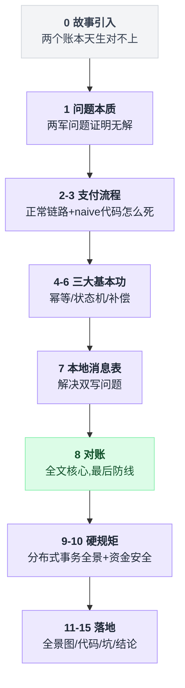
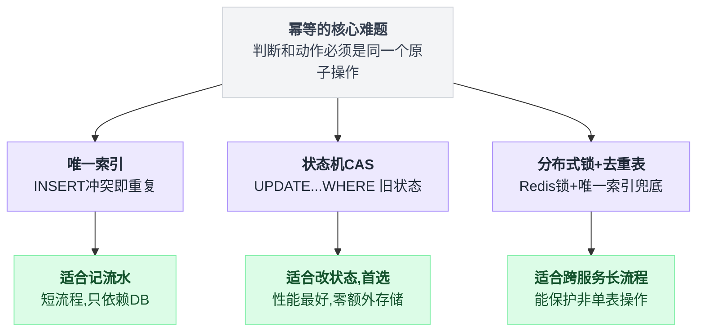
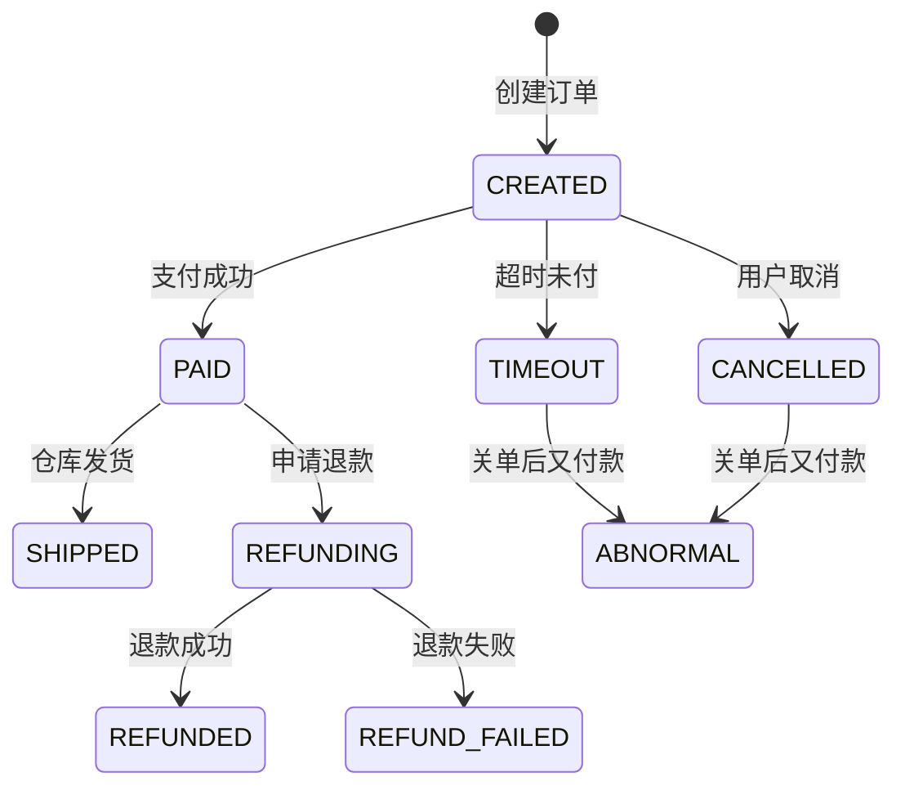
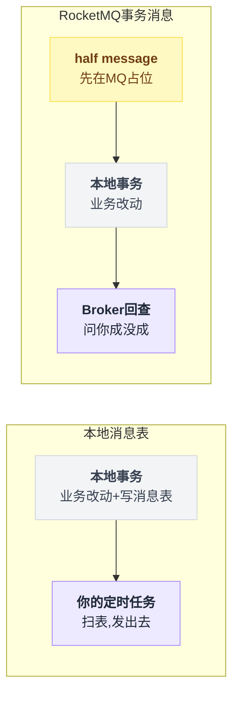
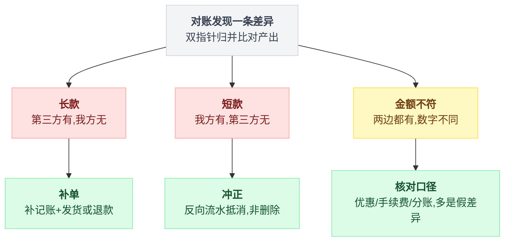
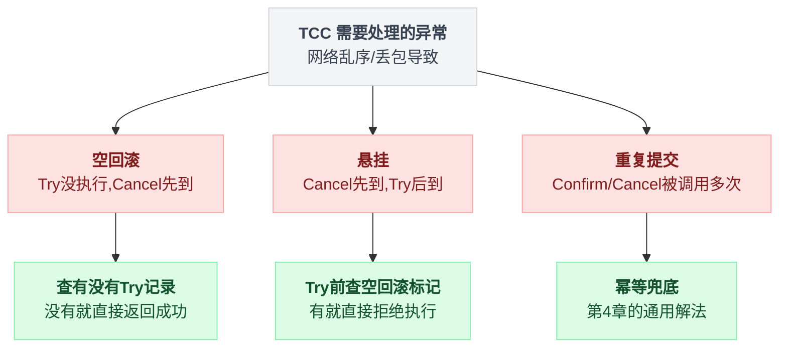
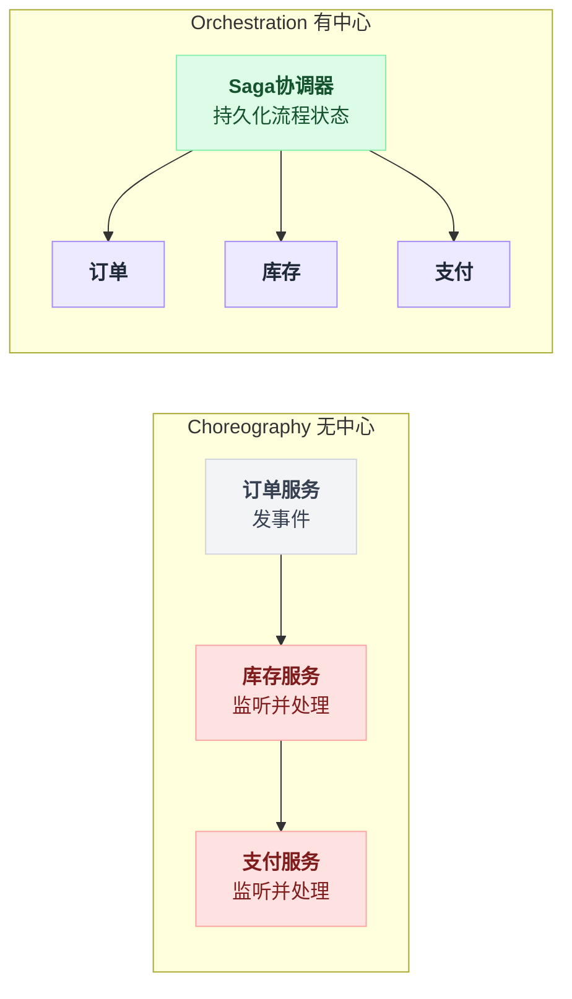
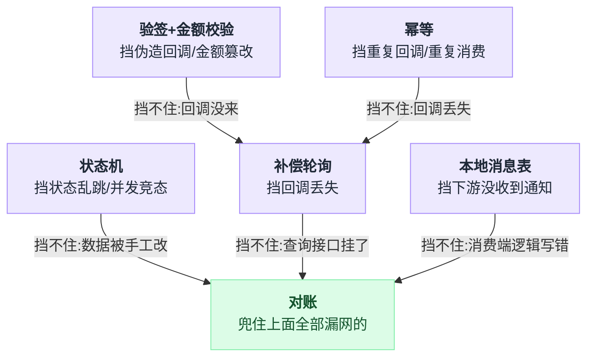
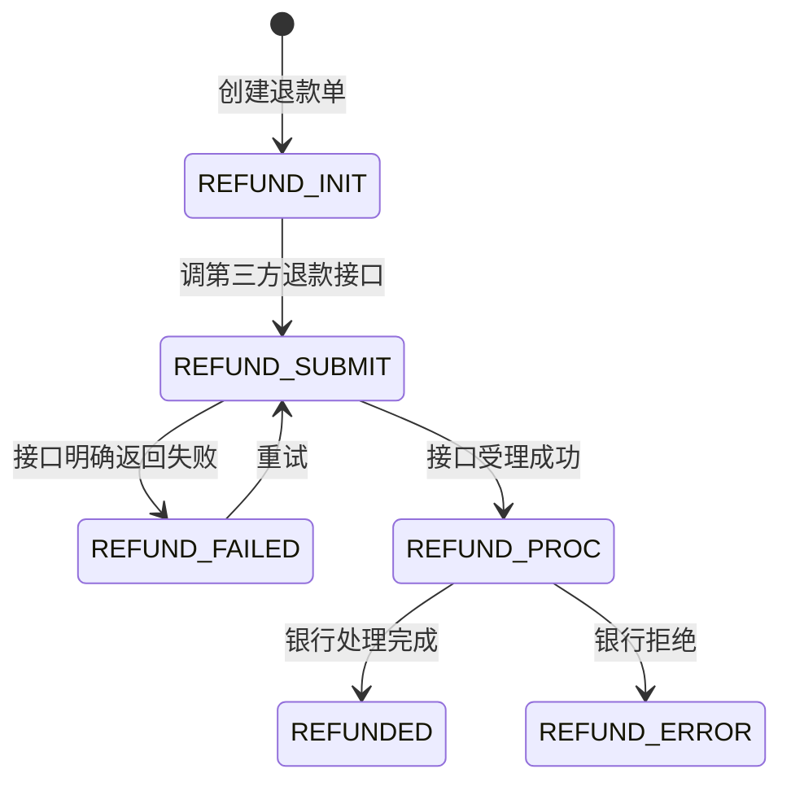

# 《支付与对账》承认一致性做不到，然后把"发现并修复"做到极致（小白版）

> 一句话简介：你的系统说用户付了钱，支付宝说没收到 —— 谁对？这是本系列**唯一一个技术上无解**的场景。钱在别人手里，任何分布式事务方案都失效。于是整个行业换了个思路：不追求"永远不出错"，改追求"出了错一定能被发现、能被修好"。这套兜底机制，叫**对账**。
> 难度：★★★★☆

这篇要回答六个问题，各自的落点：

| 问题 | 在哪一章 |
|---|---|
| 为什么"下单 → 支付 → 发货"这条看起来只有三步的链路，藏着 12 个能让你赔钱的失败点 | 第 2 章 |
| 幂等、状态机、补偿这三个基本功，为什么是资金系统的"三件套"，缺一个都会出事故 | 第 4、5、6 章 |
| 本地消息表和事务消息到底在解决什么问题，以及为什么它俩本质上是同一招 | 第 7 章 |
| 长款、短款、单边账、金额不符 —— 对账的四种差异分别代表什么，各自怎么修 | 第 8 章 |
| 2PC / TCC / Saga / 最大努力通知的真实适用边界，以及为什么互联网公司几乎不用 2PC | 第 9 章 |
| 为什么"订单已经超时关闭了，用户又付款成功了"这件荒谬的事，是每天都在发生的常态 | 第 13 章 |

---

## 目录

- [0. 先讲个故事：小卖部的赊账本](#0-先讲个故事小卖部的赊账本)
- [1. 这件事到底难在哪：你没法让支付宝跟你一起回滚](#1-这件事到底难在哪你没法让支付宝跟你一起回滚)
- [2. 先把支付流程讲明白](#2-先把支付流程讲明白)
- [3. 最朴素的做法，以及它为什么会死](#3-最朴素的做法以及它为什么会死)
- [4. 基本功一：幂等 —— 同一件事做五遍，结果得跟做一遍一样](#4-基本功一幂等--同一件事做五遍结果得跟做一遍一样)
- [5. 基本功二：状态机 —— 不许乱跳](#5-基本功二状态机--不许乱跳)
- [6. 基本功三：补偿 —— 不能只等回调，必须主动去问](#6-基本功三补偿--不能只等回调必须主动去问)
- [7. 本地消息表与事务消息](#7-本地消息表与事务消息)
- [8. 对账：这篇文章真正的核心](#8-对账这篇文章真正的核心)
- [9. 分布式事务方案全景](#9-分布式事务方案全景)
- [10. 资金安全的额外要求](#10-资金安全的额外要求)
- [11. 完整方案全景图](#11-完整方案全景图)
- [12. 核心代码逐行讲解](#12-核心代码逐行讲解)
- [13. 生产环境会踩的坑](#13-生产环境会踩的坑)
- [14. 反直觉结论](#14-反直觉结论)
- [15. 一句话总结 + 小白词典](#15-一句话总结--小白词典)
- [附：和前几篇的对照](#附和前几篇的对照)

---

十五章的内容层层递进，先把骨架摆出来：



## 0. 先讲个故事：小卖部的赊账本

这一章不写一行代码。它要建立的只有一个直觉：**两本账天生对不上，这是结构决定的，不是技术不够好。**

### 0.1 两个本子

你家楼下有个小卖部，老板认识你，允许你赊账。

老板柜台底下有个本子，你拿一次东西他记一笔。你自己手机备忘录里也记一笔 —— 因为你不太放心。

一个月下来，两个本子长这样：

```
       你的本子                            老板的本子
  ┌────────────────────┐            ┌────────────────────┐
  │ 3/01  可乐    3.0  │            │ 3/01  可乐    3.0  │
  │ 3/04  泡面    5.0  │            │ 3/04  泡面    5.0  │
  │ 3/07  啤酒    8.0  │            │ 3/07  啤酒    8.0  │
  │ 3/12  面包    4.0  │            │ 3/12  面包    4.0  │
  ├────────────────────┤            ├────────────────────┤
  │ 合计         20.0  │            │ 合计         20.0  │
  └────────────────────┘            └────────────────────┘

                    ✅ 对上了
```

月底你拿着本子去，老板拿出他的本子，两个人一笔一笔念：

"3 号 1 号，可乐三块"—— "有"
"3 月 4 号，泡面五块"—— "有"
……

大部分月份是对得上的。但总有那么几个月对不上。

### 0.2 对不上的三种样子

**第一种：老板有，你没有。**

```
       你的本子                            老板的本子
  ┌────────────────────┐            ┌────────────────────┐
  │ 3/01  可乐    3.0  │            │ 3/01  可乐    3.0  │
  │ 3/04  泡面    5.0  │            │ 3/04  泡面    5.0  │
  │                    │  ◀── 缺 ──▶│ 3/09  香烟   20.0  │  ← 你那天急着走，忘了记
  │ 3/12  面包    4.0  │            │ 3/12  面包    4.0  │
  ├────────────────────┤            ├────────────────────┤
  │ 合计         12.0  │            │ 合计         32.0  │
  └────────────────────┘            └────────────────────┘
```

这一笔，老板那边有、你这边没有。在金融行话里，这叫**长款**（对方多出来的钱）。

放到支付系统里，它对应一个非常严重的事故：**用户付了钱，但你的系统没记账，货也没发**。

**第二种：你有，老板没有。**

你本子上记着"3/15 矿泉水 2 元"，老板那边翻遍了也没有。可能是老板当时忙，没来得及记。这叫**短款**。

放到支付系统里，对应的是：**你的系统认为收了钱，但第三方那边根本没这笔交易** —— 要么是你误判了，要么是钱压根没到。

**第三种：两边都有，但数字不一样。**

你记的"啤酒 8 元"，老板记的"啤酒 10 元"。中间可能是涨价了、可能是记错了。这叫**金额不符**。

划重点：**这三种情况在支付系统里有正式名字，而且是整篇文章最重要的三个词。** 后面第 8 章会展开，现在你只要有个印象：

| 小卖部里的样子 | 行话 | 支付系统里的意思 |
|---|---|---|
| 老板有，你没有 | 长款 | 用户付了钱，你没记账也没发货 |
| 你有，老板没有 | 短款 | 你以为收了钱，第三方说没这笔交易 |
| 两边都有，数字不同 | 金额不符 | 涨价、记错，或者口径不一样 |

### 0.3 为什么不能"只记一个本子"

你可能会想：搞两个本子多麻烦，只让老板记不就行了？

不行。因为你和老板是**两个独立的利益方**。老板多记一笔你不知道，老板漏记一笔他自己吃亏。任何一方单独持有账本，另一方就必须完全信任他 —— 而商业世界里不存在这种信任。

于是必然有两本账。**只要有两本账，就必然有对不上的时候。**

这不是技术不够好导致的，这是**结构决定的**。你换任何一门编程语言、任何一个数据库、任何一套框架，都改变不了这一点。

### 0.4 老板的智慧：月底对一遍

老板没有试图解决"实时一致"这个问题。他知道解决不了。

他做的是另一件事：**每个月底花二十分钟，把两个本子过一遍，把差异找出来，当面聊清楚。**

这个动作，就是**对账**（Reconciliation）。

它的哲学非常反直觉，但极其务实：

```
   ┌──────────────────────────────────────────────────┐
   │                                                  │
   │   ✗ 追求："两个本子任何时刻都完全一致"            │
   │           → 做不到，且投入无限资源也做不到        │
   │                                                  │
   │   ✓ 改为追求："对不上的一定能被发现，             │
   │               发现后一定能被修好"                 │
   │           → 做得到，而且成本可控                  │
   │                                                  │
   └──────────────────────────────────────────────────┘
```

**这一整篇文章讲的就是这一件事。** 记住这个框，后面所有技术都是它的展开。

### 0.5 把小卖部换成互联网

现在把这个类比一一对应到真实的支付系统上。这张表你可以随时翻回来看：

| 小卖部里的东西 | 支付系统里对应什么 | 为什么是它 |
|---|---|---|
| 你的本子 | 你自己的**订单表** / **支付流水表** | 你自己记的账，你说了算 |
| 老板的本子 | 支付宝 / 微信支付的**交易记录** | 别人记的账，你改不了也看不全 |
| 你说"我给你钱了" | 你的系统把订单标记成"已支付" | 单方面的认定 |
| 老板说"我这儿没记录" | 第三方查询接口返回"交易不存在" | 单方面的否认 |
| 拿东西时老板点头 | 支付**同步返回**（前端看到的结果） | 快，但不可信 |
| 老板事后打电话确认 | 支付**异步回调**（服务端收到的通知） | 慢一点，但这才算数 |
| 月底对一遍 | **T+1 对账** | 本文核心 |
| 老板打印一个月的流水给你 | 第三方每天推送的**对账文件** | 一个 CSV / ZIP 文件 |
| 对不上时调监控录像 | 查支付网关日志 + 调**单笔查询接口** | 最终裁决依据 |
| 老板多记了，你补给他 | **补单**（把漏掉的订单补上，发货） | 长款的处理 |
| 你多记了，划掉 | **冲正**（把错误的记账反向抵消） | 短款的处理 |

### 0.6 一个让你不舒服的问题

在往下看之前，先回答一个问题。凭直觉就行。

你在便利店扫码付款，"滴"的一声之后，你的手机瞬间没信号了。收银台的屏幕也卡住了。

**请问：钱到底扣了没有？**

答案是：**在你恢复信号之前，谁都不知道。** 而且更糟糕的是 —— 收银台也不知道。

把所有可能性摊开看：

```
                       钱实际上扣了吗？
                    ┌───────────┬───────────┐
                    │   扣了    │   没扣    │
        ┌───────────┼───────────┼───────────┤
        │  你以为   │           │           │
        │   扣了    │    ①      │    ②      │
   你   │           │   正常    │  你会重付 │
   的   ├───────────┼───────────┼───────────┤
   认   │  你以为   │           │           │
   知   │  没扣     │    ③      │    ④      │
        │           │ 你重付→   │   正常    │
        │           │   扣两次  │           │
        └───────────┴───────────┴───────────┘
```

② 和 ③ 就是事故。而 ③ 是最贵的那种 —— 用户重复付款，你要退钱，还要挨骂。

**关键点在于："我没收到回复"和"对方没做成"，这两件事在技术上是无法区分的。**

网络断了的时候，你只知道"我没收到回复"。至于对方到底做了没有，你不知道。你唯一能做的是：**过一会儿再去问一次**。

### 0.7 两军问题：这不是工程问题，是数学问题

计算机科学里有个经典问题叫**两军问题**（Two Generals' Problem）。

两支友军隔着一座山谷，山谷里是敌人。他们必须**同时**进攻才能赢，任何一方单独进攻都会全军覆没。

他们唯一的通信方式是派信使穿过山谷 —— 而信使可能被抓。

```
   ┌──────────┐                                 ┌──────────┐
   │  A 军    │                                 │  B 军    │
   │  山头左  │                                 │  山头右  │
   └────┬─────┘                                 └─────┬────┘
        │                                             │
        │  "明天早上6点进攻"  ──── 信使 ────▶          │
        │                                             │
        │  A 想：他收到了吗？我不知道。                │
        │                                             │
        │          ◀──── 信使 ──── "收到，6点见"      │
        │                                             │
        │  B 想：A 知道我收到了吗？我不知道。          │
        │                                             │
        │  "我知道你收到了"  ──── 信使 ────▶           │
        │                                             │
        │  A 想：他知道我知道他收到了吗？我不知道。    │
        │                                             │
        │              ...... 无限循环 ......          │
```

**已被严格证明：这个问题在不可靠信道上无解。** 不是"目前还没找到解法"，是"数学上证明了不存在解法"。

你和支付宝之间就是这个关系。你们隔着公网，中间任何一个环节都可能丢包。你永远没法和支付宝达成"我们俩此刻对这笔订单的看法完全一致"。

**所以整个支付行业放弃了这个目标。** 它们不追求"一致"，它们追求：

1. 出错的概率足够低（幂等 + 状态机 + 补偿）
2. 出错了一定能发现（对账）
3. 发现了一定能修（补单 / 冲正 / 退款）

好了，故事讲完。下面开始拆技术。

---

## 1. 这件事到底难在哪：你没法让支付宝跟你一起回滚

一句话：这一章要证明一件事 —— **零基础读者能想到的五个"那我用 XX 不就行了"，一个都走不通**，而且死因各不相同。看完你就不会再惦记分布式事务了。

### 1.1 签名难题

先给这个问题起个名字，方便后面反复引用。

> **签名难题**：你的系统的账本上写着"用户 A 的订单 12345 已支付，金额 99 元"。
> 支付宝的系统里查不到这笔交易。
> **谁对？**

注意这个问题的形状。它不是"哪个数据库主从延迟了"，也不是"哪个缓存没刷新"。它是：

```
   ┌───────────────────────┐          ┌───────────────────────┐
   │       你的公司        │          │        支付宝         │
   │                       │          │                       │
   │ ┌───────────────────┐ │          │ ┌───────────────────┐ │
   │ │  订单库           │ │          │ │  交易库           │ │
   │ │  order 12345      │ │          │ │  （查无此单）     │ │
   │ │  status=已支付    │ │          │ │                   │ │
   │ └───────────────────┘ │          │ └───────────────────┘ │
   │                       │          │                       │
   │  你能读、能写、能回滚 │          │  你能读（有限）       │
   │  你能改、能回滚       │          │  不能写、不能回滚     │
   └───────────┬───────────┘          └───────────┬───────────┘
               │                                  │
               └──────── 公网 HTTP ───────────────┘
                    （会超时、会丢包、会重复）

               ▲                                  ▲
               └─────── 这是一条公司边界 ─────────┘
                        也是一条信任边界
                        也是一条事务边界
```

**这条边界是所有麻烦的根源。** 越过它，你失去的东西是：

| 你在自己家里有的能力 | 越过边界后 | 后果 |
|---|---|---|
| 数据库事务（要么都成要么都不成） | **没有** | 不能"一起提交" |
| 回滚 | **没有** | 支付宝不会因为你出错就退钱 |
| 加锁 | **没有** | 不能锁住对方的记录 |
| 强制对方按你的节奏走 | **没有** | 对方回调什么时候来、来几次，你说了不算 |
| 看到对方的全部状态 | **没有** | 只能通过接口问，且接口本身可能超时 |

### 1.2 "那我用分布式事务不就行了" —— 五个想法，逐个打破

零基础的读者到这儿一般会有几个念头，我们一个个来。

---

**想法 A：把支付宝的操作也放进我的数据库事务里。**

```python
# 这是幻想，写不出来
with db.transaction():
    order.status = "已支付"
    db.save(order)
    alipay.deduct(user, 99)   # ← 这一行不在你的数据库里
    inventory.reduce(sku)
```

问题：`alipay.deduct` 是一个 HTTP 调用，它跑在另一家公司的机房里。你的数据库事务管不着它。你 `rollback` 的时候，只有你自己的两行数据回滚了，钱**已经扣走了**。

**这不是代码写得不对，这是范畴错误。** 数据库事务的边界就是这个数据库，一步都出不去。

---

**想法 B：那用 2PC（两阶段提交）总行了吧？**

2PC 的做法是：有一个协调者，先问所有参与者"你能提交吗"，都说能，再发"提交"。

问题不在技术，在**政治**：

```
      你的服务（想当协调者）
             │
             │  阶段1: "支付宝，你准备好了吗？先别真扣，
             │          锁住这笔钱，等我通知"
             ▼
      ┌──────────────┐
      │   支付宝      │  → "你谁啊？"
      └──────────────┘
```

支付宝有几亿用户、几万商户。它凭什么让你的协调者指挥它？凭什么为你的一笔订单，把一个连接和一把锁挂在那儿等你的第二阶段？如果你的协调者宕机了，它这笔资源就永远锁着了。

**2PC 的前提是所有参与者听同一个协调者的话。跨公司的时候这个前提不成立。** 第 9 章会详细讲 2PC 在自家内部也有一堆问题。

---

**想法 C：同步等待支付结果，等到有结果为止。**

```python
resp = alipay.pay(order_id, amount)   # 一直等，等用户输密码
if resp.success:
    order.status = "已支付"
```

三个致命问题：

**1. 用户付款要花多久你不知道。** 打开 App、找到密码、指纹识别失败三次、切换银行卡、余额不足去转账…… 五分钟是常见的，二十分钟也有。

你的 HTTP 连接挂着不动，Nginx 默认 60 秒就断了，客户端更早就超时了。

**2. 连接数会爆。** 假设你有 1 万人同时在付款，每人平均挂 90 秒。按 `连接数 = QPS × 平均耗时` 算，如果每秒 100 人发起支付，稳定状态下就有 `100 × 90 = 9000` 个连接卡在那里什么都不干。

一台机器扛不住几个这样的。这跟秒杀那篇里"同步扣库存把线程池打满"是**同一种死法**。

**3. 用户可能中途走了。** 他 App 切后台去接了个电话，二十分钟后回来点了支付。你的连接早断了。但**钱是真的扣了**。你的系统一无所知。

---

**想法 D：让前端告诉后端"我付成功了"。**

用户在支付宝页面付完，支付宝把浏览器跳回你的页面，URL 里带个 `?status=success`。你的后端看到就标记订单已支付。

**绝对不行。这是致命安全漏洞。**

任何人都可以手动敲这个 URL。用户不用付一分钱，把 `status=success` 敲进浏览器，你的系统就给他发货。

```
   ✗ 绝对不可信的路径：
        支付宝  ──▶  用户浏览器  ──▶  你的服务器
                       ▲
                       └── 这里用户完全可控，可以随便改

   ✓ 唯一可信的路径：
        支付宝  ─────────────────▶  你的服务器
                （服务器到服务器，带签名）
```

**划重点：前端跳回来的结果只能用于"给用户看个页面"，绝不能用于"改数据库"。** 这是支付系统的第一条铁律。第 13 章还会讲怎么校验服务端回调的签名。

---

**想法 E：调用失败就重试，重试到成功为止。**

```python
for i in range(10):
    resp = alipay.pay(order_id, amount)
    if resp.success:
        break
```

问题：**超时不等于失败。** 你第一次调用超时了，可能钱已经扣了，只是回复丢在路上。你重试第二次，又扣一次。重试十次，扣十次。

这就是为什么**幂等**（第 4 章）是资金系统的第一基本功。没有幂等的重试，是在制造事故。

---

### 1.3 五个想法的死因汇总

| 想法 | 死因 | 一句话 |
|---|---|---|
| A. 放进本地事务 | 事务边界出不了自己的数据库 | 范畴错误 |
| B. 2PC 拉上第三方 | 对方没义务听你的协调者 | 政治问题不是技术问题 |
| C. 同步等结果 | 用户耗时不可控 + 连接数爆炸 | 跟秒杀同步扣库存一个死法 |
| D. 信前端结果 | 前端可伪造 | 送钱漏洞 |
| E. 无脑重试 | 超时 ≠ 失败，会重复扣款 | 必须先有幂等 |

### 1.4 这是本系列唯一一个"技术上无解"的场景

回顾一下前面几篇，你会发现一个规律：

| 场景 | 关键资源在谁手里 | 有没有终极解法 |
|---|---|---|
| 秒杀 / 12306 抢票 | **库存在你自己的 Redis 里** | 有。Lua 脚本原子扣减，一行搞定 |
| 微信红包 | **金额在你自己的库里** | 有。预分配 + 本地事务 |
| 分布式限流 | **计数器在你自己的 Redis 里** | 有。令牌桶原子操作 |
| 撮合引擎 | **订单簿在你自己的内存里** | 有。单线程顺序处理，确定性 |
| 网约车派单 | **司机和订单都是你的数据** | 有。全局最优匹配 |
| **支付** | **钱在支付宝手里** | ❌ **没有** |

看出区别了吗？前面所有场景，最关键的那个资源都在**你自己家里**。你可以给它加锁、开事务、用原子操作、单线程串行化 —— 你有绝对的控制权。

支付不一样。**钱不在你手里。**

秒杀里你可以写：

```lua
-- 秒杀：库存是你的，一个 Lua 脚本就锁死了
if redis.call('GET', KEYS[1]) > 0 then
    redis.call('DECR', KEYS[1])
    return 1
end
return 0
```

支付里你**永远写不出**对应的东西，因为没有任何一段代码能同时原子地操作"你的订单表"和"支付宝的账户余额"。

所以本文的所有技术，都不是在"解决"这个问题，而是在**围绕这个无解的问题建立防线**：

```
      承认：实时一致做不到
             │
             ├── 防线1：幂等      → 重复操作不出错         （第4章）
             ├── 防线2：状态机    → 状态不乱跳             （第5章）
             ├── 防线3：补偿      → 主动去问，不干等       （第6章）
             ├── 防线4：可靠投递  → 本地消息表/事务消息    （第7章）
             └── 防线5：对账      → 最后兜底，一定能发现   （第8章）
                          ▲
                          └── 前面四道全漏了，这道也能兜住
```

**小结：** 这一章你只需要记住一句话 —— 别再想着让支付宝跟你一起回滚了，想想怎么在出错之后发现并修好。

---
## 2. 先把支付流程讲明白

技术之前先讲业务。**你如果不知道钱是怎么流动的，后面所有代码你都只是在背模式。**

一句话：这一章只有一张时序图和一张失败点表。时序图看一遍就行，**真正要记住的是那张 F1~F12 的表** —— 支付系统 90% 的复杂度都在那张表里。

### 2.1 出场人物

```
  ┌────────────┐   ┌────────────┐   ┌────────────┐   ┌────────────┐
  │   用户     │   │  你的 App  │   │  你的后端  │   │  第三方支付│
  │            │   │  （前端）      │   │  （服务端）│   │ 支付宝/微信 │
  └────────────┘   └────────────┘   └────────────┘   └────────────┘
       人              浏览器           你的机房          别人的机房

                                    ┌────────────┐   ┌────────────┐
                                    │  你的仓库  │   │  用户的银行│
                                    │  （发货）  │   │            │
                                    └────────────┘   └────────────┘
```

顺带把几个专有名词说清楚，后面会一直用：

| 名词 | 大白话 |
|---|---|
| **商户号** | 你在支付宝那儿的账号 ID，标识"钱打给谁" |
| **商户订单号** | 你自己生成的订单号，`out_trade_no`。你的世界里的主键 |
| **支付流水号** | 支付宝生成的交易号，`trade_no`。它的世界里的主键 |
| **预下单 / 下单接口** | 你告诉支付宝"我要收 99 块钱"，它返回一个二维码或跳转链接 |
| **同步返回** | 用户付完款，浏览器跳回你的页面。**不可信** |
| **异步回调 / notify** | 支付宝的服务器直接 POST 你的服务器。**这才算数** |
| **签名 / sign** | 用密钥算出的一串校验值，证明"这条消息真是支付宝发的" |

### 2.2 完整链路时序图

这张图是本章的核心，慢慢看。每一步右边我标了失败点编号 `F1`~`F12`，下一节逐个讲。

```
 用户        你的前端        你的后端         第三方支付        用户银行
  │             │              │                 │               │
  │─① 点"提交订单"▶            │                 │               │
  │             │──② 创建订单─▶│                 │               │
  │             │              │ 写 order 表      │               │  ← F1 写库失败
  │             │              │ status=待支付    │               │
  │             │◀─③ 返回订单号─│                 │               │
  │             │              │                 │               │
  │──④ 点"去支付"▶│             │                 │               │
  │             │──⑤ 请求支付──▶│                 │               │
  │             │              │──⑥ 预下单───────▶│               │  ← F2 网络超时
  │             │              │  (商户号,订单号,  │               │
  │             │              │   金额,回调地址)  │               │
  │             │              │◀─⑦ 返回支付链接──│               │  ← F3 返回丢失
  │             │◀─⑧ 支付参数──│                 │               │
  │             │              │                 │               │
  │◀═⑨ 跳到支付宝收银台 ══════════════════════════▶│               │
  │             │              │                 │               │
  │─⑩ 输密码/指纹 ═══════════════════════════════▶│               │  ← F4 用户放弃
  │             │              │                 │──⑪ 扣款──────▶│  ← F5 余额不足
  │             │              │                 │◀─⑫ 扣款成功───│  ← F6 银行超时
  │             │              │                 │               │
  │             │              │                 │ 记账：         │
  │             │              │                 │ 用户 -99       │
  │             │              │                 │ 商户 +99       │
  │             │              │                 │               │
  │◀═⑬ 同步跳回你的页面 ═══════════════════════════│               │  ← F7 用户直接关页面
  │             │              │                 │               │
  │             │              │◀═⑭ 异步回调 POST ═│               │  ← F8 回调丢失
  │             │              │  (订单号,金额,    │               │  ← F9 回调重复
  │             │              │   状态,签名)      │               │  ← F10 伪造回调
  │             │              │                 │               │
  │             │              │ 验签             │               │
  │             │              │ 查订单           │               │
  │             │              │ 校验金额         │               │  ← F11 金额被篡改
  │             │              │ 改 status=已支付 │               │
  │             │              │ 写支付流水       │               │
  │             │              │─⑮ 返回 "success"▶│               │
  │             │              │                 │               │
  │             │              │──⑯ 发 MQ 消息    │               │  ← F12 MQ 投递失败
  │             │              │      ▼           │               │
  │             │           ┌──────────┐         │               │
  │             │           │ 发货服务  │         │               │
  │             │           └──────────┘         │               │
  │             │                                 │               │
  │◀────────────── ⑰ 推送"发货通知" ──────────────────────────────│
```

### 2.3 十二个失败点，逐个说

这张表你可以打印出来贴在工位上。**支付系统的复杂度，90% 来自这张表。**

| 编号 | 失败在哪 | 现象 | 后果 | 本文哪章解决 |
|---|---|---|---|---|
| **F1** | 创建订单时写库失败 | 用户看到"下单失败" | 无损失，用户重试即可 | 第 5 章状态机 |
| **F2** | 调第三方预下单超时 | 你不知道它建没建单 | 可能产生"重复预下单" | 第 4 章幂等 |
| **F3** | 预下单返回丢了 | 你没拿到支付链接 | 用户支付不了 | 重试 + 幂等 |
| **F4** | 用户跳走了没付 | 订单一直"待支付" | 库存被占着 | 超时关单（第 13 章） |
| **F5** | 银行余额不足 | 扣款失败 | 正常业务分支 | 状态机走"支付失败" |
| **F6** | 银行扣款超时 | **第三方也不知道扣没扣** | 第三方自己也要对账 | 不归你管，但影响你 |
| **F7** | 用户付完直接关页面 | 你的前端拿不到结果 | 用户以为没付成功 | **主动查询（第 6 章）** |
| **F8** | 异步回调丢了 | 你永远不知道用户付了 | **长款！用户付钱没发货** | **主动查询 + 对账** |
| **F9** | 异步回调来了 5 次 | 你可能发 5 次货 | **重复发货，血亏** | **幂等（第 4 章）** |
| **F10** | 有人伪造回调 | 不付钱就发货 | **被薅穿** | **验签（第 13 章）** |
| **F11** | 回调金额被改 | 付 1 分钱买 iPhone | **被薅穿** | **金额校验（第 13 章）** |
| **F12** | 改完订单后 MQ 发失败 | 钱收了，货没发 | **用户投诉** | **本地消息表（第 7 章）** |

看完这张表，你应该有一个直观感受：

> 支付系统里，"正常流程"的代码可能只占 10%，剩下 90% 全是在处理这些异常。

### 2.4 为什么必须是"异步回调"？

这是整个设计里最关键的一个决定，很多人第一次看不理解。

**问题：** 用户从"跳到收银台"到"输完密码"，中间可能是 5 秒，也可能是 5 分钟，还可能永远不回来。

如果用同步等待：

```
   同步方案（错误）：

   你的后端  ──── HTTP 调用 ────▶  支付宝
      │                              │
      │  阻塞等待                    │  等用户输密码...
      │  ┃                           │  等用户找银行卡...
      │  ┃  1 秒                     │  等用户去转账...
      │  ┃  10 秒                    │
      │  ┃  60 秒 ← Nginx 断了       │  用户还在操作
      │  ✗                           │
      │                              │  120 秒：付款成功了
      │  你已经不知道结果了          │  但没人接收这个消息
```

同步方案的根本矛盾是：**支付的耗时由人决定，而不是由机器决定。**

机器操作是毫秒级的，人的操作是分钟级的。你不能让一个毫秒级的系统去同步等一个分钟级的动作。

**异步回调的做法：**

```
   异步方案（正确）：

   你的后端 ──── 预下单 ────▶ 支付宝
      │  (立即返回支付链接)      │
      ▼                        │
   连接释放，去干别的活了        │  等用户操作（多久都行）
                               │
                               │  用户付完了
   你的后端 ◀─── 回调 POST ────│
      │  (这是一个全新的请求)    │
      ▼
   处理订单
```

关键在于：**回调是一个全新的、由支付宝主动发起的 HTTP 请求。** 它和你之前那个预下单请求毫无关系。你的服务器只是暴露了一个 URL 等着被调用。

**这和秒杀里的 MQ 异步下单是同一招。** 秒杀里你把"扣库存"和"真正创建订单"拆成两个异步阶段，用 MQ 连接；支付里你把"发起支付"和"确认支付"拆成两个阶段，用回调连接。共同点是：

> 把一个"长时间挂起的同步等待"，改成"两次独立的短请求"。

### 2.5 回调不可靠，怎么办？

支付宝的回调也是 HTTP，也会失败。它的策略是**重试**：

支付宝的实际重试间隔（微信支付类似）：

```
   付款成功
      │
      ├─ 4秒后    第 1 次回调  → 你的服务 500 了
      ├─ 10秒后   第 2 次回调  → 你的服务网络抖动
      ├─ 10秒后   第 3 次回调  → 成功，你返回 "success"
      │
      └─ 停止

   如果一直失败：
      4s → 10s → 10s → 1m → 2m → 10m → 30m → 1h → 2h → 6h → 15h
      共 8 次左右，跨度约 24 小时，之后放弃
```

**这直接推出两个必须做的事：**

1. **你必须幂等。** 上面这个例子里回调来了 3 次，你不能发 3 次货。
2. **回调可能全部失败。** 24 小时后支付宝就不管了。所以你**必须有主动查询和对账**兜底。

**小结：** 支付链路 = 一次预下单（同步）+ 一次回调（异步，可能重复、可能丢）+ 兜底（主动查 + 对账）。理解了这三层，后面全是细节。

---

## 3. 最朴素的做法，以及它为什么会死

现在我们真刀真枪写一版代码。先写最直觉的那版，然后看它怎么崩。

一句话：naive 版本会以五种方式赔钱，而**它的每一行代码单独看都是对的** —— 错的是它默认的三个假设。

### 3.1 naive 版本

```python
from fastapi import FastAPI, Request

app = FastAPI()

@app.post("/pay/notify")           # 支付宝回调打这个地址
async def pay_notify(request: Request):
    data = await request.form()
    order_id = data["out_trade_no"]

    # 1. 查订单
    order = db.query("SELECT * FROM orders WHERE id = %s", order_id)

    # 2. 改状态
    db.execute("UPDATE orders SET status = '已支付' WHERE id = %s", order_id)

    # 3. 发货
    ship_service.ship(order_id)

    # 4. 加积分
    point_service.add(order.user_id, order.amount // 100)

    return "success"
```

这段代码在你本地测试的时候，**百分之百是能跑通的**。你用 Postman 打一发，订单变成已支付，货发了，积分加了。完美。

然后它上线，然后你被叫去开复盘会。

### 3.2 死法一：回调来了 3 次，货发了 3 次

支付宝的回调重试机制上面讲过了。真实情况是这样的：

```
   时间轴：

   T+0s    支付宝第 1 次回调 ──▶ 你的服务
                                   │
                                   ├─ 改状态 ✓
                                   ├─ 发货   ✓  ← 仓库开始打包
                                   ├─ 加积分 ✓
                                   │
                                   └─ 正准备 return "success"
                                        ↓
                                      GC 停顿 6 秒 / 网络抖动
                                        ↓
   T+5s    支付宝没收到 success，判定失败
   T+15s   支付宝第 2 次回调 ──▶ 你的服务
                                   ├─ 改状态 ✓（改成一样的，看不出问题）
                                   ├─ 发货   ✓  ← 仓库又打包了一份！
                                   └─ 加积分 ✓  ← 积分又加了一遍！
```

**结果：一件商品发出去两件，积分翻倍。**

一天 10 万单，假设万分之一触发重复回调，就是 10 单重复发货。客单价 200 元的话，一天亏 2000 元，一年 73 万。而且这个数字会随规模线性增长。

**代码里没有任何一行是"错"的，但它就是会赔钱。** 因为它默认了"回调只来一次"这个假设，而这个假设是错的。

### 3.3 死法二：并发回调，两个线程同时进来

更隐蔽的一种。假设支付宝的重试机制里，第 1 次和第 2 次回调**间隔只有 4 秒**，而你的发货服务恰好慢了 5 秒。

```
   线程 A（第 1 次回调）           线程 B（第 2 次回调）
        │                              │
   T+0  │ SELECT → status=待支付       │
        │                              │
   T+1  │ UPDATE → status=已支付       │
        │                              │
   T+2  │ 调发货服务（慢，5秒）...      │
        │  ┃                       T+4 │ SELECT → status=已支付
        │  ┃                           │
        │  ┃  即使你加了                │ if status == '已支付': return
        │  ┃  "已支付就跳过"的判断      │      ↑
        │  ┃                           │  这次挡住了，但纯属运气
        │  ┃                           │  如果 B 在 T+0.5 秒进来
        │  ┃                           │  它读到的也是"待支付"
   T+7  │ 发货完成                     │  照样会重复发货
```

关键点：**加一句 `if status == '已支付': return` 是不够的。** 因为"读"和"写"之间有时间差，两个线程可能都读到"待支付"。

这就是经典的 **check-then-act 竞态**（先检查再动作，中间被人插队）。你在秒杀那篇里见过完全一样的东西：

```python
# 秒杀里的错误代码，一模一样的病
stock = redis.get("stock")     # 读到 1
if stock > 0:                  # 两个线程都判断通过
    redis.decr("stock")        # 都减了，库存变成 -1
```

秒杀里的解法是 Lua 脚本原子化，或者 `UPDATE ... WHERE stock > 0`。支付里的解法几乎一样，第 5 章讲。

### 3.4 死法三：发货成功了，加积分挂了

```python
ship_service.ship(order_id)         # ✓ 成功
point_service.add(user_id, points)  # ✗ 积分服务挂了，抛异常
```

异常抛出去，支付宝收不到 `success`，于是重试。重试的时候：

- 状态已经是"已支付"了
- 但发货又发了一次（如果没幂等）
- 积分服务好了，加上了

**结果：发了两次货，加了一次积分。** 部分成功、部分失败，是分布式系统最讨厌的状态。

正确的做法是：**回调处理只做最小的那件事（改状态 + 记流水），其他动作全部异步化。** 第 7 章的本地消息表就是干这个的。

### 3.5 死法四：不验签，被人白嫖

有人抓包看到你的回调地址是 `https://shop.com/pay/notify`，参数是 `out_trade_no=12345&total_amount=99&trade_status=SUCCESS`。

他自己下个单拿到订单号 67890，然后：

```bash
curl -X POST https://shop.com/pay/notify \
     -d "out_trade_no=67890&total_amount=99&trade_status=SUCCESS"
```

**你的系统发货了。他一分钱没付。**

这不是段子，是真实发生过很多次的事故。上面那段 naive 代码里，没有任何一行在验证"这条消息真的是支付宝发的"。

### 3.6 死法五：金额没校验

稍微聪明一点的攻击者会验签绕不过去，但他会试另一条路：如果你的系统信任回调里的 `total_amount` 字段来记账：

```python
order.paid_amount = float(data["total_amount"])   # 危险
```

在某些老旧的、签名算法有缺陷的集成里，攻击者可以把 `99.00` 改成 `0.01`。

**铁律：回调里的金额只能用来"和你自己库里的金额做比对"，绝不能用来"赋值"。** 你库里说这单 99 元，回调说 0.01 元，那就是异常，直接拒绝。

### 3.7 崩溃汇总

| 死法 | 触发概率（按 10 万单/天估） | 一年损失量级 | 解法 |
|---|---|---|---|
| 重复回调重复发货 | 万分之一 ≈ 10 单/天 | 数十万元 | 幂等（第 4 章） |
| 并发回调竞态 | 十万分之一 ≈ 1 单/天 | 数万元 | 状态机 CAS（第 5 章） |
| 回调丢失，钱收了没发货 | 千分之一 ≈ 100 单/天 | **口碑崩塌** | 主动查 + 对账（第 6、8 章） |
| 不验签被伪造 | **一旦被发现就是无限** | 可能上百万 | 验签（第 13 章） |
| 金额篡改 | 同上 | 同上 | 金额校验（第 13 章） |
| 部分成功（发货成功积分失败） | 千分之一 | 大量客诉工单 | 本地消息表（第 7 章） |

**小结：** naive 版本的每一行代码都对，但它建立在三个错误假设上 —— 回调只来一次、回调一定会来、回调一定是真的。后面几章逐个拆掉这三个假设。

---
## 4. 基本功一：幂等 —— 同一件事做五遍，结果得跟做一遍一样

一句话：幂等分三步 —— **选对幂等键 → 用一个原子操作同时完成判断和占位 → 处理中的状态别当成已完成**。

三种实现里只有第三种复杂，前两种各自只有一行是关键。

### 4.1 电梯按钮

你在电梯口按上行键。灯亮了。

你着急，又按了五下。

**电梯会来六趟吗？** 不会。因为按钮的设计是"把状态设置为已呼叫"，而不是"呼叫次数 +1"。你按 1 次和按 100 次，效果完全一样。

这就是**幂等**（Idempotent）：

> **同一个操作，执行一次和执行 N 次，对系统产生的影响完全相同。**

再举几个例子帮你建立直觉：

| 操作 | 幂等吗 | 为什么 |
|---|---|---|
| `SET x = 5` | ✅ 是 | 执行 100 遍，x 还是 5 |
| `x = x + 1` | ❌ 否 | 执行 100 遍，x 多了 100 |
| `DELETE FROM t WHERE id=1` | ✅ 是 | 删过一次之后再删，还是没有 |
| `INSERT INTO t VALUES(...)` | ❌ 否 | 会插入多条 |
| `UPDATE orders SET status='已支付' WHERE id=1` | ⚠️ 半是 | 状态是幂等的，但"顺带做的事"不幂等 |
| 转账 100 元 | ❌ 否 | **这就是支付系统的核心难题** |
| 把余额设置为 500 元 | ✅ 是 | 但业务上没法这么用 |

**注意最后两行。** 资金操作天然是"增量式"的（+100、-100），而增量操作天然不幂等。

这就是为什么支付系统必须额外做工作，把不幂等的操作**包装成**幂等的。

### 4.2 为什么支付系统必须幂等

回顾一下前面的失败点，每一个都会导致重复：

| # | 重复来源 | 具体是什么 |
|---|---|---|
| ① | 第三方回调重试 | 同一笔支付通知来 5 次 |
| ② | 你自己的 MQ 重投 | 同一条消息消费 3 次 |
| ③ | 你自己的定时任务补偿 | 主动查询发现已支付，又处理一遍 |
| ④ | 用户重复点击 | 前端没防抖，点了 3 下"确认支付" |
| ⑤ | 网关超时重试 | 上游服务超时后自动重发 |
| ⑥ | 运维手工重放 | 出事故后手动重跑了一批数据 |
| ⑦ | 对账系统补单 | 对账发现漏单，补一次 |

七条全部收敛到同一个要求：**处理逻辑必须幂等**。

**而这七条里，只有 ④ 可以靠前端解决，其余六条前端无能为力。** 幂等必须做在服务端。

### 4.3 幂等键怎么选（这是最关键的一步）

幂等的第一步不是写代码，是**回答一个问题：什么算"同一个操作"？**

这个用来判定"同一个"的东西，叫**幂等键**（Idempotency Key）。选错了，后面写得再漂亮也没用。

来看几个候选：

| 候选幂等键 | 好不好 | 为什么 |
|---|---|---|
| 用户 ID | ❌ 灾难 | 同一个用户当然可以付很多次款 |
| 用户 ID + 金额 | ❌ 不行 | 用户可能连买两杯一样的奶茶 |
| 用户 ID + 金额 + 时间戳（秒） | ⚠️ 勉强 | 同一秒内两笔就挂了；且重试时时间变了 |
| **你的商户订单号** `out_trade_no` | ✅ **好** | 一个订单一个号，天然唯一 |
| **第三方的支付流水号** `trade_no` | ✅ **好** | 对方保证唯一 |
| 请求体的 MD5 | ⚠️ 看情况 | 回调重试的请求体可能带不同的时间戳字段 |
| 客户端生成的 UUID | ✅ 好 | 适合"用户主动发起"的场景（如提现、转账） |

实战选法，按场景分：

| 场景 | 幂等键选谁 | 补充说明 |
|---|---|---|
| 处理支付回调 | `trade_no`（第三方流水号） | 兜底再加 `out_trade_no` |
| 用户点"确认支付" | `out_trade_no`（你的订单号） | —— |
| 用户发起提现 | 前端生成的 `request_id`（UUID） | 进页面时就生成，重试时不变 |
| 退款 | `refund_no`（你生成的退款单号） | ★ 不能用订单号！一单可以退多次 |
| MQ 消费 | `message_id` 或消息体里的业务单号 | —— |

**这里有个坑：退款。**

很多人用订单号做退款的幂等键，结果部分退款场景直接出事 —— 一个 300 元的订单，用户退了其中一件 100 元，过两天又退一件 100 元。如果幂等键是订单号，第二次退款会被当成重复请求直接吞掉，用户拿不到钱。

**规则：幂等键的粒度，必须和"业务上允许重复的粒度"一致。**

### 4.4 实现一：唯一索引（最简单、最可靠）

思路：建一张表，把幂等键做成唯一索引。插入成功 = 第一次，插入冲突 = 重复。

```sql
CREATE TABLE payment_flow (
    id            BIGINT PRIMARY KEY AUTO_INCREMENT,
    order_id      VARCHAR(64)  NOT NULL,          -- 你的订单号
    trade_no      VARCHAR(64)  NOT NULL,          -- 第三方流水号
    amount_cent   BIGINT       NOT NULL,          -- 金额，单位：分
    channel       VARCHAR(16)  NOT NULL,          -- alipay / wechat
    paid_at       DATETIME     NOT NULL,
    created_at    DATETIME     NOT NULL DEFAULT CURRENT_TIMESTAMP,

    UNIQUE KEY uk_channel_trade (channel, trade_no)   -- ★ 幂等的全部秘密在这一行
);
```

注意唯一索引是 `(channel, trade_no)` 而不是单独的 `trade_no` —— 因为支付宝和微信各自生成流水号，理论上可能撞。

```python
import pymysql
from dataclasses import dataclass

@dataclass
class PayNotify:
    order_id: str
    trade_no: str
    amount_cent: int
    channel: str
    paid_at: str

def handle_notify(conn, n: PayNotify) -> str:
    """返回 'first' 表示首次处理，'duplicate' 表示重复回调"""
    try:
        with conn.cursor() as cur:
            cur.execute(
                "INSERT INTO payment_flow "
                "(order_id, trade_no, amount_cent, channel, paid_at) "
                "VALUES (%s, %s, %s, %s, %s)",
                (n.order_id, n.trade_no, n.amount_cent, n.channel, n.paid_at),
            )
        conn.commit()
        return "first"
    except pymysql.err.IntegrityError as e:
        if e.args[0] == 1062:          # 1062 = Duplicate entry
            conn.rollback()
            return "duplicate"         # ★ 已经处理过了，直接返回
        raise
```

**这段在干嘛：** 直接往流水表里插一条。如果这条流水已经存在，MySQL 会因为唯一索引冲突抛 `IntegrityError`，错误码 1062。捕获它，说明是重复回调，什么都不用做。

**为什么这个方案可靠？** 因为唯一性判断是**数据库在一个原子操作里完成的**。没有"先查再插"的时间窗，两个线程同时插，必然只有一个成功。

对比一下错误写法：

```python
# ✗ 错误：check-then-act，有竞态
row = query("SELECT 1 FROM payment_flow WHERE trade_no = %s", trade_no)
if row:
    return "duplicate"
insert(...)      # ← 两个线程可能都走到这里
```

这跟秒杀里"先 GET 库存再 DECR"是**同一个错误**。记住那条通用规律：

> **判断和动作必须在同一个原子操作里完成。** 分成两步，中间就有人插队。

### 4.5 实现二：状态机 CAS（性能最好，推荐）

思路：把判断条件写进 `UPDATE` 的 `WHERE` 里，靠数据库行锁保证原子性。

```python
def mark_paid_cas(conn, order_id: str, trade_no: str, amount_cent: int) -> bool:
    """返回 True 表示这次调用真的把订单从'待支付'改成了'已支付'"""
    with conn.cursor() as cur:
        affected = cur.execute(
            "UPDATE orders "
            "   SET status = 'PAID', "
            "       trade_no = %s, "
            "       paid_amount_cent = %s, "
            "       paid_at = NOW() "
            " WHERE order_id = %s "
            "   AND status = 'PENDING'",        # ★ 关键：只有待支付才能改
            (trade_no, amount_cent, order_id),
        )
    conn.commit()
    return affected == 1
```

**这段在干嘛：** 一条 SQL 同时干了三件事 —— 检查状态是不是"待支付"、改成"已支付"、告诉你改成功没有。`affected` 是受影响行数：

- `affected == 1`：我是第一个，我改成功了 → 继续做后续动作（发货等）
- `affected == 0`：状态已经不是 `PENDING` 了（别人改过了，或者订单已关闭）→ 什么都不做

**CAS 是什么？** Compare And Swap，"比较并交换"。意思是"如果当前值是我预期的那个，就改成新值；否则什么都不做"。它是并发编程里最基础的原子操作之一。

上面这条 SQL 就是一个 CAS：`WHERE status = 'PENDING'` 是 Compare，`SET status = 'PAID'` 是 Swap。

**为什么它是原子的？** MySQL 执行 `UPDATE` 时会给命中的行加排它锁。两个线程同时执行这条语句，第二个必须等第一个提交完才能执行，那时候 `status` 已经是 `PAID` 了，`WHERE` 条件不匹配，`affected` 返回 0。

**划重点：这一招你在秒杀那篇见过。**

```sql
-- 秒杀防超卖
UPDATE stock SET num = num - 1 WHERE sku_id = 1 AND num > 0;
                                                  ▲
-- 支付防重复                                      │
UPDATE orders SET status='PAID' WHERE id=1 AND status='PENDING';
                                                  ▲
                                                  │
                     完全一样的思路：把判断条件塞进 WHERE
```

区别只在于：秒杀防的是"超卖"，支付防的是"重复"。**但底层机制一模一样 —— 用数据库的行锁做原子的条件更新。**

这也解释了本文一个重要论断（第 5 章还会展开）：

> **状态机天然就是幂等的。** 因为合法的状态迁移只能发生一次。

### 4.6 实现三：分布式锁 + 去重表（最重、最灵活）

前两种方案都依赖数据库。如果你的处理逻辑很长（比如要调 5 个下游服务），或者你要保护的不是单条数据库记录，就需要显式加锁。

```python
import redis
import uuid
from contextlib import contextmanager

r = redis.Redis()

@contextmanager
def dist_lock(key: str, ttl_sec: int = 30):
    """Redis 分布式锁。拿不到就抛异常，让调用方重试"""
    token = str(uuid.uuid4())          # 唯一标识，防止误删别人的锁
    ok = r.set(f"lock:{key}", token, nx=True, ex=ttl_sec)
    if not ok:
        raise RuntimeError(f"lock busy: {key}")
    try:
        yield
    finally:
        # 用 Lua 保证"检查是我的锁"和"删除"是原子的
        r.eval(
            "if redis.call('GET', KEYS[1]) == ARGV[1] "
            "then return redis.call('DEL', KEYS[1]) else return 0 end",
            1, f"lock:{key}", token,
        )
```

**这段在干嘛：** `SET key value NX EX 30` 是"只有 key 不存在时才设置，并且 30 秒后自动过期"。`NX` 保证了同一时刻只有一个人能设置成功 —— 这就是锁。

释放锁时要用 Lua 脚本，因为你必须确认"这把锁还是我的"再删（万一你的业务跑超了 30 秒，锁自动过期被别人拿走了，你不能删别人的锁）。

**这个 Lua 脚本的写法你在秒杀那篇见过**，同样是为了把"读 + 判断 + 写"三步捏成一个原子操作。

然后是去重表：

```python
def handle_with_lock(conn, n: PayNotify):
    key = f"{n.channel}:{n.trade_no}"

    with dist_lock(key):
        # 锁内：先查去重表
        with conn.cursor() as cur:
            cur.execute("SELECT 1 FROM idem_record WHERE idem_key=%s", (key,))
            if cur.fetchone():
                return "duplicate"

        do_business(conn, n)            # 一大堆业务逻辑

        with conn.cursor() as cur:
            cur.execute(
                "INSERT INTO idem_record (idem_key, created_at) VALUES (%s, NOW())",
                (key,),
            )
        conn.commit()
    return "first"
```

**这段在干嘛：** 先拿分布式锁保证同一时刻只有一个人在处理这个 `trade_no`，锁内查去重表判断是否处理过，没处理过就执行业务并留下记录。

**注意：锁只是为了减少无谓的并发，去重表才是真正的幂等保证。** 因为锁会过期、Redis 会挂。所以去重表的 `idem_key` **必须建唯一索引** —— 锁失效时它是最后一道防线。

### 4.7 三种方案对比

| 维度 | 唯一索引 | 状态机 CAS | 分布式锁 + 去重表 |
|---|---|---|---|
| **原理** | 数据库唯一约束 | 数据库行锁 + 条件更新 | Redis 锁 + 唯一索引 |
| **额外存储** | 需要一张流水表 | **不需要**（复用业务表） | 需要锁 + 去重表 |
| **性能** | 一次 INSERT | **最好**，一次 UPDATE | 最差，多次网络往返 |
| **能否知道"上次结果"** | 能（查流水表） | 不能，只知道"不是第一次" | 能 |
| **适合的处理逻辑长度** | 短 | 短 | **长**（跨多个服务） |
| **依赖** | 只依赖 DB | 只依赖 DB | DB + Redis |
| **实现复杂度** | ★☆☆ | ★☆☆ | ★★★ |
| **推荐场景** | 记流水、防重复入账 | **改订单状态（首选）** | 长流程编排、跨服务 |
| **为什么** | 约束由 DB 保证，最难写错 | 判断+动作合一，零额外开销 | 只有它能保护"非单表"的操作 |

三条路子摆在一张图上，适用场景一眼分清：



**实战建议：前两个一起用。**

```
   收到回调
   │
      ▼
   ┌──────────────────────────────────┐
   │ ① INSERT payment_flow            │  ← 唯一索引挡住重复回调
   │    冲突 → 直接 return "success"   │     （连订单表都不用碰）
   └──────────────┬───────────────────┘
                  │ 插入成功
                  ▼
   ┌──────────────────────────────────┐
   │ ② UPDATE orders SET status='PAID'│  ← CAS 二次保险
   │    WHERE status='PENDING'         │
   │    affected=0 → 记异常日志        │
   └──────────────┬───────────────────┘
                  │ affected=1
                  ▼
   ┌──────────────────────────────────┐
   │ ③ 写本地消息表（同一个事务里）    │  ← 第 7 章
   └──────────────────────────────────┘
```

这三步在**同一个数据库事务**里完成，要么全成要么全不成。后续的发货、加积分全部异步做。

### 4.8 幂等的一个隐藏陷阱：处理中的状态

假设第一次回调正在处理（已经插入了流水，但业务还没做完），第二次回调进来了，查去重表发现有记录，于是返回"重复，已处理"。

**但实际上第一次还没处理完！** 如果第一次最终失败了、回滚了，那这笔支付就永远没被处理。

```
   ✗ 危险的二值状态：
        "有记录" → 认为已完成
        "无记录" → 认为没处理

   ✓ 正确的三值状态：
        无记录         → 没处理过，去处理
        记录=处理中     → 有人在处理，返回"稍后重试"（让第三方再来一次）
        记录=已完成     → 真的处理完了，返回 success
```

三值状态的判定逻辑写成伪代码就是这样：

```
抢占 = 试着 INSERT 一条 (幂等键, 状态=DOING)      // 唯一索引保证只有一个人能抢到

if 抢到了:
    try:
        干活()
        把状态改成 DONE
        return success
    except:
        删掉这条 DOING 记录                        // 让下次回调能重来
        raise

else:                                             // 没抢到，说明有人先来了
    查一下这条记录的状态
    if 状态 == DONE:   return success             // 真的处理完了
    else:              return retry_later         // 还在处理，让第三方稍后再来
```

对应的实现：

```python
def handle_three_state(conn, key: str, n: PayNotify) -> str:
    try:
        with conn.cursor() as cur:
            cur.execute(
                "INSERT INTO idem_record (idem_key, state) VALUES (%s, 'DOING')",
                (key,),
            )
        conn.commit()
    except pymysql.err.IntegrityError:
        conn.rollback()
        with conn.cursor() as cur:
            cur.execute("SELECT state FROM idem_record WHERE idem_key=%s", (key,))
            state = cur.fetchone()[0]
        if state == "DONE":
            return "success"            # 真的处理过了
        return "retry_later"            # 有人在处理，让第三方稍后重试

    try:
        do_business(conn, n)
        with conn.cursor() as cur:
            cur.execute(
                "UPDATE idem_record SET state='DONE' WHERE idem_key=%s", (key,)
            )
        conn.commit()
        return "success"
    except Exception:
        conn.rollback()
        # 把 DOING 记录删掉，让下次回调能重新处理
        with conn.cursor() as cur:
            cur.execute("DELETE FROM idem_record WHERE idem_key=%s", (key,))
        conn.commit()
        raise
```

**这段在干嘛：** 先抢占式地插一条 `DOING` 记录（唯一索引保证只有一个人能抢到）。抢到的人去干活，干完改成 `DONE`；没抢到的人查一下状态，如果是 `DOING` 就返回"稍后重试"，让支付宝的重试机制帮你兜底。如果干活失败了，把 `DOING` 记录删掉，这样下次回调还能重来。

**注意最后那个 `DELETE`。** 如果进程在这里崩溃了，`DOING` 记录会一直留着，这笔支付就卡死了。

所以生产环境还要给 `DOING` 记录加一个超时清理任务：超过 5 分钟还是 `DOING` 的，认为处理进程已死，清掉。

**小结：** 幂等的核心是"选对幂等键 + 用一个原子操作完成判断和占位"。三种实现里，改状态优先用 CAS，记流水用唯一索引，跨服务长流程才上分布式锁。

---

## 5. 基本功二：状态机 —— 不许乱跳

一句话：状态机做的事只有一件 —— **把散在 40 个 if 里的隐式规则，写成一张显式的表**。写成表之后，防重复、防乱跳、可审计全部白送。

### 5.1 if-else 是怎么变成一坨的

刚开始订单只有三个状态，你的代码是这样：

```python
if order.status == "待支付":
    order.status = "已支付"
```

然后产品加了"超时关闭"：

```python
if order.status == "待支付":
    order.status = "已支付"
elif order.status == "已关闭":
    # 已经关了又付款了？先记个日志吧
    log.warn("closed order paid")
```

然后加了退款、部分退款、发货、确认收货、售后、拒收、超时自动确认……

半年后这个函数是这样的：

```python
if order.status == "待支付" and not order.is_presale:
    ...
elif order.status == "待支付" and order.is_presale and order.deposit_paid:
    ...
elif order.status in ("已支付", "已发货") and order.refund_status == "退款中":
    ...
elif order.status == "已关闭" and order.close_reason == "超时" and ...:
    ...
# 还有 40 个 elif
```

**没人敢改这个函数。** 每加一个需求，就要在脑子里穷举它和现有 40 个分支的所有组合。

更要命的是，你没法回答一个简单的问题：**"已关闭"的订单能不能变成"已发货"？** 这个问题的答案散落在 40 个 `if` 里。

### 5.2 换个想法：先把状态图画出来

状态机的思路是：**先明确定义有哪些状态、哪些迁移是合法的，然后所有代码只是在执行这张图。**

先给一个电商订单的完整状态图。这张图请你仔细看，它是本章的核心：

```
                  ┌──────────────┐
                  │   CREATED    │  订单已创建
                  │   待支付     │  （库存已锁）
                  └──────┬───────┘
                         │
       ┌─────────────────┼─────────────────┐
       │                 │                 │
  支付成功│          超时未付│         用户取消│
       ▼                 ▼                 ▼
┌──────────────┐  ┌──────────────┐  ┌──────────────┐
│    PAID      │  │   TIMEOUT    │  │  CANCELLED   │
│   已支付     │  │   超时关闭   │  │   用户取消   │
└──────┬───────┘  └──────┬───────┘  └──────────────┘
       │                 │                 ▲
       │                 │  ★ 关单后又收到付款
       │                 └───────┐         │
       │                         │         │
  仓库发货│                       ▼         │
       ▼                  ┌──────────────┐ │
┌──────────────┐          │   ABNORMAL   │ │
│   SHIPPED    │          │   异常待处理 │ │
│   已发货     │          │  （必须退款）│ │
└──────┬───────┘          └──────────────┘ │
       │                                   │
  用户确认│  或 15 天自动确认              │
       ▼                                   │
┌──────────────┐                           │
│   RECEIVED   │                           │
│   已收货     │                           │
└──────┬───────┘                           │
       │                                   │
  售后期过│                                │
       ▼                                   │
┌──────────────┐                           │
│   FINISHED   │  ← 终态，不可再变         │
│   已完成     │                           │
└──────────────┘                           │
                                           │
┌──────────────────────────────────────┐   │
│  退款支线（从 PAID / SHIPPED 分出）  │   │
│                                      │   │
│   PAID ──▶ REFUNDING ──▶ REFUNDED ───┼───┘
│   已支付     退款中        已退款     │
│              │                       │
│              └──▶ REFUND_FAILED      │
│                    退款失败(转人工)   │
└──────────────────────────────────────┘
```

图里那个 `ABNORMAL` 状态，就是**订单超时关闭后用户又付款成功**的落点。第 13 章会重点讲这个坑。

把这张图收成一张状态机，箭头上的触发条件更醒目：



### 5.3 把图变成表

有了图，第一件事是把它写成一张**迁移表**（transition table）—— 从哪个状态、发生什么事件、到哪个状态。

```python
from enum import Enum

class S(str, Enum):
    CREATED        = "CREATED"          # 待支付
    PAID           = "PAID"             # 已支付
    SHIPPED        = "SHIPPED"          # 已发货
    RECEIVED       = "RECEIVED"         # 已收货
    FINISHED       = "FINISHED"         # 已完成（终态）
    TIMEOUT        = "TIMEOUT"          # 超时关闭（终态）
    CANCELLED      = "CANCELLED"        # 用户取消（终态）
    REFUNDING      = "REFUNDING"        # 退款中
    REFUNDED       = "REFUNDED"         # 已退款（终态）
    REFUND_FAILED  = "REFUND_FAILED"    # 退款失败
    ABNORMAL       = "ABNORMAL"         # 异常待处理

class E(str, Enum):
    PAY_SUCCESS    = "PAY_SUCCESS"      # 收到支付成功回调
    PAY_TIMEOUT    = "PAY_TIMEOUT"      # 超时未支付
    USER_CANCEL    = "USER_CANCEL"      # 用户主动取消
    SHIP           = "SHIP"             # 仓库发货
    CONFIRM        = "CONFIRM"          # 确认收货
    FINISH         = "FINISH"           # 售后期结束
    APPLY_REFUND   = "APPLY_REFUND"     # 申请退款
    REFUND_OK      = "REFUND_OK"        # 退款成功
    REFUND_FAIL    = "REFUND_FAIL"      # 退款失败
```

```python
# (当前状态, 事件) -> 目标状态
TRANSITIONS: dict[tuple[S, E], S] = {
    (S.CREATED,   E.PAY_SUCCESS):  S.PAID,
    (S.CREATED,   E.PAY_TIMEOUT):  S.TIMEOUT,
    (S.CREATED,   E.USER_CANCEL):  S.CANCELLED,

    (S.PAID,      E.SHIP):         S.SHIPPED,
    (S.PAID,      E.APPLY_REFUND): S.REFUNDING,

    (S.SHIPPED,   E.CONFIRM):      S.RECEIVED,
    (S.SHIPPED,   E.APPLY_REFUND): S.REFUNDING,

    (S.RECEIVED,  E.FINISH):       S.FINISHED,
    (S.RECEIVED,  E.APPLY_REFUND): S.REFUNDING,

    (S.REFUNDING, E.REFUND_OK):    S.REFUNDED,
    (S.REFUNDING, E.REFUND_FAIL):  S.REFUND_FAILED,
    (S.REFUND_FAILED, E.APPLY_REFUND): S.REFUNDING,   # 人工重试

    # ★ 关键的一条：已经关闭的订单，又收到支付成功
    (S.TIMEOUT,   E.PAY_SUCCESS):  S.ABNORMAL,
    (S.CANCELLED, E.PAY_SUCCESS):  S.ABNORMAL,
}

TERMINAL = {S.FINISHED, S.CANCELLED, S.REFUNDED}   # 终态，不允许再迁移
```

**这段在干嘛：** 把整张状态图翻译成一个字典。key 是"当前在哪 + 发生了什么"，value 是"应该去哪"。字典里没有的组合 = 非法迁移，直接拒绝。

**这一下就把 40 个 if-else 变成了 15 行数据。** 而且现在你能一眼回答"已关闭的订单能不能变成已发货" —— 查表，没有这条，不能。

### 5.4 状态机守卫：把 WHERE 写对就够了

有了迁移表，怎么执行？**关键在于：不能读出来判断完再写回去。**

```python
# ✗ 错误：读-判断-写，三步分离，有竞态
order = db.get(order_id)
target = TRANSITIONS.get((order.status, event))
if target is None:
    raise IllegalTransition
order.status = target
db.save(order)               # ← 这中间订单状态可能已经被别人改了
```

正确的执行顺序，用伪代码说是这样：

```
current = 读一次当前状态                    // 只是为了知道该往哪迁，不作为最终依据
target  = 查迁移表[(current, event)]
if target 不存在:  拒绝，非法迁移

affected = UPDATE ... SET status=target
             WHERE order_id=? AND status=current    // ★ 安全性全在这一句

if affected == 0:  说明我读完之后有人改过了 → 报并发修改，别硬改
else:              迁移成功
```

对应的实现：

```python
def transit(conn, order_id: str, event: E, **extra) -> S:
    """执行一次状态迁移。成功返回新状态，失败抛异常。"""
    # 1. 先读一次，只是为了知道该往哪迁（不作为最终依据）
    with conn.cursor() as cur:
        cur.execute("SELECT status FROM orders WHERE order_id=%s", (order_id,))
        row = cur.fetchone()
    if row is None:
        raise ValueError(f"订单不存在: {order_id}")
    current = S(row[0])

    # 2. 查表得到目标状态
    target = TRANSITIONS.get((current, event))
    if target is None:
        raise IllegalTransition(f"非法迁移: {current} --{event}--> ?")

    # 3. ★ 带上"当前状态必须还是 current"的条件去更新
    sets = ", ".join(f"{k}=%s" for k in extra)
    sql = (
        f"UPDATE orders SET status=%s{',' + sets if extra else ''}, "
        f"updated_at=NOW() WHERE order_id=%s AND status=%s"
    )
    params = [target.value, *extra.values(), order_id, current.value]

    with conn.cursor() as cur:
        affected = cur.execute(sql, params)
    conn.commit()

    if affected == 0:
        # 在第 1 步和第 3 步之间，状态被别人改了
        raise ConcurrentModification(f"并发修改: {order_id}")
    return target
```

**这段在干嘛：** 三步 —— 读当前状态、查表算目标状态、带条件更新。第三步的 `AND status=%s` 是全部安全性的来源：如果在你读完之后有别人改了状态，这条 UPDATE 就匹配不到行，`affected` 返回 0，你知道自己输了这场竞争。

**这个模式有个正式名字：乐观锁**（Optimistic Locking）。不提前加锁，而是在写的时候检查"我读到的东西有没有变"。变了就重来或报错。

### 5.5 为什么状态机天然防重复

这是本章最重要的一句话，值得单独一节。

回到重复回调的场景：

```
   第 1 次回调                         第 2 次回调（重复）
       │                                   │
       ▼                                   ▼
   UPDATE orders                       UPDATE orders
     SET status='PAID'                   SET status='PAID'
   WHERE order_id=X                    WHERE order_id=X
     AND status='CREATED'                AND status='CREATED'
       │                                   │
       ▼                                   ▼
   affected = 1  ✓                     affected = 0  ✗
       │                                   │
       ▼                                   ▼
   继续发货                            什么都不做，直接 return
```

**第二次回调之所以被挡住，不是因为你写了什么"防重复"的代码，而是因为"从 PAID 再迁移到 PAID"不是一条合法迁移。**

幂等是状态机的**副产品**，不是额外功能。

这个洞察你在秒杀那篇已经见过一次了，只是当时的形式不同：

```
   秒杀防超卖：                        支付防重复：
   UPDATE stock                       UPDATE orders
     SET num = num - 1                  SET status = 'PAID'
   WHERE sku=1 AND num > 0            WHERE id=X AND status='CREATED'
                    ▲                                    ▲
                    │                                    │
              "还有货"才能扣                    "还没付"才能标记已付
                    │                                    │
                    └──────────────┬─────────────────────┘
                                   │
                        本质是同一件事：
                    把业务约束写进 WHERE，让数据库
                    在一个原子操作里完成判断和修改
```

**记住这个模式，它是本系列出现频率最高的一招。**

### 5.6 状态机还给了你什么

除了防重复，把状态机显式化之后，你白捡了一堆好处：

| 好处 | 具体是什么 |
|---|---|
| **可视化** | 迁移表能直接生成状态图（graphviz 十行代码），产品经理也看得懂 |
| **可测试** | 遍历所有 (状态 × 事件) 组合写单测，覆盖率天然 100% |
| **可审计** | 每次 `transit` 顺手写一条状态变更日志，出事故时能完整回放 |
| **好扩展** | 加新状态 = 往字典里加几行，不用碰任何 if |
| **防呆** | 新人写代码时想直接 `order.status = 'SHIPPED'`，code review 一眼看出来 |

顺手把审计日志补上：

```python
def transit_with_log(conn, order_id: str, event: E, operator: str, **extra) -> S:
    with conn.cursor() as cur:
        cur.execute("SELECT status FROM orders WHERE order_id=%s FOR UPDATE", (order_id,))
        current = S(cur.fetchone()[0])
        target = TRANSITIONS.get((current, event))
        if target is None:
            raise IllegalTransition(f"{current} --{event}--> ?")

        affected = cur.execute(
            "UPDATE orders SET status=%s WHERE order_id=%s AND status=%s",
            (target.value, order_id, current.value),
        )
        if affected == 0:
            conn.rollback()
            raise ConcurrentModification(order_id)

        # ★ 状态变更日志，和业务改动在同一个事务里
        cur.execute(
            "INSERT INTO order_status_log "
            "(order_id, from_status, to_status, event, operator, created_at) "
            "VALUES (%s,%s,%s,%s,%s,NOW())",
            (order_id, current.value, target.value, event.value, operator),
        )
    conn.commit()
    return target
```

**这段在干嘛：** 用 `SELECT ... FOR UPDATE` 先把这行锁住（悲观锁），然后在同一个事务里完成状态更新和日志记录。之所以还保留 `AND status=%s`，是因为多一道保险不花钱。

**悲观锁 vs 乐观锁怎么选？** 订单状态迁移的并发度不高（同一个订单同时被改的概率很小），两种都行。如果你的迁移过程中要做很多计算，`FOR UPDATE` 会把行锁持有太久，那就用乐观锁版本。

**小结：** 状态机不是"高级设计模式"，它就是把散落在 if-else 里的隐式规则写成一张显式的表。写成表之后，防重复、防乱跳、可审计全部白送。

---
## 6. 基本功三：补偿 —— 不能只等回调，必须主动去问

一句话：回调是"推"，推是不可靠的；你必须补一条"拉"的路径 —— **定时主动去问第三方**，而且这条路径要和回调共用同一个幂等的处理函数。

### 6.1 回调不来怎么办

前面说过，支付宝的回调重试 24 小时后就放弃了。但比这更常见的是这些情况：

| # | 回调收不到的真实原因 | 说明 |
|---|---|---|
| ① | 你的服务当时正在发版，503 了 8 分钟 | ← 最常见 |
| ② | 你的回调地址配错了 | 测试环境的地址发到生产 |
| ③ | 你家网关的 WAF 把第三方 IP 拦了 | —— |
| ④ | 回调 URL 里有个参数带了中文 | 编码出问题 |
| ⑤ | 你的服务处理超时（>5 秒） | 第三方判定失败 |
| ⑥ | 第三方自己的回调队列积压了 | —— |
| ⑦ | 用户付款时用的"先享后付" | 实际扣款延迟到第二天 |

**核心问题：回调是"推"（push），推是不可靠的。** 你必须补上"拉"（pull）。

```
   ┌───────────────────────────────────────────────────┐
   │                                                   │
   │   推（回调）：快，但不可靠                          │
   │      第三方 ─────▶ 你      可能丢，可能重           │
   │                                                   │
   │   拉（主动查）：慢，但可靠                          │
   │      你 ─────▶ 第三方      你说了算，想查就查       │
   │                                                   │
   │   ★ 生产系统必须两个都有。推是主路，拉是兜底。      │
   │                                                   │
   └───────────────────────────────────────────────────┘
```

### 6.2 什么时候去查

不能无脑轮询（第三方接口有 QPS 限制，而且大部分订单其实早就正常回调了）。策略是**退避轮询**（backoff polling）：

```
   订单创建（status=CREATED）
      │
      ├─  15秒后  查一次   ← 用户如果扫码即付，这时候已经付完了
      ├─  30秒后  查一次
      ├─   1分后  查一次
      ├─   2分后  查一次
      ├─   5分后  查一次
      ├─  10分后  查一次
      ├─  20分后  查一次
      ├─  30分后  查一次   ← 大部分收银台的超时时间就是 30 分钟
      │
      └─ 仍未支付 → 触发关单流程 → 关单前★再查最后一次★
```

写成伪代码，一个订单的整个生命周期就是这么一个循环：

```
下一次检查时间 = 创建时刻 + 15s
schedule = [15s, 30s, 1m, 2m, 5m, 10m, 20m, 30m]

for 间隔 in schedule:
    睡到该间隔
    结果 = 查第三方(订单号)
    if 结果 是已支付:   走和回调完全相同的处理函数; 结束
    if 结果 是不存在 或 未支付:  继续下一个间隔

// schedule 走完了还没付
再查最后一次           // ★ 这一次是防"关单后又付款"的第一道防线
if 还是没付:  关单
```

**这个"关单前再查最后一次"极其重要**，是防止"关单后又付款"这个坑的第一道防线。第 13 章展开。

这个延迟队列怎么实现？**你在第 3 篇《延迟任务与时间轮》里学过的东西，这里直接用上了：**

| 实现方式 | 适合规模 | 说明 |
|---|---|---|
| Redis ZSET（score = 到期时间戳） | 中小规模 | 最常见，一个 `ZRANGEBYSCORE` 捞出到期的 |
| RocketMQ / RabbitMQ 延迟消息 | 中大规模 | 现成的，但延迟级别可能是固定档位 |
| 时间轮（本地内存） | 单机高频 | 精度高，但重启丢数据，要配持久化 |
| 定时扫表 `WHERE status='CREATED' AND created_at < ?` | 小规模 | 最简单，但扫全表，量大了扛不住 |

### 6.3 主动查询的代码

```python
import asyncio
import httpx
from dataclasses import dataclass

@dataclass
class QueryResult:
    exists: bool          # 第三方有没有这笔单
    paid: bool            # 是否已支付
    trade_no: str | None  # 第三方流水号
    amount_cent: int      # 第三方记录的金额（分）
    raw: dict             # 原始返回，存档用

async def query_alipay(order_id: str) -> QueryResult:
    """调用支付宝单笔查询接口 alipay.trade.query"""
    params = build_signed_params({
        "method": "alipay.trade.query",
        "biz_content": json.dumps({"out_trade_no": order_id}),
    })
    async with httpx.AsyncClient(timeout=5.0) as client:
        resp = await client.post(ALIPAY_GATEWAY, data=params)
    body = resp.json()["alipay_trade_query_response"]

    # ★ 必须验证返回签名，防止 DNS 劫持后返回假数据
    verify_sign(body, resp.json()["sign"])

    if body["code"] == "40004" and body["sub_code"] == "ACQ.TRADE_NOT_EXIST":
        return QueryResult(exists=False, paid=False, trade_no=None,
                           amount_cent=0, raw=body)

    status = body["trade_status"]     # WAIT_BUYER_PAY / TRADE_SUCCESS / TRADE_CLOSED
    return QueryResult(
        exists=True,
        paid=status in ("TRADE_SUCCESS", "TRADE_FINISHED"),
        trade_no=body.get("trade_no"),
        amount_cent=yuan_to_cent(body.get("total_amount", "0")),
        raw=body,
    )
```

**这段在干嘛：** 拼一个签名过的请求发给支付宝，问"订单 X 现在什么状态"。要处理三种返回：交易不存在（用户根本没扫码）、交易存在但未支付、交易已支付。

**划重点：`ACQ.TRADE_NOT_EXIST` 不代表用户没付钱。** 它只代表"此刻支付宝这边还没这笔单"。

用户可能正在输密码，或者预下单请求当时超时了根本没到支付宝。所以查到"不存在"时，你**不能**立刻断定支付失败并关单 —— 至少要等到超时时间以后。

### 6.4 补偿任务的完整逻辑

```python
async def compensate_one(conn, order_id: str) -> str:
    """对一个待支付订单执行补偿检查。返回处理结果。"""
    result = await query_alipay(order_id)

    if not result.exists:
        return "not_exist"                  # 用户没扫码，等下次或超时关单

    if not result.paid:
        return "not_paid"                   # 扫了没付，继续等

    # ★ 已支付，走和回调完全一样的处理逻辑
    order = load_order(conn, order_id)
    if result.amount_cent != order.amount_cent:
        alarm(f"金额不符! 订单 {order_id} 我方 {order.amount_cent} "
              f"第三方 {result.amount_cent}")
        mark_abnormal(conn, order_id, reason="AMOUNT_MISMATCH")
        return "amount_mismatch"

    notify = PayNotify(
        order_id=order_id,
        trade_no=result.trade_no,
        amount_cent=result.amount_cent,
        channel="alipay",
        paid_at=result.raw["send_pay_date"],
    )
    return handle_notify_core(conn, notify)   # ← 和回调共用同一个函数
```

**这段在干嘛：** 主动查一次，如果发现已支付，就走和回调**完全相同**的处理函数。

**这里有个非常重要的设计原则：**

> **回调处理和补偿处理必须调用同一个核心函数。**

如果你写两套逻辑，它们迟早会不一致（一边改了另一边忘了改），然后你会遇到"回调进来是对的，补偿进来就错"这种极难排查的问题。

而这个共用的核心函数之所以能被两条路径同时调用而不出问题，**正是因为它是幂等的**（第 4 章）。看，三个基本功已经开始互相咬合了：

```
     ┌──────────────┐
     │   回调进来    │──┐
     └──────────────┘  │
                       │      ┌───────────────────┐
     ┌──────────────┐  ├─────▶│  handle_notify    │
     │  补偿轮询发现 │──┤     │  ★ 必须幂等       │
     └──────────────┘  │      │  ★ 内部走状态机   │
                       │      └───────────────────┘
     ┌──────────────┐  │
     │  对账发现漏单 │──┘
     └──────────────┘

     三条入口，一个出口。
     幂等保证了"多个入口同时进来也没事"。
```

### 6.5 补偿任务的调度骨架

```python
import time

async def compensate_loop(conn, batch: int = 200):
    """常驻任务：不断从延迟队列捞出到期的订单去查"""
    while True:
        now = int(time.time())
        # 从 Redis ZSET 捞出到期的订单号
        order_ids = r.zrangebyscore("pay:check", 0, now, start=0, num=batch)
        if not order_ids:
            await asyncio.sleep(1)
            continue

        for oid in order_ids:
            oid = oid.decode()
            # 先移出队列，避免重复捞（真正的原子做法见下）
            if not r.zrem("pay:check", oid):
                continue                       # 别的实例抢走了

            try:
                res = await compensate_one(conn, oid)
                if res in ("not_exist", "not_paid"):
                    nxt = next_check_time(oid)      # 计算下一次检查时间
                    if nxt:
                        r.zadd("pay:check", {oid: nxt})
                    else:
                        await close_order_safely(conn, oid)   # 到点了，关单
            except Exception as e:
                log.exception(f"补偿失败 {oid}: {e}")
                r.zadd("pay:check", {oid: now + 60})   # 一分钟后重试
```

**这段在干嘛：** 一个死循环，每次从 Redis 的有序集合里捞出"到期该检查的订单"，逐个去查第三方。查完根据结果决定：重新入队等下次查、还是关单。

**`zrem` 那一行是关键。** 多个实例同时跑这个循环时，`ZREM` 返回 1 表示"是我删掉的"，返回 0 表示"别人抢先了"。

这是一个用 Redis 做的轻量级抢占，比分布式锁便宜得多。这招在《延迟任务与时间轮》那篇里叫"原子出队"。

### 6.6 三个基本功的关系

```
   ┌──────────────────────────────────────────────────────────┐
   │                                                          │
   │   幂等  ──── 保证"做多次 = 做一次"                        │
   │     │                                                    │
   │     │  没有幂等，补偿会造成重复处理                        │
   │     ▼                                                    │
   │   状态机 ──── 保证"只走合法路径"，顺便实现了幂等           │
   │     │                                                    │
   │     │  没有状态机，你不知道哪些订单需要补偿                │
   │     ▼                                                    │
   │   补偿  ──── 保证"漏掉的最终会被捡回来"                   │
   │     │                                                    │
   │     │  补偿也可能失败（第三方接口挂了三天）                │
   │     ▼                                                    │
   │   对账  ──── 最后的最后，一定能发现                       │
   │                                                          │
   └──────────────────────────────────────────────────────────┘
```

**小结：** 推（回调）+ 拉（主动查）+ 兜底（对账），三层防护缺一不可。它们共用同一个幂等的核心处理函数。

---

## 7. 本地消息表与事务消息

一句话：这一章只有一个想法 —— **把不可靠的远程调用，转化成可靠的本地写 + 异步重试**。本地消息表和 RocketMQ 事务消息，是这同一个想法的两种封装。

### 7.1 问题长什么样

你已经把回调处理写得很干净了：改状态、记流水，都在一个事务里。然后要通知下游发货：

```python
def handle_notify_core(conn, n: PayNotify):
    with conn.transaction():                    # 本地事务
        insert_payment_flow(conn, n)            # ① 记流水
        mark_order_paid(conn, n.order_id)       # ② 改状态

    mq.send("order.paid", {"order_id": n.order_id})   # ③ 发消息通知发货
```

看起来没问题。但把 ② 和 ③ 之间的那个瞬间放大来看：

```
   时间 ──────────────────────────────────────────────▶

   ①记流水  ②改状态   COMMIT      ③发MQ
      │        │        │           │
      ├────────┼────────┤           │
      │  本地事务，原子的│           │
      └─────────────────┘           │
                        ▲           ▲
                        │           │
                        └── 这中间 ──┘
                             ✗ 进程被 kill
                             ✗ 机器断电
                             ✗ MQ 集群挂了
                             ✗ 网络分区
                             ✗ 发送超时
```

**结果：钱收了，订单状态是"已支付"，但发货服务永远收不到消息。用户付了钱等不到货。**

你可能会说：那我把发 MQ 放进事务里不就行了？

```python
with conn.transaction():
    insert_payment_flow(conn, n)
    mark_order_paid(conn, n.order_id)
    mq.send("order.paid", ...)          # ← 放进来
```

**更糟。** 因为：

1. MQ 不在数据库事务的管辖范围内。事务回滚，消息**已经发出去了**收不回来 → 订单没支付成功，但发货服务收到了消息 → **白送货**。
2. MQ 发送有网络延迟（几毫秒到几百毫秒），把它放进事务里会**大幅拉长事务持有锁的时间**，并发一上来数据库就锁死了。

顺序换一下呢？先发 MQ 再改数据库？那就变成"消息发了但数据库改失败"，一样是不一致，而且方向更危险。

**这个问题有个正式名字：双写问题**（Dual Write Problem）—— 你要往两个独立的系统里写数据，而没有跨系统的事务。

### 7.2 秒杀里你见过一模一样的东西

回想秒杀那篇：Redis 扣完库存，然后发 MQ 让下游真正创建订单。

```
   秒杀：
      Redis DECR stock  ✓ （库存扣了）
      mq.send(下单消息)  ✗ （消息丢了）
      ▼
      少卖：库存被占着，但订单没创建，商品永远卖不出去

   支付：
      UPDATE orders SET status='PAID'  ✓ （钱收了）
      mq.send(发货消息)                ✗ （消息丢了）
      ▼
      钱收了不发货：比少卖严重得多，是资损事故
```

**同一个病，不同的严重程度。** 秒杀里少卖几件商品可以事后补，支付里收钱不发货是投诉、是监管问题。所以支付系统必须把这个问题彻底解决掉。

### 7.3 核心思路：把"发消息"变成一次本地写

问题的根源是：**发 MQ 是一次不可靠的远程调用。**

那能不能把它变成一次**可靠的本地写**？

能。**你在自己的数据库里建一张表，把"我要发这条消息"这件事当成一条记录写进去。**

```
   ✗ 原来：
        [本地事务]  ──▶  [远程调用 MQ]
         可靠            不可靠、可能失败

   ✓ 现在：
        [本地事务：业务改动 + 写一条"待发消息"记录]
         全部可靠，原子
              │
              ▼
        [后台任务：捞出待发消息，投递 MQ，成功后标记已发]
         可以无限重试，直到成功
```

**这就是本地消息表**（Local Message Table），也叫"事务性发件箱"（Transactional Outbox）。

它的哲学非常朴素：

> **把不可靠的远程调用，转化成可靠的本地写 + 异步重试。**

这句话请你记住，它是本章唯一的重点，第 7.7 节我们会看到事务消息其实也是同一句话。

### 7.4 本地消息表的完整流程

整套机制写成伪代码只有两段，第一段在事务里，第二段是个后台循环：

```
// 第一段：业务处理（一个本地事务里做三件事）
BEGIN
    记流水
    改订单状态
    往消息表插一条 (msg_id, topic, payload, state=PENDING)
COMMIT
// 事务一提交，这条消息就"一定会被发出去"了

// 第二段：后台任务（一个永远在跑的循环）
loop:
    待发 = SELECT * FROM 消息表 WHERE state=PENDING AND 到了重试时间 LIMIT 200
    for 每条 in 待发:
        try:  发 MQ; 标记 state=SENT
        except: 重试次数+1; 按指数退避算下次时间; 超过 10 次标 DEAD 并告警
```

展开成四个步骤：

```
   ┌─────────────────────────────────────────────────────────────┐
   │  步骤 1：业务处理（一个本地事务）                             │
   │                                                             │
   │   BEGIN;                                                    │
   │     INSERT INTO payment_flow (...);        ← 记流水          │
   │     UPDATE orders SET status='PAID' ...;   ← 改状态          │
   │     INSERT INTO local_message (...)        ← ★ 待发消息      │
   │            VALUES(..., state='PENDING');                    │
   │   COMMIT;                                                   │
   │                                                             │
   │   ★ 三件事要么全成、要么全不成。数据库保证。                  │
   └───────────────────────────┬─────────────────────────────────┘
                               │
                               ▼
   ┌─────────────────────────────────────────────────────────────┐
   │  步骤 2：立即尝试投递（快路径，非必须）                        │
   │                                                             │
   │   事务提交后，马上试着发一次 MQ。                             │
   │   成功 → UPDATE local_message SET state='SENT'              │
   │   失败 → 不管，交给步骤 3                                    │
   │                                                             │
   │   ★ 这一步纯粹是为了降低延迟，删掉也不影响正确性。            │
   └───────────────────────────┬─────────────────────────────────┘
                               │
                               ▼
   ┌─────────────────────────────────────────────────────────────┐
   │  步骤 3：后台补偿任务（慢路径，正确性的保证）                  │
   │                                                             │
   │   每 3 秒扫一次：                                            │
   │   SELECT * FROM local_message                               │
   │    WHERE state='PENDING' AND next_retry_at <= NOW()         │
   │    LIMIT 200;                                               │
   │                                                             │
   │   逐条投递 MQ：                                              │
   │     成功 → state='SENT'                                     │
   │     失败 → retry_count+1，next_retry_at 指数退避             │
   │     重试超过 10 次 → state='DEAD'，告警转人工                │
   └───────────────────────────┬─────────────────────────────────┘
                               │
                               ▼
   ┌─────────────────────────────────────────────────────────────┐
   │  步骤 4：下游消费（必须幂等！）                                │
   │                                                             │
   │   因为步骤 2 和步骤 3 可能都发成功了（重复），                 │
   │   或者 MQ 自己重投了，                                       │
   │   所以消费端必须用 message_id 去重。                          │
   └─────────────────────────────────────────────────────────────┘
```

**注意步骤 4。** 本地消息表保证的是**至少一次投递**（at-least-once），不是"恰好一次"。

恰好一次这件事在分布式系统里也是做不到的，行业的标准做法是：

> **至少一次投递 + 消费端幂等 = 效果上的恰好一次。**

这又绕回了第 4 章。

### 7.5 表结构

```sql
CREATE TABLE local_message (
    id             BIGINT PRIMARY KEY AUTO_INCREMENT,
    msg_id         VARCHAR(64)  NOT NULL,     -- 全局唯一，消费端用它去重
    topic          VARCHAR(64)  NOT NULL,     -- MQ 主题
    tag            VARCHAR(64)  NOT NULL DEFAULT '',
    payload        TEXT         NOT NULL,     -- 消息体 JSON
    biz_key        VARCHAR(64)  NOT NULL,     -- 业务主键（订单号），便于排查
    state          VARCHAR(16)  NOT NULL,     -- PENDING / SENT / DEAD
    retry_count    INT          NOT NULL DEFAULT 0,
    next_retry_at  DATETIME     NOT NULL,
    created_at     DATETIME     NOT NULL DEFAULT CURRENT_TIMESTAMP,
    sent_at        DATETIME     NULL,

    UNIQUE KEY uk_msg_id (msg_id),
    KEY idx_scan (state, next_retry_at)       -- ★ 补偿任务扫描用
);
```

**两个索引的作用：**

- `uk_msg_id`：防止同一条消息被写入两次（比如你的业务代码被重复执行）
- `idx_scan`：补偿任务每 3 秒扫一次，必须走索引，否则表大了会拖垮数据库

**一个容易忽略的运维问题：这张表会无限增长。** 每天 10 万单就是每天 10 万行（还不止，一单可能发好几条消息）。必须有归档策略：

```sql
-- 每天凌晨跑：把 7 天前已发送的消息挪到归档表
INSERT INTO local_message_archive SELECT * FROM local_message
 WHERE state='SENT' AND created_at < DATE_SUB(NOW(), INTERVAL 7 DAY);
DELETE FROM local_message
 WHERE state='SENT' AND created_at < DATE_SUB(NOW(), INTERVAL 7 DAY)
 LIMIT 10000;      -- ★ 分批删，一次删太多会锁表 / 撑爆 binlog
```

### 7.6 Python 实现

**第一部分：业务处理，把消息和业务写在同一个事务里**

```python
import json
import uuid
from datetime import datetime, timedelta

def handle_notify_core(conn, n: PayNotify) -> str:
    conn.begin()
    try:
        with conn.cursor() as cur:
            # ① 记流水（唯一索引挡重复）
            try:
                cur.execute(
                    "INSERT INTO payment_flow "
                    "(order_id, trade_no, amount_cent, channel, paid_at) "
                    "VALUES (%s,%s,%s,%s,%s)",
                    (n.order_id, n.trade_no, n.amount_cent, n.channel, n.paid_at),
                )
            except pymysql.err.IntegrityError as e:
                if e.args[0] == 1062:
                    conn.rollback()
                    return "duplicate"
                raise

            # ② 状态机迁移 CREATED -> PAID
            affected = cur.execute(
                "UPDATE orders SET status='PAID', trade_no=%s, paid_at=NOW() "
                " WHERE order_id=%s AND status='CREATED'",
                (n.trade_no, n.order_id),
            )
            if affected == 0:
                conn.rollback()
                return handle_abnormal(conn, n)     # 见 13 章：关单后又付款

            # ③ ★ 写本地消息表 —— 和上面两步在同一个事务里
            msg_id = f"paid:{n.order_id}"           # 用业务键做 msg_id，天然去重
            cur.execute(
                "INSERT INTO local_message "
                "(msg_id, topic, payload, biz_key, state, next_retry_at) "
                "VALUES (%s,%s,%s,%s,'PENDING',NOW())",
                (msg_id, "order.paid",
                 json.dumps({"order_id": n.order_id,
                             "amount_cent": n.amount_cent,
                             "trade_no": n.trade_no}),
                 n.order_id),
            )
        conn.commit()
    except Exception:
        conn.rollback()
        raise

    try_send_now(msg_id)        # 快路径，失败也无所谓
    return "ok"
```

**这段在干嘛：** 三个 INSERT/UPDATE 全部包在一个数据库事务里。第三个 INSERT 就是"我承诺要发一条消息"这个事实的持久化。

事务提交成功的那一刻，这条消息**就一定会被发出去** —— 哪怕进程立刻崩溃，重启后补偿任务也会捞到它。

**注意 `msg_id = f"paid:{n.order_id}"` 这个写法。** 用业务含义构造 msg_id，而不是随机 UUID。好处是：即使因为某种原因这段代码被执行两次，`uk_msg_id` 也会挡住第二次，不会产生两条重复消息。

**第二部分：投递任务**

```python
def dispatch_once(conn, batch: int = 200) -> int:
    with conn.cursor(pymysql.cursors.DictCursor) as cur:
        cur.execute(
            "SELECT id, msg_id, topic, payload, retry_count "
            "  FROM local_message "
            " WHERE state='PENDING' AND next_retry_at <= NOW() "
            " ORDER BY id LIMIT %s",
            (batch,),
        )
        rows = cur.fetchall()

    for row in rows:
        try:
            mq.send(row["topic"], row["payload"], msg_id=row["msg_id"])
            with conn.cursor() as cur:
                cur.execute(
                    "UPDATE local_message SET state='SENT', sent_at=NOW() "
                    " WHERE id=%s AND state='PENDING'",
                    (row["id"],),
                )
            conn.commit()
        except Exception as e:
            rc = row["retry_count"] + 1
            delay = min(2 ** rc, 300)              # 指数退避，上限 5 分钟
            state = "DEAD" if rc >= 10 else "PENDING"
            with conn.cursor() as cur:
                cur.execute(
                    "UPDATE local_message SET retry_count=%s, state=%s, "
                    "       next_retry_at=DATE_ADD(NOW(), INTERVAL %s SECOND) "
                    " WHERE id=%s",
                    (rc, state, delay, row["id"]),
                )
            conn.commit()
            if state == "DEAD":
                alarm(f"消息投递失败 10 次，转人工: {row['msg_id']}")
    return len(rows)
```

**这段在干嘛：** 捞出所有"待发送且到了重试时间"的消息，逐条投递。成功就标记 SENT，失败就退避重试。

重试 10 次还失败就标记 DEAD 并告警 —— 这时候一定是有系统性问题（MQ 集群挂了 / 消息格式非法），需要人介入。

**指数退避的时间序列：** `2, 4, 8, 16, 32, 64, 128, 256, 300, 300` 秒，累计约 18 分钟。这给了 MQ 集群足够的恢复时间，同时又不会一直空转。

**第三部分：多实例并发扫描的问题**

如果你部署了 5 个实例，它们会同时扫到同一批消息，然后发 5 遍。虽然消费端幂等能兜住，但白白浪费资源。三种解法：

| 方案 | 做法 | 优缺点 |
|---|---|---|
| 抢占式更新 | `UPDATE ... SET state='SENDING', owner=<实例ID> WHERE state='PENDING' LIMIT 200`，再 SELECT 自己 owner 的 | 简单，但多一次写 |
| 分布式锁 | 每次扫描前抢一把 Redis 锁，只有一个实例在跑 | 简单，但吞吐受限于单实例 |
| **按 ID 取模分片** | 实例 i 只处理 `id % N = i` 的消息 | **吞吐最好**，但实例数变化时要重新分配 |

小规模用分布式锁就够了，一天几百万条消息再考虑分片。

### 7.7 RocketMQ 事务消息

本地消息表要你自己建表、自己写扫描任务。RocketMQ 提供了一个把这套逻辑**内置到 MQ 里**的方案，叫**事务消息**。

先解释一个词：**half message（半消息 / 预备消息）** —— 一条已经发到 MQ 服务器、但**消费者看不到**的消息。它被 MQ 暂存在一个内部主题里，等待发送方的二次确认。

```
  ┌──────────┐                             ┌──────────────┐      ┌─────────┐
  │  生产者  │                             │   RocketMQ   │      │ 消费者  │
  │(你的服务)│                             │    Broker    │      │ (发货)  │
  └────┬─────┘                             └──────┬───────┘      └────┬────┘
       │                                          │                   │
       │  ①  发送 half message                    │                   │
       │  ──────────────────────────────────────▶ │                   │
       │     "订单X已支付"（标记为 half）          │                   │
       │                                          │                   │
       │                                     存入内部主题               │
       │                                     RMQ_SYS_TRANS_HALF_TOPIC   │
       │                                     ★ 消费者看不见 ★           │
       │  ②  返回 SEND_OK                         │                   │
       │  ◀────────────────────────────────────── │                   │
       │                                          │                   │
       │  ③  执行本地事务                          │                   │
       │  ┌──────────────────────┐                │                   │
       │  │ UPDATE orders        │                │                   │
       │  │   SET status='PAID'  │                │                   │
       │  │ INSERT payment_flow  │                │                   │
       │  └──────────────────────┘                │                   │
       │                                          │                   │
       │  ④  提交二次确认                          │                   │
       │  ──────────────────────────────────────▶ │                   │
       │     COMMIT  或  ROLLBACK                  │                   │
       │                                          │                   │
       │                              COMMIT: 消息移到真实主题          │
       │                              ROLLBACK: 删除半消息              │
       │                                          │                   │
       │                                          │  ⑤ 投递（仅COMMIT）│
       │                                          │  ───────────────▶ │
       │                                          │                   │
```

**关键在于第 ④ 步可能丢失。** 你执行完本地事务，正要发 COMMIT，进程挂了。这条 half message 就永远悬在那里。

RocketMQ 的解法是**事务回查**（transaction check back）：

```
   Broker 发现某条 half message 超过 60 秒还没收到二次确认
       │
       ▼
   ┌──────────────────────────────────────────────────┐
   │  Broker 主动回调生产者：                           │
   │  "订单 X 那条消息，你的本地事务到底成没成？"       │
   └──────────────────────┬───────────────────────────┘
                          │
                          ▼
   ┌──────────────────────────────────────────────────┐
   │  你实现的回查逻辑：                                │
   │                                                  │
   │  SELECT status FROM orders WHERE order_id='X'    │
   │                                                  │
   │    status = 'PAID'    → 返回 COMMIT              │
   │    status = 'CREATED' → 返回 ROLLBACK            │
   │    订单不存在          → 返回 UNKNOWN（稍后再问）  │
   └──────────────────────┬───────────────────────────┘
                          │
                          ▼
              Broker 据此提交或删除半消息
              最多回查 15 次，之后默认 ROLLBACK
```

**这个回查逻辑就是整个方案的灵魂。** 它要求你能**通过消息内容查到本地事务的最终结果** —— 这就是为什么消息体里必须带上业务主键（订单号）。

Python 里用 `rocketmq-client-python`：

```python
from rocketmq.client import TransactionMQProducer, Message, TransactionStatus

def local_transaction(msg, user_args):
    """③ 执行本地事务。RocketMQ 在 half message 发送成功后调用它"""
    order_id = json.loads(msg.body)["order_id"]
    try:
        conn = get_conn()
        conn.begin()
        with conn.cursor() as cur:
            affected = cur.execute(
                "UPDATE orders SET status='PAID' "
                " WHERE order_id=%s AND status='CREATED'", (order_id,))
        if affected == 0:
            conn.rollback()
            return TransactionStatus.ROLLBACK
        conn.commit()
        return TransactionStatus.COMMIT
    except Exception:
        return TransactionStatus.UNKNOWN     # 让 Broker 稍后回查

def check_callback(msg):
    """④ 事务回查。Broker 在收不到二次确认时调用它"""
    order_id = json.loads(msg.body)["order_id"]
    with get_conn().cursor() as cur:
        cur.execute("SELECT status FROM orders WHERE order_id=%s", (order_id,))
        row = cur.fetchone()
    if row is None:
        return TransactionStatus.UNKNOWN     # 还没写进去？再等等
    return (TransactionStatus.COMMIT if row[0] == "PAID"
            else TransactionStatus.ROLLBACK)

producer = TransactionMQProducer("PID_ORDER", check_callback)
producer.set_namesrv_addr("127.0.0.1:9876")
producer.start()

msg = Message("order.paid")
msg.set_body(json.dumps({"order_id": "20260804001"}).encode())
producer.send_message_in_transaction(msg, local_transaction, None)
```

**这段在干嘛：** 你只需要实现两个函数 —— "执行本地事务"和"回查本地事务结果"。剩下的半消息暂存、二次确认、超时回查全部由 RocketMQ 负责。

### 7.8 两者对比：本质是同一件事

```
   本地消息表：

     [本地事务]                     [后台任务]
     业务改动 + 写消息表  ────────▶  扫表，捞出未发的，发出去
          ▲                              ▲
          │                              │
       你自己的                      你自己的
       数据库                        定时任务


   RocketMQ 事务消息：

     [half message]      [本地事务]      [Broker 回查]
     先在MQ占个位  ────▶  业务改动  ────▶  Broker 来问你成没成
          ▲                                    ▲
          │                                    │
       MQ 的内部主题                        MQ 的定时任务
       （相当于消息表）                     （相当于扫表任务）
```

**看出来了吗？RocketMQ 事务消息就是把本地消息表搬到了 MQ 那边。**

| 维度 | 本地消息表 | RocketMQ 事务消息 |
|---|---|---|
| **"待发消息"存在哪** | 你的业务数据库 | MQ 的内部主题 |
| **谁来重试** | 你自己写的扫表任务 | MQ Broker 的回查线程 |
| **一致性怎么保证** | 消息和业务在同一个 DB 事务里 | 回查你的业务表反推事务结果 |
| **需要什么 MQ** | 任何 MQ（Kafka / RabbitMQ 都行） | **只有 RocketMQ**（及少数商业 MQ） |
| **额外代码量** | 一张表 + 一个扫表任务（约 150 行） | 两个回调函数（约 40 行） |
| **数据库压力** | 多一张表，多一份写 + 定时扫描 | 无 |
| **排查难度** | **低**，消息状态在你自己库里，一条 SQL 就查到 | 高，要看 MQ 的内部主题 |
| **主键约束** | 可以用唯一索引天然去重 | 需要额外做 |
| **适合谁** | 大部分公司，尤其是 MQ 选型不确定的 | 已经全面用 RocketMQ 的公司 |

两条路径拆开摆放，形状差在哪一眼能看出：



**本质是同一句话：**

> **把不可靠的远程调用，转化为可靠的本地写 + 异步重试。**

本地消息表把这个"可靠的本地写"放在你的数据库；事务消息把它放在 MQ 的存储里。仅此而已。

### 7.9 什么时候两个都不需要

不是所有场景都要上这套东西。判断标准很简单：

```
   问自己：如果这条消息丢了，会怎样？

      ├── 会少扣钱 / 少发货 / 少给用户东西
      │      → 必须用本地消息表或事务消息
      │
      ├── 只是少了一条统计、少推一条通知
      │      → 直接发，丢了就丢了，不值得为它上一套机制
      │
      └── 会多扣钱 / 多发货
             → ★ 这种情况不能靠消息表解决！
               消息表保证的是"至少一次"，会加剧"多发"
               这种场景要靠消费端幂等 + 状态机
```

**小结：** 双写问题的通解是"把远程写变成本地写 + 异步重试"。本地消息表和事务消息是同一思想的两种工程封装，选哪个看你的 MQ 和团队习惯。

---
## 8. 对账：这篇文章真正的核心

一句话：对账 = **拉账单 → 归一化 → 排序 → 双指针比对 → 差异分类 → 自动/人工处理**。

六步里真正需要动脑的只有两处：第三步的归一化（口径对齐，最花时间）和第四步的双指针（算法简单到你会怀疑它算不算算法）。其余是工程。

### 8.1 回到小卖部

前面七章讲的所有东西 —— 幂等、状态机、补偿、消息表 —— 都是在**降低出错的概率**。

但概率再低也不是零。一天 100 万笔支付，出错率百万分之一，也是一天一笔。一年 365 笔。每一笔都是真金白银。

**更可怕的是：你不知道是哪一笔。**

小卖部老板的做法是月底对本子。支付系统的做法一模一样，只是频率从"每月"变成"每天"。

**对账（Reconciliation）的定义：**

> 把你自己的账本，和第三方的账本，逐笔比对，找出所有不一致的记录，然后修复它们。

### 8.2 为什么对账比任何分布式事务都可靠

这一节的观点比较反直觉，但它是本文的核心论断，我要展开讲。

假设你花了半年，把 TCC、Saga、事务消息全上了一遍。系统的一致性提升到了 99.999%。

然后有一天，你的运维在凌晨手滑执行了一条 `UPDATE orders SET status='PAID' WHERE created_at > ...` 少写了个条件。

**你所有的分布式事务方案，一个都救不了你。** 因为它们只保护"通过正常业务流程发生的变更"。

对账不一样。**对账是从结果出发的。** 它不关心你的数据是怎么变成这样的，它只问一句：

> 你的账本和第三方的账本，对不对得上？

| 出错原因 | 分布式事务能防住吗 | 对账能发现吗 |
|---|---|---|
| 网络超时导致状态不一致 | ✅ 能 | ✅ 能 |
| MQ 消息丢失 | ✅ 能 | ✅ 能 |
| 代码 bug，状态判断写反了 | ❌ 不能 | ✅ 能 |
| 运维手工改数据 | ❌ 不能 | ✅ 能 |
| 数据库主从切换丢了几秒数据 | ❌ 不能 | ✅ 能 |
| 内部人员恶意改账 | ❌ 不能 | ✅ 能 |
| 第三方自己出 bug 少推了一笔 | ❌ 不能 | ✅ 能 |
| 磁盘坏了导致数据损坏 | ❌ 不能 | ✅ 能 |

看这张表最后一列 —— **全是 ✅**。

原因很简单：**对账是唯一一个"不依赖于系统内部逻辑正确性"的检查。** 它拿的是外部证据（第三方的账单），做的是端到端的验证。

这跟审计的逻辑是一样的。公司内部有再完善的财务流程，每年也还是要请外部审计师查一遍账。**因为流程再好，也不能证明结果对；只有查账能证明结果对。**

```
   ┌──────────────────────────────────────────────────────┐
   │                                                      │
   │   分布式事务  =  过程控制                              │
   │                 "保证每一步都按规矩来"                 │
   │                 只能覆盖你预想到的失败                 │
   │                                                      │
   │   对账        =  结果校验                              │
   │                 "不管过程怎样，最后数字得对"           │
   │                 能覆盖你没预想到的失败                 │
   │                                                      │
   │   ★ 所以：可以没有 TCC，不能没有对账。                 │
   │                                                      │
   └──────────────────────────────────────────────────────┘
```

**一个真实的行业事实：** 所有持牌支付机构、所有银行，对账都是**监管强制要求**的。而没有任何监管规定要求你用 TCC。

### 8.3 数据从哪来：T+1 账单文件

**T+1 是什么意思？** T 是交易日（Trading day），T+1 就是"交易日的第二天"。今天的账，明天对。

为什么不实时对？因为第三方的账单要等它自己内部清算完才能生成。支付宝也要跟银行对账，它得先把自己的账理清楚。

```
   时间轴：

   8月3日 00:00 ────────────── 8月3日 23:59
   │                                      │
   │         这一天所有的交易             │
   └──────────────────────────────────────┘
                                          │
                                          ▼
                              8月4日 凌晨（一般 2:00~9:00）
                              支付宝生成 8月3日 的对账单
                                          │
                                          ▼
                              8月4日 上午，你去下载
                                          │
                                          ▼
                              8月4日，你跑对账任务
                              比对 8月3日 的数据
```

**账单文件长什么样？** 支付宝的 `alipay.data.dataservice.bill.downloadurl.query` 接口返回一个下载链接，下载下来是个 ZIP，解压后是 CSV。大致结构：

```
支付宝交易号,商户订单号,业务类型,商品名称,创建时间,完成时间,门店编号,...
2026080422001412345678,20260803001,交易,拿铁,2026-08-03 10:22:31,2026-08-03 10:22:45,,...
2026080422001412345679,20260803002,交易,美式,2026-08-03 11:05:12,2026-08-03 11:05:20,,...
...
--------------------------------------
汇总,,,,,,,,,,,
交易合计,笔数,12453,金额,373590.00,...
```

注意几个坑（第 13 章还会讲）：

- 文件末尾有**汇总行**，不是交易记录，解析时必须跳过
- 表头可能有 BOM（`\xef\xbb\xbf`），Python 读的时候要用 `encoding='utf-8-sig'`
- 金额是**元**（带小数），你系统里是**分**（整数），必须转换
- 退款也在这个文件里，业务类型不同
- 如果当天没有交易，接口返回错误码而不是空文件

**微信支付的账单**格式又不一样（它是 `|` 分隔，每个字段前面还有个反引号防止 Excel 把长数字变成科学计数法）。所以你的对账系统要为每个渠道写一个**适配器**。

### 8.4 四种差异，这是本章最重要的四个词

先给结论表，然后逐个解释：

| 差异类型 | 英文/行话 | 定义 | 严重程度 | 典型原因 | 处理动作 |
|---|---|---|---|---|---|
| **长款** | 多收了钱 | **第三方有，我方无** | 🔴 最严重 | 回调全丢 + 补偿也失败 | **补单**：补记账 + 发货 |
| **短款** | 少收了钱 | **我方有，第三方无** | 🔴 严重 | 误判成功、代码 bug、被攻击 | **冲正**：撤销记账，追查 |
| **单边账** | 只有一边有记录 | 长款和短款的统称 | 🔴 | 同上 | 同上 |
| **金额不符** | 两边都有，数字不同 | 🟡 | 优惠券/分账/手续费口径不同 | 核对口径，必要时调账 |
| **状态不符** | 两边都有，状态不同 | 🟡 | 一边说成功一边说退款 | 以第三方为准 |
| **重复记账** | 我方同一笔记了两次 | 🔴 | 幂等失效 | 删除多余流水 + 修 bug |

现在用小卖部的例子把这四个词彻底讲清楚。

---

**长款：第三方有，我方无**

```
   我方账本（订单表）              第三方账单（支付宝）
  ┌────────────────────┐       ┌────────────────────┐
  │ 20260803001  99.00 │  ←→   │ 20260803001  99.00 │  ✓ 对上
  │ 20260803002 128.00 │  ←→   │ 20260803002 128.00 │  ✓ 对上
  │        （无）      │   ✗   │ 20260803003  56.00 │  ← 长款！
  │ 20260803004  38.00 │  ←→   │ 20260803004  38.00 │  ✓ 对上
  └────────────────────┘       └────────────────────┘
```

"长"的意思是"多出来了"—— **对方账上多出一笔你没有的**。

**这在现实中意味着什么？** 用户 20260803003 付了 56 块钱，支付宝确实收到了并且已经打给你了。但你的系统里这单还是"待支付"，甚至已经超时关闭了。

**用户付了钱，没收到货。** 这是最严重的一类差异，因为：

1. 用户会投诉，会给差评，会去 12315
2. 钱在你账上，货没发，这在会计上是"预收账款"，长期挂着有合规问题
3. 如果这笔单已经超时关闭，库存已经释放了，商品可能已经卖给别人了

**处理动作叫补单**（Compensation Order）：

```
   发现长款
      │
      ▼
   ① 调第三方单笔查询接口，二次确认真的收到了钱
      │  （不能只信账单文件，万一文件解析错了呢）
      ▼
   ② 检查订单当前状态
      │
      ├── CREATED（还没超时）→ 直接走正常回调处理流程，改 PAID，发货
      │
      ├── TIMEOUT / CANCELLED（已关闭）→ 进入异常处理（见 13 章）
      │      ├── 库存还有 → 恢复订单，发货，给用户发个道歉券
      │      └── 库存没了 → 自动发起原路退款
      │
      └── 订单根本不存在 → 🚨 最诡异的情况，可能是：
             • 用户订单号被篡改
             • 你的下单请求失败了但支付链接生成了
             • 你的数据被删了
             → 必须人工介入
```

---

**短款：我方有，第三方无**

```
   我方账本（订单表）              第三方账单（支付宝）
  ┌────────────────────┐       ┌────────────────────┐
  │ 20260803001  99.00 │  ←→   │ 20260803001  99.00 │  ✓
  │ 20260803005  88.00 │   ✗   │        （无）      │  ← 短款！
  │ 20260803004  38.00 │  ←→   │ 20260803004  38.00 │  ✓
  └────────────────────┘       └────────────────────┘
```

"短"的意思是"少了"—— **你以为收到了钱，但对方账上没有**。

**这在现实中意味着什么？** 你的系统认为 20260803005 这单已经付款了，货可能已经发出去了。但支付宝那边说没这回事。

**可能原因（按概率排序）：**

| 原因 | 说明 | 后果 |
|---|---|---|
| **跨日订单** | 用户 8月3日 23:59:50 付款，支付宝记在 8月4日 | 🟢 假差异，明天就对上了 |
| **被伪造回调攻击** | 有人绕过验签或者你压根没验签 | 🔴 资损，且可能被批量薅 |
| **代码 bug** | 比如把"支付失败"的回调当成成功处理了 | 🔴 资损 |
| **测试数据混入生产** | 有人在生产环境跑了测试脚本 | 🟡 数据脏 |
| **第三方账单不全** | 第三方自己出问题少推了 | 🟢 找第三方要重推 |
| **内部作弊** | 有人手工改了订单状态 | 🔴 安全事件 |

**处理动作叫冲正**（Reversal）：

冲正**不是删除**。这一点非常重要：

```
   ✗ 错误做法：DELETE FROM payment_flow WHERE id = 123
       → 账本被改了，审计的时候你解释不清

   ✓ 正确做法：再插一条金额为负的"冲正流水"
       原流水  id=123  order=X  amount=+8800  type=PAY
       冲正流水 id=456  order=X  amount=-8800  type=REVERSAL  ref_id=123
       → 两条相加为 0，账平了，且历史完整保留
```

**这就是第 10 章要讲的"只追加不修改"（append-only）原则。**

---

**单边账**

这个词其实就是"长款 + 短款"的统称：**只有一方有记录的那些笔**。有些公司的对账系统里只区分"单边账"和"金额不符"两大类，然后在单边账里再细分方向。

```
   ┌─────────────────────────────────────────────┐
   │                  单 边 账                   │
   │   ┌──────────────────┬──────────────────┐   │
   │   │      长款        │      短款        │   │
   │   │  第三方有,我方无 │  我方有,第三方无 │   │
   │   │  → 我方漏记      │  → 我方多记      │   │
   │   │  → 补单          │  → 冲正          │   │
   │   └──────────────────┴──────────────────┘   │
   └─────────────────────────────────────────────┘
```

**记忆法：站在"我方"的角度看。**
- 钱比我记的**多**了 → **长**款
- 钱比我记的**少**了 → **短**款

---

**金额不符**

```
   我方账本                        第三方账单
  ┌────────────────────┐        ┌────────────────────┐
  │ 20260803006 100.00 │  ←→   │ 20260803006  95.00 │  ← 金额不符！
  └────────────────────┘        └────────────────────┘
```

大部分金额不符**不是真的错**，而是**口径不同**。常见的几种：

| 现象 | 真实原因 | 是不是问题 |
|---|---|---|
| 第三方金额比我方少 5 元 | 用户用了平台的 5 元红包，支付宝只收了 95 | 🟢 不是问题，是你的对账逻辑没考虑优惠 |
| 第三方金额比我方少 0.6 元 | 支付通道手续费（0.6%） | 🟢 应该对"交易金额"而不是"到账金额" |
| 第三方金额比我方少一半 | 分账场景，另一半直接结给了商家 | 🟢 要按分账前金额比 |
| 差 1 分钱 | **浮点数精度**！`99.99 * 100 = 9998.999999` | 🔴 代码 bug，见第 10 章 |
| 差得莫名其妙 | 真的被篡改了 | 🔴 安全事件 |

**划重点：对账系统上线的第一个月，你 90% 的"差异"都是口径问题，不是真差异。** 把口径对齐是对账系统最花时间的部分。

把三种差异和处理动作对齐摆一张图：



### 8.5 对账的完整流程图

```
                    ┌──────────────────────┐
                    │  ① 拉取账单文件       │
                    │  调第三方接口获取下载  │
                    │  地址，下载 ZIP       │
                    └──────────┬───────────┘
                               │  失败？→ 重试 3 次，仍失败 → 告警
                               ▼
                    ┌──────────────────────┐
                    │  ② 解压 + 校验        │
                    │  文件大小 / 行数 /    │
                    │  MD5 / 汇总行合计     │
                    └──────────┬───────────┘
                               │  行数为 0？→ 可能是真没交易，也可能出错
                               ▼
                    ┌──────────────────────┐
                    │  ③ 归一化（关键！）    │
                    │  各渠道格式 → 统一模型 │
                    │  元 → 分（整数）      │
                    │  时间 → UTC 时间戳    │
                    │  剔除汇总行/表头      │
                    └──────────┬───────────┘
                               │
              ┌────────────────┴─────────────────┐
              ▼                                  ▼
   ┌──────────────────────┐         ┌──────────────────────┐
   │  ④A 第三方侧数据     │         │  ④B 我方侧数据       │
   │  写入 recon_third 表 │         │  从 payment_flow 捞出│
   │  按 order_id 排序    │         │  按 order_id 排序    │
   └──────────┬───────────┘         └──────────┬───────────┘
              │                                │
              └──────────────┬─────────────────┘
                             ▼
              ┌────────────────────────────┐
              │  ⑤ 双指针归并比对          │
              │  （核心算法，见 8.6）      │
              └──────────────┬─────────────┘
                             │
        ┌────────────────┬───┴────────────┬────────────────┐
        ▼                ▼                ▼                ▼
   ┌──────────┐     ┌──────────┐     ┌──────────┐     ┌──────────┐
   │  对平的  │     │  长款    │     │  短款    │     │  金额不符│
   │  95%+    │     │          │     │          │     │          │
   │  标记完成│     │  写差异表│     │  写差异表│     │  写差异表│
   └──────────┘     └────┬─────┘     └────┬─────┘     └────┬─────┘
                         │                │                │
                         └───────┬────────┴────────────────┘
                                 ▼
                    ┌──────────────────────────┐
                    │  ⑥ 差异处理               │
                    │                          │
                    │  自动处理（规则命中）      │
                    │    ├ 跨日订单 → 挂起1天   │
                    │    ├ 长款+库存有 → 补单   │
                    │    └ 长款+库存无 → 退款   │
                    │                          │
                    │  人工处理（进工单系统）    │
                    │    └ 金额不符 / 订单不存在 │
                    └────────────┬─────────────┘
                                 ▼
                    ┌──────────────────────────┐
                    │  ⑦ 生成对账报告 + 告警    │
                    │  差异率 > 0.01% → 电话告警│
                    └──────────────────────────┘
```

### 8.6 核心算法：双指针归并比对

这是本章的技术核心。它的思想极其简单，简单到你会觉得"这也算算法？"—— 但它就是所有对账系统的骨架。

**问题：** 你有两个列表，我方 100 万条，第三方 100 万条。要找出所有"只在一边出现"和"两边都有但不一样"的记录。

**笨办法：** 对我方的每一条，去第三方列表里找。

```python
for mine in my_records:                    # 100 万次
    for theirs in third_records:           # 每次遍历 100 万
        if mine.order_id == theirs.order_id:
            ...
```

**时间复杂度 O(n×m) = 10^12 次比较。** 按每秒 1 亿次算，要跑 2.7 小时。而且这还只是一个渠道一天的量。

**稍好的办法：** 把第三方数据全塞进一个字典。

```python
index = {t.order_id: t for t in third_records}    # O(m) 建索引
for mine in my_records:                            # O(n) 查
    theirs = index.get(mine.order_id)
```

**O(n+m)，很快。但是内存爆了。** 100 万条记录，每条按 200 字节算是 200MB，Python 的 dict 加上对象开销至少是这个的 5 倍，1GB 起步。如果是 1000 万条呢？

**双指针归并：** 前提是**两边都按同一个 key 排好序**。然后各拿一个指针，比大小往前走。

```
   我方（已排序）              第三方（已排序）
   i ↓                        j ↓
   ┌──────┐                   ┌──────┐
   │ 1001 │  ←── 相等 ──▶     │ 1001 │    两边都有 → 比金额 → i++, j++
   ├──────┤                   ├──────┤
   │ 1003 │                   │ 1002 │    我方(1003) > 第三方(1002)
   ├──────┤                   ├──────┤    → 说明 1002 我方没有 → 长款
   │ 1004 │                   │ 1003 │    → j++
   ├──────┤                   ├──────┤
   │ 1007 │                   │ 1004 │
   └──────┘                   ├──────┤
                              │ 1005 │
                              └──────┘
```

整个算法写成伪代码只有四条规则：

```
a = 我方第一条,  b = 第三方第一条

while a 或 b 还有:
    if b 没了:                 a 是短款; a = 我方下一条        // 我方多出来的
    elif a 没了:               b 是长款; b = 第三方下一条      // 第三方多出来的
    elif a.key == b.key:
        金额不等 → 金额不符
        金额相等但状态不等 → 状态不符
        都相等 → 对平，不产出任何东西
        a、b 各往前一条
    elif a.key < b.key:        a 是短款; a = 我方下一条        // 我方的 key 更小
    else:                      b 是长款; b = 第三方下一条      // 第三方的 key 更小
```

**完整推演一遍。** 我方 = `[1001, 1003, 1004, 1007]`，第三方 = `[1001, 1002, 1003, 1004, 1005]`：

```
  步骤  i指向  j指向   比较         判定              动作
  ────────────────────────────────────────────────────────────────
   1    1001   1001   相等         两边都有 → 比金额   i++, j++
   2    1003   1002   1003 > 1002  第三方独有 → 长款   j++
   3    1003   1003   相等         两边都有 → 比金额   i++, j++
   4    1004   1004   相等         两边都有 → 比金额   i++, j++
   5    1007   1005   1007 > 1005  第三方独有 → 长款   j++
   6    1007   （空）  第三方到底了  我方独有 → 短款     i++
   7   （空）  （空）  都到底了      结束
  ────────────────────────────────────────────────────────────────

  结果：长款 2 笔（1002, 1005），短款 1 笔（1007），对平 3 笔
```

**为什么"我方的 key 更大"就说明"第三方独有"？**

因为两边都是升序的。如果第三方当前是 1002，而我方当前已经走到 1003 了，说明我方**已经越过了** 1002 —— 我方所有小于等于 1002 的记录都处理完了，里面没有 1002。所以 1002 必然是第三方独有的。

**这个推理成立的唯一前提是：两边都严格有序。** 排序错了，整个算法就废了。

**代码：**

```python
from dataclasses import dataclass
from enum import Enum
from typing import Iterator

@dataclass
class Record:
    """归一化后的统一记录模型（两边都转成这个）"""
    order_id: str        # 商户订单号，作为比对 key
    trade_no: str        # 第三方流水号
    amount_cent: int     # ★ 金额，单位：分，整数
    status: str          # PAID / REFUNDED
    paid_at: int         # UTC 时间戳（秒）

class DiffType(str, Enum):
    LONG      = "LONG"        # 长款：第三方有，我方无
    SHORT     = "SHORT"       # 短款：我方有，第三方无
    AMOUNT    = "AMOUNT"      # 金额不符
    STATUS    = "STATUS"      # 状态不符

@dataclass
class Diff:
    diff_type: DiffType
    order_id: str
    mine: Record | None
    theirs: Record | None
    note: str = ""
```

```python
def reconcile(mine: Iterator[Record],
              theirs: Iterator[Record]) -> Iterator[Diff]:
    """双指针归并对账。两个入参必须已按 order_id 升序排列。
    返回所有差异（对平的不返回）。内存占用 O(1)。"""
    a = next(mine, None)
    b = next(theirs, None)

    while a is not None or b is not None:
        # 情况 1：第三方到底了，剩下的我方记录全是短款
        if b is None:
            yield Diff(DiffType.SHORT, a.order_id, a, None)
            a = next(mine, None)
            continue

        # 情况 2：我方到底了，剩下的第三方记录全是长款
        if a is None:
            yield Diff(DiffType.LONG, b.order_id, None, b)
            b = next(theirs, None)
            continue

        # 情况 3：两边都有，比 key
        if a.order_id == b.order_id:
            if a.amount_cent != b.amount_cent:
                yield Diff(DiffType.AMOUNT, a.order_id, a, b,
                           note=f"我方{a.amount_cent}分 vs 第三方{b.amount_cent}分")
            elif a.status != b.status:
                yield Diff(DiffType.STATUS, a.order_id, a, b,
                           note=f"我方{a.status} vs 第三方{b.status}")
            # 金额和状态都一致 → 对平，不产出任何差异
            a = next(mine, None)
            b = next(theirs, None)
        elif a.order_id < b.order_id:
            # 我方的 key 更小 → 我方这条第三方没有 → 短款
            yield Diff(DiffType.SHORT, a.order_id, a, None)
            a = next(mine, None)
        else:
            # 第三方的 key 更小 → 第三方这条我方没有 → 长款
            yield Diff(DiffType.LONG, b.order_id, None, b)
            b = next(theirs, None)
```

**这段在干嘛：** 两个迭代器，各拿一条记录在手上比。相等就都往前走一步（顺便比金额和状态），不相等就让 key 小的那一边往前走一步，并记一笔单边账。

**四个关键设计，逐个说：**

**① 用 `Iterator` 而不是 `list`。**
这意味着数据是**流式**读进来的，不需要一次性全部装进内存。100 万条也好，1 亿条也好，这个函数的内存占用永远是常数级（手上只有两条记录）。这一点在对账系统里极其重要 —— 对账跑在凌晨，机器资源紧张，你不能申请 32GB 内存。

**② 用 `yield` 而不是 `return list`。**
差异也是流式产出的。如果某天出了大故障，差异有 50 万条，你的进程不会因为要构造一个 50 万元素的列表而 OOM。

**③ 金额比较用整数。**
`a.amount_cent != b.amount_cent`。如果这里是浮点数，`99.99 != 99.99` 有可能成立（第 10 章详解）。

**④ 只产出差异，不产出对平的。**
正常情况下 99.9% 的记录是对平的，产出它们毫无意义还浪费 IO。

**排序怎么办？** 两边的数据都要排好序：

```python
def load_mine_sorted(conn, date: str, channel: str) -> Iterator[Record]:
    """从我方流水表流式读出，用 SQL 的 ORDER BY 排序"""
    with conn.cursor(pymysql.cursors.SSCursor) as cur:   # ★ SSCursor = 流式游标
        cur.execute(
            "SELECT order_id, trade_no, amount_cent, status, paid_at "
            "  FROM payment_flow "
            " WHERE channel=%s AND stat_date=%s "
            " ORDER BY order_id",                        # ★ 让数据库排序
            (channel, date),
        )
        for row in cur:
            yield Record(order_id=row[0], trade_no=row[1], amount_cent=row[2],
                         status=row[3], paid_at=int(row[4].timestamp()))
```

**`SSCursor` 是什么：** pymysql 的流式游标（Server Side Cursor）。默认的游标会把查询结果**全部**读到客户端内存里，100 万行直接 OOM。`SSCursor` 是一行一行往回读的。这是对账代码里最容易忘、也最容易炸的一个细节。

**注意：`ORDER BY order_id` 必须走索引**，否则 MySQL 会做 filesort，100 万行排序会把临时表磁盘打满。所以 `payment_flow` 表上要有 `(channel, stat_date, order_id)` 的联合索引。

第三方账单文件的排序：

```python
def load_third_sorted(csv_path: str) -> Iterator[Record]:
    """账单文件通常不保证有序，需要外部排序"""
    # 小文件（< 100 万行）：直接用 sort 命令，比 Python 快得多
    subprocess.run(["sort", "-t,", "-k2,2", csv_path, "-o", csv_path + ".sorted"],
                   check=True)
    with open(csv_path + ".sorted", encoding="utf-8-sig") as f:
        for line in f:
            rec = parse_alipay_line(line)
            if rec:                      # parse 返回 None 表示是表头/汇总行
                yield rec
```

**为什么用 `sort` 命令而不是 Python 的 `sorted()`？** GNU `sort` 是外部归并排序，内存不够时会自动用磁盘临时文件，能排任意大的文件。

Python 的 `sorted()` 必须把所有数据装进内存。一个 2GB 的账单文件，`sort` 命令用 100MB 内存就能排完。

### 8.7 时间窗口：对账最容易翻车的地方

这一节讲的坑，几乎每个做对账的人都踩过。

**坑 1：跨日订单**

```
   8月3日 23:59:58   用户点击支付
   8月3日 23:59:59   你的系统记录：created_at = 8月3日
   8月4日 00:00:02   支付宝扣款成功，它记录：交易时间 = 8月4日
   8月4日 00:00:03   回调到你这，你记录：paid_at = 8月4日

   ▼

   对 8月3日 的账时：
      如果你按 created_at 筛选 → 我方有这笔，第三方没有 → 误判为短款

   对 8月4日 的账时：
      第三方有这笔，我方按 created_at 筛选不到 → 误判为长款
```

**解法：**

1. **按支付完成时间（`paid_at`）筛选，不要按订单创建时间。** 这样能和第三方的口径对齐大部分。
2. **加缓冲窗口。** 对 8月3日 的账时，我方数据取 `[8月3日 00:00, 8月4日 00:30]`，多取半小时。多出来的部分如果匹配上了就是跨日订单，正常处理；没匹配上就留到明天。
3. **差异挂起机制。** 所有单边账不要立刻当成事故，**先挂起一天**。第二天对账时如果对上了，自动消除。

```python
def classify_with_hold(diff: Diff, date: str) -> str:
    """给差异分级：立即处理 / 挂起观察 / 人工介入"""
    if diff.diff_type in (DiffType.LONG, DiffType.SHORT):
        # 交易时间在当天最后 30 分钟或次日最初 30 分钟 → 大概率是跨日
        rec = diff.mine or diff.theirs
        if is_near_day_boundary(rec.paid_at, minutes=30):
            return "HOLD"           # 挂起，明天再看
    if diff.diff_type == DiffType.AMOUNT:
        return "MANUAL"             # 金额问题一律人工
    return "AUTO"
```

**坑 2：时区**

这个坑很致命，因为它不会报错，只会**默默地把账对错**。

```
   ┌──────────────────────────────────────────────────────────┐
   │  真实案例：跨境电商的对账系统                              │
   │                                                          │
   │  你的服务器：      UTC 时区                                │
   │  你的数据库：      存的是 UTC 时间                          │
   │  国内支付渠道账单： 北京时间（UTC+8）                       │
   │  海外支付渠道账单： UTC 时间                                │
   │  PayPal 账单：     太平洋时间（UTC-8，还有夏令时！）        │
   │                                                          │
   │  如果你把"账单里的 2026-08-03"直接当成"我方的 8月3日"：     │
   │  → 国内渠道会错开 8 小时                                   │
   │  → PayPal 会错开 16 小时，且夏令时期间变成 15 小时          │
   │  → 每天有一整段时间的订单被划错日期                        │
   │  → 每天都有一批"长款"和一批"短款"，且数量大致相等           │
   └──────────────────────────────────────────────────────────┘
```

**"长款和短款数量大致相等"是时区问题的典型特征。** 如果你的对账报告长这样，先别急着查代码，先查时区。

**解法：所有时间在归一化阶段统一转成 UTC 时间戳（整数）。**

```python
from datetime import datetime
from zoneinfo import ZoneInfo

CHANNEL_TZ = {
    "alipay":  ZoneInfo("Asia/Shanghai"),
    "wechat":  ZoneInfo("Asia/Shanghai"),
    "paypal":  ZoneInfo("America/Los_Angeles"),   # 会自动处理夏令时
    "stripe":  ZoneInfo("UTC"),
}

def to_utc_ts(time_str: str, channel: str, fmt: str) -> int:
    """把账单里的本地时间字符串，转成 UTC 时间戳"""
    naive = datetime.strptime(time_str, fmt)
    aware = naive.replace(tzinfo=CHANNEL_TZ[channel])
    return int(aware.timestamp())
```

**`zoneinfo` 而不是 `pytz`：** Python 3.9+ 内置的标准库，会自动处理夏令时转换。

用 `pytz` 的话有个著名的坑 —— `datetime(2026,8,3, tzinfo=pytz.timezone('America/Los_Angeles'))` 会用一个 1883 年的历史时区偏移（LMT，-7:53），差 7 分钟。

**坑 3：账单延迟或缺失**

第三方的账单不是每天准时到的：

| 情况 | 频率 | 处理 |
|---|---|---|
| 账单生成延迟（约定 8 点，实际 11 点才有） | 每月几次 | 重试机制，间隔 30 分钟，最多重试到当天 18 点 |
| 当天完全没有账单 | 每年几次 | 告警 + 顺延到第二天，**绝不能跳过** |
| 账单内容不全（少了一部分交易） | 罕见但发生过 | 用汇总行的笔数/金额校验，对不上就重新下载 |
| 第三方重新生成了账单（修正版） | 罕见 | 支持按日期重跑对账，且重跑要幂等 |

**关键设计：对账任务必须可重跑，且重跑结果幂等。**

```sql
CREATE TABLE recon_task (
    stat_date    DATE        NOT NULL,
    channel      VARCHAR(16) NOT NULL,
    state        VARCHAR(16) NOT NULL,   -- INIT/DOWNLOADED/COMPARED/DONE/FAILED
    run_seq      INT         NOT NULL DEFAULT 1,   -- 第几次跑
    total_mine   INT, total_third INT,
    diff_long    INT, diff_short  INT, diff_amount INT,
    started_at   DATETIME, finished_at DATETIME,
    PRIMARY KEY (stat_date, channel)
);
```

重跑时先把该日期的旧差异记录作废（`state='OBSOLETE'`），再生成新的。**不要删除旧记录** —— 你需要它来解释"为什么昨天报了 50 笔差异今天只有 3 笔"。

**坑 4：对账的对账**

一个稍微高阶的问题：**你怎么知道你的对账系统本身没写错？**

三个办法：

1. **汇总校验。** 账单文件末尾的汇总行给了笔数和总金额。你解析出来的记录数和金额之和，必须和汇总行一致。不一致 = 解析器有 bug。
2. **三方对账。** 除了跟支付宝对，还要跟**银行流水**对。支付宝说打给你 100 万，银行说到账 99.4 万（扣了手续费），这个差额也要能解释清楚。
3. **内部账实核对。** 你的订单表说收了 100 万，你的资金流水表说收了 100 万，你的会计科目表说收了 100 万 —— 三者必须相等。这是第 10 章复式记账要解决的。

```
   完整的对账体系（三层）：

   ┌──────────────────────────────────────────────────┐
   │  第一层：我方订单 ←→ 第三方账单                    │
   │          确认"用户付的钱都记上了"                  │
   └──────────────────────────────────────────────────┘
                          │
   ┌──────────────────────────────────────────────────┐
   │  第二层：第三方账单 ←→ 银行到账流水                │
   │          确认"第三方真的把钱打给我了"              │
   │          （这叫资金对账 / 清算对账）               │
   └──────────────────────────────────────────────────┘
                          │
   ┌──────────────────────────────────────────────────┐
   │  第三层：我方各系统之间互对                        │
   │          订单表 ←→ 支付流水表 ←→ 会计分录表        │
   │          确认"内部数据自洽"                        │
   │          （这叫内部账实核对）                      │
   └──────────────────────────────────────────────────┘
```

**大部分公司只做第一层。做到第三层的，基本都是持牌机构。**

### 8.8 对账要监控什么

对账系统本身也要被监控。核心指标：

| 指标 | 含义 | 告警阈值（参考） |
|---|---|---|
| 对账任务完成时间 | 每天几点跑完的 | 超过上午 10 点未完成 → 告警 |
| **差异率** | 差异笔数 / 总笔数 | > 0.01% → 电话告警 |
| **差异金额率** | 差异金额 / 总金额 | > 0.001% → 电话告警 |
| 长款笔数 | 用户付钱没发货的数量 | > 0 就要看，> 10 就要查 |
| 短款笔数 | 可能被攻击的信号 | **突然出现一批 → 立即拉安全同学** |
| 未处理差异存量 | 挂在那儿没人管的差异 | > 100 笔 → 告警 |
| 差异处理时长 | 从发现到修复 | P95 > 24 小时 → 告警 |

**一个经验：差异率的"正常值"不是 0。**

健康的系统差异率大概在 **0.001% ~ 0.01%**（万分之一以下），主要来源是跨日订单和第三方账单延迟。

如果你的差异率**长期严格等于 0**，先别高兴，**大概率是你的对账逻辑写错了**（比如过滤条件写得太严，把有差异的都过滤掉了）。

**小结：** 对账 = 拉账单 + 归一化 + 排序 + 双指针比对 + 差异分类 + 自动/人工处理。它是唯一一个不依赖内部逻辑正确性的检查，因此是资金系统的最后防线。

---
## 9. 分布式事务方案全景

前面八章讲的是"支付这个特定场景怎么办"。这一章补齐知识版图：**分布式事务一共有哪几种玩法，各自适合什么。**

一句话：跨公司只有最大努力通知 + 对账；公司内 90% 用本地消息表；只有核心资金账户才值得上 TCC。这一章你真正要记住的是 9.5 那张决策表，前面四节是它的注解。

先把问题定义清楚：

> **分布式事务**：一个业务操作要修改多个独立系统的数据，要求这些修改"要么全成功、要么全失败"。

比如"下单"这个动作要同时做三件事：

```
   ┌──────────────┐    ┌──────────────┐    ┌──────────────┐
   │  订单服务    │    │  库存服务    │    │  账户服务    │
   │  创建订单    │    │  扣减库存    │    │  扣减余额    │
   │  （DB-A）    │    │  （DB-B）    │    │  （DB-C）    │
   └──────────────┘    └──────────────┘    └──────────────┘
          ▲                   ▲                   ▲
          └───────────────────┴───────────────────┘
                    三个独立数据库，没有共同的事务
```

### 9.1 2PC / XA：教科书方案，生产上基本不用

**2PC = Two-Phase Commit，两阶段提交。**

引入一个**协调者**（Coordinator），分两个阶段：

```
   阶段一：准备（Prepare）

   协调者                    参与者A         参与者B         参与者C
     │                        │              │              │
     ├── "能提交吗？" ───────▶│              │              │
     ├── "能提交吗？" ──────────────────────▶│              │
     ├── "能提交吗？" ─────────────────────────────────────▶│
     │                        │              │              │
     │                     执行SQL        执行SQL        执行SQL
     │                     但不提交       但不提交       但不提交
     │                     ★ 持有锁 ★    ★ 持有锁 ★    ★ 持有锁 ★
     │                        │              │              │
     │◀── "可以" ─────────────│              │              │
     │◀── "可以" ────────────────────────────│              │
     │◀── "可以" ───────────────────────────────────────────│
     │
   ─────────────────────────────────────────────────────────────
     │
   阶段二：提交（Commit）
     │
     ├── "提交！" ───────────▶│              │              │
     ├── "提交！" ──────────────────────────▶│              │
     ├── "提交！" ─────────────────────────────────────────▶│
     │                     真正提交       真正提交       真正提交
     │                     释放锁        释放锁         释放锁
```

**如果阶段一有任何一个说"不行"，阶段二就全部发 rollback。**

**XA** 是这套协议的一个工业标准（由 X/Open 组织定义），MySQL、Oracle 都实现了 `XA START` / `XA PREPARE` / `XA COMMIT` 这些语句。

**它为什么在互联网场景基本不用？三个死因：**

**死因一：同步阻塞，锁持有时间太长。**

```
   单机事务的锁持有时间：
   ├─┤  1~5 毫秒

   2PC 的锁持有时间：
   ├──────────────────────────────────────────┤  50~500 毫秒
    阶段一开始                            阶段二结束
    （中间包含 2 轮 × N 个参与者的网络往返）
```

放大 100 倍。而数据库的并发能力和锁持有时间成反比 —— 锁持有时间放大 100 倍，同一行数据的吞吐就下降 100 倍。

**在秒杀场景里这直接是死刑。** 你想想秒杀那篇里为什么要把库存放 Redis、为什么要用 Lua 脚本 —— 就是为了把临界区压缩到微秒级。2PC 是反着来的。

**死因二：协调者单点。**

```
   协调者在阶段一和阶段二之间宕机：

   参与者A: 已 prepare，持有锁，等指令......
   参与者B: 已 prepare，持有锁，等指令......
   参与者C: 已 prepare，持有锁，等指令......

                协调者：💀

   ▼
   三个参与者的锁永远不会释放（除非人工介入）
   这些行上的所有后续请求全部阻塞
   → 雪崩
```

这个状态有个专门的名字叫**事务悬挂**（in-doubt transaction）。DBA 半夜被叫起来手动 `XA RECOVER` + `XA ROLLBACK` 的故事，业内流传甚广。

有 3PC（三阶段提交）试图解决这个问题，加了一个 CanCommit 阶段和超时机制，但引入了新的不一致可能，实际用的更少。

**死因三：跨公司根本用不了。**

前面第 1 章讲过了。支付宝不会做你的 XA 参与者。

**结论：**

| 2PC 适合 | 2PC 不适合 |
|---|---|
| 同一个组织内、参与者数量少（2~3 个） | 参与者多 |
| 低并发、强一致要求（银行核心、ERP） | 高并发（电商、秒杀） |
| 参与者都是支持 XA 的关系数据库 | 有 Redis / MQ / HTTP 服务参与 |
| 跨库但同机房，网络延迟 < 1ms | 跨机房、跨公网 |

### 9.2 TCC：把事务逻辑提到业务层

**TCC = Try - Confirm - Cancel。**

核心思想：**2PC 的 prepare 是数据库层面的（锁行），TCC 的 Try 是业务层面的（预留资源）。**

用转账举例：A 给 B 转 100 元。

```
   ┌─────────────────────────────────────────────────────────────┐
   │  Try 阶段：预留资源（不是真的转，是"冻结"）                 │
   │                                                             │
   │   A 账户服务:  可用余额 -100, 冻结金额 +100                 │
   │      UPDATE account SET available = available - 100,        │
   │                         frozen    = frozen + 100            │
   │       WHERE user='A' AND available >= 100                   │
   │                                                             │
   │   B 账户服务:  待入账金额 +100（还不算 B 的可用余额）           │
   │      UPDATE account SET pending = pending + 100             │
   │       WHERE user='B'                                        │
   │                                                             │
   │   ★ 注意：每一步都是一个独立的、已提交的本地事务，不持锁！      │
   └─────────────────────────────────────────────────────────────┘
                              │
             ┌────────────────┴────────────────┐
             │                                 │
        都成功了                          有任何一个失败
             │                                 │
             ▼                                 ▼
   ┌────────────────────────┐     ┌────────────────────────┐
   │  Confirm 阶段：确认      │     │  Cancel 阶段：取消         │
   │                        │     │                        │
   │  A: frozen  -100       │     │  A: frozen    -100     │
   │     （钱真的没了）       │     │     available +100   │
   │                        │     │     （钱还回来）       │
   │  B: pending  -100      │     │                        │
   │     available +100     │     │  B: pending -100       │
   │     （钱真的到了）       │     │     （撤销待入账）         │
   └────────────────────────┘     └────────────────────────┘
```

**状态变化表，看这个更清楚：**

```
                    A 账户                      B 账户
              available  frozen           available  pending
   ─────────────────────────────────────────────────────────────
   初始         1000        0                500        0
   Try 后        900      100                500      100
   ─────────────────────────────────────────────────────────────
   Confirm 后    900        0                600        0    ← 转账成功
   Cancel  后   1000        0                500        0    ← 回到原样
```

**关键洞察：TCC 的"回滚"不是数据库回滚，而是你自己写的一个"反向操作"。**

这也是 TCC 最大的成本：**每个业务操作你都要写三个方法**（Try / Confirm / Cancel），而且这三个方法都必须是幂等的。业务侵入性极强。

**TCC 的三个必须处理的异常（面试常考）：**

| 异常 | 是什么 | 怎么处理 |
|---|---|---|
| **空回滚** | Try 因为网络问题根本没执行，但 Cancel 来了 | Cancel 时查有没有 Try 记录，没有就直接返回成功，**并留下一条"空回滚"记录** |
| **悬挂** | Cancel 先到了，Try 后到（网络乱序） | Try 时先查有没有"空回滚"记录，有就直接拒绝执行 |
| **重复提交** | Confirm / Cancel 被调用多次 | 幂等（第 4 章） |

三个异常摆在一张图上先看全貌，悬挂的时序图接着往下看：



```
   悬挂的时序：

   协调者                          A 服务
     │                              │
     ├─── Try ──────╳ 网络卡住 ─────┤   ← 请求在网络里堵着
     │                              │
     │  等超时了                    │
     ├─── Cancel ──────────────────▶│   ← 先到了，执行空回滚
     │                              │      记录 "已空回滚"
     │                              │
     │          （原来那个 Try 终于到了）│
     │  ────────────────────────────▶│   ← 如果执行了，资源就被永久冻结了
     │                              │      因为 Cancel 已经跑完不会再来
     │                              │
     │                              │   ★ 所以 Try 必须先查"已空回滚"标记
```

**TCC 什么时候值得用？**

| 值得用 | 不值得用 |
|---|---|
| 强一致要求高，且必须秒级（账户余额、积分、优惠券核销） | 参与方有第三方（支付宝没有 Cancel 接口给你调） |
| 参与方都是你自己的服务（能改代码） | 业务允许最终一致（大部分电商场景） |
| 并发量大，不能接受 2PC 的锁 | 团队人手不足（开发量是普通接口的 3 倍以上） |

### 9.3 Saga：长事务拆成一串本地事务

**Saga 的思路：** 把一个大事务拆成 N 个小的本地事务 T1, T2, ... Tn，每个都立即提交。给每个 Ti 配一个补偿操作 Ci。如果第 k 步失败了，就倒着执行 Ck-1, Ck-2, ... C1。

**正向流程：**

```
   ┌────┐    ┌────┐    ┌────┐    ┌────┐    ┌────┐
   │ T1 │───▶│ T2 │───▶│ T3 │───▶│ T4 │───▶│ T5 │───▶ ✅ 成功
   └────┘    └────┘    └────┘    └────┘    └────┘
   创建订单   扣库存    扣余额    生成物流   发通知

   每一步执行完立即 COMMIT，不持有锁
```

**补偿流程（假设 T4 失败）：**

```
   ┌────┐    ┌────┐    ┌────┐    ┌────┐
   │ T1 │───▶│ T2 │───▶│ T3 │───▶│ T4 │  ✗ 失败！
   └────┘    └────┘    └────┘    └────┘
                                      │
                       ┌──────────────┘
                     ▼
   ┌────┐    ┌────┐    ┌────┐
   │ C1 │◀───│ C2 │◀───│ C3 │        倒序补偿
   └────┘    └────┘    └────┘
   取消订单   还库存    退余额

   ★ 注意方向：从后往前补偿
   ★ 注意 T4 自己失败了，一般不需要 C4（除非它是部分成功）
```

**Saga 和 TCC 的区别：**

```
   TCC:   Try（冻结）  →  Confirm（真正生效）
          ▲ 两阶段：先预留，后确认
          ▲ 中间状态用户看不到（钱是"冻结"状态）

   Saga:  T（直接干）   →  出问题了 C（反向干）
          ▲ 一阶段：直接改数据
          ▲ 中间状态用户能看到（钱真的扣了，失败了再退回来）
```

**这个区别很重要。** Saga 会有**脏读**：T3 扣了余额之后、T4 失败之前，用户去查余额，看到的是扣过的。等补偿跑完，钱又回来了。用户会看到余额跳变。

**Saga 的两种编排方式：**

```
   ① 编排式（Choreography）—— 靠事件驱动，没有中心

   订单服务 ──发事件"订单已创建"──▶ 库存服务
                                      │
                                      └─发事件"库存已扣"──▶ 支付服务
                                                              │
                                                              └─▶ ...

   优点：无中心，服务解耦
   缺点：流程散落在各处，没人能说清完整链路长什么样
         链路一长就变成"事件意大利面"


   ② 编排式（Orchestration）—— 有个中心协调者

              ┌──────────────────────┐
              │   Saga 协调器        │
              │  （持久化流程状态）  │
              └──┬────┬────┬────┬───┘
                 │    │    │    │
                 ▼    ▼    ▼    ▼
                订单  库存  支付  物流

   优点：流程集中可见，好排查，好改
   缺点：协调器要做高可用，且状态必须持久化
   ★ 生产环境推荐这种
```

两种编排方式的结构差异，并排摆一下：



**Saga 的最大难点：补偿操作不总是存在。**

| 可以补偿的 | 怎么补 |
|---|---|
| 扣库存 | 加回来 ✓ |
| 扣余额 | 加回来 ✓ |
| 创建订单 | 标记取消 ✓ |

| 补偿不了的 | 为什么 |
|---|---|
| 发短信通知用户"支付成功" | ✗ 发出去的短信收不回来 |
| 调用第三方扣款 | ✗ 只能发起退款，但退款也可能失败 |
| 生成了发票 | ✗ 只能开红字发票冲销 |
| 商品已经出库物流已发 | ✗ 只能召回，可能召不回 |

**★ 设计原则：把不可补偿的操作放到最后一步（T_n）。** 这样它执行的时候，前面都成功了，不需要补偿它。

### 9.4 最大努力通知

最弱的一种，但用得最多。

**思路：** 我尽力通知你，通知不到就重试；重试够了还不行，就放弃，但我提供一个查询接口给你自己来查。

```
   ┌──────────────────────────────────────────────────────┐
   │  通知方（支付宝）                    接收方（你）     │
   │                                                      │
   │  付款成功                                             │
   │     │                                                │
   │     ├── 第1次通知（4秒后）  ──▶ ✗ 你的服务 500        │
   │     ├── 第2次通知（10秒后） ──▶ ✗ 超时                │
   │     ├── 第3次通知（10秒后） ──▶ ✗ 超时                │
   │     ├── 第4次通知（1分钟后）──▶ ✗                     │
   │     ├── ...（指数退避，共约8次，跨度24小时）          │
   │     └── 放弃                                          │
   │                                                      │
   │  ★ 同时提供查询接口：                                 │
   │     alipay.trade.query  ◀────── 你随时可以来查        │
   └──────────────────────────────────────────────────────┘
```

**你已经全程见过它了 —— 支付回调就是最大努力通知。** 而你的补偿轮询（第 6 章）就是"利用查询接口自救"。

**它的适用前提：** 业务可以容忍一段时间的不一致，且有独立的查询/对账手段兜底。

### 9.5 一张决策表

这是本章你最该记住的东西。

| 方案 | 一致性 | 性能 | 改造成本 | 业务侵入 | 能跨公司 | 什么时候用 | 为什么 |
|---|---|---|---|---|---|---|---|
| **本地事务** | 强 | 最好 | 零 | 无 | ❌ | 能不拆就不拆，单库能解决就单库 | 永远优先考虑，别为了微服务而微服务 |
| **2PC / XA** | 强 | **差** | 低 | 无 | ❌ | 同组织、低并发、参与者少的强一致场景 | 锁持有时间长，协调者单点，高并发下必崩 |
| **TCC** | 强（准） | 好 | **高** | **极强** | ❌ | 账户/余额/额度这类必须秒级强一致的核心资金 | 要写 3 倍代码，且要处理空回滚和悬挂 |
| **Saga** | 最终 | 好 | 中 | 强 | ⚠️部分 | 长流程、多服务编排（旅游订单、供应链） | 有脏读，且补偿操作不一定存在 |
| **本地消息表** | 最终 | 好 | **低** | 弱 | ✅ | **最常用**。异步通知下游、跨系统数据同步 | 简单可靠，排查容易，任何 MQ 都能用 |
| **事务消息** | 最终 | 好 | 低 | 弱 | ✅ | 已经在用 RocketMQ 的团队 | 和本地消息表本质相同 |
| **最大努力通知** | 最终 | 最好 | 最低 | 无 | ✅ | **跨公司唯一选择**。支付回调 | 必须配对账兜底 |
| **对账** | 最终（T+1） | — | 中 | 无 | ✅ | **所有资金场景必备** | 唯一不依赖内部逻辑正确性的检查 |

四种主流方案摆在一条光谱上，一致性和成本此消彼长：


**选型的决策树：**

```
   这个操作跨公司吗？
      │
      ├── 是 ──▶ 只能用【最大努力通知 + 对账】。没有第二个选择。
      │
      └── 否 ──▶ 能不能合并到一个数据库里？
                    │
                    ├── 能 ──▶ 【本地事务】。别想复杂了。
                    │
                    └── 不能 ──▶ 业务能接受几秒钟的不一致吗？
                                     │
                                     ├── 能 ──▶【本地消息表 / 事务消息】
                                     │           （90% 的场景在这里）
                                     │
                                     └── 不能 ──▶ 是账户余额类吗？
                                                    │
                                                    ├── 是 ──▶【TCC】
                                                    │
                                                    └── 否 ──▶【Saga】
```

**一个诚恳的建议：** 大部分团队上分布式事务框架，是因为微服务拆错了。

如果"下单"和"扣库存"总是要一起成功一起失败，也许它们本来就该在一个服务、一个库里。**把表合并回去的收益，往往大于引入一个 TCC 框架。**

**小结：** 跨公司只有最大努力通知 + 对账；公司内 90% 用本地消息表；只有核心资金账户才值得上 TCC。

---

## 10. 资金安全的额外要求

前面讲的是"怎么保证流程正确"。这一章讲三条**只在资金系统里才有的硬性规矩**。违反任何一条，迟早出事。

一句话：整数存钱、流水只追加、复式记账保守恒。这三条不是"最佳实践"，是物理定律。

### 10.1 金额必须用整数（分），绝不用浮点数

**先看现象：**

```python
>>> 0.1 + 0.2
0.30000000000000004

>>> 4.35 * 100
434.99999999999994          # 期望 435

>>> int(4.35 * 100)
434                         # ★ 少了一分钱！

>>> round(2.675, 2)
2.67                        # 期望 2.68

>>> 1.1 + 2.2 == 3.3
False

>>> sum([0.1] * 10) == 1.0
False
```

**为什么会这样？** 因为计算机用二进制存小数。十进制的 0.1，在二进制里是一个**无限循环小数**：

```
   十进制 0.1  =  二进制 0.0001100110011001100110011...
                          └────────┬────────┘
                              无限循环

   double 只有 52 位尾数，只能截断存储
   ▼
   实际存的是 0.1000000000000000055511151231257827...
```

这跟"十进制里 1/3 = 0.333... 存不下"是完全一样的道理。**任何分母不是 2 的幂的小数，在二进制里都是无限循环的。**

**一分钱的代价有多大？**

```
   一天 100 万笔交易，每笔平均误差 0.005 分（四舍五入的期望误差）

   如果误差随机 → 正负抵消，问题不大，但每一笔都对不上账
   如果误差单向（比如 int() 总是向下取整）：

       100 万 × 0.5 分 = 50 万分 = 5000 元 / 天
       一年 = 182 万元

   ★ 更要命的是：你的对账系统会每天报出 100 万笔"金额不符"
     整个对账体系直接瘫痪
```

**正确做法：所有金额用整数，单位取最小货币单位。**

```python
from dataclasses import dataclass

@dataclass(frozen=True)
class Money:
    """金额。内部永远是整数分。frozen=True 保证不可变。"""
    cent: int
    currency: str = "CNY"

    @classmethod
    def from_yuan_str(cls, s: str, currency: str = "CNY") -> "Money":
        """从账单文件里的字符串解析，如 '99.90' -> Money(9990)"""
        from decimal import Decimal, ROUND_HALF_UP
        d = (Decimal(s) * 100).quantize(Decimal("1"), rounding=ROUND_HALF_UP)
        return cls(int(d), currency)

    def to_yuan_str(self) -> str:
        """输出给用户看 / 写进账单，如 Money(9990) -> '99.90'"""
        return f"{self.cent // 100}.{self.cent % 100:02d}"

    def __add__(self, o: "Money") -> "Money":
        assert self.currency == o.currency, "不同币种不能相加"
        return Money(self.cent + o.cent, self.currency)

    def __sub__(self, o: "Money") -> "Money":
        assert self.currency == o.currency, "不同币种不能相减"
        return Money(self.cent - o.cent, self.currency)
```

**这段在干嘛：** 用一个不可变的值对象包住"分"这个整数。解析字符串时用 `Decimal`（十进制精确计算）而不是 `float`，输出时手动拼接而不是格式化浮点数。

**为什么解析时要用 `Decimal` 而不是 `float(s) * 100`？**

```python
>>> int(float("99.99") * 100)
9998                                    # ✗ 少一分！

>>> from decimal import Decimal
>>> int(Decimal("99.99") * 100)
9999                                    # ✓ 正确
```

`Decimal("99.99")` 是**精确**的十进制数，不经过二进制小数。这是 Python 标准库里专门为金融计算准备的类型。

**注意：`Decimal(99.99)`（传 float）是错的**，因为 float 在传进去之前就已经不精确了。**必须传字符串** `Decimal("99.99")`。

**数据库怎么存？**

| 类型 | 能不能用 | 说明 |
|---|---|---|
| `BIGINT`（存分） | ✅ **推荐** | 精确、快、跨语言无歧义。9223372036854775807 分 ≈ 9200 万亿元，够用 |
| `DECIMAL(20,4)` | ✅ 可以 | 数据库层精确，但 ORM 取出来可能被转成 float，要小心 |
| `FLOAT` / `DOUBLE` | ❌ **绝对禁止** | 见上文 |
| `VARCHAR` | ❌ | 不能做算术，不能建有意义的索引 |

**为什么有些系统用"厘"（0.001 元）甚至更小？** 因为有些场景要算分成、算利率，中间结果会有小数。

比如"订单 100 元，平台抽成 6.5%" = 6.5 元没问题，但"订单 33.33 元，抽成 6.5%" = 2.16645 元。这时候用"分"会丢精度。

解法是内部用更小的单位（厘、毫），只在最终结算时才舍入到分。**《股票撮合引擎》那篇里价格用"厘"就是这个原因。**

### 10.2 流水表：只追加，不修改

**规矩：所有资金变动必须记流水，流水记录一旦写入就不能 UPDATE，不能 DELETE。**

```sql
CREATE TABLE fund_flow (
    id              BIGINT PRIMARY KEY AUTO_INCREMENT,
    flow_no         VARCHAR(64)  NOT NULL,   -- 流水号，全局唯一
    account_id      VARCHAR(64)  NOT NULL,   -- 账户
    direction       TINYINT      NOT NULL,   -- 1=入账  -1=出账
    amount_cent     BIGINT       NOT NULL,   -- 永远是正数，方向看 direction
    balance_after   BIGINT       NOT NULL,   -- ★ 这笔之后的余额快照
    biz_type        VARCHAR(32)  NOT NULL,   -- PAY/REFUND/REVERSAL/FEE/...
    biz_no          VARCHAR(64)  NOT NULL,   -- 关联的业务单号
    ref_flow_no     VARCHAR(64)  NULL,       -- ★ 冲正时指向被冲正的那笔
    remark          VARCHAR(255) NOT NULL DEFAULT '',
    created_at      DATETIME(3)  NOT NULL DEFAULT CURRENT_TIMESTAMP(3),

    UNIQUE KEY uk_flow_no (flow_no),
    UNIQUE KEY uk_biz (biz_type, biz_no, direction),   -- ★ 幂等
    KEY idx_account_time (account_id, created_at)
);
```

**为什么不能改？**

| 如果允许改 | 后果 |
|---|---|
| 出事故时无法还原真相 | "这笔钱到底是什么时候变的？" 查不出来 |
| 审计不认 | 监管和审计的第一个要求就是"记录不可篡改" |
| 内部作案无痕迹 | 有人改了金额再改回来，你永远发现不了 |
| 没法重算 | 余额算错了，你没法从流水重新推一遍 |

**错了怎么办？—— 用冲正，不用修改。**

```
   ✗ 错误做法：
      UPDATE fund_flow SET amount_cent = 5000 WHERE flow_no = 'F001';

   ✓ 正确做法：
      原流水      F001  account=A  direction=+1  amount=10000  type=PAY
      冲正流水     F002  account=A  direction=-1  amount=10000  type=REVERSAL
                                                  ref_flow_no=F001
      重新入账     F003  account=A  direction=+1  amount= 5000  type=PAY

      ▼ 净效果：账户 A 增加 5000 分
      ▼ 且完整保留了"曾经错记了 10000，后来冲掉重记"的历史
```

**`balance_after` 这个字段值得单独说。** 它记录了"这笔流水发生后账户的余额是多少"。有了它，你可以做一个非常强的校验：

```python
def verify_flow_chain(conn, account_id: str) -> list[str]:
    """校验一个账户的流水链是否自洽。返回所有异常点。"""
    errors = []
    prev_balance = 0
    with conn.cursor(pymysql.cursors.SSCursor) as cur:
        cur.execute(
            "SELECT flow_no, direction, amount_cent, balance_after "
            "  FROM fund_flow WHERE account_id=%s ORDER BY id",
            (account_id,),
        )
        for flow_no, direction, amount, balance_after in cur:
            expected = prev_balance + direction * amount
            if expected != balance_after:
                errors.append(
                    f"{flow_no}: 期望余额 {expected}，实际记录 {balance_after}"
                )
            prev_balance = balance_after
    # 最后再和账户表的当前余额比一次
    cur_balance = get_account_balance(conn, account_id)
    if cur_balance != prev_balance:
        errors.append(f"账户表余额 {cur_balance} != 流水推算 {prev_balance}")
    return errors
```

**这段在干嘛：** 从头把这个账户的所有流水过一遍，每一笔都验算"上一笔的余额 + 这笔的变动 = 这笔记录的余额"。任何一处对不上，说明中间有人动过数据。

**这个校验能抓住什么？** 有人直接 `UPDATE account SET balance = balance + 10000` 而没记流水 —— 流水推算出来的余额和账户表对不上，立刻暴露。

**这和《股票撮合引擎》那篇的事件溯源是同一个思想：** 不信任"当前状态"，只信任"所有变更事件"。状态永远可以从事件重算出来，算不出来就说明有人绕过了正规流程。

### 10.3 复式记账：让账本自己检查自己

这是会计学在 15 世纪就发明的东西，比计算机早 500 年，但它是所有资金系统的地基。

**核心思想一句话：**

> **钱不会凭空产生，也不会凭空消失。每一笔钱都是从一个账户流到另一个账户。**

所以每一笔交易，都要记**至少两条**记录：一条记"从哪来"，一条记"到哪去"。两条的金额必须相等，方向相反。

**用户支付 99 元买东西：**

```
   ✗ 单式记账（只记一边）：
      商户账户  +9900

      问题：这 9900 分从哪来的？账本自己说不清。

   ✓ 复式记账（记两边）：
      ┌──────────────────────────────────────────────────┐
      │  交易 TXN-001                                    │
      │                                                  │
      │    借（Debit）：  用户应收账款      +9900        │
      │    贷（Credit）： 商户待结算款      -9900        │
      │                  ─────────────────────           │
      │    合计：                             0  ✓       │
      └──────────────────────────────────────────────────┘
```

**"借贷"这两个字不用去理解它的字面意思**（会计上的历史包袱），你就记住：**一笔交易的所有分录金额加起来必须等于 0。**

**一个完整的支付场景，钱的流动是这样的：**

```
   用户支付 100 元，平台抽成 6 元，商户实得 94 元：

   ┌──────────┐  100元  ┌──────────┐  94元  ┌──────────┐
   │ 用户账户 │ ──────▶ │平台中间户│ ─────▶ │ 商户账户 │
   │  -10000  │         │          │        │  +9400   │
   └──────────┘         └────┬─────┘        └──────────┘
                             │ 6元
                             ▼
                        ┌──────────┐
                        │平台收入户│
                        │   +600   │
                        └──────────┘

   分录（三条，加起来为 0）：
      用户账户     -10000
      商户账户      +9400
      平台收入户     +600
      ─────────────────────
      合计              0  ✓
```

**代码实现：**

```python
from dataclasses import dataclass

@dataclass
class Entry:
    """一条分录"""
    account_id: str
    amount_cent: int      # ★ 有正负。正=入账，负=出账

@dataclass
class Transaction:
    """一笔交易 = 一组分录"""
    txn_id: str
    entries: list[Entry]
    biz_type: str

    def validate(self) -> None:
        """★ 复式记账的黄金法则：所有分录之和必须为 0"""
        total = sum(e.amount_cent for e in self.entries)
        if total != 0:
            raise ValueError(f"账不平! 交易 {self.txn_id} 分录之和 = {total}")
        if len(self.entries) < 2:
            raise ValueError(f"交易 {self.txn_id} 至少要有两条分录")
```

```python
def post_transaction(conn, txn: Transaction) -> None:
    """记账。所有分录必须在同一个本地事务里。"""
    txn.validate()                      # ★ 记之前先验平

    conn.begin()
    try:
        with conn.cursor() as cur:
            for e in txn.entries:
                # 更新余额（带条件，防止余额变负）
                affected = cur.execute(
                    "UPDATE account SET balance_cent = balance_cent + %s "
                    " WHERE account_id = %s "
                    "   AND (balance_cent + %s >= 0 OR allow_negative = 1)",
                    (e.amount_cent, e.account_id, e.amount_cent),
                )
                if affected == 0:
                    raise ValueError(f"账户 {e.account_id} 余额不足或不存在")

                # 记流水（append-only）
                cur.execute(
                    "SELECT balance_cent FROM account WHERE account_id=%s",
                    (e.account_id,))
                bal = cur.fetchone()[0]
                cur.execute(
                    "INSERT INTO fund_flow (flow_no, account_id, direction, "
                    "  amount_cent, balance_after, biz_type, biz_no) "
                    "VALUES (%s,%s,%s,%s,%s,%s,%s)",
                    (f"{txn.txn_id}-{e.account_id}", e.account_id,
                     1 if e.amount_cent > 0 else -1, abs(e.amount_cent),
                     bal, txn.biz_type, txn.txn_id),
                )
        conn.commit()
    except Exception:
        conn.rollback()
        raise
```

**这段在干嘛：** 记账前先检查所有分录加起来是不是 0，然后在一个本地事务里逐个更新账户余额并记流水。任何一步失败全部回滚。

**复式记账白送你什么？—— 一个全局的、随时可以跑的正确性校验：**

```sql
-- 全系统所有账户的余额之和，必须恒等于 0
-- （因为每一分钱的流入必然对应另一处的流出）
SELECT SUM(balance_cent) FROM account;
-- 结果必须是 0。不是 0 = 系统里凭空多了钱或少了钱 = 重大事故

-- 每一笔交易的分录之和必须为 0
SELECT biz_no, SUM(direction * amount_cent) AS s
  FROM fund_flow GROUP BY biz_no HAVING s != 0;
-- 必须返回空集
```

**这两条 SQL 是资金系统最强的健康检查。** 它们不关心你的业务代码写得对不对，只问一句"钱守恒了吗"。

**注意：外部账户要建"虚拟账户"。** 用户从支付宝充值 100 元进你的系统，这 100 元从哪来？从"支付宝备付金虚拟账户"来，那个账户余额变成 -10000。这样全系统总和仍然是 0。

```
   ┌────────────────────────────────────────────────────┐
   │  一个平衡的账户体系：                               │
   │                                                    │
   │   支付宝备付金账户    -1,000,000  （外部资金入口）  │
   │   用户A 余额账户        +300,000                    │
   │   用户B 余额账户        +200,000                    │
   │   商户C 待结算账户      +450,000                    │
   │   平台手续费收入账户      +50,000                   │
   │   ─────────────────────────────                    │
   │   合计                        0  ✓                 │
   └────────────────────────────────────────────────────┘
```

**小结：** 整数存钱、流水只追加、复式记账保守恒。这三条是资金系统的物理定律，不是最佳实践。

---
## 11. 完整方案全景图

把前面十章的所有部件拼起来。

```
┌────────────────────────────────────────────────────────────────────────────┐
│                                 用  户  侧                                 │
│                                                                            │
│  ┌──────────┐   ┌──────────────┐   ┌────────────────┐   ┌────────────────┐ │
│  │   下单   │──▶│   调起支付   │──▶│   跳到收银台   │──▶│   输密码付款   │ │
│  └──────────┘   └──────────────┘   └────────────────┘   └────────────────┘ │
└────────────────────────────────────────────────────────────────────────────┘
                                        │
                                        ▼
┌────────────────────────────────────────────────────────────────────────────┐
│                             你  的  服  务  端                             │
│                                                                            │
│  ┌─────────────────┐   ┌───────────────────────┐                           │
│  │  订单服务       │   │  支付网关             │                           │
│  │  状态机(第5章)  │──▶│  验签 / 统一渠道差异  │                           │
│  └─────────────────┘   └───────────────────────┘                           │
│                                                                            │
│          │  三条入口，一个出口                                             │
│          ▼                                                                 │
│  ┌────────────────────────────────────────────────────┐                    │
│  │  ① 异步回调（推，第2章）   ← 主路径                │                    │
│  │  ② 补偿轮询（拉，第6章）   ← 兜底，24小时无条件跑  │                    │
│  │  ③ 对账补单（第8章）       ← 最后防线              │                    │
│  └────────────────────────────────────────────────────┘                    │
│                                                                            │
│          │                                                                 │
│          ▼                                                                 │
│  ┌──────────────────────────────────────────────────────┐                  │
│  │  handle_notify_core()   ★ 幂等 + 状态机守卫          │                  │
│  │                                                      │                  │
│  │  BEGIN;                                              │                  │
│  │    INSERT payment_flow          ← 唯一索引防重复     │                  │
│  │    UPDATE orders                ← CAS 状态迁移       │                  │
│  │      WHERE status='CREATED'                          │                  │
│  │    INSERT local_message         ← 本地消息表(第7章)  │                  │
│  │  COMMIT;                                             │                  │
│  └──────────────────────────────────────────────────────┘                  │
│                                                                            │
│          │                                                                 │
│          ▼                                                                 │
│  ┌────────────────────────────────────────────────┐                        │
│  │  消息投递任务：扫 PENDING → 发 MQ → 标记 SENT  │                        │
│  └────────────────────────────────────────────────┘                        │
│                                                                            │
│          │                                                                 │
│          ▼                                                                 │
│  ┌─────────────┐   ┌─────────────┐   ┌─────────────┐                       │
│  │  发货服务   │   │  积分服务   │   │  通知服务   │                       │
│  │  ★消费幂等  │   │  ★消费幂等  │   │  ★消费幂等  │                       │
│  └─────────────┘   └─────────────┘   └─────────────┘                       │
│                                                                            │
│  ┌─────────────────────────────────────────────────────────────┐           │
│  │  资 金 账 本 层（第10章）                                   │           │
│  │  account 表（余额）  ←→  fund_flow 表（流水，append-only）  │           │
│  │  ★ 金额全用整数分    ★ 复式记账，SUM(balance)=0             │           │
│  └─────────────────────────────────────────────────────────────┘           │
└────────────────────────────────────────────────────────────────────────────┘
                                        │  T+1 凌晨
                                        ▼
┌────────────────────────────────────────────────────────────────────────────┐
│                            对 账 系 统（第8章）                            │
│                                                                            │
│  ┌─────────┐ ┌────────┐ ┌──────────┐ ┌──────────┐ ┌────────┐               │
│  │ 拉账单  │ │ 归一化 │ │ 排序     │ │ 双指针   │ │ 差异表 │               │
│  │ 下载ZIP │▶│ 元→分  │▶│ order by │▶│ 归并比对 │▶│ 分类   │               │
│  └─────────┘ └────────┘ └──────────┘ └──────────┘ └────────┘               │
│                                                                            │
│          │                                                                 │
│          ▼                                                                 │
│  ┌───────────────────────────────────────────────────┐                     │
│  │  长款 → 补单 / 原路退款      短款 → 冲正 + 追查   │                     │
│  │  金额不符 → 人工核对口径     跨日 → 挂起一天再看  │                     │
│  └───────────────────────────────────────────────────┘                     │
└────────────────────────────────────────────────────────────────────────────┘
                                        │
                                        ▼
┌────────────────────────────────────────────────────────────────────────────┐
│                   第 三 方 支 付（支付宝 / 微信 / 银行）                   │
│                                                                            │
│  预下单接口    异步回调    单笔查询接口    账单下载接口                    │
│                                                                            │
│  ★ 你能调它的接口，但改不了它的数据，也回滚不了它的事务                    │
└────────────────────────────────────────────────────────────────────────────┘
```

**这张图的读法：从上往下是"正常流程"，从下往上是"兜底流程"。**

再用一张表，把每一道防线能挡住什么讲清楚：

| 防线 | 章节 | 挡住什么 | 挡不住什么 | 兜底者 |
|---|---|---|---|---|
| 验签 + 金额校验 | 13 | 伪造回调、金额篡改 | 回调根本没来 | 补偿轮询 |
| 幂等 | 4 | 重复回调、重复消费 | 回调丢失 | 补偿轮询 |
| 状态机 | 5 | 状态乱跳、并发竞态 | 数据被手工改 | 对账 |
| 补偿轮询 | 6 | 回调丢失 | 第三方查询接口挂了 | 对账 |
| 本地消息表 | 7 | 下游没收到通知 | 消费端逻辑写错 | 对账 |
| **对账** | **8** | **上面全部漏网的** | **第三方账单本身错了** | 人工 + 与银行三方对 |
| 复式记账校验 | 10 | 内部账不平、数据被改 | 外部账不平 | 对账 |

**注意最后一列 —— 每一道防线都有兜底者，而对账是几乎所有防线的兜底者。**

把这张表画成链条，挡不住的地方直接指向下一道防线：



---

## 12. 核心代码逐行讲解

这一章把前面所有零件组装成一个能跑的支付回调处理器。分五段讲。

一句话：验签 → 入口四道门 → 一个事务里做四件事 → 关单后付款的异常分支 → 对账主流程。

### 12.1 第一段：验签 —— 第一道门

```python
import base64
from cryptography.hazmat.primitives import hashes, serialization
from cryptography.hazmat.primitives.asymmetric import padding

ALIPAY_PUBLIC_KEY = serialization.load_pem_public_key(
    open("/etc/keys/alipay_public.pem", "rb").read()
)

def verify_alipay_sign(params: dict[str, str]) -> bool:
    """验证回调签名。返回 True 表示这条消息确实来自支付宝。"""
    sign = params.pop("sign", None)
    sign_type = params.pop("sign_type", None)
    if not sign:
        return False

    # ① 除 sign / sign_type 外的所有参数，按 key 的字典序排列
    # ② 拼成 k1=v1&k2=v2 的形式（不做 URL 编码）
    content = "&".join(f"{k}={params[k]}" for k in sorted(params)
                       if params[k] != "")

    # ③ 用支付宝的【公钥】验证签名
    try:
        ALIPAY_PUBLIC_KEY.verify(
            base64.b64decode(sign),
            content.encode("utf-8"),
            padding.PKCS1v15(),
            hashes.SHA256(),
        )
        return True
    except Exception:
        return False
```

**这段在干嘛：** 把回调参数按固定规则拼成一个字符串，用支付宝的公钥去验证它带的那串签名。

**为什么用公钥能验证"是支付宝发的"？** 这是非对称加密的基本性质：

```
   支付宝那边（只有它有私钥）：
      内容 ──[用私钥签名]──▶ sign

   你这边（公钥是公开的）：
      内容 + sign ──[用公钥验证]──▶ 真 / 假

   ★ 关键：只有持有私钥的人才能生成能通过公钥验证的签名
   ★ 你有公钥也伪造不出签名，攻击者更不行
```

**三个必踩的坑：**

| 坑 | 现象 | 原因 |
|---|---|---|
| 参数没排序 | 一直验签失败 | 拼接顺序必须和支付宝一致（字典序） |
| 空值没过滤 | 偶尔失败 | 支付宝签名时会跳过空字符串参数 |
| 用了错的公钥 | 一直失败 | 支付宝**应用公钥**（你给它的）和**支付宝公钥**（它给你的）是两把不同的钥匙，验签用后者 |

**还有一个更隐蔽的坑：验签必须用原始报文。** 如果你的 Web 框架把参数解析过一遍（URL 解码、类型转换），再拼回去可能就和原始的不一样了。稳妥做法是拿到原始 body 字符串自己解析。

### 12.2 第二段：入口，从验签到落库

入口做的事就是四道门，全过了才准进核心处理：

```
① 验签不过        → 丢弃，返回 "fail"，日志脱敏
② 不是支付成功    → 返回 "success"（让它别再重发这条我不关心的通知）
③ app_id 不是我的 → 返回 "fail"（签名是真的，但钱不是给我的）
④ 解析参数        → 元转成分，构造 PayNotify

全过 → handle_notify_core()
处理抛异常 → 返回 "fail"，让支付宝重试
```

```python
from fastapi import FastAPI, Request, Response

app = FastAPI()

@app.post("/pay/notify/alipay")
async def alipay_notify(request: Request) -> Response:
    raw = (await request.body()).decode("utf-8")
    params = dict(parse_qsl(raw))

    # ① 验签：不通过直接丢弃，连日志都要脱敏
    if not verify_alipay_sign(dict(params)):
        log.warning("验签失败 ip=%s", request.client.host)
        return Response("fail")

    # ② 只处理"支付成功"的通知，其他状态忽略
    if params.get("trade_status") not in ("TRADE_SUCCESS", "TRADE_FINISHED"):
        return Response("success")        # ★ 返回 success，让它别再重发了

    # ③ 校验 app_id 和 seller_id 是不是自己（防止别人拿他自己的
    #    合法回调打你的接口 —— 那个签名是真的，但钱不是给你的）
    if params.get("app_id") != MY_APP_ID:
        log.error("app_id 不匹配: %s", params.get("app_id"))
        return Response("fail")

    n = PayNotify(
        order_id=params["out_trade_no"],
        trade_no=params["trade_no"],
        amount_cent=Money.from_yuan_str(params["total_amount"]).cent,
        channel="alipay",
        paid_at=params["gmt_payment"],
    )

    try:
        result = handle_notify_core(get_conn(), n)
    except Exception:
        log.exception("回调处理异常 order=%s", n.order_id)
        return Response("fail")           # ★ 返回 fail，让支付宝重试

    return Response("success" if result != "retry_later" else "fail")
```

**这段在干嘛：** 四道检查 —— 验签、状态过滤、身份校验、参数解析 —— 全部通过之后才进入核心处理。

**第 ② 步为什么返回 `success`？** 因为"用户付款失败"这类通知你不需要处理，但如果返回 `fail`，支付宝会一直重发这条你根本不关心的通知，白白消耗你的资源。

**第 ③ 步这个检查很多人漏掉，但它很重要。** 攻击者可以在自己的商户号下下一单，付 0.01 元，拿到一份**签名完全合法**的回调报文，然后原样打到你的回调地址。

签名是真的（因为是支付宝真发的），但 `app_id` 是他的。如果你不检查，就白发一单货。

**返回值 `success` / `fail` 是支付宝的约定。** 你必须返回纯文本 `success`（七个字符，不能有别的），否则它认为你没收到。这个坑很多人踩过 —— 框架自动包了一层 JSON，或者末尾多了个换行。

### 12.3 第三段：核心处理，一个事务搞定三件事

```python
def handle_notify_core(conn, n: PayNotify) -> str:
    """★ 三条入口（回调/补偿/对账补单）共用的唯一处理函数。必须幂等。"""
    conn.begin()
    try:
        with conn.cursor(pymysql.cursors.DictCursor) as cur:
            # ---- ① 读订单，校验金额 ----
            cur.execute(
                "SELECT status, amount_cent FROM orders WHERE order_id=%s",
                (n.order_id,))
            order = cur.fetchone()
            if order is None:
                conn.rollback()
                alarm(f"回调的订单不存在: {n.order_id}")
                return "order_not_found"

            if order["amount_cent"] != n.amount_cent:
                conn.rollback()
                alarm(f"金额不符 order={n.order_id} "
                      f"我方={order['amount_cent']} 回调={n.amount_cent}")
                mark_abnormal_async(n.order_id, "AMOUNT_MISMATCH")
                return "amount_mismatch"

            # ---- ② 记流水，唯一索引挡重复 ----
            try:
                cur.execute(
                    "INSERT INTO payment_flow (order_id, trade_no, amount_cent,"
                    " channel, paid_at, stat_date) VALUES (%s,%s,%s,%s,%s,%s)",
                    (n.order_id, n.trade_no, n.amount_cent, n.channel,
                     n.paid_at, n.paid_at[:10]))
            except pymysql.err.IntegrityError as e:
                if e.args[0] == 1062:
                    conn.rollback()
                    return "duplicate"          # ★ 重复回调，安静返回
                raise

            # ---- ③ 状态机迁移 ----
            affected = cur.execute(
                "UPDATE orders SET status='PAID', trade_no=%s, paid_at=NOW() "
                " WHERE order_id=%s AND status='CREATED'",
                (n.trade_no, n.order_id))
            if affected == 0:
                conn.rollback()
                return handle_paid_after_closed(conn, n, order["status"])

            # ---- ④ 写本地消息表 ----
            cur.execute(
                "INSERT INTO local_message (msg_id, topic, payload, biz_key,"
                " state, next_retry_at) VALUES (%s,'order.paid',%s,%s,"
                "'PENDING', NOW())",
                (f"paid:{n.order_id}",
                 json.dumps({"order_id": n.order_id,
                             "amount_cent": n.amount_cent}),
                 n.order_id))
        conn.commit()
    except Exception:
        conn.rollback()
        raise

    try_send_now(f"paid:{n.order_id}")      # 快路径，失败不影响正确性
    return "ok"
```

**这段在干嘛：** 四步 —— 校验金额、记流水（幂等）、迁移状态（幂等）、写待发消息。前三步任何一步不通过都直接回滚返回。

**为什么金额校验放在第一步？** 因为它是最便宜的检查（一次 SELECT），而且一旦不通过就要走完全不同的流程（告警 + 人工）。

**为什么记流水在改状态之前？** 因为流水表的唯一索引是**最可靠**的那道防线（唯一约束由数据库强制保证），先撞它能省掉后面的操作。

而且如果先改状态再插流水，插流水失败要回滚，等于白改一遍。

**注意 `stat_date` 这个字段。** 它是从 `paid_at` 截出来的日期，专门给对账用的。

有了它，对账查询 `WHERE channel=? AND stat_date=?` 能走索引；如果每次都用 `DATE(paid_at)=?`，索引就失效了（函数作用在字段上）。

### 12.4 第四段：异常处理 —— 关单后又付款

```python
def handle_paid_after_closed(conn, n: PayNotify, current_status: str) -> str:
    """订单已经不是 CREATED 了，但收到了支付成功。这是最麻烦的场景。"""
    if current_status == "PAID":
        return "duplicate"                  # 已经处理过了，正常

    if current_status not in ("TIMEOUT", "CANCELLED"):
        alarm(f"意外状态 order={n.order_id} status={current_status}")
        return "unexpected_status"

    # ★ 订单已关闭，但用户确实付了钱。分两条路走。
    conn.begin()
    try:
        with conn.cursor() as cur:
            # 先把订单打成"异常待处理"，冻结所有后续操作
            cur.execute(
                "UPDATE orders SET status='ABNORMAL', abnormal_reason=%s "
                " WHERE order_id=%s AND status IN ('TIMEOUT','CANCELLED')",
                ("PAID_AFTER_CLOSED", n.order_id))
            # 流水照记，钱是真收了，账不能不认
            cur.execute(
                "INSERT IGNORE INTO payment_flow (order_id, trade_no,"
                " amount_cent, channel, paid_at, stat_date, remark)"
                " VALUES (%s,%s,%s,%s,%s,%s,'关单后付款')",
                (n.order_id, n.trade_no, n.amount_cent, n.channel,
                 n.paid_at, n.paid_at[:10]))
            # 发一条消息，让异常处理服务去决定"补发货"还是"退款"
            cur.execute(
                "INSERT INTO local_message (msg_id, topic, payload, biz_key,"
                " state, next_retry_at) VALUES (%s,'order.abnormal',%s,%s,"
                "'PENDING', NOW())",
                (f"abnormal:{n.order_id}",
                 json.dumps({"order_id": n.order_id,
                             "reason": "PAID_AFTER_CLOSED",
                             "amount_cent": n.amount_cent}),
                 n.order_id))
        conn.commit()
    except Exception:
        conn.rollback()
        raise
    return "abnormal"
```

**这段在干嘛：** 订单已经关了但钱收到了，不能装作没看见（钱在你账上），也不能直接发货（库存可能已经没了）。所以：记账、打异常标记、交给专门的异常处理流程。

**下游的异常处理服务大致这么判断：**

```python
def resolve_paid_after_closed(conn, order_id: str) -> str:
    order = load_order(conn, order_id)
    closed_seconds = now_ts() - order.closed_at_ts

    # 规则 1：关单后 5 分钟内付款，且库存还够 → 恢复订单发货
    if closed_seconds < 300 and try_lock_stock(order.sku_id, order.qty):
        transit(conn, order_id, E.RESTORE)       # ABNORMAL -> PAID
        send_coupon(order.user_id, reason="延迟处理补偿")
        return "restored"

    # 规则 2：其他情况一律原路退款
    refund_no = f"RF{order_id}"
    ok = apply_refund(order_id, refund_no, order.amount_cent)
    if ok:
        transit(conn, order_id, E.REFUND_OK)
        notify_user(order.user_id, "订单已超时关闭，款项已原路退回")
        return "refunded"

    alarm(f"关单后付款且退款失败，必须人工处理: {order_id}")
    return "manual"
```

**这段在干嘛：** 优先尝试挽救（恢复订单发货），挽救不了就退钱。挽救和退钱都失败才转人工。

**这里的设计取舍值得说一下：**

| 策略 | 优点 | 缺点 | 什么时候用 |
|---|---|---|---|
| 一律自动退款 | 简单、无资损风险 | 用户体验差（想买的东西没买到） | 库存紧张的商品、秒杀 |
| 尽量恢复订单 | 用户体验好 | 要处理库存不足、价格已变、活动已结束 | 常规商品、库存充足 |
| 一律转人工 | 最稳妥 | 量大了处理不过来 | 大额订单（比如 > 5000 元） |

**大部分公司的做法是：小额自动退，大额转人工，库存充足时优先恢复。**

### 12.5 第五段：对账任务的主流程

```python
from datetime import date, timedelta

def run_reconcile(conn, stat_date: date, channel: str) -> dict:
    """一天一个渠道的完整对账流程"""
    task = start_task(conn, stat_date, channel)     # 幂等，可重跑

    # ① 下载账单
    try:
        raw_path = download_bill(channel, stat_date)
    except BillNotReadyError:
        mark_task(conn, task, "PENDING_BILL")
        schedule_retry(stat_date, channel, delay_min=30)
        return {"state": "bill_not_ready"}

    # ② 归一化 + 排序
    third_path = normalize_and_sort(raw_path, channel)
    verify_summary(third_path, raw_path)            # 用汇总行校验解析结果

    # ③ 双指针比对
    mine = load_mine_sorted(conn, stat_date.isoformat(), channel)
    theirs = load_third_sorted(third_path)

    stats = {"long": 0, "short": 0, "amount": 0, "status": 0}
    with conn.cursor() as cur:
        for diff in reconcile(mine, theirs):
            stats[diff.diff_type.value.lower()] += 1
            action = classify_with_hold(diff, stat_date.isoformat())
            cur.execute(
                "INSERT INTO recon_diff (stat_date, channel, diff_type,"
                " order_id, mine_amount, third_amount, action, state, note)"
                " VALUES (%s,%s,%s,%s,%s,%s,%s,'OPEN',%s)",
                (stat_date, channel, diff.diff_type.value, diff.order_id,
                 diff.mine.amount_cent if diff.mine else None,
                 diff.theirs.amount_cent if diff.theirs else None,
                 action, diff.note))
    conn.commit()

    # ④ 自动处理
    auto_resolve(conn, stat_date, channel)

    # ⑤ 报告 + 告警
    finish_task(conn, task, stats)
    if stats["long"] + stats["short"] > alert_threshold(channel):
        alarm_phone(f"{channel} {stat_date} 对账差异异常: {stats}")
    return stats
```

**这段在干嘛：** 下载 → 归一化 → 比对 → 落差异表 → 自动处理 → 告警。整个流程的每一步都可以单独重跑。

**注意 `verify_summary` 这一步。** 它拿账单文件末尾的汇总行（笔数、总金额）和你解析出来的记录做校验。

这是**对账系统自我检查**的关键 —— 如果解析器有 bug 漏掉了一批记录，这一步会立刻发现，而不是在差异表里报出几万笔假的"短款"。

```python
def verify_summary(parsed_path: str, raw_path: str) -> None:
    """校验解析结果和账单汇总行是否一致"""
    declared_count, declared_amount = parse_summary_line(raw_path)
    actual_count, actual_amount = 0, 0
    with open(parsed_path) as f:
        for line in f:
            rec = json.loads(line)
            actual_count += 1
            actual_amount += rec["amount_cent"]

    if declared_count != actual_count:
        raise ReconError(f"笔数不符: 账单声明 {declared_count}, "
                         f"实际解析 {actual_count}")
    if declared_amount != actual_amount:
        raise ReconError(f"金额不符: 账单声明 {declared_amount}, "
                         f"实际解析 {actual_amount}")
```

**这段在干嘛：** 一句话 —— **不要相信自己的解析器**。用账单自带的汇总数据交叉验证一遍。

---
## 13. 生产环境会踩的坑

一句话：20 条坑表先扫一遍，然后重点看两个 —— **关单后又付款**（100% 会发生，无法阻止）和**退款**（比支付更容易出事，因为它是主动出账）。

### 13.1 坑表

| # | 场景 | 后果 | 解法 | 为什么容易踩 |
|---|---|---|---|---|
| 1 | **不验签** | 任何人构造 POST 就能白拿货 | 强制验签，用支付宝公钥；验签失败的请求直接丢弃 | 本地测试时为了方便注释掉了，忘了打开 |
| 2 | **验了签但没校验 app_id / seller_id** | 攻击者拿自己的合法回调打你的接口 | 校验 `app_id` 是你的、`seller_id` 是你的收款账号 | 签名过了就以为安全了 |
| 3 | **信任回调里的金额** | 付 0.01 元买 iPhone | 只用回调金额和库里金额**比对**，不赋值；不等就告警 | 图省事直接 `order.amount = notify.amount` |
| 4 | **回调地址暴露在公网无防护** | 被刷、被 DDoS、被扫描 | 限制来源 IP 段（第三方会公布）、加频控、回调路径加随机后缀 | 觉得"有签名就够了" |
| 5 | **重复回调导致重复发货** | 一单发多次货 | 唯一索引 + 状态机 CAS（第 4、5 章） | 本地测试永远只回调一次 |
| 6 | **回调处理超时（>5秒）** | 第三方判定失败，无限重试；你的库被打满 | 回调里只做"改状态 + 记流水 + 写消息表"，其他全异步 | 顺手在回调里调了 5 个下游服务 |
| 7 | **★ 订单超时关闭后用户又付款** | 钱收了、库存放了、货发不出 | 见 13.2，单独讲 | **必然发生，且无法避免** |
| 8 | **重复退款** | 退两次，直接资损 | 退款单号做幂等键；退款前查第三方退款状态 | 退款接口超时后运营手工又点了一次 |
| 9 | **部分退款用订单号做幂等键** | 第二次退款被当重复请求吞掉 | 幂等键用退款单号，不用订单号 | 想当然认为一单只退一次 |
| 10 | **退款到账延迟（1~7 天）** | 用户以为没退，重复投诉 / 发起支付宝维权 | 退款成功 ≠ 到账；给用户明确的到账时间预期；记录退款状态机 | 以为退款接口返回成功就完事了 |
| 11 | **金额用浮点数** | 每天几万笔"金额不符"，对账瘫痪 | 全程整数分；解析用 `Decimal("...")` | 从数据库读出来 ORM 自动转成了 float |
| 12 | **第三方账单格式变更** | 解析器崩溃或静默错位 | 解析前校验列数和表头；用汇总行交叉验证；订阅第三方公告 | 第三方加了一列，你按下标取值全错位 |
| 13 | **账单文件缺失/延迟** | 对账任务失败，第二天没人管 | 重试 + 顺延 + 告警；**绝不能跳过某一天** | 任务失败了只打了个 log |
| 14 | **跨时区把账对错** | 每天一批假长款 + 一批假短款 | 归一化阶段统一转 UTC 时间戳；用 `zoneinfo` | 服务器 UTC、账单北京时间，差 8 小时 |
| 15 | **跨日订单被误判** | 每天几十笔假差异 | 按 `paid_at` 筛选 + 缓冲窗口 + 差异挂起一天 | 按 `created_at` 筛选 |
| 16 | **对账时全量加载进内存** | 数据量涨到千万级时 OOM | 流式读（`SSCursor` + 生成器）+ 外部排序（`sort` 命令） | 小数据量时 `fetchall()` 跑得好好的 |
| 17 | **本地消息表无限增长** | 表几亿行，扫描变慢，磁盘打满 | 定时归档 + 分批删除（`LIMIT 10000`） | 上线时表是空的 |
| 18 | **补偿轮询打爆第三方接口** | 被第三方限流甚至封禁 | 退避策略 + 全局限流；批量查询接口优先 | 出故障后写个循环疯狂重试 |
| 19 | **同一笔支付被回调和补偿同时处理** | 并发写，状态错乱 | 两条路径共用同一个幂等函数；DB 行锁兜底 | 回调和补偿写了两套逻辑 |
| 20 | **对账差异只报警不处理** | 差异越积越多，几个月后没人敢碰 | 差异必须有 owner、有 SLA、有闭环状态机 | 报警群里刷屏，久了就麻木了 |

### 13.2 重点讲：订单关闭后用户又付款了

这个坑必须单独讲，因为**它 100% 会发生，且你无法阻止它发生**。

**为什么必然发生？**

```
   T+0min    用户下单，订单 status=CREATED，锁定库存
             你调支付宝预下单，拿到二维码
             ★ 支付宝那边的交易有效期：默认 15 分钟 ~ 2 小时（可配）
             ★ 你这边的订单超时时间：15 分钟

   T+14min   用户还在纠结，没付

   T+15min   ┌────────────────────────────────────────┐
             │  你的超时关单任务跑了：                │
             │  1. 查了一次第三方 → 未支付            │
             │  2. UPDATE orders SET status='TIMEOUT' │
             │  3. 释放库存                           │
             │  4. 调用支付宝的关闭交易接口           │
             └────────────────────────────────────────┘
                          │
                          │  ★ 这四步不是原子的！
                          │  ★ 而且第 4 步可能失败
                          ▼
   T+15min05s  用户在支付宝页面点了"确认支付"
               （他的页面是 14 分钟前打开的，还没过期）
               支付宝扣款成功

   T+15min08s  回调到你这里：订单已经是 TIMEOUT 了
```

**这个时间窗口有多大？** 从你决定关单，到支付宝那边真正把交易关掉，中间至少有：

| 步骤 | 耗时 |
|---|---|
| ① 查询确认未支付 | 200ms |
| ② 更新订单状态 | 10ms |
| ③ 释放库存（可能跨服务） | 100ms |
| ④ 调用关闭交易接口 | 300ms |
| ⑤ 支付宝内部生效 | ???ms（不受你控制） |
| **合计** | **至少 600ms 的窗口，实际可能到几秒** |

**每天 100 万单，哪怕只有百万分之一落在这个窗口里，也是每天一笔。**

**而且还有更长的窗口：**

- 用户在**弱网**环境下，付款请求在网络里堵了 30 秒才到支付宝
- 用户用的是**银行 APP 跳转**支付，整个链路可能几分钟
- 用户选了**"先享后付"/花呗分期**，实际扣款可能延后到第二天
- 支付宝**自己的回调队列积压**了 10 分钟

**降低概率的措施（不能消除，只能降低）：**

```
   ┌─────────────────────────────────────────────────────────────┐
   │  措施 1：让第三方的交易有效期 < 你的订单超时时间               │
   │                                                             │
   │     ✗ 错误配置：                                             │
   │        你的订单超时     15 分钟                               │
   │        支付宝交易有效期 30 分钟   ← 有 15 分钟的危险窗口       │
   │                                                             │
   │     ✓ 正确配置：                                             │
   │        支付宝交易有效期 13 分钟（timeout_express=13m）        │
   │        你的订单超时     15 分钟                               │
   │        ★ 留 2 分钟余量，让支付宝先关，你后关                  │
   └─────────────────────────────────────────────────────────────┘

   ┌─────────────────────────────────────────────────────────────┐
   │  措施 2：关单前必须再查一次                                   │
   │                                                             │
   │     关单任务的正确顺序：                                      │
   │       ① 调支付宝【关闭交易】接口   ← ★ 先关掉支付入口         │
   │       ② 调支付宝【查询】接口确认   ← 确认真的没付             │
   │       ③ 才更新自己的订单为 TIMEOUT                            │
   │       ④ 释放库存                                             │
   │                                                             │
   │     ★ 顺序很重要：先堵住入口，再确认，最后改自己的状态         │
   │     ★ 如果 ① 失败了，就不要关单，等下一轮                     │
   └─────────────────────────────────────────────────────────────┘

   ┌─────────────────────────────────────────────────────────────┐
   │  措施 3：关单后延迟一段时间再释放库存                          │
   │                                                             │
   │     订单 TIMEOUT 后，库存不立即释放，而是进入"待释放"状态      │
   │     再等 5 分钟，确认没有迟到的支付，才真正释放                │
   │                                                             │
   │     代价：库存周转慢一点                                      │
   │     收益：大幅减少"关单后付款且库存没了"的情况                 │
   │     ★ 秒杀场景不适用（库存太紧张），常规电商适用               │
   └─────────────────────────────────────────────────────────────┘
```

**处理流程（前面 12.4 已经给了代码，这里给决策图）：**

```
                  收到支付成功回调
                        │
                        ▼
              订单状态是 CREATED 吗？
                   │         │
                 是│         │否
                   ▼         ▼
              正常处理    是 PAID 吗？
                            │        │
                          是│        │否（TIMEOUT/CANCELLED）
                            ▼      ▼
                      重复回调   ★ 关单后付款
                      直接返回       │
                                     ▼
                        ┌────────────────────────┐
                        │ 1. 记流水（钱要认账）    │
                        │ 2. 状态 → ABNORMAL     │
                        │ 3. 发异常处理消息        │
                        └────────────┬───────────┘
                                     ▼
                        ┌────────────────────────┐
                        │  异常处理服务判断        │
                        └────────────┬───────────┘
                                     │
              ┌──────────────────────┼──────────────────────┐
              ▼                      ▼                      ▼
      关单 <5 分钟                关单较久              金额 > 5000
      且库存充足                  或库存不足                  │
      且价格未变                     │                     ▼
           │                          ▼                  转人工审核
           ▼                     自动原路退款                 │
      恢复订单发货                   │                     ▼
      + 发补偿券                        ▼                 人工决定
           │                     通知用户"已退款
           ▼                     1-7 个工作日到账"
      通知用户"已恢复"
```

**为什么"记流水"必须做？**

因为钱**确实**到你的账上了。如果你不记，会发生什么？

```
   T+1 对账时：
      支付宝账单：有这笔 99 元
      你的流水表：没有

      ▼ 报出一笔【长款】
      ▼ 对账系统去补单
      ▼ 发现订单是 TIMEOUT，又走一遍异常流程
      ▼ 每天对账都会重新报出来，直到有人处理

   ★ 而且你的财务报表会少一笔收入，月底会计要来找你
```

**记住：钱到账了就必须记账，哪怕业务上要退回去。** 记账和业务处理是两件事。

第 10 章的 append-only 原则在这里体现得最清楚 —— 收了 99 元记一笔 `+9900`，退了记一笔 `-9900`，两笔都在，账是平的，历史是完整的。

### 13.3 重点讲：退款的坑

退款比支付更容易出事，因为它是**主动出账**。

**退款的状态机比支付复杂：**

```
   ┌──────────────┐
   │ REFUND_INIT  │  退款单已创建
   └──────┬───────┘
          │ 调第三方退款接口
          ▼
   ┌──────────────┐         ┌──────────────┐
   │REFUND_SUBMIT │────────▶│REFUND_FAILED │  接口明确返回失败
   │  已提交      │         │  （可重试）  │
   └──────┬───────┘         └──────────────┘
          │
          │ ★ 注意：接口返回成功 ≠ 钱到了用户账上
          │
          ▼
   ┌──────────────┐
   │REFUND_PROC   │  处理中（银行在走流程，1~7 天）
   └──────┬───────┘
          │
     ┌────┴─────┐
     ▼          ▼
┌────────┐ ┌────────────┐
│REFUNDED│ │REFUND_ERROR│  银行拒绝（卡注销了、账户冻结）
│ 已到账 │ │  转人工    │
└────────┘ └────────────┘
```

把这张图收成状态机，迁移条件更清楚：



**四个必须处理的点：**

| 点 | 说明 |
|---|---|
| **退款接口超时** | 和支付一样，超时 ≠ 失败。**绝不能立刻重试**，必须先用退款单号查一次状态 |
| **退款成功 ≠ 到账** | 接口成功只代表"支付宝受理了"。原路退回到银行卡要 1~7 天。要给用户明确预期 |
| **退款金额不能超过原单** | 多次部分退款要累加校验：`已退总额 + 本次 <= 原订单金额` |
| **原交易已经结算了** | 钱已经从支付宝提到你的银行账户了，退款时你的支付宝账户余额可能不够，会退款失败 |

```python
def apply_refund(conn, order_id: str, refund_no: str,
                 amount_cent: int) -> bool:
    """发起退款。refund_no 是幂等键，必须由调用方保证唯一。"""
    conn.begin()
    try:
        with conn.cursor(pymysql.cursors.DictCursor) as cur:
            # ★ 校验：累计退款额不能超过原订单
            cur.execute(
                "SELECT amount_cent, "
                "  COALESCE((SELECT SUM(amount_cent) FROM refund_order "
                "    WHERE order_id=o.order_id AND status NOT IN "
                "    ('REFUND_FAILED')), 0) AS refunded "
                "  FROM orders o WHERE order_id=%s FOR UPDATE",
                (order_id,))
            row = cur.fetchone()
            if row["refunded"] + amount_cent > row["amount_cent"]:
                conn.rollback()
                raise ValueError(
                    f"退款超额: 已退 {row['refunded']} + 本次 {amount_cent} "
                    f"> 原单 {row['amount_cent']}")

            # ★ 唯一索引保证同一个 refund_no 只能创建一次
            cur.execute(
                "INSERT INTO refund_order (refund_no, order_id, amount_cent,"
                " status) VALUES (%s,%s,%s,'REFUND_INIT')",
                (refund_no, order_id, amount_cent))
        conn.commit()
    except pymysql.err.IntegrityError as e:
        conn.rollback()
        if e.args[0] == 1062:
            return True             # ★ 重复请求，幂等返回成功
        raise

    # 真正调第三方（放在事务外，避免长事务）
    return submit_refund_to_channel(refund_no)
```

**这段在干嘛：** 先在自己库里创建退款单（`FOR UPDATE` 锁住原订单防止并发超额退款），成功后才调第三方。退款单号的唯一索引保证了幂等。

**注意 `FOR UPDATE`。** 如果两个客服同时给同一个订单发起退款，没有这把锁，两个人都会读到"已退 0 元"，然后都通过校验，退两次。

这就是第 5 章讲的 check-then-act 竞态，在退款场景里代价特别高。

---

## 14. 反直觉结论

这是全文最值钱的部分。前面十三章的所有技术细节，最后都收敛到这八句话。

### 14.1 不要追求实时一致，要追求"最终能发现并修复"

**你以为：** 好的支付系统 = 数据永远一致。

**其实：** 好的支付系统 = **允许不一致，但不一致一定会被发现，且一定会被修复。**

这是整篇文章的主线。它之所以反直觉，是因为我们从学写代码那天起就被教育"数据要正确"。但在跨系统的世界里，"永远正确"是一个物理上不可达的目标（第 1 章的两军问题）。

一旦你接受这一点，你的技术选型会完全改变：

```
   追求"永远一致"的团队：              追求"能发现能修"的团队：

   花 6 个月上 TCC 框架                 花 2 周做本地消息表
   每个接口写 3 个方法                  花 6 周做对账系统
   业务代码被侵蚀得面目全非              花 2 周做差异自动处理
   仍然会因为运维手滑而出错              业务代码保持干净
   出错时不知道错在哪                    出错时第二天早上就知道

   ▼                                    ▼
   一致性 99.99%，但故障时抓瞎           一致性 99.9%，但故障必被发现
```

**第二个更好。** 因为 0.09% 的差异每天会被自动修掉，而第一种方案里那 0.01% 的差异会永远躺在数据库里，直到某天被用户投诉出来。

### 14.2 对账才是资金系统的最后防线，比任何分布式事务都可靠

**你以为：** 对账是个又土又笨的补救措施，高级的做法是用分布式事务从源头杜绝问题。

**其实：** 对账是唯一一个**不依赖你自己代码正确性**的检查，因此它比任何分布式事务都可靠。

回顾第 8.2 节那张表：代码 bug、运维手滑、主从丢数据、内部作案、磁盘损坏 —— 分布式事务一个都防不住，对账全部能发现。

**类比：** 分布式事务像是给汽车装安全带和气囊（预防伤害），对账像是每年一次的车辆年检（检查是否已经出问题）。你会因为车上有气囊就不做年检吗？

**更硬的证据：** 全世界所有持牌支付机构、所有银行，**对账是监管强制要求**。而没有任何监管条文要求你实现 TCC。

**一个可以直接拿去说服老板的说法：**

> 如果只能做一件事，做对账。TCC、Saga、事务消息都可以以后再说。

### 14.3 不能信任回调，必须主动去查

**你以为：** 支付宝这么大的公司，回调肯定是可靠的。

**其实：** 回调不可靠**不是支付宝的问题，是网络的问题**，而且大部分时候是**你自己的问题**（发版重启、服务超时、WAF 拦截）。

推（push）永远不如拉（pull）可靠，因为：

```
   推：主动权在对方
       对方决定什么时候推、推几次、推多久放弃
       你只能被动接收
       ▼ 你无法保证"一定会收到"

   拉：主动权在自己
       你想什么时候查就什么时候查
       查失败了再查一次
       ▼ 你可以保证"最终一定会知道"
```

**推论：任何依赖"对方主动通知你"的设计，都必须配一个"你主动去问"的兜底。**

这条规律远不止支付。第三方登录的授权回调、云厂商的任务完成通知、CI 的构建结果 webhook —— 全都一样。

**顺便说一个很多人搞反的事：** 主动查询不是"回调失败后的补救"，它是**独立的第二条主路径**。

它应该 24 小时无条件运行，而不是"发现回调没来才启动"。因为"发现回调没来"这件事本身就需要主动查才知道。

### 14.4 订单关了用户还能付款，这是常态而不是异常

**你以为：** 订单都超时关闭了，用户当然付不了款了，这种情况顶多是个极端边界情况。

**其实：** 这件事每天都在发生，是**必然的、无法消除的**。你的系统必须把它当成一条正常的业务分支来设计。

原因在第 13.2 节讲透了：你和第三方对"这笔交易还有效吗"的判断，中间必然存在一个时间差，而这个时间差你无法消除到零。

**这条结论的一般化版本，是分布式系统里非常重要的一个思维方式：**

> **两个独立系统对同一件事的"当前状态"，永远存在一个不一致的窗口。任何依赖"我这边关了，那边也一定关了"的逻辑，都是错的。**

同样的道理适用于：

- 优惠券过期了，但用户的下单请求已经在路上（要按下单时刻判定，不是按到达时刻）
- 秒杀活动结束了，但还有请求在队列里排队（要在入队时打时间戳）
- 用户已经注销了，但他的支付回调还在路上（账户要软删除，不能物理删）

**处理原则：为"迟到的正确请求"设计一条专门的处理路径，而不是把它当错误丢掉。**

### 14.5 幂等不是加个判断，而是选对幂等键

**你以为：** 幂等 = 处理前判断一下是不是已经处理过了。

**其实：** 那个"判断"是最简单的部分，也是最不重要的部分。真正决定成败的是两件事：

**第一，幂等键选对了吗？**

第 4.3 节的退款例子就是活生生的教训：用订单号做退款幂等键，部分退款直接废掉。

**第二，判断和动作是原子的吗？**

```python
# ✗ 这不叫幂等，这叫"看起来像幂等"
if not exists(key):
    do_business()
    mark_done(key)

# ✓ 这才叫幂等：判断本身就是一次原子的写
try:
    insert_with_unique_index(key)     # 数据库保证只有一个能成功
    do_business()
except Duplicate:
    pass
```

**这两句话可以合并成一句更本质的：**

> 幂等的本质，是**用一个唯一约束把"同一个操作"这件事物理地表达出来**，然后让数据库替你保证唯一。

不是靠 if，是靠约束。

### 14.6 状态机不是设计模式，是把隐式规则变成显式数据

**你以为：** 状态机是一种"高级的代码组织方式"，用不用看团队水平。

**其实：** 状态机做的事非常朴素 —— **把散落在 40 个 if 里的隐式规则，集中写成一张显式的表。** 仅此而已。

但这个"仅此而已"带来的收益是指数级的：

```
   规则藏在 if 里：
      "已关闭的订单能变成已发货吗？"
      → 要读完整个函数才能回答
      → 而且不同的入口可能有不同的答案
      → 半年后没人敢改

   规则写在表里：
      "已关闭的订单能变成已发货吗？"
      → TRANSITIONS.get((S.TIMEOUT, E.SHIP)) → None
      → 一行代码回答，且全系统唯一答案
      → 新人第一天就能改
```

**而且状态机白送你幂等**（第 5.5 节）：因为"合法迁移只能发生一次"这件事，本身就等价于幂等。

**这条结论的一般化：** 每当你发现自己在写第 5 个 `elif`，问一下自己"这些条件背后是不是有一张表？"。有的话，把表写出来，代码会短 80%。

### 14.7 金额用浮点数不是"精度问题"，是"对账系统直接瘫痪"

**你以为：** 浮点数精度误差最多让金额差一分钱，无伤大雅。

**其实：** 它会让你的**整个对账体系失效**。

想清楚这个链条：

```
   浮点数误差
      │
      ▼
   你算出的金额是 9998，第三方账单是 9999
      │
      ▼
   对账系统报一笔【金额不符】
      │
      ▼
   ... 每一笔都报 ...
      │
      ▼
   每天 100 万笔差异，全部需要人工看
      │
      ▼
   没人看得过来 → 所有人都不看了 → 对账形同虚设
      │
      ▼
   ★ 真正的资损藏在这 100 万笔噪音里，永远不会被发现
```

**关键洞察：告警的价值和它的信噪比成正比。** 一个每天报 100 万条的告警，价值是 0，甚至是负的 —— 因为它让人对告警本身麻木了。

同样的道理适用于第 13.1 节第 20 条坑（差异只报警不处理）。**建立一个没人看的监控，比没有监控更危险**，因为它给了你虚假的安全感。

### 14.8 大部分公司的分布式事务，是微服务拆错的补丁

**你以为：** 上了微服务就必须上分布式事务。

**其实：** 如果两个服务的数据**总是要一起改、一起回滚**，那说明它们本来就该在一起。

问自己一个问题："订单服务"和"订单明细服务"分开，带来的收益是什么？

| 号称的收益 | 实际情况 |
|---|---|
| □ 可以独立扩容 | 它们的流量是 1:1 的，没意义 |
| □ 可以独立发布 | 它们总是一起改，没意义 |
| □ 可以独立故障隔离 | 一个挂了另一个也没用，没意义 |
| □ 团队可以并行开发 | 就一个人在维护，没意义 |

收益 = 0，成本 = 引入分布式事务。**★ 合并回去。**

**真正需要分布式事务的场景，比你想的少得多。** 常见的有：

- 跨公司（只能用最大努力通知 + 对账，不是"分布式事务框架"能解决的）
- 账户/余额这类必须秒级强一致的核心资金（TCC）
- 天然跨领域的长流程（Saga），比如"订机票 + 订酒店 + 订租车"

除此之外，先问一句"能不能不拆"。

---

## 15. 一句话总结 + 小白词典

### 15.1 一句话总结

> **支付系统的正确性，不来自"保证不出错"，而来自"出错了一定能查出来、一定能修好"。**
>
> 幂等让重复不伤人，状态机让流程不乱跳，补偿让丢失能捡回，消息表让通知不遗漏 —— 而这四道防线全部漏掉之后，**对账**会在第二天早上把每一分钱的差异摆在你面前。
>
> 这就是小卖部老板月底对本子的智慧，五百年没变过。

### 15.2 小白词典

**业务流程类**

| 术语 | 大白话解释 |
|---|---|
| **预下单** | 你先告诉第三方"我要收某人 99 块钱"，它给你一个二维码或跳转链接 |
| **同步返回** | 用户付完款，浏览器跳回你的页面。**只能拿来显示，不能拿来改数据库** |
| **异步回调 / notify** | 第三方的服务器直接 POST 你的服务器。**这个才算数** |
| **商户订单号** `out_trade_no` | 你自己生成的订单号，你的世界里的主键 |
| **支付流水号** `trade_no` | 第三方生成的交易号，它的世界里的主键 |
| **验签** | 用第三方给的公钥验证"这条消息真是它发的"，防伪造 |
| **单笔查询** | 你主动问第三方"订单 X 现在什么状态"，回调的兜底手段 |
| **关闭交易** | 主动告诉第三方"这笔单我不要了，别让用户付了" |
| **T+1** | 交易日的第二天。今天的账明天对 |
| **原路退回** | 钱按原来的路径退回去（哪张卡付的退哪张卡），要 1~7 天 |

**对账类（本文核心）**

| 术语 | 大白话解释 |
|---|---|
| **对账 / Reconciliation** | 把你的账本和第三方的账本逐笔比对，找出所有对不上的 |
| **对账文件 / 账单** | 第三方每天生成的当日交易明细文件，一般是 CSV 打成 ZIP |
| **长款** | **第三方有，我方无**。用户付了钱你没记账 → 必须补单 |
| **短款** | **我方有，第三方无**。你以为收了钱其实没有 → 必须冲正 |
| **单边账** | 只有一方有记录，长款和短款的统称 |
| **金额不符** | 两边都有这笔，但数字对不上。多半是口径问题（优惠券/手续费） |
| **补单** | 把漏掉的订单补记上，该发货发货 |
| **冲正** | 记一笔金额相反的流水把错误的抵消掉。**不是删除** |
| **差异挂起** | 单边账先别当事故，挂一天，第二天可能就对上了（跨日订单） |
| **清算 / 结算** | 第三方把钱真正打到你的银行账户。和"支付成功"是两件事 |
| **备付金** | 用户的钱在第三方那里暂存的部分，还没结算给你 |

**技术手法类**

| 术语 | 大白话解释 |
|---|---|
| **幂等 / Idempotent** | 同一个操作做 1 次和做 100 次，结果一样。电梯按钮 |
| **幂等键** | 用来判断"是不是同一个操作"的那个标识。选错了幂等就是假的 |
| **CAS** | Compare And Swap，"是这个值才改"。`UPDATE ... WHERE status='X'` 就是 |
| **乐观锁** | 不提前加锁，写的时候检查"我读到的东西变了没"，变了就重来 |
| **悲观锁** | 先加锁再操作。`SELECT ... FOR UPDATE` |
| **check-then-act 竞态** | 先检查再动作，中间被人插队。所有并发 bug 的老家 |
| **状态机** | 把"哪些状态能变成哪些状态"写成一张表，代码只负责查表执行 |
| **状态迁移** | 从一个状态变到另一个状态。非法迁移必须被拒绝 |
| **终态** | 不能再变的状态（已完成、已取消）。到了就锁死 |
| **补偿 / 主动查询** | 不等回调，自己定时去问第三方"那笔单怎么样了" |
| **退避 / backoff** | 重试间隔越来越长（2s→4s→8s→16s），别把对方打死 |

**分布式事务类**

| 术语 | 大白话解释 |
|---|---|
| **两军问题** | 两支军队隔着敌占区商量同时进攻，**已被证明在不可靠信道上无解** |
| **双写问题** | 要往两个独立系统写数据，但没有跨系统事务。本文第 7 章的主题 |
| **本地消息表** | 把"我要发的消息"当成一条记录，和业务改动写在同一个本地事务里 |
| **事务性发件箱 / Outbox** | 本地消息表的英文名，同一个东西 |
| **事务消息** | RocketMQ 提供的能力：半消息 + 本地事务 + 二次确认 + 回查 |
| **半消息 / half message** | 已经发到 MQ 但消费者看不见的消息，等发送方二次确认 |
| **事务回查** | Broker 主动问生产者"你那个本地事务到底成没成" |
| **至少一次投递** | 消息保证送到，但可能送多次。**配合消费端幂等 = 效果上的恰好一次** |
| **2PC / 两阶段提交** | 协调者先问"能提交吗"，都说能再发"提交"。**阻塞、单点，互联网基本不用** |
| **XA** | 2PC 的工业标准，MySQL/Oracle 都实现了 |
| **事务悬挂 / in-doubt** | 协调者挂了，参与者锁着资源永远等指令。DBA 的噩梦 |
| **TCC** | Try（冻结资源）- Confirm（确认）- Cancel（释放）。每个操作写三个方法 |
| **空回滚** | Try 根本没执行，但 Cancel 来了。Cancel 要能识别并安全返回 |
| **悬挂（TCC 的）** | Cancel 先到、Try 后到。Try 必须能识别"已经被取消过了" |
| **Saga** | 长事务拆成 N 个本地事务，失败了倒着执行补偿动作 |
| **补偿动作** | Saga 里每一步对应的"反向操作"。**注意：不是所有操作都有补偿** |
| **最大努力通知** | 我尽力通知你，通知不到就放弃，但提供查询接口给你自己查。**支付回调就是它** |

**资金安全类**

| 术语 | 大白话解释 |
|---|---|
| **分（cent）** | 金额的最小单位。**所有金额必须用整数分存储，绝不用浮点数** |
| **Decimal** | Python 的精确十进制类型。**必须传字符串** `Decimal("99.99")` |
| **流水表 / fund_flow** | 每一笔资金变动的记录。**只能追加，不能修改不能删除** |
| **Append-only** | 只追加不修改。改错了就再记一笔冲正，历史永远完整 |
| **balance_after** | 流水里记录"这笔之后余额是多少"，能用来校验整条流水链自洽 |
| **复式记账** | 每笔交易至少记两条分录，**所有分录之和必须为 0**。15 世纪的发明 |
| **分录 / Entry** | 复式记账里的一条记录：哪个账户、变动多少（有正负） |
| **虚拟账户** | 给外部资金来源建的账户（如"支付宝备付金账户"），让全系统总和保持为 0 |
| **账实核对** | 你的各个系统之间互相对账（订单表 ↔ 流水表 ↔ 会计分录） |

**工程细节类**

| 术语 | 大白话解释 |
|---|---|
| **SSCursor** | pymysql 的流式游标，一行一行读，不会把百万行全塞进内存 |
| **外部排序** | 数据太大装不进内存，用磁盘临时文件分块排序再归并。`sort` 命令干的就是这个 |
| **双指针归并** | 两个有序列表各拿一个指针比大小往前走，O(n+m) 且内存 O(1) |
| **归一化** | 把各渠道五花八门的格式转成统一的内部模型（元→分、本地时间→UTC） |
| **zoneinfo** | Python 3.9+ 内置时区库，会自动处理夏令时。别用 pytz |
| **BOM** | 文件开头的 `\xef\xbb\xbf`，Windows 生成的 CSV 常带。用 `utf-8-sig` 读 |
| **差异率** | 差异笔数 / 总笔数。健康值 0.001%~0.01%。**长期严格为 0 说明对账逻辑写错了** |

---

## 附：和前几篇的对照

这一篇和前面几篇的关系，比看起来紧密得多。

| 概念 | 在秒杀/前几篇里 | 在支付里 | 关系 |
|---|---|---|---|
| `UPDATE ... WHERE 条件` | `WHERE stock > 0` 防超卖 | `WHERE status='CREATED'` 防重复 | **完全相同的招式**，把业务约束塞进 WHERE |
| Lua 原子脚本 | 扣库存 + 记录用户，一次搞定 | 分布式锁的安全释放 | 同样是"把多步捏成一个原子操作" |
| check-then-act 竞态 | 先 GET 库存再 DECR → 超卖 | 先查状态再改状态 → 重复处理 | **同一个 bug 的两种表现** |
| MQ 异步 | 秒杀成功后异步创建订单 | 支付成功后异步发货 | 同样是"把长流程拆成短请求" |
| 消息丢失 | Redis 扣了但 MQ 丢了 → 少卖 | 状态改了但 MQ 丢了 → 不发货 | **同一个双写问题**，支付里后果严重得多 |
| 最终一致性 | 库存最终会对上 | 账最终会对上 | 支付多了一道"对账"做显式校验 |
| 削峰填谷 | 请求进队列慢慢消费 | 回调进队列慢慢消费 | 相同 |
| 限流 / 退避 | 保护自己的下游 | 保护第三方的接口（补偿轮询） | 方向相反：一个防被打，一个防打人 |
| 延迟任务 / 时间轮 | 订单超时关闭 | 支付补偿轮询的调度 | **直接复用**，第 6 章用的就是它 |
| 事件溯源 | 撮合引擎存所有输入事件 | 资金流水 append-only | **同一个思想**：不信状态，只信事件 |
| 整数存价格 | 撮合引擎用"厘" | 支付用"分" | **同一条铁律**：金融数据不用浮点 |
| 单线程 / 确定性 | 撮合引擎靠它保证可重放 | 对账靠双指针保证可重跑 | 都是"同样的输入必然同样的输出" |

**一句话概括这个系列的演进：**

```
   秒杀     →  资源在我手里，用原子操作锁死它
   撮合     →  资源在我手里，用单线程 + 确定性保证可重放
   派单     →  资源在我手里，用全局优化榨干它
   ──────────────────────────────────────────────
   支付     →  ★ 资源不在我手里，只能靠事后核对
```

**前三篇教你怎么把自己家的事做到极致。这一篇教你，当事情不在你手里时，怎么活下去。**

---

**最后一句：**

> 这篇文章从头到尾没有给出一个"完美方案"。
>
> 因为不存在。
>
> 存在的只有：**一层一层的防线，和一个每天早上告诉你昨天漏了什么的对账系统。**
>
> 小卖部老板五百年前就想明白了 —— 他不指望自己记账永远不出错，他只是每个月底，拿出本子，跟你对一遍。
