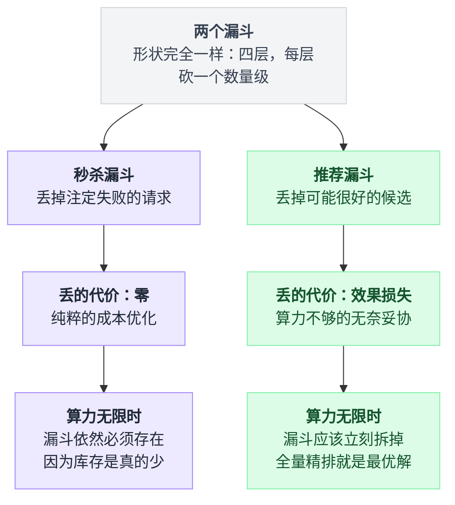
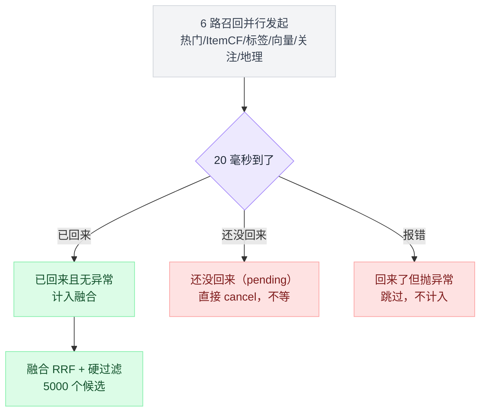
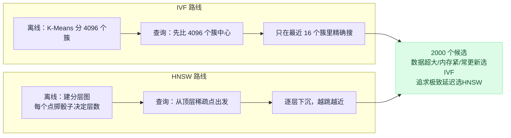
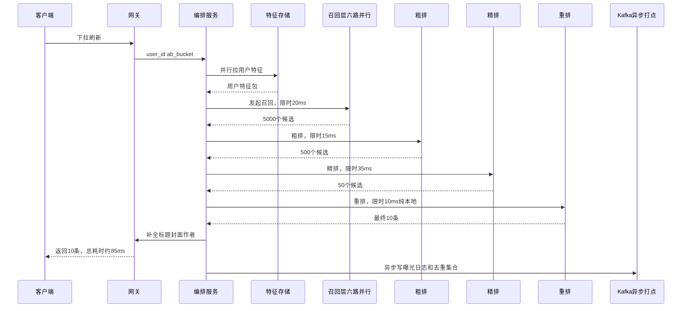
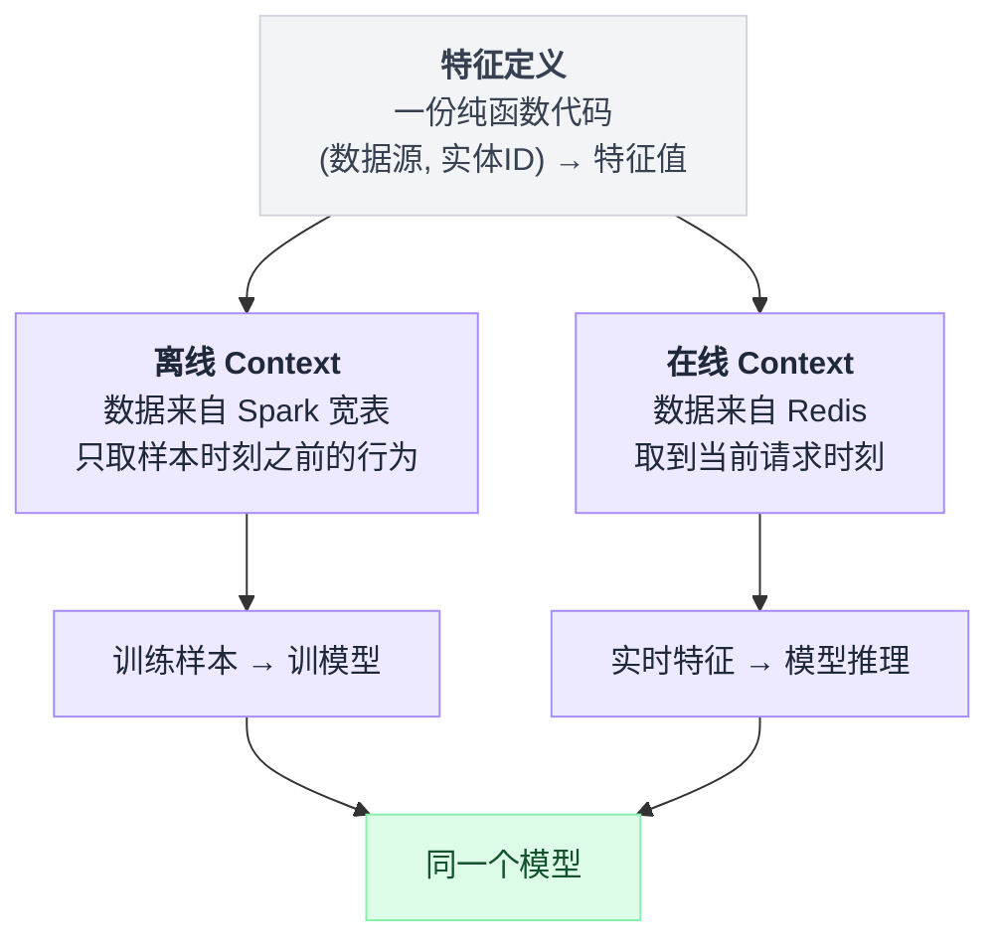
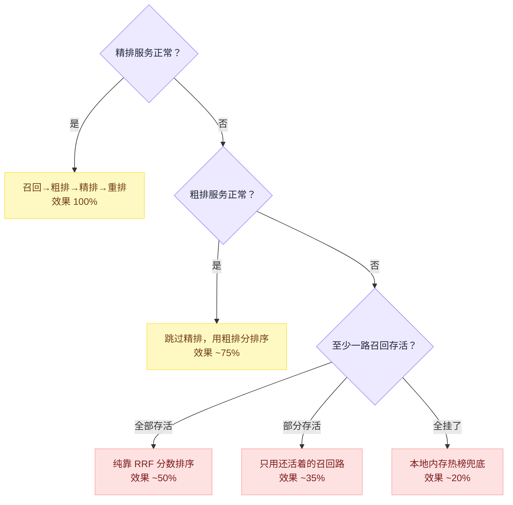
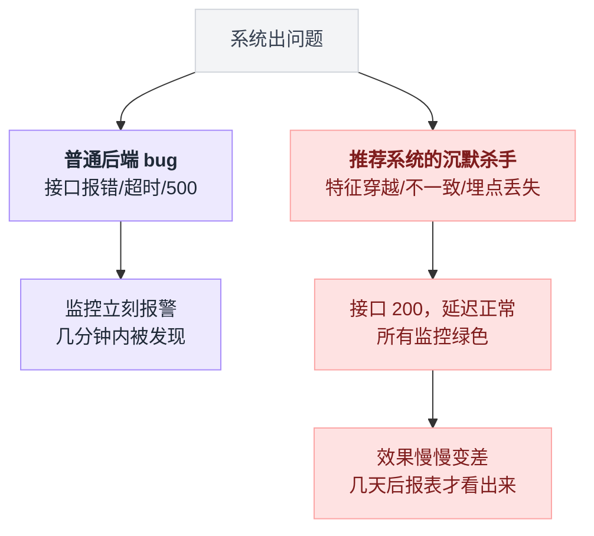
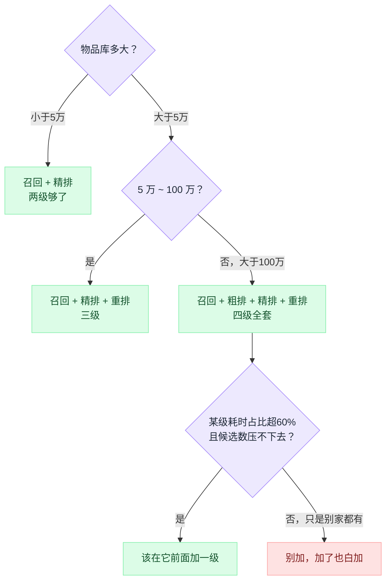

# 《推荐系统四级漏斗》千万里挑十，和秒杀同样的形状（小白版）

> 一句话简介：抖音给你刷出下一条视频，淘宝给你推下一件商品 —— 系统要在 100 毫秒内，从 1000 万个候选里挑出你最可能喜欢的 10 个。它用的架构和秒杀一模一样：**漏斗**。但这两个漏斗丢东西的理由，完全相反。
> 难度：★★★★☆
> 读完你会懂：
> 1. 为什么秒杀的漏斗是"**必须丢**"，推荐的漏斗是"**不得不丢**"—— 同一个形状，两种完全相反的心态
> 2. 召回、粗排、精排、重排这四级各自在干什么，为什么少一级都不行
> 3. Embedding 和 ANN（近似最近邻）到底是什么 —— 用大白话讲，不甩一个公式
> 4. 双塔模型为什么快得离谱，以及"物品向量可以离线算好"这一句话到底省下了多少钱
> 5. 推荐系统真正的工程难点不在模型，在**特征链路**：在线离线一致性、特征穿越、实时特征流
> 6. 100 毫秒的预算怎么分给四级，某一级超时了整条链路怎么活下来

---

## 目录

- [0. 先讲个故事：你是怎么在超市买到一包薯片的](#0-先讲个故事你是怎么在超市买到一包薯片的)
- [1. 全文的灵魂：两个漏斗，形状一样，理由相反](#1-全文的灵魂两个漏斗形状一样理由相反)
- [2. 签名难题：1000 万挑 10 个，100 毫秒](#2-签名难题1000-万挑-10-个100-毫秒)
- [3. 最笨的办法：把 1000 万个都打一遍分](#3-最笨的办法把-1000-万个都打一遍分)
- [4. 算力账本：这张表是理解漏斗的钥匙](#4-算力账本这张表是理解漏斗的钥匙)
- [5. 第一级 · 召回：用最便宜的方式，保证好东西在里面](#5-第一级--召回用最便宜的方式保证好东西在里面)
- [6. 向量召回与 ANN：把"找相似"从小时级压到毫秒级](#6-向量召回与-ann把找相似从小时级压到毫秒级)
- [7. 第二级 · 粗排：用 1% 的算力做 80% 的筛选](#7-第二级--粗排用-1-的算力做-80-的筛选)
- [8. 第三级 · 精排：最贵的模型，只见最少的候选](#8-第三级--精排最贵的模型只见最少的候选)
- [9. 第四级 · 重排：从"每个都好"到"这一屏好"](#9-第四级--重排从每个都好到这一屏好)
- [10. 完整线上推理链路全景图](#10-完整线上推理链路全景图)
- [11. 特征存储：推荐系统真正的血管](#11-特征存储推荐系统真正的血管)
- [12. 在线/离线一致性：这一节的坑，坑过所有人](#12-在线离线一致性这一节的坑坑过所有人)
- [13. 实时性：用户刚点了一下，下一刷就得变](#13-实时性用户刚点了一下下一刷就得变)
- [14. 缓存、降级、超时：工程三件套](#14-缓存降级超时工程三件套)
- [15. 和秒杀漏斗的逐层对应表](#15-和秒杀漏斗的逐层对应表)
- [16. 生产环境会踩的坑](#16-生产环境会踩的坑)
- [17. 反直觉结论](#17-反直觉结论)
- [18. 一句话总结 + 小白词典](#18-一句话总结--小白词典)
- [附：和前几篇的对照](#附和前几篇的对照)

---

## 0. 先讲个故事：你是怎么在超市买到一包薯片的

### 0.1 你今天下班顺路进了趟超市

这家超市有 3 万种商品。你在里面待了 12 分钟，出来时手里拎着 6 样东西。

现在我问你一个问题：**你是怎么从 3 万种商品里选出这 6 样的？**

你的第一反应大概是"我随便逛逛就买了啊"。但如果把你这 12 分钟拆开慢放，你会发现你其实执行了一套极其严密的筛选流程 —— 而且这套流程，和一个价值几十亿的推荐系统在做的事，一模一样。

我们来慢放一遍。

### 0.2 第一步：你走进了零食区（这一步叫"召回"）

你进门的一瞬间就做了一个巨大的决定：**你没有去生鲜区、没有去日化区、没有去酒水区。你直奔零食区。**

这个决定，一秒钟就做完了，而且它一口气砍掉了超市里 90% 的商品。

注意这一步的性质：

- **它极其便宜。** 你不需要思考、不需要比价、不需要看配料表。你只是走了几步路。
- **它极其粗糙。** 你不知道零食区里那 3000 种零食哪个好吃，你只知道"我想吃的东西大概率在这一片"。
- **它宁可多要，不敢少要。** 你不会只走到"薯片货架"就停下 —— 你会把整个零食区都当成候选，因为万一今天想吃的是饼干呢？

划重点：**这一步的目标不是"选对"，而是"别选漏"。**

你可以选进来 3000 个用不上的，但你不能把那包你今天最想吃的薯片挡在外面。因为**一旦这一步把它漏掉了，后面所有环节再聪明也救不回来** —— 你压根就不会走到那个货架前。

这就是推荐系统的第一级：**召回（Recall）**。

### 0.3 第二步：你扫了一眼货架（这一步叫"粗排"）

站在零食区，你的眼睛从左扫到右。三秒钟。

在这三秒里你做了什么？你没有拿起任何一包东西，你只是看了**包装的颜色、大小、logo**。

- 那个牌子我没听过 —— 跳过
- 那包看起来是甜的，我今天想吃咸的 —— 跳过
- 这个牌子我买过，还行 —— 留意一下

三秒钟，3000 种零食变成了你眼里的 20 来种。

注意这一步的性质：

- **它比走路贵，但比拿起来看便宜。** 一眼扫过去的成本，介于"走过去"和"研究"之间。
- **它用的是"远看就能看出来"的信息。** 包装、品牌、价格标签的位置。你没有用到配料表、生产日期、克重这些需要凑近才能看到的东西。
- **它可能会误杀。** 那包包装很丑但其实特别好吃的零食，被你跳过了。你接受这个损失。

这就是第二级：**粗排（Pre-ranking）**。

### 0.4 第三步：你拿起来看了配料表（这一步叫"精排"）

现在你伸手了。你拿起了 5 包东西，一包一包地翻过来看背面：

- 配料表第一位是什么？
- 多少克？折算下来每克多少钱？
- 热量多少？
- 生产日期？

这一步慢多了 —— 每包要花你 20 秒。**但因为你手里只有 5 包，总共也就 100 秒。**

现在把这一步的成本换个数字想：如果你对 3000 种零食每一种都做这套"拿起来翻过来看配料表"的动作，需要 3000 × 20 秒 = **16 个小时**。超市早关门了。

**这就是整个推荐系统存在的全部理由：最精细的判断方法，你只用得起很少的几次。**

所以你必须先用便宜的办法把候选砍到很少，才轮得到用贵的办法。

这是第三级：**精排（Ranking）**。

### 0.5 第四步：你回头看了看购物篮（这一步叫"重排"）

最后一步最微妙。

你手里现在有 3 包评分都很高的东西：一包薯片、一包薯条、一包虾条。三个都好吃，三个你都想要。

然后你把其中两包放回去了。

**为什么？**

因为你突然意识到：**这三样是一类东西。** 全买回去，第一包吃完，剩下两包会腻。你反而放回两包，换了一盒饼干和一板巧克力。

注意这一步发生了什么本质变化：

> 前三步你都在问"**这个东西好不好**"。
> 这一步你开始问"**这几个东西凑在一起好不好**"。

单看每一个，薯片、薯条、虾条都是 90 分。但凑成一组，这个组合是 60 分。而"薯片 + 饼干 + 巧克力"每一个可能只有 85 分，但凑成一组是 95 分。

这是第四级：**重排（Re-ranking）**。

### 0.6 把四步连起来

```
   进超市（3 万种商品）
        │
        │  ①走到零食区 —— 一秒钟，砍掉 90%
        ▼
   零食区（3000 种）
        │
        │  ②扫一眼货架 —— 三秒钟，只看包装
        ▼
   眼里剩下的（20 种）
        │
        │  ③拿起来看配料表 —— 每个 20 秒
        ▼
   评分最高的（5 种）
        │
        │  ④考虑搭配，放回去两包
        ▼
   最终买单（3 种）
```

**每往下走一层，候选变少一个数量级，而你愿意为每个候选花的精力，多一个数量级。**

这句话，就是本文全部内容的压缩包。推荐系统的四级漏斗，逐字对应上面这四步：

| 超市里的动作 | 推荐系统里叫什么 | 候选量级 | 每个候选的成本 |
|---|---|---|---|
| 走到零食区 | **召回** Recall | 1000 万 → 5000 | 微秒级 |
| 扫一眼货架 | **粗排** Pre-ranking | 5000 → 500 | 几十微秒 |
| 拿起来看配料表 | **精排** Ranking | 500 → 50 | 几百微秒 |
| 考虑搭配放回两包 | **重排** Re-ranking | 50 → 10 | 毫秒级（但只算一次） |

好，故事讲完了。现在讲本文最重要的一件事 —— **它和你已经很熟的秒杀系统，长得一模一样，但内核完全相反。**

---

## 1. 全文的灵魂：两个漏斗，形状一样，理由相反

### 1.1 先把两个漏斗并排画出来

你读过秒杀那套文档，你对下面左边这个图应该闭着眼都能画。现在我把推荐系统的图画在它旁边：

```
        【秒杀漏斗】                          【推荐漏斗】

     10 万个请求涌进来                   1000 万个候选物品
            │                                     │
    ┌───────▼─────────┐                  ┌────────▼─────────┐
    │  CDN / 静态化   │                  │   召回 Recall    │
    │  挡掉 90%       │                  │  留下 5000 个    │
    └───────┬─────────┘                  └────────┬─────────┘
            │ 1 万                                │ 5000
    ┌───────▼─────────┐                  ┌────────▼─────────┐
    │  网关限流       │                  │  粗排 Pre-rank   │
    │  挡掉 90%       │                  │  留下 500 个     │
    └───────┬─────────┘                  └────────┬─────────┘
            │ 1000                                │ 500
    ┌───────▼─────────┐                  ┌────────▼─────────┐
    │ Redis 预扣库存  │                  │   精排 Ranking   │
    │  挡掉 90%       │                  │  留下 50 个      │
    └───────┬─────────┘                  └────────┬─────────┘
            │ 100                                 │ 50
    ┌───────▼─────────┐                  ┌────────▼─────────┐
    │  MQ + 数据库    │                  │  重排 Re-rank    │
    │  真正下单       │                  │  最终 10 条      │
    └───────┬─────────┘                  └────────┬─────────┘
            │                                     │
            ▼                                     ▼
       100 个订单                            给你看 10 条
```

一模一样。都是四层，都是每层砍一个数量级，都是越往下每个单元越贵。

**但请你现在盯住这两个漏斗，问一个问题：那些被丢掉的东西，是什么？**

### 1.2 秒杀丢掉的，是"本来就不该处理"的

秒杀里，10 万个请求进来，最后 100 个成功。**被丢掉的 99900 个请求，本来就注定要失败。**

因为库存只有 100 件。哪怕你把这 10 万个请求全都恭恭敬敬地送到数据库，让它们排队，让它们全都跑完一遍完整的下单流程 —— 结果还是只有 100 个能成功，另外 99900 个会在最后一步得到"库存不足"。

所以秒杀漏斗做的事情是：

> **把那些注定失败的请求，尽可能早、尽可能便宜地告诉它们"你失败了"。**

这是一件**纯赚不赔**的事。你在 CDN 层挡掉一个请求，和让它跑到数据库再被拒绝，**对用户来说结果完全一样**（都是没抢到），但对系统来说成本差了一万倍。

**秒杀漏斗的每一层，都是纯粹的成本优化。丢掉的东西没有任何价值损失。**

用一句话说透：

> **秒杀的漏斗是"必须丢"。丢，是为了减少负载。丢掉的本来就是垃圾。**

### 1.3 推荐丢掉的，是"本来可能很好"的

现在看右边。1000 万个候选，最后给你看 10 条。

**被丢掉的 9999990 个候选里，有没有你会喜欢的？**

**几乎肯定有。而且很可能有一堆。**

那条你会点赞、会看完、会转发给朋友的视频，此时此刻正躺在库里。它没有被推给你，不是因为它不好，而是因为 ——

**系统算不过来。**

召回那一步，用的是极其粗糙的手段（热门榜、标签匹配、向量相似），它把 999 万个候选一刀切掉的时候，**根本没有认真评估过它们**。这里面必然误伤。精排模型如果真的把这 999 万个都打一遍分，它一定能找出比现在这 10 条更好的东西。

但精排模型打一个候选要 10 毫秒。1000 万个要 27 小时。

**你等不起。**

用一句话说透：

> **推荐的漏斗是"不得不丢"。丢，是因为算不起。丢掉的里面有宝贝。**

### 1.4 把这个对比钉死

```
 ┌──────────────────────────────────────────────────────────────────┐
 │                                                                  │
 │   秒杀漏斗                          推荐漏斗                     │
 │   ────────                          ────────                     │
 │                                                                  │
 │   丢掉的是：注定失败的请求          丢掉的是：可能很好的候选     │
 │                                                                  │
 │   为什么丢：减少负载                为什么丢：算力不够           │
 │                                                                  │
 │   丢的代价：零                      丢的代价：推荐效果的损失     │
 │                                                                  │
 │   丢得越早越好                      丢得越准越好                 │
 │                                                                  │
 │   衡量指标：QPS、成功率、超卖数     衡量指标：召回率、CTR、时长  │
 │                                                                  │
 │   漏斗是【防御工事】                漏斗是【无奈的妥协】         │
 │                                                                  │
 │   如果算力无限 → 漏斗仍然要有       如果算力无限 → 漏斗直接删掉  │
 │            （因为库存是真的少）            （全量精排就是最优解）│
 │                                                                  │
 └──────────────────────────────────────────────────────────────────┘
```

**最后那一行是全文最重要的一句话，请你多读两遍：**

> 如果给秒杀系统无限算力，漏斗**依然必须存在** —— 因为限制来自业务本身（库存就是 100 件），不是来自机器。
>
> 如果给推荐系统无限算力，漏斗**应该立刻拆掉** —— 直接把 1000 万个候选全部扔给最强的模型打分，取 Top 10。那才是理论最优解。

**推荐系统的四级漏斗，不是一个优雅的设计，而是一个被算力预算逼出来的妥协。**

这个认知会改变你看待整个推荐系统的方式。以后你听到任何一个推荐架构的优化 —— 什么"召回路数增加了"、"粗排模型升级了"、"精排候选数从 300 提到 500 了" —— 你都能立刻翻译成同一句话：

> **我们又多花了点钱，把妥协往回赎了一点。**

把这条分岔画成一张图，两条路走到头是两个完全相反的终局：



### 1.5 这个差别导致的三个连锁反应

不同的心态，会导致完全不同的工程决策。这里先给你三个预告，后面章节会一一展开。

**连锁反应一：秒杀怕"漏掉的太少"，推荐怕"漏掉的太多"**

秒杀的限流器，宁可多挡一些。挡多了？无非是有些本来能抢到的人没抢到，反正抢不到是常态，用户不会觉得系统坏了。

推荐的召回，宁可多留一些。这就是第 5 节要讲的"**宁可错选，不可漏选**"。

**连锁反应二：秒杀每一层都在做"减法"，推荐每一层都在做"排序"**

秒杀的每一层输出的是"通过 / 不通过"，二值的。

推荐的每一层输出的是"**一个有序的列表**"。它不是简单地砍掉一半，而是先给每个候选打分，然后取分最高的前 N 个。这意味着推荐的每一层都要跑一个**模型**，而秒杀的每一层跑的是**规则**。

**连锁反应三：秒杀的漏斗可以有明确的正确性，推荐没有**

秒杀有个铁律：**超卖 = bug**。库存 100 件卖出 101 件，这是绝对不能接受的错误，会赔钱、会上新闻。

推荐没有这种东西。你今天推的 10 条效果差了 5%，没有任何报警会响，没有任何日志会打 ERROR。**它只会体现在一周后的报表上。**

这是推荐系统最要命的一点：**它的 bug 是不出声的。**

> 小结：秒杀和推荐用了同一个漏斗形状，但秒杀的漏斗是在**主动防御**，推荐的漏斗是在**被迫取舍**。记住这个区别，往下所有的技术选择你都能自己推导出来。

---

## 2. 签名难题：1000 万挑 10 个，100 毫秒

现在我们把问题精确地写下来。

### 2.1 题面

> **输入：**
> - 一个用户 ID（比如你）
> - 一个物品库，里面有 **1000 万** 个候选（短视频 / 商品 / 文章）
>
> **输出：**
> - 一个长度为 **10** 的有序列表，是这个用户此刻最可能喜欢的 10 个
>
> **约束：**
> - 全流程必须在 **100 毫秒** 内返回
> - 系统同时要服务 **每秒 10 万次** 这样的请求
> - 每个用户每次下拉刷新都会来一次，且**结果不能重复**

三个数字：**1000 万、10 条、100 毫秒**。

### 2.2 为什么是 100 毫秒

这个数字不是拍脑袋定的。它来自一个很硬的产品约束：**用户手指从屏幕上抬起来的那一刻，下一批内容必须已经在手机里了。**

你刷短视频的时候，往上一划，下一条立刻就播。这背后是客户端提前预取了几条。但预取的请求也得有人服务，而且用户划得快的时候，预取的缓冲会被消耗光。

拆一下 100 毫秒的去处：

```
   用户手指划动
        │
        │  客户端发请求
        ▼
   ┌─────────────────────────────────────────────┐
   │  网络往返（4G / WiFi）        30 ~ 50 ms    │  ← 你控制不了
   ├─────────────────────────────────────────────┤
   │  网关、鉴权、日志             5 ms          │
   ├─────────────────────────────────────────────┤
   │  【推荐引擎的全部预算】       80 ~ 100 ms   │  ← 本文讲的就是这块
   ├─────────────────────────────────────────────┤
   │  拼装返回、序列化             5 ms          │
   └─────────────────────────────────────────────┘
```

也就是说，从"拿到用户 ID"到"吐出 10 条 ID"，你**只有不到 100 毫秒**。

而这 100 毫秒里，你还要给四级漏斗、给特征拉取、给几次网络调用分配时间。后面第 14 节会给你一张精确到毫秒的预算分配表。

### 2.3 硬约束：算力预算

现在讲本文最核心的那个数字。

假设你有一个非常强的精排模型 —— 一个几百万参数的深度神经网络，它能非常准确地预测"这个用户会不会点这个视频"。

**这个模型算一个候选，需要 10 毫秒。**

（这个数字是量级上的示意。真实的精排模型有各种 batch 优化、GPU 加速、算子融合，单条能压到几十微秒甚至更低。但"最强的模型很贵"这个结论不变，我们用 10ms 让账算得直观。）

现在做一道小学算术：

```
   1000 万个候选  ×  10 毫秒/个  =  1 亿毫秒
   
   1 亿毫秒 = 100000 秒 = 27.7 小时
```

**27 小时。**

用户划一下屏幕，你让他等 27 小时。

而且这还是**一个用户一次请求**的成本。你的系统每秒有 10 万个这样的请求。

```
   每秒 10 万请求 × 27.7 小时/请求 
   = 需要 100000 × 100000 = 100 亿倍的算力
```

哪怕你把全世界的服务器都买下来，也差着好几个数量级。

### 2.4 把这个约束画出来

```
    你有的：100 毫秒
    ├───┤

    你需要的：27.7 小时
    ├──────────────────────────────────────────────────────  ...
                                          （画不下，差 100 万倍）


    结论：不是"优化一下"能解决的问题。
          是"根本不能这么干"的问题。
```

**这就叫硬约束。**

它和秒杀里"数据库每秒只能扛 5000 次写"是同一类东西 —— 你没法说服它，你只能绕过它。

### 2.5 那能不能不用这么贵的模型？

好问题。这是每个人的第一反应。

我们试试：假设我们换一个便宜 1000 倍的模型，一个候选只要 **10 微秒**。

```
   1000 万 × 10 微秒 = 100 秒
```

还是 100 秒，还是不行（你只有 0.1 秒）。

再便宜 1000 倍呢？一个候选 **10 纳秒**（这已经是"从内存里读一个数"的量级了，不可能再便宜）：

```
   1000 万 × 10 纳秒 = 0.1 秒
```

**刚好卡在预算边缘。而且这个"模型"已经便宜到只能做一次内存读取了 —— 它根本不是模型，它连乘法都做不了。**

这道算术告诉你两件事：

1. **单一模型的方案，在任何精度下都不成立。** 要么太慢，要么太蠢。
2. **答案只能是：不同的候选，用不同贵的方法处理。**

第 2 点就是漏斗。

> 小结：1000 万 × 最好的模型 = 27 小时。这个乘法算不通，是推荐系统所有架构复杂度的唯一源头。

---

## 3. 最笨的办法：把 1000 万个都打一遍分

按本系列的传统，我们还是要把最朴素的方案写出来、跑一遍、看它怎么死。

### 3.1 朴素方案的代码

```python
from dataclasses import dataclass
import time

@dataclass
class Item:
    item_id: int
    title: str
    author_id: int
    tags: list[str]
    play_count: int

def score_by_deep_model(user_id: int, item: Item) -> float:
    """精排模型：预测这个用户点击这个物品的概率。
    真实实现是一个几百万参数的神经网络，这里用 sleep 模拟它的耗时。"""
    time.sleep(0.01)          # 10 毫秒
    return 0.5                # 假装算出来一个分数

def recommend_naive(user_id: int, all_items: list[Item], k: int = 10) -> list[Item]:
    scored = [(score_by_deep_model(user_id, it), it) for it in all_items]
    scored.sort(key=lambda x: -x[0])
    return [it for _, it in scored[:k]]
```

**这段在干嘛：** 把物品库里每一个物品都拿去问一遍模型"用户会喜欢这个吗"，拿到一堆分数，排个序，取前 10 个。

逻辑上，这是**完全正确**的。它给出的就是理论最优答案 —— 在这个模型的能力范围内，没有任何方案能比它更好。

### 3.2 它什么时候死

我们按物品库的规模推演：

| 物品库大小 | 耗时 | 能用吗 |
|---|---|---|
| 100 | 1 秒 | 慢，但勉强 |
| 1000 | 10 秒 | 用户已经退出 App 了 |
| 1 万 | 100 秒 | 不可能 |
| 100 万 | 2.8 小时 | 荒谬 |
| 1000 万 | **27.7 小时** | 荒谬 |

而且注意，上面还是**单个用户单次请求**。

再叠加 QPS：

```
   每秒 10 万个请求，每个请求要 27.7 小时的 CPU 时间
   
   需要的 CPU 核数 = 100000 × 100000 秒 / 1 秒 
                   = 100 亿核
   
   一台 96 核的服务器 → 需要 1 亿台服务器
   
   全球所有数据中心的服务器加起来，大约 1 亿台量级。
   
   → 你需要把全世界的服务器都拿来，给一个 App 做推荐。
```

**这是本系列里死得最彻底的一个朴素方案。**

秒杀的朴素方案（直接打数据库）好歹在低流量下能跑；推荐的朴素方案在**任何规模下都跑不动**，因为物品库天然就是百万千万级的。

### 3.3 那能不能预先算好，存起来？

这是第二个常见反应，而且它比第一个高明得多。思路是：

> 离线的时候（比如每天凌晨），把每个用户对每个物品的分数都算出来，存进数据库。线上直接查表。

我们算一下这张表有多大：

```
   用户数：1 亿
   物品数：1000 万
   
   表的格子数 = 1 亿 × 1000 万 = 10^15 = 1000 万亿
   
   每个格子存一个 float32（4 字节）：
   10^15 × 4 字节 = 4 PB（4000 TB）
```

4 PB 的存储勉强还能买，但离线计算量是：

```
   10^15 次模型推理 × 10 毫秒 = 10^13 秒 = 31.7 万年
```

**31 万年。**

而且这还没算：物品库每天新增几十万，用户兴趣每小时都在变，这张表算完就过期了。

### 3.4 换个思路：能不能只对"最近的"物品打分？

第三个反应：物品库里 1000 万个，但大部分都是老掉牙的内容，我只对最近 7 天新发的打分行不行？

假设 7 天新增 50 万个：

```
   50 万 × 10 毫秒 = 5000 秒 = 1.4 小时
```

**还是不行。而且这个思路本身有个致命问题：**

用户想看的东西，**不一定是新的**。一部三年前的老电影、一首十年前的老歌、一件卖了很久的爆款商品 —— 这些都可能是最优答案。

**用"新"来当过滤条件，是一个非常粗糙的召回策略。** 它可以是众多召回路之一，但不能是唯一的。

（记住这句话，第 5 节讲多路召回时会回到这里。）

### 3.5 三条死路的共同点

| 方案 | 为什么死 | 它错在哪 |
|---|---|---|
| 全量实时打分 | 27.7 小时 | 想用一种方法处理所有候选 |
| 离线全量预计算 | 31 万年 + 4 PB | 用户×物品的笛卡尔积是天文数字 |
| 只算最近 7 天 | 1.4 小时，且效果差 | 用一个粗糙规则代替了全部智能 |

三条路都撞在同一堵墙上：

> **"1000 万" 这个数字，和 "好模型很贵" 这件事，天生不兼容。**

要活下来，只有一条路：**让不同的候选，享受不同等级的待遇。**

大部分候选，用最便宜的方式看一眼就扔掉。
少部分候选，用中等成本再看一眼。
极少数候选，才配得上最贵的模型。

**这就是漏斗。** 下一节我们把这笔账算清楚。

> 小结：朴素方案不是"性能不好"，是差着 6 个数量级。这种量级的差距只能靠改变问题结构来解决，不能靠优化代码。

---

## 4. 算力账本：这张表是理解漏斗的钥匙

这一节只有一张表，但它是全文最重要的一张表。**如果你只记住本文一样东西，记住这张表。**

### 4.1 先约定单价

我们给四个等级的"评估手段"标个价。这些数字是量级示意，不同公司差几倍，但相对关系是普适的：

| 手段 | 干了什么 | 单个候选耗时 | 打个比方 |
|---|---|---|---|
| **查表 / 向量检索** | 从索引里捞出来，几乎不计算 | 0.0001 ms（0.1 微秒） | 走过去看一眼货架 |
| **双塔点积** | 两个向量做一次内积（几十次乘加） | 0.002 ms（2 微秒） | 扫一眼包装 |
| **深度模型** | 几百万参数的神经网络前向传播 | 0.5 ms | 拿起来读配料表 |
| **组合式重排** | 考虑候选之间的相互关系 | 整体 3 ms | 站在收银台前想搭配 |

注意：这里的精排单价我用了 **0.5 毫秒**而不是第 2 节的 10 毫秒 —— 因为线上会做 batch 批量推理和 GPU 加速，摊薄之后单条成本会低很多。第 2 节的 10ms 是为了让"27 小时"这个震撼数字更直观。我们下面用 0.5ms 这个更贴近生产的数字来算账，**你会看到即使便宜了 20 倍，结论一模一样**。

### 4.2 账本本体

```
┌────────┬──────────┬──────────────┬────────────┬──────────────┬─────────┐
│  层级  │ 输入候选 │  每个的成本  │  这一层    │  占总耗时    │ 输出候选│
│        │   数量   │              │  总耗时    │              │  数量   │
├────────┼──────────┼──────────────┼────────────┼──────────────┼─────────┤
│  召回  │ 1000 万  │  0.0001 ms   │   ~10 ms   │    ████ 20%  │  5000   │
│        │          │  (向量检索)  │            │              │         │
├────────┼──────────┼──────────────┼────────────┼──────────────┼─────────┤
│  粗排  │   5000   │  0.002 ms    │   ~10 ms   │    ████ 20%  │   500   │
│        │          │  (双塔点积)  │            │              │         │
├────────┼──────────┼──────────────┼────────────┼──────────────┼─────────┤
│  精排  │    500   │  0.05 ms     │   ~25 ms   │  ██████ 50%  │    50   │
│        │          │ (深度模型    │            │              │         │
│        │          │  batch 摊薄) │            │              │         │
├────────┼──────────┼──────────────┼────────────┼──────────────┼─────────┤
│  重排  │     50   │   整体 5 ms  │    ~5 ms   │      ██ 10%  │    10   │
├────────┴──────────┴──────────────┴────────────┴──────────────┴─────────┤
│                               合计约 50 ms  ← 装进 100ms 预算，还有富余│
└────────────────────────────────────────────────────────────────────────┘
```

### 4.3 现在做几个"如果"实验，你就懂了

**实验一：如果没有召回，直接从 1000 万开始粗排？**

```
   1000 万 × 0.002 ms = 20000 ms = 20 秒
```

超时 200 倍。**粗排虽然便宜，但便宜不到能扛 1000 万。**

**实验二：如果没有粗排，召回完 5000 个直接精排？**

```
   5000 × 0.05 ms = 250 ms
```

超时 2.5 倍。**看起来只差一点点，但 250ms 的推荐接口在生产上是不能上线的。**

而且注意：这还是 batch 摊薄之后的乐观估计。真实场景里精排的 batch 越大，显存压力越大，超过某个点后延迟会非线性上涨。5000 个候选进精排，大概率直接把 GPU 打爆。

**实验三：如果没有精排，粗排完 500 个直接重排？**

这个不会超时。**但效果会崩。**

因为粗排模型是个"只看包装"的模型 —— 它算的是用户向量和物品向量的一次点积，**它根本没有能力表达"这个用户在下雨天更爱看美食"这种交叉信息**（第 7 节详细讲）。用它来决定最终 10 条给谁，就像你闭着眼睛只摸包装就买零食。

**实验四：如果没有重排，精排完直接取 Top 10？**

这个也不会超时，效果也不算太差。**但用户会明显感到不适。**

因为精排是**逐个独立打分**的。它给同一个博主的 5 条视频都打了高分，因为每一条单独看都很符合你的口味。结果你的首页上连着 5 条都是同一个人。第 9 节详细讲。

### 4.4 从账本里读出的三条定律

把上面四个实验并排放：

```
   ┌──────────────────────────────────────────────────────────────┐
   │  砍掉召回  →  超时 200 倍   （量级问题，物理上不可能）       │
   │  砍掉粗排  →  超时 2.5 倍   （量级问题，勉强能算但上不了线） │
   │  砍掉精排  →  不超时，效果崩（能力问题）                     │
   │  砍掉重排  →  不超时，体验崩（体验问题）                     │
   └──────────────────────────────────────────────────────────────┘
```

**定律一：前两级解决"算得完"，后两级解决"算得好"。**

召回和粗排的存在理由是**算力**。精排和重排的存在理由是**效果**。这是两种完全不同的动机，别混在一起理解。

**定律二：每一级的成本预算，大致相等。**

看账本的"这一层总耗时"列：10ms、10ms、25ms、5ms。**四级的耗时是同一个量级的。**

这不是巧合，这是漏斗的设计原则：

> **候选数缩小的倍数 ≈ 单价上涨的倍数。**
>
> 召回 → 粗排：候选缩小 2000 倍，单价上涨 20 倍
> 粗排 → 精排：候选缩小 10 倍，单价上涨 25 倍
> 精排 → 重排：候选缩小 10 倍，单价上涨 100 倍

如果某一级的耗时远超其他级，那说明这一级的候选数配错了 —— 要么该往前多砍点，要么该给它加机器。

**这个"每层耗时大致相等"的原则，是你调优推荐系统时的第一个抓手。**

**定律三：漏斗的层数由"最贵手段和最便宜手段的价差"决定。**

召回的单价是 0.0001ms，重排是 5ms 整体。跨度 5 个数量级。

如果你只能一次砍 10 倍，那你需要很多层。如果每层能砍 100 倍，那 4 层就够了。

反过来说：**如果哪天精排模型突然便宜了 100 倍，粗排这一层就可以删掉。** 这在业界真实发生过 —— 有些公司的推荐系统就是三级（召回 → 精排 → 重排），因为他们的物品库只有几十万，粗排没必要。

> 小结：漏斗的层数、每层的候选数，全都是从算力账本里算出来的，不是设计出来的。看到一个新公司的推荐架构，先问它的物品库多大、精排模型多贵，你就能推出它该有几层。

---

## 5. 第一级 · 召回：用最便宜的方式，保证好东西在里面

### 5.1 召回的目标，和你的直觉相反

召回要从 1000 万里选出 5000 个。听起来像是"选出最好的 5000 个"。

**不是。**

召回的目标是：

> **保证"最终该给用户看的那 10 条"，全都在这 5000 个里面。**

注意这两个说法的区别，它非常关键：

| 说法 | 意思 | 优化的指标 |
|---|---|---|
| 选出最好的 5000 个 | 我选的这 5000 个都得靠谱 | **准确率**（Precision） |
| 保证好的都在这 5000 里 | 我选的可能有一堆垃圾，但不能漏 | **召回率**（Recall） |

召回这一级，**只在乎第二个**。这也是它名字的由来 —— 它就叫"召回"（Recall），因为它优化的就是召回率。

### 5.2 用一句话概括召回的心态

> **宁可错选一千，不可漏选一个。**

为什么可以这么放肆？因为**后面还有三道关**。

你多塞进来 1000 个垃圾，粗排会把它们踢掉，成本是粗排多算了 1000 次点积 = 2 毫秒。**便宜。**

但你漏掉一个宝贝，**后面三道关全都救不回来** —— 它压根没进候选池，精排再聪明也不认识它。**这个损失是永久的、不可恢复的。**

```
        召回多塞垃圾                       召回漏掉宝贝
             │                                  │
             ▼                                  ▼
    ┌─────────────────┐                ┌─────────────────┐
    │  粗排：踢掉     │                │  粗排：看不见   │
    └────────┬────────┘                └────────┬────────┘
             │                                  │
             ▼                                  ▼
        代价：2 毫秒                      代价：永远失去
        （可恢复）                        （不可恢复）
```

**这个"错误的不对称性"，是召回一切设计的出发点。**

（顺便说一句：这和秒杀的限流器**正好相反**。限流器宁可多挡 —— 挡错了无非是一个本来能抢到的用户没抢到，而放多了会把系统压垮。**限流器怕放，召回怕挡。**）

### 5.3 那多路召回是怎么回事

既然目标是"别漏"，最自然的做法就是：**用好几种完全不同的办法各选一批，然后合并。**

这就叫**多路召回**（Multi-channel Recall）。

为什么要用"完全不同"的办法？因为不同的办法**漏掉的东西不一样**。

打个比方：你要在一个陌生城市找晚饭吃。

- 办法一：找人多的店（热门）—— 会漏掉小众但极好吃的苍蝇馆子
- 办法二：找跟你口味相似的朋友推荐的（协同过滤）—— 会漏掉你朋友圈没人去过的新店
- 办法三：搜"川菜"（标签）—— 会漏掉不叫川菜但很辣的店
- 办法四：找和你上次吃的那家很像的（向量）—— 会漏掉你想换个口味的情况

**每一种办法都有盲区，但四种办法的盲区不重叠。** 四种一起用，漏掉的就少多了。

### 5.4 多路召回的架构图

```
                        用户 ID  +  用户画像  +  最近行为
                                     │
        ┌──────────┬──────────┬──────┼──────┬──────────┬──────────┐
        │          │          │      │      │          │          │
        ▼          ▼          ▼      ▼      ▼          ▼          ▼
   ┌────────┐ ┌────────┐ ┌────────┐ ┌────────┐ ┌────────┐ ┌────────┐
   │ 热门   │ │ 协同   │ │ 标签   │ │ 向量   │ │ 关注   │ │ 地理   │
   │ 召回   │ │ 过滤   │ │ 召回   │ │ 召回   │ │ 关系   │ │ 位置   │
   │        │ │ 召回   │ │        │ │ (ANN)  │ │ 召回   │ │ 召回   │
   ├────────┤ ├────────┤ ├────────┤ ├────────┤ ├────────┤ ├────────┤
   │ 出 500 │ │ 出 800 │ │ 出 600 │ │ 出2000 │ │ 出 300 │ │ 出 400 │
   └───┬────┘ └───┬────┘ └───┬────┘ └───┬────┘ └───┬────┘ └───┬────┘
       │          │          │          │          │          │
       └──────────┴──────────┴────┬─────┴──────────┴──────────┘
                                  │  合计 4600 条（有重复）
                                  ▼
                   ┌───────────────────────────────┐
                   │   融合层（Merge）             │
                   │   · 按 item_id 去重           │
                   │   · 每一路带权重              │
                   │   · 过滤：已看过 / 已购买     │
                   │   · 过滤：黑名单 / 违规下架   │
                   └──────────────┬────────────────┘
                                  │
                                  ▼
                            5000 个候选
                                  │
                                  ▼
                             送去粗排
```

**这段图在说什么：** 六路召回各干各的，互不知道对方存在，并行执行（所以总耗时 = 最慢那一路的耗时，不是六路之和）。最后有个融合层把它们的结果拼起来、去重、做硬过滤。

**注意"并行"这两个字。** 六路召回如果串行执行，耗时就是 6 倍。生产上一定是并行发起，这也是为什么召回这一级的代码几乎都是 `asyncio.gather` 的形状。

### 5.5 逐路拆解：每一路在干什么

#### 第一路：热门召回

最笨、最便宜、最不可缺的一路。

```python
async def recall_hot(user_id: int, n: int = 500) -> list[int]:
    """热门召回：直接从预先算好的热榜里取前 n 个。
    这个榜单由离线任务每 10 分钟更新一次，存在 Redis 里。"""
    ids = await redis.zrevrange("hot_rank:global", 0, n - 1)
    return [int(i) for i in ids]
```

**这段在干嘛：** 从 Redis 的一个有序集合（ZSet）里取分数最高的 500 个物品 ID。这个 ZSet 由离线任务算好，分数是"最近 1 小时的播放量加权点赞量"之类的公式。

**成本：** 一次 Redis 调用，1 毫秒不到，**和物品库有多大完全无关**。

**它为什么不能删：**
1. **新用户唯一的救命稻草。** 一个刚注册的用户，没有任何行为，协同过滤和向量召回全都算不出东西。只有热门能给他内容。
2. **降级时的兜底。** 第 14 节会讲，当模型服务挂了，整条链路直接退化成"热门榜单"。
3. **它是真的有效。** 热门内容之所以热门，是因为大部分人喜欢。这是一个很强的先验。

热榜通常不止一个，会按维度切开：

```
   hot_rank:global          全站热榜
   hot_rank:city:上海       同城热榜
   hot_rank:cate:美食       分类热榜
   hot_rank:age:18-24       同龄人热榜
```

#### 第二路：协同过滤召回（Collaborative Filtering，CF）

这是推荐系统最古老、也最有名的一招。它的直觉一句话就说完：

> **"和你口味像的人还喜欢什么，就推给你什么。"**

或者反过来：

> **"喜欢 A 的人也喜欢 B，那看过 A 的人就推 B。"**

后一种叫 **ItemCF**（基于物品的协同过滤），是工业界用得最多的。为什么？因为**物品之间的相似度是稳定的、可以离线算好的**，而用户的口味天天变。

ItemCF 的离线计算长这样：

```python
from collections import defaultdict
import math

def build_item_similarity(user_actions: dict[int, list[int]]) -> dict[int, list[tuple[int, float]]]:
    """输入：{user_id: [他点过的 item_id 列表]}
    输出：{item_id: [(相似item_id, 相似度), ...]}  取每个物品最相似的 Top 100"""
    co_occur: dict[tuple[int, int], int] = defaultdict(int)   # 共现次数
    item_count: dict[int, int] = defaultdict(int)             # 每个物品被点过多少次

    for uid, items in user_actions.items():
        # 一个用户点了 N 个物品，说明这 N 个物品之间"沾亲带故"
        weight = 1.0 / math.log(1 + len(items))   # 点得越多的用户，贡献越小
        for i in items:
            item_count[i] += 1
            for j in items:
                if i != j:
                    co_occur[(i, j)] += weight
    return _normalize(co_occur, item_count)
```

**这段在干嘛：** 遍历所有用户的行为记录。如果一个用户同时点了物品 A 和物品 B，就给 (A, B) 这一对加分。加完之后，共现次数高的一对物品就是"相似的"。

注意那个 `1 / log(1 + len(items))`：**一个点了 10000 个视频的用户，他的每一次点击信息量都很低**（他啥都看），所以要降权。这是 ItemCF 里最经典的一个工程细节，叫**活跃用户惩罚**。

有了这张相似度表，线上召回就是纯查表：

```python
async def recall_itemcf(user_id: int, n: int = 800) -> list[int]:
    """ItemCF 召回：拿用户最近点过的 20 个物品，
    每个查出它最相似的若干个，加权合并。"""
    recent = await redis.lrange(f"user:recent:{user_id}", 0, 19)
    scores: dict[int, float] = defaultdict(float)
    for rank, item_id in enumerate(recent):
        decay = 0.95 ** rank                       # 越早看的，权重越低
        similar = await redis.zrevrange(f"itemcf:{item_id}", 0, 49, withscores=True)
        for sim_id, sim in similar:
            scores[int(sim_id)] += sim * decay
    return [i for i, _ in sorted(scores.items(), key=lambda x: -x[1])[:n]]
```

**这段在干嘛：** 你最近看了 20 个视频，对每一个，我查出"和它最像的 50 个"，然后把这 20×50 = 1000 个结果按相似度加权合并、排序、取前 800。

**成本：** 21 次 Redis 调用（可以用 pipeline 合并成 1 次往返），2~3 毫秒。**同样与物品库大小无关。**

**它的盲区：** 冷门物品。一个刚发布的视频，没人看过它，它就不会出现在任何一个物品的相似列表里。**ItemCF 天然是"马太效应放大器"** —— 热的越热，冷的永远冷。这是第 16 节要讲的坑之一。

#### 第三路：标签 / 内容召回

最好理解的一路：**用户画像里写着他喜欢"美食、宠物、健身"，那就从这三个标签的物品池里各捞一批。**

```python
async def recall_by_tag(user_id: int, n: int = 600) -> list[int]:
    """标签召回：按用户画像的兴趣标签，从各标签的倒排索引里取。"""
    profile = await redis.hgetall(f"user:profile:{user_id}")
    tags = json.loads(profile.get("interest_tags", "[]"))   # [("美食",0.8),("宠物",0.5)]
    result: list[int] = []
    total_w = sum(w for _, w in tags) or 1.0
    for tag, w in tags:
        quota = int(n * w / total_w)                        # 按兴趣权重分配名额
        ids = await redis.zrevrange(f"tag_pool:{tag}", 0, quota - 1)
        result.extend(int(i) for i in ids)
    return result
```

**这段在干嘛：** 读出用户的兴趣标签和权重，按权重给每个标签分配名额，从每个标签的物品池（按质量分排序的 ZSet）里取对应数量。

**它的价值：** **可解释性**。产品经理问"为什么给这个用户推这条"，你能答"因为他画像里有美食标签"。其他召回路你很难解释。

**它的盲区：** 标签体系是人定的，覆盖不了长尾。而且用户画像更新慢，你昨天突然对滑雪感兴趣，画像可能明天才更新。

#### 第四路：向量召回（Embedding + ANN）

**这是现代推荐系统最重要的一路，也是最需要展开讲的。** 单独放到第 6 节。

先给个一句话预告：

> **把每个用户和每个物品都变成一串数字（向量），谁和谁的数字接近，就说明谁和谁匹配。然后用一种特殊的索引，在 1000 万个向量里毫秒级找出最接近的 2000 个。**

#### 第五路：关注关系召回

你关注的人发的新内容，直接进候选。

```python
async def recall_follow(user_id: int, n: int = 300) -> list[int]:
    """关注召回：拉取用户关注的作者最近发布的内容。
    注意：这一路其实就是 Feed 流的'读扩散'。"""
    followees = await redis.smembers(f"user:follow:{user_id}")
    if len(followees) > 500:
        followees = random.sample(list(followees), 500)   # 大 V 关注者太多，采样
    ids: list[int] = []
    async with redis.pipeline() as pipe:
        for author in followees:
            pipe.zrevrange(f"author:latest:{author}", 0, 4)   # 每人最近 5 条
        for batch in await pipe.execute():
            ids.extend(int(i) for i in batch)
    return ids[:n]
```

**这段在干嘛：** 取出用户关注的所有人，每人拉最近 5 条内容。如果关注太多就采样，防止一个请求打爆 Redis。

**这一路和《微博热点 Feed 流》那篇是同一个东西** —— 那篇讲的推拉结合、读扩散写扩散，在这里就是众多召回路里的一路。**在一个纯关注流产品里（早期微博），这一路就是全部；在一个推荐流产品里（抖音），这一路只占很小的比例。**

**它的特殊性：** 这一路的结果是"用户明确表达过想要的"，所以后面的排序阶段通常会给它额外加权，甚至保证它在最终结果里的最低配额。

#### 第六路及以后：还能有多少路

生产系统的召回路数远不止六路。常见的还有：

| 召回路 | 逻辑 | 解决什么盲区 |
|---|---|---|
| **地理位置召回** | 同城 / 附近的内容 | 本地生活、同城社交 |
| **搜索历史召回** | 用户搜过"跑鞋"，推跑鞋 | 明确的强意图，比隐式行为准得多 |
| **实时行为召回** | 用户 10 秒前点了一个视频，立刻召回它的相似品 | 兴趣的瞬时变化（第 13 节） |
| **作者相似召回** | 你喜欢的博主，风格相似的其他博主 | 从"物品相似"升到"生产者相似" |
| **图召回（GNN）** | 在"用户-物品"二部图上做多跳游走 | 二度、三度的间接关联 |
| **运营池召回** | 编辑手选的优质内容、活动内容 | 平台意志、商业化需求 |
| **多样性探索召回** | 随机撒一点用户没接触过的品类 | 打破信息茧房（第 16 节） |

大厂的推荐系统，召回路数通常在 **20 ~ 100 路** 之间。

### 5.6 融合层：把几十路的结果拼起来

融合层的活儿看着简单，坑不少。

```python
from dataclasses import dataclass, field

@dataclass
class RecallResult:
    channel: str                # 哪一路召回的
    item_ids: list[int]
    weight: float = 1.0         # 这一路的整体权重

@dataclass
class Candidate:
    item_id: int
    channels: list[str] = field(default_factory=list)   # 被哪几路同时召回
    recall_score: float = 0.0
```

**这段在干嘛：** 定义两个数据结构。`RecallResult` 是单路的输出，`Candidate` 是融合后的候选 —— 注意它记着 `channels`，也就是**这个物品被哪几路同时召回了**。

这个字段非常重要，后面粗排精排会把它当特征用：**被 5 路同时召回的物品，通常比只被 1 路召回的更靠谱。**

```python
def merge(results: list[RecallResult], limit: int = 5000) -> list[Candidate]:
    pool: dict[int, Candidate] = {}
    for r in results:
        for rank, iid in enumerate(r.item_ids):
            c = pool.setdefault(iid, Candidate(item_id=iid))
            c.channels.append(r.channel)
            # 位置越靠前分越高（1/(rank+1) 是经典的倒数排名融合 RRF）
            c.recall_score += r.weight / (rank + 60)
    ranked = sorted(pool.values(), key=lambda c: -c.recall_score)
    return ranked[:limit]
```

**这段在干嘛：** 遍历每一路的结果，同一个物品被多路召回时，分数累加。`1/(rank+60)` 是业界常用的 **RRF（Reciprocal Rank Fusion，倒数排名融合）** 公式 —— 它的好处是**不需要各路分数可比**。

**这里有个坑，划重点：**

> **不同召回路的分数，绝对不能直接相加。**

热门召回的分数可能是"播放量"（几百万），ItemCF 的分数是"相似度"（0~1），向量召回的分数是"余弦距离"（-1~1）。它们**量纲完全不同**。直接相加的话，热门召回会碾压所有其他路。

RRF 的聪明之处就在于：**它只用排名，不用分数。** 你在你那一路里排第 3，我就给你 1/(3+60) 分，管你原始分数是 0.9 还是 900 万。

（这和《网约车派单》里讲的"成本函数要统一量纲"是同一个问题的两种解法：派单是把所有维度折算成"等价秒数"，召回融合是干脆抛弃原始分数只用排名。）

### 5.7 融合层必须做的硬过滤

合并完之后，还有几件事必须做，而且**必须在这里做，不能留给后面**：

```python
async def hard_filter(user_id: int, cands: list[Candidate]) -> list[Candidate]:
    """硬过滤：这些是无论模型打多高分都必须踢掉的。"""
    seen = await bloom_filter.contains_many(f"seen:{user_id}", [c.item_id for c in cands])
    banned = await redis.smembers("item:banned")          # 违规下架
    out = []
    for c, is_seen in zip(cands, seen):
        if is_seen:                                        # 已经看过
            continue
        if str(c.item_id) in banned:                       # 已下架
            continue
        out.append(c)
    return out
```

**这段在干嘛：** 三件事 —— 去掉用户已经看过的、去掉被下架的、（生产上还会有）去掉用户拉黑的作者。

**注意"已看过"用的是布隆过滤器（Bloom Filter）。** 为什么？

一个重度用户一年能看几万个视频。如果用 Redis 的 Set 存"看过的 ID"，一个用户 5 万个 ID × 8 字节 = 400KB，1 亿用户就是 **40 TB**。

布隆过滤器是一个"用位图近似表示集合"的结构：它能回答"这个 ID 在集合里吗"，可能会误判说"在"（其实不在），但**绝不会漏判**。5 万个元素、1% 误判率，只需要约 **60 KB** —— 省了 6 倍多，而且查询是 O(1) 的位运算。

误判 1% 意味着什么？**1% 的没看过的内容被误认为看过，扔掉了。** 在召回这一级，扔掉 1% 完全可以接受 —— 反正你本来就在扔 99.95%。

（布隆过滤器你在秒杀那篇的"缓存穿透"里见过：用它挡掉那些数据库里根本不存在的 ID。**同一个工具，两个场景：那里挡的是不存在的 key，这里挡的是已看过的 item。**）

### 5.8 召回这一级的完整代码

```python
import asyncio

RECALL_TIMEOUT_MS = 20

async def do_recall(user_id: int) -> list[Candidate]:
    """并行发起所有召回路，各自限时，超时的直接放弃。"""
    tasks = {
        "hot":    recall_hot(user_id, 500),
        "itemcf": recall_itemcf(user_id, 800),
        "tag":    recall_by_tag(user_id, 600),
        "vector": recall_by_vector(user_id, 2000),
        "follow": recall_follow(user_id, 300),
        "geo":    recall_geo(user_id, 400),
    }
    results: list[RecallResult] = []
    done, pending = await asyncio.wait(
        [asyncio.create_task(c, name=k) for k, c in tasks.items()],
        timeout=RECALL_TIMEOUT_MS / 1000,
    )
    for t in pending:
        t.cancel()                                  # 超时的直接砍掉，不等
    for t in done:
        if t.exception() is None:
            results.append(RecallResult(channel=t.get_name(), item_ids=t.result()))
    return await hard_filter(user_id, merge(results))
```

**这段在干嘛，逐句看：**

1. `tasks` 里放了六路召回的协程，还没开始跑
2. `asyncio.wait(..., timeout=20ms)` 把它们**同时发出去**，最多等 20 毫秒
3. 20 毫秒到了还没回来的（`pending`），**直接 cancel 掉，不等了**
4. 回来的里面，**报错的也跳过**（`t.exception() is None`）
5. 剩下的正常结果拿去融合、过滤

**这里体现了推荐系统一个极其重要的工程哲学：**

> **少一路召回，结果只是差一点点；等一路召回，整个请求就超时了。**

对比一下秒杀：秒杀里如果扣库存的 Redis 调用超时了，**你必须处理它**（要么重试、要么明确失败），你绝不能"假装它成功了继续往下走"。

推荐可以。**推荐的每一步都是"尽力而为"的。** 这是两类系统在容错哲学上的根本分歧，第 14 节还会回到这个点。

把 `do_recall` 里那段"等 20ms、超时就砍"的逻辑拆成判断流程：



> 小结：召回 = 多路并行 + RRF 融合 + 硬过滤，目标是召回率不是准确率，容错策略是"谁慢丢谁"。这一级的所有设计，都源自"漏掉不可恢复、多塞很便宜"这个不对称性。

---

## 6. 向量召回与 ANN：把"找相似"从小时级压到毫秒级

这一节是全文技术密度最高的一节。我会**一个公式都不写**，全用大白话和图。

### 6.1 先讲 Embedding：把东西变成一串数字

#### 从"给电影打标签"说起

假设你要让电脑理解电影。最土的办法是打标签：

```
   《流浪地球》→ [科幻, 灾难, 中国, 特效]
   《星际穿越》→ [科幻, 太空, 美国, 烧脑]
   《泰坦尼克》→ [爱情, 灾难, 美国, 经典]
```

这样电脑可以算"共同标签数"来判断相似度。《流浪地球》和《星际穿越》有 1 个共同标签（科幻），和《泰坦尼克》也有 1 个（灾难）。**相似度一样？** 显然不对，前两个明显更像。

问题出在：**标签是"有或没有"的，没有程度。** 而且标签是人拍脑袋定的，定不全。

#### 换个办法：给每部电影打分

我们不用标签，改成**给每部电影在几个维度上打分**：

```
                 科幻度   悲伤度   烧脑度   动作度
   流浪地球        0.9      0.6      0.3      0.8
   星际穿越        0.95     0.7      0.9      0.3
   泰坦尼克        0.05     0.9      0.1      0.2
   速度与激情      0.1      0.1      0.1      0.95
```

现在每部电影都是**一串 4 个数字**。这串数字，就叫这部电影的 **Embedding（嵌入向量）**。

现在算相似度就自然多了 —— 把两串数字想象成空间里的两个点，**看它们离得近不近**：

```
   流浪地球 [0.9, 0.6, 0.3, 0.8]
   星际穿越 [0.95,0.7, 0.9, 0.3]
   每个位置的差：0.05, 0.1, 0.6, 0.5   → 差得不多，比较近
   
   流浪地球 [0.9, 0.6, 0.3, 0.8]
   泰坦尼克 [0.05,0.9, 0.1, 0.2]
   每个位置的差：0.85, 0.3, 0.2, 0.6   → 差得挺多，比较远
```

**这就是 Embedding 的全部直觉：把一个东西变成一串数字，让"意思相近"变成"数字相近"。**

#### 真实的 Embedding 是什么样的

两个区别：

**区别一：维度不是 4，是 64 ~ 512。**

真实的物品向量通常 64 维、128 维、256 维。维度越高能表达的细节越多，但存储和计算也越贵。

**区别二：每一维是什么含义，没人知道。**

上面我编的"科幻度、悲伤度"是为了让你理解。真实的 Embedding 是**模型自己学出来的**，第 37 维代表什么，没有任何人能解释。

它是怎么学出来的？一句话：

> **看用户行为。经常被同一批人喜欢的物品，模型就把它们的向量调得近一点。**

具体做法有很多（矩阵分解、Word2Vec 风格的 item2vec、双塔模型的物品塔、图神经网络），但**核心思想都是这一句**。

#### 用户也有 Embedding

关键的一步：**用户也可以变成同样长度的一串数字，而且和物品向量在同一个空间里。**

```
              科幻度   悲伤度   烧脑度   动作度
   张三          0.85     0.5      0.8      0.4     ← 爱看烧脑科幻
   李四          0.1      0.2      0.1      0.9     ← 爱看爽片
```

于是"张三会喜欢哪部电影"这个问题，就变成了：

> **在这个空间里，哪部电影离张三最近？**

张三 [0.85, 0.5, 0.8, 0.4] 离《星际穿越》[0.95, 0.7, 0.9, 0.3] 非常近。推它。

```
        把用户和物品放进同一个空间

                        ▲ 烧脑度
                        │
                        │   ★星际穿越
              ●张三     │  ★流浪地球
                        │
        ────────────────┼────────────────▶ 动作度
                        │        ★速度与激情
                        │   ●李四
              ★泰坦尼克 │
                        │

        ● = 用户    ★ = 物品
        推荐 = 找离这个 ● 最近的几个 ★
```

**这张图就是向量召回的全部。** 剩下的所有技术，都是在解决一个纯粹的工程问题：

> **1000 万个 ★，怎么在 10 毫秒内找出离某个 ● 最近的 2000 个？**

### 6.2 精确计算，为什么不行

先看最直接的办法：把用户向量和 1000 万个物品向量挨个算一遍距离，取最近的。

```python
import numpy as np

def exact_topk(user_vec: np.ndarray, item_matrix: np.ndarray, k: int = 2000):
    """精确暴力检索。user_vec: (128,)  item_matrix: (10_000_000, 128)"""
    scores = item_matrix @ user_vec          # 一次矩阵乘法，得到 1000 万个分数
    idx = np.argpartition(-scores, k)[:k]    # 取最大的 k 个（不完全排序，更快）
    return idx[np.argsort(-scores[idx])]
```

**这段在干嘛：** `item_matrix @ user_vec` 是一次矩阵向量乘法，一口气算出用户和所有 1000 万个物品的相似度。然后 `argpartition` 取出最大的 2000 个。

**它的成本：**

```
   计算量 = 1000 万 × 128 维 × 2 次运算(乘+加) = 25.6 亿次浮点运算
   
   现代 CPU 单核约 100 亿次/秒（有 SIMD 向量化的情况下）
   → 单核约 0.26 秒
   
   内存读取：1000 万 × 128 × 4 字节 = 5.1 GB
   内存带宽约 20 GB/s → 光是把数据读一遍就要 0.25 秒
```

**结论：单次查询 0.25 ~ 0.3 秒。你的全部预算是 0.1 秒，而向量召回只分到 10 毫秒。差 30 倍。**

而且这是**单个用户**。QPS 10 万的话，你需要每秒读 51 万 GB 的内存 —— 物理上不可能。

**注意这个瓶颈的性质：它不是 CPU 不够快，是内存带宽不够。** 5.1 GB 的向量矩阵，你每次查询都要完整扫一遍。这叫**内存带宽墙**，加 CPU 核数解决不了（所有核共享同一条内存总线）。

### 6.3 ANN：接受"差不多就行"

既然精确算不起，那就**别精确了**。

**ANN = Approximate Nearest Neighbor，近似最近邻。**

它的承诺是：

> 我不保证给你**最**近的 2000 个，但我给你的 2000 个里，有 95% 确实是真正最近的那批。
> 代价是：**快 100 ~ 1000 倍。**

**为什么可以接受这个近似？** 回到第 5 节那句话：

> **召回的目标是"别漏"，不是"最准"。**

而且更实际的一点：后面还有粗排和精排。**召回给的这 2000 个，本来就要被重新打分排序的。** 召回给出的顺序，几乎不影响最终结果 —— 它只决定"谁能进候选池"。

所以丢掉 5% 的精度，换 100 倍的速度，**这笔买卖太划算了**。

### 6.4 ANN 思路一：先分簇，再只搜几个簇（IVF）

#### 用图书馆做比方

你要在一个 100 万本书的图书馆里找一本关于"深度学习"的书。

**笨办法：** 从第一排第一本开始，一本一本看书名。

**图书馆的办法：** 图书馆先把书分了类 —— 文学区、历史区、计算机区……你直接走到计算机区，只在那 5000 本里找。

**你少看了 99.5% 的书。而且你几乎不可能因此错过那本书** —— 因为它就该在计算机区。

**"几乎"两个字是关键。** 万一有本《用深度学习写诗》被归到了文学区呢？**你就错过了。这就是 ANN 的"近似"。**

#### IVF 的做法

IVF 全称 **Inverted File Index（倒排文件索引）**，做的就是"先分类"这件事。

**第一步（离线）：把 1000 万个向量分成 4096 个簇。**

用 K-Means 聚类：随机选 4096 个"中心点"，把每个向量归到离它最近的中心点，然后重新计算中心点，反复几轮直到稳定。

```
          分簇之后的空间长这样

     ┌──────────────┬──────────────┬──────────────┐
     │   簇 1       │   簇 2       │   簇 3       │
     │   ⊕中心      │      ⊕       │  ★★  ⊕       │
     │  ★ ★ ★       │  ★ ★★ ★      │   ★  ★ ★     │
     │   ★  ★       │    ★  ★      │  ★   ★       │
     ├──────────────┼──────────────┼──────────────┤
     │   簇 4       │   簇 5       │   簇 6       │
     │ ★  ⊕ ★       │  ★★ ⊕        │   ⊕  ★★      │
     │  ★★  ★       │   ★  ★ ★     │  ★ ★  ★      │
     │   ★          │     ★        │    ★  ★      │
     └──────────────┴──────────────┴──────────────┘
     
     ⊕ = 簇中心（4096 个）    ★ = 物品向量（1000 万个）
     平均每个簇 2441 个向量
```

**第二步（线上）：用户向量来了，先和 4096 个中心点比，找出最近的几个簇；只在这几个簇里精确搜索。**

```
        用户向量 ●
            │
            ▼
   ┌─────────────────────────────────┐
   │ 第一步：和 4096 个簇中心算距离  │  ← 只算 4096 次，很便宜
   │        找出最近的 16 个簇       │
   └────────────┬────────────────────┘
                │
                ▼
   ┌─────────────────────────────────┐
   │ 第二步：只在这 16 个簇里暴力搜  │  ← 16 × 2441 ≈ 39000 个向量
   │        取 Top 2000              │
   └────────────┬────────────────────┘
                │
                ▼
            2000 个结果
```

**算一下省了多少：**

```
   精确暴力：1000 万次向量计算
   IVF：     4096 次（找簇）+ 39000 次（簇内搜） = 43096 次
   
   加速比 = 10000000 / 43096 ≈ 232 倍
   
   耗时从 260 毫秒 → 1.1 毫秒
```

**代价是什么？** 那些落在"簇边界"上的向量。

```
        用户 ● 正好在两个簇的边界附近

        簇 A（被搜了）    │    簇 B（没被搜）
                          │
              ●用户       │  ★ ← 这个物品其实离用户很近
                          │      但它在 B 簇，被跳过了
              ★ ★        │  ★
                          │
```

**这就是 IVF 丢失精度的地方。** 搜的簇越多（`nprobe` 参数），漏得越少，但也越慢。

| nprobe（搜几个簇） | 召回率 | 耗时 |
|---|---|---|
| 1 | ~60% | 0.1 ms |
| 8 | ~88% | 0.6 ms |
| 16 | ~93% | 1.1 ms |
| 64 | ~99% | 4.3 ms |
| 4096（全搜） | 100% | 260 ms |

**这张表就是 ANN 的本质：一个可以旋钮调节的"精度 ↔ 速度"权衡。**

### 6.5 ANN 思路二：分层跳跃（HNSW）

IVF 是"分区"的思路。HNSW 是完全不同的另一条路：**"导航"**。

#### 用交通网络做比方

你在上海浦东的一个小区，要去北京海淀的一个小区。你怎么走？

**笨办法：** 沿着小马路一条一条挪过去。

**实际办法：**

```
   ┌─────────────────────────────────────────────────────────────┐
   │  第 3 层（航线网）：只有大城市，跳跃距离几百上千公里        │
   │                                                             │
   │      上海 ●━━━━━━━━━━━━━━━━━━━━━━━━━━━━━━━━● 北京           │
   │                                                             │
   ├─────────────────────────────────────────────────────────────┤
   │  第 2 层（高速网）：市和区，跳跃距离几十公里                │
   │                                                             │
   │    浦东 ●━━━━● 市区        海淀 ●━━━━● 朝阳                 │
   │                                                             │
   ├─────────────────────────────────────────────────────────────┤
   │  第 1 层（城市主干道）：街道级，跳跃距离几公里              │
   │                                                             │
   │   ●━●━●━●━●              ●━●━●━●━●                          │
   │                                                             │
   ├─────────────────────────────────────────────────────────────┤
   │  第 0 层（小马路）：所有点都在这一层，跳跃距离几百米        │
   │                                                             │
   │  ●●●●●●●●●●●●●●●●●●●●●●●●●●●●●●●●●●●●●●●●●●●●●●●●●●●●●      │
   └─────────────────────────────────────────────────────────────┘

   走法：先坐飞机到北京（第 3 层大跳）
         再上高速到海淀（第 2 层中跳）
         再走主干道（第 1 层小跳）
         最后走小马路到楼下（第 0 层微调）
```

**HNSW 就是把这套交通网络搭在向量空间里。** 名字里的每个字母都对上了：

**H**ierarchical（分层）**N**avigable（可导航）**S**mall **W**orld（小世界网络）

#### HNSW 的搜索过程

```
        目标：找离用户 ● 最近的物品

   第 3 层（只有 100 个点）
        ⊙起点 ──────────▶ ⊙ ──────▶ ⊙  找到本层最近的，往下沉
                                     │
                                     ▼
   第 2 层（有 3000 个点）
                              ⊙ ──▶ ⊙ ──▶ ⊙   继续走，走不动了往下沉
                                            │
                                            ▼
   第 1 层（有 10 万个点）
                                     ⊙─▶⊙─▶⊙  越走越近
                                             │
                                             ▼
   第 0 层（全部 1000 万个点）
                                        ⊙▶⊙▶⊙ ● ← 到了！
                                        
   总共走过的点：几百个（不是 1000 万个）
```

每一层的规则是一样的：

1. 从当前点出发，看它连着的所有邻居
2. 哪个邻居离目标更近，就走到哪个
3. 如果所有邻居都比当前点远，说明**在这一层走到头了**，下沉到下一层继续

**为什么快？** 因为高层的点很稀疏，每一步跨越的距离极大。你只用几步就从"随便一个起点"跳到了"目标附近"。剩下的精细搜索发生在第 0 层，但那时你已经在目标周围了，只需要走几十步。

**这和二分查找的思想完全一样：先大步逼近，再小步微调。**

#### 那些"层"是怎么来的

建索引的时候，每插入一个向量，就**掷一次骰子决定它出现在哪几层**：

```
   所有向量        → 100%  出现在第 0 层
   1/16 的概率     → 6.25% 也出现在第 1 层
   1/16 的 1/16    → 0.4%  也出现在第 2 层
   ...
```

也就是说：**层数越高，点越少，越稀疏，跳得越远。** 完全自动，不需要人工分类。

#### IVF vs HNSW，怎么选

| 维度 | IVF | HNSW |
|---|---|---|
| **核心思路** | 先分簇，只搜几个簇 | 分层图上导航跳跃 |
| **建索引速度** | 快（K-Means 一遍） | 慢（要建图，10 倍以上） |
| **查询速度** | 快 | **更快（通常 2~5 倍）** |
| **内存占用** | 小（就是向量本身） | **大（要额外存图的边，多 1.5~2 倍）** |
| **支持增删** | 增删都方便 | 增很方便，**删很麻烦**（图结构要修复） |
| **调参** | nprobe 一个旋钮，直观 | efSearch / M 等，稍复杂 |
| **适合** | 数据量超大、内存紧、频繁更新 | 追求极致延迟、数据相对稳定 |

**生产上的常见选择：**
- 物品库 < 1000 万，内存充裕 → **HNSW**
- 物品库上亿，内存吃紧 → **IVF + PQ**（PQ 是向量压缩，把 128 维 float 压成 16 个字节，内存省 32 倍，代价是精度再降一点）

把两条路线的离线/在线两步并排放一起看，差异更直观：



### 6.6 上手：用 faiss 建一个向量召回

`faiss` 是 Meta 开源的向量检索库，工业界事实标准。

```python
import numpy as np
import faiss

DIM = 128
N_ITEMS = 10_000_000

# 假装这是离线算好的 1000 万个物品向量
item_vecs = np.random.randn(N_ITEMS, DIM).astype("float32")
faiss.normalize_L2(item_vecs)      # 归一化后，内积 == 余弦相似度
```

**这段在干嘛：** 造 1000 万个 128 维的随机向量当作物品向量，并做归一化。归一化这一步很重要 —— 归一化之后，"内积最大"和"余弦相似度最大"是等价的，而内积算起来更快。

```python
def build_hnsw(vecs: np.ndarray) -> faiss.Index:
    """建 HNSW 索引。M=32 表示每个点在图里连 32 条边。"""
    index = faiss.IndexHNSWFlat(DIM, 32, faiss.METRIC_INNER_PRODUCT)
    index.hnsw.efConstruction = 200     # 建图时的搜索宽度，越大图质量越好、建得越慢
    index.add(vecs)                     # 1000 万条，这一步要跑几十分钟
    return index
```

**这段在干嘛：** 建一个 HNSW 索引。`M=32` 是每个节点的邻居数（相当于每个路口连出去 32 条路），`efConstruction=200` 是建图时的搜索质量。**这两个参数越大，索引越好也越大越慢。**

```python
def build_ivf_pq(vecs: np.ndarray) -> faiss.Index:
    """建 IVF+PQ 索引：4096 个簇，每个向量压成 16 字节。"""
    quantizer = faiss.IndexFlatIP(DIM)
    index = faiss.IndexIVFPQ(quantizer, DIM, 4096, 16, 8)
    index.train(vecs[np.random.choice(len(vecs), 500_000, replace=False)])  # 采样训练
    index.add(vecs)
    index.nprobe = 16                   # 查询时搜 16 个簇
    return index
```

**这段在干嘛：** 建 IVF+PQ 索引。注意 `train` 那一行 —— **K-Means 不需要看全部 1000 万个向量，采样 50 万个就够了**，这能把训练时间从几小时压到几分钟。

`IndexIVFPQ(quantizer, 128, 4096, 16, 8)` 的参数是：128 维、4096 个簇、每个向量切成 16 段、每段用 8 bit 编码。**结果是每个向量只占 16 字节，而原始是 512 字节 —— 内存省了 32 倍。**

```python
async def recall_by_vector(user_id: int, n: int = 2000) -> list[int]:
    """线上的向量召回：拉用户向量 → 查索引 → 返回 item_id"""
    raw = await redis.get(f"user:emb:{user_id}")
    if raw is None:
        return []                                   # 新用户没有向量，这一路直接空手
    uvec = np.frombuffer(raw, dtype="float32").reshape(1, DIM)
    scores, ids = INDEX.search(uvec, n)             # faiss 查询，1~3 毫秒
    return [int(i) for i in ids[0] if i >= 0]       # -1 表示没找够，要过滤
```

**这段在干嘛：** 从 Redis 拿用户向量（离线算好的），扔给 faiss 索引查 Top 2000。

**三个生产细节藏在这四行里：**

1. `if raw is None: return []` —— **新用户没有向量，这一路必须能优雅地返回空**，不能抛异常。整条链路的容错就靠这种小地方堆出来。
2. `if i >= 0` —— faiss 在候选不足时会返回 -1 占位，**不过滤会导致下游拿到非法 ID**。这是最常见的 faiss 使用 bug。
3. `INDEX` 是个全局对象，**常驻内存**。1000 万 × 128 维 HNSW 索引约占 **10 GB 内存**。这意味着向量召回必须是一个**独立的服务**，不能和业务逻辑挤在一个进程里。

### 6.7 不用 faiss，手写一个能理解的简化版

为了让你真正看懂 IVF 在干什么，这里用 numpy 手写一个 50 行的版本。**这个版本能跑，逻辑和 faiss 的 IVF 完全一致，只是没做任何优化。**

```python
import numpy as np
from dataclasses import dataclass, field

@dataclass
class SimpleIVF:
    n_clusters: int = 256
    centroids: np.ndarray | None = None                     # (n_clusters, dim)
    buckets: dict[int, list[int]] = field(default_factory=dict)   # 簇号 → 物品下标
    vecs: np.ndarray | None = None
```

**这段在干嘛：** 定义索引的三个部分 —— 簇中心、每个簇里装了哪些物品、原始向量。

```python
    def train_and_add(self, vecs: np.ndarray, iters: int = 10) -> None:
        """K-Means 分簇 + 建倒排桶"""
        self.vecs = vecs
        n = len(vecs)
        # 随机挑 n_clusters 个向量当初始中心
        self.centroids = vecs[np.random.choice(n, self.n_clusters, replace=False)].copy()
        for _ in range(iters):
            assign = np.argmax(vecs @ self.centroids.T, axis=1)   # 每个点归到最近的中心
            for c in range(self.n_clusters):
                members = vecs[assign == c]
                if len(members):
                    self.centroids[c] = members.mean(axis=0)      # 中心 = 成员的平均
        assign = np.argmax(vecs @ self.centroids.T, axis=1)
        self.buckets = {c: np.where(assign == c)[0].tolist() for c in range(self.n_clusters)}
```

**这段在干嘛，一句一句看：**

1. 先随机挑 256 个向量当"临时中心"
2. `vecs @ centroids.T` 一口气算出每个向量和每个中心的相似度，`argmax` 找出最近的那个中心 —— 这就是"归类"
3. 归完类之后，每个簇的新中心 = 这个簇所有成员的平均值
4. 重复 10 轮，中心就稳定了
5. 最后建 `buckets`：簇号 → 这个簇里有哪些物品

**这就是 K-Means 的全部。** 没有任何魔法：**归类 → 求平均 → 再归类 → 再求平均**。

```python
    def search(self, query: np.ndarray, k: int = 100, nprobe: int = 8) -> list[int]:
        """先找最近的 nprobe 个簇，再在这些簇里精确搜"""
        # 第一步：只和 256 个中心比，找出最近的 8 个簇
        c_scores = self.centroids @ query
        top_clusters = np.argsort(-c_scores)[:nprobe]

        # 第二步：把这 8 个簇里的所有物品下标收集起来
        cand_idx = np.concatenate([self.buckets[int(c)] for c in top_clusters])

        # 第三步：只对这些候选精确算分
        cand_scores = self.vecs[cand_idx] @ query
        top = np.argsort(-cand_scores)[:k]
        return cand_idx[top].tolist()
```

**这段在干嘛：** 三步，正好对应第 6.4 节那张图。

- 第一步只算 256 次（找簇），**极便宜**
- 第二步收集候选，假设 1000 万个物品分 256 簇，每簇约 4 万个，8 个簇 = 32 万个
- 第三步对这 32 万个精确算分 —— **比 1000 万少了 31 倍**

用它跑一下，你能亲眼看到精度和速度的权衡：

```python
if __name__ == "__main__":
    rng = np.random.default_rng(42)
    vecs = rng.standard_normal((200_000, 64)).astype("float32")
    vecs /= np.linalg.norm(vecs, axis=1, keepdims=True)
    q = vecs[123].copy()                            # 拿其中一个当查询

    idx = SimpleIVF(n_clusters=256)
    idx.train_and_add(vecs)

    exact = set(np.argsort(-(vecs @ q))[:100].tolist())
    for nprobe in (1, 4, 8, 32, 256):
        got = set(idx.search(q, k=100, nprobe=nprobe))
        print(f"nprobe={nprobe:3d}  召回率={len(got & exact)/100:.0%}")
```

**这段在干嘛：** 先用暴力法算出"真正的 Top 100"，再用不同 nprobe 跑 IVF，看重合了多少。你会看到类似这样的输出：

```
   nprobe=  1  召回率=41%
   nprobe=  4  召回率=79%
   nprobe=  8  召回率=90%
   nprobe= 32  召回率=99%
   nprobe=256  召回率=100%
```

**看着这几行数字，再回想一下第 5 节说的"召回只在乎别漏"：**

nprobe=8 的时候，你花了 1/32 的算力，拿到了 90% 的召回率。**剩下那 10% 里，有多少是最终会进 Top 10 的？极少。** 因为它们本来排名就靠后，就算进了候选池，也会在粗排精排被踢掉。

**这笔账，就是 ANN 存在的全部理由。**

### 6.8 向量召回的三个生产坑

**坑一：用户向量和物品向量必须来自同一个模型的同一个版本。**

这是最容易犯也最难查的错。你把物品向量的模型升级到 v2 重新灌了索引，但用户向量还是 v1 算的 —— **两个空间对不上，推荐结果直接变成随机的。**

而且**不会报任何错**，接口 200，延迟正常，只有几天后的 CTR 报表会掉一截。

解法：**向量里带版本号，查询时校验。**

```python
async def recall_by_vector_v2(user_id: int, n: int = 2000) -> list[int]:
    raw = await redis.get(f"user:emb:{user_id}")
    if raw is None:
        return []
    version = int.from_bytes(raw[:4], "little")     # 前 4 字节存版本号
    if version != INDEX_VERSION:
        metrics.incr("emb_version_mismatch")        # 打点报警
        return []                                   # 版本不对，宁可不召回
    uvec = np.frombuffer(raw[4:], dtype="float32").reshape(1, DIM)
    _, ids = INDEX.search(uvec, n)
    return [int(i) for i in ids[0] if i >= 0]
```

**这段在干嘛：** 在向量前面塞 4 个字节存版本号，查询前比对。**版本不匹配时宁可返回空，也不返回错误的结果** —— 空结果只是少一路召回，错误结果会污染整个推荐。

**坑二：索引更新时的内存翻倍。**

10 GB 的索引，你要更新它。做法是在内存里建一个新的，建好之后原子切换指针。**这一刻内存里有两份索引 = 20 GB。**

机器如果只有 16 GB，直接 OOM。

解法：**索引服务的内存必须按 2.2 倍索引大小来配**，或者用双机轮换（A 机更新时流量全打 B 机）。

**坑三：新物品的"索引延迟"。**

一个视频刚发布，它的向量还没算出来，也还没进索引。**它在向量召回这一路是完全不存在的。**

如果索引一天重建一次，那新内容要 24 小时后才能被向量召回到。**对短视频这种时效性极强的场景，这是致命的。**

解法：**主索引 + 增量索引**。

```
        查询
          │
    ┌─────┴─────┐
    ▼           ▼
 ┌────────┐  ┌──────────┐
 │主索引  │  │ 增量索引 │  ← 只存最近几小时的新物品
 │1000 万 │  │  5 万    │     每 5 分钟重建一次（小，很快）
 │日更    │  │          │
 └───┬────┘  └────┬─────┘
     │           │
     └─────┬─────┘
           ▼
      结果合并去重
```

**主索引大而慢（一天一更），增量索引小而快（5 分钟一更）。** 查询时两个都查，结果合并。每天主索引重建时把增量的内容吸收进去，增量索引清空。

**这个"大慢索引 + 小快索引"的模式，你会在很多系统里见到 —— 搜索引擎的全量索引 + 实时索引、LSM Tree 的 SSTable 分层、《微博 Feed 流》里的历史 Feed + 实时 Feed。同一个套路。**

> 小结：Embedding 把"相似"变成"距离近"，ANN 用"分簇"或"分层跳跃"把找最近邻从 O(N) 压到 O(log N)，代价是 5~10% 的召回率。这笔交易之所以划算，是因为召回本来就只需要"别漏太多"。

---

## 7. 第二级 · 粗排：用 1% 的算力做 80% 的筛选

### 7.1 粗排为什么必须存在

召回给了你 5000 个候选。精排一个候选要 0.05 毫秒，5000 个就是 250 毫秒 —— **超预算 5 倍**。

所以中间必须再插一刀，把 5000 砍到 500。

但这一刀有个尴尬的要求：

> **它必须比召回聪明（否则加它没意义），又必须比精排便宜 25 倍（否则加它没用）。**

粗排就是被这个夹缝挤出来的东西。

### 7.2 召回、粗排、精排的能力对比

先说清楚这三级在"聪明程度"上差在哪：

| | 召回 | 粗排 | 精排 |
|---|---|---|---|
| **用了什么信息** | 一路一个规则（热度/相似度/标签） | 用户向量 × 物品向量 | 用户、物品、上下文的**全部特征 + 交叉** |
| **能不能表达"这个用户在晚上爱看搞笑"** | 不能 | **勉强**（把时间塞进用户向量） | **能**（专门的交叉特征） |
| **能不能表达"这个视频前 3 秒很吸引人"** | 不能 | 能（塞进物品向量） | 能 |
| **能不能表达"这个用户对这个作者的历史点击率"** | 不能 | **不能** | **能**（这类特征是精排的命根子） |
| **单次成本** | 0.0001 ms | 0.002 ms | 0.05 ms |

**看第三行和第四行 —— 那是粗排和精排真正的分水岭。**

粗排能知道"用户大概喜欢什么"和"物品大概是什么"，但它**没法知道"这个特定用户 × 这个特定物品"之间的化学反应**。

这个限制不是能力问题，是**结构**问题。下面讲为什么。

### 7.3 双塔模型：粗排快的全部秘密

#### 先看一个"不快"的模型长什么样

一个自然的想法：把用户特征和物品特征拼在一起，扔给一个神经网络：

```
   ┌──────────────────────────────────────────┐
   │  输入：[用户年龄, 用户性别, 用户兴趣向量,│
   │         物品类别, 物品作者, 物品时长,    │
   │         当前时间, 用户和这个作者的历史…] │
   └────────────────────┬─────────────────────┘
                        ▼
              ┌───────────────────┐
              │  一个大神经网络   │
              └─────────┬─────────┘
                        ▼
                   点击概率 0.73
```

这个结构叫 **单塔**（或者说"交叉塔"）。它很强 —— 因为用户特征和物品特征在网络内部**充分交叉**了，网络能学到"25 岁女性 + 美食视频 + 晚上 9 点"这种组合规律。

**但它有个致命的性质：**

> **换一个物品，整个网络必须从头算一遍。**

5000 个候选 = 5000 次完整前向传播。这就是精排的成本。

#### 双塔：把网络劈成两半

双塔的想法非常暴力：

> **既然用户特征和物品特征混在一起算不划算，那我干脆不让它们混，分开算到最后一步再合。**

```
     用户侧特征                          物品侧特征
   ┌──────────────┐                  ┌──────────────┐
   │ 年龄 性别    │                  │ 类别 作者    │
   │ 历史行为     │                  │ 时长 标签    │
   │ 城市 设备    │                  │ 统计特征     │
   └──────┬───────┘                  └──────┬───────┘
          ▼                                 ▼
   ┌──────────────┐                  ┌──────────────┐
   │              │                  │              │
   │   用户塔     │                  │   物品塔     │
   │  (3 层 MLP)  │                  │  (3 层 MLP)  │
   │              │                  │              │
   └──────┬───────┘                  └──────┬───────┘
          │                                 │
          ▼                                 ▼
    用户向量 u                         物品向量 v
    [64 个数]                          [64 个数]
          │                                 │
          └──────────────┬──────────────────┘
                         ▼
                  ┌─────────────┐
                  │  点积 u·v   │  ← 只有这一步是"混合"
                  └──────┬──────┘
                         ▼
                    分数 0.73
```

**关键在于最后那一步：两个塔的输出只做了一次点积。**

#### 为什么这个结构快得离谱

因为**物品塔的输出，和用户是谁完全无关**。

```
     物品向量 v = 物品塔(物品特征)
     ↑
     这里面一个用户特征都没有！
```

这意味着：**物品向量可以离线算好，存起来。**

```
   ┌────────────────────────────────────────────────────────┐
   │  离线（每天凌晨跑一次）                                │
   │                                                        │
   │   1000 万个物品 ──▶ 物品塔 ──▶ 1000 万个向量 ──▶ 存 KV │
   │                                                        │
   │   耗时：几小时。但反正是离线，没人等。                 │
   └────────────────────────────────────────────────────────┘

   ┌────────────────────────────────────────────────────────┐
   │  线上（每次请求）                                      │
   │                                                        │
   │   用户特征 ──▶ 用户塔 ──▶ 用户向量 u      (算 1 次)    │
   │                                                        │
   │   5000 个候选的向量 ──▶ 直接从 KV 里查出来（不用算！） │
   │                                                        │
   │   打分 = u 和 5000 个 v 各做一次点积                   │
   │        = 一次 (5000, 64) × (64,) 矩阵乘法              │
   │        = 32 万次乘加 = 0.03 毫秒                       │
   └────────────────────────────────────────────────────────┘
```

**把这两个数字并排放，你就懂双塔为什么存在了：**

```
   单塔给 5000 个候选打分：5000 次完整网络前向 = 250 毫秒
   双塔给 5000 个候选打分：1 次网络前向 + 一次矩阵乘 = 0.5 毫秒
   
   快了 500 倍。
```

**注意这个加速的来源：不是网络变小了，是"重复计算被消除了"。**

单塔算 5000 次的时候，物品那部分的计算做了 5000 遍，每次都在算不同物品，没法复用。双塔把物品那部分挪到了离线，**在线只剩用户那部分算一次**。

这个技巧的名字叫**计算前移**或者**离线预计算**。你在秒杀里见过它的兄弟：**商品详情页静态化** —— 把不随用户变的部分预先渲染好扔到 CDN，请求来了只拼装个性化的一小块。**同一个思想。**

### 7.4 双塔的代价：它永远学不会"化学反应"

天下没有免费的午餐。双塔的速度，是用**表达能力**换来的。

看这个具体的例子：

> **规律：25 岁以下的女性用户，在晚上 10 点之后，对"深夜食堂"类视频的点击率是平时的 3 倍。**

单塔能学会这个。因为"用户年龄"、"用户性别"、"当前时间"、"视频类别"这四个特征在网络内部会两两三三地组合起来，网络能找到这个组合规律。

**双塔学不会。** 为什么？

```
   用户塔能看到：年龄=23, 性别=女, 时间=22:30
   → 它能算出一个向量，这个向量"编码"了"深夜的年轻女性"
   
   物品塔能看到：类别=美食, 标签=深夜食堂
   → 它能算出一个向量，这个向量"编码"了"深夜食堂类内容"
   
   最后一步：两个向量做点积
   → 点积能表达"这两个向量方向像不像"
   → 但它没法表达"当第一个向量的第 3 维大于 0.8 时，
      第二个向量的第 7 维才重要"这种条件逻辑
```

**点积是一种极其简单的交互方式。它只有一个自由度：像 / 不像。**

而真实的用户-物品关系有无数种条件、例外、组合。这些细节，全都被压进了"两个 64 维向量的夹角"这一个数字里，损失巨大。

**用一句话说透双塔的局限：**

> **双塔能判断"这个用户和这个物品大方向上搭不搭"，但判断不了"具体到这一次会不会点"。**

而这恰恰就是粗排该干的活儿 —— **粗排只需要把明显不搭的踢掉，不需要精确排序。**

### 7.5 粗排的代码

```python
import numpy as np
from dataclasses import dataclass

@dataclass
class PreRankModel:
    user_tower: object            # 一个小 MLP，线上推理
    dim: int = 64

    async def score(self, user_feat: dict, cands: list[Candidate]) -> np.ndarray:
        # 第一步：算用户向量，全场只算这一次
        u = self.user_tower.forward(user_feat)                  # (64,)

        # 第二步：批量拉物品向量（离线算好的），一次 KV 调用
        ids = [c.item_id for c in cands]
        raw = await kv.mget([f"item:emb:{i}" for i in ids])     # 5000 个
        V = np.stack([np.frombuffer(r, "float32") if r is not None
                      else np.zeros(self.dim, "float32") for r in raw])   # (5000, 64)

        # 第三步：一次矩阵乘，5000 个分数全出来
        return V @ u                                            # (5000,)
```

**这段在干嘛，三步：**

1. **算一次用户塔** —— 这是唯一一次真正的神经网络推理
2. **批量拉 5000 个物品向量** —— 一次 `mget`，不是 5000 次调用。这一点极其重要，5000 次 RPC 光网络往返就得几秒
3. **一次矩阵乘法** —— numpy 内部会调 BLAS，用满 SIMD，(5000,64)×(64,) 只要几十微秒

**注意 `else np.zeros(...)` 那一句：** 有些物品的向量还没算出来（新物品），KV 里查不到。**这时候给它一个零向量，分数就是 0，自然排到后面去 —— 但不会崩。**

这是推荐系统代码里遍地都是的模式：**任何一个数据缺失，都要有一个"合理的默认值"，绝不能抛异常。**

```python
async def do_prerank(user_id: int, cands: list[Candidate], keep: int = 500):
    user_feat = await feature_store.get_user(user_id)
    scores = await PRERANK_MODEL.score(user_feat, cands)

    # 把召回信息也揉进去：被多路召回的物品加个 bonus
    for i, c in enumerate(cands):
        scores[i] += 0.05 * min(len(c.channels), 5)

    top = np.argpartition(-scores, keep)[:keep]
    return [cands[i] for i in top]
```

**这段在干嘛：** 打完分之后，给"被多路召回"的物品加一点分。

**为什么这么做？** 回到第 5 节：一个物品同时被热门召回、ItemCF、向量召回都选中了，说明三种完全不同的逻辑都认为它靠谱。**这是一个很强的信号，而双塔模型自己看不到它**（它只看物品向量）。

这类"把上游的信息作为特征传给下游"的做法，在推荐系统里叫**跨阶段特征传递**，是很有效的免费提升。

### 7.6 粗排的账：1% 的算力，80% 的筛选

回到这一节的标题，把账算清楚：

```
   ┌──────────────────────────────────────────────────────────┐
   │                                                          │
   │   如果没有粗排：                                         │
   │      5000 个候选全进精排 = 5000 × 0.05ms = 250 ms  ✗     │
   │                                                          │
   │   加上粗排：                                             │
   │      粗排 5000 个        = 5000 × 0.002ms = 10 ms        │
   │      精排 500 个         = 500 × 0.05ms   = 25 ms        │
   │      合计                                  = 35 ms  ✓    │
   │                                                          │
   │   粗排花了 10ms（占总 35ms 的 28%）                      │
   │   帮精排省掉了 225ms                                     │
   │                                                          │
   │   投入产出比 = 22.5 : 1                                  │
   │                                                          │
   └──────────────────────────────────────────────────────────┘
```

**再换个角度看这笔账：**

粗排消耗的算力是精排的 **1/25**（0.002 vs 0.05），但它承担了 **90% 的候选削减**（5000→500 vs 500→50）。

这就是标题那句话：**用 1% 的算力，做 80% 的筛选。**

**这个思想是通用的。** 你在秒杀里见过它的另一个化身：

> Redis 预扣库存花的是 0.1 毫秒，数据库下单花的是 50 毫秒。
> 用 Redis 挡掉 99% 的必然失败请求，就是"用 1/500 的成本，做掉 99% 的工作"。

**任何一个多级过滤系统，都在重复这个模式：便宜的手段负责量，昂贵的手段负责质。**

> 小结：双塔快，是因为物品那半边能离线算好，在线只剩一次点积。它的代价是无法表达用户×物品的交叉。而粗排恰好不需要那种精度 —— 它只要把明显不搭的踢掉。

---

## 8. 第三级 · 精排：最贵的模型，只见最少的候选

### 8.1 精排的定位

500 个候选进来，50 个出去。**这一级消耗了全链路一半的算力。**

它的任务只有一个：**尽可能准确地预测"用户对这个物品会做什么"。**

注意，是"会做什么"，不是"喜不喜欢"。这个区别很重要。

### 8.2 精排到底在预测什么

新手最大的误解是以为精排预测"用户喜欢的程度"。**不是。** 精排预测的是**一组具体的、可观测的行为概率**。

| 目标 | 全称 | 含义 | 怎么拿到训练标签 |
|---|---|---|---|
| **CTR** | Click-Through Rate | 点击率：曝光了会不会点 | 埋点日志：曝光了没点 = 0，点了 = 1 |
| **CVR** | Conversion Rate | 转化率：点了会不会买 | 订单日志 |
| **播放时长** | Watch Time | 会看多久 | 播放埋点，回归任务 |
| **完播率** | Finish Rate | 会不会看完 | 播放进度 ≥ 95% |
| **点赞率** | Like Rate | 会不会点赞 | 互动日志 |
| **分享率** | Share Rate | 会不会分享 | 互动日志 |
| **负反馈率** | Dislike Rate | 会不会点"不感兴趣" | 负反馈按钮 |

**为什么要预测这么多个？** 因为"好的推荐"不是一个单一目标。

看短视频场景：一个 3 秒的搞笑视频，点击率超高、完播率超高，但用户看完毫无收获。一个 15 分钟的深度内容，点击率一般，但看进去的用户满意度极高。

**只优化 CTR，你的 App 会迅速变成标题党的天下。** 这是有过血泪教训的。

所以精排模型通常是**多目标的**：一个网络同时输出好几个概率，然后用一个公式融合成最终分数。

```python
def fuse_score(p: dict[str, float], item: Item) -> float:
    """多目标融合：把几个预测值揉成一个排序分。
    这些权重是产品和算法反复调出来的，也是价值观的体现。"""
    return (
        p["ctr"] ** 1.0
        * (p["watch_time"] / 60.0) ** 0.7          # 时长开根号，防止长视频霸榜
        * (1 + p["like"]) ** 0.3
        * (1 + p["share"]) ** 0.5                  # 分享权重高，因为它带来新用户
        * (1 - p["dislike"]) ** 2.0                # 负反馈重罚
    )
```

**这段在干嘛：** 把 5 个预测值用连乘的方式融合。注意每一项的指数：

- `share ** 0.5` 的权重比 `like ** 0.3` 高 —— 因为**分享能带来新用户，商业价值更高**
- `dislike` 用了 2.0 次方且是 `(1 - p)` —— **负反馈的惩罚是超线性的**，宁可少推也别惹用户烦
- `watch_time ** 0.7` 开了根号 —— 如果不开根号，30 分钟的视频会碾压所有短视频

**划重点：这个融合公式，是整个推荐系统里"价值观"最集中的地方。**

它决定了你的产品是往"上瘾"走还是往"有营养"走。改这几个指数，比改模型结构的影响大得多。

（这和《网约车派单》里的成本函数是同一个位置的东西：**算法只占 10%，这个函数占 90%。**）

### 8.3 精排模型长什么样

精排是"单塔"结构 —— 所有特征一起进网络，充分交叉。

```
 ┌────────────────────────────────────────────────────────────────┐
 │                        输入特征（几百到几千维）                │
 │                                                                │
 │  【用户侧】年龄 性别 城市 设备 注册天数 活跃度                 │
 │            最近 50 个点击的物品 ID 序列  ← 这个最重要          │
 │  【物品侧】ID 作者 类别 标签 时长 发布时间                     │
 │            历史 CTR 历史完播率 曝光量                          │
 │  【上下文】当前时间 星期几 网络类型 是否首刷 在第几刷          │
 │  【交叉】  用户对该作者的历史点击率  ← 精排独有                │
 │            用户对该类别的历史完播率                            │
 │            用户上次看该作者的内容是多久以前                    │
 └───────────────────────────┬────────────────────────────────────┘
                             ▼
             ┌───────────────────────────────┐
             │  Embedding 层                 │
             │  把 ID 类特征查成向量         │
             └───────────────┬───────────────┘
                             ▼
             ┌───────────────────────────────┐
             │  行为序列建模                 │
             │  用注意力机制，让"和当前物品  │
             │  相关的历史行为"权重更高      │
             └───────────────┬───────────────┘
                             ▼
             ┌───────────────────────────────┐
             │  特征交叉层                   │
             │  两两组合、高阶组合           │
             └───────────────┬───────────────┘
                             ▼
             ┌───────────────────────────────┐
             │  多目标输出头                 │
             └───┬─────┬─────┬─────┬─────────┘
                 ▼     ▼     ▼     ▼
                CTR   时长  点赞  负反馈
```

**这张图你不需要看懂每一块。** 你只需要记住三件事：

1. **所有特征在一个网络里充分交叉** —— 这是它比双塔强的根本原因
2. **"最近 50 个点击的物品 ID 序列"是最重要的特征** —— 用户的历史行为比他的年龄性别有用一万倍
3. **注意力机制的作用**：给你推一双跑鞋时，你历史行为里"上周买过运动袜"这一条应该被重点看；推一个火锅视频时，"上周买过运动袜"就无关紧要。**同一段历史，面对不同的候选物品，权重应该不同。** 这就是注意力在干的事。

### 8.4 精排的代码骨架

```python
@dataclass
class RankRequest:
    user_id: int
    item_ids: list[int]
    context: dict                      # 时间、网络、第几刷……

async def do_rank(req: RankRequest, keep: int = 50) -> list[tuple[int, float]]:
    # 1) 批量拉特征（这一步的耗时常常超过模型本身）
    user_feat = await feature_store.get_user(req.user_id)
    item_feats = await feature_store.mget_item(req.item_ids)
    cross_feats = await feature_store.get_cross(req.user_id, req.item_ids)

    # 2) 组 batch，一次推理算完 500 个
    batch = build_batch(user_feat, item_feats, cross_feats, req.context)
    preds = await model_server.predict(batch, timeout_ms=30)   # 返回多个目标

    # 3) 融合成单一排序分
    scored = [(iid, fuse_score(p, item_feats[iid])) for iid, p in zip(req.item_ids, preds)]
    scored.sort(key=lambda x: -x[1])
    return scored[:keep]
```

**这段在干嘛：** 三步 —— 拉特征、跑模型、融合排序。

**第 1 步藏着精排最大的性能陷阱。** 划重点：

> **在真实的精排服务里，"拉特征"的耗时经常比"跑模型"还长。**

想想看：500 个物品，每个物品要拉几十个特征；还要拉"用户 × 这 500 个物品"的交叉特征。这些数据散落在好几个 KV 集群里。哪怕每次调用只要 2 毫秒，串行调 5 次就是 10 毫秒 —— 而模型推理只要 15 毫秒。

**所以特征拉取必须：批量、并行、带超时。** 第 11 节专门讲这个。

**第 2 步的 `build_batch` 也很关键。** 500 个候选**必须组成一个 batch 一次推给模型**，不能循环调 500 次。

```
   循环 500 次：500 × (网络往返 1ms + 计算 0.1ms) = 550 ms   ✗
   组 batch 1 次：1 × (网络往返 1ms + 计算 20ms)  =  21 ms   ✓
```

**batch 的本质是"摊薄固定开销"** —— 这和《网约车派单》里的攒批、MQ 的批量消费是同一招。区别在于：派单攒批是为了**买全局信息**，精排组 batch 纯粹是为了**摊薄开销**。

### 8.5 为什么精排必须排在最后

回到第 4 节的账本，用一句话说清楚精排的位置：

> **精排是全链路最贵的一级，所以它必须看到最少的候选。**

这句话反过来说更有冲击力：

> **前面三级（召回、粗排）存在的唯一目的，就是让精排少干活。**

再引申一步，你就得到了本文的通用原则：

```
   ┌────────────────────────────────────────────────────────┐
   │                                                        │
   │        越贵的计算，越靠后                              │
   │                                                        │
   │   因为越靠后，它面对的输入越少。                       │
   │                                                        │
   │   一个昂贵的操作放在链路前端 = 灾难                    │
   │   同一个操作放在链路末端     = 完全可以接受            │
   │                                                        │
   └────────────────────────────────────────────────────────┘
```

**这个原则在秒杀里完全一样：**

- 数据库写入（最贵）放在最后，只有 100 个请求能走到
- 如果你把数据库写入放在最前面（每个请求进来先写一条日志到 MySQL），10 万 QPS 直接把库打死

**同一条原则，两个系统。第 15 节会把它们逐层对应起来。**

> 小结：精排是唯一能表达"用户 × 物品"化学反应的一级，它多目标预测（CTR/时长/互动/负反馈）再融合。它最贵，所以必须最后出场、看最少的候选，且要靠 batch 和并行拉特征把开销压住。

---

## 9. 第四级 · 重排：从"每个都好"到"这一屏好"

### 9.1 精排排完了，为什么还不能直接给用户

精排给了你 50 个候选，按分数从高到低排好了。直接取前 10 个不行吗？

我们看看直接取前 10 会发生什么：

```
   精排 Top 10（按分数）：
   
   1.  @小张厨房《3 分钟做番茄炒蛋》     0.912
   2.  @小张厨房《5 分钟做红烧肉》       0.908
   3.  @小张厨房《10 分钟做糖醋排骨》    0.905
   4.  @小张厨房《家常菜合集》           0.901
   5.  @小张厨房《厨房小技巧》           0.897
   6.  @美食日记《深夜食堂 vlog》         0.893
   7.  @小张厨房《怎么挑锅》             0.891
   8.  @美食日记《一个人的晚餐》         0.888
   9.  @小张厨房《调料入门》             0.885
   10. @美食日记《周末烘焙》             0.882
```

**每一条单独看，精排给的分都很高，都没错。**

但用户看到的是什么？**连着 7 条同一个博主，10 条全是做菜。**

用户的真实感受是：

> "这 App 是不是坏了？"

### 9.2 问题的根源：精排是"逐个独立打分"的

这是整个漏斗架构的一个结构性副作用。

```
   精排的工作方式：

   (用户, 物品1) ──▶ 模型 ──▶ 0.912     ┐
   (用户, 物品2) ──▶ 模型 ──▶ 0.908     │  每一次调用
   (用户, 物品3) ──▶ 模型 ──▶ 0.905     │  互相不知道
   (用户, 物品4) ──▶ 模型 ──▶ 0.901     │  对方的存在
   ...                                   ┘

   模型在给物品2打分的时候，
   它【不知道】物品1也在候选里，
   它更【不知道】物品1会排在物品2前面。
```

**所以精排根本没有能力判断"这一组好不好"。它只会判断"这一个好不好"。**

而用户体验，是由"这一组"决定的。

用一句话概括这个转变：

> **前三级问的是：这个物品，配不配给这个用户？**
> **重排问的是：这几个物品，配不配放在同一屏？**

### 9.3 重排前后的对比

```
   ┌──────────────────────────┐         ┌──────────────────────────┐
   │      重排前（精排序）    │         │      重排后              │
   ├──────────────────────────┤         ├──────────────────────────┤
   │ 1  @小张厨房  番茄炒蛋   │         │ 1  @小张厨房  番茄炒蛋   │
   │ 2  @小张厨房  红烧肉  ✗  │  ────▶  │ 2  @阿健健身  居家训练   │
   │ 3  @小张厨房  糖醋排骨✗  │         │ 3  @萌宠日常  猫咪日记   │
   │ 4  @小张厨房  家常菜  ✗  │         │ 4  @小张厨房  红烧肉     │
   │ 5  @小张厨房  小技巧  ✗  │         │ 5  @旅行小陈  西藏自驾   │
   │ 6  @美食日记  深夜食堂   │         │ 6  @美食日记  深夜食堂   │
   │ 7  @小张厨房  怎么挑锅✗  │         │ 7  @数码猿    手机评测   │
   │ 8  @美食日记  一个人  ✗  │         │ 8  @小张厨房  糖醋排骨   │
   │ 9  @小张厨房  调料入门✗  │         │ 9  @搞笑段子  沙雕合集   │
   │ 10 @美食日记  周末烘焙✗  │         │ 10 @美食日记  一个人晚餐 │
   ├──────────────────────────┤         ├──────────────────────────┤
   │ 博主数：2                │         │ 博主数：8                │
   │ 品类数：1（美食）        │         │ 品类数：5                │
   │ 用户感受：这 App 坏了    │         │ 用户感受：还挺好看       │
   └──────────────────────────┘         └──────────────────────────┘

   ✗ = 会被重排打散或降权的位置
```

注意右边的第 1 条和左边一样 —— **重排不会动第一名。** 因为第一名是用户最可能喜欢的，动它得不偿失。**重排主要动的是第 2 位到第 10 位的组合。**

### 9.4 重排要做的五件事

#### 一、打散（Diversity / Dedup by attribute）

**规则：同一个作者，在连续 N 条里最多出现 M 次。**

```python
def spread_by_author(items: list[ScoredItem], window: int = 5, max_per: int = 2):
    """滑动窗口打散：任意连续 5 条里，同一个作者最多 2 条。"""
    result: list[ScoredItem] = []
    pool = list(items)
    while pool and len(result) < 10:
        for i, cand in enumerate(pool):
            recent = result[-(window - 1):]
            if sum(1 for r in recent if r.author_id == cand.author_id) < max_per:
                result.append(pool.pop(i))
                break
        else:
            result.append(pool.pop(0))      # 实在找不到合规的，只能放宽
    return result
```

**这段在干嘛：** 从高分到低分依次挑。挑之前先看"最近放进去的 4 条里，这个作者出现了几次" —— 超了就跳过这个候选，看下一个。

**注意最后那个 `else`（for-else 语法，循环没被 break 时执行）：** 如果整个池子里找不到任何一个满足打散约束的候选，**就放宽约束直接放第一个**。

这个 `else` 分支就是工程和算法的分界线。**算法工程师会说"这不合规范"，后端工程师知道"不写这个分支会死循环"。**

#### 二、多样性（Category Diversity）

打散管的是"作者"，多样性管的是"品类"。

常见的做法是 **MMR（Maximal Marginal Relevance，最大边际相关）**，思路一句话：

> **每选一条，都在"它自己好不好"和"它和已选的重不重复"之间做权衡。**

```python
def mmr_select(cands: list[ScoredItem], k: int = 10, lam: float = 0.7):
    """MMR：lam 控制'质量'和'多样性'的比重。lam=1 就是纯按分数排。"""
    selected: list[ScoredItem] = []
    pool = list(cands)
    while pool and len(selected) < k:
        best, best_v = None, -1e9
        for c in pool:
            # 和已选内容的最大相似度（用物品向量算）
            sim = max((cosine(c.vec, s.vec) for s in selected), default=0.0)
            value = lam * c.score - (1 - lam) * sim
            if value > best_v:
                best, best_v = c, value
        selected.append(best)
        pool.remove(best)
    return selected
```

**这段在干嘛：** 每一轮都在剩下的候选里挑一个"综合价值"最高的。综合价值 = 0.7 × 它的精排分 − 0.3 × 它和已选内容的最大相似度。

**换成大白话：** 一个分数很高但和已选的第 1 条几乎一模一样的候选，会被扣分扣到选不上。

`lam` 这个参数就是"质量 vs 多样性"的旋钮：

| lam | 效果 |
|---|---|
| 1.0 | 完全按精排分，就是重排前的样子 |
| 0.7 | 常见取值，兼顾质量和多样性 |
| 0.3 | 非常发散，用户会觉得"推的东西很杂" |

#### 三、去重（Dedup）

**同一条内容的不同版本，必须去掉。**

短视频平台上，一条爆款内容会被几十个搬运号重新发布。它们是不同的 item_id，精排会给它们打相似的高分，**结果用户连着看到 5 条一模一样的视频**。

去重的做法是给每条内容算一个**内容指纹**（视频抽帧算哈希、文本算 SimHash），指纹相同的只保留分数最高的那条。

```python
def dedup_by_fingerprint(items: list[ScoredItem]) -> list[ScoredItem]:
    seen: set[str] = set()
    out = []
    for it in items:                          # items 已按分数降序
        if it.fingerprint in seen:
            continue
        seen.add(it.fingerprint)
        out.append(it)
    return out
```

**这段在干嘛：** 按分数从高到低走一遍，指纹见过的就跳过。因为是降序遍历，**留下来的自然是每组重复里分最高的那条**。

#### 四、已看过过滤（第二道）

召回阶段已经用布隆过滤器过了一次，为什么这里还要过？

**因为布隆过滤器会误判（说"没看过"其实看过？不会 —— 布隆只会误判"看过"）。** 这里的第二道过滤解决的是另一个问题：

> **同一次会话内的重复。** 用户下拉刷新了三次，第一次给的 10 条，第二次不能再给。而"第一次给的 10 条"这个信息，此刻还没写进布隆过滤器（写入是异步的，有延迟）。

所以要在重排这里，用一个**会话级的短期去重集合**再过一遍。

```python
async def filter_session_seen(user_id: int, session_id: str, items: list[ScoredItem]):
    key = f"sess:seen:{user_id}:{session_id}"
    seen = await redis.smembers(key)                       # 本次会话已发过的
    out = [it for it in items if str(it.item_id) not in seen]
    if out:
        await redis.sadd(key, *[str(it.item_id) for it in out[:10]])
        await redis.expire(key, 3600)                      # 会话 1 小时过期
    return out
```

**这段在干嘛：** 用一个带 1 小时过期的 Redis Set 记住"这次会话已经推过哪些"。

**注意 `expire` 那一行。** 忘了设过期时间，这个 key 会永久占着内存。1 亿用户 × 每天几个会话 —— 一周就能把 Redis 撑爆。**这是最常见的 Redis 事故之一。**

#### 五、运营强插（Business Rules）

现实是残酷的：不是所有位置都归算法管。

```python
@dataclass
class ForcedSlot:
    position: int              # 强插到第几位（从 0 开始）
    item_id: int
    reason: str                # 'ad' / 'operation' / 'new_creator_support'

def apply_forced(items: list[ScoredItem], slots: list[ForcedSlot]) -> list[ScoredItem]:
    out = list(items)
    for s in sorted(slots, key=lambda x: x.position):
        out = [i for i in out if i.item_id != s.item_id]    # 先去重，防止出现两次
        out.insert(s.position, fetch_item(s.item_id))
    return out[:10]
```

**这段在干嘛：** 把广告、运营指定内容、新人扶持内容，强行塞到指定位置。

**这几行代码看着简单，业务上是整个推荐系统最有争议的地方。** 每插一条，算法的效果指标就掉一点；但广告是收入来源，运营内容是平台意志，新人扶持关系到生态健康。

**注意那句 `先去重`：** 如果强插的内容本来就在结果里，直接 insert 会导致同一条出现两次。这是一个真实发生过的线上事故。

### 9.5 重排的完整流程

```
   精排给的 50 条（已按分数排好）
              │
              ▼
   ┌──────────────────────────┐
   │ ① 去重（内容指纹）       │   50 → 46
   └──────────────┬───────────┘
                  ▼
   ┌──────────────────────────┐
   │ ② 会话级已看过过滤       │   46 → 44
   └──────────────┬───────────┘
                  ▼
   ┌──────────────────────────┐
   │ ③ MMR 多样性选择         │   44 → 12
   └──────────────┬───────────┘
                  ▼
   ┌──────────────────────────┐
   │ ④ 作者打散（滑窗约束）   │   12 → 12（重新排序）
   └──────────────┬───────────┘
                  ▼
   ┌──────────────────────────┐
   │ ⑤ 运营/广告强插          │   12 → 10（挤掉 2 条）
   └──────────────┬───────────┘
                  ▼
   ┌──────────────────────────┐
   │ ⑥ 写入会话去重集合       │  （异步，不阻塞返回）
   └──────────────┬───────────┘
                  ▼
            最终 10 条
```

**顺序很重要，别搞反：**

- **去重必须在多样性之前** —— 否则 MMR 会把重复内容当成"两个不同的候选"
- **打散必须在 MMR 之后** —— MMR 选出了 12 条，打散负责给这 12 条排个好顺序
- **强插必须在最后** —— 否则后面的步骤会把强插的内容挪走或踢掉

### 9.6 重排为什么便宜

重排要处理复杂的组合逻辑，听起来应该很贵。但看第 4 节的账本，它只占 10% 的耗时。

**因为它面对的候选只有 50 个。**

MMR 是 O(k × n) 的：选 10 条，每次遍历 50 个候选，每次算和已选的相似度 —— 总共约 10 × 50 × 10 = 5000 次向量相似度计算，几百微秒。

**如果重排面对的是 5000 个候选呢？** 就是 10 × 5000 × 10 = 50 万次，几十毫秒，还能忍。

**如果是 1000 万个呢？** 直接死。

**看，又是同一条原则：** 复杂的算法之所以能用，是因为前面的漏斗已经把候选削到足够少了。

> 小结：重排是唯一"看整体不看个体"的一级。它做打散、多样性、去重、会话过滤、运营强插五件事，顺序不能乱。它复杂但便宜，因为它只面对 50 个候选。

---

## 10. 完整线上推理链路全景图

四级讲完了。现在把它们和特征、模型服务、超时熔断全都拼在一起，看看一次"下拉刷新"在服务器里到底发生了什么。

### 10.1 大图

```
                      用户下拉刷新
                            │
                            ▼
              ┌─────────────────────────────┐
              │      推荐网关 (Gateway)     │
              │  鉴权 / 限流 / AB 分流      │  ← AB 分流在这里打标
              └──────────────┬──────────────┘
                             │  user_id, ab_bucket, context
                             ▼
        ┌────────────────────────────────────────────────┐
        │           推荐编排服务 (Orchestrator)          │
        │        整条链路的大脑，管超时、管降级          │
        └───┬────────────────────────────────────────┬───┘
            │                                        │
            │ ①并行拉用户特征                        │
            ▼                                        │
   ┌──────────────────────┐                          │
   │  特征存储 Feature    │                          │
   │  ┌────────────────┐  │                          │
   │  │ 用户画像 KV    │  │  ← 离线 T+1 更新         │
   │  │ 实时行为 Redis │  │  ← Flink 秒级更新        │
   │  │ 用户向量 KV    │  │                          │
   │  └────────────────┘  │                          │
   └──────────┬───────────┘                          │
              │  用户特征包                          │
              ▼                                      │
   ┌─────────────────────────────────────────────┐   │
   │             ②召回层（并行，限时 20ms）      │   │
   │  ┌──────┐┌──────┐┌──────┐┌──────┐┌──────┐   │   │
   │  │热门  ││ItemCF││标签  ││向量  ││关注  │   │   │
   │  │ Redis││ Redis││ Redis││ faiss││ Redis│   │   │
   │  └──┬───┘└──┬───┘└──┬───┘└──┬───┘└──┬───┘   │   │
   │     └───────┴───────┴───────┴───────┘       │   │
   │                     │ 融合 RRF + 布隆过滤   │   │
   └─────────────────────┼───────────────────────┘   │
                         │  5000 个候选              │
                         ▼                           │
   ┌─────────────────────────────────────────────┐   │
   │             ③粗排层（限时 15ms）            │   │
   │   拉 5000 个物品向量(mget) → 一次矩阵乘     │   │
   └─────────────────────┬───────────────────────┘   │
                         │  500 个候选               │
                         ▼                           │
   ┌─────────────────────────────────────────────┐   │
   │             ④精排层（限时 35ms）            │   │
   │                                             │   │
   │   ┌──────────────┐    ┌──────────────────┐  │   │
   │   │ 批量拉特征   │───▶│  模型服务        │  │   │
   │   │ 物品/交叉    │    │  (GPU, batch=500)│  │   │
   │   └──────────────┘    └──────────────────┘  │   │
   │            多目标输出 → 融合公式 → 排序     │   │
   └─────────────────────┬───────────────────────┘   │
                         │  50 个候选                │
                         ▼                           │
   ┌─────────────────────────────────────────────┐   │
   │             ⑤重排层（限时 10ms）            │   │
   │   去重 → 会话过滤 → MMR → 打散 → 强插       │   │
   └─────────────────────┬───────────────────────┘   │
                         │  10 条                    │
                         ▼                           │
   ┌─────────────────────────────────────────────┐   │
   │             ⑥补全与返回                     │   │
   │   拉封面/标题/作者信息，拼装成 JSON         │   │
   └─────────────────────┬───────────────────────┘   │
                         ├───────────────────────────┘
                         │
        ┌────────────────┴─────────────────┐
        │                                  │
        ▼                                  ▼
   返回给用户                    ┌──────────────────────┐
   （总耗时 ~85ms）              │  异步打点（不阻塞）  │
                                 │  · 曝光日志 → Kafka  │
                                 │  · 写布隆过滤器      │
                                 │  · 写会话去重集合    │
                                 └──────────────────────┘
```

上面这张图是分层的架构图，看不出"谁等谁"。换成时序图，谁先谁后、哪一步是异步的，一眼就看出来：



### 10.2 顺着这张图，讲三个容易被忽略的地方

#### 一、"补全"这一步经常被低估

前五级传的都是 `item_id`，一个整数。但返回给客户端需要标题、封面 URL、作者昵称、时长、点赞数……

这一步是一次 `mget`，10 个 ID，看起来很轻。**但它是链路上唯一一个"必须成功"的步骤。**

前面任何一级出问题，你都可以降级；补全失败了，你就只有 10 个光秃秃的数字，**没法返回给客户端**。

所以补全这一步通常有：本地缓存 + Redis + 兜底数据库，三层保底。

#### 二、异步打点是整个推荐系统的燃料

```
   曝光日志 → Kafka → Flink → 特征更新 + 训练样本
                                    │
                                    ▼
                            明天的模型 / 下一秒的特征
```

**这条线断了，推荐系统会在几天内慢慢变傻，但不会报任何错。**

它的表现是：模型的效果一天不如一天，但所有监控都是绿的。**这是推荐系统最恐怖的故障形态。**

第 16 节的坑表里会再讲这个。

#### 三、每一级的超时是"独立预算"，不是"剩余时间"

看图里每一级的限时：20 + 15 + 35 + 10 = 80ms。加上特征拉取和补全，约 95ms。

**有两种超时管理方式，选错了会出大问题：**

```
   ❌ 错误做法：给每级一个固定超时
   
      召回超时 20ms（实际用了 20ms，超时了但拿到部分结果）
      粗排超时 15ms（实际用了 15ms）
      精排超时 35ms（实际用了 35ms）
      重排超时 10ms
      → 总共 80ms，加上其他开销 → 100ms+，整体超时 ✗
      
      问题：每一级都"刚好"用满，累加就爆了
```

```
   ✓ 正确做法：全局 deadline
   
      请求进来时记录 deadline = now + 90ms
      每一级开始前算 remaining = deadline - now
      把 min(本级预算, remaining) 作为实际超时
      remaining < 5ms 时直接跳过后面所有级，用当前结果返回
```

代码长这样：

```python
import time
from dataclasses import dataclass

@dataclass
class Deadline:
    end_ns: int

    @classmethod
    def after_ms(cls, ms: float) -> "Deadline":
        return cls(end_ns=time.monotonic_ns() + int(ms * 1e6))

    def remaining_ms(self) -> float:
        return max(0.0, (self.end_ns - time.monotonic_ns()) / 1e6)

    def budget(self, want_ms: float) -> float:
        """本级想要 want_ms，但不能超过剩余时间"""
        return min(want_ms, self.remaining_ms())
```

**这段在干嘛：** 一个"截止时间"对象。请求一进来就定死"最晚 90 毫秒后必须返回"，每一级都从它这里领预算。

```python
async def recommend(user_id: int, ctx: dict) -> list[int]:
    dl = Deadline.after_ms(90)

    cands = await with_timeout(do_recall(user_id), dl.budget(20))
    if not cands:
        return await fallback_hot(user_id)                    # 召回全空 → 兜底

    if dl.remaining_ms() > 20:
        cands = await with_timeout(do_prerank(user_id, cands), dl.budget(15)) or cands
    else:
        cands = cands[:500]                                   # 没时间粗排，随便截断

    if dl.remaining_ms() > 15:
        cands = await with_timeout(do_rank(user_id, cands, ctx), dl.budget(35)) or cands

    return do_rerank(cands)[:10]                              # 重排是纯本地计算，必跑
```

**这段在干嘛，逐句讲：**

1. 一进来就定死 90ms 的死线
2. 召回必须跑，跑完如果一条都没有，直接走兜底（返回热门榜）
3. 粗排前先看还剩多少时间。**剩不到 20ms 就跳过粗排**，改用简单截断（直接取前 500 个）
4. 精排同理，时间不够就跳过 —— **此时返回的就是粗排的结果，效果差一点，但用户拿到了内容**
5. 重排是纯 CPU 本地计算，没有网络调用，**永远要跑**（它保证了不会连着 10 条同一个博主）

**注意第 3、4 步那个 `or cands`：** 如果这一级超时返回了 `None`，就沿用上一级的结果继续往下走。

**这就是本文开头那个对比的最终体现：**

> 秒杀里，扣库存超时了你**必须**处理它 —— 要么重试，要么明确失败。你不能"假装成功"。
>
> 推荐里，精排超时了，**用粗排的结果继续走就行**。用户完全感知不到，只是今天的 CTR 掉了 0.3%。

**推荐链路的每一级都是"锦上添花"，没有一级是"必须成功"的。** 这个性质给了推荐系统巨大的工程自由度，也是它能在 100ms 内做完这么多事的根本原因。

> 小结：全局 deadline + 每级独立预算 + 超时沿用上级结果 —— 这三件事凑齐，链路才真正可控。

---

## 11. 特征存储：推荐系统真正的血管

前面十节讲的是"骨架"。这一节讲"血管"。

**如果你只从这篇文章学一件工程上的事，学这一节。**

因为算法工程师会告诉你模型多重要，但真正在推荐团队待过的人都知道：

> **推荐系统 80% 的工作量、80% 的故障、80% 的效果提升，都在特征和数据链路上，不在模型结构上。**

### 11.1 特征都有哪些种类

```
 ┌─────────────────────────────────────────────────────────────────┐
 │                         特征的四个象限                          │
 ├────────────────────────┬────────────────────────────────────────┤
 │   【用户静态】         │   【用户动态】                         │
 │   年龄 性别 城市       │   最近 50 次点击                       │
 │   注册时间 设备型号    │   最近 10 分钟的行为                   │
 │                        │   当前会话的浏览深度                   │
 │   更新频率：月         │   更新频率：秒                         │
 │   存哪：KV（冷）       │   存哪：Redis（热）                    │
 ├────────────────────────┼────────────────────────────────────────┤
 │   【物品静态】         │   【物品动态 / 交叉】                  │
 │   类别 作者 时长       │   最近 1 小时曝光量 / 点击率           │
 │   标签 发布时间        │   该用户对该作者的历史 CTR             │
 │                        │   该用户对该品类的完播率               │
 │   更新频率：不变       │   更新频率：分钟 ~ 秒                  │
 │   存哪：KV(可本地缓存) │   存哪：Redis / 专用特征服务           │
 └────────────────────────┴────────────────────────────────────────┘
```

**四个象限，四种完全不同的存储策略。** 用一套方案存所有特征，是新手最常犯的架构错误。

### 11.2 每一类特征该怎么存

| 特征类型 | 数据量 | 更新频率 | 存储方案 | 为什么 |
|---|---|---|---|---|
| 用户静态画像 | 1 亿 × 200 字节 = 20 GB | 天级 | **KV 存储**（HBase / TiKV / 自研） | 量大、更新慢、按 key 单点读 |
| 用户实时行为 | 1 亿 × 1 KB = 100 GB | 秒级 | **Redis**（内存） | 读写都极频繁，必须内存级延迟 |
| 用户向量 | 1 亿 × 128 × 4B = 51 GB | 天级 | **KV**，热用户上 Redis | 大但读得多，可以分层 |
| 物品静态 | 1000 万 × 500B = 5 GB | 几乎不变 | **本地缓存**（进程内）+ KV 兜底 | **小到能全放进内存，绝对不要每次网络调用** |
| 物品向量 | 1000 万 × 128 × 4B = 5 GB | 天级 | 粗排服务**本地内存** | 同上，5GB 完全放得下 |
| 物品实时统计 | 1000 万 × 100B = 1 GB | 分钟级 | **Redis** | 变化快，但量不大 |
| 用户×作者交叉 | 稀疏，约 100 亿条 | 分钟级 | **Redis Hash**，按 user 聚合 | 天然按 user 查，聚合存省 key |

**划两个重点：**

**重点一：物品静态特征必须放进程内存。**

5 GB 的数据，一台 64GB 内存的机器完全放得下。每次请求要拉 500 个物品的特征 —— 如果走网络，就是一次 mget 2 毫秒；如果在本地内存，是 500 次字典查找，**5 微秒**。

**差 400 倍。** 而且省掉了一个可能失败、可能超时的外部依赖。

代价是：每台粗排/精排机器都要加载这 5 GB，启动要几分钟，更新要滚动重启。**这个代价非常值得付。**

**重点二：用户×物品的交叉特征，是最难存的。**

理论上有 1 亿 × 1000 万 = 10^15 个组合。**当然不能全存。**

实际做法是**降维**：不存"用户 × 物品"，存"用户 × 作者"、"用户 × 品类"、"用户 × 标签"。

```
   用户 × 物品：  1 亿 × 1000 万 = 10^15   ✗ 存不下
   用户 × 作者：  1 亿 × 100（人均关注/互动过的作者）= 100 亿  ✓ 勉强
   用户 × 品类：  1 亿 × 30 = 30 亿        ✓ 轻松
```

**"降维到一个可以存下的粒度"，是特征工程最核心的手艺。**

### 11.3 特征平台该长什么样

大厂都会把特征抽象成一个统一的服务，叫**特征平台**（Feature Store）。它解决三个问题：

```
 ┌──────────────────────────────────────────────────────────────────┐
 │                        特征平台                                  │
 │                                                                  │
 │   ┌─────────────────────────────────────────────────────────┐    │
 │   │  ①特征注册表（Feature Registry）                        │    │
 │   │    每个特征有唯一名字、类型、默认值、负责人、版本       │    │
 │   │    例：user_age_v2, int, default=25, owner=@zhang       │    │
 │   └─────────────────────────────────────────────────────────┘    │
 │                                                                  │
 │   ┌─────────────────────────────────────────────────────────┐    │
 │   │  ②统一读取接口                                          │    │
 │   │    get(entity="user", id=123, features=[...])           │    │
 │   │    上层不需要知道这个特征存在 Redis 还是 HBase          │    │
 │   └─────────────────────────────────────────────────────────┘    │
 │                                                                  │
 │   ┌─────────────────────────────────────────────────────────┐    │
 │   │  ③【最重要】同一份计算逻辑，同时服务离线和在线          │    │
 │   │                                                         │    │
 │   │      特征定义（一份代码）                               │    │
 │   │           ├──▶ 离线：Spark 批量算，生成训练样本         │    │
 │   │           └──▶ 在线：实时算，服务推理请求               │    │
 │   │                                                         │    │
 │   │      ← 这一条解决的就是第 12 节那个大坑                 │    │
 │   └─────────────────────────────────────────────────────────┘    │
 └──────────────────────────────────────────────────────────────────┘
```

### 11.4 特征读取的代码

```python
from dataclasses import dataclass
import asyncio

@dataclass
class FeatureSpec:
    name: str
    source: str                  # 'redis' / 'kv' / 'local'
    default: float | int | str   # 缺失时用什么

USER_SPECS = [
    FeatureSpec("age", "kv", 25),
    FeatureSpec("gender", "kv", 0),
    FeatureSpec("recent_clicks", "redis", []),
    FeatureSpec("session_depth", "redis", 0),
]
```

**这段在干嘛：** 用声明的方式描述每个特征从哪来、缺了用什么默认值。

**`default` 这个字段是本节的灵魂。** 推荐系统里的特征缺失是**常态**，不是异常：新用户没有历史行为、新物品没有统计数据、Redis 偶尔超时。

**每一个特征都必须有一个明确定义的默认值，而且这个默认值必须和训练时用的一致。**（第 12 节会讲，不一致会怎么死。）

```python
class FeatureStore:
    async def get_user(self, user_id: int) -> dict:
        redis_keys = [s.name for s in USER_SPECS if s.source == "redis"]
        kv_keys    = [s.name for s in USER_SPECS if s.source == "kv"]

        # 不同来源并行拉，各自带超时
        redis_task = self._fetch(redis.hmget, f"user:rt:{user_id}", redis_keys, 5)
        kv_task    = self._fetch(kv.hmget,    f"user:profile:{user_id}", kv_keys, 8)
        r_res, k_res = await asyncio.gather(redis_task, kv_task)

        out = {}
        merged = {**(r_res or {}), **(k_res or {})}
        for spec in USER_SPECS:
            v = merged.get(spec.name)
            out[spec.name] = spec.default if v is None else v      # 缺失填默认值
            if v is None:
                metrics.incr(f"feature_miss.{spec.name}")          # 打点！
        return out
```

**这段在干嘛：**

1. 按数据源把特征分组
2. 不同源**并行**拉取（`asyncio.gather`），各带独立超时
3. 合并结果，**缺失的填默认值**
4. **每次填默认值都打一个监控点**

**第 4 步是全篇最容易被跳过、也最重要的一行代码。**

为什么？因为特征缺失率的上涨，是推荐效果下滑最早的信号。

想象一个场景：某个 Redis 集群悄悄挂了一个分片，导致 5% 的用户拉不到实时行为特征。这 5% 的用户，模型拿到的全是默认值，推荐质量直接崩。

**如果没有 `feature_miss` 这个监控点，你要一周后看报表才能发现。有了它，5 分钟内报警。**

### 11.5 批量拉物品特征

```python
    async def mget_item(self, item_ids: list[int]) -> dict[int, dict]:
        """物品特征：先查本地缓存，miss 的才走网络"""
        out, miss = {}, []
        for iid in item_ids:
            v = LOCAL_ITEM_CACHE.get(iid)                  # 进程内 LRU
            if v is not None:
                out[iid] = v
            else:
                miss.append(iid)
        if miss:
            fetched = await kv.mget([f"item:feat:{i}" for i in miss])
            for iid, raw in zip(miss, fetched):
                v = decode(raw) if raw else ITEM_DEFAULT
                LOCAL_ITEM_CACHE[iid] = v
                out[iid] = v
        metrics.gauge("item_cache_hit_rate", 1 - len(miss) / max(len(item_ids), 1))
        return out
```

**这段在干嘛：** 经典的两级缓存 —— 先查进程内 LRU，没命中的凑成一批走网络，拿回来顺手填进缓存。

**为什么本地缓存命中率会很高？** 因为**推荐候选高度集中**。1000 万个物品里，真正会被推荐出来的可能只有几十万个（热门内容 + 新内容）。这几十万个物品的特征，几百 MB 就装下了，命中率能到 95% 以上。

**这就是"二八定律"在推荐系统里的直接变现。**

> 小结：特征分四个象限，各有各的存法。物品特征往本地内存塞，用户×物品交叉特征必须降维，每个特征必须有默认值，每次用默认值必须打点。这几条做到了，你的推荐系统就有了骨骼之外的血管。

---

## 12. 在线/离线一致性：这一节的坑，坑过所有人

### 12.1 先说清楚问题

推荐系统有两条数据链路：

```
   【训练链路 · 离线】
   
   昨天的日志 ──▶ Spark 跑一晚上 ──▶ 算出特征 ──▶ 拼成训练样本 ──▶ 训模型
   
   
   【推理链路 · 在线】
   
   用户请求 ──▶ 实时拉特征 ──▶ 喂给模型 ──▶ 出分数
```

**模型是在离线链路的特征上训练的，却要在在线链路的特征上工作。**

如果这两条链路算出来的特征不一样 —— 哪怕只是一点点不一样 —— **模型就废了**。

打个比方：

> 你训练一个人用摄氏度判断"要不要穿外套"。他学会了"低于 15 度穿外套"。
> 上线时，你给他的是华氏度。他看到 "60"，觉得很暖和，不穿外套。
> **实际上 60 华氏度 = 15.6 摄氏度，该穿了。**
>
> 这个人没错，模型没错，是你给的输入变了。

### 12.2 不一致的六种发作方式

这是本文最实用的一张表。**每一条都是真实事故。**

| 不一致的类型 | 具体表现 | 后果 |
|---|---|---|
| **计算逻辑不一致** | 离线用 Spark SQL 写"最近 7 天点击数"，在线用 Python 重写了一遍，边界条件不同（含不含今天） | 特征分布偏移，效果掉 3~10% |
| **默认值不一致** | 离线缺失填 0，在线缺失填 -1 | 模型把"缺失"当成了一个新的取值，判断混乱 |
| **时间窗口不一致** | 离线是"自然日 7 天"，在线是"滚动 7×24 小时" | 每天凌晨效果异常 |
| **特征版本不一致** | 模型用 v2 特征训练的，线上还在发 v1 | 灾难级，效果直接腰斩 |
| **数据延迟** | 在线特征是实时的，离线样本里的特征是 T+1 的 | 训练时模型见到的是"更完整"的数据，线上见到的是"残缺"的 |
| **穿越（Leakage）** | 训练样本里混进了"用户点击之后才产生的"信息 | 离线 AUC 高得吓人，上线效果为 0（详见 12.4） |

### 12.3 根治方案：一份代码，两处执行

**唯一可靠的解法：不要写两遍。**

```python
from dataclasses import dataclass
from typing import Protocol

class FeatureContext(Protocol):
    """特征计算的数据来源抽象。离线和在线各实现一份。"""
    def get_user_actions(self, user_id: int, window_sec: int) -> list[dict]: ...
    def now_ts(self) -> int: ...
```

**这段在干嘛：** 定义一个"数据来源"的接口。特征计算逻辑只依赖这个接口，不关心数据是从 Hive 表来的还是从 Redis 来的。

```python
def feat_click_count_7d(ctx: FeatureContext, user_id: int) -> int:
    """特征：最近 7 天点击数。这个函数离线在线共用同一份。"""
    actions = ctx.get_user_actions(user_id, window_sec=7 * 86400)
    return sum(1 for a in actions if a["type"] == "click")

def feat_avg_watch_ratio_7d(ctx: FeatureContext, user_id: int) -> float:
    """特征：最近 7 天平均完播率。缺失时返回 0.0（离线在线都是 0.0）"""
    actions = ctx.get_user_actions(user_id, window_sec=7 * 86400)
    ratios = [a["watch_ratio"] for a in actions if a["type"] == "play"]
    return sum(ratios) / len(ratios) if ratios else 0.0
```

**这两段在干嘛：** 特征的定义就是一个纯函数：`(数据源, 实体ID) → 特征值`。

**注意 `if ratios else 0.0` —— 默认值写死在特征定义里，离线在线不可能不一致。**

```python
class OfflineContext:
    """离线：数据来自 Hive/Spark 的宽表"""
    def __init__(self, row: dict, sample_ts: int):
        self._row, self._ts = row, sample_ts
    def get_user_actions(self, user_id: int, window_sec: int) -> list[dict]:
        # 关键：只取 sample_ts 之前的行为！防止穿越
        return [a for a in self._row["actions"]
                if self._ts - window_sec <= a["ts"] < self._ts]
    def now_ts(self) -> int:
        return self._ts

class OnlineContext:
    """在线：数据来自 Redis"""
    def __init__(self, redis_client, now: int):
        self._r, self._now = redis_client, now
    def get_user_actions(self, user_id: int, window_sec: int) -> list[dict]:
        raw = self._r.zrangebyscore(f"user:actions:{user_id}",
                                    self._now - window_sec, self._now)
        return [json.loads(x) for x in raw]
    def now_ts(self) -> int:
        return self._now
```

**这两段在干嘛：** 同一个接口的两个实现。离线版从宽表里筛，在线版从 Redis ZSet 里捞。

**划重点 —— `OfflineContext` 里那句 `a["ts"] < self._ts`：**

`sample_ts` 是这条训练样本发生的时刻（用户看到这条推荐的时刻）。**只有这个时刻之前的行为，才能用来算特征。**

之后的行为？那叫**穿越**，是下一小节的主角。

把"根治方案"画成图：离线在线两条链路各自读不同的数据源，但**共用同一份特征定义代码**，最后喂给同一个模型：



### 12.4 特征穿越：离线 AUC 0.95，上线效果为 0

**穿越（Feature Leakage / Time Travel）是推荐系统最经典、最隐蔽、后果最严重的 bug。**

#### 一个具体的例子

你想加一个特征："这个视频的历史点击率"。

离线跑数据的时候，你写了这样一段 SQL：

```sql
-- ⚠ 这段 SQL 是错的！
SELECT
    s.user_id, s.item_id, s.label,
    i.click_count / i.impression_count AS item_ctr   -- 物品点击率
FROM samples s
JOIN item_stats i ON s.item_id = i.item_id           -- ← 问题在这一行
```

**问题出在哪？**

`item_stats` 这张表，是**今天凌晨算出来的**，里面的 `click_count` 统计的是**截止到今天凌晨**的点击数。

而 `samples` 里的样本，是**昨天全天**发生的。

```
    时间轴
    ────────────────────────────────────────────────▶
    
    昨天 10:00          昨天 20:00          今天 00:00
        │                   │                   │
        │                   │                   │
    样本A发生           样本B发生          统计表生成
    （用户看到了            （用户点了            （包含了A和B
      这个视频）              这个视频）            的点击！）
        │                                       │
        └───────────────────────────────────────┘
                    用未来的统计，
                    去预测过去的行为
```

**样本 B 的用户点击，被算进了 `item_ctr` 里，然后这个 `item_ctr` 又被用来预测样本 B 的点击。**

模型很快就学会了一条规律：

> **item_ctr 高的样本，label 就是 1。**

这条规律在训练集上准确率接近 100%，AUC 能跑到 0.95 以上。**你会以为你做了一个牛逼的模型。**

上线之后呢？线上拿到的 `item_ctr` 是"截止到此刻"的，**它不可能包含"用户接下来会不会点"这个信息**。模型赖以生存的那条规律消失了。

**效果：和随机推荐差不多。**

#### 穿越的识别信号

| 信号 | 说明 |
|---|---|
| **离线 AUC 突然暴涨** | 从 0.72 跳到 0.90，你加的那个特征大概率穿越了 |
| **某个特征的重要性异常高** | 单个特征贡献了 80% 的预测能力 —— 现实世界里不存在这种特征 |
| **离线好、线上差** | 最典型的症状。离线提升 15%，AB 实验掉 2% |
| **特征名里带"总数""累计""最终"** | 这类聚合天然容易越过时间边界 |

#### 根治方法：时间点快照（Point-in-Time Correctness）

**所有特征，都必须是"截止到这条样本发生的那一刻"的值。**

```python
@dataclass
class Sample:
    user_id: int
    item_id: int
    event_ts: int             # 这次曝光发生的精确时间戳
    label: int

def build_training_sample(s: Sample, action_log: list[dict]) -> dict:
    """构造训练样本：所有特征都用 event_ts 这一刻的快照"""
    ctx = OfflineContext(row={"actions": action_log}, sample_ts=s.event_ts)
    return {
        "click_7d":   feat_click_count_7d(ctx, s.user_id),
        "watch_7d":   feat_avg_watch_ratio_7d(ctx, s.user_id),
        "label":      s.label,
    }
```

**这段在干嘛：** 每条样本都带一个精确的 `event_ts`，构造特征时把这个时间戳传给 Context，Context 负责把"未来的数据"全部切掉。

**更彻底的做法：在线记录特征快照。**

> 推荐服务在返回结果的同时，**把这次用到的所有特征值原样打进日志**。训练的时候直接用这份日志，根本不重新计算。

```python
async def recommend_with_snapshot(user_id: int, ctx: dict) -> list[int]:
    user_feat = await feature_store.get_user(user_id)
    items = await run_full_pipeline(user_id, user_feat, ctx)
    # 把这一刻用到的特征原样落盘，训练时直接用
    await kafka.send("feature_snapshot", {
        "req_id": ctx["req_id"],
        "ts": int(time.time() * 1000),
        "user_feat": user_feat,
        "item_feats": {i.item_id: i.feat for i in items},
    })
    return [i.item_id for i in items]
```

**这段在干嘛：** 推荐的时候顺手把特征快照写进 Kafka。

**这个方案的威力：**

```
   ┌───────────────────────────────────────────────────────────┐
   │  传统方案：训练时重新计算特征                             │
   │     → 计算逻辑可能和在线不同  → 不一致                    │
   │     → 用到未来数据          → 穿越                        │
   │                                                           │
   │  快照方案：训练直接用在线记录的特征值                     │
   │     → 计算逻辑一定相同（就是同一次计算的结果）            │
   │     → 时间点一定正确（就是那一刻的值）                    │
   │     → 【物理上不可能穿越，物理上不可能不一致】            │
   └───────────────────────────────────────────────────────────┘
```

**代价：** 日志量巨大。每次曝光要记几百个特征值，一天几百亿次曝光 —— 几十 TB 的日志。

大厂的做法是**采样 + 压缩**：只记 10% 的请求，特征值用紧凑的二进制格式。即便如此，这依然是推荐系统里最大的一块存储开销。

**但它值。** 因为它把"在线离线一致性"这个最难缠的问题，从"靠人自觉"变成了"结构上不可能出错"。

> 小结：训练和推理必须看到完全相同的特征。做法从弱到强：① 写文档约定 ② 一份代码两处执行 ③ 在线记录特征快照训练时直接用。第三种是唯一能根治穿越的。

---

## 13. 实时性：用户刚点了一下，下一刷就得变

### 13.1 为什么实时性这么重要

做个思想实验。

用户小王，画像里写着"喜欢美食、旅行"。他打开 App，前 5 条都是美食和旅行。

第 6 条系统随机撒了一条"机械键盘开箱"。小王看完了，还点了赞，又点进作者主页看了三条。

**下一刷，系统该给他推什么？**

- **没有实时性的系统：** 继续推美食和旅行。因为用户画像是昨天算的，明天才会更新。
- **有实时性的系统：** 立刻推机械键盘、外设、数码。

**这个差距有多大？** 业界的普遍数据是：把用户行为特征从 T+1（天级）提到分钟级，推荐效果能提升 **10~20%**；提到秒级，再提升 **5~10%**。

**这是推荐系统里投入产出比最高的一类优化 —— 它不需要改模型，只需要改数据链路。**

### 13.2 实时链路的位置

```
   ┌────────────────────────────────────────────────────────────────┐
   │                       用户在客户端的行为                       │
   │           点击 / 播放 / 点赞 / 划走 / 停留时长                 │
   └───────────────────────────┬────────────────────────────────────┘
                               │ 埋点 SDK 上报（批量，5 秒一次）
                               ▼
                    ┌─────────────────────┐
                    │   日志收集网关      │
                    └──────────┬──────────┘
                               ▼
                    ┌─────────────────────┐
                    │      Kafka          │  ← 削峰、解耦
                    │   (行为流 topic)    │     一天几千亿条
                    └──────────┬──────────┘
                               │
              ┌────────────────┼────────────────┐
              ▼                ▼                ▼
     ┌────────────────┐ ┌────────────┐ ┌──────────────┐
     │  Flink 实时流  │ │ 落 Hive    │ │ 实时监控大盘 │
     │                │ │ (T+1 训练) │ │              │
     └───────┬────────┘ └────────────┘ └──────────────┘
             │
   ┌─────────┼──────────────┬──────────────────┐
   ▼         ▼              ▼                  ▼
┌────────┐┌─────────┐┌──────────────┐┌──────────────────┐
│用户实时││物品实时 ││ 实时热榜     ││  在线学习        │
│行为序列││统计     ││              ││ （模型增量更新） │
│        ││CTR/播放 ││              ││                  │
└───┬────┘└────┬────┘└──────┬───────┘└─────────┬────────┘
    │          │            │                  │
    ▼          ▼            ▼                  ▼
 ┌──────────────────────────────────┐  ┌────────────────┐
 │           Redis                  │  │  模型服务      │
 │  （在线推理直接读这里）          │  │  热更新参数    │
 └──────────────┬───────────────────┘  └───────┬────────┘
                │                             │
                └──────────┬──────────────────┘
                           ▼
                  下一次推荐请求用上
                  （端到端延迟：10 秒 ~ 1 分钟）
```

### 13.3 端到端延迟的拆解

用户点了一下，到这个信息影响推荐结果，中间要多久？

| 环节 | 延迟 | 能优化吗 |
|---|---|---|
| 客户端埋点批量上报 | 0 ~ 5 秒 | 能：重要行为（点赞、关注）立即上报，不攒批 |
| 网关 → Kafka | 50 ms | 基本无法再压 |
| Kafka 排队 | 100 ms ~ 数秒 | 看积压情况，要监控 lag |
| Flink 窗口计算 | 1 ~ 10 秒 | 能：用更小的窗口，但会增加计算量 |
| 写入 Redis | 10 ms | 无 |
| **合计** | **1.2 ~ 20 秒** | 优化后能到 2~3 秒 |

**注意第一行。** 很多人以为瓶颈在 Flink，其实**客户端上报的攒批延迟经常是最大的一块**。

客户端为了省电省流量，会把埋点攒够 20 条或者 5 秒才发一次。**你在服务端做再多优化，也补不回这 5 秒。**

**解法：行为分级。**

这一段是客户端逻辑，所以用 TypeScript：

```typescript
enum Priority { IMMEDIATE, NORMAL }

const PRIORITY_MAP: Record<string, Priority> = {
  like:    Priority.IMMEDIATE,   // 点赞：强信号，立即发
  follow:  Priority.IMMEDIATE,   // 关注：最强信号，立即发
  dislike: Priority.IMMEDIATE,   // 负反馈：必须立即生效
  click:   Priority.NORMAL,      // 点击：攒批
  impress: Priority.NORMAL,      // 曝光：量太大，必须攒批
};

function report(event: TrackEvent): void {
  if (PRIORITY_MAP[event.type] === Priority.IMMEDIATE) {
    void flushNow([event]);          // 单独发一个请求
  } else {
    buffer.push(event);              // 进缓冲区，攒够 20 条或 5 秒再发
  }
}
```

**这段在干嘛：** 把埋点事件分成两档。点赞、关注、"不感兴趣"这三种**强信号立即上报**，点击和曝光这种高频事件攒批。

**为什么值得为这三种事件单独发请求？**

- 它们的量很小（点赞率通常 1~3%，关注率 0.1%），额外的请求量可以忽略
- 它们的信号强度极高 —— 一次关注比一百次曝光更能说明用户兴趣
- **"不感兴趣"必须立即生效。** 用户点了"不感兴趣"，下一刷还给他推同样的东西，这是最伤用户的体验之一

### 13.4 Flink 在算什么

Flink 是流式计算引擎，你可以理解成"一个永不停止的、对着数据流做统计的程序"。

它在推荐链路里主要算三类东西：

**第一类：用户的实时行为序列**

```python
# Flink 的逻辑用 Python 表达（真实生产多用 Java/Scala 或 Flink SQL）
# 这里只讲清楚它在干什么

def on_user_action(action: dict) -> None:
    """每来一条用户行为，更新他的实时行为序列"""
    key = f"user:actions:{action['user_id']}"
    redis.zadd(key, {json.dumps(action): action["ts"]})
    redis.zremrangebyrank(key, 0, -101)      # 只保留最近 100 条
    redis.expire(key, 7 * 86400)
```

**这段在干嘛：** 用 Redis 的 ZSet 维护一个"最近 100 条行为"的滑动列表，时间戳当分数。超过 100 条就把最老的删掉。

**这个"最近 N 条行为"，是精排模型最重要的特征，没有之一。**

**第二类：物品的实时统计**

```python
def on_impression_or_click(ev: dict) -> None:
    """滚动 1 小时窗口的曝光/点击计数"""
    bucket = ev["ts"] // 60                       # 按分钟分桶
    key = f"item:stat:{ev['item_id']}:{bucket}"
    redis.hincrby(key, ev["type"], 1)             # impression 或 click
    redis.expire(key, 3900)                       # 保留 65 分钟

def get_item_ctr_1h(item_id: int, now_ts: int) -> float:
    """读的时候把最近 60 个分钟桶加起来"""
    cur = now_ts // 60
    keys = [f"item:stat:{item_id}:{cur - i}" for i in range(60)]
    imp = clk = 0
    for h in redis.pipeline_hgetall(keys):
        imp += int(h.get("impression", 0))
        clk += int(h.get("click", 0))
    return (clk + 1) / (imp + 100)                # 拉普拉斯平滑，防止小样本抖动
```

**这两段在干嘛：** 把时间切成分钟桶，每分钟一个计数器。读的时候把最近 60 个桶加起来，就是"最近 1 小时"的统计。

**注意最后那个 `(clk + 1) / (imp + 100)`。** 这叫**平滑**，是一个极其重要的工程细节：

```
   一个新视频，曝光 2 次，点击 2 次
   
   不平滑：CTR = 2/2 = 100%   ← 这个视频会被当成神作疯狂推
   平滑后：CTR = 3/102 = 2.9% ← 合理，因为样本太少不可信
   
   一个老视频，曝光 100 万次，点击 5 万次
   
   不平滑：CTR = 5%
   平滑后：CTR = 50001/1000100 = 5.0%  ← 几乎没变，因为样本足够多
```

**平滑的作用：样本少的时候拉向平均值，样本多的时候几乎不影响。**

**不做平滑的后果非常严重：** 曝光 1 次点击 1 次的视频 CTR = 100%，会碾压所有正常内容冲到榜首。然后它被大量曝光，CTR 迅速掉到真实水平，但此时已经浪费了大量流量。**这个坑几乎每个团队都踩过一次。**

**第三类：实时热榜**

```python
def update_hot_rank(ev: dict) -> None:
    """带时间衰减的热度分：新的互动权重高，老的自动衰减"""
    age_hours = (time.time() - ev["publish_ts"]) / 3600
    decay = 0.5 ** (age_hours / 6)                 # 每 6 小时热度减半
    weight = {"click": 1, "like": 5, "share": 20, "comment": 8}[ev["type"]]
    redis.zincrby("hot_rank:global", weight * decay, ev["item_id"])
```

**这段在干嘛：** 每来一次互动就给对应物品加分，加多少取决于互动类型（分享比点击值 20 倍）和内容年龄（每 6 小时衰减一半）。

**那个 `0.5 ** (age_hours / 6)` 就是"半衰期"衰减。** 它保证了热榜会自动新陈代谢 —— 昨天的爆款今天自然掉下去，不需要任何清理任务。

（这和《微博热点 Feed 流》里的热度计算是同一个套路。**半衰期衰减是所有"热榜"类系统的标配。**）

### 13.5 实时性的边界：什么不能实时

不是所有东西都该做实时。

| 东西 | 该不该实时 | 为什么 |
|---|---|---|
| 用户最近行为序列 | **必须实时** | 兴趣漂移就在几分钟内 |
| 物品实时 CTR | **必须实时** | 新内容的冷启动全靠它 |
| 用户长期画像（年龄、长期兴趣） | 不需要 | 它本来就是慢变量，天级足够 |
| 物品向量 | 不需要（除新品外） | 内容本身不变，向量就不该变 |
| 用户向量 | 折中 | 长期部分离线算，实时部分线上拼 |
| 模型参数 | **看情况** | 见下 |

**关于"在线学习"（模型参数实时更新）：**

理论上，模型可以每收到一批新样本就更新一次参数，做到分钟级甚至秒级迭代。这叫**在线学习**（Online Learning）。

**它的诱惑很大，风险也很大：**

```
   ┌─────────────────────────────────────────────────────────┐
   │  好处：模型能捕捉到小时级的趋势变化（突发热点、节假日） │
   │                                                         │
   │  风险：                                                 │
   │   · 一批脏数据能在几分钟内污染整个模型                  │
   │   · 没有"回滚到昨天的模型"这种简单操作                  │
   │   · 反馈回路：模型推什么 → 用户点什么 → 模型学什么      │
   │     → 越推越窄，几小时就能把自己训练成一个极端偏见模型  │
   └─────────────────────────────────────────────────────────┘
```

**生产上的稳妥做法：**

- **Embedding 部分在线更新**（新物品的向量要快速学出来）
- **网络权重部分离线更新**（天级或小时级全量重训，有完整的评估和回滚流程）

这样既保住了新内容的时效性，又保住了模型的稳定性。

> 小结：实时性靠 Kafka + Flink 把"用户刚做的事"在几秒内变成"下一次推荐的特征"。最大的延迟往往在客户端攒批，所以强信号要单独立即上报。统计类特征必须做平滑，热度必须做时间衰减。

---

## 14. 缓存、降级、超时：工程三件套

这一节讲的三件事，你在秒杀那套文档里全都见过。这里要讲的是**它们在推荐场景下怎么变形**。

### 14.1 缓存：推荐结果到底能不能缓存

先说结论：**能，但和你想的不一样。**

#### 为什么"看起来不能缓存"

秒杀的商品详情页可以缓存 —— 因为**所有人看到的是同一个页面**，缓存一份能服务一百万人。

推荐结果**每个人都不一样**。1 亿用户就是 1 亿份缓存，命中率接近 0，缓存毫无意义。

而且更麻烦的是：**同一个用户，连续两次请求也不能返回同一个结果**。用户下拉刷新，就是想看新东西。你把上次的结果原样返回，他会以为 App 卡住了。

所以推荐结果的缓存，不能是"请求级"的。

#### 真正能缓存的三个层次

```
 ┌─────────────────────────────────────────────────────────────────┐
 │  层次一：缓存【中间结果】，不缓存最终结果                       │
 │                                                                 │
 │    召回结果可以缓存 5 分钟                                      │
 │    ↓ 因为一个用户 5 分钟内的兴趣不会大变，                      │
 │      而召回本身是最粗粒度的，多样性损失可以接受                 │
 │                                                                 │
 │    但精排/重排结果不缓存 —— 它们决定用户实际看到什么            │
 └─────────────────────────────────────────────────────────────────┘

 ┌─────────────────────────────────────────────────────────────────┐
 │  层次二：缓存一个【结果池】，每次从池里取不同的                 │
 │                                                                 │
 │    一次算 50 条，缓存起来                                       │
 │    第 1 刷返回 1~10，第 2 刷返回 11~20，第 3 刷返回 21~30       │
 │    池子快见底了（比如剩 20 条），后台异步补充                   │
 │                                                                 │
 │    → 用户体验：每次刷新都有新内容                               │
 │    → 系统开销：5 次请求只算了 1 次，省 80%                      │
 └─────────────────────────────────────────────────────────────────┘

 ┌─────────────────────────────────────────────────────────────────┐
 │  层次三：缓存【与用户无关的部分】                               │
 │                                                                 │
 │    物品特征、物品向量、热榜 → 全局共享，命中率 99%              │
 │    这才是命中率最高、收益最大的一层                             │
 └─────────────────────────────────────────────────────────────────┘
```

**层次二是推荐系统特有的做法，值得展开。** 它有个名字叫**预取池**或者 **Feed 缓冲池**。

```python
CACHE_POOL_SIZE = 50
REFILL_THRESHOLD = 20

async def get_feed(user_id: int, count: int = 10) -> list[int]:
    key = f"feed:pool:{user_id}"
    ids = await redis.lpop(key, count)                    # 从池子里取 10 条

    if not ids:                                            # 池子空了，同步算一次
        pool = await recommend(user_id, n=CACHE_POOL_SIZE)
        await redis.rpush(key, *pool)
        await redis.expire(key, 1800)
        ids = await redis.lpop(key, count)

    remaining = await redis.llen(key)
    if remaining < REFILL_THRESHOLD:                       # 快见底了，异步补
        asyncio.create_task(refill_pool(user_id))

    return [int(i) for i in ids]
```

**这段在干嘛：**

1. 先从池子里取 10 条 —— **这是绝大多数请求走的路径，只有一次 Redis 调用，1 毫秒**
2. 池子空了才同步跑完整的四级漏斗
3. 池子快见底了（少于 20 条），**开一个后台任务异步补充**，不阻塞当前请求

**这个设计的收益：**

```
   没有池子：每次刷新 = 一次完整推理 = 85 ms，QPS 10 万时需要 N 台机器
   有池子：  5 次刷新 = 1 次完整推理 + 4 次 Redis 读
             平均延迟从 85ms 降到 ~18ms
             机器数降到 1/5
```

**但它有代价，而且是本文一直在讲的那种代价：**

> **池子里第 41~50 条，是 5 分钟前算的。这 5 分钟里用户看了什么、点了什么，它全都不知道。**

**这就是"实时性 vs 成本"的直接冲突。**

生产上的折中：

```python
async def refill_pool(user_id: int) -> None:
    """补池子时，如果检测到用户有强行为，就把旧池子清空重算"""
    last_strong = await redis.get(f"user:strong_action_ts:{user_id}")
    pool_built_at = await redis.get(f"feed:pool_ts:{user_id}")
    if last_strong and pool_built_at and int(last_strong) > int(pool_built_at):
        await redis.delete(f"feed:pool:{user_id}")         # 用户刚点赞/关注了，池子作废
    pool = await recommend(user_id, n=CACHE_POOL_SIZE)
    await redis.rpush(f"feed:pool:{user_id}", *pool)
    await redis.set(f"feed:pool_ts:{user_id}", int(time.time()))
```

**这段在干嘛：** 补池子之前先看一眼"用户最后一次强行为（点赞/关注/负反馈）的时间"，如果比池子建立的时间还新，**说明用户兴趣变了，整个池子作废重算**。

**这叫"主动失效"。** 和秒杀里"库存变了就删缓存"是同一个思想，只不过这里的触发条件是"用户行为"而不是"数据变更"。

### 14.2 降级：模型服务挂了怎么办

推荐系统的依赖链非常长：几个 Redis 集群、一个向量索引服务、一个特征平台、一个 GPU 模型服务。**任何一个挂了，都不能让整个推荐接口挂。**

#### 降级阶梯

```
 ┌────────────────────────────────────────────────────────────────┐
 │  正常：召回 → 粗排 → 精排 → 重排                    效果 100%  │
 └───────────────────────────┬────────────────────────────────────┘
                             │ 精排模型服务挂 / 超时
                             ▼
 ┌────────────────────────────────────────────────────────────────┐
 │  一级降级：召回 → 粗排 → （跳过精排）→ 重排         效果 ~75%  │
 │            用粗排分数直接排序                                  │
 └───────────────────────────┬────────────────────────────────────┘
                             │ 粗排也挂了（物品向量拉不到）
                             ▼
 ┌────────────────────────────────────────────────────────────────┐
 │  二级降级：召回 → 按召回分融合排序 → 重排           效果 ~50%  │
 │            纯靠 RRF 分数排序                                   │
 └───────────────────────────┬────────────────────────────────────┘
                             │ 部分召回路挂了
                             ▼
 ┌────────────────────────────────────────────────────────────────┐
 │  三级降级：只用还活着的召回路                       效果 ~35%  │
 └───────────────────────────┬────────────────────────────────────┘
                             │ 全挂了 / 特征平台挂了
                             ▼
 ┌────────────────────────────────────────────────────────────────┐
 │  终极兜底：返回预生成的热门榜单                     效果 ~20%  │
 │            这份榜单存在【本地内存】里，不依赖任何外部服务      │
 └────────────────────────────────────────────────────────────────┘
```

这个阶梯本质上是一串条件判断，画成决策树更贴近代码里真实的分支逻辑：



**注意最后一级的"本地内存"四个字。**

如果兜底榜单存在 Redis 里，那 Redis 挂了的时候你就没兜底了。**兜底方案绝对不能依赖任何可能一起挂掉的东西。**

```python
# 进程启动时加载，每 10 分钟后台刷新一次
FALLBACK_HOT: list[int] = []

async def refresh_fallback() -> None:
    while True:
        try:
            ids = await redis.zrevrange("hot_rank:global", 0, 199)
            if len(ids) >= 50:
                global FALLBACK_HOT
                FALLBACK_HOT = [int(i) for i in ids]      # 刷新成功才替换
        except Exception:
            pass                                           # 刷新失败？用老的，不清空
        await asyncio.sleep(600)

def fallback_hot(user_id: int, n: int = 10) -> list[int]:
    """终极兜底：纯本地内存，不做任何网络调用"""
    if not FALLBACK_HOT:
        return HARDCODED_ITEMS[:n]                         # 连兜底都空？用编译期写死的
    start = (user_id * 7 + int(time.time()) // 60) % max(len(FALLBACK_HOT) - n, 1)
    return FALLBACK_HOT[start:start + n]                   # 按用户和时间错开，避免所有人一样
```

**这段在干嘛，三个细节：**

1. **刷新失败不清空**（`except: pass`）—— 老数据也比没数据强。这是兜底逻辑的第一原则
2. **连兜底都空的时候，用一个编译期写死的列表** —— 听起来很土，但它保证了"任何情况下都有内容返回"
3. **按 user_id 和分钟数错开起始位置** —— 否则降级期间所有用户看到的是一模一样的 10 条，会被用户和媒体发现

**第 3 点是很多团队降级时踩的坑：** 兜底逻辑本身是对的，但所有人拿到同样的内容，在社交媒体上一对，"这 App 挂了"就上热搜了。

#### 熔断：别让挂掉的服务拖死你

```python
from dataclasses import dataclass, field
import time

@dataclass
class CircuitBreaker:
    """熔断器：连续失败超过阈值就直接短路，隔一段时间放一个请求试探"""
    fail_threshold: int = 20
    open_seconds: float = 5.0
    _fails: int = 0
    _open_until: float = 0.0

    def allow(self) -> bool:
        return time.monotonic() >= self._open_until

    def on_success(self) -> None:
        self._fails = 0

    def on_failure(self) -> None:
        self._fails += 1
        if self._fails >= self.fail_threshold:
            self._open_until = time.monotonic() + self.open_seconds
            self._fails = 0
```

**这段在干嘛：** 记录连续失败次数，超过 20 次就"跳闸"5 秒 —— 这 5 秒内所有调用直接返回失败，**根本不发网络请求**。

**为什么必须熔断？** 假设精排模型服务挂了，每次调用要等 35 毫秒超时才返回。

```
   不熔断：每个请求都要浪费 35ms 等超时
           → 请求堆积 → 线程池耗尽 → 整个推荐服务挂
           
   熔断后：跳闸期间直接跳过精排，耗时 0ms
           → 请求正常流转，只是效果降级
```

**熔断解决的是"慢比死更可怕"这个问题。** 一个死掉的依赖不可怕，可怕的是一个"很慢但没死"的依赖 —— 它会把上游的所有资源吸干。

（这和《分布式限流器》里讲的 fail-open 是同一个哲学：**依赖不可用时，宁可降级也不要一起死。**）

### 14.3 超时：100 毫秒怎么花

第 10 节已经给了 deadline 的代码，这里补充**预算表**和**超时后的行为约定**。

```
 ┌───────────────┬──────────┬──────────┬────────────────────────────┐
 │   阶段        │ 预算(ms) │ P99(ms)  │  超时了怎么办              │
 ├───────────────┼──────────┼──────────┼────────────────────────────┤
 │ 拉用户特征    │    8     │    6     │ 用默认值继续（打点）       │
 │ 召回（并行）  │   20     │   15     │ 用已回来的路，丢掉慢的     │
 │ 粗排          │   15     │   10     │ 跳过，直接截断前 500       │
 │ 拉物品特征    │   10     │    7     │ 缺的用默认值               │
 │ 精排推理      │   25     │   20     │ 跳过，用粗排分数排序       │
 │ 重排          │   10     │    3     │ 【不会超时，纯本地计算】   │
 │ 结果补全      │    8     │    5     │ 【必须成功，三层兜底】     │
 ├───────────────┼──────────┼──────────┼────────────────────────────┤
 │ 合计          │   96     │   66     │                            │
 └───────────────┴──────────┴──────────┴────────────────────────────┘
```

**看"超时了怎么办"这一列，你会发现一个规律：**

```
   前面 5 行：超时 → 降级继续
   最后 2 行：超时 → 不允许 / 必须成功
```

**为什么重排和补全不一样？**

- **重排是纯本地 CPU 计算，没有网络调用。** 它不会超时，除非代码写错了（比如打散逻辑死循环 —— 这就是第 9 节那个 `for-else` 存在的意义）。
- **补全是唯一"没有它就没法返回"的步骤。** 前面所有级失败了，你还能返回热门榜；补全失败了，你只有 10 个数字，客户端渲染不出来。

**所以这两级要用完全不同的策略对待。** 把所有依赖一视同仁地加个超时，是新手常犯的错。

### 14.4 三件套的秒杀对照

| 工程手段 | 秒杀里的样子 | 推荐里的样子 | 核心差异 |
|---|---|---|---|
| **缓存** | 商品详情静态化，所有人共享 | 物品特征共享 + 用户级结果池 | 秒杀缓存的是"公共数据"，推荐缓存的是"个性化中间结果" |
| **降级** | 关掉评论、关掉推荐位、只保留下单 | 精排 → 粗排 → 召回分 → 热榜 | 秒杀降级是"砍功能"，推荐降级是"降精度" |
| **超时** | 扣库存超时必须明确处理 | 任何一级超时都能跳过 | **秒杀超时影响正确性，推荐超时只影响效果** |
| **熔断** | 下游数据库挂了要熔断保护 | 模型服务挂了要熔断保护 | 完全一样 |
| **限流** | 挡掉多余请求保护库存 | 挡掉多余请求保护 GPU | 完全一样 |

**最重要的是"超时"那一行。** 它是本文开头那个"必须丢 vs 不得不丢"的直接后果：

> 秒杀的每一步都关系到**钱**，所以每一步都必须有确定的结果。
> 推荐的每一步都只关系到**效果**，所以每一步都可以"算不完就算了"。

> 小结：推荐能缓存的是"中间结果"和"结果池"，降级是逐级降精度而不是砍功能，超时策略要区分"可跳过"和"必须成功"两类。这三件套的形状和秒杀一样，内核完全不同。

---

## 15. 和秒杀漏斗的逐层对应表

现在回到全文的主线。把两个系统的每一层，逐条对应起来。

### 15.1 逐层对应

| 层级 | 秒杀 | 推荐 | 共同点 | 关键差异 |
|---|---|---|---|---|
| **第 0 层**<br>（请求进来前） | CDN 静态化<br>页面按钮置灰 | 客户端预取<br>本地缓存的 Feed 池 | 都在**端上**就把量削掉一截 | 秒杀削的是**请求数**，推荐削的是**计算次数** |
| **第 1 层**<br>（最粗最便宜） | 网关限流<br>只放 1% 通过 | **召回**<br>1000 万 → 5000 | 都是**规则驱动**，几乎不计算 | 限流**随机丢**，召回**有偏好地留** |
| **第 2 层**<br>（中等成本） | Redis 预扣库存<br>Lua 原子脚本 | **粗排**<br>5000 → 500 | 都是**内存级操作**，微秒量级 | 预扣是**判断真假**，粗排是**打分排序** |
| **第 3 层**<br>（昂贵） | MQ 异步 + 数据库下单 | **精排**<br>500 → 50 | 都是链路上**最贵的一步**，所以必须放最后 | 数据库**必须成功**，精排**可以跳过** |
| **第 4 层**<br>（组合决策） | 订单合并、优惠券叠加校验 | **重排**<br>50 → 10 | 都在**看整体**而不是单个 | 秒杀看**规则合法性**，推荐看**体验协调性** |
| **兜底** | 降级页："活动太火爆，请稍后" | 兜底热门榜单 | 都必须**不依赖任何外部服务** | 秒杀兜底是**拒绝**，推荐兜底是**给个次优解** |

### 15.2 从这张表里提炼出的通用原则

```
 ┌──────────────────────────────────────────────────────────────────┐
 │                                                                  │
 │            越贵的计算，越靠后 —— 因为越靠后输入越少              │
 │                                                                  │
 │   这条原则的两个推论：                                           │
 │                                                                  │
 │   推论一：链路的每一层，"单价 × 数量" 应该大致相等               │
 │           某一层严重超支，说明它的位置放错了或候选数配错了       │
 │                                                                  │
 │   推论二：不能把昂贵操作提前，哪怕它"更准"                       │
 │           把精排放在召回位置 = 27 小时                           │
 │           把数据库写入放在网关位置 = 数据库瞬间被打死            │
 │                                                                  │
 └──────────────────────────────────────────────────────────────────┘
```

### 15.3 但请记住那个根本差异

对应归对应，**两个漏斗的性质是相反的**。把第 1 节那张图再拿出来看一次：

```
   秒杀：                              推荐：
   
   丢掉 = 那个请求本来就该失败         丢掉 = 那个内容可能很棒
   丢掉 = 零损失                       丢掉 = 真实的效果损失
   丢得越早越好                        丢得越准越好
   算力无限时，漏斗照样存在            算力无限时，漏斗立刻拆掉
   
   ────────────────────────────────────────────────────────────
   
   所以：
   
   秒杀优化的方向 = 让漏斗更陡          推荐优化的方向 = 让漏斗更缓
                   （更早挡掉更多）                    （每级多留一点）
                   
   秒杀的成功标志 = 到达数据库的         推荐的成功标志 = 送进精排的
                   请求越少越好                        候选越多越好
```

**读到这里，你应该能理解为什么推荐团队的年度 OKR 常常长这样：**

> "**精排候选数从 300 提升到 600，同时保持 P99 延迟不变**"

翻译成人话：**我们花了一年优化性能，为的就是让漏斗少丢一点东西。**

而秒杀团队的 OKR 长这样：

> "**将到达数据库的请求量降低 50%**"

**两个团队，同样的架构，完全相反的目标函数。**

> 小结：两个漏斗逐层可以对应，通用原则是"越贵越靠后"。但秒杀在把漏斗做陡，推荐在把漏斗做缓 —— 因为一个丢的是垃圾，一个丢的是宝贝。

---

## 16. 生产环境会踩的坑

| # | 场景 | 后果 | 解法 |
|---|---|---|---|
| 1 | **特征穿越**：训练时用了样本发生之后才产生的数据（比如物品当天的总点击数） | 离线 AUC 0.95，上线效果为 0。而且**没有任何报错**，你会以为模型很棒 | 严格的时间点快照（point-in-time）；更彻底的做法是在线记录特征快照，训练直接用（12.4 节） |
| 2 | **在线离线特征不一致**：同一个特征离线用 Spark 算、在线用 Python 重写，边界条件差一点 | 效果掉 3~10%，排查起来极其痛苦，因为两边"看起来都对" | 一份特征定义代码，离线在线共用（12.3 节）；上线前跑一致性 diff 任务，抽样比对两边的特征值 |
| 3 | **默认值不一致**：离线缺失填 0，在线缺失填 -1 | 模型把"-1"当成一个真实取值来理解，判断全乱 | 默认值写进特征定义里，代码层面不可能不一致 |
| 4 | **用户冷启动**：新用户没有任何行为，向量召回、ItemCF 全部返回空 | 新用户第一屏内容极差，次日留存暴跌。**而这恰恰是最关键的一批用户** | 注册时问兴趣标签；用设备/地域/机型推断初始画像；前几刷加大探索比例；热门召回兜底 |
| 5 | **物品冷启动**：新发布的内容没有统计数据、没进向量索引 | 新内容永远得不到曝光 → 创作者流失 → 内容生态死亡 | 增量索引（6.8 节）；给新内容强制分配探索流量；用内容理解模型（从视频/文本本身）给它一个初始向量 |
| 6 | **热度马太效应**：ItemCF 和热门召回天然放大热门 | 头部 1% 的内容占了 80% 的曝光，长尾内容永无出头之日 | 召回时对高曝光物品做惩罚；给长尾内容保留固定的曝光配额；用 explore/exploit 机制 |
| 7 | **信息茧房**：模型越推用户越喜欢的，用户兴趣越来越窄 | 短期指标好看，长期用户流失（用户觉得"没意思了"） | 重排强制多样性（MMR）；召回里加"探索路"；把长期留存作为优化目标而不只是 CTR |
| 8 | **反馈回路 / 位置偏差**：模型推的东西才有曝光，有曝光才有点击，点击又用来训练模型 | 模型只会越来越确信自己已有的判断，无法发现新的用户兴趣 | 训练时对位置做纠偏（position debias）；保留一小部分**随机流量**产生的无偏样本专门用于训练 |
| 9 | **埋点数据延迟或丢失**：Kafka 积压、Flink 挂了、客户端上报失败 | 特征停止更新，但**接口全部正常，监控全绿**。模型悄悄变傻，几天后才在报表上看出来 | 监控特征的"最后更新时间"和缺失率；对每个特征设置 staleness 告警；Kafka lag 告警 |
| 10 | **未做平滑的 CTR**：曝光 1 次点击 1 次 = CTR 100% | 极少量曝光的内容冲上榜首，浪费大量流量后才掉下去 | 拉普拉斯平滑 `(clk + α) / (imp + β)`；或者设置最低曝光门槛才计入榜单 |
| 11 | **向量版本错配**：物品索引升级到 v2，用户向量还是 v1 | 推荐结果变成随机的，但接口 200、延迟正常 | 向量带版本号，查询时校验，不匹配就返回空并报警（6.8 节） |
| 12 | **索引更新导致内存翻倍 OOM** | 10GB 索引重建时瞬间占 20GB，机器 OOM，向量召回整路挂掉 | 内存按 2.2 倍索引大小配置；或双机轮换更新 |
| 13 | **会话去重 key 忘记设过期时间** | Redis 内存被永久占用的 key 撑爆，几天后集群 OOM | 所有会话级 key 必须 `expire`；上线前 review 每一个 `sadd`/`set` 是否带 TTL |
| 14 | **运营强插导致内容重复出现** | 强插的内容本来就在结果里，直接 insert 后同一条出现两次 | 强插前先从结果里移除同 ID 的条目（9.4 节） |
| 15 | **AB 实验分流不正交**：两个实验用了同一个哈希种子 | 两个实验的流量完全重叠，结论互相污染，谁也说不清是谁的效果 | 分层实验（layered experiment）：每层用不同的哈希盐；同层实验互斥，跨层实验正交 |
| 16 | **AB 实验看得太早**：上线 2 小时看到 +5%，赶紧全量 | 新奇效应（novelty effect）—— 用户对新东西天然多点几下，一周后回落甚至变负 | 实验至少跑 7 天，覆盖一个完整周；关注留存等长期指标，不只看 CTR |
| 17 | **模型更新和特征更新不同步**：模型先上线了，新特征的数据管道还没跑通 | 新模型拿到一堆空特征，效果比老模型还差 | 上线顺序固定：特征管道 → 灰度验证特征就绪率 → 才发模型 |
| 18 | **推荐结果池不刷新**：用户点赞了新品类，但池子里还是 5 分钟前的老内容 | 用户明确表达了兴趣，系统"看起来没反应" | 强行为（点赞/关注/负反馈）触发池子作废重算（14.1 节） |
| 19 | **精排 batch 过大打爆 GPU 显存** | 候选数从 500 提到 2000，某些请求 OOM，模型服务整体不稳定 | batch 大小要有硬上限；超过就切成多个 batch 串行；压测时按最大候选数压 |
| 20 | **降级时所有用户看到相同内容** | 降级逻辑本身没问题，但一亿人看到同样的 10 条，被截图传上社交媒体 | 兜底列表取 200 条，按 user_id + 时间错开起始位置（14.2 节） |

**这 20 条里，第 1、2、9 条是"沉默的杀手"** —— 它们不会报错、不会告警、不会让接口挂掉，只会让效果慢慢变差。

这条"不出声"的性质贯穿全文（第 1、11、12 节都提过），值得单独画出来对比：



**推荐系统的可观测性，必须建立在"效果"上，而不只是"可用性"上。**

一个健康的推荐系统监控大盘，应该长这样：

```
 ┌────────────────────────────────────────────────────────────────┐
 │  【可用性指标】（和其他后端服务一样）                          │
 │    QPS / P99 延迟 / 错误率 / 各级超时率 / 熔断次数             │
 ├────────────────────────────────────────────────────────────────┤
 │  【链路健康指标】（推荐特有，最容易被忽略）                    │
 │    每路召回的返回条数分布   ← 某路突然返回 0 就是它挂了        │
 │    融合后的候选数分布                                          │
 │    各级的降级触发率                                            │
 │    特征缺失率（按特征名分组）  ← 最重要                        │
 │    特征新鲜度（最后更新距今多久）                              │
 │    Kafka consumer lag                                          │
 ├────────────────────────────────────────────────────────────────┤
 │  【效果指标】（真正衡量系统好坏的）                            │
 │    CTR / 人均时长 / 完播率 / 互动率 / 负反馈率                 │
 │    去重后的曝光内容数（衡量多样性）                            │
 │    长尾内容曝光占比（衡量生态健康）                            │
 │    次日留存 / 7 日留存      ← 最终裁判                         │
 └────────────────────────────────────────────────────────────────┘
```

**中间那一栏是本文最想留给你的运维建议。** 大部分团队都有第一栏和第三栏，但恰恰是中间那栏能让你在效果掉下去**之前**就发现问题。

---

## 17. 反直觉结论

### 17.1 召回阶段"宁滥勿缺"，精排阶段"宁缺勿滥" —— 方向完全相反

同一条流水线上的两级，优化目标是**反的**。

```
   召回：宁可多要 1000 个垃圾，不能漏掉 1 个宝贝
         优化指标：召回率（Recall）
         错误偏好：假阳性（选进来的其实不好）→ 可接受
                   假阴性（漏掉了好的）→ 灾难
                   
   精排：宁可少给 5 个候选，不能把差的排到前面
         优化指标：准确率 / AUC
         错误偏好：假阳性（把差的排前面）→ 灾难，用户直接看到
                   假阴性（把好的排后面）→ 可接受，反正只出 10 条
```

**为什么可以相反？因为它们面对的"错误代价"不对称的方向不同。**

召回的错误是**不可恢复**的（漏了就永远没了），精排的错误是**直接可见**的（排错了用户马上看到）。

**新手最容易犯的错，就是用同一套思路做这两级** —— 用精排的严格标准去做召回（导致候选池太小，效果封顶），或者用召回的宽松标准做精排（导致垃圾内容进首页）。

### 17.2 最准的模型，不能用在最前面

这条听起来荒谬：既然有个模型更准，为什么不一开始就用它？

**因为"准"是有成本的，而成本乘以候选数会爆炸。**

```
   一个准确率 95% 的模型，单价 0.05ms
   一个准确率 75% 的模型，单价 0.002ms
   
   用 95% 的模型处理 1000 万个 = 500 秒   ✗
   用 75% 的模型处理 1000 万个 = 20 秒    ✗（还是不行）
   
   先用 75% 的砍到 5000 个，再用 95% 的处理 = 20ms + 0.25ms  ✓
```

**更反直觉的是："用差模型筛一遍再用好模型"的最终效果，比"只用好模型看一小部分"更好。**

```
   方案 A：随机取 500 个，用最好的模型精排
           → 500 个里可能一个真正的好内容都没有
           
   方案 B：用粗糙模型从 1000 万里筛出 500 个，再用最好的模型精排
           → 这 500 个已经是"大致靠谱"的了，精排在里面挑，效果好得多
```

**结论：模型的价值不在于它有多准，而在于"它的准确率 ÷ 它的成本"在当前候选量级下是否划算。**

一个 99% 准确率但慢 1000 倍的模型，在召回位置上**价值为负** —— 它根本跑不完。

### 17.3 推荐系统 80% 的工作量在特征和数据链路，不在模型

这条是给所有想入行的人的忠告。

**外界的印象：** 推荐系统 = 深度学习模型 = 调网络结构。

**真实的工作分布：**

```
 ┌────────────────────────────────────────────────────────────────┐
 │                                                                │
 │   数据链路 & 特征工程   ████████████████████████████████  45%  │
 │   （埋点、Flink、特征平台、一致性、样本构造）                  │
 │                                                                │
 │   在线工程 & 性能优化   ████████████████  25%                  │
 │   （召回索引、缓存、超时、降级、扩容）                         │
 │                                                                │
 │   实验平台 & 效果分析   ██████████  15%                        │
 │   （AB 分流、指标体系、归因、报表）                            │
 │                                                                │
 │   模型结构 & 训练       ██████  10%                            │
 │                                                                │
 │   业务规则 & 运营需求   ███  5%                                │
 │                                                                │
 └────────────────────────────────────────────────────────────────┘
```

**更扎心的一个观察：**

> **在一个特征质量差、数据链路有问题的系统上，换一个再先进的模型，提升也不会超过 2%。**
> **而修好一条断了的特征管道，提升可能是 15%。**

原因很简单：模型是"从特征里学规律"的。特征里没有的信息，再强的模型也变不出来；特征里的错误信息，再强的模型也只会学得更快更彻底。

**所以业界流传一句话：**

> **Garbage in, garbage out. 而且是加速版的 garbage out。**

### 17.4 漏斗的形状是算力预算逼出来的，不是设计出来的

这是全文的中心思想，放在这里再钉一遍。

**没有任何一个推荐系统的架构师，是先画了个四级漏斗，然后往里填内容的。**

真实的演化过程是这样的：

```
   第 1 年：物品库 1 万个
            → 直接全量打分。一级。能跑。
            
   第 2 年：物品库涨到 50 万
            → 全量打分要 25 秒，扛不住了
            → 加一个"先按标签筛一下"的前置步骤 → 变成两级（召回 + 排序）
            
   第 3 年：物品库涨到 500 万，模型也变复杂了
            → 召回出来 1 万个进精排，250ms，超时
            → 在中间插一个便宜的双塔模型 → 变成三级（召回 + 粗排 + 精排）
            
   第 4 年：用户开始抱怨"总是同一个人的内容"
            → 加一层打散和多样性 → 变成四级
```

**每一级，都是被一个具体的问题逼出来的。**

这个认知有两个实际用途：

**用途一：不要盲目照抄大厂架构。**

你的物品库只有 5 万个？**你不需要粗排。** 直接召回 + 精排就够了。硬加一级粗排，你付出了复杂度，什么也没换来。

**用途二：判断该不该加一级，看账本不看潮流。**

```
   该加一级的信号：
   ✓ 某一级的耗时占比超过 60%，且候选数已经压不下去了
   ✓ 上一级和下一级的成本差超过 50 倍（中间有巨大的空隙）
   
   不该加的信号：
   ✗ "别家都有这一级"
   ✗ 某一级耗时只占 15%，加一级前置只能省几毫秒
```

把"要不要分级、分几级、要不要再加一级"这两条判断标准画成一棵决策树：



### 17.5 提高效果最有效的手段，往往是"多留一点"而不是"算得更准"

这条是前面几条的自然推论，但它足够反直觉，值得单列。

问：手上有一个月的时间提升推荐效果，你会做什么？

**大部分人的答案：** 换个更好的模型结构。

**老手的答案：** 把精排候选数从 300 提到 600。

为什么后者常常更有效？

```
   换模型结构：
     假设新结构让精排的排序能力提升 5%
     但它只能在现有的 300 个候选里排
     → 如果最好的那条内容根本不在这 300 个里，再准也没用
     
   提高候选数：
     300 → 600，意味着召回的漏损直接减半
     那些"本来会被误杀"的好内容，现在有一半进来了
     → 上限被抬高了
```

**用第 1 节的语言说：** 换模型是在"已经不得不丢之后"做优化，提高候选数是在"少丢一点"。

**而漏斗丢掉的东西，是这个系统效果的天花板。**

当然，提高候选数要花钱（更多机器、更强的 GPU）。**但这恰恰印证了本文的主题：推荐系统的效果，本质上是可以用钱买的 —— 因为它的漏斗是被算力预算逼出来的。**

这一点和秒杀截然不同。**你给秒杀系统再多的钱，也卖不出第 101 件商品。**

---

## 18. 一句话总结 + 小白词典

### 18.1 一句话总结

> **推荐系统的四级漏斗，和秒杀的四层过滤长得一模一样 ——**
> **都是"越贵的计算越靠后，越靠后看到的东西越少"。**
> **但秒杀丢掉的是注定失败的请求，丢是纯赚；推荐丢掉的是可能很棒的内容，丢是净亏。**
> **所以秒杀在把漏斗做得更陡，推荐在拼命把漏斗做得更缓 ——**
> **推荐系统所有的性能优化，最终都是为了少丢一点东西。**

### 18.2 决策速查表

```
 ┌──────────────────────────────────────────────────────────────────┐
 │  【要不要分级 / 分几级】                                         │
 │    物品库 < 5 万        → 召回 + 精排，两级够了                  │
 │    物品库 5 万 ~ 100 万 → 召回 + 精排 + 重排，三级               │
 │    物品库 > 100 万      → 四级全套                               │
 │    判断标准：某级耗时 > 60% 且候选压不下去 → 该在它前面加一级    │
 │                                                                  │
 │  【召回】                                                        │
 │    路数：起步 5~6 路，成熟系统 20~100 路                         │
 │    融合：用 RRF（只看排名，不看原始分）—— 各路分数量纲不可比     │
 │    容错：并行发起 + 统一超时 + 谁慢丢谁                          │
 │    去重：布隆过滤器（省 6 倍内存，1% 误判完全可接受）            │
 │                                                                  │
 │  【向量检索】                                                    │
 │    物品 < 1000 万、内存充裕 → HNSW（最快）                       │
 │    物品上亿、内存紧张       → IVF + PQ（内存省 32 倍）           │
 │    新内容时效性要求高       → 主索引（日更）+ 增量索引（5 分钟） │
 │    nprobe / efSearch 的选择 → 召回率 90% 就够了，别追 99%        │
 │                                                                  │
 │  【粗排】                                                        │
 │    必用双塔：物品向量离线算好，在线只算用户塔 + 一次矩阵乘       │
 │    别指望它学会交叉特征 —— 那是精排的活                          │
 │    把"被几路召回"当特征喂给它，免费提升                          │
 │                                                                  │
 │  【精排】                                                        │
 │    多目标（CTR / 时长 / 互动 / 负反馈）+ 融合公式                │
 │    融合公式的指数 = 产品价值观，比模型结构更重要                 │
 │    必须组 batch，绝不能循环调用                                  │
 │    拉特征的耗时经常超过模型本身，要并行 + 本地缓存               │
 │                                                                  │
 │  【重排】                                                        │
 │    顺序固定：去重 → 会话过滤 → MMR → 打散 → 强插                 │
 │    打散逻辑必须有"放宽"分支，否则死循环                          │
 │    强插前必须先移除同 ID，否则重复展示                           │
 │                                                                  │
 │  【工程必做项】                                                  │
 │    ✓ 全局 deadline，每级从它领预算，不够就跳过                   │
 │    ✓ 每个特征有默认值，用了默认值必须打点                        │
 │    ✓ 兜底热榜存在【本地内存】，不依赖任何外部服务                │
 │    ✓ 兜底内容按 user_id 错开，别让所有人看到一样的               │
 │    ✓ 所有会话级 Redis key 必须带 TTL                             │
 │    ✓ 向量带版本号，不匹配宁可返回空                              │
 │    ✓ 训练特征优先用在线快照，杜绝穿越                            │
 │    ✓ AB 实验分层设计，至少跑 7 天再看结论                        │
 │    ✓ 监控三层：可用性 + 链路健康（特征缺失率！）+ 效果指标       │
 └──────────────────────────────────────────────────────────────────┘
```

### 18.3 小白词典

**漏斗与分级**

| 术语 | 大白话解释 |
|---|---|
| **召回（Recall）** | 漏斗第一级。用最便宜的手段从千万级候选里粗选出几千个。目标是"别漏掉好的"，不是"选得准"。 |
| **粗排（Pre-ranking）** | 第二级。用轻量模型（双塔）把几千个砍到几百个。用 1% 的算力做 80% 的筛选。 |
| **精排（Ranking）** | 第三级。用最强的深度模型给几百个候选精确打分。全链路最贵的一级，所以放最后。 |
| **重排（Re-ranking）** | 第四级。不看单个物品好不好，看这一组搭配好不好。做打散、多样性、去重、强插。 |
| **召回率（Recall Rate）** | "该找到的东西，你找到了百分之多少"。召回阶段的核心指标。 |
| **准确率（Precision）** | "你找出来的东西里，有百分之多少是对的"。精排关心的指标。 |
| **多路召回** | 同时用好几种完全不同的逻辑各选一批，再合并。因为每种逻辑的盲区不一样，合起来漏得少。 |
| **RRF（倒数排名融合）** | 融合多路结果的公式 `1/(rank+60)`。**只用排名不用原始分数**，因此不需要各路分数可比。 |

**向量与检索**

| 术语 | 大白话解释 |
|---|---|
| **Embedding（嵌入向量）** | 把一个东西变成一串数字（比如 128 个），让"意思相近"变成"数字相近"。每一维具体代表什么，没人知道。 |
| **向量召回** | 把用户和物品都变成同一空间里的向量，找离用户向量最近的一批物品。 |
| **余弦相似度 / 内积** | 衡量两个向量像不像的两种算法。向量归一化之后，两者等价，而内积算得更快。 |
| **ANN（近似最近邻）** | Approximate Nearest Neighbor。不保证找到**最**近的，但保证找到的 90%+ 确实很近，代价是快 100~1000 倍。 |
| **IVF（倒排文件索引）** | ANN 方案之一。先用 K-Means 把所有向量分成几千个簇，查询时只搜最近的几个簇。像"图书馆先分类，你只逛一个区"。 |
| **nprobe** | IVF 的旋钮：查询时搜几个簇。搜得越多越准越慢。 |
| **HNSW** | ANN 方案之一。建一个分层的图，高层稀疏跳得远，低层稠密跳得近。像"先坐飞机再上高速再走小路"。比 IVF 快，但内存多、删除麻烦。 |
| **PQ（乘积量化）** | 向量压缩技术。把 128 维 float（512 字节）压成 16 字节，内存省 32 倍，精度略降。 |
| **faiss** | Meta 开源的向量检索库，工业界事实标准。 |
| **K-Means** | 聚类算法。做法就四个字：归类、求平均、再归类、再求平均，反复几轮。 |
| **增量索引** | 一个只装最近几小时新物品的小索引，5 分钟重建一次。和"日更的大主索引"配合，解决新内容的时效性。 |

**模型相关**

| 术语 | 大白话解释 |
|---|---|
| **双塔模型** | 用户特征和物品特征分别过两个独立的网络，最后只做一次点积。**因为物品那半边不含用户信息，可以离线算好**，所以在线极快。 |
| **单塔 / 交叉模型** | 用户和物品特征混在一起进一个网络，充分交叉。表达能力强得多，但换个物品就要重算一遍。精排用的就是它。 |
| **CTR** | Click-Through Rate，点击率。曝光了会不会点。精排最基础的预测目标。 |
| **CVR** | Conversion Rate，转化率。点了会不会买/下单。电商推荐的核心目标。 |
| **完播率** | 视频看完的比例。短视频推荐的关键目标之一。 |
| **多目标融合** | 精排同时预测 CTR、时长、点赞、负反馈等好几个值，再用一个公式揉成一个排序分。**这个公式是产品价值观的集中体现。** |
| **AUC** | 衡量排序模型好坏的指标，0.5 = 瞎猜，1.0 = 完美。**离线 AUC 突然暴涨，通常意味着特征穿越了。** |
| **注意力机制** | 让模型在看用户历史行为时，对"和当前候选物品相关的那几条"给更高权重。推跑鞋时重点看"买过运动袜"，推火锅时就不看。 |
| **在线学习** | 模型参数随着新数据流实时更新。好处是快，风险是脏数据能在几分钟内污染整个模型且难以回滚。 |

**特征与数据链路**

| 术语 | 大白话解释 |
|---|---|
| **特征（Feature）** | 喂给模型的每一个输入数字。用户年龄、物品时长、"这个用户对这个作者的历史点击率"都是特征。 |
| **特征平台（Feature Store）** | 统一管理特征定义、存储、读取的服务。**最核心的价值是让离线和在线共用同一份计算逻辑。** |
| **交叉特征** | "用户 × 物品"维度的特征，比如"这个用户对这个作者的历史 CTR"。**精排独有，粗排的双塔结构表达不了。** |
| **在线离线一致性** | 训练时用的特征和线上推理时的特征必须完全一样。不一样模型就废了，而且**不会报任何错**。 |
| **特征穿越（Leakage）** | 训练样本里混进了"该样本发生之后"才产生的信息。表现是离线 AUC 高得吓人，上线效果为零。推荐系统最经典的 bug。 |
| **时间点快照（Point-in-Time）** | 构造训练样本时，所有特征都必须是"这条样本发生那一刻"的值。防穿越的根本方法。 |
| **特征快照日志** | 推荐服务返回结果时，把这次用到的所有特征值原样打进日志，训练时直接用。**物理上杜绝了穿越和不一致。** |
| **默认值** | 特征缺失时用什么填。**必须离线在线一致，必须写进特征定义里。** |
| **平滑（Laplace Smoothing）** | 算比率时分子加 α 分母加 β，比如 `(clk+1)/(imp+100)`。作用是**样本少时拉向平均值，样本多时几乎不影响**。不做的话曝光 1 次点击 1 次的内容 CTR = 100%。 |
| **半衰期衰减** | 热度分随时间自动打折，比如每 6 小时减半。热榜靠它自动新陈代谢，不需要清理任务。 |
| **Flink** | 流式计算引擎。可以理解成"一个永不停止的、对着数据流做实时统计的程序"。推荐链路里负责把用户刚做的事在几秒内变成特征。 |
| **Kafka** | 消息队列。在推荐链路里负责接住每天几千亿条行为日志，削峰、解耦、给下游多个消费者分发。 |

**工程手段**

| 术语 | 大白话解释 |
|---|---|
| **布隆过滤器（Bloom Filter）** | 用位图近似表示集合的结构。能回答"这个在集合里吗"，可能误判说"在"，但**绝不会漏判**。5 万个元素只要 60KB。用来做"已看过"过滤。 |
| **MMR（最大边际相关）** | 多样性算法。每选一条都在"它自己好不好"和"它和已选的重不重复"之间权衡。`lam` 参数控制这个权衡。 |
| **打散** | 保证任意连续 N 条里同一作者/品类最多出现 M 次。**实现时必须有"放宽"分支，否则死循环。** |
| **结果池 / 预取池** | 一次算 50 条缓存起来，用户每次刷新取 10 条。省 80% 算力，代价是后面几条的实时性差。 |
| **全局 deadline** | 请求一进来就定死"最晚 X 毫秒后返回"，每一级从它这里领剩余预算。**比"每级固定超时"安全得多**，因为后者累加会爆。 |
| **降级（Degradation）** | 依赖挂了时退回一个"效果差但能用"的方案。推荐的降级阶梯：精排 → 粗排 → 召回分 → 热门榜。 |
| **熔断（Circuit Breaker）** | 连续失败超过阈值就直接短路一段时间，不再发请求。解决"慢比死更可怕"的问题。 |
| **兜底（Fallback）** | 最后一道防线。**必须存在本地内存里，不依赖任何可能一起挂掉的外部服务。** |
| **batch（批量推理）** | 把 500 个候选打包成一次模型调用，而不是循环调 500 次。摊薄固定开销，快 25 倍。 |
| **AB 实验分层** | 把流量分成多个正交的层，每层用不同哈希盐。同层实验互斥，跨层实验互不干扰。 |
| **新奇效应（Novelty Effect）** | 用户对新东西天然多点几下，导致实验刚上线时指标虚高，一周后回落。**所以 AB 实验至少要跑 7 天。** |
| **冷启动** | 新用户没有行为、新物品没有统计数据，导致大部分召回路和特征失效。 |
| **马太效应** | 热的越热、冷的永远冷。ItemCF 和热门召回天然放大它。要靠曝光惩罚和长尾配额对抗。 |
| **信息茧房** | 模型越推用户越喜欢的，用户兴趣越来越窄，最终觉得"没意思了"流失。要靠多样性和探索流量对抗。 |
| **探索与利用（Explore/Exploit）** | 利用 = 推已知用户喜欢的（短期收益高）；探索 = 试探用户可能喜欢的新东西（长期收益高）。二者必须平衡。 |

---

## 附：和前几篇的对照

你已经读完了秒杀、抢票、红包、延迟任务、限流器、Feed 流、弹幕、撮合引擎、网约车派单。这里把招式对上号：

| 前几篇里的做法 | 推荐系统里的对应 | 关系 |
|---|---|---|
| 漏斗式分层过滤（秒杀） | 召回 → 粗排 → 精排 → 重排 | **形状同一招，动机完全相反**：秒杀丢的是垃圾（纯赚），推荐丢的是宝贝（净亏）。这是全文主题 |
| 越贵的操作越靠后（秒杀） | 精排放在最后一级 | **同一条铁律**：数据库写入和深度模型，都是"贵到只能给极少数候选用"的东西 |
| CDN 静态化（秒杀） | 双塔的物品向量离线预计算 | **同一招**：把"不随用户变化的部分"提前算好存起来，在线只算个性化的一小块 |
| 缓存穿透用布隆过滤器（秒杀） | "已看过"用布隆过滤器 | **同一个工具，两个用途**：那里挡的是不存在的 key，这里挡的是看过的 item |
| 商品详情缓存（秒杀） | 物品特征本地缓存 + Feed 结果池 | **同一个思想，两个层次**：公共数据全局共享，个性化数据用结果池摊薄 |
| MQ 削峰填谷（秒杀） | Kafka 接住行为日志 | **同一招**：上下游之间插缓冲，把尖峰摊平 |
| 降级页"活动太火爆"（秒杀） | 兜底热门榜单 | **同一个哲学，不同结局**：秒杀兜底是**拒绝**用户，推荐兜底是给一个**次优解** |
| fail-open 降级到本地限流（限流器） | 兜底热榜存在本地内存 | **同一个铁律**：兜底方案绝对不能依赖任何可能一起挂掉的服务 |
| 熔断保护下游（限流器） | 熔断保护模型服务 | **完全一样**：慢比死更可怕，一个"慢但没死"的依赖会吸干上游资源 |
| EWMA 平滑抖动测量（限流器） | CTR 的拉普拉斯平滑、热度的半衰期衰减 | **同一类问题**：小样本的观测值不可信，必须先平滑再决策 |
| 攒批买全局信息（派单） | 精排组 batch | **形状同一招，动机不同**：派单攒批是为了**看到全局**，精排组 batch 纯粹是为了**摊薄开销** |
| 成本函数占派单质量的 90%（派单） | 多目标融合公式占推荐质量的一大半 | **同一个真相**：算法只是骨架，那个把多个维度揉成一个分数的公式才是灵魂，也是价值观所在 |
| 局部最优 ≠ 全局最优（派单） | 精排逐个打分 ≠ 这一屏体验好 | **同一个陷阱**：每一个单独看都最优，凑在一起可能很糟。派单靠 KM 匹配解，推荐靠重排解 |
| GeoHash 粗筛 + Haversine 精算（派单） | ANN 粗筛 + 精排精算 | **同一个模板**：外层糙而便宜砍掉 99%，内层精而昂贵处理剩下的 |
| 推拉结合的 Feed（Feed 流） | 关注关系召回 | **同一个东西降级成了一路召回**：在纯关注流产品里它是全部，在推荐流产品里它只是几十路里的一路 |
| 热度的半衰期衰减（Feed 流） | 实时热榜的时间衰减 | **同一招**，连公式都一样 |
| 大索引 + 实时索引（Feed 流的历史/实时） | 主向量索引 + 增量索引 | **同一个模式**：大而慢的日更 + 小而快的分钟更，查询时合并 |
| 位置数据丢了 3 秒自愈（派单） | 特征数据丢了要几天才恢复 | **正好相反**：派单的位置数据是自愈的，推荐的特征链路一旦断了，模型会慢慢变傻且**不报错** |
| 超卖 = bug，绝不能容忍（秒杀） | 推荐效果掉 5% = 没有任何报警 | **正好相反**：秒杀的 bug 会尖叫，推荐的 bug 是**沉默**的。这是推荐系统最难的地方 |
| 库存只有 100 件是业务事实（秒杀） | 只能推 10 条是屏幕限制，但候选有 1000 万 | **正好相反**：秒杀的稀缺来自**真实世界**（钱买不到第 101 件），推荐的稀缺来自**算力**（钱能买到更多候选） |

**最后一行是本篇最想留给你的东西：**

> 秒杀的漏斗，是在有限的资源面前做**分配**。
> 推荐的漏斗，是在无限的可能面前做**取舍**。
>
> 前者的极限由业务定义，你花再多钱也突破不了。
> 后者的极限由算力定义，**你每多花一分钱，就能少丢一点好东西。**
>
> 所以下次你看到推荐团队在为"精排候选数从 300 提到 600"庆祝的时候，
> 你会知道他们真正在庆祝的是什么 ——
>
> **他们把那个"不得不丢"的妥协，往回赎了一点点。**
