# 《小而美的五个设计》用"可控的不精确"换数量级的资源节省（小白版）

> 一句话简介：短链接、UV 统计、分布式 ID、布隆过滤器、一致性哈希 —— 这五个东西看起来八竿子打不着，但它们背后是同一个念头：**主动放弃一点点"完美"，换来几十倍甚至几万倍的资源节省。**
> 难度：★★★☆☆
> 读完你会懂：
> 1. 为什么短链接**绝对不能**用 MD5 取前 6 位，以及"生日悖论"是怎么在 28 万条数据上就把你干掉的
> 2. HyperLogLog 凭什么用 12KB 内存数清 1 亿个人 —— 用"抛硬币"这个类比，你能自己把原理讲给别人听
> 3. 雪花算法的 64 个 bit 每一位是干嘛的，以及它最大的软肋"时钟回拨"为什么至今没有完美解法
> 4. 布隆过滤器为什么"说不存在一定对，说存在可能错"，以及这个不对称的错误恰恰是它有用的原因
> 5. 一致性哈希怎么把"扩容一台机器 → 91% 缓存全部失效"变成"只有 9% 需要搬家"
> 6. 最重要的：一条贯穿五个设计的工程学主线 —— **在"完美"和"可用"之间，怎么主动选择可用**

---

## 目录

- [0. 先讲个故事：菜市场的秤，和实验室的天平](#0-先讲个故事菜市场的秤和实验室的天平)
- [1. 五个主角，一条主线](#1-五个主角一条主线)
- [2. 小节一：短链接生成 —— 用"可猜"换"不碰撞"](#2-小节一短链接生成--用可猜换不碰撞)
  - [2.1 生活类比：寄存处的号码牌](#21-生活类比寄存处的号码牌)
  - [2.2 这件事难在哪](#22-这件事难在哪)
  - [2.3 朴素做法：MD5 取前 6 位（为什么它必死）](#23-朴素做法md5-取前-6-位为什么它必死)
  - [2.4 生日悖论：23 个人和 28 万条短链](#24-生日悖论23-个人和-28-万条短链)
  - [2.5 正解：发号器 + 62 进制](#25-正解发号器--62-进制)
  - [2.6 6 位 62 进制到底能装多少条](#26-6-位-62-进制到底能装多少条)
  - [2.7 Python 实现：进制转换与反转换](#27-python-实现进制转换与反转换)
  - [2.8 新问题：顺序 ID 能被人爬光](#28-新问题顺序-id-能被人爬光)
  - [2.9 301 还是 302？一个很有意思的权衡](#29-301-还是-302一个很有意思的权衡)
  - [2.10 几百亿条短链怎么存](#210-几百亿条短链怎么存)
  - [2.11 小节回收](#211-小节回收)
- [3. 小节二：UV 统计与 HyperLogLog —— 用"0.81% 误差"换"800MB → 12KB"](#3-小节二uv-统计与-hyperloglog--用081-误差换800mb--12kb)
  - [3.1 生活类比：演唱会怎么数人头](#31-生活类比演唱会怎么数人头)
  - [3.2 这件事难在哪](#32-这件事难在哪)
  - [3.3 朴素做法：一个 Set 装下所有人](#33-朴素做法一个-set-装下所有人)
  - [3.4 核心直觉：抛硬币](#34-核心直觉抛硬币)
  - [3.5 从抛硬币到基数估计](#35-从抛硬币到基数估计)
  - [3.6 分桶 + 调和平均：把方差按下去](#36-分桶--调和平均把方差按下去)
  - [3.7 完整原理图](#37-完整原理图)
  - [3.8 Redis 三条命令：PFADD / PFCOUNT / PFMERGE](#38-redis-三条命令pfadd--pfcount--pfmerge)
  - [3.9 它能干什么，绝对不能干什么](#39-它能干什么绝对不能干什么)
  - [3.10 选型：Set / Bitmap / HLL](#310-选型set--bitmap--hll)
  - [3.11 小节回收](#311-小节回收)
- [4. 小节三：分布式 ID 与雪花算法 —— 用"信任时钟"换"没有中心节点"](#4-小节三分布式-id-与雪花算法--用信任时钟换没有中心节点)
  - [4.1 生活类比：医院叫号机](#41-生活类比医院叫号机)
  - [4.2 这件事难在哪：四个要求同时成立](#42-这件事难在哪四个要求同时成立)
  - [4.3 为什么不用 UUID：B+ 树的页分裂](#43-为什么不用-uuidb-树的页分裂)
  - [4.4 为什么不用数据库自增](#44-为什么不用数据库自增)
  - [4.5 雪花算法：64 个 bit 的分配图](#45-雪花算法64-个-bit-的分配图)
  - [4.6 Python 完整实现](#46-python-完整实现)
  - [4.7 最大的坑：时钟回拨](#47-最大的坑时钟回拨)
  - [4.8 机器 ID 怎么分配](#48-机器-id-怎么分配)
  - [4.9 美团 Leaf 和百度 UidGenerator 的改进](#49-美团-leaf-和百度-uidgenerator-的改进)
  - [4.10 小节回收](#410-小节回收)
- [5. 小节四：布隆过滤器 —— 用"少量假阳性"换"内存降几十倍"](#5-小节四布隆过滤器--用少量假阳性换内存降几十倍)
  - [5.1 生活类比：门卫大爷的记性](#51-生活类比门卫大爷的记性)
  - [5.2 这件事难在哪](#52-这件事难在哪)
  - [5.3 原理：一个位数组 + K 个哈希函数](#53-原理一个位数组--k-个哈希函数)
  - [5.4 走一遍具体例子](#54-走一遍具体例子)
  - [5.5 关键性质：错误是单向的](#55-关键性质错误是单向的)
  - [5.6 误判率、位数组大小、哈希个数的三角关系](#56-误判率位数组大小哈希个数的三角关系)
  - [5.7 Python 实现](#57-python-实现)
  - [5.8 致命限制：不能删除](#58-致命限制不能删除)
  - [5.9 Counting Bloom Filter 与布谷鸟过滤器](#59-counting-bloom-filter-与布谷鸟过滤器)
  - [5.10 三大应用场景](#510-三大应用场景)
  - [5.11 小节回收](#511-小节回收)
- [6. 小节五：一致性哈希 —— 用"分布不均"换"扩容不失效"](#6-小节五一致性哈希--用分布不均换扩容不失效)
  - [6.1 生活类比：图书馆重新排架](#61-生活类比图书馆重新排架)
  - [6.2 灾难推演：从 %10 到 %11](#62-灾难推演从-10-到-11)
  - [6.3 一致性哈希：把哈希空间掰成一个环](#63-一致性哈希把哈希空间掰成一个环)
  - [6.4 加节点、减节点：只动相邻一段](#64-加节点减节点只动相邻一段)
  - [6.5 数据倾斜与虚拟节点](#65-数据倾斜与虚拟节点)
  - [6.6 Python 完整实现（bisect 二分查找）](#66-python-完整实现bisect-二分查找)
  - [6.7 Redis Cluster 为什么不用一致性哈希](#67-redis-cluster-为什么不用一致性哈希)
  - [6.8 三大应用场景](#68-三大应用场景)
  - [6.9 小节回收](#69-小节回收)
- [7. 统一回收：五张牺牲清单](#7-统一回收五张牺牲清单)
- [8. 生产环境会踩的坑（合集）](#8-生产环境会踩的坑合集)
- [9. 反直觉结论](#9-反直觉结论)
- [10. 一句话总结 + 小白词典](#10-一句话总结--小白词典)
- [附：和前几篇的对照](#附和前几篇的对照)

---

## 0. 先讲个故事：菜市场的秤，和实验室的天平

### 0.1 两台秤

你去菜市场买两斤排骨。摊主往电子秤上一放，屏幕跳出 `1.02 kg`，他手一挥："算你一公斤，二十八。"

这台秤的精度是 **5 克**。它测不出 2 克的差别。

而在几公里外的一间实验室里，有一台分析天平，精度是 **0.0001 克**。它能称出一根头发丝的重量。放在恒温防震的台子上，罩着玻璃罩，开机要预热两小时，一台十几万。

现在问你一个问题：

> **菜市场为什么不用那台十几万的天平？**

答案傻得不能再傻：**没必要，而且用不起。**

买排骨这件事，你多给 2 克少给 2 克，谁都不在乎。为了这 2 克的精度，你要付出：十几万的成本、两小时的预热、恒温恒湿的房间、一阵风都不能吹。

**代价高了几万倍，换来的东西对这个场景毫无价值。**

这就是本文要讲的全部内容。真的，就这一件事。

### 0.2 工程师最容易犯的一个错

刚入行的工程师有个通病：**默认所有东西都要"准"。**

- 统计网站有多少人访问过 → 那当然要一个不差地统计
- 判断这个用户是不是黑名单 → 那当然要百分之百确定
- 生成一个短链接 → 那当然要保证绝对不重复
- 缓存分配到哪台机器 → 那当然要分配得绝对均匀

每一条听起来都天经地义。但你把它们全都做到"绝对"，会发生什么？

```
    ┌──────────────────────────────────────────────────────┐
    │  你坚持"绝对精确"的代价                              │
    ├──────────────────────────────────────────────────────┤
    │                                                      │
    │  统计 UV 要绝对准    → 1 亿用户 ID 全存下来 = 800MB  │
    │                        一个页面一天。100 个页面      │
    │                        存 30 天 = 2.3 TB 内存        │
    │                                    ↑ 你买得起吗      │
    │                                                      │
    │  黑名单要绝对准      → 10 亿个 URL 全放内存 = 20GB   │
    │                        每台爬虫机器都要一份          │
    │                                                      │
    │  缓存要绝对均匀      → hash % N。加一台机器，        │
    │                        91% 的缓存瞬间全部失效，      │
    │                        流量全砸到数据库上 → 雪崩     │
    │                                                      │
    │  ID 要绝对连续       → 全世界的写请求排队去问        │
    │                        同一个数据库要号 → 单点       │
    │                                                      │
    └──────────────────────────────────────────────────────┘
```

看出来了吗？**每一个"绝对"，代价都是数量级的。**

而这五个设计，做的是同一件事：

> 蹲下来问一句 ——
> **"这里的'不准'，到底会不会伤到人？"**
>
> 如果不会，那就大方地不准，然后把省下来的资源装进口袋。

把这个反问画成一条分岔路，全文接下来五节都是在这条路上做选择：

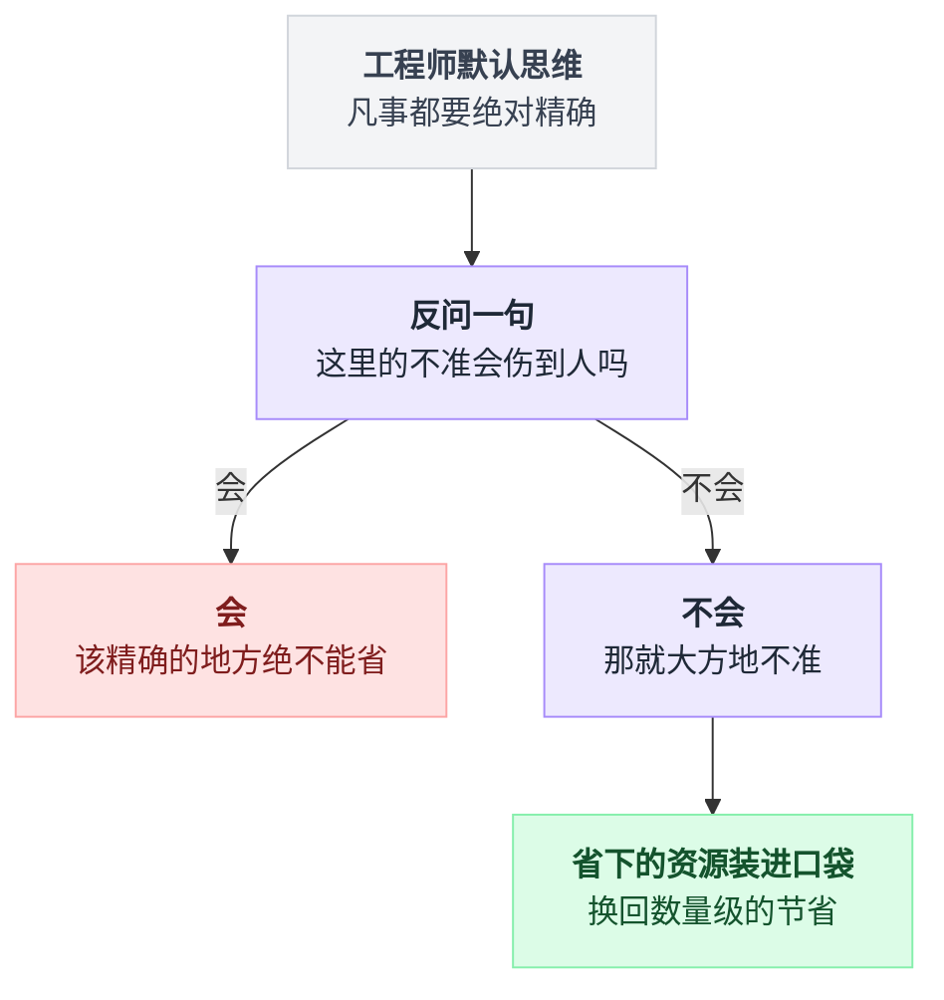

### 0.3 五种"不准"，五种"值得"

先把五个主角的"不完美"摊开给你看，你会发现它们像是同一个模子里刻出来的：

```
     ┌───────────────────────┬───────────────────────────────┐
     │  我主动放弃了……       │  我换回来了……                 │
     ├───────────────────────┼───────────────────────────────┤
     │ 短链接                │                               │
     │  短码能被人按顺序猜   │  永远不碰撞 + 一次查表就返回  │
     ├───────────────────────┼───────────────────────────────┤
     │ HyperLogLog           │                               │
     │  统计结果有 0.81% 误差│  内存 800MB → 12KB（6.6 万倍）│
     ├───────────────────────┼───────────────────────────────┤
     │ 雪花算法              │                               │
     │  必须相信机器时钟     │  没有中心节点，单机每秒 400 万│
     ├───────────────────────┼───────────────────────────────┤
     │ 布隆过滤器            │                               │
     │  偶尔把没有的说成有   │  内存降低 16~64 倍            │
     ├───────────────────────┼───────────────────────────────┤
     │ 一致性哈希            │                               │
     │  数据分布不完全均匀   │  扩容时 91% 的缓存不失效      │
     └───────────────────────┴───────────────────────────────┘
```

**每一行的左边，都是一句"我认了"。每一行的右边，都是一个数量级。**

这五笔交易，没有一笔是亏的。

读完这篇文章，我希望你脑子里留下的不是五个算法的细节 —— 细节你会忘。我希望留下的是那个**问句**：

> 我现在死磕的这个"绝对"，真的值这个价吗？

---

## 1. 五个主角，一条主线

在钻进细节之前，先花两分钟建立一张地图。这五个东西在真实系统里通常长在什么位置：

```
                       用户
                        │
                        │ 点了一个 t.cn/AbC123
                        ▼
        ┌───────────────────────────────────┐
        │  ①  短链服务                      │
        │     AbC123 →（62进制反解）→ ID    │
        │     查库拿到原始长 URL，302 跳走  │
        └───────────────┬───────────────────┘
                        │ 顺手记一笔："这个用户来过"
                        ▼
        ┌───────────────────────────────────┐
        │  ②  HyperLogLog                   │
        │     PFADD uv:20260804 user_9527   │
        │     12KB 内存，随时能报出 UV      │
        └───────────────┬───────────────────┘
                        │ 用户点进落地页，下了个单
                        ▼
        ┌───────────────────────────────────┐
        │  ③  雪花算法                      │
        │     生成订单号 1837465920384512   │
        │     不问任何人，本机算出来        │
        └───────────────┬───────────────────┘
                        │ 查询："这个订单存在吗？"
                        ▼
        ┌───────────────────────────────────┐
        │  ④  布隆过滤器                    │
        │     125MB 顶住 10 亿 key 的探测   │
        │     说"没有"就直接返回，不打数据库│
        └───────────────┬───────────────────┘
                        │ 说"可能有"，那就去缓存拿
                        ▼
        ┌───────────────────────────────────┐
        │  ⑤  一致性哈希                    │
        │     算出这个 key 该去哪台缓存机   │
        │     加机器时只搬 9% 的数据        │
        └───────────────────────────────────┘
```

一条完整的请求链路，五个主角全在上面。它们不是五个孤立的知识点 —— 它们是同一条路上的五个路标。

**读的时候请一直带着这个问题：这一节的这个东西，牺牲的是什么？**

好，开始。

---

## 2. 小节一：短链接生成 —— 用"可猜"换"不碰撞"

### 2.1 生活类比：寄存处的号码牌

你去博物馆，包不让带进去，要存在寄存处。

工作人员接过你的包，撕给你一张小纸片，上面印着 **`0473`**。

现在想一下这个流程有多聪明：

```
    你的包                        你手里的凭证
  ┌────────────────┐
  │  一个双肩包    │
  │  里面有：      │            ┌──────────┐
  │  钱包、充电宝  │  ───────▶  │   0473   │
  │  一本书、雨伞  │            └──────────┘
  │  一件外套      │              4 个数字
  └────────────────┘
      很重、很大                  轻、好记、好念

  取包的时候：
      你把 0473 递过去
              │
              ▼
      工作人员走到 0473 号柜子
              │
              ▼
      拿出你的包
```

**"0473" 本身不包含任何关于你的包的信息。** 它不知道你包里有什么，也不需要知道。它只是一个**指针** —— 一个短小的标识，通过一次查表，指向那个又大又重的东西。

短链接就是这个纸片：

```
    原始长 URL（又长又丑）
    ┌───────────────────────────────────────────────────────────┐
    │ https://shop.example.com/item/detail?id=100234981&        │
    │ from=timeline&share_uid=99887&utm_source=wechat&          │
    │ utm_campaign=summer_sale_2026&trace=a8f7d6e5c4b3a2f1      │
    └───────────────────────────────────────────────────────────┘
                        约 180 个字符
                              │
                              │  存进数据库，发一张"纸片"
                              ▼
    ┌────────────────────┐
    │  t.cn/AbC123       │
    └────────────────────┘
          12 个字符
```

于是这一节要解决的问题就清楚了：

> **怎么给每一条长 URL 发一张不重样的"纸片"？**

顺便说一句，寄存处的号码牌是**顺序发的** —— 你前面那个人是 0472。这个细节等一下会变成一个很要命的问题，先记住。

### 2.2 这件事难在哪

先看需求，一共四条：

| # | 需求 | 说人话 | 违反了会怎样 |
|---|---|---|---|
| 1 | **唯一** | 两条不同的长链，不能发到同一个短码 | 用户点 A 的链接，跳到了 B 的页面。**这是事故** |
| 2 | **短** | 6 位左右，太长就失去意义了 | 短链不短，产品经理会来找你 |
| 3 | **不可猜** | 别人不能靠改一个字符看到别人的链接 | 竞品把你所有推广链接爬光了 |
| 4 | **快** | 生成和跳转都要极快，QPS 可能上万 | 短链是流量入口，慢一秒就掉一片用户 |

> **QPS**：Queries Per Second，每秒请求数。这是本系列的老熟人了，一台普通服务器扛几千 QPS 是常态。

看起来都不难。麻烦在于**这四条互相打架**：

```
       想要"短"                        想要"唯一"
          │                                │
          │  短 = 可能的组合少             │  唯一 = 需要足够多的组合
          │                                │
          └──────────┬─────────────────────┘
                     ▼
              ╔═══════════════╗
              ║   直接冲突    ║
              ╚═══════════════╝

       想要"不可猜"                    想要"快"
          │                                │
          │  不可猜 = 随机                 │  快 = 别做复杂计算，
          │                                │       别反复查库重试
          └──────────┬─────────────────────┘
                     ▼
              ╔═══════════════╗
              ║   又冲突了    ║
              ╚═══════════════╝
```

**随机 → 可能撞车 → 要查库确认没撞 → 撞了要重试 → 慢。**

这个循环就是短链设计的核心矛盾。绝大多数人的第一版方案，都死在这个循环里。

### 2.3 朴素做法：MD5 取前 6 位（为什么它必死）

几乎所有人的第一反应都是这个：

```python
import hashlib

def make_short_code_BAD(long_url: str) -> str:
    """把长 URL 做 MD5，取前 6 位当短码。这是错的，下面讲为什么。"""
    digest = hashlib.md5(long_url.encode()).hexdigest()
    return digest[:6]          # 例如 "8f14e4"
```

**这段代码在干嘛：** MD5 是一种"摘要算法"—— 你喂给它任意长度的东西，它吐给你一串固定 32 个字符的十六进制串。同样的输入永远得到同样的输出。这里取前 6 个字符当短码。

> **哈希（Hash）**：把任意大小的数据，压成一个固定长度的"指纹"的过程。特点是：同样的输入 → 同样的输出；输入改一点点 → 输出面目全非。

这个方案看起来太美好了：

- 不用数据库发号，纯计算，快得飞起
- 同一条长 URL 永远得到同一个短码，天然去重
- 代码就三行

**然后它会在第 5000 条数据的时候，一半的概率给你出个事故。**

我不是在吓唬你。我们来算。

MD5 的前 6 位是十六进制字符（`0-9a-f`，共 16 种）。所以可能的取值一共：

```
    16 × 16 × 16 × 16 × 16 × 16  =  16⁶  =  16,777,216
                                            约 1677 万种
```

1677 万，听起来不少啊。你可能会想："我一年也发不了 1677 万条短链，安全得很。"

**这就是所有人踩坑的地方。** 你不需要发 1677 万条才会撞车 —— 你只需要发 **5000 条**。

### 2.4 生日悖论：23 个人和 28 万条短链

先讲一个跟技术无关的问题，你多半听过：

> **一个房间里要有多少人，才有超过 50% 的概率存在两个人生日同一天？**

绝大多数人凭直觉会答"180 多个吧，365 的一半"。

**正确答案是 23 个人。**

23。一个班级的三分之二。这个结果太反直觉了，所以它有个名字叫**生日悖论**。

为什么？因为你算错了一件事：**你要找的不是"有人和我同一天生日"，而是"任意两个人同一天生日"。**

```
    你以为在比较的：              实际在比较的：

      我 ←→ 张三                   张三 ←→ 李四
      我 ←→ 李四                   张三 ←→ 王五
      我 ←→ 王五                   李四 ←→ 王五
      ……                           我   ←→ 张三
                                   我   ←→ 李四
      n-1 次比较                   ……

                                   n×(n-1)/2 次比较
                                   ↑ 这是平方级的！
```

23 个人，两两组合有 `23×22/2 = 253` 对。253 对里，每一对撞上的概率是 1/365。**这就不奇怪了。**

**划重点：碰撞概率随数据量是平方级增长的，不是线性的。**

现在把它套回短链。经验公式是这样的：

```
    在 N 种可能中随机取 n 个，至少发生一次碰撞的概率：

              p ≈ 1 - e^( -n² / (2N) )

    要达到 50% 碰撞概率，大约需要：

              n ≈ 1.177 × √N
                       ↑ 注意是【开平方】，不是 N 的一半
```

**"开平方"这三个字，是整个短链设计里最贵的一句话。** 它的意思是：你辛辛苦苦把空间做到 1677 万，实际能安全用的只有它的平方根量级 —— 四千多。

代入 MD5 前 6 位（N = 1677 万）：

| 已生成的短链条数 | 至少发生一次碰撞的概率 | 什么感受 |
|---|---|---|
| 1,000 条 | **2.9%** | 你的灰度测试大概率没发现 |
| 5,000 条 | **52.5%** | 上线第二天，一半概率出事故 |
| 10,000 条 | **94.9%** | 几乎必然出事 |
| 100,000 条 | 100%（且已有大量碰撞） | 已经在赔钱了 |

**一万条短链就 95% 会出事。** 一个稍微像样的推广活动，一天就能发出去一万条。

那我把短码放长一点，用 62 个字符（`0-9a-zA-Z`）的 6 位呢？空间变成 568 亿，总该够了吧：

| 已生成的短链条数 | 碰撞概率（62 进制 6 位，N = 568 亿） |
|---|---|
| 1 万条 | 0.088% |
| 10 万条 | 8.4% |
| **28 万条** | **50%** ← 分水岭 |
| 100 万条 | 99.98% |
| 1000 万条 | 100%，且期望碰撞 880 对 |
| 1 亿条 | 期望碰撞 **88,028 对** |

看到没？空间从 1677 万涨到 568 亿，**涨了 3385 倍**，而安全的数据量只从 5 千涨到 28 万，**只涨了 58 倍**（正是 3385 的平方根）。

```
    空间涨 3385 倍
         │
         │  开平方
         ▼
    安全量只涨 58 倍

    ┌──────────────────────────────────────────┐
    │  这就是"用哈希做唯一 ID"这条路的天花板：  │
    │  你付出的空间是指数级的，                │
    │  拿回来的安全性只有平方根级。            │
    │  这笔账，永远是亏的。                    │
    └──────────────────────────────────────────┘
```

**那能不能"撞了就重试"？**

可以，但你想清楚代价：

```python
def make_short_code_STILL_BAD(long_url: str) -> str:
    """撞了就加盐重试 —— 能跑，但每次生成都要查一次库。"""
    salt = 0
    while True:
        digest = hashlib.md5(f"{long_url}#{salt}".encode()).hexdigest()[:6]
        if not db_exists(digest):        # ← 每生成一条，至少一次数据库查询
            db_insert(digest, long_url)  # ← 而且这里还有并发写入的竞态
            return digest
        salt += 1
```

**这段在干嘛：** 算一个短码，去数据库问"这个码用过没"，用过就换个盐重算，直到找到没用过的。

问题有三个：

1. **每生成一条短链，至少一次数据库查询。** 生成 QPS 直接被数据库锁死。
2. **数据量大了以后，重试次数暴涨。** 存了 1 亿条时，你要试好几次才能撞到空位。
3. **最要命的：并发下有竞态。** 两个请求同时查"AbC123 没人用"，同时插入 —— 后一个覆盖前一个，用户 A 的链接指向了 B 的页面。你得加唯一索引，加了以后插入失败又要重试，越来越慢。

> **竞态（Race Condition）**：两个操作同时进行，结果取决于谁先谁后，导致出错。这个词在秒杀那篇里已经反复出现过了 —— "查库存 → 判断 → 扣库存"这三步不原子，就会超卖。这里是同一个病。

**结论：哈希这条路是死路。不要走。**

### 2.5 正解：发号器 + 62 进制

回到寄存处那张纸片。工作人员是怎么保证不重号的？

他没有做任何哈希，没有做任何随机，也没有查过任何表。

**他只是撕下了下一张。**

```
    ┌──────────────────────────────────────────────┐
    │   0470  0471  0472  [0473]  0474  0475  ...  │
    │    已用  已用  已用   ↑撕这张                │
    └──────────────────────────────────────────────┘

          号码是【顺序发】的
                 │
                 ▼
          天生不可能重复
          （不是"概率很小"，是【不可能】）
```

这就是**发号器**思路。核心只有一句话：

> **不要去"生成一个希望不重复的东西"，要去"取走一个必然没被取过的东西"。**

这两句话的区别是根本性的：

```
   ┌─────────────────────────┬─────────────────────────┐
   │   哈希法（错）          │   发号法（对）          │
   ├─────────────────────────┼─────────────────────────┤
   │ 算一个值 → 祈祷不重     │ 取下一个数 → 必然不重   │
   │ 要查库验证              │ 不用查库                │
   │ 数据越多越慢            │ 永远一样快              │
   │ 有并发竞态              │ 自增天然串行            │
   │ 概率上的正确            │ 逻辑上的正确            │
   └─────────────────────────┴─────────────────────────┘
```

但有个问题：自增 ID 是十进制的，长这样：

```
    第 1 条：1
    第 100 万条：1000000
    第 10 亿条：1000000000     ← 10 位数了，太长
```

10 位数字的短链 `t.cn/1000000000`，一点都不短。

**怎么把它变短？换个进制。**

十进制只用了 10 个符号（`0-9`）。但 URL 里能安全使用的字符远不止 10 个 —— 数字 10 个 + 小写字母 26 个 + 大写字母 26 个 = **62 个**。

```
    同样一个数字：1,000,000,000（10 亿）

    十进制表示：  1000000000            10 位
    十六进制表示：3B9ACA00               8 位
    62 进制表示： 15FTGf                 6 位   ← 就这个
                 ↑
          用更多的符号，就能用更少的位数表达同一个数
```

这就像一个直觉：**你手里的"数字"种类越多，同样的位数能表达的东西就越多。** 就好比密码只让用数字，6 位就是 100 万种；允许用字母，6 位就是几百亿种。

**62 进制的字符表：**

```
    索引:  0  1  2  3  4  5  6  7  8  9 10 11 ... 35 36 37 ... 61
    字符:  0  1  2  3  4  5  6  7  8  9  a  b ...  z  A  B ...  Z
           └────── 数字 10 个 ──────┘└─ 小写 26 个 ─┘└─ 大写 26 个 ─┘
```

> **注意**：有的公司会用 58 进制（Base58），把容易看错的 `0`、`O`、`l`、`I` 四个字符去掉，防止用户抄错。比特币地址用的就是 Base58。如果你的短链要印在海报上让人手打，用 58 进制；如果只是点击，62 就行。

### 2.6 6 位 62 进制到底能装多少条

来算这笔账，一步一步来：

```
    每一位有 62 种选择：

    第 1 位   第 2 位   第 3 位   第 4 位   第 5 位   第 6 位
      62   ×    62   ×    62   ×    62   ×    62   ×    62

    = 62¹ =            62
    = 62² =         3,844
    = 62³ =       238,328
    = 62⁴ =    14,776,336            ← 1477 万
    = 62⁵ =   916,132,832            ← 9.16 亿
    = 62⁶ = 56,800,235,584           ← 568 亿
```

**568 亿。**

> 顺便提一句：网上很多文章会写"6 位 62 进制能表示 56.8 亿"，那是把小数点点错了一位。`56,800,235,584` 这个数，数一下是 11 位，是 **568 亿**。你自己算一遍 `62**6` 就知道了 —— 这种地方一定要自己动手验证，别人写的数字不一定对。

568 亿是什么概念？

```
    ┌─────────────────────────────────────────────────────────┐
    │  假设你每天生成 100 万条短链（这已经是很大的量了）      │
    │                                                         │
    │      568 亿 ÷ 100 万/天  =  56,800 天  ≈  155 年        │
    │                                                         │
    │  也就是说：6 位短码够你用 155 年。                      │
    │  而且注意 —— 这 568 亿个位置，                          │
    │  你会【一个不浪费地】全部用完，                         │
    │  因为是顺序发号，不是随机撞。                           │
    └─────────────────────────────────────────────────────────┘
```

**对比一下就特别清楚：**

| 方案 | 名义空间 | 实际能安全用的 | 利用率 |
|---|---|---|---|
| 随机/哈希 6 位 | 568 亿 | 约 28 万（50% 碰撞点） | **0.0005%** |
| 顺序发号 6 位 | 568 亿 | 568 亿 | **100%** |

**利用率差了 20 万倍。** 这就是"从概率正确改成逻辑正确"的威力。

### 2.7 Python 实现：进制转换与反转换

先写核心的编码/解码：

```python
ALPHABET = "0123456789abcdefghijklmnopqrstuvwxyzABCDEFGHIJKLMNOPQRSTUVWXYZ"
BASE = len(ALPHABET)          # 62

def to_base62(num: int) -> str:
    """把十进制整数转成 62 进制字符串。"""
    if num == 0:
        return ALPHABET[0]
    chars: list[str] = []
    while num > 0:
        num, remainder = divmod(num, BASE)   # 除以 62，同时拿到商和余数
        chars.append(ALPHABET[remainder])    # 余数当索引，查表拿字符
    return "".join(reversed(chars))          # 先算出来的是低位，要倒过来
```

**这段在干嘛：** 就是小学学的"短除法"。反复除以 62，把每次的余数记下来，最后倒着拼起来。

举个例子，把 `1000000` 转成 62 进制：

```
    1000000 ÷ 62 = 16129  余 2     → ALPHABET[2]  = '2'
      16129 ÷ 62 =   260  余 9     → ALPHABET[9]  = '9'
        260 ÷ 62 =     4  余 12    → ALPHABET[12] = 'c'
          4 ÷ 62 =     0  余 4     → ALPHABET[4]  = '4'
                          ↑ 商变成 0，结束

    余数从下往上读：4 c 9 2  →  "4c92"
```

反过来解码：

```python
# 反查表：字符 → 索引。预先建好，避免每次都调用 index() 做线性扫描
CHAR_TO_INDEX = {char: idx for idx, char in enumerate(ALPHABET)}

def from_base62(code: str) -> int:
    """把 62 进制字符串还原成十进制整数。"""
    num = 0
    for char in code:
        num = num * BASE + CHAR_TO_INDEX[char]
    return num
```

**这段在干嘛：** 和把 `"123"` 读成数字 123 是完全一样的逻辑 —— 从左往右，每读一个字符，先把已有的结果乘以进制（腾出一位），再加上当前这一位的值。

```
    解码 "4c92"：

    起点          num = 0
    读 '4' (=4)   num = 0  × 62 + 4  = 4
    读 'c' (=12)  num = 4  × 62 + 12 = 260
    读 '9' (=9)   num = 260× 62 + 9  = 16129
    读 '2' (=2)   num =16129×62 + 2  = 1000000    ✓ 完美还原
```

**注意这里最爽的一点：解码是纯计算，不查数据库。** 但等一下 —— 解码出来的是 ID，还是要拿 ID 去查数据库才能拿到原始 URL。所以短链跳转的完整流程是：

```
    收到 t.cn/4c92
          │
          ▼
    from_base62("4c92") → 1000000        纯 CPU 计算，纳秒级
          │
          ▼
    查 Redis: GET url:1000000            微秒级，99% 命中
          │  没命中
          ▼
    查数据库: SELECT ... WHERE id=1000000  毫秒级
          │
          ▼
    302 跳转到原始 URL
```

补齐到固定 6 位，方便系统统一处理：

```python
def encode_short_code(seq_id: int, length: int = 6) -> str:
    """发号器给的 ID → 定长短码。不足位数在左边补 '0'。"""
    code = to_base62(seq_id)
    if len(code) > length:
        return code            # 超了就自然变长，别截断（截断就是碰撞）
    return code.rjust(length, ALPHABET[0])
```

**划重点：`if len(code) > length: return code` 这一行千万别写成截断。** 一旦你为了"保持 6 位"而截掉高位，你就又回到了碰撞的世界。宁可短码变成 7 位，也绝不能截。

### 2.8 新问题：顺序 ID 能被人爬光

发号器解决了碰撞，但它把开头那个"寄存处顺序发牌"的隐患，原封不动带过来了。

```
    你的短链：

      ID 1000000  →  t.cn/004c92     ← 你的某条推广链接
      ID 1000001  →  t.cn/004c93     ← 隔壁部门的活动页
      ID 1000002  →  t.cn/004c94     ← 某个用户分享的私密文档
      ID 1000003  →  t.cn/004c95     ← ...
                        ↑
              一个字符一个字符往上加，
              写个循环就能把你全站短链爬光
```

**这有多严重？** 分两种情况：

| 场景 | 严重程度 | 为什么 |
|---|---|---|
| 公开的营销落地页 | 低 | 本来就是给人看的，被爬走也就是竞品做个情报分析 |
| 短链背后是**私密内容**（会议纪要、分享的文件、带 token 的邀请链接） | **极高** | 遍历一遍，别人家的东西全在你手上了 |
| 商业情报 | 中高 | 竞品能精确算出你**每天发多少条短链**，你的业务量全裸奔了 |

最后一条特别有意思：哪怕内容都是公开的，**顺序 ID 也泄露了你的业务规模**。竞品今天抓一个最大 ID，明天再抓一个，一减就知道你一天的量。这在业内有个名字叫 **German tank problem**（德国坦克问题）—— 二战时盟军就是靠缴获坦克上的顺序编号，估算出德国的月产量的。

**怎么办？在"ID → 短码"这一步中间，插一层混淆。**

关键要求：这个混淆必须是**双射**的 —— 每个 ID 对应唯一一个混淆值，每个混淆值也能唯一还原回 ID。不能有两个 ID 混淆到同一个值（那又是碰撞了）。

> **双射（Bijection）**：一一对应。就像座位号和人，一个萝卜一个坑，不多不少。

有三种常见做法，从简单到讲究：

**做法一：打乱字符表（最简单，也最弱）**

```python
import random

# 把标准字符表洗牌，作为公司的"内部密码本"，绝不外泄
_rng = random.Random(20260804)               # 固定种子，保证每次启动一样
SHUFFLED = list(ALPHABET)
_rng.shuffle(SHUFFLED)
SHUFFLED = "".join(SHUFFLED)
# 结果比如： "Xq3mZ8..." —— 每个位置的字符都变了
```

**这段在干嘛：** 还是 62 进制，但字符表的顺序被打乱了。ID 1000000 不再是 `4c92`，而是别的东西。

**它的问题：** 这只是**替换密码**，小学生玩的那种。相邻的 ID 依然产生相邻的短码 —— 攻击者拿 100 个已知短链，对着排一排，半小时就能把你的字符表还原出来。**只能防君子，不能防小人。**

**做法二：乘法逆元混淆（推荐，简单且够用）**

这个做法很巧妙，用到一点初中数学：

```
    核心思想：

      混淆后的值 = (ID × 一个大质数) mod 62⁶

    这一步会把连续的 ID 打散到整个空间的各个角落。

    而只要那个大质数和 62⁶ 【互质】，
    这个操作就一定是【可逆】的 ——
    存在一个"逆元"，乘回去就能还原 ID。
```

```python
MAX_ID = BASE ** 6                    # 56,800,235,584
MULTIPLIER = 387420489                # 3^18，和 62^6 = 2^6 × 31^6 互质
INVERSE = pow(MULTIPLIER, -1, MAX_ID) # Python 3.8+ 直接求模逆元 = 23343816889

def obfuscate(seq_id: int) -> int:
    """顺序 ID → 打散后的值。"""
    return (seq_id * MULTIPLIER) % MAX_ID

def deobfuscate(scrambled: int) -> int:
    """打散后的值 → 还原成顺序 ID。"""
    return (scrambled * INVERSE) % MAX_ID
```

**这段在干嘛：** `pow(a, -1, m)` 是求 a 在模 m 下的乘法逆元 —— 满足 `a × inv ≡ 1 (mod m)` 的那个数。有了它，乘过去再乘回来就还原了。

效果立竿见影：

```
    原始 ID       混淆后的值              短码
    ────────     ─────────────         ──────────
       1          387,420,489          "0qdzLz"
       2          774,840,978          "0GRZmY"
       3        1,162,261,467          "17FZ7x"
       4        1,549,681,956          "1o4YUw"
                        ↑
        ID 只差 1，短码看起来毫无关系
```

**为什么必须"互质"？** 打个比方：`62⁶ = 2⁶ × 31⁶`。如果你选的乘数里含有因子 2 或 31，比如选了 4，那 `1×4=4`、`2×4=8`……乘出来的结果永远是 4 的倍数，你直接浪费掉了 3/4 的空间，而且不同 ID 会撞到一起。互质就是保证"不共享因子"，这样乘法在模 62⁶ 下是一个完美的洗牌。

**它的问题：** 这依然是线性变换。攻击者如果拿到足够多的（ID，短码）对，理论上可以解出乘数。但实际中攻击者**看不到 ID**（他只看到短码），所以难度高很多。对绝大多数业务，这一层够了。

**做法三：Feistel 网络（最强，要求高时用）**

Feistel 是构造分组密码的经典结构（DES 就是它）。思路是把数字劈成左右两半，做几轮"右半边过一个哈希函数，异或到左半边，然后左右交换"。

```
        输入：36 bit 的 ID
        ┌──────────────┬──────────────┐
        │  L0 (18bit)  │  R0 (18bit)  │
        └──────┬───────┴──────┬───────┘
               │              │
               │       ┌──────┴──────┐
               │       │  F(R0, K1)  │  ← 任意哈希函数都行
               │       └──────┬──────┘
               ▼              │
              XOR ◀───────────┘
               │              │
               └──────┐  ┌────┘
                   交换│  │
        ┌──────────────┴──┴───────────┐
        │  L1 = R0     │  R1 = L0⊕F   │
        └──────────────┴──────────────┘
                    ……重复 4 轮……
```

**Feistel 的神奇之处：无论 F 是什么函数（甚至是个垃圾函数），整个结构都一定可逆。** 因为解密就是把轮次倒过来跑一遍。这让它既安全又保证双射。

**三种做法怎么选：**

| 做法 | 安全性 | 复杂度 | 什么时候用 |
|---|---|---|---|
| 打乱字符表 | 低 | 极低 | 只是不想让人一眼看穿，内容本身公开 |
| **乘法逆元** | 中 | 低 | **绝大多数业务的默认选择** |
| Feistel | 高 | 中 | 短链背后是私密内容，或有明确的对抗需求 |
| 直接存随机码 | 高 | 高 | 量不大（百万级以内），且能接受查库去重 |

按"背后内容有多敏感"这条主线把上表收成一张决策图：

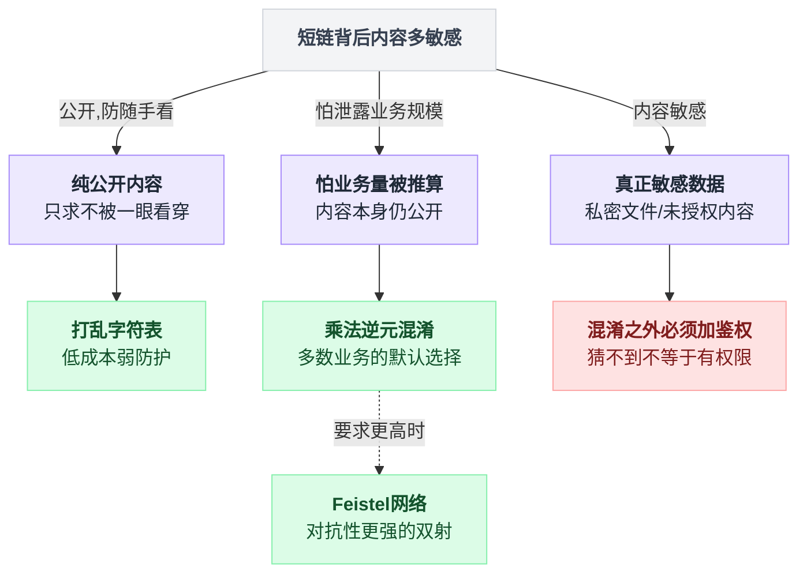

**最后一句提醒，很重要：** 混淆 ≠ 鉴权。

> 如果短链背后的内容是**真正敏感**的（比如一份财务报表），那你不能指望"猜不到 URL"来保护它。**猜不到只是提高门槛，不是访问控制。** 该做登录校验就做登录校验，混淆只是顺手加的一层。
>
> 这和秒杀里那句"前端隐藏按钮不算防刷"是同一个道理 —— **靠"对方不知道"来保护，叫 security by obscurity，业界公认是不可靠的。**

### 2.9 301 还是 302？一个很有意思的权衡

短链服务器收到请求后，要告诉浏览器"去这个地址"。HTTP 里有两个状态码干这事：

> **HTTP 状态码**：服务器回复浏览器时带的一个三位数，告诉浏览器"这次请求的结果是什么"。200 = 成功，404 = 找不到，500 = 服务器炸了。3xx 这一族的意思是"你要的东西不在这，去别处找"。

| 状态码 | 全名 | 意思 |
|---|---|---|
| **301** | Moved Permanently | 永久搬走了。**以后你别再问我了，直接去新地址** |
| **302** | Found（Moved Temporarily） | 临时搬走了。这次去新地址，**下次还来问我** |

差别就在括号里那句话，但后果天差地别：

```
  ┌─────────────── 301 永久重定向 ───────────────┐
  │                                              │
  │  第 1 次点击：                               │
  │    浏览器 ──── GET t.cn/4c92 ────▶ 短链服务器│
  │    浏览器 ◀─── 301 + 长URL ──────  短链服务器│
  │    浏览器 ──── 去长URL ──────────▶ 目标站点  │
  │       │                                      │
  │       └─▶ 【浏览器把这条映射记在本地缓存了】 │
  │                                              │
  │  第 2 次点击：                               │
  │    浏览器 ─── 直接去长URL ───────▶ 目标站点  │
  │                  ↑                           │
  │        短链服务器【完全不知道】这次点击      │
  └──────────────────────────────────────────────┘

  ┌─────────────── 302 临时重定向 ───────────────┐
  │                                              │
  │  第 1 次点击：                               │
  │    浏览器 ──── GET t.cn/4c92 ────▶ 短链服务器│
  │    浏览器 ◀─── 302 + 长URL ──────  短链服务器│
  │    浏览器 ──── 去长URL ──────────▶ 目标站点  │
  │                                              │
  │  第 2 次点击：                               │
  │    浏览器 ──── GET t.cn/4c92 ────▶ 短链服务器│ ← 又回来了
  │    浏览器 ◀─── 302 + 长URL ──────  短链服务器│   能统计到！
  │    浏览器 ──── 去长URL ──────────▶ 目标站点  │
  └──────────────────────────────────────────────┘
```

**权衡表：**

| 维度 | 301 永久 | 302 临时 |
|---|---|---|
| 你的服务器压力 | **极低**（浏览器缓存后不再来） | 高（每次点击都要处理） |
| 用户第二次点击的速度 | **快**（省一次网络往返） | 慢一点 |
| **能不能统计点击量** | **不能**（这是致命伤） | **能**（每次都经过你） |
| 能不能改短链的目标 | **不能**（用户浏览器里缓存死了，除非用户清缓存） | **能**（下次来给他新地址就行） |
| SEO 权重传递 | 传给目标页面 | 不传（搜索引擎认为是临时的） |
| 短链失效/被举报后能否拦截 | **不能** | **能**（随时可以改成跳到警告页） |

**结论：99% 的短链服务用 302。** 新浪短链、bit.ly、t.co 全是 302。

原因很直接：**短链服务的商业价值，一大半就在"统计"上。**

想想看，为什么公司要做短链？

1. 让链接变短，好在微博/短信里发 —— 这只是表面
2. **知道有多少人点了、什么时候点的、从哪个渠道点的** —— 这才是真正值钱的
3. 能随时封禁一条链接（内容违规、活动下线了）
4. 能随时改目标（A/B 测试、活动页换版）

用了 301，2、3、4 全部失去。你只剩下"链接变短"这一个功能，而且**改都改不了**。

> **这里有个坑，非常真实：** 有些团队为了减轻服务器压力选了 301，结果某天需要把一条短链下线（内容违规被举报了），发现**做不到** —— 已经点过的用户浏览器里死死缓存着，你的服务器根本收不到他们的请求。这个错误是**不可撤销**的，只能等用户自己清缓存。
>
> 上线前一定想清楚：**你能接受"这条短链永远改不了"吗？**

**什么时候才该用 301？**

只有一种情况：这条短链是**永久性的品牌跳转**，你确定它一辈子不会改，而且你不需要统计。比如公司内部把 `go/wiki` 跳到内网 wiki 首页。

**折中方案：**

```python
from fastapi import FastAPI
from fastapi.responses import RedirectResponse

app = FastAPI()

@app.get("/{code}")
async def redirect(code: str) -> RedirectResponse:
    seq_id = deobfuscate(from_base62(code))
    long_url = await lookup_url(seq_id)          # 先 Redis 后 DB
    if long_url is None:
        return RedirectResponse("/404", status_code=302)

    await bump_click_counter(seq_id)             # 异步打点，不阻塞跳转

    # 关键：302 + 明确禁止缓存
    resp = RedirectResponse(long_url, status_code=302)
    resp.headers["Cache-Control"] = "no-store, no-cache, must-revalidate"
    return resp
```

**这段在干嘛：** 解码 → 查 URL → 异步记一笔点击 → 302 跳走，并且明确告诉浏览器"别缓存我"。

**为什么要显式加 `Cache-Control: no-store`？** 因为有些浏览器和中间代理，会自作主张缓存 302 响应一小段时间。你不明确说"别存"，统计就会漏。这是个很容易被忽略的细节。

`bump_click_counter` 要用异步的方式（扔进队列或者 Redis `INCR`），**绝不能同步写数据库** —— 跳转是用户能感知到延迟的路径，那里塞一次数据库写入，用户会感觉"这个链接点了半天不动"。

> 这和秒杀里"下单请求先扔 MQ、异步落库"是同一招：**把用户等待路径上的重活儿摘出去**。

把 2.9 节挑 301 还是 302 的判断收成一张图：

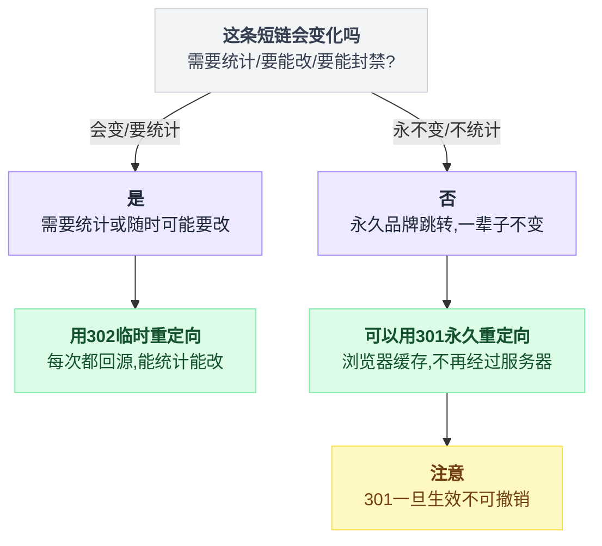

### 2.10 几百亿条短链怎么存

假设你真做到了 100 亿条短链，怎么存？

**先算一笔存储账：**

```
    单条记录：
      id           BIGINT       8 字节
      long_url     VARCHAR(2048) 平均 200 字节
      create_time  DATETIME     8 字节
      creator_id   BIGINT       8 字节
      expire_at    DATETIME     8 字节
      ────────────────────────────────
      合计约                    232 字节
      加上索引和页开销，按 300 字节算

    100 亿条 × 300 字节 = 3,000,000,000,000 字节 ≈ 2.7 TB
```

2.7 TB 单表？MySQL 单表超过几千万行，查询就开始明显变慢了。必须分。

**分库分表方案：**

```
                     短码 "0qdzLz"
                          │
                          ▼
                 from_base62 → 打散值
                          │
                          ▼
                 deobfuscate → seq_id = 1
                          │
             ┌────────────┴────────────┐
             ▼                         ▼
      库号 = seq_id % 16         表号 = (seq_id/16) % 64
             │                         │
             ▼                         ▼
      ┌────────────┐            ┌────────────┐
      │  DB_01     │            │  t_url_23  │
      └────────────┘            └────────────┘

      16 个库 × 64 张表 = 1024 张表
      100 亿 ÷ 1024 ≈ 每张表 1000 万行   ← 舒服了
```

**这个分片键选得特别妙，妙在三点：**

1. **seq_id 是自增的，天然均匀。** 不像用 user_id 分片会有大 V 热点问题。
2. **查询永远是精确的单点查询。** 短链跳转只有一种查询："给我 id=X 的 URL"。不存在范围查询、不存在 join、不存在排序。**这是分库分表最理想的场景。**
3. **不需要跨库事务。** 一条短链的生命周期只在一个库里。

> 对比一下秒杀那篇的库存分片 —— 那里分片后还要处理"某个分片卖光了但别的分片还有货"的问题。短链没有这个烦恼，因为**每条数据完全独立**。这是"选对分片维度"的教科书案例。

**缓存层：**

短链访问有极强的**二八分布**（甚至是一九）：

```
      访问量
        │
        │ ██
        │ ██
        │ ██
        │ ██▄
        │ ████▄▄
        │ ████████▄▄▄▄▄▄▄▄▄▄▄▄▄▄▄▄▄▄▄▄▄▄▄▄▄▄▄
        └────────────────────────────────────────▶ 短链（按热度排序）
          ↑                    ↑
     最近 1 小时创建的      三个月前创建的
     占了 95% 的流量        几乎没人点

    结论：一个不大的 Redis，就能挡住绝大部分流量。
```

一条短链发出去，绝大多数点击集中在头几个小时（微博发出去、短信群发出去），之后迅速衰减。所以：

```python
CACHE_TTL_HOT = 7 * 24 * 3600      # 新创建的：缓存 7 天
CACHE_TTL_COLD = 3600              # 老链接偶尔被翻出来：缓存 1 小时

async def lookup_url(seq_id: int) -> str | None:
    """查 URL：先 Redis，miss 了回源数据库并回填。"""
    cached = await redis.get(f"u:{seq_id}")
    if cached is not None:
        return None if cached == b"\x00" else cached.decode()   # 空值标记

    row = await db_query_by_id(seq_id)
    if row is None:
        # 关键：不存在也要缓存一个空标记，防止缓存穿透
        await redis.setex(f"u:{seq_id}", 60, b"\x00")
        return None

    await redis.setex(f"u:{seq_id}", CACHE_TTL_COLD, row.long_url)
    return row.long_url
```

**这段在干嘛：** 先查 Redis，没有就查库并回填。注意 `b"\x00"` 那个**空值标记** —— 数据库里查不到时，也往 Redis 塞一个特殊标记，缓存 60 秒。

**为什么要这么做？** 因为短链的 URL 空间是公开可枚举的，攻击者可以疯狂请求 `t.cn/aaaaaa`、`t.cn/aaaaab`……这些全都不存在。如果不缓存空值，每一个都会穿透到数据库。

> **缓存穿透**：查一个数据库里也不存在的 key，缓存挡不住，请求全打到数据库上。这个词在秒杀那篇讲过。而下一节的**布隆过滤器**，是对付它更优雅的武器 —— 到第 5 节你会看到，用 125MB 内存就能挡住 10 亿个不存在的 key。

**这里埋一个伏笔：短链服务是布隆过滤器的完美用户。** 记住这个场景，第 5 节回来看。

### 2.11 小节回收

```
    ┌────────────────────────────────────────────────────────┐
    │  短链接生成：一次"用可猜换不碰撞"的交易                │
    ├────────────────────────────────────────────────────────┤
    │                                                        │
    │  放弃了：                                              │
    │    · 短码不再是"从内容算出来的"（失去了天然幂等）      │
    │    · 需要维护一个发号器（引入了一个组件）              │
    │    · 混淆之后依然不是密码学级别的不可猜                │
    │                                                        │
    │  换来了：                                              │
    │    · 碰撞率【严格为 0】，不是"很小"，是 0              │
    │    · 生成不查库，跳转一次 KV 查询                      │
    │    · 空间利用率 100%（vs 随机方案的 0.0005%）          │
    │                                                        │
    │  一句话记住：                                          │
    │    不要"算一个希望不重复的值"，                        │
    │    要"取一个必然没被取过的号"。                        │
    └────────────────────────────────────────────────────────┘
```

</content>

---

## 3. 小节二：UV 统计与 HyperLogLog —— 用"0.81% 误差"换"800MB → 12KB"

### 3.1 生活类比：演唱会怎么数人头

体育场里在开演唱会。老板问你："今天来了多少人？"

**方法一（笨办法）：** 站在门口，来一个人数一个，`1、2、3……`。三万人，你数到明天早上，中间还会数错。

**方法二（聪明一点）：** 每个人进场撕一张票根，散场后数票根。但你还是要数三万张纸。

**方法三（真正的做法）：** 你根本不数人。你看**座位图**。

```
    ┌─────────────────────────────────────────┐
    │  A 区（5000 座）  █████████████  满了   │
    │  B 区（5000 座）  ████████████░  95%    │
    │  C 区（5000 座）  ██████░░░░░░░  50%    │
    │  D 区（5000 座）  ██░░░░░░░░░░░  15%    │
    │  E 区（5000 座）  ░░░░░░░░░░░░░  空的   │
    │  F 区（5000 座）  ░░░░░░░░░░░░░  空的   │
    └─────────────────────────────────────────┘

    5000 + 4750 + 2500 + 750 + 0 + 0 ≈ 13000 人

    你【一个人都没数】，只看了 6 个区的填充程度。
```

这个估算准吗？不准。真实人数可能是 12800，也可能是 13400。**误差大概 2~3%。**

但老板会在乎这 2% 吗？他要的是"一万三"这个量级，好判断票房、好决定下次开几场。你告诉他"精确的 12,847 人"和"大约 13,000 人"，**对他的决策毫无区别**。

**而后者，你花了 30 秒。前者，你要花一晚上。**

HyperLogLog 干的就是这件事：**不去逐个记录，而是观察"填充的痕迹"，反推出总量。**

### 3.2 这件事难在哪

先把术语说清楚：

> **UV（Unique Visitor）**：独立访客数。同一个人今天访问了 100 次，UV 只算 1。
> **PV（Page View）**：页面浏览量。访问 100 次就是 100。

PV 好统计 —— 来一次就 `+1`，一个计数器搞定，占 8 个字节。

**UV 难在"去重"这两个字上。**

```
    PV：来一个 +1                    UV：来一个，先问"你之前来过吗？"
        │                                 │
        ▼                                 ▼
    counter += 1                    if user not in seen:
        │                                 seen.add(user)
        ▼                                 counter += 1
    只需要存一个数字                       │
    8 字节                                 ▼
                                    你必须【记住每一个来过的人】
                                    才能回答"来过吗"这个问题
                                          │
                                          ▼
                                    存储量 ∝ 用户数
```

**这就是难点的全部：去重必须记忆，记忆必须占空间。**

而且注意，UV 统计不是只有一个数。真实业务里是这样的：

```
    ┌──────────────────────────────────────────────────┐
    │  你需要统计的 UV 有多少个维度？                  │
    ├──────────────────────────────────────────────────┤
    │  · 每天的全站 UV                    ×  365 天    │
    │  · 每个页面的 UV                    ×  1000 页面 │
    │  · 每个渠道来源的 UV                ×  50 渠道   │
    │  · 每个城市的 UV                    ×  300 城市  │
    │  · 每小时的 UV（做趋势图）          ×  24 小时   │
    │                                                  │
    │  排列组合下来，                                  │
    │  你要维护【几十万个】独立的去重计数              │
    └──────────────────────────────────────────────────┘
```

一个统计难不倒你，几十万个同时统计，就是另一回事了。

### 3.3 朴素做法：一个 Set 装下所有人

最直白的做法：

```python
# 用一个集合存所有来过的用户 ID
visitors: set[int] = set()

def record_visit(user_id: int) -> None:
    visitors.add(user_id)      # 集合天然去重，重复添加没有副作用

def get_uv() -> int:
    return len(visitors)       # 集合的大小就是 UV
```

**这段在干嘛：** 用 Python 的 `set`。集合的特性是自动去重，加一百次同一个人还是一个。

代码三行，逻辑无懈可击，结果 100% 精确。**然后我们算内存。**

**第一层账：理论最优**

假设每个用户 ID 就是一个 8 字节的整数（`BIGINT`）：

```
    1 亿用户 × 8 字节 = 800,000,000 字节 ≈ 800 MB
```

**800MB。而这只是"一个页面、一天"的 UV。**

**第二层账：Python 的 set 实际有多重**

理论值是骗人的。Python 的 `set` 内部是哈希表，每个元素要存：

```
    ┌──────────────────────────────────────────┐
    │  Python set 里存一个 int，实际开销：     │
    ├──────────────────────────────────────────┤
    │  int 对象本身（PyLongObject）    28 字节 │
    │  哈希表槽位（指针 + hash 缓存）  16 字节 │
    │  哈希表为了性能只装到 60% 满            │
    │      → 槽位要按 1.67 倍算       ≈ 27 字节│
    │  ──────────────────────────────────────  │
    │  合计约                          55 字节 │
    └──────────────────────────────────────────┘

    1 亿 × 55 字节 ≈ 5.5 GB
```

**5.5 GB。** 一台 8G 内存的机器，跑一个统计就 OOM 了。

> **OOM**：Out Of Memory，内存耗尽，进程被操作系统杀掉。

**第三层账：用 Redis Set 会好点吗？**

不会，更糟。Redis 的 Set 存字符串型用户 ID（比如 `"u_10023981"`）：

```
    ┌────────────────────────────────────────────────┐
    │  Redis Set（hashtable 编码）单元素开销          │
    ├────────────────────────────────────────────────┤
    │  SDS 字符串对象（存 "u_10023981"）      ~32 字节│
    │  dictEntry（key 指针 + value + next）    24 字节│
    │  dict 数组槽位（含负载因子）             ~16 字节│
    │  内存分配器（jemalloc）的对齐损耗        ~8 字节│
    │  ────────────────────────────────────────────  │
    │  合计约                                  80 字节│
    └────────────────────────────────────────────────┘

    1 亿 × 80 字节 ≈ 8 GB      ← 一个 key 就吃掉 8G
```

**第四层账：这不是一个 key，是几十万个 key**

```
    ┌──────────────────────────────────────────────────────┐
    │  真实场景：1000 个页面 × 保留 30 天                  │
    │                                                      │
    │  假设每个页面平均 100 万 UV（不是 1 亿，缩小 100 倍）│
    │      每个 key: 100 万 × 80 字节 = 80 MB              │
    │      1000 页面 × 30 天 = 30,000 个 key               │
    │                                                      │
    │      总计: 30,000 × 80MB = 2,400,000 MB ≈ 2.4 TB    │
    │                                                      │
    │  你需要一个 2.4TB 内存的 Redis 集群，                │
    │  只为了回答"昨天首页有多少人来过"。                  │
    └──────────────────────────────────────────────────────┘
```

**2.4TB 内存。** 按云厂商的价格，这大概是**每年七位数**的账单。

**为了一个连产品经理都只会瞄一眼的数字。**

**能不能省一点？**

有人会说：用 Bitmap 啊！用户 ID 当下标，来过就把那一位置 1。

```
    用户 ID:  0  1  2  3  4  5  6  7  8  9 ...
    位数组:   0  1  0  0  1  1  0  0  0  1 ...
              ↑     ↑        ↑        ↑
            没来   来过     来过     来过

    1 亿用户 = 1 亿 bit = 12.5 MB      ← 从 800MB 降到 12.5MB！
```

**Bitmap 确实是个巨大的进步，从 800MB 降到 12.5MB，64 倍。** 而且它是**完全精确**的。

但 Bitmap 有个致命的前提：**用户 ID 必须是连续的小整数。**

```
    ┌───────────────────────────────────────────────────────┐
    │  Bitmap 的死穴：ID 空间必须稠密                       │
    ├───────────────────────────────────────────────────────┤
    │                                                       │
    │  情况 A：用户 ID 是 1 ~ 1 亿 的自增数字               │
    │      → 完美，12.5 MB 搞定                             │
    │                                                       │
    │  情况 B：用户 ID 是雪花算法生成的 1837465920384512    │
    │      → 位数组要开到 1.8 × 10¹⁵ 位 = 230 TB           │
    │      → 直接爆炸                                       │
    │                                                       │
    │  情况 C：统计的是【设备指纹】/【IP】/【cookie】       │
    │      → 根本不是整数，是 32 位的哈希串                 │
    │      → 你得先建一个"字符串 → 整数"的映射表           │
    │      → 那张映射表本身就要 8GB。绕回原点了。           │
    │                                                       │
    └───────────────────────────────────────────────────────┘
```

**注意情况 B —— 这不是假设。** 下一节我们要讲的雪花算法，生成的就是这种巨大的、稀疏的 ID。你会发现这两个技术在同一个系统里天然打架。

而且就算 ID 是稠密的，还有一个问题：**Bitmap 的大小取决于 ID 空间，而不是实际人数。** 你有 1 亿注册用户，但某个冷门页面昨天只来了 100 个人 —— Bitmap 依然要开 12.5MB。3 万个 key 就是 375GB。

**总结一下朴素方案的困境：**

| 方案 | 1 亿 UV 的内存 | 精确吗 | 死穴 |
|---|---|---|---|
| Python set | 5.5 GB | 精确 | 单机装不下 |
| Redis Set | 8 GB | 精确 | 贵得离谱 |
| Bitmap | 12.5 MB | 精确 | 要求 ID 稠密；冷 key 也占满空间 |
| **HyperLogLog** | **12 KB** | **误差 0.81%** | 见 3.9 节 |

**12 KB。比 Redis Set 小 66 万倍，比 Bitmap 小 1000 倍。**

这怎么可能？往下看。

### 3.4 核心直觉：抛硬币

放下所有技术，我们来玩个游戏。

**我在办公室抛硬币。抛出反面就继续抛，抛出正面就停下，然后记录"我这一轮连续抛出了几次反面"。**

比如：反、反、正 → 这一轮我抛出了 **2 个连续反面**。

现在，我这样玩了很多轮。我告诉你一件事：

> **"我今天玩到现在，最高纪录是连续抛出了 10 个反面。"**

**问题：你猜我大概玩了多少轮？**

先别管公式，凭感觉想：

```
    连续 1 个反面：  概率 1/2       平均玩 2 轮能碰上一次
    连续 2 个反面：  概率 1/4       平均玩 4 轮
    连续 3 个反面：  概率 1/8       平均玩 8 轮
    连续 4 个反面：  概率 1/16      平均玩 16 轮
       ……
    连续 10 个反面： 概率 1/1024    平均玩 1024 轮
```

所以你的答案应该是：**大概一千多轮。**

**停下来，仔细体会一下刚才发生了什么。**

我没有告诉你我玩了多少轮。我只告诉你一个数字：**10**。

而你，仅凭这一个数字，推断出了"一千多轮"这个量级。

```
    ┌──────────────────────────────────────────────────────┐
    │                                                      │
    │   我只存了一个数字（最长连续反面 = 10）              │
    │                              │                       │
    │                              ▼                       │
    │   你估算出了总量（≈ 2¹⁰ = 1024 轮）                  │
    │                                                      │
    │   存储：一个小整数（4 bit 就够存 0~15）              │
    │   还原：一个量级正确的总数                           │
    │                                                      │
    │   ★ 这就是 HyperLogLog 的全部灵魂 ★                  │
    │                                                      │
    └──────────────────────────────────────────────────────┘
```

**再体会一层：为什么"最长"这个统计量特别适合？**

因为"最长"这个东西有三个绝妙的性质：

| 性质 | 说明 | 为什么重要 |
|---|---|---|
| **只需要一个数** | 不管玩了多少轮，只记一个"当前最长" | 存储恒定，和数据量无关 |
| **天然去重** | 我把同一轮的结果报给你两次，"最长"不会变 | **这正是 UV 需要的！** |
| **可合并** | A 房间最长 8，B 房间最长 10 → 合起来最长 10 | 多台机器的统计可以简单合并 |

**第二条是关键中的关键。** 我们回头看 UV 的核心难题是"去重"。而"取最大值"这个操作，天生就是幂等的 —— 同一个值给它一百遍，结果不变。

> **幂等（Idempotent）**：同一个操作做一次和做一百次，结果一样。这个词在秒杀那篇讲过（订单接口要幂等，防止重复下单）。这里是同一个概念在起作用。

### 3.5 从抛硬币到基数估计

好，现在把游戏搬到代码里。

**用户 ID 怎么变成"抛硬币"？**

答案：**哈希。** 一个好的哈希函数输出的每一个 bit，都可以看作一次公平的硬币 —— 是 0 还是 1，概率各一半，而且彼此独立。

```
    用户 ID: "u_10023981"
                │
                │  hash()
                ▼
    64 位二进制: 0000 1011 0110 1110 1001 ... 0110
                 └──┬──┘
                    │
              前面有 4 个连续的 0
                    │
                    ▼
          等价于"抛出了 4 个反面才出正面"
```

**规则：数一下哈希值前面有多少个连续的 0（叫"前导零"），再加 1，作为这个用户的"分数"。**

> **前导零（Leading Zeros）**：一个二进制数最前面连着的 0 的个数。`00001011` 的前导零是 4。

为什么加 1？习惯而已 —— 让"第一个 1 出现在第几位"这个说法更自然。前导零 4 个，第一个 1 在第 5 位，分数就是 5。

现在，最朴素的基数估计算法（叫 **LogLog**）就出来了：

```python
import hashlib

def _leading_zeros_plus_one(h: int, bits: int = 32) -> int:
    """算 h 的前导零个数 + 1。"""
    if h == 0:
        return bits + 1
    return bits - h.bit_length() + 1

class NaiveLogLog:
    """最朴素的基数估计：只记一个最大值。误差极大，只用来讲原理。"""
    def __init__(self) -> None:
        self.max_score = 0

    def add(self, item: str) -> None:
        h = int(hashlib.md5(item.encode()).hexdigest()[:8], 16)  # 取 32 位
        self.max_score = max(self.max_score, _leading_zeros_plus_one(h))

    def count(self) -> int:
        return 2 ** self.max_score        # 估计值 = 2 的最大分数次方
```

**这段在干嘛：** 每来一个用户，哈希一下，数前导零，只保留见过的最大值。要估计总数时，返回 `2^最大值`。

**存储：一个整数。不管来了 1 个人还是 1 亿人。**

**然后我们试试它准不准：**

```
    真实 UV = 100,000

    某次运行，最大前导零 = 17  →  估计值 2¹⁷ = 131,072      误差 +31%
    另一次运行，最大前导零 = 16 →  估计值 2¹⁶ = 65,536      误差 -34%
    再一次， 最大前导零 = 18   →  估计值 2¹⁸ = 262,144      误差 +162%
```

**惨不忍睹。** 为什么？

**因为估计值只能是 2 的整数次方。** 它只能输出 65536、131072、262144……这些跳跃的值，中间的数它一个都表示不了。相邻两个可能的答案之间差了 **2 倍**。

而且更糟的是**运气因素**：

```
    只要有【一个】倒霉蛋用户，
    他的哈希值恰好是 0000000000000000001...（19 个前导零），

    你的估计值就直接从 13 万飙到 100 万。

         ┌──────────────────────────────┐
         │  一个人的运气                │
         │        ↓                     │
         │  绑架了整个统计结果          │
         └──────────────────────────────┘
```

**这就是为什么需要下一步。**

### 3.6 分桶 + 调和平均：把方差按下去

问题的本质是：**只做一次实验，方差太大。**

你在体育场里，只看了一个座位区就估算全场人数 —— 万一你偏偏看的是最挤的那个区呢？

**解决办法所有人都能想到：多看几个区，然后平均。**

统计学上这叫**降低方差**：做 m 次独立实验取平均，标准差降低到原来的 `1/√m`。

**但怎么"做多次实验"？** 总不能对每个用户算 1000 个不同的哈希吧，那太慢了。

**HyperLogLog 的巧妙之处：用同一个哈希值的不同部分。**

```
    用户 ID 的 64 位哈希值：

    ┌──────────────┬──────────────────────────────────────┐
    │  前 14 位    │           后 50 位                   │
    │  01100101101 │  0000000101101110100101101...        │
    └──────┬───────┴───────────────┬──────────────────────┘
           │                       │
           │  当"桶号"             │  用来数前导零
           │  = 6573               │  = 7 个 0，分数 8
           ▼                       ▼
    ┌─────────────────────────────────────────────────┐
    │  registers[6573] = max(registers[6573], 8)      │
    └─────────────────────────────────────────────────┘

    前 14 位有 2¹⁴ = 16384 种取值 → 16384 个桶
```

**这一刀切得非常漂亮。** 一次哈希，前半段决定"这个用户属于哪个实验组"，后半段是"这个组里的一次观测"。

```
   ┌──────────────────────────────────────────────────────────┐
   │  16384 个桶，每个桶独立地玩"抛硬币最长纪录"游戏          │
   ├──────────────────────────────────────────────────────────┤
   │                                                          │
   │  桶 0    │ 4 │   ← 分到这个桶的用户中，最大分数是 4      │
   │  桶 1    │ 6 │                                          │
   │  桶 2    │ 5 │                                          │
   │  桶 3    │ 3 │                                          │
   │  ...     │...│                                          │
   │  桶 6573 │ 8 │   ← 刚才那个用户更新了这里                │
   │  ...     │...│                                          │
   │  桶16383 │ 5 │                                          │
   │                                                          │
   │  每个桶只存一个小数字（0~63，用 6 bit 就够）             │
   │                                                          │
   │  16384 桶 × 6 bit = 98,304 bit = 12,288 字节 = 12 KB     │
   │                                     ↑↑↑↑↑↑↑↑             │
   │                         这就是那个神奇的 12KB 的来源     │
   └──────────────────────────────────────────────────────────┘
```

**为什么每个桶 6 bit 够用？** 因为哈希值只有 64 位，去掉前 14 位当桶号，剩 50 位，前导零最多 50 个，分数最多 51。6 bit 能表示 0~63，够了。

**然后是"平均"这一步 —— 这里有个细节，不能用普通的算术平均。**

假设有两个桶，分数分别是 3 和 20。

```
    算术平均： (2³ + 2²⁰) / 2 = (8 + 1048576) / 2 = 524,292
                                          ↑
                        那个 20 完全绑架了结果，
                        3 那个桶等于白测了

    调和平均： 2 / (1/2³ + 1/2²⁰) = 2 / (0.125 + 0.00000095) ≈ 16
                                          ↑
                        小的那个说了算，
                        异常大的值被自动压制
```

> **调和平均（Harmonic Mean）**：`n / (1/x₁ + 1/x₂ + ... + 1/xₙ)`。它的特点是**对小值敏感、对大值不敏感** —— 一个特别大的数进来，几乎不影响结果；一个特别小的数进来，会把结果拉下去。
>
> 生活中的例子：去程 100 km/h、回程 50 km/h，全程平均速度是多少？不是 75，是调和平均 `2/(1/100+1/50) = 66.7`。因为慢的那一段花的时间更多，它对总体的影响更大。

**为什么这里要用调和平均？** 因为我们的误差是**单向的** —— 一个走了狗屎运的用户只会让某个桶的分数偏高，不会偏低。所以我们需要一个"对高值不敏感"的平均方式。**调和平均正好就是干这个的。**

```
    ┌──────────────────────────────────────────────────────┐
    │  这一步是 LogLog → HyperLogLog 的关键升级            │
    │                                                      │
    │  LogLog:      用几何平均，误差 1.30/√m               │
    │  HyperLogLog: 用调和平均，误差 1.04/√m               │
    │                                    ↑                 │
    │                  就是改了个平均方式，误差降了 20%    │
    │                  论文标题里的 "Hyper" 就来自这个     │
    └──────────────────────────────────────────────────────┘
```

**最终的估计公式：**

```
                            m²
    估计值 = α_m × ───────────────────
                    Σ 2^(-registers[j])

    其中：
      m = 桶数 = 16384
      α_m = 修正常数 ≈ 0.7213 / (1 + 1.079/m) ≈ 0.7213
      分母就是调和平均的那个"倒数之和"
```

**那个 α_m 是干嘛的？** 是个修正系数。数学上推导出来，不加修正的话估计值会系统性偏高，α_m 把它压回去。你不用记这个数，记住"它是个经验修正常数"就行。

**误差算一下：**

```
    标准误差 = 1.04 / √m = 1.04 / √16384 = 1.04 / 128 = 0.8125%
                                                        ━━━━━━
                                            这就是那个著名的 0.81%
```

**验证一下这个权衡有多值：**

| 桶数 m | 内存 | 标准误差 | 1 亿 UV 的绝对误差 |
|---|---|---|---|
| 256 | 192 B | 6.5% | ±650 万 |
| 1024 | 768 B | 3.25% | ±325 万 |
| 4096 | 3 KB | 1.63% | ±163 万 |
| **16384** | **12 KB** | **0.81%** | **±81 万** |
| 65536 | 48 KB | 0.41% | ±41 万 |
| 262144 | 192 KB | 0.20% | ±20 万 |

**看到规律没？内存翻 4 倍，误差才降一半。** 这是 `1/√m` 的必然结果 —— 想把误差再降 10 倍，内存要涨 100 倍。

Redis 选 16384，是因为它正好落在那个甜蜜点上：**12KB 这个大小，人类完全不会心疼；0.81% 这个误差，业务完全不会在意。** 再往两边走，性价比都变差。

### 3.7 完整原理图

把整条链路串起来：

```
   ┌───────────────────────────────────────────────────────────────┐
   │                    HyperLogLog 全景                           │
   └───────────────────────────────────────────────────────────────┘

   ① 用户来了
      user_id = "u_10023981"
            │
            ▼
   ② 哈希成 64 位
      h = 0110 0101 1010 1  0000000 1011011101001011...
          └─── 前 14 位 ───┘└────── 后 50 位 ──────┘
            │                        │
            │                        │
            ▼                        ▼
   ③ 前 14 位当桶号            ④ 后 50 位数前导零
      bucket = 6573                 zeros = 7
                                    score = 7 + 1 = 8
            │                        │
            └──────────┬─────────────┘
                       ▼
   ⑤ 只保留最大值（幂等！同一个用户来一万次也不变）
      registers[6573] = max(registers[6573], 8)

   ┌──────────────────────────────────────────────────────────┐
   │  16384 个 6-bit 寄存器                                   │
   │  ┌──┬──┬──┬──┬──┬──┬──┬──┬─────┬──┬─────┬──┐             │
   │  │ 4│ 6│ 5│ 3│ 7│ 5│ 4│ 8│ ... │ 8│ ... │ 5│             │
   │  └──┴──┴──┴──┴──┴──┴──┴──┴─────┴──┴─────┴──┘             │
   │   0  1  2  3  4  5  6  7        6573      16383          │
   │                                   ↑                      │
   │                             刚被更新                     │
   │  总共 12 KB —— 无论你塞进去 100 个用户还是 100 亿个      │
   └──────────────────────────────────────────────────────────┘
                       │
                       ▼  要读数的时候
   ⑥ 调和平均 + 修正
                            16384²
      估计值 = 0.7213 × ───────────────────
                         Σ 2^(-registers[j])
                       │
                       ▼
   ⑦ 输出：约 99,213,047 人      （真实值 100,000,000）
                                   误差 -0.79%   ✓
```

**再强调一遍那件最神奇的事：**

```
    ┌───────────────────────────────────────────────────┐
    │                                                   │
    │    塞进去 100 个用户    →  占用 12 KB             │
    │    塞进去 1 万个用户    →  占用 12 KB             │
    │    塞进去 1 亿个用户    →  占用 12 KB             │
    │    塞进去 1 万亿个用户  →  占用 12 KB             │
    │                                                   │
    │    ★ 内存占用和数据量【完全无关】 ★               │
    │      这叫 O(1) 空间复杂度                         │
    │                                                   │
    └───────────────────────────────────────────────────┘
```

这才是 HyperLogLog 真正震撼的地方。不是"省了多少内存"，而是**内存不再随数据增长**。你的老板可以放心地说"我们再加一亿用户"，而你的监控图上，那条内存曲线是一条水平线。

### 3.8 Redis 三条命令：PFADD / PFCOUNT / PFMERGE

Redis 内置了 HyperLogLog，就三条命令，前缀 `PF` 是纪念发明者 **P**hilippe **F**lajolet。

**PFADD —— 加元素**

```bash
# 语法：PFADD key element [element ...]
PFADD uv:page_home:20260804 user_1001 user_1002 user_1003
# 返回 1 表示内部寄存器有变化（大概率是新元素）
# 返回 0 表示寄存器一点没变（这个元素的信息已经被涵盖了）

PFADD uv:page_home:20260804 user_1001
# 返回 0 —— 这个用户之前来过，没有新信息
```

**注意 PFADD 的返回值不能当"是否首次出现"用！** 返回 0 只能说明"这次没改变寄存器"，但两个不同的新用户完全可能算出同一个桶同一个分数，第二个就返回 0 了。**别拿它做业务判断。**

**PFCOUNT —— 读估计值**

```bash
PFCOUNT uv:page_home:20260804
# (integer) 99213047

# 也可以一次算多个 key 的【并集】基数
PFCOUNT uv:page_home:20260804 uv:page_detail:20260804
# 返回的是"访问过首页 或 访问过详情页"的去重人数
```

**PFCOUNT 有个性能坑：** 单 key 查询是 O(1)，很快（而且 Redis 会缓存结果）。但**多 key 查询是 O(n)**，要临时合并出一个新的 HLL 再算，比单 key 慢一个数量级。别在高频接口里传一堆 key 进去。

**PFMERGE —— 合并**

```bash
# 把一周 7 天的 HLL 合并成"周 UV"
PFMERGE uv:page_home:week32 \
        uv:page_home:20260803 uv:page_home:20260804 \
        uv:page_home:20260805 uv:page_home:20260806 \
        uv:page_home:20260807 uv:page_home:20260808 \
        uv:page_home:20260809

PFCOUNT uv:page_home:week32
# 得到的是【去重后的周 UV】，不是 7 天简单相加
```

**PFMERGE 是整个 HLL 最被低估的能力。** 想想它意味着什么：

```
    传统做法算"周 UV"：
      需要把 7 天的用户 ID 全部拉出来，塞进一个大 Set 去重
      内存 = 7 天的数据量，几十 GB，算几分钟

    HLL 做法：
      registers_new[j] = max(七个 HLL 各自的 registers[j])
      逐位取最大值，16384 次比较，【微秒级】完成
      内存 = 12 KB
```

**为什么能这么简单地合并？** 回到抛硬币的类比：

> A 房间最长纪录 8 次，B 房间最长纪录 10 次。
> 把两个房间合起来看，最长纪录是多少？—— **10。取个 max 就完了。**

**这个性质叫"可合并性"，它带来的架构自由度非常大：**

```
    ┌──────────────────────────────────────────────────────────┐
    │  10 台服务器，各自独立统计，最后合并                     │
    ├──────────────────────────────────────────────────────────┤
    │                                                          │
    │   机器1 ┌─────┐   机器2 ┌─────┐   机器3 ┌─────┐          │
    │        │ HLL │        │ HLL │        │ HLL │  ...       │
    │        │12KB │        │12KB │        │12KB │            │
    │        └──┬──┘        └──┬──┘        └──┬──┘            │
    │           │              │              │               │
    │           └──────────────┼──────────────┘               │
    │                          ▼                              │
    │                    ┌───────────┐                        │
    │                    │  PFMERGE  │  ← 逐位取 max          │
    │                    └─────┬─────┘                        │
    │                          ▼                              │
    │                    全局去重 UV                          │
    │                                                          │
    │  ★ 机器之间【完全不需要通信】                           │
    │  ★ 合并【没有先后顺序要求】（可交换、可结合）           │
    │  ★ 同一份数据【合并两次也没关系】（幂等）               │
    └──────────────────────────────────────────────────────────┘
```

**这三条星号，在分布式系统里有个统一的名字：CRDT。**

> **CRDT（Conflict-free Replicated Data Type）**：无冲突复制数据类型。指那些"随便怎么合并、合并几次、什么顺序合并，结果都一样"的数据结构。它们能在分布式系统里做到**最终一致而不需要任何协调**。
>
> HLL 是最著名的 CRDT 之一。这个性质让它在跨机房统计里几乎无可替代 —— 北京机房和上海机房各自统计，网络断了也不怕，恢复后合并一下就行。

**一个实用技巧：稀疏编码**

Redis 的 HLL 实现有个优化：当元素很少时，不用满的 12KB，而是用一种稀疏格式，可能只占几十字节。等元素多了自动升级成稠密格式。

```bash
CONFIG GET hll-sparse-max-bytes
# 默认 3000。稀疏表示超过这个字节数就转成稠密的 12KB
```

**这意味着：你可以放心地创建几百万个 HLL key。** 冷门页面的 HLL 只占几十字节，热门页面才占满 12KB。**这一点比 Bitmap 强太多了** —— Bitmap 是不管有没有数据都占满空间的。

### 3.9 它能干什么，绝对不能干什么

这是本节最重要的表。**记住这张表，能救你的命。**

| 你想干的事 | HLL 行不行 | 为什么 |
|---|---|---|
| 统计今天有多少去重用户 | ✅ **可以** | 这是它的本职工作 |
| 统计过去 7 天的去重用户 | ✅ **可以** | PFMERGE 合并 7 个 HLL |
| 统计"访问过 A 页面 或 B 页面"的人数 | ✅ **可以** | PFCOUNT 多 key，就是并集 |
| 判断"user_123 今天来过吗" | ❌ **绝对不行** | **HLL 里根本没存用户 ID** |
| 统计"既访问 A 又访问 B"的人数（交集） | ❌ **不行**（见下） | 没有直接的交集操作 |
| 从 HLL 里把某个用户删掉 | ❌ **不行** | 寄存器只能取 max，无法回退 |
| 列出所有来过的用户 | ❌ **不行** | 信息已经被彻底丢弃了 |
| 精确的财务/结算数据 | ❌ **千万别** | 0.81% 误差在钱上是不可接受的 |

**第一条"不行"要理解透：为什么不能判断单个元素是否存在？**

```
    你以为 HLL 是这样的：
    ┌──────────────────────────────┐
    │ user_1001, user_1002, ...    │   ← 压缩存了一份名单
    └──────────────────────────────┘

    实际上 HLL 是这样的：
    ┌──────────────────────────────┐
    │ [4, 6, 5, 3, 7, 5, 4, 8, ...]│   ← 16384 个数字
    └──────────────────────────────┘
          ↑
    这里面【完全没有】用户的任何信息。
    只有"某个桶里，见过的最长前导零是多少"。
```

一个类比：

> 你数了一晚上星星，最后告诉我"最亮的那颗是 -1.5 等星"。
> 我能从这句话里知道"猎户座的参宿四你看见了吗"？—— **不能。信息已经不在了。**

**"判断单个元素是否存在"这件事，正是下一个主角（布隆过滤器）干的活儿。** 这两个东西经常被搞混，但它们回答的是完全不同的问题：

```
    ┌────────────────────┬────────────────────────────────┐
    │  HyperLogLog       │  回答："一共有多少个不同的？"  │
    │                    │  不知道具体是谁                │
    ├────────────────────┼────────────────────────────────┤
    │  布隆过滤器        │  回答："这个东西在不在里面？"  │
    │                    │  不知道一共有多少个            │
    └────────────────────┴────────────────────────────────┘

        两个都是"有损压缩"，但丢掉的信息不一样。
```

这两个"有损压缩"丢的信息完全不同，摊开看更清楚：

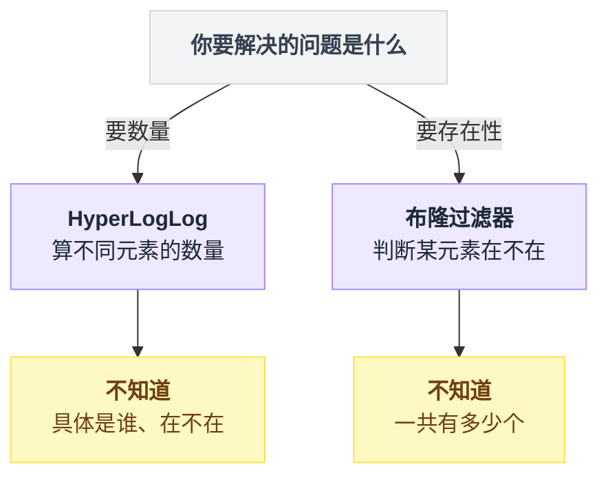

**第二条要展开讲：交集为什么算不准？**

理论上可以用容斥原理：

```
    |A ∩ B| = |A| + |B| - |A ∪ B|

    并集 |A ∪ B| 可以用 PFCOUNT 两个 key 算出来
    所以交集好像也能算？
```

**能算，但结果可能离谱得吓人。** 举个例子：

```
    真实情况：
      A 有 10,000,000 人
      B 有 10,000,000 人
      A∪B 有 19,900,000 人
      A∩B 有    100,000 人      ← 我们想求这个

    HLL 的估计（各带 0.81% 误差）：
      |A|   估成 10,081,000    （+81,000）
      |B|   估成  9,919,000    （-81,000）
      |A∪B| 估成 20,061,190    （+161,190）

      交集 = 10,081,000 + 9,919,000 - 20,061,190 = -61,190
                                                   ━━━━━━━
                                                 负数！！
```

**为什么会这样？因为误差是绝对量，而交集是小量。**

```
    │◀──────── |A| 的误差 ±81,000 ────────▶│
    │◀──────── |B| 的误差 ±81,000 ────────▶│
    │◀────── |A∪B| 的误差 ±161,000 ───────▶│
                    │
                    ▼
       三个误差叠加，最坏能到 ±323,000

    而你想求的交集只有 100,000

         误差(32万) > 答案(10万)
              ↑
       结果完全是噪声，甚至是负数
```

**记住这条规则：**

> **当两个大数相减得到一个小数时，误差会被放大到毁灭性的程度。**

这在数值计算里叫**灾难性抵消（Catastrophic Cancellation）**，不只是 HLL 的问题，是所有近似算法的通病。

**要算交集怎么办？** 三个选择：

| 方案 | 做法 | 代价 |
|---|---|---|
| 用精确结构 | Bitmap 做 `BITOP AND` | 内存大，但精确 |
| 换个算法 | MinHash（专门估计相似度/交集） | 要自己实现 |
| 改需求 | 问产品："你真的需要交集吗？" | 免费，而且经常有效 |

**最后一条最实用。** 很多"我要算交集"的需求，追问一句会发现产品经理其实想要的是别的东西。

**第三条：绝对不要用在钱上。**

```
    ┌──────────────────────────────────────────────────────┐
    │  能用 HLL 的场景          │  绝不能用 HLL 的场景     │
    ├───────────────────────────┼──────────────────────────┤
    │ 页面 UV 报表              │ 广告主的计费展示量       │
    │ 内容的曝光去重人数        │ 主播的打赏人数（要结算） │
    │ 活跃用户趋势图            │ 抽奖参与人数（要发奖）   │
    │ 搜索词的独立搜索人数      │ 财务对账的任何数字       │
    │ 监控大盘上的实时人数      │ 需要跟用户逐条核对的     │
    ├───────────────────────────┼──────────────────────────┤
    │ 共同点：                  │ 共同点：                 │
    │ 看趋势、看量级            │ 有人会拿这个数字要钱     │
    │ 差几万没人在乎            │ 差 1 个都要吵架          │
    └───────────────────────────┴──────────────────────────┘
```

**判断标准很简单一句话：这个数字如果差了 1%，会有人来找你吵架吗？** 会，就别用 HLL。

把 3.9 全节的三条"绝对不行"串成一条判断链，比来回翻表格快：

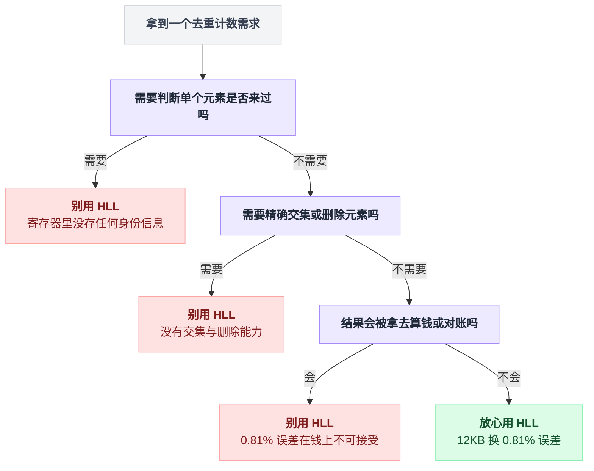

### 3.10 选型：Set / Bitmap / HLL

三个方案摆一起，什么时候用哪个：

| 维度 | Set（精确） | Bitmap（精确） | HyperLogLog（近似） |
|---|---|---|---|
| **1 亿 UV 的内存** | 8 GB | 12.5 MB | **12 KB** |
| **精确度** | 100% | 100% | 误差 0.81% |
| **对 ID 的要求** | 任意 | **必须是稠密小整数** | 任意 |
| **能判断"某人来过吗"** | ✅ | ✅ | ❌ |
| **能取交集** | ✅ | ✅（BITOP AND） | ❌ |
| **能删除元素** | ✅ | ✅ | ❌ |
| **数据少时占多少** | 很小 | **依然占满**（要看 ID 空间） | 很小（稀疏编码） |
| **合并多个的成本** | 高（要遍历元素） | 中（位运算） | **极低（16384 次 max）** |
| **适合的量级** | < 10 万 | ID 稠密且 < 1 千万 | **任意，越大越划算** |

**决策流程图：**

```
              我要统计去重数量
                     │
                     ▼
          ┌──────────────────────┐
          │ 这个数字会被拿去算钱 │
          │ 或者跟用户逐条核对吗 │
          └──────┬───────────┬───┘
              是 │           │ 否
                 ▼           ▼
        ┌──────────────┐  ┌────────────────────────┐
        │ 必须精确     │  │ 预估最大数据量是多少？ │
        │ 用 Set/Bitmap│  └───┬────────────────┬───┘
        │ 或者干脆     │      │ < 10 万        │ > 10 万
        │ 落库用 SQL   │      ▼                ▼
        │ COUNT DISTINCT│  ┌─────────┐   ┌──────────────┐
        └──────────────┘  │ 用 Set  │   │ ID 是不是    │
                          │ 够简单  │   │ 稠密小整数？ │
                          └─────────┘   └──┬────────┬──┘
                                        是 │        │ 否
                                           ▼        ▼
                                    ┌──────────┐ ┌────────┐
                                    │ 要不要判 │ │  HLL   │
                                    │ 断单个/  │ │        │
                                    │ 取交集？ │ └────────┘
                                    └──┬────┬──┘
                                    是 │    │ 否
                                       ▼    ▼
                                 ┌────────┐┌────────┐
                                 │ Bitmap ││  HLL   │
                                 └────────┘└────────┘
```

**一个非常实用的组合拳：**

```
    ┌───────────────────────────────────────────────────────┐
    │  大厂的真实做法：分层统计                             │
    ├───────────────────────────────────────────────────────┤
    │                                                       │
    │  实时大盘（老板盯着看的）                             │
    │      → HLL，12KB，秒级刷新，误差 0.81% 无所谓         │
    │                                                       │
    │  次日的正式报表（要归档的）                           │
    │      → 离线跑 Spark/Hive，COUNT DISTINCT，完全精确    │
    │                                                       │
    │  给广告主结算的数据                                   │
    │      → 从明细日志逐条统计，多份交叉校验               │
    │                                                       │
    │  ★ 同一个"UV"，三套系统，三种精度，三个用途           │
    │  ★ 不是"选一个"，而是"每个场景配一个"                 │
    └───────────────────────────────────────────────────────┘
```

**这是本节最想留给你的一句话：**

> "精确"不是一个技术选择，是一个**业务问题**。
> 先去问"这个数字给谁看、他拿它干什么"，再回来选数据结构。

### 3.11 小节回收

```
    ┌────────────────────────────────────────────────────────┐
    │  HyperLogLog：一次"用 0.81% 换 6.6 万倍"的交易         │
    ├────────────────────────────────────────────────────────┤
    │                                                        │
    │  放弃了：                                              │
    │    · 0.81% 的统计精度                                  │
    │    · 判断单个元素是否存在的能力（信息真的丢了）        │
    │    · 精确交集、删除元素                                │
    │                                                        │
    │  换来了：                                              │
    │    · 内存 8GB → 12KB（66 万倍）                        │
    │    · 空间复杂度 O(n) → O(1)（这才是质变）              │
    │    · CRDT 特性：跨机房无协调合并                       │
    │                                                        │
    │  一句话记住：                                          │
    │    不去记住每一个人，                                  │
    │    只去观察"人群留下的痕迹有多深"。                    │
    └────────────────────────────────────────────────────────┘
```


---

## 4. 小节三：分布式 ID 与雪花算法 —— 用"信任时钟"换"没有中心节点"

### 4.1 生活类比：医院叫号机

你去医院看病，进门先取号。机器吐出一张条：**`内科-0087`**。

这个号码要满足什么？

```
    ┌──────────────────────────────────────────────────┐
    │  1. 不能重号                                     │
    │     两个人拿到同一个 0087 → 打起来               │
    │                                                  │
    │  2. 要能看出先来后到                             │
    │     0087 一定比 0088 早来                        │
    │     （不然叫号顺序就乱了）                       │
    │                                                  │
    │  3. 取号要快                                     │
    │     大厅里排着 200 个人，取号机不能卡            │
    └──────────────────────────────────────────────────┘
```

一台叫号机的时候，这些都好办 —— 机器里存一个数，每次加 1。

**现在医院扩建了，一层楼放一台叫号机，一共 5 台。麻烦来了：**

```
      1 楼             2 楼             3 楼
    ┌────────┐      ┌────────┐      ┌────────┐
    │ 叫号机 │      │ 叫号机 │      │ 叫号机 │
    │ 0087   │      │ 0087   │      │ 0087   │  ← 全都从 1 开始数！
    └────────┘      └────────┘      └────────┘
         │               │               │
         └───────────────┴───────────────┘
                         │
                         ▼
               ╔═══════════════════╗
               ║  三个人都拿到     ║
               ║  0087 号          ║
               ║  医生崩溃         ║
               ╚═══════════════════╝
```

**怎么办？三个思路，正好对应分布式 ID 的三代方案：**

**思路一：所有机器都去问总台。** 每台叫号机吐号之前，先打个电话问总台"下一个是几"。

- 优点：绝对不重号，而且全院严格连续
- 缺点：**总台成了瓶颈**。总台一忙，全院取不了号。总台一停电，全院瘫痪。
- 这就是**数据库自增 ID**。

**思路二：每台机器发随机号。** `内科-8f3a2b91`。

- 优点：绝对不用问任何人，绝对不重复
- 缺点：**看不出先来后到**。8f3a2b91 和 2c9d1e44 谁先来的？不知道。
- 这就是 **UUID**。

**思路三：号码里带上"哪台机器 + 什么时候"。**

```
    ┌──────────────────────────────────────────┐
    │      1430  -  02  -  0087                │
    │       ↑        ↑      ↑                  │
    │    14点30分  2号机  这一分钟的第87个     │
    └──────────────────────────────────────────┘

    · 时间在前 → 天然有序（14:30 的号一定比 14:31 的小）
    · 机器号不同 → 不同机器绝不冲突
    · 每台机器自己数自己的 → 不用问任何人
```

**这就是雪花算法。** 名字叫 Snowflake，取自"世界上没有两片相同的雪花"。

### 4.2 这件事难在哪：四个要求同时成立

分布式 ID 的需求，比医院叫号严苛得多：

| # | 要求 | 说人话 | 违反了会怎样 |
|---|---|---|---|
| 1 | **全局唯一** | 全公司几百台机器，生成的 ID 绝不重复 | 两个订单同一个号，退款退错人 |
| 2 | **趋势递增** | 后生成的 ID 大体上比先生成的大 | 数据库写入性能崩塌（见 4.3） |
| 3 | **高性能** | 单机每秒能发几十万个，且延迟微秒级 | 下单接口变慢 |
| 4 | **不依赖中心节点** | 中心节点挂了，全公司还能下单 | 一个组件挂了，全站不能交易 |

**关键是这四条要"同时"成立。** 单独满足任何一条都容易：

```
    只要唯一？        → UUID，一行代码
    只要递增？        → 数据库自增，一个字段
    只要快？          → 本地内存计数器
    只要没有中心节点？→ 随机数

    但四个一起要？
              │
              ▼
    ╔══════════════════════════════════╗
    ║  第 2 条和第 4 条天生打架        ║
    ║                                  ║
    ║  "递增"意味着要知道"上一个是几"  ║
    ║  "没有中心节点"意味着"你不知道   ║
    ║   别的机器发到几了"              ║
    ╚══════════════════════════════════╝
```

**雪花算法怎么破这个局？它耍了个滑头 —— 把"递增"偷偷改成了"趋势递增"。**

> **严格递增**：下一个 ID 一定是上一个 +1，中间不能有空洞。
> **趋势递增**：整体上后面的比前面的大，但可能跳号、可能同一毫秒内的几台机器之间顺序不确定。

这个偷换概念，是雪花算法能成立的全部原因。而"用什么来保证趋势递增"？—— **用时间**。因为**时间是唯一一个不需要协商、每台机器本地就有、而且大家都往同一个方向走的东西**。

**这就是第一次交易：雪花算法选择去相信"机器上的时钟是对的"。** 记住这句话，4.7 节我们会看到这个信任被打破时有多惨。

### 4.3 为什么不用 UUID：B+ 树的页分裂

先看 UUID 长什么样：

```python
import uuid
print(uuid.uuid4())
# 550e8400-e29b-41d4-a716-446655440000
# 32 个十六进制字符 + 4 个连字符 = 36 个字符
```

> **UUID**：Universally Unique Identifier，通用唯一标识符。128 位（16 字节）的随机数。因为空间实在太大（3.4×10³⁸），随机生成撞车的概率小到可以忽略。

UUID 满足了唯一、快、无中心节点三条。**它死在第二条：不递增。**

而"不递增"这件事，代价大到超乎所有人想象。

**先补一点数据库知识：B+ 树。**

MySQL 的 InnoDB 引擎，表数据是按主键排好序存的，用的结构叫 **B+ 树**。

> **B+ 树**：一种为磁盘设计的多叉排序树。数据按主键从小到大存在最底层的"叶子节点"里，上层是索引，用来快速定位。**关键点：底层数据是物理有序的。**

```
                      ┌────────────────┐
                      │   索引层       │
                      │  [50]  [100]   │
                      └───┬────┬───┬───┘
             ┌────────────┘    │   └────────────┐
             ▼                 ▼                ▼
       ┌───────────┐    ┌───────────┐    ┌───────────┐
       │ 1..49     │───▶│ 50..99    │───▶│ 100..149  │
       │ 【页】    │    │ 【页】    │    │ 【页】    │
       │  16 KB    │    │  16 KB    │    │  16 KB    │
       └───────────┘    └───────────┘    └───────────┘
             ▲                 ▲                ▲
             └──── 叶子节点，真正存数据的地方 ───┘
             └──── 而且是【按主键排好序的】 ─────┘
```

> **页（Page）**：InnoDB 读写磁盘的最小单位，默认 16KB。一次读一整页，不管你只要其中一行。

**现在看自增主键插入时发生什么：**

```
    当前状态（每页能装 4 行，简化）：

    页A            页B            页C
    ┌─────────┐    ┌─────────┐    ┌─────────┐
    │ 1 2 3 4 │───▶│ 5 6 7 8 │───▶│ 9 10 __ │  ← 页C 还有空位
    │  满     │    │  满     │    │  半满   │
    └─────────┘    └─────────┘    └─────────┘

    插入 ID=11：

    页A            页B            页C
    ┌─────────┐    ┌─────────┐    ┌─────────┐
    │ 1 2 3 4 │───▶│ 5 6 7 8 │───▶│ 9 10 11 │  ← 直接追加在末尾
    └─────────┘    └─────────┘    └─────────┘

    ★ 只动了页C，只有 1 次磁盘写
    ★ 页C 就在内存缓冲池里（刚用过），甚至不用读磁盘
    ★ 页装满了就开新页，旧页永远不再动
```

**这叫"顺序写"，是磁盘最喜欢的模式。**

**现在看 UUID 主键插入时发生什么：**

```
    当前状态（主键是随机的 UUID，简化成随机数）：

    页A                页B                页C
    ┌─────────────┐    ┌─────────────┐    ┌─────────────┐
    │ 12 25 33 47 │───▶│ 51 66 71 88 │───▶│ 91 95 __ __ │
    │  满         │    │  满         │    │  半满       │
    └─────────────┘    └─────────────┘    └─────────────┘

    插入一个新 UUID，算出来是 60 ——
    它必须插到页B 里面（在 51 和 66 之间），但页B 是满的！

                  ╔═══════════════════════╗
                  ║   触发【页分裂】      ║
                  ╚═══════════════════════╝

    页A                页B          页B'（新开的）    页C
    ┌─────────────┐    ┌──────────┐  ┌──────────┐   ┌───────┐
    │ 12 25 33 47 │───▶│ 51 60 __ │─▶│ 66 71 88 │──▶│ 91 95 │
    │             │    │ __       │  │ __       │   │       │
    └─────────────┘    └──────────┘  └──────────┘   └───────┘
                          ↑              ↑
                     只装了 2 行     只装了 3 行
                     一半空间浪费了
```

**页分裂一次的代价，我们逐条数：**

```
    ┌────────────────────────────────────────────────────────┐
    │  插入一个随机主键，可能发生的事                        │
    ├────────────────────────────────────────────────────────┤
    │                                                        │
    │  ① 先要【读】目标页                                    │
    │     ─ 主键是随机的，目标页大概率不在内存里             │
    │     ─ 一次随机磁盘 I/O（机械盘 ~10ms，SSD ~0.1ms）     │
    │                                                        │
    │  ② 页满了 → 申请一个新页                               │
    │                                                        │
    │  ③ 把原页的一半数据【搬】到新页                        │
    │     ─ 内存拷贝 + 两个页都要写回磁盘                    │
    │                                                        │
    │  ④ 修改上层索引节点，加一条指向新页的记录              │
    │     ─ 如果索引节点也满了，【继续向上分裂】             │
    │     ─ 最坏一路裂到根节点，树长高一层                   │
    │                                                        │
    │  ⑤ 修改前后页的双向链表指针                            │
    │                                                        │
    │  ⑥ 上面每一步都要写 redo log（保证崩溃能恢复）         │
    │                                                        │
    │  ── 对比自增主键：只做了"往末尾页追加一行"── │
    └────────────────────────────────────────────────────────┘
```

**还有三个连带伤害：**

**伤害一：空间浪费。** 页分裂后两个页都是半满的，磁盘占用直接翻倍。

```
    自增主键：页填充率 ~95%
    UUID 主键：页填充率 ~55%

    同样 1 亿行数据：
       自增主键表：  20 GB
       UUID 主键表： 35 GB   ← 还没算 UUID 本身比 BIGINT 大
```

**伤害二：主键本身就大 4 倍。**

```
    BIGINT 主键：      8 字节
    UUID 存成 CHAR(36)：36 字节    ← 4.5 倍
    UUID 存成 BINARY(16)：16 字节  ← 2 倍（好一点，但难读）

    而 InnoDB 的【所有二级索引】的叶子节点里，
    都要存一份主键值！

    有 5 个二级索引 → 主键值被存了 6 遍
    1 亿行：BIGINT 是 4.8GB，CHAR(36) 是 21.6GB
```

> **二级索引**：主键之外的索引。InnoDB 的二级索引不直接存行数据，存的是主键值，查到后再回主键树上找行（叫"回表"）。所以主键越大，所有二级索引都跟着变大。

**伤害三：缓冲池命中率崩溃。**

```
    ┌─────────────────────────────────────────────────────┐
    │  Buffer Pool（内存缓冲池），假设 8 GB               │
    ├─────────────────────────────────────────────────────┤
    │                                                     │
    │  自增主键的写入：                                   │
    │    所有写入都集中在"最后那几页"                     │
    │    这几页永远在内存里                               │
    │    命中率 ≈ 99.9%                                   │
    │                                                     │
    │  ┌──┬──┬──┬──┬──┬──┬──┬──┬──┬──┬──┬──┬──┬──┬──┐    │
    │  │  │  │  │  │  │  │  │  │  │  │  │  │  │██│██│    │
    │  └──┴──┴──┴──┴──┴──┴──┴──┴──┴──┴──┴──┴──┴──┴──┘    │
    │                                        写在这里 ↑   │
    │                                                     │
    │  UUID 主键的写入：                                  │
    │    写入随机散落在整棵树的任何位置                   │
    │    表 35GB，内存只有 8GB → 只装得下 23%             │
    │    命中率 ≈ 23%，77% 的写要先做一次随机读           │
    │                                                     │
    │  ┌──┬──┬──┬──┬──┬──┬──┬──┬──┬──┬──┬──┬──┬──┬──┐    │
    │  │██│  │  │██│  │██│  │  │██│  │  │  │██│  │██│    │
    │  └──┴──┴──┴──┴──┴──┴──┴──┴──┴──┴──┴──┴──┴──┴──┘    │
    │    ↑     ↑        ↑           ↑        ↑            │
    │       写在到处都是，缓存完全失效                    │
    └─────────────────────────────────────────────────────┘
```

**实测数据（业界普遍的量级，具体数字看硬件）：**

| 主键类型 | 1000 万行的写入耗时 | 表大小 | 相对性能 |
|---|---|---|---|
| BIGINT 自增 | ~ 8 分钟 | 20 GB | 1× |
| BINARY(16) UUID v4 | ~ 45 分钟 | 28 GB | **5~6 倍慢** |
| CHAR(36) UUID v4 | ~ 70 分钟 | 42 GB | **8~9 倍慢** |

**而且注意：这个差距会随着表变大而扩大。** 表小的时候整棵树都在内存里，UUID 也不慢。等表超过内存容量，性能会有一个"断崖"—— 很多团队就是在这里被打懵的："我们上线三个月一直好好的，怎么突然写不动了？"

> **UUID v7 是个例外，值得一提。** 2024 年正式标准化的 UUID v7，把前 48 位换成了毫秒时间戳，后面才是随机数。这样它就**有序**了，能避免页分裂。如果你的语言/库支持 v7，它是个不错的折中 —— 但它 128 位还是太大，且没有雪花那样清晰的机器位。

### 4.4 为什么不用数据库自增

既然自增这么好，那所有机器都去同一个数据库要号，不就行了？

```python
# 一张专门的发号表
# CREATE TABLE id_generator (
#     stub CHAR(1) PRIMARY KEY,
#     seq  BIGINT NOT NULL AUTO_INCREMENT
# );

def get_id_from_db() -> int:
    """每次要 ID 就往发号表插一行，拿自增值。"""
    cursor.execute("REPLACE INTO id_generator (stub) VALUES ('a')")
    return cursor.lastrowid
```

**这段在干嘛：** 往一张只有一行的表里反复写，靠 MySQL 的 `AUTO_INCREMENT` 拿到递增的数字。

**三个死穴：**

```
   ┌──────────────────────────────────────────────────────────┐
   │  死穴一：性能天花板                                      │
   ├──────────────────────────────────────────────────────────┤
   │   每个 ID 都是一次数据库写入 + 一次网络往返              │
   │   单机 MySQL 的写入上限：几千 QPS                        │
   │                                                          │
   │   而雪花算法单机是【每秒 409 万】                        │
   │   差了三个数量级                                         │
   └──────────────────────────────────────────────────────────┘

   ┌──────────────────────────────────────────────────────────┐
   │  死穴二：单点故障                                        │
   ├──────────────────────────────────────────────────────────┤
   │   发号数据库挂了 → 全公司【任何业务】都下不了单          │
   │                                                          │
   │      订单服务 ──┐                                        │
   │      支付服务 ──┤                                        │
   │      物流服务 ──┼──▶ ┌──────────┐  ← 它一挂             │
   │      优惠券   ──┤     │ 发号 DB  │     全部瘫痪          │
   │      消息服务 ──┘     └──────────┘                       │
   │                                                          │
   │   这在架构上叫"单点"，是设计评审第一个会被打回的东西     │
   └──────────────────────────────────────────────────────────┘

   ┌──────────────────────────────────────────────────────────┐
   │  死穴三：多机房无解                                      │
   ├──────────────────────────────────────────────────────────┤
   │   北京机房的服务要跨专线去上海的发号 DB 要号             │
   │   网络往返 30ms                                          │
   │   → 一个下单接口凭空多了 30ms                            │
   │   → 专线一断，北京机房全挂                               │
   └──────────────────────────────────────────────────────────┘
```

**改进方案（业界确实在用）：号段模式。**

```
    不要一个一个要，一次要一批：

    机器A ──"给我一批"──▶ DB ──▶ 返回 [1000, 2000)
                                   │
                                   ▼
                        机器A 内存里拿着这 1000 个号
                        慢慢发，发完了再去要下一批

    ┌──────────────────────────────────────────────────┐
    │  数据库压力：从每秒几万次 → 每 1000 个 ID 一次   │
    │              降低了 1000 倍                      │
    │  但还是没解决：DB 挂了以后，                     │
    │  各机器手里的号段用完就发不出号了                │
    │  （不过有个几分钟的缓冲，够运维反应了）          │
    └──────────────────────────────────────────────────┘
```

这就是**美团 Leaf-segment** 的思路，4.9 节还会提。它是个很实用的方案 —— **但它依然依赖数据库，只是把依赖从"每次"变成了"每一千次"。**

**雪花算法要的是彻底摆脱：一次都不问。**

把 4.1～4.4 这一路的取舍收成一张图看更清楚：

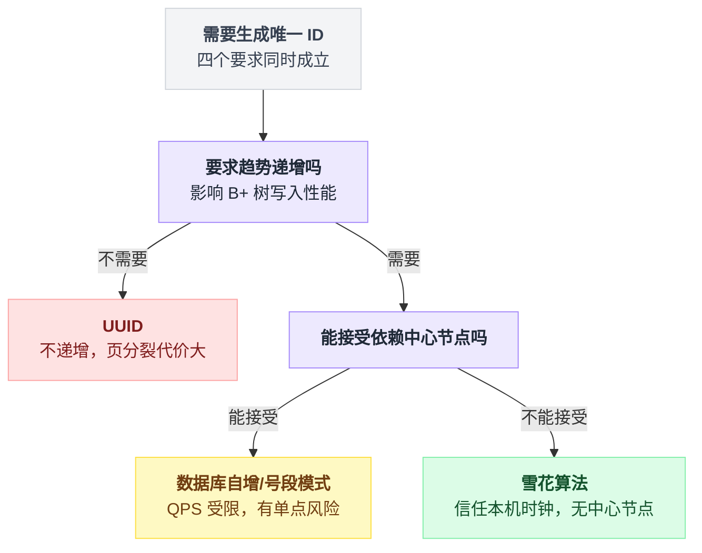

### 4.5 雪花算法：64 个 bit 的分配图

雪花算法生成一个 **64 位整数**（正好是 `BIGINT`、`long`、Python 的 `int`）。

它把这 64 个 bit 切成四段：

```
 ┌─┬───────────────────────────────────────┬──────────┬────────────┐
 │0│  41 位  时间戳（毫秒）                │ 10 位 机器│ 12 位 序列 │
 └─┴───────────────────────────────────────┴──────────┴────────────┘
  │                    │                        │            │
  │                    │                        │            │
  ▼                    ▼                        ▼            ▼
 符号位            当前时间减去              这台机器      同一毫秒内
 恒为 0            一个"起始纪元"            的编号        的第几个
 (保证正数)        的毫秒数                  0~1023        0~4095

 bit 位置：
 63  62 ─────────────────────── 22  21 ──── 12  11 ──────── 0
```

**逐段拆解：**

**① 符号位（1 bit，恒为 0）**

为什么要浪费一位？因为大部分语言的整数是**有符号**的，最高位是符号位。如果最高位是 1，这个数就变成负数了。

```
    最高位 = 0  →  0000... 到 0111...  →  正数
    最高位 = 1  →  1000... 到 1111...  →  负数 ← 不要

    负数 ID 会带来什么麻烦：
    · 排序诡异（-100 < 1）
    · 拼进 URL 里带个负号，很多地方要转义
    · 有些系统直接不接受负数 ID
```

**② 时间戳（41 bit）**

存的是"当前毫秒数减去一个自定义起点"。

```
    41 位能表示的毫秒数：
        2⁴¹ = 2,199,023,255,552 毫秒

    换算成年：
        2,199,023,255,552 ÷ 1000 (秒)
                          ÷ 60   (分)
                          ÷ 60   (时)
                          ÷ 24   (天)
                          ÷ 365.25 (年)
        = 69.68 年
```

**约 70 年。**

**为什么要减去一个"起点"（叫 epoch）？** 因为 Unix 时间戳是从 1970 年算起的，到 2026 年已经用掉了 56 年，只剩 13 年了。

```
    直接用 Unix 毫秒时间戳：
      1970 ──────────── 2026 ──── 2039
              已用掉 56 年        还剩 13 年 ✗

    减去自定义 epoch（比如 2026-01-01）：
      2026 ─────────────────────────── 2095
              从零开始，能用满 69 年 ✓
```

> **划重点：epoch 一旦设定，永远不能改。** 改了以后新生成的 ID 可能小于旧 ID，全乱套。所以上线前把它写死在配置里，加个大大的注释。

**③ 机器 ID（10 bit）**

```
    2¹⁰ = 1024 台机器

    常见的进一步拆分：
    ┌──────────┬──────────┐
    │ 5 bit    │ 5 bit    │
    │ 机房 ID  │ 机器 ID  │
    │ 0~31     │ 0~31     │
    └──────────┴──────────┘
      32 个机房 × 每个机房 32 台 = 1024
```

**这 10 位是整个算法唯一需要"外部协调"的地方。** 4.8 节专门讲怎么分配。

**④ 序列号（12 bit）**

```
    2¹² = 4096

    含义：同一台机器、同一毫秒内，最多发 4096 个 ID
    → 单机每秒上限 = 4096 × 1000 = 4,096,000 个
                                   ━━━━━━━━━
                                   每秒 409 万
```

**409 万/秒是什么概念？** 淘宝双十一的峰值订单量大约是每秒 58 万笔。**一台机器就能扛下 7 个双十一。**

**看一个真实的 ID 长什么样：**

```
    ID = 1837465920384512

    转成二进制（补齐 64 位）：
    0 000110100010001101100110000011010001110 0000000001 000000000000
    │ └────────── 41 位时间戳 ──────────────┘ └─10位机器┘ └─12位序列┘
    │                    │                        │            │
    符号位          438,104,318,113 ms          机器 1        第 0 个
    (0)             ≈ epoch 后第 5.07 天

    十进制 1837465920384512，19 位数字
    ——— 这就是你在订单页看到的那种长订单号
```

**为什么位数是这么分的？这个划分是可以调的：**

| 场景 | 时间戳 | 机器 ID | 序列号 | 理由 |
|---|---|---|---|---|
| **标准雪花** | 41 | 10 | 12 | 通用平衡 |
| 机器特别多 | 41 | 13 | 9 | 8192 台机器，但每毫秒只能 512 个 |
| 单机吞吐极高 | 41 | 5 | 17 | 只有 32 台，但每毫秒 13 万个 |
| 想让 ID 短一点 | 39 | 8 | 12 | 只能用 17 年，换来 ID 少 3 位 |
| 秒级精度够了 | 31（秒） | 10 | 22 | 秒级时间戳，序列号给到 400 万/秒 |

**记住这个原则：三段是零和的，加一位就得从别处减一位。** 先想清楚你的机器规模和单机 QPS，再定位数。

### 4.6 Python 完整实现

```python
import time
import threading
from dataclasses import dataclass, field

# ── 各段的位宽 ──────────────────────────────
SEQUENCE_BITS = 12          # 序列号 12 位
MACHINE_BITS = 10           # 机器 ID 10 位
TIMESTAMP_BITS = 41         # 时间戳 41 位

# ── 各段的最大值 ────────────────────────────
MAX_SEQUENCE = (1 << SEQUENCE_BITS) - 1     # 4095
MAX_MACHINE_ID = (1 << MACHINE_BITS) - 1    # 1023

# ── 各段在 64 位里的左移量 ──────────────────
MACHINE_SHIFT = SEQUENCE_BITS               # 机器 ID 左移 12 位
TIMESTAMP_SHIFT = SEQUENCE_BITS + MACHINE_BITS   # 时间戳左移 22 位

# ── 自定义纪元：2026-01-01 00:00:00 UTC 的毫秒数 ──
# 【警告】这个值一旦上线，永远不能修改
EPOCH_MS = 1767225600000
```

**这段在干嘛：** 定义各段的位宽和"左移多少位"。左移量是从右往左累加的 —— 序列号在最右边不用移，机器 ID 要跳过序列号的 12 位，时间戳要跳过序列号 + 机器 ID 的 22 位。

```python
@dataclass
class Snowflake:
    machine_id: int
    _last_ms: int = field(default=-1, init=False)
    _sequence: int = field(default=0, init=False)
    _lock: threading.Lock = field(default_factory=threading.Lock, init=False)

    def __post_init__(self) -> None:
        if not 0 <= self.machine_id <= MAX_MACHINE_ID:
            raise ValueError(f"machine_id 必须在 0~{MAX_MACHINE_ID} 之间")

    @staticmethod
    def _now_ms() -> int:
        return int(time.time() * 1000)
```

**这段在干嘛：** 定义生成器的状态。`_last_ms` 记住上一次生成 ID 时的毫秒数，`_sequence` 是这一毫秒内已经发了几个，`_lock` 保证多线程下不出错。

```python
    def next_id(self) -> int:
        with self._lock:                      # 整个生成过程必须是原子的
            now = self._now_ms()

            # ── 情况 1：时钟回拨了 ──────────────────
            if now < self._last_ms:
                raise ClockBackwardError(
                    f"时钟回拨 {self._last_ms - now} 毫秒，拒绝生成 ID"
                )

            # ── 情况 2：还在同一毫秒内 ──────────────
            if now == self._last_ms:
                self._sequence = (self._sequence + 1) & MAX_SEQUENCE
                if self._sequence == 0:       # 4096 个用完了，溢出回零
                    now = self._wait_next_ms(self._last_ms)  # 死等下一毫秒

            # ── 情况 3：进入新的一毫秒 ──────────────
            else:
                self._sequence = 0            # 序列号归零重新开始

            self._last_ms = now
            return (
                ((now - EPOCH_MS) << TIMESTAMP_SHIFT)
                | (self.machine_id << MACHINE_SHIFT)
                | self._sequence
            )
```

**这段是核心，逐行翻译：**

1. **加锁** —— 多个线程同时要 ID 时，必须排队，否则两个线程可能拿到同一个序列号
2. **`now < self._last_ms`** —— 现在的时间比上次还早？时钟回拨了，这是灾难，先抛异常（4.7 节详谈）
3. **`now == self._last_ms`** —— 还在同一毫秒，序列号 +1
4. **`& MAX_SEQUENCE`** —— 按位与 4095，效果是"到 4096 就变回 0"。这比 `% 4096` 快，且意图更明确
5. **序列号变 0 了** —— 说明这一毫秒的 4096 个额度用光了，只能等下一毫秒
6. **新的一毫秒** —— 序列号归零
7. **最后三行拼装** —— 三段各自左移到自己的位置，用按位或（`|`）拼起来

**拼装那一步画个图就懂了：**

```
    时间戳 438104318113 左移 22 位：
    0000110100010001101100110000011010001110 0000000000 000000000000
                                             └── 空出来的 22 位 ──┘

    机器 ID 1 左移 12 位：
    0000000000000000000000000000000000000000 0000000001 000000000000
                                             └机器位┘

    序列号 7（不移）：
    0000000000000000000000000000000000000000 0000000000 000000000111
                                                        └序列位┘

    三个按位或（|）拼起来：
    0000110100010001101100110000011010001110 0000000001 000000000111
    └────────── 时间戳 ──────────────────┘ └─机器─┘ └── 序列 ──┘

    ★ 三段占的位互不重叠，所以"或"起来就是拼接
```

补上异常定义：

```python
class ClockBackwardError(RuntimeError):
    """时钟回拨异常。定义在模块顶层，和 Snowflake 类平级。"""
```

再补上 `Snowflake` 类里那个等待函数（注意它是 `Snowflake` 的方法，跟 `next_id` 平级）：

```python
    def _wait_next_ms(self, last_ms: int) -> int:
        """自旋等待，直到进入下一毫秒。"""
        now = self._now_ms()
        while now <= last_ms:
            time.sleep(0.0002)      # 睡 0.2ms，避免把 CPU 烧满
            now = self._now_ms()
        return now
```

**这段在干嘛：** 当这一毫秒的 4096 个号发完了，就在这里转圈等，直到系统时间跨入下一毫秒。

**为什么要 `sleep(0.0002)` 而不是纯自旋？** 纯自旋（`while True: pass`）会把一个 CPU 核心跑到 100%。睡 0.2ms 让出 CPU，代价是最多多等 0.2ms —— 而且这个分支本身就极少触发（需要单机超过 409 万 QPS）。

**用起来：**

```python
sf = Snowflake(machine_id=1)
ids = [sf.next_id() for _ in range(5)]
print(ids)
# [1837465920384512, 1837465920384513, 1837465920384514, ...]

# 反解一个 ID，看它是什么时候、哪台机器生成的
def parse_id(snowflake_id: int) -> dict[str, int | str]:
    seq = snowflake_id & MAX_SEQUENCE
    machine = (snowflake_id >> MACHINE_SHIFT) & MAX_MACHINE_ID
    ts = (snowflake_id >> TIMESTAMP_SHIFT) + EPOCH_MS
    return {
        "生成时间": time.strftime("%Y-%m-%d %H:%M:%S", time.localtime(ts / 1000)),
        "机器 ID": machine,
        "序列号": seq,
    }
```

**这段在干嘛：** 把 ID 拆回三段。右移到对应位置，再按位与掩码把高位切掉。

**这个"可反解"的性质超级实用：**

```
    ┌────────────────────────────────────────────────────────┐
    │  线上排查时，雪花 ID 能直接告诉你三件事                │
    ├────────────────────────────────────────────────────────┤
    │  · 这个订单是什么时候创建的（精确到毫秒）              │
    │    → 不用查库就能定位日志的时间范围                    │
    │  · 是哪台机器生成的                                    │
    │    → 直接去那台机器捞日志，不用全集群 grep             │
    │  · 那一毫秒内它是第几个                                │
    │    → 能看出当时那台机器有多忙                          │
    │                                                        │
    │  ★ 对比 UUID：它什么都告诉不了你                       │
    └────────────────────────────────────────────────────────┘
```

**但反过来也是个隐患：雪花 ID 泄露业务信息。** 竞品拿到你两个订单号，一减就知道你这段时间的订单量 —— 又是 2.8 节那个"德国坦克问题"。**所以对外暴露的 ID（比如订单号）通常要在雪花 ID 上再套一层混淆或映射。**

### 4.7 最大的坑：时钟回拨

**这是雪花算法的阿喀琉斯之踵。** 前面所有的优雅，都建立在一个假设上：

> **机器的时钟只会往前走，永远不会往后跳。**

而这个假设，**在真实的服务器上是不成立的。**

**什么是时钟回拨？**

```
    正常的时间：
    10:00:00.000 → 10:00:00.001 → 10:00:00.002 → ...
         ↑              ↑              ↑
       一直往前，稳稳的

    回拨了：
    10:00:00.000 → 10:00:00.001 → 09:59:59.950 → 09:59:59.951
         ↑              ↑              ↑
                                  时间倒退了 51 毫秒！
```

**为什么会回拨？三个真实原因：**

```
   ┌──────────────────────────────────────────────────────────────┐
   │  原因一：NTP 校时（最常见）                                  │
   ├──────────────────────────────────────────────────────────────┤
   │  服务器的石英晶振有误差，一天可能走快或走慢几十毫秒。        │
   │  所以每台机器都跑着 NTP 服务，定期跟时间服务器对表。         │
   │                                                              │
   │  本机时间 10:00:00.100                                       │
   │  标准时间 10:00:00.050                                       │
   │        → 本机快了 50ms → NTP 把它【往回调】                  │
   │                                                              │
   │  ★ 这是【正常运维】，每天都在发生                            │
   └──────────────────────────────────────────────────────────────┘

   ┌──────────────────────────────────────────────────────────────┐
   │  原因二：闰秒                                                │
   ├──────────────────────────────────────────────────────────────┤
   │  地球自转不匀速，国际组织偶尔会插入一个"闰秒"，              │
   │  让这一分钟有 61 秒。有些系统的处理方式就是把时间回拨 1 秒。 │
   │  2012 年的闰秒搞挂了 Reddit、LinkedIn、澳洲航空的值机系统。  │
   └──────────────────────────────────────────────────────────────┘

   ┌──────────────────────────────────────────────────────────────┐
   │  原因三：人为操作 / 虚拟机迁移                               │
   ├──────────────────────────────────────────────────────────────┤
   │  · 运维手抖执行了 date -s                                    │
   │  · 虚拟机从一台宿主机热迁移到另一台，两台宿主机时钟不同      │
   │  · 容器从暂停状态恢复                                        │
   │  · 机器重启后 BIOS 时钟不准，NTP 还没来得及同步              │
   └──────────────────────────────────────────────────────────────┘

   ★ 注意原因三里的最后一条：机器重启后的那几秒钟，
     是时钟回拨【最危险】的窗口
```

**回拨了会怎样？看这个推演：**

```
    时刻 T1（10:00:00.100），机器 5 生成了一批 ID：
        时间戳段 = 100，序列 = 0,1,2,...,50
        → 生成了 ID_A = [ts=100 | machine=5 | seq=0]

    NTP 把时钟回拨 50ms

    时刻 T2（真实是 10:00:00.150，但系统显示 10:00:00.100）：
        时间戳段 = 100（又回到 100 了！）
        序列号：进程重启过 / 或者代码里没做防护 → 从 0 开始
        → 生成了 ID_B = [ts=100 | machine=5 | seq=0]

              ╔════════════════════════════╗
              ║   ID_A == ID_B             ║
              ║   两个不同的订单           ║
              ║   拿到了同一个订单号       ║
              ╚════════════════════════════╝
```

**这个 bug 有多恶心？**

```
    ┌──────────────────────────────────────────────────────────┐
    │  · 它是【偶发】的 —— NTP 一天才校几次时                  │
    │  · 它是【随机】的 —— 不知道会撞在哪个业务上              │
    │  · 它【不会报错】—— 数据库主键冲突时才暴露，            │
    │    而且报出来的是"Duplicate entry"，                     │
    │    你会以为是业务代码写重了，查半天查不到根因            │
    │  · 它【无法复现】—— 你在开发环境把时间调回去试，         │
    │    发现要精确到毫秒才能撞上                              │
    │  · 更可怕的是【它可能不报错】—— 如果那张表没有唯一约束， │
    │    数据就默默地被覆盖了                                  │
    └──────────────────────────────────────────────────────────┘
```

**这就是为什么说时钟回拨是雪花算法最大的软肋 —— 它把系统的正确性，押在了一个"运维基础设施的正常行为"上。**

**三种应对方案：**

**方案一：抛异常拒绝（最简单，最诚实）**

```python
if now < self._last_ms:
    raise ClockBackwardError(f"时钟回拨 {self._last_ms - now} ms")
```

- **优点：绝对不会生成重复 ID。** 宁可不干活，也不干错事。
- **缺点：这段时间业务直接不可用。** 回拨 5 秒，你的下单接口就挂 5 秒。
- **适用：金融、支付这类"错了比停了更糟"的场景。**

**方案二：等待追平（最常用）**

```python
    def next_id_with_wait(self, max_wait_ms: int = 10) -> int:
        with self._lock:
            now = self._now_ms()
            if now < self._last_ms:
                offset = self._last_ms - now
                if offset > max_wait_ms:
                    # 回拨太多，等不起，只能抛异常 + 告警
                    raise ClockBackwardError(f"回拨 {offset}ms，超过容忍上限")
                # 小幅回拨：睡一会儿，等系统时间追上来
                time.sleep(offset / 1000.0 + 0.001)
                now = self._now_ms()
                if now < self._last_ms:
                    raise ClockBackwardError("等待后时钟仍然落后")
            # ...后面逻辑同前
```

**这段在干嘛：** 回拨幅度小（比如 10ms 以内）就睡一会儿等时间追上来；回拨太多就放弃并告警。

- **优点：小幅回拨（NTP 日常校时通常就几毫秒）对业务无感知。**
- **缺点：等待期间这台机器发不出 ID，请求会堆积。**
- **适用：绝大多数业务。这是最主流的做法。**

**方案三：用备用位（最巧妙）**

思路：**从机器 ID 里借一位或几位出来，当作"时钟回拨代数"。**

```
    原来的分配：
    ┌─┬────────────┬────────────┬──────────┐
    │0│ 41 时间戳  │ 10 机器 ID │ 12 序列  │
    └─┴────────────┴────────────┴──────────┘

    改成：
    ┌─┬────────────┬──┬─────────┬──────────┐
    │0│ 41 时间戳  │2 │ 8 机器ID│ 12 序列  │
    └─┴────────────┴──┴─────────┴──────────┘
                    ↑
              "回拨代数"，0~3

    发生回拨时：代数 +1，然后正常发号
    → 因为代数变了，绝不会和回拨前的 ID 撞
```

```
    时刻    时间戳  代数  机器  序列    ID 是否唯一
    ─────────────────────────────────────────────────
    T1      100     0     5     0..50   ← 第一批
    回拨发生
    T2      100     1     5     0..50   ← 代数变成 1，和上面全都不同 ✓
    再回拨
    T3      100     2     5     0..50   ← 代数变成 2 ✓
```

- **优点：不停机、不等待、不重复。**
- **缺点：**
  - 机器 ID 空间被压缩了（1024 → 256 台）
  - **代数只有 4 个，用完就没了** —— 需要在时间往前走足够久之后重置
  - 代数必须**持久化**，否则进程重启就丢了，防护失效
  - 实现复杂度高不少

**三种方案对照：**

| 方案 | 重复风险 | 可用性 | 复杂度 | 什么时候选 |
|---|---|---|---|---|
| 抛异常 | **0** | 差（直接不可用） | 极低 | 金融支付；或作为兜底 |
| **等待追平** | 0（等待期间不发号） | 中（短暂卡顿） | 低 | **默认选择** |
| 备用位 | 0（代数够用时） | 好 | 高 | 超大规模、可用性要求极高 |

三种方案不是并列的三选一，而是同一个生成器在遇到回拨时可能走的三条岔路，画成状态机看转移关系：

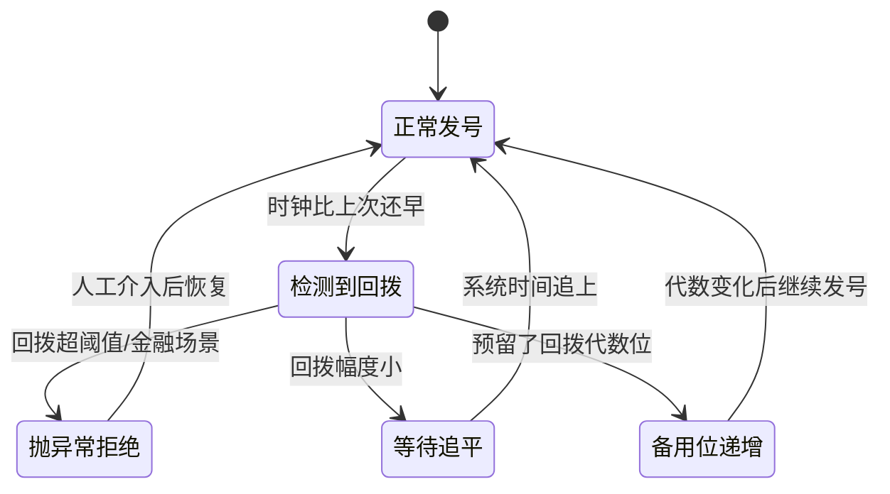

**还有一个"方案零"，其实最该先做：从根上不让它发生。**

```
    ┌──────────────────────────────────────────────────────────┐
    │  运维层面的防护（比代码防护更根本）                      │
    ├──────────────────────────────────────────────────────────┤
    │                                                          │
    │  ① NTP 配置成【slew 模式】而不是 step 模式               │
    │     slew：不直接跳，而是把时钟走慢一点点，慢慢磨平差距   │
    │     → 时间【永远单调递增】，只是走得慢一点               │
    │     → chrony 加参数：makestep 0 0（禁止跳变）            │
    │                                                          │
    │  ② 用【单调时钟】而不是墙上时钟（部分场景可行）          │
    │     Python: time.monotonic() —— 它保证只增不减           │
    │     但它没有绝对时间含义，做不了"可反解"，              │
    │     只能用来检测"是不是回拨了"                           │
    │                                                          │
    │  ③ 机器启动后【先等 NTP 同步完成】再对外提供发号服务     │
    │     这挡住了"重启后 BIOS 时钟不准"这个最危险的窗口       │
    │                                                          │
    │  ④ 监控：持续上报本机时间与 NTP 源的偏差，              │
    │     超过阈值立刻告警                                     │
    │                                                          │
    └──────────────────────────────────────────────────────────┘
```

**第①条是最重要的。** 把 NTP 配成 slew 模式后，时钟回拨的概率会下降一个数量级 —— 因为绝大部分校时都是几毫秒的微调，slew 模式能完全吸收掉。

> **这里有个特别值得体会的地方：**
>
> 雪花算法把"正确性"押在了一个**它自己无法控制的外部条件**上（系统时钟）。
>
> 这在架构设计上是个危险信号。你可以问自己：我的设计里，有没有哪个"正确性"是建立在别人的良好行为上的？
>
> 秒杀那篇里的库存扣减，正确性建立在 Redis Lua 的原子性上 —— 那个是 Redis **保证**的。而时钟单调，**没有任何人保证**。这是本质区别。

### 4.8 机器 ID 怎么分配

雪花算法说自己"没有中心节点"，但那 10 位机器 ID 总得有人分。**这是它唯一的"协调点"。**

**要求很明确：同一时刻，绝不能有两台机器用同一个 ID。**

**方案一：写死在配置文件里**

```yaml
# app-config.yaml
snowflake:
  machine_id: 7
```

| 优点 | 缺点 |
|---|---|
| 零依赖，最简单 | 靠人保证不重复，容易出事 |
| 重启后 ID 不变 | 扩容要改配置、要有人记账 |
| | **容器化环境下基本没法用**（自动扩容时谁来分？） |

**踩坑实录：** 运维复制了一台虚拟机做扩容，忘了改配置文件里的 `machine_id`。两台机器同时用 ID=7，重复 ID 就产生了。**这个坑在业界踩过无数次。**

**方案二：Zookeeper / etcd 分配（经典做法）**

```python
from kazoo.client import KazooClient

def acquire_machine_id(zk: KazooClient, service: str) -> int:
    """向 Zookeeper 注册一个临时顺序节点，用节点序号当机器 ID。"""
    path = zk.create(
        f"/snowflake/{service}/worker-",
        ephemeral=True,     # 临时节点：连接断了自动删除
        sequence=True,      # 顺序节点：ZK 自动在名字后面加递增编号
        makepath=True,
    )
    # path 形如 "/snowflake/order/worker-0000000007"
    seq = int(path.rsplit("-", 1)[1])
    machine_id = seq % 1024
    return machine_id
```

**这段在干嘛：** 向 ZK 创建一个"临时顺序节点"。ZK 保证每个客户端拿到的序号都不同，序号取模 1024 就是机器 ID。

> **Zookeeper**：一个分布式协调服务，可以理解成"一个高可用的、带监听功能的小型文件系统"。分布式系统用它来做选主、配置管理、服务发现。
>
> **临时节点（Ephemeral）**：客户端断开连接后，这个节点自动消失。用来表示"我还活着"。
> **顺序节点（Sequential）**：ZK 自动给节点名加一个全局递增的编号，保证不重复。

**这个方案的两个隐患：**

```
   ┌──────────────────────────────────────────────────────────┐
   │  隐患一：ZK 抖动导致机器 ID 被回收                       │
   ├──────────────────────────────────────────────────────────┤
   │   机器 A 用着 ID=7，网络抖了一下，ZK 会话超时            │
   │        → 临时节点被删除                                  │
   │        → 新启动的机器 B 拿到了 ID=7                      │
   │        → 网络恢复，机器 A 还在用 ID=7                    │
   │        → 【两台机器同时用 7】                            │
   │                                                          │
   │   解法：会话断开后【立刻停止发号】，                     │
   │        重新注册拿到新 ID 后才恢复                        │
   └──────────────────────────────────────────────────────────┘

   ┌──────────────────────────────────────────────────────────┐
   │  隐患二：ZK 挂了，新机器起不来                           │
   ├──────────────────────────────────────────────────────────┤
   │   已经拿到 ID 的机器不受影响（ID 在内存里）              │
   │   但新扩容的机器拿不到 ID，起不来                        │
   │                                                          │
   │   解法：把上次拿到的 ID 【持久化到本地文件】，           │
   │        ZK 不可用时降级用本地缓存的 ID                    │
   │        （美团 Leaf 就是这么做的）                        │
   └──────────────────────────────────────────────────────────┘
```

**方案三：Redis 自增分配**

```python
async def acquire_machine_id_redis(redis, service: str) -> int:
    """用 Redis INCR 分配，配合心跳续约。"""
    mid = await redis.incr(f"snowflake:counter:{service}") % 1024
    # 抢占这个 ID 的租约，60 秒过期
    ok = await redis.set(f"snowflake:lease:{service}:{mid}",
                         MY_HOSTNAME, nx=True, ex=60)
    if not ok:
        raise RuntimeError(f"machine_id {mid} 已被占用")
    return mid
# 之后要起一个后台任务，每 20 秒续约一次（重设 60 秒过期）
```

**这段在干嘛：** 用 Redis 的原子自增拿号，再用 `SET NX EX` 给这个号加一个 60 秒的"租约"，后台定时续租。

**为什么要租约？** 因为机器可能会死。死了的机器占着 ID 不放，ID 空间会被耗尽。租约到期自动释放，让 ID 能被回收复用。

> 这和秒杀里"预扣库存 15 秒 TTL 自动释放"是同一招 —— **用过期时间来处理"占用者可能永远不回来"的情况**。

**方案四：从环境推导（云原生环境的实用做法）**

```python
import os, socket, hashlib

def derive_machine_id() -> int:
    """从 K8s StatefulSet 的 Pod 序号推导，或退化到 IP 哈希。"""
    # StatefulSet 的 Pod 名字形如 "order-service-3"，序号天然唯一
    pod_name = os.getenv("POD_NAME", "")
    if pod_name and "-" in pod_name:
        suffix = pod_name.rsplit("-", 1)[1]
        if suffix.isdigit():
            return int(suffix) % 1024

    # 退路：用本机 IP 的哈希。注意这【有小概率碰撞】，只能当兜底
    ip = socket.gethostbyname(socket.gethostname())
    return int(hashlib.md5(ip.encode()).hexdigest(), 16) % 1024
```

**这段在干嘛：** 优先用 K8s StatefulSet 给的稳定序号（`order-0`、`order-1`……天然唯一且重启后不变）；实在没有就用 IP 哈希兜底。

**注意 IP 哈希那条路的风险：** 1024 个槽位，按生日悖论，**大约 38 台机器就有 50% 的碰撞概率**（`1.177 × √1024 ≈ 38`）。

**看，生日悖论又出现了。** 这是本文第二次遇到它 —— 第一次是短链（2.4 节）。

> **记住这个模式：只要你在用哈希往一个有限空间里塞东西，就必须算一遍生日悖论。** 这个反射应该刻进肌肉记忆。

**四种方案对照：**

| 方案 | 唯一性保证 | 依赖 | 重启后 ID 变吗 | 适用 |
|---|---|---|---|---|
| 配置文件 | 靠人 | 无 | 不变 | 机器少且固定 |
| **Zookeeper/etcd** | 强 | ZK 集群 | 可能变 | **传统微服务，主流选择** |
| Redis 租约 | 强 | Redis | 可能变 | 已经有 Redis 的场景 |
| **K8s Pod 序号** | 强 | K8s StatefulSet | **不变** | **云原生环境最优雅** |
| IP 哈希 | **弱（会碰撞）** | 无 | 不变 | 只能兜底，别当主方案 |

### 4.9 美团 Leaf 和百度 UidGenerator 的改进

雪花算法是 2010 年 Twitter 开源的，之后各家都做了改进。看看两个有代表性的。

**美团 Leaf**

Leaf 提供了两套方案，可以同时用：

```
   ┌────────────────────────────────────────────────────────────┐
   │  Leaf-segment（号段模式）—— 不用时钟，用数据库            │
   ├────────────────────────────────────────────────────────────┤
   │                                                            │
   │   DB 里存一行： biz_tag='order', max_id=3000, step=1000    │
   │                                                            │
   │   服务启动 ──▶ 一次取走 [2000, 3000)，DB 的 max_id 改 4000 │
   │                     │                                      │
   │                     ▼                                      │
   │              内存里慢慢发号，不碰 DB                       │
   │                     │                                      │
   │              发到 90% 时（2900）                           │
   │                     │                                      │
   │                     ▼                                      │
   │           ★ 双 Buffer：后台【异步】预取下一段 [3000,4000)  │
   │             等当前段发完，无缝切换                         │
   │             → 业务感知不到任何抖动                         │
   │                                                            │
   │   优点：完全不依赖时钟，没有回拨问题                       │
   │   缺点：依赖 DB（但只在换段时）；ID 能被算出业务量        │
   └────────────────────────────────────────────────────────────┘

   ┌────────────────────────────────────────────────────────────┐
   │  Leaf-snowflake —— 雪花 + ZK + 时钟防护                   │
   ├────────────────────────────────────────────────────────────┤
   │                                                            │
   │   ① 机器 ID 用 ZK 的持久顺序节点分配                       │
   │      （不是临时节点，避免会话抖动导致 ID 变化）            │
   │   ② 拿到的 ID 【写到本地文件】缓存                         │
   │      → ZK 挂了也能用本地文件里的 ID 启动                   │
   │   ③ 启动时【先和其他节点对一遍时间】                       │
   │      向所有兄弟节点要时间，算平均值，                      │
   │      如果本机时间偏离平均值超过阈值 → 拒绝启动             │
   │   ④ 运行中检测到回拨 → 小幅等待，大幅告警并停止服务        │
   │                                                            │
   │   ★ 第 ③ 条是最有价值的改进 ——                             │
   │     它把"信任本机时钟"改成了"信任集群的共识时间"           │
   └────────────────────────────────────────────────────────────┘
```

**百度 UidGenerator**

它的核心改进是一个很妙的思路转变：

```
   ┌──────────────────────────────────────────────────────────────┐
   │  原版雪花：机器 ID 标识【机器】                              │
   │      → 一台机器一辈子一个 ID                                 │
   │      → 时钟回拨会撞，因为机器 ID 没变                        │
   │                                                              │
   │  UidGenerator：workerId 标识【一次启动】                     │
   │      → 每次进程启动，往 DB 插一行，拿一个【新的】自增 ID     │
   │      → 重启后 workerId 就变了                                │
   │      → ★ 重启前后的 ID 天然不可能重复 ★                      │
   │                                                              │
   │   这一招直接干掉了"重启后时钟不准"这个最危险的场景           │
   │                                                              │
   │   代价：workerId 消耗快。22 位能存 419 万次启动，            │
   │        按每天重启 10 次算，够用 1148 年，够了                │
   └──────────────────────────────────────────────────────────────┘
```

**UidGenerator 的另一个改进：CachedUidGenerator（用 RingBuffer 预生成）**

```
       ┌─────────────────────────────────────────────┐
       │        RingBuffer（环形缓冲区）             │
       │  ┌───┬───┬───┬───┬───┬───┬───┬───┬───┐     │
       │  │ID │ID │ID │ID │ID │   │   │   │ID │     │
       │  └───┴───┴───┴───┴───┴───┴───┴───┴───┘     │
       │        ▲                   ▲                │
       │        │                   │                │
       │      消费指针            生产指针            │
       │   （业务来取）        （后台线程填充）        │
       └─────────────────────────────────────────────┘

       · 后台线程【提前】把 ID 生成好放进环里
       · 业务取 ID 时，直接从环里拿，是纯内存读
       · 剩余量低于阈值（比如 50%）时，后台线程自动补货

       ★ 好处：把 ID 生成从"请求路径上的计算"
                变成了"后台预先做好的工作"
       ★ 副作用：ID 的时间戳是【生成时刻】而非【使用时刻】，
                 有效期内 ID 可能"来自过去"
```

> **这个"预生成 + 环形缓冲"的思路，在别的地方也见过：** 延迟任务那篇的时间轮，也是提前把槽位排好；秒杀里的"库存预热到 Redis"，也是提前把活干了。**共同点：把请求路径上的工作，挪到请求到来之前。**

**三个方案怎么选：**

| 方案 | 依赖时钟 | 依赖外部组件 | ID 有序性 | 复杂度 |
|---|---|---|---|---|
| 原版雪花 | **强依赖** | 只在启动时分机器 ID | 趋势递增 | 低 |
| Leaf-segment | 不依赖 | DB（低频） | **严格递增** | 中 |
| Leaf-snowflake | 依赖（有防护） | ZK + 本地文件 | 趋势递增 | 中 |
| UidGenerator | 依赖（重启免疫） | DB（只在启动） | 趋势递增 | 中高 |

**实用建议：**

```
    ┌──────────────────────────────────────────────────────────┐
    │  · 中小团队、机器不多      → 原版雪花 + 配置文件         │
    │                              + NTP slew 模式             │
    │                              + 时钟回拨告警              │
    │                              （够用了，别过度设计）      │
    │                                                          │
    │  · 要求 ID 严格递增（比如做分页游标）→ Leaf-segment      │
    │                                                          │
    │  · 大规模、多机房          → Leaf-snowflake 或自研       │
    │                                                          │
    │  · 已经在 K8s 上           → 雪花 + StatefulSet Pod 序号 │
    │                              （最省事的组合）            │
    └──────────────────────────────────────────────────────────┘
```

### 4.10 小节回收

```
    ┌────────────────────────────────────────────────────────┐
    │  雪花算法：一次"用信任时钟换去中心化"的交易            │
    ├────────────────────────────────────────────────────────┤
    │                                                        │
    │  放弃了：                                              │
    │    · "严格递增"，只保证"趋势递增"                      │
    │    · 正确性押在系统时钟单调这个外部条件上              │
    │    · ID 泄露业务信息（时间、机器、序号全能反解）       │
    │                                                        │
    │  换来了：                                              │
    │    · 生成 ID 【不问任何人】，纯本地计算                │
    │    · 单机 409 万/秒，延迟纳秒级                        │
    │    · 有序 → B+ 树顺序写，比 UUID 快 5~9 倍             │
    │    · 中心组件全挂了，业务照常发 ID                     │
    │                                                        │
    │  一句话记住：                                          │
    │    "严格递增"要问别人，                                │
    │    "趋势递增"只要问时钟 ——                             │
    │    而时钟，每台机器自己就有一个。                      │
    └────────────────────────────────────────────────────────┘
```


---

## 5. 小节四：布隆过滤器 —— 用"少量假阳性"换"内存降几十倍"

### 5.1 生活类比：门卫大爷的记性

小区门口有个保安大爷，工作是拦住外卖员、放行业主。

**做法一（完美但不可能）：** 大爷背下小区里 5000 户业主的全部姓名和长相。

你可以想象大爷的表情。

**做法二（大爷实际的做法）：** 大爷记的是**特征**。

```
    大爷脑子里其实只有几条模糊的印象：

    ┌──────────────────────────────────────────┐
    │  · 戴黑框眼镜的，好像见过        ✓       │
    │  · 牵金毛的，是 3 号楼那个       ✓       │
    │  · 推婴儿车的，见过              ✓       │
    │  · 穿黄色制服拎保温箱的，没见过  ✗       │
    └──────────────────────────────────────────┘
```

这套"记特征"的办法，有个很有意思的错误模式：

```
   ┌──────────────────────────────────────────────────────────┐
   │  情况 A：一个从没来过的陌生人，但他也戴黑框眼镜          │
   │      大爷：「嗯，见过见过」→ 放进去了                    │
   │      ★ 这叫【假阳性】：本来没有，说成有了                │
   │      ★ 后果：混进来一个外卖员。不严重。                  │
   ├──────────────────────────────────────────────────────────┤
   │  情况 B：一个真业主，大爷说「没见过」                    │
   │      → 这【不可能发生】！                                │
   │      因为业主的特征早就被记下了，                        │
   │      只要特征对得上，就一定说"见过"                      │
   │      ★ 这叫【假阴性】：本来有，说成没有                  │
   │      ★ 布隆过滤器【绝对不会】犯这个错                    │
   └──────────────────────────────────────────────────────────┘
```

**划重点：大爷的错误是单向的。他只会"错放"，绝不会"错拦"。**

而这个单向性，恰恰是布隆过滤器全部价值的来源。因为在很多场景里，**这两种错误的代价天差地别**：

```
    错放一个外卖员  →  他敲了个不该敲的门，说声抱歉走了
    错拦一个业主    →  业主投诉到物业，大爷丢工作
```

**代价不对称的时候，你就应该选一个"错误也不对称"的工具。**

### 5.2 这件事难在哪

**具体场景：一个爬虫系统，要判断"这个 URL 我爬过没有"。**

已经爬了 10 亿个 URL。

**朴素做法：**

```python
crawled: set[str] = set()

def should_crawl(url: str) -> bool:
    if url in crawled:
        return False
    crawled.add(url)
    return True
```

**算内存：**

```
    一个 URL 平均 60 个字符

    Python set 存字符串的开销：
    ┌────────────────────────────────────────┐
    │  str 对象本身（含 60 字符）    ~109 字节│
    │  哈希表槽位                     16 字节│
    │  负载因子 60% → 槽位 ×1.67     ~27 字节│
    │  ──────────────────────────────────────│
    │  合计约                        ~136 字节│
    └────────────────────────────────────────┘

    10 亿 × 136 字节 = 136,000,000,000 字节 ≈ 127 GB
```

**127 GB。** 而爬虫通常是**分布式**的，你有 50 台爬虫机器 —— 难道每台都存 127GB？

**换个场景：缓存穿透防护。**

回忆秒杀那篇讲过的**缓存穿透**：

```
    攻击者疯狂请求不存在的商品 ID：
      /item/999999991
      /item/999999992
      /item/999999993
      ...

    Redis:  没有这个 key（因为数据库里本来就没有）
              │
              ▼
    数据库:  查了一遍，也没有
              │
              ▼
    ╔═══════════════════════════════════════╗
    ║  每一个请求都穿透到数据库             ║
    ║  数据库被打死                         ║
    ╚═══════════════════════════════════════╝
```

那篇里给的解法是"缓存空值"。但缓存空值有个问题：

```
    ┌──────────────────────────────────────────────────────┐
    │  缓存空值的困境                                      │
    ├──────────────────────────────────────────────────────┤
    │  攻击者可以构造【无穷多个】不存在的 ID               │
    │       → 你就要缓存【无穷多个】空值                   │
    │       → Redis 内存被垃圾空值撑爆                     │
    │       → 真正的热数据被挤出去                         │
    │                                                      │
    │  这不叫"防住了穿透"，                                │
    │  这叫"把穿透攻击转化成了内存攻击"                    │
    └──────────────────────────────────────────────────────┘
```

**我们真正需要的是一个东西：**

```
    ┌────────────────────────────────────────────────────┐
    │  它要能回答"这个 key 存在吗"                       │
    │  它要占很少的内存                                  │
    │  它要极快（微秒级）                                │
    │  它【可以偶尔答错】—— 只要错的方向是安全的         │
    └────────────────────────────────────────────────────┘
```

最后一条是解题的钥匙。**把"可以答错"这个自由度让出去，空间就打开了。**

### 5.3 原理：一个位数组 + K 个哈希函数

布隆过滤器只有两个零件：

```
   零件一：一个位数组（Bit Array）
   ┌─┬─┬─┬─┬─┬─┬─┬─┬─┬─┬─┬─┬─┬─┬─┬─┐
   │0│0│0│0│0│0│0│0│0│0│0│0│0│0│0│0│  ← 初始全是 0
   └─┴─┴─┴─┴─┴─┴─┴─┴─┴─┴─┴─┴─┴─┴─┴─┘
    0 1 2 3 4 5 6 7 8 9 ...

   ★ 注意：每个格子只有 1 个 bit，不是 1 个字节
     16 个格子只占 2 个字节

   零件二：K 个互相独立的哈希函数
   ┌───────────┐  ┌───────────┐  ┌───────────┐
   │  hash_1   │  │  hash_2   │  │  hash_3   │
   └───────────┘  └───────────┘  └───────────┘
   同一个输入喂给它们，会得到 3 个【不同】的位置
```

**两个操作：**

```
   ┌────────────────────────────────────────────────────────┐
   │  插入 x：                                              │
   │      算出 hash_1(x), hash_2(x), hash_3(x)              │
   │      把这 3 个位置全部【置 1】                          │
   │                                                        │
   │  查询 x：                                              │
   │      算出同样这 3 个位置                                │
   │      · 只要有【任何一位】是 0  → 【一定不存在】        │
   │      · 3 位【全是 1】          → 【可能存在】          │
   └────────────────────────────────────────────────────────┘
```

就这么简单。整个算法说完了。剩下的全是在理解那两句"一定"和"可能"。

### 5.4 走一遍具体例子

我们用一个 16 位的小位数组、3 个哈希函数，手动走一遍。

**初始状态：**

```
   位置:  0  1  2  3  4  5  6  7  8  9 10 11 12 13 14 15
   ┌──┬──┬──┬──┬──┬──┬──┬──┬──┬──┬──┬──┬──┬──┬──┬──┐
   │ 0│ 0│ 0│ 0│ 0│ 0│ 0│ 0│ 0│ 0│ 0│ 0│ 0│ 0│ 0│ 0│
   └──┴──┴──┴──┴──┴──┴──┴──┴──┴──┴──┴──┴──┴──┴──┴──┘
```

**第一步：插入 "apple"**

```
   hash_1("apple") = 2
   hash_2("apple") = 7
   hash_3("apple") = 11

   位置:  0  1  2  3  4  5  6  7  8  9 10 11 12 13 14 15
   ┌──┬──┬──┬──┬──┬──┬──┬──┬──┬──┬──┬──┬──┬──┬──┬──┐
   │ 0│ 0│ 1│ 0│ 0│ 0│ 0│ 1│ 0│ 0│ 0│ 1│ 0│ 0│ 0│ 0│
   └──┴──┴──┴──┴──┴──┴──┴──┴──┴──┴──┴──┴──┴──┴──┴──┘
           ▲                 ▲           ▲
           └── 置 1 ─────────┴───────────┘
```

**第二步：插入 "banana"**

```
   hash_1("banana") = 4
   hash_2("banana") = 7      ← 注意！和 apple 撞了
   hash_3("banana") = 13

   位置:  0  1  2  3  4  5  6  7  8  9 10 11 12 13 14 15
   ┌──┬──┬──┬──┬──┬──┬──┬──┬──┬──┬──┬──┬──┬──┬──┬──┐
   │ 0│ 0│ 1│ 0│ 1│ 0│ 0│ 1│ 0│ 0│ 0│ 1│ 0│ 1│ 0│ 0│
   └──┴──┴──┴──┴──┴──┴──┴──┴──┴──┴──┴──┴──┴──┴──┴──┘
                 ▲           ▲(本来就是1)        ▲
                 新置1                          新置1

   ★ 位置 7 已经是 1 了，再置一次还是 1。
     ★ 关键：位数组【不记得】这个 1 是谁置的。
       它只知道"有人置过"。
```

**第三步：查询 "apple"（存在的元素）**

```
   检查位置 2, 7, 11：
   ┌──┬──┬──┬──┬──┬──┬──┬──┬──┬──┬──┬──┬──┬──┬──┬──┐
   │ 0│ 0│ 1│ 0│ 1│ 0│ 0│ 1│ 0│ 0│ 0│ 1│ 0│ 1│ 0│ 0│
   └──┴──┴──┴──┴──┴──┴──┴──┴──┴──┴──┴──┴──┴──┴──┴──┘
           ✓                 ✓           ✓
           全是 1  →  回答"可能存在"  ✓ 正确
```

**第四步：查询 "cherry"（不存在的元素）**

```
   hash_1("cherry") = 3
   hash_2("cherry") = 7
   hash_3("cherry") = 14

   ┌──┬──┬──┬──┬──┬──┬──┬──┬──┬──┬──┬──┬──┬──┬──┬──┐
   │ 0│ 0│ 1│ 0│ 1│ 0│ 0│ 1│ 0│ 0│ 0│ 1│ 0│ 1│ 0│ 0│
   └──┴──┴──┴──┴──┴──┴──┴──┴──┴──┴──┴──┴──┴──┴──┴──┘
              ✗                 ✓                 ✗
           位置3是0          位置7是1         位置14是0

   只要有一位是 0  →  回答"一定不存在"  ✓ 正确
```

**第五步：查询 "durian"（不存在，但会误判）**

```
   hash_1("durian") = 2      ← 被 apple 置过
   hash_2("durian") = 4      ← 被 banana 置过
   hash_3("durian") = 13     ← 被 banana 置过

   ┌──┬──┬──┬──┬──┬──┬──┬──┬──┬──┬──┬──┬──┬──┬──┬──┐
   │ 0│ 0│ 1│ 0│ 1│ 0│ 0│ 1│ 0│ 0│ 0│ 1│ 0│ 1│ 0│ 0│
   └──┴──┴──┴──┴──┴──┴──┴──┴──┴──┴──┴──┴──┴──┴──┴──┘
           ✓     ✓                          ✓
           三位全是 1  →  回答"可能存在"

              ╔═══════════════════════════════════╗
              ║   但 durian 根本就没被插入过！    ║
              ║   这就是【假阳性】                ║
              ╚═══════════════════════════════════╝
```

**看清楚假阳性是怎么产生的了吗？**

> durian 的三个位置，**分别被 apple 和 banana 提前置成了 1**。
> 位数组不记得是谁置的，它只看到"这三位都是 1"，就报告"可能存在"。
>
> **假阳性 = 一个新元素的所有位置，恰好被别的元素凑齐了。**

**为什么"说不存在"就一定对？** 反过来想：

```
    如果 durian 【真的】被插入过，
    那插入时一定把它的 3 个位置全置成 1 了。
    而位数组里的 1 【永远不会变回 0】（没有删除操作）。

    所以：
       durian 存在  →  它的 3 位必然全是 1
       （逆否命题）
       有任何一位是 0  →  durian 必然不存在   ✓
```

**这个逻辑是严密的，不是概率性的。** 这就是"说不存在一定对"的证明。

**总结成一张真值表：**

| 元素真实情况 | 位数组的回答 | 会发生吗 | 叫什么 |
|---|---|---|---|
| 真的存在 | "可能存在" | ✅ 总是这样 | 正确 |
| 真的存在 | "一定不存在" | ❌ **绝不可能** | 假阴性（BF 免疫） |
| 不存在 | "一定不存在" | ✅ 大部分时候 | 正确 |
| 不存在 | "可能存在" | ⚠️ 小概率 | **假阳性** |

### 5.5 关键性质：错误是单向的

**这一节要讲透一件事：为什么"单向错误"是个宝贝。**

先看这个错误类型对业务意味着什么。以缓存穿透防护为例：

```
   ┌──────────────────────────────────────────────────────────────┐
   │  请求 /item/12345                                            │
   │            │                                                 │
   │            ▼                                                 │
   │    ┌───────────────┐                                         │
   │    │ 布隆过滤器    │                                         │
   │    └───┬───────┬───┘                                         │
   │        │       │                                             │
   │  "一定不存在"  "可能存在"                                    │
   │        │       │                                             │
   │        ▼       ▼                                             │
   │   直接返回   放行，去查 Redis / DB                           │
   │   404        │                                               │
   │        │     ├─▶ 真的有 → 返回数据      ✓                    │
   │   ★ 挡住了   └─▶ 其实没有 → 返回 404    ← 假阳性的后果      │
   │     99.x%              ↑                                     │
   │     的攻击      多查了一次数据库，仅此而已                   │
   └──────────────────────────────────────────────────────────────┘
```

**假阳性的代价：多查一次数据库。**
**假阴性的代价（如果会发生的话）：真实存在的商品被判定为不存在，用户买不了东西 —— 这是事故。**

```
    ┌───────────────────────────────────────────────────────────┐
    │                                                           │
    │   假阳性代价：一次多余的数据库查询    ← 小                │
    │   假阴性代价：真数据查不到，业务出错  ← 大                │
    │                                                           │
    │   布隆过滤器的设计选择：                                  │
    │       ★ 把所有的错误，全部压到"代价小"的那一边 ★          │
    │                                                           │
    └───────────────────────────────────────────────────────────┘
```

**这个思路在工程里到处都是，值得单独记一下：**

| 场景 | 允许的错误 | 绝不允许的错误 | 为什么这样设计 |
|---|---|---|---|
| 布隆过滤器 | 说有其实没有 | 说没有其实有 | 前者只是多查一次，后者是丢数据 |
| 垃圾邮件过滤 | 垃圾邮件漏进收件箱 | 正常邮件被扔垃圾箱 | 前者你删一下，后者你丢了 offer |
| 火警报警器 | 误报（烧个菜就响） | 漏报（真着火不响） | 前者是烦，后者是命 |
| 秒杀预扣库存 | 少卖（预扣了没付款） | 超卖 | 前者赔点销量，后者赔钱赔口碑 |
| 缓存 | 缓存里没有（回源） | 缓存里是脏数据 | 前者慢一点，后者返回错误结果 |

> **注意最后两行 —— 这和秒杀那篇的核心哲学完全一致。** 秒杀里我们说"宁可少卖，绝不超卖"。这里说"宁可多查，绝不漏判"。
>
> **同一个念头：当你必须犯错时，选择往哪个方向犯错。**

**这在学术上有个名字：保守近似（Conservative Approximation）。**

> 系统的输出是"真实答案的一个超集"。你可能拿到多余的东西，但**绝不会漏掉**该有的东西。
>
> 布隆过滤器说"可能存在"的集合，一定包含所有真实存在的元素。

### 5.6 误判率、位数组大小、哈希个数的三角关系

**三个参数在互相拉扯：**

```
              n = 要存的元素个数（业务决定，你改不了）
              m = 位数组的总位数（你决定，就是内存）
              k = 哈希函数的个数（你决定，就是 CPU）
                        │
                        ▼
              p = 假阳性率（结果）
```

**先建立直觉，公式后面再说。**

**直觉一：位数组越大，误判越少。**

```
    位数组小（拥挤）：
    ┌─┬─┬─┬─┬─┬─┬─┬─┐
    │1│1│1│1│1│1│1│1│  ← 全被填满了
    └─┴─┴─┴─┴─┴─┴─┴─┘
    随便查什么都说"可能存在" → 误判率 100%

    位数组大（宽敞）：
    ┌─┬─┬─┬─┬─┬─┬─┬─┬─┬─┬─┬─┬─┬─┬─┬─┬─┬─┬─┬─┬─┬─┬─┬─┐
    │0│1│0│0│0│1│0│0│0│0│1│0│0│0│0│0│1│0│0│0│0│1│0│0│
    └─┴─┴─┴─┴─┴─┴─┴─┴─┴─┴─┴─┴─┴─┴─┴─┴─┴─┴─┴─┴─┴─┴─┴─┘
    大部分是 0 → 很容易命中一个 0 → 很快判定"不存在"
```

**直觉二：哈希函数个数 k 是把双刃剑 —— 这里最反直觉。**

```
    k 太少（比如 k=1）：
        只查 1 个位置。这个位置是 1 的概率不算低
        → 容易误判
        ┌─┬─┬─┬─┬─┬─┬─┬─┐
        │0│1│0│0│1│0│1│0│
        └─┴─┴─┴─┴─┴─┴─┴─┘
              ↑ 就看这一个格子，赌运气

    k 太多（比如 k=50）：
        每插入一个元素，就要置 50 个 1
        → 位数组【很快就被填满】
        → 全是 1，查什么都说"存在"
        ┌─┬─┬─┬─┬─┬─┬─┬─┐
        │1│1│1│1│1│1│1│1│  ← 插了几个元素就全满了
        └─┴─┴─┴─┴─┴─┴─┴─┘

    ★ 所以 k 有一个【最优值】，不是越多越好也不是越少越好
```

**画出 k 和误判率的关系：**

```
    误判率
      │
   高 │╲                                        ╱
      │ ╲                                     ╱
      │  ╲                                  ╱
      │   ╲                               ╱
      │    ╲                            ╱
      │     ╲                        ╱
      │       ╲                   ╱
      │          ╲            ╱
   低 │             ╲______╱
      │                 ↑
      └─────────────────┼────────────────────────▶ k
      1      3      5   7   9     15        30

                  最优点 k* ≈ 7
                （对于 m/n = 10 的情况）

    左边：k 太少，单点赌运气，误判高
    右边：k 太多，位数组填太满，误判高
    中间：甜蜜点
```

**公式（给出来，但用白话解释每一部分）：**

```
    ① 插入 n 个元素后，某一位【仍然是 0】的概率：

              P(某位=0) = (1 - 1/m)^(kn)  ≈  e^(-kn/m)

       白话：每次置位，某个特定的位没被选中的概率是 (1-1/m)。
             一共置了 kn 次（n 个元素 × 每个 k 位）。
             都没选中它，它才还是 0。

    ② 所以某一位是 1 的概率 = 1 - e^(-kn/m)

    ③ 假阳性 = 查询的 k 个位【碰巧全是 1】：

              p = (1 - e^(-kn/m))^k

    ④ 对 k 求导，令导数为 0，得到最优 k：

              k* = (m/n) × ln2 ≈ 0.693 × (m/n)

    ⑤ 代入最优 k，得到最小误判率：

              p_min = 0.6185^(m/n)
```

**第 ⑤ 条最实用 —— 它把三个参数压成了一个：只看 `m/n`（平均每个元素分几个 bit）。**

**参数对照表（背下来这张表，实战直接查）：**

| 每元素 bit 数 (m/n) | 最优 k | 假阳性率 | 1 亿元素要多少内存 | 10 亿元素要多少内存 |
|---|---|---|---|---|
| 4 | 3 | 14.7% | 50 MB | 500 MB |
| 6 | 4 | 5.6% | 75 MB | 750 MB |
| **8** | **6** | **2.16%** | **100 MB** | **1.0 GB** |
| **10** | **7** | **0.82%** | **125 MB** | **1.25 GB** |
| **12** | **8** | **0.31%** | **150 MB** | **1.5 GB** |
| 16 | 11 | 0.046% | 200 MB | 2.0 GB |
| 20 | 14 | 0.0067% | 250 MB | 2.5 GB |
| 24 | 17 | 0.001% | 300 MB | 3.0 GB |

**盯着这张表看三秒钟，有几件事会跳出来：**

```
    ┌──────────────────────────────────────────────────────────────┐
    │  发现一：内存和元素个数【无关】，只和 m/n 有关               │
    │     不管你的 key 是 10 字节还是 1000 字节，                   │
    │     布隆过滤器都只花 10 个 bit。                              │
    │     ★ 存 URL（60 字节）省 48 倍，                             │
    │       存长 JSON（1KB）省 800 倍                              │
    ├──────────────────────────────────────────────────────────────┤
    │  发现二：误判率是【指数级】下降的                            │
    │     m/n 从 10 加到 20（内存只翻一倍）                         │
    │     误判率从 0.82% 降到 0.0067%（降了 122 倍）               │
    │     ★ 这是本文里少见的"性价比极高"的加钱选项                 │
    ├──────────────────────────────────────────────────────────────┤
    │  发现三：0.82% 已经足够好了                                  │
    │     10 亿次不存在的查询里，只有 820 万次会漏到数据库         │
    │     ★ 挡掉了 99.18%。这就是"漏斗式过滤"的最外层。            │
    └──────────────────────────────────────────────────────────────┘
```

**和 HyperLogLog 对比一下，有个有趣的差别：**

```
    HyperLogLog：内存翻 4 倍，误差才降一半     （1/√m，很慢）
    布隆过滤器：内存翻 1 倍，误判降 122 倍     （指数级，很快）

    ★ 所以布隆过滤器的参数【值得多给一点】，
      HyperLogLog 的参数【给多了是浪费】。
```

**一个致命的实战问题：n 你怎么知道？**

```
    ┌──────────────────────────────────────────────────────────┐
    │  布隆过滤器必须【提前】定好 m（位数组大小）              │
    │  而 m 取决于 n（预计的元素个数）                         │
    │                                                          │
    │  如果实际元素数超过了预估：                              │
    │                                                          │
    │      预估 n = 1 亿，m/n = 10 → 开了 125MB                │
    │      实际塞了 3 亿个                                     │
    │      → 实际 m/n = 3.3                                    │
    │      → 误判率从 0.82% 飙到【约 25%】                     │
    │                                                          │
    │   ╔══════════════════════════════════════════════════╗   │
    │   ║  误判率不是慢慢变差的，是【断崖式】恶化的        ║   │
    │   ║  而且它不会报错，你只会看到                      ║   │
    │   ║  "数据库压力莫名其妙变大了"                      ║   │
    │   ╚══════════════════════════════════════════════════╝   │
    └──────────────────────────────────────────────────────────┘
```

**必须做的三件事：**

1. **预估 n 时往大了估，至少留 2~3 倍余量**（内存是线性增长的，多给点不心疼）
2. **上报"已插入元素数"和"位数组填充率"两个监控指标**
3. **填充率超过阈值（比如 50%）时告警**，准备重建一个更大的

**监控填充率的代码：**

```python
def fill_ratio(self) -> float:
    """位数组中 1 的比例。理论上最优时应该在 50% 左右。"""
    return self.bits.count(1) / self.size

def estimated_fpp(self) -> float:
    """根据当前实际填充率，反推真实的假阳性率。"""
    return self.fill_ratio() ** self.hash_count
```

**这段在干嘛：** 数一下位数组里有多少个 1，算出填充率。假阳性率约等于"填充率的 k 次方"——因为查询要 k 位全中，每一位是 1 的概率就是填充率。

**这个 `estimated_fpp` 特别有用：它是【实测】的误判率，不是理论值。** 挂到监控上，你就能直接看到"我的布隆过滤器现在有多准"。

### 5.7 Python 实现

用两个库：`bitarray`（高效位数组）和 `mmh3`（MurmurHash3）。

```bash
pip install bitarray mmh3
```

> **为什么用 MurmurHash3 而不是 MD5/SHA？**
> MD5/SHA 是**密码学哈希**，设计目标是"无法被逆推"，为此牺牲了大量速度。布隆过滤器不需要抗攻击，只需要**分布均匀 + 快**。MurmurHash3 比 MD5 快 10 倍以上，分布质量还更好。**用对工具，性能差一个数量级。**

```python
import math
import mmh3
from bitarray import bitarray

class BloomFilter:
    """标准布隆过滤器。"""

    def __init__(self, expected_n: int, false_positive_rate: float = 0.01):
        self.expected_n = expected_n
        self.fpp = false_positive_rate
        # 由目标误判率反推位数组大小： m = -n·ln(p) / (ln2)²
        self.size = self._optimal_m(expected_n, false_positive_rate)
        # 由 m 和 n 算最优哈希个数： k = (m/n)·ln2
        self.hash_count = self._optimal_k(self.size, expected_n)

        self.bits = bitarray(self.size)
        self.bits.setall(0)
        self.inserted = 0
```

**这段在干嘛：** 你只需要告诉它"我要存多少个"和"我能接受多大误判率"，它自己反推出位数组大小和哈希个数。

```python
    @staticmethod
    def _optimal_m(n: int, p: float) -> int:
        """由 n 和目标误判率 p，算最优位数组大小。"""
        return max(8, int(-n * math.log(p) / (math.log(2) ** 2)))

    @staticmethod
    def _optimal_k(m: int, n: int) -> int:
        """由 m 和 n 算最优哈希函数个数。"""
        return max(1, int(round((m / n) * math.log(2))))
```

**这段在干嘛：** 就是 5.6 节那两个公式的代码化。`_optimal_m` 是从 `p = 0.6185^(m/n)` 反解出来的。

**核心：双哈希技巧**

```python
    def _positions(self, item: str) -> list[int]:
        """用 2 个哈希值模拟出 k 个哈希函数。"""
        h1 = mmh3.hash(item, 0, signed=False)     # 种子 0
        h2 = mmh3.hash(item, h1, signed=False)    # 用 h1 当种子，得到独立的第二个
        return [(h1 + i * h2) % self.size for i in range(self.hash_count)]
```

**这段在干嘛，以及为什么这么写 —— 这是整个实现里最巧的一步：**

```
    朴素做法：要 k 个哈希函数，就算 k 次哈希
        k=7 → 算 7 次 MurmurHash → 慢

    Kirsch-Mitzenmacher 优化（论文证明过等价）：
        只算 2 次真哈希，然后用线性组合造出 k 个：

            g_i(x) = h1(x) + i × h2(x)   (mod m)

        i = 0 → h1
        i = 1 → h1 + h2
        i = 2 → h1 + 2·h2
        i = 3 → h1 + 3·h2
        ...

    ★ 数学上已证明：这样造出来的 k 个位置，
      误判率和"真的用 k 个独立哈希"【渐进相同】

    ★ 效果：哈希计算从 7 次降到 2 次，快 3.5 倍
```

**这个技巧几乎所有生产级实现都在用**（Guava、RedisBloom 都是）。**记住它，面试爱问。**

```python
    def add(self, item: str) -> None:
        for pos in self._positions(item):
            self.bits[pos] = 1
        self.inserted += 1

    def __contains__(self, item: str) -> bool:
        """支持 `x in bloom` 这种写法。"""
        return all(self.bits[pos] for pos in self._positions(item))
```

**这段在干嘛：** 插入就是把 k 个位置全置 1；查询就是检查 k 个位置是否全是 1。`all()` 有短路特性 —— 遇到第一个 0 就立刻返回 False，不用检查剩下的。**这个短路让"判定不存在"平均只需要检查 1~2 位，比"判定可能存在"快得多。**

**用起来：**

```python
bf = BloomFilter(expected_n=1_000_000, false_positive_rate=0.01)
print(f"位数组 {bf.size:,} 位 = {bf.size/8/1024/1024:.2f} MB，k={bf.hash_count}")
# 位数组 9,585,058 位 = 1.14 MB，k=7

for i in range(1_000_000):
    bf.add(f"user_{i}")

print("user_500 在吗:", "user_500" in bf)          # True（一定对）
print("不存在的 在吗:", "never_added_xyz" in bf)   # 大概率 False

# 实测误判率
false_hits = sum(1 for i in range(100_000)
                 if f"absent_{i}" in bf)
print(f"实测假阳性率: {false_hits/100_000:.4%}")   # 约 1%
print(f"填充率: {bf.fill_ratio():.2%}")            # 约 50%
```

**注意最后那个"填充率约 50%"—— 这不是巧合。**

```
    ┌─────────────────────────────────────────────────────────┐
    │  用最优 k 时，位数组【恰好一半是 1】                    │
    │                                                         │
    │  数学上：k* = (m/n)·ln2 时，                            │
    │          某位是 0 的概率 = e^(-k·n/m) = e^(-ln2) = 1/2  │
    │                                                         │
    │  直觉上：这是"信息量最大"的状态 ——                      │
    │          全 0 或全 1 都不携带信息，                     │
    │          一半一半时每一位携带的信息量最大               │
    │                                                         │
    │  ★ 实用价值：看填充率就知道参数配得对不对              │
    │    · 远低于 50% → 内存给多了，可以省                    │
    │    · 远高于 50% → 快满了，误判率在恶化，该扩容了        │
    └─────────────────────────────────────────────────────────┘
```

**生产环境别自己写：用 RedisBloom。**

```bash
# Redis 官方的布隆过滤器模块
BF.RESERVE item_filter 0.01 1000000    # 误判率 1%，预计 100 万个
BF.ADD item_filter item:12345          # 加一个
BF.MADD item_filter item:1 item:2      # 批量加
BF.EXISTS item_filter item:12345       # 查一个，返回 0 或 1
BF.MEXISTS item_filter item:1 item:2   # 批量查
BF.INFO item_filter                    # 看容量、已插入数、填充情况
```

**RedisBloom 比自己写强在哪：**

| 特性 | 自己实现 | RedisBloom |
|---|---|---|
| 多机共享 | 每台机器一份，浪费 | **一份，全集群共享** |
| 持久化 | 要自己实现 | RDB/AOF 自带 |
| **超容量自动扩容** | 没有 | **有**（Scalable Bloom Filter，自动叠加新层） |
| 性能 | 本地内存最快 | 多一次网络往返 |

**那个"自动扩容"值得说一句：** 它的做法是当第一层满了，再叠一层更大的（误判率更严格的）在上面。查询时逐层查。这样总误判率是收敛的（各层误判率呈等比数列），代价是查询要查多层。**它解决了 5.6 节那个"n 估错了怎么办"的问题。**

### 5.8 致命限制：不能删除

**布隆过滤器的位数组，只能从 0 变 1，永远不能从 1 变回 0。**

为什么？看这个例子：

```
    位数组当前状态（apple 和 banana 都插入过）：
    位置:  0  1  2  3  4  5  6  7  8  9 10 11 12 13 14 15
    ┌──┬──┬──┬──┬──┬──┬──┬──┬──┬──┬──┬──┬──┬──┬──┬──┐
    │ 0│ 0│ 1│ 0│ 1│ 0│ 0│ 1│ 0│ 0│ 0│ 1│ 0│ 1│ 0│ 0│
    └──┴──┴──┴──┴──┴──┴──┴──┴──┴──┴──┴──┴──┴──┴──┴──┘
      apple 占了 {2, 7, 11}
      banana 占了 {4, 7, 13}
                     ↑
                两人【共用】位置 7

    现在要删除 banana，把 {4, 7, 13} 置 0：
    ┌──┬──┬──┬──┬──┬──┬──┬──┬──┬──┬──┬──┬──┬──┬──┬──┐
    │ 0│ 0│ 1│ 0│ 0│ 0│ 0│ 0│ 0│ 0│ 0│ 1│ 0│ 0│ 0│ 0│
    └──┴──┴──┴──┴──┴──┴──┴──┴──┴──┴──┴──┴──┴──┴──┴──┘
                              ↑
                        位置 7 被置 0 了

    再查 apple（需要 2, 7, 11 全是 1）：
                                7 是 0

              ╔═══════════════════════════════════╗
              ║  回答"apple 一定不存在"           ║
              ║                                   ║
              ║  但 apple 明明还在！              ║
              ║  ★ 出现了【假阴性】★              ║
              ╚═══════════════════════════════════╝
```

**假阴性的出现，直接摧毁了布隆过滤器唯一的保证。**

```
    ┌────────────────────────────────────────────────────────┐
    │  布隆过滤器全部的价值，就建立在                        │
    │  "说不存在一定对"这一条上。                            │
    │                                                        │
    │  一旦允许删除 → 可能假阴性 → 这条保证没了              │
    │       → 它就变成了一个"什么都不保证"的东西             │
    │       → 完全没用了                                     │
    │                                                        │
    │  ★ 所以"不能删除"不是实现上的偷懒，                    │
    │    而是【必须付出的代价】                              │
    └────────────────────────────────────────────────────────┘
```

**实战中怎么应对"数据会变"？**

```
   ┌──────────────────────────────────────────────────────────┐
   │  办法一：定期全量重建（最常用）                          │
   │     每天凌晨扫一遍全量数据，重新构建一个新的布隆过滤器   │
   │     构建好之后【原子切换】（改个指针/改个 Redis key 名） │
   │     ★ 简单、可靠。代价是数据有最多 24 小时的滞后        │
   ├──────────────────────────────────────────────────────────┤
   │  办法二：双缓冲轮换                                      │
   │     维护两个 BF，一个在用一个在建，定期交换              │
   │     ★ 切换无感知，代价是双份内存                        │
   ├──────────────────────────────────────────────────────────┤
   │  办法三：只增不减的场景根本不用管                        │
   │     爬虫 URL 去重、已发送通知去重 —— 这些天然只增不减    │
   │     ★ 如果你的场景是这样，恭喜，这个限制对你不存在      │
   ├──────────────────────────────────────────────────────────┤
   │  办法四：换数据结构                                      │
   │     Counting Bloom Filter 或 Cuckoo Filter（下一节）     │
   └──────────────────────────────────────────────────────────┘
```

**特别提醒一个真实的坑：**

```
    ┌──────────────────────────────────────────────────────────┐
    │  场景：用布隆过滤器防缓存穿透，                          │
    │        过滤器里装的是"所有存在的商品 ID"                 │
    │                                                          │
    │  运营【新上架】了一个商品 item:999                       │
    │       → 布隆过滤器里没有它                               │
    │       → 用户访问它，被判定"一定不存在"                   │
    │       → 【直接返回 404】                                 │
    │       → 新商品谁都买不了！                               │
    │                                                          │
    │  ╔══════════════════════════════════════════════════╗    │
    │  ║  这就是布隆过滤器的【假阴性】                    ║    │
    │  ║  不是算法产生的，是【数据没同步】产生的          ║    │
    │  ║  但后果一模一样：真实存在的东西被拦住了          ║    │
    │  ╚══════════════════════════════════════════════════╝    │
    │                                                          │
    │  解法：新增数据时【同步】写入布隆过滤器                  │
    │        （BF 只增不减，所以"加"是安全的）                 │
    │        而且这个写入要在【数据可见之前】完成              │
    └──────────────────────────────────────────────────────────┘
```

**这个坑我见过太多次了。** 记住这条铁律：

> **布隆过滤器可以晚一点删（反正也不能删），但绝对不能晚一点加。**

把这一节到目前为止的判断标准收成一张自查图：

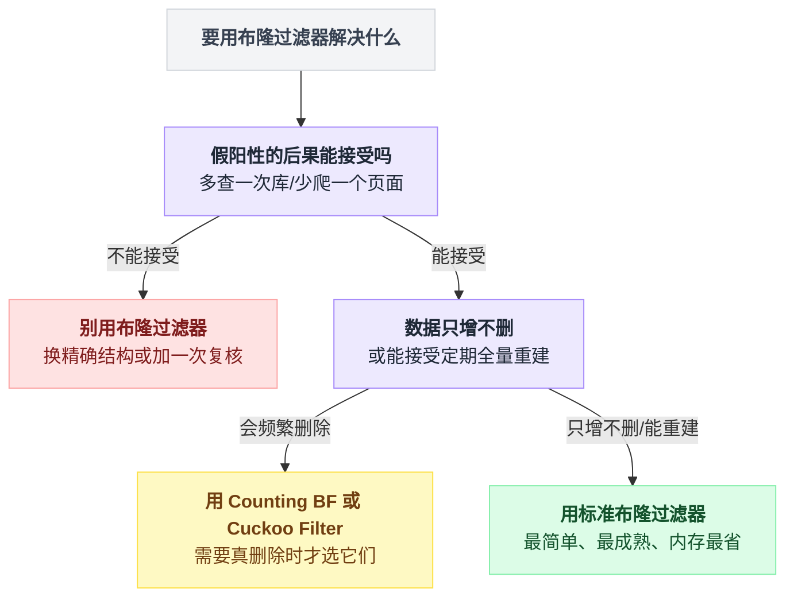

### 5.9 Counting Bloom Filter 与布谷鸟过滤器

**Counting Bloom Filter（计数布隆过滤器）**

思路简单粗暴：**把每个位置从 1 个 bit 扩成一个小计数器（通常 4 bit）。**

```
    标准 BF：
    ┌──┬──┬──┬──┬──┬──┬──┬──┐
    │ 0│ 1│ 0│ 1│ 0│ 0│ 1│ 0│      每格 1 bit
    └──┴──┴──┴──┴──┴──┴──┴──┘

    Counting BF：
    ┌──┬──┬──┬──┬──┬──┬──┬──┐
    │ 0│ 2│ 0│ 1│ 0│ 0│ 3│ 0│      每格 4 bit（能数到 15）
    └──┴──┴──┴──┴──┴──┴──┴──┘
        ↑              ↑
     被 2 个元素     被 3 个元素
     置过           置过

    插入：对应位置 +1
    删除：对应位置 -1
    查询：所有位置都 > 0 才算"可能存在"
```

**回到 apple/banana 的例子：**

```
    apple  占 {2, 7, 11}
    banana 占 {4, 7, 13}

    插入两个后：
    位置:   2   4   7  11  13
    计数:  [1] [1] [2] [1] [1]
                    ↑ 两人共用，计数是 2

    删除 banana（{4,7,13} 各减 1）：
    位置:   2   4   7  11  13
    计数:  [1] [0] [1] [1] [0]
                    ↑ 减到 1，还大于 0

    查 apple（要 2, 7, 11 都 > 0）：
             [1] [1] [1]  →  全部 > 0  →  "可能存在"  ✓ 正确！
```

**代价：内存变成 4 倍。**

```
    标准 BF：1 亿元素，m/n=10 → 125 MB
    Counting BF（4 bit 计数器）→ 500 MB
```

**还有一个隐患：计数器溢出。** 4 bit 最大是 15。如果某个位置被 16 个元素置过，计数器就爆了。业界做法是"饱和到 15 就不再增加"，代价是这个位置永远删不干净。

> 溢出概率其实很低 —— 论文算过，用最优 k 时，某个计数器超过 15 的概率约 `10^-15`。所以 4 bit 是够的。

**布谷鸟过滤器（Cuckoo Filter）**

2014 年提出的，比 Counting BF 更好。核心思路完全不同：

```
   ┌──────────────────────────────────────────────────────────────┐
   │  Cuckoo Filter：存"指纹"，不存"位"                           │
   ├──────────────────────────────────────────────────────────────┤
   │                                                              │
   │   把哈希表分成很多个"桶"，每个桶能放 4 个"指纹"              │
   │   （指纹 = 元素哈希值的一小段，通常 8~16 bit）               │
   │                                                              │
   │   ┌──────────┬──────────┬──────────┬──────────┐              │
   │   │  桶 0    │  桶 1    │  桶 2    │  桶 3    │              │
   │   ├──────────┼──────────┼──────────┼──────────┤              │
   │   │ a3       │ 7f  2c   │          │ 91 05 e8 │              │
   │   └──────────┴──────────┴──────────┴──────────┘              │
   │                                                              │
   │   每个元素有【两个】候选桶：                                 │
   │      桶1 = hash(x)                                           │
   │      桶2 = 桶1 XOR hash(指纹)     ← 神来之笔                 │
   │                                                              │
   │   ★ 这个异或的巧妙之处：                                     │
   │     从桶2 也能用同样的公式算回桶1                            │
   │     → 搬迁一个指纹时，【不需要知道原始元素是什么】           │
   │     → 这就是为什么它只存指纹也能工作                         │
   │                                                              │
   │   插入时两个桶都满了怎么办？                                 │
   │      → 【像布谷鸟一样把别人踢出去】                          │
   │      → 被踢的那个去它的另一个候选桶                          │
   │      → 连锁反应，直到有空位（或者踢太多次判定为满）          │
   └──────────────────────────────────────────────────────────────┘
```

> **为什么叫布谷鸟？** 布谷鸟（杜鹃）会把蛋下在别的鸟巢里，并把原来的蛋推出去。这个算法的"踢人"行为跟它一模一样。

**删除怎么做？** 直接从桶里把那个指纹擦掉。因为指纹是**独立存储**的，不像 BF 那样共用位。

**三者对照：**

| 特性 | 标准 Bloom | Counting Bloom | **Cuckoo Filter** |
|---|---|---|---|
| 能删除 | ❌ | ✅ | ✅ |
| 同等误判率的内存 | 基准 1× | 4× | **约 0.95×（更省！）** |
| 查询要访问几处内存 | k 处（k≈7，都是随机位置） | k 处 | **2 处**（缓存友好） |
| 假阴性 | 无 | 无 | 无（但删了没插过的元素会破坏） |
| 容量满了 | 误判率恶化，还能用 | 同左 | **插入直接失败** |
| 支持并发 | 容易（置位是幂等的） | 中 | **难**（要搬迁，得加锁） |
| 成熟度 | 极高，到处都是 | 高 | 中，实现少一些 |

**为什么 Cuckoo 内存更省还能删？** 关键在于它存的是"指纹"这种**有身份的信息**，而不是布隆过滤器那种"匿名的位"。有身份就能精确删除；而每个元素只占一个 12 bit 左右的指纹（不是 k 个位），总量反而更少。

**那个"查询只访问 2 处内存"是被严重低估的优势：**

```
    ┌────────────────────────────────────────────────────────────┐
    │  Bloom Filter 查一次：                                     │
    │     访问 7 个【完全随机】的内存位置                        │
    │     → 7 次 CPU 缓存未命中（cache miss）                    │
    │     → 每次 miss 要从主内存取，约 100 纳秒                  │
    │     → 单次查询约 700 纳秒                                  │
    │                                                            │
    │  Cuckoo Filter 查一次：                                    │
    │     访问 2 个位置，而且每个桶是【连续的 4 个指纹】         │
    │     → 一次缓存行加载就能读完一个桶                         │
    │     → 单次查询约 200 纳秒                                  │
    │                                                            │
    │  ★ 在超高 QPS 场景下，这 3.5 倍的差距很致命               │
    └────────────────────────────────────────────────────────────┘
```

**实用建议：**

```
    ┌────────────────────────────────────────────────────────┐
    │  · 只增不删（爬虫去重、已读标记）  → 标准 Bloom        │
    │    简单、成熟、库到处都是，别折腾                      │
    │                                                        │
    │  · 需要删除，且量不大             → Counting Bloom     │
    │    实现简单，内存 4 倍能接受                           │
    │                                                        │
    │  · 需要删除，且对内存/延迟敏感    → Cuckoo Filter      │
    │    但要注意"满了就插不进去"这个硬约束，                │
    │    必须留足容量余量（建议装到 90% 就扩容）             │
    │                                                        │
    │  · 用 Redis 且不想操心            → RedisBloom         │
    │    它同时提供 BF.* 和 CF.*（Cuckoo）两套命令           │
    └────────────────────────────────────────────────────────┘
```

### 5.10 三大应用场景

**场景一：缓存穿透防护（呼应秒杀）**

```
                    请求 /item/{id}
                          │
                          ▼
              ┌───────────────────────┐
              │  ① 布隆过滤器         │  125MB 内存
              │     "这个 ID 存在吗"  │  挡掉 99%+ 的恶意请求
              └───┬───────────────┬───┘
        "一定没有"│               │"可能有"
                  ▼               ▼
             返回 404      ┌───────────────────┐
             （0 次 IO）   │  ② Redis 缓存     │
                          └───┬───────────┬───┘
                       命中   │           │ 未命中
                              ▼           ▼
                          返回数据   ┌──────────────┐
                                     │ ③ 数据库     │
                                     └──────────────┘

    ★ 这个三层结构，和秒杀那篇的"漏斗式分层过滤"
      是【完全同一个模式】：
         外层：便宜、粗糙、挡掉绝大多数
         内层：昂贵、精确、只处理漏下来的
```

**要注意的三个细节：**

1. **过滤器里装什么？** 装"所有存在的 ID"。新增数据要**同步**写入（见 5.8 节的坑）。
2. **删除的数据怎么办？** 不用管。删了的 ID 还在过滤器里 → 请求会漏到缓存/数据库 → 数据库返回空 → 正常走缓存空值那套。**假阳性在这里是无害的。**
3. **过滤器什么时候构建？** 服务启动时从数据库全量加载。10 亿条数据构建一次大概几分钟，要考虑启动时间。

**场景二：爬虫 URL 去重**

```
    ┌─────────────────────────────────────────────────────────┐
    │  10 亿 URL 的去重                                       │
    ├─────────────────────────────────────────────────────────┤
    │  Set 方案：      127 GB   × 50 台爬虫 = 6.35 TB         │
    │  Bloom 方案：    1.25 GB  × 50 台爬虫 = 62.5 GB         │
    │                  ↑                                      │
    │            或者放一份在 Redis 里共享，只要 1.25GB       │
    │                                                         │
    │  ★ 假阳性的后果：某个没爬过的 URL 被误判成"爬过"        │
    │    → 少爬了一个页面                                     │
    │    → 对搜索引擎来说，这完全可以接受                     │
    │      （0.82% 的漏爬率，换 100 倍的内存节省）            │
    └─────────────────────────────────────────────────────────┘
```

**这个场景是布隆过滤器最经典的用法**，因为它完美匹配三个条件：数据量巨大、只增不删、假阳性无害。

**场景三：垃圾邮件/黑名单过滤**

```
    ┌──────────────────────────────────────────────────────────┐
    │  邮件网关：判断发件人是否在黑名单里                      │
    │                                                          │
    │  ⚠️ 这里要【特别小心方向】                                │
    │                                                          │
    │  错误用法：过滤器装"黑名单"                              │
    │      假阳性 = 好人被误判成黑名单 = 正常邮件被拦          │
    │      → 这是【不可接受】的错误方向！                      │
    │                                                          │
    │  正确用法：过滤器装"白名单"                              │
    │      假阳性 = 坏人被误判成白名单 = 垃圾邮件漏进来        │
    │      → 这个可以接受                                      │
    │                                                          │
    │  或者：过滤器装黑名单，但【命中后必须去精确表复核】      │
    │      过滤器只用来"快速排除大部分好人"，                  │
    │      真正的判定交给后面的精确查询                        │
    └──────────────────────────────────────────────────────────┘
```

**这一段是整节最重要的实战心得：**

> **用布隆过滤器之前，先在纸上写一句话：**
> **"如果它把 X 误判成 Y，会发生什么？"**
>
> 如果这句话的后果你能接受，就用。
> 如果不能接受，**要么换方向（装反面集合），要么在命中后加一次精确复核。**

落到具体选择上，就是这一步判断：

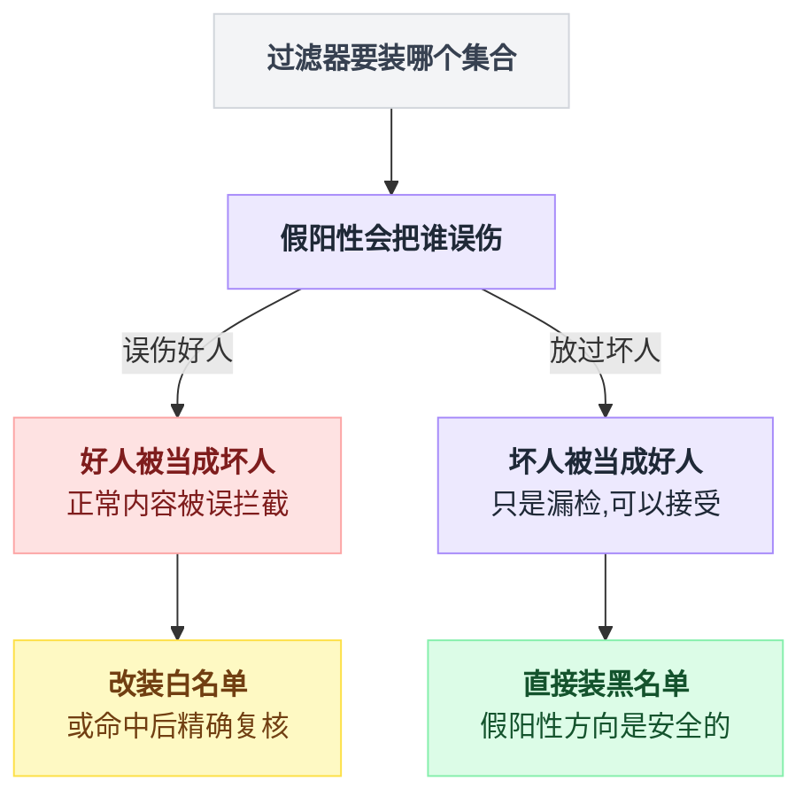

**其他真实用例（一句话过一遍）：**

| 系统 | 用法 |
|---|---|
| **Google Chrome** | 判断 URL 是否在恶意网站列表里。命中后再去服务端精确查 |
| **HBase / LevelDB / RocksDB** | 每个 SSTable 文件配一个 BF，查询前先问"这个文件里可能有这个 key 吗"，避免无谓的磁盘读。**这是 LSM 树性能的关键之一** |
| **比特币轻钱包（SPV）** | 用 BF 向全节点描述"我关心哪些地址"，既能收到相关交易，又不暴露自己的确切地址（假阳性在这里反而是**隐私特性**！） |
| **CDN** | 判断某个资源是否被缓存过，决定要不要回源 |
| **推荐系统** | 记录"这个用户已经看过哪些内容"，避免重复推荐。**典型的只增不删** |

**注意比特币那一条 —— 假阳性在那里不是缺点，是【功能】。** 因为它让全节点无法确定你到底关心哪个地址。**这是"缺点变优点"的绝佳例子。**

### 5.11 小节回收

```
    ┌────────────────────────────────────────────────────────┐
    │  布隆过滤器：一次"用假阳性换内存"的交易                │
    ├────────────────────────────────────────────────────────┤
    │                                                        │
    │  放弃了：                                              │
    │    · 约 1% 的查询会误报"存在"                          │
    │    · 不能删除元素                                      │
    │    · 不能取出元素、不能遍历                            │
    │    · 容量必须提前定，估错了误判率断崖式恶化            │
    │                                                        │
    │  换来了：                                              │
    │    · 内存 127GB → 1.25GB（100 倍）                     │
    │    · 每个元素只占 10 个 bit，和元素本身多大无关        │
    │    · 查询 O(k)，与元素总数无关                         │
    │    · "说不存在"这一条【逻辑上严格成立】                │
    │                                                        │
    │  一句话记住：                                          │
    │    当两种错误的代价不对称时，                          │
    │    就该用一个"错误也不对称"的工具。                    │
    └────────────────────────────────────────────────────────┘
```


---

## 6. 小节五：一致性哈希 —— 用"分布不均"换"扩容不失效"

### 6.1 生活类比：图书馆重新排架

图书馆有 10 个书架，10 万本书。管理员定了个规矩：

> **按书名的首字母排。** A~C 放 1 号架，D~F 放 2 号架，以此类推。

读者要找《三体》，一算就知道去哪个架子，30 秒搞定。**规则清晰，查找极快。**

**然后图书馆买了一个新书架，变成 11 个。**

管理员说："那重新分吧，A~B 放 1 号，C~D 放 2 号……"

```
        重新分配之前              重新分配之后
     ┌──────────────────┐      ┌──────────────────┐
     │ 1号架: A B C     │      │ 1号架: A B       │  ← 要搬走 C
     │ 2号架: D E F     │      │ 2号架: C D       │  ← 全变了
     │ 3号架: G H I     │      │ 3号架: E F       │  ← 全变了
     │ 4号架: J K L     │      │ 4号架: G H       │  ← 全变了
     │  ...             │      │  ...             │
     └──────────────────┘      └──────────────────┘

                    结果：
        ╔════════════════════════════════════════╗
        ║  10 万本书，要搬动 9 万多本            ║
        ║  图书馆闭馆三天                        ║
        ║  就因为加了一个书架                    ║
        ╚════════════════════════════════════════╝
```

**换个办法：不按字母分，改成"绕圈找空位"。**

管理员把 11 个书架**排成一个圈**，每个架子门口贴一个编号。规矩改成：

> **算出这本书的编号，然后从这个编号开始，顺时针走，遇到的第一个书架就放进去。**

现在再加一个书架会怎样？

```
              加架子之前                     加架子之后

              ┌───┐                          ┌───┐
         ┌────│ A │────┐                ┌────│ A │────┐
         │    └───┘    │                │    └───┘    │
       ┌───┐         ┌───┐            ┌───┐  ┌───┐  ┌───┐
       │ D │         │ B │            │ D │  │NEW│  │ B │
       └───┘         └───┘            └───┘  └───┘  └───┘
         │    ┌───┐    │                │    └─┬─┘    │
         └────│ C │────┘                └──────┴──────┘
              └───┘                          │ C │
                                             └───┘

    原来 A 和 B 之间的书都归 B         现在 A 和 NEW 之间的书归 NEW
                                        NEW 和 B 之间的书还是归 B

    ★ 只有"A 到 NEW"这一小段的书要搬
    ★ C、D 架上的书【一本都不用动】
```

**这就是一致性哈希。** 一句话概括：

> **别用"总数"来分配，用"位置"来分配。**
> 总数一变，所有人的归属都变；
> 而位置是绝对的，加一个人只影响他旁边那一段。

### 6.2 灾难推演：从 %10 到 %11

现在说技术。你有 10 台缓存服务器（Redis），用最直白的办法分配 key：

```python
def which_server_BAD(key: str, n: int) -> int:
    return hash(key) % n        # 取模，落到 0~n-1
```

**这个方法太自然了，几乎所有人的第一版都是它。** 它有很多优点：

```
    ✓ 计算 O(1)，就一次取模
    ✓ 不需要任何额外的数据结构
    ✓ 分布非常均匀（好哈希函数的取模结果接近完美均匀）
    ✓ 一行代码
```

**然后你要加一台机器。**

**先看一个具体的 key 发生了什么：**

```
    key = "user:12345"
    hash("user:12345") = 8,472,913,406

    10 台机器时：8,472,913,406 % 10 = 6   →  6 号机器
    11 台机器时：8,472,913,406 % 11 = 3   →  3 号机器
                                       ━━━
                          这个 key 换了个家！
```

它的缓存还在 6 号机器上，但现在所有人都去 3 号机器找它 —— **找不到，缓存未命中，回源数据库。**

**那有多少 key 会换家？我们算一算。**

一个 key 能"留在原地"，当且仅当 `h % 10 == h % 11`。

```
    设 h % 10 == h % 11 == v

    因为 h % 10 的结果只能是 0~9，所以 v 一定在 0~9 之间。

    根据中国剩余定理，同时满足
        h ≡ v (mod 10)  和  h ≡ v (mod 11)
    的 h，在模 110（=10×11）下有唯一解，就是 h ≡ v (mod 110)。

    v 有 10 种取值（0~9），所以在每 110 个连续的 h 里，
    只有 10 个能留在原地。

              留存率 = 10 / 110 = 9.09%
```

**我实际跑了一遍验证（10 万个 key）：**

```
    实测留存率：8.99%     （理论值 9.09%，吻合）
```

**画出来是这样的：**

```
    ┌──────────────────────────────────────────────────────────────┐
    │  从 10 台扩容到 11 台，缓存的命运                            │
    ├──────────────────────────────────────────────────────────────┤
    │                                                              │
    │  扩容前：                                                    │
    │  ████████████████████████████████████████████████ 100% 命中  │
    │                                                              │
    │  扩容后的第一秒：                                            │
    │  ████░░░░░░░░░░░░░░░░░░░░░░░░░░░░░░░░░░░░░░░░░░░░  9% 命中   │
    │  ↑                                                           │
    │  就剩这么点                                                  │
    │                                                              │
    │            ╔══════════════════════════════════╗              │
    │            ║   91% 的缓存瞬间全部失效         ║              │
    │            ╚══════════════════════════════════╝              │
    └──────────────────────────────────────────────────────────────┘
```

**91% 失效意味着什么？我们把后果推到底：**

```
   假设你的系统：
     · 总 QPS = 10 万
     · 缓存命中率 = 99%
     · 所以平时打到数据库的 QPS = 10万 × 1% = 1000

   加一台机器的瞬间：
     · 缓存命中率 = 99% × 9% ≈ 9%
     · 打到数据库的 QPS = 10万 × 91% = 91,000

              ┌──────────────────────────────┐
              │  数据库 QPS：1000 → 91,000   │
              │           【涨了 91 倍】     │
              └──────────────────────────────┘
                            │
                            ▼
   ┌──────────────────────────────────────────────────────────┐
   │  数据库连接池瞬间打满（通常配几十到几百个连接）          │
   │           │                                              │
   │           ▼                                              │
   │  请求排队 → 响应时间从 5ms 涨到 5s                       │
   │           │                                              │
   │           ▼                                              │
   │  上游服务超时 → 【重试】                                 │
   │           │                                              │
   │           ▼                                              │
   │  重试让 QPS 再翻倍 → 数据库彻底躺倒                      │
   │           │                                              │
   │           ▼                                              │
   │  ★ 缓存雪崩 + 重试风暴 ★                                 │
   │    整个系统在你"扩容"的那一刻崩溃                        │
   └──────────────────────────────────────────────────────────┘
```

**这是运维史上最经典的黑色幽默：**

> **你为了让系统更能扛，加了一台机器。**
> **加机器这个动作本身，把系统搞挂了。**

> **缓存雪崩**：大量缓存同时失效，请求全部涌向数据库。这个词在秒杀那篇讲过，那里的成因是"大批 key 设了同样的过期时间"。这里的成因是"扩容导致 key 的归属全变了"。**成因不同，后果一模一样。**

**更糟的情况：减一台机器（比如一台挂了）。**

```
    10 台 → 9 台（一台宕机）

    留存率 = h%10 == h%9 的比例 = 9/90 = 10%

    → 90% 的缓存失效
    → 而且此时你还少了一台机器分担流量
    → 雪上加霜
```

**这才是真正可怕的地方：机器宕机是你控制不了的。** 扩容你还能挑凌晨低峰期慢慢来，宕机是随机发生的 —— 而且往往就发生在流量最高的时候（因为压力大才容易挂）。

**能不能"预热"来缓解？**

有人会想：扩容前先把新机器的缓存填好不就行了？

**不行。** 因为你不知道该往新机器上填什么 —— **每一台机器的 key 归属都变了，是所有 10 台机器的数据在做一次大洗牌**，不是"从旧机器挪一部分到新机器"。你要重建的是整个集群的缓存。

**能不能双写过渡？**

同时按 %10 和 %11 写两份，等新的填满了再切。可以，但：

```
    · 内存要双份
    · 写入 QPS 要双份
    · 过渡期读的时候查哪个？要查两次
    · 每次扩缩容都要走一遍这个流程，运维成本极高
    · 而【宕机】的场景根本没有过渡期
```

**根本的问题在哪？**

```
    ┌──────────────────────────────────────────────────────────┐
    │                                                          │
    │    hash(key) % N                                         │
    │                  ↑                                       │
    │            这个 N 是【全局状态】                         │
    │                                                          │
    │    N 一变，【每一个 key 的计算结果都变】                 │
    │    这是一次全局重排，不是局部调整                        │
    │                                                          │
    │    ★ 这就是问题的根源：                                  │
    │      把"分配规则"和"机器总数"绑死了                      │
    │                                                          │
    └──────────────────────────────────────────────────────────┘
```

**所以解法的方向也很清楚了：**

> **让 key 的归属，不依赖于"一共有多少台机器"。**

### 6.3 一致性哈希：把哈希空间掰成一个环

**第一步：把哈希值的取值范围想象成一个环。**

哈希函数（比如 MD5 取前 32 位）输出的是 `0 ~ 2³²-1` 的整数。把这条数轴的两头接起来：

```
                        0 / 2³²
                          ▲
                          │
          2³²×7/8    ┌────┴────┐    2³²×1/8
                ╱────┘         └────╲
              ╱                       ╲
    2³²×3/4  │                         │  2³²×1/4
             │      哈希环             │
             │   (0 ~ 4,294,967,295)   │
              ╲                       ╱
                ╲────┐         ┌────╱
          2³²×5/8    └────┬────┘    2³²×3/8
                          │
                          ▼
                       2³²×1/2

    ★ 关键：4,294,967,295 的下一个是 0，首尾相接
```

**第二步：把机器放到环上。**

用机器的标识（IP、主机名）算哈希，算出来的值就是它在环上的位置。

```
                          0
                          ▲
                          │
                    ┌─────┴─────┐
                ╱───┘           └───╲
              ╱      ●Node-A          ╲
             │      (位置 0.1)         │
             │                          │
    ●Node-D  │                          │  ●Node-B
   (位置0.75)│         哈希环           │ (位置 0.3)
             │                          │
             │                          │
              ╲                        ╱
                ╲───┐    ●Node-C  ┌───╱
                    └────(0.6)────┘

    （位置用"占整个环的比例"表示，方便看）
```

**第三步：key 也放到环上，然后顺时针找。**

```
    规则：算出 key 的哈希位置，从那里开始【顺时针】走，
          遇到的第一台机器，就是这个 key 的归属。

                          0
                          ▲
                    ┌─────┴─────┐
                ╱───┘           └───╲
              ╱      ●Node-A          ╲
             │       (0.1)             │
             │         │               │
             │      key1(0.15)         │
             │         │  顺时针 ──▶   │
    ●Node-D  │         └──────────┐    │  ●Node-B
    (0.75)   │                    ▼    │  (0.3)
             │              找到 Node-B ← key1 归 B
              ╲                        ╱
                ╲───┐    ●Node-C  ┌───╱
                    └────(0.6)────┘

    再看几个：
      key2 位置 0.05  → 顺时针遇到 Node-A(0.1)  → 归 A
      key3 位置 0.45  → 顺时针遇到 Node-C(0.6)  → 归 C
      key4 位置 0.8   → 顺时针绕过 0 → 遇到 Node-A(0.1) → 归 A
                        ↑ 注意这里【绕回来了】，这是环的关键
```

**每台机器"管辖"的范围，就是从它逆时针方向的上一台机器，到它自己这一段：**

```
                          0
                          ▲
              区间 D→A    │    区间 A→B
                    ┌─────┴─────┐
                ╱───┘  ●A(0.1)  └───╲
              ╱ ░░░░░░░░│▓▓▓▓▓▓▓▓▓▓  ╲
             │░░░░░░░░░░│▓▓▓▓▓▓▓▓▓▓▓▓ │
             │░░░░░░░░░░│▓▓▓▓▓▓▓▓▓▓▓▓ │
    ●D(0.75) ●░░░░░░░░░░│▓▓▓▓▓▓▓▓▓▓▓▓ ●B(0.3)
             │▒▒▒▒▒▒▒▒▒▒▒▒▒▒▒▒▒▒▒▒▒▒▒ │
             │▒▒▒▒▒▒▒▒▒▒▒▒▒▒▒▒▒▒▒▒▒▒▒▒│
              ╲▒▒▒▒▒▒▒▒▒▒▒▒▒▒▒▒▒▒▒▒▒▒╱
                ╲───┐  ●C(0.6)  ┌───╱
                    └───────────┘
              区间 C→D        区间 B→C

    ▓ = A 到 B 之间的 key，归 B
    ▒ = B 到 C 之间的 key，归 C
    ░ = D 到 A 之间的 key，归 A
```

**注意这个设计里最关键的一点：**

```
    ┌──────────────────────────────────────────────────────────┐
    │                                                          │
    │   key 的位置，只由 hash(key) 决定                        │
    │            ↑                                             │
    │   【和有几台机器完全无关】                               │
    │                                                          │
    │   机器的位置，只由 hash(机器标识) 决定                   │
    │            ↑                                             │
    │   【也和有几台机器完全无关】                             │
    │                                                          │
    │   ★ 那个害人的 N 消失了 ★                                │
    │                                                          │
    └──────────────────────────────────────────────────────────┘
```

### 6.4 加节点、减节点：只动相邻一段

**现在加一台 Node-E，它的哈希位置是 0.2（落在 A 和 B 之间）：**

```
        ┌──────────── 加节点之前 ────────────┐
                          0
                    ┌─────┴─────┐
                ╱───┘  ●A(0.1)  └───╲
              ╱         │             ╲
             │          │▓▓▓▓▓▓▓▓▓▓▓  │
             │          │▓▓▓▓▓▓▓▓▓▓▓  │
    ●D(0.75) │          │▓▓▓▓▓▓▓▓▓▓▓  ●B(0.3)
             │                         │
              ╲                       ╱
                ╲───┐  ●C(0.6)  ┌───╱
                    └───────────┘

        A 到 B 这一整段（0.1~0.3）的 key，全归 B


        ┌──────────── 加节点之后 ────────────┐
                          0
                    ┌─────┴─────┐
                ╱───┘  ●A(0.1)  └───╲
              ╱         │████        ╲       █ = 从 B 转移给 E
             │          │████●E(0.2)  │
             │          │    │▓▓▓▓▓▓  │
    ●D(0.75) │          │    │▓▓▓▓▓▓  ●B(0.3)
             │                         │
              ╲                       ╱
                ╲───┐  ●C(0.6)  ┌───╱
                    └───────────┘

        · 0.1~0.2 的 key：本来归 B，现在归 E   ← 【只有这一段变了】
        · 0.2~0.3 的 key：还是归 B             ← 没变
        · 0.3~0.6 的 key：还是归 C             ← 没变
        · 0.6~0.75 的 key：还是归 D            ← 没变
        · 0.75~0.1 的 key：还是归 A            ← 没变

        ╔════════════════════════════════════════════════════╗
        ║  只有【新节点和它逆时针方向的前一个节点】之间      ║
        ║  这一段的 key 需要搬家。                           ║
        ║  其余节点【一个 key 都不用动】。                   ║
        ╚════════════════════════════════════════════════════╝
```

**减节点（Node-B 挂了）：**

```
        ┌──────────── B 宕机之前 ────────────┐
             │          │████●E(0.2)  │
             │          │    │▓▓▓▓▓▓  │
    ●D(0.75) │          │    │▓▓▓▓▓▓  ●B(0.3)
                              ↑
                        这段归 B

        ┌──────────── B 宕机之后 ────────────┐
             │          │████●E(0.2)  │
             │          │    │▓▓▓▓▓▓  │
    ●D(0.75) │          │    │▓▓▓▓▓▓  ✗ (B 没了)
             │                    ↓     │
             │              顺时针继续找 │
             │                    ↓     │
              ╲              找到 C     ╱
                ╲───┐  ●C(0.6)  ┌───╱

        · B 管的那段（0.2~0.3）→ 全部转给 C
        · 其他所有段【完全不受影响】

        ★ 宕机只影响【一台机器的负载】转移给它的下一个邻居
        ★ 而不是像 %N 那样引发全集群重排
```

**理论上搬家的比例是多少？**

```
    N 台机器 → N+1 台

    新节点会占走整个环的 1/(N+1)

    10 台 → 11 台：搬家比例 = 1/11 = 9.09%
                    留存比例 = 90.91%
```

**我实际跑了 10 万个 key 验证：**

```
    实测搬家比例：9.38%      （理论 9.09%，吻合）
```

**现在把两个数字并排放，看这个惊人的对称：**

```
    ┌────────────────────────────────────────────────────────────┐
    │                                                            │
    │        10 台扩容到 11 台，key 需要搬家的比例：             │
    │                                                            │
    │        hash % N     ：  91%   ██████████████████░░         │
    │        一致性哈希   ：   9%   ██░░░░░░░░░░░░░░░░░░         │
    │                                                            │
    │        ★ 正好【颠倒】过来了 ★                              │
    │                                                            │
    │        %N 保留 9%，一致性哈希搬 9%                         │
    │                                                            │
    └────────────────────────────────────────────────────────────┘
```

**这不是巧合。** `%N` 的留存率约等于 `1/(N+1)`（严格说是 `N/(N(N+1))×N`，数值上接近），而一致性哈希的搬迁率**正好**是 `1/(N+1)`。一个是"只留下 1/(N+1)"，一个是"只搬走 1/(N+1)"。

**回到缓存命中率的账：**

```
    ┌──────────────────────────────────────────────────────┐
    │                     %N        一致性哈希             │
    ├──────────────────────────────────────────────────────┤
    │  扩容后命中率     9%           91%                   │
    │  DB 的 QPS      91,000         9,000                 │
    │                    ↑              ↑                  │
    │              直接打挂        能扛住（10 倍余量）     │
    └──────────────────────────────────────────────────────┘
```

**再进一步：如果一次加多台机器呢？**

```
    10 台 → 20 台（翻倍扩容）

    %N：            留存率 = ?  基本接近 5%（更惨）
    一致性哈希：    搬迁率 = 10/20 = 50%

    ★ 一致性哈希的搬迁量和"加了多少"成正比，
      这是符合直觉的、可预期的。
    ★ %N 的重排量和"加了多少"基本无关 —— 永远是全部重排。
```

**所以实操上有个建议：一致性哈希的集群，一次少加几台、分批加。** 每次加一台只搬 9%，加三次总共搬 27%，比一次加三台搬 23% 略多，但**每一次的冲击都是可控的**，而且中间可以观察、可以回滚。

> 这和秒杀里"灰度发布、小流量验证"是同一个哲学：**把一次大变更拆成几次小变更，每次都可观测、可回退。**

### 6.5 数据倾斜与虚拟节点

一致性哈希有个明显的问题，从前面的图上其实已经能看出来了。

**机器在环上的位置，是哈希算出来的 —— 而哈希是随机的。**

```
    你【期望】的样子（4 台机器均匀分布）：

                     0
                ┌────┴────┐
            ╱───┘  ●A     └───╲
          ╱                     ╲
    ●D   │        每台 25%       │   ●B
          ╲                     ╱
            ╲───┐    ●C   ┌───╱
                └─────────┘


    你【实际】得到的样子：

                     0
                ┌────┴────┐
            ╱───┘ ●A●B●C  └───╲       三台挤在一起
          ╱       ││││││        ╲
         │        ││││││         │
         │                       │
         │                       │
          ╲                     ╱
            ╲───┐   ●D    ┌───╱
                └─────────┘
                    ↑
              D 一个人管了大半个环
```

**这叫数据倾斜（Data Skew）。**

**我实际测了一下（10 台机器，每台只在环上放 1 个点，10 万个 key）：**

```
    ┌──────────────────────────────────────────────────────┐
    │  10 台机器的 key 分布（每台在环上只有 1 个位置）     │
    ├──────────────────────────────────────────────────────┤
    │  最少的机器：    533 个 key                          │
    │  最多的机器： 40,507 个 key                          │
    │                                                      │
    │        最大 / 最小 = 76 倍                           │
    │                                                      │
    │  ╔══════════════════════════════════════════════╗    │
    │  ║  一台机器承担了 40% 的流量，                 ║    │
    │  ║  另一台只有 0.5%                             ║    │
    │  ║  → 前者被打爆，后者在睡觉                    ║    │
    │  ╚══════════════════════════════════════════════╝    │
    └──────────────────────────────────────────────────────┘
```

**76 倍。这完全不能用。**

**而且还有个更阴险的连锁反应：**

```
    ┌──────────────────────────────────────────────────────────┐
    │  雪崩式转移                                              │
    ├──────────────────────────────────────────────────────────┤
    │                                                          │
    │   假设 D 管了 40% 的流量，它扛不住，挂了                 │
    │              │                                           │
    │              ▼                                           │
    │   它的 40% 流量，【全部】转给顺时针的下一个节点 A        │
    │              │                                           │
    │              ▼                                           │
    │   A 原本有 10%，现在变成 50% → A 也扛不住，挂了          │
    │              │                                           │
    │              ▼                                           │
    │   50% 全部转给 B → B 也挂 → ...                          │
    │              │                                           │
    │              ▼                                           │
    │   ╔══════════════════════════════════════════╗           │
    │   ║   一台挂 → 全部依次挂掉                  ║           │
    │   ║   这叫【级联故障 / 雪崩式转移】          ║           │
    │   ╚══════════════════════════════════════════╝           │
    └──────────────────────────────────────────────────────────┘
```

**解法：虚拟节点（Virtual Node）。**

思路特别简单：**让每台物理机在环上占很多个位置。**

```
    原来：cache-01 → hash("cache-01") → 环上 1 个点

    现在：cache-01 → hash("cache-01#0")   → 环上第 1 个点
                     hash("cache-01#1")   → 环上第 2 个点
                     hash("cache-01#2")   → 环上第 3 个点
                     ...
                     hash("cache-01#149") → 环上第 150 个点

    这 150 个点全都指向物理机 cache-01
```

**画出来的效果：**

```
    没有虚拟节点（3 台机器）：
    ┌──────────────────────────────────────────────────────┐
    │  A          B                              C         │
    │  ●──────────●──────────────────────────────●─────    │
    │  └── B 管 ──┘└────────── C 管 ────────────┘└ A 管 ┘  │
    │       小           特别大                     中     │
    └──────────────────────────────────────────────────────┘

    有虚拟节点（每台 6 个虚拟点，实际用 150 个）：
    ┌──────────────────────────────────────────────────────┐
    │  A  C  B  A  B  C  B  A  C  A  C  B  A  B  C  A      │
    │  ●──●──●──●──●──●──●──●──●──●──●──●──●──●──●──●──    │
    │  └┬┘└┬┘└┬┘└┬┘└┬┘└┬┘└┬┘└┬┘└┬┘└┬┘└┬┘└┬┘└┬┘└┬┘└┬┘      │
    │   每一小段都很小，而且 A/B/C 交替出现                │
    │                                                      │
    │  ★ A 管的总量 = 它所有虚拟点后面那些小段的和         │
    │  ★ 小段多了，总和就趋于平均（大数定律）              │
    └──────────────────────────────────────────────────────┘
```

**为什么虚拟节点能让分布变均匀？这是大数定律。**

> 掷 1 次骰子，结果可能是任何数，方差很大。
> 掷 150 次取平均，结果几乎必然接近 3.5。
>
> 每台机器在环上占 1 段 = 掷 1 次骰子（碰运气）
> 每台机器在环上占 150 段 = 掷 150 次取和（稳定）

**我实测了不同虚拟节点数的效果（10 台机器，10 万个 key）：**

| 每台机器的虚拟节点数 | 最少 key 数 | 最多 key 数 | **最大/最小** |
|---|---|---|---|
| **1**（不用虚拟节点） | 533 | 40,507 | **76.0 倍** |
| 10 | 3,657 | 15,863 | 4.34 倍 |
| 50 | 8,798 | 11,254 | 1.28 倍 |
| **150**（业界常用值） | 8,412 | 11,065 | **1.32 倍** |
| 500 | 9,398 | 10,422 | **1.11 倍** |

**看这张表能看出三件事：**

```
   ┌──────────────────────────────────────────────────────────┐
   │  ① 从 1 到 10：效果最显著（76 倍 → 4.3 倍）              │
   │     只是加了 9 个虚拟点，收益巨大                        │
   │                                                          │
   │  ② 从 50 到 150：几乎没有改善（1.28 → 1.32）             │
   │     ★ 已经进入平台期，边际收益趋近于零                   │
   │     （150 反而略差于 50，这是随机波动，不是规律）        │
   │                                                          │
   │  ③ 到 500 才又好一点（1.11 倍）                          │
   │     代价：环上有 5000 个点，每次查找的二分次数增加，     │
   │           内存占用也增加                                 │
   └──────────────────────────────────────────────────────────┘
```

**为什么业界普遍用 150？** 这是个经验值（Ketama 算法用 160，Dynamo 论文用几百）。它落在"已经足够均匀"和"还没开始明显浪费"之间。

```
    虚拟节点数的权衡：

    太少 ──────────────────────────────────▶ 太多
     │                                        │
     ▼                                        ▼
   分布不均                            环上点太多：
   数据倾斜                            · 内存占用（10 台×500=5000 个点）
   雪崩式转移                          · 查找变慢（二分 log₂5000 ≈ 12 次）
                                       · 增删节点时要更新更多点
                    ▲
                    │
              150 左右，甜蜜点
```

**虚拟节点还带来一个大礼包：宕机时负载被均摊。**

```
    ┌────────────────────────────────────────────────────────────┐
    │  没有虚拟节点：D 挂了                                      │
    │      D 的全部流量 → 全给 A 一台                            │
    │      A 的负载翻倍 → A 可能也挂 → 级联故障                  │
    │                                                            │
    │      ┌───┐  ┌───┐  ┌───┐  ┌───┐                            │
    │      │ A │  │ B │  │ C │  │ ✗ │                            │
    │      │+D │  │   │  │   │  │ D │                            │
    │      │███│  │▒▒▒│  │▒▒▒│  └───┘                            │
    │      │███│  └───┘  └───┘                                   │
    │      └───┘                                                 │
    │       爆了                                                 │
    │                                                            │
    ├────────────────────────────────────────────────────────────┤
    │  有虚拟节点：D 挂了                                        │
    │      D 的 150 个虚拟点，散落在环的各个位置                 │
    │      每个虚拟点后面的那一小段，转给【各自不同的邻居】      │
    │      → D 的流量被【均匀分摊】给所有存活的机器              │
    │                                                            │
    │      ┌───┐  ┌───┐  ┌───┐  ┌───┐                            │
    │      │ A │  │ B │  │ C │  │ ✗ │                            │
    │      │+⅓D│  │+⅓D│  │+⅓D│  │ D │                            │
    │      │▒▒▒│  │▒▒▒│  │▒▒▒│  └───┘                            │
    │      │░░░│  │░░░│  │░░░│                                   │
    │      └───┘  └───┘  └───┘                                   │
    │       每台多扛 1/3，都能撑住                               │
    │                                                            │
    │   ★ 这个性质比"分布均匀"更重要 ——                          │
    │     它把【级联故障】的引信拆掉了                           │
    └────────────────────────────────────────────────────────────┘
```

> 这和秒杀里"库存分片"的道理相通：**把一个大块打散成很多小块，任何一块出问题，冲击都被稀释了。**

### 6.6 Python 完整实现（bisect 二分查找）

**关键的实现问题：怎么"顺时针找第一个节点"？**

朴素做法是遍历所有节点找最小的大于 key 的那个 —— O(N)。有 1500 个虚拟节点时，每次查 1500 次，太慢。

**正确做法：把环上的位置排成一个有序数组，用二分查找。**

```python
import bisect
import hashlib

class ConsistentHashRing:
    """带虚拟节点的一致性哈希环。"""

    def __init__(self, nodes: list[str] | None = None, virtual_nodes: int = 150):
        self.virtual_nodes = virtual_nodes
        self._ring: dict[int, str] = {}       # 环上位置 → 物理节点名
        self._sorted_keys: list[int] = []     # 环上所有位置，【有序】
        for node in nodes or []:
            self.add_node(node)

    @staticmethod
    def _hash(key: str) -> int:
        """MD5 取前 32 位，映射到 0 ~ 2³²-1 的环上。"""
        return int(hashlib.md5(key.encode()).hexdigest()[:8], 16)
```

**这段在干嘛：** 两个核心数据结构。`_ring` 是"位置 → 机器"的字典；`_sorted_keys` 是所有位置排好序的列表，专门用来二分查找。

> **为什么要两个结构？** 字典能 O(1) 查"这个位置是谁的"，但字典是无序的，没法做"找下一个"。有序列表能二分，但存不了映射关系。两个配合使用。

```python
    def add_node(self, node: str) -> None:
        """加一台物理机，在环上撒 virtual_nodes 个虚拟点。"""
        for i in range(self.virtual_nodes):
            h = self._hash(f"{node}#{i}")       # 用"机器名#序号"算哈希
            self._ring[h] = node
            bisect.insort(self._sorted_keys, h)  # 插入并保持有序
```

**这段在干嘛：** 为一台机器生成 150 个不同的哈希位置（靠 `#0`、`#1`……这个后缀），每个位置都指回这台机器。

> **`bisect.insort`**：往有序列表里插一个元素，插完还是有序的。内部是先二分找位置 O(log n)，再插入 O(n)（因为要挪后面的元素）。加节点是低频操作，O(n) 完全可以接受。

```python
    def remove_node(self, node: str) -> None:
        """摘掉一台物理机，把它的所有虚拟点从环上删掉。"""
        for i in range(self.virtual_nodes):
            h = self._hash(f"{node}#{i}")
            if h in self._ring:
                del self._ring[h]
                idx = bisect.bisect_left(self._sorted_keys, h)
                self._sorted_keys.pop(idx)
```

**这段在干嘛：** 用同样的方法重新算出这台机器的 150 个位置，一个个从环上摘掉。

```python
    def get_node(self, key: str) -> str | None:
        """核心：找到这个 key 归哪台机器。"""
        if not self._ring:
            return None
        h = self._hash(key)
        # 二分找第一个【大于】h 的位置 —— 这就是"顺时针的第一个节点"
        idx = bisect.bisect_right(self._sorted_keys, h)
        if idx == len(self._sorted_keys):
            idx = 0                    # ★ 走到头了就绕回环的起点
        return self._ring[self._sorted_keys[idx]]
```

**这段是整个算法的核心，逐行拆：**

```
    _sorted_keys = [100, 350, 800, 1200, 2000, 3500]
                     A    B    C     A     B     C     ← 各自属于谁

    ① key 的哈希 h = 500
       bisect_right 找"第一个 > 500 的位置的下标"
       → 下标 2（值 800）
       → 归 C  ✓ （顺时针走到 800 遇到 C）

    ② key 的哈希 h = 100（正好等于某个节点）
       bisect_right 返回下标 1（值 350）
       → 归 B
       ★ 这里用 bisect_right 而不是 bisect_left，
         意味着"正好落在节点位置上的 key，归下一个节点"。
         用哪个都行，但【必须全集群统一】，否则会不一致。

    ③ key 的哈希 h = 4000（超过了所有节点）
       bisect_right 返回 6（越界了）
       → idx = 0，绕回环的起点，归 A  ✓
       ★ 这一行 if 就是"把数轴掰成环"的全部实现
```

**加个副本支持（实用扩展）：**

```python
    def get_nodes(self, key: str, count: int) -> list[str]:
        """顺时针取 count 个【不同的物理机】，用来做数据副本。"""
        if not self._ring:
            return []
        result: list[str] = []
        idx = bisect.bisect_right(self._sorted_keys, self._hash(key))
        for _ in range(len(self._sorted_keys)):
            if idx == len(self._sorted_keys):
                idx = 0
            node = self._ring[self._sorted_keys[idx]]
            if node not in result:          # ★ 必须跳过同一台物理机
                result.append(node)
                if len(result) == count:
                    break
            idx += 1
        return result
```

**这段在干嘛：** 从 key 的位置开始顺时针走，收集 N 台**不同的**物理机。

**为什么要 `if node not in result` 这个判断？这是最容易写错的地方：**

```
    ┌──────────────────────────────────────────────────────────┐
    │  有虚拟节点时，环上连续的几个点【很可能属于同一台机器】  │
    │                                                          │
    │  环上：  ●A#7  ●A#23  ●B#41  ●A#88  ●C#12                │
    │           ↑     ↑              ↑                         │
    │          都是 A                也是 A                    │
    │                                                          │
    │  如果不去重，取 3 个副本可能拿到 [A, A, B]               │
    │       → 三份数据里有两份在同一台机器上                   │
    │       → 那台机器一挂，你以为有 3 副本，实际只剩 1 份     │
    │                                                          │
    │  ╔══════════════════════════════════════════════════╗    │
    │  ║  这个 bug 平时完全看不出来，                     ║    │
    │  ║  只在机器宕机时才暴露 —— 而那时已经丢数据了      ║    │
    │  ╚══════════════════════════════════════════════════╝    │
    └──────────────────────────────────────────────────────────┘
```

**Dynamo 论文里还更进一步：副本要落在【不同机架、不同机房】。** 因为一个机架的交换机挂了，整个机架的机器同时不可用。这叫**故障域隔离**。

**跑一遍验证：**

```python
ring = ConsistentHashRing([f"cache-{i:02d}" for i in range(10)], virtual_nodes=150)

keys = [f"key_{i}" for i in range(100_000)]
before = {k: ring.get_node(k) for k in keys}

ring.add_node("cache-10")                      # 扩容一台
after = {k: ring.get_node(k) for k in keys}

moved = sum(1 for k in keys if before[k] != after[k])
print(f"搬家比例: {moved / len(keys):.2%}")     # 9.38%
print(f"留存比例: {1 - moved / len(keys):.2%}") # 90.62%
```

**对比 `hash % N` 的 8.99% 留存 —— 差了整整 10 倍。**

**一个必须注意的工程细节：所有客户端的哈希实现必须完全一致。**

```
    ┌────────────────────────────────────────────────────────────┐
    │  ⚠️ 血泪教训                                                │
    ├────────────────────────────────────────────────────────────┤
    │  同一个集群，客户端可能是 Java、Python、Go 三种语言写的    │
    │                                                            │
    │  如果它们的哈希实现有【任何一点】不同：                    │
    │    · 哈希函数不同（MD5 vs MurmurHash）                     │
    │    · 取多少位不同（前 32 位 vs 后 32 位）                  │
    │    · 虚拟节点的命名格式不同（"node#1" vs "node-1"）        │
    │    · 虚拟节点个数不同（150 vs 160）                        │
    │    · 大小端不同                                            │
    │                                                            │
    │  → 同一个 key，Java 客户端写到 A 机器，                    │
    │    Python 客户端去 B 机器读                                │
    │  → 【永远读不到】                                          │
    │                                                            │
    │  解法：把哈希规则写进一份【跨语言的规范文档】，            │
    │        并且写一套【跨语言的一致性测试】：                  │
    │        同样 1000 个 key，三种语言算出的归属必须完全一致    │
    └────────────────────────────────────────────────────────────┘
```

**这就是为什么 memcached 生态统一用了 Ketama 算法** —— 它是一个被精确定义、各语言都严格照抄的实现规范。**在分布式系统里，"大家用同一个算法"比"用一个最好的算法"重要得多。**

### 6.7 Redis Cluster 为什么不用一致性哈希

一致性哈希这么好，为什么 Redis Cluster 不用它？

**Redis Cluster 用的是【哈希槽（Hash Slot）】：固定 16384 个槽。**

```
    ┌───────────────────────────────────────────────────────────┐
    │  Redis Cluster 的做法                                     │
    ├───────────────────────────────────────────────────────────┤
    │                                                           │
    │  ① 固定 16384 个槽，编号 0 ~ 16383                        │
    │     （数量【永远不变】，和机器数无关）                    │
    │                                                           │
    │  ② key 归哪个槽：                                         │
    │        slot = CRC16(key) % 16384                          │
    │     ★ 这个映射【永远不变】                                │
    │                                                           │
    │  ③ 槽归哪台机器：                                         │
    │        一张【显式的分配表】，人为指定                     │
    │                                                           │
    │        节点 A：槽 0     ~ 5460                            │
    │        节点 B：槽 5461  ~ 10922                           │
    │        节点 C：槽 10923 ~ 16383                           │
    │                                                           │
    │  ④ 扩容：把一部分槽【手动/工具】迁移到新节点              │
    │        加入节点 D，从 A/B/C 各匀 1365 个槽给它            │
    └───────────────────────────────────────────────────────────┘
```

**核心差别就一句话：**

```
    ┌──────────────────────────────────────────────────────────┐
    │                                                          │
    │  一致性哈希：key → 环上位置 → 【算出来】归哪台机器       │
    │                                    ↑                     │
    │                            算法决定，人无法干预          │
    │                                                          │
    │  哈希槽：    key → 槽号 → 【查表】归哪台机器             │
    │                             ↑                            │
    │                     一张表，人可以任意改                 │
    │                                                          │
    │  ★ 一个是"算"，一个是"查"                                │
    │  ★ 中间多了【一层间接】                                  │
    │                                                          │
    └──────────────────────────────────────────────────────────┘
```

> 计算机科学里有句名言：**"任何问题都可以通过增加一层间接来解决。"** 哈希槽就是在 key 和机器之间加了一层"槽"。这一层让"分配"从"算法的结果"变成了"可以被管理的数据"。

**这一层间接带来了什么？**

| 能力 | 一致性哈希 | 哈希槽 | 为什么 |
|---|---|---|---|
| **精确控制数据分布** | ❌ | ✅ | 槽可以任意指派。某台机器配置好，就多给它槽 |
| **处理热点** | ❌ | ✅ | 发现某个槽特别热，把它单独挪到一台专用机器上 |
| **异构机器** | 只能靠调虚拟节点数近似 | ✅ 直接按比例分槽 | 64G 内存的机器分 2 倍的槽 |
| **迁移进度可见** | 难 | ✅ | 迁移是"以槽为单位"的，能精确知道"迁了 300/1365 个槽" |
| **迁移可暂停/回滚** | 难 | ✅ | 槽是离散的，随时可以停 |
| 加节点时的自动化 | ✅ 全自动 | ❌ 要跑迁移工具 | 这是槽的**缺点** |
| 实现复杂度 | 低 | 高（要维护槽表 + 集群共识） | |
| 客户端复杂度 | 低（本地算） | 中（要缓存槽表、处理 MOVED 重定向） | |

把表格里"算 vs 查"这句话画成两条并排的路径，间接层加在哪一步一眼就看出来：

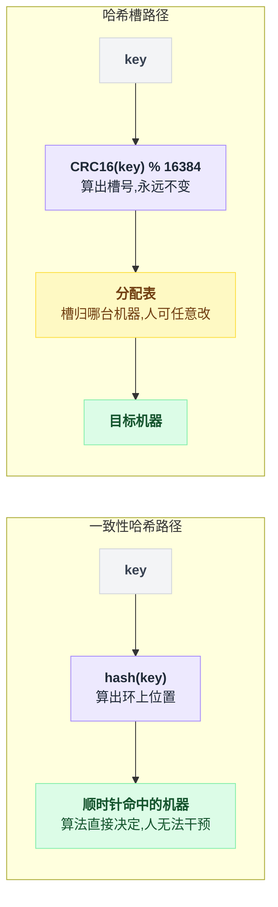

**为什么偏偏是 16384 这个数？** Redis 作者 antirez 亲自回答过，理由很实在：

```
   ┌────────────────────────────────────────────────────────────┐
   │  理由一：心跳包的大小                                      │
   │     Redis Cluster 节点之间要不断交换"我负责哪些槽"         │
   │     这个信息用【位图】传输：                               │
   │        16384 bit = 2048 字节 = 2 KB                        │
   │     如果用 65536 个槽：                                    │
   │        65536 bit = 8192 字节 = 8 KB                        │
   │     ★ 节点两两心跳，包大小 ×4 会显著增加网络开销           │
   │                                                            │
   │  理由二：集群规模上限                                      │
   │     Redis Cluster 设计上不建议超过 1000 个节点             │
   │     16384 / 1000 ≈ 16 个槽/节点                            │
   │     ★ 够细了，再多槽没有实际意义                           │
   │                                                            │
   │  理由三：位图压缩率                                        │
   │     节点数越少，槽位图里连续的 0/1 越多，压缩效果越好      │
   │     16384 在这个规模下压缩后往往只有几百字节               │
   └────────────────────────────────────────────────────────────┘
```

**"16384 个槽"本质上是一个"预先切好的、足够细的一致性哈希环"。**

```
    一致性哈希环：连续的 2³² 个位置，节点位置由哈希随机决定
                    ↓
    哈希槽：       离散的 16384 个位置，节点归属由人指定

    ★ 槽 = 把环【预先切成 16384 段】，然后允许手工分配这些段

    换句话说：
      虚拟节点是"每台机器在环上占 150 个随机位置"
      哈希槽是  "环被切成 16384 个固定位置，每台机器认领一批"

    ★ 两者的目的完全相同（打散 + 均匀），
      区别只在于位置是【随机产生】还是【人工分配】
```

**怎么选：**

```
    ┌──────────────────────────────────────────────────────────┐
    │  用一致性哈希：                                          │
    │    · 纯客户端分片（客户端自己算，服务端不知道集群存在）  │
    │    · 节点频繁上下线，需要【全自动】适应                  │
    │    · 无状态服务的负载均衡（Nginx upstream hash）         │
    │    · 不需要精细控制分布                                  │
    │    ★ 典型：memcached 集群、CDN 节点选择、网关路由        │
    ├──────────────────────────────────────────────────────────┤
    │  用哈希槽：                                              │
    │    · 有状态存储，数据迁移必须【可控、可观测、可回滚】    │
    │    · 需要处理热点数据                                    │
    │    · 机器配置不一致                                      │
    │    · 有运维平台可以执行迁移任务                          │
    │    ★ 典型：Redis Cluster、Codis、各类分库分表中间件      │
    └──────────────────────────────────────────────────────────┘
```

**一句话总结这个对比：**

> **一致性哈希是"让算法自动决定"，哈希槽是"让人能够决定"。**
> 数据越重要、运维要求越高，你就越想要后者那种"能插手"的能力。

### 6.8 三大应用场景

**场景一：缓存集群（最经典）**

```
              客户端
                 │
                 ▼
        ┌─────────────────┐
        │  一致性哈希环   │  客户端本地计算，零网络开销
        └────┬───┬───┬────┘
             │   │   │
        ┌────▼┐┌─▼──┐┌▼───┐
        │缓存1││缓存2││缓存3│
        └─────┘└────┘└────┘

    · 加机器：只有 1/(N+1) 的 key 失效，能平滑吸收
    · 挂机器：只有那台机器的数据丢失，流量均摊给其他机器
    · 客户端不需要任何中心配置服务
```

**场景二：分库分表**

```
    ┌──────────────────────────────────────────────────────┐
    │  用户表按 user_id 分到 8 个库                        │
    │                                                      │
    │  ⚠️ 但这里有个巨大的区别：                            │
    │     缓存丢了可以回源重建，【数据库的数据丢了就没了】 │
    │                                                      │
    │  → 所以扩容时不能"让 key 自动找到新家就完事"         │
    │  → 必须【真的把数据搬过去】                          │
    │  → 一致性哈希在这里的价值是：                        │
    │       告诉你【要搬哪些数据】、【搬多少】             │
    │       （只有 1/(N+1)，而不是全部）                   │
    │                                                      │
    │  ★ 实践中，分库分表更常用"预分片"：                  │
    │    一开始就分成 1024 个逻辑分片，                    │
    │    8 个库每个装 128 个分片。                         │
    │    扩到 16 个库时，只是把逻辑分片重新分配 ——         │
    │    ★ 这不就是哈希槽吗？                              │
    └──────────────────────────────────────────────────────┘
```

**这里有个非常重要的洞察：**

> **有状态的数据（数据库），几乎都会走向"槽"的方案；无状态或可重建的数据（缓存），才适合纯一致性哈希。**
>
> 因为前者的"搬家"是一件必须被精确控制的、有风险的、可能失败需要回滚的事，而后者的"搬家"其实就是"重新缓存一次"，失败了也没关系。

**场景三：负载均衡（会话保持）**

```
    Nginx 配置：
    ────────────────────────────────
    upstream backend {
        hash $request_uri consistent;   # ← consistent 这个词就是它
        server 10.0.0.1:8080;
        server 10.0.0.2:8080;
        server 10.0.0.3:8080;
    }
    ────────────────────────────────

    效果：同一个 URI 的请求，永远打到同一台后端

    为什么要这样？
      · 后端有本地缓存 → 同一个 URI 打到同一台，本地缓存命中率高
      · 后端有会话状态 → 同一个用户打到同一台，不用查共享 session
      · CDN 回源 → 同一个资源只回源一次

    ★ 用 consistent 而不是普通 hash：
      加一台后端时，只有 1/(N+1) 的 URI 会换机器，
      而不是全部换 → 本地缓存不会集体失效
```

**特别值得一提：这里"一致性"这个词的真正含义。**

```
    ┌──────────────────────────────────────────────────────────┐
    │  一致性哈希的"一致性"（Consistent）                      │
    │                                                          │
    │  ★ 不是指分布式系统里的"数据一致性"（Consistency）       │
    │    （那个是 CAP 定理里的 C）                             │
    │                                                          │
    │  ★ 它的意思是：                                          │
    │    "在集群成员变化时，映射关系【尽可能保持一致】"        │
    │                                                          │
    │    也就是"变化前后，绝大多数 key 的归属不变"             │
    │                                                          │
    │  很多人被这个词误导过。记住它说的是【映射的稳定性】。    │
    └──────────────────────────────────────────────────────────┘
```

三个场景散落在三段里，收成一张树，判断起来更快：

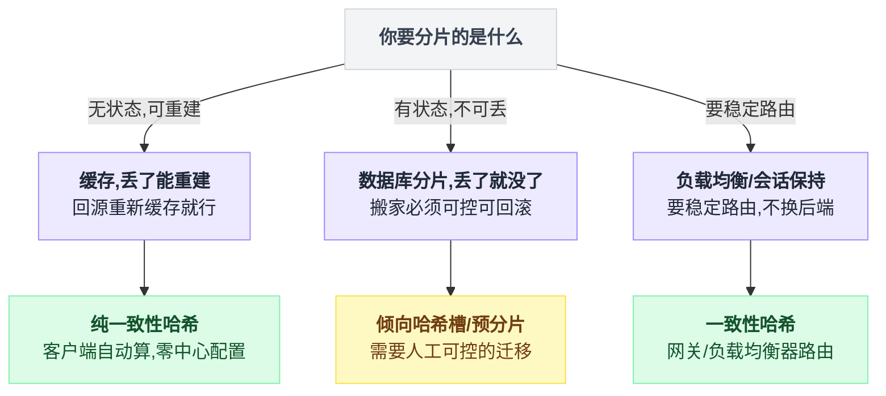

### 6.9 小节回收

```
    ┌────────────────────────────────────────────────────────┐
    │  一致性哈希：一次"用分布不均换扩容不失效"的交易        │
    ├────────────────────────────────────────────────────────┤
    │                                                        │
    │  放弃了：                                              │
    │    · 完美均匀的分布（1 个节点时倾斜 76 倍，            │
    │      加了 150 个虚拟节点后仍有 ±30% 的波动）           │
    │    · O(1) 的查找变成 O(log n) 的二分                   │
    │    · 要维护一个环的数据结构（内存 + 复杂度）           │
    │    · 无法精细控制"哪些数据在哪台机器上"                │
    │                                                        │
    │  换来了：                                              │
    │    · 扩容时搬家 9% 而不是 91%（10 倍）                 │
    │    · 宕机的影响被限制在局部，不会全集群重排            │
    │    · 虚拟节点让宕机负载被均摊，拆掉了级联故障的引信    │
    │                                                        │
    │  一句话记住：                                          │
    │    别用"总数"分配，用"位置"分配 ——                     │
    │    总数会变，位置不会。                                │
    └────────────────────────────────────────────────────────┘
```


---

## 7. 统一回收：五张牺牲清单

五个小节讲完了。现在把开篇那个念头拿回来。

如果你只记得住一张图，记这张——遇到问题先按它找到该用哪个：

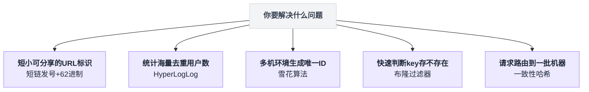

### 7.1 五笔交易，并排看

| 技术 | **牺牲的** | **换来的** | 数量级 |
|---|---|---|---|
| **短链发号** | 可猜测性（顺序 ID 能被遍历） | 无碰撞 + 高性能 | 空间利用率 0.0005% → **100%** |
| **HyperLogLog** | 0.81% 的统计精度 | 内存从 800MB → 12KB | **6.6 万倍** |
| **雪花 ID** | 依赖时钟正确（外部条件） | 无中心节点，本地生成 | 数据库 5000/s → **409 万/s** |
| **布隆过滤器** | 约 1% 的假阳性 + 不能删 | 内存降低几十倍 | 127GB → **1.25GB** |
| **一致性哈希** | 分布不完全均匀（±30%） | 扩容时缓存不失效 | 失效 91% → **9%** |

**盯着"牺牲的"那一列看。你会发现一个共同点：**

```
    ┌────────────────────────────────────────────────────────────┐
    │                                                            │
    │   每一项牺牲，都是【业务上无关痛痒】的东西：               │
    │                                                            │
    │   · 短链能被猜到 → 内容本来就是公开的                      │
    │   · UV 差 0.81%  → 产品经理看的是趋势，不是绝对值          │
    │   · ID 不严格连续 → 谁在乎订单号中间跳了几个数             │
    │   · 1% 假阳性    → 多查一次数据库而已                      │
    │   · 分布不完全均匀 → 差 30% 的负载，机器完全扛得住         │
    │                                                            │
    │   ★ 而"换来的"那一列，每一项都是【数量级】的              │
    │                                                            │
    └────────────────────────────────────────────────────────────┘
```

**这就是全文的答案：这五个设计的天才之处，不在于它们的算法有多精妙，而在于它们【找对了要放弃的东西】。**

### 7.2 一张图看清"放弃"的位置

```
   ┌──────────────────────────────────────────────────────────────────┐
   │                     每个技术在"精确 ↔ 便宜"轴上的位置            │
   ├──────────────────────────────────────────────────────────────────┤
   │                                                                  │
   │   绝对精确                                            极度便宜   │
   │   贵得离谱                                            但会出错   │
   │      │                                                     │     │
   │      ▼                                                     ▼     │
   │   ┌──────────────────────────────────────────────────────────┐   │
   │   │                                                          │   │
   │   │  Set     Bitmap                    HLL                   │   │
   │   │  8GB      12MB                     12KB                  │   │
   │   │  ●─────────●─────────────────────────●                   │   │
   │   │  精确      精确                    误差0.81%             │   │
   │   │                                                          │   │
   │   │  精确 Set                    Bloom          Bloom(小)    │   │
   │   │  127GB                       1.25GB          500MB       │   │
   │   │  ●──────────────────────────────●──────────────●         │   │
   │   │  0% 误判                     0.82%误判       5.6%误判    │   │
   │   │                                                          │   │
   │   │  DB自增        号段模式               雪花               │   │
   │   │  5000/s        百万/s                 409万/s            │   │
   │   │  ●───────────────●─────────────────────●                 │   │
   │   │  严格递增      基本递增             趋势递增             │   │
   │   │                                                          │   │
   │   │  哈希槽(手工)           一致性哈希+虚拟节点   hash%N     │   │
   │   │  ●─────────────────────────●──────────────────●          │   │
   │   │  完全可控               ±30%波动          完美均匀但     │   │
   │   │  但要运维                自动             扩容全废       │   │
   │   │                                                          │   │
   │   └──────────────────────────────────────────────────────────┘   │
   │                                                                  │
   │   ★ 注意最后一行：hash%N 在"均匀"这个维度上是【最好】的，        │
   │     但它在"扩容"这个维度上是【最差】的。                        │
   │     ——【没有哪个方案在所有维度上都赢】。                        │
   │        选型永远是在选"你愿意在哪个维度上输"。                    │
   └──────────────────────────────────────────────────────────────────┘
```

### 7.3 判断"该不该做这笔交易"的四个问题

下次你遇到一个"这个太贵了"的问题时，按顺序问自己这四句话：

```
   ┌──────────────────────────────────────────────────────────────┐
   │                                                              │
   │  ① 这里的"不准"，具体会长什么样？                            │
   │     ─ 不要说"有点误差"，要说"1 亿 UV 会差 81 万"             │
   │     ─ 不要说"偶尔会错"，要说"每 122 次查询错 1 次"           │
   │     ★ 把抽象的"不精确"变成具体的数字，才能判断              │
   │                                                              │
   │  ② 错的时候，代价落在谁身上？                                │
   │     ─ 落在系统身上（多查一次库）→ 通常可以接受               │
   │     ─ 落在用户身上（买不到东西）→ 要非常小心                 │
   │     ─ 落在钱上（少收一笔钱）    → 基本不能接受               │
   │                                                              │
   │  ③ 错误的方向是否可控？                                      │
   │     ─ 布隆过滤器只会"多说有"，不会"漏说有" → 可控            │
   │     ─ 时钟回拨会生成重复 ID              → 【不可控】        │
   │     ★ 单向的错误远远好过双向的错误                          │
   │                                                              │
   │  ④ 换回来的是数量级，还是百分比？                            │
   │     ─ 换回来 30% 的性能提升 → 别折腾，不值                   │
   │     ─ 换回来 6 万倍的内存节省 → 立刻做                       │
   │     ★ 用"不精确"换来的东西必须是【数量级】的，              │
   │       否则不如老老实实做精确的                              │
   │                                                              │
   └──────────────────────────────────────────────────────────────┘
```

**第 ④ 条最容易被忽视。** 很多人为了 20% 的性能，引入了一个近似算法，然后花三个月处理它带来的边界情况。**这种交易是亏的。**

> **判断标准：如果你换回来的不是数量级，就别牺牲正确性。**

---

## 8. 生产环境会踩的坑（合集）

五个技术的坑，一起列。**这一节可以直接当 checklist 用。**

### 8.1 短链接

| 场景 | 后果 | 解法 | 为什么 |
|---|---|---|---|
| 用 MD5 取前 6 位当短码 | 一万条数据就 95% 出碰撞 | 用发号器 + 62 进制 | 生日悖论，安全量只有空间的平方根 |
| 短码超过 6 位时截断保持定长 | 直接制造碰撞 | 让它自然变长，绝不截断 | 截断 = 缩小空间 = 碰撞 |
| 用了 301 永久重定向 | 统计不到点击量；**链接永远改不了、封不掉** | 用 302，并加 `Cache-Control: no-store` | 浏览器会永久缓存 301 |
| 302 没加 no-store | 部分浏览器/代理仍会缓存，统计漏数据 | 显式加禁止缓存头 | 中间层会自作主张缓存 |
| 跳转时同步写点击计数到 DB | 用户感知到延迟；DB 被打爆 | 异步打点（Redis INCR 或 MQ） | 用户等待路径上不放重活 |
| 顺序 ID 未混淆 | 全站短链被遍历；业务量泄露 | 乘法逆元或 Feistel 混淆 | 德国坦克问题 |
| 靠"猜不到"保护私密内容 | 一旦被扫到就全泄露 | 该鉴权就鉴权 | security by obscurity 不是安全 |
| 短链查不到时不缓存空值 | 恶意请求全部穿透到 DB | 缓存空标记 60 秒 + 布隆过滤器 | 短链 URL 空间是可枚举的 |
| epoch/字符表上线后被修改 | 已有短链全部解析错误 | 写死在配置里 + 大字注释 | 编码规则是不可变量 |

### 8.2 HyperLogLog

| 场景 | 后果 | 解法 | 为什么 |
|---|---|---|---|
| 拿 HLL 的数字去做结算/计费 | 差 0.81% 就是几十万的纠纷 | 计费必须用精确统计 | 有人拿这个数字要钱时，误差不可接受 |
| 用 `PFADD` 返回值判断"是不是新用户" | 逻辑错误，会漏判 | 返回值只表示"寄存器变了没" | 两个不同的新元素可能落到同一寄存器同一值 |
| 用容斥原理算交集 | 结果可能是负数或差几倍 | 用 Bitmap 或 MinHash | 灾难性抵消：大数相减放大误差 |
| 高频接口里 `PFCOUNT` 传多个 key | 从 O(1) 变 O(n)，接口变慢 | 预先 PFMERGE 好，只查单 key | 多 key 要临时合并 |
| 数据量很小时也用 HLL | 小数据时相对误差反而更明显 | < 1 万用 Set，精确又不占地方 | HLL 的优势要量大才体现 |
| 忘了给 HLL key 设过期时间 | key 无限增长，Redis 撑爆 | 按天的 key 一律设 TTL | 30000 个 key × 12KB 也有 360MB |
| 以为 HLL 里存了用户，想反查 | 查不出来，白忙一场 | 要反查就得另存一份明细 | 信息真的被丢弃了 |

### 8.3 雪花算法

| 场景 | 后果 | 解法 | 为什么 |
|---|---|---|---|
| **时钟回拨** | **生成重复 ID，且偶发、难复现** | NTP 用 slew 模式 + 代码检测 + 告警 | 这是雪花最大的软肋 |
| 机器 ID 写死在配置，复制虚拟机时忘改 | 两台机器同一个 ID → 重复 | 用 ZK / K8s Pod 序号自动分配 | 靠人保证的东西一定会出错 |
| 用 IP 哈希取模当机器 ID | 38 台机器就 50% 碰撞 | 只能兜底，不能当主方案 | 又是生日悖论 |
| ZK 会话抖动导致临时节点被删 | 机器 ID 被别人拿走，两台重复 | 会话断开立即停止发号 | 临时节点的语义就是"我可能会消失" |
| 机器重启后立即对外发号 | BIOS 时钟不准，直接回拨 | 等 NTP 同步完成再接流量 | 重启是回拨最危险的窗口 |
| epoch 上线后被改 | 新 ID 小于旧 ID，排序全乱 | 写死 + 注释 + 代码评审重点检查 | epoch 是不可变量 |
| 把雪花 ID 直接当外部订单号暴露 | 竞品能算出你的订单量和机器数 | 对外 ID 再套一层混淆/映射 | ID 可反解是双刃剑 |
| 前端用 JS 接收 64 位 ID | **JS 的 Number 只有 53 位精度，ID 被截断** | 序列化成字符串传给前端 | 这个坑几乎每个团队都踩过 |

> **最后那条要单独强调。** JavaScript 的 `Number` 是双精度浮点，能精确表示的整数上限是 `2^53-1 = 9007199254740991`。而雪花 ID 是 19 位数字，超过了这个上限。后果是：**订单号 1837465920384512 到了前端变成 1837465920384510** —— 最后几位被改了，而且**不报任何错**。解法只有一个：**API 返回时把 ID 序列化成字符串。**

### 8.4 布隆过滤器

| 场景 | 后果 | 解法 | 为什么 |
|---|---|---|---|
| **新增数据没同步写入过滤器** | **新数据被判"不存在"，用户访问不到** | 新增时同步写 BF，且在数据可见之前 | 这是"假阴性"，摧毁 BF 唯一的保证 |
| 预估元素数偏小 | 误判率断崖式恶化，且不报错 | 预估留 2~3 倍余量 + 监控填充率 | 误判率是指数敏感的 |
| 没有监控填充率 | 悄悄退化，只表现为"DB 压力变大了" | 上报 `fill_ratio` 和 `estimated_fpp` | BF 退化是无声的 |
| 试图删除元素 | 产生假阴性，真数据被判不存在 | 定期全量重建 / Counting BF / Cuckoo | 位被多个元素共用 |
| 过滤器装的是"黑名单" | 好人被误拦（错误方向反了） | 装白名单，或命中后精确复核 | 假阳性的方向必须是安全的 |
| 用 MD5/SHA 当哈希函数 | 慢 10 倍以上 | 用 MurmurHash3 / xxHash | 不需要密码学强度 |
| 算 k 次独立哈希 | 慢 3.5 倍 | Kirsch-Mitzenmacher 双哈希技巧 | 两个哈希线性组合即可 |
| 每台机器各存一份 BF | 内存 ×N | 放 Redis（RedisBloom）共享 | BF 本身就是为省内存而生的 |
| 服务启动时同步加载 10 亿条 | 启动要几分钟，健康检查失败 | 异步加载 + 加载期间降级放行 | 启动时间也是可用性 |

### 8.5 一致性哈希

| 场景 | 后果 | 解法 | 为什么 |
|---|---|---|---|
| **不用虚拟节点** | **负载倾斜 76 倍，一台被打爆** | 每台机器 150 个虚拟节点 | 哈希是随机的，随机就不均匀 |
| 各语言客户端哈希实现不一致 | 同一个 key 写到 A 读到 B，**永远读不到** | 统一规范 + 跨语言一致性测试 | 分布式里"统一"比"最优"重要 |
| 取副本时没跳过同一台物理机 | 3 副本实际落在 2 台机器上 | `if node not in result` 去重 | 虚拟节点让相邻位置可能同属一机 |
| 副本没做机架/机房隔离 | 一个机架掉电，所有副本同时不可用 | 副本选择时考虑故障域 | 相关性故障 |
| 用它做数据库分片，以为不用搬数据 | 数据实际上没搬，读不到 | 一致性哈希只告诉你"搬哪些"，还得真搬 | 数据库不像缓存能自动重建 |
| 一次扩容加太多机器 | 一次搬 50% 的数据，冲击大 | 分批加，每次一两台 | 把大变更拆成小变更 |
| 用 bisect_left 和 bisect_right 混用 | 边界 key 归属不一致 | 全集群统一用一个 | 落在节点位置上的 key 归谁 |
| 虚拟节点数在不同版本客户端不同 | 环完全不一样，大面积错位 | 虚拟节点数写进协议规范 | 它是哈希规则的一部分 |

---

## 9. 反直觉结论

这一节是全文最值钱的部分。**如果你只记住一页，记这页。**

### 9.1 你以为"空间越大越安全"，其实安全量只有空间的平方根

```
    62 进制 6 位的空间：568 亿
    你以为能安全用：几百亿
    实际能安全用：   28 万

    ┌──────────────────────────────────────────────────────┐
    │  空间涨 3385 倍  →  安全量只涨 58 倍                 │
    │                       ↑                              │
    │                    开平方                            │
    │                                                      │
    │  ★ 只要你在"用哈希往有限空间里塞东西"，              │
    │    就必须算一遍生日悖论。                            │
    │  ★ 这个反射要刻进肌肉记忆。                          │
    └──────────────────────────────────────────────────────┘
```

本文里生日悖论出现了**三次**：短链的 MD5 短码、雪花的 IP 哈希取模机器 ID、布隆过滤器的哈希碰撞。**它无处不在。**

### 9.2 你以为"精确"是免费的默认选项，其实它是最贵的选项

```
    ┌──────────────────────────────────────────────────────┐
    │  大多数人的默认思维：                                │
    │      "先做精确的，不够快再优化"                      │
    │                                                      │
    │  但这五个案例里，"精确"的代价是：                    │
    │      · UV 统计：8 GB → 12 KB      （66 万倍）        │
    │      · URL 去重：127 GB → 1.25 GB （100 倍）         │
    │      · ID 生成：5000/s → 409万/s  （800 倍）         │
    │                                                      │
    │  ★ 这不是"优化"能补回来的差距。                      │
    │    这是【选型阶段就决定了的天花板】。                │
    │                                                      │
    │  ★ 所以"精确"不是默认选项，                          │
    │    它是一个【需要论证的、昂贵的】选择。              │
    └──────────────────────────────────────────────────────┘
```

**下次做设计评审时，把问题反过来问：**

> 不要问"能不能不那么精确"，
> 要问 **"我们凭什么需要这么精确？"**

### 9.3 你以为"不能删除"是布隆过滤器的缺陷，其实它是必须付出的代价

```
    ┌──────────────────────────────────────────────────────┐
    │  "不能删除"不是实现上没做，是【删了就不对了】。      │
    │                                                      │
    │  布隆过滤器全部的价值 = "说不存在一定对"             │
    │  允许删除 → 可能假阴性 → 这条保证没了                │
    │           → 它就变成一个"什么都不保证"的东西         │
    │                                                      │
    │  ★ 它宁可放弃"删除"这个功能，                        │
    │    也要死死守住"说不存在一定对"这一条。              │
    │                                                      │
    │  ★ 这告诉你一件事：                                  │
    │    好的设计不是"什么都能做"，                        │
    │    而是"死守一条保证，其余全部让路"。                │
    └──────────────────────────────────────────────────────┘
```

**推广开来：看一个系统好不好，先问它"承诺了什么"，再问它"为了这个承诺放弃了什么"。** 什么都承诺的系统，通常什么都保证不了。

### 9.4 你以为"加机器能提升性能"，其实加机器本身可能把系统搞挂

```
    ┌──────────────────────────────────────────────────────┐
    │  用 hash % N 分片的缓存集群：                        │
    │                                                      │
    │  10 台 → 11 台                                       │
    │      缓存命中率 99% → 9%                             │
    │      DB QPS 1000 → 91,000（91 倍）                   │
    │      → 数据库被打死                                  │
    │                                                      │
    │  ╔══════════════════════════════════════════════╗    │
    │  ║  你为了让系统更能扛，加了一台机器。          ║    │
    │  ║  加机器这个动作本身，把系统搞挂了。          ║    │
    │  ╚══════════════════════════════════════════════╝    │
    │                                                      │
    │  ★ "扩容"这个操作本身，也是一次流量冲击。            │
    │    做容量规划时，必须把"扩容过程"当成一个            │
    │    需要被设计的场景，而不是一个免费的动作。          │
    └──────────────────────────────────────────────────────┘
```

**这一条在故障复盘里出现的频率高得惊人。** 相似的例子还有：发版重启导致本地缓存全失效、扩容后新机器 JIT 未预热导致响应变慢、数据库加从库时全量同步把主库 IO 打满。

### 9.5 你以为随机哈希会分布均匀，其实随机的意思恰恰是"不均匀"

```
    10 台机器直接哈希到环上，10 万个 key：

        最少的机器：   533 个
        最多的机器：40,507 个
        ────────────────────
        差 76 倍

    ┌──────────────────────────────────────────────────────┐
    │  "随机" ≠ "均匀"                                     │
    │                                                      │
    │  随机只在【样本量足够大】时才趋于均匀（大数定律）。  │
    │  10 个样本，随机得离谱是【正常的】。                 │
    │                                                      │
    │  ★ 虚拟节点的本质就是"把样本量从 10 放大到 1500"     │
    │  ★ 同样的道理：                                      │
    │    · 抽奖用随机数，10 个人抽必然不均匀               │
    │    · 负载均衡用随机选，机器少时必然倾斜              │
    │    · A/B 测试分流，样本少时两组必然有偏差            │
    └──────────────────────────────────────────────────────┘
```

**记住这个数字：76 倍。** 下次有人跟你说"用哈希打散就均匀了"，把这个数字甩给他。

### 9.6 你以为"去中心化"是纯粹的胜利，其实它把依赖偷偷换了个地方

```
    ┌──────────────────────────────────────────────────────────┐
    │  数据库自增 ID：依赖【一个中心数据库】                   │
    │       → 它挂了，全公司发不了 ID                          │
    │       → 但它挂了你【立刻就知道】，而且【不会出错数据】   │
    │                                                          │
    │  雪花算法：不依赖任何中心节点                            │
    │       → 但它依赖【每台机器的时钟是对的】                 │
    │       → 时钟错了你【不知道】，而且【会静默产生错数据】   │
    │                                                          │
    │  ╔══════════════════════════════════════════════════╗    │
    │  ║  依赖没有消失，只是从"一个显式的中心"            ║    │
    │  ║  变成了"N 个隐式的假设"。                        ║    │
    │  ║                                                  ║    │
    │  ║  而【隐式的假设比显式的依赖更危险】——            ║    │
    │  ║  因为它不会报错，只会悄悄出错。                  ║    │
    │  ╚══════════════════════════════════════════════════╝    │
    └──────────────────────────────────────────────────────────┘
```

**做架构评审时问这句话："这个方案去掉了对 X 的依赖，那它现在依赖什么？"** 答案永远不会是"什么都不依赖"。

### 9.7 你以为错误就是错误，其实错误有方向，而方向可以设计

```
    ┌──────────────────────────────────────────────────────────┐
    │  布隆过滤器只会"多说有"，绝不"漏说有"                    │
    │  秒杀系统宁可"少卖"，绝不"超卖"                          │
    │  火警宁可误报，绝不漏报                                  │
    │  邮件过滤宁可漏垃圾，绝不误杀正常邮件                    │
    │                                                          │
    │  ★ 这四个是同一个设计动作：                              │
    │    把系统必然会犯的错误，                                │
    │    【全部挤压到代价小的那一侧】。                        │
    │                                                          │
    │  ★ 而且要注意 ——                                         │
    │    "不会犯错"通常做不到，                                │
    │    "只往一个方向犯错"往往做得到，                        │
    │    而且【已经足够好了】。                                │
    └──────────────────────────────────────────────────────────┘
```

**设计任何一个会出错的系统时，先在纸上写下两句话：**

```
    "如果它错了，最好是错成 ______"
    "它绝对不能错成 ______"
```

**填完这两个空，方案的形状就出来了一半。**

### 9.8 你以为近似算法是"高级技巧"，其实它是"降级思维"的产物

```
    ┌──────────────────────────────────────────────────────────┐
    │  这五个算法的发明过程，可能都不是这样的：                │
    │      "我发明了一个精妙的数学结构！"                      │
    │                                                          │
    │  而更可能是这样的：                                      │
    │      "这个精确方案太贵了，我们必须放弃点什么。           │
    │       ——那放弃什么伤害最小呢？"                          │
    │                                                          │
    │  ★ 起点是【穷】，不是【聪明】。                          │
    │                                                          │
    │  ★ 而这恰恰是最好的消息：                                │
    │    你不需要是数学天才才能做出这种设计，                  │
    │    你只需要养成那个习惯 ——                               │
    │    在动手实现之前，先问一句                              │
    │    "这里面哪一部分，其实不需要那么好？"                  │
    └──────────────────────────────────────────────────────────┘
```

---

## 10. 一句话总结 + 小白词典

### 10.1 一句话总结

> **这五个设计做的是同一件事：**
> **主动放弃一点点不重要的"完美"，换回一个数量级的资源节省。**
>
> **而更重要的是那个动作本身 ——**
> **在开始实现之前，先坐下来问："这里的哪一部分，其实不需要那么好？"**
>
> **在"完美"和"可用"之间，主动选择可用。**
> **这不是妥协，这就是工程学本身。**

### 10.2 完整心法卡片

```
    ┌────────────────────────────────────────────────────────────────┐
    │                  《小而美的五个设计》心法卡片                  │
    ├────────────────────────────────────────────────────────────────┤
    │                                                                │
    │  【短链接】                                                    │
    │    · 不要"算一个希望不重复的值"，要"取一个必然没被取过的号"    │
    │    · 生日悖论：安全量 = 空间的平方根 × 1.177                   │
    │    · 6 位 62 进制 = 568 亿，顺序发号能 100% 用满               │
    │    · 用 302 不用 301（301 = 永远改不了 + 统计不到）            │
    │    · 顺序 ID 要混淆：乘法逆元（够用）或 Feistel（够强）        │
    │                                                                │
    │  【HyperLogLog】                                               │
    │    · 直觉：听说有人连抛 10 次正面，你知道他抛了约 1000 次      │
    │    · 16384 桶 × 6 bit = 12KB，误差 1.04/√m = 0.81%             │
    │    · 调和平均（不是算术平均）压制异常大值                      │
    │    · 内存 O(1)，和数据量【完全无关】—— 这才是质变              │
    │    · 不能判断单个元素、不能算交集、不能用在钱上                │
    │    · CRDT：跨机房无协调合并                                    │
    │                                                                │
    │  【雪花算法】                                                  │
    │    · 1 + 41 + 10 + 12 = 64 位                                  │
    │    · 41 位 = 69 年，10 位 = 1024 台，12 位 = 409 万/秒          │
    │    · UUID 无序 → B+ 树页分裂 → 写入慢 5~9 倍、表大 2 倍        │
    │    · 时钟回拨是最大软肋：NTP slew + 检测 + 等待 + 告警         │
    │    · 机器 ID：K8s Pod 序号最优雅，IP 哈希只能兜底              │
    │    · 【前端接收必须转字符串】—— JS 只有 53 位精度              │
    │                                                                │
    │  【布隆过滤器】                                                │
    │    · 位数组 + k 个哈希，插入置 1，查询看是否全 1               │
    │    · 说"不存在"一定对（逻辑保证），说"存在"可能错              │
    │    · m/n=10, k=7 → 误判 0.82%，每元素 10 bit                   │
    │    · 内存翻倍，误判降 122 倍 —— 参数值得多给                   │
    │    · 最优 k 时填充率恰好 50%（拿这个做监控）                   │
    │    · 不能删除；新增数据必须【同步】写入                        │
    │    · 双哈希技巧：2 次真哈希造出 k 个位置                       │
    │                                                                │
    │  【一致性哈希】                                                │
    │    · hash%N 扩容：91% 缓存失效 → 数据库 QPS 涨 91 倍           │
    │    · 环 + 顺时针找第一个节点，用 bisect 二分                   │
    │    · 加节点只搬 1/(N+1) = 9%                                   │
    │    · 【必须用虚拟节点】：不用是 76 倍倾斜，150 个降到 1.3 倍   │
    │    · 虚拟节点还拆掉了级联故障的引信                            │
    │    · Redis Cluster 用 16384 槽 = "可人工分配的一致性哈希"      │
    │    · 有状态数据走"槽"，无状态/可重建数据走"环"                 │
    │                                                                │
    ├────────────────────────────────────────────────────────────────┤
    │  【贯穿五者的四个问题】                                        │
    │    ① 这里的"不准"，具体是多少？（要数字，不要形容词）         │
    │    ② 错的时候，代价落在谁身上？（系统 / 用户 / 钱）           │
    │    ③ 错误的方向可控吗？（单向错误 >> 双向错误）               │
    │    ④ 换回来的是数量级还是百分比？（不是数量级就别做）         │
    └────────────────────────────────────────────────────────────────┘
```

### 10.3 小白词典

**通用概念**

| 术语 | 大白话解释 |
|---|---|
| **哈希（Hash）** | 把任意大小的数据压成固定长度"指纹"的函数。同样输入永远同样输出，输入改一点点输出面目全非。 |
| **哈希碰撞** | 两个不同的输入算出了同一个哈希值。空间有限时必然发生。 |
| **生日悖论** | 23 个人就有 50% 概率有两人同天生日。本质是"两两配对的数量是平方级的"。**推论：在 N 种可能里随机取，约 1.177×√N 次就会碰撞。** |
| **幂等（Idempotent）** | 同一个操作做一次和做一百次，结果一样。`max` 是幂等的，`+1` 不是。 |
| **假阳性 / 假阴性** | 假阳性 = 本来没有说成有；假阴性 = 本来有说成没有。**布隆过滤器只会假阳性。** |
| **QPS** | Queries Per Second，每秒请求数。 |
| **OOM** | Out Of Memory，内存耗尽，进程被系统杀掉。 |
| **TTL** | Time To Live，数据的过期时间。 |
| **竞态（Race Condition）** | 两个操作同时进行，结果取决于谁先谁后，导致出错。 |
| **灾难性抵消** | 两个大数相减得到小数时，误差被放大到毁灭性程度。HLL 算交集失败的原因。 |
| **大数定律** | 随机实验做的次数越多，平均结果越接近真实期望。虚拟节点能均匀分布的原理。 |
| **调和平均** | `n / (1/x₁+...+1/xₙ)`。对小值敏感、对大值不敏感，能压制异常大的值。 |
| **CRDT** | 无冲突复制数据类型。合并顺序、合并次数都不影响结果，能在分布式系统里无协调地达成一致。HLL 是典型。 |
| **security by obscurity** | 靠"对方不知道"来保护，业界公认不可靠。混淆 ≠ 鉴权。 |

**短链接相关**

| 术语 | 大白话解释 |
|---|---|
| **62 进制 / Base62** | 用 `0-9a-zA-Z` 共 62 个字符表示数字。6 位能表示 568 亿个数。 |
| **Base58** | 62 进制去掉容易看错的 `0OlI`。比特币地址用它。适合需要人手抄的场景。 |
| **发号器** | 一个专门产生递增数字的组件。核心思想：不"算"一个不重复的值，而是"取走"一个必然没被取过的。 |
| **301 / 302** | HTTP 重定向状态码。301 = 永久（浏览器会缓存，**统计不到、改不了**），302 = 临时（每次都回源）。**短链一律用 302。** |
| **乘法逆元** | 满足 `a × inv ≡ 1 (mod m)` 的那个数。用来做可逆的 ID 混淆。Python 里 `pow(a, -1, m)`。 |
| **Feistel 网络** | 把数字劈成左右两半，反复"右半过函数、异或到左半、交换"的加密结构。**神奇之处：不管中间用什么函数，整个结构都一定可逆。** |
| **德国坦克问题** | 靠顺序编号估算总产量的统计方法。**推论：顺序 ID 会泄露你的业务规模。** |

**HyperLogLog 相关**

| 术语 | 大白话解释 |
|---|---|
| **UV / PV** | UV = 去重的访客数，PV = 总浏览次数。UV 难在"去重必须记忆"。 |
| **基数（Cardinality）** | 集合里不重复元素的个数。UV 就是基数。 |
| **前导零** | 二进制数最前面连着的 0 的个数。`00001011` 是 4 个。 |
| **伯努利试验** | 反复做一件"成功/失败"二选一的事。抛硬币直到出正面就是它。**HLL 的数学基础。** |
| **寄存器（Register）** | HLL 里的一个"桶"，存这个桶见过的最大前导零数。Redis 用 16384 个，每个 6 bit。 |
| **PFADD / PFCOUNT / PFMERGE** | Redis 的 HLL 三条命令：加元素 / 读估计值 / 合并多个。`PF` 是纪念发明者 Philippe Flajolet。 |
| **稀疏编码** | Redis HLL 在元素少时用的压缩格式，可能只占几十字节。**所以可以放心创建几百万个 HLL key。** |
| **Bitmap** | 用一个 bit 表示一个 ID 是否出现过。精确且省内存，但**要求 ID 是稠密的小整数**。 |

**雪花算法相关**

| 术语 | 大白话解释 |
|---|---|
| **UUID** | 128 位随机数，唯一但**无序**。用它当主键会导致 B+ 树页分裂。UUID v7 加了时间前缀，有序了。 |
| **B+ 树** | MySQL InnoDB 存数据的结构。**底层数据是按主键物理有序排列的** —— 这是"主键必须有序"的根本原因。 |
| **页（Page）** | InnoDB 读写的最小单位，16KB。 |
| **页分裂** | 往一个满页中间插数据时，要开新页并搬走一半数据。伴随随机 I/O、空间浪费、索引更新。**随机主键的原罪。** |
| **回表** | 二级索引只存主键，查到后要再回主键树上找完整数据。**主键越大，所有二级索引都跟着变大。** |
| **Buffer Pool** | InnoDB 的内存缓冲池。顺序写只碰最后几页，命中率 99%；随机写散落全表，命中率可能只有 20%。 |
| **epoch（纪元）** | 雪花算法里时间戳的起算点。**一旦上线永不能改。** |
| **时钟回拨** | 系统时间往回跳。原因：NTP 校时、闰秒、虚拟机迁移、人为改时间。**雪花算法最大的软肋。** |
| **NTP slew 模式** | 校时时不直接跳变，而是把时钟走慢/走快一点点慢慢磨平。**保证时间单调递增，是防回拨最根本的手段。** |
| **单调时钟** | 保证只增不减的时钟（Python 的 `time.monotonic()`）。没有绝对时间含义，但能用来检测回拨。 |
| **号段模式** | 一次从数据库取一批 ID 到内存慢慢发。美团 Leaf-segment 的做法，**双 Buffer 预取**让切换无感知。 |
| **StatefulSet** | K8s 里给 Pod 分配稳定序号和名字的控制器。`app-0`、`app-1`……**天然适合当机器 ID。** |

**布隆过滤器相关**

| 术语 | 大白话解释 |
|---|---|
| **位数组（Bit Array）** | 每个格子只占 1 个 bit 的数组。16 个格子只占 2 字节。 |
| **假阳性率（FPP）** | False Positive Probability，误报"存在"的概率。公式 `p = (1-e^(-kn/m))^k`。 |
| **m / n / k** | m = 位数组位数，n = 元素个数，k = 哈希函数个数。**最优 k = (m/n)×ln2**，此时误判率 `0.6185^(m/n)`。 |
| **填充率** | 位数组里 1 的比例。**用最优参数时恰好是 50%** —— 拿它当监控指标特别好用。 |
| **MurmurHash3** | 一种非密码学哈希，比 MD5 快 10 倍以上、分布更均匀。**布隆过滤器该用它，不该用 MD5。** |
| **双哈希技巧** | Kirsch-Mitzenmacher 优化：`g_i(x) = h1 + i×h2`，用 2 次真哈希造出 k 个位置。已证明误判率渐进相同。 |
| **Counting Bloom Filter** | 每格从 1 bit 扩成 4 bit 计数器，支持删除。代价是内存 4 倍。 |
| **Cuckoo Filter** | 存"指纹"而非"位"。能删除、内存更省、查询只碰 2 处内存（缓存友好）。缺点：满了会插入失败、并发难做。 |
| **保守近似** | 输出是真实答案的超集 —— 可能多，但绝不会少。布隆过滤器的本质。 |
| **LSM 树 / SSTable** | RocksDB、HBase 用的存储结构。**每个 SSTable 配一个布隆过滤器**，避免无谓的磁盘读，是它们性能的关键。 |

**一致性哈希相关**

| 术语 | 大白话解释 |
|---|---|
| **数据倾斜（Data Skew）** | 数据分布严重不均，某台机器承担远超平均的负载。不用虚拟节点时能差 76 倍。 |
| **虚拟节点** | 让一台物理机在环上占多个位置（业界常用 150 个）。**靠大数定律把分布拉均匀**，还能把宕机负载均摊出去。 |
| **级联故障 / 雪崩式转移** | 一台机器挂了，它的负载全砸给下一台，下一台也挂，连锁反应。**虚拟节点是这个引信的拆除工具。** |
| **bisect** | Python 标准库的二分查找模块。`bisect_right(arr, x)` 返回第一个大于 x 的元素下标。一致性哈希"顺时针找"的实现。 |
| **哈希槽（Hash Slot）** | Redis Cluster 的方案：固定 16384 个槽，key→槽是算的，槽→机器是**查表**的。**多这一层间接，就能人工控制分布。** |
| **Ketama** | memcached 生态统一使用的一致性哈希实现规范。**它的价值在于"大家都照抄同一份"，而不是"它最优"。** |
| **故障域** | 会一起挂掉的一组机器（同机架、同机房、同电源）。副本必须放在**不同故障域**。 |
| **预分片** | 一开始就分成远多于机器数的逻辑分片（比如 1024 个），扩容时只重新分配分片。**本质就是哈希槽。** |

---

## 附：和前几篇的对照

读者已经学过秒杀、抢票、红包、延迟任务、限流器、Feed 流、弹幕、撮合、派单。把招式对上号：

| 前几篇里的做法 | 本篇里的对应 | 关系 |
|---|---|---|
| 漏斗式分层过滤（秒杀） | 布隆过滤器 → 缓存 → 数据库 | **同一招**：外层便宜粗糙挡掉 99%，内层昂贵精确处理剩下的 |
| 缓存穿透 + 缓存空值（秒杀） | 布隆过滤器防穿透 | **升级版**：空值缓存会被无穷多的假 ID 撑爆，BF 用固定内存就挡住了 |
| 缓存雪崩（秒杀） | `hash % N` 扩容导致 91% 失效 | **同一个后果，不同成因**：前者是过期时间撞在一起，后者是分片规则变了 |
| 宁可少卖，绝不超卖（秒杀） | 宁可假阳性，绝不假阴性（BF） | **同一个哲学**：把必然会犯的错，挤到代价小的那一侧 |
| 预扣库存 15 秒 TTL 自动释放（秒杀） | 机器 ID 的 Redis 租约 + 心跳续约 | **同一招**：用过期时间处理"占用者可能永远不回来" |
| 库存分片到多台机器（秒杀） | 一致性哈希 + 虚拟节点 | **同一招**：把大块打散成小块，任何一块出事冲击都被稀释 |
| 把重活儿从用户等待路径上摘走（秒杀） | 短链跳转异步打点；UidGenerator 预生成 ID | **同一招**：请求路径上只做必须做的 |
| MQ 异步下单、最终一致性（秒杀） | HLL 的 CRDT 合并 | **同一个思想**：不追求"每一刻都一致"，只追求"最终能合并成一致" |
| Redis 预热库存（秒杀） | 布隆过滤器启动时全量加载 | **同一招**：把准备工作放在流量到来之前 |
| 时间轮"让到期的自己走过来"（延迟任务） | 一致性哈希"让 key 自己找到归属" | **同一个思想**：不去搜索，让数据自己组织好 |
| ZSet 时间戳当分数（延迟任务） | 雪花 ID 的时间戳在高位 | **同一招**：把时间放在排序键的高位，天然有序 |
| 令牌桶惰性计算（限流） | HLL 的 O(1) 空间 | **同一个念头**：能不存的就别存，需要时算出来 |
| fail-open 降级（限流） | BF 加载未完成时降级放行 | **同一个哲学**：宁可放过，不可误伤 |
| 重试风暴（限流） | 扩容后缓存失效引发的重试雪崩 | **同一个病**：失败的请求不会消失，会变本加厉回来 |
| 背压 vs 丢弃（限流） | 用近似算法主动"丢弃精度" | **同一个思路的不同维度**：丢请求 vs 丢精度，都是主动放弃换生存 |
| 读扩散 vs 写扩散的权衡（Feed 流） | 精确 vs 近似的权衡 | **同一类决策**：没有免费的方案，只有"你愿意在哪个维度上付钱" |
| 大 V 用拉模式、普通用户用推模式（Feed 流） | 实时看 HLL、报表用精确统计 | **同一招**：同一个需求，按场景配不同精度的方案，不是二选一 |
| 弹幕按房间分片、允许丢弹幕 | HLL 允许 0.81% 误差 | **同一个哲学**：不重要的东西丢了就丢了 |
| 撮合引擎绝不能错一分钱（撮合） | HLL 绝不能用在计费上 | **同一条红线**：碰钱的地方，近似算法全部禁用 |
| 派单是优化题不是并发题（派单） | 五个算法都是"资源优化题" | **同一类问题**：不出错是底线，省资源才是本事 |
| 攒批买信息优势（派单） | 布隆过滤器批量 `BF.MADD` | 相似：都在用"批"降低单位成本 |
| 局部最优 ≠ 全局最优（派单） | 每个"绝对精确"的局部选择，叠加成负担不起的整体 | **同一个陷阱的两种形态** |

**最后留给你三句话：**

> **第一句：**
> 前面几篇教你"怎么在高压下不出错"，教你"怎么在都不出错的前提下做得更好"。
> 这一篇教你的是第三件事 —— **怎么在资源有限的现实里，决定"哪里可以不那么好"。**

> **第二句：**
> 这五个算法的发明者，起点大概率不是"我想到了一个精妙的数学结构"，
> 而是"这个精确方案我们买不起，那放弃什么伤害最小？"
> **起点是穷，不是聪明。这对你是个好消息 —— 这个能力是可以练出来的。**

> **第三句，也是整个系列想说的：**
>
> **工程学不是"把事情做到完美"的学科，**
> **是"在做不到完美的世界里，决定放弃什么"的学科。**
>
> 在"完美"和"可用"之间，主动选择可用。
> 这不是妥协，这就是本事。
