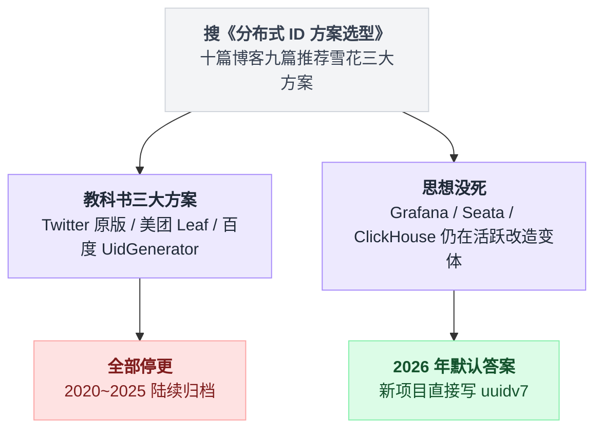
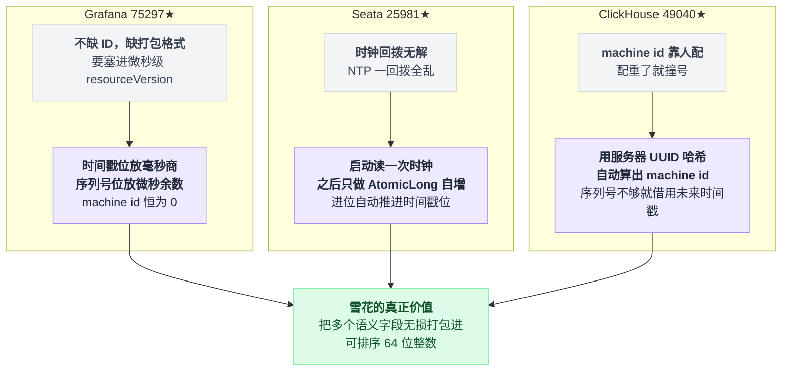
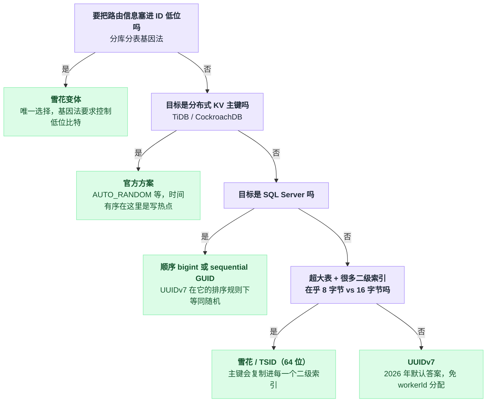
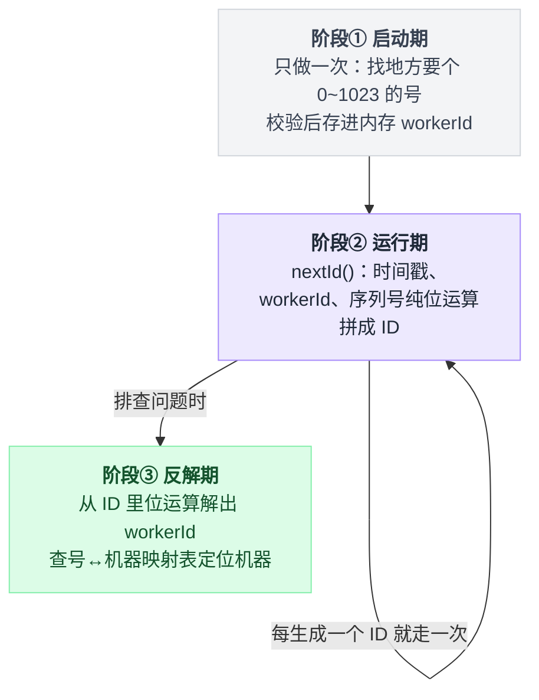
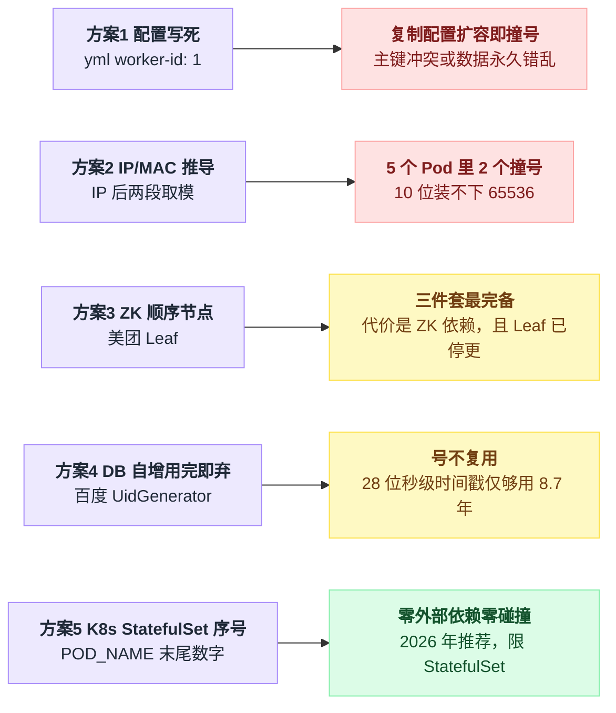

# 《雪花算法 2026 年还活着吗》真实项目调研与选型指南（小白版 · 番外篇）

> 一句话结论：**雪花算法"本身"已经死了——Twitter 原版和中国三大方案全部停更；但它的"思想"活得很好，Grafana / Seata / ClickHouse 都在用变体。而 2026 年新项目的默认答案，已经悄悄换成了 UUIDv7。**
>
> 阅读前提：本篇不再重复讲雪花算法的原理。64 个 bit 怎么分、时钟回拨为什么难，请先读[第 12 篇的小节三](./12-小而美的五个算法.md#4-小节三分布式-id-与雪花算法--用信任时钟换没有中心节点)。本篇回答的是另外两个问题：**真实世界里谁在用、怎么用的？以及 2026 年的你到底该用什么？**
>
> 调研时间：2026-08-04。文中所有 star 数、最后提交时间均为当日实测；标注"第三方来源"的内容未经官方材料交叉核实。

---

## 目录

- [1. 先泼冷水：教科书里的雪花算法，全停更了](#1-先泼冷水教科书里的雪花算法全停更了)
- [2. 但思想活得很好：三个最值得看的实现](#2-但思想活得很好三个最值得看的实现)
- [3. 其他真实用法一览（含误传澄清）](#3-其他真实用法一览含误传澄清)
- [4. 反直觉：分布式数据库官方劝你别用时间有序 ID 做主键](#4-反直觉分布式数据库官方劝你别用时间有序-id-做主键)
- [5. 2026 年的标准答案：UUIDv7](#5-2026-年的标准答案uuidv7)
- [6. 所以，什么时候用雪花算法？（本篇最重要的一节）](#6-所以什么时候用雪花算法本篇最重要的一节)
- [7. 动手实验：workerId 是怎么和机器绑定的（全路径）](#7-动手实验workerid-是怎么和机器绑定的全路径)
- [8. 一句话总结](#8-一句话总结)

---

开篇那句结论拆成图会更直观：教科书方案和真实项目的命运是两条岔开的路。



## 1. 先泼冷水：教科书里的雪花算法，全停更了

如果你搜"分布式 ID 方案选型"，十篇博客有九篇会推荐这几个项目。它们现在的状态是：

| 项目 | 身份 | 状态（2026-08-04 实测） |
|---|---|---|
| twitter-archive/snowflake | Twitter 原版 | **已归档**，2020 年后无提交 |
| Meituan-Dianping/Leaf | 美团 Leaf | **2023-07 停更** |
| baidu/uid-generator | 百度 UidGenerator | **2023-05 停更** |
| yitter/IdGenerator | 国产改良版 | **2025-04 停更** |

也就是说：**中国 Java 圈奉为经典的三大方案，全部已停止维护。** 别再照着 2019 年的博客做选型了。

这不代表雪花思想过时了——恰恰相反，下一节你会看到，一线大项目把它用出了花。

停更的原因更接近"该解决的问题解决完了，剩下的问题（时钟回拨、workerId 分配）在方案内部无解，业界换了赛道"。换到哪条赛道，第 5 节揭晓。

---

## 2. 但思想活得很好：三个最值得看的实现

三个项目各自盯上了雪花的一个不同软肋，解法互不相同。先给张地图，再逐个展开：

| 项目 | 盯上的软肋 | 解法一句话 |
|---|---|---|
| Grafana | 不缺 ID，缺一个打包格式 | 时间戳位放毫秒商、序列号位放微秒余数，machine id 恒为 0 |
| Seata | 时钟回拨在方案内无解 | 启动读一次时钟，之后只做 `AtomicLong` 自增 |
| ClickHouse | machine id 靠人配，配重了就撞号 | 服务器 UUID 哈希自动算出 machine id；序列号不够就借用未来时间戳 |

并排看还能看出一条共同的落点：



### 🥇 Grafana（75,297★，活跃）——雪花不是"发号器"，是"打包格式"

Grafana 至少 8 个文件用了 `bwmarrin/snowflake` 库。最妙的是这段（已逐行核实源码，见 [rv_manager.go](https://github.com/grafana/grafana/blob/main/pkg/apimachinery/utils/rv_manager.go)）：

```go
// takes a unix microsecond RV and transforms into a snowflake format.
// The timestamp is converted from microsecond to millisecond (the integer
// division) and the remainder is saved in the stepbits section. machine id is always 0
func SnowflakeFromRV(rv int64) int64 {
    return (((rv / 1000) - snowflake.Epoch) << (snowflake.NodeBits + snowflake.StepBits)) + (rv % 1000)
}
```

拆开看它干了什么：

```
  微秒时间戳 1722758400123456
       │
       ├── ÷1000 的商  = 毫秒部分 → 放进雪花的【时间戳位】
       └── ÷1000 的余  = 微秒尾数 → 塞进雪花的【序列号位】
                                     machine id 永远是 0，压根不用
```

写成一对互逆操作会更清楚它为什么"不丢东西"：

```
pack(rv):
    商 = rv / 1000                  // 毫秒
    余 = rv % 1000                  // 微秒尾数，一定小于 1000，塞得进序列号位
    return (商 - Epoch) << (NodeBits + StepBits) | 余

unpack(x):
    商、余 分别从两段位里原样取出
    rv = 商 * 1000 + 余             // 微秒时间戳一位不差地还原回来
```

它把微秒时间戳的余数塞进了序列号位，于是在毫秒精度的雪花格式里**无损承载了微秒级的 resourceVersion，而且可逆**。

这说明雪花的真正价值不只是"生成唯一 ID"，而是——

> **"把多个语义字段无损打包进一个可排序的 64 位整数"这个通用技巧。**

记住这句话，第 14 篇讲基因法分库分表时，这个技巧会再次登场，而且是主角。

### 🥈 Seata（25,981★，活跃）——唯一从架构上"消灭"时钟回拨的

第 12 篇说过，时钟回拨是雪花算法至今没有完美解法的软肋。Seata 1.5+ 给出了我见过最优雅的回答：**不解决问题，消灭问题存在的前提。**

它把 workerId 挪到了时间戳**前面**的高位。这样 timestamp 和 sequence 在低位连续相邻，就能塞进同一个 `AtomicLong`（源码见 [IdWorker.java](https://github.com/apache/incubator-seata/blob/2.x/common/src/main/java/org/apache/seata/common/util/IdWorker.java)）：

```java
// 启动时读一次系统时钟，之后运行期永远不再读
private void initTimestampAndSequence() {
    long timestampWithSequence = getNewestTimestamp() << sequenceBits;
    this.timestampAndSequence = new AtomicLong(timestampWithSequence);
}

public long nextId() {
    long next = timestampAndSequence.incrementAndGet();   // 就这一行
    return workerId | (next & timestampAndSequenceMask);
}
```

机制拎出来是这样的：

```
启动那一刻，唯一一次看表：
    state = 当前时间戳 << sequenceBits        // 低位空出来给序列号

每次发号：
    n = state 原子自增 1                      // 全程就这一步，不看时钟
    return workerId | (n & 掩码)              // workerId 在高位，拼上就是 ID

序列号从 4095 再 +1 时：
    低位归零，进位溢出到上一段——那正好是时间戳位的最低位
    于是"时间戳 +1"是自增的副作用，不是一次时钟读取
```

精髓在于：序列号超过 4095 时，`incrementAndGet` 的进位会**自然地把时间戳 +1**。整个运行期根本不读系统时钟——

> **时钟回拨这个问题，从"存在"层面被消除了。** NTP 怎么回拨都与它无关，因为它只在启动那一刻看过一眼表。

代价也要说清楚：ID 里的"时间戳"从此只是**近似时间**——低负载时它慢慢落后于真实时间，高负载时可能跑到真实时间前面。

Seata 用它标识全局事务，不需要 ID 反解出精确时间，所以这个交易划算。你的业务如果要靠 ID 反推精确下单时间，这招就不能抄。

### 🥉 ClickHouse（49,040★，调研当日仍在提交）——教科书级的数据库内置雪花

v24.6 直接把雪花做成了 SQL 函数 `generateSnowflakeID()`（源码见 [generateSnowflakeID.cpp](https://github.com/ClickHouse/ClickHouse/blob/master/src/Functions/generateSnowflakeID.cpp)）：

```cpp
constexpr auto timestamp_bits_count       = 41;
constexpr auto machine_id_bits_count      = 10;
constexpr auto machine_seq_num_bits_count = 12;
```

位分配是标准教科书款，但两个工程细节值得抄进笔记：

1. **machine_id 是服务器 UUID 的哈希自动算出来的**——不用人肉配置，也就没有"两台机器配了同一个 workerId"这种事故。
2. **序列号不够用时，借用未来的时间戳**——而不是像 Twitter 原版那样自旋等待下一毫秒。

第二条对比着看最直观：

```
// Twitter 原版
if 这一毫秒的序列号用完:
    自旋等待，直到系统时钟走到下一毫秒      // 线程干等

// ClickHouse
if 这一毫秒的序列号用完:
    时间戳 += 1                            // 直接透支下一毫秒的号段
    序列号 = 0                             // 不等，继续发
```

反正 ID 只要求唯一和趋势递增，"提前透支"下一毫秒的号段完全合法。

---

## 3. 其他真实用法一览（含误传澄清）

| 项目 | Star | 用途 | 特别之处 |
|---|---|---|---|
| Elasticsearch | 77,613 | 自动生成的 `_id` | **反直觉：故意打乱字节顺序**，把序列号低字节放最前——为了 Lucene 前缀压缩，不是为了排序 |
| Mastodon | 50,166 | 帖子 ID | 唯一把雪花完整写进 PL/pgSQL 的知名系统；低 16 位用 md5 混淆是**为了隐私**（防外界推算实例发帖量），不是为了去重 |
| SeaweedFS | 33,749 | 文件系统的 FileId | node id = FNV-32a 哈希取低 10 位，取代了原来 master 集中发号的方案 |
| Zitadel | 14,541 | IAM 所有实体 ID | machine id 三级降级：私有 IP → hostname 哈希 → 外部 webhook。调研中见到的最完善的 workerId 派生逻辑 |
| RoseDB | 4,882 | WAL 批次 ID | **非主键用法**：用雪花 ID 标记一个写批次，实现原子批提交 |
| Discord | — | 所有消息/频道 ID | 42 位时间戳 + 5 worker + 5 process + 12 increment，反解公式 `(id >> 22) + 1420070400000`，末尾那个常数就是 Discord 自己的 Epoch，即时间戳的参考点，单位毫秒（[官方 API 文档](https://discord.com/developers/docs/reference#snowflakes)） |

**顺手澄清几个常见误传**（均核实过 go.mod / 源码）：

| 传言 | 事实 |
|---|---|
| Gitea、Nakama、OpenIM、NATS、Pulsar 用雪花 | **都不用** |
| TiDB 的 `AUTO_RANDOM` 是雪花 | **也不是**——它在自增 rowid 高位拼 shard 前缀，目标恰恰是**打散**写入，方向和雪花的"时间有序"完全相反 |

为什么要打散？看下一节。

---

## 4. 反直觉：分布式数据库官方劝你别用时间有序 ID 做主键

CockroachDB 和 TiDB 的官方文档都在**劝退**"时间有序 ID 做主键"（[TiDB AUTO_RANDOM](https://docs.pingcap.com/tidb/stable/auto-random/)、[CockroachDB unique_rowid](https://www.cockroachlabs.com/docs/stable/serial.html)）。

原因一张图就能讲明白：

```
  单机 MySQL（B+ 树）              分布式 KV（按 key 范围切 Region）

  时间有序 ID 顺序插入             时间有序 ID 顺序插入
       │                               │
       ▼                               ▼
  永远追加在 B+ 树最右侧          所有新写入落在【同一个 Region】
  没有页分裂，缓存友好             其他节点闲着，一个节点被打爆
       │                               │
       ▼                               ▼
  ✅ 最快                         ❌ 写入尾部热点，越有序越糟
```

同一个"时间有序"，在单机 B+ 树上是**最优解**，在分布式 KV 上是**最差解**。

> **所以雪花不是万能的——选 ID 方案之前，必须先看底层存储引擎是什么。** 这和第 12 篇 4.8 节"雪花 ID 和分库分表取模天然打架"是同一类教训：ID 方案从来不是孤立决策。

---

## 5. 2026 年的标准答案：UUIDv7

第 12 篇 4.3 节提过一嘴 UUID v7"是个不错的折中"。两年过去，它已经从"折中"变成了**默认答案**。

标准是 [RFC 9562](https://www.rfc-editor.org/rfc/rfc9562)（2024-05 发布，废止了老的 RFC 4122）。和雪花的核心区别一句话：

> **用随机位取代 machine_id + counter，彻底免掉"workerId 分配"这个运维负担。**

回想第 12 篇里为了分配 workerId 折腾的 Redis 租约、ZooKeeper、启动脚本——UUIDv7 说：这些全都不要了，128 位里塞 74 位随机数，碰撞概率低到可以忽略。

### 原生支持已经铺开

| 平台 | 支持 |
|---|---|
| PostgreSQL 18 | `uuidv7()` |
| MariaDB 11.7 | `UUID_v7()` |
| ClickHouse | `generateUUIDv7()` |
| .NET 9 | `Guid.CreateVersion7()` |
| Python 3.14 | `uuid.uuid7()` |
| JDK 26 | 已合并（[PR #25303](https://github.com/openjdk/jdk/pull/25303)） |
| Go 1.27 | 提案已通过（[golang/go#62026](https://github.com/golang/go/issues/62026)，2026-04-08 Accepted） |

### 性能：基本追平 bigint

Cybertec 在 PostgreSQL 1000 万行上的实测（[原文](https://www.cybertec-postgresql.com/en/unexpected-downsides-of-uuid-keys-in-postgresql/)，第三方评测，与 RFC 设计目标一致）：

| 主键 | 耗时 | buffer hits |
|---|---|---|
| 顺序 bigint | 526 ms | 27,332 |
| 随机 UUIDv4 | 1,214 ms | 8,562,960 |
| **UUIDv7** | **541 ms** | **39,126** |

UUIDv4 的 buffer hits 是 UUIDv7 的 **200 多倍**——这就是第 12 篇讲过的"随机 ID 页分裂"的定量版。而 UUIDv7 基本追平了 bigint。

### ⚠️ 但 SQL Server 是个坑

SQL Server 对 `uniqueidentifier` 的排序**不是字节序**：它先比 byte 10-15、最后才比 byte 0-3。而 UUIDv7 的时间戳恰好在 byte 0-5——排序时最先被看的那几个字节，正好是随机的那几个。

> **UUIDv7 在 SQL Server 里表现几乎等同于随机的 v4。** 有生产案例插入从 20 分钟恶化到数小时后全量回滚（第三方案例，[分析文章](https://www.brentozar.com/)方向的社区报告，未经微软官方确认）。

---

## 6. 所以，什么时候用雪花算法？（本篇最重要的一节）

你是小白，直接背这张决策表：

| 你的情况 | 用什么 | 为什么 |
|---|---|---|
| 新项目 + PostgreSQL 18 / MariaDB 11.7+ | **数据库自带 `uuidv7()`** | 零代码、零运维，官方维护 |
| 新项目 + 其他数据库（除 SQL Server） | **应用层 UUIDv7** | 免 workerId 分配，页分裂友好 |
| SQL Server | 顺序 bigint 或专门的 sequential GUID | UUIDv7 在它的排序规则下等同随机（见第 5 节） |
| 超大表 + 很多二级索引 | **雪花 / TSID（64 位）** | 主键会复制进**每一个**二级索引，8 字节 vs 16 字节的差距被索引数量放大 |
| K8s 频繁扩缩容 | UUIDv7 > 雪花 | Pod 生生死死，workerId 分配与回收是持续的运维税 |
| 要把路由信息藏进 ID（分库分表基因法） | **必须雪花变体，绝对不能 UUID** | 基因法要求你能控制 ID 的低位比特（详见[第 14 篇](./14-分库分表.md)） |
| ID 需要人类可读、可反解出时间/机器 | 雪花 | UUID 36 个字符没人念得出来，雪花是个正常的数字 |
| 分布式 KV 数据库（TiDB / CockroachDB）做主键 | 官方方案（AUTO_RANDOM 等） | 时间有序 = 写热点，雪花和 UUIDv7 在这里**都不对**（见第 4 节） |
| Java 存量项目（MyBatis-Plus） | 保持默认，但**显式传 IP**：`new DefaultIdentifierGenerator(InetAddress)` | 默认的 MAC+PID 推导在容器里容易撞号，官方已把无参构造标为 `@Deprecated` |
| 面试 | 手写简化版雪花 | 重点讲时钟回拨（背 Seata 的 AtomicLong 解法）和 workerId 分配（背 Zitadel 的三级降级） |

把表格里的分支条件串成一条判定路径：



一个帮助记忆的粗暴总结：

```
        需要把信息【打包】进 ID？（基因法 / Grafana 式位复用）
              │
      ┌───是──┴──否───┐
      ▼               ▼
   雪花变体      在乎 8 字节 vs 16 字节吗？
   （别无选择）    （超大表 + 一堆二级索引才在乎）
                      │
              ┌───是──┴──否───┐
              ▼               ▼
           雪花/TSID       UUIDv7
                          （2026 年默认答案）
```

---

## 7. 动手实验：workerId 是怎么和机器绑定的（全路径）

> 可运行脚本：[labs/workerid_demo.py](./labs/workerid_demo.py)（零依赖，`python3 workerid_demo.py` 直接跑），完整输出见 [labs/workerid_demo.out.txt](./labs/workerid_demo.out.txt)。下文的碰撞、事故全部由脚本真实复现，不是口头描述。

### 7.1 全路径总览：workerId 的一生

```
┌── 阶段 ① 启动期（进程生命周期内只做一次）────────────────────┐
│   应用进程启动                                               │
│        ↓                                                     │
│   向"某个地方"要一个 0~1023 的号                             │
│   （配置文件 / MAC / IP / ZooKeeper / DB / K8s 序号）        │
│        ↓                                                     │
│   校验范围，存进内存变量 this.workerId                       │
└──────────────────────────────────────────────────────────────┘
                          ↓
┌── 阶段 ② 运行期（每生成一个 ID 都走一次，纯内存）────────────┐
│   nextId():                                                  │
│     id = (ts-EPOCH)<<22 | workerId<<12 | sequence            │
│                            ↑                                 │
│               workerId 被"焊死"进 ID 的第 13~22 位           │
└──────────────────────────────────────────────────────────────┘
                          ↓
┌── 阶段 ③ 反解期（排查问题时用）──────────────────────────────┐
│   workerId = (id >> 12) & 1023                               │
│        ↓                                                     │
│   查"号 ↔ 机器"映射表 → 定位到是哪台机器生成的               │
└──────────────────────────────────────────────────────────────┘
```

三个阶段看起来是直线，其实阶段②会一直循环到进程死掉，画成状态流转更贴近真实运行形态：



**整条路径里只有阶段 ① 是难点**——阶段 ②③ 都是纯位运算。所有工程复杂度压在一个问题上：

> ★ 怎么保证同一时刻在线的每台机器，拿到的号都不一样？（本质是个分布式共识问题）

### 7.2 五种分配方案（脚本逐一复现了翻车方式）

| 方案 | 做法 | 脚本复现的行为 | 结论 |
|---|---|---|---|
| 1 配置写死 | yml 里 `worker-id: 1` | 运维复制配置扩容 → 两台机器同一毫秒生成**完全相同的 ID** → 主键冲突，或落不同分片后数据永久错乱 | 靠"人"保证唯一，上自动扩缩容必死 |
| 2 IP/MAC 推导 | IP 后两段 `& 1023` | 5 个 K8s Pod 里 2 个撞号：`10.244.1.13`、`10.244.5.13`、`172.20.1.13` 的低 10 位全是 269 | 10 位装不下 65536，高位信息被丢；IP 第 3 段相差 4 的倍数就回绕 |
| 3 ZooKeeper 顺序节点（美团 Leaf） | `PERSISTENT_SEQUENTIAL` 自动编号 | 重启**复用**旧号；ZK 挂了从本地兜底文件启动；ZK 记录时间 > 系统时间 → 判定时钟回拨拒绝启动 | 三件套最完备，代价是 ZK 依赖（且 Leaf 已停更） |
| 4 DB 自增，用完即弃（百度 UidGenerator） | 每次启动 INSERT 一行，自增主键即 workerId | pod-1 崩溃重启后拿到 3 而不是 1——**号不复用**，5 次启动耗 5 个号 | 这解释了百度 22 位 workerId 的反直觉分配：420 万个号就是为挥霍准备的，代价是 28 位秒级时间戳只够用 8.7 年 |
| 5 K8s StatefulSet 序号 | `POD_NAME` 末尾数字即 workerId | Pod 删除重建后名字不变、号不变，零外部依赖零碰撞 | 2026 年推荐；限制是必须 StatefulSet（Deployment 的 Pod 名带随机串），副本 ≤ 1024 |

方案 2 那三个 IP 为什么会撞成同一个号，算一遍就明白了：

```
workerId = ((IP第3段 << 8) | IP第4段) & 1023

10.244.1.13   → (1<<8 | 13) = 269
10.244.5.13   → (5<<8 | 13) = 1293 & 1023 = 269    // 第 3 段差 4，超出的高位被截掉
172.20.1.13   → (1<<8 | 13) = 269                  // 前两段压根没参与计算
```

方案 2 顺便解释了一个上文的伏笔：**sonyflake 选 16 位机器号不是随便选的**——16 位正好装下 IPv4 后两段（65536），一位信息都不丢，从根上消灭了低位回绕碰撞。

五种方案并排放在一起，翻车方式一目了然：



### 7.3 反向路径：从一条脏数据定位到机器

```
线上出了一条可疑订单 ID
   ↓  workerId  = (id >> 12) & 1023        ← 纯位运算
   ↓  timestamp = (id >> 22) + EPOCH       ← 纯位运算
   ↓  查【号 ↔ 机器】映射表
   ↓  🎯 直接去捞那台机器那个时间点的日志
```

⚠️ 最后一步的前提是你**有**这张映射表。

方案 1、5 天然有；方案 3、4 的映射表就存在 ZK/DB 里；**方案 2 没有**——号是算出来的，事后你根本不知道 7 号是谁。这是 IP/MAC 推导法常被忽略的隐性代价：**可观测性差**。

### 7.4 真实项目实际怎么做（2026-08 核实）

| 项目 | workerId 从哪来 |
|---|---|
| MyBatis-Plus | MAC 后两字节 → datacenterId；datacenterId + JVM 进程号 → workerId。⚠️ 容器内 PID<10 时改用随机数，官方已弃用无参构造 |
| Seata 1.5+ | 网卡 MAC 最低 10 位，失败则 random(0,1023) |
| ShardingSphere | ★ 集群模式由系统自动分配，同 namespace 内保证不重复 |
| Hutool | ❌ 完全不管，使用方自己传 |
| 美团 Leaf | ZK PERSISTENT_SEQUENTIAL + 本地文件兜底 |
| 百度 UidGenerator | DB 自增主键，用完即弃 |
| sony/sonyflake | 私有 IPv4 低 16 位（不丢信息） |
| Zitadel | ★ 三级降级：私有 IPv4 低 16 位 → hostname 的 FNV-32 哈希 → 外部 webhook（全失败则 panic） |
| ClickHouse | 服务器 UUID 的哈希 |
| SeaweedFS | nodeid 字符串的 FNV-32a 哈希取低 10 位 |
| Grafana | ★ 固定为 0——根本不用来去重，只借雪花的格式存微秒时间戳（见第 2 节） |

一个规律：真实项目里「**哈希一个本机唯一标识再取低位**」是最主流的做法。

本质是**用碰撞概率换零依赖**，赌 1024 个槽位里不会撞。机器少（< 50 台）时这个赌注很划算；机器多或频繁扩缩容就该上中心化分配。

Zitadel 的三级降级是最稳妥的折中：先赌，赌不了再问别人。

### 7.5 怎么选

| 你的环境 | 推荐 |
|---|---|
| 固定物理机/VM，< 20 台 | 配置写死 + 严格上线检查表 |
| 固定 IP 的 VM 集群 | IP 推导（机器号位数要够，别用 10 位装两段 IP） |
| K8s + StatefulSet | Pod 序号（最省事，零碰撞） |
| K8s + Deployment | 中心化分配（ZK/etcd/Redis），或直接改用 UUIDv7 |
| 已有 ShardingSphere 集群 | 用它的自动分配，别自己搞 |
| 不想操心这事 | UUIDv7——用随机位取代 workerId，从根上没这个问题（见第 5 节） |

---

## 8. 一句话总结

> **雪花算法从"默认选择"退役成了"特种工具"：当你需要 64 位的紧凑、或者需要把语义塞进 bit 里（下一篇的基因法），它仍然无可替代；除此之外，2026 年请直接写 `uuidv7()`。**

### 和前几篇的对照

- 第 12 篇 4.7 节说时钟回拨"至今没有完美解法"——本篇 Seata 展示了唯一的例外：不解决它，消灭它存在的前提（运行期不读时钟）。
- 第 12 篇 4.8 节说雪花 ID 和取模分表"天然打架"——第 14 篇的基因法会展示怎么把这对冤家变成最佳搭档。
- 第 7 篇撮合引擎"单线程反而最快"、本篇 Seata"不读时钟反而没有回拨"——同一个味道：**最好的解法经常是让问题没有机会发生，而不是正面硬刚。**

### 主要来源

- [Grafana rv_manager.go](https://github.com/grafana/grafana/blob/main/pkg/apimachinery/utils/rv_manager.go) · [Seata IdWorker.java](https://github.com/apache/incubator-seata/blob/2.x/common/src/main/java/org/apache/seata/common/util/IdWorker.java) · [ClickHouse generateSnowflakeID.cpp](https://github.com/ClickHouse/ClickHouse/blob/master/src/Functions/generateSnowflakeID.cpp)
- [Discord API Reference — Snowflakes](https://discord.com/developers/docs/reference#snowflakes) · [TiDB AUTO_RANDOM](https://docs.pingcap.com/tidb/stable/auto-random/)
- [RFC 9562](https://www.rfc-editor.org/rfc/rfc9562) · [OpenJDK PR #25303](https://github.com/openjdk/jdk/pull/25303) · [golang/go#62026](https://github.com/golang/go/issues/62026)
- Cybertec UUID 主键实测（第三方评测）
