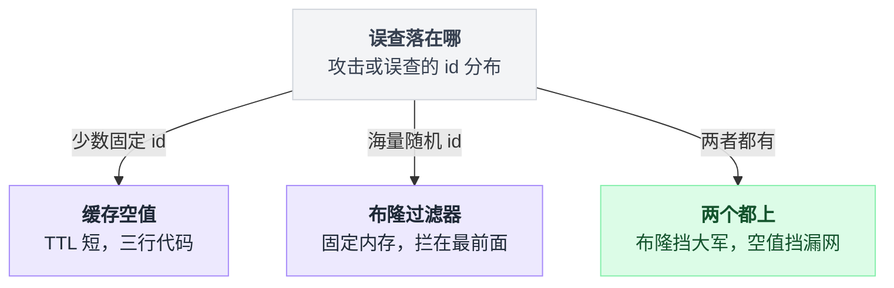
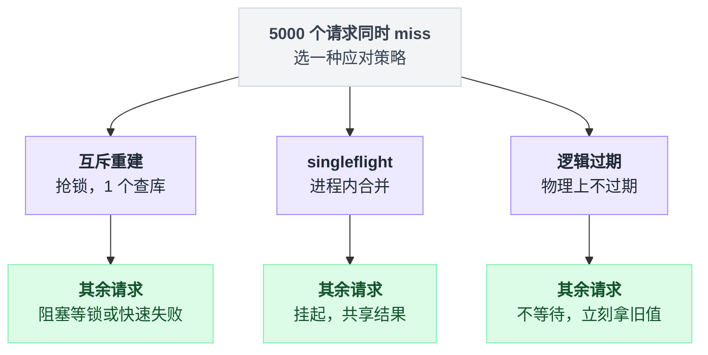
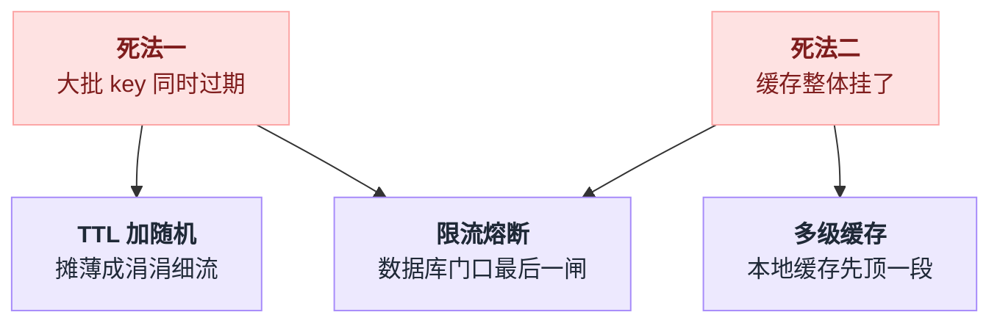
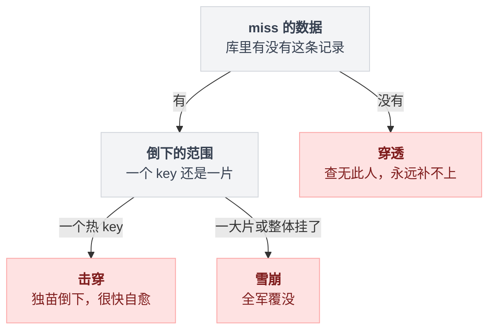
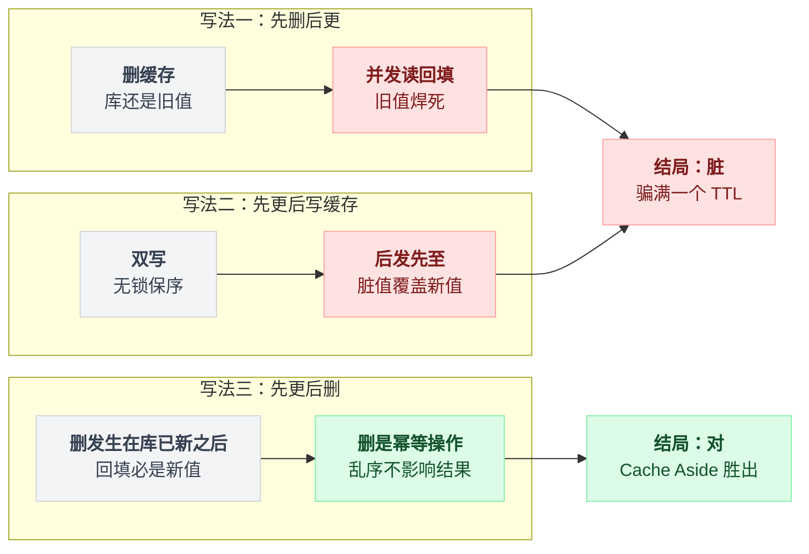
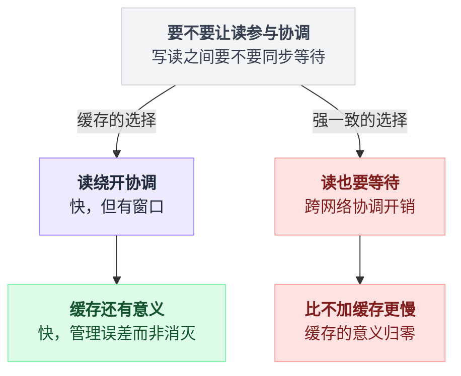
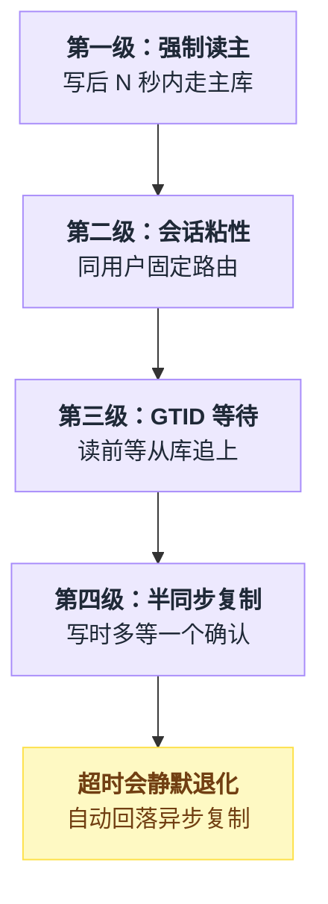

# 《缓存三兄弟与缓存一致性》穿透、击穿、雪崩，以及吵了十年的"先更库还是先删缓存"（小白版）

> 一句话结论：**穿透、击穿、雪崩是三道背题，答案早就成熟；真正的主战场是缓存一致性——而它吵了十年的终极答案不是某种更聪明的写法，是承认"缓存与数据库强一致"根本就是伪需求，把不一致窗口压到毫秒级，然后接受它。顺带一个更扎心的：线上一大半"缓存不一致"的工单，锅其实在主从延迟头上。**
> 难度：★★★☆☆
> 写作时间：2026-08-05。未经一手核实的说法在文中已标注。
> 读完你会懂：
> 1. 三兄弟到底怎么区分——很多工作三年的人还在把击穿叫成穿透
> 2. 为什么"先删缓存再更库"和"先更库再更缓存"都会翻车，时序图一画就明白
> 3. Cache Aside 的理论破绽长什么样，以及为什么工程界看着这个破绽还是选了它
> 4. canal/Debezium 订阅 binlog 失效缓存，凭什么被叫"终极方案"
> 5. 评论发完自己刷不到——这个和缓存半毛钱关系没有的现象，为什么总被记在缓存头上

---

## 目录

- [0. 先讲个故事：商详页上缓存，然后 0.1 秒出一次事故](#0-先讲个故事商详页上缓存然后-01-秒出一次事故)
  - [0.1 读多写少，教科书场景](#01-读多写少教科书场景)
  - [0.2 事故推演：热 key 过期的 0.1 秒](#02-事故推演热-key-过期的-01-秒)
  - [0.3 三兄弟登场](#03-三兄弟登场)
- [1. 老大穿透：查一个根本不存在的东西](#1-老大穿透查一个根本不存在的东西)
  - [1.1 为什么缓存对它形同虚设](#11-为什么缓存对它形同虚设)
  - [1.2 解法一：把"没有"也缓存起来](#12-解法一把没有也缓存起来)
  - [1.3 解法二：布隆过滤器](#13-解法二布隆过滤器)
  - [1.4 两种解法的边界](#14-两种解法的边界)
- [2. 老二击穿：热 key 过期的那一瞬间](#2-老二击穿热-key-过期的那一瞬间)
  - [2.1 互斥重建：只放一个人进去](#21-互斥重建只放一个人进去)
  - [2.2 singleflight：进程内合并请求](#22-singleflight进程内合并请求)
  - [2.3 逻辑过期：干脆不让它过期](#23-逻辑过期干脆不让它过期)
  - [2.4 三种解法对比](#24-三种解法对比)
- [3. 老三雪崩：集体阵亡](#3-老三雪崩集体阵亡)
  - [3.1 两种死法](#31-两种死法)
  - [3.2 过期时间加随机：别让 key 排队自杀](#32-过期时间加随机别让-key-排队自杀)
  - [3.3 多级缓存：给 Redis 也准备一个备胎](#33-多级缓存给-redis-也准备一个备胎)
  - [3.4 限流熔断：数据库门口的最后一道闸](#34-限流熔断数据库门口的最后一道闸)
- [4. 三兄弟一张表收束](#4-三兄弟一张表收束)
- [5. 主战场：缓存一致性——把常见写法一个个推翻](#5-主战场缓存一致性把常见写法一个个推翻)
  - [5.1 问题的根源：两个存储，没有事务](#51-问题的根源两个存储没有事务)
  - [5.2 写法一：先删缓存，再更库——并发读回填旧值](#52-写法一先删缓存再更库并发读回填旧值)
  - [5.3 写法二：先更库，再更缓存——双写乱序](#53-写法二先更库再更缓存双写乱序)
  - [5.4 写法三：先更库，再删缓存（Cache Aside）——主流答案](#54-写法三先更库再删缓存cache-aside主流答案)
  - [5.5 诚实时刻：Cache Aside 的理论破绽](#55-诚实时刻cache-aside-的理论破绽)
  - [5.6 延迟双删：一个尴尬的补丁](#56-延迟双删一个尴尬的补丁)
  - [5.7 终极方案：订阅 binlog，把一致性托付给复制流](#57-终极方案订阅-binlog把一致性托付给复制流)
  - [5.8 本地缓存：失效要靠广播](#58-本地缓存失效要靠广播)
- [6. 为什么"缓存与数据库强一致"是伪需求](#6-为什么缓存与数据库强一致是伪需求)
- [7. 主从延迟与"读己之写"：评论发完自己刷不到](#7-主从延迟与读己之写评论发完自己刷不到)
  - [7.1 现象与误诊](#71-现象与误诊)
  - [7.2 延迟从哪来，一笔带过](#72-延迟从哪来一笔带过)
  - [7.3 解法阶梯：从糙到精](#73-解法阶梯从糙到精)
  - [7.4 先能看见延迟，再谈治理](#74-先能看见延迟再谈治理)
  - [7.5 主从延迟怎么伪装成"缓存不一致"](#75-主从延迟怎么伪装成缓存不一致)
- [8. 反直觉结论清单](#8-反直觉结论清单)
- [9. 一句话总结 + 小白词典 + 对照前几篇](#9-一句话总结--小白词典--对照前几篇)

---

## 0. 先讲个故事：商详页上缓存，然后 0.1 秒出一次事故

### 0.1 读多写少，教科书场景

电商的商品详情页是缓存教科书的第一页：一个商品的标题、价格、库存、图片，一天改动个位数次，却可能被读几十万、几百万次。读写比例悬殊到这个程度，不上缓存等于拿数据库的钱打水漂。

于是你写下了每个后端新人都写过的三行逻辑：

```
              读请求
                 │
                 ▼
        ┌─────────────────┐   命中（绝大多数）
        │  GET product:123 │ ──────────────► 直接返回，微秒级
        └────────┬────────┘
                 │ 未命中
                 ▼
        ┌─────────────────┐
        │ SELECT ... FROM  │   查 MySQL，毫秒级
        │ product WHERE id │
        └────────┬────────┘
                 │
                 ▼
        ┌─────────────────┐
        │ SET product:123  │   回填缓存，TTL 1 小时
        │     EX 3600      │
        └────────┬────────┘
                 ▼
               返回
```

上线，数据库负载掉到原来的零头，你觉得这事结了。

它没结。这个结构里埋着三颗雷，每一颗都专挑流量最大的那天炸。

### 0.2 事故推演：热 key 过期的 0.1 秒

推演一次事故。以下数字都是**假设值**，用来把量级感建立起来，不是任何实测：

大促当晚，某个爆款商品页假设扛着 5 万 QPS 的读。它的缓存 key 是整点写进去的，TTL 一小时，于是整点过后的第 3600 秒，这个 key 到点，Redis 把它删了。

从"key 消失"到"第一个请求查完库、把新值填回去"，中间要经历：查库几毫秒 + 序列化 + 写回 Redis 一来一回。取个整，假设这个窗口是 0.1 秒。

0.1 秒 × 5 万 QPS = **5000 个请求在这个窗口里到达**。每一个都会看到同一幕：

```
   时间轴 ──────────────────────────────────────────────►

   T+0ms      key 过期，从 Redis 消失
   T+1ms      请求 #1    GET → miss → 去查 MySQL
   T+2ms      请求 #2    GET → miss → 去查 MySQL      ← 它不知道 #1 已经去了
   T+3ms      请求 #3    GET → miss → 去查 MySQL
   ...        ...（5000 个请求全部 miss，全部涌向 MySQL）...
   T+100ms    请求 #1 回填成功，缓存恢复
              ── 但 MySQL 连接池早在 T+20ms 就被打满了 ──
```

5000 个一模一样的 `SELECT` 同时砸向 MySQL。连接池假设一共 100 个连接，瞬间占满；其他业务的 SQL 开始排队；应用线程池跟着堵；上游看到超时，开始重试——重试又是新流量。[流量系列第 00 篇](../2026-08_流量扛不住了怎么办_六种真实做法/00-接口超时把队列调大反而OOM-队列不会创造产能.md)讲过这个死亡螺旋：队列不会创造产能，重试只会放大洪水。

注意最讽刺的一点：**这 5000 个请求要的是同一条数据，其中 4999 次查库是纯浪费。**

这个事故有个名字，叫**击穿**。它有两个兄弟，仨长得像，病根完全不同。

### 0.3 三兄弟登场

三兄弟的区别就一句话：**miss 发生在哪、有多大面积。**

```
  ┌──────────────────────────────────────────────────────────────┐
  │                                                              │
  │  穿透：查的数据【库里根本没有】                              │
  │        缓存永远 miss ——不是缓存失职，是数据不存在            │
  │        ██ 一条细流，但永不停歇，且可能是故意的               │
  │                                                              │
  │  击穿：查的数据库里有，但【单个热 key 刚好过期】             │
  │        瞬间 miss ——0.1 秒后自愈，但这 0.1 秒足够出事故       │
  │        █████ 一根针，扎在同一个点上                          │
  │                                                              │
  │  雪崩：【一大片 key 同时过期，或缓存整个挂了】               │
  │        面积 miss ——不是一根针，是整面墙塌了                  │
  │        ████████████████ 洪水漫堤                             │
  │                                                              │
  └──────────────────────────────────────────────────────────────┘
```

先把三兄弟逐个拆掉，再进本篇真正的主战场：一致性。

---

## 1. 老大穿透：查一个根本不存在的东西

### 1.1 为什么缓存对它形同虚设

有人拿着 `product_id = -1`、`product_id = 99999999` 这种库里根本没有的 id 来查。走一遍 0.1 节的流程：

```
   GET product:-1   → miss（缓存里当然没有）
   SELECT ... id=-1 → 空结果
   回填缓存？        → 查无此物，没东西可填
   下一次同样的请求  → 又是 miss → 又查库 → 又没东西可填 → ……
```

看出问题了吗？**正常的 miss 查一次库就把洞补上了，穿透的 miss 永远补不上。** 缓存命中率对这类请求恒等于零，每一发都实打实落在 MySQL 上。

它可能是上游 bug（前端拼了个 undefined），可能是爬虫乱扫，也可能是有人故意的：每次换一个随机 id，专打你缓存的盲区。防不住的话，攻击者用极低的成本就能让你的数据库全天候加班。

顺手先说第零道防线：**入口参数校验**。id 是负数、格式不对、长度离谱的，网关层直接拒掉，根本不该走到缓存这层。这是白送的，先做。

### 1.2 解法一：把"没有"也缓存起来

思路直白：查库发现没有，那就把"没有"这个事实缓存起来。

```bash
# 查库确认 id=99999 不存在之后：
redis-cli SET product:99999 "" EX 60
# 下一次同样的请求：GET 命中空串 → 直接返回"不存在"，不碰库
```

注意两个细节：

- **TTL 要短**（几十秒级）。万一这个 id 后来真的有了商品（新品上架），空值最多挡它几十秒。
- 空值和"没查过"必须能区分开。`GET` 返回空串是"确认没有"，返回 nil 才是"缓存里没记录"。这两个状态混在一起，逻辑就乱了。

它的死穴也直白：**攻击者每次换 id，你就每次多缓存一个垃圾 key。** 对方的 id 是随机生成的，你的 Redis 内存是有限的。误查集中在少数几个 id 上时空值缓存很顶用，面对海量随机 id 时它就是拿内存填无底洞。

### 1.3 解法二：布隆过滤器

换个思路：与其记住"哪些 id 不存在"（无限多），不如记住"哪些 id 存在"（有限的、你自己库里那些）。

启动时把全量合法商品 id 灌进一个布隆过滤器，请求先过它这一关：

```
   请求 id ──► 布隆过滤器 ──"没有"──► 直接返回 404，缓存和库都不碰
                   │
                 "可能有"
                   ▼
              正常缓存流程（miss 了才查库）
```

布隆的性质在[第 12 篇布隆过滤器一节](./12-小而美的五个算法.md#5-小节四布隆过滤器--用少量假阳性换内存降几十倍)已经掰开讲透了，这里只复述一句关键：**它说"没有"一定对，说"有"可能错。** 放在穿透场景里，这个不对称正好是我们要的方向——说"没有"就敢直接拒绝（绝不误伤真实数据），说"有"顶多多查一次库（误判率百分之一以下，代价可忽略）。

### 1.4 两种解法的边界

两个都是对的，看你的敌人是谁——先看清误查落在哪个分布上，再决定用哪招：



| | 缓存空值 | 布隆过滤器 |
|---|---|---|
| 对付的场景 | 误查集中在**少数固定 id** 上（上游 bug、被删除的老链接） | **海量随机 id**（恶意攻击、全空间乱扫） |
| 内存开销 | 随不存在 id 的种类线性涨，**攻击下无上界** | 固定，与请求无关，只与库里数据量有关 |
| 前置条件 | 无 | 全量 key 能预加载；**新增数据必须同步 add** |
| 数据删除 | 天然支持（等 TTL） | 布隆不能删（第 12 篇 5.8 节），删除的商品会被误放行——但误放行只是多查一次库，可接受 |
| 实现成本 | 三行代码 | 要维护一个"与库同步"的过滤器，有运维成本 |

说白了：**误查是"错"（有限集合）就用空值，误查是"攻击"（无限集合）就上布隆。** 很多系统两个都上：布隆挡随机大军，空值挡漏网的固定误查。

---

## 2. 老二击穿：热 key 过期的那一瞬间

回到 0.2 节的事故：5000 个请求要同一条数据，4999 次查库是浪费。三种解法，分别从三个角度掐死这个浪费。

### 2.1 互斥重建：只放一个人进去

miss 之后不要直接查库，先抢一把锁。抢到的那**一个**请求去查库回填，其他 4999 个原地等一下，等回填完成后直接读缓存。

```
   5000 个请求同时 miss
        │
        ▼
   SET lock:product:123 <uuid> NX EX 10     ← 抢锁，同一时刻只有一个成功
        │
   ┌────┴─────────────────────┐
   │ 抢到（1 个）              │ 没抢到（4999 个）
   ▼                          ▼
   查库 → 回填缓存 → 释放锁    睡 50ms 再读一次缓存
                              （此时多半已经回填好了）
```

数据库看到的请求数：5000 → **1**。

单机场景用进程内的锁就够。多台机器要挡住彼此，就得用跨进程的锁——`SET NX` 这一行看着简单，锁超时了重建还没完怎么办、锁被别人误释放怎么办，全是坑，[第 16 篇分布式锁](./16-分布式锁.md)整篇都在讲这个。这里记住一个务实判断就行：**击穿场景的锁丢了大不了多查几次库，用最简单的 `SET NX EX` 足够，别把 Redlock 那套重炮搬过来。**

没抢到锁的请求还有个更狠的选项：不等了，直接返回上一版旧值或降级数据。等价于说"我宁可给你看 1 秒前的价格，也不让你排队"。这个思想下一节展开。

### 2.2 singleflight：进程内合并请求

互斥重建的 Go 语言标准答案叫 singleflight（`golang.org/x/sync/singleflight`）：同一个进程内，针对同一个 key 的并发调用只有第一个真正执行，其余的原地等待并**共享同一份结果**。本仓库有一篇[singleflight 入门教程](../2026-07_一分钱都不能丢_高并发计费系统解剖/17_番外_singleflight入门教程.md)，从场景到源码都拆过，这里只放机制图：

```
   进程内 100 个并发请求，key 都是 product:123
        │
        ▼
   singleflight.Do("product:123", 查库函数)
        │
   ┌────┴──────────────────┐
   │ 第 1 个：真的去查库    │ 后 99 个：挂起等待
   └────┬──────────────────┘
        ▼
   查库返回 → 100 个请求拿到同一份返回值
```

注意它的边界：**singleflight 是进程内的。** 100 台机器部署，每台各自合并，数据库还是会收到 100 个请求——但从 5000 降到 100，一般就够了。要压到 1，再叠 2.1 的分布式锁。工程上常见的组合是"进程内 singleflight + 跨进程不管"，因为 100 个并发对数据库根本不算事，为最后这一点收益引入分布式锁不划算。

### 2.3 逻辑过期：干脆不让它过期

前两招都在治"过期后怎么办"，第三招釜底抽薪：**热 key 物理上永不过期。**

做法：Redis 里不设 TTL，把过期时间作为一个字段塞进 value 里：

```json
{"data": {"price": 8999, "title": "..."}, "expire_at": 1754380800}
```

读的时候自己判断：

```
   读到 value
      │
      ├─ expire_at 还没到 → 直接返回，完事
      │
      └─ expire_at 过了（"逻辑过期"）：
            ① 立刻返回手里这份旧数据       ← 请求永远不等待
            ② 异步丢一个重建任务（抢互斥锁，单人重建，刷新 expire_at）
```

关键的取舍：**任何请求都不会被阻塞，代价是逻辑过期到重建完成之间，大家读到的是旧值。** 对商品标题、价格展示这类场景，旧几百毫秒没有任何感知；对余额、库存扣减这类场景，不行——但那类场景本来就不该拿缓存当事实源。

它还有个隐藏成本：key 既然不会自然过期，**冷启动时缓存里没有的数据必须靠预热灌进去**，不能再依赖"miss 了自动回填"这条路（miss 了连 expire_at 都读不到）。所以逻辑过期通常只给圈定好的热点数据用，不做全量。

顺带一个出处：Facebook 在 memcache 论文（"Scaling Memcache at Facebook"，NSDI 2013）里的 lease 机制，一个 token 同时治了击穿（他们叫 thundering herd）和过期后的脏写——miss 时发一张"重建许可证"，只有持证者能回填，其他人稍等或用旧值。和本节三招是同一个问题的工业版答案，感兴趣可以去读原文。

### 2.4 三种解法对比

三招治的是同一个 5000 并发 miss，分岔点在"没抢到的那些请求怎么办"：



| | 互斥重建 | singleflight | 逻辑过期 |
|---|---|---|---|
| 等待的请求怎么办 | 阻塞等锁，或快速失败 | 阻塞等，共享结果 | **不等待**，直接拿旧值 |
| 返回的数据 | 新 | 新 | 可能旧（毫秒~秒级） |
| 生效范围 | 全集群（分布式锁）| 单进程 | 全集群 |
| 实现成本 | 中：锁超时、误释放要处理 | 低：一个库函数 | 高：TTL 自己管、要预热、只能覆盖圈定的热 key |
| 适合 | 通用兜底 | 服务内先合并一波，性价比最高 | 明确的极热 key，且业务容忍旧值 |

实战里这三招不是单选题：**singleflight 常开兜底，圈定的头部热 key 上逻辑过期，跨进程的互斥锁看数据库压力决定加不加。**

---

## 3. 老三雪崩：集体阵亡

### 3.1 两种死法

击穿是一根针，雪崩是整面墙：

- **死法一：大批 key 同一时刻过期。** 最常见的成因蠢得发笑：凌晨批量预热了 10 万个 key，全部 `EX 3600`——那么一小时后的同一秒，10 万个 key 排着队集体消失。流量瞬间 100% miss，全部落库。
- **死法二：缓存本身挂了。** Redis 宕机、集群网络分区、failover 中。这时不是某些 key miss，是**所有请求**都拿不到缓存。

两种死法要分开治：死法一治"别同时过期"，死法二治"缓存没了数据库怎么活下来"。两条死法对应的防线也不完全重叠，最后一道闸是两边共用的兜底：



### 3.2 过期时间加随机：别让 key 排队自杀

治死法一只要一行代码——TTL 加随机抖动，把"同一秒的十万次过期"摊薄成"五分钟内的涓涓细流"：

```python
import random
ttl = 3600 + random.randint(0, 300)   # 1 小时 ± 5 分钟内随机
# redis: SET product:123 <value> EX <ttl>
```

```
  不加抖动：      过期数
                    │        ██
                    │        ██   ← 十万个 key 挤在同一秒
                    └────────┴──────────► 时间

  加抖动：        过期数
                    │      ▁▂▃▃▃▂▁
                    │                ← 摊进 5 分钟，每秒几百个
                    └──────────────────► 时间
```

成本约等于零，收益是一整类事故直接消失。**所有批量写缓存的地方都该无脑加这一行。**

### 3.3 多级缓存：给 Redis 也准备一个备胎

治死法二的第一层：进程内再放一级本地缓存（Java 圈常用 Caffeine，Go 圈常见 bigcache/ristretto 一类）：

```
   请求 → 本地缓存（进程内存，几秒 TTL）→ Redis → MySQL
            ▲
            └── Redis 整个挂掉时，热数据还有这一层顶着
```

本地缓存只需要很短的 TTL（秒级）就有价值：Redis 失联的瞬间，最热那批 key 还在各台机器的内存里活着，扛住第一波，给你争取 failover 或者扩容的时间。同时它平时还顺手把最热 key 的读压力从 Redis 上卸掉一块——热 key 打挂 Redis 单分片的事故，也靠它挡。

代价是新的一致性问题：本地缓存分散在每台机器里，没有统一的地方可以删。这个坑先记下，5.8 节专门收拾它。

### 3.4 限流熔断：数据库门口的最后一道闸

前面的招都可能失手，最后一道防线必须是：**数据库门口有一道闸，无论上游发生什么，进入数据库的并发不超过它能承受的量。**

```
                    缓存全灭，10 万 QPS 裸奔而来
                              │
                              ▼
                    ┌──────────────────┐
                    │  限流器：放行     │ → 放行的 2000 QPS 正常查库
                    │  数据库能承受的量 │
                    └────────┬─────────┘
                             │ 其余 9.8 万
                             ▼
                    快速失败：返回降级数据
                    （兜底页 / 上一版快照 / "稍后再试"）
```

限流器本身怎么造，[第 4 篇分布式限流器](./04-分布式限流器.md)整篇讲的就是它；"放不进来的请求要快速失败而不是排队"，[流量系列第 01 篇](../2026-08_流量扛不住了怎么办_六种真实做法/01-秒杀抢票热点查询-快速失败与丢弃.md)推演过完整的正反案例。这里只强调结论：**限流不是雪崩的"解法"，是雪崩的"止损"——它保证的是数据库活着、95% 以外的请求死得干脆，而不是所有请求都活。** 保住 95%，比追求 100% 然后全灭，强得多。

至于 Redis 自己的高可用（主从 + 哨兵 / Cluster），当然要上，但别指望它独自解决雪崩：failover 也要以秒计的时间，这几秒里靠的还是本地缓存和限流。

---

## 4. 三兄弟一张表收束

| | 穿透 | 击穿 | 雪崩 |
|---|---|---|---|
| 一句话 | 查的数据**库里根本没有** | **单个热 key** 过期的瞬间 | **大批 key** 同时失效，或缓存整体挂掉 |
| miss 的形态 | 永远 miss，补不上 | 瞬间 miss，0.1 秒后自愈 | 面积 miss |
| 危险来源 | 可能是恶意的，持续放血 | 尖峰，全部集中在一个点 | 尖峰，全面漫堤 |
| 主打解法 | 空值缓存 / 布隆过滤器 / 入口校验 | 互斥重建 / singleflight / 逻辑过期 | TTL 加随机 / 多级缓存 / 限流熔断兜底 |
| 记忆口诀 | 查无此人 | 独苗倒下 | 全军覆没 |

区分的窍门：先问"库里有没有这条数据"（没有→穿透），再问"倒下的是一个 key 还是一片"（一个→击穿，一片→雪崩）。两问两答，正好把三兄弟拆成一棵判定树：



三兄弟到此打完。它们的共同点是：**都是"读"的事故，都有标准答案，背下来就能用。** 接下来这个不一样——它是"写"的事故，十年了还在吵。

---

## 5. 主战场：缓存一致性——把常见写法一个个推翻

### 5.1 问题的根源：两个存储，没有事务

商品改价了：100 元 → 200 元。数据库要改，缓存里那份也不能继续骗人。麻烦在于：

**MySQL 和 Redis 是两个独立系统，没有任何机制能把"改库"和"动缓存"包进同一个事务。**（你或许想到了分布式事务——[第 20 篇](./20-分布式事务的真相.md)会告诉你，为了改个缓存上 2PC，代价荒谬到没有人这么干。）

两个动作必有先后，先后之间必有窗口，窗口里就有并发读写钻进来；而且任何一步都可能单独失败。所以正确的问法从来不是"哪种顺序不出事"——**每种顺序都出事，问题是哪种出事概率最低、脏数据活得最短。**

组合一共 2×2 = 4 种：

| | 先动缓存 | 先动数据库 |
|---|---|---|
| **更新**缓存 | 更缓存→更库：库写失败，缓存里是一个库里从没存在过的值，最惨 | 更库→更缓存：双写乱序，见 5.3 |
| **删除**缓存 | 删缓存→更库：并发读回填旧值，见 5.2 | 删库……不对，**更库→删缓存**：Cache Aside，主流答案，见 5.4 |

左上角那种明显没救，不浪费笔墨。剩下三种逐个过堂。

### 5.2 写法一：先删缓存，再更库——并发读回填旧值

直觉上很合理："先把旧的擦掉，再写新的，别人 miss 了自然会去库里拿新值。"

时序图伺候。写线程 A 改价 100→200，读线程 B 恰好在中间进来：

```
   线程 A（写：改价 200）          线程 B（读）
   ─────────────────────          ─────────────────────
   ① DEL product:123
                                  ② GET product:123 → miss
                                  ③ SELECT → 读到旧值 100
                                       （A 还没来得及更库！）
   ④ UPDATE db → 200
   （A 的活干完了，收工）
                                  ⑤ SET product:123 = 100  ← 旧值回填！

   终局：db = 200，cache = 100
         此后所有读全部命中 100（错的），一直骗到下一次过期
```

两个要命的点：

- **窗口大。** ② 到 ⑤ 这段并发窗口，覆盖了 A 的整个 `UPDATE`（毫秒到几十毫秒，碰上锁等待更久）。热点数据的读 QPS 高，这个窗口几乎必然有读请求踩进来。
- **伤害持久。** 回填进去的旧值不会自己好，要骗满一整个 TTL。

不信邪的话，30 行 Python 跑给你看。sleep 是为了把交错时序钉死（真实世界里这个交错靠运气触发——但大促的并发量会替你把运气用完）：

```python
import threading, time

db = {"price": 100}
cache = {"price": 100}

def writer():                        # 改价：100 -> 200
    cache.pop("price", None)         # ① 先删缓存
    time.sleep(0.03)                 # 模拟 UPDATE 的耗时
    db["price"] = 200                # ④ 再更数据库

def reader():
    time.sleep(0.01)                 # 卡进 ① 和 ④ 之间
    v = cache.get("price")           # ② miss（刚被删掉）
    if v is None:
        v = db["price"]              # ③ 查库 → 旧值 100
        time.sleep(0.05)             # 回填前抖动一下（网络/GC）
        cache["price"] = v           # ⑤ 旧值回填

a = threading.Thread(target=writer); b = threading.Thread(target=reader)
a.start(); b.start(); a.join(); b.join()
print(f"db = {db['price']}, cache = {cache.get('price')}")
# 输出：db = 200, cache = 100    ← 脏了，且不会自愈
```

**先删缓存再更库，判死刑。**

### 5.3 写法二：先更库，再更缓存——双写乱序

那反过来，先把库更了，再把新值写进缓存？这叫"双写"。单线程下它没毛病，并发写一进来就露馅：

```
   线程 A（改价 200）              线程 B（改价 300）
   ─────────────────────          ─────────────────────
   ① UPDATE db = 200
                                  ② UPDATE db = 300   ← 数据库终值：300 ✓
                                  ③ SET cache = 300
   ④ SET cache = 200   ← A 的网络慢了一拍，最后到

   终局：db = 300，cache = 200
         两次写都"成功"了，缓存却是被淘汰的那个值
```

病根：**数据库有行锁给写操作排序，缓存没有。** 两个写在数据库那里排好了队（先 200 后 300），到缓存这里的到达顺序却由网络决定，后发的可能先至。写库的顺序和写缓存的顺序一旦不一致，缓存里留下的就是错的那份——而且和 5.2 一样，一骗一个 TTL。

💡 **这里藏着本篇第一个反直觉结论：对缓存来说，"删除"比"更新"高级。** 三个理由：

1. **删除天然抗乱序。** 两个并发写各删一次缓存，谁先谁后结果都是"缓存没了"——删除是幂等的、无序安全的；更新是有序敏感的。乱序问题在"删除"这个操作面前直接不存在。
2. **算出来的新值可能根本没人读。** 一个冷门商品连改 10 次价，双写就往缓存写 10 次，其间一次读都没有——10 次全是白算。删除把"算新值"推迟到下一次真的有人读的时候（lazy），一次读都没有就一次都不算。
3. **更新写进去的往往不是一个字段，是一份聚合结果**（多表 join、序列化的整个页面模型），写时算聚合又贵又容易和别的写打架。

### 5.4 写法三：先更库，再删缓存（Cache Aside）——主流答案

于是主流答案浮出水面：**写请求只做两件事——先更新数据库，再删除缓存。读请求维持原样——miss 了查库回填。** 这套模式行业通名 Cache Aside（微软 Azure 架构文档收录有同名 pattern；中文圈流传最广的分析是左耳朵耗子的《缓存更新的套路》，coolshell.cn，2016）。

```
   写路径：                          读路径：
   ┌──────────────┐                 ┌──────────────┐
   │ ① UPDATE db  │                 │ GET cache    │─命中─► 返回
   └──────┬───────┘                 └──────┬───────┘
          ▼                                │ miss
   ┌──────────────┐                        ▼
   │ ② DEL cache  │                 ┌──────────────┐
   └──────────────┘                 │ SELECT db    │
                                    └──────┬───────┘
                                           ▼
                                    ┌──────────────┐
                                    │ SET cache    │（回填）
                                    └──────────────┘
```

它为什么赢？把 5.2 和 5.3 的死因拿过来逐个对：

- 对比 5.2：删除发生在**库已经是新值之后**。任何读请求 miss 后去查库，拿到的都是新值，回填的也是新值——5.2 那个"删完缓存、库还是旧值"的大窗口不存在了。
- 对比 5.3：写操作对缓存只有"删"，删是幂等无序安全的——双写乱序不存在了。

三种写法并排放在一起看，赢在哪一步一目了然：



还剩一个现实问题：**② 删缓存失败怎么办？** 库已经是新值，缓存还是旧值，这就真不一致了。工程做法是删失败进重试队列（本地内存重试几次，再不行进 MQ），或者干脆交给 5.7 的 binlog 方案兜底。TTL 是最后的保险：就算所有重试都丢了，脏数据的寿命也不超过一个 TTL。

### 5.5 诚实时刻：Cache Aside 的理论破绽

教科书讲到 5.4 就收工了。诚实一点：**Cache Aside 在理论上也能构造出脏缓存。** 时序如下：

```
   线程 B（读）                      线程 A（写：改价 200）
   ─────────────────────            ─────────────────────
   ① GET cache → miss
       （恰好这时 key 刚过期）
   ② SELECT → 旧值 100
                                    ③ UPDATE db → 200
                                    ④ DEL cache（删了个寂寞——缓存本来就空）
   ⑤ SET cache = 100     ← B 的回填最后才到

   终局：db = 200，cache = 100
```

破绽是真的。但把它成立的条件列出来，你就明白为什么工程界看着它还是选了 Cache Aside：

1. 读请求 B 必须**恰好在 key 失效的瞬间**进来（miss 才会查库回填——命中就没后面的事了）；
2. B 的 `SELECT` 要发生在 A 的 `UPDATE` **之前**，而 B 的回填要发生在 A 的 `DEL` **之后**——翻译成人话：**这一次读的总耗时，要比一整个写事务（UPDATE + 落盘 + DEL）还长**。

读是一条走索引的 `SELECT`，通常微秒到毫秒；写要改数据、写日志、等提交，通常比读慢一个量级。要求"读横跨整个写"，等于要求一次读恰好被 GC、网络抖动之类拖到反常地慢，还得撞上失效瞬间——两个小概率相乘。这个概率分析在 coolshell 那篇文章里有同样的展开，Facebook 的 memcache 论文对这类 stale set 也给了 lease 方案（见 2.3 节）。

⚠️ **就算真中奖了，脏值最多活一个 TTL。** 这句话请连读三遍，然后重新理解 TTL：**TTL 不是性能调优参数，是一致性的自动修复机制**——它给所有"删失败、乱序、中奖"兜了一个硬上限。给缓存设 TTL 不是可选项，"永不过期 + 纯靠主动失效"的方案等于把兜底拆了。

### 5.6 延迟双删：一个尴尬的补丁

面试高频词"延迟双删"：先删缓存 → 更库 → 睡 N 毫秒 → **再删一次**。第二删是为了把窗口期里被并发读回填的旧值（5.2 和 5.5 那两种）再补刀掉。

思路能懂，尴尬在那个 N 上：

- **N 该是多少？没人说得清。** 它得盖过"一次读的耗时 + 主从延迟"，可这俩都是分布不是常数，P99.9 抖起来没有上限。N 小了，补刀落在回填之前，白删；N 大了，脏数据窗口反而被你亲手拉长。
- **sleep 在哪儿睡？** 同步睡在写请求里，改个价多等几百毫秒，用户体验买单；扔进线程池或 MQ 延迟消息异步删，那这条消息本身的丢失、延迟又成了新的不可靠环节——为了修一个小概率问题，引入了一整套新的失败模式。

判断给出来：**延迟双删是"知道 Cache Aside 有窗口"之后的一个手工补丁，方向对，手段糙。** 与其纠结 N 睡多久，不如直接上下一节的方案——让数据库自己告诉你什么时候该删。（"它在面试里出现的频率远高于在生产代码里"——这句是笔者的经验判断，未做统计核实。）

### 5.7 终极方案：订阅 binlog，把一致性托付给复制流

回头审视所有前面的写法，它们共享同一个隐患：**"删缓存"这个动作寄生在应用代码里。** 应用会崩溃在两步之间、会被网络抖动打乱顺序、会有某个新来的同事写了条 UPDATE 忘删缓存、会有 DBA 直接在库上改数据——应用层根本覆盖不全"数据变了"这件事的所有入口。

换个可靠的挂载点：**MySQL 的 binlog。** 任何提交成功的写——不管来自哪个应用、哪个脚本、哪只手——都必然出现在 binlog 里，且严格按提交顺序排列。订阅它，就等于站在了所有写入的唯一出口上：

```
   应用 ──► 只管写 MySQL，对缓存零操作（代码里再也没有 DEL）
              │
              ▼ 提交成功，事件必然进入 binlog（想丢都丢不了）
        ┌───────────┐      ┌────────────────┐      ┌─────┐      ┌──────────────┐
        │  binlog   │ ───► │ canal/Debezium │ ───► │ MQ  │ ───► │ 消费者：      │
        │ （按提交序）│     │ （伪装成从库    │      │     │      │ DEL cache    │
        └───────────┘      │   拉复制流）    │      └─────┘      └──────────────┘
                           └────────────────┘
```

canal 是阿里开源的 MySQL binlog 订阅组件，原理是伪装成一个 MySQL 从库去拉复制流；Debezium 是 Red Hat 系的 CDC（Change Data Capture）组件，走 Kafka Connect 生态。选哪个看技术栈，机制同源。

它凭什么当"终极方案"：

1. **不丢。** 复制流有位点（position/GTID），消费者挂了从位点续传，重放即可——"删缓存失败"从一个要专门设计重试的难题，变成复制流自带的能力。
2. **有序。** binlog 按事务提交顺序排列，同一行的变更进同一个 MQ 分区，消费顺序就是提交顺序——5.3 的乱序在源头上被掐死。
3. **全覆盖。** 应用改的、脚本改的、人肉改的，一个都逃不掉。应用代码里从此没有缓存失效逻辑，写库的人甚至不需要知道缓存存在。

代价也摆出来：链路变长了（binlog → canal → MQ → 消费者），不一致窗口 = 这条链路的端到端延迟，正常毫秒到百毫秒量级（量级判断，取决于部署形态）；多两套组件要部署、要监控。**它买到的不是"窗口为零"，是"窗口有界、失败可重放、覆盖无死角"。**

看着眼熟吗？应该的——这和 [PostgreSQL 系列第 06 篇](../2026-08_从真实项目学PostgreSQL/06-幂等与outbox.md)的 outbox 是同一个思想：**别指望应用在做完第一件事后还记得做第二件事，把第二件事挂到数据库的持久化日志上去。** outbox 挂的是业务表 + 轮询，CDC 挂的是 binlog + 订阅，一个思想的两种形态。

### 5.8 本地缓存：失效要靠广播

3.3 节挖的坑现在填。多级缓存里的本地缓存有个本质不同：**Redis 是一个中心，删一次就全局生效；本地缓存散在每台机器的进程内存里，"删"这个动作没有靶子。** 100 台机器就有 100 份副本，改价之后必须让 100 台各自把自己那份扔掉。

答案只有一个字：**广播。** 失效消息发给所有实例，各自 evict 自己内存里的那份：

```
   改价（走 5.4 或 5.7 把库和 Redis 处理完）
        │
        ▼
   PUBLISH cache-invalidate "product:123"        ← 广播一条失效通知
        │
        ├──► 实例 1：本地缓存 evict("product:123")
        ├──► 实例 2：evict
        ├──► ...
        └──► 实例 100：evict
```

用 redis-cli 两个窗口就能玩起来：

```bash
# 窗口 1（模拟一台应用实例，订阅失效频道）：
redis-cli SUBSCRIBE cache-invalidate

# 窗口 2（模拟改价后广播）：
redis-cli PUBLISH cache-invalidate "product:123"
# 窗口 1 立刻收到 message，应用收到后 evict 本地那份
```

一个必须知道的坑：**Redis pub/sub 是 at-most-once，不落盘、不重发**——实例断线重连期间广播过的消息就是丢了，它不会补给你。所以本地缓存必须配一个短 TTL（秒级）当兜底：广播丢了，脏数据最多也只活几秒。这个"广播 + 允许丢 + 靠兜底"的组合，和[第 6 篇直播弹幕](./06-直播弹幕与广播.md)的世界观一模一样——广播就别追求可靠，可靠靠别的层补。要是业务连几秒都忍不了，就把广播换成 MQ 的广播模式（可靠投递），成本换保证。

---

## 6. 为什么"缓存与数据库强一致"是伪需求

把第 5 节全部读完的人会剩下最后一个不甘心：这些方案窗口再小也是有窗口，**到底能不能做到缓存和数据库任何时刻都完全一致？**

能。方案是现成的：给每次读写都加分布式锁——读缓存前先确认没有并发写在途，写的时候锁住所有读。恭喜，每一次读都要先付一次跨网络的锁开销，缓存"快"的意义当场归零，**你花钱搭了一套比不加缓存更慢的系统。** 这不是工程取舍难做，是这条路在逻辑上就自相矛盾：缓存的存在理由是让读绕开协调，强一致的实现手段是让读参与协调。二者取一。

不服的话看看隔壁：[第 23 篇 Raft](./23-Raft共识.md) 里，就算是共识协议自己，想要"读到最新值"（线性一致读）也得为每次读付 ReadIndex 或 lease 的代价。天下没有免费的强一致——**共识系统选择付这个钱，因为它卖的就是一致性；缓存要是也付这个钱，它就没有东西可卖了。**

这个岔路口画出来就是一句话的事：



所以工程答案是三段论：

```
   ① 接受最终一致 ——不一致的状态允许存在
   ② 把窗口压小 ——Cache Aside 压到"读比写慢"的小概率，
                    binlog 方案压到复制链路的毫秒级
   ③ 给业务留兜底 ——展示层拿缓存的旧值没关系，
                    真到交易动账那一步，以数据库为准再校验一次
```

第 ③ 条最容易被忽略，举两个前面篇目的例子。[第 1 篇 12306](./01-12306抢票.md) 里"余票显示有、点进去没了"是故意设计的：余票数字是缓存口径，允许旧；真正下单那一步才碰事实源。商品改价同理：详情页显示 100 秒杀价没刷出来不要紧，提交订单时后端按库里的 200 算，配一句"价格已变动请确认"。**缓存负责快，数据库负责对，别让缓存承担"对"的责任。**

这套世界观在本系列出现过一次了：[第 10 篇支付与对账](./10-支付与对账.md)面对"跨机构强一致做不到"，答案是承认做不到，然后把"发现差异 + 修复差异"做到极致。缓存这边一模一样：承认不一致窗口，把窗口压到毫秒，然后让 TTL 和兜底校验去自动修复漏网的。**成熟的分布式设计几乎都长这样——不消灭错误，管理错误。**

---

## 7. 主从延迟与"读己之写"：评论发完自己刷不到

### 7.1 现象与误诊

经典工单：用户发了条评论，页面一刷新，评论没了。再发一条，过一会儿列表里出现两条。用户报 bug，运营催，值班的第一反应："缓存不一致了！"

先看架构再下结论。稍有规模的系统，MySQL 都是一主多从、写主读从：

```
   发评论（写）                     刷列表（读）
        │                               │
        ▼                               ▼
   ┌─────────┐    binlog 复制      ┌─────────┐
   │  主库    │ ──────────────►    │  从库    │
   │ 评论已落 │    （异步，有延迟）  │ 还没到！ │
   └─────────┘                     └─────────┘

   写完立刻读：主库有了，从库还没有 → "我的评论消失了"
```

评论好好地躺在主库里，只是复制流还没把它送到从库，而读请求恰好被路由到了从库。**没有任何数据错了，只是"你读到的世界比你写入的世界旧了几百毫秒。"** 这个需求有个学名：**读己之写**（read-your-writes）——用户可以忍别人的评论晚几秒出现，唯独不能忍自己刚发的东西消失。

### 7.2 延迟从哪来，一笔带过

复制是异步的：主库提交后 binlog 才发往从库，从库收下还要重放一遍。延迟的三个大头：**大事务**（一条改百万行的 UPDATE，从库要原样重放一遍才能继续）、**从库回放能力不足**（早年从库单线程回放是主要瓶颈，MySQL 5.6/5.7/8.0 分别用库级并行、LOGICAL_CLOCK、WRITESET 逐步缓解）、**从库还兼职扛读流量**（回放和查询抢资源）。正常状态毫秒级，抖起来秒级、分钟级都见过。细节不展开，本节只需要记住：**延迟是常态，且不是常数。**

### 7.3 解法阶梯：从糙到精

按成本从低到高排一个阶梯，绝大多数业务停在第一级就够了：

**第一级：写后短暂强制读主。** 用户写完后的 N 秒内，这个用户的读请求路由到主库。实现很糙很有效：写成功时种一个短 TTL 标记（`SET recent_write:{uid} 1 EX 3`，或者种在 cookie 里），读请求看到标记就走主库。N 取一个能覆盖延迟 P99 的值（秒级）。代价：主库多扛一点读——但只多扛"刚写过的人"的读，量很小。

**第二级：会话粘性。** 同一个用户会话固定路由到同一条读路径，避免"上一页读的从库 A 追上了、下一页读的从库 B 还没追上"这种来回穿越。和[第 25 篇灰度发布](./25-灰度发布与AB分流.md)的粘性路由是同一招：按用户维度固定路由，换取该用户视角内的单调性。

**第三级：GTID / 位点等待。** 精确版：写完主库后拿到本次事务的 GTID，读从库前先执行 `SELECT WAIT_FOR_EXECUTED_GTID_SET('<gtid>', 1)`——阻塞到这台从库确认重放完那个事务再读，超时就 fallback 去读主库。不多读主库、结果精确，代价是每次读多一次等待调用，代码侵入也重。

**第四级：半同步复制（semi-sync）。** 让主库提交前至少等一个从库确认**收到** binlog 再向客户端返回成功——把延迟成本从"读的时候承受"挪到"写的时候支付"。两个坑必须知道：确认的是"收到"不是"重放完"，从库上依然可能查不到，读己之写并没有被它彻底解决；等待超时后它会自动退化成异步复制（`rpl_semi_sync_master_timeout`），退化那一刻你的保证悄悄消失。它主要买的是"主库挂了少丢数据"，别把它当读己之写的银弹。

四级摆成一条阶梯，越往下越精确、代价也越重，第四级还留着一个自己会松手的坑：



### 7.4 先能看见延迟，再谈治理

上面每一级都依赖一个前提：你知道延迟现在是多少。这事有个著名的坑：`SHOW SLAVE STATUS` 里的 `Seconds_Behind_Master` **会说谎**——它量的是 SQL 线程和本地 relay log 的差距，如果是 IO 线程落后（比如主从之间网络慢），relay log 本身就是旧的，它照样显示 0。

靠谱做法是心跳表（pt-heartbeat 的思路）：主库每秒 `UPDATE heartbeat SET ts = NOW()`，监控从从库读出 ts 和当前时间相减——量出来的是端到端的真实延迟，骗不了人。给它配上告警：延迟超过阈值时，读流量降级回主库，或者至少值班的知道"接下来的诡异现象都是它"。

### 7.5 主从延迟怎么伪装成"缓存不一致"

现在把主从延迟和第 5 节接起来——看它怎么伪装成缓存问题。Cache Aside 的回填要查库，**如果这条 `SELECT` 走的是从库**：

```
   ① 改价：UPDATE 主库 → 200，DEL cache        （Cache Aside，教科书操作 ✓）
   ② 读请求：GET cache → miss
   ③ 回填的 SELECT 路由到从库 → 复制没追上 → 读到 100
   ④ SET cache = 100                            ← 旧值进缓存，活一整个 TTL

   排查现场：Cache Aside 每一步都没做错，缓存还是脏了
   真凶：③ 的从库比主库旧
```

这就是那个反直觉结论的完整链条：**线上大量"缓存不一致"，扒开看是主从延迟在借缓存的壳还魂。** 你把第 5 节的时序图背得再熟，不知道回填走了从库，照样查不出来。

两个对症的解法：**回填缓存的 SELECT 一律走主库**（回填是低频操作，主库扛得住）；或者用 5.7 的 binlog 方案并把 canal 挂在复制流的下游——失效消息到达时从库必然已经重放过这个事务，天然免疫这个坑。

---

## 8. 反直觉结论清单

1. **删缓存比更新缓存高级。** 删除幂等、抗乱序，还把计算推迟到真有人读的那一刻——算出来没人读的新值，从头到尾就不该算。（5.3）
2. **TTL 不是性能参数，是一致性兜底。** 所有失效方案都有漏网之鱼，TTL 给脏数据的寿命画了硬上限。"永不过期"等于拆掉保险丝。（5.5）
3. **Cache Aside 的破绽需要"一次读比一整个写还慢"才触发。** 工程界不是没看见这个破绽，是算过概率之后决定接受。（5.5）
4. **"缓存与数据库强一致"是伪需求。** 强一致的实现手段（读参与协调）和缓存的存在理由（读绕开协调）逻辑互斥——不是难，是自相矛盾。（第 6 节）
5. **线上一大半"缓存不一致"工单，真凶是主从延迟。** 尤其是"回填 SELECT 走从库"这条链路，Cache Aside 步步正确照样脏。先查延迟监控，再翻缓存代码。（7.5）
6. **空值也值得花内存去缓存。** "确认没有"本身是有价值的信息——穿透场景里它就是护住数据库的盾。（1.2）
7. **雪崩的最后一道防线不是缓存技术，是限流。** 缓存层的所有招数都可能同时失效，数据库门口的闸门不会。（3.4）

---

## 9. 一句话总结 + 小白词典 + 对照前几篇

### 一句话总结

> **三兄弟是背题：穿透堵"不存在"，击穿堵"重建风暴"，雪崩堵"同时过期"外加限流兜底；一致性是论述题，标准答案是"先更库再删缓存 + TTL 兜底"，进阶答案是把失效托付给 binlog 复制流——而看懂这道题的前提，是承认强一致本来就不该要，以及记住：下次"缓存不一致"，先看主从延迟。**

### 小白词典

| 词 | 一句人话 |
|---|---|
| 缓存穿透 | 查一个库里根本没有的东西，缓存永远拦不住，每发都打在数据库上 |
| 缓存击穿 | 单个热 key 过期的一瞬间，成千上万个相同请求同时冲进数据库 |
| 缓存雪崩 | 一大片 key 同时过期（或缓存整体宕机），流量洪水直灌数据库 |
| Cache Aside | 主流缓存模式：写=先更库再删缓存；读=miss 后查库回填 |
| TTL | 缓存条目的存活时间；本篇观点：它真正的身份是一致性的自动修复兜底 |
| 逻辑过期 | 物理上不过期，把过期时间写进 value 里自己判断；过期了先还旧值、异步重建 |
| singleflight | 进程内合并：同一 key 的并发请求只放一个去干活，其余共享结果 |
| CDC / binlog 订阅 | 伪装成数据库从库、订阅它的变更日志（canal/Debezium），拿变更事件去删缓存 |
| 读己之写 | 自己刚写的数据自己必须立刻读到——别人的可以晚，自己的不能丢 |
| 延迟双删 | 删缓存→更库→睡一会→再删一次；方向对手段糙，那个"睡多久"没人答得上来 |

### 和前几篇的对照

- **[第 12 篇小而美的五个算法](./12-小而美的五个算法.md)**：布隆过滤器三大应用里排头的就是穿透防护——那边讲清了"为什么它说没有一定对"，本篇讲清了"这个不对称在缓存门口怎么用"。两篇互为表里。
- **[第 4 篇分布式限流器](./04-分布式限流器.md)与[流量系列](../2026-08_流量扛不住了怎么办_六种真实做法/01-秒杀抢票热点查询-快速失败与丢弃.md)**：雪崩的最后兜底就是那道闸——缓存全灭时，保住数据库和 95% 的请求，剩下的快速失败。同一道闸，两个战场。
- **[第 10 篇支付与对账](./10-支付与对账.md)**：同一个世界观的两次落地——那边承认跨机构一致做不到，把"发现+修复"做到极致；这边承认缓存强一致不该要，把窗口压到毫秒、让 TTL 自动修复。
- **[第 16 篇分布式锁](./16-分布式锁.md)**：击穿的互斥重建就是分布式锁的开场应用；本篇按下不表的锁超时、误释放那些坑，那边整篇都是。
- **[第 1 篇 12306](./01-12306抢票.md)**："余票显示有、点进去没了"和"详情页旧价、下单时校验"是同一个设计哲学——展示层允许旧，交易层负责真。缓存负责快，数据库负责对。

### 主要来源

- Facebook：*Scaling Memcache at Facebook*（NSDI 2013）——lease 机制、写路径用 delete 而非 set
- 左耳朵耗子（陈皓）：《缓存更新的套路》（coolshell.cn，2016）——Cache Aside 及其概率分析的中文圈经典引用
- Microsoft Azure 架构中心：Cache-Aside pattern
- MySQL 官方手册：Semisynchronous Replication、`WAIT_FOR_EXECUTED_GTID_SET`、并行复制相关章节
- alibaba/canal 与 Debezium 官方文档（binlog 订阅 / CDC 机制描述）
- Percona：pt-heartbeat 文档（主从延迟测量思路）
