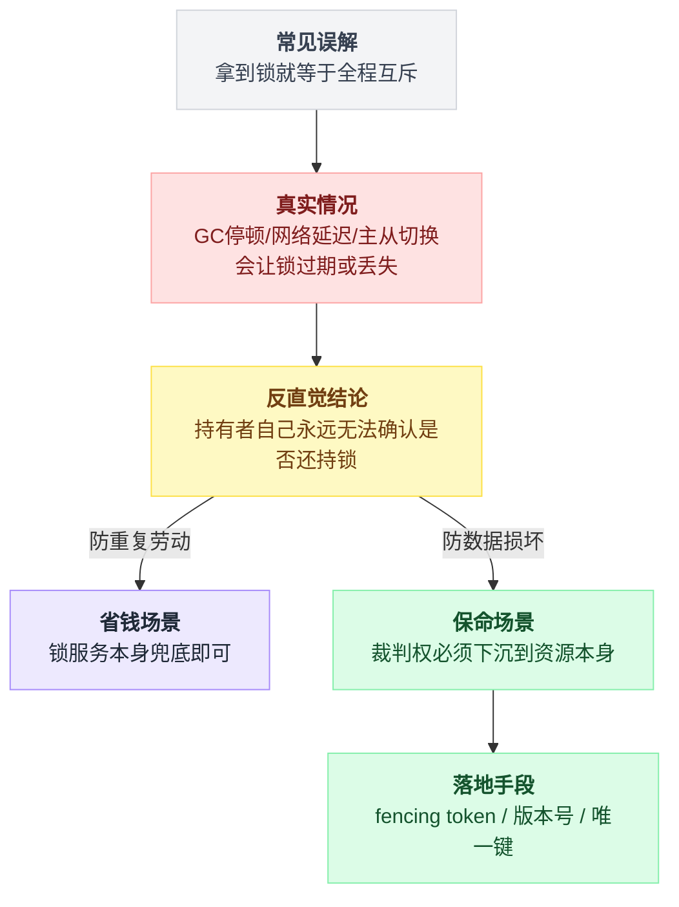
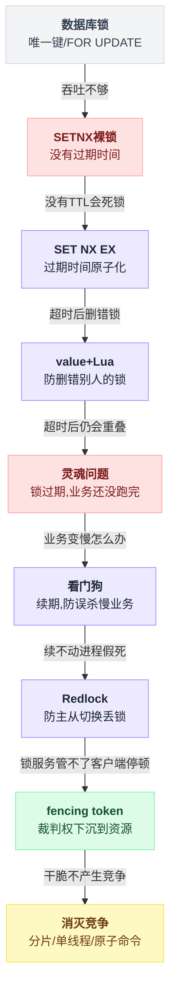
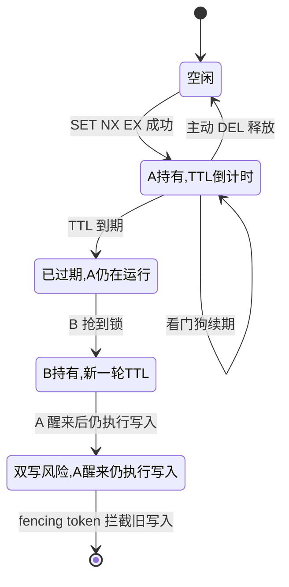
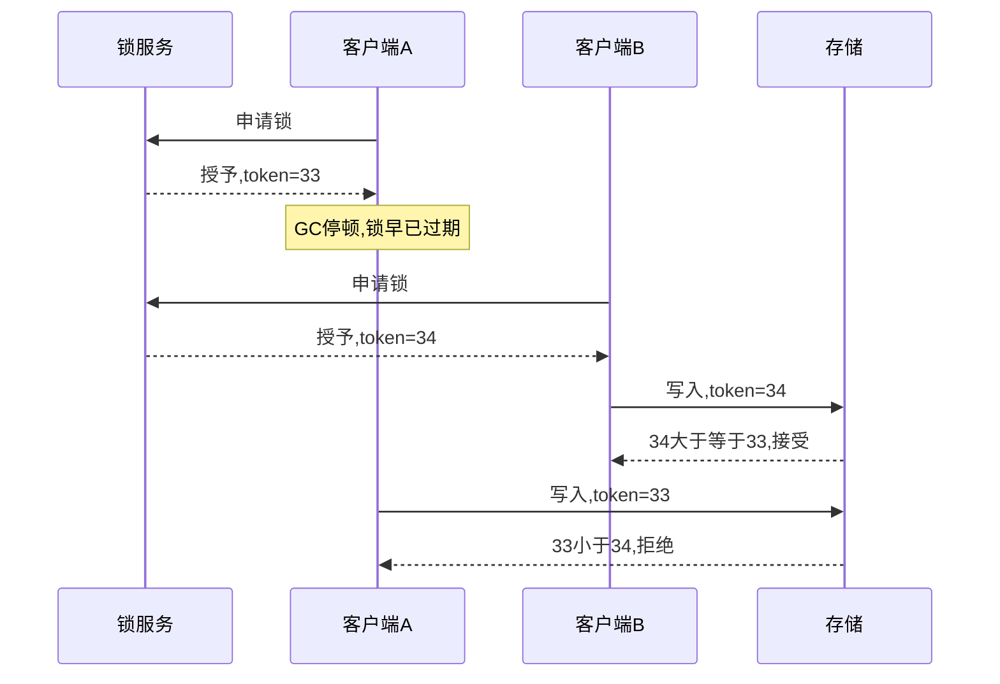
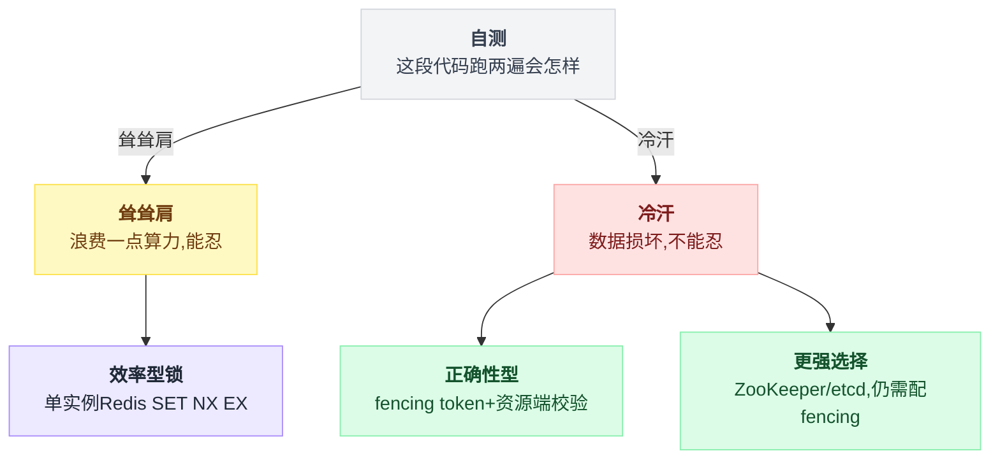
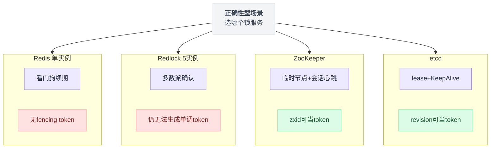

# 《分布式锁》从 setnx 到那场著名论战：你的锁到底锁住了没有（小白版）

> 一句话结论：**只要带了过期时间，你手里的就不是锁，是租约——"我还持有锁"这句话你永远无法确认，因为它可能在你说出口之前就过期了。所以分布式锁的最终裁判从来不是锁服务，而是被保护的资源本身（fencing token / 版本号 / 唯一键）。Redis 锁能帮你省钱（防重复劳动），保不了你的命（防数据损坏）。**
>
> 难度：★★★★☆
> 写作时间：2026-08-05。文中涉及的具体默认值（如 Redisson 看门狗参数）以官方文档为准；未经一手核实的说法在文中已标注。

先把这句结论画成一张图：



---

## 目录

- [1. 出事那晚：同一笔钱，对了两次账](#1-出事那晚同一笔钱对了两次账)
- [2. 病根：单机的锁，出了进程就是废纸](#2-病根单机的锁出了进程就是废纸)
- [3. 第一级台阶：数据库本身就能当锁](#3-第一级台阶数据库本身就能当锁)
- [4. 第二级台阶：SETNX 裸锁——死锁在前面等你](#4-第二级台阶setnx-裸锁死锁在前面等你)
- [5. 第三级台阶：加过期时间——两条命令中间的裂缝](#5-第三级台阶加过期时间两条命令中间的裂缝)
- [6. 第四级台阶：别删错别人的锁——value 校验 + Lua](#6-第四级台阶别删错别人的锁value-校验--lua)
- [7. 第五级台阶：灵魂问题——锁过期了，业务还没跑完](#7-第五级台阶灵魂问题锁过期了业务还没跑完)
- [8. 第六级台阶：看门狗——Redisson 怎么给锁续命](#8-第六级台阶看门狗redisson-怎么给锁续命)
- [9. 第七级台阶：主从切换丢锁——Redlock 登场](#9-第七级台阶主从切换丢锁redlock-登场)
- [10. 那场著名论战：Kleppmann vs antirez（2016）](#10-那场著名论战kleppmann-vs-antirez2016)
- [11. 结论分叉：你的锁是省钱的，还是保命的](#11-结论分叉你的锁是省钱的还是保命的)
- [12. ZooKeeper 与 etcd：为什么它们更对，又为什么更慢](#12-zookeeper-与-etcd为什么它们更对又为什么更慢)
- [13. 最高一级台阶：最好的锁是不需要锁](#13-最高一级台阶最好的锁是不需要锁)
- [14. 动手实验：80 行代码看 fencing token 拦下脏写](#14-动手实验80-行代码看-fencing-token-拦下脏写)
- [15. 一句话总结--小白词典--和前几篇的对照](#15-一句话总结--小白词典--和前几篇的对照)

---

全文是一段爬楼梯，每一级台阶解决上一级暴露的问题，也暴露下一级的问题，先看一眼整体路线：



## 1. 出事那晚：同一笔钱，对了两次账

先讲一个真实感十足的事故模板。类似的事在无数公司发生过，细节各异，剧本相同。

某支付团队有个定时对账任务：每晚 23:30 拉取昨天的全部交易流水，和银行渠道的账单逐笔核对，发现差异就自动生成冲正单（把多收的钱退回去，把少收的补上）。这套流程在[第 10 篇《支付与对账》](./10-支付与对账.md)里详细拆过。

任务一直跑在一台机器上。某次复盘会上有人提了一句："这台机器要是宕机了，当晚就没人对账了。"于是运维加了一台，两台都部署同一个定时任务——**"高可用"了**。

当晚 23:30，两台机器的 cron 同时醒来。两个进程都认为自己是那个唯一的对账人，各自拉流水、各自比对、各自生成冲正单。

```
        机器 1（23:30:00 触发）          机器 2（23:30:00 触发）
              │                                │
              ├─ 拉取昨日流水 10 万笔          ├─ 拉取昨日流水 10 万笔
              ├─ 发现差异单 37 笔              ├─ 发现差异单 37 笔
              ├─ 逐笔生成冲正 ────┐            ├─ 逐笔生成冲正 ────┐
              │                   ▼            │                   ▼
              │              ┌─────────────────┴────┐
              │              │   同一笔差异，        │
              │              │   被冲正了两次        │
              │              │   多收 100 → 退了 200 │
              │              └──────────────────────┘
```

第二天上午，运营在群里发问："这笔钱怎么退了两次？"

复盘结论一句话：**代码里明明加了锁，为什么没锁住？**

看代码，确实加了：

```java
synchronized (reconcileLock) {
    runReconcile();
}
```

这把锁一点问题都没有——在**一台机器**上。问题是现在有两台。

这就是本篇要回答的问题：当"互斥"的需求跨越了进程和机器，锁应该放在哪，才算真的锁住了？

先剧透一下路线图。这篇文章是一段爬楼梯：每一级台阶都能解决上一级的问题，然后暴露一个新问题。爬到第七级你会遇到 2016 年分布式系统圈那场著名论战——然后发现楼梯的尽头有个反直觉的答案：**最靠谱的"锁"根本不在锁服务里**。

---

## 2. 病根：单机的锁，出了进程就是废纸

`synchronized`、`ReentrantLock`、Python 的 `threading.Lock`、Go 的 `sync.Mutex`——这些锁的本质都是**进程自己内存里的一个标志位**。线程 A 把标志置为"占用"，线程 B 看到标志就等着。

关键在于：这个标志位住在**进程的内存**里。

```
        机器 1                              机器 2
  ┌─────────────────────┐            ┌─────────────────────┐
  │  进程 A             │            │  进程 B             │
  │                     │            │                     │
  │  reconcileLock ──── │            │  reconcileLock ──── │
  │  （A 内存里的对象） │            │  （B 内存里的对象） │
  │                     │            │                     │
  └─────────────────────┘            └─────────────────────┘

     两把锁。名字一样，地址不同，互相根本看不见。
     A 锁 A 的门，B 锁 B 的门，然后俩人从各自的门走进了同一个房间。
```

说白了：**锁要想管住谁，就必须放在所有人都看得见的地方。** 两个进程都看得见的地方只有三种——数据库、某个中间件（Redis / ZooKeeper / etcd）、或者文件系统（NFS 锁这条路坑太多，本篇不展开）。

于是问题转化为：找一个所有进程共享的地方，放一个"占用/空闲"的标志，并且保证"检查标志 + 设置标志"这两步**不可分割**。

不可分割这四个字是全篇的题眼。接下来每一级台阶的坑，几乎都是"两步操作中间被人插了一脚"的变体。

---

## 3. 第一级台阶：数据库本身就能当锁

你已经有一个所有进程共享、还自带并发控制的东西了——数据库。别急着上 Redis，最朴素的方案先看两眼。

### 3.1 唯一键：最土，但最难用错

建一张锁表，锁名做唯一键：

```sql
CREATE TABLE dist_lock (
    lock_name  VARCHAR(64) PRIMARY KEY,
    holder     VARCHAR(64) NOT NULL,
    created_at TIMESTAMP   NOT NULL DEFAULT now()
);
```

抢锁就是插入：

```sql
INSERT INTO dist_lock (lock_name, holder) VALUES ('reconcile:20260804', 'machine-1');
```

两台机器同时插，数据库保证**只有一台成功**——唯一键冲突会让另一台直接报错。释放锁就是 `DELETE`。

注意这里发生了什么：**"检查是否存在 + 写入"这两步的原子性，是数据库的唯一索引替你保证的。** 你什么并发代码都没写。

更妙的是锁名里带了日期 `reconcile:20260804`。这意味着哪怕进程崩了没释放锁，也只影响当天——明天的锁名不一样。锁和业务语义绑定，比"一把永恒的锁"安全得多。这个细节记住，第 13 节它会以主角身份回来。

### 3.2 SELECT FOR UPDATE：把行锁借来用

另一条路是悲观行锁：

```sql
BEGIN;
SELECT * FROM job_control WHERE job_name = 'reconcile' FOR UPDATE;
-- 拿到行锁的进程在这里跑业务，另一个进程会阻塞在上一行
COMMIT;
```

`FOR UPDATE` 的行为、锁等待、死锁检测这些机制，[PostgreSQL 系列第 05 篇《锁》](../2026-08_从真实项目学PostgreSQL/05-锁.md)从 `pg_locks` 视图一路拆到底，这里不重复。要点一句话：**事务不结束，锁不释放；连接断了，数据库自动回滚事务、自动放锁**——"进程崩了锁怎么办"这个问题，数据库替你兜住了。

### 3.3 为什么还要往下走

数据库锁能用，而且在两个场景里就是正解：

- 低频任务防重复（每晚一次的对账、每小时一次的报表）——一天几次的加锁，用什么都行，用最不容易出错的。
- 锁的持有者本来就要在同一个事务里改数据——锁和业务同生共死，一致性免费。

它的问题是**吞吐**。每次加锁解锁都是一次磁盘持久化的事务；`FOR UPDATE` 抢不到锁的连接会挂在数据库里占着连接池。锁请求到每秒几百上千次时，你是在拿数据库最贵的资源（连接 + 事务 + 磁盘）干最轻的活（存一个标志位）。

于是视线转向 Redis：内存操作、单线程命令天然串行、量级在每秒几万到十几万次命令（官方 redis-benchmark 的量级，具体数值因机器而异）。

---

## 4. 第二级台阶：SETNX 裸锁——死锁在前面等你

Redis 的 `SETNX`（SET if Not eXists）：key 不存在就设置并返回 1，存在就什么都不做返回 0。单线程执行，天然不可分割。

```
redis-cli SETNX lock:reconcile "machine-1"
(integer) 1        ← 机器 1 抢到了

redis-cli SETNX lock:reconcile "machine-2"
(integer) 0        ← 机器 2 没抢到，等着
```

用完删掉：

```
redis-cli DEL lock:reconcile
```

三行命令，一把分布式锁。教程写到这里通常就收尾了。

这里有个坑，而且是致命的：**如果持锁的进程在 DEL 之前崩了呢？**

```
  进程 A                                Redis
    │                                    │
    │──── SETNX lock:reconcile ────────→ │  OK，锁归 A
    │                                    │
    │      跑业务……跑业务……              │
    ╳  进程崩溃 / 机器断电 / 被 kill -9  │
                                         │
                                         │  lock:reconcile 还在
                                         │  没有过期时间
                                         │  持有者已经不存在了
                                         │
  之后每一个来抢锁的进程：SETNX → 0 → 等待 → 永远等下去
```

一把没有主人的锁，锁死了所有人。第 3.2 节里数据库靠"连接断开自动回滚"兜住的事，Redis 的 key 不会替你兜——key 又不知道你死没死。

任务每晚 23:30 的对账系统摊上这个，症状是：某天起对账任务**再也没跑过**，还没有任何报错。比跑两遍更阴间。

---

## 5. 第三级台阶：加过期时间——两条命令中间的裂缝

解法显而易见：给锁加个过期时间（TTL），持有者死了，锁到点自动蒸发。

直觉写法：

```
SETNX lock:reconcile "machine-1"     ← 第 1 条命令：抢锁
EXPIRE lock:reconcile 30             ← 第 2 条命令：设 30 秒过期
```

看出问题没有？**两条命令，中间有裂缝。**

```
  进程 A                                Redis
    │                                    │
    │──── SETNX ───────────────────────→ │  OK
    │                                    │
    ╳  就崩在这里（SETNX 之后、EXPIRE 之前）
                                         │
                                         │  锁设上了，TTL 没设上
                                         │  → 回到第 4 节的死锁
```

崩在两条命令之间的概率很小。但"概率很小"乘以"每天百万次加锁"等于"每隔几天来一次灵异事件"。分布式系统里所有"就差那一瞬间"的窗口，迟早会被命中——这条经验后面还要用两次。

正解是 Redis 2.6.12 起 `SET` 命令支持的组合参数，**一条命令**同时完成"不存在才设置 + 带过期时间"：

```
redis-cli SET lock:reconcile "machine-1" NX EX 30
OK          ← 抢到了，30 秒 TTL 已带上，不可分割

redis-cli SET lock:reconcile "machine-2" NX EX 30
(nil)       ← 没抢到
```

一条命令没有中间态，崩在哪都不会留下"无主无 TTL"的锁。Redis 官方文档后来也把 SETNX 时代的老加锁模式标为不推荐，一律改推这条 `SET ... NX EX`。

到这里，一把"能自动解套"的锁有了。但我们刚刚亲手引入了一个此刻还看不出来的定时炸弹：**那个 30 秒是拍脑袋定的。** 第 7 节它会爆。先处理一个更近的坑。

---

## 6. 第四级台阶：别删错别人的锁——value 校验 + Lua

场景：进程 A 拿到锁（TTL 30 秒），业务偶尔慢，跑了 35 秒才结束，然后执行 `DEL` 释放锁。

问题：第 30 秒的时候锁已经过期蒸发，第 31 秒进程 B 把锁抢走了。A 在第 35 秒执行的 `DEL`，删掉的是**B 的锁**。

```
 时间轴 ────────────────────────────────────────────────────────→

 A:  [拿到锁 TTL=30]──────业务跑了 35 秒──────────────[DEL] ← 删的是 B 的锁！
 锁:  [═════════ A 持有 ═════════]过期
 B:                                [拿到锁]───业务───
 C:                                                    [拿到锁] ← 锁又空了
                                                          ↑
                                        此刻 B 和 C 同时在跑"互斥"业务
```

一次超时，引发连环车祸：A 误删 B 的锁 → C 趁虚而入 → B、C 并发。而且 B 毫不知情。

解法分两步。

**第一步：锁的 value 存"我是谁"。** 每次加锁生成一个唯一标识（UUID、`机器名:进程号:随机数` 都行）：

```
SET lock:reconcile "machine-1:pid8231:e4f9a02c" NX EX 30
```

**第二步：释放时先验身份再删，而且这两步必须原子。** 如果写成"先 GET 比对、再 DEL"两条命令，裂缝又来了——GET 比对通过之后、DEL 之前，锁恰好过期又被别人抢走，你还是删了别人的锁（第 5 节的经验第一次复用）。所以用 Lua 脚本，Redis 保证脚本整体不可分割：

```lua
if redis.call("get", KEYS[1]) == ARGV[1] then
    return redis.call("del", KEYS[1])
else
    return 0
end
```

redis-cli 可以直接跑：

```
redis-cli EVAL 'if redis.call("get", KEYS[1]) == ARGV[1] then return redis.call("del", KEYS[1]) else return 0 end' 1 lock:reconcile "machine-1:pid8231:e4f9a02c"
```

💡 顺带一句：这个"把 检查+动作 打包成一个原子单元"的 Lua 手法，和[第 4 篇《分布式限流器》](./04-分布式限流器.md)里令牌桶脚本是同一招。Redis 分布式系统编程的半壁江山就是这一招：**凡是"先看再改"，都得打包。**

到这里，我们的锁已经有模有样：原子抢锁、自动过期、验身份释放。市面上八成的"Redis 分布式锁教程"到此为止。

但请回头看一眼上面那张时间轴。误删锁只是车祸现场的第二起事故，**第一起是"A 超时后，B 拿到了锁，而 A 还在跑"**——那段时间里 A 和 B 已经同时在执行"互斥"业务了。验身份删锁只是让 A 别再祸害 C，A 和 B 的并发一秒都没少。

这才是真正的灵魂问题。

---

## 7. 第五级台阶：灵魂问题——锁过期了，业务还没跑完

把镜头拉近，只看这一段：

```
 时间 ──────────────────────────────────────────────────────────→

 进程 A   [拿锁,TTL=30s]──执行──╳ 停 顿 ╳──恢复──[写数据库]
                                  (40秒)          ↑
                                                  A 自以为还持有锁
 锁       [═══════ A 的 30 秒 ═══════]过期

 进程 B                               [拿锁]──执行──[写数据库]

                                      └────────┬────────┘
                                       这段时间 A、B 同时"持锁"
                                       互斥？不存在的
```

"停顿 40 秒"听起来夸张？Martin Kleppmann 在后面要讲的那篇文章里列过清单，每一条都有真实案例：

- **GC 停顿**：JVM 的 stop-the-world 可以到分钟级（他文中引了 HBase 社区的真实经历）；
- **虚拟机热迁移**：整个 VM 暂停，进程自己毫无感知；
- **内存换页 / 磁盘 IO 卡顿**：进程"活着"，但一动不动；
- **网络延迟**：写数据库的请求发出时还持锁，到达时已过期；
- 甚至 `SIGSTOP`、断点调试——运维随手一个信号，你的进程就"穿越"了。

关键的认知在这里，值得放大：

> ⚠️ **反直觉：带过期时间的"锁"，在语义上已经不是锁了，是租约（lease）。**
>
> 锁的语义是"我持有，直到我释放"。租约的语义是"我持有，**直到某个时刻**"——而"某个时刻到没到"，判定权在锁服务的时钟，不在你。
>
> 更扎心的推论：进程**无法可靠地知道自己是否还持有租约**。你可以查（"锁还在吗？value 还是我吗？"），但查询结果送到你手上的那一刻起就是历史了——检查完、动手前，租约照样可能过期（第 5 节的经验第二次复用，这次没有 Lua 能救你，因为"动手"发生在 Redis 之外的数据库/文件系统上，Redis 打包不了别人家的操作）。

把这一整套状态转移画成状态机，比文字更容易记住哪一步开始失控：



所以第五级台阶的问题不是"TTL 设多长"。设 30 秒会遇到 40 秒的停顿，设 5 分钟会遇到 6 分钟的，而且 TTL 越长，进程崩溃后锁的"尸体"挡路越久。这是个两头堵的参数：**短了误杀活人，长了尸位素餐。**

工程上先给一个能缓解"误杀活人"的方案（下一节的看门狗），但请记住：**"A 停顿后自以为持锁"这个问题，看门狗解决不了，Redlock 也解决不了。** 全篇只有一个东西真正解决它，在第 10 节。

---

## 8. 第六级台阶：看门狗——Redisson 怎么给锁续命

TTL 两头堵的破法：**别猜业务要跑多久，让锁跟着业务的心跳走。**

- TTL 设一个不长的值（比如 30 秒）；
- 持锁进程后台开一个定时线程，每隔 TTL 的三分之一（10 秒）检查一次：业务还没跑完？把 TTL 重置回 30 秒；
- 进程崩了 → 定时线程也死了 → 没人续期 → 30 秒后锁自然过期。

这就是"看门狗"（watchdog）。Java 世界最常用的 Redisson 客户端内置了这套：

```
  t=0    拿锁，TTL=30s，看门狗线程启动
   │
  t=10s  业务还在跑 → PEXPIRE 重置回 30s     ┐
  t=20s  还在跑 → 再续                        ├ 活着就一直续
  t=30s  还在跑 → 再续                        ┘
   │
   ├─ 分支一：业务正常结束 → 主动释放锁，看门狗停
   └─ 分支二：进程崩了 → 看门狗随进程一起死 → 30 秒后锁过期
                                               ↑
                                     TTL 从"业务时长上限"降级成
                                     "崩溃后锁尸体的最大挡路时间"
```

妙处在最后一行：**TTL 的含义变了。** 不再赌"业务 30 秒内一定跑完"（赌不起），只承诺"进程死透之后，锁最多再挡 30 秒路"（这个可以承诺）。

Redisson 的几个实现细节值得拆开看（具体默认值以 Redisson 官方文档为准）：

- 看门狗超时 `lockWatchdogTimeout` 默认 30 秒，续期间隔是它的三分之一即 10 秒；
- 只有**不指定 leaseTime** 的加锁才启用看门狗——你显式传了持锁时长，Redisson 就认为你自己心里有数，不续；
- **可重入**：锁不是 string 而是 hash 结构。field 是"客户端 UUID:线程 ID"，value 是重入次数：

```
lock:reconcile   （Redis hash）
   └── "3f8a9c...:17" → 2
        ↑                ↑
   谁拿的（客户端+线程）  重入了几层

同一线程再加锁 → HINCRBY 次数 +1，刷新 TTL
解锁 → 次数 -1，减到 0 才真正 DEL
```

加锁、解锁各是一段 Lua 脚本（"看 hash 存在否 + 看 field 是不是我 + 增减计数 + 刷 TTL"整体原子）——第 6 节那招的加强版。

看门狗把第 7 节的**慢**处理掉了：业务比预想慢十倍也不会被误杀。但停顿呢？

⚠️ **看门狗救不了停顿。** GC 停顿 40 秒，看门狗线程**同样在停顿**——stop-the-world 停的是整个进程，续期线程不是局外人。锁照样过期，B 照样拿锁，A 醒来照样自以为持锁。看门狗防的是"业务太慢"，不是"进程假死"。第 7 节的灵魂问题原封不动地留着。

还留着一个更脏的问题：以上一切都建立在"Redis 自己不会丢数据"上。

---

## 9. 第七级台阶：主从切换丢锁——Redlock 登场

生产环境的 Redis 一般是主从 + 哨兵（或集群）。而 Redis 的主从复制是**异步**的：主节点回复客户端"OK"的时候，数据可能还没到从节点。

对缓存这无所谓，丢一条缓存数据谁在乎。对锁，要命：

```
  进程 A ── SET lock NX EX 30 ──→  主节点     回复 OK，A 认为拿到锁
                                     │
                                     │ 异步复制（这一条还没来得及发出去）
                                     ╳ 主节点宕机
                                     │
                              哨兵把从节点提升为新主
                              新主上根本没有 lock 这个 key
                                     │
  进程 B ── SET lock NX EX 30 ──→  新主       回复 OK，B 也拿到了锁

  → A、B 同时持有同一把锁。锁服务自己弄丢了锁。
```

注意这次的问题和前面六级全都不同：前面是客户端的坑（忘设 TTL、删错锁、停顿），**这次是锁服务本身不可靠**。单点 Redis 怕宕机，主从 Redis 怕切换丢数据——怎么办？

Redis 作者 antirez 给出的答案叫 **Redlock**（发表于 redis.io 官方文档《Distributed Locks with Redis》）。思路：既然一个 Redis 靠不住，那就**问五个**，而且这五个是完全独立的主节点——没有主从关系，没有复制，谁也不是谁的备份。

```
                 ┌──→  Redis 1   ✓ 抢到
                 ├──→  Redis 2   ✓ 抢到
   客户端 A  ────┼──→  Redis 3   ✓ 抢到      3/5 = 多数派 ✓
                 ├──→  Redis 4   ✗ 超时
                 └──→  Redis 5   ✗ 被 B 抢了

   规则：
   1. 依次向 5 个实例发 SET key rand NX PX ttl，每次带很短的超时（几十毫秒级），
      挂了的实例跳过，不傻等；
   2. 在 ≥3 个实例上成功，且从第一个请求发出到最后一个成功的总耗时 < TTL
      → 才算拿到锁；
   3. 锁的真实有效期 = TTL − 抢锁总耗时 − 时钟漂移补偿；
   4. 没凑够多数派 → 向所有实例发解锁，从头再来。
```

为什么多数派能防住主节点宕机？因为任何两个"多数派"必然有交集——B 想拿到锁也得凑 3 个，而 5 台里至少有 1 台既在 A 的 3 台里又在 B 的 3 台里，那台会拒绝 B。单台宕机也不怕：A 在 1、2、3 上有锁，3 号挂了重启（空数据），B 最多凑到 3、4、5——还是要过 3 号，而 antirez 建议实例重启延迟一个 TTL 再上线，堵住这个窗口。

多数派、两两有交集——如果你读过[第 23 篇《Raft 共识》](./23-Raft共识.md)，这个味道很熟。但注意，**Redlock 不是共识协议**：五个实例之间零通信，纯靠客户端自己数票，也没有任期（term）、没有日志复制。它像是共识的多数派思想的一个"轻量借用"。

这个"借用"到底成不成立，就是那场著名论战吵的事。

---

## 10. 那场著名论战：Kleppmann vs antirez（2016）

2016 年 2 月，《Designing Data-Intensive Applications》（DDIA）的作者 Martin Kleppmann 发表[《How to do distributed locking》](https://martin.kleppmann.com/2016/02/08/how-to-do-distributed-locking.html)，矛头直指 Redlock：**不要用它。** 几天后 antirez 发表[《Is Redlock safe?》](http://antirez.com/news/101)逐条回击。两篇文章加上后续的评论区交锋，成了分布式系统教育史上被引用最多的论战之一。

值得庆幸的是，双方吵得非常"干净"——没有人身攻击，全是机制推演。跟着推一遍，第 7 节挖的坑就能填上了。

### 10.1 Kleppmann 的第一记重拳：没有 fencing token，锁对了也没用

他先画了一个和本篇第 7 节几乎一样的时序：客户端拿到锁 → GC 停顿 → 锁过期 → 另一个客户端拿锁写存储 → 前一个客户端醒来，**带着过期的锁**写存储 → 数据损坏。

然后指出：这个问题跟 Redlock 用几个实例**毫无关系**。一个实例会中招，五个实例照样中招——因为停顿发生在客户端身上，锁服务再健壮也管不到客户端的 GC。

他的解法叫 **fencing token（栅栏令牌）**：

```
  锁服务（每次授锁发一个单调递增的 token）        存储（记住见过的最大 token）

  A 拿锁 ──────────→ 授予，token = 33
  A ╳ GC 停顿……
        （锁过期）
  B 拿锁 ──────────→ 授予，token = 34
  B 写入(数据, token=34) ─────────────────────→  34 ≥ 33，接受 ✓，记住 34
  A 醒来，自以为还持锁
  A 写入(数据, token=33) ─────────────────────→  33 < 34，拒绝 ✗
                                                      ↑
                                        旧持有者的迟到写入被存储挡在门外
```

看清楚这一步棋的走向：**它把"我还持有锁吗"这个没法回答的问题（第 7 节论证过为什么没法回答），换成了"这次写入还新鲜吗"——一个存储端看一眼数字就能回答的问题。** 最终校验从锁服务下沉到了资源本身。锁过期、停顿、时钟，全都无所谓了——反正旧 token 写不进去。

换成多方时序图看这四个参与者怎么互动：



而 Kleppmann 对 Redlock 的判词是：五个独立实例，各发各的随机 value，**凑不出一个全局单调递增的计数器**，所以 Redlock 发不出 fencing token——它在最需要防护的那个场景里没有防护。

顺带补一个学术出处：fencing token 不是 Kleppmann 发明的，Google 的锁服务 Chubby 论文（Mike Burrows, *The Chubby lock service*, OSDI 2006）里就有同款机制，叫 sequencer。工业界十年前就在用了。

### 10.2 Kleppmann 的第二记重拳：Redlock 把安全性押在时钟上

Redlock 的多数派计算依赖每台 Redis 独立倒计时 TTL。Kleppmann 举例：5 台实例 A~E，客户端 1 在 A、B、C 上拿到锁；**C 的系统时钟被 NTP 往前跳了一下**（或者运维手动校时），C 上的锁提前过期；客户端 2 这时能在 C、D、E 上凑齐另一个多数派——两个客户端同时持锁。

不需要宕机，不需要网络分区，一次时钟跳变就击穿了多数派。他的结论：Redlock 的正确性建立在"时钟误差有界、网络延迟有界、进程停顿有界"这一整套**同步系统假设**上，而真实世界三条都会破。一个好的分布式算法应该做到：时序假设破了最多影响性能（活性），**绝不能影响正确性（安全性）**——共识协议（Paxos/Raft）就是按这个标准设计的，Redlock 不是。

（时钟不可靠这个主题，本系列已经踩过一次：[第 12 篇](./12-小而美的五个算法.md) 4.7 节雪花算法的时钟回拨。那里回拨的代价是 ID 重复，这里的代价是两个进程同时持锁——同一颗雷，不同的炸法。）

### 10.3 antirez 的回应

《Is Redlock safe?》的反击要点，用小白话转述：

**关于时钟**：Redlock 不需要时钟绝对准，只需要时钟**流速**大致准（TTL 5 秒的锁，别倒计时成 10 秒）。大幅跳变来自两种运维事故——手动改时间、NTP 配置成瞬间 step 而不是缓慢 slew——这两种都能通过运维规范避免。Kleppmann 一方的反驳也直白：**你把算法的正确性押在了运维纪律上**，而运维纪律恰恰是最不该被信任的假设之一。

**关于停顿**：antirez 指出，停顿如果发生在"拿锁过程中"，Redlock 能自救——算法第 3 步要求客户端拿到多数派后，用本地时间复查"抢锁总耗时是否已经吃掉了 TTL"，超了就放弃。真正无解的只有一种：**复查通过之后、写存储之前**的停顿。而他的反击是：这个窗口对 ZooKeeper 锁、对任何锁服务都同样存在——这不是 Redlock 的软肋，是"锁 + 超时"这个模式本身的软肋。

**关于 fencing token**：antirez 说，如果你的存储端有能力做"检查 token 再写入"这种条件写，那你其实已经拥有了一个线性化的仲裁点，很多场景下用它就够了，何必绕道锁？另外 Redlock 的随机 value 也可以在存储端做"值还对得上才接受"的校验，起类似作用。Kleppmann 的回应压住了这一条：随机 value 只能判断"是不是同一次持锁"，**判断不了先后**——fencing 的关键恰恰是"拒绝更旧的"，这要求 token 有全序，随机数给不了。

### 10.4 论战的裁决（以及为什么说双方都赢了）

十年后回看（以下两段是笔者的归纳判断，不是任何一方原话）：

- **antirez 赢了"效率"这一半。** 对于防重复劳动的场景，Redis 锁便宜、快、够用，这一点 Kleppmann 原文其实也同意——他明说效率型场景一个单实例 Redis 就好，犯不上 Redlock 的五台实例。
- **Kleppmann 赢了"正确性"这一半。** 停顿窗口无解 + 发不出 fencing token 这两条，antirez 没有能正面拆掉。后来的工程实践事实上站在了这一边：需要正确性保证的系统，要么用共识系统做锁并配合 fencing，要么干脆把校验做进资源端。DDIA 第 8、9 章把这套推理写成了教科书。

💡 这场论战最值钱的产出，是逼所有人把一个混沌的词拆成了两个清晰的概念——你加锁，到底是为了**省钱**还是**保命**？第 11 节展开。

### 10.5 你早就用过 fencing token，只是不叫这个名字

回想数据库乐观锁：

```sql
UPDATE account
SET balance = 120, version = version + 1
WHERE id = 42 AND version = 7;
-- 影响行数 = 0 → 说明 version 已经不是 7，有人先改过 → 本次更新被拒绝
```

对一下第 10.1 节的图：version 就是"存储端记住的最大 token"，`WHERE version = 7` 就是"拒绝旧 token 的写入"。**乐观锁的版本号，就是穷人版 fencing token**——区别只在 token 的签发者：fencing token 由锁服务统一签发（全局单调），版本号由数据行自己维护（行内单调）。骨架完全一致：**写入是否合法，由资源在写入那一刻裁决，而不是由写入者自我感觉裁决。**

（丢失更新和这句 SQL 的各种错误写法，[PostgreSQL 系列第 04 篇](../2026-08_从真实项目学PostgreSQL/04-隔离级别与三种错误写法.md)有完整推演。）

---

## 11. 结论分叉：你的锁是省钱的，还是保命的

Kleppmann 文中的二分法，值得抄在工位上：

| | 效率型锁（efficiency） | 正确性型锁（correctness） |
|---|---|---|
| 你在防什么 | 重复劳动：邮件发两遍、报表跑两次、缓存重建撞车 | 数据损坏：账目错乱、超卖、旧数据覆盖新数据 |
| 锁偶尔失效的代价 | 浪费一点计算/几句用户抱怨，能忍 | 事故、赔钱、道歉信，不能忍 |
| 对锁的要求 | 绝大多数时候互斥就行 | **任何情况下**都不能出现双持有后果 |
| 该用什么 | 单实例 Redis `SET NX EX`（+看门狗），到此为止，**别上 Redlock**——五台实例的成本买不来正确性，纯属中间地带 | fencing token + 资源端校验；或 ZooKeeper/etcd（仍建议配 fencing）；或第 13 节——干脆消灭竞争 |
| 一句话自测 | "这段代码跑两遍会怎样？"——答案是耸耸肩 | ——答案是冷汗 |

这张表本质是一棵判定树，画出来更好用：



回到第 1 节的对账事故，用这张表自测："对账跑两遍会怎样？"答案是重复冲正、真金白银——冷汗。所以它是正确性场景，光加 Redis 锁是不够的，真正的修法在第 13 节结尾。

而"每小时预热一次缓存，两台机器偶尔撞车各预热一遍"——耸肩。单实例 Redis 锁，收工。

⚠️ 大量事故的根源是**拿着效率型的锁，守着正确性型的资产**。锁本身没坏，是选型时没问过自己上面那个问题。

---

## 12. ZooKeeper 与 etcd：为什么它们更对，又为什么更慢

正确性型场景的传统答案是换锁服务：ZooKeeper 或 etcd。它们"更对"不是玄学，是三个具体机制。

### 12.1 ZooKeeper：临时节点 + 顺序号 + watch

ZooKeeper 官方锁配方（recipe）的三件套：

**临时节点（ephemeral）**：客户端与 ZK 之间维持一个会话（session），靠心跳续命。客户端创建的临时节点在**会话结束时自动删除**。锁就是一个临时节点——进程崩了、网断了，心跳停，会话过期，节点没了，锁自动释放。这解决了第 4 节的死锁问题，而且不用猜 TTL：租约跟着心跳走，相当于协议层内置的看门狗。

**顺序节点 + watch 前一个**：

```
   /locks/reconcile/
      ├── lock-0000000041   ← 编号最小 → 持锁
      ├── lock-0000000042   ── watch 41（只盯前一个）
      └── lock-0000000043   ── watch 42

   每个抢锁者创建一个带自增编号的临时节点：
   · 自己编号最小 → 拿到锁
   · 不是最小 → 只 watch 比自己小的那一个节点
   · 前面的节点消失（释放或崩溃）→ 收到通知 → 检查自己是否已是最小
```

为什么只 watch 前一个而不是所有人 watch 锁本身？防**惊群**：一千个等锁的进程，锁一释放全部惊醒、全部冲上来抢、九百九十九个失败回去继续睡。顺序 watch 让每次释放只吵醒一个人，队列还天然公平（先到先得）。

**共识复制**：这是和 Redis 的本质分野。ZK 的每一次写（创建节点）都要经 ZAB 协议复制到**多数派节点并落盘**才算成功。对比第 9 节：Redis 主从切换会丢没来得及复制的锁，而 ZK 的 leader 挂了，新 leader 必然包含所有已确认的写——**锁一旦授出，换 leader 也不会凭空消失**。这份底气来自共识协议，原理见[第 23 篇《Raft 共识》](./23-Raft共识.md)（ZAB 与 Raft 是近亲，多数派 + leader 日志复制的骨架相同）。

### 12.2 etcd：租约 + revision

etcd 是同一套思想的现代版本：

- **lease（租约）**：显式创建一个带 TTL 的租约，客户端定期 KeepAlive 续期，key 挂在租约上，租约断气 key 消失——把 ZK 隐式的会话机制做成了显式 API；
- **Raft 复制**：每次写走多数派，同 ZK；
- **revision**：etcd 全局维护一个单调递增的修订号，每次写入 +1。社区常拿锁 key 的 revision 当现成的 fencing token 用（此用法来自社区实践总结，细节以 etcd 官方文档为准）。ZK 那边对应的是 zxid / 节点版本号，Kleppmann 原文即建议拿它当 token。

四条路子并排摆在一起看，谁天生带 token、谁没有，一目了然：



### 12.3 泼冷水：它们也丢锁

⚠️ **ZK/etcd 不豁免第 7 节的灵魂问题。** GC 停顿 40 秒，心跳线程同样停 40 秒，会话/租约过期，临时节点被删，锁易主——醒来的进程照样自以为持锁。共识协议保证的是**锁服务自己**不丢数据、不脑裂，管不了**客户端**假死。这正是 antirez 在 10.3 节的反击成立的部分。

所以正确性的完整拼图永远是两块：**共识系统管好锁的授予，fencing token 管住迟到的写入。** 只有前者，防线仍有缺口；zxid / revision 恰好是共识系统白送的 token，不用白不用。

### 12.4 代价：吞吐

每次加锁 = 一轮共识 = 多数派网络往返 + 磁盘 fsync。同样一次抢锁，Redis 是单机内存操作。两者吞吐差一个量级上下（方向来自各自官方基准与第三方评测的普遍口径，未自行复现）。这就是选型分叉的物理基础：

```
   加锁吞吐            正确性保障
   Redis 高      ←──── 权衡 ────→      ZK / etcd 高
   （内存，单机确认）              （多数派落盘确认）

   没有既高又对的免费午餐——想都要？看第 13 节。
```

---

## 13. 最高一级台阶：最好的锁是不需要锁

爬了七级台阶，每一级都在给"锁"打补丁。现在站在顶上问一个釜底抽薪的问题：**当初为什么需要锁？**

因为有两个进程要抢同一个资源。那——能不能让它们压根不用抢？

三个本系列已经出现过的案例，其实全是这个思路。

**案例一：秒杀扣库存，没人用分布式锁。** [秒杀系列第 7 篇](../2026-07_秒杀系统源码拆解/7_秒杀库存扣减_Redis和MySQL谁说了算.md)拆了五个开源秒杀项目，扣库存清一色是 Redis 原子命令 / Lua（`DECR` 判负、"查库存+扣减"打包），或者数据库条件更新：

```sql
UPDATE seckill_goods SET stock = stock - 1 WHERE id = 42 AND stock > 0;
```

"检查 + 修改"被压进了**一条**原子操作，临界区消失了——没有临界区，自然没有锁。注意那句 `AND stock > 0`，它又是"资源端裁决写入合法性"——和 fencing token、乐观锁版本号是同一血脉。

**案例二：撮合引擎，用串行化消灭并发。** [第 7 篇《股票撮合引擎》](./07-股票撮合引擎.md)的核心设计：所有订单进一个队列，**单线程**事件循环逐一处理。并发根本进不了撮合核心，锁无从谈起。全世界最需要"互斥"的场景之一，答案是让并发在门口排队，而不是进门后抢锁。

**案例三：分片对齐，让竞争双方永不见面。** [第 14 篇《分库分表》](./14-分库分表.md)用基因法让同一用户的所有订单落在同一分片，跨分片分布式事务**根本不产生**。同一思想换个说法：与其仲裁竞争（锁、分布式事务），不如设计数据路由让竞争在拓扑上不存在。

```
   处理"两个进程抢一个资源"的三个层次，从下往上越来越高明：

   第 3 层   消灭竞争     分片对齐 / 单线程串行 / 原子命令
                          （竞争在结构上不存在）        ← 14 篇、07 篇、秒杀
   ─────────────────────────────────────────────
   第 2 层   裁决后果     fencing token / 版本号 / 唯一键
                          （抢就抢吧，脏写进不了门）    ← 本篇 10 节
   ─────────────────────────────────────────────
   第 1 层   仲裁竞争     分布式锁
                          （维持一个"谁在持有"的共识）  ← 本篇 3~9 节、12 节
```

现在回到第 1 节的对账事故，给出完整答案：

1. **加一把效率型锁**：`SET lock:reconcile:20260804 <唯一标识> NX EX ...`，让两台机器绝大多数时候只有一台跑——这是省钱，省掉重复拉 10 万笔流水的算力；
2. **冲正单上建唯一键**：`UNIQUE(原交易号, 对账日期)`，第二次生成同一笔冲正时数据库直接拒绝——这是保命。哪怕锁失效、两个进程同时跑完了全程，重复的冲正单也一张都落不了库。

第 2 步眼熟吗？它就是第 3.1 节那个"最土"的唯一键。爬了一整圈楼梯，发现**第一级台阶上那个最土的东西，和第十级的 fencing token 是同一招**——把裁决权交给资源端。土办法土在吞吐，不土在思想。

（唯一键防重的完整工程化——幂等键怎么设计、和 outbox 怎么配合——在 [PostgreSQL 系列第 06 篇](../2026-08_从真实项目学PostgreSQL/06-幂等与outbox.md)。）

---

## 14. 动手实验：80 行代码看 fencing token 拦下脏写

纯 Python 标准库，存成 `fencing_demo.py` 后 `python3 fencing_demo.py` 直接跑。它模拟的正是第 10.1 节那张图：A 拿锁后停顿（`time.sleep` 扮演 GC），锁过期，B 上位，A 醒来带旧 token 写存储。同一剧本跑两遍——第一遍存储不校验 token，第二遍校验。

```python
# fencing_demo.py —— 纯标准库，无任何依赖
import threading
import time

class LockService:
    """极简租约锁：TTL 到期自动可被抢，token 单调递增。"""
    def __init__(self):
        self._mu = threading.Lock()
        self._token = 0
        self._expire_at = 0.0

    def acquire(self, name, ttl):
        with self._mu:
            now = time.monotonic()
            if now < self._expire_at:
                return None                      # 有人持锁且未过期
            self._token += 1
            self._expire_at = now + ttl
            print(f"[锁服务] {name} 拿到锁, token={self._token}, TTL={ttl}s")
            return self._token

class Storage:
    """存储端。check=True 时拒绝比见过的更旧的 token。"""
    def __init__(self, check):
        self._mu = threading.Lock()
        self._max_token = 0
        self.check = check
        self.writes = []                         # 落库顺序，后写覆盖先写

    def write(self, name, token, value):
        with self._mu:
            if self.check and token < self._max_token:
                print(f"[存储]  拒绝 {name}: token={token} < 已见过的 {self._max_token}")
                return False
            self._max_token = max(self._max_token, token)
            self.writes.append((name, value))
            print(f"[存储]  接受 {name} 的写入, token={token}")
            return True

def worker_a(lock, storage):
    token = lock.acquire("A", ttl=1.0)
    time.sleep(2.0)                              # GC 停顿 2 秒：锁早过期了
    storage.write("A", token, "A算的余额")        # A 自以为还持锁

def worker_b(lock, storage):
    time.sleep(1.2)                              # 等 A 的锁过期
    token = lock.acquire("B", ttl=1.0)
    storage.write("B", token, "B算的余额")

def run(check):
    print(f"\n=== 存储{'校验' if check else '不校验'} fencing token ===")
    lock, storage = LockService(), Storage(check)
    ts = [threading.Thread(target=worker_a, args=(lock, storage)),
          threading.Thread(target=worker_b, args=(lock, storage))]
    for t in ts: t.start()
    for t in ts: t.join()
    print(f"最终写入序列: {storage.writes}")

run(check=False)
run(check=True)
```

预期输出（时间由 sleep 控制，每次运行结果一致）：

```
=== 存储不校验 fencing token ===
[锁服务] A 拿到锁, token=1, TTL=1.0s
[锁服务] B 拿到锁, token=2, TTL=1.0s
[存储]  接受 B 的写入, token=2
[存储]  接受 A 的写入, token=1
最终写入序列: [('B', 'B算的余额'), ('A', 'A算的余额')]
                                    ↑
              A 的旧数据最后落库，把 B 的新结果覆盖了——脏写成功

=== 存储校验 fencing token ===
[锁服务] A 拿到锁, token=1, TTL=1.0s
[锁服务] B 拿到锁, token=2, TTL=1.0s
[存储]  接受 B 的写入, token=2
[存储]  拒绝 A: token=1 < 已见过的 2
最终写入序列: [('B', 'B算的余额')]
```

两遍的**锁服务行为一模一样**（都授了两次锁——租约模型下这是正常的，不是 bug），差别只在存储端多了一行 `token < max_token` 的比较。就这一行，脏写没了。

值得自己动手改两处试试：

- 把 `worker_a` 的 `sleep(2.0)` 改成 `0.5`（停顿没超过 TTL）——两遍都只有 A 写入成功，B 拿不到锁，一切正常。说明 fencing 平时零存在感，只在事故时刻出手；
- 把 `LockService.acquire` 里的 token 换成 `random.random()`——校验逻辑立刻失去意义，因为随机数比不出先后。这就是 10.3 节 Kleppmann 压倒 antirez 那一手：**token 必须单调递增，随机 value 不行。**

---

## 15. 一句话总结 + 小白词典 + 和前几篇的对照

### 一句话总结

> **分布式锁的每一级演进，都是在承认一个更不舒服的事实：TTL 承认进程会死，看门狗承认业务会慢，Redlock 承认锁服务会挂，而 fencing token 承认——"我还持有锁"这件事，持有者自己永远无法确认。所以别问锁服务"我还持锁吗"，让资源端问每一次写入"你还新鲜吗"；而比这更高一层的，是像撮合引擎和基因法那样，让竞争在结构上根本不发生。**

### 小白词典

- **SETNX / SET NX EX**：Redis 的"不存在才设置"。加上 EX 过期参数合成一条命令，是 Redis 锁的正确起手式；分开两条发就有裂缝。
- **TTL / 租约（lease）**：带过期时间的持有权。到点自动收回，不管你业务跑没跑完——所以它是"租"，不是"有"。
- **看门狗（watchdog）**：持锁进程的后台续期线程，活着就给锁续命，死了锁自然过期。防的是业务慢，防不了进程假死。
- **可重入**：同一个线程对同一把锁能加第二次而不把自己锁死，靠计数器实现（Redisson 用 Redis hash 记"谁:重入了几层"）。
- **Redlock**：向 5 个互相独立的 Redis 实例逐个抢锁，多数派成功且总耗时小于 TTL 才算持有。借了多数派的思想，但不是共识协议。
- **fencing token（栅栏令牌）**：锁服务随锁授出的单调递增编号；存储端记住见过的最大值，拒绝更小编号的写入。把"防双写"的裁决权从锁下沉到资源。
- **乐观锁版本号**：`UPDATE ... WHERE version = ?`。行内自增的穷人版 fencing token，签发者从锁服务换成了数据行自己。
- **临时节点（ephemeral znode）**：ZooKeeper 里跟着会话生死的节点。会话断（心跳停），节点自动删除——协议层内置的"进程死了自动放锁"。
- **惊群效应（herd effect）**：锁一释放，全体等待者同时惊醒争抢。ZK 用"每人只 watch 前一个"的排队法把它按掉。
- **多数派（quorum）**：N 个节点中的过半数。任意两个多数派必有交集，这是 Redlock 和 Raft/ZAB 共同的几何底座——差别在于后者还有任期和日志，前者只有这一条。

### 和前几篇的对照

- **与[第 7 篇《股票撮合引擎》](./07-股票撮合引擎.md)**：撮合引擎面对全场最激烈的资源竞争，选择单线程串行化——把并发挡在门外，而不是放进来再用锁仲裁。本篇第 13 节"消灭竞争"层的活教材。
- **与[第 14 篇《分库分表》](./14-分库分表.md)**：那篇用分片键对齐消灭分布式事务，本篇用原子命令/串行化/唯一键消灭分布式锁——同一句话的两个应用："最好的 X 是不需要 X"。
- **与[第 12 篇《小而美的五个算法》](./12-小而美的五个算法.md)**：雪花算法（4.7 节）选择信任机器时钟，代价是时钟回拨时 ID 重复；Redlock 同样信任了时钟，代价是跳变时双持锁。Kleppmann 论战的半壁江山，就是"时钟不可信"这一件事。
- **与 [PostgreSQL 系列第 05 篇《锁》](../2026-08_从真实项目学PostgreSQL/05-锁.md)**：单机数据库锁是本篇第一级台阶的地基——而且"连接断开自动放锁"这个特性，Redis 方案要靠 TTL + 看门狗两层补丁才勉强追平。
- **与[第 10 篇《支付与对账》](./10-支付与对账.md)及 [PG 系列第 06 篇《幂等与 outbox》](../2026-08_从真实项目学PostgreSQL/06-幂等与outbox.md)**：本篇开场事故的完整修法是"效率锁 + 幂等唯一键"两层。锁防的是浪费，幂等防的是事故——正确性的最后防线永远在资源端，这三篇说的是同一件事。

### 主要来源

- Martin Kleppmann, [How to do distributed locking](https://martin.kleppmann.com/2016/02/08/how-to-do-distributed-locking.html), 2016-02-08
- antirez (Salvatore Sanfilippo), [Is Redlock safe?](http://antirez.com/news/101), 2016
- redis.io 官方文档：Distributed Locks with Redis（Redlock 算法原文）；SET / SETNX 命令文档
- Redisson 官方文档与 wiki（看门狗默认 30 秒、可重入 hash 结构等，具体默认值以官方文档为准）
- Mike Burrows, *The Chubby lock service for loosely-coupled distributed systems*, OSDI 2006（fencing token 的前身 sequencer）
- ZooKeeper 官方文档：Recipes（分布式锁配方、临时/顺序节点、herd effect）
- Martin Kleppmann, *Designing Data-Intensive Applications*, 第 8~9 章（同步假设、共识与锁的系统展开）
