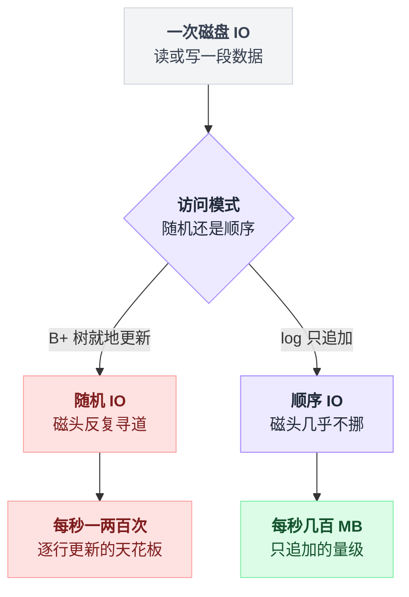
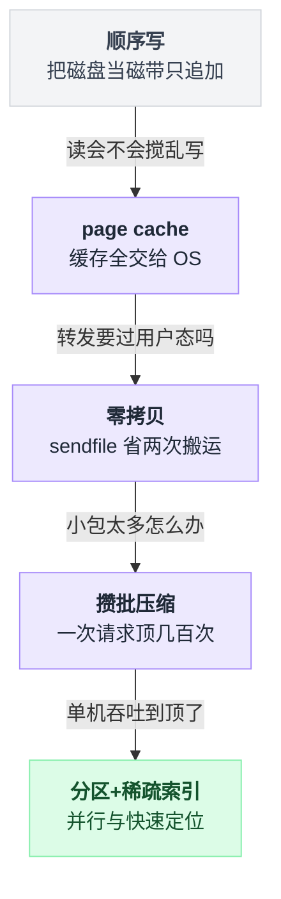
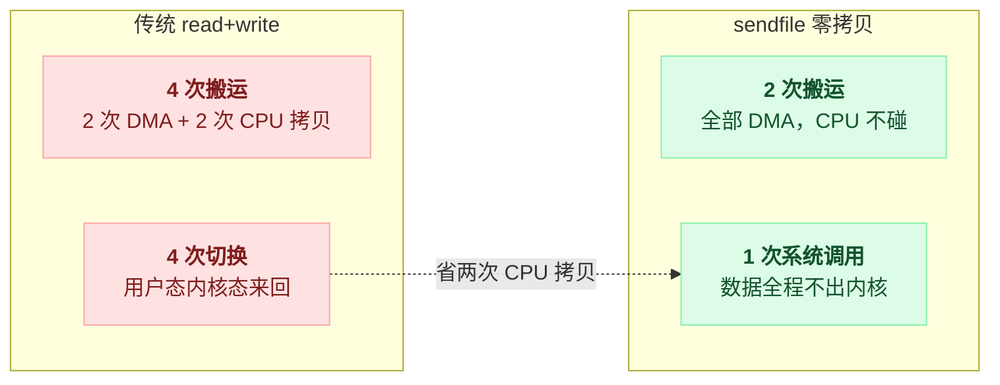
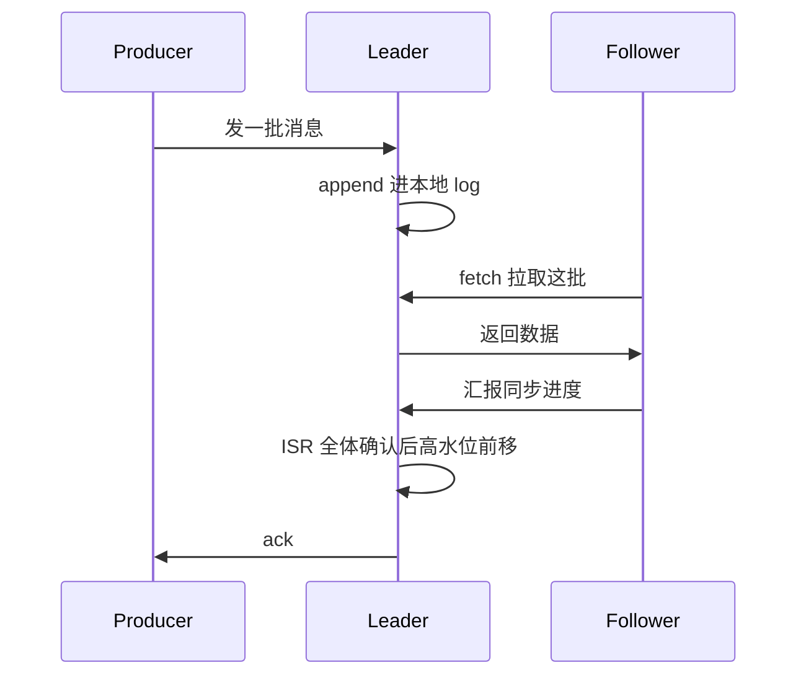
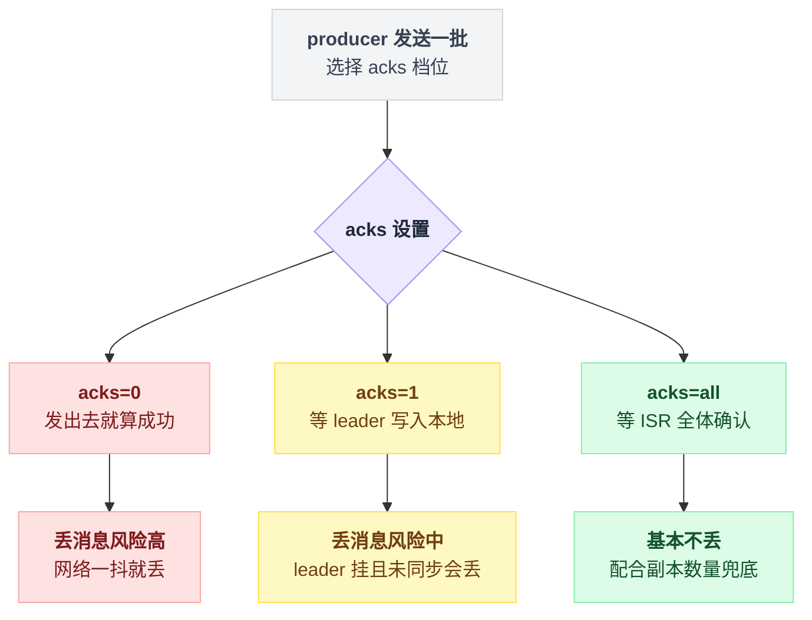
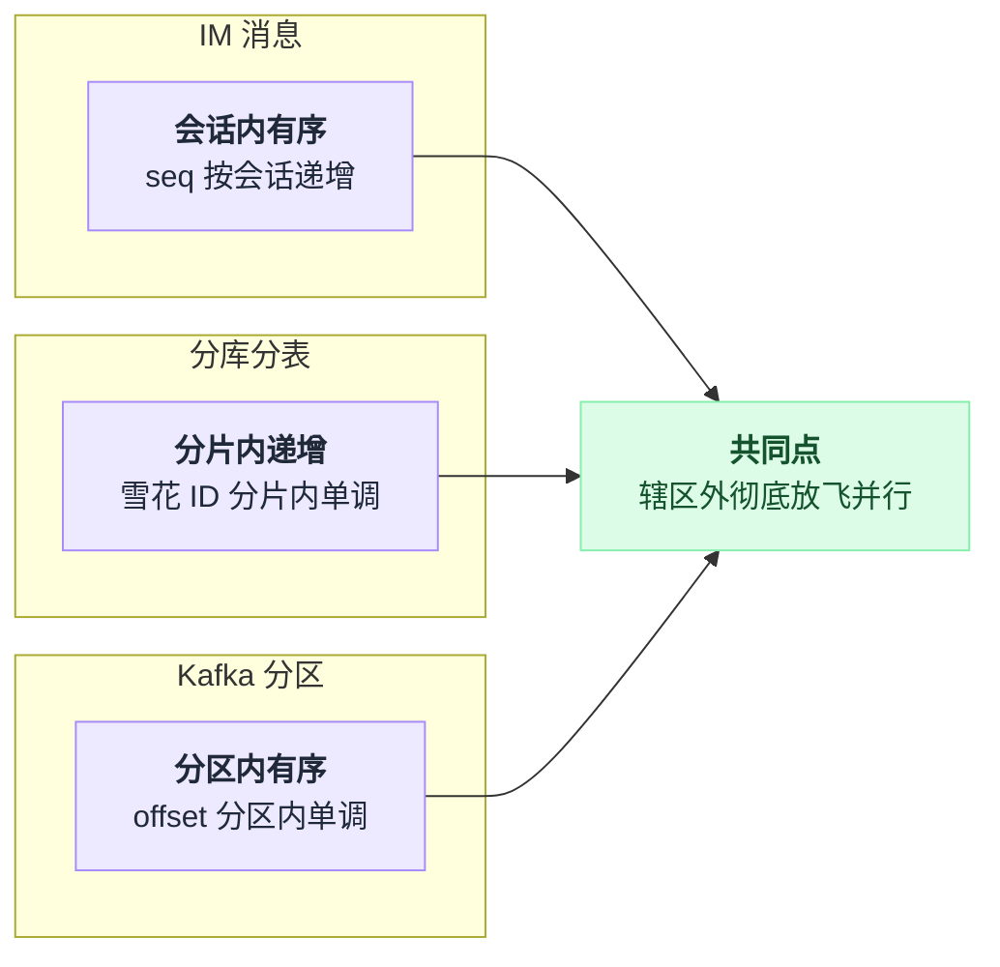

# 《Kafka 为什么快》一台普通机器每秒百万条消息，凭什么（小白版）

> 一句话结论：**Kafka 快，不是因为它绕开了磁盘，而是因为它顺着磁盘的脾气用磁盘——只追加、缓存全交给 OS、零拷贝、攒大批。更反直觉的是：这个以"不丢消息"立身的系统，默认写盘连 fsync 都不等，持久性押注在多副本上——和数据库"WAL 必须 fsync"是两种世界观。**
>
> 难度：★★★★☆。写作时间：2026-08-05。
> 事实纪律：性能数字只给量级并注明出处方向；未经一手核实的说法在文中已标注。

---

## 目录

- [1. 开场：同一台机器，差出两个数量级](#1-开场同一台机器差出两个数量级)
- [2. 磁盘的真相：慢的不是磁盘，是磁头跑来跑去](#2-磁盘的真相慢的不是磁盘是磁头跑来跑去)
- [3. 第一招：把磁盘当磁带——只追加的顺序写](#3-第一招把磁盘当磁带只追加的顺序写)
- [4. 第二招：不自己管缓存，全交给 OS page cache](#4-第二招不自己管缓存全交给-os-page-cache)
- [5. 第三招：零拷贝，省掉两次没意义的搬运](#5-第三招零拷贝省掉两次没意义的搬运)
- [6. 第四招：攒批与压缩，一次网络请求顶几百次](#6-第四招攒批与压缩一次网络请求顶几百次)
- [7. 第五招：分区并行与稀疏索引](#7-第五招分区并行与稀疏索引)
- [8. 可靠性怎么不拖慢速度：副本、ISR 与 acks](#8-可靠性怎么不拖慢速度副本isr-与-acks)
- [9. 反直觉主菜：Kafka 默认不 fsync](#9-反直觉主菜kafka-默认不-fsync)
- [10. 顺序保证只在分区内](#10-顺序保证只在分区内)
- [11. 两笔带过：消费组与 KRaft](#11-两笔带过消费组与-kraft)
- [12. 收尾：和撮合引擎是同一个味道](#12-收尾和撮合引擎是同一个味道)
- [13. 一句话总结](#13-一句话总结)
- [14. 小白词典](#14-小白词典)
- [15. 和前几篇的对照](#15-和前几篇的对照)

---

## 1. 开场：同一台机器，差出两个数量级

### 1.1 你接手了埋点系统

场景是这样的。你在一家电商公司管埋点：App 上每一次点击、每一次商品曝光、每一次加购，都要变成一条小事件发回服务端。平时每秒几万条，大促晚上冲到几十万条。

这些事件下游有四家等着用：实时大屏要、推荐系统要、风控要、数仓要。

你的第一反应大概率和当年所有人一样：建张表存起来呗。

```sql
CREATE TABLE events (
  id BIGINT PRIMARY KEY,
  user_id BIGINT,
  event_type VARCHAR(32),
  payload JSON,
  created_at DATETIME,
  KEY idx_user (user_id),
  KEY idx_time (created_at)
);
```

上线，压测。每秒几千条的时候数据库就开始喘：CPU 没满，磁盘灯狂闪，写入延迟从几毫秒涨到几百毫秒。

加机器？MySQL 的写只能落在主库上——这个坑[第 14 篇](./14-分库分表.md)第 2 节讲过：读写分离不解决写瓶颈。

而隔壁团队用 Kafka 扛同样的流量，单机就吞掉了。

### 1.2 差距有多大，先把数字钉死

两边都是普通机器，都往磁盘写数据：

| | 量级 | 出处 |
|---|---|---|
| 单机 MySQL，逐条提交的写入 | 每秒几千次 | 跟盘、配置、行大小强相关，量级说法，别拿去抬杠 |
| 三台 2014 年廉价机器 + 100 字节小消息 | 合计每秒 200 万条 | Jay Kreps 2014 年实测博客《Benchmarking Apache Kafka: 2 Million Writes Per Second (On Three Cheap Machines)》 |
| **单机、单 producer 线程、不开副本** | **接近每秒 80 万条** | 同上，这就是标题里"近百万条"的出处 |

同样写磁盘，差两个数量级。

注意，答案**不是**"Kafka 更牛"。MySQL 不是写得慢，是它在替你做一大堆 Kafka 根本不做的事：按主键去重、维护二级索引、保证任意一行随时能查能改、每次提交都保证断电不丢。这些事每一件都要付磁盘的钱。

**是它们对磁盘的用法完全不同。** 这篇要讲的就是这五个用法上的差别，一个一个来。

### 1.3 这问题为什么难，先让你能复述

把需求列出来，你会发现它们互相打架：

```
  ① 每秒几十万条持续写入      → 内存写得动，但内存小、断电就没
  ② 不能丢                    → 那就得落盘，可磁盘"慢"
  ③ 四家下游各自独立消费      → 同一份数据要被读四遍，读还不能拖累写
  ④ 下游挂了两小时，回来要补  → 历史数据得留着，还要能从任意位置重放
```

②和①打架，③④和"存内存里发完就删"的思路打架。

这层"中间存一层、下游各取各的"的角色，就是消息队列——[流量系列第 2 篇](../2026-08_流量扛不住了怎么办_六种真实做法/02-第三方webhook回调-立即ACK与有界队列.md)里"立即 ACK + 有界队列"的那个队列，放大一万倍就是今天的主角。

矛盾的焦点在②：**磁盘到底慢不慢？** 下一节把这件事拆穿。

---

## 2. 磁盘的真相：慢的不是磁盘，是磁头跑来跑去

### 2.1 仓库里的两个管理员

想象一个仓库，收货速度决定生死。两个管理员，两种干法：

```
   管理员 A（数据库的干法）                管理员 B（Kafka 的干法）
   ─────────────────────────            ─────────────────────────
   每收到一件货：                        每收到一件货：
     1. 翻目录：该放 7 排 3 架 2 层        1. 扔到传送带末尾
     2. 跑过去（这一趟最花时间）           完事。
     3. 格子满了？把一半货腾去新格子
        （目录也得跟着改）
     4. 回来更新目录卡片
```

管理员 A 一天的时间大部分花在**跑路**上，真正"放货"只占零头。管理员 B 站着不动，货来了往传送带上一放。

机械硬盘就是这个仓库。盘片在转，磁头在盘片上方移动。读写数据本身很快，**慢的是把磁头挪到正确位置**——一次寻道要几毫秒到十几毫秒的量级。

每秒就一千毫秒，一次寻道吃掉几毫秒，随机读写的上限一算就出来了：每秒一两百次。这就是管理员 A 的天花板。

### 2.2 顺序和随机差几个数量级

Kafka 官方设计文档（Design → Persistence 一节）举过一组例子：六块 7200 转 SATA 机械盘组的阵列，**顺序写每秒几百 MB，随机写每秒只有约 100KB 的量级——差了三个数量级以上**。

同一节还引用了 ACM Queue 2009 年的文章《The Pathologies of Big Data》（Adam Jacobs），里面有个更扎眼的说法：某些场景下，**顺序读磁盘比随机读内存还快**（该文的实测结论，方向可信，具体倍数别背）。

SSD 没有磁头，差距缩小，但没消失——小块随机写有写放大和 GC 的账要算，顺序写依然占优，量级差还在（此处不给精确数）。

一句话钉死：

> **磁盘不是慢，磁盘是"随机访问慢、顺序访问快"。** 说磁盘慢，就像说管理员 A 手脚慢——他手脚不慢，他是跑得太多。

同一个写请求，岔路走哪条，结果差着两个数量级：



### 2.3 回头看 MySQL 为什么撑不住

现在能解释 1.1 的压测了。InnoDB 用 B+ 树存数据，B+ 树的世界观是：

- **就地更新**：每条数据有固定的"家"（哪一页），写入要先找到那一页、改那一页——这就是"翻目录+跑过去"；
- **页分裂**：页写满了要分裂搬家，[第 12 篇 4.3 节](./12-小而美的五个算法.md)讲 UUID 主键为什么灾难，就是页分裂被随机 ID 触发到失控；
- **每次提交 fsync**：redo log / WAL 落盘成功才算提交——[PostgreSQL 系列第 1 篇](../2026-08_从真实项目学PostgreSQL/01-一条UPDATE背后发生了什么.md)整篇讲的就是这条链路，"COMMIT 的耐久性来自 WAL fsync"。

这套设计不是错的，它是为"任意一行随时查、随时改、改完必须立刻安全"服务的。

**但埋点事件根本不需要这些**：事件写进去就不改了，没人按主键查单条事件，下游都是从某个位置开始顺序往后读。

拿 B+ 树存只追加的事件流，等于雇了管理员 A 来管传送带的活——他的所有本事（目录、格子、跑位）在这个场景里全是纯开销。

那换个思路：这个场景需要的存储结构，天生就该长成传送带的样子。

把第 3 到第 7 节要讲的五招提前串成一条线，每一招解决上一招留下的缺口：



---

## 3. 第一招：把磁盘当磁带——只追加的顺序写

### 3.1 log 就是文件，字面意思

Kafka 的存储结构说出来会让人愣一下：**就是文件，往末尾追加的文件**。术语叫 log（日志），但别被这个词带偏——它不是"打日志"的 log，它是数据本身。

```
  一个分区 = 磁盘上的一个目录：

  orders-0/
  ├── 00000000000000000000.log       ← 消息本体，从 offset 0 开始
  ├── 00000000000000000000.index     ← 稀疏索引（第 7 节讲）
  ├── 00000000000000983421.log       ← 上一段写满后滚动出的新段
  ├── 00000000000000983421.index        （文件名 = 这一段第一条消息的 offset）
  └── ...

  规则只有三条：
    写 = 在最新那个 .log 文件（active segment）末尾 append
    读 = 从某个 offset 开始往后顺序读
    删 = 直接 rm 掉整个过期的 segment 文件
```

写入那条规则展开成伪代码，就这么点东西：

```
next_offset = 0

append(msg):
    if active_segment.size >= log.segment.bytes:      // 默认 1GB
        active_segment.close()                        // segment 滚动
        active_segment = new_file(name = next_offset) // 文件名 = 这段第一条的 offset
    active_segment.write_at_end(msg)                  // 永远写末尾，从不回头
    msg.offset = next_offset
    next_offset += 1                                  // 只增不减
```

每条消息进来，得到一个只增不减的编号 **offset**：0、1、2、3……写到哪算到哪。文件写满一个阈值（`log.segment.bytes`，默认 1GB）就"滚动"——关掉旧文件，开个新文件继续写。这叫 **segment 滚动**。

三条规则每一条都在讨好磁盘：

- **写永远是 append** → 磁头（或 SSD 的写入通道）永远不回头，纯顺序写，直接吃到 2.2 节那三个数量级；
- **改不存在** → 没有"找到那一页"，没有页分裂，没有 B+ 树要维护；
- **删除是删文件** → 过期数据按 segment 整个删（默认按保留时间，比如 7 天），`rm` 一个 1GB 文件是瞬间的事。

对比一下数据库 `DELETE FROM events WHERE created_at < ?` 删七天前的数据——逐行删、写 undo、索引跟着改，删得比写还累。

### 3.2 两种世界观，摆在一起看

| | B+ 树（MySQL/PG 的世界观） | append log（Kafka 的世界观） |
|---|---|---|
| 数据的"家" | 固定的页，按主键能找到 | 没有家，写到哪算哪，按 offset 定位 |
| 写入 | 找页 → 改页 → 可能分裂（随机 IO） | 追加到文件尾（顺序 IO） |
| 修改 | 支持，就地更新 | **不支持，没有这个概念** |
| 删除 | 逐行删，代价不低 | 整个 segment 文件一起删，近乎免费 |
| 单条查询 | 快，这是它的主业 | 不擅长，也不是它的活 |
| 为谁设计 | 随机读写的表 | 只追加、顺序消费的流 |

注意右边那列"不支持修改"——这不是缺陷，是**定价策略**。放弃随机改，才换来纯顺序写。

和[第 12 篇](./12-小而美的五个算法.md)那五笔"用可控的牺牲换数量级"的交易一模一样：左边是"我认了"，右边是数量级。

### 3.3 为什么这招还不够

写入这关算是过了。但 1.3 的需求清单里还有③：四家下游要读，读还不能拖累写。

麻烦在哪？写在文件尾，读可能在文件任何位置——落后两小时的数仓 consumer 在读两小时前的数据。**读请求会不会把磁头从文件尾拽走，把顺序写搅成随机跳？** 这就轮到第二招了。

---

## 4. 第二招：不自己管缓存，全交给 OS page cache

### 4.1 先补一个背景：你写文件时，OS 在中间垫了一层

调用 `write()` 往文件写数据，数据并没有直接到磁盘上——它先进了内核里的 **page cache**（页缓存），OS 攒一攒再批量刷盘。读文件同理：读过的页留在 page cache 里，下次再读直接从内存给。

这层缓存是 OS 免费送的，用的是机器上所有空闲内存。大多数程序无感知地享受它。

**Kafka 的选择是：把宝全押在这层上，自己一个字节的缓存都不管。**

### 4.2 写和读，各自怎么受益

**写**：broker 收到消息，append 进文件——实际是 append 进 page cache，**立刻返回**。刷盘的事 OS 后台慢慢干（这里埋个雷，第 9 节引爆）。所以写路径基本是内存速度。

**读**：分两种情况，都被照顾到了。

```
                    ┌────────────────────────────────┐
   实时 consumer     │            page cache          │
   （追着尾巴读）───▶│  最新写入的数据还热着，        │──▶ 内存速度返回
                    │  根本不碰磁盘                  │
                    └────────────────────────────────┘
   落后 consumer                    ▲
   （读两小时前的）──▶ 顺序读被内核识别 → 触发预读（readahead），
                      OS 提前把后面的页搬进 page cache，
                      consumer 到的时候数据已经在内存里等它
```

写成伪代码，这个分支只有两条路，而且两条都不亏：

```
consumer 拉 offset X:
    if X 那几页还在 page cache:
        直接从内存返回                   // 实时 consumer 的常态
    else:
        读磁盘（顺序读，内核认得出来）
        → readahead 提前把后面的页搬进 page cache
        → 下一次拉取又落回上面那条内存路径
```

实时消费（绝大多数流量）读的是刚写进去的数据，全程内存。

落后的消费是**顺序读**，内核的预读机制会提前把后面的数据搬进来——磁盘依然在做它最擅长的顺序大块读，不会退化成随机跳。3.3 节担心的"读搅乱写"基本不发生。

### 4.3 不自己管缓存的三个理由

这个选择乍看像偷懒，其实每一条都有账可算：

1. **JVM 堆里存数据太亏。** 对象头、指针、装箱，内存开销轻松翻倍；堆一大，GC 停顿跟着来。放 page cache 里就是紧凑的字节，一分不多占（Kafka 官方设计文档 Persistence 一节明说了这笔账）。
2. **进程重启，缓存还热。** 自管缓存活在进程里，重启即清零，重建要慢慢预热；page cache 活在内核里，**broker 进程重启后缓存原地没动**，起来就是热的。（当然，整机重启还是会凉。）
3. **不用再写一套缓存管理。** 置换策略、脏页管理、预读——OS 团队打磨了几十年的东西，白拿。

### 4.4 那数据库为什么反着走？

问题来了：既然 page cache 这么香，为什么 MySQL/PG 都自己管一套 buffer pool，InnoDB 甚至用 O_DIRECT 绕开 page cache？

因为数据库**需要控制权**：

| 数据库要的控制权 | page cache 给不了 |
|---|---|
| WAL 规则：日志必须先于数据页落盘 | OS 刷盘顺序不归你管 |
| 按事务语义决定谁留在缓存、谁被挤出 | OS 只认冷热，不认事务 |
| 缓存的页上挂着锁、LSN 这些管理信息 | page cache 只存裸字节 |

说白了：**数据库缓存的是"带管理信息的页"，Kafka 缓存的是"裸字节流"。** 前者必须自己管，后者犯不着。两条路线没有谁对谁错，是各自的数据模型决定的。

顺手串一下：[第 14 篇](./14-分库分表.md)整篇的判据就是"buffer pool 装不装得下"——数据库把命押在自管缓存上；Kafka 把命押在 OS 缓存上。同一台机器的同一块内存，两种托付方式。

### 4.5 为什么这招还不够

数据躺在 page cache 里了，consumer 来拉，broker 把数据发出去——这一步看起来平平无奇，实际上藏着一笔被浪费的搬运费。

---

## 5. 第三招：零拷贝，省掉两次没意义的搬运

### 5.1 传统路径：数据被搬了四次

一个普通服务端程序把文件内容发给网络对端，标准写法是 `read()` 再 `write()`。看看数据实际走的路：

```
  传统 read() + write()：

        ①DMA                ②CPU 拷贝              ③CPU 拷贝            ④DMA
  磁盘 ──────▶ page cache ──────────▶ 应用缓冲区 ──────────▶ socket 缓冲区 ──────▶ 网卡
                (内核态)    read()      (用户态)    write()     (内核态)
                          ↑ 陷入内核、             ↑ 再陷入内核、
                            返回用户态               再返回用户态

  账单：数据被搬 4 次（其中 2 次是 CPU 亲自搬）
        2 次系统调用，每次进出内核各一趟，合计 4 次用户态/内核态切换
```

盯着②和③看：数据从内核缓冲区搬到应用手里，应用**看都没看一眼**，原样又搬回内核的另一个缓冲区。

这两次 CPU 拷贝纯属过路费——broker 转发消息时不需要理解消息内容，凭什么要把字节在用户态过一道手？

### 5.2 sendfile：让数据根本不进用户态

Linux 提供了 `sendfile` 系统调用（Java 里对应 `FileChannel.transferTo`，Kafka 用的就是它）：告诉内核"把这个文件的这一段直接发到那个 socket"，数据全程不出内核：

```
  sendfile（配合网卡的 scatter-gather DMA）：

        ①DMA                    ②DMA（直接从 page cache 收集数据发出）
  磁盘 ──────▶ page cache ────────────────────────────────────▶ 网卡

  账单：数据被搬 2 次，全是 DMA 硬件干的，CPU 一次都不搬
        1 次系统调用
```

这就是**零拷贝**——"零"指的是 CPU 拷贝次数为零。省下的不只是搬运本身，还有 CPU 缓存被无意义数据刷脏的隐性成本。

注意这招和第二招是连体的：**正因为数据本来就躺在 page cache 里（第 4 节），sendfile 才有东西可发。** 一条热门消息被四家下游各拉一遍，就是 page cache 里的同一份数据被 sendfile 发四次，broker 的用户态代码全程没碰过这些字节。

Kafka 用它的地方是"broker → consumer"和"broker → follower 副本"这两条读路径；producer 写进来的路径用不了（写入总得过 broker 的手做校验和记账）。

**开了 SSL/TLS，零拷贝就没了。** 加密必须在用户态做（Kafka 官方文档明确说了不支持内核态的 SSL_sendfile），数据只好老老实实走 5.1 的四次搬运再加一道加解密。安全和这部分性能，二选一，这是明码标价的交易。（内核 kTLS 理论上能救回来，但 Kafka 默认不用——此句为文档与社区讨论方向，未一手核实。）

两条路径并排摆一起，差距更扎眼：



### 5.3 为什么这招还不够

单条消息的搬运成本压到底了。但还有个更呆的浪费：如果每条 100 字节的消息都单独发一次网络请求，光是网络往返和系统调用的固定开销就把你吃干净了。一辆卡车一次运一个包裹，车再快也没用。

---

## 6. 第四招：攒批与压缩，一次网络请求顶几百次

### 6.1 producer 端：先攒后发

producer 不是来一条发一条。每条消息先进本地一个按分区分格的缓冲区（RecordAccumulator），凑成批再发：

```
  producer 进程内：

   send(msg) ──▶ ┌──────────────────────────────┐
                 │ 分区 0 的批：[m1][m4][m7]…   │   两个闸门，先到先触发：
   send(msg) ──▶ │ 分区 1 的批：[m2][m5]…       │   · batch.size  攒够了（默认 16KB）
                 │ 分区 2 的批：[m3][m6]…       │   · linger.ms   等够了（默认 0）
                 └──────────────┬───────────────┘
                                │ 整批压缩成一坨
                                ▼
                     一次网络请求发给 broker
```

两个闸门谁先响谁说了算，写成伪代码是这样：

```
send(msg):
    batch = accumulator[分区(msg)]        // 每个分区一格
    batch.add(msg)
    if batch.bytes >= batch.size:         // 闸门一：攒够了
        压缩整批 → 一次网络请求发出

后台不停地看:
    if now - batch.开始时间 >= linger.ms:  // 闸门二：等够了
        压缩整批 → 一次网络请求发出
```

两个参数的直觉：

| 参数 | 默认值 | 含义 |
|---|---|---|
| `batch.size` | 16KB | 一批最多攒多少字节，攒满就发 |
| `linger.ms` | 0 | 最多等多久，0 = "有得发就发" |

`linger.ms` 这里有个容易读错的地方：**默认 0 不等于不攒批**——只要发送跟不上生产，缓冲区里自然就堆出批来。生产上常把它调成 5~20 毫秒：故意多等几毫秒，换更肥的批。

这笔交易的名字你已经很熟了：**用延迟换吞吐。**

[第 6 篇弹幕](./06-直播弹幕与广播.md)第 6 节的"合并推送"——攒一秒钟打包推一次，把两千台机器的活干成两台——**是同一招**。那边攒的是推送，这边攒的是消息，方向都是"把 N 次固定开销合并成 1 次"。

[PG 系列第 1 篇](../2026-08_从真实项目学PostgreSQL/01-一条UPDATE背后发生了什么.md)里"1000 条包进一个事务，快几十倍"也是它——省的是 fsync 的固定开销。这一招在本系列出现第三次了，以后见到"每个 X 都有固定开销"，条件反射应该是"能不能攒"。

### 6.2 压缩：整批压，效果才出得来

攒批还解锁了第二个增益：**整批压缩**。一百条埋点 JSON 长得几乎一样（字段名全相同，值大同小异），把它们放一起压，重复的部分互相抵消，压缩率比一条一条压高得多。

更妙的是这坨压缩数据的旅程：

```
  producer：100 条消息 → 整批压缩成一坨
  broker  ：整坨原样 append 进 log（默认 compression.type=producer，不解压不重压）
  consumer：整坨拉走，自己解压

  → 压缩和解压的 CPU 成本被推到两端（producer/consumer，机器多、闲）
    broker 中间几乎只是搬字节（机器少、忙）——还记得第 5 节吗，
    连"搬"都是 sendfile 替它干的
```

到这里得说破一层：**批（record batch）不只是网络优化，它就是 Kafka 的存储格式本身。** 落盘的是批，page cache 里躺的是批，sendfile 发出去的还是这个批。

一坨数据从 producer 出发到 consumer 落地，中途没被拆开重组过。前面四招在这里咬合成一台机器。

### 6.3 为什么这招还不够

单个分区的写入再顺、批再肥，终究是一台 broker 上的一个文件序列，有单机上限。

另外还欠着一笔账：4.2 节说落后的 consumer 要"从两小时前的 offset 开始读"——在一堆 1GB 的文件里，怎么快速找到 offset 31337 在哪个文件的哪个字节？

---

## 7. 第五招：分区并行与稀疏索引

### 7.1 分区：Kafka 版的分库分表

一个 topic 切成 N 个分区，摊到多台 broker 上：

```
  topic: events（12 个分区，3 台 broker）

  broker-1： events-0  events-3  events-6  events-9
  broker-2： events-1  events-4  events-7  events-10
  broker-3： events-2  events-5  events-8  events-11

  producer 按 key 路由：hash(user_id) % 12 → 固定落到某个分区
  没有 key 就轮询摊匀
```

这就是[第 14 篇分库分表](./14-分库分表.md)的形状：分片键（消息 key）决定路由，写入压力被摊到 N 个"传送带"上，每条传送带内部依然是纯顺序写。写吞吐随分区数横向扩，消费也一样——每个分区可以由不同的 consumer 并行拉。

（分区数也不是越多越好：每个分区是一组文件句柄、一份元数据、一段独立的顺序写。几千个分区落在同一块盘上，"很多个顺序写"叠加起来在磁盘看来就开始像随机写了。这个坑记住有这回事就行。）

### 7.2 稀疏索引：二分 + 小段顺序扫

现在补 6.3 欠的账。consumer 说"我要从 offset 31337 开始读"，broker 怎么定位？

segment 文件名就是起始 offset，先按文件名二分，锁定是哪个 segment——这步不用索引。

段内呢？靠 `.index` 文件，而它**稀疏**得理直气壮：不是每条消息一个条目，是**每写约 4KB 日志才补一条**（`log.index.interval.bytes`，默认 4096）：

```
  .index（稀疏，只有"路标"）          .log（消息本体）
  ┌─────────────────────┐           ┌──────────────────────────┐
  │ offset  →  物理位置  │           │ offset 31290 的消息       │◀─ 从这儿
  │ 30100   →       0   │           │ offset 31291 的消息       │   开始
  │ 30690   →    4132   │           │   ...（顺序扫）           │   顺序扫
  │ 31290   →    8210   │──────────▶│ offset 31337 的消息  ✓   │
  │ 31880   →   12360   │           │                          │
  └─────────────────────┘           └──────────────────────────┘

  找 offset 31337：
    ① 在 .index 里二分 → 最后一条 ≤ 31337 的路标是 (31290, 8210)
    ② 从物理位置 8210 顺序扫，最多扫 ~4KB 就撞到 31337
```

为什么稀疏就够？三个原因环环相扣：

1. **log 本身有序**——offset 单调递增，二分才成立；
2. **顺序扫 4KB 近乎免费**——这正是本文第一招买来的能力，磁盘顺序读的地盘；
3. **索引因此小到可以整个躺在内存里**——1GB 的 segment 只需要约 26 万分之一大小的索引条目数（1GB / 4KB 个路标），二分全程无磁盘 IO。

对比 B+ 树：每行一个索引条目，精确定位到行，但索引本身大到要分层、要维护、要跟着写放大。稀疏索引用"最后 4KB 靠扫"换掉了这一切——**又是拿一点不精确换数量级**，[第 12 篇](./12-小而美的五个算法.md)的老配方。

### 7.3 动手：40 行代码写个"迷你分区"

原理讲完，亲手摸一下。下面是纯标准库的 append log + 稀疏索引，存成 `mini_partition.py` 直接跑：

```python
# mini_partition.py —— 一个 40 行的"迷你 Kafka 分区"：append log + 稀疏索引
import bisect

class MiniPartition:
    INDEX_INTERVAL = 4096            # 每写满约 4KB 补一条索引，学 Kafka 的默认值

    def __init__(self, path):
        self.f = open(path, "wb+")
        self.next_offset = 0
        self.index = [(0, 0)]        # (offset, 文件物理位置)，稀疏
        self.bytes_since_index = 0

    def append(self, payload: bytes):
        pos = self.f.seek(0, 2)      # 永远回到文件末尾——只 append，不回头改
        if self.bytes_since_index >= self.INDEX_INTERVAL:
            self.index.append((self.next_offset, pos))
            self.bytes_since_index = 0
        record = len(payload).to_bytes(4, "big") + payload
        self.f.write(record)
        self.bytes_since_index += len(record)
        self.next_offset += 1

    def read(self, target: int) -> bytes:
        # ① 稀疏索引里二分：找最后一条 offset <= target 的路标
        i = bisect.bisect_right(self.index, (target, float("inf"))) - 1
        base_offset, pos = self.index[i]
        # ② 从那个物理位置顺序扫，最多扫 INDEX_INTERVAL 字节的量级
        self.f.seek(pos)
        for off in range(base_offset, target + 1):
            size = int.from_bytes(self.f.read(4), "big")
            payload = self.f.read(size)
        return payload

if __name__ == "__main__":
    p = MiniPartition("mini_partition.log")
    for i in range(50_000):
        p.append(f"event-{i}|user_{i % 997}|click".encode())
    print("总消息数    :", p.next_offset)
    print("稀疏索引条数:", len(p.index))
    print("读 offset 31337 ->", p.read(31337).decode())
```

写这篇时的真实运行输出：

```
总消息数    : 50000
稀疏索引条数: 361
读 offset 31337 -> event-31337|user_430|click
```

5 万条消息，索引只有 **361 条**——不到消息数的 1%。任意 offset 的读取 = 361 条里二分 + 顺扫几十条。

把 `INDEX_INTERVAL` 改成 1（每条都索引）再跑一遍，你会看到索引膨胀到 5 万条，而读取没变快——这就是"稀疏就够"的手感。

### 7.4 为什么还没完

五招凑齐，快的问题解决了。但你心里应该一直悬着一件事：写进 page cache 就返回（4.2 节埋的雷）、机器还可能整台挂掉——**这么快，是不是拿"会丢消息"换的？** 接下来两节正面回答。

---

## 8. 可靠性怎么不拖慢速度：副本、ISR 与 acks

### 8.1 副本机制：follower 也是个 consumer

每个分区可以有多个副本，一个当 leader，其余当 follower。所有读写都走 leader，follower 只干一件事：**像普通 consumer 一样从 leader 拉数据，append 进自己的 log**。

```
  producer ──① 发一批──▶ leader（events-0 的主副本）
                           │  ② append 进本地 log（进的是 page cache）
                           │
           follower A ──③ fetch 拉走这批，append，汇报进度──┤
           follower B ──③ 同上─────────────────────────────┤
                           │
                           ④ ISR 里所有副本都确认后，这批消息"转正"
                           │   （高水位前移，consumer 从此可见）
  producer ◀─⑤ ack────────┘
```

把这五步摆成时序，谁等谁看得更清楚：



follower 那侧其实就是个死循环，写成伪代码只有四行：

```
follower 循环:
    fetch(leader, 我的下一个 offset)        // 走的就是 consumer 那条快车道
    append 进自己的 log
    向 leader 汇报进度
    if 落后超过 replica.lag.time.max.ms:
        被踢出 ISR（追上了再回来）
```

注意③：副本同步复用的还是那套"顺序读 + page cache + 零拷贝"的路径——leader 发给 follower 和发给 consumer 走的是同一条快车道。

**可靠性机制没有另起炉灶，它搭了性能机制的便车。** 这是"可靠但不拖慢"的第一层原因。

**ISR**（In-Sync Replicas）是"跟得上的副本"名单。follower 落后太久（超过 `replica.lag.time.max.ms` 的阈值）就被踢出名单，追上了再回来。它的用处：leader 等确认时**只等名单里的**，不被一台病秧子 follower 拖死全队。

### 8.2 acks：三档，三笔交易

producer 可以选等到什么程度才算发送成功：

| 档位 | 等什么 | 快慢 | 丢消息的窗口 | 适合 |
|---|---|---|---|---|
| `acks=0` | 什么都不等，发出去就算成 | 最快 | 网络一抖就丢，broker 挂了也丢 | 丢了无所谓的指标、采样 |
| `acks=1` | leader 写进自己 log 就确认 | 快 | leader 刚确认就挂、follower 还没拉走 → 丢 | 大多数日志埋点 |
| `acks=all` | ISR 全体写入才确认 | 慢一截（延迟） | 配合 `min.insync.replicas=2`：一台机器炸了也不丢 | 订单、支付、账务事件 |

leader 那侧的分支写成伪代码，三档的差别就是"什么时候 ack"这一行：

```
leader 收到一批:
    append 进本地 log                    // 进的是 page cache
    if acks == 0:   producer 早就不等了，压根没这一步
    if acks == 1:   立刻 ack
    if acks == all: 等 ISR 里每个 follower 都 fetch 走并汇报进度
                    ISR 全齐 → 高水位前移（consumer 可见）→ ack
```

三档摆成一条分岔，丢消息的风险随等待程度递减：



两个要点：

- `acks=all` 必须搭配 `min.insync.replicas`（ISR 至少几人才允许写）。不然 ISR 缩到只剩 leader 自己时，"全体确认"就退化成 `acks=1`，白等了。
- `acks=all` 伤的主要是**延迟**（一条消息要多等一轮副本同步），对**吞吐**的伤害没直觉中大——批照攒、多批照样流水线似地在途。每秒百万条和"每条等副本确认"并不矛盾，因为等的从来不是"每条"，是"每批"。

到这里，"机器挂了怎么办"有了答案：靠副本。

但"断电时 page cache 里没刷盘的数据怎么办"还没答——因为 Kafka 对这个问题的回答，值得单开一节。

---

## 9. 反直觉主菜：Kafka 默认不 fsync

### 9.1 先把两种世界观摆出来

[PG 系列第 1 篇](../2026-08_从真实项目学PostgreSQL/01-一条UPDATE背后发生了什么.md)讲得很清楚：数据库的铁律是 **COMMIT = WAL fsync 成功**。fsync 是应用对 OS 说"现在、立刻、把这数据真写到盘上，写完才准回来"。断电安全靠的就是它。

Kafka 呢？**默认对每条（甚至每批）消息都不 fsync。** append 进 page cache 就算写入成功，什么时候真正落盘，OS 自己看着办。

刷盘相关的配置（`log.flush.interval.messages` / `log.flush.interval.ms`）默认值等于"应用层刷盘完全关闭"——而且**官方文档明确推荐就这么用**，原话方向是"我们认为副本提供的保证比单机 fsync 更强"（出处方向：Kafka 官方设计文档 Persistence/刷盘策略一节，以及 broker 配置项说明）。

```
  数据库的世界观：                     Kafka 的世界观：
  ┌──────────────────────┐          ┌──────────────────────────────┐
  │ 耐久性 = 这台机器      │          │ 耐久性 = 这批机器             │
  │ 断电也不丢            │          │ 不同时全灭就不丢              │
  │                      │          │                              │
  │ 手段：每次提交 fsync  │          │ 手段：消息同时活在 3 台机器的 │
  │ 代价：每次提交都付    │          │ 内存/磁盘里（acks=all + 副本）│
  │       一次磁盘同步的钱│          │ 代价：接受"单机断电丢 page   │
  │                      │          │       cache"这个事实          │
  └──────────────────────┘          └──────────────────────────────┘
```

一台 broker 突然断电，page cache 里没刷盘的那点数据确实没了——**但同一批消息还躺在另外两台副本上**。机器重启后从 leader 把缺的补回来就是。单机的耐久性被主动放弃，换来的是写路径上一次 fsync 都不用等。

这就是本文最反直觉的一件事：**以"不丢消息"闻名的系统，把数据库视为底线的 fsync 给关了。** 它不是不要持久性，是把持久性从"这块磁盘"挪到了"这组机器"。

### 9.2 fsync 到底多贵，跑给你看

十行代码，标准库，存成 `fsync_demo.py` 跑：

```python
import os, time

def write_10k(path, fsync_each):
    with open(path, "wb") as f:
        t0 = time.perf_counter()
        for _ in range(10_000):
            f.write(b"x" * 100)
            if fsync_each:
                f.flush(); os.fsync(f.fileno())
        f.flush(); os.fsync(f.fileno())          # 收尾总要落一次盘
        return time.perf_counter() - t0

print("每条都 fsync :", round(write_10k("a.bin", True), 3), "秒")
print("最后才 fsync :", round(write_10k("b.bin", False), 3), "秒")
```

写这篇时在一台 Mac 笔记本（SSD）上的真实输出：

```
每条都 fsync : 0.276 秒
最后才 fsync : 0.005 秒
```

同样一万条、同样一百万字节，差了**五十多倍**。

你跑出来的绝对值肯定不同（macOS 的 fsync 还是"偷懒版"，没有强制刷到介质；Linux 上真刷盘的差距通常更狠——此句为系统文档方向，量级自己跑了才算数），但方向不会变：**逐条 fsync 是写路径上最贵的一件事，Kafka 把它整个删掉了。**

### 9.3 这个赌注的边界，说老实话

- **赌的是"副本不同时死"。** 整个机房断电，三个副本的 page cache 一起蒸发，没刷盘的数据真丢。所以生产上要把副本摆开：跨机架（rack awareness）、跨可用区。
- **真有极端场景**（单机房、又要单机断电不丢），刷盘配置可以打开，逐批 fsync——吞吐会掉一大截，等于退回数据库世界观。绝大多数部署不开。
- 工程里从来没有"绝对不丢"，只有"丢的概率 × 丢的代价，划不划算"。[第 10 篇支付与对账](./10-支付与对账.md)整篇讲的就是这件事的另一头：链路再可靠，终态还是要靠对账兜底。Kafka 把小概率留给跨机房灾难，把每一条消息的 fsync 钱省下来——这笔账它算得过来。

---

## 10. 顺序保证只在分区内

### 10.1 快的代价终于来了

前面九节全在讲 Kafka 得到了什么，这节讲它付出了什么。分区并行（第 7 节）不是免费的：

```
  topic: orders（3 个分区）

  partition-0 ： m1 ──▶ m4 ──▶ m7        ← 每条传送带内部：严格有序（offset 递增）
  partition-1 ： m2 ──▶ m5 ──▶ m8
  partition-2 ： m3 ──▶ m6 ──▶ m9

  问：m1~m9 整体按什么顺序被消费？
  答：没有任何保证。m8 完全可能比 m1 先被处理。
```

**全局无序，分区内有序。**

想要全局有序？只能单分区——并行清零，回到单机吞吐。Kafka 不打算为全局有序付钱，它把问题反过来踢给你：**你真的需要"全局"有序吗？**

绝大多数业务不需要。订单系统在乎的是"同一笔订单的创建、支付、发货按顺序处理"，两笔不相干的订单谁先谁后无所谓。

那就把 `order_id` 当消息 key——同 key 必然哈希进同一分区，分区内 offset 又严格递增，**同一笔订单的事件天然有序**。有序的范围从"全部"缩小到"一个 key"，并行就放开了。

### 10.2 这个形状你已经见过两次了

显式点破，这是本系列反复出现的同一个形状：

- [第 9 篇 IM](./09-IM消息可靠投递.md) 第 15 节：消息有序**只保证会话内**——seq 是会话级的，不是全局的；
- [第 14 篇分库分表](./14-分库分表.md)：雪花 ID 只保证**分片内**递增，跨分片不保证；
- 本篇：消息有序**只保证分区内**。

三个系统摆在一起看，是同一个形状：



三个系统，同一句话：**全局有序是并行的天敌，所以把"有序"的辖区缩到业务真正需要的最小单位——会话、分片、分区——辖区外彻底放飞。**

有序的圈画到哪，并行的天花板就开到哪。下次做系统设计，先问"有序的最小辖区是什么"，这个问题值钱。

---

## 11. 两笔带过：消费组与 KRaft

两个绕不开但不是本文主线的话题，各给一段。

**消费组与再均衡。** 同一个消费组内，一个分区同一时刻只分给一个 consumer——所以消费并行度的上限就是分区数，起 20 个 consumer 消费 12 个分区，有 8 个在坐板凳。

组内有人加入或退出，触发**再均衡（rebalance）**：全组重新分工。老协议是停下所有人重新分（消费短暂停摆），新一点的增量协议只挪动受影响的分区。你只需要记住：rebalance 有代价，consumer 别频繁上下线。

**KRaft，去 ZooKeeper。** 集群元数据（哪个分区的 leader 在哪台、ISR 名单是谁）早年存在 ZooKeeper 里，等于快递公司自己的调度台架在别人家。

KRaft 把元数据改存成 Kafka 自己的一个内部 log（又是 log！），用 Raft 变体在 controller 之间做共识——共识算法本身是[第 23 篇](./23-Raft共识.md)的主菜，这里不展开。Kafka 4.0 起 ZooKeeper 被彻底移除（官方发布公告方向）。

妙的是它连元数据都用"往 log 里追加"这一招，世界观统一到家了。

---

## 12. 收尾：和撮合引擎是同一个味道

回头看[第 7 篇股票撮合引擎](./07-股票撮合引擎.md)，那边的配方是：**单线程 + 全内存 + 顺序处理**，单线程反而做到每秒几百万笔——因为没有锁竞争、CPU 缓存一直命中、执行完全确定。

Kafka 的配方：**只追加 + page cache + 零拷贝 + 攒批**。

两个系统长得完全不一样，底层是同一句话：

```
  撮合引擎：CPU 最擅长什么？ 不被打断地顺序执行、数据在缓存里
            → 那就单线程、全内存、顺序来

  Kafka   ：磁盘最擅长什么？ 顺序读写；内核最擅长什么？管缓存、搬数据
            → 那就只追加、交给 page cache、sendfile、整批走
```

**极致性能从来不是"更努力地干活"，是"只干硬件顺手的活"。** 撮合引擎不碰锁，Kafka 不碰随机 IO，谁也没有靠玄学，都是把硬件说明书读透了然后顺着来。

反过来这也是 Kafka 的边界：它的所有假设都建立在"顺序写、顺序读、按 offset 消费"上。哪天你想拿它按 key 查历史消息、当数据库使，五招全部失效——那是 B+ 树的地盘。工具没有快慢，只有用对没用对场合。

---

## 13. 一句话总结

> **Kafka 的快是"顺从"出来的：顺从磁盘（只追加）、顺从内核（page cache + sendfile）、顺从网络（攒批压缩）、顺从并行（分区 + 只保证区内有序）；连可靠性都不逆着来——不跟 fsync 较劲，把耐久性从一块磁盘挪到一组机器上。它没有战胜硬件，它是彻底放弃了跟硬件对着干。**

---

## 14. 小白词典

| 词 | 一句人话 |
|---|---|
| log | 不是"打日志"，是数据本体：一个只许往末尾追加的文件 |
| offset | 消息在分区里的序号，0、1、2……只增不减，consumer 靠它记"我读到哪了" |
| segment | log 写满 1GB 就换个新文件继续写，每个文件叫一个 segment；过期数据整文件删 |
| partition（分区） | 一个 topic 切成的 N 条独立"传送带"，是并行、扩容、有序性的基本单位 |
| page cache | OS 免费送的文件缓存层，Kafka 不自建缓存、全靠它 |
| 零拷贝 | 文件数据直接从内核发到网卡，CPU 一次都不搬（sendfile）；开 SSL 就没了 |
| batch | producer 攒的一坨消息，整坨压缩、整坨落盘、整坨发给 consumer，中途不拆 |
| ISR | "跟得上进度的副本"名单，leader 等确认只等名单里的 |
| acks | producer 的安心程度选项：0 不等、1 等 leader、all 等 ISR 全体 |
| rebalance | 消费组内有人来/走时的全组重新分工，有代价，别频繁触发 |

---

## 15. 和前几篇的对照

| 篇目 | 关联 |
|---|---|
| [第 6 篇 直播弹幕](./06-直播弹幕与广播.md) | producer 攒批 = 弹幕"合并推送"，同一招：把 N 次固定开销合并成 1 次，用几毫秒延迟换数量级吞吐 |
| [第 7 篇 撮合引擎](./07-股票撮合引擎.md) | "单线程+顺序+全内存"与"只追加+page cache+零拷贝"同味道：极致性能 = 只让硬件干它最擅长的事 |
| [第 9 篇 IM 可靠投递](./09-IM消息可靠投递.md) + [第 14 篇 分库分表](./14-分库分表.md) | 会话内有序 / 分片内递增 / 分区内有序——同一个形状：把"有序"的辖区缩到最小，辖区外换并行 |
| [PG 系列第 1 篇](../2026-08_从真实项目学PostgreSQL/01-一条UPDATE背后发生了什么.md) | 正好相反的两极：数据库"COMMIT 必须 fsync WAL"（单机耐久），Kafka 默认不 fsync（押注多副本）；B+ 树就地更新 vs log 只追加，是两种存储世界观的根 |
| [第 23 篇 Raft 共识](./23-Raft共识.md) | KRaft 用 Raft 变体管集群元数据，Kafka 4.0 起 ZooKeeper 退场；共识算法本体在那篇展开 |

### 主要来源

- Kafka 官方文档 Design 章节（Persistence / Efficiency / Replication 各节）——顺序写与随机写的量级对比、page cache 路线、sendfile、"副本强于单机 fsync"的立场均出自此处
- Jay Kreps: *Benchmarking Apache Kafka: 2 Million Writes Per Second (On Three Cheap Machines)*, LinkedIn Engineering, 2014（开场吞吐量级的出处）
- Jay Kreps: *The Log: What every software engineer should know about real-time data's unifying abstraction*, 2013（"log 是数据本体"这套世界观的源头文章）
- Adam Jacobs: *The Pathologies of Big Data*, ACM Queue, 2009（"顺序磁盘可比随机内存快"的出处，经 Kafka 设计文档引用）
- IBM developerWorks: *Efficient data transfer through zero copy*（4 次拷贝/上下文切换的经典拆解）
- KIP-500 及 Kafka 4.0 发布公告（KRaft 与 ZooKeeper 移除，官方方向）
- 文中两段 Python 实验（mini_partition.py / fsync_demo.py）为写作当日在本机真实运行，输出原样粘贴
