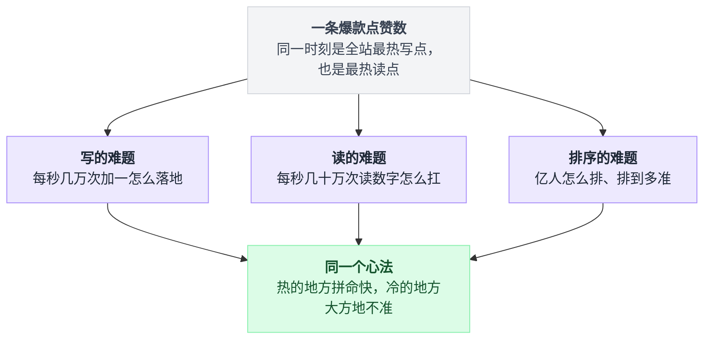
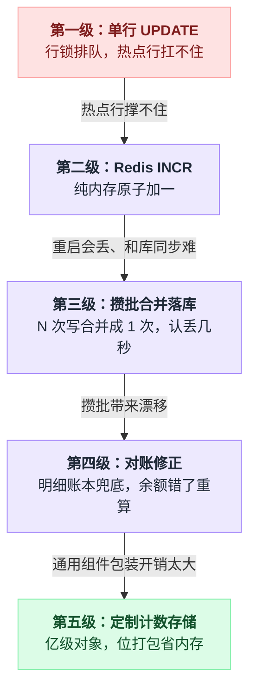
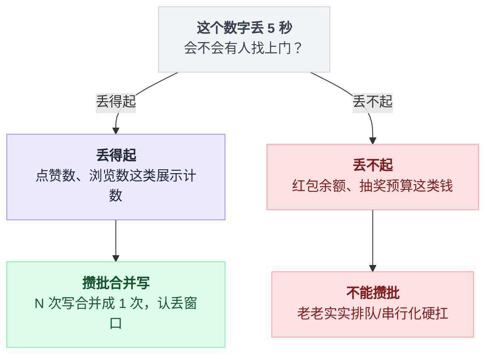
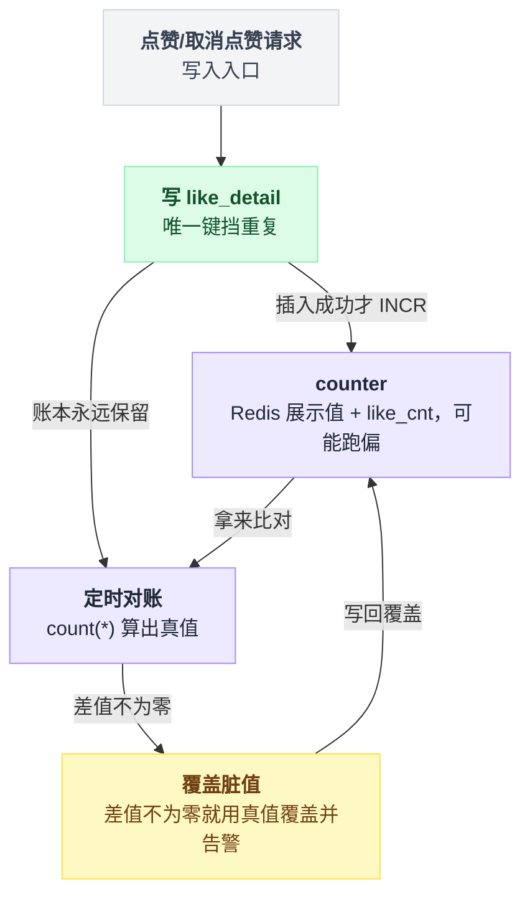
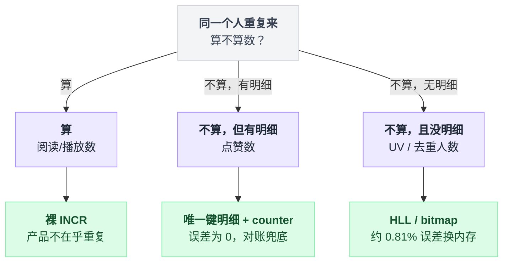
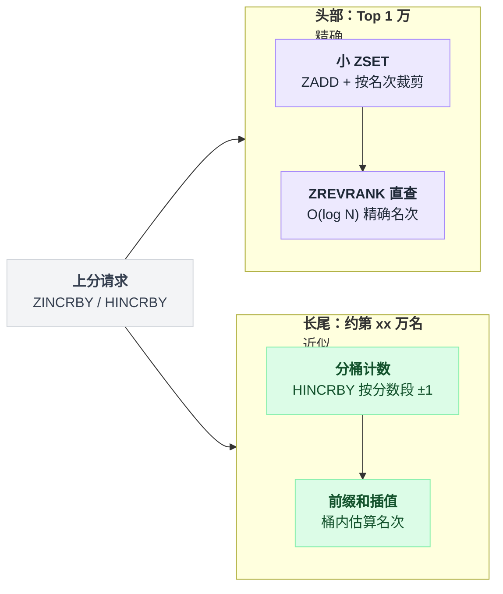
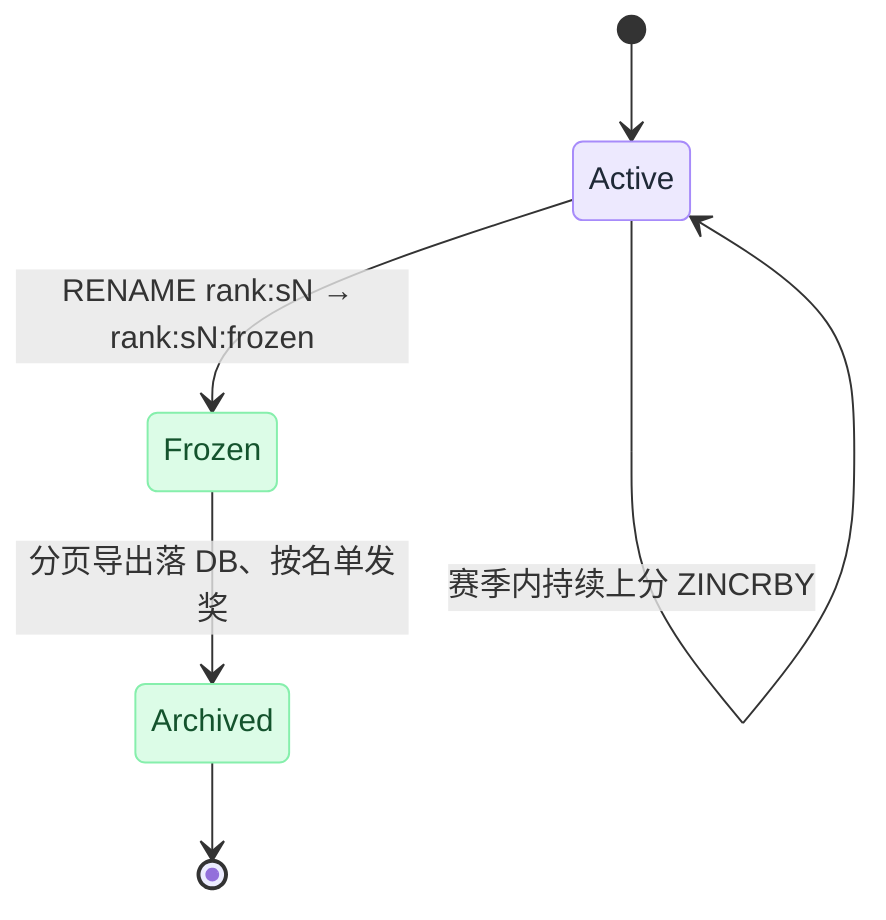

# 《排行榜与计数系统》转评赞的数字比正文还难伺候（小白版）

> 一句话结论：**点赞数难的不是"加一"，是这枚数字同时是全站最热的写点和最热的读点；排行榜难的不是"排序"，是绝大多数名次根本没人看。两边的正解是同一句话：热的地方拼命快，冷的地方大方地不准——"10万+"不是技术偷懒，是产品和技术的合谋。**
> 难度：★★★☆☆
> 写作时间：2026-08-05。文中性能数字只给量级并注明出处方向；未经一手核实的说法（如微博计数器内部实现）在文中已标注。

---

## 目录

- [0. 开场：一条爆款微博的一天](#0-开场一条爆款微博的一天)
- [1. 计数阶梯：五级台阶，一级比一级贵](#1-计数阶梯五级台阶一级比一级贵)
  - [1.1 第一级：一条 UPDATE，然后锁死](#11-第一级一条-update然后锁死)
  - [1.2 岔路口：为什么不每次 count(*)](#12-岔路口为什么不每次-count)
  - [1.3 第二级：Redis INCR，原子加一的快手](#13-第二级redis-incr原子加一的快手)
  - [1.4 第三级：攒批合并落库，丢失窗口明码标价](#14-第三级攒批合并落库丢失窗口明码标价)
  - [1.5 第四级：对账修正——counter 是缓存，明细才是账本](#15-第四级对账修正counter-是缓存明细才是账本)
  - [1.6 第五级：亿级对象的定制计数存储](#16-第五级亿级对象的定制计数存储)
- [2. 读比写更猛：一屏 80 个数字](#2-读比写更猛一屏-80-个数字)
  - [2.1 先算一笔读放大的账](#21-先算一笔读放大的账)
  - [2.2 MGET 批量与本地短 TTL 缓存](#22-mget-批量与本地短-ttl-缓存)
  - [2.3 产品和技术的合谋：数字的饱和显示](#23-产品和技术的合谋数字的饱和显示)
  - [2.4 计数和去重计数是两种病](#24-计数和去重计数是两种病)
- [3. 排行榜：从 ZSET 到约第 15 万名](#3-排行榜从-zset-到约第-15-万名)
  - [3.1 redis-cli 五分钟上手](#31-redis-cli-五分钟上手)
  - [3.2 skiplist 凭什么适合排名](#32-skiplist-凭什么适合排名)
  - [3.3 亿级用户全量排名的取舍](#33-亿级用户全量排名的取舍)
  - [3.4 同分并列：score 低位拼时间戳](#34-同分并列score-低位拼时间戳)
  - [3.5 赛季结算与榜单快照冻结](#35-赛季结算与榜单快照冻结)
- [4. 反直觉结论合集](#4-反直觉结论合集)
- [5. 一句话总结](#5-一句话总结)
- [6. 小白词典](#6-小白词典)
- [7. 和前几篇的对照](#7-和前几篇的对照)

---

## 0. 开场：一条爆款微博的一天

2026 年 8 月的一个晚上，某明星发了条官宣微博。5 分钟后，点赞数冲过 100 万。

先感受一下这条微博底下那四个小数字（转发、评论、点赞、浏览）的处境。量级设想一下：

```
        这条微博的正文                     这条微博的点赞数
   ┌──────────────────────┐          ┌──────────────────────┐
   │ 发布之后一个字不变    │          │ 每秒被写几万次        │
   │ 缓存到天荒地老都行    │          │ 每秒被读几十万次      │
   │ CDN 随便扛           │          │ 每一秒都是新的值      │
   └──────────────────────┘          └──────────────────────┘
        全站最好伺候                       全站最难伺候
```

正文是"写一次、读无限次、永不变"——缓存教科书里的理想客户。

而那个点赞数，**既是全站最热的写点，又是全站最热的读点，还每秒都在变**。标题说"数字比正文还难伺候"，就是这个意思。

小白的第一反应通常是：这有什么难的？数据库加个字段，点一次赞加一下：

```sql
UPDATE weibo_stat SET like_cnt = like_cnt + 1 WHERE weibo_id = 888;
```

这条 SQL 语法全对，逻辑全对，在测试环境跑得欢。上线碰到爆款的那一刻，数据库直接躺平。为什么？这就是第 1 节的起点。

先把本文的地图挂出来：

```
   第 1 节  写的难题 —— 每秒几万次"加一"怎么落地      （计数阶梯，五级）
   第 2 节  读的难题 —— 每秒几十万次"读数字"怎么扛    （比写更难，反直觉）
   第 3 节  排序的难题 —— 亿人排名，怎么排、排到多准   （排行榜）
```

三个难题共用一个心法，最后再收网——画成图就是这样收敛的：



---

## 1. 计数阶梯：五级台阶，一级比一级贵

五级台阶连起来是一条升级链，每一级都是被上一级的短板逼出来的：



读的时候可以有个预期：第三、四级是这一节的正题（攒批和对账，绝大多数系统最终停在这里），第一级是病历，第二级是常识，第五级是巨头的题、看个眼界就行。

### 1.1 第一级：一条 UPDATE，然后锁死

刚才那条 UPDATE 为什么会死？因为 InnoDB 的行锁。

同一行数据，同一时刻只允许一个事务改。888 这条爆款微博的所有点赞请求，全都冲着 `weibo_id = 888` 这**一行**来：

```
       每秒几万个请求，全部指向同一行

   请求1 ──┐
   请求2 ──┤  排队等同一把行锁          ┌───────────────────┐
   请求3 ──┤ ────────────────────────► │ weibo_id=888 这一行 │
    ...   ─┤    一次只能过一个          └───────────────────┘
   请求N ──┘
            ↑
        队伍越排越长：
        · 每个请求都要 加锁 → 改值 → 写日志刷盘 → 放锁
        · 等待的事务越多，死锁检测扫描越贵，CPU 白白烧掉
        · 连接池被排队请求占满 → 无辜的其他 SQL 也跟着卡死
```

单行热点更新能扛的吞吐，量级在每秒几百到几千（和硬件、刷盘配置有关）。每秒几万次点赞打过来，队伍只会越排越长，最后连接池耗尽，整个库拖死。

⚠️ 注意，这个病你见过。[第 1 篇 12306](./01-12306抢票.md) 抢票扣库存、[秒杀系统源码拆解系列](../2026-07_秒杀系统源码拆解/)里 `UPDATE stock SET num = num - 1` 打爆数据库，**和这里是同一个病：单行热点的行锁竞争**。

病一样，药方却不一样——库存一件都不能多卖，点赞数错个几百没人在乎。这个"能不能容忍错"的差别，决定了下面每一级台阶的走法。

### 1.2 岔路口：为什么不每次 count(*)

有人会绕个方向：干脆不存计数字段，要显示的时候现场数——

```sql
SELECT count(*) FROM like_detail WHERE weibo_id = 888;
```

这个念头值得认真掐死一次，因为它引出一个贯穿全文的概念：

```
   like_detail 明细表（谁、赞了哪条、什么时候）      ←  账本
   like_cnt 计数字段（一个数字）                    ←  余额
```

明细表是**账本**：一条点赞一行记录，事实的唯一来源。计数是**余额**：从账本推导出来的一个汇总数字。

现场 count(*) 的问题是：888 有 100 万条点赞明细，数一遍就是扫 100 万行索引。每秒几十万个读请求，每个都扫 100 万行？数据库连一秒都活不过。

所以余额必须**预先算好存起来**。但存起来的数字就有了自己的命：它可能和账本对不上（丢更新、重复加、程序 bug）。怎么办？记住这句话，1.5 节收账：

> **余额可以错，账本不能丢。余额错了，拿账本重算一遍就能修。**

### 1.3 第二级：Redis INCR，原子加一的快手

数据库扛不住写，第一个搬来的救兵是 Redis：

```
redis-cli> INCR likes:888
(integer) 1000001
```

为什么 Redis 的"加一"不怕热点？看它和 MySQL 干同一件事时各自的动作：

```
   MySQL 一次 +1：                     Redis 一次 INCR：
   ┌────────────────────────┐         ┌────────────────────────┐
   │ 1. 获取行锁（可能排队） │         │ 1. 内存里把整数 +1      │
   │ 2. 改 buffer pool 页    │         │    （就这一步）         │
   │ 3. 写 redo log          │         └────────────────────────┘
   │ 4. 事务提交、刷盘       │          单线程执行命令，天然没有
   │ 5. 释放行锁             │          并发抢锁，不需要锁
   └────────────────────────┘
      磁盘 + 锁，毫秒级              纯内存，微秒级
```

Redis 命令是单线程排队执行的，INCR 天生原子，没有"两个人同时读到 100 再各自写回 101"的丢更新问题。

单实例十万每秒量级的吞吐（量级方向：Redis 官方 redis-benchmark 文档），单 key 扛下一条爆款的写入没问题。

💡 这一招你也见过：[第 4 篇分布式限流器](./04-分布式限流器.md)的固定窗口计数，靠的就是同一条 INCR。限流器数的是"这一秒过了多少请求"，这里数的是"这条微博多少个赞"——**原子计数是同一把锤子**。

但 Redis 是内存，两个新问题立刻冒出来：

1. Redis 重启/宕机，数字丢了怎么办？（AOF everysec 也有一秒窗口）
2. 数据库里那份 like_cnt 怎么跟上？总不能每次 INCR 再同步 UPDATE 一次——那热点行的病等于没治。

### 1.4 第三级：攒批合并落库，丢失窗口明码标价

答案是：**别一笔一笔记，攒一批记一次。**

线下早就有这个智慧：小卖部老板不会每卖一包烟就跑一次银行，他把一天的现金攒在抽屉里，晚上一次存进去。抽屉里的钱有被偷的风险——他认了，因为一天跑两百次银行更亏。

线上版本长这样：

```
   用户点赞
      │
      ├──► INCR  likes:888          ← 展示值，立刻可读，用户马上看到 +1
      ├──► INCRBY buf:888 1         ← 增量缓冲，专门欠着数据库的账
      └──► SADD  dirty 888          ← 记一笔"888 脏了"

   后台 flusher，每 5 秒醒一次：
      loop:
        id    = SPOP dirty                    ← 取一个脏对象
        delta = GETDEL buf:{id}               ← 原子拿走增量并清零（Redis 6.2+）
        UPDATE weibo_stat
           SET like_cnt = like_cnt + {delta}
         WHERE weibo_id = {id};
                    ↑
        这 5 秒内的几万次点赞，合并成了一条 UPDATE
        热点行每 5 秒只被写一次 —— 行锁问题直接蒸发
```

另一个流行的等价形态是走消息队列：点赞事件进 Kafka，消费者按 weibo_id 聚合一个时间窗口，再落库。管道不同，思想一模一样：**把 N 次写合并成 1 次写**。

这笔交易的代价要说清楚，它是**明码标价**的：

```
   崩掉什么                丢掉什么
   ─────────────────────────────────────────────────
   flusher 挂了            不丢（增量还在 buf: 里，重启接着刷）
   Redis 宕机              丢最近 1 秒 AOF 窗口 + 还没刷出去的 buf 增量
   ─────────────────────────────────────────────────
   最坏损失 = 几秒钟的点赞增量。对点赞：完全无所谓。
```

⚠️ 这里有个坑，也是本节最重要的边界：**"能丢"是点赞的特权，不是所有计数的特权。**

[第 2 篇微信红包](./02-微信红包.md)的余额、[第 24 篇抽奖](./24-抽奖与营销预算控制.md)的营销预算，都是"计数"，但那是钱——丢一笔就是资损，攒批这招不能原样照搬。

动手前先问自己：这个数字丢 5 秒，会不会有人找上门？这句自问就是分岔点：



💡 顺带一提，"合并"这一招在系列里已经第三次出现了：[第 6 篇弹幕](./06-直播弹幕与广播.md)把 100 毫秒内的弹幕聚合成一个包再广播，是读的合并；这里是写的合并。方向相反，省的都是次数。

### 1.5 第四级：对账修正——counter 是缓存，明细才是账本

攒批方案跑起来之后，1.2 节埋的账要收了。

Redis 里的展示值、数据库里的 like_cnt、like_detail 明细表，三个地方各有一份"真相"，它们**一定会**慢慢对不上。原因很日常：

| 哪一步出了岔子 | 三份"真相"就此分家 |
|---|---|
| 点赞消息重试 | INCR 执行了两次 |
| 取消点赞 | DECR 成功了，明细却删失败 |
| 某次发版的 bug | 多加了一批 |
| Redis 宕机 | 丢了窗口内的增量 |

先把写入路径做对——幂等靠明细表的唯一键。整条路径就是"先记账本，记成功了才动数字"：

```
def 点赞(user, weibo):
    行数 = INSERT INTO like_detail (user_id, weibo_id)   # 唯一键 (user_id, weibo_id)
    if 行数 == 1:                  # 第一次赞，才算数
        INCR   likes:{weibo}       # 展示值
        INCRBY buf:{weibo} 1       # 欠数据库的增量
        SADD   dirty {weibo}
    # 行数 == 0：重复消息，被唯一键挡在门口，一个数字都不动

def 取消点赞(user, weibo):
    行数 = DELETE FROM like_detail WHERE (user_id, weibo_id)
    if 行数 == 1:                  # 真删掉了才 DECR，同理
        DECR likes:{weibo}
```

一句话点破：**唯一键才是幂等的执行者，`if 行数 == 1` 只是把它的判决转达给计数。**对应的真实写法是：

```sql
-- like_detail 上建唯一键 (user_id, weibo_id)
INSERT INTO like_detail (user_id, weibo_id) VALUES (10086, 888);
-- 插入成功（影响行数=1）才 INCR，重复消息在这里被唯一键挡下
-- 取消点赞：DELETE 影响行数=1 才 DECR，同理
```

但幂等只能减少漂移，挡不住所有意外。兜底是**对账**：定时任务拿账本重算余额，用真值覆盖脏值——

```
   每天凌晨（或对热点对象每小时）:

   SELECT weibo_id, count(*) AS real_cnt
     FROM like_detail
    GROUP BY weibo_id;              ← 从账本算出真值

   和 counter 逐一比对：
     差值为 0     → 什么都不做（绝大多数）
     差值 ≠ 0     → 用 real_cnt 覆盖，顺手记一条告警日志
     counter 为负 → 必然是 bug，重点排查（见第 4 节）
```

这套"事后拿明细修数字"的动作，和[第 10 篇支付与对账](./10-支付与对账.md)是同款兜底。

差别只有一个，但值得咂摸：支付对账是**不敢先改余额**——每一笔都要凭证齐全才动钱；计数对账是**敢先改数字后补账**——先 INCR 给用户看，晚上再找账本核对。同一个工具，胆子大小取决于错账的代价。

说白了，这一级建立的是一个世界观：**counter 从头到尾都只是缓存，明细表才是唯一事实源。**

接受了这一点，你就不会再纠结"Redis 丢一秒数据怎么办"——缓存丢了重算就是，账本还在。这套写入、幂等、对账的关系画出来是这样：



顺带把规模问题也交代了：爆款微博的 like_detail 本身就是亿行级的表，怎么存？按 weibo_id 分片，正是[第 14 篇分库分表](./14-分库分表.md)的正题，这里不重复。

### 1.6 第五级：亿级对象的定制计数存储

到第四级，一家中型公司已经完全够用。

第五级是巨头的题：**不是一条爆款，而是几百亿条微博，每条都挂着 4 个计数。**

先算算通用方案为什么撑不住。Redis 里存一个 8 字节的整数，实际开销是多少？

```
   你以为存的:  8 字节（一个 long）

   实际付出的:  key 字符串 "likes:4521398765432" ≈ 20+ 字节
              + dict 哈希表槽位、robj 对象头、指针  ≈ 几十字节
              ─────────────────────────────────────
              一个计数 ≈ 上百字节，有效载荷不到 10%
```

几百亿个计数 × 上百字节 = 内存直接爆表，90% 的钱花在"包装"上。

微博技术团队成员 cydu 在技术分享《微博计数器的设计》（2012 年前后，**第三方技术分享、未经官方文档确认，本文未复现核实**）里给出的思路，方向大致是：

```
   ┌─ 定制计数存储的三板斧（据第三方分享整理）──────────────────┐
   │                                                            │
   │ 1. 全内存 + 定长槽                                          │
   │    抛弃通用 dict，用定长槽位的哈希数组：                     │
   │    weibo_id 哈希定位到槽，槽内把 转发数/评论数 等多个计数     │
   │    按 bit 打包进固定的 8 字节里 ——                          │
   │    没有指针、没有对象头，有效载荷接近 100%                   │
   │                                                            │
   │ 2. 溢出槽                                                  │
   │    绝大多数微博计数很小，定长 bit 够用；                     │
   │    极少数爆款超出上限 → 跳到扩展区存大数                     │
   │    （为 99.9% 的普通对象省内存，为 0.1% 的爆款开后门）        │
   │                                                            │
   │ 3. 批量持久化                                              │
   │    不做每笔落盘：定期 dump 全量快照 + 顺序追加操作日志，      │
   │    重启时快照 + 回放恢复 —— 又是攒批，1.4 节同款             │
   └────────────────────────────────────────────────────────────┘
```

分享中提到单机可承载十亿级计数（**该数字出自上述第三方分享，未核实**）。

💡 注意第 1 板斧：**"多个计数按 bit 打包进 8 字节"——位打包又来了。**[第 13 篇](./13-雪花算法真实项目调研.md)Grafana 把毫秒时间戳和序号打包进一个 int64，[第 14 篇](./14-分库分表.md)基因法把分片路由塞进 ID 低位，这里把 4 个计数塞进一个槽。本文 3.4 节它还会第三次登场。同一招式反复出现，说明它不是奇技淫巧，是内功。

对绝大多数读者，第五级的价值不是照抄，是知道**天花板之上还有天花板**：当通用组件的"包装开销"成为主要成本时，就到了写定制存储的时刻——而在那之前，老老实实用 Redis。

---

## 2. 读比写更猛：一屏 80 个数字

### 2.1 先算一笔读放大的账

写的难题讲完了，该讲真正的大头了。铺垫一个问题：计数系统一天里最忙的操作是什么？

不是 INCR。是**读**。

算一笔账（数字是算术推演，不是实测）：

```
   你刷一下 feed，客户端拉回 20 条微博          ← 第 5 篇 feed 流干的活
   每条微博要渲染 4 个数字：转、评、赞、浏览

   20 × 4 = 80 个计数读取，就为了你手指往下划了一下

   假设 feed 接口 5 万 QPS：
   计数系统要扛  5 万 × 80 = 400 万次读/秒

   同一时刻全站的点赞写入呢？峰值撑死几万次/秒

   读 : 写 ≈ 100 : 1
```

[第 5 篇微博热点 Feed 流](./05-微博热点Feed流.md)解决的是"拉哪 20 条"；拉回来的只是 20 个 ID 和正文，**上面那 80 个数字是渲染时现补的**——feed 流的每一次读，都会在计数系统上放大 80 倍。这就是"读比写更猛"的来源。

所以计数系统的架构重心，从这一节起从"写得下"转向"读得起"。

### 2.2 MGET 批量与本地短 TTL 缓存

这一节就两板斧，先给结论：

| 板斧 | 治的是什么 | 效果 |
|---|---|---|
| MGET 批量 | 一屏 80 个数字发 80 次 GET | 网络往返 80 → 1 |
| 本地缓存 + 1~3 秒 TTL | 爆款单 key 被百万级读打穿 | `likes:888` 的 Redis 读压力降到 50 QPS |

第一板斧：**别一个一个读**。80 个计数如果发 80 次 GET，就是 80 个网络往返；Redis 的 MGET 一次带走：

```
redis-cli> MGET likes:888 likes:889 likes:890 ... （80 个 key）
1) "1000001"
2) "52"
3) "307"
...
```

一次往返，服务端顺序取 80 个值。网络往返次数从 80 降到 1——批量化和 1.4 节的攒批是一体两面：**写侧合并写，读侧合并读**。

第二板斧对付的是更凶的场面：爆款那一个 key。全站几百万读/秒里可能有一半砸在 `likes:888` 上，单 key 百万级读，单个 Redis 实例网卡先打满。

解法是把读挡在离用户最近的地方——**应用进程内的本地缓存，TTL 给短一点，1~3 秒**：

```
def 读一屏计数(ids):                       # 一屏 80 个 id
    结果, 缺的 = {}, []
    for id in ids:
        if 进程内缓存.未过期(id):           # TTL 2 秒
            结果[id] = 进程内缓存[id]       # 爆款 key 几乎 100% 走这一支
        else:
            缺的.append(id)
    if 缺的:
        值 = redis.MGET(缺的)               # 剩下的合成一次往返
        for id, v in zip(缺的, 值):
            结果[id] = v
            进程内缓存.写入(id, v, ttl=2秒)  # 回填
    return 结果
```

两板斧其实是同一个函数的两半：能命中本地就不出机器，出机器的那些也只出一次。

```
   请求 ──► 进程内缓存 (TTL 2s) ──未命中──► Redis MGET ──► 回填本地
                │
                │ 命中（爆款 key 几乎 100% 命中）
                ▼
           直接返回，连 Redis 都不碰

   账：100 台应用机器，每台每 2 秒才放 1 个请求去 Redis
       likes:888 的 Redis 读压力 = 100 ÷ 2 = 50 QPS
       百万级读 → 50 QPS，缩了四个数量级
```

代价当然有：用户看到的点赞数**最多旧 2 秒**。

你现在应该已经习惯这类句式了——这又是一笔明码标价的交易，而且这笔几乎是白赚：点赞数旧 2 秒，没有任何用户能察觉，也没有任何业务逻辑依赖它精确。

⚠️ 一个对比帮你校准直觉：同样是"本地缓存 + 短 TTL"，拿去缓存**库存**就是事故（超卖），拿去缓存**计数**就是最佳实践。工具无罪，看你缓存的数字错了伤不伤人。热 key 的通用打法（多副本、本地缓存、缓存击穿防护）在[第 15 篇缓存三兄弟](./15-缓存三兄弟与缓存一致性.md)里是正题。

### 2.3 产品和技术的合谋：数字的饱和显示

现在解释一个你天天见、但可能从没想过的设计。微信公众号的阅读数，过了十万显示"10万+"；很多 App 的点赞数过万显示"1.2万"而不是"12047"。

小白以为这是显示层偷懒。往深看一层，这是**产品把"不需要精确"用界面写成了契约**：

```
   数字的三个阶段，新鲜度要求逐级递减：

   阶段一  1 ~ 999           "47 赞"
           每个赞都看得见 —— 作者盯着数字等第 48 个赞
           要求：准、快

   阶段二  1 万 ~ 10 万       "1.2万"
           显示值四位有效数字 → 后面 200 次点赞不改变显示
           本地缓存 TTL 放宽到分钟级都没人发现

   阶段三  10 万+             "10万+"
           显示值永远不再变化！
           这个数字从此可以缓存到天荒地老
           读压力最大的头部爆款，恰好落在这个阶段
```

看清楚阶段三的漂亮之处：**读压力最大的对象，恰好是显示精度要求最低的对象。**

爆款的数字被读几十万次/秒，但它显示出来永远是"10万+"——缓存 TTL 随便放长，甚至写侧的攒批窗口都可以放宽。

产品折叠了数字，技术顺势把最贵的账单免了。这就是标题里"合谋"的意思：**界面上的模糊，就是架构里的余量。**

💡 这和[第 12 篇](./12-小而美的五个算法.md)HyperLogLog 的"可控的不精确"是同一心法，只是分工不同：HLL 是技术侧主动引入误差换内存，"10万+"是产品侧主动折叠精度换吞吐。两边一合计，"精确"这个最贵的需求就被谈判掉了。

### 2.4 计数和去重计数是两种病

提到第 12 篇，必须把一个高频误区拆了：很多人学完 HLL，看什么计数都想上 HLL。错。**计数（counting）和去重计数（distinct counting）是两种病，药不通用。**

判据一句话：**同一个人重复来，算不算数？**

| 指标 | 同一人重复算吗 | 正确工具 | 误差 |
|---|---|---|---|
| 点赞数 | 不算（但有明细，天然幂等） | 唯一键明细 + counter | 0，对账兜底 |
| 阅读/播放数 | 算（刷一次加一次） | 裸 INCR | 产品不在乎 |
| UV / 去重阅读人数 | 不算，且没明细可查 | HLL / bitmap | HLL 约 0.81% |
| 在线人数 | 不算，还要会过期 | ZSET 存心跳时间戳 | 秒级窗口 |

判据画成决策树，选型就是三岔口：



拆开说：

- **点赞**看起来要去重，但它有 like_detail 明细表，唯一键天然挡重复——它是普通计数，不需要 HLL。拿 HLL 数点赞属于拿天平称排骨。
- **阅读数**干脆不去重，你刷十次就加十——产品要的就是这个热闹，裸 INCR 一条命令收工。
- **UV** 才是 HLL 的主场：一亿访客要去重，又不可能为"数个数"存一亿条明细，这时才轮到 12KB 换 0.81% 误差的交易（原理在[第 12 篇 3 节](./12-小而美的五个算法.md)，不重复）。

说白了：**有明细就用明细去重，没明细才请 HLL。**HLL 是"账本贵到存不起"时的替代品，不是去重的默认选项。

---

## 3. 排行榜：从 ZSET 到约第 15 万名

计数是排行榜的原材料——点赞数、积分、销量攒出来了，下一个需求立刻到货："来个榜"。

这一节的路线：三条命令把中小型榜做完（3.1）→ 解释它为什么快（3.2）→ 亿级时把榜掰成"精确头部 + 估算长尾"（3.3）→ 补两个必踩的实务坑：同分并列（3.4）和赛季结算（3.5）。真正的取舍全在 3.3，前两小节是地基。

### 3.1 redis-cli 五分钟上手

Redis 的 sorted set（ZSET）就是为这事生的：每个成员挂一个分数，集合永远按分数有序。三条命令构成排行榜的全部日常：

```
# 1. 上分：user:10086 加 30 分（原子，和 INCR 一个脾气）
redis-cli> ZINCRBY rank:s7 30 user:10086
"830"

# 2. 看榜：Top 10，带分数（新版本推荐 ZRANGE key 0 9 REV WITHSCORES，老命令仍可用）
redis-cli> ZREVRANGE rank:s7 0 9 WITHSCORES
 1) "user:42"     2) "99820"
 3) "user:7"      4) "98455"
 ...

# 3. 查名次：我排第几（0 开始，0 就是第一名）
redis-cli> ZREVRANK rank:s7 user:10086
(integer) 15327

# 加餐：比我分高的有几个人 —— 3.3 节要用它
redis-cli> ZCOUNT rank:s7 (830 +inf
(integer) 15327
```

上分、看榜、查名次，全是单条命令、全部原子、复杂度 O(log N)。百万成员的榜单，这三件事都在微秒级完成。

到这里，一个中小型排行榜已经做完了——真正的问题是"为什么它能这么快"和"亿级成员时它为什么不够"。

### 3.2 skiplist 凭什么适合排名

ZSET 底层是两个结构搭伙（成员多时；成员少时是紧凑的 listpack 编码，默认阈值 128 个）：

```
   dict:      member → score          O(1) 查"user:10086 多少分"
   skiplist:  按 score 有序的链表+索引  管排序、范围、名次
```

skiplist（跳表）长这样——一条有序链表，往上搭几层"快速通道"：

```
                    span=4                span=2
   L2   H ═══════════════════════► 26 ═══════════► 47 ──────► NIL
             span=2      span=2       span=2      span=1
   L1   H ─────────► 14 ────────► 26 ────────► 47 ────────► 58 ──► NIL

   L0   H ──► 9 ──► 14 ──► 21 ──► 26 ──► 33 ──► 47 ──► 52 ──► 58 ──► NIL
          1     1      1      1      1      1      1      1
                       ↑ L0 就是原始有序链表，每步跨 1 个节点
```

查找像坐地铁：先坐快线（高层），快到了换慢线（低层），O(log N) 步到站。到这里它和平衡树打平。

**让它赢下排行榜这个场景的，是每根指针上挂着的那个数字：span——这根指针跨过了几个底层节点。**

有了 span，"查名次"变成一路加法：

```
   查 47 的名次：从 H 出发走 L2
     H ──span=4──► 26 ──span=2──► 47      累计 4 + 2 = 6

   47 是升序第 6 名（一次都没下到 L0！）
   倒过来：共 8 个成员，ZREVRANK = 8 - 6 = 2 → 从大到小第 3 名
```

对比一下别的结构就知道这有多顺手：

| 结构 | 查名次 | 取第 K~K+9 名 | 备注 |
|---|---|---|---|
| 哈希表 | O(N) 全扫 | 做不到 | 无序 |
| 普通平衡树 | O(N)（要中序数过去） | O(N) | 不带子树计数就不行 |
| skiplist + span | O(log N) | O(log N) 定位 + 走 10 步 | ZREVRANK / ZREVRANGE 的底气 |

（平衡树也能在节点上维护子树 size 做到 O(log N)，但旋转时要连带维护。）

Redis 作者 antirez 解释过选 skiplist 的理由：实现简单、内存局部性不差、范围操作顺手（出处方向：他本人在邮件列表/讨论区的说法）。

**"有序 + 按排位跳跃"这两个能力焊在同一个结构上**，正是排行榜要的形状——所以说 ZSET 不是"恰好能做排行榜"，是天生这块料。

### 3.3 亿级用户全量排名的取舍

单个 ZSET 撑到百万成员很舒服，千万开始难受，亿级就要摊牌了：

```
   1 亿成员的 ZSET：
   · 内存：每成员 dict 条目 + skiplist 节点 ≈ 上百字节
           1 亿 × 上百字节 = 10 GB 量级，还必须挤在一个 key 里
           （ZSET 是单 key，Redis Cluster 也没法把一个 key 掰开）
   · 每次上分：O(log N) 好复杂度也架不住全站的写全打一个 key
```

技术账之外，先算一笔更狠的**产品账**：

```
   1 亿人的榜单，谁在看自己的精确名次？

   第 1 ~ 100 名        天天盯着，名次差 1 都要争     ← 必须精确
   第 100 ~ 1 万名      偶尔看看                     ← 最好精确
   第 8,000,000 名      "我排第 8,134,207"——
                        他和第 8,134,208 名互换位置，
                        宇宙中没有任何人会发现        ← 精确是纯浪费
```

为了没人看的名次，维护一个 10GB 的精确有序结构？这笔账不划算。生产级方案是把榜掰成两截。

**头部：小 ZSET 精确榜。**只留 Top 1 万，上分后顺手裁剪：

```
redis-cli> ZADD rank:hot 99820 user:42
redis-cli> ZREMRANGEBYRANK rank:hot 0 -10001    # 只留分数最大的 1 万个
```

**长尾：分桶计数，给"约第 xx 万名"。**原理小学算术——不记"每个人排第几"，只记"每个分数段有多少人"：

```
   分数段            人数
   [9900,10000)        1,204      ┐
   [9800, 9900)       18,933      ├── 比我高的分段，人数加起来
   ...                            │
   [8400, 8500)      131,772      ┘
   [8300, 8400)      210,441   ←── 我（8350 分）在这个桶里，桶内插值
   ...

   我的名次 ≈ Σ(高分桶人数) + 我所在桶人数 × 桶内位置比例
           ≈ 152 万 …… 显示"约第 152 万名"
```

维护成本低到发笑：上分时旧桶 -1、新桶 +1，两条 HINCRBY——

```
redis-cli> HINCRBY rank:s7:bkt 83 1     # 涨进 8300~8399 这个桶
redis-cli> HINCRBY rank:s7:bkt 82 -1    # 从旧桶挪出来
```

两截合起来，写路径和读路径各自长这样：

```
def 上分(user, 加分):
    新分 = ZINCRBY rank:hot 加分 user               # ① 头部榜照常上分
    ZREMRANGEBYRANK rank:hot 0 -10001               #    顺手裁掉 1 万名开外
    HINCRBY rank:s7:bkt 新分//100  1                # ② 长尾：进新桶
    HINCRBY rank:s7:bkt 旧分//100 -1                #    出旧桶

def 查名次(user, 我的分):
    if user 还在 rank:hot 里:
        return ZREVRANK(rank:hot, user)             # 头部：精确到个位
    桶表 = HGETALL rank:s7:bkt                       # 长尾：几百个字段，全拿回来
    return Σ(比我高的桶人数) + 我这桶人数 × 桶内位置比例   # "约第 152 万名"
```

一句话点破：**上分永远写两份，查名次按人分流**——只有挤进 Top 1 万的人享受精确名次，剩下的人拿到一个前缀和估算值。

整个桶表就几百个字段，HGETALL 一次拿回来在应用内存里算前缀和，每秒刷一次都绰绰有余。

误差最多一个桶宽，而且你可以把高分段桶切细、低分段切粗——**误差和关注度成反比**，又是第 12 篇的心法。头部和长尾这两截并排放在一起，结构上是这样分工的：



不信插值能有多准？纯标准库的实验，100 万人、帕累托长尾分布（真实积分就长这样），可直接运行：

```python
import random

random.seed(42)
N = 1_000_000
BUCKET = 100                       # 桶宽：100 分一档

# 帕累托分布模拟真实积分：大多数人分低，少数人分极高
scores = [int(random.paretovariate(1.2) * 50) for _ in range(N)]

buckets = {}
for s in scores:
    buckets[s // BUCKET] = buckets.get(s // BUCKET, 0) + 1

def approx_rank(my_score):
    my_b = my_score // BUCKET
    higher = sum(c for b, c in buckets.items() if b > my_b)
    same = buckets.get(my_b, 0)
    frac = (BUCKET - 1 - my_score % BUCKET) / BUCKET   # 桶内均匀插值
    return higher + int(same * frac)

for me in (200, 500, 2000):
    exact = sum(1 for s in scores if s > me)
    print(f"分数 {me:>5}: 精确名次 {exact:>7}  估算名次 {approx_rank(me):>7}")
```

某次真实运行的输出：

```
分数   200: 精确名次  187748  估算名次  188079     ← 误差 0.2%
分数   500: 精确名次   62879  估算名次   62910     ← 误差 0.0%
分数  2000: 精确名次   11864  估算名次   11859     ← 误差 0.0%
桶的个数: 647  vs 全量人数: 1000000
```

647 个整数，替掉了 100 万节点的有序结构，名次误差千分之几——展示成"约第 18.8 万名"之后，连这点误差都不可见。

还有一条更懒的路也在大量生产系统里跑着：长尾名次**每日离线算一遍**，页面上写"名次每日更新"。游戏公告栏的常客。产品一句话，又替技术免了一张实时账单。

### 3.4 同分并列：score 低位拼时间戳

精确榜有个绕不开的现实问题：两个人都是 1000 分，谁排前面？

ZSET 的默认答案是按 member 字典序——等于按用户 ID 排，先来后到说了不算，运营活动里要被投诉的。

通行规则是"同分者，先到先赢"。实现手法你已经见过两次了：**把两个信息打包进一个数字，主排序键放高位，次排序键放低位。**

```
score = 积分 << 23 | (赛季总秒数 - 1 - 已过秒数)      # 30 bit 在上，23 bit 在下

比较 a 和 b：
    先比高 30 bit 的积分                # 主排序键
    积分相同 → 才轮到低 23 bit          # 次排序键
                越早达到这个分数 → 已过秒数越小
                              → 反向时间戳越大
                              → score 越大 → 排得越前
```

也就是说，一次普通的数值比较，自动完成了"先比积分、平了再比时间"的复合排序：

```
   score（一个数字，但装了两样东西）:

   ┌────────────────────────────┬──────────────────────────┐
   │        积分（30 bit）       │   反向时间戳（23 bit）     │
   │        主排序，放高位       │   次排序，放低位           │
   └────────────────────────────┴──────────────────────────┘
                                  ↑
        "反向"：用 赛季总秒数 - 已过秒数，越早达到这个分数值越大
        → 同积分时，先到者 score 更大，排前面

   比较两个 score = 先比高位积分，积分相同才轮到低位时间
     —— 位打包天然实现了"主键 + 次键"的复合排序
```

⚠️ 但这里有个坑，而且是这一招在 ZSET 上独有的：**Redis 的 score 是 double，双精度浮点的整数精度只有 53 bit。**

不是 64！你从第 13 篇带来的"64 bit 随便切"的直觉在这里会翻车：积分 41 bit + 时间戳 31 bit = 72 bit 塞进 double，低位直接被浮点截断，时间戳变成随机数。

所以要精打细算：30 bit 积分（10 亿封顶）+ 23 bit 秒数（约 97 天，装下一个赛季）= 53 bit，一位不多。

可运行的验证（纯标准库）：

```python
SEASON_START = 1785513600          # 2026-08-01 00:00（北京时间），赛季起点
SEASON_SECONDS = 1 << 23           # 8388608 秒 ≈ 97 天
MAX_POINTS = (1 << 30) - 1         # 积分上限 ≈ 10.7 亿

def pack_score(points, ts):
    assert 0 <= points <= MAX_POINTS
    elapsed = min(ts - SEASON_START, SEASON_SECONDS - 1)
    return points * SEASON_SECONDS + (SEASON_SECONDS - 1 - elapsed)

a = pack_score(1000, SEASON_START + 3600)   # 同样 1000 分，A 早 1 小时
b = pack_score(1000, SEASON_START + 7200)
print(a, b, a > b)                          # a 排前面
print(float(2**53) == float(2**53 + 1))     # double 的 53 bit 悬崖
```

某次真实运行的输出：

```
8396993007 8396989407 True      ← 同分，先到者 score 更大 ✓
True                            ← 2^53 和 2^53+1 在 double 里已经分不清！
```

最后一行就是那个坑本坑：超过 53 bit，double 连相邻整数都区分不了。`pack_score(MAX_POINTS, SEASON_START)` 恰好等于 2^53 - 1——这套位分配是顶着天花板设计的。

💡 数一数，位打包在本系列第三次登场了：[第 13 篇](./13-雪花算法真实项目调研.md)Grafana 把时间戳和序号打包进 int64 换全局有序，[第 14 篇](./14-分库分表.md)基因法把分片路由打包进 ID 低位换单片命中，本篇把次排序键打包进 score 低位换"先到先赢"。

三次的形状一模一样：**一个数字的比较/取模行为，被设计成同时携带两层语义。**区别只在容器：前两次是 int64 有 64 bit 可切，这次是 double 只有 53 bit——换容器先查容积，这是本篇给这门内功补上的一条戒律。

### 3.5 赛季结算与榜单快照冻结

游戏和运营活动的排行榜都按"赛季"滚动：S7 打三个月，结算发奖，开 S8。

结算这一下最容易出事故——**榜还在动，奖已经在发**：0 点结算开始导出名单，0 点 01 秒有人上分挤进前 100，名单上却没他；或者反过来，用户截图里自己是第 100 名，奖励发给了别人。扯皮没法自证清白。

解法一个词：**冻结**。结算前先让榜死掉，再慢慢处理尸体：

```
   赛季 S7 最后一刻                    S8 开始
   ────────────┬──────────────────────────────────────────►
               │
               │ ① RENAME rank:s7 rank:s7:frozen
               │    原子操作，微秒级 —— 从这一刻起榜单不可能再变
               │
               │ ② 新上分写 rank:s8
               │    key 名里带赛季号，切赛季 = 换 key 名，
               │    连开关都不用，迟到的上分自然落进新赛季
               │
               │ ③ 后台从 frozen 分页导出（ZRANGE 每次几千条）
               │    → 落 DB 存档 → 按名单发奖，不用抢时间，慢慢跑
               │
               │ ④ "S7 最终榜"页面永远读 frozen ——
               │    用户看到的名单 ≡ 发奖依据的名单，扯皮绝迹
```

两个细节值得抄：

- **先冻结，再结算**，顺序不能反。RENAME 是原子的，"榜单停止变化"这件事发生在一个确定的瞬间，之后导出跑多久都不影响正确性。快照冻结换来的本质是：**发奖名单和用户看见的名单，永远是同一份**。
- **key 名里带赛季号**是个便宜到容易被忽视的好设计：路由信息直接编码进名字，切赛季不需要任何开关或配置下发——和第 14 篇"让 ID 出生时就带上分片的户口"是同一个品味：把"该去哪"写进名字本身。

对了，边界情况：恰好跨在 RENAME 前后的那几个上分请求怎么办？

答案是不纠结——以服务端执行时刻为准，落进哪个赛季就是哪个赛季。为最后一毫秒的归属做复杂的分布式协调，是为没人在乎的精确付钱，本文读到这里你应该会条件反射地拒绝了。

榜单本身只有三种状态，画出来一目了然：



---

## 4. 反直觉结论合集

**⚠️ 反直觉之一：排行榜的难点不在排序，在读。**
排序是被解决得最透的问题，skiplist/ZSET 一条命令 O(log N)。真正压垮系统的是 2.1 节那笔账：一屏 feed 放大出 80 个计数读，读写比 100:1。计数与排行榜系统的架构重心从来在读侧——MGET、本地短 TTL、饱和显示，全是为读修的路。

**⚠️ 反直觉之二：绝大部分名次没人看，为长尾维护精确排序是纯浪费。**
第 8,134,207 名和第 8,134,208 名互换，宇宙无人察觉。Top 1 万精确 + 长尾分桶估算，用 647 个整数替掉百万节点的有序结构，误差千分之几。主动放弃没人消费的精确，正是[第 12 篇](./12-小而美的五个算法.md)整篇在练的心法——本篇只是把它从算法层面搬到了产品层面。

**⚠️ 反直觉之三：计数不准是特性，不是妥协。**
本文出现的三种"不准"各有各的定价：

| 哪种不准 | 认掉什么 | 换来什么 |
|---|---|---|
| 攒批的丢失窗口 | 几秒增量 | 热点行免死 |
| 本地缓存 TTL | 数字旧 2 秒 | 四个数量级的读压力 |
| "10万+"饱和显示 | 显示值永不更新 | 无限缓存 |

每一笔都是拿没人在乎的精度，换数量级的资源——签这种合同前唯一要做的事，是确认"没人在乎"为真（钱类计数就不为真，见 1.4 节的坑）。

**⚠️ 反直觉之四：counter 是缓存，明细才是账本——"点赞数变负数"这个经典 bug 的病根就在这。**
把 counter 当账本的系统，取消点赞的 DECR 一旦重复执行，数字直接负给你看，而且无从修起。把 counter 当缓存的系统，同一个 bug 只是"缓存脏了"，凌晨对账拿明细一盖就好。1.5 节的世界观值一个 bug 分类学：数字错 = 小事故，明细丢 = 大事故。

**💡 反直觉之五：skiplist 赢在"顺手"，不在"最快"。**
论单点查找它不比平衡树快，论内存不比数组省。它被 ZSET 选中，是因为 span 让"查名次"和"有序遍历"焊在同一个结构上，外加实现简单。工程选型选的常常不是单项冠军，是全能省心的那个——这句话在第 14 篇选 ShardingSphere、第 12 篇选 HLL 时都出现过变体。

---

## 5. 一句话总结

> **计数和排行榜的正解是一套分层的诚实：写侧攒批认掉几秒丢失，读侧缓存认掉几秒陈旧，展示层"10万+"认掉精确，长尾名次认掉排序——每一层都把省下的资源投给真正有人看的地方；而这一切敢做的前提只有一条：明细账本永远不丢，数字错了随时能重算。**

---

## 6. 小白词典

| 词 | 一句人话 |
|---|---|
| 热点行 | 数据库里被所有人同时抢着改的那一行；行锁让大家排队，队一长全库跟着堵 |
| 原子操作 | 不会被别人插一杠子的操作；Redis 的 INCR 天生原子，所以加一不丢数 |
| 攒批（合并写） | 抽屉里攒一天现金，晚上跑一次银行；几万次 +1 合并成一条 UPDATE |
| 丢失窗口 | 攒批还没落库的那几秒；宕机就丢这么多，签合同前先确认丢得起 |
| 账本与余额 | 明细表是账本（事实源），counter 是余额（缓存）；余额错了拿账本重算 |
| 对账 | 定时拿账本重算余额、用真值覆盖脏值的兜底动作；和支付系统同款 |
| 读放大 | 一次业务请求在底层变成 N 次读；一屏 feed = 80 个计数读 |
| ZSET / skiplist | Redis 的有序集合及其底层跳表；上分、看榜、查名次各一条命令 |
| span | 跳表指针上挂的"跨过几个节点"；沿途一加就是名次，ZREVRANK 的底气 |
| 分桶估算 | 不记每人第几名，只记每个分数段几个人；前缀和一加，"约第 15 万名" |
| 快照冻结 | 结算前先 RENAME 把榜变成死的；发奖名单和用户看到的永远是同一份 |

---

## 7. 和前几篇的对照

| 篇目 | 关系 |
|---|---|
| [第 1 篇 12306](./01-12306抢票.md) / [秒杀系列](../2026-07_秒杀系统源码拆解/) | 单行热点是同一个病，药方分岔：库存一件不能错，只能排队/串行化硬扛；点赞错得起，攒批直接把写合并掉——"能不能容忍错"决定治法 |
| [第 10 篇 支付与对账](./10-支付与对账.md) | 对账兜底同款。支付是"不敢先改余额"，计数是"敢先改数字后补账"——同一工具，胆量由错账代价定价 |
| [第 12 篇 小而美的五个算法](./12-小而美的五个算法.md) | "可控的不精确"心法的应用篇：饱和显示、分桶名次都是主动放弃没人消费的精确。另外划清了界：有明细的点赞不用 HLL，无明细的 UV 才用 |
| [第 13 篇 雪花算法](./13-雪花算法真实项目调研.md) / [第 14 篇 分库分表](./14-分库分表.md) | 位打包第三次登场：Grafana 打包时间戳换有序、基因法打包路由换单片命中、本篇打包时间戳进 score 换同分先到先赢——但容器从 int64 换成 double，只有 53 bit，先量容积再切位 |
| [第 5 篇 Feed 流](./05-微博热点Feed流.md) / [第 6 篇 弹幕](./06-直播弹幕与广播.md) | feed 流是 80 倍读放大的源头，计数是它的下游；弹幕的"聚合再广播"和本篇攒批是同一招"合并"，一个合并读、一个合并写 |

### 主要来源

- Redis 官方文档：INCR / MGET / ZADD / ZRANGE / ZREVRANK 命令说明与 benchmark 页（吞吐仅取量级）
- Redis 源码中 ZSET 的 dict + skiplist 双结构与 zskiplistNode 的 span 字段（t_zset.c / server.h 方向）；antirez 关于选用 skiplist 理由的公开讨论（其本人说法）
- 微博技术团队成员 cydu 技术分享《微博计数器的设计》（2012 年前后；第三方技术分享，未经官方文档确认，文中相关描述均已标注未核实）
- 文中两段 Python 实验（score 位打包、分桶名次估算）为本文写作时实际运行，输出为某次真实运行结果
