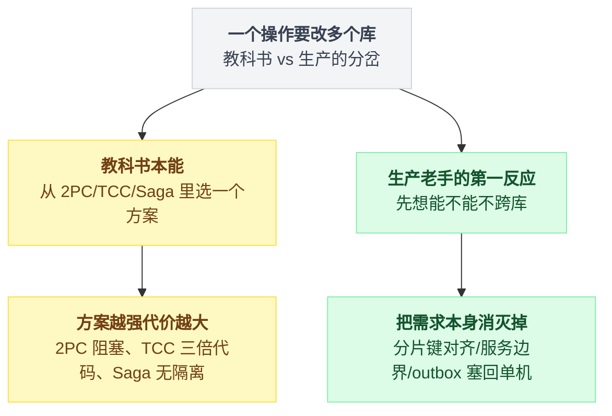
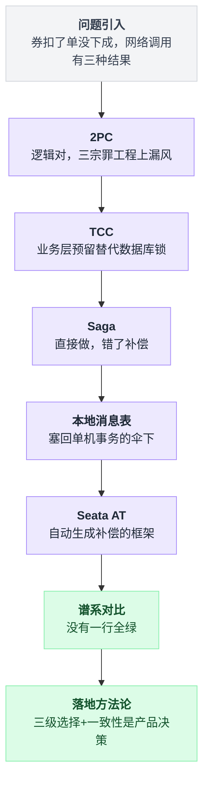
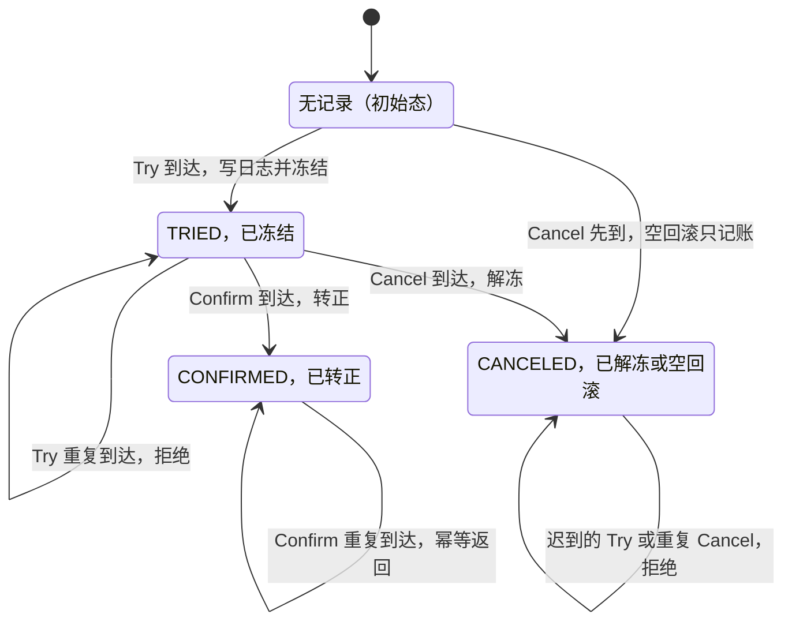
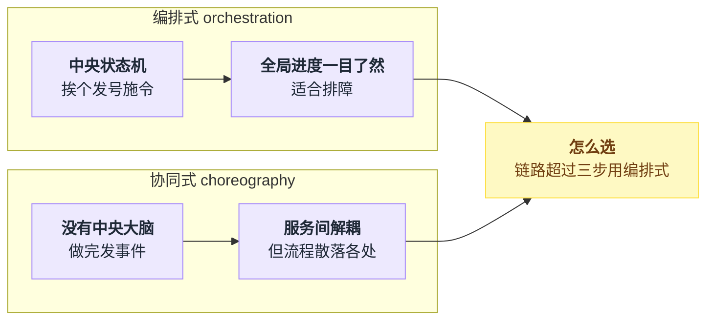
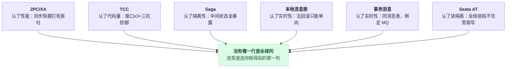
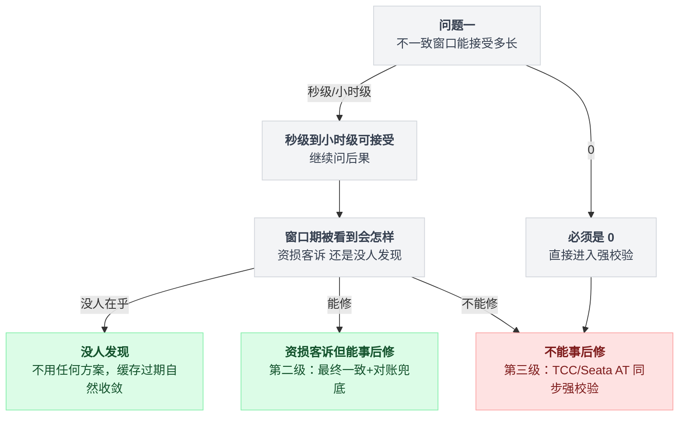

# 《分布式事务的真相》2PC 为什么没人用，以及主流答案为什么是"想办法不用"（小白版）

> 一句话结论：**教科书把 2PC 放在分布式事务的第一章，生产环境把它排在候选名单的最后一位——这个领域真正的主流方案不是任何一个"方案"，而是用分片键、服务边界和对账，把"需要分布式事务"这件事本身消灭掉。**
> 难度：★★★★☆
> 写作时间：2026-08-05。文中未经一手核实的说法均已在原地标注（"第三方来源，未核实"或"未逐版复核"）。
> 阅读前提：单机事务和隔离级别请先读 [PG 系列第 4 篇](../2026-08_从真实项目学PostgreSQL/04-隔离级别与三种错误写法.md)；本篇讲的是那把保护伞出了进程边界之后的事。

---

这道分岔就是全文的骨架：



## 目录

- [0. 先讲个故事：一次下单，三个系统，保护伞没了](#0-先讲个故事一次下单三个系统保护伞没了)
- [1. 朴素做法：失败了就手工撤销，三种死法](#1-朴素做法失败了就手工撤销三种死法)
- [2. 2PC：逻辑上是对的，工程上四处漏风](#2-2pc逻辑上是对的工程上四处漏风)
- [3. TCC：把锁从数据库层挪到业务层](#3-tcc把锁从数据库层挪到业务层)
- [4. Saga：连 Try 都省了，直接做，错了再补](#4-saga连-try-都省了直接做错了再补)
- [5. 本地消息表与事务消息：谱系里的极简主义者](#5-本地消息表与事务消息谱系里的极简主义者)
- [6. Seata AT：自动化的补偿](#6-seata-at自动化的补偿)
- [7. 收束大表：一致性谱系](#7-收束大表一致性谱系)
- [8. 真正的主流答案：三级选择](#8-真正的主流答案三级选择)
- [9. 反直觉：一致性等级是产品决策，不是技术决策](#9-反直觉一致性等级是产品决策不是技术决策)
- [10. 一句话总结、小白词典、和前几篇的对照](#10-一句话总结小白词典和前几篇的对照)

---

全文按这张台阶走：



## 0. 先讲个故事：一次下单，三个系统，保护伞没了

### 0.1 6 月 18 号凌晨的一张工单

大促零点，用户小周抢一台手机，用了一张 50 元优惠券。后端要干三件事：

```
  ① 券服务：把这张 50 元券标记为"已使用"
  ② 库存服务：库存减一
  ③ 订单库：写入订单
```

那天晚上流量太大，订单库连接池打满了。于是发生了这样的事：

```
  ① 券核销      ✓ 成功
  ② 扣库存      ✓ 成功
  ③ 写订单      💥 失败（连接池满，超时）

  用户看到：  "下单失败，请重试"
  用户重试：  "该优惠券已使用"     ← ？？？
  用户拨通：  客服电话
```

**券扣了，单没下成。**

这就是分布式事务问题的全部：几件事必须"要么全做成，要么全没发生"，但它们分散在几个进程、几个数据库里。

### 0.2 单机时代这根本不是问题

倒回几年，这三张表在同一个 MySQL 里。那时的代码是：

```sql
BEGIN;
UPDATE coupon SET status = 'used' WHERE id = 42;
UPDATE stock  SET count = count - 1 WHERE sku = 'iphone';
INSERT INTO orders (...) VALUES (...);
COMMIT;
```

第三步失败？整个事务回滚，前两步**像从来没发生过一样**被擦掉。这就是数据库事务的原子性——[PG 系列第 4 篇](../2026-08_从真实项目学PostgreSQL/04-隔离级别与三种错误写法.md)讲的隔离级别，管的就是这把伞下面的世界。

微服务化之后，伞没了：

```
     单机时代（一个库，三张表）              微服务时代（三个进程，三个库）

  ┌───────── BEGIN ──────────┐         订单服务      库存服务      券服务
  │  UPDATE coupon ...       │            │             │            │
  │  UPDATE stock  ...       │         ┌──┴──┐       ┌──┴──┐      ┌──┴──┐
  │  INSERT INTO orders ...  │         │订单库│       │库存库│      │券库 │
  └──────── COMMIT ──────────┘         └─────┘       └─────┘      └─────┘
     ↑                                    ↑ 各自的 BEGIN/COMMIT 只罩得住自己
     任何一步失败，undo 日志把             ↑ 没有任何东西罩得住"三个一起"
     做过的全部擦掉
```

注意：`BEGIN` 是发给**某一条数据库连接**的命令。它罩不住一次 RPC 调用——库存服务收到的是一个 HTTP 请求，不是你事务里的一条 SQL。

### 0.3 万恶之源：网络调用有三种结果，不是两种

💡 这是全文最重要的一个认知，后面每一节的坑都从它长出来。

```
   你调用远程的券服务，结果有三种：

     ① 成功  ── 收到响应："扣好了"
     ② 失败  ── 收到响应："券不存在 / 已用过"
     ③ 超时  ── 没收到响应
                 ↑
                 注意：这不等于失败！
                 可能是请求根本没送到（券没扣）
                 也可能是券扣成功了、响应在回来的路上丢了（券扣了！）
                 站在调用方，你 永 远 分 不 清 这两种
```

单机事务里不存在第三态——SQL 要么执行了要么没执行，数据库自己心里有数。跨了网络，"不知道"成了常态。

说白了，**分布式事务的所有难度，都是在跟这个"不知道"搏斗。**

给小白一个能复述的版本：单机事务像一辆能整车反悔的购物车——结账前任何一步反悔，整车放回去就行，因为都在同一家店。微服务是去三家店各买一样东西，第三家关门了，前两家已经付过钱——你手里没有一个"让三家店同时成交或同时作废"的按钮，甚至第二家有没有收到你的钱，你都可能不知道。

---

## 1. 朴素做法：失败了就手工撤销，三种死法

### 1.1 每个人的第一反应

```python
def place_order(user_id, sku, coupon_id):
    coupon.use(coupon_id)            # 1. 核销券
    try:
        stock.deduct(sku, 1)         # 2. 扣库存
        create_order(user_id, sku)   # 3. 写订单（本地库）
    except Exception:
        coupon.refund(coupon_id)     # 出错了？手工把券还回去
        raise
```

看起来挺周全：失败了就把做过的撤销掉。这个思路本身没错——后面的 Saga 干的就是这件事——但**裸写**它有三种死法。

### 1.2 死法一：撤销这一下，自己也会失败

`coupon.refund()` 也是一次网络调用。券服务刚才能超时，现在就能继续超时——大促时下游抖，往往是整体一起抖。

撤销失败了怎么办？再 try/catch 一层？套娃到几层算完？

### 1.3 死法二：进程在撤销之前崩溃

```
   coupon.use()    ✓
   stock.deduct()  ✓
   create_order()  💥 抛异常
   进入 except，正要 refund ──→ 💥 这一瞬间进程被 kill
                                  （发版、OOM、机器断电，都是日常）
   ─────────────────────────────────────────────
   重启之后：没有任何地方记着"有一张券欠着没退"
   券，就这么永远丢了
```

内存里的调用栈就是唯一的"账本"，进程一死，账本跟着蒸发。

### 1.4 死法三：第三态反杀

最阴的一种。`coupon.use()` 超时了，你判定"失败"，走 except 去退券——但其实券**扣成功了**，只是响应丢了。你这一"退"，等于把一张已经正常使用的券又还给了用户：**用户用一张券下成了单，券还在。** 资损。

反过来也一样：你退券的请求先到，那个在网络里迷路的扣券请求**后**到——退完又被扣掉，用户券凭空消失。

这两个时序，记住它们的样子，第 3 节它们会换上正式的名字（空回滚、悬挂）再登场。

### 1.5 缺的是什么

盘点一下，朴素做法缺两样东西：

1. **一个记性好的人**——在所有参与者之外，有人把"这个事务进行到哪一步了"写在磁盘上，进程崩了重启后能接着办；
2. **一个先问后做的流程**——别做完了才发现有人做不成，先确认"大家都能成"，再一起动手。

把这两样补上，你就自己发明了 2PC。

---

## 2. 2PC：逻辑上是对的，工程上四处漏风

两阶段提交（Two-Phase Commit）的系统性描述通常追溯到 Jim Gray 1978 年的 *Notes on Data Base Operating Systems*。它先是对的，然后才是不能用的——这个顺序别搞反，先看懂它对在哪。

本节的路线：机制（对在哪）→ 三宗罪（同步阻塞、协调者单点、故障放大）→ XA 这层标准化包装为什么在互联网公司绝迹 → 两个反直觉的补丁。三宗罪是重点，剩下的是它的注脚。

### 2.1 先看懂它对在哪

角色只有两种：一个**协调者**（拍板的人），若干**参与者**（干活的库）。流程两步：

```
     协调者              订单库            库存库             券库
       │                   │                │                 │
  ═════╪══ 阶段一 prepare ══╪════════════════╪═════════════════╪════
       │──"能提交吗?"──────▶│                │                 │
       │──"能提交吗?"───────┼───────────────▶│                 │
       │──"能提交吗?"───────┼────────────────┼────────────────▶│
       │                   │ 写好日志        │ 写好日志         │ 写好日志
       │                   │ 锁住相关行      │ 锁住相关行        │ 锁住相关行
       │◀───── yes ────────│                │                 │
       │◀───── yes ────────┼────────────────│                 │
       │◀───── yes ────────┼────────────────┼─────────────────│
       │                   │                │                 │
       │ 三票全 yes → 拍板：提交（把决定先写进自己的日志）          │
  ═════╪══ 阶段二 commit ═══╪════════════════╪═════════════════╪════
       │──── commit ──────▶│ 正式提交，放锁   │                 │
       │──── commit ───────┼───────────────▶│ 正式提交，放锁    │
       │──── commit ───────┼────────────────┼────────────────▶│ 正式提交，放锁
```

站在协调者那一侧，整个协议就是这么一小段：

```
决定 = 未定
for p in 参与者:                       # 阶段一
    if p.prepare() != "yes":           # 一票 no 或超时
        决定 = "回滚"; break
if 决定 是未定: 决定 = "提交"

写自己的日志(决定)                      # ★ 这一笔落盘之后，决定才算数

for p in 参与者:                       # 阶段二
    p.执行(决定)                        # 投过 yes 的参与者不许拒绝
```

真正的危险全都挤在那个 ★ 前后：决定写进日志了、还一条都没发出去的那一瞬间，谁都不知道该怎么办——2.3 节讲的就是这一刻。

prepare 不是"问问而已"。参与者投 yes 之前要把活干到**只差临门一脚**：改动写进日志、行锁攥住、约束检查完。

投出 yes 就是立下军令状：**从此我丧失单方面回滚的权利，之后无论何时收到 commit，哪怕我中途宕机重启，也必须从日志里恢复现场把它提交掉。**

为什么说逻辑上是对的："提交还是回滚"这个决定权收拢在协调者一个点上，由它一票拍板，所以永远不会出现"一半参与者提交了、另一半回滚了"的裁决分歧。有一票 no 或超时，就全员回滚。数学上挑不出毛病。

那问题出在哪？出在它对物理世界的三个假设都太乐观。这就是三宗罪。

### 2.2 第一宗罪：同步阻塞——所有人抱着锁等最慢的那个

看阶段一和阶段二之间那段时间：**三个库的行锁全都攥着**。

```
   订单库:   ──[锁住]────────────────────────[放锁]──
   库存库:   ──[锁住]────────────────────────[放锁]──
   券库:     ──[锁住]──────────────────────────────[放锁]──
                      ↑                      ↑
                      券服务今天慢，prepare 花了 2 秒
                      → 另外两个库也陪着锁 2 秒

   这 2 秒里，iphone 这一行库存上的所有正常买家全部排队。
```

单机事务锁行是几毫秒的事。2PC 把每个参与者的持锁时间**同步到了全场最慢的那个人**，而且是每一笔事务都如此。

热点行 + 2PC，等于自己给自己做了个限流器——还是不带令牌桶的那种（对照[第 4 篇](./04-分布式限流器.md)，人家限流好歹是故意的）。

### 2.3 第二宗罪：协调者单点——挂在两阶段之间，参与者永久卡死

这是 2PC 最著名的死法，画出来是这样：

```
       │◀───── yes ────────│   （三票全 yes 已收齐）
       │
       💥 协调者宕机（决定还没发出去，一条 commit/abort 都没送出）
       │
       订单库的内心独白：
         "我投过 yes，立过军令状，不能自己回滚——
              万一协调者已经把 commit 发给库存库了呢？
          我也不敢自己提交——
              万一刚才有谁投了 no，协调者拍板的其实是回滚呢？
          ……我只能抱着锁，等。"
                    │
                    ▼
       行锁一直压着，压住的行上所有正常读写全部排队，
       直到协调者恢复，或者 DBA 上机手工表决。
       这种事务在 XA 里有个专名：in-doubt（悬而未决）事务。
```

注意这个卡死的性质：参与者不是死锁了，是**理性地**动弹不得——它掌握的信息不足以做出任何安全的决定。

单点不是"协调者也会挂"这么一句轻飘飘的话，而是"它挂在错误的时间点上，所有人都得陪葬"。

（想把协调者做成高可用集群？那你需要一套选主和日志复制的共识协议——欢迎来到[第 23 篇 Raft](./23-Raft共识.md) 的地盘。Google Spanner 走的就是这条路，见 2.6。）

### 2.4 第三宗罪：故障放大——参与者越多，可用性越乘越低

全票通过才能提交，意味着**任何一个参与者拉胯，全局就失败**。可用性是乘出来的（下面是纯算术，不是实测）：

| 单个参与者可用性 | 参与者数量 | 全局事务可用性 |
|---|---|---|
| 99.9% | 2 | 99.8% |
| 99.9% | 3 | 99.7% |
| 99.9% | 5 | 99.5% |
| 99.9% | 10 | ≈ 99.0% |
| 99% | 10 | ≈ 90.4% |

还没算协调者自己那一份。延迟也一样：全局耗时 = 最慢参与者的耗时（木桶效应），参与者越多，抽到慢子的概率越高。

**微服务拆得越碎，2PC 越不可用**——而分布式事务恰恰是微服务拆碎之后才冒出来的需求。自相矛盾就在这里。

### 2.5 XA：2PC 的标准化包装，以及它为什么在互联网公司绝迹

XA 是 X/Open 组织在上世纪 90 年代初把 2PC 标准化的接口规范：应用（AP）、事务管理器（TM，协调者）、资源管理器（RM，参与者）各归各位，主流数据库基本都实现了 RM 接口（MySQL 的 `XA START/PREPARE/COMMIT`，PostgreSQL 的 `PREPARE TRANSACTION`）。

Java 老兵可能还记得 JTA/Atomikos——XA 在企业软件时代确实是正统。但在互联网公司它几乎绝迹（这是行业普遍现状的判断，不是统计数据），原因有三层：

1. **你的参与者根本不是 XA 资源。** XA 假设参与者是实现了 XA 接口的数据库。而互联网架构里，事务要跨的是库存服务、券服务这样的 **HTTP/RPC 服务**，外加 Redis、MQ——没有一个能听懂 `XA PREPARE`。协议再对，找不到会说这门语言的参与者。
2. **在线高并发吃不下同步阻塞。** 三宗罪的前两宗，在"热点行 + 万级 QPS"的场景下每一条都是致命的。
3. **实现质量的历史包袱。** MySQL 在 5.7.7 之前，客户端连接断开会直接回滚已 prepare 的 XA 事务——这在协议语义上是错的，prepare 过就不许单方面反悔（此为官方文档历史变更记录的说法，本文未逐版复核）。协议对、实现坑，进一步劝退。

教科书里还有个 3PC（三阶段提交），多加一个 preCommit 阶段试图缓解阻塞——但它引入超时自动提交后，在网络分区下会做出错误决定，工程里比 2PC 更没人用，一句话带过。

### 2.6 ⚠️ 两个反直觉的补丁

**补丁一：2PC 并不是严格的"强一致"。** 阶段二的 commit 是逐个发送、逐个执行的——订单库已经提交、券库还没收到 commit 的那几十毫秒里，读订单库能看到新订单、读券库券还是未使用。

2PC 保证的是**原子性**（最终要么全提交要么全回滚），不保证提交过程对外的瞬间一致。连谱系里最强的方案都做不到绝对，这给第 9 节埋个伏笔：**"强一致"三个字在跨系统语境下从来都是个程度问题。**

**补丁二：2PC 没有死透，它只是在等前提改变。** Google Spanner（OSDI 2012 论文）内部就在跑 2PC——但每个"参与者"不是一台机器，而是一个 Paxos 复制组，协调者同样跑在 Paxos 组上。单点罪没了（挂一台，组内选主顶上），2PC 就只剩下延迟代价。

所以准确的说法不是"2PC 是错的"，而是"**2PC 在'参与者和协调者都是单机'的前提下太贵**"。前提变了，结论跟着变。

---

## 3. TCC：把锁从数据库层挪到业务层

### 3.1 换个思路：别让数据库替你锁，你自己在业务里"留"

2PC 的阻塞，根子在 prepare 攥着**数据库行锁**不放。TCC（Try-Confirm-Cancel）的核心思想一句话：

> **用"业务层的预留"替代"数据库的锁"。**

每个参与者不再暴露一个接口，而是三个：

```
        Try                     Confirm                  Cancel
   "把资源预留住"             "预留转正式"             "把预留还回去"

  ┌─────────────────┐    ┌──────────────────┐    ┌──────────────────┐
  │ 库存表加一列冻结: │    │                  │    │                  │
  │  可用 10 → 9     │    │  冻结 1 → 0      │    │  冻结 1 → 0      │
  │  冻结  0 → 1     │    │  （真正扣掉）      │    │  可用 9 → 10     │
  │                  │    │                  │    │  （原样奉还）      │
  │ 本地事务立刻提交， │    │                  │    │                  │
  │ 行锁马上就放 ★    │    │                  │    │                  │
  └─────────────────┘    └──────────────────┘    └──────────────────┘
```

流程骨架和 2PC 一模一样——先全员 Try，全成功则逐个 Confirm，有失败则逐个 Cancel，协调者照样要记日志。变的是"预留"的实现层：

```
   2PC:  prepare = 数据库替你锁行            commit  = 数据库提交
         （锁攥到阶段二，别人全排队）
   TCC:  Try     = 你自己写代码冻结          Confirm = 你自己写代码转正
         （本地事务几毫秒就提交，不留锁；      Cancel  = 你自己写代码解冻
          "占住资源"这件事靠 frozen 字段表达）
```

Try 完成后，锁已经放了，别的买家照常买剩下 9 台——被占住的只有小周这 1 台。

**阻塞问题解除，代价是"占资源"的逻辑从数据库下沉到了你的业务代码里。** 这个"冻结/处理中"的中间状态，你在[第 10 篇](./10-支付与对账.md)的 4.8 节见过一次（幂等的"处理中"陷阱）——同一个思想。

听起来挺好？注意，第 1.4 节那两个"第三态反杀"的时序，现在正式登场。TCC 有三大坑，每一个都来自"网络会乱序、会重复、会丢"。

### 3.2 坑一：空回滚——Cancel 比 Try 先到

```
   协调者                              库存服务
     │                                   │
     │──── Try(xid=7) ────╳              │   ← 请求堵在网络里 / 丢了
     │  等 3 秒，超时                      │
     │  "Try 八成没成，回滚吧"              │
     │──── Cancel(xid=7) ───────────────▶│  "xid=7？我从没冻结过这一单，
     │                                   │   解冻什么？？"
```

协调者不能干等（等多久都可能是第三态），超时就得发起回滚。于是库存服务会收到一个**没有 Try 对应**的 Cancel。

裸写的 Cancel（"冻结数减一"）此时会把**别人的冻结**解掉，或者把冻结解成负数。

正确姿势：查无 Try 记录时，**记一笔"此事务已回滚"然后返回成功**——记这一笔不是多余动作，它是下一个坑的救命符。

### 3.3 坑二：悬挂——Cancel 之后，迷路的 Try 才到

```
   协调者                              库存服务
     │──── Try(xid=7) ────╮ （迷路了，在网络里绕圈）
     │  超时 → 回滚          │
     │──── Cancel(xid=7) ──┼──────────▶│ 没见过 xid=7，记一笔，返回成功
     │  全局事务结束，收工     │
     │                      ╰──────────▶│ 迟到的 Try 到了：冻结 1 件 ✓
     │                                  │
     │      （全局事务早已终结，再也没有人会来 Confirm 或 Cancel 它）
     │                                  │ → 这 1 件库存被 永 久 冻 结
```

这就叫悬挂：Try 挂在那儿，没人认领。

防御手段正是上一坑记下的那笔账——**Try 执行前先查：这个 xid 是不是已经 Cancel 过了？是，就拒绝执行。**

### 3.4 坑三：幂等——Confirm 发了两遍

协调者发出 Confirm 后没收到响应（又是第三态），只能重发——不重发就可能丢失提交。

于是每个参与者都可能收到两遍 Confirm：裸写的"冻结转扣减"执行两遍，就是多扣一件；Cancel 收两遍，就是多还一件。

**Try、Confirm、Cancel 三个接口全部必须幂等**，幂等键就是全局事务 id（xid）。幂等的三种实现姿势[第 10 篇第 4 节](./10-支付与对账.md)已经完整讲过，这里不重复。

三个坑并排放着看，会发现它们是同一件事的三个切面：

| 坑 | 触发时序 | 裸写的后果 | 防御 |
|---|---|---|---|
| 空回滚 | Cancel 先到，Try 没来 | 解掉别人的冻结，或冻结变负数 | 记一笔已回滚，返回成功 |
| 悬挂 | Cancel 处理完，Try 才到 | 这 1 件库存永久冻结 | Try 前查账，已 Cancel 就拒绝 |
| 幂等 | 同一条消息到两遍 | 多扣一件 / 多还一件 | 按 xid 去重，重复直接返回成功 |

### 3.5 一张事务日志表堵住三个坑（附可运行模拟）

三个坑的解法其实是同一个：库存服务本地建一张**事务日志表**（xid 主键 + 状态），三个接口动手之前都先查账：

```
   Try(xid):     日志里已有记录（TRIED 或 CANCELED）→ 拒绝（防重复/防悬挂）
                 没有 → 写 TRIED + 冻结，同一个本地事务提交
   Confirm(xid): 状态是 TRIED → 转正，改 CONFIRMED
                 已是 CONFIRMED → 直接返回成功（幂等）
   Cancel(xid):  状态是 TRIED → 解冻，改 CANCELED
                 没有记录 → 只写一笔 CANCELED，不解冻（空回滚）
                 已是 CANCELED → 直接返回成功（幂等）
```

三个坑收口成一张状态机，xid 从空白到终态只有这几条路：



下面这段纯标准库的模拟能直接跑：一万笔事务，每笔的 Try 和 Cancel 都可能重复到达 1~2 次、到达顺序随机——这就是真实网络的样子。

```python
import random

class NaiveStock:
    """裸奔版：Try 就冻结，Cancel 就解冻，没见过的事务当无事发生"""
    def __init__(self):
        self.frozen = {}                     # xid -> 冻结数量

    def try_freeze(self, xid):
        self.frozen[xid] = 1                 # 冻结 1 件

    def cancel(self, xid):
        self.frozen.pop(xid, None)           # 有就解冻，没有就算了

class SafeStock:
    """日志版：每个 xid 先查账，再动手"""
    def __init__(self):
        self.frozen = {}
        self.log = {}                        # xid -> 'TRIED' / 'CANCELED'

    def try_freeze(self, xid):
        if self.log.get(xid) is not None:    # 已 Try（幂等）或已 Cancel（悬挂）→ 拒绝
            return
        self.log[xid] = 'TRIED'
        self.frozen[xid] = 1

    def cancel(self, xid):
        if self.log.get(xid) == 'CANCELED':  # 重复 Cancel（幂等）→ 忽略
            return
        if self.log.get(xid) != 'TRIED':     # Try 还没到 → 空回滚：记一笔，不解冻
            self.log[xid] = 'CANCELED'
            return
        self.log[xid] = 'CANCELED'
        self.frozen.pop(xid)

def simulate(svc, rounds=10000):
    rng = random.Random(42)
    for xid in range(rounds):
        msgs = ['try', 'cancel'] * rng.randint(1, 2)   # 网络重传：每条消息到 1~2 次
        rng.shuffle(msgs)                              # 网络乱序：到达顺序随机
        for m in msgs:
            svc.try_freeze(xid) if m == 'try' else svc.cancel(xid)
    return sum(svc.frozen.values())

print("裸奔版永久冻结的库存:", simulate(NaiveStock()))
print("日志版永久冻结的库存:", simulate(SafeStock()))
```

在我机器上的输出（固定了随机种子，你跑出来一样）：

```
裸奔版永久冻结的库存: 4973
日志版永久冻结的库存: 0
```

一万笔里近一半的库存被永久冻死——因为"Try 落在 Cancel 之后"这个乱序，出现概率天然就是五成上下。

这不是极端案例，**这是不设防的 TCC 的日常**。

### 3.6 代价：一个接口变三个，其实不止三倍

账要算清楚：

- 每个参与者：1 个接口 → 3 个接口，外加一张事务日志表、一套"冻结"字段和状态流转；
- 每个接口都要处理幂等、空回滚、悬挂——上面模拟里那些 if，一个都省不掉；
- Try 预留什么、Confirm 怎么转正，是**业务语义**，框架替你写不了（框架能管的只有协调者那部分）；
- 库存能"冻结"，但不是所有资源都有自然的预留语义——"发一条短信"怎么 Try？

所以业界的共识（判断，非统计）：TCC 只用在**资金类的短核心链路**上——扣款、扣券、扣库存这种预留语义天然、又赔不起的地方。拿它包住整个下单流程的，都后悔了。

---

## 4. Saga：连 Try 都省了，直接做，错了再补

### 4.1 正向链 + 逆向补偿链

Saga 是 1987 年 Garcia-Molina 和 Salem 在 SIGMOD 论文 *Sagas* 里提出的，比微服务早了二十多年——原本是为数据库长事务设计的，被微服务时代翻出来重用。

思路比 TCC 更糙：**不预留了，每一步直接做完、直接提交；哪步失败了，就把前面做过的用"反向操作"逐个抵消回去。**

```
   正向链:  T1 创建订单 ──▶ T2 扣库存 ──▶ T3 核销券 ──▶ T4 创建物流单
                                            │ 💥 失败
   补偿链:                 C2 回补库存 ◀────┘
           C1 取消订单 ◀───┘

   （从失败点往回走，C 与 T 一一配对；每个 T、每个 C 都是独立提交的本地事务）
```

编排它的那段控制流也就这么长：

```
做过的 = []
for i, T in enumerate(正向链):
    try:
        T.执行()                 # 直接做，直接提交
        做过的.append(i)
    except:
        for j in reversed(做过的):     # 从失败点往回走
            带重试地执行(补偿链[j])     # 补偿只能一路重试下去
        raise
```

注意补偿链那一行的"带重试"：补偿本身也是网络调用，也会遇到第三态，所以它必须能重复执行——这也是为什么 4.3 节要把 3.5 节那张日志表原样搬过来。

对照 TCC：Saga 相当于砍掉了 Try，把 Confirm 提前到第一步就做掉。

好处立竿见影——接口从三个变回两个（正向 + 补偿），而且没有资源被冻结着等待，特别适合**步骤多、耗时长、跨团队甚至跨公司**的流程（比如订机票+订酒店+租车）。

第 1 节的朴素做法，其实就是一个没有持久化日志、没有幂等防御的野生 Saga——Saga 是它的转正版：状态落库、崩溃可恢复、补偿带重试。

### 4.2 ⚠️ 最大软肋：没有隔离性

代价也立竿见影。T1 提交的那一刻，订单**真实存在**了——对用户、对其他系统都可见。而这个事务离"确定成功"还远着：

```
   t1   T1 创建订单成功        ← App 推送："下单成功！"
   t2   T2 扣库存成功           │  用户截图发到群里
   t3   T3 核销券 💥（券刚好过期）│
   t4   C2 回补库存             │
   t5   C1 取消订单            ← 用户刷新：订单没了？？
                                 客服："这是正常现象。"（用户：？？？）
```

单机事务里这叫"脏读"，隔离级别负责把它挡住（又见 [PG 系列第 4 篇](../2026-08_从真实项目学PostgreSQL/04-隔离级别与三种错误写法.md)）。Saga 里它不是 bug，是**设计本身**：中间状态就是暴露的，没有任何机制罩着。

更深一层的麻烦：**补偿不等于回滚。** 回滚是"当作没发生过"，补偿是"再做一件反方向的事"——中间发生过的一切都真实发生过。

T2 扣完库存后，如果有别的系统基于"库存少了一件"做了决策（比如触发了补货），C2 把库存加回去，那个补货单可不会自己消失。钱的场景更刺激：T1 给用户加了余额，用户火速消费掉，C1 再来扣——余额是负的。

工程上的缓解招数都是补丁式的：订单先置 `PENDING` 状态对外不展示（本质是手工做了个隔离层）、补偿链配人工兜底、语义上"宁可漏成功不可漏补偿"。

用 Saga 之前先问自己：**这条链路的中间状态被人看见、被人依赖，最坏会发生什么？** 答案能接受再用。

### 4.3 编排式 vs 协同式，一笔带过

Saga 的协调有两种组织法：

| | 编排式 orchestration | 协同式 choreography |
|---|---|---|
| 谁在指挥 | 一个中央状态机挨个发号施令 | 没有中央大脑 |
| 怎么推进 | 状态机推着往下走 | 每个服务做完发事件，下一个订阅着自己动 |
| 好处 | 全局进度一目了然 | 服务间解耦 |
| 坏处 | 有个中心 | 流程散落各处，出问题没人说得清全局走到哪了 |

两种组织法的形状差在这里：



判断给你：链路超过三步就用编排式，别为了"去中心化"的美感把排障能力交出去。

另外别忘了，Saga 的补偿同样会遇到空补偿、悬挂、重复投递——**第 3.5 节那张事务日志表，在这里原样再建一遍**，一个字都不能少。

---

## 5. 本地消息表与事务消息：谱系里的极简主义者

### 5.1 换个问法：你真的需要"回滚"吗

前面三节全在解同一道题："要么全做成，要么全撤销"。停下来想想，下单链路里真需要"撤销"语义的步骤有几个？

- 扣库存、核销券——要撤销，卖超了、券丢了都是事故；
- 给用户发短信、加积分、同步搜索索引、通知推荐系统——**失败了该重试到成功，而不是把订单撤了**。

后一类占了链路的大半。它们要的不是原子性，是**"这件事最终一定会做成"**的承诺。

为这种需求上 TCC，是拿高射炮打蚊子——还得给蚊子写三个接口。

### 5.2 机制一句话，位置一段话

本地消息表（outbox 模式）的全部机制：

```
  ┌──────── 一个本地事务（同一个库）─────────┐
  │  INSERT INTO orders (...)               │  ← 业务本身
  │  INSERT INTO outbox                     │  ← "欠条"：还有件事要办
  │    (topic='order_created',              │
  │     payload={...}, status='NEW')        │
  └────────────── COMMIT ───────────────────┘
       两行要么一起存在，要么一起不存在  ← 全部魔法就这一句
                    │
                    │  投递器（轮询 status='NEW'，或 CDC 监听 binlog）
                    ▼
                   MQ ──▶ 库存服务消费（必须幂等）──▶ 确认，更新 outbox 状态
                    │ 失败/超时？
                    ╰──── 重试，重试，重试……直到成功
```

投递器那一侧连状态机都算不上，就是个循环：

```
while True:
    for 欠条 in outbox 里 status='NEW' 的记录:
        发到 MQ(欠条)              # 失败就不改状态，下一轮再来
        更新 outbox 状态(欠条)      # 消费方确认后落
    歇一会儿再来一轮
```

说白了，它是一记太极：**把"跨系统的一致性问题"塞回了"单机事务"的伞下**——写业务和记欠条在同一个库、同一个 BEGIN/COMMIT 里，跨系统的部分只剩"照着欠条办事+重试"，而重试的安全性由消费方幂等兜底。

表结构、投递器、幂等消费的完整实现，[PG 系列第 6 篇](../2026-08_从真实项目学PostgreSQL/06-幂等与outbox.md)从头到尾写过一遍，本篇不重复。

本篇要补的是它在**事务谱系里的位置**：

- 一致性方向是**单向**的——只保证"下游最终跟上"，没有回滚语义。下游要是业务上就该失败（券真的过期了），它帮不了你，还得靠 Saga 式补偿；
- 牺牲的是**实时性**（下游晚几百毫秒到几秒才收到）和**隔离性**（窗口期上下游状态不一致），换来的是全谱系里最低的侵入和最少的新概念——一张表、一个轮询循环，没有协调者，没有三接口；
- 💡 反直觉的点：**这个"最不像分布式事务方案"的方案，是实际系统里用得最多的**（行业普遍现状的判断）。绝大多数"下单后要做 N 件事"的链路，生产里跑的就是它，而不是 TCC。

### 5.3 中间件版：RocketMQ 事务消息（半消息 + 回查）

本地消息表要自己建表、自己写投递器。RocketMQ 把这套内置成了"事务消息"（机制描述依据 RocketMQ 官方文档）：

```
   订单服务                 RocketMQ                   库存服务
      │── ① 半消息 ──────────▶│  存下，但对消费者不可见
      │◀─ ② ok ───────────────│
      │  ③ 执行本地事务（写订单库）
      │── ④ commit ──────────▶│  半消息转正 ──▶ 投递 ──▶ 消费
      │
      │  若 ④ 丢了（进程恰好死在 ③④ 之间）：
      │◀─ ⑤ 回查："xid=7 的本地事务到底成没成？" ────│
      │── ⑥ 查自己的订单库，按事实回答 commit/rollback ─▶│
```

看懂回查在兜什么：③ 和 ④ 之间那道缝，正是第三态的老巢——本地事务提交了、commit 消息没送出去。broker 等不到答案，就**反过来问你**。

回查本质是 broker 侧的一个延迟任务，和[第 3 篇](./03-延迟任务与时间轮.md)的时间轮是一路货色。

本地消息表 vs 事务消息怎么选？先记住一句：**同一招的两种写法**——一个把"欠条"存在自己库里，一个存在 broker 里（[第 10 篇](./10-支付与对账.md)在支付场景下也点过这一层）。区别只在运维归属：

| | 本地消息表 | RocketMQ 事务消息 |
|---|---|---|
| 欠条存哪 | 自己库里的一张表 | broker 里的半消息 |
| 新依赖 | 不引入 | 绑定 RocketMQ |
| 要自己写什么 | 投递器 | 回查接口 |
| 查账方式 | 直接 SQL 查 | 走 broker |
| 适合谁 | 量不大的团队 | 现成有 RocketMQ 的团队 |

没有对错。

---

## 6. Seata AT：自动化的补偿

一句话地图：AT 用数据源代理偷偷录下"改之前长什么样"，把补偿 SQL 自动生成出来（6.1）；代价是引入一把全局锁，而这把锁只堵住了脏写这一面（6.2）。

### 6.1 有人想要"不改业务代码的 TCC"

TCC 的账算下来，最贵的是人写三接口。Seata（阿里 2019 年开源，前身叫 Fescar）的 AT 模式卖点就一句：**一个注解，业务 SQL 照写，预留和补偿框架自动生成。** 它是这么做到的：

```
   你写的代码:  UPDATE stock SET count = count - 1 WHERE id = 1

   Seata 的数据源代理在同一个本地事务里帮你干五件事:
     ① SELECT .. WHERE id=1          → 前镜像 {count: 10}
     ② 执行你的 UPDATE                → count = 9
     ③ SELECT .. WHERE id=1          → 后镜像 {count: 9}
     ④ 前后镜像打包写入 undo_log 表（和业务表同库、同一个本地事务）
     ⑤ 向 TC（协调者）申请全局锁：stock 表 id=1 这行归 xid=7
   然后 COMMIT ── 本地行锁立刻释放，这点和 TCC 的 Try 一样，不攥锁

   全局提交:  TC 通知各分支异步删掉 undo_log，完事（所以提交路径很快）
   全局回滚:  读 undo_log，用前镜像自动生成反向 SQL:
                UPDATE stock SET count = 10 WHERE id = 1
              执行前先校验：当前值 == 后镜像？
                一致   → 回滚 ✓
                不一致 → 有人绕开 Seata 改过这行（脏写）→ 回滚不动，转人工 ⚠️
```

对号入座：undo_log 的前镜像就是**自动生成的 Cancel**，本地事务直接提交就是**自动做掉的 Try+Confirm**。

所以叫它"自动化的 TCC"大体成立——更精确的说法是"自动化的补偿型事务"：它其实更像一个带全局锁的 Saga，只是补偿 SQL 不用人写。

### 6.2 全局锁：自动化的代价

Saga 最痛的无隔离，Seata 用**全局锁**堵了半扇门：分支事务提交前要向 TC 登记行归属，另一个全局事务想改同一行，拿不到锁就得等。

这防住了两个全局事务互相**脏写**（不然你回滚时用前镜像一盖，把别人的更新也盖没了）。

但注意三个"没堵住"：

- **读没有隔离**——别的查询照样能看到未最终确认的中间数据；Seata 官方文档明说 AT 的全局读隔离默认相当于"读未提交"，要读已提交得走它的 `SELECT FOR UPDATE` 代理（出处方向：Seata 官方文档，事务隔离章节）；
- **旁路写没堵住**——全局锁登记在 TC 里，不是数据库锁。任何一条不走 Seata 数据源代理的 SQL（人肉跑的、别的老系统发的）都能直接改数据，然后回滚校验失败、转人工。上了 AT，这些表的**所有**写入口都必须收编，漏一个就是隐雷；
- **全局锁本身成了新的热点瓶颈**——热点行上全局锁排队，吞吐又被摁回去了。2.2 节的老病，换了个部位复发。

### 6.3 一段缘分

这个系列和 Seata 打过一次照面：[第 13 篇](./13-雪花算法真实项目调研.md)拆雪花算法的真实用户时，扒过 Seata 的 IdWorker——它的全局事务 id 用的正是雪花变体。

一个分布式事务框架，第一件事是先解决"给每个事务发全局唯一号"，也算是印证了 ID 生成是多底层的基建。

顺带一句：Seata 不止 AT，也提供 TCC、Saga、XA 模式——AT 只是它的默认招牌。谱系里的每一格，它都想占。

---

## 7. 收束大表：一致性谱系

五大门派同台，按维度拉平（"性能"只给相对档位，不给数字）：

| 方案 | 一致性 | 隔离性 | 业务侵入 | 性能 | 什么时候用 |
|---|---|---|---|---|---|
| 2PC / XA | 谱系里最强（提交瞬间仍有窗口，见 2.6） | 有，靠数据库锁 | 低（数据库扛了） | 差：同步阻塞，吞吐被最慢参与者钉死 | 参与者全是支持 XA 的数据库、并发低 |
| TCC | 最终一致，窗口极短 | 有，靠业务预留（冻结） | 最高：接口 ×3 + 日志表 + 三坑防御 | 好 | 资金类核心短链路，赔不起的地方 |
| Saga | 最终一致 | **无**，中间状态全暴露 | 高：每步配补偿 + 日志表 | 好 | 步骤多、耗时长、跨团队/跨组织的流程 |
| 本地消息表 | 最终一致（单向，无回滚） | 无 | 低：一张表 + 投递器 + 消费幂等 | 好 | 只需"最终做成"、不需撤销的一大类场景 |
| 事务消息 | 最终一致（单向，无回滚） | 无 | 低：实现回查接口 | 好 | 同上，团队已有 RocketMQ |
| Seata AT | 最终一致，窗口短 | 弱：全局锁防脏写，读默认不隔离 | 极低：一个注解（但要收编所有写入口） | 中：全局锁是新瓶颈 | 内部同构系统想少写代码快速上车 |

把"认怂的那一列"摆到一张图上看更直观：



这张表最要紧的读法：**没有哪一行是全绿的。**

每个方案都在某一列上认了怂——2PC 认了性能，TCC 认了代码量，Saga 认了隔离性，消息表认了实时性和回滚，AT 认了读隔离和旁路风险。选型不是选"最好的"，是**选你赔得起的那一列**。

这套"先想清楚牺牲什么"的算账方式，就是[第 12 篇](./12-小而美的五个算法.md)那杆菜市场秤的秤法——那篇拿精确度换资源，这篇拿一致性的某个侧面换可用性和简单性，秤是同一杆。

---

## 8. 真正的主流答案：三级选择

铺垫了七节方案，现在说真话：**生产里碰到跨库需求，老手的第一反应不是从上面表里挑一个，而是想办法让这张表用不上。**

决策是三级的，顺序不能乱：

```
   碰到"一个操作要改多个库"
              │
              ▼
   第一级 ── 能不能让它根本不跨库？
      · 分片键对齐 / 基因法（第 14 篇）
      · 重划服务边界，把强相关的表放回同一个库
      · outbox：把"发消息"变成本地插表
              │  实在做不到
              ▼
   第二级 ── 产品能不能接受"晚几秒才一致"？
      · 本地消息表 / 事务消息 + 幂等消费
      · 状态机 + 定时对账 + 人工处理后台（第 10 篇）
              │  真不能（同步资金强校验）
              ▼
   第三级 ── TCC（自己写）/ Seata AT（框架）
      XA 只剩"参与者全是数据库 + 低并发"的窄缝
```

### 8.1 第一级：最好的分布式事务，是不存在的分布式事务

三个具体手段：

1. **分片键对齐。** [第 14 篇 3.2 节](./14-分库分表.md)的基因法让同一个用户的所有订单落在同一个分片——那篇当时写过一句"跨分片分布式事务问题直接消失"，本篇就是那句话的展开论证。分库分表时分片键选得对，绝大部分"跨库事务"在出生前就被掐灭了；那篇动手清单的第 7 条说得更直白：**靠分片键对齐消灭分布式事务，而不是引入 Seata 去"解决"它。**
2. **重划服务边界。** 如果两张表之间需要强一致，这本身就是"它们属于同一个服务"的强信号。把库存和订单拆成两个服务，再引一个分布式事务框架把它们粘回来——等于先把桌子锯断，再买个进口夹具夹上。锯之前想想。微服务拆分的正确边界，恰恰应该沿着"事务不需要跨过去"的缝隙下刀。
3. **outbox 收编。** 5.2 节说过，它本质是把跨系统问题塞回单机事务的伞下——这招的思想价值大于技术价值：**遇到分布式问题，先想想能不能把它变回单机问题。**

这一级不是我的发明。Pat Helland 2007 年在 CIDR 的论文 *Life beyond Distributed Transactions: An Apostate's Opinion* 里就把话说透了：构建可扩展系统，就该放弃跨实体的分布式事务，用"单实体内事务 + 实体间消息"重新设计。

近二十年过去，互联网架构的主流实践基本是沿着这条路走的。

### 8.2 第二级：最终一致 + 对账兜底

第一级挡不住的（跨服务通知、跨系统同步、和外部机构打交道），绝大多数落在这一级：**消息表/事务消息保证动作最终做成，幂等保证重试无害，状态机保证不乱跳，定时对账兜住所有漏网之鱼，人工后台处理对账也搞不定的。**

这套组合拳[第 10 篇](./10-支付与对账.md)整篇都在打——那篇面对的还是最狠的版本：钱在支付宝手里，对方根本不跟你讲事务，属于"技术上无解、全靠对账"。你自己内部几个库之间的最终一致，比那个场景条件好得多，同一套打法只会更轻松。

另一个熟面孔：[第 15 篇](./15-缓存三兄弟与缓存一致性.md)的"改库 + 改缓存"其实也是一个微型跨系统一致性问题，主流解法同样不是上事务，而是接受不一致窗口 + 过期兜底——套路一脉相承。

### 8.3 第三级：没得选了，再谈 TCC / AT

什么叫没得选：**同步链路上的资金强校验**——扣款和扣券必须在接口返回前一起生效或一起失败，晚几秒都不行，错一次就是资损。

这时候才轮到 TCC（要极致可控就自己写）或 Seata AT（要省人力就上框架），并且范围收得越窄越好——只包住那两三个赔不起的操作，别把整条链路都拖进来。

2PC/XA 排在最末不是嘲讽，是分工：它活在数据库和中间件的**内部**（跨节点提交、Spanner 那类前提改变的场景），不活在业务系统之间。

---

## 9. 反直觉：一致性等级是产品决策，不是技术决策

本篇最想留下的一个观念，单独成节。

工程师选分布式事务方案时，习惯上来就比拼技术指标：吞吐、延迟、侵入性。但决定该用哪一级的，**从来不是技术参数，是业务后果**。

同一个"不一致"，在不同场景里的分量天差地别：

| 场景 | 不一致长什么样 | 产品判断 | 该用的等级 |
|---|---|---|---|
| 退款 | 点了退款，5 秒后余额才到账 | 用户可接受（他甚至不刷新） | 第二级：最终一致 + 对账 |
| 下单扣款 | 重试导致同一单扣了两次钱 | 绝对不可接受，资损 + 投诉 | 第三级：幂等 + 同步强校验 |
| 下单送积分 | 积分晚 1 分钟到 | 没人在乎 | 消息表尽力投递就够 |
| 发优惠券 | 预算超发多发了一批 | 资损，不可接受 | 预算预扣——[第 24 篇](./24-抽奖与营销预算控制.md)的正题 |
| 订单列表 | 新订单晚 2 秒才出现在列表 | 可接受（详情页能查到即可） | 不用任何方案，缓存过期自然收敛 |

同一条下单链路，扣款和送积分就该用**不同的等级**——"一致性等级"是按操作定的，不是按系统定的。

给全系统统一上一套 TCC 的架构方案，基本可以断定没算过账。

选方案之前，拿这三个问题去找产品对齐：

```
   ① 不一致的窗口多长可以接受？（0 / 秒级 / 小时级）
   ② 窗口期被用户看到，后果是什么？（资损 / 客诉 / 根本没人发现）
   ③ 出了错能不能事后修？（能修 → 对账兜底就够；不能修 → 必须事前强校验）
```

这三问连起来，就是一棵判定树：



三个答案出来，方案基本自动选好了。

顺序反过来——先选技术再倒推需求——就会出现两种经典翻车：拿 TCC 三倍的代码量去保一个"积分晚一分钟"级别的一致性（钱白花）；或者拿最终一致去扛"多扣一次钱"的场景（事故）。

⚠️ 再补一条不对称原则：资金操作的两个出错方向分量不同——**少收钱是客诉，多扣钱是事故**。拿不准的时候，把失败设计成对用户有利的那一边（宁可券退慢了，不可券多扣了），给对账留出修复空间。这也是[第 10 篇](./10-支付与对账.md)状态机"宁可停在处理中，不可乱跳到成功"的同一条纪律。

---

## 10. 一句话总结、小白词典、和前几篇的对照

### 一句话总结

> **分布式事务没有银弹，只有价目表：2PC 拿可用性换原子性，TCC 拿三倍代码换性能，Saga 拿隔离性换长流程，消息表拿实时性换简单。而价目表上最便宜的一行，是让事务根本不发生——分片键对齐、服务边界划对、outbox 塞回单机；实在躲不掉的，用最终一致加对账兜住；TCC 和框架，留给那一小撮真正赔不起的操作。**

### 小白词典

- **协调者 / 参与者**：分布式事务里拍板的人和干活的库。协调者说提交才能提交，它挂在关键时刻，大家一起卡死。
- **prepare（预提交）**：2PC 第一阶段。参与者把活干到只差临门一脚并立下军令状——投过 yes 就永远丧失单方面反悔的权利。
- **XA**：上世纪 90 年代把 2PC 标准化的接口规范，数据库大多支持，但你的微服务听不懂这门语言。
- **in-doubt 事务**：投了 yes 之后等不到指令的事务，提交不敢、回滚也不敢，抱着锁悬而未决，通常要拖到人工表决收场。
- **TCC**：Try（业务层冻结资源）、Confirm（转正）、Cancel（解冻）三接口协议，用业务预留替代数据库锁。
- **空回滚**：Try 还没到，Cancel 先到了——什么都没冻结却被要求解冻，得记一笔并返回成功。
- **悬挂**：Cancel 处理完之后，迷路的 Try 才姗姗来迟——冻结的资源从此没人认领，必须靠日志表拒收。
- **补偿**：不是回滚。回滚是"当作没发生过"，补偿是"再做一件反方向的事"——中间发生过的一切都被人看见过。
- **outbox（本地消息表）**："改业务表"和"记欠条"放进同一个单机事务，欠条由投递器异步兑现并无限重试。
- **半消息与回查**：RocketMQ 版 outbox。消息先存着不投递，等生产者确认本地事务成功才放行；确认丢了，broker 主动回来问。
- **最终一致性**：承诺"过一会儿一定对"，不承诺"现在就对"。中间那段时间叫不一致窗口，能不能接受由产品说了算。

### 和前几篇的对照

- **[第 10 篇《支付与对账》](./10-支付与对账.md)**：那篇是"钱在别人手里"的分布式事务——支付宝不跟你讲协议，技术上无解，只能全押对账。本篇是"钱在自己几个库之间"——技术上有解，但最省钱的解法还是学它：最终一致 + 对账兜底（第二级答案）。两篇合起来是一句话：能预防就预防，防不住就保证能发现、能修。
- **[第 14 篇《分库分表》](./14-分库分表.md)**：那篇动手清单第 7 条"靠分片键对齐消灭分布式事务，而不是引入 Seata 去解决它"，是本篇第一级答案的出处；基因法让同一用户的订单天生落在同一分片，事务问题在 ID 出生那一刻就被消灭了。
- **[第 13 篇《雪花算法真实项目调研》](./13-雪花算法真实项目调研.md)**：那篇拆过 Seata 的 IdWorker（雪花变体）——本篇讲到 Seata AT 时，全局事务 xid 用的正是那套发号器。
- **[PG 系列第 4 篇](../2026-08_从真实项目学PostgreSQL/04-隔离级别与三种错误写法.md)与[第 6 篇](../2026-08_从真实项目学PostgreSQL/06-幂等与outbox.md)**：第 4 篇是本篇的"失乐园"——单机事务那把伞长什么样；第 6 篇是本篇第 5 节的实现篇——outbox 的表结构、投递器、幂等消费全在那里，本篇只负责把它安进谱系。
- **[第 12 篇《小而美的五个算法》](./12-小而美的五个算法.md)**：那杆菜市场的秤又出现了。那篇用"可控的不精确"换数量级的资源，本篇用"可控的不一致窗口"换掉整套 2PC 的阻塞和单点——先问"这里的不准/不一致会不会伤到人"，不会，就大方地认下，把省下的复杂度装进口袋。

### 主要来源

- Jim Gray, *Notes on Data Base Operating Systems*, 1978（2PC 的经典出处）
- Hector Garcia-Molina & Kenneth Salem, *Sagas*, SIGMOD 1987
- Pat Helland, *Life beyond Distributed Transactions: An Apostate's Opinion*, CIDR 2007
- *Spanner: Google's Globally-Distributed Database*, OSDI 2012（2PC over Paxos）
- Seata 官方文档（AT 模式、事务隔离章节） · RocketMQ 官方文档（事务消息）
- MySQL 官方文档关于 XA 事务的历史变更记录（未逐版复核处已在文中标注）
