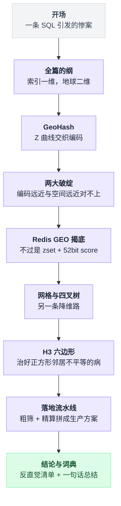
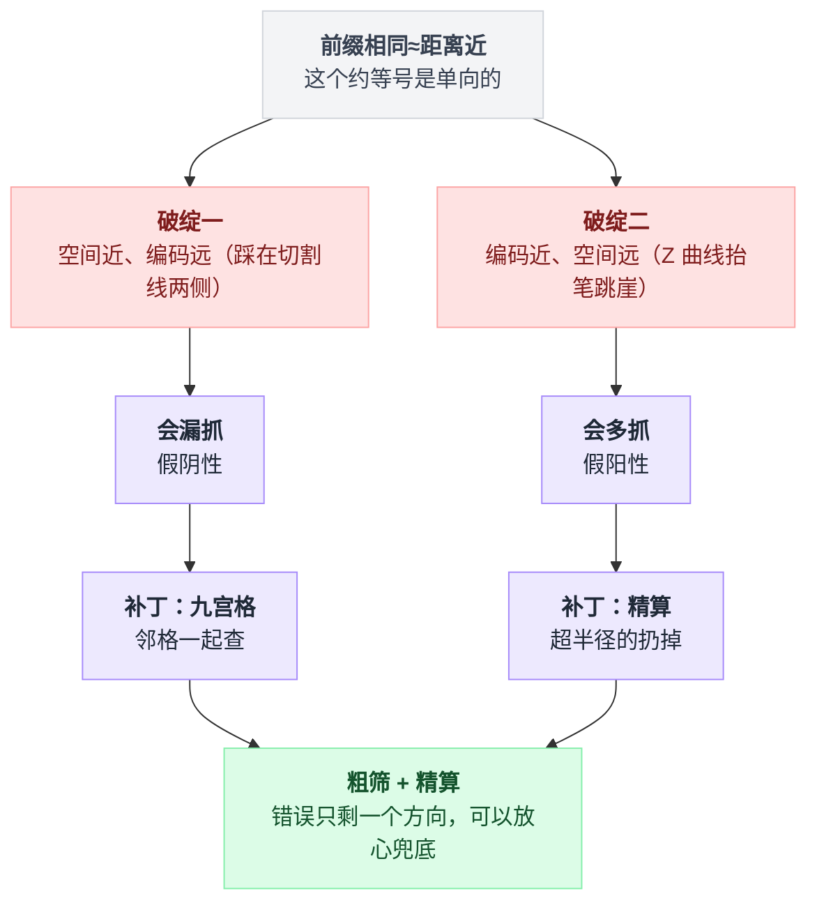
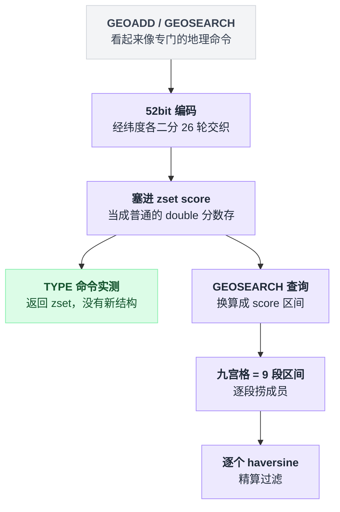
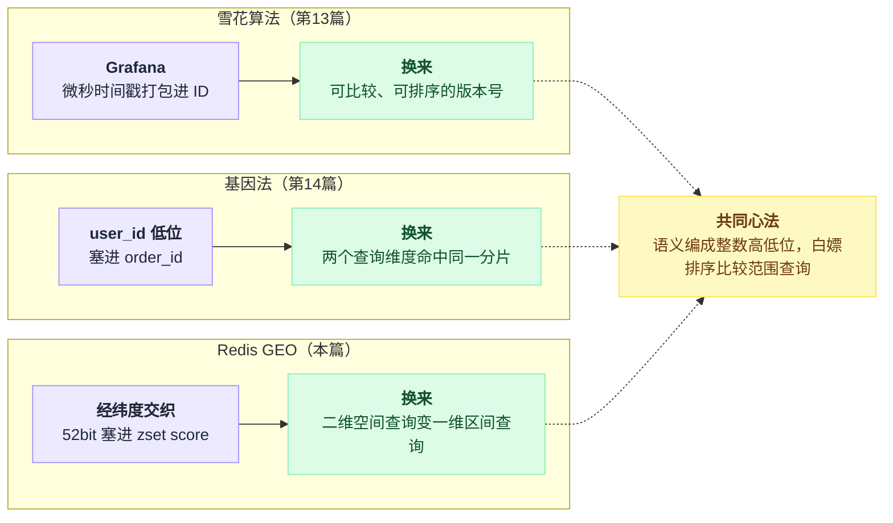
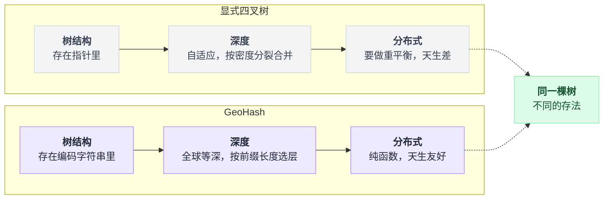
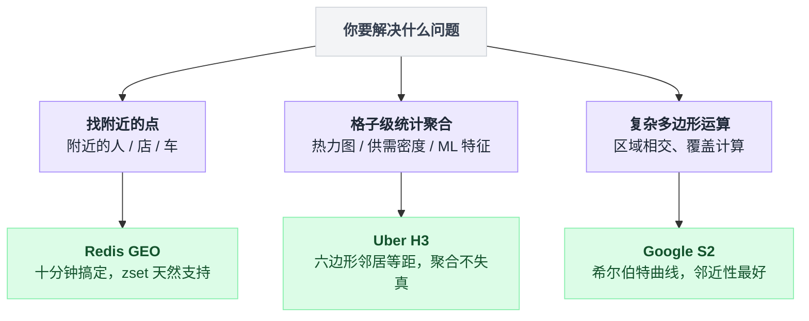
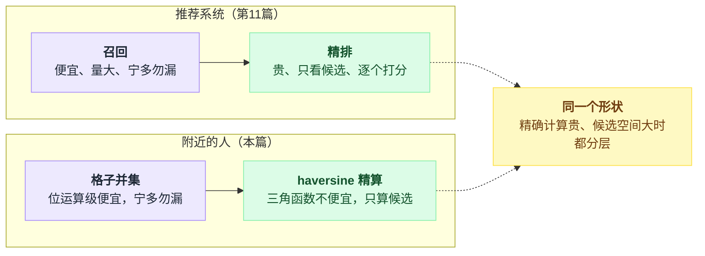

# 《附近的人与 LBS》两个维度的世界怎么塞进一维的索引（小白版）

> 一句话结论：**隔一条马路的两个点，GeoHash 编码可以一个字符都对不上；而编码只差 1 的两个格子，实际距离能差出 4 公里——"前缀相同 ≈ 距离近"这个约等号两边都会漏。所以一切 LBS 方案的本质只有一句话：索引是一维的，地球是二维的，降维时尽量保住邻近性；保不住的部分，用"粗筛 + 精算"两段式打补丁。**
>
> 写作时间：2026-08-05。文中所有 GeoHash 编码、距离、Redis 命令输出，都是当天用随文代码和本机 Redis 7.2.5 实际跑出来的；未经一手核实的说法在文中已单独标注。
>
> 难度：★★★☆☆。姊妹篇说明：[第 08 篇网约车派单](./08-网约车派单.md)第 4~6 节已经在"找车"场景里用过 GeoHash（那边手推了天安门 `wx4g09nj4`，讲了九宫格）。本篇不复读它，而是把 LBS 这条线单独拉直：Z 曲线到底是什么、Redis GEO 的 52 bit 藏着什么玄机、四叉树和 GeoHash 是什么关系、以及为什么所有方案最后都长成"粗筛 + 精算"。读过 08 篇的人可以快速掠过 2.2~2.5 节的手算。

---

## 目录

- [0. 开场：一条 SQL 引发的惨案](#0-开场一条-sql-引发的惨案)
- [1. 全篇的纲：索引是一维的，地球是二维的](#1-全篇的纲索引是一维的地球是二维的)
- [2. GeoHash：把地球对折 30 次](#2-geohash把地球对折-30-次)
  - [2.2 手算外滩：经度串](#22-手算外滩经度串) · [2.4 交织：Z 曲线在这里出生](#24-交织z-曲线在这里出生) · [2.6 完整 Python 实现](#26-完整-python-实现)
- [3. 两大破绽：那个约等号要收利息了](#3-两大破绽那个约等号要收利息了)
  - [3.1 破绽一：空间上很近，编码上很远](#31-破绽一空间上很近编码上很远)
  - [3.2 破绽二：编码上相邻，空间上跳崖](#32-破绽二编码上相邻空间上跳崖)
- [4. Redis GEO 揭底：根本没有新数据结构](#4-redis-geo-揭底根本没有新数据结构)
- [5. 网格与四叉树：另一条降维路](#5-网格与四叉树另一条降维路)
- [6. Uber H3：正方形的原罪，六边形的答案](#6-uber-h3正方形的原罪六边形的答案)
- [7. 落地：附近的人完整流水线](#7-落地附近的人完整流水线)
- [8. 反直觉结论清单](#8-反直觉结论清单)
- [9. 一句话总结、小白词典与对照](#9-一句话总结小白词典与对照)

---

九节内容层层递进，先搭一张地图，看清"二维塞进一维"这件事是怎么一步步讲透的：



## 0. 开场：一条 SQL 引发的惨案

你站在上海外滩，坐标 `(31.2397, 121.4900)`。掏出手机搜"3 公里内的奶茶店"。

后端同学的第一版实现，八成长这样。`shops` 表 100 万个点位，每行存 `lat`、`lon` 两列：

```sql
SELECT * FROM shops
WHERE lat BETWEEN 31.2127 AND 31.2667      -- 纬度 ±0.027°，约 ±3 公里
  AND lon BETWEEN 121.4584 AND 121.5216;   -- 经度 ±0.0316°，约 ±3 公里
```

上面那两个 ±3 公里怎么换算来的：

| 换算 | 口径 |
|---|---|
| 纬度 1 度 | 约 111 公里 |
| 经度 1 度 | 要乘 cos(纬度)，上海这个纬度约 95 公里 |

然后他加了个复合索引 `(lat, lon)`，觉得稳了。上线一压测，慢得离谱。为什么？

**B-tree 是把所有行按索引列排成一条有序的线。** 排序规则是：先比 `lat`，`lat` 相同再比 `lon`。

于是 `lat BETWEEN` 这个范围条件能用上索引——它在这条线上定位出一段连续区间。

但这段区间里的 `lon` 是乱的：每一个不同的 `lat` 值下面，都各自有一套 `lon` 的排序。第二个 `BETWEEN` 用不上索引，只能把整段区间逐行读出来过滤。

这正是 [PG 系列第 8 篇《索引》](../2026-08_从真实项目学PostgreSQL/08-索引.md)那条最重要的规则：**范围条件之后的列全部失效**。那篇的口诀是"等值列在前，范围列在后"——可这里两个条件都是范围，口诀救不了你。

落到地图上，这个"整段区间"长什么样？一条横贯全城的**纬度带**：

```
              你以为索引帮你圈的范围            索引实际圈出来的范围

            ┌───────────────────┐         ═══════════════════════════════
            │                   │         ═╬═ 宝山 ═╬═ 普陀 ═╬═ 虹口 ═╬═
            │     ┌─────┐       │         ═╬═══════╬════┌─────┐═══════╬═
            │     │ 6km │       │         ═╬═ 嘉定 ═╬═══│ 6km │═ 浦东 ╬═   ← 高 6km、
            │     │ 见方 │       │         ═╬═══════╬════└─────┘═══════╬═     横贯全城
            │     └─────┘       │         ═╬═ 青浦 ═╬═ 徐汇 ═╬═ 川沙 ═╬═     的纬度带
            │                   │         ═══════════════════════════════
            └───────────────────┘
                                           带内每一行都要读出来，
                                           再拿 lon 一个个过滤
```

[第 08 篇 3.3 节](./08-网约车派单.md)拿 100 万司机算过这笔账：纬度带捞出 5 万行，其中真正落在目标框里的只有 200 行，99.6% 白读。

"那我建两个单列索引，`lat` 一个、`lon` 一个，让数据库自己求交集呢？"

也不行。两个索引各自都命中一大条带（一条横带、一条竖带），交集虽小，但求交之前得先把两个大集合都捞出来。白读的行换了个地方，没有消失。

注意，这不是索引没建好。**是"索引"这个工具的形状，和"附近"这个问题的形状，天生对不上。** 到底哪里对不上？下一节把话说透。

---

## 1. 全篇的纲：索引是一维的，地球是二维的

B-tree、跳表、Redis 的 zset、有序数组——所有支持范围查询的高效结构，共同点只有一个：**把全部数据排成一条有序的线。** 一维的线上，"某个范围内的所有元素"是连续的一段，所以一次定位、顺序扫描就能拿到。

而地球表面是二维的。"离我 3 公里内"在二维平面上是一个圆，不是线上的一段。

所以所有 LBS（Location Based Service，基于位置的服务）方案，干的都是同一件事：

> **把二维的点"排队"成一维，排的时候尽量让空间上的邻居在队伍里也挨着。**
> 这个"排队后邻居还挨着"的性质，叫**邻近性（locality）**。

这句话是全篇的纲。后面出场的每一个方案——网格、GeoHash、四叉树、S2、H3——都只是"怎么排这个队"的不同答案。

坏消息先说：**邻近性在数学上就不可能全保住。** 不用什么高深定理，数格子就够了：

```
        二维世界里，一个格子有 8 个邻居           一维队伍里，一个元素只有 2 个邻居

              ┌────┬────┬────┐
              │ NW │ N  │ NE │
              ├────┼────┼────┤                  ... ─ 前一个 ─ [我] ─ 后一个 ─ ...
              │ W  │ 我 │ E  │
              ├────┼────┼────┤                        座位只有 2 个，
              │ SW │ S  │ SE │                        客人来了 8 个
              └────┴────┴────┘

        8 > 2：无论你怎么排队，8 个空间邻居里至少有 6 个，
        在队伍里会被甩到别的位置去。这是数出来的，不是设计失误。
```

所以评价一个 LBS 方案，看三件事就行：

| 看什么 | 说白了 |
|---|---|
| 降维手法 | 队怎么排的 |
| 破绽在哪 | 哪些邻居被甩远了、哪些远人被排近了 |
| 补丁是什么 | 破绽怎么兜底 |

先讲 GeoHash。它是所有方案里唯一能在纸上手算的，也是 Redis 内置的那个。

---

## 2. GeoHash：把地球对折 30 次

这一节的路线：猜数字游戏 → 手算经度串 → 手算纬度串 → 交织出 Z 曲线 → Base32 变字符 → 完整代码 → 前缀的真面目。真正的机制只在"交织"那一步，前面两次手算是同一套动作做两遍，读过 08 篇的可以直接跳到 2.4。

### 2.1 先玩个猜数字游戏

我心里想一个 0 到 100 之间的数，你来猜。策略人人都会：每次猜区间中点，我告诉你"高了"还是"低了"，你的不确定范围每次减半。

现在换个视角：**把我的每次回答记下来——"高"记 1，"低"记 0——这串 0/1 本身就是那个数的编码。** 回答越多串越长，数被框得越死。

写成循环就三行：

```
lo, hi = 区间左端, 区间右端
for 每一刀:
    mid = (lo + hi) / 2
    if 目标 >= mid:   记 1;  lo = mid      // 站右半 / 上半
    else:             记 0;  hi = mid      // 站左半 / 下半
```

经度就是一个 -180 到 180 之间的数，纬度是 -90 到 90 之间的数。GeoHash 的全部内容，就是对这两个数各玩一局猜数字，再把两串答案编在一起。

### 2.2 手算外滩：经度串

外滩，经度 121.4900。从 [-180, 180] 开始切，每刀取中点，在右半记 1、左半记 0：

| 第几刀 | 当前区间 | 中点 | 121.4900 在哪边 | bit |
|---|---|---|---|---|
| 1 | [-180, 180] | 0 | 右 | **1** |
| 2 | [0, 180] | 90 | 右 | **1** |
| 3 | [90, 180] | 135 | 左 | **0** |
| 4 | [90, 135] | 112.5 | 右 | **1** |
| 5 | [112.5, 135] | 123.75 | 左 | **0** |
| 6 | [112.5, 123.75] | 118.125 | 右 | **1** |
| 7 | [118.125, 123.75] | 120.9375 | 右 | **1** |
| 8 | [120.9375, 123.75] | 122.34375 | 左 | **0** |
| 9 | [120.9375, 122.34375] | 121.640625 | 左 | **0** |
| 10 | [120.9375, 121.640625] | 121.2890625 | 右 | **1** |

再切 3 刀，取 13 位：**`1101011001100`**。此时经度区间已经缩到 0.044 度宽，约 4 公里。

### 2.3 手算外滩：纬度串

纬度 31.2397，从 [-90, 90] 开始，上半记 1、下半记 0：

| 第几刀 | 当前区间 | 中点 | 31.2397 在哪边 | bit |
|---|---|---|---|---|
| 1 | [-90, 90] | 0 | 上 | **1** |
| 2 | [0, 90] | 45 | 下 | **0** |
| 3 | [0, 45] | 22.5 | 上 | **1** |
| 4 | [22.5, 45] | 33.75 | 下 | **0** |
| 5 | [22.5, 33.75] | 28.125 | 上 | **1** |
| 6 | [28.125, 33.75] | 30.9375 | 上 | **1** |
| 7 | [30.9375, 33.75] | 32.34375 | 下 | **0** |
| 8 | [30.9375, 32.34375] | 31.640625 | 下 | **0** |
| 9 | [30.9375, 31.640625] | 31.2890625 | 下 | **0** |
| 10 | [30.9375, 31.2890625] | 31.1132813 | 上 | **1** |

再切 2 刀，取 12 位：**`101011000110`**。

### 2.4 交织：Z 曲线在这里出生

两串 bit 怎么合成一个编码？**交替取，经度先出**（经 1 位、纬 1 位、经 1 位……）：

```
    经度 bit：  1   1   0   1   0   1   1   0   0   1   1   0   0
                 ╲   ╲   ╲   ╲   ╲   ╲   ╲   ╲   ╲   ╲   ╲   ╲
    纬度 bit：     1   0   1   0   1   1   0   0   0   1   1   0

    交织结果（25 bit）： 1110011001111000001111000
```

为什么必须交替？一句话：交替 = 经切一刀、纬切一刀，格子在两个方向上均匀缩小，"前缀相同"才对应一个接近方形的格子。

要是先切完经度再切纬度，前缀相同对应的是一根从南极捅到北极的细条——前缀毫无邻近性可言。（[第 08 篇 4.3 节](./08-网约车派单.md)对这点有展开，不重复。）

这里说本篇真正要说的事。**把交织后的编码从小到大排，然后在地图上把格子按编码顺序连线，你会看到一个反复出现的"Z"字：**

```
      2 bit 一层（经 1 刀 + 纬 1 刀），把格子切成 4 块。
      按编码值 00 → 01 → 10 → 11 走一遍：

           纬bit=1 ┌─────────┬─────────┐        编码规则回顾：
                   │   01    │   11    │        第 1 bit = 经度（0 左 1 右）
                   │    ●────┼───→●    │        第 2 bit = 纬度（0 下 1 上）
                   │   ╱     │         │
                   ├──╱──────┼─────────┤        所以 00=左下 01=左上
                   │ ╱       │         │             10=右下 11=右上
                   │●        │    ●    │
                   │ 00      │ 10 ↗   │        00→01 竖走，01→10 斜跨，
           纬bit=0 └─────────┴────╱────┘        10→11 竖走 —— 一个"Z"
                    经bit=0   经bit=1
```

每 2 个 bit 就是一层 Z，层层嵌套：大 Z 的每个角里装着一个小 Z，小 Z 的每个角里再装一个更小的 Z。

这条一笔画走完整个平面的线，学名叫 **Z-order 曲线**，编码本身叫 **Morton 码**（名字来自 1966 年 IBM 的一份技术报告，G. M. Morton——公开资料，非一手核实）。

**GeoHash 没有发明任何新东西：它就是"Z 曲线 + Base32 皮肤"。** 把二维的点沿 Z 曲线排队，队伍里的序号就是编码。GeoHash 这个名字和 geohash.org 网站出自 Gustavo Niemeyer（2008 年，公开资料，非一手核实）。

### 2.5 Base32：变成人能念的字符串

25 个 bit 没法念，每 5 个一组查表，变成字符。GeoHash 的 Base32 字母表去掉了 `a i l o` 四个易混字符：

```
    11100  11001  11100  00011  11000
      =28    =25    =28     =3    =24
       ↓      ↓      ↓      ↓      ↓
       w      t      w      3      s
```

**外滩的 5 位 GeoHash = `wtw3s`**（在上海纬度，5 位格约 4.2 公里 × 4.9 公里）。继续切到 45 个 bit，9 位编码是 **`wtw3sx426`**。

自校验：[第 08 篇](./08-网约车派单.md)用同样的算法手推过天安门 `(39.9087, 116.3975)`，得到 `wx4g09nj4`；本篇的实现算出来的天安门与之完全一致，外滩这个值也和后面 4.1 节 Redis 的 `GEOHASH` 命令实测输出 `wtw3sx426n0` 前 9 位吻合。两篇互为校验，三方对上了。

### 2.6 完整 Python 实现

纯标准库，存成 `geohash_demo.py` 直接跑。上文和下文所有编码、距离数字都出自它：

```python
import math

BASE32 = "0123456789bcdefghjkmnpqrstuvwxyz"

def geohash(lat, lon, length=6):
    """经纬度 -> GeoHash 字符串。纯二分 + 交织 + Base32，没有任何魔法。"""
    lat_rng, lon_rng = [-90.0, 90.0], [-180.0, 180.0]
    bits = []
    while len(bits) < length * 5:
        if len(bits) % 2 == 0:            # 偶数位切经度（经度先出）
            rng, v = lon_rng, lon
        else:                             # 奇数位切纬度
            rng, v = lat_rng, lat
        mid = (rng[0] + rng[1]) / 2
        if v >= mid:
            bits.append(1); rng[0] = mid  # 在右/上半 -> 1
        else:
            bits.append(0); rng[1] = mid  # 在左/下半 -> 0
    chars = []
    for i in range(0, len(bits), 5):      # 每 5 bit 查表变 1 个字符
        idx = int("".join(map(str, bits[i:i+5])), 2)
        chars.append(BASE32[idx])
    return "".join(chars)

def cell_of(gh):
    """GeoHash -> 这个格子的 (纬度区间, 经度区间)。编码的逆过程。"""
    lat_rng, lon_rng = [-90.0, 90.0], [-180.0, 180.0]
    i = 0
    for ch in gh:
        for k in range(4, -1, -1):
            bit = (BASE32.index(ch) >> k) & 1
            rng = lon_rng if i % 2 == 0 else lat_rng
            mid = (rng[0] + rng[1]) / 2
            rng[1 - bit] = mid            # bit=1 抬高下界，bit=0 压低上界
            i += 1
    return lat_rng, lon_rng

def neighbors9(gh):
    """中心格 + 8 个邻格。方法：格子中心加减一个格宽再重新编码，不猜编码规律。"""
    (lat0, lat1), (lon0, lon1) = cell_of(gh)
    clat, clon = (lat0 + lat1) / 2, (lon0 + lon1) / 2
    dlat, dlon = lat1 - lat0, lon1 - lon0
    return {geohash(clat + i * dlat, clon + j * dlon, len(gh))
            for i in (-1, 0, 1) for j in (-1, 0, 1)}

def haversine_m(lat1, lon1, lat2, lon2):
    """两点球面距离（米）。精算阶段用它。"""
    R = 6371000.0
    p1, p2 = math.radians(lat1), math.radians(lat2)
    dp, dl = math.radians(lat2 - lat1), math.radians(lon2 - lon1)
    a = math.sin(dp/2)**2 + math.cos(p1) * math.cos(p2) * math.sin(dl/2)**2
    return 2 * R * math.asin(math.sqrt(a))

if __name__ == "__main__":
    print(geohash(31.2397, 121.4900, 9))          # 外滩   -> wtw3sx426
    print(geohash(39.9087, 116.3975, 9))          # 天安门 -> wx4g09nj4
    print(sorted(neighbors9("wtw3sx")))           # 九宫格，见 3.1 节
    print(round(haversine_m(31.2397, 121.4900, 31.2304, 121.4737), 1))  # 1863.1
```

### 2.7 前缀的真面目：一条树路径

前缀为什么和距离有关系？因为**前缀相同 = 前面每一刀都站在同一边 = 落在同一个格子里**。前缀越长，共处的格子越小：

| 两个点 | 9 位编码 | 共同前缀 | 实际距离（随文代码算的） |
|---|---|---|---|
| 外滩 vs 陆家嘴 | `wtw3sx426` / `wtw3sz12q` | `wtw3s`（5 位） | 932 米 |
| 外滩 vs 人民广场 | `wtw3sx426` / `wtw3sjq6q` | `wtw3s`（5 位） | 1864 米 |
| 外滩 vs 天安门 | `wtw3sx426` / `wx4g09nj4` | `w`（1 位） | 1000 公里级 |

于是"找附近"似乎变成了"找相同前缀"——一维字符串的前缀匹配，B-tree 拿手好戏（[PG 系列第 8 篇](../2026-08_从真实项目学PostgreSQL/08-索引.md)讲过 `LIKE 'xxx%'` 会被改写成范围扫描）。

但把话说严谨，这个保证是**单向的**：

- 前缀长 → 一定近（同一个小格子里，距离有上界）✅
- 距离近 → 前缀长 ❌ **不成立**

那个 ❌，就是下一节的两大破绽。用它之前，先得知道它在哪儿骗你。

---

## 3. 两大破绽：那个约等号要收利息了

两个破绽方向正好相反：一个让你**少捞**，一个让你**多捞**。少捞是致命的，多捞是可以善后的——这个不对称是全篇最值钱的一句话，3.3 节收口。

### 3.1 破绽一：空间上很近，编码上很远

看一组随文代码算出来的真实值。还是上海，两个点站在同一条经线上，纬度只差 0.00001 度：

```
    A 点 (31.20118, 121.49)  →  6 位 GeoHash = wtw3s8
    B 点 (31.20117, 121.49)  →  6 位 GeoHash = wtw3kx

    两点实际距离：1.1 米（一步就能跨过去）
    共同前缀：wtw3（4 位，城市级——33 公里 × 19 公里的格子）
```

1.1 米，编码第 5 位就分了家。原因：它们恰好踩在某一刀切出的分界线两侧。

而且分界线是有"辈分"的。第一刀（经度 0，本初子午线）是全球最深的断层——踩在它两边，从第 1 个 bit 就开始不同。随文代码算的极端例子，伦敦格林尼治天文台附近：

```
    (51.5074, -0.0001)  →  gcpvpbxum
    (51.5074,  0.0001)  →  u10j008h6

    两点实际距离：13.8 米。共同前缀长度：0。
```

13.8 米，九个字符没有一个相同。切得越早的刀，断层越深；每个格子的四条边，都是某一辈的断层：

```
        ║ ← 第 1 刀：全球级断层（跨过它，第 1 个 bit 就变）
        ║
   ─────╫──────┃────── ← 第 3 刀：大区级断层
        ║      ┃
   ┄┄┄┄┄╫┄┄┄┄┄┃┄│┄┄┄  ← 第 21 刀：街区级断层
        ║      ┃ │
                 ↑ 你和奶茶店就隔着这条线：距离 1 米，编码分家
```

**补救：查的时候连自己带周围 8 个邻格一起查（九宫格）。** 无论你踩在格子的哪个角，1 格之内的邻居必然被 9 格盖住——前提是搜索半径不超过格子短边。

用 2.6 节的 `neighbors9("wtw3sx")` 算出外滩格的真实九宫格：

```
        ┌──────────┬──────────┬──────────┐
        │  wtw3u2  │  wtw3u8  │  wtw3ub  │   ← 北面三格前缀是 wtw3u，
        ├──────────┼──────────┼──────────┤     和中心格的 wtw3s 不同——
        │  wtw3sr  │ [wtw3sx] │  wtw3sz  │     邻居的编码毫无规律，
        ├──────────┼──────────┼──────────┤     千万别猜，老老实实按
        │  wtw3sq  │  wtw3sw  │  wtw3sy  │     坐标加减再重新编码
        └──────────┴──────────┴──────────┘
```

这个补丁治好了"漏抓"。但另一个方向的病，它治不了。

### 3.2 破绽二：编码上相邻，空间上跳崖

Z 曲线是一笔画，一笔画总要"抬笔跨页"。看 4×4 的 Z 曲线全路径：

```
        按 Morton 码 0→15 依次连线：

        ┌────┬────┐ ┌────┬────┐
        │ 0 →│ 1  │ │ 4 →│ 5  │          0→1→2→3 小 Z
        ├──↙─┼────┤ ├──↙─┼────┤          4→5→6→7 小 Z ……
        │ 2 →│ 3 ─┼→│ 6 →│ 7  │
        └────┴────┘ └────┴──┬─┘          但看 7 → 8 这一步：
        ┌────┬────┐ ┌────┬──│─┐          从右上区块的右下角，
        │ 8 →│ 9  │ │12 →│13│ │          直接飞到左下区块的左上角，
        ├──↙─┼────┤ ├──↙─┼──↓─┤          横跨整个平面的宽度！
        │10 →│11 ─┼→│14 →│15  │
        └────┴────┘ └────┴────┘          编码只差 1，空间跳了崖。
```

这不是画出来吓人的，拿真实数据量一量。5 位格 `wtw3s` 内部的 32 个 6 位子格，按编码顺序两两量中心距（随文代码算的）：

| 编码相邻的两个格子 | 中心距 | 怎么回事 |
|---|---|---|
| `wtw3sf` → `wtw3sg` | 611 米 | 正常，真挨着 |
| `wtw3s7` → `wtw3s8` | 2109 米 | 小跳 |
| `wtw3sg` → `wtw3sh` | 3193 米 | Z 的抬笔处，跳崖 |
| `wtw3sz` → `wtw3t0` | 4402 米 | 跨父格的抬笔，更远 |

后果：任何"按编码区间捞一段"的粗筛——不管是 `LIKE 'wtw3s%'` 还是 zset 的 score 区间——捞回来的候选里都可能混着实际很远的点。比如你要 3 公里，`wtw3s` 前缀（4.2 公里 × 4.9 公里的格子）里两个点最远能差 6 公里多。

**补救：粗筛出来的每个候选，重新用球面距离量一遍，超半径的扔掉。** 也就是 2.6 节的 `haversine_m`。这一步没有任何技巧可以省——降维丢掉的信息，只能靠回到二维重算来找补。

### 3.3 两个补丁拼起来，生产方案自己长出来了

把两大破绽和补丁摆在一起，有个东西自己浮出来了：

```
    破绽一：空间近、编码远  →  会【漏抓】（假阴性）  →  补丁：九宫格，把邻格都捞上
    破绽二：编码近、空间远  →  会【多抓】（假阳性）  →  补丁：精算距离，把远的扔掉

    九宫格补完之后：漏抓 = 0（半径 ≤ 格宽时有几何保证）
    于是错误只剩一个方向：只会多抓，不会漏抓。
```

把这条分岔画成图，两条破绽走向两种截然不同的补丁，最后收敛成同一个"只多不漏"：



💡 **"错误是单向的"——这句话你在[第 12 篇布隆过滤器](./12-小而美的五个算法.md)里见过。** 布隆说"不存在"一定对、说"存在"可能错；打好补丁的 GeoHash 粗筛说"不在候选里"一定对、说"在候选里"可能错。

错误单向，才敢把它放在流水线前面当粗筛——反正后面有精算兜底，多抓的会被扔掉，漏抓的却永远找不回来。

所以生产上的"附近"，从来不是一段查询，而是两段：**粗筛（编码/格子）+ 精算（球面距离）**。这个形状记住，第 7 节还会见到它，而且你会发现它眼熟。

---

## 4. Redis GEO 揭底：根本没有新数据结构

自己写编码、自己拼九宫格，练手可以，上线没必要——Redis 3.2 起内置了 GEO 命令族。但这一节的重点不是教你用命令，是掀开引擎盖看它"什么都没发明"。以下输出全部来自本机 Redis 7.2.5 实测（2026-08-05）。

### 4.1 命令实战（本机 Redis 7.2.5 实测）

```bash
# 写入：GEOADD key 经度 纬度 成员
# ⚠️ 经度在前！GPS 和地图 App 显示的都是"纬度,经度"，顺序正好反的，
#    这是 GEO 系命令第一大 bug 来源（08 篇也踩过这个点）
GEOADD shops:sh 121.4900 31.2397 waitan
GEOADD shops:sh 121.4737 31.2304 renmin_sq
GEOADD shops:sh 121.4998 31.2397 lujiazui
GEOADD shops:sh 116.3975 39.9087 beijing        # 故意混进一个北京的店

# 查询：以外滩为圆心，3 公里半径，按距离升序（Redis 6.2+ 用 GEOSEARCH，
# 老的 GEORADIUS 已标记废弃）
GEOSEARCH shops:sh FROMLONLAT 121.4900 31.2397 BYRADIUS 3 km ASC WITHDIST
# 实测输出：
# 1) "waitan"      0.0001
# 2) "lujiazui"    0.9321
# 3) "renmin_sq"   1.8638      ← 北京那家根本不会出现

GEODIST shops:sh waitan renmin_sq m     # → "1863.8098"
GEOHASH shops:sh waitan                 # → "wtw3sx426n0"  ← 前 9 位 = 我们手算的！
GEOPOS  shops:sh waitan                 # → 121.49000018835067749
                                        #    31.23969941763462543  ← 咦，不是存的值？
```

三个实测细节值得停一秒：

- `GEODIST` 给 1863.8 米，2.6 节的 `haversine_m` 给 1863.1 米——差出的 0.7 米是两边取的地球半径常数不同（本文取平均半径 6371 km；Redis 源码里的常数略大，此处未逐行核对源码）。同一个公式，都叫 haversine。
- `GEOHASH` 命令输出的 11 位字符串，前 9 位和 2.5 节手算的一字不差。手算没白算。
- `GEOPOS` 返回的坐标和你 `GEOADD` 存进去的**不相等**，差了厘米级。这不是 bug——存进去的根本不是坐标，是格子；还给你的是格子中心。降维是有损的，Redis 从第一个字节起就没打算瞒你。

### 4.2 掀开引擎盖：TYPE 命令说了实话

```bash
TYPE shops:sh
# → zset
```

**Redis GEO 没有新数据结构，它就是一个 zset（有序集合）。** 证据链实测走一遍：

```bash
ZSCORE shops:sh waitan          # → "4054803501889042"     ← score 是个大整数
ZRANGE shops:sh 0 -1 WITHSCORES # 按 score 升序：
# renmin_sq   4054803464923741      ┐
# waitan      4054803501889042      ├ 上海三家，score 挤在一起
# lujiazui    4054803509886512      ┘
# beijing     4069885365519944      ← 北京那家，score 远远甩开
```

机制一句话：**GEOADD 把经纬度各二分 26 轮、交织成 52 个 bit，当成一个整数塞进 zset 的 score。**

"前缀相同"翻译到整数上就是"高位相同 → 数值接近"，所以空间上挨着的成员在 zset 里也挨着——上面 score 的分布就是活证据。

于是"查一个格子"变成"查一段 score 区间"。用本文的编码器演示这个换算（注意：Redis 内部的纬度切分范围和教科书 GeoHash 不同，所以它的 score 数值和本文编码器算的不同，机制一致，见下）：6 位格 = 30 bit 前缀，把前缀值记作 P，则这个格子里所有点的 52 bit 编码恰好落在区间 `[P × 2²², (P+1) × 2²²)`。九宫格 = 9 段 score 区间。

`GEOSEARCH` 内部干的就是这么四步：

```
def GEOSEARCH(中心, 半径 r):
    精度   = 算出一个格子能覆盖 r 的精度
    格子集 = 中心格 + 8 个邻格                 // 九宫格
    候选   = []
    for 格 in 格子集:
        lo, hi = 该格对应的 score 区间          // 6 位格就是 [P×2²², (P+1)×2²²)
        候选 += 按 score 区间捞成员(lo, hi)     // 逐段捞
    return [c for c in 候选 if 球面距离(中心, c) <= r]   // 逐个精算过滤
```

（机制出自 Redis 源码 `geo.c` / `geohash_helper.c` 的结构，本篇未逐行核对每个版本的实现细节。）

**第 3 节的"九宫格 + 精算"流水线，Redis 全帮你做了——但破绽和补丁一个没少，只是搬进了 C 代码里。**

命令层看着专门，掀开看底下走的还是 zset 那条老路：



两个顺手的实测冷知识：

- 没有 `GEODEL` 命令。删除成员直接 `ZREM shops:sh beijing`——因为它就是 zset，zset 的所有命令都能用。
- `GEOADD` 的纬度不能超过约 ±85.05（实测 85.0 能写入、85.06 报错 `invalid longitude,latitude pair`）。这是 Web 墨卡托投影的纬度极限（源码常数 ±85.05112878，界值已实测夹逼，常数本身未逐行核对）。南北极圈内没有奶茶店，Redis 认了。

（zset 在本系列的另一个主场是[第 18 篇排行榜](./18-排行榜与计数系统.md)——那边 score 存分数，这边 score 存空间编码。同一个结构，装什么语义全看你怎么编。）

### 4.3 为什么偏偏是 52 bit

26 + 26 = 52，这个数不是随手拍的。

zset 的 score 类型是 IEEE 754 双精度浮点数（double）。double 的尾数是 52 位，能**无损**表示的整数上限是 2⁵³。

GEO 的编码恰好 52 bit——`2⁵² = 4503599627370496`，塞进 double 一位不丢（随文代码验证过 `float(score) == score` 为真）。

再多一个 bit，就要开始碰 2⁵³ 的天花板，往上任何一位都可能在浮点转换里被抹掉，"高位相同 → 空间相近"的地基就塌了。

**52 不是精度够用了，是 double 只给了这么多。** 编码精度（52 bit ≈ 半米见方的格子，所以 4.1 节 GEOPOS 有厘米级误差）是被 score 的存储格式倒推出来的。数据结构的约束反过来定了算法参数——工程里这种"倒着设计"比你想的常见。

### 4.4 全系列第三次见到位打包

把"经纬度塞进 score"放到全系列里看，你应该有既视感了：

| 出场 | 谁 | 往整数里塞了什么 | 换到了什么 |
|---|---|---|---|
| [第 13 篇](./13-雪花算法真实项目调研.md) | Grafana | 微秒时间戳打包进雪花格式 | 一个天然可比较、可排序的资源版本号 |
| [第 14 篇](./14-分库分表.md) | 基因法 | user_id 的低位塞进 order_id | 两个查询维度一次命中同一分片 |
| 本篇 | Redis GEO | 经纬度交织成 52 bit 塞进 score | 二维空间查询变一维区间查询 |

三次打包并排摆出来，心法是同一句话：



💡 **这是全系列第三次见到"把语义塞进整数的 bit 里"。** 三次的心法一模一样：整数世界自带一套免费基建——比较、排序、范围查询、B-tree/zset 索引——位打包就是给业务语义办一本进入整数世界的护照，进去之后这些基建全部白嫖。

第 13 篇说"雪花不是发号器，是打包格式"，现在把话说得更狠一点：**凡是能被排序解决的问题，都值得问一句——我的语义能不能编成一个整数的高低位。**

---

## 5. 网格与四叉树：另一条降维路

GeoHash 不是唯一的排队方法。这一节讲另一族方案，讲完你会发现它们和 GeoHash 是亲戚。

### 5.1 固定网格，以及它在市中心翻车

不学任何编码，最朴素的做法：把城市切成固定大小的方格，比如 1 公里见方，每个格子一个集合：

```
    cell_x = int(lon / 0.0105)     # 上海纬度上约 1km 的经度跨度
    cell_y = int(lat / 0.0090)     # 约 1km 的纬度跨度
    key    = f"cell:{cell_x}:{cell_y}"      → 一个 Set，装这格里的所有点
```

查询也是九宫格：算出自己的格子，连同 8 个邻格取并集，再精算。能用，很多小系统就这么跑的。

但它有个躲不开的问题——**点不是均匀撒在地图上的**：

```
         陆家嘴的格子                          崇明岛的格子
    ┌─────────────────┐                   ┌─────────────────┐
    │ ●●●●●●●●●●●●●●● │                   │                 │
    │ ●●●●●●●●●●●●●●● │  几万个点，        │        ●        │   1 个点，
    │ ●●●●●●●●●●●●●●● │  捞出来还得        │                 │   查了个寂寞
    │ ●●●●●●●●●●●●●●● │  逐个精算          │                 │
    └─────────────────┘                   └─────────────────┘

    格子大了 → 热区一格几万点，粗筛失去意义
    格子小了 → 郊区几百个空格子，查询要扫一大片格子
    格子大小定死 → 没有一个尺寸能同时伺候好两边
```

注意，GeoHash 本质上也是固定网格（全球统一切法），这个密度问题它同样有。

它比裸网格强的地方只在于：前缀长度可选，等于**一套编码里内嵌了 12 层不同粒度的网格**，查询时可以按半径挑一层用（7.2 节）。但同一层之内，热区冷区的不均，它一样管不了。

### 5.2 四叉树：让格子跟着密度走

治密度不均的思路很直接：**格子别切死，哪里点多就在哪里继续切。** 规则只有一条：一个格子里的点超过容量上限（比如 100 个），就把它切成四个子格，把点下放；不超就不切。

写成递归就是四叉树（Quadtree）：

```
def insert(格, 点):
    if 格是叶子 and 格内点数 < 容量上限:        // 上限比如 100
        格.点集.add(点); return
    if 格是叶子:                               // 装不下了，才分裂
        把格切成 4 个子格
        把格内原有的点全部下放到对应子格
    insert(点落在的那个子格, 点)
```

同一套规则跑在真实的城市上，就长成这样：

```
                        ┌───────────────┬───────┬───────┐
                        │               │ 静安  │ 虹口  │
     郊区：点少，        │               ├───┬───┼───────┤
     一格到底            │    青浦       │黄浦│┼┼│ 浦东  │   ← 市中心：
     （树很浅）          │   （整格）    ├───┴───┼───────┤     点多，切了又切
                        │               │ 徐汇  │ 三林  │     （树很深）
                        └───────────────┴───────┴───────┘

              树的样子：
                        根
                    ┌───┼───┬───┐
                   青浦 西南 东北 东南          ← 郊区是叶子，一层结束
                         │
                    ┌──┬─┼─┬──┐
                   静安 黄浦 …  …               ← 市中心继续分
                        │
                    ┌─┬─┼─┬─┐
                    ▪ ▪ ▪ ▪                    ← 黄浦还要再分
```

于是每个叶子格里的点数都被容量上限压住：市中心格子小而密，郊区格子大而稀。查"附近"就是从根往下走，收集所有和查询圆相交的叶子。

内存里的空间索引很多就是这个思路（数据库世界的 R 树是同族思想的变体，PostGIS 的 GiST 索引属于这一族——见 [PG 系列第 8 篇](../2026-08_从真实项目学PostgreSQL/08-索引.md)的索引类型表）。

代价也明白：四叉树是**指针结构、有状态**。单机内存里它很好；可一旦要分布式，树的重平衡、节点迁移、多副本一致都是麻烦事。

而 GeoHash 是个**无状态纯函数**，任何机器拿到坐标都能独立算出编码，天生适合分片和缓存——这也是 Redis 选它而不是选四叉树的原因之一（此句为按机制推断，非 Redis 官方陈述）。

### 5.3 GeoHash 其实就是一棵四叉树

现在把两节连起来。回看 2.4 节：GeoHash 每 2 个 bit（经一刀 + 纬一刀）把当前格子切成 4 块，编码往下长 2 bit = 树往下走一层。

**GeoHash 的前缀，就是四叉树里从根到某个节点的路径。** `wtw3s` 是一条 25 bit 的路径（约 12 层），`wtw3sx` 是往下再走两层半。区别只在存法：

| | 显式四叉树 | GeoHash |
|---|---|---|
| 树结构存在哪 | 指针里 | 编码本身里 |
| 深度 | 自适应（按密度） | 全球等深（按前缀长度选层） |
| 需要维护吗 | 要（分裂/合并/平衡） | 不要（纯函数） |
| 分布式友好度 | 差 | 好 |

所以第 2 节和第 5 节不是两条路，是同一棵树的两种写法。

地图瓦片系统里这层关系更露骨：Bing 地图的瓦片编号 QuadKey 就是显式按四叉树路径编的字符串，一层一个字符（微软 Bing Maps Tile System 文档，非一手核实）。

同一棵树的两种写法，并排摆出来：



真正的分叉在下一节——有人连"方格"本身都不要了。

---

## 6. Uber H3：正方形的原罪，六边形的答案

### 6.1 正方形有两种邻居

前面所有方案的格子都是矩形。矩形有个从娘胎里带出来的毛病：**它的 8 个邻居分两种，而且不平等。**

```
        ┌───────┬───────┬───────┐
        │   ●   │   ●   │   ●   │        共边邻居（上下左右 4 个）：
        │  对角 │  共边 │  对角 │            中心距 = 1 个格宽
        ├───────┼───────┼───────┤
        │   ●   │   ★   │   ●   │        对角邻居（四个角 4 个）：
        │  共边 │   我  │  共边 │            中心距 = 1.414 个格宽
        ├───────┼───────┼───────┤
        │   ●   │   ●   │   ●   │        同样叫"邻居"，距离差 41%
        │  对角 │  共边 │  对角 │
        └───────┴───────┴───────┘
```

"邻居"这个词在方格世界里没有唯一的意思。往外扩第二圈更乱：出现 2、2.236、2.828 三种距离。

后果是所有"以我为中心一圈圈往外找"的逻辑都拧巴。九宫格盖住的是方形区域，你要的是圆形，四个角多盖出来的面积捞进一堆超半径的候选，全靠精算扔掉。

按格子做密度聚合时更阴——对角格明明更远却和共边格同权重，误差就这么埋进去了。

### 6.2 六边形：所有邻居一视同仁

Uber 2018 年开源的 H3（Uber 官方工程博客，非一手核实）做了个釜底抽薪的决定：**换六边形。**

```
                 ╱‾‾‾╲                 六边形的几何事实：
             ╱‾‾‾╲___╱‾‾‾╲
             ╲___╱ ● ╲___╱             · 邻居只有 6 个
             ╱ ● ╲___╱ ● ╲             · 全部共边，没有"对角"这种暧昧关系
             ╲___╱ ★ ╲___╱             · 6 个中心距全部相等
             ╱ ● ╲___╱ ● ╲
             ╲___╱ ● ╲___╱             "邻居"终于只有一个意思了
                 ╲___╱
```

邻居等距了，"扩环"这个动作才真正成立：第 k 圈恰好 6k 个格子，中心加 k 圈总数 = 1 + 3k(k+1)。代进去数一下：

| k | 中心 + k 圈总共几格 |
|---|---|
| 1 | 7 |
| 2 | 19 |
| 3 | 37 |

搜索半径不够就 k 加一，每圈的边际覆盖是均匀的圆环，不像方格那样越扩越"方"。H3 的 `grid_disk(cell, k)` 一个调用就把"中心格 + 邻格"这件事干完，等价于 GeoHash 世界的九宫格，但盖出来的形状接近圆。

⚠️ 说清楚六边形赢在哪：**不是更精确，是"邻居"这个概念终于自洽了。** 找附近的人，GeoHash 九宫格加精算一样能做对；但热力图、供需密度、按格聚合的机器学习特征这类"以格子为单位算数"的活，方格的两种邻居会把误差直接烧进统计口径里，六边形从几何上掐掉了这个误差来源。

### 6.3 分辨率、五边形，顺带一句 S2

H3 有 16 级分辨率（0~15），级别越高格子越小；网约车派单常用第 8 级，格子平均边长约 460 米（H3 官方文档的分辨率表，非一手核实）。每往下一级，面积约缩成上一级的 1/7，父子格的边界不严格嵌套，跨级聚合是近似的（H3 官方文档，非一手核实）。

还有个数学上躲不掉的瑕疵：六边形铺不满球面，必须恰好掺 12 个五边形（足球就是 12 个五边形 + 20 个六边形）。H3 把这 12 个特殊格子安排在海洋里，陆地业务基本碰不到（H3 官方文档，非一手核实）。

顺带一句 Google S2：它把地球投影到外接立方体的 6 个面上再做四叉树切分，格子编号沿**希尔伯特曲线**（Hilbert curve）走——这条曲线没有 Z 曲线的抬笔跳跃，编号相邻的格子保证空间共边，邻近性比 Z 曲线保得好；MongoDB 的 2dsphere 索引底层用的就是 S2（MongoDB 官方文档，非一手核实）。

细节不展开，[第 08 篇 6.2 节](./08-网约车派单.md)有图。选型口诀也在那边：找附近用 Redis GEO 十分钟搞定，格子级统计聚合用 H3，复杂多边形运算用 S2。

三选一的判断标准摆成一张图：



---

## 7. 落地：附近的人完整流水线

材料齐了，拼成一个能上线的"附近的人"。

### 7.1 五步流程

```
   ① 定精度          ② 圈格子           ③ 粗筛              ④ 精算             ⑤ 排序
      半径 3km    →   中心格 + 8 邻格  →  9 段区间捞成员   →  逐个 haversine  →  按距离升序
      选 5 位格        (neighbors9)        取并集、去重         超 3km 的扔        取前 N 个

   ┌─────────┐     ┌──┬──┬──┐        ┌──────────────┐    ┌────────────┐    ┌──────────┐
   │r=3000m  │     │  │  │  │        │ ~2000 个候选  │    │ ~300 个    │    │  Top 20  │
   │格短边≥r │ →   │  │★ │  │   →    │（只多不漏）   │ →  │ 真在圈内   │ →  │  返回    │
   └─────────┘     │  │  │  │        └──────────────┘    └────────────┘    └──────────┘
                   └──┴──┴──┘
                                      ↑ 上面的候选数是量级示意，不是实测——
                                        真实数字取决于你的城市和精度选择
```

把这五步写成代码，就是 2.6 节那几个函数的一次串联：

```
def 附近的人(我, r = 3000, N = 20):
    精度 = 按 r 挑（7.2 的表）              // ① 格子短边 >= r
    格子 = neighbors9(geohash(我.lat, 我.lon, 精度))   // ② 九宫格
    候选 = 九个格子的成员取并集、去重         // ③ 只多不漏
    命中 = [p for p in 候选
            if haversine_m(我.lat, 我.lon, p.lat, p.lon) <= r]   // ④
    return sorted(命中, key=距离)[:N]        // ⑤
```

用 Redis 就是一条 `GEOSEARCH`（①~④ 它内部全做了，见 4.2 节）；自建存储就按这五步拼。

### 7.2 半径决定精度

第 ① 步的规则只有一句：**挑一个精度，让格子的短边 ≥ 搜索半径**，这样九宫格才有"不漏"的几何保证（3.1 节）。按上海纬度的实算格子尺寸：

| 搜索半径 | 选几位 GeoHash | 格子尺寸（上海纬度，随文代码算的） |
|---|---|---|
| ~100 米 | 7 位 | 131 m × 152 m |
| ~500 米 | 6 位 | 1046 m × 607 m |
| ~3 公里 | 5 位 | 4183 m × 4859 m |
| ~15 公里 | 4 位 | 33.5 km × 19.4 km |

精度选高了会漏（半径超出格宽，九宫格盖不住）；选低了不会错，但候选暴涨、精算变慢。

宁低勿高，慢是可调的，漏是错的。

### 7.3 你见过这个形状：召回加精排

第 3.3 节说这个两段式你会眼熟——现在把它和[第 11 篇推荐系统](./11-推荐系统四级漏斗.md)摆在一起：

| | 粗筛段 | 精算段 |
|---|---|---|
| 推荐系统（11 篇） | 召回：便宜、量大、宁多勿漏 | 精排：贵、只看少量候选、逐个打分 |
| 附近的人（本篇） | 格子并集：位运算级便宜、宁多勿漏 | haversine：三角函数不便宜、只算候选 |
| 错误纪律 | 单向——漏了永远找不回，多了后面能扔 | 负责把"多"修剪掉 |

两条流水线并排摆出来，形状是同一个：



💡 **同构不是巧合。** 只要"精确计算贵、候选空间大"，最优解都是分层：用便宜且只多不漏的初筛把候选空间砍掉几个数量级，再把贵的计算集中花在幸存者身上。

推荐系统砍的是百万物品，LBS 砍的是百万坐标点，形状一个样。第 12 篇布隆过滤器守数据库、[第 22 篇倒排索引](./22-搜索引擎倒排索引.md)先取交集再算相关性打分，也都是这个形状的变体。见过一次，处处认得。

### 7.4 剩下的工程杂事

几句实话，都是上线才会想起来的：

- **动态点的更新与下线**：人在动，`GEOADD` 对同一成员就是覆盖更新（zset 语义）；用户下线 `ZREM`。zset 没有按成员的 TTL，"僵尸位置"要自己清——常见做法是另拆一个 zset 存 `member → 最后上报时间戳`，定时把超时成员从两边删掉。
- **按城市拆 key**：`geo:sh`、`geo:bj` 各一个 zset，别把全国塞一个 key。单 key 变小、命令变快，还天然按城市分了片——分片键让查询一次命中的思想，[第 14 篇](./14-分库分表.md)整篇都在讲。
- **静态 POI 不一定要 Redis**：奶茶店这种不动的点，在 MySQL/PG 里加一列 `geohash CHAR(9)`，建普通 B-tree 索引，查询 `WHERE geohash LIKE 'wtw3s%'` 加九宫格加精算，一样跑。回头看第 0 节的惨案：**B-tree 从头到尾没换，换掉的是数据的形状**——两列坐标变一列编码，问题就从"索引干不了"变成了"索引的拿手好戏"。
- **别忘了产品兜底**：搜出来 0 个结果时自动扩半径（精度降一位再来一轮），比返回空列表体面。

---

## 8. 反直觉结论清单

- ⚠️ **距离 13.8 米，编码零位相同。** 格林尼治两侧的实测：`gcpvpbxum` vs `u10j008h6`。"前缀长的一定近"为真，"近的一定前缀长"为假——GeoHash 的保证是单向的，忘了这点就会写出"马路对面搜不到人"的 bug。
- ⚠️ **Redis GEO 这个"数据结构"不存在。** `TYPE` 返回 `zset`，连 `GEODEL` 都没有，因为 `ZREM` 就够了。GEO 命令族只是给 zset 的 score 灌了一种特殊语义的皮。
- ⚠️ **52 bit 不是算法选的，是 double 逼的。** zset 的 score 是 double，尾数 52 位——编码精度被存储格式倒推着定了。先看约束再定参数，工程里常常是倒着设计的。
- ⚠️ **粗筛敢糙，是因为错误被修剪成了单向的。** 九宫格保证不漏，精算负责删多。方向修不对（会漏的粗筛），后面多贵的精算都救不回来。
- ⚠️ **六边形赢正方形，赢在概念不赢在精度。** 方格的"邻居"有两种距离，六边形只有一种。H3 消灭的不是误差的大小，是误差的来源。

---

## 9. 一句话总结、小白词典与对照

### 一句话总结

> **地球是二维的，索引是一维的，降维必然丢邻近性——GeoHash 用 Z 曲线保住大头，用九宫格补"漏"、用精算补"多"；于是所有 LBS 最后都长成同一个样子：粗筛 + 精算。高手不是消灭误差，是把误差修剪成单向的、可兜底的。**

### 小白词典

| 词 | 一句人话 |
|---|---|
| LBS | Location Based Service，一切"跟你在哪有关"的功能的统称：附近的人、附近的车、附近的店 |
| 邻近性（locality） | 排队之后，空间上的邻居在队伍里还挨不挨着；LBS 方案的核心 KPI |
| GeoHash | 经纬度各自反复对半切记 0/1，交织成一串、Base32 缩写；前缀越长格子越小 |
| Z 曲线 / Morton 码 | 交织 bit 后按编码顺序在地图上走出的 Z 字形路线；GeoHash 的数学本体 |
| 九宫格 | 自己的格子加周围 8 个一起查，治"隔条马路编码分家"的边界病 |
| haversine | 按球面算两点距离的公式；精算阶段的标配，几行代码 |
| score | zset 里每个成员携带的排序数值，是个 double；Redis GEO 把 52 bit 空间编码塞在这里 |
| 四叉树 | 点多的格子切四份、递归下去的树；格子大小跟着密度自适应 |
| H3 分辨率 | 六边形格子的粗细档位（0~15），数字越大格子越小 |
| 粗筛 + 精算 | 便宜的办法先砍掉绝大多数候选（只许多抓不许漏抓），贵的计算只花在幸存者身上 |

### 和前几篇的对照

- **[第 08 篇网约车派单](./08-网约车派单.md)**：同一套 GeoHash，两个视角。08 在"找车"的业务流里用它（手推天安门、九宫格、Redis GEO 命令、S2/H3 选型），本篇把降维原理单独拉直：Z 曲线的全貌、破绽为什么是两个方向、52 bit 与 double 的关系、以及"粗筛 + 精算"这个抽象本身。两篇的手算结果互为校验（`wx4g09nj4` / `wtw3sx426`）。
- **[第 11 篇推荐系统四级漏斗](./11-推荐系统四级漏斗.md)**：附近的人 = 两级漏斗。格子粗筛就是召回（便宜、宁多勿漏），球面距离精算就是精排（贵、只见候选）。凡是"精确计算贵、候选空间大"的问题，答案都是这个形状。
- **[第 12 篇小而美的五个算法](./12-小而美的五个算法.md)**：布隆过滤器"说不存在一定对，说存在可能错"；打好补丁的 GeoHash 粗筛"说不在一定对，说在可能错"。错误单向，才配当粗筛——这是两篇共享的工程纪律。
- **[第 13 篇雪花算法](./13-雪花算法真实项目调研.md) + [第 14 篇分库分表](./14-分库分表.md)**：位打包三部曲在本篇凑齐——Grafana 把时间戳打包进 ID，基因法把分片路由打包进 ID，Redis GEO 把经纬度打包进 score。三次都是同一招：把语义编成整数的高低位，白嫖整数世界的排序、比较和范围查询。
- **[PG 系列第 8 篇索引](../2026-08_从真实项目学PostgreSQL/08-索引.md)**：开场惨案的病根在那篇讲透了——"范围条件之后的列全部失效"，因为 B-tree 是一维有序结构。本篇给出了那条规则的空间版解法：不是换掉 B-tree，是把二维数据重塑成 B-tree 消化得了的一维形状。
