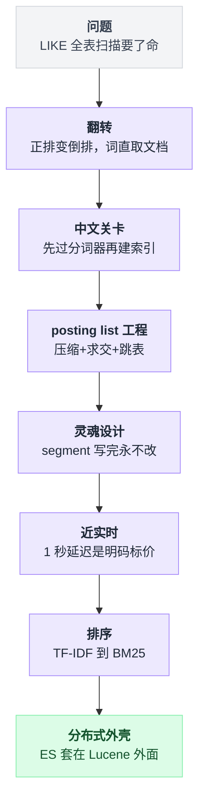
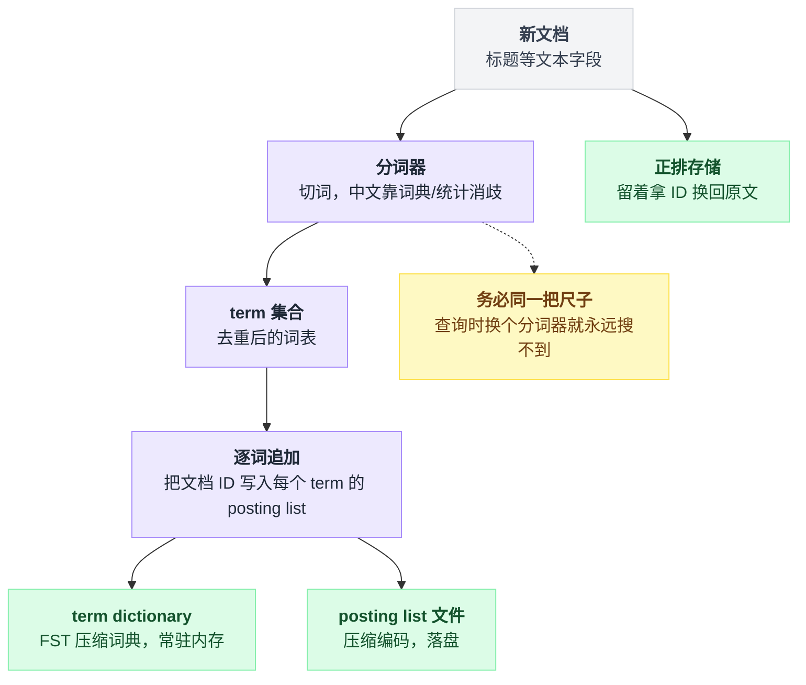
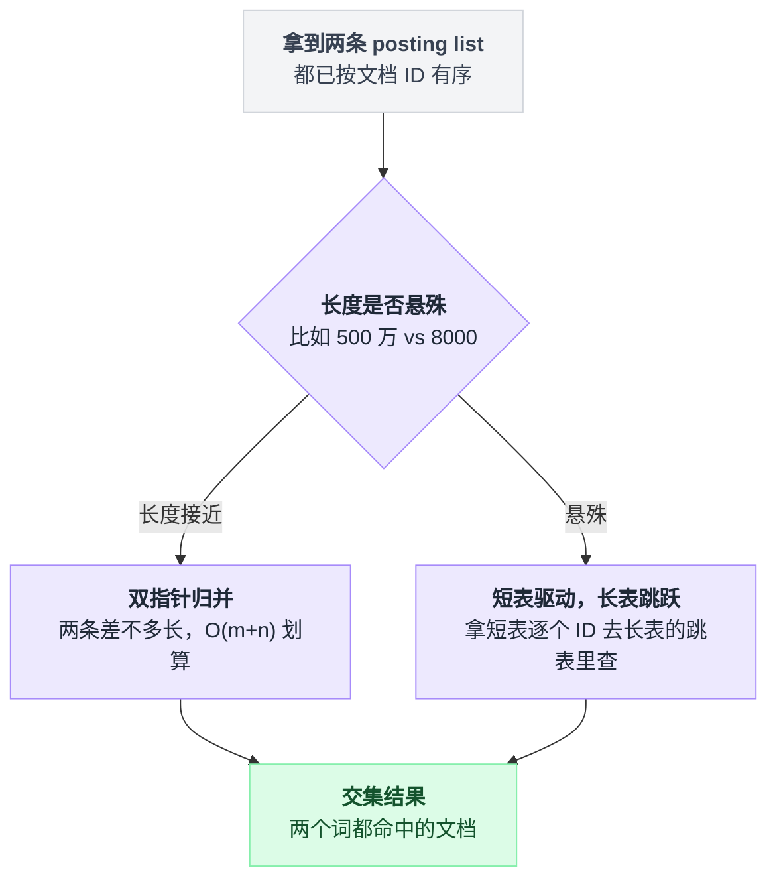
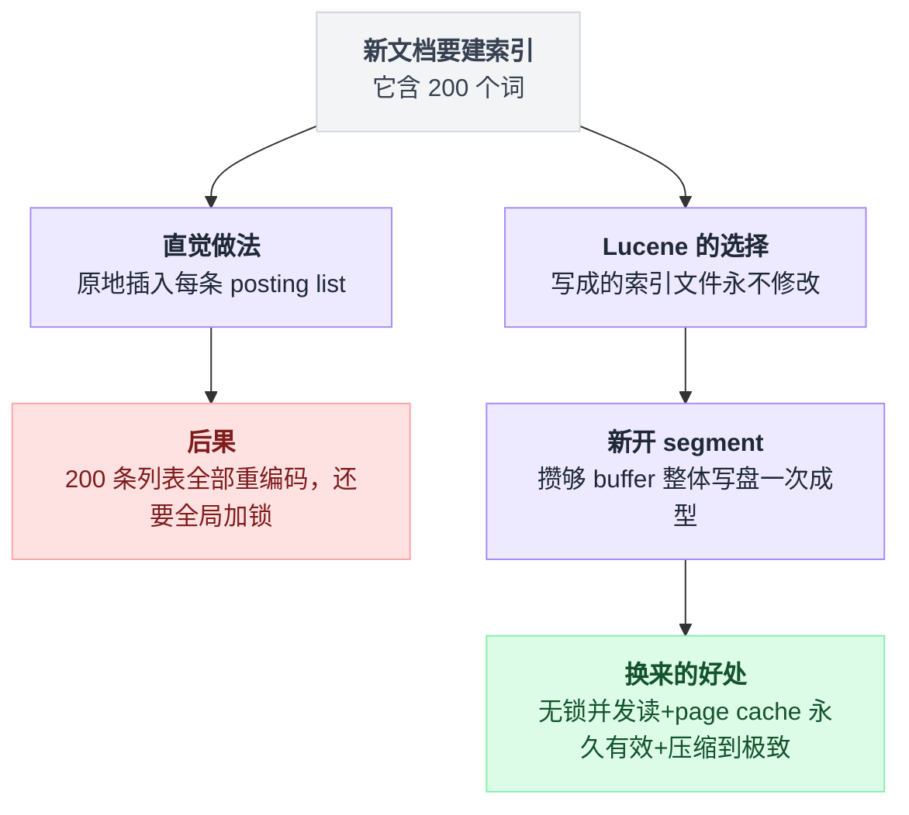
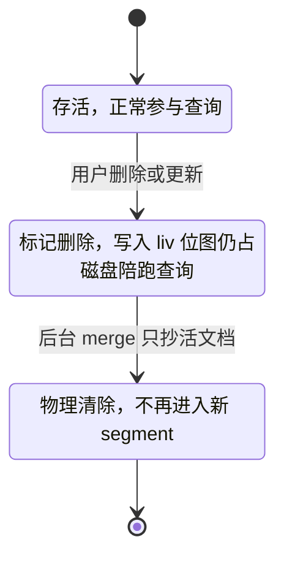
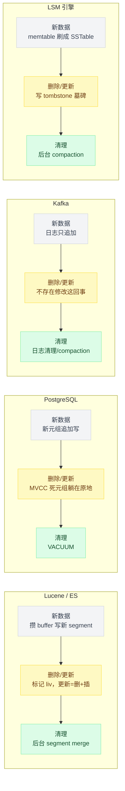
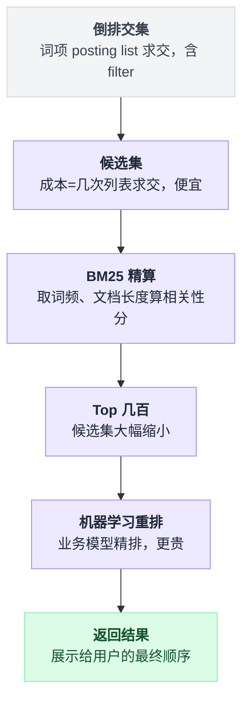
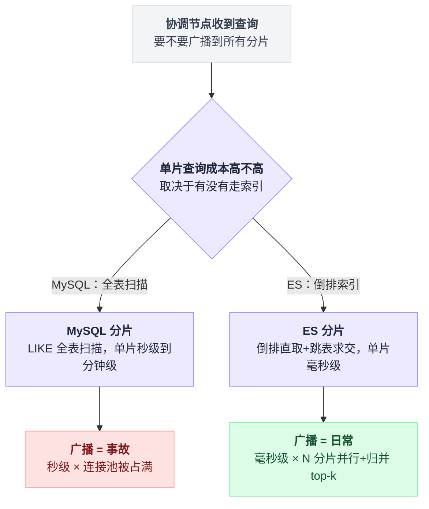

# 《搜索引擎倒排索引》"手机壳"三个字怎么在十亿商品里毫秒返回（小白版）

> 一句话结论：**搜索引擎快，不是因为它查得快，而是因为它把"查"的活儿提前在"写"的时候干完了；而它敢把索引压缩到极致、敢让上千个查询无锁并发，靠的是一个听起来像缺陷的设计——索引文件写完就永不修改。** 删除是假删、更新最贵、"实时"要加钱，这些"毛病"全是同一笔交易的找零。
>
> 难度：★★★★☆。建议先读[第 14 篇分库分表](./14-分库分表.md)（本篇第 8 节和它同构）和 [PostgreSQL 系列第 08 篇索引](../2026-08_从真实项目学PostgreSQL/08-索引.md)（本篇开场从它的 B-tree 讲起）。
>
> 写作时间：2026-08-05。未经一手核实的说法在文中已标注；性能数字只给量级，出处方向见文末。

---

## 目录

- [1. 一句 LIKE 引发的事故：为什么数据库救不了搜索框](#1-一句-like-引发的事故为什么数据库救不了搜索框)
- [2. 一次翻转：从"文档里找词"到"词直取文档"](#2-一次翻转从文档里找词到词直取文档)
- [3. 中文的额外一关：先过分词器](#3-中文的额外一关先过分词器)
- [4. posting list 的工程学：压缩、求交、跳表](#4-posting-list-的工程学压缩求交跳表)
- [5. 灵魂一节：segment 为什么不可变](#5-灵魂一节segment-为什么不可变)
- [6. 近实时：1 秒延迟是明码标价的交易](#6-近实时1-秒延迟是明码标价的交易)
- [7. 排序：TF-IDF 的直觉，BM25 的两处修正](#7-排序tf-idf-的直觉bm25-的两处修正)
- [8. ES 与 Lucene：单机索引库套上分布式外壳](#8-es-与-lucene单机索引库套上分布式外壳)
- [9. 反直觉清单](#9-反直觉清单)
- [10. 一句话总结、小白词典、和前几篇的对照](#10-一句话总结小白词典和前几篇的对照)

---

全文十节走的是一条台阶：从"LIKE 为什么救不了搜索框"一路铺到"ES 凭什么接住十亿商品"，先搭个导航图：



## 1. 一句 LIKE 引发的事故：为什么数据库救不了搜索框

### 1.1 事故现场

你在一家电商公司。周一早上，运营在群里 @ 你：

> "商城搜索是不是挂了？用户搜'手机壳'，转圈转了十几秒，最后报超时。"

你翻开代码，搜索框背后就一行 SQL：

```sql
SELECT * FROM products WHERE title LIKE '%手机壳%' LIMIT 20;
```

这行 SQL 在测试库跑得好好的——测试库只有 10 万行。线上商品表是亿级，大促前刚从供应商那边灌了一批数据。你心想：加个索引呗，`title` 上建一个，收工。

建完，没用。一点用都没有。

### 1.2 为什么 B-tree 帮不上忙：前导通配符

[PG 系列第 08 篇](../2026-08_从真实项目学PostgreSQL/08-索引.md)讲过，B-tree 索引的全部本事来自一件事：**数据是排好序的**。排序意味着"相邻的内容挨在一起"，所以能二分定位、能范围扫描。

问题是，字符串排序是**从头开始比**的。打个比方，B-tree 索引就是一本按姓名排序的电话簿：

```
  B-tree 索引 = 按整个字符串排序的电话簿

  LIKE '手机壳%'（前缀确定）→ 能用索引。
      排序保证以"手机壳"开头的行全挤在一起，
      二分定位到第一条，顺着往下读就完了。

  LIKE '%手机壳%'（前缀不定）→ 索引废了。
      标题里"带"手机壳的行散落在整本电话簿的每一页：
      "苹果手机壳"排在 p 区，"透明手机壳"排在 t 区，
      "iPhone15 手机壳"排在数字区……
      排序帮不上任何忙，只能一页一页翻。
```

这就是"前导通配符让 B-tree 失效"的全部含义：**不是数据库偷懒，是"按前缀排序"这个数据结构在数学上就回答不了"中间含某词"这个问题。**

### 1.3 全表扫描在十亿行上意味着什么，算给你看

索引用不上，数据库只剩一条路：全表扫描。给小白算笔账（全部取量级，不追求精确）：

```
  假设商品表 10 亿行，每行标题+基本字段算 0.5KB
      → 全表 = 10 亿 × 0.5KB = 500GB 量级

  路线 A：从磁盘扫
      SSD 顺序读吞吐按 GB/s 量级算
      → 扫一遍 = 几百秒，也就是分钟级
      → 一次搜索几分钟。搜索框的 QPS 是几千。死刑。

  路线 B：全塞内存里扫（先不问 500GB 内存多少钱）
      单核做纯字符串匹配，吞吐同样是 GB/s 量级
      → 一次查询仍要烧上百核·秒的 CPU
      → 每个用户敲三个字，你的机房烧一次。还是死刑。
```

注意这笔账的真正结论不是"慢"，而是**复杂度错了**：每来一次查询就把 10 亿行过一遍，是 O(N) 每查询，N = 十亿。加机器只能把常数摊薄，改不了 O(N)。第 14 篇算 buffer pool 那笔账时说过"慢的从来是磁盘，不是行数本身"——但在这里，就算磁盘无限快，O(N) 本身也扛不住。

### 1.4 一个剧透：PostgreSQL 自己的答案也叫"倒排"

有人会说：PG 不是有 `pg_trgm` 吗？建个 GIN 索引，`LIKE '%手机壳%'` 就能走索引了。

对。但你看一眼 GIN 的全称：**Generalized Inverted Index，通用倒排索引**。它的思路是把每个字符串切成三字一组（trigram），给每个 trigram 记一份"哪些行含有我"的清单——这正是本篇的主角。

说白了：**只要你想回答"含某词"而不是"以某词开头"，你就逃不出倒排索引。区别只是它长在 PG 里，还是长在 ES 里。**

---

## 2. 一次翻转：从"文档里找词"到"词直取文档"

### 2.1 一个你早就用过的东西：书末索引

技术书翻到最后几页，有个"索引"（Index）：

```
  TCP ................ 89, 120, 344
  三次握手 ............ 90, 91
  拥塞控制 ............ 152, 153, 340
```

想找"拥塞控制"，你不会从第 1 页开始翻——直接查索引，跳到 152 页。

书的正文是"页码 → 内容"，这叫**正排**。书末索引是"词 → 页码"，这叫**倒排**。搜索引擎干的事，就是给十亿商品编了一份"书末索引"。

### 2.2 翻转前后，一张图

```
  正排（数据库里数据躺着的样子）        倒排（翻转之后）
  文档 → 它含哪些词                     词 → 它在哪些文档里

  doc1: [苹果, 手机壳, 硅胶]            苹果   → [1, 4]
  doc2: [安卓, 充电器]        ══翻转══▶ 手机壳 → [1, 3]
  doc3: [手机壳, 透明]                  硅胶   → [1]
  doc4: [苹果, 电脑包]                  充电器 → [2]
                                        透明   → [3]
                                        ...

  查"手机壳"（正排世界）:               查"手机壳"（倒排世界）:
  把 doc1~doc4 逐个打开，               去词典里找到"手机壳"这一行，
  每个都从头读一遍找这个词              直接抄走 [1, 3]
       ↑                                     ↑
     O(全库)                            O(1) 查词典 + O(k) 读清单
                                        k = 含这个词的文档数
```

左边的世界，工作量跟**全库大小**成正比；右边的世界，工作量只跟**结果多大**成正比。这就是"十亿商品毫秒返回"的第一性原理，后面所有章节都是在给这张图打补丁。

术语对一下，后面要反复用：

- 右边每一行的"词"，叫 **term**；
- 每个 term 后面挂的文档 ID 清单，叫 **posting list**；
- 所有 term 组成的那本"字典"，叫 **term dictionary**（真实引擎里它用一种叫 FST 的结构做前缀共享压缩，让整本词典塞得进内存，这里知道有这回事就行）。

### 2.3 天下没有免费的午餐：活儿去哪了

倒排没有消灭工作量，它只是**把工作量从查询时搬到了写入时**。翻转这一下，是在文档入库的时候干的：切词、给每个词的 posting list 追加自己的 ID。

- 查询：从 O(N) 变成"直取"；
- 写入：从"落个盘就完事"变成"切词 + 更新几百个 posting list"；
- 更新一篇旧文档：变得**出奇地贵**——贵到什么程度、引擎怎么躲，是第 5 节的灵魂内容。

读的时候记住这个账本：本篇后面每一个设计，都是在为"写入变贵"这件事付账。

### 2.4 30 行 Python：跑一个玩具倒排索引

标准库就够，复制进 `tiny_index.py` 直接 `python3` 跑：

```python
from collections import defaultdict

def tokenize(text):
    # 中文没空格，土办法：连续两字切一刀（bigram），跳过含空格的
    return {text[i:i+2] for i in range(len(text) - 1)
            if ' ' not in text[i:i+2]}

class TinyIndex:
    def __init__(self):
        self.postings = defaultdict(set)   # term -> 文档ID集合
        self.docs = {}                     # 正排还得留着：拿ID换回原文

    def add(self, doc_id, text):
        self.docs[doc_id] = text
        for term in tokenize(text):
            self.postings[term].add(doc_id)

    def search(self, query):
        terms = tokenize(query)
        if not terms:
            return []
        # 多词 = 求交集。从最短的 posting list 开始交，最省（第 4 节细说）
        lists = sorted((self.postings.get(t, set()) for t in terms), key=len)
        result = set(lists[0])
        for s in lists[1:]:
            result &= s
        return [(i, self.docs[i]) for i in sorted(result)]

idx = TinyIndex()
idx.add(1, "苹果手机壳 硅胶 防摔")
idx.add(2, "安卓手机充电器 快充")
idx.add(3, "手机壳 透明 iPhone15 适用")
idx.add(4, "苹果笔记本电脑包")
print(idx.search("手机壳"))      # 命中 1 和 3；2 只含"手机"，被"机壳"这刀筛掉
print(idx.search("苹果手机壳"))  # 只命中 1；3 没有"苹果"
```

三个看点：

1. `search("手机壳")` 没有碰 doc2 和 doc4 的正文一眼——**按词直取，这就是翻转的意义**；
2. doc2 含"手机"但不含"机壳"，被 AND 交集正确排除——多词交集天然带精度；
3. `tokenize` 里那个"两字切一刀"的土办法，正是下一节的引子。

---

## 3. 中文的额外一关：先过分词器

### 3.1 英文白捡的东西，中文要自己挣

英文文本按空格一切，term 就出来了。中文没有空格——"苹果手机壳硅胶防摔"是一串连续的字，**切在哪里，决定了词典里有什么词，也就决定了什么能被搜到**。

这一步叫**分词**（tokenization / segmentation），它是中文搜索独有的一道关卡，而且错不起：

> ⚠️ 对搜索来说，分词错一次的后果不是"这次结果差点"，是**那个词永远搜不到那篇文档**——词典里根本没有那一行。写入时错了，查询时神仙难救。

### 3.2 经典歧义："南京市长江大桥"

```
  南京市长江大桥

  切法 A:  南京市 / 长江大桥        ← 一座桥
  切法 B:  南京 / 市长 / 江大桥     ← 一位姓江的市长
```

两种切法在字面上都成立，人靠常识选 A，机器得靠算法。这个例子几十年来被每一本中文信息处理教材引用，因为它把问题的本质摆得明明白白：**中文分词不是查表，是消歧。**

### 3.3 两条路线，一笔带过

| 路线 | 思路 | 现状 |
|---|---|---|
| 词典分词 | 拿一本大词典做最大匹配，配合统计消歧 | 工程主流。Python 圈的 jieba、ES 圈的 IK 插件都是这一路 |
| 模型分词 | 序列标注模型（HMM/CRF 到神经网络）逐字判断"切不切" | 精度更高，慢；搜索引擎线上索引链路用得少 |

搜索场景还有第三条躺平路线：**不分词，ngram 硬切**——就是我们玩具代码里"两字一刀"的做法。词典不认识"iPhone15 磁吸壳"没关系，硬切成二字组照样能索引。代价是索引膨胀、精度下降。真实系统常见的折中是：主字段用 IK 这类词典分词，再挂一个 ngram 字段兜底。

### 3.4 一个必背的坑

> 这里有个坑：**索引时和查询时必须用同一个分词器。** 索引时把"手机壳"切成了 `手机/壳`，查询时却整词去查"手机壳"——词典里没有这一行，零结果。这是中文 ES 上线事故的第一大来源，症状就是"明明有这个商品，就是搜不到"。

把 2、3 两节串起来，一篇文档从入库到能被搜到，走的是这样一条流水线：



---

## 4. posting list 的工程学：压缩、求交、跳表

第 2 节的玩具用 Python `set` 存 posting list。十亿商品下这么干，内存直接爆炸。这一节讲真实引擎在 posting list 上抠出来的三门手艺。

### 4.1 为什么必须压缩：一个词 400MB

十亿商品里，"手机"这种热门词的 posting list 可能有上亿个文档 ID。每个 ID 用 int32 存：

```
  1 亿个 ID × 4 字节 = 400MB —— 这只是一个词
  词典里有几百万个词
```

不压缩就没法玩。而压缩的抓手，藏在一个不起眼的事实里：**posting list 是有序的**（文档 ID 从小到大排）。

### 4.2 差值编码 + 变长整数：把 4 字节压成 1 字节

有序，意味着相邻 ID 的**差值**很小。那就别存原值，存差值：

```
  原始 doc ID（有序）:  [ 100200, 100205, 100213, 100214, 100230 ]
                          每个 4 字节（int32），5 个 = 20 字节

  第一步 · 差值编码:    [ 100200,     5,      8,      1,     16 ]
                           ↑首个存原值，后面全是"比前一个大多少"
                           有序保证差值恒为正，而且热门词的差值特别小
                           （文档越多，同一个词的相邻命中挨得越近）

  第二步 · 变长整数（VByte）: 小数字少占字节，大数字才多占

      一个字节切成 1 + 7:
      ┌─┬─────────────┐
      │C│  7 位数据    │    C=1: 后面还有字节；C=0: 到此为止
      └─┴─────────────┘

      数字 5    →  0·0000101              1 字节搞定
      数字 300  →  1·0000010  0·0101100   2 字节（300 = 2×128 + 44）
      （位序各实现有别，意思到了就行）

  压缩结果: 3 + 1 + 1 + 1 + 1 = 7 字节，从 20 字节压掉近三分之二
```

💡 看出连环套了吗：**热门词的 posting list 越长 → 差值越小 → 压得越狠。** 最占地方的词恰好是最能压的词，这个巧合是倒排索引在工程上成立的暗桩。

现代 Lucene 在这个思路上更进一步：不逐个 VByte，而是 128 个差值一块、整块按"最大差值需要几个 bit"统一位打包（Frame of Reference，FOR 家族）。原理同宗：**差值小，就别浪费 bit**。

### 4.3 多词查询 = 有序列表求交集

用户搜"手机壳 羊皮"，引擎拿到两条 posting list，要求**交集**（两个词都含的文档）。两条都有序，教科书解法是双指针归并，O(m+n)。

但现实里两条列表经常极度不对称：

```
  "手机壳" 的 posting list:  500 万个 ID
  "羊皮"   的 posting list:  8000 个 ID
```

O(m+n) 意味着被 500 万那条拖死——为了 8000 个候选，把 500 万个 ID 全过一遍，亏到姥姥家。

### 4.4 跳表：长列表上的快进键

解法：**短列表驱动，长列表快进**。拿"羊皮"的每个 ID，去"手机壳"的列表里问"你有没有这个数"——而长列表上预先铺了跳表（skip list），可以大步跳：

```
  在"手机壳"的 500 万长列表里查 89001 在不在：

  跳表第 2 层:   1 ─────────────→ 60000 ─────────────→ 120000
                                    │ 89001 在这一段
                                    ▼
  跳表第 1 层:   ... 60000 → 75000 → 90000 ...
                               │ 89001 落在 75000 ~ 90000 之间
                               ▼
  原始列表:      ... 75000, 75003, 75009, ..., 88996, 89001 ✓
                 ↑ 只精确走了最后这一小段
                   前面几万个 ID 一步没挨着，整块跳过
```

这和玩具代码里"从最短的 posting list 开始交"是同一个思想的两级形态：先用最小的集合把候选压到最少，再让大列表只在必要处被触碰。Lucene 的 posting list 文件里就埋着这种多层跳点。

对照一下：[第 3 篇时间轮](./03-延迟任务与时间轮.md)的层级轮、这里的跳表，形状都是"多铺几层稀疏导航，换指数级的快进"。链表家族想快，就得立体起来。

两条 posting list 摆在面前，走哪条路取决于它们的长度是否悬殊：



### 4.5 filter 场景的 Roaring Bitmap，一笔带过

搜索里还有一类条件不需要算相关性分，纯粹是过滤：`品牌=Apple`、`有货=true`。这类 filter 的结果集会被缓存下来反复用，缓存格式用的是 **Roaring Bitmap**：按 ID 高 16 位分桶，稀疏的桶存数组、密集的桶存位图，两头讨好。ES 的 filter cache 用的就是它（Elastic 官方博客有一篇《Frame of Reference and Roaring Bitmaps》把 4.2 节和这里一锅讲了，出处见文末）。知道"filter 走 bitmap 缓存、不走打分"这个分工就够了。

---

## 5. 灵魂一节：segment 为什么不可变

本篇最重要的一节。前面欠的账（"写入变贵"）在这里结清，而结账方式反直觉。

### 5.1 先把矛盾摆上台面

新商品上架了，直觉的做法：把它的 ID 插进它含有的每个词的 posting list 里。但看看第 4 节刚讲完的东西——posting list 被差值编码 + 块状位打包压得严丝合缝：

```
  想往 [100200, +5, +8, +1, +16] 中间插一个 100210：

  · 它后面的差值全变了            → 整条列表重新编码
  · 这篇文档有 200 个词           → 200 条 posting list 全部重写
  · 与此同时几千个查询正在读这些列表 → 读写都要加锁
  · 词典（FST）本身也是"改一处、全重建"的结构

  结论：在压缩到极致的结构上做原地修改，等于每次插入都引爆一次重建。
```

压缩和可修改，天生是死对头。Lucene 的选择干脆利落：**不改。写成的索引文件永不修改。**

直觉做法和 Lucene 的实际选择，在这里彻底分岔：



### 5.2 那新文档怎么办：攒一批，另起一个 segment

```
  新文档 ──→ ┌──────────────┐   攒够了 / 到点了    ┌───────────┐
             │ 内存 buffer  │ ──────────────────→  │ segment 4 │ ← 新生的小索引
             └──────────────┘    整体写盘，一次成型  └───────────┘
                                磁盘上已有的（永不修改）:
                          ┌───────────┐ ┌───────────┐ ┌───────────┐
                          │ segment 1 │ │ segment 2 │ │ segment 3 │
                          └───────────┘ └───────────┘ └───────────┘

  查询 ──→ 挨个问每一个 segment，把各自的结果合并
           （每个 segment 都是一个自带词典和 posting list 的完整迷你倒排索引）
```

一个 Lucene 索引 = 一堆只读 segment + 一个正在攒的内存 buffer。新数据永远走"另起炉灶"，老文件一个字节都不动。

### 5.3 不可变换来了什么：好处清单

这个决定看着像躺平，实际上每一条好处都是硬通货：

1. **无锁并发读。** 文件永不变 → 根本不存在写者 → 读者不需要任何锁、任何版本检查。几千个并发查询随便读，连"加锁"这个词都从代码里消失了。
2. **OS page cache 永远有效。** 文件内容不变，操作系统缓存的每一页永不作废。热 segment 常驻内存，Lucene 干脆重度依赖 mmap 把"读索引"变成"读内存"。——这和[第 17 篇 Kafka](./17-Kafka为什么快.md) 靠只追加日志白嫖 page cache 是**同一招**：对操作系统承诺"我不改"，操作系统就把缓存的全部好处让给你。
3. **压缩可以做到极致。** 正因为不用支持原地插入，才敢用差值编码、块状位打包、FST 这种"一动就得全重写"的格式。第 4 节的所有手艺，全是踩在"不可变"上才成立的。
4. **崩溃恢复简单。** segment 要么完整写成、要么不算数，没有"改到一半"的中间态。

### 5.4 代价：删除是假的，更新最贵

天平另一头，同样明码标价：

- **删除只是记个黑名单。** segment 不能改，删文档就在旁边放一个标记文件（老版本叫 `.del`，新版本叫 `.liv`，机制一样：一张"哪些文档已死"的位图）。查询照常从 posting list 里取出这个文档，最后一步再把它滤掉。**尸体还在索引里，还在占磁盘，还在陪跑每一次查询。**
- **更新 = 删 + 插。** 改一个商品标题，实际动作是：老文档标记为死，新文档作为全新 doc 写进新 segment。改一个字段，整篇重写。这就是 2.3 节说"更新出奇地贵"的兑现。
- **后台 merge 才是真正的清道夫。** 小 segment 越攒越多（每个查询都要挨个问一遍，segment 太碎查询就变慢），后台线程持续把小 segment 合并成大的——合并时只抄活文档，被标记的尸体在这一步才物理消失。

单看一篇文档，它这辈子只经历三个状态：



再看 segment 这一层，merge 具体在合并谁：

```
  后台 merge:
  ┌──────┐ ┌──────┐ ┌──────┐        ┌────────────────┐
  │ seg1 │+│ seg2 │+│ seg3 │ ─────→ │  全新的大 seg   │ → 旧的三个整体删除
  │ 3死  │ │ 1死  │ │ 2死  │  只抄   │  0 个死文档     │
  └──────┘ └──────┘ └──────┘  活的   └────────────────┘
```

### 5.5 ⚠️ 跨系统同一形状：你已经见过它两次了

把机制并排放一下：

| 系统 | 新数据 | 删除/更新 | 谁来真正清理 |
|---|---|---|---|
| Lucene / ES | 攒 buffer → 写新 segment | 标记 `.liv`，更新=删+插 | 后台 segment merge |
| PostgreSQL | 新元组追加写 | MVCC 死元组躺在原地 | [VACUUM](../2026-08_从真实项目学PostgreSQL/09-膨胀与VACUUM.md) |
| Kafka | 日志只追加 | 不存在修改这回事 | [日志清理/compaction](./17-Kafka为什么快.md) |
| LSM 引擎（RocksDB 等） | memtable → 刷成 SSTable | 写 tombstone 墓碑 | 后台 compaction |

四个系统并排摆在一起看，走的是同一条三步节奏：



四个系统，谁也没抄谁，长成了同一个形状：**顺序写新的 + 标记旧的 + 后台慢慢整理**。原因也只有一个：磁盘喜欢顺序写，并发喜欢不可变。PG 系列 09 篇里 VACUUM 追不上写入导致膨胀的那些坑，在 ES 里换个名字全数上演——merge 追不上写入，段数暴涨、磁盘被死文档占满，一样的病。

💡 本节的反直觉内核，值得单独一行：**"不可变"听起来是功能上的限制，实际上是性能的来源。** Lucene 不是"没能力做原地更新"，是算过账之后**故意不做**。

---

## 6. 近实时：1 秒延迟是明码标价的交易

### 6.1 现象：新商品上架，1 秒后才搜得到

ES 有个出了名的标签：**NRT，Near Real-Time，近实时**。默认配置下，一篇文档写入成功（客户端都收到 200 了），要过约 1 秒才能被搜到。为什么差这 1 秒？答案藏在写入路径里。

### 6.2 写入路径拆解：可见性和持久性是两条线

```
                     ┌─────────────────────────────────────────┐
  一条新文档 ───┬──→ │ ① 内存 indexing buffer                  │  ← 搜不到
                │    └───────────────┬─────────────────────────┘
                │                    │ refresh（默认每 1 秒一次）
                │                    ▼
                │    ┌─────────────────────────────────────────┐
                │    │ ② 变成新 segment，落在 OS page cache 里 │  ← 从这一刻起搜得到！
                │    │    注意：还没 fsync，纯内存态，掉电会丢 │
                │    └───────────────┬─────────────────────────┘
                │                    │ flush（translog 攒大了或到时间，ES 自己挑时机）
                │                    ▼
                │    ┌─────────────────────────────────────────┐
                │    │ ③ fsync 落盘，成为真正安全的文件         │
                │    └─────────────────────────────────────────┘
                │
                └──→ ┌─────────────────────────────────────────┐
                     │ translog：顺序追加的操作日志             │  ← 兜底
                     │ 默认每个写请求 fsync 一次才返回成功       │
                     └─────────────────────────────────────────┘
```

两个关键的解耦：

1. **可见 ≠ 落盘。** refresh 只是把内存 buffer 里的文档"整理成 segment 的样子"放进 page cache——没有 fsync，成本主要是编码，不用等磁盘。搜索读的就是 page cache，所以这一步之后就能搜到。
2. **安全靠 translog，不靠 segment。** segment 还没 fsync 就掉电了怎么办？translog 是顺序追加的日志，默认每个写请求都 fsync 后才 ack（`index.translog.durability=request`），重启后重放它就能恢复。——又是熟悉的配方：**随机写的复杂结构慢慢建，顺序写的日志先保命**。数据库的 WAL、[第 9 篇 IM 消息](./09-IM消息可靠投递.md)的先落库后投递，都是这个分工。

### 6.3 为什么是 1 秒：不是做不到实时，是不划算

refresh 每执行一次，就诞生一个新 segment。把 refresh 调成"每写一条刷一次"，技术上完全做得到，后果是：

```
  refresh 越频繁 → segment 越碎
                 → 每个查询要挨个问的 segment 越多，查询变慢
                 → 后台 merge 疲于奔命，CPU/IO 被合并吃光
                 → 写入吞吐雪崩
```

Elastic 选了 1 秒当默认值，两头都过得去；而且这是个明码标价的旋钮：日志类场景常把 `refresh_interval` 调到 30 秒甚至更长，批量导入时干脆设成 -1 关掉、导完再开。

💡 这正是[第 12 篇"菜市场的秤"](./12-小而美的五个算法.md)那个问句的又一次现身：这里的"不实时"，到底伤不伤人？用户上架商品晚 1 秒可见，没人受伤；为这 1 秒把集群吞吐打骨折，才是真伤。**"近实时"不是能力上限，是价目表。**

---

## 7. 排序：TF-IDF 的直觉，BM25 的两处修正

### 7.1 召回只做了一半的事

倒排交集给了你"含'手机壳'的 500 万个商品"。谁排第一页？不排序的搜索等于没搜。这一节讲引擎内置的文本相关性打分——点到为止，因为真实电商排序后面还叠着一整套业务模型，那是[第 11 篇推荐系统](./11-推荐系统四级漏斗.md)的地盘。

### 7.2 TF-IDF 的直觉：词频 × 稀有度

一句话就能讲完：

```
  相关性 ≈ TF × IDF

  TF （词频）  : "手机壳"在这篇文档里出现越多 → 这篇越可能真是讲手机壳的
  IDF（稀有度）: 全库到处都有的词不值钱——"包邮"出现在 8 亿个商品里，
                 命中它说明不了任何事；"羊皮"只出现在几千个商品里，
                 命中它信息量极大
```

两个直觉都对，但 TF 那半边有个天真的假设：出现次数和相关性**线性**挂钩。出现 100 次就比出现 5 次相关 20 倍？标题里塞满"手机壳手机壳手机壳"的作弊商家第一个赞成。

### 7.3 BM25 修正之一：词频饱和

BM25 把 TF 的贡献改成 `tf / (tf + k1)` 这个形状：

```
  得分贡献
   │                                ╱   TF-IDF：线性，出现次数翻倍得分跟着翻
   │                            ╱
   │                        ╱
   │                    ╱        ┌───────────  BM25：涨到一定程度就躺平（饱和）
   │                ╱      ╱────┘
   │            ╱     ╱───┘
   │        ╱    ╱──┘
   │    ╱   ╱─┘
   └──┴──┴──────────────────────────────────→ "手机壳"在这篇文档里出现的次数
        ↑ 前几次出现，两条线都涨得很快
          第 50 次和第 100 次出现，BM25 几乎不再加分
```

含义很朴素：一个词出现 3 次和 1 次，区别很大；出现 100 次和 50 次，没什么区别——这篇讲的是手机壳，这件事早就确认过了。关键词堆砌作弊，在 BM25 面前直接失效大半。

### 7.4 BM25 修正之二：文档长度归一

长文档天然含更多词、更高词频——一篇 5000 字的详情页命中"手机壳" 8 次，和一个 15 字的标题命中 2 次，谁更相关？BM25 把文档长度和全库平均长度的比值放进分母（参数 b 控制力度），**长文档的词频要打折**。Lucene 里这两个参数的默认值是 k1=1.2、b=0.75，ES 从 5.0 起默认打分就是 BM25（此前是 TF-IDF 变体）。

### 7.5 算分发生在召回之后：又是"粗筛 + 精算"

注意时序：**先**用倒排交集 + filter 拿到候选集（粗筛，每个文档的成本是几次列表求交，便宜），**再**对候选集算 BM25（精算，要取词频、文档长度，贵），真实系统还会对 top 几百再叠机器学习模型（更贵）。

这个"漏斗"你已经见过两次了：[第 11 篇推荐系统](./11-推荐系统四级漏斗.md)的召回→粗排→精排→重排，[第 21 篇 LBS](./21-附近的人与LBS.md) 的"geohash 粗筛 + 精确算距离"。**贵的算法永远只配在便宜算法筛剩的小集合上跑**——这是本系列出现频率最高的形状之一。顺带一提，工程上还有 WAND 一类"提前放弃不可能进 top-k 的文档"的剪枝算法，让精算连候选集都不用跑全，一句话带过。

排序这半节把"贵的算法只在便宜算法筛剩的小集合上跑"落到了具体环节：



---

## 8. ES 与 Lucene：单机索引库套上分布式外壳

### 8.1 分工一句话说清

前面 2~7 节讲的所有东西——segment、词典、posting list、跳表、BM25、merge——全部住在 **Lucene** 里。Lucene 是一个**单机** Java 索引库：给它文档，它在一台机器上维护一个倒排索引。没有集群，没有副本，没有 REST 接口。

**Elasticsearch = Lucene + 分布式外壳。** ES 提供：分片与路由、副本与故障转移、集群管理、REST/JSON 接口、聚合分析、还有第 6 节的 translog（translog 是 ES 层的发明，Lucene 本体没有）。

而这层外壳的核心设定只有一句话：**每个分片（shard）就是一个完整、独立的 Lucene 索引**——有自己的 segment、自己的词典、自己的 merge 线程。

### 8.2 文档路由：你在第 14 篇已经学过了

十亿商品放不进一个 Lucene 实例，怎么拆？

```
      PUT /products/_doc/78373186106228742
                      │
                      ▼
      shard = murmur3(_routing) % 主分片数      ← _routing 默认就是文档 _id
                      │
       ┌──────────────┼──────────────┐
       ▼              ▼              ▼
  ┌─────────┐    ┌─────────┐    ┌─────────┐
  │ shard 0 │    │ shard 1 │    │ shard 2 │   ……每个 shard = 一个完整 Lucene 索引
  │(Lucene) │    │(Lucene) │    │(Lucene) │
  └─────────┘    └─────────┘    └─────────┘
```

`hash(id) % 分片数`——这就是[第 14 篇分库分表](./14-分库分表.md)的取模路由，一个字都不用改。同构到什么程度？**连病都一起遗传了**：

- 第 14 篇：分片数定死后扩容要命，基因位一旦定型改不了；
- ES：**主分片数建索引时定死，之后不能改**。解法你也眼熟——`_split` API 要求目标分片数必须是原分片数的整数倍（第 14 篇第 5 节双倍扩容法的亲戚），实在不行就 reindex 全量重建（对应分库分表的停机迁移）。
- 第 14 篇：深分页爆炸，正解是禁止跳页的 keyset 分页；
- ES：`from + size` 深分页同样爆炸，默认 `max_result_window` 直接拦在 10000，官方正解叫 `search_after`——**就是 keyset 分页换了个名字**。

同一个数学结构，长在 MySQL 上和长在 Lucene 上，会生同样的病、吃同样的药。把第 14 篇学扎实，ES 的分布式层你等于已经学完一半。

### 8.3 一个关键差异：ES 天天在做分库分表最怕的事

第 14 篇花了整整一节讲怎么用基因法**避免**全分片广播——广播一次，32 个分片全遭殃。但 ES 的普通搜索请求，**默认就是广播**：协调节点把查询发给每个分片，各分片本地算出 top-k，回传后归并（scatter-gather）。

凭什么 MySQL 广播是事故，ES 广播是日常？

```
  MySQL 分片内:  LIKE '%手机壳%' → 全表扫描 → 单片就要秒级甚至分钟级
                 广播 = 秒级 × 全部连接池被占满 → 事故

  ES 分片内:     倒排直取 + 跳表求交 + 提前终止 → 单片毫秒级
                 广播 = 毫秒级 × N 个分片并行 + 归并 top-k → 日常操作
```

**广播贵不贵，取决于单片查询贵不贵。** 倒排把单片成本打到毫秒级，广播才从灾难变成了架构选择。

把这条判据画成分岔，MySQL 和 ES 走的是同一个协调节点、完全不同的命运：



### 8.4 呼应第 14 篇：后台复杂查询扔给 ES，它凭什么接得住

第 14 篇 3.4 节给过一条原则："运营/客服/BI 的复杂查询单独建 ES，彻底不碰在线库"。当时没解释 ES 凭什么接得住，现在可以结账了：

后台查询的特点是**维度不可预知**——运营今天按"类目+价格区间+上架时间"查，明天按"品牌+库存状态+关键词"查。B-tree 世界里这是绝症：`(a,b,c)` 联合索引服务不了 `(b,c)` 查询（[PG 系列 08 篇](../2026-08_从真实项目学PostgreSQL/08-索引.md)的最左前缀原则），你不可能为每种组合预建联合索引，组合是指数多的。

倒排世界里这个问题不存在：**每个字段独立建倒排，查询时任意组合的条件 = 任意几条 posting list 现场求交**（filter 场景还走第 4.5 节的 Roaring Bitmap 缓存）。不需要预知查询模式，不需要联合索引——"自由组合"是倒排交集的原生能力，不是优化出来的功能。

这就是那条架构原则的底气：**不是 ES 机器多，是数据结构对路。**

---

## 9. 反直觉清单

把散在全文的 ⚠️ 和 💡 收拢，六条：

1. **搜索快不是因为查得快，是因为查的活儿在写入时干完了。** 倒排索引是"预付费"模式：写入付出切词和建索引的代价，查询才能只为结果大小买单（第 2 节）。
2. **"不可变"是性能来源，不是功能缺陷。** 无锁并发读、page cache 永远有效、压缩敢做到极致，三样全是拿"放弃原地修改"换来的（第 5 节）。
3. **删除不删除东西，更新是最贵的写操作。** `.liv` 黑名单 + 删旧插新 + 后台 merge 收尸——和 PG 的死元组 + VACUUM、LSM 的墓碑 + compaction 是跨系统同一形状（第 5.5 节）。
4. **"近实时"是定价，不是极限。** 每写一条 refresh 一次技术上可行，只是没人付得起 segment 碎片化的账单。1 秒是 Elastic 替你选好的性价比档位，旋钮就在那，随时可调（第 6 节）。
5. **你以为不用 ES 就躲开了倒排——PG 的 GIN 全称就是通用倒排索引。** 需求决定数据结构，跟选型无关（第 1.4 节）。
6. **在标题里堆关键词骗排名，BM25 的词频饱和曲线早就防着了。** 第 50 次出现和第 100 次出现，加分约等于零（第 7.3 节）。

---

## 10. 一句话总结、小白词典、和前几篇的对照

### 一句话总结

> **倒排索引把"每次查询扫全库"翻转成"写入时建目录、查询时直取"，再用"segment 永不修改"这个看似自缚手脚的决定，同时换来无锁并发、缓存永久有效和极致压缩——搜索引擎的所有毛病（假删除、贵更新、1 秒延迟）都是这笔交易的找零，而这笔交易稳赚不赔。**

### 小白词典

| 词 | 一句人话 |
|---|---|
| 正排 / 倒排 | 正排是"文档→它有哪些词"，倒排是"词→它在哪些文档"；搜索靠后者按词直取 |
| term / posting list | term 是词典里的一个词；posting list 是这个词名下"含有我的文档 ID 清单" |
| 分词 | 把中文句子切成词的那一刀；切错了，那个词就永远搜不到那篇文档 |
| 差值编码 | 有序 ID 不存原值存差值，把大数字变成小数字好压缩 |
| 跳表 | 长 posting list 上的快进键，求交集时整块整块地跳过不可能命中的区域 |
| segment | Lucene 的索引分块，写成之后永不修改；一个索引 = 一堆只读 segment |
| merge | 后台把小 segment 合并成大的，顺便物理清掉被标记删除的文档 |
| refresh / translog | refresh 让新文档进 page cache 变得可搜（默认 1 秒）；translog 顺序落盘保证掉电不丢 |
| BM25 | 内置打分公式：词频×稀有度，外加词频饱和与长度归一两个补丁 |
| Roaring Bitmap | filter 结果的缓存格式，稀疏处存数组、密集处存位图 |

### 和前几篇的对照

1. **第 5.5 节 ↔ [PG 系列 09 膨胀与 VACUUM](../2026-08_从真实项目学PostgreSQL/09-膨胀与VACUUM.md)**：`.liv` 标记删除 + 后台 merge，和死元组 + VACUUM 是跨系统同一形状——顺序写新的、标记旧的、后台清理；merge/VACUUM 追不上写入时，两边生一样的膨胀病。
2. **第 5.3 节 ↔ [第 17 篇 Kafka 为什么快](./17-Kafka为什么快.md)**：向操作系统承诺"文件不可变/只追加"，换 page cache 全额生效——LSM 家族的家风，两篇是同一招的两次出手。
3. **第 8.2 节 ↔ [第 14 篇分库分表](./14-分库分表.md)**：`hash(id) % 分片数` 同一个模子，连"分片数定死难扩容""深分页只能 keyset"这些病都一起遗传；而 14 篇"后台查询扔给 ES"的底气，本篇 8.4 节结了账。
4. **第 7.5 节 ↔ [第 11 篇推荐四级漏斗](./11-推荐系统四级漏斗.md) / [第 21 篇 LBS](./21-附近的人与LBS.md)**：召回之后才算 BM25，粗筛+精算——贵算法只在便宜算法筛剩的小集合上跑，本系列第三次见到这个漏斗。
5. **第 6.3 节 ↔ [第 12 篇菜市场的秤](./12-小而美的五个算法.md)**：refresh 1 秒就是那台"精度 5 克的电子秤"——先问一句"这里的不实时伤不伤人"，不伤，就把省下的吞吐装进口袋。

### 主要参考方向

- Elastic 官方博客《Frame of Reference and Roaring Bitmaps》（posting list 压缩与 filter 缓存）
- 《Elasticsearch: The Definitive Guide》"Inside a Shard" 章节（segment 不可变、refresh/translog/flush 机制）
- Manning, Raghavan, Schütze,《Introduction to Information Retrieval》（差值编码、VByte、跳表求交的教科书出处）
- Robertson & Zaragoza,《The Probabilistic Relevance Framework: BM25 and Beyond》（BM25 原始框架）
- Apache Lucene 官方文档（FST 词典、TieredMergePolicy、跳表结构）
