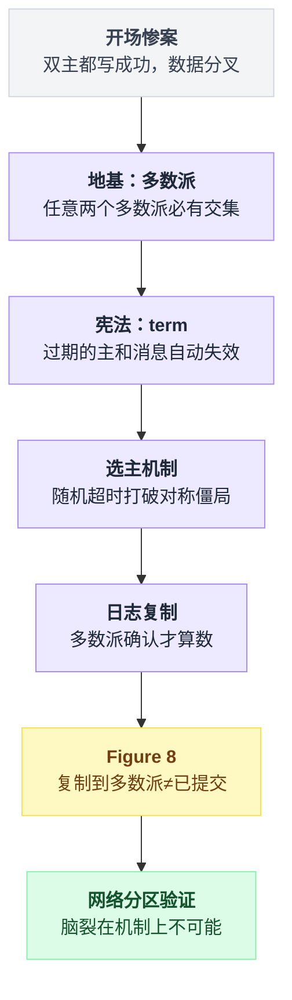
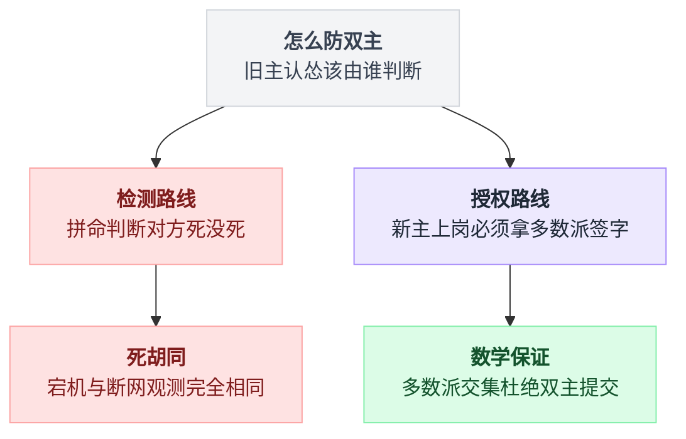
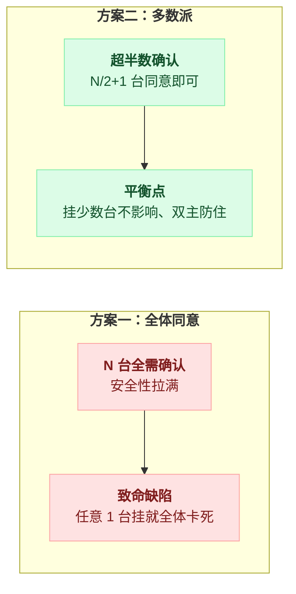
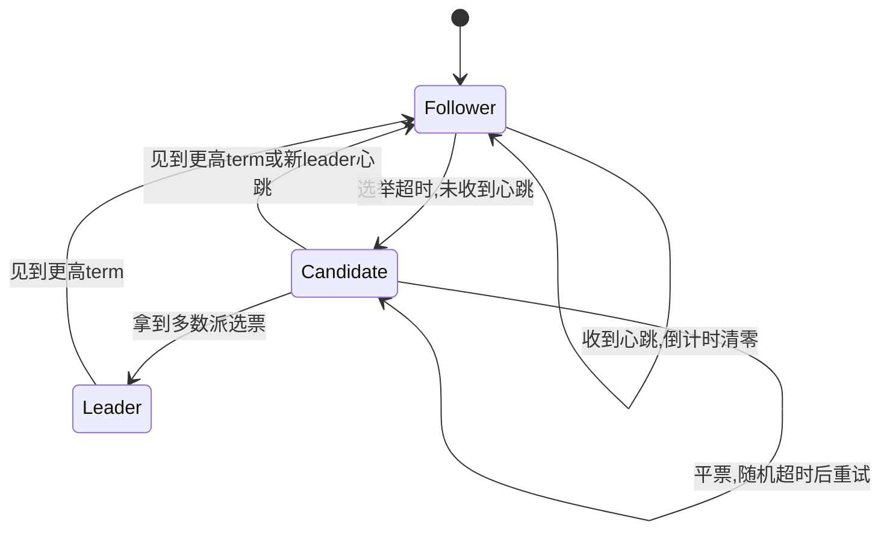
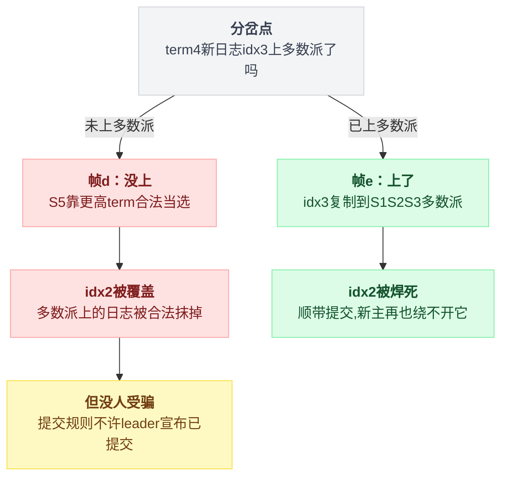
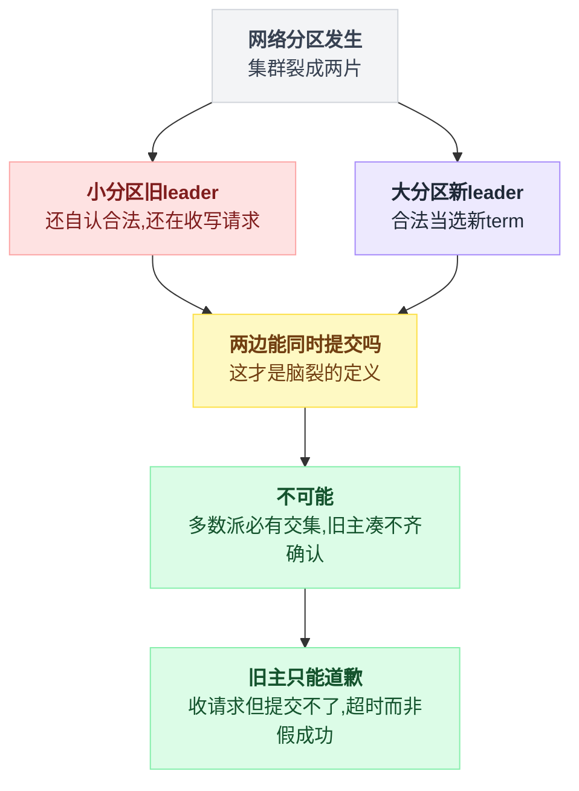

# 《Raft 共识》三台机器怎么在有人掉线时对"谁是主"达成一致（小白版）

> 一句话结论：**脑裂不是靠"更快地检测故障"防住的，是靠一条小学数学防住的——任意两个多数派必然有交集。Raft 的全部机关（任期、投票、提交规则）都是在守这条交集；而全协议最深的一个坑，是"复制到多数派"和"已提交"居然不是一回事（论文 Figure 8），本篇把它一帧一帧走通。**
>
> 难度：★★★★★（全系列天花板）。这是本系列一直在"用"、却从没拆开过的最底层——[第 16 篇](./16-分布式锁.md)锁的兜底、[第 17 篇](./17-Kafka为什么快.md)的 KRaft、Kubernetes 脚下的 etcd，地基全是它。
>
> 写作时间：2026-08-05。论文出处：《In Search of an Understandable Consensus Algorithm》（Diego Ongaro & John Ousterhout, 2014，下称"Raft 论文"）。未经一手核实的说法在文中已标注。

---

## 目录

- [0. 开场惨案：一次网络抖动，两个"主"，数据永久分叉](#0-开场惨案一次网络抖动两个主数据永久分叉)
- [1. 地基：为什么偏偏是多数派](#1-地基为什么偏偏是多数派)
- [2. 任期 term：整个协议的宪法](#2-任期-term整个协议的宪法)
- [3. 选主：分帧推演](#3-选主分帧推演)
- [4. 日志复制：多数派确认才算数](#4-日志复制多数派确认才算数)
- [5. 全篇最硬的一节：Figure 8](#5-全篇最硬的一节figure-8)
- [6. 网络分区推演：脑裂为什么在机制上不可能](#6-网络分区推演脑裂为什么在机制上不可能)
- [7. 收尾外围：Paxos、工程实现、Sentinel、读请求](#7-收尾外围paxos工程实现sentinel读请求)
- [8. 反直觉清单](#8-反直觉清单)
- [9. 一句话总结、小白词典、与前几篇的对照](#9-一句话总结小白词典与前几篇的对照)

---

全文九节层层加码，每一节都是给上一节挖的坑打补丁，先看整体骨架：



---

## 0. 开场惨案：一次网络抖动，两个"主"，数据永久分叉

### 0.1 事故现场

一个账户余额服务，三台机器：A 是主库，B、C 是从库，异步复制。旁边挂一个监控脚本：连续 3 秒 ping 不通主库，就把 B 提升为新主。看起来很稳，对吧？

某天凌晨，机房交换机抖了 40 秒。注意，**A 没死**——它自己看自己一切正常，只是从监控脚本的位置看不见它了。

于是剧本这样走：

- 监控脚本：ping 不通 A → 判定 A 死了 → 提升 B 为主，把新连接指向 B。
- 但业务方有一半连接是长连接，还挂在 A 上——抖动只影响了监控走的那条链路。
- 接下来 40 秒：A 收了 37 笔写入，B 收了 52 笔。**两边的客户端都拿到了"写入成功"。**

```
 抖动前                            抖动中（40 秒）
 ┌────────┐                      ┌────────┐        ┌────────┐
 │ A：主  │◀── 所有写入          │ A：主  │        │ B：主  │   ← 双主！
 └───┬────┘                      └───┬────┘        └───┬────┘
     │ 异步复制                      │                 │
  ┌──┴───┐                      旧长连接的写       新连接的写
  ▼      ▼                      （37 笔成功）      （52 笔成功）
┌────┐ ┌────┐
│ B  │ │ C  │                   同一个账户，两条互相矛盾的历史
└────┘ └────┘                   而且两边都盖了"成功"的章
```

抖动结束，运维发现双主，手动把 A 降回从库。然后呢？A 上那 37 笔写入怎么办？B 上的 52 笔又怎么办？同一个账户在两边都动过钱——**这个系统里已经没有任何一台机器能回答"现在余额到底是多少"**。

唯一的出路是人工对账，然后扔掉一边的数据。用户的钱，就在"扔掉一边"这四个字里出问题。这就是**脑裂（split brain）**：同时存在两个自认为合法的主，各自接受写入，数据裂成两个版本，而且两个版本都"理直气壮"。

### 0.2 你能想到的补丁，为什么都不行

小白的第一反应通常是"检测做准一点"。一条条过：

- **"多 ping 几次再提升"**——治标。ping 30 秒不通再提升，只是把误判概率降低，没有降到零。而脑裂这种事故，概率再低，发生一次就够你喝一壶。
- **"提升 B 之前，让 C 也确认一下 A 挂了"**——好一点了（这个方向其实是对的，往下看），但如果只是"问一嘴"而没有一套完整的授权和退位机制，A 恢复之后照样不知道自己已经被废了。
- **"让 A 察觉自己被孤立后主动自杀"**——A 怎么察觉？在 A 眼里，是"其他所有人都失联了"，它凭什么认为错的是自己？

所有补丁都撞在同一堵墙上：

```
┌──────────────────────────────────────────────────────┐
│  分布式系统的第一性难题：                            │
│                                                      │
│  从 B 的视角看，"A 宕机了"和"我到 A 的网断了"      │
│  产生的观测完全相同——都是"A 不回消息"。            │
│  单点的观察，永远无法区分这两种情况。               │
└──────────────────────────────────────────────────────┘
```

说白了，"检测主死没死"这条路在原理上就是死胡同。Raft 换了一条路：**不再试图判断旧主死没死，而是规定新主上岗必须拿到超过半数机器的签字**。把问题从"检测"改成"授权"——检测可以出错，授权可以用数学保证不出错。

两条路的分岔画出来是这样：



### 0.3 这是本系列欠了很久的一篇

回头看看我们一路用过多少次"有个东西替你保证只有一个主"：

- [第 16 篇](./16-分布式锁.md)说 Redis 锁兜不了正确性的底，要靠 ZooKeeper / etcd——那 ZooKeeper / etcd 自己凭什么不脑裂？
- [第 17 篇](./17-Kafka为什么快.md)里 Kafka 用 KRaft 管元数据，把 ZooKeeper 请出了家门——KRaft 的 "Raft" 就是本篇主角。
- Kubernetes 的全部集群状态放在 etcd 里，etcd 的核心就是一个 Raft 实现。

这些系统底下全是**共识（consensus）**：一群会掉线、会失联的机器，对"一件事"达成不可反悔的一致。本系列一直在用它，今天拆开它。

---

## 1. 地基：为什么偏偏是多数派

### 1.1 新规则只有一条

把 0.2 结尾那句话变成机制：

> **任何节点想当主，必须先拿到全体 N 台中超过半数（N/2 + 1，向下取整后加一）的同意票。**

就这一条。它为什么能防住双主？因为一条小学数学：

```
   5 台机器：   S1    S2    S3    S4    S5

   多数派 X：  └───────┬───────┘
                S1    S2    S3

   多数派 Y：              └───────┬───────┘
                            S3    S4    S5

   |X| + |Y| = 3 + 3 = 6 > 5
   → 两拨人就算刻意错开，也必然共享至少 1 台（这里是 S3）
```

抽屉原理：6 个饼放进 5 个盘子，至少一个盘子有 2 个饼。两个多数派加起来的票数超过总台数，**必有交集**。这条性质是全篇的地基，后面每一个机制都要回到它身上。

推论马上就有一个：假如 B 和 C 同时想当主，B 拿到了一个多数派，C 也想拿一个多数派——两个多数派必有交集，交集里的那台机器**只有一票**。它投了 B 就没法再投 C。所以**同一轮里，两个人不可能都凑齐多数派**。双主的第一道门，焊死了。

### 1.2 容错账本：3 容 1，5 容 2，4 台是冤大头

多数派规则下，集群能容忍几台挂掉？只要活着的机器还够凑一个多数派，集群就能继续选主、继续干活：

| 集群台数 N | 多数派需要 | 最多容忍挂几台 |
|---|---|---|
| 3 | 2 | **1** |
| 4 | 3 | **1** |
| 5 | 3 | **2** |
| 6 | 4 | **2** |
| 7 | 4 | **3** |

⚠️ 看第二行，反直觉的来了：**4 台不比 3 台强。**

- 容错数一样：都只能挂 1 台。4 台挂 2 台，剩 2 台凑不出 3 票的多数派，集群照样停摆。
- 达成多数还更难了：3 台里凑 2 票，4 台里要凑 3 票——每次写入要等的确认反而变多。
- 多花一台机器的钱，买了个寂寞，还附赠更高的平票概率（偶数台更容易五五开）。

所以共识集群几乎总是奇数台：3、5、7。etcd 官方 FAQ 也明确建议奇数节点。再往上（9 台、11 台）一般不划算——每多两台只多容错 1 台，但每次提交要等的确认更多，写入越来越慢。

### 1.3 为什么不要求"全体同意"

有人会问：要绝对安全，让全部 N 台都确认不是更稳？

不行，那等于把可用性归零：**任何一台**挂掉，整个集群就再也凑不齐"全体"，所有写入卡死。你为了防一种故障（脑裂），把自己变成了另一种故障（单点放大成 N 点）。

多数派是掐着数学下限选的平衡点：

- 交集性质要求两个"决定集合"加起来超过 N → 每个集合至少 N/2+1；
- 集合再大，容错就变差；集合再小，交集就没了。

两种方案摆在一起对比更直观：



这和[第 12 篇](./12-小而美的五个算法.md)贯穿全文的那笔交易是同一个思路：主动放弃"人人确认"，换来"挂一台不影响"。放弃的那部分（少数派可能暂时没有最新数据），后面会看到 Raft 怎么把它兜住。

---

## 2. 任期 term：整个协议的宪法

### 2.1 还差一块：旧主回来了怎么办

多数派解决了"同一轮只有一个人能当选"。但开场惨案里还有半条命没解决：**A 恢复之后，它还以为自己是主**。集群需要一种共同语言，让所有人对"现在是第几届"有一致的判断，让过气的主一照镜子就知道自己过气了。

这个共同语言就是**任期（term）**：一个全集群单调递增的整数，作用相当于逻辑时钟，或者干脆理解成"第几届政府"。

### 2.2 三条铁律

term 的规则只有三条，但它是全篇的"宪法"——后面所有流程遇到疑问，回到这三条准没错：

```
┌────────────────────────────────────────────────────────────┐
│ 宪法第一条：所有消息都必须携带发送者的 term。              │
│                                                            │
│ 宪法第二条：见到比自己高的 term，立刻把自己的 term 更新    │
│            上去；如果自己是 leader 或 candidate，          │
│            立刻退成 follower。没有任何讨价还价。           │
│                                                            │
│ 宪法第三条：见到比自己低的 term 发来的请求，拒绝，         │
│            并把自己的 term 告诉对方（触发对方执行第二条）。│
└────────────────────────────────────────────────────────────┘
```

配套一条选举纪律：**每个节点在每个 term 里最多投一票**，先到先得（还要过日志校验，第 4 节讲）。这一票和当前 term 一起**持久化到磁盘**——重启不能忘，否则一台机器重启后同一任期投两个人，多数派交集就被打穿了。

### 2.3 这三条合起来意味着什么

- **一个任期至多一个 leader。** 每人一票 + 多数派必有交集（1.1 的推论），同一 term 不可能选出俩。可能一个都选不出（平票，第 3 节推演），那这个 term 就白过，换下一届重来——**宁可空转，不可双主**。
- **过气的主自动认怂。** 开场惨案里 A 恢复后，只要收到任何一条带更高 term 的消息（比如新主的心跳），宪法第二条立刻生效：退位成 follower。不需要任何人"通知"它、更不需要它"察觉"什么——它自己撞上来就退了。
- **过期的命令自动作废。** A 在退位前发出的写请求还在网络里飘着，落到别人头上时带的是旧 term，宪法第三条：拒收。

💡 term 真正解决的问题是**过期信息**。分布式系统里，你永远不知道一条消息在网络里飘了多久、发它的人现在还是不是他自称的身份。term 让每条消息自带"保质期戳"，收信人一眼判断真伪。这比"想办法让旧消息传不过来"现实得多——网络不受你控制，规则受你控制。

---

## 3. 选主：分帧推演

角色一共三种，全部 Raft 节点都在这张状态机上流转：

```
                     选举超时，没听到心跳
        Follower ─────────────────────────▶ Candidate
          ▲   ▲                              │     │
          │   │                              │     │ 拿到多数派选票
          │   └──────────────────────────────┘     ▼
          │      拉票失败/见到更高 term           Leader
          │                                        │
          └────────────────────────────────────────┘
                       见到更高 term（宪法第二条）
```

三种角色的转移条件收进一张标准状态机：



平时集群里只有一个 leader，其他全是 follower，candidate 只在换届的一瞬间存在。下面用连续状态帧把一次完整换届走一遍。设定：3 台机器 A、B、C，当前 term = 2，A 是 leader。

### 3.1 帧 1｜风平浪静：心跳镇场

```
帧 1（term = 2，一切正常）

              ┌──────────────┐
              │  A  Leader   │ term=2
              └──────┬───────┘
          心跳       │       心跳
       ┌─────────────┴─────────────┐
       ▼                           ▼
┌──────────────┐            ┌──────────────┐
│ B  Follower  │            │ C  Follower  │   term=2
│ 倒计时: 180ms│            │ 倒计时: 260ms│
└──────────────┘            └──────────────┘

  B、C 各揣一个"选举倒计时"（从一个区间里随机抽的，
  论文给的示例区间是 150~300ms）。
  每收到一次 A 的心跳，倒计时清零重来。
```

leader 的心跳每隔几十毫秒广播一次（论文要求：心跳间隔要比选举超时小一个数量级，不然网络稍微一抖就有人跳出来搞选举，集群整天在换届）。心跳的含义就一句话："我还活着，你们别动。"

### 3.2 帧 2｜leader 失联

```
帧 2（A 宕机，心跳消失）

              ┌──────────────┐
              │  A  ✗ 宕机   │
              └──────────────┘
                 （沉默）
┌──────────────┐            ┌──────────────┐
│ B  Follower  │            │ C  Follower  │
│ 倒计时: 093ms│            │ 倒计时: 171ms│   ← 没有心跳来清零，
└──────────────┘            └──────────────┘      两边倒计时在裸奔
```

注意，B 和 C 都**不知道** A 是宕机了还是失联了——它们也不需要知道（0.2 节说了，这本来就无法区分）。它们只知道一件事：太久没听到心跳，该换届了。

### 3.3 帧 3｜B 率先超时，变身 candidate

```
帧 3（B 的倒计时先归零）

              ┌──────────────┐
              │  A  ✗ 宕机   │
              └──────────────┘
┌──────────────────┐         ┌──────────────┐
│ B  Candidate     │         │ C  Follower  │
│ term: 2 → 3      │         │ term=2       │
│ 投自己一票       │         └──────────────┘
└────────┬─────────┘
         │  RequestVote(term=3, 我的日志最新到哪)
         ├──────────────────▶ C
         └──────────────────▶ A（发了也没人应）
```

B 干三件事：自增 term 到 3；给自己投一票（持久化）；向所有人广播拉票请求 RequestVote。请求里除了 term，还带着"我的日志最新写到哪"——这个字段现在先记着，第 4 节它是主角。

### 3.4 帧 4｜C 投票，B 当选

```
帧 4（C 收到拉票请求）

  C 的内心活动，严格按宪法执行：
    ① 对方 term=3 > 我的 2   → 宪法第二条：跟上，term ← 3
    ② 我这个 term 投过票吗？ → 没有
    ③ B 的日志不比我旧？     → 是（日志校验，第 4 节展开）
    → 投给 B，并持久化"term 3 投了 B"

              ┌──────────────┐
              │  A  ✗ 宕机   │
              └──────────────┘
┌──────────────────┐   ✓同意  ┌──────────────┐
│ B  Candidate     │◀─────────│ C  Follower  │
│ 得票: 自己 + C   │          │ term=3       │
│ = 2 票 ≥ 多数(2) │          └──────────────┘
└──────────────────┘
       ↓
   B 当选，term 3 的 leader
```

3 台的多数派是 2。B 手握自己 + C 两票，达标，**当场就任**——不需要等 A，也不需要任何"确认 A 死亡"的仪式。

### 3.5 帧 5｜新 leader 心跳镇场，旧主回来自动退位

```
帧 5（B 上任第一件事：广播心跳）

              ┌──────────────┐
     心跳t=3  │  A  恢复了！ │
   ┌─────────▶ term=2 的旧主 │
   │          └──────┬───────┘
   │                 │ 收到 term=3 心跳 > 自己的 term=2
   │                 ▼ 宪法第二条：立刻退位
   │          ┌──────────────┐
   │          │ A  Follower  │ term=3
   │          └──────────────┘
┌──┴───────────┐           ┌──────────────┐
│ B  Leader    │──心跳t=3─▶│ C  Follower  │
│ term=3       │           │ term=3       │
└──────────────┘           └──────────────┘
```

心跳有两个作用：向全体宣告"term 3 有主了"，同时不断清零大家的倒计时，阻止新的选举。A 恢复后收到 term 3 的心跳，对照宪法第二条，一句废话没有，直接退成 follower。**开场惨案里"旧主不知道自己被废"的问题，就这么被 term 一个整数解决了。**

### 3.6 平票推演：两个 candidate 同时发难

上面 B 比 C 先超时，很顺利。要是俩人**同时**超时呢？这才是选举机制真正的考验。设定：A 已宕机，B 和 C 的倒计时同时归零。

```
帧 a（同时变身）                    帧 b（拉票请求交错飞行）

┌─────────────┐ ┌─────────────┐      B ──RequestVote(t=3)──▶ C
│B Candidate  │ │C Candidate  │      C ──RequestVote(t=3)──▶ B
│term=3 票:自己│ │term=3 票:自己│
└─────────────┘ └─────────────┘      C 看 B 的请求：term 相同(3)，
                                     但我 term 3 已投过票（投了自己）
   俩人都先给自己投了一票            → 拒绝。B 看 C 的请求：同理拒绝。
```

```
帧 c（僵局）

   B：1 票（自己）    C：1 票（自己）    多数派需要 2 票
   ────────────────────────────────────────────────
   谁也凑不齐。term 3 一个 leader 都选不出，作废。

   要命的是：如果两人的"重试超时"还是同步的，
   下一轮（term 4）还是同时发难、还是 1:1、还是作废……
   理论上可以永远循环下去——这叫对称僵局。
```

两个处境完全对等的节点，靠任何确定性规则都打不破这个僵局——"商量一下谁先来"本身就需要共识，鸡生蛋了。Raft 的解法朴素到让人愣一下：

```
帧 d（随机超时救场）

   每轮选举超时都从区间里重新随机抽：
     B 抽到 167ms        C 抽到 291ms

   t=167ms：B 先醒，term 3→4，变 candidate，拉票
   t=约170ms：C 还在睡（它要到 291ms 才醒），
             收到 term 4 的拉票请求：
             ① term 4 > 我的 3 → 宪法第二条，退回 follower，跟上 term 4
             ② term 4 没投过票，B 日志不比我旧 → 投！

   B 得 2 票，当选。僵局解除，全程没有任何"协商"。
```

💡 **用随机性解对称僵局，是 Raft 最朴素也最聪明的设计。** 两个完全对称的参与者无法用确定性规则分出先后，那就让它们各自掷骰子，靠概率错开——某一轮还撞车？再掷一次，连续撞车的概率指数级衰减。以太网 CSMA/CD 的随机退避是同一招：撞了各自随机等待再重发。工程上"重试加随机抖动（jitter）"这条老规矩，根子也在这。对比一下代价：ZooKeeper 的 ZAB 用节点编号大小打破对称（确定性，但规则更多），Raft 掷个骰子就完事——为"可理解性"设计的协议，处处是这种取舍。

---

## 4. 日志复制：多数派确认才算数

### 4.1 先想清楚：共识到底在"共识"什么

选主只是手段。真正要一致的不是"谁是主"，而是**数据**。Raft 对数据的建模叫**复制状态机（replicated state machine）**：

```
   同一份日志（每台机器一份，顺序完全一致）：

   index:    1          2          3          4
          ┌────────┬─────────┬──────────┬─────────┐
          │ set x=1│ set y=2 │ x = x+3  │ del y   │
          └────────┴─────────┴──────────┴─────────┘

   A 从空状态按序执行 →  x=4
   B 从空状态按序执行 →  x=4
   C 从空状态按序执行 →  x=4

   相同初始状态 + 相同顺序 + 确定性命令 = 必然相同的最终状态
```

所以共识协议同步的是**操作日志**，不是最终状态。只要日志一致，状态自然一致。而"让所有写操作排成同一个顺序"这件事，正是 leader 存在的意义：所有写请求必须经过 leader，由它定序、编号、分发。

这和[第 7 篇](./07-股票撮合引擎.md)撮合引擎的定序器是同一招：千军万马的并发请求，先过一道单点定序，后面的世界就变成了确定性的。区别在于第 7 篇的定序器是单机（挂了靠恢复），Raft 的日志本身就是一个**高可用的定序器**——定序的结果被复制到多数派，leader 挂了换个人接着定。

日志里每条记录（entry）有三个要素：**index**（第几条）、**term**（哪一届 leader 写的）、**命令**（干什么）。term 藏在日志里这一点，第 5 节会变得性命攸关。

### 4.2 一条写请求的完整旅程

客户端发来 `set x=5`，走一遍全流程：

```
 客户端         A (leader)                B (follower)      C (follower)
   │               │                         │                  │
   │  set x=5      │                         │                  │
   │──────────────▶│                         │                  │
   │               │ ① 追加到本地日志尾部    │                  │
   │               │    [idx=8, t=4, x=5]    │                  │
   │               │    此刻：未提交！       │                  │
   │               │                         │                  │
   │               │ ② AppendEntries ───────▶│                  │
   │               │ ② AppendEntries ────────────────────────▶ │
   │               │                         │                  │
   │               │◀──────── ok ────────────│    （C 网络慢，  │
   │               │                         │      还没回）    │
   │               │ ③ 本机 + B = 2 台 ≥ 多数派(2/3)            │
   │               │    → commitIndex = 8，8 号日志 [已提交]    │
   │               │ ④ 应用到状态机：x ← 5   │                  │
   │◀── 写入成功 ──│                         │                  │
   │               │                         │                  │
   │               │ ⑤ 下一轮心跳/AppendEntries 里捎带          │
   │               │    leaderCommit=8 ─────▶│ ────────────────▶│
   │               │    B、C 各自把 8 号应用到自己的状态机       │
```

五个步骤对应两个关键的"线"：

- **commit（提交）**：日志上了多数派，leader 盖章，从此协议保证它永不丢失、顺序永不改变。这是共识层的事。
- **apply（应用）**：把已提交的日志真正执行到状态机（比如写进内存 KV）。这是业务层的事。每个节点各自维护 commitIndex（提交到哪了）和 lastApplied（执行到哪了）两个下标，慢慢追。

⚠️ 两个反直觉，都藏在这张图里：

1. **客户端拿到"成功"时，C 可能压根还没有这条日志。** Raft 承诺的从来不是"所有节点都有了"，而是"多数派有了，从此任何可能当选的新 leader 都必然带着它"（4.4 证明）。少数派缺的课，靠心跳慢慢补。
2. **慢节点不拖慢集群。** 只要多数派健康，最慢的那台爱多慢多慢。这正是 1.3 节"不要求全体同意"买回来的东西——把尾延迟（tail latency）从关键路径上摘掉了。

还有一个隐蔽的角落：**客户端超时没收到"成功"，不代表写入失败。** 可能 leader 提交完、回包前挂了。客户端重试是必须的，于是同一条命令可能被写进日志两次——所以状态机命令要幂等（或者带请求 ID 去重）。这和[第 9 篇](./09-IM消息可靠投递.md)的 at-least-once + 幂等是同一招：投递层保"至少一次"，业务层负责"多了不算"。

### 4.3 follower 日志冲突：nextIndex 回退对齐

顺风局讲完了，来点脏活。leader 换届后，follower 手里的日志可能和新 leader 对不上——比如 follower 曾追随过某个旧 leader，抄了几条**从没提交过**的日志：

```
   index:      1     2     3     4     5
   Leader:   [ t1 ][ t1 ][ t4 ][ t4 ][ t4 ]     ← term 4 的新 leader
   F:        [ t1 ][ t1 ][ t2 ][ t2 ]           ← 跟旧 leader 抄了两条
                          ↑↑↑↑  没提交过的 term 2 垃圾
```

Raft 的态度很霸道：**leader 永远是对的，follower 无条件向 leader 对齐**（前提是 leader 是照规矩选出来的——4.4 和第 5 节负责让这个"霸道"变得安全）。

对齐靠 AppendEntries 自带的一致性检查。leader 给每个 follower 维护一个 nextIndex（"我猜你该从这条开始接"），每次发日志都捎带前一条的 (prevLogIndex, prevLogTerm)：

```
   leader 猜 nextIndex=5，发 idx=5，捎带 prev=(4, t4)
     F 一看：我的 idx4 是 t2，不是 t4 → 拒绝
   leader：nextIndex-- → 发 idx=4，prev=(3, t4)
     F：我的 idx3 是 t2 → 拒绝
   leader：nextIndex-- → 发 idx=3，prev=(2, t1)
     F：我的 idx2 正是 t1 → 匹配！
     → 从 idx3 起，把我的 [t2][t2] 整段删掉，换成 leader 的 [t4][t4][t4]

   对齐完成：
   F:        [ t1 ][ t1 ][ t4 ][ t4 ][ t4 ]   ✓ 和 leader 一字不差
```

这个递减探测在找什么？**两份日志的最长公共前缀**。它依赖 Raft 一条重要性质——日志匹配性质（Log Matching）：**如果两份日志在某个 index 上 term 相同，那么这条以及之前的所有日志都完全相同。** 归纳基础是"leader 在自己任期内只在尾部追加、每个 (term, index) 位置只可能有一条日志"，归纳步骤就是这个一致性检查本身——每次接收都验过前一条，链条从不断裂。

一句工程注脚：逐条回退最坏要 O(日志长度) 个来回，实现里 follower 会在拒绝时捎带冲突任期的第一个 index，让 leader 一步跳到位。论文提了这个优化，但作者原话是怀疑实践中有没有必要——失败对齐本来就是低频事件。

等一下，被删掉的 [t2][t2] 里会不会有**已提交**的数据？如果有，删了就出大事。答案是不可能有——但这个"不可能"恰恰是 Raft 最难的部分，4.4 先给一半答案，第 5 节补全另一半。

### 4.4 投票时的日志校验：新 leader 凭什么"永远是对的"

3.4 帧里 C 投票前检查了一条"B 的日志不比我旧"，现在兑现。RequestVote 请求里带着 candidate 最后一条日志的 (lastLogTerm, lastLogIndex)，投票者执行：

```python
def on_request_vote(req):
    if req.term < current_term:
        return Reject(current_term)         # 宪法第三条：旧朝使者，轰走
    if req.term > current_term:
        current_term = req.term             # 宪法第二条：跟上新朝
        voted_for = None
        become_follower()

    # 日志新旧比较：先比最后一条的 term，再比长度
    log_ok = (req.last_log_term, req.last_log_index) >= \
             (my_last_log_term, my_last_log_index)

    if voted_for in (None, req.candidate_id) and log_ok:
        voted_for = req.candidate_id        # 先持久化，再回复！
        reset_election_timer()
        return Grant()
    return Reject(current_term)
```

规则一句话：**只投给日志不比自己旧的 candidate**。"新旧"的比法：最后一条日志的 term 大者新；term 相同，日志长者新。

这条规则买到的是 Raft 的核心安全性质——**Leader 完整性（Leader Completeness）：新 leader 的日志里，必然包含所有已提交的日志。**推理只用 1.1 的交集，四步走完：

```
   ① 某条日志已提交
        → 它至少躺在一个多数派 M1 的机器上

   ② 新 leader 当选
        → 它拿到了一个多数派 M2 的选票

   ③ M1 ∩ M2 ≠ ∅
        → 至少存在一台机器 S：既存着这条日志，又投了票

   ④ S 投票的前提是 candidate 的日志 ≥ S 的日志
        → candidate 的日志至少和 S 一样新
        → 那条已提交的日志，candidate 也有
```

这个设计的妙处要停下来品一下：别的协议（比如某些 Paxos 工程实现）允许日志落后的人当选，当选后再从别人那里把缺的日志补齐——数据双向流动，状态爆炸。Raft 反着来：**日志不够新的根本选不上**，于是日志永远只从 leader 单向流向 follower。整个协议的心智负担砍掉一半，这就是论文标题里 "Understandable" 的分量。

顺带回答 4.3 的悬念（一半）：被 nextIndex 对齐删掉的日志，如果已提交，那新 leader 必然有它（Leader Completeness），而 leader 只会删"和自己冲突"的部分——已提交的日志 leader 自己就有，不冲突，不会删。

但是。上面第 ④ 步有一条细的裂缝：投票比较的是 (term, index) 意义上的"新"，不是"包含关系"上的"全"。有没有可能一个 candidate 的日志按 (term, index) 比更"新"，却**恰恰缺少某条已经复制到多数派的日志**？

有。这就是 Raft 论文里最著名的反例——Figure 8。上面 ①→④ 的推理并没有错,但它成立的前提是"已提交"这三个字的定义被收紧过。收紧成什么样，下一节慢慢讲。

---

## 5. 全篇最硬的一节：Figure 8

> 这一节走通了，Raft 就通了。走不通，前面全部白读。所以慢。

### 5.1 问题的提法

到 4.4 为止，你脑子里的模型八成是：

> "日志复制到多数派 = 提交；投票校验保证新 leader 必然有它。闭环了。"

Raft 论文 Figure 8 专门画了一个场景打碎这个模型：**一条日志明明已经复制到了多数派，还是被合法地覆盖掉了。**下面用 5 台机器 S1~S5 把它一帧一帧走完，编号和场景沿用论文原图，只是把它拆开慢放。

### 5.2 帧 a｜term 2：一条日志只复制出去一半

```
帧 a                index→   1      2
   S1  Leader(t2)         [ t1 ][ t2 ]   ← 刚接了条新日志，开始分发
   S2                     [ t1 ][ t2 ]   ← 只有 S2 收到了
   S3                     [ t1 ]
   S4                     [ t1 ]
   S5                     [ t1 ]

   S1 把 idx2 复制给 S2 后，宕机。
   此刻 idx2(t2) 只在 2/5 台上——离多数派还远，没提交，没毛病。
```

（idx1 是 term 1 提交的老日志，5 台都有，作为共同前缀。）

### 5.3 帧 b｜term 3：一个"局外人"当选了

```
帧 b                index→   1      2
   S1  ✗宕机              [ t1 ][ t2 ]
   S2                     [ t1 ][ t2 ]
   S3                     [ t1 ]
   S4                     [ t1 ]
   S5  Leader(t3)         [ t1 ][ t3 ]   ← 当选后接了条自己的新日志

   S5 凭什么能当选？过一遍 4.4 的投票校验：
     S5 的最后日志 = (t1, idx1)
     S3、S4 的最后日志 = (t1, idx1)  → "不比我旧" → 投！
     加上 S5 自己，3/5 票，合法当选 term 3。
     （S2 会拒——它有 idx2(t2)，比 S5 新。但用不着 S2 的票。）

   S5 在 idx2 写下自己的日志（t3），还没来得及复制给任何人，也宕机。
```

注意：这一帧没有任何人违规。idx2(t2) 没上多数派，S5 的日志和多数派投票人一样新，选举完全合法。**Raft 不禁止"没拿到某条未提交日志的人"当选——它只保证"已提交"的不丢。**"已提交"到底指什么，正在逼近核心。

### 5.4 帧 c｜term 4：旧日志上了多数派——它提交了吗？

```
帧 c                index→   1      2      3
   S1  Leader(t4)         [ t1 ][ t2 ][ t4 ]  ← 重启后合法当选，
   S2                     [ t1 ][ t2 ]           又接了条新日志 idx3
   S3                     [ t1 ][ t2 ]  ★     ← S1 把 idx2(t2) 补给了 S3
   S4                     [ t1 ]
   S5  ✗宕机              [ t1 ][ t3 ]

   S1 怎么当选的：最后日志 (t2, idx2)，
     对 S2 来说一样新 → 投；对 S3、S4 来说更新 → 投。term 4 合法。

   当选后，nextIndex 对齐机制开始补课：把 idx2(t2) 复制给了 S3。

   ★ 划重点：此刻 idx2(t2) 躺在 S1、S2、S3 = 3/5 台上。多数派！
```

问题来了，全篇最重要的一问：

```
┌──────────────────────────────────────────────────────────┐
│  idx2(t2) 已经在多数派上了。                             │
│  S1（term 4 的 leader）现在能宣布它"已提交"吗？          │
│  能给当年发起这条写入的客户端回"成功"吗？               │
└──────────────────────────────────────────────────────────┘
```

按 4.2 的规则——"上了多数派就提交"——答案是能。下一帧看看"能"的下场。

### 5.5 帧 d｜灾难时间线：多数派上的日志被合法抹掉

```
帧 d（假设帧 c 里 S1 宣布了 idx2 提交，然后 S1 宕机）

   S5 恢复，发起 term 5 竞选。它能赢吗？逐台过投票校验：

     S5 的最后日志 = (t3, idx2)
     S2 的最后日志 = (t2, idx2)：先比 term，3 > 2 → S5 更新 → 投！
     S3 的最后日志 = (t2, idx2)：同理 → 投！
     S4 的最后日志 = (t1, idx1)：→ 投！

   S5 拿下 S2、S3、S4 + 自己 = 4/5 票，term 5 合法当选。

                    index→   1      2      3
   S1  ✗宕机              [ t1 ][ t2 ][ t4 ]
   S2                     [ t1 ][ t3 ]        ← idx2 被 S5 对齐覆盖！
   S3                     [ t1 ][ t3 ]        ← 覆盖！
   S4                     [ t1 ][ t3 ]        ← 补上 S5 的日志
   S5  Leader(t5)         [ t1 ][ t3 ]

   刚才躺在 3/5 多数派上的 idx2(t2)，被从地球上抹掉了。
   （S1 恢复后也会被对齐成 t3。）
```

如果帧 c 里 S1 真的宣布过提交、真的给客户端回过"成功"——现在这笔"成功"的数据没了。**"已提交的日志永不丢失"这条 Raft 的根本承诺，被打破了。**而帧 d 的每一步投票都合法。

灾难的根源在哪？盯着 S3 的投票看：

```
   S3 手里有 idx2(t2)（复制得很广：3/5 台）
   S5 手里是 idx2(t3)（复制得很窄：只有它自己 1 台）

   但投票比较只看 (lastLogTerm, lastLogIndex)：
   (t3, 2) > (t2, 2)  →  S5 赢

   投票规则衡量的是"谁的尾巴任期高"，
   根本不关心"谁复制得广"。
   复制得再广，term 低就是低——一文不值。
```

4.4 第 ④ 步的裂缝，现在看清了：交集证明依赖"S 投票 → candidate 包含 S 的已提交日志"，但"更新"是 (term, index) 比较，t3 碾压 t2，哪怕 t3 那条谁都没见过。**"复制到多数派"和"永不丢失"之间，隔着一整个 Figure 8。**

### 5.6 解法：提交规则收紧一刀

Raft 的修法不是改投票（投票规则动一发牵全身），而是收紧"提交"的定义：

```
┌────────────────────────────────────────────────────────────┐
│  Raft 提交规则（论文 §5.4.2）：                            │
│                                                            │
│  leader 只能对「自己当前任期」的日志按副本计数提交。       │
│  旧任期的日志，永远不能直接数副本提交——                   │
│  只能作为本任期新日志的前缀，被"顺带"提交。               │
└────────────────────────────────────────────────────────────┘
```

拿这条规则重放帧 c：S1（term 4）看到 idx2(t2) 上了多数派——**不许提交**，因为 t2 不是它的当前任期。客户端拿不到"成功"。于是即便帧 d 发生、t2 被抹掉，丢的也只是一笔"从未确认"的写入——客户端那边本来就是超时，重试即可（4.2 结尾的幂等在这兜底）。承诺没有被打破，因为承诺从未做出。

那 idx2(t2) 什么时候才算数？看正确时间线：

### 5.7 帧 e｜正确时间线：新日志把旧日志"焊死"

```
帧 e（S1 在 term 4 里把自己的新日志 idx3(t4) 复制到了多数派）

                    index→   1      2      3
   S1  Leader(t4)         [ t1 ][ t2 ][ t4 ]
   S2                     [ t1 ][ t2 ][ t4 ]  ← 收到 idx3
   S3                     [ t1 ][ t2 ][ t4 ]  ← 收到 idx3
   S4                     [ t1 ]
   S5                     [ t1 ][ t3 ]

   idx3(t4) 是 S1 当前任期的日志，上了多数派 {S1,S2,S3}
   → 按规则提交 idx3
   → 日志是前缀结构，提交 idx3 = 顺带提交 idx2(t2)  ✓

   此刻再看 S5 还有没有机会翻盘（重放帧 d）：
     S5 拉票，最后日志 (t3, idx2)
     S2、S3 的最后日志 (t4, idx3)：4 > 3 → S5 更旧 → 拒！
     S5 最多拿到 S4 + 自己 = 2/5 票 < 3
   → S5 永远选不上了。idx2(t2) 被 idx3(t4) "焊死"在历史里。
```

对比帧 d 和帧 e：**分岔点是"t4 的新日志有没有上多数派"**。上了，t2 就永久安全（任何未来的多数派都包含至少一台有 t4 日志的机器，日志更旧的候选人全被拒之门外）；没上，t2 就可能被抹。而提交规则干的事，是让 leader 的"提交宣言"**只在安全的那条时间线上发出**——它没法阻止帧 d 发生，但它保证帧 d 发生时没人做过任何承诺。

帧 d（灾难）和帧 e（正确）从同一个分岔点长出两条命运：



💡 这一节的全部内容压缩成一句：**"复制"是物理事实，"提交"是逻辑承诺。**一条日志在多少台机器上，只是物理分布；系统有没有承诺过它，取决于当前任期的 leader 是否以本任期的名义确认过它。Figure 8 的教训就是这两者不能画等号——物理事实可以被后来的合法选举推翻，逻辑承诺不可以。

### 5.8 no-op 日志：工程上的最后一块拼图

提交规则带来一个新麻烦。新 leader 刚上任时，手里往往攥着一堆旧任期的日志（比如帧 c 的 S1 攥着 idx2(t2)），按规则不能直接提交它们。要是客户端迟迟不发新写入，这些旧日志就一直悬着——悬着的不只是日志：leader 不知道哪些数据"算数"，连读请求都不敢放心地服务。

解法是个小把戏：**新 leader 当选的瞬间，立刻给自己追加一条空日志（no-op），内容为空，term 是本任期，然后正常复制、提交。**这条 no-op 一提交，它前面所有悬着的旧日志全部"顺带"落定。etcd 的 raft 库就是这么写的——becomeLeader 里当场 append 一条空 entry，不等任何客户端。

面试里常有人背"Raft 新 leader 要发 no-op"，十个里九个说不出为什么。现在你知道了：**no-op 不是优化，是提交规则（5.6）逼出来的必需品**——不发它，旧日志可能无限期无法提交。

---

## 6. 网络分区推演：脑裂为什么在机制上不可能

机制全齐了，回到开场惨案，用一场网络分区做终极检验。设定升级到 5 台：A~E，A 是 term 2 的 leader。交换机故障，集群裂成两片：{A, B} 和 {C, D, E}。

### 帧 1｜分区瞬间：旧 leader 变成"只会道歉的领导"

```
        小分区（2 台）        ║        大分区（3 台）
                              ║
   ┌────────────┐             ║    ┌─────┐  ┌─────┐  ┌─────┐
   │ A Leader t2│             ║    │  C  │  │  D  │  │  E  │
   └─────┬──────┘             ║    └─────┘  └─────┘  └─────┘
         │ 心跳/日志          ║
   ┌─────▼──────┐             ║    收不到 A 的心跳，
   │ B Follower │             ║    倒计时在裸奔……
   └────────────┘             ║
                              ║
   客户端往 A 写：            ║
   A 追加日志 → 复制，只有 B 应答
   1 + 1 = 2 < 3（多数派）→ 永远无法 commit
   → 客户端拿到的是超时/失败，不是"假成功"！
```

A 还自认是 leader，也还在收写请求——但它**一笔都提交不了**。多数派规则在这一刻的作用具体到残忍：没有 3 台确认，"成功"两个字说不出口。对外部世界而言，小分区等于不存在。

### 帧 2｜大分区正常换届，各过各的

```
   大分区里 C 率先超时：term 2→3，拉票
   D、E 投票（日志校验通过）→ 3/5 票，合法当选！

        小分区              ║         大分区
   A Leader(t2)  ← 提交不了 ║    C Leader(t3)  ← 正常提交
   B Follower               ║    D、E Follower
                            ║
   物理上，此刻集群里同时存在两个自称 leader。
   但 term 2 的 A 无法提交任何日志，
   term 3 的 C 一切正常——
```

⚠️ 停一下，这里有个必须掰开的认知：**Raft 防的不是"两个自称 leader 同时存在"——这防不住，也不用防。它防的是"两个 leader 同时提交"。**前者无害（A 的存在对外部没有任何可观测的效果），后者才是脑裂。而"同时提交"需要两个不相交的多数派，1.1 节的数学已经把这堵死了：任何多数派之间必有交集，交集节点要么还在 term 2（会被 C 的选举拉到 term 3），要么已在 term 3（拒绝 A 的一切请求）。A 连凑齐一次提交的可能性都没有。

判定脑裂的关键不是"有几个 leader"，而是下面这棵决策树：



对照开场惨案，差别就在这：0.1 节的双主里**两边都能"成功"**，所以数据分叉；Raft 下旧主只能收请求、不能兑现请求，**"成功"的章只有一个多数派能盖**。

### 帧 3｜小分区里的客户端：不可用，但没被骗

连着 A 的客户端在这段时间里体验很差：写请求全部超时。这不是 bug——

⚠️ **少数派拒绝服务是特性，不是缺陷。**回想 0.1 节：双主惨案里"两边都可用"，代价是数据永久分叉、事后人工扔掉一边。Raft 的选择是宁可让少数派那边暂时不可用，也绝不让数据出现两个都盖了章的版本。用 CAP 的话说，Raft 选了 CP：分区期间，用少数派的可用性换全局一致性。你要是嫌它"不可用"，请回头把 0.1 节的 37 笔孤儿写入再读一遍。

### 帧 4｜分区愈合：旧 leader 一照镜子，自动退位

```
   交换机修好，两片重新连通：

   A（term 2）发心跳给 C/D/E
      → 对方回复："我的 term 是 3"
   A 执行宪法第二条：立刻退位 follower，term ← 3

   A、B 日志里那些没提交成的 term 2 日志：
      → C 的 nextIndex 对齐机制（4.3）把它们覆盖清理
      → 删得心安理得——它们从未提交，没人拿到过"成功"

        愈合后
   C Leader(t3)
   A、B、D、E Follower     数据一个版本，历史一条线。
```

首尾呼应一下，开场惨案的每一个环节，在 Raft 下是怎么被逐个堵死的：

| 开场惨案 | Raft 的对应机制 |
|---|---|
| 监控脚本"判断"A 死了 → 误判 | 根本不判断，B 上岗要多数派签字（第 1 节） |
| A 恢复后不知道自己被废 | 见到更高 term 自动退位（第 2 节） |
| 两个脚本可能同时提升两个从 | 同一任期每人一票 + 多数派交集，双主选不出（第 3 节） |
| 双主期间两边都"写入成功" | 提交需要多数派，旧主一笔都提交不了（第 6 节帧 1） |
| 事后人工对账、扔掉一边数据 | 未提交日志自动对齐清理，没人做过承诺（4.3、5.6） |

脑裂在 Raft 里不是"被检测和处理"，是**每一条通向它的路都在机制上不存在**。

---

## 7. 收尾外围：Paxos、工程实现、Sentinel、读请求

### 7.1 和 Paxos 什么关系

共识问题的开山鼻祖是 Leslie Lamport 的 Paxos（《The Part-Time Parliament》1998；更好读的版本《Paxos Made Simple》2001）。Paxos 在理论上先到、且被证明正确，但出了名地难懂难实现——单值 Paxos 到能用的 Multi-Paxos 之间有一大段"论文没写、各家自己发明"的空白。

Raft 论文的标题就是宣言：《In Search of an **Understandable** Consensus Algorithm》——它的设计目标不是比 Paxos 更能容错（两者容错能力同级），而是**让人能看懂、能正确实现**。手段就是你刚读完的这些：强 leader、日志单向流动、把问题拆成选主/日志复制/安全性三块独立讲。论文 §9.1 还做了个教学对照实验：给两所大学的学生分别讲 Raft 和 Paxos 再测验，Raft 组得分更高（实验是论文作者自己做的，样本是学生，听个方向就好）。

所以"Raft 和 Paxos 谁强"是个伪问题。Raft 本质上是把 Multi-Paxos 的工程形态重新整理成人类友好的样子——它赢的不是理论，是传播。

### 7.2 工程里的 Raft：你早就在用了

| 系统 | Raft 用在哪 | 一句话注解 |
|---|---|---|
| etcd | 整个 KV 存储的复制层 | Kubernetes 的全部集群状态睡在它上面；[第 16 篇](./16-分布式锁.md)锁的兜底选项 |
| Consul | 服务目录 / KV 的复制层 | 服务发现的"注册表"不能脑裂 |
| TiKV / TiDB | 每个 Region 一组 Raft（Multi-Raft） | 共识直接跑在数据面上，[第 14 篇](./14-分库分表.md)里那个"分布式数据库替代分库分表"的底座 |
| Kafka KRaft | 元数据仲裁，替换 ZooKeeper | [第 17 篇](./17-Kafka为什么快.md)讲过这场"去 ZooKeeper 化" |
| ZooKeeper | —— | 它用的是 ZAB，不是 Raft。同族不同种：也是多数派 + 单主 + 日志复制的思路，细节协议不同 |

注意一个容易混的边界：**共识管的是"同一份数据的 N 个副本"步调一致，分布式事务管的是"N 份不同数据"联动一致**。前者是本篇，后者是[第 20 篇](./20-分布式事务的真相.md)——TiDB 那种"底下 Raft、上面两阶段提交"的架构里，两层各管各的，谁也替代不了谁。

### 7.3 Redis Sentinel：类共识，别当真共识用

Redis Sentinel 的故障转移里也有投票：sentinel 们对"主观下线"凑 quorum，再选出一个"领头 sentinel"去执行切换——官方文档把这个领头选举描述为与 Raft 类似（原文口径，实现细节本文未逐条核对）。

但注意，像归像，保的东西差着一个量级：**Sentinel 的投票只保"故障转移这件事尽量只有一个人牵头"，不保数据。**Redis 主从是异步复制，主挂的瞬间，已经给客户端回过"OK"的写入可能还没到从库——切换完成，这些写入蒸发。官方文档明说了这个丢失窗口的存在。对照本篇：Raft 里"回过 OK"等价于"已提交"，等价于"多数派持有、永不丢失"；Redis 里"回过 OK"只等价于"主库收到了"。这正是[第 16 篇](./16-分布式锁.md)不建议拿 Redis 锁兜正确性的根因——它的"主"换届时，你锁的凭据可能跟着蒸发。

### 7.4 读请求也要过共识吗

直觉说"读 leader 就行,又不改数据"。坑在于：你连的这个 leader，可能是第 6 节帧 1 里那个被分区隔离的旧 leader——它自我感觉良好,返回的却是旧数据（stale read）。严格的线性一致读，要求先确认"我现在还是 leader"。三档做法，从严到松：

| 做法 | 机制 | 代价 |
|---|---|---|
| 读走日志 | 把读也当成一条日志跑一遍共识 | 最严格，每次读一轮多数派往返 + 落盘 |
| ReadIndex | leader 先和多数派换一轮心跳确认身份，再用当前 commitIndex 服务读 | 省掉写日志和落盘，仍要一轮网络往返 |
| Lease read | 上次心跳成功后的一小段"租约"内，直接读，不再确认 | 最快，但正确性押在"各机时钟漂移有界"上 |

三档摆在一条轴上，越往右越快也越依赖时钟：


一笔带过，记住名词和梯度即可。最后那个 lease read 值得多看一眼：它信任时钟，和[第 12 篇](./12-小而美的五个算法.md)雪花算法信任时钟是同一笔交易——拿一个"物理世界大概率成立"的假设，换掉一轮昂贵的网络确认。时钟真漂过界，两者一样翻车。工程没有魔法，只有标好价格的交易。

---

## 8. 反直觉清单

全篇的"啊？"时刻，集中放一起，方便复习：

1. ⚠️ **4 台机器不如 3 台。** 容错数一样（都是 1），凑多数派还更难（3 票 vs 2 票），外加更高的平票概率。共识集群用奇数台。（1.2）
2. ⚠️ **"复制到多数派" ≠ "已提交"。** 旧任期的日志哪怕躺在多数派上，也可能被合法覆盖。提交是"本任期 leader 以本任期名义确认"这个逻辑动作，不是副本数这个物理事实。全篇最硬核的一条。（第 5 节）
3. ⚠️ **少数派拒绝服务是特性。** 分区期间小分区不可用，是 Raft 替你挡住了数据分叉——对照开场那 37 笔要人工扔掉的"成功"写入。（6 帧 3）
4. ⚠️ **客户端拿到"成功"时，可能有节点还没这条数据；没拿到"成功"的写入，反而可能已经提交了。** 前者靠 Leader 完整性兜底，后者靠客户端重试 + 幂等兜底。（4.2）
5. 💡 **随机数是协议的正式组成部分，不是 hack。** 对称僵局无法用确定性规则打破，随机化选举超时是最便宜的解。（3.6）
6. ⚠️ **Raft 不禁止两个"自称 leader"同时存在，只保证两个 leader 不能同时提交。** 很多人以为共识保证"任意时刻恰好一个主"——不对，保证的是"任意时刻至多一个能盖章的主"。（6 帧 2）
7. 💡 **no-op 空日志不是优化，是提交规则的必然推论。** 不发它，新 leader 手里的旧任期日志可能无限期悬着。（5.8）

---

## 9. 一句话总结、小白词典、与前几篇的对照

### 一句话总结

> **共识的全部秘密，是让每个重要决定都盖上"多数派"的章：两个多数派必然共享至少一个见证人，于是双主提交在数学上不可能；term 让旧领导自动认怂，投票校验让新领导必然继承全部遗产，Figure 8 的提交规则让"承诺过的"永不反悔——三台机器如此，五千台也如此。**

### 小白词典

- **共识（consensus）**：一群会宕机、会失联的机器，对"一件事"达成不可反悔的一致。
- **脑裂（split brain）**：同时有两个自认合法的主各自接受写入，数据裂成两个都"盖过章"的版本。
- **多数派（majority / quorum）**：超过半数，N 台里的 N/2+1。核心性质：任意两个多数派必有交集。
- **term（任期）**：全集群共用的逻辑"届数"。见高就跟，见低就拒，每届每人只有一票。
- **leader / follower / candidate**：主 / 从 / 竞选者。Raft 节点的全部三种角色。
- **心跳（heartbeat）**：leader 定期广播的"我还活着"，本质是不带日志的空 AppendEntries。
- **日志复制（log replication）**：把"操作记录"按同一顺序抄给所有节点；状态一致靠日志一致推出。
- **commit（提交）**：本任期日志上了多数派后 leader 盖章，从此协议保证永不丢失。
- **apply（应用）**：把已提交的日志真正执行到状态机（比如写进 KV），和 commit 是两个独立进度条。
- **no-op 日志**：新 leader 上任第一件事追加的空日志，用来把悬着的旧任期日志"顺带"提交。
- **复制状态机（replicated state machine）**：相同初始状态 + 相同顺序执行相同日志 = 相同最终状态。

### 和前几篇的对照

- **与[第 16 篇](./16-分布式锁.md)（分布式锁）**：那篇说 Redis 锁"快但兜不了底"，兜底要靠 etcd / ZooKeeper——本篇就是"底"本身。锁的正确性链条最后一环是共识：etcd 凭 Raft 保证"谁持有锁"这件事全集群只有一个答案，fencing token 的单调递增靠的就是日志的全序。
- **与[第 10 篇](./10-支付与对账.md)（支付与对账）**：正好是一件事的两个时态。对账管"事后一致"——先各写各的，隔天把不一致找出来修掉；共识管"进行时一致"——写入的当下就用多数派把分叉掐死。前者便宜、能跨公司，后者贵、只在集群内用。跨行转账用对账而不用 Raft，不是不懂，是算过账。
- **与[第 7 篇](./07-股票撮合引擎.md)（撮合引擎）**：撮合的定序器和 Raft 的 leader 干的是同一件事——"谁说了算，顺序我定"。区别是定序器是单机组件，Raft 的日志是一台**高可用的定序器**：定序结果落在多数派上，换主不丢序。
- **与[第 17 篇](./17-Kafka为什么快.md)（Kafka）**：KRaft 用 Raft 管元数据，把 ZooKeeper 从 Kafka 架构里请了出去——不是嫌共识多余，是嫌"为了共识多养一套外部系统"多余。共识从"外包"变"自营"。
- **与[第 12 篇](./12-小而美的五个算法.md)（小而美）**：那篇的主线"主动放弃一点完美换数量级收益"在本篇出现了两次——多数派放弃"人人确认"换来容错，lease read 和雪花算法一样押注时钟换掉一轮网络往返。工程没有魔法，只有标好价格的交易。

### 主要来源

- Diego Ongaro & John Ousterhout,《In Search of an Understandable Consensus Algorithm》, USENIX ATC 2014（选举与日志复制 §5.2/§5.3、安全性与 Figure 8 §5.4、时序要求 §5.6、可理解性实验 §9.1）
- Leslie Lamport,《The Part-Time Parliament》(1998)、《Paxos Made Simple》(2001)
- etcd 官方 FAQ（奇数节点建议）；etcd raft 库源码（becomeLeader 追加空 entry）
- Redis 官方文档：Sentinel 与 Replication（领头选举"与 Raft 类似"的表述及异步复制丢失窗口，实现细节未逐条核对，文中已标注）
