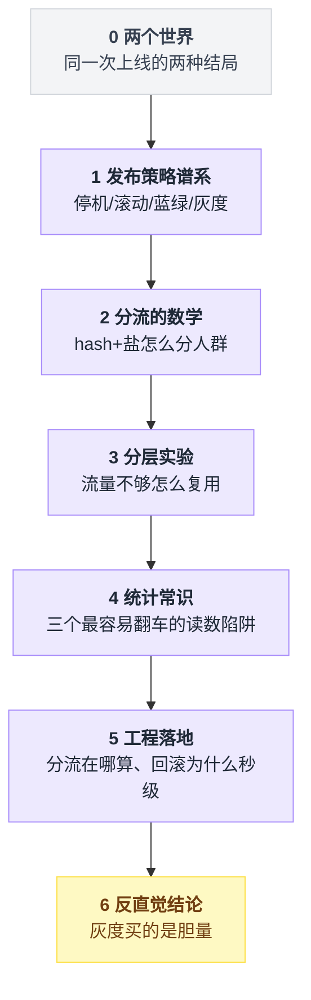
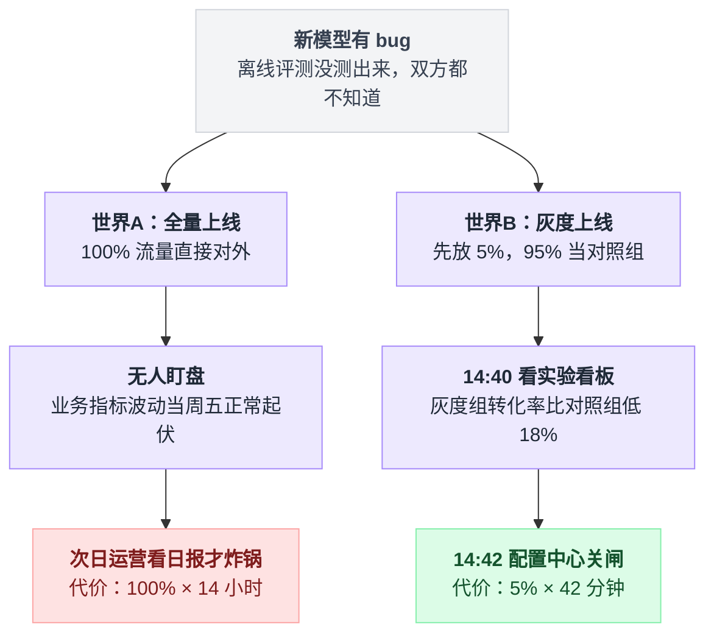
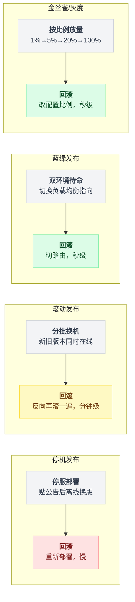
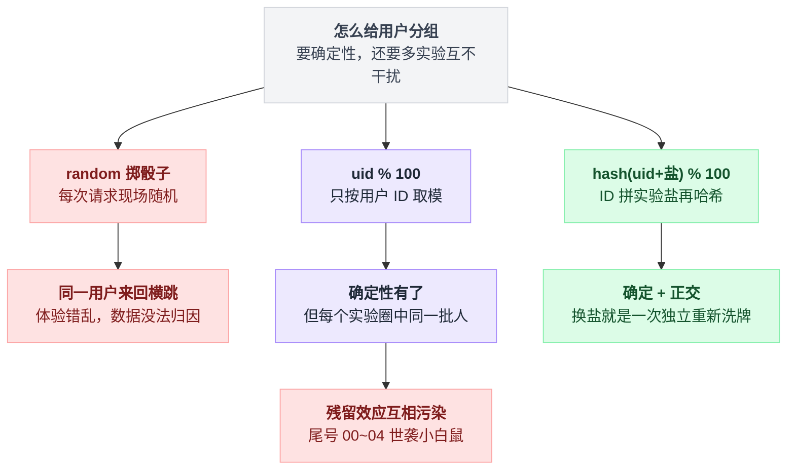
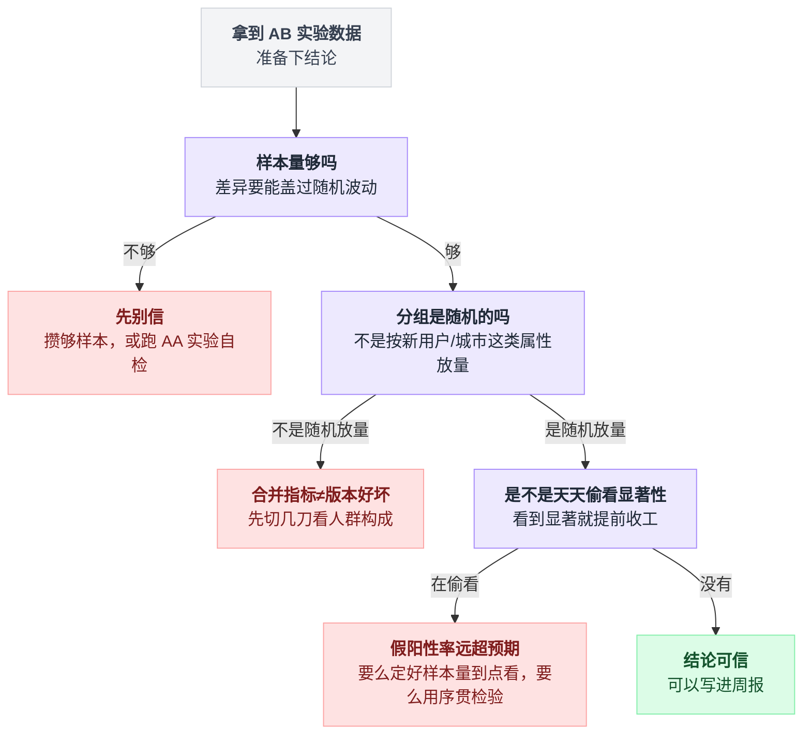
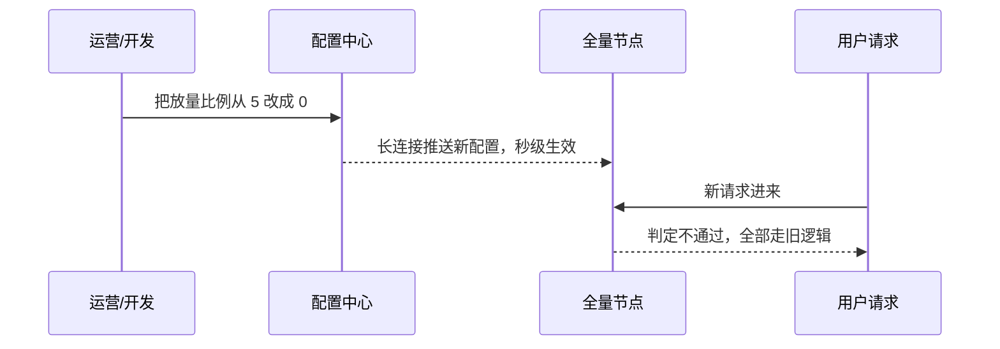
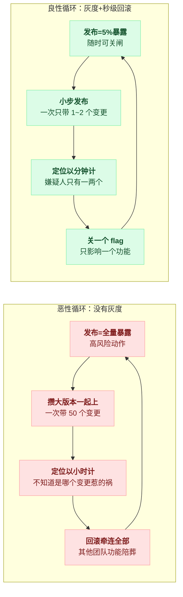

# 《灰度发布与 AB 分流》新功能只给 5% 的人看，出事秒级回滚（小白版）

> 一句话结论：**灰度的最大价值不是"少出事"，是"敢出事"——爆炸半径从 100% 压到 5% 之后，团队才敢高频发布。而撑起整套体系的地基小得出奇，就一行代码：`hash(uid + 实验盐) % 100`。盐一换，人群重排，这是全篇最值钱的一行。**
> 难度：★★★☆☆
> 写作时间：2026-08-05。文中未经一手核实的说法均已标注（DORA 报告、大厂实践类均属第三方转述）；两段 Python 演示的输出数字是真实运行结果，可复现。

---

## 目录

- [0. 两个世界：同一次上线的两种结局](#0-两个世界同一次上线的两种结局)
- [1. 发布策略谱系：四种把新代码放出去的姿势](#1-发布策略谱系四种把新代码放出去的姿势)
- [2. 分流的数学 ⭐（本篇核心）](#2-分流的数学-本篇核心)
- [3. 流量不够分怎么办：Google 的分层实验](#3-流量不够分怎么办google-的分层实验)
- [4. AB 的统计常识：三个最容易翻车的地方](#4-ab-的统计常识三个最容易翻车的地方)
- [5. 工程侧：分流在哪算，回滚为什么能秒级](#5-工程侧分流在哪算回滚为什么能秒级)
- [6. 反直觉：灰度买的不是保险，是胆量](#6-反直觉灰度买的不是保险是胆量)
- [7. 一句话总结、小白词典、和前几篇的对照](#7-一句话总结小白词典和前几篇的对照)

---

全文八个台阶，从"要不要灰度"一路走到"灰度买的到底是什么"：



## 0. 两个世界：同一次上线的两种结局

### 0.1 世界 A：周五晚上，全量上线

推荐团队憋了三个月，做出一版新的排序模型。离线评测指标涨了，评审过了，测试过了。周五晚上八点，全量上线。

新模型有个没人发现的问题：对老用户的历史行为特征处理有 bug，给老用户推的东西全歪了。转化率跌了两成。

但是没人知道。周五晚上，大盘监控没人盯；转化率这种业务指标本来就有波动，值班同学看了一眼，以为是周五晚上的正常起伏。直到第二天上午，运营看日报才炸锅。

算一笔账：**100% 的用户 × 14 个小时**。一整晚的 GMV 就这么没了。回滚还得走发布流程，再花半小时。

### 0.2 世界 B：同一个模型，换一种放法

同一个模型，换一个团队来上线：

```
  周二 14:00   放量 5%，只给 hash 命中的那 5% 用户走新模型
               剩下 95% 继续走旧模型，充当"对照组"
  周二 14:40   实验看板刷新：灰度组转化率比对照组低 18%
               —— 不是猜的，是两组同一时刻、同一批流量、直接对比
  周二 14:42   把配置中心里的放量比例从 5 改回 0
               2 秒后全量节点生效。事故结束。
```

损失是多少？**5% 的用户 × 42 分钟**。和世界 A 比，影响面是 1/20，持续时间是 1/20，总代价约是 1/400。

### 0.3 点题

把两个世界画在一张图上：

```
   出错的总代价  =  影响面  ×  持续时间

   世界 A（全量上线）              世界 B（灰度 + 秒级回滚）
   ┌────────────────────────┐
   │ ████████████████████   │      ┌──┐
   │ ████████████████████   │      │██│ ← 5% × 42分钟
   │ ████████████████████   │      └──┘
   │ ████████████████████   │
   │   100% × 14小时        │
   └────────────────────────┘
   ↑ 影响面（纵轴）× 时间（横轴），面积就是损失
```

三个数摆成一行更直观：

| | 世界 A：全量上线 | 世界 B：灰度 + 秒级回滚 | 比值 |
|---|---|---|---|
| 影响面 | 100% 用户 | 5% 用户 | 1/20 |
| 持续时间 | 14 小时 | 42 分钟 | 1/20 |
| 总代价（面积） | 基准 | 约 1/400 | 1/400 |

同一个 bug，两条响应路径怎么分岔的，画成图更清楚：



注意这两个世界的区别**不在代码**。bug 一模一样，谁也没提前发现它。区别只在"放出去的方式"：

- 世界 A 在**赌**：赌这次没问题。赌输了，全体用户陪葬。
- 世界 B 在**做实验**：假设可能有问题，先小范围验证，数据说话，错了就撤。

所以先把这篇文章的立场说死：**这篇讲的不是"怎么不出错"，是"怎么把出错的代价变小"。**

前者做不到——测试环境永远复刻不了真实世界的流量、数据分布和用户行为。后者是工程问题，有标准答案。

这个世界观你应该眼熟：[第 10 篇支付与对账](./10-支付与对账.md)整篇都在讲"承认一致性做不到，把发现和修复做到极致"。发布系统是同一个哲学的另一个战场：**承认发布会出错，把'发现'和'恢复'做到极致。**

---

## 1. 发布策略谱系：四种把新代码放出去的姿势

一句话地图：停机 → 滚动 → 蓝绿 → 金丝雀，每一种都在修上一种的毛病，最后一种顺手多回答了一个问题。真正要停下来看的只有滚动发布那个兼容暗坑，其余三种看结论表就够。

### 1.1 停机发布：贴张公告，半夜换血

最原始的方式：贴公告"今晚 0 点到 2 点系统维护"，把服务停了，换上新版本，再启动。

```
   旧版本运行 ──→ 【停机】──→ 部署新版本 ──→ 启动 ──→ 新版本运行
                     ↑
              这段时间用户看到的是 502
```

它有一个今天已经没人在乎的优点：**不存在新旧共存**，任何兼容问题都不存在。

但停机窗口就是收入窗口，24 小时服务的时代这条路基本堵死了。只剩一种场景还在用：数据库大版本升级这类真的做不到在线切换的操作。

### 1.2 滚动发布：一批一批换，但有个暗坑

不停机的第一个答案：机器分批换。10 台实例，先摘掉 2 台换新版本，健康检查通过，再换下一批。

```
   第 1 批       第 2 批       第 3 批 …
   ┌──┬──┐      ┌──┬──┐      ┌──┬──┐
   │v2│v2│      │v2│v2│      │v2│v2│
   └──┴──┘      └──┴──┘      └──┴──┘
   ┌──┬──┬──┬──┬──┬──┬──┬──┐
   │v1│v1│v1│v1│v1│v1│v1│v1│ → 逐批变成 v2
   └──┴──┴──┴──┴──┴──┴──┴──┘
        ↑
   这个过程可能持续几分钟到几十分钟，
   期间 v1 和 v2 同时在线、同时接流量
```

把这个换血过程写成循环，坑在哪一眼就看出来了：

```
for 这一批 in 分批(全部 10 台, 每批 2 台):
    摘掉流量(这一批)
    换成 v2(这一批)
    等健康检查通过(这一批)
    挂回流量(这一批)
    # ← 循环还没跑完的每一刻，v1 和 v2 都在同时接用户请求
```

坑不在循环体里，在**循环没跑完的那段时间**：负载均衡不知道也不在乎你换到第几批了，同一个用户的两次请求，可能一次落在 v2、一次落在 v1。

K8s 的默认发布方式（RollingUpdate）就是它。机器成本几乎为零——不需要额外机器，换血是原地进行的。

**这里有个坑，而且是滚动发布最大的坑：新旧版本共存期，接口必须双向兼容。**

举个具体的例子。v2 给订单表加了个字段 `coupon_id`，下单接口开始写这个字段：

- 用户的"下单"请求打到 v2 实例，写入了 `coupon_id`；
- 两秒后同一个用户的"查订单"请求，被负载均衡打到了还没换的 v1 实例；
- v1 的代码根本不认识 `coupon_id`——运气好是忽略，运气差是反序列化直接报错。

消息队列同理：v2 的 producer 发了新格式消息，v1 的 consumer 还在线消费。RPC 同理。数据库 schema 同理。

所以滚动发布有条铁律：**每次变更都要假设"我的上一个版本会读到我写的数据"。** 加字段可以（旧版本忽略它），改字段含义、删字段不行——要拆成两次发布（先让所有节点认识新字段，再启用它，业内叫 expand-contract）。

滚动发布还有个软肋：**回滚不是秒级的**。发现问题时可能已经换了 6 台，回滚就是把这 6 台再滚回去，又是几分钟。事故期间的几分钟很贵。

### 1.3 蓝绿发布：两套完整环境，切的是流量不是机器

滚动发布慢在"回滚要重新部署"。蓝绿的思路：**部署和切流量解耦**。

```
                     负载均衡 / 网关
                          │
             100% 流量    │     0% 流量
          ┌───────────────┴───────────────┐
          ▼                               ▼
   ┌─────────────┐                 ┌─────────────┐
   │  蓝环境 v1  │                 │  绿环境 v2  │
   │ （在线服务）│                 │ （已部署好，│
   │             │                 │  空跑待命） │
   └─────────────┘                 └─────────────┘

   切换 = 改一下负载均衡的指向，流量瞬间 100% → 绿
   回滚 = 再改回来，同样是瞬间
```

新版本先完整部署到绿环境，内部先验证（连生产依赖、跑真实链路，就是不接用户流量），确认没问题后，负载均衡一切，流量整体过去。出事？切回来。**回滚是改一条路由规则，秒级。**

代价明摆着：**机器成本双倍**。两套完整环境常备。

而且流量切换虽然快，却是 0% → 100% 的跳变——切过去的那一刻，还是全体用户一起暴露在新版本面前。回滚快解决了"持续时间"，没解决"影响面"。

### 1.4 金丝雀 / 灰度发布：按比例、按人群，逐步放量

名字来自矿井时代：矿工下井带一只金丝雀，它对瓦斯比人敏感，金丝雀晕了赶紧撤人。放到发布上：**先让一小撮流量当金丝雀，它们没事，大部队再进。**

```
   放量节奏（每一步之间盯指标，指标异常立刻回退）：

   内部员工 ──→ 1% ──→ 5% ──→ 20% ──→ 50% ──→ 100%
      │          │       │       │
      │          │       │       └─ 到这一步基本能暴露性能问题
      │          │       └─ 样本量开始够看业务指标
      │          └─ 能暴露崩溃、报错这类硬伤
      └─ 自己人先吃自己的狗粮（dogfooding）

   人群维度也可以叠加：先某个城市、先 Android、先新注册用户……
```

Chrome 浏览器的发布通道干脆就叫这个名字：Canary → Dev → Beta → Stable，一层比一层人多，问题在人少的通道里被拦下。

灰度和蓝绿不是二选一。生产上常见的组合拳：新版本部署到一组独立实例（形态上像小号的绿环境），网关按比例把 5% 流量引过去——**部署形态学蓝绿，流量策略学金丝雀**。

### 1.5 一张对比表

| | 停机发布 | 滚动发布 | 蓝绿发布 | 金丝雀/灰度 |
|---|---|---|---|---|
| 额外机器成本 | 无 | 几乎无 | **双倍** | 少量（金丝雀实例组） |
| 回滚速度 | 重新部署，慢 | 反向再滚一遍，分钟级 | **切路由，秒级** | **改配置，秒级** |
| 风险暴露面 | 100% | 逐批爬到 100% | 切换瞬间 100% | **1% → 5% → …，可控** |
| 新旧共存时长 | 无 | 分钟级（被动、不可控） | 无共存（瞬切） | 小时~天级（**主动、可控**） |
| 接口兼容要求 | 不需要 | **必须双向兼容** | 理论可不管，实践仍要 | 必须双向兼容 |
| 能否观测真实用户反应 | 不能 | 不能（没有对照） | 不能 | **能（灰度组 vs 对照组）** |

四种姿势并排摆在一起，"回滚快不快"这条线看得更直接：



看最后一行。前三种回答的都是"怎么把二进制换上去"，只有灰度顺手回答了另一个问题：**新版本到底好不好？**

因为灰度天然制造了同一时刻的实验组和对照组——这就是 AB 实验。发布和实验，在灰度这里合流了。

而"按比例把人分开"这件事，才是本篇真正的主角。

---

## 2. 分流的数学 ⭐（本篇核心）

现在解决核心问题：**"给 5% 的用户"——这 5% 到底怎么选？**

看起来是个一行代码的小事。它确实只需要一行代码，但选错那一行，后面所有实验数据全是脏的。

这一节走三版写法：掷骰子 → 按 uid 取模 → 加盐哈希。前两版都是错的，但错法不一样，第二版那种错尤其阴——它看起来完全正常，要到第二个实验才暴露。

### 2.0 第〇版：random() < 0.05 —— 想都不要想

最直觉的写法：每个请求来了，掷个骰子。

```python
if random.random() < 0.05:
    return NEW_VERSION      # 别这么干
```

问题致命：**同一个用户，这次刷新进新版，下次刷新回旧版。**

| 视角 | 后果 |
|---|---|
| 用户 | 首页样式一会儿一个样，像见了鬼 |
| 数据 | 这个用户的转化算新版功劳还是旧版的？没法归因，实验数据直接作废 |
| 工程 | 新版写的缓存旧版不认识，来回横跳制造脏状态 |

结论先立住：**分流必须是确定性的——同一个用户，无论何时、无论请求打到哪台机器，必须永远进同一组。**

这和[第 12 篇一致性哈希](./12-小而美的五个算法.md#6-小节五一致性哈希--用分布不均换扩容不失效)的"确定性映射"是同一款数学：不查表、不存状态、不掷骰子，任何一台机器独立计算，答案全网一致。

### 2.1 第一版：uid % 100 < 5 —— 每次实验都是同一批小白鼠

那就用 uid 算，确定性有了：

```python
if uid % 100 < 5:
    return NEW_VERSION      # 确定性有了，但还有更阴的问题
```

单看一个实验，这么写没毛病。问题出在**第二个实验**上：

```
   实验一（新排序模型）:  uid % 100 < 5   →  圈中 uid 尾号 00~04 的人
   实验二（新首页改版）:  uid % 100 < 5   →  又是尾号 00~04 的人
   实验三（新推送策略）:  uid % 100 < 5   →  还是他们

   uid 尾号 00~04 的用户：
   ┌─────────────────────────────────────────────┐
   │  "为什么倒霉的总是我？"                     │
   │                                             │
   │  ① 永远吃头茬风险——每个实验的 bug 都先砸他 │
   │  ② 体验被连续实验污染——首页、排序、推送    │
   │     同时都在变，他看到的产品和别人根本不同  │
   │  ③ 上个实验的残留效应污染下个实验的数据——  │
   │     上周排序实验伤了他，这周首页实验测出来  │
   │     的"转化率低"，到底该算谁头上？          │
   └─────────────────────────────────────────────┘
```

第 ③ 条最隐蔽，值得多说一句。

假设排序实验把这批人惹毛了，一部分人接下来一周打开 App 的频率都降低了——这叫**残留效应（carryover effect）**。这时你开首页实验，又圈中同一批人，测出来首页新版转化率低。你以为是首页的锅，其实是上周排序实验的余震。

**实验之间共享同一批小白鼠，等于所有实验的因果全搅在一锅里。**

### 2.2 正解：hash(uid + 实验盐) % 100

修法只有一个动作：算桶号之前，把**实验自己的名字**（盐）拼进去再哈希。

```python
import hashlib

def bucket(uid: int, salt: str, n: int = 100) -> int:
    h = hashlib.md5(f"{salt}:{uid}".encode()).hexdigest()
    return int(h, 16) % n

# 实验一用自己的盐，实验二用自己的盐
in_rank_exp     = bucket(uid, "rec_rank_v2")  < 5
in_homepage_exp = bucket(uid, "new_homepage") < 5
```

发生了什么？哈希函数有个性质：输入变一点，输出面目全非（雪崩效应）。盐不同，等于给全体用户做了一次**独立的重新洗牌**：

```
                     全体用户（同一副牌）
                          │
          ┌───────────────┴───────────────┐
          │ 盐 = "rec_rank_v2"            │ 盐 = "new_homepage"
          ▼ 洗牌方式一                    ▼ 洗牌方式二
   ┌──────────────────┐          ┌──────────────────┐
   │ 桶0 桶1 … 桶99   │          │ 桶0 桶1 … 桶99   │
   │ [实验组][对照组] │          │ [实验组][对照组] │
   └──────────────────┘          └──────────────────┘
     两次洗牌互相独立：
     在实验一"实验组"里的人，落进实验二各桶的概率依然均匀
     —— 这个性质叫【正交】
```

- 确定性没丢：uid 和盐都不变，桶号永远不变；
- 每个实验有了**自己专属的一次洗牌**：这次实验组的人，下次大概率就是普通人；
- "尾号 00~04 世袭小白鼠"的问题彻底消失。

💡 顺带说破一层：**对 100 取模保留的是哈希值的"低位"信息**——这和[第 13 篇](./13-雪花算法真实项目调研.md)反复出现的"位打包/取低位"、[第 14 篇基因法](./14-分库分表.md#3-分片键与基因法-本篇核心)的"对 2ⁿ 取模 = 取二进制低 n 位"是同一个技巧。哈希取模这半行代码，在本系列里已经第三次挑大梁了：一次用来给缓存选机器，一次用来给订单选分片，这次用来给用户选命运。

三版写法的判定路径放一张图里对比：



### 2.3 亲手验证正交性（可运行）

"正交"听着玄，跑一下就眼见为实。下面这段纯标准库代码，10 万用户，两个实验各圈 5%：

```python
import hashlib

def bucket(uid: int, salt: str, n: int = 100) -> int:
    h = hashlib.md5(f"{salt}:{uid}".encode()).hexdigest()
    return int(h, 16) % n

N = 100_000
in_a = [u for u in range(N) if bucket(u, "rec_rank_v2") < 5]     # 实验 A 的 5%
in_b = {u for u in range(N) if bucket(u, "new_homepage") < 5}    # 实验 B 的 5%
overlap = [u for u in in_a if u in in_b]

print(f"A 组 {len(in_a)} 人, B 组 {len(in_b)} 人, 同时在两组 {len(overlap)} 人")
print(f"A 组里落进 B 组的比例: {len(overlap)/len(in_a):.2%}  (独立时的期望 = 5%)")

naive = [u for u in range(N) if u % 100 < 5]                     # 天真版对照
print(f"天真版 uid%100: 两个实验重叠 100%")
```

真实运行输出（2026-08-05，Python 3，可复现）：

```
A 组 4841 人, B 组 5025 人, 同时在两组 212 人
A 组里落进 B 组的比例: 4.38%  (独立时的期望 = 5%)
天真版 uid%100: 两个实验重叠 100%
```

解读一下这几个数：

- 如果两个实验**完全独立**，A 组的人落进 B 组的比例应该 ≈ 5%。实测 4.38%，就是 5% 附近的正常抽样波动；
- 天真版是 **100%**——A 的小白鼠就是 B 的小白鼠，一个不落；
- 再补一刀：把 A 组那 4841 人按 B 的盐分进 100 个桶，实测平均 48.4 人/桶，最多 67、最少 33——均匀散开，没有任何一个桶被扎堆。**换盐 = 独立重排**，不是口号，是可以跑出来的事实。

### 2.4 放量的坑：只能扩圈，不能挪圈

灰度要从 5% 放到 20%，怎么改？

```
   正确：扩圈（新圈是老圈的超集）
       5%:  bucket < 5          →  桶 0~4
      20%:  bucket < 20         →  桶 0~19    ← 原来的 0~4 还在里面

   错误：挪圈
       5%:  bucket < 5          →  桶 0~4
      20%:  5 <= bucket < 25    →  桶 5~24    ← 原来的实验组被踢出去了！
```

写成放量流程就是这样，全程只有一个数在动：

```
盐 = "rec_rank_v2"                  // 实验创建时定死，中途一个字符都不改
for 当前放量 in [5, 20, 50, 100]:    // 只准单调递增
    命中(uid) = bucket(uid, 盐) < 当前放量
    盯指标(); if 指标异常: 当前放量 = 0; break
```

挪圈有两宗罪：一是原实验组的用户突然被切回旧版，体验跳变；二是数据被污染——桶 0~4 的人已经被新版"处理"过（残留效应又来了），把他们混回对照组，对照组就不干净了。

**铁律：放量序列必须单调递增，且每一步的实验组是上一步的超集。** `bucket < X`、只调大 X，天然满足。

⚠️ 同一条铁律的另一面：**实验中途不能换盐**。换盐 = 全体重新洗牌 = 所有人组别重排 = 之前积累的数据全部作废。盐在实验创建时定死，通常直接用实验的唯一 ID。

### 2.5 顺手排个雷：别用 Python 内置 hash()

写演示时用了 `hashlib.md5`，不是随手挑的。这里有个坑：Python 的内置 `hash()` 对字符串是**每次进程启动随机化**的（安全特性，防哈希碰撞攻击）：

```
  $ python3 -c 'print(hash("user_10086") % 100)'
  71
  $ python3 -c 'print(hash("user_10086") % 100)'
  3            ← 同一个输入，重启进程结果就变！
```

拿它做分流，服务一重启、用户全体换组，跟用 `random()` 一个下场。

分流哈希必须用**跨进程、跨语言、跨时间都稳定**的算法。md5 语义稳定、到处都有，做演示和中小规模分流足够；工业界实验平台更常用 murmur、xxhash 这类非加密哈希，图的是快几倍（第三方普遍实践，方向可信）。选哪个不重要，**"稳定"这个性质不能丢**。

---

## 3. 流量不够分怎么办：Google 的分层实验

### 3.1 新问题：实验多了，流量不够用

加盐哈希解决了"实验之间别用同一批人"。规模一上来，撞上下一堵墙：

公司有 100% 的流量。推荐团队的实验要吃 20%（实验组 10% + 对照组 10%），搜索团队要 20%，UI 团队要 20%……五个实验就把流量分光了。第六个团队想做实验？排队，等别人下线。

对流量大的公司这只是难受；对流量小的公司这是绝症——本来样本量就紧张（第 4 节马上讲为什么样本量是命），还要几个团队分着用。

### 3.2 分层：同一份流量，重复使用 N 次

Google 的答案发表在 Tang et al.《Overlapping Experiment Infrastructure: More, Better, Faster Experimentation》（KDD 2010）。核心动作：**把系统按功能切成层，每层独立分流，一份流量当 N 份用。**

```
                    100% 用户流量
                         │
   ═══ UI 层 ═══════════ ▼ ══════  盐 = "layer_ui"
   │  实验A(按钮红色)  实验B(新导航)   未参与   │
   │  ├── 桶 0~9        ├── 桶 10~19    桶 20~99│
   ═════════════════════ │ ═══════════════════
                         ▼
   ═══ 排序层 ══════════════════  盐 = "layer_rank"
   │  实验C(新模型)   实验D(调权重)    未参与   │
   │  ├── 桶 0~19       ├── 桶 20~29    桶 30~99│
   ═════════════════════ │ ═══════════════════
                         ▼
   ═══ 召回层 ══════════════════  盐 = "layer_recall"
   │  实验E(新召回源)                  未参与   │
   │  ├── 桶 0~14                      桶 15~99 │
   ═════════════════════════════════════════════

   规则只有两条：
   ① 层内互斥 —— 同一层共用一个盐，实验按桶区间瓜分，
      一个用户在一层里最多进一个实验（桶区间不重叠）
   ② 层间正交 —— 每层的盐不同，等于每层独立洗一次牌
```

那两条规则翻译成代码，就是一个双层循环：

```
def 分组(uid):
    结果 = {}
    for 层 in [UI层, 排序层, 召回层]:
        b = bucket(uid, 层.盐)                  // 每层一个盐 → 每层独立洗一次牌（层间正交）
        for 实验 in 层.实验列表:
            if 实验.桶起 <= b < 实验.桶止:      // 层内桶区间不重叠 → 最多命中一个（层内互斥）
                结果[层] = 实验
                break
        # 没落进任何区间 = 这一层"未参与"
    return 结果
```

于是同一个用户可以**同时**活在三个实验里：UI 层实验 A 的实验组、排序层实验 C 的对照组、召回层实验 E 的实验组。三个团队都拿到了 100% 的流量，谁也不用排队。

眼熟吗？**层内互斥、层间正交，用的正是第 2 节那把刀**——层的盐管"层内怎么瓜分"，不同层的盐互不相同管"层间互相独立"。分层实验不是新数学，是加盐哈希的组合应用。

### 3.3 层间正交为什么"合法"，以及什么时候不合法

疑问来了：用户同时在 UI 实验和排序实验里，UI 实验会不会污染排序实验的数据？

答案：**只要正交，就不污染结论。** 推演一遍：

```
   排序实验 C 的实验组（桶 0~19，抽样自全体用户）
     └─ 因为 UI 层用的是另一个盐（独立洗牌），
        这 20% 的人里，UI 实验 A 组 / B 组 / 未参与的比例
        和全体用户中的比例一致（≈ 10% / 10% / 80%）

   排序实验 C 的对照组（桶 30~49）
     └─ 同理，UI 各组比例也是 ≈ 10% / 10% / 80%
```

UI 实验的影响在 C 的实验组和对照组里**等量存在**，一相减就抵消了。这就是"正交摊平背景噪声"——每个实验看别的层的实验，都像看均匀的背景音。

⚠️ 但有个前提被很多人跳过：**层间不能有强交互**。

极端例子：UI 实验 B 把推荐列表从首页藏进了二级页，排序实验 C 优化的恰恰是这个列表——对进了 B 组的用户来说，C 的优化根本没机会被看见。两个实验各自的均值没被"污染"，但"C 的效果"这个结论本身失真了。

Tang et al. 的处理：**可能强交互的参数放进同一层**，物理上保证互斥（论文里还有 domain 等更细的结构，小白版记住"层内互斥、层间正交"这八个字就够用了）。

怎么切层是个业务判断：一般按系统模块切（UI / 召回 / 排序 / 广告），模块内参数互相打架的概率高，模块之间低。切错了层，正交救不了你。

---

## 4. AB 的统计常识：三个最容易翻车的地方

分流做对了，数据收上来了。最后一步，也是翻车率最高的一步：**读数**。三个坑，每个点破一层。

### 4.1 样本量不够就下结论 ≈ 掷硬币看真理

抛 10 次硬币，7 正 3 反。你敢说这枚硬币不均匀吗？

不敢——10 次太少，纯属正常波动。可换成"灰度组 200 人转化率 7%，对照组 5%，新版提升 40%！"，很多人立刻敢写周报了。这是同一件事。

不用信我，模拟给你看。两组的**真实转化率完全相同**（都是 5%），也就是说观察到的任何差异都是纯噪声：

```python
import random
random.seed(42)

P, N, TRIALS = 0.05, 200, 1000        # 真实转化率 5%，每组 200 人，做 1000 次实验
big = 0
for _ in range(TRIALS):
    a = sum(random.random() < P for _ in range(N))
    b = sum(random.random() < P for _ in range(N))
    if a > 0 and abs(b - a) / a >= 0.30:
        big += 1
print(f"观察到 ±30% 以上'相对差异'的实验: {big}/{TRIALS}")
```

真实运行输出（seed=42，可复现）：**每组 200 人时，1000 次里有 462 次（46%）会观察到 ±30% 以上的"巨大差异"**——而真相是两组根本没有任何差异。

把每组人数放大到 20000，这个数字变成 **0/1000**。

结论背下来：

- 小样本下的"暴涨/暴跌"，默认当噪声处理，先把样本攒够；
- 需要多少样本，取决于你想检测多小的差异——差异越小，需要的样本平方级增长（这也是为什么 1.4 节的放量节奏里，1% 阶段只看崩溃报错这种硬伤，业务指标要等 5%~20% 阶段才有资格看）；
- 有个便宜的自检手段叫 **AA 实验**：两组跑完全相同的版本，看你的实验平台会不会报出"显著差异"。会报，说明分流或统计管道有 bug。

### 4.2 辛普森悖论：分组各自都涨，合并反而跌

这个坑反直觉到什么程度：**每一个分组里新版本都更好，合并起来新版本反而更差**——而且两边的算术都没错。

上一组具体数字。某次灰度没有用加盐哈希随机分流，而是"先放给新注册用户"（听起来很合理：新用户没形成使用习惯，改动对他们伤害小）。结果新版流量里 90% 是新用户，旧版流量里 90% 是老用户：

| | 旧版本 | 新版本 | 谁赢 |
|---|---|---|---|
| 新用户（转化本来就低） | 100 人转化 10 个 = **10%** | 900 人转化 99 个 = **11%** | 新版 ✓ |
| 老用户（转化本来就高） | 900 人转化 450 个 = **50%** | 100 人转化 52 个 = **52%** | 新版 ✓ |
| **合并** | 1000 人转化 460 个 = **46%** | 1000 人转化 151 个 = **15.1%** | **旧版 ✓✓✓** |

新用户组，新版赢（11% > 10%）。老用户组，新版也赢（52% > 50%）。合并，新版惨败（15.1% 对 46%）。

戏法在哪？**两组的人群构成不同。** 新版的 1000 人里 900 个是天生低转化的新用户，旧版的 1000 人里 900 个是天生高转化的老用户。合并数字比的根本不是版本好坏，是"新用户多还是老用户多"。

两条教训，都指回前文：

1. **分流必须随机（加盐哈希天然随机），不能按业务属性放量后直接比大盘。** "先放新用户""先放某城市"作为控制风险的手段没问题，但那部分流量的数据只能分层看，不能和全量混着比。
2. 就算随机分流，读数时也要**切几刀看分组**（新老用户、平台、地区）。合并指标和分组指标打架时，先怀疑人群构成，再怀疑版本。

### 4.3 每天偷看 p 值，看到显著就收工

一笔带过但必须点破：实验计划跑 14 天，你每天刷一次显著性检验，哪天 p < 0.05 就宣布胜利提前结束——这套操作会让假阳性率远超你以为的 5%。

写成循环，中奖机会数得清清楚楚：

```
for day in 1..14:                       // 计划跑满 14 天
    if p_value(截至今天的数据) < 0.05:   // 每天检验一次 = 给噪声 14 次中奖机会
        宣布胜利(); break
```

道理和 4.1 同源：检验做得越多次，纯噪声撞出"显著"的机会越多。每天偷看 14 天 ≈ 给噪声 14 次中奖机会。

正经做法要么事先定好样本量、到点看一次；要么用专门为"随时看"设计的序贯检验方法。深水区就不下了，记住行为准则就行：**p 值不是刮刮乐，不能刮到中奖为止。**

三个坑串成一张自查图，拿到数据先照着问一遍：



---

## 5. 工程侧：分流在哪算，回滚为什么能秒级

数学讲完了，落地还有三个工程决策。

### 5.1 分流决策在哪做：网关 / 客户端 / 服务端

`bucket(uid, salt)` 这行代码总得在某个地方执行。三个候选位置，各有各的账：

| | 网关层 | 客户端 SDK | 服务端中间件/库 |
|---|---|---|---|
| 典型形态 | Nginx/Envoy 按 header 或权重分流 | App 内嵌 SDK，本地算分组 | 业务代码里调实验 SDK |
| 适合的实验 | **基础设施灰度**（新集群、新版本服务） | **UI/交互实验**（改布局、改文案） | **业务逻辑实验**（算法、策略） |
| 生效速度 | 改路由即生效 | **受发版拖累**——用户不升级就永远拿不到新代码 | 改配置即生效 |
| 拿得到的信息 | 只有请求特征（header/IP/uid） | 全量本地上下文 | 全量业务上下文（用户画像等） |
| 软肋 | 后端拿不到分组结果，需要透传 | 旧版本客户端长期残留，逻辑在端上易被逆向 | 每个服务、每种语言都要接一遍 |

实践里三层都存在，但有一条公认的架构原则：**分流决策集中做一次，结果沿调用链透传。**

```
   请求 ──→ 网关/入口服务
              │  调用实验服务(或本地 SDK)：
              │  groups = assign(uid)  →  {ui:"A组", rank:"C组"}
              │  塞进请求头: X-Exp-Groups: ui=A;rank=C
              ▼
        推荐服务 ──→ 排序服务 ──→ 召回服务
        （下游只读 header，不再自己算分组）
```

为什么不让每个服务自己算？两个原因。

一是配置版本可能不一致——排序服务的实验配置刷新了、召回服务还是旧的，同一个请求在两处算出不同分组，数据直接分裂。

二是排查问题时，一条链路上的分组必须是一个整体事实。

这条"入口定权、header 透传"的管道，和[第 26 篇全链路追踪](./26-全链路追踪.md)里 trace id 的传播方式是同一根管子——很多公司干脆就把实验分组塞在 trace 的 baggage 里带着走。

### 5.2 配置中心 + 长连接推送：回滚 = 改一个数字

标题里的"秒级回滚"，秘密现在揭晓。关键是一个认知转变：

> **实验配置不是代码，是数据。** 放量比例、盐、桶区间、开关状态——全部放配置中心，业务代码只是这份配置的执行器。

```
        ┌────────────────────────┐
        │       配置中心          │   运营/开发在后台把
        │  exp:rec_rank_v2       │   percent: 5 → 0
        │    salt: "rec_rank_v2" │        │
        │    percent: 5 ──→ 0    │        │ 长连接推送（秒级）
        └───────┬────────────────┘        │
                │ ①启动时拉全量 ②之后靠推 ▼
     ┌──────────┼──────────┬──────────────┐
     ▼          ▼          ▼              ▼
  ┌──────┐  ┌──────┐  ┌──────┐       ┌──────┐
  │节点 1│  │节点 2│  │节点 3│  ……   │节点 N│
  └──────┘  └──────┘  └──────┘       └──────┘
   全量节点在 1~2 秒内收到新配置，
   下一个请求进来时 bucket(uid) < 0 恒为假 → 全部走旧逻辑
```

"执行器"具体执行什么，一段伪代码就说完了：

```
percent = 配置中心.当前值("exp:rec_rank_v2.percent")   // 内存里的一个数，不是代码里的常量
if bucket(uid, salt) < percent: 走新逻辑
else:                            走旧逻辑

// percent 被推成 0 → 判定恒为假 → 下一个请求就全走旧逻辑
// 全程没有重新编译、没有重新部署、没有重启
```

按时间线摊开，"改一个数字"和"全量生效"之间只隔着一次推送：



于是发布系统层面的"回滚"（重新部署旧版本二进制，分钟级）被降级成了配置层面的"关闸"（percent 改成 0，秒级）。0.2 节世界 B 里那句"14:42 改配置，2 秒后生效"，就是这条链路。

为什么用长连接推送而不是节点定时轮询？轮询间隔就是回滚延迟的下限——30 秒轮一次，事故就多流血 30 秒。

配置中心（etcd / Nacos / Apollo 这类）标配的 watch/推送机制，把这个延迟压到秒级。[第 4 篇分布式限流器](./04-分布式限流器.md)里限流阈值的下发走的也是这条路：**保命的开关，必须用推的。**

### 5.3 feature flag：发布 ≠ 上线

配置驱动开关这个思路推到头，会得到一个改变研发节奏的结论：**代码合入部署（deploy）和功能对用户可见（release），是两件事，应该拆开。**

```
   传统:   开发 3 个月 ──→ 大 PR 合入 ──→ 部署 = 上线（惊险一跳）

   flag:   第 1 周: 合入 30% 的代码, flag 关着 ──→ 部署 ✓ 用户无感
           第 2 周: 再合 40%, flag 还关着       ──→ 部署 ✓ 用户无感
           第 3 周: 合完, flag 关着              ──→ 部署 ✓ 用户无感
           第 4 周: flag 按 1%→5%→100% 逐步打开  ──→ 这才是"上线"
                    出事? flag 关掉，秒级，连回滚部署都不需要
```

这套玩法（feature flag / feature toggle，配合 trunk-based 开发）带来几个连锁变化：

- **半成品可以安全合入主干**——flag 关着，代码在生产环境里"存在但不执行"，长期分支和地狱式 merge 消失；
- **部署变成无聊的日常操作**——每次部署都不改变用户看到的任何东西，风险被挪到了"开 flag"那一刻，而那一刻有灰度和秒级关闸护着；
- 从前那种 22 条军规式的发布前检查表（挑黄道吉日、全员待命、逐项签字）的用武之地大幅缩水——不是检查表错了，是"部署"这个动作本身不再惊险，值得那种阵仗的时刻变少了。

⚠️ flag 的账也要算：每个 flag 都是一个 if 分支，堆多了就是技术债——代码里躺着几百个早该删的开关，没人敢动，因为没人记得哪个还活着。

纪律：flag 建档时写上预期寿命，全量或下线后限期删除，过期未删的报警。开关是脚手架，楼盖完要拆。

### 5.4 秒级回滚的边界：不是所有东西都能"关掉"

给"秒级回滚"泼半盆冷水，防止学完就上头：**关闸能回滚的是"行为"，回滚不了"已经落下的状态"。**

| 关不掉的东西 | 怎么办 |
|---|---|
| 灰度期间新版本写进数据库的新格式数据（flag 一关，旧代码读到它们怎么办） | 1.2 节的兼容铁律在灰度这里原样生效：**先让全量代码认识新数据，再让灰度流量产生新数据**（expand-contract，两步走） |
| 已经推给用户的消息、已经扣掉的钱、已经发出去的券 | 要么本身幂等可冲正（[第 10 篇](./10-支付与对账.md)的领域），要么灰度节奏放到最保守 |
| schema 变更、缓存结构变更这类"地基改动" | 永远走独立的、先行的发布，不和业务 flag 捆在一起 |

说白了：**秒级回滚是给"可逆改动"准备的快速通道。把改动设计成可逆的，是用好这条通道的前提，也是比工具更难的那部分功夫。**

---

## 6. 反直觉：灰度买的不是保险，是胆量

最后把开头埋的那句话正式讲透。

问：灰度发布的主要价值是什么？多数人的答案："降低事故影响，少出事。"这个答案不算错，但只答对了表层。

**深层价值是：它改变了团队的行为。**

推演一遍这个因果链：

```
   没有灰度的团队：
   发布 = 全量暴露 = 高风险动作
     → 本能反应：减少发布次数，攒一个大版本一起上
       → 每次发布包含 50 个变更
         → 出了问题，不知道是 50 个里的哪一个 → 定位以小时计
         → 回滚一个 = 回滚全部 50 个，其他团队的功能陪葬
           → 发布更可怕了 → 更不敢发 → 攒得更大 → 恶性循环 ↺

   有灰度 + 秒级回滚的团队：
   发布 = 5% 暴露 + 随时关闸 = 低风险动作
     → 敢频繁发布，一次只带 1~2 个变更
       → 出了问题，嫌疑人只有 1~2 个 → 定位以分钟计
       → 关一个 flag 只影响一个功能
         → 发布越来越无聊 → 更敢发 → 良性循环 ↺
```

两个循环并排摆在一起看，分岔点更扎眼：



看清楚这两个循环的分岔点：**不是团队水平，是"出错的代价"。**

代价是 100% × 小时级，理性的选择就是少发布；代价是 5% × 分钟级，理性的选择就是多发布。灰度不是让人更小心，是让人**不必那么小心**——胆量是基础设施给的。

💡 于是得到那个和直觉打架的结论：**发布频率和稳定性不是跷跷板，是正相关。** 发布快的团队往往也更稳，因为"快"逼着他们把变更切小、把回滚做快，而小变更 + 快恢复正是稳定性的来源。DORA 的《State of DevOps》系列报告多年的方向性结论与此一致：部署频率高的团队，变更失败率和故障恢复时长反而更优（第三方报告，方向性引用，具体数字逐年有变，此处不引）。

这也是本系列世界观的又一次押韵：[第 10 篇](./10-支付与对账.md)面对"错误不可避免"，把功夫下在对账与冲正；本篇面对"发布必然出错"，把功夫下在爆炸半径与恢复速度。两边是同一句话——**别跟"会出错"较劲，跟"错了会怎样"较劲。**

最后补一句防跑偏：灰度不替代测试。

5% 的真实用户不是你的 QA——他们是来用产品的，不是来替你踩单元测试就该拦住的空指针的。灰度的本职是拦**测试环境原理上测不出的问题**：真实流量的规模、真实数据的分布、真实用户的行为。低级 bug 靠测试拦，未知风险靠灰度兜，两道闸，一道都不能省。

---

## 7. 一句话总结、小白词典、和前几篇的对照

### 一句话总结

> **发布的最高境界不是不出错，是错得起：加盐哈希把"谁先看到新版本"变成一次次独立公平的洗牌，配置中心把"撤回"变成改一个数字——爆炸半径 5%、恢复时间 2 秒，团队从此敢把发布当日常，而不是当渡劫。**

### 小白词典

| 词 | 一句人话 |
|---|---|
| 灰度发布 / 金丝雀发布 | 新版本先给一小撮用户用，没事再逐步放大到所有人 |
| 蓝绿发布 | 养两套一模一样的环境，切流量指向来上线/回滚，快但费钱 |
| 滚动发布 | 机器一批一批原地换新版本，省钱，但新旧共存期必须互相兼容 |
| 分流（bucketing） | 用哈希把用户确定性地分进 100 个桶，按桶号决定谁进实验 |
| 实验盐（salt） | 拼进哈希的实验专属字符串；盐一换，全体用户重新洗牌 |
| 正交 | 两个实验的分组互相独立：知道你在 A 组，猜不到你在 B 的哪组 |
| 分层实验 | 系统切成 UI/排序/召回等层，层内实验瓜分流量、层间换盐重洗，一份流量当 N 份用 |
| feature flag | 代码里的远程开关：代码先部署（用户无感），开关后打开（才算上线） |
| 爆炸半径 | 出事时波及的范围；灰度的全部意义就是把它从 100% 压到 5% |
| 辛普森悖论 | 每个分组里都是新版赢、合并后反而旧版赢——因为两边人群构成不同 |

### 和前几篇的对照

1. **[第 12 篇](./12-小而美的五个算法.md)一致性哈希**：同一款数学的两个用途——都靠"确定性哈希映射"做到不查表、不存状态、任何节点独立算出同一个答案。那边把 key 映射到缓存机器，这边把用户映射到实验组。
2. **[第 13 篇](./13-雪花算法真实项目调研.md)、[第 14 篇](./14-分库分表.md)的"取低位"家族**：Grafana 的位打包、基因法的"对 2ⁿ 取模 = 取低 n 位"、本篇的 `hash % 100`——哈希/取模抠出低位信息当路由，一个技巧在本系列第三次登场。
3. **[第 10 篇支付与对账](./10-支付与对账.md)**：同一个世界观的两个战场。那边承认"跨系统一致性做不到"，把功夫下在对账冲正；这边承认"发布不出错做不到"，把功夫下在爆炸半径和恢复速度。都是"别防出错，防错得大"。
4. **[第 4 篇分布式限流器](./04-分布式限流器.md)**：两道保命闸门，砍的维度不同——限流在流量维度砍"进来多少请求"，灰度在代码维度砍"多少人暴露给新逻辑"；而且它俩的开关下发走的是同一条路：配置中心 + 长连接秒级推送。
5. **[第 26 篇全链路追踪](./26-全链路追踪.md)**：实验分组"入口算一次、header 沿链路透传"的管道，和 trace id 的传播是同一根管子——不少系统直接把分组信息塞在 trace baggage 里搭顺风车。
