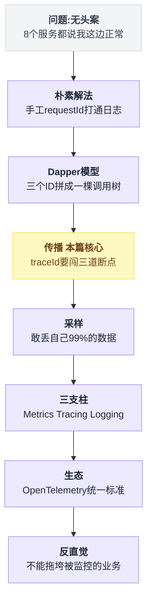
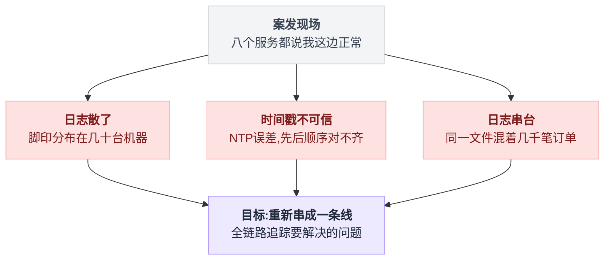
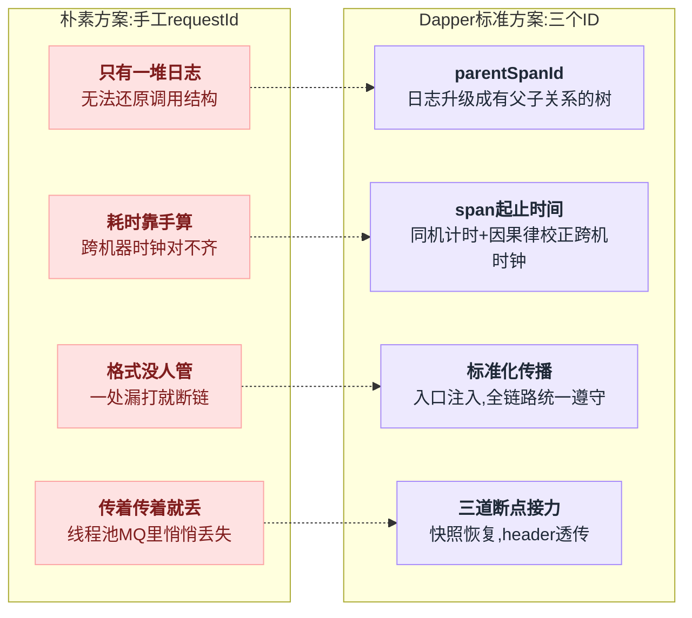
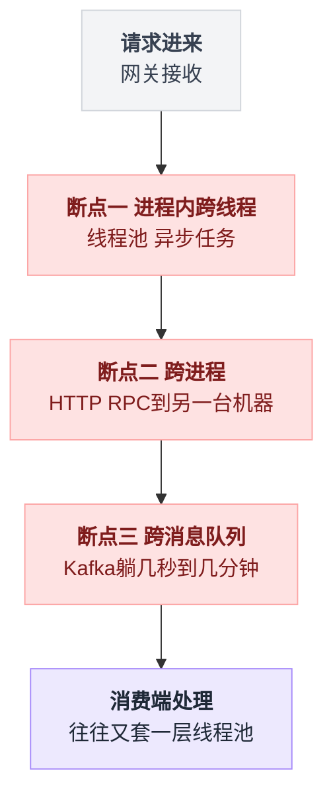
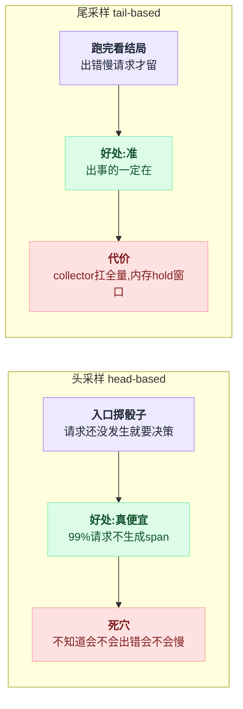
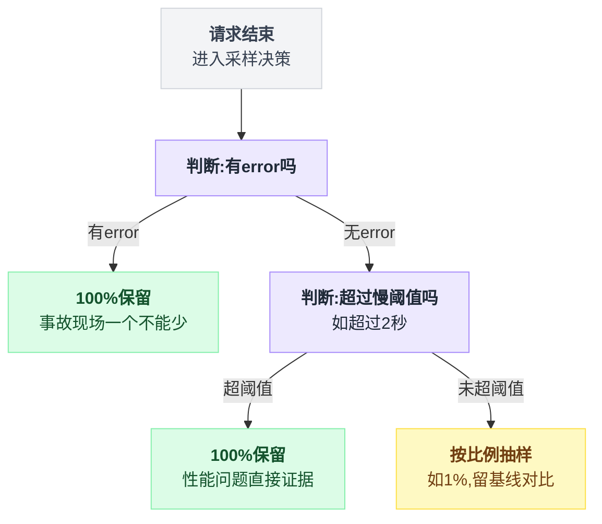
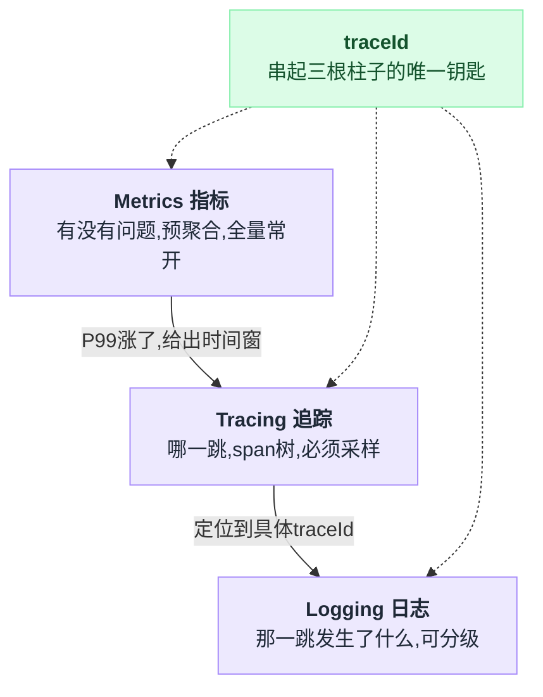

# 《全链路追踪》一个请求穿过八个服务，哪一跳慢了（小白版）

> 一句话结论：**全链路追踪最难的不是画那棵调用树——是让 traceId 活着穿过线程池、HTTP、消息队列这三道断点；而一个合格的追踪系统，还必须敢把自己 99% 的数据扔掉、在业务面前"装死"。观测数据的美德是可丢，这一点和业务数据正好相反。**
>
> 写作时间：2026-08-05。未经一手核实的说法在文中已标注。

---

## 目录

- [1. 无头案：下单 5 秒，八个人都说"我这边正常"](#1-无头案下单-5-秒八个人都说我这边正常)
- [2. 最朴素的解法：给请求发一张身份证](#2-最朴素的解法给请求发一张身份证)
- [3. Dapper 的三个 ID：从一堆日志到一棵树](#3-dapper-的三个-id从一堆日志到一棵树)
- [4. 传播 ⭐（本篇核心）：traceId 要闯的三道断点](#4-传播-本篇核心traceid-要闯的三道断点)
  - [4.1 断点一：同一个进程里，换了根线程](#41-断点一同一个进程里换了根线程)
  - [4.2 断点二：跨进程，header 里的接力棒](#42-断点二跨进程header-里的接力棒)
  - [4.3 断点三：跨消息队列，异步链路不断链](#43-断点三跨消息队列异步链路不断链)
- [5. 采样：敢丢自己数据的追踪系统，才是好系统](#5-采样敢丢自己数据的追踪系统才是好系统)
- [6. 三支柱：Metrics、Tracing、Logging 各管一段](#6-三支柱metricstracinglogging-各管一段)
- [7. 生态：OpenTelemetry 之后，选型只剩两道小题](#7-生态opentelemetry-之后选型只剩两道小题)
- [8. 反直觉：监控系统最不能犯的罪，是压垮被监控的业务](#8-反直觉监控系统最不能犯的罪是压垮被监控的业务)
- [9. 一句话总结、小白词典、和前几篇的对照](#9-一句话总结小白词典和前几篇的对照)

---

全文九节是一条递进的台阶，从"案发现场"一路走到"生死线"：



## 1. 无头案：下单 5 秒，八个人都说"我这边正常"

### 1.1 案发现场

周一早上，客服转来一条投诉：**"你们 App 下单要转 5 秒钟的圈，卡死了。"**

这笔订单从点击到返回，穿过了八个服务：

```
  网关 → 订单 → 用户 → 风控 → 库存 → 优惠券 → 支付 → 通知
```

值班群里拉了八个负责人。半小时后，八个人陆续回话——

- 网关："我这边看转发耗时正常。"
- 订单："我的接口 P99 才 200ms。"
- 库存："扣减锁没有异常。"
- 优惠券："我查了 error 日志，零报错。"
- ……

八个"我这边正常"，加起来等于一个 5 秒。**每个人说的都是真话，但没有一个人看到全局。**

### 1.2 为什么单机时代没有这个案子

2010 年排查这种问题是这样的：

```
  2010 年的你：
      ssh 登上唯一那台服务器
      grep "订单8801" app.log
      → 一个文件里，这笔订单的所有日志前后排好，
        上一行到下一行的时间差就是耗时——真相全在

  2026 年的你：
      一次下单 = 8 个服务 × 每个服务 N 台机器
      日志散在几十个文件里，混着同一秒钟的另外几千笔订单
      A 机器打的是 10:00:00.120
      B 机器打的是 09:59:59.870   ← 时钟差了 250ms
      → 连"谁先调的谁"都对不出来
```

三件事同时崩了：

1. **日志散了**——一次请求的脚印分布在几十台机器上，没有任何一个文件有全貌；
2. **时间戳不可信**——机器之间的时钟靠 NTP 同步，差个几十上百毫秒很正常，拿两台机器的时间戳硬对先后顺序，会得出"儿子比爹先出生"的结论；
3. **日志串台**——高峰期每秒几千笔请求同时在跑，同一个文件里相邻两行日志大概率属于两笔不相干的订单。

"慢在哪一跳"从一道 grep 题，变成了无头案。

全链路追踪要解决的就是这一个问题：**把一次请求在所有机器上留下的脚印重新串成一条线。**

八个人"我这边正常"的表面现象，收敛到底就是三条根因：



---

## 2. 最朴素的解法：给请求发一张身份证

不用任何框架，你自己也能想到第一步：**请求进门时发一个唯一的编号，之后每一行日志都带上它。**

```
  网关收到请求 → 生成 requestId = "a1b2c3"
     → 打日志时带上:  [a1b2c3] 转发到订单服务
     → 调订单服务时把 a1b2c3 也传过去
        → 订单服务打日志: [a1b2c3] 开始创建订单
        → 再传给库存……
```

然后把所有机器的日志收进一个集中式日志系统（ELK 之类），搜 `a1b2c3`，这笔请求的所有日志就都出来了。

说白了，这就是**手工版的全链路追踪**。很多公司真的就停在这一步，而且能解决一半问题。

### 但它有四个还不了的债

1. **只有"一堆日志"，没有"结构"。** 搜出来 200 行日志，哪个调用是哪个调用的下级？库存和优惠券是串行还是并行？看不出来。你得靠日志正文人肉推理。
2. **耗时要手算。** "慢在哪一跳"意味着要算每一跳的开始和结束时间差——200 行日志里手动配对"开始/结束"，还要跨机器对时钟（见上文，时钟本身不可信）。
3. **格式没人管。** 订单组的日志带 requestId，优惠券组去年重构时把这行删了——链条断在中间，还是无头案。
4. **传着传着就丢了。** 有人用线程池，有人发 MQ 消息，requestId 在这些地方悄悄丢掉（这是第 4 节的全部内容）。

所以工业界把这件事标准化了：编号怎么生成、结构怎么表达、跨服务怎么传、数据怎么收集。

这套标准化的东西，就叫分布式追踪（Distributed Tracing）。它的源头是一篇论文。

朴素方案欠下的四笔债，标准方案逐条有对应的补丁：



---

## 3. Dapper 的三个 ID：从一堆日志到一棵树

### 3.1 三个 ID，一棵树

Google 在 2010 年发表了 Dapper 论文（《Dapper, a Large-Scale Distributed Systems Tracing Infrastructure》，Google Technical Report，2010），后来所有追踪系统——Zipkin、Jaeger、SkyWalking、OpenTelemetry——的核心模型全是从它来的。

模型小得出奇，就三个 ID：

| ID | 是什么 | 一句话 |
|---|---|---|
| **traceId** | 整条请求链路的唯一编号 | 就是第 2 节那张"身份证"，从进门到出门全程不变 |
| **spanId** | 链路里**一段工作**的编号 | 每一跳（一次 RPC、一次 DB 查询）是一个 span，各有各的 id |
| **parentSpanId** | 这段工作是**谁**发起的 | 有了它，散落的 span 才能拼回一棵树 |

span（跨度）是追踪的原子单位：一段有名字、有开始时间、有结束时间的工作，外加一堆键值对标签（用户 id、SQL 语句、HTTP 状态码之类）。

比朴素方案多出来的关键就是 **parentSpanId**——它把"一堆平铺的日志"升级成了"一棵有父子关系的树"：

```
  traceId = a1b2c3...（整条链路只有这一个，所有 span 共享）

  网关 gateway              spanId=01, parent=无（根 span）
   └─ 订单 order            spanId=02, parent=01
       ├─ 风控 risk         spanId=03, parent=02
       ├─ 库存 inventory    spanId=04, parent=02  ┐
       ├─ 优惠券 coupon     spanId=05, parent=02  ┘ 这两个 parent 相同
       └─ 支付 payment      spanId=06, parent=02      → 是兄弟，可以并行
           └─ 账务 ledger   spanId=07, parent=06
```

每个服务只负责上报自己那一段 span（"我是 05，我爹是 02，我从 T1 干到 T2"），后端收集起来按 traceId 归堆、按 parentSpanId 拼树。

**没有任何一个服务知道全局，但拼出来的树就是全局。**

### 3.2 瀑布图：5 秒案当场告破

把这棵树按时间轴摊开，就是追踪系统 UI 里那张招牌瀑布图。开头那个 5 秒无头案，摆出来是这样：

```
  时间轴 →   0s        1s        2s        3s        4s        5s
             ├─────────┼─────────┼─────────┼─────────┼─────────┤
  网关 01    ██████████████████████████████████████████████████  5.02s
  订单 02     █████████████████████████████████████████████████  4.97s
  风控 03      █                                                 0.21s
  库存 04        ██                                              0.35s ┐同时
  优惠券 05      ███████████████████████████████████████         3.91s ┘发起
  支付 06                                               ████     0.58s
                 ▲                                      ▲
                 库存 0.35s 就回来了                     支付要等优惠券
                 优惠券拖了 3.91s ← 🔴 全场最长           返回才能开始
```

一眼看出三件事，每一件都是朴素方案给不了的：

1. **慢在优惠券**：3.91 秒，占了整条链路近八成——直接找优惠券组，其他七个人散会；
2. **库存没问题**：它和优惠券同时发起（两个 span 起点对齐），0.35 秒就回来了——"并行发起"这个事实来自兄弟 span 的时间重叠，日志里根本看不出来；
3. **支付是被冤枉的**：它 0.58 秒不慢，但它排在 4 秒之后才开始——因为订单服务要等优惠券的结果才能算实付金额。**总耗时 ≠ 各跳耗时之和，关键路径才是真凶。**

⚠️ 顺带解决了时钟问题：瀑布图里每个 span 的**时长**来自同一台机器自己的两次计时（开始/结束），机器内部计时是准的；跨机器的先后关系靠父子结构兜底——"客户端一定先发出请求，服务端才能收到"，这条因果律不依赖时钟。Dapper 论文里就是用这条因果关系去校正跨机时钟偏差的。

### 3.3 traceId 长什么样：这次真不用雪花算法

[第 13 篇](./13-雪花算法真实项目调研.md)整篇都在讲怎么生成 ID，这里正好做个对照。traceId 的需求清单和订单号完全不同：

| 需求 | 订单号（第 13 篇） | traceId |
|---|---|---|
| 全局唯一 | 要 | 要 |
| 趋势递增（对 B+ 树友好） | **要**（要进数据库当主键） | 不要（不当主键，按 id 点查） |
| 能反解出时间/机器 | 加分项 | 不要 |
| 生成时不能协调 | 要 | 要 |

去掉"有序"这个要求之后，方案简单到不像话：**128 bit 随机数**。

W3C 标准里 traceId 就是 16 字节（32 个十六进制字符），随机生成，靠概率保证不撞（128 bit 的随机空间下，碰撞概率小到可以当作零）。spanId 是 8 字节随机数，同理。

💡 这是个值得停一秒的对照：同样是"分布式发号"，需求少一条（有序性），复杂度从"时钟回拨、机器号分配、基因位预留"直接掉到"rand 一把"。**方案的复杂度是被需求清单撑起来的，砍需求比优化实现降本快得多。**

---

## 4. 传播 ⭐（本篇核心）：traceId 要闯的三道断点

模型讲完了，只用了一节。因为模型真不难——**难的是让 traceId 在真实系统里活着走完全程**。

追踪的行话把这叫**上下文传播（Context Propagation）**："当前请求的 traceId 是多少、当前 span 是谁"这几个值，要跟着请求本身流动。请求流过哪里，上下文就得跟到哪里。

而请求会流过三种"断点"，每一种都会把上下文摔在地上：

```
  ┌───────────────────────────────────────────────────────────┐
  │ 断点一：进程内跨线程                                       │
  │   请求换了一根线程继续跑（线程池、异步任务）              │
  │   → 上下文存在"线程"身上，换线程 = 失忆                   │
  ├───────────────────────────────────────────────────────────┤
  │ 断点二：跨进程                                             │
  │   请求通过 HTTP/RPC 到了另一台机器                         │
  │   → 内存里的上下文出不了进程，必须"随信附上"              │
  ├───────────────────────────────────────────────────────────┤
  │ 断点三：跨消息队列                                         │
  │   请求变成一条消息躺进 Kafka，几秒到几分钟后被消费        │
  │   → 生产者和消费者连"同时在线"都做不到                    │
  └───────────────────────────────────────────────────────────┘
```

三道断点在请求的生命周期里逐个出现，而且第三道里面经常还套着第一道：



三道断点逐个过。第一道最阴险，先讲它。

### 4.1 断点一：同一个进程里，换了根线程

#### 4.1.1 上下文放哪？ThreadLocal

一个 Java 服务同时处理几百个请求，每个请求的 traceId 都不同。代码里到处要用它（打日志、往下游传），总不能每个函数都加一个 `traceId` 参数——那业务代码就没法看了。

标准答案是 **ThreadLocal**：每根线程有一个自己的储物柜，同一个变量名，每根线程存取的是自己柜子里的值。请求进来时（通常在一个拦截器里）把 traceId 塞进当前线程的柜子，之后这个请求在这根线程上跑到哪，随手就能取到。

别的语言各有对应物：

| 语言 | 上下文放哪 |
|---|---|
| Java | `ThreadLocal` |
| Python | `threading.local` / `contextvars` |
| Go | 没有线程本地存储，靠显式传 `context.Context`（第一个参数硬传，反而躲开了下面这个坑） |

单请求单线程的年代，这个方案十全十美。然后线程池来了。

#### 4.1.2 经典坑：线程池 + ThreadLocal = 串号

线程池的本质是**线程复用**：worker 线程不销毁，干完一个任务接着领下一个。而 ThreadLocal 的本质是**把数据绑在线程身上**。

两个"本质"合在一起：

```
  线程池里的 worker-1（同一根线程，先后被两个请求复用）

  时间 ─────────────────────────────────────────────────────▶

  请求A的任务:  set(traceA) → 干活 → 结束（忘了清理柜子！）
                                │
  worker-1 的柜子:   [traceA]───┴──[traceA]──────[traceA]
                                                    ▲
  请求B的任务:              被派给 worker-1 → get() 拿到 traceA
                                                    │
                            💥 串号：B 的所有日志、所有下游调用
                               从此全顶着 A 的 traceId 跑
```

这就是"traceId 串号"的经典事故：追踪系统里出现一条几小时长、横跨几万次调用的"巨型 trace"——其实是一根 worker 线程柜子里的残留值，把几万个不相干的请求串成了一串。

**排查时比没有 traceId 还害人，因为它给了你错误的线索。**

还有个更隐蔽的时序问题。就算 A 记得清理柜子，B 用线程池提交异步任务时也一样断：

```
  Tomcat 线程（柜子里有 traceB）          线程池 worker 线程
        │                                      │
        │ pool.submit(task) ────────────────▶  │ （task 在队列里排队…）
        │ submit 立刻返回                       │
        │ 请求B处理完，柜子清空                 │ 轮到 task 执行了
        ▼                                      ▼
                                          它跑在 worker 的柜子上，
                                          柜子里要么是空，要么是
                                          上一个租客的旧值
```

注意时间差：**提交任务的那一刻上下文还在，执行任务的那一刻上下文已经没了（或者换了别人的）**。"提交"和"执行"之间隔着队列，隔着不确定的时间，还隔着一根不同的线程。

⚠️ Java 老手会想到 `InheritableThreadLocal`——它只在**创建子线程**那一刻复制一次父线程的值。线程池的 worker 是启动时创建的，之后从不重建，所以它复制到的是"线程池启动那一刻"的上下文，跟眼下这个请求毫无关系。**线程池场景下 InheritableThreadLocal 不是解法，是另一个坑。**

#### 4.1.3 解法：提交时拍快照，执行时恢复

既然"提交"和"执行"隔着时间差，解法就是把上下文**当成包裹跟着任务走**，而不是留在线程身上等任务来取：

```
  ① 提交任务的一刻：把当前线程柜子里的上下文拍一张快照，钉在任务上
  ② 任务开始执行时：把快照恢复到 worker 线程的柜子里
  ③ 任务结束时：把 worker 的柜子还原成执行前的样子（防止残留害下一个任务）
```

写成伪代码，三步各占一行：

```
提交时（还在原线程上）:
    快照 = 读当前线程柜子()          // ① 此刻上下文还在
    任务 = 把(快照, 原任务) 打包成一个新任务

执行时（在 worker 线程上）:
    备份 = 读 worker 柜子()          // 记下租客原样
    写 worker 柜子(快照)             // ② 恢复
    try:    原任务.run()
    finally: 写 worker 柜子(备份)     // ③ 还原，绝不留残值
```

一句话点破：上下文不是"存在某根线程上等人来取"，而是"打包好跟着任务一起搬家"。

Java 里就是包装 Runnable（追踪场景下常配合 MDC，见第 6 节）：

```java
Runnable wrap(Runnable task) {
    Map<String, String> snapshot = MDC.getCopyOfContextMap();   // ① 提交时拍快照
    return () -> {
        Map<String, String> backup = MDC.getCopyOfContextMap();
        MDC.setContextMap(snapshot);                            // ② 执行前恢复
        try {
            task.run();
        } finally {
            MDC.setContextMap(backup);                          // ③ 用完还原，防串号
        }
    };
}

pool.submit(wrap(() -> doWork()));   // 提交的是包装后的任务
```

阿里开源的 transmittable-thread-local（TTL）库做的就是这件事的通用版。

OpenTelemetry 的 Java agent 则直接在字节码层面把 JDK 线程池的 submit/execute 全包了（原理见第 7 节），业务代码一行不改。

Python 的 `contextvars`（3.7+ 标准库）把"快照/恢复"做成了语言设施，十行就能看明白整个机制：

```python
import contextvars
from concurrent.futures import ThreadPoolExecutor

trace_id = contextvars.ContextVar("trace_id", default="<空>")
pool = ThreadPoolExecutor(max_workers=4)

def do_work():
    return trace_id.get()               # 任务里读上下文

# ❌ 裸提交：worker 线程有自己的空上下文，读不到 trace-B
def handle_bad():
    trace_id.set("trace-B")
    return pool.submit(do_work).result()          # 得到 "<空>"

# ✅ 快照 + 恢复：提交那一刻把上下文打包给任务带走
def handle_good():
    trace_id.set("trace-B")
    ctx = contextvars.copy_context()              # ① 提交时拍快照
    return pool.submit(ctx.run, do_work).result() # ② 任务在快照里执行 → "trace-B"
```

`copy_context()` 就是"拍快照"，`ctx.run(fn)` 就是"在快照里执行"。

asyncio 更省心：`create_task` 在创建任务那一刻自动 copy 一份当前上下文，协程链路天然不串号——这正是 contextvars 被设计出来的原因。

说白了，断点一的心法就一句：**上下文跟任务走，不跟线程走。**

### 4.2 断点二：跨进程，header 里的接力棒

#### 4.2.1 注入与提取

线程再怎么折腾，还在同一个进程里。订单服务调库存服务，是两台机器上的两个进程——内存里的 ThreadLocal 再精妙也传不过去。

唯一的通道是**请求本身**：把上下文写进 HTTP header，随请求出门。

```
  订单服务（调用方）                          库存服务（被调方）
       │                                          │
       │ 出门前「注入 inject」:                    │
       │   把当前上下文序列化成 header             │
       │   traceparent: 00-a1b2..-0002-01         │
       │ ────────────── HTTP ──────────────────▶  │ 进门时「提取 extract」:
       │                                          │   从 header 反序列化出
       │                                          │   traceId=a1b2.. 父span=0002
       │                                          │   → 新建自己的 span 0004，
       │                                          │     parent 填 0002
```

每一跳干的事完全一样，写成伪代码就是一个循环体：

```
每个服务收到请求时:
    上游 = extract(请求.headers)             // 反序列化出 traceId 和父 span
    我的span = new_span(trace  = 上游.traceId,
                        parent = 上游.spanId)
    干活…
    调下游时:
        inject(下游请求.headers,
               trace  = 上游.traceId,        // 全程不变
               parent = 我的span.id)         // 每跳改写成自己
```

注入（inject）和提取（extract）这两个动作分别藏在 HTTP 客户端的拦截器和服务端的中间件里，业务代码无感。每一跳都重复"提取 → 干活 → 注入 → 传给下一跳"，traceId 就像接力棒一样跑完全程。

#### 4.2.2 W3C traceparent：逐字段拆开

header 叫什么、格式长什么样，早年各家自造：Zipkin 用 `X-B3-TraceId` / `X-B3-SpanId` / `X-B3-Sampled` 一组三个（人称 B3 协议），SkyWalking 用自家的 `sw8`。A 公司的网关接 B 公司的服务，header 对不上，链路当场断掉。

W3C 后来出了统一标准 **Trace Context**（2020 年成为 W3C Recommendation），定义了一个标准 header 叫 `traceparent`。拿规范文档里的示例值逐字段拆：

```
  traceparent: 00-4bf92f3577b34da6a3ce929d0e0e4736-00f067aa0ba902b7-01
               ┬─ ┬──────────────────────────────  ┬───────────────  ┬─
               │  │                                │                 │
   version ────┘  │                                │                 │
   2 个十六进制位  │                                │                 │
   目前恒为 00     │                                │                 │
                  │                                │                 │
   trace-id ──────┘                                │                 │
   32 个十六进制位 = 16 字节                        │                 │
   整条链路唯一，全程原样透传                       │                 │
                  parent-id ───────────────────────┘                 │
                  16 个十六进制位 = 8 字节                            │
                  发出本次调用的那个 span 的 id                       │
                  （对接收方来说这就是"我爹"）                        │
                              trace-flags ───────────────────────────┘
                              2 个十六进制位，最低位 = 采样标记
                              01 = 这条链路被采样，请记录
                              00 = 没被采样，别浪费力气
```

四个字段各司其职，有两处容易想岔：

- **parent-id 装的不是"上一跳的 traceId"**，是上一跳那个 span 的 spanId。traceId 全程只有一个，从不变；parent-id 每一跳都变——每个服务转发前都会把它改写成自己当前 span 的 id，这正是调用树能拼出来的原因。
- **trace-flags 的采样位是全链路统一决策的载体**：入口决定"采不采"，写进 flags，后面所有服务照办。为什么必须这样，第 5 节展开。

另外还有个搭档 header 叫 `tracestate`，给各厂商塞私货用（键值对列表），断链时不用管它，看 `traceparent` 就够。

💡 面试里"traceId 怎么跨服务传递"答案就一句话：**写在 HTTP header 里，标准叫 W3C traceparent，四段式 version-traceid-parentid-flags。**能把四个字段说清楚的，是背过规范的；能说清 parent-id 每跳都变的，是真理解了调用树。

### 4.3 断点三：跨消息队列，异步链路不断链

#### 4.3.1 为什么 MQ 是最容易断的一环

下单成功后，订单服务往 Kafka 发一条消息，积分服务、通知服务慢慢消费。这里上下文面对的处境比 HTTP 更糟：

- HTTP 好歹是"你一句我一句"的同步对话，MQ 是**留纸条**——生产者写完就走，消费者几秒甚至几分钟后才来取；
- 中间隔着 broker，生产者和消费者互相不知道对方是谁、在哪、什么时候干活；
- 消费端通常还是批量拉取 + 自己的线程池处理（断点三里面套着断点一）。

很多团队的追踪链路就断在这：同步部分（网关到支付）树画得整整齐齐，一进 MQ 就成了孤儿 span——"用户投诉积分没到账"和"那笔订单"之间的线索，断了。

#### 4.3.2 解法：上下文塞进消息 header

思路和 HTTP 一模一样，只是载体从 HTTP header 换成**消息的 header**。

Kafka 的消息结构里本来就有 headers 字段（0.11 版本随 KIP-82 加入，键值对列表，和 payload 分开存）——[第 17 篇](./17-Kafka为什么快.md)拆消息结构时见过它，当时说"业务上用得少"，追踪就是它最正当的用途：

```
  订单服务 producer（上下文: traceX, span 05）
      │
      │ send() 前注入:
      │   ┌────────────────────────────────────────┐
      │   │ Kafka Record                           │
      │   │   key:     "order-8801"                │
      │   │   value:   {"orderId":8801,"amt":99}   │  ← 业务数据，没动
      │   │   headers: traceparent=00-X..-0005-01  │  ← 上下文钉在这
      │   └────────────────────────────────────────┘
      ▼
   Kafka broker ──（消息躺了 10 分钟）──▶ 积分服务 consumer
                                              │
                                              │ poll() 后提取:
                                              │ traceId=X, parent=0005
                                              ▼
                                          新建 span 08, parent=0005
                                          traceId 还是 X ← 链路接上了
```

于是瀑布图上出现一种有意思的形状：**父 span（发消息）早就结束了，子 span（消费）在 10 分钟后才开始**。

树还是那棵树，只是子节点和父节点在时间上隔着一条鸿沟——这正是异步的本质在图上的投影。追踪系统管这种跨越叫异步父子（有的系统用"link/follows-from"单独表示），不影响你按 traceId 把全程查出来。

三道断点闯完，可以给"传播"收个口子了：

```
  载体一览（心法完全相同：上下文跟着"请求的化身"走）

  请求的化身          上下文的载体
  ─────────────      ─────────────────────────
  线程池里的任务   →  包装进任务对象（快照/恢复）
  HTTP 请求        →  traceparent header
  MQ 消息          →  消息 headers
  （Go 函数调用    →  context.Context 第一个参数，显式硬传）
```

**请求变成什么形态，上下文就得钉在那个形态上。**哪个形态忘了钉，链路就断在哪。

---

## 5. 采样：敢丢自己数据的追踪系统，才是好系统

### 5.1 全采有多贵：先算笔账

传播打通了，每个请求都能生成一棵漂亮的树。下一个问题马上来：**这些树往哪放？**

粗算一笔（量级估算，不是实测）：

```
  假设一个中型系统：日请求 1 亿次
  每次请求穿 8 个服务，算上 DB/缓存/MQ 调用，约 20 个 span
  一个 span 连标签带事件，序列化后按 500B ~ 1KB 算

  1 亿 × 20 × 1KB ≈ 2TB / 天（原始数据）
  一年 ≈ 700TB，再乘副本数和索引开销，只多不少
```

而这些数据的用途是什么？**99% 以上的 trace 从生成到过期，没有被任何人看过一眼。**

大家查追踪系统只有两个理由：出错了，或者慢了——而绝大多数请求既不错也不慢。为一堆没人看的数据烧 PB 级存储，这笔账怎么算都不对。

所以 Dapper 论文从第一天就把采样（sampling）作为核心设计：只记录一部分请求的 trace。Google 内部高吞吐服务用的均匀采样率是 **1/1024**（论文原文数字）——一千个请求里挑一个。论文的理由很直白：高流量下，问题模式会重复出现，千分之一的样本足够把它逮住。

⚠️ 采样的单位是**整条 trace**，不是单个 span。一条链路要么全记，要么全不记——记一半的 trace 是残废，拼不出树，等于白记。这就是为什么采样决策必须做一次、全链路遵守，也就是 traceparent 里 flags 那一位存在的意义。

### 5.2 头采样：便宜，但有个死穴

最自然的做法：**入口（网关/第一个服务）掷骰子**，比如 1% 概率采样，把结果写进 traceparent 的 flags 位传下去，后面所有服务照办。这叫头采样（head-based sampling）——"头"指决策发生在链路的头部。

伪代码只有四行：

```
入口（第一个服务）:
    sampled = rand() < 1%          // 掷骰子——此刻请求还一步没跑
    flags.采样位 = sampled

后面每一个服务:
    照抄 flags 的采样位，不重新决策  // 整条 trace 要么全记要么全不记
```

好处是真便宜：99% 的请求从第一跳开始就不生成 span，SDK 开销、网络、存储全省了。

死穴也在同一个地方：**掷骰子的时候，请求还没发生呢。**入口决策时根本不知道这个请求将来会不会出错、会不会慢——它只能瞎选。于是：

```
  1% 头采样下：
    正常请求：1% 被记录   ← 没人关心它们
    报错请求：1% 被记录   ← 99% 的事故现场没有录像
    超慢请求：1% 被记录   ← 用户拿着 5 秒的截图来投诉，
                            你的追踪系统里 99% 的概率查无此单
```

采样是均匀的，可**价值不是均匀的**——出问题的那千分之几的请求，携带了几乎全部的排查价值，而头采样对它们没有任何偏心。

这就是头采样的死穴：**最想要的恰恰最容易被丢掉。**

### 5.3 尾采样：准，但收集端要扛全量

反过来想：能不能**等请求跑完、看清结局之后再决定留不留**？出错的留，超慢的留，平安无事的抽 1% 留个底。这叫尾采样（tail-based sampling）——决策发生在链路的尾部。

准是真准：出事的那条一定在。但代价立刻显形：

```
  尾采样的收集端（collector）要干的事：

  ① 所有服务的所有 span 先全量发过来
     → SDK 和网络开销一分没省，省的只有最终存储
  ② 同一条 trace 的 span 从八个服务陆续到达，
     必须攒齐了才能判断"这条链路有没有错/有多慢"
     → 内存里 hold 住滚动窗口内的全量数据
       （OpenTelemetry Collector 的尾采样默认等 30 秒再裁决）
  ③ 同一 traceId 的 span 必须路由到同一台 collector 实例
     → 按 traceId 哈希分片……听着耳熟吗？
       collector 自己长成了一个小型分布式系统
```

💡 ②③加起来意味着：尾采样把成本从"存储"挪到了"收集端的内存和架构复杂度"。它不是免费的准确，是**用一套额外的分布式系统换来的准确**。

两种策略的决策时机、成本落点完全相反，摆在一起看更清楚：



### 5.4 实战折中：错误全采 + 慢请求全采 + 正常流量抽样

生产里最常见的配置是分层的：

| 请求类型 | 策略 | 理由 |
|---|---|---|
| 有 error 的 | 100% 保留 | 事故现场一个都不能少 |
| 超过阈值的慢请求（如 >2s） | 100% 保留 | 性能问题的直接证据 |
| 正常请求 | 按比例抽（如 1%），再加个每秒上限 | 留一点做基线对比就够 |

落到每一个请求身上，这张表其实是一棵决策树：



外加一条兜底：抽样率做成**动态可调**——大促压测时调低省资源，排障时对特定接口临时调到 100%。

💡 停一下，这个配方你其实见过。

[流量系列 03 篇](../2026-08_流量扛不住了怎么办_六种真实做法/03-IoT设备上报行情推送-丢弃与采样.md)对 IoT 上报数据做的是同一件事：**重要的全留，普通的抽样**；[流量系列 04 篇](../2026-08_流量扛不住了怎么办_六种真实做法/04-监控指标埋点弹幕-丢旧留新.md)对监控埋点做的"丢旧留新"、本系列[第 6 篇](./06-直播弹幕与广播.md)弹幕的"主动丢弃是一种设计"，都是同一个思想在不同领域的翻版。

它们成立的共同前提是：**这类数据天生可丢**——丢了 99% 的正常 trace，排障能力几乎无损。

而[第 10 篇](./10-支付与对账.md)的支付流水丢一条就是资损事故，[第 9 篇](./09-IM消息可靠投递.md)为了不丢一条消息把 ACK 机制做了整整一篇。观测数据和业务数据的分界线就在这：**前者的价值在统计意义上，后者的价值在每一条上。**

---

## 6. 三支柱：Metrics、Tracing、Logging 各管一段

### 6.1 分工表：别指望一个工具包打天下

可观测性圈子把工具分成三支柱，容易背成名词解释，其实分工极其明确——按"排查的三个阶段"分的：

| 支柱 | 回答的问题 | 形态 | 成本 | 例子 |
|---|---|---|---|---|
| **Metrics 指标** | **有没有**问题？ | 预聚合的数字（计数器/直方图） | 便宜到可以全量 | 订单接口 P99 = 5s，错误率 0.5% |
| **Tracing 追踪** | 问题在**哪一跳**？ | 带父子关系的 span 树 | 贵，必须采样 | 瀑布图指向优惠券那一跳 |
| **Logging 日志** | 那一跳**里面**发生了什么？ | 一行行文本/结构化事件 | 中等，可分级 | "加载了 84512 条规则，全表扫描" |

Metrics 便宜的原因值得单独说一句：它是**预聚合**的——一个计数器不管每秒被加一次还是十万次，存储上都只是一个数字加时间戳，存储量和流量无关（这和[第 18 篇](./18-排行榜与计数系统.md)计数系统的思路同源：聚合结果比明细便宜几个数量级）。

所以 Metrics 从不采样、全量常开，当第一道岗哨最合适；但它聚合掉了个体——P99 涨了它知道，**哪笔请求**慢、慢在哪它答不出来，那是 Tracing 的活。

而 Tracing 只记录"优惠券这跳花了 3.91s"这个事实，**为什么**花了 3.91s，藏在那一跳的日志里。

三根柱子各管一段，靠 traceId 一根线钉在一起：



三根柱子谁也替代不了谁，把它们串成一条线的钥匙只有一把：**traceId**。

### 6.2 MDC：把 traceId 印进每一行业务日志

Tracing 和 Logging 的串接靠一个朴素的手法：**打日志时自动带上当前的 traceId**。

Java 生态里这叫 MDC（Mapped Diagnostic Context，SLF4J/Logback 提供）——本质就是 4.1 节那个 ThreadLocal 储物柜的日志版：拦截器在请求进门时 `MDC.put("traceId", ...)`，日志框架的输出模板里挖个占位符：

```
  Logback 配置里的 pattern：
  %d{HH:mm:ss.SSS} [%thread] %-5level [%X{traceId},%X{spanId}] %logger - %msg%n
                                       ▲
                                       %X{...} 就是"从 MDC 柜子里取值"

  打出来的日志长这样：
  10:00:03.271 [http-nio-8080-exec-7] WARN  [a1b2c3d4e5f6a7b8,0005] c.m.CouponService - 规则缓存未命中，回源加载全部 84512 条规则
```

业务代码一行不用改，每行日志自动携带 traceId。OpenTelemetry 的 Java agent 会自动把当前 trace 上下文塞进 MDC，连 `MDC.put` 都省了。之后把日志收进集中式日志系统，traceId 就成了一个可搜索字段。

（4.1 节的警告在这同样生效：MDC 底层是 ThreadLocal，过线程池一样会串号，快照/恢复那套一样要做。）

### 6.3 完整排查路径：把 5 秒案从头走一遍

三支柱就位后，开头那个无头案的标准破案流程是三级跳：

```
  ① Metrics 报警（有没有问题）
     Grafana 告警：订单接口 P99 从 300ms 涨到 5s，09:40 开始
        │
        │  带着时间窗口和服务名
        ▼
  ② Tracing 定位（问题在哪一跳）
     追踪系统里搜: service=order  AND  duration>3s  AND  time≈09:40
     打开一条慢 trace → 瀑布图 → 优惠券 span 3.91s，占 78%
        │
        │  带着 traceId = a1b2c3d4e5f6a7b8
        ▼
  ③ Logging 定罪（那一跳里发生了什么）
     日志系统里搜: traceId=a1b2c3d4e5f6a7b8  AND  service=coupon
     → "规则缓存未命中，回源加载全部 84512 条规则"
     → 09:35 有人上线了新的优惠券规则，缓存 key 变了，全部击穿
```

从"用户说卡"到"9:35 那次上线改了缓存 key"，三步，十分钟。每一步的输出恰好是下一步的输入：告警给出时间窗，trace 给出 traceId，traceId 捞出日志。

**没有 traceId 这根线，三根柱子就是三座孤岛**——这也解释了为什么第 2 节那个朴素方案（只有日志）能解决一半问题：它有线，但只有一根柱子。

---

## 7. 生态：OpenTelemetry 之后，选型只剩两道小题

### 7.1 从战国到一统

追踪系统的历史包袱不小：Google 的 Dapper 是内部系统没开源，论文放出来后各家照着抄——Twitter 抄出 Zipkin（2012 年开源），Uber 抄出 Jaeger（后来进了 CNCF），国内社区做出 SkyWalking（Apache 项目，Java agent 无侵入是招牌），再加各家商业 APM。

每家一套 SDK、一套传播 header（4.2 节的 B3 和 sw8 就是遗迹）、一套上报协议——选了谁就被锁死在谁那。

2019 年，两个竞争的标准化项目 OpenTracing 和 OpenCensus 合并成 **OpenTelemetry**（CNCF 项目，圈内简称 OTel），把"锁死"这件事拆了。它统一三样，唯独留一样不碰：

| 层面 | OTel 的态度 |
|---|---|
| 埋点 API/SDK | 统一 |
| 传播格式 | 统一（拥抱 W3C traceparent） |
| 上报协议 | 统一（OTLP） |
| 存储和查询 UI | **不做** |

于是格局变成：

```
  业务代码
     │  统一的 OTel API/SDK（或 Java agent 自动埋点）
     ▼
  OTel Collector（统一网关：接收 / 尾采样 / 转发）
     │  统一的 OTLP 协议
     ├──────▶ Jaeger        ┐
     ├──────▶ SkyWalking    │  都退位成了"后端之一"，
     ├──────▶ 商业 APM      │  随时可换，埋点代码一行不动
     └──────▶ 自建 ClickHouse ┘
```

Jaeger、Zipkin、SkyWalking 们从"全家桶"退位成了**可替换的后端**。

所以 2026 年的选型只剩两道小题：埋点无脑选 OTel（事实标准，没有第二个候选），后端按团队情况挑一个能随时换的。这比第 14 篇选分库分表中间件的处境舒服多了——标准化把选型风险拆掉了。

### 7.2 Java agent：为什么能一行代码不改就全埋上点

SkyWalking 和 OTel 的 Java agent 都有一个招牌能力：启动命令加一个参数，八个服务的追踪全通，业务代码零改动：

```
  java -javaagent:opentelemetry-javaagent.jar -jar order-service.jar
```

原理一笔带过：`-javaagent` 是 JVM 的标准口子，agent 在**类加载的瞬间**拿到字节码并有权改写它（instrumentation，行话叫插桩）。

agent 内置了一张清单——Tomcat、RestTemplate、OkHttp、JDBC、Kafka client、线程池……这些框架的出入口方法长什么样它都认识——类加载到清单里的方法时，就在方法前后织入"提取上下文/新建 span/注入上下文"的代码。

你的业务代码确实一行没改，但**运行时跑的已经不是你写的那份字节码了**。4.1 节说"agent 把线程池的 submit 包了"，就是在这一层包的。

代价也直说：agent 只认识清单上的框架，自研 RPC 框架、冷门库它不认识，该断还是断——那些地方要么手工埋点，要么给 agent 写扩展。**无侵入的边界，就是清单的边界。**

---

## 8. 反直觉：监控系统最不能犯的罪，是压垮被监控的业务

最后这个问题最容易被忽略，但它是追踪系统的生死线：**追踪本身也是代码，也吃 CPU、内存、网络——它会不会把业务拖慢？**

Dapper 论文把"低开销"列为第一设计目标，道理一想就透：追踪是给业务看病的，医生把病人累死了，天大的笑话。

但真出过这种事故形态的系统不少见（此处不点名，属于业内常见教训）：埋点 SDK 在业务线程里**同步**上报 span，追踪后端一抖，HTTP 上报超时，业务线程集体阻塞——**监控系统自己成了故障源**，而且这种故障还会污染监控数据本身，让你在最需要监控的时刻瞎掉。

所以合格的追踪 SDK 在上报路径上长这样：

```
  业务线程                        SDK 后台导出线程
     │                                  │
     │ span.end()                       │
     │   ├─ 记录结束时间戳               │
     │   └─ 塞进有界队列 ──────────────▶ │ 攒批（几百条打一包）
     │       ▲                          │ 异步发给 collector
     │       │ 微秒级，立刻返回          │
     ▼       │                          ▼
   继续处理业务                    发送失败？丢弃或有限重试，
             │                    绝不无限缓存、绝不阻塞
             │
        队列满了怎么办？
        → 直接丢弃新 span，计数器记一笔 dropped
        → 业务线程永远不等待、不报错、无感知
```

写成两段伪代码，业务侧和导出侧的分工一目了然：

```
业务线程里的 span.end():
    记录结束时间戳
    if 队列.已满:
        dropped += 1        // 丢观测数据，不丢业务
        return              // 不阻塞、不报错、不抛异常
    队列.push(span)
    return                  // 微秒级就回来了

后台导出线程 loop:
    batch = 队列.取最多 N 条()      // 攒批
    发给 collector(batch)
    失败 → 丢弃或有限重试，绝不无限缓存
```

关键词四个：

| 关键词 | 具体是什么 |
|---|---|
| **异步** | 业务线程只做"记时间戳 + 入队" |
| **攒批** | 几百条打一包发，摊薄网络开销 |
| **有界队列** | OpenTelemetry SDK 规范里 BatchSpanProcessor 的默认队列长度是 2048 条 |
| **满了就丢** | 丢观测数据，保业务请求 |

💡 有界队列 + 满了丢弃——这正是[流量系列 02 篇](../2026-08_流量扛不住了怎么办_六种真实做法/02-第三方webhook回调-立即ACK与有界队列.md)的有界队列在追踪领域当"标准件"用。

那一篇里队列满了还要纠结怎么兜底补偿，这一篇连纠结都省了：第 5 节已经论证过观测数据天生可丢，队列满说明系统正在高压，**此刻最不该做的就是为了保观测数据给业务加压**。

同理，追踪后端整个挂掉时，SDK 的正确行为是默默丢弃并降级，等后端恢复再继续——[第 4 篇](./04-分布式限流器.md)讲限流器"保护后端也要保护自己"，追踪 SDK 是把这个原则推到极致的例子：**它保护业务的方式，是随时准备牺牲自己。**

⚠️ 顺手给一条自查清单，接追踪系统之前挨个问：

1. SDK 上报是不是异步的？业务线程里有没有任何网络 IO？
2. 队列是不是有界的？满了是丢数据还是阻塞？（阻塞 = 定时炸弹）
3. collector 挂了，业务会怎样？（正确答案：毫无感觉，只是 dropped 计数上涨）
4. 采样率能不能不重启动态调？（事故时的救命开关）

四条里任何一条答错，这套追踪系统就是挂在业务身上的一颗雷。

---

## 9. 一句话总结、小白词典、和前几篇的对照

### 一句话总结

> **全链路追踪 = 一张身份证（traceId）+ 一棵树（span 父子关系）+ 三道断点的接力（线程池快照、HTTP header、消息 header）+ 一把敢用的剪刀（错误慢请求全采、正常流量抽样）；它串起三支柱破案，同时永远记住自己的身份——观测数据可丢，业务请求不可拖。**

### 小白词典

| 词 | 一句人话 |
|---|---|
| **traceId** | 一次请求的身份证号，从进门到出门（含异步消息）全程不变 |
| **span** | 链路里的一段工作（一次 RPC/一次 SQL），有名字、起止时间和标签；带 parentSpanId，所以能拼成树 |
| **上下文传播** | 让"当前 traceId 是谁"跟着请求过线程池、跨进程、穿消息队列的全套手艺，本篇最难的部分 |
| **traceparent** | W3C 标准 HTTP header，四段式 `version-traceid-parentid-flags`，跨进程传上下文的通用信封 |
| **头采样 / 尾采样** | 入口掷骰子决定采不采（便宜但抓不住事故）/ 跑完看结局再决定留不留（准但收集端扛全量） |
| **MDC** | 把 traceId 自动印进每行业务日志的储物柜机制，Tracing 和 Logging 之间的粘合剂 |
| **三支柱** | Metrics 说有没有事，Tracing 说慢在哪一跳，Logging 说那一跳里发生了什么，靠 traceId 串成一条线 |
| **OpenTelemetry** | 2019 年后的事实标准：统一埋点 SDK、传播格式和上报协议，Jaeger/SkyWalking 们退位成可换的后端 |
| **插桩（instrumentation）** | 在框架出入口织入埋点代码；Java agent 在类加载时改字节码做到"业务零改动" |

### 和前几篇的对照

1. **vs [第 13 篇雪花算法](./13-雪花算法真实项目调研.md)**：同样是分布式发号，订单号要"有序 + 可反解"所以复杂到要防时钟回拨；traceId 砍掉有序性需求后，128 bit 随机数直接了事——需求清单决定方案复杂度。
2. **vs [第 9 篇 IM 可靠投递](./09-IM消息可靠投递.md) / [第 10 篇支付对账](./10-支付与对账.md)**：正好相反的一对。那两篇为"一条都不能丢"设计了 ACK、重试、对账整套机制；本篇为"丢 99% 也没事"设计了采样和满了就丢的队列。区别不在技术在数据：业务数据的价值在每一条上，观测数据的价值在统计意义上。
3. **vs [第 17 篇 Kafka](./17-Kafka为什么快.md)**：消息结构里那个"业务上用得少"的 headers 字段，在本篇找到了正职——驮着 traceparent 穿过异步链路，让 trace 树跨越"消息躺在 broker 里的 10 分钟"。
4. **vs [第 12 篇小而美](./12-小而美的五个算法.md)**：采样就是"菜市场的秤"在可观测领域的化身——放弃 99% 的正常 trace（可控的不精确），换回 PB 级存储（数量级的节省），而排障能力几乎无损。
5. **vs [流量系列 02/03/04 篇](../2026-08_流量扛不住了怎么办_六种真实做法/02-第三方webhook回调-立即ACK与有界队列.md)**：有界队列、丢弃与采样、丢旧留新——流量系列的三件兵器在追踪系统里全部原样复用，而且用得更狠：因为这里连"要不要兜底补偿"都不用纠结，观测数据丢了就丢了。
