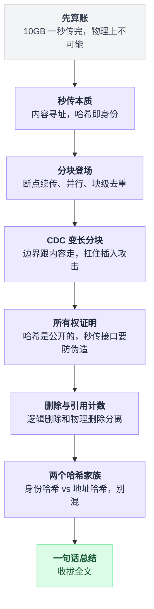
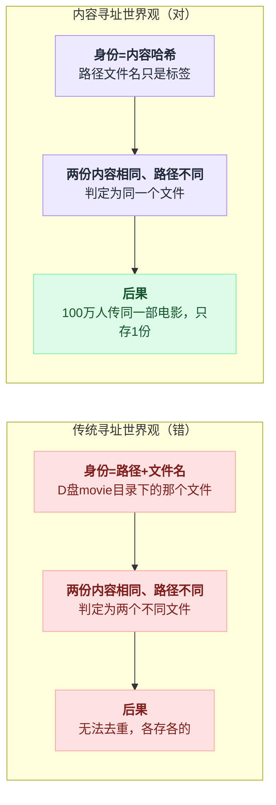
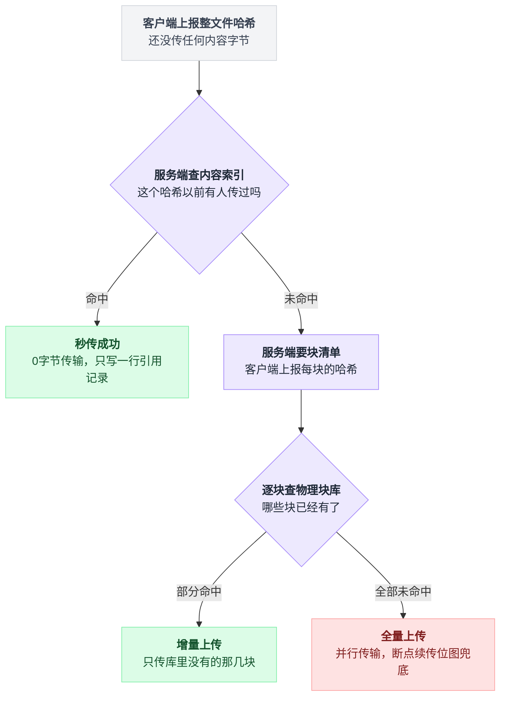
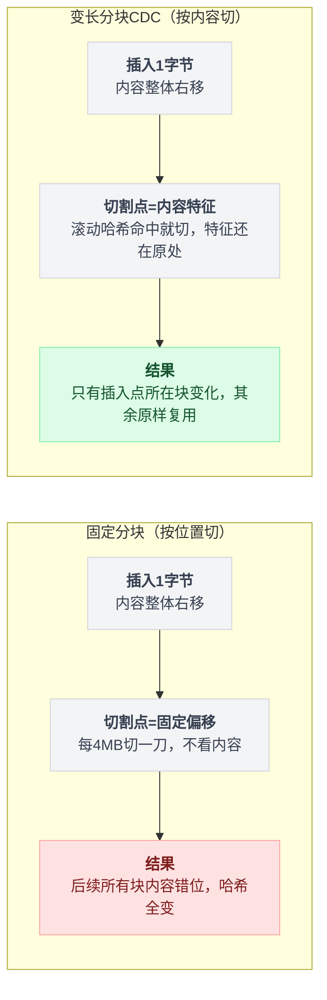
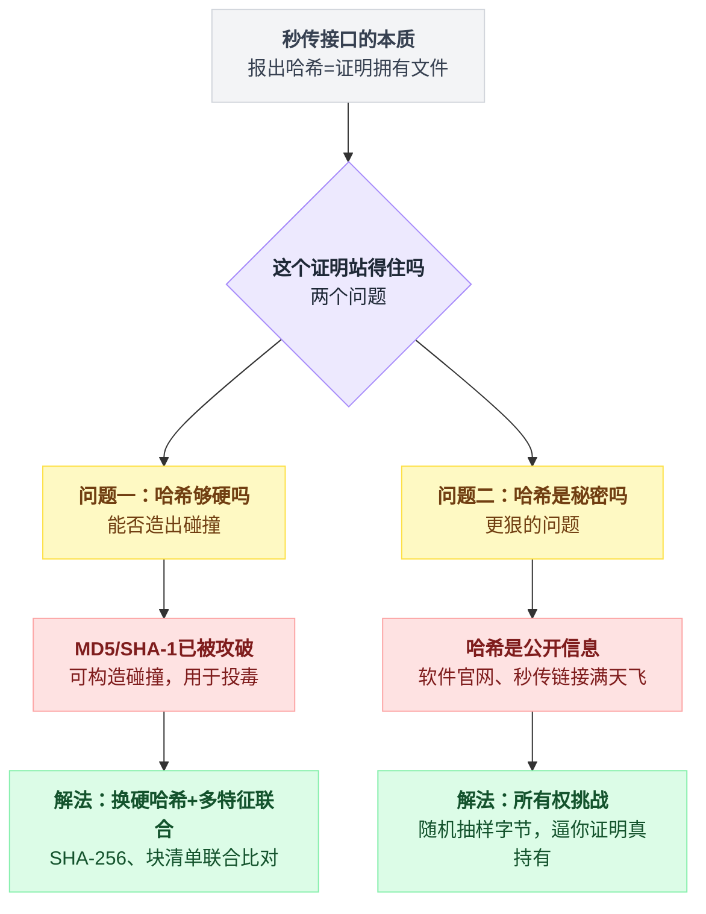
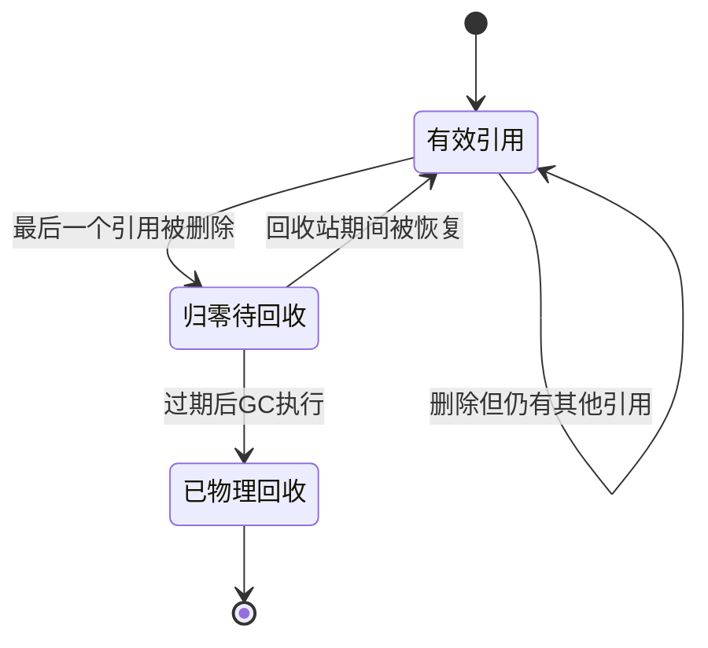

# 《网盘秒传与文件去重》10GB 的文件为什么"1 秒就传完了"（小白版）

> 一句话结论：**"秒传"的真相是根本没传——你上传的不是 10GB 的文件，是一个几十字节的哈希值；全网 100 万人存同一部电影，网盘物理上只保存 1 份。** 更冷的推论：你网盘里"你的"文件，字节可能从来没离开过你的电脑——你只是"认领"了多年前别人传上去的那一份。
> 难度：★★★☆☆ ｜ 写作时间：2026-08-05
> 未经一手核实的说法在文中已标注（早年"伪造秒传"事件、Dropship 事件、各家网盘的具体实现均属此类）。

读完你会懂：

1. 为什么进度条 1 秒跳到 100% 在物理上"不可能"，而它又确实发生了
2. 内容寻址的世界观：文件名只是元数据，**内容的哈希才是文件的身份**
3. 为什么整文件一个哈希不够，要切成 4MB 的块——以及断点续传的位图和 [第 1 篇 12306](./01-12306抢票.md) 的座位位图是同一招
4. 固定分块的命门：文件开头插 1 个字节，去重效果直接归零——以及 CDC 变长分块怎么用滚动哈希救场
5. 秒传接口的本质是"用哈希证明你拥有文件"——而哈希是公开信息，这里面有一个真实存在过的安全洞
6. 删文件为什么几乎从不释放磁盘：引用计数，以及"全网只有一份"的双刃剑

---

## 目录

- [1. 先把账算了：10GB 一秒传完，物理上可能吗](#1-先把账算了10gb-一秒传完物理上可能吗)
- [2. 秒传：你上传的不是文件，是一句"我有"](#2-秒传你上传的不是文件是一句我有)
- [3. 整文件哈希的两个不够：分块登场](#3-整文件哈希的两个不够分块登场)
- [4. 固定分块的命门与 CDC：让内容自己决定边界](#4-固定分块的命门与-cdc让内容自己决定边界)
- [5. 哈希碰撞与安全：秒传接口其实是一场"所有权证明"](#5-哈希碰撞与安全秒传接口其实是一场所有权证明)
- [6. 删除：引用计数，和"全网只有一份"的双刃剑](#6-删除引用计数和全网只有一份的双刃剑)
- [7. 两个哈希，两个问题](#7-两个哈希两个问题)
- [8. 一句话总结、小白词典与前篇对照](#8-一句话总结小白词典与前篇对照)

全文按台阶推进，每一级解决上一级留下的坑：



---

## 1. 先把账算了：10GB 一秒传完，物理上可能吗

### 1.1 场景

周五晚上，你从移动硬盘里翻出一部 10GB 的电影，拖进网盘客户端，准备存一份。

按经验，这种上传够你去洗个澡的。结果你刚端起水杯——进度条"唰"一下跳到 100%，弹出提示：**上传成功**。

前后不到 1 秒。

第一反应是不是"这网盘真快"？别急，先算笔账。

### 1.2 算账：你家的上行带宽根本做不到

家用宽带的上行带宽（上传方向）远小于下行。以比较常见的 30 Mbps 上行为例：

```
  10 GB = 10 × 1024 × 8 ≈ 81920 Mbit

  按 30 Mbps 上行满速跑：
      81920 ÷ 30 ≈ 2731 秒 ≈ 45 分钟

  就算你是 100 Mbps 上行的高配宽带：
      81920 ÷ 100 ≈ 819 秒 ≈ 13 分半

  想在 1 秒内传完 10GB，需要的上行带宽是：
      81920 Mbps ≈ 80 Gbps
```

80 Gbps。这是数据中心内部交换机之间的量级，不是任何家用宽带能摸到的数字。

所以结论只有一个，而且没有第二种可能：

> **这 10GB 根本没有经过你家的网线。它没传。**

那服务器凭什么敢弹"上传成功"？它甚至连文件长什么样都没见过——还是说，它其实见过？

这就是本篇的故事。

---

## 2. 秒传：你上传的不是文件，是一句"我有"

### 2.1 真实的流程：先对暗号，再决定传不传

点下上传按钮之后，客户端干的第一件事不是发数据，是**在本地把整个文件读一遍，算出它的哈希值**（比如 SHA-256，一个 64 个十六进制字符的指纹）。然后发给服务端的只有这个指纹：

```
 客户端                                    服务端
   │                                         │
   │ ① 本地读文件，算 SHA-256                │
   │    （硬盘转了一会儿，网络上零流量）     │
   │                                         │
   │ ② "我要传一个文件，                     │
   │     哈希是 03ad677d…，10485760 字节" ──▶│
   │                                         │ ③ 查哈希索引：
   │                                         │    03ad677d… → 有！
   │                                         │    物理块都在库里
   │                                         │ ④ 在你的文件表里
   │                                         │    插一行"引用"记录
   │ ◀──"传完了"（其实一个内容字节都没收）──│
   │                                         │
   │ 进度条: 0% ────────────────▶ 100%       │
   │ 整个交互只有几百字节的请求和响应        │
```

看第 ④ 步。所谓"上传成功"，在服务端只是**往数据库里写了一行记录**："这个用户名下，有一个叫《流浪地球.mkv》的文件，内容指向哈希 03ad677d…"。

一个字节的文件内容都没有传输。这就是秒传。

当然，前提是第 ③ 步查到了——**这个哈希以前有人传过**。热门电影、装机软件、流行手机 ROM，几乎必然有人传过。如果没人传过呢？那就退化成老实上传，秒不了。秒传的命中率，本质上是"你的文件有多大众"。

### 2.2 内容寻址：文件名只是标签，哈希才是身份

这背后是一个跟直觉拧着的世界观，叫**内容寻址（content-addressable）**：

- 传统世界观：文件的身份是"路径 + 文件名"，`D:\movie\流浪地球.mkv` 就是那个文件。
- 内容寻址世界观：**文件的身份是它内容的哈希**。文件名、路径、创建时间，全都只是贴在身份上的标签（元数据）。

两个推论立刻成立：

1. 你把 `流浪地球.mkv` 改名成 `学习资料.mkv`，内容哈希不变——在网盘眼里**它还是同一个文件**，改名只是改了一行元数据。
2. 两个人各自上传了内容一模一样、文件名完全不同的文件——在网盘眼里**这是同一个文件**，只需要物理存 1 份。

两种世界观在"内容相同、名字不同"这个场景上给出完全相反的判定：



第 2 条推论放大到全网就是：

```
  100 万人 × 10GB 的同一部电影
  ├─ 不去重：100 万份 × 10GB ≈ 9.5 PB 磁盘
  └─ 去重后：物理文件 1 份（10GB）
             + 100 万行"谁的目录里有它"的元数据（每行几百字节）
```

近 10 个 PB 压成 10 个 GB 加一点零头。这就是网盘敢卖"人均几个 TB 容量"的底气之一——**它卖的是逻辑容量，不是物理磁盘**。

### 2.3 两层结构：逻辑文件表 vs 物理块存储

把上面的世界观画成存储结构，就是网盘的骨架——上下两层，中间靠哈希指过去：

```
 逻辑层（每个用户一棵目录树，全是元数据，很便宜）
 ┌─────────────────────────────────────────────────────┐
 │ 用户A: /我的资源/流浪地球.mkv        → 内容 03ad67… │
 │ 用户B: /movie/liulang.2019.mkv       → 内容 03ad67… │
 │ 用户C: /新建文件夹(2)/1.mkv          → 内容 03ad67… │
 └────────────────────────┬────────────────────────────┘
                          │ 三行记录，指向同一个内容
                          ▼
 内容索引层（内容哈希 → 块清单 + 引用数，全网一份）
 ┌─────────────────────────────────────────────────────┐
 │ 03ad67… : 大小 10485760                             │
 │           块清单 [81f1…, 8f50…, b244…]              │
 │           引用数 = 3                                │
 └────────────────────────┬────────────────────────────┘
                          ▼
 物理层（真正占磁盘的块，全网也只有一份）
 ┌──────────┐  ┌──────────┐  ┌──────────┐
 │ 块 81f1… │  │ 块 8f50… │  │ 块 b244… │
 │   4MB    │  │   4MB    │  │   2MB    │
 └──────────┘  └──────────┘  └──────────┘
```

记住这张图，后面每一节都在它上面做文章：

- 秒传 = 只在**逻辑层**插一行，不碰物理层
- 你"删除"文件 = 只在逻辑层删一行（第 6 节）
- 中间那个"引用数 = 3"，就是第 6 节的主角
- 块清单为什么是三个块而不是一个整体，是第 3 节的主角

💡 **反直觉时刻**：你网盘里那个"上传成功"的文件，物理上很可能是三年前某个陌生人上传的那一份。你的字节从来没离开过你的电脑——你不是上传了文件，你是**认领**了文件。上传接口的本质，是一次"写数据库"。

### 2.4 这个方案的裂缝

到这里，"整文件哈希 + 查库 + 写引用"看起来已经能解释秒传了。但把它放到真实世界里跑，马上裂开两道缝——这就是下一节的事。

---

## 3. 整文件哈希的两个不够：分块登场

### 3.1 不够之一：算完哈希才能开始传，首字节延迟太长

秒传的前提是先算出整文件哈希。10GB 的文件，得从头到尾**完整读一遍磁盘**才能算完。

```
  按机械硬盘常见的 150MB/s 顺序读速度算：
      10240 MB ÷ 150 MB/s ≈ 68 秒

  这 68 秒里：
  ── 网络上一个字节都没发（哈希没算完，没法对暗号）
  ── 用户盯着一动不动的进度条，以为客户端卡死了
```

而且这 68 秒是"运气好、能秒传"路径的开销。运气不好没命中呢？68 秒白等，再从零开始传 45 分钟。**哈希计算挡在传输前面，串行了。**

### 3.2 不够之二：断线只能从头再来

整文件是一个不可分割的上传单位。45 分钟的上传，在第 43 分钟断了一次网——对不起，服务端只认"完整收到"，你重新来过。

家里 Wi-Fi 打个喷嚏，45 分钟归零。这个方案没法向用户交代。

### 3.3 解法：切成 4MB 一块，每块独立编号、独立哈希

两个问题共用一个解：**别把文件当一个整体，切成固定大小的块（chunk）**。业内常见的量级是 4MB 一块（具体某家网盘用多大，多来自网友抓包分析，第三方来源、未核实；本文取 4MB 只作示例）：

```
  10GB 文件，按 4MB 切：

  ┌──────┬──────┬──────┬──────┬─ ─ ─ ─┬──────┐
  │ 块 0 │ 块 1 │ 块 2 │ 块 3 │  ……   │块2559│
  │ 4MB  │ 4MB  │ 4MB  │ 4MB  │       │ 4MB  │
  └──────┴──────┴──────┴──────┴─ ─ ─ ─┴──────┘
     ↓      ↓      ↓      ↓              ↓
   h(块0)  h(块1) h(块2) h(块3)  ……    h(块2559)

  每块算一个哈希 → 一张 2560 行的"块哈希清单"
  整文件哈希照算不误（流式累进，读一块喂一块）
```

块是独立的上传单位。这一刀切下去，三个红利同时到账。

### 3.4 红利一：断点续传——位图又登场了

服务端给每个上传中的文件记一张**位图（bitmap）**：第 i 位为 1 表示"块 i 已收到"。

```
  块编号:   0  1  2  3  4  5  6  7  …… 2559
  已传位图: 1  1  1  0  1  0  0  0  ……  0
                     ↑
            断线重连后，客户端问一句"我传到哪了"，
            服务端把位图甩过来：块 3 和块 5 往后的还缺。
            从缺的传起，已传的 12MB 不用重来。

  这张位图多大？ 2560 bit = 320 字节。
  320 字节，管住了 10GB 的传输进度。
```

眼熟吗？**这和 [第 1 篇 12306](./01-12306抢票.md) 用位图记"座位在哪些区间被占用"是同一招**：把"一堆东西各自的是/否状态"压成一串比特，查询和更新都是位运算。那边管的是座位卖没卖，这边管的是块传没传。位图这个工具，你在本系列已经是第二次见到它扛大梁了。

### 3.5 红利二：并行上传

块和块之间没有依赖，可以开多个连接同时传。单连接吃不满带宽时（高延迟链路上很常见），并行几路能明显把带宽跑满。这是工程红利，不展开。

### 3.6 红利三：块级去重——去重的粒度从"文件"细到了"块"

去重的判定单位跟着从文件变成了块。这意味着**两个不完全相同的文件，也能共享它们相同的那部分块**。

最典型的场景是"只在尾部追加"的文件——日志、备份包、你那个越写越长的小说 txt：

```
  昨天的版本:  [块0][块1][块2]
  今天的版本:  [块0][块1][块2][块3新]
                 ↑     ↑    ↑
             哈希没变，服务端都有 → 一个字节不用传
  实际上传量: 只有块 3
```

注意一个伏笔：这个红利成立的前提是"改动不挪动块的边界"。尾部追加满足，**开头插入不满足**——这是第 4 节的大坑，先按下。

### 3.7 动手：用 hashlib 写一个分块哈希

纯标准库，Python 3.9+（`random.randbytes` 需要），直接能跑：

```python
import hashlib
import random

CHUNK = 4 * 1024 * 1024  # 4MB，网盘常用的固定分块大小

# 造一个 10MB 的"文件"（用固定种子，每次跑结果一样）
random.seed(42)
data = random.randbytes(10 * 1024 * 1024)

# 整文件哈希：流式喂给 sha256，内存里永远只有一小块
whole = hashlib.sha256()
chunk_hashes = []
for i in range(0, len(data), CHUNK):
    block = data[i:i + CHUNK]
    whole.update(block)                       # 累进整文件哈希
    chunk_hashes.append(hashlib.sha256(block).hexdigest())  # 顺手算分块哈希

print(f"文件大小      : {len(data)} 字节（10MB）")
print(f"整文件 SHA-256: {whole.hexdigest()}")
print(f"分成 {len(chunk_hashes)} 块（4MB + 4MB + 2MB），每块的哈希：")
for n, h in enumerate(chunk_hashes):
    print(f"  块 {n}: {h[:16]}...")
```

真实运行输出：

```
文件大小      : 10485760 字节（10MB）
整文件 SHA-256: 03ad677dc65a804d63e4bf5821bfc6c3e9ee302cd6b538a28d607ab882ba20b1
分成 3 块（4MB + 4MB + 2MB），每块的哈希：
  块 0: 81f1365aec00473e...
  块 1: 8f50217494c58048...
  块 2: b244a8f9c590968c...
```

两个细节值得停一秒：

- `whole.update(block)` 是**流式**的——整文件哈希不需要把 10GB 读进内存，一块一块喂就行。3.1 节说的"读一遍磁盘"躲不掉，但"占一大块内存"是躲得掉的。
- 第 2.3 节结构图里的 `03ad67…`、`81f1…`、`8f50…`、`b244…`，就是这次运行的真实输出。那张图不是编的。

### 3.8 组装：完整的三级上传协议

把秒传和分块拼在一起，现代网盘的上传协议长这样：

```
  客户端                                服务端
    │                                     │
    │ ①"整文件哈希 = X, 大小 = S" ───────▶│
    │                                     │─ 查内容索引
    │ ◀── 命中 ──"秒传成功" ──────────────│   （最好的情况：0 传输）
    │                                     │
    │ ◀── 未命中 ──"把块清单给我" ────────│
    │ ②"块哈希清单 [h0, h1, …, h2559]" ──▶│
    │                                     │─ 逐块查物理块库
    │ ◀──"h17、h301、h1888 这三块没有，───│
    │      其他的都有，别传了"            │   （次好：只传增量块）
    │                                     │
    │ ③ 并行上传缺的块，断了看位图续 ────▶│
    │                                     │─ 全收齐 → 组装块清单
    │ ◀──"上传完成" ──────────────────────│   → 写内容索引 → 写逻辑层
```

三级递降：整文件命中（一个字节不传）→ 块级命中（只传缺的块）→ 全量上传（还有断点续传和并行兜底）。用户看到的那根进度条，背后是这套协商。

把这套协商拆成决策树，看得更清楚三级台阶分别在哪个岔口分道：



### 3.9 新的裂缝

固定分块解决了首字节延迟和断线重传，块级去重还白捡了"增量上传"。看起来收工了？

给你出个题：把 3.6 节里那个文件，**在开头插入 1 个字节**，块级去重还剩多少？

答案是 0。一个块都救不回来。为什么，下一节。

---

## 4. 固定分块的命门与 CDC：让内容自己决定边界

### 4.1 命门：开头插 1 个字节，所有块哈希全变

固定分块的切法是"从第 0 字节起，每 4MB 切一刀"——**边界的位置只由偏移量决定，和内容无关**。于是开头插入 1 个字节，所有内容整体右移 1 位，每一刀切出来的东西全都变了：

```
  原文件（4 字节一块做演示）:

     A B C D | E F G H | I J K L
     └─块0─┘   └─块1─┘   └─块2─┘
      ABCD      EFGH      IJKL     → 哈希 h0, h1, h2

  开头插入一个 X:

     X A B C | D E F G | H I J K | L
     └─块0─┘   └─块1─┘   └─块2─┘
      XABC      DEFG      HIJK     → 哈希 h0′, h1′, h2′ 全是新面孔
        ↑
     每个块的内容都"错了一位"，没有任何一个块的哈希能对上旧的
```

文件 99.9999% 的内容没变，去重效果：**零**。传输量：全量。

你可能觉得"谁没事往文件开头插字节"。真实世界里这类改动很多：文档开头加一段、压缩包里换一个靠前的小文件、视频文件改一下头部元数据、代码文件顶部加一行 import。只要改动发生在前面、且长度不是块大小的整数倍，后面的边界就全体错位。

### 4.2 换个思路：按内容切，不按位置切

问题出在"边界跟着偏移量走"。那就让**边界跟着内容走**。

打个比方：把一本书切成小段，有两种切法——

- **按页码切**：每 10 页切一段。往书前面塞进 1 页，后面每一段的内容全变了。
- **按章节切**：看到"第 X 章"就切一刀。往书前面塞 1 页，只有它落进的那一章变了，**后面的章节纹丝不动**——因为"第 X 章"这几个字还在原来的内容位置上。

"按章节切"就是**变长分块，CDC（Content-Defined Chunking，内容定义分块）**。文件里没有现成的"章节标题"，那就人造一个判据：

> 拿一个固定大小的滑动窗口（比如 16 字节）扫过文件，每滑一格算一次窗口内容的哈希；**当哈希值的低 n 位呈现某个约定形态（比如全为 1，或全为 0，看你怎么约定）时，就在这里切一刀。**

关键性质：**切不切，只取决于窗口里这几个字节长什么样，和它在文件里的绝对位置无关。**开头插入 1 个字节，所有内容右移，但"那 16 个字节的组合"还是那个组合，滑到它时照样触发切割——旧边界全部保住，只有插入点所在的一两个块变了。

顺手算个账：低 n 位全 1 的概率是 1/2ⁿ，所以平均每 2ⁿ 个字节切一刀——**n 调多大，平均块就多大**。这是个用概率控制块大小的旋钮。

同样是"开头插入 1 个字节"，两种切法为什么一个全崩一个岿然不动，机制上的分岔在这里：



### 4.3 滚动哈希：让"每滑一格算一次哈希"不至于慢死

窗口每滑一格都重算一次 16 字节的哈希？那是 O(文件长度 × 窗口长度)。滚动哈希（rolling hash）把它降到 O(文件长度)：

```
  窗口:      [ b1 b2 b3 …… b16 ]  → 哈希 H
  滑动一格:     [ b2 b3 …… b16 b17 ]

  不重算！新哈希 = 旧哈希 "减去 b1 的贡献，再乘底数，再加上 b17"
  一进一出，O(1) 更新
```

能这么干，是因为选的哈希函数是多项式形式 `H = b1·Bᵏ⁻¹ + b2·Bᵏ⁻² + … + bk`——头一项减掉、整体乘 B、尾巴加新字节，代数上严格成立。（Rabin 指纹、Gear、Buzhash 都是这条路上的不同实现，工程上还有 FastCDC 这类加速变体——此处只取方向，各算法细节未逐一核对论文与源码。）

### 4.4 动手：40 行写一个简化版 CDC，和固定分块对打

纯标准库，直接能跑。做的实验就是 4.1 节那个：文件开头插 1 个字节，看两种分块各还能复用多少块。

```python
import hashlib
import random

# ---------- 固定分块 ----------
def fixed_chunks(data, size=64):
    return [data[i:i + size] for i in range(0, len(data), size)]

# ---------- 变长分块（CDC，简化版） ----------
WINDOW = 16            # 滚动窗口：只看最近 16 个字节
MASK = (1 << 6) - 1    # 低 6 位全为 1 就切 → 平均块长约 2^6 = 64 字节
BASE = 257
MOD = 1 << 32
# base^(WINDOW-1)，删除滑出窗口的旧字节时要用
POW = pow(BASE, WINDOW - 1, MOD)

def cdc_chunks(data):
    """滚动哈希找边界：哈希低 6 位全 1 的位置切一刀。"""
    chunks, start, h = [], 0, 0
    for i, byte in enumerate(data):
        h = (h * BASE + byte) % MOD              # 新字节进窗口
        if i - start >= WINDOW:
            out = data[i - WINDOW]               # 旧字节滑出窗口
            h = (h - out * POW * BASE) % MOD
        if (h & MASK) == MASK and i - start + 1 >= WINDOW:
            chunks.append(data[start:i + 1])     # 内容说：这里切一刀
            start, h = i + 1, 0
    if start < len(data):
        chunks.append(data[start:])
    return chunks

def ids(chunks):
    return [hashlib.sha256(c).hexdigest()[:8] for c in chunks]

# ---------- 实验：文件开头插入 1 个字节 ----------
random.seed(7)
old = random.randbytes(4096)      # 原文件 4KB
new = b"X" + old                  # 新文件：开头插了 1 个字节

for name, cut in [("固定分块", fixed_chunks), ("变长分块", cdc_chunks)]:
    a, b = set(ids(cut(old))), set(ids(cut(new)))
    total = len(ids(cut(new)))
    reuse = len(a & b)
    print(f"{name}: 旧文件 {len(cut(old))} 块，新文件 {total} 块，"
          f"能复用 {reuse} 块（{reuse}/{total}）")
```

真实运行输出：

```
固定分块: 旧文件 64 块，新文件 65 块，能复用 0 块（0/65）
变长分块: 旧文件 52 块，新文件 52 块，能复用 51 块（51/52）
```

一个字节的插入：固定分块 **0/65**，全军覆没；CDC **51/52**，只有插入点所在的第一块换了新哈希，剩下 51 块的边界一个没挪。4.2 节的"按章节切书"，就是这三行输出。

（变长分块平均块长 4096÷52 ≈ 79 字节，和 MASK 取 6 位的期望值 2⁶ = 64 对得上，多出来的部分来自 16 字节的最小块长限制——概率旋钮是真的在工作。）

### 4.5 对比收拢

```
                 开头插入 1 字节后的世界

  固定分块        ██████████████████████████  全部块作废
  （按位置切）    去重率 0%，等于重传整个文件

  变长分块 CDC    █░░░░░░░░░░░░░░░░░░░░░░░░░  只有 1 块作废
  （按内容切）    去重率 98%，只传插入点那一块
```

| | 固定分块 | 变长分块（CDC） |
|---|---|---|
| 边界由什么决定 | 偏移量（每 4MB 一刀） | 内容（滚动哈希命中就切） |
| 切分速度 | 几乎免费 | 要逐字节滚哈希，吃 CPU |
| 块大小 | 恒定，索引好管 | 浮动，需要最小/最大块长护栏 |
| 尾部追加 | 能复用 | 能复用 |
| 开头/中间插入 | **全部作废** | 只作废相邻一两块 |
| 典型使用者 | 网盘上传协议 | 备份/同步工具 |

两个补充：

- **护栏**：真实的 CDC 都会加最小/最大块长限制——不然遇到"永远命不中切割条件"的内容会切出超大块，遇到"连环命中"的内容会切得粉碎。上面示例里 `i - start + 1 >= WINDOW` 就是一个最小块长护栏的雏形。真实系统的平均块长通常在几百 KB 到几 MB 量级，各家参数不同，以官方文档为准。
- **一脉相承**：rsync 的增量同步用的是"弱滚动校验先扫、强哈希确认"的两级套路；restic、borg 这类去重备份工具用 CDC 变长分块做仓库级去重。**这里只给方向**——各家的具体算法、窗口、参数，本文未逐一核对源码，别拿这句话当实现细节的依据。

⚠️ **别急着觉得 CDC 处处碾压。** 它逐字节滚哈希，CPU 开销实打实；块长浮动，索引和存储管理都更麻烦。网盘的主战场是"整文件秒传命中"（100 万人传同一部电影），文件级去重就吃掉了最肥的那块收益，固定分块管断点续传和增量绰绰有余；CDC 的主战场是"同一份数据反复备份、每次只改一点"的版本化场景。**工具没有高下，场景有。**这是笔者的工程判断，不是哪家网盘的官方口径。

---

## 5. 哈希碰撞与安全：秒传接口其实是一场"所有权证明"

### 5.1 换个角度看秒传：凭指纹领包裹

回看 2.1 节的流程，秒传接口在逻辑上是这样一句话：

> "你能报出这个文件的哈希，就证明你拥有这个文件——那我把库里那份挂到你名下。"

**用哈希证明所有权。证明的强度 = 哈希的强度。**这句话立住了，两个问题立刻浮出来：

1. 哈希函数本身够硬吗？（能不能造出两个内容不同、哈希相同的文件？）
2. 就算哈希够硬——**哈希是秘密吗？**

第 2 问比第 1 问狠。先说第 1 问。

两个问题共用一个根——"报哈希证明所有权"这句话——分岔出两条完全不同的攻击面和解法：



### 5.2 第一问：MD5 已经被打穿了

- **2004 年，王小云团队公开了 MD5 的碰撞构造方法。**到今天，构造一对"内容不同、MD5 相同"的文件，在个人电脑上就能完成。
- **2017 年，Google 与 CWI 公布了 SHA-1 的实际碰撞（SHAttered 项目）**，两个内容不同的 PDF，SHA-1 完全相同。
- SHA-256 目前没有已知的实际碰撞。

这里有个必须掰清的区分，多数科普文都糊掉了：

```
  碰撞（collision）:
      "造出一对双胞胎"——攻击者同时控制两份内容，
      让它们哈希相同。MD5/SHA-1: 已沦陷 ✗

  第二原像（second preimage）:
      "给定别人已有的文件，造一个哈希相同的假文件"
      MD5 在这个意义上至今没有实用化的攻破 ✓
```

所以基于 MD5 碰撞的攻击剧本是这样的：攻击者**自己造好一对双胞胎**——比如一个正常安装包 A 和一个恶意版 B，MD5 相同——先把 B 传进网盘占住这个哈希；再把 A 放到网上流传。之后任何下载了 A 的人往网盘上传，都会"秒传命中"，被链到 B 上。将来他从网盘下回来的，是恶意的 B。这是投毒，不是"偷"。

早年中文网络上流传过利用 MD5 特性"伪造秒传"骗取他人文件、或往公共哈希上挂假内容的讨论和事件（**第三方来源，未核实**，此处不作为事实引用，只说明攻击面真实被讨论过）。

### 5.3 第二问更狠：哈希根本不是秘密

就算换成无懈可击的哈希函数，还有一个纯逻辑的洞：**"知道哈希"和"拥有文件"是两回事。**

哈希是公开信息。软件官网会贴校验值，资源站会贴校验值，早年中文网络上还流传过所谓"秒传链接"——把文件的哈希和大小拼成一个字符串，拿到字符串的人不需要拥有文件的任何一个字节，就能把这个文件"秒"进自己的网盘（**具体格式与各家实现，第三方来源、未核实**）。这不需要攻破任何密码学——是去重机制自己把"哈希"当成了"所有权凭证"，而这个凭证满大街都是。

国外也有对应的公案：2011 年出现过一个叫 **Dropship** 的开源工具，利用 Dropbox 当时的跨用户去重机制，只凭块哈希清单就能把文件"凭空"放进自己账户，相当于把网盘变成了匿名文件分发网络，随后 Dropbox 做了限制（**第三方报道，未一手核实**）。

还有一个更隐蔽的侧信道：上传一个文件，观察它是不是秒传，就能探测出**"全网是否有人存过这个文件"**——学术界对"去重作为存在性侧信道"有过专门讨论（方向性引用，具体论文结论未逐一核实）。去重省下的每一个字节，都在往外漏一点信息。

💡 **反直觉时刻**：秒传的安全问题不在传输层，在**证明层**。哈希在这个协议里扮演的是钥匙，而这把钥匙是公开信息。指纹能开门的前提是别人拿不到你的指纹——这个前提在这里不成立。

### 5.4 工程解法：把"报暗号"升级成"考试"

三板斧，层层加码：

1. **换硬哈希**：MD5 → SHA-256。关掉 5.2 节的碰撞投毒。这是底线，没商量。
2. **多特征联合判定**：整文件哈希 + 文件长度 + 分块哈希清单一起比对，甚至两种不同算法的哈希并用。攻击者要同时凑齐所有特征，难度相乘。（顺带一提：分块清单本身就让碰撞攻击难做——你得让每一块都对得上。）
3. **随机抽样挑战（challenge-response）**：这是对 5.3 节的正面回答。服务端不再只听你报暗号，而是当场出题：

```
  客户端: "我有哈希为 X 的文件"
  服务端: "是吗？把第 1,234,567 字节起的 64KB、
           第 8,910,111 字节起的 64KB 的哈希报来"
           （偏移量随机，每次都不一样）
  客户端: 只有真的持有文件全部内容，才答得出
```

只知道"秒传链接"的人，答不出随机偏移处的字节——**"知道指纹"被升级成了"证明你拿着整只手"**。学术界管这个方向叫 Proofs of Ownership（所有权证明），2011 年前后有一批论文专门研究"怎么用尽量少的交互证明你真的持有文件"（方向性引用）。

再补一刀现实：跨用户去重和端到端加密天然打架——每人用自己的密钥加密，同一部电影会变成 100 万份不同的密文，去重直接失效。有一派折中方案叫**收敛加密（convergent encryption）**：用文件内容自身的哈希派生密钥，同样的内容加密出同样的密文，去重得以保留——代价是"能猜出你存了什么"的侧信道又回来了。安全和去重，在这里是真金白银的互换关系，不存在全都要。

---

## 6. 删除：引用计数，和"全网只有一份"的双刃剑

### 6.1 你点的"删除"，只是引用数减一

回到 2.3 节的三层图。用户 A 删除《流浪地球.mkv》，发生的全部事情：

```
  用户A 点"删除"
        │
        ▼
  逻辑层:   删掉 A 目录树里的那一行            ← 毫秒级，用户眼里"删完了"
        │
        ▼
  内容索引: 03ad67… 的引用数  3 → 2            ← 物理块一个字节都没动
        │
        ▼
  物理层:   （什么都没发生）

  ……直到最后一个存有此文件的人也删了：

  引用数  1 → 0
        │
        ▼
  进延迟回收队列（不立刻删！回收站还要撑 N 天，
  而且怕计数有 bug 错删——错删是不可逆事故）
        │
        ▼
  过期后，后台 GC 任务真正抹掉磁盘上的块
```

"删除"被拆成了两件事：**用户眼里的删除**（逻辑层删一行，必须快）和**磁盘上的删除**（物理层回收，必须稳）。两者之间隔着引用计数和一个慢悠悠的后台任务。

把这个引用计数的生命周期画成状态机，比线性流程更看得出"归零之后还能被恢复"这个细节：



### 6.2 全系列第三次遇到这个形状了

停一下。"逻辑删除和物理删除分离"这个形状，这已经是本系列第三次撞见：

| 在哪 | 逻辑删除 | 物理删除 |
|---|---|---|
| [第 22 篇搜索引擎](./22-搜索引擎倒排索引.md) | 删文档 → 只打个删除标记 | 后台 segment merge 时真正抹掉 |
| [PG 系列第 9 篇 VACUUM](../2026-08_从真实项目学PostgreSQL/09-膨胀与VACUUM.md) | DELETE → 只留下死元组 | VACUUM/后台进程回收空间 |
| 本篇网盘 | 删文件 → 引用数减一 | 归零 + 过期后，GC 抹掉物理块 |

三个系统，同一招。原因也同一个：**面向用户的删除必须毫秒级返回，面向磁盘的删除又慢又危险（不可逆），把它们绑在一个动作里，两头都做不好。**拆开，前台记账，后台干活。下次你在任何系统里看到"删了但空间没释放"，先想这个形状，八成猜对。

顺带：那个"过期后再真删"的定时活儿谁来干？**这就是 [第 3 篇延迟任务与时间轮](./03-延迟任务与时间轮.md) 的主场**——"回收站文件 7 天后自动清理"和"订单 30 分钟未支付自动关闭"，是同一道题。

### 6.3 引用计数没那么省心

说白了，引用计数是一笔全网规模的账，账就会错：

- **并发加减必须原子**。秒传 +1 和删除 -1 同时打在同一个哈希上，丢一次更新，账就永久错了。
- 错的方向决定后果：计数虚高 → 文件永远删不掉，磁盘白白占着（泄漏）；计数偏低 → 还有人引用的文件被物理删除（**事故，不可逆**）。
- 所以在线计数之外，一般还要有**离线全量对账**兜底：定期扫逻辑层，重算每个哈希的真实引用数，和账上的计数核对——对不上的，宁可漏删，不可错删。这个"在线记账 + 离线对账"的双保险，和 [第 10 篇支付与对账](./10-支付与对账.md) 是同一个思想：**在线路径求快，离线对账求真。**

### 6.4 双刃剑：物理上只有一份，意味着"封一份 = 全网消失"

去重把 100 万份压成 1 份，省的是真钱。但硬币的另一面：

- **下架**：接到法务要求下架某个文件时，不用去 100 万个用户的网盘里挨个找——把那个内容哈希的物理块一封，**全网 100 万个用户目录里的这个文件同时变成死链**。物理世界里"收缴 100 万张盗版碟"是不可能任务，内容寻址的世界里是一条 UPDATE。
- **黑名单**：更进一步，把哈希放进黑名单，从此**谁都存不进这个文件**——上传接口在第 ③ 步查哈希时直接拒绝。如果你见过"某个资源刚转存就没了"的现象，底层多半是内容哈希黑名单在工作——这是合理推断，各家没有公开实现细节，**未核实**。

⚠️ **反直觉时刻**：去重让"你的文件"变成了一个幻觉。你以为你在网盘里有一份私有拷贝，实际上你持有的是一张指向公共物理块的门票——门票印着你的名字，但演出是所有人共用的一场。**取消演出，所有门票同时作废。**真正只属于你的文件（哈希全网唯一、引用数为 1 的那些），才是物理上"你的"那一份。

---

## 7. 两个哈希，两个问题

[第 12 篇](./12-小而美的五个算法.md) 攒了一个哈希家族：短链接（用哈希会死，改用发号器）、布隆过滤器（哈希压缩存在性）、一致性哈希（哈希分配机器）。本篇给这个家族又开了一家分店——**内容寻址**。把最容易混的两家摆在一起：

| | 一致性哈希（12 篇 6 节） | 内容寻址（本篇） |
|---|---|---|
| 对什么算哈希 | key / 块 ID | 内容本身的每一个字节 |
| 回答什么问题 | **这东西该存到哪台机器** | **这两份是不是同一个东西** |
| 哈希代表什么 | 地址 | 身份 |
| 集群扩容时 | 结果会变（部分 key 换家） | 结果永不变（内容没变，身份就没变） |
| 撞了会怎样 | 无所谓，本来就是多对一的分桶 | 灾难：两份不同内容被判成同一份 |

在真实网盘里，一个 4MB 的物理块把两家的服务都用上，一前一后：

```
            一个 4MB 的块
                 │
      ┌──────────┴──────────┐
      ▼                     ▼
  SHA-256(内容)         一致性哈希(块的身份ID)
  = 它是谁               = 它现在住哪
  身份，十年不变         地址，扩容就变
  （去重、秒传按这个认）  （路由、迁移按这个走）
```

**身份哈希恒定，地址哈希流动。**千万别混：拿地址当身份，扩容搬家之后"同一个文件"就认不出来了，去重全废；拿身份直接当地址，集群一伸缩就无从路由。两个哈希，两个问题，各干各的。

（还记得 12 篇 2.3 节"短链接用 MD5 取前 6 位必死"吗？那边怕的是**随机撞上**——生日悖论，概率的必然；本篇 5.2 节怕的是**有人蓄意造撞**——密码学攻击，人的恶意。同一个"碰撞"，两种来路，防法也不同：前者绕开哈希改用发号器，后者绕不开——身份就是哈希本身，只能把哈希换硬。）

---

## 8. 一句话总结、小白词典与前篇对照

### 一句话总结

> **秒传的本质是把"上传文件"偷换成"证明你拥有文件"：内容的哈希就是文件的身份，全网同一身份只存一份——省出数量级的磁盘，也一并接下了它的三笔账：边界要会跟着内容走（CDC）、证明要防得住公开的钥匙（所有权挑战）、删除要拆成逻辑和物理两步（引用计数 + 后台 GC）。**

### 小白词典

- **秒传**：客户端只上报文件哈希，服务端库里已有同哈希内容，直接挂引用——一个内容字节都不传的"上传"。
- **内容寻址**：用内容的哈希当文件的身份，文件名、路径只是贴在身份上的标签。
- **分块（chunking）**：把大文件切成小块，每块独立哈希、独立传输——断点续传、并行、块级去重都从这一刀来。
- **断点续传**：服务端用位图记住哪些块已收到，断线重连后只补缺的块。
- **CDC（内容定义分块）**：不按固定偏移切块，而是滚动哈希在内容里找"自然边界"——插入字节只影响相邻块，其余块照旧复用。
- **滚动哈希**：窗口滑动一格只做 O(1) 的"减头加尾"更新的哈希，CDC 能逐字节扫描全靠它。
- **哈希碰撞**：两份不同内容算出同一个哈希。MD5 已可人为构造碰撞，SHA-256 目前没有已知实际碰撞。
- **所有权证明**：服务端随机点名文件的若干偏移段要哈希，逼你证明"真的持有全部内容"，而不是只知道一个公开的指纹。
- **引用计数**：一份物理内容被多少个逻辑文件指着；删文件只是减一，归零后才轮到后台任务物理回收。

### 和前几篇的对照

1. **[第 1 篇 12306](./01-12306抢票.md)**：断点续传的"已传块位图"和 12306 的座位区间位图是**同一招**——把一堆是/否状态压成比特串，改和查都是位运算。
2. **[第 12 篇小而美](./12-小而美的五个算法.md)**：哈希家族开新店。一致性哈希回答"存到哪"（地址），内容寻址回答"是不是同一份"（身份）；短链那节怕的是随机碰撞、这里怕的是蓄意碰撞——同名不同病，药方**正好相反**（那边弃哈希改发号器，这边把哈希换硬）。
3. **[第 22 篇倒排索引](./22-搜索引擎倒排索引.md) 与 [PG 系列第 9 篇 VACUUM](../2026-08_从真实项目学PostgreSQL/09-膨胀与VACUUM.md)**：全系列**第三次**遇到"逻辑删除与物理删除分离"——标记删除等 merge、死元组等 VACUUM、引用归零等 GC，三个系统一个形状。
4. **[第 3 篇延迟任务](./03-延迟任务与时间轮.md)**："回收站 7 天后自动清空"就是一个延迟任务，和"订单 30 分钟未付自动关"同一道题。
5. **[第 10 篇支付与对账](./10-支付与对账.md)**：引用计数的"在线记账 + 离线全量对账兜底"，和支付系统"在线路径求快、离线对账求真"是同一个思想。
