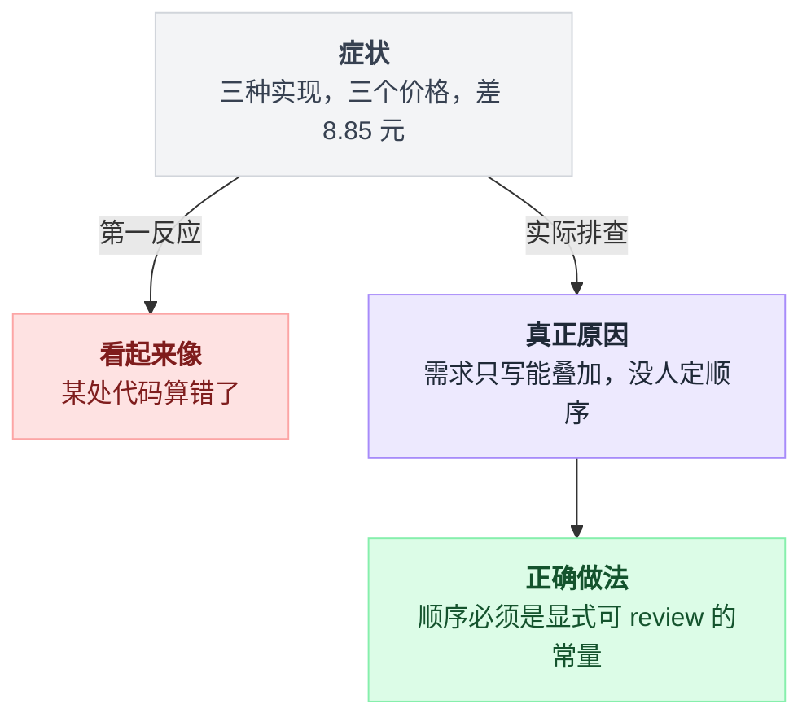
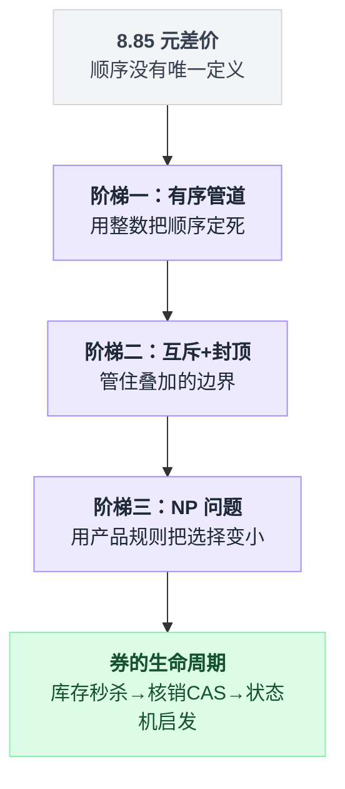
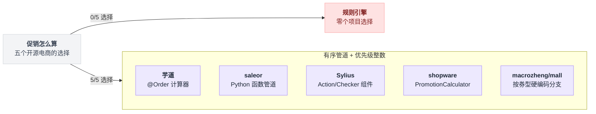
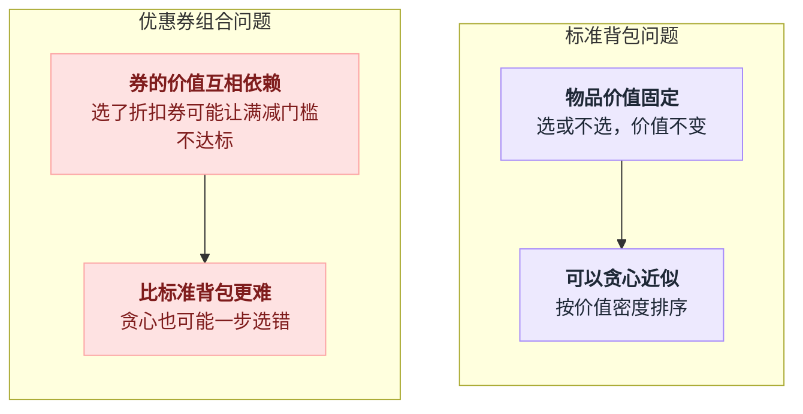
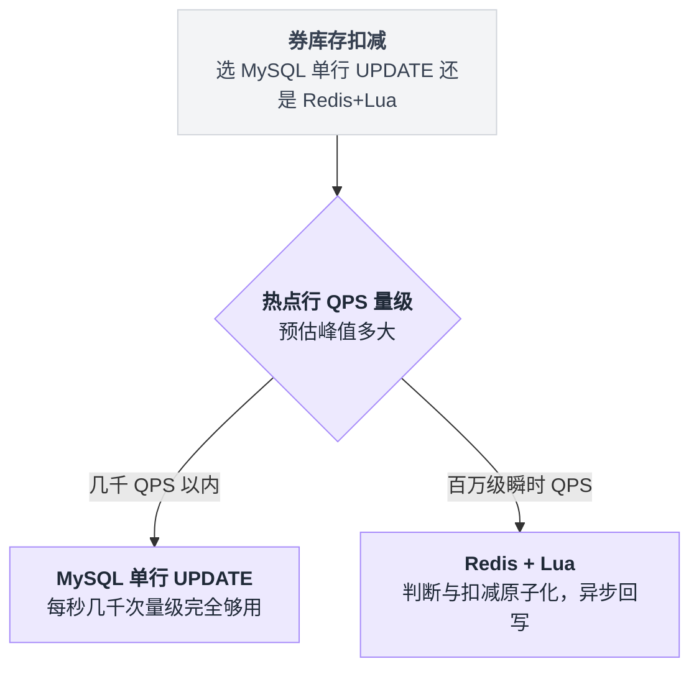
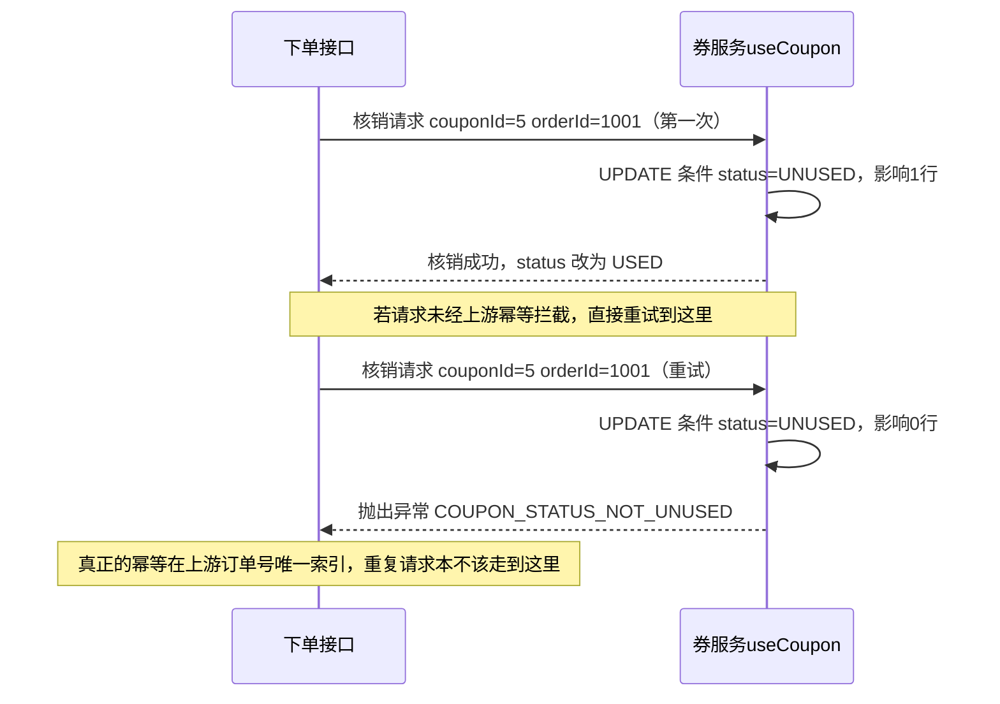
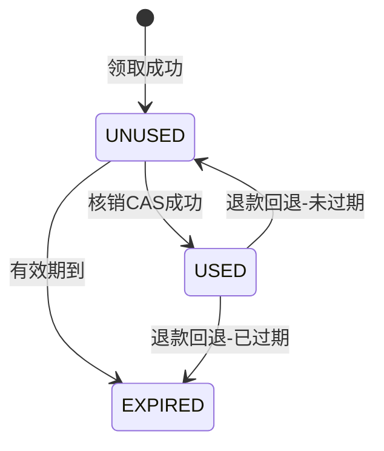

# 《优惠券与促销叠加》三张券叠一单，谁先算谁后算（小白版）

> 一句话结论：**主流开源电商里没有一个用规则引擎算促销——全是"有序计算器管道 + 一串优先级整数"。而叠加的真正难点从来不是判断"这张券能不能用"，是排序、互斥图、全局封顶这三件事。至于人人都在问的"核销幂等"，线上代码里它通常并不幂等：重复核销直接抛异常，真正的幂等由上游那个订单号扛着。**
>
> 难度：★★★☆☆
>
> 写作时间：2026-08-05。文中 star 数与最后提交时间为当日实测；源码细节基于公开仓库，未经一手核实的说法在文中已标注。

---

## 目录

- [0. 先讲个故事：一单三张券，三种算法，三个价格](#0-先讲个故事一单三张券三种算法三个价格)
- [1. 先把题目切开：条件、顺序、互斥、封顶](#1-先把题目切开条件顺序互斥封顶)
- [2. 阶梯一：从 if-else 到有序管道](#2-阶梯一从-if-else-到有序管道)
- [3. 阶梯二：互斥图与全局封顶（本篇主菜）](#3-阶梯二互斥图与全局封顶本篇主菜)
- [4. 阶梯三：最优券组合是个 NP 问题，而没人真的去解它](#4-阶梯三最优券组合是个-np-问题而没人真的去解它)
- [5. 券库存：又一个秒杀](#5-券库存又一个秒杀)
- [6. 核销幂等的真相：那根本不是幂等，是拒绝](#6-核销幂等的真相那根本不是幂等是拒绝)
- [7. 一个架构启发：Sylius 把促销计数挂在订单状态机上](#7-一个架构启发sylius-把促销计数挂在订单状态机上)
- [8. 反直觉结论](#8-反直觉结论)
- [9. 一句话总结、小白词典、和前几篇的对照](#9-一句话总结小白词典和前几篇的对照)

---

## 0. 先讲个故事：一单三张券，三种算法，三个价格

### 0.1 一个再普通不过的购物车

用户小王的购物车里三件东西，商品原价合计 **320 元**。他账户里挂着三个优惠：

| 优惠 | 类型 | 规则 |
|---|---|---|
| A. 店铺满减券 | 满减 | 满 300 减 50 |
| B. 品类券 | 折扣 | 该品类 9 折 |
| C. 会员日 | 活动折扣 | 全场 95 折 |

三个优惠单看都没有歧义。运营配的时候也没觉得有什么难的——"都能叠，一起给用户呗"。

小王自己在结算页之前就掏出计算器算了一遍：320 块，先减 50 是 270，再打 9 折优惠 32，再打 95 折优惠 16，那我应该付 **222**。

结算页显示的是 **230.85**。

小王打客服：**"你们少减了我 8 块 8。"**

客服查了半天，说系统算的没错。小王说我算的也没错。两个人都没错——**他们用的是不同的计算顺序**。

### 0.2 把三种顺序都算出来

同样三个优惠，同一个 320 元的购物车，三种常见实现算出三个价格。先看结论对照：

| 顺序 | 算法 | 结果 |
|---|---|---|
| 甲：先满减，再折上折（A → B → C） | 320 − 50 = 270，再 ×0.9，再 ×0.95 | **230.85**（最贵） |
| 乙：先折扣，最后减（B → C → A） | 320 ×0.9 ×0.95 = 273.60，再 − 50 | **223.60** |
| 丙：全部按原价并行算，优惠额相加 | 50 + 32 + 16 = 98，320 − 98 | **222.00**（最便宜，小王算的就是这个） |

展开成算式是这样：

```
  购物车原价 320.00
  优惠：A 满300减50   B 品类9折   C 会员95折

 ┌─ 顺序甲：先满减，再折上折（A → B → C）────────────────────┐
 │   320.00                                                  │
 │   − 50.00（满减 A）        = 270.00                        │
 │   × 0.9 （品类券 B）       = 243.00   ← 9 折打在 270 上     │
 │   × 0.95（会员日 C）       = 230.85                        │
 │                              ▲ 最贵                        │
 └───────────────────────────────────────────────────────────┘

 ┌─ 顺序乙：先折扣，最后减（B → C → A）──────────────────────┐
 │   320.00                                                  │
 │   × 0.9                    = 288.00                        │
 │   × 0.95                   = 273.60                        │
 │   − 50.00                  = 223.60   ← 满减打在折后价上    │
 └───────────────────────────────────────────────────────────┘

 ┌─ 顺序丙：全部按原价并行算，优惠额相加 ─────────────────────┐
 │   优惠 A = 50.00                                           │
 │   优惠 B = 320 × 10% = 32.00   ← 折扣按【原价】算           │
 │   优惠 C = 320 ×  5% = 16.00   ← 折扣也按【原价】算         │
 │   合计优惠 98.00                                           │
 │   320.00 − 98.00           = 222.00                        │
 │                              ▲ 最便宜（小王算的就是这个）   │
 └───────────────────────────────────────────────────────────┘

        甲 230.85    乙 223.60    丙 222.00
        └──────────────┴────────────┘
              最贵与最便宜相差 8.85 元
              占订单金额 2.8%
```

三段代码都"实现了需求"，都能通过"三个优惠都生效了"的验收，跑出来的价格差 **8.85 元**。

最毒的一点在这里：**这 8.85 块钱不是 bug 造成的，是没人做决定造成的。**

需求文档里写着"满减券、品类券、会员折扣可以叠加使用"，写得清清楚楚，没有任何一处提到顺序。写代码的人按自己的直觉排了个序，就这么上线了。

### 0.3 这钱谁掏？——顺序不是技术细节，是财务口径

把三个数字换算一下：

```
   订单量 10 万单/天，客单价 320
   ─────────────────────────────────────────────
   顺序甲（先满减后折扣）    平台补贴 89.15/单
   顺序丙（并行按原价算）    平台补贴 98.00/单
                            ────────────────
   每单差 8.85 元 × 10 万单 = 885,000 元/天
```

**一个排序决定，一天 88 万。**

这就是为什么在成熟公司里，"优惠计算顺序"是运营和财务一起拍板、写进制度的东西，不是后端自己想怎么排就怎么排的。

行业里最常见的默认约定是**顺序甲**（先算固定金额的满减，再算百分比折扣），理由很朴素：百分比作用在更小的基数上，平台掏得少。但这不是什么定理，各家不一样（此处不点名，属于业内常见差异）。

真正重要的是：**顺序必须是一个显式的、可配置的、写死在代码某一处的决定，而不是散落在十个 `if` 里的隐式副产物。** 本篇后面所有的架构，都是为了让这个决定"只存在于一个地方"。

客服和小王当时的第一反应，其实是两条不同的排查路径：



### 0.4 本篇路线图

小王的这一单，暴露了四个层层递进的问题：

| 症状 | 真正的问题 | 谁来解 |
|---|---|---|
| 三种写法三个价格 | 计算顺序没有唯一定义 | 第 2 节：有序计算器管道 |
| 券越叠越多，最后金额变负数 | 没有互斥规则，没有全局封顶 | 第 3 节（主菜） |
| 用户手里 12 张券，选哪几张最划算 | 这是背包问题 | 第 4 节 |
| 券发完了但超发了 3000 张 | 券库存 = 秒杀 | 第 5 节 |
| 同一张券被核销了两次 | "幂等"这个词用错了 | 第 6 节 |

四个阶梯不是并列的知识点，是一条链：**先把顺序定死（2），再管叠加的边界（3），然后才轮得到帮用户挑券（4），最后是券本身的生命周期（5、6）。**

这条链画出来是这样，后面每一节都对应链上的一环：



---

## 1. 先把题目切开：条件、顺序、互斥、封顶

动手之前先把"优惠券系统"这个词拆开。

大多数人一听到促销，脑子里蹦出来的是"条件判断"——满 300 才能用、限某个品类、限新用户。然后就开始设计一套条件 DSL、上规则引擎。

**这是把最简单的一环当成了主菜。**

一个促销引擎实际要回答四个问题，难度天差地别：

```
              "这单能享受哪些优惠，最终付多少钱"
                            │
        ┌───────────┬───────┴───────┬────────────┐
        ▼           ▼               ▼            ▼
    ① 条件       ② 顺序          ③ 互斥        ④ 封顶
   能不能用     谁先谁后        能不能同时用   总共最多减多少
  ───────────  ─────────────   ─────────────  ──────────────
  满300？       满减 vs 折扣     券A和券B冲突   减完不能为负
  限品类？      的先后           同类券只能用1  单笔封顶100
  限新人？                       活动券排斥券
  ───────────  ─────────────   ─────────────  ──────────────
   难度 ★☆☆☆     难度 ★★★☆        难度 ★★★★      难度 ★★★☆
   写 if 就行    定死一次就好      图问题          金额守恒问题
   最多人想到    第 0 节的 8.85    最容易漏         最容易出事故
```

① 条件判断确实是最直观的，也确实是代码量最大的（每加一种券型就多一段判断），但它**在架构上没有难度**：一个 `boolean isApplicable(cart, coupon)` 就完事，加需求就加分支，出错了只影响这一张券。

②③④ 才是架构问题。它们的共同特征是：**任何一张券的行为，都取决于其他券**。①是局部的，②③④是全局的。

💡 这个"局部易、全局难"的分野，在本系列里出现过很多次。[第 24 篇《抽奖与营销预算控制》](./24-抽奖与营销预算控制.md)里，"这个奖品中不中"是局部的（掷一次骰子），"今天总共发了多少钱"是全局的（预算池），后者才是那篇的主菜。**促销叠加是同一个形状：单券好判，多券难算。**

⚠️ 顺便澄清一个交叉引用的边界：第 24 篇里出现过很多次"优惠券"，但那里的券只是**奖品的一种**（掷出某个区间 → 发一张券）。那篇讲的是"券怎么被发出去、总预算怎么守住"，本篇讲的是"券发出去之后怎么算钱"。两篇在券的生命周期上是首尾相接的，不重叠。

### 1.1 顺便回答那个所有人都会问的问题：为什么不用规则引擎

"促销规则天天变，那不正好上个规则引擎，让运营自己配？"

听起来天经地义。但**打开主流开源电商的源码，一个用规则引擎算促销的都没有**：

| 项目 | star（2026-08-05 实测） | 最后提交 | 促销是怎么算的 |
|---|---|---|---|
| macrozheng/mall | 84,506 | **2026-05-14**（近 3 个月未更新） | Java 硬编码，按券型分支 |
| YunaiV/ruoyi-vue-pro（芋道） | 38,524 | 2026-07-31 | 一串带 `@Order` 的计算器，Spring 注入 |
| saleor/saleor | 23,181 | 2026-08-05 | Python 函数管道 |
| Sylius/Sylius | 8,509 | 2026-08-05 | Action / Checker 组件，PHP |
| shopware/shopware | 3,399 | 2026-08-05 | `PromotionCalculator` 有序处理 |

五个项目，四种语言，**零个规则引擎**。

五个项目摆在一起看更直观——路全是同一条：



再看一个侧面证据：Java 生态最常被推荐的轻量规则引擎 `j-easy/easy-rules`（5,254 star），最后一次提交是 **2024-05-29**，已经停更两年多（2026-08-05 实测）。Drools 的主仓在本次核实中**未能通过 API 检索到，标注为未核实**，不做论据。

为什么？因为**促销计算根本不是"规则匹配"问题，是"有序管道"问题**：

```
   规则引擎擅长的形状              促销计算实际的形状
  ────────────────────         ────────────────────
   一堆无序规则                  一条有序流水线
   谁先匹配上谁生效               每一站都要走
   规则之间独立                  每一站的输入 = 上一站的输出
   输出：命中/未命中              输出：一个不断变小的金额
       ●   ●                       ┌──┐  ┌──┐  ┌──┐
     ●   ●   ●     ──▶  ?          │ 1│─▶│ 2│─▶│ 3│─▶ 金额
       ●   ●                       └──┘  └──┘  └──┘
```

规则引擎的核心价值是"在一大堆规则里快速找出匹配的那些"（Rete 算法解决的就是这个）。而促销计算里，**你要走的站是确定的、有序的，根本不需要"找"**。

用规则引擎算促销，等于用一台冲突消解引擎去跑一条固定流水线——引擎最贵的那部分能力完全用不上，反而把"顺序"这个最关键的信息藏进了配置里，变得没人说得清。

规则引擎在促销领域**不是完全没位置**，它的位置在①：活动的**参与条件**配置侧（什么人、什么时段、什么商品能进这个活动）。至于国内电商里 QLExpress / LiteFlow 在促销条件侧的实际使用比例有多高，**（未核实，此处不做量化断言）**。

---

## 2. 阶梯一：从 if-else 到有序管道

### 2.1 朴素做法：一个方法算完所有优惠

先写一版谁都会写的：

```java
BigDecimal price = order.getTotal();
for (Coupon c : coupons) {                       // ← 顺序 = 这个 List 的顺序
    if (c.getType() == FULL_CUT && price.compareTo(c.getThreshold()) >= 0) {
        price = price.subtract(c.getValue());
    } else if (c.getType() == DISCOUNT) {
        price = price.multiply(c.getRate());
    }
}
if (order.getUser().isMember()) price = price.multiply(MEMBER_RATE);
```

上线能跑。第 0 节那 8.85 块钱就是从这里来的——**顺序等于 `coupons` 这个 List 的顺序，而这个 List 的顺序等于用户勾选的顺序，或者数据库返回的顺序**。也就是说：**顺序是随机的。**

同一个用户，同样三张券，先勾满减和先勾折扣，付的钱不一样。这已经不是排序问题了，这是"同一个订单算两次结果不一样"。

再往下加需求，这个方法会变成什么样，你能想象：积分抵扣要不要参与折扣？运费什么时候算？秒杀价和券能不能叠？每加一条，这个方法多两层嵌套，而且**每一次都在无意中改动了顺序**。

### 2.2 芋道的做法：把每一步拆成一个计算器，用整数定序

`YunaiV/ruoyi-vue-pro`（38,524 star，2026-07-31 最后提交，2026-08-05 实测）在 `yudao-module-trade` 里的做法，是本篇第一个值得抄的结构（路径已核实）：

```
yudao-module-trade/.../service/price/calculator/
    TradePriceCalculator.java          ← 接口，就一个方法
    TradeCouponPriceCalculator.java    ← 券
    TradeDiscountActivityPriceCalculator.java
    TradePointUsePriceCalculator.java
    TradeDeliveryPriceCalculator.java
    ...
```

接口极简：`void calculate(TradePriceCalculateReqBO param, TradePriceCalculateRespBO result)`。

注意**没有返回值**——每个计算器直接改那个 `result`，它是流水线上被逐站加工的半成品，不是一个被反复重新计算的数。跑起来是这样一个循环（示意）：

```
result = 初始半成品(购物车)
for calc in 所有 TradePriceCalculator 按 @Order 升序:
    calc.calculate(param, result)     # 无返回值，就地改 result
return result
```

所以整条链上只有一份状态在流动，谁改了什么全落在 `result` 上。

然后是本篇最该记住的一串数字。每个计算器上挂一个 `@Order(...)`，Spring 按这个整数把它们排成队：

```
   用户下单 ──▶ TradePriceCalculator 有序管道
      │
   ORDER_SECKILL = 8      ┌────────────────────────┐
      ├────────────────▶  │ 秒杀/拼团/砍价：改单价   │  先把"这商品多少钱"定了
      │                   └────────────────────────┘
   ORDER_DISCOUNT = 10    ┌────────────────────────┐
      ├────────────────▶  │ 限时折扣活动            │
      │                   └────────────────────────┘
   ORDER_REWARD = 20      ┌────────────────────────┐
      ├────────────────▶  │ 满减送活动（订单级）     │
      │                   └────────────────────────┘
   ORDER_COUPON = 30      ┌────────────────────────┐
      ├────────────────▶  │ 优惠券                  │  ← 券在活动【之后】
      │                   └────────────────────────┘
   ORDER_POINT_USE = 40   ┌────────────────────────┐
      ├────────────────▶  │ 积分抵扣                │
      │                   └────────────────────────┘
   ORDER_DELIVERY = 50    ┌────────────────────────┐
      ├────────────────▶  │ 运费                    │  ← 运费最后加
      │                   └────────────────────────┘
   ORDER_POINT_GIVE = 999 ┌────────────────────────┐
      └────────────────▶  │ 赠送积分                │  ← 不改价，只按最终价算送多少
                          └────────────────────────┘
                                    │
                                    ▼
                           应付金额 + 优惠明细
```

（常量名与数值取自大纲中已核实的源码路径；`@Order` 注册机制为 Spring 标准用法。）

这串数字里藏着四个已经被想明白的决定。

**① 秒杀最先（8）。** 秒杀/拼团改的是**单价**，是"这个商品多少钱"的定义。所有后续优惠都得在新单价上算。

这一步必须在最前面，否则你会拿着原价去算满减门槛——用户明明秒杀价买了 280，却因为原价 320 触发了满 300 减 50，平台白亏。

**② 活动在券之前（10、20 < 30）。** 这是第 0 节那个"顺序甲"的具体落地：先把商品级、活动级的价格算完，券作用在活动后价上。

**③ 积分在券之后（40）。** 积分是等额现金抵扣（1000 积分抵 10 元），放最后意味着它作用在**最小的那个基数**上，也就是"积分不参与打折"。

这条放反了，1000 积分在 9 折订单上只值 9 块钱——用户会算，会闹。

**④ 运费单独一站（50），赠送积分甩到 999。** 运费不是优惠是加法；赠送积分甚至不改金额，只是按最终实付算"这单送多少积分"，所以给它一个远大于其他所有值的数，永远排最后。

**用整数定序，而不是用 List 顺序或者用 if 的书写顺序，最大的收益是：顺序变成了一个可以被 code review 的常量表。**

你要改顺序，就得改这个数字，diff 里一目了然；而不是像 2.1 那样，某人无意中把一行 `if` 挪了个位置，一天亏 88 万。

### 2.3 中间量：为什么每一站要留下"我减了多少"

流水线还有第二个好处，比顺序更实际：**优惠明细**。

用户看到的结算页不是一个数字，是一张账单：

```
   商品金额                          320.00
   ─ 限时折扣                       −  0.00
   ─ 店铺满减                       − 50.00
   ─ 优惠券（品类券）                − 27.00
   ─ 会员折扣                       − 12.15
   ─ 积分抵扣（1000分）              − 10.00
   ＋ 运费                          +  8.00
   ══════════════════════════════════════════
   实付                             228.85
```

2.1 那种一路 `price = price.xxx()` 的写法，算完之后**只剩一个数**，中间过程全丢了。

想展示明细？再算一遍，而且是用另一套代码算——两套代码，两个结果，客服工单的源头。

管道式的写法里，每个计算器往 `result` 里追加一条"我这一站减了多少、归因到哪些商品行"，所以**明细是计算的副产物，不是二次计算的结果**。

这条纪律很重要：**凡是要展示给用户看的金额拆解，必须来自计算过程本身，不能事后重算。**

💡 这和[第 10 篇《支付与对账》](./10-支付与对账.md)的核心纪律是同一个：**金额相关的东西，过程要留痕，不能只留结果。** 那篇是为了对账，这篇是为了客服和退款分摊——退一件商品退多少钱，答案就在"这件商品身上摊了多少优惠"里。

---

## 3. 阶梯二：互斥图与全局封顶（本篇主菜）

顺序定死了，账单也有了。现在给系统加压：**券变多。**

运营同时挂了 6 个活动，用户手里 4 张券，会员日还在，再加一个新人首单立减。这时候第 2 节那条管道会撞上两堵墙。

### 3.1 第一堵墙：金额算成了负数

先看这个真实会发生的场景。一件原价 100 元的商品：

```
   商品原价                         100.00
   ─ 平台"每满 100 减 50"           − 50.00   →  50.00
   ─ 新人无门槛券 30 元              − 30.00   →  20.00
   ─ 店铺满减券 25 元                − 25.00   →  −5.00   ✗
                                              ═════════
                                        应付 −5 元？
```

到第三张券的时候，剩余金额已经不够减了。如果代码不管，用户实付 **−5 元**——支付网关会拒绝、或者更糟，某些内部账务系统会真的记一笔负金额。

有人说这好办，`Math.max(0, price)` 一夹就行。**在单个计算器里夹是不够的**，原因有两个。

**原因一：并行相加的写法会更早爆。** 回顾第 0 节的顺序丙——所有折扣按原价算再相加。三张 40% 的券叠一起就是 120%，直接 −20%。而"按原价算折扣"在很多老系统里是默认做法，因为它算起来最简单。

**原因二（更常见）：订单级优惠分摊到行。** 这个才是线上真正会出事的地方。

```
   订单三行：主商品 300.00 ／ 配件 20.00 ／ 赠品 1.00（一元换购）   合计 321.00
   订单级券"满 300 减 300"要按金额比例摊到每一行
   （摊到行，是为了退款时能算清"退这一行退多少钱"）

     行3 摊 300 × 1/321 = 0.93   →  1.00 − 0.93 = 0.07   ✓ 勉强
     再叠一张行级券（行3 减 1 元）：
     行3  1.00 − 0.93 − 1.00     →            −0.93      ✗
```

**行级优惠和订单级优惠是两个不同的人写的、在两个不同的计算器里算的，谁都不知道对方减了多少。**

单点夹 `max(0, x)` 挡不住这种跨计算器的溢出，因为每个计算器看到的都是"我自己减的这一点点，很合理"。

### 3.2 Shopware 的三步：排序 → 建互斥 → 砍封顶

`shopware/shopware`（3,399 star，2026-08-05 最后提交，当日实测）的 `PromotionCalculator` 把这件事结构化成了三步。它的 `calculate()` 大意是（示意代码）：

```
calculate(discountLineItems, original, calculated, ctx):
    行 = sort_by_priority(discountLineItems)   # ① 顺序先定死
    排除名单 = {}
    for d in 行:
        if d in 排除名单:  continue
        生效(d)
        排除名单 |= buildExclusions(d)          # ② 我生效了，和我互斥的后来者出局
    上限 = getMaxDiscountValue(...)             # ③ 这一单允许减的最大额
    limitDiscountResult(上限)                   # 超出的砍回去
```

三步的次序换不得：互斥要靠顺序才有方向，封顶要等所有折扣都落地才知道超没超。

画成流水线是这样：

```
  PromotionCalculator::calculate(discountLineItems, original, calculated, ctx)
        │
        │ ① sort by priority
        ▼  ┌──────────────────────────────────────────────────────┐
        │  │ 候选折扣行按优先级排成一个确定的序列                   │
        │  │（和芋道那串 @Order 是同一件事，不同语言的同一个答案）  │
        │  └──────────────────────────────────────────────────────┘
        │ ② buildExclusions()
        ▼  ┌──────────────────────────────────────────────────────┐
        │  │ 遍历有序序列，先生效的把和它互斥的后来者标记掉         │
        │  │ 互斥在这里从"配置"变成"这一单的实际排除清单"           │
        │  └──────────────────────────────────────────────────────┘
        │ ③ getMaxDiscountValue() / limitDiscountResult()
        ▼  ┌──────────────────────────────────────────────────────┐
        │  │ 算出这一单允许的最大折扣额，把超出的部分砍回去         │
        │  │ 全局封顶，最后一道闸                                  │
        │  └──────────────────────────────────────────────────────┘
        ▼
   最终购物车
```

出处：`src/Core/Checkout/Promotion/Cart/PromotionCalculator.php`（路径已核实）。

三步的分工非常干净，值得一条条拆。

### 3.3 第一步：排序为什么必须在最前面

排序在最前，是因为**后面两步都依赖"谁先生效"这个事实**。

互斥是有方向的：券 A 和券 B 互斥，到底是 A 排除 B 还是 B 排除 A？答案只能来自顺序——**先被处理的那个赢**。

封顶也一样：要砍掉超出部分，砍谁？砍最后进来的那个。没有顺序，"互斥"和"封顶"都是无法执行的话。

```
   无序 + 互斥 = 不确定      A ←──互斥──→ B     谁留下？掷硬币？
   ──────────────────────────────────────────────────────────
   有序 + 互斥 = 确定        A(priority 10)   B(priority 20)
     A 先处理 → A 生效 → A 把 B 标记为 excluded
     结果永远是 A 留下。可预测、可解释、可复现。
```

**"可解释"这三个字是促销系统的生命线。**

用户问"我这张券为什么没生效"，客服要能给出一个确定的答案；同一个订单重算十次，必须得到同一个结果，否则退款算不清。

### 3.4 第二步：`buildExclusions()`——互斥是一张图，不是一个字段

新手做互斥，通常是在券表上加一个字段：`can_stack`（能不能叠加）。布尔的。

这个模型在第三张券出现的当天就会崩。因为**互斥从来不是"这张券能不能叠"，是"这张券和那张券能不能同时用"**——它是券和券之间的关系，不是券自己的属性。

```
   错误模型：布尔字段              正确模型：一张图
  ─────────────────────         ──────────────────────────
   券A.can_stack = true             A ────✗──── B
   券B.can_stack = true             │           │
   券C.can_stack = false            ✓           ✓
                                    │           │
   "A 和 B 能同时用吗？"             C ────✓──── D
   这个模型答不上来。               节点=促销/券模板，边=互斥
```

真实的互斥需求长这样，每一条都是一条边或一组边：

| 互斥需求 | 图上是什么 |
|---|---|
| 同一模板的券，一单只能用一张 | 同组内两两互斥（团） |
| 新人券和会员折扣不能同享 | 两个节点之间一条边 |
| 秒杀商品不参与任何券 | 一个节点连向所有券节点 |
| 品类券之间互斥，但可以叠满减 | 分组互斥，跨组允许 |

Shopware 的 `buildExclusions()` 就是把配置里的这些关系，**在这一单的上下文里展开成一份具体的排除名单**。

注意"在这一单的上下文里"——同一对券，在 A 单里可能因为都没生效而不产生冲突，在 B 单里才真的撞上。互斥是运行期的事实，不是配置期的常量。

写成示意代码，那份名单是这么长出来的：

```
排除名单 = set()
for 券 in 按优先级排好序的候选券:
    if 券.模板 in 排除名单:      continue
    if 券.实际折扣额 == 0:       continue   # 没真减到钱，就没资格排除别人
    生效(券)
    for 对手 in 互斥图.邻居(券.模板):        # 边是双向的，粒度是模板
        排除名单.add(对手)
```

三处细节各对应一个坑，正好就是下面这三条。

⚠️ 互斥这一块最常见的三个坑，接手促销系统前先自查：

1. **互斥关系存成了单向的。** A 表里写了"排斥 B"，B 表里没写"排斥 A"。于是先算 A 的时候排除了 B，先算 B 的时候两个都生效了。互斥必须是对称的——要么存双向边，要么查询时两边都查。
2. **互斥判断用的是"券是否在候选列表里"，而不是"券是否真的生效了"。** 券 A 因为不满门槛没生效，却仍然把券 B 排除掉了，用户白白损失。判断依据必须是**实际产生了折扣金额**。
3. **同类互斥忘了"同一模板发多张"的情况。** 用户领了 3 张同款满减券，模型上是 3 个不同的 coupon id，但它们属于同一个模板，业务上只能用一张。互斥的节点粒度是**模板**，不是券实例。

### 3.5 第三步：`limitDiscountResult()`——为什么全局封顶不是可选项

这是本节、也是本篇最重要的一段。

先给结论：**全局封顶不是"防御性编程"，不是"以防万一加一层保护"。它是这套架构的必需组件，因为没有任何一个单独的计算器有能力保证总额不越界。**

为什么？看这张图：

```
   每个计算器的视野                  全局封顶的视野
  ──────────────────────────      ──────────────────────────
   计算器2：看到 100，减 50 ✓       原价      100
   计算器3：看到  50，减 30 ✓       所有折扣  105  ← 加总，越界 5
   计算器4：看到  20，减 25         ────────────────────────
            夹了一下，减 20 ✓       砍掉 5，或按比例回退
  ──────────────────────────      ──────────────────────────
   每个人都对，加起来错了。          只有站在最后往回看才知道错了。
```

这是一个典型的**局部合理、全局越界**问题。

每个计算器都只能看到"我进来的时候金额是多少"，而**没有任何一个计算器知道"这一单总共已经减了多少、还能减多少"**——除非你让每个计算器都去查全局状态，那管道就散架了，第 2 节的解耦全白做。

所以正确的结构是：**允许中间过程越界，在最后统一砍回来。** 最后那一步只做这么点事（示意）：

```
总优惠 = sum(每一站减掉的钱)
上限   = min(原价,  单笔最高优惠 X 元,  原价 × Y%)
if 总优惠 > 上限:
    砍掉(总优惠 − 上限)      # 砍法见 3.6，选哪种是财务决定
```

管道画出来，末端多挂一个"唯一知道上限的人"：

```
  ┌────┐  ┌────┐  ┌────┐  ┌────┐        ┌──────────────┐
  │ 1  │─▶│ 2  │─▶│ 3  │─▶│ 4  │───────▶│ limitDiscount │──▶ 最终
  └────┘  └────┘  └────┘  └────┘        │    Result     │
   自由发挥，不用管全局                    └──────────────┘
                                          ▲
                                    唯一知道"上限"的人
                                    · 不能为负（下限 0）
                                    · 单笔最高优惠 X 元
                                    · 优惠不超过原价的 Y%
                                    · 平台补贴日预算
```

封顶这一步要处理的不止"不能为负"，至少还有三类上限：

| 封顶类型 | 典型规则 | 出事的样子 |
|---|---|---|
| 金额下限 | 实付 ≥ 0（或 ≥ 0.01） | 负金额订单，支付失败或账务错乱 |
| 单笔优惠上限 | 本活动单笔最多优惠 100 元 | 运营配错叠加，一单薅走几千 |
| 比例上限 | 优惠不超过原价 70% | 折扣券作用在秒杀价上，1 折成交 |
| 预算上限 | 活动总补贴 50 万 | 超预算，财务对不上 |

前三类在计算期封，第四类在扣减期封——那是[第 24 篇《抽奖与营销预算控制》](./24-抽奖与营销预算控制.md)第 4 节讲的预算池预扣。**两篇合起来才是完整的补贴守恒：本篇管"单笔不越界"，24 篇管"全天不超支"。**

### 3.6 砍回去之后，明细怎么写

封顶砍掉了 5 块钱，账单上这 5 块记在谁头上？

这是个很实际的问题，因为账单要给用户看、要给财务对、退款要按行退。三种常见处理：

| 处理方式 | 怎么做（越界 5，三券 50/30/25） | 代价 |
|---|---|---|
| ① 按比例回退（最常见） | 三券各按贡献占比缩 `5/105` | 出现难看的小数，用户看到"券没减满" |
| ② 后进先砍（栈式） | 最后一张从 25 砍到 20 | 最后那张券的用户体验最差，且"最后"依赖排序 |
| ③ 整张作废 | 最后一张不生效，券退回账户 | 要回滚券状态，链路长 |

没有标准答案，但**必须选一个并写进文档**——因为这直接决定退款时每一行退多少钱。选了②又按①退款，就是资损。

💡 顺带一提：这里的"回退分摊"和[第 10 篇《支付与对账》](./10-支付与对账.md)里的分账尾差是同一类问题——**一个总额按比例拆成多份，除不尽的那一分钱归谁**。答案通常是"最大的那一行兜底"，让分项之和严格等于总额。

---

## 4. 阶梯三：最优券组合是个 NP 问题，而没人真的去解它

### 4.1 产品经理的那句话

前三节解决的是"给定一组券，算出金额"。产品经理会在某次评审上说出下面这句话：

> "用户手里那么多券，能不能帮他自动选最划算的组合？"

听起来是个体贴的小功能。它是本篇唯一一个**真·算法难题**。

### 4.2 它是背包，而且是带约束的背包

把问题形式化：

```
   输入：
     一个购物车（若干商品行，总额 M）
     n 张可用券 c₁ … cₙ
   约束：
     · 每张券有使用条件（门槛、品类、时段）
     · 券之间有互斥关系（第 3.4 节那张图）
     · 一单最多用 k 张
     · 顺序影响结果（第 2 节）
   目标：
     选一个子集 S ⊆ {c₁…cₙ}，使 discount(S) 最大

   为什么不能贪心地"先挑面额最大的"？
   ────────────────────────────────────────────
   券A 满300减60 ／ 券B 满200减30 ／ 一单只能用 1 张
   购物车 280 元 → A 用不了（不满 300），只能选 B
   贪心按面额排序，第一步就选错。
   ────────────────────────────────────────────
   更狠的：券的价值取决于【其他券选没选】
   选了 9 折券 → 金额降到 288 → 满 300 减 60 用不了了
   一张券的加入，会让另一张券失效。
```

最后那一条是这个问题的毒点：**券的价值不是独立的**。

背包问题里每个物品的价值是固定的，这里一个物品的价值取决于你选了哪些别的物品——**它比标准背包还难**。

两种背包并排放一起，差在哪一眼能看出来：



组合数是 2ⁿ。n = 20 张券，穷举是 100 万种组合；每种组合还要跑一遍第 2 节那条完整管道（要判门槛、要算互斥、要封顶）。**在一个必须 100ms 内返回的结算页接口里，这是不可能的。**

```
   券数 n     组合数 2ⁿ      每种算一次管道按 1ms 计
   ──────────────────────────────────────────────
     5           32            32 ms     还行
    10        1,024          1.02 s      已经超时
    20    1,048,576         17.5 min     ——
```

### 4.3 工程上的三个妥协

所有真实系统都不解这个问题。它们做三件事。

**妥协一：把 n 压小。** 最有效的一招——复杂度是指数级的，压 n 收益最大。

| 招式 | 做法 | 压成什么 |
|---|---|---|
| 限制一单可用券数 | 绝大多数电商是"一单最多一张店铺券 + 一张平台券" | `n₁ × n₂`，两层循环穷举完 |
| 先做硬过滤 | 跑组合前剔掉品类不符、已过期、门槛差太远的券 | 抽屉里 40 张，对这一单可用常常只剩 3~5 张 |
| 按互斥分组 | 同组内只能选一张，组间独立 | `∏(组内券数 + 1)` |

```
   用户券包 40 张
      │  ① 硬过滤：品类/门槛/时效
      ▼
     8 张可用
      │  ② 按互斥分组
      ▼
   [满减组 4 张] [折扣组 3 张] [运费组 1 张]
      │  ③ 组内选一张（或不选）
      ▼
   5 × 4 × 2 = 40 种组合   ← 穷举完全可行
```

**从 2⁴⁰ 到 40。** 这就是为什么"一单最多用两张券"这个看起来很抠门的产品规则，在工程上是救命的。

**妥协二：贪心 + 一次校验。** 不追求最优，只追求"够好且不出错"：

```
候选 = 按预估优惠额降序(可用券)        # 面额，或面额/门槛比
选中 = [];  上次优惠 = 0
for c in 候选:
    if len(选中) == k:  break         # 一单最多 k 张
    本次优惠 = 跑一遍完整管道(选中 + [c])   # 判门槛、算互斥、封顶，一步不省
    if 本次优惠 < 上次优惠:  continue  # 加了它反而更少（挤掉更值钱的券）→ 回退这一步
    选中 += [c];  上次优惠 = 本次优惠
```

复杂度 O(n·k)，快，而且**结果可解释**——能告诉用户"我们帮你选了面额最大的两张"。是不是全局最优，用户不知道，也很少有人去验。

**妥协三：预计算 + 缓存。** 用户券包变化不频繁（领券、用券、过期才变），购物车变化才频繁。

于是把券包**摘要**（可用券的分组结构）缓存起来，结算页只做增量计算；"凑单推荐"这类不要求实时的场景，异步算完写缓存，结算页直接读。

⚠️ 缓存这一步要小心：**券的可用性依赖购物车内容**，而购物车随时在变。缓存的必须是"券包的静态属性"（模板、面额、有效期、品类限制），不能缓存"这张券对这个购物车可用"这个结论。

缓存粒度选错，会出现"推荐页说能用，结算页说不能用"的经典客诉。这类"缓存了不该缓存的东西"的失效模式，[第 15 篇《缓存三兄弟与缓存一致性》](./15-缓存三兄弟与缓存一致性.md)第 5 节整节都在拆。

### 4.4 一个更聪明的产品答案

最后说个不那么技术的：**很多团队的解法是把这个问题还给用户。**

结算页给出"推荐组合"（贪心算的），同时提供"更换优惠"入口让用户自己挑，挑的时候实时显示每种选法的金额。

**用户自己试三次，比你算 2ⁿ 次便宜多了，而且他自己选的不会来投诉。**

这是本篇少数几个"最优解不是算法"的地方。

---

## 5. 券库存：又一个秒杀

前四节都在讲"券在手里怎么算"。往前倒一步：**券是怎么到用户手里的。**

### 5.1 一个熟悉的形状

运营发了一个券：面额 50，限量 10000 张，先到先得，晚 8 点开抢。

```
   20:00:00.000   10 万人同时点"领取"
                  ┌───────────────┴───────────────┐
                  ▼                               ▼
       SELECT take_count → 9999        SELECT take_count → 9999
       9999 < 10000  ✓                 9999 < 10000  ✓
       UPDATE take_count = 10000       UPDATE take_count = 10000
       发券成功                        发券成功
   ────────────────────────────────────────────────────────────
   实际发出 10001 张。并发 10 万时，超发的不是 1 张，是几千张。
```

这就是**先查再改**的老病。[第 16 篇《分布式锁》](./16-分布式锁.md)开场那笔对了两次的账、[计费系列第 1 篇](../2026-07_一分钱都不能丢_高并发计费系统解剖/1_从一个丢钱的bug说起_并发问题入门.md)那个丢钱的 bug，全是同一个形状。

**券库存就是秒杀。** 一模一样：有限库存、瞬时高并发、超发即资损（发出去的券平台要认）。

区别只有一点：**券的库存通常比商品库存大一到两个数量级**（商品 100 件，券 10 万张），所以竞争没那么惨烈，但绝对量更大。

### 5.2 芋道的做法：一条带条件的 UPDATE

`YunaiV/ruoyi-vue-pro` 的 `yudao-module-promotion/.../service/coupon/CouponServiceImpl.java`（路径已核实）里，领券扣减是这样的：

```java
// 大意：更新领取数量，条件是"更新后不超过总量"
int updateCount = couponTemplateMapper.updateTakeCount(templateId, count);
if (updateCount == 0) {
    throw exception(COUPON_TEMPLATE_NOT_ENOUGH);
}
```

对应的 SQL 形状大致是：

```sql
UPDATE coupon_template
SET take_count = take_count + #{count}
WHERE id = #{id}
  AND total_count - take_count >= #{count}   -- 关键：条件在 WHERE 里
```

三个要点，每个都值得记。

**① 判断和修改在同一条 SQL 里。** `WHERE` 里的 `total_count - take_count >= count` 和 `SET` 里的自增，是数据库在同一个行锁下完成的。没有"查完到改之间"的窗口，5.1 那张图里的竞态不存在。

**② 判断依据是"更新后是否越界"，不是"当前是否还有"。** 差别在批量领取：用户一次领 3 张，剩 2 张时必须整体失败，而不是发 2 张。写成 `take_count < total_count` 就会漏掉这种情况。

**③ 返回值是 0 行，不是异常。** 数据库不认为"没有行被更新"是错误，它平静地返回 0。**是应用代码把这个 0 翻译成了 `COUPON_TEMPLATE_NOT_ENOUGH`。**

这个翻译动作如果漏了——只 `update` 不看返回值——就是一个静默的超发 bug：用户以为领到了，券记录也建了，但模板计数没动。

**这第三点是本篇最值得抄进 code review 清单的一条：任何带条件的 UPDATE，必须检查影响行数。** 它在本系列里反复出现，[计费系列第 3 篇](../2026-07_一分钱都不能丢_高并发计费系统解剖/3_数据库层的魔法_行锁与单条UPDATE的原子性.md)整篇讲的就是这个原语。

### 5.3 什么时候要上 Redis

一条 SQL 就够了，为什么秒杀系统还要 Redis + Lua？因为热点行。

```
   10 万人抢同一个券模板
             ▼
   ┌──────────────────────────────┐
   │  coupon_template WHERE id=X  │  ← 所有请求锁同一行，行锁串行化
   └──────────────────────────────┘
   排队时间 ≈ 请求数 × 单事务持锁时长；数据库连接池先被打满
```

单行的更新吞吐大概在**每秒几千次**的量级（取决于硬件、事务大小、是否有索引竞争；此处只给量级，具体数字以你自己的压测为准）。

券模板一万张、领取窗口一分钟，MySQL 直接扛完全没问题。但如果是"百万张券、开抢瞬间百万 QPS"，就得把扣减挪到 Redis，用 Lua 脚本保证"判断 + 扣减"原子，异步回写数据库。

要不要上 Redis，其实只取决于一件事——热点行的峰值 QPS 落在哪个量级：



这套完整的取舍——什么时候 MySQL 够用、什么时候必须 Redis、回写怎么保证不丢——[秒杀系列第 7 篇《秒杀库存扣减：Redis 和 MySQL 谁说了算》](../2026-07_秒杀系统源码拆解/7_秒杀库存扣减_Redis和MySQL谁说了算.md)整篇在拆，本篇不复读。

一句话分工：**秒杀系列讲"库存怎么扣不超卖"，本篇讲"扣完之后这张券怎么参与算价"。**

### 5.4 券库存的两个专属坑

券和商品库存不完全一样，有两个专属问题。

**① 券有"每人限领"，那是另一个计数器。** 模板总量 10000 张只是一道闸，还有"每人限领 1 张"这道闸。

后者的键是 `(templateId, userId)`，要么靠唯一索引，要么靠 Redis 计数。**唯一索引是这里最省事的答案**——插入冲突就是"你已经领过了"，天然并发安全，不需要任何锁。

**② 券会过期，过期的券要不要还库存？** 绝大多数系统的答案是**不还**。已发出的券就是已发出的，过期只是它没被用掉。

这一点和商品库存完全相反（商品占用超时要释放，那是[第 30 篇《购物车与库存三段账》](./30-购物车与库存三段账.md)的主题）。

**"发放量"和"核销量"是两个不同的计数，运营看的是核销率，财务算的是核销量。** 混成一个字段，两边都对不上。

---

## 6. 核销幂等的真相：那根本不是幂等，是拒绝

### 6.1 面试题和线上代码的鸿沟

"优惠券核销怎么保证幂等？"——这是个高频面试题。标准答案通常是"用唯一索引 / 用状态机 / 用去重表"。

打开线上代码看，你会发现一个尴尬的事实：**核销这个方法本身通常并不幂等。**

芋道 `CouponServiceImpl` 里的 `useCoupon()` 大意是（路径已核实）：

```java
// CAS：只有当前状态是"未使用"时才能改成"已使用"
int updateCount = couponMapper.updateByIdAndStatus(
        id, CouponStatusEnum.UNUSED.getStatus(),
        new CouponDO().setStatus(USED).setUseOrderId(orderId).setUseTime(now));
if (updateCount == 0) {
    throw exception(COUPON_STATUS_NOT_UNUSED);
}
```

看清楚这个语义：

```
   UPDATE coupon SET status=USED, use_order_id=1001
   WHERE id=5 AND status=UNUSED

   第一次 useCoupon(coupon=5, order=1001)  → 影响 1 行 → 成功 ✓
   第二次 useCoupon(coupon=5, order=1001)  → 影响 0 行（已是 USED）
       ← 参数完全相同             → throw COUPON_STATUS_NOT_UNUSED  ✗
```

**幂等的定义是"同样的请求执行多次，结果和执行一次相同"。而这里第二次抛异常了。** 严格说，这不是幂等，是 **CAS 拒绝**。

把两次真实调用按时间摆出来，"拒绝"和"幂等"的区别就看得很清楚：



### 6.2 那幂等到底在哪

在上游。

```
   ┌──────────────────────────────────────────────────────────┐
   │  下单接口   幂等键：外部订单号 / requestId                  │
   │  唯一索引 (out_trade_no) 或幂等表                          │
   │  重复请求 → 直接返回上次的下单结果，根本不往下走             │
   └────────────────────────┬─────────────────────────────────┘
                            │  只有第一次会走到这里
                            ▼
   ┌──────────────────────────────────────────────────────────┐
   │  useCoupon()   CAS：UNUSED → USED                         │
   │  0 行 = 异常。职责不是"幂等"，是"绝不允许一券两用"          │
   └──────────────────────────────────────────────────────────┘
```

**分工是清晰的：幂等由订单号在入口处保证，券服务只保证"一券一用"。**

券服务的 CAS 不是幂等机制，是一道**不变量守卫**（invariant guard）：无论上游怎么错，一张券的金额绝不会被花两次。

这个分工比"让每一层都幂等"更好，原因有两个：

1. **券服务不知道什么算"同一个请求"。** 同一个 couponId + 同一个 orderId 重试，和同一个 couponId 被两个订单抢，在券服务眼里长得可能很像。判断"是不是重复请求"必须有请求身份，而那是上游才有的信息。
2. **抛异常是有价值的信号。** 如果 `useCoupon` 静默地返回成功（真幂等），那"券被两个订单同时用"这种严重 bug 就被吞掉了，你永远不会知道。抛异常让问题浮出水面。

⚠️ 但这个分工有个前提，接手时务必确认：**上游真的做了幂等吗？**

如果下单接口没有幂等键，用户手抖点两次"提交订单"，第二次会在 `useCoupon` 处抛 `COUPON_STATUS_NOT_UNUSED`，用户看到的是一个莫名其妙的"券状态异常"，而不是"订单已提交"。

**这是"券服务的正确行为"和"糟糕的用户体验"同时发生的典型场景**——不是券服务的错，但用户骂的是券。

把 5.4 提过的过期、6.1 的核销、马上要讲的退款回退摆在一起，正好是一张完整的状态机：



### 6.3 退款回退：一个容易写错的小细节

用户下单用了券，然后退款了。券要还给用户。

天真的写法就一行：`coupon.setStatus(UNUSED)`。**这里有个坑：券可能已经过期了。**

```
   06-01  用户领券，有效期至 06-30
   06-28  下单，券核销   status: UNUSED → USED
   07-05  退款
          ├─ 天真写法：status → UNUSED
          │    券包里出现一张"未使用"但早已过期的券
          │    用户点它 → "券已过期" → 客诉
          │    更糟：列表查询若不校验时间，它会一直显示为可用
          └─ 正确写法：比较 valid_end_time 和当前时间
               已过期 → EXPIRED    未过期 → UNUSED
```

正确的那条分支写成示意代码只有两行：

```
退款回退(券):
    if now > 券.valid_end_time:   券.status = EXPIRE
    else:                         券.status = UNUSED
```

芋道的退还逻辑就区分了这两种情况：**退还时如果券已过期，回写 `EXPIRE` 状态而不是 `UNUSED`**（路径已核实）。

这个细节小，但它揭示了一个通用原则：**状态回滚不是"改回原来的值"，是"重新计算当前应该是什么值"。** 时间流逝过了，世界变了，原来的值可能已经不成立。

💡 这个"回滚 ≠ 复原"的道理，在[第 20 篇《分布式事务的真相》](./20-分布式事务的真相.md)讲 Saga 补偿时是核心论点：补偿操作不是把时钟拨回去，是**做一个新的、语义上抵消原操作的动作**。券退还写 `EXPIRED` 而不是 `UNUSED`，就是一个教科书级的小例子。

### 6.4 顺便：核销和"防羊毛"的边界

核销这一步经常被要求"顺便挡一下羊毛党"。**别在这里挡。**

核销是一个 CAS，它的正确性来自数据库的原子性，逻辑必须极简。往里塞风控判断（这个用户是不是黑产、设备是不是模拟器、地址是不是同一个），会让这个事务变长、锁持有时间变长，还会让"券没生效"的原因变得无法解释。

风控该在**领券**和**下单**两个入口做，做成独立的一跳。这套怎么做、50ms 内怎么出决策、事后怎么解释，是[第 41 篇《风控与反薅羊毛》](./41-风控与反薅羊毛.md)的地盘，本篇只提这条边界。

---

## 7. 一个架构启发：Sylius 把促销计数挂在订单状态机上

最后一节讲一个结构上的巧思，来自 `Sylius/Sylius`（8,509 star，2026-08-05 最后提交，当日实测）。

### 7.1 问题：促销的"使用次数"该谁来加

一个促销活动限用 1000 次。这个计数什么时候加？

直觉答案：下单的时候，在下单服务里 `promotion.usageCount++`。

问题立刻来了：

```
   下单服务需要知道的事情
   ──────────────────────────────────────────────
   · 订单怎么建 ／ 库存怎么锁          ← 本职
   · 促销用了哪些 → 给每个促销 +1      ← 侵入
   · 券怎么核销   → 改券状态           ← 侵入
   · 订单取消 / 支付超时关单 → 各 −1   ← 侵入
   · 部分退款     → 要不要 −1？         ← 这里开始扯皮
```

促销的计数逻辑像藤蔓一样爬满了订单服务的每一个分支。

而且**每加一个新的订单终态，都得记得回来加一句 `decrement`**——漏一处，计数就永久错了，活动名额白白烧掉。

### 7.2 Sylius 的做法：挂到状态机回调上

Sylius 把这件事挂在订单状态机的转换回调上（`PromotionProcessor` 与相关 Checker 的路径已核实；回调配置项名称如下）：

```
                       订单状态机
   ┌──────────────────────────────────────────────────────┐
   │  cart ──── create ───▶ new ──── ship ───▶ ...        │
   │             │ after                                   │
   │             ▼  sylius_increment_promotions_usages     │
   │                                                       │
   │  new ───── cancel ───▶ cancelled                      │
   │             │ after                                   │
   │             ▼  sylius_decrement_promotions_usages     │
   └──────────────────────────────────────────────────────┘

   下单服务的代码里：一行促销相关的代码都没有。
```

订单服务只管把状态从 `cart` 推到 `new`。**"推到 new 的时候促销计数要 +1"这件事，是状态机配置里的一行声明，不是下单代码里的一句调用。**

好处非常直接：

| | 写在下单服务里 | 挂在状态机上 |
|---|---|---|
| 新增一个取消路径 | 要记得加 `decrement`，漏了就错 | 转换配置里加一行，或者复用现有 |
| 促销逻辑改了 | 改下单服务，要回归下单全链路 | 改促销模块，下单服务不用动 |
| "计数在哪加的" | 全局搜索 `usageCount` | 看状态机配置，一目了然 |
| 下单服务的依赖 | 依赖促销模块 | 零依赖 |

**这是"把横切关注点从主流程里抽出来"的一个非常干净的实例。** 促销、积分、成长值、优惠券核销、发短信……全都可以挂在同一套状态转换上，主流程保持只有几十行。

### 7.3 这里有个前提

这套架构的前提是：**你得先有一个真正的订单状态机。**

不是"订单表里有个 status 字段，代码里到处 `if (status == 1)`"，是一个显式声明了"哪些状态、哪些转换合法、每个转换前后挂什么"的东西。没有它，"挂回调"这个说法根本无处可挂。

订单状态机怎么建、正向五个状态为什么好写而逆向流程是屎山之源、状态机框架为什么是一片坟场（顺带一提：`spring-attic/spring-statemachine` 已归档，1,664 star，最后提交 2026-07-05，2026-08-05 实测）——那是[第 31 篇《订单状态机与逆向流程》](./31-订单状态机与逆向流程.md)的正题。

**分工线：第 31 篇讲状态机本身怎么设计，本篇只是给它举了一个"挂上去能省多少事"的例子。**

---

## 8. 反直觉结论

**① 促销系统里最难的不是条件判断，是排序。**

依据：第 0 节那 8.85 元的差价，完全由顺序造成，三种实现的条件判断代码一模一样。而芋道用一串 `@Order` 整数（`8/10/20/30/40/50/999`）、Shopware 用 `priority` 排序，两个不同语言的项目，第一步做的是同一件事——**把顺序从"隐式的书写顺序"提升成"显式的可 review 的数据"**。

**② 主流开源电商没有一个用规则引擎算促销。**

依据：本篇五个标本（macrozheng/mall 84,506、芋道 38,524、saleor 23,181、Sylius 8,509、shopware 3,399，均为 2026-08-05 实测），四种语言，全部是有序管道 + 优先级整数。旁证：`j-easy/easy-rules`（5,254 star）已停更于 2024-05-29。原因不是"规则引擎不好"，是**促销计算的形状是流水线不是规则匹配**，引擎最贵的冲突消解能力完全用不上。

**③ 全局封顶不是防御性编程，是必需组件。**

依据：第 3.5 节论证过——管道里每个计算器只能看到"我进来时的金额"，**没有任何一个计算器有能力知道全局已经减了多少**。局部合理、全局越界是这个架构的固有属性，只能在管道末端统一处理。Shopware 把它做成了 `calculate()` 的第三步（`limitDiscountResult`），和排序、互斥并列，不是补丁。

**④ "核销幂等"这个说法在真实代码里通常是错的。**

依据：芋道 `useCoupon()` 的 CAS 在影响行数为 0 时**抛异常**（`COUPON_STATUS_NOT_UNUSED`），不是静默返回成功。它是一道"一券一用"的不变量守卫，不是幂等实现。真正的幂等在上游，由订单号 / requestId 的唯一索引承担。**面试答"用 CAS 保证核销幂等"，严格说是把两个东西说成了一个。**

**⑤ 券的最优组合是个 NP 问题，而正确的工程反应是不去解它。**

依据：券的价值互相依赖（选了折扣券可能导致满减门槛不达标），比标准背包还难；20 张券穷举需要百万次完整管道计算，结算页接口做不到。真实系统靠"限制一单最多用两张券"这条**产品规则**把 2ⁿ 压成两层循环。**这是产品规则解决算法问题的经典案例——那条看起来很抠门的规则，是工程上的救命稻草。**

**⑥ 券过期不还库存，和商品库存的直觉正好相反。**

依据：第 5.4 节。商品的占用超时必须释放（否则永远卖不出去），券的过期不释放（发出去就是发出去了）。因为**"发放量"和"核销量"是财务上两个不同的数**，混成一个字段，运营看的核销率和财务算的补贴额都会错。

---

## 9. 一句话总结、小白词典、和前几篇的对照

### 一句话总结

> **优惠券系统 = 一条顺序写死的计算器管道（一串优先级整数就是全部秘密）+ 一张互斥图（互斥是券与券的关系，不是券的属性）+ 一道谁都绕不过的全局封顶（因为没有任何一站看得见全局）+ 一个装成幂等的 CAS 守卫（真幂等在上游订单号那里）；至于"帮用户选最优券组合"，正确答案是用产品规则把它变小，而不是用算法把它解开。**

### 小白词典

| 词 | 一句人话 |
|---|---|
| **计算器管道** | 把"算价"拆成一串有先后的小步骤，每步只改一点，上一步的输出是下一步的输入 |
| **优先级整数** | 挂在每个计算步骤上的一个数（如 `@Order(30)`），它就是"谁先谁后"的唯一定义 |
| **折上折** | 百分比折扣作用在已经打过折的价格上，基数越算越小；反义是"都按原价算再相加" |
| **互斥图** | 记录"哪两个促销不能同时用"的关系网；节点是促销/券模板，边是冲突，粒度必须是模板不是券实例 |
| **全局封顶** | 管道跑完后统一检查"总优惠有没有超"，超了砍回来；防负金额、防单笔薅、防超预算 |
| **分摊** | 把订单级优惠按金额比例摊到每一行商品上，为的是退款时能算清这一行退多少钱 |
| **门槛** | 券生效的最低金额（满 300 才能用的那个 300）；它作用在哪个价格上，是个财务决定 |
| **核销** | 把券的状态从"未使用"改成"已使用"；线上通常是一个 CAS，失败抛异常而不是静默成功 |
| **CAS 守卫** | 带条件的 UPDATE，条件不成立就影响 0 行；它保证的是"一券一用"这个不变量，不是幂等 |
| **take_count** | 券模板上的"已领取数"计数器，靠 `WHERE total_count - take_count >= N` 防超发 |
| **背包问题** | "在约束下选一个子集使收益最大"的经典难题；券组合比它更难，因为券的价值互相影响 |
| **状态机回调** | 在订单状态转换的前后挂钩子（如"进 new 之后促销计数 +1"），让主流程对促销零感知 |

### 和前几篇的对照

1. **vs [第 24 篇《抽奖与营销预算控制》](./24-抽奖与营销预算控制.md)**：同样是营销花钱，那边管"这一天总共能发多少"（预算池预扣、三条死线），这边管"这一单最多能减多少"（全局封顶）——**差别在守恒的尺度**：24 篇守的是跨请求的日累计，本篇守的是单请求内的金额不为负。两篇合起来才是完整的补贴守恒。另外注意：24 篇里的"优惠券"只是奖品的一种，那篇讲券怎么被发出去，本篇讲券发出去之后怎么算钱，首尾相接不重叠。

2. **vs [秒杀系列第 7 篇《库存扣减：Redis 和 MySQL 谁说了算》](../2026-07_秒杀系统源码拆解/7_秒杀库存扣减_Redis和MySQL谁说了算.md)**：同样是"有限数量 + 瞬时高并发 + 超发即资损"，那边扣的是商品库存，这边扣的是券的 `take_count`——**差别在量级和归还语义**：商品库存百件级、占用超时必须归还；券库存十万级、过期不归还。技术手段（条件 UPDATE、Redis+Lua）可以整套照搬，业务语义不能照搬。

3. **vs [第 16 篇《分布式锁》](./16-分布式锁.md)**：同样面对并发写，第 16 篇一路爬到 Redlock 和 fencing token，最后那一节的结论是"最好的锁是不需要锁"——**本篇第 5.2 和 6.1 两处就是那个结论的现场**：`updateTakeCount` 和 `useCoupon` 全靠一条带条件的 UPDATE，一把锁都没加。促销这个场景恰好完全落在"单行原子操作够用"的舒适区里。

4. **vs [第 15 篇《缓存三兄弟与缓存一致性》](./15-缓存三兄弟与缓存一致性.md)**：同样要缓存，那边讲的是"缓存什么时候会脏"，本篇第 4.3 节讲的是"什么根本不该进缓存"——**券的静态属性（面额、有效期、品类）可以缓存，"这张券对这个购物车可用"这个结论不能缓存**，因为它依赖购物车，而购物车每秒都在变。缓存粒度选错的代价是"推荐页说能用、结算页说不能用"这种最难解释的客诉。

5. **vs [第 20 篇《分布式事务的真相》](./20-分布式事务的真相.md)**：同样要回滚，那边讲 Saga 补偿的通用原理，本篇第 6.3 节给了一个极小但极准的实例——**退券时如果券已过期，要写 `EXPIRED` 而不是 `UNUSED`**。补偿不是把时钟拨回去，是根据"现在"重新计算应有状态。一行代码的差别，一类客诉的差别。

6. **vs [第 31 篇《订单状态机与逆向流程》](./31-订单状态机与逆向流程.md)**：本篇第 7 节把 Sylius 的促销计数挂在了状态机的 `create` / `cancel` 回调上，让下单服务对促销零感知——**但这招的前提是你真有一台状态机**，而不是一个 `status` 字段加满地 `if`。第 31 篇讲那台机器本身怎么造、逆向流程为什么是屎山之源；本篇只负责证明"造好之后能挂多少东西上去"。

7. **vs [第 41 篇《风控与反薅羊毛》](./41-风控与反薅羊毛.md)**：券系统天然是羊毛党的靶子，但本篇第 6.4 节明确划了边界——**风控不能塞进核销的那个 CAS 事务里**，它必须是领券和下单两个入口上的独立一跳。本篇管"券怎么算得对"，第 41 篇管"这个人配不配拿这张券"。混在一起的结果是：事务变长、锁变久，而且"券为什么没生效"变得无法向客服解释。

8. **vs [第 10 篇《支付与对账》](./10-支付与对账.md)**：同样是钱的计算，那边的纪律是"过程要留痕"，本篇第 2.3 节是它在促销领域的翻版——**优惠明细必须是计算过程的副产物，不能事后用另一套代码重算**。另外第 3.6 节的"封顶砍回去之后按比例分摊"和那篇的分账尾差是同一个数学问题：一个总额拆成多份，除不尽的那一分归谁。
