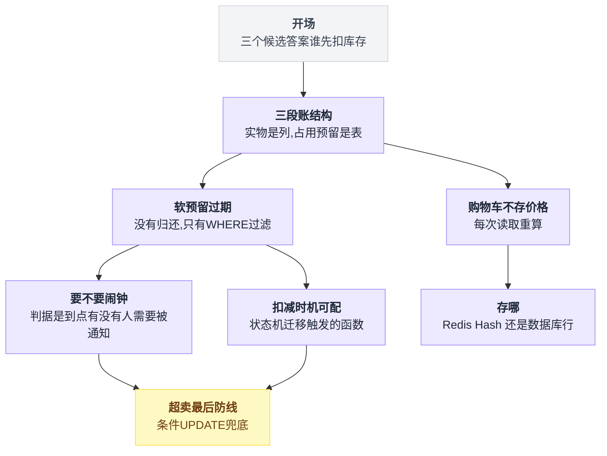
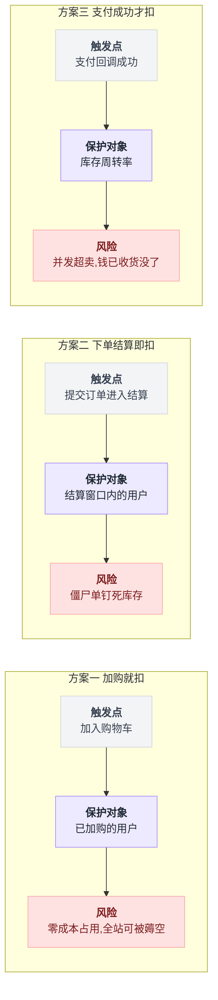
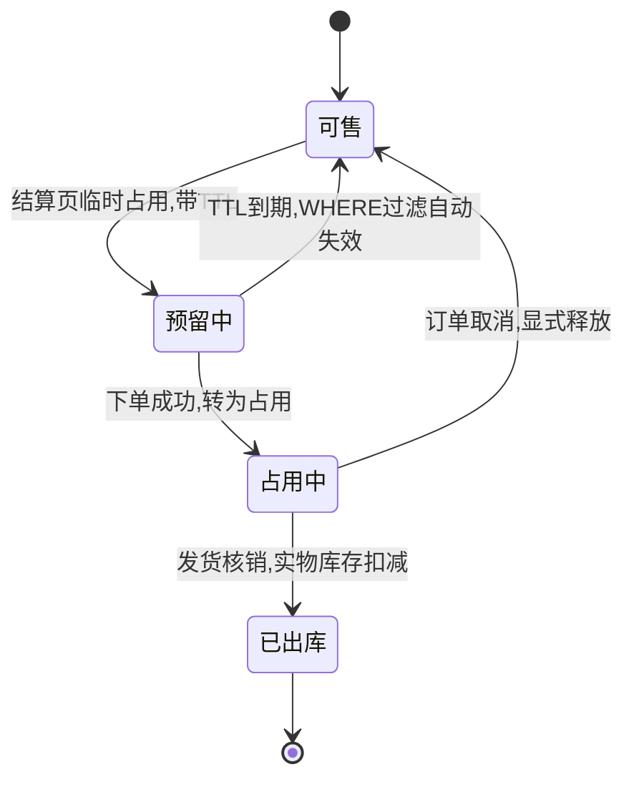
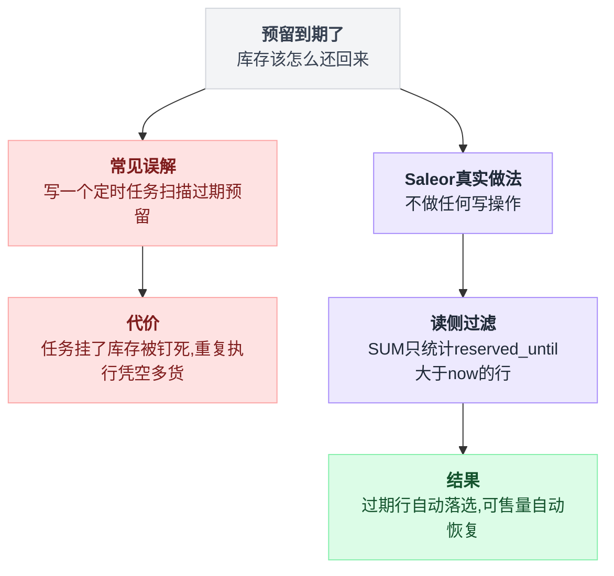
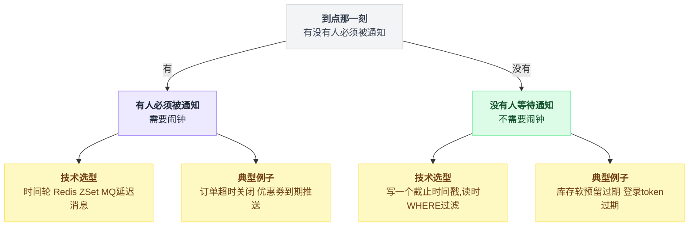
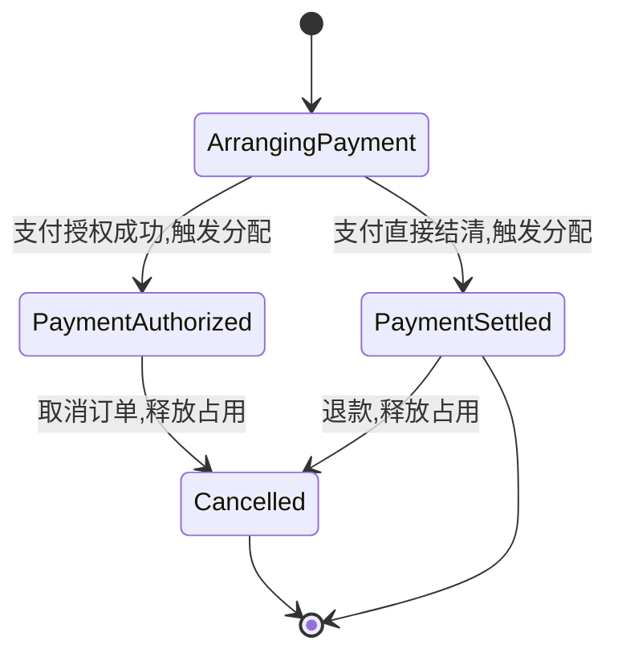
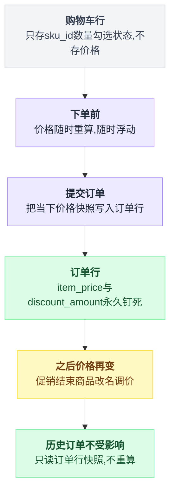

# 《购物车与库存三段账》"已锁定"的库存，是谁在什么时候还回来的（小白版）

> 一句话结论：**"锁定/占用"在成熟系统里是带 TTL 的软预留，靠时间自然失效——根本不存在一个"归还库存"的定时任务。**
>
> 更反直觉的是：可售量往往不是一个字段，而是一个查询表达式；库存表上那个 `quantity_allocated` 只是冗余缓存。而购物车压根不存价格，价格是每次读取时重算的副产物——所以"价格变了怎么办"这个问题在架构上是不存在的。
>
> 难度：★★★☆☆
>
> 写作时间：2026-08-05。文中 star 数与最后提交时间为当日实测；Saleor / Vendure / Shopware / Medusa 的源码片段为当日通过 `raw.githubusercontent.com` 直接读取，未经一手核实的说法在文中已标注；源码文件路径收在文末[出处](#出处)脚注。

---

## 目录

- [0. 开场：加购物车的那一刻，库存动了没有](#0-开场加购物车的那一刻库存动了没有)
- [1. 三段账：可售、占用、锁定，到底是三个字段还是三张表](#1-三段账可售占用锁定到底是三个字段还是三张表)
- [2. 软预留：没有归还，只有过期（本篇主菜）](#2-软预留没有归还只有过期本篇主菜)
- [3. 这里为什么根本不需要闹钟](#3-这里为什么根本不需要闹钟)
- [4. 扣减时机不该是常量，该是状态机迁移的函数](#4-扣减时机不该是常量该是状态机迁移的函数)
- [5. 购物车不存价格](#5-购物车不存价格)
- [6. 购物车存哪：Redis Hash 还是数据库行](#6-购物车存哪redis-hash-还是数据库行)
- [7. 超卖的最后一道防线在哪](#7-超卖的最后一道防线在哪)
- [8. 反直觉结论](#8-反直觉结论)
- [9. 一句话总结、小白词典、和前几篇的对照](#9-一句话总结小白词典和前几篇的对照)

---

全文九节层层递进，从"到底谁先扣库存"这道选择题出发，一路推到超卖的最后一道防线，先看整体骨架：



## 0. 开场：加购物车的那一刻，库存动了没有

### 0.1 一个你每天都在做、但从没想过的动作

晚上十点，你在某电商 App 上看中一双鞋，尺码 42，页面写着"仅剩 3 件"。你点了「加入购物车」。

现在回答一个问题：**这一刻，数据库里那个 3，变成 2 了吗？**

大部分人第一反应是"当然没有，加购又不是买"。第二反应是"那如果没变，我付款的时候没货了怎么办"。第三反应是"所以到底什么时候变"。

这三个反应，正好对应工业界三个真实存在的答案——而且**三个都有高星开源项目在用**，不是"有的公司图省事"，是三种都被认真实现过。

### 0.2 三个候选答案

```
   商品详情页   加购物车    提交订单     发起支付    支付成功    发货
  ─────┴───────────┴───────────┴──────────┴──────────┴────────┴──▶
             ① 加购扣      ② 下单扣               ③ 支付扣
             "占着就是我的"  "下单即锁定"           "钱到账才算数"
```

| 答案 | 谁在用（本篇标本） | 它保护谁 |
|---|---|---|
| ① 加购就扣 | 极少数强稀缺场景（演唱会票、限量球鞋的确认环节） | 已经加购的用户 |
| ② 下单/结算时软预留 | Saleor（`Reservation` 表，带 TTL） | 折中：只在结算窗口内保护 |
| ③ 订单进入某状态才扣 | Vendure（默认在 `ArrangingPayment → PaymentAuthorized/Settled` 时分配） | 库存周转率 |

三个方案各自绑定不同的触发点和保护对象，横向摆开看得更清楚：



说白了这是同一个问题的三种回答：**你更怕用户白高兴一场，还是更怕仓库里的货被人白占着？**

下面把三种各自的翻车形态画出来——**这不是"某个方案不好"，是每个方案必须付出的代价**，你选了哪个就要认哪张图。

### 0.3 ① 加购就扣：一个人可以让全站断货

```
    22:00     黄牛脚本启动
      ├─ 账号 A 加购 42 码 ×3 → 库存 3 → 0
      ├─ 账号 B 加购 41 码 ×5 → 库存 5 → 0
      └─ 账号 C 加购 43 码 ×2 → 库存 2 → 0
    22:00:04  全站显示「已售罄」   真实销量 0 件，真实收入 0 元
    次日 10:00 运营看后台：库存 0，订单 0
              （"货去哪了？"——在三个购物车里躺着）
```

这个方案最毒的一点：**它把"占用"的代价完全转嫁给了平台，而占用的门槛是零。**

加购不需要付款、不需要填地址、不需要任何承诺——把一个零成本动作绑定到一个有限资源上，被薅是必然的，不是可能。

真要用这个方案，必须补两条：加购数量上限 + 加购占用也带 TTL。补完你会发现——**它就变成了答案②**。

### 0.4 ② 下单/结算就扣：库存被"僵尸单"钉死

假设你在提交订单的瞬间就把库存扣掉，等着用户去付钱。

```
    帧 1  14:00:00   下单，库存 100 → 97
    帧 2  14:00:03   跳转支付页
    帧 3  14:00:05   用户切出去接了个电话
    帧 4  次日 09:00  这 3 件还在"已锁定"状态

    一天下来：成交 1200 单 / 未付款废单 3400 单
              被钉死的库存 = 3400 × 平均件数
```

电商的支付转化率从来不是 100%，行业里 20%~40% 区间都很常见（此为公开经验区间，非本次实测）。这意味着**每卖出 1 件，就有 2~4 件的库存被废单占着**——你有 100 件货，实际能卖的可能只有 25 件。

于是你会自然而然地想：**给这些锁定加个超时，到点自动释放。**

这个念头很对——它正是[第 03 篇《订单超时关闭》](./03-延迟任务与时间轮.md)整篇在解的题。但本篇第 2、3 节要告诉你：**成熟系统实现"到点释放"的方式，和第 03 篇完全不同，而且不需要闹钟。**

### 0.5 ③ 支付成功才扣：超卖的经典现场

那就等钱到账再扣，最保守。

```
   库存 1 件
     用户甲                        用户乙
     14:00:00 下单（不扣库存）      14:00:01 下单（不扣库存）
     14:00:20 支付成功 → 1 → 0     14:00:25 支付成功 → 0 → -1  ✗
     发货                          "抱歉，订单因缺货已取消"
                                   + 全额退款 + 券补偿 + 客诉
```

更惨的形态是：**钱已经收了。**

支付是外部系统（微信/支付宝）说了算的，你没法在"扣库存失败"的时候把支付回滚掉——那是[第 20 篇《分布式事务的真相》](./20-分布式事务的真相.md)里最典型的一类跨系统不一致：**两个系统各自成功了一半。**

### 0.6 三个答案都对，所以本篇的题目变了

看到这你应该有感觉了：这不是一道选择题。

真实系统的做法是**在时间轴上分层**——同一份库存，在不同阶段用不同强度的"占有权"表示。这就是标题里的**三段账**：

| 段 | 名字 | 强度 | 谁持有 | 消失方式 |
|---|---|---|---|---|
| 一 | 实物在库（`quantity`） | 硬 | 仓库 | 出库时减 |
| 二 | 已分配（`Allocation`） | 中 | 订单行 | 显式释放/发货核销 |
| 三 | 已预留（`Reservation`） | 软 | 购物车行 | **时间到了自己没了** |

本篇路线图：

| 你的疑问 | 谁来解 | 第几节 |
|---|---|---|
| 三段账是三个字段还是三张表 | Saleor 的四个结构 | 第 1 节 |
| "锁定"的库存谁还回来的 | 没有人还，因为没人拿走 | 第 2 节（主菜） |
| 那为什么第 03 篇要写时间轮 | 判据：状态变化对外可见吗 | 第 3 节 |
| 扣减时机能不能配 | Vendure 的策略接口 | 第 4 节 |
| 购物车里的价格怎么保持新鲜 | 不存就不用保鲜 | 第 5 节 |
| 那超卖到底靠什么防 | 还是那句条件 UPDATE | 第 7 节 |

---

## 1. 三段账：可售、占用、锁定，到底是三个字段还是三张表

### 1.1 先把三个词钉死

这三个词在不同公司叫法混乱，先统一（本篇内约定）：

| 词 | 含义 |
|---|---|
| 实物库存 | 仓库里真的有几件（出库才减） |
| 占用（Allocation） | 已经有订单行认领了但还没出库 |
| 预留（Reservation） | 还没成单，只是有人正在结算流程里暂时替他留着 |
| 可售量 | 实物 − 占用 − 有效预留 |

新手最常见的设计是给库存表加四个字段：

```sql
CREATE TABLE stock (          -- 一个很自然、也很危险的设计
  sku_id BIGINT PRIMARY KEY,
  quantity  INT,  -- 实物        allocated INT,  -- 占用
  reserved  INT,  -- 预留        available INT   -- 可售 ← 灾难藏在这一列
);
```

问题不是"字段多"，而是**它有四个数，但只有一个真相**。

四个数之间存在恒等式 `available = quantity - allocated - reserved`，而恒等式是要靠代码去维护的。任何一次异常退出、任何一个漏掉的分支、任何一次并发写丢失，恒等式就破了。

而且**破了不会报错**。它会安静地卖多或者卖少，直到有人对账时才发现。

抛开字段还是表的实现细节，同一份库存在生命周期里只会经过这几个状态：



### 1.2 Saleor 的答案：一张主表 + 一个冗余列 + 两张明细表

saleor/saleor（23,181 star，pushed 2026-08-05，Python，2026-08-05 实测）里的结构是这样的[^1]：

```
  ┌────────────────────────────────────────────┐
  │  Stock         一个 SKU 在一个仓库 = 一行     │
  │  warehouse FK / product_variant FK (unique) │
  │  quantity            ← 实物                 │
  │  quantity_allocated  ← 冗余列               │
  └──────┬────────────────────────┬─────────────┘
         │ related_name           │ related_name
         │  = "allocations"       │  = "reservations"
         ▼                        ▼
  ┌─────────────────────┐  ┌────────────────────────────┐
  │  Allocation         │  │  Reservation               │
  │  order_line     FK  │  │  checkout_line   FK        │
  │  stock          FK  │  │  stock           FK        │
  │  quantity_allocated │  │  quantity_reserved         │
  │  unique_together:   │  │  reserved_until  DateTime ★│
  │   (order_line,stock)│  │  unique_together:          │
  │                     │  │   (checkout_line, stock)   │
  │                     │  │  index:(checkout_line,     │
  │                     │  │         reserved_until)    │
  └─────────────────────┘  └────────────────────────────┘
     挂在「订单行」上          挂在「购物车行」上，带过期时间
```

最该注意的是两张明细表的**挂载点不一样**：

| | `Allocation` | `Reservation` |
|---|---|---|
| 挂在谁身上 | `order_line`（已经成单） | `checkout_line`（还没成单） |
| unique_together | `(order_line, stock)` | `(checkout_line, stock)` |
| 有没有过期时间 | 无 | 有，`reserved_until` |

两张表都是 `unique_together`，也就是"一个订单行 + 一个仓库 = 最多一行"，天然幂等；而只有 `Reservation` 带 `reserved_until`。

这一张图就把"三段账"讲完了：**实物是列，占用和预留是表。**

为什么占用和预留要用表而不是列？因为它们必须回答"**是谁占的**"。

一个 `allocated = 37` 的数字在出问题时什么都告诉不了你，37 行 `Allocation` 记录能一行行指回具体订单。这和[第 40 篇复式记账](./40-账户体系与复式记账.md)的思路是同一个：**余额是可以推导的，流水才是事实。**

### 1.3 可售量不是字段，是查询表达式

Saleor 里根本没有 `available` 这一列，要可售量的时候现算。用伪代码写出来就是一个带参数的函数：

```
def 可售量(sku, now):
    实物 = Stock.quantity
    占用 = Σ Allocation.quantity_allocated  where stock == sku
    预留 = Σ Reservation.quantity_reserved  where stock == sku
                                            and reserved_until > now   // ★ 带上"现在"
    return 实物 - 占用 - 预留
```

**注意入参里有 `now`。** 下面两段源码就是这个函数的两半。

先看占用那一半，这是 `StockQuerySet` 的 `annotate_available_quantity` 方法[^1]：

```python
class StockQuerySet(models.QuerySet["Stock"]):
    def annotate_available_quantity(self):
        allocation_quantity = (
            Allocation.objects.filter(stock_id=OuterRef("id"))
            .values("stock_id")
            .annotate(total_allocated_quantity=Sum("quantity_allocated"))
            .values("total_allocated_quantity")
        )
        return self.annotate(
            available_quantity=F("quantity")
            - Coalesce(Subquery(allocation_quantity), 0)
        )
```

翻译成 SQL 就是 `s.quantity - COALESCE((SELECT SUM(a.quantity_allocated) FROM allocation a WHERE a.stock_id = s.id), 0)`。

**注意最关键的一点**：这个子查询 Sum 的是 `Allocation` 明细表，**不是 `Stock.quantity_allocated` 那个现成的列**。

旁边就摆着一个算好的数不用，非要去扫明细表加总——这看起来是纯亏。为什么要这么干，1.4 节专门解释。

同一个文件里，预留量也是现算的，方法叫 `annotate_reserved_quantity`[^1]：

```python
def annotate_reserved_quantity(self):
    return self.annotate(
        reserved_quantity=Coalesce(
            Sum("reservations__quantity_reserved",
                filter=Q(reservations__reserved_until__gt=timezone.now())),
            0,
        )
    )
```

看那个 `filter=Q(reservations__reserved_until__gt=timezone.now())`——**过滤条件里带了"现在"**。这一行是本篇第 2 节的全部秘密，先记住它。

所以 Saleor 的可售量长这样：

```
   可售量 = Stock.quantity
          − Σ Allocation.quantity_allocated               （子查询）
          − Σ Reservation.quantity_reserved
              WHERE reserved_until > now()                （带时间条件）

     ⇒ 一个 SQL 表达式，不是一个存储的数；
       它的值随时钟变化——同一行数据，1 分钟后结果就不同。
```

**可售量不是一个数，是一个函数**：`available(t)`。这就是本篇一句话结论的第二半。

💡 旁证：medusajs/medusa（35,586 star，pushed 2026-08-05，2026-08-05 实测）更直白，直接把这件事写进了模型定义[^5]：

```ts
const InventoryLevel = model.define("InventoryLevel", {
  stocked_quantity:   model.bigNumber().default(0),
  reserved_quantity:  model.bigNumber().default(0),
  incoming_quantity:  model.bigNumber().default(0),
  available_quantity: model.bigNumber().computed(),   // ← 注意 .computed()
})
```

前三个是存储列，`available_quantity` 后面挂了个 `.computed()`——**框架层面就声明了它不落库**。

两个完全不同技术栈的项目，在这一点上给出了同一个答案。

### 1.4 那留着 `quantity_allocated` 这个冗余列干嘛

答案分两半。

**第一半：它被写，而且写得很勤。** 每次分配和释放都会把它同步更新[^2]：

```python
# allocate_stocks 里
stock.quantity_allocated = F("quantity_allocated") + quantity
Stock.objects.bulk_update(stocks_to_update_map.values(), ["quantity_allocated"])
# deallocate_stock 里
stock.quantity_allocated = F("quantity_allocated") - quantity_to_deallocate
```

注意用的是 `F("quantity_allocated") + quantity` 而不是 `stock.quantity_allocated + quantity`——**加法在数据库里做，不是在 Python 内存里做**。

这是防丢失更新的基本功，和 [PostgreSQL 系列第 03 篇](../2026-08_从真实项目学PostgreSQL/03-原子扣减余额.md)那条 `SET balance = balance - $1` 是同一个动作。

**第二半：它被读，但只在一个地方读。**[^3]

```python
def resolve_quantity_allocated(root, info: ResolveInfo):
    return root.quantity_allocated
```

后台 GraphQL API 直接把这个列吐出去给管理端展示，**没有任何聚合，没有任何子查询**。把两半拼起来，答案就清楚了：

```
     ┌──── ① 决策路径（算账）─────┬──── ② 展示路径（给人看）────────┐
     │ allocate_stocks()         │ GraphQL resolve_quantity_*     │
     │ 读 Allocation 明细的 Sum   │ 读 Stock.quantity_allocated 列 │
     │ 在 SELECT FOR UPDATE 之下  │ 无锁、单行、O(1)                │
     │ 错了 = 超卖 / 少卖         │ 错了 = 后台数字难看             │
     └───────────────────────────┴────────────────────────────────┘
```

**冗余列是读模型，明细表是账本。**

后台仓储列表一次展示 200 个 SKU，如果每行都去 `Allocation` 表跑一次 `SUM`，那是 200 次聚合；直接读列是一次全表扫描带出来的。而真正决定"能不能卖"的那条路径，宁可多花一次子查询，也要读**能被行锁保护的那个真相**。

这带来一个很舒服的性质：**这两条路径不一致时，坏的是展示，不是钱。** 假如某次异常让冗余列偏了 1，后台会显示一个错的数字，但下一单还是会照着明细表算，不会超卖。

更进一步——只要重跑一次 `SUM(Allocation)` 回写，这个列就修好了，**它是可以随时重建的派生数据**。

反过来，如果你把可售量存成一列并让下单路径直接读它，那这一列就同时是读模型和账本。它一旦偏了，就不是"数字难看"，是真金白银地超卖或压货，而且你没有任何东西可以拿来对账——**因为账本本身就是那个偏了的数**。

所以设计冗余列的第一条纪律：**冗余列可以错，但错了不能影响正确性判断，并且必须能从明细重建。**

---

## 2. 软预留：没有归还，只有过期（本篇主菜）

新手第一反应往往是"到点了总得有代码把库存还回来"，Saleor 的真实答案岔开了另一条路：



### 2.1 先看那两行代码

回到开场的问题：你在结算页填地址、选快递、输优惠码，这几分钟里商品得替你留着，不然填到一半告诉你没货了，体验极差；但也不能永远留着（第 0.4 节的僵尸单）。

Saleor 的做法在 `reserve_stocks_and_preorders` 这个函数里[^4]：

```python
@traced_atomic_transaction()
def reserve_stocks_and_preorders(
    checkout_lines, lines_to_update_reservation_time, variants,
    country_code, channel,
    length_in_minutes: int,      # ← TTL 从参数传进来
    *, calculate_stocks_with_shipping_zones, replace: bool = True,
):
    ...
    reserved_until = timezone.now() + datetime.timedelta(minutes=length_in_minutes)
```

一行：`reserved_until = 现在 + N 分钟`。

这就是软预留的全部写入逻辑——**它不改 `Stock.quantity`，不建 `Allocation`，只往 `Reservation` 表插一行带截止时间的记录。**

紧接着是续期，同一个函数里：

```python
    # Refresh reserved_until for already existing lines
    if lines_to_update_reservation_time:
        Reservation.objects.filter(
            checkout_line__in=lines_to_update_reservation_time
        ).update(reserved_until=reserved_until)
```

**已有行不删不建，直接 `UPDATE` 把截止时间往后推。**

你在结算页每动一下（改数量、换地址、刷新一次），这个时间就往后续一次：用户一直在操作，预留就一直有效；用户去接电话了，它自己就到点了。

```
  用户行为                    Reservation 行的 reserved_until
  ──────────────────────────────────────────────────────────
  14:00:00 进入结算页   INSERT  reserved_until = 14:05:00
  14:01:30 改了数量     UPDATE  reserved_until = 14:06:30
  14:02:10 选了快递     UPDATE  reserved_until = 14:07:10
  14:02:40 输优惠码     UPDATE  reserved_until = 14:07:40
  14:03:00 切出去接电话 （什么都不发生）
  14:07:40 ─────────── 这一行"失效"了
           ↑ 没有任何代码在这一刻执行，没有任何任务被触发，
             这一行数据一个字节都没变
```

**14:07:40 这一刻，服务器上什么都没发生。**

那这个预留是怎么"失效"的？

### 2.2 秘密全在读侧

答案在 `ReservationQuerySet` 这个查询集类里[^1]：

```python
class ReservationQuerySet(models.QuerySet[T]):
    def not_expired(self):
        return self.filter(reserved_until__gt=timezone.now())
```

一个方法，一行代码——加上第 1.3 节已经出现过的那句 `filter=Q(reservations__reserved_until__gt=timezone.now())`，就是全部。

算"这个 SKU 现在还剩多少能卖"用的就是它[^2]：

```python
quantity_reservation = (
    Reservation.objects.filter(stock_id__in=stocks_id)
    .not_expired()                        # ← 就这里
    .exclude_checkout_lines(checkout_lines or [])
    .values("stock")
    .annotate(quantity_reserved=Coalesce(Sum("quantity_reserved"), 0))
)
```

把写侧和读侧摆在一起，整个机制就三行：

```
写侧（用户每动一下结算页）:
    if 这个 checkout_line 已有预留行:
        UPDATE reserved_until = now + N 分钟          // 续期
    else:
        INSERT (checkout_line, stock, qty, reserved_until = now + N 分钟)

中间（TTL 到点那一刻）:
    什么都不做                                        // 真的，一行代码都没有

读侧（有人问"还能卖几件"时）:
    Σ quantity_reserved  WHERE reserved_until > now()  // 过期行自动落选
```

所以完整的因果链是：

```
   ┌────────────────────────────────────────────────────────────┐
   │ 写侧：INSERT 一行 reserved_until = now + 5min（或 UPDATE 续期）│
   └────────────────────────┬───────────────────────────────────┘
             时间流逝…… 没有任务、没有定时器、没有消息、没有回调
   ┌────────────────────────▼───────────────────────────────────┐
   │ 读侧：SUM(quantity_reserved) WHERE reserved_until > now()   │
   │ 14:07:39 查 → 这一行被算进"已预留"，可售量少 1               │
   │ 14:07:41 查 → 这一行不满足条件，自动落选，可售量恢复           │
   └────────────────────────────────────────────────────────────┘

        库存"归还"发生在  ▶  一次 SELECT 的 WHERE 子句里  ◀
```

**没有归还，只有过期。**

更准确地说：**根本就没有"拿走"过，所以不需要"还"。** 预留从头到尾没有动过 `Stock.quantity` 一个字节——它只是在可售量的算式里，临时性地、有条件地贡献了一个减数；条件不成立了，减数自动消失。

这就是本篇一句话结论的第一半，也是它最反直觉的地方：**你以为的"释放库存"是一个动作，实际上它是一个谓词的取值变化。**

### 2.3 三个人抢最后 2 件：逐帧推演

逐帧走一遍。库存 2 件，TTL 设 5 分钟。

```
  ┌─ 帧 1 ─ 14:00:00 ────────────────────────────────────────────┐
  │ quantity=2  Allocation:无  Reservation:无      可售 = 2       │
  ├─ 帧 2 ─ 14:00:10  甲进结算页，预留 2 件 ──────────────────────┤
  │ Reservation:[甲, qty=2, until=14:05:10]        可售 = 0      │
  │ Stock.quantity 仍然 = 2 ← 一个字节都没改      乙看到"已售罄"   │
  ├─ 帧 3 ─ 14:03:00  甲去接电话了 ──────────────────────────────┤
  │ （无事发生）                                    可售 = 0      │
  ├─ 帧 4 ─ 14:05:11  TTL 到点 ★ ───────────────────────────────┤
  │ Reservation:[甲, ..., until=14:05:10] ← 行还在，没删！        │
  │ 乙刷新：SUM(...) WHERE reserved_until > '14:05:11' → 0        │
  │                                                可售 = 2      │
  │ 这一秒之内，没有任何后台任务运行过。                            │
  ├─ 帧 5 ─ 14:05:30  乙下单成功 ────────────────────────────────┤
  │ Allocation:[乙的订单行, qty=2]  甲那行垃圾还躺着  可售 = 0     │
  ├─ 帧 6 ─ 14:06:00  甲打完电话点「提交订单」────────────────────┤
  │ 服务端重算：可售 = 0 → 抛 InsufficientStock → "已被抢购一空"   │
  └──────────────────────────────────────────────────────────────┘
```

帧 4 是全篇最值得盯着看的一帧：**数据没变、没有进程醒来、没有消息投递，但"可售量"这个业务事实变了。**

### 2.4 那些过期的行怎么办

到帧 6，`Reservation` 表里躺着一行完全无用的垃圾。它会一直躺着吗？

**会，而且不影响正确性。** 这是本节标题里"没有归还"的另一层含义——清理和正确性是两件被彻底解耦的事：

```
  ┌──────── 正确性 ──────────────────┬──────── 清理 ─────────────────┐
  │ 由 WHERE reserved_until > now()  │ 由任何时候的批量 DELETE 完成    │
  │ 保证，100% 不依赖清理是否发生      │ 每晚跑 / 每周跑 / 压根没写      │
  │ 清理延迟 3 天也不会多卖一件        │ 挂了三个月也只是表变大          │
  │ ★ 清理是空间问题，不是正确性问题    │ ★ 可以随便延后、随便失败        │
  └──────────────────────────────────┴───────────────────────────────┘
```

对比一下"扣列 + 定时任务还库存"那个方案，差别不在实现难度，在这个后台任务属于哪一类：

| 出故障的方式 | 「扣列 + 定时任务还库存」（正确性组件） | Saleor 的清理任务（运维组件） |
|---|---|---|
| 任务挂了 10 分钟 | 一批库存被白白钉死 10 分钟 | 只是表变大，DBA 会在磁盘曲线上看到 |
| 重复执行 | 库存被还两次，凭空多货 | `DELETE WHERE reserved_until < now()` 天然幂等 |
| 漏执行 | 货永远回不来 | 系统仍然是对的 |
| 压根没写 | 不可能不写 | 系统也是对的 |
| 需要配套什么 | 监控、告警、幂等、补偿 | 无 |

⚠️ 唯一要盯的是**读侧成本**：`Reservation` 表无限膨胀会让那个 `SUM(...) WHERE reserved_until > now()` 越扫越慢。

Saleor 在 `Reservation` 上建了一个 `(checkout_line, reserved_until)` 联合索引[^1]，但真正的兜底还是定期删除。**结论没变，只是从"必须删"降级成了"应该删"。**

### 2.5 顺手看一个容易误读的 `delete`

`reserve_stocks` 结尾有这么两行，很多人会误以为这是在清理过期数据[^4]：

```python
if reservations:
    if replace:
        Reservation.objects.filter(checkout_line__in=checkout_lines).delete()
    Reservation.objects.bulk_create(reservations)
```

不是。看 `filter` 的条件是 `checkout_line__in=checkout_lines`——**删的是"这次要重写的这几个购物车行"自己的旧预留**，和过期毫无关系。

这是一个"先删后插"的幂等重写：同一个购物车行反复调用 `reserve_stocks`，最终只留一份最新的预留，不会越堆越多。

它值得单拎出来，因为它是"删除"这个动作在本节的**唯一**合法用途：**删自己的旧版本，不是删别人的过期垃圾。**

---

## 3. 这里为什么根本不需要闹钟

### 3.1 一个正面冲突

本系列[第 03 篇《订单超时关闭》一千万个闹钟怎么管](./03-延迟任务与时间轮.md)，整整一篇在解决同一类问题的时间维度：一千万笔订单各自约了个 15 分钟后的闹钟，怎么才能既不把数据库扫垮、又不把内存撑爆。

那篇的路线是：轮询扫表 → 内存延迟队列 → Redis ZSet → MQ 延迟消息 → 时间轮 → 分层时间轮，一路把"查找到期任务"这个动作优化到近乎消失。

而本篇第 2 节的答案是：**这个问题不用解，因为不需要闹钟。**

两篇不是矛盾，是对同一件事的两种建模，把差别摆出来：

```
   ┌────────── 第 03 篇：订单超时关闭 ────────────────────────────┐
   │ 到点时必须发生的事：order.status 待付款 ──▶ 已关闭            │
   │   ↑ 一个持久化的、对外可见的状态跃迁                           │
   │ 谁在等它？用户的订单列表 / 商家后台待发货数 / 券要回退（29 篇）  │
   │           / 推送"订单已取消"（35 篇）/ 报表要统计废单率        │
   │ ⇒ 必须有人在那一刻把这些事做了。必须有闹钟。                    │
   ├────────── 本篇：软预留过期 ─────────────────────────────────┤
   │ 到点时必须发生的事：（无）                                    │
   │ 谁在等？只有"下一次有人问可售量还剩多少"，                      │
   │         而那次询问会自己带上当时的 now()                      │
   │ ⇒ 到期可以推迟到"有人关心"的那一刻再算。没人关心就永远不用算。   │
   └────────────────────────────────────────────────────────────┘
```

### 3.2 判据：一句话就能判

以后碰到任何"到点要失效"的需求，先问这一句：

```
              "到点那一刻，有没有人必须被通知？"
          ┌──────────── 有 ─┴─ 没有 ────────────┐
          ▼                                    ▼
   ┌──── 需要闹钟 ────────┐        ┌──── 不需要闹钟 ──────────┐
   │ 时间轮 / Redis ZSet /│        │ 写一个截止时间戳          │
   │ MQ 延迟消息          │        │ + 读的时候 WHERE 过滤     │
   │ → 第 03 篇           │        │ → 本篇第 2 节            │
   ├─────────────────────┤        ├─────────────────────────┤
   │ 订单超时关闭          │        │ 库存软预留过期            │
   │ 还款提醒 / 会议通知    │        │ 登录 token 过期          │
   │ 优惠券到期作废 ★      │        │ 限时活动资格 / 缓存条目    │
   └─────────────────────┘        └─────────────────────────┘

   ★ 优惠券有意思：如果"到期"只影响能不能用，它属于右边；如果到期
     要推一条"您的券明天过期"，那条推送属于左边。同一个业务对象，
     可以左右各占一半。
```

再压缩成一句话：**失效需要被"执行"，还是只需要被"观察到"？**

只需要被观察到的，就把时间戳写进数据，让每一次观察自己去比对——这是**惰性求值**在业务系统里最朴素的用法。

把判据和两条分支的落点收进一张图：



### 3.3 同一张订单上，两种时间语义并存

第 03 篇和本篇讲的其实经常是**同一笔订单的同一个 15 分钟**：

```
        14:00 下单 ├───────────────────────────┤ 14:15 超时线
   ┌──────────────┴───────────────────────────┴──────────────────┐
   │ ① 订单状态：待付款 → 已关闭                                    │
   │    需要闹钟。第 03 篇的整套武器库都在这条线上。                   │
   │ ② 库存占用：Allocation 存在 → 应该消失                         │
   │    不需要自己的闹钟，它是①的下游：                              │
   │    关单那个动作里顺手调用 deallocate_stock() 就完了。            │
   │ ③ 结算车预留：reserved_until 到点                             │
   │    完全不需要闹钟。谁都不用管它。                                │
   └─────────────────────────────────────────────────────────────┘
```

三条线，三种处理：①自己有闹钟，②搭①的顺风车，③根本不用闹钟。

**很多"库存归还定时任务"的写法，是把 ② 误当成了 ③ 之外的第四条线，给它单独配了一个扫表任务。**

于是就有了那个经典的问题——"归还任务和关单任务谁先跑？跑重了怎么办？"——这个问题本身就是设计失误的产物。②只是①的一个副作用，它不需要独立的触发源，也就不会有先后和重复的问题。

💡 [流量系列第 06 篇](../2026-08_流量扛不住了怎么办_六种真实做法/06-1000万订单超时未付自动关单-时间轮与延迟消息.md)开篇那句"1000 万笔订单里某一秒真正到期的可能只有 100 笔，你为了找出这 100 笔让数据库翻了 1000 万行"，说的是①这条线的代价。

本篇第 2 节告诉你的是：**③ 这条线连那 100 笔都不用找**——它的到期成本是零，因为到期从来不是一个事件。

### 3.4 天下没有免费的午餐：这招的代价

诚实地说清代价，否则就成了推销：

| 代价 | 说明 | 缓解 |
|---|---|---|
| 读放大 | 每次算可售量都要 `SUM` 一次明细表 + 一次带时间条件的聚合 | 索引 `(stock, reserved_until)`；热点 SKU 走缓存（[第 15 篇](./15-缓存三兄弟与缓存一致性.md)） |
| 表膨胀 | 过期行不删就一直堆着，PostgreSQL 上还会牵扯死元组 | 定期批量 `DELETE`（[PG 系列第 09 篇](../2026-08_从真实项目学PostgreSQL/09-膨胀与VACUUM.md)讲这个） |
| 时钟依赖 | 结论取决于 `now()`，多台应用服务器时钟不齐会出现"A 说过期了 B 说没有" | 把 `now()` 交给数据库算，别在应用层算完传进去 |
| 不可观测 | 没有任何日志记录"某个预留过期了"，排查时抓瞎 | 需要审计时，把过期行删除前先归档 |

第三条值得展开一句：[第 28 篇分布式调度](./28-分布式调度.md)第 2.5 节讲过"时钟问题的症状从来不指向时钟"。

在本篇这个模型里，**时钟就是判据本身**——所以把 `timezone.now()` / `NOW()` 统一放在一个地方求值，是这个方案的隐藏前提。

Saleor 的写法（Django ORM 里 `timezone.now()` 在应用侧求值后作为参数下发）对单机时间源是安全的，多实例部署时依赖各节点的 NTP（此为推论，未实测验证）。

---

## 4. 扣减时机不该是常量，该是状态机迁移的函数

### 4.1 回到第 0 节那道选择题

第 0 节列了三个候选答案：加购扣、下单扣、支付扣。绝大多数教程会让你"根据业务选一个"，然后把这个选择**硬编码进下单流程**。

vendurehq/vendure（8,296 star，pushed 2026-08-05，TypeScript，2026-08-05 实测）不这么干。它把这个选择做成了一个可替换的策略接口[^6]：

```ts
export interface StockAllocationStrategy extends InjectableStrategy {
    /**
     * This method is called whenever an Order transitions from one state
     * to another. If it resolves to `true`, then stock will be allocated.
     */
    shouldAllocateStock(
        ctx: RequestContext, fromState: OrderState,
        toState: OrderState, order: Order,
    ): boolean | Promise<boolean>;
}
```

调用方的形状大概是这样：

```
def 订单状态迁移(order, fromState, toState):
    ...
    if strategy.shouldAllocateStock(ctx, fromState, toState, order):   // 每次迁移都问一次
        分配库存(order)
```

盯着这个签名看三秒。它说的是：

```
   扣减时机 = f(fromState, toState, order)
                  ▲          ▲       ▲
              从哪来      迁移到哪   还能看订单内容（金额、等级）

   不是一个常量，是状态机每一次迁移都会被问一次的函数。
```

**"什么时候扣库存"这个问题，被重新表述成了"哪一条状态迁移边应该触发扣库存"。**

### 4.2 默认实现只有一个 `return`

代码是这样的[^7]：

```ts
export class DefaultStockAllocationStrategy implements StockAllocationStrategy {
    shouldAllocateStock(ctx, fromState, toState, order) {
        return fromState === 'ArrangingPayment' &&
            (toState === 'PaymentAuthorized' || toState === 'PaymentSettled');
    }
}
```

Vendure 的默认答案是第 0 节的答案③的一个变体：**从"正在安排支付"迁移到"支付已授权/已结清"时扣。**

注意它连 `fromState` 也判了——不是"只要到达 PaymentAuthorized 就扣"，而是"必须是从 ArrangingPayment 走过来"。

为什么？因为状态机里可能有别的路径也能到达同一个状态（比如管理员手工改状态、退款后重新支付），那些路径不该重复扣。

**判 `fromState` 而不只判 `toState`，本身就是一条防重复扣减的措施**——不是靠幂等键，是靠"这条边只有一条"的结构性防重。

默认策略落到订单状态图上，触发分配和释放的边长这样：



### 4.3 换一行代码 = 换一个商业模式

第 0 节那三个方案，在 Vendure 里就是三个 `return` 表达式：

```ts
// 方案②：下单即锁定（预售、定制品，怕接了单没货）
return toState === 'ArrangingPayment';

// 方案③（默认）：支付授权后扣
return fromState === 'ArrangingPayment' &&
       (toState === 'PaymentAuthorized' || toState === 'PaymentSettled');

// 混合：大额订单支付后扣，小额订单下单就扣（降低小单缺货率）
return order.totalWithTax > 100000
    ? fromState === 'ArrangingPayment' && toState === 'PaymentSettled'
    : toState === 'ArrangingPayment';
```

最后那个混合策略是这个接口设计的真正回报：**它把"扣减时机"从一个架构决策，降级成了一个业务规则。**

架构决策要开会、要评审、要改代码结构；业务规则可以按商品类目、按客户等级、按金额区间随便配。

⚠️ 提醒：策略可配不等于可以乱配。`shouldAllocateStock` 返回 `true` 的那些边，必须和"释放库存"的那些边**在状态图上成对出现**。

分配边有 3 条、释放边只有 2 条，就一定有一条路径会漏掉释放——这类错误在代码里长得毫不起眼，在库存报表上要一个月后才看得出来。

### 4.4 这条线直通第 31 篇

把第 4 节的结论抽象一层：**库存服务不应该知道"什么是下单"，它只应该知道"某条状态迁移发生了"。**

谁定义状态、谁定义迁移边、迁移的时候还要顺带做哪些事——那是订单状态机的地盘，也就是[第 31 篇《订单状态机与逆向流程》](./31-订单状态机与逆向流程.md)的题目。那一篇会讲到 Sylius 把一整串副作用按优先级挂在 `create` 事件的 after 回调上，其中 hold 库存排在中间某个位置。

分工线画清楚：本篇管**账怎么记**（三段账、软预留、可售量表达式），第 31 篇管**什么时候记**（状态图、迁移边、回调顺序）。

---

## 5. 购物车不存价格

### 5.1 一个每个人都问过的问题

"我昨天加购的时候是 99，今天变成 129 了，购物车里该显示哪个？"这个问题在产品会上能吵一小时。

但在**架构上它不存在**——因为购物车根本没存过 99。

shopware/shopware（3,399 star，pushed 2026-08-05，PHP，2026-08-05 实测）的购物车处理器全文只有 116 行，第一个动作就把答案摆出来了[^8]：

```php
public function process(Cart $original, SalesChannelContext $ctx, CartBehavior $b): Cart
{
    $cart = new Cart($original->getToken());     // ← 建一个全新的空购物车
    $cart->setData($original->getData());
    $this->runProcessors($original, $cart, $ctx, $b);
    $this->calculateAmount($ctx, $cart);
    $cart->addErrors(...$this->validator->validate($cart, $ctx));
    return $cart;
}
```

**`new Cart(...)`。** 每一次 `process` 都从一个空车开始重建，`$original` 只是原料，不是结果。

### 5.2 处理器链：每一步之后都重算一次总价

`runProcessors()` 是这个设计的核心。先看伪代码，整条链一眼能看完：

```
def 打开购物车(original):
    cart = 空车(original.token)                 // 每次都是新的
    for c in collectors:
        c.collect(...)                          // 富化：还在售吗？现价多少？还有货吗？
    重算总价(cart)
    for p in processors:
        p.process(...)                          // 往新车里塞一行
        重算总价(cart)                           // 每塞完一个就重算一次
    cart.errors = validator.validate(cart)       // 失效商品在这一刻被算出来
    return cart
```

对应源码如下（删掉了错误处理分支）[^8]：

```php
private function runProcessors(Cart $original, Cart $cart, ...): void
{
    // 1. 富化：把每个 line item 需要的数据（商品、价格规则、促销）捞出来
    foreach ($this->collectors as $collector) {
        $collector->collect($cart->getData(), $original, $ctx, $b);
    }
    $this->calculateAmount($ctx, $cart);
    // 2. 处理：processors 一个个往新车里塞 line item
    foreach ($this->processors as $processor) {
        $processor->process($cart->getData(), $original, $cart, $ctx, $b);
        $this->calculateAmount($ctx, $cart);       // ← 每塞完一个就重算总价
    }
}
```

画成图：

```
   $original（上次留下的车：3 个 SKU + 各自数量）
        │
        ▼  collectors 富化：还在售吗？现价多少？还有货吗？命中哪些活动？
        ▼  processors 链（有序，每跑完一个就 calculateAmount 一次）
        │     商品行 → 折扣行 → 运费行 → …
        ▼  validator → 生成 errors
   全新的 $cart（价格 = 此时此刻的真相）
```

每次你打开购物车页面，这条链完整跑一遍。**所以购物车里的价格永远是"刚刚算出来的"，不存在新鲜度问题。**

yudao（YunaiV/ruoyi-vue-pro，38,524 star，pushed 2026-07-31，2026-08-05 实测）的价格计算走的是同一个套路：一串 `TradePriceCalculator` 按 `@Order` 排序组成有序管道，每次算价从头跑到尾——那条链的排序常量正是[第 29 篇《优惠券与促销叠加》](./29-优惠券与促销叠加.md)第 2 节要拆的东西。

**两篇看的是同一条管道的两个侧面**：29 篇关心"链上各环节的顺序为什么是这个顺序"，本篇只关心一件事——**这条链是每次读取都跑的，不是加购时跑一次存下来的。**

### 5.3 三个你因此不用写的定时任务

这个设计的回报，是一批**根本不需要存在的后台任务**：

```
   ┌──── 如果购物车存了价格和商品快照，你必须写 ────────────────┐
   │ ✗ 价格变更巡检：调价后扫全站购物车（一次调价可能命中几百万行）│
   │ ✗ 下架商品巡检：下架后扫全站购物车标记失效                   │
   │ ✗ 促销过期巡检：活动结束后扫全站购物车抹掉折扣行              │
   │ ✗ 库存变更巡检：售罄后扫全站购物车标记"无货"                 │
   └──────────────────────┬────────────────────────────────────┘
             改成"每次读取重算"之后 ▼
   ┌───────────────────────────────────────────────────────────┐
   │ 以上四个任务全部消失。「失效商品」不是一个被写进购物车的状态， │
   │ 是 validator 在这次重算里生成的一条 error。                 │
   └───────────────────────────────────────────────────────────┘
```

注意 `process()` 结尾那句 `$cart->addErrors(...)`——**"这个商品下架了""这个促销已结束""库存不足"全是这一刻算出来的 error，不是存出来的字段。**

💡 这和第 2 节是同一个思想的两次应用：

```
   第 2 节：预留过期 → 不写"已过期"字段，读的时候用 now() 判
   第 5 节：价格失效 → 不写"已失效"字段，读的时候重算一遍
   共同的名字：惰性求值 / 派生数据不落库
   共同的回报：一整类巡检任务凭空消失
   共同的代价：每次读都要算（→ 缓存，第 15 篇）
```

### 5.4 那购物车到底存什么

存三样：**SKU 标识、数量、勾选状态**——它们的共同点是"用户的选择，无法从任何地方推导出来"。外加一个加购时间用来排序。

**凡是能从别处推导出来的，一律不存。**（勾选状态最麻烦，第 6 节单讲。）

那价格什么时候被"钉住"？——**下单那一刻，而且是钉在订单上，不是钉在购物车上。**

```
   购物车行                   订单行
   sku_id    ← 存             sku_id          ← 存
   quantity  ← 存             quantity        ← 存
   selected  ← 存             item_name       ← 快照（改名不影响历史单）
   （无价格）                  item_price      ← 快照（这一刻的成交价）
                              discount_amount ← 快照
      └──── 提交订单的那一刻，快照发生在这里 ────┘

   ⇒ 价格在此之前一直浮动，在此之后永远不动。
```

从购物车行到订单行，价格只在提交那一刻被写入一次：



这条边界线画对了，一大堆纠缠不清的问题会自己散开：

| 会上吵不完的问题 | 答案 |
|---|---|
| 促销活动结束了，老订单要不要重算 | 不要，已快照 |
| 商品改名了，历史订单显示哪个 | 旧名，已快照 |
| 购物车放三个月还能按老价买吗 | 不能，从来没存过老价 |

---

## 6. 购物车存哪：Redis Hash 还是数据库行

### 6.1 两种存法

购物车的存储选型，是本篇里唯一一个"两种做法都常见、且没有压倒性优劣"的地方。

```
   ┌──── A. Redis Hash ───────────────┐ ┌──── B. 数据库表 ──────────┐
   │ key:   cart:{userId}             │ │ CREATE TABLE cart_item (  │
   │ field: {skuId}                   │ │   user_id, sku_id,        │
   │ value: {qty, selected, addTime}  │ │   quantity, selected,     │
   │ HSET / HGETALL / HINCRBY / HDEL  │ │   create_time)            │
   │                                  │ │ UNIQUE(user_id, sku_id)   │
   └──────────────────────────────────┘ └───────────────────────────┘
```

| 维度 | Redis Hash | 数据库表 |
|---|---|---|
| 单用户全量读 | `HGETALL` 一次 O(N) | 一次索引扫描 |
| 持久性 | 依赖 RDB/AOF，宕机可能丢几秒 | 事务保证 |
| 跨用户查询 | 做不到（"谁把这个 SKU 加购了"扫不出来） | 一条 SQL |
| 冷数据 | 三个月没登录的用户也占着内存 | 磁盘便宜 |
| 加购峰值 | 扛得住秒杀级写入 | 需要考虑写压力 |

**决策线其实很清楚**：如果加购 QPS 和商品详情页 QPS 是一个量级（大促、秒杀前的蓄水期），Redis；如果购物车数据要参与运营分析、要和订单在一个事务里、要严格不丢，数据库。

绝大多数系统的实际形态是 **DB 为准 + Redis 做读缓存**，回到[第 15 篇缓存三兄弟](./15-缓存三兄弟与缓存一致性.md)那套一致性讨论。

关于 yudao 的购物车实现：它的购物车服务类是本篇标本之一[^9]，但**它是否把购物车落 Redis，本次未核实**，以官方仓库为准。

另一个中文标本 nageoffer/congomall 的购物车聚合实现，**其类级路径本次未核实（只核实到模块级），故本篇不引用其源码细节**。

### 6.2 勾选状态：比价格还烦的那个字段

第 5.4 节说购物车只存三样，其中"勾选状态"最容易被低估：价格不存就没问题了，但勾选状态**必须存**——它是用户的意图，没法推导。

而一旦要存，它就成了整个购物车里**写得最频繁、语义最含糊、最容易多端打架**的字段。

```
   两个设备同时开着购物车，初始都是 ☑A ☑B ☐C

   T1  手机取消勾选 A   →  服务端：A=false
   T2  PC   取消勾选 B   →  服务端：B=false
   T3  PC 点「结算」：PC 以为选中的是 {A}，服务端实际是 {}
       → "请选择商品"，用户懵了
   T3' 更糟：PC 提交时把自己那份勾选状态整个覆盖上去
       → A 又被勾回来了 → 用户买了一件他刚刚取消的商品
```

这是一个**分布式状态同步**问题，而不是一个存储问题。三种常见处理：

| 做法 | 代价 | 适合 |
|---|---|---|
| 勾选只存本地，结算时把 SKU 列表整个传给服务端 | 换设备勾选丢失 | 多数场景够用，最简单 |
| 勾选存服务端，结算前强制拉一次最新状态并对账 | 多一次 RTT，仍有窗口 | 强调多端一致的 App |
| 结算接口不接受"用我勾的"，只接受显式 SKU + 数量 + 期望价 | 客户端要多传参数 | 最稳，且天然防重放 |

第三种最值得推荐，理由和第 5 节一脉相承：**别让服务端去猜用户想买什么，让客户端把"我要买这几件、各几个、我看到的价是多少"完整说清楚。**

服务端拿到显式清单后重算价格，对不上就报错让用户确认——**这正好又消灭了"勾选状态并发"这个问题类别**。

### 6.3 顺手一个：游客车和登录车的合并

游客车 `{A:1, B:2}` 碰上账号车 `{B:1, C:3}`，B 该是 3（相加）、2（取大）还是 1（账号优先）？没有标准答案。

但有一条硬要求：**合并必须幂等。** 登录接口重试、双 Tab 同时登录、网络抖动导致的重复调用，都不能让 B 变成 4。

做法是给合并动作一个"游客车 token"当幂等键，合并成功后立刻销毁 token：

```
def 合并游客车(guest_token, user_id):
    if guest_token 已被消费:  return        // 重试、双 Tab、抖动重发，全部在这里被挡掉
    把游客车并入 user_id 的车
    销毁 guest_token                        // 从此这个 token 再也合不进第二次
```

这是[PG 系列第 06 篇幂等与 outbox](../2026-08_从真实项目学PostgreSQL/06-幂等与outbox.md)那套东西在购物车上的一次朴素应用。

---

## 7. 超卖的最后一道防线在哪

### 7.1 先泼一盆冷水：软预留防不住超卖

第 2 节把软预留讲得很漂亮，但必须说清它的边界：**`Reservation` 不是锁，它防不住超卖。**

```
   库存 1 件，甲乙同时在结算页（都还没预留，或预留刚过期）

        甲的请求                          乙的请求
   T1   SELECT 算可售量 = 1  ✓
   T2                                    SELECT 算可售量 = 1  ✓
                                         （甲还没提交，乙看不到）
   T3   INSERT Reservation qty=1
   T4                                    INSERT Reservation qty=1
        ─────────────────────────────────────────────────────
        两行预留，总共预留 2 件，实物只有 1 件   ✗
```

这就是经典的**先查后写（check-then-act）**竞态：查和写之间存在窗口，两个事务都在窗口里看到了同一个"1"。

这个形态[第 01 篇 12306](./01-12306抢票.md)、[秒杀系列](../2026-07_秒杀系统源码拆解/0_总览与横向对比.md)、[PG 系列第 04 篇](../2026-08_从真实项目学PostgreSQL/04-隔离级别与三种错误写法.md)已经反复演过。

### 7.2 Saleor 自己也知道，所以它上了行锁

看 `reserve_stocks` 取库存那一步[^4]：

```python
stocks = list(
    stock_qs_select_for_update()          # ← 注意这个
    .get_variants_stocks(channel.slug, variants, country_code=country_code, ...)
    .order_by("pk")
    .values("id", "product_variant", "pk", "quantity", "warehouse_id")
)
```

`stock_qs_select_for_update()`——**先把相关的 `Stock` 行用 `SELECT ... FOR UPDATE` 锁住，再去算可售量、再去插预留。** 整个函数还包在 `@traced_atomic_transaction()` 里；`allocate_stocks()` 那条路径同样如此（用的是 `stock_select_for_update_for_existing_qs`）。

还有一个容易漏掉的细节：`.order_by("pk")`。

**多行加锁时按主键固定顺序加**，这是防死锁的标准手法——两个事务如果一个按 A→B 加锁、另一个按 B→A 加锁，就会互相等死。统一顺序之后，两个事务只会排队，不会抱死。这条在 [PG 系列第 05 篇《锁》](../2026-08_从真实项目学PostgreSQL/05-锁.md)里有完整推演。

所以真实结构是：

```
   软预留       = 业务语义层（谁占着、占到什么时候、UI 显示什么）
     +
   行锁/条件更新 = 正确性层（同一时刻只有一个事务能算并写）

   前者决定"这件货现在算不算可卖"，后者决定"两个人同时问的
   时候会不会都得到 yes"。缺了后者，前者算得再漂亮也会超卖。
```

### 7.3 最后守门的还是那一行

最终守住"不能卖出第 N+1 件"的，永远是**被保护的资源自己**。两种等价写法：

```sql
-- 写法一：条件 UPDATE（不显式加锁，靠 WHERE 兜底）
UPDATE stock SET quantity = quantity - 1
 WHERE sku_id = 123 AND quantity >= 1;   -- ← 全篇最重要的一行
-- 影响行数 = 0  →  库存不足，直接失败

-- 写法二：先锁后判（Saleor 走的这条）
BEGIN;
SELECT quantity FROM stock WHERE sku_id = 123 FOR UPDATE;
-- 算可售量：quantity − Σallocation − Σ有效reservation
-- 够 → INSERT allocation / reservation
COMMIT;
```

写法一的精髓在[秒杀系列第 7 篇](../2026-07_秒杀系统源码拆解/7_秒杀库存扣减_Redis和MySQL谁说了算.md)和 [PG 系列第 03 篇](../2026-08_从真实项目学PostgreSQL/03-原子扣减余额.md)里被逐字拆过：**判断和修改在同一条语句里完成，数据库保证这条语句的原子性，所以不存在窗口。**

用不用分布式锁？[第 16 篇《分布式锁》](./16-分布式锁.md)的结论在这里原样适用——**最终裁判是被保护的资源本身**，锁只是用来减少无效竞争的，不是用来保证正确的。

### 7.4 三层防线，各管一段

```
  ┌─ 第 1 层：可售量表达式（第 1、2 节）───────────────────────────┐
  │ 管：告诉前端"还能不能加、还能不能下单"                          │
  │ 强度：无，纯读，随时可能过时                                    │
  │ 漏了：用户看到有货、提交时失败（体验问题）                       │
  ├─ 第 2 层：软预留 Reservation（第 2 节）──────────────────────┤
  │ 管：结算这几分钟内，别让别人把货抢走                            │
  │ 强度：软，到期自动失效，不阻塞任何人                            │
  │ 漏了：结算到一半没货了（体验问题）                              │
  ├─ 第 3 层：行锁 / 条件 UPDATE（第 7 节）★────────────────────┤
  │ 管：物理上不可能卖出第 N+1 件                                 │
  │ 强度：硬，数据库级保证                                        │
  │ 漏了：超卖。真赔钱、真上新闻                                   │
  └──────────────────────────────────────────────────────────────┘

     前两层全漏光、第 3 层还在 → 系统正确但难用
     前两层都在、第 3 层漏了   → 系统好用但会赔钱  ← 只有这层不能省
```

⚠️ 自查清单，接手任何库存系统先问四句：

1. **可售量是一个存储的列，还是一次计算？** 如果是列，谁在维护它、维护逻辑有几个分支、有没有对账。
2. **"锁定的库存"是怎么回来的？** 如果答案里出现"有个定时任务"，追问：它挂了会怎样、跑重了会怎样、和关单任务谁先跑。
3. **扣减发生在哪一条状态迁移上？释放发生在哪几条？** 两边的边数对不对得上。
4. **最终防超卖的那一行 SQL 在哪个文件的第几行？** 说不出具体位置，就是没有。

---

## 8. 反直觉结论

**① "释放库存"不是一个动作，是一个 WHERE 条件的取值变化。** 依据：Saleor 判断预留是否有效的那个方法，全文只有一行——按截止时间过滤；可售量计算处也是同一个条件[^1]。预留过期时**没有任何代码执行**，那行数据一个字节都没变，变的只是下一次查询的"现在"。

**② 可售量在两个不同技术栈的项目里都不是存储字段。** 依据：Saleor 现算可售量、对占用明细做子查询求和[^1]；Medusa 的库存层模型直接把可售量声明成计算字段，而实物、预留、在途三列才是普通存储列[^5]。**它是一个函数，不是一个数。**

**③ 库存表上那个冗余列，被写但不被"用来做决定"。** 依据：分配和释放两个函数每次都会同步维护这个列[^2]；但决定"能不能分配"时读的是占用明细的求和。这个列唯一的读取点在管理端 GraphQL 的一个 resolver 里，直接返回列值给后台展示[^3]。**结论：它是读模型，不是账本；它错了只会让后台数字难看，不会超卖，而且可以从明细整列重建。**

**④ 购物车里没有价格，所以"价格变了怎么办"在架构上不是一个问题。** 依据：Shopware 的购物车处理器每次都从一个空车重建，处理链里每跑完一步就重算一次总价[^8]。失效商品不是一个字段，是校验器这一次算出来的 error。**代价是每次读都要算，回报是四类巡检任务凭空消失。**

**⑤ 扣减时机是状态机迁移的函数，不是常量。** 依据：Vendure 的策略接口把"要不要扣库存"表述成一个吃三个参数的判断函数，默认实现只在"正在安排支付"迁移到"支付已授权/已结清"时返回真[^6][^7]。注意它判了迁移的起点——**限定入边本身就是一种结构性的防重复扣减**，比事后加幂等键更彻底。

**⑥ 本篇最大的一条：不是所有"到点失效"都需要闹钟。** 判据是"到点那一刻有没有人必须被通知"。订单关闭有（用户列表、商家后台、券回退、推送），所以[第 03 篇](./03-延迟任务与时间轮.md)要用整整一篇讲时间轮；预留过期没有，所以本篇一个定时器都不需要。**同一笔订单的同一个 15 分钟，可以同时属于这两种世界。**

---

## 9. 一句话总结、小白词典、和前几篇的对照

### 一句话总结

> **三段账 = 实物是列、占用是表、预留是带 TTL 的表；可售量不是字段而是 `quantity − Σ占用 − Σ(未过期的预留)` 这个每次都要重算的表达式；所以"归还库存"这个动作根本不存在——预留的消失发生在一次 SELECT 的 WHERE 子句里，不需要任何闹钟。而购物车不存价格、只存用户的选择，价格在下单那一刻才被快照钉死。至于超卖，前面这些漂亮设计一条都防不住，防它的还是那句 `WHERE quantity >= 1` 的条件 UPDATE。**

### 小白词典

| 词 | 一句人话 |
|---|---|
| **三段账** | 同一份货的三种记法：仓库里真有几件（实物）、几件被订单认领了（占用）、几件被结算中的人暂时留着（预留） |
| **软预留（soft reservation）** | 带过期时间的"暂时留着"，不改实物库存，时间一到自动不算数，没有任何人需要来收尾 |
| **Allocation（占用）** | 订单行对库存的认领记录，挂在 `order_line` 上，要靠显式动作（发货/取消）才消失 |
| **Reservation（预留）** | 购物车行对库存的临时认领，挂在 `checkout_line` 上，靠时间自己消失 |
| **TTL** | Time To Live，活到什么时候。本篇里就是 `reserved_until` 这个时间戳 |
| **可售量** | 能卖给下一个人的数量。在成熟系统里它是一个 SQL 表达式，不是一列数据 |
| **冗余列 / 读模型** | 为了展示方便存的派生数据（如 `quantity_allocated`）。可以错、能重建、不能拿来做决策 |
| **惰性求值** | "先别算，等有人问了再算"。本篇里预留过期和商品失效都用了这一招 |
| **条件 UPDATE** | `UPDATE ... WHERE quantity >= 1`，把判断和修改塞进同一条语句，用影响行数判成败——防超卖的最后一行 |
| **SELECT FOR UPDATE** | 先把这几行锁住再算账，别人得排队。Saleor 算库存前的第一步 |
| **快照** | 下单那一刻把商品名、价格、优惠额抄一份写进订单行，之后商品怎么改都不影响这笔历史单 |

### 和前几篇的对照

1. **vs [第 03 篇《订单超时关闭》延迟任务与时间轮](./03-延迟任务与时间轮.md)**：同样是"15 分钟后要失效"，那边花整整一篇把一千万个闹钟从扫表优化到分层时间轮，这边一个闹钟都不要——差别在**到点那一刻有没有人必须被通知**。订单状态跃迁是对外可见的事实，必须有人执行；预留过期只影响"下一次有人问可售量"的答案，可以等到被问的那一刻再算。同一笔订单的同一个 15 分钟，两种时间语义并存。

2. **vs [秒杀系列第 7 篇《Redis 和 MySQL 谁说了算》](../2026-07_秒杀系统源码拆解/7_秒杀库存扣减_Redis和MySQL谁说了算.md) + [PG 系列第 03 篇《原子扣减余额》](../2026-08_从真实项目学PostgreSQL/03-原子扣减余额.md)**：同样是扣库存，那两篇解的是"一万个人同时抢一件"的**峰值**问题，把决策权临时交给 Redis、用 Lua 保原子；本篇解的是"一个人慢慢结算五分钟"的**时长**问题，用 TTL 和表达式。但两边的最后一道防线是同一行 `WHERE quantity >= 1`——**峰值问题和时长问题的解法完全不同，兜底却是同一个。**

3. **vs [第 16 篇《分布式锁》](./16-分布式锁.md)**：同样面对并发写库存，第 16 篇的结论是"最终裁判是被保护的资源本身"，本篇是这条结论的一个完整案例：Saleor 上了 `SELECT FOR UPDATE`（还带 `order_by("pk")` 防死锁），但真正让超卖不可能的不是那把锁，是数据库对单行更新的原子性——**锁减少的是无效竞争，不是错误。**

4. **vs [第 31 篇《订单状态机与逆向流程》](./31-订单状态机与逆向流程.md)**：同样在讲订单，本篇管**账怎么记**（三段账、软预留、可售量表达式），第 31 篇管**什么时候记**（哪条迁移边触发分配、哪几条触发释放、回调按什么顺序挂）。Vendure 的 `shouldAllocateStock(ctx, fromState, toState, order)` 正好是两篇的接缝——**它的参数全部来自状态机，它的返回值决定库存账怎么动。**

5. **vs [第 29 篇《优惠券与促销叠加》](./29-优惠券与促销叠加.md)**：同样是一条有序的计算管道（yudao 的 `TradePriceCalculator` 链、Shopware 的 processors 链），29 篇关心链上各环节的顺序为什么必须是那个顺序、互斥和封顶怎么做；本篇只关心一件事——**这条链是每次读取都重跑的，不是加购时跑一次存下来的**。同一条管道，一个看内容，一个看执行时机。

6. **vs [第 15 篇《缓存三兄弟与缓存一致性》](./15-缓存三兄弟与缓存一致性.md)**：本篇把一堆东西改成"每次重算"，代价直接落在读放大上——可售量、购物车价格都是高频读。第 15 篇那套缓存与一致性讨论正是这笔账的下一步。有意思的是方向相反：**缓存是"算一次存起来给很多次读用"，本篇是"别存，每次都算"**——两者的分界线在于这个派生值错了会不会赔钱。可售量错了会超卖，所以决策路径宁可每次都算。

7. **vs [第 20 篇《分布式事务的真相》](./20-分布式事务的真相.md)**：第 0.5 节那个"钱收了但库存扣失败"的场景，是第 20 篇最典型的跨系统不一致。本篇的软预留可以看作一种**避免进入分布式事务**的手法：把"占住货"这件事做成一个可以自动失效的本地记录，就不需要为它设计补偿事务——**最好的补偿，是不需要补偿。**

---

## 出处

[^1]: Saleor `saleor/warehouse/models.py`（2026-08-05 读取源码）：`Stock` 模型（`quantity` 实物列、`quantity_allocated` 冗余列，`warehouse`/`product_variant` 唯一约束）；`Allocation`（挂在 `order_line`，`unique_together (order_line, stock)`）与 `Reservation`（挂在 `checkout_line`，`unique_together (checkout_line, stock)`，多出 `reserved_until` 字段与 `(checkout_line, reserved_until)` 联合索引）两张明细表；`StockQuerySet.annotate_available_quantity` 对 `Allocation` 做子查询求和现算可售量，`annotate_reserved_quantity` 按 `reserved_until__gt=timezone.now()` 现算有效预留；`ReservationQuerySet.not_expired` 全文即按截止时间过滤这一行。
[^2]: Saleor `saleor/warehouse/management.py`（2026-08-05 读取源码）：`allocate_stocks` 用 `F("quantity_allocated") + quantity` 加批量更新同步冗余列，`deallocate_stock` 对称地做减法；同文件里还有一段基于未过期预留聚合 `quantity_reserved` 的查询，用于计算某批 SKU 当前的有效预留量。
[^3]: Saleor `saleor/graphql/warehouse/types.py`（2026-08-05 读取源码）：`resolve_quantity_allocated(root, info)` 直接返回 `root.quantity_allocated`，无聚合、无子查询，是后台 GraphQL API 展示这个冗余列的唯一读取点。
[^4]: Saleor `saleor/warehouse/reservations.py`（2026-08-05 读取源码）：`reserve_stocks_and_preorders(..., length_in_minutes, ...)` 里 `reserved_until = timezone.now() + datetime.timedelta(minutes=length_in_minutes)`；已存在的预留行用一次 `filter(...).update(reserved_until=...)` 原地续期；`reserve_stocks` 取库存前先用 `select_for_update` 配 `order_by("pk")` 按主键序加锁；函数结尾在 `replace=True` 时先删掉这几个购物车行自己的旧预留、再批量写入新的。
[^5]: Medusa `packages/modules/inventory/src/models/inventory-level.ts`（2026-08-05 读取源码）：`InventoryLevel` 模型里 `stocked_quantity`/`reserved_quantity`/`incoming_quantity` 是普通存储列，`available_quantity` 声明为 `model.bigNumber().computed()`，框架层面标注不落库。
[^6]: Vendure `packages/core/src/config/order/stock-allocation-strategy.ts`（2026-08-05 读取源码）：`StockAllocationStrategy` 接口只有一个方法 `shouldAllocateStock(ctx, fromState, toState, order)`，全文 32 行，JSDoc 原文 "This method is called whenever an Order transitions from one state to another. If it resolves to `true`, then stock will be allocated."
[^7]: Vendure `packages/core/src/config/order/default-stock-allocation-strategy.ts`（2026-08-05 读取源码）：`DefaultStockAllocationStrategy.shouldAllocateStock` 默认实现，逻辑为"来源状态是 `ArrangingPayment` 且目标状态是 `PaymentAuthorized` 或 `PaymentSettled`"。
[^8]: Shopware `src/Core/Checkout/Cart/Processor.php`（2026-08-05 读取源码）：全文 116 行，`process()` 开头 `$cart = new Cart($original->getToken())` 重建全新购物车；`runProcessors()` 里先跑 collectors 富化并算一次总价，再逐个跑 processors、每跑完一个再算一次总价，最后用 validator 生成 errors。
[^9]: yudao（YunaiV/ruoyi-vue-pro）购物车服务所在路径 `yudao-module-trade/.../service/cart/CartServiceImpl.java`，路径来自选题调研，2026-08-05 核实到文件级；是否落 Redis 本次未核实源码，以官方仓库为准。
