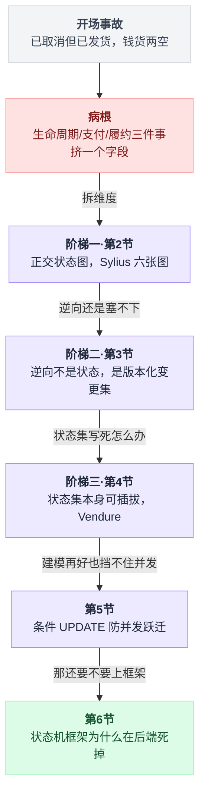
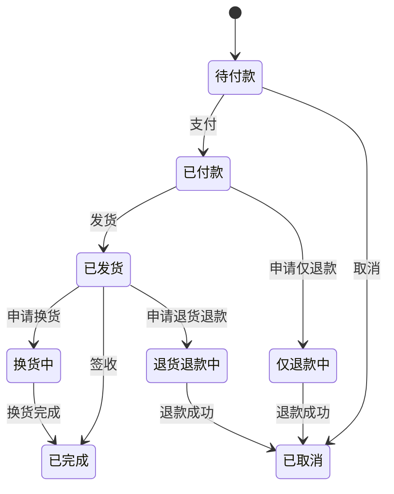
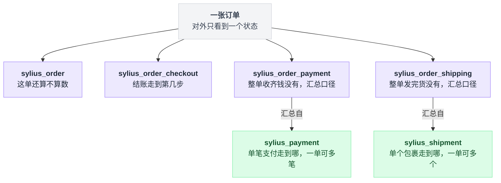
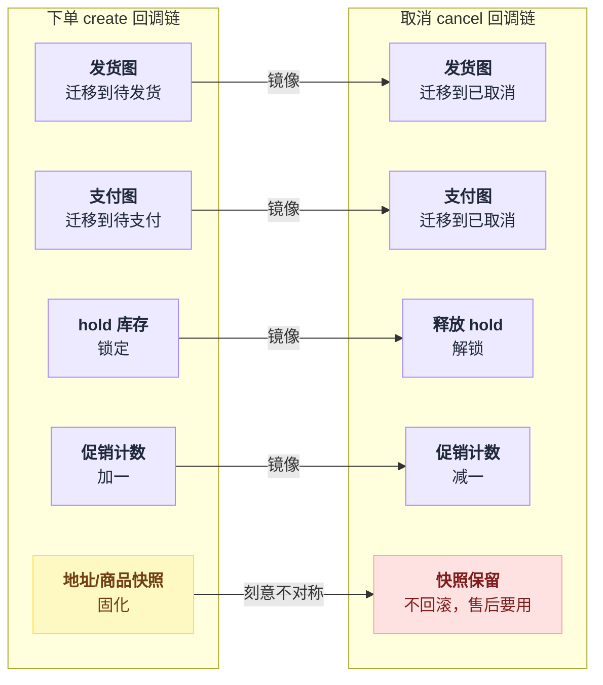
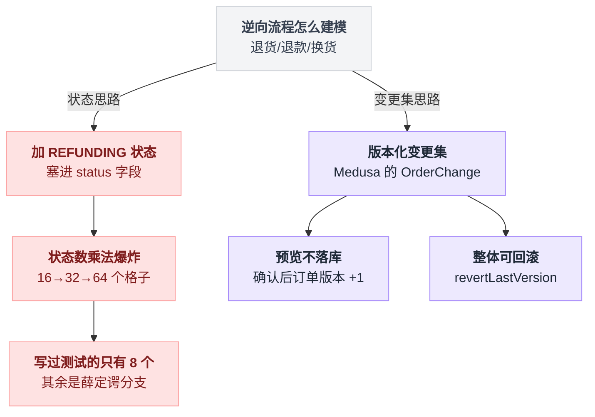
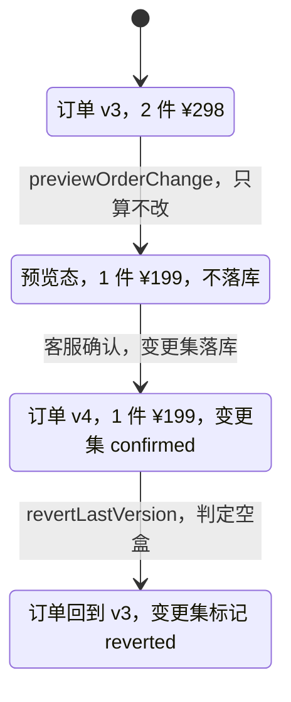
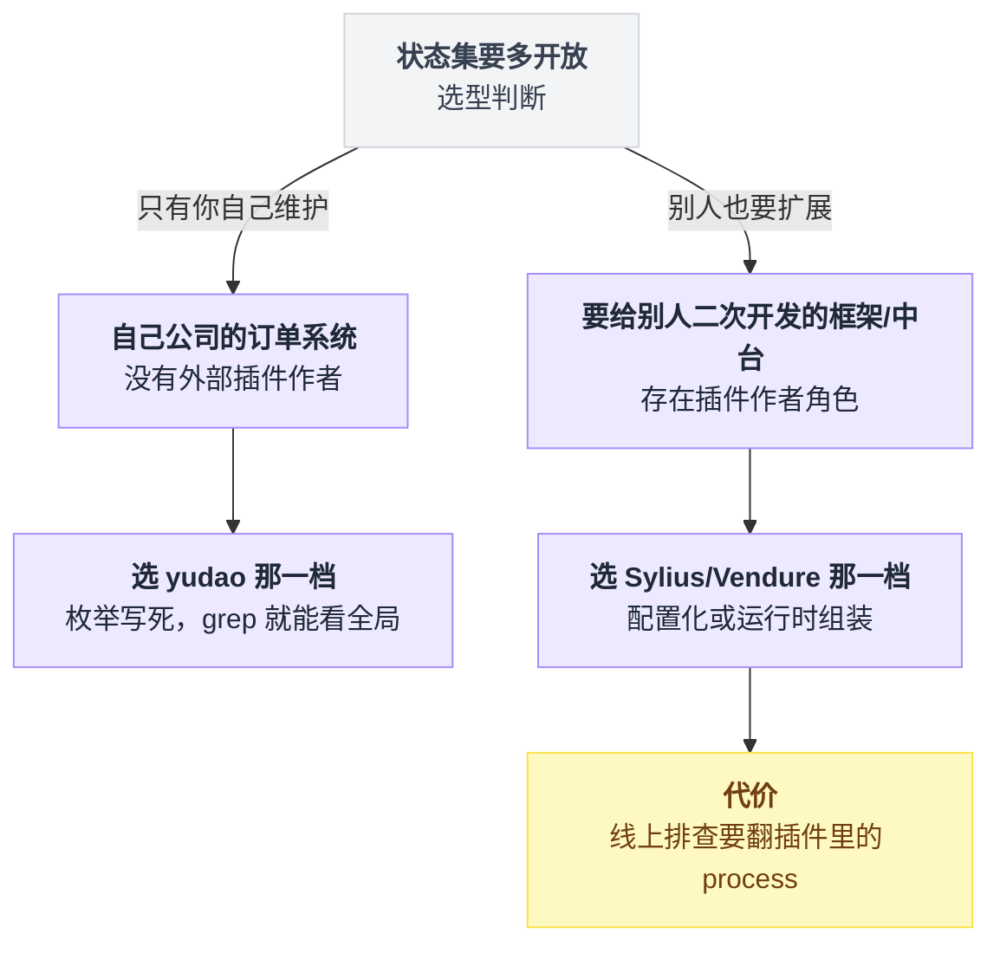

# 《订单状态机与逆向流程》正向五个状态好写，退款才是屎山之源（小白版）

> 一句话结论：**订单不是一个状态机，是多张正交状态图的投影——Sylius 的订单主图只有 `cart`/`new`/`cancelled`/`fulfilled` 四个状态，复杂度全在另外 5 张图里。而成熟系统里的退货/换货/理赔不是订单状态的新分支，是订单的版本化变更集，可以预览、可以整体回滚。至于"上个状态机框架"这条路：Spring 官方的 Spring Statemachine 已经被移进 `spring-attic` 归档了，主流做法退回到"枚举 + SQL 条件更新"。**
>
> 难度：★★★★☆
>
> 阅读前提：本篇是[第 10 篇《支付与对账》](./10-支付与对账.md)第 5 节的续集。那篇讲**一张**状态图怎么写对（迁移表、条件更新、状态机天然幂等、顺手记一条日志），本篇从"一张图根本不够用"开始讲，不复读那些内容。没读过第 10 篇也能看，但第 5 节会显得太简单——因为它的推导过程在那边。
>
> 写作时间：2026-08-05。文中 star 数与最后提交时间为当日实测；源码细节基于公开仓库，未经一手核实的说法在文中已标注。

---

## 目录

- [0. 开场：一张已取消但已发货的订单](#0-开场一张已取消但已发货的订单)
- [1. 先算一笔账：加上逆向流程，状态数会变成多少](#1-先算一笔账加上逆向流程状态数会变成多少)
- [2. 阶梯一：一张图不够用，Sylius 用了六张（本篇主菜）](#2-阶梯一一张图不够用sylius-用了六张本篇主菜)
- [3. 阶梯二：逆向流程不是新状态，是版本化变更集](#3-阶梯二逆向流程不是新状态是版本化变更集)
- [4. 阶梯三：连状态集本身都可以插拔](#4-阶梯三连状态集本身都可以插拔)
- [5. 防并发跃迁：最终裁判还是被改的那一行](#5-防并发跃迁最终裁判还是被改的那一行)
- [6. 状态机框架的坟场](#6-状态机框架的坟场)
- [7. 留痕：一张日志表和一串变更集](#7-留痕一张日志表和一串变更集)
- [8. 反直觉结论](#8-反直觉结论)
- [9. 一句话总结、小白词典、和前几篇的对照](#9-一句话总结小白词典和前几篇的对照)

---

## 0. 开场：一张已取消但已发货的订单

### 0.1 一张客服工单

你在一家卖手机配件的电商公司写订单服务。某天早上客服转来一张工单：

> 工单 #38271：用户 10:30 申请取消订单，客服在后台点了"取消"，页面提示取消成功，退款也发起了。中午 12:40 用户收到了快递。用户现在拿着货，钱也退了，问我们要不要寄回来。

你去数据库查这张订单，`status` 字段是 `SHIPPED`。可客服的截图上写着"已取消"。

退款金额 ¥298。这一单不多，但你翻了翻同一天的数据，类似的订单有 11 张。

### 0.2 你写的代码长这样

翻出取消订单的代码，它非常正常，正常到你在任何一个教程里都能看到：

```java
public void cancel(Long orderId) {
    TradeOrderDO order = orderMapper.selectById(orderId);              // ① 读
    if (order.getStatus() == UNPAID || order.getStatus() == PAID) {    // ② 判断
        order.setStatus(CANCELLED);
        orderMapper.updateById(order);                                 // ③ 写
        refundService.refund(orderId);
    }
}
```

发货那边的代码也一样正常：读订单、判断 `status == PAID`、改成 `SHIPPED`、通知 WMS 出库。

两段代码各自都对。放一起就出事。

### 0.3 复盘：并发跃迁把中间态跳过去了

```
  时刻       客服后台（线程 A）              WMS 回调（线程 B）           DB 里的 status
 ──────────────────────────────────────────────────────────────────────────────────
  10:30:00   ① 读订单 → PAID                 －                            PAID
  10:30:00   －                              ① 读订单 → PAID               PAID
  10:30:01   ② PAID 可以取消 ✓               －                            PAID
  10:30:01   －                              ② PAID 可以发货 ✓             PAID
  10:30:02   ③ UPDATE status = CANCELLED     －                            CANCELLED
  10:30:02   －                              ③ UPDATE status = SHIPPED     SHIPPED  ←覆盖
  10:30:03   发起退款 ¥298                   通知 WMS 出库                 SHIPPED
 ──────────────────────────────────────────────────────────────────────────────────
  最终：DB 是 SHIPPED，客服页面停在"取消成功"，退款单已经打出去了，
        货也出库了。钱货两空，¥298。
```

病灶在"读 → 判断 → 写"这三步是分开的：**线程 B 的判断依据（`PAID`），在它写回去的时候已经过期了。**

这一层，[第 10 篇《支付与对账》](./10-支付与对账.md)第 5.4 节已经完整推导过了，答案是把"当前状态必须是 X"写进 SQL 的 `WHERE` 里。本篇第 5 节会给出 yudao 的工业实现，但不会重复推导。

### 0.4 但真正的病根不是并发

现在关键的一步来了。假设你已经把 `WHERE status = 'PAID'` 加上了，取消和发货只有一个能成功。

**这张订单还是会出问题**，只是形态变了。

取消先成功 → 发货失败：用户已经付了运费的加急件，仓库那边已经打好面单了，业务上"这单其实已经在路上"这件事，系统不知道。

发货先成功 → 取消失败：客服看到"取消失败"，只好走售后退货流程，可是订单表里连"正在退货"这个状态都没有。

于是你会发现你不停地往枚举里加值：`CANCELLING`、`CANCEL_FAILED`、`SHIPPED_BUT_CANCEL_REQUESTED`……

**因为一个 `status` 字段同时装了三件互不相干的事：**

```
                  order.status = 'SHIPPED'
                          │
        ┌─────────────────┼─────────────────┐
        ▼                 ▼                 ▼
   这单还算不算数?     钱收到没有?       货出去没有?
    （生命周期）        （支付面）        （履约面）
        │                 │                 │
   cart / new /       未付 / 部分付 /    未发 / 部分发 /
   cancelled /        已付 / 已退        已发 / 已收 / 退回中
   fulfilled

   三个互相独立的问题，被塞进同一个 varchar(20)。
   于是"已取消（生命周期）+ 已发货（履约面）"这种组合，
   在数据模型里根本没有位置可以放 —— 只能靠覆盖，也就是丢掉一个。
```

一个字段只能表达一个维度。你要表达三个维度，就只能把三个维度的**笛卡儿积**摊平成枚举值。

第 1 节先把这个积算给你看。

### 0.5 本篇路线图

| 症状 | 病根 | 谁来解 | 第几节 |
|---|---|---|---|
| 已取消但已发货 | 三件事挤在一个字段里 | 正交状态图（Sylius 六张图） | 第 2 节 |
| 一加退款，枚举开始爆炸 | 逆向被当成正向的分支 | 版本化变更集（Medusa） | 第 3 节 |
| 状态改一个就得发版 | 状态集写死在代码里 | 可插拔状态集（Vendure） | 第 4 节 |
| 并发跃迁跳过中间态 | 读-判断-写三步分离 | 条件 UPDATE（yudao） | 第 5 节 |
| 想上个框架一劳永逸 | 框架管不到真正难的部分 | 坟场 | 第 6 节 |

五节不是五选一，是层层递进——每一节都在回答"上一节为什么还不够"。把上表拆成一条链，走向是这样的：



---

## 1. 先算一笔账：加上逆向流程，状态数会变成多少

### 1.1 正向部分：确实只有五六个

```
   待付款 ──支付──▶ 已付款 ──发货──▶ 已发货 ──签收──▶ 已完成
     │                 │
     └───取消──▶ 已取消 ◀───取消───┘

   6 个状态，7 条边。半天写完，测试也好写。
```

如果电商业务到此为止，本篇就没必要存在了。问题是它不到此为止。

### 1.2 逆向部分：三条线，二十多个状态

真实电商的售后至少是三条独立的线，每条线自己就是一个完整的流程：

| 逆向类型 | 典型环节 | 粗略状态数 |
|---|---|---|
| **仅退款**（货没发或者不用退货） | 申请 → 商家审核 → 同意/拒绝 → 退款处理中 → 退款成功/失败 | ≈ 6 |
| **退货退款** | 申请 → 审核 → 待买家寄回 → 买家已寄回 → 商家待收货 → 商家已收货 → 退款处理中 → 成功/失败 | ≈ 9 |
| **换货** | 申请 → 审核 → 待寄回 → 已寄回 → 商家收货 → 新货出库 → 新货签收 → 完成 | ≈ 8 |

> 具体到某个项目的售后状态枚举，各家差别不小。yudao（`AfterSaleServiceImpl.java`，路径已核实）的售后**完整状态枚举本次未核实**，上表是通用形态的归纳，不代表任何一个具体仓库。

把正向主干和三条逆向线接到同一张图上，分岔点在哪一目了然：



`已付款`和`已发货`两个节点上各自岔出去的分支，就是接下来要算的那笔账。

### 1.3 算给你看：为什么"再加几个状态"是个陷阱

```
   正向主干                    逆向三条线                 塞进同一个字段
  ─────────────              ─────────────              ─────────────────
   待付款                     仅退款    6 态
   已付款                     退货退款  9 态
   已发货          ＋         换货      8 态       =     6 + 23 = 29 个枚举值
   已完成
   已取消
   （6 态）                   （23 态）

   看起来是加法，还能接受。但真实业务有两条追加要求：

   ① 部分售后：3 件商品只退 1 件，剩下 2 件的正向流程要继续走
      → 逆向进行时，正向状态不能被覆盖
      → 6 × 24（23 个逆向态 + "无售后"）= 144 种合法组合

   ② 多次售后：这单退过一次，用户又申请了第二次
      → 组合数再乘一层

   ─────────────────────────────────────────────────────────
   状态是加法定义的（往枚举里加值），
   组合是乘法增长的（业务真实要表达的东西）。
   把乘法的结果硬塞进加法的枚举里 —— 这就是屎山的定义。
```

144 个格子，你的 `if` 要覆盖 144 种情况。

而这 144 里绝大多数你根本没写过测试，因为你压根不知道它们存在。

### 1.4 和第 10 篇划一条线

| 第 10 篇第 5 节讲完的 | 本篇从这里开始 |
|---|---|
| 一张迁移表怎么写 | 一张不够用，要切成几张、按什么切 |
| 为什么不能读-判断-写 | 切成多张之后，CAS 该守哪一张 |
| 状态机天然就是幂等的 | 逆向流程为什么根本不该是状态 |
| 顺手记一条 `order_status_log` | 变更集本身就是日志 |
| （没讲） | 状态机框架为什么在后端集体死掉 |

第 10 篇是"单张图的正确写法"，本篇是"图的数量与形态"。

说白了：那边教你怎么把一张图画对，这边告诉你不该只画一张。

---

## 2. 阶梯一：一张图不够用，Sylius 用了六张（本篇主菜）

一句话骨架：**订单的"状态"不是一个值，是四个字段拼出来的一个元组；主图瘦到只剩 4 个状态，剩下的复杂度分给另外 5 张图，图与图之间靠一串按 priority 排队的回调联动。** 本节最值得停下来看的是 2.3 的元组和 2.5 的镜像对称，其余是背景。

### 2.1 标本介绍

Sylius 是 PHP 生态里的开源电商框架（`Sylius/Sylius`，8,509 star，最后提交 2026-08-05，2026-08-05 实测）。它把订单的状态机全部写在 yml 配置里，一共 6 个文件，都在 `Resources/config/app/state_machine/` 下（6 个文件全部已核实）：

| 状态图 | 配置文件 | 它回答的问题 | 粒度 |
|---|---|---|---|
| `sylius_order` | `sylius_order.yml` | 这单还算不算数 | 整单 |
| `sylius_order_checkout` | `sylius_order_checkout.yml` | 结账流程走到第几步了 | 整单 |
| `sylius_order_payment` | `sylius_order_payment.yml` | 这单整体收到钱没有 | 整单（汇总） |
| `sylius_order_shipping` | `sylius_order_shipping.yml` | 这单整体发出去没有 | 整单（汇总） |
| `sylius_payment` | `sylius_payment.yml` | **单笔**支付走到哪了 | 一单可有多笔 |
| `sylius_shipment` | `sylius_shipment.yml` | **单个**包裹走到哪了 | 一单可有多个 |

注意最后两行的粒度差别：`order_payment` 是"这单的钱收齐没有"，`payment` 是"这笔支付成功没有"。

一单拆成定金 + 尾款，就是两个 `payment` 汇总成一个 `order_payment`。发货同理，一单拆三个包裹分三天发，就是三个 `shipment` 汇总成一个 `order_shipping`。

> 结账流程的迁移常量定义在 `OrderCheckoutTransitions.php`（已核实）。除主图外，其余各图的**具体状态名以仓库 yml 为准**，本文只描述它们各自负责的维度。

六张图挂在同一张订单上，外部看到的还是一个状态，内部各图各跳各的：



### 2.2 主图只有四个状态

拆完之后，订单主图剩下多少个状态？**四个**（已核实）：

```
   sylius_order 主图（全部内容就这么多）
  ┌────────────────────────────────────────────────────┐
  │                                                    │
  │    cart ──create──▶ new ──fulfill──▶ fulfilled     │
  │      │               │                             │
  │      └───cancel──────┴──cancel──▶ cancelled        │
  │                                                    │
  └────────────────────────────────────────────────────┘

   cart       购物车阶段，还不是正经订单
   new        已下单，进行中（付款、发货、售后全在这个状态里发生）
   fulfilled  彻底完事了
   cancelled  作废了

   ★ 注意 new 这个状态有多"厚"：
     用户付了钱 —— 主图不动；
     仓库发了货 —— 主图不动；
     用户申请了退款 —— 主图还是不动。
     主图只关心"这单还算不算数"，其余一律不关它的事。
```

第一次看到会觉得不可思议：一个成熟电商框架的订单状态只有 4 个？复杂度去哪了？

复杂度没消失，它被切进了另外 5 张图里。这就是本篇的核心机制。

### 2.3 订单的"状态"其实是一个元组

```
   传统模型：一个字段，摊平的笛卡儿积
  ──────────────────────────────────────────────────────────
   order.status = 'PARTIALLY_SHIPPED_AND_PARTIALLY_PAID_AND_REFUNDING'
                   ↑
             一个字段要表达 N×M×K 种组合，
             只能靠往枚举里加值，加到 144 个


   正交模型：一个元组，各维度独立演进
  ──────────────────────────────────────────────────────────
   ( order_state      = new                 ← 生命周期图
     checkout_state   = completed           ← 结账图
     payment_state    = partially_paid      ← 支付汇总图
     shipping_state   = partially_shipped ) ← 发货汇总图

             四个字段，各自 4~6 个取值，
             一共定义 4+6+5+5 = 20 个状态，
             却能表达 4×6×5×5 = 600 种组合
  ──────────────────────────────────────────────────────────
   ★ 加法定义，乘法表达。这是正交化唯一的、也是全部的价值。
```

回头看第 0 节那张事故单："已取消 + 已发货"在一个字段的模型里没有位置放。

在元组模型里，它是 `(order=cancelled, shipping=shipped)`——一个完全合法、可以被查询、可以被告警的组合。**它从"数据模型里表达不了的脏数据"变成了"业务上需要处理的一种情况"。**

这不是把 bug 修好了，是把 bug 变成了一条明确的业务分支。这才是设计的作用。

### 2.4 create 事件的八条 after 回调（按 priority 负数排队）

拆成 6 张图之后立刻冒出新问题：**图与图之间怎么联动？**

用户点了"提交订单"，主图从 `cart` 跃迁到 `new`，可是支付图、发货图、库存、促销、地址快照全都得动。

Sylius 的答案是：主图的 `create` 事件带一串 `after` 回调，按 `priority` 排队执行，**priority 用的是负数，越小越先跑**。写成伪代码就是一个排序后依次执行的循环：

```
on transition(sylius_order: cart --create--> new):
    callbacks = 所有注册在 create 上的 after 回调
    for cb in sort(callbacks, key = priority, 升序):    // 负数：-800 排在 -100 前面
        cb.run(order)
```

排出来的队伍长这样：

```
  Sylius：订单主图 create 事件触发之后发生的事
  ┌───────────────────────────────────────────────────────────────┐
  │   sylius_order:   cart ──── create ────▶ new                   │
  └────────────────────────────┬──────────────────────────────────┘
                               │ after 回调，按 priority 从小到大依次跑
                               ▼
   priority   干什么                        动的是谁         关联篇目
  ─────────  ──────────────────────────    ─────────────    ──────────
    -800     发货图迁移                     order_shipping
    -700     支付图迁移                     order_payment
    -600     建 payment 记录                payment 表
    -500     建 shipment 记录               shipment 表
    -400     hold 库存                      库存           → 第 30 篇
    -300     促销使用计数 +1                promotion      → 第 29 篇
    -200     存收货地址快照                 address
    -100     固化商品名快照                 order_item
  ─────────  ──────────────────────────    ─────────────    ──────────
     ▲                                                    ▲
     │ 负数，且间隔 100                                    │ 最后才做快照：
     │ 中间的空档是留给插件插队的                           │ 前面任何一步失败，
     │ （想在 hold 库存之前做风控？填 -450）                │ 快照都不该留下
```

三个值得注意的设计。

**一，顺序不是随便排的。** 发货图和支付图先迁移（-800/-700），因为后面建 `payment` / `shipment` 记录时要读这两张图的状态。库存 hold（-400）排在建记录之后，因为 hold 失败要整单回滚，越晚做回滚代价越小。

**二，间隔 100 是给插件留的。** Sylius 是框架，插件作者要在两步之间插一脚，填个 -450 就行，不用改核心代码，也不用担心和别的插件撞车。

**三，快照排最后**（-200/-100）。存地址、固化商品名（下单那一刻商品叫什么、卖多少钱）是**只写不改**的动作，放在最后意味着前面任何一步抛异常，快照根本不会产生。

> 💡 -400 的 hold 库存正是[第 30 篇《购物车与库存三段账》](./30-购物车与库存三段账.md)的主题：那篇的结论是"锁定库存在成熟系统里是带 TTL 的软预留，靠时间自然失效"。放在这里看更清楚——**hold 只是订单创建这条流水线上的第 5 道工序，它凭什么要有自己的定时任务？** 而 -300 的促销计数 +1，是[第 29 篇《优惠券与促销叠加》](./29-优惠券与促销叠加.md)里"核销"动作的落点。三篇拼起来才是一次完整的下单。

### 2.5 cancel 是它的镜像——对称性本身就是正确性的证据

现在写取消。你不需要重新思考"取消要做哪些事"，照着镜子抄：

| priority | create（下单） | | cancel（取消） | 关联 |
|---|---|---|---|---|
| -800 | 发货图 → 待发货 | ⇄ | 发货图 → 已取消 | |
| -700 | 支付图 → 待支付 | ⇄ | 支付图 → 已取消 | |
| -600 | 建 payment 记录 | ⇄ | payment 随之作废 | |
| -500 | 建 shipment 记录 | ⇄ | shipment 随之作废 | |
| -400 | hold 库存 | ⇄ | 释放 hold | → 第 30 篇 |
| -300 | 促销使用计数 +1 | ⇄ | 促销计数 -1 | → 第 29 篇 |
| -200 | 存收货地址快照 | ✗ | 保留（售后要用） | |
| -100 | 固化商品名快照 | ✗ | 保留（售后要用） | |

左边每一条"向下"的动作，右边都能找到"向上"的那一条。写完 create 的 8 条回调，你不用重新想 cancel 该做什么，对着抄一遍，漏了哪条一眼就看出来。

这条规则的价值被严重低估了。**对称性是本篇唯一一条能靠"看"完成 code review 的正确性检查**，它其实就是拿两栏做一次配对：

```
for c in create 的每一条回调:
    r = 在 cancel 里找 c 的反向操作
    if r 不存在:
        要么是漏了（右栏空一格，肉眼可见）
        要么必须当场说出"为什么不需要反"（如快照类）

for x in cancel 里多出来的、create 没有的动作:
    说明它位置放错了，或者它压根不属于状态迁移
```

- 有人给下单加了一条"冻结用户优惠券"的回调，却没给取消加"解冻"？两栏一对比，右边空了一格，肉眼可见。
- 有人在取消里加了一个下单没有的动作？说明这个动作要么位置放错了，要么它压根不属于状态迁移。

而最后两行故意**不对称**，这也是设计：地址和商品名快照是"这一刻的事实"，订单取消不代表这个事实没发生过。售后要靠它们证明"当时买的是什么、发到哪儿"。

**不对称的地方必须能说出理由**——说不出理由的不对称，就是 bug。

把两栏并排摆成图，对称的部分和刻意不对称的部分一眼分得开：



⚠️ 拿这两栏当自查表用，接手任何一个订单系统先做一遍：

1. 下单时做的每一件写操作，取消时有没有对应的反向操作？
2. 反向操作缺失的那几条，能说出"为什么不需要反"吗？
3. 反向操作的顺序，是不是正向的**逆序**？（先 hold 后计数，就该先减计数后释放 hold）
4. 如果反向操作跑到一半失败了，会停在哪儿？谁负责重试？（→ [第 20 篇](./20-分布式事务的真相.md)）

### 2.6 正交化到底买到了什么

| 维度 | 一张图（一个 status 字段） | 六张正交图 |
|---|---|---|
| 表达"部分发货 + 部分退款" | 得造一个新枚举值 | 两张图各走各的，本来就能表达 |
| 新增一个逆向场景 | 主流程的 `if` 要全部重看一遍 | 主图一行不动 |
| 测试用例数量 | 状态 × 事件 = 乘法 | 每张图各测各的 = 加法 |
| 排查"这单卡住了" | 只知道一个值，得看日志猜 | 四个维度一眼看出卡在哪面 |
| 代价 | —— | 图之间的联动要显式写（那 8 条回调） |

最后一行是诚实的代价：正交化不是免费的，它把"隐式的状态组合"换成了"显式的跨图联动"。你省掉了 144 个枚举值，换来了 8 条必须写对顺序的回调。

这笔交易划算，是因为 8 条回调是**可读、可对称检查、可插桩**的，144 个枚举值不是。

---

## 3. 阶梯二：逆向流程不是新状态，是版本化变更集

一句话骨架：**先把"加个 REFUNDING 状态"这条路算死，再看 Medusa 怎么把退货变成一份可预览、可确认、可整体回滚的提案。**

### 3.1 先把"加个 REFUNDING 状态"这条路算死

第 2 节解决了"维度"问题，但没解决"逆向"问题。最自然的想法还是：给订单加一个 `REFUNDING` 状态。算一下会发生什么：

```
        给订单加逆向状态，格子数怎么长
  ┌───────────────┬────────┬─────────┬─────────┬─────────┐
  │  正向 ＼ 逆向  │  无    │ 退款中  │ 退货中  │ 换货中  │
  ├───────────────┼────────┼─────────┼─────────┼─────────┤
  │ 已付款         │   ✓    │   ✓     │   ✓     │   ✓     │
  │ 已发货         │   ✓    │   ✓     │   ✓     │   ✓     │
  │ 已签收         │   ✓    │   ✓     │   ✓     │   ✓     │
  │ 已完成         │   ✓    │   ✓     │   ✓     │   ✓     │
  └───────────────┴────────┴─────────┴─────────┴─────────┘
        4 × 4 = 16 个格子，每个格子都得有个枚举名：
        PAID / PAID_REFUNDING / PAID_RETURNING / PAID_EXCHANGING /
        SHIPPED / SHIPPED_REFUNDING / SHIPPED_RETURNING / ...

   再加"部分售后"（整单退 vs 退其中 1 件）：      16 × 2  = 32
   再加"同一单退第二次"：                         枚举名开始出现数字
   再加"退款失败要重试"：                         32 × 2  = 64
  ────────────────────────────────────────────────────────────
   而这 64 个里面，你写过测试的大概 8 个。
   剩下 56 个是薛定谔的分支：不知道能不能进去，进去了不知道会怎样。
```

即使用了第 2 节的正交化，把逆向单独切成一张图，也只是把 16 变成 4+4——**问题缓解了，但没解决**。

因为逆向流程的本质根本不是"状态"：

> 用户退了 1 件商品，订单的**内容**变了：商品数从 3 件变 2 件，总额从 ¥298 变 ¥199，优惠券的门槛可能不再满足，运费可能要重算。
> 这些变化，没有任何一个能用"订单处于某个状态"来表达。

状态描述的是"进行到哪一步"，退货改的是"这单到底是什么"。用状态去表达内容变更，是拿错了工具。

两条路在这里分岔，一条继续爆炸，一条换了个模型：



### 3.2 Medusa 的答案：OrderChange

Medusa 是 TypeScript 的开源电商引擎（`medusajs/medusa`，35,586 star，最后提交 2026-08-05，2026-08-05 实测）。它的订单模块里有一个叫 `OrderChange` 的东西（`packages/modules/order/src/services/order-module-service.ts`，路径已核实），思路是：

**逆向流程不改订单状态，而是往订单上挂一个"变更提案"。**

```
   订单是什么？                     变更集是什么？
  ──────────────────────         ──────────────────────────────
   一个有版本号的快照              一次"我想把订单改成这样"的提案
   order v3                       OrderChange {
   ├─ items: 手机壳×1, 数据线×2      type: return | claim | exchange
   ├─ total: ¥298                   items: [手机壳 ×1]
   └─ version: 3                    status: pending | confirmed | reverted
                                  }
  ──────────────────────         ──────────────────────────────
   退货（return）、理赔（claim）、换货（exchange）
   在 Medusa 里全部是 OrderChange 的子类型 —— 同一套机制，三种业务语义。
```

关键是它提供的三个动作（方法名已核实）：`createOrderChange` / `previewOrderChange` / `revertLastVersion`。

### 3.3 三帧：预览不落库 → 确认 → 整体回滚

三个动作各自在干什么，用伪代码说最短：

```
preview(order_id):                       // 帧 1
    快照 = 读订单当前版本                  // 只读
    草稿 = 把 OrderChange 套用到快照上     // 纯内存计算：件数、金额、运费重算
    return 草稿                           // 不写库，一个字段都不动

confirm(change):                          // 帧 2
    order.version += 1                    // v3 → v4
    change.status = confirmed             // 记下是谁确认的

revert(order):                            // 帧 3
    order = 上一个版本(order)              // v4 → v3，整体回退
    change.status = reverted              // 留痕，不删记录
```

三帧展开成时间线是这样：

```
  帧 1：预览（previewOrderChange）—— 算给你看，一个字段都不动
  ┌──────────────────────────────────────────────────┐
  │  order v3    2 件    ¥298    （数据库里的真实状态）│
  └──────────────────────────────────────────────────┘
                    ＋ OrderChange { return, 手机壳×1 }
                            │
                previewOrderChange(order_id)
                            ▼
  ┌──────────────────────────────────────────────────┐
  │  预览 v3'    1 件    ¥199    运费重算 ¥8          │
  │  ↑ 只在内存里算出来的结果，客服和用户在页面上      │
  │    看到的就是这个。订单表一个字段都没改。          │
  └──────────────────────────────────────────────────┘
                 客服："退给用户 ¥199 对吗？"
                 用户："对。"

  帧 2：确认 —— 变更集落库，订单版本 +1
                            ▼
  ┌──────────────────────────────────────────────────┐
  │  order v4    1 件    ¥199                         │
  │  变更集 #17  status = confirmed  by=客服张三       │
  └──────────────────────────────────────────────────┘

  帧 3：撤销（revertLastVersion）—— 整体回到上一版
        （客服点错了 / 仓库说退回来的是空盒 / 风控判定是恶意退款）
                            ▼
  ┌──────────────────────────────────────────────────┐
  │  order v3    2 件    ¥298    ← 整体回到 v3         │
  │  变更集 #17  status = reverted  留痕，不删         │
  └──────────────────────────────────────────────────┘
```

三帧接成一张状态图，"预览不算数、确认才生效、回滚回整版"这三条规则更直观：



**帧 1 和帧 3 是"加状态"模型里根本不存在的两个动作。**

帧 1：在"加状态"模型里，你想知道"退完还剩多少钱"，只能先把订单改了再看，看完不对再改回去——中间那段时间订单是脏的，如果这时候用户刷新页面，他会看到一个还没确认的金额。

帧 3：在"加状态"模型里，"撤销一次退货"需要你手写一段反向补偿代码，逐个字段改回去：金额加回来、商品数加回来、优惠券门槛重新判断、运费重算……

每加一个可退的字段，这段补偿代码就得改一次，而且**它永远比正向逻辑写得潦草，因为它不常跑**。

### 3.4 逐条对比

| 现实问题 | 给订单加一个 REFUNDING 状态 | 版本化变更集 |
|---|---|---|
| 客服想先看看退完剩多少钱 | 得先落库再看，看完还得改回去 | `previewOrderChange`，不落库 |
| 退错了要撤销 | 手写反向补偿，逐字段改回去 | `revertLastVersion`，整体回上一版 |
| 同一单退两次 | 枚举名开始出现数字 | 两条变更集：v3 → v4 → v5 |
| 部分退（3 件退 1 件） | 状态还要分"整单退/部分退" | 变更集的 `items` 里只装退的那件 |
| 追溯"当时为什么退了 ¥199" | 翻日志，拼时间线 | 变更集本身就是答案 |
| 新增"理赔"场景 | 加一批状态 + 一批 `if` | 加一个 change 子类型 |

### 3.5 这和第 20 篇的补偿是什么关系

> 💡 [第 20 篇《分布式事务的真相》](./20-分布式事务的真相.md)讲 Saga 时的结论是"直接做，错了再补，补偿逻辑你自己写"。变更集看起来很像 Saga 的补偿，但有一个决定性差别：
>
> - **Saga 的补偿是代码**：你为每个正向操作手写一个 `cancelXxx()`，它和正向逻辑分处两地，容易写漏、容易腐化，而且跨服务。
> - **变更集的回滚是数据**：`revertLastVersion` 不需要为每种业务写一个反向实现，它只是"把订单指回上一个版本"。新增一种售后类型，回滚逻辑一行都不用加。
>
> 分工线：**跨服务的补偿逃不掉 Saga**（订单服务撤销了，支付服务的退款单还得单独发起，那笔钱的正确性归[第 10 篇《支付与对账》](./10-支付与对账.md)管）；但**单个服务内部的订单内容变更，用版本化能把补偿从代码问题降级成数据问题**。能降级就降级——代码会腐化，数据结构不会。

⚠️ 别把变更集当成万能的时光机。它能回滚的只有**订单自己的数据**。

已经发出去的短信、已经打出去的退款、已经出库的货，`revertLastVersion` 一样也收不回来。变更集解决的是"账面上怎么回到上一版"，不是"物理世界怎么回到上一秒"。

---

## 4. 阶梯三：连状态集本身都可以插拔

### 4.1 Vendure 的做法：核心只认四个骨架状态

Vendure 也是 TypeScript 的开源电商框架（`vendurehq/vendure`，8,296 star，最后提交 2026-08-05，2026-08-05 实测）。它的订单状态机在 `packages/core/src/service/helpers/order-state-machine/order-state-machine.ts`（路径已核实），做法比 Sylius 更激进：

**框架里硬编码的订单状态只有 4 个**——`'Created' | 'Draft' | 'AddingItems' | 'Cancelled'`——其余的状态由 `defaultOrderProcess` 注入。

```
   Vendure 的订单状态从哪儿来
  ┌────────────────────────────────────────────────┐
  │  core 里硬编码的类型（骨架，永远存在）          │
  │  'Created' | 'Draft' | 'AddingItems' | 'Cancelled' │
  └────────────────────┬───────────────────────────┘
                       │ ＋
  ┌────────────────────▼───────────────────────────┐
  │  defaultOrderProcess 注入的状态                 │
  │  （支付、发货、履约相关的那一大批）              │
  └────────────────────┬───────────────────────────┘
                       │ ＋
  ┌────────────────────▼───────────────────────────┐
  │  你/插件注入的自定义 OrderProcess               │
  │  （B2B 审批态？分销商代下单态？想加就加）        │
  └────────────────────┬───────────────────────────┘
                       ▼
             运行时实际生效的完整状态集
```

这比 Sylius 又进了一步。

Sylius 是"状态定义在配置文件里，改配置就行"；Vendure 是"**状态集本身是运行时组装出来的**，核心代码根本不知道最终有多少个状态"。

### 4.2 三个标本，一条光谱

```
   状态集的开放程度
  ────────────────────────────────────────────────────────────────▶
   全硬编码                        配置驱动                  运行时组装
      │                              │                          │
   yudao                          Sylius                    Vendure
   Java 枚举 + service            6 个 yml 文件             OrderProcess 注入
      │                              │                          │
   改一个状态                     改一行 yml                装个插件
   = 改代码 + 发版                + 注册一个 listener        = 多出一批状态
      │                              │                          │
   ✓ 最好读：搜枚举就知道全部      ✓ 最好审计：diff 配置      ✓ 最好扩展
   ✗ 最难扩展：二开必冲突          ○ 中间派                  ✗ 最难 debug：
                                                              不打开插件目录
                                                              你不知道系统里
                                                              到底有几个状态
```

| 项目 | 状态定义在哪 | 加一个状态要动什么 | 谁能加 |
|---|---|---|---|
| yudao（`38,524 star`，2026-07-31） | Java 枚举 + service 里的条件更新 | 改枚举、改 service、发版 | 只有你自己 |
| Sylius（`8,509 star`，2026-08-05） | 6 个 yml 配置文件 | 改配置 + 注册回调 | 插件作者 |
| Vendure（`8,296 star`，2026-08-05） | 核心 4 个 + `OrderProcess` 注入 | 写一个 `OrderProcess` | 插件作者，运行时 |

（star 与提交时间均为 2026-08-05 实测）

### 4.3 怎么选：看你是在做框架还是在做业务

| 你在做的东西 | 选哪一档 | 理由 / 代价 |
|---|---|---|
| 给自己公司做订单系统 | yudao 那一档 | 状态写死在枚举里，`grep` 一下就知道系统里有几个状态；你不需要"插件作者"这个角色，因为插件作者就是你 |
| 做要被别人二次开发的框架/中台 | 才需要爬到 Sylius / Vendure 那一档 | 代价是真实的：线上出问题时，"这单为什么进了这个状态"的答案可能藏在某个插件的某个 process 里 |

**可插拔不是更高级，是更贵。** 贵在别人（也包括三个月后的你）读代码时看不到全景。

判断依据只有一条，画成决策树是这样：



---

## 5. 防并发跃迁：最终裁判还是被改的那一行

### 5.1 yudao 全线的写法

前面三节讲的都是"怎么建模"。这一节回到第 0 节那张事故单——**建模再漂亮，也挡不住两个线程同时改一行。**

yudao（`YunaiV/ruoyi-vue-pro`，38,524 star，最后提交 2026-07-31，2026-08-05 实测）的做法极其朴素，全线统一：`TradeOrderUpdateServiceImpl.java` 里的每一次状态迁移，走的都是 `updateByIdAndStatus(id, 期望的旧状态, 新值)`（类路径与方法语义已核实，具体签名以仓库为准）：

```java
// 发货：期望订单当前是"待发货"，改成"已发货"
int updateCount = tradeOrderMapper.updateByIdAndStatus(
        order.getId(),
        TradeOrderStatusEnum.UNDELIVERED.getStatus(),   // ← 期望的旧状态
        new TradeOrderDO().setStatus(TradeOrderStatusEnum.DELIVERED.getStatus()));
if (updateCount == 0) {
    throw exception(ORDER_DELIVERY_FAIL_STATUS_NOT_UNDELIVERED);   // ← 行数为 0 即失败
}
```

打到数据库就是一条 SQL：

```sql
UPDATE trade_order SET status = 20 WHERE id = 1024 AND status = 10;
-- 影响行数 = 1 → 迁移成功，这次跃迁归我
-- 影响行数 = 0 → 有人先我一步，抛异常，别往下走
```

就这一行。没有 Redis 锁，没有 ZooKeeper，没有版本号字段——**状态本身就是版本号**。

> 第 10 篇 5.4 节已经推导过为什么必须这样写（不能"读出来判断完再写回去"），本篇不重复。这里要说的是另一半：**为什么这样写就够了。**

### 5.2 把这条 SQL 装回事故现场

```
  时刻       客服后台（线程 A）                 WMS 回调（线程 B）              DB status
 ────────────────────────────────────────────────────────────────────────────────────
  10:30:02   UPDATE ... SET status=CANCELLED
             WHERE id=1024 AND status='PAID'
             → 影响 1 行 ✓                                                     CANCELLED
  10:30:02   －                                 UPDATE ... SET status=SHIPPED
                                                WHERE id=1024 AND status='PAID'
                                                → 影响 0 行 ✗                  CANCELLED
  10:30:03   返回"取消成功"                     抛 ORDER_...STATUS 异常
                                                WMS 收到失败，不出库
 ────────────────────────────────────────────────────────────────────────────────────
  两个线程都做了"先判断再写"，
  区别只在于：判断和写是同一条 SQL，中间没有缝可以插进去。
  排队是数据库的行锁做的，你一行锁代码都没写。
```

第 0 节那个 ¥298 的口子，就是被这一个 `AND status = ?` 堵上的。

### 5.3 为什么这里不需要分布式锁

[第 16 篇《分布式锁》](./16-分布式锁.md)的一句话结论值得原样搬过来：

> **分布式锁的最终裁判从来不是锁服务，而是被保护的资源本身（fencing token / 版本号 / 唯一键）。Redis 锁能帮你省钱（防重复劳动），保不了你的命（防数据损坏）。**

订单状态迁移是这条结论最干净的一个例证：

```
   ✗ 加了 Redis 锁的版本              ✓ 只有条件 UPDATE 的版本
  ──────────────────────────       ──────────────────────────
   lock("order:1024")                UPDATE ... AND status='PAID'
   读订单                            └─ 完了
   判断状态
   UPDATE 订单     ← 锁可能已经在
   unlock()           这一步之前过期了
  ──────────────────────────       ──────────────────────────
   锁过期 = 回到没锁的状态           没有"过期"这个概念
   所以你还是得写 AND status=?       行锁的生命周期 = 事务的生命周期
   ────────────────────────────────────────────────────────
   既然无论如何都得写 AND status=?，那 Redis 锁在这里的作用
   就只剩"减少无谓的重试"—— 而订单级别的并发本来就低（同一张
   订单同时被两个人改，一天能有几次？）。为一个几乎不发生的
   优化，引入一个可能失败的外部依赖，不划算。
```

`UPDATE ... WHERE id=? AND status=?` 之所以是原子的，靠的是数据库对单条 UPDATE 的行锁与可见性规则——[PostgreSQL 系列第 03 篇《原子扣减余额》](../2026-08_从真实项目学PostgreSQL/03-原子扣减余额.md)整篇拆的就是这一条语句内部发生了什么。

那篇讲的是 `balance = balance - 10 AND balance >= 10`，本篇是 `status = 'B' AND status = 'A'`——**同一个手法的两种用法：一个守值域，一个守状态。**

### 5.4 正交化之后，CAS 该守哪一张图

这是第 2 节和第 5 节的交叉点，也是最容易写错的地方。既然订单状态被切成了四个字段，那条件 UPDATE 该带哪个字段？

规则用伪代码写只有三行：

```
守什么(这次迁移):
    前提集合 = 这次迁移做决策时读过的每一张图的状态
    WHERE 里必须写全 前提集合 里的每一条    // 一条都不能漏，也不该多带
```

写错和写对的差别：

```
   ✗ 一律守主状态                        ✓ 各守各的图
  ─────────────────────────           ─────────────────────────────
   发货：                               发货：
   UPDATE ... AND status=?              UPDATE ... AND shipping_state='ready'
   收款：                               收款：
   UPDATE ... AND status=?              UPDATE ... AND payment_state='awaiting'
        │                                    │
        ▼                                    ▼
   发货和收款抢同一个字段                 两条线各走各的
   → 用户付尾款的同一秒仓库在发货，       → 只有真正冲突的操作
     必有一方影响 0 行、失败重试            才会撞在一起
   → 这叫"虚假冲突"                     → 正交化的收益在这里兑现
   → 第 2 节白做了
```

规则一句话：**这次迁移读了哪张图的状态做决策，就守哪张图的状态。**

发货决策依据是"发货图处于待发货"，那 `WHERE` 里就写发货图；跟支付图长什么样毫无关系。

⚠️ 一个真实的坑：如果一次操作**同时依赖两张图**（比如"确认收货"要求支付图已付款且发货图已送达），那两个条件都得进 `WHERE`：

```sql
UPDATE trade_order SET shipping_state = 'received'
 WHERE id = 1024 AND shipping_state = 'delivered' AND payment_state = 'paid';
```

不要写成"先查支付图，再带着发货图条件去 update"——那又变回读-判断-写了，只是把缝挪了个位置。

**你依赖的每一个前提，都得出现在同一条 SQL 的 WHERE 里。**

---

## 6. 状态机框架的坟场

### 6.1 三块墓碑

写到这里你可能会想：这么多状态图、这么多回调、这么多迁移规则，为什么不上一个状态机框架？

先看看这个赛道的现状（以下全部为 2026-08-05 实测）：

| 项目 | star | 最后提交 | 状态 |
|---|---|---|---|
| `spring-attic/spring-statemachine` | 1,664 | 2026-07-05 | **已 archived**，仓库归到了 `spring-attic`（Spring 的"阁楼"，即官方停止维护的项目集中营） |
| `hekailiang/squirrel` | 2,254 | **2024-06-04** | 停更两年 |
| `django-fsm` | —— | 2025-10 停更 | 已停更 |
| `statelyai/xstate` | **29,966** | 2026-08-04 | 活跃 |

```
   同样是"状态机库"，命运完全相反
  ────────────────────────────────────────────────────────────────
   后端                                    前端
   spring-statemachine   1,664  ✗ 归档     xstate   29,966  ✓ 活跃
   squirrel              2,254  ✗ 停更
   django-fsm              ——   ✗ 停更
  ────────────────────────────────────────────────────────────────
   Spring 是 Java 后端最大的生态。它官方出品的状态机框架，
   十年下来 1,664 star，最后被移进阁楼。
   而前端一个状态机库拿到 29,966 star，还在日更。

   这不是"Java 程序员不喜欢状态机"，
   订单状态机在 Java 后端几乎是必备的东西。
   是框架这个形态，在后端不成立。
```

这一节要回答的就是：**为什么？**

### 6.2 先说清前端的状态机在管什么

xstate 管的是 **UI 交互状态**：一个表单是 `idle / validating / submitting / success / error`，一个视频播放器是 `loading / playing / paused / buffering / ended`。

这类状态有四个特征，每一个都很关键：

```
   前端 UI 状态的四个特征
  ──────────────────────────────────────────────────────
   ① 只在一个进程里          状态的唯一副本就在内存变量里
   ② 单线程                  JS 事件循环，没有两个线程同时改
   ③ 不需要持久化            页面刷新 = 一切重来，这是可接受的
   ④ 副作用是重渲染          状态变了就重画界面，做不完可以再画
  ──────────────────────────────────────────────────────
   在这四个前提下，"状态机"这件事的全部难度就是
   ——把一坨 if (loading && !error && hasData && !isStale)
     换成一张显式的、可视化的、可测试的图。
   而这件事 xstate 100% 做到了，所以它的价值 100% 兑现。
```

### 6.3 后端状态机的难点，四件里框架只能包一件

后端订单状态机的四个前提，跟上面**每一条都相反**：

```
   状态机要解决的五件事，框架能包几件？
  ┌────────────────────────┬────────────────┬─────────────────────────┐
  │                        │ 前端（xstate） │ 后端（订单）             │
  ├────────────────────────┼────────────────┼─────────────────────────┤
  │ ① 迁移规则表           │ 框架搞定 ✓     │ 框架搞定 ✓              │
  │ ② 状态存在哪            │ 内存变量       │ 数据库一行 ← 框架管不着 │
  │ ③ 并发                 │ 单线程，没有   │ 多进程抢同一行 ✗        │
  │ ④ 进程崩了怎么恢复      │ 刷新页面即可   │ 必须从库里重建 ✗        │
  │ ⑤ 迁移的副作用          │ 重渲染，可重做 │ 建单/扣库存/发消息 ✗    │
  └────────────────────────┴────────────────┴─────────────────────────┘

   ① 是唯一一件框架能独立完成的事。
   而 ① 在后端只值这么多代码：

       Map<Pair<Status, Event>, Status> TRANSITIONS = Map.of(
           Pair.of(UNPAID,  PAY),     PAID,
           Pair.of(PAID,    DELIVER), DELIVERED,
           ...);

   二十行。为了这二十行，引入一个框架、一套 DSL、一层新概念。

   而 ②③④⑤ 全部落在数据库和你的事务边界上，框架伸不进去。
```

把这四条拆开说。

**②③ 状态不在框架里，在数据库里，所以并发也不在框架里。** 这是最根本的一条。

框架内存里那个状态机对象，只是数据库那一行的一个短命副本。于是每次迁移都变成一个三明治，框架只是中间那片火腿：

```
读   status = SELECT status FROM orders WHERE id=?     ← 数据库
算   next   = 框架.transition(status, event)            ← 框架管的全部就这一行
写   UPDATE orders SET status = next WHERE id=?         ← 数据库
     ▲
     └─ 竞态就发生在"读"和"写"之间，而框架完全看不见这一段
```

它能拦住"从 `PAID` 走到 `RECEIVED` 是非法迁移"（逻辑校验，一个 `Map` 就够），拦不住"两个进程都读到 `PAID`"（并发控制，只有数据库能做）。

你要防住后者，还是得回到第 5 节那个 `WHERE status = ?`。**框架解决的是不会出事的那一半**，它是三明治中间那片可有可无的火腿。

**④ 持久化。** 框架当然可以提供持久化扩展点（具体类名与用法以官方文档为准），但你一旦用上，就多了一份要维护的状态：框架的持久化格式一份、你的业务表 `status` 字段一份。这两份得对上。

**你为了不写状态管理代码引入了框架，结果开始写"框架状态和业务状态的对账代码"**——这是纯亏。

**⑤ 副作用才是真正的工作量。** 回头看第 2.4 节那张 priority 图：主图从 `cart` 到 `new` 这一步跃迁，框架能表达；后面那 8 条回调——建 payment、建 shipment、hold 库存、促销计数 +1、存两份快照——**才是 90% 的代码量和 100% 的 bug**。

这 8 条哪些在同一个事务里、哪个失败了要回滚到哪一步、哪个允许异步重试，是你的事务设计问题，跟状态机一点关系都没有。

### 6.4 结论：难点不在"状态机"三个字上

> **后端状态机的难点从来不在状态机，在"持久化 + 并发 + 事务边界"这三件事上。框架把最简单的那 10%（迁移规则表）抽象走了，剩下 90% 一动不动，还额外送你一层需要学习、需要升级、可能停更的依赖。**

这就是 1,664 和 29,966 之间那道鸿沟的全部解释。

它不是生态热度问题，是**框架能覆盖的部分，在前端占了 90%，在后端占了 10%**。

所以主流后端做法退回到了最朴素的组合：

```
   后端订单状态机的事实标准（本次三个标本一致）
  ─────────────────────────────────────────────────────────
   规则表   →  枚举 / yml 配置 / 一个 Map          （几十行）
   守卫     →  UPDATE ... WHERE status = ?         （一条 SQL）
   副作用   →  按顺序排好的回调 + 你自己的事务边界  （真正的活）
   留痕     →  一张 status_log 或一串变更集         （第 7 节）
  ─────────────────────────────────────────────────────────
   没有一件需要框架。
```

Sylius 的 6 张 yml 图属于"规则表 + 事件回调分发"这一档——它活得好，恰恰是因为它只做①和回调分发，②③④⑤全部留给应用层自己处理（Sylius 底层依赖的状态机组件具体是哪个，以仓库 `composer.json` 为准，此处不展开）。

### 6.5 一段诚实的说明：流程引擎和分布式事务框架

业内有另一类说法：逆向流程应该交给 Flowable 这类流程引擎，或者用 Seata 做补偿。

**本次调研没有核实到支持这个做法的标本。** 本篇的三个电商标本（Sylius / Medusa / yudao）的逆向流程，都没有用流程引擎，也没有用分布式事务框架。**Flowable / Seata 在逆向流程中的实际角色未核实**，这里不给结论。

能说的只有一条边界：

| 这类工具 | 解决的问题 | 归哪篇 |
|---|---|---|
| 流程引擎（Flowable 之类） | 人工审批节点的编排：谁审、审多久、驳回到哪 | [第 37 篇《审批流与工作流引擎》](./37-审批流与工作流引擎.md) |
| 订单状态机 | 系统事件驱动的状态收敛：钱到了、货发了 | 本篇 |
| 跨服务补偿 | Saga | [第 20 篇](./20-分布式事务的真相.md) |

第 37 篇的结论"驳回到任意节点在 BPMN 标准里根本不存在"，正好说明了这两类问题的形状有多不一样。

---

## 7. 留痕：一张日志表和一串变更集

### 7.1 第 10 篇已经给过的部分

[第 10 篇](./10-支付与对账.md)第 5.6 节已经给出了 `order_status_log` 的完整写法（`from_status` / `to_status` / `event` / `operator`，和业务改动同事务），这里不复读。本篇只补两条"正交化 + 变更集"之后才出现的差异。

### 7.2 差异一：日志必须记"哪张图"

切成 6 张图之后，一条 `PAID → SHIPPED` 的日志已经不够用了，因为你不知道这是哪个维度在跳：

```sql
-- ✗ 单图时代的写法，多图之后会歧义
INSERT INTO order_status_log (order_id, from_status, to_status, event, operator)

-- ✓ 多图时代必须加一列
INSERT INTO order_status_log (order_id, graph, from_status, to_status, event, operator)
                                        ↑
                              'order' / 'order_payment' /
                              'order_shipping' / 'order_checkout'
```

少这一列的代价很具体：排查时你会看到一堆 `from=null → to=ready` 的记录，不知道是发货图刚初始化还是支付图刚初始化，只能靠时间戳和上下文猜。

### 7.3 差异二：变更集本身就是日志

```
   三种留痕，信息量递增
  ─────────────────────────────────────────────────────────────────
   ① 只有 orders.status 字段
      能回答："现在是 SHIPPED。"
      不能回答：昨天是什么？谁改的？

   ② ＋ order_status_log 表
      能回答："10:29:58，order_shipping 图，ready → shipped，操作人 = WMS。"
      不能回答：为什么退了 ¥199？运费为什么变了？

   ③ ＋ 版本化变更集
      能回答："v4 是一次 return，退了手机壳 ×1，金额 ¥99，运费重算 ¥8，
              客服张三 10:31 确认，10:47 因仓库判定空盒被 revert 回 v3。"
      问题本身就是答案 —— 因为它记录的是意图，不是结果。
  ─────────────────────────────────────────────────────────────────
```

⚠️ 但 ③ **不能替代** ②。两者维度不同：状态日志记的是"**状态怎么跳的**"（哪张图、什么事件、谁触发），变更集记的是"**订单内容怎么变的**"（退了什么、退了多少钱、谁确认的）。

一单可能状态跳了 12 次而内容一次没变（正常发货流程），也可能内容变了 3 次而主状态纹丝不动（第 2.2 节说过，退款期间 Sylius 主图停在 `new`）。成熟系统两个都留。

这套变更集可以理解成"**穷人版 event sourcing**"：它保留完整的变更序列，但不像正统 event sourcing 那样"重放事件算出当前状态"——当前状态还是老老实实存在订单表里。

放弃了重放能力，换来了查询简单，是笔划算的买卖。

---

## 8. 反直觉结论

**1）订单的"状态"不是一个值，是一个元组。你以为在设计状态机，其实在设计投影。**

Sylius 的订单主图只有 4 个状态：`cart` / `new` / `cancelled` / `fulfilled`（6 个 yml 文件已核实，2026-08-05）。付款、发货、退款期间，主图**一动不动**。复杂度没有消失，它被切进了另外 5 张图。

第 0 节那张"已取消但已发货"的脏数据，在元组模型里是一个合法组合 `(order=cancelled, shipping=shipped)`——**好的建模不是消灭异常，是给异常一个能被查询、能被告警的位置。**

**2）退款不是状态，是版本。**

Medusa 的 `previewOrderChange` 能在**一个字段都不改**的前提下算出"退完之后订单长什么样"，`revertLastVersion` 能把整单退回上一版（方法名与路径已核实）。这两个动作在"加一个 REFUNDING 状态"的模型里根本不存在——不是难写，是没有对应概念。

判据很简单：**状态描述"进行到哪一步"，退货改的是"这单到底是什么"。** 拿状态去表达内容变更，就是拿错了工具。

**3）对称性是本篇唯一一条能靠"看"完成的正确性检查。**

`create` 的 8 条 after 回调（-800 发货图迁移 → -700 支付图迁移 → -600 建 payment → -500 建 shipment → -400 hold 库存 → -300 促销计数 +1 → -200 存地址 → -100 固化商品名），`cancel` 基本是它的逐条镜像。两栏并排一贴，漏了哪条肉眼可见。

而**不对称的地方必须能说出理由**（快照类刻意不回滚，因为售后要用）——说不出理由的不对称就是 bug。这条规则不需要任何工具，比任何单测都便宜。

**4）Spring 官方的状态机框架已经归档，而前端的 xstate 有 29,966 star——同一个概念，命运相反。**

`spring-attic/spring-statemachine`：1,664 star，最后提交 2026-07-05，`archived = true`；`squirrel` 2,254 star 停在 2024-06-04；django-fsm 2025-10 停更；`statelyai/xstate` 29,966 star，2026-08-04 还在更新（全部 2026-08-05 实测）。

原因不是生态热度：**前端状态机管的是 UI 交互状态——进程内、单线程、无并发、无持久化，框架能覆盖 90% 的难度；后端状态机要跨进程、要持久化、要防并发，而这三件事框架一件都帮不上，它能覆盖的只有那张二十行的迁移规则表。**

**5）绕完六张正交图、版本化变更集、可插拔状态集，守住"不乱跳"底线的还是那一行 SQL。**

yudao 全线 `updateByIdAndStatus(id, expected, new)`，影响行数为 0 即失败（路径已核实）。没有 Redis 锁，没有版本号字段——**状态本身就是版本号**。这正是[第 16 篇](./16-分布式锁.md)那句"最终裁判从来不是锁服务，是被保护的资源本身"在订单领域的原样复现。

**建模决定你能表达什么，条件 UPDATE 决定你能不能守住它；顺序不能反——建模错了，锁得再紧也只是把错误状态锁死了。**

而"加一个状态"的成本也随建模变形：一张图时它是乘法（要和现有状态两两考虑组合），多张正交图时它是加法（只影响所在的那张图）。**你重构的不是代码结构，是成本函数的形状。**

---

## 9. 一句话总结、小白词典、和前几篇的对照

### 一句话总结

> **订单不是一个状态机，是多张正交状态图的投影——Sylius 的订单主图只有 `cart`/`new`/`cancelled`/`fulfilled` 四个状态，付款发货退款期间它一动不动，复杂度全在另外 5 张图里；退货换货理赔不是订单状态的新分支，而是可预览、可确认、可整体回滚的版本化变更集，因为状态描述的是"走到哪一步"，退货改的是"这单到底是什么"；而"上个状态机框架"这条路，Spring 官方那个已经躺在 `spring-attic` 里了——后端状态机真正的难题是持久化、并发和事务边界，框架一件都帮不上，最后守住底线的还是那一行 `UPDATE ... WHERE status = ?`。**

### 小白词典

| 词 | 一句人话 |
|---|---|
| **正交状态图** | 把订单的"生命周期/支付/发货"拆成几张互不干扰的图，各跳各的，别挤在一个字段里 |
| **投影** | 你在页面上看到的那个"订单状态"，其实是几张图的当前值拼出来的一个显示结果，不是真身 |
| **加法定义、乘法表达** | 定义 20 个状态（4+6+5+5），能表达 600 种组合（4×6×5×5）——正交化的全部收益就这一句 |
| **after 回调 + priority** | 状态跳完之后要顺带干的一串活，按整数排队执行；Sylius 用负数并留出间隔，方便插件插队 |
| **镜像对称** | 下单做的每件事，取消都有反向的一条；两栏并排贴出来，缺一条肉眼可见 |
| **变更集（OrderChange）** | 一份"我想把这单改成这样"的提案；退货/换货/理赔都是它的子类型，确认后订单版本 +1 |
| **preview（预览不落库）** | 在内存里算出"改完长什么样"给人看，数据库一个字段都不动；确认了才写 |
| **revert（整体回滚）** | 把订单指回上一个版本，不用为每种售后手写反向补偿代码——把补偿从代码问题降成数据问题 |
| **条件 UPDATE / CAS 守卫** | `UPDATE ... SET status='B' WHERE status='A'`，影响行数为 0 就是有人先你一步 |
| **虚假冲突** | 正交化之后仍然用主状态做 CAS 条件，导致收款和发货互相顶掉——正交化白做了 |
| **可插拔状态集** | 框架只硬编码几个骨架状态，其余由插件在运行时注入（Vendure）；扩展性最好，排查最难 |

### 和前几篇的对照

**1. vs [第 10 篇《支付与对账》](./10-支付与对账.md)**

同样讲状态机，那篇讲**一张图怎么写对**（迁移表、条件更新、幂等是副产品、顺手记日志），本篇讲**图的数量与形态**（一张不够、逆向不是状态、框架为什么死了）。

差别在提问方式：那篇问"这一步能不能跳"，本篇问"这到底是不是同一张图上的一步"。

**2. vs [第 20 篇《分布式事务的真相》](./20-分布式事务的真相.md)**

同样是"错了要回退"。那边的 Saga 补偿是**代码**——每个正向操作手写一个 `cancelXxx()`，跨服务、易腐化、不常跑所以写得潦草；本篇的 `revertLastVersion` 是**数据**——回滚不需要为每种业务写实现。

分工线很清楚：跨服务的补偿逃不掉 Saga，单服务内的订单内容变更能降级成版本操作。**能把代码问题降成数据问题就降**，代码会腐化，数据结构不会。

**3. vs [第 16 篇《分布式锁》](./16-分布式锁.md)**

同样是防并发。那篇的结论是"最终裁判从来不是锁服务，是被保护的资源本身"，本篇是这句话最干净的一个例证——yudao 全线不用任何锁，只靠 `AND status = ?`。

因为**状态字段自己就是 fencing token**：迁移一次它就变一次，旧值天然作废，连版本号字段都省了。

**4. vs [第 30 篇《购物车与库存三段账》](./30-购物车与库存三段账.md)与[第 29 篇《优惠券与促销叠加》](./29-优惠券与促销叠加.md)**

这两篇的主角在本篇都只是 `create` 回调链上的一道工序——hold 库存排 -400，促销计数 +1 排 -300，在 `cancel` 里各有一条镜像。

合起来能看清两件事：**库存 hold 不是独立子系统，是订单状态迁移的一个副作用**（这也是第 30 篇"不需要释放库存定时任务"的另一个角度）；而第 29 篇的"有序计算器管道 + 优先级整数"和本篇的"有序回调 + 负数 priority"是**同一个手法在同一个系统里用了两次**——拒绝规则引擎，选择一条排好序的、能读懂的流水线。

**5. vs [PostgreSQL 系列第 03 篇《原子扣减余额》](../2026-08_从真实项目学PostgreSQL/03-原子扣减余额.md)**

同样是"把判断塞进 WHERE"。那边守的是值域（`balance >= 10`），这边守的是状态（`status = 'PAID'`）；那边失败意味着余额不足，这边失败意味着有人先你一步。

同一条语句的两种用法，也是同一个道理：**判断和写入之间不能有缝。**

**6. vs [第 37 篇《审批流与工作流引擎》](./37-审批流与工作流引擎.md)**

同样在画"流程图"，但形状完全不同。审批流的节点是**人**，难点是驳回、加签、改流程图之后老单子怎么办；订单状态机的驱动力是**系统事件**（钱到了、货发了），难点是并发和持久化。

这也是为什么流程引擎在审批场景活得很好，在订单场景基本见不到——**同名不同物，别用错工具。**
