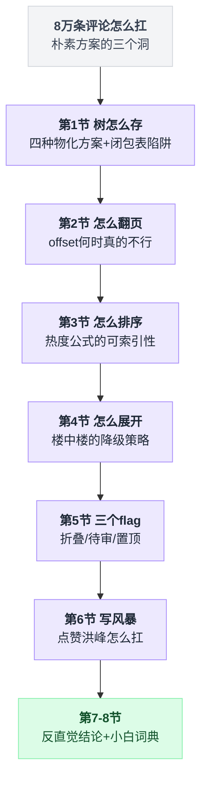
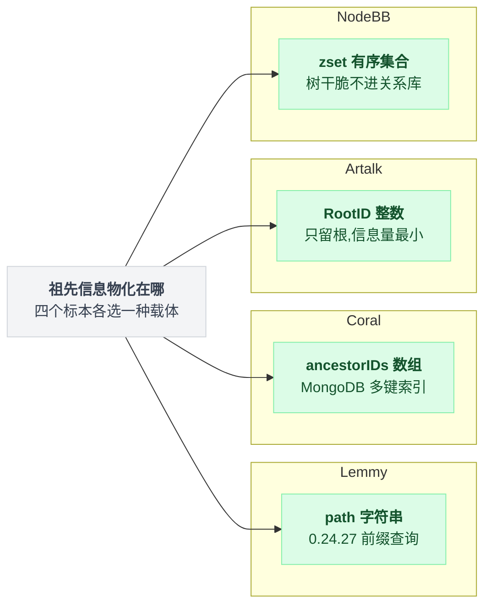
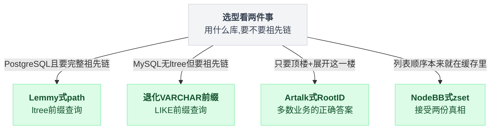
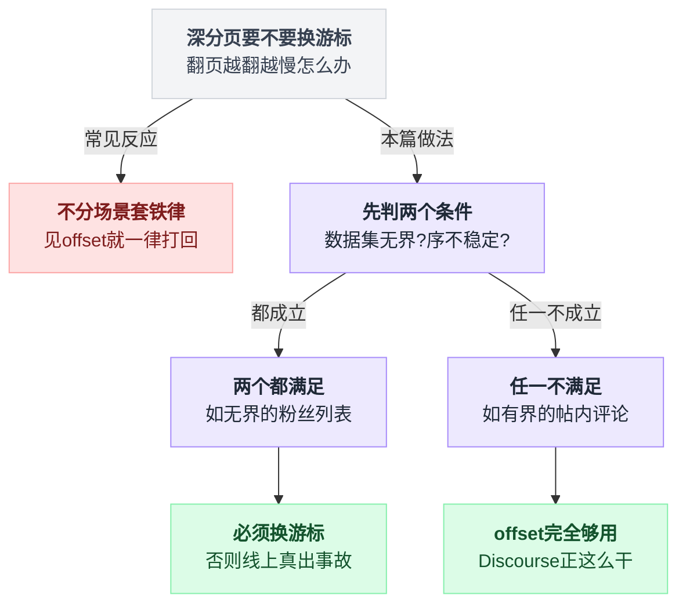
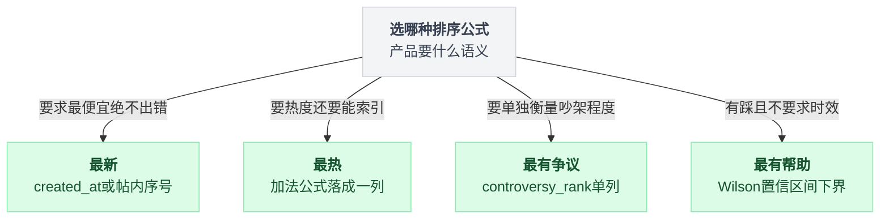
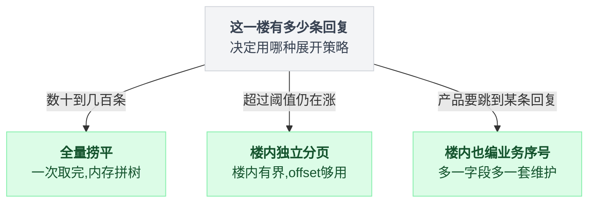
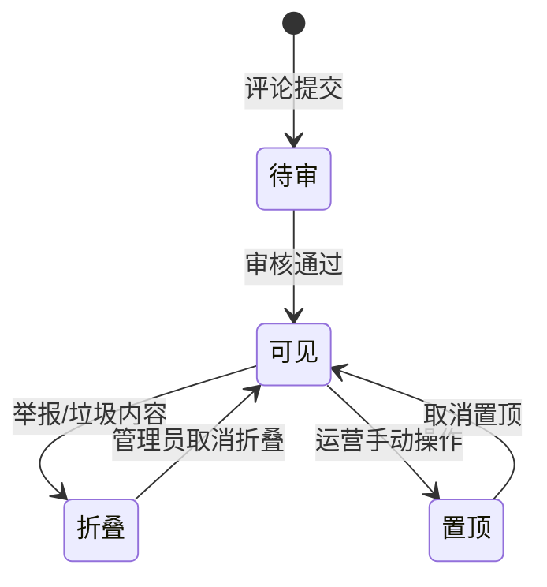
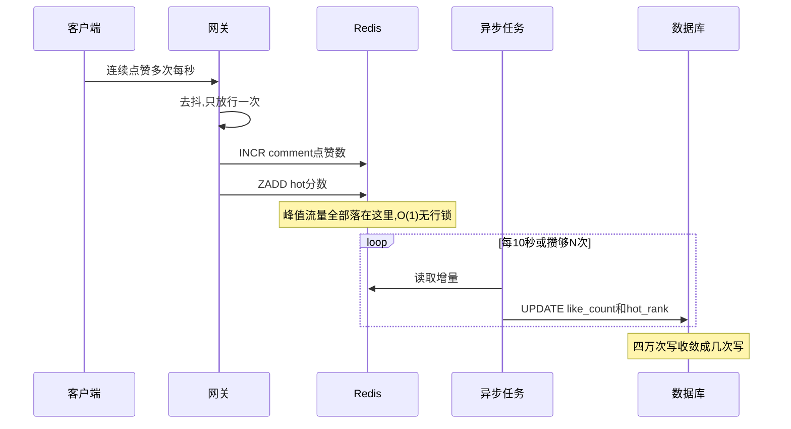

# 《评论区与楼中楼》十万条评论的树，怎么翻页才不塌（小白版）

> 一句话结论：**"深分页必须换游标"这条被背了一万遍的铁律，在帖内评论场景根本不成立**——47,596 star 的 Discourse 至今用 `offset + limit`，因为单帖评论数有天然上界，而"跳到第 N 楼"用的是业务序号而不是分页参数。更反直觉的是：本次调研的全部高星标本，**没有一个用闭包表**；而你在 B 站、微博上看到的"无限楼中楼"，在存储层普遍只是"根 + 平铺"两层，**无限嵌套是 UI 的幻觉**。
>
> 难度：★★★☆☆
>
> 写作时间：2026-08-05。文中 star 数与最后提交时间为当日实测；源码细节基于公开仓库，未经一手核实的说法在文中已标注。
>
> 读完你会懂：
> 1. 树在数据库里到底有几种存法，四个高星标本为什么各选了一种，各自被什么查询逼出来的
> 2. 面试标准答案"闭包表"为什么在真实评论系统里一个用的都没有
> 3. `offset + limit` 在什么条件下是完全正确的选择，跳楼功能真正的"游标"是什么
> 4. 为什么[第 34 篇](./34-关注关系与粉丝列表.md)会给出和本篇完全相反的分页结论，两边的分界线画在哪
> 5. 热度公式为什么好写难用——排序键必须能被索引顺着扫，这一条淘汰掉一半的公式
> 6. 折叠、待审、置顶这三个 flag 各在解决哪个具体的产品事故

---

## 目录

- [0. 先讲个故事：一条爆款微博下面 8 万条评论](#0-先讲个故事一条爆款微博下面-8-万条评论)
- [1. 树的四种存法，四个标本各占一种（本篇主菜）](#1-树的四种存法四个标本各占一种本篇主菜)
- [2. 分页：offset 到底什么时候才真的不行](#2-分页offset-到底什么时候才真的不行)
- [3. 热评排序：公式好写，可索引性难](#3-热评排序公式好写可索引性难)
- [4. 楼中楼的降级艺术：无限嵌套是 UI 幻觉](#4-楼中楼的降级艺术无限嵌套是-ui-幻觉)
- [5. 三个 flag：折叠、待审、置顶](#5-三个-flag折叠待审置顶)
- [6. 评论区的写风暴：热点帖的计数怎么扛](#6-评论区的写风暴热点帖的计数怎么扛)
- [7. 反直觉结论](#7-反直觉结论)
- [8. 一句话总结、小白词典、和前几篇的对照](#8-一句话总结小白词典和前几篇的对照)

---

## 0. 先讲个故事：一条爆款微博下面 8 万条评论

### 0.1 需求长什么样

产品给你一句话需求：

> 给内容详情页加个评论区。支持回复评论，回复还能被回复。热评排前面。翻页要顺。

你看了一眼，心想这不就是个 CRUD 吗。表都不用想：

```sql
CREATE TABLE comment (
    id         BIGINT PRIMARY KEY,
    post_id    BIGINT NOT NULL,      -- 属于哪条内容
    parent_id  BIGINT NULL,          -- 回复的是哪条评论，NULL = 直接评论内容
    user_id    BIGINT NOT NULL,
    content    TEXT,  created_at DATETIME
);
```

这叫**邻接表**（adjacency list）——每个节点只记住自己的爹。写起来是最自然的，一行 SQL 就能插，改父节点只改一个字段。上线第一周，一切安好：大部分帖子评论数在两位数，前端一次性把全部评论捞下来，在浏览器里用一个 `Map<parentId, children[]>` 拼成树，渲染。老板很满意。

然后来了一条爆款。

### 0.2 8 万条评论的那一天

一条微博，24 小时内涨到 **8 万条评论**，其中一楼下面挂了 **3,200 条回复**。你的接口开始超时。

先看最直接的一刀砍在哪里：

```
   前端"拼成树"的做法，在 8 万条评论上：

   ① 一次拉全量  SELECT * FROM comment WHERE post_id = 42  ──▶ 8 万行
      单条平均 200 字节 → 响应体 16 MB → 4G 下载 30 秒起步
      浏览器 JSON.parse 8 万个对象 → 主线程卡死 2~3 秒
      而用户只想看前 20 条。

   ② 那就分层拉？前端边渲染边请求
      第 1 层 20 条 → 每条各发一次"取子回复" = 1 + 20 = 21 次请求
      展开第二层：+ 20×N 次  ──▶ 经典 N+1，接口 QPS 被自己人打爆
```

两条路都堵死了。你决定把拼树挪到数据库里，用递归 CTE 一把梭：

```sql
WITH RECURSIVE tree AS (
    SELECT * FROM comment WHERE post_id = 42 AND parent_id IS NULL
    UNION ALL
    SELECT c.* FROM comment c JOIN tree t ON c.parent_id = t.id
)
SELECT * FROM tree;
```

写出来很爽，跑起来很惨：

```
   递归 CTE 在这条帖子上的实际行为

   第 1 轮：根评论 3,000 条 → 第 2 轮：给这 3,000 个 id 各找一次子节点
          → 第 3 轮：给上一轮结果再找一次 → …… 直到没有新行
   ┌────────────────────────────────────────────────────┐
   │  每一轮都是一次对 comment 表的 JOIN                  │
   │  轮数 = 树的最大深度；中间结果全部物化 —— 8 万行     │
   └────────────────────────────────────────────────────┘
   最要命的：你只想要前 20 条根评论及其前 3 条回复，
   但递归 CTE 必须把整棵树算完，才知道哪 20 条排在前面。
   LIMIT 20 加在最外层，等于"全表算完再扔掉 99.97%"。
```

**递归 CTE 不是慢，是它无法被 LIMIT 提前剪枝。** 分页的本质是"少算"，递归查询的本质是"必须算完"，两者天生互斥。

### 0.3 第三刀：排序和树结构打架

就算你忍了性能，产品还有一句"热评排前面"。热评意味着按点赞数、按热度分排序。但树结构要求**父节点必须排在子节点前面**——一条回复的赞数再高，也不能跑到它爹前面去，否则读者看到的是没头没尾的对话。

```
   按 like_count DESC 排全表的结果：

   #1  "楼上说得对"   (parent = 某条你还没加载的评论)  ← 读者：楼上是谁？
   #2  "哈哈哈哈"     (parent = 上面那条)             ← 读者：？
   #3  某条根评论                                     ← 终于有个能看懂的

   ┌──────────────┐        ┌──────────────┐
   │ 热度要求      │  ✗ ✗  │ 结构要求      │   排序维度和结构维度
   │ 全局重排      │◀──────▶│ 局部保序      │   在互相拉扯
   └──────────────┘        └──────────────┘
```

三刀砍完，朴素方案的尸体上有三个洞。它们就是本篇的路线图：

| 症状 | 根因 | 谁来解 |
|---|---|---|
| 拉全量卡死 / N+1 请求爆炸 | 邻接表只知道"爹是谁"，不知道"祖宗是谁" | 第 1 节：换一种树的存法 |
| 深翻页越翻越慢、越翻越乱 | 分页参数和业务位置被混为一谈 | 第 2 节：offset 什么时候真的不行 |
| 热度排序把对话打散 | 排序键要么算不出来，要么算得出来但走不了索引 | 第 3 节 + 第 4 节：排序键落列 + 两层降级 |

三节不是三选一，是层层递进——每一节都在回答"上一节为什么还不够"。全篇的台阶按这个顺序往上走：



---

## 1. 树的四种存法，四个标本各占一种（本篇主菜）

### 1.1 先把问题切开：评论树只有三种查询

所有的存储方案之争，说白了都是在这三种查询上做取舍。先记住它们，后面每种方案我都用同一把尺子量：

```
        评论树上的全部读需求，就这三条
                     │
     ┌───────────────┼────────────────┐
     ▼               ▼                ▼
  ① 取子树        ② 取祖先链        ③ 取一层
  "这条下面        "这条回复往上     "根评论第
   所有回复"        的完整对话"       21~40 条"
  展开楼中楼      邮件式引用/       主列表翻页
                  面包屑            （最高频！）

  ⚠️ ③ 的调用量通常是 ①② 的几十倍。用户 90% 的时间在刷主列表，
     只偶尔点"展开回复"。**为高频查询优化，不为炫技的查询优化。**
```

写需求只有一条，但它是海量的：**插入一条新评论**。爆款帖的评论区是**写密集**的——这个前提会在 1.6 节亲手杀死闭包表，记住它。下面四个标本，各占一种存法。

### 1.2 存法一：路径枚举 / ltree —— Lemmy

**Lemmy**（LemmyNet/lemmy，14,540 star，最后提交 2026-08-05，Rust，2026-08-05 实测）是 Reddit 式的联邦论坛。它在 `crates/db_schema/src/source/comment.rs` 里给 comment 表加了一个字段：

```rust
// crates/db_schema/src/source/comment.rs（已读源码）
pub struct Comment {
    pub id: CommentId,
    pub post_id: PostId,
    pub path: Ltree,      // ← 就是它
    // ...
}
```

`path` 长这样：`0.24.27`。规则是**祖先 id 用点连起来，以自己的 id 结尾**，最前面的 `0` 是虚拟根：

```
   帖子 42 的评论树                    每条评论的 path
   ────────────────────               ─────────────────
   ● (虚拟根 0)
   ├── 评论 24  "第一层"               path = 0.24
   │    ├── 评论 27  "回复第一层"       path = 0.24.27
   │    │    └── 评论 31 "回复的回复"    path = 0.24.27.31
   │    └── 评论 29                    path = 0.24.29
   └── 评论 25  "另一条第一层"          path = 0.25

   ★ 路径里已经写满了全部祖先信息。一个字段同时回答了
     "我爹是谁 / 我祖宗是谁 / 我在第几层"三个问题。
```

1.1 节那三种查询各怎么打：**① 取子树**用 ltree 的"是……的后代"操作符 `<@`，一条 `SELECT * FROM comment WHERE path <@ '0.24'` 配 GiST 索引，零递归零 JOIN 捞出整棵子树；**② 取祖先链**根本不用查——`0.24.27.31` 按点切开就是 `[24, 27, 31]`，一次 `IN` 取回；**③ 取一层**用 `WHERE nlevel(path) = 2`，深度是个可算的函数。

代价也很直白：

- **path 是冗余数据**，父节点一旦改挂（换 parent），整棵子树的 path 都要重写。评论区几乎不会改挂父节点，所以这个代价约等于零——这是评论负载的关键特征，1.6 节还会再用一次。
- **依赖数据库特性**。`ltree` 是 PostgreSQL 扩展，MySQL 上没有对等物，只能退化成 `VARCHAR` 前缀 `LIKE '0.24.%'`（能走索引，但深度、层级函数得自己写）。
- 路径长度有上限。Lemmy 靠产品层限制嵌套深度来兜底。

💡 `path <@ '0.24'` 能走索引，`LIKE '%.27.%'` 走不了——差别就是"前缀"和"中缀"。这条规律[PostgreSQL 系列第 08 篇《索引》](../2026-08_从真实项目学PostgreSQL/08-索引.md)整篇在讲：**索引形状决定了你的 WHERE 能怎么写**。评论树的存储选型，本质上是在选"我希望哪种 WHERE 能走索引"。

### 1.3 存法二：祖先数组 —— Coral

**Coral**（coralproject/talk，1,994 star，最后提交 2026-07-07，TypeScript，2026-08-05 实测）是 Vox Media 做的新闻网站评论系统，跑在 MongoDB 上。MongoDB 没有 ltree，于是它把路径**存成数组**——`models/comment/comment.ts` 里（已读源码）：

```typescript
// models/comment/comment.ts
interface Comment {
  id: string;
  parentID: string | null;
  ancestorIDs: string[];   // ← 从根到父的全部祖先 id
  // ...
}

// 深度直接从数组长度来
function getDepth(comment) { return comment.ancestorIDs.length; }
```

和 Lemmy 是同一个思想的两种物理表示：

```
   Lemmy（PostgreSQL）             Coral（MongoDB）
   ─────────────────────           ─────────────────────────
   path = '0.24.27'（含自身）       ancestorIDs = ["24","27"]（不含自身）
   取子树 path <@ '0.24'            取子树 { ancestorIDs: "24" }
          ltree GiST 索引                  数组多键索引 multikey
   取深度 nlevel(path)              取深度 ancestorIDs.length = getDepth()
   取父链 按 '.' split              取父链 数组 slice 即任意祖先前缀
   ──────────────────────────────────────────────────────────
   共同点：都把"祖先集合"物化到子节点身上，用一次点查换掉递归。
```

数组版有一个字符串版没有的好处：**MongoDB 的多键索引对数组元素逐个建索引**，`{ ancestorIDs: "24" }` 是精确等值匹配，不是前缀匹配——不用担心分隔符转义、不用担心 id 长度不齐（`0.9` vs `0.10` 在字符串排序里会打架，数组里不会）。代价同样是冗余：改挂父节点要重写整棵子树的数组——同样地，评论区不改挂。

### 1.4 存法三：邻接表 + 冗余根 —— Artalk

**Artalk**（ArtalkJS/Artalk，2,311 star，最后提交 2026-08-01，Go，2026-08-05 实测）是自托管的博客评论系统。它在 `internal/entity/comment.go` 里（已读源码）只加了**一个**字段：

```go
// internal/entity/comment.go
type Comment struct {
    ID     uint
    Rid    uint   // reply id：直接父评论
    RootID uint   // 所属的根评论（顶楼）
    PageKey string
    // ...
}
```

这就是本篇标题里那句"无限楼中楼是 UI 幻觉"的物理证据：

```
   Artalk 的存储视角（两层，就两层）

   ┌─ RootID = 100 ────────────────────────────────────┐
   │  ● 评论 100  Rid=0    RootID=0/100   ← 顶楼         │
   │  ├ 评论 101   Rid=100   RootID=100                 │
   │  ├ 评论 102   Rid=101   RootID=100   ← "回复的回复" │
   │  ├ 评论 103   Rid=102   RootID=100   ← 第 4 层      │
   │  └ 评论 104   Rid=100   RootID=100                 │
   │  ★ 101~104 在存储上是**平的**。谁挂谁只由 Rid 决定， │
   │    但它们同属一个 RootID 桶。                       │
   └────────────────────────────────────────────────────┘

   查询变成两条直路：
   ① 主列表    WHERE RootID = 0 ORDER BY ... LIMIT 20  （只取顶楼）
   ② 展开楼中楼 WHERE RootID = 100  一次捞平这一楼
                → 内存里用 Rid 拼树，条数是几十，随便拼
```

`RootID` 是一个**用一个整数字段换掉全部递归**的设计。它比 path/ancestorIDs 存的信息少（只知道根，不知道完整祖先链），但恰好够用——因为楼中楼的规模天然有界（一楼下面几十上千条，不是几百万条），捞平之后在内存里拼树的成本可以忽略。

**信息量最小、够用就行**，这是 Artalk 这类小体量系统的典型取舍。它的代价：想问"这条评论的第 3 层祖先是谁"，还得回表爬 `Rid`。但产品上没人这么问。

### 1.5 存法四：外挂有序集合 —— NodeBB

**NodeBB**（NodeBB/NodeBB，15,176 star，最后提交 2026-08-05，JavaScript，2026-08-05 实测）走了一条完全不同的路：**树不存在关系型数据库里，存在 Redis 风格的有序集合里**。`src/topics/posts.js`（已读源码）用的键是：

```
   tid:<tid>:posts    主题下全部帖子的 zset（score = 时间戳，member = pid）
   pid:<pid>:replies  某条帖子的回复列表，单独一个 zset

   ┌── tid:42:posts (zset) ──────────────────────────┐
   │   1754…001 pid:900 / 1754…015 pid:901 /         │
   │   1754…032 pid:902     ← 主列表就是这一个有序集合 │
   ├── pid:901:replies (zset) ───────────────────────┤
   │   pid:905, pid:911, pid:930  ← 901 楼的回复，另开 │
   └─────────────────────────────────────────────────┘

   ● 主列表和回复列表是**两个物理结构**，不是同一棵树的两次查询。
   ● 取第 21~40 条：ZRANGE tid:42:posts 20 39 —— O(log N + M)，
     和帖子总数几乎无关。
```

这套结构和[第 18 篇《排行榜与计数系统》](./18-排行榜与计数系统.md)里的排行榜是同一个零件：**zset 天然就是"有序 + 可按区间取 + 可按成员定位"三合一**。第 18 篇讲的是排行榜怎么用 `ZREVRANGE` 取 Top N，这里是把"帖子列表"当成一个按时间排序的排行榜来用。

代价：

- **两份真相**。评论正文还在数据库里，顺序在 Redis 里，两边要靠代码保持一致。删一条评论要记得从 zset 里 `ZREM`，漏了就出现"点进去 404 的幽灵楼层"。
- **没有事务性的树**。关系库里 `path` 和正文在同一行，写入是原子的；这里跨两个存储，需要补偿逻辑。

### 1.6 闭包表：面试标准答案，四个标本一个都没用

讲到这里必须处理一个尴尬事实。你去搜"数据库存树结构"，排第一的答案八成是**闭包表**（closure table）——另开一张表，把**所有祖先-后代对**都记下来：

```
   闭包表 comment_path（承接 1.2 节那棵树：24 → 27 → 31）

   ancestor  descendant  depth        查子树：WHERE ancestor   = 24
   ────────  ──────────  ─────        查祖先：WHERE descendant = 31
      24         24        0   ← 自己到自己
      24         27        1          ★ 两个方向都是单表等值查询，
      24         31        2            都能走索引 —— 理论上
      27         27        0            最优雅的方案。
      27         31        1
      31         31        0
```

它在纸面上确实最强：双向都快、改挂父节点只需重写受影响的行、不依赖任何数据库特有类型。**但本次调研的全部高星标本，没有一个在用它。** 为什么？把评论区的负载画出来就清楚了：

```
   插入一条第 5 层的回复，各方案的写放大

   邻接表 / Artalk RootID / Lemmy path / Coral 祖先数组
                   ▏ 1 行
   NodeBB zset     ▏▏ 1 行 + 1~2 次 ZADD
   闭包表          ▏▏▏▏▏▏ 1 行 + depth+1 行  ← 深度 5 → 一共 6 行

   ┌─────────────────────────────────────────────────────────┐
   │  爆款帖评论写入 QPS 峰值上千，闭包表把每一次写变成 N 次， │
   │  N = 该评论的深度 + 1。8 万条评论、平均深度 3            │
   │  → 闭包表约 32 万行，是主表的 4 倍，索引也是 4 倍。      │
   └─────────────────────────────────────────────────────────┘
```

再看闭包表最引以为傲的那个优势——**改挂父节点便宜**。评论区改挂父节点的频率是多少？

**零。** 用户不会把自己的回复从三楼搬到七楼下面，产品里根本没有这个功能。管理员偶尔合并主题算是一次批量迁移，一年几次，跑个脚本的事。

于是账就算完了：

| | 闭包表的优势 | 评论区能不能吃到 |
|---|---|---|
| 改挂子树便宜 | ✓ 强 | ✗ **这个操作根本不存在** |
| 任意方向祖先查询快 | ✓ 强 | △ 祖先链查询频率极低（1.1 节的 ②） |
| 不依赖数据库特有类型 | ✓ 有用 | △ 有用，但 `VARCHAR` 前缀方案也不依赖 |
| | **劣势** | |
| 写放大 depth+1 倍 | ✗ | **✗ 全额承受，而评论区是写密集的** |
| 额外一张表、额外索引、额外一致性 | ✗ | **✗ 全额承受** |

**优势全用不上，劣势全吃满。** 这就是四个标本集体绕开闭包表的原因，不是他们不知道有这个方案。⚠️ 这里有一条可以带走的通用判断法：**评估一个数据结构，先画出你的读写比例和操作分布，再去看它的复杂度表。** 脱离负载谈"哪种存树最好"，得到的一定是闭包表这种"纸面最优、落地最亏"的答案。同一个陷阱[第 22 篇《搜索引擎倒排索引》](./22-搜索引擎倒排索引.md)也踩过：倒排索引读极快写极贵，所以它永远是"批量构建 + 定期合并"，从不做实时逐条更新。

### 1.7 四种存法横向对比

同一把尺子量到底（✓ = 一次索引查询搞定，△ = 要绕一下，✗ = 明显吃亏）。四个标本表面上各不相同，但把它们摆到一起看，其实都在做同一件事——把祖先信息物化到子节点身上，只是选了不同的物理形状：



| | Lemmy `path`（ltree） | Coral `ancestorIDs`（数组） | Artalk `Rid`+`RootID` | NodeBB zset | 闭包表 |
|---|---|---|---|---|---|
| **存储** | PostgreSQL | MongoDB | 关系库通用 | Redis 风格 KV | 关系库通用 |
| ① 取子树 | ✓ `path <@ '0.24'` | ✓ `{ancestorIDs: "24"}` | ✓ `RootID = 100`（整层） | ✓ `pid:<pid>:replies` | ✓ 等值查 ancestor |
| ② 取祖先链 | ✓ 切字符串 | ✓ 数组 slice | ✗ 逐级爬 `Rid` | ✗ 得另存 | ✓ 等值查 descendant |
| ③ 取一层（高频） | ✓ `nlevel(path)=1` | ✓ 长度过滤 | ✓ `RootID = 0` | ✓ `ZRANGE` | △ `depth=1` 再回表 |
| 单条插入写放大 | 1 行 | 1 行 | 1 行 | 1 行 + ZADD | **depth+1 行** |
| 改挂父节点 | ✗ 重写子树 | ✗ 重写子树 | ✓ 改两字段 | ✓ 移集合 | ✓ 局部重写 |
| 依赖 | ltree 扩展 | 多键索引 | 无 | 外部 KV | 无 |
| 复杂度 | 中 | 中 | **低** | 中（两份真相） | 高 |

选型判据可以压成三句话：

- **PostgreSQL + 要完整祖先链** → Lemmy 式 `path`（MySQL 上退化成 `VARCHAR` 前缀）；
- **只要"顶楼 + 展开这一楼"两个视图** → Artalk 式 `RootID`，**这是绝大多数业务的正确答案**；
- **列表顺序本来就在缓存里** → NodeBB 式 zset，但要接受两份真相。

三句话展开就是一棵判定树：



而"闭包表"这个答案，留在面试里就好。

---

## 2. 分页：offset 到底什么时候才真的不行

### 2.1 先复习"铁律"，再打它一巴掌

人人都会背的那条：

```
   SELECT * FROM comment WHERE post_id = 42 ORDER BY id LIMIT 20 OFFSET 100000;
   ┌──────────────────────────────────────────────┐
   │ 沿索引扫过前 100,000 行 → 全部丢弃 → 取 20 行 │
   └──────────────────────────────────────────────┘
        offset 越大，白扫的行越多，耗时线性上涨；
        翻页期间有人插入新行 → 边界处漏读/重读。
   → 所以"必须换游标（keyset pagination）"：
      WHERE id > :last_id ORDER BY id LIMIT 20
```

这条铁律本身没错。错的是把它当成**无条件**的。它真正成立的前提，和大部分人凭直觉走的路岔在这里：



### 2.2 Discourse：47,596 star，至今在用 offset

**Discourse**（discourse/discourse，47,596 star，最后提交 2026-08-05，Ruby，2026-08-05 实测）是当今最主流的开源论坛，跑着无数大型社区。它的 `lib/topic_view.rb`（已读源码）里，主题内帖子分页的核心方法是：

```ruby
# lib/topic_view.rb（已读源码，示意）
CHUNK_SIZE = 20

def filter_posts_paged(page)
  page = [page, 1].max
  min = @limit * (page - 1)
  # ...
  @posts = filter_posts_by_ids(filtered_post_ids[min, @limit])
end
```

抛开 Ruby 语法细节，它做的事就是 `offset(min).limit(@limit)`，每页 `CHUNK_SIZE = 20` 条。**一个 47,596 star 的项目，在最核心的读路径上用着"面试会被挂"的 offset 分页。** 它凭什么敢？

```
   offset 深分页要出事，需要**同时**满足两个条件：
   ┌ A 数据集无界 ── offset 能翻到几十万几百万 ──────────────┐
   │ B 序不稳定   ── 已翻过的部分会插入/删除/重排，          │
   │                 同一个 offset 指向不同的东西            │
   └─────────────────────────────────────────────────────────┘
   帖内评论对号入座：
   A ✗ 单帖评论数有天然上界。8 万条已是爆款级，offset 顶天几万，
       而且没人会真的翻到第 4000 页。
   B △ 新评论追加在尾部。按时间正序时新增只影响末尾，
       不会把你已经翻过的那 100 条推走。
   ───────────────────────────────────────────────────────────
   offset 100000 白扫 10 万行 ──▶ 几百毫秒，事故
   offset   2000 白扫 2 千行  ──▶ 有 (post_id, created_at) 复合索引时
                                  索引上顺扫，亚毫秒级，噪声都算不上
   ★ 同一个"低效算法"，输入规模差 50 倍，一个是事故一个是免费。
   ★ 而 offset 还多一个游标永远给不了的能力：**能跳到任意页。**
```

### 2.3 真正的游标是业务序号，不是分页参数

Discourse 还有一个功能：从通知点进来，直接**跳到第 1,043 楼**。这用 offset 怎么做？

答案是：**它不用 offset 做**。`lib/topic_view.rb` 里另有一个方法 `filter_posts_near(post_number)`（已读源码）。注意参数名——`post_number`，**帖内序号**，也就是你在界面上看到的"#1043"。

```
   filter_posts_near(1043) 的取数窗口
                     目标楼层 #1043
     ┌────────────────────┼──────────────────────────────┐
     │   往前 1/4          │          往后 3/4            │
     └────────────────────┼──────────────────────────────┘
       #1038 …… #1042    #1043    #1044 …… #1058
   ● 前少后多：用户跳过来之后是**往下读**的，往前只需要一点点
     上下文（"楼上说了啥"）。窗口宽度由 limit 决定。
   ┌─────────────────────────────────────────────────────┐
   │ 关键：post_number 是**业务字段**，帖内单调递增、对用 │
   │ 户可见、可分享、可写进 URL。它不是 offset、不是      │
   │ page，也不是数据库主键。                             │
   └─────────────────────────────────────────────────────┘
```

这就是本节的结论：

> **真正的游标是业务序号，不是分页参数。**

`page=53` 这种参数是**易变的**——插一条、删一条，第 53 页的内容就全变了。而 `#1043` 是**钉死的**——不管前面删了多少楼，它永远指向同一条评论。所以：

- 顺序浏览用 offset：便宜、能跳页、上界可控；
- 定位跳转用业务序号：稳定、可分享、和分页参数解耦。

**两套机制并存，各干各的。** 硬要用一套统一的"游标"去同时满足这两件事，才是过度设计。

### 2.4 对照组：Coral 为什么就得用 cursor connection

同样是评论系统，Coral 走的是 GraphQL 的 cursor connection 模型，源码里有专门的 `cursorGetterFactory`（已读源码）来生成游标。它和 Discourse 的差别在哪？

```
   Discourse                       Coral
   ────────────────────────       ────────────────────────────
   论坛主题内帖子                  新闻文章下的实时评论流
   排序：帖内序号（追加式）         排序：可按 created_at / 热度
   实时性低（刷新才看到新帖）       实时性高（新评论实时插进来）
                                   ★ 排序键一旦会变（比如按热度），
                                     第 3 页就可能重复第 2 页的元素
   ───────────────────────────────────────────────────────────
   判据不是"数据量大不大"，是：
   你已经翻过的那部分**会不会重排**？会 → 游标；不会 → offset。
```

按热度排序的评论区尤其危险：某条评论在你翻第 2 页的时候被点了 500 个赞，冲到第 1 页，于是第 3 页出现了你在第 2 页见过的评论。**这不是 offset 的锅，是"用会变的键做定位"的锅**——即使你换成 `WHERE hot_score < :last_score` 的游标，分数变了照样出问题。第 3 节会讲怎么绕。

### 2.5 ⚠️ 和第 34 篇的正面冲突，必须当场讲清

本系列[第 34 篇《关注关系与粉丝列表》](./34-关注关系与粉丝列表.md)会给出一条**和本节相反**的结论：**粉丝列表的游标必须是关系表的 id，offset 绝对不能用。** 两篇都是分页，结论对着干，差别在两条线上：

| | 本篇（帖内评论） | 第 34 篇（粉丝列表） |
|---|---|---|
| ① 边界 | **有界**：单帖 8 万条已是爆款，offset 顶天几万，白扫几千行不痛 | **无界**：单个大 V 一亿粉丝，offset 能到八位数，白扫千万行必死 |
| ② 序的稳定性 | **稳定**：按帖内序号，新评论追加在尾部，已翻过的部分纹丝不动 | **变动**：随时有人关注/取关，已翻过的区间会被挤位 → 漏读、重读 |
| 结论 | `offset + limit` 够用，跳楼另用业务序号 | 必须用关系表 id 做游标，而且不能用 user_id |

```
        两条判据组成的四象限

                   序稳定             序变动
              ┌─────────────────┬─────────────────┐
     有界     │  offset ✓       │  游标（或快照）  │
              │  本篇：帖内评论  │  按热度排的评论  │
              ├─────────────────┼─────────────────┤
     无界     │  游标 ✓（便宜）  │  游标 ✓（必须）  │
              │  归档日志翻页    │  第 34 篇：粉丝  │
              └─────────────────┴─────────────────┘

   ★ "深分页必须换游标"这条铁律，其实只覆盖了右下角一格，
     却被当成了整张图的答案。
```

一句话记住差别：**本篇的数据是"钉在一根柱子上的"（属于某个帖子，所以有界、所以顺序追加）；第 34 篇的数据是"挂在一个人身上的"（可以无限增长、随时被别人改动）。** 同样一句"要不要换游标"，先问这个问题，答案自然出来。

---

## 3. 热评排序：公式好写，可索引性难

### 3.1 公式谁都会写

热度排序的直觉：**赞多的排前面，但新的也要有机会**。写成公式是十分钟的事：

`hotness = f(赞数) + g(时间)`——最朴素的 `score = likes − 0.5 × 小时数`，进阶一点 `log10(likes) + 时间衰减`。难的从来不是想公式，是**让这个公式能排序 8 万行还不炸**。看一眼朴素实现死在哪：

```
   ❌ 死法一：查询时现算
   SELECT *, (like_count - 0.5 * TIMESTAMPDIFF(HOUR, created_at, NOW())) AS hot
   FROM comment WHERE post_id = 42 ORDER BY hot DESC LIMIT 20;
   ┌──────────────────────────────────────────────────────┐
   │ hot 是表达式 → 没有索引 → 8 万行全部算一遍 → filesort │
   │ 而且它含 NOW()，每一秒结果都不同，缓存不了            │
   └──────────────────────────────────────────────────────┘

   ❌ 死法二：定时任务全量重算
   每分钟 UPDATE 全表的 hot 字段 → 热点帖每分钟写 8 万行，
   写放大直接把主库拖垮（还会把 MVCC 旧版本堆成山，
   见 PostgreSQL 系列第 09 篇讲的膨胀）
```

所以真正的题目是：**怎样让热度既能实时反映点赞，又能被一个 B+ 树索引顺着扫出来。**

### 3.2 Lobsters：把分数存成负数，就为了顺着索引扫

**Lobsters**（lobsters/lobsters，4,814 star，最后提交 2026-08-03，Ruby，2026-08-05 实测）是技术圈的小型聚合站。它在 `app/models/story.rb` 里有一个 `calculated_hotness`（已读源码），形状是：

```ruby
# app/models/story.rb（已读源码，形状示意）
HOTNESS_WINDOW = 60 * 60 * 22    # 22 小时，单位秒

# hotness ≈
#   log10(max(|score + 1| + comment_points, 1)) * sign
#   + tag_modifier
#   + author_bonus
#   + created_at / HOTNESS_WINDOW
```

> 说明：这是 Lobsters 的**故事（story）**热度公式，不是评论热度。本篇引它，是因为它把"热度排序"的四个通用零件摆得最清楚；评论热度用的是同一套形状。（此为体裁上的借用，非 Lobsters 官方对评论排序的描述。）

四个零件各干一件事：

- **`log10(...)` 对数压缩**：1000 赞和 100 赞的差距是 1，不是 900。没有 log 的话，早期爆款永远霸榜，新内容追不上。`comment_points` 让"有人在下面吵架"也算热度，不只看赞。
- **`* sign`**：`score` 是净分（赞 − 踩）。取绝对值做 log 再乘回符号，让被踩爆的内容**对称地沉下去**，而不是 log 负数直接报错。
- **`tag_modifier + author_bonus`**：人工旋钮。某些标签天然降权，新作者给点扶持。**热度公式永远需要人工干预项**——纯算法排序的社区最后都会长歪。
- **`+ created_at / HOTNESS_WINDOW`**：最关键的一项。时间不是"衰减系数"，是**加法项**。每过 22 小时时间项 +1，恰好抵消"赞数涨 10 倍"带来的 +1。翻译成人话：**一条 22 小时前的内容想和现在的新内容打平，需要 10 倍的赞。**

现在讲最工程的一刀。Lobsters 把算出来的 hotness **存成负数**存进列里：

```
   为什么要存负数？B+ 树索引是**升序**存的。

   ORDER BY hotness DESC LIMIT 20  （分数越大越热）
     → 需要反向扫索引。反向扫在很多引擎上比正向慢，
       有些组合下甚至用不上索引，退化成 filesort。

   存成负数之后：ORDER BY hotness ASC LIMIT 20  （负得越多越热）
        索引叶子（升序）
        ├─ -8.7 ─ -8.2 ─ -7.9 ─ … ─ -1.2 ─ 0.4 ─▶
           ▲最热                            最冷
           └── 顺着叶子链表从左往右走，取够 20 条就停。
               8 万行里只碰了 20 行。
```

**一个负号，换来"排序走索引"。** 这是本节的题眼：热度系统的难点不在公式，在于**排序键必须是一个能被索引的、物化的、单调的标量列**。任何需要在查询时计算的排序键，都会在数据量上来之后原形毕露。

⚠️ 顺手提醒：`ORDER BY x DESC LIMIT 20` 在现代版本的 PostgreSQL/MySQL 上大多能走反向索引扫，未必真慢。Lobsters 存负数是一个**确定性更强**的写法（不赌优化器）。你的表上到底走没走索引，`EXPLAIN` 一下就知道——[PostgreSQL 系列第 08 篇《索引》](../2026-08_从真实项目学PostgreSQL/08-索引.md)专门讲怎么看这个执行计划。

### 3.3 Lemmy：排序键落成表列，而且不下发给前端

Lemmy 的做法更直白。它在 `crates/db_schema/src/source/comment.rs`（已读源码）里，把排序分数**直接做成 comment 表的列**：

```rust
pub struct Comment {
    // ...
    #[serde(skip)]
    pub hot_rank: f64,
    #[serde(skip)]
    pub controversy_rank: f64,
}
```

两个细节都值得学：

- `hot_rank` / `controversy_rank` 是**列**，不是视图也不是表达式。可以直接 `CREATE INDEX ... (post_id, hot_rank)`，`ORDER BY hot_rank` 走索引，和 3.2 节一个道理。
- `#[serde(skip)]` 意思是序列化时跳过，**不下发给客户端**。这两个数是服务端排序用的内部量，下发出去有三个坏处：客户端会拿它显示或复算，从此你改不动公式；泄漏排序规则等于送人一份刷榜说明书；每条多几十字节 × 8 万条，白烧带宽。

`controversy_rank`（争议度）是个漂亮的补充维度：赞和踩都多的评论，热度可能一般，但争议度极高。产品上可以单开一个"最有争议"排序档，而不是把它混进热度里——**一个分数解决不了两个问题，就存两个分数。**

这两个 rank 什么时候更新，标准做法是"点赞时增量更新 + 定期批量重算时间衰减项"（此为通用工程做法，Lemmy 的具体调度细节本次未核实）。要点是：**不要在每次读的时候算，也不要每分钟全表重算。**

### 3.4 Wilson 置信区间：原理很美，工程上常常用不了

讲热评排序绕不开 Wilson 置信区间下界。先讲清它解决什么问题：

```
   评论 A：  1 个赞，  0 个踩   → 好评率 100%
   评论 B：200 个赞， 10 个踩   → 好评率 95.2%
   按好评率排：A 赢，但显然 B 更值得看。
   按净赞数排：B 赢，但一条 5 赞 0 踩的新评论永远出不来头。

   ┌─────────────────────────────────────────────────┐
   │ 本质：**样本量少的时候，比例不可信。**           │
   │ Wilson 下界：给"好评率"算置信区间，取**下界**。  │
   │   1 赞 0 踩   → 下界很低（只观察了 1 次）        │
   │   200 赞 10 踩 → 下界接近 0.95（样本足够多）     │
   └─────────────────────────────────────────────────┘
```

公式（`p̂` = 好评比例，`n` = 总票数，`z` 取 1.96 对应 95% 置信度）：

```
        p̂ + z²/2n − z·√[ p̂(1−p̂)/n + z²/4n² ]
   W = ────────────────────────────────────────
                    1 + z²/n
```

这是 Reddit 的"best"排序公开使用过的方法（第三方来源，未经官方确认其当前实现），原理无可挑剔。**然后说清它为什么在工程上常常用不了**——三个障碍，一个比一个硬：

- **✗ 它需要"踩"。** Wilson 的输入是（赞数, 踩数）两个量，而绝大多数中文产品**只有赞、没有踩**（或者踩不公开）。没有 n，分母就没了，直接不适用。
- **✗ 它没有时间维度。** Wilson 算的是"质量"不是"热度"，一条三年前的神评会永远排第一，评论区变成博物馆。硬加时间衰减，就退回 3.2 节那种拼凑公式，统计学的优雅荡然无存。
- **✗ 更新代价。** 每次投票 n 和 p̂ 都变，W 要重算——重算本身几次浮点运算而已，但"每次投票都 UPDATE 一行排序列"在热点帖上就是第 6 节的写风暴。
- **✓ 它真正好用的地方**：有正负反馈、且不要求时效性的排序，比如商品评价的"最有帮助"、知识库答案排序。

于是格局清楚了：

| 排序档 | 用什么 | 为什么 |
|---|---|---|
| 最新 | `created_at` 或帖内序号 | 最便宜，天然可索引，绝不出错 |
| 最热 | Lobsters 式加法公式落成一列 | 有时间项，能索引，能人工调旋钮 |
| 最有争议 | Lemmy 式 `controversy_rank` 单列 | 一个分数别扛两个语义 |
| 最有帮助（有踩） | Wilson 下界 | 小样本不虚高，但别指望它反映时效 |

**一句话：公式的选择由产品语义决定，公式的可用性由"能不能变成一个可索引的列"决定。** 后者淘汰掉的候选，比前者多得多。四档怎么选，画成判定树是这样：



---

## 4. 楼中楼的降级艺术：无限嵌套是 UI 幻觉

### 4.1 无限嵌套的物理极限

先算笔账，看"真·无限嵌套"在前端是什么下场：

```
   每层缩进 24px，手机屏宽 375px：
   层级   1    2    3    4    5    6    7    8    …   15
   缩进   0   24   48   72   96  120  144  168   …   336
   剩余  375 351  327  303  279  255  231  207   …    39 px ← 放得下 2 字
   第 8 层往后正文区已经窄到没法读 → **没有任何产品真做无限缩进**。
```

主流做法是"**两层封顶 + 语义标注**"：

```
   用户看到的                        存储里的
   ─────────────────────────        ─────────────────────
   ┌─ 顶楼 @张三 ──────────┐        RootID = 0（自己是根）
   │  "这个方案有问题"      │
   │  ├ @李四: 哪里有问题？  │        RootID=100, Rid=100
   │  ├ @张三 回复 @李四:    │        RootID=100, Rid=101
   │  │   "并发那块"         │          ← 视觉上还是第 2 层！
   │  ├ @王五 回复 @张三:    │        RootID=100, Rid=102
   │  │   "同意"             │          ← 视觉上还是第 2 层！
   │  └ 共 3,200 条回复 ▸    │        COUNT(*) WHERE RootID=100
   └────────────────────────┘
   ★ 第 3 层往后的父子关系全部退化成正文里的 "@某某" 前缀 ——
     它是**语义**，不是**缩进**。Artalk 的 RootID 为它量身定做。
```

这就是标题那句话的完整含义：**你以为的无限楼中楼，是"平铺 + @提及"演出来的**。存储层只要知道"这条属于哪一楼"（RootID）和"直接回复了谁"（Rid），前端就能演出无限层。

### 4.2 摘要式降级：NodeBB 的 replies 字段

NodeBB 在 `src/topics/posts.js`（已读源码）里维护 `pid:<pid>:replies` 这个 zset。有了它，主列表返回时可以顺手带一份**回复摘要**，而不是回复正文：

```
   主列表的每一条，附带的不是回复列表，是回复的"名片"

   ┌──────────────────────────────────────────────┐
   │  @张三  "这个方案有问题"      ♥ 1.2k          │
   │  │ (头像)(头像)(头像) 等 3,200 人回复 ▸  │    │ ← 摘要
   └──────────────────────────────────────────────┘
      头像 = ZRANGE pid:901:replies 0 2 取 3 个 pid 再批量取头像
      计数 = ZCARD  pid:901:replies（一次 O(1)）

   对比"每条根评论都带 3 条回复正文"：
   20 × 3 × 200 字节 = 12 KB 正文  vs  20 × (3 URL + 1 计数) ≈ 2 KB
   响应体小 6 倍，而且用户 95% 的情况下压根不点开。
```

这是典型的**产品级降级**：不是技术上做不到带正文，是**带了也没人看**。同样的思路[第 06 篇《直播弹幕与广播》](./06-直播弹幕与广播.md)讲过——弹幕高峰期主动丢弃部分弹幕，因为屏幕本来就放不下。**"用户看不见的东西不要传"，是这两篇共享的第一性原理。**

### 4.3 三种展开策略

点开"3,200 条回复"之后怎么给？三种策略，按实现成本排：

| 策略 | 做法 | 适用 | 代价 |
|---|---|---|---|
| 全量捞平 | `WHERE RootID = 100` 一次全取，内存拼树 | 回复数 < 几百（绝大多数楼） | 有 3,200 条的楼会返回大包 |
| 楼内独立分页 | `WHERE RootID = 100 ORDER BY id LIMIT 20 OFFSET n` | 通用 | 需要一个只在楼内有效的分页游标 |
| 楼内也上业务序号 | 给楼中楼也编号 `#100-15` | 需要"跳到某条回复"的产品 | 多一个字段，多一套维护 |

绝大多数系统用前两种的组合：**默认全量捞平，超过阈值（比如 100 条）自动切成楼内分页**。而且注意：楼内分页照样可以用 offset——它满足第 2.2 节的两个条件，有界（一楼几千条顶天）且序稳定（按时间追加）。三种策略按回复数分岔选择：



---

## 5. 三个 flag：折叠、待审、置顶

评论表上有三个不起眼的布尔字段，各自对应一次真实的产品事故。Artalk 的 `internal/entity/comment.go` 里就有这一组（已读源码，字段命名以官方仓库为准）：

| flag | 战场 | 产品困境 | 解法 | 一句话本质 |
|---|---|---|---|---|
| `IsCollapsed`（折叠） | **已经发出去的垃圾内容** | 删了被骂删帖，留着污染评论区 | 不删，折叠：内容还在、点一下能看，但不占屏幕、不参与排序 | "软删除"的社区版：**保留证据，降低曝光** |
| `IsPending`（待审） | **还没发出去的内容** | 先发后审有窗口期，先审后发掉体验 | 发出去了但只有作者自己看得见，审过了才对所有人可见 | 第 33 篇的接口：**审核判决落在这个 flag 上** |
| `IsPinned`（置顶） | **排序系统的后门** | 官方公告必须在最上面，但它的热度是 0 | `ORDER BY is_pinned DESC, hot_rank ASC` | 自动排序系统必须给运营留手动覆盖位，**否则运营会用刷赞实现置顶** |

三个 flag 各管一段独立的生命周期，画成状态机比表格更看得出转移条件：



三个 flag 对读路径的影响，是一张容易被忽略的账：

```
   SELECT ... FROM comment WHERE post_id = 42
     AND is_pending = false  AND is_collapsed = false
   ORDER BY is_pinned DESC, hot_rank ASC LIMIT 20;

   ┌────────────────────────────────────────────────────────┐
   │ ⚠️ 只建 (post_id, hot_rank) 的话，两个 flag 条件是     │
   │   **回表之后再过滤**的：要凑够 20 条可能得扫 2000 行。 │
   │   被刷屏机器人灌了 5 万条待审评论的帖子上，            │
   │   这条 SQL 退化成近似全帖扫描。                        │
   │ 解法：过滤列前置进索引 —— (post_id, is_pending,        │
   │   is_collapsed, hot_rank)，或用部分索引：              │
   │   CREATE INDEX ... WHERE is_pending=false              │
   │                     AND is_collapsed=false             │
   └────────────────────────────────────────────────────────┘
```

💡 "等值条件在前、排序列在后"是复合索引最经典的排列法则，[PostgreSQL 系列第 08 篇《索引》](../2026-08_从真实项目学PostgreSQL/08-索引.md)讲透了为什么。这里想强调的是另一件事：**每加一个产品 flag，都在给你的排序索引加一列。** 产品经理说"再加个'仅粉丝可见'吧"的时候，它的真实成本是一次索引重建加一次执行计划变更，不是一个布尔字段。

`IsPending` 这个 flag 是[第 33 篇《敏感词过滤与内容审核》](./33-敏感词过滤与内容审核.md)和本篇的交接点：那一篇讲**怎么判**（归一化链、DFA、审核队列打分），本篇讲**判完之后这个结论存在哪、怎么不拖垮读路径**。两篇拼起来才是完整的一条评论生命周期。

---

## 6. 评论区的写风暴：热点帖的计数怎么扛

### 6.1 一条爆款帖上的写请求分布

回到开场那条微博，它带来的写入不止"插入评论"这一种：

```
   一条爆款帖，峰值 5 分钟内的写请求构成（量级示意，非实测）

   插入评论     ████                   ~800 条/分钟
   点赞/取消赞  ████████████████████   ~40,000 次/分钟   ← 50 倍
   热度分更新   ████████████████████   每次点赞都要动

   ┌──────────────────────────────────────────────────────┐
   │ 最凶的不是评论本身，是**点赞**，而点赞会连锁触发      │
   │ 热度分更新（第 3 节的排序列）：                       │
   │   UPDATE comment SET like_count = like_count + 1,     │
   │          hot_rank = <重算>  WHERE id = 901;           │
   │ → 同一行 40,000 次/分钟 = 行锁排队，事务全堵在那一行   │
   └──────────────────────────────────────────────────────┘
```

这个形状你在[第 18 篇《排行榜与计数系统》](./18-排行榜与计数系统.md)里已经见过一模一样的：**单点热 key 的写风暴**。第 18 篇讲的是排行榜的计数怎么扛，本篇是同一套药方换个场景吃：

```
   三级缓冲，从写风暴到数据库

   ① 点赞去抖（客户端/网关）：同一用户 1 秒内连点 5 次只发 1 次
      ────────────────────────────────▶ 削掉无效流量
   ② 计数落 Redis 不落库：INCR comment:901:likes（O(1)，无行锁）
      ZADD post:42:hot 901 <score>（排序也在 Redis 里）
      ────────────────────────────────▶ 扛住峰值 QPS
   ③ 异步回写：每 10 秒或攒够 N 次，一次 UPDATE 写回真值
      ────────────────────────────────▶ 40,000 次写 → 6 次写

   ⚠️ 代价：数据库里的 like_count 永远落后几秒。产品完全接受 ——
      没人会因为赞数差 3 个而投诉。**计数是展示字段，不是账。**
```

三级缓冲背后是谁先谁后的时序问题，摊开看更清楚：



### 6.2 读路径也要挡：热点帖的缓存形状

写扛住了，读还没完——爆款帖的第一页评论会被请求几十万次，每一次都打数据库是不划算的：

```
   缓存粒度的三种切法

   ① 整页缓存  post:42:page:1
      ✓ 命中率最高  ✗ 任何一条评论变了整页失效
      → 爆款帖上"整页失效"每秒发生数十次，等于没缓存
   ② id 列表   post:42:hot:ids → [901, 905, ...]
      ✓ 列表变化频率 << 单条内容变化频率  ✗ 还要再批量取正文
   ③ 单条缓存  comment:901
      ✓ 失效粒度最细  ✗ 一页 20 条 = 20 次查询（MGET 批量解决）

   ★ 主流选择是 ② + ③：列表（易变的顺序）短 TTL 或主动更新
                    ＋ 正文（几乎不变的内容）长 TTL
```

💡 [第 15 篇《缓存三兄弟与缓存一致性》](./15-缓存三兄弟与缓存一致性.md)讲的是缓存击穿/穿透/雪崩三兄弟和一致性策略，本篇给它一个具体的落地形状：**把一个对象按"变更频率"拆成两块分别缓存**。评论正文一发出来基本不变（TTL 可以 1 小时），排序列表每几秒就动（TTL 5 秒或主动刷新）——绑在一起缓存，等于让最不稳定的那部分决定了整体的命中率。

### 6.3 ⚠️ 上线前的自查清单

接一个评论系统之前，挨个问这几条：

1. 主列表 SQL 的 `EXPLAIN` 长什么样？有没有 filesort？flag 过滤在索引里还是回表后？
2. 单帖评论数的上界是多少？超过这个数产品上会发生什么（自动关闭评论？归档？）——**没有上界的 offset 才是真的危险**。
3. 排序键是一个物化的列，还是一个查询时算的表达式？
4. 点赞路径上有没有直接 `UPDATE` 数据库同一行？峰值 QPS 是多少？
5. 展开楼中楼时，最大的那一楼有多少条回复？会不会一次返回几 MB？
6. 缓存是按整页存的吗？如果是，爆款帖上它的实际命中率是多少？

六条里答错任意一条，爆款来的那天你就会在群里看到自己的名字。

### 6.4 诚实说明：本篇没覆盖的部分

按本系列的规矩，把边界说清楚：

- **waline** 是中文圈常见的轻量评论系统，本次调研只核实了仓库元数据，**模块路径未核实**，因此本篇没有引用它的任何源码细节。
- **bbs-go** 作为中文论坛标本本次**未深入阅读源码**，同样未引用。
- 第 3.3 节关于 Lemmy `hot_rank` **具体更新时机与调度方式**的描述属于通用工程做法，未在源码中逐行核实。
- 第 3.2 节引用的 Lobsters 公式来自 `app/models/story.rb`，是**故事**热度而非评论热度；本篇把它当作热度公式的通用范本使用。
- 全文没有给出任何精确 benchmark 数字。文中出现的时延、体积均为按常识推算的量级示意（如"16 MB 响应体""亚毫秒"），不是实测结果。

---

## 7. 反直觉结论

### ⚠️ 1. "深分页必须换游标"是一条被过度泛化的铁律

它成立需要两个条件同时满足：数据集无界 + 序不稳定。帖内评论两个都不满足——单帖评论数有天然上界，新评论追加在尾部。所以 47,596 star 的 Discourse 至今在 `filter_posts_paged` 里用 `offset(min).limit(@limit)`，`CHUNK_SIZE = 20`（2026-08-05 实测，已读源码）。

而 offset 有一个游标永远给不了的能力：**跳到任意页**。放弃它去换一个根本不会发生的性能问题的解药，是纯亏。

### ⚠️ 2. 真正的游标是业务序号，不是分页参数

Discourse 的跳楼功能走 `filter_posts_near(post_number)`——`post_number` 是**帖内业务序号**，用户看得见、可分享、写得进 URL，且不随删帖变化，取数窗口是"目标楼层往前 1/4、往后 3/4"（跳过来的人是往下读的）。顺序浏览用 offset、定位跳转用业务序号，**两套机制并存**；硬要用一套统一的游标同时干这两件事，才是过度设计。

### ⚠️ 3. 闭包表是纸面最优解，四个高星标本一个都没用

Lemmy 用 `path: Ltree`，Coral 用 `ancestorIDs: string[]`，Artalk 用 `Rid` + `RootID`，NodeBB 用 zset——**没有一个用闭包表**（2026-08-05 实测，均为已读源码）。

原因是负载形状：评论区**写多、树浅、几乎不重挂父节点**。闭包表的杀手锏是"改挂子树便宜"，而评论区**根本没有改挂这个操作**；它的代价是"每插一条写 depth+1 行"，而评论区的写正是峰值所在。**优势一分吃不到，劣势全额承受。**

### ⚠️ 4. "无限楼中楼"在存储层只有两层

Artalk 的 `RootID` 把整楼平铺在一个桶里；NodeBB 主列表只带回复的头像和计数。第 3 层往后的父子关系，是靠正文里的 `@某某` 演出来的**语义**，不是缩进。物理原因也很朴素：手机屏 375px，每层缩进 24px，第 8 层正文区只剩 200px 不到。**没有产品真的做无限缩进，所以也没有系统真的存无限层。**

### ⚠️ 5. 热度排序的难点不是公式，是可索引性

公式十分钟就能想出来，但只要它含 `NOW()` 或者是个查询时表达式，就注定要 filesort 全表。Lobsters 把 hotness **存成负数**塞进列里，就为了 `ORDER BY ASC` 能顺着 B+ 树叶子扫过去；Lemmy 把 `hot_rank` / `controversy_rank` 落成表列，还加 `#[serde(skip)]` 不下发给客户端。

**排序键必须是一个物化的、可索引的标量列。** 这一条淘汰掉的候选公式，比"产品觉得不好用"淘汰掉的多得多——Wilson 置信区间就是被工程条件（没有踩、没有时间维度）而不是被数学淘汰的。

---

## 8. 一句话总结、小白词典、和前几篇的对照

### 一句话总结

> **评论区的全部难题可以压成三句话：树用"把祖先物化到子节点身上"的方式存（path / 祖先数组 / RootID 任选，就是别用闭包表）；分页在有界且序稳定的场景下 offset 完全够用，跳楼另用业务序号；排序键必须是一个能被索引顺着扫的物化列——而你以为的无限楼中楼，存储层只有两层。**

### 小白词典

| 词 | 一句人话 |
|---|---|
| **邻接表** | 每条评论只记"我爹是谁"（`parent_id`）。写最简单，但查子树要递归 |
| **路径枚举 / ltree** | 把从根到自己的全部祖先 id 拼成一个字符串存着（`0.24.27`）。查子树 = 前缀匹配 |
| **祖先数组** | 同上，但物理形式是数组（`["24","27"]`）。MongoDB 上的等价物，深度 = 数组长度 |
| **RootID** | "我属于哪一楼"。一个整数字段换掉全部递归，代价是不知道完整祖先链 |
| **闭包表** | 把所有"祖先-后代"对都存成行。双向查询都快，但每插一条评论要写 depth+1 行 |
| **offset 深分页** | `LIMIT 20 OFFSET 100000`：数据库白扫前 10 万行再丢掉。offset 小的时候完全无害 |
| **业务序号** | 帖内递增、用户可见的楼层号（`#1043`）。跳转定位用它，不用分页参数 |
| **热度公式的时间项** | 时间是加法项不是衰减系数：Lobsters 每过 `HOTNESS_WINDOW`（22 小时）加 1，恰好抵消赞数涨 10 倍 |
| **Wilson 下界** | 给好评率算置信区间取下界，防止"1 赞 0 踩 = 100%"虚高。要求有踩、且不管时效 |
| **折叠 / 待审 / 置顶** | 分别对付"已发的垃圾""未发的风险""排序系统的后门"。每加一个都要进排序索引 |

### 和前几篇的对照

1. **vs [第 34 篇《关注关系与粉丝列表》](./34-关注关系与粉丝列表.md)**：同样是分页，**结论正好相反**——那边说"游标必须是关系表 id，offset 绝对不能用"，本篇说"offset 完全够用"。差别在两条线上：**有界 vs 无界**（单帖 8 万条 vs 单人一亿粉），**稳定序 vs 变动序**（评论追加在尾部 vs 关注/取关随时挤位）。两篇合起来才是完整的分页判据：先问这两个问题，再决定用哪套。
2. **vs [第 18 篇《排行榜与计数系统》](./18-排行榜与计数系统.md)**：同样是"单点热 key 的写风暴"，那边是全站榜单的分数更新，这边是爆款帖的点赞计数。药方一样（Redis 计数 + 攒批回写），但优先级不同：排行榜的分数**就是产品本身**，评论的 `like_count` 只是展示字段——所以本篇敢让它落后几秒，那篇不敢。NodeBB 用 zset 存帖子列表，更是把排行榜的零件直接拿来当评论列表用。
3. **vs [第 05 篇《微博热点Feed流》](./05-微博热点Feed流.md)**：同一条爆款微博的两个面。那篇讲这条微博**怎么送到一亿人眼前**（推拉之争、写扩散边界），本篇讲它**被送到之后，下面那 8 万条评论怎么存怎么翻**。Feed 是"一条内容 × N 个读者"，评论是"一个读者 × N 条内容"——读写比例正好倒过来，所以结论也几乎处处相反。
4. **vs [第 06 篇《直播弹幕与广播》](./06-直播弹幕与广播.md)**：同样是"用户看不见的东西不要传"。弹幕高峰主动丢弃，因为屏幕放不下；评论区主列表只带头像和计数不带回复正文，因为 95% 的人不点开。区别在可恢复性：**弹幕丢了就永远没了，评论只是没加载——点一下还在。** 所以评论的降级可以做得更激进。
5. **vs [第 33 篇《敏感词过滤与内容审核》](./33-敏感词过滤与内容审核.md)**：一条评论生命周期的上下半场。那篇讲**怎么判**（归一化链、DFA、审核队列打分），本篇讲**判完之后落在哪**——`IsPending` / `IsCollapsed` 两个 flag，以及它们如何反过来改变主列表的索引形状。审核结论不是终点，是读路径上多出来的两个 WHERE 条件。
6. **vs [PostgreSQL 系列第 08 篇《索引》](../2026-08_从真实项目学PostgreSQL/08-索引.md)**：本篇是它的一份应用题合集。`path <@` 能走索引而 `LIKE '%.27.%'` 不能、Lobsters 存负数为了顺扫叶子、flag 过滤要不要前置进复合索引——三个不同的场景，问的是同一个问题：**我这条 WHERE 和 ORDER BY，索引接不接得住。** 存储选型这件事，说到底是在选"我希望哪种查询能走索引"。
