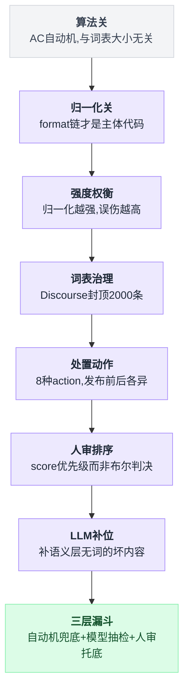
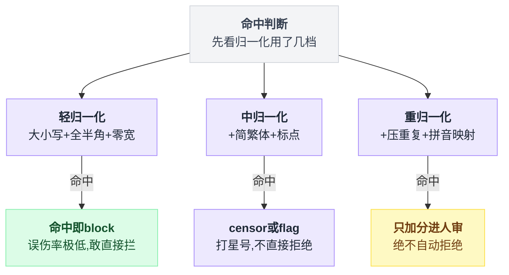
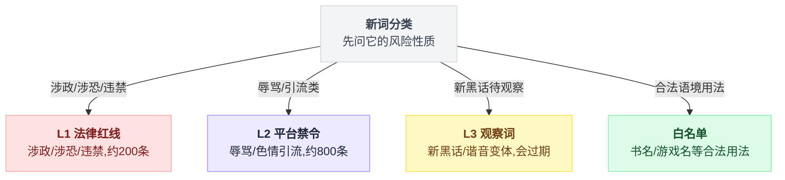
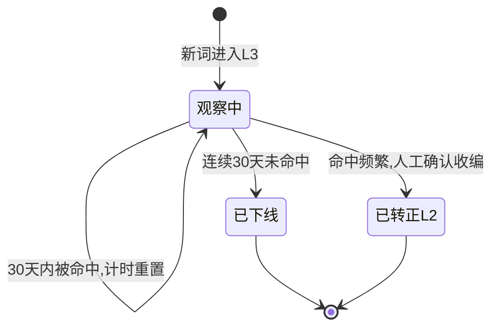
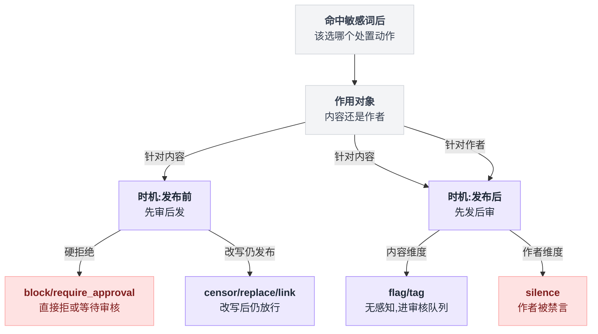

# 《敏感词过滤与内容审核》真正的战场在自动机之前（小白版）

> 一句话结论：**敏感词组件的主体代码不是匹配算法，是归一化——houbb/sensitive-word 的核心是六个 `ignoreXxx` 开关和一整条 format 链，DFA 只是最后一步，绕过永远发生在进入自动机之前。另一条更扎心的：Discourse 主动给词表设了 `MAX_WORDS_PER_ACTION = 2000` 的上限——"词越多召回越高"是错觉，误伤率和运营成本随词表线性上升。**
>
> 难度：★★★☆☆
>
> 写作时间：2026-08-05。文中 star 数与最后提交时间为当日实测；houbb/sensitive-word 与 discourse/discourse 的源码细节基于已读源码，toolgood/ToolGood.Words 的目录结构本次核实失败（raw 路径连续 404），文中只引用其 star 与提交时间，任何类名/路径均已标注"路径未核实"。不提供任何未实测的 benchmark 数字。
>
> 读完你会懂：
> 1. 一条"看起来完全正常"的评论怎么用肉眼看不见的字符躲过关键词过滤，以及另外七种绕过手法各长什么样
> 2. Trie → DFA → AC 自动机三步是怎么把匹配复杂度压到 O(文本长度)、与词表大小无关的——以及为什么这恰恰说明它不是瓶颈
> 3. houbb/sensitive-word 的 format → check → allow/deny 三条链各干什么，六个 `ignoreXxx` 开关里哪一个最容易把"哈哈哈"打成敏感词
> 4. 为什么纯词表仓库和算法库的 star 是同一个量级，以及 Discourse 为什么要给词表设 2000 条的硬上限
> 5. Discourse 的 8 种 action 怎么天然构成"先审后发 vs 先发后审"的开关矩阵，Reviewable 的 score 怎么算、认领锁防的是什么
> 6. LLM 审核改变了什么、没改变什么，为什么最终形态一定是"DFA 兜底 + 模型抽检 + 人审托底"的三层漏斗

---

## 目录

- [0. 开场：一条你看不见的评论](#0-开场一条你看不见的评论)
- [1. 算法这一关，其实早就解决了](#1-算法这一关其实早就解决了)
- [2. 真正的主体：归一化链（本篇主菜）](#2-真正的主体归一化链本篇主菜)
- [3. 词表：稀缺的是数据和运营，不是代码](#3-词表稀缺的是数据和运营不是代码)
- [4. 拦不拦之外：Discourse 的 8 种处置动作](#4-拦不拦之外discourse-的-8-种处置动作)
- [5. 机审到人审的交接：Reviewable 队列](#5-机审到人审的交接reviewable-队列)
- [6. LLM 进场之后：改变了什么，没改变什么](#6-llm-进场之后改变了什么没改变什么)
- [7. 反直觉结论](#7-反直觉结论)
- [8. 一句话总结、小白词典、和前几篇的对照](#8-一句话总结小白词典和前几篇的对照)

---

## 0. 开场：一条你看不见的评论

### 0.1 那条评论

你负责一个日活百万的社区。运营早上把一条评论截图甩到群里：

> 这个傻子活该

底下已经有 200 个赞。运营问：敏感词库里明明有"傻子"，为什么没拦住？

你把这条评论从数据库里捞出来，用十六进制打开：

```
  用户看到的：    这  个  傻  子  活  该
  实际存的：      这  个  傻 [??] 子  活  该
                            └─ U+200B ZERO WIDTH SPACE
                               宽度为 0，浏览器什么都不画
  逐字符 codepoint：
  ┌──────┬──────┬──────┬────────┬──────┬──────┬──────┐
  │ U+8FD9│U+4E2A│U+50BB│ U+200B │U+5B50│U+6D3B│U+8BE5│
  │  这   │  个  │  傻  │ (不可见)│  子  │  活  │  该  │
  └──────┴──────┴──────┴────────┴──────┴──────┴──────┘
                          ▲
             你的 contains("傻子") 在这里断掉了
```

发帖的人在"傻"和"子"中间插了一个**零宽空格**。屏幕上什么都看不出来，字符串里它就是一个货真价实的字符。你的过滤器拿"傻子"去匹配，得到的是"傻​子"——两个字被一个隐形字符隔开，匹配失败。

它绕过的不是你的算法。你的算法一点毛病没有，它是对着一段**你以为是"傻子"、实际不是"傻子"的字符串**做的正确判断。

### 0.2 最朴素的做法，以及它死在哪

刚上手的人都会这么写：

```java
for (String word : sensitiveWords) {
    if (text.contains(word)) {
        return REJECT;
    }
}
```

上线第一周它工作得很好。然后用户开始玩：

| 绕过手法 | 原词 | 变形后 | 你的 `contains` 看到的 |
|---|---|---|---|
| 拼音 | 傻子 | `shazi` / `sz` | 一串英文字母 |
| 谐音 | 傻子 | 沙子、鲨子、啥子 | 完全不同的汉字 |
| 火星文 | 傻子 | 傻孒、僌子 | 生僻字/异体字 |
| 全角半角 | tmd | `ｔｍｄ`（U+FF54…） | 三个不同的 codepoint |
| emoji 夹字 | 傻子 | 傻🙂子 | 中间多了 4 字节 |
| 零宽字符 | 傻子 | 傻`​`子 | 中间多了不可见字符 |
| 重复字 | 傻子 | 傻傻子、傻子子 | 多了一个字 |
| 插标点 | 傻子 | 傻.子、傻 子、傻-子 | 中间多了标点/空格 |
| 繁简混写 | 后台 | 後台 | 不同汉字 |
| 数字谐音 | 加微信 | 加威`❤`信、+V | 符号替换 |

十种手法，`contains` 一种都挡不住。而且注意：**这十种手法里，只有"谐音"和"火星文"需要你往词表里加词，其余八种全都是同一个词的字符层面变形。**

这是本篇的题眼。新手的第一反应是"词表不够全，我再加词"——把"傻​子"加进词表？零宽字符有 5 个常用的，插在 2 个位置，光这一种手法就是 10 种变体；再叠上全角、重复、标点，一个"傻子"能炸出成千上万个变体。**词表是加不完的，因为变形是组合爆炸的。**

### 0.3 于是你换了个方向

正确的方向只有一个：**在匹配之前，把所有变形打回原形。**

```
        错的路（词表膨胀）                  对的路（归一化）
   ────────────────────────           ──────────────────────────
    词表: 傻子                          输入: 傻​子
          傻​子                              │ 剥离零宽字符
          傻 子 / 傻.子                        │ 全角转半角 / 繁转简
          傻傻子 / ｓｈａｚｉ                   │ 大写转小写
          ……（∞）                             ▼
              │                          归一化后: 傻子
              ▼                                ▼
        词表爆炸，永远漏               词表只需要 1 条: 傻子
```

右边这条路，就是本篇的主菜（第 2 节）。而左边那个"匹配"动作本身——Trie、DFA、AC 自动机——**在 1975 年就被解决了**，第 1 节我们花一节讲完它，然后把它请下神坛。

### 0.4 本篇路线图

| 症状 | 谁来解 | 第几节 |
|---|---|---|
| 词多了之后一条一条 `contains` 太慢 | AC 自动机（O(文本长度)，与词表无关） | 第 1 节 |
| 用户用零宽/全角/重复字绕过 | 归一化链（format 链 + 六个 `ignoreXxx`） | 第 2 节（主菜） |
| 归一化开满之后开始误伤正常用户 | 召回率与误伤率的权衡、词表上限 | 第 2、3 节 |
| 命中了之后到底该怎么处置 | Discourse 的 8 种 action | 第 4 节 |
| 拿不准的内容谁来最终拍板 | Reviewable 优先级队列 | 第 5 节 |
| 语义级的坏内容（阴阳怪气、暗示）根本没有词 | LLM 抽检 + 三层漏斗 | 第 6 节 |

八节内容其实是一条单向递进的论证链，先摆出来，读起来更有底：



---

## 1. 算法这一关，其实早就解决了

先把这一节的结论摆在最前面，省得你读得太投入：**这一节讲的东西，在一个成熟的敏感词组件里占不到 20% 的代码量，也几乎从来不是线上问题的原因。** 但你必须懂它，因为不懂它你就会在错误的地方优化。

### 1.1 第一步：Trie（前缀树）

`contains` 的问题在于"一个词扫一遍全文"，10000 个词就扫 10000 遍。Trie 的想法是：**把所有词按公共前缀合并成一棵树，文本只扫一遍。**

假设词表是 `["他妈的", "妈的", "的士"]`：

```
                  (root)
                 /   |   \
              他 /   |妈  \的
               ●     ●     ●
               |     |     |
             妈 |   的|    士|
               ●     ●(妈的) ●(的士)
               |
             的 |
               ●(他妈的)

   ● = 节点     (xxx) = 该节点是某个词的终点
```

从文本的每个位置出发，顺着树往下走，走到带标记的节点就是命中。比 10000 次 `contains` 快很多——但还不够好：**从"第 0 个字"走失败了，得退回来从"第 1 个字"重新走**。最坏情况仍然是 O(文本长度 × 最长词长)。

顺便解释一个中文技术圈的历史包袱：很多老文章里写的"DFA 敏感词算法"，实际实现就是这棵 Trie（每个节点是一个 `HashMap<Character, Node>`，逐字符转移）。**它和教科书里的 DFA 概念不完全是一回事，但这个叫法已经积重难返了**，你在国内代码库里看到"DFA 过滤器"，心里换算成"Trie 逐字符匹配"就对了。

### 1.2 第二步：AC 自动机 —— 给 Trie 加上 fail 指针

Trie 的浪费在于"失败就退回原点"。Aho-Corasick 自动机（1975 年）补了一根线：**每个节点挂一个 fail 指针，指向"当前已匹配后缀"在树里能对应的最长节点**。匹配失败时不退回根，而是沿 fail 指针滑过去，已经读过的字符一个都不重读。

还是那三个词，画上 fail 指针：

```
                        ┌─────────── root ───────────┐
                        │        (状态 0)             │
                    他  │          妈 │          的  │
                        ▼             ▼              ▼
                     ┌─────┐       ┌─────┐       ┌─────┐
                     │  1  │       │  4  │       │  6  │
                     │ 他  │       │ 妈  │       │ 的  │
                     └──┬──┘       └──┬──┘       └──┬──┘
                    妈  │          的 │          士 │
                        ▼             ▼              ▼
                     ┌─────┐       ┌─────┐       ┌─────┐
                     │  2  │╌╌╌╌╌▶│  5  │       │  7  │
                     │ 他妈│ fail  │妈的★│       │的士★│
                     └──┬──┘       └──┬──┘       └─────┘
                    的  │          fail╎
                        ▼             ╎
                     ┌─────┐          ╎
                     │  3  │╌╌╌╌╌╌╌╌╌╌╯
                     │他妈的★│  fail 指向 5（妈的）
                     └─────┘        5 的 fail 指向 6（的）

   实线 ──▶ = goto（读到一个字符往下走）
   虚线 ╌╌▶ = fail（当前字符走不通时，滑到这里继续，不重读字符）
   ★ = 终止态，走到这里就是命中一个词
   关键：走到状态 3（他妈的）时，沿 fail 链能顺带收获"妈的"——
         重叠命中一次拿全，这是 AC 自动机相对 Trie 的第二个红利
```

### 1.3 十几行 Python，可运行

下面这段是完整可跑的（Python 3，无第三方依赖）：

```python
from collections import deque

def build(words):
    goto, fail, out = [{}], [0], [[]]          # 状态 0 是 root
    for w in words:                             # 建 Trie
        cur = 0
        for ch in w:
            if ch not in goto[cur]:
                goto.append({}); fail.append(0); out.append([])
                goto[cur][ch] = len(goto) - 1
            cur = goto[cur][ch]
        out[cur].append(w)
    q = deque(goto[0].values())                 # BFS 逐层建 fail
    while q:
        u = q.popleft()
        for ch, v in goto[u].items():
            f = fail[u]
            while f and ch not in goto[f]:
                f = fail[f]
            fail[v] = goto[f].get(ch, 0)
            if fail[v] == v:
                fail[v] = 0
            out[v] = out[v] + out[fail[v]]      # 继承后缀词的命中
            q.append(v)
    return goto, fail, out

def search(text, ac):
    goto, fail, out = ac
    cur = 0
    for i, ch in enumerate(text):
        while cur and ch not in goto[cur]:
            cur = fail[cur]                     # 滑 fail，不重读字符
        cur = goto[cur].get(ch, 0)
        for w in out[cur]:
            yield i - len(w) + 1, w             # (起始下标, 命中词)
```

跑一下：

```python
ac = build(["他妈的", "妈的", "的士"])
print(list(search("打了个的士他妈的真贵", ac)))
# 实际输出：[(3, '的士'), (5, '他妈的'), (6, '妈的')]
```

一遍扫描，三个重叠命中全部拿到。**整段核心代码 30 行，包括建树、建 fail、匹配。**

生产上你不用自己写：Java 生态有 houbb/sensitive-word（**5,969 star / 最后提交 2026-03-23，2026-08-05 实测**），Rust 生态有 BurntSushi/aho-corasick（**1,274 star / 2026-08-03 实测**，NFA/DFA 双后端，**具体模块路径未核实**）。这类库的匹配部分基本都是上面这三十行的工业加固版。

### 1.4 算这一笔账：为什么它不是瓶颈

```
   AC 自动机的复杂度算账
   ────────────────────────────────────────────────
   建自动机（启动时一次）   O(所有词的总字符数)
   单次匹配                O(文本长度 + 命中数)  ← 没有"词表大小"

   一条微博评论 = 100 字符
   词表 1,000 / 10,000 / 100,000 词 → 都是走 100 步状态转移，一模一样
   词表膨胀 100 倍，匹配耗时不变，只是内存里多了些状态节点。
```

这就是本节的落点：**匹配是一个 O(文本长度) 的常数级操作，词表怎么涨都不会让它变慢。** 一条评论过一次 AC 自动机的开销，在任何真实系统里都远小于它前面那次数据库查询和后面那次 JSON 序列化（此为量级判断，未做精确 benchmark）。

所以你在敏感词系统上做性能优化，99% 的情况下不该动匹配算法。**能让这套系统出问题的，永远是"送进自动机的那段文本，到底是不是用户真正想表达的那段文本"。** 这就是第 2 节。

---

## 2. 真正的主体：归一化链（本篇主菜）

### 2.1 打开 houbb/sensitive-word，你看到的不是自动机

houbb/sensitive-word（**5,969 star / 最后提交 2026-03-23，2026-08-05 实测**）是中文圈事实上的标准件。

⚠️ **时效提醒**：这个仓库到本文写作日（2026-08-05）已经近 4 个月没有新提交。作为工具库这不算致命（API 稳定、无外部依赖漂移），但**它自带的默认词库同样 4 个月没更新过**——而词表是这条链上最需要持续运营的部分（第 3 节展开）。把它当算法库用没问题，把它自带词库当成生产词库用，就是拿 4 个月前的敌情打今天的仗。

打开它的主入口 `bs/SensitiveWordBs.java`（已读源码），你会发现构建器上一半的开关跟"匹配"毫无关系：

```java
SensitiveWordBs.newInstance()
    .ignoreCase(true)            // 忽略大小写
    .ignoreWidth(true)           // 忽略全角/半角
    .ignoreNumStyle(true)        // 忽略数字样式
    .ignoreChineseStyle(true)    // 忽略中文样式（简繁）
    .ignoreEnglishStyle(true)    // 忽略英文样式
    .ignoreRepeat(false)         // 忽略重复字 ← 注意默认关
    .enableNumCheck(true)        // 数字检测（手机号/QQ）
    .numCheckLen(8)              // 数字长度阈值
    .init();
```

**六个 `ignoreXxx`，全都是归一化开关。** 这是整个组件的主体，也是本篇一句话结论的来源。

### 2.2 三条链：format → check → allow/deny

houbb 的架构是三条可插拔的链（已读源码，接口名分别为 `IWordFormatCombine` / `IWordCheckCombine` / `IWordAllowDenyCombine`）：

```
   用户输入
   "傻🙂子ＳＢ他他他妈的 13800138000"
        ▼
  ┌──────────────────────────────────────────────────────┐
  │  ① format 链（归一化）  IWordFormatCombine            │
  │     大小写 →  全半角 →  简繁体 →  重复字 → …          │
  │     每个 ignoreXxx 开关 = 往这条链上挂/摘一个 handler  │
  └──────────────────────────────────────────────────────┘
        ▼  归一化后："傻子sb他妈的13800138000"
  ┌──────────────────────────────────────────────────────┐
  │  ② check 链（匹配）  IWordCheckCombine                │
  │     [词表 AC 自动机]  [数字检测]  [邮箱/网址]         │
  │     ← 第 1 节讲了一整节的自动机，只是这里的一个盒子    │
  └──────────────────────────────────────────────────────┘
        ▼  命中：["傻子", "sb", "他妈的", <11位数字>]
  ┌──────────────────────────────────────────────────────┐
  │  ③ allow/deny 链（裁决）  IWordAllowDenyCombine       │
  │     白名单优先：命中了但在 allow 里 → 放行             │
  │     例："傻子"在骂人语境拦，在书名/游戏名里放行         │
  └──────────────────────────────────────────────────────┘
        ▼  最终结果
```

看清这张图的比例：**第 1 节我们花了一整节讲的 AC 自动机，在这里只是 ② 里的一个小盒子。** ① 才是代码量、配置量、事故量的大头。

### 2.3 六个开关逐个拆

| 开关 | 干什么 | 拦住哪种绕过 | 误伤风险 |
|---|---|---|---|
| `ignoreCase` | 大小写统一 | `SB` / `Sb` / `sB` | 几乎为 0 |
| `ignoreWidth` | 全角 → 半角 | `ｔｍｄ` → `tmd` | 几乎为 0 |
| `ignoreNumStyle` | 数字样式统一（全角数字、①②③ 等变体） | `１３８` → `138` | 很低 |
| `ignoreChineseStyle` | 简繁体统一 | 後台 → 后台 | 低，但简繁一对多时会错（"发/發/髮"） |
| `ignoreEnglishStyle` | 英文样式统一（花体/带圈等变体字母） | `𝔰𝔟` → `sb` | 低 |
| `ignoreRepeat` | **压缩连续重复字** | 傻傻子、傻子子 | **高，见下节** |

前五个基本是"免费午餐"：它们做的都是 Unicode 层面的等价变换，正常用户几乎不会因为这些被误伤。

**注意：这张表里没有"零宽字符"和"标点"这两项。** 开场那条评论用的正是零宽字符。这类"剥离不可见字符 / 剥离标点空格"的处理，在不同组件里的归属不同（有的在 format 链里、有的要业务方自己在调用前做一遍预处理）。工程上最稳的做法是**你自己在调用任何组件之前先做一遍**，别赌组件替你做了：

```python
import unicodedata, re
ZW = dict.fromkeys(map(ord, "​‌‍⁠"), None)

def pre_normalize(s):
    s = s.translate(ZW)                    # 剥离零宽字符
    s = unicodedata.normalize("NFKC", s)   # 全角→半角、兼容字符折叠
    s = s.lower()
    s = re.sub(r"[\s\W_]+", "", s)         # 剥离空白与标点 ← 这一步要小心
    return s

pre_normalize("他​妈*的")   # → '他妈的'
pre_normalize("ＴＭＤ")           # → 'tmd'
```

最后那行 `re.sub` 已经开始危险了：剥了标点之后，`"我爱你，傻子笑起来真好看"` 里的标点没了，句子边界也没了——跨句拼出敏感词是完全可能的。**每一条归一化规则都是一把双刃刀。**

### 2.4 最危险的那一个：`ignoreRepeat`

`ignoreRepeat` 的意图很正当：用户写"傻傻子"、"傻子子"、"傻     子"来绕过，压缩连续重复字符就能打回"傻子"。

但它的代价，看一眼就懂：

```
   开启 ignoreRepeat 之后，归一化做的事：连续重复字符压成一个

   正常用户输入                压缩后            词表里有       结果
   ──────────────────────────────────────────────────────────────
   "哈哈哈"                  → "哈"            —              安全
   "哈哈哈哈草"              → "哈草"          "哈草"?        看词表
   "6666666"                → "6"             —              安全
   "笑死死死"                → "笑死"          —              安全
   "傻傻子"                  → "傻子"          傻子           ✓ 正确拦截
   "妈妈的爱"                → "妈的爱"        "妈的"         ✗ 误伤！
                                 ▲
                     "妈妈的爱" 是一句完全正常的话
                     压缩之后凭空长出了"妈的"

   "爸爸爸妈妈的"            → "爸妈的"        "妈的"         ✗ 误伤
   "这个哥哥哥们儿"          → "这个哥们儿"    —              安全（碰巧）
```

看清楚 `"妈妈的爱" → "妈的爱"` 这一步：**归一化不是"去噪"，它是在改写用户的原文。改写之后凭空出现的敏感词，用户根本没写过。** 而且这类误伤有个恶劣属性：用户完全不知道自己哪里犯规了，客服也解释不清——因为屏幕上那句话确实没有敏感词。

这就是为什么 houbb 把 `ignoreRepeat` 的默认值设为**关**（已读源码），而前五个开关的默认取向是开。作者用默认值表达了态度：**前五个是等价变换，第六个是有损变换。**

⚠️ 如果你一定要开 `ignoreRepeat`，至少加两条护栏：
1. **只压缩重复 3 次及以上**（"妈妈"是常见词，"妈妈妈"才可疑）；
2. **压缩后命中的，不要直接 block，降级成"送人审"**（第 5 节讲怎么送）。

### 2.5 数字检测：`enableNumCheck` / `numCheckLen`

houbb 还有一个和词表无关的 check：连续数字长度超过阈值就判定为"疑似联系方式"（已读源码，`enableNumCheck` + `numCheckLen`）。

```
   numCheckLen = 8 时：

   "打我电话13800138000"        11 位连续数字  → 命中（手机号）
   "我的QQ是123456789"          9 位           → 命中（QQ 号）
   "订单号 20260805123456"      14 位          → 命中（误伤！这是订单号）
   "价格是1999元"               4 位           → 放行
   "身份证3101011990…"          18 位          → 命中（正确，但业务上你可能要放行）
```

同样是权衡：阈值调低，导流广告拦得住但订单号、快递单号、房间号全遭殃；调高，"1 3 8 0 0 1 3 8 0 0 0"这种带空格的手机号又漏了（除非你在 format 链里先剥空格——但剥了空格又会引发 2.3 节最后那个跨句问题）。

**每一个开关都在同一根跷跷板上。** 这引出本节最重要的那张图。

### 2.6 一条工程规律：召回率与误伤率同向上涨

把上面所有开关排成一条"归一化强度"轴，画出两条曲线：

```
   100% ┤                                    ╭─────── 召回率
        │                            ╭───────╯       （敏感词被抓到的比例）
        │                    ╭───────╯
    80% ┤            ╭───────╯
        │      ╭─────╯
        │  ╭───╯                                  ╭── 误伤率
    60% ┤──╯                                    ╭─╯   （正常内容被错拦的比例）
        │                                     ╭─╯
    40% ┤                                  ╭──╯
        │                               ╭──╯
    20% ┤                          ╭────╯
        │                    ╭─────╯
     0% ┤────────────╌───────╯
        └────┬────┬────┬────┬────┬────┬────┬────┬─────▶
             ①    ②    ③    ④    ⑤    ⑥    ⑦    ⑧
           原文  大小写 全半角 简繁  剥标点 剥零宽 压重复 拼音映射
                                              ▲       ▲
                                              │       └─ "沙子/鲨鱼"全遭殃
                                              └─ "妈妈的爱"开始中枪

        甜点区通常在 ④~⑥ 之间：召回已经拿到大头，误伤还在个位数。
        ⑦⑧ 那一段，每多抓 1% 的坏人，要多冤枉 3~5 个好人。
        （曲线形状为示意，不是实测数据；具体拐点位置取决于你的词表和用户群）
```

这条规律用一句话说完：**归一化强度和误伤率是同一根杠杆的两端，你没法只往一边推。**

所以成熟系统的做法不是"把所有开关开满"，而是**分档**：

```
   轻归一化（大小写 + 全半角 + 零宽）
        → 命中即 block，误伤率极低，敢直接拦
   中归一化（+ 简繁 + 标点）
        → 命中即 censor（打星号）或 flag，不直接拒
   重归一化（+ 压重复 + 拼音）
        → 命中只加分，进人审队列，绝不自动拒绝

   同一条内容过三档，得到的不是"过/不过"，是三个不同置信度的信号；
   怎么把这三个信号合成一个决策 → 第 5 节的 score
```

三档对应三种截然不同的处置口径，画成决策图更看得清落点：



记住这个分档结构，第 4 节 Discourse 的 8 种 action 和第 5 节的 Reviewable score，本质上都是在给它提供落地机制。

---

## 3. 词表：稀缺的是数据和运营，不是代码

### 3.1 一组打脸的 star 数

你可能默认"写算法的仓库比攒数据的仓库有含金量"。看一眼实测数字（**均为 2026-08-05 实测**）：

```
   算法/组件库                          纯词表仓库（一个字的代码都没有）
   ────────────────────────────       ──────────────────────────────
   houbb/sensitive-word               fwwdn/sensitive-stop-words
   ████████████████████ 5,969         ██████ 1,672
   最后提交 2026-03-23                最后提交 2026-03-10

   toolgood/ToolGood.Words            cjh0613/tencent-sensitive-words
   █████████████████ 5,176            █████ 1,423
   最后提交 2025-12-04                （star 数据来自本次调研清单）

   算法库量级 5,000~6,000  ── 只差 3~4 倍 ──  词表库量级 1,400~1,700
   一个纯 txt 文件的仓库，能拿到工业级算法库三分之一的 star。
```

三到四倍的差距，对"一边是完整 Java 组件、一边是几个 txt 文件"这种对比来说，**小得离谱**。正常情况下你会预期一两个数量级的差距。

它说明的事情很直接：**这条链上真正稀缺的不是代码，是数据。** 算法这一关谁都能过（第 1 节那 30 行你自己就能写），词表这一关谁都过不去——因为词表不是写出来的，是被用户一次次绕过之后**运营出来的**。

⚠️ 关于 toolgood/ToolGood.Words（**5,176 star / 最后提交 2025-12-04，2026-08-05 实测**）：它的 README 声称内置拼音、繁简、全半角等处理能力，是多语言（.NET/Java/Go/Python 等）实现。但**本次调研对该仓库的 raw 文件路径连续返回 404，目录结构未能确认**，因此本文**不引用它的任何类名、方法名或文件路径**（路径未核实，以官方仓库为准）。能确认的只有 star 数、最后提交时间，以及"它在第 2 节说的那条归一化路线上，和 houbb 是同一个流派"这个方向性判断。另外注意它已经 8 个月没有提交了。

### 3.2 Discourse 给词表设了 2000 条硬上限

Discourse（**47,596 star / 2026-08-05 实测**）在 `app/models/watched_word.rb` 里有一个常量（已读源码）：

```ruby
MAX_WORDS_PER_ACTION = 2000
```

**每种 action 最多 2000 个词。** 一个跑了十几年、服务了无数大型社区的论坛系统，主动给自己的词表封了顶。

新手看到这个第一反应是"太少了吧"。想清楚它为什么合理，你就懂了这一节：

```
   词表规模 vs 三条曲线（示意，非实测）

   召回率   │      ╭───────────────────  很快见顶：真正高频的坏词
            │  ╭───╯                     就那么几百条
            │╭─╯
            └──────────────────────────▶
   误伤率   │                    ╱╱╱╱╱   线性上涨，永不见顶
            │           ╱╱╱╱╱╱╱╱
            │  ╌╌╌╌╌╌╌╱
            └──────────────────────────▶
   运营成本 │                     ╱╱╱╱   每条词都要有人审、
   （人力） │          ╱╱╱╱╱╱╱╱╱╱        定期复查、处理申诉
            │╱╱╱╱╱╱╱╱╱
            └────┬───────┬────────┬────▶ 词表条数
               200 词  2000 词  20000 词
                         ▲
              过了这条线，你加的每一条词
              带来的误伤 > 带来的召回
```

第 2000 条词是什么样的词？它一定是一个**低频、边缘、当初某个个案里出现过一次**的词。它每天能拦住 0.1 次真实违规，但可能每天误伤 5 次正常表达——而且没有人记得它是谁、什么时候、为什么加进来的。

**词表最大的成本不是内存，是"没人敢删"。** 词表只增不减，是每一个内容平台的通病：加词的人有明确动机（出了个案，领导要一个交代），删词的人没有动机（删了万一漏了，锅是你的）。Discourse 用一个硬编码常量替所有人做了这个决定：**到 2000 就不许加了，想加新的先删旧的。**

### 3.3 词表的正确形态：不是一张表，是分层的几张表

```
   ┌─────────────────────────────────────────────────────────┐
   │ L1  法律红线词（涉政、涉恐、违禁品）    ~200 条          │
   │     处置：block（先审后发，直接拒）                      │
   │     变更：需要合规同事签字，走审批流                     │
   ├─────────────────────────────────────────────────────────┤
   │ L2  平台禁令词（辱骂、色情引流）        ~800 条          │
   │     处置：censor（打星号）或 require_approval           │
   │     变更：运营可自助，但要留操作日志                     │
   ├─────────────────────────────────────────────────────────┤
   │ L3  观察词（新出现的黑话、谐音变体）    ~1000 条，会过期 │
   │     处置：只 flag / 加 score，不做任何拦截               │
   │     变更：随时加，30 天不命中自动下线  ← 关键机制         │
   ├─────────────────────────────────────────────────────────┤
   │ W   白名单（allow 链）                                   │
   │     "傻子"在书名/游戏名/地名里的合法用法                 │
   └─────────────────────────────────────────────────────────┘

   L3 的自动过期，是唯一能对抗"词表只增不减"的机制。
   没有它，你的词表三年后一定会突破 2 万条，然后没人敢碰。
```

上面那张分层表回答的是"有哪几层"，一个新词具体该落哪一层，走的是这样一条判断路径：



L3 的"30 天不命中自动下线"这个机制值得单独说：它把"删词"从一个需要人做决定的动作，变成了一个**默认发生的动作**。谁想让一个词活下去，谁就要证明它还在拦人。这和[第 25 篇《灰度发布与 AB 分流》](./25-灰度发布与AB分流.md)里"实验默认下线，续期要理由"是同一种治理思路——**让正确的事情默认发生，让危险的事情需要有人主动承担责任。**

这条"进入观察 → 命中续命 → 不命中下线"的路径，本质是一台状态机：



---

## 4. 拦不拦之外：Discourse 的 8 种处置动作

### 4.1 二值输出是新手系统的标志

到这里为止，我们的过滤器输出还是 `PASS / REJECT` 两个值。真实产品里这远远不够：

- 用户说了句"我靠"，你直接拒绝发布？用户下次不来了。
- 用户第一次发广告链接，你直接封号？可能是误判。
- 一条内容 90% 概率没问题，10% 概率有问题——你是拦还是放？

Discourse 的答案在 `app/models/watched_word.rb` 里（已读源码），它有 **8 种 action**：

```ruby
block: 1, censor: 2, require_approval: 3, flag: 4,
replace: 5, tag: 6, silence: 7, link: 8
```

### 4.2 8 种 action 的开关矩阵

关键在于：这 8 个动作分别落在"内容"和"作者"两个维度上，同时天然分成"发布前"和"发布后"两个时间点。**它就是一张现成的开关矩阵**：

| action | 值 | 作用对象 | 时机 | 用户看到什么 | 内容最终可见吗 | 属于 |
|---|---|---|---|---|---|---|
| `block` | 1 | 内容 | **发布前** | 报错，发不出去 | 否 | 先审后发 |
| `require_approval` | 3 | 内容 | **发布前** | 提示"等待审核" | 待人工放行 | 先审后发 |
| `censor` | 2 | 内容 | 发布前改写 | 帖子发出去了，词变 ■■■ | 是（部分遮蔽） | 先审后发（软） |
| `replace` | 5 | 内容 | 发布前改写 | 词被换成别的词 | 是（已改写） | 先审后发（软） |
| `link` | 8 | 内容 | 发布前改写 | 词变成一个链接 | 是（已改写） | 先审后发（软） |
| `flag` | 4 | 内容 | **发布后** | 无感知 | 是，同时进审核队列 | 先发后审 |
| `tag` | 6 | 内容 | 发布后 | 帖子被自动打标签 | 是 | 先发后审 |
| `silence` | 7 | **作者** | 发布后 | 号被禁言 | — | 先发后审（对人） |

画成矩阵更清楚：

```
                     ┌──────────────── 时机 ────────────────┐
                     │  发布前拦截        │   发布后处理     │
                     │ （先审后发）        │  （先发后审）    │
   ┌─────────────────┼───────────────────┼──────────────────┤
   │                 │  block(1)         │  flag(4)         │
   │  对"这条内容"    │  require_approval │  tag(6)          │
   │                 │        (3)        │                  │
   │                 ├───────────────────┼──────────────────┤
   │  对"内容里的词"  │  censor(2) ■■■    │       —          │
   │  （改写，仍发出）│  replace(5)       │                  │
   │                 │  link(8)          │                  │
   ├─────────────────┼───────────────────┼──────────────────┤
   │  对"这个人"      │       —           │  silence(7)      │
   └─────────────────┴───────────────────┴──────────────────┘

   左列 = 用户体验差、平台风险低；右列 = 用户体验好、平台风险高
   同一个词表，换一个 action，整个产品形态就变了。
```

**这张矩阵最值钱的地方在于：它把"先审后发 vs 先发后审"这个通常被当成架构决策的东西，降级成了一个词表字段。** 不需要改代码、不需要改架构——同一个词，今天配 `flag`（先发后审，走人审队列），明天疫情/大促/舆情期改成 `block`（先审后发，直接拒），生效只需要改一行配置。

把矩阵翻译成一次具体的选择路径，就是这样一棵判断树：



### 4.3 两条路径的时序对比

```
     先审后发 (block/require_approval)        先发后审 (flag)
   ────────────────────────────────      ──────────────────────────────
    用户点"发布"                           用户点"发布"
        ▼                                      ▼
    归一化+匹配（同步，在请求路径上）        归一化+匹配（同步，但只打分）
        ▼ 命中                                 ▼ 命中
    返回错误 / "待审核"                     内容立即可见（用户 0 感知）
        ▼                                      ▼ 异步
    用户在等，最长可能等几小时              进 Reviewable 队列
                                               ▼
    ✓ 违规内容 0 曝光                       审核员几小时后看到
    ✗ 正常用户被卡，体验最差                ✓ 用户体验无损
    ✗ 审核成了发布链路的同步依赖            ✗ 违规内容有曝光窗口
                                            ✓ 审核完全脱离请求路径
```

💡 右边这条路径的形状你应该眼熟：**同步链路只做最便宜的判断并立刻返回，重的判断扔进异步队列慢慢做。** 这正是[流量系列第 02 篇《第三方 webhook 回调：立即 ACK 与有界队列》](../2026-08_流量扛不住了怎么办_六种真实做法/02-第三方webhook回调-立即ACK与有界队列.md)的核心手法。审核队列同样必须是**有界**的：审核员的处理速度是每天几百到几千条的量级，而爆款帖的举报可以在几分钟内涌进几万条。队列无界的后果不是"审核慢了"，是内存打满、整个论坛跟着挂。

队列满了怎么办？这里和追踪系统不一样——审核数据不能像 span 那样"满了就丢"。正确做法是**丢低分的、留高分的**，也就是下一节的 score。

---

## 5. 机审到人审的交接：Reviewable 队列

### 5.1 机审的输出不是"通过/拒绝"

这是本节唯一需要你记住的一句话，也是整篇文章第二锋利的结论：

> **成熟机审系统的输出是一个优先级分数，不是一个通过/拒绝的判决。**

理由很朴素：机器判断内容好坏的准确率，在语义层面上永远做不到 100%（第 6 节会看到 LLM 也做不到）。既然做不到，那么"机器直接下判决"这个设计从根上就是错的——它把一个概率量强行截断成了布尔量，**截断的那一刻，信息就丢了**。

正确的设计是：机器输出一个连续的分数，人来决定这个分数对应什么处置，以及**先看哪一条**。因为人审的真实约束从来不是"能不能看"，而是"一天只能看 500 条，先看哪 500 条"。

### 5.2 Discourse 的 score 怎么累加

Discourse 的 `app/models/reviewable.rb` 里有一个 `add_score` 方法（已读源码）。它的语义是：**同一条待审内容，可以被多个信号反复加分，分数累加。**

分数的构成大致是三个因子相乘（机制描述基于已读源码的 `add_score` 路径；具体系数与默认值以官方源码为准）：

```
     score  =  Σ  ( 类型加权 × 举报者历史准确率 × take-action 倍率 )
              所有信号

   ① 类型加权         "涉法律"举报 > "跑题"举报；L1 词表 > L3 观察词
   ② 举报者准确率     老用户 A：举报 100 次采纳 92 次 → 权重高
                      新号 B：注册 1 天，采纳 0 次   → 权重≈0
                      ← 防"组团举报"的关键：刷号举报几乎不加分
   ③ take-action 倍率 版主点"立即处理" → 这一次的分乘一个大倍数
                      ← 让一个可信的人的一次操作，压过一群人的噪声
```

一个具体的算账：

```
   帖子 P，三个信号先后到达：

   帧 1  10:00  机审命中 L3 观察词 "沙子"（压重复后的谐音）
                类型加权 1.0 × 机审可信度 0.5 × 1.0  = 0.5
                累计 score = 0.5   → 队列里排在很后面，可能没人看

   帧 2  10:03  新注册用户 B 举报"辱骂"
                类型加权 3.0 × 举报者准确率 0.1 × 1.0 = 0.3
                累计 score = 0.8   → 还是没人看（新号举报几乎不算数）

   帧 3  10:07  老用户 A（采纳率 92%）举报"辱骂"
                类型加权 3.0 × 举报者准确率 0.92 × 1.0 = 2.76
                累计 score = 3.56  → 冒到队列前排，5 分钟内被审核员打开

   帧 4  10:12  版主看完，点 take action
                后续同类信号的倍率提升，作者进入观察名单

   注意帧 2 和帧 3：同样是"辱骂"举报，一个几乎不加分，一个直接顶上去。
   区别只在举报者是谁。—— 这就是 ② 存在的全部意义。
```

### 5.3 认领锁：`include_claimed_by_others`

审核队列有一个非常具体的工程问题：**两个审核员同时打开同一条内容，各自做出处置，第二个人的操作要么白干、要么和第一个人打架。**

Discourse 的解法是"认领"（claim）。查询待审列表时有一个参数 `include_claimed_by_others`（已读源码）——默认情况下，别人已经认领的内容**不出现在你的列表里**：

```
   帧 1：队列里三条待审
   ┌──────────────────────────────────────┐
   │  #101  score 8.2   未认领             │
   │  #102  score 5.1   未认领             │
   │  #103  score 3.6   未认领             │
   └──────────────────────────────────────┘

   帧 2：审核员甲打开 #101 → 认领，#101 的 claimed_by = 甲

   帧 3：审核员乙拉取队列（include_claimed_by_others = false）
   ┌──────────────────────────────────────┐
   │  ╳╳╳╳ #101 不在乙的列表里 ╳╳╳╳         │  ← 关键
   │  #102  score 5.1   ← 乙看到的第一条    │
   │  #103  score 3.6                      │
   └──────────────────────────────────────┘

   帧 4：甲处理完 #101，释放认领
   → #101 从队列消失（已处置），乙全程没有做任何无用功
```

这是一把**乐观的、软的、可过期的锁**——它不保证强互斥（管理员可以带 `include_claimed_by_others=true` 看全量），只保证"正常工作流下两个人不撞车"。

💡 对比[第 16 篇《分布式锁》](./16-分布式锁.md)：那一篇讲的是"钱不能扣两次"这种**必须强互斥**的场景，最终裁判是数据库的行锁或 Redis 的原子操作。这里恰好是反面：审核员撞车的代价只是浪费几分钟人力，**代价小到不值得付强一致性的成本**。判断该用哪种锁，看的从来不是"会不会冲突"，是"冲突了的代价是什么"。

### 5.4 队列压力：审核员是最慢的那一环

```
   一个中型社区的一天（示意量级，非实测）
   ═══════════════════════════════════════════════════
   发帖/评论总量   1,000,000 条
        ▼ 归一化 + AC 自动机，单条微秒级，全量过一遍毫无压力
   机审命中        ~20,000 条 (2%)
        ▼ 高分直接 block / censor（第 4 节）
   进人审队列      ~2,000 条
        ▼ 审核员：5 人 × 8 小时 × 100 条/小时
   实际能审        ~4,000 条/天  ← 产能上限，几乎不可能提高

   结论：机审的任务不是"判对"，是"把这 2000 条排出正确的顺序"。
         因为不管排成什么样，审核员都只能从上往下看。
         排序错了 = 高危内容躺在第 1800 位过夜。
```

这张图解释了为什么 score 比"通过/拒绝"重要一万倍：**人审产能是硬约束，机审能优化的只有顺序。**

---

## 6. LLM 进场之后：改变了什么，没改变什么

### 6.1 词表根本没法覆盖的那一半

前五节的整套机制，有一个共同前提：**坏内容里有"词"。** 但真实世界里最难处理的内容恰恰没有词：

| 内容 | 有敏感词吗 | 该不该处理 |
|---|---|---|
| "你也配？" | 没有 | 视语境，可能是人身攻击 |
| "建议你多读点书" | 没有 | 阴阳怪气，取决于上下文 |
| "加V：xiaoli**8**8"（V 是微信） | 也许 | 导流，但"V"不能进词表 |
| "楼上说的对，反正我是不敢买" | 没有 | 可能是竞品水军 |
| "他昨天在群里说的那事" | 没有 | 可能是人肉/隐私 |
| 一张图里写着敏感文字 | 文本里没有 | 要，但这是另一条链路 |

词表方案对这半张表**结构性无解**。这不是词表不够全的问题——**"你也配"这三个字加进词表，误伤率会爆炸**。

### 6.2 LLM 改变了什么

两个开源对照组（**star 与提交时间为 2026-08-05 实测，仓库内部路径未核实**）：

- **meta-llama/PurpleLlama**（**4,331 star / 2026-07-27**）：其中的 Llama Guard 是专门做输入/输出安全分类的模型系列。
- **unitaryai/detoxify**（**1,283 star / 2026-07-06**）：基于 Transformer 的毒性文本分类，输出 toxicity / obscene / threat / insult / identity_hate 等多个维度的分数。

它们带来的真实变化只有一条，但很大：

```
   词表方案的输出                模型方案的输出
   ─────────────────────      ─────────────────────────
   命中 = ["傻子"] / []        toxicity 0.87 ｜ insult 0.79
   → 布尔（有词/没词）          threat 0.03 ｜ identity_hate 0.05
   → 处理不了"没有词的坏话"     → 连续分数、多维度、看语义不看字面
```

注意到没有：**模型的原生输出形态，正好就是第 5 节要的那个 score。** 词表方案要费劲把布尔值折腾成分数，模型天然就吐分数。从这个角度说，LLM 不是替换了词表，而是**给第 5 节的 score 补上了一路最缺的信号**。

另外，模型对第 2 节那堆归一化手法有一定的天然抵抗力（因为它看的是语义不是字面），但**也只是"一定程度"**——零宽字符、火星文这类会把 tokenizer 切得稀碎，模型的表现同样会崩。**归一化这一步，在 LLM 时代仍然要做，而且要在送进模型之前做。**

### 6.3 LLM 没改变什么：成本和延迟

```
   给"每条评论都过一次大模型"算一笔账
   ═══════════════════════════════════════════════════════
   日发帖量 1,000,000 条 × 平均 100 token = 1 亿 token/天（仅输入）

   延迟（这个更致命）：
     AC 自动机匹配      微秒级        ← 用户完全无感
     Detoxify 类小模型  毫秒~几十毫秒
     云端大模型 API     几百毫秒~秒级  ← 放进"点发布"的同步链路，
                                        用户每次发帖多等接近 1 秒
   （以上为公开量级判断，未做精确 benchmark；实际数字取决于模型、
     硬件与部署方式）
```

结论很硬：**你不可能对每条内容都过一次大模型。** 不是"贵"的问题，是"发布接口的 P99 会被它拖垮"的问题——一个第 4 节的 `block` 判断如果要等 800 毫秒，那你的发帖接口就变成了一个依赖外部 AI 服务可用性的接口。它挂了，你的社区就发不了帖。

### 6.4 于是必然是三层漏斗

```
   ┌────────────────────────────────────────────────────────────┐
   │  L1  归一化 + AC 自动机（第 1、2 节）                       │
   │      覆盖 100% ｜ 延迟微秒级 ｜ 成本≈0                       │
   │      兜底：抓字面违规，同步、必过、绝不依赖外部服务          │
   │      漏掉：所有"没有词"的坏内容                             │
   └───────────────────────┬────────────────────────────────────┘
                           ▼ 全量 100 万条
   ┌────────────────────────────────────────────────────────────┐
   │  L2  模型抽检（Detoxify / Llama Guard 一类）                │
   │      覆盖 5%~20% ｜ 延迟毫秒~秒级 ｜ 成本中 ｜ 异步执行      │
   │      抽检策略：新用户全过、高互动帖全过、L3 词命中的全过，   │
   │                其余随机抽                                    │
   │      输出：连续分数 → 直接喂给第 5 节的 add_score            │
   └───────────────────────┬────────────────────────────────────┘
                           ▼ 高分的 ~2 万条
   ┌────────────────────────────────────────────────────────────┐
   │  L3  人审托底（第 5 节 Reviewable）                         │
   │      覆盖 0.2% ｜ 延迟分钟~小时 ｜ 成本最高                  │
   │      终审 + 产生训练/词表反馈                                │
   └───────────────────────┬────────────────────────────────────┘
                           ▼ 回流：新词进 L3 观察词表，
                             误判样本进模型训练集
              这条回流线才是整个系统真正的进化机制。
              没有它，你的过滤器上线第一天就是它最强的一天。
```

💡 **这个形状你在[第 11 篇《推荐系统四级漏斗》](./11-推荐系统四级漏斗.md)里见过一模一样的一张。** 推荐系统是"1000 万候选 → 召回（便宜、全量）→ 粗排 → 精排（最贵、最少）→ 10 个"。内容审核是"100 万条 → 自动机（便宜、全量）→ 模型抽检 → 人审（最贵、最少）→ 2000 条"。

两者的**形状完全一样，理由却是反的**：

```
   推荐漏斗：越往后越贵，因为要"从好的里面挑最好的"
             漏斗的目的是省算力——精排模型太贵，不能给 1000 万个都打分
             漏掉一个好内容 = 少一次点击，可接受

   审核漏斗：越往后越贵，因为要"从可疑的里面找真违规"
             漏斗的目的是省人力——审核员太少，不能给 100 万条都看
             漏掉一个坏内容 = 舆情/监管/封站，不可接受
                                    ▲
                     所以审核漏斗的第一级必须是"宁可错杀"的高召回，
                     而推荐漏斗的第一级只需要"别漏掉太多好的"。
                     同一个形状，第一级的调参方向完全相反。
```

第 11 篇第 1 节讲的就是"两个漏斗，形状一样，理由相反"，这里是那句话的第三个实例。

---

## 7. 反直觉结论

**① 敏感词组件的主体代码不是匹配算法，是归一化。**
依据：houbb/sensitive-word（5,969 star，2026-08-05 实测）的主入口暴露的六个开关 `ignoreCase / ignoreWidth / ignoreNumStyle / ignoreChineseStyle / ignoreEnglishStyle / ignoreRepeat` 全部是 format 链上的归一化开关；三条链 `IWordFormatCombine` / `IWordCheckCombine` / `IWordAllowDenyCombine` 里，AC 自动机只占中间那一条的一个盒子（已读源码）。第 1 节整整一节讲的算法，是这套系统里最不容易出问题的部分。

**② 词越多召回越高，是错觉。**
依据：Discourse（47,596 star，2026-08-05 实测）在 `app/models/watched_word.rb` 里硬编码 `MAX_WORDS_PER_ACTION = 2000`（已读源码）。一个服务了无数大型社区十几年的系统，主动给词表封了顶。真正高频的坏词就那几百个，2000 之后每加一条，带来的误伤大于带来的召回，而且没人再敢删。

**③ 归一化开满，等于把好人也一起拦了。**
依据：`ignoreRepeat` 会把 `"妈妈的爱"` 压成 `"妈的爱"`，凭空造出词表里的 `"妈的"`——用户根本没写过这个词。houbb 把这个开关的默认值设为**关**（已读源码），而前五个开关的取向是开：作者用默认值区分了"等价变换"和"有损变换"。

**④ 纯 txt 词表仓库能拿到工业级算法库三分之一的 star。**
依据（均为 2026-08-05 实测）：算法库 houbb 5,969 / toolgood 5,176，纯词表库 fwwdn/sensitive-stop-words 1,672 / cjh0613 1,423。对"一边是完整多语言组件、一边是几个文本文件"这种对比，3~4 倍的差距小得反常。**这条链上稀缺的是数据和运营，不是代码**——算法你自己 30 行能写，词表你自己攒不出来。

**⑤ 成熟机审的输出是优先级分数，不是通过/拒绝。**
依据：Discourse 的 `reviewable.rb` 用 `add_score` 累加多路信号（类型加权 × 举报者历史准确率 × take-action 倍率），最终产出的是一个排序，不是一个判决（已读源码）。原因在第 5.4 节的算账里：人审产能是硬约束（每天几千条封顶），机审唯一能优化的是"先看哪一条"。把概率量截断成布尔量的那一刻，你就把最有价值的信息丢了。

**⑥ LLM 没有让词表过时，它补上的是"没有词的坏话"那一路信号。**
依据：Llama Guard（PurpleLlama，4,331 star / 2026-07-27 实测）与 Detoxify（1,283 star / 2026-07-06 实测）的输出形态是多维连续分数——正好是 ⑤ 里 `add_score` 需要的东西。但延迟量级（毫秒到秒）决定了它进不了同步发布链路，成本决定了它只能抽检。**所以终局不是"模型取代词表"，是 DFA 兜底 + 模型抽检 + 人审托底的三层漏斗**，和第 11 篇推荐漏斗形状一致、调参方向相反。

---

## 8. 一句话总结、小白词典、和前几篇的对照

### 一句话总结

> **敏感词系统的战场在自动机之前：AC 自动机 30 行代码就能写、复杂度 O(文本长度) 与词表大小无关，真正的主体是那条把零宽字符、全半角、简繁、重复字打回原形的 format 链；而每加一条归一化规则，误伤率就跟着涨一格，所以 Discourse 给词表封了 2000 条的顶，并且把机审的输出定成一个可累加的优先级分数、而不是一个通过/拒绝的判决——因为人审产能是硬约束，机器能优化的只有顺序。**

### 小白词典

| 词 | 一句人话 |
|---|---|
| **Trie（前缀树）** | 把所有敏感词按公共前缀合成一棵树，文本只扫一遍就能查全部词 |
| **AC 自动机** | Trie 加上 fail 指针，匹配失败时不退回原点而是"滑"过去，已读的字符一个都不重读 |
| **fail 指针** | 指向"当前已匹配后缀"在树里对应的最长节点；它同时让重叠命中一次拿全 |
| **国内说的"DFA 算法"** | 多数时候就是逐字符走 Trie，和教科书里的 DFA 不完全是一回事，叫法积重难返了 |
| **归一化（format 链）** | 在匹配之前把变形打回原形：剥零宽字符、全角转半角、繁体转简体、压重复字 |
| **零宽字符** | 宽度为 0 的真实字符（U+200B 等），屏幕上看不见，插在词中间就能断开匹配 |
| **`ignoreRepeat`** | 压缩连续重复字。能抓"傻傻子"，也会把"妈妈的爱"压成"妈的爱"——最危险的开关 |
| **误伤率** | 正常内容被错拦的比例；它和召回率是同一根杠杆的两端，你没法只往一边推 |
| **`MAX_WORDS_PER_ACTION`** | Discourse 给每种处置动作的词表设的 2000 条硬上限；防的不是内存，是"没人敢删" |
| **先审后发 / 先发后审** | 发布前拦（违规 0 曝光，正常用户被卡）/ 发布后审（体验无损，有曝光窗口） |
| **Reviewable score** | 待审内容的优先级分 = Σ(类型加权 × 举报者历史准确率 × take-action 倍率)，可被多路信号累加 |
| **认领锁** | 审核员打开一条内容就"认领"它，别人的队列里就不再出现——软锁，防的是白干不是数据错乱 |
| **三层漏斗** | 自动机全量兜底 → 模型抽检打分 → 人审托底；越往后越准也越贵，和推荐漏斗同一个形状 |

### 和前几篇的对照

1. **vs [第 11 篇《推荐系统四级漏斗》](./11-推荐系统四级漏斗.md)**：同样是"便宜的看全量、贵的看少量"的漏斗。那边省的是**算力**（精排模型不能给 1000 万候选都打分），这边省的是**人力**（审核员一天只能看几千条）；那边漏掉一个好内容只是少一次点击，这边漏掉一个坏内容是舆情事故——**所以两边第一级的调参方向完全相反**：推荐要"别漏太多好的"，审核要"宁可错杀"。形状一样，理由相反，这正是第 11 篇第 1 节那句话的第三个实例。

2. **vs [第 22 篇《搜索引擎倒排索引》](./22-搜索引擎倒排索引.md)**：同样要处理中文文本，同样在真正的索引/匹配之前有一整套文本预处理。搜索那边叫**分词与归一化**（大小写折叠、词干还原、同义词扩展），做错了用户搜不到；审核这边叫 **format 链**，做错了用户被冤枉。区别在于容错方向：搜索的归一化倾向于**扩大召回**（宁可多搜出来一些），审核的归一化每扩大一分召回就多冤枉一批人——**同一套技术，一个可以放心开满，一个必须分档使用**。

3. **vs [第 16 篇《分布式锁》](./16-分布式锁.md)**：同样是"两个人别撞车"，那边是"钱不能扣两次"，最终裁判必须是数据库行锁或 Redis 原子操作；这边审核员的认领锁（`include_claimed_by_others`）是把软锁、乐观锁，管理员还能显式绕过。差别不在"会不会冲突"，在**冲突的代价**：一边是资损，一边是浪费五分钟人力——代价决定了你该买多贵的一致性。

4. **vs [第 26 篇《全链路追踪》](./26-全链路追踪.md)**：同样是"重活扔进有界队列异步做"。追踪那边队列满了直接丢——第 26 篇论证过观测数据天生可丢；审核队列满了**不能随便丢**，正确做法是按 score 丢低分留高分。同样的有界队列，一个用 FIFO 淘汰，一个必须用优先级淘汰——**因为审核队列里每一条的价值差了几个数量级，而 span 是等价的**。

5. **vs [第 25 篇《灰度发布与 AB 分流》](./25-灰度发布与AB分流.md)**：同样面对"配置只增不减"的治理难题。灰度实验靠"默认下线、续期要理由"来对抗实验堆积，词表靠"L3 观察词 30 天不命中自动下线"来对抗词表膨胀，Discourse 更狠，直接一个 `MAX_WORDS_PER_ACTION = 2000` 封顶。**三种手法一个思路：让删除默认发生，让保留需要有人签字。**

6. **vs [第 4 篇《分布式限流器》](./04-分布式限流器.md)**：同样是"在请求路径上做一个快速判断"。限流器的依据是计数（客观、确定），敏感词的依据是文本语义（主观、概率）——所以限流器可以放心地二值输出，敏感词一旦二值输出就丢信息。**判断本身确不确定，决定了你的接口该返回布尔值还是返回分数。**

7. **vs [流量系列第 02 篇《立即 ACK 与有界队列》](../2026-08_流量扛不住了怎么办_六种真实做法/02-第三方webhook回调-立即ACK与有界队列.md)**：第 4 节的 `flag`（先发后审）就是"立即 ACK"在内容领域的原样复刻——同步链路只做最便宜的判断并立刻返回，重活扔进队列。区别在于那边队列的下游是机器（能扩容），这边队列的下游是人（**扩不动**）。下游产能扩不动的时候，队列的意义就从"削峰"变成了"排序"——这就是第 5 节整节存在的理由。
