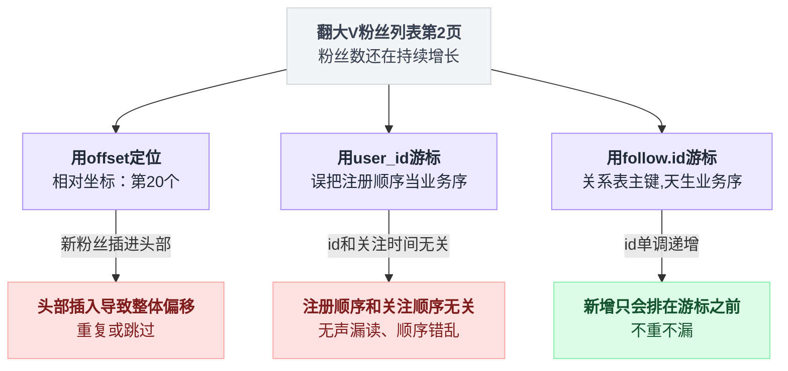
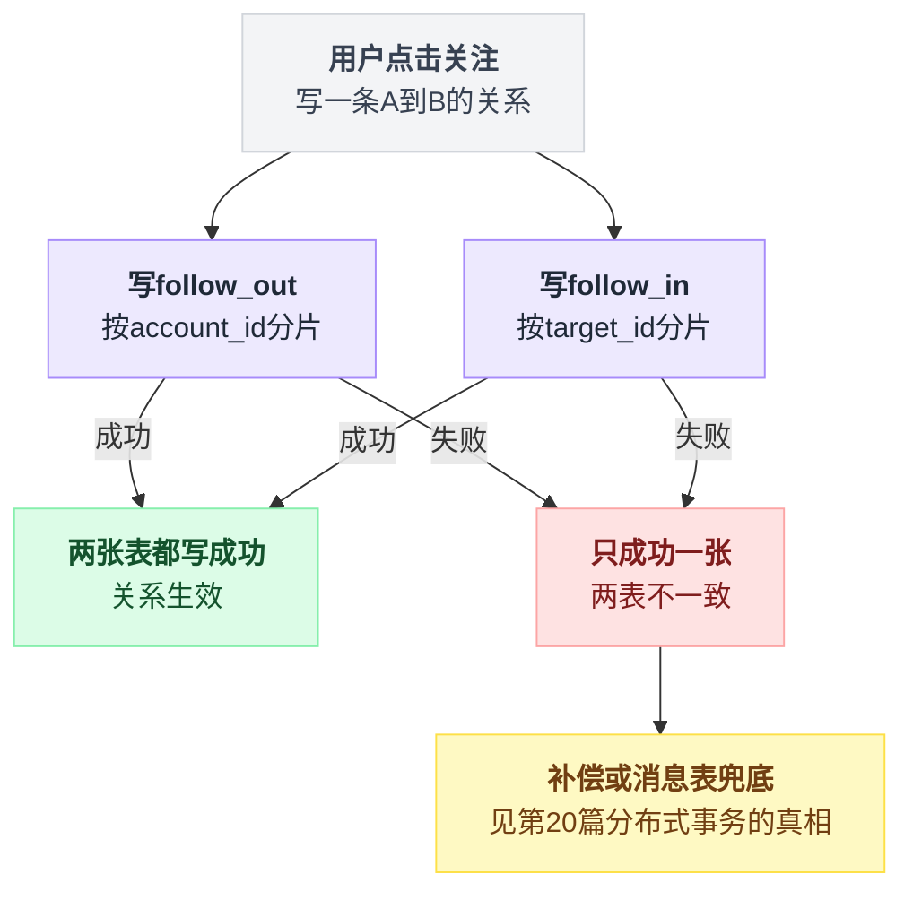
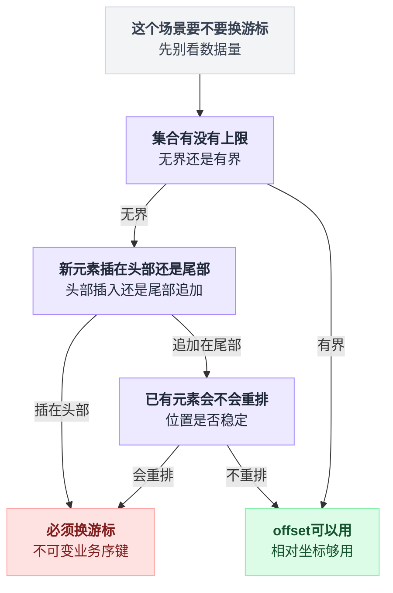
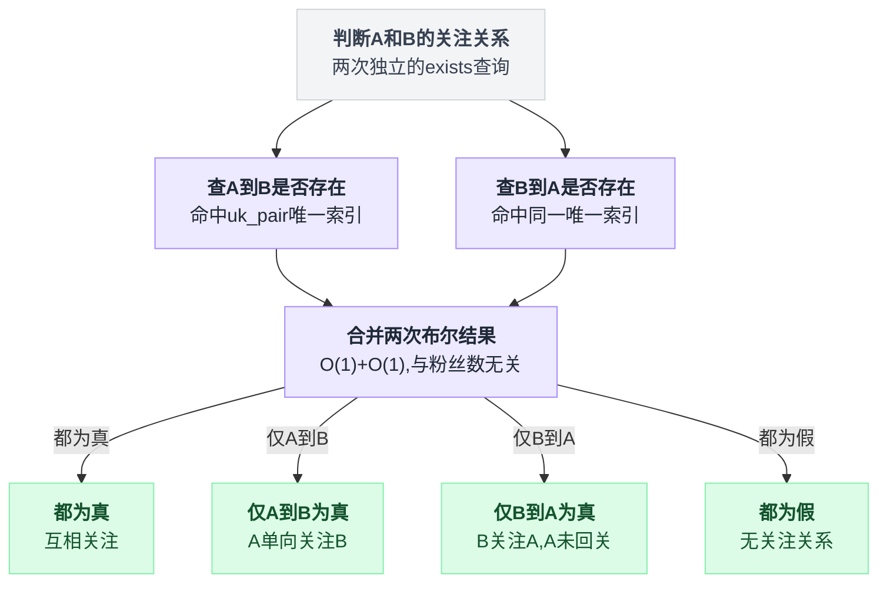
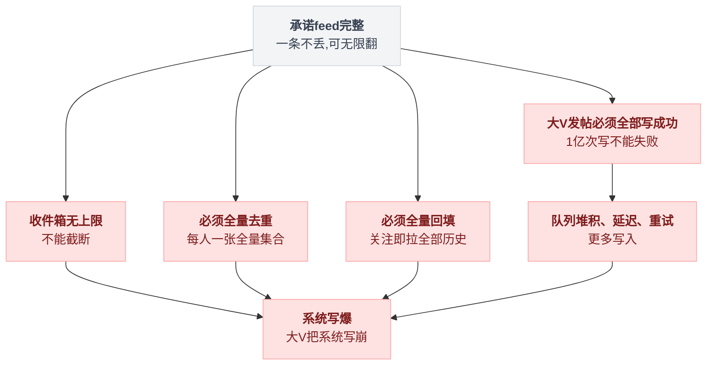
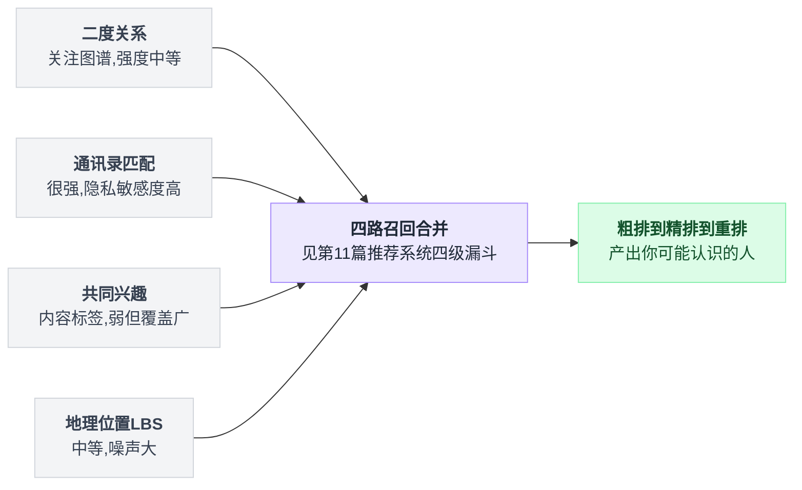

# 《关注关系与粉丝列表》一亿粉丝的大 V，列表怎么往下翻（小白版）

> 一句话结论：**粉丝列表的游标必须是关系表的 id，不是用户 id**——业务排序键是"关注发生的顺序"，不是"用户注册的顺序"，用错了会在大量新增关注时无声地漏读、重读。而推模式的 feed 是**有界的、而且允许不完整**：Mastodon 硬编码 `MAX_ITEMS = 800`，转发去重只做最近 80 条的窗口，对久未发帖的被关注者直接跳过回填。**追求完整性的那一刻，大 V 就把系统写爆了。**
>
> 难度：★★★★☆
>
> 阅读前提：本篇是[第 05 篇《微博热点 Feed 流》](./05-微博热点Feed流.md)的姊妹篇。那篇讲**推还是拉**——怎么选模型、阈值怎么算、怎么只推给活跃粉丝；本篇讲**关系本身怎么存、怎么翻页，以及选了推之后怎么止损**。推拉选型这道题本篇一个字不复读，需要的时候直接给你链接。
>
> 写作时间：2026-08-05。文中 star 数与最后提交时间为当日实测；源码细节基于公开仓库，未经一手核实的说法在文中已标注。
>
> 读完你会懂：
> 1. 为什么粉丝列表翻到深处会"开始重复、开始跳过"，以及 offset 和 user_id 游标各制造了其中哪一种
> 2. Mastodon 的游标为什么取自 `active_relationships.first.id`（关系表主键），以及它凭哪四条性质做到不重不漏
> 3. 第 32 篇说"Discourse 用 offset 至今没事"，本篇说"必须换游标"——两句话怎么同时为真
> 4. 为什么 Mastodon 的关系模块里一处 counter cache 都没有，而 Misskey 显式维护计数还要为账号迁移开特例
> 5. `MAX_ITEMS = 800`、`REBLOG_FALLOFF = 80`、`last_status_at` 早停，这三个数字各放弃了什么
> 6. 亿级关系存储为什么没有能读的开源标本，以及哪些结论只能标注为"来自架构描述"

---

## 目录

- [0. 开场：往下翻一个千万粉大 V 的粉丝列表](#0-开场往下翻一个千万粉大-v-的粉丝列表)
- [1. 关系存储的最小模型：一张表，两条读路径](#1-关系存储的最小模型一张表两条读路径)
- [2. 游标：为什么必须是关系表的 id（本篇主菜）](#2-游标为什么必须是关系表的-id本篇主菜)
- [3. 计数与关系判断是两条通路](#3-计数与关系判断是两条通路)
- [4. 列表页的 N+1：一次查询换回一个 map](#4-列表页的-n1一次查询换回一个-map)
- [5. 写扩散的止损：有界、允许不完整](#5-写扩散的止损有界允许不完整)
- [6. 诚实章节：亿级关系存储没有开源标本](#6-诚实章节亿级关系存储没有开源标本)
- [7. 共同关注与好友推荐](#7-共同关注与好友推荐)
- [8. 反直觉结论](#8-反直觉结论)
- [9. 一句话总结、小白词典、和前几篇的对照](#9-一句话总结小白词典和前几篇的对照)

---

## 0. 开场：往下翻一个千万粉大 V 的粉丝列表

### 0.1 先做个实验

随便打开一个社交 App，找一个粉丝量足够大的账号——千万级最好——点进他的粉丝列表，然后**一直往下翻**。前三页没问题，第十页还好，翻到第五十页左右，你会开始注意到两件事：

- 有些头像**出现了第二次**。你确定刚才见过这个人，因为他的昵称很怪。
- 有些人**再也找不到了**。你上一页明明扫到过一个眼熟的 ID，这一页往回退，没了。

这不是我编出来的 bug 演示，是真实产品里能观察到的现象——而它的成因，恰好是本篇要讲的全部内容。

### 0.2 最朴素的写法：这我也会写

粉丝列表这个需求，看起来简单到不需要设计。一张关系表：

```sql
CREATE TABLE follows (
  id          BIGINT PRIMARY KEY AUTO_INCREMENT,  -- 关系表自增主键
  account_id  BIGINT NOT NULL,   -- 谁关注
  target_id   BIGINT NOT NULL,   -- 关注谁
  created_at  DATETIME NOT NULL,
  UNIQUE KEY uk_pair (account_id, target_id)
);
```

查粉丝列表：

```sql
SELECT u.* FROM follows f JOIN users u ON u.id = f.account_id
WHERE f.target_id = 12345
ORDER BY f.account_id DESC
LIMIT 20 OFFSET 980;
```

上线，能跑，前几页看着都对，收工。这个写法里埋了两颗雷。第一颗是 `OFFSET 980`——深分页的扫描代价，大家都听说过，而且[第 32 篇《评论区与楼中楼》](./32-评论区与楼中楼.md)会专门讲它什么时候真的要命、什么时候纯属吓唬人，本篇不抢那个题。第二颗雷更毒，几乎没人第一次就看出来：`ORDER BY f.account_id DESC`。**排序键选错了。**

### 0.3 第一帧推演：offset 在一个"会动的列表"上会怎样

假设大 V 叫 `@L`，粉丝按"关注时间从新到旧"排，编号 `f100` 是最近关注的那个。

```
  T0 时刻的真实顺序：

     位置:   1     2     3   ...   18    19    20  |  21    22    23  ...
     粉丝:  f100  f99   f98        f83   f82   f81 |  f80   f79   f78

  客户端：第 1 页 = OFFSET 0 LIMIT 20  →  拿到 f100 ... f81   ✓ 完全正确

  ══════  T0 + 0.8 秒：3 个人点了关注（大 V 的日常）  ══════

     位置:   1     2     3     4   ...   21    22    23  |  24  ...
     粉丝:  f103  f102  f101  f100       f83   f82   f81 | f80
            └──── 新来的 3 个插在最前面，整列往后推 3 位 ────┘

  客户端：第 2 页 = OFFSET 20 LIMIT 20  →  从位置 21 开始
                                         = f83  f82  f81  f80 ...
                                           ↑↑↑↑↑↑↑↑↑↑↑↑↑↑
                                    这三个在第 1 页已经看过了 —— 重复 3 个
```

反过来，如果这 0.8 秒里是 3 个人**取关**（而且取关的人排在你已经翻过的区域里），整列往前挪 3 位：

```
  客户端：第 2 页 = OFFSET 20 LIMIT 20  →  从位置 21 开始 = f78 f77 ...
                                              ↑
                              f80  f79 从来没有出现在任何一页里 —— 跳过 2 个
```

**头部新增 → 重复；头部减少 → 跳过。** 你在第 0.1 节看到的两个现象，一次全解释了。而且注意规模：千万粉大 V 每秒新增关注是两位数，你从第 1 页翻到第 50 页要花几十秒，这几十秒里头部插进来几百个人——错位不是 3 位，是几百位。**offset 越深错得越离谱**，因为错位量随"翻页耗时 × 头部写入速率"累积。

### 0.4 第二帧推演：换成 user_id 游标，重复没了，漏读来了（本篇最值钱的一张图）

于是你去搜"深分页怎么办"，答案九成是"用游标，别用 offset"。你照做了：记住上一页最后一个人的 id，下一页查 `WHERE id < 它`。问题是——**哪个 id？** 你手上最顺手的是 `user_id`，因为返回给前端的就是用户对象。于是：

```sql
SELECT ... WHERE f.target_id = 12345 AND f.account_id < :max_id
ORDER BY f.account_id DESC LIMIT 20;
```

看起来完美，重复确实没了（`<` 是严格小于，同一行不可能进两次）。然后：

```
  第 1 页返回的最后一个粉丝，他的 user_id = 9000。客户端带 max_id=9000 请求第 2 页。

  帧 1  T0
        已翻过的区（user_id > 9000）              待翻的区（user_id < 9000）
        ┌────────────────────────────────┐     ┌──────────────────────────────┐
        │  9800   9500   9310  ...  9000 │     │  8990   8900  ...  310   42  │
        └────────────────────────────────┘     └──────────────────────────────┘
                                    ▲ 游标停在这里

  帧 2  T0 + 0.8 秒，三个人关注了 @L。他们的 user_id 是"注册那天发的号"：

        user_id = 9600   （2019 年注册的老号，今天才关注）  →  落进【已翻过的区】
        user_id = 10250  （今天刚注册的新号）              →  落进【已翻过的区】
        user_id = 8950   （2018 年注册的老号，今天才关注）  →  落进【待翻的区】

  帧 3  第 2 页执行 WHERE account_id < 9000 ORDER BY account_id DESC LIMIT 20

        ✗ 9600 和 10250 永远不会出现在任何一页里
          —— 漏读。而且是无声的：没有报错、没有告警、结果集看起来完全正常。

        ✗ 8950 出现了，但它排在 8990 后面
          —— 一个"三秒前刚关注"的人，被摆在"两年前关注"的人中间。
             重复没了，可顺序语义已经坏了。
```

看懂这张图，本篇就成功了一半。

### 0.5 病根一句话

```
   你在按【注册顺序】翻一个按【关注顺序】组织的列表。
   user_id 排的是：这个人什么时候注册的账号
   业务要的是    ：这个人什么时候点的关注   ← 两者之间没有任何相关性
```

一个 2011 年注册的老号，可能今天才关注你；一个今天注册的新号，可能三分钟后就关注你。**`user_id` 的大小和"关注发生的先后"完全无关**，拿它当排序键等于随机排序。正确的排序键早就在表里躺着了：`follows.id`——这一列的语义就是"这条关注关系是第几个被创建的"，**它天生就是业务序**。第 2 节整节讲这件事。

把 offset、user_id 游标、follow.id 游标这三条路摆在一起看，差别一目了然：



### 0.6 本篇路线图

| 症状 | 病根 | 谁来解 |
|---|---|---|
| 翻页重复 / 跳过 | offset 在变动集合上错位；user_id 不是业务序 | 第 2 节：关系表 id 游标（主菜） |
| "他关注我了吗"这个按钮查得慢 | 把关系判断和关系计数当成一件事 | 第 3 节：两条通路 |
| 列表页 20 个人打了 21 次库 | 循环里逐个判断关注状态 | 第 4 节：一次查询换 map |
| 大 V 一发帖全站抖动 | 承诺了 feed 的完整性 | 第 5 节：有界 + 允许不完整 |
| "亿级怎么办"网上说法互相打架 | 这个规模没有能读的开源实现 | 第 6 节：诚实章节 |

---

## 1. 关系存储的最小模型：一张表，两条读路径

### 1.1 关注是一条有向边

"A 关注 B"是一条有向边，落到关系库里就是第 0.2 节那张表的一行，整个社交图谱 = 这张表的全部行。Mastodon（mastodon/mastodon，**50,168 star，最后提交 2026-08-05，2026-08-05 实测**）在 `app/models/concerns/account/interactions.rb` 里给这条边起了一对很清楚的名字：

```
  Account
    ├── active_relationships    我发出去的边   →  following  （我关注的人）
    └── passive_relationships   指向我的边     →  followers  （关注我的人）
```

**active / passive** 这个命名比 `following / followers` 更能说明问题：同一张关系表，站在"边的起点"看是一套，站在"边的终点"看是另一套。这不是两张表，是**一张表的两个方向**。

### 1.2 两条读路径，两个索引

产品上"关注列表"和"粉丝列表"长得几乎一样（都是一列用户卡片），工程上它们是完全不同的两条查询路径：

```
                  ┌─────────────────────────────┐
                  │  follows 一张表              │
                  │  (id, account_id, target_id) │
                  └──────┬───────────────┬──────┘
      "我关注了谁"        │               │       "谁关注了我"
      关注列表            ▼               ▼        粉丝列表
   ┌────────────────────────────┐  ┌────────────────────────────┐
   │ WHERE account_id = :me     │  │ WHERE target_id  = :me     │
   │ 索引 (account_id, id DESC) │  │ 索引 (target_id, id DESC)  │
   │ 规模：几百 ~ 几千          │  │ 规模：几个 ~ 一亿          │
   │ 用途：拉 feed、判断关系    │  │ 用途：只用来给人看         │
   │ 增长：受"关注上限"约束      │  │ 增长：完全不受控           │
   └────────────────────────────┘  └────────────────────────────┘
```

**这张图右边那一列是本篇所有麻烦的来源。** 关注列表有天然上界（多数平台对"最多能关注多少人"有硬限制，几千量级），粉丝列表没有上界——理论上全站每个人都可以关注同一个账号。

注意两个索引都以 `id DESC` 结尾而不是 `created_at DESC`：用自增主键当排序尾键有个白送的好处——**它唯一**。用 `created_at` 排序，同一秒内的几百条关注是并列的，翻页时必须再补一个 tie-breaker，而那个 tie-breaker 最后还是 `id`。

### 1.3 一张表还是两张表：分库分表把这道题变了

单库单表阶段，一张 `follows` 加两个复合索引就够了。但第 1.2 节两个索引的**前缀列不一样**：一个是 `account_id`，一个是 `target_id`。这在单库里毫无问题，分库分表之后就是死局：

```
   假设按 account_id 分 64 库：

   ✓ "我关注了谁"  → account_id = me → 路由到 1 个库，一次查询搞定
   ✗ "谁关注了我"  → target_id  = me → 不含分片键 → 广播到 64 个库
                                        每个库各排各的序，还要在应用层归并
                                        翻页时 64 路游标怎么对齐？
```

[第 14 篇《分库分表》](./14-分库分表.md)讲过这个形状：**分片键只有一个，而业务有两条正交的查询路径**。标准解法是**双份冗余**——同一条关系写两遍，一份按 `account_id` 分片，一份按 `target_id` 分片：

```
   follow_out（按 account_id 分片）      follow_in（按 target_id 分片）
   │ A→B  A→C  A→D  （A 的出边）│      │ X→B  Y→B  Z→B  （B 的入边）│
              ▲                                     ▲
              └── 一次"关注"要写两张表：写放大 ×2，还要处理"写了一半" ──┘
```

写放大换读路径，在读多写少的关系场景里划算。代价是一致性：两张表不在一个库里，事务保不住，得靠补偿或消息表兜底——[第 20 篇《分布式事务的真相》](./20-分布式事务的真相.md)整篇在讲怎么兜这种活。

落到写入路径上，双份冗余的代价具体长这样：



需要说清楚的是：**Mastodon 和 Misskey 这个量级都还没走到这一步**，它们就是一张表两个索引。双份冗余是亿级方案，而亿级方案没有能读的开源实现——这件事第 6 节会单开一节老实交代。

顺手记一个数量级：一条关系行连索引算 100 字节，全站 10 亿条关系 ≈ 100 GB——**存储从来不是这个场景的瓶颈**。瓶颈是一个 1 亿粉丝的账号发一条帖子时那 1 亿次写（÷ 10 万次/秒 ≈ 16 分 40 秒），这正是第 5 节要拆掉的东西。

---

## 2. 游标：为什么必须是关系表的 id（本篇主菜）

### 2.1 Mastodon 的做法：游标取自关系表，不是用户表

Mastodon 的粉丝列表接口在 `api/v1/accounts/follower_accounts_controller.rb`（该路径已核实、已读源码）。核心逻辑压缩成几行（**下面是简化摘录，保留了真实的方法名**）：

```ruby
def load_accounts
  default_accounts.merge(paginated_follows).to_a
end

def paginated_follows
  Follow.where(target_account_id: @account.id)
        .paginate_by_max_id(limit_param(DEFAULT_ACCOUNTS_LIMIT),
                            params[:max_id],
                            params[:since_id])
end
```

看清楚这里在给**谁**分页：`Follow`——关系表，不是 `Account`。翻页条件落在 `follows.id` 上，用户表只是最后被 `JOIN` 进来贴一层展示数据。`paginate_by_max_id` 这个方法名本身就是答案：`max_id` 是"上一页里最大的那个 id"，下一页要的是比它更小的——它翻的是关系表主键的坐标轴。

### 2.2 最关键的一行：`active_relationships.first.id`

真正把这件事钉死的是**游标从哪里取出来**。Mastodon 生成"下一页"链接时，取的是：

```ruby
@accounts.last.active_relationships.first.id     # 关系表主键
                    ▲
                    └── 不是 @accounts.last.id（那是 user/account 的主键）
```

一个字之差，两个世界：

```
   @accounts.last.id
     = 这个人的用户主键 = 他【注册】时拿到的号
     = 和"他什么时候关注我"毫无关系                    → 第 0.4 节那张图
   ─────────────────────────────────────────────────────────────────────
   @accounts.last.active_relationships.first.id
     = 这条关注关系的主键 = 这条边【被创建】时拿到的号
     = 就是"他什么时候关注我"本身                      → 天生的业务排序键
```

说白了：**你要给"关系"翻页，就得用"关系"的 id**。列表上显示的是人，被排序的却是边——这两个东西在 UI 上重叠，在数据模型上完全不是一回事，而第一次写这个接口的人都会顺手抓住 UI 上那个更显眼的。

### 2.3 关系表 id 凭什么能做到不重不漏：四条性质

| 性质 | 具体含义 | 少了它会怎样 |
|---|---|---|
| **单调递增** | 后创建的关系，id 一定更大 | 新数据会插进"已翻过的区"，无声漏读（第 0.4 节） |
| **唯一** | 没有两条关系共享同一个 id | 边界上会有并列项，翻页时重复或跳过 |
| **不可变** | 关系一旦建立，id 永不改变 | 排序会重排，游标失去意义 |
| **与业务序一致** | id 的顺序 = 关注发生的顺序 | 排序结果对，但对的是另一个业务问题 |

第 05 篇给收件箱 score 定的三条铁律（不可变、单调、与读者无关）在这里原样成立——这是同一道题：**任何游标翻页都是在一条坐标轴上移动指针，那条坐标轴必须是钉死的。** 把关系表 id 代进第 0.4 节那张图：

```
   帧 1  已翻过的区（follow.id > 8123456）     待翻的区（follow.id < 8123456）
        │ ... 8123460  8123457  8123456 │     │ 8123455  8123454 ... 100 │
                                  ▲ 游标

   帧 2  三个人关注了 @L → follow.id = 8130001 / 8130002 / 8130003
        它们比表里任何一条已有关系的 id 都大 → 一定落在最左端
        │ 8130003 ... 8130001 ... 8123456 │  │ 8123455 ...              │
                                  ▲ 游标纹丝不动

   帧 3  有人取关 → 删掉一行 → 待翻区少一条
        但【没有任何一条数据换过位置】 → 后续页的内容完全不受影响
```

对比第 0.3 节的 offset 图：那边每一次头部写入都让整列平移，这边**头部写入对游标之后的世界零影响**。区别不在"游标 vs offset"这个形式，在于坐标轴是绝对还是相对——offset 是相对坐标（第 20 个），游标是绝对坐标（id = 8123456）。

### 2.4 一个必须接受的事实：游标翻页看不到"未来"

第 2.3 节帧 2 里三个新粉丝落在"已翻过的区"，也就是说：**你这次翻页永远不会看到他们。** 这不是漏读，这是定义。游标翻页给的承诺是精确的：

> 对于**开始翻页那一刻**已经存在的集合，保证不重、不漏、顺序稳定。
> 对于翻页过程中新产生的数据，不承诺。

而"不承诺"恰好是对的产品语义：往下翻就是往过去翻，新来的粉丝属于未来，本来就不该出现在你正在浏览的历史里。想看新的，把列表拉到顶刷新——那是另一个方向的查询，对应 `since_id` / `min_id`。

```
        min_id / since_id                          max_id
        往新的方向捞                                往旧的方向翻
             ◀────────────────  游标  ────────────────▶
       [ 最新的关注 ]                              [ 最早的关注 ]
       下拉刷新走这边                              上滑加载走这边
```

第 0.4 节 user_id 游标的病，恰恰是它**分不清未来和过去**：一个刚发生的关注，可能被丢到"过去"那一侧（user_id=8950），也可能被丢到"未来"那一侧（user_id=9600），全看这个人哪年注册的。坐标轴一乱，"漏"和"还没到"就没法区分了。

### 2.5 别让客户端自己算游标：`insert_pagination_headers`

Mastodon 不把游标当成一个"你自己从返回体里挑一个字段"的约定，而是把下一页的完整 URL 直接塞进 HTTP 响应头。方法名叫 `insert_pagination_headers`，输出的是标准的 `Link` 头：

```
Link: <https://example.social/api/v1/accounts/1/followers?max_id=8123456>; rel="next",
      <https://example.social/api/v1/accounts/1/followers?min_id=8199001>; rel="prev"
```

客户端要做的事只剩一件：**下一页请求 `rel="next"` 那个 URL**。它不需要知道 `max_id` 是什么、那个数字来自哪张表，更不需要自己从返回的用户数组里挑字段。这一步的价值比看起来大：

```
   ✗ 契约里暴露排序键："下一页请传 max_id = 上一页最后一个用户的 id"
       → 排序键成了 API 契约的一部分，服务端想换排序方式，全部客户端一起崩
       → 而且第 0.4 节那个 bug，正是客户端和服务端各自理解"id"造成的
   ✓ 契约里只暴露 URL："请求 Link 头里 rel=next 的那个地址"
       → 排序键是服务端的私事，随时能换；客户端不可能挑错字段，因为它没得挑
```

💡 这和[第 05 篇](./05-微博热点Feed流.md)那条"Feed 系统的存储层绝对不能知道排序规则"是同一枚硬币的两面：那边说**下层不该知道上层的规则**，这边说**上层不该知道下层的实现**。中间那层契约越窄，两边越自由。

### 2.6 正面回应第 32 篇：为什么 Discourse 用 offset 到今天也没事

这里必须处理一个矛盾，否则本系列自己打自己。

[第 32 篇《评论区与楼中楼》](./32-评论区与楼中楼.md)的结论是：**"深分页必须换游标"这条铁律，在帖内评论场景根本不成立**——`discourse/discourse`（**47,596 star，最后提交 2026-08-05，2026-08-05 实测**）的 `filter_posts_paged` 至今就是 `offset(min).limit(@limit)`，`CHUNK_SIZE = 20`，跑了十几年，几千万帖子，没出事。

本篇的结论是：粉丝列表**必须**换游标。

两句话都对。差别在两个维度，正好可以画成四象限：

```
                 │  稳定序（相对位置永不改变）   │  变动序（相对位置随时在变）
   ──────────────┼──────────────────────────────┼──────────────────────────
    有界         │  ● 帖内评论：单帖上限几万条   │  （少见）
    有天然上限    │    Discourse: offset 够用     │
   ──────────────┼──────────────────────────────┼──────────────────────────
    无界         │  （少见）                     │  ● 粉丝列表：上限 = 全站人数
    没有任何上限  │                              │    Mastodon: 必须游标
   ──────────────┴──────────────────────────────┴──────────────────────────
```

逐条拆开：

**（1）有界 vs 无界，决定 offset 的扫描代价能不能忍。** 单帖评论就算爆到 5 万条，`OFFSET 40000` 也就是扫 4 万行——几十毫秒，而且这种深度的请求本身极其罕见（谁会翻到第 2000 楼）。粉丝列表 1 亿条，`OFFSET 50000000` 是扫 5000 万行，这不是慢，这是数据库进 ICU。

**（2）稳定序 vs 变动序，决定 offset 算出来的位置对不对。** 这一条比第一条狠得多，因为它错得**无声**：

```
   帖内评论：post_number 单调递增，且【已发布的楼层永远不重排】
        [1楼][2楼][3楼][4楼][5楼]  ←── 新评论 [6楼] 追加在这里
         ─────────────────────┘
         读者从头往后翻，翻过的区域一动不动
         OFFSET 20 之前的 20 条，一小时后还是那 20 条  ✓

   粉丝列表：新关注插在【头部】
        [新] ──→ [f100][f99][f98][f97][f96]
                  ─────────────────────
         读者也是从头往后翻，但头部每秒都在长
         OFFSET 20 之前的 20 条，8 秒后已经不是那 20 条了  ✗
```

**新元素追加在尾部，和插入在头部，对 offset 是天壤之别**：追加在尾部时"相对坐标"的原点是稳的；插入在头部时原点每秒都在移动，而 offset 完全感知不到——它只会老老实实地数二十个。

**（3）Discourse 那个"跳到第 N 楼"，其实已经是游标了。** 第 32 篇提到 `filter_posts_near(post_number)`：点击"跳到 1024 楼"用的是 `post_number` 这个**业务序号**，不是 `page=52` 这种分页参数。Discourse 在真正需要定位的场景里用的是绝对坐标，offset 只被用在"顺着往下读"这种位置误差无所谓的场景里。

**（4）所以真正的铁律不是那句流行语。**

```
   ✗ 流行语：      "深分页必须换游标"
   ✓ 真铁律：      "定位必须用一个不可变的业务序键"

        Discourse 的 post_number         Mastodon 的 follow.id
              └────────── 是同一样东西的两种长相 ──────────┘

   offset 在 Discourse 能活到今天，不是因为 offset 好，
   是因为在【有界 + 尾部追加】的集合上，offset 恰好等价于 post_number。
   它偷偷满足了真铁律，所以豁免了流行语。
```

⚠️ 判断你的场景该不该换游标，问三个问题，不要问"数据量大不大"：

1. 集合有上限吗？（无界 → 换）
2. 新元素插在头部还是尾部？（头部 → 换）
3. 已有元素会不会重排？（会 → 换，而且换了游标也不够，得像第 05 篇那样上会话快照）

三个问题里粉丝列表中两条，评论区一条不中。这就是全部差别。

把这三个问题串成判定树：



---

## 3. 计数与关系判断是两条通路

### 3.1 一个让人意外的发现：Mastodon 的关系模块里一处 counter cache 都没有

`app/models/concerns/account/interactions.rb` 这个文件里定义了 Mastodon 全部的关系语义——关注、被关注、拉黑、静音、屏蔽域名——通读下来有一件事很反常：**里面一处 counter cache 都没有**。判断关系全走 `exists?`（简化摘录）：

```ruby
def following?(other_account)
  active_relationships.where(target_account: other_account).exists?
end
```

第一反应会觉得这是没做优化。恰恰相反，这是想清楚了——`exists?` 生成的 SQL 长这样：

```sql
SELECT 1 AS one FROM follows
WHERE account_id = :me AND target_account_id = :other
LIMIT 1;
```

它直接命中 `uk_pair (account_id, target_account_id)` 这个唯一索引，**代价与粉丝数完全无关**：

```
   问题："我关注他了吗？"
   ✗ 把我关注的人全捞出来看他在不在   → 5000 行，随我的关注数增长
   ✗ 把他的粉丝全捞出来看我在不在     → 1 亿行，系统直接躺平
   ✓ exists?：唯一索引点查，命中即停  → 他有 10 个粉丝还是 1 亿个，代价一模一样
```

**"他是不是大 V"这件事，对"我关注他了吗"这个问题毫无影响。** 这是关系型存储在这个场景里最漂亮的一点，前提是你的索引前缀选对了。

判断双向关注，其实就是把这个 O(1) 查询对称地做两次：



### 3.2 分叉：产品上一个功能，工程上两条通路

```
      "关注"两个字，产品上是一个功能，工程上是两条完全不同的通路
          ┌─────────────────────┴─────────────────────┐
          ▼                                           ▼
    ① 关系判断                                  ② 关系计数
      "我关注他了吗" "我们互关吗"                  "他有多少粉丝" "我关注了多少人"
   ──────────────────────────                 ──────────────────────────
    语义：必须精确、必须实时                    语义：近似即可、可以延迟
    实现：唯一索引 exists?                      实现：预聚合字段 / Redis
    代价：O(1)，与粉丝数无关                    代价：COUNT(*) 与粉丝数线性
    错了：按钮状态错乱，三秒内被投诉             错了：数字差几个，三个月没人发现
    绝不能缓存过期                              就是要缓存，而且允许过期
```

把这两条通路混在一起，就会写出"为了显示关注按钮，先把粉丝数查出来"这种代码。它们唯一的共同点是都读 `follows` 表。

### 3.3 另一面：Misskey 显式维护计数，代价是要为特例开口子

`misskey-dev/misskey`（**11,273 star，最后提交 2026-08-05，2026-08-05 实测**）选了另一条路。`packages/backend/src/core/UserFollowingService.ts`（已读源码）里，关注和取关会显式增减计数字段，并刷新缓存：

```
   UserFollowingService.follow()
       │
       ├── 插入 following 记录
       ├── follower.followingCount  +1      ← 显式增
       ├── followee.followersCount  +1      ← 显式增
       ├── userFollowingsCache.refresh()    ← 刷缓存
       └── 发通知 / 联邦投递 ...

   UserFollowingService.unfollow()  同理，全部 -1
```

然后是最有意思的一处：**账号迁移（`movedToUri`）时跳过计数**。

Mastodon 和 Misskey 这类联邦宇宙软件支持"我从 A 站搬到 B 站"，搬家时系统会把旧号的粉丝批量迁到新号上。这个过程里如果照常增减计数，会发生什么：

```
   搬家：旧号 @me@a.social ──movedToUri──▶ 新号 @me@b.social，5000 个粉丝要重新关注新号

   ✗ 照常计数：每个粉丝 followingCount +1 → 他没多关注一个人，数字却涨了
              旧号 followersCount 逐渐归零 → 老用户看到"我掉了 5000 粉"
   ✓ 检测到 movedToUri：跳过计数增减，只搬关系
              数字保持不变 —— 因为从用户视角看，关系数量本来就没变
```

落点：**只要计数是一个独立维护的字段，就一定存在"什么时候不该动它"的特例，而特例数量随功能数量增长。** 账号迁移是一个，批量导入是一个，封号解封是一个，软删除是一个……每加一个功能都得回头问一遍"这里要不要动计数"，漏一个就永久性地错一点。Mastodon 走 `exists?` 不存计数，等于把这些特例全免掉了——代价是每次要显示粉丝数时都得现算。两条路各自的账，非常清楚。

### 3.4 结论：`followers_count` 是展示字段，不是索引

把上面两条合起来，得到本节的落点：

```
   followers_count 是【展示字段】，不是【索引】
   ────────────────────────────────────────────────────────────────
   ✓ 显示在个人主页上   ✓ 做粗粒度分支判断（推还是拉、要不要限流）
   ✓ 允许它和真实值差几十、几百
   ✗ 拿它当分页依据     ✗ 做需要精确的业务判定（结算、发奖、资格审核）
   ✗ 假设它和 SELECT COUNT(*) 的结果永远相等
```

这条结论在第 05 篇那里有一个漂亮的回响：**第 05 篇的推拉阈值判定，读的就是这个字段**。而第 05 篇专门论证了阈值必须用**滞后区间**（比如 30 万转拉、25 万转回推），不能用单一阈值——现在你知道那个滞后区间还有第二个理由了：**这个字段本来就是抖的**。用一个近似值去做一个硬阈值判定，会在边界上疯狂来回横跳。

计数本身怎么做才不丢不错，[第 18 篇《排行榜与计数系统》](./18-排行榜与计数系统.md)整篇在讲。三种做法的取舍：

| 做法 | 精确性 | 读代价 | 写代价 | 适合谁 |
|---|---|---|---|---|
| 每次 `COUNT(*)` | 精确 | 与粉丝数线性，1 亿粉丝直接超时 | 零 | 小站 / 内部后台 |
| 表内计数字段（Misskey） | 近似，特例多 | O(1) | 每次关注多一次行更新，热点行有锁竞争 | 中等规模 |
| Redis 计数 + 定时对账 | 近似，可自愈 | O(1) | 异步 | 大规模，第 18 篇主推 |

---

## 4. 列表页的 N+1：一次查询换回一个 map

### 4.1 场景：20 个人，21 次查询

粉丝列表每一行右边都有一个按钮："关注" / "已关注" / "互相关注"。要渲染它，得知道**我**和这一行的人是什么关系。最自然的写法：

```go
users := listFollowers(bigVID, cursor, 20)   // 1 次查询
for _, u := range users {
    u.IsFollowing = dao.IsMyFollow(myID, u.ID)  // 每人 1 次 → 20 次
}
```

一次列表查询 + 20 次关系查询 = **21 次数据库往返**。算笔账：

```
   单次查询 = 网络往返 0.3 ms + 索引点查 0.2 ms ≈ 0.5 ms（乐观估计）

   一页：  1 + 20 次 × 0.5 ms = 10.5 ms      ← 看着还行，所以上线了
   翻 10 页：1 + 200 次       = 105 ms       ← 开始有人反馈"卡"
   500 QPS： 500 × 21        = 10500 次/秒   ← 数据库连接池先崩

   注意最毒的一点：这 20 次每一次都很快（慢查询日志干干净净）。
   你在监控上只能看到"数据库 QPS 莫名其妙是接口 QPS 的 21 倍"。
```

第 3.1 节说过 `exists?` 是 O(1) 的——每一次都很便宜，**但便宜 × 20 还是二十份钱**。N+1 的隐蔽之处正在这里：它不是把单次查询变慢，它是把查询次数变多，而绝大多数性能监控盯的是前者。

### 4.2 paopao-ce 的修法：返回 map，不返回 bool

`rocboss/paopao-ce`（**4,498 star，最后提交 2026-08-03，2026-08-05 实测**）在 `internal/dao/jinzhu/user.go`（已读源码）里提供 `MyFollowIds()` 与 `IsMyFollow()`，关键在**返回类型**：

```go
// 简化摘录：不返回 bool，返回一个 map
followMap := dao.IsMyFollow(myID, userIDs...)   // map[int64]bool

for _, u := range users {
    u.IsFollowing = followMap[u.ID]             // 内存里查，零次 IO
}
```

对应的 SQL 从 20 条变成 1 条：`SELECT target_id FROM follows WHERE account_id = :me AND target_id IN (20 个 id)`。

```
   接口签名的一字之差，决定了调用方能不能写出正确的代码
   IsMyFollow(me, other) bool        → 调用方【只能】放进 for 循环 → N+1 必然发生
   IsMyFollow(me, others...) map[..] → 调用方【不可能】写出 N+1，一次就拿全了
```

这是 N+1 最有效的治法：**不是叮嘱大家"别在循环里查库"，而是把返回单个结果的那个方法从 DAO 层删掉。** 能力不给出去，就不会被误用。

### 4.3 但 `MyFollowIds()` 有个边界，得说清楚

`MyFollowIds(userID)` 一次取回"我关注的全部 id"，在内存里做集合判断。中小规模完全没问题，但它随"我的关注数"线性增长：

| 我的关注数 | `MyFollowIds()` 返回 | 评价 |
|---|---|---|
| 500 | 4 KB | 完全没问题，还能缓存起来复用 |
| 5,000 | 40 KB | 还行，但每次请求都传这么多有点浪费 |
| 500,000（营销号 / 机器人） | 4 MB | 单次请求 4 MB，几十个并发就 OOM |

正确的通用写法是**只查这一页需要的那 20 个**（第 4.2 节那条 `IN` 查询），而不是把我的全量关注拉回来：

```
   ✗ MyFollowIds(me)                    →  返回量 = O(我关注了多少人)
   ✓ IsMyFollow(me, 这一页的 20 个 id)  →  返回量 = O(页大小) = 恒定 20
```

一页永远是 20 个，所以第二种写法的代价**与任何用户的任何数值都无关**。这是本节真正要记住的形状：

> **让每一次查询的代价只和"页大小"挂钩，不和"用户有多少数据"挂钩。**

顺带说一句，`MyFollowIds()` 的全量返回在另一个场景是对的：拉 feed 时你确实需要全部关注 id（第 05 篇的读扩散路径）。同一个方法用在列表页是 bug，用在拉 feed 是必需——**判断标准不是方法本身，是调用方对返回量有没有上界。**

---

## 5. 写扩散的止损：有界、允许不完整

### 5.1 先划清和第 05 篇的界：那篇讲选型，本篇讲止损

第 05 篇讲的是**选推还是选拉**：读写比怎么算、阈值怎么定、活跃粉丝怎么过滤，那道题本篇不碰。本节讲的是它之后的那一步：**假设你已经选了推，收件箱怎么才能不被大 V 写爆。** Mastodon 给了三个硬编码的数字，每一个都是一次明确的"放弃"。

### 5.2 `MAX_ITEMS = 800`：收件箱是有界的

`app/lib/feed_manager.rb`（已读源码）里 `MAX_ITEMS = 800`。一个用户的 home feed，最多 800 条，多了就裁。

```
   用户的收件箱（Redis ZSet）
   ┌─────────────────────── 800 条 ───────────────────────┐
   │ 最新 ............................................ 最旧│
   └──────────────────────────────────────────────────┬───┘
      ▲ 新帖插进来                      第 801 条被裁掉，永久消失

   翻到第 801 条会怎样？→ 没有了。到底了。
   这不是"暂时看不到"，是【这条数据在这个用户的收件箱里不存在了】。
```

800 条，按每天刷到 100 条算够翻一周，绝大多数用户永远碰不到这个边界；碰到的那些，Mastodon 给的答案就是"没有了"。落点：**收件箱是缓存，不是数据源。** 源数据永远在发件箱（作者自己的帖子列表）里，收件箱只是为了读得快而维护的物化视图——既然是缓存，就必然有容量、有淘汰、会丢。第 05 篇论证过"收件箱必须截断"，这里给的是一个真实开源项目的**确切数字**，不是推导出来的。

### 5.3 `REBLOG_FALLOFF = 80`：连去重都是有界的

同一个文件里还有 `REBLOG_FALLOFF = 80`（已读源码）。这是转发的去重窗口。

场景：你关注了 200 个人，某条爆款帖被其中 15 个人先后转发。如果照单全收，你的 feed 里会连着出现 15 条一模一样的内容。

```
   feed 位置:  1  ......................  80  |  81  ..................  800
              ├──────── 去重窗口 ────────────┤   ├──── 窗口之外，不管 ────┤

   A 转发帖子 P → 插到位置 1
   B 也转发 P   → P 还在窗口内 → 【不再插一条】，只更新已有那条
   三个月后 D 又转发 P → 原来那条早被挤到位置 300，滑出窗口
                      → 允许再插一条 → 你的 feed 里出现第二次 P
```

**去重的正确性上限，等于窗口长度。** 为什么不做全量去重？全量去重要给每个用户维护一张"我 feed 里已经有哪些原帖"的集合，1 亿用户 × 800 条 = 800 亿个成员的辅助结构，每次扩散前查一次、写完更新一次；换来的收益只是消灭"三个月后同一条帖子又出现一次"这种没人会注意的偶发重复。**为了一个偶发问题付出与全站数据量成正比的恒定成本，这笔账怎么算都是亏的。**

这是本系列反复出现的形状：**用一个有界的近似，换掉一个无界的精确。** [第 12 篇《小而美的五个算法》](./12-小而美的五个算法.md)里的布隆过滤器、[第 26 篇《全链路追踪》](./26-全链路追踪.md)里的采样，都是这个形状。

### 5.4 回填早停：用 `last_status_at` 先问一句"填了会不会白填"

第三个止损点在回填路径上。场景：A 刚关注了 B，系统要把 B 的历史帖补进 A 的 feed，让 A 的时间线立刻有东西看。

朴素做法是把 B 最近的 N 条帖子捞出来插进 A 的收件箱。Mastodon 动手前先做一次判断（机制描述基于 `feed_manager.rb` 的回填逻辑）：

```
   if  B.last_status_at  <  A 的 feed 里最旧那一条的时间戳:
           跳过 B，一条都不回填

   时间轴 ─────────────────────────────────────────────────────────▶
     B 最后一条帖              A 的 feed 最旧项              现在
          │                          │                       │
     ─────●──────────────────────────●───────────────────────●────
          └──────────────────────────┘
       B 的全部帖子都落在这个区间左边 = 全部比 A feed 的最旧项还老
       = 插进去会立刻被 MAX_ITEMS=800 的裁剪扔掉 = 白写
```

这个判断本身是 O(1) 的——读一个字段，比一个时间戳——省掉的是一次"捞 B 的历史帖 + 逐条插入 + 逐条裁剪"的完整流程。**关注一个僵尸号的成本因此变成零**，而僵尸号在任何社交平台上都是大多数。第 05 篇算过"95% 的推送是白写的"，这里是同一件事在回填路径上的版本——**动手之前先问一句"这活干完会不会立刻被撤销"。**

### 5.5 三个数字，三次放弃：推模式的 feed 是有界的，而且允许不完整

| 机制 | 常量 | 放弃了什么 | 换来了什么 |
|---|---|---|---|
| 收件箱截断 | `MAX_ITEMS = 800` | 800 条之前的历史，翻不到 | 存储与写入代价恒定，与用户活跃度无关 |
| 转发去重窗口 | `REBLOG_FALLOFF = 80` | 窗口外的重复转发会再出现一次 | 免掉一张 800 亿成员的全局去重结构 |
| 回填早停 | 比较 `last_status_at` | 久未发帖者的历史内容 | 关注僵尸号的成本降到 O(1) |

### 5.6 落点：追求完整性的那一刻，大 V 就把系统写爆了

把上面三条反过来读，就明白 Mastodon 在回避什么：

```
   假设你承诺"每个粉丝的 feed 一条都不丢、一条都不重、可以无限往下翻"：

   ① 不能截断 → 收件箱无上限 → 1 亿粉丝 × 无限条 = 存储爆炸
   ② 全量去重 → 每人一张全量集合 → 查询代价随 feed 长度增长
   ③ 全量回填 → 关注任何人都要拉全部历史 → 关注操作变成重活
   ④ 一条不丢 → 大 V 一发帖 1 亿次写必须全部成功
                1 亿 ÷ 10 万次/秒 = 1000 秒，而这 1000 秒里他可能又发了三条
   ⑤ 队列堆积 → 延迟 → 重试 → 更多写入
      —— 这就是"大 V 把系统写爆"的完整链条，起点是第 ① 条那个承诺。
```

把这五步连起来看，就是承诺完整性到系统写爆的因果链：



Mastodon 的选择是**在协议层就不做这个承诺**：收件箱只有 800 条，超出就是没有；重复只在 80 条内消除，超出就是有重复。这不是妥协，是把"完整性"识别成了**假需求**——没有任何用户会翻到自己 feed 的第 801 条，也没人会为"三个月前那条转发又出现一次"提工单。

⚠️ 接推模式之前，挨个问这四个问题：

1. 收件箱的**硬上限**是多少条？（答不上来 = 无界 = 定时炸弹）
2. 超出上限的翻页请求返回什么？（"没有了" / 降级去拉 —— 必须有明确答案）
3. 去重做到什么程度？窗口多大？（"全量去重"这个答案本身就是危险信号）
4. 回填有没有早停？关注一个五年没发帖的号，系统要干多少活？（应该是 O(1)）

四条里任何一条答不上来，这套写扩散上线之后就等着被大 V 教做人。

---

## 6. 诚实章节：亿级关系存储没有开源标本

### 6.1 先把地图摆出来

本系列的方法论是"一手核实优先"——能读到源码的才写细节，读不到的就说读不到。关注关系这个方向，规模轴上有一段是**空的**：

```
   规模轴 ──────────────────────────────────────────────────────────────▶
   万级              百万级              千万级              亿级
   ├────────────────┼──────────────────┼──────────────────┼─────────────
   paopao-ce        Mastodon           Misskey            微博 / 抖音 / X
   4,498 ★          50,168 ★           11,273 ★           闭源，没有源码
   ✓ 源码可读       ✓ 源码可读          ✓ 源码可读          FlockDB 已归档
                                                          the-algorithm 停更
                                                          └── 空白区 ──┘
```

**空白区里的所有说法，本节一律标注为"来自架构描述而非源码实测"。**

### 6.2 三条事实

**（1）Twitter FlockDB 已归档。** 历史上唯一公开过的工业级社交图存储实现，已归档、不再维护，代码对应的是十几年前的架构——它能告诉你"当年他们怎么想"，不能告诉你"现在该怎么做"。

**（2）微博、抖音的关系服务闭源。** 中文互联网上关于这两家的材料全部是分享稿、会议 PPT 和二手转述。这些材料价值不为零，但**无法被核实**：你没法确认 PPT 上的方框图对应的是线上真实运行的代码，还是一个被简化过的示意。

**（3）`twitter/the-algorithm` 是唯一公开的工业级参考，但它停了。**

```
   twitter/the-algorithm        （以下均为 2026-08-05 实测）
   star:         73,518
   最后提交:      2025-09-08     ←── 距今已近一年
   语言:         Scala
   已核实模块名:  FRS / GraphJet / real-graph / SimClusters / TwHIN
   可运行性:     ✗ 不可独立运行（缺内部依赖与数据）
```

七万三千 star 看起来是最权威的标本，实际上有三个致命限制：**读得到模块名，跑不起来；读得到部分算法，读不到存储层；而且此后近一年没有任何更新。**

### 6.3 空白区里能说的话，以及它们的依据级别

下面三条经常出现在讲"亿级关注关系"的文章里，大概率是对的，但**本篇只能标注为架构描述**：

- **关系数据按 `account_id` 和 `target_id` 双份冗余分片**（来自架构描述，非源码实测）。第 1.3 节推导过这个必然性——分片键只有一个而查询路径有两条，除了冗余没有别的出路。逻辑上说得通，但没有源码能证明某家真的这么做。
- **图查询与关系存储分离**（来自架构描述，非源码实测）。`GraphJet` 这类内存图引擎服务的是"共同关注 / 二度关系"这种图遍历，不承担关系的持久化。模块名已核实存在于 `the-algorithm` 仓库，但其内部实现与部署形态未经核实。
- **推荐用的不是原始关注边，而是带权重的边**（来自架构描述，非源码实测）。`real-graph` 这个模块名的含义指向"根据互动频次给关注关系打分"，即"你关注了 500 人，但真正在乎的只有 30 个"。模块名已核实，权重算法未核实。

### 6.4 本篇结论的依据级别对照表

哪些结论能拿去说服同事，哪些只能当作参考：

| 结论 | 依据级别 | 出处 |
|---|---|---|
| 游标必须取关系表 id，不能取 user_id | **源码实测** | mastodon `follower_accounts_controller.rb` + `interactions.rb` |
| 收件箱有硬上限 800 条 | **源码实测** | mastodon `feed_manager.rb` `MAX_ITEMS` |
| 转发去重只做 80 条窗口 | **源码实测** | mastodon `feed_manager.rb` `REBLOG_FALLOFF` |
| `followers_count` 是展示字段不是索引 | **源码实测（正反双标本）** | mastodon 无 counter cache vs misskey `UserFollowingService.ts` |
| 账号迁移要跳过计数 | **源码实测** | misskey `UserFollowingService.ts` `movedToUri` |
| 列表页关系判断要返回 map | **源码实测** | paopao-ce `internal/dao/jinzhu/user.go` |
| 亿级要双份冗余分片 | 架构描述 + 逻辑推导 | 无源码，见第 1.3 节推导 |
| 内存图引擎承担二度关系查询 | 架构描述 | `the-algorithm` 模块名，实现未核实 |
| 推荐使用加权关系边 | 架构描述 | `the-algorithm` 模块名，算法未核实 |

另外声明一条：`bluesky-social/atproto` 与 `indigo` 的 graph 服务路径**未核实**，因此本篇不引用它们的任何源码细节（以官方仓库为准）。

### 6.5 落点：没有标本的地方，宁可写"我不知道"

第 05 篇能给出精确的推拉阈值，是因为那是可以**推导**的——读写比、成本对比、活跃率全是算出来的数学。本篇的亿级部分给不出同等确定的答案，原因不一样：**这里缺的不是推理，是可读的实现。**

所以，看到标题是"揭秘微博亿级关注关系架构"的文章时，先问一句：**它引用的源码在哪？** 如果答案是"没有源码，只有方框图"，那它和第 6.3 小节的三条是同一级别的材料——可以参考，不能当作事实引用，更不能拿去做技术决策的唯一依据。

---

## 7. 共同关注与好友推荐

### 7.1 共同关注 = 集合求交，但不能真的求交

"你和他有 12 个共同关注"在数学上就是两个集合求交集。朴素实现是把两边全捞出来扔进 HashSet，可 A 那边一亿个，光读出来就已经输了。正确姿势是**拿小的那一边去探大的那一边**：

```
      ┌──────────────┐         ┌──────────────┐
      │  A 关注 1 亿 │◀── ∩ ──▶│  B 关注 5000 │
      └──────────────┘         └──────────────┘

   ✗ 两边全取出来求交            → 代价 = O(max) = 1 亿次读
   ✓ 遍历 B 的 5000 个，逐个问"A 关注他吗？"
       → 代价 = O(min) = 5000 次唯一索引点查，还能合并成几条 IN（第 4.2 节那招）
       → 1 亿 → 5000，缩小 20000 倍
```

**这一招成立，全靠第 3.1 节那个 `exists?` 是 O(1) 的。** 如果"A 关注他吗"本身要 O(A 的关注数)，O(min) 的优化就不存在了——判断这条通路的 O(1) 性质，是上层一大堆功能的地基。实践中还要再加一层截断：显示"12 个共同关注"和"1200 个"对用户没区别，所以数到 100 个就停，剩下的显示成"100+"。

### 7.2 好友推荐：二度关系只是一路召回

"你可能认识的人"最直觉的实现是二度关系——朋友的朋友。但二度关系的爆炸速度很吓人：

```
   我关注 500 人 × 每人平均关注 500 人 = 二度候选集 250,000 人
   其中若有一个大 V（关注了 5000 人），他一个人就贡献 5000 个
   —— 而这 5000 个和"我认识谁"毫无关系

   ⚠️ 二度关系必须【按边的权重】展开：沿"我和他互动频繁"的边走，才叫朋友的朋友；
      沿"我关注了一个大 V"的边走，走到的是大 V 的关注列表，不是我的朋友圈。
```

这正好接上[第 11 篇《推荐系统四级漏斗》](./11-推荐系统四级漏斗.md)：**二度关系是召回层的一路，不是全部。** 完整的"你可能认识的人"至少有四路召回：

| 召回路 | 信号来源 | 强度 | 隐私敏感度 |
|---|---|---|---|
| 二度关系 | 关注图谱 | 中，且随度数衰减 | 低 |
| 通讯录匹配 | 手机号哈希 | 很强 | **很高**，多数地区受法规约束 |
| 共同兴趣 | 内容标签 / 行为向量 | 弱但覆盖广 | 低 |
| 地理位置 | LBS | 中，噪声大 | 高，见[第 21 篇](./21-附近的人与LBS.md) |

四路信号摆在一起看：



四路召回合并、粗排、精排、重排——和第 11 篇的漏斗一模一样。**关注关系只是给这个漏斗提供其中一路原料**，把它当成推荐系统的全部，出来的结果就是"你可能认识这个大 V 关注的第 4763 个人"。

### 7.3 U2U 相似度：把关系当向量

再往前一步是 user-to-user 相似度：不看图上的路径，直接把"用户关注了谁"当作一个稀疏向量，算两个向量的相似度（余弦、Jaccard 之类）。`gorse-io/gorse`（**9,778 star，最后提交 2026-08-02，2026-08-05 实测**）仓库里存在 `logics/user_to_user.go`（**文件存在性已核实，内容未读**），本篇只用它说明一件事：**成熟的推荐引擎会把 U2U 当成和 item-to-item 并列的独立模块**——"人和人的相似度"在工程上是一等公民。具体实现本篇不引用，因为没读。

```
   用户 A:  [ 1, 0, 1, 1, 0, 0, 1, ... ]   ← 全站每个账号一维，关注了置 1
   用户 B:  [ 1, 0, 1, 0, 0, 0, 1, ... ]   相似度 = 夹角余弦 / Jaccard 系数

   ⚠️ 维度 = 全站账号数 = 上亿维，而每个向量非零项只有几百个
      → 必须用稀疏表示 + 倒排索引（第 22 篇的老本行），绝不能真开一个上亿维数组
```

---

## 8. 反直觉结论

### 8.1 粉丝列表的游标必须是关系表 id，因为 user_id 排的是"注册顺序"

**依据**：Mastodon `follower_accounts_controller.rb` 分页的对象是 `Follow` 而不是 `Account`，游标取自 `active_relationships.first.id`（已读源码）。

反直觉在于：API 返回的是用户列表，界面显示的是用户，日志打印的是用户 id——**唯一不显眼的东西恰好是唯一正确的东西**。选错之后系统不报错，只会在大 V 的粉丝列表里悄悄漏掉一些人，漏掉的还正好是"刚刚关注的老账号"这种最难被发现的样本。

### 8.2 "深分页必须换游标"不是铁律，"排序键必须不可变"才是

**依据**：discourse/discourse（**47,596 star，2026-08-05 实测**）的 `filter_posts_paged` 至今是 `offset(min).limit(@limit)`，跑了十几年（见第 32 篇）。

差别不在数据量，在集合的形状：**有界 + 尾部追加 + 不重排**的集合上，offset 恰好等价于业务序号，所以豁免；**无界 + 头部插入**的集合上，offset 的原点每秒都在移动，必死。判断标准是第 2.6 节那三个问题，不是"数据量大不大"。

顺带纠正一个常见误解：**游标翻页从来不保证"看到全集"**（依据见第 2.4 节推演——新关系的 id 一定大于游标，不会出现在向下翻页里）。它的承诺是"对翻页开始那一刻已存在的集合不重不漏"。很多"翻页丢数据"的工单，追到最后是**承诺被理解错了**，系统行为完全正确。

### 8.3 `followers_count` 不精确是设计，不是 bug

**依据**：Mastodon 的 `interactions.rb` 里一处 counter cache 都没有，关系判断全走 `exists?`；Misskey 的 `UserFollowingService.ts` 显式增减计数，代价是要为 `movedToUri`（账号迁移）开特例（两者均已读源码）。

两个成熟项目在同一个问题上选了相反的路，而且各自的账都算得清：不存计数 = 免掉所有特例，代价是显示时要现算；存计数 = 显示 O(1)，代价是每加一个功能都得回头问一遍"这里要不要动计数"。**能同时选两条路的方案不存在**——所以 `followers_count` 要么慢，要么不准，没有第三种。

### 8.4 推模式的 feed 是有界的，而且允许不完整

**依据**：`MAX_ITEMS = 800`、`REBLOG_FALLOFF = 80`（均在 `feed_manager.rb`，已读源码），回填时用 `last_status_at` 与 feed 最旧项比较做早停。

这三个数字是三次明确的"我不做了"。而它们合起来守住的，是本篇的那句结论：**追求完整性的那一刻，大 V 就把系统写爆了。** 第 05 篇论证了"最终一致在 Feed 里用户感知不到"，本篇是它的下一步——**不只是最终一致，而是干脆不完整，用户同样感知不到。**

### 8.5 这个方向没有亿级开源标本，任何"揭秘大厂架构"的文章都没有源码可核

**依据**：FlockDB 已归档；`twitter/the-algorithm` **73,518 star、最后提交 2025-09-08（2026-08-05 实测）**，已近一年未更新且不可独立运行；微博 / 抖音关系服务闭源。

这条不是技术结论，是方法论结论：**当一个方向上最大的公开标本是一个跑不起来的仓库时，这个方向上的所有"最佳实践"都应该降级为"值得参考的说法"。** 本篇第 6.4 节那张依据级别对照表，就是为了让你能一眼分清哪些能引用、哪些只能参考。

---

## 9. 一句话总结、小白词典、和前几篇的对照

### 一句话总结

> **关注关系是一条边，粉丝列表是给边翻页而不是给人翻页——所以游标必须是关系表的 id（业务序：关注发生的顺序），不能是 user_id（注册顺序）；关系判断走唯一索引 `exists?` 是 O(1)，关系计数是可以不准的展示字段；而选了推模式之后，唯一的活路是承认 feed 有界（800 条）、去重有窗口（80 条）、回填可早停——完整性是这个场景里最贵也最没人要的东西。**

### 小白词典

| 词 | 一句人话 |
|---|---|
| **关系表 / follows** | 存"谁关注了谁"的那张表，一行就是一条有向边，主键 id 天生等于"这条关注是第几个发生的" |
| **active / passive relationships** | Mastodon 的叫法：我发出去的边（我关注的人）/ 指向我的边（我的粉丝）。同一张表的两个方向 |
| **游标（cursor）** | 翻页时记住"上次翻到哪儿"的那个绝对坐标；和 offset（第 20 个，相对坐标）的区别是它不会因为别人插队而失效 |
| **max_id / min_id / since_id** | 往旧的方向翻 / 往新的方向捞的两个游标参数；`max_id` 意思是"给我比这个 id 更小的" |
| **Link 头** | 服务端把"下一页的完整 URL"塞进 HTTP 响应头，客户端照着请求就行，不用自己算游标 |
| **稳定序 vs 变动序** | 已发布的评论永远是第 3 楼（稳定）；粉丝列表里的第 3 个人随时会变（变动）。这决定了 offset 能不能用 |
| **counter cache** | 把"有多少条"预先算好存在一个字段里。快，但每加一个功能都得回头想"这里要不要动它" |
| **`exists?`** | 只问"有没有"不问"有几个"，生成 `SELECT 1 ... LIMIT 1`，命中唯一索引就停，代价和数据量无关 |
| **N+1** | 列表查 1 次，然后循环里每行再查 1 次。每次都很快，所以慢查询日志干干净净，只有 QPS 曲线露馅 |
| **写扩散回填** | 刚关注一个人，把他的历史帖补进你的时间线，免得你的首页是空的 |
| **`MAX_ITEMS`** | 收件箱的硬上限，Mastodon 是 800 条。超出的部分不是"暂时看不到"，是真的没了 |
| **`REBLOG_FALLOFF`** | 转发去重窗口，Mastodon 是 80 条。窗口外的重复转发允许再出现一次——去重也是有界的 |
| **二度关系 / U2U** | 朋友的朋友（按边的权重展开）；或把"这个人关注了谁"当稀疏向量算两人有多像 |

### 和前几篇的对照

1. **vs [第 05 篇《微博热点 Feed 流》](./05-微博热点Feed流.md)**：同样是关注关系驱动的场景，那篇讲**推还是拉**（选模型、算阈值、活跃粉丝过滤），本篇讲**关系本身怎么存怎么翻**，以及**选了推之后怎么止损**（800 / 80 / 早停）——差别在那篇的落点是"怎么少写"，本篇的落点是"少写之后还敢不敢承诺完整"。两篇拼起来才是一套完整的关系 + Feed 系统。

2. **vs [第 32 篇《评论区与楼中楼》](./32-评论区与楼中楼.md)**：同样是列表翻页，那边的结论是"Discourse 用 offset 至今没事"，这边的结论是"必须换关系表 id 游标"——差别不在数据量，在集合形状：**帖内评论是有界集合 + 稳定序 + 尾部追加**（offset 恰好等价于 `post_number`），**粉丝列表是无界集合 + 变动序 + 头部插入**（offset 的原点每秒都在移动）。两篇合起来才是完整的分页判断法（第 2.6 节的三个问题）。

3. **vs [第 18 篇《排行榜与计数系统》](./18-排行榜与计数系统.md)**：同样是"有多少个"，那篇解决的是**怎么让计数又快又不丢**，本篇解决的是**要不要存这个计数**——Mastodon 的答案是干脆不存（`exists?` 走索引），Misskey 的答案是存但要为账号迁移开特例。差别在于本篇发现了一个前置问题：**关系判断和关系计数根本是两条通路**，混在一起才会觉得计数难。

4. **vs [第 11 篇《推荐系统四级漏斗》](./11-推荐系统四级漏斗.md)**：同样用关注图谱，那篇讲**召回 → 粗排 → 精排 → 重排**的完整漏斗，本篇只贡献其中一路原料（二度关系 / U2U 相似度）——差别在于本篇要提醒你：把二度关系当成"你可能认识的人"的全部，出来的就是大 V 关注列表的第 4763 个人。关系图必须先加权，再展开。

5. **vs [第 19 篇《已读回执与万人群消息》](./19-已读回执与万人群消息.md)**：同样是"一次动作要写 N 份"的写扩散/读扩散取舍题，那篇的 N 是群成员数（万级、有上限、成员列表相对稳定），本篇的 N 是粉丝数（亿级、无上限、每秒都在变）——差别在于万人群可以承诺"每条消息的已读状态都算准"，一亿粉丝连"每个人的 feed 都收全"都不敢承诺。**N 的上界是否存在，决定了你敢不敢承诺完整性。**

6. **vs [第 14 篇《分库分表》](./14-分库分表.md)**：同样是"分片键只有一个而查询路径有两条"的经典困境，那篇给的是通用解法（冗余表 / 基因法 / 全局索引），本篇是它在关系场景里最纯粹的一个实例——`account_id` 和 `target_id` 天然正交，除了双份冗余没有别的出路，代价是一次关注要写两张表（然后就掉进[第 20 篇](./20-分布式事务的真相.md)的坑里）。而这一段本篇只能给推导，给不出源码——原因见第 6 节。
