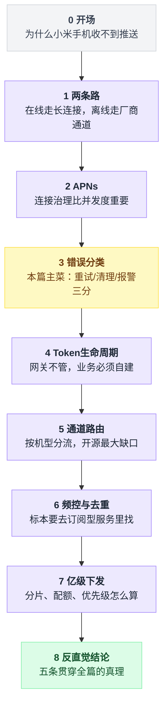
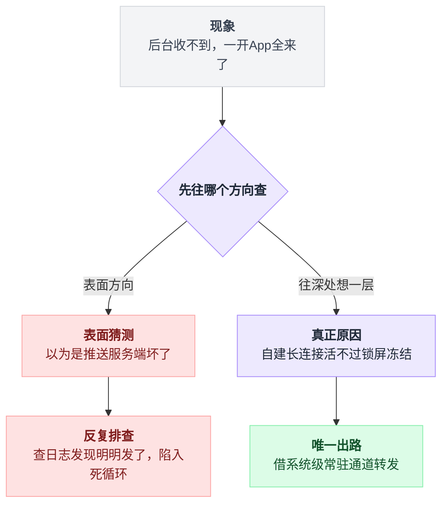
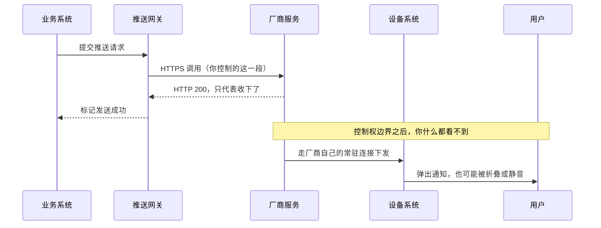
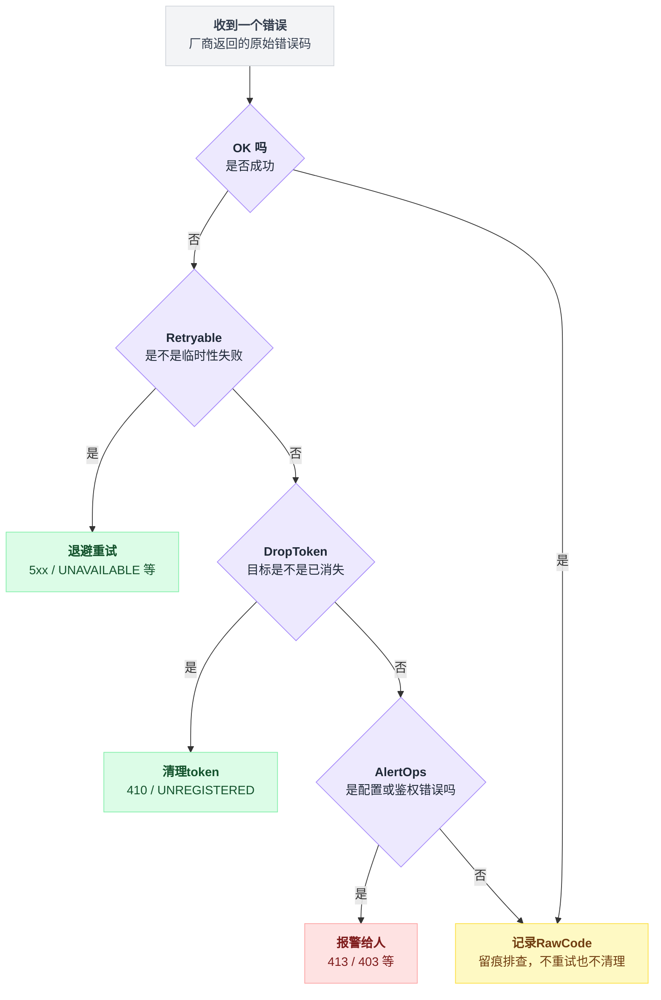
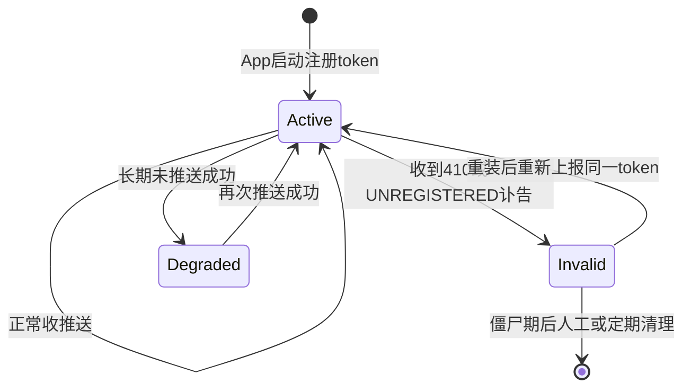
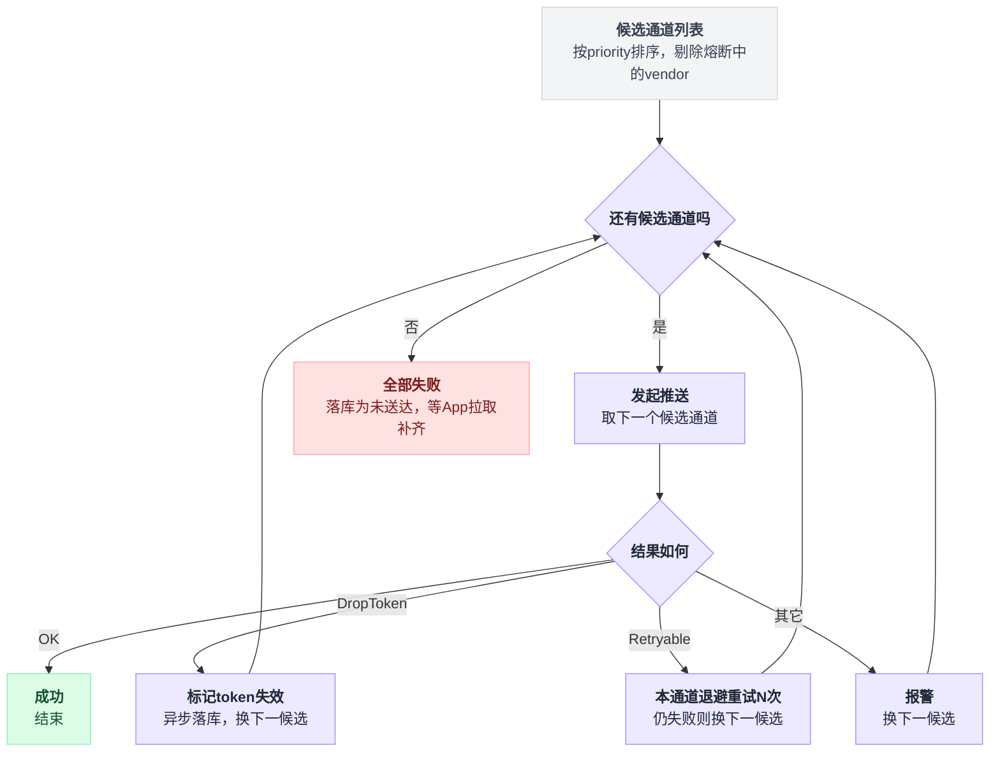
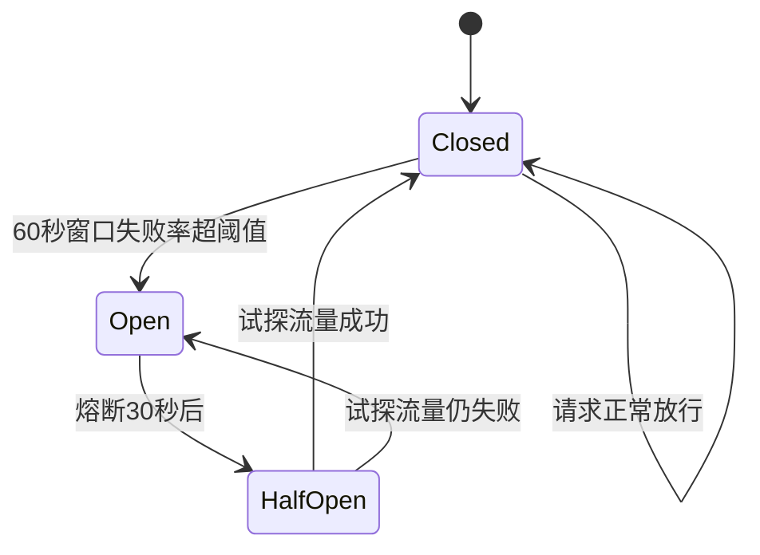

# 《消息推送与厂商通道》通道抽象能统一请求，统一不了失败（小白版）

> 一句话结论：**同一个推送网关里，APNs 和 FCM 的重试语义是不一致的**——gorush 的 APNs 路径只对 `StatusCode >= 500` 重试（这是对的），FCM 路径的 `handleTokenResponses` 却把所有 token 级错误无差别收集进重试队列，不区分"这个 token 已经永久失效"。通道抽象能把请求统一成一个 `Send(msg)`，统一不了失败——错误分类这一层几乎必然漏水。还有一条更让人难受的：**主流开源推送网关基本不做 Token 失效清理**，你以为网关会帮你把死 token 摘掉，它不会，这件事必然是业务侧自建的。
>
> 难度：★★★★☆
>
> 阅读前提：本篇是[第 09 篇《IM 消息可靠投递》](./09-IM消息可靠投递.md)的姊妹篇。那篇讲**我方系统内怎么保证送达**（seq 号、双重 ACK、超时重传、断层检测），本篇讲**把消息交给别人之后怎么办**——交给苹果、交给谷歌、交给华为小米。分界线就一句话：从你调用厂商 HTTP 接口那一刻起，你失去了控制权。第 09 篇的所有招数在这条线之外全部失效。本篇不复读 seq 和 ACK。
>
> 写作时间：2026-08-05。文中 star 数与最后提交时间为当日实测；源码细节基于公开仓库，未经一手核实的说法在文中已标注。

本篇要回答的六个问题：

1. 为什么你的 App 在小米手机上收不到推送，而这件事在 iOS 上根本不存在
2. APNs 那条 HTTP/2 长连接为什么"并发数调大只会更快撞上半死连接"，`ReadIdleTimeout` 压到 1 秒是在防什么
3. 同一个推送网关里，两条通道的重试语义怎么会不一致，以及这为什么不是 bug 而是抽象的宿命
4. 失效 Token 该谁清理——为什么找这个标本要去看订阅型服务，而不是下发型网关
5. "华为机走华为、小米机走小米、失败回落"这套路由，在开源里为什么找不到
6. 一亿条推送的账怎么算：分片、批量、优先级队列各自解决哪一段

---

## 目录

- [0. 开场：为什么你的 App 在小米手机上收不到推送](#0-开场为什么你的-app-在小米手机上收不到推送)
- [1. 先分清两条路：在线走长连接，离线走厂商通道](#1-先分清两条路在线走长连接离线走厂商通道)
- [2. APNs 这一关：连接治理比并发度重要](#2-apns-这一关连接治理比并发度重要)
- [3. 错误分类：同一个仓库里两套语义（本篇主菜）](#3-错误分类同一个仓库里两套语义本篇主菜)
- [4. Token 生命周期：网关不管，那谁管](#4-token-生命周期网关不管那谁管)
- [5. 通道路由与降级：最大的开源缺口（诚实章节）](#5-通道路由与降级最大的开源缺口诚实章节)
- [6. 频控与去重：找标本要去看订阅型服务](#6-频控与去重找标本要去看订阅型服务)
- [7. 亿级下发的账怎么算](#7-亿级下发的账怎么算)
- [8. 反直觉结论](#8-反直觉结论)
- [9. 一句话总结、小白词典、和前几篇的对照](#9-一句话总结小白词典和前几篇的对照)

---

全文九个台阶层层递进，从"为什么收不到推送"一路走到"一亿条怎么发"，先看一眼每一级解决的是哪段问题：



## 0. 开场：为什么你的 App 在小米手机上收不到推送

### 0.1 这个问题每个中国 Android 开发都被问过

产品拿着一台小米手机走过来：

> "我这条消息在模拟器上收得到，在我同事的手机上也收得到，在我这台小米上就是收不到。你们推送是不是坏了？"

你打开日志，服务端明明发了。

你让他把 App 从后台调到前台，消息"唰"地一下全来了——一次来了七条，全是过去两小时攒下的。

这不是 bug 报告，这是一道系统设计题。它的完整版本是：**当你的进程根本不在运行的时候，一条消息怎么才能出现在用户的锁屏上？**

表面看像是"推送服务坏了"，往深处挖一层，根因和出路其实是这样分岔的：



### 0.2 最朴素的做法：我自己维持一条长连接

学过[第 09 篇](./09-IM消息可靠投递.md)的人第一反应都是这个：App 里起一个后台 Service，跟服务端保持一条 TCP 长连接，30 秒一个心跳，服务端有消息直接从这条连接推下来。

这我也会写。而且它在开发机上工作得完美无缺——你插着 USB 线、屏幕亮着、App 刚启动，连接稳如老狗。

### 0.3 打死它：你的进程活不过锁屏

把手机拔下来，锁屏，放进兜里 20 分钟。

```
        你以为的                             实际发生的
  ───────────────────────────        ───────────────────────────
  10:00  用户锁屏                     10:00  用户锁屏
  10:00  Service 继续跑               10:02  系统把 App 放进"后台限制"
  10:00  心跳每 30 秒一次              10:05  进程被冻结，心跳线程不再调度
  10:15  服务端推消息 → 秒到           10:06  TCP 连接因为没心跳被中间设备回收
  10:15  用户听到提示音                10:15  服务端 write() 成功返回 ✓
                                              （数据进了内核缓冲区，就这样了）
                                       10:15  用户什么都没听到
                                       12:20  用户点开 App，七条消息一起到
```

注意最毒的一点：**服务端那次 `write()` 是成功的**。

你的日志里写着"推送成功"，监控面板绿油油，用户手上什么都没有。这是本篇会反复出现的形态——**你以为的成功，只是"我把它交出去了"**。

国内 Android 系统对后台进程的管控策略各家不同、版本不同（具体策略以各厂商官方开发者文档为准），但方向是一致的：**你不可能靠自建长连接保证送达**。

这条路在 iOS 上更干脆——iOS 压根不给你这个选项，App 进后台之后网络能力就被收走了。

### 0.4 所以只剩一条路：借系统的连接

系统自己有一条常驻连接，它不会被冻结——因为它就是系统。你把消息交给系统，系统从它那条连接推给设备，再由系统弹出通知。

```
   自建长连接（活不下来）           系统级通道（唯一能活的）
   你的服务端                       你的服务端
       │ 你自己的 TCP                   │ HTTPS 调用
       ▼                                ▼
   你的 App 进程（后台）            厂商推送服务（APNs / FCM / HMS…）
       ✗ 会被冻结/杀死                  │ 系统那条常驻连接
                                        ▼
                                   手机系统进程 ← 不会被冻结
                                        │ 系统弹通知
                                        ▼
                                      用户看到 ✓
```

代价就是本篇的全部内容：**中间多了一个你控制不了的人**。

### 0.5 而"厂商"在国内不是一个，是一堆

iOS 世界很清爽：只有 APNs，苹果一家，没有第二个选项。

Android 世界在国外也还行：FCM 一家。但在国内，绝大多数手机没有 Google 服务框架（GMS），FCM 在这些设备上基本不可用。于是每个手机厂商自己做了一套：华为、小米、OPPO、vivo、魅族……各有各的 SDK、各有各的鉴权方式、各有各的错误码。

三个世界摊开对比：

| | iOS | 海外 Android | 国内 Android |
|---|---|---|---|
| 通道 | APNs（一条路） | FCM（一条路） | 华为 │ 小米 │ OPPO │ vivo │ … 按机型分叉，每条单独接 |
| 凭证 | P8 / P12 / PEM | Service Account | 各家一套 AppID / Secret |
| 错误码 | HTTP + reason | 一套 error code | 各家一套数字码 |

产品说的"小米手机收不到"，翻译过来通常是：**这台设备根本没走到任何一条能活下来的通道上**——要么 App 没接小米通道，要么接了但服务端路由没把它发到小米那边。

### 0.6 本篇路线图

| 症状 | 根因 | 谁来解 |
|---|---|---|
| 后台收不到，前台一开全来了 | 自建长连接活不过锁屏 | 第 1 节：分清在线/离线两条路 |
| iOS 推送时快时慢，偶尔整批超时 | HTTP/2 长连接半死不活 | 第 2 节：连接治理 |
| 重试队列越跑越长，成功率却不涨 | 把永久失效当临时失败重试 | 第 3 节：错误分类（主菜） |
| 设备表越来越大，无效 token 占一半 | 没人负责清理 | 第 4 节：Token 生命周期 |
| 换了个厂商机型就静默丢消息 | 没有运行时路由 | 第 5 节：诚实章节 |
| 一次营销活动把通道打爆/被厂商限速 | 没有频控和分片 | 第 6、7 节 |

---

## 1. 先分清两条路：在线走长连接，离线走厂商通道

### 1.1 一条消息的两种命运

真实的 IM/通知系统从来不是"二选一"，而是同时养着两条路：

```
                    服务端要发一条消息给用户 U
                    ┌─────────────┴──────────────┐
                    ▼                            ▼
            U 的长连接还在？                  U 不在线
          （App 在前台/刚进后台）          （锁屏、被杀、卸载）
                    ▼                            ▼
          在线路：自家长连接              离线路：厂商通道
          seq / 双重 ACK / 补拉           token / HTTP 200 就算完
          ▶ 第 09 篇的地盘                ▶ 本篇的地盘
```

### 1.2 题眼：控制权在哪一刻消失

第 09 篇能做出那么强的可靠性保证（不丢、不重、有序、多端一致），前提只有一个：**收发两端的代码都是你写的**。

你能让客户端回 ACK，你能让客户端上报"我收到的最大 seq 是 105"，你能在客户端发现 103 缺失时主动补拉。

厂商通道里，这个前提整个塌了：

```
   ◀────── 你能控制的 ──────▶│◀────── 你控制不了的 ──────▶
                              │
   业务系统 → 推送网关 → HTTPS ┼─▶ 厂商服务 → 设备系统 → 通知栏 → 用户
                          控制权边界
   这一侧你有：                │  这一侧你只有：
   重试次数 / 队列深度         │  一个 HTTP 状态码 + 一个 error reason
   优先级 / 日志与指标         │  （运气好的话）一个回执 ID
                              │  你拿不到：到没到设备、用户看没看到、
                              │            通知被折叠了还是被静音了
```

**HTTP 200 的含义是"厂商收下了"，不是"用户收到了"。**

这跟 0.3 节那次成功的 `write()` 是同一个病：你的成功率指标衡量的是交接动作，不是结果。

把一条推送消息从触发到设备的整条旅程按时间线摊开，控制权在哪一步消失看得更清楚：



### 1.3 两条路的对照表

| 维度 | 在线路（第 09 篇） | 离线路（本篇） |
|---|---|---|
| 目标地址 | 长连接 session id | device token（厂商发的） |
| 成功信号 | 客户端 ACK（应用层） | HTTP 2xx（传输层交接） |
| 失败可见性 | 明确：没等到 ACK | 模糊：厂商说 OK，用户没看到 |
| 去重手段 | seq 号，客户端本地去重 | collapse key / 业务侧幂等 |
| 有序保证 | 会话内严格有序 | **无任何有序保证** |
| 重试主体 | 你的服务端 | 你的网关（但重试对不对，看第 3 节） |
| 失效清理 | 连接断了就是断了，天然 | token 会"假活"很久，见第 4 节 |
| 限速 | 你自己说了算 | 厂商说了算，超了就 429 |

💡 一句话复习第 09 篇：**推送永远不可靠，最终必须靠拉**——客户端上线时用 seq 断层检测把漏掉的消息补回来。

这条结论在本篇的地位更高了：厂商通道连"不可靠"都不告诉你，所以**厂商推送只能当"叫醒服务"用，真正的数据一致性必须靠 App 打开后那次拉取**。你在推送 payload 里塞的那点内容，是给通知栏看的，不是给业务逻辑用的。

---

## 2. APNs 这一关：连接治理比并发度重要

### 2.1 先过凭证这一关：P8 / P12 / PEM

接 APNs 第一件事是证明"我是这个 App 的后端"。gorush（appleboy/gorush，8,752 star，最后提交 2026-07-25，2026-08-05 实测）的 `notify/notification_apns.go` 里同时支持三种（已读源码）：

| | P8（Token-based） | P12 / PEM（Certificate-based） |
|---|---|---|
| 鉴权方式 | JWT：一个 .p8 私钥 + KeyID + TeamID，服务端本地签 JWT 放 header | TLS 客户端证书：鉴权在 TLS 握手阶段完成 |
| 覆盖范围 | 一份 key 可以打所有 App | 一个 App 一份证书，绑 bundle id |
| 过期 | key 本身不过期 | 证书会过期（到期那天，所有 iOS 推送同时停摆） |
| 代价 | 签出来的 JWT 有有效期，要定期重签 | P12 是带密码的二进制，PEM 是文本形式，本质一回事 |

⚠️ 证书过期是 iOS 推送最经典的"整点事故"：它不是慢慢劣化，是某天零点之后**全线 403**。而且过期日期躺在证书里，没人会主动看。

上线时顺手做两件事：把过期时间录进日历，把"距离过期天数"做成一个监控指标。新项目直接选 P8，省掉这整类事故。

### 2.2 一条 TCP 连接，几万个请求

APNs 走 HTTP/2。HTTP/2 的卖点是多路复用：**一条 TCP 连接上并行跑上千个 stream**，不用像 HTTP/1.1 那样开一堆连接。

省资源，但也把所有鸡蛋放进了一个篮子——**这条连接一旦不健康，挂在上面的所有请求一起遭殃**。

### 2.3 半死连接：最难查的那种故障

"连接断了"是好事——`write()` 立刻报错，你重连就完了。真正难缠的是**连接还在，但对面已经不理你了**：

```
   帧 1  正常                    你 ──── TCP ────▶ APNs      响应 50ms 回来
                                     （健康）

   帧 2  中间某个 NAT/LB 静默回收了这条连接的映射
                                你 ──── TCP ──╳   APNs
                                     （你不知道）           你的内核还认为连接是好的

   帧 3  你继续发                你 ──▶ ✗（进了黑洞）
         请求 1..N 全部发出       没有 RST，没有 FIN，没有错误
                                 所有请求静静地挂着，等超时

   帧 4  超时（比如 30 秒）       N 个请求同时报 timeout
                                 这 N 条推送全部进重试队列
                                 你的 P99 从 50ms 变成 30s
```

关键点：**内核不知道对面没了**。

TCP 没有心跳（除非开 keepalive，而它的默认间隔通常是分钟级），中间设备回收映射时也不一定发 RST。你唯一能做的是**自己主动探活**。

### 2.4 gorush 的解法：把 HTTP/2 探活压到 1 秒

gorush 在 APNs 的 HTTP/2 transport 上把 `ReadIdleTimeout` 和 `PingTimeout` 都设到 **1 秒**（`notify/notification_apns.go`，已读源码）。

这两个参数合起来就是一个探活循环：

```
每次连接上有数据读到:
    重置空闲计时器

if 空闲计时器 > ReadIdleTimeout(1s):     # 1 秒没读到任何数据
    发一个 HTTP/2 PING 帧
    if 等 PingTimeout(1s) 还没收到 PONG:  # PING 出去 1 秒没回
        判定连接已死 → 关掉 → 重建
```

所以最坏情况是**连接死掉 2 秒内被发现并重建**；对比默认行为，靠请求超时来发现，可能是 30 秒，且期间所有请求陪葬。

```
  ReadIdleTimeout = 1s
     └─ 连接上超过 1 秒没读到任何数据 → 主动发一个 HTTP/2 PING 帧

  PingTimeout = 1s
     └─ PING 发出去 1 秒内没等到 PONG → 判定连接已死，关掉重建

  最坏情况：连接死掉 2 秒内被发现并重建
  对比默认行为：靠请求超时发现，可能是 30 秒，且期间所有请求陪葬
```

一秒听起来激进——每秒一个 PING 帧，多出来的流量约等于零（PING 帧只有 8 字节负载），换来的是把故障发现时间从"一次请求超时"压到"一次 PING 超时"。**这是一笔非常划算的买卖，而且它是本节唯一真正重要的配置。**

⚠️ 顺带标一条时效：Go 生态里最常被提到的 APNs 客户端库 sideshow/apns2，最后提交停在 **2025-07-22**（2026-08-05 实测），已经一年没动了。它和 gorush 之间的依赖关系、以及库内的具体路径**本篇未核实**（以官方仓库为准）。

但选型时值得把"这个库还在不在维护"算进账：APNs 的错误码和协议细节是苹果说了算的，客户端库停更意味着新错误码得你自己补——**而第 3 节马上会讲，错误码补不全，重试策略就是错的。**

### 2.5 `MaxConcurrentIOSPushes`：一个 channel 当信号量

gorush 用了一个非常 Go 的写法来限制同时在飞的 iOS 推送数（`MaxConcurrentIOSPushes`，已读源码）：

```go
// 思路示意（非逐字源码）：容量为 N 的 channel 当信号量
sem := make(chan struct{}, maxConcurrentIOSPushes)

for _, token := range tokens {
    sem <- struct{}{}          // 占一个坑；坑满了就在这里阻塞
    go func(t string) {
        defer func() { <-sem }() // 干完让出坑
        client.Push(notification)
    }(token)
}
```

一个带缓冲的 channel，写入即"拿信号量"，读出即"还信号量"。缓冲满了写入自动阻塞——**天然的背压**，不需要额外的锁或计数器。

### 2.6 落点：并发数调大只会更快撞上半死连接

现在把 2.3 和 2.5 拼起来。

很多人的第一反应是"iOS 推送慢，把 `MaxConcurrentIOSPushes` 从 100 调到 1000"。看看会发生什么：

```
   连接健康时                 连接半死时（帧 3 的状态）
   并发 100  → 慢             并发 100  → 100 个请求陪葬
   并发 1000 → 快 ✓           并发 1000 → 1000 个请求陪葬 ✗

   吞吐 = 并发数 ÷ 单请求耗时
          ↑          ↑
        你在调这个   问题出在这个（30s 超时 vs 50ms 正常）

   连接一坏，分母涨 600 倍；分子涨 10 倍救不回来。
```

**瓶颈是连接健康，不是并发度。** 并发数决定的是"连接好的时候能跑多快"，探活参数决定的是"连接坏的时候你多久能发现"。后者对成功率的影响是数量级的，前者是线性的。

这跟[第 28 篇《分布式调度》](./28-分布式调度.md)里"加机器不加产能"是同款反直觉：quartz 集群加节点只是让抢锁的人变多，产能在干活那一端；这里调并发只是让挂在坏连接上的人变多，产能在连接健康那一端。

**看起来是容量问题的，往往是健康度问题。**

---

## 3. 错误分类：同一个仓库里两套语义（本篇主菜）

### 3.1 先说清楚：推送的失败不是一种，是三种

绝大多数推送系统的 bug 都源于把下面三种东西当成一种：

| | ① 临时性失败 | ② 永久性失败 | ③ 目标已消失 |
|---|---|---|---|
| 典型情形 | 厂商 500 / 503；网络超时；限流 429 | payload 太大；topic 写错；鉴权配置错 | token 已注销；用户卸载了 App；换手机了 |
| 正确动作 | 退避后重试 ✓ | 报警给开发 ✓ | **删掉这个 token** ✓ |
| 为什么 | 会成功 | 重试一万次也没用 | 而且重试纯浪费 |

第 ③ 类最特殊：它既不该重试，也不是"你的代码有 bug"——它是**数据该被清理的信号**。

把它当第 ① 类处理，就是本节要拆的那个坑。

### 3.2 gorush 的 APNs 路径：只对 5xx 重试（这是对的）

`notify/notification_apns.go` 里的重试判断非常克制（已读源码）：**只有 `StatusCode >= 500` 才进重试队列**。

写成伪代码就一行：

```
if resp.StatusCode >= 500:  进重试队列
else:                       就地放弃，不重试
```

落到具体错误码上：

```
   APNs 返回                      gorush 的动作
  ─────────────────────────────────────────────────
   500 InternalServerError    →   重试 ✓
   503 ServiceUnavailable     →   重试 ✓
  ─────────────────────────────────────────────────
   400 BadDeviceToken         →   不重试 ✓（token 格式就是错的）
   403 认证失败                →   不重试 ✓（重试一万次还是失败）
   410 Unregistered           →   不重试 ✓（用户卸载了）
   413 PayloadTooLarge        →   不重试 ✓（内容不改，永远太大）
   429 TooManyRequests        →   不重试（你被限速了，见 3.5 节的争议）
```

这个划法抓住了要害：**HTTP 4xx 的语义是"你的请求有问题"，5xx 的语义是"我的服务有问题"。你的请求有问题时原样重发一遍，凭什么会好？**

### 3.3 gorush 的 FCM 路径：所有 token 错误一锅端（这是漏水点）

同一个仓库，换到 `notification_fcm.go`。

FCM 的批量接口一次可以发一批 token，返回的是一个 per-token 的结果数组。gorush 的 `handleTokenResponses` 负责处理它（已读源码），做法是：**把所有 token 级错误统一收集起来，塞进重试队列，不区分具体错误码**。

```
for i, r in enumerate(响应数组):
    if r.Error != nil:
        失败列表.append(tokens[i])   // 注意：这里没有看 r.Error 是什么
重试队列 <- 失败列表
```

那个缺失的分支就是全部问题所在——`r.Error` 的具体内容从头到尾没人读过。于是：

```
   FCM 单个 token 的返回              gorush 的动作
  ─────────────────────────────────────────────────────
   UNAVAILABLE（服务暂时不可用）  →   收集 → 重试 ✓ 对
   INTERNAL（内部错误）           →   收集 → 重试 ✓ 对
   UNREGISTERED（token 已失效）   →   收集 → 重试 ✗ **纯浪费**
   INVALID_ARGUMENT（token 格式错）→  收集 → 重试 ✗ **纯浪费**
   SENDER_ID_MISMATCH（不是你的） →   收集 → 重试 ✗ **纯浪费**
```

`UNREGISTERED` 的语义是明确的、终局的：**这个 token 对应的 App 已经卸载了，或者用户清了数据，或者 token 被 FCM 主动轮换掉了。**

它永远不会自己变好。重试它，不但这一轮浪费，下一轮、下下轮还会再来一次。

### 3.4 错误分类矩阵：这张表就是本篇主菜

把两条通道并排放进同一张表，漏水点就无处躲藏了：

| 错误语义 | APNs 侧典型返回 | FCM 侧典型返回 | 该重试 | 该清理 token | gorush APNs 实际 | gorush FCM 实际 |
|---|---|---|---|---|---|---|
| 服务端临时故障 | 500 / 503 | `UNAVAILABLE` / `INTERNAL` | ✓ | ✗ | 重试 ✓ | 重试 ✓ |
| 被限速 | 429 TooManyRequests | 配额超限 | ✓（退避） | ✗ | 不重试 △ | 重试 ✓ |
| token 已注销 | 410 Unregistered | `UNREGISTERED` | ✗ | **✓** | 不重试 ✓ | **重试 ✗** |
| token 格式非法 | 400 BadDeviceToken | `INVALID_ARGUMENT` | ✗ | **✓** | 不重试 ✓ | **重试 ✗** |
| token 不属于本 App | DeviceTokenNotForTopic | `SENDER_ID_MISMATCH` | ✗ | **✓** | 不重试 ✓ | **重试 ✗** |
| 内容过大 | 413 PayloadTooLarge | 消息体超限 | ✗ | ✗（该报警） | 不重试 ✓ | 重试 ✗ |
| 鉴权错误 | 403 | 凭证错误 | ✗ | ✗（该报警） | 不重试 ✓ | 重试 ✗ |

（表中"该重试/该清理"一列是按各厂商公开文档的错误语义给出的应然判断，具体错误码常量以官方文档为准；gorush 两列基于其源码的分支逻辑。）

看最后两列。**同一个仓库、同一个抽象、同一个 `Notification` 结构体，两条通道对"什么叫失败"的理解完全不同。**

### 3.5 顺手说 429 那个 △

APNs 的 429 在 gorush 里不重试，严格说是保守了——限速是典型的临时性失败，正确姿势是**退避后重试**而不是丢弃。

但"不重试"至少不会把厂商打得更狠；反过来，FCM 那边不加退避地重试限流错误，是在往火上浇油。

这就引出一条通用原则：**限流类错误必须配指数退避重试，不能配立即重试，也不该配丢弃。**

退避的具体做法在[第 04 篇《分布式限流器》](./04-分布式限流器.md)里讲过限流器一侧，这里是被限流方的一侧——两侧合起来才完整。

### 3.6 为什么这不是 bug，是抽象的宿命

到这里很容易得出"gorush 的 FCM 实现写得不够细"的结论。但把镜头拉远一点，会看到更本质的东西：

```
              统一推送抽象想做的事
   Send(msg{title, body, tokens[], extra})   ← 这一层统一得很成功
        ┌──────────────┴──────────────┐
        ▼                             ▼
      APNs                           FCM
      一次一个                        一次一批    ← 批量语义不一样
      HTTP 状态 + reason              结果数组    ← 错误载体不一样
      4xx / 5xx                       枚举字符串  ← 连"错误的形状"都不一样
        └──────────────┬──────────────┘
                       ▼
          想统一成一个 error 类型？
          能，但会丢掉"该不该清理"  ← 漏水就漏在这里
```

请求是**你构造的**，你想让它长什么样它就长什么样，所以统一请求是免费的。

错误是**对方给的**，两个厂商在不同年代、按不同设计哲学定义了各自的错误体系，你没有任何办法让它们对齐。

**统一抽象的成本，永远出现在你控制不了的那一侧。**

所以正确的做法不是"别用抽象"，而是**在抽象里预留错误分类这一维**：

```go
// 每个通道适配器必须回答的三个问题，而不只是回答"成功还是失败"
type PushResult struct {
    OK          bool
    Retryable   bool   // 该不该重试
    DropToken   bool   // 该不该把这个 token 从设备表里摘掉  ← 最容易被漏掉的一维
    AlertOps    bool   // 该不该报警给人看（配置错、鉴权错）
    RawCode     string // 原始错误码，永远保留，用于排查
}
```

把这四个问题连起来，就是每条错误该走的判定路径：



只要接口上没有 `DropToken` 这一维，无论下面接几个厂商，token 清理这件事都必然掉在地上——这正是第 4 节的主题。

### 3.7 算一笔账：不清理的成本

假设你有 1000 万台设备，按行业常见规律，**每年会有相当比例的 token 因卸载/换机/系统重置而失效**（具体比例因产品而异，这里取 20% 作为算例，非实测数据）。

```
   设备表 1000 万 token
        ├─ 有效 800 万   ──▶ 正常推送
        └─ 已失效 200 万 ──▶ 每次全量推送都发一遍，失败后按 FCM 路径重试 3 次
                            = 200 万 × 4 次 = 800 万次无效请求
                              ├─ 白烧 QPS 配额（可能挤掉真实推送）
                              ├─ 白涨失败率（成功率永远上不去 80%）
                              ├─ 白填重试队列（挤占真实的临时失败）
                              └─ 白付带宽与机器成本

   而这 800 万次请求，正确率是 0%——它们不可能成功。
```

最坏的一层不是浪费：**是重试队列被垃圾占满，真正该重试的临时失败被挤掉了。**

---

## 4. Token 生命周期：网关不管，那谁管

### 4.1 Token 是有生命的，而且死得很安静

| 阶段 | 发生了什么 | 你的服务端知道吗 |
|---|---|---|
| 注册 | App 首次启动向厂商申请，得到 token | 知道 |
| 活跃期 | 正常收推送，每次启动上报给你的服务端 | 知道 |
| 死亡（安静发生） | 用户卸载 App / 用户清除 App 数据 / 换手机或恢复出厂 / 厂商主动轮换 token / 长期不用被回收 | **五种死法没有一种会通知你** |
| 僵尸期 | 设备表里还躺着，还在每天被推送，每天都失败 | 只有失败率会隐约提示你 |

唯一的知情渠道，是推送时厂商返回的那个 `UNREGISTERED` / 410。

这就是第 3 节那条 `DropToken` 维度为什么重要到要单开一节：**厂商返回的永久性错误，是 token 死亡的唯一讣告。** 你把它当成"临时失败重试一下"，等于把讣告扔了。

上面这条死亡时间线只画了单向衰败，漏了 4.5 节要讲的"复活"路径——按状态机摊开更完整：



### 4.2 gorush 两边都没有回写清理

翻 gorush 的 APNs 和 FCM 两条路径（已读源码）：APNs 侧正确地识别出了 410/400 这类不可重试错误，FCM 侧把它们塞进了重试队列——但**两边都没有"把这个 token 从某张设备表里删掉/标记失效"的逻辑**。

这不是 gorush 的失职。它是个**无状态转发器**：输入 token + 内容，输出"发出去了，结果是这个"。它压根不知道你的设备表在哪，也没有你的用户体系——它只能把错误码告诉你，清理必须你自己做。

**推送网关是无状态的，而 token 生命周期是有状态的。** 一个无状态组件不可能替你管有状态的数据——这不是实现缺陷，是分层的必然结果。

### 4.3 反过来，ntfy 把清理做全了

有意思的地方来了。

binwiederhier/ntfy（33,040 star，最后提交 2026-08-04，2026-08-05 实测）是一个消息**订阅**服务，不是下发网关。它的 `server/server_manager.go` 里有个 `execManager()`，是一个周期性跑的后台管家（已读源码），干的事包括：

| execManager() 周期任务 | 干什么 |
|---|---|
| 清理过期的 token | 把到期 token 扫掉 |
| 处理软删除的用户 | 到期后真正清掉 |
| 清理过期的附件 | attachment 到期即删 |
| 消息批量剪枝 | 按保留策略删旧消息 |
| web push 订阅的 prune | 清掉失效订阅 |

同时 ntfy 也会调 `sendToFirebase()` 往 FCM 发——也就是说：**它既是下发方，又是数据主人。**

关键差别不在"谁的代码写得好"，在**谁拥有数据**。

gorush 里数据主人是你，它只是过路的，既没法清理也没有动机清理；ntfy 里用户、订阅、消息、附件全在它自己库里，**它不清理磁盘就爆**，所以它必须清理。

### 4.4 落点：找频控和清理的标本，要去看订阅型服务

这条很反直觉，值得写透。

你想学"推送系统怎么做限流、怎么做清理"，第一反应一定是去读推送网关的源码——gorush、bark-server 这类。**这个方向大概率会空手而归。**

原因是结构性的：

```
   你想找的能力        它天然长在哪里     为什么
   token 失效清理      订阅型服务         库是它的，不清理会撑爆
   多维频控            订阅型服务         直面海量用户，要防滥用
   消息保留与剪枝      订阅型服务         消息存在它这儿
   配额与计费          订阅型服务         它要按用户收钱
   ─────────────────────────────────────────────────────────
   连接治理 / 凭证管理  下发型网关         它专职和厂商打交道
   批量与并发控制      下发型网关         同上
```

一句话：**下发型网关是"过路的"，订阅型服务是"住户"。过路的不会打扫房子。** 你要学打扫，去看住户。

所以本篇的标本分工是这样的：连接治理和错误分类看 gorush，清理和频控看 ntfy（第 6 节继续用它），通道选择看 OpenIM（第 5 节）。

**没有任何一个开源项目能同时教你这三件事**——这本身就是一条结论。

### 4.5 那业务侧该怎么做

既然必然自建，把最小可用的方案摆出来：

```
   设备表（你自己的）
   user_id │ vendor │ token │ status  │ last_ok_at
   10086   │ apns   │ abc…  │ active  │ 08-05 10:00
   10086   │ fcm    │ def…  │ invalid │ 07-01 09:12  ← 被讣告标掉的
   10087   │ hms    │ ghi…  │ active  │ 08-05 09:58
```

三条写入路径，各管一件事：

```
写入路径:  收到 App 启动上报(token)
            → upsert 设备表; status = active     // 复活也走这条

淘汰路径:  推送返回 410 / UNREGISTERED
            → status = invalid                   // 软删，不 DELETE

兜底路径:  now - last_ok_at > N 天
            → 降级，不进主推队列                  // 从没成功过的，别再占配额
```

三条纪律：

1. **软删不硬删**。token 可能因为你自己的 bug 被误判失效（比如把 topic 配错，APNs 返回 DeviceTokenNotForTopic，这其实是你的问题不是 token 的问题），硬删就找不回来了。
2. **上报路径要能复活**。用户重装 App 后拿到的可能是同一个 token，上报时必须把 status 置回 active。
3. **别在推送的同步路径上写库**。把失效 token 丢进一个队列，异步批量更新——推送链路上每条失败都同步写一次库，高峰期能把库打挂。这跟[第 26 篇《全链路追踪》](./26-全链路追踪.md)里 SDK 上报的原则一样：**主链路只做入队，脏活交给后台线程。**

---

## 5. 通道路由与降级：最大的开源缺口（诚实章节）

> ⚠️ 本节前半段（5.1~5.2）基于 openimsdk/open-im-server 的源码；后半段（5.4 起）**是设计推演，不是任何开源项目的实测实现**，全程标注。

### 5.1 大家以为的通道路由长这样

问一个接过国内推送的人"你们怎么做通道路由"，得到的答案通常是：

```
                    要推给设备 D → 看 D 是什么机型
        ┌───────────┬───────────────┬───────────┐
        ▼           ▼               ▼           ▼
     华为机       小米机          OPPO 机      iPhone
     走 HMS      走小米通道       走 OPPO      走 APNs
     失败？      失败？           失败？       失败？
        └───────────┴───────┬───────┴───────────┘
                            ▼
                    回落到自建长连接 / 短信
```

这套东西每个中大厂都有。**但你在开源里找不到它。**

### 5.2 OpenIM 的真实实现：启动期单选一个厂商

openimsdk/open-im-server（16,559 star，最后提交 2026-07-25，2026-08-05 实测）是目前最主流的开源 IM 服务端。它的离线推送在 `internal/push/offlinepush/offlinepusher.go`（已读源码）：一个 `OfflinePusher` 接口，加一个 `NewOfflinePusher()` 工厂函数。

工厂函数的逻辑是：**读配置里那个字符串，匹配 getui / fcm / jpush 之一，返回对应实现；一个都匹配不上，返回 dummy 实现。**

```
   NewOfflinePusher(config)
            │
            ▼
   switch config.Enable      ← 注意：这是**进程启动时**执行一次
     ├─ "getui"  → 个推实现
     ├─ "fcm"    → FCM 实现
     ├─ "jpush"  → 极光实现
     └─ default  → dummy 实现（什么都不做，静默返回）
            │
            ▼
   整个进程生命周期里，所有设备都走这一个实现
```

对比一下"有路由"和"没路由"的函数签名，差别一眼就出来了：

```
OpenIM 实际:   pusher = NewOfflinePusher(config)   // 启动时一次，参数里没有 device
               pusher.Push(device, msg)            // device 只是收件人，不影响走哪条路

有路由的话:    pusher = pick(device.vendor)        // 每条消息一次，按机型选
               pusher.Push(device, msg)
```

两个后果，都值得盯着看。

**后果一：没有运行时路由。** 这不是"路由做得简单"，是**结构上就没有路由**——设备的机型信息压根没有参与选择。华为机和小米机在这里得到的是同一个 pusher。

**后果二：dummy 静默丢弃。** 配置写错一个字母，你得到的不是启动失败，是一个**安安静静把所有推送吃掉**的实现。这是 0.3 节那个"成功的 `write()`"的终极形态：整条链路没有任何一处报错，消息就是不见了。

```
   配置里写了 "FCM"（大写）而不是 "fcm" → 匹配不上 → dummy
            │
            ├─ 服务正常启动 ✓   健康检查通过 ✓   日志无异常 ✓
            ├─ 推送成功率 100%（因为 dummy 从不失败）✓
            ▼
   用户一条推送都收不到 ✗
```

⚠️ 只要你的系统里有"匹配不上就静默降级"的分支，就一定要在那个分支里打 error 日志 + 打一个专门的监控指标。**默认分支是事故的温床**，因为它同时满足"很少走到"和"走到了没人知道"。

### 5.3 为什么国内厂商通道开源里几乎没有

摆事实：

| 通道 | 有没有可读的开源适配实现 | 说明 |
|---|---|---|
| APNs | 有，多 | gorush 的 `notification_apns.go`、bark-server 的 `apns/` 目录（文件存在性已核实，2026-08-05） |
| FCM | 有，多 | gorush 的 `notification_fcm.go`、ntfy 的 `sendToFirebase()` |
| 华为 HMS | 有 | gorush 的 `notification_hms.go`（已读源码） |
| 小米 / OPPO / vivo / 魅族 | **没有找到可读的开源适配实现** | 见下方说明 |
| 聚合服务（个推/极光等） | 有调用方代码 | OpenIM 里有 getui / jpush 分支 |

关于小米、OPPO、vivo：**我没有找到可直接引用的开源适配实现**（截至 2026-08-05）。可能的原因是这些通道通常通过厂商官方 SDK 或第三方聚合服务接入，而非开源适配层。这一条属于"没找到"，不等于"不存在"——**以官方仓库和各厂商开发者文档为准。**

正因如此，"华为机走华为、小米机走小米、失败回落"这套东西，在开源世界里是**空白**。它是各家自研并且不外传的部分。这是本系列少见的、开源标本给不出答案的题目。

### 5.4 那它应该长什么样（以下为设计推演，非源码实测）

既然找不到标本，就把设计推演出来，并明确标注这是推演。

**第一步：设备表里必须有 vendor 维度。**

路由的前提是"知道这台设备该走哪条路"。这个信息只有一个可靠来源：**App 端上报**。App 知道自己跑在什么 ROM 上、集成了哪些推送 SDK、拿到了哪几个 token。

```
   App 启动时上报（设计推演）
   {
     "user_id": 10086,
     "device_id": "xxx",
     "channels": [
        {"vendor": "xiaomi", "token": "aaa", "priority": 1},   ← 系统级通道，优先
        {"vendor": "self",   "token": "conn-id", "priority": 2} ← 自建长连接，兜底
     ]
   }
```

注意 `channels` 是**数组**，不是单值——这就是和 OpenIM 那个单选工厂最本质的结构差别。

**能不能做路由，在数据模型这一层就决定了。**

**第二步：路由策略（设计推演）。**

```
   route(device) → []Channel
     1. 取该设备所有 active 的 channel，按 priority 排序
     2. 过滤掉当前处于熔断状态的 vendor
     3. 返回有序候选列表 [xiaomi, self]
                    │
                    ▼
   send(msg, candidates)
     for ch in candidates:
         r = ch.Push(msg)
         if r.OK:        return 成功
         if r.DropToken: 异步标记 token 失效; continue 下一条
         if r.Retryable: 本通道退避重试 N 次; 仍失败则 continue
         else:           报警; continue
     全部失败 → 落库为"未送达"，等 App 下次上线时靠拉取补齐
```

把 `send()` 里那个 for 循环摊成判定路径，候选通道之间怎么接力回落看得更直白：



**第三步：通道级熔断（设计推演）。**

单条推送失败可以回落，但如果是整个小米通道挂了，你不该让每一条消息都去撞一次墙再回落——那会把延迟乘以通道数。

```
   通道健康度窗口（每 vendor 一个，设计推演）
     滑动窗口 60s：成功 12 / 失败 4880 → 失败率 99.7% > 阈值
     → 熔断该 vendor 30s，熔断期间 route() 直接跳过它，不再产生等待
     → 30s 后半开：放 1% 流量试探，成功则恢复
```

这三个状态之间怎么跳转，画成状态机比文字更一目了然：



这套熔断机制本身不新鲜，[第 04 篇《分布式限流器》](./04-分布式限流器.md)讲的是"限制别人进来"，这里是"限制自己出去"——**同一个滑动窗口计数结构，一个对内一个对外。**

**第四步：终局兜底，回到第 09 篇。**

所有通道都失败了怎么办？答案第 09 篇早就写好了：**别在推送这条路上死磕，落库，等 App 下次上线时靠 seq 断层检测拉回来。**

推送只是"叫醒服务"，不是"数据通道"——叫不醒，用户自己醒了也一样能拿到数据。

这也是为什么本篇不需要给推送做"无限重试"——**有一条更可靠的路兜底，推送就可以放心失败。** 一个通道敢失败的前提，是另一个通道能补齐。

### 5.5 本节结论的可信度声明

| 内容 | 来源 |
|---|---|
| `OfflinePusher` 接口、`NewOfflinePusher()` 启动期单选、dummy 静默丢弃 | openimsdk/open-im-server 源码（已读） |
| gorush 的 `notification_hms.go` 存在（华为通道） | 源码（已读） |
| 小米/OPPO/vivo 无可读开源适配实现 | 检索未找到，非"确认不存在"，以官方仓库为准 |
| 5.4 节整套路由 / 回落 / 熔断设计 | **设计推演，未实测验证** |
| novuhq/novu（39,442 star，2026-08-05）的多渠道编排能力 | star 与时间已实测；**具体实现路径未核实** |
| gotify/server（15,603 star，2026-08-02）作为长连接推送对照组 | star 与时间已实测；**具体实现路径未核实** |

---

## 6. 频控与去重：找标本要去看订阅型服务

### 6.1 为什么推送必须有频控

推送是少数几个"**你自己就是最大的攻击者**"的系统。真实的翻车形态：

```
   规则："商品每降一次价，给所有收藏用户推一条"
        │
        ▼  某天供应商接口抖动，价格在 10 分钟里刷新了 200 次
   每个收藏该商品的用户收到 200 条推送
        ├─▶ 用户关掉通知权限（永久损失，几乎不可逆）
        ├─▶ 应用商店评分暴跌
        └─▶ 厂商判定你滥用，限速甚至封禁（更狠，全站受影响）
```

最后一条最致命：**厂商的限速是按 App 维度的**，一个营销活动可以把验证码推送一起拖下水。

### 6.2 ntfy 的 visitor 多维限流

ntfy 的 `server/server.go` 里对每个 visitor（访问者）做了**多维度**的限流（已读源码）。一个 visitor 身上挂着好几把闸：

| 维度 | 限什么 |
|---|---|
| 消息数速率 | 每秒/每天能发多少条消息 |
| 邮件数速率 | 触发邮件通知的配额 |
| 电话呼叫速率 | 触发电话通知的配额（更贵） |
| 带宽 | 附件上传下载的流量 |

判定逻辑是"任一维度超限就拒绝，其余维度不受影响"：

```
for 闸 in [消息数速率, 邮件数速率, 电话呼叫速率, 带宽]:
    if 闸.超限(visitor):
        拒绝这次请求          // 只这一把闸说了算，别的闸照常放行
放行
```

关键设计在于**分维度**，而不是一把总闸。

原因很实在：**这几种动作的成本差着数量级。** 发一条推送几乎免费，发一封邮件有送达率和被标垃圾的风险，打一通电话是真金白银。要是只挂一把"每天 1000 次操作"的总闸，用户把这 1000 次全花在打电话上，你的账单就炸了——**每种资源必须按自己的成本单独定价**。

💡 这正好接上[第 04 篇《分布式限流器》](./04-分布式限流器.md)：那篇讲**限流算法**（计数器、漏桶、令牌桶、滑动窗口），本篇给的是**限流维度的设计**。

算法只回答"多快算快"，维度回答"按什么算"——生产上后者出错的次数远多于前者。一个用对了令牌桶但只有一个维度的限流器，照样会让你收到电话账单。

再次印证第 4.4 节：**这个标本又是从订阅型服务里挖出来的，不是从下发网关。**

### 6.3 推送的三层频控（业务侧要自己搭）

ntfy 的是平台级频控。业务侧真正要做的是这三层：

| 层级 | 限什么 | 典型规则 | 谁超了谁受影响 |
|---|---|---|---|
| **用户级** | 单个用户一天收几条 | 营销类 ≤ 3 条/天，且夜间不推 | 只影响这个用户 |
| **业务级** | 某类消息的总量 | "降价提醒"全站 10 万条/小时 | 影响这类业务 |
| **通道级** | 对厂商的出口 QPS | 按厂商配额留 20% 余量 | 影响全站，最该保护 |

三层的优先级是**从下往上**的：通道级配额是硬约束，用户级是软约束。

当通道级配额吃紧时，该被牺牲的一定是营销类，绝不能是验证码类——这就要求推送请求进队列时就带优先级（第 7 节接着说）。

### 6.4 去重：比频控更前置的一道闸

频控是"太多了就拦"，去重是"这条根本就不该有"。

```
   同一业务事件产生多条推送的三种来源
   ① 上游重复投递：MQ at-least-once，同一条消息消费两次
   ② 多端重复：一个用户 3 台设备，本该 3 条，业务侧算成 9 条
   ③ 重试穿透：第 3 节那个"永久失败也重试"，日志里三条成功

   解法：dedup_key = hash(biz_type, biz_id, user_id, 时间窗)
   Redis SETNX dedup_key, TTL = 时间窗
        ├─ 设置成功 → 首次，正常推
        └─ 已存在   → 丢弃，计数器 +1
```

这个 `dedup_key` 和第 09 篇的 seq 去重不是一回事，要分清：

- **seq 去重**：解决"同一条消息被投递多次"，key 是消息本身的身份；
- **dedup_key 去重**：解决"同一个业务事件生成了多条消息"，key 是业务事件的身份。

前者在传输层，后者在业务层。

**厂商通道那边还有个 collapse key（折叠 key），是第三层**——它让厂商把同一 key 的多条通知在设备上折叠成一条（各厂商命名和行为不同，以官方文档为准）。三层各管一段，谁也替代不了谁。

---

## 7. 亿级下发的账怎么算

### 7.1 先把账摆出来

场景：给一亿用户推一条运营通知（这正是[第 28 篇《分布式调度》](./28-分布式调度.md)开场那一亿条还款提醒的推送侧续集）。

```
   1 亿设备 = iOS 3000 万（APNs）+ 安卓 7000 万（按厂商再分，第 5 节）

   单机串行：1 亿条 ÷ 1 万条/秒 = 10000 秒 ≈ 2 小时 47 分
        └─ 队尾用户凌晨收到"早上 9 点的活动开始了"

   而且 1 万条/秒是乐观值，还要扣掉：厂商配额限速、
   第 3 节那批必然失败的失效 token、第 2 节那条时不时半死的连接。
```

### 7.2 分片：把 1 亿切成 N 份

答案在第 28 篇已经给过了，这里是它的推送版：

```
   调度中心广播：shardTotal = 100
        ├─▶ 执行器 0：处理 user_id % 100 == 0 的设备
        ├─ ……
        └─▶ 执行器 99：处理 user_id % 100 == 99 的设备

   1 亿 ÷ 100 = 每片 100 万 ÷ 1 万条/秒 = 100 秒 ≈ 1 分 40 秒 ✓

   分片本身没有魔法，它只是把"一台机器的 2 小时 47 分"
   换成"100 台机器的 100 秒"。
```

分片键必须和第 09 篇、[第 14 篇《分库分表》](./14-分库分表.md)是**同一个数学**：取模、稳定、均匀。

用 `user_id % N` 而不是 `token % N`，因为一个用户可能有多台设备，按 user 分片才能把"同一用户的多端推送"聚在同一个执行器里做去重（第 6.4 节的 ② 类问题）。

### 7.3 但是：分片解决不了厂商配额

这是推送和普通批处理最大的区别。第 28 篇里加机器就能加产能，这里不行：

```
   你的产能                    厂商的闸门
   100 个执行器  ──────────▶   厂商给你的配额：X 条/秒  ← 硬顶
   100 万条/秒                 超了就 429，再超可能被限速更久

   加机器只会让你更快地撞上 429，一条都不会多发出去。
```

**又是第 2.6 节和第 28 篇那个反直觉的变体：分子涨了，分母不动，你撞的是别人家的墙。**

所以推送网关必须自己给自己限速，主动把出口 QPS 压在配额之下：

```
出口令牌桶: 速率 = 厂商配额 × 0.8      // 6.3 节那 20% 余量

每次要发一条:
    等到拿到令牌再发                    // 而不是"发了被 429 再退避"
```

**这是"限自己"而不是"限别人"的限流器，第 04 篇那套令牌桶原样用在出口方向。**

### 7.4 有界队列：拒绝无限堆积

大批量下发时，最容易犯的错误是"先把 1 亿条全塞进队列再慢慢发"：

```
   ✗ 无界队列                     ✓ 有界队列 + 分批拉取
   1 亿条全进内存/MQ              队列容量 = 10 万条
   → 内存爆 / MQ 堆积             → 满了就阻塞生产者
   → 重启后全丢或全重发            → 生产者按游标分页扫表，重启续跑 ✓
```

💡 这就是[流量系列第 02 篇](../2026-08_流量扛不住了怎么办_六种真实做法/02-第三方webhook回调-立即ACK与有界队列.md)那个有界队列在推送领域的原样复用。

区别在于满了之后的动作：webhook 那边队列满了可以丢（对方会重试），追踪那边满了直接丢（第 26 篇论证过观测数据可丢），**推送这边满了不能丢，要阻塞生产者**——因为生产者是你自己的分页扫表，阻塞它没有任何副作用，它下次再拉就是了。

**同一个组件，在三个场景里满了之后的动作各不相同，判据只有一条：这批数据丢了谁会疼。**

### 7.5 优先级：验证码不能排在营销后面

```
   ✗ 一条队列                    ✓ 分级队列
   1 亿条营销推送在前            P0 验证码/支付/安全 —— 独立配额，永不被挤
   你的验证码排在后面            P1 IM 消息/订单
   → 2 小时后才发出 ✗            P2 营销/运营通知 —— 只能用剩余配额
```

⚠️ 这里有个必须防的坑：**P0 和 P2 如果共用同一个通道连接池，P2 的洪峰照样会把 P0 拖慢**。

分级队列只分了排队，没分资源。真正隔离要做到连接池级别——给 P0 单独留一组连接和一份配额，宁可闲着也不给 P2 用。这是舱壁模式（bulkhead）在推送里的用法。

### 7.6 大批量下发的自查清单

⚠️ 下次要发全站推送之前，把这七条挨个问一遍：

1. 出口 QPS 有没有主动限速，压在厂商配额之下？（不是等 429 再退避）
2. 队列是不是有界的？满了是阻塞生产者还是丢消息？
3. 验证码类推送和这次批量，有没有走不同的队列**和不同的连接池**？
4. 失效 token 有没有先过一遍筛（第 4 节）？还是打算拿 20% 的必然失败去撞配额？
5. 分片键是 user_id 还是 token？（多端去重取决于这个）
6. 任务中途挂了，重跑会不会给前面已发的人再发一遍？（游标 + 幂等键）
7. 有没有一个**急停开关**？发到一半发现文案写错了，能不能 10 秒内停下来？

第 7 条最容易被漏，也最容易变成公关事故。

**任何一个能给一亿人发消息的系统，都必须有一个能在十秒内让它闭嘴的按钮。**

---

## 8. 反直觉结论

### 8.1 通道抽象统一得了请求，统一不了失败

依据：gorush 同一个仓库里，`notification_apns.go` 只对 `StatusCode >= 500` 重试，`notification_fcm.go` 的 `handleTokenResponses` 把所有 token 级错误一并收集重试（已读源码）。

请求是你构造的，怎么统一都行；错误是对方定义的，两家厂商在不同年代按不同哲学定义了各自的错误体系，你没有权力让它们对齐。

**所有"统一 XX 抽象"的项目，成本都出现在你控制不了的那一侧。**

判断一个多通道抽象靠不靠谱，别看它的 `Send()` 有多干净，看它的 `Error` 有没有携带"该不该重试 / 该不该清理 / 该不该报警"这三维。

### 8.2 主流开源推送网关基本不做 Token 失效清理，这不是缺陷是分层

依据：gorush 的 APNs 和 FCM 两条路径都没有回写设备表的逻辑（已读源码）。

推送网关是无状态转发器，它不知道你的设备表在哪、你的用户体系长什么样。**一个无状态组件不可能替你管有状态的数据。**

所以别再找"哪个开源推送网关能自动清理死 token"了——按定义就不会有。这件事必然是业务侧自建的，而且必须自建，否则第 3.7 节那 800 万次必然失败的请求会一直烧下去。

**推论：找频控和清理的标本，要去看订阅型服务，不要看下发型网关。**

依据：ntfy（33,040 star，2026-08-04）的 `execManager()` 做了过期 token 清理、软删用户处理、过期附件清理、消息批量剪枝、web push 订阅 prune；`server.go` 做了消息/邮件/电话/带宽的多维 visitor 限流（已读源码）。而专职下发的 gorush 这两样都没有。

差别不在代码质量，在**数据主权**：下发型网关是过路的，不清理也不会怎么样；订阅型服务是住户，不清理磁盘就爆、不限流账单就爆。

**要学打扫房子，去看住户，别问过路的。** 这条方法论可以外推到任何技术调研：一个能力天然长在"不做这件事就会死"的那类项目里。

### 8.3 并发数调大，只会更快撞上半死连接

依据：gorush 用容量为 `MaxConcurrentIOSPushes` 的 channel 做信号量，同时把 HTTP/2 的 `ReadIdleTimeout` / `PingTimeout` 压到 1 秒（已读源码）。

吞吐 = 并发数 ÷ 单请求耗时。连接半死时，分母从 50ms 变成 30s（涨 600 倍），你把分子调大 10 倍救不回来，只是让更多请求一起陪葬。

**这是本系列第三次遇到同一个形状**：第 28 篇 quartz 加节点只加了抢锁的人，流量系列第 00 篇队列调大不创造产能，本篇并发调大不治半死连接。

**看起来像容量问题的，先怀疑是健康度问题。**

### 8.4 "华为机走华为、失败回落"这套路由，开源里是空白

依据：OpenIM 的 `NewOfflinePusher()` 是**启动期读配置单选**一个厂商（getui / fcm / jpush），匹配不上返回 dummy 静默丢弃（已读源码）——设备机型压根没参与选择。检索也未找到小米 / OPPO / vivo 的可读开源适配实现（截至 2026-08-05，以官方仓库为准）。

这是本系列少见的、开源标本给不出答案的题目。

更值得警惕的是那个 dummy 分支：**配置写错一个字母，服务照常启动、健康检查照常通过、成功率显示 100%，用户一条都收不到。** 静默降级的默认分支，是所有系统里最适合藏事故的地方。

### 8.5 推送的成功率指标，衡量的是交接动作而不是结果

依据：厂商返回 HTTP 200 的语义是"我收下了"；用户有没有看到、通知被不被系统折叠、有没有被静音，你一概拿不到。

所以推送成功率 99.9% 和用户实际收到率之间没有必然联系。**唯一可信的送达证明，是用户点开 App 之后那次拉取。**

这也是为什么第 09 篇那条"推送永远不可靠，最终必须靠拉"在本篇的地位更高了：在自家长连接上你至少还有 ACK，在厂商通道上你连 ACK 都没有。

**把推送当叫醒服务，别当数据通道。**

---

## 9. 一句话总结、小白词典、和前几篇的对照

### 一句话总结

> **推送系统的全部难点，都发生在"你把消息交出去之后"：通道抽象能把请求统一成一个 `Send()`，却统一不了两家厂商各自定义的失败语义（gorush 的 APNs 只重试 5xx、FCM 把 `UNREGISTERED` 也塞进重试队列，这不是 bug 是宿命）；网关是无状态的过路人，所以失效 Token 的清理必然要你自建；连接健康度比并发数重要一个数量级；而"按机型路由 + 失败回落"这一整块，开源世界里根本没有标本。记住那条底线：厂商的 HTTP 200 只证明它收下了，真正的送达永远靠用户打开 App 之后那次拉取。**

### 小白词典

| 词 | 一句人话 |
|---|---|
| **device token** | 厂商发给一台设备的地址，会因卸载/换机/系统轮换而失效，而且**失效时不通知你** |
| **APNs** | 苹果的推送服务，iOS 唯一的路，走 HTTP/2 长连接，凭证有 P8/P12/PEM 三种 |
| **FCM** | 谷歌的推送服务，海外安卓主力；国内多数手机没有 GMS，基本用不了 |
| **厂商通道** | 华为/小米/OPPO/vivo 各自的系统级推送，国内安卓必须按机型分别接 |
| **P8 vs P12** | P8 是 JWT 鉴权、一份 key 打所有 App 且不过期；P12 是证书鉴权、一 App 一份**会过期**（经典整点事故） |
| **半死连接** | TCP 还在、对面已经不理你了；没有 RST 没有报错，所有请求静静挂到超时——靠 HTTP/2 PING 主动探活才能发现 |
| **`ReadIdleTimeout` / `PingTimeout`** | 多久没数据就发 PING、PING 多久没回就判死；gorush 都压到 1 秒 |
| **UNREGISTERED / 410** | "这个 token 已经没用了"的讣告。**唯一的清理信号**，扔掉它就再也没有第二次通知 |
| **错误三分法** | 临时失败该重试、永久失败该报警、目标消失该**清理 token**——把第三种当第一种，就是纯烧配额 |
| **collapse key** | 让厂商把同一 key 的多条通知在设备上折叠成一条，防刷屏的最后一道闸 |
| **dedup key** | 业务侧的幂等键，防"同一个业务事件生成多条推送"；和第 09 篇的 seq 去重不是一层 |
| **dummy 实现** | 配置匹配不上时返回的空实现，什么都不做也不报错——静默丢消息的经典温床 |
| **舱壁（bulkhead）** | 给 P0 推送单独留一组连接和配额，宁可闲着也不借给营销用 |

### 和前几篇的对照

1. **vs [第 09 篇 IM 消息可靠投递](./09-IM消息可靠投递.md)**：同样是"把消息送到用户面前"，那篇讲**我方系统内**怎么保证送达——seq 号、双重 ACK、超时重传、断层检测，成立的前提是收发两端代码都是你写的；本篇讲**交给别人之后**怎么办——你只剩一个 HTTP 状态码，没有 ACK、没有有序、没有送达证明。

   差别在**控制权边界**：边界内可以设计可靠性，边界外只能设计**失败的分类和兜底**。两篇的接缝就是那句"推送只是叫醒服务，数据一致性靠 App 打开后那次拉取"。

2. **vs [第 04 篇分布式限流器](./04-分布式限流器.md)**：同样是限流，那篇讲**算法**（计数器/漏桶/令牌桶/滑动窗口）和"怎么限住别人"；本篇讲**维度设计**和"怎么限住自己"——ntfy 把消息/邮件/电话/带宽拆成四把独立的闸，因为这四种动作的成本差着数量级；而第 7.3 节的通道级限速是主动把出口 QPS 压在厂商配额之下。

   差别在方向：**一个是入口对内，一个是出口对外，同一套滑动窗口计数结构。**

3. **vs [第 28 篇分布式调度](./28-分布式调度.md)**：同样要给一亿人干一件事，那篇用分片广播把 2 小时 47 分压到 100 秒，加机器就加产能；本篇分片同样有效，但**加机器加不出产能**——厂商配额是硬顶，机器越多只是更快撞上 429。

   差别在**瓶颈归谁所有**：调度的瓶颈在你自己的机器上（可以买），推送的瓶颈在别人家的闸门上（买不到）。两篇合起来正好是同一条业务链的上下游：那篇负责"8 点到了谁来发"，本篇负责"发出去之后能不能到"。

4. **vs [第 26 篇全链路追踪](./26-全链路追踪.md)**：同样用有界队列 + 异步上报保护主链路，追踪那边队列满了直接丢（观测数据天生可丢），本篇队列满了要**阻塞生产者**（推送丢了用户会疼，而生产者是自己的分页扫表，阻塞它没副作用）。

   差别在**这批数据丢了谁会疼**——这也是判断"满了之后该干什么"的唯一判据。另外两篇共享同一条纪律：主链路只做入队，写库、清理、上报这些脏活全交给后台。

5. **vs [流量系列第 02 篇有界队列](../2026-08_流量扛不住了怎么办_六种真实做法/02-第三方webhook回调-立即ACK与有界队列.md)**：同样是"和第三方打交道"，那篇是**你被别人调用**（立即 ACK，把处理挪到队列后面，对方会重试所以能丢）；本篇是**你去调用别人**（对方不会替你重试，你得自己分类错误、自己退避、自己兜底）。

   差别在谁是重试的主体——**被调用时重试责任在对方，主动调用时重试责任全在你**。

6. **vs [第 14 篇分库分表](./14-分库分表.md)**：本篇第 7.2 节的分片键选择（用 `user_id % N` 而不是 `token % N`）和那篇是同一个数学、同一条纪律——**分片键要选那个"需要被聚在一起处理"的维度**。那边聚的是同一用户的订单，这边聚的是同一用户的多台设备，为的是在同一个执行器里做多端去重。
