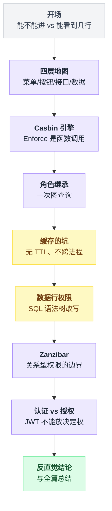
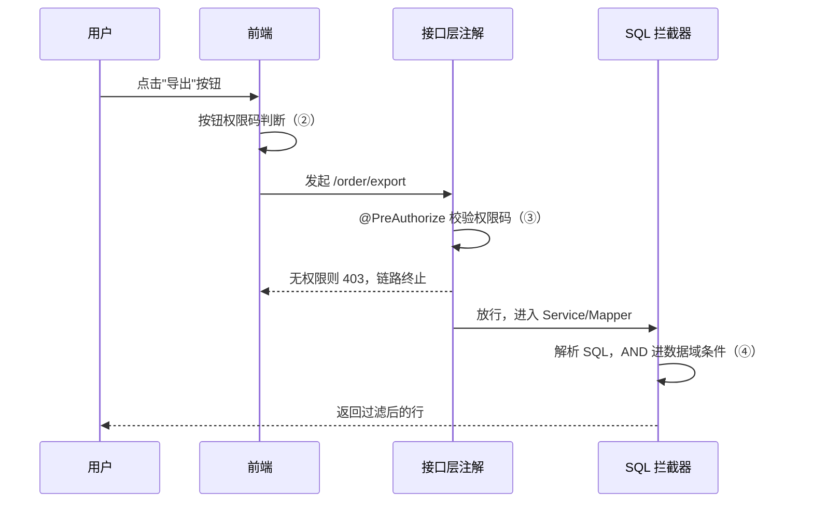
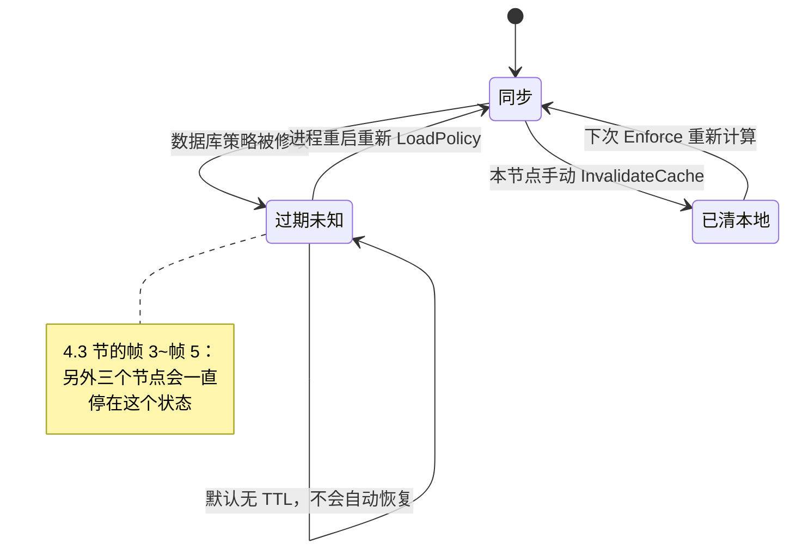
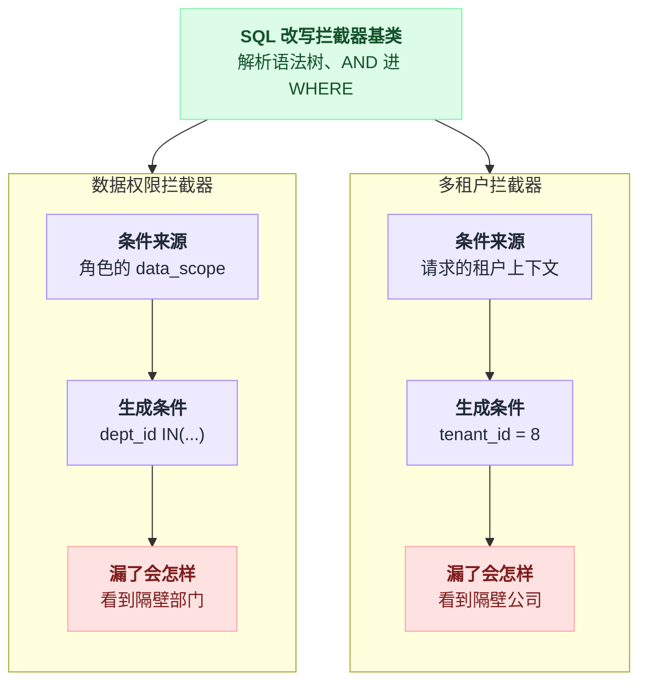
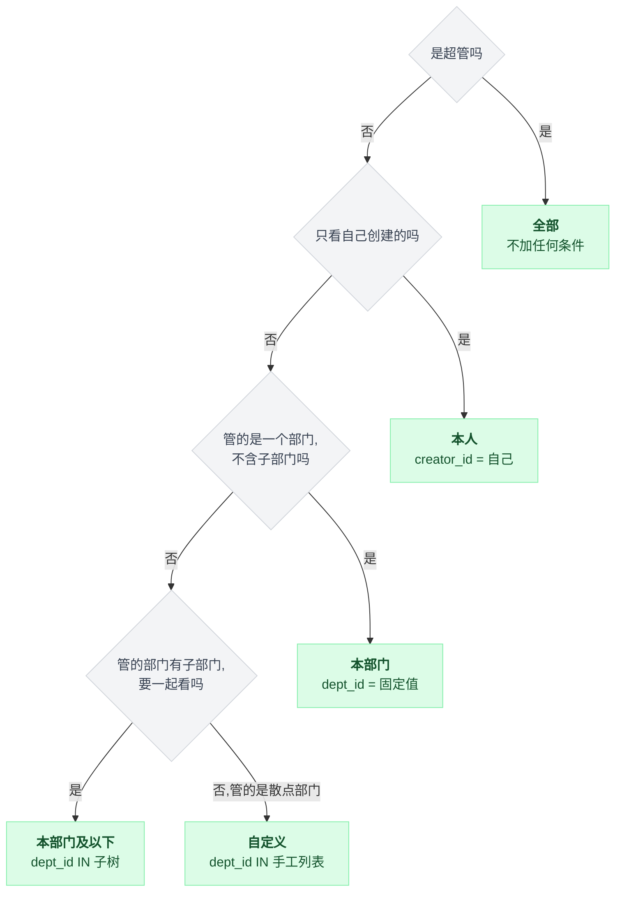
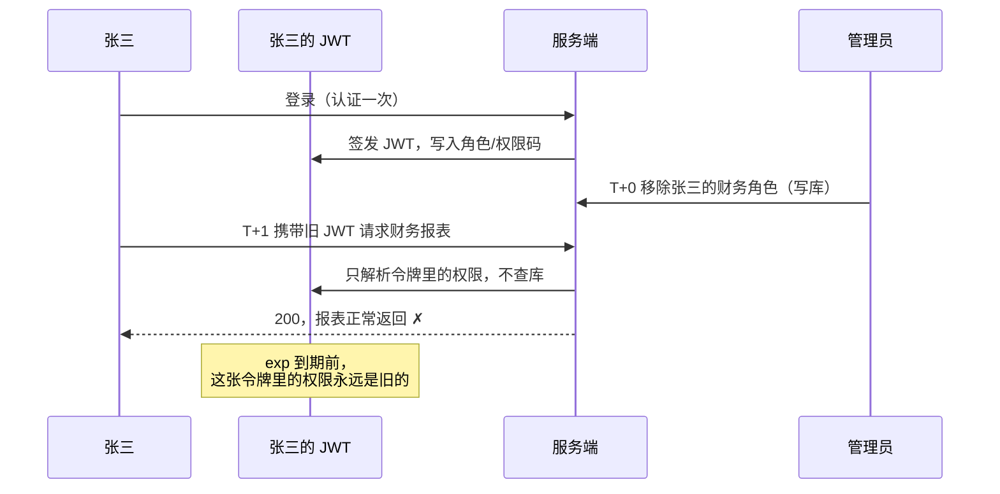

# 《权限系统》从 RBAC 五张表到那条谁都躲不掉的数据行权限（小白版）

> 一句话结论：**"RBAC 升级到 ABAC"在 Casbin 里不是重构，是改一行 matcher 字符串**——仓库里根本没有 `abac/` 目录，因为 ABAC 不需要任何数据结构。而四层权限（菜单 / 按钮 / 接口 / 数据）里，前三层都是元数据比对，一个注解就能解决；**唯独数据行权限必须在 SQL 语法树上动手**，这也是它在芋道里被做成一个独立 starter、并和多租户共用同一个拦截器基类的原因。顺带一条会让很多中文文章过期：`casbin/casbin` 已经不是这个项目的规范名了，仓库已捐给 Apache，现在叫 `apache/casbin`。
>
> 难度：★★★☆☆
>
> 写作时间：2026-08-05。文中 star 数与最后提交时间为当日实测；源码细节基于公开仓库，未经一手核实的说法在文中已标注。
>
> 读完你会懂：
> 1. RBAC 为什么必须是五张表而不是三张，以及为什么国内框架把"权限表"叫成了 `sys_menu`
> 2. 菜单、按钮、接口、数据这四层各自防的是谁，为什么前三层可以用注解、第四层绝对不行
> 3. `Enforce(sub, obj, act)` 到底是个什么东西——为什么说它是函数调用而不是一次 HTTP 请求
> 4. Casbin 仓库里"没有 `abac/` 目录"这件事，为什么本身就是一条结论
> 5. `CachedEnforcer` 默认既无 TTL 也不跨进程，会怎样让一个已离职员工在 B 节点上永远有权限
> 6. 数据行权限的漏洞从来不在拦截器里，而在那些根本不经过拦截器的路径上——附一张自查清单

---

## 目录

- [0. 开场：他只能看自己部门的单](#0-开场他只能看自己部门的单)
- [1. 四层权限地图：菜单、按钮、接口、数据](#1-四层权限地图菜单按钮接口数据)
- [2. Casbin：把权限做成一个函数](#2-casbin把权限做成一个函数)
- [3. 角色继承是一次图查询](#3-角色继承是一次图查询)
- [4. 权限缓存的坑：既没有 TTL，也不跨进程（本篇主菜之一）](#4-权限缓存的坑既没有-ttl也不跨进程本篇主菜之一)
- [5. 数据行权限：在 SQL 语法树上动手（本篇主菜之二）](#5-数据行权限在-sql-语法树上动手本篇主菜之二)
- [6. Zanzibar 那条路：论文很红，中文生态没落地](#6-zanzibar-那条路论文很红中文生态没落地)
- [7. 认证不是授权：一条边界线](#7-认证不是授权一条边界线)
- [8. 反直觉结论](#8-反直觉结论)
- [9. 一句话总结、小白词典、和前几篇的对照](#9-一句话总结小白词典和前几篇的对照)

---

全篇九节顺着一条台阶走下来，每一级解决上一级留下的坑：



黄色的第 4、5 两节是本篇标注过的"主菜"——一个讲权限判断的结果怎么会是陈旧的，一个讲权限判断根本没被调用的情况。

## 0. 开场：他只能看自己部门的单

### 0.1 上线前一周，产品加了一句话

你在做一个企业内部的订单管理后台。三周了，权限这块你自认为做得挺干净：

- 登录发 JWT，里面带 `userId` 和角色列表；
- 后台配了角色和菜单，登录后接口返回一棵菜单树，前端按树渲染左侧导航；
- 页面上的"删除""导出"按钮，前端拿权限码数组 `['order:delete', 'order:export']` 控制显隐；
- 后端每个接口方法上挂一个注解 `@PreAuthorize("hasAuthority('order:query')")`，防止有人绕过前端直接打接口。

四件事做完，你觉得权限这个模块已经收工了。评审会上产品看了一眼演示，说了一句话：

> "销售只能看自己的单，销售经理能看整个部门的单，大区总监能看他下面所有部门的单。"

这一句话，把上面四件事全部推倒。不是"再加一个功能"的意思——是你前面建立的整套心智模型不适用了。前面四件事回答的都是同一个问题：**这个人能不能进这个入口。** 而产品现在问的是另一个问题：**这个人进来之后，列表里应该有几行。**

这两个问题的区别有多大，看一眼就知道：

```
       前三周做的事                        产品刚提的事
  ────────────────────────           ────────────────────────
  他能不能打开"订单列表"页？          他打开之后，看到 8 行还是 8 万行？
  他能不能点"导出"按钮？              他导出的 Excel 里，是哪 8 行？
  他能不能调 /order/list 接口？        接口返回的 JSON 里，是哪 8 行？

  判断结果：true / false              判断结果：一个集合
  实现位置：方法入口的注解            实现位置：？？？
  失败表现：403，页面进不去           失败表现：200，但多看了不该看的
```

看最后一行。**前三层做错了，用户会立刻投诉"我进不去"；第四层做错了，没有任何人会投诉——因为多看到的人不会举报自己。** 你是从竞品那里、从一封离职员工带走的客户名单里、从监管的通报里知道这件事的。

### 0.2 最朴素的做法：我在 Service 里加个判断

这我也会写。列表查询方法里加几行：

```java
public List<Order> list(OrderQuery query) {
    Long userId = SecurityUtils.getUserId();
    if (hasRole("sales")) {
        query.setCreatorId(userId);            // 销售：只看自己的
    } else if (hasRole("sales_manager")) {
        query.setDeptId(getDeptId(userId));    // 经理：只看本部门的
    }
    return orderMapper.selectList(query);
}
```

上线，测试，通过。销售登录只看到自己的 8 条单。收工。

### 0.3 打死它：一张订单能被多少个入口读到

问题不在这段代码写得对不对，在于**这段代码需要出现在多少个地方**。

拿一张订单出来，数一数它能被读到的路径：

```
                        biz_order 这张表
                              │
    ┌────────┬────────┬───────┼────────┬────────┬─────────┬────────┐
    ▼        ▼        ▼       ▼        ▼        ▼         ▼        ▼
 列表页    详情页   导出     统计      下拉框   批量改   审批流   定时任务
 /list    /get/{id} /export /summary  /options /batch   查待办    对账脚本
    │        │        │       │        │        │         │        │
  加了 ✓   忘了 ✗   加了 ✓  忘了 ✗   忘了 ✗   忘了 ✗    ？      不走 Service ✗

  8 个入口，你在 2 个上写了判断。剩下 6 个各是一个数据泄露点。
```

具体到每一个：

- **详情页** `GET /order/123`：你只校验了"他有 `order:query` 权限"，没校验"这张单归不归他"。改个 URL 里的数字就能看到隔壁部门的单——这类漏洞有个专门的名字叫**越权访问**（IDOR），它是后台系统里最常见、也最容易被外部安全测试一把抓住的洞。
- **统计接口** `/summary`：返回一个 `SUM(amount)`。它不返回任何一行订单，但它把整个公司的销售额告诉了一个刚入职的销售。
- **下拉框** `/options`：给筛选器用的，返回"客户名称"列表。你以为它无害，它泄露的是完整的客户名单。而**导出**是最危险的一个，因为它一次性、批量、带走的是文件。

而且这还只是"今天有 8 个入口"。下个季度加 5 个接口，新同事不会知道有这条不成文的规矩。**靠人记得在每个查询前加一行 `if`，这不是设计，这是运气。**

### 0.4 本篇路线图

| 症状 | 谁来解 | 第几节 |
|---|---|---|
| 菜单/按钮/接口三层怎么配、五张表怎么摆 | RBAC 模型本体 | 第 1 节 |
| 权限判断写得满地都是，想换模型要重构 | Casbin：把权限收敛成一个函数 | 第 2、3 节 |
| 改了权限，一半机器生效一半机器不生效 | 缓存与 Watcher（主菜之一） | 第 4 节 |
| 查询入口漏加过滤 = 静默的数据泄露 | SQL 改写拦截器（主菜之二） | 第 5 节 |
| 听说 Google 有个 Zanzibar，要不要上 | 关系型权限的适用边界 | 第 6 节 |

四层里前三层第 1 节一次讲完，因为它们本质是同一件事。第 4、5 两节是本篇的主菜——**一个讲权限判断的结果怎么会是陈旧的，一个讲权限判断根本没被调用的情况。**

---

## 1. 四层权限地图：菜单、按钮、接口、数据

### 1.1 先把地图画出来

企业后台的权限，从来不是一层。它是四层，而且这四层的检查点分布在整条链路上：

```
   浏览器                        网关/后端                     数据库
  ─────────────────────────────────────────────────────────────────────
  ① 菜单权限：导航里有没有"订单管理"
     登录后拉一棵菜单树，前端按树渲染      ✗ 没权限 = 这一项不出现
  ② 按钮权限：页面上有没有"导出"这个按钮
     前端拿权限码数组 v-if 判断            ✗ 没权限 = 按钮不渲染/置灰
                  ③ 接口权限：/order/export 准不准调
                     方法上的注解 + 权限码集合判断   ✗ 没权限 = 403
                                     ④ 数据行权限：查出来的是哪几行
                                        改写 SQL 的 WHERE  ✗ = 200，但少几行

  ├──────────── 能不能进 ───────────────────┤├──── 能看到几行 ────┤
             布尔判断，一个注解搞定             集合判断，注解无能为力
```

前三层是同一件事的三个位置：**拿"这个人拥有的权限码集合"去和"这个资源要求的权限码"做一次包含判断**——集合里有 `order:export` 就放行，没有就拦下。第四层完全不同。它的输出不是 true/false，是"一个筛选条件"。**你没法用一个布尔值表达"他能看 3 个部门的单"。**

### 1.2 一个必须先破除的误解：前两层不是安全措施

菜单和按钮权限，跑在浏览器里。浏览器里的东西，用户全都可以改。

```
   前端隐藏了"删除"按钮  ──▶  用户 F12 直接 fetch('/order/delete?id=123')
                                            │
                                            ▼
                                   后端没有 ③ 的话，删除成功

   前两层解决"体验"：不给他看他用不了的东西。第三层解决"安全"。
   前两层全丢掉，系统依然安全；第三层丢掉，前两层做得再细也等于零。
```

记住这条：**菜单和按钮权限是 UI 逻辑，接口权限才是访问控制。** 很多团队把三层配在同一张 `sys_menu` 表里（下一节就是），于是产生了"配了就安全了"的错觉。配置在同一张表，不代表防护效力相同。

### 1.3 RBAC 五张表，讲透

RBAC（Role-Based Access Control，基于角色的访问控制）的核心思想只有一句话：**不要把权限直接发给人，发给角色，再把角色发给人。**

为什么要多绕这一层？因为公司有 2000 人、80 个权限点。直接发的话，人事每招一个人，你要给他勾 80 个复选框；一个权限点的规则变了，你要改 2000 个人的配置。中间加一层"角色"之后，人事只需要选一个"销售"，权限规则变了只需要改一个角色。

**这一层间接性，落到数据库里就是经典的五张表：**

```
 ┌──────────────────┐                                    ┌──────────────────┐
 │  ① sys_user      │                                    │  ③ sys_menu      │
 │  ────────────    │                                    │  （权限/资源表）  │
 │  id       PK     │                                    │  ────────────    │
 │  username UK     │                                    │  id       PK     │
 │  dept_id         │◀── 第 5 节全靠它                    │  parent_id       │◀ 自关联，成树
 │  password        │                                    │  name            │
 │  status          │                                    │  type   M/C/F    │◀ 目录/菜单/按钮
 └────────┬─────────┘                                    │  perms           │◀ 'order:export'
          │ 1                                            │  path / component│
          │                                              └────────┬─────────┘
          │ N                                                     │ 1
 ┌────────┴─────────┐        ┌──────────────────┐                 │ N
 │ ④ sys_user_role  │        │  ② sys_role      │        ┌────────┴─────────┐
 │ ────────────     │        │  ────────────    │        │ ⑤ sys_role_menu  │
 │ user_id  FK ─────┘        │  id       PK     │        │ ────────────     │
 │ role_id  FK ─────────────▶│  code     UK     │◀───────┤ role_id  FK      │
 │ PK(user_id, role_id)      │  name            │  1   N │ menu_id  FK      │
 └──────────────────┘        │  data_scope      │◀──┐    │ PK(role_id,menu_id)│
                             └──────────────────┘   │    └──────────────────┘
                                                    │
                                    第 5 节的数据行权限就挂在这个字段上
```

三张实体表、两张关系表，各有各的维护节奏：①`sys_user` 跟着 HR 系统同步；②`sys_role` 是岗位抽象，很少变；③`sys_menu` 是权限点，跟着代码走；④`sys_user_role` **天天变**（入职、转岗、离职）；⑤`sys_role_menu` 偶尔变（业务规则调整）。**第 4 节整节讲的就是④变了之后，怎么让所有机器都知道。**

**为什么必须是五张而不是三张？** 因为 ①↔② 和 ②↔③ 都是多对多。一个人可以同时是"销售"和"报表查看者"，一个"销售"角色也对应几十个权限点。多对多在关系数据库里没有第二种表达方式，必须有中间表。这不是设计选择，是范式的硬要求。

**为什么 ③ 叫 `sys_menu` 而不是 `sys_permission`？** 这是中文后台生态的一个历史惯性：菜单树和权限树在这类系统里高度重合，于是干脆合并成一张自关联的树表，用 `type` 字段区分是目录（M）、菜单（C）还是按钮（F）。好处是配置界面天然就是一棵树，勾选很直观；代价是"权限"这个概念被绑死在了"有界面的东西"上——一个纯后台的接口权限（比如给第三方开放的 API）也得在菜单树里挂一个假节点。**这个折中在国内几乎是行业默认，看到 `sys_menu` 里躺着一堆没有 `path` 的按钮节点，不要惊讶。**

### 1.4 一次登录，五张表怎么被用起来

```
  用户点"登录"
   │
   ▼ ① 查 sys_user 校验密码        ← 这一步是"认证"，不是授权（第 7 节）
   ▼ ④ SELECT role_id FROM sys_user_role WHERE user_id=1001   → [3, 7]
   ▼ ⑤ SELECT menu_id FROM sys_role_menu WHERE role_id IN(3,7) → [1,2,5,8,9,...]
   ▼ ③ SELECT * FROM sys_menu WHERE id IN (...)
      ├──▶ type in (M,C) 的行按 parent_id 拼成树 ──▶ 渲染左侧导航  ① 菜单权限
      ├──▶ 所有行的 perms 去重成数组             ──▶ 前端 v-if    ② 按钮权限
      └──▶ 同一个数组塞进会话/JWT                ──▶ 后端注解比对  ③ 接口权限

  一次查询，一套数据，喂饱三层。这就是为什么三层能合在一张表里。
```

注意最后那个箭头分叉：**前三层用的是同一个字符串数组。** 所以它们是同一个机制的三次应用，不是三个机制。

1.4 那张图讲的是登录时怎么把五张表一次查完。下面这张换个视角，看**同一次业务请求**依次撞上四层检查的顺序——这是登录图看不出来的信息：



前三次检查（①②③）判断的都是"能不能进"，只有第四次（④）判断"能看到几行"，这也是本篇后面要单独用一整节讲它的原因。

而第四层要的东西根本不在这个数组里。它要的是"这个人所属的部门 id 集合"——那是 `sys_user.dept_id` 加上一棵部门树算出来的，跟权限码毫无关系。**第四层从数据来源上就和前三层分了家**，这是它必须单独一套机制的第一个信号。

---

## 2. Casbin：把权限做成一个函数

### 2.1 先修一条事实：这个仓库改名了

在讲机制之前，必须先纠正一件中文资料里几乎全错的事。

Casbin 这个项目，**已经捐给了 Apache 软件基金会，规范仓库名是 `apache/casbin`**（**20,306 star，最后提交 2026-08-04，2026-08-05 实测**）。旧地址 `casbin/casbin` 目前仍然会跳转过去，所以你照着老文章敲也能打开页面——但那不再是这个项目的规范名字，README、badge、文档引用都应该用新的。当前主线版本是 **v3**。

这条为什么值得单开一段？因为它会连锁地让一批中文资料过期：地址写的是 `github.com/casbin/casbin`，示例代码停在 v1/v2，介绍里还说它是"某公司/某个人的开源项目"。三条全错，而文章照样能跑通——**这正是这类错误最难被发现的原因。**

**写技术文档时，仓库的规范名比 star 数重要得多**——star 数错了是个数字问题，仓库名错了会让读者在 issue 区、在依赖声明里找错地方。本条已二次核实。

### 2.2 `Enforce(sub, obj, act)` 是函数调用，不是 HTTP 请求

这是初学者对 Casbin 最大的误解，也是它和第 6 节 Zanzibar 系最本质的区别。

Casbin 是一个**库**。你 import 它，它跑在你的业务进程里。所谓"鉴权"，就是这么一行：

```go
ok, err := e.Enforce("alice", "/order/export", "GET")
```

```
        Casbin（库模型）                 OpenFGA / Keto（服务模型）
  ────────────────────────────    ──────────────────────────────────────
   ┌──────────────────────┐       ┌────────────┐  Check() ┌────────────┐
   │  你的业务进程          │       │ 你的业务进程 │─ gRPC ─▶│  授权服务   │
   │   handler             │       │  handler   │◀─────────│ 策略全在这  │
   │     ▼ e.Enforce(...)  │       └────────────┘ true/false└────────────┘
   │   内存里的策略数组      │
   │     ▼ 遍历+表达式求值  │        耗时：一次网络往返（毫秒级）
   │   true / false        │        好处：策略集中、跨语言、可独立扩容
   └──────────────────────┘        代价：多一个必须高可用的依赖
    耗时：一次内存遍历（微秒级）
    好处：没有网络、没有额外部署
    代价：策略要复制到每个进程 ← 第 4 节整节都在还这笔债
```

把这张图刻在脑子里。**第 4 节所有的坑，根子都在左边那个"内存里的策略数组"上**——它是一份副本，副本就会过期。

### 2.3 `model.conf` 的四段，逐段拆开

Casbin 的设计有一个很聪明的地方：**它把"权限模型长什么样"从代码里抽出来，变成一个配置文件。** 这个文件叫 `model.conf`，标准的 RBAC 模型长这样：

```ini
[request_definition]
r = sub, obj, act

[policy_definition]
p = sub, obj, act

[role_definition]
g = _, _

[policy_effect]
e = some(where (p.eft == allow))

[matchers]
m = g(r.sub, p.sub) && r.obj == p.obj && r.act == p.act
```

六行不到，但每一段管一件完全不同的事：

| 段 | 它定义什么 | 落到哪里 |
|---|---|---|
| `[request_definition]` | 一次提问长什么样 | **就是 `Enforce()` 的函数签名**：写了三个字段，就传三个参数 |
| `[policy_definition]` | 一条规则长什么样 | `casbin_rule` 表的一行：`ptype='p', v0='alice', v1='/order/export', v2='GET'` |
| `[role_definition]` | 角色继承关系长什么样 | `g = _, _` 是"前者继承后者"的二元关系；第 3 节整节讲它，不需要角色的模型可以整段删掉 |
| `[matchers]` | ★ 核心 | 一个布尔表达式字符串，判断"请求 r 和规则 p 匹不匹配"；**运行时求值，改它不用重新编译** |
| `[policy_effect]` | 一堆结果怎么合成一个答案 | `some(...allow)` = 有一条允许就放行；换成 `!some(where (p.eft == deny))` 就变成"有一条拒绝就否决" |

跑一遍数据流，你就明白 matcher 和 effect 的分工了：

```
   Enforce("alice", "/order/export", "GET")
        ▼  按 request_definition 绑成 r = {sub:"alice", obj:"/order/export", act:"GET"}
        │  再把 casbin_rule 里的策略逐条绑成 p，代入 matcher 求值：
        ├─ p1 = {admin,   /order/export, GET}   m → false
        ├─ p2 = {sales,   /order/export, GET}   m → true   ← g(alice,sales) 成立
        ├─ p3 = {sales,   /order/delete, POST}  m → false
        └─ p4 = {finance, /finance/*,    GET}   m → false
        ▼  结果向量 [false, true, false, false]
        ▼  交给 policy_effect: some(where p.eft == allow)
      true
```

**注意 matcher 是被逐条代入的。** 100 条策略就是 100 次表达式求值。策略上到十万条时这个 O(n) 会变成真问题——这就是为什么会有 `CachedEnforcer`，也就是第 4 节的开端。

### 2.4 ABAC：改一行字符串，不是一次重构

回到本篇一句话结论那半句。"我们的权限要从 RBAC 升级到 ABAC"，这句话在需求评审会上一说出来，通常伴随着"这得重构，得两个 sprint"。ABAC（Attribute-Based Access Control，基于属性的访问控制）听起来是一个完全不同的模型：不看角色，看属性——用户的部门、资源的归属人、当前时间、请求 IP。

在 Casbin 里，这个"重构"的全部内容是：

```ini
# 之前（RBAC）：看 alice 属于哪个角色
m = g(r.sub, p.sub) && r.obj == p.obj && r.act == p.act

# 之后（ABAC）：看 alice 这个对象的字段
m = r.sub.Dept == r.obj.OwnerDept && r.act == p.act

# 混着来也行（RBAC + ABAC）
m = g(r.sub, p.sub) && r.sub.Dept == r.obj.OwnerDept && r.act == p.act
```

调用侧唯一的变化是 `sub` 从字符串换成一个结构体，matcher 里用 `r.sub.Dept` 反射拿它的字段：

```go
e.Enforce("alice", "/order/export", "GET")                                    // RBAC
e.Enforce(User{Name:"alice", Dept:"sales"}, Order{OwnerDept:"sales"}, "GET")  // ABAC
```

表结构一行没改，依赖一行没改，业务代码除了传参一行没改。**改的是一个存在配置文件里的字符串。**

### 2.5 "没有 `abac/` 目录"这件事本身就是结论

上面那段容易被当成"Casbin 挺方便"的产品夸赞。它其实是一条更硬的架构结论，而证据在仓库的目录列表里。把 `apache/casbin` 的关键目录摊开（**已读源码，2026-08-05 实测**）：

```
  apache/casbin/
    ├── model/               ← 解析 model.conf，管 request/policy/matcher/effect
    ├── rbac/                ← ✓ 有！RoleManager，角色继承的图结构
    ├── effector/            ← 把结果向量按 effect 规则合成一个布尔
    ├── enforcer.go          ← Enforce 主流程
    ├── enforcer_cached.go   ← 第 4 节的主角
    ├── enforcer_synced.go   ← 加了读写锁的版本
    ├── transaction.go
    └── abac/                ← ✗ 没有。一个都没有。
```

**为什么 RBAC 有目录、ABAC 没有？** 因为这两个东西对"状态"的需求完全不同：

```
   RBAC 是"alice 属于 sales，sales 继承 employee"      ABAC 是 r.sub.Dept == r.obj.OwnerDept
        = 一张会变化的图，必须有                            = 一次字段读取，只需要
          · 数据结构存下来   · 增删改 API                     · 表达式求值器  · 反射拿字段
          · 可达性查询       · 策略变了要重建                 · ……没了
                    ▼                                                 ▼
            必须单开 rbac/ 这个包                     求值器 model/ 里已经有了，不需要新东西
```

一句话：**RBAC 是一种数据结构，ABAC 是一种表达式。** Casbin 的整个架构是"策略存储 + 表达式求值"，ABAC 天然落在这套骨架里，不需要新增任何组件；而 RBAC 因为要维护一张会变化的关系图，才不得不单开一个包。

所以那句"RBAC 升级 ABAC 要重构"，反过来读才是对的：**在一个 matcher 驱动的引擎里，ABAC 比 RBAC 更原始、更廉价。** 你以为的"更高级的模型"，实现代价反而更低。

💡 这个"有没有目录反映要不要状态"的判据，在别的地方也好用。[第 25 篇《灰度发布与 AB 分流》](./25-灰度发布与AB分流.md)里的分流规则同理：按百分比切流是纯函数（哈希取模，无状态），按白名单切流就必须有一份名单（有状态，要同步、要失效）。**看一个功能有没有独立的存储/包，比看它的文档篇幅更能判断它的真实复杂度。**

---

## 3. 角色继承是一次图查询

### 3.1 `g(r.sub, p.sub)` 到底在算什么

回看 2.3 那个 matcher：`g(r.sub, p.sub) && ...`。

`g` 不是"等于"，是**可达性判断**：在角色继承图里，从 `r.sub` 出发能不能走到 `p.sub`。

```
  casbin_rule 里的 g 行           连成图                 于是：
   g, alice,   sales                employee
   g, sales,   employee                ▲             g(alice, employee)
   g, bob,     manager               sales ◀── alice   alice→sales→employee  ✓
   g, manager, sales                   ▲             g(alice, manager)
                                    manager ◀── bob    走不到                ✗
                                                     g(bob, employee)
                                                       bob→manager→sales→…  ✓ 三跳
```

`rbac/` 包里的 `RoleManager` 就是维护这张图的组件，`BuildRoleLinks` 是从策略表里把这些 `g` 行读出来、重建成内存图的动作（**已读源码**）。

**关键点：这张图是在内存里的。** 策略从数据库加载完，`BuildRoleLinks` 跑一遍，图就建好了；之后每次 `Enforce` 都在这张内存图上走。快，因为不查库；但它是一份副本——**数据库里的角色关系变了，这张图不会自己知道**。这条伏笔第 4 节收。

### 3.2 深度陷阱：继承链每加一层，你付两次钱

多层继承看起来很优雅（实习生 → 员工 → 主管 → 经理 → 总监），但它有代价，而且代价是复利的：

```
   一次 Enforce 的开销 ≈ 策略条数 N × 每条 matcher 求值代价
   而 matcher 里那个 g(r.sub, p.sub)，代价 ≈ 继承图上的一次遍历（深度越大越贵）

     N=500,    深度 2  →  无感
     N=50,000, 深度 2  →  列表页开始有点顿
     N=50,000, 深度 6  →  一次请求几十毫秒
     N=500,000,深度 6  →  必须上缓存          （量级示意，非 benchmark）
```

两个具体的坑。**坑一：环。** `g, a, b` 和 `g, b, a` 同时存在，图里出现环。一个没有环检测的遍历会死循环。配置角色继承的界面上如果允许自由勾选父角色，迟早有人配出环来——**这是配置界面该拦的，不是引擎该兜的**（Casbin 的具体处理策略以官方文档为准，本篇不展开）。

**坑二：角色爆炸。** 这个比环常见得多，而且没有任何报错。

```
   "华东区的销售经理"   1 个角色
    × 2 个大区          2 个
    × 3 个职级          6 个
    × 4 条业务线       24 个
    × 是否兼管渠道     48 个  ──▶ 一个 48 行的下拉框，名字长得像
                                  "华东-渠道-销售经理-P6-兼管"，没人说得清区别

   这就是 RBAC 的天花板：角色数 = 各维度的笛卡尔积。
```

角色爆炸的正解不是继续加角色，是**把其中一两个维度从"角色"里拿出来，变成属性**——地区不该是角色的一部分，它是用户的一个字段。这正是 2.4 节那行 matcher 干的事：`r.sub.Region == r.obj.Region`。

**所以 ABAC 的真实价值不是"更高级"，是"给笛卡尔积降维"。** 一个维度从角色挪到属性，角色数量就除以那个维度的基数。48 个角色变成 3 个角色 + 两个字段。

---

## 4. 权限缓存的坑：既没有 TTL，也不跨进程（本篇主菜之一）

### 4.1 为什么会有人开缓存

第 3.2 节那张表已经给了动机：`Enforce` 是 O(策略条数) 的遍历。一个列表页可能要判断几十次权限（每行数据一个"是否可编辑"），一次页面加载就是几千次遍历。

Casbin 给了现成的答案：`CachedEnforcer`（`enforcer_cached.go`，**已读源码**）。用法几乎零成本：

```go
e, _ := casbin.NewCachedEnforcer("model.conf", adapter)   // 换个构造函数，完事
```

缓存的 key 是三个参数拼起来，value 是那个布尔结果。命中之后连策略数组都不碰。性能问题解决了。

然后你就买下了两个**默认值**，而这两个默认值是本篇最危险的东西。

### 4.2 危险默认值一：没有 TTL

`CachedEnforcer` 的缓存**默认不过期**。

它提供了 `SetExpireTime` 这个方法——**但你必须显式去调它**。不调，那份缓存的生命周期等于进程的生命周期。

```
   你以为的                         实际的
  ──────────────────────      ──────────────────────────────────
   缓存嘛，总会过期的            没有 TTL。不调 SetExpireTime，
   最多脏几分钟                  这条结果活到进程被 kill 为止。
   （这个假设来自 Redis 经验，
     那里 SET 一般都带 EX）      "最多脏几分钟" 实际是 "永久脏"。
```

这是个典型的"经验迁移事故"：你在 [第 15 篇《缓存三兄弟与缓存一致性》](./15-缓存三兄弟与缓存一致性.md)里养成的直觉是"缓存有 TTL 兜底，最坏情况也就脏一个 TTL"。**这条兜底在 `CachedEnforcer` 的默认配置下不存在。**

### 4.3 危险默认值二：`InvalidateCache` 只清本进程

第二个默认值更致命。你当然想到了要在改权限之后清缓存，于是调 `InvalidateCache()`。问题是：它清的是**当前这个 `CachedEnforcer` 实例内存里的那个 map**。

你的服务部署了 4 个实例。管理员的那次"移除角色"操作，被负载均衡打到了其中 1 个。

来看完整的时序（双节点简化版）：

```
     节点 A (10.0.0.1)              节点 B (10.0.0.2)
  ┌────────────────────┐        ┌────────────────────┐
  │ CachedEnforcer     │        │ CachedEnforcer     │
  │  内存策略数组 [...] │        │  内存策略数组 [...] │
  │  cache map   {...} │        │  cache map   {...} │
  └─────────┬──────────┘        └──────────┬─────────┘
            └────────────┬─────────────────┘
                         ▼  ┌──────────────┐
                            │ casbin_rule 表│ ← 唯一的真相
                            └──────────────┘
 ─────────────────────────────────────────────────────────────────
 帧 1  T+0s   张三办离职，管理员点"移除财务角色"，LB 打到 A
              A: RemovePolicy() → 删库 ✓  删 A 的内存策略 ✓  清 A 的 map ✓
              B: 什么都没发生 —— 它不知道库被改了。内存策略还在，
                 cache map 里 (zhangsan,/finance/report,GET)=true 还在。
 帧 2  T+1s   张三访问财务报表，LB 打到 A → false，403。张三：哦，权限收了。
 帧 3  T+2s   张三按了下 F5，LB 打到 B  → true  ✗✗✗  报表正常打开
 帧 4  T+1h   还是 true
 帧 5  次 日   还是 true      ← 没有 TTL（4.2 节），它不会自己恢复
 帧 6  下次发版 终于好了 —— 因为进程重启，重新 LoadPolicy 了
 ─────────────────────────────────────────────────────────────────
```

**这个 bug 有三个让它极难被发现的性质：**

1. **它是概率性的。** 4 个实例、1 个被清了，命中概率 25%。测试同学点两下"没问题"，因为他运气好打到了 A。
2. **它偏向"放行"。** 缓存里的旧值是 `true`，脏读的方向是多给权限，不是少给。**少给权限会被投诉，多给权限没人投诉。**
3. **发版会掩盖它。** 每次上线进程重启，策略重新加载，问题自动"修复"。等下次有人改权限，它又回来了。你在日志里永远看不到它。

把 4.1~4.3 三个小节揉进一张状态机，`CachedEnforcer` 里一条缓存结果的命运就是这样：



**"过期未知"这个状态本身能自己指向自己**，是这一节最反直觉的地方：没有 TTL，没有 Watcher，它就没有任何机制能把自己推回"同步"，唯一的出口是进程重启。

### 4.4 解法：Watcher —— 把"我改了"广播出去

根因很清楚：**每个进程都有一份策略副本和一份结果缓存，而改动只发生在一个进程里。** 这是标准的多副本一致性问题，Casbin 的答案叫 Watcher（机制描述基于官方文档，具体接口签名以官方文档为准）。

```
   管理员改权限（打到节点 A）
             ▼  节点 A 写数据库 ────────────────────┐
                     │                            │  数据库
                     ▼ 发一条"策略变了"的通知        │  始终是
     ┌──── Watcher 通道：Redis Pub/Sub / etcd ───┐  │  唯一真相
     └────┬─────────────┬─────────────┬─────────┘  │
          ▼             ▼             ▼            │
      ┌──────┐      ┌──────┐      ┌──────┐         │
      │节点 A│      │节点 B│      │节点 C│──────────┘
      └──────┘      └──────┘      └──────┘  各自：① LoadPolicy() 重读数据库
                                                 ② InvalidateCache() 清本地 map
```

注意这个设计的一个细节：**Watcher 广播的是"变了"这个信号，不是变化的内容。** 收到信号的节点回头去数据库重读全量。这样做的好处是不用担心消息乱序、不用担心增量丢失——**任何一条通知的效果都是"和数据库对齐"，天然幂等。**

⚠️ 接手一个用 Casbin 的系统，挨个问这四句：

1. 用的是 `Enforcer` 还是 `CachedEnforcer`？如果是后者，`SetExpireTime` 调了吗？
2. 服务实例是不是 >1 个？（只要 >1，下一条就是必答题）
3. `SetWatcher` 调了吗？改完策略在**另一个**实例上验证过吗？
4. Watcher 依赖的中间件（Redis/etcd）挂了，权限变更会怎样？（正确答案：变更静默地不生效——所以这条链路必须有告警，不能只有日志）

第 3 条是重点：**验证权限变更，必须换一个实例验证**——在同一个实例上点两下什么都测不出来。

💡 这一整节其实是[第 15 篇《缓存三兄弟与缓存一致性》](./15-缓存三兄弟与缓存一致性.md)在权限领域的重演，但**危害等级完全不同**。那篇里缓存脏了，用户看到一个旧价格、旧库存，刷新一下就好；这里缓存脏了，一个已经离职的人还能导出客户名单，而且**没有任何人会告诉你**。同样的技术问题，因为脏数据的语义不同，一个是体验问题，一个是安全事故。

💡 再往前一步：Watcher 干的事——"配置在中心变了，通知所有节点重新拉取"——和[第 38 篇《配置中心与秒级回滚》](./38-配置中心与秒级回滚.md)是同一个问题的两个实例。**权限策略就是一种配置，只不过它的读取频率是每个请求几十次。** 第 38 篇讲这条推送链路本身怎么做到秒级、怎么保证不丢；本篇只负责说明：**如果你已经有配置中心了，权限策略同步不该再造一套轮子，挂在同一条通道上就行。**

---

## 5. 数据行权限：在 SQL 语法树上动手（本篇主菜之二）

### 5.1 为什么注解在这里彻底失效

回到第 0 节那个需求。现在我们有了 Casbin、RBAC 五张表、缓存和 Watcher，第四层还是做不了。原因很物理：

```
   请求进来
      │
      ▼  ③ @PreAuthorize 注解在这里。此刻手里有：
      │     当前用户 ✓  目标方法名 ✓  权限码集合 ✓  SQL ✗ ←── 还不存在！
   Service ──▶ Mapper
      │
      ▼  SQL 在这里才被拼出来：SELECT ... FROM biz_order WHERE status = 1
      │
      ▼  ←──── 唯一能动手的位置就是这个缝
    JDBC ──▶ 数据库

   注解站在链路最上游，那时候连"要查哪张表"都还不知道；
   而数据行权限要改的 WHERE 子句，在链路最下游。
```

**注解能表达"能不能"，不能表达"哪几行"，因为"哪几行"这个概念只在 SQL 存在的那一刻才有意义。**

于是唯一的下手位置只有一个：**SQL 已经拼好、还没交给 JDBC 的那个瞬间。**

### 5.2 芋道的答案：一个独立的 starter

`YunaiV/ruoyi-vue-pro`（**38,524 star，最后提交 2026-07-31，2026-08-05 实测**）把这件事做成了一个独立模块：

```
  yudao-framework/
    └── yudao-spring-boot-starter-biz-data-permission/
            pom description = 「数据权限」          （pom 已核实）
```

**"独立 starter"这个包装方式本身就在说话。** 前三层权限在这类框架里通常是安全模块的一部分（跟着 Spring Security / Sa-Token 走），而数据权限单开一个 starter——因为它的挂载点根本不在安全层，在持久层。它要 hook 的是 MyBatis，不是过滤器链。

### 5.3 拦截器怎么干活：AND 一段进去

MyBatis 提供了 `Interceptor` 扩展点，可以在 SQL 执行前拿到并修改它。数据权限拦截器干的事，说白了就一句：**把原 SQL 解析成语法树，在 WHERE 上 AND 一个条件，再输出回字符串。**

```sql
-- ① 你在 Mapper 里写的
SELECT id, order_no, amount FROM biz_order WHERE status = 1

-- ② 拦截器实际交给 JDBC 的（当前用户是销售经理，管 101/103/104 三个部门）
SELECT id, order_no, amount FROM biz_order WHERE status = 1
  AND biz_order.dept_id IN (101, 103, 104)
```

为什么必须解析语法树，不能字符串拼接？因为下面这些情况字符串拼接全会出错：

```
   原 SQL 形态                      直接在末尾拼 " AND dept_id IN (...)" 的结果
  ──────────────────────────    ────────────────────────────────────────────
   没有 WHERE                     语法错误（该拼 WHERE 不是 AND）
   WHERE a=1 OR b=2               优先级错了！变成 (a=1) OR (b=2 AND dept...)
                                  → OR 的左半边完全绕过了权限过滤 ★
   ... ORDER BY id DESC           拼到了 ORDER BY 后面，语法错误
   ... LIMIT 10                   同上
   带子查询 / UNION                改错了地方，或者只改了一半
   多表 JOIN                       dept_id 有歧义，必须带表名/别名限定
```

看第二行那个 `★`。**`WHERE a=1 OR b=2` 是数据权限最经典的绕过点**：字符串拼接产生的 `a=1 OR (b=2 AND dept_id IN (...))`，在语义上等价于"只要 `a=1` 成立就不做任何权限过滤"。这个 bug 不会报错，不会有异常日志，它只是安静地把整张表返回给你。

语法树的做法不会犯这个错，因为它操作的是结构不是文本：

```
   解析（JSqlParser 之类的 SQL 解析器）：       改写：把 where 节点换成 AndExpression

         PlainSelect                                    where
     ┌───────┼──────────┐                                 │
  selectItems fromItem where                        AndExpression
                        │                           ┌─────┴──────┐
                  原 where 表达式               (原 where 整体)  dept_id IN(101,103,104)
              （不管它长什么样，                      │
                整个当成一个节点）              序列化时自动加括号
                                                ← OR 的问题在这里被结构性地消灭
```

**加括号不是拦截器"记得"要加的，是语法树重新序列化时必然产生的**——这就是"在语法树上动手"和"在字符串上动手"的根本区别：一个是结构正确性的保证，一个是靠人记得。

### 5.4 和多租户共用一个基类

这里有一个特别值得注意的工程事实：**数据权限拦截器和多租户拦截器，做的是同一件事。**

```
              ┌──────────────── SQL 改写拦截器（基类）──────────────┐
              │  1. 拿到即将执行的 SQL      4. AND 进 WHERE（自动加括号）│
              │  2. 解析成语法树            5. 序列化回 SQL            │
              │  3. 【留给子类】生成条件     6. 白名单表跳过            │
              └──────────────┬──────────────────┬────────────────────┘
                             ▼                  ▼
             ┌──────────────────────┐  ┌──────────────────────┐
             │  数据权限拦截器        │  │  多租户拦截器          │
             │  条件 dept_id IN(...) │  │  条件 tenant_id = 8   │
             │  来源 角色 data_scope  │  │  来源 请求的租户上下文  │
             │  漏了 看到隔壁部门     │  │  漏了 看到隔壁公司 ★   │
             └──────────────────────┘  └──────────────────────┘
   步骤 1、2、4、5、6 一模一样。不同的只有第 3 步生成的那个条件。
```

把这两个拦截器并排摆出来，同构的地方和不同的地方一眼就分开了：



**这不是巧合，是同构。** 两者都是"给每个查询强制附加一个不可绕过的行过滤条件"，区别只在条件的来源和漏掉的严重程度（多租户漏一次是跨公司数据泄露，量级更高）。

所以芋道的框架里，这两个 starter 是并列的兄弟，共享同一套 SQL 改写基础设施。**[第 39 篇《多租户 SaaS 数据隔离》](./39-多租户SaaS数据隔离.md)整篇讲的就是这个基类的另一个子类**：那篇会把租户隔离的三种物理方案（独立库/独立 schema/共享表加 tenant_id）讲透，本篇不复读；你只需要知道，如果你的系统同时要做数据权限和多租户，**它们必须是同一个拦截器体系里的两个条件生成器，而不是两套各写一遍的拦截器**——两套拦截器意味着两次解析、两次序列化，还意味着两边的白名单会慢慢走偏。

### 5.5 三种数据域：条件从哪来

上面第 3 步"生成一个附加条件"，条件长什么样由角色上的 `data_scope` 字段决定（第 1.3 节那张 ER 图里的那个字段）。国内后台系统里，这个枚举基本稳定在这几种：

```
                        集团（dept 1）
                    ┌────────┴────────┐
              华东大区(10)         华南大区(20)
              ┌────┴────┐          ┌───┴────┐
       销售一部(101) 销售二部(102)  ...(201) ...(202)
              │
          小组 A(1011)
```

| `data_scope` | 谁用 | 生成的条件 |
|---|---|---|
| 全部 | 超管 | （不加任何条件，直接放行） |
| 本人 | 一线销售 | `creator_id = 1001` |
| 本部门 | 组长 | `dept_id = 101` |
| 本部门及以下 ★ 最常用 | 部门经理 | `dept_id IN (101, 1011)` |
| 自定义 | 兼管多块业务的人 | `dept_id IN (101, 201, 205)` |

上面这张表按角色分类，反过来问"这个角色该配哪个 `data_scope`"，其实是一棵判定树：



**"本部门及以下"是唯一需要算的那个**，因为它要展开一棵树。两种常见实现：

| | 方案 A：递归查询 | 方案 B：路径枚举字段 |
|---|---|---|
| 怎么存 | 只存 `parent_id` | 额外存一列 `ancestors='0,1,10,101'` |
| 怎么查子树 | `WITH RECURSIVE` 或代码里循环查 N 层 | `WHERE ancestors LIKE '0,1,10,101%'` |
| 优点 | 无冗余字段，部门调整只改一行 | 一次前缀匹配就出来 |
| 缺点 | 每次查询一次递归，层级深了慢 | 部门调整时要批量重写整棵子树的 `ancestors` |

方案 B 是国内后台的主流选择。有一个索引细节值得单说：**`LIKE '前缀%'` 能走 B-tree 索引，`LIKE '%后缀'` 不能**——这是 B-tree 按前缀有序这个性质的直接推论，[PostgreSQL 系列第 08 篇《索引》](../2026-08_从真实项目学PostgreSQL/08-索引.md)讲的就是这套判据。而 `FIND_IN_SET(101, ancestors)` 是个函数调用，**它无法走普通索引**——如果你的部门表只有几百行，无所谓；如果你把这个写法用在了百万行的业务表上，那就是一次全表扫描。

还有一个更隐蔽的性能坑：**`dept_id IN (...)` 里的列表可能很长。** 一个管着 300 个网点的大区总监，条件会变成 `dept_id IN (300 个 id)`。这个 SQL 每次查询都要传 300 个参数、优化器每次都要处理它，而且它会让**执行计划缓存失效**（不同用户的 IN 列表长度不同，被当成不同的 SQL）。数据域特别大的时候，正确做法是反过来想：**"能看 300 个部门"和"能看全部"在业务上几乎没有区别，不如给这类角色直接配"全部"，省掉整个条件。**

### 5.6 漏网之鱼：拦截器管不到的地方（⚠️ 自查清单）

现在讲本节最重要的部分。拦截器方案有一个前提：**所有查询都必须经过这个拦截器。** 而在一个跑了三年的系统里，这个前提几乎一定是假的。

```
                        ┌───────────────┐
                        │  biz_order 表  │
                        └───────────────┘
              ▲          ▲       ▲       ▲            ▲
       MyBatis Mapper  原生JDBC 存储过程 BI 直连   数仓/ES 副本
         ✓ 过拦截器     ✗ 不过  ✗ 不过  ✗ 不过   ✗ 根本不在这个库
              ▲
       你测的是这一条路径
```

⚠️ **数据权限自查清单**——接手或验收一个带数据权限的系统，挨条核对：

1. **报表/BI 直连**：Metabase、帆软之类的工具直接连的是数据库，一行 Java 代码都不经过。**这是最常见的漏点，而且通常是业务方自己配的，开发根本不知道有这条路。**
2. **存储过程**：老系统里的 `CALL sp_order_summary()`，SQL 在数据库内部，拦截器看不见。
3. **原生 JDBC / JdbcTemplate**：定时任务、数据修复脚本、对账程序，一般图省事直接写 SQL，绕过 MyBatis。
4. **导出服务**：如果导出是异步的（丢进队列，另一个 worker 去查），那个 worker 的线程里**没有当前用户的上下文**——拦截器拿不到 `userId`，会怎样？两种可能：抛异常（好），或者判定为"无限制"直接放行（灾难）。**这一条必须实测。**
5. **ES / 数仓副本**：搜索走 ES、报表走数仓，这两个存储里的数据是同步过去的，同步的时候可没带上权限。搜索接口是不是把整个公司的订单都搜出来了？
6. **缓存里已经算好的聚合值**：`SUM(amount)` 缓存在 Redis 里，key 是 `order:summary:2026-08`。它是谁算的？带权限吗？
7. **跨库查询 / UNION / 子查询**：SQL 解析器不一定能正确改写所有形态，复杂 SQL 可能被跳过（跳过时是报错还是静默放行？）。
8. **消息队列带出去的数据**：订单变更事件发到 MQ，下游服务消费后展示——那个下游有自己的一套权限吗？
9. **管理后台的"超管"账号**：`data_scope=全部`。这个账号有几个人在用？有没有共享密码？
10. **GraphQL / 通用查询接口**：如果你提供了"前端自由拼查询条件"的接口，权限过滤有没有在最终 SQL 上生效。

**这份清单的价值在于它揭示了一个模式：数据权限的漏洞几乎从不出现在拦截器的代码里，而是出现在"这条路径根本没调用拦截器"。** 你 review 拦截器代码 review 得再仔细，也发现不了第 1 条和第 5 条。

💡 这和[第 26 篇《全链路追踪》](./26-全链路追踪.md)结尾那条结论是同一个形状："**无侵入的边界，就是清单的边界**"——Java agent 只认识它清单上的框架，你的自研 RPC 它不认识，链路就断在那里。数据权限拦截器同理：它只认识经过 MyBatis 的 SQL。区别在于后果：**追踪断了你少看到一段链路，权限断了你多泄露一批数据。**

### 5.7 另外两个标本，以及两处我不写的地方

`jeecgboot/JeecgBoot`（**47,286 star，最后提交 2026-07-30，2026-08-05 实测**）在 README 里明确列出了「按钮权限和数据权限」，并提到支持到「行/列/表单字段级」的粒度（**顶层描述已核实**）。"列级"和"表单字段级"是比本节讲的行过滤更细的一层——同一行数据，不同角色看到的字段数不同（比如手机号对客服脱敏、对主管明文）。**具体实现类名与包路径本篇未核实，不写**；这里只用它说明一件事：**成熟的国产后台框架把数据权限的粒度往下推到了字段，说明"行过滤"在实践中被证明不够用。**

`dromara/Sa-Token`（**18,964 star，最后提交 2026-07-31，2026-08-05 实测**）走的是另一条路线：它是认证 + 授权的一体化框架，`sa-token-core/.../stp/` 下的 `StpLogic`、`StpInterface`（**路径已核实**）分别负责会话逻辑和"这个账号有哪些权限码/角色码"的数据来源。也就是说，**Sa-Token 主要覆盖的是本篇第 1 节的前三层。** 至于它在第四层数据权限中扮演什么角色——**未核实，本篇不写。**

⚠️ 这两处留白是刻意的。本系列的规矩是：**宁可让一节短一点，也不写没核实过的类名**——一个错的类名会让读者在源码里找半小时，然后不再相信这篇文章里的任何一个类名。

---

## 6. Zanzibar 那条路：论文很红，中文生态没落地

### 6.1 先算一笔 star 的账

Google 在 2019 年公开了 Zanzibar 这篇论文，讲他们怎么给 YouTube、Drive、Photos 做统一授权。论文写得漂亮，中文技术圈转载了很多年。跟着它出来的开源实现有三家：

```
   把 star 摆在一起算（2026-08-05 实测）：

   apache/casbin     ████████████████████████████████████████  20,306（2026-08-04）

   Permify/permify   ███████████                                5,930（2026-08-05）
   openfga/openfga   ██████████                                 5,547（2026-08-05）
   ory/keto          ██████████                                 5,383（2026-08-03）
                     ───────────────────────────────
   三家相加           ████████████████████████████             16,860  <  20,306

   Zanzibar 系全部加起来，还不到 casbin 一家的一倍。
```

三家都还在活跃提交（最近提交都在三天内），不是死项目。但整个流派的采纳度加起来打不过一个库。这个数字差需要一个解释，而**解释不是"Zanzibar 不好"，是"它解决的不是大多数人的问题"**。

### 6.2 关系型权限在表达什么

Zanzibar 系的核心数据结构是**关系元组**（relation tuple），形如：

```
   对象 # 关系 @ 主体
   doc:2026预算 # viewer @ user:alice         alice 是这份文档的查看者
   doc:2026预算 # editor @ user:bob           bob 是编辑者
   doc:2026预算 # viewer @ group:财务#member   财务组的所有成员都是查看者
   folder:F1    # parent @ doc:2026预算        文档在 F1 下，于是继承 F1 的权限
```

鉴权就是在这张关系图上做一次可达性查询：`Check(user:alice, viewer, doc:2026预算)` → 从 alice 出发，看能不能通过若干条边走到那个对象。**看出来了吗——这和第 3 节 Casbin 的 `g()` 是同一类计算。** 区别在规模和位置：Casbin 的图是"用户→角色→角色"，几百个节点，在每个进程的内存里；Zanzibar 的图是"用户→组→文档→目录→……"，节点数等于**你系统里对象的总数**（Google 的量级是百亿条元组），所以它必须是一个独立的、分布式的、有自己的缓存和一致性机制的服务。

### 6.3 它适合什么，不适合什么

```
                       你的权限是谁定义的？
              ┌───────────────┴────────────────┐
              ▼                                ▼
   由「组织结构」定义                    由「用户自己」定义
   张三是华东区销售经理，                alice 把文档分享给 bob，
   所以他能看华东区的单                  bob 又转发给整个财务组
   ──────────────────────           ──────────────────────────
   权限点数量：几十个                    = 对象数量（无上限）
   变更频率：转岗时（很低）              每次点"分享"（很高）
   典型问题："把我能看的单列出来"         "alice 能不能看这份文档"
             → 集合查询，要落进 SQL       → 点查，问一次授权服务
              ▼                                ▼
      RBAC + 数据行权限（本篇 1~5 节）    Zanzibar 系（Google Docs 式共享）
```

关键那行是"典型问题"。**两条路线擅长的查询方向是相反的：**

- Zanzibar 的原生操作是 `Check(用户, 关系, 对象)`——**给定一个对象，问能不能**。这在"打开一份文档"的场景下完美。
- 中国企业后台的核心操作是"分页列出我能看的所有订单"——**给定一个用户，求出集合**。这个方向在关系图上是反向遍历。OpenFGA 之类提供了 `ListObjects` 这样的接口，但**代价和"给我一个能塞进 SQL 的 WHERE 条件"完全不是一个量级**：你先要把成千上万个对象 id 查出来，再拿去 `WHERE id IN (...)`，然后分页、排序、聚合全部失效。

**这就是中文生态没落地的技术原因，而不是"国内团队保守"。** 企业后台的列表页 + 报表 + 导出，天生要求权限能变成一个 SQL 片段；关系型授权服务给不出 SQL 片段，它给的是一个 id 列表。

（本节对适用边界的判断基于三家的公开文档与架构设计，**属于架构层面的推论，未在生产环境实测**；star 与提交时间为 2026-08-05 实测。）

### 6.4 那什么时候该上

三种情况值得认真考虑：**产品里有"分享给某人/某组"的功能**（权限由用户产生、数量无上限，RBAC 的角色表装不下）；**权限要跨多个服务、多种语言复用**（独立服务天然跨语言，库模式要每种语言各集成一遍）；**权限模型有深层嵌套继承**（目录→子目录→文件，这正是关系图擅长的可达性查询）。

反过来，**如果你的权限归根到底是从组织架构表推出来的，那 Zanzibar 只是给你增加了一个必须高可用的依赖**——它能表达你的模型，但它表达不出你真正需要的那个 `WHERE`。

---

## 7. 认证不是授权：一条边界线

这一节很短，但它能省掉一半的沟通事故。

```
   ┌────────────────────────────┬────────────────────────────┐
   │  认证 AuthN                 │  授权 AuthZ                 │
   │  你是谁？                   │  你能干什么？                │
   │  发生一次（登录时）          │  发生每次（每个请求）         │
   │  产出：一个身份             │  产出：允许 / 拒绝 / 哪几行   │
   │  载体：密码、短信、SSO、JWT  │  载体：角色、matcher、SQL 条件│
   │  出事：账号被盗             │  出事：越权                  │
   └────────────────────────────┴────────────────────────────┘

     登录【认证一次】 ──── 身份 ────▶ 每个请求【授权 N 次】
```

之所以要专门划这条线，是因为 JWT 把两者搅在了一起，并且制造了一个非常隐蔽的问题。

**JWT 里塞角色和权限码，等于把授权决定提前固化进了令牌。** 这是一个缓存——而且是第 4 节所有毛病的极端版本：

```
   CachedEnforcer 的缓存             JWT 里的权限
  ─────────────────────────    ────────────────────────────────
   在你的进程里                  在用户的浏览器里
   你能主动清 InvalidateCache    你清不掉 ← 它根本不在你手上
   可以挂 Watcher 同步           没有任何同步机制
   默认无 TTL（要显式设）        有 exp，但那是登录有效期，通常几小时到几天

   结论：管理员移除了张三的权限，张三手里那张 JWT 在过期前依然写着他有权限。
```

这条时序线和第 4 节那张"节点 A/节点 B"的表不是同一个 bug，但形状一模一样——第 4 节脏的是服务端某个节点的内存，这里脏的是用户手里那张令牌：



所以只要你的系统有"权限要立刻生效"的要求（离职、封号、降权），**JWT 里就不能放权限决定的结果，只能放身份**；权限每次请求从服务端查（查缓存也行，那是第 4 节的问题，至少你控制得了）。想保留 JWT 的无状态好处又要能撤销，就得引入一个黑名单/版本号——那时候它已经不无状态了，你只是把状态从"会话"改名叫"黑名单"。

**一句话划清边界：认证回答"你是谁"，答案可以缓存在客户端；授权回答"你能干什么"，答案必须由服务端说了算。**

---

## 8. 反直觉结论

### 8.1 "从 RBAC 升级到 ABAC"不是重构，是改一行字符串

**依据**：`apache/casbin`（**20,306 star，2026-08-05 实测**）的仓库里有 `model/`、`rbac/`、`effector/`，**没有 `abac/` 目录**（已读源码）。原因不是"ABAC 支持得不好"，恰恰相反：**RBAC 需要一张会变化的关系图，所以必须有一个包来存它；ABAC 只是 matcher 表达式里的一次字段访问，不需要任何数据结构。** 你以为的高级模型，实现代价反而更低。

### 8.2 `CachedEnforcer` 的默认值是本篇最危险的东西

**依据**：`enforcer_cached.go`（已读源码）——缓存**默认不过期**（`SetExpireTime` 必须显式调用），`InvalidateCache()` **只清当前进程的 map**。两条叠加的效果是：多实例部署下，一次权限回收可能永久地只在一个节点上生效。而这个 bug 有三重伪装：概率性触发（4 实例中 1 个正确）、方向偏向放行（多给权限没人投诉）、发版即"自愈"（重启重新加载）。**它不会出现在任何一条错误日志里。**

### 8.3 四层权限里，只有第四层不能用注解——因为注解站错了位置

**依据**：物理约束，不是设计品味。`@PreAuthorize` 跑在方法入口，那一刻 SQL 还不存在；而数据行权限要修改的是 WHERE 子句。**唯一的下手位置是 SQL 已拼好、尚未交给 JDBC 的那个瞬间**，所以它只能是持久层拦截器。这也解释了为什么芋道把它做成独立的 `yudao-spring-boot-starter-biz-data-permission`（pom 已核实）而不是塞进安全模块——**挂载点不同，就不该在同一个模块里。**

### 8.4 数据权限的漏洞不在拦截器里，在没调用拦截器的路上

**依据**：第 5.6 节那张清单。BI 直连、存储过程、原生 JDBC 定时任务、异步导出 worker、ES/数仓副本——这些路径一行 MyBatis 代码都不经过。**你可以把拦截器的代码 review 到一个字符不错，也发现不了业务方自己在 Metabase 上配的那个看板。** 这和[第 26 篇](./26-全链路追踪.md)"无侵入的边界就是清单的边界"是同一个形状的结论，只是后果严重得多。另外记住那个最经典的字符串拼接 bug：原 SQL 是 `WHERE a=1 OR b=2` 时直接在末尾 `AND`，会让 OR 的左半边完全绕过权限过滤；**语法树方案不犯这个错，不是因为它记得加括号，是因为重新序列化时括号必然存在。**

### 8.5 Zanzibar 三家加起来打不过 casbin 一家，原因是查询方向相反

**依据**：openfga 5,547 + keto 5,383 + permify 5,930 = 16,860，casbin 20,306（**均为 2026-08-05 实测**）。三家都还在活跃提交，不是死项目。**真正的原因是两条路线擅长的查询方向相反**：Zanzibar 的原生操作是 `Check(用户, 关系, 对象)`——给定对象问能不能；而中国企业后台要的是"分页列出我能看的所有单"——给定用户求集合，而且这个集合必须能变成一个 SQL 片段。关系型授权服务给得出 id 列表，给不出 `WHERE`。（此为架构层面推论，未生产实测。）

### 8.6 `casbin/casbin` 已经不是这个项目的规范名了

**依据**：仓库已捐给 Apache 软件基金会，规范名为 `apache/casbin`，当前主线版本 v3（**2026-08-05 实测，已二次核实**）。旧地址仍会跳转，所以照着老文章敲也能打开——**但几乎所有中文资料写的都还是旧地址，其中相当一部分连示例代码都停留在旧版本。** 这条列进"反直觉"不是因为技术上反直觉，而是因为它揭示了一件事：**中文技术内容的更新滞后，在仓库改名这种"不影响能不能跑"的事情上最严重。** 写文档时，仓库的规范名比 star 数更值得花时间核实。

---

## 9. 一句话总结、小白词典、和前几篇的对照

### 一句话总结

> **权限系统 = 五张表（人、角色、权限点、两张中间表）撑起前三层的"能不能进" + 一个 matcher 字符串把模型从代码里抽出来（所以 RBAC 换 ABAC 只是改一行）+ 一条 Watcher 通道让多实例的策略副本别各说各话（默认既无 TTL 也不跨进程，这是最危险的默认值）+ 一个在 SQL 语法树上动手的拦截器解决第四层"能看到几行"（它和多租户是同一个基类的两个子类）；而这套东西真正的漏洞，从来不在你 review 过的代码里，在那些根本不经过拦截器的路径上。**

### 小白词典

| 词 | 一句人话 |
|---|---|
| **RBAC** | 权限不直接发给人，发给角色，再把角色发给人；中间多这一层，是为了改一次规则不用改 2000 个人 |
| **ABAC** | 不看角色看属性——他的部门、这条数据的归属人、当前时间；在 Casbin 里就是 matcher 里多一个字段比较 |
| **四层权限** | 菜单（导航里有没有）、按钮（能不能点）、接口（能不能调）、数据（能看几行）；前两层是体验，后两层才是安全 |
| **权限码** | 像 `order:export` 这样的字符串，前三层全靠它做集合包含判断 |
| **data_scope** | 挂在角色上的枚举：全部/本人/本部门/本部门及以下/自定义；它决定第 5 节那个 WHERE 条件长什么样 |
| **Enforce** | Casbin 的鉴权入口，`Enforce(谁, 对什么, 干什么)`；它是进程内的函数调用，不是网络请求 |
| **matcher** | `model.conf` 里那个布尔表达式字符串，逐条代入策略求值；改权限模型基本就是改它 |
| **Watcher** | 策略变更的广播通道；它只喊"变了"，各节点收到后自己回数据库重读，所以天然幂等 |
| **越权（IDOR）** | 把 URL 里的 id 改成别人的就能看到别人的数据；第四层没做的直接后果 |
| **SQL 改写拦截器** | 在 SQL 交给 JDBC 前把它解析成语法树、AND 一个过滤条件再吐回去；数据行权限唯一能落地的位置 |
| **ancestors（路径枚举）** | 部门表上存一列 `'0,1,10,101'` 记录祖先链，查"某部门及以下"用一次前缀匹配搞定 |
| **认证 vs 授权** | 认证问"你是谁"（登录时一次），授权问"你能干什么"（每个请求一次）；JWT 里只该放前者 |

### 和前几篇的对照

1. **vs [第 15 篇《缓存三兄弟与缓存一致性》](./15-缓存三兄弟与缓存一致性.md)**：同样是缓存脏了，那边脏的是价格和库存——用户刷新一下就好，最多客诉一句；本篇第 4 节脏的是权限判断结果——**一个已离职的人还能导出客户名单，而且没有任何人会来投诉**。更麻烦的是那篇教给你的兜底直觉（"最多脏一个 TTL"）在这里失效：`CachedEnforcer` 默认根本没有 TTL。**差别不在技术，在脏数据的语义：一个是体验问题，一个是安全事故。**

2. **vs [第 38 篇《配置中心与秒级回滚》](./38-配置中心与秒级回滚.md)**：本篇第 4.4 节的 Watcher 和那篇的配置推送，是同一个问题的两个实例——**中心改了，怎么让 N 个节点都知道**。区别在读取频率：一个配置项可能一小时读一次，一条权限策略一个请求读几十次，所以权限这边必然要缓存、也必然要面对缓存失效。**如果你已经有配置中心了，权限策略同步不该再造一套轮子**；那篇讲这条推送通道本身怎么做到秒级、怎么保证不丢，本篇只负责说明权限为什么必须挂上去。

3. **vs [第 39 篇《多租户 SaaS 数据隔离》](./39-多租户SaaS数据隔离.md)**：**同一个拦截器基类的两个子类。** 解析语法树、AND 进 WHERE、自动加括号、白名单跳过——这五步两边一模一样，不同的只有生成的那个条件：这边是 `dept_id IN (...)`，那边是 `tenant_id = ?`。差别在后果的量级（漏一次，这边是看到隔壁部门，那边是看到隔壁公司）和条件的来源（这边来自角色的 data_scope，那边来自请求的租户上下文）。**两者同时要做的系统，必须共用一套改写基础设施**，否则两份白名单会慢慢走偏。

4. **vs [PostgreSQL 系列第 08 篇《索引》](../2026-08_从真实项目学PostgreSQL/08-索引.md)**：本篇第 5.5 节的部门树查询是那篇判据的一次直接应用——`ancestors LIKE '0,1,10,101%'` 能走 B-tree（前缀有序），`LIKE '%101'` 和 `FIND_IN_SET(101, ancestors)` 走不了。**权限设计的一个字段选型（存 parent_id 还是存 ancestors 路径），最后是被索引能不能用决定的。**

5. **vs [第 26 篇《全链路追踪》](./26-全链路追踪.md)**：那篇的收尾结论是"**无侵入的边界，就是清单的边界**"——Java agent 只认识清单里的框架。本篇第 5.6 节是同一个结论的另一面：数据权限拦截器只认识经过 MyBatis 的 SQL，BI 直连、存储过程、原生 JDBC 全在它的视野之外。**两篇的差别在代价**：追踪断了你少看一段链路，权限断了你多泄露一批数据——所以那篇可以接受"断了就断了"，本篇必须给一张十条的自查清单挨个核。

6. **vs [第 37 篇《审批流与工作流引擎》](./37-审批流与工作流引擎.md)**：这两篇经常被混为一谈，因为都在讲"谁能对这条单子做什么"。**边界很清楚**：审批流管的是"这条单子现在流转到谁那里、他能不能点通过"——那是**流程状态**决定的，同一个人在单子的不同阶段权限不同；本篇管的是"他能在列表里看到哪些单"——那是**组织结构**决定的，跟单子处在哪一步无关。一个是时间维度，一个是空间维度。两者在数据层会相遇：**审批人要能看到那条待办单，哪怕它不在他的数据域里**——这个"临时授权"是数据行权限最常见的例外条款，实现上通常是在条件里 `OR id IN (我的待办单 id)`。

7. **vs [第 16 篇《分布式锁》](./16-分布式锁.md)**：同样是多个节点要对同一件事达成一致，那边的手段是"抢一把锁，同一时刻只让一个人干"；本篇第 4 节的 Watcher 反过来——**不抢锁，而是让所有节点都去读同一个真相（数据库），通知只负责喊一嗓子"去重读"**。之所以能这么便宜，是因为权限策略的写入频率极低（转岗才改一次）而读取频率极高，**这种读写比下，"广播失效 + 各自重读"永远优于"加锁串行"**。
