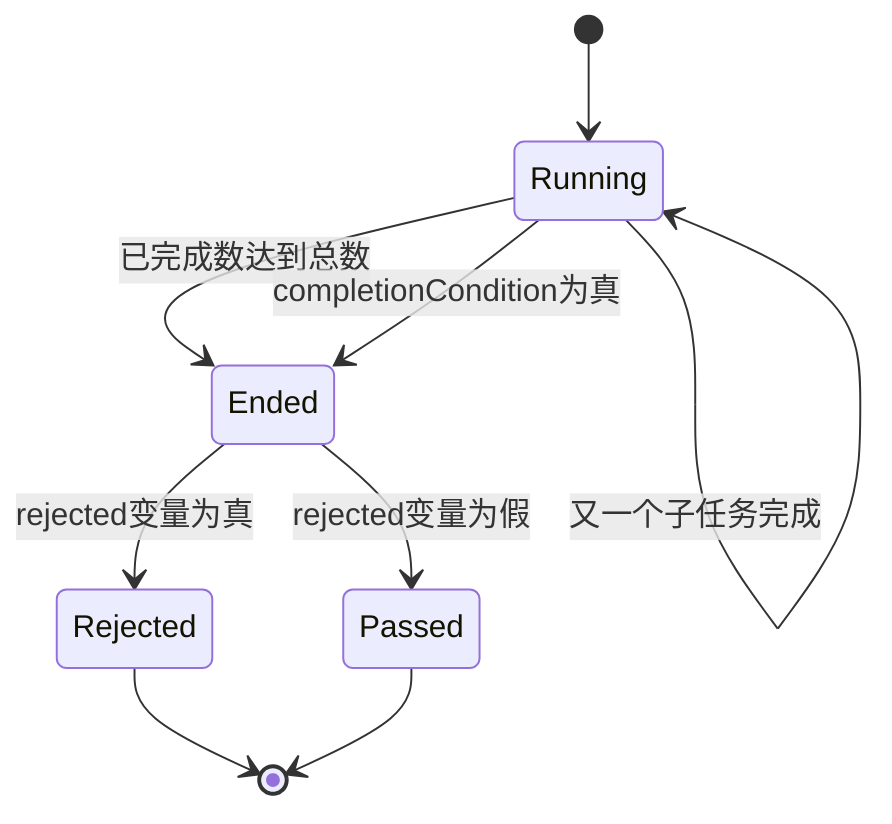
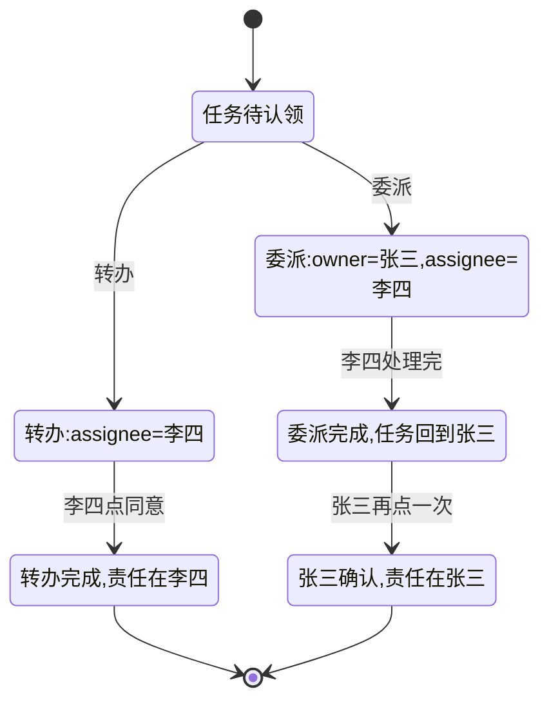
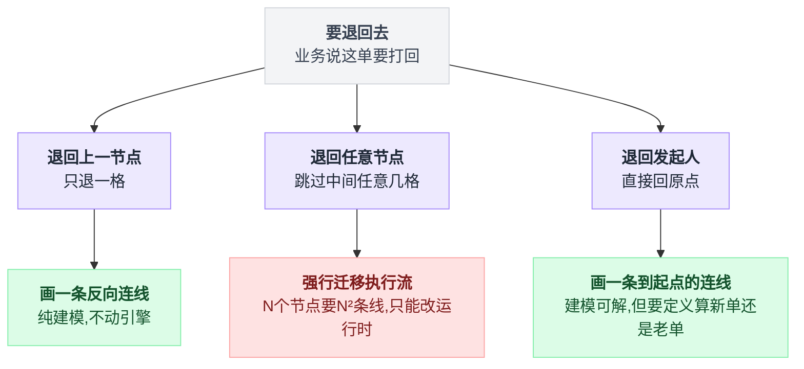
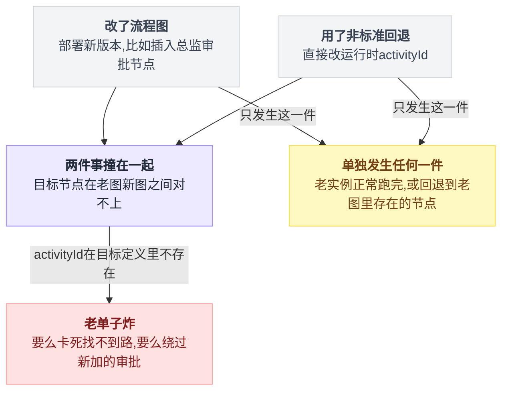
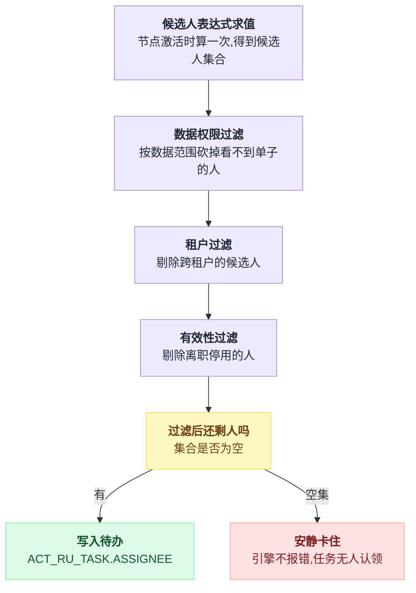
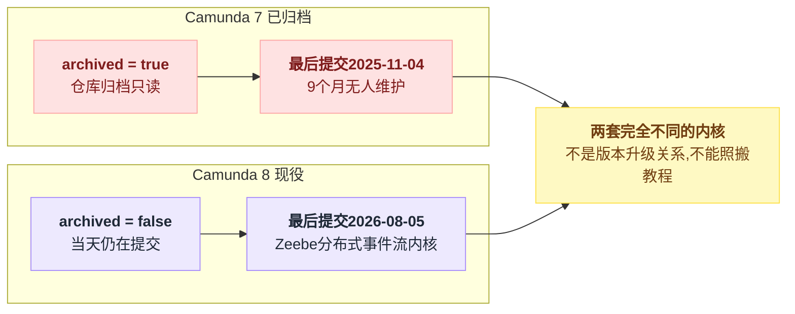
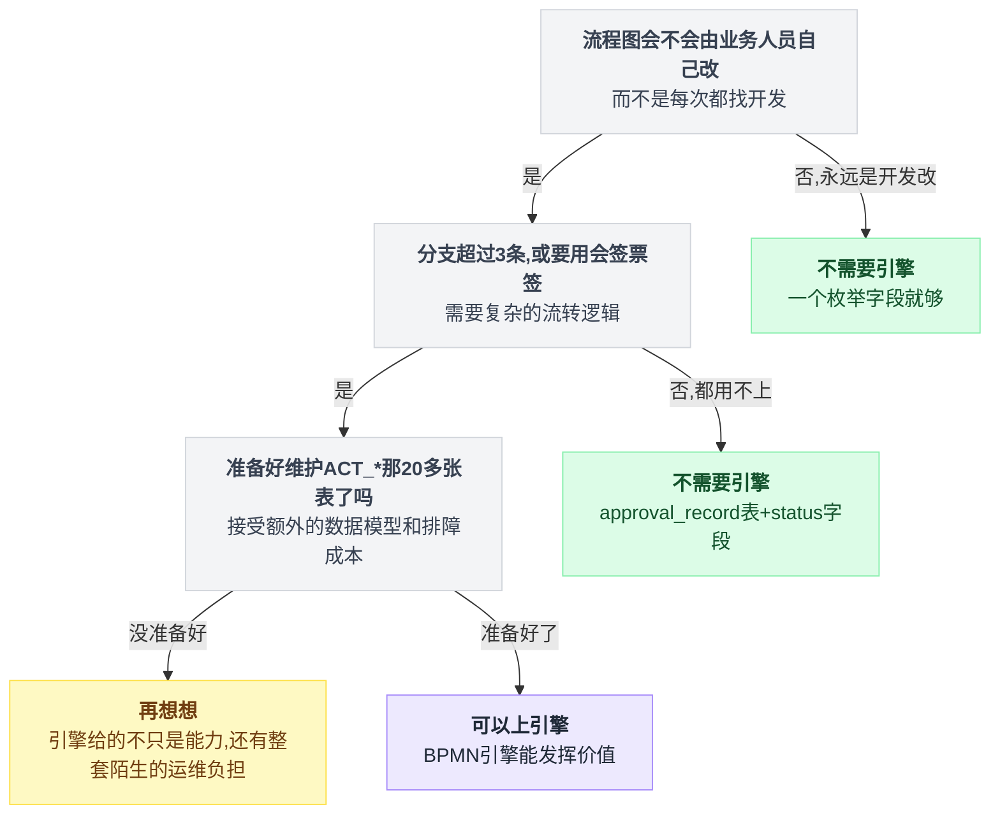

# 《审批流与工作流引擎》流程图改了，跑到一半的单子怎么办（小白版）

> 一句话结论：**「驳回到任意节点」在 BPMN 标准里根本不存在**——引擎没有 reject API，中文审批里的回退全是靠强行迁移执行流实现的，而这正是"改了流程图、老单子炸掉"的根因。另外两条会让不少 2026 年的文章直接过期：Camunda 7（`camunda/camunda-bpm-platform`）已经归档，现役是 `camunda/camunda`；而画图的 bpmn-js 当日 star 竟然略高于跑图的 flowable-engine——多数团队的痛点在"画"，不在"跑"。
>
> 难度：★★★★☆
>
> 阅读前提：本篇是[第 31 篇《订单状态机与逆向流程》](./31-订单状态机与逆向流程.md)的姊妹篇。那篇讲的是**系统自己推着走**的状态机（付款回调来了就跃迁），本篇讲的是**人推着走**的流程（张三点了同意才动）。两者的机制完全不同，但"副作用怎么回滚"这一节是共用的，本篇不复读，直接接过去。
>
> 写作时间：2026-08-05。文中 star 数与最后提交时间为当日实测；源码细节基于公开仓库，未经一手核实的说法在文中已标注。

---

## 目录

- [0. 开场：一张卡了三天的报销单](#0-开场一张卡了三天的报销单)
- [1. BPMN 到底在标准化什么](#1-bpmn-到底在标准化什么)
- [2. 会签、或签、票签：同一个元素的三种表达式（本篇主菜之一）](#2-会签或签票签同一个元素的三种表达式本篇主菜之一)
- [3. 加签、转办、委派：标准里有几个、没有几个](#3-加签转办委派标准里有几个没有几个)
- [4. 驳回与回退：标准之外的江湖（本篇主菜之二）](#4-驳回与回退标准之外的江湖本篇主菜之二)
- [5. 版本变更：改了图，跑到一半的单子怎么办](#5-版本变更改了图跑到一半的单子怎么办)
- [6. 审批人是怎么算出来的](#6-审批人是怎么算出来的)
- [7. 前后端契约：中文审批语义塞在哪里](#7-前后端契约中文审批语义塞在哪里)
- [8. 选型：2026 年的引擎名单](#8-选型2026-年的引擎名单)
- [9. 反直觉结论](#9-反直觉结论)
- [10. 一句话总结、小白词典、和前几篇的对照](#10-一句话总结小白词典和前几篇的对照)

---

## 0. 开场：一张卡了三天的报销单

一张单子卡住，看着像同一种故障，其实是三种病，分别死在引擎的三个不同假设上。这一节把三种死法各画一张时序图，它们同时也是全文的路线图。

### 0.1 场景

你在一家六百人的公司写内部系统。周一上午，同事小王提了一张报销单，2,300 块，差旅费。

流程图是产品画的，很简单：

```
   ┌──────┐   ┌──────────┐   ┌──────────┐   ┌──────────┐   ┌──────┐
   │ 发起 │──▶│ 直属主管 │──▶│ 部门经理 │──▶│  财务    │──▶│ 结束 │
   └──────┘   └──────────┘   └──────────┘   └──────────┘   └──────┘
                  1 天           1 天           1 天
```

按计划周四能报下来。周四下午小王来问你：**"我这单三天没动了，你帮我看看？"**

你打开数据库，`ACT_RU_TASK`（运行中任务表）里确实有他这条记录，`ASSIGNEE` 字段有值，状态正常，没有异常日志。

系统没坏——它正一丝不苟地等着一个永远不会来的人点"同意"。

### 0.2 死法一：审批人离职了

```
   帧 1  周一 10:00        帧 2  周一 10:00        帧 3  周二起
   ──────────────────      ──────────────────      ──────────────────
   小王提交                 引擎算候选人：           任务躺在待办列表里
        │                  "直属主管 = 李四"              │
        ▼                       │                        │  李四的账号
   引擎创建任务                  ▼                        │  已在上周五
   ASSIGNEE = ?           写入 ACT_RU_TASK              │  被 HR 停用
                          ASSIGNEE = 'lisi'              │
                                                          ▼
                                                   谁都看不到这条待办
                                                   （李四登不上，
                                                     别人的列表里没有）
                                                   引擎：一切正常 ✓
```

**根子**：任务表里那个 `ASSIGNEE` 是**创建任务的那一刻算出来快照下来的**，不是每次查询实时算的。

人事状态后来变了，快照不会跟着变。引擎不知道"李四"这个字符串在你的人事系统里已经失效了——对引擎来说那就是一个字符串。

### 0.3 死法二：部门改了

周二公司做了组织架构调整，小王从"市场部"划到"品牌部"。

```
   提交时（周一）                      调整后（周二）
   ─────────────────────           ─────────────────────
   小王 → 市场部                     小王 → 品牌部
   市场部经理 = 王五                  品牌部经理 = 赵六
        │                                  │
        ▼                                  ▼
   引擎在周一算出：                  引擎在周二什么都没算
   下一节点候选人 = 王五              （没有人触发重算）
        │                                  │
        ▼                                  ▼
   周三流转到"部门经理"节点        任务派给了 王五
                                          │
                                          ▼
                             王五：这人不是我下属，我签什么？
                             小王：我领导是赵六啊
                             引擎：候选人表达式返回了王五，我没错
```

**根子**：候选人表达式在**节点激活的那一刻**求值一次。求值依赖的是外部数据（组织树），外部数据变了，已经求过的值不会自动失效。

这是典型的"缓存了一个会变的东西却没有失效机制"——[第 15 篇《缓存三兄弟与缓存一致性》](./15-缓存三兄弟与缓存一致性.md)整篇讲的就是这个病，只不过那边缓存的是商品详情，这边缓存的是"谁该审"。

### 0.4 死法三：流程图昨天刚改过

最阴的一种。周二产品说"2000 块以上要加一道总监审批"，于是在图上插了一个节点，点了部署。

```
   流程定义（部署了两版）
   ─────────────────────────────────────────────────────────
   v1（周一部署）  发起 → 主管 → 部门经理 → 财务 → 结束
   v2（周二部署）  发起 → 主管 → 部门经理 → 总监 → 财务 → 结束
                                            ▲
                                        新插的节点

   小王的实例（周一创建，绑的是 v1）
   ─────────────────────────────────────────────────────────
   周一  在"主管"节点
   周三  流转到"部门经理"节点
   周四  部门经理点同意，按 v1 走到"财务"
         → 这单 2,300 块，绕过了总监审批 ✗

   而周二之后新提的单（绑 v2）
   ─────────────────────────────────────────────────────────
         主管 → 部门经理 → 总监 → 财务   ✓
```

产品验收的时候提了一张新单，走到总监了，验收通过。

三周后审计发现有 47 张单绕过了总监——全是改图之前提交、改图之后审批的。

**根子**：流程实例在创建时就绑死了一个具体的**流程定义版本**，之后不管你怎么改图，它继续按老图跑。

第 5 节会论证：**这是设计，不是 bug**，而且是唯一正确的设计。但你必须知道它存在，否则就是上面这种审计事故。

### 0.5 三种死法，就是本篇的路线图

| 症状 | 病根 | 谁来解 |
|---|---|---|
| 审批人离职/停用，单子无人可签 | 候选人被快照，人事状态不回流 | 第 6 节（候选人计算链路）+ 第 3 节（转办/委派） |
| 部门改了，派给了前任领导 | 候选人表达式只在节点激活时求值一次 | 第 6 节 |
| 改了图，老单子绕过新节点 | 实例绑定 definitionId 而非 key | 第 5 节（版本共存与实例迁移） |
| 单子要退回上一步重填 | BPMN 根本没有这个概念 | 第 4 节（本篇主菜之二） |
| 三个人签还是一个人签就够 | 同一个元素，两个旋钮 | 第 2 节（本篇主菜之一） |

---

## 1. BPMN 到底在标准化什么

### 1.1 定义和实例是两个东西

这是理解后面所有内容的地基，先画清楚：

```
   ┌───────────────────────────────────────────────────────────┐
   │  流程定义（Process Definition）——一张 XML 图纸            │
   │   key       = "expense_approval"   ← 你起的名，永远不变     │
   │   version   = 3                    ← 每次部署自动 +1        │
   │   id        = "expense_approval:3:8801"  ← 这一版的唯一 ID  │
   │   <userTask id="managerApprove" .../>  <sequenceFlow .../> │
   │   部署之后 **不可变**：改一个字都是新版本                    │
   └───────────────────────────────────────────────────────────┘
                    │  startProcessInstanceByKey("expense_approval")
                    │  → 引擎取该 key 的**最新版本**，然后
                    ▼
   ┌───────────────────────────────────────────────────────────┐
   │  流程实例（Process Instance）——小王那张具体的单子          │
   │   id            = "ins_99271"                              │
   │   definitionId  = "expense_approval:3:8801"  ← 注意！存的是 │
   │                     具体版本 ID，不是 key                    │
   │   变量           = { amount: 2300, applicant: "wangwu" }   │
   │   当前在哪       = 由执行流（execution）记录                │
   └───────────────────────────────────────────────────────────┘
```

**一句话记住**：`key` 是"这类流程"，`definitionId` 是"这一版图纸"，实例攥在手里的是后者。

0.4 节那个审计事故，全部信息已经在这张图里了。

### 1.2 BPMN 标准化的是"元素"，不是"业务动作"

BPMN 2.0 是 OMG 的建模标准，它规定的是图上能画哪些形状、每种形状的执行语义是什么。左右两列摆在一起，落差一眼可见：

| BPMN 认识的东西 | BPMN 不认识的东西 |
|---|---|
| `startEvent` 开始事件 | "驳回" |
| `userTask` 人工任务 | "回退到发起人" |
| `serviceTask` 系统任务 | "加签" |
| `exclusiveGateway` 排他网关 | "转办" |
| `parallelGateway` 并行网关 | "撤回" |
| `multiInstance` 多实例 | "会签 / 或签 / 票签" |
| `boundaryEvent` 边界事件 | "抄送" |
| `subProcess` 子流程 | "审批意见" |

左边这些有标准语义，任何合规引擎行为一致；右边这些是中文企业办公的词汇表，标准里一个都没有。

右边这一列，就是整个中文审批流生态的工作量所在。**引擎给你的是积木，中国式审批的每一个词你都得自己拼。**

有些词拼起来很轻松（会签，第 2 节），有些词拼起来要动引擎的内脏（回退，第 4 节）。

### 1.3 "画图"和"跑图"是两个市场

这条数据挺有意思，但要老实说清楚它的分量：

```
   2026-08-05 当日实测 star
  ──────────────────────────────────────────────────────────
   Activiti/Activiti        ██████████████████████ 10,541  引擎（跑）
   bpmn-io/bpmn-js          ████████████████████    9,625  建模器（画）
   flowable/flowable-engine ███████████████████     9,441  引擎（跑）
   camunda/camunda (C8)     ████████                4,233  引擎（跑）
```

bpmn-js 比 flowable-engine 高 **184 个 star**。

⚠️ 诚实地说：**184 这个差距太小了**，属于随时可能被反超、也可能被数据缓存抖动推翻的量级。所以不要把"画图库比引擎还火"当成铁律来讲——它只是"当日实测下这两个数字咬得很紧"。

但即便只看"咬得很紧"这件事，结论也成立：**一个纯前端的建模器，能和一个跑了十几年的完整 BPM 引擎处在同一量级**，说明相当多团队的真实需求是"给我一个能拖拽的流程设计器"，至于跑，他们用自己写的那套 `status` 字段就够了。

你去看国内那些"低代码工作流"产品，前端几乎清一色是 bpmn-js 或它的二次封装，后端引擎反而五花八门。

💡 这和[第 31 篇](./31-订单状态机与逆向流程.md)的发现是同一个形状：那边是 Spring Statemachine 被归档、前端的 xstate 却活得很好；这边是画图的库和跑图的引擎平起平坐。规律是一样的——**"状态/流程"这个概念在可视化那一端的价值，比在执行那一端更容易被感知**。执行那端的难题（持久化、并发、事务边界）框架帮不上忙，可视化那端的难题（拖拽、连线、校验）框架能一次性解决。

---

## 2. 会签、或签、票签：同一个元素的三种表达式（本篇主菜之一）

三个中文词，一个 BPMN 元素，两个旋钮，其中只有一个旋钮真的能拧。这一节的全部内容就是这句话的展开。

### 2.1 先把三个词翻译成人话

| 中文词 | 需求 | 例子 |
|---|---|---|
| **会签** | 指定的这批人**全部**同意才算过 | 三位股东联签合同 |
| **或签** | 这批人里**任意一个**同意就算过 | 值班经理谁在谁批 |
| **票签** | 同意的人达到**某个比例/数量**就算过 | 5 位评委过 3 位即通过 |

大多数人的第一反应是："这得写三种不同的实现吧？"

不。**在 BPMN 里它们是同一个元素**：`multiInstance`（多实例）。三者的区别只在两个参数上。

### 2.2 多实例是什么：一个节点被复制成 N 份

```
   图上你只画了一个节点：
   ┌────────────────────────┐
   │  userTask: 部门联审     │
   │  multiInstance          │
   │  collection = ${users}  │   users = ["张三","李四","王五"]
   └────────────────────────┘

   运行时引擎把它展开成：
                    ┌──────────────┐
              ┌────▶│ 子任务 → 张三 │────┐
              │     └──────────────┘    │
   ┌──────┐   │     ┌──────────────┐    │   ┌──────┐
   │ 进入 │───┼────▶│ 子任务 → 李四 │────┼──▶│ 离开 │
   └──────┘   │     └──────────────┘    │   └──────┘
              │     ┌──────────────┐    │      ▲
              └────▶│ 子任务 → 王五 │────┘      │
                    └──────────────┘        什么时候能走？
                                            ↑ 全部问题在这里
```

并行多实例（`isSequential=false`）三个子任务同时创建，串行多实例（`isSequential=true`）一个签完才创建下一个。

中文审批里"依次审批"用串行，"同时会签"用并行。

### 2.3 退出条件：只有两个旋钮（本节最值钱的一句）

Flowable 的并行多实例行为类 `ParallelMultiInstanceBehavior` 里有个 `internalLeave()` 方法，每个子任务完成时都会走到它。它要回答的问题只有一个：整个多实例能不能结束了。

```
每个子任务完成时，引擎都跑一遍这个判断：

on 子任务完成:
    已完成数 += 1
    if 已完成数 >= 总数:              → 结束整个多实例
    if completionCondition 求值为真:  → 结束整个多实例
    # "结束"= 把剩下没完成的子任务全部删掉，流程往下走
```

这个判断条件等价于下面这一行：

```java
// 等价形式（非逐字抄录，语义以官方仓库为准）
if (nrOfCompletedInstances >= nrOfInstances || isCompletionConditionSatisfied(execution)) {
    // 结束整个多实例，把剩下没完成的子任务全部删掉，流程往下走
}
```

源码位于 `modules/flowable-engine/.../bpmn/behavior/ParallelMultiInstanceBehavior.java`，本次已读源码。

盯着这行看三秒。整个会签体系的全部秘密就在这里：

```
   ┌─────────────────────────────────────────────────────────┐
   │  能让多实例提前结束的，只有两件事：                        │
   │                                                          │
   │   ① nrOfCompletedInstances >= nrOfInstances               │
   │      （已完成数 >= 总数，也就是"全都签完了"）              │
   │                                                          │
   │   ② completionCondition 表达式为 true                     │
   │      （你自己写的一句 EL）                                 │
   └─────────────────────────────────────────────────────────┘
              │                              │
              │ ①是硬编码的，你改不了         │ ②是你唯一能拧的旋钮
              ▼                              ▼
          会签就靠它                    或签、票签全靠它
```

引擎在多实例执行期间会维护几个内置变量，你在 `completionCondition` 里可以直接引用：

| 变量 | 含义 |
|---|---|
| `nrOfInstances` | 一共创建了几个子实例（会签总人数） |
| `nrOfCompletedInstances` | 已经完成了几个 |
| `nrOfActiveInstances` | 还有几个在跑（并行时 = 总数 - 已完成） |

### 2.4 同一个元素，三种表达式

这张对照图建议截图存下来，它是本节的答案：

```
   ┌────────────────────────────────────────────────────────────────────┐
   │           同 一 个 multiInstance 元 素                              │
   │           collection = ${approverList}   (假设 3 个人)              │
   └────────────────────────────────────────────────────────────────────┘
        │                        │                          │
        │ 不写 completionCondition│ completionCondition=     │ completionCondition=
        │                        │ ${nrOfCompletedInstances │ ${nrOfCompletedInstances
        │                        │   >= 1}                  │   /nrOfInstances >= 0.6}
        ▼                        ▼                          ▼
   ┌──────────┐            ┌──────────┐              ┌──────────┐
   │  会 签   │            │  或 签   │              │  票 签   │
   └──────────┘            └──────────┘              └──────────┘
   张三 ✓                  张三 ✓ ──▶ 立刻结束        张三 ✓
   李四 ✓                  李四  （子任务被删）        李四 ✓ ──▶ 2/3=0.67
   王五 ✓ ──▶ 结束          王五  （子任务被删）        王五  （子任务被删）
   3/3 满足条件①            0/3 但满足条件②            2/3 但满足条件②

   ★ 引擎代码一行没变，变的只是 XML 里那一句 EL 表达式
```

XML 长这样（三份只差一行）：

```xml
<userTask id="coSign" name="部门联审" flowable:assignee="${assignee}">
  <multiInstanceLoopCharacteristics isSequential="false"
      flowable:collection="${approverList}" flowable:elementVariable="assignee">
    <!-- 会签：把下面这行整个删掉 -->
    <!-- 或签： -->
    <completionCondition>${nrOfCompletedInstances >= 1}</completionCondition>
    <!-- 票签：换成 ${nrOfCompletedInstances/nrOfInstances >= 0.6} -->
  </multiInstanceLoopCharacteristics>
</userTask>
```

### 2.5 那"一票否决"怎么办

产品下一句一定是："会签的时候只要有一个人不同意，整单就驳回。"

注意：`nrOfCompletedInstances` 只数**完成了几个**，它不关心这个人是点了同意还是不同意——对引擎来说"任务完成"就是完成。

所以否决要靠你自己在任务完成监听器里写一个变量，再让完成条件读它：

```
on 完成监听器(张三点了"不同意"):
    setVariable("rejected", true)

completionCondition = ${rejected == true || nrOfCompletedInstances >= nrOfInstances}
    → 多实例立刻结束，剩下两个子任务被删除

后面接一个 exclusiveGateway:
    if ${rejected}  → 走"驳回"分支
```

⚠️ 这里有个高频坑：**多实例的子实例各有自己的局部变量作用域**。你在子任务里 `setVariable` 写的可能是局部变量，完成条件读不到。要写到多实例的父作用域上（Flowable/Activiti 提供了区分局部与全局变量的 API，具体方法名以官方文档为准）。

这个坑的症状是"或签逻辑在单元测试里好好的，一上真实流程就不生效"。

还有一条顺带的推论：会签人数在 `collection` 求值时就定死了。事后想往里加人（就是下一节的"加签"），必须**同时**改子实例集合和 `nrOfInstances` 这个内部计数——只加人不改计数，3 个人签完多实例就结束了，第 4 个人的任务成了孤儿。

这就是"加签"在很多系统里被砍掉的原因：它要求你去改引擎运行时的内部变量。

把 2.3～2.5 三节串起来，多实例这个元素在运行时其实只有一张状态机：



会签、或签、票签走的都是上面这张图，差别只在"什么条件能让 Running 提前跳到 Ended"；一票否决走的也是同一张图，只是多了 rejected 这个自定义变量参与判定。

---

## 3. 加签、转办、委派：标准里有几个、没有几个

### 3.1 清单

| 中文动作 | 标准里有吗 | 实现代价 |
|---|---|---|
| **转办**（把任务给别人，从此与我无关） | 有对应能力 | 低。改任务的 assignee 即可 |
| **委派**（给别人办，办完还回到我这） | 有对应能力 | 低。引擎有 delegation 状态机 |
| **加签**（临时多拉一个人一起签） | ✗ 没有 | 高。要动多实例的内部计数（见 2.6） |
| **减签**（把某个会签人踢出去） | ✗ 没有 | 高。同上，反向 |
| **抄送**（不参与审批，只通知） | ✗ 没有 | 低。它根本不是流程问题，是通知问题 |
| **撤回**（发起人主动收回单子） | ✗ 没有 | 中。本质是第 4 节的回退到发起人 |
| **催办** | ✗ 没有 | 低。定时扫任务表发通知 |

### 3.2 转办 vs 委派：一张图讲清区别

这两个词国内经常混用，但引擎里是两回事：

```
   转 办 (transfer)                        委 派 (delegate)
  ────────────────────────            ────────────────────────
   任务 assignee = 张三                任务 owner    = 张三  ← 保留原主人
        │                                  assignee = 李四
        │ 张三：这活归你了                      │
        ▼                                      │ 张三：帮我看看
   任务 assignee = 李四                         ▼
        │                              李四处理完 → 任务回到张三
        │                                      │
        ▼                                      ▼
   李四点同意 → 流程往下走             张三再点一次 → 流程才往下走
        │                                      │
   张三从此看不到这个任务               责任始终在张三身上
```

同一件事拆成四行对照：

| | 转办 (transfer) | 委派 (delegate) |
|---|---|---|
| 字段变化 | `assignee` 改成李四 | `owner` = 张三（保留原主人），`assignee` = 李四 |
| 李四完成后 | 流程直接往下走 | 任务回到张三，张三再点一次流程才往下走 |
| 张三还能看到吗 | 从此看不到这个任务 | 责任始终在张三身上 |
| 审计链上是谁批的 | 李四 | 张三 |

**选哪个是个法务问题不是技术问题**：报销单最终签字人是谁，决定了出事时谁担责。

委派保留 `owner`，审计链上仍是张三批的；转办之后审计链上是李四批的。产品需求写"转给别人处理"的时候，你必须追问一句"批完算谁批的"。

两条路径从同一个起点分叉，落点谁担责完全不同：



### 3.3 抄送根本不该画在图上

见过太多人在流程图上画一个"抄送节点"，然后要给它配自动完成机制，然后自动完成失败把单子卡住——给自己造了一个新的卡点。

**判断标准一句话：这一步会不会阻塞流程流转？会 → 是节点；不会 → 是任务完成监听器里发一条通知。**

通知怎么可靠送达是[第 35 篇《消息推送与厂商通道》](./35-消息推送与厂商通道.md)的地盘，别在流程图上解决它。

---

## 4. 驳回与回退：标准之外的江湖（本篇主菜之二）

这一节的路线：先证明引擎里没有 reject → 再把"驳回"拆成三种语义、代价差一个数量级 → 然后看最贵的那种到底在偷偷改什么 → 最后一节讲最容易被漏掉的部分，那才是真难题。

### 4.1 先说结论：引擎没有 reject

打开任何一个 BPMN 引擎的 TaskService，你会找到 `complete`（完成任务）、`claim`（签收）、`delegate`（委派）、`setAssignee`。

你**找不到** `reject`。

```
   业务同学脑子里的模型              BPMN 执行模型
  ──────────────────────       ──────────────────────────
   任务有两个出口：               任务只有一个出口：complete
     ① 同意 → 往下走                 │
     ② 拒绝 → 往回退                 │ 完成时可以带变量
                                     ▼
                                进入后续的连线/网关
                                     │
                                网关根据变量选一条路走
                                     │
                                     ▼
                            所有路都是**图上画好的**路
```

也就是说：在标准语义下，"驳回"只能表达成"**同意完成这个任务，并带上一个变量 `approved=false`，然后让后面的网关把流程引到一条你事先画好的线上去**"。

这就带来一个残酷的推论：

> **只要你想回到的那个节点没在图上连一条线过去，标准语义下就到不了。**

### 4.2 三种回退语义，代价差一个数量级

中文审批说的"驳回"，其实是三个完全不同的需求：

```
   ① 退回上一节点              ② 退回任意节点              ③ 退回发起人
  ─────────────────       ─────────────────────       ─────────────────
   财务 ──退回──▶ 部门经理    财务 ──退回──▶ 主管         财务 ──退回──▶ 发起
   （只退一格）              （跳过中间任意几格）          （直接回原点）

   实现：图上画一条            实现：图上画不出来          实现：图上画一条
   反向连线 + 网关             （N 个节点要 N² 条线）      到起点的连线
                                                        或者直接结束实例
   代价：★                   代价：★★★★★             代价：★★
   纯建模，不动引擎            必须强行迁移执行流           建模可解，但要处理
                                                        "重新提交算新单还是老单"
```

同一张表拉平了看：

| 语义 | 退到哪 | 实现 | 代价 |
|---|---|---|---|
| ① 退回上一节点 | 只退一格 | 图上画一条反向连线 + 网关 | ★ 纯建模，不动引擎 |
| ② 退回任意节点 | 跳过中间任意几格 | 图上画不出来（N 个节点要 N² 条线），必须强行迁移执行流 | ★★★★★ |
| ③ 退回发起人 | 直接回原点 | 图上画一条到起点的连线，或者直接结束实例 | ★★ 建模可解，但要处理"重新提交算新单还是老单" |

第 ② 种为什么是 ★★★★★，算笔账就明白。一个 8 节点的审批流要支持"退回到之前任意节点"，连线数是这么长出来的：

```
线数 = 0
for i in 2..8:
    线数 += (i - 1)      # 节点 i 可以退到它前面的 i-1 个节点
# 1+2+3+4+5+6+7 = 28
```

摊开就是：

```
   一个 8 节点的审批流，要支持"退回到之前任意节点"
   ───────────────────────────────────────────────
   节点 2 可退到：1                     1 条线
   节点 3 可退到：1,2                   2 条线
   节点 4 可退到：1,2,3                 3 条线
   ...
   节点 8 可退到：1..7                  7 条线
                                     ───────
                                      28 条线

   加上每条线要挂的条件表达式、每个节点要加的网关……
   这张图人类已经看不懂了。而且每加一个节点，线数增长是 O(N²)。
```

所以现实中没人这么画。现实中的做法是：**绕过图，直接让引擎把执行流"搬"到目标节点上去。**

三种回退语义分岔之后，实现代价差出一个数量级：



### 4.3 "强行迁移执行流"是什么意思

```
   引擎眼里的运行时状态（简化）
   ┌──────────────────────────────────────────────┐
   │  ACT_RU_EXECUTION                             │
   │    id = "exec_771"                            │
   │    activityId = "financeApprove"   ← 当前在哪 │
   │    processInstanceId = "ins_99271"            │
   │  ACT_RU_TASK                                  │
   │    id = "task_552"  assignee = "财务小刘"      │
   └──────────────────────────────────────────────┘

   "退回到主管节点"的本质操作：
   ┌──────────────────────────────────────────────┐
   │  1. 删掉当前的 task_552（以及它的子任务）       │
   │  2. 把 exec_771.activityId 改成 "leaderApprove"│
   │  3. 按目标节点的配置，重新算候选人、建新任务      │
   │  4. 补一条历史记录，让审计能看出这是一次回退      │
   └──────────────────────────────────────────────┘
              ▲
              │ 这四步没有一步是 BPMN 标准定义的行为
              │ 你是在直接改引擎的运行时数据
```

Flowable 和 Activiti 都提供了"改变流程实例当前活动状态"这一类的运行时能力，社区里的回退方案基本都建立在它之上。

⚠️ **这里必须诚实**：本次调研**没有核实**社区通行回退方案的具体 API 名称与调用方式。所以本文只描述"它在做什么"（删任务 → 改 activityId → 重建任务 → 补历史），不给类名和方法名。**具体 API 以 Flowable/Activiti 官方文档为准；网上流传的各种"驳回工具类"属于业内常见实践，未经官方语义背书**（此为第三方实践，未经官方确认）。

也正因为它不是标准行为，它有三个必然的副作用：

| 副作用 | 具体表现 |
|---|---|
| 历史数据不再线性 | 历史活动表里同一个节点出现多次，"平均审批时长"这类报表指标全部要重新定义 |
| 多实例场景极易残留 | 从会签节点跳走，3 个子任务、子执行流、内置计数变量清不干净就是脏数据 |
| 目标节点可能不存在 | `activityId` 是字符串，你把它改成一个只有老图才有的 id，引擎当场找不到路 |

**第三条就是标题那句话的完整含义**：改了流程图 + 用了非标准回退，两件事撞在一起，老单子就炸。单独任何一件都不会。



### 4.4 真正的难题不是流程，是副作用（本节最容易被漏掉的部分）

流程退回去了，可流程走过的这一路上，已经发生的事情怎么办？

```
   小王的报销单走到财务，财务点了"退回到主管"
   ────────────────────────────────────────────────────────
   这一路上已经产生的副作用：

   ✗ 已经给部门经理发过的"待审批"通知      → 撤不回来
   ✗ 已经在预算系统里预占的 2,300 元额度   → 谁来释放？
   ✗ 已经生成的凭证草稿                    → 作废还是复用？
   ✗ 已经同步给 BI 的"本月待付金额"        → 数字是错的
   ✓ 流程状态本身                          → 引擎帮你退了

   引擎负责的只有最后这一行。上面四行，一行都不管。
```

这是审批流最容易被低估的部分：**引擎回退的是"走到哪一步"，不是"已经做了什么"。**

这个问题[第 31 篇](./31-订单状态机与逆向流程.md)已经给出过答案，本篇直接接过来用：

- 第 31 篇的**版本化变更集**思路：不要把"退回"做成"状态倒着跳一格"，而是把每一次流转产生的副作用**打成一个可整体撤销的变更集**（谁改了什么、改之前是什么）。退回时不是"反着推一遍"，而是"把这个变更集整体回滚"。这比一个个写反向操作可靠得多，因为反向操作的组合爆炸和 4.2 节那 28 条线是同一个数学。
- [第 20 篇《分布式事务的真相》](./20-分布式事务的真相.md)的**补偿**思路：跨系统的那部分（预算额度在预算系统、凭证在财务系统）根本没有共享事务，唯一可行的是补偿——正向调用时记一条补偿单，退回时按逆序执行补偿。第 20 篇的核心结论"想办法不用分布式事务"在这里也成立：**能设计成"审批通过之后才真正扣额度"，就不要在中途扣**。

```
   设计 A：每一步都真做           设计 B：全程只记账，末尾统一做
  ──────────────────────       ──────────────────────────────
   主管同意 → 预占额度            主管同意 → 什么都不做
   经理同意 → 生成凭证草稿        经理同意 → 什么都不做
   财务同意 → 付款                财务同意 → 预占+凭证+付款 一起做
        ▼                              ▼
   任何一步退回都要补偿            退回时无事可补，
   要写 N 套补偿逻辑              只有最后一步需要事务保护
```

**能选 B 就选 B。**

审批流里绝大多数"中途副作用"都是需求方想当然加的，问一句"这一步必须现在做吗"，一半能砍掉。

---

## 5. 版本变更：改了图，跑到一半的单子怎么办

### 5.1 两个版本并存，是常态

回到 0.4 节的事故。先看清运行时到底是什么样：

```
   ┌───────────── 流程定义表 ACT_RE_PROCDEF ─────────────┐
   │ id                        key               version │
   │ expense_approval:1:8801   expense_approval     1     │  ← 老图
   │ expense_approval:2:9002   expense_approval     2     │  ← 新图（带总监）
   └──────────────────────────────────────────────────────┘
             ▲                              ▲
             │                              │
   ┌─────────┴──────────┐        ┌──────────┴─────────┐
   │ 实例 ins_99271     │        │ 实例 ins_99388     │
   │ (周一提交)          │        │ (周三提交)          │
   │ definitionId =     │        │ definitionId =     │
   │  ...:1:8801        │        │  ...:2:9002        │
   │ 走：主管→经理→财务  │        │ 走：主管→经理→总监→财务│
   └────────────────────┘        └────────────────────┘

   两个实例在同一个引擎里，同时跑着两张不同的图。
   ★ 这不是 bug，这是引擎唯一能做的正确选择。
```

### 5.2 为什么这是设计不是 bug

假设引擎"贴心"地让老实例自动跟进新图，会发生什么：

```
   老实例当前在"部门经理"节点，你把新图改成了这样：
   ─────────────────────────────────────────────────────
   v1:  发起 → 主管 → 部门经理 → 财务
   v2:  发起 → 主管 → 分管副总 → 财务      ← 把"部门经理"删了

   如果强制跟进 v2：
        实例当前 activityId = "managerApprove"
        v2 的图里根本没有这个 id
        → 引擎找不到当前节点，也找不到下一条连线
        → 这个实例永久卡死，而且是**无法修复的**卡死
           （连"往下走一步"都做不到，因为不知道从哪往下）
```

所以引擎的选择是：**实例一旦创建，就和那一版图纸绑定终身。**

你可以删掉图上的节点、改掉网关、重排顺序，老实例完全不受影响——因为它引用的那份 XML 还在库里，一个字没变。

用一句话概括这个设计哲学：

> **流程定义是不可变的（immutable），流程实例引用一个不可变的快照。**

这和[第 38 篇《配置中心与秒级回滚》](./38-配置中心与秒级回滚.md)里 Apollo 的 Release 是同一个套路（不可变记录 + 引用），也和[第 25 篇《灰度发布与 AB 分流》](./25-灰度发布与AB分流.md)里"新老版本并存"是同一个形状。

**"改了之后老的还按老的跑"在这三个领域全都是特性而不是缺陷。**

### 5.3 那老单子到底要不要跟进新图

看需求。这里给决策表，别拍脑袋：

| 改动性质 | 举例 | 老实例怎么办 | 理由 |
|---|---|---|---|
| **纯文案/界面调整** | 节点改名、表单字段加个提示 | 让它跑完 | 老实例走完最多是名字旧一点，没有实质影响 |
| **加了一道审批，且合规要求追溯** | 2000 元以上加总监审批，审计要求覆盖存量 | **必须迁移** | 不迁移就是 0.4 节那 47 张单的审计事故 |
| **加了一道审批，但只对新单生效** | 新政策自 X 月 X 日起执行 | 让它跑完 | 政策本来就有生效日，老单按老政策是对的 |
| **删掉了一个节点** | 取消"总监审批"这一环 | 视情况；已在该节点的实例**必须**处理 | 老实例停在一个被删的节点上不影响自己，但你想迁移时无处可去 |
| **改了候选人算法** | 从"部门经理"改成"分管副总" | 通常让它跑完 | 中途换审批人会让已签的人白签 |
| **改了网关条件** | 金额阈值从 2000 改成 5000 | 让它跑完 | 老实例可能已经过了那个网关，迁移过去反而语义错乱 |
| **图有 bug，老实例已经卡死** | 网关条件写错，所有分支都不成立 | 迁移（或人工干预） | 这是唯一没有选择的情况 |

**默认答案是"让它跑完"**。迁移是例外，不是常规操作。

经验法则：如果你每次改图都要迁移一次存量实例，说明你的流程图设计得太具体了——把易变的部分（金额阈值、审批人规则）挪到流程变量和外部配置里去，图本身就不需要频繁改了。

### 5.4 真要迁移怎么办

引擎不会自动做，**你必须显式发起一次实例迁移**：告诉引擎"把这批实例从定义 A 搬到定义 B，其中 A 的节点 x 对应 B 的节点 y"。

一次迁移请求的形状就是三件必填项：

```
迁移 = {
    源:   哪些实例          # 一般按 definitionId 批量选
    目标: 迁到哪个 definitionId
    映射: {                 # 源图的 activityId → 目标图的 activityId
        "managerApprove" -> "managerApprove",   # 同名，通常可以自动匹配
        "financeApprove" -> "directorApprove",  # 改过 id / 新增删除的，必须手工映射
    }
}
```

映射那一项才是要动脑子的地方：

```
   实例迁移的三件必填项
   ─────────────────────────────────────────────────
   ① 源：哪些实例（一般按 definitionId 批量选）
   ② 目标：迁到哪个 definitionId
   ③ 映射：源图的 activityId → 目标图的 activityId
            ┌────────────────────────────────┐
            │  v1: managerApprove            │
            │        ↓ 映射                   │
            │  v2: managerApprove   （同名，  │
            │       可以自动匹配）             │
            │                                 │
            │  v1: financeApprove            │
            │        ↓                        │
            │  v2: directorApprove  ← 想让    │
            │       已到财务的单退回总监审批    │
            │       就得显式写这条映射         │
            └────────────────────────────────┘

   同名节点通常可以自动匹配；改过 id 或新增/删除的节点必须手工映射。
```

⚠️ **本次未核实**：Flowable 提供实例迁移能力的**具体类名与方法签名**本次调研没有定位到。上面描述的是这类 API 的通用形态（源、目标、活动映射三要素），**实际调用方式一律以 Flowable 官方文档为准**，不要照着任何二手文章里的类名去写代码。

⚠️ 迁移前必查五条：① 目标图里有没有对应节点（没有 → 映射失败）；② 停在多实例节点上的实例单独处理，会签子任务的映射比普通节点复杂得多；③ 新图的网关会不会读一个老实例根本没有的变量（会 → 迁移完立刻卡在网关上）；④ 先拿生产数据副本在预发跑一遍，统计成功失败数；⑤ 迁移动作本身要留痕，谁在什么时候把哪批实例搬到了哪——审计一定会问。

---

## 6. 审批人是怎么算出来的

### 6.1 一条比想象中长的链路

回到 0.2、0.3 两种死法。产品说"这个节点由部门经理审批"，从这句话到 `ACT_RU_TASK` 里那个 `ASSIGNEE` 字段，中间经过的东西比你想的多。整条链路是一串取交集，最后加一个兜底：

```
候选人 = 表达式求值(applicant)          # 节点激活那一刻，只求这一次
候选人 = 候选人 ∩ 数据权限允许看到这张单的人   # 大多数教程漏掉的一层
候选人 = 候选人 ∩ 当前租户的用户
候选人 = 候选人 - 离职/停用/长期休假的人

if 候选人 为空:
    走兜底策略（默认审批人 或 自动跳过）    # 少了这一步就是"安静地卡住"

写入 ACT_RU_TASK.ASSIGNEE / ACT_RU_IDENTITYLINK
```

每一步具体在过滤什么：

```
   流程图上写的：flowable:candidateGroups="${deptManagerOf(applicant)}"
        │
        ▼  ① 表达式求值（节点激活的那一刻，只求一次）
   调用你注册的 Bean → 查组织架构 → 得到 ["赵六", "孙七"]
        │
        ▼  ② 数据权限过滤   ← 大多数教程漏掉的一层
   这两个人真的"能看到"这张单吗？
   小王属于品牌部，赵六的数据范围是"本部门及下级"→ 通过
   孙七的数据范围是"仅本人"→ 他根本查不到这张单 → 剔除
        │
        ▼  ③ 租户过滤
   多租户环境下还要保证候选人和单据在同一租户
        │
        ▼  ④ 有效性过滤
   离职/停用/长期休假的剔除（0.2 节那种死法就死在没有这一步）
        │
        ▼  ⑤ 兜底
   一个人都不剩了怎么办？→ 必须有默认审批人或自动跳过策略
        │
        ▼
   写入 ACT_RU_TASK.ASSIGNEE / ACT_RU_IDENTITYLINK
```

**第 ⑤ 步是所有审批系统的必修课**：候选人算出来是空集，引擎不会报错，它会创建一个没人认领的任务——这就是 0.2 节那种"安静地卡住"。

**必须在任务创建监听器里判空并告警**，这条比什么都重要。

五步过滤链拉直了看，危险的其实是最后那个分岔：



### 6.2 一条真实的架构证据：审批人受数据权限约束

芋道（`YunaiV/ruoyi-vue-pro`，38,524 star / 2026-07-31 实测）的 `yudao-module-bpm` 模块，pom 里同时依赖了三个东西（pom 已核实）：

```
   yudao-module-bpm/pom.xml
   ├── flowable-spring-boot-starter-process        ← 流程引擎
   ├── yudao-spring-boot-starter-biz-data-permission ← 数据权限
   └── yudao-spring-boot-starter-biz-tenant          ← 多租户
```

**三者绑在一起这件事本身就是结论**：在一个正经的中后台系统里，"谁能审这张单"不是流程引擎单独能回答的问题。

```
   ┌──────────────────────────────────────────────────────────┐
   │  候选人表达式算出的集合   ∩   数据权限允许的集合            │
   │              ∩   当前租户的用户集合   =   真正的审批人      │
   └──────────────────────────────────────────────────────────┘

        流程引擎的地盘         第 36 篇的地盘        第 39 篇的地盘
             │                      │                    │
        candidateGroups        SQL 改写拦截器       租户拦截器
        candidateUsers         部门树/上下级/       tenant_id 自动
        assignee 表达式        自定义数据范围        追加条件
```

中间那块是[第 36 篇《权限系统》](./36-权限系统.md)的主菜：**数据行权限必须在 SQL 语法树上动手**，它拦的是你查"谁是部门经理"时发出的那条 SQL。所以你在流程图里写的表达式，实际能返回什么，取决于**执行这段查询时的数据权限上下文是谁**。

这里有个隐蔽的坑：候选人计算往往发生在异步线程或定时任务里，那里没有登录用户上下文，数据权限拦截器可能拦不到或者拦错——症状是"手工点审批时候选人是对的，定时触发时候选人全空"。

右边那块是[第 39 篇《多租户 SaaS 数据隔离》](./39-多租户SaaS数据隔离.md)的地盘。要特别注意：**流程引擎自己的表（`ACT_*`）也需要租户隔离**。BPMN 引擎一般提供 tenantId 的概念，但你要确认它和你业务侧的租户拦截器口径一致——两套隔离机制打架，症状是 A 租户的单子上出现 B 租户的审批人。

### 6.3 组织变更怎么回流：三种做法

0.3 节那种"部门改了、派给了前任领导"的死法，三种解法：

| 做法 | 怎么做 | 代价 | 适用 |
|---|---|---|---|
| **不回流** | 认了，就按创建时的快照走 | 0 | 短流程（几小时内走完） |
| **延迟求值** | 候选人不存人名，存表达式；查待办时实时算 | 每次查待办都要算一遍，待办列表性能变差 | 组织变动频繁、流程周期长 |
| **事件驱动重算** | 人事系统发变更事件，订阅后重算受影响的在途任务 | 要写一套重算逻辑，且要处理"已经签过的怎么办" | 大厂常见做法 |

第三种最正确也最贵，注意它有个必须回答的问题：**赵六已经批过了，现在他不是这个部门的经理了，这条批准还算数吗？**

答案通常是"算数"——因为审批的效力是**行为发生时**的授权决定的，不是**现在**的授权。

这条要写进产品文档，否则每次组织调整都会有人来问。

---

## 7. 前后端契约：中文审批语义塞在哪里

### 7.1 标准留的那个口子

第 1.2 节说过，BPMN 认识的元素里没有"审批意见""是否允许加签""超时几天自动通过"这些东西。但标准留了一个官方后门：`extensionElements`。

```xml
<userTask id="managerApprove" name="部门经理审批">
  <extensionElements>
    <!-- 下面这些标签的命名空间和结构，是你和前端自己约的 -->
    <acme:approveConfig
        signType="or"                 <!-- 会签/或签/票签 -->
        allowAddSign="true"           <!-- 是否允许加签 -->
        rejectTo="PREV"               <!-- 驳回语义：PREV/ANY/START -->
        timeoutDays="3"               <!-- 超时天数 -->
        timeoutAction="AUTO_PASS"     <!-- 超时动作 -->
        assigneeType="DEPT_LEADER"/>  <!-- 审批人来源类型 -->
  </extensionElements>
</userTask>
```

上面这几个属性就是一份前后端契约，逐条看：

| 属性 | 示例值 | 承载的中文语义 |
|---|---|---|
| `signType` | `or` | 会签/或签/票签 |
| `allowAddSign` | `true` | 是否允许加签 |
| `rejectTo` | `PREV` | 驳回语义：`PREV`/`ANY`/`START` |
| `timeoutDays` | `3` | 超时天数 |
| `timeoutAction` | `AUTO_PASS` | 超时动作 |
| `assigneeType` | `DEPT_LEADER` | 审批人来源类型 |

`extensionElements` 的规则是：**引擎解析 XML 时会保留它但不解释它**，交给你的代码去读。

这就是所有中文审批系统的落地方式——引擎跑标准语义，扩展元素承载中国式语义。

### 7.2 谁写、谁读、谁校验

```
   ┌────────────────┐  拖拽产生 XML  ┌──────────────────┐
   │  bpmn-js 建模器 │ ─────────────▶│  你的后端         │
   │  + 自定义属性面板│                │  ① 存 XML         │
   │  （审批类型/驳回 │                │  ② 部署给引擎     │
   │    到/超时天数） │                │  ③ 解析扩展元素   │
   └────────────────┘                └──────────────────┘
                                              │
                                              ▼
                     运行时：任务创建监听器读取扩展配置，
                     决定候选人、超时定时器、按钮权限

   ★ 前端属性面板的开发量，往往是这个项目里最大的一块
     ——这正好解释了第 1.3 节那个 star 数为什么咬得那么紧
```

### 7.3 一条实践建议：把"按钮"也算进契约

前端渲染审批页时要知道这个人能点哪些按钮（同意/驳回/加签/转办/退回到哪几个节点）。

**不要让前端自己算**——前端拿不到完整的流程上下文，一定算错。

```
   ✗ 前端：if (节点类型 == 'xxx' && 用户角色 == 'yyy') 显示驳回按钮
   ✓ 后端接口直接返回：
     {
       "taskId": "task_552",
       "actions": ["APPROVE", "REJECT", "TRANSFER"],
       "rejectTargets": [
         {"activityId": "leaderApprove", "name": "直属主管"},
         {"activityId": "start",        "name": "发起人"}
       ]
     }
```

`rejectTargets` 那一项后端是这么算的：

```
rejectTargets = 这个实例的历史活动记录里真实走过的节点
# 不是 → 流程图上画着的节点
# 理由：图上有的节点这个实例未必走过，退回到一个没走过的节点没有语义
```

也就是说，`rejectTargets` 由后端根据"这个实例已经走过哪些节点"实时算出来——注意它只能从**历史活动记录**里取（这个实例真实走过的节点），不能从流程图上取（图上有的节点这个实例未必走过，退回到一个没走过的节点是没有语义的）。

这一条能挡掉一大半 4.3 节说的"目标节点找不到"的炸弹。

---

## 8. 选型：2026 年的引擎名单

### 8.1 必须先说的一条事实修正

如果你现在去搜"Java 工作流引擎"，排在前面的文章大概率在教你 Camunda 7。看清楚这个：

```
   camunda/camunda-bpm-platform（俗称 Camunda 7）
   ──────────────────────────────────────────────────────
   star 4,272 ｜ 最后提交 2025-11-04 ｜ archived = **true**
                             ← 仓库已归档、只读（当日实测，已二次核实）

   camunda/camunda（Camunda 8，Zeebe 内核）
   ──────────────────────────────────────────────────────
   star 4,233 ｜ 最后提交 2026-08-05 ｜ archived = false
                             ← 当天还在提交
```

三个字段并排，`archived` 那一格是分水岭：

| | `camunda/camunda-bpm-platform`（Camunda 7） | `camunda/camunda`（Camunda 8，Zeebe 内核） |
|---|---|---|
| star | 4,272 | 4,233 |
| 最后提交 | 2025-11-04 | 2026-08-05（当天还在提交） |
| `archived` | **true**（仓库已归档、只读，当日实测，已二次核实） | false |

时间线画出来更直观：

```
   2025-11-04 ─────── 9 个月无人维护 ───────▶ 2026-08-05
        │                                          │
   C7 仓库最后一次提交，随后归档只读            C8 当天仍在提交

   结论：**2026 年还在教 Camunda 7 的文章，全部过期。**
   注意 C7 和 C8 不是版本升级关系，是两套完全不同的内核
   （C7 是传统关系库引擎，C8 是 Zeebe 的分布式事件流引擎），
   迁移不是升个版本号的事。
```



⚠️ 顺带一条方法论：本系列踩过的坑是 GitHub 的 `/repos/` 端点在某些环境下返回**陈旧快照**（大纲里记录了 keycloak 差 1,458 star、ruoyi-vue-pro 差两个多月的实例）。**"这个库还活着吗"这种判断，一定要看当日实测的 `pushed_at` 和 `archived` 字段，不要看你脑子里的印象。**

### 8.2 当日名单

| 仓库 | star | 最后提交 | 定位 | 备注 |
|---|---|---|---|---|
| `Activiti/Activiti` | 10,541 | 2026-08-04 | Java BPMN 引擎 | 老牌，中文资料最多 |
| `bpmn-io/bpmn-js` | 9,625 | 2026-08-03 | JS 建模器 | 前端事实标准 |
| `flowable/flowable-engine` | 9,441 | 2026-08-03 | Java BPMN 引擎 | Activiti 原班人马另起炉灶，最新 8.0.0（2026-02-27） |
| `camunda/camunda` | 4,233 | 2026-08-05 | Java（Zeebe 内核） | Camunda 8，现役 |
| `camunda/camunda-bpm-platform` | 4,272 | **2025-11-04** | Java | **已归档** |
| `dromara/warm-flow` | 579 | 2026-07-20 | Java 国产轻量引擎 | GitHub star 偏低，主战场在 Gitee（**Gitee 数据本次未核实**） |
| `YunaiV/ruoyi-vue-pro` | 38,524 | 2026-07-31 | Java 中后台脚手架 | `yudao-module-bpm` 基于 Flowable |

（以上均为 2026-08-05 实测）

关于 warm-flow 要说句公道话：**579 这个数字不能用来判断它的国内使用量**。国产项目的主战场常在 Gitee，GitHub 只是镜像。

本次没有核实 Gitee 侧数据，所以本文不对它的活跃度下任何结论——只提醒你：**用 GitHub star 评判国产项目，是本系列反复强调要避免的错误**。

### 8.3 什么时候根本不需要引擎

最后泼一盆冷水。上引擎之前问三个问题，两个答"否"就别上：

| 问题 | 答"否"意味着 |
|---|---|
| ① 流程图会不会由业务人员自己改？ | 永远是开发改 → 你要的不是引擎，是一个枚举 |
| ② 分支超过 3 条？会签票签用得上？ | 都用不上 → 一张 `approval_record` 表 + 一个 status 字段就够 |
| ③ 准备好维护 `ACT_*` 那 20 多张表了？ | 引擎给的不只是能力，还有一整套你不熟悉的数据模型、排障路径和性能问题 |

三个问题串起来就是一棵判断树：



这和[第 31 篇](./31-订单状态机与逆向流程.md)对状态机框架的结论是一样的：**框架解决的是"图怎么表达"，不是"状态怎么持久化、并发怎么防、事务边界在哪"**。

后面这些难题，上了引擎一个都不会消失，反而多了一层要排查的东西。

---

## 9. 反直觉结论

**1）会签、或签、票签在引擎里是同一段代码，你只有两个旋钮可拧。**

依据：Flowable 的 `ParallelMultiInstanceBehavior.internalLeave()` 退出条件等价于 `nrOfCompletedInstances >= nrOfInstances || isCompletionConditionSatisfied(...)`（`modules/flowable-engine/.../bpmn/behavior/ParallelMultiInstanceBehavior.java`，已读源码）。前半段写死，后半段是你的 `completionCondition` 表达式。

所以三种签法的差异**只在一行 EL 里**，不在代码里。产品提第四种签法时，先问它能不能写成 `nrOfCompletedInstances` 和 `nrOfInstances` 的一个布尔表达式——能，就是配置；不能，就得动引擎。

**2）BPMN 标准里没有 reject，中文审批的"驳回"全是造出来的。**

依据：BPMN 的执行语义里，userTask 只有"完成"一个出口，之后走图上已有的连线。"退回上一节点"可以靠画反向连线解决；"退回任意节点"在 8 节点流程里需要 28 条线且 O(N²) 增长，现实中只能靠直接修改运行时执行流的 activityId 来实现——**这是标准之外的操作**。（社区通行的具体实现手法本次未核实，本文只描述行为不给 API。）

附带一条同样容易被忽略的推论：**引擎回退的是"走到哪一步"，不是"已经做了什么"**——已发的通知、已占的额度、已生成的凭证它一律不管，那部分要么用[第 31 篇](./31-订单状态机与逆向流程.md)的版本化变更集整体回滚，要么用[第 20 篇](./20-分布式事务的真相.md)的补偿，最优解是压根不产生中途副作用。

**3）老实例继续走老图，是引擎唯一正确的选择。**

依据：实例存的是 `definitionId`（含版本），不是 `key`。如果强制跟进新版本，一个当前节点在新图里被删掉的实例会立刻变成**无法修复的死实例**——引擎既找不到它在哪，也找不到它该往哪走。

所以"改了图老单子不跟进"不是偷懒，是在防一种更严重的故障。真要跟进必须显式做实例迁移（**迁移 API 的具体类名本次未核实，以官方文档为准**）。

**4）Camunda 7 已经归档了，你搜到的大部分中文教程在教一个只读仓库。**

依据：`camunda/camunda-bpm-platform` 当日实测 `archived = true`，4,272 star，最后提交 2025-11-04（已二次核实）；现役的 `camunda/camunda` 4,233 star，2026-08-05 当天仍有提交。

两者不是版本升级关系，是两套内核。选型时把这条查清楚，能省下三个月的返工。

**5）画流程图的前端库，和跑流程图的后端引擎，热度在同一量级。**

依据：`bpmn-io/bpmn-js` 9,625 star vs `flowable/flowable-engine` 9,441 star（2026-08-05 实测）。**必须说明：两者只差 184，这个差距很小，随时可能反转，不要当作稳定的排序结论。**

能确定的只是"咬得很紧"这件事本身——一个纯建模器能和一个完整 BPM 引擎打平，说明大量团队真正缺的是可视化编辑器，执行那一端他们用自研的 `status` 字段就解决了（第 8.3 节）。

---

## 10. 一句话总结、小白词典、和前几篇的对照

### 一句话总结

> **BPMN 标准化的是画什么形状，没标准化中国人怎么审批——会签、或签、票签是同一个多实例元素上的一句 EL 表达式（能拧的只有 `nrOfCompletedInstances` 和 `completionCondition` 两个旋钮），而"驳回到任意节点"标准里压根不存在，只能靠直接改运行时执行流硬造出来；再叠上"实例绑死 definitionId 所以老单子永远走老图"这条正确的设计，两件事一撞，就是"改了流程图、老单子炸掉"。至于副作用，引擎只退流程不退动作——通知、额度、凭证的回滚是第 31 篇和第 20 篇的活儿；至于审批人，流程图算出来的候选人还要被数据权限和租户各砍一刀才是最终答案。**

### 小白词典

| 词 | 一句人话 |
|---|---|
| **BPMN** | 一套画流程图的国际标准，规定图上能有哪些形状、每种形状怎么执行；不规定"驳回""加签"这类中国式审批词 |
| **流程定义 / 流程实例** | 图纸 vs 按这张图纸走的那一张具体单子；图纸部署后不可变，改一个字就是新版本 |
| **definitionKey vs definitionId** | key 是"报销流程"这类名字，永远不变；id 带版本号（`expense:3:8801`），实例攥着的是后者 |
| **多实例（multiInstance）** | 图上一个节点，运行时按人数复制成 N 个子任务；会签或签票签全靠它 |
| **completionCondition** | 多实例的提前结束条件，一句 EL 表达式；或签票签的全部秘密都在这一行 |
| **nrOfCompletedInstances** | 引擎内置变量：这个多实例里已经完成了几个人；注意它不区分同意还是不同意 |
| **candidateUsers / candidateGroups** | "谁可以来签"（一批人抢单），区别于 assignee"指定谁签"；委派保留原主人（办完还回来），转办直接换人 |
| **实例迁移** | 显式把在途实例从老版本图搬到新版本图，要指定源、目标和节点映射；引擎绝不会自动做 |
| **extensionElements** | BPMN 官方留的后门标签，引擎保留但不解释；所有中文审批语义都塞在这里 |
| **ACT_RU_TASK / ACT_RU_EXECUTION** | 引擎的运行时表：前者是待办任务，后者记录"执行流当前在哪个节点"；非标准回退就是在直接改后者 |
| **一票否决** | 会签时有人不同意就整单结束；要自己写变量 + 完成条件，引擎不自带 |

### 和前几篇的对照

1. **vs [第 31 篇《订单状态机与逆向流程》](./31-订单状态机与逆向流程.md)**：同样是"一个东西在若干状态间流转"，那边是**系统推着走**（付款回调到了自动跃迁，跃迁瞬间完成，靠 `UPDATE ... WHERE status = ?` 防并发），这边是**人推着走**（可以卡三天，卡住期间要有待办列表、催办、转办）——差别在**流转的驱动力和时间尺度**。但两边在"退回去之后副作用怎么办"上撞到了同一堵墙，答案也是同一个：版本化变更集，而不是反着跳一格。

2. **vs [第 20 篇《分布式事务的真相》](./20-分布式事务的真相.md)**：同样面对"一半的操作要撤销"，那边讲的是**毫秒级的跨服务调用链**怎么补偿，这边的补偿链条以**天**为单位（周一预占的额度周四才退回来）——差别在**补偿窗口的长度**。窗口越长，"中途别做副作用、全挪到末尾"这条建议的收益越大；第 20 篇的核心结论"想办法不用分布式事务"，在审批流里的对应版本是"想办法不产生中途副作用"。

3. **vs [第 36 篇《权限系统》](./36-权限系统.md)**：同样是"谁能操作这条数据"，那边的答案是拦截器在 SQL 语法树上加条件（数据行权限），这边是流程图里的候选人表达式——**差别在这两者是串联关系不是并联**：表达式算出一批人之后，还要被数据权限再过滤一遍。芋道把 `yudao-module-bpm` 同时依赖 data-permission 和 tenant 两个 starter（pom 已核实），就是这个串联关系的架构证据。

4. **vs [第 39 篇《多租户 SaaS 数据隔离》](./39-多租户SaaS数据隔离.md)**：同样要在查询上自动加条件，那边管的是**业务表**，这边额外要管**引擎自己的 `ACT_*` 表**——差别在这套表不是你建的，隔离口径要和你自己那套拦截器对齐。两套隔离机制打架的症状很诡异：A 租户的单子上出现了 B 租户的审批人。

5. **vs [第 28 篇《分布式调度》](./28-分布式调度.md)**：同样是"到点了要做点什么"，那边解决的是**一亿条提醒怎么不重不漏地发出去**（分片、路由、幂等），这边的定时需求琐碎得多——审批超时自动通过、三天没人处理就催办、月底强制归档。差别在**量级和触发源**：调度是"时间到了主动扫全量"，审批超时是"每个任务自带一个到期时间"，后者更适合用 BPMN 的边界定时事件或[第 03 篇](./03-延迟任务与时间轮.md)的延迟队列，而不是每分钟扫一遍 `ACT_RU_TASK` 全表。

6. **vs [第 25 篇《灰度发布与 AB 分流》](./25-灰度发布与AB分流.md)**：同样是"新老两个版本同时在线上跑"，那边是**你主动设计的**（按流量比例切，随时能全量或回滚），这边是**引擎强加给你的**（老实例只能走老图，你没得选）——差别在**你能不能控制切换时机**。灰度可以一键回滚，流程版本回不了：老实例已经按老图走了三天，你把定义回滚到上一版，这些实例照样按它绑定的那版跑。
