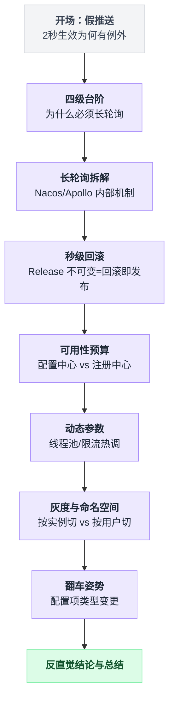
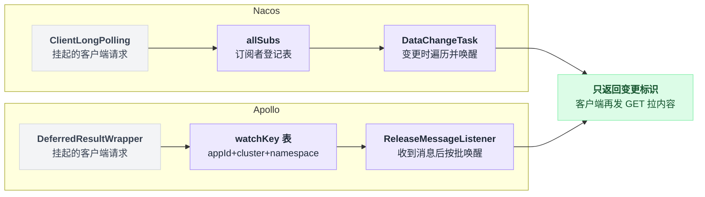
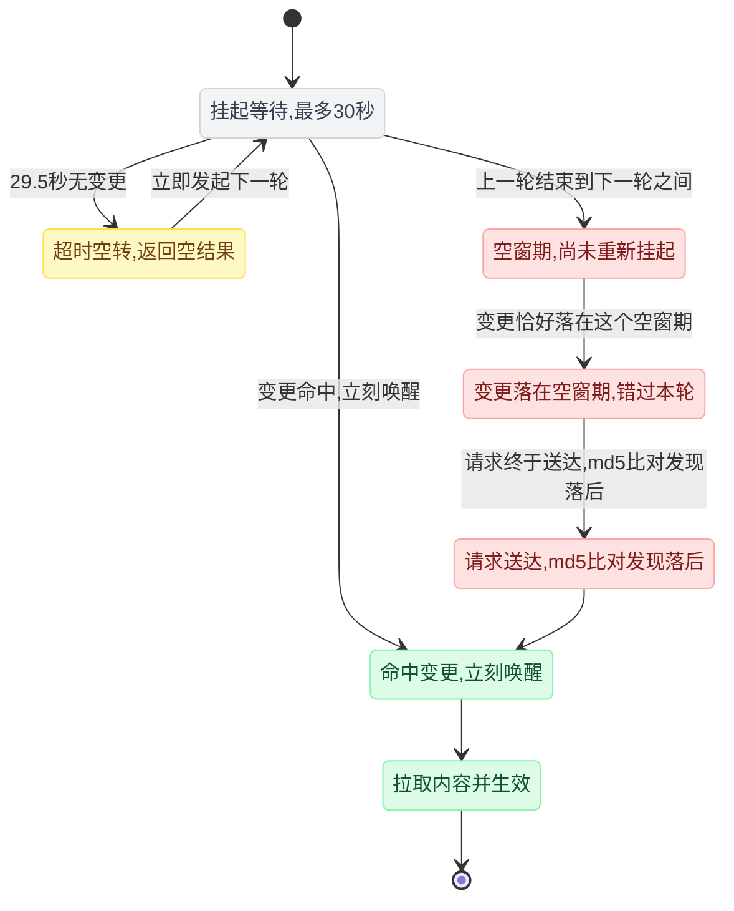
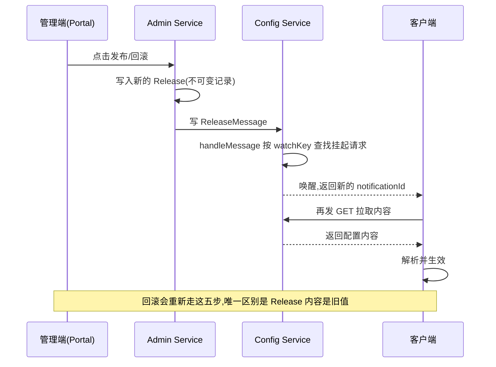
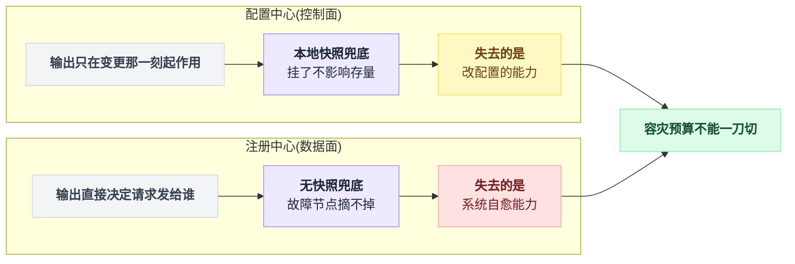
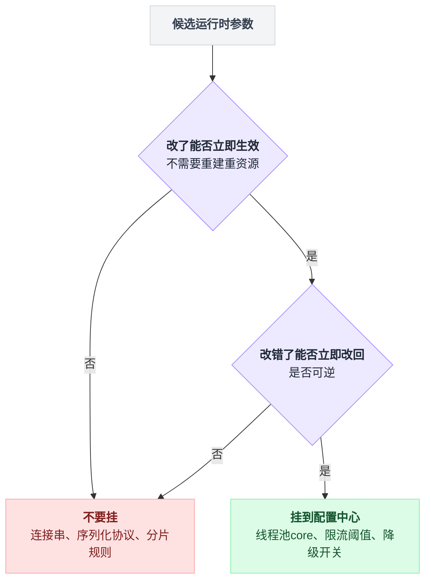
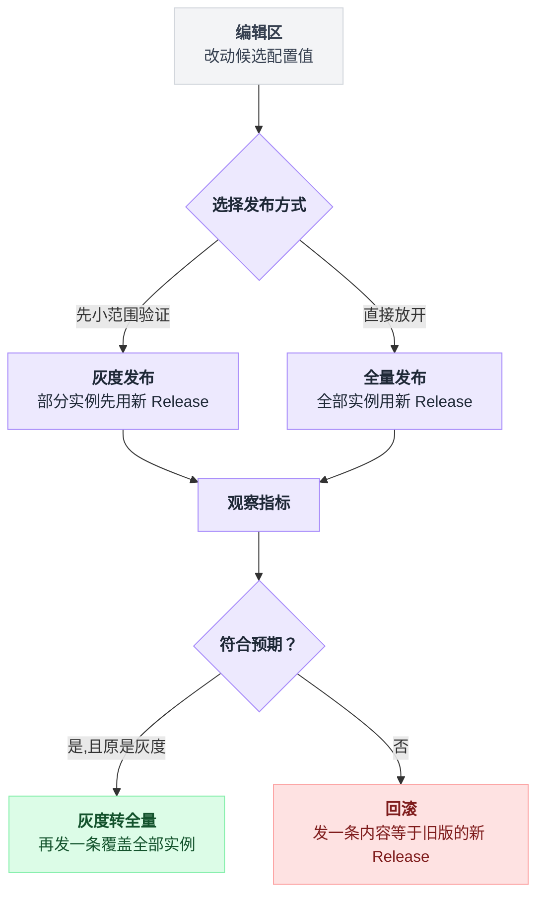

# 《配置中心与秒级回滚》所谓"推送"，其实是服务端把你的请求扣住不放（小白版）

> 一句话结论：**Nacos 和 Apollo 的"配置推送"都是假推送，没有一个字节是服务端主动发起的**——本质是服务端 hold 住客户端请求不返回的长轮询，所以配置生效延迟的上界是一个长轮询周期，不是什么 TCP 推送延迟。而**"秒级回滚"之所以成立，恰恰是因为它根本没在"回滚"**：Apollo 的 Release 是不可变记录，回滚 = 新发一条指向旧 Release 的消息，走的是和发布**完全相同**的链路。推论很硬：**回滚耗时 ≡ 发布耗时**，想让回滚更快，唯一的办法是让发布更快。
>
> 难度：★★★☆☆
>
> 阅读前提：本篇是[第 25 篇《灰度发布与 AB 分流》](./25-灰度发布与AB分流.md)的正式续集。那篇在第 5.2 节撂下一句"秒级回滚的秘密不在发布系统，在配置中心"，然后画了一张标着"长连接推送（秒级）"的图就跑了。本篇把那个盒子打开——顺便告诉你，那张图上的"长连接推送"四个字，严格说是错的。第 25 篇讲**怎么决定谁看到新版本**（加盐哈希、分层实验、爆炸半径），本篇讲**那个决定怎么在 2 秒内送到 200 台机器上**。不复读分流数学。
>
> 写作时间：2026-08-05。文中 star 数与最后提交时间为当日实测；源码细节基于公开仓库，未经一手核实的说法在文中已标注。

---

## 目录

- [0. 开场：灰度那篇结尾埋的钩子](#0-开场灰度那篇结尾埋的钩子)
- [1. 从本地配置文件到配置中心：中间隔了四级台阶](#1-从本地配置文件到配置中心中间隔了四级台阶)
- [2. 长轮询逐帧拆解（本篇主菜）](#2-长轮询逐帧拆解本篇主菜)
- [3. 回滚为什么能做到秒级：因为它根本没在回滚](#3-回滚为什么能做到秒级因为它根本没在回滚)
- [4. 本地快照兜底：配置中心的可用性要求低于注册中心](#4-本地快照兜底配置中心的可用性要求低于注册中心)
- [5. 动态配置真正的价值不在开关，在运行时参数](#5-动态配置真正的价值不在开关在运行时参数)
- [6. 配置的灰度与命名空间](#6-配置的灰度与命名空间)
- [7. 一个真实的翻车姿势：配置项类型改了](#7-一个真实的翻车姿势配置项类型改了)
- [8. 反直觉结论](#8-反直觉结论)
- [9. 一句话总结、小白词典、和前几篇的对照](#9-一句话总结小白词典和前几篇的对照)

---

## 0. 开场：灰度那篇结尾埋的钩子

全篇一共九个小节，层层递进，先看一眼整体骨架再往下读：



### 0.1 那个"2 秒生效"的承诺

第 25 篇的世界 B 里有这么一段，你大概还有印象：

```
  周二 14:40   看板显示灰度组转化率比对照组低 18%
  周二 14:42   把配置中心里的放量比例从 5 改回 0
               2 秒后全量节点生效。事故结束。
```

写得很漂亮。现在我们把镜头拉近，看看那"2 秒"里到底发生了什么——因为真实世界里，这一幕常常是下面这个版本。

### 0.2 实际的那一天

周二 14:42，你在 Apollo 后台把 `rec_rank_v2.percent` 从 `5` 改成 `0`，点发布。页面弹出绿色的「发布成功」。

你盯着监控看。灰度组的错误率曲线，**没有立刻掉下来**。

```
        你以为的                          实际发生的
  ────────────────────────        ────────────────────────
  14:42:00 点发布                  14:42:00 点发布
  14:42:02 200 台全部生效          14:42:01 187 台生效  ✓
  14:42:03 错误率归零              14:42:04 又 10 台生效 ✓
                                   14:42:29 又 2 台生效  ✓
                                   14:43:11 最后 1 台生效 ✓
                                            ▲
                                   这台机器在 41 秒里，
                                   一直在用 percent=5 服务用户
```

绝大多数机器确实是"秒级"的。但总有那么几台，慢了一个数量级。

更要命的是，这几台机器**没有任何报错**——它们的日志干干净净，健康检查全绿，只是手里攥着一份 41 秒前就该作废的配置，继续把 5% 的用户送进那个已经被判死刑的新模型。

值班的人问你：不是说推送吗？推送怎么会慢 41 秒？

答案就是本篇的一句话结论：**因为它根本不是推送。**

### 0.3 先把这个词纠正过来

打开任何一篇讲 Nacos/Apollo 的中文文章，你都会看到"配置变更实时推送到客户端"。这句话给人的画面是这样的：

```
     你以为的（推）                         实际的（拉，只是拉得久）
  ┌──────────────┐                     ┌──────────────┐
  │   配置中心    │                     │   配置中心    │
  └──────┬───────┘                     └──────▲───────┘
         │ 主动发起                            │ 客户端发起请求
         │ 一条消息                            │ 服务端扣住不返回
         ▼                                    │ 最多扣 30 秒
  ┌──────────────┐                     ┌──────┴───────┐
  │   应用实例    │                     │   应用实例    │
  └──────────────┘                     └──────────────┘

  服务端是主动方                        客户端永远是主动方
  需要维护到每个客户端的会话             服务端只是"暂时不回你"
```

右边这个模式叫**长轮询**（long polling）：客户端发一个 HTTP 请求过去，服务端**不立刻回**，而是把这个请求挂起，等到有配置变更时才唤醒它、返回结果；如果一直没变更，就等到快超时了返回一个空响应，客户端收到空响应立刻再发一个新请求。

从客户端视角看，这确实很像"服务端推给我的"。但从连接的方向看，**每一个字节都是客户端要来的**。

这个区别不是抠字眼——0.2 节那台慢了 41 秒的机器，答案就藏在这里（第 2.5 节揭晓）。

### 0.4 本篇路线图

| 你遇到的症状 | 真正的原因 | 第几节 |
|---|---|---|
| 改了配置，个别机器几十秒后才生效 | 长轮询有周期，生效延迟有上界 | 第 2 节 |
| 一次发布，配置中心自己 CPU 冲高 | 一万个订阅者同时被唤醒（惊群） | 第 2.6 节 |
| "回滚要多久"没人答得上来 | 回滚 = 再发布一次，问错问题了 | 第 3 节 |
| 配置中心挂了，要不要拉 P0 | 稳态下不用，事故态下要 | 第 4 节 |
| 改了个配置，一半机器炸了一半没事 | 配置项类型变更，老客户端解析失败 | 第 7 节 |

---

## 1. 从本地配置文件到配置中心：中间隔了四级台阶

在讲长轮询之前，先把"为什么非得是长轮询"讲清楚。这四级台阶，每一级都在回答"上一级为什么不够"。

### 1.1 台阶零：写死在 application.yml 里

改一行 `rec.rank-v2-percent: 5` 要走完整发布流程：改代码 → 提 PR → CI → 打包 → 滚动重启。算笔账，200 个实例，每批 10 个，每批等 30 秒健康检查：

```
  200 个实例 ÷ 10 个/批 = 20 批
  20 批 × 30 秒/批 = 600 秒 = 10 分钟

  14:42 决定回滚 ──────────────────────▶ 14:52 才全部回滚完
                        │
                  这 10 分钟里，
                  已经生效的机器用新配置，
                  没轮到的机器用旧配置——
                  集群处于"半新半旧"状态
```

10 分钟，还是在一切顺利的前提下。第 25 篇讲爆炸半径 = 影响面 × 持续时间，这 10 分钟就是纯粹的持续时间损失。

而且注意最毒的一点：**为了改一个数字，你重启了整个集群。** 重启期间容量下降 5%（一批 10 台下线），JVM 冷启动、缓存全空、连接池重建——你是为了止血，结果先给自己放了一次血。

### 1.2 台阶一：配置外置 + 定时拉取

于是把配置搬到一个外部存储里（数据库、Redis、一个 HTTP 接口都行），200 个实例每隔 T 秒拉一次。改配置不用重启了，这是质变。

但它有两个硬伤，而且这两个硬伤是**对立**的：

```
              拉取间隔 T
    ◀──────────────────────────────▶
   T 小                            T 大
   ────                            ────
   回滚快 ✓                        回滚慢 ✗
   延迟上界 = T                     延迟上界 = T
   空转请求多 ✗                     空转请求少 ✓

   T=1s :  200 实例 ÷ 1s  = 200 QPS   ← 99.99% 的请求返回"没变"
   T=30s:  200 实例 ÷ 30s = 6.7 QPS   ← 但回滚最坏要等 30 秒
```

**回滚延迟的下限就是拉取间隔**，一秒都快不了。想快就得把 T 调小，T 一小就是海量空转请求——一天几万次请求，只有那么两三次是真的有变更。

### 1.3 台阶二：直觉答案是"那就推吧"

既然 99.99% 的拉取都是白拉，那反过来不就行了：**变了才通知你**。

这个直觉是对的，它就是所有配置中心的目标。问题在于**怎么实现"通知"**。第一反应通常是 WebSocket 或者自研 TCP 长连接——服务端维护到每个客户端的会话，配置一变，挨个 send 一条消息。

听起来天经地义。但你去翻 Nacos 和 Apollo 的源码，会发现**两家都没这么干**。

### 1.4 台阶三：长轮询，一个"看起来像推、实际是拉"的折中

长轮询的核心把戏只有一句话：**把"没变更"这段时间，从客户端的 sleep 挪到服务端的挂起。**

```
    定时拉取（台阶一）                     长轮询（台阶三）
  ─────────────────────                 ─────────────────────
  client: 请求 ──▶ server               client: 请求 ──▶ server
  client: ◀── "没变"                    server: ……挂起，不回……
  client: sleep 30s   ← 变更发生在这里    server: ……挂起，不回……
          （客户端完全不知道）             ★ 变更发生 ★
  client: 请求 ──▶ server               server: ◀── 立刻唤醒并返回
  client: ◀── "变了"                    client: 收到，去拉内容

  延迟 = 0 ~ 30s，期望值 15s             延迟 ≈ 唤醒 + 拉取 ≈ 百毫秒级
  30 秒里有 1 次请求                     30 秒里也是 1 次请求
```

看这张图最右下角那两行：**请求次数一模一样，延迟差了两个数量级。** 这就是长轮询的全部收益——用同样的请求数，换来接近实时的延迟。

那"接近实时"里那个"接近"是多少？就是 0.2 节那台机器慢的 41 秒。第 2 节把它挖出来。

四级台阶总结：

| 台阶 | 做法 | 生效延迟 | 空转成本 | 服务端状态 |
|---|---|---|---|---|
| 零 | 改文件重启 | 分钟级 | 0 | 无 |
| 一 | 定时拉取 T | 0 ~ T | 实例数 ÷ T | 无 |
| 二 | WebSocket 推 | 毫秒级 | 心跳 | **有会话** |
| 三 | 长轮询 | 毫秒级（上界 = 一个周期） | 实例数 ÷ 周期 | 无 |

---

## 2. 长轮询逐帧拆解（本篇主菜）

这一节把两家的实现逐帧画出来。先给地图：**客户端带着指纹发请求 → 服务端先比对、不一致就直接回 → 一致就挂起 → 变更时唤醒 → 只回一个"哪个 key 变了" → 客户端再发一个普通 GET 取内容。** 六步里真正需要停下来看的只有两处：那个提前 500 毫秒（2.2）和万级实例的唤醒策略（2.6），其余都是模板。

标本：

| 仓库 | star | pushed_at | 语言 | 关键路径 |
|---|---|---|---|---|
| alibaba/nacos | 33,235 | 2026-08-05 | Java | `config/.../service/LongPollingService.java`，版本 3.2.3 |
| apolloconfig/apollo | 29,797 | 2026-08-02 | Java | `apollo-configservice/.../controller/NotificationControllerV2.java` |

（star 数与 pushed_at 为 2026-08-05 实测。）

两家的角色对应关系放在一张图里看更直接，命名不同、结构是同一套：



### 2.1 Nacos：帧 1 到帧 4

Nacos 把长轮询的全部逻辑放在一个类里：`LongPollingService`。核心的两个内部角色是 `ClientLongPolling`（一个被挂起的客户端）和 `DataChangeTask`（配置变更时的唤醒任务），中间由一个叫 `allSubs` 的订阅者集合连接。

四帧连起来就是下面这个循环，先看整体再逐帧拆：

```
// 客户端这一侧，永远是一个死循环
while true:
    resp = POST /v1/cs/configs/listener
               header: Long-Pulling-Timeout = 30000
               body:   dataId ^ group ^ md5(我本地这份配置的内容)
    if resp 是空的:  continue                  // 没变，接着挂下一轮
    for groupKey in resp:
        content = GET 配置内容(groupKey)        // 通知和内容分两段，见 2.4
        回调业务代码(content)

// 服务端这一侧
on 收到 listener 请求:
    if md5(服务端当前内容) != 请求带来的 md5:
        return 变更的 groupKey                  // 帧 2：根本不用挂起
    asyncContext = req.startAsync()             // 帧 3：挂起，释放容器线程
    allSubs.add(自己)
    schedule(超时返回任务, Long-Pulling-Timeout - 500)   // ★ 提前 500 毫秒

on 超时返回任务触发:                             // 帧 4-A
    allSubs.remove(自己)
    return 200 空结果

on 配置变更(DataChangeTask):                     // 帧 4-B
    for sub in allSubs:
        if sub 的 groupKey 命中:
            allSubs.remove(sub)                  // 必须先移除
            sub.setResponse(变更的 groupKey)      // 再返回
```

**帧 1：客户端发请求，请求里自带指纹**

```
  POST /v1/cs/configs/listener
  Long-Pulling-Timeout: 30000        ← 注意这个 header 名，就是这么拼的
  body: dataId ^ group ^ md5(我本地这份配置的内容)
                          ▲
                    关键设计：请求自带版本指纹
```

请求里带着客户端**当前手上这份配置的 MD5**。这一点后面会反复用到——它让整条链路变成无状态的。

**帧 2：服务端先做一次同步比对**

```
  服务端收到请求
      │
      ├─ md5 不一致？ → 你手上的是旧的，立刻返回变更的 groupKey，请求结束
      │                  （根本不用挂起）
      └─ md5 一致？   → 你是最新的，进入帧 3
```

这一步是整个设计里最容易被忽略、但最重要的一环：**客户端每次重新发起长轮询，都顺手做了一次对账。**

哪怕上一轮的唤醒消息因为任何原因丢了，下一轮请求带着旧 MD5 上来，服务端一比对立刻就发现"你落后了"。

**帧 3：挂起**

```java
// 语义示意，非逐行照抄
long timeout = 从 Long-Pulling-Timeout 头读到的值 - 500;   // ★ 提前 500 毫秒
AsyncContext asyncContext = req.startAsync();               // Servlet 3 异步
allSubs.add(this);                                          // 登记进订阅表
scheduler.schedule(超时返回任务, timeout);                   // 到点自己醒
// 方法返回，但 HTTP 响应没有关闭 —— 容器线程被释放，请求还挂着
```

三件事：`AsyncContext` 挂起请求（释放 Servlet 容器线程，否则 1 万个订阅者就要 1 万个线程）、把自己塞进 `allSubs`、注册一个定时的超时返回任务。

**为什么要提前 500 毫秒？** 这是本节第一个值得单独讲的细节，见 2.2。

**帧 4-A：29.5 秒过去了，没人发布**

```
  超时任务触发 → 从 allSubs 里摘掉自己 → 返回 200 空结果（"没变"）
  客户端收到空结果 → 立刻发起下一轮长轮询（回到帧 1）
```

**帧 4-B：有人发布了**

```
  发布 → 配置变更事件 → DataChangeTask
      ├─ 遍历 allSubs，按 groupKey（dataId+group+tenant）匹配订阅者
      ├─ 命中 → 先从 allSubs 移除，再 setResponse(变更的 groupKey)
      └─ 客户端收到 groupKey → 发一个普通 GET 去拉真正的内容
```

注意顺序：**先移除，再返回**。这是防重复唤醒的必要顺序——如果先返回再移除，中间有并发的第二次变更就可能对同一个已经返回的响应再写一次。

### 2.2 那 500 毫秒是在防谁

`Long-Pulling-Timeout` 是客户端告诉服务端"你最多可以扣我 30 秒"。而客户端自己的 HTTP 读超时，也是按这个量级设的。于是：

```
        如果服务端老老实实等满 30000ms
  ────────────────────────────────────────────────
  客户端 read timeout ──────────────────────▶ 30000ms
  服务端 返回空响应   ──────────────────────▶ 30000ms  ▲
     两个 30000 撞在一起，网络抖 1ms 就分不出胜负 ──────┘
     → 客户端把"正常的无变更"当成超时故障 → 重试、ERROR 日志、告警

        提前 500ms 返回
  ────────────────────────────────────────────────
  服务端 返回空响应   ─────────────────────▶ 29500ms
  客户端 read timeout ──────────────────────▶ 30000ms
                                       ◀500ms▶ 永远是服务端先说话
```

这是一条通用工程原则，值得单独记下来：**当链路两端都有超时，一定要让下游先返回。**

下游先返回，上游拿到的是一个明确的业务语义（"没变"）；上游先超时，拿到的是一个含义模糊的异常（可能是网络断了、可能是服务端挂了、也可能只是正常的没变更）——你在客户端根本区分不了。

同一条原则在别处的样子：数据库的 `statement_timeout` 应该小于应用的 SQL 超时，RPC 的下游 deadline 应该小于上游 deadline。方向都是一样的：**让最了解情况的那一端来定性。**

### 2.3 Apollo：同一个把戏，不同的零件

Apollo 用 Spring MVC 的 `DeferredResult` 做同样的事，包了一层 `DeferredResultWrapper`。

超时时长从 `bizConfig.longPollingTimeoutInMilli()` 读——也就是说这个值本身是可配的（配置中心的超时也放在配置里，很符合它的身份）。

```
  客户端 GET /notifications/v2?appId=...&cluster=...
              &notifications=[{namespaceName, notificationId}]
                                              ▲
                          Apollo 的"版本指纹"是自增的 notificationId
                          （Nacos 用的是内容 MD5，作用相同）
      │
      ▼
  NotificationControllerV2
      ├─ 先比对 notificationId，落后了就立刻返回
      └─ 一致 → new DeferredResultWrapper(bizConfig.longPollingTimeoutInMilli())
                挂进以 watchKey（appId+cluster+namespace）为键的表里
```

变更侧：管理端发布时写一条 ReleaseMessage（topic 常量 `APOLLO_RELEASE_TOPIC`），config service 侧的 `ReleaseMessageListener` 收到后走 `handleMessage()`，从表里捞出这个 watchKey 上挂着的所有 `DeferredResult` 并唤醒。

```
  Portal 点发布
      ▼
  Admin Service 写 Release（不可变）+ 写 ReleaseMessage
      ▼   （消息从 admin 侧送到 config service 侧的投递组件类名未核实，
           以官方仓库为准）
  Config Service: ReleaseMessageListener → handleMessage()
      ▼
  按 watchKey 找到挂着的 DeferredResult 们 → 唤醒
      ▼
  客户端拿到新的 notificationId → 再发一个 GET /configs 拉内容
```

### 2.4 两家不约而同的一件事：通知和内容分两段

对着上面两张图看，会发现一个共同点：**长轮询返回的不是配置内容，只是"哪个 key 变了"**（Nacos 返回变更的 groupKey，Apollo 返回新的 notificationId），客户端拿到之后要再发一个普通 GET 去取内容。

为什么要拆成两段？

```
  合成一段（长轮询直接返回内容）        拆成两段
  ───────────────────────────        ─────────────────────
  1 万个订阅者同时被唤醒               1 万个订阅者同时被唤醒
      ↓                                  ↓
  1 万份内容同时序列化（一份 200KB）    1 万个几十字节的 key
  → 瞬时吐出 2GB                       → 然后各自发 GET 拉内容
  这条路径无法限流：                    这条路径是普通 HTTP GET：
  它是唤醒逻辑的一部分                  可缓存、可限流、可被网关整形
```

**把"通知"和"取货"拆开，通知走轻量无状态路径，取货走可治理的普通路径。**

这个模式你在别处见过：[第 09 篇 IM 消息可靠投递](./09-IM消息可靠投递.md)里"推同步、拉详情"的离线消息拉取，[第 05 篇微博 Feed 流](./05-微博热点Feed流.md)里推 ID、拉正文，是同一个思路的三次登场。

### 2.5 那台慢了 41 秒的机器，答案在这

现在可以回答 0.2 节的问题了。既然唤醒是毫秒级的，那 41 秒是从哪来的？

```
  正常情况（99% 的机器）
  ─────────────────────────────────────────────
  14:42:00  ★ 发布 ★ → DataChangeTask 唤醒它 → 返回 groupKey
  14:42:00  客户端 GET 拉内容 → 14:42:01 生效 ✓ 延迟 ≈ 百毫秒

  异常情况（那台机器）
  ─────────────────────────────────────────────
  14:41:59  上一轮长轮询超时返回，客户端准备发下一轮
  14:42:00  ★ 发布 ★   ← 就在这个窗口里，它没挂在 allSubs 上！
  14:42:00  DataChangeTask 遍历 allSubs，找不到它
  14:42:03  它的新一轮请求终于发出去了（GC 停顿 / 网络抖 / 线程池排队）
  14:42:03  服务端帧 2 比对 md5 → 发现落后 → 立刻返回  ✓

  ↑ 这个版本还算好的，几秒就追上了。真正的 41 秒来自：
    请求在网络上丢了 / 连接被中间的 LB 静默断开，
    客户端傻等到自己的 read timeout 才重发
```

把这台机器经历的状态串起来看，异常路径多绕了三步：



关键结论：**配置生效延迟的上界，不是唤醒延迟，是"客户端下一次能把请求送到服务端"的时间。** 而这个时间的上界就是一个长轮询周期（客户端超时后必然重发）。

所以那句一句话结论的前半段是这么来的：**生效延迟的上界 = 一个长轮询周期。** 平均值是毫秒级，上界是几十秒——这两个数字差两个数量级，而事故复盘时你需要的永远是上界。

⚠️ 由此得到一条运维铁律：**"我改了配置"和"所有机器都用上了新配置"是两件事，中间需要一个确认动作。** Nacos 和 Apollo 都提供了"查看某个配置当前被哪些实例监听、各自的版本是什么"的能力（具体页面/接口名以官方文档为准）。回滚这种保命操作，点完发布必须去看这个列表，别盯着错误率曲线猜。

### 2.6 惊群：同样是长轮询，唤醒策略差一个数量级

这是本篇信息量最大的一段。

设想一个单 namespace 挂了 **10,000 个实例**的场景（一个巨型服务的公共配置，或者一个被所有服务引用的公共 namespace）。现在发一次布，这 10,000 个被挂起的请求要同时醒过来。

两家的处理方式完全不同：

- **Nacos**：`DataChangeTask` 直接遍历 `allSubs`，命中的一个个 `setResponse` 返回。
- **Apollo**：`handleMessage()` 按 `bizConfig.releaseMessageNotificationBatch()` **分批**唤醒。

差别只在几行伪代码里：

```
// Nacos：DataChangeTask
for sub in allSubs:
    if 命中: 唤醒(sub)              // 一趟遍历，全量在同一个时间窗内醒

// Apollo：handleMessage
批大小 = bizConfig.releaseMessageNotificationBatch()
for 每 批大小 个 DeferredResult:
    唤醒这一批
    停一小会儿，再唤醒下一批          // 峰值被摊平，后面的批次被主动拖后
```

画在一张图上：

```
  一次发布，10,000 个实例订阅同一个 key
  ┌─ Nacos：DataChangeTask 单次遍历 allSubs ──────────────────────┐
  │  t=0ms   ██████████████████████████████████████████  10,000  │
  │          ▲ 几乎在同一个时间窗内全部 setResponse                 │
  │  紧接着三波尖峰打在配置服务端：                                 │
  │    波 1：10,000 个响应的序列化与写出                            │
  │    波 2：10,000 个客户端同时发 GET 拉内容                       │
  │    波 3：10,000 个客户端同时发起下一轮长轮询                     │
  │  优点：最后一个实例和第一个实例的生效时间几乎无差               │
  │  缺点：峰值 = 全量，配置服务端自己可能先被打趴                  │
  └──────────────────────────────────────────────────────────────┘

  ┌─ Apollo：handleMessage 按 batch 分批唤醒 ─────────────────────┐
  │  （batch=100、间隔=100ms 是为了画图假设的数字，                 │
  │    实际默认值以官方配置为准）                                   │
  │  t=0ms      ██                                        100    │
  │  t=100ms      ██                                      100    │
  │  t=200ms        ██                                    100    │
  │  t=300ms          ██                                  100    │
  │   ……               ……                                        │
  │  t=9900ms                                    ██       100    │
  │                        ▲ 第 100 批，比第一批晚了约 10 秒       │
  │  优点：峰值被摊平成 1/100，配置服务端稳如老狗                   │
  │  缺点：尾部实例的生效延迟被主动拉长了                          │
  └──────────────────────────────────────────────────────────────┘
```

把这个权衡讲透：

| | Nacos 直接遍历 | Apollo 分批 |
|---|---|---|
| 峰值 QPS | 全量 | 全量 ÷ 批数 |
| P50 生效延迟 | 低 | 低 |
| **P99 生效延迟** | **低** | **高（被批次间隔拉长）** |
| 配置服务端自保能力 | 弱，靠容量硬扛 | 强，主动限速 |
| 集群"半新半旧"窗口 | 短 | 长 |

**这不是谁对谁错，是两家把风险放在了不同的地方。** Nacos 把风险留给了服务端（你得给配置中心备足容量），Apollo 把风险留给了业务（尾部实例会多用一会儿旧配置）。

对回滚场景来说这个差别很实在：Apollo 的分批意味着，回滚时集群会有一段更长的"半新半旧"窗口。如果你的配置项是"两台机器必须同时改否则会互相打架"的那种（比如两个服务约定的协议版本号），分批唤醒会把这个窗口从毫秒级放大到秒级甚至十秒级。

💡 顺带一提：这是本系列第 N 次遇到"削峰 vs 尾延迟"的取舍。[第 28 篇分布式调度](./28-分布式调度.md)里分片广播要不要给每片加随机抖动、[流量系列 00 篇](../2026-08_流量扛不住了怎么办_六种真实做法/00-接口超时把队列调大反而OOM-队列不会创造产能.md)里队列长度和响应时间的关系，讲的都是同一个东西：**任何"摊平峰值"的手段，代价一定记在尾延迟上，没有例外。**

### 2.7 为什么它们都不用 WebSocket

现在回答第 1.3 节留下的问题。这是面试高频题，而且大部分标准答案是错的。

**先杀掉那个错误答案：不是为了省连接数。**

```
  WebSocket：10,000 个实例 = 10,000 条常驻 TCP 连接
  长轮询  ：10,000 个实例 = 10,000 条几乎常驻的 TCP 连接
              ▲ 每 30 秒断开重来一次（keep-alive 下连断都不断），空窗几毫秒
  连接数上两者基本一样。这条常见理由站不住。
```

真正的五条理由，先摆成一张对照表，再逐条展开：

| 维度 | 长轮询 | WebSocket |
|---|---|---|
| ① 服务端状态 | 纯内存表，可随时丢弃 | 会话、订阅、已收消息全要管 |
| ② 丢消息 | 下一轮自动补上 | 要自研序号、ACK、重传 |
| ③ 代理穿透 | 普通 HTTP，中间层全认 | 要 Upgrade，失败很隐蔽 |
| ④ 基础设施 | 鉴权限流监控现成 | 整套重做 |
| ⑤ 变更频率 | 一天几十次，够用 | 为几十条消息养常驻通道 |

**① 服务端无状态。** 长轮询的服务端只需要维护一张"当前挂起的请求"表（`allSubs` / DeferredResult map），这张表是**纯内存、可随时丢弃**的。

进程重启，所有挂起请求断开，客户端立刻重连并带上自己的 MD5/notificationId——服务端啥也不用记，比对一下就知道该给谁发什么。WebSocket 则是有会话的：这个连接对应哪个客户端、它订阅了什么、它已经收到了哪条消息、断线期间漏了什么要不要补——全都得管。

**② 每个请求自带版本，重连即对账。** 这是①的根子。长轮询的每个请求都是自包含的：`dataId + md5` 一上来就说清了"我是谁、我手上是哪一版"。

所以**丢消息在这个协议里不是问题**——丢了下一轮自动补上。WebSocket 推的是增量消息，丢了就是真丢了，你必须自己设计消息序号、ACK、重传、断线补偿——[第 09 篇 IM 消息可靠投递](./09-IM消息可靠投递.md)整整一篇讲的就是这套东西有多难。**配置中心不想变成一个 IM 系统。**

**③ 代理穿透。** 长轮询是纯粹的 HTTP 请求，任何 LB、Nginx、企业代理、Service Mesh sidecar、API 网关都认。

WebSocket 需要 `Upgrade` 握手，中间任何一层不支持或者配置不对就挂，而且失败方式往往很隐蔽（握手成功但中间某层 60 秒空闲断连）。配置中心是**基础设施**，它必须在客户最烂的网络环境里也能跑。

**④ HTTP 基础设施全套复用。** 鉴权（拿现成的 header 校验）、限流（网关层直接做）、监控（access log 里就是普通请求）、灰度（按 URL 路由）、排障（curl 一下就能复现）。

而且服务端实现直接用框架标准件：Servlet 3 的 `AsyncContext`、Spring MVC 的 `DeferredResult`——两家用的都是这个。WebSocket 这一整套你得重做。

**⑤ 配置变更是低频事件。** 一天几次到几十次。为了一天几十条消息，常驻一套双向通道 + 会话管理 + 心跳 + 重连补偿，投入产出比很差。

而长轮询的"不够实时"代价只有一个长轮询周期的上界——**对一天变几十次的东西，这个代价完全可以接受。**

一句话收口：**长轮询用一点点延迟上界，换掉了整个有状态推送系统。** 这笔买卖，在配置这个场景下划算得离谱。

### 2.8 空转成本要不要治：一笔账

有人看完会想：那把长轮询周期压到 5 秒，上界不就从 30 秒变 5 秒了吗？算账：

```
  10,000 个实例，每个实例订阅 1 个 namespace
  周期 T=30s → 10,000 ÷ 30 = 333 请求/秒     ← 稳态空转
  周期 T=5s  → 10,000 ÷ 5  = 2,000 请求/秒   ← 6 倍
  换来了什么？
    正常路径（唤醒）的延迟：没变，还是毫秒级
    异常路径（丢了唤醒、请求在窗口间隙）的上界：30s → 5s
  即：为了一个极低概率事件快 25 秒，付 6 倍的常态成本。
```

结论：**别动周期。**

如果你真的在意那几台掉队的机器，正确做法是第 2.5 节说的——发布后去看"实例配置版本列表"，直接确认，而不是靠缩短周期把概率压小。**确认比加速可靠。**

---

## 3. 回滚为什么能做到秒级：因为它根本没在回滚

### 3.1 先问一个问题：Apollo 的"回滚"按钮点下去，数据库里发生了什么

直觉答案：把配置改回旧值，UPDATE 一下。

实际答案：**什么都没被改回去。**

Apollo 的数据模型里，`Release` 是一条**不可变**记录——它是发布那一刻整个 namespace 全部配置的快照（内容存在一个 JSON 字段里）。发布过的 Release 永远不会被修改，只会被追加。

```
  编辑区（Item）             发布区（Release，不可变）
  ─────────────            ──────────────────────────
  percent: 0                Release #101  {percent: 5, salt: "..."}   14:00 发布
    ▲                       Release #102  {percent: 0, salt: "..."}   14:42 回滚
    │                            ▲
  你在页面上改的是这里          点"回滚"生成的，是一条新记录
                              内容 = #100 的内容，但它是 #102，不是 #100
```

按钮背后其实就这么几行：

```
点击"回滚到上一版":
    旧内容 = Release[上一条].content            // 只读取，不修改
    追加一条 Release(内容 = 旧内容)              // 生成的是 #102，不是回到 #100
    写 ReleaseMessage(APOLLO_RELEASE_TOPIC)
    → 接下来完全走 2.3 节那条唤醒链路
// 全程没有一条 UPDATE
```

所以"回滚到上一个版本"这个动作，在数据层面等于：

1. 把上一个 Release 的内容拿出来；
2. **发布一条新的 Release**（内容和旧的一样，编号是新的）；
3. 写一条 ReleaseMessage（`APOLLO_RELEASE_TOPIC`）；
4. 走第 2.3 节那条一模一样的唤醒链路。

也就是说，"回滚"这个词里隐含的那个假设——**存在一个撤销操作**——根本不成立。系统里没有撤销，只有"把旧内容当成新内容再发一次"。

### 3.2 于是得到本篇最硬的那个推论

既然回滚走的是和发布**完全相同**的链路——同一张表、同一条消息、同一个 `handleMessage()`、同一批 `DeferredResult`——那么：

```
        ┌──────────────────────────────────────┐
        │      回滚耗时  ≡  发布耗时            │
        └──────────────────────────────────────┘

  发布链路                        回滚链路
  ──────────                     ──────────
  写 Release          ─── 同 ───▶  写 Release
  写 ReleaseMessage   ─── 同 ───▶  写 ReleaseMessage
  handleMessage 唤醒  ─── 同 ───▶  handleMessage 唤醒
  客户端拉内容        ─── 同 ───▶  客户端拉内容
  客户端回调生效      ─── 同 ───▶  客户端回调生效

  没有任何一步是"回滚专用的快速通道"
```

按时序摆开更直观：回滚和发布调用的是同一条链路，只是终点站发出去的内容不同。



这个推论有三个非常实用的后果。

**后果一："回滚要多久"是个问错的问题。** 正确的问法是"发布要多久"。你在事故演练里测的应该是发布耗时——它就是你的 MTTR 下限。

**后果二：想让回滚更快，唯一的路是让发布更快。** 具体到 Apollo：优化 `handleMessage` 的批次参数（第 2.6 节那个权衡），减小配置体积（客户端拉取更快），别让单个 namespace 挂太多实例。**没有别的路。**

**后果三：回滚不可能比发布更可靠。** 如果你的发布链路上有一个环节偶发失败（比如某个机房的 config service 消息延迟），那么这个失败在回滚时会**一模一样地**出现——而且是在你最不希望它出现的时候。

⚠️ 由此引出一条自查：**你上一次演练"配置回滚"是什么时候？** 如果答案是"没演练过，但发布天天在做"——恭喜，其实你天天都在演练回滚，因为它俩是同一条链路。这大概是不可变设计送的最大一份礼物。

### 3.3 不可变还送了两样东西

除了"回滚 = 发布"，Release 不可变还顺手解决两件事：**审计**（每条 Release 都是永久快照，"上周三下午三点线上配置到底是什么"可以精确回答）和**并发编辑**（每次发布都是当前编辑区的全量快照，两个人同时改不同 key 时，冲突在编辑区就暴露了，而不是在生产上互相覆盖丢更新）。

这套"只追加、不修改，状态由事件重放得出"的思路，[第 40 篇账户体系与复式记账](./40-账户体系与复式记账.md)会把它推到极致（余额根本不存，只存四个只增不减的累计量）。

配置中心和账本，一个管开关一个管钱，居然是同一个世界观：**能不可变就不可变，因为可变状态无法审计。**

---

## 4. 本地快照兜底：配置中心的可用性要求低于注册中心

### 4.1 配置中心整个挂了，你的应用会怎样

先说结论，再讲为什么：**大概率什么事都没有。**

Nacos 和 Apollo 的客户端都会把拉到的配置**写一份本地文件快照**。启动时如果连不上服务端，就从快照加载；运行中如果连不上，内存里的配置继续用。

（Nacos 与 Apollo 客户端本地快照的具体目录与文件名**未核实**——两家的客户端代码都已不在主仓顶层，此处只讲机制，路径以官方仓库/文档为准。）

配置中心全挂时，只有三种场景：

| 场景 | 会发生什么 |
|---|---|
| A 已经跑着的实例 | 配置在内存里 → 完全无感 ✓ |
| B 扩容/重启新起的实例 | 连不上 → 读本地快照 → 正常启动 ✓（前提：这台机器以前成功拉过一次，快照文件在） |
| C 一台全新的机器，从来没拉过配置 | 没有快照 → 启动失败 ✗ 唯一真正会挂的情况，而它恰好和"故障期间紧急扩容"重叠 |

场景 A 和 B 覆盖了绝大多数情况。所以配置中心挂掉，你失去的**不是"应用能不能跑"，而是"能不能改配置"**——你失去的是一个运维动作，不是服务能力。

### 4.2 对比：注册中心挂了会怎样

同样的问题问注册中心：

| 场景 | 注册中心全挂时 |
|---|---|
| A 已跑着的调用 | 客户端有实例列表缓存 → 短期还能调 ✓ |
| B 某个下游实例这时候挂了 | 摘不掉 → 上游继续往死机器发请求 → 那部分流量直接失败，重试也打到同样的死列表上 → 调用链在这里断掉 ✗✗ |
| C 扩容出来的新实例 | 注册不上 → 没人知道它存在 → 白扩 ✗ |
| D 滚动发布 | 新的注册不上、老的注销不掉 → 发布必须停 ✗ |

差别一目了然：

| | 配置中心挂 | 注册中心挂 |
|---|---|---|
| 存量流量 | 完全正常 | 短期正常，一旦有实例故障就烂 |
| 自愈能力（摘除故障节点） | 不受影响 | **完全丧失** |
| 扩容 | 用快照能起来 | 起来了也没人知道 |
| 发布 | 不受影响 | 必须停止 |
| 你失去了什么 | **改配置的能力** | **系统自我调整的能力** |

### 4.3 于是那条反直觉的容灾预算结论

把 4.1 和 4.2 两组场景并排放，差别的根子在"控制面"和"数据面"这四个字上：



```
      常见做法                       应该的做法：拆成两笔预算
  ──────────────────           ──────────────────────────────
  「都是中间件，                注册中心：更高档
   都上 3 节点集群，              · 多机房多活、独立于业务的资源
   一起做多活」                   · 客户端缓存 + 推空保护必须开
        ▲                        （它挂了 = 系统失去自愈能力）
   一刀切的预算                注册中心之外，配置中心可以低一档
                                 · 客户端快照兜底已经很强
                                 · 短时不可用不影响存量服务
```

**为什么这条反直觉？** 因为大部分人把"配置中心"和"注册中心"当成一类东西——它们经常是同一个产品（Nacos 就一身兼两职），部署在同一个集群里，运维手册里也放在同一章。

但从故障影响面看，它们完全不是一个量级：**注册中心是数据面的一部分**（它的输出直接决定请求发给谁），**配置中心是控制面**（它的输出只在变更那一刻起作用）。

顺便一提，正因为 Nacos 一身兼两职，实际部署时这条结论会变成："如果你用 Nacos 同时做注册和配置，那么这个集群的可用性预算必须按**注册中心**那一档来做"——木桶取短板。这是个很实际的坑：不少团队因为"配置中心挂了也没事"而给 Nacos 集群配了低规格，结果挂的时候先烂的是服务发现。

### 4.4 但是——事故态要反过来看

上面那条结论有个非常重要的补丁，不写出来就是害人：

```
  稳态                             事故态
  ──────────                      ──────────────────────────
  配置中心挂了 → 没人受影响         线上出事，你要紧急关个开关
  → 可以第二天上班再修              → 打开配置中心 → 它也挂了
        ▲                          → 你的救火工具没了  ▲
   可用性要求：低                          这一刻它是 P0
```

**配置中心在稳态下无关紧要，但它恰恰是你救火时最依赖的那把扳手。** 而故障往往是连锁的——机房网络出问题时，配置中心和业务很可能一起出问题。

所以正确的表述要分成两句，缺一不可：

> **配置中心的"服务可用性"要求低于注册中心（快照兜底），但它的"变更通道可用性"要求是 P0。**

具体落地成两条：

1. **变更通道要有一条不依赖正常链路的旁路。** 最土也最有效的一招：每个应用保留"从本地文件覆盖配置"的能力（Nacos 客户端就有一个优先级高于服务端的 failover 机制，具体目录路径未核实）。配置中心全挂时，运维可以直接往机器上推文件把开关关掉。
2. **配置中心的读写要分开评估。** 客户端读（长轮询 + 拉取）可以做多副本、只读从库、甚至跨机房只读缓存；管理端写（发布/回滚）必须保证在事故态可用——这两条链路的容量和可用性目标是不同的。

---

## 5. 动态配置真正的价值不在开关，在运行时参数

### 5.1 大部分人只用了它 10% 的能力

配置中心接进来之后，绝大多数团队用它干的事是：feature flag（开关）、几个域名和 URL、几个业务阈值。

这些当然有用（第 25 篇整篇都在讲开关的价值）。但**开关只是配置中心能力的一个很窄的切面**——真正把这套设施用满的姿势，是把**运行时参数**挂上去。

标本：`dromara/dynamic-tp`，**4,800 star，最后提交 2026-08-04**（2026-08-05 实测）。它干的事情一句话说清：**把 Java 线程池的核心参数挂到 Nacos/Apollo 上，改配置就能在线调线程池。**（该项目的内部实现路径未核实，此处只讲它解决的问题。）

### 5.2 为什么线程池是最典型的例子

先看一个真实的深夜场景：

```
  凌晨 2 点，下游接口 RT 从 20ms 涨到 800ms，你的服务 core=20 / queue=1000
      ▼
  20 个线程全部卡在等下游 → 队列迅速堆满 → 再来的请求直接被拒
      ▼
  你知道该怎么救：把 core 调到 100，撑过这一波
      ▼
  但 core 写在代码里 ──▶ 改代码、走 CI、滚动发布，10 分钟起步（第 1.1 节算过）
                        而事故只需要再持续 3 分钟就够上报了
```

有意思的是，**JDK 本来就允许你在线改**：`ThreadPoolExecutor` 有 `setCorePoolSize()` / `setMaximumPoolSize()`，运行时调用立即生效。能力一直在，缺的只是"从外面把这个方法调起来"的那根线——配置中心就是那根线。

接上之后，业务侧的代码大概长这样：

```
on 配置变更(新值):
    executor.setCorePoolSize(新值.core)          // 立即生效
    executor.setMaximumPoolSize(新值.max)        // 立即生效
    // queue.capacity = 新值.queueSize           ← 写不出来，capacity 是 final
```

最后那行注释就是唯一改不了的东西：**队列容量**。`LinkedBlockingQueue` 的 `capacity` 是一个 `final` 字段（以 JDK 源码为准），也就是说标准队列的长度天生不可变。

想让"队列长度"也可动态调，必须换成一个自定义的、容量可变的队列实现——这正是 dynamic-tp 这类项目除了"接配置中心"之外的另一半价值（其具体实现方式未核实）。

```
  ThreadPoolExecutor 的可调性
  ────────────────────────────────────────────────────────
  corePoolSize / maximumPoolSize / keepAliveTime / 拒绝策略
      → 都有 setXxx()，运行时调用 ✓ 立即生效
  队列容量  ✗ LinkedBlockingQueue.capacity 是 final → 必须换队列实现
```

### 5.3 可动态调的参数清单

把值得挂到配置中心的运行时参数列全，这张表是本节的核心产出：

| 类别 | 具体参数 | 改了什么时候生效 | 调错了会怎样 |
|---|---|---|---|
| **线程池** | core / max / keepAlive / 拒绝策略 | 立即 | 调太大：下游被打爆、内存涨；调太小：拒绝激增 |
| **线程池** | 队列容量 | 需可变队列实现 | 调太大：延迟暴涨 + OOM 风险（流量系列 00 篇的原题） |
| **限流** | QPS 阈值、并发数、令牌桶速率 | 立即 | 调太松：后端被打穿；调太紧：误伤正常流量 |
| **超时** | 连接超时、读超时、RPC deadline | 下一次调用生效 | 调太长：线程被拖住；调太短：正常请求被杀 |
| **重试** | 次数、退避基数、是否开启 | 下一次调用生效 | 次数×并发 = 对下游的放大攻击 |
| **批大小** | 消费批、DB 批量写、上报批 | 下一批生效 | 调太大：单批耗时长、锁持有久 |
| **降级开关** | 关掉非核心功能、切读旧缓存 | 立即 | 忘了关回去（比调错更常见） |
| **采样率** | 日志级别、trace 采样率 | 立即 | 打开 DEBUG 忘关 → 磁盘写满 |
| **业务开关** | 灰度比例、实验盐、白名单 | 立即 | 第 25 篇整篇 |

这张表里的每一行，都对应本系列的某一篇：

- **限流阈值**那一行，是[第 04 篇分布式限流器](./04-分布式限流器.md)。那篇讲阈值该设多少、怎么在集群维度算准；本篇讲那个数字**怎么在不重启的情况下送到 200 台机器上**。分工线很清楚：04 篇管"设成几"，38 篇管"怎么送到"。
- **队列容量**那一行，是[流量系列 00 篇](../2026-08_流量扛不住了怎么办_六种真实做法/00-接口超时把队列调大反而OOM-队列不会创造产能.md)的原题——那篇的结论是"把队列调大不会创造产能，只会把失败变成更慢的失败"。现在这个参数可以热调了，于是那条结论变成了一条**必须写进运维手册的警告**：**能热调，不等于该调。**
- **降级开关**那一行，是[第 15 篇缓存三兄弟](./15-缓存三兄弟与缓存一致性.md)里"缓存击穿时临时关掉回源"的那个闸门。

### 5.4 判据：什么参数配挂到配置中心

不是所有参数都该做成热更新。给一条可以直接用的判据，走两道判断就出结论：



```
  ┌ 只有同时满足这两条的参数，才配挂到配置中心 ────┐
  │   ① 改了之后能立即生效（不需要重建重资源）     │
  │   ② 改错了能立即改回来（可逆）                │
  └──────────────────────────────────────────────┘

  通过 ✓  线程池 core / 限流阈值 / 降级开关 / 日志级别 —— 立即生效、可逆

  不通过 ✗  数据库连接串   → 要重建连接池，在途事务怎么办？
            序列化协议     → 集群一半新一半旧 = 互相读不懂
            分片规则/路由键 → 改完老数据全部找不到（第 14 篇）
            表结构映射     → 这是发布，不是配置
```

第二列那些东西的共同点：**它们的"改"是一次迁移，不是一次赋值。** 迁移需要顺序、需要双写、需要校验、需要能中断——这些都不是"改一个数字然后长轮询推下去"能承载的。硬塞进配置中心，就是第 7 节那个翻车姿势的高配版。

⚠️ 还有一条经验：**配置项的数量本身是一种技术债。** 每加一个热更新参数，"这套系统当前的行为"就有多一分不由代码决定。

半年后新人接手，读完全部代码也说不清线上到底在跑什么——因为真相分散在配置中心的 300 个 key 里，而其中 250 个是三年前某次事故临时加的，没人敢删。

---

## 6. 配置的灰度与命名空间

第 3 节讲的回滚，和这一节要讲的灰度，其实是同一条发布链路上的两个分支：



### 6.1 配置也要灰度，而且它和第 25 篇切的不是同一刀

第 3 节说了回滚 = 再发布一次。那么发布本身能不能灰度？能。Apollo 有灰度发布能力：**指定一部分实例（按 IP 或标签）使用另一份配置**，观察没问题再全量。

关键是要看清它和第 25 篇的 AB 分流**切的维度完全不同**：

```
  第 25 篇：AB 分流 —— 按「用户」切
  ────────────────────────────────────────────
     所有 200 台机器都用同一份配置 percent=5
             ▼
     每台机器内部：hash(uid + salt) % 100 < 5 ?
        ┌────┴────┐
        ▼         ▼
     5% 用户    95% 用户      （在每台机器上都是 5%）

  本篇：配置灰度 —— 按「实例」切
  ────────────────────────────────────────────
     10 台机器拿到 percent=5     190 台机器拿到 percent=0
     ▲ 灰度分支的 Release         ▲ 主分支的 Release
     └── 配置中心按 IP/标签决定谁拿哪一份 ──┘
```

两把刀可以叠加使用，而且叠加时要小心：10 台灰度机器 × 内部 5% 用户 = 实际影响面 `10/200 × 5% = 0.25%`。**两层灰度是乘法关系**，很容易把放量放成你以为的 1/20。

什么时候用哪一把？

| | 按用户切（第 25 篇） | 按实例切（本篇） |
|---|---|---|
| 适合验证 | 业务效果（转化率、点击率） | 技术风险（新参数会不会 OOM） |
| 分组稳定性 | 同一用户永远同组 | 同一用户可能今天打到灰度机、明天打到正常机 |
| 能不能做 AB 实验 | 能 | **不能**（用户在两组间跳来跳去，数据没法用） |
| 典型场景 | 新推荐模型放量 5% | 线程池 core 从 20 调到 200，先在 10 台上试 |

**记住这条：配置灰度不能拿来做 AB 实验。** 因为负载均衡不保证同一个用户总打到同一台机器，用户会在两组之间反复横跳，实验数据完全污染。这是一个真实发生过的误用——想做实验请回第 25 篇用哈希分桶。

### 6.2 命名空间：配置的作用域

Apollo 的 namespace 有一个很实用的设计：**public namespace 可以被多个应用关联，关联方还能覆盖其中的个别 key。**

```
  ┌── public namespace: common.middleware ──┐
  │   redis.timeout = 2000                  │
  │   mysql.pool.max = 50                   │
  └────────────┬────────────────────────────┘
     ┌─────────┼─────────┐  被三个应用关联
     ▼         ▼         ▼
  order-svc  pay-svc   rec-svc
     │         │         └─ 覆盖 mysql.pool.max = 200（重查询服务）
     │         └─ 覆盖 redis.timeout = 500（对延迟敏感）
     └─ 不覆盖，全用默认

  基础设施改一次默认值 = 所有关联方一起改
  个别应用的特殊需求 = 就地覆盖，不污染公共值
```

这套"公共默认值 + 局部覆盖"的结构，和 CSS 的层叠、Kubernetes 的 ConfigMap 分层、Spring 的 profile 覆盖是同一套心智模型。它的价值在于：**让"我们全公司的 Redis 超时是多少"这个问题有一个唯一答案**，同时不妨碍个别服务有自己的想法。

⚠️ 但要提防它的暗坑：**覆盖关系是隐式的**。排障时你看着 rec-svc 的配置页面写着 `mysql.pool.max = 200`，得先想起来它还关联着一个 public namespace，才能理解 50 和 200 是怎么来的。所以**任何覆盖都应该在 key 的注释里写清楚"为什么要覆盖"**——不然半年后没人敢删。

命名空间本质上是一种**隔离**——按应用隔离、按环境隔离、按集群隔离。[第 39 篇多租户 SaaS 数据隔离](./39-多租户SaaS数据隔离.md)会把这套隔离逻辑放到数据层面重讲一遍：那边隔的是数据行，这边隔的是配置项，但"共享一份默认 + 各自可覆盖"的形状是一样的。

---

## 7. 一个真实的翻车姿势：配置项类型改了

### 7.1 事故复盘

配置项是 `downstream.timeout = 3000`（单位毫秒），客户端拿它做 `Integer.parseInt(newValue)`。

某天一位同学觉得"3000 谁知道是毫秒还是秒啊"，好心改成了 `downstream.timeout = 3s`，点发布。配置中心显示：**发布成功。** 然后：

```
  帧 1  长轮询唤醒 200 个实例      ✓ 全部成功
  帧 2  200 个实例拉到新内容 "3s"  ✓ 全部成功
  帧 3  客户端回调里 parseInt("3s") → NumberFormatException
          ├─ SDK 内部 catch 住了（它不能让业务回调把更新线程搞死）
          ├─ 打一行 ERROR 日志
          └─ 这次更新静默失败
  帧 4  配置中心：发布成功 ✓ / 监控：没有任何异常指标
        实例列表：版本号已经是新的了（内容确实拉到了）
        实际情况：200 台机器全部还在用 3000

  ★ 最坏的变体：如果这个配置只在启动时解析，跑着的机器一切正常，
    而下一次重启/扩容出来的机器会启动失败——事故在 3 天后的一次扩容里
    才爆发，没有任何人会把它和 3 天前那次配置变更联系起来
```

### 7.2 这本质上是一次不兼容变更

把它看清楚：`3000` → `3s` 不是"改了个值"，是**改了配置项的类型**（整数 → 带单位的字符串）。而配置的消费者（老客户端）是按旧类型写的。

这个形状你在第 25 篇见过——那篇讲滚动发布的暗坑：新旧代码共存期，接口必须互相兼容。**配置项的类型变更，就是配置领域的接口不兼容变更**，而且更隐蔽，因为没有编译器、没有 IDE、没有 CI 会拦你。

```
     代码的不兼容变更                  配置的不兼容变更
  ──────────────────────           ──────────────────────
  改接口字段类型                     改配置项类型
  → 编译报错 ✓                      → 什么都不报 ✗
  → CI 拦住 ✓                       → 发布按钮是绿的 ✗
  → Code Review 能看见 ✓            → 一个文本框，改完就发 ✗

  同样危险，一边有三道闸，一边裸奔
```

### 7.3 正确姿势：配置项也要做兼容发布

和数据库加字段一样，配置项的类型变更要走三步：

```
  第 1 步：加新 key，不动旧 key
     downstream.timeout    = 3000      ← 保留
     downstream.timeout.ms = 3000      ← 新增

  第 2 步：客户端改成「优先读新 key，读不到回退旧 key」
     发布客户端代码，等全量实例都升级完
     ← 这一步要等，而且必须确认全量升级完了（第 2.5 节的实例版本列表）

  第 3 步：删掉旧 key
     downstream.timeout    ← 删除
```

第 2 步的客户端代码就一行分支，但它是整套迁移能安全推进的支点：

```
v = 读配置("downstream.timeout.ms")
if v == null:
    v = 读配置("downstream.timeout")     // 回退旧 key，新老客户端都能跑
```

三步走，中间任何一步失败都能停在原地。这就是[第 14 篇分库分表](./14-分库分表.md)里"双写双读"的迁移套路在配置领域的翻版——**任何不兼容变更的通用解法都是这个形状：先并存，再切换，最后清理。**

### 7.4 一份配置变更自查清单

⚠️ 把配置变更当成一次发布来对待，发之前挨个问：

1. **变更回调里的异常，是被吞了还是被上报了？** 如果只是 `log.error`，那你等于没有告警——加一个 `config_update_failed` 计数器，并配上告警。
2. **解析失败时是保留旧值还是用默认值？** **保留旧值几乎总是对的**。用默认值意味着一次手滑能把线上 200 台机器悄悄改成出厂设置。
3. **校验在哪一端做？** 应该在**写入端**（发布时）做类型/范围校验，客户端只做兜底。配置中心一般支持给 key 配 schema 或校验规则（具体能力以版本为准）——用起来。写入端拦住 = 一次拦住；客户端拦住 = 200 次分别拦住，而且拦住之后你还不知道。
4. **这个 key 有没有人在解析成非字符串类型？** 只要有，改它的格式就是不兼容变更，走 7.3 的三步。
5. **发布后有没有确认全量生效？** 别看错误率曲线，去看实例版本列表（第 2.5 节）。
6. **这次变更有没有 diff 展示？** 配置发布前必须能看到"这次改了哪几行、从什么变成什么"——和 Code Review 看 diff 是同一件事。

---

## 8. 反直觉结论

**① "配置推送"里没有推送，一个字节都没有。**
依据：Nacos 的 `LongPollingService` 用 `AsyncContext` 挂起客户端请求，`DataChangeTask` 在变更时唤醒挂在 `allSubs` 上的订阅者；Apollo 的 `NotificationControllerV2` 用 `DeferredResult` 做同一件事。两家都是"服务端扣住客户端的请求不返回"，连接永远由客户端发起。所以配置生效延迟的上界是一个长轮询周期，而不是任何"推送延迟"。

**② 回滚耗时恒等于发布耗时，因为回滚就是发布。**
依据：Apollo 的 Release 不可变，回滚生成的是一条**新的** Release，写一条 `APOLLO_RELEASE_TOPIC` 的 ReleaseMessage，走和发布完全相同的 `handleMessage()` 唤醒链路。没有任何"回滚专用快速通道"。推论：想让回滚更快，唯一的路是让发布更快；而且**你天天在发布，就是天天在演练回滚**。

**③ 长轮询相比 WebSocket 省的不是连接数——这是最常见的错误答案。**
依据：一万个实例长轮询也是一万条几乎常驻的 TCP 连接。它真正换掉的是：服务端会话状态、断线补偿逻辑、代理穿透风险、以及一整套要自研的可靠消息投递。核心机制是**每个请求自带版本指纹**（Nacos 用 md5、Apollo 用 notificationId），所以"重连"天然等于"对账"，丢消息在这个协议里根本不是一个需要处理的情况。

**④ 惊群的差别不在协议，在唤醒策略——同样是长轮询，两家表现能差一个数量级。**
依据：Apollo 的 `handleMessage()` 按 `releaseMessageNotificationBatch()` 分批唤醒，Nacos 的 `DataChangeTask` 直接遍历 `allSubs`。单 namespace 万级实例时，前者把峰值摊平但拉长了尾部实例的生效延迟，后者延迟均匀但峰值是全量。**没有免费的削峰，代价永远记在尾延迟上。**

**⑤ 配置中心的可用性要求低于注册中心——但只在稳态下成立。**
依据：客户端本地快照让应用在配置中心全挂时仍能启动和运行（快照的具体文件路径未核实），你失去的只是"改配置"的能力；注册中心挂了则失去"摘除故障节点"的能力，一旦有实例故障，调用链直接烂。但补丁很重要：**事故态下配置中心是你的救火扳手**，所以它的"服务可用性"可以低一档，"变更通道可用性"必须是 P0，并且要有一条不依赖它的旁路（本地文件覆盖）。另外，如果你用 Nacos 一身兼两职，那整个集群的预算必须按注册中心那一档做。

**⑥ 能热更新的参数越多，系统的行为就越不由代码决定。**
把线程池、限流阈值、超时、批大小全挂上去之后，你获得了在线调参能力，也同时失去了"读代码就能知道系统怎么跑"的能力。判据只有一条：**只有"改了立即生效、改错能立即改回"的参数才配挂上去**；连接串、序列化协议、分片规则这些"改一次等于一次迁移"的东西，硬塞进配置中心就是第 7 节那个事故的高配版。

---

## 9. 一句话总结、小白词典、和前几篇的对照

### 一句话总结

> **配置中心的"推送"是服务端扣住你请求不放的长轮询（每个请求自带版本指纹，所以重连即对账、丢消息不是问题），它的"秒级回滚"是因为 Release 不可变、回滚就是把旧内容再发布一遍——两条结论合起来给你一个能写进 SLO 的数字：配置生效延迟上界 = 一个长轮询周期，回滚耗时 ≡ 发布耗时。**

### 小白词典

| 词 | 一句人话 |
|---|---|
| 长轮询（long polling） | 客户端发个请求，服务端不马上回，扣住最多 30 秒；有变更就立刻回，没变更就快超时时回个空的 |
| `allSubs` | Nacos 里存放"当前被挂起的客户端"的那张表，配置一变就遍历它挨个唤醒 |
| `AsyncContext` / `DeferredResult` | Servlet 和 Spring MVC 的"先把请求挂着、稍后再回"的标准件，长轮询全靠它 |
| `Long-Pulling-Timeout` | Nacos 客户端告诉服务端"你最多扣我多久"的请求头；服务端会提前 500 毫秒返回，避开客户端超时 |
| 惊群 | 一次变更把上万个挂起的请求同时唤醒，瞬间打出三波尖峰；分批唤醒能摊平峰值，代价是尾部实例慢几秒 |
| Release 不可变 | 每次发布生成一条只读快照，永不修改；所以"回滚"只能是"再发一条内容和旧版一样的新记录" |
| notificationId / md5 | 请求里自带的"我手上是哪一版"的指纹；有了它，服务端无需记住任何客户端状态 |
| 本地快照 | 客户端把拉到的配置写到本地文件，配置中心挂了也能靠它启动（具体路径未核实） |
| namespace | 配置的作用域；公共 namespace 提供默认值，各应用可以就地覆盖个别 key |
| 配置灰度 | 让一部分**实例**用另一份配置；注意它按实例切，不能拿来做按用户切的 AB 实验 |
| 动态线程池 | 把 `corePoolSize` 这类参数挂到配置中心在线调；队列容量是个例外，标准队列的 capacity 是 final |

### 和前几篇的对照

1. **vs [第 25 篇灰度发布与 AB 分流](./25-灰度发布与AB分流.md)（直接续集）**：同样在讲"秒级回滚"，那篇给的是**决策层**——怎么用加盐哈希决定 5% 的人是谁、爆炸半径怎么算；本篇给的是**传输层**——那个 `percent: 5 → 0` 怎么在 2 秒内落到 200 台机器上。顺便纠正那篇的一处措辞：它图里写的"长连接推送"，实际是长轮询，没有推送。而且那篇没说的是，这个"2 秒"是**平均值**，上界是一个长轮询周期。
2. **vs [第 04 篇分布式限流器](./04-分布式限流器.md)**：同样是那个 QPS 阈值，04 篇管"这个数该设成几"（集群维度怎么算准、令牌怎么分），本篇管"这个数怎么在不重启的情况下送到每台机器上"。两篇拼起来才是一个能在事故里用的限流器——阈值算得再准，要发版才能改，事故中就是废的。
3. **vs [第 15 篇缓存三兄弟与缓存一致性](./15-缓存三兄弟与缓存一致性.md)**：形状完全一样的两个问题。配置在每个实例的内存里就是一份缓存，配置中心是数据源，长轮询就是失效通知。区别在于**可容忍的不一致窗口**：缓存那边纠结"删缓存还是更新缓存"是因为窗口内会读到脏数据；配置这边直接接受"一个长轮询周期的窗口"，因为配置的读者是代码不是用户，一个周期的旧线程池参数不会导致资损。**同一个技术问题，业务容忍度不同，答案就完全不同。**
4. **vs [第 36 篇权限系统](./36-权限系统.md)**：Casbin 的 `CachedEnforcer` 在多实例部署下必须挂 Watcher，否则 A 节点改了策略、B 节点永远读旧值——**那个 Watcher 和本篇的长轮询是同一个问题的同一个解**：一份数据缓存在 N 个进程里，需要一条变更通知通道。区别只是那边通知的是权限策略，这边通知的是配置项；而 Watcher 的常见实现之一，就是直接把配置中心/etcd 拿来当通知通道用。
5. **vs [第 28 篇分布式调度](./28-分布式调度.md)**：两种"中心化下发"的对照。调度中心下发的是**一次性动作**（"该跑了"），下发失败必须重试补偿，因为漏了就是任务没跑；配置中心下发的是**状态**（"现在的值是 X"），下发失败根本不用补偿——客户端下一轮长轮询自动对账。**下发动作要可靠投递，下发状态只要最终一致**，这条区别决定了两套系统的复杂度差了一个量级。
6. **vs [流量系列 00 篇](../2026-08_流量扛不住了怎么办_六种真实做法/00-接口超时把队列调大反而OOM-队列不会创造产能.md)**：那篇的结论是"把队列调大不会创造产能"。本篇第 5 节让这个参数变得可以在线调了——于是那条结论从一句技术分析升级成了一条**必须写进运维手册的警告**：现在你半夜三点手一抖就能把队列从 1000 调成 100000，而且两秒生效。**能力越强，判据越要写死。**
